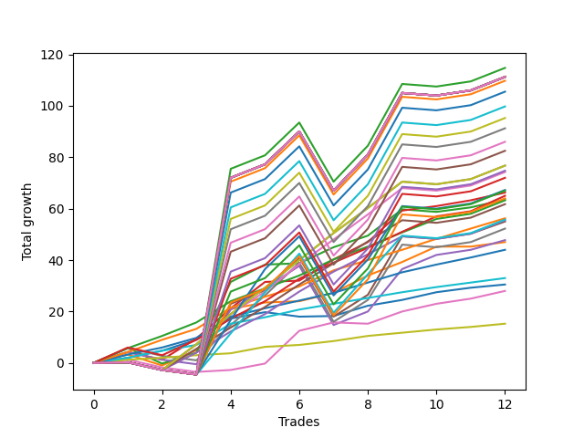

# Long Pointer 001 DB 
- Symbol: ES
- Date Range: 03/18/2022 - 07/15/2022
- Trading Period: 7:20-12:30
- Number of Trades: 12



| Name | Win Percent | Profit | Avg Profit / Trade | Avg Time / Trade |      | Name | Win Percent | Profit | Avg Profit / Trade | Avg Time / Trade |
| ---- | ----------- | ------ | ------------------ | ---------------- | ---- | ---- | ----------- | ------ | ------------------ | ---------------- |
| Sorted By <br> Profit | | | | | | Sorted By <br> Win Percentage ||||
| TEST | 66.67 | 55625.00 | 4635.42 | 29:55 |     | Eighty-Five | 100.00 | 31625.00 | 2635.42 | 09:24 |
| Seventy-Three | 50.00 | 34250.00 | 2854.17 | 09:00 |     | Eighty-Four | 100.00 | 28125.00 | 2343.75 | 07:42 |
| Three | 91.67 | 33125.00 | 2760.42 | 11:43 |     | Eighty-Three | 100.00 | 22000.00 | 1833.33 | 06:31 |
| Two | 83.33 | 31750.00 | 2645.83 | 14:24 |     | Eighty-Two | 100.00 | 16500.00 | 1375.00 | 03:13 |
| Eighty-Five | 100.00 | 31625.00 | 2635.42 | 09:24 |     | One Hundred Twenty-Six | 100.00 | 7625.00 | 635.42 | 00:45 |
| Eighty-Four | 100.00 | 28125.00 | 2343.75 | 07:42 |     | One Hundred Twenty-One | 100.00 | 7625.00 | 635.42 | 00:45 |
| Five | 66.67 | 27500.00 | 2291.67 | 26:02 |     | One Hundred Sixteen | 100.00 | 7625.00 | 635.42 | 00:45 |
| Seven | 66.67 | 26125.00 | 2177.08 | 22:26 |     | One Hundred Eleven | 100.00 | 7625.00 | 635.42 | 00:45 |
| One Hundred Twenty-Five | 91.67 | 24000.00 | 2000.00 | 08:31 |     | Eighty-One | 100.00 | 7625.00 | 635.42 | 00:45 |
| Four | 75.00 | 23875.00 | 1989.58 | 21:46 |     | Three | 91.67 | 33125.00 | 2760.42 | 11:43 |
| Fifty-Eight | 75.00 | 23625.00 | 1968.75 | 12:00 |     | One Hundred Twenty-Five | 91.67 | 24000.00 | 2000.00 | 08:31 |
| One | 91.67 | 23500.00 | 1958.33 | 09:26 |     | One | 91.67 | 23500.00 | 1958.33 | 09:26 |
| Fifty-Nine | 83.33 | 23500.00 | 1958.33 | 09:16 |     | One Hundred Twenty-Four | 91.67 | 21000.00 | 1750.00 | 06:51 |
| Eighty-Three | 100.00 | 22000.00 | 1833.33 | 06:31 |     | One Hundred Twenty-Three | 91.67 | 15375.00 | 1281.25 | 05:41 |
| One Hundred Twenty-Four | 91.67 | 21000.00 | 1750.00 | 06:51 |     | Zero | 91.67 | 15250.00 | 1270.83 | 02:56 |
| Forty-Seven | 50.00 | 18875.00 | 1572.92 | 12:40 |     | Sixty-Four | 91.67 | 11750.00 | 979.17 | 02:17 |
| Eighty-Two | 100.00 | 16500.00 | 1375.00 | 03:13 |     | Fifty-Six | 91.67 | 11000.00 | 916.67 | 02:51 |
| One Hundred Twenty-Three | 91.67 | 15375.00 | 1281.25 | 05:41 |     | One Hundred Twenty-Seven | 91.67 | 10625.00 | 885.42 | 01:50 |
| Zero | 91.67 | 15250.00 | 1270.83 | 02:56 |     | One Hundred Twenty-Two | 91.67 | 9875.00 | 822.92 | 02:23 |
| Forty-Two | 50.00 | 14625.00 | 1218.75 | 09:01 |     | Two | 83.33 | 31750.00 | 2645.83 | 14:24 |
| Fifty-Seven | 83.33 | 14500.00 | 1208.33 | 07:12 |     | Fifty-Nine | 83.33 | 23500.00 | 1958.33 | 09:16 |
| Sixty-Three | 58.33 | 14125.00 | 1177.08 | 18:02 |     | Fifty-Seven | 83.33 | 14500.00 | 1208.33 | 07:12 |
| Six | 75.00 | 14000.00 | 1166.67 | 10:49 |     | One Hundred Twelve | 83.33 | 7625.00 | 635.42 | 01:34 |
| Forty-Five | 41.67 | 13875.00 | 1156.25 | 15:15 |     | One Hundred Seventeen | 83.33 | 5500.00 | 458.33 | 01:13 |
| One Hundred Thirty | 75.00 | 12625.00 | 1052.08 | 06:34 |     | Four | 75.00 | 23875.00 | 1989.58 | 21:46 |
| Sixty-Four | 91.67 | 11750.00 | 979.17 | 02:17 |     | Fifty-Eight | 75.00 | 23625.00 | 1968.75 | 12:00 |
| Forty-Three | 58.33 | 11250.00 | 937.50 | 06:05 |     | Six | 75.00 | 14000.00 | 1166.67 | 10:49 |
| Fifty-Six | 91.67 | 11000.00 | 916.67 | 02:51 |     | One Hundred Thirty | 75.00 | 12625.00 | 1052.08 | 06:34 |
| Forty-Four | 50.00 | 10750.00 | 895.83 | 11:53 |     | One Hundred Twenty-Nine | 75.00 | 8625.00 | 718.75 | 05:22 |
| One Hundred Twenty-Seven | 91.67 | 10625.00 | 885.42 | 01:50 |     | One Hundred Twenty-Eight | 75.00 | 5250.00 | 437.50 | 04:23 |
| One Hundred Twenty-Two | 91.67 | 9875.00 | 822.92 | 02:23 |     | Forty | 75.00 | 3875.00 | 322.92 | 01:58 |
| One Hundred Twenty-Nine | 75.00 | 8625.00 | 718.75 | 05:22 |     | Forty-Eight | 75.00 | 2750.00 | 229.17 | 01:37 |
| Sixty-One | 50.00 | 8000.00 | 666.67 | 20:46 |     | TEST | 66.67 | 55625.00 | 4635.42 | 29:55 |
| Fifty-Two | 58.33 | 7750.00 | 645.83 | 06:11 |     | Five | 66.67 | 27500.00 | 2291.67 | 26:02 |
| One Hundred Twenty-Six | 100.00 | 7625.00 | 635.42 | 00:45 |     | Seven | 66.67 | 26125.00 | 2177.08 | 22:26 |
| One Hundred Twenty-One | 100.00 | 7625.00 | 635.42 | 00:45 |     | Sixty-Two | 66.67 | -1750.00 | -145.83 | 08:16 |
| One Hundred Sixteen | 100.00 | 7625.00 | 635.42 | 00:45 |     | Sixty-Three | 58.33 | 14125.00 | 1177.08 | 18:02 |
| One Hundred Eleven | 100.00 | 7625.00 | 635.42 | 00:45 |     | Forty-Three | 58.33 | 11250.00 | 937.50 | 06:05 |
| Eighty-One | 100.00 | 7625.00 | 635.42 | 00:45 |     | Fifty-Two | 58.33 | 7750.00 | 645.83 | 06:11 |
| One Hundred Twelve | 83.33 | 7625.00 | 635.42 | 01:34 |     | One Hundred Twenty | 58.33 | 7125.00 | 593.75 | 04:47 |
| One Hundred Twenty | 58.33 | 7125.00 | 593.75 | 04:47 |     | Forty-One | 58.33 | 7000.00 | 583.33 | 04:45 |
| Forty-One | 58.33 | 7000.00 | 583.33 | 04:45 |     | One Hundred Fifteen | 58.33 | 6250.00 | 520.83 | 05:59 |
| One Hundred Fifteen | 58.33 | 6250.00 | 520.83 | 05:59 |     | Fifty-Three | 58.33 | 6000.00 | 500.00 | 06:41 |
| Fifty-Three | 58.33 | 6000.00 | 500.00 | 06:41 |     | Fifty-One | 58.33 | 5875.00 | 489.58 | 04:15 |
| Fifty-One | 58.33 | 5875.00 | 489.58 | 04:15 |     | Fifty-Five | 58.33 | 5750.00 | 479.17 | 06:18 |
| Fifty-Five | 58.33 | 5750.00 | 479.17 | 06:18 |     | Sixty | 58.33 | 4875.00 | 406.25 | 17:25 |
| One Hundred Seventeen | 83.33 | 5500.00 | 458.33 | 01:13 |     | Forty-Nine | 58.33 | 4000.00 | 333.33 | 03:08 |
| One Hundred Twenty-Eight | 75.00 | 5250.00 | 437.50 | 04:23 |     | One Hundred Ninteen | 58.33 | 3625.00 | 302.08 | 03:35 |
| Sixty | 58.33 | 4875.00 | 406.25 | 17:25 |     | One Hundred Fourteen | 58.33 | 2750.00 | 229.17 | 04:47 |
| Forty-Nine | 58.33 | 4000.00 | 333.33 | 03:08 |     | Fifty | 58.33 | 2250.00 | 187.50 | 03:52 |
| Forty | 75.00 | 3875.00 | 322.92 | 01:58 |     | One Hundred Eighteen | 58.33 | 1500.00 | 125.00 | 02:37 |
| One Hundred Ninteen | 58.33 | 3625.00 | 302.08 | 03:35 |     | One Hundred Thirteen | 58.33 | 625.00 | 52.08 | 03:50 |
| Forty-Eight | 75.00 | 2750.00 | 229.17 | 01:37 |     | Seventy-Three | 50.00 | 34250.00 | 2854.17 | 09:00 |
| One Hundred Fourteen | 58.33 | 2750.00 | 229.17 | 04:47 |     | Forty-Seven | 50.00 | 18875.00 | 1572.92 | 12:40 |
| Fifty | 58.33 | 2250.00 | 187.50 | 03:52 |     | Forty-Two | 50.00 | 14625.00 | 1218.75 | 09:01 |
| One Hundred Eighteen | 58.33 | 1500.00 | 125.00 | 02:37 |     | Forty-Four | 50.00 | 10750.00 | 895.83 | 11:53 |
| One Hundred Thirteen | 58.33 | 625.00 | 52.08 | 03:50 |     | Sixty-One | 50.00 | 8000.00 | 666.67 | 20:46 |
| Sixty-Seven | 50.00 | -1250.00 | -104.17 | 06:32 |     | Sixty-Seven | 50.00 | -1250.00 | -104.17 | 06:32 |
| Sixty-Two | 66.67 | -1750.00 | -145.83 | 08:16 |     | Fifty-Four | 50.00 | -1750.00 | -145.83 | 02:15 |
| Fifty-Four | 50.00 | -1750.00 | -145.83 | 02:15 |     | Forty-Six | 50.00 | -6375.00 | -531.25 | 03:25 |
| Sixty-Eight | 41.67 | -5375.00 | -447.92 | 10:19 |     | Sixty-Five | 50.00 | -7625.00 | -635.42 | 05:11 |
| Forty-Six | 50.00 | -6375.00 | -531.25 | 03:25 |     | Seventy | 50.00 | -11000.00 | -916.67 | 04:13 |
| Sixty-Five | 50.00 | -7625.00 | -635.42 | 05:11 |     | Forty-Five | 41.67 | 13875.00 | 1156.25 | 15:15 |
| Seventy-One | 33.33 | -8625.00 | -718.75 | 11:00 |     | Sixty-Eight | 41.67 | -5375.00 | -447.92 | 10:19 |
| Sixty-Six | 33.33 | -10875.00 | -906.25 | 08:11 |     | Seventy-One | 33.33 | -8625.00 | -718.75 | 11:00 |
| Seventy | 50.00 | -11000.00 | -916.67 | 04:13 |     | Sixty-Six | 33.33 | -10875.00 | -906.25 | 08:11 |
| Sixty-Nine | 33.33 | -11500.00 | -958.33 | 13:06 |     | Sixty-Nine | 33.33 | -11500.00 | -958.33 | 13:06 |

## NO STOPLOSS

### Test Zero
* Sell when price hits the middle line of the 20p bollinger
* No Stoploss
* Results:
```
Total Trades: 12
Percent Up: 91.67
Percent Down: 8.33
Total Points Moved Up: 30.50
Potential Profit: 15250.00
Total Points Ups: 32.25 Count Ups: 11
Total Points Downs: -1.75 Count Downs: 1
```

<details><summary>Trades</summary>

<code>In: 2022-03-31 08:37:00		Out: 2022-03-31 08:38:15		Total Position Time: 01:15		Total Move Up: 2.00		Total to Date: 2.00</code> <br />
<code>In: 2022-05-02 08:07:00		Out: 2022-05-02 08:13:20		Total Position Time: 06:20		Total Move Up: 2.75		Total to Date: 4.75</code> <br />
<code>In: 2022-05-02 08:22:00		Out: 2022-05-02 08:26:05		Total Position Time: 04:05		Total Move Up: 4.25		Total to Date: 9.00</code> <br />
<code>In: 2022-05-04 11:36:00		Out: 2022-05-04 11:36:40		Total Position Time: 00:40		Total Move Up: 8.25		Total to Date: 17.25</code> <br />
<code>In: 2022-05-06 09:03:00		Out: 2022-05-06 09:03:10		Total Position Time: 00:10		Total Move Up: 2.50		Total to Date: 19.75</code> <br />
<code>In: 2022-05-06 11:28:00		Out: 2022-05-06 11:40:25		Total Position Time: 12:25		Total Move Up: -1.75		Total to Date: 18.00</code> <br />
<code>In: 2022-05-11 09:14:00		Out: 2022-05-11 09:17:50		Total Position Time: 03:50		Total Move Up: 0.25		Total to Date: 18.25</code> <br />
<code>In: 2022-05-16 09:47:00		Out: 2022-05-16 09:48:15		Total Position Time: 01:15		Total Move Up: 4.00		Total to Date: 22.25</code> <br />
<code>In: 2022-05-31 12:05:00		Out: 2022-05-31 12:07:20		Total Position Time: 02:20		Total Move Up: 2.25		Total to Date: 24.50</code> <br />
<code>In: 2022-06-27 10:10:00		Out: 2022-06-27 10:11:25		Total Position Time: 01:25		Total Move Up: 3.00		Total to Date: 27.50</code> <br />
<code>In: 2022-07-08 09:48:00		Out: 2022-07-08 09:48:40		Total Position Time: 00:40		Total Move Up: 1.75		Total to Date: 29.25</code> <br />
<code>In: 2022-07-12 10:28:00		Out: 2022-07-12 10:28:50		Total Position Time: 00:50		Total Move Up: 1.25		Total to Date: 30.50</code> <br />


</details>

### Test One
* Sell when the price hits the upper line of the 20p 1std bollinger
* No Stoploss
* Results:
```
Total Trades: 12
Percent Up: 91.67
Percent Down: 8.33
Total Points Moved Up: 47.00
Potential Profit: 23500.00
Total Points Ups: 51.25 Count Ups: 11
Total Points Downs: -4.25 Count Downs: 1
```

<details><summary>Trades</summary>

<code>In: 2022-03-31 08:37:00		Out: 2022-03-31 08:40:35		Total Position Time: 03:35		Total Move Up: 3.25		Total to Date: 3.25</code> <br />
<code>In: 2022-05-02 08:07:00		Out: 2022-05-02 08:34:10		Total Position Time: 27:10		Total Move Up: -4.25		Total to Date: -1.00</code> <br />
<code>In: 2022-05-02 08:22:00		Out: 2022-05-02 08:34:10		Total Position Time: 12:10		Total Move Up: 6.00		Total to Date: 5.00</code> <br />
<code>In: 2022-05-04 11:36:00		Out: 2022-05-04 11:41:35		Total Position Time: 05:35		Total Move Up: 16.00		Total to Date: 21.00</code> <br />
<code>In: 2022-05-06 09:03:00		Out: 2022-05-06 09:03:10		Total Position Time: 00:10		Total Move Up: 2.50		Total to Date: 23.50</code> <br />
<code>In: 2022-05-06 11:28:00		Out: 2022-05-06 11:49:10		Total Position Time: 21:10		Total Move Up: 0.50		Total to Date: 24.00</code> <br />
<code>In: 2022-05-11 09:14:00		Out: 2022-05-11 09:23:10		Total Position Time: 09:10		Total Move Up: 3.25		Total to Date: 27.25</code> <br />
<code>In: 2022-05-16 09:47:00		Out: 2022-05-16 09:50:05		Total Position Time: 03:05		Total Move Up: 6.75		Total to Date: 34.00</code> <br />
<code>In: 2022-05-31 12:05:00		Out: 2022-05-31 12:09:15		Total Position Time: 04:15		Total Move Up: 5.25		Total to Date: 39.25</code> <br />
<code>In: 2022-06-27 10:10:00		Out: 2022-06-27 10:15:55		Total Position Time: 05:55		Total Move Up: 6.00		Total to Date: 45.25</code> <br />
<code>In: 2022-07-08 09:48:00		Out: 2022-07-08 10:06:55		Total Position Time: 18:55		Total Move Up: 0.00		Total to Date: 45.25</code> <br />
<code>In: 2022-07-12 10:28:00		Out: 2022-07-12 10:30:05		Total Position Time: 02:05		Total Move Up: 1.75		Total to Date: 47.00</code> <br />


</details>

### Test Two
* Sell when the price hits the upper line of the 20p 2std bollinger
* No Stoploss
* Results:
```
Total Trades: 12
Percent Up: 83.33
Percent Down: 16.67
Total Points Moved Up: 63.50
Potential Profit: 31750.00
Total Points Ups: 70.50 Count Ups: 10
Total Points Downs: -7.00 Count Downs: 2
```

<details><summary>Trades</summary>

<code>In: 2022-03-31 08:37:00		Out: 2022-03-31 08:41:10		Total Position Time: 04:10		Total Move Up: 5.75		Total to Date: 5.75</code> <br />
<code>In: 2022-05-02 08:07:00		Out: 2022-05-02 08:36:25		Total Position Time: 29:25		Total Move Up: -6.00		Total to Date: -0.25</code> <br />
<code>In: 2022-05-02 08:22:00		Out: 2022-05-02 08:36:25		Total Position Time: 14:25		Total Move Up: 4.25		Total to Date: 4.00</code> <br />
<code>In: 2022-05-04 11:36:00		Out: 2022-05-04 11:43:45		Total Position Time: 07:45		Total Move Up: 27.50		Total to Date: 31.50</code> <br />
<code>In: 2022-05-06 09:03:00		Out: 2022-05-06 09:03:55		Total Position Time: 00:55		Total Move Up: 6.75		Total to Date: 38.25</code> <br />
<code>In: 2022-05-06 11:28:00		Out: 2022-05-06 11:49:10		Total Position Time: 21:10		Total Move Up: 0.50		Total to Date: 38.75</code> <br />
<code>In: 2022-05-11 09:14:00		Out: 2022-05-11 09:23:35		Total Position Time: 09:35		Total Move Up: 6.25		Total to Date: 45.00</code> <br />
<code>In: 2022-05-16 09:47:00		Out: 2022-05-16 10:06:30		Total Position Time: 19:30		Total Move Up: 4.50		Total to Date: 49.50</code> <br />
<code>In: 2022-05-31 12:05:00		Out: 2022-05-31 12:15:05		Total Position Time: 10:05		Total Move Up: 10.25		Total to Date: 59.75</code> <br />
<code>In: 2022-06-27 10:10:00		Out: 2022-06-27 10:39:55		Total Position Time: 29:55		Total Move Up: -1.00		Total to Date: 58.75</code> <br />
<code>In: 2022-07-08 09:48:00		Out: 2022-07-08 10:10:30		Total Position Time: 22:30		Total Move Up: 1.75		Total to Date: 60.50</code> <br />
<code>In: 2022-07-12 10:28:00		Out: 2022-07-12 10:31:30		Total Position Time: 03:30		Total Move Up: 3.00		Total to Date: 63.50</code> <br />


</details>

### Test Three
* Sell when price hits the middle line of the 50p bollinger
* No Stoploss
* Results:
```
Total Trades: 12
Percent Up: 91.67
Percent Down: 8.33
Total Points Moved Up: 66.25
Potential Profit: 33125.00
Total Points Ups: 69.25 Count Ups: 11
Total Points Downs: -3.00 Count Downs: 1
```

<details><summary>Trades</summary>

<code>In: 2022-03-31 08:37:00		Out: 2022-03-31 08:41:05		Total Position Time: 04:05		Total Move Up: 4.25		Total to Date: 4.25</code> <br />
<code>In: 2022-05-02 08:07:00		Out: 2022-05-02 08:36:55		Total Position Time: 29:55		Total Move Up: -3.00		Total to Date: 1.25</code> <br />
<code>In: 2022-05-02 08:22:00		Out: 2022-05-02 08:38:10		Total Position Time: 16:10		Total Move Up: 8.25		Total to Date: 9.50</code> <br />
<code>In: 2022-05-04 11:36:00		Out: 2022-05-04 11:41:15		Total Position Time: 05:15		Total Move Up: 11.75		Total to Date: 21.25</code> <br />
<code>In: 2022-05-06 09:03:00		Out: 2022-05-06 09:06:05		Total Position Time: 03:05		Total Move Up: 10.25		Total to Date: 31.50</code> <br />
<code>In: 2022-05-06 11:28:00		Out: 2022-05-06 11:49:10		Total Position Time: 21:10		Total Move Up: 0.50		Total to Date: 32.00</code> <br />
<code>In: 2022-05-11 09:14:00		Out: 2022-05-11 09:23:45		Total Position Time: 09:45		Total Move Up: 8.25		Total to Date: 40.25</code> <br />
<code>In: 2022-05-16 09:47:00		Out: 2022-05-16 09:50:05		Total Position Time: 03:05		Total Move Up: 6.75		Total to Date: 47.00</code> <br />
<code>In: 2022-05-31 12:05:00		Out: 2022-05-31 12:15:15		Total Position Time: 10:15		Total Move Up: 12.25		Total to Date: 59.25</code> <br />
<code>In: 2022-06-27 10:10:00		Out: 2022-06-27 10:11:15		Total Position Time: 01:15		Total Move Up: 1.75		Total to Date: 61.00</code> <br />
<code>In: 2022-07-08 09:48:00		Out: 2022-07-08 10:11:05		Total Position Time: 23:05		Total Move Up: 2.25		Total to Date: 63.25</code> <br />
<code>In: 2022-07-12 10:28:00		Out: 2022-07-12 10:41:35		Total Position Time: 13:35		Total Move Up: 3.00		Total to Date: 66.25</code> <br />


</details>

### Test Four
* Sell when the price hits the upper line of the 50p 1std bollinger
* No Stoploss
* Results:
```
Total Trades: 12
Percent Up: 75.00
Percent Down: 25.00
Total Points Moved Up: 47.75
Potential Profit: 23875.00
Total Points Ups: 75.50 Count Ups: 9
Total Points Downs: -27.75 Count Downs: 3
```

<details><summary>Trades</summary>

<code>In: 2022-03-31 08:37:00		Out: 2022-03-31 09:00:15		Total Position Time: 23:15		Total Move Up: 4.25		Total to Date: 4.25</code> <br />
<code>In: 2022-05-02 08:07:00		Out: 2022-05-02 08:36:55		Total Position Time: 29:55		Total Move Up: -3.00		Total to Date: 1.25</code> <br />
<code>In: 2022-05-02 08:22:00		Out: 2022-05-02 08:51:55		Total Position Time: 29:55		Total Move Up: -1.75		Total to Date: -0.50</code> <br />
<code>In: 2022-05-04 11:36:00		Out: 2022-05-04 11:42:00		Total Position Time: 06:00		Total Move Up: 21.25		Total to Date: 20.75</code> <br />
<code>In: 2022-05-06 09:03:00		Out: 2022-05-06 09:22:25		Total Position Time: 19:25		Total Move Up: 8.25		Total to Date: 29.00</code> <br />
<code>In: 2022-05-06 11:28:00		Out: 2022-05-06 11:50:10		Total Position Time: 22:10		Total Move Up: 8.75		Total to Date: 37.75</code> <br />
<code>In: 2022-05-11 09:14:00		Out: 2022-05-11 09:43:55		Total Position Time: 29:55		Total Move Up: -23.00		Total to Date: 14.75</code> <br />
<code>In: 2022-05-16 09:47:00		Out: 2022-05-16 10:07:00		Total Position Time: 20:00		Total Move Up: 5.25		Total to Date: 20.00</code> <br />
<code>In: 2022-05-31 12:05:00		Out: 2022-05-31 12:28:20		Total Position Time: 23:20		Total Move Up: 16.50		Total to Date: 36.50</code> <br />
<code>In: 2022-06-27 10:10:00		Out: 2022-06-27 10:13:05		Total Position Time: 03:05		Total Move Up: 5.50		Total to Date: 42.00</code> <br />
<code>In: 2022-07-08 09:48:00		Out: 2022-07-08 10:17:55		Total Position Time: 29:55		Total Move Up: 2.00		Total to Date: 44.00</code> <br />
<code>In: 2022-07-12 10:28:00		Out: 2022-07-12 10:52:25		Total Position Time: 24:25		Total Move Up: 3.75		Total to Date: 47.75</code> <br />


</details>

### Test Five
* Sell when the price hits the upper line of the 50p 2std bollinger
* No Stoploss
* Results:
```
Total Trades: 12
Percent Up: 66.67
Percent Down: 33.33
Total Points Moved Up: 55.00
Potential Profit: 27500.00
Total Points Ups: 83.75 Count Ups: 8
Total Points Downs: -28.75 Count Downs: 4
```

<details><summary>Trades</summary>

<code>In: 2022-03-31 08:37:00		Out: 2022-03-31 09:06:55		Total Position Time: 29:55		Total Move Up: 0.25		Total to Date: 0.25</code> <br />
<code>In: 2022-05-02 08:07:00		Out: 2022-05-02 08:36:55		Total Position Time: 29:55		Total Move Up: -3.00		Total to Date: -2.75</code> <br />
<code>In: 2022-05-02 08:22:00		Out: 2022-05-02 08:51:55		Total Position Time: 29:55		Total Move Up: -1.75		Total to Date: -4.50</code> <br />
<code>In: 2022-05-04 11:36:00		Out: 2022-05-04 11:43:45		Total Position Time: 07:45		Total Move Up: 27.50		Total to Date: 23.00</code> <br />
<code>In: 2022-05-06 09:03:00		Out: 2022-05-06 09:32:55		Total Position Time: 29:55		Total Move Up: 5.25		Total to Date: 28.25</code> <br />
<code>In: 2022-05-06 11:28:00		Out: 2022-05-06 11:50:35		Total Position Time: 22:35		Total Move Up: 12.75		Total to Date: 41.00</code> <br />
<code>In: 2022-05-11 09:14:00		Out: 2022-05-11 09:43:55		Total Position Time: 29:55		Total Move Up: -23.00		Total to Date: 18.00</code> <br />
<code>In: 2022-05-16 09:47:00		Out: 2022-05-16 10:07:35		Total Position Time: 20:35		Total Move Up: 8.50		Total to Date: 26.50</code> <br />
<code>In: 2022-05-31 12:05:00		Out: 2022-05-31 12:31:05		Total Position Time: 26:05		Total Move Up: 22.75		Total to Date: 49.25</code> <br />
<code>In: 2022-06-27 10:10:00		Out: 2022-06-27 10:39:55		Total Position Time: 29:55		Total Move Up: -1.00		Total to Date: 48.25</code> <br />
<code>In: 2022-07-08 09:48:00		Out: 2022-07-08 10:17:55		Total Position Time: 29:55		Total Move Up: 2.00		Total to Date: 50.25</code> <br />
<code>In: 2022-07-12 10:28:00		Out: 2022-07-12 10:54:05		Total Position Time: 26:05		Total Move Up: 4.75		Total to Date: 55.00</code> <br />


</details>

### Test Six
* Sell when the price hits the middle line of the 1std VWAP
* No Stoploss
* Results:
```
Total Trades: 12
Percent Up: 75.00
Percent Down: 25.00
Total Points Moved Up: 28.00
Potential Profit: 14000.00
Total Points Ups: 33.25 Count Ups: 9
Total Points Downs: -5.25 Count Downs: 3
```

<details><summary>Trades</summary>

<code>In: 2022-03-31 08:37:00		Out: 2022-03-31 08:37:40		Total Position Time: 00:40		Total Move Up: 1.25		Total to Date: 1.25</code> <br />
<code>In: 2022-05-02 08:07:00		Out: 2022-05-02 08:36:55		Total Position Time: 29:55		Total Move Up: -3.00		Total to Date: -1.75</code> <br />
<code>In: 2022-05-02 08:22:00		Out: 2022-05-02 08:51:55		Total Position Time: 29:55		Total Move Up: -1.75		Total to Date: -3.50</code> <br />
<code>In: 2022-05-04 11:36:00		Out: 2022-05-04 11:36:10		Total Position Time: 00:10		Total Move Up: 0.75		Total to Date: -2.75</code> <br />
<code>In: 2022-05-06 09:03:00		Out: 2022-05-06 09:03:10		Total Position Time: 00:10		Total Move Up: 2.50		Total to Date: -0.25</code> <br />
<code>In: 2022-05-06 11:28:00		Out: 2022-05-06 11:50:20		Total Position Time: 22:20		Total Move Up: 12.75		Total to Date: 12.50</code> <br />
<code>In: 2022-05-11 09:14:00		Out: 2022-05-11 09:23:10		Total Position Time: 09:10		Total Move Up: 3.25		Total to Date: 15.75</code> <br />
<code>In: 2022-05-16 09:47:00		Out: 2022-05-16 09:47:10		Total Position Time: 00:10		Total Move Up: -0.50		Total to Date: 15.25</code> <br />
<code>In: 2022-05-31 12:05:00		Out: 2022-05-31 12:07:50		Total Position Time: 02:50		Total Move Up: 4.75		Total to Date: 20.00</code> <br />
<code>In: 2022-06-27 10:10:00		Out: 2022-06-27 10:11:25		Total Position Time: 01:25		Total Move Up: 3.00		Total to Date: 23.00</code> <br />
<code>In: 2022-07-08 09:48:00		Out: 2022-07-08 10:17:55		Total Position Time: 29:55		Total Move Up: 2.00		Total to Date: 25.00</code> <br />
<code>In: 2022-07-12 10:28:00		Out: 2022-07-12 10:31:15		Total Position Time: 03:15		Total Move Up: 3.00		Total to Date: 28.00</code> <br />


</details>

### Test Seven
* Sell when the price hits the upper line of the 1std VWAP
* No Stoploss
* Results:
```
Total Trades: 12
Percent Up: 66.67
Percent Down: 33.33
Total Points Moved Up: 52.25
Potential Profit: 26125.00
Total Points Ups: 81.00 Count Ups: 8
Total Points Downs: -28.75 Count Downs: 4
```

<details><summary>Trades</summary>

<code>In: 2022-03-31 08:37:00		Out: 2022-03-31 08:41:10		Total Position Time: 04:10		Total Move Up: 5.75		Total to Date: 5.75</code> <br />
<code>In: 2022-05-02 08:07:00		Out: 2022-05-02 08:36:55		Total Position Time: 29:55		Total Move Up: -3.00		Total to Date: 2.75</code> <br />
<code>In: 2022-05-02 08:22:00		Out: 2022-05-02 08:51:55		Total Position Time: 29:55		Total Move Up: -1.75		Total to Date: 1.00</code> <br />
<code>In: 2022-05-04 11:36:00		Out: 2022-05-04 11:41:30		Total Position Time: 05:30		Total Move Up: 13.75		Total to Date: 14.75</code> <br />
<code>In: 2022-05-06 09:03:00		Out: 2022-05-06 09:06:40		Total Position Time: 03:40		Total Move Up: 11.50		Total to Date: 26.25</code> <br />
<code>In: 2022-05-06 11:28:00		Out: 2022-05-06 11:57:55		Total Position Time: 29:55		Total Move Up: 12.75		Total to Date: 39.00</code> <br />
<code>In: 2022-05-11 09:14:00		Out: 2022-05-11 09:43:55		Total Position Time: 29:55		Total Move Up: -23.00		Total to Date: 16.00</code> <br />
<code>In: 2022-05-16 09:47:00		Out: 2022-05-16 10:07:35		Total Position Time: 20:35		Total Move Up: 8.50		Total to Date: 24.50</code> <br />
<code>In: 2022-05-31 12:05:00		Out: 2022-05-31 12:30:55		Total Position Time: 25:55		Total Move Up: 21.50		Total to Date: 46.00</code> <br />
<code>In: 2022-06-27 10:10:00		Out: 2022-06-27 10:39:55		Total Position Time: 29:55		Total Move Up: -1.00		Total to Date: 45.00</code> <br />
<code>In: 2022-07-08 09:48:00		Out: 2022-07-08 10:17:55		Total Position Time: 29:55		Total Move Up: 2.00		Total to Date: 47.00</code> <br />
<code>In: 2022-07-12 10:28:00		Out: 2022-07-12 10:57:55		Total Position Time: 29:55		Total Move Up: 5.25		Total to Date: 52.25</code> <br />


</details>

## STOPLOSS OF 5

### Test Forty
* Sell when price hits the middle line of the 20p bollinger
* Stoploss is 5 points
* Results:
```
Total Trades: 12
Percent Up: 75.00
Percent Down: 25.00
Total Points Moved Up: 7.75
Potential Profit: 3875.00
Total Points Ups: 25.25 Count Ups: 9
Total Points Downs: -17.50 Count Downs: 3
```

<details><summary>Trades</summary>

<code>In: 2022-03-31 08:37:00		Out: 2022-03-31 08:38:15		Total Position Time: 01:15		Total Move Up: 2.00		Total to Date: 2.00</code> <br />
<code>In: 2022-05-02 08:07:00		Out: 2022-05-02 08:10:50		Total Position Time: 03:50		Total Move Up: -5.00		Total to Date: -3.00</code> <br />
<code>In: 2022-05-02 08:22:00		Out: 2022-05-02 08:25:25		Total Position Time: 03:25		Total Move Up: -5.50		Total to Date: -8.50</code> <br />
<code>In: 2022-05-04 11:36:00		Out: 2022-05-04 11:36:40		Total Position Time: 00:40		Total Move Up: 8.25		Total to Date: -0.25</code> <br />
<code>In: 2022-05-06 09:03:00		Out: 2022-05-06 09:03:10		Total Position Time: 00:10		Total Move Up: 2.50		Total to Date: 2.25</code> <br />
<code>In: 2022-05-06 11:28:00		Out: 2022-05-06 11:32:05		Total Position Time: 04:05		Total Move Up: -7.00		Total to Date: -4.75</code> <br />
<code>In: 2022-05-11 09:14:00		Out: 2022-05-11 09:17:50		Total Position Time: 03:50		Total Move Up: 0.25		Total to Date: -4.50</code> <br />
<code>In: 2022-05-16 09:47:00		Out: 2022-05-16 09:48:15		Total Position Time: 01:15		Total Move Up: 4.00		Total to Date: -0.50</code> <br />
<code>In: 2022-05-31 12:05:00		Out: 2022-05-31 12:07:20		Total Position Time: 02:20		Total Move Up: 2.25		Total to Date: 1.75</code> <br />
<code>In: 2022-06-27 10:10:00		Out: 2022-06-27 10:11:25		Total Position Time: 01:25		Total Move Up: 3.00		Total to Date: 4.75</code> <br />
<code>In: 2022-07-08 09:48:00		Out: 2022-07-08 09:48:40		Total Position Time: 00:40		Total Move Up: 1.75		Total to Date: 6.50</code> <br />
<code>In: 2022-07-12 10:28:00		Out: 2022-07-12 10:28:50		Total Position Time: 00:50		Total Move Up: 1.25		Total to Date: 7.75</code> <br />


</details>

### Test Forty-One
* Sell when the price hits the upper line of the 20p 1std bollinger
* Stoploss is 5 points
* Results:
```
Total Trades: 12
Percent Up: 58.33
Percent Down: 41.67
Total Points Moved Up: 14.00
Potential Profit: 7000.00
Total Points Ups: 41.50 Count Ups: 7
Total Points Downs: -27.50 Count Downs: 5
```

<details><summary>Trades</summary>

<code>In: 2022-03-31 08:37:00		Out: 2022-03-31 08:40:35		Total Position Time: 03:35		Total Move Up: 3.25		Total to Date: 3.25</code> <br />
<code>In: 2022-05-02 08:07:00		Out: 2022-05-02 08:10:50		Total Position Time: 03:50		Total Move Up: -5.00		Total to Date: -1.75</code> <br />
<code>In: 2022-05-02 08:22:00		Out: 2022-05-02 08:25:25		Total Position Time: 03:25		Total Move Up: -5.50		Total to Date: -7.25</code> <br />
<code>In: 2022-05-04 11:36:00		Out: 2022-05-04 11:41:35		Total Position Time: 05:35		Total Move Up: 16.00		Total to Date: 8.75</code> <br />
<code>In: 2022-05-06 09:03:00		Out: 2022-05-06 09:03:10		Total Position Time: 00:10		Total Move Up: 2.50		Total to Date: 11.25</code> <br />
<code>In: 2022-05-06 11:28:00		Out: 2022-05-06 11:32:05		Total Position Time: 04:05		Total Move Up: -7.00		Total to Date: 4.25</code> <br />
<code>In: 2022-05-11 09:14:00		Out: 2022-05-11 09:19:05		Total Position Time: 05:05		Total Move Up: -5.25		Total to Date: -1.00</code> <br />
<code>In: 2022-05-16 09:47:00		Out: 2022-05-16 09:50:05		Total Position Time: 03:05		Total Move Up: 6.75		Total to Date: 5.75</code> <br />
<code>In: 2022-05-31 12:05:00		Out: 2022-05-31 12:09:15		Total Position Time: 04:15		Total Move Up: 5.25		Total to Date: 11.00</code> <br />
<code>In: 2022-06-27 10:10:00		Out: 2022-06-27 10:15:55		Total Position Time: 05:55		Total Move Up: 6.00		Total to Date: 17.00</code> <br />
<code>In: 2022-07-08 09:48:00		Out: 2022-07-08 10:04:00		Total Position Time: 16:00		Total Move Up: -4.75		Total to Date: 12.25</code> <br />
<code>In: 2022-07-12 10:28:00		Out: 2022-07-12 10:30:05		Total Position Time: 02:05		Total Move Up: 1.75		Total to Date: 14.00</code> <br />


</details>

### Test Forty-Two
* Sell when the price hits the upper line of the 20p 2std bollinger
* Stoploss is 5 points
* Results:
```
Total Trades: 12
Percent Up: 50.00
Percent Down: 50.00
Total Points Moved Up: 29.25
Potential Profit: 14625.00
Total Points Ups: 57.75 Count Ups: 6
Total Points Downs: -28.50 Count Downs: 6
```

<details><summary>Trades</summary>

<code>In: 2022-03-31 08:37:00		Out: 2022-03-31 08:41:10		Total Position Time: 04:10		Total Move Up: 5.75		Total to Date: 5.75</code> <br />
<code>In: 2022-05-02 08:07:00		Out: 2022-05-02 08:10:50		Total Position Time: 03:50		Total Move Up: -5.00		Total to Date: 0.75</code> <br />
<code>In: 2022-05-02 08:22:00		Out: 2022-05-02 08:25:25		Total Position Time: 03:25		Total Move Up: -5.50		Total to Date: -4.75</code> <br />
<code>In: 2022-05-04 11:36:00		Out: 2022-05-04 11:43:45		Total Position Time: 07:45		Total Move Up: 27.50		Total to Date: 22.75</code> <br />
<code>In: 2022-05-06 09:03:00		Out: 2022-05-06 09:03:55		Total Position Time: 00:55		Total Move Up: 6.75		Total to Date: 29.50</code> <br />
<code>In: 2022-05-06 11:28:00		Out: 2022-05-06 11:32:05		Total Position Time: 04:05		Total Move Up: -7.00		Total to Date: 22.50</code> <br />
<code>In: 2022-05-11 09:14:00		Out: 2022-05-11 09:19:05		Total Position Time: 05:05		Total Move Up: -5.25		Total to Date: 17.25</code> <br />
<code>In: 2022-05-16 09:47:00		Out: 2022-05-16 10:06:30		Total Position Time: 19:30		Total Move Up: 4.50		Total to Date: 21.75</code> <br />
<code>In: 2022-05-31 12:05:00		Out: 2022-05-31 12:15:05		Total Position Time: 10:05		Total Move Up: 10.25		Total to Date: 32.00</code> <br />
<code>In: 2022-06-27 10:10:00		Out: 2022-06-27 10:39:55		Total Position Time: 29:55		Total Move Up: -1.00		Total to Date: 31.00</code> <br />
<code>In: 2022-07-08 09:48:00		Out: 2022-07-08 10:04:00		Total Position Time: 16:00		Total Move Up: -4.75		Total to Date: 26.25</code> <br />
<code>In: 2022-07-12 10:28:00		Out: 2022-07-12 10:31:30		Total Position Time: 03:30		Total Move Up: 3.00		Total to Date: 29.25</code> <br />


</details>

### Test Forty-Three
* Sell when price hits the middle line of the 50p bollinger
* Stoploss is 5 points
* Results:
```
Total Trades: 12
Percent Up: 58.33
Percent Down: 41.67
Total Points Moved Up: 22.50
Potential Profit: 11250.00
Total Points Ups: 50.00 Count Ups: 7
Total Points Downs: -27.50 Count Downs: 5
```

<details><summary>Trades</summary>

<code>In: 2022-03-31 08:37:00		Out: 2022-03-31 08:41:05		Total Position Time: 04:05		Total Move Up: 4.25		Total to Date: 4.25</code> <br />
<code>In: 2022-05-02 08:07:00		Out: 2022-05-02 08:10:50		Total Position Time: 03:50		Total Move Up: -5.00		Total to Date: -0.75</code> <br />
<code>In: 2022-05-02 08:22:00		Out: 2022-05-02 08:25:25		Total Position Time: 03:25		Total Move Up: -5.50		Total to Date: -6.25</code> <br />
<code>In: 2022-05-04 11:36:00		Out: 2022-05-04 11:41:15		Total Position Time: 05:15		Total Move Up: 11.75		Total to Date: 5.50</code> <br />
<code>In: 2022-05-06 09:03:00		Out: 2022-05-06 09:06:05		Total Position Time: 03:05		Total Move Up: 10.25		Total to Date: 15.75</code> <br />
<code>In: 2022-05-06 11:28:00		Out: 2022-05-06 11:32:05		Total Position Time: 04:05		Total Move Up: -7.00		Total to Date: 8.75</code> <br />
<code>In: 2022-05-11 09:14:00		Out: 2022-05-11 09:19:05		Total Position Time: 05:05		Total Move Up: -5.25		Total to Date: 3.50</code> <br />
<code>In: 2022-05-16 09:47:00		Out: 2022-05-16 09:50:05		Total Position Time: 03:05		Total Move Up: 6.75		Total to Date: 10.25</code> <br />
<code>In: 2022-05-31 12:05:00		Out: 2022-05-31 12:15:15		Total Position Time: 10:15		Total Move Up: 12.25		Total to Date: 22.50</code> <br />
<code>In: 2022-06-27 10:10:00		Out: 2022-06-27 10:11:15		Total Position Time: 01:15		Total Move Up: 1.75		Total to Date: 24.25</code> <br />
<code>In: 2022-07-08 09:48:00		Out: 2022-07-08 10:04:00		Total Position Time: 16:00		Total Move Up: -4.75		Total to Date: 19.50</code> <br />
<code>In: 2022-07-12 10:28:00		Out: 2022-07-12 10:41:35		Total Position Time: 13:35		Total Move Up: 3.00		Total to Date: 22.50</code> <br />


</details>

### Test Forty-Four
* Sell when the price hits the upper line of the 50p 1std bollinger
* Stoploss is 5 points
* Results:
```
Total Trades: 12
Percent Up: 50.00
Percent Down: 50.00
Total Points Moved Up: 21.50
Potential Profit: 10750.00
Total Points Ups: 56.50 Count Ups: 6
Total Points Downs: -35.00 Count Downs: 6
```

<details><summary>Trades</summary>

<code>In: 2022-03-31 08:37:00		Out: 2022-03-31 09:00:15		Total Position Time: 23:15		Total Move Up: 4.25		Total to Date: 4.25</code> <br />
<code>In: 2022-05-02 08:07:00		Out: 2022-05-02 08:10:50		Total Position Time: 03:50		Total Move Up: -5.00		Total to Date: -0.75</code> <br />
<code>In: 2022-05-02 08:22:00		Out: 2022-05-02 08:25:25		Total Position Time: 03:25		Total Move Up: -5.50		Total to Date: -6.25</code> <br />
<code>In: 2022-05-04 11:36:00		Out: 2022-05-04 11:42:00		Total Position Time: 06:00		Total Move Up: 21.25		Total to Date: 15.00</code> <br />
<code>In: 2022-05-06 09:03:00		Out: 2022-05-06 09:13:15		Total Position Time: 10:15		Total Move Up: -7.50		Total to Date: 7.50</code> <br />
<code>In: 2022-05-06 11:28:00		Out: 2022-05-06 11:32:05		Total Position Time: 04:05		Total Move Up: -7.00		Total to Date: 0.50</code> <br />
<code>In: 2022-05-11 09:14:00		Out: 2022-05-11 09:19:05		Total Position Time: 05:05		Total Move Up: -5.25		Total to Date: -4.75</code> <br />
<code>In: 2022-05-16 09:47:00		Out: 2022-05-16 10:07:00		Total Position Time: 20:00		Total Move Up: 5.25		Total to Date: 0.50</code> <br />
<code>In: 2022-05-31 12:05:00		Out: 2022-05-31 12:28:20		Total Position Time: 23:20		Total Move Up: 16.50		Total to Date: 17.00</code> <br />
<code>In: 2022-06-27 10:10:00		Out: 2022-06-27 10:13:05		Total Position Time: 03:05		Total Move Up: 5.50		Total to Date: 22.50</code> <br />
<code>In: 2022-07-08 09:48:00		Out: 2022-07-08 10:04:00		Total Position Time: 16:00		Total Move Up: -4.75		Total to Date: 17.75</code> <br />
<code>In: 2022-07-12 10:28:00		Out: 2022-07-12 10:52:25		Total Position Time: 24:25		Total Move Up: 3.75		Total to Date: 21.50</code> <br />


</details>

### Test Forty-Five
* Sell when the price hits the upper line of the 50p 2std bollinger
* Stoploss is 5 points
* Results:
```
Total Trades: 12
Percent Up: 41.67
Percent Down: 58.33
Total Points Moved Up: 27.75
Potential Profit: 13875.00
Total Points Ups: 63.75 Count Ups: 5
Total Points Downs: -36.00 Count Downs: 7
```

<details><summary>Trades</summary>

<code>In: 2022-03-31 08:37:00		Out: 2022-03-31 09:06:55		Total Position Time: 29:55		Total Move Up: 0.25		Total to Date: 0.25</code> <br />
<code>In: 2022-05-02 08:07:00		Out: 2022-05-02 08:10:50		Total Position Time: 03:50		Total Move Up: -5.00		Total to Date: -4.75</code> <br />
<code>In: 2022-05-02 08:22:00		Out: 2022-05-02 08:25:25		Total Position Time: 03:25		Total Move Up: -5.50		Total to Date: -10.25</code> <br />
<code>In: 2022-05-04 11:36:00		Out: 2022-05-04 11:43:45		Total Position Time: 07:45		Total Move Up: 27.50		Total to Date: 17.25</code> <br />
<code>In: 2022-05-06 09:03:00		Out: 2022-05-06 09:13:15		Total Position Time: 10:15		Total Move Up: -7.50		Total to Date: 9.75</code> <br />
<code>In: 2022-05-06 11:28:00		Out: 2022-05-06 11:32:05		Total Position Time: 04:05		Total Move Up: -7.00		Total to Date: 2.75</code> <br />
<code>In: 2022-05-11 09:14:00		Out: 2022-05-11 09:19:05		Total Position Time: 05:05		Total Move Up: -5.25		Total to Date: -2.50</code> <br />
<code>In: 2022-05-16 09:47:00		Out: 2022-05-16 10:07:35		Total Position Time: 20:35		Total Move Up: 8.50		Total to Date: 6.00</code> <br />
<code>In: 2022-05-31 12:05:00		Out: 2022-05-31 12:31:05		Total Position Time: 26:05		Total Move Up: 22.75		Total to Date: 28.75</code> <br />
<code>In: 2022-06-27 10:10:00		Out: 2022-06-27 10:39:55		Total Position Time: 29:55		Total Move Up: -1.00		Total to Date: 27.75</code> <br />
<code>In: 2022-07-08 09:48:00		Out: 2022-07-08 10:04:00		Total Position Time: 16:00		Total Move Up: -4.75		Total to Date: 23.00</code> <br />
<code>In: 2022-07-12 10:28:00		Out: 2022-07-12 10:54:05		Total Position Time: 26:05		Total Move Up: 4.75		Total to Date: 27.75</code> <br />


</details>

### Test Forty-Six
* Sell when the price hits the middle line of the 1std VWAP
* Stoploss is 5 points
* Results:
```
Total Trades: 12
Percent Up: 50.00
Percent Down: 50.00
Total Points Moved Up: -12.75
Potential Profit: -6375.00
Total Points Ups: 15.25 Count Ups: 6
Total Points Downs: -28.00 Count Downs: 6
```

<details><summary>Trades</summary>

<code>In: 2022-03-31 08:37:00		Out: 2022-03-31 08:37:40		Total Position Time: 00:40		Total Move Up: 1.25		Total to Date: 1.25</code> <br />
<code>In: 2022-05-02 08:07:00		Out: 2022-05-02 08:10:50		Total Position Time: 03:50		Total Move Up: -5.00		Total to Date: -3.75</code> <br />
<code>In: 2022-05-02 08:22:00		Out: 2022-05-02 08:25:25		Total Position Time: 03:25		Total Move Up: -5.50		Total to Date: -9.25</code> <br />
<code>In: 2022-05-04 11:36:00		Out: 2022-05-04 11:36:10		Total Position Time: 00:10		Total Move Up: 0.75		Total to Date: -8.50</code> <br />
<code>In: 2022-05-06 09:03:00		Out: 2022-05-06 09:03:10		Total Position Time: 00:10		Total Move Up: 2.50		Total to Date: -6.00</code> <br />
<code>In: 2022-05-06 11:28:00		Out: 2022-05-06 11:32:05		Total Position Time: 04:05		Total Move Up: -7.00		Total to Date: -13.00</code> <br />
<code>In: 2022-05-11 09:14:00		Out: 2022-05-11 09:19:05		Total Position Time: 05:05		Total Move Up: -5.25		Total to Date: -18.25</code> <br />
<code>In: 2022-05-16 09:47:00		Out: 2022-05-16 09:47:10		Total Position Time: 00:10		Total Move Up: -0.50		Total to Date: -18.75</code> <br />
<code>In: 2022-05-31 12:05:00		Out: 2022-05-31 12:07:50		Total Position Time: 02:50		Total Move Up: 4.75		Total to Date: -14.00</code> <br />
<code>In: 2022-06-27 10:10:00		Out: 2022-06-27 10:11:25		Total Position Time: 01:25		Total Move Up: 3.00		Total to Date: -11.00</code> <br />
<code>In: 2022-07-08 09:48:00		Out: 2022-07-08 10:04:00		Total Position Time: 16:00		Total Move Up: -4.75		Total to Date: -15.75</code> <br />
<code>In: 2022-07-12 10:28:00		Out: 2022-07-12 10:31:15		Total Position Time: 03:15		Total Move Up: 3.00		Total to Date: -12.75</code> <br />


</details>

### Test Forty-Seven
* Sell when the price hits the upper line of the 1std VWAP
* Stoploss is 5 points
* Results:
```
Total Trades: 12
Percent Up: 50.00
Percent Down: 50.00
Total Points Moved Up: 37.75
Potential Profit: 18875.00
Total Points Ups: 66.25 Count Ups: 6
Total Points Downs: -28.50 Count Downs: 6
```

<details><summary>Trades</summary>

<code>In: 2022-03-31 08:37:00		Out: 2022-03-31 08:41:10		Total Position Time: 04:10		Total Move Up: 5.75		Total to Date: 5.75</code> <br />
<code>In: 2022-05-02 08:07:00		Out: 2022-05-02 08:10:50		Total Position Time: 03:50		Total Move Up: -5.00		Total to Date: 0.75</code> <br />
<code>In: 2022-05-02 08:22:00		Out: 2022-05-02 08:25:25		Total Position Time: 03:25		Total Move Up: -5.50		Total to Date: -4.75</code> <br />
<code>In: 2022-05-04 11:36:00		Out: 2022-05-04 11:41:30		Total Position Time: 05:30		Total Move Up: 13.75		Total to Date: 9.00</code> <br />
<code>In: 2022-05-06 09:03:00		Out: 2022-05-06 09:06:40		Total Position Time: 03:40		Total Move Up: 11.50		Total to Date: 20.50</code> <br />
<code>In: 2022-05-06 11:28:00		Out: 2022-05-06 11:32:05		Total Position Time: 04:05		Total Move Up: -7.00		Total to Date: 13.50</code> <br />
<code>In: 2022-05-11 09:14:00		Out: 2022-05-11 09:19:05		Total Position Time: 05:05		Total Move Up: -5.25		Total to Date: 8.25</code> <br />
<code>In: 2022-05-16 09:47:00		Out: 2022-05-16 10:07:35		Total Position Time: 20:35		Total Move Up: 8.50		Total to Date: 16.75</code> <br />
<code>In: 2022-05-31 12:05:00		Out: 2022-05-31 12:30:55		Total Position Time: 25:55		Total Move Up: 21.50		Total to Date: 38.25</code> <br />
<code>In: 2022-06-27 10:10:00		Out: 2022-06-27 10:39:55		Total Position Time: 29:55		Total Move Up: -1.00		Total to Date: 37.25</code> <br />
<code>In: 2022-07-08 09:48:00		Out: 2022-07-08 10:04:00		Total Position Time: 16:00		Total Move Up: -4.75		Total to Date: 32.50</code> <br />
<code>In: 2022-07-12 10:28:00		Out: 2022-07-12 10:57:55		Total Position Time: 29:55		Total Move Up: 5.25		Total to Date: 37.75</code> <br />


</details>

## TRAIL STOP OF 5

### Test Forty-Eight
* Sell when price hits the middle line of the 20p bollinger
* Trailing Stop is 5 points
* Results:
```
Total Trades: 12
Percent Up: 75.00
Percent Down: 25.00
Total Points Moved Up: 5.50
Potential Profit: 2750.00
Total Points Ups: 17.75 Count Ups: 9
Total Points Downs: -12.25 Count Downs: 3
```

<details><summary>Trades</summary>

<code>In: 2022-03-31 08:37:00		Out: 2022-03-31 08:38:15		Total Position Time: 01:15		Total Move Up: 2.00		Total to Date: 2.00</code> <br />
<code>In: 2022-05-02 08:07:00		Out: 2022-05-02 08:08:30		Total Position Time: 01:30		Total Move Up: -4.50		Total to Date: -2.50</code> <br />
<code>In: 2022-05-02 08:22:00		Out: 2022-05-02 08:25:20		Total Position Time: 03:20		Total Move Up: -3.50		Total to Date: -6.00</code> <br />
<code>In: 2022-05-04 11:36:00		Out: 2022-05-04 11:36:10		Total Position Time: 00:10		Total Move Up: 0.75		Total to Date: -5.25</code> <br />
<code>In: 2022-05-06 09:03:00		Out: 2022-05-06 09:03:10		Total Position Time: 00:10		Total Move Up: 2.50		Total to Date: -2.75</code> <br />
<code>In: 2022-05-06 11:28:00		Out: 2022-05-06 11:30:45		Total Position Time: 02:45		Total Move Up: -4.25		Total to Date: -7.00</code> <br />
<code>In: 2022-05-11 09:14:00		Out: 2022-05-11 09:17:50		Total Position Time: 03:50		Total Move Up: 0.25		Total to Date: -6.75</code> <br />
<code>In: 2022-05-16 09:47:00		Out: 2022-05-16 09:48:15		Total Position Time: 01:15		Total Move Up: 4.00		Total to Date: -2.75</code> <br />
<code>In: 2022-05-31 12:05:00		Out: 2022-05-31 12:07:20		Total Position Time: 02:20		Total Move Up: 2.25		Total to Date: -0.50</code> <br />
<code>In: 2022-06-27 10:10:00		Out: 2022-06-27 10:11:25		Total Position Time: 01:25		Total Move Up: 3.00		Total to Date: 2.50</code> <br />
<code>In: 2022-07-08 09:48:00		Out: 2022-07-08 09:48:40		Total Position Time: 00:40		Total Move Up: 1.75		Total to Date: 4.25</code> <br />
<code>In: 2022-07-12 10:28:00		Out: 2022-07-12 10:28:50		Total Position Time: 00:50		Total Move Up: 1.25		Total to Date: 5.50</code> <br />


</details>

### Test Forty-Nine
* Sell when the price hits the upper line of the 20p 1std bollinger
* Trailing Stop is 5 points
* Results:
```
Total Trades: 12
Percent Up: 58.33
Percent Down: 41.67
Total Points Moved Up: 8.00
Potential Profit: 4000.00
Total Points Ups: 26.25 Count Ups: 7
Total Points Downs: -18.25 Count Downs: 5
```

<details><summary>Trades</summary>

<code>In: 2022-03-31 08:37:00		Out: 2022-03-31 08:40:35		Total Position Time: 03:35		Total Move Up: 3.25		Total to Date: 3.25</code> <br />
<code>In: 2022-05-02 08:07:00		Out: 2022-05-02 08:08:30		Total Position Time: 01:30		Total Move Up: -4.50		Total to Date: -1.25</code> <br />
<code>In: 2022-05-02 08:22:00		Out: 2022-05-02 08:25:20		Total Position Time: 03:20		Total Move Up: -3.50		Total to Date: -4.75</code> <br />
<code>In: 2022-05-04 11:36:00		Out: 2022-05-04 11:36:10		Total Position Time: 00:10		Total Move Up: 0.75		Total to Date: -4.00</code> <br />
<code>In: 2022-05-06 09:03:00		Out: 2022-05-06 09:03:10		Total Position Time: 00:10		Total Move Up: 2.50		Total to Date: -1.50</code> <br />
<code>In: 2022-05-06 11:28:00		Out: 2022-05-06 11:30:45		Total Position Time: 02:45		Total Move Up: -4.25		Total to Date: -5.75</code> <br />
<code>In: 2022-05-11 09:14:00		Out: 2022-05-11 09:18:50		Total Position Time: 04:50		Total Move Up: -2.75		Total to Date: -8.50</code> <br />
<code>In: 2022-05-16 09:47:00		Out: 2022-05-16 09:50:05		Total Position Time: 03:05		Total Move Up: 6.75		Total to Date: -1.75</code> <br />
<code>In: 2022-05-31 12:05:00		Out: 2022-05-31 12:09:15		Total Position Time: 04:15		Total Move Up: 5.25		Total to Date: 3.50</code> <br />
<code>In: 2022-06-27 10:10:00		Out: 2022-06-27 10:15:55		Total Position Time: 05:55		Total Move Up: 6.00		Total to Date: 9.50</code> <br />
<code>In: 2022-07-08 09:48:00		Out: 2022-07-08 09:54:00		Total Position Time: 06:00		Total Move Up: -3.25		Total to Date: 6.25</code> <br />
<code>In: 2022-07-12 10:28:00		Out: 2022-07-12 10:30:05		Total Position Time: 02:05		Total Move Up: 1.75		Total to Date: 8.00</code> <br />


</details>

### Test Fifty
* Sell when the price hits the upper line of the 20p 2std bollinger
* Trailing Stop is 5 points
* Results:
```
Total Trades: 12
Percent Up: 58.33
Percent Down: 41.67
Total Points Moved Up: 4.50
Potential Profit: 2250.00
Total Points Ups: 22.75 Count Ups: 7
Total Points Downs: -18.25 Count Downs: 5
```

<details><summary>Trades</summary>

<code>In: 2022-03-31 08:37:00		Out: 2022-03-31 08:41:10		Total Position Time: 04:10		Total Move Up: 5.75		Total to Date: 5.75</code> <br />
<code>In: 2022-05-02 08:07:00		Out: 2022-05-02 08:08:30		Total Position Time: 01:30		Total Move Up: -4.50		Total to Date: 1.25</code> <br />
<code>In: 2022-05-02 08:22:00		Out: 2022-05-02 08:25:20		Total Position Time: 03:20		Total Move Up: -3.50		Total to Date: -2.25</code> <br />
<code>In: 2022-05-04 11:36:00		Out: 2022-05-04 11:36:10		Total Position Time: 00:10		Total Move Up: 0.75		Total to Date: -1.50</code> <br />
<code>In: 2022-05-06 09:03:00		Out: 2022-05-06 09:03:55		Total Position Time: 00:55		Total Move Up: 6.75		Total to Date: 5.25</code> <br />
<code>In: 2022-05-06 11:28:00		Out: 2022-05-06 11:30:45		Total Position Time: 02:45		Total Move Up: -4.25		Total to Date: 1.00</code> <br />
<code>In: 2022-05-11 09:14:00		Out: 2022-05-11 09:18:50		Total Position Time: 04:50		Total Move Up: -2.75		Total to Date: -1.75</code> <br />
<code>In: 2022-05-16 09:47:00		Out: 2022-05-16 09:51:35		Total Position Time: 04:35		Total Move Up: 2.25		Total to Date: 0.50</code> <br />
<code>In: 2022-05-31 12:05:00		Out: 2022-05-31 12:12:20		Total Position Time: 07:20		Total Move Up: 3.25		Total to Date: 3.75</code> <br />
<code>In: 2022-06-27 10:10:00		Out: 2022-06-27 10:17:30		Total Position Time: 07:30		Total Move Up: 1.00		Total to Date: 4.75</code> <br />
<code>In: 2022-07-08 09:48:00		Out: 2022-07-08 09:54:00		Total Position Time: 06:00		Total Move Up: -3.25		Total to Date: 1.50</code> <br />
<code>In: 2022-07-12 10:28:00		Out: 2022-07-12 10:31:30		Total Position Time: 03:30		Total Move Up: 3.00		Total to Date: 4.50</code> <br />


</details>

### Test Fifty-One
* Sell when price hits the middle line of the 50p bollinger
* Trailing Stop is 5 points
* Results:
```
Total Trades: 12
Percent Up: 58.33
Percent Down: 41.67
Total Points Moved Up: 11.75
Potential Profit: 5875.00
Total Points Ups: 30.00 Count Ups: 7
Total Points Downs: -18.25 Count Downs: 5
```

<details><summary>Trades</summary>

<code>In: 2022-03-31 08:37:00		Out: 2022-03-31 08:41:05		Total Position Time: 04:05		Total Move Up: 4.25		Total to Date: 4.25</code> <br />
<code>In: 2022-05-02 08:07:00		Out: 2022-05-02 08:08:30		Total Position Time: 01:30		Total Move Up: -4.50		Total to Date: -0.25</code> <br />
<code>In: 2022-05-02 08:22:00		Out: 2022-05-02 08:25:20		Total Position Time: 03:20		Total Move Up: -3.50		Total to Date: -3.75</code> <br />
<code>In: 2022-05-04 11:36:00		Out: 2022-05-04 11:36:10		Total Position Time: 00:10		Total Move Up: 0.75		Total to Date: -3.00</code> <br />
<code>In: 2022-05-06 09:03:00		Out: 2022-05-06 09:06:05		Total Position Time: 03:05		Total Move Up: 10.25		Total to Date: 7.25</code> <br />
<code>In: 2022-05-06 11:28:00		Out: 2022-05-06 11:30:45		Total Position Time: 02:45		Total Move Up: -4.25		Total to Date: 3.00</code> <br />
<code>In: 2022-05-11 09:14:00		Out: 2022-05-11 09:18:50		Total Position Time: 04:50		Total Move Up: -2.75		Total to Date: 0.25</code> <br />
<code>In: 2022-05-16 09:47:00		Out: 2022-05-16 09:50:05		Total Position Time: 03:05		Total Move Up: 6.75		Total to Date: 7.00</code> <br />
<code>In: 2022-05-31 12:05:00		Out: 2022-05-31 12:12:20		Total Position Time: 07:20		Total Move Up: 3.25		Total to Date: 10.25</code> <br />
<code>In: 2022-06-27 10:10:00		Out: 2022-06-27 10:11:15		Total Position Time: 01:15		Total Move Up: 1.75		Total to Date: 12.00</code> <br />
<code>In: 2022-07-08 09:48:00		Out: 2022-07-08 09:54:00		Total Position Time: 06:00		Total Move Up: -3.25		Total to Date: 8.75</code> <br />
<code>In: 2022-07-12 10:28:00		Out: 2022-07-12 10:41:35		Total Position Time: 13:35		Total Move Up: 3.00		Total to Date: 11.75</code> <br />


</details>

### Test Fifty-Two
* Sell when the price hits the upper line of the 50p 1std bollinger
* Trailing Stop is 5 points
* Results:
```
Total Trades: 12
Percent Up: 58.33
Percent Down: 41.67
Total Points Moved Up: 15.50
Potential Profit: 7750.00
Total Points Ups: 33.75 Count Ups: 7
Total Points Downs: -18.25 Count Downs: 5
```

<details><summary>Trades</summary>

<code>In: 2022-03-31 08:37:00		Out: 2022-03-31 08:47:20		Total Position Time: 10:20		Total Move Up: 1.50		Total to Date: 1.50</code> <br />
<code>In: 2022-05-02 08:07:00		Out: 2022-05-02 08:08:30		Total Position Time: 01:30		Total Move Up: -4.50		Total to Date: -3.00</code> <br />
<code>In: 2022-05-02 08:22:00		Out: 2022-05-02 08:25:20		Total Position Time: 03:20		Total Move Up: -3.50		Total to Date: -6.50</code> <br />
<code>In: 2022-05-04 11:36:00		Out: 2022-05-04 11:36:10		Total Position Time: 00:10		Total Move Up: 0.75		Total to Date: -5.75</code> <br />
<code>In: 2022-05-06 09:03:00		Out: 2022-05-06 09:08:55		Total Position Time: 05:55		Total Move Up: 16.75		Total to Date: 11.00</code> <br />
<code>In: 2022-05-06 11:28:00		Out: 2022-05-06 11:30:45		Total Position Time: 02:45		Total Move Up: -4.25		Total to Date: 6.75</code> <br />
<code>In: 2022-05-11 09:14:00		Out: 2022-05-11 09:18:50		Total Position Time: 04:50		Total Move Up: -2.75		Total to Date: 4.00</code> <br />
<code>In: 2022-05-16 09:47:00		Out: 2022-05-16 09:51:35		Total Position Time: 04:35		Total Move Up: 2.25		Total to Date: 6.25</code> <br />
<code>In: 2022-05-31 12:05:00		Out: 2022-05-31 12:12:20		Total Position Time: 07:20		Total Move Up: 3.25		Total to Date: 9.50</code> <br />
<code>In: 2022-06-27 10:10:00		Out: 2022-06-27 10:13:05		Total Position Time: 03:05		Total Move Up: 5.50		Total to Date: 15.00</code> <br />
<code>In: 2022-07-08 09:48:00		Out: 2022-07-08 09:54:00		Total Position Time: 06:00		Total Move Up: -3.25		Total to Date: 11.75</code> <br />
<code>In: 2022-07-12 10:28:00		Out: 2022-07-12 10:52:25		Total Position Time: 24:25		Total Move Up: 3.75		Total to Date: 15.50</code> <br />


</details>

### Test Fifty-Three
* Sell when the price hits the upper line of the 50p 2std bollinger
* Trailing Stop is 5 points
* Results:
```
Total Trades: 12
Percent Up: 58.33
Percent Down: 41.67
Total Points Moved Up: 12.00
Potential Profit: 6000.00
Total Points Ups: 30.25 Count Ups: 7
Total Points Downs: -18.25 Count Downs: 5
```

<details><summary>Trades</summary>

<code>In: 2022-03-31 08:37:00		Out: 2022-03-31 08:47:20		Total Position Time: 10:20		Total Move Up: 1.50		Total to Date: 1.50</code> <br />
<code>In: 2022-05-02 08:07:00		Out: 2022-05-02 08:08:30		Total Position Time: 01:30		Total Move Up: -4.50		Total to Date: -3.00</code> <br />
<code>In: 2022-05-02 08:22:00		Out: 2022-05-02 08:25:20		Total Position Time: 03:20		Total Move Up: -3.50		Total to Date: -6.50</code> <br />
<code>In: 2022-05-04 11:36:00		Out: 2022-05-04 11:36:10		Total Position Time: 00:10		Total Move Up: 0.75		Total to Date: -5.75</code> <br />
<code>In: 2022-05-06 09:03:00		Out: 2022-05-06 09:08:55		Total Position Time: 05:55		Total Move Up: 16.75		Total to Date: 11.00</code> <br />
<code>In: 2022-05-06 11:28:00		Out: 2022-05-06 11:30:45		Total Position Time: 02:45		Total Move Up: -4.25		Total to Date: 6.75</code> <br />
<code>In: 2022-05-11 09:14:00		Out: 2022-05-11 09:18:50		Total Position Time: 04:50		Total Move Up: -2.75		Total to Date: 4.00</code> <br />
<code>In: 2022-05-16 09:47:00		Out: 2022-05-16 09:51:35		Total Position Time: 04:35		Total Move Up: 2.25		Total to Date: 6.25</code> <br />
<code>In: 2022-05-31 12:05:00		Out: 2022-05-31 12:12:20		Total Position Time: 07:20		Total Move Up: 3.25		Total to Date: 9.50</code> <br />
<code>In: 2022-06-27 10:10:00		Out: 2022-06-27 10:17:30		Total Position Time: 07:30		Total Move Up: 1.00		Total to Date: 10.50</code> <br />
<code>In: 2022-07-08 09:48:00		Out: 2022-07-08 09:54:00		Total Position Time: 06:00		Total Move Up: -3.25		Total to Date: 7.25</code> <br />
<code>In: 2022-07-12 10:28:00		Out: 2022-07-12 10:54:05		Total Position Time: 26:05		Total Move Up: 4.75		Total to Date: 12.00</code> <br />


</details>

### Test Fifty-Four
* Sell when the price hits the middle line of the 1std VWAP
* Trailing Stop is 5 points
* Results:
```
Total Trades: 12
Percent Up: 50.00
Percent Down: 50.00
Total Points Moved Up: -3.50
Potential Profit: -1750.00
Total Points Ups: 15.25 Count Ups: 6
Total Points Downs: -18.75 Count Downs: 6
```

<details><summary>Trades</summary>

<code>In: 2022-03-31 08:37:00		Out: 2022-03-31 08:37:40		Total Position Time: 00:40		Total Move Up: 1.25		Total to Date: 1.25</code> <br />
<code>In: 2022-05-02 08:07:00		Out: 2022-05-02 08:08:30		Total Position Time: 01:30		Total Move Up: -4.50		Total to Date: -3.25</code> <br />
<code>In: 2022-05-02 08:22:00		Out: 2022-05-02 08:25:20		Total Position Time: 03:20		Total Move Up: -3.50		Total to Date: -6.75</code> <br />
<code>In: 2022-05-04 11:36:00		Out: 2022-05-04 11:36:10		Total Position Time: 00:10		Total Move Up: 0.75		Total to Date: -6.00</code> <br />
<code>In: 2022-05-06 09:03:00		Out: 2022-05-06 09:03:10		Total Position Time: 00:10		Total Move Up: 2.50		Total to Date: -3.50</code> <br />
<code>In: 2022-05-06 11:28:00		Out: 2022-05-06 11:30:45		Total Position Time: 02:45		Total Move Up: -4.25		Total to Date: -7.75</code> <br />
<code>In: 2022-05-11 09:14:00		Out: 2022-05-11 09:18:50		Total Position Time: 04:50		Total Move Up: -2.75		Total to Date: -10.50</code> <br />
<code>In: 2022-05-16 09:47:00		Out: 2022-05-16 09:47:10		Total Position Time: 00:10		Total Move Up: -0.50		Total to Date: -11.00</code> <br />
<code>In: 2022-05-31 12:05:00		Out: 2022-05-31 12:07:50		Total Position Time: 02:50		Total Move Up: 4.75		Total to Date: -6.25</code> <br />
<code>In: 2022-06-27 10:10:00		Out: 2022-06-27 10:11:25		Total Position Time: 01:25		Total Move Up: 3.00		Total to Date: -3.25</code> <br />
<code>In: 2022-07-08 09:48:00		Out: 2022-07-08 09:54:00		Total Position Time: 06:00		Total Move Up: -3.25		Total to Date: -6.50</code> <br />
<code>In: 2022-07-12 10:28:00		Out: 2022-07-12 10:31:15		Total Position Time: 03:15		Total Move Up: 3.00		Total to Date: -3.50</code> <br />


</details>

### Test Fifty-Five
* Sell when the price hits the upper line of the 1std VWAP
* Trailing Stop is 5 points
* Results:
```
Total Trades: 12
Percent Up: 58.33
Percent Down: 41.67
Total Points Moved Up: 11.50
Potential Profit: 5750.00
Total Points Ups: 29.75 Count Ups: 7
Total Points Downs: -18.25 Count Downs: 5
```

<details><summary>Trades</summary>

<code>In: 2022-03-31 08:37:00		Out: 2022-03-31 08:41:10		Total Position Time: 04:10		Total Move Up: 5.75		Total to Date: 5.75</code> <br />
<code>In: 2022-05-02 08:07:00		Out: 2022-05-02 08:08:30		Total Position Time: 01:30		Total Move Up: -4.50		Total to Date: 1.25</code> <br />
<code>In: 2022-05-02 08:22:00		Out: 2022-05-02 08:25:20		Total Position Time: 03:20		Total Move Up: -3.50		Total to Date: -2.25</code> <br />
<code>In: 2022-05-04 11:36:00		Out: 2022-05-04 11:36:10		Total Position Time: 00:10		Total Move Up: 0.75		Total to Date: -1.50</code> <br />
<code>In: 2022-05-06 09:03:00		Out: 2022-05-06 09:06:40		Total Position Time: 03:40		Total Move Up: 11.50		Total to Date: 10.00</code> <br />
<code>In: 2022-05-06 11:28:00		Out: 2022-05-06 11:30:45		Total Position Time: 02:45		Total Move Up: -4.25		Total to Date: 5.75</code> <br />
<code>In: 2022-05-11 09:14:00		Out: 2022-05-11 09:18:50		Total Position Time: 04:50		Total Move Up: -2.75		Total to Date: 3.00</code> <br />
<code>In: 2022-05-16 09:47:00		Out: 2022-05-16 09:51:35		Total Position Time: 04:35		Total Move Up: 2.25		Total to Date: 5.25</code> <br />
<code>In: 2022-05-31 12:05:00		Out: 2022-05-31 12:12:20		Total Position Time: 07:20		Total Move Up: 3.25		Total to Date: 8.50</code> <br />
<code>In: 2022-06-27 10:10:00		Out: 2022-06-27 10:17:30		Total Position Time: 07:30		Total Move Up: 1.00		Total to Date: 9.50</code> <br />
<code>In: 2022-07-08 09:48:00		Out: 2022-07-08 09:54:00		Total Position Time: 06:00		Total Move Up: -3.25		Total to Date: 6.25</code> <br />
<code>In: 2022-07-12 10:28:00		Out: 2022-07-12 10:57:55		Total Position Time: 29:55		Total Move Up: 5.25		Total to Date: 11.50</code> <br />


</details>

## STOPLOSS OF 10

### Test Fifty-Six
* Sell when price hits the middle line of the 20p bollinger
* Stoploss is 10 points
* Results:
```
Total Trades: 12
Percent Up: 91.67
Percent Down: 8.33
Total Points Moved Up: 22.00
Potential Profit: 11000.00
Total Points Ups: 32.25 Count Ups: 11
Total Points Downs: -10.25 Count Downs: 1
```

<details><summary>Trades</summary>

<code>In: 2022-03-31 08:37:00		Out: 2022-03-31 08:38:15		Total Position Time: 01:15		Total Move Up: 2.00		Total to Date: 2.00</code> <br />
<code>In: 2022-05-02 08:07:00		Out: 2022-05-02 08:13:20		Total Position Time: 06:20		Total Move Up: 2.75		Total to Date: 4.75</code> <br />
<code>In: 2022-05-02 08:22:00		Out: 2022-05-02 08:26:05		Total Position Time: 04:05		Total Move Up: 4.25		Total to Date: 9.00</code> <br />
<code>In: 2022-05-04 11:36:00		Out: 2022-05-04 11:36:40		Total Position Time: 00:40		Total Move Up: 8.25		Total to Date: 17.25</code> <br />
<code>In: 2022-05-06 09:03:00		Out: 2022-05-06 09:03:10		Total Position Time: 00:10		Total Move Up: 2.50		Total to Date: 19.75</code> <br />
<code>In: 2022-05-06 11:28:00		Out: 2022-05-06 11:39:25		Total Position Time: 11:25		Total Move Up: -10.25		Total to Date: 9.50</code> <br />
<code>In: 2022-05-11 09:14:00		Out: 2022-05-11 09:17:50		Total Position Time: 03:50		Total Move Up: 0.25		Total to Date: 9.75</code> <br />
<code>In: 2022-05-16 09:47:00		Out: 2022-05-16 09:48:15		Total Position Time: 01:15		Total Move Up: 4.00		Total to Date: 13.75</code> <br />
<code>In: 2022-05-31 12:05:00		Out: 2022-05-31 12:07:20		Total Position Time: 02:20		Total Move Up: 2.25		Total to Date: 16.00</code> <br />
<code>In: 2022-06-27 10:10:00		Out: 2022-06-27 10:11:25		Total Position Time: 01:25		Total Move Up: 3.00		Total to Date: 19.00</code> <br />
<code>In: 2022-07-08 09:48:00		Out: 2022-07-08 09:48:40		Total Position Time: 00:40		Total Move Up: 1.75		Total to Date: 20.75</code> <br />
<code>In: 2022-07-12 10:28:00		Out: 2022-07-12 10:28:50		Total Position Time: 00:50		Total Move Up: 1.25		Total to Date: 22.00</code> <br />


</details>

### Test Fifty-Seven
* Sell when the price hits the upper line of the 20p 1std bollinger
* Stoploss is 10 points
* Results:
```
Total Trades: 12
Percent Up: 83.33
Percent Down: 16.67
Total Points Moved Up: 29.00
Potential Profit: 14500.00
Total Points Ups: 50.75 Count Ups: 10
Total Points Downs: -21.75 Count Downs: 2
```

<details><summary>Trades</summary>

<code>In: 2022-03-31 08:37:00		Out: 2022-03-31 08:40:35		Total Position Time: 03:35		Total Move Up: 3.25		Total to Date: 3.25</code> <br />
<code>In: 2022-05-02 08:07:00		Out: 2022-05-02 08:17:15		Total Position Time: 10:15		Total Move Up: -11.50		Total to Date: -8.25</code> <br />
<code>In: 2022-05-02 08:22:00		Out: 2022-05-02 08:34:10		Total Position Time: 12:10		Total Move Up: 6.00		Total to Date: -2.25</code> <br />
<code>In: 2022-05-04 11:36:00		Out: 2022-05-04 11:41:35		Total Position Time: 05:35		Total Move Up: 16.00		Total to Date: 13.75</code> <br />
<code>In: 2022-05-06 09:03:00		Out: 2022-05-06 09:03:10		Total Position Time: 00:10		Total Move Up: 2.50		Total to Date: 16.25</code> <br />
<code>In: 2022-05-06 11:28:00		Out: 2022-05-06 11:39:25		Total Position Time: 11:25		Total Move Up: -10.25		Total to Date: 6.00</code> <br />
<code>In: 2022-05-11 09:14:00		Out: 2022-05-11 09:23:10		Total Position Time: 09:10		Total Move Up: 3.25		Total to Date: 9.25</code> <br />
<code>In: 2022-05-16 09:47:00		Out: 2022-05-16 09:50:05		Total Position Time: 03:05		Total Move Up: 6.75		Total to Date: 16.00</code> <br />
<code>In: 2022-05-31 12:05:00		Out: 2022-05-31 12:09:15		Total Position Time: 04:15		Total Move Up: 5.25		Total to Date: 21.25</code> <br />
<code>In: 2022-06-27 10:10:00		Out: 2022-06-27 10:15:55		Total Position Time: 05:55		Total Move Up: 6.00		Total to Date: 27.25</code> <br />
<code>In: 2022-07-08 09:48:00		Out: 2022-07-08 10:06:55		Total Position Time: 18:55		Total Move Up: 0.00		Total to Date: 27.25</code> <br />
<code>In: 2022-07-12 10:28:00		Out: 2022-07-12 10:30:05		Total Position Time: 02:05		Total Move Up: 1.75		Total to Date: 29.00</code> <br />


</details>

### Test Fifty-Eight
* Sell when the price hits the upper line of the 20p 2std bollinger
* Stoploss is 10 points
* Results:
```
Total Trades: 12
Percent Up: 75.00
Percent Down: 25.00
Total Points Moved Up: 47.25
Potential Profit: 23625.00
Total Points Ups: 70.00 Count Ups: 9
Total Points Downs: -22.75 Count Downs: 3
```

<details><summary>Trades</summary>

<code>In: 2022-03-31 08:37:00		Out: 2022-03-31 08:41:10		Total Position Time: 04:10		Total Move Up: 5.75		Total to Date: 5.75</code> <br />
<code>In: 2022-05-02 08:07:00		Out: 2022-05-02 08:17:15		Total Position Time: 10:15		Total Move Up: -11.50		Total to Date: -5.75</code> <br />
<code>In: 2022-05-02 08:22:00		Out: 2022-05-02 08:36:25		Total Position Time: 14:25		Total Move Up: 4.25		Total to Date: -1.50</code> <br />
<code>In: 2022-05-04 11:36:00		Out: 2022-05-04 11:43:45		Total Position Time: 07:45		Total Move Up: 27.50		Total to Date: 26.00</code> <br />
<code>In: 2022-05-06 09:03:00		Out: 2022-05-06 09:03:55		Total Position Time: 00:55		Total Move Up: 6.75		Total to Date: 32.75</code> <br />
<code>In: 2022-05-06 11:28:00		Out: 2022-05-06 11:39:25		Total Position Time: 11:25		Total Move Up: -10.25		Total to Date: 22.50</code> <br />
<code>In: 2022-05-11 09:14:00		Out: 2022-05-11 09:23:35		Total Position Time: 09:35		Total Move Up: 6.25		Total to Date: 28.75</code> <br />
<code>In: 2022-05-16 09:47:00		Out: 2022-05-16 10:06:30		Total Position Time: 19:30		Total Move Up: 4.50		Total to Date: 33.25</code> <br />
<code>In: 2022-05-31 12:05:00		Out: 2022-05-31 12:15:05		Total Position Time: 10:05		Total Move Up: 10.25		Total to Date: 43.50</code> <br />
<code>In: 2022-06-27 10:10:00		Out: 2022-06-27 10:39:55		Total Position Time: 29:55		Total Move Up: -1.00		Total to Date: 42.50</code> <br />
<code>In: 2022-07-08 09:48:00		Out: 2022-07-08 10:10:30		Total Position Time: 22:30		Total Move Up: 1.75		Total to Date: 44.25</code> <br />
<code>In: 2022-07-12 10:28:00		Out: 2022-07-12 10:31:30		Total Position Time: 03:30		Total Move Up: 3.00		Total to Date: 47.25</code> <br />


</details>

### Test Fifty-Nine
* Sell when price hits the middle line of the 50p bollinger
* Stoploss is 10 points
* Results:
```
Total Trades: 12
Percent Up: 83.33
Percent Down: 16.67
Total Points Moved Up: 47.00
Potential Profit: 23500.00
Total Points Ups: 68.75 Count Ups: 10
Total Points Downs: -21.75 Count Downs: 2
```

<details><summary>Trades</summary>

<code>In: 2022-03-31 08:37:00		Out: 2022-03-31 08:41:05		Total Position Time: 04:05		Total Move Up: 4.25		Total to Date: 4.25</code> <br />
<code>In: 2022-05-02 08:07:00		Out: 2022-05-02 08:17:15		Total Position Time: 10:15		Total Move Up: -11.50		Total to Date: -7.25</code> <br />
<code>In: 2022-05-02 08:22:00		Out: 2022-05-02 08:38:10		Total Position Time: 16:10		Total Move Up: 8.25		Total to Date: 1.00</code> <br />
<code>In: 2022-05-04 11:36:00		Out: 2022-05-04 11:41:15		Total Position Time: 05:15		Total Move Up: 11.75		Total to Date: 12.75</code> <br />
<code>In: 2022-05-06 09:03:00		Out: 2022-05-06 09:06:05		Total Position Time: 03:05		Total Move Up: 10.25		Total to Date: 23.00</code> <br />
<code>In: 2022-05-06 11:28:00		Out: 2022-05-06 11:39:25		Total Position Time: 11:25		Total Move Up: -10.25		Total to Date: 12.75</code> <br />
<code>In: 2022-05-11 09:14:00		Out: 2022-05-11 09:23:45		Total Position Time: 09:45		Total Move Up: 8.25		Total to Date: 21.00</code> <br />
<code>In: 2022-05-16 09:47:00		Out: 2022-05-16 09:50:05		Total Position Time: 03:05		Total Move Up: 6.75		Total to Date: 27.75</code> <br />
<code>In: 2022-05-31 12:05:00		Out: 2022-05-31 12:15:15		Total Position Time: 10:15		Total Move Up: 12.25		Total to Date: 40.00</code> <br />
<code>In: 2022-06-27 10:10:00		Out: 2022-06-27 10:11:15		Total Position Time: 01:15		Total Move Up: 1.75		Total to Date: 41.75</code> <br />
<code>In: 2022-07-08 09:48:00		Out: 2022-07-08 10:11:05		Total Position Time: 23:05		Total Move Up: 2.25		Total to Date: 44.00</code> <br />
<code>In: 2022-07-12 10:28:00		Out: 2022-07-12 10:41:35		Total Position Time: 13:35		Total Move Up: 3.00		Total to Date: 47.00</code> <br />


</details>

### Test Sixty
* Sell when the price hits the upper line of the 50p 1std bollinger
* Stoploss is 10 points
* Results:
```
Total Trades: 12
Percent Up: 58.33
Percent Down: 41.67
Total Points Moved Up: 9.75
Potential Profit: 4875.00
Total Points Ups: 58.50 Count Ups: 7
Total Points Downs: -48.75 Count Downs: 5
```

<details><summary>Trades</summary>

<code>In: 2022-03-31 08:37:00		Out: 2022-03-31 09:00:15		Total Position Time: 23:15		Total Move Up: 4.25		Total to Date: 4.25</code> <br />
<code>In: 2022-05-02 08:07:00		Out: 2022-05-02 08:17:15		Total Position Time: 10:15		Total Move Up: -11.50		Total to Date: -7.25</code> <br />
<code>In: 2022-05-02 08:22:00		Out: 2022-05-02 08:51:55		Total Position Time: 29:55		Total Move Up: -1.75		Total to Date: -9.00</code> <br />
<code>In: 2022-05-04 11:36:00		Out: 2022-05-04 11:42:00		Total Position Time: 06:00		Total Move Up: 21.25		Total to Date: 12.25</code> <br />
<code>In: 2022-05-06 09:03:00		Out: 2022-05-06 09:15:15		Total Position Time: 12:15		Total Move Up: -9.75		Total to Date: 2.50</code> <br />
<code>In: 2022-05-06 11:28:00		Out: 2022-05-06 11:39:25		Total Position Time: 11:25		Total Move Up: -10.25		Total to Date: -7.75</code> <br />
<code>In: 2022-05-11 09:14:00		Out: 2022-05-11 09:29:15		Total Position Time: 15:15		Total Move Up: -15.50		Total to Date: -23.25</code> <br />
<code>In: 2022-05-16 09:47:00		Out: 2022-05-16 10:07:00		Total Position Time: 20:00		Total Move Up: 5.25		Total to Date: -18.00</code> <br />
<code>In: 2022-05-31 12:05:00		Out: 2022-05-31 12:28:20		Total Position Time: 23:20		Total Move Up: 16.50		Total to Date: -1.50</code> <br />
<code>In: 2022-06-27 10:10:00		Out: 2022-06-27 10:13:05		Total Position Time: 03:05		Total Move Up: 5.50		Total to Date: 4.00</code> <br />
<code>In: 2022-07-08 09:48:00		Out: 2022-07-08 10:17:55		Total Position Time: 29:55		Total Move Up: 2.00		Total to Date: 6.00</code> <br />
<code>In: 2022-07-12 10:28:00		Out: 2022-07-12 10:52:25		Total Position Time: 24:25		Total Move Up: 3.75		Total to Date: 9.75</code> <br />


</details>

### Test Sixty-One
* Sell when the price hits the upper line of the 50p 2std bollinger
* Stoploss is 10 points
* Results:
```
Total Trades: 12
Percent Up: 50.00
Percent Down: 50.00
Total Points Moved Up: 16.00
Potential Profit: 8000.00
Total Points Ups: 65.75 Count Ups: 6
Total Points Downs: -49.75 Count Downs: 6
```

<details><summary>Trades</summary>

<code>In: 2022-03-31 08:37:00		Out: 2022-03-31 09:06:55		Total Position Time: 29:55		Total Move Up: 0.25		Total to Date: 0.25</code> <br />
<code>In: 2022-05-02 08:07:00		Out: 2022-05-02 08:17:15		Total Position Time: 10:15		Total Move Up: -11.50		Total to Date: -11.25</code> <br />
<code>In: 2022-05-02 08:22:00		Out: 2022-05-02 08:51:55		Total Position Time: 29:55		Total Move Up: -1.75		Total to Date: -13.00</code> <br />
<code>In: 2022-05-04 11:36:00		Out: 2022-05-04 11:43:45		Total Position Time: 07:45		Total Move Up: 27.50		Total to Date: 14.50</code> <br />
<code>In: 2022-05-06 09:03:00		Out: 2022-05-06 09:15:15		Total Position Time: 12:15		Total Move Up: -9.75		Total to Date: 4.75</code> <br />
<code>In: 2022-05-06 11:28:00		Out: 2022-05-06 11:39:25		Total Position Time: 11:25		Total Move Up: -10.25		Total to Date: -5.50</code> <br />
<code>In: 2022-05-11 09:14:00		Out: 2022-05-11 09:29:15		Total Position Time: 15:15		Total Move Up: -15.50		Total to Date: -21.00</code> <br />
<code>In: 2022-05-16 09:47:00		Out: 2022-05-16 10:07:35		Total Position Time: 20:35		Total Move Up: 8.50		Total to Date: -12.50</code> <br />
<code>In: 2022-05-31 12:05:00		Out: 2022-05-31 12:31:05		Total Position Time: 26:05		Total Move Up: 22.75		Total to Date: 10.25</code> <br />
<code>In: 2022-06-27 10:10:00		Out: 2022-06-27 10:39:55		Total Position Time: 29:55		Total Move Up: -1.00		Total to Date: 9.25</code> <br />
<code>In: 2022-07-08 09:48:00		Out: 2022-07-08 10:17:55		Total Position Time: 29:55		Total Move Up: 2.00		Total to Date: 11.25</code> <br />
<code>In: 2022-07-12 10:28:00		Out: 2022-07-12 10:54:05		Total Position Time: 26:05		Total Move Up: 4.75		Total to Date: 16.00</code> <br />


</details>

### Test Sixty-Two
* Sell when the price hits the middle line of the 1std VWAP
* Stoploss is 10 points
* Results:
```
Total Trades: 12
Percent Up: 66.67
Percent Down: 33.33
Total Points Moved Up: -3.50
Potential Profit: -1750.00
Total Points Ups: 20.50 Count Ups: 8
Total Points Downs: -24.00 Count Downs: 4
```

<details><summary>Trades</summary>

<code>In: 2022-03-31 08:37:00		Out: 2022-03-31 08:37:40		Total Position Time: 00:40		Total Move Up: 1.25		Total to Date: 1.25</code> <br />
<code>In: 2022-05-02 08:07:00		Out: 2022-05-02 08:17:15		Total Position Time: 10:15		Total Move Up: -11.50		Total to Date: -10.25</code> <br />
<code>In: 2022-05-02 08:22:00		Out: 2022-05-02 08:51:55		Total Position Time: 29:55		Total Move Up: -1.75		Total to Date: -12.00</code> <br />
<code>In: 2022-05-04 11:36:00		Out: 2022-05-04 11:36:10		Total Position Time: 00:10		Total Move Up: 0.75		Total to Date: -11.25</code> <br />
<code>In: 2022-05-06 09:03:00		Out: 2022-05-06 09:03:10		Total Position Time: 00:10		Total Move Up: 2.50		Total to Date: -8.75</code> <br />
<code>In: 2022-05-06 11:28:00		Out: 2022-05-06 11:39:25		Total Position Time: 11:25		Total Move Up: -10.25		Total to Date: -19.00</code> <br />
<code>In: 2022-05-11 09:14:00		Out: 2022-05-11 09:23:10		Total Position Time: 09:10		Total Move Up: 3.25		Total to Date: -15.75</code> <br />
<code>In: 2022-05-16 09:47:00		Out: 2022-05-16 09:47:10		Total Position Time: 00:10		Total Move Up: -0.50		Total to Date: -16.25</code> <br />
<code>In: 2022-05-31 12:05:00		Out: 2022-05-31 12:07:50		Total Position Time: 02:50		Total Move Up: 4.75		Total to Date: -11.50</code> <br />
<code>In: 2022-06-27 10:10:00		Out: 2022-06-27 10:11:25		Total Position Time: 01:25		Total Move Up: 3.00		Total to Date: -8.50</code> <br />
<code>In: 2022-07-08 09:48:00		Out: 2022-07-08 10:17:55		Total Position Time: 29:55		Total Move Up: 2.00		Total to Date: -6.50</code> <br />
<code>In: 2022-07-12 10:28:00		Out: 2022-07-12 10:31:15		Total Position Time: 03:15		Total Move Up: 3.00		Total to Date: -3.50</code> <br />


</details>

### Test Sixty-Three
* Sell when the price hits the upper line of the 1std VWAP
* Stoploss is 10 points
* Results:
```
Total Trades: 12
Percent Up: 58.33
Percent Down: 41.67
Total Points Moved Up: 28.25
Potential Profit: 14125.00
Total Points Ups: 68.25 Count Ups: 7
Total Points Downs: -40.00 Count Downs: 5
```

<details><summary>Trades</summary>

<code>In: 2022-03-31 08:37:00		Out: 2022-03-31 08:41:10		Total Position Time: 04:10		Total Move Up: 5.75		Total to Date: 5.75</code> <br />
<code>In: 2022-05-02 08:07:00		Out: 2022-05-02 08:17:15		Total Position Time: 10:15		Total Move Up: -11.50		Total to Date: -5.75</code> <br />
<code>In: 2022-05-02 08:22:00		Out: 2022-05-02 08:51:55		Total Position Time: 29:55		Total Move Up: -1.75		Total to Date: -7.50</code> <br />
<code>In: 2022-05-04 11:36:00		Out: 2022-05-04 11:41:30		Total Position Time: 05:30		Total Move Up: 13.75		Total to Date: 6.25</code> <br />
<code>In: 2022-05-06 09:03:00		Out: 2022-05-06 09:06:40		Total Position Time: 03:40		Total Move Up: 11.50		Total to Date: 17.75</code> <br />
<code>In: 2022-05-06 11:28:00		Out: 2022-05-06 11:39:25		Total Position Time: 11:25		Total Move Up: -10.25		Total to Date: 7.50</code> <br />
<code>In: 2022-05-11 09:14:00		Out: 2022-05-11 09:29:15		Total Position Time: 15:15		Total Move Up: -15.50		Total to Date: -8.00</code> <br />
<code>In: 2022-05-16 09:47:00		Out: 2022-05-16 10:07:35		Total Position Time: 20:35		Total Move Up: 8.50		Total to Date: 0.50</code> <br />
<code>In: 2022-05-31 12:05:00		Out: 2022-05-31 12:30:55		Total Position Time: 25:55		Total Move Up: 21.50		Total to Date: 22.00</code> <br />
<code>In: 2022-06-27 10:10:00		Out: 2022-06-27 10:39:55		Total Position Time: 29:55		Total Move Up: -1.00		Total to Date: 21.00</code> <br />
<code>In: 2022-07-08 09:48:00		Out: 2022-07-08 10:17:55		Total Position Time: 29:55		Total Move Up: 2.00		Total to Date: 23.00</code> <br />
<code>In: 2022-07-12 10:28:00		Out: 2022-07-12 10:57:55		Total Position Time: 29:55		Total Move Up: 5.25		Total to Date: 28.25</code> <br />


</details>

## TRAIL STOP OF 10

### Test Sixty-Four
* Sell when price hits the middle line of the 20p bollinger
* Trailing Stop is 10 points
* Results:
```
Total Trades: 12
Percent Up: 91.67
Percent Down: 8.33
Total Points Moved Up: 23.50
Potential Profit: 11750.00
Total Points Ups: 32.25 Count Ups: 11
Total Points Downs: -8.75 Count Downs: 1
```

<details><summary>Trades</summary>

<code>In: 2022-03-31 08:37:00		Out: 2022-03-31 08:38:15		Total Position Time: 01:15		Total Move Up: 2.00		Total to Date: 2.00</code> <br />
<code>In: 2022-05-02 08:07:00		Out: 2022-05-02 08:13:20		Total Position Time: 06:20		Total Move Up: 2.75		Total to Date: 4.75</code> <br />
<code>In: 2022-05-02 08:22:00		Out: 2022-05-02 08:26:05		Total Position Time: 04:05		Total Move Up: 4.25		Total to Date: 9.00</code> <br />
<code>In: 2022-05-04 11:36:00		Out: 2022-05-04 11:36:40		Total Position Time: 00:40		Total Move Up: 8.25		Total to Date: 17.25</code> <br />
<code>In: 2022-05-06 09:03:00		Out: 2022-05-06 09:03:10		Total Position Time: 00:10		Total Move Up: 2.50		Total to Date: 19.75</code> <br />
<code>In: 2022-05-06 11:28:00		Out: 2022-05-06 11:32:40		Total Position Time: 04:40		Total Move Up: -8.75		Total to Date: 11.00</code> <br />
<code>In: 2022-05-11 09:14:00		Out: 2022-05-11 09:17:50		Total Position Time: 03:50		Total Move Up: 0.25		Total to Date: 11.25</code> <br />
<code>In: 2022-05-16 09:47:00		Out: 2022-05-16 09:48:15		Total Position Time: 01:15		Total Move Up: 4.00		Total to Date: 15.25</code> <br />
<code>In: 2022-05-31 12:05:00		Out: 2022-05-31 12:07:20		Total Position Time: 02:20		Total Move Up: 2.25		Total to Date: 17.50</code> <br />
<code>In: 2022-06-27 10:10:00		Out: 2022-06-27 10:11:25		Total Position Time: 01:25		Total Move Up: 3.00		Total to Date: 20.50</code> <br />
<code>In: 2022-07-08 09:48:00		Out: 2022-07-08 09:48:40		Total Position Time: 00:40		Total Move Up: 1.75		Total to Date: 22.25</code> <br />
<code>In: 2022-07-12 10:28:00		Out: 2022-07-12 10:28:50		Total Position Time: 00:50		Total Move Up: 1.25		Total to Date: 23.50</code> <br />


</details>

### Test Sixty-Five
* Sell when the price hits the upper line of the 20p 1std bollinger
* Trailing Stop is 10 points
* Results:
```
Total Trades: 12
Percent Up: 50.00
Percent Down: 50.00
Total Points Moved Up: -15.25
Potential Profit: -7625.00
Total Points Ups: 25.50 Count Ups: 6
Total Points Downs: -40.75 Count Downs: 6
```

<details><summary>Trades</summary>

<code>In: 2022-03-31 08:37:00		Out: 2022-03-31 08:40:35		Total Position Time: 03:35		Total Move Up: 3.25		Total to Date: 3.25</code> <br />
<code>In: 2022-05-02 08:07:00		Out: 2022-05-02 08:16:30		Total Position Time: 09:30		Total Move Up: -5.25		Total to Date: -2.00</code> <br />
<code>In: 2022-05-02 08:22:00		Out: 2022-05-02 08:27:15		Total Position Time: 05:15		Total Move Up: -6.75		Total to Date: -8.75</code> <br />
<code>In: 2022-05-04 11:36:00		Out: 2022-05-04 11:37:15		Total Position Time: 01:15		Total Move Up: -4.00		Total to Date: -12.75</code> <br />
<code>In: 2022-05-06 09:03:00		Out: 2022-05-06 09:03:10		Total Position Time: 00:10		Total Move Up: 2.50		Total to Date: -10.25</code> <br />
<code>In: 2022-05-06 11:28:00		Out: 2022-05-06 11:32:40		Total Position Time: 04:40		Total Move Up: -8.75		Total to Date: -19.00</code> <br />
<code>In: 2022-05-11 09:14:00		Out: 2022-05-11 09:20:05		Total Position Time: 06:05		Total Move Up: -8.00		Total to Date: -27.00</code> <br />
<code>In: 2022-05-16 09:47:00		Out: 2022-05-16 09:50:05		Total Position Time: 03:05		Total Move Up: 6.75		Total to Date: -20.25</code> <br />
<code>In: 2022-05-31 12:05:00		Out: 2022-05-31 12:09:15		Total Position Time: 04:15		Total Move Up: 5.25		Total to Date: -15.00</code> <br />
<code>In: 2022-06-27 10:10:00		Out: 2022-06-27 10:15:55		Total Position Time: 05:55		Total Move Up: 6.00		Total to Date: -9.00</code> <br />
<code>In: 2022-07-08 09:48:00		Out: 2022-07-08 10:04:30		Total Position Time: 16:30		Total Move Up: -8.00		Total to Date: -17.00</code> <br />
<code>In: 2022-07-12 10:28:00		Out: 2022-07-12 10:30:05		Total Position Time: 02:05		Total Move Up: 1.75		Total to Date: -15.25</code> <br />


</details>

### Test Sixty-Six
* Sell when the price hits the upper line of the 20p 2std bollinger
* Trailing Stop is 10 points
* Results:
```
Total Trades: 12
Percent Up: 33.33
Percent Down: 66.67
Total Points Moved Up: -21.75
Potential Profit: -10875.00
Total Points Ups: 25.75 Count Ups: 4
Total Points Downs: -47.50 Count Downs: 8
```

<details><summary>Trades</summary>

<code>In: 2022-03-31 08:37:00		Out: 2022-03-31 08:41:10		Total Position Time: 04:10		Total Move Up: 5.75		Total to Date: 5.75</code> <br />
<code>In: 2022-05-02 08:07:00		Out: 2022-05-02 08:16:30		Total Position Time: 09:30		Total Move Up: -5.25		Total to Date: 0.50</code> <br />
<code>In: 2022-05-02 08:22:00		Out: 2022-05-02 08:27:15		Total Position Time: 05:15		Total Move Up: -6.75		Total to Date: -6.25</code> <br />
<code>In: 2022-05-04 11:36:00		Out: 2022-05-04 11:37:15		Total Position Time: 01:15		Total Move Up: -4.00		Total to Date: -10.25</code> <br />
<code>In: 2022-05-06 09:03:00		Out: 2022-05-06 09:03:55		Total Position Time: 00:55		Total Move Up: 6.75		Total to Date: -3.50</code> <br />
<code>In: 2022-05-06 11:28:00		Out: 2022-05-06 11:32:40		Total Position Time: 04:40		Total Move Up: -8.75		Total to Date: -12.25</code> <br />
<code>In: 2022-05-11 09:14:00		Out: 2022-05-11 09:20:05		Total Position Time: 06:05		Total Move Up: -8.00		Total to Date: -20.25</code> <br />
<code>In: 2022-05-16 09:47:00		Out: 2022-05-16 09:55:10		Total Position Time: 08:10		Total Move Up: -3.00		Total to Date: -23.25</code> <br />
<code>In: 2022-05-31 12:05:00		Out: 2022-05-31 12:15:05		Total Position Time: 10:05		Total Move Up: 10.25		Total to Date: -13.00</code> <br />
<code>In: 2022-06-27 10:10:00		Out: 2022-06-27 10:38:10		Total Position Time: 28:10		Total Move Up: -3.75		Total to Date: -16.75</code> <br />
<code>In: 2022-07-08 09:48:00		Out: 2022-07-08 10:04:30		Total Position Time: 16:30		Total Move Up: -8.00		Total to Date: -24.75</code> <br />
<code>In: 2022-07-12 10:28:00		Out: 2022-07-12 10:31:30		Total Position Time: 03:30		Total Move Up: 3.00		Total to Date: -21.75</code> <br />


</details>

### Test Sixty-Seven
* Sell when price hits the middle line of the 50p bollinger
* Trailing Stop is 10 points
* Results:
```
Total Trades: 12
Percent Up: 50.00
Percent Down: 50.00
Total Points Moved Up: -2.50
Potential Profit: -1250.00
Total Points Ups: 38.25 Count Ups: 6
Total Points Downs: -40.75 Count Downs: 6
```

<details><summary>Trades</summary>

<code>In: 2022-03-31 08:37:00		Out: 2022-03-31 08:41:05		Total Position Time: 04:05		Total Move Up: 4.25		Total to Date: 4.25</code> <br />
<code>In: 2022-05-02 08:07:00		Out: 2022-05-02 08:16:30		Total Position Time: 09:30		Total Move Up: -5.25		Total to Date: -1.00</code> <br />
<code>In: 2022-05-02 08:22:00		Out: 2022-05-02 08:27:15		Total Position Time: 05:15		Total Move Up: -6.75		Total to Date: -7.75</code> <br />
<code>In: 2022-05-04 11:36:00		Out: 2022-05-04 11:37:15		Total Position Time: 01:15		Total Move Up: -4.00		Total to Date: -11.75</code> <br />
<code>In: 2022-05-06 09:03:00		Out: 2022-05-06 09:06:05		Total Position Time: 03:05		Total Move Up: 10.25		Total to Date: -1.50</code> <br />
<code>In: 2022-05-06 11:28:00		Out: 2022-05-06 11:32:40		Total Position Time: 04:40		Total Move Up: -8.75		Total to Date: -10.25</code> <br />
<code>In: 2022-05-11 09:14:00		Out: 2022-05-11 09:20:05		Total Position Time: 06:05		Total Move Up: -8.00		Total to Date: -18.25</code> <br />
<code>In: 2022-05-16 09:47:00		Out: 2022-05-16 09:50:05		Total Position Time: 03:05		Total Move Up: 6.75		Total to Date: -11.50</code> <br />
<code>In: 2022-05-31 12:05:00		Out: 2022-05-31 12:15:15		Total Position Time: 10:15		Total Move Up: 12.25		Total to Date: 0.75</code> <br />
<code>In: 2022-06-27 10:10:00		Out: 2022-06-27 10:11:15		Total Position Time: 01:15		Total Move Up: 1.75		Total to Date: 2.50</code> <br />
<code>In: 2022-07-08 09:48:00		Out: 2022-07-08 10:04:30		Total Position Time: 16:30		Total Move Up: -8.00		Total to Date: -5.50</code> <br />
<code>In: 2022-07-12 10:28:00		Out: 2022-07-12 10:41:35		Total Position Time: 13:35		Total Move Up: 3.00		Total to Date: -2.50</code> <br />


</details>

### Test Sixty-Eight
* Sell when the price hits the upper line of the 50p 1std bollinger
* Trailing Stop is 10 points
* Results:
```
Total Trades: 12
Percent Up: 41.67
Percent Down: 58.33
Total Points Moved Up: -10.75
Potential Profit: -5375.00
Total Points Ups: 33.00 Count Ups: 5
Total Points Downs: -43.75 Count Downs: 7
```

<details><summary>Trades</summary>

<code>In: 2022-03-31 08:37:00		Out: 2022-03-31 09:00:15		Total Position Time: 23:15		Total Move Up: 4.25		Total to Date: 4.25</code> <br />
<code>In: 2022-05-02 08:07:00		Out: 2022-05-02 08:16:30		Total Position Time: 09:30		Total Move Up: -5.25		Total to Date: -1.00</code> <br />
<code>In: 2022-05-02 08:22:00		Out: 2022-05-02 08:27:15		Total Position Time: 05:15		Total Move Up: -6.75		Total to Date: -7.75</code> <br />
<code>In: 2022-05-04 11:36:00		Out: 2022-05-04 11:37:15		Total Position Time: 01:15		Total Move Up: -4.00		Total to Date: -11.75</code> <br />
<code>In: 2022-05-06 09:03:00		Out: 2022-05-06 09:09:50		Total Position Time: 06:50		Total Move Up: 11.75		Total to Date: 0.00</code> <br />
<code>In: 2022-05-06 11:28:00		Out: 2022-05-06 11:32:40		Total Position Time: 04:40		Total Move Up: -8.75		Total to Date: -8.75</code> <br />
<code>In: 2022-05-11 09:14:00		Out: 2022-05-11 09:20:05		Total Position Time: 06:05		Total Move Up: -8.00		Total to Date: -16.75</code> <br />
<code>In: 2022-05-16 09:47:00		Out: 2022-05-16 09:55:10		Total Position Time: 08:10		Total Move Up: -3.00		Total to Date: -19.75</code> <br />
<code>In: 2022-05-31 12:05:00		Out: 2022-05-31 12:19:50		Total Position Time: 14:50		Total Move Up: 7.75		Total to Date: -12.00</code> <br />
<code>In: 2022-06-27 10:10:00		Out: 2022-06-27 10:13:05		Total Position Time: 03:05		Total Move Up: 5.50		Total to Date: -6.50</code> <br />
<code>In: 2022-07-08 09:48:00		Out: 2022-07-08 10:04:30		Total Position Time: 16:30		Total Move Up: -8.00		Total to Date: -14.50</code> <br />
<code>In: 2022-07-12 10:28:00		Out: 2022-07-12 10:52:25		Total Position Time: 24:25		Total Move Up: 3.75		Total to Date: -10.75</code> <br />


</details>

### Test Sixty-Nine
* Sell when the price hits the upper line of the 50p 2std bollinger
* Trailing Stop is 10 points
* Results:
```
Total Trades: 12
Percent Up: 33.33
Percent Down: 66.67
Total Points Moved Up: -23.00
Potential Profit: -11500.00
Total Points Ups: 24.50 Count Ups: 4
Total Points Downs: -47.50 Count Downs: 8
```

<details><summary>Trades</summary>

<code>In: 2022-03-31 08:37:00		Out: 2022-03-31 09:06:55		Total Position Time: 29:55		Total Move Up: 0.25		Total to Date: 0.25</code> <br />
<code>In: 2022-05-02 08:07:00		Out: 2022-05-02 08:16:30		Total Position Time: 09:30		Total Move Up: -5.25		Total to Date: -5.00</code> <br />
<code>In: 2022-05-02 08:22:00		Out: 2022-05-02 08:27:15		Total Position Time: 05:15		Total Move Up: -6.75		Total to Date: -11.75</code> <br />
<code>In: 2022-05-04 11:36:00		Out: 2022-05-04 11:37:15		Total Position Time: 01:15		Total Move Up: -4.00		Total to Date: -15.75</code> <br />
<code>In: 2022-05-06 09:03:00		Out: 2022-05-06 09:09:50		Total Position Time: 06:50		Total Move Up: 11.75		Total to Date: -4.00</code> <br />
<code>In: 2022-05-06 11:28:00		Out: 2022-05-06 11:32:40		Total Position Time: 04:40		Total Move Up: -8.75		Total to Date: -12.75</code> <br />
<code>In: 2022-05-11 09:14:00		Out: 2022-05-11 09:20:05		Total Position Time: 06:05		Total Move Up: -8.00		Total to Date: -20.75</code> <br />
<code>In: 2022-05-16 09:47:00		Out: 2022-05-16 09:55:10		Total Position Time: 08:10		Total Move Up: -3.00		Total to Date: -23.75</code> <br />
<code>In: 2022-05-31 12:05:00		Out: 2022-05-31 12:19:50		Total Position Time: 14:50		Total Move Up: 7.75		Total to Date: -16.00</code> <br />
<code>In: 2022-06-27 10:10:00		Out: 2022-06-27 10:38:10		Total Position Time: 28:10		Total Move Up: -3.75		Total to Date: -19.75</code> <br />
<code>In: 2022-07-08 09:48:00		Out: 2022-07-08 10:04:30		Total Position Time: 16:30		Total Move Up: -8.00		Total to Date: -27.75</code> <br />
<code>In: 2022-07-12 10:28:00		Out: 2022-07-12 10:54:05		Total Position Time: 26:05		Total Move Up: 4.75		Total to Date: -23.00</code> <br />


</details>

### Test Seventy
* Sell when the price hits the middle line of the 1std VWAP
* Trailing Stop is 10 points
* Results:
```
Total Trades: 12
Percent Up: 50.00
Percent Down: 50.00
Total Points Moved Up: -22.00
Potential Profit: -11000.00
Total Points Ups: 15.25 Count Ups: 6
Total Points Downs: -37.25 Count Downs: 6
```

<details><summary>Trades</summary>

<code>In: 2022-03-31 08:37:00		Out: 2022-03-31 08:37:40		Total Position Time: 00:40		Total Move Up: 1.25		Total to Date: 1.25</code> <br />
<code>In: 2022-05-02 08:07:00		Out: 2022-05-02 08:16:30		Total Position Time: 09:30		Total Move Up: -5.25		Total to Date: -4.00</code> <br />
<code>In: 2022-05-02 08:22:00		Out: 2022-05-02 08:27:15		Total Position Time: 05:15		Total Move Up: -6.75		Total to Date: -10.75</code> <br />
<code>In: 2022-05-04 11:36:00		Out: 2022-05-04 11:36:10		Total Position Time: 00:10		Total Move Up: 0.75		Total to Date: -10.00</code> <br />
<code>In: 2022-05-06 09:03:00		Out: 2022-05-06 09:03:10		Total Position Time: 00:10		Total Move Up: 2.50		Total to Date: -7.50</code> <br />
<code>In: 2022-05-06 11:28:00		Out: 2022-05-06 11:32:40		Total Position Time: 04:40		Total Move Up: -8.75		Total to Date: -16.25</code> <br />
<code>In: 2022-05-11 09:14:00		Out: 2022-05-11 09:20:05		Total Position Time: 06:05		Total Move Up: -8.00		Total to Date: -24.25</code> <br />
<code>In: 2022-05-16 09:47:00		Out: 2022-05-16 09:47:10		Total Position Time: 00:10		Total Move Up: -0.50		Total to Date: -24.75</code> <br />
<code>In: 2022-05-31 12:05:00		Out: 2022-05-31 12:07:50		Total Position Time: 02:50		Total Move Up: 4.75		Total to Date: -20.00</code> <br />
<code>In: 2022-06-27 10:10:00		Out: 2022-06-27 10:11:25		Total Position Time: 01:25		Total Move Up: 3.00		Total to Date: -17.00</code> <br />
<code>In: 2022-07-08 09:48:00		Out: 2022-07-08 10:04:30		Total Position Time: 16:30		Total Move Up: -8.00		Total to Date: -25.00</code> <br />
<code>In: 2022-07-12 10:28:00		Out: 2022-07-12 10:31:15		Total Position Time: 03:15		Total Move Up: 3.00		Total to Date: -22.00</code> <br />


</details>

### Test Seventy-One
* Sell when the price hits the upper line of the 1std VWAP
* Trailing Stop is 10 points
* Results:
```
Total Trades: 12
Percent Up: 33.33
Percent Down: 66.67
Total Points Moved Up: -17.25
Potential Profit: -8625.00
Total Points Ups: 30.25 Count Ups: 4
Total Points Downs: -47.50 Count Downs: 8
```

<details><summary>Trades</summary>

<code>In: 2022-03-31 08:37:00		Out: 2022-03-31 08:41:10		Total Position Time: 04:10		Total Move Up: 5.75		Total to Date: 5.75</code> <br />
<code>In: 2022-05-02 08:07:00		Out: 2022-05-02 08:16:30		Total Position Time: 09:30		Total Move Up: -5.25		Total to Date: 0.50</code> <br />
<code>In: 2022-05-02 08:22:00		Out: 2022-05-02 08:27:15		Total Position Time: 05:15		Total Move Up: -6.75		Total to Date: -6.25</code> <br />
<code>In: 2022-05-04 11:36:00		Out: 2022-05-04 11:37:15		Total Position Time: 01:15		Total Move Up: -4.00		Total to Date: -10.25</code> <br />
<code>In: 2022-05-06 09:03:00		Out: 2022-05-06 09:06:40		Total Position Time: 03:40		Total Move Up: 11.50		Total to Date: 1.25</code> <br />
<code>In: 2022-05-06 11:28:00		Out: 2022-05-06 11:32:40		Total Position Time: 04:40		Total Move Up: -8.75		Total to Date: -7.50</code> <br />
<code>In: 2022-05-11 09:14:00		Out: 2022-05-11 09:20:05		Total Position Time: 06:05		Total Move Up: -8.00		Total to Date: -15.50</code> <br />
<code>In: 2022-05-16 09:47:00		Out: 2022-05-16 09:55:10		Total Position Time: 08:10		Total Move Up: -3.00		Total to Date: -18.50</code> <br />
<code>In: 2022-05-31 12:05:00		Out: 2022-05-31 12:19:50		Total Position Time: 14:50		Total Move Up: 7.75		Total to Date: -10.75</code> <br />
<code>In: 2022-06-27 10:10:00		Out: 2022-06-27 10:38:10		Total Position Time: 28:10		Total Move Up: -3.75		Total to Date: -14.50</code> <br />
<code>In: 2022-07-08 09:48:00		Out: 2022-07-08 10:04:30		Total Position Time: 16:30		Total Move Up: -8.00		Total to Date: -22.50</code> <br />
<code>In: 2022-07-12 10:28:00		Out: 2022-07-12 10:57:55		Total Position Time: 29:55		Total Move Up: 5.25		Total to Date: -17.25</code> <br />


</details>

## SPECIAL EXIT CONDITIONS 

### Test Seventy-Three
* Sell when the linear regression slope changes to negative
* No Stoploss
* Results:
```
Total Trades: 12
Percent Up: 50.00
Percent Down: 50.00
Total Points Moved Up: 68.50
Potential Profit: 34250.00
Total Points Ups: 85.25 Count Ups: 6
Total Points Downs: -16.75 Count Downs: 6
```

<details><summary>Trades</summary>

<code>In: 2022-03-31 08:37:00		Out: 2022-03-31 08:48:05		Total Position Time: 11:05		Total Move Up: 2.00		Total to Date: 2.00</code> <br />
<code>In: 2022-05-02 08:07:00		Out: 2022-05-02 08:17:05		Total Position Time: 10:05		Total Move Up: -8.50		Total to Date: -6.50</code> <br />
<code>In: 2022-05-02 08:22:00		Out: 2022-05-02 08:25:05		Total Position Time: 03:05		Total Move Up: -2.25		Total to Date: -8.75</code> <br />
<code>In: 2022-05-04 11:36:00		Out: 2022-05-04 11:58:05		Total Position Time: 22:05		Total Move Up: 70.00		Total to Date: 61.25</code> <br />
<code>In: 2022-05-06 09:03:00		Out: 2022-05-06 09:12:05		Total Position Time: 09:05		Total Move Up: -0.25		Total to Date: 61.00</code> <br />
<code>In: 2022-05-06 11:28:00		Out: 2022-05-06 11:31:05		Total Position Time: 03:05		Total Move Up: -2.75		Total to Date: 58.25</code> <br />
<code>In: 2022-05-11 09:14:00		Out: 2022-05-11 09:15:05		Total Position Time: 01:05		Total Move Up: -2.75		Total to Date: 55.50</code> <br />
<code>In: 2022-05-16 09:47:00		Out: 2022-05-16 09:54:05		Total Position Time: 07:05		Total Move Up: 0.25		Total to Date: 55.75</code> <br />
<code>In: 2022-05-31 12:05:00		Out: 2022-05-31 12:20:05		Total Position Time: 15:05		Total Move Up: 8.50		Total to Date: 64.25</code> <br />
<code>In: 2022-06-27 10:10:00		Out: 2022-06-27 10:21:05		Total Position Time: 11:05		Total Move Up: 2.75		Total to Date: 67.00</code> <br />
<code>In: 2022-07-08 09:48:00		Out: 2022-07-08 09:53:05		Total Position Time: 05:05		Total Move Up: -0.25		Total to Date: 66.75</code> <br />
<code>In: 2022-07-12 10:28:00		Out: 2022-07-12 10:38:05		Total Position Time: 10:05		Total Move Up: 1.75		Total to Date: 68.50</code> <br />


</details>

## TAKE PROFIT

### Test Eighty-One
* Take Profit of 1 Point
* No Stoploss
* Results:
```
Total Trades: 12
Percent Up: 100.00
Percent Down: 0.00
Total Points Moved Up: 15.25
Potential Profit: 7625.00
Total Points Ups: 15.25 Count Ups: 12
Total Points Downs: 0.00 Count Downs: 0
```

<details><summary>Trades</summary>

<code>In: 2022-03-31 08:37:00		Out: 2022-03-31 08:37:40		Total Position Time: 00:40		Total Move Up: 1.25		Total to Date: 1.25</code> <br />
<code>In: 2022-05-02 08:07:00		Out: 2022-05-02 08:07:10		Total Position Time: 00:10		Total Move Up: 0.75		Total to Date: 2.00</code> <br />
<code>In: 2022-05-02 08:22:00		Out: 2022-05-02 08:22:30		Total Position Time: 00:30		Total Move Up: 1.00		Total to Date: 3.00</code> <br />
<code>In: 2022-05-04 11:36:00		Out: 2022-05-04 11:36:10		Total Position Time: 00:10		Total Move Up: 0.75		Total to Date: 3.75</code> <br />
<code>In: 2022-05-06 09:03:00		Out: 2022-05-06 09:03:10		Total Position Time: 00:10		Total Move Up: 2.50		Total to Date: 6.25</code> <br />
<code>In: 2022-05-06 11:28:00		Out: 2022-05-06 11:30:35		Total Position Time: 02:35		Total Move Up: 0.75		Total to Date: 7.00</code> <br />
<code>In: 2022-05-11 09:14:00		Out: 2022-05-11 09:14:25		Total Position Time: 00:25		Total Move Up: 1.50		Total to Date: 8.50</code> <br />
<code>In: 2022-05-16 09:47:00		Out: 2022-05-16 09:47:50		Total Position Time: 00:50		Total Move Up: 2.00		Total to Date: 10.50</code> <br />
<code>In: 2022-05-31 12:05:00		Out: 2022-05-31 12:07:05		Total Position Time: 02:05		Total Move Up: 1.25		Total to Date: 11.75</code> <br />
<code>In: 2022-06-27 10:10:00		Out: 2022-06-27 10:10:25		Total Position Time: 00:25		Total Move Up: 1.25		Total to Date: 13.00</code> <br />
<code>In: 2022-07-08 09:48:00		Out: 2022-07-08 09:48:20		Total Position Time: 00:20		Total Move Up: 1.00		Total to Date: 14.00</code> <br />
<code>In: 2022-07-12 10:28:00		Out: 2022-07-12 10:28:50		Total Position Time: 00:50		Total Move Up: 1.25		Total to Date: 15.25</code> <br />


</details>

### Test Eighty-Two
* Take Profit of 2 Point
* No Stoploss
* Results:
```
Total Trades: 12
Percent Up: 100.00
Percent Down: 0.00
Total Points Moved Up: 33.00
Potential Profit: 16500.00
Total Points Ups: 33.00 Count Ups: 12
Total Points Downs: 0.00 Count Downs: 0
```

<details><summary>Trades</summary>

<code>In: 2022-03-31 08:37:00		Out: 2022-03-31 08:38:15		Total Position Time: 01:15		Total Move Up: 2.00		Total to Date: 2.00</code> <br />
<code>In: 2022-05-02 08:07:00		Out: 2022-05-02 08:13:20		Total Position Time: 06:20		Total Move Up: 2.75		Total to Date: 4.75</code> <br />
<code>In: 2022-05-02 08:22:00		Out: 2022-05-02 08:22:55		Total Position Time: 00:55		Total Move Up: 2.25		Total to Date: 7.00</code> <br />
<code>In: 2022-05-04 11:36:00		Out: 2022-05-04 11:36:40		Total Position Time: 00:40		Total Move Up: 8.25		Total to Date: 15.25</code> <br />
<code>In: 2022-05-06 09:03:00		Out: 2022-05-06 09:03:10		Total Position Time: 00:10		Total Move Up: 2.50		Total to Date: 17.75</code> <br />
<code>In: 2022-05-06 11:28:00		Out: 2022-05-06 11:49:25		Total Position Time: 21:25		Total Move Up: 3.00		Total to Date: 20.75</code> <br />
<code>In: 2022-05-11 09:14:00		Out: 2022-05-11 09:14:30		Total Position Time: 00:30		Total Move Up: 2.25		Total to Date: 23.00</code> <br />
<code>In: 2022-05-16 09:47:00		Out: 2022-05-16 09:47:55		Total Position Time: 00:55		Total Move Up: 2.25		Total to Date: 25.25</code> <br />
<code>In: 2022-05-31 12:05:00		Out: 2022-05-31 12:07:20		Total Position Time: 02:20		Total Move Up: 2.25		Total to Date: 27.50</code> <br />
<code>In: 2022-06-27 10:10:00		Out: 2022-06-27 10:11:10		Total Position Time: 01:10		Total Move Up: 2.00		Total to Date: 29.50</code> <br />
<code>In: 2022-07-08 09:48:00		Out: 2022-07-08 09:49:00		Total Position Time: 01:00		Total Move Up: 1.75		Total to Date: 31.25</code> <br />
<code>In: 2022-07-12 10:28:00		Out: 2022-07-12 10:30:05		Total Position Time: 02:05		Total Move Up: 1.75		Total to Date: 33.00</code> <br />


</details>

### Test Eighty-Three
* Take Profit of 3 Point
* No Stoploss
* Results:
```
Total Trades: 12
Percent Up: 100.00
Percent Down: 0.00
Total Points Moved Up: 44.00
Potential Profit: 22000.00
Total Points Ups: 44.00 Count Ups: 12
Total Points Downs: 0.00 Count Downs: 0
```

<details><summary>Trades</summary>

<code>In: 2022-03-31 08:37:00		Out: 2022-03-31 08:40:35		Total Position Time: 03:35		Total Move Up: 3.25		Total to Date: 3.25</code> <br />
<code>In: 2022-05-02 08:07:00		Out: 2022-05-02 08:14:55		Total Position Time: 07:55		Total Move Up: 2.75		Total to Date: 6.00</code> <br />
<code>In: 2022-05-02 08:22:00		Out: 2022-05-02 08:26:00		Total Position Time: 04:00		Total Move Up: 3.75		Total to Date: 9.75</code> <br />
<code>In: 2022-05-04 11:36:00		Out: 2022-05-04 11:36:40		Total Position Time: 00:40		Total Move Up: 8.25		Total to Date: 18.00</code> <br />
<code>In: 2022-05-06 09:03:00		Out: 2022-05-06 09:03:40		Total Position Time: 00:40		Total Move Up: 3.25		Total to Date: 21.25</code> <br />
<code>In: 2022-05-06 11:28:00		Out: 2022-05-06 11:49:25		Total Position Time: 21:25		Total Move Up: 3.00		Total to Date: 24.25</code> <br />
<code>In: 2022-05-11 09:14:00		Out: 2022-05-11 09:22:05		Total Position Time: 08:05		Total Move Up: 3.00		Total to Date: 27.25</code> <br />
<code>In: 2022-05-16 09:47:00		Out: 2022-05-16 09:48:15		Total Position Time: 01:15		Total Move Up: 4.00		Total to Date: 31.25</code> <br />
<code>In: 2022-05-31 12:05:00		Out: 2022-05-31 12:07:45		Total Position Time: 02:45		Total Move Up: 4.00		Total to Date: 35.25</code> <br />
<code>In: 2022-06-27 10:10:00		Out: 2022-06-27 10:11:25		Total Position Time: 01:25		Total Move Up: 3.00		Total to Date: 38.25</code> <br />
<code>In: 2022-07-08 09:48:00		Out: 2022-07-08 10:11:20		Total Position Time: 23:20		Total Move Up: 2.75		Total to Date: 41.00</code> <br />
<code>In: 2022-07-12 10:28:00		Out: 2022-07-12 10:31:15		Total Position Time: 03:15		Total Move Up: 3.00		Total to Date: 44.00</code> <br />


</details>

### Test Eighty-Four
* Take Profit of 4 Point
* No Stoploss
* Results:
```
Total Trades: 12
Percent Up: 100.00
Percent Down: 0.00
Total Points Moved Up: 56.25
Potential Profit: 28125.00
Total Points Ups: 56.25 Count Ups: 12
Total Points Downs: 0.00 Count Downs: 0
```

<details><summary>Trades</summary>

<code>In: 2022-03-31 08:37:00		Out: 2022-03-31 08:41:05		Total Position Time: 04:05		Total Move Up: 4.25		Total to Date: 4.25</code> <br />
<code>In: 2022-05-02 08:07:00		Out: 2022-05-02 08:15:00		Total Position Time: 08:00		Total Move Up: 4.75		Total to Date: 9.00</code> <br />
<code>In: 2022-05-02 08:22:00		Out: 2022-05-02 08:26:05		Total Position Time: 04:05		Total Move Up: 4.25		Total to Date: 13.25</code> <br />
<code>In: 2022-05-04 11:36:00		Out: 2022-05-04 11:36:40		Total Position Time: 00:40		Total Move Up: 8.25		Total to Date: 21.50</code> <br />
<code>In: 2022-05-06 09:03:00		Out: 2022-05-06 09:03:45		Total Position Time: 00:45		Total Move Up: 4.25		Total to Date: 25.75</code> <br />
<code>In: 2022-05-06 11:28:00		Out: 2022-05-06 11:49:30		Total Position Time: 21:30		Total Move Up: 4.00		Total to Date: 29.75</code> <br />
<code>In: 2022-05-11 09:14:00		Out: 2022-05-11 09:23:15		Total Position Time: 09:15		Total Move Up: 6.25		Total to Date: 36.00</code> <br />
<code>In: 2022-05-16 09:47:00		Out: 2022-05-16 09:48:15		Total Position Time: 01:15		Total Move Up: 4.00		Total to Date: 40.00</code> <br />
<code>In: 2022-05-31 12:05:00		Out: 2022-05-31 12:07:45		Total Position Time: 02:45		Total Move Up: 4.00		Total to Date: 44.00</code> <br />
<code>In: 2022-06-27 10:10:00		Out: 2022-06-27 10:12:00		Total Position Time: 02:00		Total Move Up: 4.25		Total to Date: 48.25</code> <br />
<code>In: 2022-07-08 09:48:00		Out: 2022-07-08 10:12:25		Total Position Time: 24:25		Total Move Up: 4.00		Total to Date: 52.25</code> <br />
<code>In: 2022-07-12 10:28:00		Out: 2022-07-12 10:41:40		Total Position Time: 13:40		Total Move Up: 4.00		Total to Date: 56.25</code> <br />


</details>

### Test Eighty-Five
* Take Profit of 5 Point
* No Stoploss
* Results:
```
Total Trades: 12
Percent Up: 100.00
Percent Down: 0.00
Total Points Moved Up: 63.25
Potential Profit: 31625.00
Total Points Ups: 63.25 Count Ups: 12
Total Points Downs: 0.00 Count Downs: 0
```

<details><summary>Trades</summary>

<code>In: 2022-03-31 08:37:00		Out: 2022-03-31 08:41:10		Total Position Time: 04:10		Total Move Up: 5.75		Total to Date: 5.75</code> <br />
<code>In: 2022-05-02 08:07:00		Out: 2022-05-02 08:15:00		Total Position Time: 08:00		Total Move Up: 4.75		Total to Date: 10.50</code> <br />
<code>In: 2022-05-02 08:22:00		Out: 2022-05-02 08:26:10		Total Position Time: 04:10		Total Move Up: 5.25		Total to Date: 15.75</code> <br />
<code>In: 2022-05-04 11:36:00		Out: 2022-05-04 11:36:40		Total Position Time: 00:40		Total Move Up: 8.25		Total to Date: 24.00</code> <br />
<code>In: 2022-05-06 09:03:00		Out: 2022-05-06 09:03:50		Total Position Time: 00:50		Total Move Up: 5.00		Total to Date: 29.00</code> <br />
<code>In: 2022-05-06 11:28:00		Out: 2022-05-06 11:50:05		Total Position Time: 22:05		Total Move Up: 5.00		Total to Date: 34.00</code> <br />
<code>In: 2022-05-11 09:14:00		Out: 2022-05-11 09:23:15		Total Position Time: 09:15		Total Move Up: 6.25		Total to Date: 40.25</code> <br />
<code>In: 2022-05-16 09:47:00		Out: 2022-05-16 09:48:45		Total Position Time: 01:45		Total Move Up: 5.00		Total to Date: 45.25</code> <br />
<code>In: 2022-05-31 12:05:00		Out: 2022-05-31 12:07:55		Total Position Time: 02:55		Total Move Up: 5.50		Total to Date: 50.75</code> <br />
<code>In: 2022-06-27 10:10:00		Out: 2022-06-27 10:12:55		Total Position Time: 02:55		Total Move Up: 5.25		Total to Date: 56.00</code> <br />
<code>In: 2022-07-08 09:48:00		Out: 2022-07-08 10:17:55		Total Position Time: 29:55		Total Move Up: 2.00		Total to Date: 58.00</code> <br />
<code>In: 2022-07-12 10:28:00		Out: 2022-07-12 10:54:15		Total Position Time: 26:15		Total Move Up: 5.25		Total to Date: 63.25</code> <br />


</details>

## TAKE PROFIT Stoploss of Five

### Test One Hundred Eleven
* Take Profit of 1 Point
* Stoploss is 5 points
* Results:
```
Total Trades: 12
Percent Up: 100.00
Percent Down: 0.00
Total Points Moved Up: 15.25
Potential Profit: 7625.00
Total Points Ups: 15.25 Count Ups: 12
Total Points Downs: 0.00 Count Downs: 0
```

<details><summary>Trades</summary>

<code>In: 2022-03-31 08:37:00		Out: 2022-03-31 08:37:40		Total Position Time: 00:40		Total Move Up: 1.25		Total to Date: 1.25</code> <br />
<code>In: 2022-05-02 08:07:00		Out: 2022-05-02 08:07:10		Total Position Time: 00:10		Total Move Up: 0.75		Total to Date: 2.00</code> <br />
<code>In: 2022-05-02 08:22:00		Out: 2022-05-02 08:22:30		Total Position Time: 00:30		Total Move Up: 1.00		Total to Date: 3.00</code> <br />
<code>In: 2022-05-04 11:36:00		Out: 2022-05-04 11:36:10		Total Position Time: 00:10		Total Move Up: 0.75		Total to Date: 3.75</code> <br />
<code>In: 2022-05-06 09:03:00		Out: 2022-05-06 09:03:10		Total Position Time: 00:10		Total Move Up: 2.50		Total to Date: 6.25</code> <br />
<code>In: 2022-05-06 11:28:00		Out: 2022-05-06 11:30:35		Total Position Time: 02:35		Total Move Up: 0.75		Total to Date: 7.00</code> <br />
<code>In: 2022-05-11 09:14:00		Out: 2022-05-11 09:14:25		Total Position Time: 00:25		Total Move Up: 1.50		Total to Date: 8.50</code> <br />
<code>In: 2022-05-16 09:47:00		Out: 2022-05-16 09:47:50		Total Position Time: 00:50		Total Move Up: 2.00		Total to Date: 10.50</code> <br />
<code>In: 2022-05-31 12:05:00		Out: 2022-05-31 12:07:05		Total Position Time: 02:05		Total Move Up: 1.25		Total to Date: 11.75</code> <br />
<code>In: 2022-06-27 10:10:00		Out: 2022-06-27 10:10:25		Total Position Time: 00:25		Total Move Up: 1.25		Total to Date: 13.00</code> <br />
<code>In: 2022-07-08 09:48:00		Out: 2022-07-08 09:48:20		Total Position Time: 00:20		Total Move Up: 1.00		Total to Date: 14.00</code> <br />
<code>In: 2022-07-12 10:28:00		Out: 2022-07-12 10:28:50		Total Position Time: 00:50		Total Move Up: 1.25		Total to Date: 15.25</code> <br />


</details>

### Test One Hundred Twelve
* Take Profit of 2 Point
* Stoploss is 5 points
* Results:
```
Total Trades: 12
Percent Up: 83.33
Percent Down: 16.67
Total Points Moved Up: 15.25
Potential Profit: 7625.00
Total Points Ups: 27.25 Count Ups: 10
Total Points Downs: -12.00 Count Downs: 2
```

<details><summary>Trades</summary>

<code>In: 2022-03-31 08:37:00		Out: 2022-03-31 08:38:15		Total Position Time: 01:15		Total Move Up: 2.00		Total to Date: 2.00</code> <br />
<code>In: 2022-05-02 08:07:00		Out: 2022-05-02 08:10:50		Total Position Time: 03:50		Total Move Up: -5.00		Total to Date: -3.00</code> <br />
<code>In: 2022-05-02 08:22:00		Out: 2022-05-02 08:22:55		Total Position Time: 00:55		Total Move Up: 2.25		Total to Date: -0.75</code> <br />
<code>In: 2022-05-04 11:36:00		Out: 2022-05-04 11:36:40		Total Position Time: 00:40		Total Move Up: 8.25		Total to Date: 7.50</code> <br />
<code>In: 2022-05-06 09:03:00		Out: 2022-05-06 09:03:10		Total Position Time: 00:10		Total Move Up: 2.50		Total to Date: 10.00</code> <br />
<code>In: 2022-05-06 11:28:00		Out: 2022-05-06 11:32:05		Total Position Time: 04:05		Total Move Up: -7.00		Total to Date: 3.00</code> <br />
<code>In: 2022-05-11 09:14:00		Out: 2022-05-11 09:14:30		Total Position Time: 00:30		Total Move Up: 2.25		Total to Date: 5.25</code> <br />
<code>In: 2022-05-16 09:47:00		Out: 2022-05-16 09:47:55		Total Position Time: 00:55		Total Move Up: 2.25		Total to Date: 7.50</code> <br />
<code>In: 2022-05-31 12:05:00		Out: 2022-05-31 12:07:20		Total Position Time: 02:20		Total Move Up: 2.25		Total to Date: 9.75</code> <br />
<code>In: 2022-06-27 10:10:00		Out: 2022-06-27 10:11:10		Total Position Time: 01:10		Total Move Up: 2.00		Total to Date: 11.75</code> <br />
<code>In: 2022-07-08 09:48:00		Out: 2022-07-08 09:49:00		Total Position Time: 01:00		Total Move Up: 1.75		Total to Date: 13.50</code> <br />
<code>In: 2022-07-12 10:28:00		Out: 2022-07-12 10:30:05		Total Position Time: 02:05		Total Move Up: 1.75		Total to Date: 15.25</code> <br />


</details>

### Test One Hundred Thirteen
* Take Profit of 3 Point
* Stoploss is 5 points
* Results:
```
Total Trades: 12
Percent Up: 58.33
Percent Down: 41.67
Total Points Moved Up: 1.25
Potential Profit: 625.00
Total Points Ups: 28.75 Count Ups: 7
Total Points Downs: -27.50 Count Downs: 5
```

<details><summary>Trades</summary>

<code>In: 2022-03-31 08:37:00		Out: 2022-03-31 08:40:35		Total Position Time: 03:35		Total Move Up: 3.25		Total to Date: 3.25</code> <br />
<code>In: 2022-05-02 08:07:00		Out: 2022-05-02 08:10:50		Total Position Time: 03:50		Total Move Up: -5.00		Total to Date: -1.75</code> <br />
<code>In: 2022-05-02 08:22:00		Out: 2022-05-02 08:25:25		Total Position Time: 03:25		Total Move Up: -5.50		Total to Date: -7.25</code> <br />
<code>In: 2022-05-04 11:36:00		Out: 2022-05-04 11:36:40		Total Position Time: 00:40		Total Move Up: 8.25		Total to Date: 1.00</code> <br />
<code>In: 2022-05-06 09:03:00		Out: 2022-05-06 09:03:40		Total Position Time: 00:40		Total Move Up: 3.25		Total to Date: 4.25</code> <br />
<code>In: 2022-05-06 11:28:00		Out: 2022-05-06 11:32:05		Total Position Time: 04:05		Total Move Up: -7.00		Total to Date: -2.75</code> <br />
<code>In: 2022-05-11 09:14:00		Out: 2022-05-11 09:19:05		Total Position Time: 05:05		Total Move Up: -5.25		Total to Date: -8.00</code> <br />
<code>In: 2022-05-16 09:47:00		Out: 2022-05-16 09:48:15		Total Position Time: 01:15		Total Move Up: 4.00		Total to Date: -4.00</code> <br />
<code>In: 2022-05-31 12:05:00		Out: 2022-05-31 12:07:45		Total Position Time: 02:45		Total Move Up: 4.00		Total to Date: 0.00</code> <br />
<code>In: 2022-06-27 10:10:00		Out: 2022-06-27 10:11:25		Total Position Time: 01:25		Total Move Up: 3.00		Total to Date: 3.00</code> <br />
<code>In: 2022-07-08 09:48:00		Out: 2022-07-08 10:04:00		Total Position Time: 16:00		Total Move Up: -4.75		Total to Date: -1.75</code> <br />
<code>In: 2022-07-12 10:28:00		Out: 2022-07-12 10:31:15		Total Position Time: 03:15		Total Move Up: 3.00		Total to Date: 1.25</code> <br />


</details>

### Test One Hundred Fourteen
* Take Profit of 4 Point
* Stoploss is 5 points
* Results:
```
Total Trades: 12
Percent Up: 58.33
Percent Down: 41.67
Total Points Moved Up: 5.50
Potential Profit: 2750.00
Total Points Ups: 33.00 Count Ups: 7
Total Points Downs: -27.50 Count Downs: 5
```

<details><summary>Trades</summary>

<code>In: 2022-03-31 08:37:00		Out: 2022-03-31 08:41:05		Total Position Time: 04:05		Total Move Up: 4.25		Total to Date: 4.25</code> <br />
<code>In: 2022-05-02 08:07:00		Out: 2022-05-02 08:10:50		Total Position Time: 03:50		Total Move Up: -5.00		Total to Date: -0.75</code> <br />
<code>In: 2022-05-02 08:22:00		Out: 2022-05-02 08:25:25		Total Position Time: 03:25		Total Move Up: -5.50		Total to Date: -6.25</code> <br />
<code>In: 2022-05-04 11:36:00		Out: 2022-05-04 11:36:40		Total Position Time: 00:40		Total Move Up: 8.25		Total to Date: 2.00</code> <br />
<code>In: 2022-05-06 09:03:00		Out: 2022-05-06 09:03:45		Total Position Time: 00:45		Total Move Up: 4.25		Total to Date: 6.25</code> <br />
<code>In: 2022-05-06 11:28:00		Out: 2022-05-06 11:32:05		Total Position Time: 04:05		Total Move Up: -7.00		Total to Date: -0.75</code> <br />
<code>In: 2022-05-11 09:14:00		Out: 2022-05-11 09:19:05		Total Position Time: 05:05		Total Move Up: -5.25		Total to Date: -6.00</code> <br />
<code>In: 2022-05-16 09:47:00		Out: 2022-05-16 09:48:15		Total Position Time: 01:15		Total Move Up: 4.00		Total to Date: -2.00</code> <br />
<code>In: 2022-05-31 12:05:00		Out: 2022-05-31 12:07:45		Total Position Time: 02:45		Total Move Up: 4.00		Total to Date: 2.00</code> <br />
<code>In: 2022-06-27 10:10:00		Out: 2022-06-27 10:12:00		Total Position Time: 02:00		Total Move Up: 4.25		Total to Date: 6.25</code> <br />
<code>In: 2022-07-08 09:48:00		Out: 2022-07-08 10:04:00		Total Position Time: 16:00		Total Move Up: -4.75		Total to Date: 1.50</code> <br />
<code>In: 2022-07-12 10:28:00		Out: 2022-07-12 10:41:40		Total Position Time: 13:40		Total Move Up: 4.00		Total to Date: 5.50</code> <br />


</details>

### Test One Hundred Fifteen
* Take Profit of 5 Point
* Stoploss is 5 points
* Results:
```
Total Trades: 12
Percent Up: 58.33
Percent Down: 41.67
Total Points Moved Up: 12.50
Potential Profit: 6250.00
Total Points Ups: 40.00 Count Ups: 7
Total Points Downs: -27.50 Count Downs: 5
```

<details><summary>Trades</summary>

<code>In: 2022-03-31 08:37:00		Out: 2022-03-31 08:41:10		Total Position Time: 04:10		Total Move Up: 5.75		Total to Date: 5.75</code> <br />
<code>In: 2022-05-02 08:07:00		Out: 2022-05-02 08:10:50		Total Position Time: 03:50		Total Move Up: -5.00		Total to Date: 0.75</code> <br />
<code>In: 2022-05-02 08:22:00		Out: 2022-05-02 08:25:25		Total Position Time: 03:25		Total Move Up: -5.50		Total to Date: -4.75</code> <br />
<code>In: 2022-05-04 11:36:00		Out: 2022-05-04 11:36:40		Total Position Time: 00:40		Total Move Up: 8.25		Total to Date: 3.50</code> <br />
<code>In: 2022-05-06 09:03:00		Out: 2022-05-06 09:03:50		Total Position Time: 00:50		Total Move Up: 5.00		Total to Date: 8.50</code> <br />
<code>In: 2022-05-06 11:28:00		Out: 2022-05-06 11:32:05		Total Position Time: 04:05		Total Move Up: -7.00		Total to Date: 1.50</code> <br />
<code>In: 2022-05-11 09:14:00		Out: 2022-05-11 09:19:05		Total Position Time: 05:05		Total Move Up: -5.25		Total to Date: -3.75</code> <br />
<code>In: 2022-05-16 09:47:00		Out: 2022-05-16 09:48:45		Total Position Time: 01:45		Total Move Up: 5.00		Total to Date: 1.25</code> <br />
<code>In: 2022-05-31 12:05:00		Out: 2022-05-31 12:07:55		Total Position Time: 02:55		Total Move Up: 5.50		Total to Date: 6.75</code> <br />
<code>In: 2022-06-27 10:10:00		Out: 2022-06-27 10:12:55		Total Position Time: 02:55		Total Move Up: 5.25		Total to Date: 12.00</code> <br />
<code>In: 2022-07-08 09:48:00		Out: 2022-07-08 10:04:00		Total Position Time: 16:00		Total Move Up: -4.75		Total to Date: 7.25</code> <br />
<code>In: 2022-07-12 10:28:00		Out: 2022-07-12 10:54:15		Total Position Time: 26:15		Total Move Up: 5.25		Total to Date: 12.50</code> <br />


</details>

## TAKE PROFIT Trailstop of Five

### Test One Hundred Sixteen
* Take Profit of 1 Point
* Trailing stop is 5 points
* Results:
```
Total Trades: 12
Percent Up: 100.00
Percent Down: 0.00
Total Points Moved Up: 15.25
Potential Profit: 7625.00
Total Points Ups: 15.25 Count Ups: 12
Total Points Downs: 0.00 Count Downs: 0
```

<details><summary>Trades</summary>

<code>In: 2022-03-31 08:37:00		Out: 2022-03-31 08:37:40		Total Position Time: 00:40		Total Move Up: 1.25		Total to Date: 1.25</code> <br />
<code>In: 2022-05-02 08:07:00		Out: 2022-05-02 08:07:10		Total Position Time: 00:10		Total Move Up: 0.75		Total to Date: 2.00</code> <br />
<code>In: 2022-05-02 08:22:00		Out: 2022-05-02 08:22:30		Total Position Time: 00:30		Total Move Up: 1.00		Total to Date: 3.00</code> <br />
<code>In: 2022-05-04 11:36:00		Out: 2022-05-04 11:36:10		Total Position Time: 00:10		Total Move Up: 0.75		Total to Date: 3.75</code> <br />
<code>In: 2022-05-06 09:03:00		Out: 2022-05-06 09:03:10		Total Position Time: 00:10		Total Move Up: 2.50		Total to Date: 6.25</code> <br />
<code>In: 2022-05-06 11:28:00		Out: 2022-05-06 11:30:35		Total Position Time: 02:35		Total Move Up: 0.75		Total to Date: 7.00</code> <br />
<code>In: 2022-05-11 09:14:00		Out: 2022-05-11 09:14:25		Total Position Time: 00:25		Total Move Up: 1.50		Total to Date: 8.50</code> <br />
<code>In: 2022-05-16 09:47:00		Out: 2022-05-16 09:47:50		Total Position Time: 00:50		Total Move Up: 2.00		Total to Date: 10.50</code> <br />
<code>In: 2022-05-31 12:05:00		Out: 2022-05-31 12:07:05		Total Position Time: 02:05		Total Move Up: 1.25		Total to Date: 11.75</code> <br />
<code>In: 2022-06-27 10:10:00		Out: 2022-06-27 10:10:25		Total Position Time: 00:25		Total Move Up: 1.25		Total to Date: 13.00</code> <br />
<code>In: 2022-07-08 09:48:00		Out: 2022-07-08 09:48:20		Total Position Time: 00:20		Total Move Up: 1.00		Total to Date: 14.00</code> <br />
<code>In: 2022-07-12 10:28:00		Out: 2022-07-12 10:28:50		Total Position Time: 00:50		Total Move Up: 1.25		Total to Date: 15.25</code> <br />


</details>

### Test One Hundred Seventeen
* Take Profit of 2 Point
* Trailing stop is 5 points
* Results:
```
Total Trades: 12
Percent Up: 83.33
Percent Down: 16.67
Total Points Moved Up: 11.00
Potential Profit: 5500.00
Total Points Ups: 19.75 Count Ups: 10
Total Points Downs: -8.75 Count Downs: 2
```

<details><summary>Trades</summary>

<code>In: 2022-03-31 08:37:00		Out: 2022-03-31 08:38:15		Total Position Time: 01:15		Total Move Up: 2.00		Total to Date: 2.00</code> <br />
<code>In: 2022-05-02 08:07:00		Out: 2022-05-02 08:08:30		Total Position Time: 01:30		Total Move Up: -4.50		Total to Date: -2.50</code> <br />
<code>In: 2022-05-02 08:22:00		Out: 2022-05-02 08:22:55		Total Position Time: 00:55		Total Move Up: 2.25		Total to Date: -0.25</code> <br />
<code>In: 2022-05-04 11:36:00		Out: 2022-05-04 11:36:10		Total Position Time: 00:10		Total Move Up: 0.75		Total to Date: 0.50</code> <br />
<code>In: 2022-05-06 09:03:00		Out: 2022-05-06 09:03:10		Total Position Time: 00:10		Total Move Up: 2.50		Total to Date: 3.00</code> <br />
<code>In: 2022-05-06 11:28:00		Out: 2022-05-06 11:30:45		Total Position Time: 02:45		Total Move Up: -4.25		Total to Date: -1.25</code> <br />
<code>In: 2022-05-11 09:14:00		Out: 2022-05-11 09:14:30		Total Position Time: 00:30		Total Move Up: 2.25		Total to Date: 1.00</code> <br />
<code>In: 2022-05-16 09:47:00		Out: 2022-05-16 09:47:55		Total Position Time: 00:55		Total Move Up: 2.25		Total to Date: 3.25</code> <br />
<code>In: 2022-05-31 12:05:00		Out: 2022-05-31 12:07:20		Total Position Time: 02:20		Total Move Up: 2.25		Total to Date: 5.50</code> <br />
<code>In: 2022-06-27 10:10:00		Out: 2022-06-27 10:11:10		Total Position Time: 01:10		Total Move Up: 2.00		Total to Date: 7.50</code> <br />
<code>In: 2022-07-08 09:48:00		Out: 2022-07-08 09:49:00		Total Position Time: 01:00		Total Move Up: 1.75		Total to Date: 9.25</code> <br />
<code>In: 2022-07-12 10:28:00		Out: 2022-07-12 10:30:05		Total Position Time: 02:05		Total Move Up: 1.75		Total to Date: 11.00</code> <br />


</details>

### Test One Hundred Eighteen
* Take Profit of 3 Point
* Trailing stop is 5 points
* Results:
```
Total Trades: 12
Percent Up: 58.33
Percent Down: 41.67
Total Points Moved Up: 3.00
Potential Profit: 1500.00
Total Points Ups: 21.25 Count Ups: 7
Total Points Downs: -18.25 Count Downs: 5
```

<details><summary>Trades</summary>

<code>In: 2022-03-31 08:37:00		Out: 2022-03-31 08:40:35		Total Position Time: 03:35		Total Move Up: 3.25		Total to Date: 3.25</code> <br />
<code>In: 2022-05-02 08:07:00		Out: 2022-05-02 08:08:30		Total Position Time: 01:30		Total Move Up: -4.50		Total to Date: -1.25</code> <br />
<code>In: 2022-05-02 08:22:00		Out: 2022-05-02 08:25:20		Total Position Time: 03:20		Total Move Up: -3.50		Total to Date: -4.75</code> <br />
<code>In: 2022-05-04 11:36:00		Out: 2022-05-04 11:36:10		Total Position Time: 00:10		Total Move Up: 0.75		Total to Date: -4.00</code> <br />
<code>In: 2022-05-06 09:03:00		Out: 2022-05-06 09:03:40		Total Position Time: 00:40		Total Move Up: 3.25		Total to Date: -0.75</code> <br />
<code>In: 2022-05-06 11:28:00		Out: 2022-05-06 11:30:45		Total Position Time: 02:45		Total Move Up: -4.25		Total to Date: -5.00</code> <br />
<code>In: 2022-05-11 09:14:00		Out: 2022-05-11 09:18:50		Total Position Time: 04:50		Total Move Up: -2.75		Total to Date: -7.75</code> <br />
<code>In: 2022-05-16 09:47:00		Out: 2022-05-16 09:48:15		Total Position Time: 01:15		Total Move Up: 4.00		Total to Date: -3.75</code> <br />
<code>In: 2022-05-31 12:05:00		Out: 2022-05-31 12:07:45		Total Position Time: 02:45		Total Move Up: 4.00		Total to Date: 0.25</code> <br />
<code>In: 2022-06-27 10:10:00		Out: 2022-06-27 10:11:25		Total Position Time: 01:25		Total Move Up: 3.00		Total to Date: 3.25</code> <br />
<code>In: 2022-07-08 09:48:00		Out: 2022-07-08 09:54:00		Total Position Time: 06:00		Total Move Up: -3.25		Total to Date: 0.00</code> <br />
<code>In: 2022-07-12 10:28:00		Out: 2022-07-12 10:31:15		Total Position Time: 03:15		Total Move Up: 3.00		Total to Date: 3.00</code> <br />


</details>

### Test One Hundred Ninteen
* Take Profit of 4 Point
* Trailing stop is 5 points
* Results:
```
Total Trades: 12
Percent Up: 58.33
Percent Down: 41.67
Total Points Moved Up: 7.25
Potential Profit: 3625.00
Total Points Ups: 25.50 Count Ups: 7
Total Points Downs: -18.25 Count Downs: 5
```

<details><summary>Trades</summary>

<code>In: 2022-03-31 08:37:00		Out: 2022-03-31 08:41:05		Total Position Time: 04:05		Total Move Up: 4.25		Total to Date: 4.25</code> <br />
<code>In: 2022-05-02 08:07:00		Out: 2022-05-02 08:08:30		Total Position Time: 01:30		Total Move Up: -4.50		Total to Date: -0.25</code> <br />
<code>In: 2022-05-02 08:22:00		Out: 2022-05-02 08:25:20		Total Position Time: 03:20		Total Move Up: -3.50		Total to Date: -3.75</code> <br />
<code>In: 2022-05-04 11:36:00		Out: 2022-05-04 11:36:10		Total Position Time: 00:10		Total Move Up: 0.75		Total to Date: -3.00</code> <br />
<code>In: 2022-05-06 09:03:00		Out: 2022-05-06 09:03:45		Total Position Time: 00:45		Total Move Up: 4.25		Total to Date: 1.25</code> <br />
<code>In: 2022-05-06 11:28:00		Out: 2022-05-06 11:30:45		Total Position Time: 02:45		Total Move Up: -4.25		Total to Date: -3.00</code> <br />
<code>In: 2022-05-11 09:14:00		Out: 2022-05-11 09:18:50		Total Position Time: 04:50		Total Move Up: -2.75		Total to Date: -5.75</code> <br />
<code>In: 2022-05-16 09:47:00		Out: 2022-05-16 09:48:15		Total Position Time: 01:15		Total Move Up: 4.00		Total to Date: -1.75</code> <br />
<code>In: 2022-05-31 12:05:00		Out: 2022-05-31 12:07:45		Total Position Time: 02:45		Total Move Up: 4.00		Total to Date: 2.25</code> <br />
<code>In: 2022-06-27 10:10:00		Out: 2022-06-27 10:12:00		Total Position Time: 02:00		Total Move Up: 4.25		Total to Date: 6.50</code> <br />
<code>In: 2022-07-08 09:48:00		Out: 2022-07-08 09:54:00		Total Position Time: 06:00		Total Move Up: -3.25		Total to Date: 3.25</code> <br />
<code>In: 2022-07-12 10:28:00		Out: 2022-07-12 10:41:40		Total Position Time: 13:40		Total Move Up: 4.00		Total to Date: 7.25</code> <br />


</details>

### Test One Hundred Twenty
* Take Profit of 5 Point
* Trailing stop is 5 points
* Results:
```
Total Trades: 12
Percent Up: 58.33
Percent Down: 41.67
Total Points Moved Up: 14.25
Potential Profit: 7125.00
Total Points Ups: 32.50 Count Ups: 7
Total Points Downs: -18.25 Count Downs: 5
```

<details><summary>Trades</summary>

<code>In: 2022-03-31 08:37:00		Out: 2022-03-31 08:41:10		Total Position Time: 04:10		Total Move Up: 5.75		Total to Date: 5.75</code> <br />
<code>In: 2022-05-02 08:07:00		Out: 2022-05-02 08:08:30		Total Position Time: 01:30		Total Move Up: -4.50		Total to Date: 1.25</code> <br />
<code>In: 2022-05-02 08:22:00		Out: 2022-05-02 08:25:20		Total Position Time: 03:20		Total Move Up: -3.50		Total to Date: -2.25</code> <br />
<code>In: 2022-05-04 11:36:00		Out: 2022-05-04 11:36:10		Total Position Time: 00:10		Total Move Up: 0.75		Total to Date: -1.50</code> <br />
<code>In: 2022-05-06 09:03:00		Out: 2022-05-06 09:03:50		Total Position Time: 00:50		Total Move Up: 5.00		Total to Date: 3.50</code> <br />
<code>In: 2022-05-06 11:28:00		Out: 2022-05-06 11:30:45		Total Position Time: 02:45		Total Move Up: -4.25		Total to Date: -0.75</code> <br />
<code>In: 2022-05-11 09:14:00		Out: 2022-05-11 09:18:50		Total Position Time: 04:50		Total Move Up: -2.75		Total to Date: -3.50</code> <br />
<code>In: 2022-05-16 09:47:00		Out: 2022-05-16 09:48:45		Total Position Time: 01:45		Total Move Up: 5.00		Total to Date: 1.50</code> <br />
<code>In: 2022-05-31 12:05:00		Out: 2022-05-31 12:07:55		Total Position Time: 02:55		Total Move Up: 5.50		Total to Date: 7.00</code> <br />
<code>In: 2022-06-27 10:10:00		Out: 2022-06-27 10:12:55		Total Position Time: 02:55		Total Move Up: 5.25		Total to Date: 12.25</code> <br />
<code>In: 2022-07-08 09:48:00		Out: 2022-07-08 09:54:00		Total Position Time: 06:00		Total Move Up: -3.25		Total to Date: 9.00</code> <br />
<code>In: 2022-07-12 10:28:00		Out: 2022-07-12 10:54:15		Total Position Time: 26:15		Total Move Up: 5.25		Total to Date: 14.25</code> <br />


</details>

## TAKE PROFIT Stoploss of Ten

### Test One Hundred Twenty-One
* Take Profit of 1 Point
* Stoploss is 10 points
* Results:
```
Total Trades: 12
Percent Up: 100.00
Percent Down: 0.00
Total Points Moved Up: 15.25
Potential Profit: 7625.00
Total Points Ups: 15.25 Count Ups: 12
Total Points Downs: 0.00 Count Downs: 0
```

<details><summary>Trades</summary>

<code>In: 2022-03-31 08:37:00		Out: 2022-03-31 08:37:40		Total Position Time: 00:40		Total Move Up: 1.25		Total to Date: 1.25</code> <br />
<code>In: 2022-05-02 08:07:00		Out: 2022-05-02 08:07:10		Total Position Time: 00:10		Total Move Up: 0.75		Total to Date: 2.00</code> <br />
<code>In: 2022-05-02 08:22:00		Out: 2022-05-02 08:22:30		Total Position Time: 00:30		Total Move Up: 1.00		Total to Date: 3.00</code> <br />
<code>In: 2022-05-04 11:36:00		Out: 2022-05-04 11:36:10		Total Position Time: 00:10		Total Move Up: 0.75		Total to Date: 3.75</code> <br />
<code>In: 2022-05-06 09:03:00		Out: 2022-05-06 09:03:10		Total Position Time: 00:10		Total Move Up: 2.50		Total to Date: 6.25</code> <br />
<code>In: 2022-05-06 11:28:00		Out: 2022-05-06 11:30:35		Total Position Time: 02:35		Total Move Up: 0.75		Total to Date: 7.00</code> <br />
<code>In: 2022-05-11 09:14:00		Out: 2022-05-11 09:14:25		Total Position Time: 00:25		Total Move Up: 1.50		Total to Date: 8.50</code> <br />
<code>In: 2022-05-16 09:47:00		Out: 2022-05-16 09:47:50		Total Position Time: 00:50		Total Move Up: 2.00		Total to Date: 10.50</code> <br />
<code>In: 2022-05-31 12:05:00		Out: 2022-05-31 12:07:05		Total Position Time: 02:05		Total Move Up: 1.25		Total to Date: 11.75</code> <br />
<code>In: 2022-06-27 10:10:00		Out: 2022-06-27 10:10:25		Total Position Time: 00:25		Total Move Up: 1.25		Total to Date: 13.00</code> <br />
<code>In: 2022-07-08 09:48:00		Out: 2022-07-08 09:48:20		Total Position Time: 00:20		Total Move Up: 1.00		Total to Date: 14.00</code> <br />
<code>In: 2022-07-12 10:28:00		Out: 2022-07-12 10:28:50		Total Position Time: 00:50		Total Move Up: 1.25		Total to Date: 15.25</code> <br />


</details>

### Test One Hundred Twenty-Two
* Take Profit of 2 Point
* Stoploss is 10 points
* Results:
```
Total Trades: 12
Percent Up: 91.67
Percent Down: 8.33
Total Points Moved Up: 19.75
Potential Profit: 9875.00
Total Points Ups: 30.00 Count Ups: 11
Total Points Downs: -10.25 Count Downs: 1
```

<details><summary>Trades</summary>

<code>In: 2022-03-31 08:37:00		Out: 2022-03-31 08:38:15		Total Position Time: 01:15		Total Move Up: 2.00		Total to Date: 2.00</code> <br />
<code>In: 2022-05-02 08:07:00		Out: 2022-05-02 08:13:20		Total Position Time: 06:20		Total Move Up: 2.75		Total to Date: 4.75</code> <br />
<code>In: 2022-05-02 08:22:00		Out: 2022-05-02 08:22:55		Total Position Time: 00:55		Total Move Up: 2.25		Total to Date: 7.00</code> <br />
<code>In: 2022-05-04 11:36:00		Out: 2022-05-04 11:36:40		Total Position Time: 00:40		Total Move Up: 8.25		Total to Date: 15.25</code> <br />
<code>In: 2022-05-06 09:03:00		Out: 2022-05-06 09:03:10		Total Position Time: 00:10		Total Move Up: 2.50		Total to Date: 17.75</code> <br />
<code>In: 2022-05-06 11:28:00		Out: 2022-05-06 11:39:25		Total Position Time: 11:25		Total Move Up: -10.25		Total to Date: 7.50</code> <br />
<code>In: 2022-05-11 09:14:00		Out: 2022-05-11 09:14:30		Total Position Time: 00:30		Total Move Up: 2.25		Total to Date: 9.75</code> <br />
<code>In: 2022-05-16 09:47:00		Out: 2022-05-16 09:47:55		Total Position Time: 00:55		Total Move Up: 2.25		Total to Date: 12.00</code> <br />
<code>In: 2022-05-31 12:05:00		Out: 2022-05-31 12:07:20		Total Position Time: 02:20		Total Move Up: 2.25		Total to Date: 14.25</code> <br />
<code>In: 2022-06-27 10:10:00		Out: 2022-06-27 10:11:10		Total Position Time: 01:10		Total Move Up: 2.00		Total to Date: 16.25</code> <br />
<code>In: 2022-07-08 09:48:00		Out: 2022-07-08 09:49:00		Total Position Time: 01:00		Total Move Up: 1.75		Total to Date: 18.00</code> <br />
<code>In: 2022-07-12 10:28:00		Out: 2022-07-12 10:30:05		Total Position Time: 02:05		Total Move Up: 1.75		Total to Date: 19.75</code> <br />


</details>

### Test One Hundred Twenty-Three
* Take Profit of 3 Point
* Stoploss is 10 points
* Results:
```
Total Trades: 12
Percent Up: 91.67
Percent Down: 8.33
Total Points Moved Up: 30.75
Potential Profit: 15375.00
Total Points Ups: 41.00 Count Ups: 11
Total Points Downs: -10.25 Count Downs: 1
```

<details><summary>Trades</summary>

<code>In: 2022-03-31 08:37:00		Out: 2022-03-31 08:40:35		Total Position Time: 03:35		Total Move Up: 3.25		Total to Date: 3.25</code> <br />
<code>In: 2022-05-02 08:07:00		Out: 2022-05-02 08:14:55		Total Position Time: 07:55		Total Move Up: 2.75		Total to Date: 6.00</code> <br />
<code>In: 2022-05-02 08:22:00		Out: 2022-05-02 08:26:00		Total Position Time: 04:00		Total Move Up: 3.75		Total to Date: 9.75</code> <br />
<code>In: 2022-05-04 11:36:00		Out: 2022-05-04 11:36:40		Total Position Time: 00:40		Total Move Up: 8.25		Total to Date: 18.00</code> <br />
<code>In: 2022-05-06 09:03:00		Out: 2022-05-06 09:03:40		Total Position Time: 00:40		Total Move Up: 3.25		Total to Date: 21.25</code> <br />
<code>In: 2022-05-06 11:28:00		Out: 2022-05-06 11:39:25		Total Position Time: 11:25		Total Move Up: -10.25		Total to Date: 11.00</code> <br />
<code>In: 2022-05-11 09:14:00		Out: 2022-05-11 09:22:05		Total Position Time: 08:05		Total Move Up: 3.00		Total to Date: 14.00</code> <br />
<code>In: 2022-05-16 09:47:00		Out: 2022-05-16 09:48:15		Total Position Time: 01:15		Total Move Up: 4.00		Total to Date: 18.00</code> <br />
<code>In: 2022-05-31 12:05:00		Out: 2022-05-31 12:07:45		Total Position Time: 02:45		Total Move Up: 4.00		Total to Date: 22.00</code> <br />
<code>In: 2022-06-27 10:10:00		Out: 2022-06-27 10:11:25		Total Position Time: 01:25		Total Move Up: 3.00		Total to Date: 25.00</code> <br />
<code>In: 2022-07-08 09:48:00		Out: 2022-07-08 10:11:20		Total Position Time: 23:20		Total Move Up: 2.75		Total to Date: 27.75</code> <br />
<code>In: 2022-07-12 10:28:00		Out: 2022-07-12 10:31:15		Total Position Time: 03:15		Total Move Up: 3.00		Total to Date: 30.75</code> <br />


</details>

### Test One Hundred Twenty-Four
* Take Profit of 4 Point
* Stoploss is 10 points
* Results:
```
Total Trades: 12
Percent Up: 91.67
Percent Down: 8.33
Total Points Moved Up: 42.00
Potential Profit: 21000.00
Total Points Ups: 52.25 Count Ups: 11
Total Points Downs: -10.25 Count Downs: 1
```

<details><summary>Trades</summary>

<code>In: 2022-03-31 08:37:00		Out: 2022-03-31 08:41:05		Total Position Time: 04:05		Total Move Up: 4.25		Total to Date: 4.25</code> <br />
<code>In: 2022-05-02 08:07:00		Out: 2022-05-02 08:15:00		Total Position Time: 08:00		Total Move Up: 4.75		Total to Date: 9.00</code> <br />
<code>In: 2022-05-02 08:22:00		Out: 2022-05-02 08:26:05		Total Position Time: 04:05		Total Move Up: 4.25		Total to Date: 13.25</code> <br />
<code>In: 2022-05-04 11:36:00		Out: 2022-05-04 11:36:40		Total Position Time: 00:40		Total Move Up: 8.25		Total to Date: 21.50</code> <br />
<code>In: 2022-05-06 09:03:00		Out: 2022-05-06 09:03:45		Total Position Time: 00:45		Total Move Up: 4.25		Total to Date: 25.75</code> <br />
<code>In: 2022-05-06 11:28:00		Out: 2022-05-06 11:39:25		Total Position Time: 11:25		Total Move Up: -10.25		Total to Date: 15.50</code> <br />
<code>In: 2022-05-11 09:14:00		Out: 2022-05-11 09:23:15		Total Position Time: 09:15		Total Move Up: 6.25		Total to Date: 21.75</code> <br />
<code>In: 2022-05-16 09:47:00		Out: 2022-05-16 09:48:15		Total Position Time: 01:15		Total Move Up: 4.00		Total to Date: 25.75</code> <br />
<code>In: 2022-05-31 12:05:00		Out: 2022-05-31 12:07:45		Total Position Time: 02:45		Total Move Up: 4.00		Total to Date: 29.75</code> <br />
<code>In: 2022-06-27 10:10:00		Out: 2022-06-27 10:12:00		Total Position Time: 02:00		Total Move Up: 4.25		Total to Date: 34.00</code> <br />
<code>In: 2022-07-08 09:48:00		Out: 2022-07-08 10:12:25		Total Position Time: 24:25		Total Move Up: 4.00		Total to Date: 38.00</code> <br />
<code>In: 2022-07-12 10:28:00		Out: 2022-07-12 10:41:40		Total Position Time: 13:40		Total Move Up: 4.00		Total to Date: 42.00</code> <br />


</details>

### Test One Hundred Twenty-Five
* Take Profit of 5 Point
* Stoploss is 10 points
* Results:
```
Total Trades: 12
Percent Up: 91.67
Percent Down: 8.33
Total Points Moved Up: 48.00
Potential Profit: 24000.00
Total Points Ups: 58.25 Count Ups: 11
Total Points Downs: -10.25 Count Downs: 1
```

<details><summary>Trades</summary>

<code>In: 2022-03-31 08:37:00		Out: 2022-03-31 08:41:10		Total Position Time: 04:10		Total Move Up: 5.75		Total to Date: 5.75</code> <br />
<code>In: 2022-05-02 08:07:00		Out: 2022-05-02 08:15:00		Total Position Time: 08:00		Total Move Up: 4.75		Total to Date: 10.50</code> <br />
<code>In: 2022-05-02 08:22:00		Out: 2022-05-02 08:26:10		Total Position Time: 04:10		Total Move Up: 5.25		Total to Date: 15.75</code> <br />
<code>In: 2022-05-04 11:36:00		Out: 2022-05-04 11:36:40		Total Position Time: 00:40		Total Move Up: 8.25		Total to Date: 24.00</code> <br />
<code>In: 2022-05-06 09:03:00		Out: 2022-05-06 09:03:50		Total Position Time: 00:50		Total Move Up: 5.00		Total to Date: 29.00</code> <br />
<code>In: 2022-05-06 11:28:00		Out: 2022-05-06 11:39:25		Total Position Time: 11:25		Total Move Up: -10.25		Total to Date: 18.75</code> <br />
<code>In: 2022-05-11 09:14:00		Out: 2022-05-11 09:23:15		Total Position Time: 09:15		Total Move Up: 6.25		Total to Date: 25.00</code> <br />
<code>In: 2022-05-16 09:47:00		Out: 2022-05-16 09:48:45		Total Position Time: 01:45		Total Move Up: 5.00		Total to Date: 30.00</code> <br />
<code>In: 2022-05-31 12:05:00		Out: 2022-05-31 12:07:55		Total Position Time: 02:55		Total Move Up: 5.50		Total to Date: 35.50</code> <br />
<code>In: 2022-06-27 10:10:00		Out: 2022-06-27 10:12:55		Total Position Time: 02:55		Total Move Up: 5.25		Total to Date: 40.75</code> <br />
<code>In: 2022-07-08 09:48:00		Out: 2022-07-08 10:17:55		Total Position Time: 29:55		Total Move Up: 2.00		Total to Date: 42.75</code> <br />
<code>In: 2022-07-12 10:28:00		Out: 2022-07-12 10:54:15		Total Position Time: 26:15		Total Move Up: 5.25		Total to Date: 48.00</code> <br />


</details>

## TAKE PROFIT Trailstop of Ten

### Test One Hundred Twenty-Six
* Take Profit of 1 Point
* Trailing stop is 10 points
* Results:
```
Total Trades: 12
Percent Up: 100.00
Percent Down: 0.00
Total Points Moved Up: 15.25
Potential Profit: 7625.00
Total Points Ups: 15.25 Count Ups: 12
Total Points Downs: 0.00 Count Downs: 0
```

<details><summary>Trades</summary>

<code>In: 2022-03-31 08:37:00		Out: 2022-03-31 08:37:40		Total Position Time: 00:40		Total Move Up: 1.25		Total to Date: 1.25</code> <br />
<code>In: 2022-05-02 08:07:00		Out: 2022-05-02 08:07:10		Total Position Time: 00:10		Total Move Up: 0.75		Total to Date: 2.00</code> <br />
<code>In: 2022-05-02 08:22:00		Out: 2022-05-02 08:22:30		Total Position Time: 00:30		Total Move Up: 1.00		Total to Date: 3.00</code> <br />
<code>In: 2022-05-04 11:36:00		Out: 2022-05-04 11:36:10		Total Position Time: 00:10		Total Move Up: 0.75		Total to Date: 3.75</code> <br />
<code>In: 2022-05-06 09:03:00		Out: 2022-05-06 09:03:10		Total Position Time: 00:10		Total Move Up: 2.50		Total to Date: 6.25</code> <br />
<code>In: 2022-05-06 11:28:00		Out: 2022-05-06 11:30:35		Total Position Time: 02:35		Total Move Up: 0.75		Total to Date: 7.00</code> <br />
<code>In: 2022-05-11 09:14:00		Out: 2022-05-11 09:14:25		Total Position Time: 00:25		Total Move Up: 1.50		Total to Date: 8.50</code> <br />
<code>In: 2022-05-16 09:47:00		Out: 2022-05-16 09:47:50		Total Position Time: 00:50		Total Move Up: 2.00		Total to Date: 10.50</code> <br />
<code>In: 2022-05-31 12:05:00		Out: 2022-05-31 12:07:05		Total Position Time: 02:05		Total Move Up: 1.25		Total to Date: 11.75</code> <br />
<code>In: 2022-06-27 10:10:00		Out: 2022-06-27 10:10:25		Total Position Time: 00:25		Total Move Up: 1.25		Total to Date: 13.00</code> <br />
<code>In: 2022-07-08 09:48:00		Out: 2022-07-08 09:48:20		Total Position Time: 00:20		Total Move Up: 1.00		Total to Date: 14.00</code> <br />
<code>In: 2022-07-12 10:28:00		Out: 2022-07-12 10:28:50		Total Position Time: 00:50		Total Move Up: 1.25		Total to Date: 15.25</code> <br />


</details>

### Test One Hundred Twenty-Seven
* Take Profit of 2 Point
* Trailing stop is 10 points
* Results:
```
Total Trades: 12
Percent Up: 91.67
Percent Down: 8.33
Total Points Moved Up: 21.25
Potential Profit: 10625.00
Total Points Ups: 30.00 Count Ups: 11
Total Points Downs: -8.75 Count Downs: 1
```

<details><summary>Trades</summary>

<code>In: 2022-03-31 08:37:00		Out: 2022-03-31 08:38:15		Total Position Time: 01:15		Total Move Up: 2.00		Total to Date: 2.00</code> <br />
<code>In: 2022-05-02 08:07:00		Out: 2022-05-02 08:13:20		Total Position Time: 06:20		Total Move Up: 2.75		Total to Date: 4.75</code> <br />
<code>In: 2022-05-02 08:22:00		Out: 2022-05-02 08:22:55		Total Position Time: 00:55		Total Move Up: 2.25		Total to Date: 7.00</code> <br />
<code>In: 2022-05-04 11:36:00		Out: 2022-05-04 11:36:40		Total Position Time: 00:40		Total Move Up: 8.25		Total to Date: 15.25</code> <br />
<code>In: 2022-05-06 09:03:00		Out: 2022-05-06 09:03:10		Total Position Time: 00:10		Total Move Up: 2.50		Total to Date: 17.75</code> <br />
<code>In: 2022-05-06 11:28:00		Out: 2022-05-06 11:32:40		Total Position Time: 04:40		Total Move Up: -8.75		Total to Date: 9.00</code> <br />
<code>In: 2022-05-11 09:14:00		Out: 2022-05-11 09:14:30		Total Position Time: 00:30		Total Move Up: 2.25		Total to Date: 11.25</code> <br />
<code>In: 2022-05-16 09:47:00		Out: 2022-05-16 09:47:55		Total Position Time: 00:55		Total Move Up: 2.25		Total to Date: 13.50</code> <br />
<code>In: 2022-05-31 12:05:00		Out: 2022-05-31 12:07:20		Total Position Time: 02:20		Total Move Up: 2.25		Total to Date: 15.75</code> <br />
<code>In: 2022-06-27 10:10:00		Out: 2022-06-27 10:11:10		Total Position Time: 01:10		Total Move Up: 2.00		Total to Date: 17.75</code> <br />
<code>In: 2022-07-08 09:48:00		Out: 2022-07-08 09:49:00		Total Position Time: 01:00		Total Move Up: 1.75		Total to Date: 19.50</code> <br />
<code>In: 2022-07-12 10:28:00		Out: 2022-07-12 10:30:05		Total Position Time: 02:05		Total Move Up: 1.75		Total to Date: 21.25</code> <br />


</details>

### Test One Hundred Twenty-Eight
* Take Profit of 3 Point
* Trailing stop is 10 points
* Results:
```
Total Trades: 12
Percent Up: 75.00
Percent Down: 25.00
Total Points Moved Up: 10.50
Potential Profit: 5250.00
Total Points Ups: 35.25 Count Ups: 9
Total Points Downs: -24.75 Count Downs: 3
```

<details><summary>Trades</summary>

<code>In: 2022-03-31 08:37:00		Out: 2022-03-31 08:40:35		Total Position Time: 03:35		Total Move Up: 3.25		Total to Date: 3.25</code> <br />
<code>In: 2022-05-02 08:07:00		Out: 2022-05-02 08:14:55		Total Position Time: 07:55		Total Move Up: 2.75		Total to Date: 6.00</code> <br />
<code>In: 2022-05-02 08:22:00		Out: 2022-05-02 08:26:00		Total Position Time: 04:00		Total Move Up: 3.75		Total to Date: 9.75</code> <br />
<code>In: 2022-05-04 11:36:00		Out: 2022-05-04 11:36:40		Total Position Time: 00:40		Total Move Up: 8.25		Total to Date: 18.00</code> <br />
<code>In: 2022-05-06 09:03:00		Out: 2022-05-06 09:03:40		Total Position Time: 00:40		Total Move Up: 3.25		Total to Date: 21.25</code> <br />
<code>In: 2022-05-06 11:28:00		Out: 2022-05-06 11:32:40		Total Position Time: 04:40		Total Move Up: -8.75		Total to Date: 12.50</code> <br />
<code>In: 2022-05-11 09:14:00		Out: 2022-05-11 09:20:05		Total Position Time: 06:05		Total Move Up: -8.00		Total to Date: 4.50</code> <br />
<code>In: 2022-05-16 09:47:00		Out: 2022-05-16 09:48:15		Total Position Time: 01:15		Total Move Up: 4.00		Total to Date: 8.50</code> <br />
<code>In: 2022-05-31 12:05:00		Out: 2022-05-31 12:07:45		Total Position Time: 02:45		Total Move Up: 4.00		Total to Date: 12.50</code> <br />
<code>In: 2022-06-27 10:10:00		Out: 2022-06-27 10:11:25		Total Position Time: 01:25		Total Move Up: 3.00		Total to Date: 15.50</code> <br />
<code>In: 2022-07-08 09:48:00		Out: 2022-07-08 10:04:30		Total Position Time: 16:30		Total Move Up: -8.00		Total to Date: 7.50</code> <br />
<code>In: 2022-07-12 10:28:00		Out: 2022-07-12 10:31:15		Total Position Time: 03:15		Total Move Up: 3.00		Total to Date: 10.50</code> <br />


</details>

### Test One Hundred Twenty-Nine
* Take Profit of 4 Point
* Trailing stop is 10 points
* Results:
```
Total Trades: 12
Percent Up: 75.00
Percent Down: 25.00
Total Points Moved Up: 17.25
Potential Profit: 8625.00
Total Points Ups: 42.00 Count Ups: 9
Total Points Downs: -24.75 Count Downs: 3
```

<details><summary>Trades</summary>

<code>In: 2022-03-31 08:37:00		Out: 2022-03-31 08:41:05		Total Position Time: 04:05		Total Move Up: 4.25		Total to Date: 4.25</code> <br />
<code>In: 2022-05-02 08:07:00		Out: 2022-05-02 08:15:00		Total Position Time: 08:00		Total Move Up: 4.75		Total to Date: 9.00</code> <br />
<code>In: 2022-05-02 08:22:00		Out: 2022-05-02 08:26:05		Total Position Time: 04:05		Total Move Up: 4.25		Total to Date: 13.25</code> <br />
<code>In: 2022-05-04 11:36:00		Out: 2022-05-04 11:36:40		Total Position Time: 00:40		Total Move Up: 8.25		Total to Date: 21.50</code> <br />
<code>In: 2022-05-06 09:03:00		Out: 2022-05-06 09:03:45		Total Position Time: 00:45		Total Move Up: 4.25		Total to Date: 25.75</code> <br />
<code>In: 2022-05-06 11:28:00		Out: 2022-05-06 11:32:40		Total Position Time: 04:40		Total Move Up: -8.75		Total to Date: 17.00</code> <br />
<code>In: 2022-05-11 09:14:00		Out: 2022-05-11 09:20:05		Total Position Time: 06:05		Total Move Up: -8.00		Total to Date: 9.00</code> <br />
<code>In: 2022-05-16 09:47:00		Out: 2022-05-16 09:48:15		Total Position Time: 01:15		Total Move Up: 4.00		Total to Date: 13.00</code> <br />
<code>In: 2022-05-31 12:05:00		Out: 2022-05-31 12:07:45		Total Position Time: 02:45		Total Move Up: 4.00		Total to Date: 17.00</code> <br />
<code>In: 2022-06-27 10:10:00		Out: 2022-06-27 10:12:00		Total Position Time: 02:00		Total Move Up: 4.25		Total to Date: 21.25</code> <br />
<code>In: 2022-07-08 09:48:00		Out: 2022-07-08 10:04:30		Total Position Time: 16:30		Total Move Up: -8.00		Total to Date: 13.25</code> <br />
<code>In: 2022-07-12 10:28:00		Out: 2022-07-12 10:41:40		Total Position Time: 13:40		Total Move Up: 4.00		Total to Date: 17.25</code> <br />


</details>

### Test One Hundred Thirty
* Take Profit of 5 Point
* Trailing stop is 10 points
* Results:
```
Total Trades: 12
Percent Up: 75.00
Percent Down: 25.00
Total Points Moved Up: 25.25
Potential Profit: 12625.00
Total Points Ups: 50.00 Count Ups: 9
Total Points Downs: -24.75 Count Downs: 3
```

<details><summary>Trades</summary>

<code>In: 2022-03-31 08:37:00		Out: 2022-03-31 08:41:10		Total Position Time: 04:10		Total Move Up: 5.75		Total to Date: 5.75</code> <br />
<code>In: 2022-05-02 08:07:00		Out: 2022-05-02 08:15:00		Total Position Time: 08:00		Total Move Up: 4.75		Total to Date: 10.50</code> <br />
<code>In: 2022-05-02 08:22:00		Out: 2022-05-02 08:26:10		Total Position Time: 04:10		Total Move Up: 5.25		Total to Date: 15.75</code> <br />
<code>In: 2022-05-04 11:36:00		Out: 2022-05-04 11:36:40		Total Position Time: 00:40		Total Move Up: 8.25		Total to Date: 24.00</code> <br />
<code>In: 2022-05-06 09:03:00		Out: 2022-05-06 09:03:50		Total Position Time: 00:50		Total Move Up: 5.00		Total to Date: 29.00</code> <br />
<code>In: 2022-05-06 11:28:00		Out: 2022-05-06 11:32:40		Total Position Time: 04:40		Total Move Up: -8.75		Total to Date: 20.25</code> <br />
<code>In: 2022-05-11 09:14:00		Out: 2022-05-11 09:20:05		Total Position Time: 06:05		Total Move Up: -8.00		Total to Date: 12.25</code> <br />
<code>In: 2022-05-16 09:47:00		Out: 2022-05-16 09:48:45		Total Position Time: 01:45		Total Move Up: 5.00		Total to Date: 17.25</code> <br />
<code>In: 2022-05-31 12:05:00		Out: 2022-05-31 12:07:55		Total Position Time: 02:55		Total Move Up: 5.50		Total to Date: 22.75</code> <br />
<code>In: 2022-06-27 10:10:00		Out: 2022-06-27 10:12:55		Total Position Time: 02:55		Total Move Up: 5.25		Total to Date: 28.00</code> <br />
<code>In: 2022-07-08 09:48:00		Out: 2022-07-08 10:04:30		Total Position Time: 16:30		Total Move Up: -8.00		Total to Date: 20.00</code> <br />
<code>In: 2022-07-12 10:28:00		Out: 2022-07-12 10:54:15		Total Position Time: 26:15		Total Move Up: 5.25		Total to Date: 25.25</code> <br />


</details>

### Test TEST
* Move to Upper/Lower with bias, move to midline against bias
* No stop
* Results:
```
Total Trades: 12
Percent Up: 66.67
Percent Down: 33.33
Total Points Moved Up: 111.25
Potential Profit: 55625.00
Total Points Ups: 140.00 Count Ups: 8
Total Points Downs: -28.75 Count Downs: 4
```

<details><summary>Trades</summary>

<code>In: 2022-03-31 08:37:00		Out: 2022-03-31 09:06:55		Total Position Time: 29:55		Total Move Up: 0.25		Total to Date: 0.25</code> <br />
<code>In: 2022-05-02 08:07:00		Out: 2022-05-02 08:36:55		Total Position Time: 29:55		Total Move Up: -3.00		Total to Date: -2.75</code> <br />
<code>In: 2022-05-02 08:22:00		Out: 2022-05-02 08:51:55		Total Position Time: 29:55		Total Move Up: -1.75		Total to Date: -4.50</code> <br />
<code>In: 2022-05-04 11:36:00		Out: 2022-05-04 12:05:55		Total Position Time: 29:55		Total Move Up: 76.50		Total to Date: 72.00</code> <br />
<code>In: 2022-05-06 09:03:00		Out: 2022-05-06 09:32:55		Total Position Time: 29:55		Total Move Up: 5.25		Total to Date: 77.25</code> <br />
<code>In: 2022-05-06 11:28:00		Out: 2022-05-06 11:57:55		Total Position Time: 29:55		Total Move Up: 12.75		Total to Date: 90.00</code> <br />
<code>In: 2022-05-11 09:14:00		Out: 2022-05-11 09:43:55		Total Position Time: 29:55		Total Move Up: -23.00		Total to Date: 67.00</code> <br />
<code>In: 2022-05-16 09:47:00		Out: 2022-05-16 10:16:55		Total Position Time: 29:55		Total Move Up: 14.00		Total to Date: 81.00</code> <br />
<code>In: 2022-05-31 12:05:00		Out: 2022-05-31 12:34:55		Total Position Time: 29:55		Total Move Up: 24.00		Total to Date: 105.00</code> <br />
<code>In: 2022-06-27 10:10:00		Out: 2022-06-27 10:39:55		Total Position Time: 29:55		Total Move Up: -1.00		Total to Date: 104.00</code> <br />
<code>In: 2022-07-08 09:48:00		Out: 2022-07-08 10:17:55		Total Position Time: 29:55		Total Move Up: 2.00		Total to Date: 106.00</code> <br />
<code>In: 2022-07-12 10:28:00		Out: 2022-07-12 10:57:55		Total Position Time: 29:55		Total Move Up: 5.25		Total to Date: 111.25</code> <br />


</details>