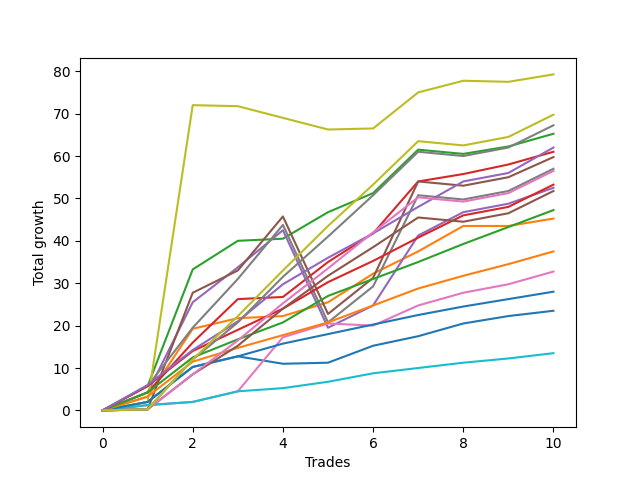

# Long Pointer 001 DB 
- Symbol: ES
- Date Range: 03/18/2022 - 07/15/2022
- Trading Period: 7:20-12:30
- Number of Trades: 10



| Name | Win Percent | Profit | Avg Profit / Trade | Avg Time / Trade |      | Name | Win Percent | Profit | Avg Profit / Trade | Avg Time / Trade |
| ---- | ----------- | ------ | ------------------ | ---------------- | ---- | ---- | ----------- | ------ | ------------------ | ---------------- |
| Sorted By <br> Profit | | | | | | Sorted By <br> Win Percentage ||||
| Seventy-Three | 60.00 | 39625.00 | 3962.50 | 09:29 |     | Eighty-Six | 100.00 | 31000.00 | 3100.00 | 10:48 |
| Ninety | 90.00 | 34875.00 | 3487.50 | 19:30 |     | Three | 100.00 | 30500.00 | 3050.00 | 09:27 |
| Eighty-Nine | 90.00 | 33625.00 | 3362.50 | 19:28 |     | Eighty-Five | 100.00 | 26625.00 | 2662.50 | 10:04 |
| Two | 90.00 | 32625.00 | 3262.50 | 12:54 |     | Eighty-Four | 100.00 | 23625.00 | 2362.50 | 08:02 |
| Eighty-Six | 100.00 | 31000.00 | 3100.00 | 10:48 |     | One | 100.00 | 22625.00 | 2262.50 | 07:23 |
| Three | 100.00 | 30500.00 | 3050.00 | 09:27 |     | Eighty-Three | 100.00 | 18750.00 | 1875.00 | 06:38 |
| Five | 80.00 | 29875.00 | 2987.50 | 25:16 |     | Eighty-Two | 100.00 | 14000.00 | 1400.00 | 03:09 |
| Seven | 80.00 | 28500.00 | 2850.00 | 20:56 |     | Eighty-One | 100.00 | 6750.00 | 675.00 | 00:51 |
| Eighty-Eight | 90.00 | 28250.00 | 2825.00 | 18:01 |     | Ninety | 90.00 | 34875.00 | 3487.50 | 19:30 |
| Eighty-Five | 100.00 | 26625.00 | 2662.50 | 10:04 |     | Eighty-Nine | 90.00 | 33625.00 | 3362.50 | 19:28 |
| Four | 90.00 | 26250.00 | 2625.00 | 20:09 |     | Two | 90.00 | 32625.00 | 3262.50 | 12:54 |
| Eighty-Seven | 90.00 | 25875.00 | 2587.50 | 16:05 |     | Eighty-Eight | 90.00 | 28250.00 | 2825.00 | 18:01 |
| Eighty-Four | 100.00 | 23625.00 | 2362.50 | 08:02 |     | Four | 90.00 | 26250.00 | 2625.00 | 20:09 |
| One | 100.00 | 22625.00 | 2262.50 | 07:23 |     | Eighty-Seven | 90.00 | 25875.00 | 2587.50 | 16:05 |
| Eighty-Three | 100.00 | 18750.00 | 1875.00 | 06:38 |     | Six | 90.00 | 16375.00 | 1637.50 | 07:00 |
| Six | 90.00 | 16375.00 | 1637.50 | 07:00 |     | Zero | 90.00 | 11750.00 | 1175.00 | 02:29 |
| Eighty-Two | 100.00 | 14000.00 | 1400.00 | 03:09 |     | Five | 80.00 | 29875.00 | 2987.50 | 25:16 |
| Zero | 90.00 | 11750.00 | 1175.00 | 02:29 |     | Seven | 80.00 | 28500.00 | 2850.00 | 20:56 |
| Eighty-One | 100.00 | 6750.00 | 675.00 | 00:51 |     | Seventy-Three | 60.00 | 39625.00 | 3962.50 | 09:29 |

## NO STOPLOSS

### Test Zero
* Sell when price hits the middle line of the 20p bollinger
* No Stoploss
* Results:
```
Total Trades: 10
Percent Up: 90.00
Percent Down: 10.00
Total Points Moved Up: 23.50
Potential Profit: 11750.00
Total Points Ups: 25.25 Count Ups: 9
Total Points Downs: -1.75 Count Downs: 1
```

<details><summary>Trades</summary>

<code>In: 2022-03-31 08:37:00		Out: 2022-03-31 08:38:15		Total Position Time: 01:15		Total Move Up: 2.00		Total to Date: 2.00</code> <br />
<code>In: 2022-05-04 11:36:00		Out: 2022-05-04 11:36:40		Total Position Time: 00:40		Total Move Up: 8.25		Total to Date: 10.25</code> <br />
<code>In: 2022-05-06 09:03:00		Out: 2022-05-06 09:03:10		Total Position Time: 00:10		Total Move Up: 2.50		Total to Date: 12.75</code> <br />
<code>In: 2022-05-06 11:28:00		Out: 2022-05-06 11:40:25		Total Position Time: 12:25		Total Move Up: -1.75		Total to Date: 11.00</code> <br />
<code>In: 2022-05-11 09:14:00		Out: 2022-05-11 09:17:50		Total Position Time: 03:50		Total Move Up: 0.25		Total to Date: 11.25</code> <br />
<code>In: 2022-05-16 09:47:00		Out: 2022-05-16 09:48:15		Total Position Time: 01:15		Total Move Up: 4.00		Total to Date: 15.25</code> <br />
<code>In: 2022-05-31 12:05:00		Out: 2022-05-31 12:07:20		Total Position Time: 02:20		Total Move Up: 2.25		Total to Date: 17.50</code> <br />
<code>In: 2022-06-27 10:10:00		Out: 2022-06-27 10:11:25		Total Position Time: 01:25		Total Move Up: 3.00		Total to Date: 20.50</code> <br />
<code>In: 2022-07-08 09:48:00		Out: 2022-07-08 09:48:40		Total Position Time: 00:40		Total Move Up: 1.75		Total to Date: 22.25</code> <br />
<code>In: 2022-07-12 10:28:00		Out: 2022-07-12 10:28:50		Total Position Time: 00:50		Total Move Up: 1.25		Total to Date: 23.50</code> <br />


</details>

### Test One
* Sell when the price hits the upper line of the 20p 1std bollinger
* No Stoploss
* Results:
```
Total Trades: 10
Percent Up: 100.00
Percent Down: 0.00
Total Points Moved Up: 45.25
Potential Profit: 22625.00
Total Points Ups: 45.25 Count Ups: 10
Total Points Downs: 0.00 Count Downs: 0
```

<details><summary>Trades</summary>

<code>In: 2022-03-31 08:37:00		Out: 2022-03-31 08:40:35		Total Position Time: 03:35		Total Move Up: 3.25		Total to Date: 3.25</code> <br />
<code>In: 2022-05-04 11:36:00		Out: 2022-05-04 11:41:35		Total Position Time: 05:35		Total Move Up: 16.00		Total to Date: 19.25</code> <br />
<code>In: 2022-05-06 09:03:00		Out: 2022-05-06 09:03:10		Total Position Time: 00:10		Total Move Up: 2.50		Total to Date: 21.75</code> <br />
<code>In: 2022-05-06 11:28:00		Out: 2022-05-06 11:49:10		Total Position Time: 21:10		Total Move Up: 0.50		Total to Date: 22.25</code> <br />
<code>In: 2022-05-11 09:14:00		Out: 2022-05-11 09:23:10		Total Position Time: 09:10		Total Move Up: 3.25		Total to Date: 25.50</code> <br />
<code>In: 2022-05-16 09:47:00		Out: 2022-05-16 09:50:05		Total Position Time: 03:05		Total Move Up: 6.75		Total to Date: 32.25</code> <br />
<code>In: 2022-05-31 12:05:00		Out: 2022-05-31 12:09:15		Total Position Time: 04:15		Total Move Up: 5.25		Total to Date: 37.50</code> <br />
<code>In: 2022-06-27 10:10:00		Out: 2022-06-27 10:15:55		Total Position Time: 05:55		Total Move Up: 6.00		Total to Date: 43.50</code> <br />
<code>In: 2022-07-08 09:48:00		Out: 2022-07-08 10:06:55		Total Position Time: 18:55		Total Move Up: 0.00		Total to Date: 43.50</code> <br />
<code>In: 2022-07-12 10:28:00		Out: 2022-07-12 10:30:05		Total Position Time: 02:05		Total Move Up: 1.75		Total to Date: 45.25</code> <br />


</details>

### Test Two
* Sell when the price hits the upper line of the 20p 2std bollinger
* No Stoploss
* Results:
```
Total Trades: 10
Percent Up: 90.00
Percent Down: 10.00
Total Points Moved Up: 65.25
Potential Profit: 32625.00
Total Points Ups: 66.25 Count Ups: 9
Total Points Downs: -1.00 Count Downs: 1
```

<details><summary>Trades</summary>

<code>In: 2022-03-31 08:37:00		Out: 2022-03-31 08:41:10		Total Position Time: 04:10		Total Move Up: 5.75		Total to Date: 5.75</code> <br />
<code>In: 2022-05-04 11:36:00		Out: 2022-05-04 11:43:45		Total Position Time: 07:45		Total Move Up: 27.50		Total to Date: 33.25</code> <br />
<code>In: 2022-05-06 09:03:00		Out: 2022-05-06 09:03:55		Total Position Time: 00:55		Total Move Up: 6.75		Total to Date: 40.00</code> <br />
<code>In: 2022-05-06 11:28:00		Out: 2022-05-06 11:49:10		Total Position Time: 21:10		Total Move Up: 0.50		Total to Date: 40.50</code> <br />
<code>In: 2022-05-11 09:14:00		Out: 2022-05-11 09:23:35		Total Position Time: 09:35		Total Move Up: 6.25		Total to Date: 46.75</code> <br />
<code>In: 2022-05-16 09:47:00		Out: 2022-05-16 10:06:30		Total Position Time: 19:30		Total Move Up: 4.50		Total to Date: 51.25</code> <br />
<code>In: 2022-05-31 12:05:00		Out: 2022-05-31 12:15:05		Total Position Time: 10:05		Total Move Up: 10.25		Total to Date: 61.50</code> <br />
<code>In: 2022-06-27 10:10:00		Out: 2022-06-27 10:39:55		Total Position Time: 29:55		Total Move Up: -1.00		Total to Date: 60.50</code> <br />
<code>In: 2022-07-08 09:48:00		Out: 2022-07-08 10:10:30		Total Position Time: 22:30		Total Move Up: 1.75		Total to Date: 62.25</code> <br />
<code>In: 2022-07-12 10:28:00		Out: 2022-07-12 10:31:30		Total Position Time: 03:30		Total Move Up: 3.00		Total to Date: 65.25</code> <br />


</details>

### Test Three
* Sell when price hits the middle line of the 50p bollinger
* No Stoploss
* Results:
```
Total Trades: 10
Percent Up: 100.00
Percent Down: 0.00
Total Points Moved Up: 61.00
Potential Profit: 30500.00
Total Points Ups: 61.00 Count Ups: 10
Total Points Downs: 0.00 Count Downs: 0
```

<details><summary>Trades</summary>

<code>In: 2022-03-31 08:37:00		Out: 2022-03-31 08:41:05		Total Position Time: 04:05		Total Move Up: 4.25		Total to Date: 4.25</code> <br />
<code>In: 2022-05-04 11:36:00		Out: 2022-05-04 11:41:15		Total Position Time: 05:15		Total Move Up: 11.75		Total to Date: 16.00</code> <br />
<code>In: 2022-05-06 09:03:00		Out: 2022-05-06 09:06:05		Total Position Time: 03:05		Total Move Up: 10.25		Total to Date: 26.25</code> <br />
<code>In: 2022-05-06 11:28:00		Out: 2022-05-06 11:49:10		Total Position Time: 21:10		Total Move Up: 0.50		Total to Date: 26.75</code> <br />
<code>In: 2022-05-11 09:14:00		Out: 2022-05-11 09:23:45		Total Position Time: 09:45		Total Move Up: 8.25		Total to Date: 35.00</code> <br />
<code>In: 2022-05-16 09:47:00		Out: 2022-05-16 09:50:05		Total Position Time: 03:05		Total Move Up: 6.75		Total to Date: 41.75</code> <br />
<code>In: 2022-05-31 12:05:00		Out: 2022-05-31 12:15:15		Total Position Time: 10:15		Total Move Up: 12.25		Total to Date: 54.00</code> <br />
<code>In: 2022-06-27 10:10:00		Out: 2022-06-27 10:11:15		Total Position Time: 01:15		Total Move Up: 1.75		Total to Date: 55.75</code> <br />
<code>In: 2022-07-08 09:48:00		Out: 2022-07-08 10:11:05		Total Position Time: 23:05		Total Move Up: 2.25		Total to Date: 58.00</code> <br />
<code>In: 2022-07-12 10:28:00		Out: 2022-07-12 10:41:35		Total Position Time: 13:35		Total Move Up: 3.00		Total to Date: 61.00</code> <br />


</details>

### Test Four
* Sell when the price hits the upper line of the 50p 1std bollinger
* No Stoploss
* Results:
```
Total Trades: 10
Percent Up: 90.00
Percent Down: 10.00
Total Points Moved Up: 52.50
Potential Profit: 26250.00
Total Points Ups: 75.50 Count Ups: 9
Total Points Downs: -23.00 Count Downs: 1
```

<details><summary>Trades</summary>

<code>In: 2022-03-31 08:37:00		Out: 2022-03-31 09:00:15		Total Position Time: 23:15		Total Move Up: 4.25		Total to Date: 4.25</code> <br />
<code>In: 2022-05-04 11:36:00		Out: 2022-05-04 11:42:00		Total Position Time: 06:00		Total Move Up: 21.25		Total to Date: 25.50</code> <br />
<code>In: 2022-05-06 09:03:00		Out: 2022-05-06 09:22:25		Total Position Time: 19:25		Total Move Up: 8.25		Total to Date: 33.75</code> <br />
<code>In: 2022-05-06 11:28:00		Out: 2022-05-06 11:50:10		Total Position Time: 22:10		Total Move Up: 8.75		Total to Date: 42.50</code> <br />
<code>In: 2022-05-11 09:14:00		Out: 2022-05-11 09:43:55		Total Position Time: 29:55		Total Move Up: -23.00		Total to Date: 19.50</code> <br />
<code>In: 2022-05-16 09:47:00		Out: 2022-05-16 10:07:00		Total Position Time: 20:00		Total Move Up: 5.25		Total to Date: 24.75</code> <br />
<code>In: 2022-05-31 12:05:00		Out: 2022-05-31 12:28:20		Total Position Time: 23:20		Total Move Up: 16.50		Total to Date: 41.25</code> <br />
<code>In: 2022-06-27 10:10:00		Out: 2022-06-27 10:13:05		Total Position Time: 03:05		Total Move Up: 5.50		Total to Date: 46.75</code> <br />
<code>In: 2022-07-08 09:48:00		Out: 2022-07-08 10:17:55		Total Position Time: 29:55		Total Move Up: 2.00		Total to Date: 48.75</code> <br />
<code>In: 2022-07-12 10:28:00		Out: 2022-07-12 10:52:25		Total Position Time: 24:25		Total Move Up: 3.75		Total to Date: 52.50</code> <br />


</details>

### Test Five
* Sell when the price hits the upper line of the 50p 2std bollinger
* No Stoploss
* Results:
```
Total Trades: 10
Percent Up: 80.00
Percent Down: 20.00
Total Points Moved Up: 59.75
Potential Profit: 29875.00
Total Points Ups: 83.75 Count Ups: 8
Total Points Downs: -24.00 Count Downs: 2
```

<details><summary>Trades</summary>

<code>In: 2022-03-31 08:37:00		Out: 2022-03-31 09:06:55		Total Position Time: 29:55		Total Move Up: 0.25		Total to Date: 0.25</code> <br />
<code>In: 2022-05-04 11:36:00		Out: 2022-05-04 11:43:45		Total Position Time: 07:45		Total Move Up: 27.50		Total to Date: 27.75</code> <br />
<code>In: 2022-05-06 09:03:00		Out: 2022-05-06 09:32:55		Total Position Time: 29:55		Total Move Up: 5.25		Total to Date: 33.00</code> <br />
<code>In: 2022-05-06 11:28:00		Out: 2022-05-06 11:50:35		Total Position Time: 22:35		Total Move Up: 12.75		Total to Date: 45.75</code> <br />
<code>In: 2022-05-11 09:14:00		Out: 2022-05-11 09:43:55		Total Position Time: 29:55		Total Move Up: -23.00		Total to Date: 22.75</code> <br />
<code>In: 2022-05-16 09:47:00		Out: 2022-05-16 10:07:35		Total Position Time: 20:35		Total Move Up: 8.50		Total to Date: 31.25</code> <br />
<code>In: 2022-05-31 12:05:00		Out: 2022-05-31 12:31:05		Total Position Time: 26:05		Total Move Up: 22.75		Total to Date: 54.00</code> <br />
<code>In: 2022-06-27 10:10:00		Out: 2022-06-27 10:39:55		Total Position Time: 29:55		Total Move Up: -1.00		Total to Date: 53.00</code> <br />
<code>In: 2022-07-08 09:48:00		Out: 2022-07-08 10:17:55		Total Position Time: 29:55		Total Move Up: 2.00		Total to Date: 55.00</code> <br />
<code>In: 2022-07-12 10:28:00		Out: 2022-07-12 10:54:05		Total Position Time: 26:05		Total Move Up: 4.75		Total to Date: 59.75</code> <br />


</details>

### Test Six
* Sell when the price hits the middle line of the 1std VWAP
* No Stoploss
* Results:
```
Total Trades: 10
Percent Up: 90.00
Percent Down: 10.00
Total Points Moved Up: 32.75
Potential Profit: 16375.00
Total Points Ups: 33.25 Count Ups: 9
Total Points Downs: -0.50 Count Downs: 1
```

<details><summary>Trades</summary>

<code>In: 2022-03-31 08:37:00		Out: 2022-03-31 08:37:40		Total Position Time: 00:40		Total Move Up: 1.25		Total to Date: 1.25</code> <br />
<code>In: 2022-05-04 11:36:00		Out: 2022-05-04 11:36:10		Total Position Time: 00:10		Total Move Up: 0.75		Total to Date: 2.00</code> <br />
<code>In: 2022-05-06 09:03:00		Out: 2022-05-06 09:03:10		Total Position Time: 00:10		Total Move Up: 2.50		Total to Date: 4.50</code> <br />
<code>In: 2022-05-06 11:28:00		Out: 2022-05-06 11:50:20		Total Position Time: 22:20		Total Move Up: 12.75		Total to Date: 17.25</code> <br />
<code>In: 2022-05-11 09:14:00		Out: 2022-05-11 09:23:10		Total Position Time: 09:10		Total Move Up: 3.25		Total to Date: 20.50</code> <br />
<code>In: 2022-05-16 09:47:00		Out: 2022-05-16 09:47:10		Total Position Time: 00:10		Total Move Up: -0.50		Total to Date: 20.00</code> <br />
<code>In: 2022-05-31 12:05:00		Out: 2022-05-31 12:07:50		Total Position Time: 02:50		Total Move Up: 4.75		Total to Date: 24.75</code> <br />
<code>In: 2022-06-27 10:10:00		Out: 2022-06-27 10:11:25		Total Position Time: 01:25		Total Move Up: 3.00		Total to Date: 27.75</code> <br />
<code>In: 2022-07-08 09:48:00		Out: 2022-07-08 10:17:55		Total Position Time: 29:55		Total Move Up: 2.00		Total to Date: 29.75</code> <br />
<code>In: 2022-07-12 10:28:00		Out: 2022-07-12 10:31:15		Total Position Time: 03:15		Total Move Up: 3.00		Total to Date: 32.75</code> <br />


</details>

### Test Seven
* Sell when the price hits the upper line of the 1std VWAP
* No Stoploss
* Results:
```
Total Trades: 10
Percent Up: 80.00
Percent Down: 20.00
Total Points Moved Up: 57.00
Potential Profit: 28500.00
Total Points Ups: 81.00 Count Ups: 8
Total Points Downs: -24.00 Count Downs: 2
```

<details><summary>Trades</summary>

<code>In: 2022-03-31 08:37:00		Out: 2022-03-31 08:41:10		Total Position Time: 04:10		Total Move Up: 5.75		Total to Date: 5.75</code> <br />
<code>In: 2022-05-04 11:36:00		Out: 2022-05-04 11:41:30		Total Position Time: 05:30		Total Move Up: 13.75		Total to Date: 19.50</code> <br />
<code>In: 2022-05-06 09:03:00		Out: 2022-05-06 09:06:40		Total Position Time: 03:40		Total Move Up: 11.50		Total to Date: 31.00</code> <br />
<code>In: 2022-05-06 11:28:00		Out: 2022-05-06 11:57:55		Total Position Time: 29:55		Total Move Up: 12.75		Total to Date: 43.75</code> <br />
<code>In: 2022-05-11 09:14:00		Out: 2022-05-11 09:43:55		Total Position Time: 29:55		Total Move Up: -23.00		Total to Date: 20.75</code> <br />
<code>In: 2022-05-16 09:47:00		Out: 2022-05-16 10:07:35		Total Position Time: 20:35		Total Move Up: 8.50		Total to Date: 29.25</code> <br />
<code>In: 2022-05-31 12:05:00		Out: 2022-05-31 12:30:55		Total Position Time: 25:55		Total Move Up: 21.50		Total to Date: 50.75</code> <br />
<code>In: 2022-06-27 10:10:00		Out: 2022-06-27 10:39:55		Total Position Time: 29:55		Total Move Up: -1.00		Total to Date: 49.75</code> <br />
<code>In: 2022-07-08 09:48:00		Out: 2022-07-08 10:17:55		Total Position Time: 29:55		Total Move Up: 2.00		Total to Date: 51.75</code> <br />
<code>In: 2022-07-12 10:28:00		Out: 2022-07-12 10:57:55		Total Position Time: 29:55		Total Move Up: 5.25		Total to Date: 57.00</code> <br />


</details>

## SPECIAL EXIT CONDITIONS 

### Test Seventy-Three
* Sell when the linear regression slope changes to negative
* No Stoploss
* Results:
```
Total Trades: 10
Percent Up: 60.00
Percent Down: 40.00
Total Points Moved Up: 79.25
Potential Profit: 39625.00
Total Points Ups: 85.25 Count Ups: 6
Total Points Downs: -6.00 Count Downs: 4
```

<details><summary>Trades</summary>

<code>In: 2022-03-31 08:37:00		Out: 2022-03-31 08:48:05		Total Position Time: 11:05		Total Move Up: 2.00		Total to Date: 2.00</code> <br />
<code>In: 2022-05-04 11:36:00		Out: 2022-05-04 11:58:05		Total Position Time: 22:05		Total Move Up: 70.00		Total to Date: 72.00</code> <br />
<code>In: 2022-05-06 09:03:00		Out: 2022-05-06 09:12:05		Total Position Time: 09:05		Total Move Up: -0.25		Total to Date: 71.75</code> <br />
<code>In: 2022-05-06 11:28:00		Out: 2022-05-06 11:31:05		Total Position Time: 03:05		Total Move Up: -2.75		Total to Date: 69.00</code> <br />
<code>In: 2022-05-11 09:14:00		Out: 2022-05-11 09:15:05		Total Position Time: 01:05		Total Move Up: -2.75		Total to Date: 66.25</code> <br />
<code>In: 2022-05-16 09:47:00		Out: 2022-05-16 09:54:05		Total Position Time: 07:05		Total Move Up: 0.25		Total to Date: 66.50</code> <br />
<code>In: 2022-05-31 12:05:00		Out: 2022-05-31 12:20:05		Total Position Time: 15:05		Total Move Up: 8.50		Total to Date: 75.00</code> <br />
<code>In: 2022-06-27 10:10:00		Out: 2022-06-27 10:21:05		Total Position Time: 11:05		Total Move Up: 2.75		Total to Date: 77.75</code> <br />
<code>In: 2022-07-08 09:48:00		Out: 2022-07-08 09:53:05		Total Position Time: 05:05		Total Move Up: -0.25		Total to Date: 77.50</code> <br />
<code>In: 2022-07-12 10:28:00		Out: 2022-07-12 10:38:05		Total Position Time: 10:05		Total Move Up: 1.75		Total to Date: 79.25</code> <br />


</details>

## TAKE PROFIT

### Test Eighty-One
* Take Profit of 1 Point
* No Stoploss
* Results:
```
Total Trades: 10
Percent Up: 100.00
Percent Down: 0.00
Total Points Moved Up: 13.50
Potential Profit: 6750.00
Total Points Ups: 13.50 Count Ups: 10
Total Points Downs: 0.00 Count Downs: 0
```

<details><summary>Trades</summary>

<code>In: 2022-03-31 08:37:00		Out: 2022-03-31 08:37:40		Total Position Time: 00:40		Total Move Up: 1.25		Total to Date: 1.25</code> <br />
<code>In: 2022-05-04 11:36:00		Out: 2022-05-04 11:36:10		Total Position Time: 00:10		Total Move Up: 0.75		Total to Date: 2.00</code> <br />
<code>In: 2022-05-06 09:03:00		Out: 2022-05-06 09:03:10		Total Position Time: 00:10		Total Move Up: 2.50		Total to Date: 4.50</code> <br />
<code>In: 2022-05-06 11:28:00		Out: 2022-05-06 11:30:35		Total Position Time: 02:35		Total Move Up: 0.75		Total to Date: 5.25</code> <br />
<code>In: 2022-05-11 09:14:00		Out: 2022-05-11 09:14:25		Total Position Time: 00:25		Total Move Up: 1.50		Total to Date: 6.75</code> <br />
<code>In: 2022-05-16 09:47:00		Out: 2022-05-16 09:47:50		Total Position Time: 00:50		Total Move Up: 2.00		Total to Date: 8.75</code> <br />
<code>In: 2022-05-31 12:05:00		Out: 2022-05-31 12:07:05		Total Position Time: 02:05		Total Move Up: 1.25		Total to Date: 10.00</code> <br />
<code>In: 2022-06-27 10:10:00		Out: 2022-06-27 10:10:25		Total Position Time: 00:25		Total Move Up: 1.25		Total to Date: 11.25</code> <br />
<code>In: 2022-07-08 09:48:00		Out: 2022-07-08 09:48:20		Total Position Time: 00:20		Total Move Up: 1.00		Total to Date: 12.25</code> <br />
<code>In: 2022-07-12 10:28:00		Out: 2022-07-12 10:28:50		Total Position Time: 00:50		Total Move Up: 1.25		Total to Date: 13.50</code> <br />


</details>

### Test Eighty-Two
* Take Profit of 2 Point
* No Stoploss
* Results:
```
Total Trades: 10
Percent Up: 100.00
Percent Down: 0.00
Total Points Moved Up: 28.00
Potential Profit: 14000.00
Total Points Ups: 28.00 Count Ups: 10
Total Points Downs: 0.00 Count Downs: 0
```

<details><summary>Trades</summary>

<code>In: 2022-03-31 08:37:00		Out: 2022-03-31 08:38:15		Total Position Time: 01:15		Total Move Up: 2.00		Total to Date: 2.00</code> <br />
<code>In: 2022-05-04 11:36:00		Out: 2022-05-04 11:36:40		Total Position Time: 00:40		Total Move Up: 8.25		Total to Date: 10.25</code> <br />
<code>In: 2022-05-06 09:03:00		Out: 2022-05-06 09:03:10		Total Position Time: 00:10		Total Move Up: 2.50		Total to Date: 12.75</code> <br />
<code>In: 2022-05-06 11:28:00		Out: 2022-05-06 11:49:25		Total Position Time: 21:25		Total Move Up: 3.00		Total to Date: 15.75</code> <br />
<code>In: 2022-05-11 09:14:00		Out: 2022-05-11 09:14:30		Total Position Time: 00:30		Total Move Up: 2.25		Total to Date: 18.00</code> <br />
<code>In: 2022-05-16 09:47:00		Out: 2022-05-16 09:47:55		Total Position Time: 00:55		Total Move Up: 2.25		Total to Date: 20.25</code> <br />
<code>In: 2022-05-31 12:05:00		Out: 2022-05-31 12:07:20		Total Position Time: 02:20		Total Move Up: 2.25		Total to Date: 22.50</code> <br />
<code>In: 2022-06-27 10:10:00		Out: 2022-06-27 10:11:10		Total Position Time: 01:10		Total Move Up: 2.00		Total to Date: 24.50</code> <br />
<code>In: 2022-07-08 09:48:00		Out: 2022-07-08 09:49:00		Total Position Time: 01:00		Total Move Up: 1.75		Total to Date: 26.25</code> <br />
<code>In: 2022-07-12 10:28:00		Out: 2022-07-12 10:30:05		Total Position Time: 02:05		Total Move Up: 1.75		Total to Date: 28.00</code> <br />


</details>

### Test Eighty-Three
* Take Profit of 3 Point
* No Stoploss
* Results:
```
Total Trades: 10
Percent Up: 100.00
Percent Down: 0.00
Total Points Moved Up: 37.50
Potential Profit: 18750.00
Total Points Ups: 37.50 Count Ups: 10
Total Points Downs: 0.00 Count Downs: 0
```

<details><summary>Trades</summary>

<code>In: 2022-03-31 08:37:00		Out: 2022-03-31 08:40:35		Total Position Time: 03:35		Total Move Up: 3.25		Total to Date: 3.25</code> <br />
<code>In: 2022-05-04 11:36:00		Out: 2022-05-04 11:36:40		Total Position Time: 00:40		Total Move Up: 8.25		Total to Date: 11.50</code> <br />
<code>In: 2022-05-06 09:03:00		Out: 2022-05-06 09:03:40		Total Position Time: 00:40		Total Move Up: 3.25		Total to Date: 14.75</code> <br />
<code>In: 2022-05-06 11:28:00		Out: 2022-05-06 11:49:25		Total Position Time: 21:25		Total Move Up: 3.00		Total to Date: 17.75</code> <br />
<code>In: 2022-05-11 09:14:00		Out: 2022-05-11 09:22:05		Total Position Time: 08:05		Total Move Up: 3.00		Total to Date: 20.75</code> <br />
<code>In: 2022-05-16 09:47:00		Out: 2022-05-16 09:48:15		Total Position Time: 01:15		Total Move Up: 4.00		Total to Date: 24.75</code> <br />
<code>In: 2022-05-31 12:05:00		Out: 2022-05-31 12:07:45		Total Position Time: 02:45		Total Move Up: 4.00		Total to Date: 28.75</code> <br />
<code>In: 2022-06-27 10:10:00		Out: 2022-06-27 10:11:25		Total Position Time: 01:25		Total Move Up: 3.00		Total to Date: 31.75</code> <br />
<code>In: 2022-07-08 09:48:00		Out: 2022-07-08 10:11:20		Total Position Time: 23:20		Total Move Up: 2.75		Total to Date: 34.50</code> <br />
<code>In: 2022-07-12 10:28:00		Out: 2022-07-12 10:31:15		Total Position Time: 03:15		Total Move Up: 3.00		Total to Date: 37.50</code> <br />


</details>

### Test Eighty-Four
* Take Profit of 4 Point
* No Stoploss
* Results:
```
Total Trades: 10
Percent Up: 100.00
Percent Down: 0.00
Total Points Moved Up: 47.25
Potential Profit: 23625.00
Total Points Ups: 47.25 Count Ups: 10
Total Points Downs: 0.00 Count Downs: 0
```

<details><summary>Trades</summary>

<code>In: 2022-03-31 08:37:00		Out: 2022-03-31 08:41:05		Total Position Time: 04:05		Total Move Up: 4.25		Total to Date: 4.25</code> <br />
<code>In: 2022-05-04 11:36:00		Out: 2022-05-04 11:36:40		Total Position Time: 00:40		Total Move Up: 8.25		Total to Date: 12.50</code> <br />
<code>In: 2022-05-06 09:03:00		Out: 2022-05-06 09:03:45		Total Position Time: 00:45		Total Move Up: 4.25		Total to Date: 16.75</code> <br />
<code>In: 2022-05-06 11:28:00		Out: 2022-05-06 11:49:30		Total Position Time: 21:30		Total Move Up: 4.00		Total to Date: 20.75</code> <br />
<code>In: 2022-05-11 09:14:00		Out: 2022-05-11 09:23:15		Total Position Time: 09:15		Total Move Up: 6.25		Total to Date: 27.00</code> <br />
<code>In: 2022-05-16 09:47:00		Out: 2022-05-16 09:48:15		Total Position Time: 01:15		Total Move Up: 4.00		Total to Date: 31.00</code> <br />
<code>In: 2022-05-31 12:05:00		Out: 2022-05-31 12:07:45		Total Position Time: 02:45		Total Move Up: 4.00		Total to Date: 35.00</code> <br />
<code>In: 2022-06-27 10:10:00		Out: 2022-06-27 10:12:00		Total Position Time: 02:00		Total Move Up: 4.25		Total to Date: 39.25</code> <br />
<code>In: 2022-07-08 09:48:00		Out: 2022-07-08 10:12:25		Total Position Time: 24:25		Total Move Up: 4.00		Total to Date: 43.25</code> <br />
<code>In: 2022-07-12 10:28:00		Out: 2022-07-12 10:41:40		Total Position Time: 13:40		Total Move Up: 4.00		Total to Date: 47.25</code> <br />


</details>

### Test Eighty-Five
* Take Profit of 5 Point
* No Stoploss
* Results:
```
Total Trades: 10
Percent Up: 100.00
Percent Down: 0.00
Total Points Moved Up: 53.25
Potential Profit: 26625.00
Total Points Ups: 53.25 Count Ups: 10
Total Points Downs: 0.00 Count Downs: 0
```

<details><summary>Trades</summary>

<code>In: 2022-03-31 08:37:00		Out: 2022-03-31 08:41:10		Total Position Time: 04:10		Total Move Up: 5.75		Total to Date: 5.75</code> <br />
<code>In: 2022-05-04 11:36:00		Out: 2022-05-04 11:36:40		Total Position Time: 00:40		Total Move Up: 8.25		Total to Date: 14.00</code> <br />
<code>In: 2022-05-06 09:03:00		Out: 2022-05-06 09:03:50		Total Position Time: 00:50		Total Move Up: 5.00		Total to Date: 19.00</code> <br />
<code>In: 2022-05-06 11:28:00		Out: 2022-05-06 11:50:05		Total Position Time: 22:05		Total Move Up: 5.00		Total to Date: 24.00</code> <br />
<code>In: 2022-05-11 09:14:00		Out: 2022-05-11 09:23:15		Total Position Time: 09:15		Total Move Up: 6.25		Total to Date: 30.25</code> <br />
<code>In: 2022-05-16 09:47:00		Out: 2022-05-16 09:48:45		Total Position Time: 01:45		Total Move Up: 5.00		Total to Date: 35.25</code> <br />
<code>In: 2022-05-31 12:05:00		Out: 2022-05-31 12:07:55		Total Position Time: 02:55		Total Move Up: 5.50		Total to Date: 40.75</code> <br />
<code>In: 2022-06-27 10:10:00		Out: 2022-06-27 10:12:55		Total Position Time: 02:55		Total Move Up: 5.25		Total to Date: 46.00</code> <br />
<code>In: 2022-07-08 09:48:00		Out: 2022-07-08 10:17:55		Total Position Time: 29:55		Total Move Up: 2.00		Total to Date: 48.00</code> <br />
<code>In: 2022-07-12 10:28:00		Out: 2022-07-12 10:54:15		Total Position Time: 26:15		Total Move Up: 5.25		Total to Date: 53.25</code> <br />


</details>

### Test Eighty-Six
* Take Profit of 6 Point
* No Stoploss
* Results:
```
Total Trades: 10
Percent Up: 100.00
Percent Down: 0.00
Total Points Moved Up: 62.00
Potential Profit: 31000.00
Total Points Ups: 62.00 Count Ups: 10
Total Points Downs: 0.00 Count Downs: 0
```

<details><summary>Trades</summary>

<code>In: 2022-03-31 08:37:00		Out: 2022-03-31 08:41:50		Total Position Time: 04:50		Total Move Up: 6.00		Total to Date: 6.00</code> <br />
<code>In: 2022-05-04 11:36:00		Out: 2022-05-04 11:36:40		Total Position Time: 00:40		Total Move Up: 8.25		Total to Date: 14.25</code> <br />
<code>In: 2022-05-06 09:03:00		Out: 2022-05-06 09:03:55		Total Position Time: 00:55		Total Move Up: 6.75		Total to Date: 21.00</code> <br />
<code>In: 2022-05-06 11:28:00		Out: 2022-05-06 11:50:10		Total Position Time: 22:10		Total Move Up: 8.75		Total to Date: 29.75</code> <br />
<code>In: 2022-05-11 09:14:00		Out: 2022-05-11 09:23:15		Total Position Time: 09:15		Total Move Up: 6.25		Total to Date: 36.00</code> <br />
<code>In: 2022-05-16 09:47:00		Out: 2022-05-16 09:50:00		Total Position Time: 03:00		Total Move Up: 5.75		Total to Date: 41.75</code> <br />
<code>In: 2022-05-31 12:05:00		Out: 2022-05-31 12:09:20		Total Position Time: 04:20		Total Move Up: 6.25		Total to Date: 48.00</code> <br />
<code>In: 2022-06-27 10:10:00		Out: 2022-06-27 10:15:55		Total Position Time: 05:55		Total Move Up: 6.00		Total to Date: 54.00</code> <br />
<code>In: 2022-07-08 09:48:00		Out: 2022-07-08 10:17:55		Total Position Time: 29:55		Total Move Up: 2.00		Total to Date: 56.00</code> <br />
<code>In: 2022-07-12 10:28:00		Out: 2022-07-12 10:55:00		Total Position Time: 27:00		Total Move Up: 6.00		Total to Date: 62.00</code> <br />


</details>

### Test Eighty-Seven
* Take Profit of 7 Point
* No Stoploss
* Results:
```
Total Trades: 10
Percent Up: 90.00
Percent Down: 10.00
Total Points Moved Up: 51.75
Potential Profit: 25875.00
Total Points Ups: 52.75 Count Ups: 9
Total Points Downs: -1.00 Count Downs: 1
```

<details><summary>Trades</summary>

<code>In: 2022-03-31 08:37:00		Out: 2022-03-31 09:06:55		Total Position Time: 29:55		Total Move Up: 0.25		Total to Date: 0.25</code> <br />
<code>In: 2022-05-04 11:36:00		Out: 2022-05-04 11:36:40		Total Position Time: 00:40		Total Move Up: 8.25		Total to Date: 8.50</code> <br />
<code>In: 2022-05-06 09:03:00		Out: 2022-05-06 09:03:55		Total Position Time: 00:55		Total Move Up: 6.75		Total to Date: 15.25</code> <br />
<code>In: 2022-05-06 11:28:00		Out: 2022-05-06 11:50:10		Total Position Time: 22:10		Total Move Up: 8.75		Total to Date: 24.00</code> <br />
<code>In: 2022-05-11 09:14:00		Out: 2022-05-11 09:23:40		Total Position Time: 09:40		Total Move Up: 7.75		Total to Date: 31.75</code> <br />
<code>In: 2022-05-16 09:47:00		Out: 2022-05-16 09:50:05		Total Position Time: 03:05		Total Move Up: 6.75		Total to Date: 38.50</code> <br />
<code>In: 2022-05-31 12:05:00		Out: 2022-05-31 12:09:40		Total Position Time: 04:40		Total Move Up: 7.00		Total to Date: 45.50</code> <br />
<code>In: 2022-06-27 10:10:00		Out: 2022-06-27 10:39:55		Total Position Time: 29:55		Total Move Up: -1.00		Total to Date: 44.50</code> <br />
<code>In: 2022-07-08 09:48:00		Out: 2022-07-08 10:17:55		Total Position Time: 29:55		Total Move Up: 2.00		Total to Date: 46.50</code> <br />
<code>In: 2022-07-12 10:28:00		Out: 2022-07-12 10:57:55		Total Position Time: 29:55		Total Move Up: 5.25		Total to Date: 51.75</code> <br />


</details>

### Test Eighty-Eight
* Take Profit of 8 Point
* No Stoploss
* Results:
```
Total Trades: 10
Percent Up: 90.00
Percent Down: 10.00
Total Points Moved Up: 56.50
Potential Profit: 28250.00
Total Points Ups: 57.50 Count Ups: 9
Total Points Downs: -1.00 Count Downs: 1
```

<details><summary>Trades</summary>

<code>In: 2022-03-31 08:37:00		Out: 2022-03-31 09:06:55		Total Position Time: 29:55		Total Move Up: 0.25		Total to Date: 0.25</code> <br />
<code>In: 2022-05-04 11:36:00		Out: 2022-05-04 11:36:40		Total Position Time: 00:40		Total Move Up: 8.25		Total to Date: 8.50</code> <br />
<code>In: 2022-05-06 09:03:00		Out: 2022-05-06 09:05:30		Total Position Time: 02:30		Total Move Up: 8.00		Total to Date: 16.50</code> <br />
<code>In: 2022-05-06 11:28:00		Out: 2022-05-06 11:50:10		Total Position Time: 22:10		Total Move Up: 8.75		Total to Date: 25.25</code> <br />
<code>In: 2022-05-11 09:14:00		Out: 2022-05-11 09:23:45		Total Position Time: 09:45		Total Move Up: 8.25		Total to Date: 33.50</code> <br />
<code>In: 2022-05-16 09:47:00		Out: 2022-05-16 10:07:35		Total Position Time: 20:35		Total Move Up: 8.50		Total to Date: 42.00</code> <br />
<code>In: 2022-05-31 12:05:00		Out: 2022-05-31 12:09:55		Total Position Time: 04:55		Total Move Up: 8.25		Total to Date: 50.25</code> <br />
<code>In: 2022-06-27 10:10:00		Out: 2022-06-27 10:39:55		Total Position Time: 29:55		Total Move Up: -1.00		Total to Date: 49.25</code> <br />
<code>In: 2022-07-08 09:48:00		Out: 2022-07-08 10:17:55		Total Position Time: 29:55		Total Move Up: 2.00		Total to Date: 51.25</code> <br />
<code>In: 2022-07-12 10:28:00		Out: 2022-07-12 10:57:55		Total Position Time: 29:55		Total Move Up: 5.25		Total to Date: 56.50</code> <br />


</details>

### Test Eighty-Nine
* Take Profit of 9 Point
* No Stoploss
* Results:
```
Total Trades: 10
Percent Up: 90.00
Percent Down: 10.00
Total Points Moved Up: 67.25
Potential Profit: 33625.00
Total Points Ups: 68.25 Count Ups: 9
Total Points Downs: -1.00 Count Downs: 1
```

<details><summary>Trades</summary>

<code>In: 2022-03-31 08:37:00		Out: 2022-03-31 09:06:55		Total Position Time: 29:55		Total Move Up: 0.25		Total to Date: 0.25</code> <br />
<code>In: 2022-05-04 11:36:00		Out: 2022-05-04 11:41:15		Total Position Time: 05:15		Total Move Up: 11.75		Total to Date: 12.00</code> <br />
<code>In: 2022-05-06 09:03:00		Out: 2022-05-06 09:06:00		Total Position Time: 03:00		Total Move Up: 8.75		Total to Date: 20.75</code> <br />
<code>In: 2022-05-06 11:28:00		Out: 2022-05-06 11:50:15		Total Position Time: 22:15		Total Move Up: 10.75		Total to Date: 31.50</code> <br />
<code>In: 2022-05-11 09:14:00		Out: 2022-05-11 09:24:05		Total Position Time: 10:05		Total Move Up: 9.50		Total to Date: 41.00</code> <br />
<code>In: 2022-05-16 09:47:00		Out: 2022-05-16 10:11:25		Total Position Time: 24:25		Total Move Up: 9.75		Total to Date: 50.75</code> <br />
<code>In: 2022-05-31 12:05:00		Out: 2022-05-31 12:15:05		Total Position Time: 10:05		Total Move Up: 10.25		Total to Date: 61.00</code> <br />
<code>In: 2022-06-27 10:10:00		Out: 2022-06-27 10:39:55		Total Position Time: 29:55		Total Move Up: -1.00		Total to Date: 60.00</code> <br />
<code>In: 2022-07-08 09:48:00		Out: 2022-07-08 10:17:55		Total Position Time: 29:55		Total Move Up: 2.00		Total to Date: 62.00</code> <br />
<code>In: 2022-07-12 10:28:00		Out: 2022-07-12 10:57:55		Total Position Time: 29:55		Total Move Up: 5.25		Total to Date: 67.25</code> <br />


</details>

### Test Ninety
* Take Profit of 10 Point
* No Stoploss
* Results:
```
Total Trades: 10
Percent Up: 90.00
Percent Down: 10.00
Total Points Moved Up: 69.75
Potential Profit: 34875.00
Total Points Ups: 70.75 Count Ups: 9
Total Points Downs: -1.00 Count Downs: 1
```

<details><summary>Trades</summary>

<code>In: 2022-03-31 08:37:00		Out: 2022-03-31 09:06:55		Total Position Time: 29:55		Total Move Up: 0.25		Total to Date: 0.25</code> <br />
<code>In: 2022-05-04 11:36:00		Out: 2022-05-04 11:41:15		Total Position Time: 05:15		Total Move Up: 11.75		Total to Date: 12.00</code> <br />
<code>In: 2022-05-06 09:03:00		Out: 2022-05-06 09:06:05		Total Position Time: 03:05		Total Move Up: 10.25		Total to Date: 22.25</code> <br />
<code>In: 2022-05-06 11:28:00		Out: 2022-05-06 11:50:15		Total Position Time: 22:15		Total Move Up: 10.75		Total to Date: 33.00</code> <br />
<code>In: 2022-05-11 09:14:00		Out: 2022-05-11 09:24:10		Total Position Time: 10:10		Total Move Up: 10.50		Total to Date: 43.50</code> <br />
<code>In: 2022-05-16 09:47:00		Out: 2022-05-16 10:11:30		Total Position Time: 24:30		Total Move Up: 9.75		Total to Date: 53.25</code> <br />
<code>In: 2022-05-31 12:05:00		Out: 2022-05-31 12:15:05		Total Position Time: 10:05		Total Move Up: 10.25		Total to Date: 63.50</code> <br />
<code>In: 2022-06-27 10:10:00		Out: 2022-06-27 10:39:55		Total Position Time: 29:55		Total Move Up: -1.00		Total to Date: 62.50</code> <br />
<code>In: 2022-07-08 09:48:00		Out: 2022-07-08 10:17:55		Total Position Time: 29:55		Total Move Up: 2.00		Total to Date: 64.50</code> <br />
<code>In: 2022-07-12 10:28:00		Out: 2022-07-12 10:57:55		Total Position Time: 29:55		Total Move Up: 5.25		Total to Date: 69.75</code> <br />


</details>