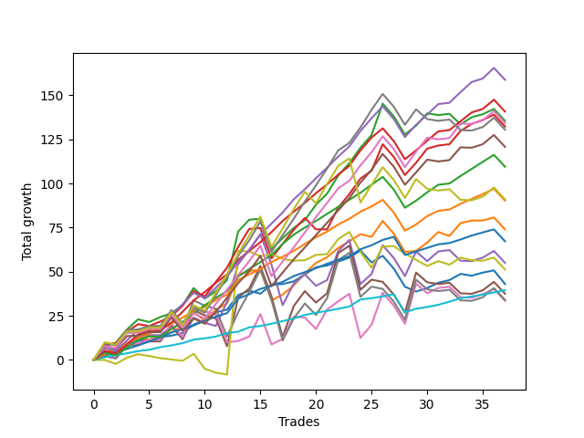

# Long Pointer 001 SD 
- Symbol: ES
- Date Range: 03/18/2022 - 07/15/2022
- Trading Period: 7:20-12:30
- Number of Trades: 37



| Name | Win Percent | Profit | Avg Profit / Trade | Avg Time / Trade |      | Name | Win Percent | Profit | Avg Profit / Trade | Avg Time / Trade |
| ---- | ----------- | ------ | ------------------ | ---------------- | ---- | ---- | ----------- | ------ | ------------------ | ---------------- |
| Sorted By <br> Profit | | | | | | Sorted By <br> Win Percentage ||||
| Eighty-Six | 86.49 | 79375.00 | 2145.27 | 14:40 |     | Eighty-One | 97.30 | 19750.00 | 533.78 | 03:12 |
| Eighty-Five | 89.19 | 70375.00 | 1902.03 | 13:07 |     | Eighty-Two | 94.59 | 33625.00 | 908.78 | 05:46 |
| Two | 78.38 | 67750.00 | 1831.08 | 16:02 |     | Eighty-Three | 91.89 | 45125.00 | 1219.59 | 09:20 |
| Eighty-Eight | 75.68 | 67125.00 | 1814.19 | 19:31 |     | Eighty-Five | 89.19 | 70375.00 | 1902.03 | 13:07 |
| Three | 81.08 | 66125.00 | 1787.16 | 15:17 |     | Eighty-Four | 89.19 | 54750.00 | 1479.73 | 10:58 |
| Eighty-Nine | 70.27 | 65250.00 | 1763.51 | 21:08 |     | Eighty-Six | 86.49 | 79375.00 | 2145.27 | 14:40 |
| Eighty-Seven | 75.68 | 60375.00 | 1631.76 | 17:53 |     | Three | 81.08 | 66125.00 | 1787.16 | 15:17 |
| Eighty-Four | 89.19 | 54750.00 | 1479.73 | 10:58 |     | Zero | 81.08 | 21500.00 | 581.08 | 06:08 |
| Ninety | 64.86 | 45500.00 | 1229.73 | 22:50 |     | Two | 78.38 | 67750.00 | 1831.08 | 16:02 |
| Eighty-Three | 91.89 | 45125.00 | 1219.59 | 09:20 |     | Eighty-Eight | 75.68 | 67125.00 | 1814.19 | 19:31 |
| One | 75.68 | 37000.00 | 1000.00 | 11:26 |     | Eighty-Seven | 75.68 | 60375.00 | 1631.76 | 17:53 |
| Eighty-Two | 94.59 | 33625.00 | 908.78 | 05:46 |     | One | 75.68 | 37000.00 | 1000.00 | 11:26 |
| Four | 62.16 | 27500.00 | 743.24 | 24:08 |     | Eighty-Nine | 70.27 | 65250.00 | 1763.51 | 21:08 |
| Seventy-Three | 43.24 | 25625.00 | 692.57 | 07:53 |     | Ninety | 64.86 | 45500.00 | 1229.73 | 22:50 |
| Zero | 81.08 | 21500.00 | 581.08 | 06:08 |     | Four | 62.16 | 27500.00 | 743.24 | 24:08 |
| Eighty-One | 97.30 | 19750.00 | 533.78 | 03:12 |     | Six | 59.46 | 16750.00 | 452.70 | 21:54 |
| Five | 54.05 | 18750.00 | 506.76 | 27:19 |     | Five | 54.05 | 18750.00 | 506.76 | 27:19 |
| Seven | 54.05 | 17000.00 | 459.46 | 26:52 |     | Seven | 54.05 | 17000.00 | 459.46 | 26:52 |
| Six | 59.46 | 16750.00 | 452.70 | 21:54 |     | Seventy-Three | 43.24 | 25625.00 | 692.57 | 07:53 |

## NO STOPLOSS

### Test Zero
* Sell when price hits the middle line of the 20p bollinger
* No Stoploss
* Results:
```
Total Trades: 37
Percent Up: 81.08
Percent Down: 18.92
Total Points Moved Up: 43.00
Potential Profit: 21500.00
Total Points Ups: 80.50 Count Ups: 30
Total Points Downs: -37.50 Count Downs: 7
```

<details><summary>Trades</summary>

<code>In: 2022-03-25 08:30:00		Out: 2022-03-25 08:36:40		Total Position Time: 06:40		Total Move Up: 4.00		Total to Date: 4.00</code> <br />
<code>In: 2022-03-30 12:14:00		Out: 2022-03-30 12:15:25		Total Position Time: 01:25		Total Move Up: 2.25		Total to Date: 6.25</code> <br />
<code>In: 2022-03-30 12:27:00		Out: 2022-03-30 12:28:15		Total Position Time: 01:15		Total Move Up: 2.50		Total to Date: 8.75</code> <br />
<code>In: 2022-03-31 08:37:00		Out: 2022-03-31 08:38:15		Total Position Time: 01:15		Total Move Up: 2.00		Total to Date: 10.75</code> <br />
<code>In: 2022-03-31 10:02:00		Out: 2022-03-31 10:04:00		Total Position Time: 02:00		Total Move Up: 0.75		Total to Date: 11.50</code> <br />
<code>In: 2022-04-06 09:23:00		Out: 2022-04-06 09:31:15		Total Position Time: 08:15		Total Move Up: 1.50		Total to Date: 13.00</code> <br />
<code>In: 2022-04-12 07:53:00		Out: 2022-04-12 08:02:05		Total Position Time: 09:05		Total Move Up: 0.75		Total to Date: 13.75</code> <br />
<code>In: 2022-04-12 11:35:00		Out: 2022-04-12 11:35:50		Total Position Time: 00:50		Total Move Up: 1.50		Total to Date: 15.25</code> <br />
<code>In: 2022-04-20 11:58:00		Out: 2022-04-20 12:01:15		Total Position Time: 03:15		Total Move Up: 4.75		Total to Date: 20.00</code> <br />
<code>In: 2022-05-02 08:07:00		Out: 2022-05-02 08:13:20		Total Position Time: 06:20		Total Move Up: 2.75		Total to Date: 22.75</code> <br />
<code>In: 2022-05-02 08:22:00		Out: 2022-05-02 08:26:05		Total Position Time: 04:05		Total Move Up: 4.25		Total to Date: 27.00</code> <br />
<code>In: 2022-05-02 10:51:00		Out: 2022-05-02 10:59:15		Total Position Time: 08:15		Total Move Up: 1.50		Total to Date: 28.50</code> <br />
<code>In: 2022-05-04 11:36:00		Out: 2022-05-04 11:36:40		Total Position Time: 00:40		Total Move Up: 8.25		Total to Date: 36.75</code> <br />
<code>In: 2022-05-06 09:03:00		Out: 2022-05-06 09:03:10		Total Position Time: 00:10		Total Move Up: 2.50		Total to Date: 39.25</code> <br />
<code>In: 2022-05-06 11:28:00		Out: 2022-05-06 11:40:25		Total Position Time: 12:25		Total Move Up: -1.75		Total to Date: 37.50</code> <br />
<code>In: 2022-05-10 07:52:00		Out: 2022-05-10 07:59:00		Total Position Time: 07:00		Total Move Up: 5.25		Total to Date: 42.75</code> <br />
<code>In: 2022-05-11 09:14:00		Out: 2022-05-11 09:17:50		Total Position Time: 03:50		Total Move Up: 0.25		Total to Date: 43.00</code> <br />
<code>In: 2022-05-11 11:01:00		Out: 2022-05-11 11:01:10		Total Position Time: 00:10		Total Move Up: 1.50		Total to Date: 44.50</code> <br />
<code>In: 2022-05-16 09:47:00		Out: 2022-05-16 09:48:15		Total Position Time: 01:15		Total Move Up: 4.00		Total to Date: 48.50</code> <br />
<code>In: 2022-05-18 08:32:00		Out: 2022-05-18 08:36:55		Total Position Time: 04:55		Total Move Up: 4.00		Total to Date: 52.50</code> <br />
<code>In: 2022-05-25 10:15:00		Out: 2022-05-25 10:15:20		Total Position Time: 00:20		Total Move Up: 1.00		Total to Date: 53.50</code> <br />
<code>In: 2022-05-31 12:05:00		Out: 2022-05-31 12:07:20		Total Position Time: 02:20		Total Move Up: 2.25		Total to Date: 55.75</code> <br />
<code>In: 2022-06-09 08:10:00		Out: 2022-06-09 08:10:55		Total Position Time: 00:55		Total Move Up: 2.25		Total to Date: 58.00</code> <br />
<code>In: 2022-06-13 12:17:00		Out: 2022-06-13 12:17:10		Total Position Time: 00:10		Total Move Up: 4.00		Total to Date: 62.00</code> <br />
<code>In: 2022-06-14 07:32:00		Out: 2022-06-14 07:46:40		Total Position Time: 14:40		Total Move Up: -6.75		Total to Date: 55.25</code> <br />
<code>In: 2022-06-14 07:45:00		Out: 2022-06-14 07:46:40		Total Position Time: 01:40		Total Move Up: 3.75		Total to Date: 59.00</code> <br />
<code>In: 2022-06-15 07:57:00		Out: 2022-06-15 08:26:55		Total Position Time: 29:55		Total Move Up: -7.25		Total to Date: 51.75</code> <br />
<code>In: 2022-06-16 11:02:00		Out: 2022-06-16 11:31:55		Total Position Time: 29:55		Total Move Up: -10.25		Total to Date: 41.50</code> <br />
<code>In: 2022-06-17 07:38:00		Out: 2022-06-17 07:55:05		Total Position Time: 17:05		Total Move Up: -2.75		Total to Date: 38.75</code> <br />
<code>In: 2022-06-23 09:07:00		Out: 2022-06-23 09:14:30		Total Position Time: 07:30		Total Move Up: 2.00		Total to Date: 40.75</code> <br />
<code>In: 2022-06-27 10:10:00		Out: 2022-06-27 10:11:25		Total Position Time: 01:25		Total Move Up: 3.00		Total to Date: 43.75</code> <br />
<code>In: 2022-06-29 09:16:00		Out: 2022-06-29 09:21:05		Total Position Time: 05:05		Total Move Up: 1.50		Total to Date: 45.25</code> <br />
<code>In: 2022-07-06 08:12:00		Out: 2022-07-06 08:14:30		Total Position Time: 02:30		Total Move Up: 3.50		Total to Date: 48.75</code> <br />
<code>In: 2022-07-06 08:35:00		Out: 2022-07-06 08:46:05		Total Position Time: 11:05		Total Move Up: -1.00		Total to Date: 47.75</code> <br />
<code>In: 2022-07-08 09:48:00		Out: 2022-07-08 09:48:40		Total Position Time: 00:40		Total Move Up: 1.75		Total to Date: 49.50</code> <br />
<code>In: 2022-07-12 10:28:00		Out: 2022-07-12 10:28:50		Total Position Time: 00:50		Total Move Up: 1.25		Total to Date: 50.75</code> <br />
<code>In: 2022-07-12 12:27:00		Out: 2022-07-12 12:45:05		Total Position Time: 18:05		Total Move Up: -7.75		Total to Date: 43.00</code> <br />


</details>

### Test One
* Sell when the price hits the upper line of the 20p 1std bollinger
* No Stoploss
* Results:
```
Total Trades: 37
Percent Up: 75.68
Percent Down: 24.32
Total Points Moved Up: 74.00
Potential Profit: 37000.00
Total Points Ups: 125.25 Count Ups: 28
Total Points Downs: -51.25 Count Downs: 9
```

<details><summary>Trades</summary>

<code>In: 2022-03-25 08:30:00		Out: 2022-03-25 08:41:05		Total Position Time: 11:05		Total Move Up: 5.25		Total to Date: 5.25</code> <br />
<code>In: 2022-03-30 12:14:00		Out: 2022-03-30 12:32:20		Total Position Time: 18:20		Total Move Up: -0.75		Total to Date: 4.50</code> <br />
<code>In: 2022-03-30 12:27:00		Out: 2022-03-30 12:32:20		Total Position Time: 05:20		Total Move Up: 4.75		Total to Date: 9.25</code> <br />
<code>In: 2022-03-31 08:37:00		Out: 2022-03-31 08:40:35		Total Position Time: 03:35		Total Move Up: 3.25		Total to Date: 12.50</code> <br />
<code>In: 2022-03-31 10:02:00		Out: 2022-03-31 10:19:20		Total Position Time: 17:20		Total Move Up: -1.00		Total to Date: 11.50</code> <br />
<code>In: 2022-04-06 09:23:00		Out: 2022-04-06 09:34:05		Total Position Time: 11:05		Total Move Up: 1.50		Total to Date: 13.00</code> <br />
<code>In: 2022-04-12 07:53:00		Out: 2022-04-12 08:02:35		Total Position Time: 09:35		Total Move Up: 2.75		Total to Date: 15.75</code> <br />
<code>In: 2022-04-12 11:35:00		Out: 2022-04-12 11:37:20		Total Position Time: 02:20		Total Move Up: 3.50		Total to Date: 19.25</code> <br />
<code>In: 2022-04-20 11:58:00		Out: 2022-04-20 12:04:20		Total Position Time: 06:20		Total Move Up: 7.50		Total to Date: 26.75</code> <br />
<code>In: 2022-05-02 08:07:00		Out: 2022-05-02 08:34:10		Total Position Time: 27:10		Total Move Up: -4.25		Total to Date: 22.50</code> <br />
<code>In: 2022-05-02 08:22:00		Out: 2022-05-02 08:34:10		Total Position Time: 12:10		Total Move Up: 6.00		Total to Date: 28.50</code> <br />
<code>In: 2022-05-02 10:51:00		Out: 2022-05-02 11:02:25		Total Position Time: 11:25		Total Move Up: 3.50		Total to Date: 32.00</code> <br />
<code>In: 2022-05-04 11:36:00		Out: 2022-05-04 11:41:35		Total Position Time: 05:35		Total Move Up: 16.00		Total to Date: 48.00</code> <br />
<code>In: 2022-05-06 09:03:00		Out: 2022-05-06 09:03:10		Total Position Time: 00:10		Total Move Up: 2.50		Total to Date: 50.50</code> <br />
<code>In: 2022-05-06 11:28:00		Out: 2022-05-06 11:49:10		Total Position Time: 21:10		Total Move Up: 0.50		Total to Date: 51.00</code> <br />
<code>In: 2022-05-10 07:52:00		Out: 2022-05-10 08:21:55		Total Position Time: 29:55		Total Move Up: -17.25		Total to Date: 33.75</code> <br />
<code>In: 2022-05-11 09:14:00		Out: 2022-05-11 09:23:10		Total Position Time: 09:10		Total Move Up: 3.25		Total to Date: 37.00</code> <br />
<code>In: 2022-05-11 11:01:00		Out: 2022-05-11 11:01:20		Total Position Time: 00:20		Total Move Up: 5.25		Total to Date: 42.25</code> <br />
<code>In: 2022-05-16 09:47:00		Out: 2022-05-16 09:50:05		Total Position Time: 03:05		Total Move Up: 6.75		Total to Date: 49.00</code> <br />
<code>In: 2022-05-18 08:32:00		Out: 2022-05-18 08:41:15		Total Position Time: 09:15		Total Move Up: 6.00		Total to Date: 55.00</code> <br />
<code>In: 2022-05-25 10:15:00		Out: 2022-05-25 10:15:30		Total Position Time: 00:30		Total Move Up: 3.25		Total to Date: 58.25</code> <br />
<code>In: 2022-05-31 12:05:00		Out: 2022-05-31 12:09:15		Total Position Time: 04:15		Total Move Up: 5.25		Total to Date: 63.50</code> <br />
<code>In: 2022-06-09 08:10:00		Out: 2022-06-09 08:20:50		Total Position Time: 10:50		Total Move Up: 3.75		Total to Date: 67.25</code> <br />
<code>In: 2022-06-13 12:17:00		Out: 2022-06-13 12:17:10		Total Position Time: 00:10		Total Move Up: 4.00		Total to Date: 71.25</code> <br />
<code>In: 2022-06-14 07:32:00		Out: 2022-06-14 07:47:10		Total Position Time: 15:10		Total Move Up: -1.50		Total to Date: 69.75</code> <br />
<code>In: 2022-06-14 07:45:00		Out: 2022-06-14 07:47:10		Total Position Time: 02:10		Total Move Up: 9.00		Total to Date: 78.75</code> <br />
<code>In: 2022-06-15 07:57:00		Out: 2022-06-15 08:26:55		Total Position Time: 29:55		Total Move Up: -7.25		Total to Date: 71.50</code> <br />
<code>In: 2022-06-16 11:02:00		Out: 2022-06-16 11:31:55		Total Position Time: 29:55		Total Move Up: -10.25		Total to Date: 61.25</code> <br />
<code>In: 2022-06-17 07:38:00		Out: 2022-06-17 07:56:15		Total Position Time: 18:15		Total Move Up: 0.50		Total to Date: 61.75</code> <br />
<code>In: 2022-06-23 09:07:00		Out: 2022-06-23 09:18:25		Total Position Time: 11:25		Total Move Up: 4.75		Total to Date: 66.50</code> <br />
<code>In: 2022-06-27 10:10:00		Out: 2022-06-27 10:15:55		Total Position Time: 05:55		Total Move Up: 6.00		Total to Date: 72.50</code> <br />
<code>In: 2022-06-29 09:16:00		Out: 2022-06-29 09:37:15		Total Position Time: 21:15		Total Move Up: -2.25		Total to Date: 70.25</code> <br />
<code>In: 2022-07-06 08:12:00		Out: 2022-07-06 08:17:50		Total Position Time: 05:50		Total Move Up: 7.25		Total to Date: 77.50</code> <br />
<code>In: 2022-07-06 08:35:00		Out: 2022-07-06 08:48:10		Total Position Time: 13:10		Total Move Up: 1.50		Total to Date: 79.00</code> <br />
<code>In: 2022-07-08 09:48:00		Out: 2022-07-08 10:06:55		Total Position Time: 18:55		Total Move Up: 0.00		Total to Date: 79.00</code> <br />
<code>In: 2022-07-12 10:28:00		Out: 2022-07-12 10:30:05		Total Position Time: 02:05		Total Move Up: 1.75		Total to Date: 80.75</code> <br />
<code>In: 2022-07-12 12:27:00		Out: 2022-07-12 12:46:00		Total Position Time: 19:00		Total Move Up: -6.75		Total to Date: 74.00</code> <br />


</details>

### Test Two
* Sell when the price hits the upper line of the 20p 2std bollinger
* No Stoploss
* Results:
```
Total Trades: 37
Percent Up: 78.38
Percent Down: 21.62
Total Points Moved Up: 135.50
Potential Profit: 67750.00
Total Points Ups: 191.50 Count Ups: 29
Total Points Downs: -56.00 Count Downs: 8
```

<details><summary>Trades</summary>

<code>In: 2022-03-25 08:30:00		Out: 2022-03-25 08:41:45		Total Position Time: 11:45		Total Move Up: 7.75		Total to Date: 7.75</code> <br />
<code>In: 2022-03-30 12:14:00		Out: 2022-03-30 12:36:20		Total Position Time: 22:20		Total Move Up: 2.00		Total to Date: 9.75</code> <br />
<code>In: 2022-03-30 12:27:00		Out: 2022-03-30 12:36:20		Total Position Time: 09:20		Total Move Up: 7.50		Total to Date: 17.25</code> <br />
<code>In: 2022-03-31 08:37:00		Out: 2022-03-31 08:41:10		Total Position Time: 04:10		Total Move Up: 5.75		Total to Date: 23.00</code> <br />
<code>In: 2022-03-31 10:02:00		Out: 2022-03-31 10:27:00		Total Position Time: 25:00		Total Move Up: -1.50		Total to Date: 21.50</code> <br />
<code>In: 2022-04-06 09:23:00		Out: 2022-04-06 09:34:25		Total Position Time: 11:25		Total Move Up: 2.75		Total to Date: 24.25</code> <br />
<code>In: 2022-04-12 07:53:00		Out: 2022-04-12 08:15:45		Total Position Time: 22:45		Total Move Up: 2.25		Total to Date: 26.50</code> <br />
<code>In: 2022-04-12 11:35:00		Out: 2022-04-12 11:47:00		Total Position Time: 12:00		Total Move Up: 4.50		Total to Date: 31.00</code> <br />
<code>In: 2022-04-20 11:58:00		Out: 2022-04-20 12:12:35		Total Position Time: 14:35		Total Move Up: 9.75		Total to Date: 40.75</code> <br />
<code>In: 2022-05-02 08:07:00		Out: 2022-05-02 08:36:25		Total Position Time: 29:25		Total Move Up: -6.00		Total to Date: 34.75</code> <br />
<code>In: 2022-05-02 08:22:00		Out: 2022-05-02 08:36:25		Total Position Time: 14:25		Total Move Up: 4.25		Total to Date: 39.00</code> <br />
<code>In: 2022-05-02 10:51:00		Out: 2022-05-02 11:03:45		Total Position Time: 12:45		Total Move Up: 6.25		Total to Date: 45.25</code> <br />
<code>In: 2022-05-04 11:36:00		Out: 2022-05-04 11:43:45		Total Position Time: 07:45		Total Move Up: 27.50		Total to Date: 72.75</code> <br />
<code>In: 2022-05-06 09:03:00		Out: 2022-05-06 09:03:55		Total Position Time: 00:55		Total Move Up: 6.75		Total to Date: 79.50</code> <br />
<code>In: 2022-05-06 11:28:00		Out: 2022-05-06 11:49:10		Total Position Time: 21:10		Total Move Up: 0.50		Total to Date: 80.00</code> <br />
<code>In: 2022-05-10 07:52:00		Out: 2022-05-10 08:21:55		Total Position Time: 29:55		Total Move Up: -17.25		Total to Date: 62.75</code> <br />
<code>In: 2022-05-11 09:14:00		Out: 2022-05-11 09:23:35		Total Position Time: 09:35		Total Move Up: 6.25		Total to Date: 69.00</code> <br />
<code>In: 2022-05-11 11:01:00		Out: 2022-05-11 11:02:35		Total Position Time: 01:35		Total Move Up: 5.75		Total to Date: 74.75</code> <br />
<code>In: 2022-05-16 09:47:00		Out: 2022-05-16 10:06:30		Total Position Time: 19:30		Total Move Up: 4.50		Total to Date: 79.25</code> <br />
<code>In: 2022-05-18 08:32:00		Out: 2022-05-18 08:42:55		Total Position Time: 10:55		Total Move Up: 8.75		Total to Date: 88.00</code> <br />
<code>In: 2022-05-25 10:15:00		Out: 2022-05-25 10:29:40		Total Position Time: 14:40		Total Move Up: 6.25		Total to Date: 94.25</code> <br />
<code>In: 2022-05-31 12:05:00		Out: 2022-05-31 12:15:05		Total Position Time: 10:05		Total Move Up: 10.25		Total to Date: 104.50</code> <br />
<code>In: 2022-06-09 08:10:00		Out: 2022-06-09 08:22:35		Total Position Time: 12:35		Total Move Up: 7.00		Total to Date: 111.50</code> <br />
<code>In: 2022-06-13 12:17:00		Out: 2022-06-13 12:17:15		Total Position Time: 00:15		Total Move Up: 8.75		Total to Date: 120.25</code> <br />
<code>In: 2022-06-14 07:32:00		Out: 2022-06-14 07:51:00		Total Position Time: 19:00		Total Move Up: 7.25		Total to Date: 127.50</code> <br />
<code>In: 2022-06-14 07:45:00		Out: 2022-06-14 07:51:00		Total Position Time: 06:00		Total Move Up: 17.75		Total to Date: 145.25</code> <br />
<code>In: 2022-06-15 07:57:00		Out: 2022-06-15 08:26:55		Total Position Time: 29:55		Total Move Up: -7.25		Total to Date: 138.00</code> <br />
<code>In: 2022-06-16 11:02:00		Out: 2022-06-16 11:31:55		Total Position Time: 29:55		Total Move Up: -10.25		Total to Date: 127.75</code> <br />
<code>In: 2022-06-17 07:38:00		Out: 2022-06-17 08:02:25		Total Position Time: 24:25		Total Move Up: 5.00		Total to Date: 132.75</code> <br />
<code>In: 2022-06-23 09:07:00		Out: 2022-06-23 09:19:05		Total Position Time: 12:05		Total Move Up: 7.00		Total to Date: 139.75</code> <br />
<code>In: 2022-06-27 10:10:00		Out: 2022-06-27 10:39:55		Total Position Time: 29:55		Total Move Up: -1.00		Total to Date: 138.75</code> <br />
<code>In: 2022-06-29 09:16:00		Out: 2022-06-29 09:38:30		Total Position Time: 22:30		Total Move Up: 0.75		Total to Date: 139.50</code> <br />
<code>In: 2022-07-06 08:12:00		Out: 2022-07-06 08:41:55		Total Position Time: 29:55		Total Move Up: -6.00		Total to Date: 133.50</code> <br />
<code>In: 2022-07-06 08:35:00		Out: 2022-07-06 08:51:15		Total Position Time: 16:15		Total Move Up: 4.00		Total to Date: 137.50</code> <br />
<code>In: 2022-07-08 09:48:00		Out: 2022-07-08 10:10:30		Total Position Time: 22:30		Total Move Up: 1.75		Total to Date: 139.25</code> <br />
<code>In: 2022-07-12 10:28:00		Out: 2022-07-12 10:31:30		Total Position Time: 03:30		Total Move Up: 3.00		Total to Date: 142.25</code> <br />
<code>In: 2022-07-12 12:27:00		Out: 2022-07-12 12:46:00		Total Position Time: 19:00		Total Move Up: -6.75		Total to Date: 135.50</code> <br />


</details>

### Test Three
* Sell when price hits the middle line of the 50p bollinger
* No Stoploss
* Results:
```
Total Trades: 37
Percent Up: 81.08
Percent Down: 18.92
Total Points Moved Up: 132.25
Potential Profit: 66125.00
Total Points Ups: 184.25 Count Ups: 30
Total Points Downs: -52.00 Count Downs: 7
```

<details><summary>Trades</summary>

<code>In: 2022-03-25 08:30:00		Out: 2022-03-25 08:52:45		Total Position Time: 22:45		Total Move Up: 8.50		Total to Date: 8.50</code> <br />
<code>In: 2022-03-30 12:14:00		Out: 2022-03-30 12:33:25		Total Position Time: 19:25		Total Move Up: 1.00		Total to Date: 9.50</code> <br />
<code>In: 2022-03-30 12:27:00		Out: 2022-03-30 12:33:25		Total Position Time: 06:25		Total Move Up: 6.50		Total to Date: 16.00</code> <br />
<code>In: 2022-03-31 08:37:00		Out: 2022-03-31 08:41:05		Total Position Time: 04:05		Total Move Up: 4.25		Total to Date: 20.25</code> <br />
<code>In: 2022-03-31 10:02:00		Out: 2022-03-31 10:27:25		Total Position Time: 25:25		Total Move Up: -1.00		Total to Date: 19.25</code> <br />
<code>In: 2022-04-06 09:23:00		Out: 2022-04-06 09:48:50		Total Position Time: 25:50		Total Move Up: 2.50		Total to Date: 21.75</code> <br />
<code>In: 2022-04-12 07:53:00		Out: 2022-04-12 08:15:40		Total Position Time: 22:40		Total Move Up: 3.00		Total to Date: 24.75</code> <br />
<code>In: 2022-04-12 11:35:00		Out: 2022-04-12 11:47:05		Total Position Time: 12:05		Total Move Up: 6.00		Total to Date: 30.75</code> <br />
<code>In: 2022-04-20 11:58:00		Out: 2022-04-20 12:10:10		Total Position Time: 12:10		Total Move Up: 8.25		Total to Date: 39.00</code> <br />
<code>In: 2022-05-02 08:07:00		Out: 2022-05-02 08:36:55		Total Position Time: 29:55		Total Move Up: -3.00		Total to Date: 36.00</code> <br />
<code>In: 2022-05-02 08:22:00		Out: 2022-05-02 08:38:10		Total Position Time: 16:10		Total Move Up: 8.25		Total to Date: 44.25</code> <br />
<code>In: 2022-05-02 10:51:00		Out: 2022-05-02 11:04:00		Total Position Time: 13:00		Total Move Up: 8.00		Total to Date: 52.25</code> <br />
<code>In: 2022-05-04 11:36:00		Out: 2022-05-04 11:41:15		Total Position Time: 05:15		Total Move Up: 11.75		Total to Date: 64.00</code> <br />
<code>In: 2022-05-06 09:03:00		Out: 2022-05-06 09:06:05		Total Position Time: 03:05		Total Move Up: 10.25		Total to Date: 74.25</code> <br />
<code>In: 2022-05-06 11:28:00		Out: 2022-05-06 11:49:10		Total Position Time: 21:10		Total Move Up: 0.50		Total to Date: 74.75</code> <br />
<code>In: 2022-05-10 07:52:00		Out: 2022-05-10 08:21:55		Total Position Time: 29:55		Total Move Up: -17.25		Total to Date: 57.50</code> <br />
<code>In: 2022-05-11 09:14:00		Out: 2022-05-11 09:23:45		Total Position Time: 09:45		Total Move Up: 8.25		Total to Date: 65.75</code> <br />
<code>In: 2022-05-11 11:01:00		Out: 2022-05-11 11:04:45		Total Position Time: 03:45		Total Move Up: 8.00		Total to Date: 73.75</code> <br />
<code>In: 2022-05-16 09:47:00		Out: 2022-05-16 09:50:05		Total Position Time: 03:05		Total Move Up: 6.75		Total to Date: 80.50</code> <br />
<code>In: 2022-05-18 08:32:00		Out: 2022-05-18 09:01:55		Total Position Time: 29:55		Total Move Up: -6.50		Total to Date: 74.00</code> <br />
<code>In: 2022-05-25 10:15:00		Out: 2022-05-25 10:15:10		Total Position Time: 00:10		Total Move Up: 0.00		Total to Date: 74.00</code> <br />
<code>In: 2022-05-31 12:05:00		Out: 2022-05-31 12:15:15		Total Position Time: 10:15		Total Move Up: 12.25		Total to Date: 86.25</code> <br />
<code>In: 2022-06-09 08:10:00		Out: 2022-06-09 08:22:45		Total Position Time: 12:45		Total Move Up: 7.75		Total to Date: 94.00</code> <br />
<code>In: 2022-06-13 12:17:00		Out: 2022-06-13 12:17:15		Total Position Time: 00:15		Total Move Up: 8.75		Total to Date: 102.75</code> <br />
<code>In: 2022-06-14 07:32:00		Out: 2022-06-14 07:50:00		Total Position Time: 18:00		Total Move Up: 4.50		Total to Date: 107.25</code> <br />
<code>In: 2022-06-14 07:45:00		Out: 2022-06-14 07:50:00		Total Position Time: 05:00		Total Move Up: 15.00		Total to Date: 122.25</code> <br />
<code>In: 2022-06-15 07:57:00		Out: 2022-06-15 08:26:55		Total Position Time: 29:55		Total Move Up: -7.25		Total to Date: 115.00</code> <br />
<code>In: 2022-06-16 11:02:00		Out: 2022-06-16 11:31:55		Total Position Time: 29:55		Total Move Up: -10.25		Total to Date: 104.75</code> <br />
<code>In: 2022-06-17 07:38:00		Out: 2022-06-17 08:02:30		Total Position Time: 24:30		Total Move Up: 7.00		Total to Date: 111.75</code> <br />
<code>In: 2022-06-23 09:07:00		Out: 2022-06-23 09:21:10		Total Position Time: 14:10		Total Move Up: 8.00		Total to Date: 119.75</code> <br />
<code>In: 2022-06-27 10:10:00		Out: 2022-06-27 10:11:15		Total Position Time: 01:15		Total Move Up: 1.75		Total to Date: 121.50</code> <br />
<code>In: 2022-06-29 09:16:00		Out: 2022-06-29 09:38:30		Total Position Time: 22:30		Total Move Up: 0.75		Total to Date: 122.25</code> <br />
<code>In: 2022-07-06 08:12:00		Out: 2022-07-06 08:21:30		Total Position Time: 09:30		Total Move Up: 7.50		Total to Date: 129.75</code> <br />
<code>In: 2022-07-06 08:35:00		Out: 2022-07-06 08:51:15		Total Position Time: 16:15		Total Move Up: 4.00		Total to Date: 133.75</code> <br />
<code>In: 2022-07-08 09:48:00		Out: 2022-07-08 10:11:05		Total Position Time: 23:05		Total Move Up: 2.25		Total to Date: 136.00</code> <br />
<code>In: 2022-07-12 10:28:00		Out: 2022-07-12 10:41:35		Total Position Time: 13:35		Total Move Up: 3.00		Total to Date: 139.00</code> <br />
<code>In: 2022-07-12 12:27:00		Out: 2022-07-12 12:46:00		Total Position Time: 19:00		Total Move Up: -6.75		Total to Date: 132.25</code> <br />


</details>

### Test Four
* Sell when the price hits the upper line of the 50p 1std bollinger
* No Stoploss
* Results:
```
Total Trades: 37
Percent Up: 62.16
Percent Down: 37.84
Total Points Moved Up: 55.00
Potential Profit: 27500.00
Total Points Ups: 176.25 Count Ups: 23
Total Points Downs: -121.25 Count Downs: 14
```

<details><summary>Trades</summary>

<code>In: 2022-03-25 08:30:00		Out: 2022-03-25 08:59:55		Total Position Time: 29:55		Total Move Up: 2.25		Total to Date: 2.25</code> <br />
<code>In: 2022-03-30 12:14:00		Out: 2022-03-30 12:43:55		Total Position Time: 29:55		Total Move Up: -1.25		Total to Date: 1.00</code> <br />
<code>In: 2022-03-30 12:27:00		Out: 2022-03-30 12:46:00		Total Position Time: 19:00		Total Move Up: 7.25		Total to Date: 8.25</code> <br />
<code>In: 2022-03-31 08:37:00		Out: 2022-03-31 09:00:15		Total Position Time: 23:15		Total Move Up: 4.25		Total to Date: 12.50</code> <br />
<code>In: 2022-03-31 10:02:00		Out: 2022-03-31 10:29:50		Total Position Time: 27:50		Total Move Up: 1.50		Total to Date: 14.00</code> <br />
<code>In: 2022-04-06 09:23:00		Out: 2022-04-06 09:52:55		Total Position Time: 29:55		Total Move Up: 0.00		Total to Date: 14.00</code> <br />
<code>In: 2022-04-12 07:53:00		Out: 2022-04-12 08:19:45		Total Position Time: 26:45		Total Move Up: 5.25		Total to Date: 19.25</code> <br />
<code>In: 2022-04-12 11:35:00		Out: 2022-04-12 12:04:55		Total Position Time: 29:55		Total Move Up: -7.50		Total to Date: 11.75</code> <br />
<code>In: 2022-04-20 11:58:00		Out: 2022-04-20 12:13:30		Total Position Time: 15:30		Total Move Up: 12.25		Total to Date: 24.00</code> <br />
<code>In: 2022-05-02 08:07:00		Out: 2022-05-02 08:36:55		Total Position Time: 29:55		Total Move Up: -3.00		Total to Date: 21.00</code> <br />
<code>In: 2022-05-02 08:22:00		Out: 2022-05-02 08:51:55		Total Position Time: 29:55		Total Move Up: -1.75		Total to Date: 19.25</code> <br />
<code>In: 2022-05-02 10:51:00		Out: 2022-05-02 11:07:10		Total Position Time: 16:10		Total Move Up: 13.75		Total to Date: 33.00</code> <br />
<code>In: 2022-05-04 11:36:00		Out: 2022-05-04 11:42:00		Total Position Time: 06:00		Total Move Up: 21.25		Total to Date: 54.25</code> <br />
<code>In: 2022-05-06 09:03:00		Out: 2022-05-06 09:22:25		Total Position Time: 19:25		Total Move Up: 8.25		Total to Date: 62.50</code> <br />
<code>In: 2022-05-06 11:28:00		Out: 2022-05-06 11:50:10		Total Position Time: 22:10		Total Move Up: 8.75		Total to Date: 71.25</code> <br />
<code>In: 2022-05-10 07:52:00		Out: 2022-05-10 08:21:55		Total Position Time: 29:55		Total Move Up: -17.25		Total to Date: 54.00</code> <br />
<code>In: 2022-05-11 09:14:00		Out: 2022-05-11 09:43:55		Total Position Time: 29:55		Total Move Up: -23.00		Total to Date: 31.00</code> <br />
<code>In: 2022-05-11 11:01:00		Out: 2022-05-11 11:18:15		Total Position Time: 17:15		Total Move Up: 12.25		Total to Date: 43.25</code> <br />
<code>In: 2022-05-16 09:47:00		Out: 2022-05-16 10:07:00		Total Position Time: 20:00		Total Move Up: 5.25		Total to Date: 48.50</code> <br />
<code>In: 2022-05-18 08:32:00		Out: 2022-05-18 09:01:55		Total Position Time: 29:55		Total Move Up: -6.50		Total to Date: 42.00</code> <br />
<code>In: 2022-05-25 10:15:00		Out: 2022-05-25 10:15:30		Total Position Time: 00:30		Total Move Up: 3.25		Total to Date: 45.25</code> <br />
<code>In: 2022-05-31 12:05:00		Out: 2022-05-31 12:28:20		Total Position Time: 23:20		Total Move Up: 16.50		Total to Date: 61.75</code> <br />
<code>In: 2022-06-09 08:10:00		Out: 2022-06-09 08:39:45		Total Position Time: 29:45		Total Move Up: 6.25		Total to Date: 68.00</code> <br />
<code>In: 2022-06-13 12:17:00		Out: 2022-06-13 12:46:00		Total Position Time: 29:00		Total Move Up: -25.00		Total to Date: 43.00</code> <br />
<code>In: 2022-06-14 07:32:00		Out: 2022-06-14 08:01:15		Total Position Time: 29:15		Total Move Up: 5.75		Total to Date: 48.75</code> <br />
<code>In: 2022-06-14 07:45:00		Out: 2022-06-14 08:01:15		Total Position Time: 16:15		Total Move Up: 16.25		Total to Date: 65.00</code> <br />
<code>In: 2022-06-15 07:57:00		Out: 2022-06-15 08:26:55		Total Position Time: 29:55		Total Move Up: -7.25		Total to Date: 57.75</code> <br />
<code>In: 2022-06-16 11:02:00		Out: 2022-06-16 11:31:55		Total Position Time: 29:55		Total Move Up: -10.25		Total to Date: 47.50</code> <br />
<code>In: 2022-06-17 07:38:00		Out: 2022-06-17 08:04:40		Total Position Time: 26:40		Total Move Up: 14.00		Total to Date: 61.50</code> <br />
<code>In: 2022-06-23 09:07:00		Out: 2022-06-23 09:36:55		Total Position Time: 29:55		Total Move Up: -5.50		Total to Date: 56.00</code> <br />
<code>In: 2022-06-27 10:10:00		Out: 2022-06-27 10:13:05		Total Position Time: 03:05		Total Move Up: 5.50		Total to Date: 61.50</code> <br />
<code>In: 2022-06-29 09:16:00		Out: 2022-06-29 09:45:55		Total Position Time: 29:55		Total Move Up: 0.75		Total to Date: 62.25</code> <br />
<code>In: 2022-07-06 08:12:00		Out: 2022-07-06 08:41:55		Total Position Time: 29:55		Total Move Up: -6.00		Total to Date: 56.25</code> <br />
<code>In: 2022-07-06 08:35:00		Out: 2022-07-06 09:04:55		Total Position Time: 29:55		Total Move Up: -0.25		Total to Date: 56.00</code> <br />
<code>In: 2022-07-08 09:48:00		Out: 2022-07-08 10:17:55		Total Position Time: 29:55		Total Move Up: 2.00		Total to Date: 58.00</code> <br />
<code>In: 2022-07-12 10:28:00		Out: 2022-07-12 10:52:25		Total Position Time: 24:25		Total Move Up: 3.75		Total to Date: 61.75</code> <br />
<code>In: 2022-07-12 12:27:00		Out: 2022-07-12 12:46:00		Total Position Time: 19:00		Total Move Up: -6.75		Total to Date: 55.00</code> <br />


</details>

### Test Five
* Sell when the price hits the upper line of the 50p 2std bollinger
* No Stoploss
* Results:
```
Total Trades: 37
Percent Up: 54.05
Percent Down: 45.95
Total Points Moved Up: 37.50
Potential Profit: 18750.00
Total Points Ups: 176.75 Count Ups: 20
Total Points Downs: -139.25 Count Downs: 17
```

<details><summary>Trades</summary>

<code>In: 2022-03-25 08:30:00		Out: 2022-03-25 08:59:55		Total Position Time: 29:55		Total Move Up: 2.25		Total to Date: 2.25</code> <br />
<code>In: 2022-03-30 12:14:00		Out: 2022-03-30 12:43:55		Total Position Time: 29:55		Total Move Up: -1.25		Total to Date: 1.00</code> <br />
<code>In: 2022-03-30 12:27:00		Out: 2022-03-30 12:46:00		Total Position Time: 19:00		Total Move Up: 7.25		Total to Date: 8.25</code> <br />
<code>In: 2022-03-31 08:37:00		Out: 2022-03-31 09:06:55		Total Position Time: 29:55		Total Move Up: 0.25		Total to Date: 8.50</code> <br />
<code>In: 2022-03-31 10:02:00		Out: 2022-03-31 10:31:55		Total Position Time: 29:55		Total Move Up: 2.00		Total to Date: 10.50</code> <br />
<code>In: 2022-04-06 09:23:00		Out: 2022-04-06 09:52:55		Total Position Time: 29:55		Total Move Up: 0.00		Total to Date: 10.50</code> <br />
<code>In: 2022-04-12 07:53:00		Out: 2022-04-12 08:21:10		Total Position Time: 28:10		Total Move Up: 9.00		Total to Date: 19.50</code> <br />
<code>In: 2022-04-12 11:35:00		Out: 2022-04-12 12:04:55		Total Position Time: 29:55		Total Move Up: -7.50		Total to Date: 12.00</code> <br />
<code>In: 2022-04-20 11:58:00		Out: 2022-04-20 12:25:45		Total Position Time: 27:45		Total Move Up: 16.25		Total to Date: 28.25</code> <br />
<code>In: 2022-05-02 08:07:00		Out: 2022-05-02 08:36:55		Total Position Time: 29:55		Total Move Up: -3.00		Total to Date: 25.25</code> <br />
<code>In: 2022-05-02 08:22:00		Out: 2022-05-02 08:51:55		Total Position Time: 29:55		Total Move Up: -1.75		Total to Date: 23.50</code> <br />
<code>In: 2022-05-02 10:51:00		Out: 2022-05-02 11:20:55		Total Position Time: 29:55		Total Move Up: -15.75		Total to Date: 7.75</code> <br />
<code>In: 2022-05-04 11:36:00		Out: 2022-05-04 11:43:45		Total Position Time: 07:45		Total Move Up: 27.50		Total to Date: 35.25</code> <br />
<code>In: 2022-05-06 09:03:00		Out: 2022-05-06 09:32:55		Total Position Time: 29:55		Total Move Up: 5.25		Total to Date: 40.50</code> <br />
<code>In: 2022-05-06 11:28:00		Out: 2022-05-06 11:50:35		Total Position Time: 22:35		Total Move Up: 12.75		Total to Date: 53.25</code> <br />
<code>In: 2022-05-10 07:52:00		Out: 2022-05-10 08:21:55		Total Position Time: 29:55		Total Move Up: -17.25		Total to Date: 36.00</code> <br />
<code>In: 2022-05-11 09:14:00		Out: 2022-05-11 09:43:55		Total Position Time: 29:55		Total Move Up: -23.00		Total to Date: 13.00</code> <br />
<code>In: 2022-05-11 11:01:00		Out: 2022-05-11 11:23:40		Total Position Time: 22:40		Total Move Up: 17.50		Total to Date: 30.50</code> <br />
<code>In: 2022-05-16 09:47:00		Out: 2022-05-16 10:07:35		Total Position Time: 20:35		Total Move Up: 8.50		Total to Date: 39.00</code> <br />
<code>In: 2022-05-18 08:32:00		Out: 2022-05-18 09:01:55		Total Position Time: 29:55		Total Move Up: -6.50		Total to Date: 32.50</code> <br />
<code>In: 2022-05-25 10:15:00		Out: 2022-05-25 10:29:25		Total Position Time: 14:25		Total Move Up: 5.25		Total to Date: 37.75</code> <br />
<code>In: 2022-05-31 12:05:00		Out: 2022-05-31 12:31:05		Total Position Time: 26:05		Total Move Up: 22.75		Total to Date: 60.50</code> <br />
<code>In: 2022-06-09 08:10:00		Out: 2022-06-09 08:39:55		Total Position Time: 29:55		Total Move Up: 4.25		Total to Date: 64.75</code> <br />
<code>In: 2022-06-13 12:17:00		Out: 2022-06-13 12:46:00		Total Position Time: 29:00		Total Move Up: -25.00		Total to Date: 39.75</code> <br />
<code>In: 2022-06-14 07:32:00		Out: 2022-06-14 08:01:55		Total Position Time: 29:55		Total Move Up: 5.75		Total to Date: 45.50</code> <br />
<code>In: 2022-06-14 07:45:00		Out: 2022-06-14 08:14:55		Total Position Time: 29:55		Total Move Up: -1.25		Total to Date: 44.25</code> <br />
<code>In: 2022-06-15 07:57:00		Out: 2022-06-15 08:26:55		Total Position Time: 29:55		Total Move Up: -7.25		Total to Date: 37.00</code> <br />
<code>In: 2022-06-16 11:02:00		Out: 2022-06-16 11:31:55		Total Position Time: 29:55		Total Move Up: -10.25		Total to Date: 26.75</code> <br />
<code>In: 2022-06-17 07:38:00		Out: 2022-06-17 08:07:55		Total Position Time: 29:55		Total Move Up: 22.75		Total to Date: 49.50</code> <br />
<code>In: 2022-06-23 09:07:00		Out: 2022-06-23 09:36:55		Total Position Time: 29:55		Total Move Up: -5.50		Total to Date: 44.00</code> <br />
<code>In: 2022-06-27 10:10:00		Out: 2022-06-27 10:39:55		Total Position Time: 29:55		Total Move Up: -1.00		Total to Date: 43.00</code> <br />
<code>In: 2022-06-29 09:16:00		Out: 2022-06-29 09:45:55		Total Position Time: 29:55		Total Move Up: 0.75		Total to Date: 43.75</code> <br />
<code>In: 2022-07-06 08:12:00		Out: 2022-07-06 08:41:55		Total Position Time: 29:55		Total Move Up: -6.00		Total to Date: 37.75</code> <br />
<code>In: 2022-07-06 08:35:00		Out: 2022-07-06 09:04:55		Total Position Time: 29:55		Total Move Up: -0.25		Total to Date: 37.50</code> <br />
<code>In: 2022-07-08 09:48:00		Out: 2022-07-08 10:17:55		Total Position Time: 29:55		Total Move Up: 2.00		Total to Date: 39.50</code> <br />
<code>In: 2022-07-12 10:28:00		Out: 2022-07-12 10:54:05		Total Position Time: 26:05		Total Move Up: 4.75		Total to Date: 44.25</code> <br />
<code>In: 2022-07-12 12:27:00		Out: 2022-07-12 12:46:00		Total Position Time: 19:00		Total Move Up: -6.75		Total to Date: 37.50</code> <br />


</details>

### Test Six
* Sell when the price hits the middle line of the 1std VWAP
* No Stoploss
* Results:
```
Total Trades: 37
Percent Up: 59.46
Percent Down: 40.54
Total Points Moved Up: 33.50
Potential Profit: 16750.00
Total Points Ups: 148.00 Count Ups: 22
Total Points Downs: -114.50 Count Downs: 15
```

<details><summary>Trades</summary>

<code>In: 2022-03-25 08:30:00		Out: 2022-03-25 08:59:55		Total Position Time: 29:55		Total Move Up: 2.25		Total to Date: 2.25</code> <br />
<code>In: 2022-03-30 12:14:00		Out: 2022-03-30 12:43:55		Total Position Time: 29:55		Total Move Up: -1.25		Total to Date: 1.00</code> <br />
<code>In: 2022-03-30 12:27:00		Out: 2022-03-30 12:46:00		Total Position Time: 19:00		Total Move Up: 7.25		Total to Date: 8.25</code> <br />
<code>In: 2022-03-31 08:37:00		Out: 2022-03-31 08:37:40		Total Position Time: 00:40		Total Move Up: 1.25		Total to Date: 9.50</code> <br />
<code>In: 2022-03-31 10:02:00		Out: 2022-03-31 10:31:55		Total Position Time: 29:55		Total Move Up: 2.00		Total to Date: 11.50</code> <br />
<code>In: 2022-04-06 09:23:00		Out: 2022-04-06 09:52:55		Total Position Time: 29:55		Total Move Up: 0.00		Total to Date: 11.50</code> <br />
<code>In: 2022-04-12 07:53:00		Out: 2022-04-12 08:22:55		Total Position Time: 29:55		Total Move Up: 9.00		Total to Date: 20.50</code> <br />
<code>In: 2022-04-12 11:35:00		Out: 2022-04-12 12:04:55		Total Position Time: 29:55		Total Move Up: -7.50		Total to Date: 13.00</code> <br />
<code>In: 2022-04-20 11:58:00		Out: 2022-04-20 12:25:50		Total Position Time: 27:50		Total Move Up: 17.50		Total to Date: 30.50</code> <br />
<code>In: 2022-05-02 08:07:00		Out: 2022-05-02 08:36:55		Total Position Time: 29:55		Total Move Up: -3.00		Total to Date: 27.50</code> <br />
<code>In: 2022-05-02 08:22:00		Out: 2022-05-02 08:51:55		Total Position Time: 29:55		Total Move Up: -1.75		Total to Date: 25.75</code> <br />
<code>In: 2022-05-02 10:51:00		Out: 2022-05-02 11:20:55		Total Position Time: 29:55		Total Move Up: -15.75		Total to Date: 10.00</code> <br />
<code>In: 2022-05-04 11:36:00		Out: 2022-05-04 11:36:10		Total Position Time: 00:10		Total Move Up: 0.75		Total to Date: 10.75</code> <br />
<code>In: 2022-05-06 09:03:00		Out: 2022-05-06 09:03:10		Total Position Time: 00:10		Total Move Up: 2.50		Total to Date: 13.25</code> <br />
<code>In: 2022-05-06 11:28:00		Out: 2022-05-06 11:50:20		Total Position Time: 22:20		Total Move Up: 12.75		Total to Date: 26.00</code> <br />
<code>In: 2022-05-10 07:52:00		Out: 2022-05-10 08:21:55		Total Position Time: 29:55		Total Move Up: -17.25		Total to Date: 8.75</code> <br />
<code>In: 2022-05-11 09:14:00		Out: 2022-05-11 09:23:10		Total Position Time: 09:10		Total Move Up: 3.25		Total to Date: 12.00</code> <br />
<code>In: 2022-05-11 11:01:00		Out: 2022-05-11 11:30:55		Total Position Time: 29:55		Total Move Up: 12.50		Total to Date: 24.50</code> <br />
<code>In: 2022-05-16 09:47:00		Out: 2022-05-16 09:47:10		Total Position Time: 00:10		Total Move Up: -0.50		Total to Date: 24.00</code> <br />
<code>In: 2022-05-18 08:32:00		Out: 2022-05-18 09:01:55		Total Position Time: 29:55		Total Move Up: -6.50		Total to Date: 17.50</code> <br />
<code>In: 2022-05-25 10:15:00		Out: 2022-05-25 10:37:05		Total Position Time: 22:05		Total Move Up: 11.00		Total to Date: 28.50</code> <br />
<code>In: 2022-05-31 12:05:00		Out: 2022-05-31 12:07:50		Total Position Time: 02:50		Total Move Up: 4.75		Total to Date: 33.25</code> <br />
<code>In: 2022-06-09 08:10:00		Out: 2022-06-09 08:39:55		Total Position Time: 29:55		Total Move Up: 4.25		Total to Date: 37.50</code> <br />
<code>In: 2022-06-13 12:17:00		Out: 2022-06-13 12:46:00		Total Position Time: 29:00		Total Move Up: -25.00		Total to Date: 12.50</code> <br />
<code>In: 2022-06-14 07:32:00		Out: 2022-06-14 07:51:05		Total Position Time: 19:05		Total Move Up: 7.50		Total to Date: 20.00</code> <br />
<code>In: 2022-06-14 07:45:00		Out: 2022-06-14 07:51:05		Total Position Time: 06:05		Total Move Up: 18.00		Total to Date: 38.00</code> <br />
<code>In: 2022-06-15 07:57:00		Out: 2022-06-15 08:26:55		Total Position Time: 29:55		Total Move Up: -7.25		Total to Date: 30.75</code> <br />
<code>In: 2022-06-16 11:02:00		Out: 2022-06-16 11:31:55		Total Position Time: 29:55		Total Move Up: -10.25		Total to Date: 20.50</code> <br />
<code>In: 2022-06-17 07:38:00		Out: 2022-06-17 08:07:55		Total Position Time: 29:55		Total Move Up: 22.75		Total to Date: 43.25</code> <br />
<code>In: 2022-06-23 09:07:00		Out: 2022-06-23 09:36:55		Total Position Time: 29:55		Total Move Up: -5.50		Total to Date: 37.75</code> <br />
<code>In: 2022-06-27 10:10:00		Out: 2022-06-27 10:11:25		Total Position Time: 01:25		Total Move Up: 3.00		Total to Date: 40.75</code> <br />
<code>In: 2022-06-29 09:16:00		Out: 2022-06-29 09:45:55		Total Position Time: 29:55		Total Move Up: 0.75		Total to Date: 41.50</code> <br />
<code>In: 2022-07-06 08:12:00		Out: 2022-07-06 08:41:55		Total Position Time: 29:55		Total Move Up: -6.00		Total to Date: 35.50</code> <br />
<code>In: 2022-07-06 08:35:00		Out: 2022-07-06 09:04:55		Total Position Time: 29:55		Total Move Up: -0.25		Total to Date: 35.25</code> <br />
<code>In: 2022-07-08 09:48:00		Out: 2022-07-08 10:17:55		Total Position Time: 29:55		Total Move Up: 2.00		Total to Date: 37.25</code> <br />
<code>In: 2022-07-12 10:28:00		Out: 2022-07-12 10:31:15		Total Position Time: 03:15		Total Move Up: 3.00		Total to Date: 40.25</code> <br />
<code>In: 2022-07-12 12:27:00		Out: 2022-07-12 12:46:00		Total Position Time: 19:00		Total Move Up: -6.75		Total to Date: 33.50</code> <br />


</details>

### Test Seven
* Sell when the price hits the upper line of the 1std VWAP
* No Stoploss
* Results:
```
Total Trades: 37
Percent Up: 54.05
Percent Down: 45.95
Total Points Moved Up: 34.00
Potential Profit: 17000.00
Total Points Ups: 173.25 Count Ups: 20
Total Points Downs: -139.25 Count Downs: 17
```

<details><summary>Trades</summary>

<code>In: 2022-03-25 08:30:00		Out: 2022-03-25 08:59:55		Total Position Time: 29:55		Total Move Up: 2.25		Total to Date: 2.25</code> <br />
<code>In: 2022-03-30 12:14:00		Out: 2022-03-30 12:43:55		Total Position Time: 29:55		Total Move Up: -1.25		Total to Date: 1.00</code> <br />
<code>In: 2022-03-30 12:27:00		Out: 2022-03-30 12:46:00		Total Position Time: 19:00		Total Move Up: 7.25		Total to Date: 8.25</code> <br />
<code>In: 2022-03-31 08:37:00		Out: 2022-03-31 08:41:10		Total Position Time: 04:10		Total Move Up: 5.75		Total to Date: 14.00</code> <br />
<code>In: 2022-03-31 10:02:00		Out: 2022-03-31 10:31:55		Total Position Time: 29:55		Total Move Up: 2.00		Total to Date: 16.00</code> <br />
<code>In: 2022-04-06 09:23:00		Out: 2022-04-06 09:52:55		Total Position Time: 29:55		Total Move Up: 0.00		Total to Date: 16.00</code> <br />
<code>In: 2022-04-12 07:53:00		Out: 2022-04-12 08:22:55		Total Position Time: 29:55		Total Move Up: 9.00		Total to Date: 25.00</code> <br />
<code>In: 2022-04-12 11:35:00		Out: 2022-04-12 12:04:55		Total Position Time: 29:55		Total Move Up: -7.50		Total to Date: 17.50</code> <br />
<code>In: 2022-04-20 11:58:00		Out: 2022-04-20 12:27:55		Total Position Time: 29:55		Total Move Up: 16.25		Total to Date: 33.75</code> <br />
<code>In: 2022-05-02 08:07:00		Out: 2022-05-02 08:36:55		Total Position Time: 29:55		Total Move Up: -3.00		Total to Date: 30.75</code> <br />
<code>In: 2022-05-02 08:22:00		Out: 2022-05-02 08:51:55		Total Position Time: 29:55		Total Move Up: -1.75		Total to Date: 29.00</code> <br />
<code>In: 2022-05-02 10:51:00		Out: 2022-05-02 11:20:55		Total Position Time: 29:55		Total Move Up: -15.75		Total to Date: 13.25</code> <br />
<code>In: 2022-05-04 11:36:00		Out: 2022-05-04 11:41:30		Total Position Time: 05:30		Total Move Up: 13.75		Total to Date: 27.00</code> <br />
<code>In: 2022-05-06 09:03:00		Out: 2022-05-06 09:06:40		Total Position Time: 03:40		Total Move Up: 11.50		Total to Date: 38.50</code> <br />
<code>In: 2022-05-06 11:28:00		Out: 2022-05-06 11:57:55		Total Position Time: 29:55		Total Move Up: 12.75		Total to Date: 51.25</code> <br />
<code>In: 2022-05-10 07:52:00		Out: 2022-05-10 08:21:55		Total Position Time: 29:55		Total Move Up: -17.25		Total to Date: 34.00</code> <br />
<code>In: 2022-05-11 09:14:00		Out: 2022-05-11 09:43:55		Total Position Time: 29:55		Total Move Up: -23.00		Total to Date: 11.00</code> <br />
<code>In: 2022-05-11 11:01:00		Out: 2022-05-11 11:30:55		Total Position Time: 29:55		Total Move Up: 12.50		Total to Date: 23.50</code> <br />
<code>In: 2022-05-16 09:47:00		Out: 2022-05-16 10:07:35		Total Position Time: 20:35		Total Move Up: 8.50		Total to Date: 32.00</code> <br />
<code>In: 2022-05-18 08:32:00		Out: 2022-05-18 09:01:55		Total Position Time: 29:55		Total Move Up: -6.50		Total to Date: 25.50</code> <br />
<code>In: 2022-05-25 10:15:00		Out: 2022-05-25 10:44:55		Total Position Time: 29:55		Total Move Up: 9.50		Total to Date: 35.00</code> <br />
<code>In: 2022-05-31 12:05:00		Out: 2022-05-31 12:30:55		Total Position Time: 25:55		Total Move Up: 21.50		Total to Date: 56.50</code> <br />
<code>In: 2022-06-09 08:10:00		Out: 2022-06-09 08:39:55		Total Position Time: 29:55		Total Move Up: 4.25		Total to Date: 60.75</code> <br />
<code>In: 2022-06-13 12:17:00		Out: 2022-06-13 12:46:00		Total Position Time: 29:00		Total Move Up: -25.00		Total to Date: 35.75</code> <br />
<code>In: 2022-06-14 07:32:00		Out: 2022-06-14 08:01:55		Total Position Time: 29:55		Total Move Up: 5.75		Total to Date: 41.50</code> <br />
<code>In: 2022-06-14 07:45:00		Out: 2022-06-14 08:14:55		Total Position Time: 29:55		Total Move Up: -1.25		Total to Date: 40.25</code> <br />
<code>In: 2022-06-15 07:57:00		Out: 2022-06-15 08:26:55		Total Position Time: 29:55		Total Move Up: -7.25		Total to Date: 33.00</code> <br />
<code>In: 2022-06-16 11:02:00		Out: 2022-06-16 11:31:55		Total Position Time: 29:55		Total Move Up: -10.25		Total to Date: 22.75</code> <br />
<code>In: 2022-06-17 07:38:00		Out: 2022-06-17 08:07:55		Total Position Time: 29:55		Total Move Up: 22.75		Total to Date: 45.50</code> <br />
<code>In: 2022-06-23 09:07:00		Out: 2022-06-23 09:36:55		Total Position Time: 29:55		Total Move Up: -5.50		Total to Date: 40.00</code> <br />
<code>In: 2022-06-27 10:10:00		Out: 2022-06-27 10:39:55		Total Position Time: 29:55		Total Move Up: -1.00		Total to Date: 39.00</code> <br />
<code>In: 2022-06-29 09:16:00		Out: 2022-06-29 09:45:55		Total Position Time: 29:55		Total Move Up: 0.75		Total to Date: 39.75</code> <br />
<code>In: 2022-07-06 08:12:00		Out: 2022-07-06 08:41:55		Total Position Time: 29:55		Total Move Up: -6.00		Total to Date: 33.75</code> <br />
<code>In: 2022-07-06 08:35:00		Out: 2022-07-06 09:04:55		Total Position Time: 29:55		Total Move Up: -0.25		Total to Date: 33.50</code> <br />
<code>In: 2022-07-08 09:48:00		Out: 2022-07-08 10:17:55		Total Position Time: 29:55		Total Move Up: 2.00		Total to Date: 35.50</code> <br />
<code>In: 2022-07-12 10:28:00		Out: 2022-07-12 10:57:55		Total Position Time: 29:55		Total Move Up: 5.25		Total to Date: 40.75</code> <br />
<code>In: 2022-07-12 12:27:00		Out: 2022-07-12 12:46:00		Total Position Time: 19:00		Total Move Up: -6.75		Total to Date: 34.00</code> <br />


</details>

## SPECIAL EXIT CONDITIONS 

### Test Seventy-Three
* Sell when the linear regression slope changes to negative
* No Stoploss
* Results:
```
Total Trades: 37
Percent Up: 43.24
Percent Down: 56.76
Total Points Moved Up: 51.25
Potential Profit: 25625.00
Total Points Ups: 117.75 Count Ups: 16
Total Points Downs: -66.50 Count Downs: 21
```

<details><summary>Trades</summary>

<code>In: 2022-03-25 08:30:00		Out: 2022-03-25 08:32:05		Total Position Time: 02:05		Total Move Up: 0.00		Total to Date: 0.00</code> <br />
<code>In: 2022-03-30 12:14:00		Out: 2022-03-30 12:17:05		Total Position Time: 03:05		Total Move Up: -2.25		Total to Date: -2.25</code> <br />
<code>In: 2022-03-30 12:27:00		Out: 2022-03-30 12:39:05		Total Position Time: 12:05		Total Move Up: 3.50		Total to Date: 1.25</code> <br />
<code>In: 2022-03-31 08:37:00		Out: 2022-03-31 08:48:05		Total Position Time: 11:05		Total Move Up: 2.00		Total to Date: 3.25</code> <br />
<code>In: 2022-03-31 10:02:00		Out: 2022-03-31 10:05:05		Total Position Time: 03:05		Total Move Up: -1.00		Total to Date: 2.25</code> <br />
<code>In: 2022-04-06 09:23:00		Out: 2022-04-06 09:24:05		Total Position Time: 01:05		Total Move Up: -1.25		Total to Date: 1.00</code> <br />
<code>In: 2022-04-12 07:53:00		Out: 2022-04-12 07:58:05		Total Position Time: 05:05		Total Move Up: -0.75		Total to Date: 0.25</code> <br />
<code>In: 2022-04-12 11:35:00		Out: 2022-04-12 11:40:05		Total Position Time: 05:05		Total Move Up: -0.75		Total to Date: -0.50</code> <br />
<code>In: 2022-04-20 11:58:00		Out: 2022-04-20 12:09:05		Total Position Time: 11:05		Total Move Up: 4.00		Total to Date: 3.50</code> <br />
<code>In: 2022-05-02 08:07:00		Out: 2022-05-02 08:17:05		Total Position Time: 10:05		Total Move Up: -8.50		Total to Date: -5.00</code> <br />
<code>In: 2022-05-02 08:22:00		Out: 2022-05-02 08:25:05		Total Position Time: 03:05		Total Move Up: -2.25		Total to Date: -7.25</code> <br />
<code>In: 2022-05-02 10:51:00		Out: 2022-05-02 11:01:05		Total Position Time: 10:05		Total Move Up: -1.00		Total to Date: -8.25</code> <br />
<code>In: 2022-05-04 11:36:00		Out: 2022-05-04 11:58:05		Total Position Time: 22:05		Total Move Up: 70.00		Total to Date: 61.75</code> <br />
<code>In: 2022-05-06 09:03:00		Out: 2022-05-06 09:12:05		Total Position Time: 09:05		Total Move Up: -0.25		Total to Date: 61.50</code> <br />
<code>In: 2022-05-06 11:28:00		Out: 2022-05-06 11:31:05		Total Position Time: 03:05		Total Move Up: -2.75		Total to Date: 58.75</code> <br />
<code>In: 2022-05-10 07:52:00		Out: 2022-05-10 07:56:05		Total Position Time: 04:05		Total Move Up: 1.25		Total to Date: 60.00</code> <br />
<code>In: 2022-05-11 09:14:00		Out: 2022-05-11 09:15:05		Total Position Time: 01:05		Total Move Up: -2.75		Total to Date: 57.25</code> <br />
<code>In: 2022-05-11 11:01:00		Out: 2022-05-11 11:10:05		Total Position Time: 09:05		Total Move Up: -1.00		Total to Date: 56.25</code> <br />
<code>In: 2022-05-16 09:47:00		Out: 2022-05-16 09:54:05		Total Position Time: 07:05		Total Move Up: 0.25		Total to Date: 56.50</code> <br />
<code>In: 2022-05-18 08:32:00		Out: 2022-05-18 08:46:05		Total Position Time: 14:05		Total Move Up: 3.00		Total to Date: 59.50</code> <br />
<code>In: 2022-05-25 10:15:00		Out: 2022-05-25 10:21:05		Total Position Time: 06:05		Total Move Up: 0.50		Total to Date: 60.00</code> <br />
<code>In: 2022-05-31 12:05:00		Out: 2022-05-31 12:20:05		Total Position Time: 15:05		Total Move Up: 8.50		Total to Date: 68.50</code> <br />
<code>In: 2022-06-09 08:10:00		Out: 2022-06-09 08:22:05		Total Position Time: 12:05		Total Move Up: 4.00		Total to Date: 72.50</code> <br />
<code>In: 2022-06-13 12:17:00		Out: 2022-06-13 12:23:05		Total Position Time: 06:05		Total Move Up: -11.25		Total to Date: 61.25</code> <br />
<code>In: 2022-06-14 07:32:00		Out: 2022-06-14 07:34:05		Total Position Time: 02:05		Total Move Up: -9.00		Total to Date: 52.25</code> <br />
<code>In: 2022-06-14 07:45:00		Out: 2022-06-14 07:56:05		Total Position Time: 11:05		Total Move Up: 12.00		Total to Date: 64.25</code> <br />
<code>In: 2022-06-15 07:57:00		Out: 2022-06-15 08:08:05		Total Position Time: 11:05		Total Move Up: 0.25		Total to Date: 64.50</code> <br />
<code>In: 2022-06-16 11:02:00		Out: 2022-06-16 11:05:05		Total Position Time: 03:05		Total Move Up: -4.25		Total to Date: 60.25</code> <br />
<code>In: 2022-06-17 07:38:00		Out: 2022-06-17 07:41:05		Total Position Time: 03:05		Total Move Up: -3.50		Total to Date: 56.75</code> <br />
<code>In: 2022-06-23 09:07:00		Out: 2022-06-23 09:12:05		Total Position Time: 05:05		Total Move Up: -3.50		Total to Date: 53.25</code> <br />
<code>In: 2022-06-27 10:10:00		Out: 2022-06-27 10:21:05		Total Position Time: 11:05		Total Move Up: 2.75		Total to Date: 56.00</code> <br />
<code>In: 2022-06-29 09:16:00		Out: 2022-06-29 09:23:05		Total Position Time: 07:05		Total Move Up: -2.00		Total to Date: 54.00</code> <br />
<code>In: 2022-07-06 08:12:00		Out: 2022-07-06 08:23:05		Total Position Time: 11:05		Total Move Up: 4.00		Total to Date: 58.00</code> <br />
<code>In: 2022-07-06 08:35:00		Out: 2022-07-06 08:42:05		Total Position Time: 07:05		Total Move Up: -1.50		Total to Date: 56.50</code> <br />
<code>In: 2022-07-08 09:48:00		Out: 2022-07-08 09:53:05		Total Position Time: 05:05		Total Move Up: -0.25		Total to Date: 56.25</code> <br />
<code>In: 2022-07-12 10:28:00		Out: 2022-07-12 10:38:05		Total Position Time: 10:05		Total Move Up: 1.75		Total to Date: 58.00</code> <br />
<code>In: 2022-07-12 12:27:00		Out: 2022-07-12 12:46:00		Total Position Time: 19:00		Total Move Up: -6.75		Total to Date: 51.25</code> <br />


</details>

## TAKE PROFIT

### Test Eighty-One
* Take Profit of 1 Point
* No Stoploss
* Results:
```
Total Trades: 37
Percent Up: 97.30
Percent Down: 2.70
Total Points Moved Up: 39.50
Potential Profit: 19750.00
Total Points Ups: 49.75 Count Ups: 36
Total Points Downs: -10.25 Count Downs: 1
```

<details><summary>Trades</summary>

<code>In: 2022-03-25 08:30:00		Out: 2022-03-25 08:30:20		Total Position Time: 00:20		Total Move Up: 1.50		Total to Date: 1.50</code> <br />
<code>In: 2022-03-30 12:14:00		Out: 2022-03-30 12:14:50		Total Position Time: 00:50		Total Move Up: 1.25		Total to Date: 2.75</code> <br />
<code>In: 2022-03-30 12:27:00		Out: 2022-03-30 12:27:35		Total Position Time: 00:35		Total Move Up: 1.00		Total to Date: 3.75</code> <br />
<code>In: 2022-03-31 08:37:00		Out: 2022-03-31 08:37:40		Total Position Time: 00:40		Total Move Up: 1.25		Total to Date: 5.00</code> <br />
<code>In: 2022-03-31 10:02:00		Out: 2022-03-31 10:29:40		Total Position Time: 27:40		Total Move Up: 0.75		Total to Date: 5.75</code> <br />
<code>In: 2022-04-06 09:23:00		Out: 2022-04-06 09:31:15		Total Position Time: 08:15		Total Move Up: 1.50		Total to Date: 7.25</code> <br />
<code>In: 2022-04-12 07:53:00		Out: 2022-04-12 07:57:25		Total Position Time: 04:25		Total Move Up: 1.00		Total to Date: 8.25</code> <br />
<code>In: 2022-04-12 11:35:00		Out: 2022-04-12 11:35:45		Total Position Time: 00:45		Total Move Up: 1.25		Total to Date: 9.50</code> <br />
<code>In: 2022-04-20 11:58:00		Out: 2022-04-20 12:00:15		Total Position Time: 02:15		Total Move Up: 2.00		Total to Date: 11.50</code> <br />
<code>In: 2022-05-02 08:07:00		Out: 2022-05-02 08:07:10		Total Position Time: 00:10		Total Move Up: 0.75		Total to Date: 12.25</code> <br />
<code>In: 2022-05-02 08:22:00		Out: 2022-05-02 08:22:30		Total Position Time: 00:30		Total Move Up: 1.00		Total to Date: 13.25</code> <br />
<code>In: 2022-05-02 10:51:00		Out: 2022-05-02 10:55:45		Total Position Time: 04:45		Total Move Up: 2.00		Total to Date: 15.25</code> <br />
<code>In: 2022-05-04 11:36:00		Out: 2022-05-04 11:36:10		Total Position Time: 00:10		Total Move Up: 0.75		Total to Date: 16.00</code> <br />
<code>In: 2022-05-06 09:03:00		Out: 2022-05-06 09:03:10		Total Position Time: 00:10		Total Move Up: 2.50		Total to Date: 18.50</code> <br />
<code>In: 2022-05-06 11:28:00		Out: 2022-05-06 11:30:35		Total Position Time: 02:35		Total Move Up: 0.75		Total to Date: 19.25</code> <br />
<code>In: 2022-05-10 07:52:00		Out: 2022-05-10 07:52:20		Total Position Time: 00:20		Total Move Up: 1.25		Total to Date: 20.50</code> <br />
<code>In: 2022-05-11 09:14:00		Out: 2022-05-11 09:14:25		Total Position Time: 00:25		Total Move Up: 1.50		Total to Date: 22.00</code> <br />
<code>In: 2022-05-11 11:01:00		Out: 2022-05-11 11:01:10		Total Position Time: 00:10		Total Move Up: 1.50		Total to Date: 23.50</code> <br />
<code>In: 2022-05-16 09:47:00		Out: 2022-05-16 09:47:50		Total Position Time: 00:50		Total Move Up: 2.00		Total to Date: 25.50</code> <br />
<code>In: 2022-05-18 08:32:00		Out: 2022-05-18 08:33:20		Total Position Time: 01:20		Total Move Up: 1.25		Total to Date: 26.75</code> <br />
<code>In: 2022-05-25 10:15:00		Out: 2022-05-25 10:15:20		Total Position Time: 00:20		Total Move Up: 1.00		Total to Date: 27.75</code> <br />
<code>In: 2022-05-31 12:05:00		Out: 2022-05-31 12:07:05		Total Position Time: 02:05		Total Move Up: 1.25		Total to Date: 29.00</code> <br />
<code>In: 2022-06-09 08:10:00		Out: 2022-06-09 08:10:35		Total Position Time: 00:35		Total Move Up: 1.25		Total to Date: 30.25</code> <br />
<code>In: 2022-06-13 12:17:00		Out: 2022-06-13 12:17:10		Total Position Time: 00:10		Total Move Up: 4.00		Total to Date: 34.25</code> <br />
<code>In: 2022-06-14 07:32:00		Out: 2022-06-14 07:48:25		Total Position Time: 16:25		Total Move Up: 0.75		Total to Date: 35.00</code> <br />
<code>In: 2022-06-14 07:45:00		Out: 2022-06-14 07:46:15		Total Position Time: 01:15		Total Move Up: 1.00		Total to Date: 36.00</code> <br />
<code>In: 2022-06-15 07:57:00		Out: 2022-06-15 07:59:05		Total Position Time: 02:05		Total Move Up: 1.25		Total to Date: 37.25</code> <br />
<code>In: 2022-06-16 11:02:00		Out: 2022-06-16 11:31:55		Total Position Time: 29:55		Total Move Up: -10.25		Total to Date: 27.00</code> <br />
<code>In: 2022-06-17 07:38:00		Out: 2022-06-17 07:38:10		Total Position Time: 00:10		Total Move Up: 2.00		Total to Date: 29.00</code> <br />
<code>In: 2022-06-23 09:07:00		Out: 2022-06-23 09:07:10		Total Position Time: 00:10		Total Move Up: 1.00		Total to Date: 30.00</code> <br />
<code>In: 2022-06-27 10:10:00		Out: 2022-06-27 10:10:25		Total Position Time: 00:25		Total Move Up: 1.25		Total to Date: 31.25</code> <br />
<code>In: 2022-06-29 09:16:00		Out: 2022-06-29 09:20:20		Total Position Time: 04:20		Total Move Up: 1.75		Total to Date: 33.00</code> <br />
<code>In: 2022-07-06 08:12:00		Out: 2022-07-06 08:12:15		Total Position Time: 00:15		Total Move Up: 2.00		Total to Date: 35.00</code> <br />
<code>In: 2022-07-06 08:35:00		Out: 2022-07-06 08:36:55		Total Position Time: 01:55		Total Move Up: 1.00		Total to Date: 36.00</code> <br />
<code>In: 2022-07-08 09:48:00		Out: 2022-07-08 09:48:20		Total Position Time: 00:20		Total Move Up: 1.00		Total to Date: 37.00</code> <br />
<code>In: 2022-07-12 10:28:00		Out: 2022-07-12 10:28:50		Total Position Time: 00:50		Total Move Up: 1.25		Total to Date: 38.25</code> <br />
<code>In: 2022-07-12 12:27:00		Out: 2022-07-12 12:27:10		Total Position Time: 00:10		Total Move Up: 1.25		Total to Date: 39.50</code> <br />


</details>

### Test Eighty-Two
* Take Profit of 2 Point
* No Stoploss
* Results:
```
Total Trades: 37
Percent Up: 94.59
Percent Down: 5.41
Total Points Moved Up: 67.25
Potential Profit: 33625.00
Total Points Ups: 84.25 Count Ups: 35
Total Points Downs: -17.00 Count Downs: 2
```

<details><summary>Trades</summary>

<code>In: 2022-03-25 08:30:00		Out: 2022-03-25 08:30:30		Total Position Time: 00:30		Total Move Up: 2.50		Total to Date: 2.50</code> <br />
<code>In: 2022-03-30 12:14:00		Out: 2022-03-30 12:15:20		Total Position Time: 01:20		Total Move Up: 2.00		Total to Date: 4.50</code> <br />
<code>In: 2022-03-30 12:27:00		Out: 2022-03-30 12:28:00		Total Position Time: 01:00		Total Move Up: 1.75		Total to Date: 6.25</code> <br />
<code>In: 2022-03-31 08:37:00		Out: 2022-03-31 08:38:15		Total Position Time: 01:15		Total Move Up: 2.00		Total to Date: 8.25</code> <br />
<code>In: 2022-03-31 10:02:00		Out: 2022-03-31 10:31:20		Total Position Time: 29:20		Total Move Up: 2.25		Total to Date: 10.50</code> <br />
<code>In: 2022-04-06 09:23:00		Out: 2022-04-06 09:31:25		Total Position Time: 08:25		Total Move Up: 2.25		Total to Date: 12.75</code> <br />
<code>In: 2022-04-12 07:53:00		Out: 2022-04-12 08:02:35		Total Position Time: 09:35		Total Move Up: 2.75		Total to Date: 15.50</code> <br />
<code>In: 2022-04-12 11:35:00		Out: 2022-04-12 11:35:55		Total Position Time: 00:55		Total Move Up: 2.00		Total to Date: 17.50</code> <br />
<code>In: 2022-04-20 11:58:00		Out: 2022-04-20 12:00:15		Total Position Time: 02:15		Total Move Up: 2.00		Total to Date: 19.50</code> <br />
<code>In: 2022-05-02 08:07:00		Out: 2022-05-02 08:13:20		Total Position Time: 06:20		Total Move Up: 2.75		Total to Date: 22.25</code> <br />
<code>In: 2022-05-02 08:22:00		Out: 2022-05-02 08:22:55		Total Position Time: 00:55		Total Move Up: 2.25		Total to Date: 24.50</code> <br />
<code>In: 2022-05-02 10:51:00		Out: 2022-05-02 10:55:45		Total Position Time: 04:45		Total Move Up: 2.00		Total to Date: 26.50</code> <br />
<code>In: 2022-05-04 11:36:00		Out: 2022-05-04 11:36:40		Total Position Time: 00:40		Total Move Up: 8.25		Total to Date: 34.75</code> <br />
<code>In: 2022-05-06 09:03:00		Out: 2022-05-06 09:03:10		Total Position Time: 00:10		Total Move Up: 2.50		Total to Date: 37.25</code> <br />
<code>In: 2022-05-06 11:28:00		Out: 2022-05-06 11:49:25		Total Position Time: 21:25		Total Move Up: 3.00		Total to Date: 40.25</code> <br />
<code>In: 2022-05-10 07:52:00		Out: 2022-05-10 07:54:10		Total Position Time: 02:10		Total Move Up: 1.75		Total to Date: 42.00</code> <br />
<code>In: 2022-05-11 09:14:00		Out: 2022-05-11 09:14:30		Total Position Time: 00:30		Total Move Up: 2.25		Total to Date: 44.25</code> <br />
<code>In: 2022-05-11 11:01:00		Out: 2022-05-11 11:01:15		Total Position Time: 00:15		Total Move Up: 3.25		Total to Date: 47.50</code> <br />
<code>In: 2022-05-16 09:47:00		Out: 2022-05-16 09:47:55		Total Position Time: 00:55		Total Move Up: 2.25		Total to Date: 49.75</code> <br />
<code>In: 2022-05-18 08:32:00		Out: 2022-05-18 08:35:00		Total Position Time: 03:00		Total Move Up: 2.25		Total to Date: 52.00</code> <br />
<code>In: 2022-05-25 10:15:00		Out: 2022-05-25 10:15:25		Total Position Time: 00:25		Total Move Up: 2.50		Total to Date: 54.50</code> <br />
<code>In: 2022-05-31 12:05:00		Out: 2022-05-31 12:07:20		Total Position Time: 02:20		Total Move Up: 2.25		Total to Date: 56.75</code> <br />
<code>In: 2022-06-09 08:10:00		Out: 2022-06-09 08:10:45		Total Position Time: 00:45		Total Move Up: 2.00		Total to Date: 58.75</code> <br />
<code>In: 2022-06-13 12:17:00		Out: 2022-06-13 12:17:10		Total Position Time: 00:10		Total Move Up: 4.00		Total to Date: 62.75</code> <br />
<code>In: 2022-06-14 07:32:00		Out: 2022-06-14 07:48:30		Total Position Time: 16:30		Total Move Up: 2.25		Total to Date: 65.00</code> <br />
<code>In: 2022-06-14 07:45:00		Out: 2022-06-14 07:46:35		Total Position Time: 01:35		Total Move Up: 3.00		Total to Date: 68.00</code> <br />
<code>In: 2022-06-15 07:57:00		Out: 2022-06-15 08:00:20		Total Position Time: 03:20		Total Move Up: 1.75		Total to Date: 69.75</code> <br />
<code>In: 2022-06-16 11:02:00		Out: 2022-06-16 11:31:55		Total Position Time: 29:55		Total Move Up: -10.25		Total to Date: 59.50</code> <br />
<code>In: 2022-06-17 07:38:00		Out: 2022-06-17 07:38:10		Total Position Time: 00:10		Total Move Up: 2.00		Total to Date: 61.50</code> <br />
<code>In: 2022-06-23 09:07:00		Out: 2022-06-23 09:14:30		Total Position Time: 07:30		Total Move Up: 2.00		Total to Date: 63.50</code> <br />
<code>In: 2022-06-27 10:10:00		Out: 2022-06-27 10:11:10		Total Position Time: 01:10		Total Move Up: 2.00		Total to Date: 65.50</code> <br />
<code>In: 2022-06-29 09:16:00		Out: 2022-06-29 09:45:55		Total Position Time: 29:55		Total Move Up: 0.75		Total to Date: 66.25</code> <br />
<code>In: 2022-07-06 08:12:00		Out: 2022-07-06 08:12:15		Total Position Time: 00:15		Total Move Up: 2.00		Total to Date: 68.25</code> <br />
<code>In: 2022-07-06 08:35:00		Out: 2022-07-06 08:37:05		Total Position Time: 02:05		Total Move Up: 2.25		Total to Date: 70.50</code> <br />
<code>In: 2022-07-08 09:48:00		Out: 2022-07-08 09:49:00		Total Position Time: 01:00		Total Move Up: 1.75		Total to Date: 72.25</code> <br />
<code>In: 2022-07-12 10:28:00		Out: 2022-07-12 10:30:05		Total Position Time: 02:05		Total Move Up: 1.75		Total to Date: 74.00</code> <br />
<code>In: 2022-07-12 12:27:00		Out: 2022-07-12 12:46:00		Total Position Time: 19:00		Total Move Up: -6.75		Total to Date: 67.25</code> <br />


</details>

### Test Eighty-Three
* Take Profit of 3 Point
* No Stoploss
* Results:
```
Total Trades: 37
Percent Up: 91.89
Percent Down: 8.11
Total Points Moved Up: 90.25
Potential Profit: 45125.00
Total Points Ups: 114.50 Count Ups: 34
Total Points Downs: -24.25 Count Downs: 3
```

<details><summary>Trades</summary>

<code>In: 2022-03-25 08:30:00		Out: 2022-03-25 08:35:05		Total Position Time: 05:05		Total Move Up: 3.00		Total to Date: 3.00</code> <br />
<code>In: 2022-03-30 12:14:00		Out: 2022-03-30 12:36:55		Total Position Time: 22:55		Total Move Up: 3.00		Total to Date: 6.00</code> <br />
<code>In: 2022-03-30 12:27:00		Out: 2022-03-30 12:31:35		Total Position Time: 04:35		Total Move Up: 3.50		Total to Date: 9.50</code> <br />
<code>In: 2022-03-31 08:37:00		Out: 2022-03-31 08:40:35		Total Position Time: 03:35		Total Move Up: 3.25		Total to Date: 12.75</code> <br />
<code>In: 2022-03-31 10:02:00		Out: 2022-03-31 10:31:55		Total Position Time: 29:55		Total Move Up: 2.00		Total to Date: 14.75</code> <br />
<code>In: 2022-04-06 09:23:00		Out: 2022-04-06 09:41:10		Total Position Time: 18:10		Total Move Up: 3.00		Total to Date: 17.75</code> <br />
<code>In: 2022-04-12 07:53:00		Out: 2022-04-12 08:02:55		Total Position Time: 09:55		Total Move Up: 2.75		Total to Date: 20.50</code> <br />
<code>In: 2022-04-12 11:35:00		Out: 2022-04-12 11:37:20		Total Position Time: 02:20		Total Move Up: 3.50		Total to Date: 24.00</code> <br />
<code>In: 2022-04-20 11:58:00		Out: 2022-04-20 12:01:10		Total Position Time: 03:10		Total Move Up: 3.50		Total to Date: 27.50</code> <br />
<code>In: 2022-05-02 08:07:00		Out: 2022-05-02 08:14:55		Total Position Time: 07:55		Total Move Up: 2.75		Total to Date: 30.25</code> <br />
<code>In: 2022-05-02 08:22:00		Out: 2022-05-02 08:26:00		Total Position Time: 04:00		Total Move Up: 3.75		Total to Date: 34.00</code> <br />
<code>In: 2022-05-02 10:51:00		Out: 2022-05-02 11:00:05		Total Position Time: 09:05		Total Move Up: 3.00		Total to Date: 37.00</code> <br />
<code>In: 2022-05-04 11:36:00		Out: 2022-05-04 11:36:40		Total Position Time: 00:40		Total Move Up: 8.25		Total to Date: 45.25</code> <br />
<code>In: 2022-05-06 09:03:00		Out: 2022-05-06 09:03:40		Total Position Time: 00:40		Total Move Up: 3.25		Total to Date: 48.50</code> <br />
<code>In: 2022-05-06 11:28:00		Out: 2022-05-06 11:49:25		Total Position Time: 21:25		Total Move Up: 3.00		Total to Date: 51.50</code> <br />
<code>In: 2022-05-10 07:52:00		Out: 2022-05-10 07:54:15		Total Position Time: 02:15		Total Move Up: 4.00		Total to Date: 55.50</code> <br />
<code>In: 2022-05-11 09:14:00		Out: 2022-05-11 09:22:05		Total Position Time: 08:05		Total Move Up: 3.00		Total to Date: 58.50</code> <br />
<code>In: 2022-05-11 11:01:00		Out: 2022-05-11 11:01:15		Total Position Time: 00:15		Total Move Up: 3.25		Total to Date: 61.75</code> <br />
<code>In: 2022-05-16 09:47:00		Out: 2022-05-16 09:48:15		Total Position Time: 01:15		Total Move Up: 4.00		Total to Date: 65.75</code> <br />
<code>In: 2022-05-18 08:32:00		Out: 2022-05-18 08:35:30		Total Position Time: 03:30		Total Move Up: 3.75		Total to Date: 69.50</code> <br />
<code>In: 2022-05-25 10:15:00		Out: 2022-05-25 10:15:30		Total Position Time: 00:30		Total Move Up: 3.25		Total to Date: 72.75</code> <br />
<code>In: 2022-05-31 12:05:00		Out: 2022-05-31 12:07:45		Total Position Time: 02:45		Total Move Up: 4.00		Total to Date: 76.75</code> <br />
<code>In: 2022-06-09 08:10:00		Out: 2022-06-09 08:11:10		Total Position Time: 01:10		Total Move Up: 3.25		Total to Date: 80.00</code> <br />
<code>In: 2022-06-13 12:17:00		Out: 2022-06-13 12:17:10		Total Position Time: 00:10		Total Move Up: 4.00		Total to Date: 84.00</code> <br />
<code>In: 2022-06-14 07:32:00		Out: 2022-06-14 07:48:50		Total Position Time: 16:50		Total Move Up: 3.00		Total to Date: 87.00</code> <br />
<code>In: 2022-06-14 07:45:00		Out: 2022-06-14 07:46:40		Total Position Time: 01:40		Total Move Up: 3.75		Total to Date: 90.75</code> <br />
<code>In: 2022-06-15 07:57:00		Out: 2022-06-15 08:26:55		Total Position Time: 29:55		Total Move Up: -7.25		Total to Date: 83.50</code> <br />
<code>In: 2022-06-16 11:02:00		Out: 2022-06-16 11:31:55		Total Position Time: 29:55		Total Move Up: -10.25		Total to Date: 73.25</code> <br />
<code>In: 2022-06-17 07:38:00		Out: 2022-06-17 07:38:20		Total Position Time: 00:20		Total Move Up: 3.50		Total to Date: 76.75</code> <br />
<code>In: 2022-06-23 09:07:00		Out: 2022-06-23 09:18:25		Total Position Time: 11:25		Total Move Up: 4.75		Total to Date: 81.50</code> <br />
<code>In: 2022-06-27 10:10:00		Out: 2022-06-27 10:11:25		Total Position Time: 01:25		Total Move Up: 3.00		Total to Date: 84.50</code> <br />
<code>In: 2022-06-29 09:16:00		Out: 2022-06-29 09:45:55		Total Position Time: 29:55		Total Move Up: 0.75		Total to Date: 85.25</code> <br />
<code>In: 2022-07-06 08:12:00		Out: 2022-07-06 08:13:15		Total Position Time: 01:15		Total Move Up: 3.25		Total to Date: 88.50</code> <br />
<code>In: 2022-07-06 08:35:00		Out: 2022-07-06 08:49:20		Total Position Time: 14:20		Total Move Up: 2.75		Total to Date: 91.25</code> <br />
<code>In: 2022-07-08 09:48:00		Out: 2022-07-08 10:11:20		Total Position Time: 23:20		Total Move Up: 2.75		Total to Date: 94.00</code> <br />
<code>In: 2022-07-12 10:28:00		Out: 2022-07-12 10:31:15		Total Position Time: 03:15		Total Move Up: 3.00		Total to Date: 97.00</code> <br />
<code>In: 2022-07-12 12:27:00		Out: 2022-07-12 12:46:00		Total Position Time: 19:00		Total Move Up: -6.75		Total to Date: 90.25</code> <br />


</details>

### Test Eighty-Four
* Take Profit of 4 Point
* No Stoploss
* Results:
```
Total Trades: 37
Percent Up: 89.19
Percent Down: 10.81
Total Points Moved Up: 109.50
Potential Profit: 54750.00
Total Points Ups: 135.00 Count Ups: 33
Total Points Downs: -25.50 Count Downs: 4
```

<details><summary>Trades</summary>

<code>In: 2022-03-25 08:30:00		Out: 2022-03-25 08:36:55		Total Position Time: 06:55		Total Move Up: 4.00		Total to Date: 4.00</code> <br />
<code>In: 2022-03-30 12:14:00		Out: 2022-03-30 12:43:55		Total Position Time: 29:55		Total Move Up: -1.25		Total to Date: 2.75</code> <br />
<code>In: 2022-03-30 12:27:00		Out: 2022-03-30 12:32:15		Total Position Time: 05:15		Total Move Up: 4.25		Total to Date: 7.00</code> <br />
<code>In: 2022-03-31 08:37:00		Out: 2022-03-31 08:41:05		Total Position Time: 04:05		Total Move Up: 4.25		Total to Date: 11.25</code> <br />
<code>In: 2022-03-31 10:02:00		Out: 2022-03-31 10:31:55		Total Position Time: 29:55		Total Move Up: 2.00		Total to Date: 13.25</code> <br />
<code>In: 2022-04-06 09:23:00		Out: 2022-04-06 09:52:55		Total Position Time: 29:55		Total Move Up: 0.00		Total to Date: 13.25</code> <br />
<code>In: 2022-04-12 07:53:00		Out: 2022-04-12 08:18:50		Total Position Time: 25:50		Total Move Up: 4.25		Total to Date: 17.50</code> <br />
<code>In: 2022-04-12 11:35:00		Out: 2022-04-12 11:37:35		Total Position Time: 02:35		Total Move Up: 4.00		Total to Date: 21.50</code> <br />
<code>In: 2022-04-20 11:58:00		Out: 2022-04-20 12:01:15		Total Position Time: 03:15		Total Move Up: 4.75		Total to Date: 26.25</code> <br />
<code>In: 2022-05-02 08:07:00		Out: 2022-05-02 08:15:00		Total Position Time: 08:00		Total Move Up: 4.75		Total to Date: 31.00</code> <br />
<code>In: 2022-05-02 08:22:00		Out: 2022-05-02 08:26:05		Total Position Time: 04:05		Total Move Up: 4.25		Total to Date: 35.25</code> <br />
<code>In: 2022-05-02 10:51:00		Out: 2022-05-02 11:02:40		Total Position Time: 11:40		Total Move Up: 3.75		Total to Date: 39.00</code> <br />
<code>In: 2022-05-04 11:36:00		Out: 2022-05-04 11:36:40		Total Position Time: 00:40		Total Move Up: 8.25		Total to Date: 47.25</code> <br />
<code>In: 2022-05-06 09:03:00		Out: 2022-05-06 09:03:45		Total Position Time: 00:45		Total Move Up: 4.25		Total to Date: 51.50</code> <br />
<code>In: 2022-05-06 11:28:00		Out: 2022-05-06 11:49:30		Total Position Time: 21:30		Total Move Up: 4.00		Total to Date: 55.50</code> <br />
<code>In: 2022-05-10 07:52:00		Out: 2022-05-10 07:54:15		Total Position Time: 02:15		Total Move Up: 4.00		Total to Date: 59.50</code> <br />
<code>In: 2022-05-11 09:14:00		Out: 2022-05-11 09:23:15		Total Position Time: 09:15		Total Move Up: 6.25		Total to Date: 65.75</code> <br />
<code>In: 2022-05-11 11:01:00		Out: 2022-05-11 11:01:20		Total Position Time: 00:20		Total Move Up: 5.25		Total to Date: 71.00</code> <br />
<code>In: 2022-05-16 09:47:00		Out: 2022-05-16 09:48:15		Total Position Time: 01:15		Total Move Up: 4.00		Total to Date: 75.00</code> <br />
<code>In: 2022-05-18 08:32:00		Out: 2022-05-18 08:35:35		Total Position Time: 03:35		Total Move Up: 3.75		Total to Date: 78.75</code> <br />
<code>In: 2022-05-25 10:15:00		Out: 2022-05-25 10:15:55		Total Position Time: 00:55		Total Move Up: 4.00		Total to Date: 82.75</code> <br />
<code>In: 2022-05-31 12:05:00		Out: 2022-05-31 12:07:45		Total Position Time: 02:45		Total Move Up: 4.00		Total to Date: 86.75</code> <br />
<code>In: 2022-06-09 08:10:00		Out: 2022-06-09 08:11:30		Total Position Time: 01:30		Total Move Up: 4.00		Total to Date: 90.75</code> <br />
<code>In: 2022-06-13 12:17:00		Out: 2022-06-13 12:17:10		Total Position Time: 00:10		Total Move Up: 4.00		Total to Date: 94.75</code> <br />
<code>In: 2022-06-14 07:32:00		Out: 2022-06-14 07:50:00		Total Position Time: 18:00		Total Move Up: 4.50		Total to Date: 99.25</code> <br />
<code>In: 2022-06-14 07:45:00		Out: 2022-06-14 07:46:50		Total Position Time: 01:50		Total Move Up: 4.50		Total to Date: 103.75</code> <br />
<code>In: 2022-06-15 07:57:00		Out: 2022-06-15 08:26:55		Total Position Time: 29:55		Total Move Up: -7.25		Total to Date: 96.50</code> <br />
<code>In: 2022-06-16 11:02:00		Out: 2022-06-16 11:31:55		Total Position Time: 29:55		Total Move Up: -10.25		Total to Date: 86.25</code> <br />
<code>In: 2022-06-17 07:38:00		Out: 2022-06-17 07:38:25		Total Position Time: 00:25		Total Move Up: 4.00		Total to Date: 90.25</code> <br />
<code>In: 2022-06-23 09:07:00		Out: 2022-06-23 09:18:25		Total Position Time: 11:25		Total Move Up: 4.75		Total to Date: 95.00</code> <br />
<code>In: 2022-06-27 10:10:00		Out: 2022-06-27 10:12:00		Total Position Time: 02:00		Total Move Up: 4.25		Total to Date: 99.25</code> <br />
<code>In: 2022-06-29 09:16:00		Out: 2022-06-29 09:45:55		Total Position Time: 29:55		Total Move Up: 0.75		Total to Date: 100.00</code> <br />
<code>In: 2022-07-06 08:12:00		Out: 2022-07-06 08:15:05		Total Position Time: 03:05		Total Move Up: 4.25		Total to Date: 104.25</code> <br />
<code>In: 2022-07-06 08:35:00		Out: 2022-07-06 08:51:15		Total Position Time: 16:15		Total Move Up: 4.00		Total to Date: 108.25</code> <br />
<code>In: 2022-07-08 09:48:00		Out: 2022-07-08 10:12:25		Total Position Time: 24:25		Total Move Up: 4.00		Total to Date: 112.25</code> <br />
<code>In: 2022-07-12 10:28:00		Out: 2022-07-12 10:41:40		Total Position Time: 13:40		Total Move Up: 4.00		Total to Date: 116.25</code> <br />
<code>In: 2022-07-12 12:27:00		Out: 2022-07-12 12:46:00		Total Position Time: 19:00		Total Move Up: -6.75		Total to Date: 109.50</code> <br />


</details>

### Test Eighty-Five
* Take Profit of 5 Point
* No Stoploss
* Results:
```
Total Trades: 37
Percent Up: 89.19
Percent Down: 10.81
Total Points Moved Up: 140.75
Potential Profit: 70375.00
Total Points Ups: 166.25 Count Ups: 33
Total Points Downs: -25.50 Count Downs: 4
```

<details><summary>Trades</summary>

<code>In: 2022-03-25 08:30:00		Out: 2022-03-25 08:40:40		Total Position Time: 10:40		Total Move Up: 5.00		Total to Date: 5.00</code> <br />
<code>In: 2022-03-30 12:14:00		Out: 2022-03-30 12:43:55		Total Position Time: 29:55		Total Move Up: -1.25		Total to Date: 3.75</code> <br />
<code>In: 2022-03-30 12:27:00		Out: 2022-03-30 12:32:25		Total Position Time: 05:25		Total Move Up: 5.00		Total to Date: 8.75</code> <br />
<code>In: 2022-03-31 08:37:00		Out: 2022-03-31 08:41:10		Total Position Time: 04:10		Total Move Up: 5.75		Total to Date: 14.50</code> <br />
<code>In: 2022-03-31 10:02:00		Out: 2022-03-31 10:31:55		Total Position Time: 29:55		Total Move Up: 2.00		Total to Date: 16.50</code> <br />
<code>In: 2022-04-06 09:23:00		Out: 2022-04-06 09:52:55		Total Position Time: 29:55		Total Move Up: 0.00		Total to Date: 16.50</code> <br />
<code>In: 2022-04-12 07:53:00		Out: 2022-04-12 08:19:00		Total Position Time: 26:00		Total Move Up: 4.75		Total to Date: 21.25</code> <br />
<code>In: 2022-04-12 11:35:00		Out: 2022-04-12 11:47:05		Total Position Time: 12:05		Total Move Up: 6.00		Total to Date: 27.25</code> <br />
<code>In: 2022-04-20 11:58:00		Out: 2022-04-20 12:01:20		Total Position Time: 03:20		Total Move Up: 6.50		Total to Date: 33.75</code> <br />
<code>In: 2022-05-02 08:07:00		Out: 2022-05-02 08:15:00		Total Position Time: 08:00		Total Move Up: 4.75		Total to Date: 38.50</code> <br />
<code>In: 2022-05-02 08:22:00		Out: 2022-05-02 08:26:10		Total Position Time: 04:10		Total Move Up: 5.25		Total to Date: 43.75</code> <br />
<code>In: 2022-05-02 10:51:00		Out: 2022-05-02 11:02:45		Total Position Time: 11:45		Total Move Up: 4.75		Total to Date: 48.50</code> <br />
<code>In: 2022-05-04 11:36:00		Out: 2022-05-04 11:36:40		Total Position Time: 00:40		Total Move Up: 8.25		Total to Date: 56.75</code> <br />
<code>In: 2022-05-06 09:03:00		Out: 2022-05-06 09:03:50		Total Position Time: 00:50		Total Move Up: 5.00		Total to Date: 61.75</code> <br />
<code>In: 2022-05-06 11:28:00		Out: 2022-05-06 11:50:05		Total Position Time: 22:05		Total Move Up: 5.00		Total to Date: 66.75</code> <br />
<code>In: 2022-05-10 07:52:00		Out: 2022-05-10 07:54:20		Total Position Time: 02:20		Total Move Up: 5.75		Total to Date: 72.50</code> <br />
<code>In: 2022-05-11 09:14:00		Out: 2022-05-11 09:23:15		Total Position Time: 09:15		Total Move Up: 6.25		Total to Date: 78.75</code> <br />
<code>In: 2022-05-11 11:01:00		Out: 2022-05-11 11:01:20		Total Position Time: 00:20		Total Move Up: 5.25		Total to Date: 84.00</code> <br />
<code>In: 2022-05-16 09:47:00		Out: 2022-05-16 09:48:45		Total Position Time: 01:45		Total Move Up: 5.00		Total to Date: 89.00</code> <br />
<code>In: 2022-05-18 08:32:00		Out: 2022-05-18 08:37:40		Total Position Time: 05:40		Total Move Up: 5.50		Total to Date: 94.50</code> <br />
<code>In: 2022-05-25 10:15:00		Out: 2022-05-25 10:16:25		Total Position Time: 01:25		Total Move Up: 5.00		Total to Date: 99.50</code> <br />
<code>In: 2022-05-31 12:05:00		Out: 2022-05-31 12:07:55		Total Position Time: 02:55		Total Move Up: 5.50		Total to Date: 105.00</code> <br />
<code>In: 2022-06-09 08:10:00		Out: 2022-06-09 08:21:15		Total Position Time: 11:15		Total Move Up: 5.00		Total to Date: 110.00</code> <br />
<code>In: 2022-06-13 12:17:00		Out: 2022-06-13 12:17:15		Total Position Time: 00:15		Total Move Up: 8.75		Total to Date: 118.75</code> <br />
<code>In: 2022-06-14 07:32:00		Out: 2022-06-14 07:51:00		Total Position Time: 19:00		Total Move Up: 7.25		Total to Date: 126.00</code> <br />
<code>In: 2022-06-14 07:45:00		Out: 2022-06-14 07:47:00		Total Position Time: 02:00		Total Move Up: 5.25		Total to Date: 131.25</code> <br />
<code>In: 2022-06-15 07:57:00		Out: 2022-06-15 08:26:55		Total Position Time: 29:55		Total Move Up: -7.25		Total to Date: 124.00</code> <br />
<code>In: 2022-06-16 11:02:00		Out: 2022-06-16 11:31:55		Total Position Time: 29:55		Total Move Up: -10.25		Total to Date: 113.75</code> <br />
<code>In: 2022-06-17 07:38:00		Out: 2022-06-17 08:02:25		Total Position Time: 24:25		Total Move Up: 5.00		Total to Date: 118.75</code> <br />
<code>In: 2022-06-23 09:07:00		Out: 2022-06-23 09:18:40		Total Position Time: 11:40		Total Move Up: 5.50		Total to Date: 124.25</code> <br />
<code>In: 2022-06-27 10:10:00		Out: 2022-06-27 10:12:55		Total Position Time: 02:55		Total Move Up: 5.25		Total to Date: 129.50</code> <br />
<code>In: 2022-06-29 09:16:00		Out: 2022-06-29 09:45:55		Total Position Time: 29:55		Total Move Up: 0.75		Total to Date: 130.25</code> <br />
<code>In: 2022-07-06 08:12:00		Out: 2022-07-06 08:15:15		Total Position Time: 03:15		Total Move Up: 5.00		Total to Date: 135.25</code> <br />
<code>In: 2022-07-06 08:35:00		Out: 2022-07-06 08:58:10		Total Position Time: 23:10		Total Move Up: 5.00		Total to Date: 140.25</code> <br />
<code>In: 2022-07-08 09:48:00		Out: 2022-07-08 10:17:55		Total Position Time: 29:55		Total Move Up: 2.00		Total to Date: 142.25</code> <br />
<code>In: 2022-07-12 10:28:00		Out: 2022-07-12 10:54:15		Total Position Time: 26:15		Total Move Up: 5.25		Total to Date: 147.50</code> <br />
<code>In: 2022-07-12 12:27:00		Out: 2022-07-12 12:46:00		Total Position Time: 19:00		Total Move Up: -6.75		Total to Date: 140.75</code> <br />


</details>

### Test Eighty-Six
* Take Profit of 6 Point
* No Stoploss
* Results:
```
Total Trades: 37
Percent Up: 86.49
Percent Down: 13.51
Total Points Moved Up: 158.75
Potential Profit: 79375.00
Total Points Ups: 187.25 Count Ups: 32
Total Points Downs: -28.50 Count Downs: 5
```

<details><summary>Trades</summary>

<code>In: 2022-03-25 08:30:00		Out: 2022-03-25 08:41:20		Total Position Time: 11:20		Total Move Up: 6.50		Total to Date: 6.50</code> <br />
<code>In: 2022-03-30 12:14:00		Out: 2022-03-30 12:43:55		Total Position Time: 29:55		Total Move Up: -1.25		Total to Date: 5.25</code> <br />
<code>In: 2022-03-30 12:27:00		Out: 2022-03-30 12:32:40		Total Position Time: 05:40		Total Move Up: 5.75		Total to Date: 11.00</code> <br />
<code>In: 2022-03-31 08:37:00		Out: 2022-03-31 08:41:50		Total Position Time: 04:50		Total Move Up: 6.00		Total to Date: 17.00</code> <br />
<code>In: 2022-03-31 10:02:00		Out: 2022-03-31 10:31:55		Total Position Time: 29:55		Total Move Up: 2.00		Total to Date: 19.00</code> <br />
<code>In: 2022-04-06 09:23:00		Out: 2022-04-06 09:52:55		Total Position Time: 29:55		Total Move Up: 0.00		Total to Date: 19.00</code> <br />
<code>In: 2022-04-12 07:53:00		Out: 2022-04-12 08:19:50		Total Position Time: 26:50		Total Move Up: 6.50		Total to Date: 25.50</code> <br />
<code>In: 2022-04-12 11:35:00		Out: 2022-04-12 11:47:05		Total Position Time: 12:05		Total Move Up: 6.00		Total to Date: 31.50</code> <br />
<code>In: 2022-04-20 11:58:00		Out: 2022-04-20 12:01:20		Total Position Time: 03:20		Total Move Up: 6.50		Total to Date: 38.00</code> <br />
<code>In: 2022-05-02 08:07:00		Out: 2022-05-02 08:36:55		Total Position Time: 29:55		Total Move Up: -3.00		Total to Date: 35.00</code> <br />
<code>In: 2022-05-02 08:22:00		Out: 2022-05-02 08:34:10		Total Position Time: 12:10		Total Move Up: 6.00		Total to Date: 41.00</code> <br />
<code>In: 2022-05-02 10:51:00		Out: 2022-05-02 11:03:45		Total Position Time: 12:45		Total Move Up: 6.25		Total to Date: 47.25</code> <br />
<code>In: 2022-05-04 11:36:00		Out: 2022-05-04 11:36:40		Total Position Time: 00:40		Total Move Up: 8.25		Total to Date: 55.50</code> <br />
<code>In: 2022-05-06 09:03:00		Out: 2022-05-06 09:03:55		Total Position Time: 00:55		Total Move Up: 6.75		Total to Date: 62.25</code> <br />
<code>In: 2022-05-06 11:28:00		Out: 2022-05-06 11:50:10		Total Position Time: 22:10		Total Move Up: 8.75		Total to Date: 71.00</code> <br />
<code>In: 2022-05-10 07:52:00		Out: 2022-05-10 07:54:35		Total Position Time: 02:35		Total Move Up: 6.25		Total to Date: 77.25</code> <br />
<code>In: 2022-05-11 09:14:00		Out: 2022-05-11 09:23:15		Total Position Time: 09:15		Total Move Up: 6.25		Total to Date: 83.50</code> <br />
<code>In: 2022-05-11 11:01:00		Out: 2022-05-11 11:01:40		Total Position Time: 00:40		Total Move Up: 7.50		Total to Date: 91.00</code> <br />
<code>In: 2022-05-16 09:47:00		Out: 2022-05-16 09:50:00		Total Position Time: 03:00		Total Move Up: 5.75		Total to Date: 96.75</code> <br />
<code>In: 2022-05-18 08:32:00		Out: 2022-05-18 08:37:50		Total Position Time: 05:50		Total Move Up: 6.25		Total to Date: 103.00</code> <br />
<code>In: 2022-05-25 10:15:00		Out: 2022-05-25 10:29:35		Total Position Time: 14:35		Total Move Up: 6.00		Total to Date: 109.00</code> <br />
<code>In: 2022-05-31 12:05:00		Out: 2022-05-31 12:09:20		Total Position Time: 04:20		Total Move Up: 6.25		Total to Date: 115.25</code> <br />
<code>In: 2022-06-09 08:10:00		Out: 2022-06-09 08:22:30		Total Position Time: 12:30		Total Move Up: 5.75		Total to Date: 121.00</code> <br />
<code>In: 2022-06-13 12:17:00		Out: 2022-06-13 12:17:15		Total Position Time: 00:15		Total Move Up: 8.75		Total to Date: 129.75</code> <br />
<code>In: 2022-06-14 07:32:00		Out: 2022-06-14 07:51:00		Total Position Time: 19:00		Total Move Up: 7.25		Total to Date: 137.00</code> <br />
<code>In: 2022-06-14 07:45:00		Out: 2022-06-14 07:47:05		Total Position Time: 02:05		Total Move Up: 6.75		Total to Date: 143.75</code> <br />
<code>In: 2022-06-15 07:57:00		Out: 2022-06-15 08:26:55		Total Position Time: 29:55		Total Move Up: -7.25		Total to Date: 136.50</code> <br />
<code>In: 2022-06-16 11:02:00		Out: 2022-06-16 11:31:55		Total Position Time: 29:55		Total Move Up: -10.25		Total to Date: 126.25</code> <br />
<code>In: 2022-06-17 07:38:00		Out: 2022-06-17 08:02:30		Total Position Time: 24:30		Total Move Up: 7.00		Total to Date: 133.25</code> <br />
<code>In: 2022-06-23 09:07:00		Out: 2022-06-23 09:18:50		Total Position Time: 11:50		Total Move Up: 5.75		Total to Date: 139.00</code> <br />
<code>In: 2022-06-27 10:10:00		Out: 2022-06-27 10:15:55		Total Position Time: 05:55		Total Move Up: 6.00		Total to Date: 145.00</code> <br />
<code>In: 2022-06-29 09:16:00		Out: 2022-06-29 09:45:55		Total Position Time: 29:55		Total Move Up: 0.75		Total to Date: 145.75</code> <br />
<code>In: 2022-07-06 08:12:00		Out: 2022-07-06 08:17:00		Total Position Time: 05:00		Total Move Up: 6.00		Total to Date: 151.75</code> <br />
<code>In: 2022-07-06 08:35:00		Out: 2022-07-06 08:58:15		Total Position Time: 23:15		Total Move Up: 5.75		Total to Date: 157.50</code> <br />
<code>In: 2022-07-08 09:48:00		Out: 2022-07-08 10:17:55		Total Position Time: 29:55		Total Move Up: 2.00		Total to Date: 159.50</code> <br />
<code>In: 2022-07-12 10:28:00		Out: 2022-07-12 10:55:00		Total Position Time: 27:00		Total Move Up: 6.00		Total to Date: 165.50</code> <br />
<code>In: 2022-07-12 12:27:00		Out: 2022-07-12 12:46:00		Total Position Time: 19:00		Total Move Up: -6.75		Total to Date: 158.75</code> <br />


</details>

### Test Eighty-Seven
* Take Profit of 7 Point
* No Stoploss
* Results:
```
Total Trades: 37
Percent Up: 75.68
Percent Down: 24.32
Total Points Moved Up: 120.75
Potential Profit: 60375.00
Total Points Ups: 175.25 Count Ups: 28
Total Points Downs: -54.50 Count Downs: 9
```

<details><summary>Trades</summary>

<code>In: 2022-03-25 08:30:00		Out: 2022-03-25 08:41:25		Total Position Time: 11:25		Total Move Up: 7.75		Total to Date: 7.75</code> <br />
<code>In: 2022-03-30 12:14:00		Out: 2022-03-30 12:43:55		Total Position Time: 29:55		Total Move Up: -1.25		Total to Date: 6.50</code> <br />
<code>In: 2022-03-30 12:27:00		Out: 2022-03-30 12:35:55		Total Position Time: 08:55		Total Move Up: 7.00		Total to Date: 13.50</code> <br />
<code>In: 2022-03-31 08:37:00		Out: 2022-03-31 09:06:55		Total Position Time: 29:55		Total Move Up: 0.25		Total to Date: 13.75</code> <br />
<code>In: 2022-03-31 10:02:00		Out: 2022-03-31 10:31:55		Total Position Time: 29:55		Total Move Up: 2.00		Total to Date: 15.75</code> <br />
<code>In: 2022-04-06 09:23:00		Out: 2022-04-06 09:52:55		Total Position Time: 29:55		Total Move Up: 0.00		Total to Date: 15.75</code> <br />
<code>In: 2022-04-12 07:53:00		Out: 2022-04-12 08:20:35		Total Position Time: 27:35		Total Move Up: 8.25		Total to Date: 24.00</code> <br />
<code>In: 2022-04-12 11:35:00		Out: 2022-04-12 12:04:55		Total Position Time: 29:55		Total Move Up: -7.50		Total to Date: 16.50</code> <br />
<code>In: 2022-04-20 11:58:00		Out: 2022-04-20 12:04:05		Total Position Time: 06:05		Total Move Up: 7.00		Total to Date: 23.50</code> <br />
<code>In: 2022-05-02 08:07:00		Out: 2022-05-02 08:36:55		Total Position Time: 29:55		Total Move Up: -3.00		Total to Date: 20.50</code> <br />
<code>In: 2022-05-02 08:22:00		Out: 2022-05-02 08:36:35		Total Position Time: 14:35		Total Move Up: 6.75		Total to Date: 27.25</code> <br />
<code>In: 2022-05-02 10:51:00		Out: 2022-05-02 11:03:55		Total Position Time: 12:55		Total Move Up: 8.00		Total to Date: 35.25</code> <br />
<code>In: 2022-05-04 11:36:00		Out: 2022-05-04 11:36:40		Total Position Time: 00:40		Total Move Up: 8.25		Total to Date: 43.50</code> <br />
<code>In: 2022-05-06 09:03:00		Out: 2022-05-06 09:03:55		Total Position Time: 00:55		Total Move Up: 6.75		Total to Date: 50.25</code> <br />
<code>In: 2022-05-06 11:28:00		Out: 2022-05-06 11:50:10		Total Position Time: 22:10		Total Move Up: 8.75		Total to Date: 59.00</code> <br />
<code>In: 2022-05-10 07:52:00		Out: 2022-05-10 08:21:55		Total Position Time: 29:55		Total Move Up: -17.25		Total to Date: 41.75</code> <br />
<code>In: 2022-05-11 09:14:00		Out: 2022-05-11 09:23:40		Total Position Time: 09:40		Total Move Up: 7.75		Total to Date: 49.50</code> <br />
<code>In: 2022-05-11 11:01:00		Out: 2022-05-11 11:01:40		Total Position Time: 00:40		Total Move Up: 7.50		Total to Date: 57.00</code> <br />
<code>In: 2022-05-16 09:47:00		Out: 2022-05-16 09:50:05		Total Position Time: 03:05		Total Move Up: 6.75		Total to Date: 63.75</code> <br />
<code>In: 2022-05-18 08:32:00		Out: 2022-05-18 08:41:20		Total Position Time: 09:20		Total Move Up: 7.00		Total to Date: 70.75</code> <br />
<code>In: 2022-05-25 10:15:00		Out: 2022-05-25 10:29:45		Total Position Time: 14:45		Total Move Up: 7.00		Total to Date: 77.75</code> <br />
<code>In: 2022-05-31 12:05:00		Out: 2022-05-31 12:09:40		Total Position Time: 04:40		Total Move Up: 7.00		Total to Date: 84.75</code> <br />
<code>In: 2022-06-09 08:10:00		Out: 2022-06-09 08:22:35		Total Position Time: 12:35		Total Move Up: 7.00		Total to Date: 91.75</code> <br />
<code>In: 2022-06-13 12:17:00		Out: 2022-06-13 12:17:15		Total Position Time: 00:15		Total Move Up: 8.75		Total to Date: 100.50</code> <br />
<code>In: 2022-06-14 07:32:00		Out: 2022-06-14 07:51:00		Total Position Time: 19:00		Total Move Up: 7.25		Total to Date: 107.75</code> <br />
<code>In: 2022-06-14 07:45:00		Out: 2022-06-14 07:47:10		Total Position Time: 02:10		Total Move Up: 9.00		Total to Date: 116.75</code> <br />
<code>In: 2022-06-15 07:57:00		Out: 2022-06-15 08:26:55		Total Position Time: 29:55		Total Move Up: -7.25		Total to Date: 109.50</code> <br />
<code>In: 2022-06-16 11:02:00		Out: 2022-06-16 11:31:55		Total Position Time: 29:55		Total Move Up: -10.25		Total to Date: 99.25</code> <br />
<code>In: 2022-06-17 07:38:00		Out: 2022-06-17 08:02:30		Total Position Time: 24:30		Total Move Up: 7.00		Total to Date: 106.25</code> <br />
<code>In: 2022-06-23 09:07:00		Out: 2022-06-23 09:19:10		Total Position Time: 12:10		Total Move Up: 7.25		Total to Date: 113.50</code> <br />
<code>In: 2022-06-27 10:10:00		Out: 2022-06-27 10:39:55		Total Position Time: 29:55		Total Move Up: -1.00		Total to Date: 112.50</code> <br />
<code>In: 2022-06-29 09:16:00		Out: 2022-06-29 09:45:55		Total Position Time: 29:55		Total Move Up: 0.75		Total to Date: 113.25</code> <br />
<code>In: 2022-07-06 08:12:00		Out: 2022-07-06 08:17:50		Total Position Time: 05:50		Total Move Up: 7.25		Total to Date: 120.50</code> <br />
<code>In: 2022-07-06 08:35:00		Out: 2022-07-06 09:04:55		Total Position Time: 29:55		Total Move Up: -0.25		Total to Date: 120.25</code> <br />
<code>In: 2022-07-08 09:48:00		Out: 2022-07-08 10:17:55		Total Position Time: 29:55		Total Move Up: 2.00		Total to Date: 122.25</code> <br />
<code>In: 2022-07-12 10:28:00		Out: 2022-07-12 10:57:55		Total Position Time: 29:55		Total Move Up: 5.25		Total to Date: 127.50</code> <br />
<code>In: 2022-07-12 12:27:00		Out: 2022-07-12 12:46:00		Total Position Time: 19:00		Total Move Up: -6.75		Total to Date: 120.75</code> <br />


</details>

### Test Eighty-Eight
* Take Profit of 8 Point
* No Stoploss
* Results:
```
Total Trades: 37
Percent Up: 75.68
Percent Down: 24.32
Total Points Moved Up: 134.25
Potential Profit: 67125.00
Total Points Ups: 188.75 Count Ups: 28
Total Points Downs: -54.50 Count Downs: 9
```

<details><summary>Trades</summary>

<code>In: 2022-03-25 08:30:00		Out: 2022-03-25 08:41:35		Total Position Time: 11:35		Total Move Up: 8.00		Total to Date: 8.00</code> <br />
<code>In: 2022-03-30 12:14:00		Out: 2022-03-30 12:43:55		Total Position Time: 29:55		Total Move Up: -1.25		Total to Date: 6.75</code> <br />
<code>In: 2022-03-30 12:27:00		Out: 2022-03-30 12:36:55		Total Position Time: 09:55		Total Move Up: 8.50		Total to Date: 15.25</code> <br />
<code>In: 2022-03-31 08:37:00		Out: 2022-03-31 09:06:55		Total Position Time: 29:55		Total Move Up: 0.25		Total to Date: 15.50</code> <br />
<code>In: 2022-03-31 10:02:00		Out: 2022-03-31 10:31:55		Total Position Time: 29:55		Total Move Up: 2.00		Total to Date: 17.50</code> <br />
<code>In: 2022-04-06 09:23:00		Out: 2022-04-06 09:52:55		Total Position Time: 29:55		Total Move Up: 0.00		Total to Date: 17.50</code> <br />
<code>In: 2022-04-12 07:53:00		Out: 2022-04-12 08:20:35		Total Position Time: 27:35		Total Move Up: 8.25		Total to Date: 25.75</code> <br />
<code>In: 2022-04-12 11:35:00		Out: 2022-04-12 12:04:55		Total Position Time: 29:55		Total Move Up: -7.50		Total to Date: 18.25</code> <br />
<code>In: 2022-04-20 11:58:00		Out: 2022-04-20 12:10:10		Total Position Time: 12:10		Total Move Up: 8.25		Total to Date: 26.50</code> <br />
<code>In: 2022-05-02 08:07:00		Out: 2022-05-02 08:36:55		Total Position Time: 29:55		Total Move Up: -3.00		Total to Date: 23.50</code> <br />
<code>In: 2022-05-02 08:22:00		Out: 2022-05-02 08:36:45		Total Position Time: 14:45		Total Move Up: 8.25		Total to Date: 31.75</code> <br />
<code>In: 2022-05-02 10:51:00		Out: 2022-05-02 11:03:55		Total Position Time: 12:55		Total Move Up: 8.00		Total to Date: 39.75</code> <br />
<code>In: 2022-05-04 11:36:00		Out: 2022-05-04 11:36:40		Total Position Time: 00:40		Total Move Up: 8.25		Total to Date: 48.00</code> <br />
<code>In: 2022-05-06 09:03:00		Out: 2022-05-06 09:05:30		Total Position Time: 02:30		Total Move Up: 8.00		Total to Date: 56.00</code> <br />
<code>In: 2022-05-06 11:28:00		Out: 2022-05-06 11:50:10		Total Position Time: 22:10		Total Move Up: 8.75		Total to Date: 64.75</code> <br />
<code>In: 2022-05-10 07:52:00		Out: 2022-05-10 08:21:55		Total Position Time: 29:55		Total Move Up: -17.25		Total to Date: 47.50</code> <br />
<code>In: 2022-05-11 09:14:00		Out: 2022-05-11 09:23:45		Total Position Time: 09:45		Total Move Up: 8.25		Total to Date: 55.75</code> <br />
<code>In: 2022-05-11 11:01:00		Out: 2022-05-11 11:04:15		Total Position Time: 03:15		Total Move Up: 8.00		Total to Date: 63.75</code> <br />
<code>In: 2022-05-16 09:47:00		Out: 2022-05-16 10:07:35		Total Position Time: 20:35		Total Move Up: 8.50		Total to Date: 72.25</code> <br />
<code>In: 2022-05-18 08:32:00		Out: 2022-05-18 08:42:55		Total Position Time: 10:55		Total Move Up: 8.75		Total to Date: 81.00</code> <br />
<code>In: 2022-05-25 10:15:00		Out: 2022-05-25 10:35:45		Total Position Time: 20:45		Total Move Up: 8.00		Total to Date: 89.00</code> <br />
<code>In: 2022-05-31 12:05:00		Out: 2022-05-31 12:09:55		Total Position Time: 04:55		Total Move Up: 8.25		Total to Date: 97.25</code> <br />
<code>In: 2022-06-09 08:10:00		Out: 2022-06-09 08:39:55		Total Position Time: 29:55		Total Move Up: 4.25		Total to Date: 101.50</code> <br />
<code>In: 2022-06-13 12:17:00		Out: 2022-06-13 12:17:15		Total Position Time: 00:15		Total Move Up: 8.75		Total to Date: 110.25</code> <br />
<code>In: 2022-06-14 07:32:00		Out: 2022-06-14 07:51:05		Total Position Time: 19:05		Total Move Up: 7.50		Total to Date: 117.75</code> <br />
<code>In: 2022-06-14 07:45:00		Out: 2022-06-14 07:47:10		Total Position Time: 02:10		Total Move Up: 9.00		Total to Date: 126.75</code> <br />
<code>In: 2022-06-15 07:57:00		Out: 2022-06-15 08:26:55		Total Position Time: 29:55		Total Move Up: -7.25		Total to Date: 119.50</code> <br />
<code>In: 2022-06-16 11:02:00		Out: 2022-06-16 11:31:55		Total Position Time: 29:55		Total Move Up: -10.25		Total to Date: 109.25</code> <br />
<code>In: 2022-06-17 07:38:00		Out: 2022-06-17 08:02:45		Total Position Time: 24:45		Total Move Up: 8.75		Total to Date: 118.00</code> <br />
<code>In: 2022-06-23 09:07:00		Out: 2022-06-23 09:21:10		Total Position Time: 14:10		Total Move Up: 8.00		Total to Date: 126.00</code> <br />
<code>In: 2022-06-27 10:10:00		Out: 2022-06-27 10:39:55		Total Position Time: 29:55		Total Move Up: -1.00		Total to Date: 125.00</code> <br />
<code>In: 2022-06-29 09:16:00		Out: 2022-06-29 09:45:55		Total Position Time: 29:55		Total Move Up: 0.75		Total to Date: 125.75</code> <br />
<code>In: 2022-07-06 08:12:00		Out: 2022-07-06 08:21:40		Total Position Time: 09:40		Total Move Up: 8.25		Total to Date: 134.00</code> <br />
<code>In: 2022-07-06 08:35:00		Out: 2022-07-06 09:04:55		Total Position Time: 29:55		Total Move Up: -0.25		Total to Date: 133.75</code> <br />
<code>In: 2022-07-08 09:48:00		Out: 2022-07-08 10:17:55		Total Position Time: 29:55		Total Move Up: 2.00		Total to Date: 135.75</code> <br />
<code>In: 2022-07-12 10:28:00		Out: 2022-07-12 10:57:55		Total Position Time: 29:55		Total Move Up: 5.25		Total to Date: 141.00</code> <br />
<code>In: 2022-07-12 12:27:00		Out: 2022-07-12 12:46:00		Total Position Time: 19:00		Total Move Up: -6.75		Total to Date: 134.25</code> <br />


</details>

### Test Eighty-Nine
* Take Profit of 9 Point
* No Stoploss
* Results:
```
Total Trades: 37
Percent Up: 70.27
Percent Down: 29.73
Total Points Moved Up: 130.50
Potential Profit: 65250.00
Total Points Ups: 196.50 Count Ups: 26
Total Points Downs: -66.00 Count Downs: 11
```

<details><summary>Trades</summary>

<code>In: 2022-03-25 08:30:00		Out: 2022-03-25 08:41:55		Total Position Time: 11:55		Total Move Up: 9.50		Total to Date: 9.50</code> <br />
<code>In: 2022-03-30 12:14:00		Out: 2022-03-30 12:43:55		Total Position Time: 29:55		Total Move Up: -1.25		Total to Date: 8.25</code> <br />
<code>In: 2022-03-30 12:27:00		Out: 2022-03-30 12:37:05		Total Position Time: 10:05		Total Move Up: 8.75		Total to Date: 17.00</code> <br />
<code>In: 2022-03-31 08:37:00		Out: 2022-03-31 09:06:55		Total Position Time: 29:55		Total Move Up: 0.25		Total to Date: 17.25</code> <br />
<code>In: 2022-03-31 10:02:00		Out: 2022-03-31 10:31:55		Total Position Time: 29:55		Total Move Up: 2.00		Total to Date: 19.25</code> <br />
<code>In: 2022-04-06 09:23:00		Out: 2022-04-06 09:52:55		Total Position Time: 29:55		Total Move Up: 0.00		Total to Date: 19.25</code> <br />
<code>In: 2022-04-12 07:53:00		Out: 2022-04-12 08:21:05		Total Position Time: 28:05		Total Move Up: 9.00		Total to Date: 28.25</code> <br />
<code>In: 2022-04-12 11:35:00		Out: 2022-04-12 12:04:55		Total Position Time: 29:55		Total Move Up: -7.50		Total to Date: 20.75</code> <br />
<code>In: 2022-04-20 11:58:00		Out: 2022-04-20 12:12:30		Total Position Time: 14:30		Total Move Up: 9.00		Total to Date: 29.75</code> <br />
<code>In: 2022-05-02 08:07:00		Out: 2022-05-02 08:36:55		Total Position Time: 29:55		Total Move Up: -3.00		Total to Date: 26.75</code> <br />
<code>In: 2022-05-02 08:22:00		Out: 2022-05-02 08:38:15		Total Position Time: 16:15		Total Move Up: 10.00		Total to Date: 36.75</code> <br />
<code>In: 2022-05-02 10:51:00		Out: 2022-05-02 11:05:00		Total Position Time: 14:00		Total Move Up: 10.50		Total to Date: 47.25</code> <br />
<code>In: 2022-05-04 11:36:00		Out: 2022-05-04 11:41:15		Total Position Time: 05:15		Total Move Up: 11.75		Total to Date: 59.00</code> <br />
<code>In: 2022-05-06 09:03:00		Out: 2022-05-06 09:06:00		Total Position Time: 03:00		Total Move Up: 8.75		Total to Date: 67.75</code> <br />
<code>In: 2022-05-06 11:28:00		Out: 2022-05-06 11:50:15		Total Position Time: 22:15		Total Move Up: 10.75		Total to Date: 78.50</code> <br />
<code>In: 2022-05-10 07:52:00		Out: 2022-05-10 08:21:55		Total Position Time: 29:55		Total Move Up: -17.25		Total to Date: 61.25</code> <br />
<code>In: 2022-05-11 09:14:00		Out: 2022-05-11 09:24:05		Total Position Time: 10:05		Total Move Up: 9.50		Total to Date: 70.75</code> <br />
<code>In: 2022-05-11 11:01:00		Out: 2022-05-11 11:04:55		Total Position Time: 03:55		Total Move Up: 9.25		Total to Date: 80.00</code> <br />
<code>In: 2022-05-16 09:47:00		Out: 2022-05-16 10:11:25		Total Position Time: 24:25		Total Move Up: 9.75		Total to Date: 89.75</code> <br />
<code>In: 2022-05-18 08:32:00		Out: 2022-05-18 08:43:00		Total Position Time: 11:00		Total Move Up: 9.25		Total to Date: 99.00</code> <br />
<code>In: 2022-05-25 10:15:00		Out: 2022-05-25 10:36:50		Total Position Time: 21:50		Total Move Up: 9.50		Total to Date: 108.50</code> <br />
<code>In: 2022-05-31 12:05:00		Out: 2022-05-31 12:15:05		Total Position Time: 10:05		Total Move Up: 10.25		Total to Date: 118.75</code> <br />
<code>In: 2022-06-09 08:10:00		Out: 2022-06-09 08:39:55		Total Position Time: 29:55		Total Move Up: 4.25		Total to Date: 123.00</code> <br />
<code>In: 2022-06-13 12:17:00		Out: 2022-06-13 12:17:15		Total Position Time: 00:15		Total Move Up: 8.75		Total to Date: 131.75</code> <br />
<code>In: 2022-06-14 07:32:00		Out: 2022-06-14 07:52:45		Total Position Time: 20:45		Total Move Up: 10.00		Total to Date: 141.75</code> <br />
<code>In: 2022-06-14 07:45:00		Out: 2022-06-14 07:47:10		Total Position Time: 02:10		Total Move Up: 9.00		Total to Date: 150.75</code> <br />
<code>In: 2022-06-15 07:57:00		Out: 2022-06-15 08:26:55		Total Position Time: 29:55		Total Move Up: -7.25		Total to Date: 143.50</code> <br />
<code>In: 2022-06-16 11:02:00		Out: 2022-06-16 11:31:55		Total Position Time: 29:55		Total Move Up: -10.25		Total to Date: 133.25</code> <br />
<code>In: 2022-06-17 07:38:00		Out: 2022-06-17 08:02:45		Total Position Time: 24:45		Total Move Up: 8.75		Total to Date: 142.00</code> <br />
<code>In: 2022-06-23 09:07:00		Out: 2022-06-23 09:36:55		Total Position Time: 29:55		Total Move Up: -5.50		Total to Date: 136.50</code> <br />
<code>In: 2022-06-27 10:10:00		Out: 2022-06-27 10:39:55		Total Position Time: 29:55		Total Move Up: -1.00		Total to Date: 135.50</code> <br />
<code>In: 2022-06-29 09:16:00		Out: 2022-06-29 09:45:55		Total Position Time: 29:55		Total Move Up: 0.75		Total to Date: 136.25</code> <br />
<code>In: 2022-07-06 08:12:00		Out: 2022-07-06 08:41:55		Total Position Time: 29:55		Total Move Up: -6.00		Total to Date: 130.25</code> <br />
<code>In: 2022-07-06 08:35:00		Out: 2022-07-06 09:04:55		Total Position Time: 29:55		Total Move Up: -0.25		Total to Date: 130.00</code> <br />
<code>In: 2022-07-08 09:48:00		Out: 2022-07-08 10:17:55		Total Position Time: 29:55		Total Move Up: 2.00		Total to Date: 132.00</code> <br />
<code>In: 2022-07-12 10:28:00		Out: 2022-07-12 10:57:55		Total Position Time: 29:55		Total Move Up: 5.25		Total to Date: 137.25</code> <br />
<code>In: 2022-07-12 12:27:00		Out: 2022-07-12 12:46:00		Total Position Time: 19:00		Total Move Up: -6.75		Total to Date: 130.50</code> <br />


</details>

### Test Ninety
* Take Profit of 10 Point
* No Stoploss
* Results:
```
Total Trades: 37
Percent Up: 64.86
Percent Down: 35.14
Total Points Moved Up: 91.00
Potential Profit: 45500.00
Total Points Ups: 188.50 Count Ups: 24
Total Points Downs: -97.50 Count Downs: 13
```

<details><summary>Trades</summary>

<code>In: 2022-03-25 08:30:00		Out: 2022-03-25 08:45:00		Total Position Time: 15:00		Total Move Up: 10.00		Total to Date: 10.00</code> <br />
<code>In: 2022-03-30 12:14:00		Out: 2022-03-30 12:43:55		Total Position Time: 29:55		Total Move Up: -1.25		Total to Date: 8.75</code> <br />
<code>In: 2022-03-30 12:27:00		Out: 2022-03-30 12:46:00		Total Position Time: 19:00		Total Move Up: 7.25		Total to Date: 16.00</code> <br />
<code>In: 2022-03-31 08:37:00		Out: 2022-03-31 09:06:55		Total Position Time: 29:55		Total Move Up: 0.25		Total to Date: 16.25</code> <br />
<code>In: 2022-03-31 10:02:00		Out: 2022-03-31 10:31:55		Total Position Time: 29:55		Total Move Up: 2.00		Total to Date: 18.25</code> <br />
<code>In: 2022-04-06 09:23:00		Out: 2022-04-06 09:52:55		Total Position Time: 29:55		Total Move Up: 0.00		Total to Date: 18.25</code> <br />
<code>In: 2022-04-12 07:53:00		Out: 2022-04-12 08:22:55		Total Position Time: 29:55		Total Move Up: 9.00		Total to Date: 27.25</code> <br />
<code>In: 2022-04-12 11:35:00		Out: 2022-04-12 12:04:55		Total Position Time: 29:55		Total Move Up: -7.50		Total to Date: 19.75</code> <br />
<code>In: 2022-04-20 11:58:00		Out: 2022-04-20 12:12:50		Total Position Time: 14:50		Total Move Up: 11.25		Total to Date: 31.00</code> <br />
<code>In: 2022-05-02 08:07:00		Out: 2022-05-02 08:36:55		Total Position Time: 29:55		Total Move Up: -3.00		Total to Date: 28.00</code> <br />
<code>In: 2022-05-02 08:22:00		Out: 2022-05-02 08:38:15		Total Position Time: 16:15		Total Move Up: 10.00		Total to Date: 38.00</code> <br />
<code>In: 2022-05-02 10:51:00		Out: 2022-05-02 11:05:00		Total Position Time: 14:00		Total Move Up: 10.50		Total to Date: 48.50</code> <br />
<code>In: 2022-05-04 11:36:00		Out: 2022-05-04 11:41:15		Total Position Time: 05:15		Total Move Up: 11.75		Total to Date: 60.25</code> <br />
<code>In: 2022-05-06 09:03:00		Out: 2022-05-06 09:06:05		Total Position Time: 03:05		Total Move Up: 10.25		Total to Date: 70.50</code> <br />
<code>In: 2022-05-06 11:28:00		Out: 2022-05-06 11:50:15		Total Position Time: 22:15		Total Move Up: 10.75		Total to Date: 81.25</code> <br />
<code>In: 2022-05-10 07:52:00		Out: 2022-05-10 08:21:55		Total Position Time: 29:55		Total Move Up: -17.25		Total to Date: 64.00</code> <br />
<code>In: 2022-05-11 09:14:00		Out: 2022-05-11 09:24:10		Total Position Time: 10:10		Total Move Up: 10.50		Total to Date: 74.50</code> <br />
<code>In: 2022-05-11 11:01:00		Out: 2022-05-11 11:05:00		Total Position Time: 04:00		Total Move Up: 11.00		Total to Date: 85.50</code> <br />
<code>In: 2022-05-16 09:47:00		Out: 2022-05-16 10:11:30		Total Position Time: 24:30		Total Move Up: 9.75		Total to Date: 95.25</code> <br />
<code>In: 2022-05-18 08:32:00		Out: 2022-05-18 09:01:55		Total Position Time: 29:55		Total Move Up: -6.50		Total to Date: 88.75</code> <br />
<code>In: 2022-05-25 10:15:00		Out: 2022-05-25 10:37:05		Total Position Time: 22:05		Total Move Up: 11.00		Total to Date: 99.75</code> <br />
<code>In: 2022-05-31 12:05:00		Out: 2022-05-31 12:15:05		Total Position Time: 10:05		Total Move Up: 10.25		Total to Date: 110.00</code> <br />
<code>In: 2022-06-09 08:10:00		Out: 2022-06-09 08:39:55		Total Position Time: 29:55		Total Move Up: 4.25		Total to Date: 114.25</code> <br />
<code>In: 2022-06-13 12:17:00		Out: 2022-06-13 12:46:00		Total Position Time: 29:00		Total Move Up: -25.00		Total to Date: 89.25</code> <br />
<code>In: 2022-06-14 07:32:00		Out: 2022-06-14 07:52:45		Total Position Time: 20:45		Total Move Up: 10.00		Total to Date: 99.25</code> <br />
<code>In: 2022-06-14 07:45:00		Out: 2022-06-14 07:47:20		Total Position Time: 02:20		Total Move Up: 10.00		Total to Date: 109.25</code> <br />
<code>In: 2022-06-15 07:57:00		Out: 2022-06-15 08:26:55		Total Position Time: 29:55		Total Move Up: -7.25		Total to Date: 102.00</code> <br />
<code>In: 2022-06-16 11:02:00		Out: 2022-06-16 11:31:55		Total Position Time: 29:55		Total Move Up: -10.25		Total to Date: 91.75</code> <br />
<code>In: 2022-06-17 07:38:00		Out: 2022-06-17 08:03:20		Total Position Time: 25:20		Total Move Up: 10.75		Total to Date: 102.50</code> <br />
<code>In: 2022-06-23 09:07:00		Out: 2022-06-23 09:36:55		Total Position Time: 29:55		Total Move Up: -5.50		Total to Date: 97.00</code> <br />
<code>In: 2022-06-27 10:10:00		Out: 2022-06-27 10:39:55		Total Position Time: 29:55		Total Move Up: -1.00		Total to Date: 96.00</code> <br />
<code>In: 2022-06-29 09:16:00		Out: 2022-06-29 09:45:55		Total Position Time: 29:55		Total Move Up: 0.75		Total to Date: 96.75</code> <br />
<code>In: 2022-07-06 08:12:00		Out: 2022-07-06 08:41:55		Total Position Time: 29:55		Total Move Up: -6.00		Total to Date: 90.75</code> <br />
<code>In: 2022-07-06 08:35:00		Out: 2022-07-06 09:04:55		Total Position Time: 29:55		Total Move Up: -0.25		Total to Date: 90.50</code> <br />
<code>In: 2022-07-08 09:48:00		Out: 2022-07-08 10:17:55		Total Position Time: 29:55		Total Move Up: 2.00		Total to Date: 92.50</code> <br />
<code>In: 2022-07-12 10:28:00		Out: 2022-07-12 10:57:55		Total Position Time: 29:55		Total Move Up: 5.25		Total to Date: 97.75</code> <br />
<code>In: 2022-07-12 12:27:00		Out: 2022-07-12 12:46:00		Total Position Time: 19:00		Total Move Up: -6.75		Total to Date: 91.00</code> <br />


</details>