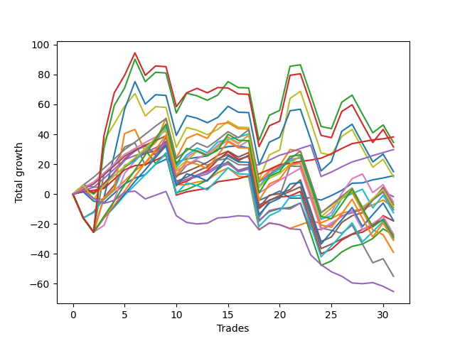

# Long Pointer 001 
- Symbol: ES
- Date Range: 03/18/2022 - 12/30/2022
- Trading Period: 8:30-12:30
- Number of Trades: 31



| Name | Win Percent | Profit | Avg Profit / Trade | Avg Time / Trade |      | Name | Win Percent | Profit | Avg Profit / Trade | Avg Time / Trade |
| ---- | ----------- | ------ | ------------------ | ---------------- | ---- | ---- | ----------- | ------ | ------------------ | ---------------- |
| Sorted By <br> Profit | | | | | | Sorted By <br> Win Percentage ||||
| TP-1 | 96.77 | 19125.00 | 616.94 | 05:34 |     | TP-1 | 96.77 | 19125.00 | 616.94 | 05:34 |
| BB-200 U/L 2SD | 48.39 | 17250.00 | 556.45 | 54:36 |     | TP-2 | 90.32 | 14875.00 | 479.84 | 10:10 |
| NEWFI 000 | 48.39 | 15750.00 | 508.06 | 52:56 |     | TP-3 | 80.65 | -14625.00 | -471.77 | 16:40 |
| TP-2 | 90.32 | 14875.00 | 479.84 | 10:10 |     | BB-20 Mid | 77.42 | 6125.00 | 197.58 | 04:58 |
| BB-100 U/L 2SD | 51.61 | 7500.00 | 241.94 | 52:20 |     | BB-50 U/L 1SD | 77.42 | -3625.00 | -116.94 | 30:34 |
| BB-20 Mid | 77.42 | 6125.00 | 197.58 | 04:58 |     | TP-4 | 77.42 | -13375.00 | -431.45 | 22:42 |
| V U/L 1SD | 48.39 | 5750.00 | 185.48 | 48:49 |     | TP-5 | 74.19 | -5250.00 | -169.35 | 25:54 |
| BB-50 Mid | 67.74 | -875.00 | -28.23 | 18:52 |     | BB-100 Mid | 74.19 | -6250.00 | -201.61 | 30:46 |
| BB-50 U/L 2SD | 67.74 | -2750.00 | -88.71 | 41:15 |     | BB-20 U/L 2SD C | 74.19 | -9000.00 | -290.32 | 22:15 |
| BB-50 U/L 1SD | 77.42 | -3625.00 | -116.94 | 30:34 |     | BB-20 U/L 2SD | 74.19 | -13750.00 | -443.55 | 20:40 |
| TP-6 | 70.97 | -4250.00 | -137.10 | 28:44 |     | TP-6 | 70.97 | -4250.00 | -137.10 | 28:44 |
| BB-20 U/L 1SD | 67.74 | -4500.00 | -145.16 | 12:22 |     | BB-50 Mid | 67.74 | -875.00 | -28.23 | 18:52 |
| TP-5 | 74.19 | -5250.00 | -169.35 | 25:54 |     | BB-50 U/L 2SD | 67.74 | -2750.00 | -88.71 | 41:15 |
| BB-100 Mid | 74.19 | -6250.00 | -201.61 | 30:46 |     | BB-20 U/L 1SD | 67.74 | -4500.00 | -145.16 | 12:22 |
| TP-8 | 61.29 | -8875.00 | -286.29 | 37:47 |     | TP-8 | 61.29 | -8875.00 | -286.29 | 37:47 |
| BB-20 U/L 2SD C | 74.19 | -9000.00 | -290.32 | 22:15 |     | TP-7 | 61.29 | -15000.00 | -483.87 | 34:44 |
| TP-4 | 77.42 | -13375.00 | -431.45 | 22:42 |     | TP-10 | 54.84 | -14250.00 | -459.68 | 45:18 |
| BB-20 U/L 2SD | 74.19 | -13750.00 | -443.55 | 20:40 |     | TP-9 | 54.84 | -15500.00 | -500.00 | 43:09 |
| TP-10 | 54.84 | -14250.00 | -459.68 | 45:18 |     | BB-100 U/L 2SD | 51.61 | 7500.00 | 241.94 | 52:20 |
| TP-3 | 80.65 | -14625.00 | -471.77 | 16:40 |     | BB-200 Mid | 51.61 | -19500.00 | -629.03 | 35:27 |
| TP-7 | 61.29 | -15000.00 | -483.87 | 34:44 |     | BB-200 U/L 2SD | 48.39 | 17250.00 | 556.45 | 54:36 |
| TP-9 | 54.84 | -15500.00 | -500.00 | 43:09 |     | NEWFI 000 | 48.39 | 15750.00 | 508.06 | 52:56 |
| BB-200 Mid | 51.61 | -19500.00 | -629.03 | 35:27 |     | V U/L 1SD | 48.39 | 5750.00 | 185.48 | 48:49 |
| V Mid | 48.39 | -27500.00 | -887.10 | 38:13 |     | V Mid | 48.39 | -27500.00 | -887.10 | 38:13 |
| NEWFI 0000 | 38.71 | -32625.00 | -1052.42 | 10:10 |     | NEWFI 0000 | 38.71 | -32625.00 | -1052.42 | 10:10 |

## NO STOPLOSS

### Test BB-20 Mid
* Sell when price hits the middle line of the 20p bollinger
* No Stoploss
* Results:
```
Total Trades: 31
Percent Up: 77.42
Percent Down: 22.58
Total Points Moved Up: 12.25
Potential Profit: 6125.00
Total Points Ups: 64.25 Count Ups: 24
Total Points Downs: -52.00 Count Downs: 7
```

<details><summary>Trades</summary>

<code>In: 2022-04-12 11:35:00		Out: 2022-04-12 11:36:10		Total Position Time: 01:10		Total Move Up: 1.50		Total to Date: 1.50</code> <br />
<code>In: 2022-04-21 09:56:00		Out: 2022-04-21 10:13:30		Total Position Time: 17:30		Total Move Up: -6.25		Total to Date: -4.75</code> <br />
<code>In: 2022-05-02 11:46:00		Out: 2022-05-02 11:47:10		Total Position Time: 01:10		Total Move Up: -1.00		Total to Date: -5.75</code> <br />
<code>In: 2022-05-06 09:03:00		Out: 2022-05-06 09:04:10		Total Position Time: 01:10		Total Move Up: 6.25		Total to Date: 0.50</code> <br />
<code>In: 2022-05-11 11:01:00		Out: 2022-05-11 11:02:10		Total Position Time: 01:10		Total Move Up: 6.25		Total to Date: 6.75</code> <br />
<code>In: 2022-05-16 09:47:00		Out: 2022-05-16 09:48:15		Total Position Time: 01:15		Total Move Up: 4.00		Total to Date: 10.75</code> <br />
<code>In: 2022-05-18 09:12:00		Out: 2022-05-18 09:14:45		Total Position Time: 02:45		Total Move Up: 2.25		Total to Date: 13.00</code> <br />
<code>In: 2022-05-20 09:48:00		Out: 2022-05-20 09:50:00		Total Position Time: 02:00		Total Move Up: 7.00		Total to Date: 20.00</code> <br />
<code>In: 2022-06-09 08:10:00		Out: 2022-06-09 08:11:10		Total Position Time: 01:10		Total Move Up: 3.25		Total to Date: 23.25</code> <br />
<code>In: 2022-06-13 12:17:00		Out: 2022-06-13 12:18:10		Total Position Time: 01:10		Total Move Up: -2.00		Total to Date: 21.25</code> <br />
<code>In: 2022-07-08 09:48:00		Out: 2022-07-08 09:49:10		Total Position Time: 01:10		Total Move Up: 2.25		Total to Date: 23.50</code> <br />
<code>In: 2022-07-12 10:28:00		Out: 2022-07-12 10:29:10		Total Position Time: 01:10		Total Move Up: 1.00		Total to Date: 24.50</code> <br />
<code>In: 2022-07-25 11:23:00		Out: 2022-07-25 11:24:25		Total Position Time: 01:25		Total Move Up: 1.00		Total to Date: 25.50</code> <br />
<code>In: 2022-07-26 12:11:00		Out: 2022-07-26 12:12:10		Total Position Time: 01:10		Total Move Up: 4.50		Total to Date: 30.00</code> <br />
<code>In: 2022-08-04 11:43:00		Out: 2022-08-04 11:44:20		Total Position Time: 01:20		Total Move Up: 1.75		Total to Date: 31.75</code> <br />
<code>In: 2022-08-09 09:05:00		Out: 2022-08-09 09:06:10		Total Position Time: 01:10		Total Move Up: 0.50		Total to Date: 32.25</code> <br />
<code>In: 2022-09-12 11:25:00		Out: 2022-09-12 11:37:50		Total Position Time: 12:50		Total Move Up: -1.50		Total to Date: 30.75</code> <br />
<code>In: 2022-09-13 12:00:00		Out: 2022-09-13 12:47:00		Total Position Time: 47:00		Total Move Up: -35.00		Total to Date: -4.25</code> <br />
<code>In: 2022-09-22 11:28:00		Out: 2022-09-22 11:29:10		Total Position Time: 01:10		Total Move Up: 3.00		Total to Date: -1.25</code> <br />
<code>In: 2022-10-05 07:21:00		Out: 2022-10-05 07:22:10		Total Position Time: 01:10		Total Move Up: 3.25		Total to Date: 2.00</code> <br />
<code>In: 2022-10-10 09:56:00		Out: 2022-10-10 10:11:30		Total Position Time: 15:30		Total Move Up: -4.75		Total to Date: -2.75</code> <br />
<code>In: 2022-10-17 11:28:00		Out: 2022-10-17 11:35:40		Total Position Time: 07:40		Total Move Up: 0.00		Total to Date: -2.75</code> <br />
<code>In: 2022-10-19 09:32:00		Out: 2022-10-19 09:33:10		Total Position Time: 01:10		Total Move Up: 0.25		Total to Date: -2.50</code> <br />
<code>In: 2022-10-20 10:12:00		Out: 2022-10-20 10:22:05		Total Position Time: 10:05		Total Move Up: -1.50		Total to Date: -4.00</code> <br />
<code>In: 2022-10-27 12:01:00		Out: 2022-10-27 12:02:10		Total Position Time: 01:10		Total Move Up: 3.00		Total to Date: -1.00</code> <br />
<code>In: 2022-11-10 09:58:00		Out: 2022-11-10 10:02:05		Total Position Time: 04:05		Total Move Up: 3.50		Total to Date: 2.50</code> <br />
<code>In: 2022-11-15 07:54:00		Out: 2022-11-15 07:55:20		Total Position Time: 01:20		Total Move Up: 4.75		Total to Date: 7.25</code> <br />
<code>In: 2022-12-05 09:58:00		Out: 2022-12-05 10:01:05		Total Position Time: 03:05		Total Move Up: 0.25		Total to Date: 7.50</code> <br />
<code>In: 2022-12-06 10:35:00		Out: 2022-12-06 10:36:15		Total Position Time: 01:15		Total Move Up: 2.00		Total to Date: 9.50</code> <br />
<code>In: 2022-12-08 08:24:00		Out: 2022-12-08 08:27:05		Total Position Time: 03:05		Total Move Up: 1.25		Total to Date: 10.75</code> <br />
<code>In: 2022-12-19 11:07:00		Out: 2022-12-19 11:12:40		Total Position Time: 05:40		Total Move Up: 1.50		Total to Date: 12.25</code> <br />


</details>

### Test BB-20 U/L 1SD
* Sell when the price hits the upper line of the 20p 1std bollinger
* No Stoploss
* Results:
```
Total Trades: 31
Percent Up: 67.74
Percent Down: 32.26
Total Points Moved Up: -9.00
Potential Profit: -4500.00
Total Points Ups: 75.75 Count Ups: 21
Total Points Downs: -84.75 Count Downs: 10
```

<details><summary>Trades</summary>

<code>In: 2022-04-12 11:35:00		Out: 2022-04-12 11:37:20		Total Position Time: 02:20		Total Move Up: 3.50		Total to Date: 3.50</code> <br />
<code>In: 2022-04-21 09:56:00		Out: 2022-04-21 10:21:20		Total Position Time: 25:20		Total Move Up: -6.25		Total to Date: -2.75</code> <br />
<code>In: 2022-05-02 11:46:00		Out: 2022-05-02 11:47:10		Total Position Time: 01:10		Total Move Up: -1.00		Total to Date: -3.75</code> <br />
<code>In: 2022-05-06 09:03:00		Out: 2022-05-06 09:04:10		Total Position Time: 01:10		Total Move Up: 6.25		Total to Date: 2.50</code> <br />
<code>In: 2022-05-11 11:01:00		Out: 2022-05-11 11:02:10		Total Position Time: 01:10		Total Move Up: 6.25		Total to Date: 8.75</code> <br />
<code>In: 2022-05-16 09:47:00		Out: 2022-05-16 09:50:05		Total Position Time: 03:05		Total Move Up: 6.75		Total to Date: 15.50</code> <br />
<code>In: 2022-05-18 09:12:00		Out: 2022-05-18 09:16:30		Total Position Time: 04:30		Total Move Up: 5.25		Total to Date: 20.75</code> <br />
<code>In: 2022-05-20 09:48:00		Out: 2022-05-20 09:56:15		Total Position Time: 08:15		Total Move Up: 7.50		Total to Date: 28.25</code> <br />
<code>In: 2022-06-09 08:10:00		Out: 2022-06-09 08:21:10		Total Position Time: 11:10		Total Move Up: 4.75		Total to Date: 33.00</code> <br />
<code>In: 2022-06-13 12:17:00		Out: 2022-06-13 12:47:00		Total Position Time: 30:00		Total Move Up: -26.75		Total to Date: 6.25</code> <br />
<code>In: 2022-07-08 09:48:00		Out: 2022-07-08 10:06:55		Total Position Time: 18:55		Total Move Up: 0.00		Total to Date: 6.25</code> <br />
<code>In: 2022-07-12 10:28:00		Out: 2022-07-12 10:30:05		Total Position Time: 02:05		Total Move Up: 1.75		Total to Date: 8.00</code> <br />
<code>In: 2022-07-25 11:23:00		Out: 2022-07-25 11:35:25		Total Position Time: 12:25		Total Move Up: 1.25		Total to Date: 9.25</code> <br />
<code>In: 2022-07-26 12:11:00		Out: 2022-07-26 12:12:15		Total Position Time: 01:15		Total Move Up: 5.00		Total to Date: 14.25</code> <br />
<code>In: 2022-08-04 11:43:00		Out: 2022-08-04 11:48:05		Total Position Time: 05:05		Total Move Up: 3.25		Total to Date: 17.50</code> <br />
<code>In: 2022-08-09 09:05:00		Out: 2022-08-09 09:44:15		Total Position Time: 39:15		Total Move Up: -5.50		Total to Date: 12.00</code> <br />
<code>In: 2022-09-12 11:25:00		Out: 2022-09-12 11:40:30		Total Position Time: 15:30		Total Move Up: -0.75		Total to Date: 11.25</code> <br />
<code>In: 2022-09-13 12:00:00		Out: 2022-09-13 12:47:00		Total Position Time: 47:00		Total Move Up: -35.00		Total to Date: -23.75</code> <br />
<code>In: 2022-09-22 11:28:00		Out: 2022-09-22 11:32:55		Total Position Time: 04:55		Total Move Up: 4.25		Total to Date: -19.50</code> <br />
<code>In: 2022-10-05 07:21:00		Out: 2022-10-05 07:41:55		Total Position Time: 20:55		Total Move Up: -1.00		Total to Date: -20.50</code> <br />
<code>In: 2022-10-10 09:56:00		Out: 2022-10-10 10:12:10		Total Position Time: 16:10		Total Move Up: -2.50		Total to Date: -23.00</code> <br />
<code>In: 2022-10-17 11:28:00		Out: 2022-10-17 11:36:10		Total Position Time: 08:10		Total Move Up: 2.50		Total to Date: -20.50</code> <br />
<code>In: 2022-10-19 09:32:00		Out: 2022-10-19 09:36:10		Total Position Time: 04:10		Total Move Up: 2.25		Total to Date: -18.25</code> <br />
<code>In: 2022-10-20 10:12:00		Out: 2022-10-20 10:26:55		Total Position Time: 14:55		Total Move Up: -1.00		Total to Date: -19.25</code> <br />
<code>In: 2022-10-27 12:01:00		Out: 2022-10-27 12:02:10		Total Position Time: 01:10		Total Move Up: 3.00		Total to Date: -16.25</code> <br />
<code>In: 2022-11-10 09:58:00		Out: 2022-11-10 10:02:05		Total Position Time: 04:05		Total Move Up: 3.50		Total to Date: -12.75</code> <br />
<code>In: 2022-11-15 07:54:00		Out: 2022-11-15 08:15:00		Total Position Time: 21:00		Total Move Up: 1.50		Total to Date: -11.25</code> <br />
<code>In: 2022-12-05 09:58:00		Out: 2022-12-05 10:07:40		Total Position Time: 09:40		Total Move Up: 1.25		Total to Date: -10.00</code> <br />
<code>In: 2022-12-06 10:35:00		Out: 2022-12-06 10:40:25		Total Position Time: 05:25		Total Move Up: 2.75		Total to Date: -7.25</code> <br />
<code>In: 2022-12-08 08:24:00		Out: 2022-12-08 08:29:05		Total Position Time: 05:05		Total Move Up: 3.25		Total to Date: -4.00</code> <br />
<code>In: 2022-12-19 11:07:00		Out: 2022-12-19 11:45:05		Total Position Time: 38:05		Total Move Up: -5.00		Total to Date: -9.00</code> <br />


</details>

### Test BB-20 U/L 2SD
* Sell when the price hits the upper line of the 20p 2std bollinger
* No Stoploss
* Results:
```
Total Trades: 31
Percent Up: 74.19
Percent Down: 25.81
Total Points Moved Up: -27.50
Potential Profit: -13750.00
Total Points Ups: 99.50 Count Ups: 23
Total Points Downs: -127.00 Count Downs: 8
```

<details><summary>Trades</summary>

<code>In: 2022-04-12 11:35:00		Out: 2022-04-12 11:46:50		Total Position Time: 11:50		Total Move Up: 4.00		Total to Date: 4.00</code> <br />
<code>In: 2022-04-21 09:56:00		Out: 2022-04-21 10:22:05		Total Position Time: 26:05		Total Move Up: -4.00		Total to Date: 0.00</code> <br />
<code>In: 2022-05-02 11:46:00		Out: 2022-05-02 11:53:35		Total Position Time: 07:35		Total Move Up: 6.00		Total to Date: 6.00</code> <br />
<code>In: 2022-05-06 09:03:00		Out: 2022-05-06 09:04:10		Total Position Time: 01:10		Total Move Up: 6.25		Total to Date: 12.25</code> <br />
<code>In: 2022-05-11 11:01:00		Out: 2022-05-11 11:02:35		Total Position Time: 01:35		Total Move Up: 5.75		Total to Date: 18.00</code> <br />
<code>In: 2022-05-16 09:47:00		Out: 2022-05-16 10:06:30		Total Position Time: 19:30		Total Move Up: 4.50		Total to Date: 22.50</code> <br />
<code>In: 2022-05-18 09:12:00		Out: 2022-05-18 09:17:50		Total Position Time: 05:50		Total Move Up: 7.00		Total to Date: 29.50</code> <br />
<code>In: 2022-05-20 09:48:00		Out: 2022-05-20 10:33:15		Total Position Time: 45:15		Total Move Up: -9.00		Total to Date: 20.50</code> <br />
<code>In: 2022-06-09 08:10:00		Out: 2022-06-09 08:22:35		Total Position Time: 12:35		Total Move Up: 7.00		Total to Date: 27.50</code> <br />
<code>In: 2022-06-13 12:17:00		Out: 2022-06-13 12:47:00		Total Position Time: 30:00		Total Move Up: -26.75		Total to Date: 0.75</code> <br />
<code>In: 2022-07-08 09:48:00		Out: 2022-07-08 10:11:05		Total Position Time: 23:05		Total Move Up: 2.25		Total to Date: 3.00</code> <br />
<code>In: 2022-07-12 10:28:00		Out: 2022-07-12 10:31:30		Total Position Time: 03:30		Total Move Up: 3.00		Total to Date: 6.00</code> <br />
<code>In: 2022-07-25 11:23:00		Out: 2022-07-25 11:35:50		Total Position Time: 12:50		Total Move Up: 3.25		Total to Date: 9.25</code> <br />
<code>In: 2022-07-26 12:11:00		Out: 2022-07-26 12:33:05		Total Position Time: 22:05		Total Move Up: 7.00		Total to Date: 16.25</code> <br />
<code>In: 2022-08-04 11:43:00		Out: 2022-08-04 11:52:05		Total Position Time: 09:05		Total Move Up: 5.50		Total to Date: 21.75</code> <br />
<code>In: 2022-08-09 09:05:00		Out: 2022-08-09 09:57:15		Total Position Time: 52:15		Total Move Up: -6.25		Total to Date: 15.50</code> <br />
<code>In: 2022-09-12 11:25:00		Out: 2022-09-12 11:46:40		Total Position Time: 21:40		Total Move Up: 2.00		Total to Date: 17.50</code> <br />
<code>In: 2022-09-13 12:00:00		Out: 2022-09-13 12:47:00		Total Position Time: 47:00		Total Move Up: -35.00		Total to Date: -17.50</code> <br />
<code>In: 2022-09-22 11:28:00		Out: 2022-09-22 11:38:10		Total Position Time: 10:10		Total Move Up: 5.75		Total to Date: -11.75</code> <br />
<code>In: 2022-10-05 07:21:00		Out: 2022-10-05 07:42:20		Total Position Time: 21:20		Total Move Up: 2.00		Total to Date: -9.75</code> <br />
<code>In: 2022-10-10 09:56:00		Out: 2022-10-10 10:12:50		Total Position Time: 16:50		Total Move Up: 0.75		Total to Date: -9.00</code> <br />
<code>In: 2022-10-17 11:28:00		Out: 2022-10-17 11:37:30		Total Position Time: 09:30		Total Move Up: 3.00		Total to Date: -6.00</code> <br />
<code>In: 2022-10-19 09:32:00		Out: 2022-10-19 10:23:05		Total Position Time: 51:05		Total Move Up: -20.75		Total to Date: -26.75</code> <br />
<code>In: 2022-10-20 10:12:00		Out: 2022-10-20 11:12:55		Total Position Time: 60:55		Total Move Up: -21.00		Total to Date: -47.75</code> <br />
<code>In: 2022-10-27 12:01:00		Out: 2022-10-27 12:02:10		Total Position Time: 01:10		Total Move Up: 3.00		Total to Date: -44.75</code> <br />
<code>In: 2022-11-10 09:58:00		Out: 2022-11-10 10:03:45		Total Position Time: 05:45		Total Move Up: 6.00		Total to Date: -38.75</code> <br />
<code>In: 2022-11-15 07:54:00		Out: 2022-11-15 08:30:35		Total Position Time: 36:35		Total Move Up: 3.75		Total to Date: -35.00</code> <br />
<code>In: 2022-12-05 09:58:00		Out: 2022-12-05 10:13:35		Total Position Time: 15:35		Total Move Up: 1.50		Total to Date: -33.50</code> <br />
<code>In: 2022-12-06 10:35:00		Out: 2022-12-06 10:41:20		Total Position Time: 06:20		Total Move Up: 3.75		Total to Date: -29.75</code> <br />
<code>In: 2022-12-08 08:24:00		Out: 2022-12-08 08:38:25		Total Position Time: 14:25		Total Move Up: 6.50		Total to Date: -23.25</code> <br />
<code>In: 2022-12-19 11:07:00		Out: 2022-12-19 11:45:15		Total Position Time: 38:15		Total Move Up: -4.25		Total to Date: -27.50</code> <br />


</details>

### Test BB-20 U/L 2SD C
* Sell when the price hits the upper line of the 20p 2std bollinger
* No Stoploss
* Results:
```
Total Trades: 31
Percent Up: 74.19
Percent Down: 25.81
Total Points Moved Up: -18.00
Potential Profit: -9000.00
Total Points Ups: 104.50 Count Ups: 23
Total Points Downs: -122.50 Count Downs: 8
```

<details><summary>Trades</summary>

<code>In: 2022-04-12 11:35:00		Out: 2022-04-12 11:47:00		Total Position Time: 12:00		Total Move Up: 4.50		Total to Date: 4.50</code> <br />
<code>In: 2022-04-21 09:56:00		Out: 2022-04-21 10:22:15		Total Position Time: 26:15		Total Move Up: -3.50		Total to Date: 1.00</code> <br />
<code>In: 2022-05-02 11:46:00		Out: 2022-05-02 11:53:35		Total Position Time: 07:35		Total Move Up: 6.00		Total to Date: 7.00</code> <br />
<code>In: 2022-05-06 09:03:00		Out: 2022-05-06 09:05:00		Total Position Time: 02:00		Total Move Up: 7.25		Total to Date: 14.25</code> <br />
<code>In: 2022-05-11 11:01:00		Out: 2022-05-11 11:04:55		Total Position Time: 03:55		Total Move Up: 9.25		Total to Date: 23.50</code> <br />
<code>In: 2022-05-16 09:47:00		Out: 2022-05-16 10:07:00		Total Position Time: 20:00		Total Move Up: 5.25		Total to Date: 28.75</code> <br />
<code>In: 2022-05-18 09:12:00		Out: 2022-05-18 09:47:55		Total Position Time: 35:55		Total Move Up: 4.25		Total to Date: 33.00</code> <br />
<code>In: 2022-05-20 09:48:00		Out: 2022-05-20 10:33:20		Total Position Time: 45:20		Total Move Up: -7.00		Total to Date: 26.00</code> <br />
<code>In: 2022-06-09 08:10:00		Out: 2022-06-09 08:22:35		Total Position Time: 12:35		Total Move Up: 7.00		Total to Date: 33.00</code> <br />
<code>In: 2022-06-13 12:17:00		Out: 2022-06-13 12:47:00		Total Position Time: 30:00		Total Move Up: -26.75		Total to Date: 6.25</code> <br />
<code>In: 2022-07-08 09:48:00		Out: 2022-07-08 10:11:05		Total Position Time: 23:05		Total Move Up: 2.25		Total to Date: 8.50</code> <br />
<code>In: 2022-07-12 10:28:00		Out: 2022-07-12 10:41:40		Total Position Time: 13:40		Total Move Up: 4.00		Total to Date: 12.50</code> <br />
<code>In: 2022-07-25 11:23:00		Out: 2022-07-25 11:35:50		Total Position Time: 12:50		Total Move Up: 3.25		Total to Date: 15.75</code> <br />
<code>In: 2022-07-26 12:11:00		Out: 2022-07-26 12:33:05		Total Position Time: 22:05		Total Move Up: 7.00		Total to Date: 22.75</code> <br />
<code>In: 2022-08-04 11:43:00		Out: 2022-08-04 11:52:05		Total Position Time: 09:05		Total Move Up: 5.50		Total to Date: 28.25</code> <br />
<code>In: 2022-08-09 09:05:00		Out: 2022-08-09 09:59:50		Total Position Time: 54:50		Total Move Up: -5.00		Total to Date: 23.25</code> <br />
<code>In: 2022-09-12 11:25:00		Out: 2022-09-12 11:46:40		Total Position Time: 21:40		Total Move Up: 2.00		Total to Date: 25.25</code> <br />
<code>In: 2022-09-13 12:00:00		Out: 2022-09-13 12:47:00		Total Position Time: 47:00		Total Move Up: -35.00		Total to Date: -9.75</code> <br />
<code>In: 2022-09-22 11:28:00		Out: 2022-09-22 11:38:10		Total Position Time: 10:10		Total Move Up: 5.75		Total to Date: -4.00</code> <br />
<code>In: 2022-10-05 07:21:00		Out: 2022-10-05 07:42:20		Total Position Time: 21:20		Total Move Up: 2.00		Total to Date: -2.00</code> <br />
<code>In: 2022-10-10 09:56:00		Out: 2022-10-10 10:13:30		Total Position Time: 17:30		Total Move Up: 0.75		Total to Date: -1.25</code> <br />
<code>In: 2022-10-17 11:28:00		Out: 2022-10-17 11:37:55		Total Position Time: 09:55		Total Move Up: 3.00		Total to Date: 1.75</code> <br />
<code>In: 2022-10-19 09:32:00		Out: 2022-10-19 10:23:05		Total Position Time: 51:05		Total Move Up: -20.75		Total to Date: -19.00</code> <br />
<code>In: 2022-10-20 10:12:00		Out: 2022-10-20 11:12:55		Total Position Time: 60:55		Total Move Up: -21.00		Total to Date: -40.00</code> <br />
<code>In: 2022-10-27 12:01:00		Out: 2022-10-27 12:02:10		Total Position Time: 01:10		Total Move Up: 3.00		Total to Date: -37.00</code> <br />
<code>In: 2022-11-10 09:58:00		Out: 2022-11-10 10:03:55		Total Position Time: 05:55		Total Move Up: 6.25		Total to Date: -30.75</code> <br />
<code>In: 2022-11-15 07:54:00		Out: 2022-11-15 08:30:35		Total Position Time: 36:35		Total Move Up: 3.75		Total to Date: -27.00</code> <br />
<code>In: 2022-12-05 09:58:00		Out: 2022-12-05 10:13:35		Total Position Time: 15:35		Total Move Up: 1.50		Total to Date: -25.50</code> <br />
<code>In: 2022-12-06 10:35:00		Out: 2022-12-06 10:41:25		Total Position Time: 06:25		Total Move Up: 4.00		Total to Date: -21.50</code> <br />
<code>In: 2022-12-08 08:24:00		Out: 2022-12-08 08:38:50		Total Position Time: 14:50		Total Move Up: 7.00		Total to Date: -14.50</code> <br />
<code>In: 2022-12-19 11:07:00		Out: 2022-12-19 11:45:45		Total Position Time: 38:45		Total Move Up: -3.50		Total to Date: -18.00</code> <br />


</details>

### Test BB-50 Mid
* Sell when price hits the middle line of the 50p bollinger
* No Stoploss
* Results:
```
Total Trades: 31
Percent Up: 67.74
Percent Down: 32.26
Total Points Moved Up: -1.75
Potential Profit: -875.00
Total Points Ups: 95.25 Count Ups: 21
Total Points Downs: -97.00 Count Downs: 10
```

<details><summary>Trades</summary>

<code>In: 2022-04-12 11:35:00		Out: 2022-04-12 11:47:05		Total Position Time: 12:05		Total Move Up: 6.00		Total to Date: 6.00</code> <br />
<code>In: 2022-04-21 09:56:00		Out: 2022-04-21 10:22:30		Total Position Time: 26:30		Total Move Up: -1.25		Total to Date: 4.75</code> <br />
<code>In: 2022-05-02 11:46:00		Out: 2022-05-02 11:49:15		Total Position Time: 03:15		Total Move Up: -0.50		Total to Date: 4.25</code> <br />
<code>In: 2022-05-06 09:03:00		Out: 2022-05-06 09:06:05		Total Position Time: 03:05		Total Move Up: 10.25		Total to Date: 14.50</code> <br />
<code>In: 2022-05-11 11:01:00		Out: 2022-05-11 11:04:45		Total Position Time: 03:45		Total Move Up: 8.00		Total to Date: 22.50</code> <br />
<code>In: 2022-05-16 09:47:00		Out: 2022-05-16 09:50:05		Total Position Time: 03:05		Total Move Up: 6.75		Total to Date: 29.25</code> <br />
<code>In: 2022-05-18 09:12:00		Out: 2022-05-18 09:36:05		Total Position Time: 24:05		Total Move Up: 2.75		Total to Date: 32.00</code> <br />
<code>In: 2022-05-20 09:48:00		Out: 2022-05-20 10:33:25		Total Position Time: 45:25		Total Move Up: -5.50		Total to Date: 26.50</code> <br />
<code>In: 2022-06-09 08:10:00		Out: 2022-06-09 08:22:45		Total Position Time: 12:45		Total Move Up: 7.75		Total to Date: 34.25</code> <br />
<code>In: 2022-06-13 12:17:00		Out: 2022-06-13 12:47:00		Total Position Time: 30:00		Total Move Up: -26.75		Total to Date: 7.50</code> <br />
<code>In: 2022-07-08 09:48:00		Out: 2022-07-08 10:11:10		Total Position Time: 23:10		Total Move Up: 2.25		Total to Date: 9.75</code> <br />
<code>In: 2022-07-12 10:28:00		Out: 2022-07-12 10:41:35		Total Position Time: 13:35		Total Move Up: 3.00		Total to Date: 12.75</code> <br />
<code>In: 2022-07-25 11:23:00		Out: 2022-07-25 11:35:45		Total Position Time: 12:45		Total Move Up: 2.00		Total to Date: 14.75</code> <br />
<code>In: 2022-07-26 12:11:00		Out: 2022-07-26 12:12:10		Total Position Time: 01:10		Total Move Up: 4.50		Total to Date: 19.25</code> <br />
<code>In: 2022-08-04 11:43:00		Out: 2022-08-04 11:44:20		Total Position Time: 01:20		Total Move Up: 1.75		Total to Date: 21.00</code> <br />
<code>In: 2022-08-09 09:05:00		Out: 2022-08-09 09:57:15		Total Position Time: 52:15		Total Move Up: -6.25		Total to Date: 14.75</code> <br />
<code>In: 2022-09-12 11:25:00		Out: 2022-09-12 11:46:40		Total Position Time: 21:40		Total Move Up: 2.00		Total to Date: 16.75</code> <br />
<code>In: 2022-09-13 12:00:00		Out: 2022-09-13 12:47:00		Total Position Time: 47:00		Total Move Up: -35.00		Total to Date: -18.25</code> <br />
<code>In: 2022-09-22 11:28:00		Out: 2022-09-22 11:38:20		Total Position Time: 10:20		Total Move Up: 7.25		Total to Date: -11.00</code> <br />
<code>In: 2022-10-05 07:21:00		Out: 2022-10-05 07:46:30		Total Position Time: 25:30		Total Move Up: 1.50		Total to Date: -9.50</code> <br />
<code>In: 2022-10-10 09:56:00		Out: 2022-10-10 10:12:35		Total Position Time: 16:35		Total Move Up: -0.50		Total to Date: -10.00</code> <br />
<code>In: 2022-10-17 11:28:00		Out: 2022-10-17 11:39:15		Total Position Time: 11:15		Total Move Up: 4.00		Total to Date: -6.00</code> <br />
<code>In: 2022-10-19 09:32:00		Out: 2022-10-19 10:26:35		Total Position Time: 54:35		Total Move Up: -17.50		Total to Date: -23.50</code> <br />
<code>In: 2022-10-20 10:12:00		Out: 2022-10-20 10:37:05		Total Position Time: 25:05		Total Move Up: -0.25		Total to Date: -23.75</code> <br />
<code>In: 2022-10-27 12:01:00		Out: 2022-10-27 12:02:10		Total Position Time: 01:10		Total Move Up: 3.00		Total to Date: -20.75</code> <br />
<code>In: 2022-11-10 09:58:00		Out: 2022-11-10 10:03:55		Total Position Time: 05:55		Total Move Up: 6.25		Total to Date: -14.50</code> <br />
<code>In: 2022-11-15 07:54:00		Out: 2022-11-15 08:15:50		Total Position Time: 21:50		Total Move Up: 2.00		Total to Date: -12.50</code> <br />
<code>In: 2022-12-05 09:58:00		Out: 2022-12-05 10:14:10		Total Position Time: 16:10		Total Move Up: 2.25		Total to Date: -10.25</code> <br />
<code>In: 2022-12-06 10:35:00		Out: 2022-12-06 10:41:40		Total Position Time: 06:40		Total Move Up: 6.25		Total to Date: -4.00</code> <br />
<code>In: 2022-12-08 08:24:00		Out: 2022-12-08 08:38:15		Total Position Time: 14:15		Total Move Up: 5.75		Total to Date: 1.75</code> <br />
<code>In: 2022-12-19 11:07:00		Out: 2022-12-19 11:45:45		Total Position Time: 38:45		Total Move Up: -3.50		Total to Date: -1.75</code> <br />


</details>

### Test BB-50 U/L 1SD
* Sell when the price hits the upper line of the 50p 1std bollinger
* No Stoploss
* Results:
```
Total Trades: 31
Percent Up: 77.42
Percent Down: 22.58
Total Points Moved Up: -7.25
Potential Profit: -3625.00
Total Points Ups: 127.75 Count Ups: 24
Total Points Downs: -135.00 Count Downs: 7
```

<details><summary>Trades</summary>

<code>In: 2022-04-12 11:35:00		Out: 2022-04-12 12:35:55		Total Position Time: 60:55		Total Move Up: -16.00		Total to Date: -16.00</code> <br />
<code>In: 2022-04-21 09:56:00		Out: 2022-04-21 10:31:15		Total Position Time: 35:15		Total Move Up: 4.00		Total to Date: -12.00</code> <br />
<code>In: 2022-05-02 11:46:00		Out: 2022-05-02 11:53:40		Total Position Time: 07:40		Total Move Up: 9.50		Total to Date: -2.50</code> <br />
<code>In: 2022-05-06 09:03:00		Out: 2022-05-06 09:23:05		Total Position Time: 20:05		Total Move Up: 8.50		Total to Date: 6.00</code> <br />
<code>In: 2022-05-11 11:01:00		Out: 2022-05-11 11:18:15		Total Position Time: 17:15		Total Move Up: 12.25		Total to Date: 18.25</code> <br />
<code>In: 2022-05-16 09:47:00		Out: 2022-05-16 10:07:05		Total Position Time: 20:05		Total Move Up: 5.25		Total to Date: 23.50</code> <br />
<code>In: 2022-05-18 09:12:00		Out: 2022-05-18 09:47:50		Total Position Time: 35:50		Total Move Up: 3.75		Total to Date: 27.25</code> <br />
<code>In: 2022-05-20 09:48:00		Out: 2022-05-20 10:34:55		Total Position Time: 46:55		Total Move Up: 1.75		Total to Date: 29.00</code> <br />
<code>In: 2022-06-09 08:10:00		Out: 2022-06-09 08:39:45		Total Position Time: 29:45		Total Move Up: 6.25		Total to Date: 35.25</code> <br />
<code>In: 2022-06-13 12:17:00		Out: 2022-06-13 12:47:00		Total Position Time: 30:00		Total Move Up: -26.75		Total to Date: 8.50</code> <br />
<code>In: 2022-07-08 09:48:00		Out: 2022-07-08 10:26:30		Total Position Time: 38:30		Total Move Up: 2.75		Total to Date: 11.25</code> <br />
<code>In: 2022-07-12 10:28:00		Out: 2022-07-12 10:53:20		Total Position Time: 25:20		Total Move Up: 4.00		Total to Date: 15.25</code> <br />
<code>In: 2022-07-25 11:23:00		Out: 2022-07-25 11:41:00		Total Position Time: 18:00		Total Move Up: 3.00		Total to Date: 18.25</code> <br />
<code>In: 2022-07-26 12:11:00		Out: 2022-07-26 12:12:40		Total Position Time: 01:40		Total Move Up: 5.25		Total to Date: 23.50</code> <br />
<code>In: 2022-08-04 11:43:00		Out: 2022-08-04 11:47:50		Total Position Time: 04:50		Total Move Up: 3.00		Total to Date: 26.50</code> <br />
<code>In: 2022-08-09 09:05:00		Out: 2022-08-09 10:00:15		Total Position Time: 55:15		Total Move Up: -4.25		Total to Date: 22.25</code> <br />
<code>In: 2022-09-12 11:25:00		Out: 2022-09-12 11:52:10		Total Position Time: 27:10		Total Move Up: 3.75		Total to Date: 26.00</code> <br />
<code>In: 2022-09-13 12:00:00		Out: 2022-09-13 12:47:00		Total Position Time: 47:00		Total Move Up: -35.00		Total to Date: -9.00</code> <br />
<code>In: 2022-09-22 11:28:00		Out: 2022-09-22 11:52:35		Total Position Time: 24:35		Total Move Up: 8.25		Total to Date: -0.75</code> <br />
<code>In: 2022-10-05 07:21:00		Out: 2022-10-05 08:03:10		Total Position Time: 42:10		Total Move Up: 1.00		Total to Date: 0.25</code> <br />
<code>In: 2022-10-10 09:56:00		Out: 2022-10-10 10:23:35		Total Position Time: 27:35		Total Move Up: 2.75		Total to Date: 3.00</code> <br />
<code>In: 2022-10-17 11:28:00		Out: 2022-10-17 11:43:20		Total Position Time: 15:20		Total Move Up: 6.50		Total to Date: 9.50</code> <br />
<code>In: 2022-10-19 09:32:00		Out: 2022-10-19 10:32:55		Total Position Time: 60:55		Total Move Up: -20.25		Total to Date: -10.75</code> <br />
<code>In: 2022-10-20 10:12:00		Out: 2022-10-20 11:12:55		Total Position Time: 60:55		Total Move Up: -21.00		Total to Date: -31.75</code> <br />
<code>In: 2022-10-27 12:01:00		Out: 2022-10-27 12:02:10		Total Position Time: 01:10		Total Move Up: 3.00		Total to Date: -28.75</code> <br />
<code>In: 2022-11-10 09:58:00		Out: 2022-11-10 10:13:45		Total Position Time: 15:45		Total Move Up: 9.75		Total to Date: -19.00</code> <br />
<code>In: 2022-11-15 07:54:00		Out: 2022-11-15 08:30:45		Total Position Time: 36:45		Total Move Up: 4.50		Total to Date: -14.50</code> <br />
<code>In: 2022-12-05 09:58:00		Out: 2022-12-05 10:39:20		Total Position Time: 41:20		Total Move Up: 2.00		Total to Date: -12.50</code> <br />
<code>In: 2022-12-06 10:35:00		Out: 2022-12-06 10:49:00		Total Position Time: 14:00		Total Move Up: 8.50		Total to Date: -4.00</code> <br />
<code>In: 2022-12-08 08:24:00		Out: 2022-12-08 08:48:45		Total Position Time: 24:45		Total Move Up: 8.50		Total to Date: 4.50</code> <br />
<code>In: 2022-12-19 11:07:00		Out: 2022-12-19 12:07:55		Total Position Time: 60:55		Total Move Up: -11.75		Total to Date: -7.25</code> <br />


</details>

### Test BB-50 U/L 2SD
* Sell when the price hits the upper line of the 50p 2std bollinger
* No Stoploss
* Results:
```
Total Trades: 31
Percent Up: 67.74
Percent Down: 32.26
Total Points Moved Up: -5.50
Potential Profit: -2750.00
Total Points Ups: 154.25 Count Ups: 21
Total Points Downs: -159.75 Count Downs: 10
```

<details><summary>Trades</summary>

<code>In: 2022-04-12 11:35:00		Out: 2022-04-12 12:35:55		Total Position Time: 60:55		Total Move Up: -16.00		Total to Date: -16.00</code> <br />
<code>In: 2022-04-21 09:56:00		Out: 2022-04-21 10:56:55		Total Position Time: 60:55		Total Move Up: -9.50		Total to Date: -25.50</code> <br />
<code>In: 2022-05-02 11:46:00		Out: 2022-05-02 12:03:30		Total Position Time: 17:30		Total Move Up: 4.50		Total to Date: -21.00</code> <br />
<code>In: 2022-05-06 09:03:00		Out: 2022-05-06 09:35:05		Total Position Time: 32:05		Total Move Up: 17.25		Total to Date: -3.75</code> <br />
<code>In: 2022-05-11 11:01:00		Out: 2022-05-11 11:23:40		Total Position Time: 22:40		Total Move Up: 17.50		Total to Date: 13.75</code> <br />
<code>In: 2022-05-16 09:47:00		Out: 2022-05-16 10:07:35		Total Position Time: 20:35		Total Move Up: 8.50		Total to Date: 22.25</code> <br />
<code>In: 2022-05-18 09:12:00		Out: 2022-05-18 09:50:35		Total Position Time: 38:35		Total Move Up: 7.75		Total to Date: 30.00</code> <br />
<code>In: 2022-05-20 09:48:00		Out: 2022-05-20 10:46:10		Total Position Time: 58:10		Total Move Up: 7.75		Total to Date: 37.75</code> <br />
<code>In: 2022-06-09 08:10:00		Out: 2022-06-09 08:41:45		Total Position Time: 31:45		Total Move Up: 8.50		Total to Date: 46.25</code> <br />
<code>In: 2022-06-13 12:17:00		Out: 2022-06-13 12:47:00		Total Position Time: 30:00		Total Move Up: -26.75		Total to Date: 19.50</code> <br />
<code>In: 2022-07-08 09:48:00		Out: 2022-07-08 10:27:00		Total Position Time: 39:00		Total Move Up: 5.00		Total to Date: 24.50</code> <br />
<code>In: 2022-07-12 10:28:00		Out: 2022-07-12 10:54:05		Total Position Time: 26:05		Total Move Up: 4.75		Total to Date: 29.25</code> <br />
<code>In: 2022-07-25 11:23:00		Out: 2022-07-25 12:23:55		Total Position Time: 60:55		Total Move Up: -3.00		Total to Date: 26.25</code> <br />
<code>In: 2022-07-26 12:11:00		Out: 2022-07-26 12:17:00		Total Position Time: 06:00		Total Move Up: 6.50		Total to Date: 32.75</code> <br />
<code>In: 2022-08-04 11:43:00		Out: 2022-08-04 11:52:05		Total Position Time: 09:05		Total Move Up: 5.50		Total to Date: 38.25</code> <br />
<code>In: 2022-08-09 09:05:00		Out: 2022-08-09 10:05:55		Total Position Time: 60:55		Total Move Up: -4.00		Total to Date: 34.25</code> <br />
<code>In: 2022-09-12 11:25:00		Out: 2022-09-12 12:08:05		Total Position Time: 43:05		Total Move Up: 5.00		Total to Date: 39.25</code> <br />
<code>In: 2022-09-13 12:00:00		Out: 2022-09-13 12:47:00		Total Position Time: 47:00		Total Move Up: -35.00		Total to Date: 4.25</code> <br />
<code>In: 2022-09-22 11:28:00		Out: 2022-09-22 11:52:40		Total Position Time: 24:40		Total Move Up: 11.00		Total to Date: 15.25</code> <br />
<code>In: 2022-10-05 07:21:00		Out: 2022-10-05 08:18:00		Total Position Time: 57:00		Total Move Up: 1.75		Total to Date: 17.00</code> <br />
<code>In: 2022-10-10 09:56:00		Out: 2022-10-10 10:32:35		Total Position Time: 36:35		Total Move Up: 6.25		Total to Date: 23.25</code> <br />
<code>In: 2022-10-17 11:28:00		Out: 2022-10-17 12:28:55		Total Position Time: 60:55		Total Move Up: 1.00		Total to Date: 24.25</code> <br />
<code>In: 2022-10-19 09:32:00		Out: 2022-10-19 10:32:55		Total Position Time: 60:55		Total Move Up: -20.25		Total to Date: 4.00</code> <br />
<code>In: 2022-10-20 10:12:00		Out: 2022-10-20 11:12:55		Total Position Time: 60:55		Total Move Up: -21.00		Total to Date: -17.00</code> <br />
<code>In: 2022-10-27 12:01:00		Out: 2022-10-27 12:30:50		Total Position Time: 29:50		Total Move Up: 4.75		Total to Date: -12.25</code> <br />
<code>In: 2022-11-10 09:58:00		Out: 2022-11-10 10:16:15		Total Position Time: 18:15		Total Move Up: 12.75		Total to Date: 0.50</code> <br />
<code>In: 2022-11-15 07:54:00		Out: 2022-11-15 08:33:10		Total Position Time: 39:10		Total Move Up: 9.75		Total to Date: 10.25</code> <br />
<code>In: 2022-12-05 09:58:00		Out: 2022-12-05 10:40:30		Total Position Time: 42:30		Total Move Up: 3.25		Total to Date: 13.50</code> <br />
<code>In: 2022-12-06 10:35:00		Out: 2022-12-06 11:35:55		Total Position Time: 60:55		Total Move Up: -12.50		Total to Date: 1.00</code> <br />
<code>In: 2022-12-08 08:24:00		Out: 2022-12-08 09:24:55		Total Position Time: 60:55		Total Move Up: 5.25		Total to Date: 6.25</code> <br />
<code>In: 2022-12-19 11:07:00		Out: 2022-12-19 12:07:55		Total Position Time: 60:55		Total Move Up: -11.75		Total to Date: -5.50</code> <br />


</details>

### Test V Mid
* Sell when the price hits the middle line of the 1std VWAP
* No Stoploss
* Results:
```
Total Trades: 31
Percent Up: 48.39
Percent Down: 51.61
Total Points Moved Up: -55.00
Potential Profit: -27500.00
Total Points Ups: 136.50 Count Ups: 15
Total Points Downs: -191.50 Count Downs: 16
```

<details><summary>Trades</summary>

<code>In: 2022-04-12 11:35:00		Out: 2022-04-12 12:35:55		Total Position Time: 60:55		Total Move Up: -16.00		Total to Date: -16.00</code> <br />
<code>In: 2022-04-21 09:56:00		Out: 2022-04-21 10:56:55		Total Position Time: 60:55		Total Move Up: -9.50		Total to Date: -25.50</code> <br />
<code>In: 2022-05-02 11:46:00		Out: 2022-05-02 12:16:15		Total Position Time: 30:15		Total Move Up: 39.00		Total to Date: 13.50</code> <br />
<code>In: 2022-05-06 09:03:00		Out: 2022-05-06 09:04:10		Total Position Time: 01:10		Total Move Up: 6.25		Total to Date: 19.75</code> <br />
<code>In: 2022-05-11 11:01:00		Out: 2022-05-11 12:01:55		Total Position Time: 60:55		Total Move Up: 11.75		Total to Date: 31.50</code> <br />
<code>In: 2022-05-16 09:47:00		Out: 2022-05-16 09:48:10		Total Position Time: 01:10		Total Move Up: 2.75		Total to Date: 34.25</code> <br />
<code>In: 2022-05-18 09:12:00		Out: 2022-05-18 10:12:55		Total Position Time: 60:55		Total Move Up: -15.00		Total to Date: 19.25</code> <br />
<code>In: 2022-05-20 09:48:00		Out: 2022-05-20 10:48:55		Total Position Time: 60:55		Total Move Up: 6.25		Total to Date: 25.50</code> <br />
<code>In: 2022-06-09 08:10:00		Out: 2022-06-09 08:42:55		Total Position Time: 32:55		Total Move Up: 12.50		Total to Date: 38.00</code> <br />
<code>In: 2022-06-13 12:17:00		Out: 2022-06-13 12:47:00		Total Position Time: 30:00		Total Move Up: -26.75		Total to Date: 11.25</code> <br />
<code>In: 2022-07-08 09:48:00		Out: 2022-07-08 10:29:10		Total Position Time: 41:10		Total Move Up: 8.00		Total to Date: 19.25</code> <br />
<code>In: 2022-07-12 10:28:00		Out: 2022-07-12 10:31:15		Total Position Time: 03:15		Total Move Up: 3.00		Total to Date: 22.25</code> <br />
<code>In: 2022-07-25 11:23:00		Out: 2022-07-25 12:23:55		Total Position Time: 60:55		Total Move Up: -3.00		Total to Date: 19.25</code> <br />
<code>In: 2022-07-26 12:11:00		Out: 2022-07-26 12:47:00		Total Position Time: 36:00		Total Move Up: 3.50		Total to Date: 22.75</code> <br />
<code>In: 2022-08-04 11:43:00		Out: 2022-08-04 11:44:10		Total Position Time: 01:10		Total Move Up: 1.00		Total to Date: 23.75</code> <br />
<code>In: 2022-08-09 09:05:00		Out: 2022-08-09 10:05:55		Total Position Time: 60:55		Total Move Up: -4.00		Total to Date: 19.75</code> <br />
<code>In: 2022-09-12 11:25:00		Out: 2022-09-12 11:26:55		Total Position Time: 01:55		Total Move Up: -0.25		Total to Date: 19.50</code> <br />
<code>In: 2022-09-13 12:00:00		Out: 2022-09-13 12:47:00		Total Position Time: 47:00		Total Move Up: -35.00		Total to Date: -15.50</code> <br />
<code>In: 2022-09-22 11:28:00		Out: 2022-09-22 11:52:40		Total Position Time: 24:40		Total Move Up: 11.00		Total to Date: -4.50</code> <br />
<code>In: 2022-10-05 07:21:00		Out: 2022-10-05 08:21:55		Total Position Time: 60:55		Total Move Up: 3.25		Total to Date: -1.25</code> <br />
<code>In: 2022-10-10 09:56:00		Out: 2022-10-10 10:47:05		Total Position Time: 51:05		Total Move Up: 20.00		Total to Date: 18.75</code> <br />
<code>In: 2022-10-17 11:28:00		Out: 2022-10-17 11:29:10		Total Position Time: 01:10		Total Move Up: -0.25		Total to Date: 18.50</code> <br />
<code>In: 2022-10-19 09:32:00		Out: 2022-10-19 10:32:55		Total Position Time: 60:55		Total Move Up: -20.25		Total to Date: -1.75</code> <br />
<code>In: 2022-10-20 10:12:00		Out: 2022-10-20 11:12:55		Total Position Time: 60:55		Total Move Up: -21.00		Total to Date: -22.75</code> <br />
<code>In: 2022-10-27 12:01:00		Out: 2022-10-27 12:47:00		Total Position Time: 46:00		Total Move Up: -1.50		Total to Date: -24.25</code> <br />
<code>In: 2022-11-10 09:58:00		Out: 2022-11-10 10:00:30		Total Position Time: 02:30		Total Move Up: -2.00		Total to Date: -26.25</code> <br />
<code>In: 2022-11-15 07:54:00		Out: 2022-11-15 08:30:50		Total Position Time: 36:50		Total Move Up: 5.50		Total to Date: -20.75</code> <br />
<code>In: 2022-12-05 09:58:00		Out: 2022-12-05 10:58:55		Total Position Time: 60:55		Total Move Up: -12.75		Total to Date: -33.50</code> <br />
<code>In: 2022-12-06 10:35:00		Out: 2022-12-06 11:35:55		Total Position Time: 60:55		Total Move Up: -12.50		Total to Date: -46.00</code> <br />
<code>In: 2022-12-08 08:24:00		Out: 2022-12-08 08:28:50		Total Position Time: 04:50		Total Move Up: 2.75		Total to Date: -43.25</code> <br />
<code>In: 2022-12-19 11:07:00		Out: 2022-12-19 12:07:55		Total Position Time: 60:55		Total Move Up: -11.75		Total to Date: -55.00</code> <br />


</details>

### Test V U/L 1SD
* Sell when the price hits the upper line of the 1std VWAP
* No Stoploss
* Results:
```
Total Trades: 31
Percent Up: 48.39
Percent Down: 51.61
Total Points Moved Up: 11.50
Potential Profit: 5750.00
Total Points Ups: 203.00 Count Ups: 15
Total Points Downs: -191.50 Count Downs: 16
```

<details><summary>Trades</summary>

<code>In: 2022-04-12 11:35:00		Out: 2022-04-12 12:35:55		Total Position Time: 60:55		Total Move Up: -16.00		Total to Date: -16.00</code> <br />
<code>In: 2022-04-21 09:56:00		Out: 2022-04-21 10:56:55		Total Position Time: 60:55		Total Move Up: -9.50		Total to Date: -25.50</code> <br />
<code>In: 2022-05-02 11:46:00		Out: 2022-05-02 12:30:25		Total Position Time: 44:25		Total Move Up: 61.00		Total to Date: 35.50</code> <br />
<code>In: 2022-05-06 09:03:00		Out: 2022-05-06 09:06:40		Total Position Time: 03:40		Total Move Up: 11.50		Total to Date: 47.00</code> <br />
<code>In: 2022-05-11 11:01:00		Out: 2022-05-11 12:01:55		Total Position Time: 60:55		Total Move Up: 11.75		Total to Date: 58.75</code> <br />
<code>In: 2022-05-16 09:47:00		Out: 2022-05-16 10:07:35		Total Position Time: 20:35		Total Move Up: 8.50		Total to Date: 67.25</code> <br />
<code>In: 2022-05-18 09:12:00		Out: 2022-05-18 10:12:55		Total Position Time: 60:55		Total Move Up: -15.00		Total to Date: 52.25</code> <br />
<code>In: 2022-05-20 09:48:00		Out: 2022-05-20 10:48:55		Total Position Time: 60:55		Total Move Up: 6.25		Total to Date: 58.50</code> <br />
<code>In: 2022-06-09 08:10:00		Out: 2022-06-09 09:10:55		Total Position Time: 60:55		Total Move Up: -0.50		Total to Date: 58.00</code> <br />
<code>In: 2022-06-13 12:17:00		Out: 2022-06-13 12:47:00		Total Position Time: 30:00		Total Move Up: -26.75		Total to Date: 31.25</code> <br />
<code>In: 2022-07-08 09:48:00		Out: 2022-07-08 10:48:55		Total Position Time: 60:55		Total Move Up: 13.25		Total to Date: 44.50</code> <br />
<code>In: 2022-07-12 10:28:00		Out: 2022-07-12 11:28:55		Total Position Time: 60:55		Total Move Up: -1.75		Total to Date: 42.75</code> <br />
<code>In: 2022-07-25 11:23:00		Out: 2022-07-25 12:23:55		Total Position Time: 60:55		Total Move Up: -3.00		Total to Date: 39.75</code> <br />
<code>In: 2022-07-26 12:11:00		Out: 2022-07-26 12:47:00		Total Position Time: 36:00		Total Move Up: 3.50		Total to Date: 43.25</code> <br />
<code>In: 2022-08-04 11:43:00		Out: 2022-08-04 11:52:05		Total Position Time: 09:05		Total Move Up: 5.50		Total to Date: 48.75</code> <br />
<code>In: 2022-08-09 09:05:00		Out: 2022-08-09 10:05:55		Total Position Time: 60:55		Total Move Up: -4.00		Total to Date: 44.75</code> <br />
<code>In: 2022-09-12 11:25:00		Out: 2022-09-12 12:25:55		Total Position Time: 60:55		Total Move Up: -0.25		Total to Date: 44.50</code> <br />
<code>In: 2022-09-13 12:00:00		Out: 2022-09-13 12:47:00		Total Position Time: 47:00		Total Move Up: -35.00		Total to Date: 9.50</code> <br />
<code>In: 2022-09-22 11:28:00		Out: 2022-09-22 12:00:30		Total Position Time: 32:30		Total Move Up: 16.75		Total to Date: 26.25</code> <br />
<code>In: 2022-10-05 07:21:00		Out: 2022-10-05 08:21:55		Total Position Time: 60:55		Total Move Up: 3.25		Total to Date: 29.50</code> <br />
<code>In: 2022-10-10 09:56:00		Out: 2022-10-10 10:52:25		Total Position Time: 56:25		Total Move Up: 34.50		Total to Date: 64.00</code> <br />
<code>In: 2022-10-17 11:28:00		Out: 2022-10-17 11:40:40		Total Position Time: 12:40		Total Move Up: 4.75		Total to Date: 68.75</code> <br />
<code>In: 2022-10-19 09:32:00		Out: 2022-10-19 10:32:55		Total Position Time: 60:55		Total Move Up: -20.25		Total to Date: 48.50</code> <br />
<code>In: 2022-10-20 10:12:00		Out: 2022-10-20 11:12:55		Total Position Time: 60:55		Total Move Up: -21.00		Total to Date: 27.50</code> <br />
<code>In: 2022-10-27 12:01:00		Out: 2022-10-27 12:47:00		Total Position Time: 46:00		Total Move Up: -1.50		Total to Date: 26.00</code> <br />
<code>In: 2022-11-10 09:58:00		Out: 2022-11-10 10:15:50		Total Position Time: 17:50		Total Move Up: 12.50		Total to Date: 38.50</code> <br />
<code>In: 2022-11-15 07:54:00		Out: 2022-11-15 08:54:55		Total Position Time: 60:55		Total Move Up: 4.75		Total to Date: 43.25</code> <br />
<code>In: 2022-12-05 09:58:00		Out: 2022-12-05 10:58:55		Total Position Time: 60:55		Total Move Up: -12.75		Total to Date: 30.50</code> <br />
<code>In: 2022-12-06 10:35:00		Out: 2022-12-06 11:35:55		Total Position Time: 60:55		Total Move Up: -12.50		Total to Date: 18.00</code> <br />
<code>In: 2022-12-08 08:24:00		Out: 2022-12-08 09:24:55		Total Position Time: 60:55		Total Move Up: 5.25		Total to Date: 23.25</code> <br />
<code>In: 2022-12-19 11:07:00		Out: 2022-12-19 12:07:55		Total Position Time: 60:55		Total Move Up: -11.75		Total to Date: 11.50</code> <br />


</details>

### Test BB-100 Mid
* Move to BB100 Mid
* No Stoploss
* Results:
```
Total Trades: 31
Percent Up: 74.19
Percent Down: 25.81
Total Points Moved Up: -12.50
Potential Profit: -6250.00
Total Points Ups: 133.75 Count Ups: 23
Total Points Downs: -146.25 Count Downs: 8
```

<details><summary>Trades</summary>

<code>In: 2022-04-12 11:35:00		Out: 2022-04-12 12:35:55		Total Position Time: 60:55		Total Move Up: -16.00		Total to Date: -16.00</code> <br />
<code>In: 2022-04-21 09:56:00		Out: 2022-04-21 10:31:25		Total Position Time: 35:25		Total Move Up: 3.50		Total to Date: -12.50</code> <br />
<code>In: 2022-05-02 11:46:00		Out: 2022-05-02 11:53:40		Total Position Time: 07:40		Total Move Up: 9.50		Total to Date: -3.00</code> <br />
<code>In: 2022-05-06 09:03:00		Out: 2022-05-06 09:04:10		Total Position Time: 01:10		Total Move Up: 6.25		Total to Date: 3.25</code> <br />
<code>In: 2022-05-11 11:01:00		Out: 2022-05-11 11:23:10		Total Position Time: 22:10		Total Move Up: 16.00		Total to Date: 19.25</code> <br />
<code>In: 2022-05-16 09:47:00		Out: 2022-05-16 09:48:10		Total Position Time: 01:10		Total Move Up: 2.75		Total to Date: 22.00</code> <br />
<code>In: 2022-05-18 09:12:00		Out: 2022-05-18 09:51:45		Total Position Time: 39:45		Total Move Up: 7.75		Total to Date: 29.75</code> <br />
<code>In: 2022-05-20 09:48:00		Out: 2022-05-20 10:38:10		Total Position Time: 50:10		Total Move Up: 5.25		Total to Date: 35.00</code> <br />
<code>In: 2022-06-09 08:10:00		Out: 2022-06-09 08:42:25		Total Position Time: 32:25		Total Move Up: 9.75		Total to Date: 44.75</code> <br />
<code>In: 2022-06-13 12:17:00		Out: 2022-06-13 12:47:00		Total Position Time: 30:00		Total Move Up: -26.75		Total to Date: 18.00</code> <br />
<code>In: 2022-07-08 09:48:00		Out: 2022-07-08 10:29:10		Total Position Time: 41:10		Total Move Up: 8.00		Total to Date: 26.00</code> <br />
<code>In: 2022-07-12 10:28:00		Out: 2022-07-12 10:54:05		Total Position Time: 26:05		Total Move Up: 4.75		Total to Date: 30.75</code> <br />
<code>In: 2022-07-25 11:23:00		Out: 2022-07-25 12:23:55		Total Position Time: 60:55		Total Move Up: -3.00		Total to Date: 27.75</code> <br />
<code>In: 2022-07-26 12:11:00		Out: 2022-07-26 12:21:55		Total Position Time: 10:55		Total Move Up: 7.00		Total to Date: 34.75</code> <br />
<code>In: 2022-08-04 11:43:00		Out: 2022-08-04 11:44:55		Total Position Time: 01:55		Total Move Up: 2.00		Total to Date: 36.75</code> <br />
<code>In: 2022-08-09 09:05:00		Out: 2022-08-09 09:07:45		Total Position Time: 02:45		Total Move Up: 1.25		Total to Date: 38.00</code> <br />
<code>In: 2022-09-12 11:25:00		Out: 2022-09-12 11:47:05		Total Position Time: 22:05		Total Move Up: 2.25		Total to Date: 40.25</code> <br />
<code>In: 2022-09-13 12:00:00		Out: 2022-09-13 12:47:00		Total Position Time: 47:00		Total Move Up: -35.00		Total to Date: 5.25</code> <br />
<code>In: 2022-09-22 11:28:00		Out: 2022-09-22 11:38:20		Total Position Time: 10:20		Total Move Up: 7.25		Total to Date: 12.50</code> <br />
<code>In: 2022-10-05 07:21:00		Out: 2022-10-05 08:18:40		Total Position Time: 57:40		Total Move Up: 4.25		Total to Date: 16.75</code> <br />
<code>In: 2022-10-10 09:56:00		Out: 2022-10-10 10:32:25		Total Position Time: 36:25		Total Move Up: 5.25		Total to Date: 22.00</code> <br />
<code>In: 2022-10-17 11:28:00		Out: 2022-10-17 11:36:10		Total Position Time: 08:10		Total Move Up: 2.50		Total to Date: 24.50</code> <br />
<code>In: 2022-10-19 09:32:00		Out: 2022-10-19 10:32:55		Total Position Time: 60:55		Total Move Up: -20.25		Total to Date: 4.25</code> <br />
<code>In: 2022-10-20 10:12:00		Out: 2022-10-20 11:12:55		Total Position Time: 60:55		Total Move Up: -21.00		Total to Date: -16.75</code> <br />
<code>In: 2022-10-27 12:01:00		Out: 2022-10-27 12:20:35		Total Position Time: 19:35		Total Move Up: 2.25		Total to Date: -14.50</code> <br />
<code>In: 2022-11-10 09:58:00		Out: 2022-11-10 10:15:00		Total Position Time: 17:00		Total Move Up: 11.50		Total to Date: -3.00</code> <br />
<code>In: 2022-11-15 07:54:00		Out: 2022-11-15 07:55:10		Total Position Time: 01:10		Total Move Up: 3.25		Total to Date: 0.25</code> <br />
<code>In: 2022-12-05 09:58:00		Out: 2022-12-05 10:39:45		Total Position Time: 41:45		Total Move Up: 3.00		Total to Date: 3.25</code> <br />
<code>In: 2022-12-06 10:35:00		Out: 2022-12-06 11:35:55		Total Position Time: 60:55		Total Move Up: -12.50		Total to Date: -9.25</code> <br />
<code>In: 2022-12-08 08:24:00		Out: 2022-12-08 08:48:45		Total Position Time: 24:45		Total Move Up: 8.50		Total to Date: -0.75</code> <br />
<code>In: 2022-12-19 11:07:00		Out: 2022-12-19 12:07:55		Total Position Time: 60:55		Total Move Up: -11.75		Total to Date: -12.50</code> <br />


</details>

### Test BB-100 U/L 2SD
* Move to BB100 Upper Band
* No Stoploss
* Results:
```
Total Trades: 31
Percent Up: 51.61
Percent Down: 48.39
Total Points Moved Up: 15.00
Potential Profit: 7500.00
Total Points Ups: 205.00 Count Ups: 16
Total Points Downs: -190.00 Count Downs: 15
```

<details><summary>Trades</summary>

<code>In: 2022-04-12 11:35:00		Out: 2022-04-12 12:35:55		Total Position Time: 60:55		Total Move Up: -16.00		Total to Date: -16.00</code> <br />
<code>In: 2022-04-21 09:56:00		Out: 2022-04-21 10:56:55		Total Position Time: 60:55		Total Move Up: -9.50		Total to Date: -25.50</code> <br />
<code>In: 2022-05-02 11:46:00		Out: 2022-05-02 12:09:40		Total Position Time: 23:40		Total Move Up: 23.00		Total to Date: -2.50</code> <br />
<code>In: 2022-05-06 09:03:00		Out: 2022-05-06 10:03:55		Total Position Time: 60:55		Total Move Up: 28.75		Total to Date: 26.25</code> <br />
<code>In: 2022-05-11 11:01:00		Out: 2022-05-11 11:43:50		Total Position Time: 42:50		Total Move Up: 30.50		Total to Date: 56.75</code> <br />
<code>In: 2022-05-16 09:47:00		Out: 2022-05-16 10:24:00		Total Position Time: 37:00		Total Move Up: 18.50		Total to Date: 75.25</code> <br />
<code>In: 2022-05-18 09:12:00		Out: 2022-05-18 10:12:55		Total Position Time: 60:55		Total Move Up: -15.00		Total to Date: 60.25</code> <br />
<code>In: 2022-05-20 09:48:00		Out: 2022-05-20 10:48:55		Total Position Time: 60:55		Total Move Up: 6.25		Total to Date: 66.50</code> <br />
<code>In: 2022-06-09 08:10:00		Out: 2022-06-09 09:10:55		Total Position Time: 60:55		Total Move Up: -0.50		Total to Date: 66.00</code> <br />
<code>In: 2022-06-13 12:17:00		Out: 2022-06-13 12:47:00		Total Position Time: 30:00		Total Move Up: -26.75		Total to Date: 39.25</code> <br />
<code>In: 2022-07-08 09:48:00		Out: 2022-07-08 10:48:55		Total Position Time: 60:55		Total Move Up: 13.25		Total to Date: 52.50</code> <br />
<code>In: 2022-07-12 10:28:00		Out: 2022-07-12 11:28:55		Total Position Time: 60:55		Total Move Up: -1.75		Total to Date: 50.75</code> <br />
<code>In: 2022-07-25 11:23:00		Out: 2022-07-25 12:23:55		Total Position Time: 60:55		Total Move Up: -3.00		Total to Date: 47.75</code> <br />
<code>In: 2022-07-26 12:11:00		Out: 2022-07-26 12:47:00		Total Position Time: 36:00		Total Move Up: 3.50		Total to Date: 51.25</code> <br />
<code>In: 2022-08-04 11:43:00		Out: 2022-08-04 12:13:10		Total Position Time: 30:10		Total Move Up: 7.50		Total to Date: 58.75</code> <br />
<code>In: 2022-08-09 09:05:00		Out: 2022-08-09 10:05:55		Total Position Time: 60:55		Total Move Up: -4.00		Total to Date: 54.75</code> <br />
<code>In: 2022-09-12 11:25:00		Out: 2022-09-12 12:25:55		Total Position Time: 60:55		Total Move Up: -0.25		Total to Date: 54.50</code> <br />
<code>In: 2022-09-13 12:00:00		Out: 2022-09-13 12:47:00		Total Position Time: 47:00		Total Move Up: -35.00		Total to Date: 19.50</code> <br />
<code>In: 2022-09-22 11:28:00		Out: 2022-09-22 11:54:15		Total Position Time: 26:15		Total Move Up: 15.25		Total to Date: 34.75</code> <br />
<code>In: 2022-10-05 07:21:00		Out: 2022-10-05 08:21:55		Total Position Time: 60:55		Total Move Up: 3.25		Total to Date: 38.00</code> <br />
<code>In: 2022-10-10 09:56:00		Out: 2022-10-10 10:46:25		Total Position Time: 50:25		Total Move Up: 17.75		Total to Date: 55.75</code> <br />
<code>In: 2022-10-17 11:28:00		Out: 2022-10-17 12:28:55		Total Position Time: 60:55		Total Move Up: 1.00		Total to Date: 56.75</code> <br />
<code>In: 2022-10-19 09:32:00		Out: 2022-10-19 10:32:55		Total Position Time: 60:55		Total Move Up: -20.25		Total to Date: 36.50</code> <br />
<code>In: 2022-10-20 10:12:00		Out: 2022-10-20 11:12:55		Total Position Time: 60:55		Total Move Up: -21.00		Total to Date: 15.50</code> <br />
<code>In: 2022-10-27 12:01:00		Out: 2022-10-27 12:31:25		Total Position Time: 30:25		Total Move Up: 6.25		Total to Date: 21.75</code> <br />
<code>In: 2022-11-10 09:58:00		Out: 2022-11-10 10:48:15		Total Position Time: 50:15		Total Move Up: 20.25		Total to Date: 42.00</code> <br />
<code>In: 2022-11-15 07:54:00		Out: 2022-11-15 08:54:55		Total Position Time: 60:55		Total Move Up: 4.75		Total to Date: 46.75</code> <br />
<code>In: 2022-12-05 09:58:00		Out: 2022-12-05 10:58:55		Total Position Time: 60:55		Total Move Up: -12.75		Total to Date: 34.00</code> <br />
<code>In: 2022-12-06 10:35:00		Out: 2022-12-06 11:35:55		Total Position Time: 60:55		Total Move Up: -12.50		Total to Date: 21.50</code> <br />
<code>In: 2022-12-08 08:24:00		Out: 2022-12-08 09:24:55		Total Position Time: 60:55		Total Move Up: 5.25		Total to Date: 26.75</code> <br />
<code>In: 2022-12-19 11:07:00		Out: 2022-12-19 12:07:55		Total Position Time: 60:55		Total Move Up: -11.75		Total to Date: 15.00</code> <br />


</details>

### Test BB-200 Mid
* Move to BB200 Mid
* No Stoploss
* Results:
```
Total Trades: 31
Percent Up: 51.61
Percent Down: 48.39
Total Points Moved Up: -39.00
Potential Profit: -19500.00
Total Points Ups: 153.00 Count Ups: 16
Total Points Downs: -192.00 Count Downs: 15
```

<details><summary>Trades</summary>

<code>In: 2022-04-12 11:35:00		Out: 2022-04-12 12:35:55		Total Position Time: 60:55		Total Move Up: -16.00		Total to Date: -16.00</code> <br />
<code>In: 2022-04-21 09:56:00		Out: 2022-04-21 10:56:55		Total Position Time: 60:55		Total Move Up: -9.50		Total to Date: -25.50</code> <br />
<code>In: 2022-05-02 11:46:00		Out: 2022-05-02 12:09:40		Total Position Time: 23:40		Total Move Up: 23.00		Total to Date: -2.50</code> <br />
<code>In: 2022-05-06 09:03:00		Out: 2022-05-06 09:04:10		Total Position Time: 01:10		Total Move Up: 6.25		Total to Date: 3.75</code> <br />
<code>In: 2022-05-11 11:01:00		Out: 2022-05-11 11:45:00		Total Position Time: 44:00		Total Move Up: 36.75		Total to Date: 40.50</code> <br />
<code>In: 2022-05-16 09:47:00		Out: 2022-05-16 09:48:10		Total Position Time: 01:10		Total Move Up: 2.75		Total to Date: 43.25</code> <br />
<code>In: 2022-05-18 09:12:00		Out: 2022-05-18 10:12:55		Total Position Time: 60:55		Total Move Up: -15.00		Total to Date: 28.25</code> <br />
<code>In: 2022-05-20 09:48:00		Out: 2022-05-20 10:48:55		Total Position Time: 60:55		Total Move Up: 6.25		Total to Date: 34.50</code> <br />
<code>In: 2022-06-09 08:10:00		Out: 2022-06-09 08:43:50		Total Position Time: 33:50		Total Move Up: 16.25		Total to Date: 50.75</code> <br />
<code>In: 2022-06-13 12:17:00		Out: 2022-06-13 12:47:00		Total Position Time: 30:00		Total Move Up: -26.75		Total to Date: 24.00</code> <br />
<code>In: 2022-07-08 09:48:00		Out: 2022-07-08 10:48:55		Total Position Time: 60:55		Total Move Up: 13.25		Total to Date: 37.25</code> <br />
<code>In: 2022-07-12 10:28:00		Out: 2022-07-12 10:31:15		Total Position Time: 03:15		Total Move Up: 3.00		Total to Date: 40.25</code> <br />
<code>In: 2022-07-25 11:23:00		Out: 2022-07-25 12:23:55		Total Position Time: 60:55		Total Move Up: -3.00		Total to Date: 37.25</code> <br />
<code>In: 2022-07-26 12:11:00		Out: 2022-07-26 12:41:15		Total Position Time: 30:15		Total Move Up: 9.50		Total to Date: 46.75</code> <br />
<code>In: 2022-08-04 11:43:00		Out: 2022-08-04 11:44:10		Total Position Time: 01:10		Total Move Up: 1.00		Total to Date: 47.75</code> <br />
<code>In: 2022-08-09 09:05:00		Out: 2022-08-09 10:05:55		Total Position Time: 60:55		Total Move Up: -4.00		Total to Date: 43.75</code> <br />
<code>In: 2022-09-12 11:25:00		Out: 2022-09-12 11:27:10		Total Position Time: 02:10		Total Move Up: -0.25		Total to Date: 43.50</code> <br />
<code>In: 2022-09-13 12:00:00		Out: 2022-09-13 12:47:00		Total Position Time: 47:00		Total Move Up: -35.00		Total to Date: 8.50</code> <br />
<code>In: 2022-09-22 11:28:00		Out: 2022-09-22 11:38:20		Total Position Time: 10:20		Total Move Up: 7.25		Total to Date: 15.75</code> <br />
<code>In: 2022-10-05 07:21:00		Out: 2022-10-05 08:21:55		Total Position Time: 60:55		Total Move Up: 3.25		Total to Date: 19.00</code> <br />
<code>In: 2022-10-10 09:56:00		Out: 2022-10-10 10:35:35		Total Position Time: 39:35		Total Move Up: 10.75		Total to Date: 29.75</code> <br />
<code>In: 2022-10-17 11:28:00		Out: 2022-10-17 11:29:35		Total Position Time: 01:35		Total Move Up: -1.00		Total to Date: 28.75</code> <br />
<code>In: 2022-10-19 09:32:00		Out: 2022-10-19 10:32:55		Total Position Time: 60:55		Total Move Up: -20.25		Total to Date: 8.50</code> <br />
<code>In: 2022-10-20 10:12:00		Out: 2022-10-20 11:12:55		Total Position Time: 60:55		Total Move Up: -21.00		Total to Date: -12.50</code> <br />
<code>In: 2022-10-27 12:01:00		Out: 2022-10-27 12:31:10		Total Position Time: 30:10		Total Move Up: 5.00		Total to Date: -7.50</code> <br />
<code>In: 2022-11-10 09:58:00		Out: 2022-11-10 10:03:35		Total Position Time: 05:35		Total Move Up: 5.50		Total to Date: -2.00</code> <br />
<code>In: 2022-11-15 07:54:00		Out: 2022-11-15 07:55:10		Total Position Time: 01:10		Total Move Up: 3.25		Total to Date: 1.25</code> <br />
<code>In: 2022-12-05 09:58:00		Out: 2022-12-05 10:58:55		Total Position Time: 60:55		Total Move Up: -12.75		Total to Date: -11.50</code> <br />
<code>In: 2022-12-06 10:35:00		Out: 2022-12-06 11:35:55		Total Position Time: 60:55		Total Move Up: -12.50		Total to Date: -24.00</code> <br />
<code>In: 2022-12-08 08:24:00		Out: 2022-12-08 08:25:10		Total Position Time: 01:10		Total Move Up: -3.25		Total to Date: -27.25</code> <br />
<code>In: 2022-12-19 11:07:00		Out: 2022-12-19 12:07:55		Total Position Time: 60:55		Total Move Up: -11.75		Total to Date: -39.00</code> <br />


</details>

### Test BB-200 U/L 2SD
* Move to BB200 Upper Band
* No Stoploss
* Results:
```
Total Trades: 31
Percent Up: 48.39
Percent Down: 51.61
Total Points Moved Up: 34.50
Potential Profit: 17250.00
Total Points Ups: 226.00 Count Ups: 15
Total Points Downs: -191.50 Count Downs: 16
```

<details><summary>Trades</summary>

<code>In: 2022-04-12 11:35:00		Out: 2022-04-12 12:35:55		Total Position Time: 60:55		Total Move Up: -16.00		Total to Date: -16.00</code> <br />
<code>In: 2022-04-21 09:56:00		Out: 2022-04-21 10:56:55		Total Position Time: 60:55		Total Move Up: -9.50		Total to Date: -25.50</code> <br />
<code>In: 2022-05-02 11:46:00		Out: 2022-05-02 12:26:10		Total Position Time: 40:10		Total Move Up: 56.00		Total to Date: 30.50</code> <br />
<code>In: 2022-05-06 09:03:00		Out: 2022-05-06 10:03:55		Total Position Time: 60:55		Total Move Up: 28.75		Total to Date: 59.25</code> <br />
<code>In: 2022-05-11 11:01:00		Out: 2022-05-11 12:01:55		Total Position Time: 60:55		Total Move Up: 11.75		Total to Date: 71.00</code> <br />
<code>In: 2022-05-16 09:47:00		Out: 2022-05-16 10:24:05		Total Position Time: 37:05		Total Move Up: 19.25		Total to Date: 90.25</code> <br />
<code>In: 2022-05-18 09:12:00		Out: 2022-05-18 10:12:55		Total Position Time: 60:55		Total Move Up: -15.00		Total to Date: 75.25</code> <br />
<code>In: 2022-05-20 09:48:00		Out: 2022-05-20 10:48:55		Total Position Time: 60:55		Total Move Up: 6.25		Total to Date: 81.50</code> <br />
<code>In: 2022-06-09 08:10:00		Out: 2022-06-09 09:10:55		Total Position Time: 60:55		Total Move Up: -0.50		Total to Date: 81.00</code> <br />
<code>In: 2022-06-13 12:17:00		Out: 2022-06-13 12:47:00		Total Position Time: 30:00		Total Move Up: -26.75		Total to Date: 54.25</code> <br />
<code>In: 2022-07-08 09:48:00		Out: 2022-07-08 10:48:55		Total Position Time: 60:55		Total Move Up: 13.25		Total to Date: 67.50</code> <br />
<code>In: 2022-07-12 10:28:00		Out: 2022-07-12 11:28:55		Total Position Time: 60:55		Total Move Up: -1.75		Total to Date: 65.75</code> <br />
<code>In: 2022-07-25 11:23:00		Out: 2022-07-25 12:23:55		Total Position Time: 60:55		Total Move Up: -3.00		Total to Date: 62.75</code> <br />
<code>In: 2022-07-26 12:11:00		Out: 2022-07-26 12:47:00		Total Position Time: 36:00		Total Move Up: 3.50		Total to Date: 66.25</code> <br />
<code>In: 2022-08-04 11:43:00		Out: 2022-08-04 12:13:30		Total Position Time: 30:30		Total Move Up: 9.00		Total to Date: 75.25</code> <br />
<code>In: 2022-08-09 09:05:00		Out: 2022-08-09 10:05:55		Total Position Time: 60:55		Total Move Up: -4.00		Total to Date: 71.25</code> <br />
<code>In: 2022-09-12 11:25:00		Out: 2022-09-12 12:25:55		Total Position Time: 60:55		Total Move Up: -0.25		Total to Date: 71.00</code> <br />
<code>In: 2022-09-13 12:00:00		Out: 2022-09-13 12:47:00		Total Position Time: 47:00		Total Move Up: -35.00		Total to Date: 36.00</code> <br />
<code>In: 2022-09-22 11:28:00		Out: 2022-09-22 12:00:30		Total Position Time: 32:30		Total Move Up: 16.75		Total to Date: 52.75</code> <br />
<code>In: 2022-10-05 07:21:00		Out: 2022-10-05 08:21:55		Total Position Time: 60:55		Total Move Up: 3.25		Total to Date: 56.00</code> <br />
<code>In: 2022-10-10 09:56:00		Out: 2022-10-10 10:49:15		Total Position Time: 53:15		Total Move Up: 29.50		Total to Date: 85.50</code> <br />
<code>In: 2022-10-17 11:28:00		Out: 2022-10-17 12:28:55		Total Position Time: 60:55		Total Move Up: 1.00		Total to Date: 86.50</code> <br />
<code>In: 2022-10-19 09:32:00		Out: 2022-10-19 10:32:55		Total Position Time: 60:55		Total Move Up: -20.25		Total to Date: 66.25</code> <br />
<code>In: 2022-10-20 10:12:00		Out: 2022-10-20 11:12:55		Total Position Time: 60:55		Total Move Up: -21.00		Total to Date: 45.25</code> <br />
<code>In: 2022-10-27 12:01:00		Out: 2022-10-27 12:47:00		Total Position Time: 46:00		Total Move Up: -1.50		Total to Date: 43.75</code> <br />
<code>In: 2022-11-10 09:58:00		Out: 2022-11-10 10:58:55		Total Position Time: 60:55		Total Move Up: 17.75		Total to Date: 61.50</code> <br />
<code>In: 2022-11-15 07:54:00		Out: 2022-11-15 08:54:55		Total Position Time: 60:55		Total Move Up: 4.75		Total to Date: 66.25</code> <br />
<code>In: 2022-12-05 09:58:00		Out: 2022-12-05 10:58:55		Total Position Time: 60:55		Total Move Up: -12.75		Total to Date: 53.50</code> <br />
<code>In: 2022-12-06 10:35:00		Out: 2022-12-06 11:35:55		Total Position Time: 60:55		Total Move Up: -12.50		Total to Date: 41.00</code> <br />
<code>In: 2022-12-08 08:24:00		Out: 2022-12-08 09:24:55		Total Position Time: 60:55		Total Move Up: 5.25		Total to Date: 46.25</code> <br />
<code>In: 2022-12-19 11:07:00		Out: 2022-12-19 12:07:55		Total Position Time: 60:55		Total Move Up: -11.75		Total to Date: 34.50</code> <br />


</details>

## TAKE PROFIT

### Test TP-1
* Take Profit of 1 Point
* No Stoploss
* Results:
```
Total Trades: 31
Percent Up: 96.77
Percent Down: 3.23
Total Points Moved Up: 38.25
Potential Profit: 19125.00
Total Points Ups: 65.00 Count Ups: 30
Total Points Downs: -26.75 Count Downs: 1
```

<details><summary>Trades</summary>

<code>In: 2022-04-12 11:35:00		Out: 2022-04-12 11:36:10		Total Position Time: 01:10		Total Move Up: 1.50		Total to Date: 1.50</code> <br />
<code>In: 2022-04-21 09:56:00		Out: 2022-04-21 10:29:15		Total Position Time: 33:15		Total Move Up: 1.00		Total to Date: 2.50</code> <br />
<code>In: 2022-05-02 11:46:00		Out: 2022-05-02 11:52:55		Total Position Time: 06:55		Total Move Up: 1.25		Total to Date: 3.75</code> <br />
<code>In: 2022-05-06 09:03:00		Out: 2022-05-06 09:04:10		Total Position Time: 01:10		Total Move Up: 6.25		Total to Date: 10.00</code> <br />
<code>In: 2022-05-11 11:01:00		Out: 2022-05-11 11:02:10		Total Position Time: 01:10		Total Move Up: 6.25		Total to Date: 16.25</code> <br />
<code>In: 2022-05-16 09:47:00		Out: 2022-05-16 09:48:10		Total Position Time: 01:10		Total Move Up: 2.75		Total to Date: 19.00</code> <br />
<code>In: 2022-05-18 09:12:00		Out: 2022-05-18 09:13:10		Total Position Time: 01:10		Total Move Up: 0.75		Total to Date: 19.75</code> <br />
<code>In: 2022-05-20 09:48:00		Out: 2022-05-20 09:49:10		Total Position Time: 01:10		Total Move Up: 3.00		Total to Date: 22.75</code> <br />
<code>In: 2022-06-09 08:10:00		Out: 2022-06-09 08:11:10		Total Position Time: 01:10		Total Move Up: 3.25		Total to Date: 26.00</code> <br />
<code>In: 2022-06-13 12:17:00		Out: 2022-06-13 12:47:00		Total Position Time: 30:00		Total Move Up: -26.75		Total to Date: -0.75</code> <br />
<code>In: 2022-07-08 09:48:00		Out: 2022-07-08 09:49:10		Total Position Time: 01:10		Total Move Up: 2.25		Total to Date: 1.50</code> <br />
<code>In: 2022-07-12 10:28:00		Out: 2022-07-12 10:29:15		Total Position Time: 01:15		Total Move Up: 1.25		Total to Date: 2.75</code> <br />
<code>In: 2022-07-25 11:23:00		Out: 2022-07-25 11:24:25		Total Position Time: 01:25		Total Move Up: 1.00		Total to Date: 3.75</code> <br />
<code>In: 2022-07-26 12:11:00		Out: 2022-07-26 12:12:10		Total Position Time: 01:10		Total Move Up: 4.50		Total to Date: 8.25</code> <br />
<code>In: 2022-08-04 11:43:00		Out: 2022-08-04 11:44:10		Total Position Time: 01:10		Total Move Up: 1.00		Total to Date: 9.25</code> <br />
<code>In: 2022-08-09 09:05:00		Out: 2022-08-09 09:07:10		Total Position Time: 02:10		Total Move Up: 1.00		Total to Date: 10.25</code> <br />
<code>In: 2022-09-12 11:25:00		Out: 2022-09-12 11:46:40		Total Position Time: 21:40		Total Move Up: 2.00		Total to Date: 12.25</code> <br />
<code>In: 2022-09-13 12:00:00		Out: 2022-09-13 12:02:35		Total Position Time: 02:35		Total Move Up: 1.25		Total to Date: 13.50</code> <br />
<code>In: 2022-09-22 11:28:00		Out: 2022-09-22 11:29:10		Total Position Time: 01:10		Total Move Up: 3.00		Total to Date: 16.50</code> <br />
<code>In: 2022-10-05 07:21:00		Out: 2022-10-05 07:22:10		Total Position Time: 01:10		Total Move Up: 3.25		Total to Date: 19.75</code> <br />
<code>In: 2022-10-10 09:56:00		Out: 2022-10-10 10:13:30		Total Position Time: 17:30		Total Move Up: 0.75		Total to Date: 20.50</code> <br />
<code>In: 2022-10-17 11:28:00		Out: 2022-10-17 11:35:55		Total Position Time: 07:55		Total Move Up: 1.25		Total to Date: 21.75</code> <br />
<code>In: 2022-10-19 09:32:00		Out: 2022-10-19 09:33:15		Total Position Time: 01:15		Total Move Up: 1.00		Total to Date: 22.75</code> <br />
<code>In: 2022-10-20 10:12:00		Out: 2022-10-20 10:22:25		Total Position Time: 10:25		Total Move Up: 1.25		Total to Date: 24.00</code> <br />
<code>In: 2022-10-27 12:01:00		Out: 2022-10-27 12:02:10		Total Position Time: 01:10		Total Move Up: 3.00		Total to Date: 27.00</code> <br />
<code>In: 2022-11-10 09:58:00		Out: 2022-11-10 10:02:05		Total Position Time: 04:05		Total Move Up: 3.50		Total to Date: 30.50</code> <br />
<code>In: 2022-11-15 07:54:00		Out: 2022-11-15 07:55:10		Total Position Time: 01:10		Total Move Up: 3.25		Total to Date: 33.75</code> <br />
<code>In: 2022-12-05 09:58:00		Out: 2022-12-05 10:07:20		Total Position Time: 09:20		Total Move Up: 1.25		Total to Date: 35.00</code> <br />
<code>In: 2022-12-06 10:35:00		Out: 2022-12-06 10:36:10		Total Position Time: 01:10		Total Move Up: 1.25		Total to Date: 36.25</code> <br />
<code>In: 2022-12-08 08:24:00		Out: 2022-12-08 08:26:35		Total Position Time: 02:35		Total Move Up: 0.75		Total to Date: 37.00</code> <br />
<code>In: 2022-12-19 11:07:00		Out: 2022-12-19 11:10:05		Total Position Time: 03:05		Total Move Up: 1.25		Total to Date: 38.25</code> <br />


</details>

### Test TP-2
* Take Profit of 2 Point
* No Stoploss
* Results:
```
Total Trades: 31
Percent Up: 90.32
Percent Down: 9.68
Total Points Moved Up: 29.75
Potential Profit: 14875.00
Total Points Ups: 81.50 Count Ups: 28
Total Points Downs: -51.75 Count Downs: 3
```

<details><summary>Trades</summary>

<code>In: 2022-04-12 11:35:00		Out: 2022-04-12 11:36:15		Total Position Time: 01:15		Total Move Up: 2.50		Total to Date: 2.50</code> <br />
<code>In: 2022-04-21 09:56:00		Out: 2022-04-21 10:29:30		Total Position Time: 33:30		Total Move Up: 2.00		Total to Date: 4.50</code> <br />
<code>In: 2022-05-02 11:46:00		Out: 2022-05-02 11:53:35		Total Position Time: 07:35		Total Move Up: 6.00		Total to Date: 10.50</code> <br />
<code>In: 2022-05-06 09:03:00		Out: 2022-05-06 09:04:10		Total Position Time: 01:10		Total Move Up: 6.25		Total to Date: 16.75</code> <br />
<code>In: 2022-05-11 11:01:00		Out: 2022-05-11 11:02:10		Total Position Time: 01:10		Total Move Up: 6.25		Total to Date: 23.00</code> <br />
<code>In: 2022-05-16 09:47:00		Out: 2022-05-16 09:48:10		Total Position Time: 01:10		Total Move Up: 2.75		Total to Date: 25.75</code> <br />
<code>In: 2022-05-18 09:12:00		Out: 2022-05-18 09:14:45		Total Position Time: 02:45		Total Move Up: 2.25		Total to Date: 28.00</code> <br />
<code>In: 2022-05-20 09:48:00		Out: 2022-05-20 09:49:10		Total Position Time: 01:10		Total Move Up: 3.00		Total to Date: 31.00</code> <br />
<code>In: 2022-06-09 08:10:00		Out: 2022-06-09 08:11:10		Total Position Time: 01:10		Total Move Up: 3.25		Total to Date: 34.25</code> <br />
<code>In: 2022-06-13 12:17:00		Out: 2022-06-13 12:47:00		Total Position Time: 30:00		Total Move Up: -26.75		Total to Date: 7.50</code> <br />
<code>In: 2022-07-08 09:48:00		Out: 2022-07-08 09:49:10		Total Position Time: 01:10		Total Move Up: 2.25		Total to Date: 9.75</code> <br />
<code>In: 2022-07-12 10:28:00		Out: 2022-07-12 10:30:05		Total Position Time: 02:05		Total Move Up: 1.75		Total to Date: 11.50</code> <br />
<code>In: 2022-07-25 11:23:00		Out: 2022-07-25 11:35:45		Total Position Time: 12:45		Total Move Up: 2.00		Total to Date: 13.50</code> <br />
<code>In: 2022-07-26 12:11:00		Out: 2022-07-26 12:12:10		Total Position Time: 01:10		Total Move Up: 4.50		Total to Date: 18.00</code> <br />
<code>In: 2022-08-04 11:43:00		Out: 2022-08-04 11:45:00		Total Position Time: 02:00		Total Move Up: 2.00		Total to Date: 20.00</code> <br />
<code>In: 2022-08-09 09:05:00		Out: 2022-08-09 10:05:55		Total Position Time: 60:55		Total Move Up: -4.00		Total to Date: 16.00</code> <br />
<code>In: 2022-09-12 11:25:00		Out: 2022-09-12 11:46:40		Total Position Time: 21:40		Total Move Up: 2.00		Total to Date: 18.00</code> <br />
<code>In: 2022-09-13 12:00:00		Out: 2022-09-13 12:03:45		Total Position Time: 03:45		Total Move Up: 1.75		Total to Date: 19.75</code> <br />
<code>In: 2022-09-22 11:28:00		Out: 2022-09-22 11:29:10		Total Position Time: 01:10		Total Move Up: 3.00		Total to Date: 22.75</code> <br />
<code>In: 2022-10-05 07:21:00		Out: 2022-10-05 07:22:10		Total Position Time: 01:10		Total Move Up: 3.25		Total to Date: 26.00</code> <br />
<code>In: 2022-10-10 09:56:00		Out: 2022-10-10 10:16:10		Total Position Time: 20:10		Total Move Up: 2.00		Total to Date: 28.00</code> <br />
<code>In: 2022-10-17 11:28:00		Out: 2022-10-17 11:36:10		Total Position Time: 08:10		Total Move Up: 2.50		Total to Date: 30.50</code> <br />
<code>In: 2022-10-19 09:32:00		Out: 2022-10-19 09:36:10		Total Position Time: 04:10		Total Move Up: 2.25		Total to Date: 32.75</code> <br />
<code>In: 2022-10-20 10:12:00		Out: 2022-10-20 11:12:55		Total Position Time: 60:55		Total Move Up: -21.00		Total to Date: 11.75</code> <br />
<code>In: 2022-10-27 12:01:00		Out: 2022-10-27 12:02:10		Total Position Time: 01:10		Total Move Up: 3.00		Total to Date: 14.75</code> <br />
<code>In: 2022-11-10 09:58:00		Out: 2022-11-10 10:02:05		Total Position Time: 04:05		Total Move Up: 3.50		Total to Date: 18.25</code> <br />
<code>In: 2022-11-15 07:54:00		Out: 2022-11-15 07:55:10		Total Position Time: 01:10		Total Move Up: 3.25		Total to Date: 21.50</code> <br />
<code>In: 2022-12-05 09:58:00		Out: 2022-12-05 10:14:00		Total Position Time: 16:00		Total Move Up: 2.00		Total to Date: 23.50</code> <br />
<code>In: 2022-12-06 10:35:00		Out: 2022-12-06 10:36:55		Total Position Time: 01:55		Total Move Up: 2.25		Total to Date: 25.75</code> <br />
<code>In: 2022-12-08 08:24:00		Out: 2022-12-08 08:28:20		Total Position Time: 04:20		Total Move Up: 2.00		Total to Date: 27.75</code> <br />
<code>In: 2022-12-19 11:07:00		Out: 2022-12-19 11:11:30		Total Position Time: 04:30		Total Move Up: 2.00		Total to Date: 29.75</code> <br />


</details>

### Test TP-3
* Take Profit of 3 Point
* No Stoploss
* Results:
```
Total Trades: 31
Percent Up: 80.65
Percent Down: 19.35
Total Points Moved Up: -29.25
Potential Profit: -14625.00
Total Points Ups: 89.50 Count Ups: 25
Total Points Downs: -118.75 Count Downs: 6
```

<details><summary>Trades</summary>

<code>In: 2022-04-12 11:35:00		Out: 2022-04-12 11:37:20		Total Position Time: 02:20		Total Move Up: 3.50		Total to Date: 3.50</code> <br />
<code>In: 2022-04-21 09:56:00		Out: 2022-04-21 10:31:05		Total Position Time: 35:05		Total Move Up: 3.25		Total to Date: 6.75</code> <br />
<code>In: 2022-05-02 11:46:00		Out: 2022-05-02 11:53:35		Total Position Time: 07:35		Total Move Up: 6.00		Total to Date: 12.75</code> <br />
<code>In: 2022-05-06 09:03:00		Out: 2022-05-06 09:04:10		Total Position Time: 01:10		Total Move Up: 6.25		Total to Date: 19.00</code> <br />
<code>In: 2022-05-11 11:01:00		Out: 2022-05-11 11:02:10		Total Position Time: 01:10		Total Move Up: 6.25		Total to Date: 25.25</code> <br />
<code>In: 2022-05-16 09:47:00		Out: 2022-05-16 09:48:15		Total Position Time: 01:15		Total Move Up: 4.00		Total to Date: 29.25</code> <br />
<code>In: 2022-05-18 09:12:00		Out: 2022-05-18 09:15:20		Total Position Time: 03:20		Total Move Up: 3.50		Total to Date: 32.75</code> <br />
<code>In: 2022-05-20 09:48:00		Out: 2022-05-20 09:49:10		Total Position Time: 01:10		Total Move Up: 3.00		Total to Date: 35.75</code> <br />
<code>In: 2022-06-09 08:10:00		Out: 2022-06-09 08:11:10		Total Position Time: 01:10		Total Move Up: 3.25		Total to Date: 39.00</code> <br />
<code>In: 2022-06-13 12:17:00		Out: 2022-06-13 12:47:00		Total Position Time: 30:00		Total Move Up: -26.75		Total to Date: 12.25</code> <br />
<code>In: 2022-07-08 09:48:00		Out: 2022-07-08 10:11:20		Total Position Time: 23:20		Total Move Up: 2.75		Total to Date: 15.00</code> <br />
<code>In: 2022-07-12 10:28:00		Out: 2022-07-12 10:31:15		Total Position Time: 03:15		Total Move Up: 3.00		Total to Date: 18.00</code> <br />
<code>In: 2022-07-25 11:23:00		Out: 2022-07-25 11:35:50		Total Position Time: 12:50		Total Move Up: 3.25		Total to Date: 21.25</code> <br />
<code>In: 2022-07-26 12:11:00		Out: 2022-07-26 12:12:10		Total Position Time: 01:10		Total Move Up: 4.50		Total to Date: 25.75</code> <br />
<code>In: 2022-08-04 11:43:00		Out: 2022-08-04 11:47:50		Total Position Time: 04:50		Total Move Up: 3.00		Total to Date: 28.75</code> <br />
<code>In: 2022-08-09 09:05:00		Out: 2022-08-09 10:05:55		Total Position Time: 60:55		Total Move Up: -4.00		Total to Date: 24.75</code> <br />
<code>In: 2022-09-12 11:25:00		Out: 2022-09-12 11:48:30		Total Position Time: 23:30		Total Move Up: 3.00		Total to Date: 27.75</code> <br />
<code>In: 2022-09-13 12:00:00		Out: 2022-09-13 12:47:00		Total Position Time: 47:00		Total Move Up: -35.00		Total to Date: -7.25</code> <br />
<code>In: 2022-09-22 11:28:00		Out: 2022-09-22 11:29:10		Total Position Time: 01:10		Total Move Up: 3.00		Total to Date: -4.25</code> <br />
<code>In: 2022-10-05 07:21:00		Out: 2022-10-05 07:22:10		Total Position Time: 01:10		Total Move Up: 3.25		Total to Date: -1.00</code> <br />
<code>In: 2022-10-10 09:56:00		Out: 2022-10-10 10:23:35		Total Position Time: 27:35		Total Move Up: 2.75		Total to Date: 1.75</code> <br />
<code>In: 2022-10-17 11:28:00		Out: 2022-10-17 11:37:30		Total Position Time: 09:30		Total Move Up: 3.00		Total to Date: 4.75</code> <br />
<code>In: 2022-10-19 09:32:00		Out: 2022-10-19 10:32:55		Total Position Time: 60:55		Total Move Up: -20.25		Total to Date: -15.50</code> <br />
<code>In: 2022-10-20 10:12:00		Out: 2022-10-20 11:12:55		Total Position Time: 60:55		Total Move Up: -21.00		Total to Date: -36.50</code> <br />
<code>In: 2022-10-27 12:01:00		Out: 2022-10-27 12:02:10		Total Position Time: 01:10		Total Move Up: 3.00		Total to Date: -33.50</code> <br />
<code>In: 2022-11-10 09:58:00		Out: 2022-11-10 10:02:05		Total Position Time: 04:05		Total Move Up: 3.50		Total to Date: -30.00</code> <br />
<code>In: 2022-11-15 07:54:00		Out: 2022-11-15 07:55:10		Total Position Time: 01:10		Total Move Up: 3.25		Total to Date: -26.75</code> <br />
<code>In: 2022-12-05 09:58:00		Out: 2022-12-05 10:14:45		Total Position Time: 16:45		Total Move Up: 3.00		Total to Date: -23.75</code> <br />
<code>In: 2022-12-06 10:35:00		Out: 2022-12-06 10:40:30		Total Position Time: 05:30		Total Move Up: 3.25		Total to Date: -20.50</code> <br />
<code>In: 2022-12-08 08:24:00		Out: 2022-12-08 08:28:55		Total Position Time: 04:55		Total Move Up: 3.00		Total to Date: -17.50</code> <br />
<code>In: 2022-12-19 11:07:00		Out: 2022-12-19 12:07:55		Total Position Time: 60:55		Total Move Up: -11.75		Total to Date: -29.25</code> <br />


</details>

### Test TP-4
* Take Profit of 4 Point
* No Stoploss
* Results:
```
Total Trades: 31
Percent Up: 77.42
Percent Down: 22.58
Total Points Moved Up: -26.75
Potential Profit: -13375.00
Total Points Ups: 104.75 Count Ups: 24
Total Points Downs: -131.50 Count Downs: 7
```

<details><summary>Trades</summary>

<code>In: 2022-04-12 11:35:00		Out: 2022-04-12 11:37:35		Total Position Time: 02:35		Total Move Up: 4.00		Total to Date: 4.00</code> <br />
<code>In: 2022-04-21 09:56:00		Out: 2022-04-21 10:31:15		Total Position Time: 35:15		Total Move Up: 4.00		Total to Date: 8.00</code> <br />
<code>In: 2022-05-02 11:46:00		Out: 2022-05-02 11:53:35		Total Position Time: 07:35		Total Move Up: 6.00		Total to Date: 14.00</code> <br />
<code>In: 2022-05-06 09:03:00		Out: 2022-05-06 09:04:10		Total Position Time: 01:10		Total Move Up: 6.25		Total to Date: 20.25</code> <br />
<code>In: 2022-05-11 11:01:00		Out: 2022-05-11 11:02:10		Total Position Time: 01:10		Total Move Up: 6.25		Total to Date: 26.50</code> <br />
<code>In: 2022-05-16 09:47:00		Out: 2022-05-16 09:48:15		Total Position Time: 01:15		Total Move Up: 4.00		Total to Date: 30.50</code> <br />
<code>In: 2022-05-18 09:12:00		Out: 2022-05-18 09:15:25		Total Position Time: 03:25		Total Move Up: 4.00		Total to Date: 34.50</code> <br />
<code>In: 2022-05-20 09:48:00		Out: 2022-05-20 09:49:20		Total Position Time: 01:20		Total Move Up: 3.75		Total to Date: 38.25</code> <br />
<code>In: 2022-06-09 08:10:00		Out: 2022-06-09 08:11:30		Total Position Time: 01:30		Total Move Up: 4.00		Total to Date: 42.25</code> <br />
<code>In: 2022-06-13 12:17:00		Out: 2022-06-13 12:47:00		Total Position Time: 30:00		Total Move Up: -26.75		Total to Date: 15.50</code> <br />
<code>In: 2022-07-08 09:48:00		Out: 2022-07-08 10:12:25		Total Position Time: 24:25		Total Move Up: 4.00		Total to Date: 19.50</code> <br />
<code>In: 2022-07-12 10:28:00		Out: 2022-07-12 10:41:40		Total Position Time: 13:40		Total Move Up: 4.00		Total to Date: 23.50</code> <br />
<code>In: 2022-07-25 11:23:00		Out: 2022-07-25 11:41:30		Total Position Time: 18:30		Total Move Up: 3.75		Total to Date: 27.25</code> <br />
<code>In: 2022-07-26 12:11:00		Out: 2022-07-26 12:12:10		Total Position Time: 01:10		Total Move Up: 4.50		Total to Date: 31.75</code> <br />
<code>In: 2022-08-04 11:43:00		Out: 2022-08-04 11:51:15		Total Position Time: 08:15		Total Move Up: 4.00		Total to Date: 35.75</code> <br />
<code>In: 2022-08-09 09:05:00		Out: 2022-08-09 10:05:55		Total Position Time: 60:55		Total Move Up: -4.00		Total to Date: 31.75</code> <br />
<code>In: 2022-09-12 11:25:00		Out: 2022-09-12 12:07:40		Total Position Time: 42:40		Total Move Up: 4.00		Total to Date: 35.75</code> <br />
<code>In: 2022-09-13 12:00:00		Out: 2022-09-13 12:47:00		Total Position Time: 47:00		Total Move Up: -35.00		Total to Date: 0.75</code> <br />
<code>In: 2022-09-22 11:28:00		Out: 2022-09-22 11:32:55		Total Position Time: 04:55		Total Move Up: 4.25		Total to Date: 5.00</code> <br />
<code>In: 2022-10-05 07:21:00		Out: 2022-10-05 08:18:40		Total Position Time: 57:40		Total Move Up: 4.25		Total to Date: 9.25</code> <br />
<code>In: 2022-10-10 09:56:00		Out: 2022-10-10 10:32:05		Total Position Time: 36:05		Total Move Up: 4.00		Total to Date: 13.25</code> <br />
<code>In: 2022-10-17 11:28:00		Out: 2022-10-17 11:39:15		Total Position Time: 11:15		Total Move Up: 4.00		Total to Date: 17.25</code> <br />
<code>In: 2022-10-19 09:32:00		Out: 2022-10-19 10:32:55		Total Position Time: 60:55		Total Move Up: -20.25		Total to Date: -3.00</code> <br />
<code>In: 2022-10-20 10:12:00		Out: 2022-10-20 11:12:55		Total Position Time: 60:55		Total Move Up: -21.00		Total to Date: -24.00</code> <br />
<code>In: 2022-10-27 12:01:00		Out: 2022-10-27 12:30:50		Total Position Time: 29:50		Total Move Up: 4.75		Total to Date: -19.25</code> <br />
<code>In: 2022-11-10 09:58:00		Out: 2022-11-10 10:03:25		Total Position Time: 05:25		Total Move Up: 4.00		Total to Date: -15.25</code> <br />
<code>In: 2022-11-15 07:54:00		Out: 2022-11-15 07:55:15		Total Position Time: 01:15		Total Move Up: 4.25		Total to Date: -11.00</code> <br />
<code>In: 2022-12-05 09:58:00		Out: 2022-12-05 10:58:55		Total Position Time: 60:55		Total Move Up: -12.75		Total to Date: -23.75</code> <br />
<code>In: 2022-12-06 10:35:00		Out: 2022-12-06 10:41:25		Total Position Time: 06:25		Total Move Up: 4.00		Total to Date: -19.75</code> <br />
<code>In: 2022-12-08 08:24:00		Out: 2022-12-08 08:29:40		Total Position Time: 05:40		Total Move Up: 4.75		Total to Date: -15.00</code> <br />
<code>In: 2022-12-19 11:07:00		Out: 2022-12-19 12:07:55		Total Position Time: 60:55		Total Move Up: -11.75		Total to Date: -26.75</code> <br />


</details>

### Test TP-5
* Take Profit of 5 Point
* No Stoploss
* Results:
```
Total Trades: 31
Percent Up: 74.19
Percent Down: 25.81
Total Points Moved Up: -10.50
Potential Profit: -5250.00
Total Points Ups: 124.00 Count Ups: 23
Total Points Downs: -134.50 Count Downs: 8
```

<details><summary>Trades</summary>

<code>In: 2022-04-12 11:35:00		Out: 2022-04-12 11:47:05		Total Position Time: 12:05		Total Move Up: 6.00		Total to Date: 6.00</code> <br />
<code>In: 2022-04-21 09:56:00		Out: 2022-04-21 10:31:50		Total Position Time: 35:50		Total Move Up: 5.25		Total to Date: 11.25</code> <br />
<code>In: 2022-05-02 11:46:00		Out: 2022-05-02 11:53:35		Total Position Time: 07:35		Total Move Up: 6.00		Total to Date: 17.25</code> <br />
<code>In: 2022-05-06 09:03:00		Out: 2022-05-06 09:04:10		Total Position Time: 01:10		Total Move Up: 6.25		Total to Date: 23.50</code> <br />
<code>In: 2022-05-11 11:01:00		Out: 2022-05-11 11:02:10		Total Position Time: 01:10		Total Move Up: 6.25		Total to Date: 29.75</code> <br />
<code>In: 2022-05-16 09:47:00		Out: 2022-05-16 09:48:45		Total Position Time: 01:45		Total Move Up: 5.00		Total to Date: 34.75</code> <br />
<code>In: 2022-05-18 09:12:00		Out: 2022-05-18 09:16:30		Total Position Time: 04:30		Total Move Up: 5.25		Total to Date: 40.00</code> <br />
<code>In: 2022-05-20 09:48:00		Out: 2022-05-20 09:49:30		Total Position Time: 01:30		Total Move Up: 5.50		Total to Date: 45.50</code> <br />
<code>In: 2022-06-09 08:10:00		Out: 2022-06-09 08:21:15		Total Position Time: 11:15		Total Move Up: 5.00		Total to Date: 50.50</code> <br />
<code>In: 2022-06-13 12:17:00		Out: 2022-06-13 12:47:00		Total Position Time: 30:00		Total Move Up: -26.75		Total to Date: 23.75</code> <br />
<code>In: 2022-07-08 09:48:00		Out: 2022-07-08 10:28:05		Total Position Time: 40:05		Total Move Up: 5.25		Total to Date: 29.00</code> <br />
<code>In: 2022-07-12 10:28:00		Out: 2022-07-12 10:54:15		Total Position Time: 26:15		Total Move Up: 5.25		Total to Date: 34.25</code> <br />
<code>In: 2022-07-25 11:23:00		Out: 2022-07-25 12:23:55		Total Position Time: 60:55		Total Move Up: -3.00		Total to Date: 31.25</code> <br />
<code>In: 2022-07-26 12:11:00		Out: 2022-07-26 12:12:15		Total Position Time: 01:15		Total Move Up: 5.00		Total to Date: 36.25</code> <br />
<code>In: 2022-08-04 11:43:00		Out: 2022-08-04 11:52:05		Total Position Time: 09:05		Total Move Up: 5.50		Total to Date: 41.75</code> <br />
<code>In: 2022-08-09 09:05:00		Out: 2022-08-09 10:05:55		Total Position Time: 60:55		Total Move Up: -4.00		Total to Date: 37.75</code> <br />
<code>In: 2022-09-12 11:25:00		Out: 2022-09-12 12:08:40		Total Position Time: 43:40		Total Move Up: 5.25		Total to Date: 43.00</code> <br />
<code>In: 2022-09-13 12:00:00		Out: 2022-09-13 12:47:00		Total Position Time: 47:00		Total Move Up: -35.00		Total to Date: 8.00</code> <br />
<code>In: 2022-09-22 11:28:00		Out: 2022-09-22 11:33:05		Total Position Time: 05:05		Total Move Up: 5.25		Total to Date: 13.25</code> <br />
<code>In: 2022-10-05 07:21:00		Out: 2022-10-05 08:19:10		Total Position Time: 58:10		Total Move Up: 5.00		Total to Date: 18.25</code> <br />
<code>In: 2022-10-10 09:56:00		Out: 2022-10-10 10:32:25		Total Position Time: 36:25		Total Move Up: 5.25		Total to Date: 23.50</code> <br />
<code>In: 2022-10-17 11:28:00		Out: 2022-10-17 11:41:40		Total Position Time: 13:40		Total Move Up: 5.25		Total to Date: 28.75</code> <br />
<code>In: 2022-10-19 09:32:00		Out: 2022-10-19 10:32:55		Total Position Time: 60:55		Total Move Up: -20.25		Total to Date: 8.50</code> <br />
<code>In: 2022-10-20 10:12:00		Out: 2022-10-20 11:12:55		Total Position Time: 60:55		Total Move Up: -21.00		Total to Date: -12.50</code> <br />
<code>In: 2022-10-27 12:01:00		Out: 2022-10-27 12:31:05		Total Position Time: 30:05		Total Move Up: 5.50		Total to Date: -7.00</code> <br />
<code>In: 2022-11-10 09:58:00		Out: 2022-11-10 10:03:35		Total Position Time: 05:35		Total Move Up: 5.50		Total to Date: -1.50</code> <br />
<code>In: 2022-11-15 07:54:00		Out: 2022-11-15 07:55:25		Total Position Time: 01:25		Total Move Up: 5.50		Total to Date: 4.00</code> <br />
<code>In: 2022-12-05 09:58:00		Out: 2022-12-05 10:58:55		Total Position Time: 60:55		Total Move Up: -12.75		Total to Date: -8.75</code> <br />
<code>In: 2022-12-06 10:35:00		Out: 2022-12-06 10:41:35		Total Position Time: 06:35		Total Move Up: 4.75		Total to Date: -4.00</code> <br />
<code>In: 2022-12-08 08:24:00		Out: 2022-12-08 08:30:30		Total Position Time: 06:30		Total Move Up: 5.25		Total to Date: 1.25</code> <br />
<code>In: 2022-12-19 11:07:00		Out: 2022-12-19 12:07:55		Total Position Time: 60:55		Total Move Up: -11.75		Total to Date: -10.50</code> <br />


</details>

### Test TP-6
* Take Profit of 6 Point
* No Stoploss
* Results:
```
Total Trades: 31
Percent Up: 70.97
Percent Down: 29.03
Total Points Moved Up: -8.50
Potential Profit: -4250.00
Total Points Ups: 135.50 Count Ups: 22
Total Points Downs: -144.00 Count Downs: 9
```

<details><summary>Trades</summary>

<code>In: 2022-04-12 11:35:00		Out: 2022-04-12 11:47:05		Total Position Time: 12:05		Total Move Up: 6.00		Total to Date: 6.00</code> <br />
<code>In: 2022-04-21 09:56:00		Out: 2022-04-21 10:56:55		Total Position Time: 60:55		Total Move Up: -9.50		Total to Date: -3.50</code> <br />
<code>In: 2022-05-02 11:46:00		Out: 2022-05-02 11:53:40		Total Position Time: 07:40		Total Move Up: 9.50		Total to Date: 6.00</code> <br />
<code>In: 2022-05-06 09:03:00		Out: 2022-05-06 09:04:10		Total Position Time: 01:10		Total Move Up: 6.25		Total to Date: 12.25</code> <br />
<code>In: 2022-05-11 11:01:00		Out: 2022-05-11 11:02:10		Total Position Time: 01:10		Total Move Up: 6.25		Total to Date: 18.50</code> <br />
<code>In: 2022-05-16 09:47:00		Out: 2022-05-16 09:50:00		Total Position Time: 03:00		Total Move Up: 5.75		Total to Date: 24.25</code> <br />
<code>In: 2022-05-18 09:12:00		Out: 2022-05-18 09:16:45		Total Position Time: 04:45		Total Move Up: 6.25		Total to Date: 30.50</code> <br />
<code>In: 2022-05-20 09:48:00		Out: 2022-05-20 09:50:00		Total Position Time: 02:00		Total Move Up: 7.00		Total to Date: 37.50</code> <br />
<code>In: 2022-06-09 08:10:00		Out: 2022-06-09 08:22:30		Total Position Time: 12:30		Total Move Up: 5.75		Total to Date: 43.25</code> <br />
<code>In: 2022-06-13 12:17:00		Out: 2022-06-13 12:47:00		Total Position Time: 30:00		Total Move Up: -26.75		Total to Date: 16.50</code> <br />
<code>In: 2022-07-08 09:48:00		Out: 2022-07-08 10:28:15		Total Position Time: 40:15		Total Move Up: 6.00		Total to Date: 22.50</code> <br />
<code>In: 2022-07-12 10:28:00		Out: 2022-07-12 10:55:00		Total Position Time: 27:00		Total Move Up: 6.00		Total to Date: 28.50</code> <br />
<code>In: 2022-07-25 11:23:00		Out: 2022-07-25 12:23:55		Total Position Time: 60:55		Total Move Up: -3.00		Total to Date: 25.50</code> <br />
<code>In: 2022-07-26 12:11:00		Out: 2022-07-26 12:16:55		Total Position Time: 05:55		Total Move Up: 6.00		Total to Date: 31.50</code> <br />
<code>In: 2022-08-04 11:43:00		Out: 2022-08-04 11:52:20		Total Position Time: 09:20		Total Move Up: 6.00		Total to Date: 37.50</code> <br />
<code>In: 2022-08-09 09:05:00		Out: 2022-08-09 10:05:55		Total Position Time: 60:55		Total Move Up: -4.00		Total to Date: 33.50</code> <br />
<code>In: 2022-09-12 11:25:00		Out: 2022-09-12 12:09:00		Total Position Time: 44:00		Total Move Up: 6.25		Total to Date: 39.75</code> <br />
<code>In: 2022-09-13 12:00:00		Out: 2022-09-13 12:47:00		Total Position Time: 47:00		Total Move Up: -35.00		Total to Date: 4.75</code> <br />
<code>In: 2022-09-22 11:28:00		Out: 2022-09-22 11:38:10		Total Position Time: 10:10		Total Move Up: 5.75		Total to Date: 10.50</code> <br />
<code>In: 2022-10-05 07:21:00		Out: 2022-10-05 08:21:55		Total Position Time: 60:55		Total Move Up: 3.25		Total to Date: 13.75</code> <br />
<code>In: 2022-10-10 09:56:00		Out: 2022-10-10 10:32:35		Total Position Time: 36:35		Total Move Up: 6.25		Total to Date: 20.00</code> <br />
<code>In: 2022-10-17 11:28:00		Out: 2022-10-17 11:42:45		Total Position Time: 14:45		Total Move Up: 6.00		Total to Date: 26.00</code> <br />
<code>In: 2022-10-19 09:32:00		Out: 2022-10-19 10:32:55		Total Position Time: 60:55		Total Move Up: -20.25		Total to Date: 5.75</code> <br />
<code>In: 2022-10-20 10:12:00		Out: 2022-10-20 11:12:55		Total Position Time: 60:55		Total Move Up: -21.00		Total to Date: -15.25</code> <br />
<code>In: 2022-10-27 12:01:00		Out: 2022-10-27 12:31:15		Total Position Time: 30:15		Total Move Up: 6.00		Total to Date: -9.25</code> <br />
<code>In: 2022-11-10 09:58:00		Out: 2022-11-10 10:03:45		Total Position Time: 05:45		Total Move Up: 6.00		Total to Date: -3.25</code> <br />
<code>In: 2022-11-15 07:54:00		Out: 2022-11-15 08:31:05		Total Position Time: 37:05		Total Move Up: 6.75		Total to Date: 3.50</code> <br />
<code>In: 2022-12-05 09:58:00		Out: 2022-12-05 10:58:55		Total Position Time: 60:55		Total Move Up: -12.75		Total to Date: -9.25</code> <br />
<code>In: 2022-12-06 10:35:00		Out: 2022-12-06 10:41:40		Total Position Time: 06:40		Total Move Up: 6.25		Total to Date: -3.00</code> <br />
<code>In: 2022-12-08 08:24:00		Out: 2022-12-08 08:38:20		Total Position Time: 14:20		Total Move Up: 6.25		Total to Date: 3.25</code> <br />
<code>In: 2022-12-19 11:07:00		Out: 2022-12-19 12:07:55		Total Position Time: 60:55		Total Move Up: -11.75		Total to Date: -8.50</code> <br />


</details>

### Test TP-7
* Take Profit of 7 Point
* No Stoploss
* Results:
```
Total Trades: 31
Percent Up: 61.29
Percent Down: 38.71
Total Points Moved Up: -30.00
Potential Profit: -15000.00
Total Points Ups: 132.00 Count Ups: 19
Total Points Downs: -162.00 Count Downs: 12
```

<details><summary>Trades</summary>

<code>In: 2022-04-12 11:35:00		Out: 2022-04-12 12:35:55		Total Position Time: 60:55		Total Move Up: -16.00		Total to Date: -16.00</code> <br />
<code>In: 2022-04-21 09:56:00		Out: 2022-04-21 10:56:55		Total Position Time: 60:55		Total Move Up: -9.50		Total to Date: -25.50</code> <br />
<code>In: 2022-05-02 11:46:00		Out: 2022-05-02 11:53:40		Total Position Time: 07:40		Total Move Up: 9.50		Total to Date: -16.00</code> <br />
<code>In: 2022-05-06 09:03:00		Out: 2022-05-06 09:05:00		Total Position Time: 02:00		Total Move Up: 7.25		Total to Date: -8.75</code> <br />
<code>In: 2022-05-11 11:01:00		Out: 2022-05-11 11:04:15		Total Position Time: 03:15		Total Move Up: 8.00		Total to Date: -0.75</code> <br />
<code>In: 2022-05-16 09:47:00		Out: 2022-05-16 09:50:05		Total Position Time: 03:05		Total Move Up: 6.75		Total to Date: 6.00</code> <br />
<code>In: 2022-05-18 09:12:00		Out: 2022-05-18 09:17:45		Total Position Time: 05:45		Total Move Up: 7.00		Total to Date: 13.00</code> <br />
<code>In: 2022-05-20 09:48:00		Out: 2022-05-20 09:50:00		Total Position Time: 02:00		Total Move Up: 7.00		Total to Date: 20.00</code> <br />
<code>In: 2022-06-09 08:10:00		Out: 2022-06-09 08:22:35		Total Position Time: 12:35		Total Move Up: 7.00		Total to Date: 27.00</code> <br />
<code>In: 2022-06-13 12:17:00		Out: 2022-06-13 12:47:00		Total Position Time: 30:00		Total Move Up: -26.75		Total to Date: 0.25</code> <br />
<code>In: 2022-07-08 09:48:00		Out: 2022-07-08 10:28:55		Total Position Time: 40:55		Total Move Up: 7.25		Total to Date: 7.50</code> <br />
<code>In: 2022-07-12 10:28:00		Out: 2022-07-12 11:28:55		Total Position Time: 60:55		Total Move Up: -1.75		Total to Date: 5.75</code> <br />
<code>In: 2022-07-25 11:23:00		Out: 2022-07-25 12:23:55		Total Position Time: 60:55		Total Move Up: -3.00		Total to Date: 2.75</code> <br />
<code>In: 2022-07-26 12:11:00		Out: 2022-07-26 12:21:50		Total Position Time: 10:50		Total Move Up: 7.25		Total to Date: 10.00</code> <br />
<code>In: 2022-08-04 11:43:00		Out: 2022-08-04 12:13:10		Total Position Time: 30:10		Total Move Up: 7.50		Total to Date: 17.50</code> <br />
<code>In: 2022-08-09 09:05:00		Out: 2022-08-09 10:05:55		Total Position Time: 60:55		Total Move Up: -4.00		Total to Date: 13.50</code> <br />
<code>In: 2022-09-12 11:25:00		Out: 2022-09-12 12:25:55		Total Position Time: 60:55		Total Move Up: -0.25		Total to Date: 13.25</code> <br />
<code>In: 2022-09-13 12:00:00		Out: 2022-09-13 12:47:00		Total Position Time: 47:00		Total Move Up: -35.00		Total to Date: -21.75</code> <br />
<code>In: 2022-09-22 11:28:00		Out: 2022-09-22 11:38:20		Total Position Time: 10:20		Total Move Up: 7.25		Total to Date: -14.50</code> <br />
<code>In: 2022-10-05 07:21:00		Out: 2022-10-05 08:21:55		Total Position Time: 60:55		Total Move Up: 3.25		Total to Date: -11.25</code> <br />
<code>In: 2022-10-10 09:56:00		Out: 2022-10-10 10:33:05		Total Position Time: 37:05		Total Move Up: 9.50		Total to Date: -1.75</code> <br />
<code>In: 2022-10-17 11:28:00		Out: 2022-10-17 12:28:55		Total Position Time: 60:55		Total Move Up: 1.00		Total to Date: -0.75</code> <br />
<code>In: 2022-10-19 09:32:00		Out: 2022-10-19 10:32:55		Total Position Time: 60:55		Total Move Up: -20.25		Total to Date: -21.00</code> <br />
<code>In: 2022-10-20 10:12:00		Out: 2022-10-20 11:12:55		Total Position Time: 60:55		Total Move Up: -21.00		Total to Date: -42.00</code> <br />
<code>In: 2022-10-27 12:01:00		Out: 2022-10-27 12:31:30		Total Position Time: 30:30		Total Move Up: 7.25		Total to Date: -34.75</code> <br />
<code>In: 2022-11-10 09:58:00		Out: 2022-11-10 10:08:25		Total Position Time: 10:25		Total Move Up: 7.75		Total to Date: -27.00</code> <br />
<code>In: 2022-11-15 07:54:00		Out: 2022-11-15 08:31:15		Total Position Time: 37:15		Total Move Up: 7.75		Total to Date: -19.25</code> <br />
<code>In: 2022-12-05 09:58:00		Out: 2022-12-05 10:58:55		Total Position Time: 60:55		Total Move Up: -12.75		Total to Date: -32.00</code> <br />
<code>In: 2022-12-06 10:35:00		Out: 2022-12-06 10:45:05		Total Position Time: 10:05		Total Move Up: 6.75		Total to Date: -25.25</code> <br />
<code>In: 2022-12-08 08:24:00		Out: 2022-12-08 08:38:55		Total Position Time: 14:55		Total Move Up: 7.00		Total to Date: -18.25</code> <br />
<code>In: 2022-12-19 11:07:00		Out: 2022-12-19 12:07:55		Total Position Time: 60:55		Total Move Up: -11.75		Total to Date: -30.00</code> <br />


</details>

### Test TP-8
* Take Profit of 8 Point
* No Stoploss
* Results:
```
Total Trades: 31
Percent Up: 61.29
Percent Down: 38.71
Total Points Moved Up: -17.75
Potential Profit: -8875.00
Total Points Ups: 144.25 Count Ups: 19
Total Points Downs: -162.00 Count Downs: 12
```

<details><summary>Trades</summary>

<code>In: 2022-04-12 11:35:00		Out: 2022-04-12 12:35:55		Total Position Time: 60:55		Total Move Up: -16.00		Total to Date: -16.00</code> <br />
<code>In: 2022-04-21 09:56:00		Out: 2022-04-21 10:56:55		Total Position Time: 60:55		Total Move Up: -9.50		Total to Date: -25.50</code> <br />
<code>In: 2022-05-02 11:46:00		Out: 2022-05-02 11:53:40		Total Position Time: 07:40		Total Move Up: 9.50		Total to Date: -16.00</code> <br />
<code>In: 2022-05-06 09:03:00		Out: 2022-05-06 09:05:30		Total Position Time: 02:30		Total Move Up: 8.00		Total to Date: -8.00</code> <br />
<code>In: 2022-05-11 11:01:00		Out: 2022-05-11 11:04:15		Total Position Time: 03:15		Total Move Up: 8.00		Total to Date: 0.00</code> <br />
<code>In: 2022-05-16 09:47:00		Out: 2022-05-16 10:07:35		Total Position Time: 20:35		Total Move Up: 8.50		Total to Date: 8.50</code> <br />
<code>In: 2022-05-18 09:12:00		Out: 2022-05-18 09:50:35		Total Position Time: 38:35		Total Move Up: 7.75		Total to Date: 16.25</code> <br />
<code>In: 2022-05-20 09:48:00		Out: 2022-05-20 09:56:20		Total Position Time: 08:20		Total Move Up: 8.25		Total to Date: 24.50</code> <br />
<code>In: 2022-06-09 08:10:00		Out: 2022-06-09 08:41:35		Total Position Time: 31:35		Total Move Up: 7.75		Total to Date: 32.25</code> <br />
<code>In: 2022-06-13 12:17:00		Out: 2022-06-13 12:47:00		Total Position Time: 30:00		Total Move Up: -26.75		Total to Date: 5.50</code> <br />
<code>In: 2022-07-08 09:48:00		Out: 2022-07-08 10:29:10		Total Position Time: 41:10		Total Move Up: 8.00		Total to Date: 13.50</code> <br />
<code>In: 2022-07-12 10:28:00		Out: 2022-07-12 11:28:55		Total Position Time: 60:55		Total Move Up: -1.75		Total to Date: 11.75</code> <br />
<code>In: 2022-07-25 11:23:00		Out: 2022-07-25 12:23:55		Total Position Time: 60:55		Total Move Up: -3.00		Total to Date: 8.75</code> <br />
<code>In: 2022-07-26 12:11:00		Out: 2022-07-26 12:33:35		Total Position Time: 22:35		Total Move Up: 8.25		Total to Date: 17.00</code> <br />
<code>In: 2022-08-04 11:43:00		Out: 2022-08-04 12:13:15		Total Position Time: 30:15		Total Move Up: 8.50		Total to Date: 25.50</code> <br />
<code>In: 2022-08-09 09:05:00		Out: 2022-08-09 10:05:55		Total Position Time: 60:55		Total Move Up: -4.00		Total to Date: 21.50</code> <br />
<code>In: 2022-09-12 11:25:00		Out: 2022-09-12 12:25:55		Total Position Time: 60:55		Total Move Up: -0.25		Total to Date: 21.25</code> <br />
<code>In: 2022-09-13 12:00:00		Out: 2022-09-13 12:47:00		Total Position Time: 47:00		Total Move Up: -35.00		Total to Date: -13.75</code> <br />
<code>In: 2022-09-22 11:28:00		Out: 2022-09-22 11:40:15		Total Position Time: 12:15		Total Move Up: 7.75		Total to Date: -6.00</code> <br />
<code>In: 2022-10-05 07:21:00		Out: 2022-10-05 08:21:55		Total Position Time: 60:55		Total Move Up: 3.25		Total to Date: -2.75</code> <br />
<code>In: 2022-10-10 09:56:00		Out: 2022-10-10 10:33:05		Total Position Time: 37:05		Total Move Up: 9.50		Total to Date: 6.75</code> <br />
<code>In: 2022-10-17 11:28:00		Out: 2022-10-17 12:28:55		Total Position Time: 60:55		Total Move Up: 1.00		Total to Date: 7.75</code> <br />
<code>In: 2022-10-19 09:32:00		Out: 2022-10-19 10:32:55		Total Position Time: 60:55		Total Move Up: -20.25		Total to Date: -12.50</code> <br />
<code>In: 2022-10-20 10:12:00		Out: 2022-10-20 11:12:55		Total Position Time: 60:55		Total Move Up: -21.00		Total to Date: -33.50</code> <br />
<code>In: 2022-10-27 12:01:00		Out: 2022-10-27 12:31:40		Total Position Time: 30:40		Total Move Up: 8.25		Total to Date: -25.25</code> <br />
<code>In: 2022-11-10 09:58:00		Out: 2022-11-10 10:08:30		Total Position Time: 10:30		Total Move Up: 8.00		Total to Date: -17.25</code> <br />
<code>In: 2022-11-15 07:54:00		Out: 2022-11-15 08:31:30		Total Position Time: 37:30		Total Move Up: 8.25		Total to Date: -9.00</code> <br />
<code>In: 2022-12-05 09:58:00		Out: 2022-12-05 10:58:55		Total Position Time: 60:55		Total Move Up: -12.75		Total to Date: -21.75</code> <br />
<code>In: 2022-12-06 10:35:00		Out: 2022-12-06 10:48:45		Total Position Time: 13:45		Total Move Up: 8.00		Total to Date: -13.75</code> <br />
<code>In: 2022-12-08 08:24:00		Out: 2022-12-08 08:39:05		Total Position Time: 15:05		Total Move Up: 7.75		Total to Date: -6.00</code> <br />
<code>In: 2022-12-19 11:07:00		Out: 2022-12-19 12:07:55		Total Position Time: 60:55		Total Move Up: -11.75		Total to Date: -17.75</code> <br />


</details>

### Test TP-9
* Take Profit of 9 Point
* No Stoploss
* Results:
```
Total Trades: 31
Percent Up: 54.84
Percent Down: 45.16
Total Points Moved Up: -31.00
Potential Profit: -15500.00
Total Points Ups: 145.00 Count Ups: 17
Total Points Downs: -176.00 Count Downs: 14
```

<details><summary>Trades</summary>

<code>In: 2022-04-12 11:35:00		Out: 2022-04-12 12:35:55		Total Position Time: 60:55		Total Move Up: -16.00		Total to Date: -16.00</code> <br />
<code>In: 2022-04-21 09:56:00		Out: 2022-04-21 10:56:55		Total Position Time: 60:55		Total Move Up: -9.50		Total to Date: -25.50</code> <br />
<code>In: 2022-05-02 11:46:00		Out: 2022-05-02 11:53:40		Total Position Time: 07:40		Total Move Up: 9.50		Total to Date: -16.00</code> <br />
<code>In: 2022-05-06 09:03:00		Out: 2022-05-06 09:06:00		Total Position Time: 03:00		Total Move Up: 8.75		Total to Date: -7.25</code> <br />
<code>In: 2022-05-11 11:01:00		Out: 2022-05-11 11:04:55		Total Position Time: 03:55		Total Move Up: 9.25		Total to Date: 2.00</code> <br />
<code>In: 2022-05-16 09:47:00		Out: 2022-05-16 10:11:25		Total Position Time: 24:25		Total Move Up: 9.75		Total to Date: 11.75</code> <br />
<code>In: 2022-05-18 09:12:00		Out: 2022-05-18 09:52:40		Total Position Time: 40:40		Total Move Up: 9.25		Total to Date: 21.00</code> <br />
<code>In: 2022-05-20 09:48:00		Out: 2022-05-20 10:46:15		Total Position Time: 58:15		Total Move Up: 8.75		Total to Date: 29.75</code> <br />
<code>In: 2022-06-09 08:10:00		Out: 2022-06-09 08:42:25		Total Position Time: 32:25		Total Move Up: 9.75		Total to Date: 39.50</code> <br />
<code>In: 2022-06-13 12:17:00		Out: 2022-06-13 12:47:00		Total Position Time: 30:00		Total Move Up: -26.75		Total to Date: 12.75</code> <br />
<code>In: 2022-07-08 09:48:00		Out: 2022-07-08 10:39:20		Total Position Time: 51:20		Total Move Up: 9.00		Total to Date: 21.75</code> <br />
<code>In: 2022-07-12 10:28:00		Out: 2022-07-12 11:28:55		Total Position Time: 60:55		Total Move Up: -1.75		Total to Date: 20.00</code> <br />
<code>In: 2022-07-25 11:23:00		Out: 2022-07-25 12:23:55		Total Position Time: 60:55		Total Move Up: -3.00		Total to Date: 17.00</code> <br />
<code>In: 2022-07-26 12:11:00		Out: 2022-07-26 12:39:55		Total Position Time: 28:55		Total Move Up: 9.00		Total to Date: 26.00</code> <br />
<code>In: 2022-08-04 11:43:00		Out: 2022-08-04 12:13:30		Total Position Time: 30:30		Total Move Up: 9.00		Total to Date: 35.00</code> <br />
<code>In: 2022-08-09 09:05:00		Out: 2022-08-09 10:05:55		Total Position Time: 60:55		Total Move Up: -4.00		Total to Date: 31.00</code> <br />
<code>In: 2022-09-12 11:25:00		Out: 2022-09-12 12:25:55		Total Position Time: 60:55		Total Move Up: -0.25		Total to Date: 30.75</code> <br />
<code>In: 2022-09-13 12:00:00		Out: 2022-09-13 12:47:00		Total Position Time: 47:00		Total Move Up: -35.00		Total to Date: -4.25</code> <br />
<code>In: 2022-09-22 11:28:00		Out: 2022-09-22 11:52:40		Total Position Time: 24:40		Total Move Up: 11.00		Total to Date: 6.75</code> <br />
<code>In: 2022-10-05 07:21:00		Out: 2022-10-05 08:21:55		Total Position Time: 60:55		Total Move Up: 3.25		Total to Date: 10.00</code> <br />
<code>In: 2022-10-10 09:56:00		Out: 2022-10-10 10:33:05		Total Position Time: 37:05		Total Move Up: 9.50		Total to Date: 19.50</code> <br />
<code>In: 2022-10-17 11:28:00		Out: 2022-10-17 12:28:55		Total Position Time: 60:55		Total Move Up: 1.00		Total to Date: 20.50</code> <br />
<code>In: 2022-10-19 09:32:00		Out: 2022-10-19 10:32:55		Total Position Time: 60:55		Total Move Up: -20.25		Total to Date: 0.25</code> <br />
<code>In: 2022-10-20 10:12:00		Out: 2022-10-20 11:12:55		Total Position Time: 60:55		Total Move Up: -21.00		Total to Date: -20.75</code> <br />
<code>In: 2022-10-27 12:01:00		Out: 2022-10-27 12:47:00		Total Position Time: 46:00		Total Move Up: -1.50		Total to Date: -22.25</code> <br />
<code>In: 2022-11-10 09:58:00		Out: 2022-11-10 10:13:35		Total Position Time: 15:35		Total Move Up: 9.00		Total to Date: -13.25</code> <br />
<code>In: 2022-11-15 07:54:00		Out: 2022-11-15 08:33:10		Total Position Time: 39:10		Total Move Up: 9.75		Total to Date: -3.50</code> <br />
<code>In: 2022-12-05 09:58:00		Out: 2022-12-05 10:58:55		Total Position Time: 60:55		Total Move Up: -12.75		Total to Date: -16.25</code> <br />
<code>In: 2022-12-06 10:35:00		Out: 2022-12-06 11:35:55		Total Position Time: 60:55		Total Move Up: -12.50		Total to Date: -28.75</code> <br />
<code>In: 2022-12-08 08:24:00		Out: 2022-12-08 08:49:10		Total Position Time: 25:10		Total Move Up: 9.50		Total to Date: -19.25</code> <br />
<code>In: 2022-12-19 11:07:00		Out: 2022-12-19 12:07:55		Total Position Time: 60:55		Total Move Up: -11.75		Total to Date: -31.00</code> <br />


</details>

### Test TP-10
* Take Profit of 10 Point
* No Stoploss
* Results:
```
Total Trades: 31
Percent Up: 54.84
Percent Down: 45.16
Total Points Moved Up: -28.50
Potential Profit: -14250.00
Total Points Ups: 147.50 Count Ups: 17
Total Points Downs: -176.00 Count Downs: 14
```

<details><summary>Trades</summary>

<code>In: 2022-04-12 11:35:00		Out: 2022-04-12 12:35:55		Total Position Time: 60:55		Total Move Up: -16.00		Total to Date: -16.00</code> <br />
<code>In: 2022-04-21 09:56:00		Out: 2022-04-21 10:56:55		Total Position Time: 60:55		Total Move Up: -9.50		Total to Date: -25.50</code> <br />
<code>In: 2022-05-02 11:46:00		Out: 2022-05-02 12:04:30		Total Position Time: 18:30		Total Move Up: 10.50		Total to Date: -15.00</code> <br />
<code>In: 2022-05-06 09:03:00		Out: 2022-05-06 09:06:05		Total Position Time: 03:05		Total Move Up: 10.25		Total to Date: -4.75</code> <br />
<code>In: 2022-05-11 11:01:00		Out: 2022-05-11 11:05:00		Total Position Time: 04:00		Total Move Up: 11.00		Total to Date: 6.25</code> <br />
<code>In: 2022-05-16 09:47:00		Out: 2022-05-16 10:11:30		Total Position Time: 24:30		Total Move Up: 9.75		Total to Date: 16.00</code> <br />
<code>In: 2022-05-18 09:12:00		Out: 2022-05-18 09:58:35		Total Position Time: 46:35		Total Move Up: 10.25		Total to Date: 26.25</code> <br />
<code>In: 2022-05-20 09:48:00		Out: 2022-05-20 10:46:20		Total Position Time: 58:20		Total Move Up: 10.75		Total to Date: 37.00</code> <br />
<code>In: 2022-06-09 08:10:00		Out: 2022-06-09 08:42:25		Total Position Time: 32:25		Total Move Up: 9.75		Total to Date: 46.75</code> <br />
<code>In: 2022-06-13 12:17:00		Out: 2022-06-13 12:47:00		Total Position Time: 30:00		Total Move Up: -26.75		Total to Date: 20.00</code> <br />
<code>In: 2022-07-08 09:48:00		Out: 2022-07-08 10:40:55		Total Position Time: 52:55		Total Move Up: 10.50		Total to Date: 30.50</code> <br />
<code>In: 2022-07-12 10:28:00		Out: 2022-07-12 11:28:55		Total Position Time: 60:55		Total Move Up: -1.75		Total to Date: 28.75</code> <br />
<code>In: 2022-07-25 11:23:00		Out: 2022-07-25 12:23:55		Total Position Time: 60:55		Total Move Up: -3.00		Total to Date: 25.75</code> <br />
<code>In: 2022-07-26 12:11:00		Out: 2022-07-26 12:47:00		Total Position Time: 36:00		Total Move Up: 3.50		Total to Date: 29.25</code> <br />
<code>In: 2022-08-04 11:43:00		Out: 2022-08-04 12:15:55		Total Position Time: 32:55		Total Move Up: 10.75		Total to Date: 40.00</code> <br />
<code>In: 2022-08-09 09:05:00		Out: 2022-08-09 10:05:55		Total Position Time: 60:55		Total Move Up: -4.00		Total to Date: 36.00</code> <br />
<code>In: 2022-09-12 11:25:00		Out: 2022-09-12 12:25:55		Total Position Time: 60:55		Total Move Up: -0.25		Total to Date: 35.75</code> <br />
<code>In: 2022-09-13 12:00:00		Out: 2022-09-13 12:47:00		Total Position Time: 47:00		Total Move Up: -35.00		Total to Date: 0.75</code> <br />
<code>In: 2022-09-22 11:28:00		Out: 2022-09-22 11:52:40		Total Position Time: 24:40		Total Move Up: 11.00		Total to Date: 11.75</code> <br />
<code>In: 2022-10-05 07:21:00		Out: 2022-10-05 08:21:55		Total Position Time: 60:55		Total Move Up: 3.25		Total to Date: 15.00</code> <br />
<code>In: 2022-10-10 09:56:00		Out: 2022-10-10 10:35:30		Total Position Time: 39:30		Total Move Up: 10.25		Total to Date: 25.25</code> <br />
<code>In: 2022-10-17 11:28:00		Out: 2022-10-17 12:28:55		Total Position Time: 60:55		Total Move Up: 1.00		Total to Date: 26.25</code> <br />
<code>In: 2022-10-19 09:32:00		Out: 2022-10-19 10:32:55		Total Position Time: 60:55		Total Move Up: -20.25		Total to Date: 6.00</code> <br />
<code>In: 2022-10-20 10:12:00		Out: 2022-10-20 11:12:55		Total Position Time: 60:55		Total Move Up: -21.00		Total to Date: -15.00</code> <br />
<code>In: 2022-10-27 12:01:00		Out: 2022-10-27 12:47:00		Total Position Time: 46:00		Total Move Up: -1.50		Total to Date: -16.50</code> <br />
<code>In: 2022-11-10 09:58:00		Out: 2022-11-10 10:13:45		Total Position Time: 15:45		Total Move Up: 9.75		Total to Date: -6.75</code> <br />
<code>In: 2022-11-15 07:54:00		Out: 2022-11-15 08:33:20		Total Position Time: 39:20		Total Move Up: 10.00		Total to Date: 3.25</code> <br />
<code>In: 2022-12-05 09:58:00		Out: 2022-12-05 10:58:55		Total Position Time: 60:55		Total Move Up: -12.75		Total to Date: -9.50</code> <br />
<code>In: 2022-12-06 10:35:00		Out: 2022-12-06 11:35:55		Total Position Time: 60:55		Total Move Up: -12.50		Total to Date: -22.00</code> <br />
<code>In: 2022-12-08 08:24:00		Out: 2022-12-08 09:24:55		Total Position Time: 60:55		Total Move Up: 5.25		Total to Date: -16.75</code> <br />
<code>In: 2022-12-19 11:07:00		Out: 2022-12-19 12:07:55		Total Position Time: 60:55		Total Move Up: -11.75		Total to Date: -28.50</code> <br />


</details>

## Indicator Exits

### Test NEWFI 000
* Newfi 0000
* No Stoploss
* Results:
```
Total Trades: 31
Percent Up: 48.39
Percent Down: 51.61
Total Points Moved Up: 31.50
Potential Profit: 15750.00
Total Points Ups: 221.50 Count Ups: 15
Total Points Downs: -190.00 Count Downs: 16
```

<details><summary>Trades</summary>

<code>In: 2022-04-12 11:35:00		Out: 2022-04-12 12:35:55		Total Position Time: 60:55		Total Move Up: -16.00		Total to Date: -16.00</code> <br />
<code>In: 2022-04-21 09:56:00		Out: 2022-04-21 10:56:55		Total Position Time: 60:55		Total Move Up: -9.50		Total to Date: -25.50</code> <br />
<code>In: 2022-05-02 11:46:00		Out: 2022-05-02 12:31:05		Total Position Time: 45:05		Total Move Up: 64.50		Total to Date: 39.00</code> <br />
<code>In: 2022-05-06 09:03:00		Out: 2022-05-06 10:03:55		Total Position Time: 60:55		Total Move Up: 28.75		Total to Date: 67.75</code> <br />
<code>In: 2022-05-11 11:01:00		Out: 2022-05-11 12:01:55		Total Position Time: 60:55		Total Move Up: 11.75		Total to Date: 79.50</code> <br />
<code>In: 2022-05-16 09:47:00		Out: 2022-05-16 10:17:05		Total Position Time: 30:05		Total Move Up: 15.00		Total to Date: 94.50</code> <br />
<code>In: 2022-05-18 09:12:00		Out: 2022-05-18 10:12:55		Total Position Time: 60:55		Total Move Up: -15.00		Total to Date: 79.50</code> <br />
<code>In: 2022-05-20 09:48:00		Out: 2022-05-20 10:48:55		Total Position Time: 60:55		Total Move Up: 6.25		Total to Date: 85.75</code> <br />
<code>In: 2022-06-09 08:10:00		Out: 2022-06-09 09:10:55		Total Position Time: 60:55		Total Move Up: -0.50		Total to Date: 85.25</code> <br />
<code>In: 2022-06-13 12:17:00		Out: 2022-06-13 12:47:00		Total Position Time: 30:00		Total Move Up: -26.75		Total to Date: 58.50</code> <br />
<code>In: 2022-07-08 09:48:00		Out: 2022-07-08 10:45:05		Total Position Time: 57:05		Total Move Up: 9.25		Total to Date: 67.75</code> <br />
<code>In: 2022-07-12 10:28:00		Out: 2022-07-12 11:01:05		Total Position Time: 33:05		Total Move Up: 3.00		Total to Date: 70.75</code> <br />
<code>In: 2022-07-25 11:23:00		Out: 2022-07-25 12:23:55		Total Position Time: 60:55		Total Move Up: -3.00		Total to Date: 67.75</code> <br />
<code>In: 2022-07-26 12:11:00		Out: 2022-07-26 12:47:00		Total Position Time: 36:00		Total Move Up: 3.50		Total to Date: 71.25</code> <br />
<code>In: 2022-08-04 11:43:00		Out: 2022-08-04 12:43:55		Total Position Time: 60:55		Total Move Up: -0.25		Total to Date: 71.00</code> <br />
<code>In: 2022-08-09 09:05:00		Out: 2022-08-09 10:05:55		Total Position Time: 60:55		Total Move Up: -4.00		Total to Date: 67.00</code> <br />
<code>In: 2022-09-12 11:25:00		Out: 2022-09-12 12:25:55		Total Position Time: 60:55		Total Move Up: -0.25		Total to Date: 66.75</code> <br />
<code>In: 2022-09-13 12:00:00		Out: 2022-09-13 12:47:00		Total Position Time: 47:00		Total Move Up: -35.00		Total to Date: 31.75</code> <br />
<code>In: 2022-09-22 11:28:00		Out: 2022-09-22 11:57:05		Total Position Time: 29:05		Total Move Up: 14.00		Total to Date: 45.75</code> <br />
<code>In: 2022-10-05 07:21:00		Out: 2022-10-05 08:18:05		Total Position Time: 57:05		Total Move Up: 3.00		Total to Date: 48.75</code> <br />
<code>In: 2022-10-10 09:56:00		Out: 2022-10-10 10:56:55		Total Position Time: 60:55		Total Move Up: 30.75		Total to Date: 79.50</code> <br />
<code>In: 2022-10-17 11:28:00		Out: 2022-10-17 12:28:55		Total Position Time: 60:55		Total Move Up: 1.00		Total to Date: 80.50</code> <br />
<code>In: 2022-10-19 09:32:00		Out: 2022-10-19 10:32:55		Total Position Time: 60:55		Total Move Up: -20.25		Total to Date: 60.25</code> <br />
<code>In: 2022-10-20 10:12:00		Out: 2022-10-20 11:12:55		Total Position Time: 60:55		Total Move Up: -21.00		Total to Date: 39.25</code> <br />
<code>In: 2022-10-27 12:01:00		Out: 2022-10-27 12:47:00		Total Position Time: 46:00		Total Move Up: -1.50		Total to Date: 37.75</code> <br />
<code>In: 2022-11-10 09:58:00		Out: 2022-11-10 10:52:05		Total Position Time: 54:05		Total Move Up: 17.50		Total to Date: 55.25</code> <br />
<code>In: 2022-11-15 07:54:00		Out: 2022-11-15 08:45:05		Total Position Time: 51:05		Total Move Up: 4.50		Total to Date: 59.75</code> <br />
<code>In: 2022-12-05 09:58:00		Out: 2022-12-05 10:58:55		Total Position Time: 60:55		Total Move Up: -12.75		Total to Date: 47.00</code> <br />
<code>In: 2022-12-06 10:35:00		Out: 2022-12-06 11:35:55		Total Position Time: 60:55		Total Move Up: -12.50		Total to Date: 34.50</code> <br />
<code>In: 2022-12-08 08:24:00		Out: 2022-12-08 08:53:05		Total Position Time: 29:05		Total Move Up: 8.75		Total to Date: 43.25</code> <br />
<code>In: 2022-12-19 11:07:00		Out: 2022-12-19 12:07:55		Total Position Time: 60:55		Total Move Up: -11.75		Total to Date: 31.50</code> <br />


</details>

### Test NEWFI 0000
* Newfi 0000
* No Stoploss
* Results:
```
Total Trades: 31
Percent Up: 38.71
Percent Down: 61.29
Total Points Moved Up: -65.25
Potential Profit: -32625.00
Total Points Ups: 26.75 Count Ups: 12
Total Points Downs: -92.00 Count Downs: 19
```

<details><summary>Trades</summary>

<code>In: 2022-04-12 11:35:00		Out: 2022-04-12 11:36:05		Total Position Time: 01:05		Total Move Up: 2.50		Total to Date: 2.50</code> <br />
<code>In: 2022-04-21 09:56:00		Out: 2022-04-21 10:02:05		Total Position Time: 06:05		Total Move Up: -5.50		Total to Date: -3.00</code> <br />
<code>In: 2022-05-02 11:46:00		Out: 2022-05-02 11:47:05		Total Position Time: 01:05		Total Move Up: -3.25		Total to Date: -6.25</code> <br />
<code>In: 2022-05-06 09:03:00		Out: 2022-05-06 09:19:05		Total Position Time: 16:05		Total Move Up: 2.00		Total to Date: -4.25</code> <br />
<code>In: 2022-05-11 11:01:00		Out: 2022-05-11 11:02:05		Total Position Time: 01:05		Total Move Up: 5.50		Total to Date: 1.25</code> <br />
<code>In: 2022-05-16 09:47:00		Out: 2022-05-16 09:48:05		Total Position Time: 01:05		Total Move Up: 0.75		Total to Date: 2.00</code> <br />
<code>In: 2022-05-18 09:12:00		Out: 2022-05-18 09:27:05		Total Position Time: 15:05		Total Move Up: -5.25		Total to Date: -3.25</code> <br />
<code>In: 2022-05-20 09:48:00		Out: 2022-05-20 09:49:05		Total Position Time: 01:05		Total Move Up: 2.50		Total to Date: -0.75</code> <br />
<code>In: 2022-06-09 08:10:00		Out: 2022-06-09 08:11:05		Total Position Time: 01:05		Total Move Up: 2.50		Total to Date: 1.75</code> <br />
<code>In: 2022-06-13 12:17:00		Out: 2022-06-13 12:27:05		Total Position Time: 10:05		Total Move Up: -16.25		Total to Date: -14.50</code> <br />
<code>In: 2022-07-08 09:48:00		Out: 2022-07-08 10:02:05		Total Position Time: 14:05		Total Move Up: -4.50		Total to Date: -19.00</code> <br />
<code>In: 2022-07-12 10:28:00		Out: 2022-07-12 11:27:05		Total Position Time: 59:05		Total Move Up: -1.00		Total to Date: -20.00</code> <br />
<code>In: 2022-07-25 11:23:00		Out: 2022-07-25 11:24:05		Total Position Time: 01:05		Total Move Up: 0.50		Total to Date: -19.50</code> <br />
<code>In: 2022-07-26 12:11:00		Out: 2022-07-26 12:47:00		Total Position Time: 36:00		Total Move Up: 3.50		Total to Date: -16.00</code> <br />
<code>In: 2022-08-04 11:43:00		Out: 2022-08-04 11:44:05		Total Position Time: 01:05		Total Move Up: 0.50		Total to Date: -15.50</code> <br />
<code>In: 2022-08-09 09:05:00		Out: 2022-08-09 09:06:05		Total Position Time: 01:05		Total Move Up: 1.00		Total to Date: -14.50</code> <br />
<code>In: 2022-09-12 11:25:00		Out: 2022-09-12 11:26:05		Total Position Time: 01:05		Total Move Up: -0.50		Total to Date: -15.00</code> <br />
<code>In: 2022-09-13 12:00:00		Out: 2022-09-13 12:16:05		Total Position Time: 16:05		Total Move Up: -9.00		Total to Date: -24.00</code> <br />
<code>In: 2022-09-22 11:28:00		Out: 2022-09-22 11:51:05		Total Position Time: 23:05		Total Move Up: 4.75		Total to Date: -19.25</code> <br />
<code>In: 2022-10-05 07:21:00		Out: 2022-10-05 07:28:05		Total Position Time: 07:05		Total Move Up: -1.25		Total to Date: -20.50</code> <br />
<code>In: 2022-10-10 09:56:00		Out: 2022-10-10 09:57:05		Total Position Time: 01:05		Total Move Up: -2.75		Total to Date: -23.25</code> <br />
<code>In: 2022-10-17 11:28:00		Out: 2022-10-17 11:29:05		Total Position Time: 01:05		Total Move Up: -0.50		Total to Date: -23.75</code> <br />
<code>In: 2022-10-19 09:32:00		Out: 2022-10-19 09:49:05		Total Position Time: 17:05		Total Move Up: -17.00		Total to Date: -40.75</code> <br />
<code>In: 2022-10-20 10:12:00		Out: 2022-10-20 10:45:05		Total Position Time: 33:05		Total Move Up: -6.50		Total to Date: -47.25</code> <br />
<code>In: 2022-10-27 12:01:00		Out: 2022-10-27 12:13:05		Total Position Time: 12:05		Total Move Up: -4.75		Total to Date: -52.00</code> <br />
<code>In: 2022-11-10 09:58:00		Out: 2022-11-10 09:59:05		Total Position Time: 01:05		Total Move Up: -3.00		Total to Date: -55.00</code> <br />
<code>In: 2022-11-15 07:54:00		Out: 2022-11-15 08:05:05		Total Position Time: 11:05		Total Move Up: -4.50		Total to Date: -59.50</code> <br />
<code>In: 2022-12-05 09:58:00		Out: 2022-12-05 10:05:05		Total Position Time: 07:05		Total Move Up: -0.50		Total to Date: -60.00</code> <br />
<code>In: 2022-12-06 10:35:00		Out: 2022-12-06 10:36:05		Total Position Time: 01:05		Total Move Up: 0.75		Total to Date: -59.25</code> <br />
<code>In: 2022-12-08 08:24:00		Out: 2022-12-08 08:25:05		Total Position Time: 01:05		Total Move Up: -2.50		Total to Date: -61.75</code> <br />
<code>In: 2022-12-19 11:07:00		Out: 2022-12-19 11:23:05		Total Position Time: 16:05		Total Move Up: -3.50		Total to Date: -65.25</code> <br />


</details>