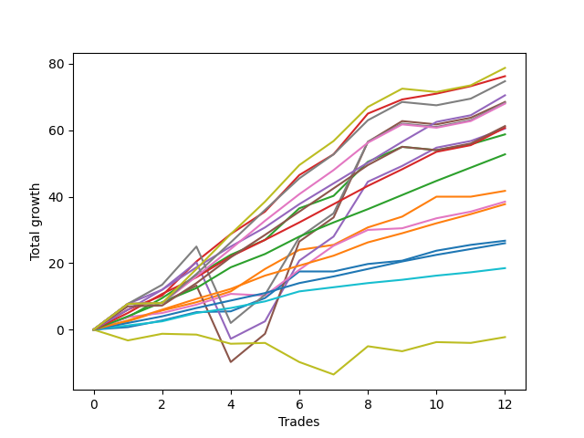

# Long Pointer 002 DB 
- Symbol: ES
- Date Range: 03/18/2022 - 07/15/2022
- Trading Period: 8:30-12:30
- Number of Trades: 12



| Name | Win Percent | Profit | Avg Profit / Trade | Avg Time / Trade |      | Name | Win Percent | Profit | Avg Profit / Trade | Avg Time / Trade |
| ---- | ----------- | ------ | ------------------ | ---------------- | ---- | ---- | ----------- | ------ | ------------------ | ---------------- |
| Sorted By <br> Profit | | | | | | Sorted By <br> Win Percentage ||||
| Ninety | 91.67 | 39375.00 | 3281.25 | 21:27 |     | Three | 100.00 | 38125.00 | 3177.08 | 09:48 |
| Three | 100.00 | 38125.00 | 3177.08 | 09:48 |     | Eighty-Six | 100.00 | 35250.00 | 2937.50 | 11:50 |
| Eighty-Nine | 91.67 | 37375.00 | 3114.58 | 21:25 |     | Eighty-Five | 100.00 | 30375.00 | 2531.25 | 09:34 |
| Eighty-Six | 100.00 | 35250.00 | 2937.50 | 11:50 |     | Eighty-Four | 100.00 | 26375.00 | 2197.92 | 07:47 |
| Five | 83.33 | 34250.00 | 2854.17 | 26:16 |     | One | 100.00 | 20875.00 | 1739.58 | 07:04 |
| Seven | 83.33 | 34125.00 | 2843.75 | 22:00 |     | Eighty-Three | 100.00 | 18875.00 | 1572.92 | 05:02 |
| Eighty-Eight | 91.67 | 34000.00 | 2833.33 | 19:20 |     | Zero | 100.00 | 13375.00 | 1114.58 | 02:47 |
| Eighty-Seven | 91.67 | 30625.00 | 2552.08 | 16:47 |     | Eighty-Two | 100.00 | 13000.00 | 1083.33 | 01:40 |
| Eighty-Five | 100.00 | 30375.00 | 2531.25 | 09:34 |     | Eighty-One | 100.00 | 9250.00 | 770.83 | 01:17 |
| Four | 91.67 | 30250.00 | 2520.83 | 21:45 |     | Ninety | 91.67 | 39375.00 | 3281.25 | 21:27 |
| Two | 91.67 | 29375.00 | 2447.92 | 12:09 |     | Eighty-Nine | 91.67 | 37375.00 | 3114.58 | 21:25 |
| Eighty-Four | 100.00 | 26375.00 | 2197.92 | 07:47 |     | Eighty-Eight | 91.67 | 34000.00 | 2833.33 | 19:20 |
| One | 100.00 | 20875.00 | 1739.58 | 07:04 |     | Eighty-Seven | 91.67 | 30625.00 | 2552.08 | 16:47 |
| Six | 91.67 | 19250.00 | 1604.17 | 07:33 |     | Four | 91.67 | 30250.00 | 2520.83 | 21:45 |
| Eighty-Three | 100.00 | 18875.00 | 1572.92 | 05:02 |     | Two | 91.67 | 29375.00 | 2447.92 | 12:09 |
| Zero | 100.00 | 13375.00 | 1114.58 | 02:47 |     | Six | 91.67 | 19250.00 | 1604.17 | 07:33 |
| Eighty-Two | 100.00 | 13000.00 | 1083.33 | 01:40 |     | Five | 83.33 | 34250.00 | 2854.17 | 26:16 |
| Eighty-One | 100.00 | 9250.00 | 770.83 | 01:17 |     | Seven | 83.33 | 34125.00 | 2843.75 | 22:00 |
| Seventy-Three | 41.67 | -1125.00 | -93.75 | 07:20 |     | Seventy-Three | 41.67 | -1125.00 | -93.75 | 07:20 |

## NO STOPLOSS

### Test Zero
* Sell when price hits the middle line of the 20p bollinger
* No Stoploss
* Results:
```
Total Trades: 12
Percent Up: 100.00
Percent Down: 0.00
Total Points Moved Up: 26.75
Potential Profit: 13375.00
Total Points Ups: 26.75 Count Ups: 12
Total Points Downs: 0.00 Count Downs: 0
```

<details><summary>Trades</summary>

<code>In: 2022-03-25 12:31:00		Out: 2022-03-25 12:37:05		Total Position Time: 06:05		Total Move Up: 0.75		Total to Date: 0.75</code> <br />
<code>In: 2022-03-31 08:37:00		Out: 2022-03-31 08:38:15		Total Position Time: 01:15		Total Move Up: 2.00		Total to Date: 2.75</code> <br />
<code>In: 2022-05-06 09:03:00		Out: 2022-05-06 09:03:10		Total Position Time: 00:10		Total Move Up: 2.50		Total to Date: 5.25</code> <br />
<code>In: 2022-05-11 09:14:00		Out: 2022-05-11 09:17:50		Total Position Time: 03:50		Total Move Up: 0.25		Total to Date: 5.50</code> <br />
<code>In: 2022-05-16 09:47:00		Out: 2022-05-16 09:48:15		Total Position Time: 01:15		Total Move Up: 4.00		Total to Date: 9.50</code> <br />
<code>In: 2022-05-17 11:25:00		Out: 2022-05-17 11:27:30		Total Position Time: 02:30		Total Move Up: 8.00		Total to Date: 17.50</code> <br />
<code>In: 2022-05-25 09:30:00		Out: 2022-05-25 09:41:25		Total Position Time: 11:25		Total Move Up: 0.00		Total to Date: 17.50</code> <br />
<code>In: 2022-05-31 12:05:00		Out: 2022-05-31 12:07:20		Total Position Time: 02:20		Total Move Up: 2.25		Total to Date: 19.75</code> <br />
<code>In: 2022-06-21 11:06:00		Out: 2022-06-21 11:07:45		Total Position Time: 01:45		Total Move Up: 1.00		Total to Date: 20.75</code> <br />
<code>In: 2022-06-27 10:10:00		Out: 2022-06-27 10:11:25		Total Position Time: 01:25		Total Move Up: 3.00		Total to Date: 23.75</code> <br />
<code>In: 2022-07-08 09:48:00		Out: 2022-07-08 09:48:40		Total Position Time: 00:40		Total Move Up: 1.75		Total to Date: 25.50</code> <br />
<code>In: 2022-07-12 10:28:00		Out: 2022-07-12 10:28:50		Total Position Time: 00:50		Total Move Up: 1.25		Total to Date: 26.75</code> <br />


</details>

### Test One
* Sell when the price hits the upper line of the 20p 1std bollinger
* No Stoploss
* Results:
```
Total Trades: 12
Percent Up: 100.00
Percent Down: 0.00
Total Points Moved Up: 41.75
Potential Profit: 20875.00
Total Points Ups: 41.75 Count Ups: 12
Total Points Downs: 0.00 Count Downs: 0
```

<details><summary>Trades</summary>

<code>In: 2022-03-25 12:31:00		Out: 2022-03-25 12:38:35		Total Position Time: 07:35		Total Move Up: 2.50		Total to Date: 2.50</code> <br />
<code>In: 2022-03-31 08:37:00		Out: 2022-03-31 08:40:35		Total Position Time: 03:35		Total Move Up: 3.25		Total to Date: 5.75</code> <br />
<code>In: 2022-05-06 09:03:00		Out: 2022-05-06 09:03:10		Total Position Time: 00:10		Total Move Up: 2.50		Total to Date: 8.25</code> <br />
<code>In: 2022-05-11 09:14:00		Out: 2022-05-11 09:23:10		Total Position Time: 09:10		Total Move Up: 3.25		Total to Date: 11.50</code> <br />
<code>In: 2022-05-16 09:47:00		Out: 2022-05-16 09:50:05		Total Position Time: 03:05		Total Move Up: 6.75		Total to Date: 18.25</code> <br />
<code>In: 2022-05-17 11:25:00		Out: 2022-05-17 11:37:35		Total Position Time: 12:35		Total Move Up: 5.75		Total to Date: 24.00</code> <br />
<code>In: 2022-05-25 09:30:00		Out: 2022-05-25 09:44:25		Total Position Time: 14:25		Total Move Up: 1.50		Total to Date: 25.50</code> <br />
<code>In: 2022-05-31 12:05:00		Out: 2022-05-31 12:09:15		Total Position Time: 04:15		Total Move Up: 5.25		Total to Date: 30.75</code> <br />
<code>In: 2022-06-21 11:06:00		Out: 2022-06-21 11:09:05		Total Position Time: 03:05		Total Move Up: 3.25		Total to Date: 34.00</code> <br />
<code>In: 2022-06-27 10:10:00		Out: 2022-06-27 10:15:55		Total Position Time: 05:55		Total Move Up: 6.00		Total to Date: 40.00</code> <br />
<code>In: 2022-07-08 09:48:00		Out: 2022-07-08 10:06:55		Total Position Time: 18:55		Total Move Up: 0.00		Total to Date: 40.00</code> <br />
<code>In: 2022-07-12 10:28:00		Out: 2022-07-12 10:30:05		Total Position Time: 02:05		Total Move Up: 1.75		Total to Date: 41.75</code> <br />


</details>

### Test Two
* Sell when the price hits the upper line of the 20p 2std bollinger
* No Stoploss
* Results:
```
Total Trades: 12
Percent Up: 91.67
Percent Down: 8.33
Total Points Moved Up: 58.75
Potential Profit: 29375.00
Total Points Ups: 59.75 Count Ups: 11
Total Points Downs: -1.00 Count Downs: 1
```

<details><summary>Trades</summary>

<code>In: 2022-03-25 12:31:00		Out: 2022-03-25 12:41:35		Total Position Time: 10:35		Total Move Up: 3.75		Total to Date: 3.75</code> <br />
<code>In: 2022-03-31 08:37:00		Out: 2022-03-31 08:41:10		Total Position Time: 04:10		Total Move Up: 5.75		Total to Date: 9.50</code> <br />
<code>In: 2022-05-06 09:03:00		Out: 2022-05-06 09:03:55		Total Position Time: 00:55		Total Move Up: 6.75		Total to Date: 16.25</code> <br />
<code>In: 2022-05-11 09:14:00		Out: 2022-05-11 09:23:35		Total Position Time: 09:35		Total Move Up: 6.25		Total to Date: 22.50</code> <br />
<code>In: 2022-05-16 09:47:00		Out: 2022-05-16 10:06:30		Total Position Time: 19:30		Total Move Up: 4.50		Total to Date: 27.00</code> <br />
<code>In: 2022-05-17 11:25:00		Out: 2022-05-17 11:40:00		Total Position Time: 15:00		Total Move Up: 9.50		Total to Date: 36.50</code> <br />
<code>In: 2022-05-25 09:30:00		Out: 2022-05-25 09:45:20		Total Position Time: 15:20		Total Move Up: 3.75		Total to Date: 40.25</code> <br />
<code>In: 2022-05-31 12:05:00		Out: 2022-05-31 12:15:05		Total Position Time: 10:05		Total Move Up: 10.25		Total to Date: 50.50</code> <br />
<code>In: 2022-06-21 11:06:00		Out: 2022-06-21 11:10:45		Total Position Time: 04:45		Total Move Up: 4.50		Total to Date: 55.00</code> <br />
<code>In: 2022-06-27 10:10:00		Out: 2022-06-27 10:39:55		Total Position Time: 29:55		Total Move Up: -1.00		Total to Date: 54.00</code> <br />
<code>In: 2022-07-08 09:48:00		Out: 2022-07-08 10:10:30		Total Position Time: 22:30		Total Move Up: 1.75		Total to Date: 55.75</code> <br />
<code>In: 2022-07-12 10:28:00		Out: 2022-07-12 10:31:30		Total Position Time: 03:30		Total Move Up: 3.00		Total to Date: 58.75</code> <br />


</details>

### Test Three
* Sell when price hits the middle line of the 50p bollinger
* No Stoploss
* Results:
```
Total Trades: 12
Percent Up: 100.00
Percent Down: 0.00
Total Points Moved Up: 76.25
Potential Profit: 38125.00
Total Points Ups: 76.25 Count Ups: 12
Total Points Downs: 0.00 Count Downs: 0
```

<details><summary>Trades</summary>

<code>In: 2022-03-25 12:31:00		Out: 2022-03-25 12:42:05		Total Position Time: 11:05		Total Move Up: 6.00		Total to Date: 6.00</code> <br />
<code>In: 2022-03-31 08:37:00		Out: 2022-03-31 08:41:05		Total Position Time: 04:05		Total Move Up: 4.25		Total to Date: 10.25</code> <br />
<code>In: 2022-05-06 09:03:00		Out: 2022-05-06 09:06:05		Total Position Time: 03:05		Total Move Up: 10.25		Total to Date: 20.50</code> <br />
<code>In: 2022-05-11 09:14:00		Out: 2022-05-11 09:23:45		Total Position Time: 09:45		Total Move Up: 8.25		Total to Date: 28.75</code> <br />
<code>In: 2022-05-16 09:47:00		Out: 2022-05-16 09:50:05		Total Position Time: 03:05		Total Move Up: 6.75		Total to Date: 35.50</code> <br />
<code>In: 2022-05-17 11:25:00		Out: 2022-05-17 11:40:05		Total Position Time: 15:05		Total Move Up: 11.00		Total to Date: 46.50</code> <br />
<code>In: 2022-05-25 09:30:00		Out: 2022-05-25 09:49:05		Total Position Time: 19:05		Total Move Up: 6.25		Total to Date: 52.75</code> <br />
<code>In: 2022-05-31 12:05:00		Out: 2022-05-31 12:15:15		Total Position Time: 10:15		Total Move Up: 12.25		Total to Date: 65.00</code> <br />
<code>In: 2022-06-21 11:06:00		Out: 2022-06-21 11:10:20		Total Position Time: 04:20		Total Move Up: 4.25		Total to Date: 69.25</code> <br />
<code>In: 2022-06-27 10:10:00		Out: 2022-06-27 10:11:15		Total Position Time: 01:15		Total Move Up: 1.75		Total to Date: 71.00</code> <br />
<code>In: 2022-07-08 09:48:00		Out: 2022-07-08 10:11:05		Total Position Time: 23:05		Total Move Up: 2.25		Total to Date: 73.25</code> <br />
<code>In: 2022-07-12 10:28:00		Out: 2022-07-12 10:41:35		Total Position Time: 13:35		Total Move Up: 3.00		Total to Date: 76.25</code> <br />


</details>

### Test Four
* Sell when the price hits the upper line of the 50p 1std bollinger
* No Stoploss
* Results:
```
Total Trades: 12
Percent Up: 91.67
Percent Down: 8.33
Total Points Moved Up: 60.50
Potential Profit: 30250.00
Total Points Ups: 83.50 Count Ups: 11
Total Points Downs: -23.00 Count Downs: 1
```

<details><summary>Trades</summary>

<code>In: 2022-03-25 12:31:00		Out: 2022-03-25 12:46:00		Total Position Time: 15:00		Total Move Up: 7.75		Total to Date: 7.75</code> <br />
<code>In: 2022-03-31 08:37:00		Out: 2022-03-31 09:00:15		Total Position Time: 23:15		Total Move Up: 4.25		Total to Date: 12.00</code> <br />
<code>In: 2022-05-06 09:03:00		Out: 2022-05-06 09:22:25		Total Position Time: 19:25		Total Move Up: 8.25		Total to Date: 20.25</code> <br />
<code>In: 2022-05-11 09:14:00		Out: 2022-05-11 09:43:55		Total Position Time: 29:55		Total Move Up: -23.00		Total to Date: -2.75</code> <br />
<code>In: 2022-05-16 09:47:00		Out: 2022-05-16 10:07:00		Total Position Time: 20:00		Total Move Up: 5.25		Total to Date: 2.50</code> <br />
<code>In: 2022-05-17 11:25:00		Out: 2022-05-17 11:44:30		Total Position Time: 19:30		Total Move Up: 18.25		Total to Date: 20.75</code> <br />
<code>In: 2022-05-25 09:30:00		Out: 2022-05-25 09:59:55		Total Position Time: 29:55		Total Move Up: 7.25		Total to Date: 28.00</code> <br />
<code>In: 2022-05-31 12:05:00		Out: 2022-05-31 12:28:20		Total Position Time: 23:20		Total Move Up: 16.50		Total to Date: 44.50</code> <br />
<code>In: 2022-06-21 11:06:00		Out: 2022-06-21 11:29:15		Total Position Time: 23:15		Total Move Up: 4.75		Total to Date: 49.25</code> <br />
<code>In: 2022-06-27 10:10:00		Out: 2022-06-27 10:13:05		Total Position Time: 03:05		Total Move Up: 5.50		Total to Date: 54.75</code> <br />
<code>In: 2022-07-08 09:48:00		Out: 2022-07-08 10:17:55		Total Position Time: 29:55		Total Move Up: 2.00		Total to Date: 56.75</code> <br />
<code>In: 2022-07-12 10:28:00		Out: 2022-07-12 10:52:25		Total Position Time: 24:25		Total Move Up: 3.75		Total to Date: 60.50</code> <br />


</details>

### Test Five
* Sell when the price hits the upper line of the 50p 2std bollinger
* No Stoploss
* Results:
```
Total Trades: 12
Percent Up: 83.33
Percent Down: 16.67
Total Points Moved Up: 68.50
Potential Profit: 34250.00
Total Points Ups: 92.50 Count Ups: 10
Total Points Downs: -24.00 Count Downs: 2
```

<details><summary>Trades</summary>

<code>In: 2022-03-25 12:31:00		Out: 2022-03-25 12:46:00		Total Position Time: 15:00		Total Move Up: 7.75		Total to Date: 7.75</code> <br />
<code>In: 2022-03-31 08:37:00		Out: 2022-03-31 09:06:55		Total Position Time: 29:55		Total Move Up: 0.25		Total to Date: 8.00</code> <br />
<code>In: 2022-05-06 09:03:00		Out: 2022-05-06 09:32:55		Total Position Time: 29:55		Total Move Up: 5.25		Total to Date: 13.25</code> <br />
<code>In: 2022-05-11 09:14:00		Out: 2022-05-11 09:43:55		Total Position Time: 29:55		Total Move Up: -23.00		Total to Date: -9.75</code> <br />
<code>In: 2022-05-16 09:47:00		Out: 2022-05-16 10:07:35		Total Position Time: 20:35		Total Move Up: 8.50		Total to Date: -1.25</code> <br />
<code>In: 2022-05-17 11:25:00		Out: 2022-05-17 11:48:45		Total Position Time: 23:45		Total Move Up: 27.75		Total to Date: 26.50</code> <br />
<code>In: 2022-05-25 09:30:00		Out: 2022-05-25 09:59:55		Total Position Time: 29:55		Total Move Up: 7.25		Total to Date: 33.75</code> <br />
<code>In: 2022-05-31 12:05:00		Out: 2022-05-31 12:31:05		Total Position Time: 26:05		Total Move Up: 22.75		Total to Date: 56.50</code> <br />
<code>In: 2022-06-21 11:06:00		Out: 2022-06-21 11:30:15		Total Position Time: 24:15		Total Move Up: 6.25		Total to Date: 62.75</code> <br />
<code>In: 2022-06-27 10:10:00		Out: 2022-06-27 10:39:55		Total Position Time: 29:55		Total Move Up: -1.00		Total to Date: 61.75</code> <br />
<code>In: 2022-07-08 09:48:00		Out: 2022-07-08 10:17:55		Total Position Time: 29:55		Total Move Up: 2.00		Total to Date: 63.75</code> <br />
<code>In: 2022-07-12 10:28:00		Out: 2022-07-12 10:54:05		Total Position Time: 26:05		Total Move Up: 4.75		Total to Date: 68.50</code> <br />


</details>

### Test Six
* Sell when the price hits the middle line of the 1std VWAP
* No Stoploss
* Results:
```
Total Trades: 12
Percent Up: 91.67
Percent Down: 8.33
Total Points Moved Up: 38.50
Potential Profit: 19250.00
Total Points Ups: 39.00 Count Ups: 11
Total Points Downs: -0.50 Count Downs: 1
```

<details><summary>Trades</summary>

<code>In: 2022-03-25 12:31:00		Out: 2022-03-25 12:41:35		Total Position Time: 10:35		Total Move Up: 3.75		Total to Date: 3.75</code> <br />
<code>In: 2022-03-31 08:37:00		Out: 2022-03-31 08:37:40		Total Position Time: 00:40		Total Move Up: 1.25		Total to Date: 5.00</code> <br />
<code>In: 2022-05-06 09:03:00		Out: 2022-05-06 09:03:10		Total Position Time: 00:10		Total Move Up: 2.50		Total to Date: 7.50</code> <br />
<code>In: 2022-05-11 09:14:00		Out: 2022-05-11 09:23:10		Total Position Time: 09:10		Total Move Up: 3.25		Total to Date: 10.75</code> <br />
<code>In: 2022-05-16 09:47:00		Out: 2022-05-16 09:47:10		Total Position Time: 00:10		Total Move Up: -0.50		Total to Date: 10.25</code> <br />
<code>In: 2022-05-17 11:25:00		Out: 2022-05-17 11:27:25		Total Position Time: 02:25		Total Move Up: 7.75		Total to Date: 18.00</code> <br />
<code>In: 2022-05-25 09:30:00		Out: 2022-05-25 09:59:55		Total Position Time: 29:55		Total Move Up: 7.25		Total to Date: 25.25</code> <br />
<code>In: 2022-05-31 12:05:00		Out: 2022-05-31 12:07:50		Total Position Time: 02:50		Total Move Up: 4.75		Total to Date: 30.00</code> <br />
<code>In: 2022-06-21 11:06:00		Out: 2022-06-21 11:06:10		Total Position Time: 00:10		Total Move Up: 0.50		Total to Date: 30.50</code> <br />
<code>In: 2022-06-27 10:10:00		Out: 2022-06-27 10:11:25		Total Position Time: 01:25		Total Move Up: 3.00		Total to Date: 33.50</code> <br />
<code>In: 2022-07-08 09:48:00		Out: 2022-07-08 10:17:55		Total Position Time: 29:55		Total Move Up: 2.00		Total to Date: 35.50</code> <br />
<code>In: 2022-07-12 10:28:00		Out: 2022-07-12 10:31:15		Total Position Time: 03:15		Total Move Up: 3.00		Total to Date: 38.50</code> <br />


</details>

### Test Seven
* Sell when the price hits the upper line of the 1std VWAP
* No Stoploss
* Results:
```
Total Trades: 12
Percent Up: 83.33
Percent Down: 16.67
Total Points Moved Up: 68.25
Potential Profit: 34125.00
Total Points Ups: 92.25 Count Ups: 10
Total Points Downs: -24.00 Count Downs: 2
```

<details><summary>Trades</summary>

<code>In: 2022-03-25 12:31:00		Out: 2022-03-25 12:46:00		Total Position Time: 15:00		Total Move Up: 7.75		Total to Date: 7.75</code> <br />
<code>In: 2022-03-31 08:37:00		Out: 2022-03-31 08:41:10		Total Position Time: 04:10		Total Move Up: 5.75		Total to Date: 13.50</code> <br />
<code>In: 2022-05-06 09:03:00		Out: 2022-05-06 09:06:40		Total Position Time: 03:40		Total Move Up: 11.50		Total to Date: 25.00</code> <br />
<code>In: 2022-05-11 09:14:00		Out: 2022-05-11 09:43:55		Total Position Time: 29:55		Total Move Up: -23.00		Total to Date: 2.00</code> <br />
<code>In: 2022-05-16 09:47:00		Out: 2022-05-16 10:07:35		Total Position Time: 20:35		Total Move Up: 8.50		Total to Date: 10.50</code> <br />
<code>In: 2022-05-17 11:25:00		Out: 2022-05-17 11:40:20		Total Position Time: 15:20		Total Move Up: 17.25		Total to Date: 27.75</code> <br />
<code>In: 2022-05-25 09:30:00		Out: 2022-05-25 09:59:55		Total Position Time: 29:55		Total Move Up: 7.25		Total to Date: 35.00</code> <br />
<code>In: 2022-05-31 12:05:00		Out: 2022-05-31 12:30:55		Total Position Time: 25:55		Total Move Up: 21.50		Total to Date: 56.50</code> <br />
<code>In: 2022-06-21 11:06:00		Out: 2022-06-21 11:35:55		Total Position Time: 29:55		Total Move Up: 5.50		Total to Date: 62.00</code> <br />
<code>In: 2022-06-27 10:10:00		Out: 2022-06-27 10:39:55		Total Position Time: 29:55		Total Move Up: -1.00		Total to Date: 61.00</code> <br />
<code>In: 2022-07-08 09:48:00		Out: 2022-07-08 10:17:55		Total Position Time: 29:55		Total Move Up: 2.00		Total to Date: 63.00</code> <br />
<code>In: 2022-07-12 10:28:00		Out: 2022-07-12 10:57:55		Total Position Time: 29:55		Total Move Up: 5.25		Total to Date: 68.25</code> <br />


</details>

## SPECIAL EXIT CONDITIONS 

### Test Seventy-Three
* Sell when the linear regression slope changes to negative
* No Stoploss
* Results:
```
Total Trades: 12
Percent Up: 41.67
Percent Down: 58.33
Total Points Moved Up: -2.25
Potential Profit: -1125.00
Total Points Ups: 15.25 Count Ups: 5
Total Points Downs: -17.50 Count Downs: 7
```

<details><summary>Trades</summary>

<code>In: 2022-03-25 12:31:00		Out: 2022-03-25 12:32:05		Total Position Time: 01:05		Total Move Up: -3.25		Total to Date: -3.25</code> <br />
<code>In: 2022-03-31 08:37:00		Out: 2022-03-31 08:48:05		Total Position Time: 11:05		Total Move Up: 2.00		Total to Date: -1.25</code> <br />
<code>In: 2022-05-06 09:03:00		Out: 2022-05-06 09:12:05		Total Position Time: 09:05		Total Move Up: -0.25		Total to Date: -1.50</code> <br />
<code>In: 2022-05-11 09:14:00		Out: 2022-05-11 09:15:05		Total Position Time: 01:05		Total Move Up: -2.75		Total to Date: -4.25</code> <br />
<code>In: 2022-05-16 09:47:00		Out: 2022-05-16 09:54:05		Total Position Time: 07:05		Total Move Up: 0.25		Total to Date: -4.00</code> <br />
<code>In: 2022-05-17 11:25:00		Out: 2022-05-17 11:35:05		Total Position Time: 10:05		Total Move Up: -5.75		Total to Date: -9.75</code> <br />
<code>In: 2022-05-25 09:30:00		Out: 2022-05-25 09:36:05		Total Position Time: 06:05		Total Move Up: -3.75		Total to Date: -13.50</code> <br />
<code>In: 2022-05-31 12:05:00		Out: 2022-05-31 12:20:05		Total Position Time: 15:05		Total Move Up: 8.50		Total to Date: -5.00</code> <br />
<code>In: 2022-06-21 11:06:00		Out: 2022-06-21 11:07:05		Total Position Time: 01:05		Total Move Up: -1.50		Total to Date: -6.50</code> <br />
<code>In: 2022-06-27 10:10:00		Out: 2022-06-27 10:21:05		Total Position Time: 11:05		Total Move Up: 2.75		Total to Date: -3.75</code> <br />
<code>In: 2022-07-08 09:48:00		Out: 2022-07-08 09:53:05		Total Position Time: 05:05		Total Move Up: -0.25		Total to Date: -4.00</code> <br />
<code>In: 2022-07-12 10:28:00		Out: 2022-07-12 10:38:05		Total Position Time: 10:05		Total Move Up: 1.75		Total to Date: -2.25</code> <br />


</details>

## TAKE PROFIT

### Test Eighty-One
* Take Profit of 1 Point
* No Stoploss
* Results:
```
Total Trades: 12
Percent Up: 100.00
Percent Down: 0.00
Total Points Moved Up: 18.50
Potential Profit: 9250.00
Total Points Ups: 18.50 Count Ups: 12
Total Points Downs: 0.00 Count Downs: 0
```

<details><summary>Trades</summary>

<code>In: 2022-03-25 12:31:00		Out: 2022-03-25 12:37:10		Total Position Time: 06:10		Total Move Up: 1.25		Total to Date: 1.25</code> <br />
<code>In: 2022-03-31 08:37:00		Out: 2022-03-31 08:37:40		Total Position Time: 00:40		Total Move Up: 1.25		Total to Date: 2.50</code> <br />
<code>In: 2022-05-06 09:03:00		Out: 2022-05-06 09:03:10		Total Position Time: 00:10		Total Move Up: 2.50		Total to Date: 5.00</code> <br />
<code>In: 2022-05-11 09:14:00		Out: 2022-05-11 09:14:25		Total Position Time: 00:25		Total Move Up: 1.50		Total to Date: 6.50</code> <br />
<code>In: 2022-05-16 09:47:00		Out: 2022-05-16 09:47:50		Total Position Time: 00:50		Total Move Up: 2.00		Total to Date: 8.50</code> <br />
<code>In: 2022-05-17 11:25:00		Out: 2022-05-17 11:26:40		Total Position Time: 01:40		Total Move Up: 3.00		Total to Date: 11.50</code> <br />
<code>In: 2022-05-25 09:30:00		Out: 2022-05-25 09:30:15		Total Position Time: 00:15		Total Move Up: 1.25		Total to Date: 12.75</code> <br />
<code>In: 2022-05-31 12:05:00		Out: 2022-05-31 12:07:05		Total Position Time: 02:05		Total Move Up: 1.25		Total to Date: 14.00</code> <br />
<code>In: 2022-06-21 11:06:00		Out: 2022-06-21 11:07:45		Total Position Time: 01:45		Total Move Up: 1.00		Total to Date: 15.00</code> <br />
<code>In: 2022-06-27 10:10:00		Out: 2022-06-27 10:10:25		Total Position Time: 00:25		Total Move Up: 1.25		Total to Date: 16.25</code> <br />
<code>In: 2022-07-08 09:48:00		Out: 2022-07-08 09:48:20		Total Position Time: 00:20		Total Move Up: 1.00		Total to Date: 17.25</code> <br />
<code>In: 2022-07-12 10:28:00		Out: 2022-07-12 10:28:50		Total Position Time: 00:50		Total Move Up: 1.25		Total to Date: 18.50</code> <br />


</details>

### Test Eighty-Two
* Take Profit of 2 Point
* No Stoploss
* Results:
```
Total Trades: 12
Percent Up: 100.00
Percent Down: 0.00
Total Points Moved Up: 26.00
Potential Profit: 13000.00
Total Points Ups: 26.00 Count Ups: 12
Total Points Downs: 0.00 Count Downs: 0
```

<details><summary>Trades</summary>

<code>In: 2022-03-25 12:31:00		Out: 2022-03-25 12:37:15		Total Position Time: 06:15		Total Move Up: 2.00		Total to Date: 2.00</code> <br />
<code>In: 2022-03-31 08:37:00		Out: 2022-03-31 08:38:15		Total Position Time: 01:15		Total Move Up: 2.00		Total to Date: 4.00</code> <br />
<code>In: 2022-05-06 09:03:00		Out: 2022-05-06 09:03:10		Total Position Time: 00:10		Total Move Up: 2.50		Total to Date: 6.50</code> <br />
<code>In: 2022-05-11 09:14:00		Out: 2022-05-11 09:14:30		Total Position Time: 00:30		Total Move Up: 2.25		Total to Date: 8.75</code> <br />
<code>In: 2022-05-16 09:47:00		Out: 2022-05-16 09:47:55		Total Position Time: 00:55		Total Move Up: 2.25		Total to Date: 11.00</code> <br />
<code>In: 2022-05-17 11:25:00		Out: 2022-05-17 11:26:40		Total Position Time: 01:40		Total Move Up: 3.00		Total to Date: 14.00</code> <br />
<code>In: 2022-05-25 09:30:00		Out: 2022-05-25 09:30:25		Total Position Time: 00:25		Total Move Up: 2.00		Total to Date: 16.00</code> <br />
<code>In: 2022-05-31 12:05:00		Out: 2022-05-31 12:07:20		Total Position Time: 02:20		Total Move Up: 2.25		Total to Date: 18.25</code> <br />
<code>In: 2022-06-21 11:06:00		Out: 2022-06-21 11:08:15		Total Position Time: 02:15		Total Move Up: 2.25		Total to Date: 20.50</code> <br />
<code>In: 2022-06-27 10:10:00		Out: 2022-06-27 10:11:10		Total Position Time: 01:10		Total Move Up: 2.00		Total to Date: 22.50</code> <br />
<code>In: 2022-07-08 09:48:00		Out: 2022-07-08 09:49:00		Total Position Time: 01:00		Total Move Up: 1.75		Total to Date: 24.25</code> <br />
<code>In: 2022-07-12 10:28:00		Out: 2022-07-12 10:30:05		Total Position Time: 02:05		Total Move Up: 1.75		Total to Date: 26.00</code> <br />


</details>

### Test Eighty-Three
* Take Profit of 3 Point
* No Stoploss
* Results:
```
Total Trades: 12
Percent Up: 100.00
Percent Down: 0.00
Total Points Moved Up: 37.75
Potential Profit: 18875.00
Total Points Ups: 37.75 Count Ups: 12
Total Points Downs: 0.00 Count Downs: 0
```

<details><summary>Trades</summary>

<code>In: 2022-03-25 12:31:00		Out: 2022-03-25 12:41:20		Total Position Time: 10:20		Total Move Up: 2.75		Total to Date: 2.75</code> <br />
<code>In: 2022-03-31 08:37:00		Out: 2022-03-31 08:40:35		Total Position Time: 03:35		Total Move Up: 3.25		Total to Date: 6.00</code> <br />
<code>In: 2022-05-06 09:03:00		Out: 2022-05-06 09:03:40		Total Position Time: 00:40		Total Move Up: 3.25		Total to Date: 9.25</code> <br />
<code>In: 2022-05-11 09:14:00		Out: 2022-05-11 09:22:05		Total Position Time: 08:05		Total Move Up: 3.00		Total to Date: 12.25</code> <br />
<code>In: 2022-05-16 09:47:00		Out: 2022-05-16 09:48:15		Total Position Time: 01:15		Total Move Up: 4.00		Total to Date: 16.25</code> <br />
<code>In: 2022-05-17 11:25:00		Out: 2022-05-17 11:26:40		Total Position Time: 01:40		Total Move Up: 3.00		Total to Date: 19.25</code> <br />
<code>In: 2022-05-25 09:30:00		Out: 2022-05-25 09:31:45		Total Position Time: 01:45		Total Move Up: 3.00		Total to Date: 22.25</code> <br />
<code>In: 2022-05-31 12:05:00		Out: 2022-05-31 12:07:45		Total Position Time: 02:45		Total Move Up: 4.00		Total to Date: 26.25</code> <br />
<code>In: 2022-06-21 11:06:00		Out: 2022-06-21 11:08:30		Total Position Time: 02:30		Total Move Up: 2.75		Total to Date: 29.00</code> <br />
<code>In: 2022-06-27 10:10:00		Out: 2022-06-27 10:11:25		Total Position Time: 01:25		Total Move Up: 3.00		Total to Date: 32.00</code> <br />
<code>In: 2022-07-08 09:48:00		Out: 2022-07-08 10:11:20		Total Position Time: 23:20		Total Move Up: 2.75		Total to Date: 34.75</code> <br />
<code>In: 2022-07-12 10:28:00		Out: 2022-07-12 10:31:15		Total Position Time: 03:15		Total Move Up: 3.00		Total to Date: 37.75</code> <br />


</details>

### Test Eighty-Four
* Take Profit of 4 Point
* No Stoploss
* Results:
```
Total Trades: 12
Percent Up: 100.00
Percent Down: 0.00
Total Points Moved Up: 52.75
Potential Profit: 26375.00
Total Points Ups: 52.75 Count Ups: 12
Total Points Downs: 0.00 Count Downs: 0
```

<details><summary>Trades</summary>

<code>In: 2022-03-25 12:31:00		Out: 2022-03-25 12:41:40		Total Position Time: 10:40		Total Move Up: 4.00		Total to Date: 4.00</code> <br />
<code>In: 2022-03-31 08:37:00		Out: 2022-03-31 08:41:05		Total Position Time: 04:05		Total Move Up: 4.25		Total to Date: 8.25</code> <br />
<code>In: 2022-05-06 09:03:00		Out: 2022-05-06 09:03:45		Total Position Time: 00:45		Total Move Up: 4.25		Total to Date: 12.50</code> <br />
<code>In: 2022-05-11 09:14:00		Out: 2022-05-11 09:23:15		Total Position Time: 09:15		Total Move Up: 6.25		Total to Date: 18.75</code> <br />
<code>In: 2022-05-16 09:47:00		Out: 2022-05-16 09:48:15		Total Position Time: 01:15		Total Move Up: 4.00		Total to Date: 22.75</code> <br />
<code>In: 2022-05-17 11:25:00		Out: 2022-05-17 11:27:05		Total Position Time: 02:05		Total Move Up: 5.25		Total to Date: 28.00</code> <br />
<code>In: 2022-05-25 09:30:00		Out: 2022-05-25 09:48:10		Total Position Time: 18:10		Total Move Up: 4.25		Total to Date: 32.25</code> <br />
<code>In: 2022-05-31 12:05:00		Out: 2022-05-31 12:07:45		Total Position Time: 02:45		Total Move Up: 4.00		Total to Date: 36.25</code> <br />
<code>In: 2022-06-21 11:06:00		Out: 2022-06-21 11:10:20		Total Position Time: 04:20		Total Move Up: 4.25		Total to Date: 40.50</code> <br />
<code>In: 2022-06-27 10:10:00		Out: 2022-06-27 10:12:00		Total Position Time: 02:00		Total Move Up: 4.25		Total to Date: 44.75</code> <br />
<code>In: 2022-07-08 09:48:00		Out: 2022-07-08 10:12:25		Total Position Time: 24:25		Total Move Up: 4.00		Total to Date: 48.75</code> <br />
<code>In: 2022-07-12 10:28:00		Out: 2022-07-12 10:41:40		Total Position Time: 13:40		Total Move Up: 4.00		Total to Date: 52.75</code> <br />


</details>

### Test Eighty-Five
* Take Profit of 5 Point
* No Stoploss
* Results:
```
Total Trades: 12
Percent Up: 100.00
Percent Down: 0.00
Total Points Moved Up: 60.75
Potential Profit: 30375.00
Total Points Ups: 60.75 Count Ups: 12
Total Points Downs: 0.00 Count Downs: 0
```

<details><summary>Trades</summary>

<code>In: 2022-03-25 12:31:00		Out: 2022-03-25 12:41:55		Total Position Time: 10:55		Total Move Up: 5.00		Total to Date: 5.00</code> <br />
<code>In: 2022-03-31 08:37:00		Out: 2022-03-31 08:41:10		Total Position Time: 04:10		Total Move Up: 5.75		Total to Date: 10.75</code> <br />
<code>In: 2022-05-06 09:03:00		Out: 2022-05-06 09:03:50		Total Position Time: 00:50		Total Move Up: 5.00		Total to Date: 15.75</code> <br />
<code>In: 2022-05-11 09:14:00		Out: 2022-05-11 09:23:15		Total Position Time: 09:15		Total Move Up: 6.25		Total to Date: 22.00</code> <br />
<code>In: 2022-05-16 09:47:00		Out: 2022-05-16 09:48:45		Total Position Time: 01:45		Total Move Up: 5.00		Total to Date: 27.00</code> <br />
<code>In: 2022-05-17 11:25:00		Out: 2022-05-17 11:27:05		Total Position Time: 02:05		Total Move Up: 5.25		Total to Date: 32.25</code> <br />
<code>In: 2022-05-25 09:30:00		Out: 2022-05-25 09:48:50		Total Position Time: 18:50		Total Move Up: 5.50		Total to Date: 37.75</code> <br />
<code>In: 2022-05-31 12:05:00		Out: 2022-05-31 12:07:55		Total Position Time: 02:55		Total Move Up: 5.50		Total to Date: 43.25</code> <br />
<code>In: 2022-06-21 11:06:00		Out: 2022-06-21 11:11:00		Total Position Time: 05:00		Total Move Up: 5.00		Total to Date: 48.25</code> <br />
<code>In: 2022-06-27 10:10:00		Out: 2022-06-27 10:12:55		Total Position Time: 02:55		Total Move Up: 5.25		Total to Date: 53.50</code> <br />
<code>In: 2022-07-08 09:48:00		Out: 2022-07-08 10:17:55		Total Position Time: 29:55		Total Move Up: 2.00		Total to Date: 55.50</code> <br />
<code>In: 2022-07-12 10:28:00		Out: 2022-07-12 10:54:15		Total Position Time: 26:15		Total Move Up: 5.25		Total to Date: 60.75</code> <br />


</details>

### Test Eighty-Six
* Take Profit of 6 Point
* No Stoploss
* Results:
```
Total Trades: 12
Percent Up: 100.00
Percent Down: 0.00
Total Points Moved Up: 70.50
Potential Profit: 35250.00
Total Points Ups: 70.50 Count Ups: 12
Total Points Downs: 0.00 Count Downs: 0
```

<details><summary>Trades</summary>

<code>In: 2022-03-25 12:31:00		Out: 2022-03-25 12:42:10		Total Position Time: 11:10		Total Move Up: 6.00		Total to Date: 6.00</code> <br />
<code>In: 2022-03-31 08:37:00		Out: 2022-03-31 08:41:50		Total Position Time: 04:50		Total Move Up: 6.00		Total to Date: 12.00</code> <br />
<code>In: 2022-05-06 09:03:00		Out: 2022-05-06 09:03:55		Total Position Time: 00:55		Total Move Up: 6.75		Total to Date: 18.75</code> <br />
<code>In: 2022-05-11 09:14:00		Out: 2022-05-11 09:23:15		Total Position Time: 09:15		Total Move Up: 6.25		Total to Date: 25.00</code> <br />
<code>In: 2022-05-16 09:47:00		Out: 2022-05-16 09:50:00		Total Position Time: 03:00		Total Move Up: 5.75		Total to Date: 30.75</code> <br />
<code>In: 2022-05-17 11:25:00		Out: 2022-05-17 11:27:20		Total Position Time: 02:20		Total Move Up: 7.00		Total to Date: 37.75</code> <br />
<code>In: 2022-05-25 09:30:00		Out: 2022-05-25 09:49:05		Total Position Time: 19:05		Total Move Up: 6.25		Total to Date: 44.00</code> <br />
<code>In: 2022-05-31 12:05:00		Out: 2022-05-31 12:09:20		Total Position Time: 04:20		Total Move Up: 6.25		Total to Date: 50.25</code> <br />
<code>In: 2022-06-21 11:06:00		Out: 2022-06-21 11:30:15		Total Position Time: 24:15		Total Move Up: 6.25		Total to Date: 56.50</code> <br />
<code>In: 2022-06-27 10:10:00		Out: 2022-06-27 10:15:55		Total Position Time: 05:55		Total Move Up: 6.00		Total to Date: 62.50</code> <br />
<code>In: 2022-07-08 09:48:00		Out: 2022-07-08 10:17:55		Total Position Time: 29:55		Total Move Up: 2.00		Total to Date: 64.50</code> <br />
<code>In: 2022-07-12 10:28:00		Out: 2022-07-12 10:55:00		Total Position Time: 27:00		Total Move Up: 6.00		Total to Date: 70.50</code> <br />


</details>

### Test Eighty-Seven
* Take Profit of 7 Point
* No Stoploss
* Results:
```
Total Trades: 12
Percent Up: 91.67
Percent Down: 8.33
Total Points Moved Up: 61.25
Potential Profit: 30625.00
Total Points Ups: 62.25 Count Ups: 11
Total Points Downs: -1.00 Count Downs: 1
```

<details><summary>Trades</summary>

<code>In: 2022-03-25 12:31:00		Out: 2022-03-25 12:42:55		Total Position Time: 11:55		Total Move Up: 7.00		Total to Date: 7.00</code> <br />
<code>In: 2022-03-31 08:37:00		Out: 2022-03-31 09:06:55		Total Position Time: 29:55		Total Move Up: 0.25		Total to Date: 7.25</code> <br />
<code>In: 2022-05-06 09:03:00		Out: 2022-05-06 09:03:55		Total Position Time: 00:55		Total Move Up: 6.75		Total to Date: 14.00</code> <br />
<code>In: 2022-05-11 09:14:00		Out: 2022-05-11 09:23:40		Total Position Time: 09:40		Total Move Up: 7.75		Total to Date: 21.75</code> <br />
<code>In: 2022-05-16 09:47:00		Out: 2022-05-16 09:50:05		Total Position Time: 03:05		Total Move Up: 6.75		Total to Date: 28.50</code> <br />
<code>In: 2022-05-17 11:25:00		Out: 2022-05-17 11:27:20		Total Position Time: 02:20		Total Move Up: 7.00		Total to Date: 35.50</code> <br />
<code>In: 2022-05-25 09:30:00		Out: 2022-05-25 09:49:25		Total Position Time: 19:25		Total Move Up: 7.00		Total to Date: 42.50</code> <br />
<code>In: 2022-05-31 12:05:00		Out: 2022-05-31 12:09:40		Total Position Time: 04:40		Total Move Up: 7.00		Total to Date: 49.50</code> <br />
<code>In: 2022-06-21 11:06:00		Out: 2022-06-21 11:35:55		Total Position Time: 29:55		Total Move Up: 5.50		Total to Date: 55.00</code> <br />
<code>In: 2022-06-27 10:10:00		Out: 2022-06-27 10:39:55		Total Position Time: 29:55		Total Move Up: -1.00		Total to Date: 54.00</code> <br />
<code>In: 2022-07-08 09:48:00		Out: 2022-07-08 10:17:55		Total Position Time: 29:55		Total Move Up: 2.00		Total to Date: 56.00</code> <br />
<code>In: 2022-07-12 10:28:00		Out: 2022-07-12 10:57:55		Total Position Time: 29:55		Total Move Up: 5.25		Total to Date: 61.25</code> <br />


</details>

### Test Eighty-Eight
* Take Profit of 8 Point
* No Stoploss
* Results:
```
Total Trades: 12
Percent Up: 91.67
Percent Down: 8.33
Total Points Moved Up: 68.00
Potential Profit: 34000.00
Total Points Ups: 69.00 Count Ups: 11
Total Points Downs: -1.00 Count Downs: 1
```

<details><summary>Trades</summary>

<code>In: 2022-03-25 12:31:00		Out: 2022-03-25 12:43:25		Total Position Time: 12:25		Total Move Up: 7.75		Total to Date: 7.75</code> <br />
<code>In: 2022-03-31 08:37:00		Out: 2022-03-31 09:06:55		Total Position Time: 29:55		Total Move Up: 0.25		Total to Date: 8.00</code> <br />
<code>In: 2022-05-06 09:03:00		Out: 2022-05-06 09:05:30		Total Position Time: 02:30		Total Move Up: 8.00		Total to Date: 16.00</code> <br />
<code>In: 2022-05-11 09:14:00		Out: 2022-05-11 09:23:45		Total Position Time: 09:45		Total Move Up: 8.25		Total to Date: 24.25</code> <br />
<code>In: 2022-05-16 09:47:00		Out: 2022-05-16 10:07:35		Total Position Time: 20:35		Total Move Up: 8.50		Total to Date: 32.75</code> <br />
<code>In: 2022-05-17 11:25:00		Out: 2022-05-17 11:27:30		Total Position Time: 02:30		Total Move Up: 8.00		Total to Date: 40.75</code> <br />
<code>In: 2022-05-25 09:30:00		Out: 2022-05-25 09:59:55		Total Position Time: 29:55		Total Move Up: 7.25		Total to Date: 48.00</code> <br />
<code>In: 2022-05-31 12:05:00		Out: 2022-05-31 12:09:55		Total Position Time: 04:55		Total Move Up: 8.25		Total to Date: 56.25</code> <br />
<code>In: 2022-06-21 11:06:00		Out: 2022-06-21 11:35:55		Total Position Time: 29:55		Total Move Up: 5.50		Total to Date: 61.75</code> <br />
<code>In: 2022-06-27 10:10:00		Out: 2022-06-27 10:39:55		Total Position Time: 29:55		Total Move Up: -1.00		Total to Date: 60.75</code> <br />
<code>In: 2022-07-08 09:48:00		Out: 2022-07-08 10:17:55		Total Position Time: 29:55		Total Move Up: 2.00		Total to Date: 62.75</code> <br />
<code>In: 2022-07-12 10:28:00		Out: 2022-07-12 10:57:55		Total Position Time: 29:55		Total Move Up: 5.25		Total to Date: 68.00</code> <br />


</details>

### Test Eighty-Nine
* Take Profit of 9 Point
* No Stoploss
* Results:
```
Total Trades: 12
Percent Up: 91.67
Percent Down: 8.33
Total Points Moved Up: 74.75
Potential Profit: 37375.00
Total Points Ups: 75.75 Count Ups: 11
Total Points Downs: -1.00 Count Downs: 1
```

<details><summary>Trades</summary>

<code>In: 2022-03-25 12:31:00		Out: 2022-03-25 12:46:00		Total Position Time: 15:00		Total Move Up: 7.75		Total to Date: 7.75</code> <br />
<code>In: 2022-03-31 08:37:00		Out: 2022-03-31 09:06:55		Total Position Time: 29:55		Total Move Up: 0.25		Total to Date: 8.00</code> <br />
<code>In: 2022-05-06 09:03:00		Out: 2022-05-06 09:06:00		Total Position Time: 03:00		Total Move Up: 8.75		Total to Date: 16.75</code> <br />
<code>In: 2022-05-11 09:14:00		Out: 2022-05-11 09:24:05		Total Position Time: 10:05		Total Move Up: 9.50		Total to Date: 26.25</code> <br />
<code>In: 2022-05-16 09:47:00		Out: 2022-05-16 10:11:25		Total Position Time: 24:25		Total Move Up: 9.75		Total to Date: 36.00</code> <br />
<code>In: 2022-05-17 11:25:00		Out: 2022-05-17 11:40:00		Total Position Time: 15:00		Total Move Up: 9.50		Total to Date: 45.50</code> <br />
<code>In: 2022-05-25 09:30:00		Out: 2022-05-25 09:59:55		Total Position Time: 29:55		Total Move Up: 7.25		Total to Date: 52.75</code> <br />
<code>In: 2022-05-31 12:05:00		Out: 2022-05-31 12:15:05		Total Position Time: 10:05		Total Move Up: 10.25		Total to Date: 63.00</code> <br />
<code>In: 2022-06-21 11:06:00		Out: 2022-06-21 11:35:55		Total Position Time: 29:55		Total Move Up: 5.50		Total to Date: 68.50</code> <br />
<code>In: 2022-06-27 10:10:00		Out: 2022-06-27 10:39:55		Total Position Time: 29:55		Total Move Up: -1.00		Total to Date: 67.50</code> <br />
<code>In: 2022-07-08 09:48:00		Out: 2022-07-08 10:17:55		Total Position Time: 29:55		Total Move Up: 2.00		Total to Date: 69.50</code> <br />
<code>In: 2022-07-12 10:28:00		Out: 2022-07-12 10:57:55		Total Position Time: 29:55		Total Move Up: 5.25		Total to Date: 74.75</code> <br />


</details>

### Test Ninety
* Take Profit of 10 Point
* No Stoploss
* Results:
```
Total Trades: 12
Percent Up: 91.67
Percent Down: 8.33
Total Points Moved Up: 78.75
Potential Profit: 39375.00
Total Points Ups: 79.75 Count Ups: 11
Total Points Downs: -1.00 Count Downs: 1
```

<details><summary>Trades</summary>

<code>In: 2022-03-25 12:31:00		Out: 2022-03-25 12:46:00		Total Position Time: 15:00		Total Move Up: 7.75		Total to Date: 7.75</code> <br />
<code>In: 2022-03-31 08:37:00		Out: 2022-03-31 09:06:55		Total Position Time: 29:55		Total Move Up: 0.25		Total to Date: 8.00</code> <br />
<code>In: 2022-05-06 09:03:00		Out: 2022-05-06 09:06:05		Total Position Time: 03:05		Total Move Up: 10.25		Total to Date: 18.25</code> <br />
<code>In: 2022-05-11 09:14:00		Out: 2022-05-11 09:24:10		Total Position Time: 10:10		Total Move Up: 10.50		Total to Date: 28.75</code> <br />
<code>In: 2022-05-16 09:47:00		Out: 2022-05-16 10:11:30		Total Position Time: 24:30		Total Move Up: 9.75		Total to Date: 38.50</code> <br />
<code>In: 2022-05-17 11:25:00		Out: 2022-05-17 11:40:05		Total Position Time: 15:05		Total Move Up: 11.00		Total to Date: 49.50</code> <br />
<code>In: 2022-05-25 09:30:00		Out: 2022-05-25 09:59:55		Total Position Time: 29:55		Total Move Up: 7.25		Total to Date: 56.75</code> <br />
<code>In: 2022-05-31 12:05:00		Out: 2022-05-31 12:15:05		Total Position Time: 10:05		Total Move Up: 10.25		Total to Date: 67.00</code> <br />
<code>In: 2022-06-21 11:06:00		Out: 2022-06-21 11:35:55		Total Position Time: 29:55		Total Move Up: 5.50		Total to Date: 72.50</code> <br />
<code>In: 2022-06-27 10:10:00		Out: 2022-06-27 10:39:55		Total Position Time: 29:55		Total Move Up: -1.00		Total to Date: 71.50</code> <br />
<code>In: 2022-07-08 09:48:00		Out: 2022-07-08 10:17:55		Total Position Time: 29:55		Total Move Up: 2.00		Total to Date: 73.50</code> <br />
<code>In: 2022-07-12 10:28:00		Out: 2022-07-12 10:57:55		Total Position Time: 29:55		Total Move Up: 5.25		Total to Date: 78.75</code> <br />


</details>