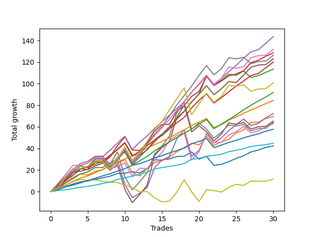

# Long Pointer 002 SD 
- Symbol: ES
- Date Range: 03/18/2022 - 12/30/2022
- Trading Period: 8:30-12:30
- Number of Trades: 26



| Name | Win Percent | Profit | Avg Profit / Trade | Avg Time / Trade |      | Name | Win Percent | Profit | Avg Profit / Trade | Avg Time / Trade |
| ---- | ----------- | ------ | ------------------ | ---------------- | ---- | ---- | ----------- | ------ | ------------------ | ---------------- |
| Sorted By <br> Profit | | | | | | Sorted By <br> Win Percentage ||||
| BB-100 Mid SL-10 | 84.62 | 74125.00 | 2850.96 | 18:17 |     | BB-50 Mid SL-10 | 96.15 | 59750.00 | 2298.08 | 09:59 |
| BB-100 Mid | 84.62 | 63000.00 | 2423.08 | 20:28 |     | BB-50 Mid | 96.15 | 48625.00 | 1870.19 | 12:09 |
| V U/L 1SD SL-10 | 69.23 | 61125.00 | 2350.96 | 33:14 |     | TP-4 | 96.15 | 38875.00 | 1495.19 | 11:49 |
| BB-100 U/L 2SD SL-10 | 61.54 | 60500.00 | 2326.92 | 43:45 |     | TP-3 | 96.15 | 24875.00 | 956.73 | 09:18 |
| BB-50 Mid SL-10 | 96.15 | 59750.00 | 2298.08 | 09:59 |     | TP-2 | 96.15 | 16250.00 | 625.00 | 06:16 |
| TP-6 | 92.31 | 58750.00 | 2259.62 | 18:54 |     | TP-1 | 96.15 | 8375.00 | 322.12 | 05:19 |
| BB-200 U/L 2SD SL-10 | 61.54 | 57000.00 | 2192.31 | 44:33 |     | TP-6 | 92.31 | 58750.00 | 2259.62 | 18:54 |
| BB-20 U/L 2SD C SL-10 | 92.31 | 56375.00 | 2168.27 | 14:07 |     | BB-20 U/L 2SD C SL-10 | 92.31 | 56375.00 | 2168.27 | 14:07 |
| BB-50 U/L 1SD SL-10 | 84.62 | 55625.00 | 2139.42 | 20:48 |     | BB-20 U/L 2SD SL-10 | 92.31 | 47750.00 | 1836.54 | 12:34 |
| TP-10 | 73.08 | 55500.00 | 2134.62 | 37:50 |     | BB-20 U/L 2SD C | 92.31 | 47375.00 | 1822.12 | 17:06 |
| TP-8 | 76.92 | 53000.00 | 2038.46 | 32:19 |     | TP-5 | 92.31 | 46500.00 | 1788.46 | 16:08 |
| NEWFI 000 | 73.08 | 51875.00 | 1995.19 | 49:10 |     | BB-20 U/L 2SD | 92.31 | 38750.00 | 1490.38 | 15:33 |
| BB-100 U/L 2SD | 65.38 | 50375.00 | 1937.50 | 52:04 |     | BB-20 U/L 1SD SL-10 | 92.31 | 36125.00 | 1389.42 | 07:50 |
| BB-50 Mid | 96.15 | 48625.00 | 1870.19 | 12:09 |     | BB-20 U/L 1SD | 92.31 | 25000.00 | 961.54 | 09:51 |
| TP-7 | 80.77 | 48500.00 | 1865.38 | 28:07 |     | BB-50 U/L 1SD | 88.46 | 32250.00 | 1240.38 | 26:13 |
| BB-20 U/L 2SD SL-10 | 92.31 | 47750.00 | 1836.54 | 12:34 |     | BB-20 Mid SL-10 | 88.46 | 20625.00 | 793.27 | 03:20 |
| TP-9 | 73.08 | 47625.00 | 1831.73 | 37:03 |     | BB-20 Mid | 88.46 | 17125.00 | 658.65 | 04:22 |
| BB-20 U/L 2SD C | 92.31 | 47375.00 | 1822.12 | 17:06 |     | BB-100 Mid SL-10 | 84.62 | 74125.00 | 2850.96 | 18:17 |
| BB-200 U/L 2SD | 65.38 | 46875.00 | 1802.88 | 52:52 |     | BB-100 Mid | 84.62 | 63000.00 | 2423.08 | 20:28 |
| TP-5 | 92.31 | 46500.00 | 1788.46 | 16:08 |     | BB-50 U/L 1SD SL-10 | 84.62 | 55625.00 | 2139.42 | 20:48 |
| BB-50 U/L 2SD SL-10 | 65.38 | 43500.00 | 1673.08 | 31:03 |     | TP-7 | 80.77 | 48500.00 | 1865.38 | 28:07 |
| BB-200 Mid SL-10 | 73.08 | 41625.00 | 1600.96 | 17:32 |     | TP-8 | 76.92 | 53000.00 | 2038.46 | 32:19 |
| TP-4 | 96.15 | 38875.00 | 1495.19 | 11:49 |     | TP-10 | 73.08 | 55500.00 | 2134.62 | 37:50 |
| BB-20 U/L 2SD | 92.31 | 38750.00 | 1490.38 | 15:33 |     | NEWFI 000 | 73.08 | 51875.00 | 1995.19 | 49:10 |
| BB-20 U/L 1SD SL-10 | 92.31 | 36125.00 | 1389.42 | 07:50 |     | TP-9 | 73.08 | 47625.00 | 1831.73 | 37:03 |
| BB-200 Mid | 73.08 | 32500.00 | 1250.00 | 20:05 |     | BB-200 Mid SL-10 | 73.08 | 41625.00 | 1600.96 | 17:32 |
| BB-50 U/L 1SD | 88.46 | 32250.00 | 1240.38 | 26:13 |     | BB-200 Mid | 73.08 | 32500.00 | 1250.00 | 20:05 |
| V U/L 1SD | 69.23 | 31750.00 | 1221.15 | 39:41 |     | V U/L 1SD SL-10 | 69.23 | 61125.00 | 2350.96 | 33:14 |
| BB-50 U/L 2SD | 69.23 | 27625.00 | 1062.50 | 38:16 |     | V U/L 1SD | 69.23 | 31750.00 | 1221.15 | 39:41 |
| BB-20 U/L 1SD | 92.31 | 25000.00 | 961.54 | 09:51 |     | BB-50 U/L 2SD | 69.23 | 27625.00 | 1062.50 | 38:16 |
| TP-3 | 96.15 | 24875.00 | 956.73 | 09:18 |     | BB-100 U/L 2SD | 65.38 | 50375.00 | 1937.50 | 52:04 |
| BB-20 Mid SL-10 | 88.46 | 20625.00 | 793.27 | 03:20 |     | BB-200 U/L 2SD | 65.38 | 46875.00 | 1802.88 | 52:52 |
| BB-20 Mid | 88.46 | 17125.00 | 658.65 | 04:22 |     | BB-50 U/L 2SD SL-10 | 65.38 | 43500.00 | 1673.08 | 31:03 |
| TP-2 | 96.15 | 16250.00 | 625.00 | 06:16 |     | BB-100 U/L 2SD SL-10 | 61.54 | 60500.00 | 2326.92 | 43:45 |
| TP-1 | 96.15 | 8375.00 | 322.12 | 05:19 |     | BB-200 U/L 2SD SL-10 | 61.54 | 57000.00 | 2192.31 | 44:33 |

## NO STOPLOSS

### Test BB-20 Mid
* Sell when price hits the middle line of the 20p bollinger
* No Stoploss
* Results:
```
Total Trades: 26
Percent Up: 88.46
Percent Down: 11.54
Total Points Moved Up: 34.25
Potential Profit: 17125.00
Total Points Ups: 55.25 Count Ups: 23
Total Points Downs: -21.00 Count Downs: 3
```

<details><summary>Trades</summary>

<code>In: 2022-03-25 12:31:00		Out: 2022-03-25 12:37:10		Total Position Time: 06:10		Total Move Up: 1.25		Total to Date: 1.25</code> <br />
<code>In: 2022-03-31 08:37:00		Out: 2022-03-31 08:38:15		Total Position Time: 01:15		Total Move Up: 2.00		Total to Date: 3.25</code> <br />
<code>In: 2022-05-06 09:03:00		Out: 2022-05-06 09:04:10		Total Position Time: 01:10		Total Move Up: 6.25		Total to Date: 9.50</code> <br />
<code>In: 2022-05-11 09:14:00		Out: 2022-05-11 09:21:05		Total Position Time: 07:05		Total Move Up: 2.50		Total to Date: 12.00</code> <br />
<code>In: 2022-05-16 09:47:00		Out: 2022-05-16 09:48:15		Total Position Time: 01:15		Total Move Up: 4.00		Total to Date: 16.00</code> <br />
<code>In: 2022-05-17 11:25:00		Out: 2022-05-17 11:31:35		Total Position Time: 06:35		Total Move Up: 5.00		Total to Date: 21.00</code> <br />
<code>In: 2022-05-31 12:05:00		Out: 2022-05-31 12:07:20		Total Position Time: 02:20		Total Move Up: 2.25		Total to Date: 23.25</code> <br />
<code>In: 2022-06-21 11:06:00		Out: 2022-06-21 11:07:50		Total Position Time: 01:50		Total Move Up: 1.75		Total to Date: 25.00</code> <br />
<code>In: 2022-06-27 10:10:00		Out: 2022-06-27 10:11:25		Total Position Time: 01:25		Total Move Up: 3.00		Total to Date: 28.00</code> <br />
<code>In: 2022-07-08 09:48:00		Out: 2022-07-08 09:49:10		Total Position Time: 01:10		Total Move Up: 2.25		Total to Date: 30.25</code> <br />
<code>In: 2022-07-12 10:28:00		Out: 2022-07-12 10:29:10		Total Position Time: 01:10		Total Move Up: 1.00		Total to Date: 31.25</code> <br />
<code>In: 2022-08-01 10:50:00		Out: 2022-08-01 10:56:50		Total Position Time: 06:50		Total Move Up: 0.00		Total to Date: 31.25</code> <br />
<code>In: 2022-08-18 09:47:00		Out: 2022-08-18 09:48:10		Total Position Time: 01:10		Total Move Up: 2.00		Total to Date: 33.25</code> <br />
<code>In: 2022-09-02 09:47:00		Out: 2022-09-02 10:18:10		Total Position Time: 31:10		Total Move Up: -17.25		Total to Date: 16.00</code> <br />
<code>In: 2022-09-09 09:28:00		Out: 2022-09-09 09:29:10		Total Position Time: 01:10		Total Move Up: 1.25		Total to Date: 17.25</code> <br />
<code>In: 2022-09-12 09:12:00		Out: 2022-09-12 09:14:05		Total Position Time: 02:05		Total Move Up: 1.50		Total to Date: 18.75</code> <br />
<code>In: 2022-09-14 09:09:00		Out: 2022-09-14 09:13:20		Total Position Time: 04:20		Total Move Up: 2.50		Total to Date: 21.25</code> <br />
<code>In: 2022-09-14 11:06:00		Out: 2022-09-14 11:15:30		Total Position Time: 09:30		Total Move Up: -2.00		Total to Date: 19.25</code> <br />
<code>In: 2022-10-11 12:18:00		Out: 2022-10-11 12:19:10		Total Position Time: 01:10		Total Move Up: -1.75		Total to Date: 17.50</code> <br />
<code>In: 2022-10-17 09:48:00		Out: 2022-10-17 09:52:15		Total Position Time: 04:15		Total Move Up: 1.50		Total to Date: 19.00</code> <br />
<code>In: 2022-10-17 11:28:00		Out: 2022-10-17 11:35:40		Total Position Time: 07:40		Total Move Up: 0.00		Total to Date: 19.00</code> <br />
<code>In: 2022-10-19 08:38:00		Out: 2022-10-19 08:39:10		Total Position Time: 01:10		Total Move Up: 5.25		Total to Date: 24.25</code> <br />
<code>In: 2022-10-20 08:31:00		Out: 2022-10-20 08:33:20		Total Position Time: 02:20		Total Move Up: 3.25		Total to Date: 27.50</code> <br />
<code>In: 2022-11-10 09:58:00		Out: 2022-11-10 10:02:05		Total Position Time: 04:05		Total Move Up: 3.50		Total to Date: 31.00</code> <br />
<code>In: 2022-12-09 10:14:00		Out: 2022-12-09 10:16:50		Total Position Time: 02:50		Total Move Up: 2.75		Total to Date: 33.75</code> <br />
<code>In: 2022-12-20 12:11:00		Out: 2022-12-20 12:13:45		Total Position Time: 02:45		Total Move Up: 0.50		Total to Date: 34.25</code> <br />


</details>

### Test BB-20 U/L 1SD
* Sell when the price hits the upper line of the 20p 1std bollinger
* No Stoploss
* Results:
```
Total Trades: 26
Percent Up: 92.31
Percent Down: 7.69
Total Points Moved Up: 50.00
Potential Profit: 25000.00
Total Points Ups: 83.50 Count Ups: 24
Total Points Downs: -33.50 Count Downs: 2
```

<details><summary>Trades</summary>

<code>In: 2022-03-25 12:31:00		Out: 2022-03-25 12:40:55		Total Position Time: 09:55		Total Move Up: 3.00		Total to Date: 3.00</code> <br />
<code>In: 2022-03-31 08:37:00		Out: 2022-03-31 08:40:35		Total Position Time: 03:35		Total Move Up: 3.25		Total to Date: 6.25</code> <br />
<code>In: 2022-05-06 09:03:00		Out: 2022-05-06 09:04:10		Total Position Time: 01:10		Total Move Up: 6.25		Total to Date: 12.50</code> <br />
<code>In: 2022-05-11 09:14:00		Out: 2022-05-11 09:23:10		Total Position Time: 09:10		Total Move Up: 3.25		Total to Date: 15.75</code> <br />
<code>In: 2022-05-16 09:47:00		Out: 2022-05-16 09:50:05		Total Position Time: 03:05		Total Move Up: 6.75		Total to Date: 22.50</code> <br />
<code>In: 2022-05-17 11:25:00		Out: 2022-05-17 11:39:45		Total Position Time: 14:45		Total Move Up: 7.25		Total to Date: 29.75</code> <br />
<code>In: 2022-05-31 12:05:00		Out: 2022-05-31 12:09:15		Total Position Time: 04:15		Total Move Up: 5.25		Total to Date: 35.00</code> <br />
<code>In: 2022-06-21 11:06:00		Out: 2022-06-21 11:10:05		Total Position Time: 04:05		Total Move Up: 3.25		Total to Date: 38.25</code> <br />
<code>In: 2022-06-27 10:10:00		Out: 2022-06-27 10:16:10		Total Position Time: 06:10		Total Move Up: 6.25		Total to Date: 44.50</code> <br />
<code>In: 2022-07-08 09:48:00		Out: 2022-07-08 10:06:55		Total Position Time: 18:55		Total Move Up: 0.00		Total to Date: 44.50</code> <br />
<code>In: 2022-07-12 10:28:00		Out: 2022-07-12 10:30:05		Total Position Time: 02:05		Total Move Up: 1.75		Total to Date: 46.25</code> <br />
<code>In: 2022-08-01 10:50:00		Out: 2022-08-01 10:59:05		Total Position Time: 09:05		Total Move Up: 2.75		Total to Date: 49.00</code> <br />
<code>In: 2022-08-18 09:47:00		Out: 2022-08-18 09:55:25		Total Position Time: 08:25		Total Move Up: 2.50		Total to Date: 51.50</code> <br />
<code>In: 2022-09-02 09:47:00		Out: 2022-09-02 10:43:30		Total Position Time: 56:30		Total Move Up: -32.50		Total to Date: 19.00</code> <br />
<code>In: 2022-09-09 09:28:00		Out: 2022-09-09 09:33:25		Total Position Time: 05:25		Total Move Up: 2.75		Total to Date: 21.75</code> <br />
<code>In: 2022-09-12 09:12:00		Out: 2022-09-12 09:21:25		Total Position Time: 09:25		Total Move Up: 1.25		Total to Date: 23.00</code> <br />
<code>In: 2022-09-14 09:09:00		Out: 2022-09-14 09:18:05		Total Position Time: 09:05		Total Move Up: 4.75		Total to Date: 27.75</code> <br />
<code>In: 2022-09-14 11:06:00		Out: 2022-09-14 11:19:10		Total Position Time: 13:10		Total Move Up: -1.00		Total to Date: 26.75</code> <br />
<code>In: 2022-10-11 12:18:00		Out: 2022-10-11 12:20:40		Total Position Time: 02:40		Total Move Up: 0.25		Total to Date: 27.00</code> <br />
<code>In: 2022-10-17 09:48:00		Out: 2022-10-17 10:05:40		Total Position Time: 17:40		Total Move Up: 1.75		Total to Date: 28.75</code> <br />
<code>In: 2022-10-17 11:28:00		Out: 2022-10-17 11:36:10		Total Position Time: 08:10		Total Move Up: 2.50		Total to Date: 31.25</code> <br />
<code>In: 2022-10-19 08:38:00		Out: 2022-10-19 08:46:05		Total Position Time: 08:05		Total Move Up: 6.00		Total to Date: 37.25</code> <br />
<code>In: 2022-10-20 08:31:00		Out: 2022-10-20 08:37:20		Total Position Time: 06:20		Total Move Up: 5.50		Total to Date: 42.75</code> <br />
<code>In: 2022-11-10 09:58:00		Out: 2022-11-10 10:02:05		Total Position Time: 04:05		Total Move Up: 3.50		Total to Date: 46.25</code> <br />
<code>In: 2022-12-09 10:14:00		Out: 2022-12-09 10:30:40		Total Position Time: 16:40		Total Move Up: 1.50		Total to Date: 47.75</code> <br />
<code>In: 2022-12-20 12:11:00		Out: 2022-12-20 12:15:15		Total Position Time: 04:15		Total Move Up: 2.25		Total to Date: 50.00</code> <br />


</details>

### Test BB-20 U/L 2SD
* Sell when the price hits the upper line of the 20p 2std bollinger
* No Stoploss
* Results:
```
Total Trades: 26
Percent Up: 92.31
Percent Down: 7.69
Total Points Moved Up: 77.50
Potential Profit: 38750.00
Total Points Ups: 115.75 Count Ups: 24
Total Points Downs: -38.25 Count Downs: 2
```

<details><summary>Trades</summary>

<code>In: 2022-03-25 12:31:00		Out: 2022-03-25 12:41:35		Total Position Time: 10:35		Total Move Up: 3.75		Total to Date: 3.75</code> <br />
<code>In: 2022-03-31 08:37:00		Out: 2022-03-31 08:41:10		Total Position Time: 04:10		Total Move Up: 5.75		Total to Date: 9.50</code> <br />
<code>In: 2022-05-06 09:03:00		Out: 2022-05-06 09:04:10		Total Position Time: 01:10		Total Move Up: 6.25		Total to Date: 15.75</code> <br />
<code>In: 2022-05-11 09:14:00		Out: 2022-05-11 09:23:35		Total Position Time: 09:35		Total Move Up: 6.25		Total to Date: 22.00</code> <br />
<code>In: 2022-05-16 09:47:00		Out: 2022-05-16 10:06:30		Total Position Time: 19:30		Total Move Up: 4.50		Total to Date: 26.50</code> <br />
<code>In: 2022-05-17 11:25:00		Out: 2022-05-17 11:40:05		Total Position Time: 15:05		Total Move Up: 11.00		Total to Date: 37.50</code> <br />
<code>In: 2022-05-31 12:05:00		Out: 2022-05-31 12:15:05		Total Position Time: 10:05		Total Move Up: 10.25		Total to Date: 47.75</code> <br />
<code>In: 2022-06-21 11:06:00		Out: 2022-06-21 11:11:05		Total Position Time: 05:05		Total Move Up: 4.25		Total to Date: 52.00</code> <br />
<code>In: 2022-06-27 10:10:00		Out: 2022-06-27 11:10:55		Total Position Time: 60:55		Total Move Up: -7.75		Total to Date: 44.25</code> <br />
<code>In: 2022-07-08 09:48:00		Out: 2022-07-08 10:11:05		Total Position Time: 23:05		Total Move Up: 2.25		Total to Date: 46.50</code> <br />
<code>In: 2022-07-12 10:28:00		Out: 2022-07-12 10:31:30		Total Position Time: 03:30		Total Move Up: 3.00		Total to Date: 49.50</code> <br />
<code>In: 2022-08-01 10:50:00		Out: 2022-08-01 11:06:40		Total Position Time: 16:40		Total Move Up: 4.00		Total to Date: 53.50</code> <br />
<code>In: 2022-08-18 09:47:00		Out: 2022-08-18 10:06:05		Total Position Time: 19:05		Total Move Up: 2.75		Total to Date: 56.25</code> <br />
<code>In: 2022-09-02 09:47:00		Out: 2022-09-02 10:43:50		Total Position Time: 56:50		Total Move Up: -30.50		Total to Date: 25.75</code> <br />
<code>In: 2022-09-09 09:28:00		Out: 2022-09-09 09:35:40		Total Position Time: 07:40		Total Move Up: 3.25		Total to Date: 29.00</code> <br />
<code>In: 2022-09-12 09:12:00		Out: 2022-09-12 09:21:25		Total Position Time: 09:25		Total Move Up: 1.25		Total to Date: 30.25</code> <br />
<code>In: 2022-09-14 09:09:00		Out: 2022-09-14 09:25:55		Total Position Time: 16:55		Total Move Up: 5.75		Total to Date: 36.00</code> <br />
<code>In: 2022-09-14 11:06:00		Out: 2022-09-14 11:30:30		Total Position Time: 24:30		Total Move Up: 2.50		Total to Date: 38.50</code> <br />
<code>In: 2022-10-11 12:18:00		Out: 2022-10-11 12:22:35		Total Position Time: 04:35		Total Move Up: 3.50		Total to Date: 42.00</code> <br />
<code>In: 2022-10-17 09:48:00		Out: 2022-10-17 10:16:15		Total Position Time: 28:15		Total Move Up: 4.50		Total to Date: 46.50</code> <br />
<code>In: 2022-10-17 11:28:00		Out: 2022-10-17 11:37:30		Total Position Time: 09:30		Total Move Up: 3.00		Total to Date: 49.50</code> <br />
<code>In: 2022-10-19 08:38:00		Out: 2022-10-19 08:48:05		Total Position Time: 10:05		Total Move Up: 8.25		Total to Date: 57.75</code> <br />
<code>In: 2022-10-20 08:31:00		Out: 2022-10-20 08:38:05		Total Position Time: 07:05		Total Move Up: 7.75		Total to Date: 65.50</code> <br />
<code>In: 2022-11-10 09:58:00		Out: 2022-11-10 10:03:45		Total Position Time: 05:45		Total Move Up: 6.00		Total to Date: 71.50</code> <br />
<code>In: 2022-12-09 10:14:00		Out: 2022-12-09 10:31:15		Total Position Time: 17:15		Total Move Up: 2.75		Total to Date: 74.25</code> <br />
<code>In: 2022-12-20 12:11:00		Out: 2022-12-20 12:19:10		Total Position Time: 08:10		Total Move Up: 3.25		Total to Date: 77.50</code> <br />


</details>

### Test BB-20 U/L 2SD C
* Sell when the price hits the upper line of the 20p 2std bollinger
* No Stoploss
* Results:
```
Total Trades: 26
Percent Up: 92.31
Percent Down: 7.69
Total Points Moved Up: 94.75
Potential Profit: 47375.00
Total Points Ups: 133.00 Count Ups: 24
Total Points Downs: -38.25 Count Downs: 2
```

<details><summary>Trades</summary>

<code>In: 2022-03-25 12:31:00		Out: 2022-03-25 12:41:55		Total Position Time: 10:55		Total Move Up: 5.00		Total to Date: 5.00</code> <br />
<code>In: 2022-03-31 08:37:00		Out: 2022-03-31 08:41:10		Total Position Time: 04:10		Total Move Up: 5.75		Total to Date: 10.75</code> <br />
<code>In: 2022-05-06 09:03:00		Out: 2022-05-06 09:05:00		Total Position Time: 02:00		Total Move Up: 7.25		Total to Date: 18.00</code> <br />
<code>In: 2022-05-11 09:14:00		Out: 2022-05-11 09:23:40		Total Position Time: 09:40		Total Move Up: 7.75		Total to Date: 25.75</code> <br />
<code>In: 2022-05-16 09:47:00		Out: 2022-05-16 10:07:00		Total Position Time: 20:00		Total Move Up: 5.25		Total to Date: 31.00</code> <br />
<code>In: 2022-05-17 11:25:00		Out: 2022-05-17 11:40:05		Total Position Time: 15:05		Total Move Up: 11.00		Total to Date: 42.00</code> <br />
<code>In: 2022-05-31 12:05:00		Out: 2022-05-31 12:15:05		Total Position Time: 10:05		Total Move Up: 10.25		Total to Date: 52.25</code> <br />
<code>In: 2022-06-21 11:06:00		Out: 2022-06-21 11:12:50		Total Position Time: 06:50		Total Move Up: 5.50		Total to Date: 57.75</code> <br />
<code>In: 2022-06-27 10:10:00		Out: 2022-06-27 11:10:55		Total Position Time: 60:55		Total Move Up: -7.75		Total to Date: 50.00</code> <br />
<code>In: 2022-07-08 09:48:00		Out: 2022-07-08 10:11:05		Total Position Time: 23:05		Total Move Up: 2.25		Total to Date: 52.25</code> <br />
<code>In: 2022-07-12 10:28:00		Out: 2022-07-12 10:41:40		Total Position Time: 13:40		Total Move Up: 4.00		Total to Date: 56.25</code> <br />
<code>In: 2022-08-01 10:50:00		Out: 2022-08-01 11:06:40		Total Position Time: 16:40		Total Move Up: 4.00		Total to Date: 60.25</code> <br />
<code>In: 2022-08-18 09:47:00		Out: 2022-08-18 10:06:05		Total Position Time: 19:05		Total Move Up: 2.75		Total to Date: 63.00</code> <br />
<code>In: 2022-09-02 09:47:00		Out: 2022-09-02 10:43:50		Total Position Time: 56:50		Total Move Up: -30.50		Total to Date: 32.50</code> <br />
<code>In: 2022-09-09 09:28:00		Out: 2022-09-09 09:36:05		Total Position Time: 08:05		Total Move Up: 4.25		Total to Date: 36.75</code> <br />
<code>In: 2022-09-12 09:12:00		Out: 2022-09-12 09:23:10		Total Position Time: 11:10		Total Move Up: 3.75		Total to Date: 40.50</code> <br />
<code>In: 2022-09-14 09:09:00		Out: 2022-09-14 09:25:55		Total Position Time: 16:55		Total Move Up: 5.75		Total to Date: 46.25</code> <br />
<code>In: 2022-09-14 11:06:00		Out: 2022-09-14 11:30:55		Total Position Time: 24:55		Total Move Up: 3.50		Total to Date: 49.75</code> <br />
<code>In: 2022-10-11 12:18:00		Out: 2022-10-11 12:37:00		Total Position Time: 19:00		Total Move Up: 8.75		Total to Date: 58.50</code> <br />
<code>In: 2022-10-17 09:48:00		Out: 2022-10-17 10:16:15		Total Position Time: 28:15		Total Move Up: 4.50		Total to Date: 63.00</code> <br />
<code>In: 2022-10-17 11:28:00		Out: 2022-10-17 11:37:55		Total Position Time: 09:55		Total Move Up: 3.00		Total to Date: 66.00</code> <br />
<code>In: 2022-10-19 08:38:00		Out: 2022-10-19 08:48:45		Total Position Time: 10:45		Total Move Up: 8.25		Total to Date: 74.25</code> <br />
<code>In: 2022-10-20 08:31:00		Out: 2022-10-20 08:38:05		Total Position Time: 07:05		Total Move Up: 7.75		Total to Date: 82.00</code> <br />
<code>In: 2022-11-10 09:58:00		Out: 2022-11-10 10:03:55		Total Position Time: 05:55		Total Move Up: 6.25		Total to Date: 88.25</code> <br />
<code>In: 2022-12-09 10:14:00		Out: 2022-12-09 10:31:20		Total Position Time: 17:20		Total Move Up: 2.75		Total to Date: 91.00</code> <br />
<code>In: 2022-12-20 12:11:00		Out: 2022-12-20 12:27:20		Total Position Time: 16:20		Total Move Up: 3.75		Total to Date: 94.75</code> <br />


</details>

### Test BB-50 Mid
* Sell when price hits the middle line of the 50p bollinger
* No Stoploss
* Results:
```
Total Trades: 26
Percent Up: 96.15
Percent Down: 3.85
Total Points Moved Up: 97.25
Potential Profit: 48625.00
Total Points Ups: 129.75 Count Ups: 25
Total Points Downs: -32.50 Count Downs: 1
```

<details><summary>Trades</summary>

<code>In: 2022-03-25 12:31:00		Out: 2022-03-25 12:42:40		Total Position Time: 11:40		Total Move Up: 6.75		Total to Date: 6.75</code> <br />
<code>In: 2022-03-31 08:37:00		Out: 2022-03-31 08:41:05		Total Position Time: 04:05		Total Move Up: 4.25		Total to Date: 11.00</code> <br />
<code>In: 2022-05-06 09:03:00		Out: 2022-05-06 09:06:05		Total Position Time: 03:05		Total Move Up: 10.25		Total to Date: 21.25</code> <br />
<code>In: 2022-05-11 09:14:00		Out: 2022-05-11 09:23:45		Total Position Time: 09:45		Total Move Up: 8.25		Total to Date: 29.50</code> <br />
<code>In: 2022-05-16 09:47:00		Out: 2022-05-16 09:50:05		Total Position Time: 03:05		Total Move Up: 6.75		Total to Date: 36.25</code> <br />
<code>In: 2022-05-17 11:25:00		Out: 2022-05-17 11:40:05		Total Position Time: 15:05		Total Move Up: 11.00		Total to Date: 47.25</code> <br />
<code>In: 2022-05-31 12:05:00		Out: 2022-05-31 12:15:15		Total Position Time: 10:15		Total Move Up: 12.25		Total to Date: 59.50</code> <br />
<code>In: 2022-06-21 11:06:00		Out: 2022-06-21 11:10:20		Total Position Time: 04:20		Total Move Up: 4.25		Total to Date: 63.75</code> <br />
<code>In: 2022-06-27 10:10:00		Out: 2022-06-27 10:11:15		Total Position Time: 01:15		Total Move Up: 1.75		Total to Date: 65.50</code> <br />
<code>In: 2022-07-08 09:48:00		Out: 2022-07-08 10:11:10		Total Position Time: 23:10		Total Move Up: 2.25		Total to Date: 67.75</code> <br />
<code>In: 2022-07-12 10:28:00		Out: 2022-07-12 10:41:35		Total Position Time: 13:35		Total Move Up: 3.00		Total to Date: 70.75</code> <br />
<code>In: 2022-08-01 10:50:00		Out: 2022-08-01 11:07:00		Total Position Time: 17:00		Total Move Up: 4.00		Total to Date: 74.75</code> <br />
<code>In: 2022-08-18 09:47:00		Out: 2022-08-18 10:06:05		Total Position Time: 19:05		Total Move Up: 2.75		Total to Date: 77.50</code> <br />
<code>In: 2022-09-02 09:47:00		Out: 2022-09-02 10:47:55		Total Position Time: 60:55		Total Move Up: -32.50		Total to Date: 45.00</code> <br />
<code>In: 2022-09-09 09:28:00		Out: 2022-09-09 09:33:30		Total Position Time: 05:30		Total Move Up: 3.25		Total to Date: 48.25</code> <br />
<code>In: 2022-09-12 09:12:00		Out: 2022-09-12 09:24:10		Total Position Time: 12:10		Total Move Up: 5.25		Total to Date: 53.50</code> <br />
<code>In: 2022-09-14 09:09:00		Out: 2022-09-14 09:14:55		Total Position Time: 05:55		Total Move Up: 4.00		Total to Date: 57.50</code> <br />
<code>In: 2022-09-14 11:06:00		Out: 2022-09-14 11:29:30		Total Position Time: 23:30		Total Move Up: 1.25		Total to Date: 58.75</code> <br />
<code>In: 2022-10-11 12:18:00		Out: 2022-10-11 12:36:35		Total Position Time: 18:35		Total Move Up: 5.75		Total to Date: 64.50</code> <br />
<code>In: 2022-10-17 09:48:00		Out: 2022-10-17 09:52:25		Total Position Time: 04:25		Total Move Up: 2.00		Total to Date: 66.50</code> <br />
<code>In: 2022-10-17 11:28:00		Out: 2022-10-17 11:39:15		Total Position Time: 11:15		Total Move Up: 4.00		Total to Date: 70.50</code> <br />
<code>In: 2022-10-19 08:38:00		Out: 2022-10-19 08:40:30		Total Position Time: 02:30		Total Move Up: 7.50		Total to Date: 78.00</code> <br />
<code>In: 2022-10-20 08:31:00		Out: 2022-10-20 08:37:25		Total Position Time: 06:25		Total Move Up: 6.00		Total to Date: 84.00</code> <br />
<code>In: 2022-11-10 09:58:00		Out: 2022-11-10 10:03:55		Total Position Time: 05:55		Total Move Up: 6.25		Total to Date: 90.25</code> <br />
<code>In: 2022-12-09 10:14:00		Out: 2022-12-09 10:33:05		Total Position Time: 19:05		Total Move Up: 3.75		Total to Date: 94.00</code> <br />
<code>In: 2022-12-20 12:11:00		Out: 2022-12-20 12:15:35		Total Position Time: 04:35		Total Move Up: 3.25		Total to Date: 97.25</code> <br />


</details>

### Test BB-50 U/L 1SD
* Sell when the price hits the upper line of the 50p 1std bollinger
* No Stoploss
* Results:
```
Total Trades: 26
Percent Up: 88.46
Percent Down: 11.54
Total Points Moved Up: 64.50
Potential Profit: 32250.00
Total Points Ups: 165.25 Count Ups: 23
Total Points Downs: -100.75 Count Downs: 3
```

<details><summary>Trades</summary>

<code>In: 2022-03-25 12:31:00		Out: 2022-03-25 12:47:00		Total Position Time: 16:00		Total Move Up: 9.75		Total to Date: 9.75</code> <br />
<code>In: 2022-03-31 08:37:00		Out: 2022-03-31 09:00:15		Total Position Time: 23:15		Total Move Up: 4.25		Total to Date: 14.00</code> <br />
<code>In: 2022-05-06 09:03:00		Out: 2022-05-06 09:23:05		Total Position Time: 20:05		Total Move Up: 8.50		Total to Date: 22.50</code> <br />
<code>In: 2022-05-11 09:14:00		Out: 2022-05-11 10:14:55		Total Position Time: 60:55		Total Move Up: -44.50		Total to Date: -22.00</code> <br />
<code>In: 2022-05-16 09:47:00		Out: 2022-05-16 10:07:05		Total Position Time: 20:05		Total Move Up: 5.25		Total to Date: -16.75</code> <br />
<code>In: 2022-05-17 11:25:00		Out: 2022-05-17 11:44:30		Total Position Time: 19:30		Total Move Up: 18.25		Total to Date: 1.50</code> <br />
<code>In: 2022-05-31 12:05:00		Out: 2022-05-31 12:28:25		Total Position Time: 23:25		Total Move Up: 17.25		Total to Date: 18.75</code> <br />
<code>In: 2022-06-21 11:06:00		Out: 2022-06-21 11:29:15		Total Position Time: 23:15		Total Move Up: 4.75		Total to Date: 23.50</code> <br />
<code>In: 2022-06-27 10:10:00		Out: 2022-06-27 10:13:05		Total Position Time: 03:05		Total Move Up: 5.50		Total to Date: 29.00</code> <br />
<code>In: 2022-07-08 09:48:00		Out: 2022-07-08 10:26:30		Total Position Time: 38:30		Total Move Up: 2.75		Total to Date: 31.75</code> <br />
<code>In: 2022-07-12 10:28:00		Out: 2022-07-12 10:53:20		Total Position Time: 25:20		Total Move Up: 4.00		Total to Date: 35.75</code> <br />
<code>In: 2022-08-01 10:50:00		Out: 2022-08-01 11:14:25		Total Position Time: 24:25		Total Move Up: 6.50		Total to Date: 42.25</code> <br />
<code>In: 2022-08-18 09:47:00		Out: 2022-08-18 10:09:35		Total Position Time: 22:35		Total Move Up: 5.50		Total to Date: 47.75</code> <br />
<code>In: 2022-09-02 09:47:00		Out: 2022-09-02 10:47:55		Total Position Time: 60:55		Total Move Up: -32.50		Total to Date: 15.25</code> <br />
<code>In: 2022-09-09 09:28:00		Out: 2022-09-09 09:37:45		Total Position Time: 09:45		Total Move Up: 6.50		Total to Date: 21.75</code> <br />
<code>In: 2022-09-12 09:12:00		Out: 2022-09-12 09:37:50		Total Position Time: 25:50		Total Move Up: 7.00		Total to Date: 28.75</code> <br />
<code>In: 2022-09-14 09:09:00		Out: 2022-09-14 09:38:20		Total Position Time: 29:20		Total Move Up: 5.50		Total to Date: 34.25</code> <br />
<code>In: 2022-09-14 11:06:00		Out: 2022-09-14 11:32:05		Total Position Time: 26:05		Total Move Up: 5.25		Total to Date: 39.50</code> <br />
<code>In: 2022-10-11 12:18:00		Out: 2022-10-11 12:39:25		Total Position Time: 21:25		Total Move Up: 9.00		Total to Date: 48.50</code> <br />
<code>In: 2022-10-17 09:48:00		Out: 2022-10-17 10:16:15		Total Position Time: 28:15		Total Move Up: 4.50		Total to Date: 53.00</code> <br />
<code>In: 2022-10-17 11:28:00		Out: 2022-10-17 11:43:20		Total Position Time: 15:20		Total Move Up: 6.50		Total to Date: 59.50</code> <br />
<code>In: 2022-10-19 08:38:00		Out: 2022-10-19 08:52:10		Total Position Time: 14:10		Total Move Up: 12.00		Total to Date: 71.50</code> <br />
<code>In: 2022-10-20 08:31:00		Out: 2022-10-20 09:31:55		Total Position Time: 60:55		Total Move Up: -23.75		Total to Date: 47.75</code> <br />
<code>In: 2022-11-10 09:58:00		Out: 2022-11-10 10:13:45		Total Position Time: 15:45		Total Move Up: 9.75		Total to Date: 57.50</code> <br />
<code>In: 2022-12-09 10:14:00		Out: 2022-12-09 10:50:45		Total Position Time: 36:45		Total Move Up: 3.00		Total to Date: 60.50</code> <br />
<code>In: 2022-12-20 12:11:00		Out: 2022-12-20 12:28:00		Total Position Time: 17:00		Total Move Up: 4.00		Total to Date: 64.50</code> <br />


</details>

### Test BB-50 U/L 2SD
* Sell when the price hits the upper line of the 50p 2std bollinger
* No Stoploss
* Results:
```
Total Trades: 26
Percent Up: 69.23
Percent Down: 30.77
Total Points Moved Up: 55.25
Potential Profit: 27625.00
Total Points Ups: 177.25 Count Ups: 18
Total Points Downs: -122.00 Count Downs: 8
```

<details><summary>Trades</summary>

<code>In: 2022-03-25 12:31:00		Out: 2022-03-25 12:47:00		Total Position Time: 16:00		Total Move Up: 9.75		Total to Date: 9.75</code> <br />
<code>In: 2022-03-31 08:37:00		Out: 2022-03-31 09:37:55		Total Position Time: 60:55		Total Move Up: -5.50		Total to Date: 4.25</code> <br />
<code>In: 2022-05-06 09:03:00		Out: 2022-05-06 09:35:05		Total Position Time: 32:05		Total Move Up: 17.25		Total to Date: 21.50</code> <br />
<code>In: 2022-05-11 09:14:00		Out: 2022-05-11 10:14:55		Total Position Time: 60:55		Total Move Up: -44.50		Total to Date: -23.00</code> <br />
<code>In: 2022-05-16 09:47:00		Out: 2022-05-16 10:07:35		Total Position Time: 20:35		Total Move Up: 8.50		Total to Date: -14.50</code> <br />
<code>In: 2022-05-17 11:25:00		Out: 2022-05-17 11:48:40		Total Position Time: 23:40		Total Move Up: 27.25		Total to Date: 12.75</code> <br />
<code>In: 2022-05-31 12:05:00		Out: 2022-05-31 12:31:05		Total Position Time: 26:05		Total Move Up: 22.75		Total to Date: 35.50</code> <br />
<code>In: 2022-06-21 11:06:00		Out: 2022-06-21 11:30:15		Total Position Time: 24:15		Total Move Up: 6.25		Total to Date: 41.75</code> <br />
<code>In: 2022-06-27 10:10:00		Out: 2022-06-27 11:10:55		Total Position Time: 60:55		Total Move Up: -7.75		Total to Date: 34.00</code> <br />
<code>In: 2022-07-08 09:48:00		Out: 2022-07-08 10:27:00		Total Position Time: 39:00		Total Move Up: 5.00		Total to Date: 39.00</code> <br />
<code>In: 2022-07-12 10:28:00		Out: 2022-07-12 10:54:05		Total Position Time: 26:05		Total Move Up: 4.75		Total to Date: 43.75</code> <br />
<code>In: 2022-08-01 10:50:00		Out: 2022-08-01 11:15:25		Total Position Time: 25:25		Total Move Up: 8.75		Total to Date: 52.50</code> <br />
<code>In: 2022-08-18 09:47:00		Out: 2022-08-18 10:11:40		Total Position Time: 24:40		Total Move Up: 7.25		Total to Date: 59.75</code> <br />
<code>In: 2022-09-02 09:47:00		Out: 2022-09-02 10:47:55		Total Position Time: 60:55		Total Move Up: -32.50		Total to Date: 27.25</code> <br />
<code>In: 2022-09-09 09:28:00		Out: 2022-09-09 09:49:40		Total Position Time: 21:40		Total Move Up: 8.50		Total to Date: 35.75</code> <br />
<code>In: 2022-09-12 09:12:00		Out: 2022-09-12 09:44:15		Total Position Time: 32:15		Total Move Up: 8.25		Total to Date: 44.00</code> <br />
<code>In: 2022-09-14 09:09:00		Out: 2022-09-14 09:42:25		Total Position Time: 33:25		Total Move Up: 8.50		Total to Date: 52.50</code> <br />
<code>In: 2022-09-14 11:06:00		Out: 2022-09-14 12:06:55		Total Position Time: 60:55		Total Move Up: -0.75		Total to Date: 51.75</code> <br />
<code>In: 2022-10-11 12:18:00		Out: 2022-10-11 12:47:00		Total Position Time: 29:00		Total Move Up: 6.75		Total to Date: 58.50</code> <br />
<code>In: 2022-10-17 09:48:00		Out: 2022-10-17 10:24:05		Total Position Time: 36:05		Total Move Up: 7.25		Total to Date: 65.75</code> <br />
<code>In: 2022-10-17 11:28:00		Out: 2022-10-17 12:28:55		Total Position Time: 60:55		Total Move Up: 1.00		Total to Date: 66.75</code> <br />
<code>In: 2022-10-19 08:38:00		Out: 2022-10-19 09:38:55		Total Position Time: 60:55		Total Move Up: -6.00		Total to Date: 60.75</code> <br />
<code>In: 2022-10-20 08:31:00		Out: 2022-10-20 09:31:55		Total Position Time: 60:55		Total Move Up: -23.75		Total to Date: 37.00</code> <br />
<code>In: 2022-11-10 09:58:00		Out: 2022-11-10 10:16:15		Total Position Time: 18:15		Total Move Up: 12.75		Total to Date: 49.75</code> <br />
<code>In: 2022-12-09 10:14:00		Out: 2022-12-09 11:14:55		Total Position Time: 60:55		Total Move Up: -1.25		Total to Date: 48.50</code> <br />
<code>In: 2022-12-20 12:11:00		Out: 2022-12-20 12:29:15		Total Position Time: 18:15		Total Move Up: 6.75		Total to Date: 55.25</code> <br />


</details>

### Test V U/L 1SD
* Sell when the price hits the upper line of the 1std VWAP
* No Stoploss
* Results:
```
Total Trades: 26
Percent Up: 69.23
Percent Down: 30.77
Total Points Moved Up: 63.50
Potential Profit: 31750.00
Total Points Ups: 181.75 Count Ups: 18
Total Points Downs: -118.25 Count Downs: 8
```

<details><summary>Trades</summary>

<code>In: 2022-03-25 12:31:00		Out: 2022-03-25 12:47:00		Total Position Time: 16:00		Total Move Up: 9.75		Total to Date: 9.75</code> <br />
<code>In: 2022-03-31 08:37:00		Out: 2022-03-31 08:41:10		Total Position Time: 04:10		Total Move Up: 5.75		Total to Date: 15.50</code> <br />
<code>In: 2022-05-06 09:03:00		Out: 2022-05-06 09:06:40		Total Position Time: 03:40		Total Move Up: 11.50		Total to Date: 27.00</code> <br />
<code>In: 2022-05-11 09:14:00		Out: 2022-05-11 10:14:55		Total Position Time: 60:55		Total Move Up: -44.50		Total to Date: -17.50</code> <br />
<code>In: 2022-05-16 09:47:00		Out: 2022-05-16 10:07:35		Total Position Time: 20:35		Total Move Up: 8.50		Total to Date: -9.00</code> <br />
<code>In: 2022-05-17 11:25:00		Out: 2022-05-17 11:40:20		Total Position Time: 15:20		Total Move Up: 17.25		Total to Date: 8.25</code> <br />
<code>In: 2022-05-31 12:05:00		Out: 2022-05-31 12:30:55		Total Position Time: 25:55		Total Move Up: 21.50		Total to Date: 29.75</code> <br />
<code>In: 2022-06-21 11:06:00		Out: 2022-06-21 11:52:25		Total Position Time: 46:25		Total Move Up: 9.00		Total to Date: 38.75</code> <br />
<code>In: 2022-06-27 10:10:00		Out: 2022-06-27 11:10:55		Total Position Time: 60:55		Total Move Up: -7.75		Total to Date: 31.00</code> <br />
<code>In: 2022-07-08 09:48:00		Out: 2022-07-08 10:48:55		Total Position Time: 60:55		Total Move Up: 13.25		Total to Date: 44.25</code> <br />
<code>In: 2022-07-12 10:28:00		Out: 2022-07-12 11:28:55		Total Position Time: 60:55		Total Move Up: -1.75		Total to Date: 42.50</code> <br />
<code>In: 2022-08-01 10:50:00		Out: 2022-08-01 11:50:55		Total Position Time: 60:55		Total Move Up: 3.50		Total to Date: 46.00</code> <br />
<code>In: 2022-08-18 09:47:00		Out: 2022-08-18 10:37:15		Total Position Time: 50:15		Total Move Up: 10.00		Total to Date: 56.00</code> <br />
<code>In: 2022-09-02 09:47:00		Out: 2022-09-02 10:47:55		Total Position Time: 60:55		Total Move Up: -32.50		Total to Date: 23.50</code> <br />
<code>In: 2022-09-09 09:28:00		Out: 2022-09-09 09:49:40		Total Position Time: 21:40		Total Move Up: 8.50		Total to Date: 32.00</code> <br />
<code>In: 2022-09-12 09:12:00		Out: 2022-09-12 10:12:55		Total Position Time: 60:55		Total Move Up: 15.50		Total to Date: 47.50</code> <br />
<code>In: 2022-09-14 09:09:00		Out: 2022-09-14 09:42:25		Total Position Time: 33:25		Total Move Up: 8.50		Total to Date: 56.00</code> <br />
<code>In: 2022-09-14 11:06:00		Out: 2022-09-14 12:06:55		Total Position Time: 60:55		Total Move Up: -0.75		Total to Date: 55.25</code> <br />
<code>In: 2022-10-11 12:18:00		Out: 2022-10-11 12:47:00		Total Position Time: 29:00		Total Move Up: 6.75		Total to Date: 62.00</code> <br />
<code>In: 2022-10-17 09:48:00		Out: 2022-10-17 10:24:00		Total Position Time: 36:00		Total Move Up: 5.00		Total to Date: 67.00</code> <br />
<code>In: 2022-10-17 11:28:00		Out: 2022-10-17 11:40:40		Total Position Time: 12:40		Total Move Up: 4.75		Total to Date: 71.75</code> <br />
<code>In: 2022-10-19 08:38:00		Out: 2022-10-19 09:38:55		Total Position Time: 60:55		Total Move Up: -6.00		Total to Date: 65.75</code> <br />
<code>In: 2022-10-20 08:31:00		Out: 2022-10-20 09:31:55		Total Position Time: 60:55		Total Move Up: -23.75		Total to Date: 42.00</code> <br />
<code>In: 2022-11-10 09:58:00		Out: 2022-11-10 10:15:50		Total Position Time: 17:50		Total Move Up: 12.50		Total to Date: 54.50</code> <br />
<code>In: 2022-12-09 10:14:00		Out: 2022-12-09 11:14:55		Total Position Time: 60:55		Total Move Up: -1.25		Total to Date: 53.25</code> <br />
<code>In: 2022-12-20 12:11:00		Out: 2022-12-20 12:39:50		Total Position Time: 28:50		Total Move Up: 10.25		Total to Date: 63.50</code> <br />


</details>

### Test BB-100 Mid
* Move to BB100 Mid
* No Stoploss
* Results:
```
Total Trades: 26
Percent Up: 84.62
Percent Down: 15.38
Total Points Moved Up: 126.00
Potential Profit: 63000.00
Total Points Ups: 161.50 Count Ups: 22
Total Points Downs: -35.50 Count Downs: 4
```

<details><summary>Trades</summary>

<code>In: 2022-03-25 12:31:00		Out: 2022-03-25 12:46:55		Total Position Time: 15:55		Total Move Up: 9.75		Total to Date: 9.75</code> <br />
<code>In: 2022-03-31 08:37:00		Out: 2022-03-31 08:38:10		Total Position Time: 01:10		Total Move Up: 1.75		Total to Date: 11.50</code> <br />
<code>In: 2022-05-06 09:03:00		Out: 2022-05-06 09:04:10		Total Position Time: 01:10		Total Move Up: 6.25		Total to Date: 17.75</code> <br />
<code>In: 2022-05-11 09:14:00		Out: 2022-05-11 09:23:35		Total Position Time: 09:35		Total Move Up: 6.25		Total to Date: 24.00</code> <br />
<code>In: 2022-05-16 09:47:00		Out: 2022-05-16 09:48:10		Total Position Time: 01:10		Total Move Up: 2.75		Total to Date: 26.75</code> <br />
<code>In: 2022-05-17 11:25:00		Out: 2022-05-17 11:40:15		Total Position Time: 15:15		Total Move Up: 15.00		Total to Date: 41.75</code> <br />
<code>In: 2022-05-31 12:05:00		Out: 2022-05-31 12:30:15		Total Position Time: 25:15		Total Move Up: 18.75		Total to Date: 60.50</code> <br />
<code>In: 2022-06-21 11:06:00		Out: 2022-06-21 11:10:20		Total Position Time: 04:20		Total Move Up: 4.25		Total to Date: 64.75</code> <br />
<code>In: 2022-06-27 10:10:00		Out: 2022-06-27 10:20:05		Total Position Time: 10:05		Total Move Up: 5.50		Total to Date: 70.25</code> <br />
<code>In: 2022-07-08 09:48:00		Out: 2022-07-08 10:29:10		Total Position Time: 41:10		Total Move Up: 8.00		Total to Date: 78.25</code> <br />
<code>In: 2022-07-12 10:28:00		Out: 2022-07-12 10:54:05		Total Position Time: 26:05		Total Move Up: 4.75		Total to Date: 83.00</code> <br />
<code>In: 2022-08-01 10:50:00		Out: 2022-08-01 11:16:30		Total Position Time: 26:30		Total Move Up: 11.00		Total to Date: 94.00</code> <br />
<code>In: 2022-08-18 09:47:00		Out: 2022-08-18 10:21:10		Total Position Time: 34:10		Total Move Up: 7.50		Total to Date: 101.50</code> <br />
<code>In: 2022-09-02 09:47:00		Out: 2022-09-02 10:47:55		Total Position Time: 60:55		Total Move Up: -32.50		Total to Date: 69.00</code> <br />
<code>In: 2022-09-09 09:28:00		Out: 2022-09-09 09:36:20		Total Position Time: 08:20		Total Move Up: 5.00		Total to Date: 74.00</code> <br />
<code>In: 2022-09-12 09:12:00		Out: 2022-09-12 09:37:50		Total Position Time: 25:50		Total Move Up: 7.00		Total to Date: 81.00</code> <br />
<code>In: 2022-09-14 09:09:00		Out: 2022-09-14 09:18:10		Total Position Time: 09:10		Total Move Up: 4.50		Total to Date: 85.50</code> <br />
<code>In: 2022-09-14 11:06:00		Out: 2022-09-14 12:06:55		Total Position Time: 60:55		Total Move Up: -0.75		Total to Date: 84.75</code> <br />
<code>In: 2022-10-11 12:18:00		Out: 2022-10-11 12:47:00		Total Position Time: 29:00		Total Move Up: 6.75		Total to Date: 91.50</code> <br />
<code>In: 2022-10-17 09:48:00		Out: 2022-10-17 09:49:25		Total Position Time: 01:25		Total Move Up: -1.00		Total to Date: 90.50</code> <br />
<code>In: 2022-10-17 11:28:00		Out: 2022-10-17 11:36:10		Total Position Time: 08:10		Total Move Up: 2.50		Total to Date: 93.00</code> <br />
<code>In: 2022-10-19 08:38:00		Out: 2022-10-19 08:52:00		Total Position Time: 14:00		Total Move Up: 10.00		Total to Date: 103.00</code> <br />
<code>In: 2022-10-20 08:31:00		Out: 2022-10-20 08:37:25		Total Position Time: 06:25		Total Move Up: 6.00		Total to Date: 109.00</code> <br />
<code>In: 2022-11-10 09:58:00		Out: 2022-11-10 10:15:00		Total Position Time: 17:00		Total Move Up: 11.50		Total to Date: 120.50</code> <br />
<code>In: 2022-12-09 10:14:00		Out: 2022-12-09 11:14:55		Total Position Time: 60:55		Total Move Up: -1.25		Total to Date: 119.25</code> <br />
<code>In: 2022-12-20 12:11:00		Out: 2022-12-20 12:29:15		Total Position Time: 18:15		Total Move Up: 6.75		Total to Date: 126.00</code> <br />


</details>

### Test BB-100 U/L 2SD
* Move to BB100 Upper Band
* No Stoploss
* Results:
```
Total Trades: 26
Percent Up: 65.38
Percent Down: 34.62
Total Points Moved Up: 100.75
Potential Profit: 50375.00
Total Points Ups: 224.50 Count Ups: 17
Total Points Downs: -123.75 Count Downs: 9
```

<details><summary>Trades</summary>

<code>In: 2022-03-25 12:31:00		Out: 2022-03-25 12:47:00		Total Position Time: 16:00		Total Move Up: 9.75		Total to Date: 9.75</code> <br />
<code>In: 2022-03-31 08:37:00		Out: 2022-03-31 09:37:55		Total Position Time: 60:55		Total Move Up: -5.50		Total to Date: 4.25</code> <br />
<code>In: 2022-05-06 09:03:00		Out: 2022-05-06 10:03:55		Total Position Time: 60:55		Total Move Up: 28.75		Total to Date: 33.00</code> <br />
<code>In: 2022-05-11 09:14:00		Out: 2022-05-11 10:14:55		Total Position Time: 60:55		Total Move Up: -44.50		Total to Date: -11.50</code> <br />
<code>In: 2022-05-16 09:47:00		Out: 2022-05-16 10:24:00		Total Position Time: 37:00		Total Move Up: 18.50		Total to Date: 7.00</code> <br />
<code>In: 2022-05-17 11:25:00		Out: 2022-05-17 12:02:20		Total Position Time: 37:20		Total Move Up: 33.00		Total to Date: 40.00</code> <br />
<code>In: 2022-05-31 12:05:00		Out: 2022-05-31 12:47:00		Total Position Time: 42:00		Total Move Up: 16.00		Total to Date: 56.00</code> <br />
<code>In: 2022-06-21 11:06:00		Out: 2022-06-21 11:52:50		Total Position Time: 46:50		Total Move Up: 9.00		Total to Date: 65.00</code> <br />
<code>In: 2022-06-27 10:10:00		Out: 2022-06-27 11:10:55		Total Position Time: 60:55		Total Move Up: -7.75		Total to Date: 57.25</code> <br />
<code>In: 2022-07-08 09:48:00		Out: 2022-07-08 10:48:55		Total Position Time: 60:55		Total Move Up: 13.25		Total to Date: 70.50</code> <br />
<code>In: 2022-07-12 10:28:00		Out: 2022-07-12 11:28:55		Total Position Time: 60:55		Total Move Up: -1.75		Total to Date: 68.75</code> <br />
<code>In: 2022-08-01 10:50:00		Out: 2022-08-01 11:50:55		Total Position Time: 60:55		Total Move Up: 3.50		Total to Date: 72.25</code> <br />
<code>In: 2022-08-18 09:47:00		Out: 2022-08-18 10:47:55		Total Position Time: 60:55		Total Move Up: 7.75		Total to Date: 80.00</code> <br />
<code>In: 2022-09-02 09:47:00		Out: 2022-09-02 10:47:55		Total Position Time: 60:55		Total Move Up: -32.50		Total to Date: 47.50</code> <br />
<code>In: 2022-09-09 09:28:00		Out: 2022-09-09 10:10:00		Total Position Time: 42:00		Total Move Up: 13.00		Total to Date: 60.50</code> <br />
<code>In: 2022-09-12 09:12:00		Out: 2022-09-12 10:12:55		Total Position Time: 60:55		Total Move Up: 15.50		Total to Date: 76.00</code> <br />
<code>In: 2022-09-14 09:09:00		Out: 2022-09-14 09:52:15		Total Position Time: 43:15		Total Move Up: 12.50		Total to Date: 88.50</code> <br />
<code>In: 2022-09-14 11:06:00		Out: 2022-09-14 12:06:55		Total Position Time: 60:55		Total Move Up: -0.75		Total to Date: 87.75</code> <br />
<code>In: 2022-10-11 12:18:00		Out: 2022-10-11 12:47:00		Total Position Time: 29:00		Total Move Up: 6.75		Total to Date: 94.50</code> <br />
<code>In: 2022-10-17 09:48:00		Out: 2022-10-17 10:48:35		Total Position Time: 60:35		Total Move Up: 8.75		Total to Date: 103.25</code> <br />
<code>In: 2022-10-17 11:28:00		Out: 2022-10-17 12:28:55		Total Position Time: 60:55		Total Move Up: 1.00		Total to Date: 104.25</code> <br />
<code>In: 2022-10-19 08:38:00		Out: 2022-10-19 09:38:55		Total Position Time: 60:55		Total Move Up: -6.00		Total to Date: 98.25</code> <br />
<code>In: 2022-10-20 08:31:00		Out: 2022-10-20 09:31:55		Total Position Time: 60:55		Total Move Up: -23.75		Total to Date: 74.50</code> <br />
<code>In: 2022-11-10 09:58:00		Out: 2022-11-10 10:48:15		Total Position Time: 50:15		Total Move Up: 20.25		Total to Date: 94.75</code> <br />
<code>In: 2022-12-09 10:14:00		Out: 2022-12-09 11:14:55		Total Position Time: 60:55		Total Move Up: -1.25		Total to Date: 93.50</code> <br />
<code>In: 2022-12-20 12:11:00		Out: 2022-12-20 12:47:00		Total Position Time: 36:00		Total Move Up: 7.25		Total to Date: 100.75</code> <br />


</details>

### Test BB-200 Mid
* Move to BB200 Mid
* No Stoploss
* Results:
```
Total Trades: 26
Percent Up: 73.08
Percent Down: 26.92
Total Points Moved Up: 65.00
Potential Profit: 32500.00
Total Points Ups: 109.00 Count Ups: 19
Total Points Downs: -44.00 Count Downs: 7
```

<details><summary>Trades</summary>

<code>In: 2022-03-25 12:31:00		Out: 2022-03-25 12:41:35		Total Position Time: 10:35		Total Move Up: 3.75		Total to Date: 3.75</code> <br />
<code>In: 2022-03-31 08:37:00		Out: 2022-03-31 08:41:10		Total Position Time: 04:10		Total Move Up: 5.75		Total to Date: 9.50</code> <br />
<code>In: 2022-05-06 09:03:00		Out: 2022-05-06 09:04:10		Total Position Time: 01:10		Total Move Up: 6.25		Total to Date: 15.75</code> <br />
<code>In: 2022-05-11 09:14:00		Out: 2022-05-11 09:21:05		Total Position Time: 07:05		Total Move Up: 2.50		Total to Date: 18.25</code> <br />
<code>In: 2022-05-16 09:47:00		Out: 2022-05-16 09:48:10		Total Position Time: 01:10		Total Move Up: 2.75		Total to Date: 21.00</code> <br />
<code>In: 2022-05-17 11:25:00		Out: 2022-05-17 11:40:10		Total Position Time: 15:10		Total Move Up: 14.00		Total to Date: 35.00</code> <br />
<code>In: 2022-05-31 12:05:00		Out: 2022-05-31 12:30:15		Total Position Time: 25:15		Total Move Up: 18.75		Total to Date: 53.75</code> <br />
<code>In: 2022-06-21 11:06:00		Out: 2022-06-21 11:10:05		Total Position Time: 04:05		Total Move Up: 3.25		Total to Date: 57.00</code> <br />
<code>In: 2022-06-27 10:10:00		Out: 2022-06-27 10:12:55		Total Position Time: 02:55		Total Move Up: 5.25		Total to Date: 62.25</code> <br />
<code>In: 2022-07-08 09:48:00		Out: 2022-07-08 10:48:55		Total Position Time: 60:55		Total Move Up: 13.25		Total to Date: 75.50</code> <br />
<code>In: 2022-07-12 10:28:00		Out: 2022-07-12 10:31:15		Total Position Time: 03:15		Total Move Up: 3.00		Total to Date: 78.50</code> <br />
<code>In: 2022-08-01 10:50:00		Out: 2022-08-01 11:50:55		Total Position Time: 60:55		Total Move Up: 3.50		Total to Date: 82.00</code> <br />
<code>In: 2022-08-18 09:47:00		Out: 2022-08-18 10:07:45		Total Position Time: 20:45		Total Move Up: 5.00		Total to Date: 87.00</code> <br />
<code>In: 2022-09-02 09:47:00		Out: 2022-09-02 10:47:55		Total Position Time: 60:55		Total Move Up: -32.50		Total to Date: 54.50</code> <br />
<code>In: 2022-09-09 09:28:00		Out: 2022-09-09 09:29:10		Total Position Time: 01:10		Total Move Up: 1.25		Total to Date: 55.75</code> <br />
<code>In: 2022-09-12 09:12:00		Out: 2022-09-12 09:14:05		Total Position Time: 02:05		Total Move Up: 1.50		Total to Date: 57.25</code> <br />
<code>In: 2022-09-14 09:09:00		Out: 2022-09-14 09:10:10		Total Position Time: 01:10		Total Move Up: -0.50		Total to Date: 56.75</code> <br />
<code>In: 2022-09-14 11:06:00		Out: 2022-09-14 12:06:55		Total Position Time: 60:55		Total Move Up: -0.75		Total to Date: 56.00</code> <br />
<code>In: 2022-10-11 12:18:00		Out: 2022-10-11 12:47:00		Total Position Time: 29:00		Total Move Up: 6.75		Total to Date: 62.75</code> <br />
<code>In: 2022-10-17 09:48:00		Out: 2022-10-17 09:49:10		Total Position Time: 01:10		Total Move Up: -2.00		Total to Date: 60.75</code> <br />
<code>In: 2022-10-17 11:28:00		Out: 2022-10-17 11:29:35		Total Position Time: 01:35		Total Move Up: -1.00		Total to Date: 59.75</code> <br />
<code>In: 2022-10-19 08:38:00		Out: 2022-10-19 09:38:55		Total Position Time: 60:55		Total Move Up: -6.00		Total to Date: 53.75</code> <br />
<code>In: 2022-10-20 08:31:00		Out: 2022-10-20 08:32:10		Total Position Time: 01:10		Total Move Up: 0.25		Total to Date: 54.00</code> <br />
<code>In: 2022-11-10 09:58:00		Out: 2022-11-10 10:03:35		Total Position Time: 05:35		Total Move Up: 5.50		Total to Date: 59.50</code> <br />
<code>In: 2022-12-09 10:14:00		Out: 2022-12-09 11:14:55		Total Position Time: 60:55		Total Move Up: -1.25		Total to Date: 58.25</code> <br />
<code>In: 2022-12-20 12:11:00		Out: 2022-12-20 12:29:15		Total Position Time: 18:15		Total Move Up: 6.75		Total to Date: 65.00</code> <br />


</details>

### Test BB-200 U/L 2SD
* Move to BB200 Upper Band
* No Stoploss
* Results:
```
Total Trades: 26
Percent Up: 65.38
Percent Down: 34.62
Total Points Moved Up: 93.75
Potential Profit: 46875.00
Total Points Ups: 217.50 Count Ups: 17
Total Points Downs: -123.75 Count Downs: 9
```

<details><summary>Trades</summary>

<code>In: 2022-03-25 12:31:00		Out: 2022-03-25 12:47:00		Total Position Time: 16:00		Total Move Up: 9.75		Total to Date: 9.75</code> <br />
<code>In: 2022-03-31 08:37:00		Out: 2022-03-31 09:37:55		Total Position Time: 60:55		Total Move Up: -5.50		Total to Date: 4.25</code> <br />
<code>In: 2022-05-06 09:03:00		Out: 2022-05-06 10:03:55		Total Position Time: 60:55		Total Move Up: 28.75		Total to Date: 33.00</code> <br />
<code>In: 2022-05-11 09:14:00		Out: 2022-05-11 10:14:55		Total Position Time: 60:55		Total Move Up: -44.50		Total to Date: -11.50</code> <br />
<code>In: 2022-05-16 09:47:00		Out: 2022-05-16 10:24:05		Total Position Time: 37:05		Total Move Up: 19.25		Total to Date: 7.75</code> <br />
<code>In: 2022-05-17 11:25:00		Out: 2022-05-17 11:48:45		Total Position Time: 23:45		Total Move Up: 27.75		Total to Date: 35.50</code> <br />
<code>In: 2022-05-31 12:05:00		Out: 2022-05-31 12:47:00		Total Position Time: 42:00		Total Move Up: 16.00		Total to Date: 51.50</code> <br />
<code>In: 2022-06-21 11:06:00		Out: 2022-06-21 11:53:10		Total Position Time: 47:10		Total Move Up: 10.75		Total to Date: 62.25</code> <br />
<code>In: 2022-06-27 10:10:00		Out: 2022-06-27 11:10:55		Total Position Time: 60:55		Total Move Up: -7.75		Total to Date: 54.50</code> <br />
<code>In: 2022-07-08 09:48:00		Out: 2022-07-08 10:48:55		Total Position Time: 60:55		Total Move Up: 13.25		Total to Date: 67.75</code> <br />
<code>In: 2022-07-12 10:28:00		Out: 2022-07-12 11:28:55		Total Position Time: 60:55		Total Move Up: -1.75		Total to Date: 66.00</code> <br />
<code>In: 2022-08-01 10:50:00		Out: 2022-08-01 11:50:55		Total Position Time: 60:55		Total Move Up: 3.50		Total to Date: 69.50</code> <br />
<code>In: 2022-08-18 09:47:00		Out: 2022-08-18 10:47:55		Total Position Time: 60:55		Total Move Up: 7.75		Total to Date: 77.25</code> <br />
<code>In: 2022-09-02 09:47:00		Out: 2022-09-02 10:47:55		Total Position Time: 60:55		Total Move Up: -32.50		Total to Date: 44.75</code> <br />
<code>In: 2022-09-09 09:28:00		Out: 2022-09-09 10:15:05		Total Position Time: 47:05		Total Move Up: 15.25		Total to Date: 60.00</code> <br />
<code>In: 2022-09-12 09:12:00		Out: 2022-09-12 10:12:55		Total Position Time: 60:55		Total Move Up: 15.50		Total to Date: 75.50</code> <br />
<code>In: 2022-09-14 09:09:00		Out: 2022-09-14 10:09:55		Total Position Time: 60:55		Total Move Up: 7.25		Total to Date: 82.75</code> <br />
<code>In: 2022-09-14 11:06:00		Out: 2022-09-14 12:06:55		Total Position Time: 60:55		Total Move Up: -0.75		Total to Date: 82.00</code> <br />
<code>In: 2022-10-11 12:18:00		Out: 2022-10-11 12:47:00		Total Position Time: 29:00		Total Move Up: 6.75		Total to Date: 88.75</code> <br />
<code>In: 2022-10-17 09:48:00		Out: 2022-10-17 10:48:55		Total Position Time: 60:55		Total Move Up: 10.00		Total to Date: 98.75</code> <br />
<code>In: 2022-10-17 11:28:00		Out: 2022-10-17 12:28:55		Total Position Time: 60:55		Total Move Up: 1.00		Total to Date: 99.75</code> <br />
<code>In: 2022-10-19 08:38:00		Out: 2022-10-19 09:38:55		Total Position Time: 60:55		Total Move Up: -6.00		Total to Date: 93.75</code> <br />
<code>In: 2022-10-20 08:31:00		Out: 2022-10-20 09:31:55		Total Position Time: 60:55		Total Move Up: -23.75		Total to Date: 70.00</code> <br />
<code>In: 2022-11-10 09:58:00		Out: 2022-11-10 10:58:55		Total Position Time: 60:55		Total Move Up: 17.75		Total to Date: 87.75</code> <br />
<code>In: 2022-12-09 10:14:00		Out: 2022-12-09 11:14:55		Total Position Time: 60:55		Total Move Up: -1.25		Total to Date: 86.50</code> <br />
<code>In: 2022-12-20 12:11:00		Out: 2022-12-20 12:47:00		Total Position Time: 36:00		Total Move Up: 7.25		Total to Date: 93.75</code> <br />


</details>

## STOPLOSS OF 10

### Test BB-20 Mid SL-10
* Sell when price hits the middle line of the 20p bollinger
* Stoploss is 10 points
* Results:
```
Total Trades: 26
Percent Up: 88.46
Percent Down: 11.54
Total Points Moved Up: 41.25
Potential Profit: 20625.00
Total Points Ups: 55.25 Count Ups: 23
Total Points Downs: -14.00 Count Downs: 3
```

<details><summary>Trades</summary>

<code>In: 2022-03-25 12:31:00		Out: 2022-03-25 12:37:10		Total Position Time: 06:10		Total Move Up: 1.25		Total to Date: 1.25</code> <br />
<code>In: 2022-03-31 08:37:00		Out: 2022-03-31 08:38:15		Total Position Time: 01:15		Total Move Up: 2.00		Total to Date: 3.25</code> <br />
<code>In: 2022-05-06 09:03:00		Out: 2022-05-06 09:04:10		Total Position Time: 01:10		Total Move Up: 6.25		Total to Date: 9.50</code> <br />
<code>In: 2022-05-11 09:14:00		Out: 2022-05-11 09:21:05		Total Position Time: 07:05		Total Move Up: 2.50		Total to Date: 12.00</code> <br />
<code>In: 2022-05-16 09:47:00		Out: 2022-05-16 09:48:15		Total Position Time: 01:15		Total Move Up: 4.00		Total to Date: 16.00</code> <br />
<code>In: 2022-05-17 11:25:00		Out: 2022-05-17 11:31:35		Total Position Time: 06:35		Total Move Up: 5.00		Total to Date: 21.00</code> <br />
<code>In: 2022-05-31 12:05:00		Out: 2022-05-31 12:07:20		Total Position Time: 02:20		Total Move Up: 2.25		Total to Date: 23.25</code> <br />
<code>In: 2022-06-21 11:06:00		Out: 2022-06-21 11:07:50		Total Position Time: 01:50		Total Move Up: 1.75		Total to Date: 25.00</code> <br />
<code>In: 2022-06-27 10:10:00		Out: 2022-06-27 10:11:25		Total Position Time: 01:25		Total Move Up: 3.00		Total to Date: 28.00</code> <br />
<code>In: 2022-07-08 09:48:00		Out: 2022-07-08 09:49:10		Total Position Time: 01:10		Total Move Up: 2.25		Total to Date: 30.25</code> <br />
<code>In: 2022-07-12 10:28:00		Out: 2022-07-12 10:29:10		Total Position Time: 01:10		Total Move Up: 1.00		Total to Date: 31.25</code> <br />
<code>In: 2022-08-01 10:50:00		Out: 2022-08-01 10:56:50		Total Position Time: 06:50		Total Move Up: 0.00		Total to Date: 31.25</code> <br />
<code>In: 2022-08-18 09:47:00		Out: 2022-08-18 09:48:10		Total Position Time: 01:10		Total Move Up: 2.00		Total to Date: 33.25</code> <br />
<code>In: 2022-09-02 09:47:00		Out: 2022-09-02 09:51:20		Total Position Time: 04:20		Total Move Up: -10.25		Total to Date: 23.00</code> <br />
<code>In: 2022-09-09 09:28:00		Out: 2022-09-09 09:29:10		Total Position Time: 01:10		Total Move Up: 1.25		Total to Date: 24.25</code> <br />
<code>In: 2022-09-12 09:12:00		Out: 2022-09-12 09:14:05		Total Position Time: 02:05		Total Move Up: 1.50		Total to Date: 25.75</code> <br />
<code>In: 2022-09-14 09:09:00		Out: 2022-09-14 09:13:20		Total Position Time: 04:20		Total Move Up: 2.50		Total to Date: 28.25</code> <br />
<code>In: 2022-09-14 11:06:00		Out: 2022-09-14 11:15:30		Total Position Time: 09:30		Total Move Up: -2.00		Total to Date: 26.25</code> <br />
<code>In: 2022-10-11 12:18:00		Out: 2022-10-11 12:19:10		Total Position Time: 01:10		Total Move Up: -1.75		Total to Date: 24.50</code> <br />
<code>In: 2022-10-17 09:48:00		Out: 2022-10-17 09:52:15		Total Position Time: 04:15		Total Move Up: 1.50		Total to Date: 26.00</code> <br />
<code>In: 2022-10-17 11:28:00		Out: 2022-10-17 11:35:40		Total Position Time: 07:40		Total Move Up: 0.00		Total to Date: 26.00</code> <br />
<code>In: 2022-10-19 08:38:00		Out: 2022-10-19 08:39:10		Total Position Time: 01:10		Total Move Up: 5.25		Total to Date: 31.25</code> <br />
<code>In: 2022-10-20 08:31:00		Out: 2022-10-20 08:33:20		Total Position Time: 02:20		Total Move Up: 3.25		Total to Date: 34.50</code> <br />
<code>In: 2022-11-10 09:58:00		Out: 2022-11-10 10:02:05		Total Position Time: 04:05		Total Move Up: 3.50		Total to Date: 38.00</code> <br />
<code>In: 2022-12-09 10:14:00		Out: 2022-12-09 10:16:50		Total Position Time: 02:50		Total Move Up: 2.75		Total to Date: 40.75</code> <br />
<code>In: 2022-12-20 12:11:00		Out: 2022-12-20 12:13:45		Total Position Time: 02:45		Total Move Up: 0.50		Total to Date: 41.25</code> <br />


</details>

### Test BB-20 U/L 1SD SL-10
* Sell when the price hits the upper line of the 20p 1std bollinger
* Stoploss is 10 points
* Results:
```
Total Trades: 26
Percent Up: 92.31
Percent Down: 7.69
Total Points Moved Up: 72.25
Potential Profit: 36125.00
Total Points Ups: 83.50 Count Ups: 24
Total Points Downs: -11.25 Count Downs: 2
```

<details><summary>Trades</summary>

<code>In: 2022-03-25 12:31:00		Out: 2022-03-25 12:40:55		Total Position Time: 09:55		Total Move Up: 3.00		Total to Date: 3.00</code> <br />
<code>In: 2022-03-31 08:37:00		Out: 2022-03-31 08:40:35		Total Position Time: 03:35		Total Move Up: 3.25		Total to Date: 6.25</code> <br />
<code>In: 2022-05-06 09:03:00		Out: 2022-05-06 09:04:10		Total Position Time: 01:10		Total Move Up: 6.25		Total to Date: 12.50</code> <br />
<code>In: 2022-05-11 09:14:00		Out: 2022-05-11 09:23:10		Total Position Time: 09:10		Total Move Up: 3.25		Total to Date: 15.75</code> <br />
<code>In: 2022-05-16 09:47:00		Out: 2022-05-16 09:50:05		Total Position Time: 03:05		Total Move Up: 6.75		Total to Date: 22.50</code> <br />
<code>In: 2022-05-17 11:25:00		Out: 2022-05-17 11:39:45		Total Position Time: 14:45		Total Move Up: 7.25		Total to Date: 29.75</code> <br />
<code>In: 2022-05-31 12:05:00		Out: 2022-05-31 12:09:15		Total Position Time: 04:15		Total Move Up: 5.25		Total to Date: 35.00</code> <br />
<code>In: 2022-06-21 11:06:00		Out: 2022-06-21 11:10:05		Total Position Time: 04:05		Total Move Up: 3.25		Total to Date: 38.25</code> <br />
<code>In: 2022-06-27 10:10:00		Out: 2022-06-27 10:16:10		Total Position Time: 06:10		Total Move Up: 6.25		Total to Date: 44.50</code> <br />
<code>In: 2022-07-08 09:48:00		Out: 2022-07-08 10:06:55		Total Position Time: 18:55		Total Move Up: 0.00		Total to Date: 44.50</code> <br />
<code>In: 2022-07-12 10:28:00		Out: 2022-07-12 10:30:05		Total Position Time: 02:05		Total Move Up: 1.75		Total to Date: 46.25</code> <br />
<code>In: 2022-08-01 10:50:00		Out: 2022-08-01 10:59:05		Total Position Time: 09:05		Total Move Up: 2.75		Total to Date: 49.00</code> <br />
<code>In: 2022-08-18 09:47:00		Out: 2022-08-18 09:55:25		Total Position Time: 08:25		Total Move Up: 2.50		Total to Date: 51.50</code> <br />
<code>In: 2022-09-02 09:47:00		Out: 2022-09-02 09:51:20		Total Position Time: 04:20		Total Move Up: -10.25		Total to Date: 41.25</code> <br />
<code>In: 2022-09-09 09:28:00		Out: 2022-09-09 09:33:25		Total Position Time: 05:25		Total Move Up: 2.75		Total to Date: 44.00</code> <br />
<code>In: 2022-09-12 09:12:00		Out: 2022-09-12 09:21:25		Total Position Time: 09:25		Total Move Up: 1.25		Total to Date: 45.25</code> <br />
<code>In: 2022-09-14 09:09:00		Out: 2022-09-14 09:18:05		Total Position Time: 09:05		Total Move Up: 4.75		Total to Date: 50.00</code> <br />
<code>In: 2022-09-14 11:06:00		Out: 2022-09-14 11:19:10		Total Position Time: 13:10		Total Move Up: -1.00		Total to Date: 49.00</code> <br />
<code>In: 2022-10-11 12:18:00		Out: 2022-10-11 12:20:40		Total Position Time: 02:40		Total Move Up: 0.25		Total to Date: 49.25</code> <br />
<code>In: 2022-10-17 09:48:00		Out: 2022-10-17 10:05:40		Total Position Time: 17:40		Total Move Up: 1.75		Total to Date: 51.00</code> <br />
<code>In: 2022-10-17 11:28:00		Out: 2022-10-17 11:36:10		Total Position Time: 08:10		Total Move Up: 2.50		Total to Date: 53.50</code> <br />
<code>In: 2022-10-19 08:38:00		Out: 2022-10-19 08:46:05		Total Position Time: 08:05		Total Move Up: 6.00		Total to Date: 59.50</code> <br />
<code>In: 2022-10-20 08:31:00		Out: 2022-10-20 08:37:20		Total Position Time: 06:20		Total Move Up: 5.50		Total to Date: 65.00</code> <br />
<code>In: 2022-11-10 09:58:00		Out: 2022-11-10 10:02:05		Total Position Time: 04:05		Total Move Up: 3.50		Total to Date: 68.50</code> <br />
<code>In: 2022-12-09 10:14:00		Out: 2022-12-09 10:30:40		Total Position Time: 16:40		Total Move Up: 1.50		Total to Date: 70.00</code> <br />
<code>In: 2022-12-20 12:11:00		Out: 2022-12-20 12:15:15		Total Position Time: 04:15		Total Move Up: 2.25		Total to Date: 72.25</code> <br />


</details>

### Test BB-20 U/L 2SD SL-10
* Sell when the price hits the upper line of the 20p 2std bollinger
* Stoploss is 10 points
* Results:
```
Total Trades: 26
Percent Up: 92.31
Percent Down: 7.69
Total Points Moved Up: 95.50
Potential Profit: 47750.00
Total Points Ups: 115.75 Count Ups: 24
Total Points Downs: -20.25 Count Downs: 2
```

<details><summary>Trades</summary>

<code>In: 2022-03-25 12:31:00		Out: 2022-03-25 12:41:35		Total Position Time: 10:35		Total Move Up: 3.75		Total to Date: 3.75</code> <br />
<code>In: 2022-03-31 08:37:00		Out: 2022-03-31 08:41:10		Total Position Time: 04:10		Total Move Up: 5.75		Total to Date: 9.50</code> <br />
<code>In: 2022-05-06 09:03:00		Out: 2022-05-06 09:04:10		Total Position Time: 01:10		Total Move Up: 6.25		Total to Date: 15.75</code> <br />
<code>In: 2022-05-11 09:14:00		Out: 2022-05-11 09:23:35		Total Position Time: 09:35		Total Move Up: 6.25		Total to Date: 22.00</code> <br />
<code>In: 2022-05-16 09:47:00		Out: 2022-05-16 10:06:30		Total Position Time: 19:30		Total Move Up: 4.50		Total to Date: 26.50</code> <br />
<code>In: 2022-05-17 11:25:00		Out: 2022-05-17 11:40:05		Total Position Time: 15:05		Total Move Up: 11.00		Total to Date: 37.50</code> <br />
<code>In: 2022-05-31 12:05:00		Out: 2022-05-31 12:15:05		Total Position Time: 10:05		Total Move Up: 10.25		Total to Date: 47.75</code> <br />
<code>In: 2022-06-21 11:06:00		Out: 2022-06-21 11:11:05		Total Position Time: 05:05		Total Move Up: 4.25		Total to Date: 52.00</code> <br />
<code>In: 2022-06-27 10:10:00		Out: 2022-06-27 10:45:55		Total Position Time: 35:55		Total Move Up: -10.00		Total to Date: 42.00</code> <br />
<code>In: 2022-07-08 09:48:00		Out: 2022-07-08 10:11:05		Total Position Time: 23:05		Total Move Up: 2.25		Total to Date: 44.25</code> <br />
<code>In: 2022-07-12 10:28:00		Out: 2022-07-12 10:31:30		Total Position Time: 03:30		Total Move Up: 3.00		Total to Date: 47.25</code> <br />
<code>In: 2022-08-01 10:50:00		Out: 2022-08-01 11:06:40		Total Position Time: 16:40		Total Move Up: 4.00		Total to Date: 51.25</code> <br />
<code>In: 2022-08-18 09:47:00		Out: 2022-08-18 10:06:05		Total Position Time: 19:05		Total Move Up: 2.75		Total to Date: 54.00</code> <br />
<code>In: 2022-09-02 09:47:00		Out: 2022-09-02 09:51:20		Total Position Time: 04:20		Total Move Up: -10.25		Total to Date: 43.75</code> <br />
<code>In: 2022-09-09 09:28:00		Out: 2022-09-09 09:35:40		Total Position Time: 07:40		Total Move Up: 3.25		Total to Date: 47.00</code> <br />
<code>In: 2022-09-12 09:12:00		Out: 2022-09-12 09:21:25		Total Position Time: 09:25		Total Move Up: 1.25		Total to Date: 48.25</code> <br />
<code>In: 2022-09-14 09:09:00		Out: 2022-09-14 09:25:55		Total Position Time: 16:55		Total Move Up: 5.75		Total to Date: 54.00</code> <br />
<code>In: 2022-09-14 11:06:00		Out: 2022-09-14 11:30:30		Total Position Time: 24:30		Total Move Up: 2.50		Total to Date: 56.50</code> <br />
<code>In: 2022-10-11 12:18:00		Out: 2022-10-11 12:22:35		Total Position Time: 04:35		Total Move Up: 3.50		Total to Date: 60.00</code> <br />
<code>In: 2022-10-17 09:48:00		Out: 2022-10-17 10:16:15		Total Position Time: 28:15		Total Move Up: 4.50		Total to Date: 64.50</code> <br />
<code>In: 2022-10-17 11:28:00		Out: 2022-10-17 11:37:30		Total Position Time: 09:30		Total Move Up: 3.00		Total to Date: 67.50</code> <br />
<code>In: 2022-10-19 08:38:00		Out: 2022-10-19 08:48:05		Total Position Time: 10:05		Total Move Up: 8.25		Total to Date: 75.75</code> <br />
<code>In: 2022-10-20 08:31:00		Out: 2022-10-20 08:38:05		Total Position Time: 07:05		Total Move Up: 7.75		Total to Date: 83.50</code> <br />
<code>In: 2022-11-10 09:58:00		Out: 2022-11-10 10:03:45		Total Position Time: 05:45		Total Move Up: 6.00		Total to Date: 89.50</code> <br />
<code>In: 2022-12-09 10:14:00		Out: 2022-12-09 10:31:15		Total Position Time: 17:15		Total Move Up: 2.75		Total to Date: 92.25</code> <br />
<code>In: 2022-12-20 12:11:00		Out: 2022-12-20 12:19:10		Total Position Time: 08:10		Total Move Up: 3.25		Total to Date: 95.50</code> <br />


</details>

### Test BB-20 U/L 2SD C SL-10
* Sell when the price hits the upper line of the 20p 2std bollinger
* Stoploss is 10 points
* Results:
```
Total Trades: 26
Percent Up: 92.31
Percent Down: 7.69
Total Points Moved Up: 112.75
Potential Profit: 56375.00
Total Points Ups: 133.00 Count Ups: 24
Total Points Downs: -20.25 Count Downs: 2
```

<details><summary>Trades</summary>

<code>In: 2022-03-25 12:31:00		Out: 2022-03-25 12:41:55		Total Position Time: 10:55		Total Move Up: 5.00		Total to Date: 5.00</code> <br />
<code>In: 2022-03-31 08:37:00		Out: 2022-03-31 08:41:10		Total Position Time: 04:10		Total Move Up: 5.75		Total to Date: 10.75</code> <br />
<code>In: 2022-05-06 09:03:00		Out: 2022-05-06 09:05:00		Total Position Time: 02:00		Total Move Up: 7.25		Total to Date: 18.00</code> <br />
<code>In: 2022-05-11 09:14:00		Out: 2022-05-11 09:23:40		Total Position Time: 09:40		Total Move Up: 7.75		Total to Date: 25.75</code> <br />
<code>In: 2022-05-16 09:47:00		Out: 2022-05-16 10:07:00		Total Position Time: 20:00		Total Move Up: 5.25		Total to Date: 31.00</code> <br />
<code>In: 2022-05-17 11:25:00		Out: 2022-05-17 11:40:05		Total Position Time: 15:05		Total Move Up: 11.00		Total to Date: 42.00</code> <br />
<code>In: 2022-05-31 12:05:00		Out: 2022-05-31 12:15:05		Total Position Time: 10:05		Total Move Up: 10.25		Total to Date: 52.25</code> <br />
<code>In: 2022-06-21 11:06:00		Out: 2022-06-21 11:12:50		Total Position Time: 06:50		Total Move Up: 5.50		Total to Date: 57.75</code> <br />
<code>In: 2022-06-27 10:10:00		Out: 2022-06-27 10:45:55		Total Position Time: 35:55		Total Move Up: -10.00		Total to Date: 47.75</code> <br />
<code>In: 2022-07-08 09:48:00		Out: 2022-07-08 10:11:05		Total Position Time: 23:05		Total Move Up: 2.25		Total to Date: 50.00</code> <br />
<code>In: 2022-07-12 10:28:00		Out: 2022-07-12 10:41:40		Total Position Time: 13:40		Total Move Up: 4.00		Total to Date: 54.00</code> <br />
<code>In: 2022-08-01 10:50:00		Out: 2022-08-01 11:06:40		Total Position Time: 16:40		Total Move Up: 4.00		Total to Date: 58.00</code> <br />
<code>In: 2022-08-18 09:47:00		Out: 2022-08-18 10:06:05		Total Position Time: 19:05		Total Move Up: 2.75		Total to Date: 60.75</code> <br />
<code>In: 2022-09-02 09:47:00		Out: 2022-09-02 09:51:20		Total Position Time: 04:20		Total Move Up: -10.25		Total to Date: 50.50</code> <br />
<code>In: 2022-09-09 09:28:00		Out: 2022-09-09 09:36:05		Total Position Time: 08:05		Total Move Up: 4.25		Total to Date: 54.75</code> <br />
<code>In: 2022-09-12 09:12:00		Out: 2022-09-12 09:23:10		Total Position Time: 11:10		Total Move Up: 3.75		Total to Date: 58.50</code> <br />
<code>In: 2022-09-14 09:09:00		Out: 2022-09-14 09:25:55		Total Position Time: 16:55		Total Move Up: 5.75		Total to Date: 64.25</code> <br />
<code>In: 2022-09-14 11:06:00		Out: 2022-09-14 11:30:55		Total Position Time: 24:55		Total Move Up: 3.50		Total to Date: 67.75</code> <br />
<code>In: 2022-10-11 12:18:00		Out: 2022-10-11 12:37:00		Total Position Time: 19:00		Total Move Up: 8.75		Total to Date: 76.50</code> <br />
<code>In: 2022-10-17 09:48:00		Out: 2022-10-17 10:16:15		Total Position Time: 28:15		Total Move Up: 4.50		Total to Date: 81.00</code> <br />
<code>In: 2022-10-17 11:28:00		Out: 2022-10-17 11:37:55		Total Position Time: 09:55		Total Move Up: 3.00		Total to Date: 84.00</code> <br />
<code>In: 2022-10-19 08:38:00		Out: 2022-10-19 08:48:45		Total Position Time: 10:45		Total Move Up: 8.25		Total to Date: 92.25</code> <br />
<code>In: 2022-10-20 08:31:00		Out: 2022-10-20 08:38:05		Total Position Time: 07:05		Total Move Up: 7.75		Total to Date: 100.00</code> <br />
<code>In: 2022-11-10 09:58:00		Out: 2022-11-10 10:03:55		Total Position Time: 05:55		Total Move Up: 6.25		Total to Date: 106.25</code> <br />
<code>In: 2022-12-09 10:14:00		Out: 2022-12-09 10:31:20		Total Position Time: 17:20		Total Move Up: 2.75		Total to Date: 109.00</code> <br />
<code>In: 2022-12-20 12:11:00		Out: 2022-12-20 12:27:20		Total Position Time: 16:20		Total Move Up: 3.75		Total to Date: 112.75</code> <br />


</details>

### Test BB-50 Mid SL-10
* Sell when price hits the middle line of the 50p bollinger
* Stoploss is 10 points
* Results:
```
Total Trades: 26
Percent Up: 96.15
Percent Down: 3.85
Total Points Moved Up: 119.50
Potential Profit: 59750.00
Total Points Ups: 129.75 Count Ups: 25
Total Points Downs: -10.25 Count Downs: 1
```

<details><summary>Trades</summary>

<code>In: 2022-03-25 12:31:00		Out: 2022-03-25 12:42:40		Total Position Time: 11:40		Total Move Up: 6.75		Total to Date: 6.75</code> <br />
<code>In: 2022-03-31 08:37:00		Out: 2022-03-31 08:41:05		Total Position Time: 04:05		Total Move Up: 4.25		Total to Date: 11.00</code> <br />
<code>In: 2022-05-06 09:03:00		Out: 2022-05-06 09:06:05		Total Position Time: 03:05		Total Move Up: 10.25		Total to Date: 21.25</code> <br />
<code>In: 2022-05-11 09:14:00		Out: 2022-05-11 09:23:45		Total Position Time: 09:45		Total Move Up: 8.25		Total to Date: 29.50</code> <br />
<code>In: 2022-05-16 09:47:00		Out: 2022-05-16 09:50:05		Total Position Time: 03:05		Total Move Up: 6.75		Total to Date: 36.25</code> <br />
<code>In: 2022-05-17 11:25:00		Out: 2022-05-17 11:40:05		Total Position Time: 15:05		Total Move Up: 11.00		Total to Date: 47.25</code> <br />
<code>In: 2022-05-31 12:05:00		Out: 2022-05-31 12:15:15		Total Position Time: 10:15		Total Move Up: 12.25		Total to Date: 59.50</code> <br />
<code>In: 2022-06-21 11:06:00		Out: 2022-06-21 11:10:20		Total Position Time: 04:20		Total Move Up: 4.25		Total to Date: 63.75</code> <br />
<code>In: 2022-06-27 10:10:00		Out: 2022-06-27 10:11:15		Total Position Time: 01:15		Total Move Up: 1.75		Total to Date: 65.50</code> <br />
<code>In: 2022-07-08 09:48:00		Out: 2022-07-08 10:11:10		Total Position Time: 23:10		Total Move Up: 2.25		Total to Date: 67.75</code> <br />
<code>In: 2022-07-12 10:28:00		Out: 2022-07-12 10:41:35		Total Position Time: 13:35		Total Move Up: 3.00		Total to Date: 70.75</code> <br />
<code>In: 2022-08-01 10:50:00		Out: 2022-08-01 11:07:00		Total Position Time: 17:00		Total Move Up: 4.00		Total to Date: 74.75</code> <br />
<code>In: 2022-08-18 09:47:00		Out: 2022-08-18 10:06:05		Total Position Time: 19:05		Total Move Up: 2.75		Total to Date: 77.50</code> <br />
<code>In: 2022-09-02 09:47:00		Out: 2022-09-02 09:51:20		Total Position Time: 04:20		Total Move Up: -10.25		Total to Date: 67.25</code> <br />
<code>In: 2022-09-09 09:28:00		Out: 2022-09-09 09:33:30		Total Position Time: 05:30		Total Move Up: 3.25		Total to Date: 70.50</code> <br />
<code>In: 2022-09-12 09:12:00		Out: 2022-09-12 09:24:10		Total Position Time: 12:10		Total Move Up: 5.25		Total to Date: 75.75</code> <br />
<code>In: 2022-09-14 09:09:00		Out: 2022-09-14 09:14:55		Total Position Time: 05:55		Total Move Up: 4.00		Total to Date: 79.75</code> <br />
<code>In: 2022-09-14 11:06:00		Out: 2022-09-14 11:29:30		Total Position Time: 23:30		Total Move Up: 1.25		Total to Date: 81.00</code> <br />
<code>In: 2022-10-11 12:18:00		Out: 2022-10-11 12:36:35		Total Position Time: 18:35		Total Move Up: 5.75		Total to Date: 86.75</code> <br />
<code>In: 2022-10-17 09:48:00		Out: 2022-10-17 09:52:25		Total Position Time: 04:25		Total Move Up: 2.00		Total to Date: 88.75</code> <br />
<code>In: 2022-10-17 11:28:00		Out: 2022-10-17 11:39:15		Total Position Time: 11:15		Total Move Up: 4.00		Total to Date: 92.75</code> <br />
<code>In: 2022-10-19 08:38:00		Out: 2022-10-19 08:40:30		Total Position Time: 02:30		Total Move Up: 7.50		Total to Date: 100.25</code> <br />
<code>In: 2022-10-20 08:31:00		Out: 2022-10-20 08:37:25		Total Position Time: 06:25		Total Move Up: 6.00		Total to Date: 106.25</code> <br />
<code>In: 2022-11-10 09:58:00		Out: 2022-11-10 10:03:55		Total Position Time: 05:55		Total Move Up: 6.25		Total to Date: 112.50</code> <br />
<code>In: 2022-12-09 10:14:00		Out: 2022-12-09 10:33:05		Total Position Time: 19:05		Total Move Up: 3.75		Total to Date: 116.25</code> <br />
<code>In: 2022-12-20 12:11:00		Out: 2022-12-20 12:15:35		Total Position Time: 04:35		Total Move Up: 3.25		Total to Date: 119.50</code> <br />


</details>

### Test BB-50 U/L 1SD SL-10
* Sell when the price hits the upper line of the 50p 1std bollinger
* Stoploss is 10 points
* Results:
```
Total Trades: 26
Percent Up: 84.62
Percent Down: 15.38
Total Points Moved Up: 111.25
Potential Profit: 55625.00
Total Points Ups: 156.75 Count Ups: 22
Total Points Downs: -45.50 Count Downs: 4
```

<details><summary>Trades</summary>

<code>In: 2022-03-25 12:31:00		Out: 2022-03-25 12:47:00		Total Position Time: 16:00		Total Move Up: 9.75		Total to Date: 9.75</code> <br />
<code>In: 2022-03-31 08:37:00		Out: 2022-03-31 09:00:15		Total Position Time: 23:15		Total Move Up: 4.25		Total to Date: 14.00</code> <br />
<code>In: 2022-05-06 09:03:00		Out: 2022-05-06 09:15:15		Total Position Time: 12:15		Total Move Up: -9.75		Total to Date: 4.25</code> <br />
<code>In: 2022-05-11 09:14:00		Out: 2022-05-11 09:29:15		Total Position Time: 15:15		Total Move Up: -15.50		Total to Date: -11.25</code> <br />
<code>In: 2022-05-16 09:47:00		Out: 2022-05-16 10:07:05		Total Position Time: 20:05		Total Move Up: 5.25		Total to Date: -6.00</code> <br />
<code>In: 2022-05-17 11:25:00		Out: 2022-05-17 11:44:30		Total Position Time: 19:30		Total Move Up: 18.25		Total to Date: 12.25</code> <br />
<code>In: 2022-05-31 12:05:00		Out: 2022-05-31 12:28:25		Total Position Time: 23:25		Total Move Up: 17.25		Total to Date: 29.50</code> <br />
<code>In: 2022-06-21 11:06:00		Out: 2022-06-21 11:29:15		Total Position Time: 23:15		Total Move Up: 4.75		Total to Date: 34.25</code> <br />
<code>In: 2022-06-27 10:10:00		Out: 2022-06-27 10:13:05		Total Position Time: 03:05		Total Move Up: 5.50		Total to Date: 39.75</code> <br />
<code>In: 2022-07-08 09:48:00		Out: 2022-07-08 10:26:30		Total Position Time: 38:30		Total Move Up: 2.75		Total to Date: 42.50</code> <br />
<code>In: 2022-07-12 10:28:00		Out: 2022-07-12 10:53:20		Total Position Time: 25:20		Total Move Up: 4.00		Total to Date: 46.50</code> <br />
<code>In: 2022-08-01 10:50:00		Out: 2022-08-01 11:14:25		Total Position Time: 24:25		Total Move Up: 6.50		Total to Date: 53.00</code> <br />
<code>In: 2022-08-18 09:47:00		Out: 2022-08-18 10:09:35		Total Position Time: 22:35		Total Move Up: 5.50		Total to Date: 58.50</code> <br />
<code>In: 2022-09-02 09:47:00		Out: 2022-09-02 09:51:20		Total Position Time: 04:20		Total Move Up: -10.25		Total to Date: 48.25</code> <br />
<code>In: 2022-09-09 09:28:00		Out: 2022-09-09 09:37:45		Total Position Time: 09:45		Total Move Up: 6.50		Total to Date: 54.75</code> <br />
<code>In: 2022-09-12 09:12:00		Out: 2022-09-12 09:37:50		Total Position Time: 25:50		Total Move Up: 7.00		Total to Date: 61.75</code> <br />
<code>In: 2022-09-14 09:09:00		Out: 2022-09-14 09:38:20		Total Position Time: 29:20		Total Move Up: 5.50		Total to Date: 67.25</code> <br />
<code>In: 2022-09-14 11:06:00		Out: 2022-09-14 11:32:05		Total Position Time: 26:05		Total Move Up: 5.25		Total to Date: 72.50</code> <br />
<code>In: 2022-10-11 12:18:00		Out: 2022-10-11 12:39:25		Total Position Time: 21:25		Total Move Up: 9.00		Total to Date: 81.50</code> <br />
<code>In: 2022-10-17 09:48:00		Out: 2022-10-17 10:16:15		Total Position Time: 28:15		Total Move Up: 4.50		Total to Date: 86.00</code> <br />
<code>In: 2022-10-17 11:28:00		Out: 2022-10-17 11:43:20		Total Position Time: 15:20		Total Move Up: 6.50		Total to Date: 92.50</code> <br />
<code>In: 2022-10-19 08:38:00		Out: 2022-10-19 08:52:10		Total Position Time: 14:10		Total Move Up: 12.00		Total to Date: 104.50</code> <br />
<code>In: 2022-10-20 08:31:00		Out: 2022-10-20 09:01:15		Total Position Time: 30:15		Total Move Up: -10.00		Total to Date: 94.50</code> <br />
<code>In: 2022-11-10 09:58:00		Out: 2022-11-10 10:13:45		Total Position Time: 15:45		Total Move Up: 9.75		Total to Date: 104.25</code> <br />
<code>In: 2022-12-09 10:14:00		Out: 2022-12-09 10:50:45		Total Position Time: 36:45		Total Move Up: 3.00		Total to Date: 107.25</code> <br />
<code>In: 2022-12-20 12:11:00		Out: 2022-12-20 12:28:00		Total Position Time: 17:00		Total Move Up: 4.00		Total to Date: 111.25</code> <br />


</details>

### Test BB-50 U/L 2SD SL-10
* Sell when the price hits the upper line of the 50p 2std bollinger
* Stoploss is 10 points
* Results:
```
Total Trades: 26
Percent Up: 65.38
Percent Down: 34.62
Total Points Moved Up: 87.00
Potential Profit: 43500.00
Total Points Ups: 160.00 Count Ups: 17
Total Points Downs: -73.00 Count Downs: 9
```

<details><summary>Trades</summary>

<code>In: 2022-03-25 12:31:00		Out: 2022-03-25 12:47:00		Total Position Time: 16:00		Total Move Up: 9.75		Total to Date: 9.75</code> <br />
<code>In: 2022-03-31 08:37:00		Out: 2022-03-31 09:37:55		Total Position Time: 60:55		Total Move Up: -5.50		Total to Date: 4.25</code> <br />
<code>In: 2022-05-06 09:03:00		Out: 2022-05-06 09:15:15		Total Position Time: 12:15		Total Move Up: -9.75		Total to Date: -5.50</code> <br />
<code>In: 2022-05-11 09:14:00		Out: 2022-05-11 09:29:15		Total Position Time: 15:15		Total Move Up: -15.50		Total to Date: -21.00</code> <br />
<code>In: 2022-05-16 09:47:00		Out: 2022-05-16 10:07:35		Total Position Time: 20:35		Total Move Up: 8.50		Total to Date: -12.50</code> <br />
<code>In: 2022-05-17 11:25:00		Out: 2022-05-17 11:48:40		Total Position Time: 23:40		Total Move Up: 27.25		Total to Date: 14.75</code> <br />
<code>In: 2022-05-31 12:05:00		Out: 2022-05-31 12:31:05		Total Position Time: 26:05		Total Move Up: 22.75		Total to Date: 37.50</code> <br />
<code>In: 2022-06-21 11:06:00		Out: 2022-06-21 11:30:15		Total Position Time: 24:15		Total Move Up: 6.25		Total to Date: 43.75</code> <br />
<code>In: 2022-06-27 10:10:00		Out: 2022-06-27 10:45:55		Total Position Time: 35:55		Total Move Up: -10.00		Total to Date: 33.75</code> <br />
<code>In: 2022-07-08 09:48:00		Out: 2022-07-08 10:27:00		Total Position Time: 39:00		Total Move Up: 5.00		Total to Date: 38.75</code> <br />
<code>In: 2022-07-12 10:28:00		Out: 2022-07-12 10:54:05		Total Position Time: 26:05		Total Move Up: 4.75		Total to Date: 43.50</code> <br />
<code>In: 2022-08-01 10:50:00		Out: 2022-08-01 11:15:25		Total Position Time: 25:25		Total Move Up: 8.75		Total to Date: 52.25</code> <br />
<code>In: 2022-08-18 09:47:00		Out: 2022-08-18 10:11:40		Total Position Time: 24:40		Total Move Up: 7.25		Total to Date: 59.50</code> <br />
<code>In: 2022-09-02 09:47:00		Out: 2022-09-02 09:51:20		Total Position Time: 04:20		Total Move Up: -10.25		Total to Date: 49.25</code> <br />
<code>In: 2022-09-09 09:28:00		Out: 2022-09-09 09:49:40		Total Position Time: 21:40		Total Move Up: 8.50		Total to Date: 57.75</code> <br />
<code>In: 2022-09-12 09:12:00		Out: 2022-09-12 09:44:15		Total Position Time: 32:15		Total Move Up: 8.25		Total to Date: 66.00</code> <br />
<code>In: 2022-09-14 09:09:00		Out: 2022-09-14 09:42:25		Total Position Time: 33:25		Total Move Up: 8.50		Total to Date: 74.50</code> <br />
<code>In: 2022-09-14 11:06:00		Out: 2022-09-14 12:06:55		Total Position Time: 60:55		Total Move Up: -0.75		Total to Date: 73.75</code> <br />
<code>In: 2022-10-11 12:18:00		Out: 2022-10-11 12:47:00		Total Position Time: 29:00		Total Move Up: 6.75		Total to Date: 80.50</code> <br />
<code>In: 2022-10-17 09:48:00		Out: 2022-10-17 10:24:05		Total Position Time: 36:05		Total Move Up: 7.25		Total to Date: 87.75</code> <br />
<code>In: 2022-10-17 11:28:00		Out: 2022-10-17 12:28:55		Total Position Time: 60:55		Total Move Up: 1.00		Total to Date: 88.75</code> <br />
<code>In: 2022-10-19 08:38:00		Out: 2022-10-19 09:29:15		Total Position Time: 51:15		Total Move Up: -10.00		Total to Date: 78.75</code> <br />
<code>In: 2022-10-20 08:31:00		Out: 2022-10-20 09:01:15		Total Position Time: 30:15		Total Move Up: -10.00		Total to Date: 68.75</code> <br />
<code>In: 2022-11-10 09:58:00		Out: 2022-11-10 10:16:15		Total Position Time: 18:15		Total Move Up: 12.75		Total to Date: 81.50</code> <br />
<code>In: 2022-12-09 10:14:00		Out: 2022-12-09 11:14:55		Total Position Time: 60:55		Total Move Up: -1.25		Total to Date: 80.25</code> <br />
<code>In: 2022-12-20 12:11:00		Out: 2022-12-20 12:29:15		Total Position Time: 18:15		Total Move Up: 6.75		Total to Date: 87.00</code> <br />


</details>

### Test V U/L 1SD SL-10
* Sell when the price hits the upper line of the 1std VWAP
* Stoploss is 10 points
* Results:
```
Total Trades: 26
Percent Up: 69.23
Percent Down: 30.77
Total Points Moved Up: 122.25
Potential Profit: 61125.00
Total Points Ups: 181.75 Count Ups: 18
Total Points Downs: -59.50 Count Downs: 8
```

<details><summary>Trades</summary>

<code>In: 2022-03-25 12:31:00		Out: 2022-03-25 12:47:00		Total Position Time: 16:00		Total Move Up: 9.75		Total to Date: 9.75</code> <br />
<code>In: 2022-03-31 08:37:00		Out: 2022-03-31 08:41:10		Total Position Time: 04:10		Total Move Up: 5.75		Total to Date: 15.50</code> <br />
<code>In: 2022-05-06 09:03:00		Out: 2022-05-06 09:06:40		Total Position Time: 03:40		Total Move Up: 11.50		Total to Date: 27.00</code> <br />
<code>In: 2022-05-11 09:14:00		Out: 2022-05-11 09:29:15		Total Position Time: 15:15		Total Move Up: -15.50		Total to Date: 11.50</code> <br />
<code>In: 2022-05-16 09:47:00		Out: 2022-05-16 10:07:35		Total Position Time: 20:35		Total Move Up: 8.50		Total to Date: 20.00</code> <br />
<code>In: 2022-05-17 11:25:00		Out: 2022-05-17 11:40:20		Total Position Time: 15:20		Total Move Up: 17.25		Total to Date: 37.25</code> <br />
<code>In: 2022-05-31 12:05:00		Out: 2022-05-31 12:30:55		Total Position Time: 25:55		Total Move Up: 21.50		Total to Date: 58.75</code> <br />
<code>In: 2022-06-21 11:06:00		Out: 2022-06-21 11:52:25		Total Position Time: 46:25		Total Move Up: 9.00		Total to Date: 67.75</code> <br />
<code>In: 2022-06-27 10:10:00		Out: 2022-06-27 10:45:55		Total Position Time: 35:55		Total Move Up: -10.00		Total to Date: 57.75</code> <br />
<code>In: 2022-07-08 09:48:00		Out: 2022-07-08 10:48:55		Total Position Time: 60:55		Total Move Up: 13.25		Total to Date: 71.00</code> <br />
<code>In: 2022-07-12 10:28:00		Out: 2022-07-12 11:28:55		Total Position Time: 60:55		Total Move Up: -1.75		Total to Date: 69.25</code> <br />
<code>In: 2022-08-01 10:50:00		Out: 2022-08-01 11:50:55		Total Position Time: 60:55		Total Move Up: 3.50		Total to Date: 72.75</code> <br />
<code>In: 2022-08-18 09:47:00		Out: 2022-08-18 10:37:15		Total Position Time: 50:15		Total Move Up: 10.00		Total to Date: 82.75</code> <br />
<code>In: 2022-09-02 09:47:00		Out: 2022-09-02 09:51:20		Total Position Time: 04:20		Total Move Up: -10.25		Total to Date: 72.50</code> <br />
<code>In: 2022-09-09 09:28:00		Out: 2022-09-09 09:49:40		Total Position Time: 21:40		Total Move Up: 8.50		Total to Date: 81.00</code> <br />
<code>In: 2022-09-12 09:12:00		Out: 2022-09-12 10:12:55		Total Position Time: 60:55		Total Move Up: 15.50		Total to Date: 96.50</code> <br />
<code>In: 2022-09-14 09:09:00		Out: 2022-09-14 09:42:25		Total Position Time: 33:25		Total Move Up: 8.50		Total to Date: 105.00</code> <br />
<code>In: 2022-09-14 11:06:00		Out: 2022-09-14 12:06:55		Total Position Time: 60:55		Total Move Up: -0.75		Total to Date: 104.25</code> <br />
<code>In: 2022-10-11 12:18:00		Out: 2022-10-11 12:47:00		Total Position Time: 29:00		Total Move Up: 6.75		Total to Date: 111.00</code> <br />
<code>In: 2022-10-17 09:48:00		Out: 2022-10-17 10:24:00		Total Position Time: 36:00		Total Move Up: 5.00		Total to Date: 116.00</code> <br />
<code>In: 2022-10-17 11:28:00		Out: 2022-10-17 11:40:40		Total Position Time: 12:40		Total Move Up: 4.75		Total to Date: 120.75</code> <br />
<code>In: 2022-10-19 08:38:00		Out: 2022-10-19 09:29:15		Total Position Time: 51:15		Total Move Up: -10.00		Total to Date: 110.75</code> <br />
<code>In: 2022-10-20 08:31:00		Out: 2022-10-20 09:01:15		Total Position Time: 30:15		Total Move Up: -10.00		Total to Date: 100.75</code> <br />
<code>In: 2022-11-10 09:58:00		Out: 2022-11-10 10:15:50		Total Position Time: 17:50		Total Move Up: 12.50		Total to Date: 113.25</code> <br />
<code>In: 2022-12-09 10:14:00		Out: 2022-12-09 11:14:55		Total Position Time: 60:55		Total Move Up: -1.25		Total to Date: 112.00</code> <br />
<code>In: 2022-12-20 12:11:00		Out: 2022-12-20 12:39:50		Total Position Time: 28:50		Total Move Up: 10.25		Total to Date: 122.25</code> <br />


</details>

### Test BB-100 Mid SL-10
* Move to BB100 Mid
* Stoploss is 10 points
* Results:
```
Total Trades: 26
Percent Up: 84.62
Percent Down: 15.38
Total Points Moved Up: 148.25
Potential Profit: 74125.00
Total Points Ups: 161.50 Count Ups: 22
Total Points Downs: -13.25 Count Downs: 4
```

<details><summary>Trades</summary>

<code>In: 2022-03-25 12:31:00		Out: 2022-03-25 12:46:55		Total Position Time: 15:55		Total Move Up: 9.75		Total to Date: 9.75</code> <br />
<code>In: 2022-03-31 08:37:00		Out: 2022-03-31 08:38:10		Total Position Time: 01:10		Total Move Up: 1.75		Total to Date: 11.50</code> <br />
<code>In: 2022-05-06 09:03:00		Out: 2022-05-06 09:04:10		Total Position Time: 01:10		Total Move Up: 6.25		Total to Date: 17.75</code> <br />
<code>In: 2022-05-11 09:14:00		Out: 2022-05-11 09:23:35		Total Position Time: 09:35		Total Move Up: 6.25		Total to Date: 24.00</code> <br />
<code>In: 2022-05-16 09:47:00		Out: 2022-05-16 09:48:10		Total Position Time: 01:10		Total Move Up: 2.75		Total to Date: 26.75</code> <br />
<code>In: 2022-05-17 11:25:00		Out: 2022-05-17 11:40:15		Total Position Time: 15:15		Total Move Up: 15.00		Total to Date: 41.75</code> <br />
<code>In: 2022-05-31 12:05:00		Out: 2022-05-31 12:30:15		Total Position Time: 25:15		Total Move Up: 18.75		Total to Date: 60.50</code> <br />
<code>In: 2022-06-21 11:06:00		Out: 2022-06-21 11:10:20		Total Position Time: 04:20		Total Move Up: 4.25		Total to Date: 64.75</code> <br />
<code>In: 2022-06-27 10:10:00		Out: 2022-06-27 10:20:05		Total Position Time: 10:05		Total Move Up: 5.50		Total to Date: 70.25</code> <br />
<code>In: 2022-07-08 09:48:00		Out: 2022-07-08 10:29:10		Total Position Time: 41:10		Total Move Up: 8.00		Total to Date: 78.25</code> <br />
<code>In: 2022-07-12 10:28:00		Out: 2022-07-12 10:54:05		Total Position Time: 26:05		Total Move Up: 4.75		Total to Date: 83.00</code> <br />
<code>In: 2022-08-01 10:50:00		Out: 2022-08-01 11:16:30		Total Position Time: 26:30		Total Move Up: 11.00		Total to Date: 94.00</code> <br />
<code>In: 2022-08-18 09:47:00		Out: 2022-08-18 10:21:10		Total Position Time: 34:10		Total Move Up: 7.50		Total to Date: 101.50</code> <br />
<code>In: 2022-09-02 09:47:00		Out: 2022-09-02 09:51:20		Total Position Time: 04:20		Total Move Up: -10.25		Total to Date: 91.25</code> <br />
<code>In: 2022-09-09 09:28:00		Out: 2022-09-09 09:36:20		Total Position Time: 08:20		Total Move Up: 5.00		Total to Date: 96.25</code> <br />
<code>In: 2022-09-12 09:12:00		Out: 2022-09-12 09:37:50		Total Position Time: 25:50		Total Move Up: 7.00		Total to Date: 103.25</code> <br />
<code>In: 2022-09-14 09:09:00		Out: 2022-09-14 09:18:10		Total Position Time: 09:10		Total Move Up: 4.50		Total to Date: 107.75</code> <br />
<code>In: 2022-09-14 11:06:00		Out: 2022-09-14 12:06:55		Total Position Time: 60:55		Total Move Up: -0.75		Total to Date: 107.00</code> <br />
<code>In: 2022-10-11 12:18:00		Out: 2022-10-11 12:47:00		Total Position Time: 29:00		Total Move Up: 6.75		Total to Date: 113.75</code> <br />
<code>In: 2022-10-17 09:48:00		Out: 2022-10-17 09:49:25		Total Position Time: 01:25		Total Move Up: -1.00		Total to Date: 112.75</code> <br />
<code>In: 2022-10-17 11:28:00		Out: 2022-10-17 11:36:10		Total Position Time: 08:10		Total Move Up: 2.50		Total to Date: 115.25</code> <br />
<code>In: 2022-10-19 08:38:00		Out: 2022-10-19 08:52:00		Total Position Time: 14:00		Total Move Up: 10.00		Total to Date: 125.25</code> <br />
<code>In: 2022-10-20 08:31:00		Out: 2022-10-20 08:37:25		Total Position Time: 06:25		Total Move Up: 6.00		Total to Date: 131.25</code> <br />
<code>In: 2022-11-10 09:58:00		Out: 2022-11-10 10:15:00		Total Position Time: 17:00		Total Move Up: 11.50		Total to Date: 142.75</code> <br />
<code>In: 2022-12-09 10:14:00		Out: 2022-12-09 11:14:55		Total Position Time: 60:55		Total Move Up: -1.25		Total to Date: 141.50</code> <br />
<code>In: 2022-12-20 12:11:00		Out: 2022-12-20 12:29:15		Total Position Time: 18:15		Total Move Up: 6.75		Total to Date: 148.25</code> <br />


</details>

### Test BB-100 U/L 2SD SL-10
* Move to BB100 Upper Band
* Stoploss is 10 points
* Results:
```
Total Trades: 26
Percent Up: 61.54
Percent Down: 38.46
Total Points Moved Up: 121.00
Potential Profit: 60500.00
Total Points Ups: 195.75 Count Ups: 16
Total Points Downs: -74.75 Count Downs: 10
```

<details><summary>Trades</summary>

<code>In: 2022-03-25 12:31:00		Out: 2022-03-25 12:47:00		Total Position Time: 16:00		Total Move Up: 9.75		Total to Date: 9.75</code> <br />
<code>In: 2022-03-31 08:37:00		Out: 2022-03-31 09:37:55		Total Position Time: 60:55		Total Move Up: -5.50		Total to Date: 4.25</code> <br />
<code>In: 2022-05-06 09:03:00		Out: 2022-05-06 09:15:15		Total Position Time: 12:15		Total Move Up: -9.75		Total to Date: -5.50</code> <br />
<code>In: 2022-05-11 09:14:00		Out: 2022-05-11 09:29:15		Total Position Time: 15:15		Total Move Up: -15.50		Total to Date: -21.00</code> <br />
<code>In: 2022-05-16 09:47:00		Out: 2022-05-16 10:24:00		Total Position Time: 37:00		Total Move Up: 18.50		Total to Date: -2.50</code> <br />
<code>In: 2022-05-17 11:25:00		Out: 2022-05-17 12:02:20		Total Position Time: 37:20		Total Move Up: 33.00		Total to Date: 30.50</code> <br />
<code>In: 2022-05-31 12:05:00		Out: 2022-05-31 12:47:00		Total Position Time: 42:00		Total Move Up: 16.00		Total to Date: 46.50</code> <br />
<code>In: 2022-06-21 11:06:00		Out: 2022-06-21 11:52:50		Total Position Time: 46:50		Total Move Up: 9.00		Total to Date: 55.50</code> <br />
<code>In: 2022-06-27 10:10:00		Out: 2022-06-27 10:45:55		Total Position Time: 35:55		Total Move Up: -10.00		Total to Date: 45.50</code> <br />
<code>In: 2022-07-08 09:48:00		Out: 2022-07-08 10:48:55		Total Position Time: 60:55		Total Move Up: 13.25		Total to Date: 58.75</code> <br />
<code>In: 2022-07-12 10:28:00		Out: 2022-07-12 11:28:55		Total Position Time: 60:55		Total Move Up: -1.75		Total to Date: 57.00</code> <br />
<code>In: 2022-08-01 10:50:00		Out: 2022-08-01 11:50:55		Total Position Time: 60:55		Total Move Up: 3.50		Total to Date: 60.50</code> <br />
<code>In: 2022-08-18 09:47:00		Out: 2022-08-18 10:47:55		Total Position Time: 60:55		Total Move Up: 7.75		Total to Date: 68.25</code> <br />
<code>In: 2022-09-02 09:47:00		Out: 2022-09-02 09:51:20		Total Position Time: 04:20		Total Move Up: -10.25		Total to Date: 58.00</code> <br />
<code>In: 2022-09-09 09:28:00		Out: 2022-09-09 10:10:00		Total Position Time: 42:00		Total Move Up: 13.00		Total to Date: 71.00</code> <br />
<code>In: 2022-09-12 09:12:00		Out: 2022-09-12 10:12:55		Total Position Time: 60:55		Total Move Up: 15.50		Total to Date: 86.50</code> <br />
<code>In: 2022-09-14 09:09:00		Out: 2022-09-14 09:52:15		Total Position Time: 43:15		Total Move Up: 12.50		Total to Date: 99.00</code> <br />
<code>In: 2022-09-14 11:06:00		Out: 2022-09-14 12:06:55		Total Position Time: 60:55		Total Move Up: -0.75		Total to Date: 98.25</code> <br />
<code>In: 2022-10-11 12:18:00		Out: 2022-10-11 12:47:00		Total Position Time: 29:00		Total Move Up: 6.75		Total to Date: 105.00</code> <br />
<code>In: 2022-10-17 09:48:00		Out: 2022-10-17 10:48:35		Total Position Time: 60:35		Total Move Up: 8.75		Total to Date: 113.75</code> <br />
<code>In: 2022-10-17 11:28:00		Out: 2022-10-17 12:28:55		Total Position Time: 60:55		Total Move Up: 1.00		Total to Date: 114.75</code> <br />
<code>In: 2022-10-19 08:38:00		Out: 2022-10-19 09:29:15		Total Position Time: 51:15		Total Move Up: -10.00		Total to Date: 104.75</code> <br />
<code>In: 2022-10-20 08:31:00		Out: 2022-10-20 09:01:15		Total Position Time: 30:15		Total Move Up: -10.00		Total to Date: 94.75</code> <br />
<code>In: 2022-11-10 09:58:00		Out: 2022-11-10 10:48:15		Total Position Time: 50:15		Total Move Up: 20.25		Total to Date: 115.00</code> <br />
<code>In: 2022-12-09 10:14:00		Out: 2022-12-09 11:14:55		Total Position Time: 60:55		Total Move Up: -1.25		Total to Date: 113.75</code> <br />
<code>In: 2022-12-20 12:11:00		Out: 2022-12-20 12:47:00		Total Position Time: 36:00		Total Move Up: 7.25		Total to Date: 121.00</code> <br />


</details>

### Test BB-200 Mid SL-10
* Move to BB200 Mid
* Stoploss is 10 points
* Results:
```
Total Trades: 26
Percent Up: 73.08
Percent Down: 26.92
Total Points Moved Up: 83.25
Potential Profit: 41625.00
Total Points Ups: 109.00 Count Ups: 19
Total Points Downs: -25.75 Count Downs: 7
```

<details><summary>Trades</summary>

<code>In: 2022-03-25 12:31:00		Out: 2022-03-25 12:41:35		Total Position Time: 10:35		Total Move Up: 3.75		Total to Date: 3.75</code> <br />
<code>In: 2022-03-31 08:37:00		Out: 2022-03-31 08:41:10		Total Position Time: 04:10		Total Move Up: 5.75		Total to Date: 9.50</code> <br />
<code>In: 2022-05-06 09:03:00		Out: 2022-05-06 09:04:10		Total Position Time: 01:10		Total Move Up: 6.25		Total to Date: 15.75</code> <br />
<code>In: 2022-05-11 09:14:00		Out: 2022-05-11 09:21:05		Total Position Time: 07:05		Total Move Up: 2.50		Total to Date: 18.25</code> <br />
<code>In: 2022-05-16 09:47:00		Out: 2022-05-16 09:48:10		Total Position Time: 01:10		Total Move Up: 2.75		Total to Date: 21.00</code> <br />
<code>In: 2022-05-17 11:25:00		Out: 2022-05-17 11:40:10		Total Position Time: 15:10		Total Move Up: 14.00		Total to Date: 35.00</code> <br />
<code>In: 2022-05-31 12:05:00		Out: 2022-05-31 12:30:15		Total Position Time: 25:15		Total Move Up: 18.75		Total to Date: 53.75</code> <br />
<code>In: 2022-06-21 11:06:00		Out: 2022-06-21 11:10:05		Total Position Time: 04:05		Total Move Up: 3.25		Total to Date: 57.00</code> <br />
<code>In: 2022-06-27 10:10:00		Out: 2022-06-27 10:12:55		Total Position Time: 02:55		Total Move Up: 5.25		Total to Date: 62.25</code> <br />
<code>In: 2022-07-08 09:48:00		Out: 2022-07-08 10:48:55		Total Position Time: 60:55		Total Move Up: 13.25		Total to Date: 75.50</code> <br />
<code>In: 2022-07-12 10:28:00		Out: 2022-07-12 10:31:15		Total Position Time: 03:15		Total Move Up: 3.00		Total to Date: 78.50</code> <br />
<code>In: 2022-08-01 10:50:00		Out: 2022-08-01 11:50:55		Total Position Time: 60:55		Total Move Up: 3.50		Total to Date: 82.00</code> <br />
<code>In: 2022-08-18 09:47:00		Out: 2022-08-18 10:07:45		Total Position Time: 20:45		Total Move Up: 5.00		Total to Date: 87.00</code> <br />
<code>In: 2022-09-02 09:47:00		Out: 2022-09-02 09:51:20		Total Position Time: 04:20		Total Move Up: -10.25		Total to Date: 76.75</code> <br />
<code>In: 2022-09-09 09:28:00		Out: 2022-09-09 09:29:10		Total Position Time: 01:10		Total Move Up: 1.25		Total to Date: 78.00</code> <br />
<code>In: 2022-09-12 09:12:00		Out: 2022-09-12 09:14:05		Total Position Time: 02:05		Total Move Up: 1.50		Total to Date: 79.50</code> <br />
<code>In: 2022-09-14 09:09:00		Out: 2022-09-14 09:10:10		Total Position Time: 01:10		Total Move Up: -0.50		Total to Date: 79.00</code> <br />
<code>In: 2022-09-14 11:06:00		Out: 2022-09-14 12:06:55		Total Position Time: 60:55		Total Move Up: -0.75		Total to Date: 78.25</code> <br />
<code>In: 2022-10-11 12:18:00		Out: 2022-10-11 12:47:00		Total Position Time: 29:00		Total Move Up: 6.75		Total to Date: 85.00</code> <br />
<code>In: 2022-10-17 09:48:00		Out: 2022-10-17 09:49:10		Total Position Time: 01:10		Total Move Up: -2.00		Total to Date: 83.00</code> <br />
<code>In: 2022-10-17 11:28:00		Out: 2022-10-17 11:29:35		Total Position Time: 01:35		Total Move Up: -1.00		Total to Date: 82.00</code> <br />
<code>In: 2022-10-19 08:38:00		Out: 2022-10-19 09:29:15		Total Position Time: 51:15		Total Move Up: -10.00		Total to Date: 72.00</code> <br />
<code>In: 2022-10-20 08:31:00		Out: 2022-10-20 08:32:10		Total Position Time: 01:10		Total Move Up: 0.25		Total to Date: 72.25</code> <br />
<code>In: 2022-11-10 09:58:00		Out: 2022-11-10 10:03:35		Total Position Time: 05:35		Total Move Up: 5.50		Total to Date: 77.75</code> <br />
<code>In: 2022-12-09 10:14:00		Out: 2022-12-09 11:14:55		Total Position Time: 60:55		Total Move Up: -1.25		Total to Date: 76.50</code> <br />
<code>In: 2022-12-20 12:11:00		Out: 2022-12-20 12:29:15		Total Position Time: 18:15		Total Move Up: 6.75		Total to Date: 83.25</code> <br />


</details>

### Test BB-200 U/L 2SD SL-10
* Move to BB200 Upper Band
* Stoploss is 10 points
* Results:
```
Total Trades: 26
Percent Up: 61.54
Percent Down: 38.46
Total Points Moved Up: 114.00
Potential Profit: 57000.00
Total Points Ups: 188.75 Count Ups: 16
Total Points Downs: -74.75 Count Downs: 10
```

<details><summary>Trades</summary>

<code>In: 2022-03-25 12:31:00		Out: 2022-03-25 12:47:00		Total Position Time: 16:00		Total Move Up: 9.75		Total to Date: 9.75</code> <br />
<code>In: 2022-03-31 08:37:00		Out: 2022-03-31 09:37:55		Total Position Time: 60:55		Total Move Up: -5.50		Total to Date: 4.25</code> <br />
<code>In: 2022-05-06 09:03:00		Out: 2022-05-06 09:15:15		Total Position Time: 12:15		Total Move Up: -9.75		Total to Date: -5.50</code> <br />
<code>In: 2022-05-11 09:14:00		Out: 2022-05-11 09:29:15		Total Position Time: 15:15		Total Move Up: -15.50		Total to Date: -21.00</code> <br />
<code>In: 2022-05-16 09:47:00		Out: 2022-05-16 10:24:05		Total Position Time: 37:05		Total Move Up: 19.25		Total to Date: -1.75</code> <br />
<code>In: 2022-05-17 11:25:00		Out: 2022-05-17 11:48:45		Total Position Time: 23:45		Total Move Up: 27.75		Total to Date: 26.00</code> <br />
<code>In: 2022-05-31 12:05:00		Out: 2022-05-31 12:47:00		Total Position Time: 42:00		Total Move Up: 16.00		Total to Date: 42.00</code> <br />
<code>In: 2022-06-21 11:06:00		Out: 2022-06-21 11:53:10		Total Position Time: 47:10		Total Move Up: 10.75		Total to Date: 52.75</code> <br />
<code>In: 2022-06-27 10:10:00		Out: 2022-06-27 10:45:55		Total Position Time: 35:55		Total Move Up: -10.00		Total to Date: 42.75</code> <br />
<code>In: 2022-07-08 09:48:00		Out: 2022-07-08 10:48:55		Total Position Time: 60:55		Total Move Up: 13.25		Total to Date: 56.00</code> <br />
<code>In: 2022-07-12 10:28:00		Out: 2022-07-12 11:28:55		Total Position Time: 60:55		Total Move Up: -1.75		Total to Date: 54.25</code> <br />
<code>In: 2022-08-01 10:50:00		Out: 2022-08-01 11:50:55		Total Position Time: 60:55		Total Move Up: 3.50		Total to Date: 57.75</code> <br />
<code>In: 2022-08-18 09:47:00		Out: 2022-08-18 10:47:55		Total Position Time: 60:55		Total Move Up: 7.75		Total to Date: 65.50</code> <br />
<code>In: 2022-09-02 09:47:00		Out: 2022-09-02 09:51:20		Total Position Time: 04:20		Total Move Up: -10.25		Total to Date: 55.25</code> <br />
<code>In: 2022-09-09 09:28:00		Out: 2022-09-09 10:15:05		Total Position Time: 47:05		Total Move Up: 15.25		Total to Date: 70.50</code> <br />
<code>In: 2022-09-12 09:12:00		Out: 2022-09-12 10:12:55		Total Position Time: 60:55		Total Move Up: 15.50		Total to Date: 86.00</code> <br />
<code>In: 2022-09-14 09:09:00		Out: 2022-09-14 10:09:55		Total Position Time: 60:55		Total Move Up: 7.25		Total to Date: 93.25</code> <br />
<code>In: 2022-09-14 11:06:00		Out: 2022-09-14 12:06:55		Total Position Time: 60:55		Total Move Up: -0.75		Total to Date: 92.50</code> <br />
<code>In: 2022-10-11 12:18:00		Out: 2022-10-11 12:47:00		Total Position Time: 29:00		Total Move Up: 6.75		Total to Date: 99.25</code> <br />
<code>In: 2022-10-17 09:48:00		Out: 2022-10-17 10:48:55		Total Position Time: 60:55		Total Move Up: 10.00		Total to Date: 109.25</code> <br />
<code>In: 2022-10-17 11:28:00		Out: 2022-10-17 12:28:55		Total Position Time: 60:55		Total Move Up: 1.00		Total to Date: 110.25</code> <br />
<code>In: 2022-10-19 08:38:00		Out: 2022-10-19 09:29:15		Total Position Time: 51:15		Total Move Up: -10.00		Total to Date: 100.25</code> <br />
<code>In: 2022-10-20 08:31:00		Out: 2022-10-20 09:01:15		Total Position Time: 30:15		Total Move Up: -10.00		Total to Date: 90.25</code> <br />
<code>In: 2022-11-10 09:58:00		Out: 2022-11-10 10:58:55		Total Position Time: 60:55		Total Move Up: 17.75		Total to Date: 108.00</code> <br />
<code>In: 2022-12-09 10:14:00		Out: 2022-12-09 11:14:55		Total Position Time: 60:55		Total Move Up: -1.25		Total to Date: 106.75</code> <br />
<code>In: 2022-12-20 12:11:00		Out: 2022-12-20 12:47:00		Total Position Time: 36:00		Total Move Up: 7.25		Total to Date: 114.00</code> <br />


</details>

## TAKE PROFIT

### Test TP-1
* Take Profit of 1 Point
* No Stoploss
* Results:
```
Total Trades: 26
Percent Up: 96.15
Percent Down: 3.85
Total Points Moved Up: 16.75
Potential Profit: 8375.00
Total Points Ups: 49.25 Count Ups: 25
Total Points Downs: -32.50 Count Downs: 1
```

<details><summary>Trades</summary>

<code>In: 2022-03-25 12:31:00		Out: 2022-03-25 12:37:10		Total Position Time: 06:10		Total Move Up: 1.25		Total to Date: 1.25</code> <br />
<code>In: 2022-03-31 08:37:00		Out: 2022-03-31 08:38:10		Total Position Time: 01:10		Total Move Up: 1.75		Total to Date: 3.00</code> <br />
<code>In: 2022-05-06 09:03:00		Out: 2022-05-06 09:04:10		Total Position Time: 01:10		Total Move Up: 6.25		Total to Date: 9.25</code> <br />
<code>In: 2022-05-11 09:14:00		Out: 2022-05-11 09:16:15		Total Position Time: 02:15		Total Move Up: 1.25		Total to Date: 10.50</code> <br />
<code>In: 2022-05-16 09:47:00		Out: 2022-05-16 09:48:10		Total Position Time: 01:10		Total Move Up: 2.75		Total to Date: 13.25</code> <br />
<code>In: 2022-05-17 11:25:00		Out: 2022-05-17 11:26:40		Total Position Time: 01:40		Total Move Up: 3.00		Total to Date: 16.25</code> <br />
<code>In: 2022-05-31 12:05:00		Out: 2022-05-31 12:07:05		Total Position Time: 02:05		Total Move Up: 1.25		Total to Date: 17.50</code> <br />
<code>In: 2022-06-21 11:06:00		Out: 2022-06-21 11:07:45		Total Position Time: 01:45		Total Move Up: 1.00		Total to Date: 18.50</code> <br />
<code>In: 2022-06-27 10:10:00		Out: 2022-06-27 10:11:10		Total Position Time: 01:10		Total Move Up: 2.00		Total to Date: 20.50</code> <br />
<code>In: 2022-07-08 09:48:00		Out: 2022-07-08 09:49:10		Total Position Time: 01:10		Total Move Up: 2.25		Total to Date: 22.75</code> <br />
<code>In: 2022-07-12 10:28:00		Out: 2022-07-12 10:29:15		Total Position Time: 01:15		Total Move Up: 1.25		Total to Date: 24.00</code> <br />
<code>In: 2022-08-01 10:50:00		Out: 2022-08-01 10:57:10		Total Position Time: 07:10		Total Move Up: 1.50		Total to Date: 25.50</code> <br />
<code>In: 2022-08-18 09:47:00		Out: 2022-08-18 09:48:10		Total Position Time: 01:10		Total Move Up: 2.00		Total to Date: 27.50</code> <br />
<code>In: 2022-09-02 09:47:00		Out: 2022-09-02 10:47:55		Total Position Time: 60:55		Total Move Up: -32.50		Total to Date: -5.00</code> <br />
<code>In: 2022-09-09 09:28:00		Out: 2022-09-09 09:29:10		Total Position Time: 01:10		Total Move Up: 1.25		Total to Date: -3.75</code> <br />
<code>In: 2022-09-12 09:12:00		Out: 2022-09-12 09:13:50		Total Position Time: 01:50		Total Move Up: 1.00		Total to Date: -2.75</code> <br />
<code>In: 2022-09-14 09:09:00		Out: 2022-09-14 09:13:00		Total Position Time: 04:00		Total Move Up: 1.25		Total to Date: -1.50</code> <br />
<code>In: 2022-09-14 11:06:00		Out: 2022-09-14 11:20:50		Total Position Time: 14:50		Total Move Up: 1.00		Total to Date: -0.50</code> <br />
<code>In: 2022-10-11 12:18:00		Out: 2022-10-11 12:21:25		Total Position Time: 03:25		Total Move Up: 2.50		Total to Date: 2.00</code> <br />
<code>In: 2022-10-17 09:48:00		Out: 2022-10-17 09:52:05		Total Position Time: 04:05		Total Move Up: 1.25		Total to Date: 3.25</code> <br />
<code>In: 2022-10-17 11:28:00		Out: 2022-10-17 11:35:55		Total Position Time: 07:55		Total Move Up: 1.25		Total to Date: 4.50</code> <br />
<code>In: 2022-10-19 08:38:00		Out: 2022-10-19 08:39:10		Total Position Time: 01:10		Total Move Up: 5.25		Total to Date: 9.75</code> <br />
<code>In: 2022-10-20 08:31:00		Out: 2022-10-20 08:32:45		Total Position Time: 01:45		Total Move Up: 1.00		Total to Date: 10.75</code> <br />
<code>In: 2022-11-10 09:58:00		Out: 2022-11-10 10:02:05		Total Position Time: 04:05		Total Move Up: 3.50		Total to Date: 14.25</code> <br />
<code>In: 2022-12-09 10:14:00		Out: 2022-12-09 10:15:15		Total Position Time: 01:15		Total Move Up: 1.00		Total to Date: 15.25</code> <br />
<code>In: 2022-12-20 12:11:00		Out: 2022-12-20 12:13:50		Total Position Time: 02:50		Total Move Up: 1.50		Total to Date: 16.75</code> <br />


</details>

### Test TP-2
* Take Profit of 2 Point
* No Stoploss
* Results:
```
Total Trades: 26
Percent Up: 96.15
Percent Down: 3.85
Total Points Moved Up: 32.50
Potential Profit: 16250.00
Total Points Ups: 65.00 Count Ups: 25
Total Points Downs: -32.50 Count Downs: 1
```

<details><summary>Trades</summary>

<code>In: 2022-03-25 12:31:00		Out: 2022-03-25 12:37:15		Total Position Time: 06:15		Total Move Up: 2.00		Total to Date: 2.00</code> <br />
<code>In: 2022-03-31 08:37:00		Out: 2022-03-31 08:38:15		Total Position Time: 01:15		Total Move Up: 2.00		Total to Date: 4.00</code> <br />
<code>In: 2022-05-06 09:03:00		Out: 2022-05-06 09:04:10		Total Position Time: 01:10		Total Move Up: 6.25		Total to Date: 10.25</code> <br />
<code>In: 2022-05-11 09:14:00		Out: 2022-05-11 09:21:05		Total Position Time: 07:05		Total Move Up: 2.50		Total to Date: 12.75</code> <br />
<code>In: 2022-05-16 09:47:00		Out: 2022-05-16 09:48:10		Total Position Time: 01:10		Total Move Up: 2.75		Total to Date: 15.50</code> <br />
<code>In: 2022-05-17 11:25:00		Out: 2022-05-17 11:26:40		Total Position Time: 01:40		Total Move Up: 3.00		Total to Date: 18.50</code> <br />
<code>In: 2022-05-31 12:05:00		Out: 2022-05-31 12:07:20		Total Position Time: 02:20		Total Move Up: 2.25		Total to Date: 20.75</code> <br />
<code>In: 2022-06-21 11:06:00		Out: 2022-06-21 11:08:15		Total Position Time: 02:15		Total Move Up: 2.25		Total to Date: 23.00</code> <br />
<code>In: 2022-06-27 10:10:00		Out: 2022-06-27 10:11:10		Total Position Time: 01:10		Total Move Up: 2.00		Total to Date: 25.00</code> <br />
<code>In: 2022-07-08 09:48:00		Out: 2022-07-08 09:49:10		Total Position Time: 01:10		Total Move Up: 2.25		Total to Date: 27.25</code> <br />
<code>In: 2022-07-12 10:28:00		Out: 2022-07-12 10:30:05		Total Position Time: 02:05		Total Move Up: 1.75		Total to Date: 29.00</code> <br />
<code>In: 2022-08-01 10:50:00		Out: 2022-08-01 10:57:15		Total Position Time: 07:15		Total Move Up: 2.00		Total to Date: 31.00</code> <br />
<code>In: 2022-08-18 09:47:00		Out: 2022-08-18 09:48:10		Total Position Time: 01:10		Total Move Up: 2.00		Total to Date: 33.00</code> <br />
<code>In: 2022-09-02 09:47:00		Out: 2022-09-02 10:47:55		Total Position Time: 60:55		Total Move Up: -32.50		Total to Date: 0.50</code> <br />
<code>In: 2022-09-09 09:28:00		Out: 2022-09-09 09:33:20		Total Position Time: 05:20		Total Move Up: 2.00		Total to Date: 2.50</code> <br />
<code>In: 2022-09-12 09:12:00		Out: 2022-09-12 09:14:25		Total Position Time: 02:25		Total Move Up: 2.25		Total to Date: 4.75</code> <br />
<code>In: 2022-09-14 09:09:00		Out: 2022-09-14 09:13:20		Total Position Time: 04:20		Total Move Up: 2.50		Total to Date: 7.25</code> <br />
<code>In: 2022-09-14 11:06:00		Out: 2022-09-14 11:30:30		Total Position Time: 24:30		Total Move Up: 2.50		Total to Date: 9.75</code> <br />
<code>In: 2022-10-11 12:18:00		Out: 2022-10-11 12:21:25		Total Position Time: 03:25		Total Move Up: 2.50		Total to Date: 12.25</code> <br />
<code>In: 2022-10-17 09:48:00		Out: 2022-10-17 09:52:25		Total Position Time: 04:25		Total Move Up: 2.00		Total to Date: 14.25</code> <br />
<code>In: 2022-10-17 11:28:00		Out: 2022-10-17 11:36:10		Total Position Time: 08:10		Total Move Up: 2.50		Total to Date: 16.75</code> <br />
<code>In: 2022-10-19 08:38:00		Out: 2022-10-19 08:39:10		Total Position Time: 01:10		Total Move Up: 5.25		Total to Date: 22.00</code> <br />
<code>In: 2022-10-20 08:31:00		Out: 2022-10-20 08:33:05		Total Position Time: 02:05		Total Move Up: 2.75		Total to Date: 24.75</code> <br />
<code>In: 2022-11-10 09:58:00		Out: 2022-11-10 10:02:05		Total Position Time: 04:05		Total Move Up: 3.50		Total to Date: 28.25</code> <br />
<code>In: 2022-12-09 10:14:00		Out: 2022-12-09 10:16:10		Total Position Time: 02:10		Total Move Up: 2.25		Total to Date: 30.50</code> <br />
<code>In: 2022-12-20 12:11:00		Out: 2022-12-20 12:15:10		Total Position Time: 04:10		Total Move Up: 2.00		Total to Date: 32.50</code> <br />


</details>

### Test TP-3
* Take Profit of 3 Point
* No Stoploss
* Results:
```
Total Trades: 26
Percent Up: 96.15
Percent Down: 3.85
Total Points Moved Up: 49.75
Potential Profit: 24875.00
Total Points Ups: 82.25 Count Ups: 25
Total Points Downs: -32.50 Count Downs: 1
```

<details><summary>Trades</summary>

<code>In: 2022-03-25 12:31:00		Out: 2022-03-25 12:41:20		Total Position Time: 10:20		Total Move Up: 2.75		Total to Date: 2.75</code> <br />
<code>In: 2022-03-31 08:37:00		Out: 2022-03-31 08:40:35		Total Position Time: 03:35		Total Move Up: 3.25		Total to Date: 6.00</code> <br />
<code>In: 2022-05-06 09:03:00		Out: 2022-05-06 09:04:10		Total Position Time: 01:10		Total Move Up: 6.25		Total to Date: 12.25</code> <br />
<code>In: 2022-05-11 09:14:00		Out: 2022-05-11 09:22:05		Total Position Time: 08:05		Total Move Up: 3.00		Total to Date: 15.25</code> <br />
<code>In: 2022-05-16 09:47:00		Out: 2022-05-16 09:48:15		Total Position Time: 01:15		Total Move Up: 4.00		Total to Date: 19.25</code> <br />
<code>In: 2022-05-17 11:25:00		Out: 2022-05-17 11:26:40		Total Position Time: 01:40		Total Move Up: 3.00		Total to Date: 22.25</code> <br />
<code>In: 2022-05-31 12:05:00		Out: 2022-05-31 12:07:45		Total Position Time: 02:45		Total Move Up: 4.00		Total to Date: 26.25</code> <br />
<code>In: 2022-06-21 11:06:00		Out: 2022-06-21 11:08:30		Total Position Time: 02:30		Total Move Up: 2.75		Total to Date: 29.00</code> <br />
<code>In: 2022-06-27 10:10:00		Out: 2022-06-27 10:11:25		Total Position Time: 01:25		Total Move Up: 3.00		Total to Date: 32.00</code> <br />
<code>In: 2022-07-08 09:48:00		Out: 2022-07-08 10:11:20		Total Position Time: 23:20		Total Move Up: 2.75		Total to Date: 34.75</code> <br />
<code>In: 2022-07-12 10:28:00		Out: 2022-07-12 10:31:15		Total Position Time: 03:15		Total Move Up: 3.00		Total to Date: 37.75</code> <br />
<code>In: 2022-08-01 10:50:00		Out: 2022-08-01 10:59:05		Total Position Time: 09:05		Total Move Up: 2.75		Total to Date: 40.50</code> <br />
<code>In: 2022-08-18 09:47:00		Out: 2022-08-18 10:06:15		Total Position Time: 19:15		Total Move Up: 3.00		Total to Date: 43.50</code> <br />
<code>In: 2022-09-02 09:47:00		Out: 2022-09-02 10:47:55		Total Position Time: 60:55		Total Move Up: -32.50		Total to Date: 11.00</code> <br />
<code>In: 2022-09-09 09:28:00		Out: 2022-09-09 09:33:25		Total Position Time: 05:25		Total Move Up: 2.75		Total to Date: 13.75</code> <br />
<code>In: 2022-09-12 09:12:00		Out: 2022-09-12 09:22:35		Total Position Time: 10:35		Total Move Up: 3.25		Total to Date: 17.00</code> <br />
<code>In: 2022-09-14 09:09:00		Out: 2022-09-14 09:13:25		Total Position Time: 04:25		Total Move Up: 3.00		Total to Date: 20.00</code> <br />
<code>In: 2022-09-14 11:06:00		Out: 2022-09-14 11:30:35		Total Position Time: 24:35		Total Move Up: 3.00		Total to Date: 23.00</code> <br />
<code>In: 2022-10-11 12:18:00		Out: 2022-10-11 12:21:30		Total Position Time: 03:30		Total Move Up: 3.00		Total to Date: 26.00</code> <br />
<code>In: 2022-10-17 09:48:00		Out: 2022-10-17 09:54:15		Total Position Time: 06:15		Total Move Up: 3.00		Total to Date: 29.00</code> <br />
<code>In: 2022-10-17 11:28:00		Out: 2022-10-17 11:37:30		Total Position Time: 09:30		Total Move Up: 3.00		Total to Date: 32.00</code> <br />
<code>In: 2022-10-19 08:38:00		Out: 2022-10-19 08:39:10		Total Position Time: 01:10		Total Move Up: 5.25		Total to Date: 37.25</code> <br />
<code>In: 2022-10-20 08:31:00		Out: 2022-10-20 08:33:10		Total Position Time: 02:10		Total Move Up: 3.00		Total to Date: 40.25</code> <br />
<code>In: 2022-11-10 09:58:00		Out: 2022-11-10 10:02:05		Total Position Time: 04:05		Total Move Up: 3.50		Total to Date: 43.75</code> <br />
<code>In: 2022-12-09 10:14:00		Out: 2022-12-09 10:31:20		Total Position Time: 17:20		Total Move Up: 2.75		Total to Date: 46.50</code> <br />
<code>In: 2022-12-20 12:11:00		Out: 2022-12-20 12:15:35		Total Position Time: 04:35		Total Move Up: 3.25		Total to Date: 49.75</code> <br />


</details>

### Test TP-4
* Take Profit of 4 Point
* No Stoploss
* Results:
```
Total Trades: 26
Percent Up: 96.15
Percent Down: 3.85
Total Points Moved Up: 77.75
Potential Profit: 38875.00
Total Points Ups: 110.25 Count Ups: 25
Total Points Downs: -32.50 Count Downs: 1
```

<details><summary>Trades</summary>

<code>In: 2022-03-25 12:31:00		Out: 2022-03-25 12:41:40		Total Position Time: 10:40		Total Move Up: 4.00		Total to Date: 4.00</code> <br />
<code>In: 2022-03-31 08:37:00		Out: 2022-03-31 08:41:05		Total Position Time: 04:05		Total Move Up: 4.25		Total to Date: 8.25</code> <br />
<code>In: 2022-05-06 09:03:00		Out: 2022-05-06 09:04:10		Total Position Time: 01:10		Total Move Up: 6.25		Total to Date: 14.50</code> <br />
<code>In: 2022-05-11 09:14:00		Out: 2022-05-11 09:23:15		Total Position Time: 09:15		Total Move Up: 6.25		Total to Date: 20.75</code> <br />
<code>In: 2022-05-16 09:47:00		Out: 2022-05-16 09:48:15		Total Position Time: 01:15		Total Move Up: 4.00		Total to Date: 24.75</code> <br />
<code>In: 2022-05-17 11:25:00		Out: 2022-05-17 11:27:05		Total Position Time: 02:05		Total Move Up: 5.25		Total to Date: 30.00</code> <br />
<code>In: 2022-05-31 12:05:00		Out: 2022-05-31 12:07:45		Total Position Time: 02:45		Total Move Up: 4.00		Total to Date: 34.00</code> <br />
<code>In: 2022-06-21 11:06:00		Out: 2022-06-21 11:10:20		Total Position Time: 04:20		Total Move Up: 4.25		Total to Date: 38.25</code> <br />
<code>In: 2022-06-27 10:10:00		Out: 2022-06-27 10:12:00		Total Position Time: 02:00		Total Move Up: 4.25		Total to Date: 42.50</code> <br />
<code>In: 2022-07-08 09:48:00		Out: 2022-07-08 10:12:25		Total Position Time: 24:25		Total Move Up: 4.00		Total to Date: 46.50</code> <br />
<code>In: 2022-07-12 10:28:00		Out: 2022-07-12 10:41:40		Total Position Time: 13:40		Total Move Up: 4.00		Total to Date: 50.50</code> <br />
<code>In: 2022-08-01 10:50:00		Out: 2022-08-01 10:59:35		Total Position Time: 09:35		Total Move Up: 4.50		Total to Date: 55.00</code> <br />
<code>In: 2022-08-18 09:47:00		Out: 2022-08-18 10:06:30		Total Position Time: 19:30		Total Move Up: 4.00		Total to Date: 59.00</code> <br />
<code>In: 2022-09-02 09:47:00		Out: 2022-09-02 10:47:55		Total Position Time: 60:55		Total Move Up: -32.50		Total to Date: 26.50</code> <br />
<code>In: 2022-09-09 09:28:00		Out: 2022-09-09 09:35:55		Total Position Time: 07:55		Total Move Up: 4.00		Total to Date: 30.50</code> <br />
<code>In: 2022-09-12 09:12:00		Out: 2022-09-12 09:23:20		Total Position Time: 11:20		Total Move Up: 4.00		Total to Date: 34.50</code> <br />
<code>In: 2022-09-14 09:09:00		Out: 2022-09-14 09:14:55		Total Position Time: 05:55		Total Move Up: 4.00		Total to Date: 38.50</code> <br />
<code>In: 2022-09-14 11:06:00		Out: 2022-09-14 11:31:00		Total Position Time: 25:00		Total Move Up: 4.50		Total to Date: 43.00</code> <br />
<code>In: 2022-10-11 12:18:00		Out: 2022-10-11 12:22:40		Total Position Time: 04:40		Total Move Up: 4.75		Total to Date: 47.75</code> <br />
<code>In: 2022-10-17 09:48:00		Out: 2022-10-17 10:16:15		Total Position Time: 28:15		Total Move Up: 4.50		Total to Date: 52.25</code> <br />
<code>In: 2022-10-17 11:28:00		Out: 2022-10-17 11:39:15		Total Position Time: 11:15		Total Move Up: 4.00		Total to Date: 56.25</code> <br />
<code>In: 2022-10-19 08:38:00		Out: 2022-10-19 08:39:10		Total Position Time: 01:10		Total Move Up: 5.25		Total to Date: 61.50</code> <br />
<code>In: 2022-10-20 08:31:00		Out: 2022-10-20 08:36:00		Total Position Time: 05:00		Total Move Up: 4.25		Total to Date: 65.75</code> <br />
<code>In: 2022-11-10 09:58:00		Out: 2022-11-10 10:03:25		Total Position Time: 05:25		Total Move Up: 4.00		Total to Date: 69.75</code> <br />
<code>In: 2022-12-09 10:14:00		Out: 2022-12-09 10:33:10		Total Position Time: 19:10		Total Move Up: 4.00		Total to Date: 73.75</code> <br />
<code>In: 2022-12-20 12:11:00		Out: 2022-12-20 12:27:50		Total Position Time: 16:50		Total Move Up: 4.00		Total to Date: 77.75</code> <br />


</details>

### Test TP-5
* Take Profit of 5 Point
* No Stoploss
* Results:
```
Total Trades: 26
Percent Up: 92.31
Percent Down: 7.69
Total Points Moved Up: 93.00
Potential Profit: 46500.00
Total Points Ups: 126.75 Count Ups: 24
Total Points Downs: -33.75 Count Downs: 2
```

<details><summary>Trades</summary>

<code>In: 2022-03-25 12:31:00		Out: 2022-03-25 12:41:55		Total Position Time: 10:55		Total Move Up: 5.00		Total to Date: 5.00</code> <br />
<code>In: 2022-03-31 08:37:00		Out: 2022-03-31 08:41:10		Total Position Time: 04:10		Total Move Up: 5.75		Total to Date: 10.75</code> <br />
<code>In: 2022-05-06 09:03:00		Out: 2022-05-06 09:04:10		Total Position Time: 01:10		Total Move Up: 6.25		Total to Date: 17.00</code> <br />
<code>In: 2022-05-11 09:14:00		Out: 2022-05-11 09:23:15		Total Position Time: 09:15		Total Move Up: 6.25		Total to Date: 23.25</code> <br />
<code>In: 2022-05-16 09:47:00		Out: 2022-05-16 09:48:45		Total Position Time: 01:45		Total Move Up: 5.00		Total to Date: 28.25</code> <br />
<code>In: 2022-05-17 11:25:00		Out: 2022-05-17 11:27:05		Total Position Time: 02:05		Total Move Up: 5.25		Total to Date: 33.50</code> <br />
<code>In: 2022-05-31 12:05:00		Out: 2022-05-31 12:07:55		Total Position Time: 02:55		Total Move Up: 5.50		Total to Date: 39.00</code> <br />
<code>In: 2022-06-21 11:06:00		Out: 2022-06-21 11:11:00		Total Position Time: 05:00		Total Move Up: 5.00		Total to Date: 44.00</code> <br />
<code>In: 2022-06-27 10:10:00		Out: 2022-06-27 10:12:55		Total Position Time: 02:55		Total Move Up: 5.25		Total to Date: 49.25</code> <br />
<code>In: 2022-07-08 09:48:00		Out: 2022-07-08 10:28:05		Total Position Time: 40:05		Total Move Up: 5.25		Total to Date: 54.50</code> <br />
<code>In: 2022-07-12 10:28:00		Out: 2022-07-12 10:54:15		Total Position Time: 26:15		Total Move Up: 5.25		Total to Date: 59.75</code> <br />
<code>In: 2022-08-01 10:50:00		Out: 2022-08-01 10:59:50		Total Position Time: 09:50		Total Move Up: 4.75		Total to Date: 64.50</code> <br />
<code>In: 2022-08-18 09:47:00		Out: 2022-08-18 10:07:35		Total Position Time: 20:35		Total Move Up: 4.75		Total to Date: 69.25</code> <br />
<code>In: 2022-09-02 09:47:00		Out: 2022-09-02 10:47:55		Total Position Time: 60:55		Total Move Up: -32.50		Total to Date: 36.75</code> <br />
<code>In: 2022-09-09 09:28:00		Out: 2022-09-09 09:36:20		Total Position Time: 08:20		Total Move Up: 5.00		Total to Date: 41.75</code> <br />
<code>In: 2022-09-12 09:12:00		Out: 2022-09-12 09:24:05		Total Position Time: 12:05		Total Move Up: 5.00		Total to Date: 46.75</code> <br />
<code>In: 2022-09-14 09:09:00		Out: 2022-09-14 09:24:05		Total Position Time: 15:05		Total Move Up: 4.75		Total to Date: 51.50</code> <br />
<code>In: 2022-09-14 11:06:00		Out: 2022-09-14 11:31:50		Total Position Time: 25:50		Total Move Up: 5.00		Total to Date: 56.50</code> <br />
<code>In: 2022-10-11 12:18:00		Out: 2022-10-11 12:36:35		Total Position Time: 18:35		Total Move Up: 5.75		Total to Date: 62.25</code> <br />
<code>In: 2022-10-17 09:48:00		Out: 2022-10-17 10:24:00		Total Position Time: 36:00		Total Move Up: 5.00		Total to Date: 67.25</code> <br />
<code>In: 2022-10-17 11:28:00		Out: 2022-10-17 11:41:40		Total Position Time: 13:40		Total Move Up: 5.25		Total to Date: 72.50</code> <br />
<code>In: 2022-10-19 08:38:00		Out: 2022-10-19 08:39:10		Total Position Time: 01:10		Total Move Up: 5.25		Total to Date: 77.75</code> <br />
<code>In: 2022-10-20 08:31:00		Out: 2022-10-20 08:37:20		Total Position Time: 06:20		Total Move Up: 5.50		Total to Date: 83.25</code> <br />
<code>In: 2022-11-10 09:58:00		Out: 2022-11-10 10:03:35		Total Position Time: 05:35		Total Move Up: 5.50		Total to Date: 88.75</code> <br />
<code>In: 2022-12-09 10:14:00		Out: 2022-12-09 11:14:55		Total Position Time: 60:55		Total Move Up: -1.25		Total to Date: 87.50</code> <br />
<code>In: 2022-12-20 12:11:00		Out: 2022-12-20 12:29:10		Total Position Time: 18:10		Total Move Up: 5.50		Total to Date: 93.00</code> <br />


</details>

### Test TP-6
* Take Profit of 6 Point
* No Stoploss
* Results:
```
Total Trades: 26
Percent Up: 92.31
Percent Down: 7.69
Total Points Moved Up: 117.50
Potential Profit: 58750.00
Total Points Ups: 151.25 Count Ups: 24
Total Points Downs: -33.75 Count Downs: 2
```

<details><summary>Trades</summary>

<code>In: 2022-03-25 12:31:00		Out: 2022-03-25 12:42:10		Total Position Time: 11:10		Total Move Up: 6.00		Total to Date: 6.00</code> <br />
<code>In: 2022-03-31 08:37:00		Out: 2022-03-31 08:41:50		Total Position Time: 04:50		Total Move Up: 6.00		Total to Date: 12.00</code> <br />
<code>In: 2022-05-06 09:03:00		Out: 2022-05-06 09:04:10		Total Position Time: 01:10		Total Move Up: 6.25		Total to Date: 18.25</code> <br />
<code>In: 2022-05-11 09:14:00		Out: 2022-05-11 09:23:15		Total Position Time: 09:15		Total Move Up: 6.25		Total to Date: 24.50</code> <br />
<code>In: 2022-05-16 09:47:00		Out: 2022-05-16 09:50:00		Total Position Time: 03:00		Total Move Up: 5.75		Total to Date: 30.25</code> <br />
<code>In: 2022-05-17 11:25:00		Out: 2022-05-17 11:27:20		Total Position Time: 02:20		Total Move Up: 7.00		Total to Date: 37.25</code> <br />
<code>In: 2022-05-31 12:05:00		Out: 2022-05-31 12:09:20		Total Position Time: 04:20		Total Move Up: 6.25		Total to Date: 43.50</code> <br />
<code>In: 2022-06-21 11:06:00		Out: 2022-06-21 11:30:15		Total Position Time: 24:15		Total Move Up: 6.25		Total to Date: 49.75</code> <br />
<code>In: 2022-06-27 10:10:00		Out: 2022-06-27 10:15:55		Total Position Time: 05:55		Total Move Up: 6.00		Total to Date: 55.75</code> <br />
<code>In: 2022-07-08 09:48:00		Out: 2022-07-08 10:28:15		Total Position Time: 40:15		Total Move Up: 6.00		Total to Date: 61.75</code> <br />
<code>In: 2022-07-12 10:28:00		Out: 2022-07-12 10:55:00		Total Position Time: 27:00		Total Move Up: 6.00		Total to Date: 67.75</code> <br />
<code>In: 2022-08-01 10:50:00		Out: 2022-08-01 11:14:25		Total Position Time: 24:25		Total Move Up: 6.50		Total to Date: 74.25</code> <br />
<code>In: 2022-08-18 09:47:00		Out: 2022-08-18 10:09:55		Total Position Time: 22:55		Total Move Up: 6.00		Total to Date: 80.25</code> <br />
<code>In: 2022-09-02 09:47:00		Out: 2022-09-02 10:47:55		Total Position Time: 60:55		Total Move Up: -32.50		Total to Date: 47.75</code> <br />
<code>In: 2022-09-09 09:28:00		Out: 2022-09-09 09:37:35		Total Position Time: 09:35		Total Move Up: 5.75		Total to Date: 53.50</code> <br />
<code>In: 2022-09-12 09:12:00		Out: 2022-09-12 09:32:15		Total Position Time: 20:15		Total Move Up: 5.75		Total to Date: 59.25</code> <br />
<code>In: 2022-09-14 09:09:00		Out: 2022-09-14 09:38:50		Total Position Time: 29:50		Total Move Up: 6.00		Total to Date: 65.25</code> <br />
<code>In: 2022-09-14 11:06:00		Out: 2022-09-14 11:33:00		Total Position Time: 27:00		Total Move Up: 6.00		Total to Date: 71.25</code> <br />
<code>In: 2022-10-11 12:18:00		Out: 2022-10-11 12:37:00		Total Position Time: 19:00		Total Move Up: 8.75		Total to Date: 80.00</code> <br />
<code>In: 2022-10-17 09:48:00		Out: 2022-10-17 10:24:05		Total Position Time: 36:05		Total Move Up: 7.25		Total to Date: 87.25</code> <br />
<code>In: 2022-10-17 11:28:00		Out: 2022-10-17 11:42:45		Total Position Time: 14:45		Total Move Up: 6.00		Total to Date: 93.25</code> <br />
<code>In: 2022-10-19 08:38:00		Out: 2022-10-19 08:40:00		Total Position Time: 02:00		Total Move Up: 6.75		Total to Date: 100.00</code> <br />
<code>In: 2022-10-20 08:31:00		Out: 2022-10-20 08:37:25		Total Position Time: 06:25		Total Move Up: 6.00		Total to Date: 106.00</code> <br />
<code>In: 2022-11-10 09:58:00		Out: 2022-11-10 10:03:45		Total Position Time: 05:45		Total Move Up: 6.00		Total to Date: 112.00</code> <br />
<code>In: 2022-12-09 10:14:00		Out: 2022-12-09 11:14:55		Total Position Time: 60:55		Total Move Up: -1.25		Total to Date: 110.75</code> <br />
<code>In: 2022-12-20 12:11:00		Out: 2022-12-20 12:29:15		Total Position Time: 18:15		Total Move Up: 6.75		Total to Date: 117.50</code> <br />


</details>

### Test TP-7
* Take Profit of 7 Point
* No Stoploss
* Results:
```
Total Trades: 26
Percent Up: 80.77
Percent Down: 19.23
Total Points Moved Up: 97.00
Potential Profit: 48500.00
Total Points Ups: 145.75 Count Ups: 21
Total Points Downs: -48.75 Count Downs: 5
```

<details><summary>Trades</summary>

<code>In: 2022-03-25 12:31:00		Out: 2022-03-25 12:42:55		Total Position Time: 11:55		Total Move Up: 7.00		Total to Date: 7.00</code> <br />
<code>In: 2022-03-31 08:37:00		Out: 2022-03-31 09:37:55		Total Position Time: 60:55		Total Move Up: -5.50		Total to Date: 1.50</code> <br />
<code>In: 2022-05-06 09:03:00		Out: 2022-05-06 09:05:00		Total Position Time: 02:00		Total Move Up: 7.25		Total to Date: 8.75</code> <br />
<code>In: 2022-05-11 09:14:00		Out: 2022-05-11 09:23:40		Total Position Time: 09:40		Total Move Up: 7.75		Total to Date: 16.50</code> <br />
<code>In: 2022-05-16 09:47:00		Out: 2022-05-16 09:50:05		Total Position Time: 03:05		Total Move Up: 6.75		Total to Date: 23.25</code> <br />
<code>In: 2022-05-17 11:25:00		Out: 2022-05-17 11:27:20		Total Position Time: 02:20		Total Move Up: 7.00		Total to Date: 30.25</code> <br />
<code>In: 2022-05-31 12:05:00		Out: 2022-05-31 12:09:40		Total Position Time: 04:40		Total Move Up: 7.00		Total to Date: 37.25</code> <br />
<code>In: 2022-06-21 11:06:00		Out: 2022-06-21 11:51:25		Total Position Time: 45:25		Total Move Up: 8.00		Total to Date: 45.25</code> <br />
<code>In: 2022-06-27 10:10:00		Out: 2022-06-27 11:10:55		Total Position Time: 60:55		Total Move Up: -7.75		Total to Date: 37.50</code> <br />
<code>In: 2022-07-08 09:48:00		Out: 2022-07-08 10:28:55		Total Position Time: 40:55		Total Move Up: 7.25		Total to Date: 44.75</code> <br />
<code>In: 2022-07-12 10:28:00		Out: 2022-07-12 11:28:55		Total Position Time: 60:55		Total Move Up: -1.75		Total to Date: 43.00</code> <br />
<code>In: 2022-08-01 10:50:00		Out: 2022-08-01 11:14:30		Total Position Time: 24:30		Total Move Up: 6.75		Total to Date: 49.75</code> <br />
<code>In: 2022-08-18 09:47:00		Out: 2022-08-18 10:11:40		Total Position Time: 24:40		Total Move Up: 7.25		Total to Date: 57.00</code> <br />
<code>In: 2022-09-02 09:47:00		Out: 2022-09-02 10:47:55		Total Position Time: 60:55		Total Move Up: -32.50		Total to Date: 24.50</code> <br />
<code>In: 2022-09-09 09:28:00		Out: 2022-09-09 09:42:00		Total Position Time: 14:00		Total Move Up: 7.00		Total to Date: 31.50</code> <br />
<code>In: 2022-09-12 09:12:00		Out: 2022-09-12 09:33:10		Total Position Time: 21:10		Total Move Up: 7.00		Total to Date: 38.50</code> <br />
<code>In: 2022-09-14 09:09:00		Out: 2022-09-14 09:40:55		Total Position Time: 31:55		Total Move Up: 7.00		Total to Date: 45.50</code> <br />
<code>In: 2022-09-14 11:06:00		Out: 2022-09-14 11:41:15		Total Position Time: 35:15		Total Move Up: 7.00		Total to Date: 52.50</code> <br />
<code>In: 2022-10-11 12:18:00		Out: 2022-10-11 12:37:00		Total Position Time: 19:00		Total Move Up: 8.75		Total to Date: 61.25</code> <br />
<code>In: 2022-10-17 09:48:00		Out: 2022-10-17 10:24:05		Total Position Time: 36:05		Total Move Up: 7.25		Total to Date: 68.50</code> <br />
<code>In: 2022-10-17 11:28:00		Out: 2022-10-17 12:28:55		Total Position Time: 60:55		Total Move Up: 1.00		Total to Date: 69.50</code> <br />
<code>In: 2022-10-19 08:38:00		Out: 2022-10-19 08:40:00		Total Position Time: 02:00		Total Move Up: 6.75		Total to Date: 76.25</code> <br />
<code>In: 2022-10-20 08:31:00		Out: 2022-10-20 08:37:40		Total Position Time: 06:40		Total Move Up: 7.25		Total to Date: 83.50</code> <br />
<code>In: 2022-11-10 09:58:00		Out: 2022-11-10 10:08:25		Total Position Time: 10:25		Total Move Up: 7.75		Total to Date: 91.25</code> <br />
<code>In: 2022-12-09 10:14:00		Out: 2022-12-09 11:14:55		Total Position Time: 60:55		Total Move Up: -1.25		Total to Date: 90.00</code> <br />
<code>In: 2022-12-20 12:11:00		Out: 2022-12-20 12:31:05		Total Position Time: 20:05		Total Move Up: 7.00		Total to Date: 97.00</code> <br />


</details>

### Test TP-8
* Take Profit of 8 Point
* No Stoploss
* Results:
```
Total Trades: 26
Percent Up: 76.92
Percent Down: 23.08
Total Points Moved Up: 106.00
Potential Profit: 53000.00
Total Points Ups: 155.50 Count Ups: 20
Total Points Downs: -49.50 Count Downs: 6
```

<details><summary>Trades</summary>

<code>In: 2022-03-25 12:31:00		Out: 2022-03-25 12:43:25		Total Position Time: 12:25		Total Move Up: 7.75		Total to Date: 7.75</code> <br />
<code>In: 2022-03-31 08:37:00		Out: 2022-03-31 09:37:55		Total Position Time: 60:55		Total Move Up: -5.50		Total to Date: 2.25</code> <br />
<code>In: 2022-05-06 09:03:00		Out: 2022-05-06 09:05:30		Total Position Time: 02:30		Total Move Up: 8.00		Total to Date: 10.25</code> <br />
<code>In: 2022-05-11 09:14:00		Out: 2022-05-11 09:23:45		Total Position Time: 09:45		Total Move Up: 8.25		Total to Date: 18.50</code> <br />
<code>In: 2022-05-16 09:47:00		Out: 2022-05-16 10:07:35		Total Position Time: 20:35		Total Move Up: 8.50		Total to Date: 27.00</code> <br />
<code>In: 2022-05-17 11:25:00		Out: 2022-05-17 11:27:30		Total Position Time: 02:30		Total Move Up: 8.00		Total to Date: 35.00</code> <br />
<code>In: 2022-05-31 12:05:00		Out: 2022-05-31 12:09:55		Total Position Time: 04:55		Total Move Up: 8.25		Total to Date: 43.25</code> <br />
<code>In: 2022-06-21 11:06:00		Out: 2022-06-21 11:51:30		Total Position Time: 45:30		Total Move Up: 8.00		Total to Date: 51.25</code> <br />
<code>In: 2022-06-27 10:10:00		Out: 2022-06-27 11:10:55		Total Position Time: 60:55		Total Move Up: -7.75		Total to Date: 43.50</code> <br />
<code>In: 2022-07-08 09:48:00		Out: 2022-07-08 10:29:10		Total Position Time: 41:10		Total Move Up: 8.00		Total to Date: 51.50</code> <br />
<code>In: 2022-07-12 10:28:00		Out: 2022-07-12 11:28:55		Total Position Time: 60:55		Total Move Up: -1.75		Total to Date: 49.75</code> <br />
<code>In: 2022-08-01 10:50:00		Out: 2022-08-01 11:14:55		Total Position Time: 24:55		Total Move Up: 8.75		Total to Date: 58.50</code> <br />
<code>In: 2022-08-18 09:47:00		Out: 2022-08-18 10:21:20		Total Position Time: 34:20		Total Move Up: 8.00		Total to Date: 66.50</code> <br />
<code>In: 2022-09-02 09:47:00		Out: 2022-09-02 10:47:55		Total Position Time: 60:55		Total Move Up: -32.50		Total to Date: 34.00</code> <br />
<code>In: 2022-09-09 09:28:00		Out: 2022-09-09 09:49:10		Total Position Time: 21:10		Total Move Up: 7.75		Total to Date: 41.75</code> <br />
<code>In: 2022-09-12 09:12:00		Out: 2022-09-12 09:43:10		Total Position Time: 31:10		Total Move Up: 8.25		Total to Date: 50.00</code> <br />
<code>In: 2022-09-14 09:09:00		Out: 2022-09-14 09:42:20		Total Position Time: 33:20		Total Move Up: 7.75		Total to Date: 57.75</code> <br />
<code>In: 2022-09-14 11:06:00		Out: 2022-09-14 12:06:55		Total Position Time: 60:55		Total Move Up: -0.75		Total to Date: 57.00</code> <br />
<code>In: 2022-10-11 12:18:00		Out: 2022-10-11 12:37:00		Total Position Time: 19:00		Total Move Up: 8.75		Total to Date: 65.75</code> <br />
<code>In: 2022-10-17 09:48:00		Out: 2022-10-17 10:46:50		Total Position Time: 58:50		Total Move Up: 8.00		Total to Date: 73.75</code> <br />
<code>In: 2022-10-17 11:28:00		Out: 2022-10-17 12:28:55		Total Position Time: 60:55		Total Move Up: 1.00		Total to Date: 74.75</code> <br />
<code>In: 2022-10-19 08:38:00		Out: 2022-10-19 08:48:05		Total Position Time: 10:05		Total Move Up: 8.25		Total to Date: 83.00</code> <br />
<code>In: 2022-10-20 08:31:00		Out: 2022-10-20 08:41:15		Total Position Time: 10:15		Total Move Up: 8.00		Total to Date: 91.00</code> <br />
<code>In: 2022-11-10 09:58:00		Out: 2022-11-10 10:08:30		Total Position Time: 10:30		Total Move Up: 8.00		Total to Date: 99.00</code> <br />
<code>In: 2022-12-09 10:14:00		Out: 2022-12-09 11:14:55		Total Position Time: 60:55		Total Move Up: -1.25		Total to Date: 97.75</code> <br />
<code>In: 2022-12-20 12:11:00		Out: 2022-12-20 12:32:05		Total Position Time: 21:05		Total Move Up: 8.25		Total to Date: 106.00</code> <br />


</details>

### Test TP-9
* Take Profit of 9 Point
* No Stoploss
* Results:
```
Total Trades: 26
Percent Up: 73.08
Percent Down: 26.92
Total Points Moved Up: 95.25
Potential Profit: 47625.00
Total Points Ups: 168.50 Count Ups: 19
Total Points Downs: -73.25 Count Downs: 7
```

<details><summary>Trades</summary>

<code>In: 2022-03-25 12:31:00		Out: 2022-03-25 12:46:55		Total Position Time: 15:55		Total Move Up: 9.75		Total to Date: 9.75</code> <br />
<code>In: 2022-03-31 08:37:00		Out: 2022-03-31 09:37:55		Total Position Time: 60:55		Total Move Up: -5.50		Total to Date: 4.25</code> <br />
<code>In: 2022-05-06 09:03:00		Out: 2022-05-06 09:06:00		Total Position Time: 03:00		Total Move Up: 8.75		Total to Date: 13.00</code> <br />
<code>In: 2022-05-11 09:14:00		Out: 2022-05-11 09:24:05		Total Position Time: 10:05		Total Move Up: 9.50		Total to Date: 22.50</code> <br />
<code>In: 2022-05-16 09:47:00		Out: 2022-05-16 10:11:25		Total Position Time: 24:25		Total Move Up: 9.75		Total to Date: 32.25</code> <br />
<code>In: 2022-05-17 11:25:00		Out: 2022-05-17 11:40:00		Total Position Time: 15:00		Total Move Up: 9.50		Total to Date: 41.75</code> <br />
<code>In: 2022-05-31 12:05:00		Out: 2022-05-31 12:15:05		Total Position Time: 10:05		Total Move Up: 10.25		Total to Date: 52.00</code> <br />
<code>In: 2022-06-21 11:06:00		Out: 2022-06-21 11:52:30		Total Position Time: 46:30		Total Move Up: 9.00		Total to Date: 61.00</code> <br />
<code>In: 2022-06-27 10:10:00		Out: 2022-06-27 11:10:55		Total Position Time: 60:55		Total Move Up: -7.75		Total to Date: 53.25</code> <br />
<code>In: 2022-07-08 09:48:00		Out: 2022-07-08 10:39:20		Total Position Time: 51:20		Total Move Up: 9.00		Total to Date: 62.25</code> <br />
<code>In: 2022-07-12 10:28:00		Out: 2022-07-12 11:28:55		Total Position Time: 60:55		Total Move Up: -1.75		Total to Date: 60.50</code> <br />
<code>In: 2022-08-01 10:50:00		Out: 2022-08-01 11:15:10		Total Position Time: 25:10		Total Move Up: 9.00		Total to Date: 69.50</code> <br />
<code>In: 2022-08-18 09:47:00		Out: 2022-08-18 10:35:55		Total Position Time: 48:55		Total Move Up: 9.25		Total to Date: 78.75</code> <br />
<code>In: 2022-09-02 09:47:00		Out: 2022-09-02 10:47:55		Total Position Time: 60:55		Total Move Up: -32.50		Total to Date: 46.25</code> <br />
<code>In: 2022-09-09 09:28:00		Out: 2022-09-09 09:50:10		Total Position Time: 22:10		Total Move Up: 9.00		Total to Date: 55.25</code> <br />
<code>In: 2022-09-12 09:12:00		Out: 2022-09-12 09:44:50		Total Position Time: 32:50		Total Move Up: 9.25		Total to Date: 64.50</code> <br />
<code>In: 2022-09-14 09:09:00		Out: 2022-09-14 09:42:30		Total Position Time: 33:30		Total Move Up: 9.00		Total to Date: 73.50</code> <br />
<code>In: 2022-09-14 11:06:00		Out: 2022-09-14 12:06:55		Total Position Time: 60:55		Total Move Up: -0.75		Total to Date: 72.75</code> <br />
<code>In: 2022-10-11 12:18:00		Out: 2022-10-11 12:37:00		Total Position Time: 19:00		Total Move Up: 8.75		Total to Date: 81.50</code> <br />
<code>In: 2022-10-17 09:48:00		Out: 2022-10-17 10:48:45		Total Position Time: 60:45		Total Move Up: 9.50		Total to Date: 91.00</code> <br />
<code>In: 2022-10-17 11:28:00		Out: 2022-10-17 12:28:55		Total Position Time: 60:55		Total Move Up: 1.00		Total to Date: 92.00</code> <br />
<code>In: 2022-10-19 08:38:00		Out: 2022-10-19 08:51:50		Total Position Time: 13:50		Total Move Up: 10.50		Total to Date: 102.50</code> <br />
<code>In: 2022-10-20 08:31:00		Out: 2022-10-20 09:31:55		Total Position Time: 60:55		Total Move Up: -23.75		Total to Date: 78.75</code> <br />
<code>In: 2022-11-10 09:58:00		Out: 2022-11-10 10:13:35		Total Position Time: 15:35		Total Move Up: 9.00		Total to Date: 87.75</code> <br />
<code>In: 2022-12-09 10:14:00		Out: 2022-12-09 11:14:55		Total Position Time: 60:55		Total Move Up: -1.25		Total to Date: 86.50</code> <br />
<code>In: 2022-12-20 12:11:00		Out: 2022-12-20 12:39:10		Total Position Time: 28:10		Total Move Up: 8.75		Total to Date: 95.25</code> <br />


</details>

### Test TP-10
* Take Profit of 10 Point
* No Stoploss
* Results:
```
Total Trades: 26
Percent Up: 73.08
Percent Down: 26.92
Total Points Moved Up: 111.00
Potential Profit: 55500.00
Total Points Ups: 184.25 Count Ups: 19
Total Points Downs: -73.25 Count Downs: 7
```

<details><summary>Trades</summary>

<code>In: 2022-03-25 12:31:00		Out: 2022-03-25 12:47:00		Total Position Time: 16:00		Total Move Up: 9.75		Total to Date: 9.75</code> <br />
<code>In: 2022-03-31 08:37:00		Out: 2022-03-31 09:37:55		Total Position Time: 60:55		Total Move Up: -5.50		Total to Date: 4.25</code> <br />
<code>In: 2022-05-06 09:03:00		Out: 2022-05-06 09:06:05		Total Position Time: 03:05		Total Move Up: 10.25		Total to Date: 14.50</code> <br />
<code>In: 2022-05-11 09:14:00		Out: 2022-05-11 09:24:10		Total Position Time: 10:10		Total Move Up: 10.50		Total to Date: 25.00</code> <br />
<code>In: 2022-05-16 09:47:00		Out: 2022-05-16 10:11:30		Total Position Time: 24:30		Total Move Up: 9.75		Total to Date: 34.75</code> <br />
<code>In: 2022-05-17 11:25:00		Out: 2022-05-17 11:40:05		Total Position Time: 15:05		Total Move Up: 11.00		Total to Date: 45.75</code> <br />
<code>In: 2022-05-31 12:05:00		Out: 2022-05-31 12:15:05		Total Position Time: 10:05		Total Move Up: 10.25		Total to Date: 56.00</code> <br />
<code>In: 2022-06-21 11:06:00		Out: 2022-06-21 11:53:00		Total Position Time: 47:00		Total Move Up: 10.00		Total to Date: 66.00</code> <br />
<code>In: 2022-06-27 10:10:00		Out: 2022-06-27 11:10:55		Total Position Time: 60:55		Total Move Up: -7.75		Total to Date: 58.25</code> <br />
<code>In: 2022-07-08 09:48:00		Out: 2022-07-08 10:40:55		Total Position Time: 52:55		Total Move Up: 10.50		Total to Date: 68.75</code> <br />
<code>In: 2022-07-12 10:28:00		Out: 2022-07-12 11:28:55		Total Position Time: 60:55		Total Move Up: -1.75		Total to Date: 67.00</code> <br />
<code>In: 2022-08-01 10:50:00		Out: 2022-08-01 11:15:45		Total Position Time: 25:45		Total Move Up: 10.00		Total to Date: 77.00</code> <br />
<code>In: 2022-08-18 09:47:00		Out: 2022-08-18 10:37:10		Total Position Time: 50:10		Total Move Up: 10.00		Total to Date: 87.00</code> <br />
<code>In: 2022-09-02 09:47:00		Out: 2022-09-02 10:47:55		Total Position Time: 60:55		Total Move Up: -32.50		Total to Date: 54.50</code> <br />
<code>In: 2022-09-09 09:28:00		Out: 2022-09-09 09:50:50		Total Position Time: 22:50		Total Move Up: 10.25		Total to Date: 64.75</code> <br />
<code>In: 2022-09-12 09:12:00		Out: 2022-09-12 09:55:55		Total Position Time: 43:55		Total Move Up: 10.25		Total to Date: 75.00</code> <br />
<code>In: 2022-09-14 09:09:00		Out: 2022-09-14 09:42:55		Total Position Time: 33:55		Total Move Up: 10.25		Total to Date: 85.25</code> <br />
<code>In: 2022-09-14 11:06:00		Out: 2022-09-14 12:06:55		Total Position Time: 60:55		Total Move Up: -0.75		Total to Date: 84.50</code> <br />
<code>In: 2022-10-11 12:18:00		Out: 2022-10-11 12:39:35		Total Position Time: 21:35		Total Move Up: 10.00		Total to Date: 94.50</code> <br />
<code>In: 2022-10-17 09:48:00		Out: 2022-10-17 10:48:55		Total Position Time: 60:55		Total Move Up: 10.00		Total to Date: 104.50</code> <br />
<code>In: 2022-10-17 11:28:00		Out: 2022-10-17 12:28:55		Total Position Time: 60:55		Total Move Up: 1.00		Total to Date: 105.50</code> <br />
<code>In: 2022-10-19 08:38:00		Out: 2022-10-19 08:51:50		Total Position Time: 13:50		Total Move Up: 10.50		Total to Date: 116.00</code> <br />
<code>In: 2022-10-20 08:31:00		Out: 2022-10-20 09:31:55		Total Position Time: 60:55		Total Move Up: -23.75		Total to Date: 92.25</code> <br />
<code>In: 2022-11-10 09:58:00		Out: 2022-11-10 10:13:45		Total Position Time: 15:45		Total Move Up: 9.75		Total to Date: 102.00</code> <br />
<code>In: 2022-12-09 10:14:00		Out: 2022-12-09 11:14:55		Total Position Time: 60:55		Total Move Up: -1.25		Total to Date: 100.75</code> <br />
<code>In: 2022-12-20 12:11:00		Out: 2022-12-20 12:39:50		Total Position Time: 28:50		Total Move Up: 10.25		Total to Date: 111.00</code> <br />


</details>

## Indicator Exits

### Test NEWFI 000
* Newfi 0000
* No Stoploss
* Results:
```
Total Trades: 26
Percent Up: 73.08
Percent Down: 26.92
Total Points Moved Up: 103.75
Potential Profit: 51875.00
Total Points Ups: 225.00 Count Ups: 19
Total Points Downs: -121.25 Count Downs: 7
```

<details><summary>Trades</summary>

<code>In: 2022-03-25 12:31:00		Out: 2022-03-25 12:47:00		Total Position Time: 16:00		Total Move Up: 9.75		Total to Date: 9.75</code> <br />
<code>In: 2022-03-31 08:37:00		Out: 2022-03-31 09:37:55		Total Position Time: 60:55		Total Move Up: -5.50		Total to Date: 4.25</code> <br />
<code>In: 2022-05-06 09:03:00		Out: 2022-05-06 10:03:55		Total Position Time: 60:55		Total Move Up: 28.75		Total to Date: 33.00</code> <br />
<code>In: 2022-05-11 09:14:00		Out: 2022-05-11 10:14:55		Total Position Time: 60:55		Total Move Up: -44.50		Total to Date: -11.50</code> <br />
<code>In: 2022-05-16 09:47:00		Out: 2022-05-16 10:17:05		Total Position Time: 30:05		Total Move Up: 15.00		Total to Date: 3.50</code> <br />
<code>In: 2022-05-17 11:25:00		Out: 2022-05-17 12:25:55		Total Position Time: 60:55		Total Move Up: 35.75		Total to Date: 39.25</code> <br />
<code>In: 2022-05-31 12:05:00		Out: 2022-05-31 12:37:05		Total Position Time: 32:05		Total Move Up: 20.00		Total to Date: 59.25</code> <br />
<code>In: 2022-06-21 11:06:00		Out: 2022-06-21 11:59:05		Total Position Time: 53:05		Total Move Up: 12.50		Total to Date: 71.75</code> <br />
<code>In: 2022-06-27 10:10:00		Out: 2022-06-27 11:10:55		Total Position Time: 60:55		Total Move Up: -7.75		Total to Date: 64.00</code> <br />
<code>In: 2022-07-08 09:48:00		Out: 2022-07-08 10:45:05		Total Position Time: 57:05		Total Move Up: 9.25		Total to Date: 73.25</code> <br />
<code>In: 2022-07-12 10:28:00		Out: 2022-07-12 11:01:05		Total Position Time: 33:05		Total Move Up: 3.00		Total to Date: 76.25</code> <br />
<code>In: 2022-08-01 10:50:00		Out: 2022-08-01 11:28:05		Total Position Time: 38:05		Total Move Up: 5.25		Total to Date: 81.50</code> <br />
<code>In: 2022-08-18 09:47:00		Out: 2022-08-18 10:47:55		Total Position Time: 60:55		Total Move Up: 7.75		Total to Date: 89.25</code> <br />
<code>In: 2022-09-02 09:47:00		Out: 2022-09-02 10:47:55		Total Position Time: 60:55		Total Move Up: -32.50		Total to Date: 56.75</code> <br />
<code>In: 2022-09-09 09:28:00		Out: 2022-09-09 10:28:55		Total Position Time: 60:55		Total Move Up: 15.75		Total to Date: 72.50</code> <br />
<code>In: 2022-09-12 09:12:00		Out: 2022-09-12 09:48:05		Total Position Time: 36:05		Total Move Up: 7.50		Total to Date: 80.00</code> <br />
<code>In: 2022-09-14 09:09:00		Out: 2022-09-14 09:47:05		Total Position Time: 38:05		Total Move Up: 7.25		Total to Date: 87.25</code> <br />
<code>In: 2022-09-14 11:06:00		Out: 2022-09-14 11:40:05		Total Position Time: 34:05		Total Move Up: 5.00		Total to Date: 92.25</code> <br />
<code>In: 2022-10-11 12:18:00		Out: 2022-10-11 12:47:00		Total Position Time: 29:00		Total Move Up: 6.75		Total to Date: 99.00</code> <br />
<code>In: 2022-10-17 09:48:00		Out: 2022-10-17 10:48:55		Total Position Time: 60:55		Total Move Up: 10.00		Total to Date: 109.00</code> <br />
<code>In: 2022-10-17 11:28:00		Out: 2022-10-17 12:28:55		Total Position Time: 60:55		Total Move Up: 1.00		Total to Date: 110.00</code> <br />
<code>In: 2022-10-19 08:38:00		Out: 2022-10-19 09:38:55		Total Position Time: 60:55		Total Move Up: -6.00		Total to Date: 104.00</code> <br />
<code>In: 2022-10-20 08:31:00		Out: 2022-10-20 09:31:55		Total Position Time: 60:55		Total Move Up: -23.75		Total to Date: 80.25</code> <br />
<code>In: 2022-11-10 09:58:00		Out: 2022-11-10 10:52:05		Total Position Time: 54:05		Total Move Up: 17.50		Total to Date: 97.75</code> <br />
<code>In: 2022-12-09 10:14:00		Out: 2022-12-09 11:14:55		Total Position Time: 60:55		Total Move Up: -1.25		Total to Date: 96.50</code> <br />
<code>In: 2022-12-20 12:11:00		Out: 2022-12-20 12:47:00		Total Position Time: 36:00		Total Move Up: 7.25		Total to Date: 103.75</code> <br />


</details>