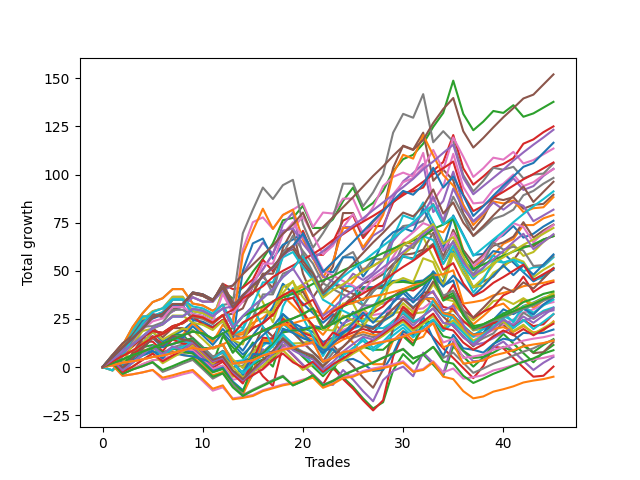

# Long Pointer 002 
- Symbol: ES
- Date Range: 03/18/2022 - 07/15/2022
- Trading Period: 7:20-12:30
- Number of Trades: 45



| Name | Win Percent | Profit | Avg Profit / Trade | Avg Time / Trade |      | Name | Win Percent | Profit | Avg Profit / Trade | Avg Time / Trade |
| ---- | ----------- | ------ | ------------------ | ---------------- | ---- | ---- | ----------- | ------ | ------------------ | ---------------- |
| Sorted By <br> Profit | | | | | | Sorted By <br> Win Percentage ||||
| Eighty-Five | 86.67 | 76000.00 | 1688.89 | 12:23 |     | Eighty-One | 95.56 | 22500.00 | 500.00 | 04:47 |
| Two | 80.00 | 68875.00 | 1530.56 | 13:30 |     | Eighty-Three | 91.11 | 53125.00 | 1180.56 | 08:30 |
| Three | 77.78 | 62500.00 | 1388.89 | 13:08 |     | Eighty-Two | 91.11 | 34000.00 | 755.56 | 06:41 |
| Eighty-Four | 88.89 | 61625.00 | 1369.44 | 10:37 |     | Eighty-Four | 88.89 | 61625.00 | 1369.44 | 10:37 |
| One Hundred Twenty-Five | 80.00 | 58250.00 | 1294.44 | 09:54 |     | One Hundred Twenty-One | 88.89 | 8375.00 | 186.11 | 03:27 |
| Fifty-Eight | 75.56 | 56750.00 | 1261.11 | 11:10 |     | One Hundred Twenty-Six | 88.89 | 6875.00 | 152.78 | 03:45 |
| Eighty-Three | 91.11 | 53125.00 | 1180.56 | 08:30 |     | Eighty-Five | 86.67 | 76000.00 | 1688.89 | 12:23 |
| Seven | 68.89 | 52875.00 | 1175.00 | 27:06 |     | One Hundred Twenty-Three | 84.44 | 36125.00 | 802.78 | 06:40 |
| Four | 75.56 | 51500.00 | 1144.44 | 21:24 |     | Sixty-Four | 84.44 | 19625.00 | 436.11 | 03:38 |
| Six | 73.33 | 51375.00 | 1141.67 | 21:15 |     | Zero | 84.44 | 18625.00 | 413.89 | 04:45 |
| Fifty-Nine | 75.56 | 49125.00 | 1091.67 | 10:27 |     | One Hundred Twenty-Seven | 84.44 | 18500.00 | 411.11 | 05:17 |
| One Hundred Thirty | 75.56 | 48125.00 | 1069.44 | 09:46 |     | One Hundred Twenty-Two | 84.44 | 18125.00 | 402.78 | 05:01 |
| One Hundred Twenty-Four | 82.22 | 45625.00 | 1013.89 | 08:10 |     | Fifty-Six | 84.44 | 14750.00 | 327.78 | 03:29 |
| Five | 68.89 | 44750.00 | 994.44 | 25:38 |     | One Hundred Twenty-Four | 82.22 | 45625.00 | 1013.89 | 08:10 |
| Sixty-Three | 62.22 | 44125.00 | 980.56 | 22:54 |     | Two | 80.00 | 68875.00 | 1530.56 | 13:30 |
| Sixty-Six | 66.67 | 40875.00 | 908.33 | 10:21 |     | One Hundred Twenty-Five | 80.00 | 58250.00 | 1294.44 | 09:54 |
| One | 77.78 | 39500.00 | 877.78 | 08:57 |     | One Hundred Twenty-Eight | 80.00 | 25625.00 | 569.44 | 06:44 |
| Sixty-Two | 66.67 | 38000.00 | 844.44 | 17:37 |     | One Hundred Eleven | 80.00 | 3000.00 | 66.67 | 01:38 |
| Sixty-Seven | 68.89 | 37000.00 | 822.22 | 09:44 |     | Three | 77.78 | 62500.00 | 1388.89 | 13:08 |
| Sixty-Eight | 60.00 | 36875.00 | 819.44 | 14:36 |     | One | 77.78 | 39500.00 | 877.78 | 08:57 |
| One Hundred Twenty-Three | 84.44 | 36125.00 | 802.78 | 06:40 |     | One Hundred Twenty-Nine | 77.78 | 34500.00 | 766.67 | 08:09 |
| One Hundred Twenty-Nine | 77.78 | 34500.00 | 766.67 | 08:09 |     | Fifty-Seven | 77.78 | 34000.00 | 755.56 | 06:58 |
| Sixty | 66.67 | 34375.00 | 763.89 | 17:05 |     | Forty | 77.78 | 18500.00 | 411.11 | 02:09 |
| Eighty-Two | 91.11 | 34000.00 | 755.56 | 06:41 |     | Fifty-Eight | 75.56 | 56750.00 | 1261.11 | 11:10 |
| Fifty-Seven | 77.78 | 34000.00 | 755.56 | 06:58 |     | Four | 75.56 | 51500.00 | 1144.44 | 21:24 |
| One Hundred Fifteen | 62.22 | 29250.00 | 650.00 | 05:41 |     | Fifty-Nine | 75.56 | 49125.00 | 1091.67 | 10:27 |
| Sixty-Nine | 53.33 | 28875.00 | 641.67 | 17:37 |     | One Hundred Thirty | 75.56 | 48125.00 | 1069.44 | 09:46 |
| Sixty-One | 60.00 | 28500.00 | 633.33 | 21:02 |     | Forty-Eight | 75.56 | 16875.00 | 375.00 | 01:58 |
| Seventy | 57.78 | 26750.00 | 594.44 | 15:26 |     | One Hundred Sixteen | 75.56 | -2500.00 | -55.56 | 01:39 |
| Seventy-One | 53.33 | 25750.00 | 572.22 | 19:24 |     | Six | 73.33 | 51375.00 | 1141.67 | 21:15 |
| One Hundred Twenty-Eight | 80.00 | 25625.00 | 569.44 | 06:44 |     | One Hundred Twelve | 73.33 | 7000.00 | 155.56 | 02:22 |
| One Hundred Twenty | 55.56 | 25625.00 | 569.44 | 04:48 |     | Sixty-Five | 71.11 | 22125.00 | 491.67 | 06:59 |
| Forty-Two | 53.33 | 25250.00 | 561.11 | 07:38 |     | One Hundred Seventeen | 71.11 | 4375.00 | 97.22 | 02:09 |
| Eighty-One | 95.56 | 22500.00 | 500.00 | 04:47 |     | Seven | 68.89 | 52875.00 | 1175.00 | 27:06 |
| Sixty-Five | 71.11 | 22125.00 | 491.67 | 06:59 |     | Five | 68.89 | 44750.00 | 994.44 | 25:38 |
| Sixty-Four | 84.44 | 19625.00 | 436.11 | 03:38 |     | Sixty-Seven | 68.89 | 37000.00 | 822.22 | 09:44 |
| Fifty | 55.56 | 19250.00 | 427.78 | 05:05 |     | Sixty-Six | 66.67 | 40875.00 | 908.33 | 10:21 |
| Forty-Three | 55.56 | 18750.00 | 416.67 | 06:15 |     | Sixty-Two | 66.67 | 38000.00 | 844.44 | 17:37 |
| Zero | 84.44 | 18625.00 | 413.89 | 04:45 |     | Sixty | 66.67 | 34375.00 | 763.89 | 17:05 |
| One Hundred Twenty-Seven | 84.44 | 18500.00 | 411.11 | 05:17 |     | One Hundred Thirteen | 66.67 | 11625.00 | 258.33 | 03:32 |
| Forty | 77.78 | 18500.00 | 411.11 | 02:09 |     | One Hundred Eighteen | 64.44 | 11250.00 | 250.00 | 03:05 |
| One Hundred Twenty-Two | 84.44 | 18125.00 | 402.78 | 05:01 |     | Sixty-Three | 62.22 | 44125.00 | 980.56 | 22:54 |
| Fifty-Two | 53.33 | 18125.00 | 402.78 | 06:51 |     | One Hundred Fifteen | 62.22 | 29250.00 | 650.00 | 05:41 |
| Fifty-One | 55.56 | 17500.00 | 388.89 | 04:42 |     | Forty-One | 62.22 | 15500.00 | 344.44 | 04:23 |
| Forty-Eight | 75.56 | 16875.00 | 375.00 | 01:58 |     | One Hundred Fourteen | 62.22 | 13750.00 | 305.56 | 04:30 |
| Forty-One | 62.22 | 15500.00 | 344.44 | 04:23 |     | Sixty-Eight | 60.00 | 36875.00 | 819.44 | 14:36 |
| One Hundred Ninteen | 57.78 | 15375.00 | 341.67 | 03:47 |     | Sixty-One | 60.00 | 28500.00 | 633.33 | 21:02 |
| Forty-Nine | 60.00 | 15125.00 | 336.11 | 03:34 |     | Forty-Nine | 60.00 | 15125.00 | 336.11 | 03:34 |
| Fifty-Six | 84.44 | 14750.00 | 327.78 | 03:29 |     | Seventy | 57.78 | 26750.00 | 594.44 | 15:26 |
| One Hundred Fourteen | 62.22 | 13750.00 | 305.56 | 04:30 |     | One Hundred Ninteen | 57.78 | 15375.00 | 341.67 | 03:47 |
| Fifty-Five | 53.33 | 13750.00 | 305.56 | 08:52 |     | One Hundred Twenty | 55.56 | 25625.00 | 569.44 | 04:48 |
| Fifty-Three | 53.33 | 11875.00 | 263.89 | 08:06 |     | Fifty | 55.56 | 19250.00 | 427.78 | 05:05 |
| One Hundred Thirteen | 66.67 | 11625.00 | 258.33 | 03:32 |     | Forty-Three | 55.56 | 18750.00 | 416.67 | 06:15 |
| One Hundred Eighteen | 64.44 | 11250.00 | 250.00 | 03:05 |     | Fifty-One | 55.56 | 17500.00 | 388.89 | 04:42 |
| Seventy-Three | 44.44 | 9750.00 | 216.67 | 06:50 |     | Sixty-Nine | 53.33 | 28875.00 | 641.67 | 17:37 |
| One Hundred Twenty-One | 88.89 | 8375.00 | 186.11 | 03:27 |     | Seventy-One | 53.33 | 25750.00 | 572.22 | 19:24 |
| Fifty-Four | 51.11 | 7250.00 | 161.11 | 06:51 |     | Forty-Two | 53.33 | 25250.00 | 561.11 | 07:38 |
| One Hundred Twelve | 73.33 | 7000.00 | 155.56 | 02:22 |     | Fifty-Two | 53.33 | 18125.00 | 402.78 | 06:51 |
| One Hundred Twenty-Six | 88.89 | 6875.00 | 152.78 | 03:45 |     | Fifty-Five | 53.33 | 13750.00 | 305.56 | 08:52 |
| Forty-Seven | 42.22 | 6500.00 | 144.44 | 16:09 |     | Fifty-Three | 53.33 | 11875.00 | 263.89 | 08:06 |
| Forty-Four | 44.44 | 5750.00 | 127.78 | 11:16 |     | Fifty-Four | 51.11 | 7250.00 | 161.11 | 06:51 |
| One Hundred Seventeen | 71.11 | 4375.00 | 97.22 | 02:09 |     | Forty-Six | 46.67 | 2625.00 | 58.33 | 11:20 |
| One Hundred Eleven | 80.00 | 3000.00 | 66.67 | 01:38 |     | Seventy-Three | 44.44 | 9750.00 | 216.67 | 06:50 |
| Forty-Six | 46.67 | 2625.00 | 58.33 | 11:20 |     | Forty-Four | 44.44 | 5750.00 | 127.78 | 11:16 |
| Forty-Five | 40.00 | 125.00 | 2.78 | 14:27 |     | Forty-Seven | 42.22 | 6500.00 | 144.44 | 16:09 |
| One Hundred Sixteen | 75.56 | -2500.00 | -55.56 | 01:39 |     | Forty-Five | 40.00 | 125.00 | 2.78 | 14:27 |

## NO STOPLOSS

### Test Zero
* Sell when price hits the middle line of the 20p bollinger
* No Stoploss
* Results:
```
Total Trades: 45
Percent Up: 84.44
Percent Down: 15.56
Total Points Moved Up: 37.25
Potential Profit: 18625.00
Total Points Ups: 86.25 Count Ups: 38
Total Points Downs: -49.00 Count Downs: 7
```

<details><summary>Trades</summary>

<code>In: 2022-03-23 10:50:00		Out: 2022-03-23 10:51:05		Total Position Time: 01:05		Total Move Up: 1.75		Total to Date: 1.75</code> <br />
<code>In: 2022-03-25 12:31:00		Out: 2022-03-25 12:37:05		Total Position Time: 06:05		Total Move Up: 0.75		Total to Date: 2.50</code> <br />
<code>In: 2022-03-28 09:21:00		Out: 2022-03-28 09:21:30		Total Position Time: 00:30		Total Move Up: 2.75		Total to Date: 5.25</code> <br />
<code>In: 2022-03-30 12:27:00		Out: 2022-03-30 12:28:15		Total Position Time: 01:15		Total Move Up: 2.50		Total to Date: 7.75</code> <br />
<code>In: 2022-03-31 08:37:00		Out: 2022-03-31 08:38:15		Total Position Time: 01:15		Total Move Up: 2.00		Total to Date: 9.75</code> <br />
<code>In: 2022-03-31 10:02:00		Out: 2022-03-31 10:04:00		Total Position Time: 02:00		Total Move Up: 0.75		Total to Date: 10.50</code> <br />
<code>In: 2022-03-31 10:18:00		Out: 2022-03-31 10:18:35		Total Position Time: 00:35		Total Move Up: 1.50		Total to Date: 12.00</code> <br />
<code>In: 2022-04-06 09:23:00		Out: 2022-04-06 09:31:15		Total Position Time: 08:15		Total Move Up: 1.50		Total to Date: 13.50</code> <br />
<code>In: 2022-04-12 11:35:00		Out: 2022-04-12 11:35:50		Total Position Time: 00:50		Total Move Up: 1.50		Total to Date: 15.00</code> <br />
<code>In: 2022-04-14 09:32:00		Out: 2022-04-14 09:56:10		Total Position Time: 24:10		Total Move Up: -5.25		Total to Date: 9.75</code> <br />
<code>In: 2022-04-21 09:12:00		Out: 2022-04-21 09:19:05		Total Position Time: 07:05		Total Move Up: 0.25		Total to Date: 10.00</code> <br />
<code>In: 2022-04-21 10:21:00		Out: 2022-04-21 10:21:10		Total Position Time: 00:10		Total Move Up: 1.75		Total to Date: 11.75</code> <br />
<code>In: 2022-05-02 10:38:00		Out: 2022-05-02 10:59:15		Total Position Time: 21:15		Total Move Up: -9.25		Total to Date: 2.50</code> <br />
<code>In: 2022-05-02 11:46:00		Out: 2022-05-02 11:46:10		Total Position Time: 00:10		Total Move Up: 0.75		Total to Date: 3.25</code> <br />
<code>In: 2022-05-04 08:37:00		Out: 2022-05-04 08:39:20		Total Position Time: 02:20		Total Move Up: 2.00		Total to Date: 5.25</code> <br />
<code>In: 2022-05-06 09:03:00		Out: 2022-05-06 09:03:10		Total Position Time: 00:10		Total Move Up: 2.50		Total to Date: 7.75</code> <br />
<code>In: 2022-05-09 07:42:00		Out: 2022-05-09 07:42:30		Total Position Time: 00:30		Total Move Up: 4.75		Total to Date: 12.50</code> <br />
<code>In: 2022-05-09 08:34:00		Out: 2022-05-09 08:35:10		Total Position Time: 01:10		Total Move Up: 6.25		Total to Date: 18.75</code> <br />
<code>In: 2022-05-09 10:03:00		Out: 2022-05-09 10:09:25		Total Position Time: 06:25		Total Move Up: 1.00		Total to Date: 19.75</code> <br />
<code>In: 2022-05-11 09:14:00		Out: 2022-05-11 09:17:50		Total Position Time: 03:50		Total Move Up: 0.25		Total to Date: 20.00</code> <br />
<code>In: 2022-05-11 10:33:00		Out: 2022-05-11 10:34:30		Total Position Time: 01:30		Total Move Up: 1.50		Total to Date: 21.50</code> <br />
<code>In: 2022-05-12 11:35:00		Out: 2022-05-12 11:45:20		Total Position Time: 10:20		Total Move Up: -1.25		Total to Date: 20.25</code> <br />
<code>In: 2022-05-16 09:47:00		Out: 2022-05-16 09:48:15		Total Position Time: 01:15		Total Move Up: 4.00		Total to Date: 24.25</code> <br />
<code>In: 2022-05-17 11:25:00		Out: 2022-05-17 11:27:30		Total Position Time: 02:30		Total Move Up: 8.00		Total to Date: 32.25</code> <br />
<code>In: 2022-05-18 09:12:00		Out: 2022-05-18 09:14:45		Total Position Time: 02:45		Total Move Up: 2.25		Total to Date: 34.50</code> <br />
<code>In: 2022-05-20 09:48:00		Out: 2022-05-20 09:50:00		Total Position Time: 02:00		Total Move Up: 7.00		Total to Date: 41.50</code> <br />
<code>In: 2022-05-25 09:30:00		Out: 2022-05-25 09:41:25		Total Position Time: 11:25		Total Move Up: 0.00		Total to Date: 41.50</code> <br />
<code>In: 2022-05-25 10:15:00		Out: 2022-05-25 10:15:20		Total Position Time: 00:20		Total Move Up: 1.00		Total to Date: 42.50</code> <br />
<code>In: 2022-05-31 12:05:00		Out: 2022-05-31 12:07:20		Total Position Time: 02:20		Total Move Up: 2.25		Total to Date: 44.75</code> <br />
<code>In: 2022-06-08 08:06:00		Out: 2022-06-08 08:09:35		Total Position Time: 03:35		Total Move Up: 0.25		Total to Date: 45.00</code> <br />
<code>In: 2022-06-08 11:31:00		Out: 2022-06-08 11:31:10		Total Position Time: 00:10		Total Move Up: -0.75		Total to Date: 44.25</code> <br />
<code>In: 2022-06-08 12:11:00		Out: 2022-06-08 12:11:20		Total Position Time: 00:20		Total Move Up: 0.75		Total to Date: 45.00</code> <br />
<code>In: 2022-06-13 12:17:00		Out: 2022-06-13 12:17:10		Total Position Time: 00:10		Total Move Up: 4.00		Total to Date: 49.00</code> <br />
<code>In: 2022-06-14 07:32:00		Out: 2022-06-14 07:46:40		Total Position Time: 14:40		Total Move Up: -6.75		Total to Date: 42.25</code> <br />
<code>In: 2022-06-14 07:46:00		Out: 2022-06-14 07:46:40		Total Position Time: 00:40		Total Move Up: 2.75		Total to Date: 45.00</code> <br />
<code>In: 2022-06-14 11:53:00		Out: 2022-06-14 12:22:55		Total Position Time: 29:55		Total Move Up: -17.25		Total to Date: 27.75</code> <br />
<code>In: 2022-06-15 07:58:00		Out: 2022-06-15 08:27:55		Total Position Time: 29:55		Total Move Up: -8.50		Total to Date: 19.25</code> <br />
<code>In: 2022-06-21 11:06:00		Out: 2022-06-21 11:07:45		Total Position Time: 01:45		Total Move Up: 1.00		Total to Date: 20.25</code> <br />
<code>In: 2022-06-23 10:06:00		Out: 2022-06-23 10:06:10		Total Position Time: 00:10		Total Move Up: 2.50		Total to Date: 22.75</code> <br />
<code>In: 2022-06-27 10:10:00		Out: 2022-06-27 10:11:25		Total Position Time: 01:25		Total Move Up: 3.00		Total to Date: 25.75</code> <br />
<code>In: 2022-07-05 08:08:00		Out: 2022-07-05 08:08:20		Total Position Time: 00:20		Total Move Up: 2.50		Total to Date: 28.25</code> <br />
<code>In: 2022-07-06 08:12:00		Out: 2022-07-06 08:14:30		Total Position Time: 02:30		Total Move Up: 3.50		Total to Date: 31.75</code> <br />
<code>In: 2022-07-08 09:48:00		Out: 2022-07-08 09:48:40		Total Position Time: 00:40		Total Move Up: 1.75		Total to Date: 33.50</code> <br />
<code>In: 2022-07-11 08:53:00		Out: 2022-07-11 08:56:10		Total Position Time: 03:10		Total Move Up: 2.50		Total to Date: 36.00</code> <br />
<code>In: 2022-07-12 10:28:00		Out: 2022-07-12 10:28:50		Total Position Time: 00:50		Total Move Up: 1.25		Total to Date: 37.25</code> <br />


</details>

### Test One
* Sell when the price hits the upper line of the 20p 1std bollinger
* No Stoploss
* Results:
```
Total Trades: 45
Percent Up: 77.78
Percent Down: 22.22
Total Points Moved Up: 79.00
Potential Profit: 39500.00
Total Points Ups: 136.00 Count Ups: 35
Total Points Downs: -57.00 Count Downs: 10
```

<details><summary>Trades</summary>

<code>In: 2022-03-23 10:50:00		Out: 2022-03-23 10:51:45		Total Position Time: 01:45		Total Move Up: 3.50		Total to Date: 3.50</code> <br />
<code>In: 2022-03-25 12:31:00		Out: 2022-03-25 12:38:35		Total Position Time: 07:35		Total Move Up: 2.50		Total to Date: 6.00</code> <br />
<code>In: 2022-03-28 09:21:00		Out: 2022-03-28 09:25:35		Total Position Time: 04:35		Total Move Up: 4.75		Total to Date: 10.75</code> <br />
<code>In: 2022-03-30 12:27:00		Out: 2022-03-30 12:32:20		Total Position Time: 05:20		Total Move Up: 4.75		Total to Date: 15.50</code> <br />
<code>In: 2022-03-31 08:37:00		Out: 2022-03-31 08:40:35		Total Position Time: 03:35		Total Move Up: 3.25		Total to Date: 18.75</code> <br />
<code>In: 2022-03-31 10:02:00		Out: 2022-03-31 10:19:20		Total Position Time: 17:20		Total Move Up: -1.00		Total to Date: 17.75</code> <br />
<code>In: 2022-03-31 10:18:00		Out: 2022-03-31 10:19:20		Total Position Time: 01:20		Total Move Up: 3.50		Total to Date: 21.25</code> <br />
<code>In: 2022-04-06 09:23:00		Out: 2022-04-06 09:34:05		Total Position Time: 11:05		Total Move Up: 1.50		Total to Date: 22.75</code> <br />
<code>In: 2022-04-12 11:35:00		Out: 2022-04-12 11:37:20		Total Position Time: 02:20		Total Move Up: 3.50		Total to Date: 26.25</code> <br />
<code>In: 2022-04-14 09:32:00		Out: 2022-04-14 09:58:15		Total Position Time: 26:15		Total Move Up: -4.00		Total to Date: 22.25</code> <br />
<code>In: 2022-04-21 09:12:00		Out: 2022-04-21 09:34:10		Total Position Time: 22:10		Total Move Up: -1.75		Total to Date: 20.50</code> <br />
<code>In: 2022-04-21 10:21:00		Out: 2022-04-21 10:21:20		Total Position Time: 00:20		Total Move Up: 4.00		Total to Date: 24.50</code> <br />
<code>In: 2022-05-02 10:38:00		Out: 2022-05-02 11:02:25		Total Position Time: 24:25		Total Move Up: -7.25		Total to Date: 17.25</code> <br />
<code>In: 2022-05-02 11:46:00		Out: 2022-05-02 11:46:10		Total Position Time: 00:10		Total Move Up: 0.75		Total to Date: 18.00</code> <br />
<code>In: 2022-05-04 08:37:00		Out: 2022-05-04 08:40:55		Total Position Time: 03:55		Total Move Up: 5.00		Total to Date: 23.00</code> <br />
<code>In: 2022-05-06 09:03:00		Out: 2022-05-06 09:03:10		Total Position Time: 00:10		Total Move Up: 2.50		Total to Date: 25.50</code> <br />
<code>In: 2022-05-09 07:42:00		Out: 2022-05-09 07:45:10		Total Position Time: 03:10		Total Move Up: 4.50		Total to Date: 30.00</code> <br />
<code>In: 2022-05-09 08:34:00		Out: 2022-05-09 08:38:35		Total Position Time: 04:35		Total Move Up: 7.50		Total to Date: 37.50</code> <br />
<code>In: 2022-05-09 10:03:00		Out: 2022-05-09 10:18:05		Total Position Time: 15:05		Total Move Up: 1.25		Total to Date: 38.75</code> <br />
<code>In: 2022-05-11 09:14:00		Out: 2022-05-11 09:23:10		Total Position Time: 09:10		Total Move Up: 3.25		Total to Date: 42.00</code> <br />
<code>In: 2022-05-11 10:33:00		Out: 2022-05-11 11:01:20		Total Position Time: 28:20		Total Move Up: -12.00		Total to Date: 30.00</code> <br />
<code>In: 2022-05-12 11:35:00		Out: 2022-05-12 11:52:05		Total Position Time: 17:05		Total Move Up: -3.00		Total to Date: 27.00</code> <br />
<code>In: 2022-05-16 09:47:00		Out: 2022-05-16 09:50:05		Total Position Time: 03:05		Total Move Up: 6.75		Total to Date: 33.75</code> <br />
<code>In: 2022-05-17 11:25:00		Out: 2022-05-17 11:37:35		Total Position Time: 12:35		Total Move Up: 5.75		Total to Date: 39.50</code> <br />
<code>In: 2022-05-18 09:12:00		Out: 2022-05-18 09:16:25		Total Position Time: 04:25		Total Move Up: 4.75		Total to Date: 44.25</code> <br />
<code>In: 2022-05-20 09:48:00		Out: 2022-05-20 09:56:10		Total Position Time: 08:10		Total Move Up: 6.75		Total to Date: 51.00</code> <br />
<code>In: 2022-05-25 09:30:00		Out: 2022-05-25 09:44:25		Total Position Time: 14:25		Total Move Up: 1.50		Total to Date: 52.50</code> <br />
<code>In: 2022-05-25 10:15:00		Out: 2022-05-25 10:15:30		Total Position Time: 00:30		Total Move Up: 3.25		Total to Date: 55.75</code> <br />
<code>In: 2022-05-31 12:05:00		Out: 2022-05-31 12:09:15		Total Position Time: 04:15		Total Move Up: 5.25		Total to Date: 61.00</code> <br />
<code>In: 2022-06-08 08:06:00		Out: 2022-06-08 08:11:10		Total Position Time: 05:10		Total Move Up: 3.75		Total to Date: 64.75</code> <br />
<code>In: 2022-06-08 11:31:00		Out: 2022-06-08 11:43:05		Total Position Time: 12:05		Total Move Up: -0.75		Total to Date: 64.00</code> <br />
<code>In: 2022-06-08 12:11:00		Out: 2022-06-08 12:12:15		Total Position Time: 01:15		Total Move Up: 3.50		Total to Date: 67.50</code> <br />
<code>In: 2022-06-13 12:17:00		Out: 2022-06-13 12:17:10		Total Position Time: 00:10		Total Move Up: 4.00		Total to Date: 71.50</code> <br />
<code>In: 2022-06-14 07:32:00		Out: 2022-06-14 07:47:10		Total Position Time: 15:10		Total Move Up: -1.50		Total to Date: 70.00</code> <br />
<code>In: 2022-06-14 07:46:00		Out: 2022-06-14 07:47:10		Total Position Time: 01:10		Total Move Up: 8.00		Total to Date: 78.00</code> <br />
<code>In: 2022-06-14 11:53:00		Out: 2022-06-14 12:22:55		Total Position Time: 29:55		Total Move Up: -17.25		Total to Date: 60.75</code> <br />
<code>In: 2022-06-15 07:58:00		Out: 2022-06-15 08:27:55		Total Position Time: 29:55		Total Move Up: -8.50		Total to Date: 52.25</code> <br />
<code>In: 2022-06-21 11:06:00		Out: 2022-06-21 11:09:05		Total Position Time: 03:05		Total Move Up: 3.25		Total to Date: 55.50</code> <br />
<code>In: 2022-06-23 10:06:00		Out: 2022-06-23 10:06:10		Total Position Time: 00:10		Total Move Up: 2.50		Total to Date: 58.00</code> <br />
<code>In: 2022-06-27 10:10:00		Out: 2022-06-27 10:15:55		Total Position Time: 05:55		Total Move Up: 6.00		Total to Date: 64.00</code> <br />
<code>In: 2022-07-05 08:08:00		Out: 2022-07-05 08:16:40		Total Position Time: 08:40		Total Move Up: 2.50		Total to Date: 66.50</code> <br />
<code>In: 2022-07-06 08:12:00		Out: 2022-07-06 08:17:50		Total Position Time: 05:50		Total Move Up: 7.25		Total to Date: 73.75</code> <br />
<code>In: 2022-07-08 09:48:00		Out: 2022-07-08 10:06:55		Total Position Time: 18:55		Total Move Up: 0.00		Total to Date: 73.75</code> <br />
<code>In: 2022-07-11 08:53:00		Out: 2022-07-11 08:59:20		Total Position Time: 06:20		Total Move Up: 3.50		Total to Date: 77.25</code> <br />
<code>In: 2022-07-12 10:28:00		Out: 2022-07-12 10:30:05		Total Position Time: 02:05		Total Move Up: 1.75		Total to Date: 79.00</code> <br />


</details>

### Test Two
* Sell when the price hits the upper line of the 20p 2std bollinger
* No Stoploss
* Results:
```
Total Trades: 45
Percent Up: 80.00
Percent Down: 20.00
Total Points Moved Up: 137.75
Potential Profit: 68875.00
Total Points Ups: 202.00 Count Ups: 36
Total Points Downs: -64.25 Count Downs: 9
```

<details><summary>Trades</summary>

<code>In: 2022-03-23 10:50:00		Out: 2022-03-23 10:54:25		Total Position Time: 04:25		Total Move Up: 5.50		Total to Date: 5.50</code> <br />
<code>In: 2022-03-25 12:31:00		Out: 2022-03-25 12:41:35		Total Position Time: 10:35		Total Move Up: 3.75		Total to Date: 9.25</code> <br />
<code>In: 2022-03-28 09:21:00		Out: 2022-03-28 09:30:40		Total Position Time: 09:40		Total Move Up: 5.00		Total to Date: 14.25</code> <br />
<code>In: 2022-03-30 12:27:00		Out: 2022-03-30 12:36:20		Total Position Time: 09:20		Total Move Up: 7.50		Total to Date: 21.75</code> <br />
<code>In: 2022-03-31 08:37:00		Out: 2022-03-31 08:41:10		Total Position Time: 04:10		Total Move Up: 5.75		Total to Date: 27.50</code> <br />
<code>In: 2022-03-31 10:02:00		Out: 2022-03-31 10:27:00		Total Position Time: 25:00		Total Move Up: -1.50		Total to Date: 26.00</code> <br />
<code>In: 2022-03-31 10:18:00		Out: 2022-03-31 10:27:00		Total Position Time: 09:00		Total Move Up: 3.00		Total to Date: 29.00</code> <br />
<code>In: 2022-04-06 09:23:00		Out: 2022-04-06 09:34:25		Total Position Time: 11:25		Total Move Up: 2.75		Total to Date: 31.75</code> <br />
<code>In: 2022-04-12 11:35:00		Out: 2022-04-12 11:47:00		Total Position Time: 12:00		Total Move Up: 4.50		Total to Date: 36.25</code> <br />
<code>In: 2022-04-14 09:32:00		Out: 2022-04-14 09:58:55		Total Position Time: 26:55		Total Move Up: -2.25		Total to Date: 34.00</code> <br />
<code>In: 2022-04-21 09:12:00		Out: 2022-04-21 09:35:40		Total Position Time: 23:40		Total Move Up: 0.00		Total to Date: 34.00</code> <br />
<code>In: 2022-04-21 10:21:00		Out: 2022-04-21 10:21:30		Total Position Time: 00:30		Total Move Up: 6.00		Total to Date: 40.00</code> <br />
<code>In: 2022-05-02 10:38:00		Out: 2022-05-02 11:03:45		Total Position Time: 25:45		Total Move Up: -4.50		Total to Date: 35.50</code> <br />
<code>In: 2022-05-02 11:46:00		Out: 2022-05-02 11:53:35		Total Position Time: 07:35		Total Move Up: 6.00		Total to Date: 41.50</code> <br />
<code>In: 2022-05-04 08:37:00		Out: 2022-05-04 08:47:05		Total Position Time: 10:05		Total Move Up: 8.00		Total to Date: 49.50</code> <br />
<code>In: 2022-05-06 09:03:00		Out: 2022-05-06 09:03:55		Total Position Time: 00:55		Total Move Up: 6.75		Total to Date: 56.25</code> <br />
<code>In: 2022-05-09 07:42:00		Out: 2022-05-09 07:48:05		Total Position Time: 06:05		Total Move Up: 8.00		Total to Date: 64.25</code> <br />
<code>In: 2022-05-09 08:34:00		Out: 2022-05-09 08:39:15		Total Position Time: 05:15		Total Move Up: 12.00		Total to Date: 76.25</code> <br />
<code>In: 2022-05-09 10:03:00		Out: 2022-05-09 10:18:05		Total Position Time: 15:05		Total Move Up: 1.25		Total to Date: 77.50</code> <br />
<code>In: 2022-05-11 09:14:00		Out: 2022-05-11 09:23:35		Total Position Time: 09:35		Total Move Up: 6.25		Total to Date: 83.75</code> <br />
<code>In: 2022-05-11 10:33:00		Out: 2022-05-11 11:02:35		Total Position Time: 29:35		Total Move Up: -11.50		Total to Date: 72.25</code> <br />
<code>In: 2022-05-12 11:35:00		Out: 2022-05-12 11:53:00		Total Position Time: 18:00		Total Move Up: 0.00		Total to Date: 72.25</code> <br />
<code>In: 2022-05-16 09:47:00		Out: 2022-05-16 10:06:30		Total Position Time: 19:30		Total Move Up: 4.50		Total to Date: 76.75</code> <br />
<code>In: 2022-05-17 11:25:00		Out: 2022-05-17 11:40:00		Total Position Time: 15:00		Total Move Up: 9.50		Total to Date: 86.25</code> <br />
<code>In: 2022-05-18 09:12:00		Out: 2022-05-18 09:17:50		Total Position Time: 05:50		Total Move Up: 7.00		Total to Date: 93.25</code> <br />
<code>In: 2022-05-20 09:48:00		Out: 2022-05-20 10:17:55		Total Position Time: 29:55		Total Move Up: -11.75		Total to Date: 81.50</code> <br />
<code>In: 2022-05-25 09:30:00		Out: 2022-05-25 09:45:20		Total Position Time: 15:20		Total Move Up: 3.75		Total to Date: 85.25</code> <br />
<code>In: 2022-05-25 10:15:00		Out: 2022-05-25 10:29:40		Total Position Time: 14:40		Total Move Up: 6.25		Total to Date: 91.50</code> <br />
<code>In: 2022-05-31 12:05:00		Out: 2022-05-31 12:15:05		Total Position Time: 10:05		Total Move Up: 10.25		Total to Date: 101.75</code> <br />
<code>In: 2022-06-08 08:06:00		Out: 2022-06-08 08:14:00		Total Position Time: 08:00		Total Move Up: 6.25		Total to Date: 108.00</code> <br />
<code>In: 2022-06-08 11:31:00		Out: 2022-06-08 11:43:35		Total Position Time: 12:35		Total Move Up: 2.25		Total to Date: 110.25</code> <br />
<code>In: 2022-06-08 12:11:00		Out: 2022-06-08 12:13:25		Total Position Time: 02:25		Total Move Up: 5.75		Total to Date: 116.00</code> <br />
<code>In: 2022-06-13 12:17:00		Out: 2022-06-13 12:17:15		Total Position Time: 00:15		Total Move Up: 8.75		Total to Date: 124.75</code> <br />
<code>In: 2022-06-14 07:32:00		Out: 2022-06-14 07:51:00		Total Position Time: 19:00		Total Move Up: 7.25		Total to Date: 132.00</code> <br />
<code>In: 2022-06-14 07:46:00		Out: 2022-06-14 07:51:00		Total Position Time: 05:00		Total Move Up: 16.75		Total to Date: 148.75</code> <br />
<code>In: 2022-06-14 11:53:00		Out: 2022-06-14 12:22:55		Total Position Time: 29:55		Total Move Up: -17.25		Total to Date: 131.50</code> <br />
<code>In: 2022-06-15 07:58:00		Out: 2022-06-15 08:27:55		Total Position Time: 29:55		Total Move Up: -8.50		Total to Date: 123.00</code> <br />
<code>In: 2022-06-21 11:06:00		Out: 2022-06-21 11:10:45		Total Position Time: 04:45		Total Move Up: 4.50		Total to Date: 127.50</code> <br />
<code>In: 2022-06-23 10:06:00		Out: 2022-06-23 10:07:40		Total Position Time: 01:40		Total Move Up: 5.50		Total to Date: 133.00</code> <br />
<code>In: 2022-06-27 10:10:00		Out: 2022-06-27 10:39:55		Total Position Time: 29:55		Total Move Up: -1.00		Total to Date: 132.00</code> <br />
<code>In: 2022-07-05 08:08:00		Out: 2022-07-05 08:17:55		Total Position Time: 09:55		Total Move Up: 4.00		Total to Date: 136.00</code> <br />
<code>In: 2022-07-06 08:12:00		Out: 2022-07-06 08:41:55		Total Position Time: 29:55		Total Move Up: -6.00		Total to Date: 130.00</code> <br />
<code>In: 2022-07-08 09:48:00		Out: 2022-07-08 10:10:30		Total Position Time: 22:30		Total Move Up: 1.75		Total to Date: 131.75</code> <br />
<code>In: 2022-07-11 08:53:00		Out: 2022-07-11 09:07:00		Total Position Time: 14:00		Total Move Up: 3.00		Total to Date: 134.75</code> <br />
<code>In: 2022-07-12 10:28:00		Out: 2022-07-12 10:31:30		Total Position Time: 03:30		Total Move Up: 3.00		Total to Date: 137.75</code> <br />


</details>

### Test Three
* Sell when price hits the middle line of the 50p bollinger
* No Stoploss
* Results:
```
Total Trades: 45
Percent Up: 77.78
Percent Down: 22.22
Total Points Moved Up: 125.00
Potential Profit: 62500.00
Total Points Ups: 188.75 Count Ups: 35
Total Points Downs: -63.75 Count Downs: 10
```

<details><summary>Trades</summary>

<code>In: 2022-03-23 10:50:00		Out: 2022-03-23 10:54:30		Total Position Time: 04:30		Total Move Up: 6.25		Total to Date: 6.25</code> <br />
<code>In: 2022-03-25 12:31:00		Out: 2022-03-25 12:42:05		Total Position Time: 11:05		Total Move Up: 6.00		Total to Date: 12.25</code> <br />
<code>In: 2022-03-28 09:21:00		Out: 2022-03-28 09:24:15		Total Position Time: 03:15		Total Move Up: 4.25		Total to Date: 16.50</code> <br />
<code>In: 2022-03-30 12:27:00		Out: 2022-03-30 12:33:25		Total Position Time: 06:25		Total Move Up: 6.50		Total to Date: 23.00</code> <br />
<code>In: 2022-03-31 08:37:00		Out: 2022-03-31 08:41:05		Total Position Time: 04:05		Total Move Up: 4.25		Total to Date: 27.25</code> <br />
<code>In: 2022-03-31 10:02:00		Out: 2022-03-31 10:27:25		Total Position Time: 25:25		Total Move Up: -1.00		Total to Date: 26.25</code> <br />
<code>In: 2022-03-31 10:18:00		Out: 2022-03-31 10:27:25		Total Position Time: 09:25		Total Move Up: 3.50		Total to Date: 29.75</code> <br />
<code>In: 2022-04-06 09:23:00		Out: 2022-04-06 09:48:50		Total Position Time: 25:50		Total Move Up: 2.50		Total to Date: 32.25</code> <br />
<code>In: 2022-04-12 11:35:00		Out: 2022-04-12 11:47:05		Total Position Time: 12:05		Total Move Up: 6.00		Total to Date: 38.25</code> <br />
<code>In: 2022-04-14 09:32:00		Out: 2022-04-14 09:59:25		Total Position Time: 27:25		Total Move Up: -1.25		Total to Date: 37.00</code> <br />
<code>In: 2022-04-21 09:12:00		Out: 2022-04-21 09:41:55		Total Position Time: 29:55		Total Move Up: -2.75		Total to Date: 34.25</code> <br />
<code>In: 2022-04-21 10:21:00		Out: 2022-04-21 10:22:25		Total Position Time: 01:25		Total Move Up: 9.00		Total to Date: 43.25</code> <br />
<code>In: 2022-05-02 10:38:00		Out: 2022-05-02 11:04:00		Total Position Time: 26:00		Total Move Up: -2.75		Total to Date: 40.50</code> <br />
<code>In: 2022-05-02 11:46:00		Out: 2022-05-02 11:46:10		Total Position Time: 00:10		Total Move Up: 0.75		Total to Date: 41.25</code> <br />
<code>In: 2022-05-04 08:37:00		Out: 2022-05-04 08:41:00		Total Position Time: 04:00		Total Move Up: 4.25		Total to Date: 45.50</code> <br />
<code>In: 2022-05-06 09:03:00		Out: 2022-05-06 09:06:05		Total Position Time: 03:05		Total Move Up: 10.25		Total to Date: 55.75</code> <br />
<code>In: 2022-05-09 07:42:00		Out: 2022-05-09 08:11:55		Total Position Time: 29:55		Total Move Up: -6.00		Total to Date: 49.75</code> <br />
<code>In: 2022-05-09 08:34:00		Out: 2022-05-09 08:39:00		Total Position Time: 05:00		Total Move Up: 10.50		Total to Date: 60.25</code> <br />
<code>In: 2022-05-09 10:03:00		Out: 2022-05-09 10:25:15		Total Position Time: 22:15		Total Move Up: 2.25		Total to Date: 62.50</code> <br />
<code>In: 2022-05-11 09:14:00		Out: 2022-05-11 09:23:45		Total Position Time: 09:45		Total Move Up: 8.25		Total to Date: 70.75</code> <br />
<code>In: 2022-05-11 10:33:00		Out: 2022-05-11 11:02:55		Total Position Time: 29:55		Total Move Up: -12.25		Total to Date: 58.50</code> <br />
<code>In: 2022-05-12 11:35:00		Out: 2022-05-12 11:53:05		Total Position Time: 18:05		Total Move Up: -0.25		Total to Date: 58.25</code> <br />
<code>In: 2022-05-16 09:47:00		Out: 2022-05-16 09:50:05		Total Position Time: 03:05		Total Move Up: 6.75		Total to Date: 65.00</code> <br />
<code>In: 2022-05-17 11:25:00		Out: 2022-05-17 11:40:05		Total Position Time: 15:05		Total Move Up: 11.00		Total to Date: 76.00</code> <br />
<code>In: 2022-05-18 09:12:00		Out: 2022-05-18 09:36:05		Total Position Time: 24:05		Total Move Up: 2.75		Total to Date: 78.75</code> <br />
<code>In: 2022-05-20 09:48:00		Out: 2022-05-20 10:17:55		Total Position Time: 29:55		Total Move Up: -11.75		Total to Date: 67.00</code> <br />
<code>In: 2022-05-25 09:30:00		Out: 2022-05-25 09:49:05		Total Position Time: 19:05		Total Move Up: 6.25		Total to Date: 73.25</code> <br />
<code>In: 2022-05-25 10:15:00		Out: 2022-05-25 10:15:10		Total Position Time: 00:10		Total Move Up: 0.00		Total to Date: 73.25</code> <br />
<code>In: 2022-05-31 12:05:00		Out: 2022-05-31 12:15:15		Total Position Time: 10:15		Total Move Up: 12.25		Total to Date: 85.50</code> <br />
<code>In: 2022-06-08 08:06:00		Out: 2022-06-08 08:11:20		Total Position Time: 05:20		Total Move Up: 5.00		Total to Date: 90.50</code> <br />
<code>In: 2022-06-08 11:31:00		Out: 2022-06-08 11:43:20		Total Position Time: 12:20		Total Move Up: 0.75		Total to Date: 91.25</code> <br />
<code>In: 2022-06-08 12:11:00		Out: 2022-06-08 12:11:45		Total Position Time: 00:45		Total Move Up: 2.00		Total to Date: 93.25</code> <br />
<code>In: 2022-06-13 12:17:00		Out: 2022-06-13 12:17:15		Total Position Time: 00:15		Total Move Up: 8.75		Total to Date: 102.00</code> <br />
<code>In: 2022-06-14 07:32:00		Out: 2022-06-14 07:50:00		Total Position Time: 18:00		Total Move Up: 4.50		Total to Date: 106.50</code> <br />
<code>In: 2022-06-14 07:46:00		Out: 2022-06-14 07:50:00		Total Position Time: 04:00		Total Move Up: 14.00		Total to Date: 120.50</code> <br />
<code>In: 2022-06-14 11:53:00		Out: 2022-06-14 12:22:55		Total Position Time: 29:55		Total Move Up: -17.25		Total to Date: 103.25</code> <br />
<code>In: 2022-06-15 07:58:00		Out: 2022-06-15 08:27:55		Total Position Time: 29:55		Total Move Up: -8.50		Total to Date: 94.75</code> <br />
<code>In: 2022-06-21 11:06:00		Out: 2022-06-21 11:10:20		Total Position Time: 04:20		Total Move Up: 4.25		Total to Date: 99.00</code> <br />
<code>In: 2022-06-23 10:06:00		Out: 2022-06-23 10:07:35		Total Position Time: 01:35		Total Move Up: 4.75		Total to Date: 103.75</code> <br />
<code>In: 2022-06-27 10:10:00		Out: 2022-06-27 10:11:15		Total Position Time: 01:15		Total Move Up: 1.75		Total to Date: 105.50</code> <br />
<code>In: 2022-07-05 08:08:00		Out: 2022-07-05 08:27:25		Total Position Time: 19:25		Total Move Up: 3.00		Total to Date: 108.50</code> <br />
<code>In: 2022-07-06 08:12:00		Out: 2022-07-06 08:21:30		Total Position Time: 09:30		Total Move Up: 7.50		Total to Date: 116.00</code> <br />
<code>In: 2022-07-08 09:48:00		Out: 2022-07-08 10:11:05		Total Position Time: 23:05		Total Move Up: 2.25		Total to Date: 118.25</code> <br />
<code>In: 2022-07-11 08:53:00		Out: 2022-07-11 09:00:15		Total Position Time: 07:15		Total Move Up: 3.75		Total to Date: 122.00</code> <br />
<code>In: 2022-07-12 10:28:00		Out: 2022-07-12 10:41:35		Total Position Time: 13:35		Total Move Up: 3.00		Total to Date: 125.00</code> <br />


</details>

### Test Four
* Sell when the price hits the upper line of the 50p 1std bollinger
* No Stoploss
* Results:
```
Total Trades: 45
Percent Up: 75.56
Percent Down: 24.44
Total Points Moved Up: 103.00
Potential Profit: 51500.00
Total Points Ups: 224.00 Count Ups: 34
Total Points Downs: -121.00 Count Downs: 11
```

<details><summary>Trades</summary>

<code>In: 2022-03-23 10:50:00		Out: 2022-03-23 11:19:55		Total Position Time: 29:55		Total Move Up: 3.50		Total to Date: 3.50</code> <br />
<code>In: 2022-03-25 12:31:00		Out: 2022-03-25 12:46:00		Total Position Time: 15:00		Total Move Up: 7.75		Total to Date: 11.25</code> <br />
<code>In: 2022-03-28 09:21:00		Out: 2022-03-28 09:33:30		Total Position Time: 12:30		Total Move Up: 6.25		Total to Date: 17.50</code> <br />
<code>In: 2022-03-30 12:27:00		Out: 2022-03-30 12:46:00		Total Position Time: 19:00		Total Move Up: 7.25		Total to Date: 24.75</code> <br />
<code>In: 2022-03-31 08:37:00		Out: 2022-03-31 09:00:15		Total Position Time: 23:15		Total Move Up: 4.25		Total to Date: 29.00</code> <br />
<code>In: 2022-03-31 10:02:00		Out: 2022-03-31 10:29:50		Total Position Time: 27:50		Total Move Up: 1.50		Total to Date: 30.50</code> <br />
<code>In: 2022-03-31 10:18:00		Out: 2022-03-31 10:29:50		Total Position Time: 11:50		Total Move Up: 6.00		Total to Date: 36.50</code> <br />
<code>In: 2022-04-06 09:23:00		Out: 2022-04-06 09:52:55		Total Position Time: 29:55		Total Move Up: 0.00		Total to Date: 36.50</code> <br />
<code>In: 2022-04-12 11:35:00		Out: 2022-04-12 12:04:55		Total Position Time: 29:55		Total Move Up: -7.50		Total to Date: 29.00</code> <br />
<code>In: 2022-04-14 09:32:00		Out: 2022-04-14 10:01:55		Total Position Time: 29:55		Total Move Up: -1.00		Total to Date: 28.00</code> <br />
<code>In: 2022-04-21 09:12:00		Out: 2022-04-21 09:41:55		Total Position Time: 29:55		Total Move Up: -2.75		Total to Date: 25.25</code> <br />
<code>In: 2022-04-21 10:21:00		Out: 2022-04-21 10:31:15		Total Position Time: 10:15		Total Move Up: 14.25		Total to Date: 39.50</code> <br />
<code>In: 2022-05-02 10:38:00		Out: 2022-05-02 11:07:10		Total Position Time: 29:10		Total Move Up: 3.00		Total to Date: 42.50</code> <br />
<code>In: 2022-05-02 11:46:00		Out: 2022-05-02 11:53:35		Total Position Time: 07:35		Total Move Up: 6.00		Total to Date: 48.50</code> <br />
<code>In: 2022-05-04 08:37:00		Out: 2022-05-04 08:47:05		Total Position Time: 10:05		Total Move Up: 8.00		Total to Date: 56.50</code> <br />
<code>In: 2022-05-06 09:03:00		Out: 2022-05-06 09:22:25		Total Position Time: 19:25		Total Move Up: 8.25		Total to Date: 64.75</code> <br />
<code>In: 2022-05-09 07:42:00		Out: 2022-05-09 08:11:55		Total Position Time: 29:55		Total Move Up: -6.00		Total to Date: 58.75</code> <br />
<code>In: 2022-05-09 08:34:00		Out: 2022-05-09 08:40:00		Total Position Time: 06:00		Total Move Up: 15.25		Total to Date: 74.00</code> <br />
<code>In: 2022-05-09 10:03:00		Out: 2022-05-09 10:29:25		Total Position Time: 26:25		Total Move Up: 6.25		Total to Date: 80.25</code> <br />
<code>In: 2022-05-11 09:14:00		Out: 2022-05-11 09:43:55		Total Position Time: 29:55		Total Move Up: -23.00		Total to Date: 57.25</code> <br />
<code>In: 2022-05-11 10:33:00		Out: 2022-05-11 11:02:55		Total Position Time: 29:55		Total Move Up: -12.25		Total to Date: 45.00</code> <br />
<code>In: 2022-05-12 11:35:00		Out: 2022-05-12 12:03:55		Total Position Time: 28:55		Total Move Up: 4.25		Total to Date: 49.25</code> <br />
<code>In: 2022-05-16 09:47:00		Out: 2022-05-16 10:07:00		Total Position Time: 20:00		Total Move Up: 5.25		Total to Date: 54.50</code> <br />
<code>In: 2022-05-17 11:25:00		Out: 2022-05-17 11:44:30		Total Position Time: 19:30		Total Move Up: 18.25		Total to Date: 72.75</code> <br />
<code>In: 2022-05-18 09:12:00		Out: 2022-05-18 09:41:55		Total Position Time: 29:55		Total Move Up: 0.00		Total to Date: 72.75</code> <br />
<code>In: 2022-05-20 09:48:00		Out: 2022-05-20 10:17:55		Total Position Time: 29:55		Total Move Up: -11.75		Total to Date: 61.00</code> <br />
<code>In: 2022-05-25 09:30:00		Out: 2022-05-25 09:59:55		Total Position Time: 29:55		Total Move Up: 7.25		Total to Date: 68.25</code> <br />
<code>In: 2022-05-25 10:15:00		Out: 2022-05-25 10:15:30		Total Position Time: 00:30		Total Move Up: 3.25		Total to Date: 71.50</code> <br />
<code>In: 2022-05-31 12:05:00		Out: 2022-05-31 12:28:20		Total Position Time: 23:20		Total Move Up: 16.50		Total to Date: 88.00</code> <br />
<code>In: 2022-06-08 08:06:00		Out: 2022-06-08 08:15:05		Total Position Time: 09:05		Total Move Up: 8.50		Total to Date: 96.50</code> <br />
<code>In: 2022-06-08 11:31:00		Out: 2022-06-08 11:45:30		Total Position Time: 14:30		Total Move Up: 4.25		Total to Date: 100.75</code> <br />
<code>In: 2022-06-08 12:11:00		Out: 2022-06-08 12:12:25		Total Position Time: 01:25		Total Move Up: 4.75		Total to Date: 105.50</code> <br />
<code>In: 2022-06-13 12:17:00		Out: 2022-06-13 12:46:00		Total Position Time: 29:00		Total Move Up: -25.00		Total to Date: 80.50</code> <br />
<code>In: 2022-06-14 07:32:00		Out: 2022-06-14 08:01:15		Total Position Time: 29:15		Total Move Up: 5.75		Total to Date: 86.25</code> <br />
<code>In: 2022-06-14 07:46:00		Out: 2022-06-14 08:01:15		Total Position Time: 15:15		Total Move Up: 15.25		Total to Date: 101.50</code> <br />
<code>In: 2022-06-14 11:53:00		Out: 2022-06-14 12:22:55		Total Position Time: 29:55		Total Move Up: -17.25		Total to Date: 84.25</code> <br />
<code>In: 2022-06-15 07:58:00		Out: 2022-06-15 08:27:55		Total Position Time: 29:55		Total Move Up: -8.50		Total to Date: 75.75</code> <br />
<code>In: 2022-06-21 11:06:00		Out: 2022-06-21 11:29:15		Total Position Time: 23:15		Total Move Up: 4.75		Total to Date: 80.50</code> <br />
<code>In: 2022-06-23 10:06:00		Out: 2022-06-23 10:17:40		Total Position Time: 11:40		Total Move Up: 6.75		Total to Date: 87.25</code> <br />
<code>In: 2022-06-27 10:10:00		Out: 2022-06-27 10:13:05		Total Position Time: 03:05		Total Move Up: 5.50		Total to Date: 92.75</code> <br />
<code>In: 2022-07-05 08:08:00		Out: 2022-07-05 08:33:05		Total Position Time: 25:05		Total Move Up: 5.25		Total to Date: 98.00</code> <br />
<code>In: 2022-07-06 08:12:00		Out: 2022-07-06 08:41:55		Total Position Time: 29:55		Total Move Up: -6.00		Total to Date: 92.00</code> <br />
<code>In: 2022-07-08 09:48:00		Out: 2022-07-08 10:17:55		Total Position Time: 29:55		Total Move Up: 2.00		Total to Date: 94.00</code> <br />
<code>In: 2022-07-11 08:53:00		Out: 2022-07-11 09:10:45		Total Position Time: 17:45		Total Move Up: 5.25		Total to Date: 99.25</code> <br />
<code>In: 2022-07-12 10:28:00		Out: 2022-07-12 10:52:25		Total Position Time: 24:25		Total Move Up: 3.75		Total to Date: 103.00</code> <br />


</details>

### Test Five
* Sell when the price hits the upper line of the 50p 2std bollinger
* No Stoploss
* Results:
```
Total Trades: 45
Percent Up: 68.89
Percent Down: 31.11
Total Points Moved Up: 89.50
Potential Profit: 44750.00
Total Points Ups: 219.00 Count Ups: 31
Total Points Downs: -129.50 Count Downs: 14
```

<details><summary>Trades</summary>

<code>In: 2022-03-23 10:50:00		Out: 2022-03-23 11:19:55		Total Position Time: 29:55		Total Move Up: 3.50		Total to Date: 3.50</code> <br />
<code>In: 2022-03-25 12:31:00		Out: 2022-03-25 12:46:00		Total Position Time: 15:00		Total Move Up: 7.75		Total to Date: 11.25</code> <br />
<code>In: 2022-03-28 09:21:00		Out: 2022-03-28 09:39:50		Total Position Time: 18:50		Total Move Up: 7.75		Total to Date: 19.00</code> <br />
<code>In: 2022-03-30 12:27:00		Out: 2022-03-30 12:46:00		Total Position Time: 19:00		Total Move Up: 7.25		Total to Date: 26.25</code> <br />
<code>In: 2022-03-31 08:37:00		Out: 2022-03-31 09:06:55		Total Position Time: 29:55		Total Move Up: 0.25		Total to Date: 26.50</code> <br />
<code>In: 2022-03-31 10:02:00		Out: 2022-03-31 10:31:55		Total Position Time: 29:55		Total Move Up: 2.00		Total to Date: 28.50</code> <br />
<code>In: 2022-03-31 10:18:00		Out: 2022-03-31 10:45:55		Total Position Time: 27:55		Total Move Up: 6.50		Total to Date: 35.00</code> <br />
<code>In: 2022-04-06 09:23:00		Out: 2022-04-06 09:52:55		Total Position Time: 29:55		Total Move Up: 0.00		Total to Date: 35.00</code> <br />
<code>In: 2022-04-12 11:35:00		Out: 2022-04-12 12:04:55		Total Position Time: 29:55		Total Move Up: -7.50		Total to Date: 27.50</code> <br />
<code>In: 2022-04-14 09:32:00		Out: 2022-04-14 10:01:55		Total Position Time: 29:55		Total Move Up: -1.00		Total to Date: 26.50</code> <br />
<code>In: 2022-04-21 09:12:00		Out: 2022-04-21 09:41:55		Total Position Time: 29:55		Total Move Up: -2.75		Total to Date: 23.75</code> <br />
<code>In: 2022-04-21 10:21:00		Out: 2022-04-21 10:50:55		Total Position Time: 29:55		Total Move Up: 3.00		Total to Date: 26.75</code> <br />
<code>In: 2022-05-02 10:38:00		Out: 2022-05-02 11:07:55		Total Position Time: 29:55		Total Move Up: 1.00		Total to Date: 27.75</code> <br />
<code>In: 2022-05-02 11:46:00		Out: 2022-05-02 12:01:10		Total Position Time: 15:10		Total Move Up: 2.75		Total to Date: 30.50</code> <br />
<code>In: 2022-05-04 08:37:00		Out: 2022-05-04 08:48:35		Total Position Time: 11:35		Total Move Up: 11.25		Total to Date: 41.75</code> <br />
<code>In: 2022-05-06 09:03:00		Out: 2022-05-06 09:32:55		Total Position Time: 29:55		Total Move Up: 5.25		Total to Date: 47.00</code> <br />
<code>In: 2022-05-09 07:42:00		Out: 2022-05-09 08:11:55		Total Position Time: 29:55		Total Move Up: -6.00		Total to Date: 41.00</code> <br />
<code>In: 2022-05-09 08:34:00		Out: 2022-05-09 08:43:15		Total Position Time: 09:15		Total Move Up: 21.00		Total to Date: 62.00</code> <br />
<code>In: 2022-05-09 10:03:00		Out: 2022-05-09 10:29:30		Total Position Time: 26:30		Total Move Up: 9.50		Total to Date: 71.50</code> <br />
<code>In: 2022-05-11 09:14:00		Out: 2022-05-11 09:43:55		Total Position Time: 29:55		Total Move Up: -23.00		Total to Date: 48.50</code> <br />
<code>In: 2022-05-11 10:33:00		Out: 2022-05-11 11:02:55		Total Position Time: 29:55		Total Move Up: -12.25		Total to Date: 36.25</code> <br />
<code>In: 2022-05-12 11:35:00		Out: 2022-05-12 12:04:55		Total Position Time: 29:55		Total Move Up: 7.50		Total to Date: 43.75</code> <br />
<code>In: 2022-05-16 09:47:00		Out: 2022-05-16 10:07:35		Total Position Time: 20:35		Total Move Up: 8.50		Total to Date: 52.25</code> <br />
<code>In: 2022-05-17 11:25:00		Out: 2022-05-17 11:48:45		Total Position Time: 23:45		Total Move Up: 27.75		Total to Date: 80.00</code> <br />
<code>In: 2022-05-18 09:12:00		Out: 2022-05-18 09:41:55		Total Position Time: 29:55		Total Move Up: 0.00		Total to Date: 80.00</code> <br />
<code>In: 2022-05-20 09:48:00		Out: 2022-05-20 10:17:55		Total Position Time: 29:55		Total Move Up: -11.75		Total to Date: 68.25</code> <br />
<code>In: 2022-05-25 09:30:00		Out: 2022-05-25 09:59:55		Total Position Time: 29:55		Total Move Up: 7.25		Total to Date: 75.50</code> <br />
<code>In: 2022-05-25 10:15:00		Out: 2022-05-25 10:29:25		Total Position Time: 14:25		Total Move Up: 5.25		Total to Date: 80.75</code> <br />
<code>In: 2022-05-31 12:05:00		Out: 2022-05-31 12:31:05		Total Position Time: 26:05		Total Move Up: 22.75		Total to Date: 103.50</code> <br />
<code>In: 2022-06-08 08:06:00		Out: 2022-06-08 08:17:25		Total Position Time: 11:25		Total Move Up: 11.50		Total to Date: 115.00</code> <br />
<code>In: 2022-06-08 11:31:00		Out: 2022-06-08 12:00:55		Total Position Time: 29:55		Total Move Up: -2.00		Total to Date: 113.00</code> <br />
<code>In: 2022-06-08 12:11:00		Out: 2022-06-08 12:21:15		Total Position Time: 10:15		Total Move Up: 8.75		Total to Date: 121.75</code> <br />
<code>In: 2022-06-13 12:17:00		Out: 2022-06-13 12:46:00		Total Position Time: 29:00		Total Move Up: -25.00		Total to Date: 96.75</code> <br />
<code>In: 2022-06-14 07:32:00		Out: 2022-06-14 08:01:55		Total Position Time: 29:55		Total Move Up: 5.75		Total to Date: 102.50</code> <br />
<code>In: 2022-06-14 07:46:00		Out: 2022-06-14 08:15:55		Total Position Time: 29:55		Total Move Up: -5.50		Total to Date: 97.00</code> <br />
<code>In: 2022-06-14 11:53:00		Out: 2022-06-14 12:22:55		Total Position Time: 29:55		Total Move Up: -17.25		Total to Date: 79.75</code> <br />
<code>In: 2022-06-15 07:58:00		Out: 2022-06-15 08:27:55		Total Position Time: 29:55		Total Move Up: -8.50		Total to Date: 71.25</code> <br />
<code>In: 2022-06-21 11:06:00		Out: 2022-06-21 11:30:15		Total Position Time: 24:15		Total Move Up: 6.25		Total to Date: 77.50</code> <br />
<code>In: 2022-06-23 10:06:00		Out: 2022-06-23 10:23:20		Total Position Time: 17:20		Total Move Up: 10.25		Total to Date: 87.75</code> <br />
<code>In: 2022-06-27 10:10:00		Out: 2022-06-27 10:39:55		Total Position Time: 29:55		Total Move Up: -1.00		Total to Date: 86.75</code> <br />
<code>In: 2022-07-05 08:08:00		Out: 2022-07-05 08:37:55		Total Position Time: 29:55		Total Move Up: 1.50		Total to Date: 88.25</code> <br />
<code>In: 2022-07-06 08:12:00		Out: 2022-07-06 08:41:55		Total Position Time: 29:55		Total Move Up: -6.00		Total to Date: 82.25</code> <br />
<code>In: 2022-07-08 09:48:00		Out: 2022-07-08 10:17:55		Total Position Time: 29:55		Total Move Up: 2.00		Total to Date: 84.25</code> <br />
<code>In: 2022-07-11 08:53:00		Out: 2022-07-11 09:22:55		Total Position Time: 29:55		Total Move Up: 0.50		Total to Date: 84.75</code> <br />
<code>In: 2022-07-12 10:28:00		Out: 2022-07-12 10:54:05		Total Position Time: 26:05		Total Move Up: 4.75		Total to Date: 89.50</code> <br />


</details>

### Test Six
* Sell when the price hits the middle line of the 1std VWAP
* No Stoploss
* Results:
```
Total Trades: 45
Percent Up: 73.33
Percent Down: 26.67
Total Points Moved Up: 102.75
Potential Profit: 51375.00
Total Points Ups: 203.25 Count Ups: 33
Total Points Downs: -100.50 Count Downs: 12
```

<details><summary>Trades</summary>

<code>In: 2022-03-23 10:50:00		Out: 2022-03-23 11:19:55		Total Position Time: 29:55		Total Move Up: 3.50		Total to Date: 3.50</code> <br />
<code>In: 2022-03-25 12:31:00		Out: 2022-03-25 12:41:35		Total Position Time: 10:35		Total Move Up: 3.75		Total to Date: 7.25</code> <br />
<code>In: 2022-03-28 09:21:00		Out: 2022-03-28 09:50:55		Total Position Time: 29:55		Total Move Up: 9.50		Total to Date: 16.75</code> <br />
<code>In: 2022-03-30 12:27:00		Out: 2022-03-30 12:46:00		Total Position Time: 19:00		Total Move Up: 7.25		Total to Date: 24.00</code> <br />
<code>In: 2022-03-31 08:37:00		Out: 2022-03-31 08:37:40		Total Position Time: 00:40		Total Move Up: 1.25		Total to Date: 25.25</code> <br />
<code>In: 2022-03-31 10:02:00		Out: 2022-03-31 10:31:55		Total Position Time: 29:55		Total Move Up: 2.00		Total to Date: 27.25</code> <br />
<code>In: 2022-03-31 10:18:00		Out: 2022-03-31 10:47:55		Total Position Time: 29:55		Total Move Up: 4.75		Total to Date: 32.00</code> <br />
<code>In: 2022-04-06 09:23:00		Out: 2022-04-06 09:52:55		Total Position Time: 29:55		Total Move Up: 0.00		Total to Date: 32.00</code> <br />
<code>In: 2022-04-12 11:35:00		Out: 2022-04-12 12:04:55		Total Position Time: 29:55		Total Move Up: -7.50		Total to Date: 24.50</code> <br />
<code>In: 2022-04-14 09:32:00		Out: 2022-04-14 10:01:55		Total Position Time: 29:55		Total Move Up: -1.00		Total to Date: 23.50</code> <br />
<code>In: 2022-04-21 09:12:00		Out: 2022-04-21 09:41:55		Total Position Time: 29:55		Total Move Up: -2.75		Total to Date: 20.75</code> <br />
<code>In: 2022-04-21 10:21:00		Out: 2022-04-21 10:50:55		Total Position Time: 29:55		Total Move Up: 3.00		Total to Date: 23.75</code> <br />
<code>In: 2022-05-02 10:38:00		Out: 2022-05-02 11:07:55		Total Position Time: 29:55		Total Move Up: 1.00		Total to Date: 24.75</code> <br />
<code>In: 2022-05-02 11:46:00		Out: 2022-05-02 12:15:55		Total Position Time: 29:55		Total Move Up: 36.25		Total to Date: 61.00</code> <br />
<code>In: 2022-05-04 08:37:00		Out: 2022-05-04 08:54:15		Total Position Time: 17:15		Total Move Up: 14.25		Total to Date: 75.25</code> <br />
<code>In: 2022-05-06 09:03:00		Out: 2022-05-06 09:03:10		Total Position Time: 00:10		Total Move Up: 2.50		Total to Date: 77.75</code> <br />
<code>In: 2022-05-09 07:42:00		Out: 2022-05-09 08:11:55		Total Position Time: 29:55		Total Move Up: -6.00		Total to Date: 71.75</code> <br />
<code>In: 2022-05-09 08:34:00		Out: 2022-05-09 09:03:55		Total Position Time: 29:55		Total Move Up: 7.25		Total to Date: 79.00</code> <br />
<code>In: 2022-05-09 10:03:00		Out: 2022-05-09 10:32:55		Total Position Time: 29:55		Total Move Up: 2.75		Total to Date: 81.75</code> <br />
<code>In: 2022-05-11 09:14:00		Out: 2022-05-11 09:23:10		Total Position Time: 09:10		Total Move Up: 3.25		Total to Date: 85.00</code> <br />
<code>In: 2022-05-11 10:33:00		Out: 2022-05-11 11:02:55		Total Position Time: 29:55		Total Move Up: -12.25		Total to Date: 72.75</code> <br />
<code>In: 2022-05-12 11:35:00		Out: 2022-05-12 12:04:55		Total Position Time: 29:55		Total Move Up: 7.50		Total to Date: 80.25</code> <br />
<code>In: 2022-05-16 09:47:00		Out: 2022-05-16 09:47:10		Total Position Time: 00:10		Total Move Up: -0.50		Total to Date: 79.75</code> <br />
<code>In: 2022-05-17 11:25:00		Out: 2022-05-17 11:27:25		Total Position Time: 02:25		Total Move Up: 7.75		Total to Date: 87.50</code> <br />
<code>In: 2022-05-18 09:12:00		Out: 2022-05-18 09:41:55		Total Position Time: 29:55		Total Move Up: 0.00		Total to Date: 87.50</code> <br />
<code>In: 2022-05-20 09:48:00		Out: 2022-05-20 10:17:55		Total Position Time: 29:55		Total Move Up: -11.75		Total to Date: 75.75</code> <br />
<code>In: 2022-05-25 09:30:00		Out: 2022-05-25 09:59:55		Total Position Time: 29:55		Total Move Up: 7.25		Total to Date: 83.00</code> <br />
<code>In: 2022-05-25 10:15:00		Out: 2022-05-25 10:37:05		Total Position Time: 22:05		Total Move Up: 11.00		Total to Date: 94.00</code> <br />
<code>In: 2022-05-31 12:05:00		Out: 2022-05-31 12:07:50		Total Position Time: 02:50		Total Move Up: 4.75		Total to Date: 98.75</code> <br />
<code>In: 2022-06-08 08:06:00		Out: 2022-06-08 08:10:50		Total Position Time: 04:50		Total Move Up: 2.25		Total to Date: 101.00</code> <br />
<code>In: 2022-06-08 11:31:00		Out: 2022-06-08 12:00:55		Total Position Time: 29:55		Total Move Up: -2.00		Total to Date: 99.00</code> <br />
<code>In: 2022-06-08 12:11:00		Out: 2022-06-08 12:40:55		Total Position Time: 29:55		Total Move Up: 12.25		Total to Date: 111.25</code> <br />
<code>In: 2022-06-13 12:17:00		Out: 2022-06-13 12:46:00		Total Position Time: 29:00		Total Move Up: -25.00		Total to Date: 86.25</code> <br />
<code>In: 2022-06-14 07:32:00		Out: 2022-06-14 07:51:05		Total Position Time: 19:05		Total Move Up: 7.50		Total to Date: 93.75</code> <br />
<code>In: 2022-06-14 07:46:00		Out: 2022-06-14 07:51:05		Total Position Time: 05:05		Total Move Up: 17.00		Total to Date: 110.75</code> <br />
<code>In: 2022-06-14 11:53:00		Out: 2022-06-14 12:22:55		Total Position Time: 29:55		Total Move Up: -17.25		Total to Date: 93.50</code> <br />
<code>In: 2022-06-15 07:58:00		Out: 2022-06-15 08:27:55		Total Position Time: 29:55		Total Move Up: -8.50		Total to Date: 85.00</code> <br />
<code>In: 2022-06-21 11:06:00		Out: 2022-06-21 11:06:10		Total Position Time: 00:10		Total Move Up: 0.50		Total to Date: 85.50</code> <br />
<code>In: 2022-06-23 10:06:00		Out: 2022-06-23 10:35:55		Total Position Time: 29:55		Total Move Up: 6.75		Total to Date: 92.25</code> <br />
<code>In: 2022-06-27 10:10:00		Out: 2022-06-27 10:11:25		Total Position Time: 01:25		Total Move Up: 3.00		Total to Date: 95.25</code> <br />
<code>In: 2022-07-05 08:08:00		Out: 2022-07-05 08:32:40		Total Position Time: 24:40		Total Move Up: 4.75		Total to Date: 100.00</code> <br />
<code>In: 2022-07-06 08:12:00		Out: 2022-07-06 08:41:55		Total Position Time: 29:55		Total Move Up: -6.00		Total to Date: 94.00</code> <br />
<code>In: 2022-07-08 09:48:00		Out: 2022-07-08 10:17:55		Total Position Time: 29:55		Total Move Up: 2.00		Total to Date: 96.00</code> <br />
<code>In: 2022-07-11 08:53:00		Out: 2022-07-11 09:00:15		Total Position Time: 07:15		Total Move Up: 3.75		Total to Date: 99.75</code> <br />
<code>In: 2022-07-12 10:28:00		Out: 2022-07-12 10:31:15		Total Position Time: 03:15		Total Move Up: 3.00		Total to Date: 102.75</code> <br />


</details>

### Test Seven
* Sell when the price hits the upper line of the 1std VWAP
* No Stoploss
* Results:
```
Total Trades: 45
Percent Up: 68.89
Percent Down: 31.11
Total Points Moved Up: 105.75
Potential Profit: 52875.00
Total Points Ups: 235.25 Count Ups: 31
Total Points Downs: -129.50 Count Downs: 14
```

<details><summary>Trades</summary>

<code>In: 2022-03-23 10:50:00		Out: 2022-03-23 11:19:55		Total Position Time: 29:55		Total Move Up: 3.50		Total to Date: 3.50</code> <br />
<code>In: 2022-03-25 12:31:00		Out: 2022-03-25 12:46:00		Total Position Time: 15:00		Total Move Up: 7.75		Total to Date: 11.25</code> <br />
<code>In: 2022-03-28 09:21:00		Out: 2022-03-28 09:50:55		Total Position Time: 29:55		Total Move Up: 9.50		Total to Date: 20.75</code> <br />
<code>In: 2022-03-30 12:27:00		Out: 2022-03-30 12:46:00		Total Position Time: 19:00		Total Move Up: 7.25		Total to Date: 28.00</code> <br />
<code>In: 2022-03-31 08:37:00		Out: 2022-03-31 08:41:10		Total Position Time: 04:10		Total Move Up: 5.75		Total to Date: 33.75</code> <br />
<code>In: 2022-03-31 10:02:00		Out: 2022-03-31 10:31:55		Total Position Time: 29:55		Total Move Up: 2.00		Total to Date: 35.75</code> <br />
<code>In: 2022-03-31 10:18:00		Out: 2022-03-31 10:47:55		Total Position Time: 29:55		Total Move Up: 4.75		Total to Date: 40.50</code> <br />
<code>In: 2022-04-06 09:23:00		Out: 2022-04-06 09:52:55		Total Position Time: 29:55		Total Move Up: 0.00		Total to Date: 40.50</code> <br />
<code>In: 2022-04-12 11:35:00		Out: 2022-04-12 12:04:55		Total Position Time: 29:55		Total Move Up: -7.50		Total to Date: 33.00</code> <br />
<code>In: 2022-04-14 09:32:00		Out: 2022-04-14 10:01:55		Total Position Time: 29:55		Total Move Up: -1.00		Total to Date: 32.00</code> <br />
<code>In: 2022-04-21 09:12:00		Out: 2022-04-21 09:41:55		Total Position Time: 29:55		Total Move Up: -2.75		Total to Date: 29.25</code> <br />
<code>In: 2022-04-21 10:21:00		Out: 2022-04-21 10:50:55		Total Position Time: 29:55		Total Move Up: 3.00		Total to Date: 32.25</code> <br />
<code>In: 2022-05-02 10:38:00		Out: 2022-05-02 11:07:55		Total Position Time: 29:55		Total Move Up: 1.00		Total to Date: 33.25</code> <br />
<code>In: 2022-05-02 11:46:00		Out: 2022-05-02 12:15:55		Total Position Time: 29:55		Total Move Up: 36.25		Total to Date: 69.50</code> <br />
<code>In: 2022-05-04 08:37:00		Out: 2022-05-04 09:06:55		Total Position Time: 29:55		Total Move Up: 12.25		Total to Date: 81.75</code> <br />
<code>In: 2022-05-06 09:03:00		Out: 2022-05-06 09:06:40		Total Position Time: 03:40		Total Move Up: 11.50		Total to Date: 93.25</code> <br />
<code>In: 2022-05-09 07:42:00		Out: 2022-05-09 08:11:55		Total Position Time: 29:55		Total Move Up: -6.00		Total to Date: 87.25</code> <br />
<code>In: 2022-05-09 08:34:00		Out: 2022-05-09 09:03:55		Total Position Time: 29:55		Total Move Up: 7.25		Total to Date: 94.50</code> <br />
<code>In: 2022-05-09 10:03:00		Out: 2022-05-09 10:32:55		Total Position Time: 29:55		Total Move Up: 2.75		Total to Date: 97.25</code> <br />
<code>In: 2022-05-11 09:14:00		Out: 2022-05-11 09:43:55		Total Position Time: 29:55		Total Move Up: -23.00		Total to Date: 74.25</code> <br />
<code>In: 2022-05-11 10:33:00		Out: 2022-05-11 11:02:55		Total Position Time: 29:55		Total Move Up: -12.25		Total to Date: 62.00</code> <br />
<code>In: 2022-05-12 11:35:00		Out: 2022-05-12 12:04:55		Total Position Time: 29:55		Total Move Up: 7.50		Total to Date: 69.50</code> <br />
<code>In: 2022-05-16 09:47:00		Out: 2022-05-16 10:07:35		Total Position Time: 20:35		Total Move Up: 8.50		Total to Date: 78.00</code> <br />
<code>In: 2022-05-17 11:25:00		Out: 2022-05-17 11:40:20		Total Position Time: 15:20		Total Move Up: 17.25		Total to Date: 95.25</code> <br />
<code>In: 2022-05-18 09:12:00		Out: 2022-05-18 09:41:55		Total Position Time: 29:55		Total Move Up: 0.00		Total to Date: 95.25</code> <br />
<code>In: 2022-05-20 09:48:00		Out: 2022-05-20 10:17:55		Total Position Time: 29:55		Total Move Up: -11.75		Total to Date: 83.50</code> <br />
<code>In: 2022-05-25 09:30:00		Out: 2022-05-25 09:59:55		Total Position Time: 29:55		Total Move Up: 7.25		Total to Date: 90.75</code> <br />
<code>In: 2022-05-25 10:15:00		Out: 2022-05-25 10:44:55		Total Position Time: 29:55		Total Move Up: 9.50		Total to Date: 100.25</code> <br />
<code>In: 2022-05-31 12:05:00		Out: 2022-05-31 12:30:55		Total Position Time: 25:55		Total Move Up: 21.50		Total to Date: 121.75</code> <br />
<code>In: 2022-06-08 08:06:00		Out: 2022-06-08 08:16:30		Total Position Time: 10:30		Total Move Up: 9.75		Total to Date: 131.50</code> <br />
<code>In: 2022-06-08 11:31:00		Out: 2022-06-08 12:00:55		Total Position Time: 29:55		Total Move Up: -2.00		Total to Date: 129.50</code> <br />
<code>In: 2022-06-08 12:11:00		Out: 2022-06-08 12:40:55		Total Position Time: 29:55		Total Move Up: 12.25		Total to Date: 141.75</code> <br />
<code>In: 2022-06-13 12:17:00		Out: 2022-06-13 12:46:00		Total Position Time: 29:00		Total Move Up: -25.00		Total to Date: 116.75</code> <br />
<code>In: 2022-06-14 07:32:00		Out: 2022-06-14 08:01:55		Total Position Time: 29:55		Total Move Up: 5.75		Total to Date: 122.50</code> <br />
<code>In: 2022-06-14 07:46:00		Out: 2022-06-14 08:15:55		Total Position Time: 29:55		Total Move Up: -5.50		Total to Date: 117.00</code> <br />
<code>In: 2022-06-14 11:53:00		Out: 2022-06-14 12:22:55		Total Position Time: 29:55		Total Move Up: -17.25		Total to Date: 99.75</code> <br />
<code>In: 2022-06-15 07:58:00		Out: 2022-06-15 08:27:55		Total Position Time: 29:55		Total Move Up: -8.50		Total to Date: 91.25</code> <br />
<code>In: 2022-06-21 11:06:00		Out: 2022-06-21 11:35:55		Total Position Time: 29:55		Total Move Up: 5.50		Total to Date: 96.75</code> <br />
<code>In: 2022-06-23 10:06:00		Out: 2022-06-23 10:35:55		Total Position Time: 29:55		Total Move Up: 6.75		Total to Date: 103.50</code> <br />
<code>In: 2022-06-27 10:10:00		Out: 2022-06-27 10:39:55		Total Position Time: 29:55		Total Move Up: -1.00		Total to Date: 102.50</code> <br />
<code>In: 2022-07-05 08:08:00		Out: 2022-07-05 08:37:55		Total Position Time: 29:55		Total Move Up: 1.50		Total to Date: 104.00</code> <br />
<code>In: 2022-07-06 08:12:00		Out: 2022-07-06 08:41:55		Total Position Time: 29:55		Total Move Up: -6.00		Total to Date: 98.00</code> <br />
<code>In: 2022-07-08 09:48:00		Out: 2022-07-08 10:17:55		Total Position Time: 29:55		Total Move Up: 2.00		Total to Date: 100.00</code> <br />
<code>In: 2022-07-11 08:53:00		Out: 2022-07-11 09:22:55		Total Position Time: 29:55		Total Move Up: 0.50		Total to Date: 100.50</code> <br />
<code>In: 2022-07-12 10:28:00		Out: 2022-07-12 10:57:55		Total Position Time: 29:55		Total Move Up: 5.25		Total to Date: 105.75</code> <br />


</details>

## STOPLOSS OF 5

### Test Forty
* Sell when price hits the middle line of the 20p bollinger
* Stoploss is 5 points
* Results:
```
Total Trades: 45
Percent Up: 77.78
Percent Down: 22.22
Total Points Moved Up: 37.00
Potential Profit: 18500.00
Total Points Ups: 85.25 Count Ups: 35
Total Points Downs: -48.25 Count Downs: 10
```

<details><summary>Trades</summary>

<code>In: 2022-03-23 10:50:00		Out: 2022-03-23 10:51:05		Total Position Time: 01:05		Total Move Up: 1.75		Total to Date: 1.75</code> <br />
<code>In: 2022-03-25 12:31:00		Out: 2022-03-25 12:32:50		Total Position Time: 01:50		Total Move Up: -5.50		Total to Date: -3.75</code> <br />
<code>In: 2022-03-28 09:21:00		Out: 2022-03-28 09:21:30		Total Position Time: 00:30		Total Move Up: 2.75		Total to Date: -1.00</code> <br />
<code>In: 2022-03-30 12:27:00		Out: 2022-03-30 12:28:15		Total Position Time: 01:15		Total Move Up: 2.50		Total to Date: 1.50</code> <br />
<code>In: 2022-03-31 08:37:00		Out: 2022-03-31 08:38:15		Total Position Time: 01:15		Total Move Up: 2.00		Total to Date: 3.50</code> <br />
<code>In: 2022-03-31 10:02:00		Out: 2022-03-31 10:04:00		Total Position Time: 02:00		Total Move Up: 0.75		Total to Date: 4.25</code> <br />
<code>In: 2022-03-31 10:18:00		Out: 2022-03-31 10:18:35		Total Position Time: 00:35		Total Move Up: 1.50		Total to Date: 5.75</code> <br />
<code>In: 2022-04-06 09:23:00		Out: 2022-04-06 09:31:15		Total Position Time: 08:15		Total Move Up: 1.50		Total to Date: 7.25</code> <br />
<code>In: 2022-04-12 11:35:00		Out: 2022-04-12 11:35:50		Total Position Time: 00:50		Total Move Up: 1.50		Total to Date: 8.75</code> <br />
<code>In: 2022-04-14 09:32:00		Out: 2022-04-14 09:41:25		Total Position Time: 09:25		Total Move Up: -4.75		Total to Date: 4.00</code> <br />
<code>In: 2022-04-21 09:12:00		Out: 2022-04-21 09:13:45		Total Position Time: 01:45		Total Move Up: -5.00		Total to Date: -1.00</code> <br />
<code>In: 2022-04-21 10:21:00		Out: 2022-04-21 10:21:10		Total Position Time: 00:10		Total Move Up: 1.75		Total to Date: 0.75</code> <br />
<code>In: 2022-05-02 10:38:00		Out: 2022-05-02 10:39:35		Total Position Time: 01:35		Total Move Up: -5.75		Total to Date: -5.00</code> <br />
<code>In: 2022-05-02 11:46:00		Out: 2022-05-02 11:46:10		Total Position Time: 00:10		Total Move Up: 0.75		Total to Date: -4.25</code> <br />
<code>In: 2022-05-04 08:37:00		Out: 2022-05-04 08:39:20		Total Position Time: 02:20		Total Move Up: 2.00		Total to Date: -2.25</code> <br />
<code>In: 2022-05-06 09:03:00		Out: 2022-05-06 09:03:10		Total Position Time: 00:10		Total Move Up: 2.50		Total to Date: 0.25</code> <br />
<code>In: 2022-05-09 07:42:00		Out: 2022-05-09 07:42:30		Total Position Time: 00:30		Total Move Up: 4.75		Total to Date: 5.00</code> <br />
<code>In: 2022-05-09 08:34:00		Out: 2022-05-09 08:35:10		Total Position Time: 01:10		Total Move Up: 6.25		Total to Date: 11.25</code> <br />
<code>In: 2022-05-09 10:03:00		Out: 2022-05-09 10:09:25		Total Position Time: 06:25		Total Move Up: 1.00		Total to Date: 12.25</code> <br />
<code>In: 2022-05-11 09:14:00		Out: 2022-05-11 09:17:50		Total Position Time: 03:50		Total Move Up: 0.25		Total to Date: 12.50</code> <br />
<code>In: 2022-05-11 10:33:00		Out: 2022-05-11 10:34:30		Total Position Time: 01:30		Total Move Up: 1.50		Total to Date: 14.00</code> <br />
<code>In: 2022-05-12 11:35:00		Out: 2022-05-12 11:38:35		Total Position Time: 03:35		Total Move Up: -5.00		Total to Date: 9.00</code> <br />
<code>In: 2022-05-16 09:47:00		Out: 2022-05-16 09:48:15		Total Position Time: 01:15		Total Move Up: 4.00		Total to Date: 13.00</code> <br />
<code>In: 2022-05-17 11:25:00		Out: 2022-05-17 11:27:30		Total Position Time: 02:30		Total Move Up: 8.00		Total to Date: 21.00</code> <br />
<code>In: 2022-05-18 09:12:00		Out: 2022-05-18 09:14:45		Total Position Time: 02:45		Total Move Up: 2.25		Total to Date: 23.25</code> <br />
<code>In: 2022-05-20 09:48:00		Out: 2022-05-20 09:50:00		Total Position Time: 02:00		Total Move Up: 7.00		Total to Date: 30.25</code> <br />
<code>In: 2022-05-25 09:30:00		Out: 2022-05-25 09:36:15		Total Position Time: 06:15		Total Move Up: -5.25		Total to Date: 25.00</code> <br />
<code>In: 2022-05-25 10:15:00		Out: 2022-05-25 10:15:20		Total Position Time: 00:20		Total Move Up: 1.00		Total to Date: 26.00</code> <br />
<code>In: 2022-05-31 12:05:00		Out: 2022-05-31 12:07:20		Total Position Time: 02:20		Total Move Up: 2.25		Total to Date: 28.25</code> <br />
<code>In: 2022-06-08 08:06:00		Out: 2022-06-08 08:09:35		Total Position Time: 03:35		Total Move Up: 0.25		Total to Date: 28.50</code> <br />
<code>In: 2022-06-08 11:31:00		Out: 2022-06-08 11:31:10		Total Position Time: 00:10		Total Move Up: -0.75		Total to Date: 27.75</code> <br />
<code>In: 2022-06-08 12:11:00		Out: 2022-06-08 12:11:20		Total Position Time: 00:20		Total Move Up: 0.75		Total to Date: 28.50</code> <br />
<code>In: 2022-06-13 12:17:00		Out: 2022-06-13 12:17:10		Total Position Time: 00:10		Total Move Up: 4.00		Total to Date: 32.50</code> <br />
<code>In: 2022-06-14 07:32:00		Out: 2022-06-14 07:32:20		Total Position Time: 00:20		Total Move Up: -5.75		Total to Date: 26.75</code> <br />
<code>In: 2022-06-14 07:46:00		Out: 2022-06-14 07:46:40		Total Position Time: 00:40		Total Move Up: 2.75		Total to Date: 29.50</code> <br />
<code>In: 2022-06-14 11:53:00		Out: 2022-06-14 11:54:35		Total Position Time: 01:35		Total Move Up: -5.25		Total to Date: 24.25</code> <br />
<code>In: 2022-06-15 07:58:00		Out: 2022-06-15 08:10:05		Total Position Time: 12:05		Total Move Up: -5.25		Total to Date: 19.00</code> <br />
<code>In: 2022-06-21 11:06:00		Out: 2022-06-21 11:07:45		Total Position Time: 01:45		Total Move Up: 1.00		Total to Date: 20.00</code> <br />
<code>In: 2022-06-23 10:06:00		Out: 2022-06-23 10:06:10		Total Position Time: 00:10		Total Move Up: 2.50		Total to Date: 22.50</code> <br />
<code>In: 2022-06-27 10:10:00		Out: 2022-06-27 10:11:25		Total Position Time: 01:25		Total Move Up: 3.00		Total to Date: 25.50</code> <br />
<code>In: 2022-07-05 08:08:00		Out: 2022-07-05 08:08:20		Total Position Time: 00:20		Total Move Up: 2.50		Total to Date: 28.00</code> <br />
<code>In: 2022-07-06 08:12:00		Out: 2022-07-06 08:14:30		Total Position Time: 02:30		Total Move Up: 3.50		Total to Date: 31.50</code> <br />
<code>In: 2022-07-08 09:48:00		Out: 2022-07-08 09:48:40		Total Position Time: 00:40		Total Move Up: 1.75		Total to Date: 33.25</code> <br />
<code>In: 2022-07-11 08:53:00		Out: 2022-07-11 08:56:10		Total Position Time: 03:10		Total Move Up: 2.50		Total to Date: 35.75</code> <br />
<code>In: 2022-07-12 10:28:00		Out: 2022-07-12 10:28:50		Total Position Time: 00:50		Total Move Up: 1.25		Total to Date: 37.00</code> <br />


</details>

### Test Forty-One
* Sell when the price hits the upper line of the 20p 1std bollinger
* Stoploss is 5 points
* Results:
```
Total Trades: 45
Percent Up: 62.22
Percent Down: 37.78
Total Points Moved Up: 31.00
Potential Profit: 15500.00
Total Points Ups: 119.25 Count Ups: 28
Total Points Downs: -88.25 Count Downs: 17
```

<details><summary>Trades</summary>

<code>In: 2022-03-23 10:50:00		Out: 2022-03-23 10:51:45		Total Position Time: 01:45		Total Move Up: 3.50		Total to Date: 3.50</code> <br />
<code>In: 2022-03-25 12:31:00		Out: 2022-03-25 12:32:50		Total Position Time: 01:50		Total Move Up: -5.50		Total to Date: -2.00</code> <br />
<code>In: 2022-03-28 09:21:00		Out: 2022-03-28 09:25:35		Total Position Time: 04:35		Total Move Up: 4.75		Total to Date: 2.75</code> <br />
<code>In: 2022-03-30 12:27:00		Out: 2022-03-30 12:32:20		Total Position Time: 05:20		Total Move Up: 4.75		Total to Date: 7.50</code> <br />
<code>In: 2022-03-31 08:37:00		Out: 2022-03-31 08:40:35		Total Position Time: 03:35		Total Move Up: 3.25		Total to Date: 10.75</code> <br />
<code>In: 2022-03-31 10:02:00		Out: 2022-03-31 10:15:15		Total Position Time: 13:15		Total Move Up: -5.00		Total to Date: 5.75</code> <br />
<code>In: 2022-03-31 10:18:00		Out: 2022-03-31 10:19:20		Total Position Time: 01:20		Total Move Up: 3.50		Total to Date: 9.25</code> <br />
<code>In: 2022-04-06 09:23:00		Out: 2022-04-06 09:34:05		Total Position Time: 11:05		Total Move Up: 1.50		Total to Date: 10.75</code> <br />
<code>In: 2022-04-12 11:35:00		Out: 2022-04-12 11:37:20		Total Position Time: 02:20		Total Move Up: 3.50		Total to Date: 14.25</code> <br />
<code>In: 2022-04-14 09:32:00		Out: 2022-04-14 09:41:25		Total Position Time: 09:25		Total Move Up: -4.75		Total to Date: 9.50</code> <br />
<code>In: 2022-04-21 09:12:00		Out: 2022-04-21 09:13:45		Total Position Time: 01:45		Total Move Up: -5.00		Total to Date: 4.50</code> <br />
<code>In: 2022-04-21 10:21:00		Out: 2022-04-21 10:21:20		Total Position Time: 00:20		Total Move Up: 4.00		Total to Date: 8.50</code> <br />
<code>In: 2022-05-02 10:38:00		Out: 2022-05-02 10:39:35		Total Position Time: 01:35		Total Move Up: -5.75		Total to Date: 2.75</code> <br />
<code>In: 2022-05-02 11:46:00		Out: 2022-05-02 11:46:10		Total Position Time: 00:10		Total Move Up: 0.75		Total to Date: 3.50</code> <br />
<code>In: 2022-05-04 08:37:00		Out: 2022-05-04 08:40:55		Total Position Time: 03:55		Total Move Up: 5.00		Total to Date: 8.50</code> <br />
<code>In: 2022-05-06 09:03:00		Out: 2022-05-06 09:03:10		Total Position Time: 00:10		Total Move Up: 2.50		Total to Date: 11.00</code> <br />
<code>In: 2022-05-09 07:42:00		Out: 2022-05-09 07:45:10		Total Position Time: 03:10		Total Move Up: 4.50		Total to Date: 15.50</code> <br />
<code>In: 2022-05-09 08:34:00		Out: 2022-05-09 08:38:35		Total Position Time: 04:35		Total Move Up: 7.50		Total to Date: 23.00</code> <br />
<code>In: 2022-05-09 10:03:00		Out: 2022-05-09 10:10:20		Total Position Time: 07:20		Total Move Up: -5.00		Total to Date: 18.00</code> <br />
<code>In: 2022-05-11 09:14:00		Out: 2022-05-11 09:19:05		Total Position Time: 05:05		Total Move Up: -5.25		Total to Date: 12.75</code> <br />
<code>In: 2022-05-11 10:33:00		Out: 2022-05-11 10:38:35		Total Position Time: 05:35		Total Move Up: -5.00		Total to Date: 7.75</code> <br />
<code>In: 2022-05-12 11:35:00		Out: 2022-05-12 11:38:35		Total Position Time: 03:35		Total Move Up: -5.00		Total to Date: 2.75</code> <br />
<code>In: 2022-05-16 09:47:00		Out: 2022-05-16 09:50:05		Total Position Time: 03:05		Total Move Up: 6.75		Total to Date: 9.50</code> <br />
<code>In: 2022-05-17 11:25:00		Out: 2022-05-17 11:35:05		Total Position Time: 10:05		Total Move Up: -5.75		Total to Date: 3.75</code> <br />
<code>In: 2022-05-18 09:12:00		Out: 2022-05-18 09:16:25		Total Position Time: 04:25		Total Move Up: 4.75		Total to Date: 8.50</code> <br />
<code>In: 2022-05-20 09:48:00		Out: 2022-05-20 09:56:10		Total Position Time: 08:10		Total Move Up: 6.75		Total to Date: 15.25</code> <br />
<code>In: 2022-05-25 09:30:00		Out: 2022-05-25 09:36:15		Total Position Time: 06:15		Total Move Up: -5.25		Total to Date: 10.00</code> <br />
<code>In: 2022-05-25 10:15:00		Out: 2022-05-25 10:15:30		Total Position Time: 00:30		Total Move Up: 3.25		Total to Date: 13.25</code> <br />
<code>In: 2022-05-31 12:05:00		Out: 2022-05-31 12:09:15		Total Position Time: 04:15		Total Move Up: 5.25		Total to Date: 18.50</code> <br />
<code>In: 2022-06-08 08:06:00		Out: 2022-06-08 08:11:10		Total Position Time: 05:10		Total Move Up: 3.75		Total to Date: 22.25</code> <br />
<code>In: 2022-06-08 11:31:00		Out: 2022-06-08 11:34:35		Total Position Time: 03:35		Total Move Up: -5.00		Total to Date: 17.25</code> <br />
<code>In: 2022-06-08 12:11:00		Out: 2022-06-08 12:12:15		Total Position Time: 01:15		Total Move Up: 3.50		Total to Date: 20.75</code> <br />
<code>In: 2022-06-13 12:17:00		Out: 2022-06-13 12:17:10		Total Position Time: 00:10		Total Move Up: 4.00		Total to Date: 24.75</code> <br />
<code>In: 2022-06-14 07:32:00		Out: 2022-06-14 07:32:20		Total Position Time: 00:20		Total Move Up: -5.75		Total to Date: 19.00</code> <br />
<code>In: 2022-06-14 07:46:00		Out: 2022-06-14 07:47:10		Total Position Time: 01:10		Total Move Up: 8.00		Total to Date: 27.00</code> <br />
<code>In: 2022-06-14 11:53:00		Out: 2022-06-14 11:54:35		Total Position Time: 01:35		Total Move Up: -5.25		Total to Date: 21.75</code> <br />
<code>In: 2022-06-15 07:58:00		Out: 2022-06-15 08:10:05		Total Position Time: 12:05		Total Move Up: -5.25		Total to Date: 16.50</code> <br />
<code>In: 2022-06-21 11:06:00		Out: 2022-06-21 11:09:05		Total Position Time: 03:05		Total Move Up: 3.25		Total to Date: 19.75</code> <br />
<code>In: 2022-06-23 10:06:00		Out: 2022-06-23 10:06:10		Total Position Time: 00:10		Total Move Up: 2.50		Total to Date: 22.25</code> <br />
<code>In: 2022-06-27 10:10:00		Out: 2022-06-27 10:15:55		Total Position Time: 05:55		Total Move Up: 6.00		Total to Date: 28.25</code> <br />
<code>In: 2022-07-05 08:08:00		Out: 2022-07-05 08:12:10		Total Position Time: 04:10		Total Move Up: -5.00		Total to Date: 23.25</code> <br />
<code>In: 2022-07-06 08:12:00		Out: 2022-07-06 08:17:50		Total Position Time: 05:50		Total Move Up: 7.25		Total to Date: 30.50</code> <br />
<code>In: 2022-07-08 09:48:00		Out: 2022-07-08 10:04:00		Total Position Time: 16:00		Total Move Up: -4.75		Total to Date: 25.75</code> <br />
<code>In: 2022-07-11 08:53:00		Out: 2022-07-11 08:59:20		Total Position Time: 06:20		Total Move Up: 3.50		Total to Date: 29.25</code> <br />
<code>In: 2022-07-12 10:28:00		Out: 2022-07-12 10:30:05		Total Position Time: 02:05		Total Move Up: 1.75		Total to Date: 31.00</code> <br />


</details>

### Test Forty-Two
* Sell when the price hits the upper line of the 20p 2std bollinger
* Stoploss is 5 points
* Results:
```
Total Trades: 45
Percent Up: 53.33
Percent Down: 46.67
Total Points Moved Up: 50.50
Potential Profit: 25250.00
Total Points Ups: 156.25 Count Ups: 24
Total Points Downs: -105.75 Count Downs: 21
```

<details><summary>Trades</summary>

<code>In: 2022-03-23 10:50:00		Out: 2022-03-23 10:54:25		Total Position Time: 04:25		Total Move Up: 5.50		Total to Date: 5.50</code> <br />
<code>In: 2022-03-25 12:31:00		Out: 2022-03-25 12:32:50		Total Position Time: 01:50		Total Move Up: -5.50		Total to Date: 0.00</code> <br />
<code>In: 2022-03-28 09:21:00		Out: 2022-03-28 09:30:40		Total Position Time: 09:40		Total Move Up: 5.00		Total to Date: 5.00</code> <br />
<code>In: 2022-03-30 12:27:00		Out: 2022-03-30 12:36:20		Total Position Time: 09:20		Total Move Up: 7.50		Total to Date: 12.50</code> <br />
<code>In: 2022-03-31 08:37:00		Out: 2022-03-31 08:41:10		Total Position Time: 04:10		Total Move Up: 5.75		Total to Date: 18.25</code> <br />
<code>In: 2022-03-31 10:02:00		Out: 2022-03-31 10:15:15		Total Position Time: 13:15		Total Move Up: -5.00		Total to Date: 13.25</code> <br />
<code>In: 2022-03-31 10:18:00		Out: 2022-03-31 10:27:00		Total Position Time: 09:00		Total Move Up: 3.00		Total to Date: 16.25</code> <br />
<code>In: 2022-04-06 09:23:00		Out: 2022-04-06 09:34:25		Total Position Time: 11:25		Total Move Up: 2.75		Total to Date: 19.00</code> <br />
<code>In: 2022-04-12 11:35:00		Out: 2022-04-12 11:47:00		Total Position Time: 12:00		Total Move Up: 4.50		Total to Date: 23.50</code> <br />
<code>In: 2022-04-14 09:32:00		Out: 2022-04-14 09:41:25		Total Position Time: 09:25		Total Move Up: -4.75		Total to Date: 18.75</code> <br />
<code>In: 2022-04-21 09:12:00		Out: 2022-04-21 09:13:45		Total Position Time: 01:45		Total Move Up: -5.00		Total to Date: 13.75</code> <br />
<code>In: 2022-04-21 10:21:00		Out: 2022-04-21 10:21:30		Total Position Time: 00:30		Total Move Up: 6.00		Total to Date: 19.75</code> <br />
<code>In: 2022-05-02 10:38:00		Out: 2022-05-02 10:39:35		Total Position Time: 01:35		Total Move Up: -5.75		Total to Date: 14.00</code> <br />
<code>In: 2022-05-02 11:46:00		Out: 2022-05-02 11:50:55		Total Position Time: 04:55		Total Move Up: -5.50		Total to Date: 8.50</code> <br />
<code>In: 2022-05-04 08:37:00		Out: 2022-05-04 08:47:05		Total Position Time: 10:05		Total Move Up: 8.00		Total to Date: 16.50</code> <br />
<code>In: 2022-05-06 09:03:00		Out: 2022-05-06 09:03:55		Total Position Time: 00:55		Total Move Up: 6.75		Total to Date: 23.25</code> <br />
<code>In: 2022-05-09 07:42:00		Out: 2022-05-09 07:48:05		Total Position Time: 06:05		Total Move Up: 8.00		Total to Date: 31.25</code> <br />
<code>In: 2022-05-09 08:34:00		Out: 2022-05-09 08:39:15		Total Position Time: 05:15		Total Move Up: 12.00		Total to Date: 43.25</code> <br />
<code>In: 2022-05-09 10:03:00		Out: 2022-05-09 10:10:20		Total Position Time: 07:20		Total Move Up: -5.00		Total to Date: 38.25</code> <br />
<code>In: 2022-05-11 09:14:00		Out: 2022-05-11 09:19:05		Total Position Time: 05:05		Total Move Up: -5.25		Total to Date: 33.00</code> <br />
<code>In: 2022-05-11 10:33:00		Out: 2022-05-11 10:38:35		Total Position Time: 05:35		Total Move Up: -5.00		Total to Date: 28.00</code> <br />
<code>In: 2022-05-12 11:35:00		Out: 2022-05-12 11:38:35		Total Position Time: 03:35		Total Move Up: -5.00		Total to Date: 23.00</code> <br />
<code>In: 2022-05-16 09:47:00		Out: 2022-05-16 10:06:30		Total Position Time: 19:30		Total Move Up: 4.50		Total to Date: 27.50</code> <br />
<code>In: 2022-05-17 11:25:00		Out: 2022-05-17 11:35:05		Total Position Time: 10:05		Total Move Up: -5.75		Total to Date: 21.75</code> <br />
<code>In: 2022-05-18 09:12:00		Out: 2022-05-18 09:17:50		Total Position Time: 05:50		Total Move Up: 7.00		Total to Date: 28.75</code> <br />
<code>In: 2022-05-20 09:48:00		Out: 2022-05-20 10:02:15		Total Position Time: 14:15		Total Move Up: -6.00		Total to Date: 22.75</code> <br />
<code>In: 2022-05-25 09:30:00		Out: 2022-05-25 09:36:15		Total Position Time: 06:15		Total Move Up: -5.25		Total to Date: 17.50</code> <br />
<code>In: 2022-05-25 10:15:00		Out: 2022-05-25 10:29:40		Total Position Time: 14:40		Total Move Up: 6.25		Total to Date: 23.75</code> <br />
<code>In: 2022-05-31 12:05:00		Out: 2022-05-31 12:15:05		Total Position Time: 10:05		Total Move Up: 10.25		Total to Date: 34.00</code> <br />
<code>In: 2022-06-08 08:06:00		Out: 2022-06-08 08:14:00		Total Position Time: 08:00		Total Move Up: 6.25		Total to Date: 40.25</code> <br />
<code>In: 2022-06-08 11:31:00		Out: 2022-06-08 11:34:35		Total Position Time: 03:35		Total Move Up: -5.00		Total to Date: 35.25</code> <br />
<code>In: 2022-06-08 12:11:00		Out: 2022-06-08 12:13:25		Total Position Time: 02:25		Total Move Up: 5.75		Total to Date: 41.00</code> <br />
<code>In: 2022-06-13 12:17:00		Out: 2022-06-13 12:17:15		Total Position Time: 00:15		Total Move Up: 8.75		Total to Date: 49.75</code> <br />
<code>In: 2022-06-14 07:32:00		Out: 2022-06-14 07:32:20		Total Position Time: 00:20		Total Move Up: -5.75		Total to Date: 44.00</code> <br />
<code>In: 2022-06-14 07:46:00		Out: 2022-06-14 07:51:00		Total Position Time: 05:00		Total Move Up: 16.75		Total to Date: 60.75</code> <br />
<code>In: 2022-06-14 11:53:00		Out: 2022-06-14 11:54:35		Total Position Time: 01:35		Total Move Up: -5.25		Total to Date: 55.50</code> <br />
<code>In: 2022-06-15 07:58:00		Out: 2022-06-15 08:10:05		Total Position Time: 12:05		Total Move Up: -5.25		Total to Date: 50.25</code> <br />
<code>In: 2022-06-21 11:06:00		Out: 2022-06-21 11:10:45		Total Position Time: 04:45		Total Move Up: 4.50		Total to Date: 54.75</code> <br />
<code>In: 2022-06-23 10:06:00		Out: 2022-06-23 10:07:40		Total Position Time: 01:40		Total Move Up: 5.50		Total to Date: 60.25</code> <br />
<code>In: 2022-06-27 10:10:00		Out: 2022-06-27 10:39:55		Total Position Time: 29:55		Total Move Up: -1.00		Total to Date: 59.25</code> <br />
<code>In: 2022-07-05 08:08:00		Out: 2022-07-05 08:12:10		Total Position Time: 04:10		Total Move Up: -5.00		Total to Date: 54.25</code> <br />
<code>In: 2022-07-06 08:12:00		Out: 2022-07-06 08:31:00		Total Position Time: 19:00		Total Move Up: -5.00		Total to Date: 49.25</code> <br />
<code>In: 2022-07-08 09:48:00		Out: 2022-07-08 10:04:00		Total Position Time: 16:00		Total Move Up: -4.75		Total to Date: 44.50</code> <br />
<code>In: 2022-07-11 08:53:00		Out: 2022-07-11 09:07:00		Total Position Time: 14:00		Total Move Up: 3.00		Total to Date: 47.50</code> <br />
<code>In: 2022-07-12 10:28:00		Out: 2022-07-12 10:31:30		Total Position Time: 03:30		Total Move Up: 3.00		Total to Date: 50.50</code> <br />


</details>

### Test Forty-Three
* Sell when price hits the middle line of the 50p bollinger
* Stoploss is 5 points
* Results:
```
Total Trades: 45
Percent Up: 55.56
Percent Down: 44.44
Total Points Moved Up: 37.50
Potential Profit: 18750.00
Total Points Ups: 141.75 Count Ups: 25
Total Points Downs: -104.25 Count Downs: 20
```

<details><summary>Trades</summary>

<code>In: 2022-03-23 10:50:00		Out: 2022-03-23 10:54:30		Total Position Time: 04:30		Total Move Up: 6.25		Total to Date: 6.25</code> <br />
<code>In: 2022-03-25 12:31:00		Out: 2022-03-25 12:32:50		Total Position Time: 01:50		Total Move Up: -5.50		Total to Date: 0.75</code> <br />
<code>In: 2022-03-28 09:21:00		Out: 2022-03-28 09:24:15		Total Position Time: 03:15		Total Move Up: 4.25		Total to Date: 5.00</code> <br />
<code>In: 2022-03-30 12:27:00		Out: 2022-03-30 12:33:25		Total Position Time: 06:25		Total Move Up: 6.50		Total to Date: 11.50</code> <br />
<code>In: 2022-03-31 08:37:00		Out: 2022-03-31 08:41:05		Total Position Time: 04:05		Total Move Up: 4.25		Total to Date: 15.75</code> <br />
<code>In: 2022-03-31 10:02:00		Out: 2022-03-31 10:15:15		Total Position Time: 13:15		Total Move Up: -5.00		Total to Date: 10.75</code> <br />
<code>In: 2022-03-31 10:18:00		Out: 2022-03-31 10:27:25		Total Position Time: 09:25		Total Move Up: 3.50		Total to Date: 14.25</code> <br />
<code>In: 2022-04-06 09:23:00		Out: 2022-04-06 09:48:50		Total Position Time: 25:50		Total Move Up: 2.50		Total to Date: 16.75</code> <br />
<code>In: 2022-04-12 11:35:00		Out: 2022-04-12 11:47:05		Total Position Time: 12:05		Total Move Up: 6.00		Total to Date: 22.75</code> <br />
<code>In: 2022-04-14 09:32:00		Out: 2022-04-14 09:41:25		Total Position Time: 09:25		Total Move Up: -4.75		Total to Date: 18.00</code> <br />
<code>In: 2022-04-21 09:12:00		Out: 2022-04-21 09:13:45		Total Position Time: 01:45		Total Move Up: -5.00		Total to Date: 13.00</code> <br />
<code>In: 2022-04-21 10:21:00		Out: 2022-04-21 10:22:25		Total Position Time: 01:25		Total Move Up: 9.00		Total to Date: 22.00</code> <br />
<code>In: 2022-05-02 10:38:00		Out: 2022-05-02 10:39:35		Total Position Time: 01:35		Total Move Up: -5.75		Total to Date: 16.25</code> <br />
<code>In: 2022-05-02 11:46:00		Out: 2022-05-02 11:46:10		Total Position Time: 00:10		Total Move Up: 0.75		Total to Date: 17.00</code> <br />
<code>In: 2022-05-04 08:37:00		Out: 2022-05-04 08:41:00		Total Position Time: 04:00		Total Move Up: 4.25		Total to Date: 21.25</code> <br />
<code>In: 2022-05-06 09:03:00		Out: 2022-05-06 09:06:05		Total Position Time: 03:05		Total Move Up: 10.25		Total to Date: 31.50</code> <br />
<code>In: 2022-05-09 07:42:00		Out: 2022-05-09 07:54:10		Total Position Time: 12:10		Total Move Up: -5.00		Total to Date: 26.50</code> <br />
<code>In: 2022-05-09 08:34:00		Out: 2022-05-09 08:39:00		Total Position Time: 05:00		Total Move Up: 10.50		Total to Date: 37.00</code> <br />
<code>In: 2022-05-09 10:03:00		Out: 2022-05-09 10:10:20		Total Position Time: 07:20		Total Move Up: -5.00		Total to Date: 32.00</code> <br />
<code>In: 2022-05-11 09:14:00		Out: 2022-05-11 09:19:05		Total Position Time: 05:05		Total Move Up: -5.25		Total to Date: 26.75</code> <br />
<code>In: 2022-05-11 10:33:00		Out: 2022-05-11 10:38:35		Total Position Time: 05:35		Total Move Up: -5.00		Total to Date: 21.75</code> <br />
<code>In: 2022-05-12 11:35:00		Out: 2022-05-12 11:38:35		Total Position Time: 03:35		Total Move Up: -5.00		Total to Date: 16.75</code> <br />
<code>In: 2022-05-16 09:47:00		Out: 2022-05-16 09:50:05		Total Position Time: 03:05		Total Move Up: 6.75		Total to Date: 23.50</code> <br />
<code>In: 2022-05-17 11:25:00		Out: 2022-05-17 11:35:05		Total Position Time: 10:05		Total Move Up: -5.75		Total to Date: 17.75</code> <br />
<code>In: 2022-05-18 09:12:00		Out: 2022-05-18 09:23:25		Total Position Time: 11:25		Total Move Up: -5.00		Total to Date: 12.75</code> <br />
<code>In: 2022-05-20 09:48:00		Out: 2022-05-20 10:02:15		Total Position Time: 14:15		Total Move Up: -6.00		Total to Date: 6.75</code> <br />
<code>In: 2022-05-25 09:30:00		Out: 2022-05-25 09:36:15		Total Position Time: 06:15		Total Move Up: -5.25		Total to Date: 1.50</code> <br />
<code>In: 2022-05-25 10:15:00		Out: 2022-05-25 10:15:10		Total Position Time: 00:10		Total Move Up: 0.00		Total to Date: 1.50</code> <br />
<code>In: 2022-05-31 12:05:00		Out: 2022-05-31 12:15:15		Total Position Time: 10:15		Total Move Up: 12.25		Total to Date: 13.75</code> <br />
<code>In: 2022-06-08 08:06:00		Out: 2022-06-08 08:11:20		Total Position Time: 05:20		Total Move Up: 5.00		Total to Date: 18.75</code> <br />
<code>In: 2022-06-08 11:31:00		Out: 2022-06-08 11:34:35		Total Position Time: 03:35		Total Move Up: -5.00		Total to Date: 13.75</code> <br />
<code>In: 2022-06-08 12:11:00		Out: 2022-06-08 12:11:45		Total Position Time: 00:45		Total Move Up: 2.00		Total to Date: 15.75</code> <br />
<code>In: 2022-06-13 12:17:00		Out: 2022-06-13 12:17:15		Total Position Time: 00:15		Total Move Up: 8.75		Total to Date: 24.50</code> <br />
<code>In: 2022-06-14 07:32:00		Out: 2022-06-14 07:32:20		Total Position Time: 00:20		Total Move Up: -5.75		Total to Date: 18.75</code> <br />
<code>In: 2022-06-14 07:46:00		Out: 2022-06-14 07:50:00		Total Position Time: 04:00		Total Move Up: 14.00		Total to Date: 32.75</code> <br />
<code>In: 2022-06-14 11:53:00		Out: 2022-06-14 11:54:35		Total Position Time: 01:35		Total Move Up: -5.25		Total to Date: 27.50</code> <br />
<code>In: 2022-06-15 07:58:00		Out: 2022-06-15 08:10:05		Total Position Time: 12:05		Total Move Up: -5.25		Total to Date: 22.25</code> <br />
<code>In: 2022-06-21 11:06:00		Out: 2022-06-21 11:10:20		Total Position Time: 04:20		Total Move Up: 4.25		Total to Date: 26.50</code> <br />
<code>In: 2022-06-23 10:06:00		Out: 2022-06-23 10:07:35		Total Position Time: 01:35		Total Move Up: 4.75		Total to Date: 31.25</code> <br />
<code>In: 2022-06-27 10:10:00		Out: 2022-06-27 10:11:15		Total Position Time: 01:15		Total Move Up: 1.75		Total to Date: 33.00</code> <br />
<code>In: 2022-07-05 08:08:00		Out: 2022-07-05 08:12:10		Total Position Time: 04:10		Total Move Up: -5.00		Total to Date: 28.00</code> <br />
<code>In: 2022-07-06 08:12:00		Out: 2022-07-06 08:21:30		Total Position Time: 09:30		Total Move Up: 7.50		Total to Date: 35.50</code> <br />
<code>In: 2022-07-08 09:48:00		Out: 2022-07-08 10:04:00		Total Position Time: 16:00		Total Move Up: -4.75		Total to Date: 30.75</code> <br />
<code>In: 2022-07-11 08:53:00		Out: 2022-07-11 09:00:15		Total Position Time: 07:15		Total Move Up: 3.75		Total to Date: 34.50</code> <br />
<code>In: 2022-07-12 10:28:00		Out: 2022-07-12 10:41:35		Total Position Time: 13:35		Total Move Up: 3.00		Total to Date: 37.50</code> <br />


</details>

### Test Forty-Four
* Sell when the price hits the upper line of the 50p 1std bollinger
* Stoploss is 5 points
* Results:
```
Total Trades: 45
Percent Up: 44.44
Percent Down: 55.56
Total Points Moved Up: 11.50
Potential Profit: 5750.00
Total Points Ups: 144.25 Count Ups: 20
Total Points Downs: -132.75 Count Downs: 25
```

<details><summary>Trades</summary>

<code>In: 2022-03-23 10:50:00		Out: 2022-03-23 11:19:55		Total Position Time: 29:55		Total Move Up: 3.50		Total to Date: 3.50</code> <br />
<code>In: 2022-03-25 12:31:00		Out: 2022-03-25 12:32:50		Total Position Time: 01:50		Total Move Up: -5.50		Total to Date: -2.00</code> <br />
<code>In: 2022-03-28 09:21:00		Out: 2022-03-28 09:33:30		Total Position Time: 12:30		Total Move Up: 6.25		Total to Date: 4.25</code> <br />
<code>In: 2022-03-30 12:27:00		Out: 2022-03-30 12:46:00		Total Position Time: 19:00		Total Move Up: 7.25		Total to Date: 11.50</code> <br />
<code>In: 2022-03-31 08:37:00		Out: 2022-03-31 09:00:15		Total Position Time: 23:15		Total Move Up: 4.25		Total to Date: 15.75</code> <br />
<code>In: 2022-03-31 10:02:00		Out: 2022-03-31 10:15:15		Total Position Time: 13:15		Total Move Up: -5.00		Total to Date: 10.75</code> <br />
<code>In: 2022-03-31 10:18:00		Out: 2022-03-31 10:29:50		Total Position Time: 11:50		Total Move Up: 6.00		Total to Date: 16.75</code> <br />
<code>In: 2022-04-06 09:23:00		Out: 2022-04-06 09:52:55		Total Position Time: 29:55		Total Move Up: 0.00		Total to Date: 16.75</code> <br />
<code>In: 2022-04-12 11:35:00		Out: 2022-04-12 12:03:05		Total Position Time: 28:05		Total Move Up: -5.25		Total to Date: 11.50</code> <br />
<code>In: 2022-04-14 09:32:00		Out: 2022-04-14 09:41:25		Total Position Time: 09:25		Total Move Up: -4.75		Total to Date: 6.75</code> <br />
<code>In: 2022-04-21 09:12:00		Out: 2022-04-21 09:13:45		Total Position Time: 01:45		Total Move Up: -5.00		Total to Date: 1.75</code> <br />
<code>In: 2022-04-21 10:21:00		Out: 2022-04-21 10:31:15		Total Position Time: 10:15		Total Move Up: 14.25		Total to Date: 16.00</code> <br />
<code>In: 2022-05-02 10:38:00		Out: 2022-05-02 10:39:35		Total Position Time: 01:35		Total Move Up: -5.75		Total to Date: 10.25</code> <br />
<code>In: 2022-05-02 11:46:00		Out: 2022-05-02 11:50:55		Total Position Time: 04:55		Total Move Up: -5.50		Total to Date: 4.75</code> <br />
<code>In: 2022-05-04 08:37:00		Out: 2022-05-04 08:47:05		Total Position Time: 10:05		Total Move Up: 8.00		Total to Date: 12.75</code> <br />
<code>In: 2022-05-06 09:03:00		Out: 2022-05-06 09:13:15		Total Position Time: 10:15		Total Move Up: -7.50		Total to Date: 5.25</code> <br />
<code>In: 2022-05-09 07:42:00		Out: 2022-05-09 07:54:10		Total Position Time: 12:10		Total Move Up: -5.00		Total to Date: 0.25</code> <br />
<code>In: 2022-05-09 08:34:00		Out: 2022-05-09 08:40:00		Total Position Time: 06:00		Total Move Up: 15.25		Total to Date: 15.50</code> <br />
<code>In: 2022-05-09 10:03:00		Out: 2022-05-09 10:10:20		Total Position Time: 07:20		Total Move Up: -5.00		Total to Date: 10.50</code> <br />
<code>In: 2022-05-11 09:14:00		Out: 2022-05-11 09:19:05		Total Position Time: 05:05		Total Move Up: -5.25		Total to Date: 5.25</code> <br />
<code>In: 2022-05-11 10:33:00		Out: 2022-05-11 10:38:35		Total Position Time: 05:35		Total Move Up: -5.00		Total to Date: 0.25</code> <br />
<code>In: 2022-05-12 11:35:00		Out: 2022-05-12 11:38:35		Total Position Time: 03:35		Total Move Up: -5.00		Total to Date: -4.75</code> <br />
<code>In: 2022-05-16 09:47:00		Out: 2022-05-16 10:07:00		Total Position Time: 20:00		Total Move Up: 5.25		Total to Date: 0.50</code> <br />
<code>In: 2022-05-17 11:25:00		Out: 2022-05-17 11:35:05		Total Position Time: 10:05		Total Move Up: -5.75		Total to Date: -5.25</code> <br />
<code>In: 2022-05-18 09:12:00		Out: 2022-05-18 09:23:25		Total Position Time: 11:25		Total Move Up: -5.00		Total to Date: -10.25</code> <br />
<code>In: 2022-05-20 09:48:00		Out: 2022-05-20 10:02:15		Total Position Time: 14:15		Total Move Up: -6.00		Total to Date: -16.25</code> <br />
<code>In: 2022-05-25 09:30:00		Out: 2022-05-25 09:36:15		Total Position Time: 06:15		Total Move Up: -5.25		Total to Date: -21.50</code> <br />
<code>In: 2022-05-25 10:15:00		Out: 2022-05-25 10:15:30		Total Position Time: 00:30		Total Move Up: 3.25		Total to Date: -18.25</code> <br />
<code>In: 2022-05-31 12:05:00		Out: 2022-05-31 12:28:20		Total Position Time: 23:20		Total Move Up: 16.50		Total to Date: -1.75</code> <br />
<code>In: 2022-06-08 08:06:00		Out: 2022-06-08 08:15:05		Total Position Time: 09:05		Total Move Up: 8.50		Total to Date: 6.75</code> <br />
<code>In: 2022-06-08 11:31:00		Out: 2022-06-08 11:34:35		Total Position Time: 03:35		Total Move Up: -5.00		Total to Date: 1.75</code> <br />
<code>In: 2022-06-08 12:11:00		Out: 2022-06-08 12:12:25		Total Position Time: 01:25		Total Move Up: 4.75		Total to Date: 6.50</code> <br />
<code>In: 2022-06-13 12:17:00		Out: 2022-06-13 12:17:55		Total Position Time: 00:55		Total Move Up: -5.25		Total to Date: 1.25</code> <br />
<code>In: 2022-06-14 07:32:00		Out: 2022-06-14 07:32:20		Total Position Time: 00:20		Total Move Up: -5.75		Total to Date: -4.50</code> <br />
<code>In: 2022-06-14 07:46:00		Out: 2022-06-14 08:01:15		Total Position Time: 15:15		Total Move Up: 15.25		Total to Date: 10.75</code> <br />
<code>In: 2022-06-14 11:53:00		Out: 2022-06-14 11:54:35		Total Position Time: 01:35		Total Move Up: -5.25		Total to Date: 5.50</code> <br />
<code>In: 2022-06-15 07:58:00		Out: 2022-06-15 08:10:05		Total Position Time: 12:05		Total Move Up: -5.25		Total to Date: 0.25</code> <br />
<code>In: 2022-06-21 11:06:00		Out: 2022-06-21 11:29:15		Total Position Time: 23:15		Total Move Up: 4.75		Total to Date: 5.00</code> <br />
<code>In: 2022-06-23 10:06:00		Out: 2022-06-23 10:17:40		Total Position Time: 11:40		Total Move Up: 6.75		Total to Date: 11.75</code> <br />
<code>In: 2022-06-27 10:10:00		Out: 2022-06-27 10:13:05		Total Position Time: 03:05		Total Move Up: 5.50		Total to Date: 17.25</code> <br />
<code>In: 2022-07-05 08:08:00		Out: 2022-07-05 08:12:10		Total Position Time: 04:10		Total Move Up: -5.00		Total to Date: 12.25</code> <br />
<code>In: 2022-07-06 08:12:00		Out: 2022-07-06 08:31:00		Total Position Time: 19:00		Total Move Up: -5.00		Total to Date: 7.25</code> <br />
<code>In: 2022-07-08 09:48:00		Out: 2022-07-08 10:04:00		Total Position Time: 16:00		Total Move Up: -4.75		Total to Date: 2.50</code> <br />
<code>In: 2022-07-11 08:53:00		Out: 2022-07-11 09:10:45		Total Position Time: 17:45		Total Move Up: 5.25		Total to Date: 7.75</code> <br />
<code>In: 2022-07-12 10:28:00		Out: 2022-07-12 10:52:25		Total Position Time: 24:25		Total Move Up: 3.75		Total to Date: 11.50</code> <br />


</details>

### Test Forty-Five
* Sell when the price hits the upper line of the 50p 2std bollinger
* Stoploss is 5 points
* Results:
```
Total Trades: 45
Percent Up: 40.00
Percent Down: 60.00
Total Points Moved Up: 0.25
Potential Profit: 125.00
Total Points Ups: 139.00 Count Ups: 18
Total Points Downs: -138.75 Count Downs: 27
```

<details><summary>Trades</summary>

<code>In: 2022-03-23 10:50:00		Out: 2022-03-23 11:19:55		Total Position Time: 29:55		Total Move Up: 3.50		Total to Date: 3.50</code> <br />
<code>In: 2022-03-25 12:31:00		Out: 2022-03-25 12:32:50		Total Position Time: 01:50		Total Move Up: -5.50		Total to Date: -2.00</code> <br />
<code>In: 2022-03-28 09:21:00		Out: 2022-03-28 09:39:50		Total Position Time: 18:50		Total Move Up: 7.75		Total to Date: 5.75</code> <br />
<code>In: 2022-03-30 12:27:00		Out: 2022-03-30 12:46:00		Total Position Time: 19:00		Total Move Up: 7.25		Total to Date: 13.00</code> <br />
<code>In: 2022-03-31 08:37:00		Out: 2022-03-31 09:06:55		Total Position Time: 29:55		Total Move Up: 0.25		Total to Date: 13.25</code> <br />
<code>In: 2022-03-31 10:02:00		Out: 2022-03-31 10:15:15		Total Position Time: 13:15		Total Move Up: -5.00		Total to Date: 8.25</code> <br />
<code>In: 2022-03-31 10:18:00		Out: 2022-03-31 10:45:55		Total Position Time: 27:55		Total Move Up: 6.50		Total to Date: 14.75</code> <br />
<code>In: 2022-04-06 09:23:00		Out: 2022-04-06 09:52:55		Total Position Time: 29:55		Total Move Up: 0.00		Total to Date: 14.75</code> <br />
<code>In: 2022-04-12 11:35:00		Out: 2022-04-12 12:03:05		Total Position Time: 28:05		Total Move Up: -5.25		Total to Date: 9.50</code> <br />
<code>In: 2022-04-14 09:32:00		Out: 2022-04-14 09:41:25		Total Position Time: 09:25		Total Move Up: -4.75		Total to Date: 4.75</code> <br />
<code>In: 2022-04-21 09:12:00		Out: 2022-04-21 09:13:45		Total Position Time: 01:45		Total Move Up: -5.00		Total to Date: -0.25</code> <br />
<code>In: 2022-04-21 10:21:00		Out: 2022-04-21 10:50:55		Total Position Time: 29:55		Total Move Up: 3.00		Total to Date: 2.75</code> <br />
<code>In: 2022-05-02 10:38:00		Out: 2022-05-02 10:39:35		Total Position Time: 01:35		Total Move Up: -5.75		Total to Date: -3.00</code> <br />
<code>In: 2022-05-02 11:46:00		Out: 2022-05-02 11:50:55		Total Position Time: 04:55		Total Move Up: -5.50		Total to Date: -8.50</code> <br />
<code>In: 2022-05-04 08:37:00		Out: 2022-05-04 08:48:35		Total Position Time: 11:35		Total Move Up: 11.25		Total to Date: 2.75</code> <br />
<code>In: 2022-05-06 09:03:00		Out: 2022-05-06 09:13:15		Total Position Time: 10:15		Total Move Up: -7.50		Total to Date: -4.75</code> <br />
<code>In: 2022-05-09 07:42:00		Out: 2022-05-09 07:54:10		Total Position Time: 12:10		Total Move Up: -5.00		Total to Date: -9.75</code> <br />
<code>In: 2022-05-09 08:34:00		Out: 2022-05-09 08:43:15		Total Position Time: 09:15		Total Move Up: 21.00		Total to Date: 11.25</code> <br />
<code>In: 2022-05-09 10:03:00		Out: 2022-05-09 10:10:20		Total Position Time: 07:20		Total Move Up: -5.00		Total to Date: 6.25</code> <br />
<code>In: 2022-05-11 09:14:00		Out: 2022-05-11 09:19:05		Total Position Time: 05:05		Total Move Up: -5.25		Total to Date: 1.00</code> <br />
<code>In: 2022-05-11 10:33:00		Out: 2022-05-11 10:38:35		Total Position Time: 05:35		Total Move Up: -5.00		Total to Date: -4.00</code> <br />
<code>In: 2022-05-12 11:35:00		Out: 2022-05-12 11:38:35		Total Position Time: 03:35		Total Move Up: -5.00		Total to Date: -9.00</code> <br />
<code>In: 2022-05-16 09:47:00		Out: 2022-05-16 10:07:35		Total Position Time: 20:35		Total Move Up: 8.50		Total to Date: -0.50</code> <br />
<code>In: 2022-05-17 11:25:00		Out: 2022-05-17 11:35:05		Total Position Time: 10:05		Total Move Up: -5.75		Total to Date: -6.25</code> <br />
<code>In: 2022-05-18 09:12:00		Out: 2022-05-18 09:23:25		Total Position Time: 11:25		Total Move Up: -5.00		Total to Date: -11.25</code> <br />
<code>In: 2022-05-20 09:48:00		Out: 2022-05-20 10:02:15		Total Position Time: 14:15		Total Move Up: -6.00		Total to Date: -17.25</code> <br />
<code>In: 2022-05-25 09:30:00		Out: 2022-05-25 09:36:15		Total Position Time: 06:15		Total Move Up: -5.25		Total to Date: -22.50</code> <br />
<code>In: 2022-05-25 10:15:00		Out: 2022-05-25 10:29:25		Total Position Time: 14:25		Total Move Up: 5.25		Total to Date: -17.25</code> <br />
<code>In: 2022-05-31 12:05:00		Out: 2022-05-31 12:31:05		Total Position Time: 26:05		Total Move Up: 22.75		Total to Date: 5.50</code> <br />
<code>In: 2022-06-08 08:06:00		Out: 2022-06-08 08:17:25		Total Position Time: 11:25		Total Move Up: 11.50		Total to Date: 17.00</code> <br />
<code>In: 2022-06-08 11:31:00		Out: 2022-06-08 11:34:35		Total Position Time: 03:35		Total Move Up: -5.00		Total to Date: 12.00</code> <br />
<code>In: 2022-06-08 12:11:00		Out: 2022-06-08 12:21:15		Total Position Time: 10:15		Total Move Up: 8.75		Total to Date: 20.75</code> <br />
<code>In: 2022-06-13 12:17:00		Out: 2022-06-13 12:17:55		Total Position Time: 00:55		Total Move Up: -5.25		Total to Date: 15.50</code> <br />
<code>In: 2022-06-14 07:32:00		Out: 2022-06-14 07:32:20		Total Position Time: 00:20		Total Move Up: -5.75		Total to Date: 9.75</code> <br />
<code>In: 2022-06-14 07:46:00		Out: 2022-06-14 08:15:50		Total Position Time: 29:50		Total Move Up: -5.00		Total to Date: 4.75</code> <br />
<code>In: 2022-06-14 11:53:00		Out: 2022-06-14 11:54:35		Total Position Time: 01:35		Total Move Up: -5.25		Total to Date: -0.50</code> <br />
<code>In: 2022-06-15 07:58:00		Out: 2022-06-15 08:10:05		Total Position Time: 12:05		Total Move Up: -5.25		Total to Date: -5.75</code> <br />
<code>In: 2022-06-21 11:06:00		Out: 2022-06-21 11:30:15		Total Position Time: 24:15		Total Move Up: 6.25		Total to Date: 0.50</code> <br />
<code>In: 2022-06-23 10:06:00		Out: 2022-06-23 10:23:20		Total Position Time: 17:20		Total Move Up: 10.25		Total to Date: 10.75</code> <br />
<code>In: 2022-06-27 10:10:00		Out: 2022-06-27 10:39:55		Total Position Time: 29:55		Total Move Up: -1.00		Total to Date: 9.75</code> <br />
<code>In: 2022-07-05 08:08:00		Out: 2022-07-05 08:12:10		Total Position Time: 04:10		Total Move Up: -5.00		Total to Date: 4.75</code> <br />
<code>In: 2022-07-06 08:12:00		Out: 2022-07-06 08:31:00		Total Position Time: 19:00		Total Move Up: -5.00		Total to Date: -0.25</code> <br />
<code>In: 2022-07-08 09:48:00		Out: 2022-07-08 10:04:00		Total Position Time: 16:00		Total Move Up: -4.75		Total to Date: -5.00</code> <br />
<code>In: 2022-07-11 08:53:00		Out: 2022-07-11 09:22:55		Total Position Time: 29:55		Total Move Up: 0.50		Total to Date: -4.50</code> <br />
<code>In: 2022-07-12 10:28:00		Out: 2022-07-12 10:54:05		Total Position Time: 26:05		Total Move Up: 4.75		Total to Date: 0.25</code> <br />


</details>

### Test Forty-Six
* Sell when the price hits the middle line of the 1std VWAP
* Stoploss is 5 points
* Results:
```
Total Trades: 45
Percent Up: 46.67
Percent Down: 53.33
Total Points Moved Up: 5.25
Potential Profit: 2625.00
Total Points Ups: 125.25 Count Ups: 21
Total Points Downs: -120.00 Count Downs: 24
```

<details><summary>Trades</summary>

<code>In: 2022-03-23 10:50:00		Out: 2022-03-23 11:19:55		Total Position Time: 29:55		Total Move Up: 3.50		Total to Date: 3.50</code> <br />
<code>In: 2022-03-25 12:31:00		Out: 2022-03-25 12:32:50		Total Position Time: 01:50		Total Move Up: -5.50		Total to Date: -2.00</code> <br />
<code>In: 2022-03-28 09:21:00		Out: 2022-03-28 09:50:55		Total Position Time: 29:55		Total Move Up: 9.50		Total to Date: 7.50</code> <br />
<code>In: 2022-03-30 12:27:00		Out: 2022-03-30 12:46:00		Total Position Time: 19:00		Total Move Up: 7.25		Total to Date: 14.75</code> <br />
<code>In: 2022-03-31 08:37:00		Out: 2022-03-31 08:37:40		Total Position Time: 00:40		Total Move Up: 1.25		Total to Date: 16.00</code> <br />
<code>In: 2022-03-31 10:02:00		Out: 2022-03-31 10:15:15		Total Position Time: 13:15		Total Move Up: -5.00		Total to Date: 11.00</code> <br />
<code>In: 2022-03-31 10:18:00		Out: 2022-03-31 10:47:55		Total Position Time: 29:55		Total Move Up: 4.75		Total to Date: 15.75</code> <br />
<code>In: 2022-04-06 09:23:00		Out: 2022-04-06 09:52:55		Total Position Time: 29:55		Total Move Up: 0.00		Total to Date: 15.75</code> <br />
<code>In: 2022-04-12 11:35:00		Out: 2022-04-12 12:03:05		Total Position Time: 28:05		Total Move Up: -5.25		Total to Date: 10.50</code> <br />
<code>In: 2022-04-14 09:32:00		Out: 2022-04-14 09:41:25		Total Position Time: 09:25		Total Move Up: -4.75		Total to Date: 5.75</code> <br />
<code>In: 2022-04-21 09:12:00		Out: 2022-04-21 09:13:45		Total Position Time: 01:45		Total Move Up: -5.00		Total to Date: 0.75</code> <br />
<code>In: 2022-04-21 10:21:00		Out: 2022-04-21 10:50:55		Total Position Time: 29:55		Total Move Up: 3.00		Total to Date: 3.75</code> <br />
<code>In: 2022-05-02 10:38:00		Out: 2022-05-02 10:39:35		Total Position Time: 01:35		Total Move Up: -5.75		Total to Date: -2.00</code> <br />
<code>In: 2022-05-02 11:46:00		Out: 2022-05-02 11:50:55		Total Position Time: 04:55		Total Move Up: -5.50		Total to Date: -7.50</code> <br />
<code>In: 2022-05-04 08:37:00		Out: 2022-05-04 08:54:15		Total Position Time: 17:15		Total Move Up: 14.25		Total to Date: 6.75</code> <br />
<code>In: 2022-05-06 09:03:00		Out: 2022-05-06 09:03:10		Total Position Time: 00:10		Total Move Up: 2.50		Total to Date: 9.25</code> <br />
<code>In: 2022-05-09 07:42:00		Out: 2022-05-09 07:54:10		Total Position Time: 12:10		Total Move Up: -5.00		Total to Date: 4.25</code> <br />
<code>In: 2022-05-09 08:34:00		Out: 2022-05-09 09:03:55		Total Position Time: 29:55		Total Move Up: 7.25		Total to Date: 11.50</code> <br />
<code>In: 2022-05-09 10:03:00		Out: 2022-05-09 10:10:20		Total Position Time: 07:20		Total Move Up: -5.00		Total to Date: 6.50</code> <br />
<code>In: 2022-05-11 09:14:00		Out: 2022-05-11 09:19:05		Total Position Time: 05:05		Total Move Up: -5.25		Total to Date: 1.25</code> <br />
<code>In: 2022-05-11 10:33:00		Out: 2022-05-11 10:38:35		Total Position Time: 05:35		Total Move Up: -5.00		Total to Date: -3.75</code> <br />
<code>In: 2022-05-12 11:35:00		Out: 2022-05-12 11:38:35		Total Position Time: 03:35		Total Move Up: -5.00		Total to Date: -8.75</code> <br />
<code>In: 2022-05-16 09:47:00		Out: 2022-05-16 09:47:10		Total Position Time: 00:10		Total Move Up: -0.50		Total to Date: -9.25</code> <br />
<code>In: 2022-05-17 11:25:00		Out: 2022-05-17 11:27:25		Total Position Time: 02:25		Total Move Up: 7.75		Total to Date: -1.50</code> <br />
<code>In: 2022-05-18 09:12:00		Out: 2022-05-18 09:23:25		Total Position Time: 11:25		Total Move Up: -5.00		Total to Date: -6.50</code> <br />
<code>In: 2022-05-20 09:48:00		Out: 2022-05-20 10:02:15		Total Position Time: 14:15		Total Move Up: -6.00		Total to Date: -12.50</code> <br />
<code>In: 2022-05-25 09:30:00		Out: 2022-05-25 09:36:15		Total Position Time: 06:15		Total Move Up: -5.25		Total to Date: -17.75</code> <br />
<code>In: 2022-05-25 10:15:00		Out: 2022-05-25 10:37:05		Total Position Time: 22:05		Total Move Up: 11.00		Total to Date: -6.75</code> <br />
<code>In: 2022-05-31 12:05:00		Out: 2022-05-31 12:07:50		Total Position Time: 02:50		Total Move Up: 4.75		Total to Date: -2.00</code> <br />
<code>In: 2022-06-08 08:06:00		Out: 2022-06-08 08:10:50		Total Position Time: 04:50		Total Move Up: 2.25		Total to Date: 0.25</code> <br />
<code>In: 2022-06-08 11:31:00		Out: 2022-06-08 11:34:35		Total Position Time: 03:35		Total Move Up: -5.00		Total to Date: -4.75</code> <br />
<code>In: 2022-06-08 12:11:00		Out: 2022-06-08 12:40:55		Total Position Time: 29:55		Total Move Up: 12.25		Total to Date: 7.50</code> <br />
<code>In: 2022-06-13 12:17:00		Out: 2022-06-13 12:17:55		Total Position Time: 00:55		Total Move Up: -5.25		Total to Date: 2.25</code> <br />
<code>In: 2022-06-14 07:32:00		Out: 2022-06-14 07:32:20		Total Position Time: 00:20		Total Move Up: -5.75		Total to Date: -3.50</code> <br />
<code>In: 2022-06-14 07:46:00		Out: 2022-06-14 07:51:05		Total Position Time: 05:05		Total Move Up: 17.00		Total to Date: 13.50</code> <br />
<code>In: 2022-06-14 11:53:00		Out: 2022-06-14 11:54:35		Total Position Time: 01:35		Total Move Up: -5.25		Total to Date: 8.25</code> <br />
<code>In: 2022-06-15 07:58:00		Out: 2022-06-15 08:10:05		Total Position Time: 12:05		Total Move Up: -5.25		Total to Date: 3.00</code> <br />
<code>In: 2022-06-21 11:06:00		Out: 2022-06-21 11:06:10		Total Position Time: 00:10		Total Move Up: 0.50		Total to Date: 3.50</code> <br />
<code>In: 2022-06-23 10:06:00		Out: 2022-06-23 10:35:55		Total Position Time: 29:55		Total Move Up: 6.75		Total to Date: 10.25</code> <br />
<code>In: 2022-06-27 10:10:00		Out: 2022-06-27 10:11:25		Total Position Time: 01:25		Total Move Up: 3.00		Total to Date: 13.25</code> <br />
<code>In: 2022-07-05 08:08:00		Out: 2022-07-05 08:12:10		Total Position Time: 04:10		Total Move Up: -5.00		Total to Date: 8.25</code> <br />
<code>In: 2022-07-06 08:12:00		Out: 2022-07-06 08:31:00		Total Position Time: 19:00		Total Move Up: -5.00		Total to Date: 3.25</code> <br />
<code>In: 2022-07-08 09:48:00		Out: 2022-07-08 10:04:00		Total Position Time: 16:00		Total Move Up: -4.75		Total to Date: -1.50</code> <br />
<code>In: 2022-07-11 08:53:00		Out: 2022-07-11 09:00:15		Total Position Time: 07:15		Total Move Up: 3.75		Total to Date: 2.25</code> <br />
<code>In: 2022-07-12 10:28:00		Out: 2022-07-12 10:31:15		Total Position Time: 03:15		Total Move Up: 3.00		Total to Date: 5.25</code> <br />


</details>

### Test Forty-Seven
* Sell when the price hits the upper line of the 1std VWAP
* Stoploss is 5 points
* Results:
```
Total Trades: 45
Percent Up: 42.22
Percent Down: 57.78
Total Points Moved Up: 13.00
Potential Profit: 6500.00
Total Points Ups: 144.25 Count Ups: 19
Total Points Downs: -131.25 Count Downs: 26
```

<details><summary>Trades</summary>

<code>In: 2022-03-23 10:50:00		Out: 2022-03-23 11:19:55		Total Position Time: 29:55		Total Move Up: 3.50		Total to Date: 3.50</code> <br />
<code>In: 2022-03-25 12:31:00		Out: 2022-03-25 12:32:50		Total Position Time: 01:50		Total Move Up: -5.50		Total to Date: -2.00</code> <br />
<code>In: 2022-03-28 09:21:00		Out: 2022-03-28 09:50:55		Total Position Time: 29:55		Total Move Up: 9.50		Total to Date: 7.50</code> <br />
<code>In: 2022-03-30 12:27:00		Out: 2022-03-30 12:46:00		Total Position Time: 19:00		Total Move Up: 7.25		Total to Date: 14.75</code> <br />
<code>In: 2022-03-31 08:37:00		Out: 2022-03-31 08:41:10		Total Position Time: 04:10		Total Move Up: 5.75		Total to Date: 20.50</code> <br />
<code>In: 2022-03-31 10:02:00		Out: 2022-03-31 10:15:15		Total Position Time: 13:15		Total Move Up: -5.00		Total to Date: 15.50</code> <br />
<code>In: 2022-03-31 10:18:00		Out: 2022-03-31 10:47:55		Total Position Time: 29:55		Total Move Up: 4.75		Total to Date: 20.25</code> <br />
<code>In: 2022-04-06 09:23:00		Out: 2022-04-06 09:52:55		Total Position Time: 29:55		Total Move Up: 0.00		Total to Date: 20.25</code> <br />
<code>In: 2022-04-12 11:35:00		Out: 2022-04-12 12:03:05		Total Position Time: 28:05		Total Move Up: -5.25		Total to Date: 15.00</code> <br />
<code>In: 2022-04-14 09:32:00		Out: 2022-04-14 09:41:25		Total Position Time: 09:25		Total Move Up: -4.75		Total to Date: 10.25</code> <br />
<code>In: 2022-04-21 09:12:00		Out: 2022-04-21 09:13:45		Total Position Time: 01:45		Total Move Up: -5.00		Total to Date: 5.25</code> <br />
<code>In: 2022-04-21 10:21:00		Out: 2022-04-21 10:50:55		Total Position Time: 29:55		Total Move Up: 3.00		Total to Date: 8.25</code> <br />
<code>In: 2022-05-02 10:38:00		Out: 2022-05-02 10:39:35		Total Position Time: 01:35		Total Move Up: -5.75		Total to Date: 2.50</code> <br />
<code>In: 2022-05-02 11:46:00		Out: 2022-05-02 11:50:55		Total Position Time: 04:55		Total Move Up: -5.50		Total to Date: -3.00</code> <br />
<code>In: 2022-05-04 08:37:00		Out: 2022-05-04 09:06:55		Total Position Time: 29:55		Total Move Up: 12.25		Total to Date: 9.25</code> <br />
<code>In: 2022-05-06 09:03:00		Out: 2022-05-06 09:06:40		Total Position Time: 03:40		Total Move Up: 11.50		Total to Date: 20.75</code> <br />
<code>In: 2022-05-09 07:42:00		Out: 2022-05-09 07:54:10		Total Position Time: 12:10		Total Move Up: -5.00		Total to Date: 15.75</code> <br />
<code>In: 2022-05-09 08:34:00		Out: 2022-05-09 09:03:55		Total Position Time: 29:55		Total Move Up: 7.25		Total to Date: 23.00</code> <br />
<code>In: 2022-05-09 10:03:00		Out: 2022-05-09 10:10:20		Total Position Time: 07:20		Total Move Up: -5.00		Total to Date: 18.00</code> <br />
<code>In: 2022-05-11 09:14:00		Out: 2022-05-11 09:19:05		Total Position Time: 05:05		Total Move Up: -5.25		Total to Date: 12.75</code> <br />
<code>In: 2022-05-11 10:33:00		Out: 2022-05-11 10:38:35		Total Position Time: 05:35		Total Move Up: -5.00		Total to Date: 7.75</code> <br />
<code>In: 2022-05-12 11:35:00		Out: 2022-05-12 11:38:35		Total Position Time: 03:35		Total Move Up: -5.00		Total to Date: 2.75</code> <br />
<code>In: 2022-05-16 09:47:00		Out: 2022-05-16 10:07:35		Total Position Time: 20:35		Total Move Up: 8.50		Total to Date: 11.25</code> <br />
<code>In: 2022-05-17 11:25:00		Out: 2022-05-17 11:35:05		Total Position Time: 10:05		Total Move Up: -5.75		Total to Date: 5.50</code> <br />
<code>In: 2022-05-18 09:12:00		Out: 2022-05-18 09:23:25		Total Position Time: 11:25		Total Move Up: -5.00		Total to Date: 0.50</code> <br />
<code>In: 2022-05-20 09:48:00		Out: 2022-05-20 10:02:15		Total Position Time: 14:15		Total Move Up: -6.00		Total to Date: -5.50</code> <br />
<code>In: 2022-05-25 09:30:00		Out: 2022-05-25 09:36:15		Total Position Time: 06:15		Total Move Up: -5.25		Total to Date: -10.75</code> <br />
<code>In: 2022-05-25 10:15:00		Out: 2022-05-25 10:44:55		Total Position Time: 29:55		Total Move Up: 9.50		Total to Date: -1.25</code> <br />
<code>In: 2022-05-31 12:05:00		Out: 2022-05-31 12:30:55		Total Position Time: 25:55		Total Move Up: 21.50		Total to Date: 20.25</code> <br />
<code>In: 2022-06-08 08:06:00		Out: 2022-06-08 08:16:30		Total Position Time: 10:30		Total Move Up: 9.75		Total to Date: 30.00</code> <br />
<code>In: 2022-06-08 11:31:00		Out: 2022-06-08 11:34:35		Total Position Time: 03:35		Total Move Up: -5.00		Total to Date: 25.00</code> <br />
<code>In: 2022-06-08 12:11:00		Out: 2022-06-08 12:40:55		Total Position Time: 29:55		Total Move Up: 12.25		Total to Date: 37.25</code> <br />
<code>In: 2022-06-13 12:17:00		Out: 2022-06-13 12:17:55		Total Position Time: 00:55		Total Move Up: -5.25		Total to Date: 32.00</code> <br />
<code>In: 2022-06-14 07:32:00		Out: 2022-06-14 07:32:20		Total Position Time: 00:20		Total Move Up: -5.75		Total to Date: 26.25</code> <br />
<code>In: 2022-06-14 07:46:00		Out: 2022-06-14 08:15:50		Total Position Time: 29:50		Total Move Up: -5.00		Total to Date: 21.25</code> <br />
<code>In: 2022-06-14 11:53:00		Out: 2022-06-14 11:54:35		Total Position Time: 01:35		Total Move Up: -5.25		Total to Date: 16.00</code> <br />
<code>In: 2022-06-15 07:58:00		Out: 2022-06-15 08:10:05		Total Position Time: 12:05		Total Move Up: -5.25		Total to Date: 10.75</code> <br />
<code>In: 2022-06-21 11:06:00		Out: 2022-06-21 11:35:55		Total Position Time: 29:55		Total Move Up: 5.50		Total to Date: 16.25</code> <br />
<code>In: 2022-06-23 10:06:00		Out: 2022-06-23 10:35:55		Total Position Time: 29:55		Total Move Up: 6.75		Total to Date: 23.00</code> <br />
<code>In: 2022-06-27 10:10:00		Out: 2022-06-27 10:39:55		Total Position Time: 29:55		Total Move Up: -1.00		Total to Date: 22.00</code> <br />
<code>In: 2022-07-05 08:08:00		Out: 2022-07-05 08:12:10		Total Position Time: 04:10		Total Move Up: -5.00		Total to Date: 17.00</code> <br />
<code>In: 2022-07-06 08:12:00		Out: 2022-07-06 08:31:00		Total Position Time: 19:00		Total Move Up: -5.00		Total to Date: 12.00</code> <br />
<code>In: 2022-07-08 09:48:00		Out: 2022-07-08 10:04:00		Total Position Time: 16:00		Total Move Up: -4.75		Total to Date: 7.25</code> <br />
<code>In: 2022-07-11 08:53:00		Out: 2022-07-11 09:22:55		Total Position Time: 29:55		Total Move Up: 0.50		Total to Date: 7.75</code> <br />
<code>In: 2022-07-12 10:28:00		Out: 2022-07-12 10:57:55		Total Position Time: 29:55		Total Move Up: 5.25		Total to Date: 13.00</code> <br />


</details>

## TRAIL STOP OF 5

### Test Forty-Eight
* Sell when price hits the middle line of the 20p bollinger
* Trailing Stop is 5 points
* Results:
```
Total Trades: 45
Percent Up: 75.56
Percent Down: 24.44
Total Points Moved Up: 33.75
Potential Profit: 16875.00
Total Points Ups: 82.50 Count Ups: 34
Total Points Downs: -48.75 Count Downs: 11
```

<details><summary>Trades</summary>

<code>In: 2022-03-23 10:50:00		Out: 2022-03-23 10:51:05		Total Position Time: 01:05		Total Move Up: 1.75		Total to Date: 1.75</code> <br />
<code>In: 2022-03-25 12:31:00		Out: 2022-03-25 12:32:50		Total Position Time: 01:50		Total Move Up: -5.50		Total to Date: -3.75</code> <br />
<code>In: 2022-03-28 09:21:00		Out: 2022-03-28 09:21:30		Total Position Time: 00:30		Total Move Up: 2.75		Total to Date: -1.00</code> <br />
<code>In: 2022-03-30 12:27:00		Out: 2022-03-30 12:28:15		Total Position Time: 01:15		Total Move Up: 2.50		Total to Date: 1.50</code> <br />
<code>In: 2022-03-31 08:37:00		Out: 2022-03-31 08:38:15		Total Position Time: 01:15		Total Move Up: 2.00		Total to Date: 3.50</code> <br />
<code>In: 2022-03-31 10:02:00		Out: 2022-03-31 10:04:00		Total Position Time: 02:00		Total Move Up: 0.75		Total to Date: 4.25</code> <br />
<code>In: 2022-03-31 10:18:00		Out: 2022-03-31 10:18:35		Total Position Time: 00:35		Total Move Up: 1.50		Total to Date: 5.75</code> <br />
<code>In: 2022-04-06 09:23:00		Out: 2022-04-06 09:31:15		Total Position Time: 08:15		Total Move Up: 1.50		Total to Date: 7.25</code> <br />
<code>In: 2022-04-12 11:35:00		Out: 2022-04-12 11:35:50		Total Position Time: 00:50		Total Move Up: 1.50		Total to Date: 8.75</code> <br />
<code>In: 2022-04-14 09:32:00		Out: 2022-04-14 09:41:25		Total Position Time: 09:25		Total Move Up: -4.75		Total to Date: 4.00</code> <br />
<code>In: 2022-04-21 09:12:00		Out: 2022-04-21 09:13:45		Total Position Time: 01:45		Total Move Up: -5.00		Total to Date: -1.00</code> <br />
<code>In: 2022-04-21 10:21:00		Out: 2022-04-21 10:21:10		Total Position Time: 00:10		Total Move Up: 1.75		Total to Date: 0.75</code> <br />
<code>In: 2022-05-02 10:38:00		Out: 2022-05-02 10:44:45		Total Position Time: 06:45		Total Move Up: -7.25		Total to Date: -6.50</code> <br />
<code>In: 2022-05-02 11:46:00		Out: 2022-05-02 11:46:10		Total Position Time: 00:10		Total Move Up: 0.75		Total to Date: -5.75</code> <br />
<code>In: 2022-05-04 08:37:00		Out: 2022-05-04 08:39:20		Total Position Time: 02:20		Total Move Up: 2.00		Total to Date: -3.75</code> <br />
<code>In: 2022-05-06 09:03:00		Out: 2022-05-06 09:03:10		Total Position Time: 00:10		Total Move Up: 2.50		Total to Date: -1.25</code> <br />
<code>In: 2022-05-09 07:42:00		Out: 2022-05-09 07:42:30		Total Position Time: 00:30		Total Move Up: 4.75		Total to Date: 3.50</code> <br />
<code>In: 2022-05-09 08:34:00		Out: 2022-05-09 08:35:10		Total Position Time: 01:10		Total Move Up: 6.25		Total to Date: 9.75</code> <br />
<code>In: 2022-05-09 10:03:00		Out: 2022-05-09 10:09:25		Total Position Time: 06:25		Total Move Up: 1.00		Total to Date: 10.75</code> <br />
<code>In: 2022-05-11 09:14:00		Out: 2022-05-11 09:17:50		Total Position Time: 03:50		Total Move Up: 0.25		Total to Date: 11.00</code> <br />
<code>In: 2022-05-11 10:33:00		Out: 2022-05-11 10:34:30		Total Position Time: 01:30		Total Move Up: 1.50		Total to Date: 12.50</code> <br />
<code>In: 2022-05-12 11:35:00		Out: 2022-05-12 11:39:05		Total Position Time: 04:05		Total Move Up: -5.25		Total to Date: 7.25</code> <br />
<code>In: 2022-05-16 09:47:00		Out: 2022-05-16 09:48:15		Total Position Time: 01:15		Total Move Up: 4.00		Total to Date: 11.25</code> <br />
<code>In: 2022-05-17 11:25:00		Out: 2022-05-17 11:27:30		Total Position Time: 02:30		Total Move Up: 8.00		Total to Date: 19.25</code> <br />
<code>In: 2022-05-18 09:12:00		Out: 2022-05-18 09:14:45		Total Position Time: 02:45		Total Move Up: 2.25		Total to Date: 21.50</code> <br />
<code>In: 2022-05-20 09:48:00		Out: 2022-05-20 09:50:00		Total Position Time: 02:00		Total Move Up: 7.00		Total to Date: 28.50</code> <br />
<code>In: 2022-05-25 09:30:00		Out: 2022-05-25 09:33:30		Total Position Time: 03:30		Total Move Up: -1.50		Total to Date: 27.00</code> <br />
<code>In: 2022-05-25 10:15:00		Out: 2022-05-25 10:15:20		Total Position Time: 00:20		Total Move Up: 1.00		Total to Date: 28.00</code> <br />
<code>In: 2022-05-31 12:05:00		Out: 2022-05-31 12:07:20		Total Position Time: 02:20		Total Move Up: 2.25		Total to Date: 30.25</code> <br />
<code>In: 2022-06-08 08:06:00		Out: 2022-06-08 08:09:35		Total Position Time: 03:35		Total Move Up: 0.25		Total to Date: 30.50</code> <br />
<code>In: 2022-06-08 11:31:00		Out: 2022-06-08 11:31:10		Total Position Time: 00:10		Total Move Up: -0.75		Total to Date: 29.75</code> <br />
<code>In: 2022-06-08 12:11:00		Out: 2022-06-08 12:11:20		Total Position Time: 00:20		Total Move Up: 0.75		Total to Date: 30.50</code> <br />
<code>In: 2022-06-13 12:17:00		Out: 2022-06-13 12:17:10		Total Position Time: 00:10		Total Move Up: 4.00		Total to Date: 34.50</code> <br />
<code>In: 2022-06-14 07:32:00		Out: 2022-06-14 07:33:25		Total Position Time: 01:25		Total Move Up: -7.50		Total to Date: 27.00</code> <br />
<code>In: 2022-06-14 07:46:00		Out: 2022-06-14 07:46:10		Total Position Time: 00:10		Total Move Up: -1.25		Total to Date: 25.75</code> <br />
<code>In: 2022-06-14 11:53:00		Out: 2022-06-14 11:54:45		Total Position Time: 01:45		Total Move Up: -6.25		Total to Date: 19.50</code> <br />
<code>In: 2022-06-15 07:58:00		Out: 2022-06-15 07:58:10		Total Position Time: 00:10		Total Move Up: -3.75		Total to Date: 15.75</code> <br />
<code>In: 2022-06-21 11:06:00		Out: 2022-06-21 11:07:45		Total Position Time: 01:45		Total Move Up: 1.00		Total to Date: 16.75</code> <br />
<code>In: 2022-06-23 10:06:00		Out: 2022-06-23 10:06:10		Total Position Time: 00:10		Total Move Up: 2.50		Total to Date: 19.25</code> <br />
<code>In: 2022-06-27 10:10:00		Out: 2022-06-27 10:11:25		Total Position Time: 01:25		Total Move Up: 3.00		Total to Date: 22.25</code> <br />
<code>In: 2022-07-05 08:08:00		Out: 2022-07-05 08:08:20		Total Position Time: 00:20		Total Move Up: 2.50		Total to Date: 24.75</code> <br />
<code>In: 2022-07-06 08:12:00		Out: 2022-07-06 08:14:30		Total Position Time: 02:30		Total Move Up: 3.50		Total to Date: 28.25</code> <br />
<code>In: 2022-07-08 09:48:00		Out: 2022-07-08 09:48:40		Total Position Time: 00:40		Total Move Up: 1.75		Total to Date: 30.00</code> <br />
<code>In: 2022-07-11 08:53:00		Out: 2022-07-11 08:56:10		Total Position Time: 03:10		Total Move Up: 2.50		Total to Date: 32.50</code> <br />
<code>In: 2022-07-12 10:28:00		Out: 2022-07-12 10:28:50		Total Position Time: 00:50		Total Move Up: 1.25		Total to Date: 33.75</code> <br />


</details>

### Test Forty-Nine
* Sell when the price hits the upper line of the 20p 1std bollinger
* Trailing Stop is 5 points
* Results:
```
Total Trades: 45
Percent Up: 60.00
Percent Down: 40.00
Total Points Moved Up: 30.25
Potential Profit: 15125.00
Total Points Ups: 102.50 Count Ups: 27
Total Points Downs: -72.25 Count Downs: 18
```

<details><summary>Trades</summary>

<code>In: 2022-03-23 10:50:00		Out: 2022-03-23 10:51:45		Total Position Time: 01:45		Total Move Up: 3.50		Total to Date: 3.50</code> <br />
<code>In: 2022-03-25 12:31:00		Out: 2022-03-25 12:32:50		Total Position Time: 01:50		Total Move Up: -5.50		Total to Date: -2.00</code> <br />
<code>In: 2022-03-28 09:21:00		Out: 2022-03-28 09:25:35		Total Position Time: 04:35		Total Move Up: 4.75		Total to Date: 2.75</code> <br />
<code>In: 2022-03-30 12:27:00		Out: 2022-03-30 12:32:20		Total Position Time: 05:20		Total Move Up: 4.75		Total to Date: 7.50</code> <br />
<code>In: 2022-03-31 08:37:00		Out: 2022-03-31 08:40:35		Total Position Time: 03:35		Total Move Up: 3.25		Total to Date: 10.75</code> <br />
<code>In: 2022-03-31 10:02:00		Out: 2022-03-31 10:11:55		Total Position Time: 09:55		Total Move Up: -4.00		Total to Date: 6.75</code> <br />
<code>In: 2022-03-31 10:18:00		Out: 2022-03-31 10:19:20		Total Position Time: 01:20		Total Move Up: 3.50		Total to Date: 10.25</code> <br />
<code>In: 2022-04-06 09:23:00		Out: 2022-04-06 09:34:05		Total Position Time: 11:05		Total Move Up: 1.50		Total to Date: 11.75</code> <br />
<code>In: 2022-04-12 11:35:00		Out: 2022-04-12 11:37:20		Total Position Time: 02:20		Total Move Up: 3.50		Total to Date: 15.25</code> <br />
<code>In: 2022-04-14 09:32:00		Out: 2022-04-14 09:41:25		Total Position Time: 09:25		Total Move Up: -4.75		Total to Date: 10.50</code> <br />
<code>In: 2022-04-21 09:12:00		Out: 2022-04-21 09:13:45		Total Position Time: 01:45		Total Move Up: -5.00		Total to Date: 5.50</code> <br />
<code>In: 2022-04-21 10:21:00		Out: 2022-04-21 10:21:10		Total Position Time: 00:10		Total Move Up: 1.75		Total to Date: 7.25</code> <br />
<code>In: 2022-05-02 10:38:00		Out: 2022-05-02 10:44:45		Total Position Time: 06:45		Total Move Up: -7.25		Total to Date: 0.00</code> <br />
<code>In: 2022-05-02 11:46:00		Out: 2022-05-02 11:46:10		Total Position Time: 00:10		Total Move Up: 0.75		Total to Date: 0.75</code> <br />
<code>In: 2022-05-04 08:37:00		Out: 2022-05-04 08:40:55		Total Position Time: 03:55		Total Move Up: 5.00		Total to Date: 5.75</code> <br />
<code>In: 2022-05-06 09:03:00		Out: 2022-05-06 09:03:10		Total Position Time: 00:10		Total Move Up: 2.50		Total to Date: 8.25</code> <br />
<code>In: 2022-05-09 07:42:00		Out: 2022-05-09 07:44:05		Total Position Time: 02:05		Total Move Up: -0.50		Total to Date: 7.75</code> <br />
<code>In: 2022-05-09 08:34:00		Out: 2022-05-09 08:38:35		Total Position Time: 04:35		Total Move Up: 7.50		Total to Date: 15.25</code> <br />
<code>In: 2022-05-09 10:03:00		Out: 2022-05-09 10:10:15		Total Position Time: 07:15		Total Move Up: -4.50		Total to Date: 10.75</code> <br />
<code>In: 2022-05-11 09:14:00		Out: 2022-05-11 09:18:50		Total Position Time: 04:50		Total Move Up: -2.75		Total to Date: 8.00</code> <br />
<code>In: 2022-05-11 10:33:00		Out: 2022-05-11 10:36:05		Total Position Time: 03:05		Total Move Up: -2.00		Total to Date: 6.00</code> <br />
<code>In: 2022-05-12 11:35:00		Out: 2022-05-12 11:39:05		Total Position Time: 04:05		Total Move Up: -5.25		Total to Date: 0.75</code> <br />
<code>In: 2022-05-16 09:47:00		Out: 2022-05-16 09:50:05		Total Position Time: 03:05		Total Move Up: 6.75		Total to Date: 7.50</code> <br />
<code>In: 2022-05-17 11:25:00		Out: 2022-05-17 11:29:15		Total Position Time: 04:15		Total Move Up: 3.00		Total to Date: 10.50</code> <br />
<code>In: 2022-05-18 09:12:00		Out: 2022-05-18 09:16:25		Total Position Time: 04:25		Total Move Up: 4.75		Total to Date: 15.25</code> <br />
<code>In: 2022-05-20 09:48:00		Out: 2022-05-20 09:52:05		Total Position Time: 04:05		Total Move Up: 1.75		Total to Date: 17.00</code> <br />
<code>In: 2022-05-25 09:30:00		Out: 2022-05-25 09:33:30		Total Position Time: 03:30		Total Move Up: -1.50		Total to Date: 15.50</code> <br />
<code>In: 2022-05-25 10:15:00		Out: 2022-05-25 10:15:30		Total Position Time: 00:30		Total Move Up: 3.25		Total to Date: 18.75</code> <br />
<code>In: 2022-05-31 12:05:00		Out: 2022-05-31 12:09:15		Total Position Time: 04:15		Total Move Up: 5.25		Total to Date: 24.00</code> <br />
<code>In: 2022-06-08 08:06:00		Out: 2022-06-08 08:11:10		Total Position Time: 05:10		Total Move Up: 3.75		Total to Date: 27.75</code> <br />
<code>In: 2022-06-08 11:31:00		Out: 2022-06-08 11:34:30		Total Position Time: 03:30		Total Move Up: -4.75		Total to Date: 23.00</code> <br />
<code>In: 2022-06-08 12:11:00		Out: 2022-06-08 12:12:15		Total Position Time: 01:15		Total Move Up: 3.50		Total to Date: 26.50</code> <br />
<code>In: 2022-06-13 12:17:00		Out: 2022-06-13 12:17:10		Total Position Time: 00:10		Total Move Up: 4.00		Total to Date: 30.50</code> <br />
<code>In: 2022-06-14 07:32:00		Out: 2022-06-14 07:33:25		Total Position Time: 01:25		Total Move Up: -7.50		Total to Date: 23.00</code> <br />
<code>In: 2022-06-14 07:46:00		Out: 2022-06-14 07:46:10		Total Position Time: 00:10		Total Move Up: -1.25		Total to Date: 21.75</code> <br />
<code>In: 2022-06-14 11:53:00		Out: 2022-06-14 11:54:45		Total Position Time: 01:45		Total Move Up: -6.25		Total to Date: 15.50</code> <br />
<code>In: 2022-06-15 07:58:00		Out: 2022-06-15 07:58:10		Total Position Time: 00:10		Total Move Up: -3.75		Total to Date: 11.75</code> <br />
<code>In: 2022-06-21 11:06:00		Out: 2022-06-21 11:09:05		Total Position Time: 03:05		Total Move Up: 3.25		Total to Date: 15.00</code> <br />
<code>In: 2022-06-23 10:06:00		Out: 2022-06-23 10:06:10		Total Position Time: 00:10		Total Move Up: 2.50		Total to Date: 17.50</code> <br />
<code>In: 2022-06-27 10:10:00		Out: 2022-06-27 10:15:55		Total Position Time: 05:55		Total Move Up: 6.00		Total to Date: 23.50</code> <br />
<code>In: 2022-07-05 08:08:00		Out: 2022-07-05 08:11:35		Total Position Time: 03:35		Total Move Up: -2.50		Total to Date: 21.00</code> <br />
<code>In: 2022-07-06 08:12:00		Out: 2022-07-06 08:17:50		Total Position Time: 05:50		Total Move Up: 7.25		Total to Date: 28.25</code> <br />
<code>In: 2022-07-08 09:48:00		Out: 2022-07-08 09:54:00		Total Position Time: 06:00		Total Move Up: -3.25		Total to Date: 25.00</code> <br />
<code>In: 2022-07-11 08:53:00		Out: 2022-07-11 08:59:20		Total Position Time: 06:20		Total Move Up: 3.50		Total to Date: 28.50</code> <br />
<code>In: 2022-07-12 10:28:00		Out: 2022-07-12 10:30:05		Total Position Time: 02:05		Total Move Up: 1.75		Total to Date: 30.25</code> <br />


</details>

### Test Fifty
* Sell when the price hits the upper line of the 20p 2std bollinger
* Trailing Stop is 5 points
* Results:
```
Total Trades: 45
Percent Up: 55.56
Percent Down: 44.44
Total Points Moved Up: 38.50
Potential Profit: 19250.00
Total Points Ups: 116.00 Count Ups: 25
Total Points Downs: -77.50 Count Downs: 20
```

<details><summary>Trades</summary>

<code>In: 2022-03-23 10:50:00		Out: 2022-03-23 10:54:25		Total Position Time: 04:25		Total Move Up: 5.50		Total to Date: 5.50</code> <br />
<code>In: 2022-03-25 12:31:00		Out: 2022-03-25 12:32:50		Total Position Time: 01:50		Total Move Up: -5.50		Total to Date: 0.00</code> <br />
<code>In: 2022-03-28 09:21:00		Out: 2022-03-28 09:30:40		Total Position Time: 09:40		Total Move Up: 5.00		Total to Date: 5.00</code> <br />
<code>In: 2022-03-30 12:27:00		Out: 2022-03-30 12:36:20		Total Position Time: 09:20		Total Move Up: 7.50		Total to Date: 12.50</code> <br />
<code>In: 2022-03-31 08:37:00		Out: 2022-03-31 08:41:10		Total Position Time: 04:10		Total Move Up: 5.75		Total to Date: 18.25</code> <br />
<code>In: 2022-03-31 10:02:00		Out: 2022-03-31 10:11:55		Total Position Time: 09:55		Total Move Up: -4.00		Total to Date: 14.25</code> <br />
<code>In: 2022-03-31 10:18:00		Out: 2022-03-31 10:27:00		Total Position Time: 09:00		Total Move Up: 3.00		Total to Date: 17.25</code> <br />
<code>In: 2022-04-06 09:23:00		Out: 2022-04-06 09:34:25		Total Position Time: 11:25		Total Move Up: 2.75		Total to Date: 20.00</code> <br />
<code>In: 2022-04-12 11:35:00		Out: 2022-04-12 11:40:05		Total Position Time: 05:05		Total Move Up: -0.75		Total to Date: 19.25</code> <br />
<code>In: 2022-04-14 09:32:00		Out: 2022-04-14 09:41:25		Total Position Time: 09:25		Total Move Up: -4.75		Total to Date: 14.50</code> <br />
<code>In: 2022-04-21 09:12:00		Out: 2022-04-21 09:13:45		Total Position Time: 01:45		Total Move Up: -5.00		Total to Date: 9.50</code> <br />
<code>In: 2022-04-21 10:21:00		Out: 2022-04-21 10:21:10		Total Position Time: 00:10		Total Move Up: 1.75		Total to Date: 11.25</code> <br />
<code>In: 2022-05-02 10:38:00		Out: 2022-05-02 10:44:45		Total Position Time: 06:45		Total Move Up: -7.25		Total to Date: 4.00</code> <br />
<code>In: 2022-05-02 11:46:00		Out: 2022-05-02 11:50:25		Total Position Time: 04:25		Total Move Up: -4.50		Total to Date: -0.50</code> <br />
<code>In: 2022-05-04 08:37:00		Out: 2022-05-04 08:47:05		Total Position Time: 10:05		Total Move Up: 8.00		Total to Date: 7.50</code> <br />
<code>In: 2022-05-06 09:03:00		Out: 2022-05-06 09:03:55		Total Position Time: 00:55		Total Move Up: 6.75		Total to Date: 14.25</code> <br />
<code>In: 2022-05-09 07:42:00		Out: 2022-05-09 07:44:05		Total Position Time: 02:05		Total Move Up: -0.50		Total to Date: 13.75</code> <br />
<code>In: 2022-05-09 08:34:00		Out: 2022-05-09 08:39:15		Total Position Time: 05:15		Total Move Up: 12.00		Total to Date: 25.75</code> <br />
<code>In: 2022-05-09 10:03:00		Out: 2022-05-09 10:10:15		Total Position Time: 07:15		Total Move Up: -4.50		Total to Date: 21.25</code> <br />
<code>In: 2022-05-11 09:14:00		Out: 2022-05-11 09:18:50		Total Position Time: 04:50		Total Move Up: -2.75		Total to Date: 18.50</code> <br />
<code>In: 2022-05-11 10:33:00		Out: 2022-05-11 10:36:05		Total Position Time: 03:05		Total Move Up: -2.00		Total to Date: 16.50</code> <br />
<code>In: 2022-05-12 11:35:00		Out: 2022-05-12 11:39:05		Total Position Time: 04:05		Total Move Up: -5.25		Total to Date: 11.25</code> <br />
<code>In: 2022-05-16 09:47:00		Out: 2022-05-16 09:51:35		Total Position Time: 04:35		Total Move Up: 2.25		Total to Date: 13.50</code> <br />
<code>In: 2022-05-17 11:25:00		Out: 2022-05-17 11:29:15		Total Position Time: 04:15		Total Move Up: 3.00		Total to Date: 16.50</code> <br />
<code>In: 2022-05-18 09:12:00		Out: 2022-05-18 09:17:50		Total Position Time: 05:50		Total Move Up: 7.00		Total to Date: 23.50</code> <br />
<code>In: 2022-05-20 09:48:00		Out: 2022-05-20 09:52:05		Total Position Time: 04:05		Total Move Up: 1.75		Total to Date: 25.25</code> <br />
<code>In: 2022-05-25 09:30:00		Out: 2022-05-25 09:33:30		Total Position Time: 03:30		Total Move Up: -1.50		Total to Date: 23.75</code> <br />
<code>In: 2022-05-25 10:15:00		Out: 2022-05-25 10:20:35		Total Position Time: 05:35		Total Move Up: 0.00		Total to Date: 23.75</code> <br />
<code>In: 2022-05-31 12:05:00		Out: 2022-05-31 12:12:20		Total Position Time: 07:20		Total Move Up: 3.25		Total to Date: 27.00</code> <br />
<code>In: 2022-06-08 08:06:00		Out: 2022-06-08 08:14:00		Total Position Time: 08:00		Total Move Up: 6.25		Total to Date: 33.25</code> <br />
<code>In: 2022-06-08 11:31:00		Out: 2022-06-08 11:34:30		Total Position Time: 03:30		Total Move Up: -4.75		Total to Date: 28.50</code> <br />
<code>In: 2022-06-08 12:11:00		Out: 2022-06-08 12:13:25		Total Position Time: 02:25		Total Move Up: 5.75		Total to Date: 34.25</code> <br />
<code>In: 2022-06-13 12:17:00		Out: 2022-06-13 12:17:15		Total Position Time: 00:15		Total Move Up: 8.75		Total to Date: 43.00</code> <br />
<code>In: 2022-06-14 07:32:00		Out: 2022-06-14 07:33:25		Total Position Time: 01:25		Total Move Up: -7.50		Total to Date: 35.50</code> <br />
<code>In: 2022-06-14 07:46:00		Out: 2022-06-14 07:46:10		Total Position Time: 00:10		Total Move Up: -1.25		Total to Date: 34.25</code> <br />
<code>In: 2022-06-14 11:53:00		Out: 2022-06-14 11:54:45		Total Position Time: 01:45		Total Move Up: -6.25		Total to Date: 28.00</code> <br />
<code>In: 2022-06-15 07:58:00		Out: 2022-06-15 07:58:10		Total Position Time: 00:10		Total Move Up: -3.75		Total to Date: 24.25</code> <br />
<code>In: 2022-06-21 11:06:00		Out: 2022-06-21 11:10:45		Total Position Time: 04:45		Total Move Up: 4.50		Total to Date: 28.75</code> <br />
<code>In: 2022-06-23 10:06:00		Out: 2022-06-23 10:07:40		Total Position Time: 01:40		Total Move Up: 5.50		Total to Date: 34.25</code> <br />
<code>In: 2022-06-27 10:10:00		Out: 2022-06-27 10:17:30		Total Position Time: 07:30		Total Move Up: 1.00		Total to Date: 35.25</code> <br />
<code>In: 2022-07-05 08:08:00		Out: 2022-07-05 08:11:35		Total Position Time: 03:35		Total Move Up: -2.50		Total to Date: 32.75</code> <br />
<code>In: 2022-07-06 08:12:00		Out: 2022-07-06 08:22:35		Total Position Time: 10:35		Total Move Up: 3.00		Total to Date: 35.75</code> <br />
<code>In: 2022-07-08 09:48:00		Out: 2022-07-08 09:54:00		Total Position Time: 06:00		Total Move Up: -3.25		Total to Date: 32.50</code> <br />
<code>In: 2022-07-11 08:53:00		Out: 2022-07-11 09:07:00		Total Position Time: 14:00		Total Move Up: 3.00		Total to Date: 35.50</code> <br />
<code>In: 2022-07-12 10:28:00		Out: 2022-07-12 10:31:30		Total Position Time: 03:30		Total Move Up: 3.00		Total to Date: 38.50</code> <br />


</details>

### Test Fifty-One
* Sell when price hits the middle line of the 50p bollinger
* Trailing Stop is 5 points
* Results:
```
Total Trades: 45
Percent Up: 55.56
Percent Down: 44.44
Total Points Moved Up: 35.00
Potential Profit: 17500.00
Total Points Ups: 110.00 Count Ups: 25
Total Points Downs: -75.00 Count Downs: 20
```

<details><summary>Trades</summary>

<code>In: 2022-03-23 10:50:00		Out: 2022-03-23 10:54:30		Total Position Time: 04:30		Total Move Up: 6.25		Total to Date: 6.25</code> <br />
<code>In: 2022-03-25 12:31:00		Out: 2022-03-25 12:32:50		Total Position Time: 01:50		Total Move Up: -5.50		Total to Date: 0.75</code> <br />
<code>In: 2022-03-28 09:21:00		Out: 2022-03-28 09:24:15		Total Position Time: 03:15		Total Move Up: 4.25		Total to Date: 5.00</code> <br />
<code>In: 2022-03-30 12:27:00		Out: 2022-03-30 12:33:25		Total Position Time: 06:25		Total Move Up: 6.50		Total to Date: 11.50</code> <br />
<code>In: 2022-03-31 08:37:00		Out: 2022-03-31 08:41:05		Total Position Time: 04:05		Total Move Up: 4.25		Total to Date: 15.75</code> <br />
<code>In: 2022-03-31 10:02:00		Out: 2022-03-31 10:11:55		Total Position Time: 09:55		Total Move Up: -4.00		Total to Date: 11.75</code> <br />
<code>In: 2022-03-31 10:18:00		Out: 2022-03-31 10:27:25		Total Position Time: 09:25		Total Move Up: 3.50		Total to Date: 15.25</code> <br />
<code>In: 2022-04-06 09:23:00		Out: 2022-04-06 09:46:35		Total Position Time: 23:35		Total Move Up: -2.00		Total to Date: 13.25</code> <br />
<code>In: 2022-04-12 11:35:00		Out: 2022-04-12 11:40:05		Total Position Time: 05:05		Total Move Up: -0.75		Total to Date: 12.50</code> <br />
<code>In: 2022-04-14 09:32:00		Out: 2022-04-14 09:41:25		Total Position Time: 09:25		Total Move Up: -4.75		Total to Date: 7.75</code> <br />
<code>In: 2022-04-21 09:12:00		Out: 2022-04-21 09:13:45		Total Position Time: 01:45		Total Move Up: -5.00		Total to Date: 2.75</code> <br />
<code>In: 2022-04-21 10:21:00		Out: 2022-04-21 10:21:10		Total Position Time: 00:10		Total Move Up: 1.75		Total to Date: 4.50</code> <br />
<code>In: 2022-05-02 10:38:00		Out: 2022-05-02 10:44:45		Total Position Time: 06:45		Total Move Up: -7.25		Total to Date: -2.75</code> <br />
<code>In: 2022-05-02 11:46:00		Out: 2022-05-02 11:46:10		Total Position Time: 00:10		Total Move Up: 0.75		Total to Date: -2.00</code> <br />
<code>In: 2022-05-04 08:37:00		Out: 2022-05-04 08:41:00		Total Position Time: 04:00		Total Move Up: 4.25		Total to Date: 2.25</code> <br />
<code>In: 2022-05-06 09:03:00		Out: 2022-05-06 09:06:05		Total Position Time: 03:05		Total Move Up: 10.25		Total to Date: 12.50</code> <br />
<code>In: 2022-05-09 07:42:00		Out: 2022-05-09 07:44:05		Total Position Time: 02:05		Total Move Up: -0.50		Total to Date: 12.00</code> <br />
<code>In: 2022-05-09 08:34:00		Out: 2022-05-09 08:39:00		Total Position Time: 05:00		Total Move Up: 10.50		Total to Date: 22.50</code> <br />
<code>In: 2022-05-09 10:03:00		Out: 2022-05-09 10:10:15		Total Position Time: 07:15		Total Move Up: -4.50		Total to Date: 18.00</code> <br />
<code>In: 2022-05-11 09:14:00		Out: 2022-05-11 09:18:50		Total Position Time: 04:50		Total Move Up: -2.75		Total to Date: 15.25</code> <br />
<code>In: 2022-05-11 10:33:00		Out: 2022-05-11 10:36:05		Total Position Time: 03:05		Total Move Up: -2.00		Total to Date: 13.25</code> <br />
<code>In: 2022-05-12 11:35:00		Out: 2022-05-12 11:39:05		Total Position Time: 04:05		Total Move Up: -5.25		Total to Date: 8.00</code> <br />
<code>In: 2022-05-16 09:47:00		Out: 2022-05-16 09:50:05		Total Position Time: 03:05		Total Move Up: 6.75		Total to Date: 14.75</code> <br />
<code>In: 2022-05-17 11:25:00		Out: 2022-05-17 11:29:15		Total Position Time: 04:15		Total Move Up: 3.00		Total to Date: 17.75</code> <br />
<code>In: 2022-05-18 09:12:00		Out: 2022-05-18 09:20:55		Total Position Time: 08:55		Total Move Up: 2.25		Total to Date: 20.00</code> <br />
<code>In: 2022-05-20 09:48:00		Out: 2022-05-20 09:52:05		Total Position Time: 04:05		Total Move Up: 1.75		Total to Date: 21.75</code> <br />
<code>In: 2022-05-25 09:30:00		Out: 2022-05-25 09:33:30		Total Position Time: 03:30		Total Move Up: -1.50		Total to Date: 20.25</code> <br />
<code>In: 2022-05-25 10:15:00		Out: 2022-05-25 10:15:10		Total Position Time: 00:10		Total Move Up: 0.00		Total to Date: 20.25</code> <br />
<code>In: 2022-05-31 12:05:00		Out: 2022-05-31 12:12:20		Total Position Time: 07:20		Total Move Up: 3.25		Total to Date: 23.50</code> <br />
<code>In: 2022-06-08 08:06:00		Out: 2022-06-08 08:11:20		Total Position Time: 05:20		Total Move Up: 5.00		Total to Date: 28.50</code> <br />
<code>In: 2022-06-08 11:31:00		Out: 2022-06-08 11:34:30		Total Position Time: 03:30		Total Move Up: -4.75		Total to Date: 23.75</code> <br />
<code>In: 2022-06-08 12:11:00		Out: 2022-06-08 12:11:45		Total Position Time: 00:45		Total Move Up: 2.00		Total to Date: 25.75</code> <br />
<code>In: 2022-06-13 12:17:00		Out: 2022-06-13 12:17:15		Total Position Time: 00:15		Total Move Up: 8.75		Total to Date: 34.50</code> <br />
<code>In: 2022-06-14 07:32:00		Out: 2022-06-14 07:33:25		Total Position Time: 01:25		Total Move Up: -7.50		Total to Date: 27.00</code> <br />
<code>In: 2022-06-14 07:46:00		Out: 2022-06-14 07:46:10		Total Position Time: 00:10		Total Move Up: -1.25		Total to Date: 25.75</code> <br />
<code>In: 2022-06-14 11:53:00		Out: 2022-06-14 11:54:45		Total Position Time: 01:45		Total Move Up: -6.25		Total to Date: 19.50</code> <br />
<code>In: 2022-06-15 07:58:00		Out: 2022-06-15 07:58:10		Total Position Time: 00:10		Total Move Up: -3.75		Total to Date: 15.75</code> <br />
<code>In: 2022-06-21 11:06:00		Out: 2022-06-21 11:10:20		Total Position Time: 04:20		Total Move Up: 4.25		Total to Date: 20.00</code> <br />
<code>In: 2022-06-23 10:06:00		Out: 2022-06-23 10:07:35		Total Position Time: 01:35		Total Move Up: 4.75		Total to Date: 24.75</code> <br />
<code>In: 2022-06-27 10:10:00		Out: 2022-06-27 10:11:15		Total Position Time: 01:15		Total Move Up: 1.75		Total to Date: 26.50</code> <br />
<code>In: 2022-07-05 08:08:00		Out: 2022-07-05 08:11:35		Total Position Time: 03:35		Total Move Up: -2.50		Total to Date: 24.00</code> <br />
<code>In: 2022-07-06 08:12:00		Out: 2022-07-06 08:21:30		Total Position Time: 09:30		Total Move Up: 7.50		Total to Date: 31.50</code> <br />
<code>In: 2022-07-08 09:48:00		Out: 2022-07-08 09:54:00		Total Position Time: 06:00		Total Move Up: -3.25		Total to Date: 28.25</code> <br />
<code>In: 2022-07-11 08:53:00		Out: 2022-07-11 09:00:15		Total Position Time: 07:15		Total Move Up: 3.75		Total to Date: 32.00</code> <br />
<code>In: 2022-07-12 10:28:00		Out: 2022-07-12 10:41:35		Total Position Time: 13:35		Total Move Up: 3.00		Total to Date: 35.00</code> <br />


</details>

### Test Fifty-Two
* Sell when the price hits the upper line of the 50p 1std bollinger
* Trailing Stop is 5 points
* Results:
```
Total Trades: 45
Percent Up: 53.33
Percent Down: 46.67
Total Points Moved Up: 36.25
Potential Profit: 18125.00
Total Points Ups: 115.75 Count Ups: 24
Total Points Downs: -79.50 Count Downs: 21
```

<details><summary>Trades</summary>

<code>In: 2022-03-23 10:50:00		Out: 2022-03-23 11:08:55		Total Position Time: 18:55		Total Move Up: 2.50		Total to Date: 2.50</code> <br />
<code>In: 2022-03-25 12:31:00		Out: 2022-03-25 12:32:50		Total Position Time: 01:50		Total Move Up: -5.50		Total to Date: -3.00</code> <br />
<code>In: 2022-03-28 09:21:00		Out: 2022-03-28 09:33:30		Total Position Time: 12:30		Total Move Up: 6.25		Total to Date: 3.25</code> <br />
<code>In: 2022-03-30 12:27:00		Out: 2022-03-30 12:38:50		Total Position Time: 11:50		Total Move Up: 3.75		Total to Date: 7.00</code> <br />
<code>In: 2022-03-31 08:37:00		Out: 2022-03-31 08:47:20		Total Position Time: 10:20		Total Move Up: 1.50		Total to Date: 8.50</code> <br />
<code>In: 2022-03-31 10:02:00		Out: 2022-03-31 10:11:55		Total Position Time: 09:55		Total Move Up: -4.00		Total to Date: 4.50</code> <br />
<code>In: 2022-03-31 10:18:00		Out: 2022-03-31 10:29:50		Total Position Time: 11:50		Total Move Up: 6.00		Total to Date: 10.50</code> <br />
<code>In: 2022-04-06 09:23:00		Out: 2022-04-06 09:46:35		Total Position Time: 23:35		Total Move Up: -2.00		Total to Date: 8.50</code> <br />
<code>In: 2022-04-12 11:35:00		Out: 2022-04-12 11:40:05		Total Position Time: 05:05		Total Move Up: -0.75		Total to Date: 7.75</code> <br />
<code>In: 2022-04-14 09:32:00		Out: 2022-04-14 09:41:25		Total Position Time: 09:25		Total Move Up: -4.75		Total to Date: 3.00</code> <br />
<code>In: 2022-04-21 09:12:00		Out: 2022-04-21 09:13:45		Total Position Time: 01:45		Total Move Up: -5.00		Total to Date: -2.00</code> <br />
<code>In: 2022-04-21 10:21:00		Out: 2022-04-21 10:21:10		Total Position Time: 00:10		Total Move Up: 1.75		Total to Date: -0.25</code> <br />
<code>In: 2022-05-02 10:38:00		Out: 2022-05-02 10:44:45		Total Position Time: 06:45		Total Move Up: -7.25		Total to Date: -7.50</code> <br />
<code>In: 2022-05-02 11:46:00		Out: 2022-05-02 11:50:25		Total Position Time: 04:25		Total Move Up: -4.50		Total to Date: -12.00</code> <br />
<code>In: 2022-05-04 08:37:00		Out: 2022-05-04 08:47:05		Total Position Time: 10:05		Total Move Up: 8.00		Total to Date: -4.00</code> <br />
<code>In: 2022-05-06 09:03:00		Out: 2022-05-06 09:08:55		Total Position Time: 05:55		Total Move Up: 16.75		Total to Date: 12.75</code> <br />
<code>In: 2022-05-09 07:42:00		Out: 2022-05-09 07:44:05		Total Position Time: 02:05		Total Move Up: -0.50		Total to Date: 12.25</code> <br />
<code>In: 2022-05-09 08:34:00		Out: 2022-05-09 08:40:00		Total Position Time: 06:00		Total Move Up: 15.25		Total to Date: 27.50</code> <br />
<code>In: 2022-05-09 10:03:00		Out: 2022-05-09 10:10:15		Total Position Time: 07:15		Total Move Up: -4.50		Total to Date: 23.00</code> <br />
<code>In: 2022-05-11 09:14:00		Out: 2022-05-11 09:18:50		Total Position Time: 04:50		Total Move Up: -2.75		Total to Date: 20.25</code> <br />
<code>In: 2022-05-11 10:33:00		Out: 2022-05-11 10:36:05		Total Position Time: 03:05		Total Move Up: -2.00		Total to Date: 18.25</code> <br />
<code>In: 2022-05-12 11:35:00		Out: 2022-05-12 11:39:05		Total Position Time: 04:05		Total Move Up: -5.25		Total to Date: 13.00</code> <br />
<code>In: 2022-05-16 09:47:00		Out: 2022-05-16 09:51:35		Total Position Time: 04:35		Total Move Up: 2.25		Total to Date: 15.25</code> <br />
<code>In: 2022-05-17 11:25:00		Out: 2022-05-17 11:29:15		Total Position Time: 04:15		Total Move Up: 3.00		Total to Date: 18.25</code> <br />
<code>In: 2022-05-18 09:12:00		Out: 2022-05-18 09:20:55		Total Position Time: 08:55		Total Move Up: 2.25		Total to Date: 20.50</code> <br />
<code>In: 2022-05-20 09:48:00		Out: 2022-05-20 09:52:05		Total Position Time: 04:05		Total Move Up: 1.75		Total to Date: 22.25</code> <br />
<code>In: 2022-05-25 09:30:00		Out: 2022-05-25 09:33:30		Total Position Time: 03:30		Total Move Up: -1.50		Total to Date: 20.75</code> <br />
<code>In: 2022-05-25 10:15:00		Out: 2022-05-25 10:15:30		Total Position Time: 00:30		Total Move Up: 3.25		Total to Date: 24.00</code> <br />
<code>In: 2022-05-31 12:05:00		Out: 2022-05-31 12:12:20		Total Position Time: 07:20		Total Move Up: 3.25		Total to Date: 27.25</code> <br />
<code>In: 2022-06-08 08:06:00		Out: 2022-06-08 08:15:05		Total Position Time: 09:05		Total Move Up: 8.50		Total to Date: 35.75</code> <br />
<code>In: 2022-06-08 11:31:00		Out: 2022-06-08 11:34:30		Total Position Time: 03:30		Total Move Up: -4.75		Total to Date: 31.00</code> <br />
<code>In: 2022-06-08 12:11:00		Out: 2022-06-08 12:12:25		Total Position Time: 01:25		Total Move Up: 4.75		Total to Date: 35.75</code> <br />
<code>In: 2022-06-13 12:17:00		Out: 2022-06-13 12:17:30		Total Position Time: 00:30		Total Move Up: 0.00		Total to Date: 35.75</code> <br />
<code>In: 2022-06-14 07:32:00		Out: 2022-06-14 07:33:25		Total Position Time: 01:25		Total Move Up: -7.50		Total to Date: 28.25</code> <br />
<code>In: 2022-06-14 07:46:00		Out: 2022-06-14 07:46:10		Total Position Time: 00:10		Total Move Up: -1.25		Total to Date: 27.00</code> <br />
<code>In: 2022-06-14 11:53:00		Out: 2022-06-14 11:54:45		Total Position Time: 01:45		Total Move Up: -6.25		Total to Date: 20.75</code> <br />
<code>In: 2022-06-15 07:58:00		Out: 2022-06-15 07:58:10		Total Position Time: 00:10		Total Move Up: -3.75		Total to Date: 17.00</code> <br />
<code>In: 2022-06-21 11:06:00		Out: 2022-06-21 11:14:45		Total Position Time: 08:45		Total Move Up: 0.75		Total to Date: 17.75</code> <br />
<code>In: 2022-06-23 10:06:00		Out: 2022-06-23 10:17:40		Total Position Time: 11:40		Total Move Up: 6.75		Total to Date: 24.50</code> <br />
<code>In: 2022-06-27 10:10:00		Out: 2022-06-27 10:13:05		Total Position Time: 03:05		Total Move Up: 5.50		Total to Date: 30.00</code> <br />
<code>In: 2022-07-05 08:08:00		Out: 2022-07-05 08:11:35		Total Position Time: 03:35		Total Move Up: -2.50		Total to Date: 27.50</code> <br />
<code>In: 2022-07-06 08:12:00		Out: 2022-07-06 08:22:35		Total Position Time: 10:35		Total Move Up: 3.00		Total to Date: 30.50</code> <br />
<code>In: 2022-07-08 09:48:00		Out: 2022-07-08 09:54:00		Total Position Time: 06:00		Total Move Up: -3.25		Total to Date: 27.25</code> <br />
<code>In: 2022-07-11 08:53:00		Out: 2022-07-11 09:10:45		Total Position Time: 17:45		Total Move Up: 5.25		Total to Date: 32.50</code> <br />
<code>In: 2022-07-12 10:28:00		Out: 2022-07-12 10:52:25		Total Position Time: 24:25		Total Move Up: 3.75		Total to Date: 36.25</code> <br />


</details>

### Test Fifty-Three
* Sell when the price hits the upper line of the 50p 2std bollinger
* Trailing Stop is 5 points
* Results:
```
Total Trades: 45
Percent Up: 53.33
Percent Down: 46.67
Total Points Moved Up: 23.75
Potential Profit: 11875.00
Total Points Ups: 103.25 Count Ups: 24
Total Points Downs: -79.50 Count Downs: 21
```

<details><summary>Trades</summary>

<code>In: 2022-03-23 10:50:00		Out: 2022-03-23 11:08:55		Total Position Time: 18:55		Total Move Up: 2.50		Total to Date: 2.50</code> <br />
<code>In: 2022-03-25 12:31:00		Out: 2022-03-25 12:32:50		Total Position Time: 01:50		Total Move Up: -5.50		Total to Date: -3.00</code> <br />
<code>In: 2022-03-28 09:21:00		Out: 2022-03-28 09:39:50		Total Position Time: 18:50		Total Move Up: 7.75		Total to Date: 4.75</code> <br />
<code>In: 2022-03-30 12:27:00		Out: 2022-03-30 12:38:50		Total Position Time: 11:50		Total Move Up: 3.75		Total to Date: 8.50</code> <br />
<code>In: 2022-03-31 08:37:00		Out: 2022-03-31 08:47:20		Total Position Time: 10:20		Total Move Up: 1.50		Total to Date: 10.00</code> <br />
<code>In: 2022-03-31 10:02:00		Out: 2022-03-31 10:11:55		Total Position Time: 09:55		Total Move Up: -4.00		Total to Date: 6.00</code> <br />
<code>In: 2022-03-31 10:18:00		Out: 2022-03-31 10:39:20		Total Position Time: 21:20		Total Move Up: 2.25		Total to Date: 8.25</code> <br />
<code>In: 2022-04-06 09:23:00		Out: 2022-04-06 09:46:35		Total Position Time: 23:35		Total Move Up: -2.00		Total to Date: 6.25</code> <br />
<code>In: 2022-04-12 11:35:00		Out: 2022-04-12 11:40:05		Total Position Time: 05:05		Total Move Up: -0.75		Total to Date: 5.50</code> <br />
<code>In: 2022-04-14 09:32:00		Out: 2022-04-14 09:41:25		Total Position Time: 09:25		Total Move Up: -4.75		Total to Date: 0.75</code> <br />
<code>In: 2022-04-21 09:12:00		Out: 2022-04-21 09:13:45		Total Position Time: 01:45		Total Move Up: -5.00		Total to Date: -4.25</code> <br />
<code>In: 2022-04-21 10:21:00		Out: 2022-04-21 10:21:10		Total Position Time: 00:10		Total Move Up: 1.75		Total to Date: -2.50</code> <br />
<code>In: 2022-05-02 10:38:00		Out: 2022-05-02 10:44:45		Total Position Time: 06:45		Total Move Up: -7.25		Total to Date: -9.75</code> <br />
<code>In: 2022-05-02 11:46:00		Out: 2022-05-02 11:50:25		Total Position Time: 04:25		Total Move Up: -4.50		Total to Date: -14.25</code> <br />
<code>In: 2022-05-04 08:37:00		Out: 2022-05-04 08:48:35		Total Position Time: 11:35		Total Move Up: 11.25		Total to Date: -3.00</code> <br />
<code>In: 2022-05-06 09:03:00		Out: 2022-05-06 09:08:55		Total Position Time: 05:55		Total Move Up: 16.75		Total to Date: 13.75</code> <br />
<code>In: 2022-05-09 07:42:00		Out: 2022-05-09 07:44:05		Total Position Time: 02:05		Total Move Up: -0.50		Total to Date: 13.25</code> <br />
<code>In: 2022-05-09 08:34:00		Out: 2022-05-09 08:40:55		Total Position Time: 06:55		Total Move Up: 10.25		Total to Date: 23.50</code> <br />
<code>In: 2022-05-09 10:03:00		Out: 2022-05-09 10:10:15		Total Position Time: 07:15		Total Move Up: -4.50		Total to Date: 19.00</code> <br />
<code>In: 2022-05-11 09:14:00		Out: 2022-05-11 09:18:50		Total Position Time: 04:50		Total Move Up: -2.75		Total to Date: 16.25</code> <br />
<code>In: 2022-05-11 10:33:00		Out: 2022-05-11 10:36:05		Total Position Time: 03:05		Total Move Up: -2.00		Total to Date: 14.25</code> <br />
<code>In: 2022-05-12 11:35:00		Out: 2022-05-12 11:39:05		Total Position Time: 04:05		Total Move Up: -5.25		Total to Date: 9.00</code> <br />
<code>In: 2022-05-16 09:47:00		Out: 2022-05-16 09:51:35		Total Position Time: 04:35		Total Move Up: 2.25		Total to Date: 11.25</code> <br />
<code>In: 2022-05-17 11:25:00		Out: 2022-05-17 11:29:15		Total Position Time: 04:15		Total Move Up: 3.00		Total to Date: 14.25</code> <br />
<code>In: 2022-05-18 09:12:00		Out: 2022-05-18 09:20:55		Total Position Time: 08:55		Total Move Up: 2.25		Total to Date: 16.50</code> <br />
<code>In: 2022-05-20 09:48:00		Out: 2022-05-20 09:52:05		Total Position Time: 04:05		Total Move Up: 1.75		Total to Date: 18.25</code> <br />
<code>In: 2022-05-25 09:30:00		Out: 2022-05-25 09:33:30		Total Position Time: 03:30		Total Move Up: -1.50		Total to Date: 16.75</code> <br />
<code>In: 2022-05-25 10:15:00		Out: 2022-05-25 10:20:35		Total Position Time: 05:35		Total Move Up: 0.00		Total to Date: 16.75</code> <br />
<code>In: 2022-05-31 12:05:00		Out: 2022-05-31 12:12:20		Total Position Time: 07:20		Total Move Up: 3.25		Total to Date: 20.00</code> <br />
<code>In: 2022-06-08 08:06:00		Out: 2022-06-08 08:17:25		Total Position Time: 11:25		Total Move Up: 11.50		Total to Date: 31.50</code> <br />
<code>In: 2022-06-08 11:31:00		Out: 2022-06-08 11:34:30		Total Position Time: 03:30		Total Move Up: -4.75		Total to Date: 26.75</code> <br />
<code>In: 2022-06-08 12:11:00		Out: 2022-06-08 12:21:15		Total Position Time: 10:15		Total Move Up: 8.75		Total to Date: 35.50</code> <br />
<code>In: 2022-06-13 12:17:00		Out: 2022-06-13 12:17:30		Total Position Time: 00:30		Total Move Up: 0.00		Total to Date: 35.50</code> <br />
<code>In: 2022-06-14 07:32:00		Out: 2022-06-14 07:33:25		Total Position Time: 01:25		Total Move Up: -7.50		Total to Date: 28.00</code> <br />
<code>In: 2022-06-14 07:46:00		Out: 2022-06-14 07:46:10		Total Position Time: 00:10		Total Move Up: -1.25		Total to Date: 26.75</code> <br />
<code>In: 2022-06-14 11:53:00		Out: 2022-06-14 11:54:45		Total Position Time: 01:45		Total Move Up: -6.25		Total to Date: 20.50</code> <br />
<code>In: 2022-06-15 07:58:00		Out: 2022-06-15 07:58:10		Total Position Time: 00:10		Total Move Up: -3.75		Total to Date: 16.75</code> <br />
<code>In: 2022-06-21 11:06:00		Out: 2022-06-21 11:14:45		Total Position Time: 08:45		Total Move Up: 0.75		Total to Date: 17.50</code> <br />
<code>In: 2022-06-23 10:06:00		Out: 2022-06-23 10:21:10		Total Position Time: 15:10		Total Move Up: 2.25		Total to Date: 19.75</code> <br />
<code>In: 2022-06-27 10:10:00		Out: 2022-06-27 10:17:30		Total Position Time: 07:30		Total Move Up: 1.00		Total to Date: 20.75</code> <br />
<code>In: 2022-07-05 08:08:00		Out: 2022-07-05 08:11:35		Total Position Time: 03:35		Total Move Up: -2.50		Total to Date: 18.25</code> <br />
<code>In: 2022-07-06 08:12:00		Out: 2022-07-06 08:22:35		Total Position Time: 10:35		Total Move Up: 3.00		Total to Date: 21.25</code> <br />
<code>In: 2022-07-08 09:48:00		Out: 2022-07-08 09:54:00		Total Position Time: 06:00		Total Move Up: -3.25		Total to Date: 18.00</code> <br />
<code>In: 2022-07-11 08:53:00		Out: 2022-07-11 09:22:50		Total Position Time: 29:50		Total Move Up: 1.00		Total to Date: 19.00</code> <br />
<code>In: 2022-07-12 10:28:00		Out: 2022-07-12 10:54:05		Total Position Time: 26:05		Total Move Up: 4.75		Total to Date: 23.75</code> <br />


</details>

### Test Fifty-Four
* Sell when the price hits the middle line of the 1std VWAP
* Trailing Stop is 5 points
* Results:
```
Total Trades: 45
Percent Up: 51.11
Percent Down: 48.89
Total Points Moved Up: 14.50
Potential Profit: 7250.00
Total Points Ups: 94.50 Count Ups: 23
Total Points Downs: -80.00 Count Downs: 22
```

<details><summary>Trades</summary>

<code>In: 2022-03-23 10:50:00		Out: 2022-03-23 11:08:55		Total Position Time: 18:55		Total Move Up: 2.50		Total to Date: 2.50</code> <br />
<code>In: 2022-03-25 12:31:00		Out: 2022-03-25 12:32:50		Total Position Time: 01:50		Total Move Up: -5.50		Total to Date: -3.00</code> <br />
<code>In: 2022-03-28 09:21:00		Out: 2022-03-28 09:50:55		Total Position Time: 29:55		Total Move Up: 9.50		Total to Date: 6.50</code> <br />
<code>In: 2022-03-30 12:27:00		Out: 2022-03-30 12:38:50		Total Position Time: 11:50		Total Move Up: 3.75		Total to Date: 10.25</code> <br />
<code>In: 2022-03-31 08:37:00		Out: 2022-03-31 08:37:40		Total Position Time: 00:40		Total Move Up: 1.25		Total to Date: 11.50</code> <br />
<code>In: 2022-03-31 10:02:00		Out: 2022-03-31 10:11:55		Total Position Time: 09:55		Total Move Up: -4.00		Total to Date: 7.50</code> <br />
<code>In: 2022-03-31 10:18:00		Out: 2022-03-31 10:39:20		Total Position Time: 21:20		Total Move Up: 2.25		Total to Date: 9.75</code> <br />
<code>In: 2022-04-06 09:23:00		Out: 2022-04-06 09:46:35		Total Position Time: 23:35		Total Move Up: -2.00		Total to Date: 7.75</code> <br />
<code>In: 2022-04-12 11:35:00		Out: 2022-04-12 11:40:05		Total Position Time: 05:05		Total Move Up: -0.75		Total to Date: 7.00</code> <br />
<code>In: 2022-04-14 09:32:00		Out: 2022-04-14 09:41:25		Total Position Time: 09:25		Total Move Up: -4.75		Total to Date: 2.25</code> <br />
<code>In: 2022-04-21 09:12:00		Out: 2022-04-21 09:13:45		Total Position Time: 01:45		Total Move Up: -5.00		Total to Date: -2.75</code> <br />
<code>In: 2022-04-21 10:21:00		Out: 2022-04-21 10:21:10		Total Position Time: 00:10		Total Move Up: 1.75		Total to Date: -1.00</code> <br />
<code>In: 2022-05-02 10:38:00		Out: 2022-05-02 10:44:45		Total Position Time: 06:45		Total Move Up: -7.25		Total to Date: -8.25</code> <br />
<code>In: 2022-05-02 11:46:00		Out: 2022-05-02 11:50:25		Total Position Time: 04:25		Total Move Up: -4.50		Total to Date: -12.75</code> <br />
<code>In: 2022-05-04 08:37:00		Out: 2022-05-04 08:54:15		Total Position Time: 17:15		Total Move Up: 14.25		Total to Date: 1.50</code> <br />
<code>In: 2022-05-06 09:03:00		Out: 2022-05-06 09:03:10		Total Position Time: 00:10		Total Move Up: 2.50		Total to Date: 4.00</code> <br />
<code>In: 2022-05-09 07:42:00		Out: 2022-05-09 07:44:05		Total Position Time: 02:05		Total Move Up: -0.50		Total to Date: 3.50</code> <br />
<code>In: 2022-05-09 08:34:00		Out: 2022-05-09 08:40:55		Total Position Time: 06:55		Total Move Up: 10.25		Total to Date: 13.75</code> <br />
<code>In: 2022-05-09 10:03:00		Out: 2022-05-09 10:10:15		Total Position Time: 07:15		Total Move Up: -4.50		Total to Date: 9.25</code> <br />
<code>In: 2022-05-11 09:14:00		Out: 2022-05-11 09:18:50		Total Position Time: 04:50		Total Move Up: -2.75		Total to Date: 6.50</code> <br />
<code>In: 2022-05-11 10:33:00		Out: 2022-05-11 10:36:05		Total Position Time: 03:05		Total Move Up: -2.00		Total to Date: 4.50</code> <br />
<code>In: 2022-05-12 11:35:00		Out: 2022-05-12 11:39:05		Total Position Time: 04:05		Total Move Up: -5.25		Total to Date: -0.75</code> <br />
<code>In: 2022-05-16 09:47:00		Out: 2022-05-16 09:47:10		Total Position Time: 00:10		Total Move Up: -0.50		Total to Date: -1.25</code> <br />
<code>In: 2022-05-17 11:25:00		Out: 2022-05-17 11:27:25		Total Position Time: 02:25		Total Move Up: 7.75		Total to Date: 6.50</code> <br />
<code>In: 2022-05-18 09:12:00		Out: 2022-05-18 09:20:55		Total Position Time: 08:55		Total Move Up: 2.25		Total to Date: 8.75</code> <br />
<code>In: 2022-05-20 09:48:00		Out: 2022-05-20 09:52:05		Total Position Time: 04:05		Total Move Up: 1.75		Total to Date: 10.50</code> <br />
<code>In: 2022-05-25 09:30:00		Out: 2022-05-25 09:33:30		Total Position Time: 03:30		Total Move Up: -1.50		Total to Date: 9.00</code> <br />
<code>In: 2022-05-25 10:15:00		Out: 2022-05-25 10:20:35		Total Position Time: 05:35		Total Move Up: 0.00		Total to Date: 9.00</code> <br />
<code>In: 2022-05-31 12:05:00		Out: 2022-05-31 12:07:50		Total Position Time: 02:50		Total Move Up: 4.75		Total to Date: 13.75</code> <br />
<code>In: 2022-06-08 08:06:00		Out: 2022-06-08 08:10:50		Total Position Time: 04:50		Total Move Up: 2.25		Total to Date: 16.00</code> <br />
<code>In: 2022-06-08 11:31:00		Out: 2022-06-08 11:34:30		Total Position Time: 03:30		Total Move Up: -4.75		Total to Date: 11.25</code> <br />
<code>In: 2022-06-08 12:11:00		Out: 2022-06-08 12:40:55		Total Position Time: 29:55		Total Move Up: 12.25		Total to Date: 23.50</code> <br />
<code>In: 2022-06-13 12:17:00		Out: 2022-06-13 12:17:30		Total Position Time: 00:30		Total Move Up: 0.00		Total to Date: 23.50</code> <br />
<code>In: 2022-06-14 07:32:00		Out: 2022-06-14 07:33:25		Total Position Time: 01:25		Total Move Up: -7.50		Total to Date: 16.00</code> <br />
<code>In: 2022-06-14 07:46:00		Out: 2022-06-14 07:46:10		Total Position Time: 00:10		Total Move Up: -1.25		Total to Date: 14.75</code> <br />
<code>In: 2022-06-14 11:53:00		Out: 2022-06-14 11:54:45		Total Position Time: 01:45		Total Move Up: -6.25		Total to Date: 8.50</code> <br />
<code>In: 2022-06-15 07:58:00		Out: 2022-06-15 07:58:10		Total Position Time: 00:10		Total Move Up: -3.75		Total to Date: 4.75</code> <br />
<code>In: 2022-06-21 11:06:00		Out: 2022-06-21 11:06:10		Total Position Time: 00:10		Total Move Up: 0.50		Total to Date: 5.25</code> <br />
<code>In: 2022-06-23 10:06:00		Out: 2022-06-23 10:21:10		Total Position Time: 15:10		Total Move Up: 2.25		Total to Date: 7.50</code> <br />
<code>In: 2022-06-27 10:10:00		Out: 2022-06-27 10:11:25		Total Position Time: 01:25		Total Move Up: 3.00		Total to Date: 10.50</code> <br />
<code>In: 2022-07-05 08:08:00		Out: 2022-07-05 08:11:35		Total Position Time: 03:35		Total Move Up: -2.50		Total to Date: 8.00</code> <br />
<code>In: 2022-07-06 08:12:00		Out: 2022-07-06 08:22:35		Total Position Time: 10:35		Total Move Up: 3.00		Total to Date: 11.00</code> <br />
<code>In: 2022-07-08 09:48:00		Out: 2022-07-08 09:54:00		Total Position Time: 06:00		Total Move Up: -3.25		Total to Date: 7.75</code> <br />
<code>In: 2022-07-11 08:53:00		Out: 2022-07-11 09:00:15		Total Position Time: 07:15		Total Move Up: 3.75		Total to Date: 11.50</code> <br />
<code>In: 2022-07-12 10:28:00		Out: 2022-07-12 10:31:15		Total Position Time: 03:15		Total Move Up: 3.00		Total to Date: 14.50</code> <br />


</details>

### Test Fifty-Five
* Sell when the price hits the upper line of the 1std VWAP
* Trailing Stop is 5 points
* Results:
```
Total Trades: 45
Percent Up: 53.33
Percent Down: 46.67
Total Points Moved Up: 27.50
Potential Profit: 13750.00
Total Points Ups: 107.00 Count Ups: 24
Total Points Downs: -79.50 Count Downs: 21
```

<details><summary>Trades</summary>

<code>In: 2022-03-23 10:50:00		Out: 2022-03-23 11:08:55		Total Position Time: 18:55		Total Move Up: 2.50		Total to Date: 2.50</code> <br />
<code>In: 2022-03-25 12:31:00		Out: 2022-03-25 12:32:50		Total Position Time: 01:50		Total Move Up: -5.50		Total to Date: -3.00</code> <br />
<code>In: 2022-03-28 09:21:00		Out: 2022-03-28 09:50:55		Total Position Time: 29:55		Total Move Up: 9.50		Total to Date: 6.50</code> <br />
<code>In: 2022-03-30 12:27:00		Out: 2022-03-30 12:38:50		Total Position Time: 11:50		Total Move Up: 3.75		Total to Date: 10.25</code> <br />
<code>In: 2022-03-31 08:37:00		Out: 2022-03-31 08:41:10		Total Position Time: 04:10		Total Move Up: 5.75		Total to Date: 16.00</code> <br />
<code>In: 2022-03-31 10:02:00		Out: 2022-03-31 10:11:55		Total Position Time: 09:55		Total Move Up: -4.00		Total to Date: 12.00</code> <br />
<code>In: 2022-03-31 10:18:00		Out: 2022-03-31 10:39:20		Total Position Time: 21:20		Total Move Up: 2.25		Total to Date: 14.25</code> <br />
<code>In: 2022-04-06 09:23:00		Out: 2022-04-06 09:46:35		Total Position Time: 23:35		Total Move Up: -2.00		Total to Date: 12.25</code> <br />
<code>In: 2022-04-12 11:35:00		Out: 2022-04-12 11:40:05		Total Position Time: 05:05		Total Move Up: -0.75		Total to Date: 11.50</code> <br />
<code>In: 2022-04-14 09:32:00		Out: 2022-04-14 09:41:25		Total Position Time: 09:25		Total Move Up: -4.75		Total to Date: 6.75</code> <br />
<code>In: 2022-04-21 09:12:00		Out: 2022-04-21 09:13:45		Total Position Time: 01:45		Total Move Up: -5.00		Total to Date: 1.75</code> <br />
<code>In: 2022-04-21 10:21:00		Out: 2022-04-21 10:21:10		Total Position Time: 00:10		Total Move Up: 1.75		Total to Date: 3.50</code> <br />
<code>In: 2022-05-02 10:38:00		Out: 2022-05-02 10:44:45		Total Position Time: 06:45		Total Move Up: -7.25		Total to Date: -3.75</code> <br />
<code>In: 2022-05-02 11:46:00		Out: 2022-05-02 11:50:25		Total Position Time: 04:25		Total Move Up: -4.50		Total to Date: -8.25</code> <br />
<code>In: 2022-05-04 08:37:00		Out: 2022-05-04 08:57:30		Total Position Time: 20:30		Total Move Up: 12.00		Total to Date: 3.75</code> <br />
<code>In: 2022-05-06 09:03:00		Out: 2022-05-06 09:06:40		Total Position Time: 03:40		Total Move Up: 11.50		Total to Date: 15.25</code> <br />
<code>In: 2022-05-09 07:42:00		Out: 2022-05-09 07:44:05		Total Position Time: 02:05		Total Move Up: -0.50		Total to Date: 14.75</code> <br />
<code>In: 2022-05-09 08:34:00		Out: 2022-05-09 08:40:55		Total Position Time: 06:55		Total Move Up: 10.25		Total to Date: 25.00</code> <br />
<code>In: 2022-05-09 10:03:00		Out: 2022-05-09 10:10:15		Total Position Time: 07:15		Total Move Up: -4.50		Total to Date: 20.50</code> <br />
<code>In: 2022-05-11 09:14:00		Out: 2022-05-11 09:18:50		Total Position Time: 04:50		Total Move Up: -2.75		Total to Date: 17.75</code> <br />
<code>In: 2022-05-11 10:33:00		Out: 2022-05-11 10:36:05		Total Position Time: 03:05		Total Move Up: -2.00		Total to Date: 15.75</code> <br />
<code>In: 2022-05-12 11:35:00		Out: 2022-05-12 11:39:05		Total Position Time: 04:05		Total Move Up: -5.25		Total to Date: 10.50</code> <br />
<code>In: 2022-05-16 09:47:00		Out: 2022-05-16 09:51:35		Total Position Time: 04:35		Total Move Up: 2.25		Total to Date: 12.75</code> <br />
<code>In: 2022-05-17 11:25:00		Out: 2022-05-17 11:29:15		Total Position Time: 04:15		Total Move Up: 3.00		Total to Date: 15.75</code> <br />
<code>In: 2022-05-18 09:12:00		Out: 2022-05-18 09:20:55		Total Position Time: 08:55		Total Move Up: 2.25		Total to Date: 18.00</code> <br />
<code>In: 2022-05-20 09:48:00		Out: 2022-05-20 09:52:05		Total Position Time: 04:05		Total Move Up: 1.75		Total to Date: 19.75</code> <br />
<code>In: 2022-05-25 09:30:00		Out: 2022-05-25 09:33:30		Total Position Time: 03:30		Total Move Up: -1.50		Total to Date: 18.25</code> <br />
<code>In: 2022-05-25 10:15:00		Out: 2022-05-25 10:20:35		Total Position Time: 05:35		Total Move Up: 0.00		Total to Date: 18.25</code> <br />
<code>In: 2022-05-31 12:05:00		Out: 2022-05-31 12:12:20		Total Position Time: 07:20		Total Move Up: 3.25		Total to Date: 21.50</code> <br />
<code>In: 2022-06-08 08:06:00		Out: 2022-06-08 08:16:30		Total Position Time: 10:30		Total Move Up: 9.75		Total to Date: 31.25</code> <br />
<code>In: 2022-06-08 11:31:00		Out: 2022-06-08 11:34:30		Total Position Time: 03:30		Total Move Up: -4.75		Total to Date: 26.50</code> <br />
<code>In: 2022-06-08 12:11:00		Out: 2022-06-08 12:40:55		Total Position Time: 29:55		Total Move Up: 12.25		Total to Date: 38.75</code> <br />
<code>In: 2022-06-13 12:17:00		Out: 2022-06-13 12:17:30		Total Position Time: 00:30		Total Move Up: 0.00		Total to Date: 38.75</code> <br />
<code>In: 2022-06-14 07:32:00		Out: 2022-06-14 07:33:25		Total Position Time: 01:25		Total Move Up: -7.50		Total to Date: 31.25</code> <br />
<code>In: 2022-06-14 07:46:00		Out: 2022-06-14 07:46:10		Total Position Time: 00:10		Total Move Up: -1.25		Total to Date: 30.00</code> <br />
<code>In: 2022-06-14 11:53:00		Out: 2022-06-14 11:54:45		Total Position Time: 01:45		Total Move Up: -6.25		Total to Date: 23.75</code> <br />
<code>In: 2022-06-15 07:58:00		Out: 2022-06-15 07:58:10		Total Position Time: 00:10		Total Move Up: -3.75		Total to Date: 20.00</code> <br />
<code>In: 2022-06-21 11:06:00		Out: 2022-06-21 11:14:45		Total Position Time: 08:45		Total Move Up: 0.75		Total to Date: 20.75</code> <br />
<code>In: 2022-06-23 10:06:00		Out: 2022-06-23 10:21:10		Total Position Time: 15:10		Total Move Up: 2.25		Total to Date: 23.00</code> <br />
<code>In: 2022-06-27 10:10:00		Out: 2022-06-27 10:17:30		Total Position Time: 07:30		Total Move Up: 1.00		Total to Date: 24.00</code> <br />
<code>In: 2022-07-05 08:08:00		Out: 2022-07-05 08:11:35		Total Position Time: 03:35		Total Move Up: -2.50		Total to Date: 21.50</code> <br />
<code>In: 2022-07-06 08:12:00		Out: 2022-07-06 08:22:35		Total Position Time: 10:35		Total Move Up: 3.00		Total to Date: 24.50</code> <br />
<code>In: 2022-07-08 09:48:00		Out: 2022-07-08 09:54:00		Total Position Time: 06:00		Total Move Up: -3.25		Total to Date: 21.25</code> <br />
<code>In: 2022-07-11 08:53:00		Out: 2022-07-11 09:22:50		Total Position Time: 29:50		Total Move Up: 1.00		Total to Date: 22.25</code> <br />
<code>In: 2022-07-12 10:28:00		Out: 2022-07-12 10:57:55		Total Position Time: 29:55		Total Move Up: 5.25		Total to Date: 27.50</code> <br />


</details>

## STOPLOSS OF 10

### Test Fifty-Six
* Sell when price hits the middle line of the 20p bollinger
* Stoploss is 10 points
* Results:
```
Total Trades: 45
Percent Up: 84.44
Percent Down: 15.56
Total Points Moved Up: 29.50
Potential Profit: 14750.00
Total Points Ups: 86.25 Count Ups: 38
Total Points Downs: -56.75 Count Downs: 7
```

<details><summary>Trades</summary>

<code>In: 2022-03-23 10:50:00		Out: 2022-03-23 10:51:05		Total Position Time: 01:05		Total Move Up: 1.75		Total to Date: 1.75</code> <br />
<code>In: 2022-03-25 12:31:00		Out: 2022-03-25 12:37:05		Total Position Time: 06:05		Total Move Up: 0.75		Total to Date: 2.50</code> <br />
<code>In: 2022-03-28 09:21:00		Out: 2022-03-28 09:21:30		Total Position Time: 00:30		Total Move Up: 2.75		Total to Date: 5.25</code> <br />
<code>In: 2022-03-30 12:27:00		Out: 2022-03-30 12:28:15		Total Position Time: 01:15		Total Move Up: 2.50		Total to Date: 7.75</code> <br />
<code>In: 2022-03-31 08:37:00		Out: 2022-03-31 08:38:15		Total Position Time: 01:15		Total Move Up: 2.00		Total to Date: 9.75</code> <br />
<code>In: 2022-03-31 10:02:00		Out: 2022-03-31 10:04:00		Total Position Time: 02:00		Total Move Up: 0.75		Total to Date: 10.50</code> <br />
<code>In: 2022-03-31 10:18:00		Out: 2022-03-31 10:18:35		Total Position Time: 00:35		Total Move Up: 1.50		Total to Date: 12.00</code> <br />
<code>In: 2022-04-06 09:23:00		Out: 2022-04-06 09:31:15		Total Position Time: 08:15		Total Move Up: 1.50		Total to Date: 13.50</code> <br />
<code>In: 2022-04-12 11:35:00		Out: 2022-04-12 11:35:50		Total Position Time: 00:50		Total Move Up: 1.50		Total to Date: 15.00</code> <br />
<code>In: 2022-04-14 09:32:00		Out: 2022-04-14 09:56:10		Total Position Time: 24:10		Total Move Up: -5.25		Total to Date: 9.75</code> <br />
<code>In: 2022-04-21 09:12:00		Out: 2022-04-21 09:19:05		Total Position Time: 07:05		Total Move Up: 0.25		Total to Date: 10.00</code> <br />
<code>In: 2022-04-21 10:21:00		Out: 2022-04-21 10:21:10		Total Position Time: 00:10		Total Move Up: 1.75		Total to Date: 11.75</code> <br />
<code>In: 2022-05-02 10:38:00		Out: 2022-05-02 10:45:45		Total Position Time: 07:45		Total Move Up: -10.00		Total to Date: 1.75</code> <br />
<code>In: 2022-05-02 11:46:00		Out: 2022-05-02 11:46:10		Total Position Time: 00:10		Total Move Up: 0.75		Total to Date: 2.50</code> <br />
<code>In: 2022-05-04 08:37:00		Out: 2022-05-04 08:39:20		Total Position Time: 02:20		Total Move Up: 2.00		Total to Date: 4.50</code> <br />
<code>In: 2022-05-06 09:03:00		Out: 2022-05-06 09:03:10		Total Position Time: 00:10		Total Move Up: 2.50		Total to Date: 7.00</code> <br />
<code>In: 2022-05-09 07:42:00		Out: 2022-05-09 07:42:30		Total Position Time: 00:30		Total Move Up: 4.75		Total to Date: 11.75</code> <br />
<code>In: 2022-05-09 08:34:00		Out: 2022-05-09 08:35:10		Total Position Time: 01:10		Total Move Up: 6.25		Total to Date: 18.00</code> <br />
<code>In: 2022-05-09 10:03:00		Out: 2022-05-09 10:09:25		Total Position Time: 06:25		Total Move Up: 1.00		Total to Date: 19.00</code> <br />
<code>In: 2022-05-11 09:14:00		Out: 2022-05-11 09:17:50		Total Position Time: 03:50		Total Move Up: 0.25		Total to Date: 19.25</code> <br />
<code>In: 2022-05-11 10:33:00		Out: 2022-05-11 10:34:30		Total Position Time: 01:30		Total Move Up: 1.50		Total to Date: 20.75</code> <br />
<code>In: 2022-05-12 11:35:00		Out: 2022-05-12 11:43:25		Total Position Time: 08:25		Total Move Up: -10.00		Total to Date: 10.75</code> <br />
<code>In: 2022-05-16 09:47:00		Out: 2022-05-16 09:48:15		Total Position Time: 01:15		Total Move Up: 4.00		Total to Date: 14.75</code> <br />
<code>In: 2022-05-17 11:25:00		Out: 2022-05-17 11:27:30		Total Position Time: 02:30		Total Move Up: 8.00		Total to Date: 22.75</code> <br />
<code>In: 2022-05-18 09:12:00		Out: 2022-05-18 09:14:45		Total Position Time: 02:45		Total Move Up: 2.25		Total to Date: 25.00</code> <br />
<code>In: 2022-05-20 09:48:00		Out: 2022-05-20 09:50:00		Total Position Time: 02:00		Total Move Up: 7.00		Total to Date: 32.00</code> <br />
<code>In: 2022-05-25 09:30:00		Out: 2022-05-25 09:41:25		Total Position Time: 11:25		Total Move Up: 0.00		Total to Date: 32.00</code> <br />
<code>In: 2022-05-25 10:15:00		Out: 2022-05-25 10:15:20		Total Position Time: 00:20		Total Move Up: 1.00		Total to Date: 33.00</code> <br />
<code>In: 2022-05-31 12:05:00		Out: 2022-05-31 12:07:20		Total Position Time: 02:20		Total Move Up: 2.25		Total to Date: 35.25</code> <br />
<code>In: 2022-06-08 08:06:00		Out: 2022-06-08 08:09:35		Total Position Time: 03:35		Total Move Up: 0.25		Total to Date: 35.50</code> <br />
<code>In: 2022-06-08 11:31:00		Out: 2022-06-08 11:31:10		Total Position Time: 00:10		Total Move Up: -0.75		Total to Date: 34.75</code> <br />
<code>In: 2022-06-08 12:11:00		Out: 2022-06-08 12:11:20		Total Position Time: 00:20		Total Move Up: 0.75		Total to Date: 35.50</code> <br />
<code>In: 2022-06-13 12:17:00		Out: 2022-06-13 12:17:10		Total Position Time: 00:10		Total Move Up: 4.00		Total to Date: 39.50</code> <br />
<code>In: 2022-06-14 07:32:00		Out: 2022-06-14 07:39:40		Total Position Time: 07:40		Total Move Up: -10.25		Total to Date: 29.25</code> <br />
<code>In: 2022-06-14 07:46:00		Out: 2022-06-14 07:46:40		Total Position Time: 00:40		Total Move Up: 2.75		Total to Date: 32.00</code> <br />
<code>In: 2022-06-14 11:53:00		Out: 2022-06-14 12:03:10		Total Position Time: 10:10		Total Move Up: -10.00		Total to Date: 22.00</code> <br />
<code>In: 2022-06-15 07:58:00		Out: 2022-06-15 08:13:05		Total Position Time: 15:05		Total Move Up: -10.50		Total to Date: 11.50</code> <br />
<code>In: 2022-06-21 11:06:00		Out: 2022-06-21 11:07:45		Total Position Time: 01:45		Total Move Up: 1.00		Total to Date: 12.50</code> <br />
<code>In: 2022-06-23 10:06:00		Out: 2022-06-23 10:06:10		Total Position Time: 00:10		Total Move Up: 2.50		Total to Date: 15.00</code> <br />
<code>In: 2022-06-27 10:10:00		Out: 2022-06-27 10:11:25		Total Position Time: 01:25		Total Move Up: 3.00		Total to Date: 18.00</code> <br />
<code>In: 2022-07-05 08:08:00		Out: 2022-07-05 08:08:20		Total Position Time: 00:20		Total Move Up: 2.50		Total to Date: 20.50</code> <br />
<code>In: 2022-07-06 08:12:00		Out: 2022-07-06 08:14:30		Total Position Time: 02:30		Total Move Up: 3.50		Total to Date: 24.00</code> <br />
<code>In: 2022-07-08 09:48:00		Out: 2022-07-08 09:48:40		Total Position Time: 00:40		Total Move Up: 1.75		Total to Date: 25.75</code> <br />
<code>In: 2022-07-11 08:53:00		Out: 2022-07-11 08:56:10		Total Position Time: 03:10		Total Move Up: 2.50		Total to Date: 28.25</code> <br />
<code>In: 2022-07-12 10:28:00		Out: 2022-07-12 10:28:50		Total Position Time: 00:50		Total Move Up: 1.25		Total to Date: 29.50</code> <br />


</details>

### Test Fifty-Seven
* Sell when the price hits the upper line of the 20p 1std bollinger
* Stoploss is 10 points
* Results:
```
Total Trades: 45
Percent Up: 77.78
Percent Down: 22.22
Total Points Moved Up: 68.00
Potential Profit: 34000.00
Total Points Ups: 136.00 Count Ups: 35
Total Points Downs: -68.00 Count Downs: 10
```

<details><summary>Trades</summary>

<code>In: 2022-03-23 10:50:00		Out: 2022-03-23 10:51:45		Total Position Time: 01:45		Total Move Up: 3.50		Total to Date: 3.50</code> <br />
<code>In: 2022-03-25 12:31:00		Out: 2022-03-25 12:38:35		Total Position Time: 07:35		Total Move Up: 2.50		Total to Date: 6.00</code> <br />
<code>In: 2022-03-28 09:21:00		Out: 2022-03-28 09:25:35		Total Position Time: 04:35		Total Move Up: 4.75		Total to Date: 10.75</code> <br />
<code>In: 2022-03-30 12:27:00		Out: 2022-03-30 12:32:20		Total Position Time: 05:20		Total Move Up: 4.75		Total to Date: 15.50</code> <br />
<code>In: 2022-03-31 08:37:00		Out: 2022-03-31 08:40:35		Total Position Time: 03:35		Total Move Up: 3.25		Total to Date: 18.75</code> <br />
<code>In: 2022-03-31 10:02:00		Out: 2022-03-31 10:19:20		Total Position Time: 17:20		Total Move Up: -1.00		Total to Date: 17.75</code> <br />
<code>In: 2022-03-31 10:18:00		Out: 2022-03-31 10:19:20		Total Position Time: 01:20		Total Move Up: 3.50		Total to Date: 21.25</code> <br />
<code>In: 2022-04-06 09:23:00		Out: 2022-04-06 09:34:05		Total Position Time: 11:05		Total Move Up: 1.50		Total to Date: 22.75</code> <br />
<code>In: 2022-04-12 11:35:00		Out: 2022-04-12 11:37:20		Total Position Time: 02:20		Total Move Up: 3.50		Total to Date: 26.25</code> <br />
<code>In: 2022-04-14 09:32:00		Out: 2022-04-14 09:58:15		Total Position Time: 26:15		Total Move Up: -4.00		Total to Date: 22.25</code> <br />
<code>In: 2022-04-21 09:12:00		Out: 2022-04-21 09:34:10		Total Position Time: 22:10		Total Move Up: -1.75		Total to Date: 20.50</code> <br />
<code>In: 2022-04-21 10:21:00		Out: 2022-04-21 10:21:20		Total Position Time: 00:20		Total Move Up: 4.00		Total to Date: 24.50</code> <br />
<code>In: 2022-05-02 10:38:00		Out: 2022-05-02 10:45:45		Total Position Time: 07:45		Total Move Up: -10.00		Total to Date: 14.50</code> <br />
<code>In: 2022-05-02 11:46:00		Out: 2022-05-02 11:46:10		Total Position Time: 00:10		Total Move Up: 0.75		Total to Date: 15.25</code> <br />
<code>In: 2022-05-04 08:37:00		Out: 2022-05-04 08:40:55		Total Position Time: 03:55		Total Move Up: 5.00		Total to Date: 20.25</code> <br />
<code>In: 2022-05-06 09:03:00		Out: 2022-05-06 09:03:10		Total Position Time: 00:10		Total Move Up: 2.50		Total to Date: 22.75</code> <br />
<code>In: 2022-05-09 07:42:00		Out: 2022-05-09 07:45:10		Total Position Time: 03:10		Total Move Up: 4.50		Total to Date: 27.25</code> <br />
<code>In: 2022-05-09 08:34:00		Out: 2022-05-09 08:38:35		Total Position Time: 04:35		Total Move Up: 7.50		Total to Date: 34.75</code> <br />
<code>In: 2022-05-09 10:03:00		Out: 2022-05-09 10:18:05		Total Position Time: 15:05		Total Move Up: 1.25		Total to Date: 36.00</code> <br />
<code>In: 2022-05-11 09:14:00		Out: 2022-05-11 09:23:10		Total Position Time: 09:10		Total Move Up: 3.25		Total to Date: 39.25</code> <br />
<code>In: 2022-05-11 10:33:00		Out: 2022-05-11 10:39:55		Total Position Time: 06:55		Total Move Up: -9.75		Total to Date: 29.50</code> <br />
<code>In: 2022-05-12 11:35:00		Out: 2022-05-12 11:43:25		Total Position Time: 08:25		Total Move Up: -10.00		Total to Date: 19.50</code> <br />
<code>In: 2022-05-16 09:47:00		Out: 2022-05-16 09:50:05		Total Position Time: 03:05		Total Move Up: 6.75		Total to Date: 26.25</code> <br />
<code>In: 2022-05-17 11:25:00		Out: 2022-05-17 11:37:35		Total Position Time: 12:35		Total Move Up: 5.75		Total to Date: 32.00</code> <br />
<code>In: 2022-05-18 09:12:00		Out: 2022-05-18 09:16:25		Total Position Time: 04:25		Total Move Up: 4.75		Total to Date: 36.75</code> <br />
<code>In: 2022-05-20 09:48:00		Out: 2022-05-20 09:56:10		Total Position Time: 08:10		Total Move Up: 6.75		Total to Date: 43.50</code> <br />
<code>In: 2022-05-25 09:30:00		Out: 2022-05-25 09:44:25		Total Position Time: 14:25		Total Move Up: 1.50		Total to Date: 45.00</code> <br />
<code>In: 2022-05-25 10:15:00		Out: 2022-05-25 10:15:30		Total Position Time: 00:30		Total Move Up: 3.25		Total to Date: 48.25</code> <br />
<code>In: 2022-05-31 12:05:00		Out: 2022-05-31 12:09:15		Total Position Time: 04:15		Total Move Up: 5.25		Total to Date: 53.50</code> <br />
<code>In: 2022-06-08 08:06:00		Out: 2022-06-08 08:11:10		Total Position Time: 05:10		Total Move Up: 3.75		Total to Date: 57.25</code> <br />
<code>In: 2022-06-08 11:31:00		Out: 2022-06-08 11:43:05		Total Position Time: 12:05		Total Move Up: -0.75		Total to Date: 56.50</code> <br />
<code>In: 2022-06-08 12:11:00		Out: 2022-06-08 12:12:15		Total Position Time: 01:15		Total Move Up: 3.50		Total to Date: 60.00</code> <br />
<code>In: 2022-06-13 12:17:00		Out: 2022-06-13 12:17:10		Total Position Time: 00:10		Total Move Up: 4.00		Total to Date: 64.00</code> <br />
<code>In: 2022-06-14 07:32:00		Out: 2022-06-14 07:39:40		Total Position Time: 07:40		Total Move Up: -10.25		Total to Date: 53.75</code> <br />
<code>In: 2022-06-14 07:46:00		Out: 2022-06-14 07:47:10		Total Position Time: 01:10		Total Move Up: 8.00		Total to Date: 61.75</code> <br />
<code>In: 2022-06-14 11:53:00		Out: 2022-06-14 12:03:10		Total Position Time: 10:10		Total Move Up: -10.00		Total to Date: 51.75</code> <br />
<code>In: 2022-06-15 07:58:00		Out: 2022-06-15 08:13:05		Total Position Time: 15:05		Total Move Up: -10.50		Total to Date: 41.25</code> <br />
<code>In: 2022-06-21 11:06:00		Out: 2022-06-21 11:09:05		Total Position Time: 03:05		Total Move Up: 3.25		Total to Date: 44.50</code> <br />
<code>In: 2022-06-23 10:06:00		Out: 2022-06-23 10:06:10		Total Position Time: 00:10		Total Move Up: 2.50		Total to Date: 47.00</code> <br />
<code>In: 2022-06-27 10:10:00		Out: 2022-06-27 10:15:55		Total Position Time: 05:55		Total Move Up: 6.00		Total to Date: 53.00</code> <br />
<code>In: 2022-07-05 08:08:00		Out: 2022-07-05 08:16:40		Total Position Time: 08:40		Total Move Up: 2.50		Total to Date: 55.50</code> <br />
<code>In: 2022-07-06 08:12:00		Out: 2022-07-06 08:17:50		Total Position Time: 05:50		Total Move Up: 7.25		Total to Date: 62.75</code> <br />
<code>In: 2022-07-08 09:48:00		Out: 2022-07-08 10:06:55		Total Position Time: 18:55		Total Move Up: 0.00		Total to Date: 62.75</code> <br />
<code>In: 2022-07-11 08:53:00		Out: 2022-07-11 08:59:20		Total Position Time: 06:20		Total Move Up: 3.50		Total to Date: 66.25</code> <br />
<code>In: 2022-07-12 10:28:00		Out: 2022-07-12 10:30:05		Total Position Time: 02:05		Total Move Up: 1.75		Total to Date: 68.00</code> <br />


</details>

### Test Fifty-Eight
* Sell when the price hits the upper line of the 20p 2std bollinger
* Stoploss is 10 points
* Results:
```
Total Trades: 45
Percent Up: 75.56
Percent Down: 24.44
Total Points Moved Up: 113.50
Potential Profit: 56750.00
Total Points Ups: 194.75 Count Ups: 34
Total Points Downs: -81.25 Count Downs: 11
```

<details><summary>Trades</summary>

<code>In: 2022-03-23 10:50:00		Out: 2022-03-23 10:54:25		Total Position Time: 04:25		Total Move Up: 5.50		Total to Date: 5.50</code> <br />
<code>In: 2022-03-25 12:31:00		Out: 2022-03-25 12:41:35		Total Position Time: 10:35		Total Move Up: 3.75		Total to Date: 9.25</code> <br />
<code>In: 2022-03-28 09:21:00		Out: 2022-03-28 09:30:40		Total Position Time: 09:40		Total Move Up: 5.00		Total to Date: 14.25</code> <br />
<code>In: 2022-03-30 12:27:00		Out: 2022-03-30 12:36:20		Total Position Time: 09:20		Total Move Up: 7.50		Total to Date: 21.75</code> <br />
<code>In: 2022-03-31 08:37:00		Out: 2022-03-31 08:41:10		Total Position Time: 04:10		Total Move Up: 5.75		Total to Date: 27.50</code> <br />
<code>In: 2022-03-31 10:02:00		Out: 2022-03-31 10:27:00		Total Position Time: 25:00		Total Move Up: -1.50		Total to Date: 26.00</code> <br />
<code>In: 2022-03-31 10:18:00		Out: 2022-03-31 10:27:00		Total Position Time: 09:00		Total Move Up: 3.00		Total to Date: 29.00</code> <br />
<code>In: 2022-04-06 09:23:00		Out: 2022-04-06 09:34:25		Total Position Time: 11:25		Total Move Up: 2.75		Total to Date: 31.75</code> <br />
<code>In: 2022-04-12 11:35:00		Out: 2022-04-12 11:47:00		Total Position Time: 12:00		Total Move Up: 4.50		Total to Date: 36.25</code> <br />
<code>In: 2022-04-14 09:32:00		Out: 2022-04-14 09:58:55		Total Position Time: 26:55		Total Move Up: -2.25		Total to Date: 34.00</code> <br />
<code>In: 2022-04-21 09:12:00		Out: 2022-04-21 09:35:40		Total Position Time: 23:40		Total Move Up: 0.00		Total to Date: 34.00</code> <br />
<code>In: 2022-04-21 10:21:00		Out: 2022-04-21 10:21:30		Total Position Time: 00:30		Total Move Up: 6.00		Total to Date: 40.00</code> <br />
<code>In: 2022-05-02 10:38:00		Out: 2022-05-02 10:45:45		Total Position Time: 07:45		Total Move Up: -10.00		Total to Date: 30.00</code> <br />
<code>In: 2022-05-02 11:46:00		Out: 2022-05-02 11:53:35		Total Position Time: 07:35		Total Move Up: 6.00		Total to Date: 36.00</code> <br />
<code>In: 2022-05-04 08:37:00		Out: 2022-05-04 08:47:05		Total Position Time: 10:05		Total Move Up: 8.00		Total to Date: 44.00</code> <br />
<code>In: 2022-05-06 09:03:00		Out: 2022-05-06 09:03:55		Total Position Time: 00:55		Total Move Up: 6.75		Total to Date: 50.75</code> <br />
<code>In: 2022-05-09 07:42:00		Out: 2022-05-09 07:48:05		Total Position Time: 06:05		Total Move Up: 8.00		Total to Date: 58.75</code> <br />
<code>In: 2022-05-09 08:34:00		Out: 2022-05-09 08:39:15		Total Position Time: 05:15		Total Move Up: 12.00		Total to Date: 70.75</code> <br />
<code>In: 2022-05-09 10:03:00		Out: 2022-05-09 10:18:05		Total Position Time: 15:05		Total Move Up: 1.25		Total to Date: 72.00</code> <br />
<code>In: 2022-05-11 09:14:00		Out: 2022-05-11 09:23:35		Total Position Time: 09:35		Total Move Up: 6.25		Total to Date: 78.25</code> <br />
<code>In: 2022-05-11 10:33:00		Out: 2022-05-11 10:39:55		Total Position Time: 06:55		Total Move Up: -9.75		Total to Date: 68.50</code> <br />
<code>In: 2022-05-12 11:35:00		Out: 2022-05-12 11:43:25		Total Position Time: 08:25		Total Move Up: -10.00		Total to Date: 58.50</code> <br />
<code>In: 2022-05-16 09:47:00		Out: 2022-05-16 10:06:30		Total Position Time: 19:30		Total Move Up: 4.50		Total to Date: 63.00</code> <br />
<code>In: 2022-05-17 11:25:00		Out: 2022-05-17 11:40:00		Total Position Time: 15:00		Total Move Up: 9.50		Total to Date: 72.50</code> <br />
<code>In: 2022-05-18 09:12:00		Out: 2022-05-18 09:17:50		Total Position Time: 05:50		Total Move Up: 7.00		Total to Date: 79.50</code> <br />
<code>In: 2022-05-20 09:48:00		Out: 2022-05-20 10:08:40		Total Position Time: 20:40		Total Move Up: -10.00		Total to Date: 69.50</code> <br />
<code>In: 2022-05-25 09:30:00		Out: 2022-05-25 09:45:20		Total Position Time: 15:20		Total Move Up: 3.75		Total to Date: 73.25</code> <br />
<code>In: 2022-05-25 10:15:00		Out: 2022-05-25 10:29:40		Total Position Time: 14:40		Total Move Up: 6.25		Total to Date: 79.50</code> <br />
<code>In: 2022-05-31 12:05:00		Out: 2022-05-31 12:15:05		Total Position Time: 10:05		Total Move Up: 10.25		Total to Date: 89.75</code> <br />
<code>In: 2022-06-08 08:06:00		Out: 2022-06-08 08:14:00		Total Position Time: 08:00		Total Move Up: 6.25		Total to Date: 96.00</code> <br />
<code>In: 2022-06-08 11:31:00		Out: 2022-06-08 11:43:35		Total Position Time: 12:35		Total Move Up: 2.25		Total to Date: 98.25</code> <br />
<code>In: 2022-06-08 12:11:00		Out: 2022-06-08 12:13:25		Total Position Time: 02:25		Total Move Up: 5.75		Total to Date: 104.00</code> <br />
<code>In: 2022-06-13 12:17:00		Out: 2022-06-13 12:17:15		Total Position Time: 00:15		Total Move Up: 8.75		Total to Date: 112.75</code> <br />
<code>In: 2022-06-14 07:32:00		Out: 2022-06-14 07:39:40		Total Position Time: 07:40		Total Move Up: -10.25		Total to Date: 102.50</code> <br />
<code>In: 2022-06-14 07:46:00		Out: 2022-06-14 07:51:00		Total Position Time: 05:00		Total Move Up: 16.75		Total to Date: 119.25</code> <br />
<code>In: 2022-06-14 11:53:00		Out: 2022-06-14 12:03:10		Total Position Time: 10:10		Total Move Up: -10.00		Total to Date: 109.25</code> <br />
<code>In: 2022-06-15 07:58:00		Out: 2022-06-15 08:13:05		Total Position Time: 15:05		Total Move Up: -10.50		Total to Date: 98.75</code> <br />
<code>In: 2022-06-21 11:06:00		Out: 2022-06-21 11:10:45		Total Position Time: 04:45		Total Move Up: 4.50		Total to Date: 103.25</code> <br />
<code>In: 2022-06-23 10:06:00		Out: 2022-06-23 10:07:40		Total Position Time: 01:40		Total Move Up: 5.50		Total to Date: 108.75</code> <br />
<code>In: 2022-06-27 10:10:00		Out: 2022-06-27 10:39:55		Total Position Time: 29:55		Total Move Up: -1.00		Total to Date: 107.75</code> <br />
<code>In: 2022-07-05 08:08:00		Out: 2022-07-05 08:17:55		Total Position Time: 09:55		Total Move Up: 4.00		Total to Date: 111.75</code> <br />
<code>In: 2022-07-06 08:12:00		Out: 2022-07-06 08:41:55		Total Position Time: 29:55		Total Move Up: -6.00		Total to Date: 105.75</code> <br />
<code>In: 2022-07-08 09:48:00		Out: 2022-07-08 10:10:30		Total Position Time: 22:30		Total Move Up: 1.75		Total to Date: 107.50</code> <br />
<code>In: 2022-07-11 08:53:00		Out: 2022-07-11 09:07:00		Total Position Time: 14:00		Total Move Up: 3.00		Total to Date: 110.50</code> <br />
<code>In: 2022-07-12 10:28:00		Out: 2022-07-12 10:31:30		Total Position Time: 03:30		Total Move Up: 3.00		Total to Date: 113.50</code> <br />


</details>

### Test Fifty-Nine
* Sell when price hits the middle line of the 50p bollinger
* Stoploss is 10 points
* Results:
```
Total Trades: 45
Percent Up: 75.56
Percent Down: 24.44
Total Points Moved Up: 98.25
Potential Profit: 49125.00
Total Points Ups: 184.25 Count Ups: 34
Total Points Downs: -86.00 Count Downs: 11
```

<details><summary>Trades</summary>

<code>In: 2022-03-23 10:50:00		Out: 2022-03-23 10:54:30		Total Position Time: 04:30		Total Move Up: 6.25		Total to Date: 6.25</code> <br />
<code>In: 2022-03-25 12:31:00		Out: 2022-03-25 12:42:05		Total Position Time: 11:05		Total Move Up: 6.00		Total to Date: 12.25</code> <br />
<code>In: 2022-03-28 09:21:00		Out: 2022-03-28 09:24:15		Total Position Time: 03:15		Total Move Up: 4.25		Total to Date: 16.50</code> <br />
<code>In: 2022-03-30 12:27:00		Out: 2022-03-30 12:33:25		Total Position Time: 06:25		Total Move Up: 6.50		Total to Date: 23.00</code> <br />
<code>In: 2022-03-31 08:37:00		Out: 2022-03-31 08:41:05		Total Position Time: 04:05		Total Move Up: 4.25		Total to Date: 27.25</code> <br />
<code>In: 2022-03-31 10:02:00		Out: 2022-03-31 10:27:25		Total Position Time: 25:25		Total Move Up: -1.00		Total to Date: 26.25</code> <br />
<code>In: 2022-03-31 10:18:00		Out: 2022-03-31 10:27:25		Total Position Time: 09:25		Total Move Up: 3.50		Total to Date: 29.75</code> <br />
<code>In: 2022-04-06 09:23:00		Out: 2022-04-06 09:48:50		Total Position Time: 25:50		Total Move Up: 2.50		Total to Date: 32.25</code> <br />
<code>In: 2022-04-12 11:35:00		Out: 2022-04-12 11:47:05		Total Position Time: 12:05		Total Move Up: 6.00		Total to Date: 38.25</code> <br />
<code>In: 2022-04-14 09:32:00		Out: 2022-04-14 09:59:25		Total Position Time: 27:25		Total Move Up: -1.25		Total to Date: 37.00</code> <br />
<code>In: 2022-04-21 09:12:00		Out: 2022-04-21 09:41:55		Total Position Time: 29:55		Total Move Up: -2.75		Total to Date: 34.25</code> <br />
<code>In: 2022-04-21 10:21:00		Out: 2022-04-21 10:22:25		Total Position Time: 01:25		Total Move Up: 9.00		Total to Date: 43.25</code> <br />
<code>In: 2022-05-02 10:38:00		Out: 2022-05-02 10:45:45		Total Position Time: 07:45		Total Move Up: -10.00		Total to Date: 33.25</code> <br />
<code>In: 2022-05-02 11:46:00		Out: 2022-05-02 11:46:10		Total Position Time: 00:10		Total Move Up: 0.75		Total to Date: 34.00</code> <br />
<code>In: 2022-05-04 08:37:00		Out: 2022-05-04 08:41:00		Total Position Time: 04:00		Total Move Up: 4.25		Total to Date: 38.25</code> <br />
<code>In: 2022-05-06 09:03:00		Out: 2022-05-06 09:06:05		Total Position Time: 03:05		Total Move Up: 10.25		Total to Date: 48.50</code> <br />
<code>In: 2022-05-09 07:42:00		Out: 2022-05-09 07:56:20		Total Position Time: 14:20		Total Move Up: -10.50		Total to Date: 38.00</code> <br />
<code>In: 2022-05-09 08:34:00		Out: 2022-05-09 08:39:00		Total Position Time: 05:00		Total Move Up: 10.50		Total to Date: 48.50</code> <br />
<code>In: 2022-05-09 10:03:00		Out: 2022-05-09 10:25:15		Total Position Time: 22:15		Total Move Up: 2.25		Total to Date: 50.75</code> <br />
<code>In: 2022-05-11 09:14:00		Out: 2022-05-11 09:23:45		Total Position Time: 09:45		Total Move Up: 8.25		Total to Date: 59.00</code> <br />
<code>In: 2022-05-11 10:33:00		Out: 2022-05-11 10:39:55		Total Position Time: 06:55		Total Move Up: -9.75		Total to Date: 49.25</code> <br />
<code>In: 2022-05-12 11:35:00		Out: 2022-05-12 11:43:25		Total Position Time: 08:25		Total Move Up: -10.00		Total to Date: 39.25</code> <br />
<code>In: 2022-05-16 09:47:00		Out: 2022-05-16 09:50:05		Total Position Time: 03:05		Total Move Up: 6.75		Total to Date: 46.00</code> <br />
<code>In: 2022-05-17 11:25:00		Out: 2022-05-17 11:40:05		Total Position Time: 15:05		Total Move Up: 11.00		Total to Date: 57.00</code> <br />
<code>In: 2022-05-18 09:12:00		Out: 2022-05-18 09:36:05		Total Position Time: 24:05		Total Move Up: 2.75		Total to Date: 59.75</code> <br />
<code>In: 2022-05-20 09:48:00		Out: 2022-05-20 10:08:40		Total Position Time: 20:40		Total Move Up: -10.00		Total to Date: 49.75</code> <br />
<code>In: 2022-05-25 09:30:00		Out: 2022-05-25 09:49:05		Total Position Time: 19:05		Total Move Up: 6.25		Total to Date: 56.00</code> <br />
<code>In: 2022-05-25 10:15:00		Out: 2022-05-25 10:15:10		Total Position Time: 00:10		Total Move Up: 0.00		Total to Date: 56.00</code> <br />
<code>In: 2022-05-31 12:05:00		Out: 2022-05-31 12:15:15		Total Position Time: 10:15		Total Move Up: 12.25		Total to Date: 68.25</code> <br />
<code>In: 2022-06-08 08:06:00		Out: 2022-06-08 08:11:20		Total Position Time: 05:20		Total Move Up: 5.00		Total to Date: 73.25</code> <br />
<code>In: 2022-06-08 11:31:00		Out: 2022-06-08 11:43:20		Total Position Time: 12:20		Total Move Up: 0.75		Total to Date: 74.00</code> <br />
<code>In: 2022-06-08 12:11:00		Out: 2022-06-08 12:11:45		Total Position Time: 00:45		Total Move Up: 2.00		Total to Date: 76.00</code> <br />
<code>In: 2022-06-13 12:17:00		Out: 2022-06-13 12:17:15		Total Position Time: 00:15		Total Move Up: 8.75		Total to Date: 84.75</code> <br />
<code>In: 2022-06-14 07:32:00		Out: 2022-06-14 07:39:40		Total Position Time: 07:40		Total Move Up: -10.25		Total to Date: 74.50</code> <br />
<code>In: 2022-06-14 07:46:00		Out: 2022-06-14 07:50:00		Total Position Time: 04:00		Total Move Up: 14.00		Total to Date: 88.50</code> <br />
<code>In: 2022-06-14 11:53:00		Out: 2022-06-14 12:03:10		Total Position Time: 10:10		Total Move Up: -10.00		Total to Date: 78.50</code> <br />
<code>In: 2022-06-15 07:58:00		Out: 2022-06-15 08:13:05		Total Position Time: 15:05		Total Move Up: -10.50		Total to Date: 68.00</code> <br />
<code>In: 2022-06-21 11:06:00		Out: 2022-06-21 11:10:20		Total Position Time: 04:20		Total Move Up: 4.25		Total to Date: 72.25</code> <br />
<code>In: 2022-06-23 10:06:00		Out: 2022-06-23 10:07:35		Total Position Time: 01:35		Total Move Up: 4.75		Total to Date: 77.00</code> <br />
<code>In: 2022-06-27 10:10:00		Out: 2022-06-27 10:11:15		Total Position Time: 01:15		Total Move Up: 1.75		Total to Date: 78.75</code> <br />
<code>In: 2022-07-05 08:08:00		Out: 2022-07-05 08:27:25		Total Position Time: 19:25		Total Move Up: 3.00		Total to Date: 81.75</code> <br />
<code>In: 2022-07-06 08:12:00		Out: 2022-07-06 08:21:30		Total Position Time: 09:30		Total Move Up: 7.50		Total to Date: 89.25</code> <br />
<code>In: 2022-07-08 09:48:00		Out: 2022-07-08 10:11:05		Total Position Time: 23:05		Total Move Up: 2.25		Total to Date: 91.50</code> <br />
<code>In: 2022-07-11 08:53:00		Out: 2022-07-11 09:00:15		Total Position Time: 07:15		Total Move Up: 3.75		Total to Date: 95.25</code> <br />
<code>In: 2022-07-12 10:28:00		Out: 2022-07-12 10:41:35		Total Position Time: 13:35		Total Move Up: 3.00		Total to Date: 98.25</code> <br />


</details>

### Test Sixty
* Sell when the price hits the upper line of the 50p 1std bollinger
* Stoploss is 10 points
* Results:
```
Total Trades: 45
Percent Up: 66.67
Percent Down: 33.33
Total Points Moved Up: 68.75
Potential Profit: 34375.00
Total Points Ups: 202.75 Count Ups: 30
Total Points Downs: -134.00 Count Downs: 15
```

<details><summary>Trades</summary>

<code>In: 2022-03-23 10:50:00		Out: 2022-03-23 11:19:55		Total Position Time: 29:55		Total Move Up: 3.50		Total to Date: 3.50</code> <br />
<code>In: 2022-03-25 12:31:00		Out: 2022-03-25 12:46:00		Total Position Time: 15:00		Total Move Up: 7.75		Total to Date: 11.25</code> <br />
<code>In: 2022-03-28 09:21:00		Out: 2022-03-28 09:33:30		Total Position Time: 12:30		Total Move Up: 6.25		Total to Date: 17.50</code> <br />
<code>In: 2022-03-30 12:27:00		Out: 2022-03-30 12:46:00		Total Position Time: 19:00		Total Move Up: 7.25		Total to Date: 24.75</code> <br />
<code>In: 2022-03-31 08:37:00		Out: 2022-03-31 09:00:15		Total Position Time: 23:15		Total Move Up: 4.25		Total to Date: 29.00</code> <br />
<code>In: 2022-03-31 10:02:00		Out: 2022-03-31 10:29:50		Total Position Time: 27:50		Total Move Up: 1.50		Total to Date: 30.50</code> <br />
<code>In: 2022-03-31 10:18:00		Out: 2022-03-31 10:29:50		Total Position Time: 11:50		Total Move Up: 6.00		Total to Date: 36.50</code> <br />
<code>In: 2022-04-06 09:23:00		Out: 2022-04-06 09:52:55		Total Position Time: 29:55		Total Move Up: 0.00		Total to Date: 36.50</code> <br />
<code>In: 2022-04-12 11:35:00		Out: 2022-04-12 12:04:55		Total Position Time: 29:55		Total Move Up: -7.50		Total to Date: 29.00</code> <br />
<code>In: 2022-04-14 09:32:00		Out: 2022-04-14 10:01:55		Total Position Time: 29:55		Total Move Up: -1.00		Total to Date: 28.00</code> <br />
<code>In: 2022-04-21 09:12:00		Out: 2022-04-21 09:41:55		Total Position Time: 29:55		Total Move Up: -2.75		Total to Date: 25.25</code> <br />
<code>In: 2022-04-21 10:21:00		Out: 2022-04-21 10:31:15		Total Position Time: 10:15		Total Move Up: 14.25		Total to Date: 39.50</code> <br />
<code>In: 2022-05-02 10:38:00		Out: 2022-05-02 10:45:45		Total Position Time: 07:45		Total Move Up: -10.00		Total to Date: 29.50</code> <br />
<code>In: 2022-05-02 11:46:00		Out: 2022-05-02 11:53:35		Total Position Time: 07:35		Total Move Up: 6.00		Total to Date: 35.50</code> <br />
<code>In: 2022-05-04 08:37:00		Out: 2022-05-04 08:47:05		Total Position Time: 10:05		Total Move Up: 8.00		Total to Date: 43.50</code> <br />
<code>In: 2022-05-06 09:03:00		Out: 2022-05-06 09:15:15		Total Position Time: 12:15		Total Move Up: -9.75		Total to Date: 33.75</code> <br />
<code>In: 2022-05-09 07:42:00		Out: 2022-05-09 07:56:20		Total Position Time: 14:20		Total Move Up: -10.50		Total to Date: 23.25</code> <br />
<code>In: 2022-05-09 08:34:00		Out: 2022-05-09 08:40:00		Total Position Time: 06:00		Total Move Up: 15.25		Total to Date: 38.50</code> <br />
<code>In: 2022-05-09 10:03:00		Out: 2022-05-09 10:29:25		Total Position Time: 26:25		Total Move Up: 6.25		Total to Date: 44.75</code> <br />
<code>In: 2022-05-11 09:14:00		Out: 2022-05-11 09:29:15		Total Position Time: 15:15		Total Move Up: -15.50		Total to Date: 29.25</code> <br />
<code>In: 2022-05-11 10:33:00		Out: 2022-05-11 10:39:55		Total Position Time: 06:55		Total Move Up: -9.75		Total to Date: 19.50</code> <br />
<code>In: 2022-05-12 11:35:00		Out: 2022-05-12 11:43:25		Total Position Time: 08:25		Total Move Up: -10.00		Total to Date: 9.50</code> <br />
<code>In: 2022-05-16 09:47:00		Out: 2022-05-16 10:07:00		Total Position Time: 20:00		Total Move Up: 5.25		Total to Date: 14.75</code> <br />
<code>In: 2022-05-17 11:25:00		Out: 2022-05-17 11:44:30		Total Position Time: 19:30		Total Move Up: 18.25		Total to Date: 33.00</code> <br />
<code>In: 2022-05-18 09:12:00		Out: 2022-05-18 09:41:55		Total Position Time: 29:55		Total Move Up: 0.00		Total to Date: 33.00</code> <br />
<code>In: 2022-05-20 09:48:00		Out: 2022-05-20 10:08:40		Total Position Time: 20:40		Total Move Up: -10.00		Total to Date: 23.00</code> <br />
<code>In: 2022-05-25 09:30:00		Out: 2022-05-25 09:59:55		Total Position Time: 29:55		Total Move Up: 7.25		Total to Date: 30.25</code> <br />
<code>In: 2022-05-25 10:15:00		Out: 2022-05-25 10:15:30		Total Position Time: 00:30		Total Move Up: 3.25		Total to Date: 33.50</code> <br />
<code>In: 2022-05-31 12:05:00		Out: 2022-05-31 12:28:20		Total Position Time: 23:20		Total Move Up: 16.50		Total to Date: 50.00</code> <br />
<code>In: 2022-06-08 08:06:00		Out: 2022-06-08 08:15:05		Total Position Time: 09:05		Total Move Up: 8.50		Total to Date: 58.50</code> <br />
<code>In: 2022-06-08 11:31:00		Out: 2022-06-08 11:45:30		Total Position Time: 14:30		Total Move Up: 4.25		Total to Date: 62.75</code> <br />
<code>In: 2022-06-08 12:11:00		Out: 2022-06-08 12:12:25		Total Position Time: 01:25		Total Move Up: 4.75		Total to Date: 67.50</code> <br />
<code>In: 2022-06-13 12:17:00		Out: 2022-06-13 12:19:25		Total Position Time: 02:25		Total Move Up: -10.50		Total to Date: 57.00</code> <br />
<code>In: 2022-06-14 07:32:00		Out: 2022-06-14 07:39:40		Total Position Time: 07:40		Total Move Up: -10.25		Total to Date: 46.75</code> <br />
<code>In: 2022-06-14 07:46:00		Out: 2022-06-14 08:01:15		Total Position Time: 15:15		Total Move Up: 15.25		Total to Date: 62.00</code> <br />
<code>In: 2022-06-14 11:53:00		Out: 2022-06-14 12:03:10		Total Position Time: 10:10		Total Move Up: -10.00		Total to Date: 52.00</code> <br />
<code>In: 2022-06-15 07:58:00		Out: 2022-06-15 08:13:05		Total Position Time: 15:05		Total Move Up: -10.50		Total to Date: 41.50</code> <br />
<code>In: 2022-06-21 11:06:00		Out: 2022-06-21 11:29:15		Total Position Time: 23:15		Total Move Up: 4.75		Total to Date: 46.25</code> <br />
<code>In: 2022-06-23 10:06:00		Out: 2022-06-23 10:17:40		Total Position Time: 11:40		Total Move Up: 6.75		Total to Date: 53.00</code> <br />
<code>In: 2022-06-27 10:10:00		Out: 2022-06-27 10:13:05		Total Position Time: 03:05		Total Move Up: 5.50		Total to Date: 58.50</code> <br />
<code>In: 2022-07-05 08:08:00		Out: 2022-07-05 08:33:05		Total Position Time: 25:05		Total Move Up: 5.25		Total to Date: 63.75</code> <br />
<code>In: 2022-07-06 08:12:00		Out: 2022-07-06 08:41:55		Total Position Time: 29:55		Total Move Up: -6.00		Total to Date: 57.75</code> <br />
<code>In: 2022-07-08 09:48:00		Out: 2022-07-08 10:17:55		Total Position Time: 29:55		Total Move Up: 2.00		Total to Date: 59.75</code> <br />
<code>In: 2022-07-11 08:53:00		Out: 2022-07-11 09:10:45		Total Position Time: 17:45		Total Move Up: 5.25		Total to Date: 65.00</code> <br />
<code>In: 2022-07-12 10:28:00		Out: 2022-07-12 10:52:25		Total Position Time: 24:25		Total Move Up: 3.75		Total to Date: 68.75</code> <br />


</details>

### Test Sixty-One
* Sell when the price hits the upper line of the 50p 2std bollinger
* Stoploss is 10 points
* Results:
```
Total Trades: 45
Percent Up: 60.00
Percent Down: 40.00
Total Points Moved Up: 57.00
Potential Profit: 28500.00
Total Points Ups: 199.50 Count Ups: 27
Total Points Downs: -142.50 Count Downs: 18
```

<details><summary>Trades</summary>

<code>In: 2022-03-23 10:50:00		Out: 2022-03-23 11:19:55		Total Position Time: 29:55		Total Move Up: 3.50		Total to Date: 3.50</code> <br />
<code>In: 2022-03-25 12:31:00		Out: 2022-03-25 12:46:00		Total Position Time: 15:00		Total Move Up: 7.75		Total to Date: 11.25</code> <br />
<code>In: 2022-03-28 09:21:00		Out: 2022-03-28 09:39:50		Total Position Time: 18:50		Total Move Up: 7.75		Total to Date: 19.00</code> <br />
<code>In: 2022-03-30 12:27:00		Out: 2022-03-30 12:46:00		Total Position Time: 19:00		Total Move Up: 7.25		Total to Date: 26.25</code> <br />
<code>In: 2022-03-31 08:37:00		Out: 2022-03-31 09:06:55		Total Position Time: 29:55		Total Move Up: 0.25		Total to Date: 26.50</code> <br />
<code>In: 2022-03-31 10:02:00		Out: 2022-03-31 10:31:55		Total Position Time: 29:55		Total Move Up: 2.00		Total to Date: 28.50</code> <br />
<code>In: 2022-03-31 10:18:00		Out: 2022-03-31 10:45:55		Total Position Time: 27:55		Total Move Up: 6.50		Total to Date: 35.00</code> <br />
<code>In: 2022-04-06 09:23:00		Out: 2022-04-06 09:52:55		Total Position Time: 29:55		Total Move Up: 0.00		Total to Date: 35.00</code> <br />
<code>In: 2022-04-12 11:35:00		Out: 2022-04-12 12:04:55		Total Position Time: 29:55		Total Move Up: -7.50		Total to Date: 27.50</code> <br />
<code>In: 2022-04-14 09:32:00		Out: 2022-04-14 10:01:55		Total Position Time: 29:55		Total Move Up: -1.00		Total to Date: 26.50</code> <br />
<code>In: 2022-04-21 09:12:00		Out: 2022-04-21 09:41:55		Total Position Time: 29:55		Total Move Up: -2.75		Total to Date: 23.75</code> <br />
<code>In: 2022-04-21 10:21:00		Out: 2022-04-21 10:50:55		Total Position Time: 29:55		Total Move Up: 3.00		Total to Date: 26.75</code> <br />
<code>In: 2022-05-02 10:38:00		Out: 2022-05-02 10:45:45		Total Position Time: 07:45		Total Move Up: -10.00		Total to Date: 16.75</code> <br />
<code>In: 2022-05-02 11:46:00		Out: 2022-05-02 12:01:10		Total Position Time: 15:10		Total Move Up: 2.75		Total to Date: 19.50</code> <br />
<code>In: 2022-05-04 08:37:00		Out: 2022-05-04 08:48:35		Total Position Time: 11:35		Total Move Up: 11.25		Total to Date: 30.75</code> <br />
<code>In: 2022-05-06 09:03:00		Out: 2022-05-06 09:15:15		Total Position Time: 12:15		Total Move Up: -9.75		Total to Date: 21.00</code> <br />
<code>In: 2022-05-09 07:42:00		Out: 2022-05-09 07:56:20		Total Position Time: 14:20		Total Move Up: -10.50		Total to Date: 10.50</code> <br />
<code>In: 2022-05-09 08:34:00		Out: 2022-05-09 08:43:15		Total Position Time: 09:15		Total Move Up: 21.00		Total to Date: 31.50</code> <br />
<code>In: 2022-05-09 10:03:00		Out: 2022-05-09 10:29:30		Total Position Time: 26:30		Total Move Up: 9.50		Total to Date: 41.00</code> <br />
<code>In: 2022-05-11 09:14:00		Out: 2022-05-11 09:29:15		Total Position Time: 15:15		Total Move Up: -15.50		Total to Date: 25.50</code> <br />
<code>In: 2022-05-11 10:33:00		Out: 2022-05-11 10:39:55		Total Position Time: 06:55		Total Move Up: -9.75		Total to Date: 15.75</code> <br />
<code>In: 2022-05-12 11:35:00		Out: 2022-05-12 11:43:25		Total Position Time: 08:25		Total Move Up: -10.00		Total to Date: 5.75</code> <br />
<code>In: 2022-05-16 09:47:00		Out: 2022-05-16 10:07:35		Total Position Time: 20:35		Total Move Up: 8.50		Total to Date: 14.25</code> <br />
<code>In: 2022-05-17 11:25:00		Out: 2022-05-17 11:48:45		Total Position Time: 23:45		Total Move Up: 27.75		Total to Date: 42.00</code> <br />
<code>In: 2022-05-18 09:12:00		Out: 2022-05-18 09:41:55		Total Position Time: 29:55		Total Move Up: 0.00		Total to Date: 42.00</code> <br />
<code>In: 2022-05-20 09:48:00		Out: 2022-05-20 10:08:40		Total Position Time: 20:40		Total Move Up: -10.00		Total to Date: 32.00</code> <br />
<code>In: 2022-05-25 09:30:00		Out: 2022-05-25 09:59:55		Total Position Time: 29:55		Total Move Up: 7.25		Total to Date: 39.25</code> <br />
<code>In: 2022-05-25 10:15:00		Out: 2022-05-25 10:29:25		Total Position Time: 14:25		Total Move Up: 5.25		Total to Date: 44.50</code> <br />
<code>In: 2022-05-31 12:05:00		Out: 2022-05-31 12:31:05		Total Position Time: 26:05		Total Move Up: 22.75		Total to Date: 67.25</code> <br />
<code>In: 2022-06-08 08:06:00		Out: 2022-06-08 08:17:25		Total Position Time: 11:25		Total Move Up: 11.50		Total to Date: 78.75</code> <br />
<code>In: 2022-06-08 11:31:00		Out: 2022-06-08 12:00:55		Total Position Time: 29:55		Total Move Up: -2.00		Total to Date: 76.75</code> <br />
<code>In: 2022-06-08 12:11:00		Out: 2022-06-08 12:21:15		Total Position Time: 10:15		Total Move Up: 8.75		Total to Date: 85.50</code> <br />
<code>In: 2022-06-13 12:17:00		Out: 2022-06-13 12:19:25		Total Position Time: 02:25		Total Move Up: -10.50		Total to Date: 75.00</code> <br />
<code>In: 2022-06-14 07:32:00		Out: 2022-06-14 07:39:40		Total Position Time: 07:40		Total Move Up: -10.25		Total to Date: 64.75</code> <br />
<code>In: 2022-06-14 07:46:00		Out: 2022-06-14 08:15:55		Total Position Time: 29:55		Total Move Up: -5.50		Total to Date: 59.25</code> <br />
<code>In: 2022-06-14 11:53:00		Out: 2022-06-14 12:03:10		Total Position Time: 10:10		Total Move Up: -10.00		Total to Date: 49.25</code> <br />
<code>In: 2022-06-15 07:58:00		Out: 2022-06-15 08:13:05		Total Position Time: 15:05		Total Move Up: -10.50		Total to Date: 38.75</code> <br />
<code>In: 2022-06-21 11:06:00		Out: 2022-06-21 11:30:15		Total Position Time: 24:15		Total Move Up: 6.25		Total to Date: 45.00</code> <br />
<code>In: 2022-06-23 10:06:00		Out: 2022-06-23 10:23:20		Total Position Time: 17:20		Total Move Up: 10.25		Total to Date: 55.25</code> <br />
<code>In: 2022-06-27 10:10:00		Out: 2022-06-27 10:39:55		Total Position Time: 29:55		Total Move Up: -1.00		Total to Date: 54.25</code> <br />
<code>In: 2022-07-05 08:08:00		Out: 2022-07-05 08:37:55		Total Position Time: 29:55		Total Move Up: 1.50		Total to Date: 55.75</code> <br />
<code>In: 2022-07-06 08:12:00		Out: 2022-07-06 08:41:55		Total Position Time: 29:55		Total Move Up: -6.00		Total to Date: 49.75</code> <br />
<code>In: 2022-07-08 09:48:00		Out: 2022-07-08 10:17:55		Total Position Time: 29:55		Total Move Up: 2.00		Total to Date: 51.75</code> <br />
<code>In: 2022-07-11 08:53:00		Out: 2022-07-11 09:22:55		Total Position Time: 29:55		Total Move Up: 0.50		Total to Date: 52.25</code> <br />
<code>In: 2022-07-12 10:28:00		Out: 2022-07-12 10:54:05		Total Position Time: 26:05		Total Move Up: 4.75		Total to Date: 57.00</code> <br />


</details>

### Test Sixty-Two
* Sell when the price hits the middle line of the 1std VWAP
* Stoploss is 10 points
* Results:
```
Total Trades: 45
Percent Up: 66.67
Percent Down: 33.33
Total Points Moved Up: 76.00
Potential Profit: 38000.00
Total Points Ups: 187.25 Count Ups: 30
Total Points Downs: -111.25 Count Downs: 15
```

<details><summary>Trades</summary>

<code>In: 2022-03-23 10:50:00		Out: 2022-03-23 11:19:55		Total Position Time: 29:55		Total Move Up: 3.50		Total to Date: 3.50</code> <br />
<code>In: 2022-03-25 12:31:00		Out: 2022-03-25 12:41:35		Total Position Time: 10:35		Total Move Up: 3.75		Total to Date: 7.25</code> <br />
<code>In: 2022-03-28 09:21:00		Out: 2022-03-28 09:50:55		Total Position Time: 29:55		Total Move Up: 9.50		Total to Date: 16.75</code> <br />
<code>In: 2022-03-30 12:27:00		Out: 2022-03-30 12:46:00		Total Position Time: 19:00		Total Move Up: 7.25		Total to Date: 24.00</code> <br />
<code>In: 2022-03-31 08:37:00		Out: 2022-03-31 08:37:40		Total Position Time: 00:40		Total Move Up: 1.25		Total to Date: 25.25</code> <br />
<code>In: 2022-03-31 10:02:00		Out: 2022-03-31 10:31:55		Total Position Time: 29:55		Total Move Up: 2.00		Total to Date: 27.25</code> <br />
<code>In: 2022-03-31 10:18:00		Out: 2022-03-31 10:47:55		Total Position Time: 29:55		Total Move Up: 4.75		Total to Date: 32.00</code> <br />
<code>In: 2022-04-06 09:23:00		Out: 2022-04-06 09:52:55		Total Position Time: 29:55		Total Move Up: 0.00		Total to Date: 32.00</code> <br />
<code>In: 2022-04-12 11:35:00		Out: 2022-04-12 12:04:55		Total Position Time: 29:55		Total Move Up: -7.50		Total to Date: 24.50</code> <br />
<code>In: 2022-04-14 09:32:00		Out: 2022-04-14 10:01:55		Total Position Time: 29:55		Total Move Up: -1.00		Total to Date: 23.50</code> <br />
<code>In: 2022-04-21 09:12:00		Out: 2022-04-21 09:41:55		Total Position Time: 29:55		Total Move Up: -2.75		Total to Date: 20.75</code> <br />
<code>In: 2022-04-21 10:21:00		Out: 2022-04-21 10:50:55		Total Position Time: 29:55		Total Move Up: 3.00		Total to Date: 23.75</code> <br />
<code>In: 2022-05-02 10:38:00		Out: 2022-05-02 10:45:45		Total Position Time: 07:45		Total Move Up: -10.00		Total to Date: 13.75</code> <br />
<code>In: 2022-05-02 11:46:00		Out: 2022-05-02 12:15:55		Total Position Time: 29:55		Total Move Up: 36.25		Total to Date: 50.00</code> <br />
<code>In: 2022-05-04 08:37:00		Out: 2022-05-04 08:54:15		Total Position Time: 17:15		Total Move Up: 14.25		Total to Date: 64.25</code> <br />
<code>In: 2022-05-06 09:03:00		Out: 2022-05-06 09:03:10		Total Position Time: 00:10		Total Move Up: 2.50		Total to Date: 66.75</code> <br />
<code>In: 2022-05-09 07:42:00		Out: 2022-05-09 07:56:20		Total Position Time: 14:20		Total Move Up: -10.50		Total to Date: 56.25</code> <br />
<code>In: 2022-05-09 08:34:00		Out: 2022-05-09 09:03:55		Total Position Time: 29:55		Total Move Up: 7.25		Total to Date: 63.50</code> <br />
<code>In: 2022-05-09 10:03:00		Out: 2022-05-09 10:32:55		Total Position Time: 29:55		Total Move Up: 2.75		Total to Date: 66.25</code> <br />
<code>In: 2022-05-11 09:14:00		Out: 2022-05-11 09:23:10		Total Position Time: 09:10		Total Move Up: 3.25		Total to Date: 69.50</code> <br />
<code>In: 2022-05-11 10:33:00		Out: 2022-05-11 10:39:55		Total Position Time: 06:55		Total Move Up: -9.75		Total to Date: 59.75</code> <br />
<code>In: 2022-05-12 11:35:00		Out: 2022-05-12 11:43:25		Total Position Time: 08:25		Total Move Up: -10.00		Total to Date: 49.75</code> <br />
<code>In: 2022-05-16 09:47:00		Out: 2022-05-16 09:47:10		Total Position Time: 00:10		Total Move Up: -0.50		Total to Date: 49.25</code> <br />
<code>In: 2022-05-17 11:25:00		Out: 2022-05-17 11:27:25		Total Position Time: 02:25		Total Move Up: 7.75		Total to Date: 57.00</code> <br />
<code>In: 2022-05-18 09:12:00		Out: 2022-05-18 09:41:55		Total Position Time: 29:55		Total Move Up: 0.00		Total to Date: 57.00</code> <br />
<code>In: 2022-05-20 09:48:00		Out: 2022-05-20 10:08:40		Total Position Time: 20:40		Total Move Up: -10.00		Total to Date: 47.00</code> <br />
<code>In: 2022-05-25 09:30:00		Out: 2022-05-25 09:59:55		Total Position Time: 29:55		Total Move Up: 7.25		Total to Date: 54.25</code> <br />
<code>In: 2022-05-25 10:15:00		Out: 2022-05-25 10:37:05		Total Position Time: 22:05		Total Move Up: 11.00		Total to Date: 65.25</code> <br />
<code>In: 2022-05-31 12:05:00		Out: 2022-05-31 12:07:50		Total Position Time: 02:50		Total Move Up: 4.75		Total to Date: 70.00</code> <br />
<code>In: 2022-06-08 08:06:00		Out: 2022-06-08 08:10:50		Total Position Time: 04:50		Total Move Up: 2.25		Total to Date: 72.25</code> <br />
<code>In: 2022-06-08 11:31:00		Out: 2022-06-08 12:00:55		Total Position Time: 29:55		Total Move Up: -2.00		Total to Date: 70.25</code> <br />
<code>In: 2022-06-08 12:11:00		Out: 2022-06-08 12:40:55		Total Position Time: 29:55		Total Move Up: 12.25		Total to Date: 82.50</code> <br />
<code>In: 2022-06-13 12:17:00		Out: 2022-06-13 12:19:25		Total Position Time: 02:25		Total Move Up: -10.50		Total to Date: 72.00</code> <br />
<code>In: 2022-06-14 07:32:00		Out: 2022-06-14 07:39:40		Total Position Time: 07:40		Total Move Up: -10.25		Total to Date: 61.75</code> <br />
<code>In: 2022-06-14 07:46:00		Out: 2022-06-14 07:51:05		Total Position Time: 05:05		Total Move Up: 17.00		Total to Date: 78.75</code> <br />
<code>In: 2022-06-14 11:53:00		Out: 2022-06-14 12:03:10		Total Position Time: 10:10		Total Move Up: -10.00		Total to Date: 68.75</code> <br />
<code>In: 2022-06-15 07:58:00		Out: 2022-06-15 08:13:05		Total Position Time: 15:05		Total Move Up: -10.50		Total to Date: 58.25</code> <br />
<code>In: 2022-06-21 11:06:00		Out: 2022-06-21 11:06:10		Total Position Time: 00:10		Total Move Up: 0.50		Total to Date: 58.75</code> <br />
<code>In: 2022-06-23 10:06:00		Out: 2022-06-23 10:35:55		Total Position Time: 29:55		Total Move Up: 6.75		Total to Date: 65.50</code> <br />
<code>In: 2022-06-27 10:10:00		Out: 2022-06-27 10:11:25		Total Position Time: 01:25		Total Move Up: 3.00		Total to Date: 68.50</code> <br />
<code>In: 2022-07-05 08:08:00		Out: 2022-07-05 08:32:40		Total Position Time: 24:40		Total Move Up: 4.75		Total to Date: 73.25</code> <br />
<code>In: 2022-07-06 08:12:00		Out: 2022-07-06 08:41:55		Total Position Time: 29:55		Total Move Up: -6.00		Total to Date: 67.25</code> <br />
<code>In: 2022-07-08 09:48:00		Out: 2022-07-08 10:17:55		Total Position Time: 29:55		Total Move Up: 2.00		Total to Date: 69.25</code> <br />
<code>In: 2022-07-11 08:53:00		Out: 2022-07-11 09:00:15		Total Position Time: 07:15		Total Move Up: 3.75		Total to Date: 73.00</code> <br />
<code>In: 2022-07-12 10:28:00		Out: 2022-07-12 10:31:15		Total Position Time: 03:15		Total Move Up: 3.00		Total to Date: 76.00</code> <br />


</details>

### Test Sixty-Three
* Sell when the price hits the upper line of the 1std VWAP
* Stoploss is 10 points
* Results:
```
Total Trades: 45
Percent Up: 62.22
Percent Down: 37.78
Total Points Moved Up: 88.25
Potential Profit: 44125.00
Total Points Ups: 221.00 Count Ups: 28
Total Points Downs: -132.75 Count Downs: 17
```

<details><summary>Trades</summary>

<code>In: 2022-03-23 10:50:00		Out: 2022-03-23 11:19:55		Total Position Time: 29:55		Total Move Up: 3.50		Total to Date: 3.50</code> <br />
<code>In: 2022-03-25 12:31:00		Out: 2022-03-25 12:46:00		Total Position Time: 15:00		Total Move Up: 7.75		Total to Date: 11.25</code> <br />
<code>In: 2022-03-28 09:21:00		Out: 2022-03-28 09:50:55		Total Position Time: 29:55		Total Move Up: 9.50		Total to Date: 20.75</code> <br />
<code>In: 2022-03-30 12:27:00		Out: 2022-03-30 12:46:00		Total Position Time: 19:00		Total Move Up: 7.25		Total to Date: 28.00</code> <br />
<code>In: 2022-03-31 08:37:00		Out: 2022-03-31 08:41:10		Total Position Time: 04:10		Total Move Up: 5.75		Total to Date: 33.75</code> <br />
<code>In: 2022-03-31 10:02:00		Out: 2022-03-31 10:31:55		Total Position Time: 29:55		Total Move Up: 2.00		Total to Date: 35.75</code> <br />
<code>In: 2022-03-31 10:18:00		Out: 2022-03-31 10:47:55		Total Position Time: 29:55		Total Move Up: 4.75		Total to Date: 40.50</code> <br />
<code>In: 2022-04-06 09:23:00		Out: 2022-04-06 09:52:55		Total Position Time: 29:55		Total Move Up: 0.00		Total to Date: 40.50</code> <br />
<code>In: 2022-04-12 11:35:00		Out: 2022-04-12 12:04:55		Total Position Time: 29:55		Total Move Up: -7.50		Total to Date: 33.00</code> <br />
<code>In: 2022-04-14 09:32:00		Out: 2022-04-14 10:01:55		Total Position Time: 29:55		Total Move Up: -1.00		Total to Date: 32.00</code> <br />
<code>In: 2022-04-21 09:12:00		Out: 2022-04-21 09:41:55		Total Position Time: 29:55		Total Move Up: -2.75		Total to Date: 29.25</code> <br />
<code>In: 2022-04-21 10:21:00		Out: 2022-04-21 10:50:55		Total Position Time: 29:55		Total Move Up: 3.00		Total to Date: 32.25</code> <br />
<code>In: 2022-05-02 10:38:00		Out: 2022-05-02 10:45:45		Total Position Time: 07:45		Total Move Up: -10.00		Total to Date: 22.25</code> <br />
<code>In: 2022-05-02 11:46:00		Out: 2022-05-02 12:15:55		Total Position Time: 29:55		Total Move Up: 36.25		Total to Date: 58.50</code> <br />
<code>In: 2022-05-04 08:37:00		Out: 2022-05-04 09:06:55		Total Position Time: 29:55		Total Move Up: 12.25		Total to Date: 70.75</code> <br />
<code>In: 2022-05-06 09:03:00		Out: 2022-05-06 09:06:40		Total Position Time: 03:40		Total Move Up: 11.50		Total to Date: 82.25</code> <br />
<code>In: 2022-05-09 07:42:00		Out: 2022-05-09 07:56:20		Total Position Time: 14:20		Total Move Up: -10.50		Total to Date: 71.75</code> <br />
<code>In: 2022-05-09 08:34:00		Out: 2022-05-09 09:03:55		Total Position Time: 29:55		Total Move Up: 7.25		Total to Date: 79.00</code> <br />
<code>In: 2022-05-09 10:03:00		Out: 2022-05-09 10:32:55		Total Position Time: 29:55		Total Move Up: 2.75		Total to Date: 81.75</code> <br />
<code>In: 2022-05-11 09:14:00		Out: 2022-05-11 09:29:15		Total Position Time: 15:15		Total Move Up: -15.50		Total to Date: 66.25</code> <br />
<code>In: 2022-05-11 10:33:00		Out: 2022-05-11 10:39:55		Total Position Time: 06:55		Total Move Up: -9.75		Total to Date: 56.50</code> <br />
<code>In: 2022-05-12 11:35:00		Out: 2022-05-12 11:43:25		Total Position Time: 08:25		Total Move Up: -10.00		Total to Date: 46.50</code> <br />
<code>In: 2022-05-16 09:47:00		Out: 2022-05-16 10:07:35		Total Position Time: 20:35		Total Move Up: 8.50		Total to Date: 55.00</code> <br />
<code>In: 2022-05-17 11:25:00		Out: 2022-05-17 11:40:20		Total Position Time: 15:20		Total Move Up: 17.25		Total to Date: 72.25</code> <br />
<code>In: 2022-05-18 09:12:00		Out: 2022-05-18 09:41:55		Total Position Time: 29:55		Total Move Up: 0.00		Total to Date: 72.25</code> <br />
<code>In: 2022-05-20 09:48:00		Out: 2022-05-20 10:08:40		Total Position Time: 20:40		Total Move Up: -10.00		Total to Date: 62.25</code> <br />
<code>In: 2022-05-25 09:30:00		Out: 2022-05-25 09:59:55		Total Position Time: 29:55		Total Move Up: 7.25		Total to Date: 69.50</code> <br />
<code>In: 2022-05-25 10:15:00		Out: 2022-05-25 10:44:55		Total Position Time: 29:55		Total Move Up: 9.50		Total to Date: 79.00</code> <br />
<code>In: 2022-05-31 12:05:00		Out: 2022-05-31 12:30:55		Total Position Time: 25:55		Total Move Up: 21.50		Total to Date: 100.50</code> <br />
<code>In: 2022-06-08 08:06:00		Out: 2022-06-08 08:16:30		Total Position Time: 10:30		Total Move Up: 9.75		Total to Date: 110.25</code> <br />
<code>In: 2022-06-08 11:31:00		Out: 2022-06-08 12:00:55		Total Position Time: 29:55		Total Move Up: -2.00		Total to Date: 108.25</code> <br />
<code>In: 2022-06-08 12:11:00		Out: 2022-06-08 12:40:55		Total Position Time: 29:55		Total Move Up: 12.25		Total to Date: 120.50</code> <br />
<code>In: 2022-06-13 12:17:00		Out: 2022-06-13 12:19:25		Total Position Time: 02:25		Total Move Up: -10.50		Total to Date: 110.00</code> <br />
<code>In: 2022-06-14 07:32:00		Out: 2022-06-14 07:39:40		Total Position Time: 07:40		Total Move Up: -10.25		Total to Date: 99.75</code> <br />
<code>In: 2022-06-14 07:46:00		Out: 2022-06-14 08:15:55		Total Position Time: 29:55		Total Move Up: -5.50		Total to Date: 94.25</code> <br />
<code>In: 2022-06-14 11:53:00		Out: 2022-06-14 12:03:10		Total Position Time: 10:10		Total Move Up: -10.00		Total to Date: 84.25</code> <br />
<code>In: 2022-06-15 07:58:00		Out: 2022-06-15 08:13:05		Total Position Time: 15:05		Total Move Up: -10.50		Total to Date: 73.75</code> <br />
<code>In: 2022-06-21 11:06:00		Out: 2022-06-21 11:35:55		Total Position Time: 29:55		Total Move Up: 5.50		Total to Date: 79.25</code> <br />
<code>In: 2022-06-23 10:06:00		Out: 2022-06-23 10:35:55		Total Position Time: 29:55		Total Move Up: 6.75		Total to Date: 86.00</code> <br />
<code>In: 2022-06-27 10:10:00		Out: 2022-06-27 10:39:55		Total Position Time: 29:55		Total Move Up: -1.00		Total to Date: 85.00</code> <br />
<code>In: 2022-07-05 08:08:00		Out: 2022-07-05 08:37:55		Total Position Time: 29:55		Total Move Up: 1.50		Total to Date: 86.50</code> <br />
<code>In: 2022-07-06 08:12:00		Out: 2022-07-06 08:41:55		Total Position Time: 29:55		Total Move Up: -6.00		Total to Date: 80.50</code> <br />
<code>In: 2022-07-08 09:48:00		Out: 2022-07-08 10:17:55		Total Position Time: 29:55		Total Move Up: 2.00		Total to Date: 82.50</code> <br />
<code>In: 2022-07-11 08:53:00		Out: 2022-07-11 09:22:55		Total Position Time: 29:55		Total Move Up: 0.50		Total to Date: 83.00</code> <br />
<code>In: 2022-07-12 10:28:00		Out: 2022-07-12 10:57:55		Total Position Time: 29:55		Total Move Up: 5.25		Total to Date: 88.25</code> <br />


</details>

## TRAIL STOP OF 10

### Test Sixty-Four
* Sell when price hits the middle line of the 20p bollinger
* Trailing Stop is 10 points
* Results:
```
Total Trades: 45
Percent Up: 84.44
Percent Down: 15.56
Total Points Moved Up: 39.25
Potential Profit: 19625.00
Total Points Ups: 86.25 Count Ups: 38
Total Points Downs: -47.00 Count Downs: 7
```

<details><summary>Trades</summary>

<code>In: 2022-03-23 10:50:00		Out: 2022-03-23 10:51:05		Total Position Time: 01:05		Total Move Up: 1.75		Total to Date: 1.75</code> <br />
<code>In: 2022-03-25 12:31:00		Out: 2022-03-25 12:37:05		Total Position Time: 06:05		Total Move Up: 0.75		Total to Date: 2.50</code> <br />
<code>In: 2022-03-28 09:21:00		Out: 2022-03-28 09:21:30		Total Position Time: 00:30		Total Move Up: 2.75		Total to Date: 5.25</code> <br />
<code>In: 2022-03-30 12:27:00		Out: 2022-03-30 12:28:15		Total Position Time: 01:15		Total Move Up: 2.50		Total to Date: 7.75</code> <br />
<code>In: 2022-03-31 08:37:00		Out: 2022-03-31 08:38:15		Total Position Time: 01:15		Total Move Up: 2.00		Total to Date: 9.75</code> <br />
<code>In: 2022-03-31 10:02:00		Out: 2022-03-31 10:04:00		Total Position Time: 02:00		Total Move Up: 0.75		Total to Date: 10.50</code> <br />
<code>In: 2022-03-31 10:18:00		Out: 2022-03-31 10:18:35		Total Position Time: 00:35		Total Move Up: 1.50		Total to Date: 12.00</code> <br />
<code>In: 2022-04-06 09:23:00		Out: 2022-04-06 09:31:15		Total Position Time: 08:15		Total Move Up: 1.50		Total to Date: 13.50</code> <br />
<code>In: 2022-04-12 11:35:00		Out: 2022-04-12 11:35:50		Total Position Time: 00:50		Total Move Up: 1.50		Total to Date: 15.00</code> <br />
<code>In: 2022-04-14 09:32:00		Out: 2022-04-14 09:56:10		Total Position Time: 24:10		Total Move Up: -5.25		Total to Date: 9.75</code> <br />
<code>In: 2022-04-21 09:12:00		Out: 2022-04-21 09:19:05		Total Position Time: 07:05		Total Move Up: 0.25		Total to Date: 10.00</code> <br />
<code>In: 2022-04-21 10:21:00		Out: 2022-04-21 10:21:10		Total Position Time: 00:10		Total Move Up: 1.75		Total to Date: 11.75</code> <br />
<code>In: 2022-05-02 10:38:00		Out: 2022-05-02 10:45:45		Total Position Time: 07:45		Total Move Up: -10.00		Total to Date: 1.75</code> <br />
<code>In: 2022-05-02 11:46:00		Out: 2022-05-02 11:46:10		Total Position Time: 00:10		Total Move Up: 0.75		Total to Date: 2.50</code> <br />
<code>In: 2022-05-04 08:37:00		Out: 2022-05-04 08:39:20		Total Position Time: 02:20		Total Move Up: 2.00		Total to Date: 4.50</code> <br />
<code>In: 2022-05-06 09:03:00		Out: 2022-05-06 09:03:10		Total Position Time: 00:10		Total Move Up: 2.50		Total to Date: 7.00</code> <br />
<code>In: 2022-05-09 07:42:00		Out: 2022-05-09 07:42:30		Total Position Time: 00:30		Total Move Up: 4.75		Total to Date: 11.75</code> <br />
<code>In: 2022-05-09 08:34:00		Out: 2022-05-09 08:35:10		Total Position Time: 01:10		Total Move Up: 6.25		Total to Date: 18.00</code> <br />
<code>In: 2022-05-09 10:03:00		Out: 2022-05-09 10:09:25		Total Position Time: 06:25		Total Move Up: 1.00		Total to Date: 19.00</code> <br />
<code>In: 2022-05-11 09:14:00		Out: 2022-05-11 09:17:50		Total Position Time: 03:50		Total Move Up: 0.25		Total to Date: 19.25</code> <br />
<code>In: 2022-05-11 10:33:00		Out: 2022-05-11 10:34:30		Total Position Time: 01:30		Total Move Up: 1.50		Total to Date: 20.75</code> <br />
<code>In: 2022-05-12 11:35:00		Out: 2022-05-12 11:45:20		Total Position Time: 10:20		Total Move Up: -1.25		Total to Date: 19.50</code> <br />
<code>In: 2022-05-16 09:47:00		Out: 2022-05-16 09:48:15		Total Position Time: 01:15		Total Move Up: 4.00		Total to Date: 23.50</code> <br />
<code>In: 2022-05-17 11:25:00		Out: 2022-05-17 11:27:30		Total Position Time: 02:30		Total Move Up: 8.00		Total to Date: 31.50</code> <br />
<code>In: 2022-05-18 09:12:00		Out: 2022-05-18 09:14:45		Total Position Time: 02:45		Total Move Up: 2.25		Total to Date: 33.75</code> <br />
<code>In: 2022-05-20 09:48:00		Out: 2022-05-20 09:50:00		Total Position Time: 02:00		Total Move Up: 7.00		Total to Date: 40.75</code> <br />
<code>In: 2022-05-25 09:30:00		Out: 2022-05-25 09:41:25		Total Position Time: 11:25		Total Move Up: 0.00		Total to Date: 40.75</code> <br />
<code>In: 2022-05-25 10:15:00		Out: 2022-05-25 10:15:20		Total Position Time: 00:20		Total Move Up: 1.00		Total to Date: 41.75</code> <br />
<code>In: 2022-05-31 12:05:00		Out: 2022-05-31 12:07:20		Total Position Time: 02:20		Total Move Up: 2.25		Total to Date: 44.00</code> <br />
<code>In: 2022-06-08 08:06:00		Out: 2022-06-08 08:09:35		Total Position Time: 03:35		Total Move Up: 0.25		Total to Date: 44.25</code> <br />
<code>In: 2022-06-08 11:31:00		Out: 2022-06-08 11:31:10		Total Position Time: 00:10		Total Move Up: -0.75		Total to Date: 43.50</code> <br />
<code>In: 2022-06-08 12:11:00		Out: 2022-06-08 12:11:20		Total Position Time: 00:20		Total Move Up: 0.75		Total to Date: 44.25</code> <br />
<code>In: 2022-06-13 12:17:00		Out: 2022-06-13 12:17:10		Total Position Time: 00:10		Total Move Up: 4.00		Total to Date: 48.25</code> <br />
<code>In: 2022-06-14 07:32:00		Out: 2022-06-14 07:41:30		Total Position Time: 09:30		Total Move Up: -12.50		Total to Date: 35.75</code> <br />
<code>In: 2022-06-14 07:46:00		Out: 2022-06-14 07:46:40		Total Position Time: 00:40		Total Move Up: 2.75		Total to Date: 38.50</code> <br />
<code>In: 2022-06-14 11:53:00		Out: 2022-06-14 12:08:10		Total Position Time: 15:10		Total Move Up: -10.50		Total to Date: 28.00</code> <br />
<code>In: 2022-06-15 07:58:00		Out: 2022-06-15 08:11:15		Total Position Time: 13:15		Total Move Up: -6.75		Total to Date: 21.25</code> <br />
<code>In: 2022-06-21 11:06:00		Out: 2022-06-21 11:07:45		Total Position Time: 01:45		Total Move Up: 1.00		Total to Date: 22.25</code> <br />
<code>In: 2022-06-23 10:06:00		Out: 2022-06-23 10:06:10		Total Position Time: 00:10		Total Move Up: 2.50		Total to Date: 24.75</code> <br />
<code>In: 2022-06-27 10:10:00		Out: 2022-06-27 10:11:25		Total Position Time: 01:25		Total Move Up: 3.00		Total to Date: 27.75</code> <br />
<code>In: 2022-07-05 08:08:00		Out: 2022-07-05 08:08:20		Total Position Time: 00:20		Total Move Up: 2.50		Total to Date: 30.25</code> <br />
<code>In: 2022-07-06 08:12:00		Out: 2022-07-06 08:14:30		Total Position Time: 02:30		Total Move Up: 3.50		Total to Date: 33.75</code> <br />
<code>In: 2022-07-08 09:48:00		Out: 2022-07-08 09:48:40		Total Position Time: 00:40		Total Move Up: 1.75		Total to Date: 35.50</code> <br />
<code>In: 2022-07-11 08:53:00		Out: 2022-07-11 08:56:10		Total Position Time: 03:10		Total Move Up: 2.50		Total to Date: 38.00</code> <br />
<code>In: 2022-07-12 10:28:00		Out: 2022-07-12 10:28:50		Total Position Time: 00:50		Total Move Up: 1.25		Total to Date: 39.25</code> <br />


</details>

### Test Sixty-Five
* Sell when the price hits the upper line of the 20p 1std bollinger
* Trailing Stop is 10 points
* Results:
```
Total Trades: 45
Percent Up: 71.11
Percent Down: 28.89
Total Points Moved Up: 44.25
Potential Profit: 22125.00
Total Points Ups: 127.00 Count Ups: 32
Total Points Downs: -82.75 Count Downs: 13
```

<details><summary>Trades</summary>

<code>In: 2022-03-23 10:50:00		Out: 2022-03-23 10:51:45		Total Position Time: 01:45		Total Move Up: 3.50		Total to Date: 3.50</code> <br />
<code>In: 2022-03-25 12:31:00		Out: 2022-03-25 12:38:35		Total Position Time: 07:35		Total Move Up: 2.50		Total to Date: 6.00</code> <br />
<code>In: 2022-03-28 09:21:00		Out: 2022-03-28 09:25:35		Total Position Time: 04:35		Total Move Up: 4.75		Total to Date: 10.75</code> <br />
<code>In: 2022-03-30 12:27:00		Out: 2022-03-30 12:32:20		Total Position Time: 05:20		Total Move Up: 4.75		Total to Date: 15.50</code> <br />
<code>In: 2022-03-31 08:37:00		Out: 2022-03-31 08:40:35		Total Position Time: 03:35		Total Move Up: 3.25		Total to Date: 18.75</code> <br />
<code>In: 2022-03-31 10:02:00		Out: 2022-03-31 10:19:20		Total Position Time: 17:20		Total Move Up: -1.00		Total to Date: 17.75</code> <br />
<code>In: 2022-03-31 10:18:00		Out: 2022-03-31 10:19:20		Total Position Time: 01:20		Total Move Up: 3.50		Total to Date: 21.25</code> <br />
<code>In: 2022-04-06 09:23:00		Out: 2022-04-06 09:34:05		Total Position Time: 11:05		Total Move Up: 1.50		Total to Date: 22.75</code> <br />
<code>In: 2022-04-12 11:35:00		Out: 2022-04-12 11:37:20		Total Position Time: 02:20		Total Move Up: 3.50		Total to Date: 26.25</code> <br />
<code>In: 2022-04-14 09:32:00		Out: 2022-04-14 09:58:15		Total Position Time: 26:15		Total Move Up: -4.00		Total to Date: 22.25</code> <br />
<code>In: 2022-04-21 09:12:00		Out: 2022-04-21 09:34:10		Total Position Time: 22:10		Total Move Up: -1.75		Total to Date: 20.50</code> <br />
<code>In: 2022-04-21 10:21:00		Out: 2022-04-21 10:21:20		Total Position Time: 00:20		Total Move Up: 4.00		Total to Date: 24.50</code> <br />
<code>In: 2022-05-02 10:38:00		Out: 2022-05-02 10:45:45		Total Position Time: 07:45		Total Move Up: -10.00		Total to Date: 14.50</code> <br />
<code>In: 2022-05-02 11:46:00		Out: 2022-05-02 11:46:10		Total Position Time: 00:10		Total Move Up: 0.75		Total to Date: 15.25</code> <br />
<code>In: 2022-05-04 08:37:00		Out: 2022-05-04 08:40:55		Total Position Time: 03:55		Total Move Up: 5.00		Total to Date: 20.25</code> <br />
<code>In: 2022-05-06 09:03:00		Out: 2022-05-06 09:03:10		Total Position Time: 00:10		Total Move Up: 2.50		Total to Date: 22.75</code> <br />
<code>In: 2022-05-09 07:42:00		Out: 2022-05-09 07:45:10		Total Position Time: 03:10		Total Move Up: 4.50		Total to Date: 27.25</code> <br />
<code>In: 2022-05-09 08:34:00		Out: 2022-05-09 08:38:35		Total Position Time: 04:35		Total Move Up: 7.50		Total to Date: 34.75</code> <br />
<code>In: 2022-05-09 10:03:00		Out: 2022-05-09 10:18:05		Total Position Time: 15:05		Total Move Up: 1.25		Total to Date: 36.00</code> <br />
<code>In: 2022-05-11 09:14:00		Out: 2022-05-11 09:20:05		Total Position Time: 06:05		Total Move Up: -8.00		Total to Date: 28.00</code> <br />
<code>In: 2022-05-11 10:33:00		Out: 2022-05-11 10:38:40		Total Position Time: 05:40		Total Move Up: -6.50		Total to Date: 21.50</code> <br />
<code>In: 2022-05-12 11:35:00		Out: 2022-05-12 11:50:15		Total Position Time: 15:15		Total Move Up: -10.25		Total to Date: 11.25</code> <br />
<code>In: 2022-05-16 09:47:00		Out: 2022-05-16 09:50:05		Total Position Time: 03:05		Total Move Up: 6.75		Total to Date: 18.00</code> <br />
<code>In: 2022-05-17 11:25:00		Out: 2022-05-17 11:33:15		Total Position Time: 08:15		Total Move Up: -2.75		Total to Date: 15.25</code> <br />
<code>In: 2022-05-18 09:12:00		Out: 2022-05-18 09:16:25		Total Position Time: 04:25		Total Move Up: 4.75		Total to Date: 20.00</code> <br />
<code>In: 2022-05-20 09:48:00		Out: 2022-05-20 09:56:10		Total Position Time: 08:10		Total Move Up: 6.75		Total to Date: 26.75</code> <br />
<code>In: 2022-05-25 09:30:00		Out: 2022-05-25 09:44:25		Total Position Time: 14:25		Total Move Up: 1.50		Total to Date: 28.25</code> <br />
<code>In: 2022-05-25 10:15:00		Out: 2022-05-25 10:15:30		Total Position Time: 00:30		Total Move Up: 3.25		Total to Date: 31.50</code> <br />
<code>In: 2022-05-31 12:05:00		Out: 2022-05-31 12:09:15		Total Position Time: 04:15		Total Move Up: 5.25		Total to Date: 36.75</code> <br />
<code>In: 2022-06-08 08:06:00		Out: 2022-06-08 08:11:10		Total Position Time: 05:10		Total Move Up: 3.75		Total to Date: 40.50</code> <br />
<code>In: 2022-06-08 11:31:00		Out: 2022-06-08 11:43:05		Total Position Time: 12:05		Total Move Up: -0.75		Total to Date: 39.75</code> <br />
<code>In: 2022-06-08 12:11:00		Out: 2022-06-08 12:12:15		Total Position Time: 01:15		Total Move Up: 3.50		Total to Date: 43.25</code> <br />
<code>In: 2022-06-13 12:17:00		Out: 2022-06-13 12:17:10		Total Position Time: 00:10		Total Move Up: 4.00		Total to Date: 47.25</code> <br />
<code>In: 2022-06-14 07:32:00		Out: 2022-06-14 07:41:30		Total Position Time: 09:30		Total Move Up: -12.50		Total to Date: 34.75</code> <br />
<code>In: 2022-06-14 07:46:00		Out: 2022-06-14 07:47:10		Total Position Time: 01:10		Total Move Up: 8.00		Total to Date: 42.75</code> <br />
<code>In: 2022-06-14 11:53:00		Out: 2022-06-14 12:08:10		Total Position Time: 15:10		Total Move Up: -10.50		Total to Date: 32.25</code> <br />
<code>In: 2022-06-15 07:58:00		Out: 2022-06-15 08:11:15		Total Position Time: 13:15		Total Move Up: -6.75		Total to Date: 25.50</code> <br />
<code>In: 2022-06-21 11:06:00		Out: 2022-06-21 11:09:05		Total Position Time: 03:05		Total Move Up: 3.25		Total to Date: 28.75</code> <br />
<code>In: 2022-06-23 10:06:00		Out: 2022-06-23 10:06:10		Total Position Time: 00:10		Total Move Up: 2.50		Total to Date: 31.25</code> <br />
<code>In: 2022-06-27 10:10:00		Out: 2022-06-27 10:15:55		Total Position Time: 05:55		Total Move Up: 6.00		Total to Date: 37.25</code> <br />
<code>In: 2022-07-05 08:08:00		Out: 2022-07-05 08:16:40		Total Position Time: 08:40		Total Move Up: 2.50		Total to Date: 39.75</code> <br />
<code>In: 2022-07-06 08:12:00		Out: 2022-07-06 08:17:50		Total Position Time: 05:50		Total Move Up: 7.25		Total to Date: 47.00</code> <br />
<code>In: 2022-07-08 09:48:00		Out: 2022-07-08 10:04:30		Total Position Time: 16:30		Total Move Up: -8.00		Total to Date: 39.00</code> <br />
<code>In: 2022-07-11 08:53:00		Out: 2022-07-11 08:59:20		Total Position Time: 06:20		Total Move Up: 3.50		Total to Date: 42.50</code> <br />
<code>In: 2022-07-12 10:28:00		Out: 2022-07-12 10:30:05		Total Position Time: 02:05		Total Move Up: 1.75		Total to Date: 44.25</code> <br />


</details>

### Test Sixty-Six
* Sell when the price hits the upper line of the 20p 2std bollinger
* Trailing Stop is 10 points
* Results:
```
Total Trades: 45
Percent Up: 66.67
Percent Down: 33.33
Total Points Moved Up: 81.75
Potential Profit: 40875.00
Total Points Ups: 172.75 Count Ups: 30
Total Points Downs: -91.00 Count Downs: 15
```

<details><summary>Trades</summary>

<code>In: 2022-03-23 10:50:00		Out: 2022-03-23 10:54:25		Total Position Time: 04:25		Total Move Up: 5.50		Total to Date: 5.50</code> <br />
<code>In: 2022-03-25 12:31:00		Out: 2022-03-25 12:41:35		Total Position Time: 10:35		Total Move Up: 3.75		Total to Date: 9.25</code> <br />
<code>In: 2022-03-28 09:21:00		Out: 2022-03-28 09:30:40		Total Position Time: 09:40		Total Move Up: 5.00		Total to Date: 14.25</code> <br />
<code>In: 2022-03-30 12:27:00		Out: 2022-03-30 12:36:20		Total Position Time: 09:20		Total Move Up: 7.50		Total to Date: 21.75</code> <br />
<code>In: 2022-03-31 08:37:00		Out: 2022-03-31 08:41:10		Total Position Time: 04:10		Total Move Up: 5.75		Total to Date: 27.50</code> <br />
<code>In: 2022-03-31 10:02:00		Out: 2022-03-31 10:27:00		Total Position Time: 25:00		Total Move Up: -1.50		Total to Date: 26.00</code> <br />
<code>In: 2022-03-31 10:18:00		Out: 2022-03-31 10:27:00		Total Position Time: 09:00		Total Move Up: 3.00		Total to Date: 29.00</code> <br />
<code>In: 2022-04-06 09:23:00		Out: 2022-04-06 09:34:25		Total Position Time: 11:25		Total Move Up: 2.75		Total to Date: 31.75</code> <br />
<code>In: 2022-04-12 11:35:00		Out: 2022-04-12 11:47:00		Total Position Time: 12:00		Total Move Up: 4.50		Total to Date: 36.25</code> <br />
<code>In: 2022-04-14 09:32:00		Out: 2022-04-14 09:58:55		Total Position Time: 26:55		Total Move Up: -2.25		Total to Date: 34.00</code> <br />
<code>In: 2022-04-21 09:12:00		Out: 2022-04-21 09:35:40		Total Position Time: 23:40		Total Move Up: 0.00		Total to Date: 34.00</code> <br />
<code>In: 2022-04-21 10:21:00		Out: 2022-04-21 10:21:30		Total Position Time: 00:30		Total Move Up: 6.00		Total to Date: 40.00</code> <br />
<code>In: 2022-05-02 10:38:00		Out: 2022-05-02 10:45:45		Total Position Time: 07:45		Total Move Up: -10.00		Total to Date: 30.00</code> <br />
<code>In: 2022-05-02 11:46:00		Out: 2022-05-02 11:53:35		Total Position Time: 07:35		Total Move Up: 6.00		Total to Date: 36.00</code> <br />
<code>In: 2022-05-04 08:37:00		Out: 2022-05-04 08:47:05		Total Position Time: 10:05		Total Move Up: 8.00		Total to Date: 44.00</code> <br />
<code>In: 2022-05-06 09:03:00		Out: 2022-05-06 09:03:55		Total Position Time: 00:55		Total Move Up: 6.75		Total to Date: 50.75</code> <br />
<code>In: 2022-05-09 07:42:00		Out: 2022-05-09 07:48:05		Total Position Time: 06:05		Total Move Up: 8.00		Total to Date: 58.75</code> <br />
<code>In: 2022-05-09 08:34:00		Out: 2022-05-09 08:39:15		Total Position Time: 05:15		Total Move Up: 12.00		Total to Date: 70.75</code> <br />
<code>In: 2022-05-09 10:03:00		Out: 2022-05-09 10:18:05		Total Position Time: 15:05		Total Move Up: 1.25		Total to Date: 72.00</code> <br />
<code>In: 2022-05-11 09:14:00		Out: 2022-05-11 09:20:05		Total Position Time: 06:05		Total Move Up: -8.00		Total to Date: 64.00</code> <br />
<code>In: 2022-05-11 10:33:00		Out: 2022-05-11 10:38:40		Total Position Time: 05:40		Total Move Up: -6.50		Total to Date: 57.50</code> <br />
<code>In: 2022-05-12 11:35:00		Out: 2022-05-12 11:50:15		Total Position Time: 15:15		Total Move Up: -10.25		Total to Date: 47.25</code> <br />
<code>In: 2022-05-16 09:47:00		Out: 2022-05-16 09:55:10		Total Position Time: 08:10		Total Move Up: -3.00		Total to Date: 44.25</code> <br />
<code>In: 2022-05-17 11:25:00		Out: 2022-05-17 11:33:15		Total Position Time: 08:15		Total Move Up: -2.75		Total to Date: 41.50</code> <br />
<code>In: 2022-05-18 09:12:00		Out: 2022-05-18 09:17:50		Total Position Time: 05:50		Total Move Up: 7.00		Total to Date: 48.50</code> <br />
<code>In: 2022-05-20 09:48:00		Out: 2022-05-20 10:01:40		Total Position Time: 13:40		Total Move Up: -3.25		Total to Date: 45.25</code> <br />
<code>In: 2022-05-25 09:30:00		Out: 2022-05-25 09:45:20		Total Position Time: 15:20		Total Move Up: 3.75		Total to Date: 49.00</code> <br />
<code>In: 2022-05-25 10:15:00		Out: 2022-05-25 10:29:40		Total Position Time: 14:40		Total Move Up: 6.25		Total to Date: 55.25</code> <br />
<code>In: 2022-05-31 12:05:00		Out: 2022-05-31 12:15:05		Total Position Time: 10:05		Total Move Up: 10.25		Total to Date: 65.50</code> <br />
<code>In: 2022-06-08 08:06:00		Out: 2022-06-08 08:14:00		Total Position Time: 08:00		Total Move Up: 6.25		Total to Date: 71.75</code> <br />
<code>In: 2022-06-08 11:31:00		Out: 2022-06-08 11:43:35		Total Position Time: 12:35		Total Move Up: 2.25		Total to Date: 74.00</code> <br />
<code>In: 2022-06-08 12:11:00		Out: 2022-06-08 12:13:25		Total Position Time: 02:25		Total Move Up: 5.75		Total to Date: 79.75</code> <br />
<code>In: 2022-06-13 12:17:00		Out: 2022-06-13 12:17:15		Total Position Time: 00:15		Total Move Up: 8.75		Total to Date: 88.50</code> <br />
<code>In: 2022-06-14 07:32:00		Out: 2022-06-14 07:41:30		Total Position Time: 09:30		Total Move Up: -12.50		Total to Date: 76.00</code> <br />
<code>In: 2022-06-14 07:46:00		Out: 2022-06-14 07:51:00		Total Position Time: 05:00		Total Move Up: 16.75		Total to Date: 92.75</code> <br />
<code>In: 2022-06-14 11:53:00		Out: 2022-06-14 12:08:10		Total Position Time: 15:10		Total Move Up: -10.50		Total to Date: 82.25</code> <br />
<code>In: 2022-06-15 07:58:00		Out: 2022-06-15 08:11:15		Total Position Time: 13:15		Total Move Up: -6.75		Total to Date: 75.50</code> <br />
<code>In: 2022-06-21 11:06:00		Out: 2022-06-21 11:10:45		Total Position Time: 04:45		Total Move Up: 4.50		Total to Date: 80.00</code> <br />
<code>In: 2022-06-23 10:06:00		Out: 2022-06-23 10:07:40		Total Position Time: 01:40		Total Move Up: 5.50		Total to Date: 85.50</code> <br />
<code>In: 2022-06-27 10:10:00		Out: 2022-06-27 10:38:10		Total Position Time: 28:10		Total Move Up: -3.75		Total to Date: 81.75</code> <br />
<code>In: 2022-07-05 08:08:00		Out: 2022-07-05 08:17:55		Total Position Time: 09:55		Total Move Up: 4.00		Total to Date: 85.75</code> <br />
<code>In: 2022-07-06 08:12:00		Out: 2022-07-06 08:30:45		Total Position Time: 18:45		Total Move Up: -2.00		Total to Date: 83.75</code> <br />
<code>In: 2022-07-08 09:48:00		Out: 2022-07-08 10:04:30		Total Position Time: 16:30		Total Move Up: -8.00		Total to Date: 75.75</code> <br />
<code>In: 2022-07-11 08:53:00		Out: 2022-07-11 09:07:00		Total Position Time: 14:00		Total Move Up: 3.00		Total to Date: 78.75</code> <br />
<code>In: 2022-07-12 10:28:00		Out: 2022-07-12 10:31:30		Total Position Time: 03:30		Total Move Up: 3.00		Total to Date: 81.75</code> <br />


</details>

### Test Sixty-Seven
* Sell when price hits the middle line of the 50p bollinger
* Trailing Stop is 10 points
* Results:
```
Total Trades: 45
Percent Up: 68.89
Percent Down: 31.11
Total Points Moved Up: 74.00
Potential Profit: 37000.00
Total Points Ups: 160.00 Count Ups: 31
Total Points Downs: -86.00 Count Downs: 14
```

<details><summary>Trades</summary>

<code>In: 2022-03-23 10:50:00		Out: 2022-03-23 10:54:30		Total Position Time: 04:30		Total Move Up: 6.25		Total to Date: 6.25</code> <br />
<code>In: 2022-03-25 12:31:00		Out: 2022-03-25 12:42:05		Total Position Time: 11:05		Total Move Up: 6.00		Total to Date: 12.25</code> <br />
<code>In: 2022-03-28 09:21:00		Out: 2022-03-28 09:24:15		Total Position Time: 03:15		Total Move Up: 4.25		Total to Date: 16.50</code> <br />
<code>In: 2022-03-30 12:27:00		Out: 2022-03-30 12:33:25		Total Position Time: 06:25		Total Move Up: 6.50		Total to Date: 23.00</code> <br />
<code>In: 2022-03-31 08:37:00		Out: 2022-03-31 08:41:05		Total Position Time: 04:05		Total Move Up: 4.25		Total to Date: 27.25</code> <br />
<code>In: 2022-03-31 10:02:00		Out: 2022-03-31 10:27:25		Total Position Time: 25:25		Total Move Up: -1.00		Total to Date: 26.25</code> <br />
<code>In: 2022-03-31 10:18:00		Out: 2022-03-31 10:27:25		Total Position Time: 09:25		Total Move Up: 3.50		Total to Date: 29.75</code> <br />
<code>In: 2022-04-06 09:23:00		Out: 2022-04-06 09:48:50		Total Position Time: 25:50		Total Move Up: 2.50		Total to Date: 32.25</code> <br />
<code>In: 2022-04-12 11:35:00		Out: 2022-04-12 11:47:05		Total Position Time: 12:05		Total Move Up: 6.00		Total to Date: 38.25</code> <br />
<code>In: 2022-04-14 09:32:00		Out: 2022-04-14 09:59:25		Total Position Time: 27:25		Total Move Up: -1.25		Total to Date: 37.00</code> <br />
<code>In: 2022-04-21 09:12:00		Out: 2022-04-21 09:41:55		Total Position Time: 29:55		Total Move Up: -2.75		Total to Date: 34.25</code> <br />
<code>In: 2022-04-21 10:21:00		Out: 2022-04-21 10:22:25		Total Position Time: 01:25		Total Move Up: 9.00		Total to Date: 43.25</code> <br />
<code>In: 2022-05-02 10:38:00		Out: 2022-05-02 10:45:45		Total Position Time: 07:45		Total Move Up: -10.00		Total to Date: 33.25</code> <br />
<code>In: 2022-05-02 11:46:00		Out: 2022-05-02 11:46:10		Total Position Time: 00:10		Total Move Up: 0.75		Total to Date: 34.00</code> <br />
<code>In: 2022-05-04 08:37:00		Out: 2022-05-04 08:41:00		Total Position Time: 04:00		Total Move Up: 4.25		Total to Date: 38.25</code> <br />
<code>In: 2022-05-06 09:03:00		Out: 2022-05-06 09:06:05		Total Position Time: 03:05		Total Move Up: 10.25		Total to Date: 48.50</code> <br />
<code>In: 2022-05-09 07:42:00		Out: 2022-05-09 07:51:30		Total Position Time: 09:30		Total Move Up: 0.00		Total to Date: 48.50</code> <br />
<code>In: 2022-05-09 08:34:00		Out: 2022-05-09 08:39:00		Total Position Time: 05:00		Total Move Up: 10.50		Total to Date: 59.00</code> <br />
<code>In: 2022-05-09 10:03:00		Out: 2022-05-09 10:25:15		Total Position Time: 22:15		Total Move Up: 2.25		Total to Date: 61.25</code> <br />
<code>In: 2022-05-11 09:14:00		Out: 2022-05-11 09:20:05		Total Position Time: 06:05		Total Move Up: -8.00		Total to Date: 53.25</code> <br />
<code>In: 2022-05-11 10:33:00		Out: 2022-05-11 10:38:40		Total Position Time: 05:40		Total Move Up: -6.50		Total to Date: 46.75</code> <br />
<code>In: 2022-05-12 11:35:00		Out: 2022-05-12 11:50:15		Total Position Time: 15:15		Total Move Up: -10.25		Total to Date: 36.50</code> <br />
<code>In: 2022-05-16 09:47:00		Out: 2022-05-16 09:50:05		Total Position Time: 03:05		Total Move Up: 6.75		Total to Date: 43.25</code> <br />
<code>In: 2022-05-17 11:25:00		Out: 2022-05-17 11:33:15		Total Position Time: 08:15		Total Move Up: -2.75		Total to Date: 40.50</code> <br />
<code>In: 2022-05-18 09:12:00		Out: 2022-05-18 09:22:00		Total Position Time: 10:00		Total Move Up: -2.50		Total to Date: 38.00</code> <br />
<code>In: 2022-05-20 09:48:00		Out: 2022-05-20 10:01:40		Total Position Time: 13:40		Total Move Up: -3.25		Total to Date: 34.75</code> <br />
<code>In: 2022-05-25 09:30:00		Out: 2022-05-25 09:49:05		Total Position Time: 19:05		Total Move Up: 6.25		Total to Date: 41.00</code> <br />
<code>In: 2022-05-25 10:15:00		Out: 2022-05-25 10:15:10		Total Position Time: 00:10		Total Move Up: 0.00		Total to Date: 41.00</code> <br />
<code>In: 2022-05-31 12:05:00		Out: 2022-05-31 12:15:15		Total Position Time: 10:15		Total Move Up: 12.25		Total to Date: 53.25</code> <br />
<code>In: 2022-06-08 08:06:00		Out: 2022-06-08 08:11:20		Total Position Time: 05:20		Total Move Up: 5.00		Total to Date: 58.25</code> <br />
<code>In: 2022-06-08 11:31:00		Out: 2022-06-08 11:43:20		Total Position Time: 12:20		Total Move Up: 0.75		Total to Date: 59.00</code> <br />
<code>In: 2022-06-08 12:11:00		Out: 2022-06-08 12:11:45		Total Position Time: 00:45		Total Move Up: 2.00		Total to Date: 61.00</code> <br />
<code>In: 2022-06-13 12:17:00		Out: 2022-06-13 12:17:15		Total Position Time: 00:15		Total Move Up: 8.75		Total to Date: 69.75</code> <br />
<code>In: 2022-06-14 07:32:00		Out: 2022-06-14 07:41:30		Total Position Time: 09:30		Total Move Up: -12.50		Total to Date: 57.25</code> <br />
<code>In: 2022-06-14 07:46:00		Out: 2022-06-14 07:50:00		Total Position Time: 04:00		Total Move Up: 14.00		Total to Date: 71.25</code> <br />
<code>In: 2022-06-14 11:53:00		Out: 2022-06-14 12:08:10		Total Position Time: 15:10		Total Move Up: -10.50		Total to Date: 60.75</code> <br />
<code>In: 2022-06-15 07:58:00		Out: 2022-06-15 08:11:15		Total Position Time: 13:15		Total Move Up: -6.75		Total to Date: 54.00</code> <br />
<code>In: 2022-06-21 11:06:00		Out: 2022-06-21 11:10:20		Total Position Time: 04:20		Total Move Up: 4.25		Total to Date: 58.25</code> <br />
<code>In: 2022-06-23 10:06:00		Out: 2022-06-23 10:07:35		Total Position Time: 01:35		Total Move Up: 4.75		Total to Date: 63.00</code> <br />
<code>In: 2022-06-27 10:10:00		Out: 2022-06-27 10:11:15		Total Position Time: 01:15		Total Move Up: 1.75		Total to Date: 64.75</code> <br />
<code>In: 2022-07-05 08:08:00		Out: 2022-07-05 08:27:25		Total Position Time: 19:25		Total Move Up: 3.00		Total to Date: 67.75</code> <br />
<code>In: 2022-07-06 08:12:00		Out: 2022-07-06 08:21:30		Total Position Time: 09:30		Total Move Up: 7.50		Total to Date: 75.25</code> <br />
<code>In: 2022-07-08 09:48:00		Out: 2022-07-08 10:04:30		Total Position Time: 16:30		Total Move Up: -8.00		Total to Date: 67.25</code> <br />
<code>In: 2022-07-11 08:53:00		Out: 2022-07-11 09:00:15		Total Position Time: 07:15		Total Move Up: 3.75		Total to Date: 71.00</code> <br />
<code>In: 2022-07-12 10:28:00		Out: 2022-07-12 10:41:35		Total Position Time: 13:35		Total Move Up: 3.00		Total to Date: 74.00</code> <br />


</details>

### Test Sixty-Eight
* Sell when the price hits the upper line of the 50p 1std bollinger
* Trailing Stop is 10 points
* Results:
```
Total Trades: 45
Percent Up: 60.00
Percent Down: 40.00
Total Points Moved Up: 73.75
Potential Profit: 36875.00
Total Points Ups: 171.00 Count Ups: 27
Total Points Downs: -97.25 Count Downs: 18
```

<details><summary>Trades</summary>

<code>In: 2022-03-23 10:50:00		Out: 2022-03-23 11:10:40		Total Position Time: 20:40		Total Move Up: -1.75		Total to Date: -1.75</code> <br />
<code>In: 2022-03-25 12:31:00		Out: 2022-03-25 12:46:00		Total Position Time: 15:00		Total Move Up: 7.75		Total to Date: 6.00</code> <br />
<code>In: 2022-03-28 09:21:00		Out: 2022-03-28 09:33:30		Total Position Time: 12:30		Total Move Up: 6.25		Total to Date: 12.25</code> <br />
<code>In: 2022-03-30 12:27:00		Out: 2022-03-30 12:46:00		Total Position Time: 19:00		Total Move Up: 7.25		Total to Date: 19.50</code> <br />
<code>In: 2022-03-31 08:37:00		Out: 2022-03-31 09:00:15		Total Position Time: 23:15		Total Move Up: 4.25		Total to Date: 23.75</code> <br />
<code>In: 2022-03-31 10:02:00		Out: 2022-03-31 10:29:50		Total Position Time: 27:50		Total Move Up: 1.50		Total to Date: 25.25</code> <br />
<code>In: 2022-03-31 10:18:00		Out: 2022-03-31 10:29:50		Total Position Time: 11:50		Total Move Up: 6.00		Total to Date: 31.25</code> <br />
<code>In: 2022-04-06 09:23:00		Out: 2022-04-06 09:52:55		Total Position Time: 29:55		Total Move Up: 0.00		Total to Date: 31.25</code> <br />
<code>In: 2022-04-12 11:35:00		Out: 2022-04-12 12:02:50		Total Position Time: 27:50		Total Move Up: -3.75		Total to Date: 27.50</code> <br />
<code>In: 2022-04-14 09:32:00		Out: 2022-04-14 10:01:55		Total Position Time: 29:55		Total Move Up: -1.00		Total to Date: 26.50</code> <br />
<code>In: 2022-04-21 09:12:00		Out: 2022-04-21 09:41:55		Total Position Time: 29:55		Total Move Up: -2.75		Total to Date: 23.75</code> <br />
<code>In: 2022-04-21 10:21:00		Out: 2022-04-21 10:31:15		Total Position Time: 10:15		Total Move Up: 14.25		Total to Date: 38.00</code> <br />
<code>In: 2022-05-02 10:38:00		Out: 2022-05-02 10:45:45		Total Position Time: 07:45		Total Move Up: -10.00		Total to Date: 28.00</code> <br />
<code>In: 2022-05-02 11:46:00		Out: 2022-05-02 11:53:35		Total Position Time: 07:35		Total Move Up: 6.00		Total to Date: 34.00</code> <br />
<code>In: 2022-05-04 08:37:00		Out: 2022-05-04 08:47:05		Total Position Time: 10:05		Total Move Up: 8.00		Total to Date: 42.00</code> <br />
<code>In: 2022-05-06 09:03:00		Out: 2022-05-06 09:09:50		Total Position Time: 06:50		Total Move Up: 11.75		Total to Date: 53.75</code> <br />
<code>In: 2022-05-09 07:42:00		Out: 2022-05-09 07:51:30		Total Position Time: 09:30		Total Move Up: 0.00		Total to Date: 53.75</code> <br />
<code>In: 2022-05-09 08:34:00		Out: 2022-05-09 08:40:00		Total Position Time: 06:00		Total Move Up: 15.25		Total to Date: 69.00</code> <br />
<code>In: 2022-05-09 10:03:00		Out: 2022-05-09 10:29:25		Total Position Time: 26:25		Total Move Up: 6.25		Total to Date: 75.25</code> <br />
<code>In: 2022-05-11 09:14:00		Out: 2022-05-11 09:20:05		Total Position Time: 06:05		Total Move Up: -8.00		Total to Date: 67.25</code> <br />
<code>In: 2022-05-11 10:33:00		Out: 2022-05-11 10:38:40		Total Position Time: 05:40		Total Move Up: -6.50		Total to Date: 60.75</code> <br />
<code>In: 2022-05-12 11:35:00		Out: 2022-05-12 11:50:15		Total Position Time: 15:15		Total Move Up: -10.25		Total to Date: 50.50</code> <br />
<code>In: 2022-05-16 09:47:00		Out: 2022-05-16 09:55:10		Total Position Time: 08:10		Total Move Up: -3.00		Total to Date: 47.50</code> <br />
<code>In: 2022-05-17 11:25:00		Out: 2022-05-17 11:33:15		Total Position Time: 08:15		Total Move Up: -2.75		Total to Date: 44.75</code> <br />
<code>In: 2022-05-18 09:12:00		Out: 2022-05-18 09:22:00		Total Position Time: 10:00		Total Move Up: -2.50		Total to Date: 42.25</code> <br />
<code>In: 2022-05-20 09:48:00		Out: 2022-05-20 10:01:40		Total Position Time: 13:40		Total Move Up: -3.25		Total to Date: 39.00</code> <br />
<code>In: 2022-05-25 09:30:00		Out: 2022-05-25 09:59:55		Total Position Time: 29:55		Total Move Up: 7.25		Total to Date: 46.25</code> <br />
<code>In: 2022-05-25 10:15:00		Out: 2022-05-25 10:15:30		Total Position Time: 00:30		Total Move Up: 3.25		Total to Date: 49.50</code> <br />
<code>In: 2022-05-31 12:05:00		Out: 2022-05-31 12:19:50		Total Position Time: 14:50		Total Move Up: 7.75		Total to Date: 57.25</code> <br />
<code>In: 2022-06-08 08:06:00		Out: 2022-06-08 08:15:05		Total Position Time: 09:05		Total Move Up: 8.50		Total to Date: 65.75</code> <br />
<code>In: 2022-06-08 11:31:00		Out: 2022-06-08 11:45:30		Total Position Time: 14:30		Total Move Up: 4.25		Total to Date: 70.00</code> <br />
<code>In: 2022-06-08 12:11:00		Out: 2022-06-08 12:12:25		Total Position Time: 01:25		Total Move Up: 4.75		Total to Date: 74.75</code> <br />
<code>In: 2022-06-13 12:17:00		Out: 2022-06-13 12:17:40		Total Position Time: 00:40		Total Move Up: -2.00		Total to Date: 72.75</code> <br />
<code>In: 2022-06-14 07:32:00		Out: 2022-06-14 07:41:30		Total Position Time: 09:30		Total Move Up: -12.50		Total to Date: 60.25</code> <br />
<code>In: 2022-06-14 07:46:00		Out: 2022-06-14 07:55:10		Total Position Time: 09:10		Total Move Up: 9.50		Total to Date: 69.75</code> <br />
<code>In: 2022-06-14 11:53:00		Out: 2022-06-14 12:08:10		Total Position Time: 15:10		Total Move Up: -10.50		Total to Date: 59.25</code> <br />
<code>In: 2022-06-15 07:58:00		Out: 2022-06-15 08:11:15		Total Position Time: 13:15		Total Move Up: -6.75		Total to Date: 52.50</code> <br />
<code>In: 2022-06-21 11:06:00		Out: 2022-06-21 11:29:15		Total Position Time: 23:15		Total Move Up: 4.75		Total to Date: 57.25</code> <br />
<code>In: 2022-06-23 10:06:00		Out: 2022-06-23 10:17:40		Total Position Time: 11:40		Total Move Up: 6.75		Total to Date: 64.00</code> <br />
<code>In: 2022-06-27 10:10:00		Out: 2022-06-27 10:13:05		Total Position Time: 03:05		Total Move Up: 5.50		Total to Date: 69.50</code> <br />
<code>In: 2022-07-05 08:08:00		Out: 2022-07-05 08:33:05		Total Position Time: 25:05		Total Move Up: 5.25		Total to Date: 74.75</code> <br />
<code>In: 2022-07-06 08:12:00		Out: 2022-07-06 08:30:45		Total Position Time: 18:45		Total Move Up: -2.00		Total to Date: 72.75</code> <br />
<code>In: 2022-07-08 09:48:00		Out: 2022-07-08 10:04:30		Total Position Time: 16:30		Total Move Up: -8.00		Total to Date: 64.75</code> <br />
<code>In: 2022-07-11 08:53:00		Out: 2022-07-11 09:10:45		Total Position Time: 17:45		Total Move Up: 5.25		Total to Date: 70.00</code> <br />
<code>In: 2022-07-12 10:28:00		Out: 2022-07-12 10:52:25		Total Position Time: 24:25		Total Move Up: 3.75		Total to Date: 73.75</code> <br />


</details>

### Test Sixty-Nine
* Sell when the price hits the upper line of the 50p 2std bollinger
* Trailing Stop is 10 points
* Results:
```
Total Trades: 45
Percent Up: 53.33
Percent Down: 46.67
Total Points Moved Up: 57.75
Potential Profit: 28875.00
Total Points Ups: 163.00 Count Ups: 24
Total Points Downs: -105.25 Count Downs: 21
```

<details><summary>Trades</summary>

<code>In: 2022-03-23 10:50:00		Out: 2022-03-23 11:10:40		Total Position Time: 20:40		Total Move Up: -1.75		Total to Date: -1.75</code> <br />
<code>In: 2022-03-25 12:31:00		Out: 2022-03-25 12:46:00		Total Position Time: 15:00		Total Move Up: 7.75		Total to Date: 6.00</code> <br />
<code>In: 2022-03-28 09:21:00		Out: 2022-03-28 09:39:50		Total Position Time: 18:50		Total Move Up: 7.75		Total to Date: 13.75</code> <br />
<code>In: 2022-03-30 12:27:00		Out: 2022-03-30 12:46:00		Total Position Time: 19:00		Total Move Up: 7.25		Total to Date: 21.00</code> <br />
<code>In: 2022-03-31 08:37:00		Out: 2022-03-31 09:06:55		Total Position Time: 29:55		Total Move Up: 0.25		Total to Date: 21.25</code> <br />
<code>In: 2022-03-31 10:02:00		Out: 2022-03-31 10:31:55		Total Position Time: 29:55		Total Move Up: 2.00		Total to Date: 23.25</code> <br />
<code>In: 2022-03-31 10:18:00		Out: 2022-03-31 10:45:55		Total Position Time: 27:55		Total Move Up: 6.50		Total to Date: 29.75</code> <br />
<code>In: 2022-04-06 09:23:00		Out: 2022-04-06 09:52:55		Total Position Time: 29:55		Total Move Up: 0.00		Total to Date: 29.75</code> <br />
<code>In: 2022-04-12 11:35:00		Out: 2022-04-12 12:02:50		Total Position Time: 27:50		Total Move Up: -3.75		Total to Date: 26.00</code> <br />
<code>In: 2022-04-14 09:32:00		Out: 2022-04-14 10:01:55		Total Position Time: 29:55		Total Move Up: -1.00		Total to Date: 25.00</code> <br />
<code>In: 2022-04-21 09:12:00		Out: 2022-04-21 09:41:55		Total Position Time: 29:55		Total Move Up: -2.75		Total to Date: 22.25</code> <br />
<code>In: 2022-04-21 10:21:00		Out: 2022-04-21 10:36:45		Total Position Time: 15:45		Total Move Up: 4.75		Total to Date: 27.00</code> <br />
<code>In: 2022-05-02 10:38:00		Out: 2022-05-02 10:45:45		Total Position Time: 07:45		Total Move Up: -10.00		Total to Date: 17.00</code> <br />
<code>In: 2022-05-02 11:46:00		Out: 2022-05-02 11:56:35		Total Position Time: 10:35		Total Move Up: -2.25		Total to Date: 14.75</code> <br />
<code>In: 2022-05-04 08:37:00		Out: 2022-05-04 08:48:35		Total Position Time: 11:35		Total Move Up: 11.25		Total to Date: 26.00</code> <br />
<code>In: 2022-05-06 09:03:00		Out: 2022-05-06 09:09:50		Total Position Time: 06:50		Total Move Up: 11.75		Total to Date: 37.75</code> <br />
<code>In: 2022-05-09 07:42:00		Out: 2022-05-09 07:51:30		Total Position Time: 09:30		Total Move Up: 0.00		Total to Date: 37.75</code> <br />
<code>In: 2022-05-09 08:34:00		Out: 2022-05-09 08:43:15		Total Position Time: 09:15		Total Move Up: 21.00		Total to Date: 58.75</code> <br />
<code>In: 2022-05-09 10:03:00		Out: 2022-05-09 10:29:30		Total Position Time: 26:30		Total Move Up: 9.50		Total to Date: 68.25</code> <br />
<code>In: 2022-05-11 09:14:00		Out: 2022-05-11 09:20:05		Total Position Time: 06:05		Total Move Up: -8.00		Total to Date: 60.25</code> <br />
<code>In: 2022-05-11 10:33:00		Out: 2022-05-11 10:38:40		Total Position Time: 05:40		Total Move Up: -6.50		Total to Date: 53.75</code> <br />
<code>In: 2022-05-12 11:35:00		Out: 2022-05-12 11:50:15		Total Position Time: 15:15		Total Move Up: -10.25		Total to Date: 43.50</code> <br />
<code>In: 2022-05-16 09:47:00		Out: 2022-05-16 09:55:10		Total Position Time: 08:10		Total Move Up: -3.00		Total to Date: 40.50</code> <br />
<code>In: 2022-05-17 11:25:00		Out: 2022-05-17 11:33:15		Total Position Time: 08:15		Total Move Up: -2.75		Total to Date: 37.75</code> <br />
<code>In: 2022-05-18 09:12:00		Out: 2022-05-18 09:22:00		Total Position Time: 10:00		Total Move Up: -2.50		Total to Date: 35.25</code> <br />
<code>In: 2022-05-20 09:48:00		Out: 2022-05-20 10:01:40		Total Position Time: 13:40		Total Move Up: -3.25		Total to Date: 32.00</code> <br />
<code>In: 2022-05-25 09:30:00		Out: 2022-05-25 09:59:55		Total Position Time: 29:55		Total Move Up: 7.25		Total to Date: 39.25</code> <br />
<code>In: 2022-05-25 10:15:00		Out: 2022-05-25 10:29:25		Total Position Time: 14:25		Total Move Up: 5.25		Total to Date: 44.50</code> <br />
<code>In: 2022-05-31 12:05:00		Out: 2022-05-31 12:19:50		Total Position Time: 14:50		Total Move Up: 7.75		Total to Date: 52.25</code> <br />
<code>In: 2022-06-08 08:06:00		Out: 2022-06-08 08:17:25		Total Position Time: 11:25		Total Move Up: 11.50		Total to Date: 63.75</code> <br />
<code>In: 2022-06-08 11:31:00		Out: 2022-06-08 12:00:55		Total Position Time: 29:55		Total Move Up: -2.00		Total to Date: 61.75</code> <br />
<code>In: 2022-06-08 12:11:00		Out: 2022-06-08 12:21:15		Total Position Time: 10:15		Total Move Up: 8.75		Total to Date: 70.50</code> <br />
<code>In: 2022-06-13 12:17:00		Out: 2022-06-13 12:17:40		Total Position Time: 00:40		Total Move Up: -2.00		Total to Date: 68.50</code> <br />
<code>In: 2022-06-14 07:32:00		Out: 2022-06-14 07:41:30		Total Position Time: 09:30		Total Move Up: -12.50		Total to Date: 56.00</code> <br />
<code>In: 2022-06-14 07:46:00		Out: 2022-06-14 07:55:10		Total Position Time: 09:10		Total Move Up: 9.50		Total to Date: 65.50</code> <br />
<code>In: 2022-06-14 11:53:00		Out: 2022-06-14 12:08:10		Total Position Time: 15:10		Total Move Up: -10.50		Total to Date: 55.00</code> <br />
<code>In: 2022-06-15 07:58:00		Out: 2022-06-15 08:11:15		Total Position Time: 13:15		Total Move Up: -6.75		Total to Date: 48.25</code> <br />
<code>In: 2022-06-21 11:06:00		Out: 2022-06-21 11:30:15		Total Position Time: 24:15		Total Move Up: 6.25		Total to Date: 54.50</code> <br />
<code>In: 2022-06-23 10:06:00		Out: 2022-06-23 10:23:20		Total Position Time: 17:20		Total Move Up: 10.25		Total to Date: 64.75</code> <br />
<code>In: 2022-06-27 10:10:00		Out: 2022-06-27 10:38:10		Total Position Time: 28:10		Total Move Up: -3.75		Total to Date: 61.00</code> <br />
<code>In: 2022-07-05 08:08:00		Out: 2022-07-05 08:37:55		Total Position Time: 29:55		Total Move Up: 1.50		Total to Date: 62.50</code> <br />
<code>In: 2022-07-06 08:12:00		Out: 2022-07-06 08:30:45		Total Position Time: 18:45		Total Move Up: -2.00		Total to Date: 60.50</code> <br />
<code>In: 2022-07-08 09:48:00		Out: 2022-07-08 10:04:30		Total Position Time: 16:30		Total Move Up: -8.00		Total to Date: 52.50</code> <br />
<code>In: 2022-07-11 08:53:00		Out: 2022-07-11 09:22:55		Total Position Time: 29:55		Total Move Up: 0.50		Total to Date: 53.00</code> <br />
<code>In: 2022-07-12 10:28:00		Out: 2022-07-12 10:54:05		Total Position Time: 26:05		Total Move Up: 4.75		Total to Date: 57.75</code> <br />


</details>

### Test Seventy
* Sell when the price hits the middle line of the 1std VWAP
* Trailing Stop is 10 points
* Results:
```
Total Trades: 45
Percent Up: 57.78
Percent Down: 42.22
Total Points Moved Up: 53.50
Potential Profit: 26750.00
Total Points Ups: 149.75 Count Ups: 26
Total Points Downs: -96.25 Count Downs: 19
```

<details><summary>Trades</summary>

<code>In: 2022-03-23 10:50:00		Out: 2022-03-23 11:10:40		Total Position Time: 20:40		Total Move Up: -1.75		Total to Date: -1.75</code> <br />
<code>In: 2022-03-25 12:31:00		Out: 2022-03-25 12:41:35		Total Position Time: 10:35		Total Move Up: 3.75		Total to Date: 2.00</code> <br />
<code>In: 2022-03-28 09:21:00		Out: 2022-03-28 09:50:55		Total Position Time: 29:55		Total Move Up: 9.50		Total to Date: 11.50</code> <br />
<code>In: 2022-03-30 12:27:00		Out: 2022-03-30 12:46:00		Total Position Time: 19:00		Total Move Up: 7.25		Total to Date: 18.75</code> <br />
<code>In: 2022-03-31 08:37:00		Out: 2022-03-31 08:37:40		Total Position Time: 00:40		Total Move Up: 1.25		Total to Date: 20.00</code> <br />
<code>In: 2022-03-31 10:02:00		Out: 2022-03-31 10:31:55		Total Position Time: 29:55		Total Move Up: 2.00		Total to Date: 22.00</code> <br />
<code>In: 2022-03-31 10:18:00		Out: 2022-03-31 10:47:55		Total Position Time: 29:55		Total Move Up: 4.75		Total to Date: 26.75</code> <br />
<code>In: 2022-04-06 09:23:00		Out: 2022-04-06 09:52:55		Total Position Time: 29:55		Total Move Up: 0.00		Total to Date: 26.75</code> <br />
<code>In: 2022-04-12 11:35:00		Out: 2022-04-12 12:02:50		Total Position Time: 27:50		Total Move Up: -3.75		Total to Date: 23.00</code> <br />
<code>In: 2022-04-14 09:32:00		Out: 2022-04-14 10:01:55		Total Position Time: 29:55		Total Move Up: -1.00		Total to Date: 22.00</code> <br />
<code>In: 2022-04-21 09:12:00		Out: 2022-04-21 09:41:55		Total Position Time: 29:55		Total Move Up: -2.75		Total to Date: 19.25</code> <br />
<code>In: 2022-04-21 10:21:00		Out: 2022-04-21 10:36:45		Total Position Time: 15:45		Total Move Up: 4.75		Total to Date: 24.00</code> <br />
<code>In: 2022-05-02 10:38:00		Out: 2022-05-02 10:45:45		Total Position Time: 07:45		Total Move Up: -10.00		Total to Date: 14.00</code> <br />
<code>In: 2022-05-02 11:46:00		Out: 2022-05-02 11:56:35		Total Position Time: 10:35		Total Move Up: -2.25		Total to Date: 11.75</code> <br />
<code>In: 2022-05-04 08:37:00		Out: 2022-05-04 08:54:15		Total Position Time: 17:15		Total Move Up: 14.25		Total to Date: 26.00</code> <br />
<code>In: 2022-05-06 09:03:00		Out: 2022-05-06 09:03:10		Total Position Time: 00:10		Total Move Up: 2.50		Total to Date: 28.50</code> <br />
<code>In: 2022-05-09 07:42:00		Out: 2022-05-09 07:51:30		Total Position Time: 09:30		Total Move Up: 0.00		Total to Date: 28.50</code> <br />
<code>In: 2022-05-09 08:34:00		Out: 2022-05-09 09:01:00		Total Position Time: 27:00		Total Move Up: 13.00		Total to Date: 41.50</code> <br />
<code>In: 2022-05-09 10:03:00		Out: 2022-05-09 10:32:55		Total Position Time: 29:55		Total Move Up: 2.75		Total to Date: 44.25</code> <br />
<code>In: 2022-05-11 09:14:00		Out: 2022-05-11 09:20:05		Total Position Time: 06:05		Total Move Up: -8.00		Total to Date: 36.25</code> <br />
<code>In: 2022-05-11 10:33:00		Out: 2022-05-11 10:38:40		Total Position Time: 05:40		Total Move Up: -6.50		Total to Date: 29.75</code> <br />
<code>In: 2022-05-12 11:35:00		Out: 2022-05-12 11:50:15		Total Position Time: 15:15		Total Move Up: -10.25		Total to Date: 19.50</code> <br />
<code>In: 2022-05-16 09:47:00		Out: 2022-05-16 09:47:10		Total Position Time: 00:10		Total Move Up: -0.50		Total to Date: 19.00</code> <br />
<code>In: 2022-05-17 11:25:00		Out: 2022-05-17 11:27:25		Total Position Time: 02:25		Total Move Up: 7.75		Total to Date: 26.75</code> <br />
<code>In: 2022-05-18 09:12:00		Out: 2022-05-18 09:22:00		Total Position Time: 10:00		Total Move Up: -2.50		Total to Date: 24.25</code> <br />
<code>In: 2022-05-20 09:48:00		Out: 2022-05-20 10:01:40		Total Position Time: 13:40		Total Move Up: -3.25		Total to Date: 21.00</code> <br />
<code>In: 2022-05-25 09:30:00		Out: 2022-05-25 09:59:55		Total Position Time: 29:55		Total Move Up: 7.25		Total to Date: 28.25</code> <br />
<code>In: 2022-05-25 10:15:00		Out: 2022-05-25 10:37:05		Total Position Time: 22:05		Total Move Up: 11.00		Total to Date: 39.25</code> <br />
<code>In: 2022-05-31 12:05:00		Out: 2022-05-31 12:07:50		Total Position Time: 02:50		Total Move Up: 4.75		Total to Date: 44.00</code> <br />
<code>In: 2022-06-08 08:06:00		Out: 2022-06-08 08:10:50		Total Position Time: 04:50		Total Move Up: 2.25		Total to Date: 46.25</code> <br />
<code>In: 2022-06-08 11:31:00		Out: 2022-06-08 12:00:55		Total Position Time: 29:55		Total Move Up: -2.00		Total to Date: 44.25</code> <br />
<code>In: 2022-06-08 12:11:00		Out: 2022-06-08 12:40:55		Total Position Time: 29:55		Total Move Up: 12.25		Total to Date: 56.50</code> <br />
<code>In: 2022-06-13 12:17:00		Out: 2022-06-13 12:17:40		Total Position Time: 00:40		Total Move Up: -2.00		Total to Date: 54.50</code> <br />
<code>In: 2022-06-14 07:32:00		Out: 2022-06-14 07:41:30		Total Position Time: 09:30		Total Move Up: -12.50		Total to Date: 42.00</code> <br />
<code>In: 2022-06-14 07:46:00		Out: 2022-06-14 07:51:05		Total Position Time: 05:05		Total Move Up: 17.00		Total to Date: 59.00</code> <br />
<code>In: 2022-06-14 11:53:00		Out: 2022-06-14 12:08:10		Total Position Time: 15:10		Total Move Up: -10.50		Total to Date: 48.50</code> <br />
<code>In: 2022-06-15 07:58:00		Out: 2022-06-15 08:11:15		Total Position Time: 13:15		Total Move Up: -6.75		Total to Date: 41.75</code> <br />
<code>In: 2022-06-21 11:06:00		Out: 2022-06-21 11:06:10		Total Position Time: 00:10		Total Move Up: 0.50		Total to Date: 42.25</code> <br />
<code>In: 2022-06-23 10:06:00		Out: 2022-06-23 10:35:55		Total Position Time: 29:55		Total Move Up: 6.75		Total to Date: 49.00</code> <br />
<code>In: 2022-06-27 10:10:00		Out: 2022-06-27 10:11:25		Total Position Time: 01:25		Total Move Up: 3.00		Total to Date: 52.00</code> <br />
<code>In: 2022-07-05 08:08:00		Out: 2022-07-05 08:32:40		Total Position Time: 24:40		Total Move Up: 4.75		Total to Date: 56.75</code> <br />
<code>In: 2022-07-06 08:12:00		Out: 2022-07-06 08:30:45		Total Position Time: 18:45		Total Move Up: -2.00		Total to Date: 54.75</code> <br />
<code>In: 2022-07-08 09:48:00		Out: 2022-07-08 10:04:30		Total Position Time: 16:30		Total Move Up: -8.00		Total to Date: 46.75</code> <br />
<code>In: 2022-07-11 08:53:00		Out: 2022-07-11 09:00:15		Total Position Time: 07:15		Total Move Up: 3.75		Total to Date: 50.50</code> <br />
<code>In: 2022-07-12 10:28:00		Out: 2022-07-12 10:31:15		Total Position Time: 03:15		Total Move Up: 3.00		Total to Date: 53.50</code> <br />


</details>

### Test Seventy-One
* Sell when the price hits the upper line of the 1std VWAP
* Trailing Stop is 10 points
* Results:
```
Total Trades: 45
Percent Up: 53.33
Percent Down: 46.67
Total Points Moved Up: 51.50
Potential Profit: 25750.00
Total Points Ups: 156.75 Count Ups: 24
Total Points Downs: -105.25 Count Downs: 21
```

<details><summary>Trades</summary>

<code>In: 2022-03-23 10:50:00		Out: 2022-03-23 11:10:40		Total Position Time: 20:40		Total Move Up: -1.75		Total to Date: -1.75</code> <br />
<code>In: 2022-03-25 12:31:00		Out: 2022-03-25 12:46:00		Total Position Time: 15:00		Total Move Up: 7.75		Total to Date: 6.00</code> <br />
<code>In: 2022-03-28 09:21:00		Out: 2022-03-28 09:50:55		Total Position Time: 29:55		Total Move Up: 9.50		Total to Date: 15.50</code> <br />
<code>In: 2022-03-30 12:27:00		Out: 2022-03-30 12:46:00		Total Position Time: 19:00		Total Move Up: 7.25		Total to Date: 22.75</code> <br />
<code>In: 2022-03-31 08:37:00		Out: 2022-03-31 08:41:10		Total Position Time: 04:10		Total Move Up: 5.75		Total to Date: 28.50</code> <br />
<code>In: 2022-03-31 10:02:00		Out: 2022-03-31 10:31:55		Total Position Time: 29:55		Total Move Up: 2.00		Total to Date: 30.50</code> <br />
<code>In: 2022-03-31 10:18:00		Out: 2022-03-31 10:47:55		Total Position Time: 29:55		Total Move Up: 4.75		Total to Date: 35.25</code> <br />
<code>In: 2022-04-06 09:23:00		Out: 2022-04-06 09:52:55		Total Position Time: 29:55		Total Move Up: 0.00		Total to Date: 35.25</code> <br />
<code>In: 2022-04-12 11:35:00		Out: 2022-04-12 12:02:50		Total Position Time: 27:50		Total Move Up: -3.75		Total to Date: 31.50</code> <br />
<code>In: 2022-04-14 09:32:00		Out: 2022-04-14 10:01:55		Total Position Time: 29:55		Total Move Up: -1.00		Total to Date: 30.50</code> <br />
<code>In: 2022-04-21 09:12:00		Out: 2022-04-21 09:41:55		Total Position Time: 29:55		Total Move Up: -2.75		Total to Date: 27.75</code> <br />
<code>In: 2022-04-21 10:21:00		Out: 2022-04-21 10:36:45		Total Position Time: 15:45		Total Move Up: 4.75		Total to Date: 32.50</code> <br />
<code>In: 2022-05-02 10:38:00		Out: 2022-05-02 10:45:45		Total Position Time: 07:45		Total Move Up: -10.00		Total to Date: 22.50</code> <br />
<code>In: 2022-05-02 11:46:00		Out: 2022-05-02 11:56:35		Total Position Time: 10:35		Total Move Up: -2.25		Total to Date: 20.25</code> <br />
<code>In: 2022-05-04 08:37:00		Out: 2022-05-04 09:06:55		Total Position Time: 29:55		Total Move Up: 12.25		Total to Date: 32.50</code> <br />
<code>In: 2022-05-06 09:03:00		Out: 2022-05-06 09:06:40		Total Position Time: 03:40		Total Move Up: 11.50		Total to Date: 44.00</code> <br />
<code>In: 2022-05-09 07:42:00		Out: 2022-05-09 07:51:30		Total Position Time: 09:30		Total Move Up: 0.00		Total to Date: 44.00</code> <br />
<code>In: 2022-05-09 08:34:00		Out: 2022-05-09 09:01:00		Total Position Time: 27:00		Total Move Up: 13.00		Total to Date: 57.00</code> <br />
<code>In: 2022-05-09 10:03:00		Out: 2022-05-09 10:32:55		Total Position Time: 29:55		Total Move Up: 2.75		Total to Date: 59.75</code> <br />
<code>In: 2022-05-11 09:14:00		Out: 2022-05-11 09:20:05		Total Position Time: 06:05		Total Move Up: -8.00		Total to Date: 51.75</code> <br />
<code>In: 2022-05-11 10:33:00		Out: 2022-05-11 10:38:40		Total Position Time: 05:40		Total Move Up: -6.50		Total to Date: 45.25</code> <br />
<code>In: 2022-05-12 11:35:00		Out: 2022-05-12 11:50:15		Total Position Time: 15:15		Total Move Up: -10.25		Total to Date: 35.00</code> <br />
<code>In: 2022-05-16 09:47:00		Out: 2022-05-16 09:55:10		Total Position Time: 08:10		Total Move Up: -3.00		Total to Date: 32.00</code> <br />
<code>In: 2022-05-17 11:25:00		Out: 2022-05-17 11:33:15		Total Position Time: 08:15		Total Move Up: -2.75		Total to Date: 29.25</code> <br />
<code>In: 2022-05-18 09:12:00		Out: 2022-05-18 09:22:00		Total Position Time: 10:00		Total Move Up: -2.50		Total to Date: 26.75</code> <br />
<code>In: 2022-05-20 09:48:00		Out: 2022-05-20 10:01:40		Total Position Time: 13:40		Total Move Up: -3.25		Total to Date: 23.50</code> <br />
<code>In: 2022-05-25 09:30:00		Out: 2022-05-25 09:59:55		Total Position Time: 29:55		Total Move Up: 7.25		Total to Date: 30.75</code> <br />
<code>In: 2022-05-25 10:15:00		Out: 2022-05-25 10:44:55		Total Position Time: 29:55		Total Move Up: 9.50		Total to Date: 40.25</code> <br />
<code>In: 2022-05-31 12:05:00		Out: 2022-05-31 12:19:50		Total Position Time: 14:50		Total Move Up: 7.75		Total to Date: 48.00</code> <br />
<code>In: 2022-06-08 08:06:00		Out: 2022-06-08 08:16:30		Total Position Time: 10:30		Total Move Up: 9.75		Total to Date: 57.75</code> <br />
<code>In: 2022-06-08 11:31:00		Out: 2022-06-08 12:00:55		Total Position Time: 29:55		Total Move Up: -2.00		Total to Date: 55.75</code> <br />
<code>In: 2022-06-08 12:11:00		Out: 2022-06-08 12:40:55		Total Position Time: 29:55		Total Move Up: 12.25		Total to Date: 68.00</code> <br />
<code>In: 2022-06-13 12:17:00		Out: 2022-06-13 12:17:40		Total Position Time: 00:40		Total Move Up: -2.00		Total to Date: 66.00</code> <br />
<code>In: 2022-06-14 07:32:00		Out: 2022-06-14 07:41:30		Total Position Time: 09:30		Total Move Up: -12.50		Total to Date: 53.50</code> <br />
<code>In: 2022-06-14 07:46:00		Out: 2022-06-14 07:55:10		Total Position Time: 09:10		Total Move Up: 9.50		Total to Date: 63.00</code> <br />
<code>In: 2022-06-14 11:53:00		Out: 2022-06-14 12:08:10		Total Position Time: 15:10		Total Move Up: -10.50		Total to Date: 52.50</code> <br />
<code>In: 2022-06-15 07:58:00		Out: 2022-06-15 08:11:15		Total Position Time: 13:15		Total Move Up: -6.75		Total to Date: 45.75</code> <br />
<code>In: 2022-06-21 11:06:00		Out: 2022-06-21 11:35:55		Total Position Time: 29:55		Total Move Up: 5.50		Total to Date: 51.25</code> <br />
<code>In: 2022-06-23 10:06:00		Out: 2022-06-23 10:35:55		Total Position Time: 29:55		Total Move Up: 6.75		Total to Date: 58.00</code> <br />
<code>In: 2022-06-27 10:10:00		Out: 2022-06-27 10:38:10		Total Position Time: 28:10		Total Move Up: -3.75		Total to Date: 54.25</code> <br />
<code>In: 2022-07-05 08:08:00		Out: 2022-07-05 08:37:55		Total Position Time: 29:55		Total Move Up: 1.50		Total to Date: 55.75</code> <br />
<code>In: 2022-07-06 08:12:00		Out: 2022-07-06 08:30:45		Total Position Time: 18:45		Total Move Up: -2.00		Total to Date: 53.75</code> <br />
<code>In: 2022-07-08 09:48:00		Out: 2022-07-08 10:04:30		Total Position Time: 16:30		Total Move Up: -8.00		Total to Date: 45.75</code> <br />
<code>In: 2022-07-11 08:53:00		Out: 2022-07-11 09:22:55		Total Position Time: 29:55		Total Move Up: 0.50		Total to Date: 46.25</code> <br />
<code>In: 2022-07-12 10:28:00		Out: 2022-07-12 10:57:55		Total Position Time: 29:55		Total Move Up: 5.25		Total to Date: 51.50</code> <br />


</details>

## SPECIAL EXIT CONDITIONS 

### Test Seventy-Three
* Sell when the linear regression slope changes to negative
* No Stoploss
* Results:
```
Total Trades: 45
Percent Up: 44.44
Percent Down: 55.56
Total Points Moved Up: 19.50
Potential Profit: 9750.00
Total Points Ups: 95.00 Count Ups: 20
Total Points Downs: -75.50 Count Downs: 25
```

<details><summary>Trades</summary>

<code>In: 2022-03-23 10:50:00		Out: 2022-03-23 11:01:05		Total Position Time: 11:05		Total Move Up: 5.00		Total to Date: 5.00</code> <br />
<code>In: 2022-03-25 12:31:00		Out: 2022-03-25 12:32:05		Total Position Time: 01:05		Total Move Up: -3.25		Total to Date: 1.75</code> <br />
<code>In: 2022-03-28 09:21:00		Out: 2022-03-28 09:29:05		Total Position Time: 08:05		Total Move Up: 0.75		Total to Date: 2.50</code> <br />
<code>In: 2022-03-30 12:27:00		Out: 2022-03-30 12:39:05		Total Position Time: 12:05		Total Move Up: 3.50		Total to Date: 6.00</code> <br />
<code>In: 2022-03-31 08:37:00		Out: 2022-03-31 08:48:05		Total Position Time: 11:05		Total Move Up: 2.00		Total to Date: 8.00</code> <br />
<code>In: 2022-03-31 10:02:00		Out: 2022-03-31 10:05:05		Total Position Time: 03:05		Total Move Up: -1.00		Total to Date: 7.00</code> <br />
<code>In: 2022-03-31 10:18:00		Out: 2022-03-31 10:24:05		Total Position Time: 06:05		Total Move Up: 0.50		Total to Date: 7.50</code> <br />
<code>In: 2022-04-06 09:23:00		Out: 2022-04-06 09:24:05		Total Position Time: 01:05		Total Move Up: -1.25		Total to Date: 6.25</code> <br />
<code>In: 2022-04-12 11:35:00		Out: 2022-04-12 11:40:05		Total Position Time: 05:05		Total Move Up: -0.75		Total to Date: 5.50</code> <br />
<code>In: 2022-04-14 09:32:00		Out: 2022-04-14 09:33:05		Total Position Time: 01:05		Total Move Up: -1.50		Total to Date: 4.00</code> <br />
<code>In: 2022-04-21 09:12:00		Out: 2022-04-21 09:13:05		Total Position Time: 01:05		Total Move Up: -1.75		Total to Date: 2.25</code> <br />
<code>In: 2022-04-21 10:21:00		Out: 2022-04-21 10:26:05		Total Position Time: 05:05		Total Move Up: 2.75		Total to Date: 5.00</code> <br />
<code>In: 2022-05-02 10:38:00		Out: 2022-05-02 10:39:05		Total Position Time: 01:05		Total Move Up: -2.50		Total to Date: 2.50</code> <br />
<code>In: 2022-05-02 11:46:00		Out: 2022-05-02 11:51:05		Total Position Time: 05:05		Total Move Up: -6.50		Total to Date: -4.00</code> <br />
<code>In: 2022-05-04 08:37:00		Out: 2022-05-04 08:58:05		Total Position Time: 21:05		Total Move Up: 10.75		Total to Date: 6.75</code> <br />
<code>In: 2022-05-06 09:03:00		Out: 2022-05-06 09:12:05		Total Position Time: 09:05		Total Move Up: -0.25		Total to Date: 6.50</code> <br />
<code>In: 2022-05-09 07:42:00		Out: 2022-05-09 07:52:05		Total Position Time: 10:05		Total Move Up: -1.00		Total to Date: 5.50</code> <br />
<code>In: 2022-05-09 08:34:00		Out: 2022-05-09 08:48:05		Total Position Time: 14:05		Total Move Up: 14.50		Total to Date: 20.00</code> <br />
<code>In: 2022-05-09 10:03:00		Out: 2022-05-09 10:05:05		Total Position Time: 02:05		Total Move Up: -2.25		Total to Date: 17.75</code> <br />
<code>In: 2022-05-11 09:14:00		Out: 2022-05-11 09:15:05		Total Position Time: 01:05		Total Move Up: -2.75		Total to Date: 15.00</code> <br />
<code>In: 2022-05-11 10:33:00		Out: 2022-05-11 10:34:05		Total Position Time: 01:05		Total Move Up: -2.00		Total to Date: 13.00</code> <br />
<code>In: 2022-05-12 11:35:00		Out: 2022-05-12 11:36:05		Total Position Time: 01:05		Total Move Up: -4.00		Total to Date: 9.00</code> <br />
<code>In: 2022-05-16 09:47:00		Out: 2022-05-16 09:54:05		Total Position Time: 07:05		Total Move Up: 0.25		Total to Date: 9.25</code> <br />
<code>In: 2022-05-17 11:25:00		Out: 2022-05-17 11:35:05		Total Position Time: 10:05		Total Move Up: -5.75		Total to Date: 3.50</code> <br />
<code>In: 2022-05-18 09:12:00		Out: 2022-05-18 09:13:05		Total Position Time: 01:05		Total Move Up: 0.75		Total to Date: 4.25</code> <br />
<code>In: 2022-05-20 09:48:00		Out: 2022-05-20 09:54:05		Total Position Time: 06:05		Total Move Up: -2.50		Total to Date: 1.75</code> <br />
<code>In: 2022-05-25 09:30:00		Out: 2022-05-25 09:36:05		Total Position Time: 06:05		Total Move Up: -3.75		Total to Date: -2.00</code> <br />
<code>In: 2022-05-25 10:15:00		Out: 2022-05-25 10:21:05		Total Position Time: 06:05		Total Move Up: 0.50		Total to Date: -1.50</code> <br />
<code>In: 2022-05-31 12:05:00		Out: 2022-05-31 12:20:05		Total Position Time: 15:05		Total Move Up: 8.50		Total to Date: 7.00</code> <br />
<code>In: 2022-06-08 08:06:00		Out: 2022-06-08 08:23:05		Total Position Time: 17:05		Total Move Up: 11.50		Total to Date: 18.50</code> <br />
<code>In: 2022-06-08 11:31:00		Out: 2022-06-08 11:33:05		Total Position Time: 02:05		Total Move Up: -2.00		Total to Date: 16.50</code> <br />
<code>In: 2022-06-08 12:11:00		Out: 2022-06-08 12:32:05		Total Position Time: 21:05		Total Move Up: 9.50		Total to Date: 26.00</code> <br />
<code>In: 2022-06-13 12:17:00		Out: 2022-06-13 12:23:05		Total Position Time: 06:05		Total Move Up: -11.25		Total to Date: 14.75</code> <br />
<code>In: 2022-06-14 07:32:00		Out: 2022-06-14 07:34:05		Total Position Time: 02:05		Total Move Up: -9.00		Total to Date: 5.75</code> <br />
<code>In: 2022-06-14 07:46:00		Out: 2022-06-14 07:56:05		Total Position Time: 10:05		Total Move Up: 11.00		Total to Date: 16.75</code> <br />
<code>In: 2022-06-14 11:53:00		Out: 2022-06-14 11:55:05		Total Position Time: 02:05		Total Move Up: -7.00		Total to Date: 9.75</code> <br />
<code>In: 2022-06-15 07:58:00		Out: 2022-06-15 08:08:05		Total Position Time: 10:05		Total Move Up: -0.75		Total to Date: 9.00</code> <br />
<code>In: 2022-06-21 11:06:00		Out: 2022-06-21 11:07:05		Total Position Time: 01:05		Total Move Up: -1.50		Total to Date: 7.50</code> <br />
<code>In: 2022-06-23 10:06:00		Out: 2022-06-23 10:16:05		Total Position Time: 10:05		Total Move Up: 4.50		Total to Date: 12.00</code> <br />
<code>In: 2022-06-27 10:10:00		Out: 2022-06-27 10:21:05		Total Position Time: 11:05		Total Move Up: 2.75		Total to Date: 14.75</code> <br />
<code>In: 2022-07-05 08:08:00		Out: 2022-07-05 08:11:05		Total Position Time: 03:05		Total Move Up: -1.00		Total to Date: 13.75</code> <br />
<code>In: 2022-07-06 08:12:00		Out: 2022-07-06 08:23:05		Total Position Time: 11:05		Total Move Up: 4.00		Total to Date: 17.75</code> <br />
<code>In: 2022-07-08 09:48:00		Out: 2022-07-08 09:53:05		Total Position Time: 05:05		Total Move Up: -0.25		Total to Date: 17.50</code> <br />
<code>In: 2022-07-11 08:53:00		Out: 2022-07-11 08:55:05		Total Position Time: 02:05		Total Move Up: 0.25		Total to Date: 17.75</code> <br />
<code>In: 2022-07-12 10:28:00		Out: 2022-07-12 10:38:05		Total Position Time: 10:05		Total Move Up: 1.75		Total to Date: 19.50</code> <br />


</details>

## TAKE PROFIT

### Test Eighty-One
* Take Profit of 1 Point
* No Stoploss
* Results:
```
Total Trades: 45
Percent Up: 95.56
Percent Down: 4.44
Total Points Moved Up: 45.00
Potential Profit: 22500.00
Total Points Ups: 63.25 Count Ups: 43
Total Points Downs: -18.25 Count Downs: 2
```

<details><summary>Trades</summary>

<code>In: 2022-03-23 10:50:00		Out: 2022-03-23 10:51:00		Total Position Time: 01:00		Total Move Up: 1.00		Total to Date: 1.00</code> <br />
<code>In: 2022-03-25 12:31:00		Out: 2022-03-25 12:37:10		Total Position Time: 06:10		Total Move Up: 1.25		Total to Date: 2.25</code> <br />
<code>In: 2022-03-28 09:21:00		Out: 2022-03-28 09:21:10		Total Position Time: 00:10		Total Move Up: 0.75		Total to Date: 3.00</code> <br />
<code>In: 2022-03-30 12:27:00		Out: 2022-03-30 12:27:35		Total Position Time: 00:35		Total Move Up: 1.00		Total to Date: 4.00</code> <br />
<code>In: 2022-03-31 08:37:00		Out: 2022-03-31 08:37:40		Total Position Time: 00:40		Total Move Up: 1.25		Total to Date: 5.25</code> <br />
<code>In: 2022-03-31 10:02:00		Out: 2022-03-31 10:29:40		Total Position Time: 27:40		Total Move Up: 0.75		Total to Date: 6.00</code> <br />
<code>In: 2022-03-31 10:18:00		Out: 2022-03-31 10:18:20		Total Position Time: 00:20		Total Move Up: 1.25		Total to Date: 7.25</code> <br />
<code>In: 2022-04-06 09:23:00		Out: 2022-04-06 09:31:15		Total Position Time: 08:15		Total Move Up: 1.50		Total to Date: 8.75</code> <br />
<code>In: 2022-04-12 11:35:00		Out: 2022-04-12 11:35:45		Total Position Time: 00:45		Total Move Up: 1.25		Total to Date: 10.00</code> <br />
<code>In: 2022-04-14 09:32:00		Out: 2022-04-14 10:01:55		Total Position Time: 29:55		Total Move Up: -1.00		Total to Date: 9.00</code> <br />
<code>In: 2022-04-21 09:12:00		Out: 2022-04-21 09:20:35		Total Position Time: 08:35		Total Move Up: 1.00		Total to Date: 10.00</code> <br />
<code>In: 2022-04-21 10:21:00		Out: 2022-04-21 10:21:10		Total Position Time: 00:10		Total Move Up: 1.75		Total to Date: 11.75</code> <br />
<code>In: 2022-05-02 10:38:00		Out: 2022-05-02 11:07:05		Total Position Time: 29:05		Total Move Up: 2.75		Total to Date: 14.50</code> <br />
<code>In: 2022-05-02 11:46:00		Out: 2022-05-02 11:46:10		Total Position Time: 00:10		Total Move Up: 0.75		Total to Date: 15.25</code> <br />
<code>In: 2022-05-04 08:37:00		Out: 2022-05-04 08:38:10		Total Position Time: 01:10		Total Move Up: 1.00		Total to Date: 16.25</code> <br />
<code>In: 2022-05-06 09:03:00		Out: 2022-05-06 09:03:10		Total Position Time: 00:10		Total Move Up: 2.50		Total to Date: 18.75</code> <br />
<code>In: 2022-05-09 07:42:00		Out: 2022-05-09 07:42:20		Total Position Time: 00:20		Total Move Up: 1.50		Total to Date: 20.25</code> <br />
<code>In: 2022-05-09 08:34:00		Out: 2022-05-09 08:34:10		Total Position Time: 00:10		Total Move Up: 1.50		Total to Date: 21.75</code> <br />
<code>In: 2022-05-09 10:03:00		Out: 2022-05-09 10:09:25		Total Position Time: 06:25		Total Move Up: 1.00		Total to Date: 22.75</code> <br />
<code>In: 2022-05-11 09:14:00		Out: 2022-05-11 09:14:25		Total Position Time: 00:25		Total Move Up: 1.50		Total to Date: 24.25</code> <br />
<code>In: 2022-05-11 10:33:00		Out: 2022-05-11 10:34:30		Total Position Time: 01:30		Total Move Up: 1.50		Total to Date: 25.75</code> <br />
<code>In: 2022-05-12 11:35:00		Out: 2022-05-12 11:53:25		Total Position Time: 18:25		Total Move Up: 1.75		Total to Date: 27.50</code> <br />
<code>In: 2022-05-16 09:47:00		Out: 2022-05-16 09:47:50		Total Position Time: 00:50		Total Move Up: 2.00		Total to Date: 29.50</code> <br />
<code>In: 2022-05-17 11:25:00		Out: 2022-05-17 11:26:40		Total Position Time: 01:40		Total Move Up: 3.00		Total to Date: 32.50</code> <br />
<code>In: 2022-05-18 09:12:00		Out: 2022-05-18 09:13:05		Total Position Time: 01:05		Total Move Up: 0.75		Total to Date: 33.25</code> <br />
<code>In: 2022-05-20 09:48:00		Out: 2022-05-20 09:48:25		Total Position Time: 00:25		Total Move Up: 2.25		Total to Date: 35.50</code> <br />
<code>In: 2022-05-25 09:30:00		Out: 2022-05-25 09:30:15		Total Position Time: 00:15		Total Move Up: 1.25		Total to Date: 36.75</code> <br />
<code>In: 2022-05-25 10:15:00		Out: 2022-05-25 10:15:20		Total Position Time: 00:20		Total Move Up: 1.00		Total to Date: 37.75</code> <br />
<code>In: 2022-05-31 12:05:00		Out: 2022-05-31 12:07:05		Total Position Time: 02:05		Total Move Up: 1.25		Total to Date: 39.00</code> <br />
<code>In: 2022-06-08 08:06:00		Out: 2022-06-08 08:06:10		Total Position Time: 00:10		Total Move Up: 1.50		Total to Date: 40.50</code> <br />
<code>In: 2022-06-08 11:31:00		Out: 2022-06-08 11:43:30		Total Position Time: 12:30		Total Move Up: 2.00		Total to Date: 42.50</code> <br />
<code>In: 2022-06-08 12:11:00		Out: 2022-06-08 12:11:10		Total Position Time: 00:10		Total Move Up: 1.00		Total to Date: 43.50</code> <br />
<code>In: 2022-06-13 12:17:00		Out: 2022-06-13 12:17:10		Total Position Time: 00:10		Total Move Up: 4.00		Total to Date: 47.50</code> <br />
<code>In: 2022-06-14 07:32:00		Out: 2022-06-14 07:48:25		Total Position Time: 16:25		Total Move Up: 0.75		Total to Date: 48.25</code> <br />
<code>In: 2022-06-14 07:46:00		Out: 2022-06-14 07:46:35		Total Position Time: 00:35		Total Move Up: 2.00		Total to Date: 50.25</code> <br />
<code>In: 2022-06-14 11:53:00		Out: 2022-06-14 12:22:55		Total Position Time: 29:55		Total Move Up: -17.25		Total to Date: 33.00</code> <br />
<code>In: 2022-06-15 07:58:00		Out: 2022-06-15 08:00:20		Total Position Time: 02:20		Total Move Up: 0.75		Total to Date: 33.75</code> <br />
<code>In: 2022-06-21 11:06:00		Out: 2022-06-21 11:07:45		Total Position Time: 01:45		Total Move Up: 1.00		Total to Date: 34.75</code> <br />
<code>In: 2022-06-23 10:06:00		Out: 2022-06-23 10:06:10		Total Position Time: 00:10		Total Move Up: 2.50		Total to Date: 37.25</code> <br />
<code>In: 2022-06-27 10:10:00		Out: 2022-06-27 10:10:25		Total Position Time: 00:25		Total Move Up: 1.25		Total to Date: 38.50</code> <br />
<code>In: 2022-07-05 08:08:00		Out: 2022-07-05 08:08:10		Total Position Time: 00:10		Total Move Up: 1.50		Total to Date: 40.00</code> <br />
<code>In: 2022-07-06 08:12:00		Out: 2022-07-06 08:12:15		Total Position Time: 00:15		Total Move Up: 2.00		Total to Date: 42.00</code> <br />
<code>In: 2022-07-08 09:48:00		Out: 2022-07-08 09:48:20		Total Position Time: 00:20		Total Move Up: 1.00		Total to Date: 43.00</code> <br />
<code>In: 2022-07-11 08:53:00		Out: 2022-07-11 08:53:40		Total Position Time: 00:40		Total Move Up: 0.75		Total to Date: 43.75</code> <br />
<code>In: 2022-07-12 10:28:00		Out: 2022-07-12 10:28:50		Total Position Time: 00:50		Total Move Up: 1.25		Total to Date: 45.00</code> <br />


</details>

### Test Eighty-Two
* Take Profit of 2 Point
* No Stoploss
* Results:
```
Total Trades: 45
Percent Up: 91.11
Percent Down: 8.89
Total Points Moved Up: 68.00
Potential Profit: 34000.00
Total Points Ups: 97.50 Count Ups: 41
Total Points Downs: -29.50 Count Downs: 4
```

<details><summary>Trades</summary>

<code>In: 2022-03-23 10:50:00		Out: 2022-03-23 10:51:10		Total Position Time: 01:10		Total Move Up: 2.00		Total to Date: 2.00</code> <br />
<code>In: 2022-03-25 12:31:00		Out: 2022-03-25 12:37:15		Total Position Time: 06:15		Total Move Up: 2.00		Total to Date: 4.00</code> <br />
<code>In: 2022-03-28 09:21:00		Out: 2022-03-28 09:21:25		Total Position Time: 00:25		Total Move Up: 2.25		Total to Date: 6.25</code> <br />
<code>In: 2022-03-30 12:27:00		Out: 2022-03-30 12:28:00		Total Position Time: 01:00		Total Move Up: 1.75		Total to Date: 8.00</code> <br />
<code>In: 2022-03-31 08:37:00		Out: 2022-03-31 08:38:15		Total Position Time: 01:15		Total Move Up: 2.00		Total to Date: 10.00</code> <br />
<code>In: 2022-03-31 10:02:00		Out: 2022-03-31 10:31:20		Total Position Time: 29:20		Total Move Up: 2.25		Total to Date: 12.25</code> <br />
<code>In: 2022-03-31 10:18:00		Out: 2022-03-31 10:19:05		Total Position Time: 01:05		Total Move Up: 2.00		Total to Date: 14.25</code> <br />
<code>In: 2022-04-06 09:23:00		Out: 2022-04-06 09:31:25		Total Position Time: 08:25		Total Move Up: 2.25		Total to Date: 16.50</code> <br />
<code>In: 2022-04-12 11:35:00		Out: 2022-04-12 11:35:55		Total Position Time: 00:55		Total Move Up: 2.00		Total to Date: 18.50</code> <br />
<code>In: 2022-04-14 09:32:00		Out: 2022-04-14 10:01:55		Total Position Time: 29:55		Total Move Up: -1.00		Total to Date: 17.50</code> <br />
<code>In: 2022-04-21 09:12:00		Out: 2022-04-21 09:41:55		Total Position Time: 29:55		Total Move Up: -2.75		Total to Date: 14.75</code> <br />
<code>In: 2022-04-21 10:21:00		Out: 2022-04-21 10:21:15		Total Position Time: 00:15		Total Move Up: 2.75		Total to Date: 17.50</code> <br />
<code>In: 2022-05-02 10:38:00		Out: 2022-05-02 11:07:05		Total Position Time: 29:05		Total Move Up: 2.75		Total to Date: 20.25</code> <br />
<code>In: 2022-05-02 11:46:00		Out: 2022-05-02 11:53:35		Total Position Time: 07:35		Total Move Up: 6.00		Total to Date: 26.25</code> <br />
<code>In: 2022-05-04 08:37:00		Out: 2022-05-04 08:39:25		Total Position Time: 02:25		Total Move Up: 2.75		Total to Date: 29.00</code> <br />
<code>In: 2022-05-06 09:03:00		Out: 2022-05-06 09:03:10		Total Position Time: 00:10		Total Move Up: 2.50		Total to Date: 31.50</code> <br />
<code>In: 2022-05-09 07:42:00		Out: 2022-05-09 07:42:25		Total Position Time: 00:25		Total Move Up: 2.50		Total to Date: 34.00</code> <br />
<code>In: 2022-05-09 08:34:00		Out: 2022-05-09 08:34:15		Total Position Time: 00:15		Total Move Up: 2.25		Total to Date: 36.25</code> <br />
<code>In: 2022-05-09 10:03:00		Out: 2022-05-09 10:19:05		Total Position Time: 16:05		Total Move Up: 1.75		Total to Date: 38.00</code> <br />
<code>In: 2022-05-11 09:14:00		Out: 2022-05-11 09:14:30		Total Position Time: 00:30		Total Move Up: 2.25		Total to Date: 40.25</code> <br />
<code>In: 2022-05-11 10:33:00		Out: 2022-05-11 10:34:50		Total Position Time: 01:50		Total Move Up: 3.00		Total to Date: 43.25</code> <br />
<code>In: 2022-05-12 11:35:00		Out: 2022-05-12 11:53:25		Total Position Time: 18:25		Total Move Up: 1.75		Total to Date: 45.00</code> <br />
<code>In: 2022-05-16 09:47:00		Out: 2022-05-16 09:47:55		Total Position Time: 00:55		Total Move Up: 2.25		Total to Date: 47.25</code> <br />
<code>In: 2022-05-17 11:25:00		Out: 2022-05-17 11:26:40		Total Position Time: 01:40		Total Move Up: 3.00		Total to Date: 50.25</code> <br />
<code>In: 2022-05-18 09:12:00		Out: 2022-05-18 09:14:45		Total Position Time: 02:45		Total Move Up: 2.25		Total to Date: 52.50</code> <br />
<code>In: 2022-05-20 09:48:00		Out: 2022-05-20 09:48:25		Total Position Time: 00:25		Total Move Up: 2.25		Total to Date: 54.75</code> <br />
<code>In: 2022-05-25 09:30:00		Out: 2022-05-25 09:30:25		Total Position Time: 00:25		Total Move Up: 2.00		Total to Date: 56.75</code> <br />
<code>In: 2022-05-25 10:15:00		Out: 2022-05-25 10:15:25		Total Position Time: 00:25		Total Move Up: 2.50		Total to Date: 59.25</code> <br />
<code>In: 2022-05-31 12:05:00		Out: 2022-05-31 12:07:20		Total Position Time: 02:20		Total Move Up: 2.25		Total to Date: 61.50</code> <br />
<code>In: 2022-06-08 08:06:00		Out: 2022-06-08 08:10:45		Total Position Time: 04:45		Total Move Up: 2.25		Total to Date: 63.75</code> <br />
<code>In: 2022-06-08 11:31:00		Out: 2022-06-08 11:43:30		Total Position Time: 12:30		Total Move Up: 2.00		Total to Date: 65.75</code> <br />
<code>In: 2022-06-08 12:11:00		Out: 2022-06-08 12:11:45		Total Position Time: 00:45		Total Move Up: 2.00		Total to Date: 67.75</code> <br />
<code>In: 2022-06-13 12:17:00		Out: 2022-06-13 12:17:10		Total Position Time: 00:10		Total Move Up: 4.00		Total to Date: 71.75</code> <br />
<code>In: 2022-06-14 07:32:00		Out: 2022-06-14 07:48:30		Total Position Time: 16:30		Total Move Up: 2.25		Total to Date: 74.00</code> <br />
<code>In: 2022-06-14 07:46:00		Out: 2022-06-14 07:46:40		Total Position Time: 00:40		Total Move Up: 2.75		Total to Date: 76.75</code> <br />
<code>In: 2022-06-14 11:53:00		Out: 2022-06-14 12:22:55		Total Position Time: 29:55		Total Move Up: -17.25		Total to Date: 59.50</code> <br />
<code>In: 2022-06-15 07:58:00		Out: 2022-06-15 08:27:55		Total Position Time: 29:55		Total Move Up: -8.50		Total to Date: 51.00</code> <br />
<code>In: 2022-06-21 11:06:00		Out: 2022-06-21 11:08:15		Total Position Time: 02:15		Total Move Up: 2.25		Total to Date: 53.25</code> <br />
<code>In: 2022-06-23 10:06:00		Out: 2022-06-23 10:06:10		Total Position Time: 00:10		Total Move Up: 2.50		Total to Date: 55.75</code> <br />
<code>In: 2022-06-27 10:10:00		Out: 2022-06-27 10:11:10		Total Position Time: 01:10		Total Move Up: 2.00		Total to Date: 57.75</code> <br />
<code>In: 2022-07-05 08:08:00		Out: 2022-07-05 08:08:15		Total Position Time: 00:15		Total Move Up: 2.25		Total to Date: 60.00</code> <br />
<code>In: 2022-07-06 08:12:00		Out: 2022-07-06 08:12:15		Total Position Time: 00:15		Total Move Up: 2.00		Total to Date: 62.00</code> <br />
<code>In: 2022-07-08 09:48:00		Out: 2022-07-08 09:49:00		Total Position Time: 01:00		Total Move Up: 1.75		Total to Date: 63.75</code> <br />
<code>In: 2022-07-11 08:53:00		Out: 2022-07-11 08:56:05		Total Position Time: 03:05		Total Move Up: 2.50		Total to Date: 66.25</code> <br />
<code>In: 2022-07-12 10:28:00		Out: 2022-07-12 10:30:05		Total Position Time: 02:05		Total Move Up: 1.75		Total to Date: 68.00</code> <br />


</details>

### Test Eighty-Three
* Take Profit of 3 Point
* No Stoploss
* Results:
```
Total Trades: 45
Percent Up: 91.11
Percent Down: 8.89
Total Points Moved Up: 106.25
Potential Profit: 53125.00
Total Points Ups: 135.75 Count Ups: 41
Total Points Downs: -29.50 Count Downs: 4
```

<details><summary>Trades</summary>

<code>In: 2022-03-23 10:50:00		Out: 2022-03-23 10:51:35		Total Position Time: 01:35		Total Move Up: 3.00		Total to Date: 3.00</code> <br />
<code>In: 2022-03-25 12:31:00		Out: 2022-03-25 12:41:20		Total Position Time: 10:20		Total Move Up: 2.75		Total to Date: 5.75</code> <br />
<code>In: 2022-03-28 09:21:00		Out: 2022-03-28 09:21:30		Total Position Time: 00:30		Total Move Up: 2.75		Total to Date: 8.50</code> <br />
<code>In: 2022-03-30 12:27:00		Out: 2022-03-30 12:31:35		Total Position Time: 04:35		Total Move Up: 3.50		Total to Date: 12.00</code> <br />
<code>In: 2022-03-31 08:37:00		Out: 2022-03-31 08:40:35		Total Position Time: 03:35		Total Move Up: 3.25		Total to Date: 15.25</code> <br />
<code>In: 2022-03-31 10:02:00		Out: 2022-03-31 10:31:55		Total Position Time: 29:55		Total Move Up: 2.00		Total to Date: 17.25</code> <br />
<code>In: 2022-03-31 10:18:00		Out: 2022-03-31 10:19:15		Total Position Time: 01:15		Total Move Up: 3.00		Total to Date: 20.25</code> <br />
<code>In: 2022-04-06 09:23:00		Out: 2022-04-06 09:41:10		Total Position Time: 18:10		Total Move Up: 3.00		Total to Date: 23.25</code> <br />
<code>In: 2022-04-12 11:35:00		Out: 2022-04-12 11:37:20		Total Position Time: 02:20		Total Move Up: 3.50		Total to Date: 26.75</code> <br />
<code>In: 2022-04-14 09:32:00		Out: 2022-04-14 10:01:55		Total Position Time: 29:55		Total Move Up: -1.00		Total to Date: 25.75</code> <br />
<code>In: 2022-04-21 09:12:00		Out: 2022-04-21 09:41:55		Total Position Time: 29:55		Total Move Up: -2.75		Total to Date: 23.00</code> <br />
<code>In: 2022-04-21 10:21:00		Out: 2022-04-21 10:21:20		Total Position Time: 00:20		Total Move Up: 4.00		Total to Date: 27.00</code> <br />
<code>In: 2022-05-02 10:38:00		Out: 2022-05-02 11:07:05		Total Position Time: 29:05		Total Move Up: 2.75		Total to Date: 29.75</code> <br />
<code>In: 2022-05-02 11:46:00		Out: 2022-05-02 11:53:35		Total Position Time: 07:35		Total Move Up: 6.00		Total to Date: 35.75</code> <br />
<code>In: 2022-05-04 08:37:00		Out: 2022-05-04 08:39:30		Total Position Time: 02:30		Total Move Up: 3.00		Total to Date: 38.75</code> <br />
<code>In: 2022-05-06 09:03:00		Out: 2022-05-06 09:03:40		Total Position Time: 00:40		Total Move Up: 3.25		Total to Date: 42.00</code> <br />
<code>In: 2022-05-09 07:42:00		Out: 2022-05-09 07:42:30		Total Position Time: 00:30		Total Move Up: 4.75		Total to Date: 46.75</code> <br />
<code>In: 2022-05-09 08:34:00		Out: 2022-05-09 08:34:40		Total Position Time: 00:40		Total Move Up: 3.25		Total to Date: 50.00</code> <br />
<code>In: 2022-05-09 10:03:00		Out: 2022-05-09 10:19:10		Total Position Time: 16:10		Total Move Up: 2.75		Total to Date: 52.75</code> <br />
<code>In: 2022-05-11 09:14:00		Out: 2022-05-11 09:22:05		Total Position Time: 08:05		Total Move Up: 3.00		Total to Date: 55.75</code> <br />
<code>In: 2022-05-11 10:33:00		Out: 2022-05-11 10:34:50		Total Position Time: 01:50		Total Move Up: 3.00		Total to Date: 58.75</code> <br />
<code>In: 2022-05-12 11:35:00		Out: 2022-05-12 12:00:50		Total Position Time: 25:50		Total Move Up: 3.25		Total to Date: 62.00</code> <br />
<code>In: 2022-05-16 09:47:00		Out: 2022-05-16 09:48:15		Total Position Time: 01:15		Total Move Up: 4.00		Total to Date: 66.00</code> <br />
<code>In: 2022-05-17 11:25:00		Out: 2022-05-17 11:26:40		Total Position Time: 01:40		Total Move Up: 3.00		Total to Date: 69.00</code> <br />
<code>In: 2022-05-18 09:12:00		Out: 2022-05-18 09:15:20		Total Position Time: 03:20		Total Move Up: 3.50		Total to Date: 72.50</code> <br />
<code>In: 2022-05-20 09:48:00		Out: 2022-05-20 09:49:10		Total Position Time: 01:10		Total Move Up: 3.00		Total to Date: 75.50</code> <br />
<code>In: 2022-05-25 09:30:00		Out: 2022-05-25 09:31:45		Total Position Time: 01:45		Total Move Up: 3.00		Total to Date: 78.50</code> <br />
<code>In: 2022-05-25 10:15:00		Out: 2022-05-25 10:15:30		Total Position Time: 00:30		Total Move Up: 3.25		Total to Date: 81.75</code> <br />
<code>In: 2022-05-31 12:05:00		Out: 2022-05-31 12:07:45		Total Position Time: 02:45		Total Move Up: 4.00		Total to Date: 85.75</code> <br />
<code>In: 2022-06-08 08:06:00		Out: 2022-06-08 08:11:05		Total Position Time: 05:05		Total Move Up: 3.50		Total to Date: 89.25</code> <br />
<code>In: 2022-06-08 11:31:00		Out: 2022-06-08 11:45:20		Total Position Time: 14:20		Total Move Up: 3.25		Total to Date: 92.50</code> <br />
<code>In: 2022-06-08 12:11:00		Out: 2022-06-08 12:12:10		Total Position Time: 01:10		Total Move Up: 3.75		Total to Date: 96.25</code> <br />
<code>In: 2022-06-13 12:17:00		Out: 2022-06-13 12:17:10		Total Position Time: 00:10		Total Move Up: 4.00		Total to Date: 100.25</code> <br />
<code>In: 2022-06-14 07:32:00		Out: 2022-06-14 07:48:50		Total Position Time: 16:50		Total Move Up: 3.00		Total to Date: 103.25</code> <br />
<code>In: 2022-06-14 07:46:00		Out: 2022-06-14 07:46:50		Total Position Time: 00:50		Total Move Up: 3.50		Total to Date: 106.75</code> <br />
<code>In: 2022-06-14 11:53:00		Out: 2022-06-14 12:22:55		Total Position Time: 29:55		Total Move Up: -17.25		Total to Date: 89.50</code> <br />
<code>In: 2022-06-15 07:58:00		Out: 2022-06-15 08:27:55		Total Position Time: 29:55		Total Move Up: -8.50		Total to Date: 81.00</code> <br />
<code>In: 2022-06-21 11:06:00		Out: 2022-06-21 11:08:30		Total Position Time: 02:30		Total Move Up: 2.75		Total to Date: 83.75</code> <br />
<code>In: 2022-06-23 10:06:00		Out: 2022-06-23 10:06:30		Total Position Time: 00:30		Total Move Up: 4.25		Total to Date: 88.00</code> <br />
<code>In: 2022-06-27 10:10:00		Out: 2022-06-27 10:11:25		Total Position Time: 01:25		Total Move Up: 3.00		Total to Date: 91.00</code> <br />
<code>In: 2022-07-05 08:08:00		Out: 2022-07-05 08:16:45		Total Position Time: 08:45		Total Move Up: 3.25		Total to Date: 94.25</code> <br />
<code>In: 2022-07-06 08:12:00		Out: 2022-07-06 08:13:15		Total Position Time: 01:15		Total Move Up: 3.25		Total to Date: 97.50</code> <br />
<code>In: 2022-07-08 09:48:00		Out: 2022-07-08 10:11:20		Total Position Time: 23:20		Total Move Up: 2.75		Total to Date: 100.25</code> <br />
<code>In: 2022-07-11 08:53:00		Out: 2022-07-11 08:58:55		Total Position Time: 05:55		Total Move Up: 3.00		Total to Date: 103.25</code> <br />
<code>In: 2022-07-12 10:28:00		Out: 2022-07-12 10:31:15		Total Position Time: 03:15		Total Move Up: 3.00		Total to Date: 106.25</code> <br />


</details>

### Test Eighty-Four
* Take Profit of 4 Point
* No Stoploss
* Results:
```
Total Trades: 45
Percent Up: 88.89
Percent Down: 11.11
Total Points Moved Up: 123.25
Potential Profit: 61625.00
Total Points Ups: 165.00 Count Ups: 40
Total Points Downs: -41.75 Count Downs: 5
```

<details><summary>Trades</summary>

<code>In: 2022-03-23 10:50:00		Out: 2022-03-23 10:51:50		Total Position Time: 01:50		Total Move Up: 3.75		Total to Date: 3.75</code> <br />
<code>In: 2022-03-25 12:31:00		Out: 2022-03-25 12:41:40		Total Position Time: 10:40		Total Move Up: 4.00		Total to Date: 7.75</code> <br />
<code>In: 2022-03-28 09:21:00		Out: 2022-03-28 09:23:25		Total Position Time: 02:25		Total Move Up: 4.00		Total to Date: 11.75</code> <br />
<code>In: 2022-03-30 12:27:00		Out: 2022-03-30 12:32:15		Total Position Time: 05:15		Total Move Up: 4.25		Total to Date: 16.00</code> <br />
<code>In: 2022-03-31 08:37:00		Out: 2022-03-31 08:41:05		Total Position Time: 04:05		Total Move Up: 4.25		Total to Date: 20.25</code> <br />
<code>In: 2022-03-31 10:02:00		Out: 2022-03-31 10:31:55		Total Position Time: 29:55		Total Move Up: 2.00		Total to Date: 22.25</code> <br />
<code>In: 2022-03-31 10:18:00		Out: 2022-03-31 10:19:40		Total Position Time: 01:40		Total Move Up: 4.00		Total to Date: 26.25</code> <br />
<code>In: 2022-04-06 09:23:00		Out: 2022-04-06 09:52:55		Total Position Time: 29:55		Total Move Up: 0.00		Total to Date: 26.25</code> <br />
<code>In: 2022-04-12 11:35:00		Out: 2022-04-12 11:37:35		Total Position Time: 02:35		Total Move Up: 4.00		Total to Date: 30.25</code> <br />
<code>In: 2022-04-14 09:32:00		Out: 2022-04-14 10:01:55		Total Position Time: 29:55		Total Move Up: -1.00		Total to Date: 29.25</code> <br />
<code>In: 2022-04-21 09:12:00		Out: 2022-04-21 09:41:55		Total Position Time: 29:55		Total Move Up: -2.75		Total to Date: 26.50</code> <br />
<code>In: 2022-04-21 10:21:00		Out: 2022-04-21 10:21:20		Total Position Time: 00:20		Total Move Up: 4.00		Total to Date: 30.50</code> <br />
<code>In: 2022-05-02 10:38:00		Out: 2022-05-02 11:07:55		Total Position Time: 29:55		Total Move Up: 1.00		Total to Date: 31.50</code> <br />
<code>In: 2022-05-02 11:46:00		Out: 2022-05-02 11:53:35		Total Position Time: 07:35		Total Move Up: 6.00		Total to Date: 37.50</code> <br />
<code>In: 2022-05-04 08:37:00		Out: 2022-05-04 08:40:55		Total Position Time: 03:55		Total Move Up: 5.00		Total to Date: 42.50</code> <br />
<code>In: 2022-05-06 09:03:00		Out: 2022-05-06 09:03:45		Total Position Time: 00:45		Total Move Up: 4.25		Total to Date: 46.75</code> <br />
<code>In: 2022-05-09 07:42:00		Out: 2022-05-09 07:42:30		Total Position Time: 00:30		Total Move Up: 4.75		Total to Date: 51.50</code> <br />
<code>In: 2022-05-09 08:34:00		Out: 2022-05-09 08:35:10		Total Position Time: 01:10		Total Move Up: 6.25		Total to Date: 57.75</code> <br />
<code>In: 2022-05-09 10:03:00		Out: 2022-05-09 10:25:40		Total Position Time: 22:40		Total Move Up: 4.50		Total to Date: 62.25</code> <br />
<code>In: 2022-05-11 09:14:00		Out: 2022-05-11 09:23:15		Total Position Time: 09:15		Total Move Up: 6.25		Total to Date: 68.50</code> <br />
<code>In: 2022-05-11 10:33:00		Out: 2022-05-11 11:02:55		Total Position Time: 29:55		Total Move Up: -12.25		Total to Date: 56.25</code> <br />
<code>In: 2022-05-12 11:35:00		Out: 2022-05-12 12:03:45		Total Position Time: 28:45		Total Move Up: 4.00		Total to Date: 60.25</code> <br />
<code>In: 2022-05-16 09:47:00		Out: 2022-05-16 09:48:15		Total Position Time: 01:15		Total Move Up: 4.00		Total to Date: 64.25</code> <br />
<code>In: 2022-05-17 11:25:00		Out: 2022-05-17 11:27:05		Total Position Time: 02:05		Total Move Up: 5.25		Total to Date: 69.50</code> <br />
<code>In: 2022-05-18 09:12:00		Out: 2022-05-18 09:15:25		Total Position Time: 03:25		Total Move Up: 4.00		Total to Date: 73.50</code> <br />
<code>In: 2022-05-20 09:48:00		Out: 2022-05-20 09:49:20		Total Position Time: 01:20		Total Move Up: 3.75		Total to Date: 77.25</code> <br />
<code>In: 2022-05-25 09:30:00		Out: 2022-05-25 09:48:10		Total Position Time: 18:10		Total Move Up: 4.25		Total to Date: 81.50</code> <br />
<code>In: 2022-05-25 10:15:00		Out: 2022-05-25 10:15:55		Total Position Time: 00:55		Total Move Up: 4.00		Total to Date: 85.50</code> <br />
<code>In: 2022-05-31 12:05:00		Out: 2022-05-31 12:07:45		Total Position Time: 02:45		Total Move Up: 4.00		Total to Date: 89.50</code> <br />
<code>In: 2022-06-08 08:06:00		Out: 2022-06-08 08:11:15		Total Position Time: 05:15		Total Move Up: 4.00		Total to Date: 93.50</code> <br />
<code>In: 2022-06-08 11:31:00		Out: 2022-06-08 11:45:30		Total Position Time: 14:30		Total Move Up: 4.25		Total to Date: 97.75</code> <br />
<code>In: 2022-06-08 12:11:00		Out: 2022-06-08 12:12:20		Total Position Time: 01:20		Total Move Up: 5.00		Total to Date: 102.75</code> <br />
<code>In: 2022-06-13 12:17:00		Out: 2022-06-13 12:17:10		Total Position Time: 00:10		Total Move Up: 4.00		Total to Date: 106.75</code> <br />
<code>In: 2022-06-14 07:32:00		Out: 2022-06-14 07:50:00		Total Position Time: 18:00		Total Move Up: 4.50		Total to Date: 111.25</code> <br />
<code>In: 2022-06-14 07:46:00		Out: 2022-06-14 07:47:00		Total Position Time: 01:00		Total Move Up: 4.25		Total to Date: 115.50</code> <br />
<code>In: 2022-06-14 11:53:00		Out: 2022-06-14 12:22:55		Total Position Time: 29:55		Total Move Up: -17.25		Total to Date: 98.25</code> <br />
<code>In: 2022-06-15 07:58:00		Out: 2022-06-15 08:27:55		Total Position Time: 29:55		Total Move Up: -8.50		Total to Date: 89.75</code> <br />
<code>In: 2022-06-21 11:06:00		Out: 2022-06-21 11:10:20		Total Position Time: 04:20		Total Move Up: 4.25		Total to Date: 94.00</code> <br />
<code>In: 2022-06-23 10:06:00		Out: 2022-06-23 10:06:30		Total Position Time: 00:30		Total Move Up: 4.25		Total to Date: 98.25</code> <br />
<code>In: 2022-06-27 10:10:00		Out: 2022-06-27 10:12:00		Total Position Time: 02:00		Total Move Up: 4.25		Total to Date: 102.50</code> <br />
<code>In: 2022-07-05 08:08:00		Out: 2022-07-05 08:17:50		Total Position Time: 09:50		Total Move Up: 4.75		Total to Date: 107.25</code> <br />
<code>In: 2022-07-06 08:12:00		Out: 2022-07-06 08:15:05		Total Position Time: 03:05		Total Move Up: 4.25		Total to Date: 111.50</code> <br />
<code>In: 2022-07-08 09:48:00		Out: 2022-07-08 10:12:25		Total Position Time: 24:25		Total Move Up: 4.00		Total to Date: 115.50</code> <br />
<code>In: 2022-07-11 08:53:00		Out: 2022-07-11 09:00:15		Total Position Time: 07:15		Total Move Up: 3.75		Total to Date: 119.25</code> <br />
<code>In: 2022-07-12 10:28:00		Out: 2022-07-12 10:41:40		Total Position Time: 13:40		Total Move Up: 4.00		Total to Date: 123.25</code> <br />


</details>

### Test Eighty-Five
* Take Profit of 5 Point
* No Stoploss
* Results:
```
Total Trades: 45
Percent Up: 86.67
Percent Down: 13.33
Total Points Moved Up: 152.00
Potential Profit: 76000.00
Total Points Ups: 195.75 Count Ups: 39
Total Points Downs: -43.75 Count Downs: 6
```

<details><summary>Trades</summary>

<code>In: 2022-03-23 10:50:00		Out: 2022-03-23 10:54:20		Total Position Time: 04:20		Total Move Up: 5.25		Total to Date: 5.25</code> <br />
<code>In: 2022-03-25 12:31:00		Out: 2022-03-25 12:41:55		Total Position Time: 10:55		Total Move Up: 5.00		Total to Date: 10.25</code> <br />
<code>In: 2022-03-28 09:21:00		Out: 2022-03-28 09:25:35		Total Position Time: 04:35		Total Move Up: 4.75		Total to Date: 15.00</code> <br />
<code>In: 2022-03-30 12:27:00		Out: 2022-03-30 12:32:25		Total Position Time: 05:25		Total Move Up: 5.00		Total to Date: 20.00</code> <br />
<code>In: 2022-03-31 08:37:00		Out: 2022-03-31 08:41:10		Total Position Time: 04:10		Total Move Up: 5.75		Total to Date: 25.75</code> <br />
<code>In: 2022-03-31 10:02:00		Out: 2022-03-31 10:31:55		Total Position Time: 29:55		Total Move Up: 2.00		Total to Date: 27.75</code> <br />
<code>In: 2022-03-31 10:18:00		Out: 2022-03-31 10:29:20		Total Position Time: 11:20		Total Move Up: 5.00		Total to Date: 32.75</code> <br />
<code>In: 2022-04-06 09:23:00		Out: 2022-04-06 09:52:55		Total Position Time: 29:55		Total Move Up: 0.00		Total to Date: 32.75</code> <br />
<code>In: 2022-04-12 11:35:00		Out: 2022-04-12 11:47:05		Total Position Time: 12:05		Total Move Up: 6.00		Total to Date: 38.75</code> <br />
<code>In: 2022-04-14 09:32:00		Out: 2022-04-14 10:01:55		Total Position Time: 29:55		Total Move Up: -1.00		Total to Date: 37.75</code> <br />
<code>In: 2022-04-21 09:12:00		Out: 2022-04-21 09:41:55		Total Position Time: 29:55		Total Move Up: -2.75		Total to Date: 35.00</code> <br />
<code>In: 2022-04-21 10:21:00		Out: 2022-04-21 10:21:25		Total Position Time: 00:25		Total Move Up: 6.25		Total to Date: 41.25</code> <br />
<code>In: 2022-05-02 10:38:00		Out: 2022-05-02 11:07:55		Total Position Time: 29:55		Total Move Up: 1.00		Total to Date: 42.25</code> <br />
<code>In: 2022-05-02 11:46:00		Out: 2022-05-02 11:53:35		Total Position Time: 07:35		Total Move Up: 6.00		Total to Date: 48.25</code> <br />
<code>In: 2022-05-04 08:37:00		Out: 2022-05-04 08:40:55		Total Position Time: 03:55		Total Move Up: 5.00		Total to Date: 53.25</code> <br />
<code>In: 2022-05-06 09:03:00		Out: 2022-05-06 09:03:50		Total Position Time: 00:50		Total Move Up: 5.00		Total to Date: 58.25</code> <br />
<code>In: 2022-05-09 07:42:00		Out: 2022-05-09 07:42:30		Total Position Time: 00:30		Total Move Up: 4.75		Total to Date: 63.00</code> <br />
<code>In: 2022-05-09 08:34:00		Out: 2022-05-09 08:35:10		Total Position Time: 01:10		Total Move Up: 6.25		Total to Date: 69.25</code> <br />
<code>In: 2022-05-09 10:03:00		Out: 2022-05-09 10:26:00		Total Position Time: 23:00		Total Move Up: 4.75		Total to Date: 74.00</code> <br />
<code>In: 2022-05-11 09:14:00		Out: 2022-05-11 09:23:15		Total Position Time: 09:15		Total Move Up: 6.25		Total to Date: 80.25</code> <br />
<code>In: 2022-05-11 10:33:00		Out: 2022-05-11 11:02:55		Total Position Time: 29:55		Total Move Up: -12.25		Total to Date: 68.00</code> <br />
<code>In: 2022-05-12 11:35:00		Out: 2022-05-12 12:04:05		Total Position Time: 29:05		Total Move Up: 4.75		Total to Date: 72.75</code> <br />
<code>In: 2022-05-16 09:47:00		Out: 2022-05-16 09:48:45		Total Position Time: 01:45		Total Move Up: 5.00		Total to Date: 77.75</code> <br />
<code>In: 2022-05-17 11:25:00		Out: 2022-05-17 11:27:05		Total Position Time: 02:05		Total Move Up: 5.25		Total to Date: 83.00</code> <br />
<code>In: 2022-05-18 09:12:00		Out: 2022-05-18 09:16:30		Total Position Time: 04:30		Total Move Up: 5.25		Total to Date: 88.25</code> <br />
<code>In: 2022-05-20 09:48:00		Out: 2022-05-20 09:49:30		Total Position Time: 01:30		Total Move Up: 5.50		Total to Date: 93.75</code> <br />
<code>In: 2022-05-25 09:30:00		Out: 2022-05-25 09:48:50		Total Position Time: 18:50		Total Move Up: 5.50		Total to Date: 99.25</code> <br />
<code>In: 2022-05-25 10:15:00		Out: 2022-05-25 10:16:25		Total Position Time: 01:25		Total Move Up: 5.00		Total to Date: 104.25</code> <br />
<code>In: 2022-05-31 12:05:00		Out: 2022-05-31 12:07:55		Total Position Time: 02:55		Total Move Up: 5.50		Total to Date: 109.75</code> <br />
<code>In: 2022-06-08 08:06:00		Out: 2022-06-08 08:11:30		Total Position Time: 05:30		Total Move Up: 5.00		Total to Date: 114.75</code> <br />
<code>In: 2022-06-08 11:31:00		Out: 2022-06-08 12:00:55		Total Position Time: 29:55		Total Move Up: -2.00		Total to Date: 112.75</code> <br />
<code>In: 2022-06-08 12:11:00		Out: 2022-06-08 12:12:35		Total Position Time: 01:35		Total Move Up: 5.25		Total to Date: 118.00</code> <br />
<code>In: 2022-06-13 12:17:00		Out: 2022-06-13 12:17:15		Total Position Time: 00:15		Total Move Up: 8.75		Total to Date: 126.75</code> <br />
<code>In: 2022-06-14 07:32:00		Out: 2022-06-14 07:51:00		Total Position Time: 19:00		Total Move Up: 7.25		Total to Date: 134.00</code> <br />
<code>In: 2022-06-14 07:46:00		Out: 2022-06-14 07:47:05		Total Position Time: 01:05		Total Move Up: 5.75		Total to Date: 139.75</code> <br />
<code>In: 2022-06-14 11:53:00		Out: 2022-06-14 12:22:55		Total Position Time: 29:55		Total Move Up: -17.25		Total to Date: 122.50</code> <br />
<code>In: 2022-06-15 07:58:00		Out: 2022-06-15 08:27:55		Total Position Time: 29:55		Total Move Up: -8.50		Total to Date: 114.00</code> <br />
<code>In: 2022-06-21 11:06:00		Out: 2022-06-21 11:11:00		Total Position Time: 05:00		Total Move Up: 5.00		Total to Date: 119.00</code> <br />
<code>In: 2022-06-23 10:06:00		Out: 2022-06-23 10:07:40		Total Position Time: 01:40		Total Move Up: 5.50		Total to Date: 124.50</code> <br />
<code>In: 2022-06-27 10:10:00		Out: 2022-06-27 10:12:55		Total Position Time: 02:55		Total Move Up: 5.25		Total to Date: 129.75</code> <br />
<code>In: 2022-07-05 08:08:00		Out: 2022-07-05 08:20:45		Total Position Time: 12:45		Total Move Up: 4.75		Total to Date: 134.50</code> <br />
<code>In: 2022-07-06 08:12:00		Out: 2022-07-06 08:15:15		Total Position Time: 03:15		Total Move Up: 5.00		Total to Date: 139.50</code> <br />
<code>In: 2022-07-08 09:48:00		Out: 2022-07-08 10:17:55		Total Position Time: 29:55		Total Move Up: 2.00		Total to Date: 141.50</code> <br />
<code>In: 2022-07-11 08:53:00		Out: 2022-07-11 09:10:15		Total Position Time: 17:15		Total Move Up: 5.25		Total to Date: 146.75</code> <br />
<code>In: 2022-07-12 10:28:00		Out: 2022-07-12 10:54:15		Total Position Time: 26:15		Total Move Up: 5.25		Total to Date: 152.00</code> <br />


</details>

## TAKE PROFIT Stoploss of Five

### Test One Hundred Eleven
* Take Profit of 1 Point
* Stoploss is 5 points
* Results:
```
Total Trades: 45
Percent Up: 80.00
Percent Down: 20.00
Total Points Moved Up: 6.00
Potential Profit: 3000.00
Total Points Ups: 53.00 Count Ups: 36
Total Points Downs: -47.00 Count Downs: 9
```

<details><summary>Trades</summary>

<code>In: 2022-03-23 10:50:00		Out: 2022-03-23 10:51:00		Total Position Time: 01:00		Total Move Up: 1.00		Total to Date: 1.00</code> <br />
<code>In: 2022-03-25 12:31:00		Out: 2022-03-25 12:32:50		Total Position Time: 01:50		Total Move Up: -5.50		Total to Date: -4.50</code> <br />
<code>In: 2022-03-28 09:21:00		Out: 2022-03-28 09:21:10		Total Position Time: 00:10		Total Move Up: 0.75		Total to Date: -3.75</code> <br />
<code>In: 2022-03-30 12:27:00		Out: 2022-03-30 12:27:35		Total Position Time: 00:35		Total Move Up: 1.00		Total to Date: -2.75</code> <br />
<code>In: 2022-03-31 08:37:00		Out: 2022-03-31 08:37:40		Total Position Time: 00:40		Total Move Up: 1.25		Total to Date: -1.50</code> <br />
<code>In: 2022-03-31 10:02:00		Out: 2022-03-31 10:15:15		Total Position Time: 13:15		Total Move Up: -5.00		Total to Date: -6.50</code> <br />
<code>In: 2022-03-31 10:18:00		Out: 2022-03-31 10:18:20		Total Position Time: 00:20		Total Move Up: 1.25		Total to Date: -5.25</code> <br />
<code>In: 2022-04-06 09:23:00		Out: 2022-04-06 09:31:15		Total Position Time: 08:15		Total Move Up: 1.50		Total to Date: -3.75</code> <br />
<code>In: 2022-04-12 11:35:00		Out: 2022-04-12 11:35:45		Total Position Time: 00:45		Total Move Up: 1.25		Total to Date: -2.50</code> <br />
<code>In: 2022-04-14 09:32:00		Out: 2022-04-14 09:41:25		Total Position Time: 09:25		Total Move Up: -4.75		Total to Date: -7.25</code> <br />
<code>In: 2022-04-21 09:12:00		Out: 2022-04-21 09:13:45		Total Position Time: 01:45		Total Move Up: -5.00		Total to Date: -12.25</code> <br />
<code>In: 2022-04-21 10:21:00		Out: 2022-04-21 10:21:10		Total Position Time: 00:10		Total Move Up: 1.75		Total to Date: -10.50</code> <br />
<code>In: 2022-05-02 10:38:00		Out: 2022-05-02 10:39:35		Total Position Time: 01:35		Total Move Up: -5.75		Total to Date: -16.25</code> <br />
<code>In: 2022-05-02 11:46:00		Out: 2022-05-02 11:46:10		Total Position Time: 00:10		Total Move Up: 0.75		Total to Date: -15.50</code> <br />
<code>In: 2022-05-04 08:37:00		Out: 2022-05-04 08:38:10		Total Position Time: 01:10		Total Move Up: 1.00		Total to Date: -14.50</code> <br />
<code>In: 2022-05-06 09:03:00		Out: 2022-05-06 09:03:10		Total Position Time: 00:10		Total Move Up: 2.50		Total to Date: -12.00</code> <br />
<code>In: 2022-05-09 07:42:00		Out: 2022-05-09 07:42:20		Total Position Time: 00:20		Total Move Up: 1.50		Total to Date: -10.50</code> <br />
<code>In: 2022-05-09 08:34:00		Out: 2022-05-09 08:34:10		Total Position Time: 00:10		Total Move Up: 1.50		Total to Date: -9.00</code> <br />
<code>In: 2022-05-09 10:03:00		Out: 2022-05-09 10:09:25		Total Position Time: 06:25		Total Move Up: 1.00		Total to Date: -8.00</code> <br />
<code>In: 2022-05-11 09:14:00		Out: 2022-05-11 09:14:25		Total Position Time: 00:25		Total Move Up: 1.50		Total to Date: -6.50</code> <br />
<code>In: 2022-05-11 10:33:00		Out: 2022-05-11 10:34:30		Total Position Time: 01:30		Total Move Up: 1.50		Total to Date: -5.00</code> <br />
<code>In: 2022-05-12 11:35:00		Out: 2022-05-12 11:38:35		Total Position Time: 03:35		Total Move Up: -5.00		Total to Date: -10.00</code> <br />
<code>In: 2022-05-16 09:47:00		Out: 2022-05-16 09:47:50		Total Position Time: 00:50		Total Move Up: 2.00		Total to Date: -8.00</code> <br />
<code>In: 2022-05-17 11:25:00		Out: 2022-05-17 11:26:40		Total Position Time: 01:40		Total Move Up: 3.00		Total to Date: -5.00</code> <br />
<code>In: 2022-05-18 09:12:00		Out: 2022-05-18 09:13:05		Total Position Time: 01:05		Total Move Up: 0.75		Total to Date: -4.25</code> <br />
<code>In: 2022-05-20 09:48:00		Out: 2022-05-20 09:48:25		Total Position Time: 00:25		Total Move Up: 2.25		Total to Date: -2.00</code> <br />
<code>In: 2022-05-25 09:30:00		Out: 2022-05-25 09:30:15		Total Position Time: 00:15		Total Move Up: 1.25		Total to Date: -0.75</code> <br />
<code>In: 2022-05-25 10:15:00		Out: 2022-05-25 10:15:20		Total Position Time: 00:20		Total Move Up: 1.00		Total to Date: 0.25</code> <br />
<code>In: 2022-05-31 12:05:00		Out: 2022-05-31 12:07:05		Total Position Time: 02:05		Total Move Up: 1.25		Total to Date: 1.50</code> <br />
<code>In: 2022-06-08 08:06:00		Out: 2022-06-08 08:06:10		Total Position Time: 00:10		Total Move Up: 1.50		Total to Date: 3.00</code> <br />
<code>In: 2022-06-08 11:31:00		Out: 2022-06-08 11:34:35		Total Position Time: 03:35		Total Move Up: -5.00		Total to Date: -2.00</code> <br />
<code>In: 2022-06-08 12:11:00		Out: 2022-06-08 12:11:10		Total Position Time: 00:10		Total Move Up: 1.00		Total to Date: -1.00</code> <br />
<code>In: 2022-06-13 12:17:00		Out: 2022-06-13 12:17:10		Total Position Time: 00:10		Total Move Up: 4.00		Total to Date: 3.00</code> <br />
<code>In: 2022-06-14 07:32:00		Out: 2022-06-14 07:32:20		Total Position Time: 00:20		Total Move Up: -5.75		Total to Date: -2.75</code> <br />
<code>In: 2022-06-14 07:46:00		Out: 2022-06-14 07:46:35		Total Position Time: 00:35		Total Move Up: 2.00		Total to Date: -0.75</code> <br />
<code>In: 2022-06-14 11:53:00		Out: 2022-06-14 11:54:35		Total Position Time: 01:35		Total Move Up: -5.25		Total to Date: -6.00</code> <br />
<code>In: 2022-06-15 07:58:00		Out: 2022-06-15 08:00:20		Total Position Time: 02:20		Total Move Up: 0.75		Total to Date: -5.25</code> <br />
<code>In: 2022-06-21 11:06:00		Out: 2022-06-21 11:07:45		Total Position Time: 01:45		Total Move Up: 1.00		Total to Date: -4.25</code> <br />
<code>In: 2022-06-23 10:06:00		Out: 2022-06-23 10:06:10		Total Position Time: 00:10		Total Move Up: 2.50		Total to Date: -1.75</code> <br />
<code>In: 2022-06-27 10:10:00		Out: 2022-06-27 10:10:25		Total Position Time: 00:25		Total Move Up: 1.25		Total to Date: -0.50</code> <br />
<code>In: 2022-07-05 08:08:00		Out: 2022-07-05 08:08:10		Total Position Time: 00:10		Total Move Up: 1.50		Total to Date: 1.00</code> <br />
<code>In: 2022-07-06 08:12:00		Out: 2022-07-06 08:12:15		Total Position Time: 00:15		Total Move Up: 2.00		Total to Date: 3.00</code> <br />
<code>In: 2022-07-08 09:48:00		Out: 2022-07-08 09:48:20		Total Position Time: 00:20		Total Move Up: 1.00		Total to Date: 4.00</code> <br />
<code>In: 2022-07-11 08:53:00		Out: 2022-07-11 08:53:40		Total Position Time: 00:40		Total Move Up: 0.75		Total to Date: 4.75</code> <br />
<code>In: 2022-07-12 10:28:00		Out: 2022-07-12 10:28:50		Total Position Time: 00:50		Total Move Up: 1.25		Total to Date: 6.00</code> <br />


</details>

### Test One Hundred Twelve
* Take Profit of 2 Point
* Stoploss is 5 points
* Results:
```
Total Trades: 45
Percent Up: 73.33
Percent Down: 26.67
Total Points Moved Up: 14.00
Potential Profit: 7000.00
Total Points Ups: 76.75 Count Ups: 33
Total Points Downs: -62.75 Count Downs: 12
```

<details><summary>Trades</summary>

<code>In: 2022-03-23 10:50:00		Out: 2022-03-23 10:51:10		Total Position Time: 01:10		Total Move Up: 2.00		Total to Date: 2.00</code> <br />
<code>In: 2022-03-25 12:31:00		Out: 2022-03-25 12:32:50		Total Position Time: 01:50		Total Move Up: -5.50		Total to Date: -3.50</code> <br />
<code>In: 2022-03-28 09:21:00		Out: 2022-03-28 09:21:25		Total Position Time: 00:25		Total Move Up: 2.25		Total to Date: -1.25</code> <br />
<code>In: 2022-03-30 12:27:00		Out: 2022-03-30 12:28:00		Total Position Time: 01:00		Total Move Up: 1.75		Total to Date: 0.50</code> <br />
<code>In: 2022-03-31 08:37:00		Out: 2022-03-31 08:38:15		Total Position Time: 01:15		Total Move Up: 2.00		Total to Date: 2.50</code> <br />
<code>In: 2022-03-31 10:02:00		Out: 2022-03-31 10:15:15		Total Position Time: 13:15		Total Move Up: -5.00		Total to Date: -2.50</code> <br />
<code>In: 2022-03-31 10:18:00		Out: 2022-03-31 10:19:05		Total Position Time: 01:05		Total Move Up: 2.00		Total to Date: -0.50</code> <br />
<code>In: 2022-04-06 09:23:00		Out: 2022-04-06 09:31:25		Total Position Time: 08:25		Total Move Up: 2.25		Total to Date: 1.75</code> <br />
<code>In: 2022-04-12 11:35:00		Out: 2022-04-12 11:35:55		Total Position Time: 00:55		Total Move Up: 2.00		Total to Date: 3.75</code> <br />
<code>In: 2022-04-14 09:32:00		Out: 2022-04-14 09:41:25		Total Position Time: 09:25		Total Move Up: -4.75		Total to Date: -1.00</code> <br />
<code>In: 2022-04-21 09:12:00		Out: 2022-04-21 09:13:45		Total Position Time: 01:45		Total Move Up: -5.00		Total to Date: -6.00</code> <br />
<code>In: 2022-04-21 10:21:00		Out: 2022-04-21 10:21:15		Total Position Time: 00:15		Total Move Up: 2.75		Total to Date: -3.25</code> <br />
<code>In: 2022-05-02 10:38:00		Out: 2022-05-02 10:39:35		Total Position Time: 01:35		Total Move Up: -5.75		Total to Date: -9.00</code> <br />
<code>In: 2022-05-02 11:46:00		Out: 2022-05-02 11:50:55		Total Position Time: 04:55		Total Move Up: -5.50		Total to Date: -14.50</code> <br />
<code>In: 2022-05-04 08:37:00		Out: 2022-05-04 08:39:25		Total Position Time: 02:25		Total Move Up: 2.75		Total to Date: -11.75</code> <br />
<code>In: 2022-05-06 09:03:00		Out: 2022-05-06 09:03:10		Total Position Time: 00:10		Total Move Up: 2.50		Total to Date: -9.25</code> <br />
<code>In: 2022-05-09 07:42:00		Out: 2022-05-09 07:42:25		Total Position Time: 00:25		Total Move Up: 2.50		Total to Date: -6.75</code> <br />
<code>In: 2022-05-09 08:34:00		Out: 2022-05-09 08:34:15		Total Position Time: 00:15		Total Move Up: 2.25		Total to Date: -4.50</code> <br />
<code>In: 2022-05-09 10:03:00		Out: 2022-05-09 10:10:20		Total Position Time: 07:20		Total Move Up: -5.00		Total to Date: -9.50</code> <br />
<code>In: 2022-05-11 09:14:00		Out: 2022-05-11 09:14:30		Total Position Time: 00:30		Total Move Up: 2.25		Total to Date: -7.25</code> <br />
<code>In: 2022-05-11 10:33:00		Out: 2022-05-11 10:34:50		Total Position Time: 01:50		Total Move Up: 3.00		Total to Date: -4.25</code> <br />
<code>In: 2022-05-12 11:35:00		Out: 2022-05-12 11:38:35		Total Position Time: 03:35		Total Move Up: -5.00		Total to Date: -9.25</code> <br />
<code>In: 2022-05-16 09:47:00		Out: 2022-05-16 09:47:55		Total Position Time: 00:55		Total Move Up: 2.25		Total to Date: -7.00</code> <br />
<code>In: 2022-05-17 11:25:00		Out: 2022-05-17 11:26:40		Total Position Time: 01:40		Total Move Up: 3.00		Total to Date: -4.00</code> <br />
<code>In: 2022-05-18 09:12:00		Out: 2022-05-18 09:14:45		Total Position Time: 02:45		Total Move Up: 2.25		Total to Date: -1.75</code> <br />
<code>In: 2022-05-20 09:48:00		Out: 2022-05-20 09:48:25		Total Position Time: 00:25		Total Move Up: 2.25		Total to Date: 0.50</code> <br />
<code>In: 2022-05-25 09:30:00		Out: 2022-05-25 09:30:25		Total Position Time: 00:25		Total Move Up: 2.00		Total to Date: 2.50</code> <br />
<code>In: 2022-05-25 10:15:00		Out: 2022-05-25 10:15:25		Total Position Time: 00:25		Total Move Up: 2.50		Total to Date: 5.00</code> <br />
<code>In: 2022-05-31 12:05:00		Out: 2022-05-31 12:07:20		Total Position Time: 02:20		Total Move Up: 2.25		Total to Date: 7.25</code> <br />
<code>In: 2022-06-08 08:06:00		Out: 2022-06-08 08:10:45		Total Position Time: 04:45		Total Move Up: 2.25		Total to Date: 9.50</code> <br />
<code>In: 2022-06-08 11:31:00		Out: 2022-06-08 11:34:35		Total Position Time: 03:35		Total Move Up: -5.00		Total to Date: 4.50</code> <br />
<code>In: 2022-06-08 12:11:00		Out: 2022-06-08 12:11:45		Total Position Time: 00:45		Total Move Up: 2.00		Total to Date: 6.50</code> <br />
<code>In: 2022-06-13 12:17:00		Out: 2022-06-13 12:17:10		Total Position Time: 00:10		Total Move Up: 4.00		Total to Date: 10.50</code> <br />
<code>In: 2022-06-14 07:32:00		Out: 2022-06-14 07:32:20		Total Position Time: 00:20		Total Move Up: -5.75		Total to Date: 4.75</code> <br />
<code>In: 2022-06-14 07:46:00		Out: 2022-06-14 07:46:40		Total Position Time: 00:40		Total Move Up: 2.75		Total to Date: 7.50</code> <br />
<code>In: 2022-06-14 11:53:00		Out: 2022-06-14 11:54:35		Total Position Time: 01:35		Total Move Up: -5.25		Total to Date: 2.25</code> <br />
<code>In: 2022-06-15 07:58:00		Out: 2022-06-15 08:10:05		Total Position Time: 12:05		Total Move Up: -5.25		Total to Date: -3.00</code> <br />
<code>In: 2022-06-21 11:06:00		Out: 2022-06-21 11:08:15		Total Position Time: 02:15		Total Move Up: 2.25		Total to Date: -0.75</code> <br />
<code>In: 2022-06-23 10:06:00		Out: 2022-06-23 10:06:10		Total Position Time: 00:10		Total Move Up: 2.50		Total to Date: 1.75</code> <br />
<code>In: 2022-06-27 10:10:00		Out: 2022-06-27 10:11:10		Total Position Time: 01:10		Total Move Up: 2.00		Total to Date: 3.75</code> <br />
<code>In: 2022-07-05 08:08:00		Out: 2022-07-05 08:08:15		Total Position Time: 00:15		Total Move Up: 2.25		Total to Date: 6.00</code> <br />
<code>In: 2022-07-06 08:12:00		Out: 2022-07-06 08:12:15		Total Position Time: 00:15		Total Move Up: 2.00		Total to Date: 8.00</code> <br />
<code>In: 2022-07-08 09:48:00		Out: 2022-07-08 09:49:00		Total Position Time: 01:00		Total Move Up: 1.75		Total to Date: 9.75</code> <br />
<code>In: 2022-07-11 08:53:00		Out: 2022-07-11 08:56:05		Total Position Time: 03:05		Total Move Up: 2.50		Total to Date: 12.25</code> <br />
<code>In: 2022-07-12 10:28:00		Out: 2022-07-12 10:30:05		Total Position Time: 02:05		Total Move Up: 1.75		Total to Date: 14.00</code> <br />


</details>

### Test One Hundred Thirteen
* Take Profit of 3 Point
* Stoploss is 5 points
* Results:
```
Total Trades: 45
Percent Up: 66.67
Percent Down: 33.33
Total Points Moved Up: 23.25
Potential Profit: 11625.00
Total Points Ups: 101.00 Count Ups: 30
Total Points Downs: -77.75 Count Downs: 15
```

<details><summary>Trades</summary>

<code>In: 2022-03-23 10:50:00		Out: 2022-03-23 10:51:35		Total Position Time: 01:35		Total Move Up: 3.00		Total to Date: 3.00</code> <br />
<code>In: 2022-03-25 12:31:00		Out: 2022-03-25 12:32:50		Total Position Time: 01:50		Total Move Up: -5.50		Total to Date: -2.50</code> <br />
<code>In: 2022-03-28 09:21:00		Out: 2022-03-28 09:21:30		Total Position Time: 00:30		Total Move Up: 2.75		Total to Date: 0.25</code> <br />
<code>In: 2022-03-30 12:27:00		Out: 2022-03-30 12:31:35		Total Position Time: 04:35		Total Move Up: 3.50		Total to Date: 3.75</code> <br />
<code>In: 2022-03-31 08:37:00		Out: 2022-03-31 08:40:35		Total Position Time: 03:35		Total Move Up: 3.25		Total to Date: 7.00</code> <br />
<code>In: 2022-03-31 10:02:00		Out: 2022-03-31 10:15:15		Total Position Time: 13:15		Total Move Up: -5.00		Total to Date: 2.00</code> <br />
<code>In: 2022-03-31 10:18:00		Out: 2022-03-31 10:19:15		Total Position Time: 01:15		Total Move Up: 3.00		Total to Date: 5.00</code> <br />
<code>In: 2022-04-06 09:23:00		Out: 2022-04-06 09:41:10		Total Position Time: 18:10		Total Move Up: 3.00		Total to Date: 8.00</code> <br />
<code>In: 2022-04-12 11:35:00		Out: 2022-04-12 11:37:20		Total Position Time: 02:20		Total Move Up: 3.50		Total to Date: 11.50</code> <br />
<code>In: 2022-04-14 09:32:00		Out: 2022-04-14 09:41:25		Total Position Time: 09:25		Total Move Up: -4.75		Total to Date: 6.75</code> <br />
<code>In: 2022-04-21 09:12:00		Out: 2022-04-21 09:13:45		Total Position Time: 01:45		Total Move Up: -5.00		Total to Date: 1.75</code> <br />
<code>In: 2022-04-21 10:21:00		Out: 2022-04-21 10:21:20		Total Position Time: 00:20		Total Move Up: 4.00		Total to Date: 5.75</code> <br />
<code>In: 2022-05-02 10:38:00		Out: 2022-05-02 10:39:35		Total Position Time: 01:35		Total Move Up: -5.75		Total to Date: 0.00</code> <br />
<code>In: 2022-05-02 11:46:00		Out: 2022-05-02 11:50:55		Total Position Time: 04:55		Total Move Up: -5.50		Total to Date: -5.50</code> <br />
<code>In: 2022-05-04 08:37:00		Out: 2022-05-04 08:39:30		Total Position Time: 02:30		Total Move Up: 3.00		Total to Date: -2.50</code> <br />
<code>In: 2022-05-06 09:03:00		Out: 2022-05-06 09:03:40		Total Position Time: 00:40		Total Move Up: 3.25		Total to Date: 0.75</code> <br />
<code>In: 2022-05-09 07:42:00		Out: 2022-05-09 07:42:30		Total Position Time: 00:30		Total Move Up: 4.75		Total to Date: 5.50</code> <br />
<code>In: 2022-05-09 08:34:00		Out: 2022-05-09 08:34:40		Total Position Time: 00:40		Total Move Up: 3.25		Total to Date: 8.75</code> <br />
<code>In: 2022-05-09 10:03:00		Out: 2022-05-09 10:10:20		Total Position Time: 07:20		Total Move Up: -5.00		Total to Date: 3.75</code> <br />
<code>In: 2022-05-11 09:14:00		Out: 2022-05-11 09:19:05		Total Position Time: 05:05		Total Move Up: -5.25		Total to Date: -1.50</code> <br />
<code>In: 2022-05-11 10:33:00		Out: 2022-05-11 10:34:50		Total Position Time: 01:50		Total Move Up: 3.00		Total to Date: 1.50</code> <br />
<code>In: 2022-05-12 11:35:00		Out: 2022-05-12 11:38:35		Total Position Time: 03:35		Total Move Up: -5.00		Total to Date: -3.50</code> <br />
<code>In: 2022-05-16 09:47:00		Out: 2022-05-16 09:48:15		Total Position Time: 01:15		Total Move Up: 4.00		Total to Date: 0.50</code> <br />
<code>In: 2022-05-17 11:25:00		Out: 2022-05-17 11:26:40		Total Position Time: 01:40		Total Move Up: 3.00		Total to Date: 3.50</code> <br />
<code>In: 2022-05-18 09:12:00		Out: 2022-05-18 09:15:20		Total Position Time: 03:20		Total Move Up: 3.50		Total to Date: 7.00</code> <br />
<code>In: 2022-05-20 09:48:00		Out: 2022-05-20 09:49:10		Total Position Time: 01:10		Total Move Up: 3.00		Total to Date: 10.00</code> <br />
<code>In: 2022-05-25 09:30:00		Out: 2022-05-25 09:31:45		Total Position Time: 01:45		Total Move Up: 3.00		Total to Date: 13.00</code> <br />
<code>In: 2022-05-25 10:15:00		Out: 2022-05-25 10:15:30		Total Position Time: 00:30		Total Move Up: 3.25		Total to Date: 16.25</code> <br />
<code>In: 2022-05-31 12:05:00		Out: 2022-05-31 12:07:45		Total Position Time: 02:45		Total Move Up: 4.00		Total to Date: 20.25</code> <br />
<code>In: 2022-06-08 08:06:00		Out: 2022-06-08 08:11:05		Total Position Time: 05:05		Total Move Up: 3.50		Total to Date: 23.75</code> <br />
<code>In: 2022-06-08 11:31:00		Out: 2022-06-08 11:34:35		Total Position Time: 03:35		Total Move Up: -5.00		Total to Date: 18.75</code> <br />
<code>In: 2022-06-08 12:11:00		Out: 2022-06-08 12:12:10		Total Position Time: 01:10		Total Move Up: 3.75		Total to Date: 22.50</code> <br />
<code>In: 2022-06-13 12:17:00		Out: 2022-06-13 12:17:10		Total Position Time: 00:10		Total Move Up: 4.00		Total to Date: 26.50</code> <br />
<code>In: 2022-06-14 07:32:00		Out: 2022-06-14 07:32:20		Total Position Time: 00:20		Total Move Up: -5.75		Total to Date: 20.75</code> <br />
<code>In: 2022-06-14 07:46:00		Out: 2022-06-14 07:46:50		Total Position Time: 00:50		Total Move Up: 3.50		Total to Date: 24.25</code> <br />
<code>In: 2022-06-14 11:53:00		Out: 2022-06-14 11:54:35		Total Position Time: 01:35		Total Move Up: -5.25		Total to Date: 19.00</code> <br />
<code>In: 2022-06-15 07:58:00		Out: 2022-06-15 08:10:05		Total Position Time: 12:05		Total Move Up: -5.25		Total to Date: 13.75</code> <br />
<code>In: 2022-06-21 11:06:00		Out: 2022-06-21 11:08:30		Total Position Time: 02:30		Total Move Up: 2.75		Total to Date: 16.50</code> <br />
<code>In: 2022-06-23 10:06:00		Out: 2022-06-23 10:06:30		Total Position Time: 00:30		Total Move Up: 4.25		Total to Date: 20.75</code> <br />
<code>In: 2022-06-27 10:10:00		Out: 2022-06-27 10:11:25		Total Position Time: 01:25		Total Move Up: 3.00		Total to Date: 23.75</code> <br />
<code>In: 2022-07-05 08:08:00		Out: 2022-07-05 08:12:10		Total Position Time: 04:10		Total Move Up: -5.00		Total to Date: 18.75</code> <br />
<code>In: 2022-07-06 08:12:00		Out: 2022-07-06 08:13:15		Total Position Time: 01:15		Total Move Up: 3.25		Total to Date: 22.00</code> <br />
<code>In: 2022-07-08 09:48:00		Out: 2022-07-08 10:04:00		Total Position Time: 16:00		Total Move Up: -4.75		Total to Date: 17.25</code> <br />
<code>In: 2022-07-11 08:53:00		Out: 2022-07-11 08:58:55		Total Position Time: 05:55		Total Move Up: 3.00		Total to Date: 20.25</code> <br />
<code>In: 2022-07-12 10:28:00		Out: 2022-07-12 10:31:15		Total Position Time: 03:15		Total Move Up: 3.00		Total to Date: 23.25</code> <br />


</details>

### Test One Hundred Fourteen
* Take Profit of 4 Point
* Stoploss is 5 points
* Results:
```
Total Trades: 45
Percent Up: 62.22
Percent Down: 37.78
Total Points Moved Up: 27.50
Potential Profit: 13750.00
Total Points Ups: 115.50 Count Ups: 28
Total Points Downs: -88.00 Count Downs: 17
```

<details><summary>Trades</summary>

<code>In: 2022-03-23 10:50:00		Out: 2022-03-23 10:51:50		Total Position Time: 01:50		Total Move Up: 3.75		Total to Date: 3.75</code> <br />
<code>In: 2022-03-25 12:31:00		Out: 2022-03-25 12:32:50		Total Position Time: 01:50		Total Move Up: -5.50		Total to Date: -1.75</code> <br />
<code>In: 2022-03-28 09:21:00		Out: 2022-03-28 09:23:25		Total Position Time: 02:25		Total Move Up: 4.00		Total to Date: 2.25</code> <br />
<code>In: 2022-03-30 12:27:00		Out: 2022-03-30 12:32:15		Total Position Time: 05:15		Total Move Up: 4.25		Total to Date: 6.50</code> <br />
<code>In: 2022-03-31 08:37:00		Out: 2022-03-31 08:41:05		Total Position Time: 04:05		Total Move Up: 4.25		Total to Date: 10.75</code> <br />
<code>In: 2022-03-31 10:02:00		Out: 2022-03-31 10:15:15		Total Position Time: 13:15		Total Move Up: -5.00		Total to Date: 5.75</code> <br />
<code>In: 2022-03-31 10:18:00		Out: 2022-03-31 10:19:40		Total Position Time: 01:40		Total Move Up: 4.00		Total to Date: 9.75</code> <br />
<code>In: 2022-04-06 09:23:00		Out: 2022-04-06 09:52:55		Total Position Time: 29:55		Total Move Up: 0.00		Total to Date: 9.75</code> <br />
<code>In: 2022-04-12 11:35:00		Out: 2022-04-12 11:37:35		Total Position Time: 02:35		Total Move Up: 4.00		Total to Date: 13.75</code> <br />
<code>In: 2022-04-14 09:32:00		Out: 2022-04-14 09:41:25		Total Position Time: 09:25		Total Move Up: -4.75		Total to Date: 9.00</code> <br />
<code>In: 2022-04-21 09:12:00		Out: 2022-04-21 09:13:45		Total Position Time: 01:45		Total Move Up: -5.00		Total to Date: 4.00</code> <br />
<code>In: 2022-04-21 10:21:00		Out: 2022-04-21 10:21:20		Total Position Time: 00:20		Total Move Up: 4.00		Total to Date: 8.00</code> <br />
<code>In: 2022-05-02 10:38:00		Out: 2022-05-02 10:39:35		Total Position Time: 01:35		Total Move Up: -5.75		Total to Date: 2.25</code> <br />
<code>In: 2022-05-02 11:46:00		Out: 2022-05-02 11:50:55		Total Position Time: 04:55		Total Move Up: -5.50		Total to Date: -3.25</code> <br />
<code>In: 2022-05-04 08:37:00		Out: 2022-05-04 08:40:55		Total Position Time: 03:55		Total Move Up: 5.00		Total to Date: 1.75</code> <br />
<code>In: 2022-05-06 09:03:00		Out: 2022-05-06 09:03:45		Total Position Time: 00:45		Total Move Up: 4.25		Total to Date: 6.00</code> <br />
<code>In: 2022-05-09 07:42:00		Out: 2022-05-09 07:42:30		Total Position Time: 00:30		Total Move Up: 4.75		Total to Date: 10.75</code> <br />
<code>In: 2022-05-09 08:34:00		Out: 2022-05-09 08:35:10		Total Position Time: 01:10		Total Move Up: 6.25		Total to Date: 17.00</code> <br />
<code>In: 2022-05-09 10:03:00		Out: 2022-05-09 10:10:20		Total Position Time: 07:20		Total Move Up: -5.00		Total to Date: 12.00</code> <br />
<code>In: 2022-05-11 09:14:00		Out: 2022-05-11 09:19:05		Total Position Time: 05:05		Total Move Up: -5.25		Total to Date: 6.75</code> <br />
<code>In: 2022-05-11 10:33:00		Out: 2022-05-11 10:38:35		Total Position Time: 05:35		Total Move Up: -5.00		Total to Date: 1.75</code> <br />
<code>In: 2022-05-12 11:35:00		Out: 2022-05-12 11:38:35		Total Position Time: 03:35		Total Move Up: -5.00		Total to Date: -3.25</code> <br />
<code>In: 2022-05-16 09:47:00		Out: 2022-05-16 09:48:15		Total Position Time: 01:15		Total Move Up: 4.00		Total to Date: 0.75</code> <br />
<code>In: 2022-05-17 11:25:00		Out: 2022-05-17 11:27:05		Total Position Time: 02:05		Total Move Up: 5.25		Total to Date: 6.00</code> <br />
<code>In: 2022-05-18 09:12:00		Out: 2022-05-18 09:15:25		Total Position Time: 03:25		Total Move Up: 4.00		Total to Date: 10.00</code> <br />
<code>In: 2022-05-20 09:48:00		Out: 2022-05-20 09:49:20		Total Position Time: 01:20		Total Move Up: 3.75		Total to Date: 13.75</code> <br />
<code>In: 2022-05-25 09:30:00		Out: 2022-05-25 09:36:15		Total Position Time: 06:15		Total Move Up: -5.25		Total to Date: 8.50</code> <br />
<code>In: 2022-05-25 10:15:00		Out: 2022-05-25 10:15:55		Total Position Time: 00:55		Total Move Up: 4.00		Total to Date: 12.50</code> <br />
<code>In: 2022-05-31 12:05:00		Out: 2022-05-31 12:07:45		Total Position Time: 02:45		Total Move Up: 4.00		Total to Date: 16.50</code> <br />
<code>In: 2022-06-08 08:06:00		Out: 2022-06-08 08:11:15		Total Position Time: 05:15		Total Move Up: 4.00		Total to Date: 20.50</code> <br />
<code>In: 2022-06-08 11:31:00		Out: 2022-06-08 11:34:35		Total Position Time: 03:35		Total Move Up: -5.00		Total to Date: 15.50</code> <br />
<code>In: 2022-06-08 12:11:00		Out: 2022-06-08 12:12:20		Total Position Time: 01:20		Total Move Up: 5.00		Total to Date: 20.50</code> <br />
<code>In: 2022-06-13 12:17:00		Out: 2022-06-13 12:17:10		Total Position Time: 00:10		Total Move Up: 4.00		Total to Date: 24.50</code> <br />
<code>In: 2022-06-14 07:32:00		Out: 2022-06-14 07:32:20		Total Position Time: 00:20		Total Move Up: -5.75		Total to Date: 18.75</code> <br />
<code>In: 2022-06-14 07:46:00		Out: 2022-06-14 07:47:00		Total Position Time: 01:00		Total Move Up: 4.25		Total to Date: 23.00</code> <br />
<code>In: 2022-06-14 11:53:00		Out: 2022-06-14 11:54:35		Total Position Time: 01:35		Total Move Up: -5.25		Total to Date: 17.75</code> <br />
<code>In: 2022-06-15 07:58:00		Out: 2022-06-15 08:10:05		Total Position Time: 12:05		Total Move Up: -5.25		Total to Date: 12.50</code> <br />
<code>In: 2022-06-21 11:06:00		Out: 2022-06-21 11:10:20		Total Position Time: 04:20		Total Move Up: 4.25		Total to Date: 16.75</code> <br />
<code>In: 2022-06-23 10:06:00		Out: 2022-06-23 10:06:30		Total Position Time: 00:30		Total Move Up: 4.25		Total to Date: 21.00</code> <br />
<code>In: 2022-06-27 10:10:00		Out: 2022-06-27 10:12:00		Total Position Time: 02:00		Total Move Up: 4.25		Total to Date: 25.25</code> <br />
<code>In: 2022-07-05 08:08:00		Out: 2022-07-05 08:12:10		Total Position Time: 04:10		Total Move Up: -5.00		Total to Date: 20.25</code> <br />
<code>In: 2022-07-06 08:12:00		Out: 2022-07-06 08:15:05		Total Position Time: 03:05		Total Move Up: 4.25		Total to Date: 24.50</code> <br />
<code>In: 2022-07-08 09:48:00		Out: 2022-07-08 10:04:00		Total Position Time: 16:00		Total Move Up: -4.75		Total to Date: 19.75</code> <br />
<code>In: 2022-07-11 08:53:00		Out: 2022-07-11 09:00:15		Total Position Time: 07:15		Total Move Up: 3.75		Total to Date: 23.50</code> <br />
<code>In: 2022-07-12 10:28:00		Out: 2022-07-12 10:41:40		Total Position Time: 13:40		Total Move Up: 4.00		Total to Date: 27.50</code> <br />


</details>

### Test One Hundred Fifteen
* Take Profit of 5 Point
* Stoploss is 5 points
* Results:
```
Total Trades: 45
Percent Up: 62.22
Percent Down: 37.78
Total Points Moved Up: 58.50
Potential Profit: 29250.00
Total Points Ups: 146.50 Count Ups: 28
Total Points Downs: -88.00 Count Downs: 17
```

<details><summary>Trades</summary>

<code>In: 2022-03-23 10:50:00		Out: 2022-03-23 10:54:20		Total Position Time: 04:20		Total Move Up: 5.25		Total to Date: 5.25</code> <br />
<code>In: 2022-03-25 12:31:00		Out: 2022-03-25 12:32:50		Total Position Time: 01:50		Total Move Up: -5.50		Total to Date: -0.25</code> <br />
<code>In: 2022-03-28 09:21:00		Out: 2022-03-28 09:25:35		Total Position Time: 04:35		Total Move Up: 4.75		Total to Date: 4.50</code> <br />
<code>In: 2022-03-30 12:27:00		Out: 2022-03-30 12:32:25		Total Position Time: 05:25		Total Move Up: 5.00		Total to Date: 9.50</code> <br />
<code>In: 2022-03-31 08:37:00		Out: 2022-03-31 08:41:10		Total Position Time: 04:10		Total Move Up: 5.75		Total to Date: 15.25</code> <br />
<code>In: 2022-03-31 10:02:00		Out: 2022-03-31 10:15:15		Total Position Time: 13:15		Total Move Up: -5.00		Total to Date: 10.25</code> <br />
<code>In: 2022-03-31 10:18:00		Out: 2022-03-31 10:29:20		Total Position Time: 11:20		Total Move Up: 5.00		Total to Date: 15.25</code> <br />
<code>In: 2022-04-06 09:23:00		Out: 2022-04-06 09:52:55		Total Position Time: 29:55		Total Move Up: 0.00		Total to Date: 15.25</code> <br />
<code>In: 2022-04-12 11:35:00		Out: 2022-04-12 11:47:05		Total Position Time: 12:05		Total Move Up: 6.00		Total to Date: 21.25</code> <br />
<code>In: 2022-04-14 09:32:00		Out: 2022-04-14 09:41:25		Total Position Time: 09:25		Total Move Up: -4.75		Total to Date: 16.50</code> <br />
<code>In: 2022-04-21 09:12:00		Out: 2022-04-21 09:13:45		Total Position Time: 01:45		Total Move Up: -5.00		Total to Date: 11.50</code> <br />
<code>In: 2022-04-21 10:21:00		Out: 2022-04-21 10:21:25		Total Position Time: 00:25		Total Move Up: 6.25		Total to Date: 17.75</code> <br />
<code>In: 2022-05-02 10:38:00		Out: 2022-05-02 10:39:35		Total Position Time: 01:35		Total Move Up: -5.75		Total to Date: 12.00</code> <br />
<code>In: 2022-05-02 11:46:00		Out: 2022-05-02 11:50:55		Total Position Time: 04:55		Total Move Up: -5.50		Total to Date: 6.50</code> <br />
<code>In: 2022-05-04 08:37:00		Out: 2022-05-04 08:40:55		Total Position Time: 03:55		Total Move Up: 5.00		Total to Date: 11.50</code> <br />
<code>In: 2022-05-06 09:03:00		Out: 2022-05-06 09:03:50		Total Position Time: 00:50		Total Move Up: 5.00		Total to Date: 16.50</code> <br />
<code>In: 2022-05-09 07:42:00		Out: 2022-05-09 07:42:30		Total Position Time: 00:30		Total Move Up: 4.75		Total to Date: 21.25</code> <br />
<code>In: 2022-05-09 08:34:00		Out: 2022-05-09 08:35:10		Total Position Time: 01:10		Total Move Up: 6.25		Total to Date: 27.50</code> <br />
<code>In: 2022-05-09 10:03:00		Out: 2022-05-09 10:10:20		Total Position Time: 07:20		Total Move Up: -5.00		Total to Date: 22.50</code> <br />
<code>In: 2022-05-11 09:14:00		Out: 2022-05-11 09:19:05		Total Position Time: 05:05		Total Move Up: -5.25		Total to Date: 17.25</code> <br />
<code>In: 2022-05-11 10:33:00		Out: 2022-05-11 10:38:35		Total Position Time: 05:35		Total Move Up: -5.00		Total to Date: 12.25</code> <br />
<code>In: 2022-05-12 11:35:00		Out: 2022-05-12 11:38:35		Total Position Time: 03:35		Total Move Up: -5.00		Total to Date: 7.25</code> <br />
<code>In: 2022-05-16 09:47:00		Out: 2022-05-16 09:48:45		Total Position Time: 01:45		Total Move Up: 5.00		Total to Date: 12.25</code> <br />
<code>In: 2022-05-17 11:25:00		Out: 2022-05-17 11:27:05		Total Position Time: 02:05		Total Move Up: 5.25		Total to Date: 17.50</code> <br />
<code>In: 2022-05-18 09:12:00		Out: 2022-05-18 09:16:30		Total Position Time: 04:30		Total Move Up: 5.25		Total to Date: 22.75</code> <br />
<code>In: 2022-05-20 09:48:00		Out: 2022-05-20 09:49:30		Total Position Time: 01:30		Total Move Up: 5.50		Total to Date: 28.25</code> <br />
<code>In: 2022-05-25 09:30:00		Out: 2022-05-25 09:36:15		Total Position Time: 06:15		Total Move Up: -5.25		Total to Date: 23.00</code> <br />
<code>In: 2022-05-25 10:15:00		Out: 2022-05-25 10:16:25		Total Position Time: 01:25		Total Move Up: 5.00		Total to Date: 28.00</code> <br />
<code>In: 2022-05-31 12:05:00		Out: 2022-05-31 12:07:55		Total Position Time: 02:55		Total Move Up: 5.50		Total to Date: 33.50</code> <br />
<code>In: 2022-06-08 08:06:00		Out: 2022-06-08 08:11:30		Total Position Time: 05:30		Total Move Up: 5.00		Total to Date: 38.50</code> <br />
<code>In: 2022-06-08 11:31:00		Out: 2022-06-08 11:34:35		Total Position Time: 03:35		Total Move Up: -5.00		Total to Date: 33.50</code> <br />
<code>In: 2022-06-08 12:11:00		Out: 2022-06-08 12:12:35		Total Position Time: 01:35		Total Move Up: 5.25		Total to Date: 38.75</code> <br />
<code>In: 2022-06-13 12:17:00		Out: 2022-06-13 12:17:15		Total Position Time: 00:15		Total Move Up: 8.75		Total to Date: 47.50</code> <br />
<code>In: 2022-06-14 07:32:00		Out: 2022-06-14 07:32:20		Total Position Time: 00:20		Total Move Up: -5.75		Total to Date: 41.75</code> <br />
<code>In: 2022-06-14 07:46:00		Out: 2022-06-14 07:47:05		Total Position Time: 01:05		Total Move Up: 5.75		Total to Date: 47.50</code> <br />
<code>In: 2022-06-14 11:53:00		Out: 2022-06-14 11:54:35		Total Position Time: 01:35		Total Move Up: -5.25		Total to Date: 42.25</code> <br />
<code>In: 2022-06-15 07:58:00		Out: 2022-06-15 08:10:05		Total Position Time: 12:05		Total Move Up: -5.25		Total to Date: 37.00</code> <br />
<code>In: 2022-06-21 11:06:00		Out: 2022-06-21 11:11:00		Total Position Time: 05:00		Total Move Up: 5.00		Total to Date: 42.00</code> <br />
<code>In: 2022-06-23 10:06:00		Out: 2022-06-23 10:07:40		Total Position Time: 01:40		Total Move Up: 5.50		Total to Date: 47.50</code> <br />
<code>In: 2022-06-27 10:10:00		Out: 2022-06-27 10:12:55		Total Position Time: 02:55		Total Move Up: 5.25		Total to Date: 52.75</code> <br />
<code>In: 2022-07-05 08:08:00		Out: 2022-07-05 08:12:10		Total Position Time: 04:10		Total Move Up: -5.00		Total to Date: 47.75</code> <br />
<code>In: 2022-07-06 08:12:00		Out: 2022-07-06 08:15:15		Total Position Time: 03:15		Total Move Up: 5.00		Total to Date: 52.75</code> <br />
<code>In: 2022-07-08 09:48:00		Out: 2022-07-08 10:04:00		Total Position Time: 16:00		Total Move Up: -4.75		Total to Date: 48.00</code> <br />
<code>In: 2022-07-11 08:53:00		Out: 2022-07-11 09:10:15		Total Position Time: 17:15		Total Move Up: 5.25		Total to Date: 53.25</code> <br />
<code>In: 2022-07-12 10:28:00		Out: 2022-07-12 10:54:15		Total Position Time: 26:15		Total Move Up: 5.25		Total to Date: 58.50</code> <br />


</details>

## TAKE PROFIT Trailstop of Five

### Test One Hundred Sixteen
* Take Profit of 1 Point
* Trailing stop is 5 points
* Results:
```
Total Trades: 45
Percent Up: 75.56
Percent Down: 24.44
Total Points Moved Up: -5.00
Potential Profit: -2500.00
Total Points Ups: 50.25 Count Ups: 34
Total Points Downs: -55.25 Count Downs: 11
```

<details><summary>Trades</summary>

<code>In: 2022-03-23 10:50:00		Out: 2022-03-23 10:51:00		Total Position Time: 01:00		Total Move Up: 1.00		Total to Date: 1.00</code> <br />
<code>In: 2022-03-25 12:31:00		Out: 2022-03-25 12:32:50		Total Position Time: 01:50		Total Move Up: -5.50		Total to Date: -4.50</code> <br />
<code>In: 2022-03-28 09:21:00		Out: 2022-03-28 09:21:10		Total Position Time: 00:10		Total Move Up: 0.75		Total to Date: -3.75</code> <br />
<code>In: 2022-03-30 12:27:00		Out: 2022-03-30 12:27:35		Total Position Time: 00:35		Total Move Up: 1.00		Total to Date: -2.75</code> <br />
<code>In: 2022-03-31 08:37:00		Out: 2022-03-31 08:37:40		Total Position Time: 00:40		Total Move Up: 1.25		Total to Date: -1.50</code> <br />
<code>In: 2022-03-31 10:02:00		Out: 2022-03-31 10:11:55		Total Position Time: 09:55		Total Move Up: -4.00		Total to Date: -5.50</code> <br />
<code>In: 2022-03-31 10:18:00		Out: 2022-03-31 10:18:20		Total Position Time: 00:20		Total Move Up: 1.25		Total to Date: -4.25</code> <br />
<code>In: 2022-04-06 09:23:00		Out: 2022-04-06 09:31:15		Total Position Time: 08:15		Total Move Up: 1.50		Total to Date: -2.75</code> <br />
<code>In: 2022-04-12 11:35:00		Out: 2022-04-12 11:35:45		Total Position Time: 00:45		Total Move Up: 1.25		Total to Date: -1.50</code> <br />
<code>In: 2022-04-14 09:32:00		Out: 2022-04-14 09:41:25		Total Position Time: 09:25		Total Move Up: -4.75		Total to Date: -6.25</code> <br />
<code>In: 2022-04-21 09:12:00		Out: 2022-04-21 09:13:45		Total Position Time: 01:45		Total Move Up: -5.00		Total to Date: -11.25</code> <br />
<code>In: 2022-04-21 10:21:00		Out: 2022-04-21 10:21:10		Total Position Time: 00:10		Total Move Up: 1.75		Total to Date: -9.50</code> <br />
<code>In: 2022-05-02 10:38:00		Out: 2022-05-02 10:44:45		Total Position Time: 06:45		Total Move Up: -7.25		Total to Date: -16.75</code> <br />
<code>In: 2022-05-02 11:46:00		Out: 2022-05-02 11:46:10		Total Position Time: 00:10		Total Move Up: 0.75		Total to Date: -16.00</code> <br />
<code>In: 2022-05-04 08:37:00		Out: 2022-05-04 08:38:10		Total Position Time: 01:10		Total Move Up: 1.00		Total to Date: -15.00</code> <br />
<code>In: 2022-05-06 09:03:00		Out: 2022-05-06 09:03:10		Total Position Time: 00:10		Total Move Up: 2.50		Total to Date: -12.50</code> <br />
<code>In: 2022-05-09 07:42:00		Out: 2022-05-09 07:42:20		Total Position Time: 00:20		Total Move Up: 1.50		Total to Date: -11.00</code> <br />
<code>In: 2022-05-09 08:34:00		Out: 2022-05-09 08:34:10		Total Position Time: 00:10		Total Move Up: 1.50		Total to Date: -9.50</code> <br />
<code>In: 2022-05-09 10:03:00		Out: 2022-05-09 10:09:25		Total Position Time: 06:25		Total Move Up: 1.00		Total to Date: -8.50</code> <br />
<code>In: 2022-05-11 09:14:00		Out: 2022-05-11 09:14:25		Total Position Time: 00:25		Total Move Up: 1.50		Total to Date: -7.00</code> <br />
<code>In: 2022-05-11 10:33:00		Out: 2022-05-11 10:34:30		Total Position Time: 01:30		Total Move Up: 1.50		Total to Date: -5.50</code> <br />
<code>In: 2022-05-12 11:35:00		Out: 2022-05-12 11:39:05		Total Position Time: 04:05		Total Move Up: -5.25		Total to Date: -10.75</code> <br />
<code>In: 2022-05-16 09:47:00		Out: 2022-05-16 09:47:50		Total Position Time: 00:50		Total Move Up: 2.00		Total to Date: -8.75</code> <br />
<code>In: 2022-05-17 11:25:00		Out: 2022-05-17 11:26:40		Total Position Time: 01:40		Total Move Up: 3.00		Total to Date: -5.75</code> <br />
<code>In: 2022-05-18 09:12:00		Out: 2022-05-18 09:13:05		Total Position Time: 01:05		Total Move Up: 0.75		Total to Date: -5.00</code> <br />
<code>In: 2022-05-20 09:48:00		Out: 2022-05-20 09:48:25		Total Position Time: 00:25		Total Move Up: 2.25		Total to Date: -2.75</code> <br />
<code>In: 2022-05-25 09:30:00		Out: 2022-05-25 09:30:15		Total Position Time: 00:15		Total Move Up: 1.25		Total to Date: -1.50</code> <br />
<code>In: 2022-05-25 10:15:00		Out: 2022-05-25 10:15:20		Total Position Time: 00:20		Total Move Up: 1.00		Total to Date: -0.50</code> <br />
<code>In: 2022-05-31 12:05:00		Out: 2022-05-31 12:07:05		Total Position Time: 02:05		Total Move Up: 1.25		Total to Date: 0.75</code> <br />
<code>In: 2022-06-08 08:06:00		Out: 2022-06-08 08:06:10		Total Position Time: 00:10		Total Move Up: 1.50		Total to Date: 2.25</code> <br />
<code>In: 2022-06-08 11:31:00		Out: 2022-06-08 11:34:30		Total Position Time: 03:30		Total Move Up: -4.75		Total to Date: -2.50</code> <br />
<code>In: 2022-06-08 12:11:00		Out: 2022-06-08 12:11:10		Total Position Time: 00:10		Total Move Up: 1.00		Total to Date: -1.50</code> <br />
<code>In: 2022-06-13 12:17:00		Out: 2022-06-13 12:17:10		Total Position Time: 00:10		Total Move Up: 4.00		Total to Date: 2.50</code> <br />
<code>In: 2022-06-14 07:32:00		Out: 2022-06-14 07:33:25		Total Position Time: 01:25		Total Move Up: -7.50		Total to Date: -5.00</code> <br />
<code>In: 2022-06-14 07:46:00		Out: 2022-06-14 07:46:10		Total Position Time: 00:10		Total Move Up: -1.25		Total to Date: -6.25</code> <br />
<code>In: 2022-06-14 11:53:00		Out: 2022-06-14 11:54:45		Total Position Time: 01:45		Total Move Up: -6.25		Total to Date: -12.50</code> <br />
<code>In: 2022-06-15 07:58:00		Out: 2022-06-15 07:58:10		Total Position Time: 00:10		Total Move Up: -3.75		Total to Date: -16.25</code> <br />
<code>In: 2022-06-21 11:06:00		Out: 2022-06-21 11:07:45		Total Position Time: 01:45		Total Move Up: 1.00		Total to Date: -15.25</code> <br />
<code>In: 2022-06-23 10:06:00		Out: 2022-06-23 10:06:10		Total Position Time: 00:10		Total Move Up: 2.50		Total to Date: -12.75</code> <br />
<code>In: 2022-06-27 10:10:00		Out: 2022-06-27 10:10:25		Total Position Time: 00:25		Total Move Up: 1.25		Total to Date: -11.50</code> <br />
<code>In: 2022-07-05 08:08:00		Out: 2022-07-05 08:08:10		Total Position Time: 00:10		Total Move Up: 1.50		Total to Date: -10.00</code> <br />
<code>In: 2022-07-06 08:12:00		Out: 2022-07-06 08:12:15		Total Position Time: 00:15		Total Move Up: 2.00		Total to Date: -8.00</code> <br />
<code>In: 2022-07-08 09:48:00		Out: 2022-07-08 09:48:20		Total Position Time: 00:20		Total Move Up: 1.00		Total to Date: -7.00</code> <br />
<code>In: 2022-07-11 08:53:00		Out: 2022-07-11 08:53:40		Total Position Time: 00:40		Total Move Up: 0.75		Total to Date: -6.25</code> <br />
<code>In: 2022-07-12 10:28:00		Out: 2022-07-12 10:28:50		Total Position Time: 00:50		Total Move Up: 1.25		Total to Date: -5.00</code> <br />


</details>

### Test One Hundred Seventeen
* Take Profit of 2 Point
* Trailing stop is 5 points
* Results:
```
Total Trades: 45
Percent Up: 71.11
Percent Down: 28.89
Total Points Moved Up: 8.75
Potential Profit: 4375.00
Total Points Ups: 73.00 Count Ups: 32
Total Points Downs: -64.25 Count Downs: 13
```

<details><summary>Trades</summary>

<code>In: 2022-03-23 10:50:00		Out: 2022-03-23 10:51:10		Total Position Time: 01:10		Total Move Up: 2.00		Total to Date: 2.00</code> <br />
<code>In: 2022-03-25 12:31:00		Out: 2022-03-25 12:32:50		Total Position Time: 01:50		Total Move Up: -5.50		Total to Date: -3.50</code> <br />
<code>In: 2022-03-28 09:21:00		Out: 2022-03-28 09:21:25		Total Position Time: 00:25		Total Move Up: 2.25		Total to Date: -1.25</code> <br />
<code>In: 2022-03-30 12:27:00		Out: 2022-03-30 12:28:00		Total Position Time: 01:00		Total Move Up: 1.75		Total to Date: 0.50</code> <br />
<code>In: 2022-03-31 08:37:00		Out: 2022-03-31 08:38:15		Total Position Time: 01:15		Total Move Up: 2.00		Total to Date: 2.50</code> <br />
<code>In: 2022-03-31 10:02:00		Out: 2022-03-31 10:11:55		Total Position Time: 09:55		Total Move Up: -4.00		Total to Date: -1.50</code> <br />
<code>In: 2022-03-31 10:18:00		Out: 2022-03-31 10:19:05		Total Position Time: 01:05		Total Move Up: 2.00		Total to Date: 0.50</code> <br />
<code>In: 2022-04-06 09:23:00		Out: 2022-04-06 09:31:25		Total Position Time: 08:25		Total Move Up: 2.25		Total to Date: 2.75</code> <br />
<code>In: 2022-04-12 11:35:00		Out: 2022-04-12 11:35:55		Total Position Time: 00:55		Total Move Up: 2.00		Total to Date: 4.75</code> <br />
<code>In: 2022-04-14 09:32:00		Out: 2022-04-14 09:41:25		Total Position Time: 09:25		Total Move Up: -4.75		Total to Date: 0.00</code> <br />
<code>In: 2022-04-21 09:12:00		Out: 2022-04-21 09:13:45		Total Position Time: 01:45		Total Move Up: -5.00		Total to Date: -5.00</code> <br />
<code>In: 2022-04-21 10:21:00		Out: 2022-04-21 10:21:10		Total Position Time: 00:10		Total Move Up: 1.75		Total to Date: -3.25</code> <br />
<code>In: 2022-05-02 10:38:00		Out: 2022-05-02 10:44:45		Total Position Time: 06:45		Total Move Up: -7.25		Total to Date: -10.50</code> <br />
<code>In: 2022-05-02 11:46:00		Out: 2022-05-02 11:50:25		Total Position Time: 04:25		Total Move Up: -4.50		Total to Date: -15.00</code> <br />
<code>In: 2022-05-04 08:37:00		Out: 2022-05-04 08:39:25		Total Position Time: 02:25		Total Move Up: 2.75		Total to Date: -12.25</code> <br />
<code>In: 2022-05-06 09:03:00		Out: 2022-05-06 09:03:10		Total Position Time: 00:10		Total Move Up: 2.50		Total to Date: -9.75</code> <br />
<code>In: 2022-05-09 07:42:00		Out: 2022-05-09 07:42:25		Total Position Time: 00:25		Total Move Up: 2.50		Total to Date: -7.25</code> <br />
<code>In: 2022-05-09 08:34:00		Out: 2022-05-09 08:34:15		Total Position Time: 00:15		Total Move Up: 2.25		Total to Date: -5.00</code> <br />
<code>In: 2022-05-09 10:03:00		Out: 2022-05-09 10:10:15		Total Position Time: 07:15		Total Move Up: -4.50		Total to Date: -9.50</code> <br />
<code>In: 2022-05-11 09:14:00		Out: 2022-05-11 09:14:30		Total Position Time: 00:30		Total Move Up: 2.25		Total to Date: -7.25</code> <br />
<code>In: 2022-05-11 10:33:00		Out: 2022-05-11 10:34:50		Total Position Time: 01:50		Total Move Up: 3.00		Total to Date: -4.25</code> <br />
<code>In: 2022-05-12 11:35:00		Out: 2022-05-12 11:39:05		Total Position Time: 04:05		Total Move Up: -5.25		Total to Date: -9.50</code> <br />
<code>In: 2022-05-16 09:47:00		Out: 2022-05-16 09:47:55		Total Position Time: 00:55		Total Move Up: 2.25		Total to Date: -7.25</code> <br />
<code>In: 2022-05-17 11:25:00		Out: 2022-05-17 11:26:40		Total Position Time: 01:40		Total Move Up: 3.00		Total to Date: -4.25</code> <br />
<code>In: 2022-05-18 09:12:00		Out: 2022-05-18 09:14:45		Total Position Time: 02:45		Total Move Up: 2.25		Total to Date: -2.00</code> <br />
<code>In: 2022-05-20 09:48:00		Out: 2022-05-20 09:48:25		Total Position Time: 00:25		Total Move Up: 2.25		Total to Date: 0.25</code> <br />
<code>In: 2022-05-25 09:30:00		Out: 2022-05-25 09:30:25		Total Position Time: 00:25		Total Move Up: 2.00		Total to Date: 2.25</code> <br />
<code>In: 2022-05-25 10:15:00		Out: 2022-05-25 10:15:25		Total Position Time: 00:25		Total Move Up: 2.50		Total to Date: 4.75</code> <br />
<code>In: 2022-05-31 12:05:00		Out: 2022-05-31 12:07:20		Total Position Time: 02:20		Total Move Up: 2.25		Total to Date: 7.00</code> <br />
<code>In: 2022-06-08 08:06:00		Out: 2022-06-08 08:10:45		Total Position Time: 04:45		Total Move Up: 2.25		Total to Date: 9.25</code> <br />
<code>In: 2022-06-08 11:31:00		Out: 2022-06-08 11:34:30		Total Position Time: 03:30		Total Move Up: -4.75		Total to Date: 4.50</code> <br />
<code>In: 2022-06-08 12:11:00		Out: 2022-06-08 12:11:45		Total Position Time: 00:45		Total Move Up: 2.00		Total to Date: 6.50</code> <br />
<code>In: 2022-06-13 12:17:00		Out: 2022-06-13 12:17:10		Total Position Time: 00:10		Total Move Up: 4.00		Total to Date: 10.50</code> <br />
<code>In: 2022-06-14 07:32:00		Out: 2022-06-14 07:33:25		Total Position Time: 01:25		Total Move Up: -7.50		Total to Date: 3.00</code> <br />
<code>In: 2022-06-14 07:46:00		Out: 2022-06-14 07:46:10		Total Position Time: 00:10		Total Move Up: -1.25		Total to Date: 1.75</code> <br />
<code>In: 2022-06-14 11:53:00		Out: 2022-06-14 11:54:45		Total Position Time: 01:45		Total Move Up: -6.25		Total to Date: -4.50</code> <br />
<code>In: 2022-06-15 07:58:00		Out: 2022-06-15 07:58:10		Total Position Time: 00:10		Total Move Up: -3.75		Total to Date: -8.25</code> <br />
<code>In: 2022-06-21 11:06:00		Out: 2022-06-21 11:08:15		Total Position Time: 02:15		Total Move Up: 2.25		Total to Date: -6.00</code> <br />
<code>In: 2022-06-23 10:06:00		Out: 2022-06-23 10:06:10		Total Position Time: 00:10		Total Move Up: 2.50		Total to Date: -3.50</code> <br />
<code>In: 2022-06-27 10:10:00		Out: 2022-06-27 10:11:10		Total Position Time: 01:10		Total Move Up: 2.00		Total to Date: -1.50</code> <br />
<code>In: 2022-07-05 08:08:00		Out: 2022-07-05 08:08:15		Total Position Time: 00:15		Total Move Up: 2.25		Total to Date: 0.75</code> <br />
<code>In: 2022-07-06 08:12:00		Out: 2022-07-06 08:12:15		Total Position Time: 00:15		Total Move Up: 2.00		Total to Date: 2.75</code> <br />
<code>In: 2022-07-08 09:48:00		Out: 2022-07-08 09:49:00		Total Position Time: 01:00		Total Move Up: 1.75		Total to Date: 4.50</code> <br />
<code>In: 2022-07-11 08:53:00		Out: 2022-07-11 08:56:05		Total Position Time: 03:05		Total Move Up: 2.50		Total to Date: 7.00</code> <br />
<code>In: 2022-07-12 10:28:00		Out: 2022-07-12 10:30:05		Total Position Time: 02:05		Total Move Up: 1.75		Total to Date: 8.75</code> <br />


</details>

### Test One Hundred Eighteen
* Take Profit of 3 Point
* Trailing stop is 5 points
* Results:
```
Total Trades: 45
Percent Up: 64.44
Percent Down: 35.56
Total Points Moved Up: 22.50
Potential Profit: 11250.00
Total Points Ups: 95.25 Count Ups: 29
Total Points Downs: -72.75 Count Downs: 16
```

<details><summary>Trades</summary>

<code>In: 2022-03-23 10:50:00		Out: 2022-03-23 10:51:35		Total Position Time: 01:35		Total Move Up: 3.00		Total to Date: 3.00</code> <br />
<code>In: 2022-03-25 12:31:00		Out: 2022-03-25 12:32:50		Total Position Time: 01:50		Total Move Up: -5.50		Total to Date: -2.50</code> <br />
<code>In: 2022-03-28 09:21:00		Out: 2022-03-28 09:21:30		Total Position Time: 00:30		Total Move Up: 2.75		Total to Date: 0.25</code> <br />
<code>In: 2022-03-30 12:27:00		Out: 2022-03-30 12:31:35		Total Position Time: 04:35		Total Move Up: 3.50		Total to Date: 3.75</code> <br />
<code>In: 2022-03-31 08:37:00		Out: 2022-03-31 08:40:35		Total Position Time: 03:35		Total Move Up: 3.25		Total to Date: 7.00</code> <br />
<code>In: 2022-03-31 10:02:00		Out: 2022-03-31 10:11:55		Total Position Time: 09:55		Total Move Up: -4.00		Total to Date: 3.00</code> <br />
<code>In: 2022-03-31 10:18:00		Out: 2022-03-31 10:19:15		Total Position Time: 01:15		Total Move Up: 3.00		Total to Date: 6.00</code> <br />
<code>In: 2022-04-06 09:23:00		Out: 2022-04-06 09:41:10		Total Position Time: 18:10		Total Move Up: 3.00		Total to Date: 9.00</code> <br />
<code>In: 2022-04-12 11:35:00		Out: 2022-04-12 11:37:20		Total Position Time: 02:20		Total Move Up: 3.50		Total to Date: 12.50</code> <br />
<code>In: 2022-04-14 09:32:00		Out: 2022-04-14 09:41:25		Total Position Time: 09:25		Total Move Up: -4.75		Total to Date: 7.75</code> <br />
<code>In: 2022-04-21 09:12:00		Out: 2022-04-21 09:13:45		Total Position Time: 01:45		Total Move Up: -5.00		Total to Date: 2.75</code> <br />
<code>In: 2022-04-21 10:21:00		Out: 2022-04-21 10:21:10		Total Position Time: 00:10		Total Move Up: 1.75		Total to Date: 4.50</code> <br />
<code>In: 2022-05-02 10:38:00		Out: 2022-05-02 10:44:45		Total Position Time: 06:45		Total Move Up: -7.25		Total to Date: -2.75</code> <br />
<code>In: 2022-05-02 11:46:00		Out: 2022-05-02 11:50:25		Total Position Time: 04:25		Total Move Up: -4.50		Total to Date: -7.25</code> <br />
<code>In: 2022-05-04 08:37:00		Out: 2022-05-04 08:39:30		Total Position Time: 02:30		Total Move Up: 3.00		Total to Date: -4.25</code> <br />
<code>In: 2022-05-06 09:03:00		Out: 2022-05-06 09:03:40		Total Position Time: 00:40		Total Move Up: 3.25		Total to Date: -1.00</code> <br />
<code>In: 2022-05-09 07:42:00		Out: 2022-05-09 07:42:30		Total Position Time: 00:30		Total Move Up: 4.75		Total to Date: 3.75</code> <br />
<code>In: 2022-05-09 08:34:00		Out: 2022-05-09 08:34:40		Total Position Time: 00:40		Total Move Up: 3.25		Total to Date: 7.00</code> <br />
<code>In: 2022-05-09 10:03:00		Out: 2022-05-09 10:10:15		Total Position Time: 07:15		Total Move Up: -4.50		Total to Date: 2.50</code> <br />
<code>In: 2022-05-11 09:14:00		Out: 2022-05-11 09:18:50		Total Position Time: 04:50		Total Move Up: -2.75		Total to Date: -0.25</code> <br />
<code>In: 2022-05-11 10:33:00		Out: 2022-05-11 10:34:50		Total Position Time: 01:50		Total Move Up: 3.00		Total to Date: 2.75</code> <br />
<code>In: 2022-05-12 11:35:00		Out: 2022-05-12 11:39:05		Total Position Time: 04:05		Total Move Up: -5.25		Total to Date: -2.50</code> <br />
<code>In: 2022-05-16 09:47:00		Out: 2022-05-16 09:48:15		Total Position Time: 01:15		Total Move Up: 4.00		Total to Date: 1.50</code> <br />
<code>In: 2022-05-17 11:25:00		Out: 2022-05-17 11:26:40		Total Position Time: 01:40		Total Move Up: 3.00		Total to Date: 4.50</code> <br />
<code>In: 2022-05-18 09:12:00		Out: 2022-05-18 09:15:20		Total Position Time: 03:20		Total Move Up: 3.50		Total to Date: 8.00</code> <br />
<code>In: 2022-05-20 09:48:00		Out: 2022-05-20 09:49:10		Total Position Time: 01:10		Total Move Up: 3.00		Total to Date: 11.00</code> <br />
<code>In: 2022-05-25 09:30:00		Out: 2022-05-25 09:31:45		Total Position Time: 01:45		Total Move Up: 3.00		Total to Date: 14.00</code> <br />
<code>In: 2022-05-25 10:15:00		Out: 2022-05-25 10:15:30		Total Position Time: 00:30		Total Move Up: 3.25		Total to Date: 17.25</code> <br />
<code>In: 2022-05-31 12:05:00		Out: 2022-05-31 12:07:45		Total Position Time: 02:45		Total Move Up: 4.00		Total to Date: 21.25</code> <br />
<code>In: 2022-06-08 08:06:00		Out: 2022-06-08 08:11:05		Total Position Time: 05:05		Total Move Up: 3.50		Total to Date: 24.75</code> <br />
<code>In: 2022-06-08 11:31:00		Out: 2022-06-08 11:34:30		Total Position Time: 03:30		Total Move Up: -4.75		Total to Date: 20.00</code> <br />
<code>In: 2022-06-08 12:11:00		Out: 2022-06-08 12:12:10		Total Position Time: 01:10		Total Move Up: 3.75		Total to Date: 23.75</code> <br />
<code>In: 2022-06-13 12:17:00		Out: 2022-06-13 12:17:10		Total Position Time: 00:10		Total Move Up: 4.00		Total to Date: 27.75</code> <br />
<code>In: 2022-06-14 07:32:00		Out: 2022-06-14 07:33:25		Total Position Time: 01:25		Total Move Up: -7.50		Total to Date: 20.25</code> <br />
<code>In: 2022-06-14 07:46:00		Out: 2022-06-14 07:46:10		Total Position Time: 00:10		Total Move Up: -1.25		Total to Date: 19.00</code> <br />
<code>In: 2022-06-14 11:53:00		Out: 2022-06-14 11:54:45		Total Position Time: 01:45		Total Move Up: -6.25		Total to Date: 12.75</code> <br />
<code>In: 2022-06-15 07:58:00		Out: 2022-06-15 07:58:10		Total Position Time: 00:10		Total Move Up: -3.75		Total to Date: 9.00</code> <br />
<code>In: 2022-06-21 11:06:00		Out: 2022-06-21 11:08:30		Total Position Time: 02:30		Total Move Up: 2.75		Total to Date: 11.75</code> <br />
<code>In: 2022-06-23 10:06:00		Out: 2022-06-23 10:06:30		Total Position Time: 00:30		Total Move Up: 4.25		Total to Date: 16.00</code> <br />
<code>In: 2022-06-27 10:10:00		Out: 2022-06-27 10:11:25		Total Position Time: 01:25		Total Move Up: 3.00		Total to Date: 19.00</code> <br />
<code>In: 2022-07-05 08:08:00		Out: 2022-07-05 08:11:35		Total Position Time: 03:35		Total Move Up: -2.50		Total to Date: 16.50</code> <br />
<code>In: 2022-07-06 08:12:00		Out: 2022-07-06 08:13:15		Total Position Time: 01:15		Total Move Up: 3.25		Total to Date: 19.75</code> <br />
<code>In: 2022-07-08 09:48:00		Out: 2022-07-08 09:54:00		Total Position Time: 06:00		Total Move Up: -3.25		Total to Date: 16.50</code> <br />
<code>In: 2022-07-11 08:53:00		Out: 2022-07-11 08:58:55		Total Position Time: 05:55		Total Move Up: 3.00		Total to Date: 19.50</code> <br />
<code>In: 2022-07-12 10:28:00		Out: 2022-07-12 10:31:15		Total Position Time: 03:15		Total Move Up: 3.00		Total to Date: 22.50</code> <br />


</details>

### Test One Hundred Ninteen
* Take Profit of 4 Point
* Trailing stop is 5 points
* Results:
```
Total Trades: 45
Percent Up: 57.78
Percent Down: 42.22
Total Points Moved Up: 30.75
Potential Profit: 15375.00
Total Points Ups: 109.00 Count Ups: 26
Total Points Downs: -78.25 Count Downs: 19
```

<details><summary>Trades</summary>

<code>In: 2022-03-23 10:50:00		Out: 2022-03-23 10:51:50		Total Position Time: 01:50		Total Move Up: 3.75		Total to Date: 3.75</code> <br />
<code>In: 2022-03-25 12:31:00		Out: 2022-03-25 12:32:50		Total Position Time: 01:50		Total Move Up: -5.50		Total to Date: -1.75</code> <br />
<code>In: 2022-03-28 09:21:00		Out: 2022-03-28 09:23:25		Total Position Time: 02:25		Total Move Up: 4.00		Total to Date: 2.25</code> <br />
<code>In: 2022-03-30 12:27:00		Out: 2022-03-30 12:32:15		Total Position Time: 05:15		Total Move Up: 4.25		Total to Date: 6.50</code> <br />
<code>In: 2022-03-31 08:37:00		Out: 2022-03-31 08:41:05		Total Position Time: 04:05		Total Move Up: 4.25		Total to Date: 10.75</code> <br />
<code>In: 2022-03-31 10:02:00		Out: 2022-03-31 10:11:55		Total Position Time: 09:55		Total Move Up: -4.00		Total to Date: 6.75</code> <br />
<code>In: 2022-03-31 10:18:00		Out: 2022-03-31 10:19:40		Total Position Time: 01:40		Total Move Up: 4.00		Total to Date: 10.75</code> <br />
<code>In: 2022-04-06 09:23:00		Out: 2022-04-06 09:46:35		Total Position Time: 23:35		Total Move Up: -2.00		Total to Date: 8.75</code> <br />
<code>In: 2022-04-12 11:35:00		Out: 2022-04-12 11:37:35		Total Position Time: 02:35		Total Move Up: 4.00		Total to Date: 12.75</code> <br />
<code>In: 2022-04-14 09:32:00		Out: 2022-04-14 09:41:25		Total Position Time: 09:25		Total Move Up: -4.75		Total to Date: 8.00</code> <br />
<code>In: 2022-04-21 09:12:00		Out: 2022-04-21 09:13:45		Total Position Time: 01:45		Total Move Up: -5.00		Total to Date: 3.00</code> <br />
<code>In: 2022-04-21 10:21:00		Out: 2022-04-21 10:21:10		Total Position Time: 00:10		Total Move Up: 1.75		Total to Date: 4.75</code> <br />
<code>In: 2022-05-02 10:38:00		Out: 2022-05-02 10:44:45		Total Position Time: 06:45		Total Move Up: -7.25		Total to Date: -2.50</code> <br />
<code>In: 2022-05-02 11:46:00		Out: 2022-05-02 11:50:25		Total Position Time: 04:25		Total Move Up: -4.50		Total to Date: -7.00</code> <br />
<code>In: 2022-05-04 08:37:00		Out: 2022-05-04 08:40:55		Total Position Time: 03:55		Total Move Up: 5.00		Total to Date: -2.00</code> <br />
<code>In: 2022-05-06 09:03:00		Out: 2022-05-06 09:03:45		Total Position Time: 00:45		Total Move Up: 4.25		Total to Date: 2.25</code> <br />
<code>In: 2022-05-09 07:42:00		Out: 2022-05-09 07:42:30		Total Position Time: 00:30		Total Move Up: 4.75		Total to Date: 7.00</code> <br />
<code>In: 2022-05-09 08:34:00		Out: 2022-05-09 08:35:10		Total Position Time: 01:10		Total Move Up: 6.25		Total to Date: 13.25</code> <br />
<code>In: 2022-05-09 10:03:00		Out: 2022-05-09 10:10:15		Total Position Time: 07:15		Total Move Up: -4.50		Total to Date: 8.75</code> <br />
<code>In: 2022-05-11 09:14:00		Out: 2022-05-11 09:18:50		Total Position Time: 04:50		Total Move Up: -2.75		Total to Date: 6.00</code> <br />
<code>In: 2022-05-11 10:33:00		Out: 2022-05-11 10:36:05		Total Position Time: 03:05		Total Move Up: -2.00		Total to Date: 4.00</code> <br />
<code>In: 2022-05-12 11:35:00		Out: 2022-05-12 11:39:05		Total Position Time: 04:05		Total Move Up: -5.25		Total to Date: -1.25</code> <br />
<code>In: 2022-05-16 09:47:00		Out: 2022-05-16 09:48:15		Total Position Time: 01:15		Total Move Up: 4.00		Total to Date: 2.75</code> <br />
<code>In: 2022-05-17 11:25:00		Out: 2022-05-17 11:27:05		Total Position Time: 02:05		Total Move Up: 5.25		Total to Date: 8.00</code> <br />
<code>In: 2022-05-18 09:12:00		Out: 2022-05-18 09:15:25		Total Position Time: 03:25		Total Move Up: 4.00		Total to Date: 12.00</code> <br />
<code>In: 2022-05-20 09:48:00		Out: 2022-05-20 09:49:20		Total Position Time: 01:20		Total Move Up: 3.75		Total to Date: 15.75</code> <br />
<code>In: 2022-05-25 09:30:00		Out: 2022-05-25 09:33:30		Total Position Time: 03:30		Total Move Up: -1.50		Total to Date: 14.25</code> <br />
<code>In: 2022-05-25 10:15:00		Out: 2022-05-25 10:15:55		Total Position Time: 00:55		Total Move Up: 4.00		Total to Date: 18.25</code> <br />
<code>In: 2022-05-31 12:05:00		Out: 2022-05-31 12:07:45		Total Position Time: 02:45		Total Move Up: 4.00		Total to Date: 22.25</code> <br />
<code>In: 2022-06-08 08:06:00		Out: 2022-06-08 08:11:15		Total Position Time: 05:15		Total Move Up: 4.00		Total to Date: 26.25</code> <br />
<code>In: 2022-06-08 11:31:00		Out: 2022-06-08 11:34:30		Total Position Time: 03:30		Total Move Up: -4.75		Total to Date: 21.50</code> <br />
<code>In: 2022-06-08 12:11:00		Out: 2022-06-08 12:12:20		Total Position Time: 01:20		Total Move Up: 5.00		Total to Date: 26.50</code> <br />
<code>In: 2022-06-13 12:17:00		Out: 2022-06-13 12:17:10		Total Position Time: 00:10		Total Move Up: 4.00		Total to Date: 30.50</code> <br />
<code>In: 2022-06-14 07:32:00		Out: 2022-06-14 07:33:25		Total Position Time: 01:25		Total Move Up: -7.50		Total to Date: 23.00</code> <br />
<code>In: 2022-06-14 07:46:00		Out: 2022-06-14 07:46:10		Total Position Time: 00:10		Total Move Up: -1.25		Total to Date: 21.75</code> <br />
<code>In: 2022-06-14 11:53:00		Out: 2022-06-14 11:54:45		Total Position Time: 01:45		Total Move Up: -6.25		Total to Date: 15.50</code> <br />
<code>In: 2022-06-15 07:58:00		Out: 2022-06-15 07:58:10		Total Position Time: 00:10		Total Move Up: -3.75		Total to Date: 11.75</code> <br />
<code>In: 2022-06-21 11:06:00		Out: 2022-06-21 11:10:20		Total Position Time: 04:20		Total Move Up: 4.25		Total to Date: 16.00</code> <br />
<code>In: 2022-06-23 10:06:00		Out: 2022-06-23 10:06:30		Total Position Time: 00:30		Total Move Up: 4.25		Total to Date: 20.25</code> <br />
<code>In: 2022-06-27 10:10:00		Out: 2022-06-27 10:12:00		Total Position Time: 02:00		Total Move Up: 4.25		Total to Date: 24.50</code> <br />
<code>In: 2022-07-05 08:08:00		Out: 2022-07-05 08:11:35		Total Position Time: 03:35		Total Move Up: -2.50		Total to Date: 22.00</code> <br />
<code>In: 2022-07-06 08:12:00		Out: 2022-07-06 08:15:05		Total Position Time: 03:05		Total Move Up: 4.25		Total to Date: 26.25</code> <br />
<code>In: 2022-07-08 09:48:00		Out: 2022-07-08 09:54:00		Total Position Time: 06:00		Total Move Up: -3.25		Total to Date: 23.00</code> <br />
<code>In: 2022-07-11 08:53:00		Out: 2022-07-11 09:00:15		Total Position Time: 07:15		Total Move Up: 3.75		Total to Date: 26.75</code> <br />
<code>In: 2022-07-12 10:28:00		Out: 2022-07-12 10:41:40		Total Position Time: 13:40		Total Move Up: 4.00		Total to Date: 30.75</code> <br />


</details>

### Test One Hundred Twenty
* Take Profit of 5 Point
* Trailing stop is 5 points
* Results:
```
Total Trades: 45
Percent Up: 55.56
Percent Down: 44.44
Total Points Moved Up: 51.25
Potential Profit: 25625.00
Total Points Ups: 130.25 Count Ups: 25
Total Points Downs: -79.00 Count Downs: 20
```

<details><summary>Trades</summary>

<code>In: 2022-03-23 10:50:00		Out: 2022-03-23 10:54:20		Total Position Time: 04:20		Total Move Up: 5.25		Total to Date: 5.25</code> <br />
<code>In: 2022-03-25 12:31:00		Out: 2022-03-25 12:32:50		Total Position Time: 01:50		Total Move Up: -5.50		Total to Date: -0.25</code> <br />
<code>In: 2022-03-28 09:21:00		Out: 2022-03-28 09:25:35		Total Position Time: 04:35		Total Move Up: 4.75		Total to Date: 4.50</code> <br />
<code>In: 2022-03-30 12:27:00		Out: 2022-03-30 12:32:25		Total Position Time: 05:25		Total Move Up: 5.00		Total to Date: 9.50</code> <br />
<code>In: 2022-03-31 08:37:00		Out: 2022-03-31 08:41:10		Total Position Time: 04:10		Total Move Up: 5.75		Total to Date: 15.25</code> <br />
<code>In: 2022-03-31 10:02:00		Out: 2022-03-31 10:11:55		Total Position Time: 09:55		Total Move Up: -4.00		Total to Date: 11.25</code> <br />
<code>In: 2022-03-31 10:18:00		Out: 2022-03-31 10:29:20		Total Position Time: 11:20		Total Move Up: 5.00		Total to Date: 16.25</code> <br />
<code>In: 2022-04-06 09:23:00		Out: 2022-04-06 09:46:35		Total Position Time: 23:35		Total Move Up: -2.00		Total to Date: 14.25</code> <br />
<code>In: 2022-04-12 11:35:00		Out: 2022-04-12 11:40:05		Total Position Time: 05:05		Total Move Up: -0.75		Total to Date: 13.50</code> <br />
<code>In: 2022-04-14 09:32:00		Out: 2022-04-14 09:41:25		Total Position Time: 09:25		Total Move Up: -4.75		Total to Date: 8.75</code> <br />
<code>In: 2022-04-21 09:12:00		Out: 2022-04-21 09:13:45		Total Position Time: 01:45		Total Move Up: -5.00		Total to Date: 3.75</code> <br />
<code>In: 2022-04-21 10:21:00		Out: 2022-04-21 10:21:10		Total Position Time: 00:10		Total Move Up: 1.75		Total to Date: 5.50</code> <br />
<code>In: 2022-05-02 10:38:00		Out: 2022-05-02 10:44:45		Total Position Time: 06:45		Total Move Up: -7.25		Total to Date: -1.75</code> <br />
<code>In: 2022-05-02 11:46:00		Out: 2022-05-02 11:50:25		Total Position Time: 04:25		Total Move Up: -4.50		Total to Date: -6.25</code> <br />
<code>In: 2022-05-04 08:37:00		Out: 2022-05-04 08:40:55		Total Position Time: 03:55		Total Move Up: 5.00		Total to Date: -1.25</code> <br />
<code>In: 2022-05-06 09:03:00		Out: 2022-05-06 09:03:50		Total Position Time: 00:50		Total Move Up: 5.00		Total to Date: 3.75</code> <br />
<code>In: 2022-05-09 07:42:00		Out: 2022-05-09 07:42:30		Total Position Time: 00:30		Total Move Up: 4.75		Total to Date: 8.50</code> <br />
<code>In: 2022-05-09 08:34:00		Out: 2022-05-09 08:35:10		Total Position Time: 01:10		Total Move Up: 6.25		Total to Date: 14.75</code> <br />
<code>In: 2022-05-09 10:03:00		Out: 2022-05-09 10:10:15		Total Position Time: 07:15		Total Move Up: -4.50		Total to Date: 10.25</code> <br />
<code>In: 2022-05-11 09:14:00		Out: 2022-05-11 09:18:50		Total Position Time: 04:50		Total Move Up: -2.75		Total to Date: 7.50</code> <br />
<code>In: 2022-05-11 10:33:00		Out: 2022-05-11 10:36:05		Total Position Time: 03:05		Total Move Up: -2.00		Total to Date: 5.50</code> <br />
<code>In: 2022-05-12 11:35:00		Out: 2022-05-12 11:39:05		Total Position Time: 04:05		Total Move Up: -5.25		Total to Date: 0.25</code> <br />
<code>In: 2022-05-16 09:47:00		Out: 2022-05-16 09:48:45		Total Position Time: 01:45		Total Move Up: 5.00		Total to Date: 5.25</code> <br />
<code>In: 2022-05-17 11:25:00		Out: 2022-05-17 11:27:05		Total Position Time: 02:05		Total Move Up: 5.25		Total to Date: 10.50</code> <br />
<code>In: 2022-05-18 09:12:00		Out: 2022-05-18 09:16:30		Total Position Time: 04:30		Total Move Up: 5.25		Total to Date: 15.75</code> <br />
<code>In: 2022-05-20 09:48:00		Out: 2022-05-20 09:49:30		Total Position Time: 01:30		Total Move Up: 5.50		Total to Date: 21.25</code> <br />
<code>In: 2022-05-25 09:30:00		Out: 2022-05-25 09:33:30		Total Position Time: 03:30		Total Move Up: -1.50		Total to Date: 19.75</code> <br />
<code>In: 2022-05-25 10:15:00		Out: 2022-05-25 10:16:25		Total Position Time: 01:25		Total Move Up: 5.00		Total to Date: 24.75</code> <br />
<code>In: 2022-05-31 12:05:00		Out: 2022-05-31 12:07:55		Total Position Time: 02:55		Total Move Up: 5.50		Total to Date: 30.25</code> <br />
<code>In: 2022-06-08 08:06:00		Out: 2022-06-08 08:11:30		Total Position Time: 05:30		Total Move Up: 5.00		Total to Date: 35.25</code> <br />
<code>In: 2022-06-08 11:31:00		Out: 2022-06-08 11:34:30		Total Position Time: 03:30		Total Move Up: -4.75		Total to Date: 30.50</code> <br />
<code>In: 2022-06-08 12:11:00		Out: 2022-06-08 12:12:35		Total Position Time: 01:35		Total Move Up: 5.25		Total to Date: 35.75</code> <br />
<code>In: 2022-06-13 12:17:00		Out: 2022-06-13 12:17:15		Total Position Time: 00:15		Total Move Up: 8.75		Total to Date: 44.50</code> <br />
<code>In: 2022-06-14 07:32:00		Out: 2022-06-14 07:33:25		Total Position Time: 01:25		Total Move Up: -7.50		Total to Date: 37.00</code> <br />
<code>In: 2022-06-14 07:46:00		Out: 2022-06-14 07:46:10		Total Position Time: 00:10		Total Move Up: -1.25		Total to Date: 35.75</code> <br />
<code>In: 2022-06-14 11:53:00		Out: 2022-06-14 11:54:45		Total Position Time: 01:45		Total Move Up: -6.25		Total to Date: 29.50</code> <br />
<code>In: 2022-06-15 07:58:00		Out: 2022-06-15 07:58:10		Total Position Time: 00:10		Total Move Up: -3.75		Total to Date: 25.75</code> <br />
<code>In: 2022-06-21 11:06:00		Out: 2022-06-21 11:11:00		Total Position Time: 05:00		Total Move Up: 5.00		Total to Date: 30.75</code> <br />
<code>In: 2022-06-23 10:06:00		Out: 2022-06-23 10:07:40		Total Position Time: 01:40		Total Move Up: 5.50		Total to Date: 36.25</code> <br />
<code>In: 2022-06-27 10:10:00		Out: 2022-06-27 10:12:55		Total Position Time: 02:55		Total Move Up: 5.25		Total to Date: 41.50</code> <br />
<code>In: 2022-07-05 08:08:00		Out: 2022-07-05 08:11:35		Total Position Time: 03:35		Total Move Up: -2.50		Total to Date: 39.00</code> <br />
<code>In: 2022-07-06 08:12:00		Out: 2022-07-06 08:15:15		Total Position Time: 03:15		Total Move Up: 5.00		Total to Date: 44.00</code> <br />
<code>In: 2022-07-08 09:48:00		Out: 2022-07-08 09:54:00		Total Position Time: 06:00		Total Move Up: -3.25		Total to Date: 40.75</code> <br />
<code>In: 2022-07-11 08:53:00		Out: 2022-07-11 09:10:15		Total Position Time: 17:15		Total Move Up: 5.25		Total to Date: 46.00</code> <br />
<code>In: 2022-07-12 10:28:00		Out: 2022-07-12 10:54:15		Total Position Time: 26:15		Total Move Up: 5.25		Total to Date: 51.25</code> <br />


</details>

## TAKE PROFIT Stoploss of Ten

### Test One Hundred Twenty-One
* Take Profit of 1 Point
* Stoploss is 10 points
* Results:
```
Total Trades: 45
Percent Up: 88.89
Percent Down: 11.11
Total Points Moved Up: 16.75
Potential Profit: 8375.00
Total Points Ups: 58.00 Count Ups: 40
Total Points Downs: -41.25 Count Downs: 5
```

<details><summary>Trades</summary>

<code>In: 2022-03-23 10:50:00		Out: 2022-03-23 10:51:00		Total Position Time: 01:00		Total Move Up: 1.00		Total to Date: 1.00</code> <br />
<code>In: 2022-03-25 12:31:00		Out: 2022-03-25 12:37:10		Total Position Time: 06:10		Total Move Up: 1.25		Total to Date: 2.25</code> <br />
<code>In: 2022-03-28 09:21:00		Out: 2022-03-28 09:21:10		Total Position Time: 00:10		Total Move Up: 0.75		Total to Date: 3.00</code> <br />
<code>In: 2022-03-30 12:27:00		Out: 2022-03-30 12:27:35		Total Position Time: 00:35		Total Move Up: 1.00		Total to Date: 4.00</code> <br />
<code>In: 2022-03-31 08:37:00		Out: 2022-03-31 08:37:40		Total Position Time: 00:40		Total Move Up: 1.25		Total to Date: 5.25</code> <br />
<code>In: 2022-03-31 10:02:00		Out: 2022-03-31 10:29:40		Total Position Time: 27:40		Total Move Up: 0.75		Total to Date: 6.00</code> <br />
<code>In: 2022-03-31 10:18:00		Out: 2022-03-31 10:18:20		Total Position Time: 00:20		Total Move Up: 1.25		Total to Date: 7.25</code> <br />
<code>In: 2022-04-06 09:23:00		Out: 2022-04-06 09:31:15		Total Position Time: 08:15		Total Move Up: 1.50		Total to Date: 8.75</code> <br />
<code>In: 2022-04-12 11:35:00		Out: 2022-04-12 11:35:45		Total Position Time: 00:45		Total Move Up: 1.25		Total to Date: 10.00</code> <br />
<code>In: 2022-04-14 09:32:00		Out: 2022-04-14 10:01:55		Total Position Time: 29:55		Total Move Up: -1.00		Total to Date: 9.00</code> <br />
<code>In: 2022-04-21 09:12:00		Out: 2022-04-21 09:20:35		Total Position Time: 08:35		Total Move Up: 1.00		Total to Date: 10.00</code> <br />
<code>In: 2022-04-21 10:21:00		Out: 2022-04-21 10:21:10		Total Position Time: 00:10		Total Move Up: 1.75		Total to Date: 11.75</code> <br />
<code>In: 2022-05-02 10:38:00		Out: 2022-05-02 10:45:45		Total Position Time: 07:45		Total Move Up: -10.00		Total to Date: 1.75</code> <br />
<code>In: 2022-05-02 11:46:00		Out: 2022-05-02 11:46:10		Total Position Time: 00:10		Total Move Up: 0.75		Total to Date: 2.50</code> <br />
<code>In: 2022-05-04 08:37:00		Out: 2022-05-04 08:38:10		Total Position Time: 01:10		Total Move Up: 1.00		Total to Date: 3.50</code> <br />
<code>In: 2022-05-06 09:03:00		Out: 2022-05-06 09:03:10		Total Position Time: 00:10		Total Move Up: 2.50		Total to Date: 6.00</code> <br />
<code>In: 2022-05-09 07:42:00		Out: 2022-05-09 07:42:20		Total Position Time: 00:20		Total Move Up: 1.50		Total to Date: 7.50</code> <br />
<code>In: 2022-05-09 08:34:00		Out: 2022-05-09 08:34:10		Total Position Time: 00:10		Total Move Up: 1.50		Total to Date: 9.00</code> <br />
<code>In: 2022-05-09 10:03:00		Out: 2022-05-09 10:09:25		Total Position Time: 06:25		Total Move Up: 1.00		Total to Date: 10.00</code> <br />
<code>In: 2022-05-11 09:14:00		Out: 2022-05-11 09:14:25		Total Position Time: 00:25		Total Move Up: 1.50		Total to Date: 11.50</code> <br />
<code>In: 2022-05-11 10:33:00		Out: 2022-05-11 10:34:30		Total Position Time: 01:30		Total Move Up: 1.50		Total to Date: 13.00</code> <br />
<code>In: 2022-05-12 11:35:00		Out: 2022-05-12 11:43:25		Total Position Time: 08:25		Total Move Up: -10.00		Total to Date: 3.00</code> <br />
<code>In: 2022-05-16 09:47:00		Out: 2022-05-16 09:47:50		Total Position Time: 00:50		Total Move Up: 2.00		Total to Date: 5.00</code> <br />
<code>In: 2022-05-17 11:25:00		Out: 2022-05-17 11:26:40		Total Position Time: 01:40		Total Move Up: 3.00		Total to Date: 8.00</code> <br />
<code>In: 2022-05-18 09:12:00		Out: 2022-05-18 09:13:05		Total Position Time: 01:05		Total Move Up: 0.75		Total to Date: 8.75</code> <br />
<code>In: 2022-05-20 09:48:00		Out: 2022-05-20 09:48:25		Total Position Time: 00:25		Total Move Up: 2.25		Total to Date: 11.00</code> <br />
<code>In: 2022-05-25 09:30:00		Out: 2022-05-25 09:30:15		Total Position Time: 00:15		Total Move Up: 1.25		Total to Date: 12.25</code> <br />
<code>In: 2022-05-25 10:15:00		Out: 2022-05-25 10:15:20		Total Position Time: 00:20		Total Move Up: 1.00		Total to Date: 13.25</code> <br />
<code>In: 2022-05-31 12:05:00		Out: 2022-05-31 12:07:05		Total Position Time: 02:05		Total Move Up: 1.25		Total to Date: 14.50</code> <br />
<code>In: 2022-06-08 08:06:00		Out: 2022-06-08 08:06:10		Total Position Time: 00:10		Total Move Up: 1.50		Total to Date: 16.00</code> <br />
<code>In: 2022-06-08 11:31:00		Out: 2022-06-08 11:43:30		Total Position Time: 12:30		Total Move Up: 2.00		Total to Date: 18.00</code> <br />
<code>In: 2022-06-08 12:11:00		Out: 2022-06-08 12:11:10		Total Position Time: 00:10		Total Move Up: 1.00		Total to Date: 19.00</code> <br />
<code>In: 2022-06-13 12:17:00		Out: 2022-06-13 12:17:10		Total Position Time: 00:10		Total Move Up: 4.00		Total to Date: 23.00</code> <br />
<code>In: 2022-06-14 07:32:00		Out: 2022-06-14 07:39:40		Total Position Time: 07:40		Total Move Up: -10.25		Total to Date: 12.75</code> <br />
<code>In: 2022-06-14 07:46:00		Out: 2022-06-14 07:46:35		Total Position Time: 00:35		Total Move Up: 2.00		Total to Date: 14.75</code> <br />
<code>In: 2022-06-14 11:53:00		Out: 2022-06-14 12:03:10		Total Position Time: 10:10		Total Move Up: -10.00		Total to Date: 4.75</code> <br />
<code>In: 2022-06-15 07:58:00		Out: 2022-06-15 08:00:20		Total Position Time: 02:20		Total Move Up: 0.75		Total to Date: 5.50</code> <br />
<code>In: 2022-06-21 11:06:00		Out: 2022-06-21 11:07:45		Total Position Time: 01:45		Total Move Up: 1.00		Total to Date: 6.50</code> <br />
<code>In: 2022-06-23 10:06:00		Out: 2022-06-23 10:06:10		Total Position Time: 00:10		Total Move Up: 2.50		Total to Date: 9.00</code> <br />
<code>In: 2022-06-27 10:10:00		Out: 2022-06-27 10:10:25		Total Position Time: 00:25		Total Move Up: 1.25		Total to Date: 10.25</code> <br />
<code>In: 2022-07-05 08:08:00		Out: 2022-07-05 08:08:10		Total Position Time: 00:10		Total Move Up: 1.50		Total to Date: 11.75</code> <br />
<code>In: 2022-07-06 08:12:00		Out: 2022-07-06 08:12:15		Total Position Time: 00:15		Total Move Up: 2.00		Total to Date: 13.75</code> <br />
<code>In: 2022-07-08 09:48:00		Out: 2022-07-08 09:48:20		Total Position Time: 00:20		Total Move Up: 1.00		Total to Date: 14.75</code> <br />
<code>In: 2022-07-11 08:53:00		Out: 2022-07-11 08:53:40		Total Position Time: 00:40		Total Move Up: 0.75		Total to Date: 15.50</code> <br />
<code>In: 2022-07-12 10:28:00		Out: 2022-07-12 10:28:50		Total Position Time: 00:50		Total Move Up: 1.25		Total to Date: 16.75</code> <br />


</details>

### Test One Hundred Twenty-Two
* Take Profit of 2 Point
* Stoploss is 10 points
* Results:
```
Total Trades: 45
Percent Up: 84.44
Percent Down: 15.56
Total Points Moved Up: 36.25
Potential Profit: 18125.00
Total Points Ups: 90.75 Count Ups: 38
Total Points Downs: -54.50 Count Downs: 7
```

<details><summary>Trades</summary>

<code>In: 2022-03-23 10:50:00		Out: 2022-03-23 10:51:10		Total Position Time: 01:10		Total Move Up: 2.00		Total to Date: 2.00</code> <br />
<code>In: 2022-03-25 12:31:00		Out: 2022-03-25 12:37:15		Total Position Time: 06:15		Total Move Up: 2.00		Total to Date: 4.00</code> <br />
<code>In: 2022-03-28 09:21:00		Out: 2022-03-28 09:21:25		Total Position Time: 00:25		Total Move Up: 2.25		Total to Date: 6.25</code> <br />
<code>In: 2022-03-30 12:27:00		Out: 2022-03-30 12:28:00		Total Position Time: 01:00		Total Move Up: 1.75		Total to Date: 8.00</code> <br />
<code>In: 2022-03-31 08:37:00		Out: 2022-03-31 08:38:15		Total Position Time: 01:15		Total Move Up: 2.00		Total to Date: 10.00</code> <br />
<code>In: 2022-03-31 10:02:00		Out: 2022-03-31 10:31:20		Total Position Time: 29:20		Total Move Up: 2.25		Total to Date: 12.25</code> <br />
<code>In: 2022-03-31 10:18:00		Out: 2022-03-31 10:19:05		Total Position Time: 01:05		Total Move Up: 2.00		Total to Date: 14.25</code> <br />
<code>In: 2022-04-06 09:23:00		Out: 2022-04-06 09:31:25		Total Position Time: 08:25		Total Move Up: 2.25		Total to Date: 16.50</code> <br />
<code>In: 2022-04-12 11:35:00		Out: 2022-04-12 11:35:55		Total Position Time: 00:55		Total Move Up: 2.00		Total to Date: 18.50</code> <br />
<code>In: 2022-04-14 09:32:00		Out: 2022-04-14 10:01:55		Total Position Time: 29:55		Total Move Up: -1.00		Total to Date: 17.50</code> <br />
<code>In: 2022-04-21 09:12:00		Out: 2022-04-21 09:41:55		Total Position Time: 29:55		Total Move Up: -2.75		Total to Date: 14.75</code> <br />
<code>In: 2022-04-21 10:21:00		Out: 2022-04-21 10:21:15		Total Position Time: 00:15		Total Move Up: 2.75		Total to Date: 17.50</code> <br />
<code>In: 2022-05-02 10:38:00		Out: 2022-05-02 10:45:45		Total Position Time: 07:45		Total Move Up: -10.00		Total to Date: 7.50</code> <br />
<code>In: 2022-05-02 11:46:00		Out: 2022-05-02 11:53:35		Total Position Time: 07:35		Total Move Up: 6.00		Total to Date: 13.50</code> <br />
<code>In: 2022-05-04 08:37:00		Out: 2022-05-04 08:39:25		Total Position Time: 02:25		Total Move Up: 2.75		Total to Date: 16.25</code> <br />
<code>In: 2022-05-06 09:03:00		Out: 2022-05-06 09:03:10		Total Position Time: 00:10		Total Move Up: 2.50		Total to Date: 18.75</code> <br />
<code>In: 2022-05-09 07:42:00		Out: 2022-05-09 07:42:25		Total Position Time: 00:25		Total Move Up: 2.50		Total to Date: 21.25</code> <br />
<code>In: 2022-05-09 08:34:00		Out: 2022-05-09 08:34:15		Total Position Time: 00:15		Total Move Up: 2.25		Total to Date: 23.50</code> <br />
<code>In: 2022-05-09 10:03:00		Out: 2022-05-09 10:19:05		Total Position Time: 16:05		Total Move Up: 1.75		Total to Date: 25.25</code> <br />
<code>In: 2022-05-11 09:14:00		Out: 2022-05-11 09:14:30		Total Position Time: 00:30		Total Move Up: 2.25		Total to Date: 27.50</code> <br />
<code>In: 2022-05-11 10:33:00		Out: 2022-05-11 10:34:50		Total Position Time: 01:50		Total Move Up: 3.00		Total to Date: 30.50</code> <br />
<code>In: 2022-05-12 11:35:00		Out: 2022-05-12 11:43:25		Total Position Time: 08:25		Total Move Up: -10.00		Total to Date: 20.50</code> <br />
<code>In: 2022-05-16 09:47:00		Out: 2022-05-16 09:47:55		Total Position Time: 00:55		Total Move Up: 2.25		Total to Date: 22.75</code> <br />
<code>In: 2022-05-17 11:25:00		Out: 2022-05-17 11:26:40		Total Position Time: 01:40		Total Move Up: 3.00		Total to Date: 25.75</code> <br />
<code>In: 2022-05-18 09:12:00		Out: 2022-05-18 09:14:45		Total Position Time: 02:45		Total Move Up: 2.25		Total to Date: 28.00</code> <br />
<code>In: 2022-05-20 09:48:00		Out: 2022-05-20 09:48:25		Total Position Time: 00:25		Total Move Up: 2.25		Total to Date: 30.25</code> <br />
<code>In: 2022-05-25 09:30:00		Out: 2022-05-25 09:30:25		Total Position Time: 00:25		Total Move Up: 2.00		Total to Date: 32.25</code> <br />
<code>In: 2022-05-25 10:15:00		Out: 2022-05-25 10:15:25		Total Position Time: 00:25		Total Move Up: 2.50		Total to Date: 34.75</code> <br />
<code>In: 2022-05-31 12:05:00		Out: 2022-05-31 12:07:20		Total Position Time: 02:20		Total Move Up: 2.25		Total to Date: 37.00</code> <br />
<code>In: 2022-06-08 08:06:00		Out: 2022-06-08 08:10:45		Total Position Time: 04:45		Total Move Up: 2.25		Total to Date: 39.25</code> <br />
<code>In: 2022-06-08 11:31:00		Out: 2022-06-08 11:43:30		Total Position Time: 12:30		Total Move Up: 2.00		Total to Date: 41.25</code> <br />
<code>In: 2022-06-08 12:11:00		Out: 2022-06-08 12:11:45		Total Position Time: 00:45		Total Move Up: 2.00		Total to Date: 43.25</code> <br />
<code>In: 2022-06-13 12:17:00		Out: 2022-06-13 12:17:10		Total Position Time: 00:10		Total Move Up: 4.00		Total to Date: 47.25</code> <br />
<code>In: 2022-06-14 07:32:00		Out: 2022-06-14 07:39:40		Total Position Time: 07:40		Total Move Up: -10.25		Total to Date: 37.00</code> <br />
<code>In: 2022-06-14 07:46:00		Out: 2022-06-14 07:46:40		Total Position Time: 00:40		Total Move Up: 2.75		Total to Date: 39.75</code> <br />
<code>In: 2022-06-14 11:53:00		Out: 2022-06-14 12:03:10		Total Position Time: 10:10		Total Move Up: -10.00		Total to Date: 29.75</code> <br />
<code>In: 2022-06-15 07:58:00		Out: 2022-06-15 08:13:05		Total Position Time: 15:05		Total Move Up: -10.50		Total to Date: 19.25</code> <br />
<code>In: 2022-06-21 11:06:00		Out: 2022-06-21 11:08:15		Total Position Time: 02:15		Total Move Up: 2.25		Total to Date: 21.50</code> <br />
<code>In: 2022-06-23 10:06:00		Out: 2022-06-23 10:06:10		Total Position Time: 00:10		Total Move Up: 2.50		Total to Date: 24.00</code> <br />
<code>In: 2022-06-27 10:10:00		Out: 2022-06-27 10:11:10		Total Position Time: 01:10		Total Move Up: 2.00		Total to Date: 26.00</code> <br />
<code>In: 2022-07-05 08:08:00		Out: 2022-07-05 08:08:15		Total Position Time: 00:15		Total Move Up: 2.25		Total to Date: 28.25</code> <br />
<code>In: 2022-07-06 08:12:00		Out: 2022-07-06 08:12:15		Total Position Time: 00:15		Total Move Up: 2.00		Total to Date: 30.25</code> <br />
<code>In: 2022-07-08 09:48:00		Out: 2022-07-08 09:49:00		Total Position Time: 01:00		Total Move Up: 1.75		Total to Date: 32.00</code> <br />
<code>In: 2022-07-11 08:53:00		Out: 2022-07-11 08:56:05		Total Position Time: 03:05		Total Move Up: 2.50		Total to Date: 34.50</code> <br />
<code>In: 2022-07-12 10:28:00		Out: 2022-07-12 10:30:05		Total Position Time: 02:05		Total Move Up: 1.75		Total to Date: 36.25</code> <br />


</details>

### Test One Hundred Twenty-Three
* Take Profit of 3 Point
* Stoploss is 10 points
* Results:
```
Total Trades: 45
Percent Up: 84.44
Percent Down: 15.56
Total Points Moved Up: 72.25
Potential Profit: 36125.00
Total Points Ups: 126.75 Count Ups: 38
Total Points Downs: -54.50 Count Downs: 7
```

<details><summary>Trades</summary>

<code>In: 2022-03-23 10:50:00		Out: 2022-03-23 10:51:35		Total Position Time: 01:35		Total Move Up: 3.00		Total to Date: 3.00</code> <br />
<code>In: 2022-03-25 12:31:00		Out: 2022-03-25 12:41:20		Total Position Time: 10:20		Total Move Up: 2.75		Total to Date: 5.75</code> <br />
<code>In: 2022-03-28 09:21:00		Out: 2022-03-28 09:21:30		Total Position Time: 00:30		Total Move Up: 2.75		Total to Date: 8.50</code> <br />
<code>In: 2022-03-30 12:27:00		Out: 2022-03-30 12:31:35		Total Position Time: 04:35		Total Move Up: 3.50		Total to Date: 12.00</code> <br />
<code>In: 2022-03-31 08:37:00		Out: 2022-03-31 08:40:35		Total Position Time: 03:35		Total Move Up: 3.25		Total to Date: 15.25</code> <br />
<code>In: 2022-03-31 10:02:00		Out: 2022-03-31 10:31:55		Total Position Time: 29:55		Total Move Up: 2.00		Total to Date: 17.25</code> <br />
<code>In: 2022-03-31 10:18:00		Out: 2022-03-31 10:19:15		Total Position Time: 01:15		Total Move Up: 3.00		Total to Date: 20.25</code> <br />
<code>In: 2022-04-06 09:23:00		Out: 2022-04-06 09:41:10		Total Position Time: 18:10		Total Move Up: 3.00		Total to Date: 23.25</code> <br />
<code>In: 2022-04-12 11:35:00		Out: 2022-04-12 11:37:20		Total Position Time: 02:20		Total Move Up: 3.50		Total to Date: 26.75</code> <br />
<code>In: 2022-04-14 09:32:00		Out: 2022-04-14 10:01:55		Total Position Time: 29:55		Total Move Up: -1.00		Total to Date: 25.75</code> <br />
<code>In: 2022-04-21 09:12:00		Out: 2022-04-21 09:41:55		Total Position Time: 29:55		Total Move Up: -2.75		Total to Date: 23.00</code> <br />
<code>In: 2022-04-21 10:21:00		Out: 2022-04-21 10:21:20		Total Position Time: 00:20		Total Move Up: 4.00		Total to Date: 27.00</code> <br />
<code>In: 2022-05-02 10:38:00		Out: 2022-05-02 10:45:45		Total Position Time: 07:45		Total Move Up: -10.00		Total to Date: 17.00</code> <br />
<code>In: 2022-05-02 11:46:00		Out: 2022-05-02 11:53:35		Total Position Time: 07:35		Total Move Up: 6.00		Total to Date: 23.00</code> <br />
<code>In: 2022-05-04 08:37:00		Out: 2022-05-04 08:39:30		Total Position Time: 02:30		Total Move Up: 3.00		Total to Date: 26.00</code> <br />
<code>In: 2022-05-06 09:03:00		Out: 2022-05-06 09:03:40		Total Position Time: 00:40		Total Move Up: 3.25		Total to Date: 29.25</code> <br />
<code>In: 2022-05-09 07:42:00		Out: 2022-05-09 07:42:30		Total Position Time: 00:30		Total Move Up: 4.75		Total to Date: 34.00</code> <br />
<code>In: 2022-05-09 08:34:00		Out: 2022-05-09 08:34:40		Total Position Time: 00:40		Total Move Up: 3.25		Total to Date: 37.25</code> <br />
<code>In: 2022-05-09 10:03:00		Out: 2022-05-09 10:19:10		Total Position Time: 16:10		Total Move Up: 2.75		Total to Date: 40.00</code> <br />
<code>In: 2022-05-11 09:14:00		Out: 2022-05-11 09:22:05		Total Position Time: 08:05		Total Move Up: 3.00		Total to Date: 43.00</code> <br />
<code>In: 2022-05-11 10:33:00		Out: 2022-05-11 10:34:50		Total Position Time: 01:50		Total Move Up: 3.00		Total to Date: 46.00</code> <br />
<code>In: 2022-05-12 11:35:00		Out: 2022-05-12 11:43:25		Total Position Time: 08:25		Total Move Up: -10.00		Total to Date: 36.00</code> <br />
<code>In: 2022-05-16 09:47:00		Out: 2022-05-16 09:48:15		Total Position Time: 01:15		Total Move Up: 4.00		Total to Date: 40.00</code> <br />
<code>In: 2022-05-17 11:25:00		Out: 2022-05-17 11:26:40		Total Position Time: 01:40		Total Move Up: 3.00		Total to Date: 43.00</code> <br />
<code>In: 2022-05-18 09:12:00		Out: 2022-05-18 09:15:20		Total Position Time: 03:20		Total Move Up: 3.50		Total to Date: 46.50</code> <br />
<code>In: 2022-05-20 09:48:00		Out: 2022-05-20 09:49:10		Total Position Time: 01:10		Total Move Up: 3.00		Total to Date: 49.50</code> <br />
<code>In: 2022-05-25 09:30:00		Out: 2022-05-25 09:31:45		Total Position Time: 01:45		Total Move Up: 3.00		Total to Date: 52.50</code> <br />
<code>In: 2022-05-25 10:15:00		Out: 2022-05-25 10:15:30		Total Position Time: 00:30		Total Move Up: 3.25		Total to Date: 55.75</code> <br />
<code>In: 2022-05-31 12:05:00		Out: 2022-05-31 12:07:45		Total Position Time: 02:45		Total Move Up: 4.00		Total to Date: 59.75</code> <br />
<code>In: 2022-06-08 08:06:00		Out: 2022-06-08 08:11:05		Total Position Time: 05:05		Total Move Up: 3.50		Total to Date: 63.25</code> <br />
<code>In: 2022-06-08 11:31:00		Out: 2022-06-08 11:45:20		Total Position Time: 14:20		Total Move Up: 3.25		Total to Date: 66.50</code> <br />
<code>In: 2022-06-08 12:11:00		Out: 2022-06-08 12:12:10		Total Position Time: 01:10		Total Move Up: 3.75		Total to Date: 70.25</code> <br />
<code>In: 2022-06-13 12:17:00		Out: 2022-06-13 12:17:10		Total Position Time: 00:10		Total Move Up: 4.00		Total to Date: 74.25</code> <br />
<code>In: 2022-06-14 07:32:00		Out: 2022-06-14 07:39:40		Total Position Time: 07:40		Total Move Up: -10.25		Total to Date: 64.00</code> <br />
<code>In: 2022-06-14 07:46:00		Out: 2022-06-14 07:46:50		Total Position Time: 00:50		Total Move Up: 3.50		Total to Date: 67.50</code> <br />
<code>In: 2022-06-14 11:53:00		Out: 2022-06-14 12:03:10		Total Position Time: 10:10		Total Move Up: -10.00		Total to Date: 57.50</code> <br />
<code>In: 2022-06-15 07:58:00		Out: 2022-06-15 08:13:05		Total Position Time: 15:05		Total Move Up: -10.50		Total to Date: 47.00</code> <br />
<code>In: 2022-06-21 11:06:00		Out: 2022-06-21 11:08:30		Total Position Time: 02:30		Total Move Up: 2.75		Total to Date: 49.75</code> <br />
<code>In: 2022-06-23 10:06:00		Out: 2022-06-23 10:06:30		Total Position Time: 00:30		Total Move Up: 4.25		Total to Date: 54.00</code> <br />
<code>In: 2022-06-27 10:10:00		Out: 2022-06-27 10:11:25		Total Position Time: 01:25		Total Move Up: 3.00		Total to Date: 57.00</code> <br />
<code>In: 2022-07-05 08:08:00		Out: 2022-07-05 08:16:45		Total Position Time: 08:45		Total Move Up: 3.25		Total to Date: 60.25</code> <br />
<code>In: 2022-07-06 08:12:00		Out: 2022-07-06 08:13:15		Total Position Time: 01:15		Total Move Up: 3.25		Total to Date: 63.50</code> <br />
<code>In: 2022-07-08 09:48:00		Out: 2022-07-08 10:11:20		Total Position Time: 23:20		Total Move Up: 2.75		Total to Date: 66.25</code> <br />
<code>In: 2022-07-11 08:53:00		Out: 2022-07-11 08:58:55		Total Position Time: 05:55		Total Move Up: 3.00		Total to Date: 69.25</code> <br />
<code>In: 2022-07-12 10:28:00		Out: 2022-07-12 10:31:15		Total Position Time: 03:15		Total Move Up: 3.00		Total to Date: 72.25</code> <br />


</details>

### Test One Hundred Twenty-Four
* Take Profit of 4 Point
* Stoploss is 10 points
* Results:
```
Total Trades: 45
Percent Up: 82.22
Percent Down: 17.78
Total Points Moved Up: 91.25
Potential Profit: 45625.00
Total Points Ups: 155.50 Count Ups: 37
Total Points Downs: -64.25 Count Downs: 8
```

<details><summary>Trades</summary>

<code>In: 2022-03-23 10:50:00		Out: 2022-03-23 10:51:50		Total Position Time: 01:50		Total Move Up: 3.75		Total to Date: 3.75</code> <br />
<code>In: 2022-03-25 12:31:00		Out: 2022-03-25 12:41:40		Total Position Time: 10:40		Total Move Up: 4.00		Total to Date: 7.75</code> <br />
<code>In: 2022-03-28 09:21:00		Out: 2022-03-28 09:23:25		Total Position Time: 02:25		Total Move Up: 4.00		Total to Date: 11.75</code> <br />
<code>In: 2022-03-30 12:27:00		Out: 2022-03-30 12:32:15		Total Position Time: 05:15		Total Move Up: 4.25		Total to Date: 16.00</code> <br />
<code>In: 2022-03-31 08:37:00		Out: 2022-03-31 08:41:05		Total Position Time: 04:05		Total Move Up: 4.25		Total to Date: 20.25</code> <br />
<code>In: 2022-03-31 10:02:00		Out: 2022-03-31 10:31:55		Total Position Time: 29:55		Total Move Up: 2.00		Total to Date: 22.25</code> <br />
<code>In: 2022-03-31 10:18:00		Out: 2022-03-31 10:19:40		Total Position Time: 01:40		Total Move Up: 4.00		Total to Date: 26.25</code> <br />
<code>In: 2022-04-06 09:23:00		Out: 2022-04-06 09:52:55		Total Position Time: 29:55		Total Move Up: 0.00		Total to Date: 26.25</code> <br />
<code>In: 2022-04-12 11:35:00		Out: 2022-04-12 11:37:35		Total Position Time: 02:35		Total Move Up: 4.00		Total to Date: 30.25</code> <br />
<code>In: 2022-04-14 09:32:00		Out: 2022-04-14 10:01:55		Total Position Time: 29:55		Total Move Up: -1.00		Total to Date: 29.25</code> <br />
<code>In: 2022-04-21 09:12:00		Out: 2022-04-21 09:41:55		Total Position Time: 29:55		Total Move Up: -2.75		Total to Date: 26.50</code> <br />
<code>In: 2022-04-21 10:21:00		Out: 2022-04-21 10:21:20		Total Position Time: 00:20		Total Move Up: 4.00		Total to Date: 30.50</code> <br />
<code>In: 2022-05-02 10:38:00		Out: 2022-05-02 10:45:45		Total Position Time: 07:45		Total Move Up: -10.00		Total to Date: 20.50</code> <br />
<code>In: 2022-05-02 11:46:00		Out: 2022-05-02 11:53:35		Total Position Time: 07:35		Total Move Up: 6.00		Total to Date: 26.50</code> <br />
<code>In: 2022-05-04 08:37:00		Out: 2022-05-04 08:40:55		Total Position Time: 03:55		Total Move Up: 5.00		Total to Date: 31.50</code> <br />
<code>In: 2022-05-06 09:03:00		Out: 2022-05-06 09:03:45		Total Position Time: 00:45		Total Move Up: 4.25		Total to Date: 35.75</code> <br />
<code>In: 2022-05-09 07:42:00		Out: 2022-05-09 07:42:30		Total Position Time: 00:30		Total Move Up: 4.75		Total to Date: 40.50</code> <br />
<code>In: 2022-05-09 08:34:00		Out: 2022-05-09 08:35:10		Total Position Time: 01:10		Total Move Up: 6.25		Total to Date: 46.75</code> <br />
<code>In: 2022-05-09 10:03:00		Out: 2022-05-09 10:25:40		Total Position Time: 22:40		Total Move Up: 4.50		Total to Date: 51.25</code> <br />
<code>In: 2022-05-11 09:14:00		Out: 2022-05-11 09:23:15		Total Position Time: 09:15		Total Move Up: 6.25		Total to Date: 57.50</code> <br />
<code>In: 2022-05-11 10:33:00		Out: 2022-05-11 10:39:55		Total Position Time: 06:55		Total Move Up: -9.75		Total to Date: 47.75</code> <br />
<code>In: 2022-05-12 11:35:00		Out: 2022-05-12 11:43:25		Total Position Time: 08:25		Total Move Up: -10.00		Total to Date: 37.75</code> <br />
<code>In: 2022-05-16 09:47:00		Out: 2022-05-16 09:48:15		Total Position Time: 01:15		Total Move Up: 4.00		Total to Date: 41.75</code> <br />
<code>In: 2022-05-17 11:25:00		Out: 2022-05-17 11:27:05		Total Position Time: 02:05		Total Move Up: 5.25		Total to Date: 47.00</code> <br />
<code>In: 2022-05-18 09:12:00		Out: 2022-05-18 09:15:25		Total Position Time: 03:25		Total Move Up: 4.00		Total to Date: 51.00</code> <br />
<code>In: 2022-05-20 09:48:00		Out: 2022-05-20 09:49:20		Total Position Time: 01:20		Total Move Up: 3.75		Total to Date: 54.75</code> <br />
<code>In: 2022-05-25 09:30:00		Out: 2022-05-25 09:48:10		Total Position Time: 18:10		Total Move Up: 4.25		Total to Date: 59.00</code> <br />
<code>In: 2022-05-25 10:15:00		Out: 2022-05-25 10:15:55		Total Position Time: 00:55		Total Move Up: 4.00		Total to Date: 63.00</code> <br />
<code>In: 2022-05-31 12:05:00		Out: 2022-05-31 12:07:45		Total Position Time: 02:45		Total Move Up: 4.00		Total to Date: 67.00</code> <br />
<code>In: 2022-06-08 08:06:00		Out: 2022-06-08 08:11:15		Total Position Time: 05:15		Total Move Up: 4.00		Total to Date: 71.00</code> <br />
<code>In: 2022-06-08 11:31:00		Out: 2022-06-08 11:45:30		Total Position Time: 14:30		Total Move Up: 4.25		Total to Date: 75.25</code> <br />
<code>In: 2022-06-08 12:11:00		Out: 2022-06-08 12:12:20		Total Position Time: 01:20		Total Move Up: 5.00		Total to Date: 80.25</code> <br />
<code>In: 2022-06-13 12:17:00		Out: 2022-06-13 12:17:10		Total Position Time: 00:10		Total Move Up: 4.00		Total to Date: 84.25</code> <br />
<code>In: 2022-06-14 07:32:00		Out: 2022-06-14 07:39:40		Total Position Time: 07:40		Total Move Up: -10.25		Total to Date: 74.00</code> <br />
<code>In: 2022-06-14 07:46:00		Out: 2022-06-14 07:47:00		Total Position Time: 01:00		Total Move Up: 4.25		Total to Date: 78.25</code> <br />
<code>In: 2022-06-14 11:53:00		Out: 2022-06-14 12:03:10		Total Position Time: 10:10		Total Move Up: -10.00		Total to Date: 68.25</code> <br />
<code>In: 2022-06-15 07:58:00		Out: 2022-06-15 08:13:05		Total Position Time: 15:05		Total Move Up: -10.50		Total to Date: 57.75</code> <br />
<code>In: 2022-06-21 11:06:00		Out: 2022-06-21 11:10:20		Total Position Time: 04:20		Total Move Up: 4.25		Total to Date: 62.00</code> <br />
<code>In: 2022-06-23 10:06:00		Out: 2022-06-23 10:06:30		Total Position Time: 00:30		Total Move Up: 4.25		Total to Date: 66.25</code> <br />
<code>In: 2022-06-27 10:10:00		Out: 2022-06-27 10:12:00		Total Position Time: 02:00		Total Move Up: 4.25		Total to Date: 70.50</code> <br />
<code>In: 2022-07-05 08:08:00		Out: 2022-07-05 08:17:50		Total Position Time: 09:50		Total Move Up: 4.75		Total to Date: 75.25</code> <br />
<code>In: 2022-07-06 08:12:00		Out: 2022-07-06 08:15:05		Total Position Time: 03:05		Total Move Up: 4.25		Total to Date: 79.50</code> <br />
<code>In: 2022-07-08 09:48:00		Out: 2022-07-08 10:12:25		Total Position Time: 24:25		Total Move Up: 4.00		Total to Date: 83.50</code> <br />
<code>In: 2022-07-11 08:53:00		Out: 2022-07-11 09:00:15		Total Position Time: 07:15		Total Move Up: 3.75		Total to Date: 87.25</code> <br />
<code>In: 2022-07-12 10:28:00		Out: 2022-07-12 10:41:40		Total Position Time: 13:40		Total Move Up: 4.00		Total to Date: 91.25</code> <br />


</details>

### Test One Hundred Twenty-Five
* Take Profit of 5 Point
* Stoploss is 10 points
* Results:
```
Total Trades: 45
Percent Up: 80.00
Percent Down: 20.00
Total Points Moved Up: 116.50
Potential Profit: 58250.00
Total Points Ups: 182.75 Count Ups: 36
Total Points Downs: -66.25 Count Downs: 9
```

<details><summary>Trades</summary>

<code>In: 2022-03-23 10:50:00		Out: 2022-03-23 10:54:20		Total Position Time: 04:20		Total Move Up: 5.25		Total to Date: 5.25</code> <br />
<code>In: 2022-03-25 12:31:00		Out: 2022-03-25 12:41:55		Total Position Time: 10:55		Total Move Up: 5.00		Total to Date: 10.25</code> <br />
<code>In: 2022-03-28 09:21:00		Out: 2022-03-28 09:25:35		Total Position Time: 04:35		Total Move Up: 4.75		Total to Date: 15.00</code> <br />
<code>In: 2022-03-30 12:27:00		Out: 2022-03-30 12:32:25		Total Position Time: 05:25		Total Move Up: 5.00		Total to Date: 20.00</code> <br />
<code>In: 2022-03-31 08:37:00		Out: 2022-03-31 08:41:10		Total Position Time: 04:10		Total Move Up: 5.75		Total to Date: 25.75</code> <br />
<code>In: 2022-03-31 10:02:00		Out: 2022-03-31 10:31:55		Total Position Time: 29:55		Total Move Up: 2.00		Total to Date: 27.75</code> <br />
<code>In: 2022-03-31 10:18:00		Out: 2022-03-31 10:29:20		Total Position Time: 11:20		Total Move Up: 5.00		Total to Date: 32.75</code> <br />
<code>In: 2022-04-06 09:23:00		Out: 2022-04-06 09:52:55		Total Position Time: 29:55		Total Move Up: 0.00		Total to Date: 32.75</code> <br />
<code>In: 2022-04-12 11:35:00		Out: 2022-04-12 11:47:05		Total Position Time: 12:05		Total Move Up: 6.00		Total to Date: 38.75</code> <br />
<code>In: 2022-04-14 09:32:00		Out: 2022-04-14 10:01:55		Total Position Time: 29:55		Total Move Up: -1.00		Total to Date: 37.75</code> <br />
<code>In: 2022-04-21 09:12:00		Out: 2022-04-21 09:41:55		Total Position Time: 29:55		Total Move Up: -2.75		Total to Date: 35.00</code> <br />
<code>In: 2022-04-21 10:21:00		Out: 2022-04-21 10:21:25		Total Position Time: 00:25		Total Move Up: 6.25		Total to Date: 41.25</code> <br />
<code>In: 2022-05-02 10:38:00		Out: 2022-05-02 10:45:45		Total Position Time: 07:45		Total Move Up: -10.00		Total to Date: 31.25</code> <br />
<code>In: 2022-05-02 11:46:00		Out: 2022-05-02 11:53:35		Total Position Time: 07:35		Total Move Up: 6.00		Total to Date: 37.25</code> <br />
<code>In: 2022-05-04 08:37:00		Out: 2022-05-04 08:40:55		Total Position Time: 03:55		Total Move Up: 5.00		Total to Date: 42.25</code> <br />
<code>In: 2022-05-06 09:03:00		Out: 2022-05-06 09:03:50		Total Position Time: 00:50		Total Move Up: 5.00		Total to Date: 47.25</code> <br />
<code>In: 2022-05-09 07:42:00		Out: 2022-05-09 07:42:30		Total Position Time: 00:30		Total Move Up: 4.75		Total to Date: 52.00</code> <br />
<code>In: 2022-05-09 08:34:00		Out: 2022-05-09 08:35:10		Total Position Time: 01:10		Total Move Up: 6.25		Total to Date: 58.25</code> <br />
<code>In: 2022-05-09 10:03:00		Out: 2022-05-09 10:26:00		Total Position Time: 23:00		Total Move Up: 4.75		Total to Date: 63.00</code> <br />
<code>In: 2022-05-11 09:14:00		Out: 2022-05-11 09:23:15		Total Position Time: 09:15		Total Move Up: 6.25		Total to Date: 69.25</code> <br />
<code>In: 2022-05-11 10:33:00		Out: 2022-05-11 10:39:55		Total Position Time: 06:55		Total Move Up: -9.75		Total to Date: 59.50</code> <br />
<code>In: 2022-05-12 11:35:00		Out: 2022-05-12 11:43:25		Total Position Time: 08:25		Total Move Up: -10.00		Total to Date: 49.50</code> <br />
<code>In: 2022-05-16 09:47:00		Out: 2022-05-16 09:48:45		Total Position Time: 01:45		Total Move Up: 5.00		Total to Date: 54.50</code> <br />
<code>In: 2022-05-17 11:25:00		Out: 2022-05-17 11:27:05		Total Position Time: 02:05		Total Move Up: 5.25		Total to Date: 59.75</code> <br />
<code>In: 2022-05-18 09:12:00		Out: 2022-05-18 09:16:30		Total Position Time: 04:30		Total Move Up: 5.25		Total to Date: 65.00</code> <br />
<code>In: 2022-05-20 09:48:00		Out: 2022-05-20 09:49:30		Total Position Time: 01:30		Total Move Up: 5.50		Total to Date: 70.50</code> <br />
<code>In: 2022-05-25 09:30:00		Out: 2022-05-25 09:48:50		Total Position Time: 18:50		Total Move Up: 5.50		Total to Date: 76.00</code> <br />
<code>In: 2022-05-25 10:15:00		Out: 2022-05-25 10:16:25		Total Position Time: 01:25		Total Move Up: 5.00		Total to Date: 81.00</code> <br />
<code>In: 2022-05-31 12:05:00		Out: 2022-05-31 12:07:55		Total Position Time: 02:55		Total Move Up: 5.50		Total to Date: 86.50</code> <br />
<code>In: 2022-06-08 08:06:00		Out: 2022-06-08 08:11:30		Total Position Time: 05:30		Total Move Up: 5.00		Total to Date: 91.50</code> <br />
<code>In: 2022-06-08 11:31:00		Out: 2022-06-08 12:00:55		Total Position Time: 29:55		Total Move Up: -2.00		Total to Date: 89.50</code> <br />
<code>In: 2022-06-08 12:11:00		Out: 2022-06-08 12:12:35		Total Position Time: 01:35		Total Move Up: 5.25		Total to Date: 94.75</code> <br />
<code>In: 2022-06-13 12:17:00		Out: 2022-06-13 12:17:15		Total Position Time: 00:15		Total Move Up: 8.75		Total to Date: 103.50</code> <br />
<code>In: 2022-06-14 07:32:00		Out: 2022-06-14 07:39:40		Total Position Time: 07:40		Total Move Up: -10.25		Total to Date: 93.25</code> <br />
<code>In: 2022-06-14 07:46:00		Out: 2022-06-14 07:47:05		Total Position Time: 01:05		Total Move Up: 5.75		Total to Date: 99.00</code> <br />
<code>In: 2022-06-14 11:53:00		Out: 2022-06-14 12:03:10		Total Position Time: 10:10		Total Move Up: -10.00		Total to Date: 89.00</code> <br />
<code>In: 2022-06-15 07:58:00		Out: 2022-06-15 08:13:05		Total Position Time: 15:05		Total Move Up: -10.50		Total to Date: 78.50</code> <br />
<code>In: 2022-06-21 11:06:00		Out: 2022-06-21 11:11:00		Total Position Time: 05:00		Total Move Up: 5.00		Total to Date: 83.50</code> <br />
<code>In: 2022-06-23 10:06:00		Out: 2022-06-23 10:07:40		Total Position Time: 01:40		Total Move Up: 5.50		Total to Date: 89.00</code> <br />
<code>In: 2022-06-27 10:10:00		Out: 2022-06-27 10:12:55		Total Position Time: 02:55		Total Move Up: 5.25		Total to Date: 94.25</code> <br />
<code>In: 2022-07-05 08:08:00		Out: 2022-07-05 08:20:45		Total Position Time: 12:45		Total Move Up: 4.75		Total to Date: 99.00</code> <br />
<code>In: 2022-07-06 08:12:00		Out: 2022-07-06 08:15:15		Total Position Time: 03:15		Total Move Up: 5.00		Total to Date: 104.00</code> <br />
<code>In: 2022-07-08 09:48:00		Out: 2022-07-08 10:17:55		Total Position Time: 29:55		Total Move Up: 2.00		Total to Date: 106.00</code> <br />
<code>In: 2022-07-11 08:53:00		Out: 2022-07-11 09:10:15		Total Position Time: 17:15		Total Move Up: 5.25		Total to Date: 111.25</code> <br />
<code>In: 2022-07-12 10:28:00		Out: 2022-07-12 10:54:15		Total Position Time: 26:15		Total Move Up: 5.25		Total to Date: 116.50</code> <br />


</details>

## TAKE PROFIT Trailstop of Ten

### Test One Hundred Twenty-Six
* Take Profit of 1 Point
* Trailing stop is 10 points
* Results:
```
Total Trades: 45
Percent Up: 88.89
Percent Down: 11.11
Total Points Moved Up: 13.75
Potential Profit: 6875.00
Total Points Ups: 58.00 Count Ups: 40
Total Points Downs: -44.25 Count Downs: 5
```

<details><summary>Trades</summary>

<code>In: 2022-03-23 10:50:00		Out: 2022-03-23 10:51:00		Total Position Time: 01:00		Total Move Up: 1.00		Total to Date: 1.00</code> <br />
<code>In: 2022-03-25 12:31:00		Out: 2022-03-25 12:37:10		Total Position Time: 06:10		Total Move Up: 1.25		Total to Date: 2.25</code> <br />
<code>In: 2022-03-28 09:21:00		Out: 2022-03-28 09:21:10		Total Position Time: 00:10		Total Move Up: 0.75		Total to Date: 3.00</code> <br />
<code>In: 2022-03-30 12:27:00		Out: 2022-03-30 12:27:35		Total Position Time: 00:35		Total Move Up: 1.00		Total to Date: 4.00</code> <br />
<code>In: 2022-03-31 08:37:00		Out: 2022-03-31 08:37:40		Total Position Time: 00:40		Total Move Up: 1.25		Total to Date: 5.25</code> <br />
<code>In: 2022-03-31 10:02:00		Out: 2022-03-31 10:29:40		Total Position Time: 27:40		Total Move Up: 0.75		Total to Date: 6.00</code> <br />
<code>In: 2022-03-31 10:18:00		Out: 2022-03-31 10:18:20		Total Position Time: 00:20		Total Move Up: 1.25		Total to Date: 7.25</code> <br />
<code>In: 2022-04-06 09:23:00		Out: 2022-04-06 09:31:15		Total Position Time: 08:15		Total Move Up: 1.50		Total to Date: 8.75</code> <br />
<code>In: 2022-04-12 11:35:00		Out: 2022-04-12 11:35:45		Total Position Time: 00:45		Total Move Up: 1.25		Total to Date: 10.00</code> <br />
<code>In: 2022-04-14 09:32:00		Out: 2022-04-14 10:01:55		Total Position Time: 29:55		Total Move Up: -1.00		Total to Date: 9.00</code> <br />
<code>In: 2022-04-21 09:12:00		Out: 2022-04-21 09:20:35		Total Position Time: 08:35		Total Move Up: 1.00		Total to Date: 10.00</code> <br />
<code>In: 2022-04-21 10:21:00		Out: 2022-04-21 10:21:10		Total Position Time: 00:10		Total Move Up: 1.75		Total to Date: 11.75</code> <br />
<code>In: 2022-05-02 10:38:00		Out: 2022-05-02 10:45:45		Total Position Time: 07:45		Total Move Up: -10.00		Total to Date: 1.75</code> <br />
<code>In: 2022-05-02 11:46:00		Out: 2022-05-02 11:46:10		Total Position Time: 00:10		Total Move Up: 0.75		Total to Date: 2.50</code> <br />
<code>In: 2022-05-04 08:37:00		Out: 2022-05-04 08:38:10		Total Position Time: 01:10		Total Move Up: 1.00		Total to Date: 3.50</code> <br />
<code>In: 2022-05-06 09:03:00		Out: 2022-05-06 09:03:10		Total Position Time: 00:10		Total Move Up: 2.50		Total to Date: 6.00</code> <br />
<code>In: 2022-05-09 07:42:00		Out: 2022-05-09 07:42:20		Total Position Time: 00:20		Total Move Up: 1.50		Total to Date: 7.50</code> <br />
<code>In: 2022-05-09 08:34:00		Out: 2022-05-09 08:34:10		Total Position Time: 00:10		Total Move Up: 1.50		Total to Date: 9.00</code> <br />
<code>In: 2022-05-09 10:03:00		Out: 2022-05-09 10:09:25		Total Position Time: 06:25		Total Move Up: 1.00		Total to Date: 10.00</code> <br />
<code>In: 2022-05-11 09:14:00		Out: 2022-05-11 09:14:25		Total Position Time: 00:25		Total Move Up: 1.50		Total to Date: 11.50</code> <br />
<code>In: 2022-05-11 10:33:00		Out: 2022-05-11 10:34:30		Total Position Time: 01:30		Total Move Up: 1.50		Total to Date: 13.00</code> <br />
<code>In: 2022-05-12 11:35:00		Out: 2022-05-12 11:50:15		Total Position Time: 15:15		Total Move Up: -10.25		Total to Date: 2.75</code> <br />
<code>In: 2022-05-16 09:47:00		Out: 2022-05-16 09:47:50		Total Position Time: 00:50		Total Move Up: 2.00		Total to Date: 4.75</code> <br />
<code>In: 2022-05-17 11:25:00		Out: 2022-05-17 11:26:40		Total Position Time: 01:40		Total Move Up: 3.00		Total to Date: 7.75</code> <br />
<code>In: 2022-05-18 09:12:00		Out: 2022-05-18 09:13:05		Total Position Time: 01:05		Total Move Up: 0.75		Total to Date: 8.50</code> <br />
<code>In: 2022-05-20 09:48:00		Out: 2022-05-20 09:48:25		Total Position Time: 00:25		Total Move Up: 2.25		Total to Date: 10.75</code> <br />
<code>In: 2022-05-25 09:30:00		Out: 2022-05-25 09:30:15		Total Position Time: 00:15		Total Move Up: 1.25		Total to Date: 12.00</code> <br />
<code>In: 2022-05-25 10:15:00		Out: 2022-05-25 10:15:20		Total Position Time: 00:20		Total Move Up: 1.00		Total to Date: 13.00</code> <br />
<code>In: 2022-05-31 12:05:00		Out: 2022-05-31 12:07:05		Total Position Time: 02:05		Total Move Up: 1.25		Total to Date: 14.25</code> <br />
<code>In: 2022-06-08 08:06:00		Out: 2022-06-08 08:06:10		Total Position Time: 00:10		Total Move Up: 1.50		Total to Date: 15.75</code> <br />
<code>In: 2022-06-08 11:31:00		Out: 2022-06-08 11:43:30		Total Position Time: 12:30		Total Move Up: 2.00		Total to Date: 17.75</code> <br />
<code>In: 2022-06-08 12:11:00		Out: 2022-06-08 12:11:10		Total Position Time: 00:10		Total Move Up: 1.00		Total to Date: 18.75</code> <br />
<code>In: 2022-06-13 12:17:00		Out: 2022-06-13 12:17:10		Total Position Time: 00:10		Total Move Up: 4.00		Total to Date: 22.75</code> <br />
<code>In: 2022-06-14 07:32:00		Out: 2022-06-14 07:41:30		Total Position Time: 09:30		Total Move Up: -12.50		Total to Date: 10.25</code> <br />
<code>In: 2022-06-14 07:46:00		Out: 2022-06-14 07:46:35		Total Position Time: 00:35		Total Move Up: 2.00		Total to Date: 12.25</code> <br />
<code>In: 2022-06-14 11:53:00		Out: 2022-06-14 12:08:10		Total Position Time: 15:10		Total Move Up: -10.50		Total to Date: 1.75</code> <br />
<code>In: 2022-06-15 07:58:00		Out: 2022-06-15 08:00:20		Total Position Time: 02:20		Total Move Up: 0.75		Total to Date: 2.50</code> <br />
<code>In: 2022-06-21 11:06:00		Out: 2022-06-21 11:07:45		Total Position Time: 01:45		Total Move Up: 1.00		Total to Date: 3.50</code> <br />
<code>In: 2022-06-23 10:06:00		Out: 2022-06-23 10:06:10		Total Position Time: 00:10		Total Move Up: 2.50		Total to Date: 6.00</code> <br />
<code>In: 2022-06-27 10:10:00		Out: 2022-06-27 10:10:25		Total Position Time: 00:25		Total Move Up: 1.25		Total to Date: 7.25</code> <br />
<code>In: 2022-07-05 08:08:00		Out: 2022-07-05 08:08:10		Total Position Time: 00:10		Total Move Up: 1.50		Total to Date: 8.75</code> <br />
<code>In: 2022-07-06 08:12:00		Out: 2022-07-06 08:12:15		Total Position Time: 00:15		Total Move Up: 2.00		Total to Date: 10.75</code> <br />
<code>In: 2022-07-08 09:48:00		Out: 2022-07-08 09:48:20		Total Position Time: 00:20		Total Move Up: 1.00		Total to Date: 11.75</code> <br />
<code>In: 2022-07-11 08:53:00		Out: 2022-07-11 08:53:40		Total Position Time: 00:40		Total Move Up: 0.75		Total to Date: 12.50</code> <br />
<code>In: 2022-07-12 10:28:00		Out: 2022-07-12 10:28:50		Total Position Time: 00:50		Total Move Up: 1.25		Total to Date: 13.75</code> <br />


</details>

### Test One Hundred Twenty-Seven
* Take Profit of 2 Point
* Trailing stop is 10 points
* Results:
```
Total Trades: 45
Percent Up: 84.44
Percent Down: 15.56
Total Points Moved Up: 37.00
Potential Profit: 18500.00
Total Points Ups: 90.75 Count Ups: 38
Total Points Downs: -53.75 Count Downs: 7
```

<details><summary>Trades</summary>

<code>In: 2022-03-23 10:50:00		Out: 2022-03-23 10:51:10		Total Position Time: 01:10		Total Move Up: 2.00		Total to Date: 2.00</code> <br />
<code>In: 2022-03-25 12:31:00		Out: 2022-03-25 12:37:15		Total Position Time: 06:15		Total Move Up: 2.00		Total to Date: 4.00</code> <br />
<code>In: 2022-03-28 09:21:00		Out: 2022-03-28 09:21:25		Total Position Time: 00:25		Total Move Up: 2.25		Total to Date: 6.25</code> <br />
<code>In: 2022-03-30 12:27:00		Out: 2022-03-30 12:28:00		Total Position Time: 01:00		Total Move Up: 1.75		Total to Date: 8.00</code> <br />
<code>In: 2022-03-31 08:37:00		Out: 2022-03-31 08:38:15		Total Position Time: 01:15		Total Move Up: 2.00		Total to Date: 10.00</code> <br />
<code>In: 2022-03-31 10:02:00		Out: 2022-03-31 10:31:20		Total Position Time: 29:20		Total Move Up: 2.25		Total to Date: 12.25</code> <br />
<code>In: 2022-03-31 10:18:00		Out: 2022-03-31 10:19:05		Total Position Time: 01:05		Total Move Up: 2.00		Total to Date: 14.25</code> <br />
<code>In: 2022-04-06 09:23:00		Out: 2022-04-06 09:31:25		Total Position Time: 08:25		Total Move Up: 2.25		Total to Date: 16.50</code> <br />
<code>In: 2022-04-12 11:35:00		Out: 2022-04-12 11:35:55		Total Position Time: 00:55		Total Move Up: 2.00		Total to Date: 18.50</code> <br />
<code>In: 2022-04-14 09:32:00		Out: 2022-04-14 10:01:55		Total Position Time: 29:55		Total Move Up: -1.00		Total to Date: 17.50</code> <br />
<code>In: 2022-04-21 09:12:00		Out: 2022-04-21 09:41:55		Total Position Time: 29:55		Total Move Up: -2.75		Total to Date: 14.75</code> <br />
<code>In: 2022-04-21 10:21:00		Out: 2022-04-21 10:21:15		Total Position Time: 00:15		Total Move Up: 2.75		Total to Date: 17.50</code> <br />
<code>In: 2022-05-02 10:38:00		Out: 2022-05-02 10:45:45		Total Position Time: 07:45		Total Move Up: -10.00		Total to Date: 7.50</code> <br />
<code>In: 2022-05-02 11:46:00		Out: 2022-05-02 11:53:35		Total Position Time: 07:35		Total Move Up: 6.00		Total to Date: 13.50</code> <br />
<code>In: 2022-05-04 08:37:00		Out: 2022-05-04 08:39:25		Total Position Time: 02:25		Total Move Up: 2.75		Total to Date: 16.25</code> <br />
<code>In: 2022-05-06 09:03:00		Out: 2022-05-06 09:03:10		Total Position Time: 00:10		Total Move Up: 2.50		Total to Date: 18.75</code> <br />
<code>In: 2022-05-09 07:42:00		Out: 2022-05-09 07:42:25		Total Position Time: 00:25		Total Move Up: 2.50		Total to Date: 21.25</code> <br />
<code>In: 2022-05-09 08:34:00		Out: 2022-05-09 08:34:15		Total Position Time: 00:15		Total Move Up: 2.25		Total to Date: 23.50</code> <br />
<code>In: 2022-05-09 10:03:00		Out: 2022-05-09 10:19:05		Total Position Time: 16:05		Total Move Up: 1.75		Total to Date: 25.25</code> <br />
<code>In: 2022-05-11 09:14:00		Out: 2022-05-11 09:14:30		Total Position Time: 00:30		Total Move Up: 2.25		Total to Date: 27.50</code> <br />
<code>In: 2022-05-11 10:33:00		Out: 2022-05-11 10:34:50		Total Position Time: 01:50		Total Move Up: 3.00		Total to Date: 30.50</code> <br />
<code>In: 2022-05-12 11:35:00		Out: 2022-05-12 11:50:15		Total Position Time: 15:15		Total Move Up: -10.25		Total to Date: 20.25</code> <br />
<code>In: 2022-05-16 09:47:00		Out: 2022-05-16 09:47:55		Total Position Time: 00:55		Total Move Up: 2.25		Total to Date: 22.50</code> <br />
<code>In: 2022-05-17 11:25:00		Out: 2022-05-17 11:26:40		Total Position Time: 01:40		Total Move Up: 3.00		Total to Date: 25.50</code> <br />
<code>In: 2022-05-18 09:12:00		Out: 2022-05-18 09:14:45		Total Position Time: 02:45		Total Move Up: 2.25		Total to Date: 27.75</code> <br />
<code>In: 2022-05-20 09:48:00		Out: 2022-05-20 09:48:25		Total Position Time: 00:25		Total Move Up: 2.25		Total to Date: 30.00</code> <br />
<code>In: 2022-05-25 09:30:00		Out: 2022-05-25 09:30:25		Total Position Time: 00:25		Total Move Up: 2.00		Total to Date: 32.00</code> <br />
<code>In: 2022-05-25 10:15:00		Out: 2022-05-25 10:15:25		Total Position Time: 00:25		Total Move Up: 2.50		Total to Date: 34.50</code> <br />
<code>In: 2022-05-31 12:05:00		Out: 2022-05-31 12:07:20		Total Position Time: 02:20		Total Move Up: 2.25		Total to Date: 36.75</code> <br />
<code>In: 2022-06-08 08:06:00		Out: 2022-06-08 08:10:45		Total Position Time: 04:45		Total Move Up: 2.25		Total to Date: 39.00</code> <br />
<code>In: 2022-06-08 11:31:00		Out: 2022-06-08 11:43:30		Total Position Time: 12:30		Total Move Up: 2.00		Total to Date: 41.00</code> <br />
<code>In: 2022-06-08 12:11:00		Out: 2022-06-08 12:11:45		Total Position Time: 00:45		Total Move Up: 2.00		Total to Date: 43.00</code> <br />
<code>In: 2022-06-13 12:17:00		Out: 2022-06-13 12:17:10		Total Position Time: 00:10		Total Move Up: 4.00		Total to Date: 47.00</code> <br />
<code>In: 2022-06-14 07:32:00		Out: 2022-06-14 07:41:30		Total Position Time: 09:30		Total Move Up: -12.50		Total to Date: 34.50</code> <br />
<code>In: 2022-06-14 07:46:00		Out: 2022-06-14 07:46:40		Total Position Time: 00:40		Total Move Up: 2.75		Total to Date: 37.25</code> <br />
<code>In: 2022-06-14 11:53:00		Out: 2022-06-14 12:08:10		Total Position Time: 15:10		Total Move Up: -10.50		Total to Date: 26.75</code> <br />
<code>In: 2022-06-15 07:58:00		Out: 2022-06-15 08:11:15		Total Position Time: 13:15		Total Move Up: -6.75		Total to Date: 20.00</code> <br />
<code>In: 2022-06-21 11:06:00		Out: 2022-06-21 11:08:15		Total Position Time: 02:15		Total Move Up: 2.25		Total to Date: 22.25</code> <br />
<code>In: 2022-06-23 10:06:00		Out: 2022-06-23 10:06:10		Total Position Time: 00:10		Total Move Up: 2.50		Total to Date: 24.75</code> <br />
<code>In: 2022-06-27 10:10:00		Out: 2022-06-27 10:11:10		Total Position Time: 01:10		Total Move Up: 2.00		Total to Date: 26.75</code> <br />
<code>In: 2022-07-05 08:08:00		Out: 2022-07-05 08:08:15		Total Position Time: 00:15		Total Move Up: 2.25		Total to Date: 29.00</code> <br />
<code>In: 2022-07-06 08:12:00		Out: 2022-07-06 08:12:15		Total Position Time: 00:15		Total Move Up: 2.00		Total to Date: 31.00</code> <br />
<code>In: 2022-07-08 09:48:00		Out: 2022-07-08 09:49:00		Total Position Time: 01:00		Total Move Up: 1.75		Total to Date: 32.75</code> <br />
<code>In: 2022-07-11 08:53:00		Out: 2022-07-11 08:56:05		Total Position Time: 03:05		Total Move Up: 2.50		Total to Date: 35.25</code> <br />
<code>In: 2022-07-12 10:28:00		Out: 2022-07-12 10:30:05		Total Position Time: 02:05		Total Move Up: 1.75		Total to Date: 37.00</code> <br />


</details>

### Test One Hundred Twenty-Eight
* Take Profit of 3 Point
* Trailing stop is 10 points
* Results:
```
Total Trades: 45
Percent Up: 80.00
Percent Down: 20.00
Total Points Moved Up: 51.25
Potential Profit: 25625.00
Total Points Ups: 121.00 Count Ups: 36
Total Points Downs: -69.75 Count Downs: 9
```

<details><summary>Trades</summary>

<code>In: 2022-03-23 10:50:00		Out: 2022-03-23 10:51:35		Total Position Time: 01:35		Total Move Up: 3.00		Total to Date: 3.00</code> <br />
<code>In: 2022-03-25 12:31:00		Out: 2022-03-25 12:41:20		Total Position Time: 10:20		Total Move Up: 2.75		Total to Date: 5.75</code> <br />
<code>In: 2022-03-28 09:21:00		Out: 2022-03-28 09:21:30		Total Position Time: 00:30		Total Move Up: 2.75		Total to Date: 8.50</code> <br />
<code>In: 2022-03-30 12:27:00		Out: 2022-03-30 12:31:35		Total Position Time: 04:35		Total Move Up: 3.50		Total to Date: 12.00</code> <br />
<code>In: 2022-03-31 08:37:00		Out: 2022-03-31 08:40:35		Total Position Time: 03:35		Total Move Up: 3.25		Total to Date: 15.25</code> <br />
<code>In: 2022-03-31 10:02:00		Out: 2022-03-31 10:31:55		Total Position Time: 29:55		Total Move Up: 2.00		Total to Date: 17.25</code> <br />
<code>In: 2022-03-31 10:18:00		Out: 2022-03-31 10:19:15		Total Position Time: 01:15		Total Move Up: 3.00		Total to Date: 20.25</code> <br />
<code>In: 2022-04-06 09:23:00		Out: 2022-04-06 09:41:10		Total Position Time: 18:10		Total Move Up: 3.00		Total to Date: 23.25</code> <br />
<code>In: 2022-04-12 11:35:00		Out: 2022-04-12 11:37:20		Total Position Time: 02:20		Total Move Up: 3.50		Total to Date: 26.75</code> <br />
<code>In: 2022-04-14 09:32:00		Out: 2022-04-14 10:01:55		Total Position Time: 29:55		Total Move Up: -1.00		Total to Date: 25.75</code> <br />
<code>In: 2022-04-21 09:12:00		Out: 2022-04-21 09:41:55		Total Position Time: 29:55		Total Move Up: -2.75		Total to Date: 23.00</code> <br />
<code>In: 2022-04-21 10:21:00		Out: 2022-04-21 10:21:20		Total Position Time: 00:20		Total Move Up: 4.00		Total to Date: 27.00</code> <br />
<code>In: 2022-05-02 10:38:00		Out: 2022-05-02 10:45:45		Total Position Time: 07:45		Total Move Up: -10.00		Total to Date: 17.00</code> <br />
<code>In: 2022-05-02 11:46:00		Out: 2022-05-02 11:53:35		Total Position Time: 07:35		Total Move Up: 6.00		Total to Date: 23.00</code> <br />
<code>In: 2022-05-04 08:37:00		Out: 2022-05-04 08:39:30		Total Position Time: 02:30		Total Move Up: 3.00		Total to Date: 26.00</code> <br />
<code>In: 2022-05-06 09:03:00		Out: 2022-05-06 09:03:40		Total Position Time: 00:40		Total Move Up: 3.25		Total to Date: 29.25</code> <br />
<code>In: 2022-05-09 07:42:00		Out: 2022-05-09 07:42:30		Total Position Time: 00:30		Total Move Up: 4.75		Total to Date: 34.00</code> <br />
<code>In: 2022-05-09 08:34:00		Out: 2022-05-09 08:34:40		Total Position Time: 00:40		Total Move Up: 3.25		Total to Date: 37.25</code> <br />
<code>In: 2022-05-09 10:03:00		Out: 2022-05-09 10:19:10		Total Position Time: 16:10		Total Move Up: 2.75		Total to Date: 40.00</code> <br />
<code>In: 2022-05-11 09:14:00		Out: 2022-05-11 09:20:05		Total Position Time: 06:05		Total Move Up: -8.00		Total to Date: 32.00</code> <br />
<code>In: 2022-05-11 10:33:00		Out: 2022-05-11 10:34:50		Total Position Time: 01:50		Total Move Up: 3.00		Total to Date: 35.00</code> <br />
<code>In: 2022-05-12 11:35:00		Out: 2022-05-12 11:50:15		Total Position Time: 15:15		Total Move Up: -10.25		Total to Date: 24.75</code> <br />
<code>In: 2022-05-16 09:47:00		Out: 2022-05-16 09:48:15		Total Position Time: 01:15		Total Move Up: 4.00		Total to Date: 28.75</code> <br />
<code>In: 2022-05-17 11:25:00		Out: 2022-05-17 11:26:40		Total Position Time: 01:40		Total Move Up: 3.00		Total to Date: 31.75</code> <br />
<code>In: 2022-05-18 09:12:00		Out: 2022-05-18 09:15:20		Total Position Time: 03:20		Total Move Up: 3.50		Total to Date: 35.25</code> <br />
<code>In: 2022-05-20 09:48:00		Out: 2022-05-20 09:49:10		Total Position Time: 01:10		Total Move Up: 3.00		Total to Date: 38.25</code> <br />
<code>In: 2022-05-25 09:30:00		Out: 2022-05-25 09:31:45		Total Position Time: 01:45		Total Move Up: 3.00		Total to Date: 41.25</code> <br />
<code>In: 2022-05-25 10:15:00		Out: 2022-05-25 10:15:30		Total Position Time: 00:30		Total Move Up: 3.25		Total to Date: 44.50</code> <br />
<code>In: 2022-05-31 12:05:00		Out: 2022-05-31 12:07:45		Total Position Time: 02:45		Total Move Up: 4.00		Total to Date: 48.50</code> <br />
<code>In: 2022-06-08 08:06:00		Out: 2022-06-08 08:11:05		Total Position Time: 05:05		Total Move Up: 3.50		Total to Date: 52.00</code> <br />
<code>In: 2022-06-08 11:31:00		Out: 2022-06-08 11:45:20		Total Position Time: 14:20		Total Move Up: 3.25		Total to Date: 55.25</code> <br />
<code>In: 2022-06-08 12:11:00		Out: 2022-06-08 12:12:10		Total Position Time: 01:10		Total Move Up: 3.75		Total to Date: 59.00</code> <br />
<code>In: 2022-06-13 12:17:00		Out: 2022-06-13 12:17:10		Total Position Time: 00:10		Total Move Up: 4.00		Total to Date: 63.00</code> <br />
<code>In: 2022-06-14 07:32:00		Out: 2022-06-14 07:41:30		Total Position Time: 09:30		Total Move Up: -12.50		Total to Date: 50.50</code> <br />
<code>In: 2022-06-14 07:46:00		Out: 2022-06-14 07:46:50		Total Position Time: 00:50		Total Move Up: 3.50		Total to Date: 54.00</code> <br />
<code>In: 2022-06-14 11:53:00		Out: 2022-06-14 12:08:10		Total Position Time: 15:10		Total Move Up: -10.50		Total to Date: 43.50</code> <br />
<code>In: 2022-06-15 07:58:00		Out: 2022-06-15 08:11:15		Total Position Time: 13:15		Total Move Up: -6.75		Total to Date: 36.75</code> <br />
<code>In: 2022-06-21 11:06:00		Out: 2022-06-21 11:08:30		Total Position Time: 02:30		Total Move Up: 2.75		Total to Date: 39.50</code> <br />
<code>In: 2022-06-23 10:06:00		Out: 2022-06-23 10:06:30		Total Position Time: 00:30		Total Move Up: 4.25		Total to Date: 43.75</code> <br />
<code>In: 2022-06-27 10:10:00		Out: 2022-06-27 10:11:25		Total Position Time: 01:25		Total Move Up: 3.00		Total to Date: 46.75</code> <br />
<code>In: 2022-07-05 08:08:00		Out: 2022-07-05 08:16:45		Total Position Time: 08:45		Total Move Up: 3.25		Total to Date: 50.00</code> <br />
<code>In: 2022-07-06 08:12:00		Out: 2022-07-06 08:13:15		Total Position Time: 01:15		Total Move Up: 3.25		Total to Date: 53.25</code> <br />
<code>In: 2022-07-08 09:48:00		Out: 2022-07-08 10:04:30		Total Position Time: 16:30		Total Move Up: -8.00		Total to Date: 45.25</code> <br />
<code>In: 2022-07-11 08:53:00		Out: 2022-07-11 08:58:55		Total Position Time: 05:55		Total Move Up: 3.00		Total to Date: 48.25</code> <br />
<code>In: 2022-07-12 10:28:00		Out: 2022-07-12 10:31:15		Total Position Time: 03:15		Total Move Up: 3.00		Total to Date: 51.25</code> <br />


</details>

### Test One Hundred Twenty-Nine
* Take Profit of 4 Point
* Trailing stop is 10 points
* Results:
```
Total Trades: 45
Percent Up: 77.78
Percent Down: 22.22
Total Points Moved Up: 69.00
Potential Profit: 34500.00
Total Points Ups: 145.25 Count Ups: 35
Total Points Downs: -76.25 Count Downs: 10
```

<details><summary>Trades</summary>

<code>In: 2022-03-23 10:50:00		Out: 2022-03-23 10:51:50		Total Position Time: 01:50		Total Move Up: 3.75		Total to Date: 3.75</code> <br />
<code>In: 2022-03-25 12:31:00		Out: 2022-03-25 12:41:40		Total Position Time: 10:40		Total Move Up: 4.00		Total to Date: 7.75</code> <br />
<code>In: 2022-03-28 09:21:00		Out: 2022-03-28 09:23:25		Total Position Time: 02:25		Total Move Up: 4.00		Total to Date: 11.75</code> <br />
<code>In: 2022-03-30 12:27:00		Out: 2022-03-30 12:32:15		Total Position Time: 05:15		Total Move Up: 4.25		Total to Date: 16.00</code> <br />
<code>In: 2022-03-31 08:37:00		Out: 2022-03-31 08:41:05		Total Position Time: 04:05		Total Move Up: 4.25		Total to Date: 20.25</code> <br />
<code>In: 2022-03-31 10:02:00		Out: 2022-03-31 10:31:55		Total Position Time: 29:55		Total Move Up: 2.00		Total to Date: 22.25</code> <br />
<code>In: 2022-03-31 10:18:00		Out: 2022-03-31 10:19:40		Total Position Time: 01:40		Total Move Up: 4.00		Total to Date: 26.25</code> <br />
<code>In: 2022-04-06 09:23:00		Out: 2022-04-06 09:52:55		Total Position Time: 29:55		Total Move Up: 0.00		Total to Date: 26.25</code> <br />
<code>In: 2022-04-12 11:35:00		Out: 2022-04-12 11:37:35		Total Position Time: 02:35		Total Move Up: 4.00		Total to Date: 30.25</code> <br />
<code>In: 2022-04-14 09:32:00		Out: 2022-04-14 10:01:55		Total Position Time: 29:55		Total Move Up: -1.00		Total to Date: 29.25</code> <br />
<code>In: 2022-04-21 09:12:00		Out: 2022-04-21 09:41:55		Total Position Time: 29:55		Total Move Up: -2.75		Total to Date: 26.50</code> <br />
<code>In: 2022-04-21 10:21:00		Out: 2022-04-21 10:21:20		Total Position Time: 00:20		Total Move Up: 4.00		Total to Date: 30.50</code> <br />
<code>In: 2022-05-02 10:38:00		Out: 2022-05-02 10:45:45		Total Position Time: 07:45		Total Move Up: -10.00		Total to Date: 20.50</code> <br />
<code>In: 2022-05-02 11:46:00		Out: 2022-05-02 11:53:35		Total Position Time: 07:35		Total Move Up: 6.00		Total to Date: 26.50</code> <br />
<code>In: 2022-05-04 08:37:00		Out: 2022-05-04 08:40:55		Total Position Time: 03:55		Total Move Up: 5.00		Total to Date: 31.50</code> <br />
<code>In: 2022-05-06 09:03:00		Out: 2022-05-06 09:03:45		Total Position Time: 00:45		Total Move Up: 4.25		Total to Date: 35.75</code> <br />
<code>In: 2022-05-09 07:42:00		Out: 2022-05-09 07:42:30		Total Position Time: 00:30		Total Move Up: 4.75		Total to Date: 40.50</code> <br />
<code>In: 2022-05-09 08:34:00		Out: 2022-05-09 08:35:10		Total Position Time: 01:10		Total Move Up: 6.25		Total to Date: 46.75</code> <br />
<code>In: 2022-05-09 10:03:00		Out: 2022-05-09 10:25:40		Total Position Time: 22:40		Total Move Up: 4.50		Total to Date: 51.25</code> <br />
<code>In: 2022-05-11 09:14:00		Out: 2022-05-11 09:20:05		Total Position Time: 06:05		Total Move Up: -8.00		Total to Date: 43.25</code> <br />
<code>In: 2022-05-11 10:33:00		Out: 2022-05-11 10:38:40		Total Position Time: 05:40		Total Move Up: -6.50		Total to Date: 36.75</code> <br />
<code>In: 2022-05-12 11:35:00		Out: 2022-05-12 11:50:15		Total Position Time: 15:15		Total Move Up: -10.25		Total to Date: 26.50</code> <br />
<code>In: 2022-05-16 09:47:00		Out: 2022-05-16 09:48:15		Total Position Time: 01:15		Total Move Up: 4.00		Total to Date: 30.50</code> <br />
<code>In: 2022-05-17 11:25:00		Out: 2022-05-17 11:27:05		Total Position Time: 02:05		Total Move Up: 5.25		Total to Date: 35.75</code> <br />
<code>In: 2022-05-18 09:12:00		Out: 2022-05-18 09:15:25		Total Position Time: 03:25		Total Move Up: 4.00		Total to Date: 39.75</code> <br />
<code>In: 2022-05-20 09:48:00		Out: 2022-05-20 09:49:20		Total Position Time: 01:20		Total Move Up: 3.75		Total to Date: 43.50</code> <br />
<code>In: 2022-05-25 09:30:00		Out: 2022-05-25 09:48:10		Total Position Time: 18:10		Total Move Up: 4.25		Total to Date: 47.75</code> <br />
<code>In: 2022-05-25 10:15:00		Out: 2022-05-25 10:15:55		Total Position Time: 00:55		Total Move Up: 4.00		Total to Date: 51.75</code> <br />
<code>In: 2022-05-31 12:05:00		Out: 2022-05-31 12:07:45		Total Position Time: 02:45		Total Move Up: 4.00		Total to Date: 55.75</code> <br />
<code>In: 2022-06-08 08:06:00		Out: 2022-06-08 08:11:15		Total Position Time: 05:15		Total Move Up: 4.00		Total to Date: 59.75</code> <br />
<code>In: 2022-06-08 11:31:00		Out: 2022-06-08 11:45:30		Total Position Time: 14:30		Total Move Up: 4.25		Total to Date: 64.00</code> <br />
<code>In: 2022-06-08 12:11:00		Out: 2022-06-08 12:12:20		Total Position Time: 01:20		Total Move Up: 5.00		Total to Date: 69.00</code> <br />
<code>In: 2022-06-13 12:17:00		Out: 2022-06-13 12:17:10		Total Position Time: 00:10		Total Move Up: 4.00		Total to Date: 73.00</code> <br />
<code>In: 2022-06-14 07:32:00		Out: 2022-06-14 07:41:30		Total Position Time: 09:30		Total Move Up: -12.50		Total to Date: 60.50</code> <br />
<code>In: 2022-06-14 07:46:00		Out: 2022-06-14 07:47:00		Total Position Time: 01:00		Total Move Up: 4.25		Total to Date: 64.75</code> <br />
<code>In: 2022-06-14 11:53:00		Out: 2022-06-14 12:08:10		Total Position Time: 15:10		Total Move Up: -10.50		Total to Date: 54.25</code> <br />
<code>In: 2022-06-15 07:58:00		Out: 2022-06-15 08:11:15		Total Position Time: 13:15		Total Move Up: -6.75		Total to Date: 47.50</code> <br />
<code>In: 2022-06-21 11:06:00		Out: 2022-06-21 11:10:20		Total Position Time: 04:20		Total Move Up: 4.25		Total to Date: 51.75</code> <br />
<code>In: 2022-06-23 10:06:00		Out: 2022-06-23 10:06:30		Total Position Time: 00:30		Total Move Up: 4.25		Total to Date: 56.00</code> <br />
<code>In: 2022-06-27 10:10:00		Out: 2022-06-27 10:12:00		Total Position Time: 02:00		Total Move Up: 4.25		Total to Date: 60.25</code> <br />
<code>In: 2022-07-05 08:08:00		Out: 2022-07-05 08:17:50		Total Position Time: 09:50		Total Move Up: 4.75		Total to Date: 65.00</code> <br />
<code>In: 2022-07-06 08:12:00		Out: 2022-07-06 08:15:05		Total Position Time: 03:05		Total Move Up: 4.25		Total to Date: 69.25</code> <br />
<code>In: 2022-07-08 09:48:00		Out: 2022-07-08 10:04:30		Total Position Time: 16:30		Total Move Up: -8.00		Total to Date: 61.25</code> <br />
<code>In: 2022-07-11 08:53:00		Out: 2022-07-11 09:00:15		Total Position Time: 07:15		Total Move Up: 3.75		Total to Date: 65.00</code> <br />
<code>In: 2022-07-12 10:28:00		Out: 2022-07-12 10:41:40		Total Position Time: 13:40		Total Move Up: 4.00		Total to Date: 69.00</code> <br />


</details>

### Test One Hundred Thirty
* Take Profit of 5 Point
* Trailing stop is 10 points
* Results:
```
Total Trades: 45
Percent Up: 75.56
Percent Down: 24.44
Total Points Moved Up: 96.25
Potential Profit: 48125.00
Total Points Ups: 174.50 Count Ups: 34
Total Points Downs: -78.25 Count Downs: 11
```

<details><summary>Trades</summary>

<code>In: 2022-03-23 10:50:00		Out: 2022-03-23 10:54:20		Total Position Time: 04:20		Total Move Up: 5.25		Total to Date: 5.25</code> <br />
<code>In: 2022-03-25 12:31:00		Out: 2022-03-25 12:41:55		Total Position Time: 10:55		Total Move Up: 5.00		Total to Date: 10.25</code> <br />
<code>In: 2022-03-28 09:21:00		Out: 2022-03-28 09:25:35		Total Position Time: 04:35		Total Move Up: 4.75		Total to Date: 15.00</code> <br />
<code>In: 2022-03-30 12:27:00		Out: 2022-03-30 12:32:25		Total Position Time: 05:25		Total Move Up: 5.00		Total to Date: 20.00</code> <br />
<code>In: 2022-03-31 08:37:00		Out: 2022-03-31 08:41:10		Total Position Time: 04:10		Total Move Up: 5.75		Total to Date: 25.75</code> <br />
<code>In: 2022-03-31 10:02:00		Out: 2022-03-31 10:31:55		Total Position Time: 29:55		Total Move Up: 2.00		Total to Date: 27.75</code> <br />
<code>In: 2022-03-31 10:18:00		Out: 2022-03-31 10:29:20		Total Position Time: 11:20		Total Move Up: 5.00		Total to Date: 32.75</code> <br />
<code>In: 2022-04-06 09:23:00		Out: 2022-04-06 09:52:55		Total Position Time: 29:55		Total Move Up: 0.00		Total to Date: 32.75</code> <br />
<code>In: 2022-04-12 11:35:00		Out: 2022-04-12 11:47:05		Total Position Time: 12:05		Total Move Up: 6.00		Total to Date: 38.75</code> <br />
<code>In: 2022-04-14 09:32:00		Out: 2022-04-14 10:01:55		Total Position Time: 29:55		Total Move Up: -1.00		Total to Date: 37.75</code> <br />
<code>In: 2022-04-21 09:12:00		Out: 2022-04-21 09:41:55		Total Position Time: 29:55		Total Move Up: -2.75		Total to Date: 35.00</code> <br />
<code>In: 2022-04-21 10:21:00		Out: 2022-04-21 10:21:25		Total Position Time: 00:25		Total Move Up: 6.25		Total to Date: 41.25</code> <br />
<code>In: 2022-05-02 10:38:00		Out: 2022-05-02 10:45:45		Total Position Time: 07:45		Total Move Up: -10.00		Total to Date: 31.25</code> <br />
<code>In: 2022-05-02 11:46:00		Out: 2022-05-02 11:53:35		Total Position Time: 07:35		Total Move Up: 6.00		Total to Date: 37.25</code> <br />
<code>In: 2022-05-04 08:37:00		Out: 2022-05-04 08:40:55		Total Position Time: 03:55		Total Move Up: 5.00		Total to Date: 42.25</code> <br />
<code>In: 2022-05-06 09:03:00		Out: 2022-05-06 09:03:50		Total Position Time: 00:50		Total Move Up: 5.00		Total to Date: 47.25</code> <br />
<code>In: 2022-05-09 07:42:00		Out: 2022-05-09 07:42:30		Total Position Time: 00:30		Total Move Up: 4.75		Total to Date: 52.00</code> <br />
<code>In: 2022-05-09 08:34:00		Out: 2022-05-09 08:35:10		Total Position Time: 01:10		Total Move Up: 6.25		Total to Date: 58.25</code> <br />
<code>In: 2022-05-09 10:03:00		Out: 2022-05-09 10:26:00		Total Position Time: 23:00		Total Move Up: 4.75		Total to Date: 63.00</code> <br />
<code>In: 2022-05-11 09:14:00		Out: 2022-05-11 09:20:05		Total Position Time: 06:05		Total Move Up: -8.00		Total to Date: 55.00</code> <br />
<code>In: 2022-05-11 10:33:00		Out: 2022-05-11 10:38:40		Total Position Time: 05:40		Total Move Up: -6.50		Total to Date: 48.50</code> <br />
<code>In: 2022-05-12 11:35:00		Out: 2022-05-12 11:50:15		Total Position Time: 15:15		Total Move Up: -10.25		Total to Date: 38.25</code> <br />
<code>In: 2022-05-16 09:47:00		Out: 2022-05-16 09:48:45		Total Position Time: 01:45		Total Move Up: 5.00		Total to Date: 43.25</code> <br />
<code>In: 2022-05-17 11:25:00		Out: 2022-05-17 11:27:05		Total Position Time: 02:05		Total Move Up: 5.25		Total to Date: 48.50</code> <br />
<code>In: 2022-05-18 09:12:00		Out: 2022-05-18 09:16:30		Total Position Time: 04:30		Total Move Up: 5.25		Total to Date: 53.75</code> <br />
<code>In: 2022-05-20 09:48:00		Out: 2022-05-20 09:49:30		Total Position Time: 01:30		Total Move Up: 5.50		Total to Date: 59.25</code> <br />
<code>In: 2022-05-25 09:30:00		Out: 2022-05-25 09:48:50		Total Position Time: 18:50		Total Move Up: 5.50		Total to Date: 64.75</code> <br />
<code>In: 2022-05-25 10:15:00		Out: 2022-05-25 10:16:25		Total Position Time: 01:25		Total Move Up: 5.00		Total to Date: 69.75</code> <br />
<code>In: 2022-05-31 12:05:00		Out: 2022-05-31 12:07:55		Total Position Time: 02:55		Total Move Up: 5.50		Total to Date: 75.25</code> <br />
<code>In: 2022-06-08 08:06:00		Out: 2022-06-08 08:11:30		Total Position Time: 05:30		Total Move Up: 5.00		Total to Date: 80.25</code> <br />
<code>In: 2022-06-08 11:31:00		Out: 2022-06-08 12:00:55		Total Position Time: 29:55		Total Move Up: -2.00		Total to Date: 78.25</code> <br />
<code>In: 2022-06-08 12:11:00		Out: 2022-06-08 12:12:35		Total Position Time: 01:35		Total Move Up: 5.25		Total to Date: 83.50</code> <br />
<code>In: 2022-06-13 12:17:00		Out: 2022-06-13 12:17:15		Total Position Time: 00:15		Total Move Up: 8.75		Total to Date: 92.25</code> <br />
<code>In: 2022-06-14 07:32:00		Out: 2022-06-14 07:41:30		Total Position Time: 09:30		Total Move Up: -12.50		Total to Date: 79.75</code> <br />
<code>In: 2022-06-14 07:46:00		Out: 2022-06-14 07:47:05		Total Position Time: 01:05		Total Move Up: 5.75		Total to Date: 85.50</code> <br />
<code>In: 2022-06-14 11:53:00		Out: 2022-06-14 12:08:10		Total Position Time: 15:10		Total Move Up: -10.50		Total to Date: 75.00</code> <br />
<code>In: 2022-06-15 07:58:00		Out: 2022-06-15 08:11:15		Total Position Time: 13:15		Total Move Up: -6.75		Total to Date: 68.25</code> <br />
<code>In: 2022-06-21 11:06:00		Out: 2022-06-21 11:11:00		Total Position Time: 05:00		Total Move Up: 5.00		Total to Date: 73.25</code> <br />
<code>In: 2022-06-23 10:06:00		Out: 2022-06-23 10:07:40		Total Position Time: 01:40		Total Move Up: 5.50		Total to Date: 78.75</code> <br />
<code>In: 2022-06-27 10:10:00		Out: 2022-06-27 10:12:55		Total Position Time: 02:55		Total Move Up: 5.25		Total to Date: 84.00</code> <br />
<code>In: 2022-07-05 08:08:00		Out: 2022-07-05 08:20:45		Total Position Time: 12:45		Total Move Up: 4.75		Total to Date: 88.75</code> <br />
<code>In: 2022-07-06 08:12:00		Out: 2022-07-06 08:15:15		Total Position Time: 03:15		Total Move Up: 5.00		Total to Date: 93.75</code> <br />
<code>In: 2022-07-08 09:48:00		Out: 2022-07-08 10:04:30		Total Position Time: 16:30		Total Move Up: -8.00		Total to Date: 85.75</code> <br />
<code>In: 2022-07-11 08:53:00		Out: 2022-07-11 09:10:15		Total Position Time: 17:15		Total Move Up: 5.25		Total to Date: 91.00</code> <br />
<code>In: 2022-07-12 10:28:00		Out: 2022-07-12 10:54:15		Total Position Time: 26:15		Total Move Up: 5.25		Total to Date: 96.25</code> <br />


</details>