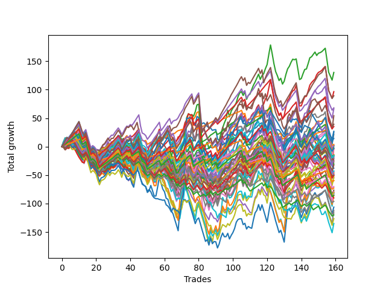

# Long Pointer 003 
- Symbol: ES
- Date Range: 03/18/2022 - 12/30/2022
- Trading Period: 8:30-12:30
- Number of Trades: 58



| Name | Win Percent | Profit | Avg Profit / Trade | Avg Time / Trade |      | Name | Win Percent | Profit | Avg Profit / Trade | Avg Time / Trade |
| ---- | ----------- | ------ | ------------------ | ---------------- | ---- | ---- | ----------- | ------ | ------------------ | ---------------- |
| Sorted By <br> Profit | | | | | | Sorted By <br> Win Percentage ||||
| BB-200 U/L 2SD | 60.34 | 85000.00 | 1465.52 | 55:22 |     | TP-1 | 93.10 | 11125.00 | 191.81 | 07:07 |
| NEWFI 000 | 60.34 | 76500.00 | 1318.97 | 53:07 |     | TP-2 | 87.93 | 9125.00 | 157.33 | 12:34 |
| BB-100 U/L 2SD | 62.07 | 64625.00 | 1114.22 | 52:58 |     | BB-20 Mid | 79.31 | 8750.00 | 150.86 | 05:49 |
| V U/L 1SD | 60.34 | 61500.00 | 1060.34 | 50:22 |     | TP-3 | 79.31 | -16250.00 | -280.17 | 18:21 |
| BB-50 U/L 2SD | 72.41 | 41250.00 | 711.21 | 40:58 |     | TP-4 | 77.59 | -3750.00 | -64.66 | 23:23 |
| BB-200 Mid | 58.62 | 33250.00 | 573.28 | 38:34 |     | BB-50 U/L 1SD | 75.86 | 19125.00 | 329.74 | 32:07 |
| TP-10 | 63.79 | 32375.00 | 558.19 | 44:24 |     | TP-5 | 75.86 | 11750.00 | 202.59 | 26:17 |
| TP-6 | 74.14 | 24625.00 | 424.57 | 28:34 |     | TP-6 | 74.14 | 24625.00 | 424.57 | 28:34 |
| TP-9 | 63.79 | 23250.00 | 400.86 | 42:01 |     | BB-20 U/L 2SD C | 74.14 | 7875.00 | 135.78 | 24:10 |
| TP-8 | 67.24 | 22125.00 | 381.47 | 37:57 |     | BB-20 U/L 2SD | 74.14 | -4750.00 | -81.90 | 22:18 |
| BB-50 U/L 1SD | 75.86 | 19125.00 | 329.74 | 32:07 |     | BB-50 U/L 2SD | 72.41 | 41250.00 | 711.21 | 40:58 |
| BB-50 Mid | 72.41 | 17625.00 | 303.88 | 19:45 |     | BB-50 Mid | 72.41 | 17625.00 | 303.88 | 19:45 |
| BB-100 Mid | 70.69 | 12625.00 | 217.67 | 33:01 |     | BB-100 Mid | 70.69 | 12625.00 | 217.67 | 33:01 |
| TP-5 | 75.86 | 11750.00 | 202.59 | 26:17 |     | TP-8 | 67.24 | 22125.00 | 381.47 | 37:57 |
| TP-1 | 93.10 | 11125.00 | 191.81 | 07:07 |     | TP-7 | 67.24 | 7750.00 | 133.62 | 34:08 |
| TP-2 | 87.93 | 9125.00 | 157.33 | 12:34 |     | BB-20 U/L 1SD | 67.24 | -3250.00 | -56.03 | 14:15 |
| BB-20 Mid | 79.31 | 8750.00 | 150.86 | 05:49 |     | TP-10 | 63.79 | 32375.00 | 558.19 | 44:24 |
| BB-20 U/L 2SD C | 74.14 | 7875.00 | 135.78 | 24:10 |     | TP-9 | 63.79 | 23250.00 | 400.86 | 42:01 |
| TP-7 | 67.24 | 7750.00 | 133.62 | 34:08 |     | BB-100 U/L 2SD | 62.07 | 64625.00 | 1114.22 | 52:58 |
| V Mid | 58.62 | 4125.00 | 71.12 | 39:27 |     | BB-200 U/L 2SD | 60.34 | 85000.00 | 1465.52 | 55:22 |
| BB-20 U/L 1SD | 67.24 | -3250.00 | -56.03 | 14:15 |     | NEWFI 000 | 60.34 | 76500.00 | 1318.97 | 53:07 |
| TP-4 | 77.59 | -3750.00 | -64.66 | 23:23 |     | V U/L 1SD | 60.34 | 61500.00 | 1060.34 | 50:22 |
| BB-20 U/L 2SD | 74.14 | -4750.00 | -81.90 | 22:18 |     | BB-200 Mid | 58.62 | 33250.00 | 573.28 | 38:34 |
| TP-3 | 79.31 | -16250.00 | -280.17 | 18:21 |     | V Mid | 58.62 | 4125.00 | 71.12 | 39:27 |
| NEWFI 0000 | 43.10 | -23375.00 | -403.02 | 10:50 |     | NEWFI 0000 | 43.10 | -23375.00 | -403.02 | 10:50 |

## NO STOPLOSS

### Test BB-20 Mid
* Sell when price hits the middle line of the 20p bollinger
* No Stoploss
* Results:
```
Total Trades: 58
Percent Up: 79.31
Percent Down: 20.69
Total Points Moved Up: 17.50
Potential Profit: 8750.00
Total Points Ups: 108.00 Count Ups: 46
Total Points Downs: -90.50 Count Downs: 12
```

<details><summary>Trades</summary>

<code>In: 2022-03-23 10:50:00		Out: 2022-03-23 10:51:10		Total Position Time: 01:10		Total Move Up: 2.00		Total to Date: 2.00</code> <br />
<code>In: 2022-03-30 10:28:00		Out: 2022-03-30 10:33:25		Total Position Time: 05:25		Total Move Up: 1.25		Total to Date: 3.25</code> <br />
<code>In: 2022-04-12 11:35:00		Out: 2022-04-12 11:36:10		Total Position Time: 01:10		Total Move Up: 1.50		Total to Date: 4.75</code> <br />
<code>In: 2022-04-21 09:56:00		Out: 2022-04-21 10:13:30		Total Position Time: 17:30		Total Move Up: -6.25		Total to Date: -1.50</code> <br />
<code>In: 2022-05-02 08:23:00		Out: 2022-05-02 08:26:05		Total Position Time: 03:05		Total Move Up: 2.25		Total to Date: 0.75</code> <br />
<code>In: 2022-05-02 11:46:00		Out: 2022-05-02 11:47:10		Total Position Time: 01:10		Total Move Up: -1.00		Total to Date: -0.25</code> <br />
<code>In: 2022-05-06 09:03:00		Out: 2022-05-06 09:04:10		Total Position Time: 01:10		Total Move Up: 6.25		Total to Date: 6.00</code> <br />
<code>In: 2022-05-11 11:01:00		Out: 2022-05-11 11:02:10		Total Position Time: 01:10		Total Move Up: 6.25		Total to Date: 12.25</code> <br />
<code>In: 2022-05-16 09:47:00		Out: 2022-05-16 09:48:15		Total Position Time: 01:15		Total Move Up: 4.00		Total to Date: 16.25</code> <br />
<code>In: 2022-05-18 09:12:00		Out: 2022-05-18 09:14:45		Total Position Time: 02:45		Total Move Up: 2.25		Total to Date: 18.50</code> <br />
<code>In: 2022-05-20 09:48:00		Out: 2022-05-20 09:50:00		Total Position Time: 02:00		Total Move Up: 7.00		Total to Date: 25.50</code> <br />
<code>In: 2022-06-09 08:10:00		Out: 2022-06-09 08:11:10		Total Position Time: 01:10		Total Move Up: 3.25		Total to Date: 28.75</code> <br />
<code>In: 2022-06-13 12:17:00		Out: 2022-06-13 12:18:10		Total Position Time: 01:10		Total Move Up: -2.00		Total to Date: 26.75</code> <br />
<code>In: 2022-06-23 10:06:00		Out: 2022-06-23 10:07:10		Total Position Time: 01:10		Total Move Up: 1.00		Total to Date: 27.75</code> <br />
<code>In: 2022-06-28 07:26:00		Out: 2022-06-28 07:56:40		Total Position Time: 30:40		Total Move Up: -14.75		Total to Date: 13.00</code> <br />
<code>In: 2022-07-05 08:08:00		Out: 2022-07-05 08:15:20		Total Position Time: 07:20		Total Move Up: 0.25		Total to Date: 13.25</code> <br />
<code>In: 2022-07-08 09:45:00		Out: 2022-07-08 09:49:05		Total Position Time: 04:05		Total Move Up: 1.00		Total to Date: 14.25</code> <br />
<code>In: 2022-07-08 09:48:00		Out: 2022-07-08 09:49:10		Total Position Time: 01:10		Total Move Up: 2.25		Total to Date: 16.50</code> <br />
<code>In: 2022-07-12 10:28:00		Out: 2022-07-12 10:29:10		Total Position Time: 01:10		Total Move Up: 1.00		Total to Date: 17.50</code> <br />
<code>In: 2022-07-18 11:32:00		Out: 2022-07-18 11:37:35		Total Position Time: 05:35		Total Move Up: 3.25		Total to Date: 20.75</code> <br />
<code>In: 2022-07-25 11:23:00		Out: 2022-07-25 11:24:25		Total Position Time: 01:25		Total Move Up: 1.00		Total to Date: 21.75</code> <br />
<code>In: 2022-07-25 12:10:00		Out: 2022-07-25 12:15:45		Total Position Time: 05:45		Total Move Up: 0.25		Total to Date: 22.00</code> <br />
<code>In: 2022-07-26 08:35:00		Out: 2022-07-26 08:43:45		Total Position Time: 08:45		Total Move Up: 1.00		Total to Date: 23.00</code> <br />
<code>In: 2022-07-26 12:11:00		Out: 2022-07-26 12:12:10		Total Position Time: 01:10		Total Move Up: 4.50		Total to Date: 27.50</code> <br />
<code>In: 2022-08-03 07:39:00		Out: 2022-08-03 07:44:20		Total Position Time: 05:20		Total Move Up: -0.75		Total to Date: 26.75</code> <br />
<code>In: 2022-08-04 11:43:00		Out: 2022-08-04 11:44:20		Total Position Time: 01:20		Total Move Up: 1.75		Total to Date: 28.50</code> <br />
<code>In: 2022-08-05 08:32:00		Out: 2022-08-05 08:37:00		Total Position Time: 05:00		Total Move Up: 4.50		Total to Date: 33.00</code> <br />
<code>In: 2022-08-09 09:05:00		Out: 2022-08-09 09:06:10		Total Position Time: 01:10		Total Move Up: 0.50		Total to Date: 33.50</code> <br />
<code>In: 2022-09-01 10:00:00		Out: 2022-09-01 10:02:40		Total Position Time: 02:40		Total Move Up: 0.75		Total to Date: 34.25</code> <br />
<code>In: 2022-09-12 11:25:00		Out: 2022-09-12 11:37:50		Total Position Time: 12:50		Total Move Up: -1.50		Total to Date: 32.75</code> <br />
<code>In: 2022-09-13 12:00:00		Out: 2022-09-13 12:47:00		Total Position Time: 47:00		Total Move Up: -35.00		Total to Date: -2.25</code> <br />
<code>In: 2022-09-15 09:00:00		Out: 2022-09-15 09:08:30		Total Position Time: 08:30		Total Move Up: 0.25		Total to Date: -2.00</code> <br />
<code>In: 2022-09-15 11:55:00		Out: 2022-09-15 12:32:05		Total Position Time: 37:05		Total Move Up: -18.25		Total to Date: -20.25</code> <br />
<code>In: 2022-09-19 10:40:00		Out: 2022-09-19 10:42:20		Total Position Time: 02:20		Total Move Up: 2.50		Total to Date: -17.75</code> <br />
<code>In: 2022-09-22 11:28:00		Out: 2022-09-22 11:29:10		Total Position Time: 01:10		Total Move Up: 3.00		Total to Date: -14.75</code> <br />
<code>In: 2022-09-30 11:31:00		Out: 2022-09-30 11:34:35		Total Position Time: 03:35		Total Move Up: 0.25		Total to Date: -14.50</code> <br />
<code>In: 2022-10-05 07:21:00		Out: 2022-10-05 07:22:10		Total Position Time: 01:10		Total Move Up: 3.25		Total to Date: -11.25</code> <br />
<code>In: 2022-10-10 08:07:00		Out: 2022-10-10 08:10:45		Total Position Time: 03:45		Total Move Up: 2.00		Total to Date: -9.25</code> <br />
<code>In: 2022-10-10 09:56:00		Out: 2022-10-10 10:11:30		Total Position Time: 15:30		Total Move Up: -4.75		Total to Date: -14.00</code> <br />
<code>In: 2022-10-11 12:18:00		Out: 2022-10-11 12:19:10		Total Position Time: 01:10		Total Move Up: -1.75		Total to Date: -15.75</code> <br />
<code>In: 2022-10-17 09:48:00		Out: 2022-10-17 09:52:15		Total Position Time: 04:15		Total Move Up: 1.50		Total to Date: -14.25</code> <br />
<code>In: 2022-10-17 11:28:00		Out: 2022-10-17 11:35:40		Total Position Time: 07:40		Total Move Up: 0.00		Total to Date: -14.25</code> <br />
<code>In: 2022-10-19 09:32:00		Out: 2022-10-19 09:33:10		Total Position Time: 01:10		Total Move Up: 0.25		Total to Date: -14.00</code> <br />
<code>In: 2022-10-20 10:12:00		Out: 2022-10-20 10:22:05		Total Position Time: 10:05		Total Move Up: -1.50		Total to Date: -15.50</code> <br />
<code>In: 2022-10-26 10:03:00		Out: 2022-10-26 10:12:05		Total Position Time: 09:05		Total Move Up: 1.50		Total to Date: -14.00</code> <br />
<code>In: 2022-10-27 11:05:00		Out: 2022-10-27 11:18:40		Total Position Time: 13:40		Total Move Up: -3.00		Total to Date: -17.00</code> <br />
<code>In: 2022-10-27 12:01:00		Out: 2022-10-27 12:02:10		Total Position Time: 01:10		Total Move Up: 3.00		Total to Date: -14.00</code> <br />
<code>In: 2022-11-10 09:58:00		Out: 2022-11-10 10:02:05		Total Position Time: 04:05		Total Move Up: 3.50		Total to Date: -10.50</code> <br />
<code>In: 2022-11-11 08:33:00		Out: 2022-11-11 08:36:25		Total Position Time: 03:25		Total Move Up: 1.50		Total to Date: -9.00</code> <br />
<code>In: 2022-11-15 07:54:00		Out: 2022-11-15 07:55:20		Total Position Time: 01:20		Total Move Up: 4.75		Total to Date: -4.25</code> <br />
<code>In: 2022-11-15 10:43:00		Out: 2022-11-15 10:44:10		Total Position Time: 01:10		Total Move Up: 9.25		Total to Date: 5.00</code> <br />
<code>In: 2022-12-05 09:58:00		Out: 2022-12-05 10:01:05		Total Position Time: 03:05		Total Move Up: 0.25		Total to Date: 5.25</code> <br />
<code>In: 2022-12-06 10:35:00		Out: 2022-12-06 10:36:15		Total Position Time: 01:15		Total Move Up: 2.00		Total to Date: 7.25</code> <br />
<code>In: 2022-12-08 08:24:00		Out: 2022-12-08 08:27:05		Total Position Time: 03:05		Total Move Up: 1.25		Total to Date: 8.50</code> <br />
<code>In: 2022-12-08 09:32:00		Out: 2022-12-08 09:36:00		Total Position Time: 04:00		Total Move Up: 1.75		Total to Date: 10.25</code> <br />
<code>In: 2022-12-16 07:39:00		Out: 2022-12-16 07:42:10		Total Position Time: 03:10		Total Move Up: 5.25		Total to Date: 15.50</code> <br />
<code>In: 2022-12-19 11:07:00		Out: 2022-12-19 11:12:40		Total Position Time: 05:40		Total Move Up: 1.50		Total to Date: 17.00</code> <br />
<code>In: 2022-12-20 12:11:00		Out: 2022-12-20 12:13:45		Total Position Time: 02:45		Total Move Up: 0.50		Total to Date: 17.50</code> <br />


</details>

### Test BB-20 U/L 1SD
* Sell when the price hits the upper line of the 20p 1std bollinger
* No Stoploss
* Results:
```
Total Trades: 58
Percent Up: 67.24
Percent Down: 32.76
Total Points Moved Up: -6.50
Potential Profit: -3250.00
Total Points Ups: 137.25 Count Ups: 39
Total Points Downs: -143.75 Count Downs: 19
```

<details><summary>Trades</summary>

<code>In: 2022-03-23 10:50:00		Out: 2022-03-23 10:51:45		Total Position Time: 01:45		Total Move Up: 3.50		Total to Date: 3.50</code> <br />
<code>In: 2022-03-30 10:28:00		Out: 2022-03-30 10:49:45		Total Position Time: 21:45		Total Move Up: -0.50		Total to Date: 3.00</code> <br />
<code>In: 2022-04-12 11:35:00		Out: 2022-04-12 11:37:20		Total Position Time: 02:20		Total Move Up: 3.50		Total to Date: 6.50</code> <br />
<code>In: 2022-04-21 09:56:00		Out: 2022-04-21 10:21:20		Total Position Time: 25:20		Total Move Up: -6.25		Total to Date: 0.25</code> <br />
<code>In: 2022-05-02 08:23:00		Out: 2022-05-02 08:36:15		Total Position Time: 13:15		Total Move Up: 1.25		Total to Date: 1.50</code> <br />
<code>In: 2022-05-02 11:46:00		Out: 2022-05-02 11:47:10		Total Position Time: 01:10		Total Move Up: -1.00		Total to Date: 0.50</code> <br />
<code>In: 2022-05-06 09:03:00		Out: 2022-05-06 09:04:10		Total Position Time: 01:10		Total Move Up: 6.25		Total to Date: 6.75</code> <br />
<code>In: 2022-05-11 11:01:00		Out: 2022-05-11 11:02:10		Total Position Time: 01:10		Total Move Up: 6.25		Total to Date: 13.00</code> <br />
<code>In: 2022-05-16 09:47:00		Out: 2022-05-16 09:50:05		Total Position Time: 03:05		Total Move Up: 6.75		Total to Date: 19.75</code> <br />
<code>In: 2022-05-18 09:12:00		Out: 2022-05-18 09:16:30		Total Position Time: 04:30		Total Move Up: 5.25		Total to Date: 25.00</code> <br />
<code>In: 2022-05-20 09:48:00		Out: 2022-05-20 09:56:15		Total Position Time: 08:15		Total Move Up: 7.50		Total to Date: 32.50</code> <br />
<code>In: 2022-06-09 08:10:00		Out: 2022-06-09 08:21:10		Total Position Time: 11:10		Total Move Up: 4.75		Total to Date: 37.25</code> <br />
<code>In: 2022-06-13 12:17:00		Out: 2022-06-13 12:47:00		Total Position Time: 30:00		Total Move Up: -26.75		Total to Date: 10.50</code> <br />
<code>In: 2022-06-23 10:06:00		Out: 2022-06-23 10:07:25		Total Position Time: 01:25		Total Move Up: 3.75		Total to Date: 14.25</code> <br />
<code>In: 2022-06-28 07:26:00		Out: 2022-06-28 08:01:10		Total Position Time: 35:10		Total Move Up: -11.75		Total to Date: 2.50</code> <br />
<code>In: 2022-07-05 08:08:00		Out: 2022-07-05 08:16:40		Total Position Time: 08:40		Total Move Up: 2.50		Total to Date: 5.00</code> <br />
<code>In: 2022-07-08 09:45:00		Out: 2022-07-08 10:06:55		Total Position Time: 21:55		Total Move Up: -0.75		Total to Date: 4.25</code> <br />
<code>In: 2022-07-08 09:48:00		Out: 2022-07-08 10:06:55		Total Position Time: 18:55		Total Move Up: 0.00		Total to Date: 4.25</code> <br />
<code>In: 2022-07-12 10:28:00		Out: 2022-07-12 10:30:05		Total Position Time: 02:05		Total Move Up: 1.75		Total to Date: 6.00</code> <br />
<code>In: 2022-07-18 11:32:00		Out: 2022-07-18 12:08:05		Total Position Time: 36:05		Total Move Up: -6.00		Total to Date: 0.00</code> <br />
<code>In: 2022-07-25 11:23:00		Out: 2022-07-25 11:35:25		Total Position Time: 12:25		Total Move Up: 1.25		Total to Date: 1.25</code> <br />
<code>In: 2022-07-25 12:10:00		Out: 2022-07-25 12:19:25		Total Position Time: 09:25		Total Move Up: 2.00		Total to Date: 3.25</code> <br />
<code>In: 2022-07-26 08:35:00		Out: 2022-07-26 09:15:35		Total Position Time: 40:35		Total Move Up: -5.25		Total to Date: -2.00</code> <br />
<code>In: 2022-07-26 12:11:00		Out: 2022-07-26 12:12:15		Total Position Time: 01:15		Total Move Up: 5.00		Total to Date: 3.00</code> <br />
<code>In: 2022-08-03 07:39:00		Out: 2022-08-03 07:48:40		Total Position Time: 09:40		Total Move Up: 3.50		Total to Date: 6.50</code> <br />
<code>In: 2022-08-04 11:43:00		Out: 2022-08-04 11:48:05		Total Position Time: 05:05		Total Move Up: 3.25		Total to Date: 9.75</code> <br />
<code>In: 2022-08-05 08:32:00		Out: 2022-08-05 08:51:30		Total Position Time: 19:30		Total Move Up: 2.25		Total to Date: 12.00</code> <br />
<code>In: 2022-08-09 09:05:00		Out: 2022-08-09 09:44:15		Total Position Time: 39:15		Total Move Up: -5.50		Total to Date: 6.50</code> <br />
<code>In: 2022-09-01 10:00:00		Out: 2022-09-01 10:04:20		Total Position Time: 04:20		Total Move Up: 3.00		Total to Date: 9.50</code> <br />
<code>In: 2022-09-12 11:25:00		Out: 2022-09-12 11:40:30		Total Position Time: 15:30		Total Move Up: -0.75		Total to Date: 8.75</code> <br />
<code>In: 2022-09-13 12:00:00		Out: 2022-09-13 12:47:00		Total Position Time: 47:00		Total Move Up: -35.00		Total to Date: -26.25</code> <br />
<code>In: 2022-09-15 09:00:00		Out: 2022-09-15 09:19:45		Total Position Time: 19:45		Total Move Up: 0.25		Total to Date: -26.00</code> <br />
<code>In: 2022-09-15 11:55:00		Out: 2022-09-15 12:38:25		Total Position Time: 43:25		Total Move Up: -18.50		Total to Date: -44.50</code> <br />
<code>In: 2022-09-19 10:40:00		Out: 2022-09-19 10:46:20		Total Position Time: 06:20		Total Move Up: 5.25		Total to Date: -39.25</code> <br />
<code>In: 2022-09-22 11:28:00		Out: 2022-09-22 11:32:55		Total Position Time: 04:55		Total Move Up: 4.25		Total to Date: -35.00</code> <br />
<code>In: 2022-09-30 11:31:00		Out: 2022-09-30 12:02:05		Total Position Time: 31:05		Total Move Up: -7.25		Total to Date: -42.25</code> <br />
<code>In: 2022-10-05 07:21:00		Out: 2022-10-05 07:41:55		Total Position Time: 20:55		Total Move Up: -1.00		Total to Date: -43.25</code> <br />
<code>In: 2022-10-10 08:07:00		Out: 2022-10-10 08:11:25		Total Position Time: 04:25		Total Move Up: 4.25		Total to Date: -39.00</code> <br />
<code>In: 2022-10-10 09:56:00		Out: 2022-10-10 10:12:10		Total Position Time: 16:10		Total Move Up: -2.50		Total to Date: -41.50</code> <br />
<code>In: 2022-10-11 12:18:00		Out: 2022-10-11 12:20:40		Total Position Time: 02:40		Total Move Up: 0.25		Total to Date: -41.25</code> <br />
<code>In: 2022-10-17 09:48:00		Out: 2022-10-17 10:05:40		Total Position Time: 17:40		Total Move Up: 1.75		Total to Date: -39.50</code> <br />
<code>In: 2022-10-17 11:28:00		Out: 2022-10-17 11:36:10		Total Position Time: 08:10		Total Move Up: 2.50		Total to Date: -37.00</code> <br />
<code>In: 2022-10-19 09:32:00		Out: 2022-10-19 09:36:10		Total Position Time: 04:10		Total Move Up: 2.25		Total to Date: -34.75</code> <br />
<code>In: 2022-10-20 10:12:00		Out: 2022-10-20 10:26:55		Total Position Time: 14:55		Total Move Up: -1.00		Total to Date: -35.75</code> <br />
<code>In: 2022-10-26 10:03:00		Out: 2022-10-26 10:41:50		Total Position Time: 38:50		Total Move Up: -6.75		Total to Date: -42.50</code> <br />
<code>In: 2022-10-27 11:05:00		Out: 2022-10-27 11:24:30		Total Position Time: 19:30		Total Move Up: -2.25		Total to Date: -44.75</code> <br />
<code>In: 2022-10-27 12:01:00		Out: 2022-10-27 12:02:10		Total Position Time: 01:10		Total Move Up: 3.00		Total to Date: -41.75</code> <br />
<code>In: 2022-11-10 09:58:00		Out: 2022-11-10 10:02:05		Total Position Time: 04:05		Total Move Up: 3.50		Total to Date: -38.25</code> <br />
<code>In: 2022-11-11 08:33:00		Out: 2022-11-11 08:41:35		Total Position Time: 08:35		Total Move Up: 5.00		Total to Date: -33.25</code> <br />
<code>In: 2022-11-15 07:54:00		Out: 2022-11-15 08:15:00		Total Position Time: 21:00		Total Move Up: 1.50		Total to Date: -31.75</code> <br />
<code>In: 2022-11-15 10:43:00		Out: 2022-11-15 10:44:25		Total Position Time: 01:25		Total Move Up: 13.75		Total to Date: -18.00</code> <br />
<code>In: 2022-12-05 09:58:00		Out: 2022-12-05 10:07:40		Total Position Time: 09:40		Total Move Up: 1.25		Total to Date: -16.75</code> <br />
<code>In: 2022-12-06 10:35:00		Out: 2022-12-06 10:40:25		Total Position Time: 05:25		Total Move Up: 2.75		Total to Date: -14.00</code> <br />
<code>In: 2022-12-08 08:24:00		Out: 2022-12-08 08:29:05		Total Position Time: 05:05		Total Move Up: 3.25		Total to Date: -10.75</code> <br />
<code>In: 2022-12-08 09:32:00		Out: 2022-12-08 09:50:15		Total Position Time: 18:15		Total Move Up: 0.50		Total to Date: -10.25</code> <br />
<code>In: 2022-12-16 07:39:00		Out: 2022-12-16 07:43:20		Total Position Time: 04:20		Total Move Up: 6.50		Total to Date: -3.75</code> <br />
<code>In: 2022-12-19 11:07:00		Out: 2022-12-19 11:45:05		Total Position Time: 38:05		Total Move Up: -5.00		Total to Date: -8.75</code> <br />
<code>In: 2022-12-20 12:11:00		Out: 2022-12-20 12:15:15		Total Position Time: 04:15		Total Move Up: 2.25		Total to Date: -6.50</code> <br />


</details>

### Test BB-20 U/L 2SD
* Sell when the price hits the upper line of the 20p 2std bollinger
* No Stoploss
* Results:
```
Total Trades: 58
Percent Up: 74.14
Percent Down: 25.86
Total Points Moved Up: -9.50
Potential Profit: -4750.00
Total Points Ups: 193.50 Count Ups: 43
Total Points Downs: -203.00 Count Downs: 15
```

<details><summary>Trades</summary>

<code>In: 2022-03-23 10:50:00		Out: 2022-03-23 10:54:25		Total Position Time: 04:25		Total Move Up: 5.50		Total to Date: 5.50</code> <br />
<code>In: 2022-03-30 10:28:00		Out: 2022-03-30 11:03:45		Total Position Time: 35:45		Total Move Up: 0.50		Total to Date: 6.00</code> <br />
<code>In: 2022-04-12 11:35:00		Out: 2022-04-12 11:46:50		Total Position Time: 11:50		Total Move Up: 4.00		Total to Date: 10.00</code> <br />
<code>In: 2022-04-21 09:56:00		Out: 2022-04-21 10:22:05		Total Position Time: 26:05		Total Move Up: -4.00		Total to Date: 6.00</code> <br />
<code>In: 2022-05-02 08:23:00		Out: 2022-05-02 08:36:35		Total Position Time: 13:35		Total Move Up: 4.75		Total to Date: 10.75</code> <br />
<code>In: 2022-05-02 11:46:00		Out: 2022-05-02 11:53:35		Total Position Time: 07:35		Total Move Up: 6.00		Total to Date: 16.75</code> <br />
<code>In: 2022-05-06 09:03:00		Out: 2022-05-06 09:04:10		Total Position Time: 01:10		Total Move Up: 6.25		Total to Date: 23.00</code> <br />
<code>In: 2022-05-11 11:01:00		Out: 2022-05-11 11:02:35		Total Position Time: 01:35		Total Move Up: 5.75		Total to Date: 28.75</code> <br />
<code>In: 2022-05-16 09:47:00		Out: 2022-05-16 10:06:30		Total Position Time: 19:30		Total Move Up: 4.50		Total to Date: 33.25</code> <br />
<code>In: 2022-05-18 09:12:00		Out: 2022-05-18 09:17:50		Total Position Time: 05:50		Total Move Up: 7.00		Total to Date: 40.25</code> <br />
<code>In: 2022-05-20 09:48:00		Out: 2022-05-20 10:33:15		Total Position Time: 45:15		Total Move Up: -9.00		Total to Date: 31.25</code> <br />
<code>In: 2022-06-09 08:10:00		Out: 2022-06-09 08:22:35		Total Position Time: 12:35		Total Move Up: 7.00		Total to Date: 38.25</code> <br />
<code>In: 2022-06-13 12:17:00		Out: 2022-06-13 12:47:00		Total Position Time: 30:00		Total Move Up: -26.75		Total to Date: 11.50</code> <br />
<code>In: 2022-06-23 10:06:00		Out: 2022-06-23 10:07:40		Total Position Time: 01:40		Total Move Up: 5.50		Total to Date: 17.00</code> <br />
<code>In: 2022-06-28 07:26:00		Out: 2022-06-28 08:26:55		Total Position Time: 60:55		Total Move Up: -37.50		Total to Date: -20.50</code> <br />
<code>In: 2022-07-05 08:08:00		Out: 2022-07-05 08:17:55		Total Position Time: 09:55		Total Move Up: 4.00		Total to Date: -16.50</code> <br />
<code>In: 2022-07-08 09:45:00		Out: 2022-07-08 10:11:05		Total Position Time: 26:05		Total Move Up: 1.50		Total to Date: -15.00</code> <br />
<code>In: 2022-07-08 09:48:00		Out: 2022-07-08 10:11:05		Total Position Time: 23:05		Total Move Up: 2.25		Total to Date: -12.75</code> <br />
<code>In: 2022-07-12 10:28:00		Out: 2022-07-12 10:31:30		Total Position Time: 03:30		Total Move Up: 3.00		Total to Date: -9.75</code> <br />
<code>In: 2022-07-18 11:32:00		Out: 2022-07-18 12:09:45		Total Position Time: 37:45		Total Move Up: -4.00		Total to Date: -13.75</code> <br />
<code>In: 2022-07-25 11:23:00		Out: 2022-07-25 11:35:50		Total Position Time: 12:50		Total Move Up: 3.25		Total to Date: -10.50</code> <br />
<code>In: 2022-07-25 12:10:00		Out: 2022-07-25 12:21:20		Total Position Time: 11:20		Total Move Up: 3.25		Total to Date: -7.25</code> <br />
<code>In: 2022-07-26 08:35:00		Out: 2022-07-26 09:16:25		Total Position Time: 41:25		Total Move Up: -4.00		Total to Date: -11.25</code> <br />
<code>In: 2022-07-26 12:11:00		Out: 2022-07-26 12:33:05		Total Position Time: 22:05		Total Move Up: 7.00		Total to Date: -4.25</code> <br />
<code>In: 2022-08-03 07:39:00		Out: 2022-08-03 07:49:25		Total Position Time: 10:25		Total Move Up: 6.75		Total to Date: 2.50</code> <br />
<code>In: 2022-08-04 11:43:00		Out: 2022-08-04 11:52:05		Total Position Time: 09:05		Total Move Up: 5.50		Total to Date: 8.00</code> <br />
<code>In: 2022-08-05 08:32:00		Out: 2022-08-05 08:53:30		Total Position Time: 21:30		Total Move Up: 4.25		Total to Date: 12.25</code> <br />
<code>In: 2022-08-09 09:05:00		Out: 2022-08-09 09:57:15		Total Position Time: 52:15		Total Move Up: -6.25		Total to Date: 6.00</code> <br />
<code>In: 2022-09-01 10:00:00		Out: 2022-09-01 10:06:55		Total Position Time: 06:55		Total Move Up: 5.50		Total to Date: 11.50</code> <br />
<code>In: 2022-09-12 11:25:00		Out: 2022-09-12 11:46:40		Total Position Time: 21:40		Total Move Up: 2.00		Total to Date: 13.50</code> <br />
<code>In: 2022-09-13 12:00:00		Out: 2022-09-13 12:47:00		Total Position Time: 47:00		Total Move Up: -35.00		Total to Date: -21.50</code> <br />
<code>In: 2022-09-15 09:00:00		Out: 2022-09-15 09:27:05		Total Position Time: 27:05		Total Move Up: 0.50		Total to Date: -21.00</code> <br />
<code>In: 2022-09-15 11:55:00		Out: 2022-09-15 12:42:30		Total Position Time: 47:30		Total Move Up: -16.25		Total to Date: -37.25</code> <br />
<code>In: 2022-09-19 10:40:00		Out: 2022-09-19 11:18:05		Total Position Time: 38:05		Total Move Up: 2.50		Total to Date: -34.75</code> <br />
<code>In: 2022-09-22 11:28:00		Out: 2022-09-22 11:38:10		Total Position Time: 10:10		Total Move Up: 5.75		Total to Date: -29.00</code> <br />
<code>In: 2022-09-30 11:31:00		Out: 2022-09-30 12:02:10		Total Position Time: 31:10		Total Move Up: -6.75		Total to Date: -35.75</code> <br />
<code>In: 2022-10-05 07:21:00		Out: 2022-10-05 07:42:20		Total Position Time: 21:20		Total Move Up: 2.00		Total to Date: -33.75</code> <br />
<code>In: 2022-10-10 08:07:00		Out: 2022-10-10 08:14:05		Total Position Time: 07:05		Total Move Up: 6.00		Total to Date: -27.75</code> <br />
<code>In: 2022-10-10 09:56:00		Out: 2022-10-10 10:12:50		Total Position Time: 16:50		Total Move Up: 0.75		Total to Date: -27.00</code> <br />
<code>In: 2022-10-11 12:18:00		Out: 2022-10-11 12:22:35		Total Position Time: 04:35		Total Move Up: 3.50		Total to Date: -23.50</code> <br />
<code>In: 2022-10-17 09:48:00		Out: 2022-10-17 10:16:15		Total Position Time: 28:15		Total Move Up: 4.50		Total to Date: -19.00</code> <br />
<code>In: 2022-10-17 11:28:00		Out: 2022-10-17 11:37:30		Total Position Time: 09:30		Total Move Up: 3.00		Total to Date: -16.00</code> <br />
<code>In: 2022-10-19 09:32:00		Out: 2022-10-19 10:23:05		Total Position Time: 51:05		Total Move Up: -20.75		Total to Date: -36.75</code> <br />
<code>In: 2022-10-20 10:12:00		Out: 2022-10-20 11:12:55		Total Position Time: 60:55		Total Move Up: -21.00		Total to Date: -57.75</code> <br />
<code>In: 2022-10-26 10:03:00		Out: 2022-10-26 10:51:25		Total Position Time: 48:25		Total Move Up: -5.75		Total to Date: -63.50</code> <br />
<code>In: 2022-10-27 11:05:00		Out: 2022-10-27 12:01:55		Total Position Time: 56:55		Total Move Up: -1.75		Total to Date: -65.25</code> <br />
<code>In: 2022-10-27 12:01:00		Out: 2022-10-27 12:02:10		Total Position Time: 01:10		Total Move Up: 3.00		Total to Date: -62.25</code> <br />
<code>In: 2022-11-10 09:58:00		Out: 2022-11-10 10:03:45		Total Position Time: 05:45		Total Move Up: 6.00		Total to Date: -56.25</code> <br />
<code>In: 2022-11-11 08:33:00		Out: 2022-11-11 08:49:20		Total Position Time: 16:20		Total Move Up: 6.00		Total to Date: -50.25</code> <br />
<code>In: 2022-11-15 07:54:00		Out: 2022-11-15 08:30:35		Total Position Time: 36:35		Total Move Up: 3.75		Total to Date: -46.50</code> <br />
<code>In: 2022-11-15 10:43:00		Out: 2022-11-15 10:46:40		Total Position Time: 03:40		Total Move Up: 16.25		Total to Date: -30.25</code> <br />
<code>In: 2022-12-05 09:58:00		Out: 2022-12-05 10:13:35		Total Position Time: 15:35		Total Move Up: 1.50		Total to Date: -28.75</code> <br />
<code>In: 2022-12-06 10:35:00		Out: 2022-12-06 10:41:20		Total Position Time: 06:20		Total Move Up: 3.75		Total to Date: -25.00</code> <br />
<code>In: 2022-12-08 08:24:00		Out: 2022-12-08 08:38:25		Total Position Time: 14:25		Total Move Up: 6.50		Total to Date: -18.50</code> <br />
<code>In: 2022-12-08 09:32:00		Out: 2022-12-08 09:50:50		Total Position Time: 18:50		Total Move Up: 1.50		Total to Date: -17.00</code> <br />
<code>In: 2022-12-16 07:39:00		Out: 2022-12-16 08:14:30		Total Position Time: 35:30		Total Move Up: 8.50		Total to Date: -8.50</code> <br />
<code>In: 2022-12-19 11:07:00		Out: 2022-12-19 11:45:15		Total Position Time: 38:15		Total Move Up: -4.25		Total to Date: -12.75</code> <br />
<code>In: 2022-12-20 12:11:00		Out: 2022-12-20 12:19:10		Total Position Time: 08:10		Total Move Up: 3.25		Total to Date: -9.50</code> <br />


</details>

### Test BB-20 U/L 2SD C
* Sell when the price hits the upper line of the 20p 2std bollinger
* No Stoploss
* Results:
```
Total Trades: 58
Percent Up: 74.14
Percent Down: 25.86
Total Points Moved Up: 15.75
Potential Profit: 7875.00
Total Points Ups: 211.75 Count Ups: 43
Total Points Downs: -196.00 Count Downs: 15
```

<details><summary>Trades</summary>

<code>In: 2022-03-23 10:50:00		Out: 2022-03-23 10:54:30		Total Position Time: 04:30		Total Move Up: 6.25		Total to Date: 6.25</code> <br />
<code>In: 2022-03-30 10:28:00		Out: 2022-03-30 11:03:50		Total Position Time: 35:50		Total Move Up: 1.00		Total to Date: 7.25</code> <br />
<code>In: 2022-04-12 11:35:00		Out: 2022-04-12 11:47:00		Total Position Time: 12:00		Total Move Up: 4.50		Total to Date: 11.75</code> <br />
<code>In: 2022-04-21 09:56:00		Out: 2022-04-21 10:22:15		Total Position Time: 26:15		Total Move Up: -3.50		Total to Date: 8.25</code> <br />
<code>In: 2022-05-02 08:23:00		Out: 2022-05-02 08:36:45		Total Position Time: 13:45		Total Move Up: 6.25		Total to Date: 14.50</code> <br />
<code>In: 2022-05-02 11:46:00		Out: 2022-05-02 11:53:35		Total Position Time: 07:35		Total Move Up: 6.00		Total to Date: 20.50</code> <br />
<code>In: 2022-05-06 09:03:00		Out: 2022-05-06 09:05:00		Total Position Time: 02:00		Total Move Up: 7.25		Total to Date: 27.75</code> <br />
<code>In: 2022-05-11 11:01:00		Out: 2022-05-11 11:04:55		Total Position Time: 03:55		Total Move Up: 9.25		Total to Date: 37.00</code> <br />
<code>In: 2022-05-16 09:47:00		Out: 2022-05-16 10:07:00		Total Position Time: 20:00		Total Move Up: 5.25		Total to Date: 42.25</code> <br />
<code>In: 2022-05-18 09:12:00		Out: 2022-05-18 09:47:55		Total Position Time: 35:55		Total Move Up: 4.25		Total to Date: 46.50</code> <br />
<code>In: 2022-05-20 09:48:00		Out: 2022-05-20 10:33:20		Total Position Time: 45:20		Total Move Up: -7.00		Total to Date: 39.50</code> <br />
<code>In: 2022-06-09 08:10:00		Out: 2022-06-09 08:22:35		Total Position Time: 12:35		Total Move Up: 7.00		Total to Date: 46.50</code> <br />
<code>In: 2022-06-13 12:17:00		Out: 2022-06-13 12:47:00		Total Position Time: 30:00		Total Move Up: -26.75		Total to Date: 19.75</code> <br />
<code>In: 2022-06-23 10:06:00		Out: 2022-06-23 10:07:40		Total Position Time: 01:40		Total Move Up: 5.50		Total to Date: 25.25</code> <br />
<code>In: 2022-06-28 07:26:00		Out: 2022-06-28 08:26:55		Total Position Time: 60:55		Total Move Up: -37.50		Total to Date: -12.25</code> <br />
<code>In: 2022-07-05 08:08:00		Out: 2022-07-05 08:20:35		Total Position Time: 12:35		Total Move Up: 4.75		Total to Date: -7.50</code> <br />
<code>In: 2022-07-08 09:45:00		Out: 2022-07-08 10:11:05		Total Position Time: 26:05		Total Move Up: 1.50		Total to Date: -6.00</code> <br />
<code>In: 2022-07-08 09:48:00		Out: 2022-07-08 10:11:05		Total Position Time: 23:05		Total Move Up: 2.25		Total to Date: -3.75</code> <br />
<code>In: 2022-07-12 10:28:00		Out: 2022-07-12 10:41:40		Total Position Time: 13:40		Total Move Up: 4.00		Total to Date: 0.25</code> <br />
<code>In: 2022-07-18 11:32:00		Out: 2022-07-18 12:15:55		Total Position Time: 43:55		Total Move Up: -3.25		Total to Date: -3.00</code> <br />
<code>In: 2022-07-25 11:23:00		Out: 2022-07-25 11:35:50		Total Position Time: 12:50		Total Move Up: 3.25		Total to Date: 0.25</code> <br />
<code>In: 2022-07-25 12:10:00		Out: 2022-07-25 12:21:25		Total Position Time: 11:25		Total Move Up: 3.50		Total to Date: 3.75</code> <br />
<code>In: 2022-07-26 08:35:00		Out: 2022-07-26 09:16:25		Total Position Time: 41:25		Total Move Up: -4.00		Total to Date: -0.25</code> <br />
<code>In: 2022-07-26 12:11:00		Out: 2022-07-26 12:33:05		Total Position Time: 22:05		Total Move Up: 7.00		Total to Date: 6.75</code> <br />
<code>In: 2022-08-03 07:39:00		Out: 2022-08-03 07:49:25		Total Position Time: 10:25		Total Move Up: 6.75		Total to Date: 13.50</code> <br />
<code>In: 2022-08-04 11:43:00		Out: 2022-08-04 11:52:05		Total Position Time: 09:05		Total Move Up: 5.50		Total to Date: 19.00</code> <br />
<code>In: 2022-08-05 08:32:00		Out: 2022-08-05 08:53:50		Total Position Time: 21:50		Total Move Up: 4.75		Total to Date: 23.75</code> <br />
<code>In: 2022-08-09 09:05:00		Out: 2022-08-09 09:59:50		Total Position Time: 54:50		Total Move Up: -5.00		Total to Date: 18.75</code> <br />
<code>In: 2022-09-01 10:00:00		Out: 2022-09-01 10:06:55		Total Position Time: 06:55		Total Move Up: 5.50		Total to Date: 24.25</code> <br />
<code>In: 2022-09-12 11:25:00		Out: 2022-09-12 11:46:40		Total Position Time: 21:40		Total Move Up: 2.00		Total to Date: 26.25</code> <br />
<code>In: 2022-09-13 12:00:00		Out: 2022-09-13 12:47:00		Total Position Time: 47:00		Total Move Up: -35.00		Total to Date: -8.75</code> <br />
<code>In: 2022-09-15 09:00:00		Out: 2022-09-15 09:27:10		Total Position Time: 27:10		Total Move Up: 0.75		Total to Date: -8.00</code> <br />
<code>In: 2022-09-15 11:55:00		Out: 2022-09-15 12:42:30		Total Position Time: 47:30		Total Move Up: -16.25		Total to Date: -24.25</code> <br />
<code>In: 2022-09-19 10:40:00		Out: 2022-09-19 11:18:05		Total Position Time: 38:05		Total Move Up: 2.50		Total to Date: -21.75</code> <br />
<code>In: 2022-09-22 11:28:00		Out: 2022-09-22 11:38:10		Total Position Time: 10:10		Total Move Up: 5.75		Total to Date: -16.00</code> <br />
<code>In: 2022-09-30 11:31:00		Out: 2022-09-30 12:02:15		Total Position Time: 31:15		Total Move Up: -6.00		Total to Date: -22.00</code> <br />
<code>In: 2022-10-05 07:21:00		Out: 2022-10-05 07:42:20		Total Position Time: 21:20		Total Move Up: 2.00		Total to Date: -20.00</code> <br />
<code>In: 2022-10-10 08:07:00		Out: 2022-10-10 08:14:40		Total Position Time: 07:40		Total Move Up: 6.50		Total to Date: -13.50</code> <br />
<code>In: 2022-10-10 09:56:00		Out: 2022-10-10 10:13:30		Total Position Time: 17:30		Total Move Up: 0.75		Total to Date: -12.75</code> <br />
<code>In: 2022-10-11 12:18:00		Out: 2022-10-11 12:37:00		Total Position Time: 19:00		Total Move Up: 8.75		Total to Date: -4.00</code> <br />
<code>In: 2022-10-17 09:48:00		Out: 2022-10-17 10:16:15		Total Position Time: 28:15		Total Move Up: 4.50		Total to Date: 0.50</code> <br />
<code>In: 2022-10-17 11:28:00		Out: 2022-10-17 11:37:55		Total Position Time: 09:55		Total Move Up: 3.00		Total to Date: 3.50</code> <br />
<code>In: 2022-10-19 09:32:00		Out: 2022-10-19 10:23:05		Total Position Time: 51:05		Total Move Up: -20.75		Total to Date: -17.25</code> <br />
<code>In: 2022-10-20 10:12:00		Out: 2022-10-20 11:12:55		Total Position Time: 60:55		Total Move Up: -21.00		Total to Date: -38.25</code> <br />
<code>In: 2022-10-26 10:03:00		Out: 2022-10-26 10:52:40		Total Position Time: 49:40		Total Move Up: -4.75		Total to Date: -43.00</code> <br />
<code>In: 2022-10-27 11:05:00		Out: 2022-10-27 12:01:55		Total Position Time: 56:55		Total Move Up: -1.75		Total to Date: -44.75</code> <br />
<code>In: 2022-10-27 12:01:00		Out: 2022-10-27 12:02:10		Total Position Time: 01:10		Total Move Up: 3.00		Total to Date: -41.75</code> <br />
<code>In: 2022-11-10 09:58:00		Out: 2022-11-10 10:03:55		Total Position Time: 05:55		Total Move Up: 6.25		Total to Date: -35.50</code> <br />
<code>In: 2022-11-11 08:33:00		Out: 2022-11-11 08:49:40		Total Position Time: 16:40		Total Move Up: 6.25		Total to Date: -29.25</code> <br />
<code>In: 2022-11-15 07:54:00		Out: 2022-11-15 08:30:35		Total Position Time: 36:35		Total Move Up: 3.75		Total to Date: -25.50</code> <br />
<code>In: 2022-11-15 10:43:00		Out: 2022-11-15 11:10:05		Total Position Time: 27:05		Total Move Up: 17.50		Total to Date: -8.00</code> <br />
<code>In: 2022-12-05 09:58:00		Out: 2022-12-05 10:13:35		Total Position Time: 15:35		Total Move Up: 1.50		Total to Date: -6.50</code> <br />
<code>In: 2022-12-06 10:35:00		Out: 2022-12-06 10:41:25		Total Position Time: 06:25		Total Move Up: 4.00		Total to Date: -2.50</code> <br />
<code>In: 2022-12-08 08:24:00		Out: 2022-12-08 08:38:50		Total Position Time: 14:50		Total Move Up: 7.00		Total to Date: 4.50</code> <br />
<code>In: 2022-12-08 09:32:00		Out: 2022-12-08 09:50:55		Total Position Time: 18:55		Total Move Up: 2.00		Total to Date: 6.50</code> <br />
<code>In: 2022-12-16 07:39:00		Out: 2022-12-16 08:15:00		Total Position Time: 36:00		Total Move Up: 9.00		Total to Date: 15.50</code> <br />
<code>In: 2022-12-19 11:07:00		Out: 2022-12-19 11:45:45		Total Position Time: 38:45		Total Move Up: -3.50		Total to Date: 12.00</code> <br />
<code>In: 2022-12-20 12:11:00		Out: 2022-12-20 12:27:20		Total Position Time: 16:20		Total Move Up: 3.75		Total to Date: 15.75</code> <br />


</details>

### Test BB-50 Mid
* Sell when price hits the middle line of the 50p bollinger
* No Stoploss
* Results:
```
Total Trades: 58
Percent Up: 72.41
Percent Down: 27.59
Total Points Moved Up: 35.25
Potential Profit: 17625.00
Total Points Ups: 195.75 Count Ups: 42
Total Points Downs: -160.50 Count Downs: 16
```

<details><summary>Trades</summary>

<code>In: 2022-03-23 10:50:00		Out: 2022-03-23 10:54:50		Total Position Time: 04:50		Total Move Up: 6.50		Total to Date: 6.50</code> <br />
<code>In: 2022-03-30 10:28:00		Out: 2022-03-30 11:03:05		Total Position Time: 35:05		Total Move Up: -0.25		Total to Date: 6.25</code> <br />
<code>In: 2022-04-12 11:35:00		Out: 2022-04-12 11:47:05		Total Position Time: 12:05		Total Move Up: 6.00		Total to Date: 12.25</code> <br />
<code>In: 2022-04-21 09:56:00		Out: 2022-04-21 10:22:30		Total Position Time: 26:30		Total Move Up: -1.25		Total to Date: 11.00</code> <br />
<code>In: 2022-05-02 08:23:00		Out: 2022-05-02 08:38:15		Total Position Time: 15:15		Total Move Up: 8.00		Total to Date: 19.00</code> <br />
<code>In: 2022-05-02 11:46:00		Out: 2022-05-02 11:49:15		Total Position Time: 03:15		Total Move Up: -0.50		Total to Date: 18.50</code> <br />
<code>In: 2022-05-06 09:03:00		Out: 2022-05-06 09:06:05		Total Position Time: 03:05		Total Move Up: 10.25		Total to Date: 28.75</code> <br />
<code>In: 2022-05-11 11:01:00		Out: 2022-05-11 11:04:45		Total Position Time: 03:45		Total Move Up: 8.00		Total to Date: 36.75</code> <br />
<code>In: 2022-05-16 09:47:00		Out: 2022-05-16 09:50:05		Total Position Time: 03:05		Total Move Up: 6.75		Total to Date: 43.50</code> <br />
<code>In: 2022-05-18 09:12:00		Out: 2022-05-18 09:36:05		Total Position Time: 24:05		Total Move Up: 2.75		Total to Date: 46.25</code> <br />
<code>In: 2022-05-20 09:48:00		Out: 2022-05-20 10:33:25		Total Position Time: 45:25		Total Move Up: -5.50		Total to Date: 40.75</code> <br />
<code>In: 2022-06-09 08:10:00		Out: 2022-06-09 08:22:45		Total Position Time: 12:45		Total Move Up: 7.75		Total to Date: 48.50</code> <br />
<code>In: 2022-06-13 12:17:00		Out: 2022-06-13 12:47:00		Total Position Time: 30:00		Total Move Up: -26.75		Total to Date: 21.75</code> <br />
<code>In: 2022-06-23 10:06:00		Out: 2022-06-23 10:07:40		Total Position Time: 01:40		Total Move Up: 5.50		Total to Date: 27.25</code> <br />
<code>In: 2022-06-28 07:26:00		Out: 2022-06-28 08:26:55		Total Position Time: 60:55		Total Move Up: -37.50		Total to Date: -10.25</code> <br />
<code>In: 2022-07-05 08:08:00		Out: 2022-07-05 08:32:25		Total Position Time: 24:25		Total Move Up: 3.25		Total to Date: -7.00</code> <br />
<code>In: 2022-07-08 09:45:00		Out: 2022-07-08 10:11:10		Total Position Time: 26:10		Total Move Up: 1.50		Total to Date: -5.50</code> <br />
<code>In: 2022-07-08 09:48:00		Out: 2022-07-08 10:11:10		Total Position Time: 23:10		Total Move Up: 2.25		Total to Date: -3.25</code> <br />
<code>In: 2022-07-12 10:28:00		Out: 2022-07-12 10:41:35		Total Position Time: 13:35		Total Move Up: 3.00		Total to Date: -0.25</code> <br />
<code>In: 2022-07-18 11:32:00		Out: 2022-07-18 11:37:50		Total Position Time: 05:50		Total Move Up: 5.50		Total to Date: 5.25</code> <br />
<code>In: 2022-07-25 11:23:00		Out: 2022-07-25 11:35:45		Total Position Time: 12:45		Total Move Up: 2.00		Total to Date: 7.25</code> <br />
<code>In: 2022-07-25 12:10:00		Out: 2022-07-25 12:21:25		Total Position Time: 11:25		Total Move Up: 3.50		Total to Date: 10.75</code> <br />
<code>In: 2022-07-26 08:35:00		Out: 2022-07-26 09:16:45		Total Position Time: 41:45		Total Move Up: -3.50		Total to Date: 7.25</code> <br />
<code>In: 2022-07-26 12:11:00		Out: 2022-07-26 12:12:10		Total Position Time: 01:10		Total Move Up: 4.50		Total to Date: 11.75</code> <br />
<code>In: 2022-08-03 07:39:00		Out: 2022-08-03 07:48:40		Total Position Time: 09:40		Total Move Up: 3.50		Total to Date: 15.25</code> <br />
<code>In: 2022-08-04 11:43:00		Out: 2022-08-04 11:44:20		Total Position Time: 01:20		Total Move Up: 1.75		Total to Date: 17.00</code> <br />
<code>In: 2022-08-05 08:32:00		Out: 2022-08-05 09:03:40		Total Position Time: 31:40		Total Move Up: 3.00		Total to Date: 20.00</code> <br />
<code>In: 2022-08-09 09:05:00		Out: 2022-08-09 09:57:15		Total Position Time: 52:15		Total Move Up: -6.25		Total to Date: 13.75</code> <br />
<code>In: 2022-09-01 10:00:00		Out: 2022-09-01 10:06:25		Total Position Time: 06:25		Total Move Up: 4.75		Total to Date: 18.50</code> <br />
<code>In: 2022-09-12 11:25:00		Out: 2022-09-12 11:46:40		Total Position Time: 21:40		Total Move Up: 2.00		Total to Date: 20.50</code> <br />
<code>In: 2022-09-13 12:00:00		Out: 2022-09-13 12:47:00		Total Position Time: 47:00		Total Move Up: -35.00		Total to Date: -14.50</code> <br />
<code>In: 2022-09-15 09:00:00		Out: 2022-09-15 09:31:10		Total Position Time: 31:10		Total Move Up: 1.50		Total to Date: -13.00</code> <br />
<code>In: 2022-09-15 11:55:00		Out: 2022-09-15 12:44:05		Total Position Time: 49:05		Total Move Up: -14.25		Total to Date: -27.25</code> <br />
<code>In: 2022-09-19 10:40:00		Out: 2022-09-19 10:45:45		Total Position Time: 05:45		Total Move Up: 3.50		Total to Date: -23.75</code> <br />
<code>In: 2022-09-22 11:28:00		Out: 2022-09-22 11:38:20		Total Position Time: 10:20		Total Move Up: 7.25		Total to Date: -16.50</code> <br />
<code>In: 2022-09-30 11:31:00		Out: 2022-09-30 11:34:35		Total Position Time: 03:35		Total Move Up: 0.25		Total to Date: -16.25</code> <br />
<code>In: 2022-10-05 07:21:00		Out: 2022-10-05 07:46:30		Total Position Time: 25:30		Total Move Up: 1.50		Total to Date: -14.75</code> <br />
<code>In: 2022-10-10 08:07:00		Out: 2022-10-10 08:21:05		Total Position Time: 14:05		Total Move Up: 7.50		Total to Date: -7.25</code> <br />
<code>In: 2022-10-10 09:56:00		Out: 2022-10-10 10:12:35		Total Position Time: 16:35		Total Move Up: -0.50		Total to Date: -7.75</code> <br />
<code>In: 2022-10-11 12:18:00		Out: 2022-10-11 12:36:35		Total Position Time: 18:35		Total Move Up: 5.75		Total to Date: -2.00</code> <br />
<code>In: 2022-10-17 09:48:00		Out: 2022-10-17 09:52:25		Total Position Time: 04:25		Total Move Up: 2.00		Total to Date: 0.00</code> <br />
<code>In: 2022-10-17 11:28:00		Out: 2022-10-17 11:39:15		Total Position Time: 11:15		Total Move Up: 4.00		Total to Date: 4.00</code> <br />
<code>In: 2022-10-19 09:32:00		Out: 2022-10-19 10:26:35		Total Position Time: 54:35		Total Move Up: -17.50		Total to Date: -13.50</code> <br />
<code>In: 2022-10-20 10:12:00		Out: 2022-10-20 10:37:05		Total Position Time: 25:05		Total Move Up: -0.25		Total to Date: -13.75</code> <br />
<code>In: 2022-10-26 10:03:00		Out: 2022-10-26 10:51:15		Total Position Time: 48:15		Total Move Up: -5.75		Total to Date: -19.50</code> <br />
<code>In: 2022-10-27 11:05:00		Out: 2022-10-27 11:41:55		Total Position Time: 36:55		Total Move Up: -2.25		Total to Date: -21.75</code> <br />
<code>In: 2022-10-27 12:01:00		Out: 2022-10-27 12:02:10		Total Position Time: 01:10		Total Move Up: 3.00		Total to Date: -18.75</code> <br />
<code>In: 2022-11-10 09:58:00		Out: 2022-11-10 10:03:55		Total Position Time: 05:55		Total Move Up: 6.25		Total to Date: -12.50</code> <br />
<code>In: 2022-11-11 08:33:00		Out: 2022-11-11 08:49:45		Total Position Time: 16:45		Total Move Up: 6.50		Total to Date: -6.00</code> <br />
<code>In: 2022-11-15 07:54:00		Out: 2022-11-15 08:15:50		Total Position Time: 21:50		Total Move Up: 2.00		Total to Date: -4.00</code> <br />
<code>In: 2022-11-15 10:43:00		Out: 2022-11-15 10:57:35		Total Position Time: 14:35		Total Move Up: 17.00		Total to Date: 13.00</code> <br />
<code>In: 2022-12-05 09:58:00		Out: 2022-12-05 10:14:10		Total Position Time: 16:10		Total Move Up: 2.25		Total to Date: 15.25</code> <br />
<code>In: 2022-12-06 10:35:00		Out: 2022-12-06 10:41:40		Total Position Time: 06:40		Total Move Up: 6.25		Total to Date: 21.50</code> <br />
<code>In: 2022-12-08 08:24:00		Out: 2022-12-08 08:38:15		Total Position Time: 14:15		Total Move Up: 5.75		Total to Date: 27.25</code> <br />
<code>In: 2022-12-08 09:32:00		Out: 2022-12-08 09:50:55		Total Position Time: 18:55		Total Move Up: 2.00		Total to Date: 29.25</code> <br />
<code>In: 2022-12-16 07:39:00		Out: 2022-12-16 07:57:50		Total Position Time: 18:50		Total Move Up: 6.25		Total to Date: 35.50</code> <br />
<code>In: 2022-12-19 11:07:00		Out: 2022-12-19 11:45:45		Total Position Time: 38:45		Total Move Up: -3.50		Total to Date: 32.00</code> <br />
<code>In: 2022-12-20 12:11:00		Out: 2022-12-20 12:15:35		Total Position Time: 04:35		Total Move Up: 3.25		Total to Date: 35.25</code> <br />


</details>

### Test BB-50 U/L 1SD
* Sell when the price hits the upper line of the 50p 1std bollinger
* No Stoploss
* Results:
```
Total Trades: 58
Percent Up: 75.86
Percent Down: 24.14
Total Points Moved Up: 38.25
Potential Profit: 19125.00
Total Points Ups: 259.00 Count Ups: 44
Total Points Downs: -220.75 Count Downs: 14
```

<details><summary>Trades</summary>

<code>In: 2022-03-23 10:50:00		Out: 2022-03-23 11:27:00		Total Position Time: 37:00		Total Move Up: 5.75		Total to Date: 5.75</code> <br />
<code>In: 2022-03-30 10:28:00		Out: 2022-03-30 11:04:05		Total Position Time: 36:05		Total Move Up: 1.50		Total to Date: 7.25</code> <br />
<code>In: 2022-04-12 11:35:00		Out: 2022-04-12 12:35:55		Total Position Time: 60:55		Total Move Up: -16.00		Total to Date: -8.75</code> <br />
<code>In: 2022-04-21 09:56:00		Out: 2022-04-21 10:31:15		Total Position Time: 35:15		Total Move Up: 4.00		Total to Date: -4.75</code> <br />
<code>In: 2022-05-02 08:23:00		Out: 2022-05-02 08:55:50		Total Position Time: 32:50		Total Move Up: 4.25		Total to Date: -0.50</code> <br />
<code>In: 2022-05-02 11:46:00		Out: 2022-05-02 11:53:40		Total Position Time: 07:40		Total Move Up: 9.50		Total to Date: 9.00</code> <br />
<code>In: 2022-05-06 09:03:00		Out: 2022-05-06 09:23:05		Total Position Time: 20:05		Total Move Up: 8.50		Total to Date: 17.50</code> <br />
<code>In: 2022-05-11 11:01:00		Out: 2022-05-11 11:18:15		Total Position Time: 17:15		Total Move Up: 12.25		Total to Date: 29.75</code> <br />
<code>In: 2022-05-16 09:47:00		Out: 2022-05-16 10:07:05		Total Position Time: 20:05		Total Move Up: 5.25		Total to Date: 35.00</code> <br />
<code>In: 2022-05-18 09:12:00		Out: 2022-05-18 09:47:50		Total Position Time: 35:50		Total Move Up: 3.75		Total to Date: 38.75</code> <br />
<code>In: 2022-05-20 09:48:00		Out: 2022-05-20 10:34:55		Total Position Time: 46:55		Total Move Up: 1.75		Total to Date: 40.50</code> <br />
<code>In: 2022-06-09 08:10:00		Out: 2022-06-09 08:39:45		Total Position Time: 29:45		Total Move Up: 6.25		Total to Date: 46.75</code> <br />
<code>In: 2022-06-13 12:17:00		Out: 2022-06-13 12:47:00		Total Position Time: 30:00		Total Move Up: -26.75		Total to Date: 20.00</code> <br />
<code>In: 2022-06-23 10:06:00		Out: 2022-06-23 10:18:10		Total Position Time: 12:10		Total Move Up: 7.25		Total to Date: 27.25</code> <br />
<code>In: 2022-06-28 07:26:00		Out: 2022-06-28 08:26:55		Total Position Time: 60:55		Total Move Up: -37.50		Total to Date: -10.25</code> <br />
<code>In: 2022-07-05 08:08:00		Out: 2022-07-05 08:33:10		Total Position Time: 25:10		Total Move Up: 6.50		Total to Date: -3.75</code> <br />
<code>In: 2022-07-08 09:45:00		Out: 2022-07-08 10:26:30		Total Position Time: 41:30		Total Move Up: 2.00		Total to Date: -1.75</code> <br />
<code>In: 2022-07-08 09:48:00		Out: 2022-07-08 10:26:30		Total Position Time: 38:30		Total Move Up: 2.75		Total to Date: 1.00</code> <br />
<code>In: 2022-07-12 10:28:00		Out: 2022-07-12 10:53:20		Total Position Time: 25:20		Total Move Up: 4.00		Total to Date: 5.00</code> <br />
<code>In: 2022-07-18 11:32:00		Out: 2022-07-18 12:32:55		Total Position Time: 60:55		Total Move Up: -18.25		Total to Date: -13.25</code> <br />
<code>In: 2022-07-25 11:23:00		Out: 2022-07-25 11:41:00		Total Position Time: 18:00		Total Move Up: 3.00		Total to Date: -10.25</code> <br />
<code>In: 2022-07-25 12:10:00		Out: 2022-07-25 12:38:20		Total Position Time: 28:20		Total Move Up: 3.75		Total to Date: -6.50</code> <br />
<code>In: 2022-07-26 08:35:00		Out: 2022-07-26 09:24:05		Total Position Time: 49:05		Total Move Up: -1.75		Total to Date: -8.25</code> <br />
<code>In: 2022-07-26 12:11:00		Out: 2022-07-26 12:12:40		Total Position Time: 01:40		Total Move Up: 5.25		Total to Date: -3.00</code> <br />
<code>In: 2022-08-03 07:39:00		Out: 2022-08-03 08:00:40		Total Position Time: 21:40		Total Move Up: 7.50		Total to Date: 4.50</code> <br />
<code>In: 2022-08-04 11:43:00		Out: 2022-08-04 11:47:50		Total Position Time: 04:50		Total Move Up: 3.00		Total to Date: 7.50</code> <br />
<code>In: 2022-08-05 08:32:00		Out: 2022-08-05 09:05:15		Total Position Time: 33:15		Total Move Up: 6.75		Total to Date: 14.25</code> <br />
<code>In: 2022-08-09 09:05:00		Out: 2022-08-09 10:00:15		Total Position Time: 55:15		Total Move Up: -4.25		Total to Date: 10.00</code> <br />
<code>In: 2022-09-01 10:00:00		Out: 2022-09-01 10:09:55		Total Position Time: 09:55		Total Move Up: 8.50		Total to Date: 18.50</code> <br />
<code>In: 2022-09-12 11:25:00		Out: 2022-09-12 11:52:10		Total Position Time: 27:10		Total Move Up: 3.75		Total to Date: 22.25</code> <br />
<code>In: 2022-09-13 12:00:00		Out: 2022-09-13 12:47:00		Total Position Time: 47:00		Total Move Up: -35.00		Total to Date: -12.75</code> <br />
<code>In: 2022-09-15 09:00:00		Out: 2022-09-15 09:34:35		Total Position Time: 34:35		Total Move Up: 4.50		Total to Date: -8.25</code> <br />
<code>In: 2022-09-15 11:55:00		Out: 2022-09-15 12:47:00		Total Position Time: 52:00		Total Move Up: -16.25		Total to Date: -24.50</code> <br />
<code>In: 2022-09-19 10:40:00		Out: 2022-09-19 10:47:35		Total Position Time: 07:35		Total Move Up: 6.75		Total to Date: -17.75</code> <br />
<code>In: 2022-09-22 11:28:00		Out: 2022-09-22 11:52:35		Total Position Time: 24:35		Total Move Up: 8.25		Total to Date: -9.50</code> <br />
<code>In: 2022-09-30 11:31:00		Out: 2022-09-30 12:30:35		Total Position Time: 59:35		Total Move Up: -6.25		Total to Date: -15.75</code> <br />
<code>In: 2022-10-05 07:21:00		Out: 2022-10-05 08:03:10		Total Position Time: 42:10		Total Move Up: 1.00		Total to Date: -14.75</code> <br />
<code>In: 2022-10-10 08:07:00		Out: 2022-10-10 08:22:15		Total Position Time: 15:15		Total Move Up: 12.00		Total to Date: -2.75</code> <br />
<code>In: 2022-10-10 09:56:00		Out: 2022-10-10 10:23:35		Total Position Time: 27:35		Total Move Up: 2.75		Total to Date: 0.00</code> <br />
<code>In: 2022-10-11 12:18:00		Out: 2022-10-11 12:39:25		Total Position Time: 21:25		Total Move Up: 9.00		Total to Date: 9.00</code> <br />
<code>In: 2022-10-17 09:48:00		Out: 2022-10-17 10:16:15		Total Position Time: 28:15		Total Move Up: 4.50		Total to Date: 13.50</code> <br />
<code>In: 2022-10-17 11:28:00		Out: 2022-10-17 11:43:20		Total Position Time: 15:20		Total Move Up: 6.50		Total to Date: 20.00</code> <br />
<code>In: 2022-10-19 09:32:00		Out: 2022-10-19 10:32:55		Total Position Time: 60:55		Total Move Up: -20.25		Total to Date: -0.25</code> <br />
<code>In: 2022-10-20 10:12:00		Out: 2022-10-20 11:12:55		Total Position Time: 60:55		Total Move Up: -21.00		Total to Date: -21.25</code> <br />
<code>In: 2022-10-26 10:03:00		Out: 2022-10-26 11:01:00		Total Position Time: 58:00		Total Move Up: -3.00		Total to Date: -24.25</code> <br />
<code>In: 2022-10-27 11:05:00		Out: 2022-10-27 12:01:45		Total Position Time: 56:45		Total Move Up: -2.75		Total to Date: -27.00</code> <br />
<code>In: 2022-10-27 12:01:00		Out: 2022-10-27 12:02:10		Total Position Time: 01:10		Total Move Up: 3.00		Total to Date: -24.00</code> <br />
<code>In: 2022-11-10 09:58:00		Out: 2022-11-10 10:13:45		Total Position Time: 15:45		Total Move Up: 9.75		Total to Date: -14.25</code> <br />
<code>In: 2022-11-11 08:33:00		Out: 2022-11-11 08:58:20		Total Position Time: 25:20		Total Move Up: 8.75		Total to Date: -5.50</code> <br />
<code>In: 2022-11-15 07:54:00		Out: 2022-11-15 08:30:45		Total Position Time: 36:45		Total Move Up: 4.50		Total to Date: -1.00</code> <br />
<code>In: 2022-11-15 10:43:00		Out: 2022-11-15 11:10:05		Total Position Time: 27:05		Total Move Up: 17.50		Total to Date: 16.50</code> <br />
<code>In: 2022-12-05 09:58:00		Out: 2022-12-05 10:39:20		Total Position Time: 41:20		Total Move Up: 2.00		Total to Date: 18.50</code> <br />
<code>In: 2022-12-06 10:35:00		Out: 2022-12-06 10:49:00		Total Position Time: 14:00		Total Move Up: 8.50		Total to Date: 27.00</code> <br />
<code>In: 2022-12-08 08:24:00		Out: 2022-12-08 08:48:45		Total Position Time: 24:45		Total Move Up: 8.50		Total to Date: 35.50</code> <br />
<code>In: 2022-12-08 09:32:00		Out: 2022-12-08 10:00:15		Total Position Time: 28:15		Total Move Up: 4.50		Total to Date: 40.00</code> <br />
<code>In: 2022-12-16 07:39:00		Out: 2022-12-16 08:14:20		Total Position Time: 35:20		Total Move Up: 6.00		Total to Date: 46.00</code> <br />
<code>In: 2022-12-19 11:07:00		Out: 2022-12-19 12:07:55		Total Position Time: 60:55		Total Move Up: -11.75		Total to Date: 34.25</code> <br />
<code>In: 2022-12-20 12:11:00		Out: 2022-12-20 12:28:00		Total Position Time: 17:00		Total Move Up: 4.00		Total to Date: 38.25</code> <br />


</details>

### Test BB-50 U/L 2SD
* Sell when the price hits the upper line of the 50p 2std bollinger
* No Stoploss
* Results:
```
Total Trades: 58
Percent Up: 72.41
Percent Down: 27.59
Total Points Moved Up: 82.50
Potential Profit: 41250.00
Total Points Ups: 323.50 Count Ups: 42
Total Points Downs: -241.00 Count Downs: 16
```

<details><summary>Trades</summary>

<code>In: 2022-03-23 10:50:00		Out: 2022-03-23 11:30:00		Total Position Time: 40:00		Total Move Up: 8.50		Total to Date: 8.50</code> <br />
<code>In: 2022-03-30 10:28:00		Out: 2022-03-30 11:09:15		Total Position Time: 41:15		Total Move Up: 2.00		Total to Date: 10.50</code> <br />
<code>In: 2022-04-12 11:35:00		Out: 2022-04-12 12:35:55		Total Position Time: 60:55		Total Move Up: -16.00		Total to Date: -5.50</code> <br />
<code>In: 2022-04-21 09:56:00		Out: 2022-04-21 10:56:55		Total Position Time: 60:55		Total Move Up: -9.50		Total to Date: -15.00</code> <br />
<code>In: 2022-05-02 08:23:00		Out: 2022-05-02 09:00:45		Total Position Time: 37:45		Total Move Up: 10.00		Total to Date: -5.00</code> <br />
<code>In: 2022-05-02 11:46:00		Out: 2022-05-02 12:03:30		Total Position Time: 17:30		Total Move Up: 4.50		Total to Date: -0.50</code> <br />
<code>In: 2022-05-06 09:03:00		Out: 2022-05-06 09:35:05		Total Position Time: 32:05		Total Move Up: 17.25		Total to Date: 16.75</code> <br />
<code>In: 2022-05-11 11:01:00		Out: 2022-05-11 11:23:40		Total Position Time: 22:40		Total Move Up: 17.50		Total to Date: 34.25</code> <br />
<code>In: 2022-05-16 09:47:00		Out: 2022-05-16 10:07:35		Total Position Time: 20:35		Total Move Up: 8.50		Total to Date: 42.75</code> <br />
<code>In: 2022-05-18 09:12:00		Out: 2022-05-18 09:50:35		Total Position Time: 38:35		Total Move Up: 7.75		Total to Date: 50.50</code> <br />
<code>In: 2022-05-20 09:48:00		Out: 2022-05-20 10:46:10		Total Position Time: 58:10		Total Move Up: 7.75		Total to Date: 58.25</code> <br />
<code>In: 2022-06-09 08:10:00		Out: 2022-06-09 08:41:45		Total Position Time: 31:45		Total Move Up: 8.50		Total to Date: 66.75</code> <br />
<code>In: 2022-06-13 12:17:00		Out: 2022-06-13 12:47:00		Total Position Time: 30:00		Total Move Up: -26.75		Total to Date: 40.00</code> <br />
<code>In: 2022-06-23 10:06:00		Out: 2022-06-23 10:23:20		Total Position Time: 17:20		Total Move Up: 10.25		Total to Date: 50.25</code> <br />
<code>In: 2022-06-28 07:26:00		Out: 2022-06-28 08:26:55		Total Position Time: 60:55		Total Move Up: -37.50		Total to Date: 12.75</code> <br />
<code>In: 2022-07-05 08:08:00		Out: 2022-07-05 08:42:05		Total Position Time: 34:05		Total Move Up: 6.00		Total to Date: 18.75</code> <br />
<code>In: 2022-07-08 09:45:00		Out: 2022-07-08 10:27:00		Total Position Time: 42:00		Total Move Up: 4.25		Total to Date: 23.00</code> <br />
<code>In: 2022-07-08 09:48:00		Out: 2022-07-08 10:27:00		Total Position Time: 39:00		Total Move Up: 5.00		Total to Date: 28.00</code> <br />
<code>In: 2022-07-12 10:28:00		Out: 2022-07-12 10:54:05		Total Position Time: 26:05		Total Move Up: 4.75		Total to Date: 32.75</code> <br />
<code>In: 2022-07-18 11:32:00		Out: 2022-07-18 12:32:55		Total Position Time: 60:55		Total Move Up: -18.25		Total to Date: 14.50</code> <br />
<code>In: 2022-07-25 11:23:00		Out: 2022-07-25 12:23:55		Total Position Time: 60:55		Total Move Up: -3.00		Total to Date: 11.50</code> <br />
<code>In: 2022-07-25 12:10:00		Out: 2022-07-25 12:39:10		Total Position Time: 29:10		Total Move Up: 5.50		Total to Date: 17.00</code> <br />
<code>In: 2022-07-26 08:35:00		Out: 2022-07-26 09:31:15		Total Position Time: 56:15		Total Move Up: 0.50		Total to Date: 17.50</code> <br />
<code>In: 2022-07-26 12:11:00		Out: 2022-07-26 12:17:00		Total Position Time: 06:00		Total Move Up: 6.50		Total to Date: 24.00</code> <br />
<code>In: 2022-08-03 07:39:00		Out: 2022-08-03 08:09:55		Total Position Time: 30:55		Total Move Up: 9.75		Total to Date: 33.75</code> <br />
<code>In: 2022-08-04 11:43:00		Out: 2022-08-04 11:52:05		Total Position Time: 09:05		Total Move Up: 5.50		Total to Date: 39.25</code> <br />
<code>In: 2022-08-05 08:32:00		Out: 2022-08-05 09:11:25		Total Position Time: 39:25		Total Move Up: 7.75		Total to Date: 47.00</code> <br />
<code>In: 2022-08-09 09:05:00		Out: 2022-08-09 10:05:55		Total Position Time: 60:55		Total Move Up: -4.00		Total to Date: 43.00</code> <br />
<code>In: 2022-09-01 10:00:00		Out: 2022-09-01 10:14:25		Total Position Time: 14:25		Total Move Up: 12.75		Total to Date: 55.75</code> <br />
<code>In: 2022-09-12 11:25:00		Out: 2022-09-12 12:08:05		Total Position Time: 43:05		Total Move Up: 5.00		Total to Date: 60.75</code> <br />
<code>In: 2022-09-13 12:00:00		Out: 2022-09-13 12:47:00		Total Position Time: 47:00		Total Move Up: -35.00		Total to Date: 25.75</code> <br />
<code>In: 2022-09-15 09:00:00		Out: 2022-09-15 09:37:25		Total Position Time: 37:25		Total Move Up: 6.50		Total to Date: 32.25</code> <br />
<code>In: 2022-09-15 11:55:00		Out: 2022-09-15 12:47:00		Total Position Time: 52:00		Total Move Up: -16.25		Total to Date: 16.00</code> <br />
<code>In: 2022-09-19 10:40:00		Out: 2022-09-19 11:38:55		Total Position Time: 58:55		Total Move Up: 4.75		Total to Date: 20.75</code> <br />
<code>In: 2022-09-22 11:28:00		Out: 2022-09-22 11:52:40		Total Position Time: 24:40		Total Move Up: 11.00		Total to Date: 31.75</code> <br />
<code>In: 2022-09-30 11:31:00		Out: 2022-09-30 12:31:05		Total Position Time: 60:05		Total Move Up: -3.75		Total to Date: 28.00</code> <br />
<code>In: 2022-10-05 07:21:00		Out: 2022-10-05 08:18:00		Total Position Time: 57:00		Total Move Up: 1.75		Total to Date: 29.75</code> <br />
<code>In: 2022-10-10 08:07:00		Out: 2022-10-10 08:50:45		Total Position Time: 43:45		Total Move Up: 12.50		Total to Date: 42.25</code> <br />
<code>In: 2022-10-10 09:56:00		Out: 2022-10-10 10:32:35		Total Position Time: 36:35		Total Move Up: 6.25		Total to Date: 48.50</code> <br />
<code>In: 2022-10-11 12:18:00		Out: 2022-10-11 12:47:00		Total Position Time: 29:00		Total Move Up: 6.75		Total to Date: 55.25</code> <br />
<code>In: 2022-10-17 09:48:00		Out: 2022-10-17 10:24:05		Total Position Time: 36:05		Total Move Up: 7.25		Total to Date: 62.50</code> <br />
<code>In: 2022-10-17 11:28:00		Out: 2022-10-17 12:28:55		Total Position Time: 60:55		Total Move Up: 1.00		Total to Date: 63.50</code> <br />
<code>In: 2022-10-19 09:32:00		Out: 2022-10-19 10:32:55		Total Position Time: 60:55		Total Move Up: -20.25		Total to Date: 43.25</code> <br />
<code>In: 2022-10-20 10:12:00		Out: 2022-10-20 11:12:55		Total Position Time: 60:55		Total Move Up: -21.00		Total to Date: 22.25</code> <br />
<code>In: 2022-10-26 10:03:00		Out: 2022-10-26 11:03:55		Total Position Time: 60:55		Total Move Up: -1.50		Total to Date: 20.75</code> <br />
<code>In: 2022-10-27 11:05:00		Out: 2022-10-27 12:05:55		Total Position Time: 60:55		Total Move Up: -4.00		Total to Date: 16.75</code> <br />
<code>In: 2022-10-27 12:01:00		Out: 2022-10-27 12:30:50		Total Position Time: 29:50		Total Move Up: 4.75		Total to Date: 21.50</code> <br />
<code>In: 2022-11-10 09:58:00		Out: 2022-11-10 10:16:15		Total Position Time: 18:15		Total Move Up: 12.75		Total to Date: 34.25</code> <br />
<code>In: 2022-11-11 08:33:00		Out: 2022-11-11 09:11:00		Total Position Time: 38:00		Total Move Up: 10.75		Total to Date: 45.00</code> <br />
<code>In: 2022-11-15 07:54:00		Out: 2022-11-15 08:33:10		Total Position Time: 39:10		Total Move Up: 9.75		Total to Date: 54.75</code> <br />
<code>In: 2022-11-15 10:43:00		Out: 2022-11-15 11:10:20		Total Position Time: 27:20		Total Move Up: 23.00		Total to Date: 77.75</code> <br />
<code>In: 2022-12-05 09:58:00		Out: 2022-12-05 10:40:30		Total Position Time: 42:30		Total Move Up: 3.25		Total to Date: 81.00</code> <br />
<code>In: 2022-12-06 10:35:00		Out: 2022-12-06 11:35:55		Total Position Time: 60:55		Total Move Up: -12.50		Total to Date: 68.50</code> <br />
<code>In: 2022-12-08 08:24:00		Out: 2022-12-08 09:24:55		Total Position Time: 60:55		Total Move Up: 5.25		Total to Date: 73.75</code> <br />
<code>In: 2022-12-08 09:32:00		Out: 2022-12-08 10:06:15		Total Position Time: 34:15		Total Move Up: 4.75		Total to Date: 78.50</code> <br />
<code>In: 2022-12-16 07:39:00		Out: 2022-12-16 08:15:00		Total Position Time: 36:00		Total Move Up: 9.00		Total to Date: 87.50</code> <br />
<code>In: 2022-12-19 11:07:00		Out: 2022-12-19 12:07:55		Total Position Time: 60:55		Total Move Up: -11.75		Total to Date: 75.75</code> <br />
<code>In: 2022-12-20 12:11:00		Out: 2022-12-20 12:29:15		Total Position Time: 18:15		Total Move Up: 6.75		Total to Date: 82.50</code> <br />


</details>

### Test V Mid
* Sell when the price hits the middle line of the 1std VWAP
* No Stoploss
* Results:
```
Total Trades: 58
Percent Up: 58.62
Percent Down: 41.38
Total Points Moved Up: 8.25
Potential Profit: 4125.00
Total Points Ups: 295.25 Count Ups: 34
Total Points Downs: -287.00 Count Downs: 24
```

<details><summary>Trades</summary>

<code>In: 2022-03-23 10:50:00		Out: 2022-03-23 11:50:55		Total Position Time: 60:55		Total Move Up: 10.50		Total to Date: 10.50</code> <br />
<code>In: 2022-03-30 10:28:00		Out: 2022-03-30 11:28:55		Total Position Time: 60:55		Total Move Up: -5.50		Total to Date: 5.00</code> <br />
<code>In: 2022-04-12 11:35:00		Out: 2022-04-12 12:35:55		Total Position Time: 60:55		Total Move Up: -16.00		Total to Date: -11.00</code> <br />
<code>In: 2022-04-21 09:56:00		Out: 2022-04-21 10:56:55		Total Position Time: 60:55		Total Move Up: -9.50		Total to Date: -20.50</code> <br />
<code>In: 2022-05-02 08:23:00		Out: 2022-05-02 09:00:50		Total Position Time: 37:50		Total Move Up: 11.50		Total to Date: -9.00</code> <br />
<code>In: 2022-05-02 11:46:00		Out: 2022-05-02 12:16:15		Total Position Time: 30:15		Total Move Up: 39.00		Total to Date: 30.00</code> <br />
<code>In: 2022-05-06 09:03:00		Out: 2022-05-06 09:04:10		Total Position Time: 01:10		Total Move Up: 6.25		Total to Date: 36.25</code> <br />
<code>In: 2022-05-11 11:01:00		Out: 2022-05-11 12:01:55		Total Position Time: 60:55		Total Move Up: 11.75		Total to Date: 48.00</code> <br />
<code>In: 2022-05-16 09:47:00		Out: 2022-05-16 09:48:10		Total Position Time: 01:10		Total Move Up: 2.75		Total to Date: 50.75</code> <br />
<code>In: 2022-05-18 09:12:00		Out: 2022-05-18 10:12:55		Total Position Time: 60:55		Total Move Up: -15.00		Total to Date: 35.75</code> <br />
<code>In: 2022-05-20 09:48:00		Out: 2022-05-20 10:48:55		Total Position Time: 60:55		Total Move Up: 6.25		Total to Date: 42.00</code> <br />
<code>In: 2022-06-09 08:10:00		Out: 2022-06-09 08:42:55		Total Position Time: 32:55		Total Move Up: 12.50		Total to Date: 54.50</code> <br />
<code>In: 2022-06-13 12:17:00		Out: 2022-06-13 12:47:00		Total Position Time: 30:00		Total Move Up: -26.75		Total to Date: 27.75</code> <br />
<code>In: 2022-06-23 10:06:00		Out: 2022-06-23 11:06:55		Total Position Time: 60:55		Total Move Up: 13.75		Total to Date: 41.50</code> <br />
<code>In: 2022-06-28 07:26:00		Out: 2022-06-28 08:26:55		Total Position Time: 60:55		Total Move Up: -37.50		Total to Date: 4.00</code> <br />
<code>In: 2022-07-05 08:08:00		Out: 2022-07-05 08:33:10		Total Position Time: 25:10		Total Move Up: 6.50		Total to Date: 10.50</code> <br />
<code>In: 2022-07-08 09:45:00		Out: 2022-07-08 10:29:10		Total Position Time: 44:10		Total Move Up: 7.25		Total to Date: 17.75</code> <br />
<code>In: 2022-07-08 09:48:00		Out: 2022-07-08 10:29:10		Total Position Time: 41:10		Total Move Up: 8.00		Total to Date: 25.75</code> <br />
<code>In: 2022-07-12 10:28:00		Out: 2022-07-12 10:31:15		Total Position Time: 03:15		Total Move Up: 3.00		Total to Date: 28.75</code> <br />
<code>In: 2022-07-18 11:32:00		Out: 2022-07-18 12:32:55		Total Position Time: 60:55		Total Move Up: -18.25		Total to Date: 10.50</code> <br />
<code>In: 2022-07-25 11:23:00		Out: 2022-07-25 12:23:55		Total Position Time: 60:55		Total Move Up: -3.00		Total to Date: 7.50</code> <br />
<code>In: 2022-07-25 12:10:00		Out: 2022-07-25 12:47:00		Total Position Time: 37:00		Total Move Up: 7.75		Total to Date: 15.25</code> <br />
<code>In: 2022-07-26 08:35:00		Out: 2022-07-26 09:35:55		Total Position Time: 60:55		Total Move Up: 2.50		Total to Date: 17.75</code> <br />
<code>In: 2022-07-26 12:11:00		Out: 2022-07-26 12:47:00		Total Position Time: 36:00		Total Move Up: 3.50		Total to Date: 21.25</code> <br />
<code>In: 2022-08-03 07:39:00		Out: 2022-08-03 07:45:55		Total Position Time: 06:55		Total Move Up: 1.00		Total to Date: 22.25</code> <br />
<code>In: 2022-08-04 11:43:00		Out: 2022-08-04 11:44:10		Total Position Time: 01:10		Total Move Up: 1.00		Total to Date: 23.25</code> <br />
<code>In: 2022-08-05 08:32:00		Out: 2022-08-05 09:32:55		Total Position Time: 60:55		Total Move Up: 5.25		Total to Date: 28.50</code> <br />
<code>In: 2022-08-09 09:05:00		Out: 2022-08-09 10:05:55		Total Position Time: 60:55		Total Move Up: -4.00		Total to Date: 24.50</code> <br />
<code>In: 2022-09-01 10:00:00		Out: 2022-09-01 10:09:55		Total Position Time: 09:55		Total Move Up: 8.50		Total to Date: 33.00</code> <br />
<code>In: 2022-09-12 11:25:00		Out: 2022-09-12 11:26:55		Total Position Time: 01:55		Total Move Up: -0.25		Total to Date: 32.75</code> <br />
<code>In: 2022-09-13 12:00:00		Out: 2022-09-13 12:47:00		Total Position Time: 47:00		Total Move Up: -35.00		Total to Date: -2.25</code> <br />
<code>In: 2022-09-15 09:00:00		Out: 2022-09-15 10:00:50		Total Position Time: 60:50		Total Move Up: 18.75		Total to Date: 16.50</code> <br />
<code>In: 2022-09-15 11:55:00		Out: 2022-09-15 12:47:00		Total Position Time: 52:00		Total Move Up: -16.25		Total to Date: 0.25</code> <br />
<code>In: 2022-09-19 10:40:00		Out: 2022-09-19 10:41:10		Total Position Time: 01:10		Total Move Up: 1.50		Total to Date: 1.75</code> <br />
<code>In: 2022-09-22 11:28:00		Out: 2022-09-22 11:52:40		Total Position Time: 24:40		Total Move Up: 11.00		Total to Date: 12.75</code> <br />
<code>In: 2022-09-30 11:31:00		Out: 2022-09-30 12:31:55		Total Position Time: 60:55		Total Move Up: -10.50		Total to Date: 2.25</code> <br />
<code>In: 2022-10-05 07:21:00		Out: 2022-10-05 08:21:55		Total Position Time: 60:55		Total Move Up: 3.25		Total to Date: 5.50</code> <br />
<code>In: 2022-10-10 08:07:00		Out: 2022-10-10 08:50:55		Total Position Time: 43:55		Total Move Up: 16.75		Total to Date: 22.25</code> <br />
<code>In: 2022-10-10 09:56:00		Out: 2022-10-10 10:47:05		Total Position Time: 51:05		Total Move Up: 20.00		Total to Date: 42.25</code> <br />
<code>In: 2022-10-11 12:18:00		Out: 2022-10-11 12:47:00		Total Position Time: 29:00		Total Move Up: 6.75		Total to Date: 49.00</code> <br />
<code>In: 2022-10-17 09:48:00		Out: 2022-10-17 09:49:10		Total Position Time: 01:10		Total Move Up: -2.00		Total to Date: 47.00</code> <br />
<code>In: 2022-10-17 11:28:00		Out: 2022-10-17 11:29:10		Total Position Time: 01:10		Total Move Up: -0.25		Total to Date: 46.75</code> <br />
<code>In: 2022-10-19 09:32:00		Out: 2022-10-19 10:32:55		Total Position Time: 60:55		Total Move Up: -20.25		Total to Date: 26.50</code> <br />
<code>In: 2022-10-20 10:12:00		Out: 2022-10-20 11:12:55		Total Position Time: 60:55		Total Move Up: -21.00		Total to Date: 5.50</code> <br />
<code>In: 2022-10-26 10:03:00		Out: 2022-10-26 11:03:55		Total Position Time: 60:55		Total Move Up: -1.50		Total to Date: 4.00</code> <br />
<code>In: 2022-10-27 11:05:00		Out: 2022-10-27 12:05:55		Total Position Time: 60:55		Total Move Up: -4.00		Total to Date: 0.00</code> <br />
<code>In: 2022-10-27 12:01:00		Out: 2022-10-27 12:47:00		Total Position Time: 46:00		Total Move Up: -1.50		Total to Date: -1.50</code> <br />
<code>In: 2022-11-10 09:58:00		Out: 2022-11-10 10:00:30		Total Position Time: 02:30		Total Move Up: -2.00		Total to Date: -3.50</code> <br />
<code>In: 2022-11-11 08:33:00		Out: 2022-11-11 08:50:30		Total Position Time: 17:30		Total Move Up: 8.50		Total to Date: 5.00</code> <br />
<code>In: 2022-11-15 07:54:00		Out: 2022-11-15 08:30:50		Total Position Time: 36:50		Total Move Up: 5.50		Total to Date: 10.50</code> <br />
<code>In: 2022-11-15 10:43:00		Out: 2022-11-15 11:43:55		Total Position Time: 60:55		Total Move Up: 25.75		Total to Date: 36.25</code> <br />
<code>In: 2022-12-05 09:58:00		Out: 2022-12-05 10:58:55		Total Position Time: 60:55		Total Move Up: -12.75		Total to Date: 23.50</code> <br />
<code>In: 2022-12-06 10:35:00		Out: 2022-12-06 11:35:55		Total Position Time: 60:55		Total Move Up: -12.50		Total to Date: 11.00</code> <br />
<code>In: 2022-12-08 08:24:00		Out: 2022-12-08 08:28:50		Total Position Time: 04:50		Total Move Up: 2.75		Total to Date: 13.75</code> <br />
<code>In: 2022-12-08 09:32:00		Out: 2022-12-08 09:36:00		Total Position Time: 04:00		Total Move Up: 1.75		Total to Date: 15.50</code> <br />
<code>In: 2022-12-16 07:39:00		Out: 2022-12-16 08:39:55		Total Position Time: 60:55		Total Move Up: 4.25		Total to Date: 19.75</code> <br />
<code>In: 2022-12-19 11:07:00		Out: 2022-12-19 12:07:55		Total Position Time: 60:55		Total Move Up: -11.75		Total to Date: 8.00</code> <br />
<code>In: 2022-12-20 12:11:00		Out: 2022-12-20 12:13:20		Total Position Time: 02:20		Total Move Up: 0.25		Total to Date: 8.25</code> <br />


</details>

### Test V U/L 1SD
* Sell when the price hits the upper line of the 1std VWAP
* No Stoploss
* Results:
```
Total Trades: 58
Percent Up: 60.34
Percent Down: 39.66
Total Points Moved Up: 123.00
Potential Profit: 61500.00
Total Points Ups: 408.00 Count Ups: 35
Total Points Downs: -285.00 Count Downs: 23
```

<details><summary>Trades</summary>

<code>In: 2022-03-23 10:50:00		Out: 2022-03-23 11:50:55		Total Position Time: 60:55		Total Move Up: 10.50		Total to Date: 10.50</code> <br />
<code>In: 2022-03-30 10:28:00		Out: 2022-03-30 11:28:55		Total Position Time: 60:55		Total Move Up: -5.50		Total to Date: 5.00</code> <br />
<code>In: 2022-04-12 11:35:00		Out: 2022-04-12 12:35:55		Total Position Time: 60:55		Total Move Up: -16.00		Total to Date: -11.00</code> <br />
<code>In: 2022-04-21 09:56:00		Out: 2022-04-21 10:56:55		Total Position Time: 60:55		Total Move Up: -9.50		Total to Date: -20.50</code> <br />
<code>In: 2022-05-02 08:23:00		Out: 2022-05-02 09:23:55		Total Position Time: 60:55		Total Move Up: 12.75		Total to Date: -7.75</code> <br />
<code>In: 2022-05-02 11:46:00		Out: 2022-05-02 12:30:25		Total Position Time: 44:25		Total Move Up: 61.00		Total to Date: 53.25</code> <br />
<code>In: 2022-05-06 09:03:00		Out: 2022-05-06 09:06:40		Total Position Time: 03:40		Total Move Up: 11.50		Total to Date: 64.75</code> <br />
<code>In: 2022-05-11 11:01:00		Out: 2022-05-11 12:01:55		Total Position Time: 60:55		Total Move Up: 11.75		Total to Date: 76.50</code> <br />
<code>In: 2022-05-16 09:47:00		Out: 2022-05-16 10:07:35		Total Position Time: 20:35		Total Move Up: 8.50		Total to Date: 85.00</code> <br />
<code>In: 2022-05-18 09:12:00		Out: 2022-05-18 10:12:55		Total Position Time: 60:55		Total Move Up: -15.00		Total to Date: 70.00</code> <br />
<code>In: 2022-05-20 09:48:00		Out: 2022-05-20 10:48:55		Total Position Time: 60:55		Total Move Up: 6.25		Total to Date: 76.25</code> <br />
<code>In: 2022-06-09 08:10:00		Out: 2022-06-09 09:10:55		Total Position Time: 60:55		Total Move Up: -0.50		Total to Date: 75.75</code> <br />
<code>In: 2022-06-13 12:17:00		Out: 2022-06-13 12:47:00		Total Position Time: 30:00		Total Move Up: -26.75		Total to Date: 49.00</code> <br />
<code>In: 2022-06-23 10:06:00		Out: 2022-06-23 11:06:55		Total Position Time: 60:55		Total Move Up: 13.75		Total to Date: 62.75</code> <br />
<code>In: 2022-06-28 07:26:00		Out: 2022-06-28 08:26:55		Total Position Time: 60:55		Total Move Up: -37.50		Total to Date: 25.25</code> <br />
<code>In: 2022-07-05 08:08:00		Out: 2022-07-05 08:43:25		Total Position Time: 35:25		Total Move Up: 13.00		Total to Date: 38.25</code> <br />
<code>In: 2022-07-08 09:45:00		Out: 2022-07-08 10:45:55		Total Position Time: 60:55		Total Move Up: 7.75		Total to Date: 46.00</code> <br />
<code>In: 2022-07-08 09:48:00		Out: 2022-07-08 10:48:55		Total Position Time: 60:55		Total Move Up: 13.25		Total to Date: 59.25</code> <br />
<code>In: 2022-07-12 10:28:00		Out: 2022-07-12 11:28:55		Total Position Time: 60:55		Total Move Up: -1.75		Total to Date: 57.50</code> <br />
<code>In: 2022-07-18 11:32:00		Out: 2022-07-18 12:32:55		Total Position Time: 60:55		Total Move Up: -18.25		Total to Date: 39.25</code> <br />
<code>In: 2022-07-25 11:23:00		Out: 2022-07-25 12:23:55		Total Position Time: 60:55		Total Move Up: -3.00		Total to Date: 36.25</code> <br />
<code>In: 2022-07-25 12:10:00		Out: 2022-07-25 12:47:00		Total Position Time: 37:00		Total Move Up: 7.75		Total to Date: 44.00</code> <br />
<code>In: 2022-07-26 08:35:00		Out: 2022-07-26 09:35:55		Total Position Time: 60:55		Total Move Up: 2.50		Total to Date: 46.50</code> <br />
<code>In: 2022-07-26 12:11:00		Out: 2022-07-26 12:47:00		Total Position Time: 36:00		Total Move Up: 3.50		Total to Date: 50.00</code> <br />
<code>In: 2022-08-03 07:39:00		Out: 2022-08-03 07:49:25		Total Position Time: 10:25		Total Move Up: 6.75		Total to Date: 56.75</code> <br />
<code>In: 2022-08-04 11:43:00		Out: 2022-08-04 11:52:05		Total Position Time: 09:05		Total Move Up: 5.50		Total to Date: 62.25</code> <br />
<code>In: 2022-08-05 08:32:00		Out: 2022-08-05 09:32:55		Total Position Time: 60:55		Total Move Up: 5.25		Total to Date: 67.50</code> <br />
<code>In: 2022-08-09 09:05:00		Out: 2022-08-09 10:05:55		Total Position Time: 60:55		Total Move Up: -4.00		Total to Date: 63.50</code> <br />
<code>In: 2022-09-01 10:00:00		Out: 2022-09-01 10:24:35		Total Position Time: 24:35		Total Move Up: 19.25		Total to Date: 82.75</code> <br />
<code>In: 2022-09-12 11:25:00		Out: 2022-09-12 12:25:55		Total Position Time: 60:55		Total Move Up: -0.25		Total to Date: 82.50</code> <br />
<code>In: 2022-09-13 12:00:00		Out: 2022-09-13 12:47:00		Total Position Time: 47:00		Total Move Up: -35.00		Total to Date: 47.50</code> <br />
<code>In: 2022-09-15 09:00:00		Out: 2022-09-15 10:00:55		Total Position Time: 60:55		Total Move Up: 19.00		Total to Date: 66.50</code> <br />
<code>In: 2022-09-15 11:55:00		Out: 2022-09-15 12:47:00		Total Position Time: 52:00		Total Move Up: -16.25		Total to Date: 50.25</code> <br />
<code>In: 2022-09-19 10:40:00		Out: 2022-09-19 11:40:55		Total Position Time: 60:55		Total Move Up: 3.25		Total to Date: 53.50</code> <br />
<code>In: 2022-09-22 11:28:00		Out: 2022-09-22 12:00:30		Total Position Time: 32:30		Total Move Up: 16.75		Total to Date: 70.25</code> <br />
<code>In: 2022-09-30 11:31:00		Out: 2022-09-30 12:31:55		Total Position Time: 60:55		Total Move Up: -10.50		Total to Date: 59.75</code> <br />
<code>In: 2022-10-05 07:21:00		Out: 2022-10-05 08:21:55		Total Position Time: 60:55		Total Move Up: 3.25		Total to Date: 63.00</code> <br />
<code>In: 2022-10-10 08:07:00		Out: 2022-10-10 09:07:55		Total Position Time: 60:55		Total Move Up: 9.50		Total to Date: 72.50</code> <br />
<code>In: 2022-10-10 09:56:00		Out: 2022-10-10 10:52:25		Total Position Time: 56:25		Total Move Up: 34.50		Total to Date: 107.00</code> <br />
<code>In: 2022-10-11 12:18:00		Out: 2022-10-11 12:47:00		Total Position Time: 29:00		Total Move Up: 6.75		Total to Date: 113.75</code> <br />
<code>In: 2022-10-17 09:48:00		Out: 2022-10-17 10:24:00		Total Position Time: 36:00		Total Move Up: 5.00		Total to Date: 118.75</code> <br />
<code>In: 2022-10-17 11:28:00		Out: 2022-10-17 11:40:40		Total Position Time: 12:40		Total Move Up: 4.75		Total to Date: 123.50</code> <br />
<code>In: 2022-10-19 09:32:00		Out: 2022-10-19 10:32:55		Total Position Time: 60:55		Total Move Up: -20.25		Total to Date: 103.25</code> <br />
<code>In: 2022-10-20 10:12:00		Out: 2022-10-20 11:12:55		Total Position Time: 60:55		Total Move Up: -21.00		Total to Date: 82.25</code> <br />
<code>In: 2022-10-26 10:03:00		Out: 2022-10-26 11:03:55		Total Position Time: 60:55		Total Move Up: -1.50		Total to Date: 80.75</code> <br />
<code>In: 2022-10-27 11:05:00		Out: 2022-10-27 12:05:55		Total Position Time: 60:55		Total Move Up: -4.00		Total to Date: 76.75</code> <br />
<code>In: 2022-10-27 12:01:00		Out: 2022-10-27 12:47:00		Total Position Time: 46:00		Total Move Up: -1.50		Total to Date: 75.25</code> <br />
<code>In: 2022-11-10 09:58:00		Out: 2022-11-10 10:15:50		Total Position Time: 17:50		Total Move Up: 12.50		Total to Date: 87.75</code> <br />
<code>In: 2022-11-11 08:33:00		Out: 2022-11-11 09:33:55		Total Position Time: 60:55		Total Move Up: 11.75		Total to Date: 99.50</code> <br />
<code>In: 2022-11-15 07:54:00		Out: 2022-11-15 08:54:55		Total Position Time: 60:55		Total Move Up: 4.75		Total to Date: 104.25</code> <br />
<code>In: 2022-11-15 10:43:00		Out: 2022-11-15 11:43:55		Total Position Time: 60:55		Total Move Up: 25.75		Total to Date: 130.00</code> <br />
<code>In: 2022-12-05 09:58:00		Out: 2022-12-05 10:58:55		Total Position Time: 60:55		Total Move Up: -12.75		Total to Date: 117.25</code> <br />
<code>In: 2022-12-06 10:35:00		Out: 2022-12-06 11:35:55		Total Position Time: 60:55		Total Move Up: -12.50		Total to Date: 104.75</code> <br />
<code>In: 2022-12-08 08:24:00		Out: 2022-12-08 09:24:55		Total Position Time: 60:55		Total Move Up: 5.25		Total to Date: 110.00</code> <br />
<code>In: 2022-12-08 09:32:00		Out: 2022-12-08 10:30:05		Total Position Time: 58:05		Total Move Up: 10.25		Total to Date: 120.25</code> <br />
<code>In: 2022-12-16 07:39:00		Out: 2022-12-16 08:39:55		Total Position Time: 60:55		Total Move Up: 4.25		Total to Date: 124.50</code> <br />
<code>In: 2022-12-19 11:07:00		Out: 2022-12-19 12:07:55		Total Position Time: 60:55		Total Move Up: -11.75		Total to Date: 112.75</code> <br />
<code>In: 2022-12-20 12:11:00		Out: 2022-12-20 12:39:50		Total Position Time: 28:50		Total Move Up: 10.25		Total to Date: 123.00</code> <br />


</details>

### Test BB-100 Mid
* Move to BB100 Mid
* No Stoploss
* Results:
```
Total Trades: 58
Percent Up: 70.69
Percent Down: 29.31
Total Points Moved Up: 25.25
Potential Profit: 12625.00
Total Points Ups: 265.25 Count Ups: 41
Total Points Downs: -240.00 Count Downs: 17
```

<details><summary>Trades</summary>

<code>In: 2022-03-23 10:50:00		Out: 2022-03-23 11:28:15		Total Position Time: 38:15		Total Move Up: 7.25		Total to Date: 7.25</code> <br />
<code>In: 2022-03-30 10:28:00		Out: 2022-03-30 11:28:55		Total Position Time: 60:55		Total Move Up: -5.50		Total to Date: 1.75</code> <br />
<code>In: 2022-04-12 11:35:00		Out: 2022-04-12 12:35:55		Total Position Time: 60:55		Total Move Up: -16.00		Total to Date: -14.25</code> <br />
<code>In: 2022-04-21 09:56:00		Out: 2022-04-21 10:31:25		Total Position Time: 35:25		Total Move Up: 3.50		Total to Date: -10.75</code> <br />
<code>In: 2022-05-02 08:23:00		Out: 2022-05-02 09:00:50		Total Position Time: 37:50		Total Move Up: 11.50		Total to Date: 0.75</code> <br />
<code>In: 2022-05-02 11:46:00		Out: 2022-05-02 11:53:40		Total Position Time: 07:40		Total Move Up: 9.50		Total to Date: 10.25</code> <br />
<code>In: 2022-05-06 09:03:00		Out: 2022-05-06 09:04:10		Total Position Time: 01:10		Total Move Up: 6.25		Total to Date: 16.50</code> <br />
<code>In: 2022-05-11 11:01:00		Out: 2022-05-11 11:23:10		Total Position Time: 22:10		Total Move Up: 16.00		Total to Date: 32.50</code> <br />
<code>In: 2022-05-16 09:47:00		Out: 2022-05-16 09:48:10		Total Position Time: 01:10		Total Move Up: 2.75		Total to Date: 35.25</code> <br />
<code>In: 2022-05-18 09:12:00		Out: 2022-05-18 09:51:45		Total Position Time: 39:45		Total Move Up: 7.75		Total to Date: 43.00</code> <br />
<code>In: 2022-05-20 09:48:00		Out: 2022-05-20 10:38:10		Total Position Time: 50:10		Total Move Up: 5.25		Total to Date: 48.25</code> <br />
<code>In: 2022-06-09 08:10:00		Out: 2022-06-09 08:42:25		Total Position Time: 32:25		Total Move Up: 9.75		Total to Date: 58.00</code> <br />
<code>In: 2022-06-13 12:17:00		Out: 2022-06-13 12:47:00		Total Position Time: 30:00		Total Move Up: -26.75		Total to Date: 31.25</code> <br />
<code>In: 2022-06-23 10:06:00		Out: 2022-06-23 10:23:20		Total Position Time: 17:20		Total Move Up: 10.25		Total to Date: 41.50</code> <br />
<code>In: 2022-06-28 07:26:00		Out: 2022-06-28 08:26:55		Total Position Time: 60:55		Total Move Up: -37.50		Total to Date: 4.00</code> <br />
<code>In: 2022-07-05 08:08:00		Out: 2022-07-05 08:17:55		Total Position Time: 09:55		Total Move Up: 4.00		Total to Date: 8.00</code> <br />
<code>In: 2022-07-08 09:45:00		Out: 2022-07-08 10:29:10		Total Position Time: 44:10		Total Move Up: 7.25		Total to Date: 15.25</code> <br />
<code>In: 2022-07-08 09:48:00		Out: 2022-07-08 10:29:10		Total Position Time: 41:10		Total Move Up: 8.00		Total to Date: 23.25</code> <br />
<code>In: 2022-07-12 10:28:00		Out: 2022-07-12 10:54:05		Total Position Time: 26:05		Total Move Up: 4.75		Total to Date: 28.00</code> <br />
<code>In: 2022-07-18 11:32:00		Out: 2022-07-18 12:32:55		Total Position Time: 60:55		Total Move Up: -18.25		Total to Date: 9.75</code> <br />
<code>In: 2022-07-25 11:23:00		Out: 2022-07-25 12:23:55		Total Position Time: 60:55		Total Move Up: -3.00		Total to Date: 6.75</code> <br />
<code>In: 2022-07-25 12:10:00		Out: 2022-07-25 12:26:30		Total Position Time: 16:30		Total Move Up: 5.25		Total to Date: 12.00</code> <br />
<code>In: 2022-07-26 08:35:00		Out: 2022-07-26 09:31:20		Total Position Time: 56:20		Total Move Up: 0.25		Total to Date: 12.25</code> <br />
<code>In: 2022-07-26 12:11:00		Out: 2022-07-26 12:21:55		Total Position Time: 10:55		Total Move Up: 7.00		Total to Date: 19.25</code> <br />
<code>In: 2022-08-03 07:39:00		Out: 2022-08-03 07:40:10		Total Position Time: 01:10		Total Move Up: -3.50		Total to Date: 15.75</code> <br />
<code>In: 2022-08-04 11:43:00		Out: 2022-08-04 11:44:55		Total Position Time: 01:55		Total Move Up: 2.00		Total to Date: 17.75</code> <br />
<code>In: 2022-08-05 08:32:00		Out: 2022-08-05 09:15:55		Total Position Time: 43:55		Total Move Up: 10.25		Total to Date: 28.00</code> <br />
<code>In: 2022-08-09 09:05:00		Out: 2022-08-09 09:07:45		Total Position Time: 02:45		Total Move Up: 1.25		Total to Date: 29.25</code> <br />
<code>In: 2022-09-01 10:00:00		Out: 2022-09-01 10:07:00		Total Position Time: 07:00		Total Move Up: 6.50		Total to Date: 35.75</code> <br />
<code>In: 2022-09-12 11:25:00		Out: 2022-09-12 11:47:05		Total Position Time: 22:05		Total Move Up: 2.25		Total to Date: 38.00</code> <br />
<code>In: 2022-09-13 12:00:00		Out: 2022-09-13 12:47:00		Total Position Time: 47:00		Total Move Up: -35.00		Total to Date: 3.00</code> <br />
<code>In: 2022-09-15 09:00:00		Out: 2022-09-15 09:34:20		Total Position Time: 34:20		Total Move Up: 3.25		Total to Date: 6.25</code> <br />
<code>In: 2022-09-15 11:55:00		Out: 2022-09-15 12:47:00		Total Position Time: 52:00		Total Move Up: -16.25		Total to Date: -10.00</code> <br />
<code>In: 2022-09-19 10:40:00		Out: 2022-09-19 10:41:10		Total Position Time: 01:10		Total Move Up: 1.50		Total to Date: -8.50</code> <br />
<code>In: 2022-09-22 11:28:00		Out: 2022-09-22 11:38:20		Total Position Time: 10:20		Total Move Up: 7.25		Total to Date: -1.25</code> <br />
<code>In: 2022-09-30 11:31:00		Out: 2022-09-30 12:30:35		Total Position Time: 59:35		Total Move Up: -6.25		Total to Date: -7.50</code> <br />
<code>In: 2022-10-05 07:21:00		Out: 2022-10-05 08:18:40		Total Position Time: 57:40		Total Move Up: 4.25		Total to Date: -3.25</code> <br />
<code>In: 2022-10-10 08:07:00		Out: 2022-10-10 08:47:15		Total Position Time: 40:15		Total Move Up: 9.75		Total to Date: 6.50</code> <br />
<code>In: 2022-10-10 09:56:00		Out: 2022-10-10 10:32:25		Total Position Time: 36:25		Total Move Up: 5.25		Total to Date: 11.75</code> <br />
<code>In: 2022-10-11 12:18:00		Out: 2022-10-11 12:47:00		Total Position Time: 29:00		Total Move Up: 6.75		Total to Date: 18.50</code> <br />
<code>In: 2022-10-17 09:48:00		Out: 2022-10-17 09:49:25		Total Position Time: 01:25		Total Move Up: -1.00		Total to Date: 17.50</code> <br />
<code>In: 2022-10-17 11:28:00		Out: 2022-10-17 11:36:10		Total Position Time: 08:10		Total Move Up: 2.50		Total to Date: 20.00</code> <br />
<code>In: 2022-10-19 09:32:00		Out: 2022-10-19 10:32:55		Total Position Time: 60:55		Total Move Up: -20.25		Total to Date: -0.25</code> <br />
<code>In: 2022-10-20 10:12:00		Out: 2022-10-20 11:12:55		Total Position Time: 60:55		Total Move Up: -21.00		Total to Date: -21.25</code> <br />
<code>In: 2022-10-26 10:03:00		Out: 2022-10-26 11:03:55		Total Position Time: 60:55		Total Move Up: -1.50		Total to Date: -22.75</code> <br />
<code>In: 2022-10-27 11:05:00		Out: 2022-10-27 12:05:55		Total Position Time: 60:55		Total Move Up: -4.00		Total to Date: -26.75</code> <br />
<code>In: 2022-10-27 12:01:00		Out: 2022-10-27 12:20:35		Total Position Time: 19:35		Total Move Up: 2.25		Total to Date: -24.50</code> <br />
<code>In: 2022-11-10 09:58:00		Out: 2022-11-10 10:15:00		Total Position Time: 17:00		Total Move Up: 11.50		Total to Date: -13.00</code> <br />
<code>In: 2022-11-11 08:33:00		Out: 2022-11-11 09:10:50		Total Position Time: 37:50		Total Move Up: 10.00		Total to Date: -3.00</code> <br />
<code>In: 2022-11-15 07:54:00		Out: 2022-11-15 07:55:10		Total Position Time: 01:10		Total Move Up: 3.25		Total to Date: 0.25</code> <br />
<code>In: 2022-11-15 10:43:00		Out: 2022-11-15 11:11:15		Total Position Time: 28:15		Total Move Up: 24.25		Total to Date: 24.50</code> <br />
<code>In: 2022-12-05 09:58:00		Out: 2022-12-05 10:39:45		Total Position Time: 41:45		Total Move Up: 3.00		Total to Date: 27.50</code> <br />
<code>In: 2022-12-06 10:35:00		Out: 2022-12-06 11:35:55		Total Position Time: 60:55		Total Move Up: -12.50		Total to Date: 15.00</code> <br />
<code>In: 2022-12-08 08:24:00		Out: 2022-12-08 08:48:45		Total Position Time: 24:45		Total Move Up: 8.50		Total to Date: 23.50</code> <br />
<code>In: 2022-12-08 09:32:00		Out: 2022-12-08 09:53:45		Total Position Time: 21:45		Total Move Up: 2.50		Total to Date: 26.00</code> <br />
<code>In: 2022-12-16 07:39:00		Out: 2022-12-16 08:39:55		Total Position Time: 60:55		Total Move Up: 4.25		Total to Date: 30.25</code> <br />
<code>In: 2022-12-19 11:07:00		Out: 2022-12-19 12:07:55		Total Position Time: 60:55		Total Move Up: -11.75		Total to Date: 18.50</code> <br />
<code>In: 2022-12-20 12:11:00		Out: 2022-12-20 12:29:15		Total Position Time: 18:15		Total Move Up: 6.75		Total to Date: 25.25</code> <br />


</details>

### Test BB-100 U/L 2SD
* Move to BB100 Upper Band
* No Stoploss
* Results:
```
Total Trades: 58
Percent Up: 62.07
Percent Down: 37.93
Total Points Moved Up: 129.25
Potential Profit: 64625.00
Total Points Ups: 412.75 Count Ups: 36
Total Points Downs: -283.50 Count Downs: 22
```

<details><summary>Trades</summary>

<code>In: 2022-03-23 10:50:00		Out: 2022-03-23 11:50:55		Total Position Time: 60:55		Total Move Up: 10.50		Total to Date: 10.50</code> <br />
<code>In: 2022-03-30 10:28:00		Out: 2022-03-30 11:28:55		Total Position Time: 60:55		Total Move Up: -5.50		Total to Date: 5.00</code> <br />
<code>In: 2022-04-12 11:35:00		Out: 2022-04-12 12:35:55		Total Position Time: 60:55		Total Move Up: -16.00		Total to Date: -11.00</code> <br />
<code>In: 2022-04-21 09:56:00		Out: 2022-04-21 10:56:55		Total Position Time: 60:55		Total Move Up: -9.50		Total to Date: -20.50</code> <br />
<code>In: 2022-05-02 08:23:00		Out: 2022-05-02 09:23:55		Total Position Time: 60:55		Total Move Up: 12.75		Total to Date: -7.75</code> <br />
<code>In: 2022-05-02 11:46:00		Out: 2022-05-02 12:09:40		Total Position Time: 23:40		Total Move Up: 23.00		Total to Date: 15.25</code> <br />
<code>In: 2022-05-06 09:03:00		Out: 2022-05-06 10:03:55		Total Position Time: 60:55		Total Move Up: 28.75		Total to Date: 44.00</code> <br />
<code>In: 2022-05-11 11:01:00		Out: 2022-05-11 11:43:50		Total Position Time: 42:50		Total Move Up: 30.50		Total to Date: 74.50</code> <br />
<code>In: 2022-05-16 09:47:00		Out: 2022-05-16 10:24:00		Total Position Time: 37:00		Total Move Up: 18.50		Total to Date: 93.00</code> <br />
<code>In: 2022-05-18 09:12:00		Out: 2022-05-18 10:12:55		Total Position Time: 60:55		Total Move Up: -15.00		Total to Date: 78.00</code> <br />
<code>In: 2022-05-20 09:48:00		Out: 2022-05-20 10:48:55		Total Position Time: 60:55		Total Move Up: 6.25		Total to Date: 84.25</code> <br />
<code>In: 2022-06-09 08:10:00		Out: 2022-06-09 09:10:55		Total Position Time: 60:55		Total Move Up: -0.50		Total to Date: 83.75</code> <br />
<code>In: 2022-06-13 12:17:00		Out: 2022-06-13 12:47:00		Total Position Time: 30:00		Total Move Up: -26.75		Total to Date: 57.00</code> <br />
<code>In: 2022-06-23 10:06:00		Out: 2022-06-23 11:02:35		Total Position Time: 56:35		Total Move Up: 14.75		Total to Date: 71.75</code> <br />
<code>In: 2022-06-28 07:26:00		Out: 2022-06-28 08:26:55		Total Position Time: 60:55		Total Move Up: -37.50		Total to Date: 34.25</code> <br />
<code>In: 2022-07-05 08:08:00		Out: 2022-07-05 08:46:45		Total Position Time: 38:45		Total Move Up: 17.25		Total to Date: 51.50</code> <br />
<code>In: 2022-07-08 09:45:00		Out: 2022-07-08 10:45:55		Total Position Time: 60:55		Total Move Up: 7.75		Total to Date: 59.25</code> <br />
<code>In: 2022-07-08 09:48:00		Out: 2022-07-08 10:48:55		Total Position Time: 60:55		Total Move Up: 13.25		Total to Date: 72.50</code> <br />
<code>In: 2022-07-12 10:28:00		Out: 2022-07-12 11:28:55		Total Position Time: 60:55		Total Move Up: -1.75		Total to Date: 70.75</code> <br />
<code>In: 2022-07-18 11:32:00		Out: 2022-07-18 12:32:55		Total Position Time: 60:55		Total Move Up: -18.25		Total to Date: 52.50</code> <br />
<code>In: 2022-07-25 11:23:00		Out: 2022-07-25 12:23:55		Total Position Time: 60:55		Total Move Up: -3.00		Total to Date: 49.50</code> <br />
<code>In: 2022-07-25 12:10:00		Out: 2022-07-25 12:47:00		Total Position Time: 37:00		Total Move Up: 7.75		Total to Date: 57.25</code> <br />
<code>In: 2022-07-26 08:35:00		Out: 2022-07-26 09:35:55		Total Position Time: 60:55		Total Move Up: 2.50		Total to Date: 59.75</code> <br />
<code>In: 2022-07-26 12:11:00		Out: 2022-07-26 12:47:00		Total Position Time: 36:00		Total Move Up: 3.50		Total to Date: 63.25</code> <br />
<code>In: 2022-08-03 07:39:00		Out: 2022-08-03 08:12:45		Total Position Time: 33:45		Total Move Up: 13.50		Total to Date: 76.75</code> <br />
<code>In: 2022-08-04 11:43:00		Out: 2022-08-04 12:13:10		Total Position Time: 30:10		Total Move Up: 7.50		Total to Date: 84.25</code> <br />
<code>In: 2022-08-05 08:32:00		Out: 2022-08-05 09:32:55		Total Position Time: 60:55		Total Move Up: 5.25		Total to Date: 89.50</code> <br />
<code>In: 2022-08-09 09:05:00		Out: 2022-08-09 10:05:55		Total Position Time: 60:55		Total Move Up: -4.00		Total to Date: 85.50</code> <br />
<code>In: 2022-09-01 10:00:00		Out: 2022-09-01 10:15:30		Total Position Time: 15:30		Total Move Up: 14.50		Total to Date: 100.00</code> <br />
<code>In: 2022-09-12 11:25:00		Out: 2022-09-12 12:25:55		Total Position Time: 60:55		Total Move Up: -0.25		Total to Date: 99.75</code> <br />
<code>In: 2022-09-13 12:00:00		Out: 2022-09-13 12:47:00		Total Position Time: 47:00		Total Move Up: -35.00		Total to Date: 64.75</code> <br />
<code>In: 2022-09-15 09:00:00		Out: 2022-09-15 10:00:40		Total Position Time: 60:40		Total Move Up: 16.00		Total to Date: 80.75</code> <br />
<code>In: 2022-09-15 11:55:00		Out: 2022-09-15 12:47:00		Total Position Time: 52:00		Total Move Up: -16.25		Total to Date: 64.50</code> <br />
<code>In: 2022-09-19 10:40:00		Out: 2022-09-19 11:40:55		Total Position Time: 60:55		Total Move Up: 3.25		Total to Date: 67.75</code> <br />
<code>In: 2022-09-22 11:28:00		Out: 2022-09-22 11:54:15		Total Position Time: 26:15		Total Move Up: 15.25		Total to Date: 83.00</code> <br />
<code>In: 2022-09-30 11:31:00		Out: 2022-09-30 12:31:55		Total Position Time: 60:55		Total Move Up: -10.50		Total to Date: 72.50</code> <br />
<code>In: 2022-10-05 07:21:00		Out: 2022-10-05 08:21:55		Total Position Time: 60:55		Total Move Up: 3.25		Total to Date: 75.75</code> <br />
<code>In: 2022-10-10 08:07:00		Out: 2022-10-10 09:07:55		Total Position Time: 60:55		Total Move Up: 9.50		Total to Date: 85.25</code> <br />
<code>In: 2022-10-10 09:56:00		Out: 2022-10-10 10:46:25		Total Position Time: 50:25		Total Move Up: 17.75		Total to Date: 103.00</code> <br />
<code>In: 2022-10-11 12:18:00		Out: 2022-10-11 12:47:00		Total Position Time: 29:00		Total Move Up: 6.75		Total to Date: 109.75</code> <br />
<code>In: 2022-10-17 09:48:00		Out: 2022-10-17 10:48:35		Total Position Time: 60:35		Total Move Up: 8.75		Total to Date: 118.50</code> <br />
<code>In: 2022-10-17 11:28:00		Out: 2022-10-17 12:28:55		Total Position Time: 60:55		Total Move Up: 1.00		Total to Date: 119.50</code> <br />
<code>In: 2022-10-19 09:32:00		Out: 2022-10-19 10:32:55		Total Position Time: 60:55		Total Move Up: -20.25		Total to Date: 99.25</code> <br />
<code>In: 2022-10-20 10:12:00		Out: 2022-10-20 11:12:55		Total Position Time: 60:55		Total Move Up: -21.00		Total to Date: 78.25</code> <br />
<code>In: 2022-10-26 10:03:00		Out: 2022-10-26 11:03:55		Total Position Time: 60:55		Total Move Up: -1.50		Total to Date: 76.75</code> <br />
<code>In: 2022-10-27 11:05:00		Out: 2022-10-27 12:05:55		Total Position Time: 60:55		Total Move Up: -4.00		Total to Date: 72.75</code> <br />
<code>In: 2022-10-27 12:01:00		Out: 2022-10-27 12:31:25		Total Position Time: 30:25		Total Move Up: 6.25		Total to Date: 79.00</code> <br />
<code>In: 2022-11-10 09:58:00		Out: 2022-11-10 10:48:15		Total Position Time: 50:15		Total Move Up: 20.25		Total to Date: 99.25</code> <br />
<code>In: 2022-11-11 08:33:00		Out: 2022-11-11 09:33:55		Total Position Time: 60:55		Total Move Up: 11.75		Total to Date: 111.00</code> <br />
<code>In: 2022-11-15 07:54:00		Out: 2022-11-15 08:54:55		Total Position Time: 60:55		Total Move Up: 4.75		Total to Date: 115.75</code> <br />
<code>In: 2022-11-15 10:43:00		Out: 2022-11-15 11:43:55		Total Position Time: 60:55		Total Move Up: 25.75		Total to Date: 141.50</code> <br />
<code>In: 2022-12-05 09:58:00		Out: 2022-12-05 10:58:55		Total Position Time: 60:55		Total Move Up: -12.75		Total to Date: 128.75</code> <br />
<code>In: 2022-12-06 10:35:00		Out: 2022-12-06 11:35:55		Total Position Time: 60:55		Total Move Up: -12.50		Total to Date: 116.25</code> <br />
<code>In: 2022-12-08 08:24:00		Out: 2022-12-08 09:24:55		Total Position Time: 60:55		Total Move Up: 5.25		Total to Date: 121.50</code> <br />
<code>In: 2022-12-08 09:32:00		Out: 2022-12-08 10:27:40		Total Position Time: 55:40		Total Move Up: 8.00		Total to Date: 129.50</code> <br />
<code>In: 2022-12-16 07:39:00		Out: 2022-12-16 08:39:55		Total Position Time: 60:55		Total Move Up: 4.25		Total to Date: 133.75</code> <br />
<code>In: 2022-12-19 11:07:00		Out: 2022-12-19 12:07:55		Total Position Time: 60:55		Total Move Up: -11.75		Total to Date: 122.00</code> <br />
<code>In: 2022-12-20 12:11:00		Out: 2022-12-20 12:47:00		Total Position Time: 36:00		Total Move Up: 7.25		Total to Date: 129.25</code> <br />


</details>

### Test BB-200 Mid
* Move to BB200 Mid
* No Stoploss
* Results:
```
Total Trades: 58
Percent Up: 58.62
Percent Down: 41.38
Total Points Moved Up: 66.50
Potential Profit: 33250.00
Total Points Ups: 320.25 Count Ups: 34
Total Points Downs: -253.75 Count Downs: 24
```

<details><summary>Trades</summary>

<code>In: 2022-03-23 10:50:00		Out: 2022-03-23 11:50:55		Total Position Time: 60:55		Total Move Up: 10.50		Total to Date: 10.50</code> <br />
<code>In: 2022-03-30 10:28:00		Out: 2022-03-30 11:28:55		Total Position Time: 60:55		Total Move Up: -5.50		Total to Date: 5.00</code> <br />
<code>In: 2022-04-12 11:35:00		Out: 2022-04-12 12:35:55		Total Position Time: 60:55		Total Move Up: -16.00		Total to Date: -11.00</code> <br />
<code>In: 2022-04-21 09:56:00		Out: 2022-04-21 10:56:55		Total Position Time: 60:55		Total Move Up: -9.50		Total to Date: -20.50</code> <br />
<code>In: 2022-05-02 08:23:00		Out: 2022-05-02 09:20:20		Total Position Time: 57:20		Total Move Up: 12.50		Total to Date: -8.00</code> <br />
<code>In: 2022-05-02 11:46:00		Out: 2022-05-02 12:09:40		Total Position Time: 23:40		Total Move Up: 23.00		Total to Date: 15.00</code> <br />
<code>In: 2022-05-06 09:03:00		Out: 2022-05-06 09:04:10		Total Position Time: 01:10		Total Move Up: 6.25		Total to Date: 21.25</code> <br />
<code>In: 2022-05-11 11:01:00		Out: 2022-05-11 11:45:00		Total Position Time: 44:00		Total Move Up: 36.75		Total to Date: 58.00</code> <br />
<code>In: 2022-05-16 09:47:00		Out: 2022-05-16 09:48:10		Total Position Time: 01:10		Total Move Up: 2.75		Total to Date: 60.75</code> <br />
<code>In: 2022-05-18 09:12:00		Out: 2022-05-18 10:12:55		Total Position Time: 60:55		Total Move Up: -15.00		Total to Date: 45.75</code> <br />
<code>In: 2022-05-20 09:48:00		Out: 2022-05-20 10:48:55		Total Position Time: 60:55		Total Move Up: 6.25		Total to Date: 52.00</code> <br />
<code>In: 2022-06-09 08:10:00		Out: 2022-06-09 08:43:50		Total Position Time: 33:50		Total Move Up: 16.25		Total to Date: 68.25</code> <br />
<code>In: 2022-06-13 12:17:00		Out: 2022-06-13 12:47:00		Total Position Time: 30:00		Total Move Up: -26.75		Total to Date: 41.50</code> <br />
<code>In: 2022-06-23 10:06:00		Out: 2022-06-23 11:06:55		Total Position Time: 60:55		Total Move Up: 13.75		Total to Date: 55.25</code> <br />
<code>In: 2022-06-28 07:26:00		Out: 2022-06-28 07:27:10		Total Position Time: 01:10		Total Move Up: -0.25		Total to Date: 55.00</code> <br />
<code>In: 2022-07-05 08:08:00		Out: 2022-07-05 09:08:45		Total Position Time: 60:45		Total Move Up: 21.00		Total to Date: 76.00</code> <br />
<code>In: 2022-07-08 09:45:00		Out: 2022-07-08 10:45:55		Total Position Time: 60:55		Total Move Up: 7.75		Total to Date: 83.75</code> <br />
<code>In: 2022-07-08 09:48:00		Out: 2022-07-08 10:48:55		Total Position Time: 60:55		Total Move Up: 13.25		Total to Date: 97.00</code> <br />
<code>In: 2022-07-12 10:28:00		Out: 2022-07-12 10:31:15		Total Position Time: 03:15		Total Move Up: 3.00		Total to Date: 100.00</code> <br />
<code>In: 2022-07-18 11:32:00		Out: 2022-07-18 12:32:55		Total Position Time: 60:55		Total Move Up: -18.25		Total to Date: 81.75</code> <br />
<code>In: 2022-07-25 11:23:00		Out: 2022-07-25 12:23:55		Total Position Time: 60:55		Total Move Up: -3.00		Total to Date: 78.75</code> <br />
<code>In: 2022-07-25 12:10:00		Out: 2022-07-25 12:47:00		Total Position Time: 37:00		Total Move Up: 7.75		Total to Date: 86.50</code> <br />
<code>In: 2022-07-26 08:35:00		Out: 2022-07-26 09:35:55		Total Position Time: 60:55		Total Move Up: 2.50		Total to Date: 89.00</code> <br />
<code>In: 2022-07-26 12:11:00		Out: 2022-07-26 12:41:15		Total Position Time: 30:15		Total Move Up: 9.50		Total to Date: 98.50</code> <br />
<code>In: 2022-08-03 07:39:00		Out: 2022-08-03 07:40:10		Total Position Time: 01:10		Total Move Up: -3.50		Total to Date: 95.00</code> <br />
<code>In: 2022-08-04 11:43:00		Out: 2022-08-04 11:44:10		Total Position Time: 01:10		Total Move Up: 1.00		Total to Date: 96.00</code> <br />
<code>In: 2022-08-05 08:32:00		Out: 2022-08-05 09:32:55		Total Position Time: 60:55		Total Move Up: 5.25		Total to Date: 101.25</code> <br />
<code>In: 2022-08-09 09:05:00		Out: 2022-08-09 10:05:55		Total Position Time: 60:55		Total Move Up: -4.00		Total to Date: 97.25</code> <br />
<code>In: 2022-09-01 10:00:00		Out: 2022-09-01 10:07:00		Total Position Time: 07:00		Total Move Up: 6.50		Total to Date: 103.75</code> <br />
<code>In: 2022-09-12 11:25:00		Out: 2022-09-12 11:27:10		Total Position Time: 02:10		Total Move Up: -0.25		Total to Date: 103.50</code> <br />
<code>In: 2022-09-13 12:00:00		Out: 2022-09-13 12:47:00		Total Position Time: 47:00		Total Move Up: -35.00		Total to Date: 68.50</code> <br />
<code>In: 2022-09-15 09:00:00		Out: 2022-09-15 10:00:35		Total Position Time: 60:35		Total Move Up: 15.50		Total to Date: 84.00</code> <br />
<code>In: 2022-09-15 11:55:00		Out: 2022-09-15 12:47:00		Total Position Time: 52:00		Total Move Up: -16.25		Total to Date: 67.75</code> <br />
<code>In: 2022-09-19 10:40:00		Out: 2022-09-19 10:41:10		Total Position Time: 01:10		Total Move Up: 1.50		Total to Date: 69.25</code> <br />
<code>In: 2022-09-22 11:28:00		Out: 2022-09-22 11:38:20		Total Position Time: 10:20		Total Move Up: 7.25		Total to Date: 76.50</code> <br />
<code>In: 2022-09-30 11:31:00		Out: 2022-09-30 12:31:55		Total Position Time: 60:55		Total Move Up: -10.50		Total to Date: 66.00</code> <br />
<code>In: 2022-10-05 07:21:00		Out: 2022-10-05 08:21:55		Total Position Time: 60:55		Total Move Up: 3.25		Total to Date: 69.25</code> <br />
<code>In: 2022-10-10 08:07:00		Out: 2022-10-10 09:07:55		Total Position Time: 60:55		Total Move Up: 9.50		Total to Date: 78.75</code> <br />
<code>In: 2022-10-10 09:56:00		Out: 2022-10-10 10:35:35		Total Position Time: 39:35		Total Move Up: 10.75		Total to Date: 89.50</code> <br />
<code>In: 2022-10-11 12:18:00		Out: 2022-10-11 12:47:00		Total Position Time: 29:00		Total Move Up: 6.75		Total to Date: 96.25</code> <br />
<code>In: 2022-10-17 09:48:00		Out: 2022-10-17 09:49:10		Total Position Time: 01:10		Total Move Up: -2.00		Total to Date: 94.25</code> <br />
<code>In: 2022-10-17 11:28:00		Out: 2022-10-17 11:29:35		Total Position Time: 01:35		Total Move Up: -1.00		Total to Date: 93.25</code> <br />
<code>In: 2022-10-19 09:32:00		Out: 2022-10-19 10:32:55		Total Position Time: 60:55		Total Move Up: -20.25		Total to Date: 73.00</code> <br />
<code>In: 2022-10-20 10:12:00		Out: 2022-10-20 11:12:55		Total Position Time: 60:55		Total Move Up: -21.00		Total to Date: 52.00</code> <br />
<code>In: 2022-10-26 10:03:00		Out: 2022-10-26 11:03:55		Total Position Time: 60:55		Total Move Up: -1.50		Total to Date: 50.50</code> <br />
<code>In: 2022-10-27 11:05:00		Out: 2022-10-27 12:05:55		Total Position Time: 60:55		Total Move Up: -4.00		Total to Date: 46.50</code> <br />
<code>In: 2022-10-27 12:01:00		Out: 2022-10-27 12:31:10		Total Position Time: 30:10		Total Move Up: 5.00		Total to Date: 51.50</code> <br />
<code>In: 2022-11-10 09:58:00		Out: 2022-11-10 10:03:35		Total Position Time: 05:35		Total Move Up: 5.50		Total to Date: 57.00</code> <br />
<code>In: 2022-11-11 08:33:00		Out: 2022-11-11 08:50:30		Total Position Time: 17:30		Total Move Up: 8.50		Total to Date: 65.50</code> <br />
<code>In: 2022-11-15 07:54:00		Out: 2022-11-15 07:55:10		Total Position Time: 01:10		Total Move Up: 3.25		Total to Date: 68.75</code> <br />
<code>In: 2022-11-15 10:43:00		Out: 2022-11-15 11:43:55		Total Position Time: 60:55		Total Move Up: 25.75		Total to Date: 94.50</code> <br />
<code>In: 2022-12-05 09:58:00		Out: 2022-12-05 10:58:55		Total Position Time: 60:55		Total Move Up: -12.75		Total to Date: 81.75</code> <br />
<code>In: 2022-12-06 10:35:00		Out: 2022-12-06 11:35:55		Total Position Time: 60:55		Total Move Up: -12.50		Total to Date: 69.25</code> <br />
<code>In: 2022-12-08 08:24:00		Out: 2022-12-08 08:25:10		Total Position Time: 01:10		Total Move Up: -3.25		Total to Date: 66.00</code> <br />
<code>In: 2022-12-08 09:32:00		Out: 2022-12-08 09:34:20		Total Position Time: 02:20		Total Move Up: 1.25		Total to Date: 67.25</code> <br />
<code>In: 2022-12-16 07:39:00		Out: 2022-12-16 08:39:55		Total Position Time: 60:55		Total Move Up: 4.25		Total to Date: 71.50</code> <br />
<code>In: 2022-12-19 11:07:00		Out: 2022-12-19 12:07:55		Total Position Time: 60:55		Total Move Up: -11.75		Total to Date: 59.75</code> <br />
<code>In: 2022-12-20 12:11:00		Out: 2022-12-20 12:29:15		Total Position Time: 18:15		Total Move Up: 6.75		Total to Date: 66.50</code> <br />


</details>

### Test BB-200 U/L 2SD
* Move to BB200 Upper Band
* No Stoploss
* Results:
```
Total Trades: 58
Percent Up: 60.34
Percent Down: 39.66
Total Points Moved Up: 170.00
Potential Profit: 85000.00
Total Points Ups: 455.00 Count Ups: 35
Total Points Downs: -285.00 Count Downs: 23
```

<details><summary>Trades</summary>

<code>In: 2022-03-23 10:50:00		Out: 2022-03-23 11:50:55		Total Position Time: 60:55		Total Move Up: 10.50		Total to Date: 10.50</code> <br />
<code>In: 2022-03-30 10:28:00		Out: 2022-03-30 11:28:55		Total Position Time: 60:55		Total Move Up: -5.50		Total to Date: 5.00</code> <br />
<code>In: 2022-04-12 11:35:00		Out: 2022-04-12 12:35:55		Total Position Time: 60:55		Total Move Up: -16.00		Total to Date: -11.00</code> <br />
<code>In: 2022-04-21 09:56:00		Out: 2022-04-21 10:56:55		Total Position Time: 60:55		Total Move Up: -9.50		Total to Date: -20.50</code> <br />
<code>In: 2022-05-02 08:23:00		Out: 2022-05-02 09:23:55		Total Position Time: 60:55		Total Move Up: 12.75		Total to Date: -7.75</code> <br />
<code>In: 2022-05-02 11:46:00		Out: 2022-05-02 12:26:10		Total Position Time: 40:10		Total Move Up: 56.00		Total to Date: 48.25</code> <br />
<code>In: 2022-05-06 09:03:00		Out: 2022-05-06 10:03:55		Total Position Time: 60:55		Total Move Up: 28.75		Total to Date: 77.00</code> <br />
<code>In: 2022-05-11 11:01:00		Out: 2022-05-11 12:01:55		Total Position Time: 60:55		Total Move Up: 11.75		Total to Date: 88.75</code> <br />
<code>In: 2022-05-16 09:47:00		Out: 2022-05-16 10:24:05		Total Position Time: 37:05		Total Move Up: 19.25		Total to Date: 108.00</code> <br />
<code>In: 2022-05-18 09:12:00		Out: 2022-05-18 10:12:55		Total Position Time: 60:55		Total Move Up: -15.00		Total to Date: 93.00</code> <br />
<code>In: 2022-05-20 09:48:00		Out: 2022-05-20 10:48:55		Total Position Time: 60:55		Total Move Up: 6.25		Total to Date: 99.25</code> <br />
<code>In: 2022-06-09 08:10:00		Out: 2022-06-09 09:10:55		Total Position Time: 60:55		Total Move Up: -0.50		Total to Date: 98.75</code> <br />
<code>In: 2022-06-13 12:17:00		Out: 2022-06-13 12:47:00		Total Position Time: 30:00		Total Move Up: -26.75		Total to Date: 72.00</code> <br />
<code>In: 2022-06-23 10:06:00		Out: 2022-06-23 11:06:55		Total Position Time: 60:55		Total Move Up: 13.75		Total to Date: 85.75</code> <br />
<code>In: 2022-06-28 07:26:00		Out: 2022-06-28 08:26:55		Total Position Time: 60:55		Total Move Up: -37.50		Total to Date: 48.25</code> <br />
<code>In: 2022-07-05 08:08:00		Out: 2022-07-05 09:08:55		Total Position Time: 60:55		Total Move Up: 20.25		Total to Date: 68.50</code> <br />
<code>In: 2022-07-08 09:45:00		Out: 2022-07-08 10:45:55		Total Position Time: 60:55		Total Move Up: 7.75		Total to Date: 76.25</code> <br />
<code>In: 2022-07-08 09:48:00		Out: 2022-07-08 10:48:55		Total Position Time: 60:55		Total Move Up: 13.25		Total to Date: 89.50</code> <br />
<code>In: 2022-07-12 10:28:00		Out: 2022-07-12 11:28:55		Total Position Time: 60:55		Total Move Up: -1.75		Total to Date: 87.75</code> <br />
<code>In: 2022-07-18 11:32:00		Out: 2022-07-18 12:32:55		Total Position Time: 60:55		Total Move Up: -18.25		Total to Date: 69.50</code> <br />
<code>In: 2022-07-25 11:23:00		Out: 2022-07-25 12:23:55		Total Position Time: 60:55		Total Move Up: -3.00		Total to Date: 66.50</code> <br />
<code>In: 2022-07-25 12:10:00		Out: 2022-07-25 12:47:00		Total Position Time: 37:00		Total Move Up: 7.75		Total to Date: 74.25</code> <br />
<code>In: 2022-07-26 08:35:00		Out: 2022-07-26 09:35:55		Total Position Time: 60:55		Total Move Up: 2.50		Total to Date: 76.75</code> <br />
<code>In: 2022-07-26 12:11:00		Out: 2022-07-26 12:47:00		Total Position Time: 36:00		Total Move Up: 3.50		Total to Date: 80.25</code> <br />
<code>In: 2022-08-03 07:39:00		Out: 2022-08-03 08:39:55		Total Position Time: 60:55		Total Move Up: 19.25		Total to Date: 99.50</code> <br />
<code>In: 2022-08-04 11:43:00		Out: 2022-08-04 12:13:30		Total Position Time: 30:30		Total Move Up: 9.00		Total to Date: 108.50</code> <br />
<code>In: 2022-08-05 08:32:00		Out: 2022-08-05 09:32:55		Total Position Time: 60:55		Total Move Up: 5.25		Total to Date: 113.75</code> <br />
<code>In: 2022-08-09 09:05:00		Out: 2022-08-09 10:05:55		Total Position Time: 60:55		Total Move Up: -4.00		Total to Date: 109.75</code> <br />
<code>In: 2022-09-01 10:00:00		Out: 2022-09-01 10:24:35		Total Position Time: 24:35		Total Move Up: 19.25		Total to Date: 129.00</code> <br />
<code>In: 2022-09-12 11:25:00		Out: 2022-09-12 12:25:55		Total Position Time: 60:55		Total Move Up: -0.25		Total to Date: 128.75</code> <br />
<code>In: 2022-09-13 12:00:00		Out: 2022-09-13 12:47:00		Total Position Time: 47:00		Total Move Up: -35.00		Total to Date: 93.75</code> <br />
<code>In: 2022-09-15 09:00:00		Out: 2022-09-15 10:00:55		Total Position Time: 60:55		Total Move Up: 19.00		Total to Date: 112.75</code> <br />
<code>In: 2022-09-15 11:55:00		Out: 2022-09-15 12:47:00		Total Position Time: 52:00		Total Move Up: -16.25		Total to Date: 96.50</code> <br />
<code>In: 2022-09-19 10:40:00		Out: 2022-09-19 11:40:55		Total Position Time: 60:55		Total Move Up: 3.25		Total to Date: 99.75</code> <br />
<code>In: 2022-09-22 11:28:00		Out: 2022-09-22 12:00:30		Total Position Time: 32:30		Total Move Up: 16.75		Total to Date: 116.50</code> <br />
<code>In: 2022-09-30 11:31:00		Out: 2022-09-30 12:31:55		Total Position Time: 60:55		Total Move Up: -10.50		Total to Date: 106.00</code> <br />
<code>In: 2022-10-05 07:21:00		Out: 2022-10-05 08:21:55		Total Position Time: 60:55		Total Move Up: 3.25		Total to Date: 109.25</code> <br />
<code>In: 2022-10-10 08:07:00		Out: 2022-10-10 09:07:55		Total Position Time: 60:55		Total Move Up: 9.50		Total to Date: 118.75</code> <br />
<code>In: 2022-10-10 09:56:00		Out: 2022-10-10 10:49:15		Total Position Time: 53:15		Total Move Up: 29.50		Total to Date: 148.25</code> <br />
<code>In: 2022-10-11 12:18:00		Out: 2022-10-11 12:47:00		Total Position Time: 29:00		Total Move Up: 6.75		Total to Date: 155.00</code> <br />
<code>In: 2022-10-17 09:48:00		Out: 2022-10-17 10:48:55		Total Position Time: 60:55		Total Move Up: 10.00		Total to Date: 165.00</code> <br />
<code>In: 2022-10-17 11:28:00		Out: 2022-10-17 12:28:55		Total Position Time: 60:55		Total Move Up: 1.00		Total to Date: 166.00</code> <br />
<code>In: 2022-10-19 09:32:00		Out: 2022-10-19 10:32:55		Total Position Time: 60:55		Total Move Up: -20.25		Total to Date: 145.75</code> <br />
<code>In: 2022-10-20 10:12:00		Out: 2022-10-20 11:12:55		Total Position Time: 60:55		Total Move Up: -21.00		Total to Date: 124.75</code> <br />
<code>In: 2022-10-26 10:03:00		Out: 2022-10-26 11:03:55		Total Position Time: 60:55		Total Move Up: -1.50		Total to Date: 123.25</code> <br />
<code>In: 2022-10-27 11:05:00		Out: 2022-10-27 12:05:55		Total Position Time: 60:55		Total Move Up: -4.00		Total to Date: 119.25</code> <br />
<code>In: 2022-10-27 12:01:00		Out: 2022-10-27 12:47:00		Total Position Time: 46:00		Total Move Up: -1.50		Total to Date: 117.75</code> <br />
<code>In: 2022-11-10 09:58:00		Out: 2022-11-10 10:58:55		Total Position Time: 60:55		Total Move Up: 17.75		Total to Date: 135.50</code> <br />
<code>In: 2022-11-11 08:33:00		Out: 2022-11-11 09:33:55		Total Position Time: 60:55		Total Move Up: 11.75		Total to Date: 147.25</code> <br />
<code>In: 2022-11-15 07:54:00		Out: 2022-11-15 08:54:55		Total Position Time: 60:55		Total Move Up: 4.75		Total to Date: 152.00</code> <br />
<code>In: 2022-11-15 10:43:00		Out: 2022-11-15 11:43:55		Total Position Time: 60:55		Total Move Up: 25.75		Total to Date: 177.75</code> <br />
<code>In: 2022-12-05 09:58:00		Out: 2022-12-05 10:58:55		Total Position Time: 60:55		Total Move Up: -12.75		Total to Date: 165.00</code> <br />
<code>In: 2022-12-06 10:35:00		Out: 2022-12-06 11:35:55		Total Position Time: 60:55		Total Move Up: -12.50		Total to Date: 152.50</code> <br />
<code>In: 2022-12-08 08:24:00		Out: 2022-12-08 09:24:55		Total Position Time: 60:55		Total Move Up: 5.25		Total to Date: 157.75</code> <br />
<code>In: 2022-12-08 09:32:00		Out: 2022-12-08 10:32:55		Total Position Time: 60:55		Total Move Up: 12.50		Total to Date: 170.25</code> <br />
<code>In: 2022-12-16 07:39:00		Out: 2022-12-16 08:39:55		Total Position Time: 60:55		Total Move Up: 4.25		Total to Date: 174.50</code> <br />
<code>In: 2022-12-19 11:07:00		Out: 2022-12-19 12:07:55		Total Position Time: 60:55		Total Move Up: -11.75		Total to Date: 162.75</code> <br />
<code>In: 2022-12-20 12:11:00		Out: 2022-12-20 12:47:00		Total Position Time: 36:00		Total Move Up: 7.25		Total to Date: 170.00</code> <br />


</details>

## TAKE PROFIT

### Test TP-1
* Take Profit of 1 Point
* No Stoploss
* Results:
```
Total Trades: 58
Percent Up: 93.10
Percent Down: 6.90
Total Points Moved Up: 22.25
Potential Profit: 11125.00
Total Points Ups: 106.75 Count Ups: 54
Total Points Downs: -84.50 Count Downs: 4
```

<details><summary>Trades</summary>

<code>In: 2022-03-23 10:50:00		Out: 2022-03-23 10:51:10		Total Position Time: 01:10		Total Move Up: 2.00		Total to Date: 2.00</code> <br />
<code>In: 2022-03-30 10:28:00		Out: 2022-03-30 10:33:25		Total Position Time: 05:25		Total Move Up: 1.25		Total to Date: 3.25</code> <br />
<code>In: 2022-04-12 11:35:00		Out: 2022-04-12 11:36:10		Total Position Time: 01:10		Total Move Up: 1.50		Total to Date: 4.75</code> <br />
<code>In: 2022-04-21 09:56:00		Out: 2022-04-21 10:29:15		Total Position Time: 33:15		Total Move Up: 1.00		Total to Date: 5.75</code> <br />
<code>In: 2022-05-02 08:23:00		Out: 2022-05-02 08:26:00		Total Position Time: 03:00		Total Move Up: 1.75		Total to Date: 7.50</code> <br />
<code>In: 2022-05-02 11:46:00		Out: 2022-05-02 11:52:55		Total Position Time: 06:55		Total Move Up: 1.25		Total to Date: 8.75</code> <br />
<code>In: 2022-05-06 09:03:00		Out: 2022-05-06 09:04:10		Total Position Time: 01:10		Total Move Up: 6.25		Total to Date: 15.00</code> <br />
<code>In: 2022-05-11 11:01:00		Out: 2022-05-11 11:02:10		Total Position Time: 01:10		Total Move Up: 6.25		Total to Date: 21.25</code> <br />
<code>In: 2022-05-16 09:47:00		Out: 2022-05-16 09:48:10		Total Position Time: 01:10		Total Move Up: 2.75		Total to Date: 24.00</code> <br />
<code>In: 2022-05-18 09:12:00		Out: 2022-05-18 09:13:10		Total Position Time: 01:10		Total Move Up: 0.75		Total to Date: 24.75</code> <br />
<code>In: 2022-05-20 09:48:00		Out: 2022-05-20 09:49:10		Total Position Time: 01:10		Total Move Up: 3.00		Total to Date: 27.75</code> <br />
<code>In: 2022-06-09 08:10:00		Out: 2022-06-09 08:11:10		Total Position Time: 01:10		Total Move Up: 3.25		Total to Date: 31.00</code> <br />
<code>In: 2022-06-13 12:17:00		Out: 2022-06-13 12:47:00		Total Position Time: 30:00		Total Move Up: -26.75		Total to Date: 4.25</code> <br />
<code>In: 2022-06-23 10:06:00		Out: 2022-06-23 10:07:10		Total Position Time: 01:10		Total Move Up: 1.00		Total to Date: 5.25</code> <br />
<code>In: 2022-06-28 07:26:00		Out: 2022-06-28 08:26:55		Total Position Time: 60:55		Total Move Up: -37.50		Total to Date: -32.25</code> <br />
<code>In: 2022-07-05 08:08:00		Out: 2022-07-05 08:09:55		Total Position Time: 01:55		Total Move Up: 1.00		Total to Date: -31.25</code> <br />
<code>In: 2022-07-08 09:45:00		Out: 2022-07-08 09:48:40		Total Position Time: 03:40		Total Move Up: 1.00		Total to Date: -30.25</code> <br />
<code>In: 2022-07-08 09:48:00		Out: 2022-07-08 09:49:10		Total Position Time: 01:10		Total Move Up: 2.25		Total to Date: -28.00</code> <br />
<code>In: 2022-07-12 10:28:00		Out: 2022-07-12 10:29:15		Total Position Time: 01:15		Total Move Up: 1.25		Total to Date: -26.75</code> <br />
<code>In: 2022-07-18 11:32:00		Out: 2022-07-18 11:34:55		Total Position Time: 02:55		Total Move Up: 1.50		Total to Date: -25.25</code> <br />
<code>In: 2022-07-25 11:23:00		Out: 2022-07-25 11:24:25		Total Position Time: 01:25		Total Move Up: 1.00		Total to Date: -24.25</code> <br />
<code>In: 2022-07-25 12:10:00		Out: 2022-07-25 12:11:35		Total Position Time: 01:35		Total Move Up: 1.00		Total to Date: -23.25</code> <br />
<code>In: 2022-07-26 08:35:00		Out: 2022-07-26 08:43:45		Total Position Time: 08:45		Total Move Up: 1.00		Total to Date: -22.25</code> <br />
<code>In: 2022-07-26 12:11:00		Out: 2022-07-26 12:12:10		Total Position Time: 01:10		Total Move Up: 4.50		Total to Date: -17.75</code> <br />
<code>In: 2022-08-03 07:39:00		Out: 2022-08-03 07:45:55		Total Position Time: 06:55		Total Move Up: 1.00		Total to Date: -16.75</code> <br />
<code>In: 2022-08-04 11:43:00		Out: 2022-08-04 11:44:10		Total Position Time: 01:10		Total Move Up: 1.00		Total to Date: -15.75</code> <br />
<code>In: 2022-08-05 08:32:00		Out: 2022-08-05 08:33:10		Total Position Time: 01:10		Total Move Up: 3.25		Total to Date: -12.50</code> <br />
<code>In: 2022-08-09 09:05:00		Out: 2022-08-09 09:07:10		Total Position Time: 02:10		Total Move Up: 1.00		Total to Date: -11.50</code> <br />
<code>In: 2022-09-01 10:00:00		Out: 2022-09-01 10:02:30		Total Position Time: 02:30		Total Move Up: 0.75		Total to Date: -10.75</code> <br />
<code>In: 2022-09-12 11:25:00		Out: 2022-09-12 11:46:40		Total Position Time: 21:40		Total Move Up: 2.00		Total to Date: -8.75</code> <br />
<code>In: 2022-09-13 12:00:00		Out: 2022-09-13 12:02:35		Total Position Time: 02:35		Total Move Up: 1.25		Total to Date: -7.50</code> <br />
<code>In: 2022-09-15 09:00:00		Out: 2022-09-15 09:01:30		Total Position Time: 01:30		Total Move Up: 1.00		Total to Date: -6.50</code> <br />
<code>In: 2022-09-15 11:55:00		Out: 2022-09-15 12:47:00		Total Position Time: 52:00		Total Move Up: -16.25		Total to Date: -22.75</code> <br />
<code>In: 2022-09-19 10:40:00		Out: 2022-09-19 10:41:10		Total Position Time: 01:10		Total Move Up: 1.50		Total to Date: -21.25</code> <br />
<code>In: 2022-09-22 11:28:00		Out: 2022-09-22 11:29:10		Total Position Time: 01:10		Total Move Up: 3.00		Total to Date: -18.25</code> <br />
<code>In: 2022-09-30 11:31:00		Out: 2022-09-30 11:34:45		Total Position Time: 03:45		Total Move Up: 1.25		Total to Date: -17.00</code> <br />
<code>In: 2022-10-05 07:21:00		Out: 2022-10-05 07:22:10		Total Position Time: 01:10		Total Move Up: 3.25		Total to Date: -13.75</code> <br />
<code>In: 2022-10-10 08:07:00		Out: 2022-10-10 08:08:10		Total Position Time: 01:10		Total Move Up: 2.00		Total to Date: -11.75</code> <br />
<code>In: 2022-10-10 09:56:00		Out: 2022-10-10 10:13:30		Total Position Time: 17:30		Total Move Up: 0.75		Total to Date: -11.00</code> <br />
<code>In: 2022-10-11 12:18:00		Out: 2022-10-11 12:21:25		Total Position Time: 03:25		Total Move Up: 2.50		Total to Date: -8.50</code> <br />
<code>In: 2022-10-17 09:48:00		Out: 2022-10-17 09:52:05		Total Position Time: 04:05		Total Move Up: 1.25		Total to Date: -7.25</code> <br />
<code>In: 2022-10-17 11:28:00		Out: 2022-10-17 11:35:55		Total Position Time: 07:55		Total Move Up: 1.25		Total to Date: -6.00</code> <br />
<code>In: 2022-10-19 09:32:00		Out: 2022-10-19 09:33:15		Total Position Time: 01:15		Total Move Up: 1.00		Total to Date: -5.00</code> <br />
<code>In: 2022-10-20 10:12:00		Out: 2022-10-20 10:22:25		Total Position Time: 10:25		Total Move Up: 1.25		Total to Date: -3.75</code> <br />
<code>In: 2022-10-26 10:03:00		Out: 2022-10-26 10:04:10		Total Position Time: 01:10		Total Move Up: 1.00		Total to Date: -2.75</code> <br />
<code>In: 2022-10-27 11:05:00		Out: 2022-10-27 12:05:55		Total Position Time: 60:55		Total Move Up: -4.00		Total to Date: -6.75</code> <br />
<code>In: 2022-10-27 12:01:00		Out: 2022-10-27 12:02:10		Total Position Time: 01:10		Total Move Up: 3.00		Total to Date: -3.75</code> <br />
<code>In: 2022-11-10 09:58:00		Out: 2022-11-10 10:02:05		Total Position Time: 04:05		Total Move Up: 3.50		Total to Date: -0.25</code> <br />
<code>In: 2022-11-11 08:33:00		Out: 2022-11-11 08:36:20		Total Position Time: 03:20		Total Move Up: 1.50		Total to Date: 1.25</code> <br />
<code>In: 2022-11-15 07:54:00		Out: 2022-11-15 07:55:10		Total Position Time: 01:10		Total Move Up: 3.25		Total to Date: 4.50</code> <br />
<code>In: 2022-11-15 10:43:00		Out: 2022-11-15 10:44:10		Total Position Time: 01:10		Total Move Up: 9.25		Total to Date: 13.75</code> <br />
<code>In: 2022-12-05 09:58:00		Out: 2022-12-05 10:07:20		Total Position Time: 09:20		Total Move Up: 1.25		Total to Date: 15.00</code> <br />
<code>In: 2022-12-06 10:35:00		Out: 2022-12-06 10:36:10		Total Position Time: 01:10		Total Move Up: 1.25		Total to Date: 16.25</code> <br />
<code>In: 2022-12-08 08:24:00		Out: 2022-12-08 08:26:35		Total Position Time: 02:35		Total Move Up: 0.75		Total to Date: 17.00</code> <br />
<code>In: 2022-12-08 09:32:00		Out: 2022-12-08 09:33:30		Total Position Time: 01:30		Total Move Up: 1.00		Total to Date: 18.00</code> <br />
<code>In: 2022-12-16 07:39:00		Out: 2022-12-16 07:40:20		Total Position Time: 01:20		Total Move Up: 1.50		Total to Date: 19.50</code> <br />
<code>In: 2022-12-19 11:07:00		Out: 2022-12-19 11:10:05		Total Position Time: 03:05		Total Move Up: 1.25		Total to Date: 20.75</code> <br />
<code>In: 2022-12-20 12:11:00		Out: 2022-12-20 12:13:50		Total Position Time: 02:50		Total Move Up: 1.50		Total to Date: 22.25</code> <br />


</details>

### Test TP-2
* Take Profit of 2 Point
* No Stoploss
* Results:
```
Total Trades: 58
Percent Up: 87.93
Percent Down: 12.07
Total Points Moved Up: 18.25
Potential Profit: 9125.00
Total Points Ups: 138.25 Count Ups: 51
Total Points Downs: -120.00 Count Downs: 7
```

<details><summary>Trades</summary>

<code>In: 2022-03-23 10:50:00		Out: 2022-03-23 10:51:10		Total Position Time: 01:10		Total Move Up: 2.00		Total to Date: 2.00</code> <br />
<code>In: 2022-03-30 10:28:00		Out: 2022-03-30 11:04:10		Total Position Time: 36:10		Total Move Up: 1.75		Total to Date: 3.75</code> <br />
<code>In: 2022-04-12 11:35:00		Out: 2022-04-12 11:36:15		Total Position Time: 01:15		Total Move Up: 2.50		Total to Date: 6.25</code> <br />
<code>In: 2022-04-21 09:56:00		Out: 2022-04-21 10:29:30		Total Position Time: 33:30		Total Move Up: 2.00		Total to Date: 8.25</code> <br />
<code>In: 2022-05-02 08:23:00		Out: 2022-05-02 08:26:05		Total Position Time: 03:05		Total Move Up: 2.25		Total to Date: 10.50</code> <br />
<code>In: 2022-05-02 11:46:00		Out: 2022-05-02 11:53:35		Total Position Time: 07:35		Total Move Up: 6.00		Total to Date: 16.50</code> <br />
<code>In: 2022-05-06 09:03:00		Out: 2022-05-06 09:04:10		Total Position Time: 01:10		Total Move Up: 6.25		Total to Date: 22.75</code> <br />
<code>In: 2022-05-11 11:01:00		Out: 2022-05-11 11:02:10		Total Position Time: 01:10		Total Move Up: 6.25		Total to Date: 29.00</code> <br />
<code>In: 2022-05-16 09:47:00		Out: 2022-05-16 09:48:10		Total Position Time: 01:10		Total Move Up: 2.75		Total to Date: 31.75</code> <br />
<code>In: 2022-05-18 09:12:00		Out: 2022-05-18 09:14:45		Total Position Time: 02:45		Total Move Up: 2.25		Total to Date: 34.00</code> <br />
<code>In: 2022-05-20 09:48:00		Out: 2022-05-20 09:49:10		Total Position Time: 01:10		Total Move Up: 3.00		Total to Date: 37.00</code> <br />
<code>In: 2022-06-09 08:10:00		Out: 2022-06-09 08:11:10		Total Position Time: 01:10		Total Move Up: 3.25		Total to Date: 40.25</code> <br />
<code>In: 2022-06-13 12:17:00		Out: 2022-06-13 12:47:00		Total Position Time: 30:00		Total Move Up: -26.75		Total to Date: 13.50</code> <br />
<code>In: 2022-06-23 10:06:00		Out: 2022-06-23 10:07:20		Total Position Time: 01:20		Total Move Up: 2.00		Total to Date: 15.50</code> <br />
<code>In: 2022-06-28 07:26:00		Out: 2022-06-28 08:26:55		Total Position Time: 60:55		Total Move Up: -37.50		Total to Date: -22.00</code> <br />
<code>In: 2022-07-05 08:08:00		Out: 2022-07-05 08:16:40		Total Position Time: 08:40		Total Move Up: 2.50		Total to Date: -19.50</code> <br />
<code>In: 2022-07-08 09:45:00		Out: 2022-07-08 09:49:45		Total Position Time: 04:45		Total Move Up: 2.00		Total to Date: -17.50</code> <br />
<code>In: 2022-07-08 09:48:00		Out: 2022-07-08 09:49:10		Total Position Time: 01:10		Total Move Up: 2.25		Total to Date: -15.25</code> <br />
<code>In: 2022-07-12 10:28:00		Out: 2022-07-12 10:30:05		Total Position Time: 02:05		Total Move Up: 1.75		Total to Date: -13.50</code> <br />
<code>In: 2022-07-18 11:32:00		Out: 2022-07-18 11:35:45		Total Position Time: 03:45		Total Move Up: 2.00		Total to Date: -11.50</code> <br />
<code>In: 2022-07-25 11:23:00		Out: 2022-07-25 11:35:45		Total Position Time: 12:45		Total Move Up: 2.00		Total to Date: -9.50</code> <br />
<code>In: 2022-07-25 12:10:00		Out: 2022-07-25 12:19:25		Total Position Time: 09:25		Total Move Up: 2.00		Total to Date: -7.50</code> <br />
<code>In: 2022-07-26 08:35:00		Out: 2022-07-26 09:34:35		Total Position Time: 59:35		Total Move Up: 2.25		Total to Date: -5.25</code> <br />
<code>In: 2022-07-26 12:11:00		Out: 2022-07-26 12:12:10		Total Position Time: 01:10		Total Move Up: 4.50		Total to Date: -0.75</code> <br />
<code>In: 2022-08-03 07:39:00		Out: 2022-08-03 07:48:25		Total Position Time: 09:25		Total Move Up: 2.25		Total to Date: 1.50</code> <br />
<code>In: 2022-08-04 11:43:00		Out: 2022-08-04 11:45:00		Total Position Time: 02:00		Total Move Up: 2.00		Total to Date: 3.50</code> <br />
<code>In: 2022-08-05 08:32:00		Out: 2022-08-05 08:33:10		Total Position Time: 01:10		Total Move Up: 3.25		Total to Date: 6.75</code> <br />
<code>In: 2022-08-09 09:05:00		Out: 2022-08-09 10:05:55		Total Position Time: 60:55		Total Move Up: -4.00		Total to Date: 2.75</code> <br />
<code>In: 2022-09-01 10:00:00		Out: 2022-09-01 10:02:55		Total Position Time: 02:55		Total Move Up: 2.25		Total to Date: 5.00</code> <br />
<code>In: 2022-09-12 11:25:00		Out: 2022-09-12 11:46:40		Total Position Time: 21:40		Total Move Up: 2.00		Total to Date: 7.00</code> <br />
<code>In: 2022-09-13 12:00:00		Out: 2022-09-13 12:03:45		Total Position Time: 03:45		Total Move Up: 1.75		Total to Date: 8.75</code> <br />
<code>In: 2022-09-15 09:00:00		Out: 2022-09-15 09:02:05		Total Position Time: 02:05		Total Move Up: 2.25		Total to Date: 11.00</code> <br />
<code>In: 2022-09-15 11:55:00		Out: 2022-09-15 12:47:00		Total Position Time: 52:00		Total Move Up: -16.25		Total to Date: -5.25</code> <br />
<code>In: 2022-09-19 10:40:00		Out: 2022-09-19 10:41:25		Total Position Time: 01:25		Total Move Up: 2.00		Total to Date: -3.25</code> <br />
<code>In: 2022-09-22 11:28:00		Out: 2022-09-22 11:29:10		Total Position Time: 01:10		Total Move Up: 3.00		Total to Date: -0.25</code> <br />
<code>In: 2022-09-30 11:31:00		Out: 2022-09-30 12:31:55		Total Position Time: 60:55		Total Move Up: -10.50		Total to Date: -10.75</code> <br />
<code>In: 2022-10-05 07:21:00		Out: 2022-10-05 07:22:10		Total Position Time: 01:10		Total Move Up: 3.25		Total to Date: -7.50</code> <br />
<code>In: 2022-10-10 08:07:00		Out: 2022-10-10 08:10:30		Total Position Time: 03:30		Total Move Up: 2.00		Total to Date: -5.50</code> <br />
<code>In: 2022-10-10 09:56:00		Out: 2022-10-10 10:16:10		Total Position Time: 20:10		Total Move Up: 2.00		Total to Date: -3.50</code> <br />
<code>In: 2022-10-11 12:18:00		Out: 2022-10-11 12:21:25		Total Position Time: 03:25		Total Move Up: 2.50		Total to Date: -1.00</code> <br />
<code>In: 2022-10-17 09:48:00		Out: 2022-10-17 09:52:25		Total Position Time: 04:25		Total Move Up: 2.00		Total to Date: 1.00</code> <br />
<code>In: 2022-10-17 11:28:00		Out: 2022-10-17 11:36:10		Total Position Time: 08:10		Total Move Up: 2.50		Total to Date: 3.50</code> <br />
<code>In: 2022-10-19 09:32:00		Out: 2022-10-19 09:36:10		Total Position Time: 04:10		Total Move Up: 2.25		Total to Date: 5.75</code> <br />
<code>In: 2022-10-20 10:12:00		Out: 2022-10-20 11:12:55		Total Position Time: 60:55		Total Move Up: -21.00		Total to Date: -15.25</code> <br />
<code>In: 2022-10-26 10:03:00		Out: 2022-10-26 10:12:00		Total Position Time: 09:00		Total Move Up: 2.25		Total to Date: -13.00</code> <br />
<code>In: 2022-10-27 11:05:00		Out: 2022-10-27 12:05:55		Total Position Time: 60:55		Total Move Up: -4.00		Total to Date: -17.00</code> <br />
<code>In: 2022-10-27 12:01:00		Out: 2022-10-27 12:02:10		Total Position Time: 01:10		Total Move Up: 3.00		Total to Date: -14.00</code> <br />
<code>In: 2022-11-10 09:58:00		Out: 2022-11-10 10:02:05		Total Position Time: 04:05		Total Move Up: 3.50		Total to Date: -10.50</code> <br />
<code>In: 2022-11-11 08:33:00		Out: 2022-11-11 08:36:30		Total Position Time: 03:30		Total Move Up: 2.00		Total to Date: -8.50</code> <br />
<code>In: 2022-11-15 07:54:00		Out: 2022-11-15 07:55:10		Total Position Time: 01:10		Total Move Up: 3.25		Total to Date: -5.25</code> <br />
<code>In: 2022-11-15 10:43:00		Out: 2022-11-15 10:44:10		Total Position Time: 01:10		Total Move Up: 9.25		Total to Date: 4.00</code> <br />
<code>In: 2022-12-05 09:58:00		Out: 2022-12-05 10:14:00		Total Position Time: 16:00		Total Move Up: 2.00		Total to Date: 6.00</code> <br />
<code>In: 2022-12-06 10:35:00		Out: 2022-12-06 10:36:55		Total Position Time: 01:55		Total Move Up: 2.25		Total to Date: 8.25</code> <br />
<code>In: 2022-12-08 08:24:00		Out: 2022-12-08 08:28:20		Total Position Time: 04:20		Total Move Up: 2.00		Total to Date: 10.25</code> <br />
<code>In: 2022-12-08 09:32:00		Out: 2022-12-08 09:36:00		Total Position Time: 04:00		Total Move Up: 1.75		Total to Date: 12.00</code> <br />
<code>In: 2022-12-16 07:39:00		Out: 2022-12-16 07:40:25		Total Position Time: 01:25		Total Move Up: 2.25		Total to Date: 14.25</code> <br />
<code>In: 2022-12-19 11:07:00		Out: 2022-12-19 11:11:30		Total Position Time: 04:30		Total Move Up: 2.00		Total to Date: 16.25</code> <br />
<code>In: 2022-12-20 12:11:00		Out: 2022-12-20 12:15:10		Total Position Time: 04:10		Total Move Up: 2.00		Total to Date: 18.25</code> <br />


</details>

### Test TP-3
* Take Profit of 3 Point
* No Stoploss
* Results:
```
Total Trades: 58
Percent Up: 79.31
Percent Down: 20.69
Total Points Moved Up: -32.50
Potential Profit: -16250.00
Total Points Ups: 161.50 Count Ups: 46
Total Points Downs: -194.00 Count Downs: 12
```

<details><summary>Trades</summary>

<code>In: 2022-03-23 10:50:00		Out: 2022-03-23 10:51:35		Total Position Time: 01:35		Total Move Up: 3.00		Total to Date: 3.00</code> <br />
<code>In: 2022-03-30 10:28:00		Out: 2022-03-30 11:28:55		Total Position Time: 60:55		Total Move Up: -5.50		Total to Date: -2.50</code> <br />
<code>In: 2022-04-12 11:35:00		Out: 2022-04-12 11:37:20		Total Position Time: 02:20		Total Move Up: 3.50		Total to Date: 1.00</code> <br />
<code>In: 2022-04-21 09:56:00		Out: 2022-04-21 10:31:05		Total Position Time: 35:05		Total Move Up: 3.25		Total to Date: 4.25</code> <br />
<code>In: 2022-05-02 08:23:00		Out: 2022-05-02 08:26:10		Total Position Time: 03:10		Total Move Up: 3.25		Total to Date: 7.50</code> <br />
<code>In: 2022-05-02 11:46:00		Out: 2022-05-02 11:53:35		Total Position Time: 07:35		Total Move Up: 6.00		Total to Date: 13.50</code> <br />
<code>In: 2022-05-06 09:03:00		Out: 2022-05-06 09:04:10		Total Position Time: 01:10		Total Move Up: 6.25		Total to Date: 19.75</code> <br />
<code>In: 2022-05-11 11:01:00		Out: 2022-05-11 11:02:10		Total Position Time: 01:10		Total Move Up: 6.25		Total to Date: 26.00</code> <br />
<code>In: 2022-05-16 09:47:00		Out: 2022-05-16 09:48:15		Total Position Time: 01:15		Total Move Up: 4.00		Total to Date: 30.00</code> <br />
<code>In: 2022-05-18 09:12:00		Out: 2022-05-18 09:15:20		Total Position Time: 03:20		Total Move Up: 3.50		Total to Date: 33.50</code> <br />
<code>In: 2022-05-20 09:48:00		Out: 2022-05-20 09:49:10		Total Position Time: 01:10		Total Move Up: 3.00		Total to Date: 36.50</code> <br />
<code>In: 2022-06-09 08:10:00		Out: 2022-06-09 08:11:10		Total Position Time: 01:10		Total Move Up: 3.25		Total to Date: 39.75</code> <br />
<code>In: 2022-06-13 12:17:00		Out: 2022-06-13 12:47:00		Total Position Time: 30:00		Total Move Up: -26.75		Total to Date: 13.00</code> <br />
<code>In: 2022-06-23 10:06:00		Out: 2022-06-23 10:07:25		Total Position Time: 01:25		Total Move Up: 3.75		Total to Date: 16.75</code> <br />
<code>In: 2022-06-28 07:26:00		Out: 2022-06-28 08:26:55		Total Position Time: 60:55		Total Move Up: -37.50		Total to Date: -20.75</code> <br />
<code>In: 2022-07-05 08:08:00		Out: 2022-07-05 08:16:45		Total Position Time: 08:45		Total Move Up: 3.25		Total to Date: -17.50</code> <br />
<code>In: 2022-07-08 09:45:00		Out: 2022-07-08 10:12:25		Total Position Time: 27:25		Total Move Up: 3.25		Total to Date: -14.25</code> <br />
<code>In: 2022-07-08 09:48:00		Out: 2022-07-08 10:11:20		Total Position Time: 23:20		Total Move Up: 2.75		Total to Date: -11.50</code> <br />
<code>In: 2022-07-12 10:28:00		Out: 2022-07-12 10:31:15		Total Position Time: 03:15		Total Move Up: 3.00		Total to Date: -8.50</code> <br />
<code>In: 2022-07-18 11:32:00		Out: 2022-07-18 11:36:50		Total Position Time: 04:50		Total Move Up: 3.00		Total to Date: -5.50</code> <br />
<code>In: 2022-07-25 11:23:00		Out: 2022-07-25 11:35:50		Total Position Time: 12:50		Total Move Up: 3.25		Total to Date: -2.25</code> <br />
<code>In: 2022-07-25 12:10:00		Out: 2022-07-25 12:20:55		Total Position Time: 10:55		Total Move Up: 3.00		Total to Date: 0.75</code> <br />
<code>In: 2022-07-26 08:35:00		Out: 2022-07-26 09:35:55		Total Position Time: 60:55		Total Move Up: 2.50		Total to Date: 3.25</code> <br />
<code>In: 2022-07-26 12:11:00		Out: 2022-07-26 12:12:10		Total Position Time: 01:10		Total Move Up: 4.50		Total to Date: 7.75</code> <br />
<code>In: 2022-08-03 07:39:00		Out: 2022-08-03 07:48:40		Total Position Time: 09:40		Total Move Up: 3.50		Total to Date: 11.25</code> <br />
<code>In: 2022-08-04 11:43:00		Out: 2022-08-04 11:47:50		Total Position Time: 04:50		Total Move Up: 3.00		Total to Date: 14.25</code> <br />
<code>In: 2022-08-05 08:32:00		Out: 2022-08-05 08:33:10		Total Position Time: 01:10		Total Move Up: 3.25		Total to Date: 17.50</code> <br />
<code>In: 2022-08-09 09:05:00		Out: 2022-08-09 10:05:55		Total Position Time: 60:55		Total Move Up: -4.00		Total to Date: 13.50</code> <br />
<code>In: 2022-09-01 10:00:00		Out: 2022-09-01 10:04:10		Total Position Time: 04:10		Total Move Up: 3.00		Total to Date: 16.50</code> <br />
<code>In: 2022-09-12 11:25:00		Out: 2022-09-12 11:48:30		Total Position Time: 23:30		Total Move Up: 3.00		Total to Date: 19.50</code> <br />
<code>In: 2022-09-13 12:00:00		Out: 2022-09-13 12:47:00		Total Position Time: 47:00		Total Move Up: -35.00		Total to Date: -15.50</code> <br />
<code>In: 2022-09-15 09:00:00		Out: 2022-09-15 09:02:10		Total Position Time: 02:10		Total Move Up: 3.75		Total to Date: -11.75</code> <br />
<code>In: 2022-09-15 11:55:00		Out: 2022-09-15 12:47:00		Total Position Time: 52:00		Total Move Up: -16.25		Total to Date: -28.00</code> <br />
<code>In: 2022-09-19 10:40:00		Out: 2022-09-19 10:45:25		Total Position Time: 05:25		Total Move Up: 2.75		Total to Date: -25.25</code> <br />
<code>In: 2022-09-22 11:28:00		Out: 2022-09-22 11:29:10		Total Position Time: 01:10		Total Move Up: 3.00		Total to Date: -22.25</code> <br />
<code>In: 2022-09-30 11:31:00		Out: 2022-09-30 12:31:55		Total Position Time: 60:55		Total Move Up: -10.50		Total to Date: -32.75</code> <br />
<code>In: 2022-10-05 07:21:00		Out: 2022-10-05 07:22:10		Total Position Time: 01:10		Total Move Up: 3.25		Total to Date: -29.50</code> <br />
<code>In: 2022-10-10 08:07:00		Out: 2022-10-10 08:10:50		Total Position Time: 03:50		Total Move Up: 3.25		Total to Date: -26.25</code> <br />
<code>In: 2022-10-10 09:56:00		Out: 2022-10-10 10:23:35		Total Position Time: 27:35		Total Move Up: 2.75		Total to Date: -23.50</code> <br />
<code>In: 2022-10-11 12:18:00		Out: 2022-10-11 12:21:30		Total Position Time: 03:30		Total Move Up: 3.00		Total to Date: -20.50</code> <br />
<code>In: 2022-10-17 09:48:00		Out: 2022-10-17 09:54:15		Total Position Time: 06:15		Total Move Up: 3.00		Total to Date: -17.50</code> <br />
<code>In: 2022-10-17 11:28:00		Out: 2022-10-17 11:37:30		Total Position Time: 09:30		Total Move Up: 3.00		Total to Date: -14.50</code> <br />
<code>In: 2022-10-19 09:32:00		Out: 2022-10-19 10:32:55		Total Position Time: 60:55		Total Move Up: -20.25		Total to Date: -34.75</code> <br />
<code>In: 2022-10-20 10:12:00		Out: 2022-10-20 11:12:55		Total Position Time: 60:55		Total Move Up: -21.00		Total to Date: -55.75</code> <br />
<code>In: 2022-10-26 10:03:00		Out: 2022-10-26 11:03:55		Total Position Time: 60:55		Total Move Up: -1.50		Total to Date: -57.25</code> <br />
<code>In: 2022-10-27 11:05:00		Out: 2022-10-27 12:05:55		Total Position Time: 60:55		Total Move Up: -4.00		Total to Date: -61.25</code> <br />
<code>In: 2022-10-27 12:01:00		Out: 2022-10-27 12:02:10		Total Position Time: 01:10		Total Move Up: 3.00		Total to Date: -58.25</code> <br />
<code>In: 2022-11-10 09:58:00		Out: 2022-11-10 10:02:05		Total Position Time: 04:05		Total Move Up: 3.50		Total to Date: -54.75</code> <br />
<code>In: 2022-11-11 08:33:00		Out: 2022-11-11 08:37:55		Total Position Time: 04:55		Total Move Up: 3.00		Total to Date: -51.75</code> <br />
<code>In: 2022-11-15 07:54:00		Out: 2022-11-15 07:55:10		Total Position Time: 01:10		Total Move Up: 3.25		Total to Date: -48.50</code> <br />
<code>In: 2022-11-15 10:43:00		Out: 2022-11-15 10:44:10		Total Position Time: 01:10		Total Move Up: 9.25		Total to Date: -39.25</code> <br />
<code>In: 2022-12-05 09:58:00		Out: 2022-12-05 10:14:45		Total Position Time: 16:45		Total Move Up: 3.00		Total to Date: -36.25</code> <br />
<code>In: 2022-12-06 10:35:00		Out: 2022-12-06 10:40:30		Total Position Time: 05:30		Total Move Up: 3.25		Total to Date: -33.00</code> <br />
<code>In: 2022-12-08 08:24:00		Out: 2022-12-08 08:28:55		Total Position Time: 04:55		Total Move Up: 3.00		Total to Date: -30.00</code> <br />
<code>In: 2022-12-08 09:32:00		Out: 2022-12-08 09:54:00		Total Position Time: 22:00		Total Move Up: 3.00		Total to Date: -27.00</code> <br />
<code>In: 2022-12-16 07:39:00		Out: 2022-12-16 07:42:05		Total Position Time: 03:05		Total Move Up: 3.00		Total to Date: -24.00</code> <br />
<code>In: 2022-12-19 11:07:00		Out: 2022-12-19 12:07:55		Total Position Time: 60:55		Total Move Up: -11.75		Total to Date: -35.75</code> <br />
<code>In: 2022-12-20 12:11:00		Out: 2022-12-20 12:15:35		Total Position Time: 04:35		Total Move Up: 3.25		Total to Date: -32.50</code> <br />


</details>

### Test TP-4
* Take Profit of 4 Point
* No Stoploss
* Results:
```
Total Trades: 58
Percent Up: 77.59
Percent Down: 22.41
Total Points Moved Up: -7.50
Potential Profit: -3750.00
Total Points Ups: 199.25 Count Ups: 45
Total Points Downs: -206.75 Count Downs: 13
```

<details><summary>Trades</summary>

<code>In: 2022-03-23 10:50:00		Out: 2022-03-23 10:51:50		Total Position Time: 01:50		Total Move Up: 3.75		Total to Date: 3.75</code> <br />
<code>In: 2022-03-30 10:28:00		Out: 2022-03-30 11:28:55		Total Position Time: 60:55		Total Move Up: -5.50		Total to Date: -1.75</code> <br />
<code>In: 2022-04-12 11:35:00		Out: 2022-04-12 11:37:35		Total Position Time: 02:35		Total Move Up: 4.00		Total to Date: 2.25</code> <br />
<code>In: 2022-04-21 09:56:00		Out: 2022-04-21 10:31:15		Total Position Time: 35:15		Total Move Up: 4.00		Total to Date: 6.25</code> <br />
<code>In: 2022-05-02 08:23:00		Out: 2022-05-02 08:34:10		Total Position Time: 11:10		Total Move Up: 4.00		Total to Date: 10.25</code> <br />
<code>In: 2022-05-02 11:46:00		Out: 2022-05-02 11:53:35		Total Position Time: 07:35		Total Move Up: 6.00		Total to Date: 16.25</code> <br />
<code>In: 2022-05-06 09:03:00		Out: 2022-05-06 09:04:10		Total Position Time: 01:10		Total Move Up: 6.25		Total to Date: 22.50</code> <br />
<code>In: 2022-05-11 11:01:00		Out: 2022-05-11 11:02:10		Total Position Time: 01:10		Total Move Up: 6.25		Total to Date: 28.75</code> <br />
<code>In: 2022-05-16 09:47:00		Out: 2022-05-16 09:48:15		Total Position Time: 01:15		Total Move Up: 4.00		Total to Date: 32.75</code> <br />
<code>In: 2022-05-18 09:12:00		Out: 2022-05-18 09:15:25		Total Position Time: 03:25		Total Move Up: 4.00		Total to Date: 36.75</code> <br />
<code>In: 2022-05-20 09:48:00		Out: 2022-05-20 09:49:20		Total Position Time: 01:20		Total Move Up: 3.75		Total to Date: 40.50</code> <br />
<code>In: 2022-06-09 08:10:00		Out: 2022-06-09 08:11:30		Total Position Time: 01:30		Total Move Up: 4.00		Total to Date: 44.50</code> <br />
<code>In: 2022-06-13 12:17:00		Out: 2022-06-13 12:47:00		Total Position Time: 30:00		Total Move Up: -26.75		Total to Date: 17.75</code> <br />
<code>In: 2022-06-23 10:06:00		Out: 2022-06-23 10:07:30		Total Position Time: 01:30		Total Move Up: 4.50		Total to Date: 22.25</code> <br />
<code>In: 2022-06-28 07:26:00		Out: 2022-06-28 08:26:55		Total Position Time: 60:55		Total Move Up: -37.50		Total to Date: -15.25</code> <br />
<code>In: 2022-07-05 08:08:00		Out: 2022-07-05 08:17:50		Total Position Time: 09:50		Total Move Up: 4.75		Total to Date: -10.50</code> <br />
<code>In: 2022-07-08 09:45:00		Out: 2022-07-08 10:27:00		Total Position Time: 42:00		Total Move Up: 4.25		Total to Date: -6.25</code> <br />
<code>In: 2022-07-08 09:48:00		Out: 2022-07-08 10:12:25		Total Position Time: 24:25		Total Move Up: 4.00		Total to Date: -2.25</code> <br />
<code>In: 2022-07-12 10:28:00		Out: 2022-07-12 10:41:40		Total Position Time: 13:40		Total Move Up: 4.00		Total to Date: 1.75</code> <br />
<code>In: 2022-07-18 11:32:00		Out: 2022-07-18 11:37:40		Total Position Time: 05:40		Total Move Up: 4.25		Total to Date: 6.00</code> <br />
<code>In: 2022-07-25 11:23:00		Out: 2022-07-25 11:41:30		Total Position Time: 18:30		Total Move Up: 3.75		Total to Date: 9.75</code> <br />
<code>In: 2022-07-25 12:10:00		Out: 2022-07-25 12:21:55		Total Position Time: 11:55		Total Move Up: 4.25		Total to Date: 14.00</code> <br />
<code>In: 2022-07-26 08:35:00		Out: 2022-07-26 09:35:55		Total Position Time: 60:55		Total Move Up: 2.50		Total to Date: 16.50</code> <br />
<code>In: 2022-07-26 12:11:00		Out: 2022-07-26 12:12:10		Total Position Time: 01:10		Total Move Up: 4.50		Total to Date: 21.00</code> <br />
<code>In: 2022-08-03 07:39:00		Out: 2022-08-03 07:48:45		Total Position Time: 09:45		Total Move Up: 4.75		Total to Date: 25.75</code> <br />
<code>In: 2022-08-04 11:43:00		Out: 2022-08-04 11:51:15		Total Position Time: 08:15		Total Move Up: 4.00		Total to Date: 29.75</code> <br />
<code>In: 2022-08-05 08:32:00		Out: 2022-08-05 08:33:25		Total Position Time: 01:25		Total Move Up: 4.00		Total to Date: 33.75</code> <br />
<code>In: 2022-08-09 09:05:00		Out: 2022-08-09 10:05:55		Total Position Time: 60:55		Total Move Up: -4.00		Total to Date: 29.75</code> <br />
<code>In: 2022-09-01 10:00:00		Out: 2022-09-01 10:04:50		Total Position Time: 04:50		Total Move Up: 4.00		Total to Date: 33.75</code> <br />
<code>In: 2022-09-12 11:25:00		Out: 2022-09-12 12:07:40		Total Position Time: 42:40		Total Move Up: 4.00		Total to Date: 37.75</code> <br />
<code>In: 2022-09-13 12:00:00		Out: 2022-09-13 12:47:00		Total Position Time: 47:00		Total Move Up: -35.00		Total to Date: 2.75</code> <br />
<code>In: 2022-09-15 09:00:00		Out: 2022-09-15 09:34:30		Total Position Time: 34:30		Total Move Up: 4.25		Total to Date: 7.00</code> <br />
<code>In: 2022-09-15 11:55:00		Out: 2022-09-15 12:47:00		Total Position Time: 52:00		Total Move Up: -16.25		Total to Date: -9.25</code> <br />
<code>In: 2022-09-19 10:40:00		Out: 2022-09-19 10:45:50		Total Position Time: 05:50		Total Move Up: 4.00		Total to Date: -5.25</code> <br />
<code>In: 2022-09-22 11:28:00		Out: 2022-09-22 11:32:55		Total Position Time: 04:55		Total Move Up: 4.25		Total to Date: -1.00</code> <br />
<code>In: 2022-09-30 11:31:00		Out: 2022-09-30 12:31:55		Total Position Time: 60:55		Total Move Up: -10.50		Total to Date: -11.50</code> <br />
<code>In: 2022-10-05 07:21:00		Out: 2022-10-05 08:18:40		Total Position Time: 57:40		Total Move Up: 4.25		Total to Date: -7.25</code> <br />
<code>In: 2022-10-10 08:07:00		Out: 2022-10-10 08:11:25		Total Position Time: 04:25		Total Move Up: 4.25		Total to Date: -3.00</code> <br />
<code>In: 2022-10-10 09:56:00		Out: 2022-10-10 10:32:05		Total Position Time: 36:05		Total Move Up: 4.00		Total to Date: 1.00</code> <br />
<code>In: 2022-10-11 12:18:00		Out: 2022-10-11 12:22:40		Total Position Time: 04:40		Total Move Up: 4.75		Total to Date: 5.75</code> <br />
<code>In: 2022-10-17 09:48:00		Out: 2022-10-17 10:16:15		Total Position Time: 28:15		Total Move Up: 4.50		Total to Date: 10.25</code> <br />
<code>In: 2022-10-17 11:28:00		Out: 2022-10-17 11:39:15		Total Position Time: 11:15		Total Move Up: 4.00		Total to Date: 14.25</code> <br />
<code>In: 2022-10-19 09:32:00		Out: 2022-10-19 10:32:55		Total Position Time: 60:55		Total Move Up: -20.25		Total to Date: -6.00</code> <br />
<code>In: 2022-10-20 10:12:00		Out: 2022-10-20 11:12:55		Total Position Time: 60:55		Total Move Up: -21.00		Total to Date: -27.00</code> <br />
<code>In: 2022-10-26 10:03:00		Out: 2022-10-26 11:03:55		Total Position Time: 60:55		Total Move Up: -1.50		Total to Date: -28.50</code> <br />
<code>In: 2022-10-27 11:05:00		Out: 2022-10-27 12:05:55		Total Position Time: 60:55		Total Move Up: -4.00		Total to Date: -32.50</code> <br />
<code>In: 2022-10-27 12:01:00		Out: 2022-10-27 12:30:50		Total Position Time: 29:50		Total Move Up: 4.75		Total to Date: -27.75</code> <br />
<code>In: 2022-11-10 09:58:00		Out: 2022-11-10 10:03:25		Total Position Time: 05:25		Total Move Up: 4.00		Total to Date: -23.75</code> <br />
<code>In: 2022-11-11 08:33:00		Out: 2022-11-11 08:41:30		Total Position Time: 08:30		Total Move Up: 4.75		Total to Date: -19.00</code> <br />
<code>In: 2022-11-15 07:54:00		Out: 2022-11-15 07:55:15		Total Position Time: 01:15		Total Move Up: 4.25		Total to Date: -14.75</code> <br />
<code>In: 2022-11-15 10:43:00		Out: 2022-11-15 10:44:10		Total Position Time: 01:10		Total Move Up: 9.25		Total to Date: -5.50</code> <br />
<code>In: 2022-12-05 09:58:00		Out: 2022-12-05 10:58:55		Total Position Time: 60:55		Total Move Up: -12.75		Total to Date: -18.25</code> <br />
<code>In: 2022-12-06 10:35:00		Out: 2022-12-06 10:41:25		Total Position Time: 06:25		Total Move Up: 4.00		Total to Date: -14.25</code> <br />
<code>In: 2022-12-08 08:24:00		Out: 2022-12-08 08:29:40		Total Position Time: 05:40		Total Move Up: 4.75		Total to Date: -9.50</code> <br />
<code>In: 2022-12-08 09:32:00		Out: 2022-12-08 10:00:15		Total Position Time: 28:15		Total Move Up: 4.50		Total to Date: -5.00</code> <br />
<code>In: 2022-12-16 07:39:00		Out: 2022-12-16 07:42:10		Total Position Time: 03:10		Total Move Up: 5.25		Total to Date: 0.25</code> <br />
<code>In: 2022-12-19 11:07:00		Out: 2022-12-19 12:07:55		Total Position Time: 60:55		Total Move Up: -11.75		Total to Date: -11.50</code> <br />
<code>In: 2022-12-20 12:11:00		Out: 2022-12-20 12:27:50		Total Position Time: 16:50		Total Move Up: 4.00		Total to Date: -7.50</code> <br />


</details>

### Test TP-5
* Take Profit of 5 Point
* No Stoploss
* Results:
```
Total Trades: 58
Percent Up: 75.86
Percent Down: 24.14
Total Points Moved Up: 23.50
Potential Profit: 11750.00
Total Points Ups: 233.25 Count Ups: 44
Total Points Downs: -209.75 Count Downs: 14
```

<details><summary>Trades</summary>

<code>In: 2022-03-23 10:50:00		Out: 2022-03-23 10:54:20		Total Position Time: 04:20		Total Move Up: 5.25		Total to Date: 5.25</code> <br />
<code>In: 2022-03-30 10:28:00		Out: 2022-03-30 11:28:55		Total Position Time: 60:55		Total Move Up: -5.50		Total to Date: -0.25</code> <br />
<code>In: 2022-04-12 11:35:00		Out: 2022-04-12 11:47:05		Total Position Time: 12:05		Total Move Up: 6.00		Total to Date: 5.75</code> <br />
<code>In: 2022-04-21 09:56:00		Out: 2022-04-21 10:31:50		Total Position Time: 35:50		Total Move Up: 5.25		Total to Date: 11.00</code> <br />
<code>In: 2022-05-02 08:23:00		Out: 2022-05-02 08:36:35		Total Position Time: 13:35		Total Move Up: 4.75		Total to Date: 15.75</code> <br />
<code>In: 2022-05-02 11:46:00		Out: 2022-05-02 11:53:35		Total Position Time: 07:35		Total Move Up: 6.00		Total to Date: 21.75</code> <br />
<code>In: 2022-05-06 09:03:00		Out: 2022-05-06 09:04:10		Total Position Time: 01:10		Total Move Up: 6.25		Total to Date: 28.00</code> <br />
<code>In: 2022-05-11 11:01:00		Out: 2022-05-11 11:02:10		Total Position Time: 01:10		Total Move Up: 6.25		Total to Date: 34.25</code> <br />
<code>In: 2022-05-16 09:47:00		Out: 2022-05-16 09:48:45		Total Position Time: 01:45		Total Move Up: 5.00		Total to Date: 39.25</code> <br />
<code>In: 2022-05-18 09:12:00		Out: 2022-05-18 09:16:30		Total Position Time: 04:30		Total Move Up: 5.25		Total to Date: 44.50</code> <br />
<code>In: 2022-05-20 09:48:00		Out: 2022-05-20 09:49:30		Total Position Time: 01:30		Total Move Up: 5.50		Total to Date: 50.00</code> <br />
<code>In: 2022-06-09 08:10:00		Out: 2022-06-09 08:21:15		Total Position Time: 11:15		Total Move Up: 5.00		Total to Date: 55.00</code> <br />
<code>In: 2022-06-13 12:17:00		Out: 2022-06-13 12:47:00		Total Position Time: 30:00		Total Move Up: -26.75		Total to Date: 28.25</code> <br />
<code>In: 2022-06-23 10:06:00		Out: 2022-06-23 10:07:40		Total Position Time: 01:40		Total Move Up: 5.50		Total to Date: 33.75</code> <br />
<code>In: 2022-06-28 07:26:00		Out: 2022-06-28 08:26:55		Total Position Time: 60:55		Total Move Up: -37.50		Total to Date: -3.75</code> <br />
<code>In: 2022-07-05 08:08:00		Out: 2022-07-05 08:20:45		Total Position Time: 12:45		Total Move Up: 4.75		Total to Date: 1.00</code> <br />
<code>In: 2022-07-08 09:45:00		Out: 2022-07-08 10:28:10		Total Position Time: 43:10		Total Move Up: 5.00		Total to Date: 6.00</code> <br />
<code>In: 2022-07-08 09:48:00		Out: 2022-07-08 10:28:05		Total Position Time: 40:05		Total Move Up: 5.25		Total to Date: 11.25</code> <br />
<code>In: 2022-07-12 10:28:00		Out: 2022-07-12 10:54:15		Total Position Time: 26:15		Total Move Up: 5.25		Total to Date: 16.50</code> <br />
<code>In: 2022-07-18 11:32:00		Out: 2022-07-18 11:37:50		Total Position Time: 05:50		Total Move Up: 5.50		Total to Date: 22.00</code> <br />
<code>In: 2022-07-25 11:23:00		Out: 2022-07-25 12:23:55		Total Position Time: 60:55		Total Move Up: -3.00		Total to Date: 19.00</code> <br />
<code>In: 2022-07-25 12:10:00		Out: 2022-07-25 12:24:10		Total Position Time: 14:10		Total Move Up: 4.75		Total to Date: 23.75</code> <br />
<code>In: 2022-07-26 08:35:00		Out: 2022-07-26 09:35:55		Total Position Time: 60:55		Total Move Up: 2.50		Total to Date: 26.25</code> <br />
<code>In: 2022-07-26 12:11:00		Out: 2022-07-26 12:12:15		Total Position Time: 01:15		Total Move Up: 5.00		Total to Date: 31.25</code> <br />
<code>In: 2022-08-03 07:39:00		Out: 2022-08-03 07:49:00		Total Position Time: 10:00		Total Move Up: 5.00		Total to Date: 36.25</code> <br />
<code>In: 2022-08-04 11:43:00		Out: 2022-08-04 11:52:05		Total Position Time: 09:05		Total Move Up: 5.50		Total to Date: 41.75</code> <br />
<code>In: 2022-08-05 08:32:00		Out: 2022-08-05 09:04:00		Total Position Time: 32:00		Total Move Up: 5.25		Total to Date: 47.00</code> <br />
<code>In: 2022-08-09 09:05:00		Out: 2022-08-09 10:05:55		Total Position Time: 60:55		Total Move Up: -4.00		Total to Date: 43.00</code> <br />
<code>In: 2022-09-01 10:00:00		Out: 2022-09-01 10:04:55		Total Position Time: 04:55		Total Move Up: 5.00		Total to Date: 48.00</code> <br />
<code>In: 2022-09-12 11:25:00		Out: 2022-09-12 12:08:40		Total Position Time: 43:40		Total Move Up: 5.25		Total to Date: 53.25</code> <br />
<code>In: 2022-09-13 12:00:00		Out: 2022-09-13 12:47:00		Total Position Time: 47:00		Total Move Up: -35.00		Total to Date: 18.25</code> <br />
<code>In: 2022-09-15 09:00:00		Out: 2022-09-15 09:35:15		Total Position Time: 35:15		Total Move Up: 5.00		Total to Date: 23.25</code> <br />
<code>In: 2022-09-15 11:55:00		Out: 2022-09-15 12:47:00		Total Position Time: 52:00		Total Move Up: -16.25		Total to Date: 7.00</code> <br />
<code>In: 2022-09-19 10:40:00		Out: 2022-09-19 10:46:20		Total Position Time: 06:20		Total Move Up: 5.25		Total to Date: 12.25</code> <br />
<code>In: 2022-09-22 11:28:00		Out: 2022-09-22 11:33:05		Total Position Time: 05:05		Total Move Up: 5.25		Total to Date: 17.50</code> <br />
<code>In: 2022-09-30 11:31:00		Out: 2022-09-30 12:31:55		Total Position Time: 60:55		Total Move Up: -10.50		Total to Date: 7.00</code> <br />
<code>In: 2022-10-05 07:21:00		Out: 2022-10-05 08:19:10		Total Position Time: 58:10		Total Move Up: 5.00		Total to Date: 12.00</code> <br />
<code>In: 2022-10-10 08:07:00		Out: 2022-10-10 08:13:05		Total Position Time: 06:05		Total Move Up: 5.00		Total to Date: 17.00</code> <br />
<code>In: 2022-10-10 09:56:00		Out: 2022-10-10 10:32:25		Total Position Time: 36:25		Total Move Up: 5.25		Total to Date: 22.25</code> <br />
<code>In: 2022-10-11 12:18:00		Out: 2022-10-11 12:36:35		Total Position Time: 18:35		Total Move Up: 5.75		Total to Date: 28.00</code> <br />
<code>In: 2022-10-17 09:48:00		Out: 2022-10-17 10:24:00		Total Position Time: 36:00		Total Move Up: 5.00		Total to Date: 33.00</code> <br />
<code>In: 2022-10-17 11:28:00		Out: 2022-10-17 11:41:40		Total Position Time: 13:40		Total Move Up: 5.25		Total to Date: 38.25</code> <br />
<code>In: 2022-10-19 09:32:00		Out: 2022-10-19 10:32:55		Total Position Time: 60:55		Total Move Up: -20.25		Total to Date: 18.00</code> <br />
<code>In: 2022-10-20 10:12:00		Out: 2022-10-20 11:12:55		Total Position Time: 60:55		Total Move Up: -21.00		Total to Date: -3.00</code> <br />
<code>In: 2022-10-26 10:03:00		Out: 2022-10-26 11:03:55		Total Position Time: 60:55		Total Move Up: -1.50		Total to Date: -4.50</code> <br />
<code>In: 2022-10-27 11:05:00		Out: 2022-10-27 12:05:55		Total Position Time: 60:55		Total Move Up: -4.00		Total to Date: -8.50</code> <br />
<code>In: 2022-10-27 12:01:00		Out: 2022-10-27 12:31:05		Total Position Time: 30:05		Total Move Up: 5.50		Total to Date: -3.00</code> <br />
<code>In: 2022-11-10 09:58:00		Out: 2022-11-10 10:03:35		Total Position Time: 05:35		Total Move Up: 5.50		Total to Date: 2.50</code> <br />
<code>In: 2022-11-11 08:33:00		Out: 2022-11-11 08:41:35		Total Position Time: 08:35		Total Move Up: 5.00		Total to Date: 7.50</code> <br />
<code>In: 2022-11-15 07:54:00		Out: 2022-11-15 07:55:25		Total Position Time: 01:25		Total Move Up: 5.50		Total to Date: 13.00</code> <br />
<code>In: 2022-11-15 10:43:00		Out: 2022-11-15 10:44:10		Total Position Time: 01:10		Total Move Up: 9.25		Total to Date: 22.25</code> <br />
<code>In: 2022-12-05 09:58:00		Out: 2022-12-05 10:58:55		Total Position Time: 60:55		Total Move Up: -12.75		Total to Date: 9.50</code> <br />
<code>In: 2022-12-06 10:35:00		Out: 2022-12-06 10:41:35		Total Position Time: 06:35		Total Move Up: 4.75		Total to Date: 14.25</code> <br />
<code>In: 2022-12-08 08:24:00		Out: 2022-12-08 08:30:30		Total Position Time: 06:30		Total Move Up: 5.25		Total to Date: 19.50</code> <br />
<code>In: 2022-12-08 09:32:00		Out: 2022-12-08 10:00:40		Total Position Time: 28:40		Total Move Up: 5.00		Total to Date: 24.50</code> <br />
<code>In: 2022-12-16 07:39:00		Out: 2022-12-16 07:42:10		Total Position Time: 03:10		Total Move Up: 5.25		Total to Date: 29.75</code> <br />
<code>In: 2022-12-19 11:07:00		Out: 2022-12-19 12:07:55		Total Position Time: 60:55		Total Move Up: -11.75		Total to Date: 18.00</code> <br />
<code>In: 2022-12-20 12:11:00		Out: 2022-12-20 12:29:10		Total Position Time: 18:10		Total Move Up: 5.50		Total to Date: 23.50</code> <br />


</details>

### Test TP-6
* Take Profit of 6 Point
* No Stoploss
* Results:
```
Total Trades: 58
Percent Up: 74.14
Percent Down: 25.86
Total Points Moved Up: 49.25
Potential Profit: 24625.00
Total Points Ups: 268.50 Count Ups: 43
Total Points Downs: -219.25 Count Downs: 15
```

<details><summary>Trades</summary>

<code>In: 2022-03-23 10:50:00		Out: 2022-03-23 10:54:30		Total Position Time: 04:30		Total Move Up: 6.25		Total to Date: 6.25</code> <br />
<code>In: 2022-03-30 10:28:00		Out: 2022-03-30 11:28:55		Total Position Time: 60:55		Total Move Up: -5.50		Total to Date: 0.75</code> <br />
<code>In: 2022-04-12 11:35:00		Out: 2022-04-12 11:47:05		Total Position Time: 12:05		Total Move Up: 6.00		Total to Date: 6.75</code> <br />
<code>In: 2022-04-21 09:56:00		Out: 2022-04-21 10:56:55		Total Position Time: 60:55		Total Move Up: -9.50		Total to Date: -2.75</code> <br />
<code>In: 2022-05-02 08:23:00		Out: 2022-05-02 08:36:45		Total Position Time: 13:45		Total Move Up: 6.25		Total to Date: 3.50</code> <br />
<code>In: 2022-05-02 11:46:00		Out: 2022-05-02 11:53:40		Total Position Time: 07:40		Total Move Up: 9.50		Total to Date: 13.00</code> <br />
<code>In: 2022-05-06 09:03:00		Out: 2022-05-06 09:04:10		Total Position Time: 01:10		Total Move Up: 6.25		Total to Date: 19.25</code> <br />
<code>In: 2022-05-11 11:01:00		Out: 2022-05-11 11:02:10		Total Position Time: 01:10		Total Move Up: 6.25		Total to Date: 25.50</code> <br />
<code>In: 2022-05-16 09:47:00		Out: 2022-05-16 09:50:00		Total Position Time: 03:00		Total Move Up: 5.75		Total to Date: 31.25</code> <br />
<code>In: 2022-05-18 09:12:00		Out: 2022-05-18 09:16:45		Total Position Time: 04:45		Total Move Up: 6.25		Total to Date: 37.50</code> <br />
<code>In: 2022-05-20 09:48:00		Out: 2022-05-20 09:50:00		Total Position Time: 02:00		Total Move Up: 7.00		Total to Date: 44.50</code> <br />
<code>In: 2022-06-09 08:10:00		Out: 2022-06-09 08:22:30		Total Position Time: 12:30		Total Move Up: 5.75		Total to Date: 50.25</code> <br />
<code>In: 2022-06-13 12:17:00		Out: 2022-06-13 12:47:00		Total Position Time: 30:00		Total Move Up: -26.75		Total to Date: 23.50</code> <br />
<code>In: 2022-06-23 10:06:00		Out: 2022-06-23 10:07:45		Total Position Time: 01:45		Total Move Up: 6.00		Total to Date: 29.50</code> <br />
<code>In: 2022-06-28 07:26:00		Out: 2022-06-28 08:26:55		Total Position Time: 60:55		Total Move Up: -37.50		Total to Date: -8.00</code> <br />
<code>In: 2022-07-05 08:08:00		Out: 2022-07-05 08:33:10		Total Position Time: 25:10		Total Move Up: 6.50		Total to Date: -1.50</code> <br />
<code>In: 2022-07-08 09:45:00		Out: 2022-07-08 10:28:40		Total Position Time: 43:40		Total Move Up: 6.00		Total to Date: 4.50</code> <br />
<code>In: 2022-07-08 09:48:00		Out: 2022-07-08 10:28:15		Total Position Time: 40:15		Total Move Up: 6.00		Total to Date: 10.50</code> <br />
<code>In: 2022-07-12 10:28:00		Out: 2022-07-12 10:55:00		Total Position Time: 27:00		Total Move Up: 6.00		Total to Date: 16.50</code> <br />
<code>In: 2022-07-18 11:32:00		Out: 2022-07-18 11:38:50		Total Position Time: 06:50		Total Move Up: 5.75		Total to Date: 22.25</code> <br />
<code>In: 2022-07-25 11:23:00		Out: 2022-07-25 12:23:55		Total Position Time: 60:55		Total Move Up: -3.00		Total to Date: 19.25</code> <br />
<code>In: 2022-07-25 12:10:00		Out: 2022-07-25 12:39:30		Total Position Time: 29:30		Total Move Up: 6.50		Total to Date: 25.75</code> <br />
<code>In: 2022-07-26 08:35:00		Out: 2022-07-26 09:35:55		Total Position Time: 60:55		Total Move Up: 2.50		Total to Date: 28.25</code> <br />
<code>In: 2022-07-26 12:11:00		Out: 2022-07-26 12:16:55		Total Position Time: 05:55		Total Move Up: 6.00		Total to Date: 34.25</code> <br />
<code>In: 2022-08-03 07:39:00		Out: 2022-08-03 07:49:25		Total Position Time: 10:25		Total Move Up: 6.75		Total to Date: 41.00</code> <br />
<code>In: 2022-08-04 11:43:00		Out: 2022-08-04 11:52:20		Total Position Time: 09:20		Total Move Up: 6.00		Total to Date: 47.00</code> <br />
<code>In: 2022-08-05 08:32:00		Out: 2022-08-05 09:04:15		Total Position Time: 32:15		Total Move Up: 6.00		Total to Date: 53.00</code> <br />
<code>In: 2022-08-09 09:05:00		Out: 2022-08-09 10:05:55		Total Position Time: 60:55		Total Move Up: -4.00		Total to Date: 49.00</code> <br />
<code>In: 2022-09-01 10:00:00		Out: 2022-09-01 10:07:00		Total Position Time: 07:00		Total Move Up: 6.50		Total to Date: 55.50</code> <br />
<code>In: 2022-09-12 11:25:00		Out: 2022-09-12 12:09:00		Total Position Time: 44:00		Total Move Up: 6.25		Total to Date: 61.75</code> <br />
<code>In: 2022-09-13 12:00:00		Out: 2022-09-13 12:47:00		Total Position Time: 47:00		Total Move Up: -35.00		Total to Date: 26.75</code> <br />
<code>In: 2022-09-15 09:00:00		Out: 2022-09-15 09:35:35		Total Position Time: 35:35		Total Move Up: 6.25		Total to Date: 33.00</code> <br />
<code>In: 2022-09-15 11:55:00		Out: 2022-09-15 12:47:00		Total Position Time: 52:00		Total Move Up: -16.25		Total to Date: 16.75</code> <br />
<code>In: 2022-09-19 10:40:00		Out: 2022-09-19 10:47:15		Total Position Time: 07:15		Total Move Up: 5.75		Total to Date: 22.50</code> <br />
<code>In: 2022-09-22 11:28:00		Out: 2022-09-22 11:38:10		Total Position Time: 10:10		Total Move Up: 5.75		Total to Date: 28.25</code> <br />
<code>In: 2022-09-30 11:31:00		Out: 2022-09-30 12:31:55		Total Position Time: 60:55		Total Move Up: -10.50		Total to Date: 17.75</code> <br />
<code>In: 2022-10-05 07:21:00		Out: 2022-10-05 08:21:55		Total Position Time: 60:55		Total Move Up: 3.25		Total to Date: 21.00</code> <br />
<code>In: 2022-10-10 08:07:00		Out: 2022-10-10 08:14:05		Total Position Time: 07:05		Total Move Up: 6.00		Total to Date: 27.00</code> <br />
<code>In: 2022-10-10 09:56:00		Out: 2022-10-10 10:32:35		Total Position Time: 36:35		Total Move Up: 6.25		Total to Date: 33.25</code> <br />
<code>In: 2022-10-11 12:18:00		Out: 2022-10-11 12:37:00		Total Position Time: 19:00		Total Move Up: 8.75		Total to Date: 42.00</code> <br />
<code>In: 2022-10-17 09:48:00		Out: 2022-10-17 10:24:05		Total Position Time: 36:05		Total Move Up: 7.25		Total to Date: 49.25</code> <br />
<code>In: 2022-10-17 11:28:00		Out: 2022-10-17 11:42:45		Total Position Time: 14:45		Total Move Up: 6.00		Total to Date: 55.25</code> <br />
<code>In: 2022-10-19 09:32:00		Out: 2022-10-19 10:32:55		Total Position Time: 60:55		Total Move Up: -20.25		Total to Date: 35.00</code> <br />
<code>In: 2022-10-20 10:12:00		Out: 2022-10-20 11:12:55		Total Position Time: 60:55		Total Move Up: -21.00		Total to Date: 14.00</code> <br />
<code>In: 2022-10-26 10:03:00		Out: 2022-10-26 11:03:55		Total Position Time: 60:55		Total Move Up: -1.50		Total to Date: 12.50</code> <br />
<code>In: 2022-10-27 11:05:00		Out: 2022-10-27 12:05:55		Total Position Time: 60:55		Total Move Up: -4.00		Total to Date: 8.50</code> <br />
<code>In: 2022-10-27 12:01:00		Out: 2022-10-27 12:31:15		Total Position Time: 30:15		Total Move Up: 6.00		Total to Date: 14.50</code> <br />
<code>In: 2022-11-10 09:58:00		Out: 2022-11-10 10:03:45		Total Position Time: 05:45		Total Move Up: 6.00		Total to Date: 20.50</code> <br />
<code>In: 2022-11-11 08:33:00		Out: 2022-11-11 08:41:55		Total Position Time: 08:55		Total Move Up: 6.00		Total to Date: 26.50</code> <br />
<code>In: 2022-11-15 07:54:00		Out: 2022-11-15 08:31:05		Total Position Time: 37:05		Total Move Up: 6.75		Total to Date: 33.25</code> <br />
<code>In: 2022-11-15 10:43:00		Out: 2022-11-15 10:44:10		Total Position Time: 01:10		Total Move Up: 9.25		Total to Date: 42.50</code> <br />
<code>In: 2022-12-05 09:58:00		Out: 2022-12-05 10:58:55		Total Position Time: 60:55		Total Move Up: -12.75		Total to Date: 29.75</code> <br />
<code>In: 2022-12-06 10:35:00		Out: 2022-12-06 10:41:40		Total Position Time: 06:40		Total Move Up: 6.25		Total to Date: 36.00</code> <br />
<code>In: 2022-12-08 08:24:00		Out: 2022-12-08 08:38:20		Total Position Time: 14:20		Total Move Up: 6.25		Total to Date: 42.25</code> <br />
<code>In: 2022-12-08 09:32:00		Out: 2022-12-08 10:09:10		Total Position Time: 37:10		Total Move Up: 6.00		Total to Date: 48.25</code> <br />
<code>In: 2022-12-16 07:39:00		Out: 2022-12-16 07:42:20		Total Position Time: 03:20		Total Move Up: 6.00		Total to Date: 54.25</code> <br />
<code>In: 2022-12-19 11:07:00		Out: 2022-12-19 12:07:55		Total Position Time: 60:55		Total Move Up: -11.75		Total to Date: 42.50</code> <br />
<code>In: 2022-12-20 12:11:00		Out: 2022-12-20 12:29:15		Total Position Time: 18:15		Total Move Up: 6.75		Total to Date: 49.25</code> <br />


</details>

### Test TP-7
* Take Profit of 7 Point
* No Stoploss
* Results:
```
Total Trades: 58
Percent Up: 67.24
Percent Down: 32.76
Total Points Moved Up: 15.50
Potential Profit: 7750.00
Total Points Ups: 271.00 Count Ups: 39
Total Points Downs: -255.50 Count Downs: 19
```

<details><summary>Trades</summary>

<code>In: 2022-03-23 10:50:00		Out: 2022-03-23 10:55:00		Total Position Time: 05:00		Total Move Up: 6.75		Total to Date: 6.75</code> <br />
<code>In: 2022-03-30 10:28:00		Out: 2022-03-30 11:28:55		Total Position Time: 60:55		Total Move Up: -5.50		Total to Date: 1.25</code> <br />
<code>In: 2022-04-12 11:35:00		Out: 2022-04-12 12:35:55		Total Position Time: 60:55		Total Move Up: -16.00		Total to Date: -14.75</code> <br />
<code>In: 2022-04-21 09:56:00		Out: 2022-04-21 10:56:55		Total Position Time: 60:55		Total Move Up: -9.50		Total to Date: -24.25</code> <br />
<code>In: 2022-05-02 08:23:00		Out: 2022-05-02 08:38:15		Total Position Time: 15:15		Total Move Up: 8.00		Total to Date: -16.25</code> <br />
<code>In: 2022-05-02 11:46:00		Out: 2022-05-02 11:53:40		Total Position Time: 07:40		Total Move Up: 9.50		Total to Date: -6.75</code> <br />
<code>In: 2022-05-06 09:03:00		Out: 2022-05-06 09:05:00		Total Position Time: 02:00		Total Move Up: 7.25		Total to Date: 0.50</code> <br />
<code>In: 2022-05-11 11:01:00		Out: 2022-05-11 11:04:15		Total Position Time: 03:15		Total Move Up: 8.00		Total to Date: 8.50</code> <br />
<code>In: 2022-05-16 09:47:00		Out: 2022-05-16 09:50:05		Total Position Time: 03:05		Total Move Up: 6.75		Total to Date: 15.25</code> <br />
<code>In: 2022-05-18 09:12:00		Out: 2022-05-18 09:17:45		Total Position Time: 05:45		Total Move Up: 7.00		Total to Date: 22.25</code> <br />
<code>In: 2022-05-20 09:48:00		Out: 2022-05-20 09:50:00		Total Position Time: 02:00		Total Move Up: 7.00		Total to Date: 29.25</code> <br />
<code>In: 2022-06-09 08:10:00		Out: 2022-06-09 08:22:35		Total Position Time: 12:35		Total Move Up: 7.00		Total to Date: 36.25</code> <br />
<code>In: 2022-06-13 12:17:00		Out: 2022-06-13 12:47:00		Total Position Time: 30:00		Total Move Up: -26.75		Total to Date: 9.50</code> <br />
<code>In: 2022-06-23 10:06:00		Out: 2022-06-23 10:13:00		Total Position Time: 07:00		Total Move Up: 6.75		Total to Date: 16.25</code> <br />
<code>In: 2022-06-28 07:26:00		Out: 2022-06-28 08:26:55		Total Position Time: 60:55		Total Move Up: -37.50		Total to Date: -21.25</code> <br />
<code>In: 2022-07-05 08:08:00		Out: 2022-07-05 08:33:15		Total Position Time: 25:15		Total Move Up: 7.00		Total to Date: -14.25</code> <br />
<code>In: 2022-07-08 09:45:00		Out: 2022-07-08 10:29:10		Total Position Time: 44:10		Total Move Up: 7.25		Total to Date: -7.00</code> <br />
<code>In: 2022-07-08 09:48:00		Out: 2022-07-08 10:28:55		Total Position Time: 40:55		Total Move Up: 7.25		Total to Date: 0.25</code> <br />
<code>In: 2022-07-12 10:28:00		Out: 2022-07-12 11:28:55		Total Position Time: 60:55		Total Move Up: -1.75		Total to Date: -1.50</code> <br />
<code>In: 2022-07-18 11:32:00		Out: 2022-07-18 12:32:55		Total Position Time: 60:55		Total Move Up: -18.25		Total to Date: -19.75</code> <br />
<code>In: 2022-07-25 11:23:00		Out: 2022-07-25 12:23:55		Total Position Time: 60:55		Total Move Up: -3.00		Total to Date: -22.75</code> <br />
<code>In: 2022-07-25 12:10:00		Out: 2022-07-25 12:39:40		Total Position Time: 29:40		Total Move Up: 7.25		Total to Date: -15.50</code> <br />
<code>In: 2022-07-26 08:35:00		Out: 2022-07-26 09:35:55		Total Position Time: 60:55		Total Move Up: 2.50		Total to Date: -13.00</code> <br />
<code>In: 2022-07-26 12:11:00		Out: 2022-07-26 12:21:50		Total Position Time: 10:50		Total Move Up: 7.25		Total to Date: -5.75</code> <br />
<code>In: 2022-08-03 07:39:00		Out: 2022-08-03 07:50:45		Total Position Time: 11:45		Total Move Up: 7.00		Total to Date: 1.25</code> <br />
<code>In: 2022-08-04 11:43:00		Out: 2022-08-04 12:13:10		Total Position Time: 30:10		Total Move Up: 7.50		Total to Date: 8.75</code> <br />
<code>In: 2022-08-05 08:32:00		Out: 2022-08-05 09:04:25		Total Position Time: 32:25		Total Move Up: 7.00		Total to Date: 15.75</code> <br />
<code>In: 2022-08-09 09:05:00		Out: 2022-08-09 10:05:55		Total Position Time: 60:55		Total Move Up: -4.00		Total to Date: 11.75</code> <br />
<code>In: 2022-09-01 10:00:00		Out: 2022-09-01 10:09:55		Total Position Time: 09:55		Total Move Up: 8.50		Total to Date: 20.25</code> <br />
<code>In: 2022-09-12 11:25:00		Out: 2022-09-12 12:25:55		Total Position Time: 60:55		Total Move Up: -0.25		Total to Date: 20.00</code> <br />
<code>In: 2022-09-13 12:00:00		Out: 2022-09-13 12:47:00		Total Position Time: 47:00		Total Move Up: -35.00		Total to Date: -15.00</code> <br />
<code>In: 2022-09-15 09:00:00		Out: 2022-09-15 09:41:30		Total Position Time: 41:30		Total Move Up: 7.00		Total to Date: -8.00</code> <br />
<code>In: 2022-09-15 11:55:00		Out: 2022-09-15 12:47:00		Total Position Time: 52:00		Total Move Up: -16.25		Total to Date: -24.25</code> <br />
<code>In: 2022-09-19 10:40:00		Out: 2022-09-19 11:40:55		Total Position Time: 60:55		Total Move Up: 3.25		Total to Date: -21.00</code> <br />
<code>In: 2022-09-22 11:28:00		Out: 2022-09-22 11:38:20		Total Position Time: 10:20		Total Move Up: 7.25		Total to Date: -13.75</code> <br />
<code>In: 2022-09-30 11:31:00		Out: 2022-09-30 12:31:55		Total Position Time: 60:55		Total Move Up: -10.50		Total to Date: -24.25</code> <br />
<code>In: 2022-10-05 07:21:00		Out: 2022-10-05 08:21:55		Total Position Time: 60:55		Total Move Up: 3.25		Total to Date: -21.00</code> <br />
<code>In: 2022-10-10 08:07:00		Out: 2022-10-10 08:15:00		Total Position Time: 08:00		Total Move Up: 6.75		Total to Date: -14.25</code> <br />
<code>In: 2022-10-10 09:56:00		Out: 2022-10-10 10:33:05		Total Position Time: 37:05		Total Move Up: 9.50		Total to Date: -4.75</code> <br />
<code>In: 2022-10-11 12:18:00		Out: 2022-10-11 12:37:00		Total Position Time: 19:00		Total Move Up: 8.75		Total to Date: 4.00</code> <br />
<code>In: 2022-10-17 09:48:00		Out: 2022-10-17 10:24:05		Total Position Time: 36:05		Total Move Up: 7.25		Total to Date: 11.25</code> <br />
<code>In: 2022-10-17 11:28:00		Out: 2022-10-17 12:28:55		Total Position Time: 60:55		Total Move Up: 1.00		Total to Date: 12.25</code> <br />
<code>In: 2022-10-19 09:32:00		Out: 2022-10-19 10:32:55		Total Position Time: 60:55		Total Move Up: -20.25		Total to Date: -8.00</code> <br />
<code>In: 2022-10-20 10:12:00		Out: 2022-10-20 11:12:55		Total Position Time: 60:55		Total Move Up: -21.00		Total to Date: -29.00</code> <br />
<code>In: 2022-10-26 10:03:00		Out: 2022-10-26 11:03:55		Total Position Time: 60:55		Total Move Up: -1.50		Total to Date: -30.50</code> <br />
<code>In: 2022-10-27 11:05:00		Out: 2022-10-27 12:05:55		Total Position Time: 60:55		Total Move Up: -4.00		Total to Date: -34.50</code> <br />
<code>In: 2022-10-27 12:01:00		Out: 2022-10-27 12:31:30		Total Position Time: 30:30		Total Move Up: 7.25		Total to Date: -27.25</code> <br />
<code>In: 2022-11-10 09:58:00		Out: 2022-11-10 10:08:25		Total Position Time: 10:25		Total Move Up: 7.75		Total to Date: -19.50</code> <br />
<code>In: 2022-11-11 08:33:00		Out: 2022-11-11 08:50:10		Total Position Time: 17:10		Total Move Up: 7.75		Total to Date: -11.75</code> <br />
<code>In: 2022-11-15 07:54:00		Out: 2022-11-15 08:31:15		Total Position Time: 37:15		Total Move Up: 7.75		Total to Date: -4.00</code> <br />
<code>In: 2022-11-15 10:43:00		Out: 2022-11-15 10:44:10		Total Position Time: 01:10		Total Move Up: 9.25		Total to Date: 5.25</code> <br />
<code>In: 2022-12-05 09:58:00		Out: 2022-12-05 10:58:55		Total Position Time: 60:55		Total Move Up: -12.75		Total to Date: -7.50</code> <br />
<code>In: 2022-12-06 10:35:00		Out: 2022-12-06 10:45:05		Total Position Time: 10:05		Total Move Up: 6.75		Total to Date: -0.75</code> <br />
<code>In: 2022-12-08 08:24:00		Out: 2022-12-08 08:38:55		Total Position Time: 14:55		Total Move Up: 7.00		Total to Date: 6.25</code> <br />
<code>In: 2022-12-08 09:32:00		Out: 2022-12-08 10:09:25		Total Position Time: 37:25		Total Move Up: 7.00		Total to Date: 13.25</code> <br />
<code>In: 2022-12-16 07:39:00		Out: 2022-12-16 07:42:30		Total Position Time: 03:30		Total Move Up: 7.00		Total to Date: 20.25</code> <br />
<code>In: 2022-12-19 11:07:00		Out: 2022-12-19 12:07:55		Total Position Time: 60:55		Total Move Up: -11.75		Total to Date: 8.50</code> <br />
<code>In: 2022-12-20 12:11:00		Out: 2022-12-20 12:31:05		Total Position Time: 20:05		Total Move Up: 7.00		Total to Date: 15.50</code> <br />


</details>

### Test TP-8
* Take Profit of 8 Point
* No Stoploss
* Results:
```
Total Trades: 58
Percent Up: 67.24
Percent Down: 32.76
Total Points Moved Up: 44.25
Potential Profit: 22125.00
Total Points Ups: 299.75 Count Ups: 39
Total Points Downs: -255.50 Count Downs: 19
```

<details><summary>Trades</summary>

<code>In: 2022-03-23 10:50:00		Out: 2022-03-23 10:58:45		Total Position Time: 08:45		Total Move Up: 7.75		Total to Date: 7.75</code> <br />
<code>In: 2022-03-30 10:28:00		Out: 2022-03-30 11:28:55		Total Position Time: 60:55		Total Move Up: -5.50		Total to Date: 2.25</code> <br />
<code>In: 2022-04-12 11:35:00		Out: 2022-04-12 12:35:55		Total Position Time: 60:55		Total Move Up: -16.00		Total to Date: -13.75</code> <br />
<code>In: 2022-04-21 09:56:00		Out: 2022-04-21 10:56:55		Total Position Time: 60:55		Total Move Up: -9.50		Total to Date: -23.25</code> <br />
<code>In: 2022-05-02 08:23:00		Out: 2022-05-02 08:38:15		Total Position Time: 15:15		Total Move Up: 8.00		Total to Date: -15.25</code> <br />
<code>In: 2022-05-02 11:46:00		Out: 2022-05-02 11:53:40		Total Position Time: 07:40		Total Move Up: 9.50		Total to Date: -5.75</code> <br />
<code>In: 2022-05-06 09:03:00		Out: 2022-05-06 09:05:30		Total Position Time: 02:30		Total Move Up: 8.00		Total to Date: 2.25</code> <br />
<code>In: 2022-05-11 11:01:00		Out: 2022-05-11 11:04:15		Total Position Time: 03:15		Total Move Up: 8.00		Total to Date: 10.25</code> <br />
<code>In: 2022-05-16 09:47:00		Out: 2022-05-16 10:07:35		Total Position Time: 20:35		Total Move Up: 8.50		Total to Date: 18.75</code> <br />
<code>In: 2022-05-18 09:12:00		Out: 2022-05-18 09:50:35		Total Position Time: 38:35		Total Move Up: 7.75		Total to Date: 26.50</code> <br />
<code>In: 2022-05-20 09:48:00		Out: 2022-05-20 09:56:20		Total Position Time: 08:20		Total Move Up: 8.25		Total to Date: 34.75</code> <br />
<code>In: 2022-06-09 08:10:00		Out: 2022-06-09 08:41:35		Total Position Time: 31:35		Total Move Up: 7.75		Total to Date: 42.50</code> <br />
<code>In: 2022-06-13 12:17:00		Out: 2022-06-13 12:47:00		Total Position Time: 30:00		Total Move Up: -26.75		Total to Date: 15.75</code> <br />
<code>In: 2022-06-23 10:06:00		Out: 2022-06-23 10:23:20		Total Position Time: 17:20		Total Move Up: 10.25		Total to Date: 26.00</code> <br />
<code>In: 2022-06-28 07:26:00		Out: 2022-06-28 08:26:55		Total Position Time: 60:55		Total Move Up: -37.50		Total to Date: -11.50</code> <br />
<code>In: 2022-07-05 08:08:00		Out: 2022-07-05 08:42:35		Total Position Time: 34:35		Total Move Up: 8.25		Total to Date: -3.25</code> <br />
<code>In: 2022-07-08 09:45:00		Out: 2022-07-08 10:39:20		Total Position Time: 54:20		Total Move Up: 8.25		Total to Date: 5.00</code> <br />
<code>In: 2022-07-08 09:48:00		Out: 2022-07-08 10:29:10		Total Position Time: 41:10		Total Move Up: 8.00		Total to Date: 13.00</code> <br />
<code>In: 2022-07-12 10:28:00		Out: 2022-07-12 11:28:55		Total Position Time: 60:55		Total Move Up: -1.75		Total to Date: 11.25</code> <br />
<code>In: 2022-07-18 11:32:00		Out: 2022-07-18 12:32:55		Total Position Time: 60:55		Total Move Up: -18.25		Total to Date: -7.00</code> <br />
<code>In: 2022-07-25 11:23:00		Out: 2022-07-25 12:23:55		Total Position Time: 60:55		Total Move Up: -3.00		Total to Date: -10.00</code> <br />
<code>In: 2022-07-25 12:10:00		Out: 2022-07-25 12:40:40		Total Position Time: 30:40		Total Move Up: 7.75		Total to Date: -2.25</code> <br />
<code>In: 2022-07-26 08:35:00		Out: 2022-07-26 09:35:55		Total Position Time: 60:55		Total Move Up: 2.50		Total to Date: 0.25</code> <br />
<code>In: 2022-07-26 12:11:00		Out: 2022-07-26 12:33:35		Total Position Time: 22:35		Total Move Up: 8.25		Total to Date: 8.50</code> <br />
<code>In: 2022-08-03 07:39:00		Out: 2022-08-03 08:01:05		Total Position Time: 22:05		Total Move Up: 8.25		Total to Date: 16.75</code> <br />
<code>In: 2022-08-04 11:43:00		Out: 2022-08-04 12:13:15		Total Position Time: 30:15		Total Move Up: 8.50		Total to Date: 25.25</code> <br />
<code>In: 2022-08-05 08:32:00		Out: 2022-08-05 09:05:40		Total Position Time: 33:40		Total Move Up: 8.00		Total to Date: 33.25</code> <br />
<code>In: 2022-08-09 09:05:00		Out: 2022-08-09 10:05:55		Total Position Time: 60:55		Total Move Up: -4.00		Total to Date: 29.25</code> <br />
<code>In: 2022-09-01 10:00:00		Out: 2022-09-01 10:09:55		Total Position Time: 09:55		Total Move Up: 8.50		Total to Date: 37.75</code> <br />
<code>In: 2022-09-12 11:25:00		Out: 2022-09-12 12:25:55		Total Position Time: 60:55		Total Move Up: -0.25		Total to Date: 37.50</code> <br />
<code>In: 2022-09-13 12:00:00		Out: 2022-09-13 12:47:00		Total Position Time: 47:00		Total Move Up: -35.00		Total to Date: 2.50</code> <br />
<code>In: 2022-09-15 09:00:00		Out: 2022-09-15 09:41:40		Total Position Time: 41:40		Total Move Up: 8.25		Total to Date: 10.75</code> <br />
<code>In: 2022-09-15 11:55:00		Out: 2022-09-15 12:47:00		Total Position Time: 52:00		Total Move Up: -16.25		Total to Date: -5.50</code> <br />
<code>In: 2022-09-19 10:40:00		Out: 2022-09-19 11:40:55		Total Position Time: 60:55		Total Move Up: 3.25		Total to Date: -2.25</code> <br />
<code>In: 2022-09-22 11:28:00		Out: 2022-09-22 11:40:15		Total Position Time: 12:15		Total Move Up: 7.75		Total to Date: 5.50</code> <br />
<code>In: 2022-09-30 11:31:00		Out: 2022-09-30 12:31:55		Total Position Time: 60:55		Total Move Up: -10.50		Total to Date: -5.00</code> <br />
<code>In: 2022-10-05 07:21:00		Out: 2022-10-05 08:21:55		Total Position Time: 60:55		Total Move Up: 3.25		Total to Date: -1.75</code> <br />
<code>In: 2022-10-10 08:07:00		Out: 2022-10-10 08:21:25		Total Position Time: 14:25		Total Move Up: 7.75		Total to Date: 6.00</code> <br />
<code>In: 2022-10-10 09:56:00		Out: 2022-10-10 10:33:05		Total Position Time: 37:05		Total Move Up: 9.50		Total to Date: 15.50</code> <br />
<code>In: 2022-10-11 12:18:00		Out: 2022-10-11 12:37:00		Total Position Time: 19:00		Total Move Up: 8.75		Total to Date: 24.25</code> <br />
<code>In: 2022-10-17 09:48:00		Out: 2022-10-17 10:46:50		Total Position Time: 58:50		Total Move Up: 8.00		Total to Date: 32.25</code> <br />
<code>In: 2022-10-17 11:28:00		Out: 2022-10-17 12:28:55		Total Position Time: 60:55		Total Move Up: 1.00		Total to Date: 33.25</code> <br />
<code>In: 2022-10-19 09:32:00		Out: 2022-10-19 10:32:55		Total Position Time: 60:55		Total Move Up: -20.25		Total to Date: 13.00</code> <br />
<code>In: 2022-10-20 10:12:00		Out: 2022-10-20 11:12:55		Total Position Time: 60:55		Total Move Up: -21.00		Total to Date: -8.00</code> <br />
<code>In: 2022-10-26 10:03:00		Out: 2022-10-26 11:03:55		Total Position Time: 60:55		Total Move Up: -1.50		Total to Date: -9.50</code> <br />
<code>In: 2022-10-27 11:05:00		Out: 2022-10-27 12:05:55		Total Position Time: 60:55		Total Move Up: -4.00		Total to Date: -13.50</code> <br />
<code>In: 2022-10-27 12:01:00		Out: 2022-10-27 12:31:40		Total Position Time: 30:40		Total Move Up: 8.25		Total to Date: -5.25</code> <br />
<code>In: 2022-11-10 09:58:00		Out: 2022-11-10 10:08:30		Total Position Time: 10:30		Total Move Up: 8.00		Total to Date: 2.75</code> <br />
<code>In: 2022-11-11 08:33:00		Out: 2022-11-11 08:50:15		Total Position Time: 17:15		Total Move Up: 8.00		Total to Date: 10.75</code> <br />
<code>In: 2022-11-15 07:54:00		Out: 2022-11-15 08:31:30		Total Position Time: 37:30		Total Move Up: 8.25		Total to Date: 19.00</code> <br />
<code>In: 2022-11-15 10:43:00		Out: 2022-11-15 10:44:10		Total Position Time: 01:10		Total Move Up: 9.25		Total to Date: 28.25</code> <br />
<code>In: 2022-12-05 09:58:00		Out: 2022-12-05 10:58:55		Total Position Time: 60:55		Total Move Up: -12.75		Total to Date: 15.50</code> <br />
<code>In: 2022-12-06 10:35:00		Out: 2022-12-06 10:48:45		Total Position Time: 13:45		Total Move Up: 8.00		Total to Date: 23.50</code> <br />
<code>In: 2022-12-08 08:24:00		Out: 2022-12-08 08:39:05		Total Position Time: 15:05		Total Move Up: 7.75		Total to Date: 31.25</code> <br />
<code>In: 2022-12-08 09:32:00		Out: 2022-12-08 10:27:40		Total Position Time: 55:40		Total Move Up: 8.00		Total to Date: 39.25</code> <br />
<code>In: 2022-12-16 07:39:00		Out: 2022-12-16 08:14:25		Total Position Time: 35:25		Total Move Up: 8.50		Total to Date: 47.75</code> <br />
<code>In: 2022-12-19 11:07:00		Out: 2022-12-19 12:07:55		Total Position Time: 60:55		Total Move Up: -11.75		Total to Date: 36.00</code> <br />
<code>In: 2022-12-20 12:11:00		Out: 2022-12-20 12:32:05		Total Position Time: 21:05		Total Move Up: 8.25		Total to Date: 44.25</code> <br />


</details>

### Test TP-9
* Take Profit of 9 Point
* No Stoploss
* Results:
```
Total Trades: 58
Percent Up: 63.79
Percent Down: 36.21
Total Points Moved Up: 46.50
Potential Profit: 23250.00
Total Points Ups: 316.00 Count Ups: 37
Total Points Downs: -269.50 Count Downs: 21
```

<details><summary>Trades</summary>

<code>In: 2022-03-23 10:50:00		Out: 2022-03-23 11:30:20		Total Position Time: 40:20		Total Move Up: 9.00		Total to Date: 9.00</code> <br />
<code>In: 2022-03-30 10:28:00		Out: 2022-03-30 11:28:55		Total Position Time: 60:55		Total Move Up: -5.50		Total to Date: 3.50</code> <br />
<code>In: 2022-04-12 11:35:00		Out: 2022-04-12 12:35:55		Total Position Time: 60:55		Total Move Up: -16.00		Total to Date: -12.50</code> <br />
<code>In: 2022-04-21 09:56:00		Out: 2022-04-21 10:56:55		Total Position Time: 60:55		Total Move Up: -9.50		Total to Date: -22.00</code> <br />
<code>In: 2022-05-02 08:23:00		Out: 2022-05-02 09:00:45		Total Position Time: 37:45		Total Move Up: 10.00		Total to Date: -12.00</code> <br />
<code>In: 2022-05-02 11:46:00		Out: 2022-05-02 11:53:40		Total Position Time: 07:40		Total Move Up: 9.50		Total to Date: -2.50</code> <br />
<code>In: 2022-05-06 09:03:00		Out: 2022-05-06 09:06:00		Total Position Time: 03:00		Total Move Up: 8.75		Total to Date: 6.25</code> <br />
<code>In: 2022-05-11 11:01:00		Out: 2022-05-11 11:04:55		Total Position Time: 03:55		Total Move Up: 9.25		Total to Date: 15.50</code> <br />
<code>In: 2022-05-16 09:47:00		Out: 2022-05-16 10:11:25		Total Position Time: 24:25		Total Move Up: 9.75		Total to Date: 25.25</code> <br />
<code>In: 2022-05-18 09:12:00		Out: 2022-05-18 09:52:40		Total Position Time: 40:40		Total Move Up: 9.25		Total to Date: 34.50</code> <br />
<code>In: 2022-05-20 09:48:00		Out: 2022-05-20 10:46:15		Total Position Time: 58:15		Total Move Up: 8.75		Total to Date: 43.25</code> <br />
<code>In: 2022-06-09 08:10:00		Out: 2022-06-09 08:42:25		Total Position Time: 32:25		Total Move Up: 9.75		Total to Date: 53.00</code> <br />
<code>In: 2022-06-13 12:17:00		Out: 2022-06-13 12:47:00		Total Position Time: 30:00		Total Move Up: -26.75		Total to Date: 26.25</code> <br />
<code>In: 2022-06-23 10:06:00		Out: 2022-06-23 10:23:20		Total Position Time: 17:20		Total Move Up: 10.25		Total to Date: 36.50</code> <br />
<code>In: 2022-06-28 07:26:00		Out: 2022-06-28 08:26:55		Total Position Time: 60:55		Total Move Up: -37.50		Total to Date: -1.00</code> <br />
<code>In: 2022-07-05 08:08:00		Out: 2022-07-05 08:42:50		Total Position Time: 34:50		Total Move Up: 9.00		Total to Date: 8.00</code> <br />
<code>In: 2022-07-08 09:45:00		Out: 2022-07-08 10:40:55		Total Position Time: 55:55		Total Move Up: 9.75		Total to Date: 17.75</code> <br />
<code>In: 2022-07-08 09:48:00		Out: 2022-07-08 10:39:20		Total Position Time: 51:20		Total Move Up: 9.00		Total to Date: 26.75</code> <br />
<code>In: 2022-07-12 10:28:00		Out: 2022-07-12 11:28:55		Total Position Time: 60:55		Total Move Up: -1.75		Total to Date: 25.00</code> <br />
<code>In: 2022-07-18 11:32:00		Out: 2022-07-18 12:32:55		Total Position Time: 60:55		Total Move Up: -18.25		Total to Date: 6.75</code> <br />
<code>In: 2022-07-25 11:23:00		Out: 2022-07-25 12:23:55		Total Position Time: 60:55		Total Move Up: -3.00		Total to Date: 3.75</code> <br />
<code>In: 2022-07-25 12:10:00		Out: 2022-07-25 12:40:55		Total Position Time: 30:55		Total Move Up: 9.00		Total to Date: 12.75</code> <br />
<code>In: 2022-07-26 08:35:00		Out: 2022-07-26 09:35:55		Total Position Time: 60:55		Total Move Up: 2.50		Total to Date: 15.25</code> <br />
<code>In: 2022-07-26 12:11:00		Out: 2022-07-26 12:39:55		Total Position Time: 28:55		Total Move Up: 9.00		Total to Date: 24.25</code> <br />
<code>In: 2022-08-03 07:39:00		Out: 2022-08-03 08:01:10		Total Position Time: 22:10		Total Move Up: 8.75		Total to Date: 33.00</code> <br />
<code>In: 2022-08-04 11:43:00		Out: 2022-08-04 12:13:30		Total Position Time: 30:30		Total Move Up: 9.00		Total to Date: 42.00</code> <br />
<code>In: 2022-08-05 08:32:00		Out: 2022-08-05 09:05:50		Total Position Time: 33:50		Total Move Up: 8.75		Total to Date: 50.75</code> <br />
<code>In: 2022-08-09 09:05:00		Out: 2022-08-09 10:05:55		Total Position Time: 60:55		Total Move Up: -4.00		Total to Date: 46.75</code> <br />
<code>In: 2022-09-01 10:00:00		Out: 2022-09-01 10:10:00		Total Position Time: 10:00		Total Move Up: 8.75		Total to Date: 55.50</code> <br />
<code>In: 2022-09-12 11:25:00		Out: 2022-09-12 12:25:55		Total Position Time: 60:55		Total Move Up: -0.25		Total to Date: 55.25</code> <br />
<code>In: 2022-09-13 12:00:00		Out: 2022-09-13 12:47:00		Total Position Time: 47:00		Total Move Up: -35.00		Total to Date: 20.25</code> <br />
<code>In: 2022-09-15 09:00:00		Out: 2022-09-15 09:42:00		Total Position Time: 42:00		Total Move Up: 9.25		Total to Date: 29.50</code> <br />
<code>In: 2022-09-15 11:55:00		Out: 2022-09-15 12:47:00		Total Position Time: 52:00		Total Move Up: -16.25		Total to Date: 13.25</code> <br />
<code>In: 2022-09-19 10:40:00		Out: 2022-09-19 11:40:55		Total Position Time: 60:55		Total Move Up: 3.25		Total to Date: 16.50</code> <br />
<code>In: 2022-09-22 11:28:00		Out: 2022-09-22 11:52:40		Total Position Time: 24:40		Total Move Up: 11.00		Total to Date: 27.50</code> <br />
<code>In: 2022-09-30 11:31:00		Out: 2022-09-30 12:31:55		Total Position Time: 60:55		Total Move Up: -10.50		Total to Date: 17.00</code> <br />
<code>In: 2022-10-05 07:21:00		Out: 2022-10-05 08:21:55		Total Position Time: 60:55		Total Move Up: 3.25		Total to Date: 20.25</code> <br />
<code>In: 2022-10-10 08:07:00		Out: 2022-10-10 08:21:50		Total Position Time: 14:50		Total Move Up: 9.25		Total to Date: 29.50</code> <br />
<code>In: 2022-10-10 09:56:00		Out: 2022-10-10 10:33:05		Total Position Time: 37:05		Total Move Up: 9.50		Total to Date: 39.00</code> <br />
<code>In: 2022-10-11 12:18:00		Out: 2022-10-11 12:37:00		Total Position Time: 19:00		Total Move Up: 8.75		Total to Date: 47.75</code> <br />
<code>In: 2022-10-17 09:48:00		Out: 2022-10-17 10:48:45		Total Position Time: 60:45		Total Move Up: 9.50		Total to Date: 57.25</code> <br />
<code>In: 2022-10-17 11:28:00		Out: 2022-10-17 12:28:55		Total Position Time: 60:55		Total Move Up: 1.00		Total to Date: 58.25</code> <br />
<code>In: 2022-10-19 09:32:00		Out: 2022-10-19 10:32:55		Total Position Time: 60:55		Total Move Up: -20.25		Total to Date: 38.00</code> <br />
<code>In: 2022-10-20 10:12:00		Out: 2022-10-20 11:12:55		Total Position Time: 60:55		Total Move Up: -21.00		Total to Date: 17.00</code> <br />
<code>In: 2022-10-26 10:03:00		Out: 2022-10-26 11:03:55		Total Position Time: 60:55		Total Move Up: -1.50		Total to Date: 15.50</code> <br />
<code>In: 2022-10-27 11:05:00		Out: 2022-10-27 12:05:55		Total Position Time: 60:55		Total Move Up: -4.00		Total to Date: 11.50</code> <br />
<code>In: 2022-10-27 12:01:00		Out: 2022-10-27 12:47:00		Total Position Time: 46:00		Total Move Up: -1.50		Total to Date: 10.00</code> <br />
<code>In: 2022-11-10 09:58:00		Out: 2022-11-10 10:13:35		Total Position Time: 15:35		Total Move Up: 9.00		Total to Date: 19.00</code> <br />
<code>In: 2022-11-11 08:33:00		Out: 2022-11-11 08:50:55		Total Position Time: 17:55		Total Move Up: 9.25		Total to Date: 28.25</code> <br />
<code>In: 2022-11-15 07:54:00		Out: 2022-11-15 08:33:10		Total Position Time: 39:10		Total Move Up: 9.75		Total to Date: 38.00</code> <br />
<code>In: 2022-11-15 10:43:00		Out: 2022-11-15 10:44:10		Total Position Time: 01:10		Total Move Up: 9.25		Total to Date: 47.25</code> <br />
<code>In: 2022-12-05 09:58:00		Out: 2022-12-05 10:58:55		Total Position Time: 60:55		Total Move Up: -12.75		Total to Date: 34.50</code> <br />
<code>In: 2022-12-06 10:35:00		Out: 2022-12-06 11:35:55		Total Position Time: 60:55		Total Move Up: -12.50		Total to Date: 22.00</code> <br />
<code>In: 2022-12-08 08:24:00		Out: 2022-12-08 08:49:10		Total Position Time: 25:10		Total Move Up: 9.50		Total to Date: 31.50</code> <br />
<code>In: 2022-12-08 09:32:00		Out: 2022-12-08 10:29:30		Total Position Time: 57:30		Total Move Up: 9.00		Total to Date: 40.50</code> <br />
<code>In: 2022-12-16 07:39:00		Out: 2022-12-16 08:15:00		Total Position Time: 36:00		Total Move Up: 9.00		Total to Date: 49.50</code> <br />
<code>In: 2022-12-19 11:07:00		Out: 2022-12-19 12:07:55		Total Position Time: 60:55		Total Move Up: -11.75		Total to Date: 37.75</code> <br />
<code>In: 2022-12-20 12:11:00		Out: 2022-12-20 12:39:10		Total Position Time: 28:10		Total Move Up: 8.75		Total to Date: 46.50</code> <br />


</details>

### Test TP-10
* Take Profit of 10 Point
* No Stoploss
* Results:
```
Total Trades: 58
Percent Up: 63.79
Percent Down: 36.21
Total Points Moved Up: 64.75
Potential Profit: 32375.00
Total Points Ups: 334.25 Count Ups: 37
Total Points Downs: -269.50 Count Downs: 21
```

<details><summary>Trades</summary>

<code>In: 2022-03-23 10:50:00		Out: 2022-03-23 11:48:30		Total Position Time: 58:30		Total Move Up: 10.00		Total to Date: 10.00</code> <br />
<code>In: 2022-03-30 10:28:00		Out: 2022-03-30 11:28:55		Total Position Time: 60:55		Total Move Up: -5.50		Total to Date: 4.50</code> <br />
<code>In: 2022-04-12 11:35:00		Out: 2022-04-12 12:35:55		Total Position Time: 60:55		Total Move Up: -16.00		Total to Date: -11.50</code> <br />
<code>In: 2022-04-21 09:56:00		Out: 2022-04-21 10:56:55		Total Position Time: 60:55		Total Move Up: -9.50		Total to Date: -21.00</code> <br />
<code>In: 2022-05-02 08:23:00		Out: 2022-05-02 09:00:45		Total Position Time: 37:45		Total Move Up: 10.00		Total to Date: -11.00</code> <br />
<code>In: 2022-05-02 11:46:00		Out: 2022-05-02 12:04:30		Total Position Time: 18:30		Total Move Up: 10.50		Total to Date: -0.50</code> <br />
<code>In: 2022-05-06 09:03:00		Out: 2022-05-06 09:06:05		Total Position Time: 03:05		Total Move Up: 10.25		Total to Date: 9.75</code> <br />
<code>In: 2022-05-11 11:01:00		Out: 2022-05-11 11:05:00		Total Position Time: 04:00		Total Move Up: 11.00		Total to Date: 20.75</code> <br />
<code>In: 2022-05-16 09:47:00		Out: 2022-05-16 10:11:30		Total Position Time: 24:30		Total Move Up: 9.75		Total to Date: 30.50</code> <br />
<code>In: 2022-05-18 09:12:00		Out: 2022-05-18 09:58:35		Total Position Time: 46:35		Total Move Up: 10.25		Total to Date: 40.75</code> <br />
<code>In: 2022-05-20 09:48:00		Out: 2022-05-20 10:46:20		Total Position Time: 58:20		Total Move Up: 10.75		Total to Date: 51.50</code> <br />
<code>In: 2022-06-09 08:10:00		Out: 2022-06-09 08:42:25		Total Position Time: 32:25		Total Move Up: 9.75		Total to Date: 61.25</code> <br />
<code>In: 2022-06-13 12:17:00		Out: 2022-06-13 12:47:00		Total Position Time: 30:00		Total Move Up: -26.75		Total to Date: 34.50</code> <br />
<code>In: 2022-06-23 10:06:00		Out: 2022-06-23 10:23:20		Total Position Time: 17:20		Total Move Up: 10.25		Total to Date: 44.75</code> <br />
<code>In: 2022-06-28 07:26:00		Out: 2022-06-28 08:26:55		Total Position Time: 60:55		Total Move Up: -37.50		Total to Date: 7.25</code> <br />
<code>In: 2022-07-05 08:08:00		Out: 2022-07-05 08:43:00		Total Position Time: 35:00		Total Move Up: 9.75		Total to Date: 17.00</code> <br />
<code>In: 2022-07-08 09:45:00		Out: 2022-07-08 10:41:10		Total Position Time: 56:10		Total Move Up: 10.00		Total to Date: 27.00</code> <br />
<code>In: 2022-07-08 09:48:00		Out: 2022-07-08 10:40:55		Total Position Time: 52:55		Total Move Up: 10.50		Total to Date: 37.50</code> <br />
<code>In: 2022-07-12 10:28:00		Out: 2022-07-12 11:28:55		Total Position Time: 60:55		Total Move Up: -1.75		Total to Date: 35.75</code> <br />
<code>In: 2022-07-18 11:32:00		Out: 2022-07-18 12:32:55		Total Position Time: 60:55		Total Move Up: -18.25		Total to Date: 17.50</code> <br />
<code>In: 2022-07-25 11:23:00		Out: 2022-07-25 12:23:55		Total Position Time: 60:55		Total Move Up: -3.00		Total to Date: 14.50</code> <br />
<code>In: 2022-07-25 12:10:00		Out: 2022-07-25 12:47:00		Total Position Time: 37:00		Total Move Up: 7.75		Total to Date: 22.25</code> <br />
<code>In: 2022-07-26 08:35:00		Out: 2022-07-26 09:35:55		Total Position Time: 60:55		Total Move Up: 2.50		Total to Date: 24.75</code> <br />
<code>In: 2022-07-26 12:11:00		Out: 2022-07-26 12:47:00		Total Position Time: 36:00		Total Move Up: 3.50		Total to Date: 28.25</code> <br />
<code>In: 2022-08-03 07:39:00		Out: 2022-08-03 08:09:35		Total Position Time: 30:35		Total Move Up: 10.00		Total to Date: 38.25</code> <br />
<code>In: 2022-08-04 11:43:00		Out: 2022-08-04 12:15:55		Total Position Time: 32:55		Total Move Up: 10.75		Total to Date: 49.00</code> <br />
<code>In: 2022-08-05 08:32:00		Out: 2022-08-05 09:15:55		Total Position Time: 43:55		Total Move Up: 10.25		Total to Date: 59.25</code> <br />
<code>In: 2022-08-09 09:05:00		Out: 2022-08-09 10:05:55		Total Position Time: 60:55		Total Move Up: -4.00		Total to Date: 55.25</code> <br />
<code>In: 2022-09-01 10:00:00		Out: 2022-09-01 10:12:15		Total Position Time: 12:15		Total Move Up: 10.00		Total to Date: 65.25</code> <br />
<code>In: 2022-09-12 11:25:00		Out: 2022-09-12 12:25:55		Total Position Time: 60:55		Total Move Up: -0.25		Total to Date: 65.00</code> <br />
<code>In: 2022-09-13 12:00:00		Out: 2022-09-13 12:47:00		Total Position Time: 47:00		Total Move Up: -35.00		Total to Date: 30.00</code> <br />
<code>In: 2022-09-15 09:00:00		Out: 2022-09-15 09:43:35		Total Position Time: 43:35		Total Move Up: 10.50		Total to Date: 40.50</code> <br />
<code>In: 2022-09-15 11:55:00		Out: 2022-09-15 12:47:00		Total Position Time: 52:00		Total Move Up: -16.25		Total to Date: 24.25</code> <br />
<code>In: 2022-09-19 10:40:00		Out: 2022-09-19 11:40:55		Total Position Time: 60:55		Total Move Up: 3.25		Total to Date: 27.50</code> <br />
<code>In: 2022-09-22 11:28:00		Out: 2022-09-22 11:52:40		Total Position Time: 24:40		Total Move Up: 11.00		Total to Date: 38.50</code> <br />
<code>In: 2022-09-30 11:31:00		Out: 2022-09-30 12:31:55		Total Position Time: 60:55		Total Move Up: -10.50		Total to Date: 28.00</code> <br />
<code>In: 2022-10-05 07:21:00		Out: 2022-10-05 08:21:55		Total Position Time: 60:55		Total Move Up: 3.25		Total to Date: 31.25</code> <br />
<code>In: 2022-10-10 08:07:00		Out: 2022-10-10 08:22:10		Total Position Time: 15:10		Total Move Up: 12.00		Total to Date: 43.25</code> <br />
<code>In: 2022-10-10 09:56:00		Out: 2022-10-10 10:35:30		Total Position Time: 39:30		Total Move Up: 10.25		Total to Date: 53.50</code> <br />
<code>In: 2022-10-11 12:18:00		Out: 2022-10-11 12:39:35		Total Position Time: 21:35		Total Move Up: 10.00		Total to Date: 63.50</code> <br />
<code>In: 2022-10-17 09:48:00		Out: 2022-10-17 10:48:55		Total Position Time: 60:55		Total Move Up: 10.00		Total to Date: 73.50</code> <br />
<code>In: 2022-10-17 11:28:00		Out: 2022-10-17 12:28:55		Total Position Time: 60:55		Total Move Up: 1.00		Total to Date: 74.50</code> <br />
<code>In: 2022-10-19 09:32:00		Out: 2022-10-19 10:32:55		Total Position Time: 60:55		Total Move Up: -20.25		Total to Date: 54.25</code> <br />
<code>In: 2022-10-20 10:12:00		Out: 2022-10-20 11:12:55		Total Position Time: 60:55		Total Move Up: -21.00		Total to Date: 33.25</code> <br />
<code>In: 2022-10-26 10:03:00		Out: 2022-10-26 11:03:55		Total Position Time: 60:55		Total Move Up: -1.50		Total to Date: 31.75</code> <br />
<code>In: 2022-10-27 11:05:00		Out: 2022-10-27 12:05:55		Total Position Time: 60:55		Total Move Up: -4.00		Total to Date: 27.75</code> <br />
<code>In: 2022-10-27 12:01:00		Out: 2022-10-27 12:47:00		Total Position Time: 46:00		Total Move Up: -1.50		Total to Date: 26.25</code> <br />
<code>In: 2022-11-10 09:58:00		Out: 2022-11-10 10:13:45		Total Position Time: 15:45		Total Move Up: 9.75		Total to Date: 36.00</code> <br />
<code>In: 2022-11-11 08:33:00		Out: 2022-11-11 09:10:50		Total Position Time: 37:50		Total Move Up: 10.00		Total to Date: 46.00</code> <br />
<code>In: 2022-11-15 07:54:00		Out: 2022-11-15 08:33:20		Total Position Time: 39:20		Total Move Up: 10.00		Total to Date: 56.00</code> <br />
<code>In: 2022-11-15 10:43:00		Out: 2022-11-15 10:44:15		Total Position Time: 01:15		Total Move Up: 10.25		Total to Date: 66.25</code> <br />
<code>In: 2022-12-05 09:58:00		Out: 2022-12-05 10:58:55		Total Position Time: 60:55		Total Move Up: -12.75		Total to Date: 53.50</code> <br />
<code>In: 2022-12-06 10:35:00		Out: 2022-12-06 11:35:55		Total Position Time: 60:55		Total Move Up: -12.50		Total to Date: 41.00</code> <br />
<code>In: 2022-12-08 08:24:00		Out: 2022-12-08 09:24:55		Total Position Time: 60:55		Total Move Up: 5.25		Total to Date: 46.25</code> <br />
<code>In: 2022-12-08 09:32:00		Out: 2022-12-08 10:30:05		Total Position Time: 58:05		Total Move Up: 10.25		Total to Date: 56.50</code> <br />
<code>In: 2022-12-16 07:39:00		Out: 2022-12-16 08:15:15		Total Position Time: 36:15		Total Move Up: 9.75		Total to Date: 66.25</code> <br />
<code>In: 2022-12-19 11:07:00		Out: 2022-12-19 12:07:55		Total Position Time: 60:55		Total Move Up: -11.75		Total to Date: 54.50</code> <br />
<code>In: 2022-12-20 12:11:00		Out: 2022-12-20 12:39:50		Total Position Time: 28:50		Total Move Up: 10.25		Total to Date: 64.75</code> <br />


</details>

## Indicator Exits

### Test NEWFI 000
* Newfi 0000
* No Stoploss
* Results:
```
Total Trades: 58
Percent Up: 60.34
Percent Down: 39.66
Total Points Moved Up: 153.00
Potential Profit: 76500.00
Total Points Ups: 436.50 Count Ups: 35
Total Points Downs: -283.50 Count Downs: 23
```

<details><summary>Trades</summary>

<code>In: 2022-03-23 10:50:00		Out: 2022-03-23 11:50:55		Total Position Time: 60:55		Total Move Up: 10.50		Total to Date: 10.50</code> <br />
<code>In: 2022-03-30 10:28:00		Out: 2022-03-30 11:28:55		Total Position Time: 60:55		Total Move Up: -5.50		Total to Date: 5.00</code> <br />
<code>In: 2022-04-12 11:35:00		Out: 2022-04-12 12:35:55		Total Position Time: 60:55		Total Move Up: -16.00		Total to Date: -11.00</code> <br />
<code>In: 2022-04-21 09:56:00		Out: 2022-04-21 10:56:55		Total Position Time: 60:55		Total Move Up: -9.50		Total to Date: -20.50</code> <br />
<code>In: 2022-05-02 08:23:00		Out: 2022-05-02 09:23:55		Total Position Time: 60:55		Total Move Up: 12.75		Total to Date: -7.75</code> <br />
<code>In: 2022-05-02 11:46:00		Out: 2022-05-02 12:31:05		Total Position Time: 45:05		Total Move Up: 64.50		Total to Date: 56.75</code> <br />
<code>In: 2022-05-06 09:03:00		Out: 2022-05-06 10:03:55		Total Position Time: 60:55		Total Move Up: 28.75		Total to Date: 85.50</code> <br />
<code>In: 2022-05-11 11:01:00		Out: 2022-05-11 12:01:55		Total Position Time: 60:55		Total Move Up: 11.75		Total to Date: 97.25</code> <br />
<code>In: 2022-05-16 09:47:00		Out: 2022-05-16 10:17:05		Total Position Time: 30:05		Total Move Up: 15.00		Total to Date: 112.25</code> <br />
<code>In: 2022-05-18 09:12:00		Out: 2022-05-18 10:12:55		Total Position Time: 60:55		Total Move Up: -15.00		Total to Date: 97.25</code> <br />
<code>In: 2022-05-20 09:48:00		Out: 2022-05-20 10:48:55		Total Position Time: 60:55		Total Move Up: 6.25		Total to Date: 103.50</code> <br />
<code>In: 2022-06-09 08:10:00		Out: 2022-06-09 09:10:55		Total Position Time: 60:55		Total Move Up: -0.50		Total to Date: 103.00</code> <br />
<code>In: 2022-06-13 12:17:00		Out: 2022-06-13 12:47:00		Total Position Time: 30:00		Total Move Up: -26.75		Total to Date: 76.25</code> <br />
<code>In: 2022-06-23 10:06:00		Out: 2022-06-23 11:06:55		Total Position Time: 60:55		Total Move Up: 13.75		Total to Date: 90.00</code> <br />
<code>In: 2022-06-28 07:26:00		Out: 2022-06-28 08:26:55		Total Position Time: 60:55		Total Move Up: -37.50		Total to Date: 52.50</code> <br />
<code>In: 2022-07-05 08:08:00		Out: 2022-07-05 09:08:55		Total Position Time: 60:55		Total Move Up: 20.25		Total to Date: 72.75</code> <br />
<code>In: 2022-07-08 09:45:00		Out: 2022-07-08 10:45:05		Total Position Time: 60:05		Total Move Up: 8.50		Total to Date: 81.25</code> <br />
<code>In: 2022-07-08 09:48:00		Out: 2022-07-08 10:45:05		Total Position Time: 57:05		Total Move Up: 9.25		Total to Date: 90.50</code> <br />
<code>In: 2022-07-12 10:28:00		Out: 2022-07-12 11:01:05		Total Position Time: 33:05		Total Move Up: 3.00		Total to Date: 93.50</code> <br />
<code>In: 2022-07-18 11:32:00		Out: 2022-07-18 12:32:55		Total Position Time: 60:55		Total Move Up: -18.25		Total to Date: 75.25</code> <br />
<code>In: 2022-07-25 11:23:00		Out: 2022-07-25 12:23:55		Total Position Time: 60:55		Total Move Up: -3.00		Total to Date: 72.25</code> <br />
<code>In: 2022-07-25 12:10:00		Out: 2022-07-25 12:44:05		Total Position Time: 34:05		Total Move Up: 4.75		Total to Date: 77.00</code> <br />
<code>In: 2022-07-26 08:35:00		Out: 2022-07-26 09:35:55		Total Position Time: 60:55		Total Move Up: 2.50		Total to Date: 79.50</code> <br />
<code>In: 2022-07-26 12:11:00		Out: 2022-07-26 12:47:00		Total Position Time: 36:00		Total Move Up: 3.50		Total to Date: 83.00</code> <br />
<code>In: 2022-08-03 07:39:00		Out: 2022-08-03 08:31:05		Total Position Time: 52:05		Total Move Up: 14.75		Total to Date: 97.75</code> <br />
<code>In: 2022-08-04 11:43:00		Out: 2022-08-04 12:43:55		Total Position Time: 60:55		Total Move Up: -0.25		Total to Date: 97.50</code> <br />
<code>In: 2022-08-05 08:32:00		Out: 2022-08-05 09:32:55		Total Position Time: 60:55		Total Move Up: 5.25		Total to Date: 102.75</code> <br />
<code>In: 2022-08-09 09:05:00		Out: 2022-08-09 10:05:55		Total Position Time: 60:55		Total Move Up: -4.00		Total to Date: 98.75</code> <br />
<code>In: 2022-09-01 10:00:00		Out: 2022-09-01 10:33:05		Total Position Time: 33:05		Total Move Up: 21.50		Total to Date: 120.25</code> <br />
<code>In: 2022-09-12 11:25:00		Out: 2022-09-12 12:25:55		Total Position Time: 60:55		Total Move Up: -0.25		Total to Date: 120.00</code> <br />
<code>In: 2022-09-13 12:00:00		Out: 2022-09-13 12:47:00		Total Position Time: 47:00		Total Move Up: -35.00		Total to Date: 85.00</code> <br />
<code>In: 2022-09-15 09:00:00		Out: 2022-09-15 09:46:05		Total Position Time: 46:05		Total Move Up: 6.00		Total to Date: 91.00</code> <br />
<code>In: 2022-09-15 11:55:00		Out: 2022-09-15 12:47:00		Total Position Time: 52:00		Total Move Up: -16.25		Total to Date: 74.75</code> <br />
<code>In: 2022-09-19 10:40:00		Out: 2022-09-19 11:40:55		Total Position Time: 60:55		Total Move Up: 3.25		Total to Date: 78.00</code> <br />
<code>In: 2022-09-22 11:28:00		Out: 2022-09-22 11:57:05		Total Position Time: 29:05		Total Move Up: 14.00		Total to Date: 92.00</code> <br />
<code>In: 2022-09-30 11:31:00		Out: 2022-09-30 12:31:55		Total Position Time: 60:55		Total Move Up: -10.50		Total to Date: 81.50</code> <br />
<code>In: 2022-10-05 07:21:00		Out: 2022-10-05 08:18:05		Total Position Time: 57:05		Total Move Up: 3.00		Total to Date: 84.50</code> <br />
<code>In: 2022-10-10 08:07:00		Out: 2022-10-10 08:27:05		Total Position Time: 20:05		Total Move Up: 7.50		Total to Date: 92.00</code> <br />
<code>In: 2022-10-10 09:56:00		Out: 2022-10-10 10:56:55		Total Position Time: 60:55		Total Move Up: 30.75		Total to Date: 122.75</code> <br />
<code>In: 2022-10-11 12:18:00		Out: 2022-10-11 12:47:00		Total Position Time: 29:00		Total Move Up: 6.75		Total to Date: 129.50</code> <br />
<code>In: 2022-10-17 09:48:00		Out: 2022-10-17 10:48:55		Total Position Time: 60:55		Total Move Up: 10.00		Total to Date: 139.50</code> <br />
<code>In: 2022-10-17 11:28:00		Out: 2022-10-17 12:28:55		Total Position Time: 60:55		Total Move Up: 1.00		Total to Date: 140.50</code> <br />
<code>In: 2022-10-19 09:32:00		Out: 2022-10-19 10:32:55		Total Position Time: 60:55		Total Move Up: -20.25		Total to Date: 120.25</code> <br />
<code>In: 2022-10-20 10:12:00		Out: 2022-10-20 11:12:55		Total Position Time: 60:55		Total Move Up: -21.00		Total to Date: 99.25</code> <br />
<code>In: 2022-10-26 10:03:00		Out: 2022-10-26 11:03:55		Total Position Time: 60:55		Total Move Up: -1.50		Total to Date: 97.75</code> <br />
<code>In: 2022-10-27 11:05:00		Out: 2022-10-27 12:05:55		Total Position Time: 60:55		Total Move Up: -4.00		Total to Date: 93.75</code> <br />
<code>In: 2022-10-27 12:01:00		Out: 2022-10-27 12:47:00		Total Position Time: 46:00		Total Move Up: -1.50		Total to Date: 92.25</code> <br />
<code>In: 2022-11-10 09:58:00		Out: 2022-11-10 10:52:05		Total Position Time: 54:05		Total Move Up: 17.50		Total to Date: 109.75</code> <br />
<code>In: 2022-11-11 08:33:00		Out: 2022-11-11 09:33:55		Total Position Time: 60:55		Total Move Up: 11.75		Total to Date: 121.50</code> <br />
<code>In: 2022-11-15 07:54:00		Out: 2022-11-15 08:45:05		Total Position Time: 51:05		Total Move Up: 4.50		Total to Date: 126.00</code> <br />
<code>In: 2022-11-15 10:43:00		Out: 2022-11-15 11:25:05		Total Position Time: 42:05		Total Move Up: 31.25		Total to Date: 157.25</code> <br />
<code>In: 2022-12-05 09:58:00		Out: 2022-12-05 10:58:55		Total Position Time: 60:55		Total Move Up: -12.75		Total to Date: 144.50</code> <br />
<code>In: 2022-12-06 10:35:00		Out: 2022-12-06 11:35:55		Total Position Time: 60:55		Total Move Up: -12.50		Total to Date: 132.00</code> <br />
<code>In: 2022-12-08 08:24:00		Out: 2022-12-08 08:53:05		Total Position Time: 29:05		Total Move Up: 8.75		Total to Date: 140.75</code> <br />
<code>In: 2022-12-08 09:32:00		Out: 2022-12-08 10:32:55		Total Position Time: 60:55		Total Move Up: 12.50		Total to Date: 153.25</code> <br />
<code>In: 2022-12-16 07:39:00		Out: 2022-12-16 08:39:55		Total Position Time: 60:55		Total Move Up: 4.25		Total to Date: 157.50</code> <br />
<code>In: 2022-12-19 11:07:00		Out: 2022-12-19 12:07:55		Total Position Time: 60:55		Total Move Up: -11.75		Total to Date: 145.75</code> <br />
<code>In: 2022-12-20 12:11:00		Out: 2022-12-20 12:47:00		Total Position Time: 36:00		Total Move Up: 7.25		Total to Date: 153.00</code> <br />


</details>

### Test NEWFI 0000
* Newfi 0000
* No Stoploss
* Results:
```
Total Trades: 58
Percent Up: 43.10
Percent Down: 56.90
Total Points Moved Up: -46.75
Potential Profit: -23375.00
Total Points Ups: 90.25 Count Ups: 25
Total Points Downs: -137.00 Count Downs: 33
```

<details><summary>Trades</summary>

<code>In: 2022-03-23 10:50:00		Out: 2022-03-23 11:50:55		Total Position Time: 60:55		Total Move Up: 10.50		Total to Date: 10.50</code> <br />
<code>In: 2022-03-30 10:28:00		Out: 2022-03-30 10:29:05		Total Position Time: 01:05		Total Move Up: -0.50		Total to Date: 10.00</code> <br />
<code>In: 2022-04-12 11:35:00		Out: 2022-04-12 11:36:05		Total Position Time: 01:05		Total Move Up: 2.50		Total to Date: 12.50</code> <br />
<code>In: 2022-04-21 09:56:00		Out: 2022-04-21 10:02:05		Total Position Time: 06:05		Total Move Up: -5.50		Total to Date: 7.00</code> <br />
<code>In: 2022-05-02 08:23:00		Out: 2022-05-02 08:30:05		Total Position Time: 07:05		Total Move Up: -3.75		Total to Date: 3.25</code> <br />
<code>In: 2022-05-02 11:46:00		Out: 2022-05-02 11:47:05		Total Position Time: 01:05		Total Move Up: -3.25		Total to Date: 0.00</code> <br />
<code>In: 2022-05-06 09:03:00		Out: 2022-05-06 09:19:05		Total Position Time: 16:05		Total Move Up: 2.00		Total to Date: 2.00</code> <br />
<code>In: 2022-05-11 11:01:00		Out: 2022-05-11 11:02:05		Total Position Time: 01:05		Total Move Up: 5.50		Total to Date: 7.50</code> <br />
<code>In: 2022-05-16 09:47:00		Out: 2022-05-16 09:48:05		Total Position Time: 01:05		Total Move Up: 0.75		Total to Date: 8.25</code> <br />
<code>In: 2022-05-18 09:12:00		Out: 2022-05-18 09:27:05		Total Position Time: 15:05		Total Move Up: -5.25		Total to Date: 3.00</code> <br />
<code>In: 2022-05-20 09:48:00		Out: 2022-05-20 09:49:05		Total Position Time: 01:05		Total Move Up: 2.50		Total to Date: 5.50</code> <br />
<code>In: 2022-06-09 08:10:00		Out: 2022-06-09 08:11:05		Total Position Time: 01:05		Total Move Up: 2.50		Total to Date: 8.00</code> <br />
<code>In: 2022-06-13 12:17:00		Out: 2022-06-13 12:27:05		Total Position Time: 10:05		Total Move Up: -16.25		Total to Date: -8.25</code> <br />
<code>In: 2022-06-23 10:06:00		Out: 2022-06-23 11:06:55		Total Position Time: 60:55		Total Move Up: 13.75		Total to Date: 5.50</code> <br />
<code>In: 2022-06-28 07:26:00		Out: 2022-06-28 07:35:05		Total Position Time: 09:05		Total Move Up: -13.25		Total to Date: -7.75</code> <br />
<code>In: 2022-07-05 08:08:00		Out: 2022-07-05 08:09:05		Total Position Time: 01:05		Total Move Up: -1.75		Total to Date: -9.50</code> <br />
<code>In: 2022-07-08 09:45:00		Out: 2022-07-08 09:46:05		Total Position Time: 01:05		Total Move Up: -2.00		Total to Date: -11.50</code> <br />
<code>In: 2022-07-08 09:48:00		Out: 2022-07-08 10:02:05		Total Position Time: 14:05		Total Move Up: -4.50		Total to Date: -16.00</code> <br />
<code>In: 2022-07-12 10:28:00		Out: 2022-07-12 11:27:05		Total Position Time: 59:05		Total Move Up: -1.00		Total to Date: -17.00</code> <br />
<code>In: 2022-07-18 11:32:00		Out: 2022-07-18 11:33:05		Total Position Time: 01:05		Total Move Up: -1.75		Total to Date: -18.75</code> <br />
<code>In: 2022-07-25 11:23:00		Out: 2022-07-25 11:24:05		Total Position Time: 01:05		Total Move Up: 0.50		Total to Date: -18.25</code> <br />
<code>In: 2022-07-25 12:10:00		Out: 2022-07-25 12:11:05		Total Position Time: 01:05		Total Move Up: 0.25		Total to Date: -18.00</code> <br />
<code>In: 2022-07-26 08:35:00		Out: 2022-07-26 08:36:05		Total Position Time: 01:05		Total Move Up: 0.25		Total to Date: -17.75</code> <br />
<code>In: 2022-07-26 12:11:00		Out: 2022-07-26 12:47:00		Total Position Time: 36:00		Total Move Up: 3.50		Total to Date: -14.25</code> <br />
<code>In: 2022-08-03 07:39:00		Out: 2022-08-03 07:45:05		Total Position Time: 06:05		Total Move Up: -1.25		Total to Date: -15.50</code> <br />
<code>In: 2022-08-04 11:43:00		Out: 2022-08-04 11:44:05		Total Position Time: 01:05		Total Move Up: 0.50		Total to Date: -15.00</code> <br />
<code>In: 2022-08-05 08:32:00		Out: 2022-08-05 08:51:05		Total Position Time: 19:05		Total Move Up: 1.75		Total to Date: -13.25</code> <br />
<code>In: 2022-08-09 09:05:00		Out: 2022-08-09 09:06:05		Total Position Time: 01:05		Total Move Up: 1.00		Total to Date: -12.25</code> <br />
<code>In: 2022-09-01 10:00:00		Out: 2022-09-01 10:01:05		Total Position Time: 01:05		Total Move Up: -1.50		Total to Date: -13.75</code> <br />
<code>In: 2022-09-12 11:25:00		Out: 2022-09-12 11:26:05		Total Position Time: 01:05		Total Move Up: -0.50		Total to Date: -14.25</code> <br />
<code>In: 2022-09-13 12:00:00		Out: 2022-09-13 12:16:05		Total Position Time: 16:05		Total Move Up: -9.00		Total to Date: -23.25</code> <br />
<code>In: 2022-09-15 09:00:00		Out: 2022-09-15 09:01:05		Total Position Time: 01:05		Total Move Up: -1.50		Total to Date: -24.75</code> <br />
<code>In: 2022-09-15 11:55:00		Out: 2022-09-15 12:01:05		Total Position Time: 06:05		Total Move Up: -7.50		Total to Date: -32.25</code> <br />
<code>In: 2022-09-19 10:40:00		Out: 2022-09-19 10:41:05		Total Position Time: 01:05		Total Move Up: 1.50		Total to Date: -30.75</code> <br />
<code>In: 2022-09-22 11:28:00		Out: 2022-09-22 11:51:05		Total Position Time: 23:05		Total Move Up: 4.75		Total to Date: -26.00</code> <br />
<code>In: 2022-09-30 11:31:00		Out: 2022-09-30 11:41:05		Total Position Time: 10:05		Total Move Up: -5.50		Total to Date: -31.50</code> <br />
<code>In: 2022-10-05 07:21:00		Out: 2022-10-05 07:28:05		Total Position Time: 07:05		Total Move Up: -1.25		Total to Date: -32.75</code> <br />
<code>In: 2022-10-10 08:07:00		Out: 2022-10-10 08:08:05		Total Position Time: 01:05		Total Move Up: 2.00		Total to Date: -30.75</code> <br />
<code>In: 2022-10-10 09:56:00		Out: 2022-10-10 09:57:05		Total Position Time: 01:05		Total Move Up: -2.75		Total to Date: -33.50</code> <br />
<code>In: 2022-10-11 12:18:00		Out: 2022-10-11 12:47:00		Total Position Time: 29:00		Total Move Up: 6.75		Total to Date: -26.75</code> <br />
<code>In: 2022-10-17 09:48:00		Out: 2022-10-17 10:05:05		Total Position Time: 17:05		Total Move Up: -2.25		Total to Date: -29.00</code> <br />
<code>In: 2022-10-17 11:28:00		Out: 2022-10-17 11:29:05		Total Position Time: 01:05		Total Move Up: -0.50		Total to Date: -29.50</code> <br />
<code>In: 2022-10-19 09:32:00		Out: 2022-10-19 09:49:05		Total Position Time: 17:05		Total Move Up: -17.00		Total to Date: -46.50</code> <br />
<code>In: 2022-10-20 10:12:00		Out: 2022-10-20 10:45:05		Total Position Time: 33:05		Total Move Up: -6.50		Total to Date: -53.00</code> <br />
<code>In: 2022-10-26 10:03:00		Out: 2022-10-26 10:04:05		Total Position Time: 01:05		Total Move Up: 1.75		Total to Date: -51.25</code> <br />
<code>In: 2022-10-27 11:05:00		Out: 2022-10-27 11:06:05		Total Position Time: 01:05		Total Move Up: -2.00		Total to Date: -53.25</code> <br />
<code>In: 2022-10-27 12:01:00		Out: 2022-10-27 12:13:05		Total Position Time: 12:05		Total Move Up: -4.75		Total to Date: -58.00</code> <br />
<code>In: 2022-11-10 09:58:00		Out: 2022-11-10 09:59:05		Total Position Time: 01:05		Total Move Up: -3.00		Total to Date: -61.00</code> <br />
<code>In: 2022-11-11 08:33:00		Out: 2022-11-11 08:34:05		Total Position Time: 01:05		Total Move Up: 0.25		Total to Date: -60.75</code> <br />
<code>In: 2022-11-15 07:54:00		Out: 2022-11-15 08:05:05		Total Position Time: 11:05		Total Move Up: -4.50		Total to Date: -65.25</code> <br />
<code>In: 2022-11-15 10:43:00		Out: 2022-11-15 10:44:05		Total Position Time: 01:05		Total Move Up: 9.00		Total to Date: -56.25</code> <br />
<code>In: 2022-12-05 09:58:00		Out: 2022-12-05 10:05:05		Total Position Time: 07:05		Total Move Up: -0.50		Total to Date: -56.75</code> <br />
<code>In: 2022-12-06 10:35:00		Out: 2022-12-06 10:36:05		Total Position Time: 01:05		Total Move Up: 0.75		Total to Date: -56.00</code> <br />
<code>In: 2022-12-08 08:24:00		Out: 2022-12-08 08:25:05		Total Position Time: 01:05		Total Move Up: -2.50		Total to Date: -58.50</code> <br />
<code>In: 2022-12-08 09:32:00		Out: 2022-12-08 09:33:05		Total Position Time: 01:05		Total Move Up: -0.50		Total to Date: -59.00</code> <br />
<code>In: 2022-12-16 07:39:00		Out: 2022-12-16 08:15:05		Total Position Time: 36:05		Total Move Up: 8.50		Total to Date: -50.50</code> <br />
<code>In: 2022-12-19 11:07:00		Out: 2022-12-19 11:23:05		Total Position Time: 16:05		Total Move Up: -3.50		Total to Date: -54.00</code> <br />
<code>In: 2022-12-20 12:11:00		Out: 2022-12-20 12:47:00		Total Position Time: 36:00		Total Move Up: 7.25		Total to Date: -46.75</code> <br />


</details>