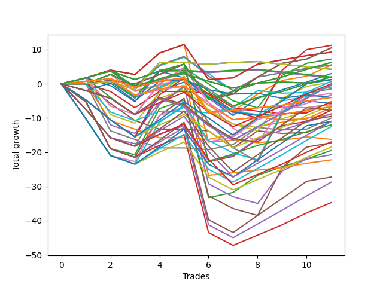

# Long Pointer 004 
- Symbol: ES
- Date Range: 03/18/2022 - 07/15/2022
- Trading Period: 7:20-12:30
- Number of Trades: 11



| Name | Win Percent | Profit | Avg Profit / Trade | Avg Time / Trade |      | Name | Win Percent | Profit | Avg Profit / Trade | Avg Time / Trade |
| ---- | ----------- | ------ | ------------------ | ---------------- | ---- | ---- | ----------- | ------ | ------------------ | ---------------- |
| Sorted By <br> Profit | | | | | | Sorted By <br> Win Percentage ||||
| Forty-Five | 45.45 | 5625.00 | 511.36 | 17:28 |     | Sixty-Seven | 81.82 | 5250.00 | 477.27 | 09:50 |
| Sixty-Seven | 81.82 | 5250.00 | 477.27 | 09:50 |     | Fifty-Nine | 81.82 | 5250.00 | 477.27 | 09:50 |
| Fifty-Nine | 81.82 | 5250.00 | 477.27 | 09:50 |     | Sixty-Five | 81.82 | 4625.00 | 420.45 | 08:00 |
| Sixty-Five | 81.82 | 4625.00 | 420.45 | 08:00 |     | Fifty-Seven | 81.82 | 4625.00 | 420.45 | 08:00 |
| Fifty-Seven | 81.82 | 4625.00 | 420.45 | 08:00 |     | One Hundred Twenty-Seven | 81.82 | 3125.00 | 284.09 | 08:23 |
| Forty-Four | 54.55 | 3625.00 | 329.55 | 14:03 |     | One Hundred Twenty-Two | 81.82 | 3125.00 | 284.09 | 08:23 |
| One Hundred Twenty-Seven | 81.82 | 3125.00 | 284.09 | 08:23 |     | One Hundred Twenty-Six | 81.82 | -2000.00 | -181.82 | 06:16 |
| One Hundred Twenty-Two | 81.82 | 3125.00 | 284.09 | 08:23 |     | One Hundred Twenty-One | 81.82 | -2000.00 | -181.82 | 06:16 |
| Forty-Nine | 72.73 | 2750.00 | 250.00 | 05:18 |     | Three | 81.82 | -3875.00 | -352.27 | 11:34 |
| Forty-Three | 72.73 | 2750.00 | 250.00 | 05:15 |     | One | 81.82 | -4500.00 | -409.09 | 09:44 |
| Forty-One | 72.73 | 2750.00 | 250.00 | 05:19 |     | Eighty-Two | 81.82 | -6000.00 | -545.45 | 10:07 |
| Seventy | 54.55 | 2125.00 | 193.18 | 03:12 |     | Eighty-One | 81.82 | -11125.00 | -1011.36 | 08:00 |
| Sixty-Two | 54.55 | 2125.00 | 193.18 | 03:12 |     | Forty-Nine | 72.73 | 2750.00 | 250.00 | 05:18 |
| Six | 54.55 | 2125.00 | 193.18 | 03:12 |     | Forty-Three | 72.73 | 2750.00 | 250.00 | 05:15 |
| Forty-Two | 54.55 | 1500.00 | 136.36 | 10:12 |     | Forty-One | 72.73 | 2750.00 | 250.00 | 05:19 |
| One Hundred Seventeen | 72.73 | 1000.00 | 90.91 | 03:39 |     | One Hundred Seventeen | 72.73 | 1000.00 | 90.91 | 03:39 |
| One Hundred Twelve | 72.73 | 1000.00 | 90.91 | 03:40 |     | One Hundred Twelve | 72.73 | 1000.00 | 90.91 | 03:40 |
| Fifty-Four | 54.55 | 1000.00 | 90.91 | 00:36 |     | One Hundred Sixteen | 72.73 | -3375.00 | -306.82 | 02:15 |
| Forty-Six | 54.55 | 875.00 | 79.55 | 00:36 |     | One Hundred Eleven | 72.73 | -3375.00 | -306.82 | 02:16 |
| Sixty-Four | 63.64 | 625.00 | 56.82 | 04:20 |     | Sixty-Four | 63.64 | 625.00 | 56.82 | 04:20 |
| Fifty-Six | 63.64 | 625.00 | 56.82 | 04:20 |     | Fifty-Six | 63.64 | 625.00 | 56.82 | 04:20 |
| Zero | 63.64 | 625.00 | 56.82 | 04:20 |     | Zero | 63.64 | 625.00 | 56.82 | 04:20 |
| One Hundred Fifteen | 54.55 | 625.00 | 56.82 | 12:08 |     | Seventy-One | 63.64 | 375.00 | 34.09 | 10:00 |
| Seventy-One | 63.64 | 375.00 | 34.09 | 10:00 |     | Fifty-One | 63.64 | -250.00 | -22.73 | 04:57 |
| Sixty | 54.55 | 250.00 | 22.73 | 20:40 |     | Fifty-Eight | 63.64 | -1625.00 | -147.73 | 15:50 |
| One Hundred Eighteen | 54.55 | 0.00 | 0.00 | 07:09 |     | Forty-Eight | 63.64 | -3000.00 | -272.73 | 02:06 |
| One Hundred Fourteen | 54.55 | -125.00 | -11.36 | 09:20 |     | Forty | 63.64 | -3000.00 | -272.73 | 02:07 |
| One Hundred Ninteen | 45.45 | -125.00 | -11.36 | 08:44 |     | Sixty-Six | 63.64 | -4375.00 | -397.73 | 15:02 |
| Fifty-One | 63.64 | -250.00 | -22.73 | 04:57 |     | Two | 63.64 | -9750.00 | -886.36 | 19:17 |
| Sixty-One | 45.45 | -500.00 | -45.45 | 24:16 |     | Forty-Four | 54.55 | 3625.00 | 329.55 | 14:03 |
| Sixty-Nine | 45.45 | -750.00 | -68.18 | 22:15 |     | Seventy | 54.55 | 2125.00 | 193.18 | 03:12 |
| Sixty-Eight | 54.55 | -1375.00 | -125.00 | 18:46 |     | Sixty-Two | 54.55 | 2125.00 | 193.18 | 03:12 |
| Fifty-Eight | 63.64 | -1625.00 | -147.73 | 15:50 |     | Six | 54.55 | 2125.00 | 193.18 | 03:12 |
| One Hundred Twenty-Six | 81.82 | -2000.00 | -181.82 | 06:16 |     | Forty-Two | 54.55 | 1500.00 | 136.36 | 10:12 |
| One Hundred Twenty-One | 81.82 | -2000.00 | -181.82 | 06:16 |     | Fifty-Four | 54.55 | 1000.00 | 90.91 | 00:36 |
| Seventy-Three | 45.45 | -2000.00 | -181.82 | 07:05 |     | Forty-Six | 54.55 | 875.00 | 79.55 | 00:36 |
| Fifty-Five | 45.45 | -2625.00 | -238.64 | 03:44 |     | One Hundred Fifteen | 54.55 | 625.00 | 56.82 | 12:08 |
| Fifty | 45.45 | -2750.00 | -250.00 | 07:44 |     | Sixty | 54.55 | 250.00 | 22.73 | 20:40 |
| Fifty-Two | 36.36 | -2875.00 | -261.36 | 09:25 |     | One Hundred Eighteen | 54.55 | 0.00 | 0.00 | 07:09 |
| Forty-Eight | 63.64 | -3000.00 | -272.73 | 02:06 |     | One Hundred Fourteen | 54.55 | -125.00 | -11.36 | 09:20 |
| Forty | 63.64 | -3000.00 | -272.73 | 02:07 |     | Sixty-Eight | 54.55 | -1375.00 | -125.00 | 18:46 |
| One Hundred Thirteen | 54.55 | -3125.00 | -284.09 | 07:34 |     | One Hundred Thirteen | 54.55 | -3125.00 | -284.09 | 07:34 |
| One Hundred Sixteen | 72.73 | -3375.00 | -306.82 | 02:15 |     | Sixty-Three | 54.55 | -3500.00 | -318.18 | 11:07 |
| One Hundred Eleven | 72.73 | -3375.00 | -306.82 | 02:16 |     | One Hundred Thirty | 54.55 | -4750.00 | -431.82 | 18:12 |
| Sixty-Three | 54.55 | -3500.00 | -318.18 | 11:07 |     | Seven | 54.55 | -5000.00 | -454.55 | 11:39 |
| Three | 81.82 | -3875.00 | -352.27 | 11:34 |     | One Hundred Twenty-Nine | 54.55 | -5500.00 | -500.00 | 15:25 |
| One Hundred Twenty | 27.27 | -3875.00 | -352.27 | 10:07 |     | One Hundred Twenty-Five | 54.55 | -5500.00 | -500.00 | 18:56 |
| Sixty-Six | 63.64 | -4375.00 | -397.73 | 15:02 |     | One Hundred Twenty-Four | 54.55 | -6250.00 | -568.18 | 16:09 |
| One | 81.82 | -4500.00 | -409.09 | 09:44 |     | One Hundred Twenty-Eight | 54.55 | -8500.00 | -772.73 | 13:39 |
| One Hundred Thirty | 54.55 | -4750.00 | -431.82 | 18:12 |     | One Hundred Twenty-Three | 54.55 | -9250.00 | -840.91 | 14:22 |
| Seven | 54.55 | -5000.00 | -454.55 | 11:39 |     | Four | 54.55 | -10375.00 | -943.18 | 22:55 |
| One Hundred Twenty-Nine | 54.55 | -5500.00 | -500.00 | 15:25 |     | Eighty-Five | 54.55 | -13625.00 | -1238.64 | 22:24 |
| One Hundred Twenty-Five | 54.55 | -5500.00 | -500.00 | 18:56 |     | Eighty-Four | 54.55 | -14375.00 | -1306.82 | 19:36 |
| Forty-Seven | 45.45 | -5500.00 | -500.00 | 06:20 |     | Eighty-Three | 54.55 | -17375.00 | -1579.55 | 17:50 |
| Eighty-Two | 81.82 | -6000.00 | -545.45 | 10:07 |     | Forty-Five | 45.45 | 5625.00 | 511.36 | 17:28 |
| One Hundred Twenty-Four | 54.55 | -6250.00 | -568.18 | 16:09 |     | One Hundred Ninteen | 45.45 | -125.00 | -11.36 | 08:44 |
| Fifty-Three | 27.27 | -8125.00 | -738.64 | 10:40 |     | Sixty-One | 45.45 | -500.00 | -45.45 | 24:16 |
| One Hundred Twenty-Eight | 54.55 | -8500.00 | -772.73 | 13:39 |     | Sixty-Nine | 45.45 | -750.00 | -68.18 | 22:15 |
| Five | 45.45 | -8625.00 | -784.09 | 27:44 |     | Seventy-Three | 45.45 | -2000.00 | -181.82 | 07:05 |
| One Hundred Twenty-Three | 54.55 | -9250.00 | -840.91 | 14:22 |     | Fifty-Five | 45.45 | -2625.00 | -238.64 | 03:44 |
| Two | 63.64 | -9750.00 | -886.36 | 19:17 |     | Fifty | 45.45 | -2750.00 | -250.00 | 07:44 |
| Four | 54.55 | -10375.00 | -943.18 | 22:55 |     | Forty-Seven | 45.45 | -5500.00 | -500.00 | 06:20 |
| Eighty-One | 81.82 | -11125.00 | -1011.36 | 08:00 |     | Five | 45.45 | -8625.00 | -784.09 | 27:44 |
| Eighty-Five | 54.55 | -13625.00 | -1238.64 | 22:24 |     | Fifty-Two | 36.36 | -2875.00 | -261.36 | 09:25 |
| Eighty-Four | 54.55 | -14375.00 | -1306.82 | 19:36 |     | One Hundred Twenty | 27.27 | -3875.00 | -352.27 | 10:07 |
| Eighty-Three | 54.55 | -17375.00 | -1579.55 | 17:50 |     | Fifty-Three | 27.27 | -8125.00 | -738.64 | 10:40 |

## NO STOPLOSS

### Test Zero
* Sell when price hits the middle line of the 20p bollinger
* No Stoploss
* Results:
```
Total Trades: 11
Percent Up: 63.64
Percent Down: 36.36
Total Points Moved Up: 1.25
Potential Profit: 625.00
Total Points Ups: 9.00 Count Ups: 7
Total Points Downs: -7.75 Count Downs: 4
```

<details><summary>Trades</summary>

<code>In: 2022-03-22 11:11:00		Out: 2022-03-22 11:11:20		Total Position Time: 00:20		Total Move Up: 0.00		Total to Date: 0.00</code> <br />
<code>In: 2022-03-28 08:11:00		Out: 2022-03-28 08:11:45		Total Position Time: 00:45		Total Move Up: 2.75		Total to Date: 2.75</code> <br />
<code>In: 2022-04-12 07:47:00		Out: 2022-04-12 08:02:05		Total Position Time: 15:05		Total Move Up: -3.25		Total to Date: -0.50</code> <br />
<code>In: 2022-05-19 10:19:00		Out: 2022-05-19 10:19:20		Total Position Time: 00:20		Total Move Up: 1.75		Total to Date: 1.25</code> <br />
<code>In: 2022-05-26 10:32:00		Out: 2022-05-26 10:33:55		Total Position Time: 01:55		Total Move Up: 1.75		Total to Date: 3.00</code> <br />
<code>In: 2022-05-31 11:31:00		Out: 2022-05-31 11:38:05		Total Position Time: 07:05		Total Move Up: -2.25		Total to Date: 0.75</code> <br />
<code>In: 2022-06-22 11:46:00		Out: 2022-06-22 11:55:25		Total Position Time: 09:25		Total Move Up: -2.00		Total to Date: -1.25</code> <br />
<code>In: 2022-06-22 11:55:00		Out: 2022-06-22 11:55:25		Total Position Time: 00:25		Total Move Up: 1.50		Total to Date: 0.25</code> <br />
<code>In: 2022-07-05 09:53:00		Out: 2022-07-05 10:01:20		Total Position Time: 08:20		Total Move Up: 0.25		Total to Date: 0.50</code> <br />
<code>In: 2022-07-07 08:35:00		Out: 2022-07-07 08:37:00		Total Position Time: 02:00		Total Move Up: -0.25		Total to Date: 0.25</code> <br />
<code>In: 2022-07-15 11:08:00		Out: 2022-07-15 11:10:05		Total Position Time: 02:05		Total Move Up: 1.00		Total to Date: 1.25</code> <br />


</details>

### Test One
* Sell when the price hits the upper line of the 20p 1std bollinger
* No Stoploss
* Results:
```
Total Trades: 11
Percent Up: 81.82
Percent Down: 18.18
Total Points Moved Up: -9.00
Potential Profit: -4500.00
Total Points Ups: 20.75 Count Ups: 9
Total Points Downs: -29.75 Count Downs: 2
```

<details><summary>Trades</summary>

<code>In: 2022-03-22 11:11:00		Out: 2022-03-22 11:18:25		Total Position Time: 07:25		Total Move Up: 1.75		Total to Date: 1.75</code> <br />
<code>In: 2022-03-28 08:11:00		Out: 2022-03-28 08:20:05		Total Position Time: 09:05		Total Move Up: 2.25		Total to Date: 4.00</code> <br />
<code>In: 2022-04-12 07:47:00		Out: 2022-04-12 08:02:35		Total Position Time: 15:35		Total Move Up: -1.25		Total to Date: 2.75</code> <br />
<code>In: 2022-05-19 10:19:00		Out: 2022-05-19 10:22:45		Total Position Time: 03:45		Total Move Up: 6.25		Total to Date: 9.00</code> <br />
<code>In: 2022-05-26 10:32:00		Out: 2022-05-26 10:41:05		Total Position Time: 09:05		Total Move Up: 2.50		Total to Date: 11.50</code> <br />
<code>In: 2022-05-31 11:31:00		Out: 2022-05-31 12:00:55		Total Position Time: 29:55		Total Move Up: -28.50		Total to Date: -17.00</code> <br />
<code>In: 2022-06-22 11:46:00		Out: 2022-06-22 11:56:20		Total Position Time: 10:20		Total Move Up: 0.50		Total to Date: -16.50</code> <br />
<code>In: 2022-06-22 11:55:00		Out: 2022-06-22 11:56:20		Total Position Time: 01:20		Total Move Up: 4.00		Total to Date: -12.50</code> <br />
<code>In: 2022-07-05 09:53:00		Out: 2022-07-05 10:03:05		Total Position Time: 10:05		Total Move Up: 1.25		Total to Date: -11.25</code> <br />
<code>In: 2022-07-07 08:35:00		Out: 2022-07-07 08:39:05		Total Position Time: 04:05		Total Move Up: 1.25		Total to Date: -10.00</code> <br />
<code>In: 2022-07-15 11:08:00		Out: 2022-07-15 11:14:25		Total Position Time: 06:25		Total Move Up: 1.00		Total to Date: -9.00</code> <br />


</details>

### Test Two
* Sell when the price hits the upper line of the 20p 2std bollinger
* No Stoploss
* Results:
```
Total Trades: 11
Percent Up: 63.64
Percent Down: 36.36
Total Points Moved Up: -19.50
Potential Profit: -9750.00
Total Points Ups: 29.75 Count Ups: 7
Total Points Downs: -49.25 Count Downs: 4
```

<details><summary>Trades</summary>

<code>In: 2022-03-22 11:11:00		Out: 2022-03-22 11:40:55		Total Position Time: 29:55		Total Move Up: -5.25		Total to Date: -5.25</code> <br />
<code>In: 2022-03-28 08:11:00		Out: 2022-03-28 08:40:55		Total Position Time: 29:55		Total Move Up: -13.75		Total to Date: -19.00</code> <br />
<code>In: 2022-04-12 07:47:00		Out: 2022-04-12 08:15:45		Total Position Time: 28:45		Total Move Up: -1.75		Total to Date: -20.75</code> <br />
<code>In: 2022-05-19 10:19:00		Out: 2022-05-19 10:44:05		Total Position Time: 25:05		Total Move Up: 13.50		Total to Date: -7.25</code> <br />
<code>In: 2022-05-26 10:32:00		Out: 2022-05-26 10:46:25		Total Position Time: 14:25		Total Move Up: 2.50		Total to Date: -4.75</code> <br />
<code>In: 2022-05-31 11:31:00		Out: 2022-05-31 12:00:55		Total Position Time: 29:55		Total Move Up: -28.50		Total to Date: -33.25</code> <br />
<code>In: 2022-06-22 11:46:00		Out: 2022-06-22 12:04:10		Total Position Time: 18:10		Total Move Up: 1.50		Total to Date: -31.75</code> <br />
<code>In: 2022-06-22 11:55:00		Out: 2022-06-22 12:04:10		Total Position Time: 09:10		Total Move Up: 5.00		Total to Date: -26.75</code> <br />
<code>In: 2022-07-05 09:53:00		Out: 2022-07-05 10:04:15		Total Position Time: 11:15		Total Move Up: 2.50		Total to Date: -24.25</code> <br />
<code>In: 2022-07-07 08:35:00		Out: 2022-07-07 08:43:45		Total Position Time: 08:45		Total Move Up: 2.25		Total to Date: -22.00</code> <br />
<code>In: 2022-07-15 11:08:00		Out: 2022-07-15 11:14:55		Total Position Time: 06:55		Total Move Up: 2.50		Total to Date: -19.50</code> <br />


</details>

### Test Three
* Sell when price hits the middle line of the 50p bollinger
* No Stoploss
* Results:
```
Total Trades: 11
Percent Up: 81.82
Percent Down: 18.18
Total Points Moved Up: -7.75
Potential Profit: -3875.00
Total Points Ups: 21.75 Count Ups: 9
Total Points Downs: -29.50 Count Downs: 2
```

<details><summary>Trades</summary>

<code>In: 2022-03-22 11:11:00		Out: 2022-03-22 11:11:10		Total Position Time: 00:10		Total Move Up: 0.00		Total to Date: 0.00</code> <br />
<code>In: 2022-03-28 08:11:00		Out: 2022-03-28 08:11:20		Total Position Time: 00:20		Total Move Up: 1.00		Total to Date: 1.00</code> <br />
<code>In: 2022-04-12 07:47:00		Out: 2022-04-12 08:15:40		Total Position Time: 28:40		Total Move Up: -1.00		Total to Date: 0.00</code> <br />
<code>In: 2022-05-19 10:19:00		Out: 2022-05-19 10:20:05		Total Position Time: 01:05		Total Move Up: 2.75		Total to Date: 2.75</code> <br />
<code>In: 2022-05-26 10:32:00		Out: 2022-05-26 10:48:40		Total Position Time: 16:40		Total Move Up: 3.00		Total to Date: 5.75</code> <br />
<code>In: 2022-05-31 11:31:00		Out: 2022-05-31 12:00:55		Total Position Time: 29:55		Total Move Up: -28.50		Total to Date: -22.75</code> <br />
<code>In: 2022-06-22 11:46:00		Out: 2022-06-22 12:04:10		Total Position Time: 18:10		Total Move Up: 1.50		Total to Date: -21.25</code> <br />
<code>In: 2022-06-22 11:55:00		Out: 2022-06-22 12:04:10		Total Position Time: 09:10		Total Move Up: 5.00		Total to Date: -16.25</code> <br />
<code>In: 2022-07-05 09:53:00		Out: 2022-07-05 10:04:45		Total Position Time: 11:45		Total Move Up: 4.00		Total to Date: -12.25</code> <br />
<code>In: 2022-07-07 08:35:00		Out: 2022-07-07 08:39:05		Total Position Time: 04:05		Total Move Up: 1.25		Total to Date: -11.00</code> <br />
<code>In: 2022-07-15 11:08:00		Out: 2022-07-15 11:15:20		Total Position Time: 07:20		Total Move Up: 3.25		Total to Date: -7.75</code> <br />


</details>

### Test Four
* Sell when the price hits the upper line of the 50p 1std bollinger
* No Stoploss
* Results:
```
Total Trades: 11
Percent Up: 54.55
Percent Down: 45.45
Total Points Moved Up: -20.75
Potential Profit: -10375.00
Total Points Ups: 29.75 Count Ups: 6
Total Points Downs: -50.50 Count Downs: 5
```

<details><summary>Trades</summary>

<code>In: 2022-03-22 11:11:00		Out: 2022-03-22 11:18:25		Total Position Time: 07:25		Total Move Up: 1.75		Total to Date: 1.75</code> <br />
<code>In: 2022-03-28 08:11:00		Out: 2022-03-28 08:40:55		Total Position Time: 29:55		Total Move Up: -13.75		Total to Date: -12.00</code> <br />
<code>In: 2022-04-12 07:47:00		Out: 2022-04-12 08:16:55		Total Position Time: 29:55		Total Move Up: -2.50		Total to Date: -14.50</code> <br />
<code>In: 2022-05-19 10:19:00		Out: 2022-05-19 10:23:25		Total Position Time: 04:25		Total Move Up: 9.00		Total to Date: -5.50</code> <br />
<code>In: 2022-05-26 10:32:00		Out: 2022-05-26 10:58:45		Total Position Time: 26:45		Total Move Up: 4.75		Total to Date: -0.75</code> <br />
<code>In: 2022-05-31 11:31:00		Out: 2022-05-31 12:00:55		Total Position Time: 29:55		Total Move Up: -28.50		Total to Date: -29.25</code> <br />
<code>In: 2022-06-22 11:46:00		Out: 2022-06-22 12:15:55		Total Position Time: 29:55		Total Move Up: -3.75		Total to Date: -33.00</code> <br />
<code>In: 2022-06-22 11:55:00		Out: 2022-06-22 12:24:55		Total Position Time: 29:55		Total Move Up: -2.00		Total to Date: -35.00</code> <br />
<code>In: 2022-07-05 09:53:00		Out: 2022-07-05 10:17:45		Total Position Time: 24:45		Total Move Up: 9.50		Total to Date: -25.50</code> <br />
<code>In: 2022-07-07 08:35:00		Out: 2022-07-07 08:44:25		Total Position Time: 09:25		Total Move Up: 3.50		Total to Date: -22.00</code> <br />
<code>In: 2022-07-15 11:08:00		Out: 2022-07-15 11:37:55		Total Position Time: 29:55		Total Move Up: 1.25		Total to Date: -20.75</code> <br />


</details>

### Test Five
* Sell when the price hits the upper line of the 50p 2std bollinger
* No Stoploss
* Results:
```
Total Trades: 11
Percent Up: 45.45
Percent Down: 54.55
Total Points Moved Up: -17.25
Potential Profit: -8625.00
Total Points Ups: 38.50 Count Ups: 5
Total Points Downs: -55.75 Count Downs: 6
```

<details><summary>Trades</summary>

<code>In: 2022-03-22 11:11:00		Out: 2022-03-22 11:40:55		Total Position Time: 29:55		Total Move Up: -5.25		Total to Date: -5.25</code> <br />
<code>In: 2022-03-28 08:11:00		Out: 2022-03-28 08:40:55		Total Position Time: 29:55		Total Move Up: -13.75		Total to Date: -19.00</code> <br />
<code>In: 2022-04-12 07:47:00		Out: 2022-04-12 08:16:55		Total Position Time: 29:55		Total Move Up: -2.50		Total to Date: -21.50</code> <br />
<code>In: 2022-05-19 10:19:00		Out: 2022-05-19 10:31:30		Total Position Time: 12:30		Total Move Up: 12.25		Total to Date: -9.25</code> <br />
<code>In: 2022-05-26 10:32:00		Out: 2022-05-26 11:01:55		Total Position Time: 29:55		Total Move Up: 5.00		Total to Date: -4.25</code> <br />
<code>In: 2022-05-31 11:31:00		Out: 2022-05-31 12:00:55		Total Position Time: 29:55		Total Move Up: -28.50		Total to Date: -32.75</code> <br />
<code>In: 2022-06-22 11:46:00		Out: 2022-06-22 12:15:55		Total Position Time: 29:55		Total Move Up: -3.75		Total to Date: -36.50</code> <br />
<code>In: 2022-06-22 11:55:00		Out: 2022-06-22 12:24:55		Total Position Time: 29:55		Total Move Up: -2.00		Total to Date: -38.50</code> <br />
<code>In: 2022-07-05 09:53:00		Out: 2022-07-05 10:19:15		Total Position Time: 26:15		Total Move Up: 14.00		Total to Date: -24.50</code> <br />
<code>In: 2022-07-07 08:35:00		Out: 2022-07-07 09:02:00		Total Position Time: 27:00		Total Move Up: 6.00		Total to Date: -18.50</code> <br />
<code>In: 2022-07-15 11:08:00		Out: 2022-07-15 11:37:55		Total Position Time: 29:55		Total Move Up: 1.25		Total to Date: -17.25</code> <br />


</details>

### Test Six
* Sell when the price hits the middle line of the 1std VWAP
* No Stoploss
* Results:
```
Total Trades: 11
Percent Up: 54.55
Percent Down: 45.45
Total Points Moved Up: 4.25
Potential Profit: 2125.00
Total Points Ups: 9.50 Count Ups: 6
Total Points Downs: -5.25 Count Downs: 5
```

<details><summary>Trades</summary>

<code>In: 2022-03-22 11:11:00		Out: 2022-03-22 11:11:10		Total Position Time: 00:10		Total Move Up: 0.00		Total to Date: 0.00</code> <br />
<code>In: 2022-03-28 08:11:00		Out: 2022-03-28 08:11:10		Total Position Time: 00:10		Total Move Up: 0.75		Total to Date: 0.75</code> <br />
<code>In: 2022-04-12 07:47:00		Out: 2022-04-12 08:16:55		Total Position Time: 29:55		Total Move Up: -2.50		Total to Date: -1.75</code> <br />
<code>In: 2022-05-19 10:19:00		Out: 2022-05-19 10:22:55		Total Position Time: 03:55		Total Move Up: 8.00		Total to Date: 6.25</code> <br />
<code>In: 2022-05-26 10:32:00		Out: 2022-05-26 10:32:10		Total Position Time: 00:10		Total Move Up: 0.00		Total to Date: 6.25</code> <br />
<code>In: 2022-05-31 11:31:00		Out: 2022-05-31 11:31:10		Total Position Time: 00:10		Total Move Up: -0.50		Total to Date: 5.75</code> <br />
<code>In: 2022-06-22 11:46:00		Out: 2022-06-22 11:46:10		Total Position Time: 00:10		Total Move Up: 0.50		Total to Date: 6.25</code> <br />
<code>In: 2022-06-22 11:55:00		Out: 2022-06-22 11:55:10		Total Position Time: 00:10		Total Move Up: 0.25		Total to Date: 6.50</code> <br />
<code>In: 2022-07-05 09:53:00		Out: 2022-07-05 09:53:10		Total Position Time: 00:10		Total Move Up: -0.75		Total to Date: 5.75</code> <br />
<code>In: 2022-07-07 08:35:00		Out: 2022-07-07 08:35:10		Total Position Time: 00:10		Total Move Up: -0.75		Total to Date: 5.00</code> <br />
<code>In: 2022-07-15 11:08:00		Out: 2022-07-15 11:08:10		Total Position Time: 00:10		Total Move Up: -0.75		Total to Date: 4.25</code> <br />


</details>

### Test Seven
* Sell when the price hits the upper line of the 1std VWAP
* No Stoploss
* Results:
```
Total Trades: 11
Percent Up: 54.55
Percent Down: 45.45
Total Points Moved Up: -10.00
Potential Profit: -5000.00
Total Points Ups: 10.00 Count Ups: 6
Total Points Downs: -20.00 Count Downs: 5
```

<details><summary>Trades</summary>

<code>In: 2022-03-22 11:11:00		Out: 2022-03-22 11:11:10		Total Position Time: 00:10		Total Move Up: 0.00		Total to Date: 0.00</code> <br />
<code>In: 2022-03-28 08:11:00		Out: 2022-03-28 08:40:55		Total Position Time: 29:55		Total Move Up: -13.75		Total to Date: -13.75</code> <br />
<code>In: 2022-04-12 07:47:00		Out: 2022-04-12 08:16:55		Total Position Time: 29:55		Total Move Up: -2.50		Total to Date: -16.25</code> <br />
<code>In: 2022-05-19 10:19:00		Out: 2022-05-19 10:48:55		Total Position Time: 29:55		Total Move Up: -2.50		Total to Date: -18.75</code> <br />
<code>In: 2022-05-26 10:32:00		Out: 2022-05-26 10:32:10		Total Position Time: 00:10		Total Move Up: 0.00		Total to Date: -18.75</code> <br />
<code>In: 2022-05-31 11:31:00		Out: 2022-05-31 11:31:10		Total Position Time: 00:10		Total Move Up: -0.50		Total to Date: -19.25</code> <br />
<code>In: 2022-06-22 11:46:00		Out: 2022-06-22 12:04:10		Total Position Time: 18:10		Total Move Up: 1.50		Total to Date: -17.75</code> <br />
<code>In: 2022-06-22 11:55:00		Out: 2022-06-22 12:04:10		Total Position Time: 09:10		Total Move Up: 5.00		Total to Date: -12.75</code> <br />
<code>In: 2022-07-05 09:53:00		Out: 2022-07-05 09:53:10		Total Position Time: 00:10		Total Move Up: -0.75		Total to Date: -13.50</code> <br />
<code>In: 2022-07-07 08:35:00		Out: 2022-07-07 08:38:05		Total Position Time: 03:05		Total Move Up: 0.25		Total to Date: -13.25</code> <br />
<code>In: 2022-07-15 11:08:00		Out: 2022-07-15 11:15:20		Total Position Time: 07:20		Total Move Up: 3.25		Total to Date: -10.00</code> <br />


</details>

## STOPLOSS OF 5

### Test Forty
* Sell when price hits the middle line of the 20p bollinger
* Stoploss is 5 points
* Results:
```
Total Trades: 11
Percent Up: 63.64
Percent Down: 36.36
Total Points Moved Up: -6.00
Potential Profit: -3000.00
Total Points Ups: 9.00 Count Ups: 7
Total Points Downs: -15.00 Count Downs: 4
```

<details><summary>Trades</summary>

<code>In: 2022-03-22 11:11:00		Out: 2022-03-22 11:11:20		Total Position Time: 00:20		Total Move Up: 0.00		Total to Date: 0.00</code> <br />
<code>In: 2022-03-28 08:11:00		Out: 2022-03-28 08:11:45		Total Position Time: 00:45		Total Move Up: 2.75		Total to Date: 2.75</code> <br />
<code>In: 2022-04-12 07:47:00		Out: 2022-04-12 07:48:20		Total Position Time: 01:20		Total Move Up: -5.00		Total to Date: -2.25</code> <br />
<code>In: 2022-05-19 10:19:00		Out: 2022-05-19 10:19:20		Total Position Time: 00:20		Total Move Up: 1.75		Total to Date: -0.50</code> <br />
<code>In: 2022-05-26 10:32:00		Out: 2022-05-26 10:33:55		Total Position Time: 01:55		Total Move Up: 1.75		Total to Date: 1.25</code> <br />
<code>In: 2022-05-31 11:31:00		Out: 2022-05-31 11:33:25		Total Position Time: 02:25		Total Move Up: -4.75		Total to Date: -3.50</code> <br />
<code>In: 2022-06-22 11:46:00		Out: 2022-06-22 11:49:30		Total Position Time: 03:30		Total Move Up: -5.00		Total to Date: -8.50</code> <br />
<code>In: 2022-06-22 11:55:00		Out: 2022-06-22 11:55:25		Total Position Time: 00:25		Total Move Up: 1.50		Total to Date: -7.00</code> <br />
<code>In: 2022-07-05 09:53:00		Out: 2022-07-05 10:01:20		Total Position Time: 08:20		Total Move Up: 0.25		Total to Date: -6.75</code> <br />
<code>In: 2022-07-07 08:35:00		Out: 2022-07-07 08:37:00		Total Position Time: 02:00		Total Move Up: -0.25		Total to Date: -7.00</code> <br />
<code>In: 2022-07-15 11:08:00		Out: 2022-07-15 11:10:05		Total Position Time: 02:05		Total Move Up: 1.00		Total to Date: -6.00</code> <br />


</details>

### Test Forty-One
* Sell when the price hits the upper line of the 20p 1std bollinger
* Stoploss is 5 points
* Results:
```
Total Trades: 11
Percent Up: 72.73
Percent Down: 27.27
Total Points Moved Up: 5.50
Potential Profit: 2750.00
Total Points Ups: 20.25 Count Ups: 8
Total Points Downs: -14.75 Count Downs: 3
```

<details><summary>Trades</summary>

<code>In: 2022-03-22 11:11:00		Out: 2022-03-22 11:18:25		Total Position Time: 07:25		Total Move Up: 1.75		Total to Date: 1.75</code> <br />
<code>In: 2022-03-28 08:11:00		Out: 2022-03-28 08:20:05		Total Position Time: 09:05		Total Move Up: 2.25		Total to Date: 4.00</code> <br />
<code>In: 2022-04-12 07:47:00		Out: 2022-04-12 07:48:20		Total Position Time: 01:20		Total Move Up: -5.00		Total to Date: -1.00</code> <br />
<code>In: 2022-05-19 10:19:00		Out: 2022-05-19 10:22:45		Total Position Time: 03:45		Total Move Up: 6.25		Total to Date: 5.25</code> <br />
<code>In: 2022-05-26 10:32:00		Out: 2022-05-26 10:41:05		Total Position Time: 09:05		Total Move Up: 2.50		Total to Date: 7.75</code> <br />
<code>In: 2022-05-31 11:31:00		Out: 2022-05-31 11:33:25		Total Position Time: 02:25		Total Move Up: -4.75		Total to Date: 3.00</code> <br />
<code>In: 2022-06-22 11:46:00		Out: 2022-06-22 11:49:30		Total Position Time: 03:30		Total Move Up: -5.00		Total to Date: -2.00</code> <br />
<code>In: 2022-06-22 11:55:00		Out: 2022-06-22 11:56:20		Total Position Time: 01:20		Total Move Up: 4.00		Total to Date: 2.00</code> <br />
<code>In: 2022-07-05 09:53:00		Out: 2022-07-05 10:03:05		Total Position Time: 10:05		Total Move Up: 1.25		Total to Date: 3.25</code> <br />
<code>In: 2022-07-07 08:35:00		Out: 2022-07-07 08:39:05		Total Position Time: 04:05		Total Move Up: 1.25		Total to Date: 4.50</code> <br />
<code>In: 2022-07-15 11:08:00		Out: 2022-07-15 11:14:25		Total Position Time: 06:25		Total Move Up: 1.00		Total to Date: 5.50</code> <br />


</details>

### Test Forty-Two
* Sell when the price hits the upper line of the 20p 2std bollinger
* Stoploss is 5 points
* Results:
```
Total Trades: 11
Percent Up: 54.55
Percent Down: 45.45
Total Points Moved Up: 3.00
Potential Profit: 1500.00
Total Points Ups: 28.25 Count Ups: 6
Total Points Downs: -25.25 Count Downs: 5
```

<details><summary>Trades</summary>

<code>In: 2022-03-22 11:11:00		Out: 2022-03-22 11:25:35		Total Position Time: 14:35		Total Move Up: -4.75		Total to Date: -4.75</code> <br />
<code>In: 2022-03-28 08:11:00		Out: 2022-03-28 08:25:50		Total Position Time: 14:50		Total Move Up: -5.75		Total to Date: -10.50</code> <br />
<code>In: 2022-04-12 07:47:00		Out: 2022-04-12 07:48:20		Total Position Time: 01:20		Total Move Up: -5.00		Total to Date: -15.50</code> <br />
<code>In: 2022-05-19 10:19:00		Out: 2022-05-19 10:44:05		Total Position Time: 25:05		Total Move Up: 13.50		Total to Date: -2.00</code> <br />
<code>In: 2022-05-26 10:32:00		Out: 2022-05-26 10:46:25		Total Position Time: 14:25		Total Move Up: 2.50		Total to Date: 0.50</code> <br />
<code>In: 2022-05-31 11:31:00		Out: 2022-05-31 11:33:25		Total Position Time: 02:25		Total Move Up: -4.75		Total to Date: -4.25</code> <br />
<code>In: 2022-06-22 11:46:00		Out: 2022-06-22 11:49:30		Total Position Time: 03:30		Total Move Up: -5.00		Total to Date: -9.25</code> <br />
<code>In: 2022-06-22 11:55:00		Out: 2022-06-22 12:04:10		Total Position Time: 09:10		Total Move Up: 5.00		Total to Date: -4.25</code> <br />
<code>In: 2022-07-05 09:53:00		Out: 2022-07-05 10:04:15		Total Position Time: 11:15		Total Move Up: 2.50		Total to Date: -1.75</code> <br />
<code>In: 2022-07-07 08:35:00		Out: 2022-07-07 08:43:45		Total Position Time: 08:45		Total Move Up: 2.25		Total to Date: 0.50</code> <br />
<code>In: 2022-07-15 11:08:00		Out: 2022-07-15 11:14:55		Total Position Time: 06:55		Total Move Up: 2.50		Total to Date: 3.00</code> <br />


</details>

### Test Forty-Three
* Sell when price hits the middle line of the 50p bollinger
* Stoploss is 5 points
* Results:
```
Total Trades: 11
Percent Up: 72.73
Percent Down: 27.27
Total Points Moved Up: 5.50
Potential Profit: 2750.00
Total Points Ups: 20.25 Count Ups: 8
Total Points Downs: -14.75 Count Downs: 3
```

<details><summary>Trades</summary>

<code>In: 2022-03-22 11:11:00		Out: 2022-03-22 11:11:10		Total Position Time: 00:10		Total Move Up: 0.00		Total to Date: 0.00</code> <br />
<code>In: 2022-03-28 08:11:00		Out: 2022-03-28 08:11:20		Total Position Time: 00:20		Total Move Up: 1.00		Total to Date: 1.00</code> <br />
<code>In: 2022-04-12 07:47:00		Out: 2022-04-12 07:48:20		Total Position Time: 01:20		Total Move Up: -5.00		Total to Date: -4.00</code> <br />
<code>In: 2022-05-19 10:19:00		Out: 2022-05-19 10:20:05		Total Position Time: 01:05		Total Move Up: 2.75		Total to Date: -1.25</code> <br />
<code>In: 2022-05-26 10:32:00		Out: 2022-05-26 10:48:40		Total Position Time: 16:40		Total Move Up: 3.00		Total to Date: 1.75</code> <br />
<code>In: 2022-05-31 11:31:00		Out: 2022-05-31 11:33:25		Total Position Time: 02:25		Total Move Up: -4.75		Total to Date: -3.00</code> <br />
<code>In: 2022-06-22 11:46:00		Out: 2022-06-22 11:49:30		Total Position Time: 03:30		Total Move Up: -5.00		Total to Date: -8.00</code> <br />
<code>In: 2022-06-22 11:55:00		Out: 2022-06-22 12:04:10		Total Position Time: 09:10		Total Move Up: 5.00		Total to Date: -3.00</code> <br />
<code>In: 2022-07-05 09:53:00		Out: 2022-07-05 10:04:45		Total Position Time: 11:45		Total Move Up: 4.00		Total to Date: 1.00</code> <br />
<code>In: 2022-07-07 08:35:00		Out: 2022-07-07 08:39:05		Total Position Time: 04:05		Total Move Up: 1.25		Total to Date: 2.25</code> <br />
<code>In: 2022-07-15 11:08:00		Out: 2022-07-15 11:15:20		Total Position Time: 07:20		Total Move Up: 3.25		Total to Date: 5.50</code> <br />


</details>

### Test Forty-Four
* Sell when the price hits the upper line of the 50p 1std bollinger
* Stoploss is 5 points
* Results:
```
Total Trades: 11
Percent Up: 54.55
Percent Down: 45.45
Total Points Moved Up: 7.25
Potential Profit: 3625.00
Total Points Ups: 29.75 Count Ups: 6
Total Points Downs: -22.50 Count Downs: 5
```

<details><summary>Trades</summary>

<code>In: 2022-03-22 11:11:00		Out: 2022-03-22 11:18:25		Total Position Time: 07:25		Total Move Up: 1.75		Total to Date: 1.75</code> <br />
<code>In: 2022-03-28 08:11:00		Out: 2022-03-28 08:25:50		Total Position Time: 14:50		Total Move Up: -5.75		Total to Date: -4.00</code> <br />
<code>In: 2022-04-12 07:47:00		Out: 2022-04-12 07:48:20		Total Position Time: 01:20		Total Move Up: -5.00		Total to Date: -9.00</code> <br />
<code>In: 2022-05-19 10:19:00		Out: 2022-05-19 10:23:25		Total Position Time: 04:25		Total Move Up: 9.00		Total to Date: 0.00</code> <br />
<code>In: 2022-05-26 10:32:00		Out: 2022-05-26 10:58:45		Total Position Time: 26:45		Total Move Up: 4.75		Total to Date: 4.75</code> <br />
<code>In: 2022-05-31 11:31:00		Out: 2022-05-31 11:33:25		Total Position Time: 02:25		Total Move Up: -4.75		Total to Date: 0.00</code> <br />
<code>In: 2022-06-22 11:46:00		Out: 2022-06-22 11:49:30		Total Position Time: 03:30		Total Move Up: -5.00		Total to Date: -5.00</code> <br />
<code>In: 2022-06-22 11:55:00		Out: 2022-06-22 12:24:55		Total Position Time: 29:55		Total Move Up: -2.00		Total to Date: -7.00</code> <br />
<code>In: 2022-07-05 09:53:00		Out: 2022-07-05 10:17:45		Total Position Time: 24:45		Total Move Up: 9.50		Total to Date: 2.50</code> <br />
<code>In: 2022-07-07 08:35:00		Out: 2022-07-07 08:44:25		Total Position Time: 09:25		Total Move Up: 3.50		Total to Date: 6.00</code> <br />
<code>In: 2022-07-15 11:08:00		Out: 2022-07-15 11:37:55		Total Position Time: 29:55		Total Move Up: 1.25		Total to Date: 7.25</code> <br />


</details>

### Test Forty-Five
* Sell when the price hits the upper line of the 50p 2std bollinger
* Stoploss is 5 points
* Results:
```
Total Trades: 11
Percent Up: 45.45
Percent Down: 54.55
Total Points Moved Up: 11.25
Potential Profit: 5625.00
Total Points Ups: 38.50 Count Ups: 5
Total Points Downs: -27.25 Count Downs: 6
```

<details><summary>Trades</summary>

<code>In: 2022-03-22 11:11:00		Out: 2022-03-22 11:25:35		Total Position Time: 14:35		Total Move Up: -4.75		Total to Date: -4.75</code> <br />
<code>In: 2022-03-28 08:11:00		Out: 2022-03-28 08:25:50		Total Position Time: 14:50		Total Move Up: -5.75		Total to Date: -10.50</code> <br />
<code>In: 2022-04-12 07:47:00		Out: 2022-04-12 07:48:20		Total Position Time: 01:20		Total Move Up: -5.00		Total to Date: -15.50</code> <br />
<code>In: 2022-05-19 10:19:00		Out: 2022-05-19 10:31:30		Total Position Time: 12:30		Total Move Up: 12.25		Total to Date: -3.25</code> <br />
<code>In: 2022-05-26 10:32:00		Out: 2022-05-26 11:01:55		Total Position Time: 29:55		Total Move Up: 5.00		Total to Date: 1.75</code> <br />
<code>In: 2022-05-31 11:31:00		Out: 2022-05-31 11:33:25		Total Position Time: 02:25		Total Move Up: -4.75		Total to Date: -3.00</code> <br />
<code>In: 2022-06-22 11:46:00		Out: 2022-06-22 11:49:30		Total Position Time: 03:30		Total Move Up: -5.00		Total to Date: -8.00</code> <br />
<code>In: 2022-06-22 11:55:00		Out: 2022-06-22 12:24:55		Total Position Time: 29:55		Total Move Up: -2.00		Total to Date: -10.00</code> <br />
<code>In: 2022-07-05 09:53:00		Out: 2022-07-05 10:19:15		Total Position Time: 26:15		Total Move Up: 14.00		Total to Date: 4.00</code> <br />
<code>In: 2022-07-07 08:35:00		Out: 2022-07-07 09:02:00		Total Position Time: 27:00		Total Move Up: 6.00		Total to Date: 10.00</code> <br />
<code>In: 2022-07-15 11:08:00		Out: 2022-07-15 11:37:55		Total Position Time: 29:55		Total Move Up: 1.25		Total to Date: 11.25</code> <br />


</details>

### Test Forty-Six
* Sell when the price hits the middle line of the 1std VWAP
* Stoploss is 5 points
* Results:
```
Total Trades: 11
Percent Up: 54.55
Percent Down: 45.45
Total Points Moved Up: 1.75
Potential Profit: 875.00
Total Points Ups: 9.50 Count Ups: 6
Total Points Downs: -7.75 Count Downs: 5
```

<details><summary>Trades</summary>

<code>In: 2022-03-22 11:11:00		Out: 2022-03-22 11:11:10		Total Position Time: 00:10		Total Move Up: 0.00		Total to Date: 0.00</code> <br />
<code>In: 2022-03-28 08:11:00		Out: 2022-03-28 08:11:10		Total Position Time: 00:10		Total Move Up: 0.75		Total to Date: 0.75</code> <br />
<code>In: 2022-04-12 07:47:00		Out: 2022-04-12 07:48:20		Total Position Time: 01:20		Total Move Up: -5.00		Total to Date: -4.25</code> <br />
<code>In: 2022-05-19 10:19:00		Out: 2022-05-19 10:22:55		Total Position Time: 03:55		Total Move Up: 8.00		Total to Date: 3.75</code> <br />
<code>In: 2022-05-26 10:32:00		Out: 2022-05-26 10:32:10		Total Position Time: 00:10		Total Move Up: 0.00		Total to Date: 3.75</code> <br />
<code>In: 2022-05-31 11:31:00		Out: 2022-05-31 11:31:10		Total Position Time: 00:10		Total Move Up: -0.50		Total to Date: 3.25</code> <br />
<code>In: 2022-06-22 11:46:00		Out: 2022-06-22 11:46:10		Total Position Time: 00:10		Total Move Up: 0.50		Total to Date: 3.75</code> <br />
<code>In: 2022-06-22 11:55:00		Out: 2022-06-22 11:55:10		Total Position Time: 00:10		Total Move Up: 0.25		Total to Date: 4.00</code> <br />
<code>In: 2022-07-05 09:53:00		Out: 2022-07-05 09:53:10		Total Position Time: 00:10		Total Move Up: -0.75		Total to Date: 3.25</code> <br />
<code>In: 2022-07-07 08:35:00		Out: 2022-07-07 08:35:10		Total Position Time: 00:10		Total Move Up: -0.75		Total to Date: 2.50</code> <br />
<code>In: 2022-07-15 11:08:00		Out: 2022-07-15 11:08:10		Total Position Time: 00:10		Total Move Up: -0.75		Total to Date: 1.75</code> <br />


</details>

### Test Forty-Seven
* Sell when the price hits the upper line of the 1std VWAP
* Stoploss is 5 points
* Results:
```
Total Trades: 11
Percent Up: 45.45
Percent Down: 54.55
Total Points Moved Up: -11.00
Potential Profit: -5500.00
Total Points Ups: 8.50 Count Ups: 5
Total Points Downs: -19.50 Count Downs: 6
```

<details><summary>Trades</summary>

<code>In: 2022-03-22 11:11:00		Out: 2022-03-22 11:11:10		Total Position Time: 00:10		Total Move Up: 0.00		Total to Date: 0.00</code> <br />
<code>In: 2022-03-28 08:11:00		Out: 2022-03-28 08:25:50		Total Position Time: 14:50		Total Move Up: -5.75		Total to Date: -5.75</code> <br />
<code>In: 2022-04-12 07:47:00		Out: 2022-04-12 07:48:20		Total Position Time: 01:20		Total Move Up: -5.00		Total to Date: -10.75</code> <br />
<code>In: 2022-05-19 10:19:00		Out: 2022-05-19 10:48:55		Total Position Time: 29:55		Total Move Up: -2.50		Total to Date: -13.25</code> <br />
<code>In: 2022-05-26 10:32:00		Out: 2022-05-26 10:32:10		Total Position Time: 00:10		Total Move Up: 0.00		Total to Date: -13.25</code> <br />
<code>In: 2022-05-31 11:31:00		Out: 2022-05-31 11:31:10		Total Position Time: 00:10		Total Move Up: -0.50		Total to Date: -13.75</code> <br />
<code>In: 2022-06-22 11:46:00		Out: 2022-06-22 11:49:30		Total Position Time: 03:30		Total Move Up: -5.00		Total to Date: -18.75</code> <br />
<code>In: 2022-06-22 11:55:00		Out: 2022-06-22 12:04:10		Total Position Time: 09:10		Total Move Up: 5.00		Total to Date: -13.75</code> <br />
<code>In: 2022-07-05 09:53:00		Out: 2022-07-05 09:53:10		Total Position Time: 00:10		Total Move Up: -0.75		Total to Date: -14.50</code> <br />
<code>In: 2022-07-07 08:35:00		Out: 2022-07-07 08:38:05		Total Position Time: 03:05		Total Move Up: 0.25		Total to Date: -14.25</code> <br />
<code>In: 2022-07-15 11:08:00		Out: 2022-07-15 11:15:20		Total Position Time: 07:20		Total Move Up: 3.25		Total to Date: -11.00</code> <br />


</details>

## TRAIL STOP OF 5

### Test Forty-Eight
* Sell when price hits the middle line of the 20p bollinger
* Trailing Stop is 5 points
* Results:
```
Total Trades: 11
Percent Up: 63.64
Percent Down: 36.36
Total Points Moved Up: -6.00
Potential Profit: -3000.00
Total Points Ups: 9.00 Count Ups: 7
Total Points Downs: -15.00 Count Downs: 4
```

<details><summary>Trades</summary>

<code>In: 2022-03-22 11:11:00		Out: 2022-03-22 11:11:20		Total Position Time: 00:20		Total Move Up: 0.00		Total to Date: 0.00</code> <br />
<code>In: 2022-03-28 08:11:00		Out: 2022-03-28 08:11:45		Total Position Time: 00:45		Total Move Up: 2.75		Total to Date: 2.75</code> <br />
<code>In: 2022-04-12 07:47:00		Out: 2022-04-12 07:48:15		Total Position Time: 01:15		Total Move Up: -4.75		Total to Date: -2.00</code> <br />
<code>In: 2022-05-19 10:19:00		Out: 2022-05-19 10:19:20		Total Position Time: 00:20		Total Move Up: 1.75		Total to Date: -0.25</code> <br />
<code>In: 2022-05-26 10:32:00		Out: 2022-05-26 10:33:55		Total Position Time: 01:55		Total Move Up: 1.75		Total to Date: 1.50</code> <br />
<code>In: 2022-05-31 11:31:00		Out: 2022-05-31 11:33:35		Total Position Time: 02:35		Total Move Up: -5.75		Total to Date: -4.25</code> <br />
<code>In: 2022-06-22 11:46:00		Out: 2022-06-22 11:49:15		Total Position Time: 03:15		Total Move Up: -4.25		Total to Date: -8.50</code> <br />
<code>In: 2022-06-22 11:55:00		Out: 2022-06-22 11:55:25		Total Position Time: 00:25		Total Move Up: 1.50		Total to Date: -7.00</code> <br />
<code>In: 2022-07-05 09:53:00		Out: 2022-07-05 10:01:20		Total Position Time: 08:20		Total Move Up: 0.25		Total to Date: -6.75</code> <br />
<code>In: 2022-07-07 08:35:00		Out: 2022-07-07 08:37:00		Total Position Time: 02:00		Total Move Up: -0.25		Total to Date: -7.00</code> <br />
<code>In: 2022-07-15 11:08:00		Out: 2022-07-15 11:10:05		Total Position Time: 02:05		Total Move Up: 1.00		Total to Date: -6.00</code> <br />


</details>

### Test Forty-Nine
* Sell when the price hits the upper line of the 20p 1std bollinger
* Trailing Stop is 5 points
* Results:
```
Total Trades: 11
Percent Up: 72.73
Percent Down: 27.27
Total Points Moved Up: 5.50
Potential Profit: 2750.00
Total Points Ups: 20.25 Count Ups: 8
Total Points Downs: -14.75 Count Downs: 3
```

<details><summary>Trades</summary>

<code>In: 2022-03-22 11:11:00		Out: 2022-03-22 11:18:25		Total Position Time: 07:25		Total Move Up: 1.75		Total to Date: 1.75</code> <br />
<code>In: 2022-03-28 08:11:00		Out: 2022-03-28 08:20:05		Total Position Time: 09:05		Total Move Up: 2.25		Total to Date: 4.00</code> <br />
<code>In: 2022-04-12 07:47:00		Out: 2022-04-12 07:48:15		Total Position Time: 01:15		Total Move Up: -4.75		Total to Date: -0.75</code> <br />
<code>In: 2022-05-19 10:19:00		Out: 2022-05-19 10:22:45		Total Position Time: 03:45		Total Move Up: 6.25		Total to Date: 5.50</code> <br />
<code>In: 2022-05-26 10:32:00		Out: 2022-05-26 10:41:05		Total Position Time: 09:05		Total Move Up: 2.50		Total to Date: 8.00</code> <br />
<code>In: 2022-05-31 11:31:00		Out: 2022-05-31 11:33:35		Total Position Time: 02:35		Total Move Up: -5.75		Total to Date: 2.25</code> <br />
<code>In: 2022-06-22 11:46:00		Out: 2022-06-22 11:49:15		Total Position Time: 03:15		Total Move Up: -4.25		Total to Date: -2.00</code> <br />
<code>In: 2022-06-22 11:55:00		Out: 2022-06-22 11:56:20		Total Position Time: 01:20		Total Move Up: 4.00		Total to Date: 2.00</code> <br />
<code>In: 2022-07-05 09:53:00		Out: 2022-07-05 10:03:05		Total Position Time: 10:05		Total Move Up: 1.25		Total to Date: 3.25</code> <br />
<code>In: 2022-07-07 08:35:00		Out: 2022-07-07 08:39:05		Total Position Time: 04:05		Total Move Up: 1.25		Total to Date: 4.50</code> <br />
<code>In: 2022-07-15 11:08:00		Out: 2022-07-15 11:14:25		Total Position Time: 06:25		Total Move Up: 1.00		Total to Date: 5.50</code> <br />


</details>

### Test Fifty
* Sell when the price hits the upper line of the 20p 2std bollinger
* Trailing Stop is 5 points
* Results:
```
Total Trades: 11
Percent Up: 45.45
Percent Down: 54.55
Total Points Moved Up: -5.50
Potential Profit: -2750.00
Total Points Ups: 14.50 Count Ups: 5
Total Points Downs: -20.00 Count Downs: 6
```

<details><summary>Trades</summary>

<code>In: 2022-03-22 11:11:00		Out: 2022-03-22 11:22:15		Total Position Time: 11:15		Total Move Up: -2.00		Total to Date: -2.00</code> <br />
<code>In: 2022-03-28 08:11:00		Out: 2022-03-28 08:24:45		Total Position Time: 13:45		Total Move Up: -2.25		Total to Date: -4.25</code> <br />
<code>In: 2022-04-12 07:47:00		Out: 2022-04-12 07:48:15		Total Position Time: 01:15		Total Move Up: -4.75		Total to Date: -9.00</code> <br />
<code>In: 2022-05-19 10:19:00		Out: 2022-05-19 10:24:40		Total Position Time: 05:40		Total Move Up: 4.75		Total to Date: -4.25</code> <br />
<code>In: 2022-05-26 10:32:00		Out: 2022-05-26 10:46:25		Total Position Time: 14:25		Total Move Up: 2.50		Total to Date: -1.75</code> <br />
<code>In: 2022-05-31 11:31:00		Out: 2022-05-31 11:33:35		Total Position Time: 02:35		Total Move Up: -5.75		Total to Date: -7.50</code> <br />
<code>In: 2022-06-22 11:46:00		Out: 2022-06-22 11:49:15		Total Position Time: 03:15		Total Move Up: -4.25		Total to Date: -11.75</code> <br />
<code>In: 2022-06-22 11:55:00		Out: 2022-06-22 12:01:05		Total Position Time: 06:05		Total Move Up: -1.00		Total to Date: -12.75</code> <br />
<code>In: 2022-07-05 09:53:00		Out: 2022-07-05 10:04:15		Total Position Time: 11:15		Total Move Up: 2.50		Total to Date: -10.25</code> <br />
<code>In: 2022-07-07 08:35:00		Out: 2022-07-07 08:43:45		Total Position Time: 08:45		Total Move Up: 2.25		Total to Date: -8.00</code> <br />
<code>In: 2022-07-15 11:08:00		Out: 2022-07-15 11:14:55		Total Position Time: 06:55		Total Move Up: 2.50		Total to Date: -5.50</code> <br />


</details>

### Test Fifty-One
* Sell when price hits the middle line of the 50p bollinger
* Trailing Stop is 5 points
* Results:
```
Total Trades: 11
Percent Up: 63.64
Percent Down: 36.36
Total Points Moved Up: -0.50
Potential Profit: -250.00
Total Points Ups: 15.25 Count Ups: 7
Total Points Downs: -15.75 Count Downs: 4
```

<details><summary>Trades</summary>

<code>In: 2022-03-22 11:11:00		Out: 2022-03-22 11:11:10		Total Position Time: 00:10		Total Move Up: 0.00		Total to Date: 0.00</code> <br />
<code>In: 2022-03-28 08:11:00		Out: 2022-03-28 08:11:20		Total Position Time: 00:20		Total Move Up: 1.00		Total to Date: 1.00</code> <br />
<code>In: 2022-04-12 07:47:00		Out: 2022-04-12 07:48:15		Total Position Time: 01:15		Total Move Up: -4.75		Total to Date: -3.75</code> <br />
<code>In: 2022-05-19 10:19:00		Out: 2022-05-19 10:20:05		Total Position Time: 01:05		Total Move Up: 2.75		Total to Date: -1.00</code> <br />
<code>In: 2022-05-26 10:32:00		Out: 2022-05-26 10:48:40		Total Position Time: 16:40		Total Move Up: 3.00		Total to Date: 2.00</code> <br />
<code>In: 2022-05-31 11:31:00		Out: 2022-05-31 11:33:35		Total Position Time: 02:35		Total Move Up: -5.75		Total to Date: -3.75</code> <br />
<code>In: 2022-06-22 11:46:00		Out: 2022-06-22 11:49:15		Total Position Time: 03:15		Total Move Up: -4.25		Total to Date: -8.00</code> <br />
<code>In: 2022-06-22 11:55:00		Out: 2022-06-22 12:01:05		Total Position Time: 06:05		Total Move Up: -1.00		Total to Date: -9.00</code> <br />
<code>In: 2022-07-05 09:53:00		Out: 2022-07-05 10:04:45		Total Position Time: 11:45		Total Move Up: 4.00		Total to Date: -5.00</code> <br />
<code>In: 2022-07-07 08:35:00		Out: 2022-07-07 08:39:05		Total Position Time: 04:05		Total Move Up: 1.25		Total to Date: -3.75</code> <br />
<code>In: 2022-07-15 11:08:00		Out: 2022-07-15 11:15:20		Total Position Time: 07:20		Total Move Up: 3.25		Total to Date: -0.50</code> <br />


</details>

### Test Fifty-Two
* Sell when the price hits the upper line of the 50p 1std bollinger
* Trailing Stop is 5 points
* Results:
```
Total Trades: 11
Percent Up: 36.36
Percent Down: 63.64
Total Points Moved Up: -5.75
Potential Profit: -2875.00
Total Points Ups: 15.00 Count Ups: 4
Total Points Downs: -20.75 Count Downs: 7
```

<details><summary>Trades</summary>

<code>In: 2022-03-22 11:11:00		Out: 2022-03-22 11:18:25		Total Position Time: 07:25		Total Move Up: 1.75		Total to Date: 1.75</code> <br />
<code>In: 2022-03-28 08:11:00		Out: 2022-03-28 08:24:45		Total Position Time: 13:45		Total Move Up: -2.25		Total to Date: -0.50</code> <br />
<code>In: 2022-04-12 07:47:00		Out: 2022-04-12 07:48:15		Total Position Time: 01:15		Total Move Up: -4.75		Total to Date: -5.25</code> <br />
<code>In: 2022-05-19 10:19:00		Out: 2022-05-19 10:23:25		Total Position Time: 04:25		Total Move Up: 9.00		Total to Date: 3.75</code> <br />
<code>In: 2022-05-26 10:32:00		Out: 2022-05-26 10:56:20		Total Position Time: 24:20		Total Move Up: -2.00		Total to Date: 1.75</code> <br />
<code>In: 2022-05-31 11:31:00		Out: 2022-05-31 11:33:35		Total Position Time: 02:35		Total Move Up: -5.75		Total to Date: -4.00</code> <br />
<code>In: 2022-06-22 11:46:00		Out: 2022-06-22 11:49:15		Total Position Time: 03:15		Total Move Up: -4.25		Total to Date: -8.25</code> <br />
<code>In: 2022-06-22 11:55:00		Out: 2022-06-22 12:01:05		Total Position Time: 06:05		Total Move Up: -1.00		Total to Date: -9.25</code> <br />
<code>In: 2022-07-05 09:53:00		Out: 2022-07-05 10:05:35		Total Position Time: 12:35		Total Move Up: 0.75		Total to Date: -8.50</code> <br />
<code>In: 2022-07-07 08:35:00		Out: 2022-07-07 08:44:25		Total Position Time: 09:25		Total Move Up: 3.50		Total to Date: -5.00</code> <br />
<code>In: 2022-07-15 11:08:00		Out: 2022-07-15 11:26:30		Total Position Time: 18:30		Total Move Up: -0.75		Total to Date: -5.75</code> <br />


</details>

### Test Fifty-Three
* Sell when the price hits the upper line of the 50p 2std bollinger
* Trailing Stop is 5 points
* Results:
```
Total Trades: 11
Percent Up: 27.27
Percent Down: 72.73
Total Points Moved Up: -16.25
Potential Profit: -8125.00
Total Points Ups: 6.50 Count Ups: 3
Total Points Downs: -22.75 Count Downs: 8
```

<details><summary>Trades</summary>

<code>In: 2022-03-22 11:11:00		Out: 2022-03-22 11:22:15		Total Position Time: 11:15		Total Move Up: -2.00		Total to Date: -2.00</code> <br />
<code>In: 2022-03-28 08:11:00		Out: 2022-03-28 08:24:45		Total Position Time: 13:45		Total Move Up: -2.25		Total to Date: -4.25</code> <br />
<code>In: 2022-04-12 07:47:00		Out: 2022-04-12 07:48:15		Total Position Time: 01:15		Total Move Up: -4.75		Total to Date: -9.00</code> <br />
<code>In: 2022-05-19 10:19:00		Out: 2022-05-19 10:24:40		Total Position Time: 05:40		Total Move Up: 4.75		Total to Date: -4.25</code> <br />
<code>In: 2022-05-26 10:32:00		Out: 2022-05-26 10:56:20		Total Position Time: 24:20		Total Move Up: -2.00		Total to Date: -6.25</code> <br />
<code>In: 2022-05-31 11:31:00		Out: 2022-05-31 11:33:35		Total Position Time: 02:35		Total Move Up: -5.75		Total to Date: -12.00</code> <br />
<code>In: 2022-06-22 11:46:00		Out: 2022-06-22 11:49:15		Total Position Time: 03:15		Total Move Up: -4.25		Total to Date: -16.25</code> <br />
<code>In: 2022-06-22 11:55:00		Out: 2022-06-22 12:01:05		Total Position Time: 06:05		Total Move Up: -1.00		Total to Date: -17.25</code> <br />
<code>In: 2022-07-05 09:53:00		Out: 2022-07-05 10:05:35		Total Position Time: 12:35		Total Move Up: 0.75		Total to Date: -16.50</code> <br />
<code>In: 2022-07-07 08:35:00		Out: 2022-07-07 08:53:05		Total Position Time: 18:05		Total Move Up: 1.00		Total to Date: -15.50</code> <br />
<code>In: 2022-07-15 11:08:00		Out: 2022-07-15 11:26:30		Total Position Time: 18:30		Total Move Up: -0.75		Total to Date: -16.25</code> <br />


</details>

### Test Fifty-Four
* Sell when the price hits the middle line of the 1std VWAP
* Trailing Stop is 5 points
* Results:
```
Total Trades: 11
Percent Up: 54.55
Percent Down: 45.45
Total Points Moved Up: 2.00
Potential Profit: 1000.00
Total Points Ups: 9.50 Count Ups: 6
Total Points Downs: -7.50 Count Downs: 5
```

<details><summary>Trades</summary>

<code>In: 2022-03-22 11:11:00		Out: 2022-03-22 11:11:10		Total Position Time: 00:10		Total Move Up: 0.00		Total to Date: 0.00</code> <br />
<code>In: 2022-03-28 08:11:00		Out: 2022-03-28 08:11:10		Total Position Time: 00:10		Total Move Up: 0.75		Total to Date: 0.75</code> <br />
<code>In: 2022-04-12 07:47:00		Out: 2022-04-12 07:48:15		Total Position Time: 01:15		Total Move Up: -4.75		Total to Date: -4.00</code> <br />
<code>In: 2022-05-19 10:19:00		Out: 2022-05-19 10:22:55		Total Position Time: 03:55		Total Move Up: 8.00		Total to Date: 4.00</code> <br />
<code>In: 2022-05-26 10:32:00		Out: 2022-05-26 10:32:10		Total Position Time: 00:10		Total Move Up: 0.00		Total to Date: 4.00</code> <br />
<code>In: 2022-05-31 11:31:00		Out: 2022-05-31 11:31:10		Total Position Time: 00:10		Total Move Up: -0.50		Total to Date: 3.50</code> <br />
<code>In: 2022-06-22 11:46:00		Out: 2022-06-22 11:46:10		Total Position Time: 00:10		Total Move Up: 0.50		Total to Date: 4.00</code> <br />
<code>In: 2022-06-22 11:55:00		Out: 2022-06-22 11:55:10		Total Position Time: 00:10		Total Move Up: 0.25		Total to Date: 4.25</code> <br />
<code>In: 2022-07-05 09:53:00		Out: 2022-07-05 09:53:10		Total Position Time: 00:10		Total Move Up: -0.75		Total to Date: 3.50</code> <br />
<code>In: 2022-07-07 08:35:00		Out: 2022-07-07 08:35:10		Total Position Time: 00:10		Total Move Up: -0.75		Total to Date: 2.75</code> <br />
<code>In: 2022-07-15 11:08:00		Out: 2022-07-15 11:08:10		Total Position Time: 00:10		Total Move Up: -0.75		Total to Date: 2.00</code> <br />


</details>

### Test Fifty-Five
* Sell when the price hits the upper line of the 1std VWAP
* Trailing Stop is 5 points
* Results:
```
Total Trades: 11
Percent Up: 45.45
Percent Down: 54.55
Total Points Moved Up: -5.25
Potential Profit: -2625.00
Total Points Ups: 8.25 Count Ups: 5
Total Points Downs: -13.50 Count Downs: 6
```

<details><summary>Trades</summary>

<code>In: 2022-03-22 11:11:00		Out: 2022-03-22 11:11:10		Total Position Time: 00:10		Total Move Up: 0.00		Total to Date: 0.00</code> <br />
<code>In: 2022-03-28 08:11:00		Out: 2022-03-28 08:24:45		Total Position Time: 13:45		Total Move Up: -2.25		Total to Date: -2.25</code> <br />
<code>In: 2022-04-12 07:47:00		Out: 2022-04-12 07:48:15		Total Position Time: 01:15		Total Move Up: -4.75		Total to Date: -7.00</code> <br />
<code>In: 2022-05-19 10:19:00		Out: 2022-05-19 10:24:40		Total Position Time: 05:40		Total Move Up: 4.75		Total to Date: -2.25</code> <br />
<code>In: 2022-05-26 10:32:00		Out: 2022-05-26 10:32:10		Total Position Time: 00:10		Total Move Up: 0.00		Total to Date: -2.25</code> <br />
<code>In: 2022-05-31 11:31:00		Out: 2022-05-31 11:31:10		Total Position Time: 00:10		Total Move Up: -0.50		Total to Date: -2.75</code> <br />
<code>In: 2022-06-22 11:46:00		Out: 2022-06-22 11:49:15		Total Position Time: 03:15		Total Move Up: -4.25		Total to Date: -7.00</code> <br />
<code>In: 2022-06-22 11:55:00		Out: 2022-06-22 12:01:05		Total Position Time: 06:05		Total Move Up: -1.00		Total to Date: -8.00</code> <br />
<code>In: 2022-07-05 09:53:00		Out: 2022-07-05 09:53:10		Total Position Time: 00:10		Total Move Up: -0.75		Total to Date: -8.75</code> <br />
<code>In: 2022-07-07 08:35:00		Out: 2022-07-07 08:38:05		Total Position Time: 03:05		Total Move Up: 0.25		Total to Date: -8.50</code> <br />
<code>In: 2022-07-15 11:08:00		Out: 2022-07-15 11:15:20		Total Position Time: 07:20		Total Move Up: 3.25		Total to Date: -5.25</code> <br />


</details>

## STOPLOSS OF 10

### Test Fifty-Six
* Sell when price hits the middle line of the 20p bollinger
* Stoploss is 10 points
* Results:
```
Total Trades: 11
Percent Up: 63.64
Percent Down: 36.36
Total Points Moved Up: 1.25
Potential Profit: 625.00
Total Points Ups: 9.00 Count Ups: 7
Total Points Downs: -7.75 Count Downs: 4
```

<details><summary>Trades</summary>

<code>In: 2022-03-22 11:11:00		Out: 2022-03-22 11:11:20		Total Position Time: 00:20		Total Move Up: 0.00		Total to Date: 0.00</code> <br />
<code>In: 2022-03-28 08:11:00		Out: 2022-03-28 08:11:45		Total Position Time: 00:45		Total Move Up: 2.75		Total to Date: 2.75</code> <br />
<code>In: 2022-04-12 07:47:00		Out: 2022-04-12 08:02:05		Total Position Time: 15:05		Total Move Up: -3.25		Total to Date: -0.50</code> <br />
<code>In: 2022-05-19 10:19:00		Out: 2022-05-19 10:19:20		Total Position Time: 00:20		Total Move Up: 1.75		Total to Date: 1.25</code> <br />
<code>In: 2022-05-26 10:32:00		Out: 2022-05-26 10:33:55		Total Position Time: 01:55		Total Move Up: 1.75		Total to Date: 3.00</code> <br />
<code>In: 2022-05-31 11:31:00		Out: 2022-05-31 11:38:05		Total Position Time: 07:05		Total Move Up: -2.25		Total to Date: 0.75</code> <br />
<code>In: 2022-06-22 11:46:00		Out: 2022-06-22 11:55:25		Total Position Time: 09:25		Total Move Up: -2.00		Total to Date: -1.25</code> <br />
<code>In: 2022-06-22 11:55:00		Out: 2022-06-22 11:55:25		Total Position Time: 00:25		Total Move Up: 1.50		Total to Date: 0.25</code> <br />
<code>In: 2022-07-05 09:53:00		Out: 2022-07-05 10:01:20		Total Position Time: 08:20		Total Move Up: 0.25		Total to Date: 0.50</code> <br />
<code>In: 2022-07-07 08:35:00		Out: 2022-07-07 08:37:00		Total Position Time: 02:00		Total Move Up: -0.25		Total to Date: 0.25</code> <br />
<code>In: 2022-07-15 11:08:00		Out: 2022-07-15 11:10:05		Total Position Time: 02:05		Total Move Up: 1.00		Total to Date: 1.25</code> <br />


</details>

### Test Fifty-Seven
* Sell when the price hits the upper line of the 20p 1std bollinger
* Stoploss is 10 points
* Results:
```
Total Trades: 11
Percent Up: 81.82
Percent Down: 18.18
Total Points Moved Up: 9.25
Potential Profit: 4625.00
Total Points Ups: 20.75 Count Ups: 9
Total Points Downs: -11.50 Count Downs: 2
```

<details><summary>Trades</summary>

<code>In: 2022-03-22 11:11:00		Out: 2022-03-22 11:18:25		Total Position Time: 07:25		Total Move Up: 1.75		Total to Date: 1.75</code> <br />
<code>In: 2022-03-28 08:11:00		Out: 2022-03-28 08:20:05		Total Position Time: 09:05		Total Move Up: 2.25		Total to Date: 4.00</code> <br />
<code>In: 2022-04-12 07:47:00		Out: 2022-04-12 08:02:35		Total Position Time: 15:35		Total Move Up: -1.25		Total to Date: 2.75</code> <br />
<code>In: 2022-05-19 10:19:00		Out: 2022-05-19 10:22:45		Total Position Time: 03:45		Total Move Up: 6.25		Total to Date: 9.00</code> <br />
<code>In: 2022-05-26 10:32:00		Out: 2022-05-26 10:41:05		Total Position Time: 09:05		Total Move Up: 2.50		Total to Date: 11.50</code> <br />
<code>In: 2022-05-31 11:31:00		Out: 2022-05-31 11:41:55		Total Position Time: 10:55		Total Move Up: -10.25		Total to Date: 1.25</code> <br />
<code>In: 2022-06-22 11:46:00		Out: 2022-06-22 11:56:20		Total Position Time: 10:20		Total Move Up: 0.50		Total to Date: 1.75</code> <br />
<code>In: 2022-06-22 11:55:00		Out: 2022-06-22 11:56:20		Total Position Time: 01:20		Total Move Up: 4.00		Total to Date: 5.75</code> <br />
<code>In: 2022-07-05 09:53:00		Out: 2022-07-05 10:03:05		Total Position Time: 10:05		Total Move Up: 1.25		Total to Date: 7.00</code> <br />
<code>In: 2022-07-07 08:35:00		Out: 2022-07-07 08:39:05		Total Position Time: 04:05		Total Move Up: 1.25		Total to Date: 8.25</code> <br />
<code>In: 2022-07-15 11:08:00		Out: 2022-07-15 11:14:25		Total Position Time: 06:25		Total Move Up: 1.00		Total to Date: 9.25</code> <br />


</details>

### Test Fifty-Eight
* Sell when the price hits the upper line of the 20p 2std bollinger
* Stoploss is 10 points
* Results:
```
Total Trades: 11
Percent Up: 63.64
Percent Down: 36.36
Total Points Moved Up: -3.25
Potential Profit: -1625.00
Total Points Ups: 29.75 Count Ups: 7
Total Points Downs: -33.00 Count Downs: 4
```

<details><summary>Trades</summary>

<code>In: 2022-03-22 11:11:00		Out: 2022-03-22 11:27:40		Total Position Time: 16:40		Total Move Up: -10.25		Total to Date: -10.25</code> <br />
<code>In: 2022-03-28 08:11:00		Out: 2022-03-28 08:35:05		Total Position Time: 24:05		Total Move Up: -10.75		Total to Date: -21.00</code> <br />
<code>In: 2022-04-12 07:47:00		Out: 2022-04-12 08:15:45		Total Position Time: 28:45		Total Move Up: -1.75		Total to Date: -22.75</code> <br />
<code>In: 2022-05-19 10:19:00		Out: 2022-05-19 10:44:05		Total Position Time: 25:05		Total Move Up: 13.50		Total to Date: -9.25</code> <br />
<code>In: 2022-05-26 10:32:00		Out: 2022-05-26 10:46:25		Total Position Time: 14:25		Total Move Up: 2.50		Total to Date: -6.75</code> <br />
<code>In: 2022-05-31 11:31:00		Out: 2022-05-31 11:41:55		Total Position Time: 10:55		Total Move Up: -10.25		Total to Date: -17.00</code> <br />
<code>In: 2022-06-22 11:46:00		Out: 2022-06-22 12:04:10		Total Position Time: 18:10		Total Move Up: 1.50		Total to Date: -15.50</code> <br />
<code>In: 2022-06-22 11:55:00		Out: 2022-06-22 12:04:10		Total Position Time: 09:10		Total Move Up: 5.00		Total to Date: -10.50</code> <br />
<code>In: 2022-07-05 09:53:00		Out: 2022-07-05 10:04:15		Total Position Time: 11:15		Total Move Up: 2.50		Total to Date: -8.00</code> <br />
<code>In: 2022-07-07 08:35:00		Out: 2022-07-07 08:43:45		Total Position Time: 08:45		Total Move Up: 2.25		Total to Date: -5.75</code> <br />
<code>In: 2022-07-15 11:08:00		Out: 2022-07-15 11:14:55		Total Position Time: 06:55		Total Move Up: 2.50		Total to Date: -3.25</code> <br />


</details>

### Test Fifty-Nine
* Sell when price hits the middle line of the 50p bollinger
* Stoploss is 10 points
* Results:
```
Total Trades: 11
Percent Up: 81.82
Percent Down: 18.18
Total Points Moved Up: 10.50
Potential Profit: 5250.00
Total Points Ups: 21.75 Count Ups: 9
Total Points Downs: -11.25 Count Downs: 2
```

<details><summary>Trades</summary>

<code>In: 2022-03-22 11:11:00		Out: 2022-03-22 11:11:10		Total Position Time: 00:10		Total Move Up: 0.00		Total to Date: 0.00</code> <br />
<code>In: 2022-03-28 08:11:00		Out: 2022-03-28 08:11:20		Total Position Time: 00:20		Total Move Up: 1.00		Total to Date: 1.00</code> <br />
<code>In: 2022-04-12 07:47:00		Out: 2022-04-12 08:15:40		Total Position Time: 28:40		Total Move Up: -1.00		Total to Date: 0.00</code> <br />
<code>In: 2022-05-19 10:19:00		Out: 2022-05-19 10:20:05		Total Position Time: 01:05		Total Move Up: 2.75		Total to Date: 2.75</code> <br />
<code>In: 2022-05-26 10:32:00		Out: 2022-05-26 10:48:40		Total Position Time: 16:40		Total Move Up: 3.00		Total to Date: 5.75</code> <br />
<code>In: 2022-05-31 11:31:00		Out: 2022-05-31 11:41:55		Total Position Time: 10:55		Total Move Up: -10.25		Total to Date: -4.50</code> <br />
<code>In: 2022-06-22 11:46:00		Out: 2022-06-22 12:04:10		Total Position Time: 18:10		Total Move Up: 1.50		Total to Date: -3.00</code> <br />
<code>In: 2022-06-22 11:55:00		Out: 2022-06-22 12:04:10		Total Position Time: 09:10		Total Move Up: 5.00		Total to Date: 2.00</code> <br />
<code>In: 2022-07-05 09:53:00		Out: 2022-07-05 10:04:45		Total Position Time: 11:45		Total Move Up: 4.00		Total to Date: 6.00</code> <br />
<code>In: 2022-07-07 08:35:00		Out: 2022-07-07 08:39:05		Total Position Time: 04:05		Total Move Up: 1.25		Total to Date: 7.25</code> <br />
<code>In: 2022-07-15 11:08:00		Out: 2022-07-15 11:15:20		Total Position Time: 07:20		Total Move Up: 3.25		Total to Date: 10.50</code> <br />


</details>

### Test Sixty
* Sell when the price hits the upper line of the 50p 1std bollinger
* Stoploss is 10 points
* Results:
```
Total Trades: 11
Percent Up: 54.55
Percent Down: 45.45
Total Points Moved Up: 0.50
Potential Profit: 250.00
Total Points Ups: 29.75 Count Ups: 6
Total Points Downs: -29.25 Count Downs: 5
```

<details><summary>Trades</summary>

<code>In: 2022-03-22 11:11:00		Out: 2022-03-22 11:18:25		Total Position Time: 07:25		Total Move Up: 1.75		Total to Date: 1.75</code> <br />
<code>In: 2022-03-28 08:11:00		Out: 2022-03-28 08:35:05		Total Position Time: 24:05		Total Move Up: -10.75		Total to Date: -9.00</code> <br />
<code>In: 2022-04-12 07:47:00		Out: 2022-04-12 08:16:55		Total Position Time: 29:55		Total Move Up: -2.50		Total to Date: -11.50</code> <br />
<code>In: 2022-05-19 10:19:00		Out: 2022-05-19 10:23:25		Total Position Time: 04:25		Total Move Up: 9.00		Total to Date: -2.50</code> <br />
<code>In: 2022-05-26 10:32:00		Out: 2022-05-26 10:58:45		Total Position Time: 26:45		Total Move Up: 4.75		Total to Date: 2.25</code> <br />
<code>In: 2022-05-31 11:31:00		Out: 2022-05-31 11:41:55		Total Position Time: 10:55		Total Move Up: -10.25		Total to Date: -8.00</code> <br />
<code>In: 2022-06-22 11:46:00		Out: 2022-06-22 12:15:55		Total Position Time: 29:55		Total Move Up: -3.75		Total to Date: -11.75</code> <br />
<code>In: 2022-06-22 11:55:00		Out: 2022-06-22 12:24:55		Total Position Time: 29:55		Total Move Up: -2.00		Total to Date: -13.75</code> <br />
<code>In: 2022-07-05 09:53:00		Out: 2022-07-05 10:17:45		Total Position Time: 24:45		Total Move Up: 9.50		Total to Date: -4.25</code> <br />
<code>In: 2022-07-07 08:35:00		Out: 2022-07-07 08:44:25		Total Position Time: 09:25		Total Move Up: 3.50		Total to Date: -0.75</code> <br />
<code>In: 2022-07-15 11:08:00		Out: 2022-07-15 11:37:55		Total Position Time: 29:55		Total Move Up: 1.25		Total to Date: 0.50</code> <br />


</details>

### Test Sixty-One
* Sell when the price hits the upper line of the 50p 2std bollinger
* Stoploss is 10 points
* Results:
```
Total Trades: 11
Percent Up: 45.45
Percent Down: 54.55
Total Points Moved Up: -1.00
Potential Profit: -500.00
Total Points Ups: 38.50 Count Ups: 5
Total Points Downs: -39.50 Count Downs: 6
```

<details><summary>Trades</summary>

<code>In: 2022-03-22 11:11:00		Out: 2022-03-22 11:27:40		Total Position Time: 16:40		Total Move Up: -10.25		Total to Date: -10.25</code> <br />
<code>In: 2022-03-28 08:11:00		Out: 2022-03-28 08:35:05		Total Position Time: 24:05		Total Move Up: -10.75		Total to Date: -21.00</code> <br />
<code>In: 2022-04-12 07:47:00		Out: 2022-04-12 08:16:55		Total Position Time: 29:55		Total Move Up: -2.50		Total to Date: -23.50</code> <br />
<code>In: 2022-05-19 10:19:00		Out: 2022-05-19 10:31:30		Total Position Time: 12:30		Total Move Up: 12.25		Total to Date: -11.25</code> <br />
<code>In: 2022-05-26 10:32:00		Out: 2022-05-26 11:01:55		Total Position Time: 29:55		Total Move Up: 5.00		Total to Date: -6.25</code> <br />
<code>In: 2022-05-31 11:31:00		Out: 2022-05-31 11:41:55		Total Position Time: 10:55		Total Move Up: -10.25		Total to Date: -16.50</code> <br />
<code>In: 2022-06-22 11:46:00		Out: 2022-06-22 12:15:55		Total Position Time: 29:55		Total Move Up: -3.75		Total to Date: -20.25</code> <br />
<code>In: 2022-06-22 11:55:00		Out: 2022-06-22 12:24:55		Total Position Time: 29:55		Total Move Up: -2.00		Total to Date: -22.25</code> <br />
<code>In: 2022-07-05 09:53:00		Out: 2022-07-05 10:19:15		Total Position Time: 26:15		Total Move Up: 14.00		Total to Date: -8.25</code> <br />
<code>In: 2022-07-07 08:35:00		Out: 2022-07-07 09:02:00		Total Position Time: 27:00		Total Move Up: 6.00		Total to Date: -2.25</code> <br />
<code>In: 2022-07-15 11:08:00		Out: 2022-07-15 11:37:55		Total Position Time: 29:55		Total Move Up: 1.25		Total to Date: -1.00</code> <br />


</details>

### Test Sixty-Two
* Sell when the price hits the middle line of the 1std VWAP
* Stoploss is 10 points
* Results:
```
Total Trades: 11
Percent Up: 54.55
Percent Down: 45.45
Total Points Moved Up: 4.25
Potential Profit: 2125.00
Total Points Ups: 9.50 Count Ups: 6
Total Points Downs: -5.25 Count Downs: 5
```

<details><summary>Trades</summary>

<code>In: 2022-03-22 11:11:00		Out: 2022-03-22 11:11:10		Total Position Time: 00:10		Total Move Up: 0.00		Total to Date: 0.00</code> <br />
<code>In: 2022-03-28 08:11:00		Out: 2022-03-28 08:11:10		Total Position Time: 00:10		Total Move Up: 0.75		Total to Date: 0.75</code> <br />
<code>In: 2022-04-12 07:47:00		Out: 2022-04-12 08:16:55		Total Position Time: 29:55		Total Move Up: -2.50		Total to Date: -1.75</code> <br />
<code>In: 2022-05-19 10:19:00		Out: 2022-05-19 10:22:55		Total Position Time: 03:55		Total Move Up: 8.00		Total to Date: 6.25</code> <br />
<code>In: 2022-05-26 10:32:00		Out: 2022-05-26 10:32:10		Total Position Time: 00:10		Total Move Up: 0.00		Total to Date: 6.25</code> <br />
<code>In: 2022-05-31 11:31:00		Out: 2022-05-31 11:31:10		Total Position Time: 00:10		Total Move Up: -0.50		Total to Date: 5.75</code> <br />
<code>In: 2022-06-22 11:46:00		Out: 2022-06-22 11:46:10		Total Position Time: 00:10		Total Move Up: 0.50		Total to Date: 6.25</code> <br />
<code>In: 2022-06-22 11:55:00		Out: 2022-06-22 11:55:10		Total Position Time: 00:10		Total Move Up: 0.25		Total to Date: 6.50</code> <br />
<code>In: 2022-07-05 09:53:00		Out: 2022-07-05 09:53:10		Total Position Time: 00:10		Total Move Up: -0.75		Total to Date: 5.75</code> <br />
<code>In: 2022-07-07 08:35:00		Out: 2022-07-07 08:35:10		Total Position Time: 00:10		Total Move Up: -0.75		Total to Date: 5.00</code> <br />
<code>In: 2022-07-15 11:08:00		Out: 2022-07-15 11:08:10		Total Position Time: 00:10		Total Move Up: -0.75		Total to Date: 4.25</code> <br />


</details>

### Test Sixty-Three
* Sell when the price hits the upper line of the 1std VWAP
* Stoploss is 10 points
* Results:
```
Total Trades: 11
Percent Up: 54.55
Percent Down: 45.45
Total Points Moved Up: -7.00
Potential Profit: -3500.00
Total Points Ups: 10.00 Count Ups: 6
Total Points Downs: -17.00 Count Downs: 5
```

<details><summary>Trades</summary>

<code>In: 2022-03-22 11:11:00		Out: 2022-03-22 11:11:10		Total Position Time: 00:10		Total Move Up: 0.00		Total to Date: 0.00</code> <br />
<code>In: 2022-03-28 08:11:00		Out: 2022-03-28 08:35:05		Total Position Time: 24:05		Total Move Up: -10.75		Total to Date: -10.75</code> <br />
<code>In: 2022-04-12 07:47:00		Out: 2022-04-12 08:16:55		Total Position Time: 29:55		Total Move Up: -2.50		Total to Date: -13.25</code> <br />
<code>In: 2022-05-19 10:19:00		Out: 2022-05-19 10:48:55		Total Position Time: 29:55		Total Move Up: -2.50		Total to Date: -15.75</code> <br />
<code>In: 2022-05-26 10:32:00		Out: 2022-05-26 10:32:10		Total Position Time: 00:10		Total Move Up: 0.00		Total to Date: -15.75</code> <br />
<code>In: 2022-05-31 11:31:00		Out: 2022-05-31 11:31:10		Total Position Time: 00:10		Total Move Up: -0.50		Total to Date: -16.25</code> <br />
<code>In: 2022-06-22 11:46:00		Out: 2022-06-22 12:04:10		Total Position Time: 18:10		Total Move Up: 1.50		Total to Date: -14.75</code> <br />
<code>In: 2022-06-22 11:55:00		Out: 2022-06-22 12:04:10		Total Position Time: 09:10		Total Move Up: 5.00		Total to Date: -9.75</code> <br />
<code>In: 2022-07-05 09:53:00		Out: 2022-07-05 09:53:10		Total Position Time: 00:10		Total Move Up: -0.75		Total to Date: -10.50</code> <br />
<code>In: 2022-07-07 08:35:00		Out: 2022-07-07 08:38:05		Total Position Time: 03:05		Total Move Up: 0.25		Total to Date: -10.25</code> <br />
<code>In: 2022-07-15 11:08:00		Out: 2022-07-15 11:15:20		Total Position Time: 07:20		Total Move Up: 3.25		Total to Date: -7.00</code> <br />


</details>

## TRAIL STOP OF 10

### Test Sixty-Four
* Sell when price hits the middle line of the 20p bollinger
* Trailing Stop is 10 points
* Results:
```
Total Trades: 11
Percent Up: 63.64
Percent Down: 36.36
Total Points Moved Up: 1.25
Potential Profit: 625.00
Total Points Ups: 9.00 Count Ups: 7
Total Points Downs: -7.75 Count Downs: 4
```

<details><summary>Trades</summary>

<code>In: 2022-03-22 11:11:00		Out: 2022-03-22 11:11:20		Total Position Time: 00:20		Total Move Up: 0.00		Total to Date: 0.00</code> <br />
<code>In: 2022-03-28 08:11:00		Out: 2022-03-28 08:11:45		Total Position Time: 00:45		Total Move Up: 2.75		Total to Date: 2.75</code> <br />
<code>In: 2022-04-12 07:47:00		Out: 2022-04-12 08:02:05		Total Position Time: 15:05		Total Move Up: -3.25		Total to Date: -0.50</code> <br />
<code>In: 2022-05-19 10:19:00		Out: 2022-05-19 10:19:20		Total Position Time: 00:20		Total Move Up: 1.75		Total to Date: 1.25</code> <br />
<code>In: 2022-05-26 10:32:00		Out: 2022-05-26 10:33:55		Total Position Time: 01:55		Total Move Up: 1.75		Total to Date: 3.00</code> <br />
<code>In: 2022-05-31 11:31:00		Out: 2022-05-31 11:38:05		Total Position Time: 07:05		Total Move Up: -2.25		Total to Date: 0.75</code> <br />
<code>In: 2022-06-22 11:46:00		Out: 2022-06-22 11:55:25		Total Position Time: 09:25		Total Move Up: -2.00		Total to Date: -1.25</code> <br />
<code>In: 2022-06-22 11:55:00		Out: 2022-06-22 11:55:25		Total Position Time: 00:25		Total Move Up: 1.50		Total to Date: 0.25</code> <br />
<code>In: 2022-07-05 09:53:00		Out: 2022-07-05 10:01:20		Total Position Time: 08:20		Total Move Up: 0.25		Total to Date: 0.50</code> <br />
<code>In: 2022-07-07 08:35:00		Out: 2022-07-07 08:37:00		Total Position Time: 02:00		Total Move Up: -0.25		Total to Date: 0.25</code> <br />
<code>In: 2022-07-15 11:08:00		Out: 2022-07-15 11:10:05		Total Position Time: 02:05		Total Move Up: 1.00		Total to Date: 1.25</code> <br />


</details>

### Test Sixty-Five
* Sell when the price hits the upper line of the 20p 1std bollinger
* Trailing Stop is 10 points
* Results:
```
Total Trades: 11
Percent Up: 81.82
Percent Down: 18.18
Total Points Moved Up: 9.25
Potential Profit: 4625.00
Total Points Ups: 20.75 Count Ups: 9
Total Points Downs: -11.50 Count Downs: 2
```

<details><summary>Trades</summary>

<code>In: 2022-03-22 11:11:00		Out: 2022-03-22 11:18:25		Total Position Time: 07:25		Total Move Up: 1.75		Total to Date: 1.75</code> <br />
<code>In: 2022-03-28 08:11:00		Out: 2022-03-28 08:20:05		Total Position Time: 09:05		Total Move Up: 2.25		Total to Date: 4.00</code> <br />
<code>In: 2022-04-12 07:47:00		Out: 2022-04-12 08:02:35		Total Position Time: 15:35		Total Move Up: -1.25		Total to Date: 2.75</code> <br />
<code>In: 2022-05-19 10:19:00		Out: 2022-05-19 10:22:45		Total Position Time: 03:45		Total Move Up: 6.25		Total to Date: 9.00</code> <br />
<code>In: 2022-05-26 10:32:00		Out: 2022-05-26 10:41:05		Total Position Time: 09:05		Total Move Up: 2.50		Total to Date: 11.50</code> <br />
<code>In: 2022-05-31 11:31:00		Out: 2022-05-31 11:41:55		Total Position Time: 10:55		Total Move Up: -10.25		Total to Date: 1.25</code> <br />
<code>In: 2022-06-22 11:46:00		Out: 2022-06-22 11:56:20		Total Position Time: 10:20		Total Move Up: 0.50		Total to Date: 1.75</code> <br />
<code>In: 2022-06-22 11:55:00		Out: 2022-06-22 11:56:20		Total Position Time: 01:20		Total Move Up: 4.00		Total to Date: 5.75</code> <br />
<code>In: 2022-07-05 09:53:00		Out: 2022-07-05 10:03:05		Total Position Time: 10:05		Total Move Up: 1.25		Total to Date: 7.00</code> <br />
<code>In: 2022-07-07 08:35:00		Out: 2022-07-07 08:39:05		Total Position Time: 04:05		Total Move Up: 1.25		Total to Date: 8.25</code> <br />
<code>In: 2022-07-15 11:08:00		Out: 2022-07-15 11:14:25		Total Position Time: 06:25		Total Move Up: 1.00		Total to Date: 9.25</code> <br />


</details>

### Test Sixty-Six
* Sell when the price hits the upper line of the 20p 2std bollinger
* Trailing Stop is 10 points
* Results:
```
Total Trades: 11
Percent Up: 63.64
Percent Down: 36.36
Total Points Moved Up: -8.75
Potential Profit: -4375.00
Total Points Ups: 19.00 Count Ups: 7
Total Points Downs: -27.75 Count Downs: 4
```

<details><summary>Trades</summary>

<code>In: 2022-03-22 11:11:00		Out: 2022-03-22 11:26:25		Total Position Time: 15:25		Total Move Up: -7.50		Total to Date: -7.50</code> <br />
<code>In: 2022-03-28 08:11:00		Out: 2022-03-28 08:33:25		Total Position Time: 22:25		Total Move Up: -8.25		Total to Date: -15.75</code> <br />
<code>In: 2022-04-12 07:47:00		Out: 2022-04-12 08:15:45		Total Position Time: 28:45		Total Move Up: -1.75		Total to Date: -17.50</code> <br />
<code>In: 2022-05-19 10:19:00		Out: 2022-05-19 10:38:20		Total Position Time: 19:20		Total Move Up: 2.75		Total to Date: -14.75</code> <br />
<code>In: 2022-05-26 10:32:00		Out: 2022-05-26 10:46:25		Total Position Time: 14:25		Total Move Up: 2.50		Total to Date: -12.25</code> <br />
<code>In: 2022-05-31 11:31:00		Out: 2022-05-31 11:41:55		Total Position Time: 10:55		Total Move Up: -10.25		Total to Date: -22.50</code> <br />
<code>In: 2022-06-22 11:46:00		Out: 2022-06-22 12:04:10		Total Position Time: 18:10		Total Move Up: 1.50		Total to Date: -21.00</code> <br />
<code>In: 2022-06-22 11:55:00		Out: 2022-06-22 12:04:10		Total Position Time: 09:10		Total Move Up: 5.00		Total to Date: -16.00</code> <br />
<code>In: 2022-07-05 09:53:00		Out: 2022-07-05 10:04:15		Total Position Time: 11:15		Total Move Up: 2.50		Total to Date: -13.50</code> <br />
<code>In: 2022-07-07 08:35:00		Out: 2022-07-07 08:43:45		Total Position Time: 08:45		Total Move Up: 2.25		Total to Date: -11.25</code> <br />
<code>In: 2022-07-15 11:08:00		Out: 2022-07-15 11:14:55		Total Position Time: 06:55		Total Move Up: 2.50		Total to Date: -8.75</code> <br />


</details>

### Test Sixty-Seven
* Sell when price hits the middle line of the 50p bollinger
* Trailing Stop is 10 points
* Results:
```
Total Trades: 11
Percent Up: 81.82
Percent Down: 18.18
Total Points Moved Up: 10.50
Potential Profit: 5250.00
Total Points Ups: 21.75 Count Ups: 9
Total Points Downs: -11.25 Count Downs: 2
```

<details><summary>Trades</summary>

<code>In: 2022-03-22 11:11:00		Out: 2022-03-22 11:11:10		Total Position Time: 00:10		Total Move Up: 0.00		Total to Date: 0.00</code> <br />
<code>In: 2022-03-28 08:11:00		Out: 2022-03-28 08:11:20		Total Position Time: 00:20		Total Move Up: 1.00		Total to Date: 1.00</code> <br />
<code>In: 2022-04-12 07:47:00		Out: 2022-04-12 08:15:40		Total Position Time: 28:40		Total Move Up: -1.00		Total to Date: 0.00</code> <br />
<code>In: 2022-05-19 10:19:00		Out: 2022-05-19 10:20:05		Total Position Time: 01:05		Total Move Up: 2.75		Total to Date: 2.75</code> <br />
<code>In: 2022-05-26 10:32:00		Out: 2022-05-26 10:48:40		Total Position Time: 16:40		Total Move Up: 3.00		Total to Date: 5.75</code> <br />
<code>In: 2022-05-31 11:31:00		Out: 2022-05-31 11:41:55		Total Position Time: 10:55		Total Move Up: -10.25		Total to Date: -4.50</code> <br />
<code>In: 2022-06-22 11:46:00		Out: 2022-06-22 12:04:10		Total Position Time: 18:10		Total Move Up: 1.50		Total to Date: -3.00</code> <br />
<code>In: 2022-06-22 11:55:00		Out: 2022-06-22 12:04:10		Total Position Time: 09:10		Total Move Up: 5.00		Total to Date: 2.00</code> <br />
<code>In: 2022-07-05 09:53:00		Out: 2022-07-05 10:04:45		Total Position Time: 11:45		Total Move Up: 4.00		Total to Date: 6.00</code> <br />
<code>In: 2022-07-07 08:35:00		Out: 2022-07-07 08:39:05		Total Position Time: 04:05		Total Move Up: 1.25		Total to Date: 7.25</code> <br />
<code>In: 2022-07-15 11:08:00		Out: 2022-07-15 11:15:20		Total Position Time: 07:20		Total Move Up: 3.25		Total to Date: 10.50</code> <br />


</details>

### Test Sixty-Eight
* Sell when the price hits the upper line of the 50p 1std bollinger
* Trailing Stop is 10 points
* Results:
```
Total Trades: 11
Percent Up: 54.55
Percent Down: 45.45
Total Points Moved Up: -2.75
Potential Profit: -1375.00
Total Points Ups: 29.75 Count Ups: 6
Total Points Downs: -32.50 Count Downs: 5
```

<details><summary>Trades</summary>

<code>In: 2022-03-22 11:11:00		Out: 2022-03-22 11:18:25		Total Position Time: 07:25		Total Move Up: 1.75		Total to Date: 1.75</code> <br />
<code>In: 2022-03-28 08:11:00		Out: 2022-03-28 08:33:25		Total Position Time: 22:25		Total Move Up: -8.25		Total to Date: -6.50</code> <br />
<code>In: 2022-04-12 07:47:00		Out: 2022-04-12 08:16:55		Total Position Time: 29:55		Total Move Up: -2.50		Total to Date: -9.00</code> <br />
<code>In: 2022-05-19 10:19:00		Out: 2022-05-19 10:23:25		Total Position Time: 04:25		Total Move Up: 9.00		Total to Date: 0.00</code> <br />
<code>In: 2022-05-26 10:32:00		Out: 2022-05-26 10:58:45		Total Position Time: 26:45		Total Move Up: 4.75		Total to Date: 4.75</code> <br />
<code>In: 2022-05-31 11:31:00		Out: 2022-05-31 11:41:55		Total Position Time: 10:55		Total Move Up: -10.25		Total to Date: -5.50</code> <br />
<code>In: 2022-06-22 11:46:00		Out: 2022-06-22 12:10:50		Total Position Time: 24:50		Total Move Up: -7.50		Total to Date: -13.00</code> <br />
<code>In: 2022-06-22 11:55:00		Out: 2022-06-22 12:10:50		Total Position Time: 15:50		Total Move Up: -4.00		Total to Date: -17.00</code> <br />
<code>In: 2022-07-05 09:53:00		Out: 2022-07-05 10:17:45		Total Position Time: 24:45		Total Move Up: 9.50		Total to Date: -7.50</code> <br />
<code>In: 2022-07-07 08:35:00		Out: 2022-07-07 08:44:25		Total Position Time: 09:25		Total Move Up: 3.50		Total to Date: -4.00</code> <br />
<code>In: 2022-07-15 11:08:00		Out: 2022-07-15 11:37:55		Total Position Time: 29:55		Total Move Up: 1.25		Total to Date: -2.75</code> <br />


</details>

### Test Sixty-Nine
* Sell when the price hits the upper line of the 50p 2std bollinger
* Trailing Stop is 10 points
* Results:
```
Total Trades: 11
Percent Up: 45.45
Percent Down: 54.55
Total Points Moved Up: -1.50
Potential Profit: -750.00
Total Points Ups: 38.50 Count Ups: 5
Total Points Downs: -40.00 Count Downs: 6
```

<details><summary>Trades</summary>

<code>In: 2022-03-22 11:11:00		Out: 2022-03-22 11:26:25		Total Position Time: 15:25		Total Move Up: -7.50		Total to Date: -7.50</code> <br />
<code>In: 2022-03-28 08:11:00		Out: 2022-03-28 08:33:25		Total Position Time: 22:25		Total Move Up: -8.25		Total to Date: -15.75</code> <br />
<code>In: 2022-04-12 07:47:00		Out: 2022-04-12 08:16:55		Total Position Time: 29:55		Total Move Up: -2.50		Total to Date: -18.25</code> <br />
<code>In: 2022-05-19 10:19:00		Out: 2022-05-19 10:31:30		Total Position Time: 12:30		Total Move Up: 12.25		Total to Date: -6.00</code> <br />
<code>In: 2022-05-26 10:32:00		Out: 2022-05-26 11:01:55		Total Position Time: 29:55		Total Move Up: 5.00		Total to Date: -1.00</code> <br />
<code>In: 2022-05-31 11:31:00		Out: 2022-05-31 11:41:55		Total Position Time: 10:55		Total Move Up: -10.25		Total to Date: -11.25</code> <br />
<code>In: 2022-06-22 11:46:00		Out: 2022-06-22 12:10:50		Total Position Time: 24:50		Total Move Up: -7.50		Total to Date: -18.75</code> <br />
<code>In: 2022-06-22 11:55:00		Out: 2022-06-22 12:10:50		Total Position Time: 15:50		Total Move Up: -4.00		Total to Date: -22.75</code> <br />
<code>In: 2022-07-05 09:53:00		Out: 2022-07-05 10:19:15		Total Position Time: 26:15		Total Move Up: 14.00		Total to Date: -8.75</code> <br />
<code>In: 2022-07-07 08:35:00		Out: 2022-07-07 09:02:00		Total Position Time: 27:00		Total Move Up: 6.00		Total to Date: -2.75</code> <br />
<code>In: 2022-07-15 11:08:00		Out: 2022-07-15 11:37:55		Total Position Time: 29:55		Total Move Up: 1.25		Total to Date: -1.50</code> <br />


</details>

### Test Seventy
* Sell when the price hits the middle line of the 1std VWAP
* Trailing Stop is 10 points
* Results:
```
Total Trades: 11
Percent Up: 54.55
Percent Down: 45.45
Total Points Moved Up: 4.25
Potential Profit: 2125.00
Total Points Ups: 9.50 Count Ups: 6
Total Points Downs: -5.25 Count Downs: 5
```

<details><summary>Trades</summary>

<code>In: 2022-03-22 11:11:00		Out: 2022-03-22 11:11:10		Total Position Time: 00:10		Total Move Up: 0.00		Total to Date: 0.00</code> <br />
<code>In: 2022-03-28 08:11:00		Out: 2022-03-28 08:11:10		Total Position Time: 00:10		Total Move Up: 0.75		Total to Date: 0.75</code> <br />
<code>In: 2022-04-12 07:47:00		Out: 2022-04-12 08:16:55		Total Position Time: 29:55		Total Move Up: -2.50		Total to Date: -1.75</code> <br />
<code>In: 2022-05-19 10:19:00		Out: 2022-05-19 10:22:55		Total Position Time: 03:55		Total Move Up: 8.00		Total to Date: 6.25</code> <br />
<code>In: 2022-05-26 10:32:00		Out: 2022-05-26 10:32:10		Total Position Time: 00:10		Total Move Up: 0.00		Total to Date: 6.25</code> <br />
<code>In: 2022-05-31 11:31:00		Out: 2022-05-31 11:31:10		Total Position Time: 00:10		Total Move Up: -0.50		Total to Date: 5.75</code> <br />
<code>In: 2022-06-22 11:46:00		Out: 2022-06-22 11:46:10		Total Position Time: 00:10		Total Move Up: 0.50		Total to Date: 6.25</code> <br />
<code>In: 2022-06-22 11:55:00		Out: 2022-06-22 11:55:10		Total Position Time: 00:10		Total Move Up: 0.25		Total to Date: 6.50</code> <br />
<code>In: 2022-07-05 09:53:00		Out: 2022-07-05 09:53:10		Total Position Time: 00:10		Total Move Up: -0.75		Total to Date: 5.75</code> <br />
<code>In: 2022-07-07 08:35:00		Out: 2022-07-07 08:35:10		Total Position Time: 00:10		Total Move Up: -0.75		Total to Date: 5.00</code> <br />
<code>In: 2022-07-15 11:08:00		Out: 2022-07-15 11:08:10		Total Position Time: 00:10		Total Move Up: -0.75		Total to Date: 4.25</code> <br />


</details>

### Test Seventy-One
* Sell when the price hits the upper line of the 1std VWAP
* Trailing Stop is 10 points
* Results:
```
Total Trades: 11
Percent Up: 63.64
Percent Down: 36.36
Total Points Moved Up: 0.75
Potential Profit: 375.00
Total Points Ups: 12.75 Count Ups: 7
Total Points Downs: -12.00 Count Downs: 4
```

<details><summary>Trades</summary>

<code>In: 2022-03-22 11:11:00		Out: 2022-03-22 11:11:10		Total Position Time: 00:10		Total Move Up: 0.00		Total to Date: 0.00</code> <br />
<code>In: 2022-03-28 08:11:00		Out: 2022-03-28 08:33:25		Total Position Time: 22:25		Total Move Up: -8.25		Total to Date: -8.25</code> <br />
<code>In: 2022-04-12 07:47:00		Out: 2022-04-12 08:16:55		Total Position Time: 29:55		Total Move Up: -2.50		Total to Date: -10.75</code> <br />
<code>In: 2022-05-19 10:19:00		Out: 2022-05-19 10:38:20		Total Position Time: 19:20		Total Move Up: 2.75		Total to Date: -8.00</code> <br />
<code>In: 2022-05-26 10:32:00		Out: 2022-05-26 10:32:10		Total Position Time: 00:10		Total Move Up: 0.00		Total to Date: -8.00</code> <br />
<code>In: 2022-05-31 11:31:00		Out: 2022-05-31 11:31:10		Total Position Time: 00:10		Total Move Up: -0.50		Total to Date: -8.50</code> <br />
<code>In: 2022-06-22 11:46:00		Out: 2022-06-22 12:04:10		Total Position Time: 18:10		Total Move Up: 1.50		Total to Date: -7.00</code> <br />
<code>In: 2022-06-22 11:55:00		Out: 2022-06-22 12:04:10		Total Position Time: 09:10		Total Move Up: 5.00		Total to Date: -2.00</code> <br />
<code>In: 2022-07-05 09:53:00		Out: 2022-07-05 09:53:10		Total Position Time: 00:10		Total Move Up: -0.75		Total to Date: -2.75</code> <br />
<code>In: 2022-07-07 08:35:00		Out: 2022-07-07 08:38:05		Total Position Time: 03:05		Total Move Up: 0.25		Total to Date: -2.50</code> <br />
<code>In: 2022-07-15 11:08:00		Out: 2022-07-15 11:15:20		Total Position Time: 07:20		Total Move Up: 3.25		Total to Date: 0.75</code> <br />


</details>

## SPECIAL EXIT CONDITIONS 

### Test Seventy-Three
* Sell when the linear regression slope changes to negative
* No Stoploss
* Results:
```
Total Trades: 11
Percent Up: 45.45
Percent Down: 54.55
Total Points Moved Up: -4.00
Potential Profit: -2000.00
Total Points Ups: 9.75 Count Ups: 5
Total Points Downs: -13.75 Count Downs: 6
```

<details><summary>Trades</summary>

<code>In: 2022-03-22 11:11:00		Out: 2022-03-22 11:16:05		Total Position Time: 05:05		Total Move Up: -2.00		Total to Date: -2.00</code> <br />
<code>In: 2022-03-28 08:11:00		Out: 2022-03-28 08:20:05		Total Position Time: 09:05		Total Move Up: 2.25		Total to Date: 0.25</code> <br />
<code>In: 2022-04-12 07:47:00		Out: 2022-04-12 07:49:05		Total Position Time: 02:05		Total Move Up: -5.25		Total to Date: -5.00</code> <br />
<code>In: 2022-05-19 10:19:00		Out: 2022-05-19 10:29:05		Total Position Time: 10:05		Total Move Up: 5.75		Total to Date: 0.75</code> <br />
<code>In: 2022-05-26 10:32:00		Out: 2022-05-26 10:39:05		Total Position Time: 07:05		Total Move Up: 0.50		Total to Date: 1.25</code> <br />
<code>In: 2022-05-31 11:31:00		Out: 2022-05-31 11:33:05		Total Position Time: 02:05		Total Move Up: -3.00		Total to Date: -1.75</code> <br />
<code>In: 2022-06-22 11:46:00		Out: 2022-06-22 11:47:05		Total Position Time: 01:05		Total Move Up: -1.25		Total to Date: -3.00</code> <br />
<code>In: 2022-06-22 11:55:00		Out: 2022-06-22 12:02:05		Total Position Time: 07:05		Total Move Up: 0.25		Total to Date: -2.75</code> <br />
<code>In: 2022-07-05 09:53:00		Out: 2022-07-05 10:08:05		Total Position Time: 15:05		Total Move Up: -1.50		Total to Date: -4.25</code> <br />
<code>In: 2022-07-07 08:35:00		Out: 2022-07-07 08:53:05		Total Position Time: 18:05		Total Move Up: 1.00		Total to Date: -3.25</code> <br />
<code>In: 2022-07-15 11:08:00		Out: 2022-07-15 11:09:05		Total Position Time: 01:05		Total Move Up: -0.75		Total to Date: -4.00</code> <br />


</details>

## TAKE PROFIT

### Test Eighty-One
* Take Profit of 1 Point
* No Stoploss
* Results:
```
Total Trades: 11
Percent Up: 81.82
Percent Down: 18.18
Total Points Moved Up: -22.25
Potential Profit: -11125.00
Total Points Ups: 8.75 Count Ups: 9
Total Points Downs: -31.00 Count Downs: 2
```

<details><summary>Trades</summary>

<code>In: 2022-03-22 11:11:00		Out: 2022-03-22 11:11:50		Total Position Time: 00:50		Total Move Up: 0.75		Total to Date: 0.75</code> <br />
<code>In: 2022-03-28 08:11:00		Out: 2022-03-28 08:11:10		Total Position Time: 00:10		Total Move Up: 0.75		Total to Date: 1.50</code> <br />
<code>In: 2022-04-12 07:47:00		Out: 2022-04-12 08:16:55		Total Position Time: 29:55		Total Move Up: -2.50		Total to Date: -1.00</code> <br />
<code>In: 2022-05-19 10:19:00		Out: 2022-05-19 10:19:20		Total Position Time: 00:20		Total Move Up: 1.75		Total to Date: 0.75</code> <br />
<code>In: 2022-05-26 10:32:00		Out: 2022-05-26 10:33:15		Total Position Time: 01:15		Total Move Up: 1.00		Total to Date: 1.75</code> <br />
<code>In: 2022-05-31 11:31:00		Out: 2022-05-31 12:00:55		Total Position Time: 29:55		Total Move Up: -28.50		Total to Date: -26.75</code> <br />
<code>In: 2022-06-22 11:46:00		Out: 2022-06-22 11:56:25		Total Position Time: 10:25		Total Move Up: 0.75		Total to Date: -26.00</code> <br />
<code>In: 2022-06-22 11:55:00		Out: 2022-06-22 11:55:15		Total Position Time: 00:15		Total Move Up: 0.75		Total to Date: -25.25</code> <br />
<code>In: 2022-07-05 09:53:00		Out: 2022-07-05 10:01:45		Total Position Time: 08:45		Total Move Up: 0.75		Total to Date: -24.50</code> <br />
<code>In: 2022-07-07 08:35:00		Out: 2022-07-07 08:39:05		Total Position Time: 04:05		Total Move Up: 1.25		Total to Date: -23.25</code> <br />
<code>In: 2022-07-15 11:08:00		Out: 2022-07-15 11:10:05		Total Position Time: 02:05		Total Move Up: 1.00		Total to Date: -22.25</code> <br />


</details>

### Test Eighty-Two
* Take Profit of 2 Point
* No Stoploss
* Results:
```
Total Trades: 11
Percent Up: 81.82
Percent Down: 18.18
Total Points Moved Up: -12.00
Potential Profit: -6000.00
Total Points Ups: 19.00 Count Ups: 9
Total Points Downs: -31.00 Count Downs: 2
```

<details><summary>Trades</summary>

<code>In: 2022-03-22 11:11:00		Out: 2022-03-22 11:18:30		Total Position Time: 07:30		Total Move Up: 1.75		Total to Date: 1.75</code> <br />
<code>In: 2022-03-28 08:11:00		Out: 2022-03-28 08:11:40		Total Position Time: 00:40		Total Move Up: 2.00		Total to Date: 3.75</code> <br />
<code>In: 2022-04-12 07:47:00		Out: 2022-04-12 08:16:55		Total Position Time: 29:55		Total Move Up: -2.50		Total to Date: 1.25</code> <br />
<code>In: 2022-05-19 10:19:00		Out: 2022-05-19 10:19:30		Total Position Time: 00:30		Total Move Up: 2.50		Total to Date: 3.75</code> <br />
<code>In: 2022-05-26 10:32:00		Out: 2022-05-26 10:34:00		Total Position Time: 02:00		Total Move Up: 2.00		Total to Date: 5.75</code> <br />
<code>In: 2022-05-31 11:31:00		Out: 2022-05-31 12:00:55		Total Position Time: 29:55		Total Move Up: -28.50		Total to Date: -22.75</code> <br />
<code>In: 2022-06-22 11:46:00		Out: 2022-06-22 12:04:20		Total Position Time: 18:20		Total Move Up: 2.25		Total to Date: -20.50</code> <br />
<code>In: 2022-06-22 11:55:00		Out: 2022-06-22 11:56:05		Total Position Time: 01:05		Total Move Up: 2.50		Total to Date: -18.00</code> <br />
<code>In: 2022-07-05 09:53:00		Out: 2022-07-05 10:03:15		Total Position Time: 10:15		Total Move Up: 1.75		Total to Date: -16.25</code> <br />
<code>In: 2022-07-07 08:35:00		Out: 2022-07-07 08:43:45		Total Position Time: 08:45		Total Move Up: 2.25		Total to Date: -14.00</code> <br />
<code>In: 2022-07-15 11:08:00		Out: 2022-07-15 11:10:25		Total Position Time: 02:25		Total Move Up: 2.00		Total to Date: -12.00</code> <br />


</details>

### Test Eighty-Three
* Take Profit of 3 Point
* No Stoploss
* Results:
```
Total Trades: 11
Percent Up: 54.55
Percent Down: 45.45
Total Points Moved Up: -34.75
Potential Profit: -17375.00
Total Points Ups: 19.00 Count Ups: 6
Total Points Downs: -53.75 Count Downs: 5
```

<details><summary>Trades</summary>

<code>In: 2022-03-22 11:11:00		Out: 2022-03-22 11:40:55		Total Position Time: 29:55		Total Move Up: -5.25		Total to Date: -5.25</code> <br />
<code>In: 2022-03-28 08:11:00		Out: 2022-03-28 08:40:55		Total Position Time: 29:55		Total Move Up: -13.75		Total to Date: -19.00</code> <br />
<code>In: 2022-04-12 07:47:00		Out: 2022-04-12 08:16:55		Total Position Time: 29:55		Total Move Up: -2.50		Total to Date: -21.50</code> <br />
<code>In: 2022-05-19 10:19:00		Out: 2022-05-19 10:20:00		Total Position Time: 01:00		Total Move Up: 3.50		Total to Date: -18.00</code> <br />
<code>In: 2022-05-26 10:32:00		Out: 2022-05-26 10:48:40		Total Position Time: 16:40		Total Move Up: 3.00		Total to Date: -15.00</code> <br />
<code>In: 2022-05-31 11:31:00		Out: 2022-05-31 12:00:55		Total Position Time: 29:55		Total Move Up: -28.50		Total to Date: -43.50</code> <br />
<code>In: 2022-06-22 11:46:00		Out: 2022-06-22 12:15:55		Total Position Time: 29:55		Total Move Up: -3.75		Total to Date: -47.25</code> <br />
<code>In: 2022-06-22 11:55:00		Out: 2022-06-22 11:56:10		Total Position Time: 01:10		Total Move Up: 3.00		Total to Date: -44.25</code> <br />
<code>In: 2022-07-05 09:53:00		Out: 2022-07-05 10:04:30		Total Position Time: 11:30		Total Move Up: 3.00		Total to Date: -41.25</code> <br />
<code>In: 2022-07-07 08:35:00		Out: 2022-07-07 08:44:05		Total Position Time: 09:05		Total Move Up: 3.50		Total to Date: -37.75</code> <br />
<code>In: 2022-07-15 11:08:00		Out: 2022-07-15 11:15:15		Total Position Time: 07:15		Total Move Up: 3.00		Total to Date: -34.75</code> <br />


</details>

### Test Eighty-Four
* Take Profit of 4 Point
* No Stoploss
* Results:
```
Total Trades: 11
Percent Up: 54.55
Percent Down: 45.45
Total Points Moved Up: -28.75
Potential Profit: -14375.00
Total Points Ups: 25.00 Count Ups: 6
Total Points Downs: -53.75 Count Downs: 5
```

<details><summary>Trades</summary>

<code>In: 2022-03-22 11:11:00		Out: 2022-03-22 11:40:55		Total Position Time: 29:55		Total Move Up: -5.25		Total to Date: -5.25</code> <br />
<code>In: 2022-03-28 08:11:00		Out: 2022-03-28 08:40:55		Total Position Time: 29:55		Total Move Up: -13.75		Total to Date: -19.00</code> <br />
<code>In: 2022-04-12 07:47:00		Out: 2022-04-12 08:16:55		Total Position Time: 29:55		Total Move Up: -2.50		Total to Date: -21.50</code> <br />
<code>In: 2022-05-19 10:19:00		Out: 2022-05-19 10:21:15		Total Position Time: 02:15		Total Move Up: 4.50		Total to Date: -17.00</code> <br />
<code>In: 2022-05-26 10:32:00		Out: 2022-05-26 10:58:25		Total Position Time: 26:25		Total Move Up: 4.25		Total to Date: -12.75</code> <br />
<code>In: 2022-05-31 11:31:00		Out: 2022-05-31 12:00:55		Total Position Time: 29:55		Total Move Up: -28.50		Total to Date: -41.25</code> <br />
<code>In: 2022-06-22 11:46:00		Out: 2022-06-22 12:15:55		Total Position Time: 29:55		Total Move Up: -3.75		Total to Date: -45.00</code> <br />
<code>In: 2022-06-22 11:55:00		Out: 2022-06-22 11:56:20		Total Position Time: 01:20		Total Move Up: 4.00		Total to Date: -41.00</code> <br />
<code>In: 2022-07-05 09:53:00		Out: 2022-07-05 10:04:45		Total Position Time: 11:45		Total Move Up: 4.00		Total to Date: -37.00</code> <br />
<code>In: 2022-07-07 08:35:00		Out: 2022-07-07 08:48:15		Total Position Time: 13:15		Total Move Up: 4.25		Total to Date: -32.75</code> <br />
<code>In: 2022-07-15 11:08:00		Out: 2022-07-15 11:19:10		Total Position Time: 11:10		Total Move Up: 4.00		Total to Date: -28.75</code> <br />


</details>

### Test Eighty-Five
* Take Profit of 5 Point
* No Stoploss
* Results:
```
Total Trades: 11
Percent Up: 54.55
Percent Down: 45.45
Total Points Moved Up: -27.25
Potential Profit: -13625.00
Total Points Ups: 26.50 Count Ups: 6
Total Points Downs: -53.75 Count Downs: 5
```

<details><summary>Trades</summary>

<code>In: 2022-03-22 11:11:00		Out: 2022-03-22 11:40:55		Total Position Time: 29:55		Total Move Up: -5.25		Total to Date: -5.25</code> <br />
<code>In: 2022-03-28 08:11:00		Out: 2022-03-28 08:40:55		Total Position Time: 29:55		Total Move Up: -13.75		Total to Date: -19.00</code> <br />
<code>In: 2022-04-12 07:47:00		Out: 2022-04-12 08:16:55		Total Position Time: 29:55		Total Move Up: -2.50		Total to Date: -21.50</code> <br />
<code>In: 2022-05-19 10:19:00		Out: 2022-05-19 10:21:35		Total Position Time: 02:35		Total Move Up: 5.00		Total to Date: -16.50</code> <br />
<code>In: 2022-05-26 10:32:00		Out: 2022-05-26 10:59:20		Total Position Time: 27:20		Total Move Up: 5.25		Total to Date: -11.25</code> <br />
<code>In: 2022-05-31 11:31:00		Out: 2022-05-31 12:00:55		Total Position Time: 29:55		Total Move Up: -28.50		Total to Date: -39.75</code> <br />
<code>In: 2022-06-22 11:46:00		Out: 2022-06-22 12:15:55		Total Position Time: 29:55		Total Move Up: -3.75		Total to Date: -43.50</code> <br />
<code>In: 2022-06-22 11:55:00		Out: 2022-06-22 12:04:10		Total Position Time: 09:10		Total Move Up: 5.00		Total to Date: -38.50</code> <br />
<code>In: 2022-07-05 09:53:00		Out: 2022-07-05 10:04:50		Total Position Time: 11:50		Total Move Up: 5.00		Total to Date: -33.50</code> <br />
<code>In: 2022-07-07 08:35:00		Out: 2022-07-07 08:51:00		Total Position Time: 16:00		Total Move Up: 5.00		Total to Date: -28.50</code> <br />
<code>In: 2022-07-15 11:08:00		Out: 2022-07-15 11:37:55		Total Position Time: 29:55		Total Move Up: 1.25		Total to Date: -27.25</code> <br />


</details>

## TAKE PROFIT Stoploss of Five

### Test One Hundred Eleven
* Take Profit of 1 Point
* Stoploss is 5 points
* Results:
```
Total Trades: 11
Percent Up: 72.73
Percent Down: 27.27
Total Points Moved Up: -6.75
Potential Profit: -3375.00
Total Points Ups: 8.00 Count Ups: 8
Total Points Downs: -14.75 Count Downs: 3
```

<details><summary>Trades</summary>

<code>In: 2022-03-22 11:11:00		Out: 2022-03-22 11:11:50		Total Position Time: 00:50		Total Move Up: 0.75		Total to Date: 0.75</code> <br />
<code>In: 2022-03-28 08:11:00		Out: 2022-03-28 08:11:10		Total Position Time: 00:10		Total Move Up: 0.75		Total to Date: 1.50</code> <br />
<code>In: 2022-04-12 07:47:00		Out: 2022-04-12 07:48:20		Total Position Time: 01:20		Total Move Up: -5.00		Total to Date: -3.50</code> <br />
<code>In: 2022-05-19 10:19:00		Out: 2022-05-19 10:19:20		Total Position Time: 00:20		Total Move Up: 1.75		Total to Date: -1.75</code> <br />
<code>In: 2022-05-26 10:32:00		Out: 2022-05-26 10:33:15		Total Position Time: 01:15		Total Move Up: 1.00		Total to Date: -0.75</code> <br />
<code>In: 2022-05-31 11:31:00		Out: 2022-05-31 11:33:25		Total Position Time: 02:25		Total Move Up: -4.75		Total to Date: -5.50</code> <br />
<code>In: 2022-06-22 11:46:00		Out: 2022-06-22 11:49:30		Total Position Time: 03:30		Total Move Up: -5.00		Total to Date: -10.50</code> <br />
<code>In: 2022-06-22 11:55:00		Out: 2022-06-22 11:55:15		Total Position Time: 00:15		Total Move Up: 0.75		Total to Date: -9.75</code> <br />
<code>In: 2022-07-05 09:53:00		Out: 2022-07-05 10:01:45		Total Position Time: 08:45		Total Move Up: 0.75		Total to Date: -9.00</code> <br />
<code>In: 2022-07-07 08:35:00		Out: 2022-07-07 08:39:05		Total Position Time: 04:05		Total Move Up: 1.25		Total to Date: -7.75</code> <br />
<code>In: 2022-07-15 11:08:00		Out: 2022-07-15 11:10:05		Total Position Time: 02:05		Total Move Up: 1.00		Total to Date: -6.75</code> <br />


</details>

### Test One Hundred Twelve
* Take Profit of 2 Point
* Stoploss is 5 points
* Results:
```
Total Trades: 11
Percent Up: 72.73
Percent Down: 27.27
Total Points Moved Up: 2.00
Potential Profit: 1000.00
Total Points Ups: 16.75 Count Ups: 8
Total Points Downs: -14.75 Count Downs: 3
```

<details><summary>Trades</summary>

<code>In: 2022-03-22 11:11:00		Out: 2022-03-22 11:18:30		Total Position Time: 07:30		Total Move Up: 1.75		Total to Date: 1.75</code> <br />
<code>In: 2022-03-28 08:11:00		Out: 2022-03-28 08:11:40		Total Position Time: 00:40		Total Move Up: 2.00		Total to Date: 3.75</code> <br />
<code>In: 2022-04-12 07:47:00		Out: 2022-04-12 07:48:20		Total Position Time: 01:20		Total Move Up: -5.00		Total to Date: -1.25</code> <br />
<code>In: 2022-05-19 10:19:00		Out: 2022-05-19 10:19:30		Total Position Time: 00:30		Total Move Up: 2.50		Total to Date: 1.25</code> <br />
<code>In: 2022-05-26 10:32:00		Out: 2022-05-26 10:34:00		Total Position Time: 02:00		Total Move Up: 2.00		Total to Date: 3.25</code> <br />
<code>In: 2022-05-31 11:31:00		Out: 2022-05-31 11:33:25		Total Position Time: 02:25		Total Move Up: -4.75		Total to Date: -1.50</code> <br />
<code>In: 2022-06-22 11:46:00		Out: 2022-06-22 11:49:30		Total Position Time: 03:30		Total Move Up: -5.00		Total to Date: -6.50</code> <br />
<code>In: 2022-06-22 11:55:00		Out: 2022-06-22 11:56:05		Total Position Time: 01:05		Total Move Up: 2.50		Total to Date: -4.00</code> <br />
<code>In: 2022-07-05 09:53:00		Out: 2022-07-05 10:03:15		Total Position Time: 10:15		Total Move Up: 1.75		Total to Date: -2.25</code> <br />
<code>In: 2022-07-07 08:35:00		Out: 2022-07-07 08:43:45		Total Position Time: 08:45		Total Move Up: 2.25		Total to Date: 0.00</code> <br />
<code>In: 2022-07-15 11:08:00		Out: 2022-07-15 11:10:25		Total Position Time: 02:25		Total Move Up: 2.00		Total to Date: 2.00</code> <br />


</details>

### Test One Hundred Thirteen
* Take Profit of 3 Point
* Stoploss is 5 points
* Results:
```
Total Trades: 11
Percent Up: 54.55
Percent Down: 45.45
Total Points Moved Up: -6.25
Potential Profit: -3125.00
Total Points Ups: 19.00 Count Ups: 6
Total Points Downs: -25.25 Count Downs: 5
```

<details><summary>Trades</summary>

<code>In: 2022-03-22 11:11:00		Out: 2022-03-22 11:25:35		Total Position Time: 14:35		Total Move Up: -4.75		Total to Date: -4.75</code> <br />
<code>In: 2022-03-28 08:11:00		Out: 2022-03-28 08:25:50		Total Position Time: 14:50		Total Move Up: -5.75		Total to Date: -10.50</code> <br />
<code>In: 2022-04-12 07:47:00		Out: 2022-04-12 07:48:20		Total Position Time: 01:20		Total Move Up: -5.00		Total to Date: -15.50</code> <br />
<code>In: 2022-05-19 10:19:00		Out: 2022-05-19 10:20:00		Total Position Time: 01:00		Total Move Up: 3.50		Total to Date: -12.00</code> <br />
<code>In: 2022-05-26 10:32:00		Out: 2022-05-26 10:48:40		Total Position Time: 16:40		Total Move Up: 3.00		Total to Date: -9.00</code> <br />
<code>In: 2022-05-31 11:31:00		Out: 2022-05-31 11:33:25		Total Position Time: 02:25		Total Move Up: -4.75		Total to Date: -13.75</code> <br />
<code>In: 2022-06-22 11:46:00		Out: 2022-06-22 11:49:30		Total Position Time: 03:30		Total Move Up: -5.00		Total to Date: -18.75</code> <br />
<code>In: 2022-06-22 11:55:00		Out: 2022-06-22 11:56:10		Total Position Time: 01:10		Total Move Up: 3.00		Total to Date: -15.75</code> <br />
<code>In: 2022-07-05 09:53:00		Out: 2022-07-05 10:04:30		Total Position Time: 11:30		Total Move Up: 3.00		Total to Date: -12.75</code> <br />
<code>In: 2022-07-07 08:35:00		Out: 2022-07-07 08:44:05		Total Position Time: 09:05		Total Move Up: 3.50		Total to Date: -9.25</code> <br />
<code>In: 2022-07-15 11:08:00		Out: 2022-07-15 11:15:15		Total Position Time: 07:15		Total Move Up: 3.00		Total to Date: -6.25</code> <br />


</details>

### Test One Hundred Fourteen
* Take Profit of 4 Point
* Stoploss is 5 points
* Results:
```
Total Trades: 11
Percent Up: 54.55
Percent Down: 45.45
Total Points Moved Up: -0.25
Potential Profit: -125.00
Total Points Ups: 25.00 Count Ups: 6
Total Points Downs: -25.25 Count Downs: 5
```

<details><summary>Trades</summary>

<code>In: 2022-03-22 11:11:00		Out: 2022-03-22 11:25:35		Total Position Time: 14:35		Total Move Up: -4.75		Total to Date: -4.75</code> <br />
<code>In: 2022-03-28 08:11:00		Out: 2022-03-28 08:25:50		Total Position Time: 14:50		Total Move Up: -5.75		Total to Date: -10.50</code> <br />
<code>In: 2022-04-12 07:47:00		Out: 2022-04-12 07:48:20		Total Position Time: 01:20		Total Move Up: -5.00		Total to Date: -15.50</code> <br />
<code>In: 2022-05-19 10:19:00		Out: 2022-05-19 10:21:15		Total Position Time: 02:15		Total Move Up: 4.50		Total to Date: -11.00</code> <br />
<code>In: 2022-05-26 10:32:00		Out: 2022-05-26 10:58:25		Total Position Time: 26:25		Total Move Up: 4.25		Total to Date: -6.75</code> <br />
<code>In: 2022-05-31 11:31:00		Out: 2022-05-31 11:33:25		Total Position Time: 02:25		Total Move Up: -4.75		Total to Date: -11.50</code> <br />
<code>In: 2022-06-22 11:46:00		Out: 2022-06-22 11:49:30		Total Position Time: 03:30		Total Move Up: -5.00		Total to Date: -16.50</code> <br />
<code>In: 2022-06-22 11:55:00		Out: 2022-06-22 11:56:20		Total Position Time: 01:20		Total Move Up: 4.00		Total to Date: -12.50</code> <br />
<code>In: 2022-07-05 09:53:00		Out: 2022-07-05 10:04:45		Total Position Time: 11:45		Total Move Up: 4.00		Total to Date: -8.50</code> <br />
<code>In: 2022-07-07 08:35:00		Out: 2022-07-07 08:48:15		Total Position Time: 13:15		Total Move Up: 4.25		Total to Date: -4.25</code> <br />
<code>In: 2022-07-15 11:08:00		Out: 2022-07-15 11:19:10		Total Position Time: 11:10		Total Move Up: 4.00		Total to Date: -0.25</code> <br />


</details>

### Test One Hundred Fifteen
* Take Profit of 5 Point
* Stoploss is 5 points
* Results:
```
Total Trades: 11
Percent Up: 54.55
Percent Down: 45.45
Total Points Moved Up: 1.25
Potential Profit: 625.00
Total Points Ups: 26.50 Count Ups: 6
Total Points Downs: -25.25 Count Downs: 5
```

<details><summary>Trades</summary>

<code>In: 2022-03-22 11:11:00		Out: 2022-03-22 11:25:35		Total Position Time: 14:35		Total Move Up: -4.75		Total to Date: -4.75</code> <br />
<code>In: 2022-03-28 08:11:00		Out: 2022-03-28 08:25:50		Total Position Time: 14:50		Total Move Up: -5.75		Total to Date: -10.50</code> <br />
<code>In: 2022-04-12 07:47:00		Out: 2022-04-12 07:48:20		Total Position Time: 01:20		Total Move Up: -5.00		Total to Date: -15.50</code> <br />
<code>In: 2022-05-19 10:19:00		Out: 2022-05-19 10:21:35		Total Position Time: 02:35		Total Move Up: 5.00		Total to Date: -10.50</code> <br />
<code>In: 2022-05-26 10:32:00		Out: 2022-05-26 10:59:20		Total Position Time: 27:20		Total Move Up: 5.25		Total to Date: -5.25</code> <br />
<code>In: 2022-05-31 11:31:00		Out: 2022-05-31 11:33:25		Total Position Time: 02:25		Total Move Up: -4.75		Total to Date: -10.00</code> <br />
<code>In: 2022-06-22 11:46:00		Out: 2022-06-22 11:49:30		Total Position Time: 03:30		Total Move Up: -5.00		Total to Date: -15.00</code> <br />
<code>In: 2022-06-22 11:55:00		Out: 2022-06-22 12:04:10		Total Position Time: 09:10		Total Move Up: 5.00		Total to Date: -10.00</code> <br />
<code>In: 2022-07-05 09:53:00		Out: 2022-07-05 10:04:50		Total Position Time: 11:50		Total Move Up: 5.00		Total to Date: -5.00</code> <br />
<code>In: 2022-07-07 08:35:00		Out: 2022-07-07 08:51:00		Total Position Time: 16:00		Total Move Up: 5.00		Total to Date: 0.00</code> <br />
<code>In: 2022-07-15 11:08:00		Out: 2022-07-15 11:37:55		Total Position Time: 29:55		Total Move Up: 1.25		Total to Date: 1.25</code> <br />


</details>

## TAKE PROFIT Trailstop of Five

### Test One Hundred Sixteen
* Take Profit of 1 Point
* Trailing stop is 5 points
* Results:
```
Total Trades: 11
Percent Up: 72.73
Percent Down: 27.27
Total Points Moved Up: -6.75
Potential Profit: -3375.00
Total Points Ups: 8.00 Count Ups: 8
Total Points Downs: -14.75 Count Downs: 3
```

<details><summary>Trades</summary>

<code>In: 2022-03-22 11:11:00		Out: 2022-03-22 11:11:50		Total Position Time: 00:50		Total Move Up: 0.75		Total to Date: 0.75</code> <br />
<code>In: 2022-03-28 08:11:00		Out: 2022-03-28 08:11:10		Total Position Time: 00:10		Total Move Up: 0.75		Total to Date: 1.50</code> <br />
<code>In: 2022-04-12 07:47:00		Out: 2022-04-12 07:48:15		Total Position Time: 01:15		Total Move Up: -4.75		Total to Date: -3.25</code> <br />
<code>In: 2022-05-19 10:19:00		Out: 2022-05-19 10:19:20		Total Position Time: 00:20		Total Move Up: 1.75		Total to Date: -1.50</code> <br />
<code>In: 2022-05-26 10:32:00		Out: 2022-05-26 10:33:15		Total Position Time: 01:15		Total Move Up: 1.00		Total to Date: -0.50</code> <br />
<code>In: 2022-05-31 11:31:00		Out: 2022-05-31 11:33:35		Total Position Time: 02:35		Total Move Up: -5.75		Total to Date: -6.25</code> <br />
<code>In: 2022-06-22 11:46:00		Out: 2022-06-22 11:49:15		Total Position Time: 03:15		Total Move Up: -4.25		Total to Date: -10.50</code> <br />
<code>In: 2022-06-22 11:55:00		Out: 2022-06-22 11:55:15		Total Position Time: 00:15		Total Move Up: 0.75		Total to Date: -9.75</code> <br />
<code>In: 2022-07-05 09:53:00		Out: 2022-07-05 10:01:45		Total Position Time: 08:45		Total Move Up: 0.75		Total to Date: -9.00</code> <br />
<code>In: 2022-07-07 08:35:00		Out: 2022-07-07 08:39:05		Total Position Time: 04:05		Total Move Up: 1.25		Total to Date: -7.75</code> <br />
<code>In: 2022-07-15 11:08:00		Out: 2022-07-15 11:10:05		Total Position Time: 02:05		Total Move Up: 1.00		Total to Date: -6.75</code> <br />


</details>

### Test One Hundred Seventeen
* Take Profit of 2 Point
* Trailing stop is 5 points
* Results:
```
Total Trades: 11
Percent Up: 72.73
Percent Down: 27.27
Total Points Moved Up: 2.00
Potential Profit: 1000.00
Total Points Ups: 16.75 Count Ups: 8
Total Points Downs: -14.75 Count Downs: 3
```

<details><summary>Trades</summary>

<code>In: 2022-03-22 11:11:00		Out: 2022-03-22 11:18:30		Total Position Time: 07:30		Total Move Up: 1.75		Total to Date: 1.75</code> <br />
<code>In: 2022-03-28 08:11:00		Out: 2022-03-28 08:11:40		Total Position Time: 00:40		Total Move Up: 2.00		Total to Date: 3.75</code> <br />
<code>In: 2022-04-12 07:47:00		Out: 2022-04-12 07:48:15		Total Position Time: 01:15		Total Move Up: -4.75		Total to Date: -1.00</code> <br />
<code>In: 2022-05-19 10:19:00		Out: 2022-05-19 10:19:30		Total Position Time: 00:30		Total Move Up: 2.50		Total to Date: 1.50</code> <br />
<code>In: 2022-05-26 10:32:00		Out: 2022-05-26 10:34:00		Total Position Time: 02:00		Total Move Up: 2.00		Total to Date: 3.50</code> <br />
<code>In: 2022-05-31 11:31:00		Out: 2022-05-31 11:33:35		Total Position Time: 02:35		Total Move Up: -5.75		Total to Date: -2.25</code> <br />
<code>In: 2022-06-22 11:46:00		Out: 2022-06-22 11:49:15		Total Position Time: 03:15		Total Move Up: -4.25		Total to Date: -6.50</code> <br />
<code>In: 2022-06-22 11:55:00		Out: 2022-06-22 11:56:05		Total Position Time: 01:05		Total Move Up: 2.50		Total to Date: -4.00</code> <br />
<code>In: 2022-07-05 09:53:00		Out: 2022-07-05 10:03:15		Total Position Time: 10:15		Total Move Up: 1.75		Total to Date: -2.25</code> <br />
<code>In: 2022-07-07 08:35:00		Out: 2022-07-07 08:43:45		Total Position Time: 08:45		Total Move Up: 2.25		Total to Date: 0.00</code> <br />
<code>In: 2022-07-15 11:08:00		Out: 2022-07-15 11:10:25		Total Position Time: 02:25		Total Move Up: 2.00		Total to Date: 2.00</code> <br />


</details>

### Test One Hundred Eighteen
* Take Profit of 3 Point
* Trailing stop is 5 points
* Results:
```
Total Trades: 11
Percent Up: 54.55
Percent Down: 45.45
Total Points Moved Up: 0.00
Potential Profit: 0.00
Total Points Ups: 19.00 Count Ups: 6
Total Points Downs: -19.00 Count Downs: 5
```

<details><summary>Trades</summary>

<code>In: 2022-03-22 11:11:00		Out: 2022-03-22 11:22:15		Total Position Time: 11:15		Total Move Up: -2.00		Total to Date: -2.00</code> <br />
<code>In: 2022-03-28 08:11:00		Out: 2022-03-28 08:24:45		Total Position Time: 13:45		Total Move Up: -2.25		Total to Date: -4.25</code> <br />
<code>In: 2022-04-12 07:47:00		Out: 2022-04-12 07:48:15		Total Position Time: 01:15		Total Move Up: -4.75		Total to Date: -9.00</code> <br />
<code>In: 2022-05-19 10:19:00		Out: 2022-05-19 10:20:00		Total Position Time: 01:00		Total Move Up: 3.50		Total to Date: -5.50</code> <br />
<code>In: 2022-05-26 10:32:00		Out: 2022-05-26 10:48:40		Total Position Time: 16:40		Total Move Up: 3.00		Total to Date: -2.50</code> <br />
<code>In: 2022-05-31 11:31:00		Out: 2022-05-31 11:33:35		Total Position Time: 02:35		Total Move Up: -5.75		Total to Date: -8.25</code> <br />
<code>In: 2022-06-22 11:46:00		Out: 2022-06-22 11:49:15		Total Position Time: 03:15		Total Move Up: -4.25		Total to Date: -12.50</code> <br />
<code>In: 2022-06-22 11:55:00		Out: 2022-06-22 11:56:10		Total Position Time: 01:10		Total Move Up: 3.00		Total to Date: -9.50</code> <br />
<code>In: 2022-07-05 09:53:00		Out: 2022-07-05 10:04:30		Total Position Time: 11:30		Total Move Up: 3.00		Total to Date: -6.50</code> <br />
<code>In: 2022-07-07 08:35:00		Out: 2022-07-07 08:44:05		Total Position Time: 09:05		Total Move Up: 3.50		Total to Date: -3.00</code> <br />
<code>In: 2022-07-15 11:08:00		Out: 2022-07-15 11:15:15		Total Position Time: 07:15		Total Move Up: 3.00		Total to Date: 0.00</code> <br />


</details>

### Test One Hundred Ninteen
* Take Profit of 4 Point
* Trailing stop is 5 points
* Results:
```
Total Trades: 11
Percent Up: 45.45
Percent Down: 54.55
Total Points Moved Up: -0.25
Potential Profit: -125.00
Total Points Ups: 20.75 Count Ups: 5
Total Points Downs: -21.00 Count Downs: 6
```

<details><summary>Trades</summary>

<code>In: 2022-03-22 11:11:00		Out: 2022-03-22 11:22:15		Total Position Time: 11:15		Total Move Up: -2.00		Total to Date: -2.00</code> <br />
<code>In: 2022-03-28 08:11:00		Out: 2022-03-28 08:24:45		Total Position Time: 13:45		Total Move Up: -2.25		Total to Date: -4.25</code> <br />
<code>In: 2022-04-12 07:47:00		Out: 2022-04-12 07:48:15		Total Position Time: 01:15		Total Move Up: -4.75		Total to Date: -9.00</code> <br />
<code>In: 2022-05-19 10:19:00		Out: 2022-05-19 10:21:15		Total Position Time: 02:15		Total Move Up: 4.50		Total to Date: -4.50</code> <br />
<code>In: 2022-05-26 10:32:00		Out: 2022-05-26 10:56:20		Total Position Time: 24:20		Total Move Up: -2.00		Total to Date: -6.50</code> <br />
<code>In: 2022-05-31 11:31:00		Out: 2022-05-31 11:33:35		Total Position Time: 02:35		Total Move Up: -5.75		Total to Date: -12.25</code> <br />
<code>In: 2022-06-22 11:46:00		Out: 2022-06-22 11:49:15		Total Position Time: 03:15		Total Move Up: -4.25		Total to Date: -16.50</code> <br />
<code>In: 2022-06-22 11:55:00		Out: 2022-06-22 11:56:20		Total Position Time: 01:20		Total Move Up: 4.00		Total to Date: -12.50</code> <br />
<code>In: 2022-07-05 09:53:00		Out: 2022-07-05 10:04:45		Total Position Time: 11:45		Total Move Up: 4.00		Total to Date: -8.50</code> <br />
<code>In: 2022-07-07 08:35:00		Out: 2022-07-07 08:48:15		Total Position Time: 13:15		Total Move Up: 4.25		Total to Date: -4.25</code> <br />
<code>In: 2022-07-15 11:08:00		Out: 2022-07-15 11:19:10		Total Position Time: 11:10		Total Move Up: 4.00		Total to Date: -0.25</code> <br />


</details>

### Test One Hundred Twenty
* Take Profit of 5 Point
* Trailing stop is 5 points
* Results:
```
Total Trades: 11
Percent Up: 27.27
Percent Down: 72.73
Total Points Moved Up: -7.75
Potential Profit: -3875.00
Total Points Ups: 15.00 Count Ups: 3
Total Points Downs: -22.75 Count Downs: 8
```

<details><summary>Trades</summary>

<code>In: 2022-03-22 11:11:00		Out: 2022-03-22 11:22:15		Total Position Time: 11:15		Total Move Up: -2.00		Total to Date: -2.00</code> <br />
<code>In: 2022-03-28 08:11:00		Out: 2022-03-28 08:24:45		Total Position Time: 13:45		Total Move Up: -2.25		Total to Date: -4.25</code> <br />
<code>In: 2022-04-12 07:47:00		Out: 2022-04-12 07:48:15		Total Position Time: 01:15		Total Move Up: -4.75		Total to Date: -9.00</code> <br />
<code>In: 2022-05-19 10:19:00		Out: 2022-05-19 10:21:35		Total Position Time: 02:35		Total Move Up: 5.00		Total to Date: -4.00</code> <br />
<code>In: 2022-05-26 10:32:00		Out: 2022-05-26 10:56:20		Total Position Time: 24:20		Total Move Up: -2.00		Total to Date: -6.00</code> <br />
<code>In: 2022-05-31 11:31:00		Out: 2022-05-31 11:33:35		Total Position Time: 02:35		Total Move Up: -5.75		Total to Date: -11.75</code> <br />
<code>In: 2022-06-22 11:46:00		Out: 2022-06-22 11:49:15		Total Position Time: 03:15		Total Move Up: -4.25		Total to Date: -16.00</code> <br />
<code>In: 2022-06-22 11:55:00		Out: 2022-06-22 12:01:05		Total Position Time: 06:05		Total Move Up: -1.00		Total to Date: -17.00</code> <br />
<code>In: 2022-07-05 09:53:00		Out: 2022-07-05 10:04:50		Total Position Time: 11:50		Total Move Up: 5.00		Total to Date: -12.00</code> <br />
<code>In: 2022-07-07 08:35:00		Out: 2022-07-07 08:51:00		Total Position Time: 16:00		Total Move Up: 5.00		Total to Date: -7.00</code> <br />
<code>In: 2022-07-15 11:08:00		Out: 2022-07-15 11:26:30		Total Position Time: 18:30		Total Move Up: -0.75		Total to Date: -7.75</code> <br />


</details>

## TAKE PROFIT Stoploss of Ten

### Test One Hundred Twenty-One
* Take Profit of 1 Point
* Stoploss is 10 points
* Results:
```
Total Trades: 11
Percent Up: 81.82
Percent Down: 18.18
Total Points Moved Up: -4.00
Potential Profit: -2000.00
Total Points Ups: 8.75 Count Ups: 9
Total Points Downs: -12.75 Count Downs: 2
```

<details><summary>Trades</summary>

<code>In: 2022-03-22 11:11:00		Out: 2022-03-22 11:11:50		Total Position Time: 00:50		Total Move Up: 0.75		Total to Date: 0.75</code> <br />
<code>In: 2022-03-28 08:11:00		Out: 2022-03-28 08:11:10		Total Position Time: 00:10		Total Move Up: 0.75		Total to Date: 1.50</code> <br />
<code>In: 2022-04-12 07:47:00		Out: 2022-04-12 08:16:55		Total Position Time: 29:55		Total Move Up: -2.50		Total to Date: -1.00</code> <br />
<code>In: 2022-05-19 10:19:00		Out: 2022-05-19 10:19:20		Total Position Time: 00:20		Total Move Up: 1.75		Total to Date: 0.75</code> <br />
<code>In: 2022-05-26 10:32:00		Out: 2022-05-26 10:33:15		Total Position Time: 01:15		Total Move Up: 1.00		Total to Date: 1.75</code> <br />
<code>In: 2022-05-31 11:31:00		Out: 2022-05-31 11:41:55		Total Position Time: 10:55		Total Move Up: -10.25		Total to Date: -8.50</code> <br />
<code>In: 2022-06-22 11:46:00		Out: 2022-06-22 11:56:25		Total Position Time: 10:25		Total Move Up: 0.75		Total to Date: -7.75</code> <br />
<code>In: 2022-06-22 11:55:00		Out: 2022-06-22 11:55:15		Total Position Time: 00:15		Total Move Up: 0.75		Total to Date: -7.00</code> <br />
<code>In: 2022-07-05 09:53:00		Out: 2022-07-05 10:01:45		Total Position Time: 08:45		Total Move Up: 0.75		Total to Date: -6.25</code> <br />
<code>In: 2022-07-07 08:35:00		Out: 2022-07-07 08:39:05		Total Position Time: 04:05		Total Move Up: 1.25		Total to Date: -5.00</code> <br />
<code>In: 2022-07-15 11:08:00		Out: 2022-07-15 11:10:05		Total Position Time: 02:05		Total Move Up: 1.00		Total to Date: -4.00</code> <br />


</details>

### Test One Hundred Twenty-Two
* Take Profit of 2 Point
* Stoploss is 10 points
* Results:
```
Total Trades: 11
Percent Up: 81.82
Percent Down: 18.18
Total Points Moved Up: 6.25
Potential Profit: 3125.00
Total Points Ups: 19.00 Count Ups: 9
Total Points Downs: -12.75 Count Downs: 2
```

<details><summary>Trades</summary>

<code>In: 2022-03-22 11:11:00		Out: 2022-03-22 11:18:30		Total Position Time: 07:30		Total Move Up: 1.75		Total to Date: 1.75</code> <br />
<code>In: 2022-03-28 08:11:00		Out: 2022-03-28 08:11:40		Total Position Time: 00:40		Total Move Up: 2.00		Total to Date: 3.75</code> <br />
<code>In: 2022-04-12 07:47:00		Out: 2022-04-12 08:16:55		Total Position Time: 29:55		Total Move Up: -2.50		Total to Date: 1.25</code> <br />
<code>In: 2022-05-19 10:19:00		Out: 2022-05-19 10:19:30		Total Position Time: 00:30		Total Move Up: 2.50		Total to Date: 3.75</code> <br />
<code>In: 2022-05-26 10:32:00		Out: 2022-05-26 10:34:00		Total Position Time: 02:00		Total Move Up: 2.00		Total to Date: 5.75</code> <br />
<code>In: 2022-05-31 11:31:00		Out: 2022-05-31 11:41:55		Total Position Time: 10:55		Total Move Up: -10.25		Total to Date: -4.50</code> <br />
<code>In: 2022-06-22 11:46:00		Out: 2022-06-22 12:04:20		Total Position Time: 18:20		Total Move Up: 2.25		Total to Date: -2.25</code> <br />
<code>In: 2022-06-22 11:55:00		Out: 2022-06-22 11:56:05		Total Position Time: 01:05		Total Move Up: 2.50		Total to Date: 0.25</code> <br />
<code>In: 2022-07-05 09:53:00		Out: 2022-07-05 10:03:15		Total Position Time: 10:15		Total Move Up: 1.75		Total to Date: 2.00</code> <br />
<code>In: 2022-07-07 08:35:00		Out: 2022-07-07 08:43:45		Total Position Time: 08:45		Total Move Up: 2.25		Total to Date: 4.25</code> <br />
<code>In: 2022-07-15 11:08:00		Out: 2022-07-15 11:10:25		Total Position Time: 02:25		Total Move Up: 2.00		Total to Date: 6.25</code> <br />


</details>

### Test One Hundred Twenty-Three
* Take Profit of 3 Point
* Stoploss is 10 points
* Results:
```
Total Trades: 11
Percent Up: 54.55
Percent Down: 45.45
Total Points Moved Up: -18.50
Potential Profit: -9250.00
Total Points Ups: 19.00 Count Ups: 6
Total Points Downs: -37.50 Count Downs: 5
```

<details><summary>Trades</summary>

<code>In: 2022-03-22 11:11:00		Out: 2022-03-22 11:27:40		Total Position Time: 16:40		Total Move Up: -10.25		Total to Date: -10.25</code> <br />
<code>In: 2022-03-28 08:11:00		Out: 2022-03-28 08:35:05		Total Position Time: 24:05		Total Move Up: -10.75		Total to Date: -21.00</code> <br />
<code>In: 2022-04-12 07:47:00		Out: 2022-04-12 08:16:55		Total Position Time: 29:55		Total Move Up: -2.50		Total to Date: -23.50</code> <br />
<code>In: 2022-05-19 10:19:00		Out: 2022-05-19 10:20:00		Total Position Time: 01:00		Total Move Up: 3.50		Total to Date: -20.00</code> <br />
<code>In: 2022-05-26 10:32:00		Out: 2022-05-26 10:48:40		Total Position Time: 16:40		Total Move Up: 3.00		Total to Date: -17.00</code> <br />
<code>In: 2022-05-31 11:31:00		Out: 2022-05-31 11:41:55		Total Position Time: 10:55		Total Move Up: -10.25		Total to Date: -27.25</code> <br />
<code>In: 2022-06-22 11:46:00		Out: 2022-06-22 12:15:55		Total Position Time: 29:55		Total Move Up: -3.75		Total to Date: -31.00</code> <br />
<code>In: 2022-06-22 11:55:00		Out: 2022-06-22 11:56:10		Total Position Time: 01:10		Total Move Up: 3.00		Total to Date: -28.00</code> <br />
<code>In: 2022-07-05 09:53:00		Out: 2022-07-05 10:04:30		Total Position Time: 11:30		Total Move Up: 3.00		Total to Date: -25.00</code> <br />
<code>In: 2022-07-07 08:35:00		Out: 2022-07-07 08:44:05		Total Position Time: 09:05		Total Move Up: 3.50		Total to Date: -21.50</code> <br />
<code>In: 2022-07-15 11:08:00		Out: 2022-07-15 11:15:15		Total Position Time: 07:15		Total Move Up: 3.00		Total to Date: -18.50</code> <br />


</details>

### Test One Hundred Twenty-Four
* Take Profit of 4 Point
* Stoploss is 10 points
* Results:
```
Total Trades: 11
Percent Up: 54.55
Percent Down: 45.45
Total Points Moved Up: -12.50
Potential Profit: -6250.00
Total Points Ups: 25.00 Count Ups: 6
Total Points Downs: -37.50 Count Downs: 5
```

<details><summary>Trades</summary>

<code>In: 2022-03-22 11:11:00		Out: 2022-03-22 11:27:40		Total Position Time: 16:40		Total Move Up: -10.25		Total to Date: -10.25</code> <br />
<code>In: 2022-03-28 08:11:00		Out: 2022-03-28 08:35:05		Total Position Time: 24:05		Total Move Up: -10.75		Total to Date: -21.00</code> <br />
<code>In: 2022-04-12 07:47:00		Out: 2022-04-12 08:16:55		Total Position Time: 29:55		Total Move Up: -2.50		Total to Date: -23.50</code> <br />
<code>In: 2022-05-19 10:19:00		Out: 2022-05-19 10:21:15		Total Position Time: 02:15		Total Move Up: 4.50		Total to Date: -19.00</code> <br />
<code>In: 2022-05-26 10:32:00		Out: 2022-05-26 10:58:25		Total Position Time: 26:25		Total Move Up: 4.25		Total to Date: -14.75</code> <br />
<code>In: 2022-05-31 11:31:00		Out: 2022-05-31 11:41:55		Total Position Time: 10:55		Total Move Up: -10.25		Total to Date: -25.00</code> <br />
<code>In: 2022-06-22 11:46:00		Out: 2022-06-22 12:15:55		Total Position Time: 29:55		Total Move Up: -3.75		Total to Date: -28.75</code> <br />
<code>In: 2022-06-22 11:55:00		Out: 2022-06-22 11:56:20		Total Position Time: 01:20		Total Move Up: 4.00		Total to Date: -24.75</code> <br />
<code>In: 2022-07-05 09:53:00		Out: 2022-07-05 10:04:45		Total Position Time: 11:45		Total Move Up: 4.00		Total to Date: -20.75</code> <br />
<code>In: 2022-07-07 08:35:00		Out: 2022-07-07 08:48:15		Total Position Time: 13:15		Total Move Up: 4.25		Total to Date: -16.50</code> <br />
<code>In: 2022-07-15 11:08:00		Out: 2022-07-15 11:19:10		Total Position Time: 11:10		Total Move Up: 4.00		Total to Date: -12.50</code> <br />


</details>

### Test One Hundred Twenty-Five
* Take Profit of 5 Point
* Stoploss is 10 points
* Results:
```
Total Trades: 11
Percent Up: 54.55
Percent Down: 45.45
Total Points Moved Up: -11.00
Potential Profit: -5500.00
Total Points Ups: 26.50 Count Ups: 6
Total Points Downs: -37.50 Count Downs: 5
```

<details><summary>Trades</summary>

<code>In: 2022-03-22 11:11:00		Out: 2022-03-22 11:27:40		Total Position Time: 16:40		Total Move Up: -10.25		Total to Date: -10.25</code> <br />
<code>In: 2022-03-28 08:11:00		Out: 2022-03-28 08:35:05		Total Position Time: 24:05		Total Move Up: -10.75		Total to Date: -21.00</code> <br />
<code>In: 2022-04-12 07:47:00		Out: 2022-04-12 08:16:55		Total Position Time: 29:55		Total Move Up: -2.50		Total to Date: -23.50</code> <br />
<code>In: 2022-05-19 10:19:00		Out: 2022-05-19 10:21:35		Total Position Time: 02:35		Total Move Up: 5.00		Total to Date: -18.50</code> <br />
<code>In: 2022-05-26 10:32:00		Out: 2022-05-26 10:59:20		Total Position Time: 27:20		Total Move Up: 5.25		Total to Date: -13.25</code> <br />
<code>In: 2022-05-31 11:31:00		Out: 2022-05-31 11:41:55		Total Position Time: 10:55		Total Move Up: -10.25		Total to Date: -23.50</code> <br />
<code>In: 2022-06-22 11:46:00		Out: 2022-06-22 12:15:55		Total Position Time: 29:55		Total Move Up: -3.75		Total to Date: -27.25</code> <br />
<code>In: 2022-06-22 11:55:00		Out: 2022-06-22 12:04:10		Total Position Time: 09:10		Total Move Up: 5.00		Total to Date: -22.25</code> <br />
<code>In: 2022-07-05 09:53:00		Out: 2022-07-05 10:04:50		Total Position Time: 11:50		Total Move Up: 5.00		Total to Date: -17.25</code> <br />
<code>In: 2022-07-07 08:35:00		Out: 2022-07-07 08:51:00		Total Position Time: 16:00		Total Move Up: 5.00		Total to Date: -12.25</code> <br />
<code>In: 2022-07-15 11:08:00		Out: 2022-07-15 11:37:55		Total Position Time: 29:55		Total Move Up: 1.25		Total to Date: -11.00</code> <br />


</details>

## TAKE PROFIT Trailstop of Ten

### Test One Hundred Twenty-Six
* Take Profit of 1 Point
* Trailing stop is 10 points
* Results:
```
Total Trades: 11
Percent Up: 81.82
Percent Down: 18.18
Total Points Moved Up: -4.00
Potential Profit: -2000.00
Total Points Ups: 8.75 Count Ups: 9
Total Points Downs: -12.75 Count Downs: 2
```

<details><summary>Trades</summary>

<code>In: 2022-03-22 11:11:00		Out: 2022-03-22 11:11:50		Total Position Time: 00:50		Total Move Up: 0.75		Total to Date: 0.75</code> <br />
<code>In: 2022-03-28 08:11:00		Out: 2022-03-28 08:11:10		Total Position Time: 00:10		Total Move Up: 0.75		Total to Date: 1.50</code> <br />
<code>In: 2022-04-12 07:47:00		Out: 2022-04-12 08:16:55		Total Position Time: 29:55		Total Move Up: -2.50		Total to Date: -1.00</code> <br />
<code>In: 2022-05-19 10:19:00		Out: 2022-05-19 10:19:20		Total Position Time: 00:20		Total Move Up: 1.75		Total to Date: 0.75</code> <br />
<code>In: 2022-05-26 10:32:00		Out: 2022-05-26 10:33:15		Total Position Time: 01:15		Total Move Up: 1.00		Total to Date: 1.75</code> <br />
<code>In: 2022-05-31 11:31:00		Out: 2022-05-31 11:41:55		Total Position Time: 10:55		Total Move Up: -10.25		Total to Date: -8.50</code> <br />
<code>In: 2022-06-22 11:46:00		Out: 2022-06-22 11:56:25		Total Position Time: 10:25		Total Move Up: 0.75		Total to Date: -7.75</code> <br />
<code>In: 2022-06-22 11:55:00		Out: 2022-06-22 11:55:15		Total Position Time: 00:15		Total Move Up: 0.75		Total to Date: -7.00</code> <br />
<code>In: 2022-07-05 09:53:00		Out: 2022-07-05 10:01:45		Total Position Time: 08:45		Total Move Up: 0.75		Total to Date: -6.25</code> <br />
<code>In: 2022-07-07 08:35:00		Out: 2022-07-07 08:39:05		Total Position Time: 04:05		Total Move Up: 1.25		Total to Date: -5.00</code> <br />
<code>In: 2022-07-15 11:08:00		Out: 2022-07-15 11:10:05		Total Position Time: 02:05		Total Move Up: 1.00		Total to Date: -4.00</code> <br />


</details>

### Test One Hundred Twenty-Seven
* Take Profit of 2 Point
* Trailing stop is 10 points
* Results:
```
Total Trades: 11
Percent Up: 81.82
Percent Down: 18.18
Total Points Moved Up: 6.25
Potential Profit: 3125.00
Total Points Ups: 19.00 Count Ups: 9
Total Points Downs: -12.75 Count Downs: 2
```

<details><summary>Trades</summary>

<code>In: 2022-03-22 11:11:00		Out: 2022-03-22 11:18:30		Total Position Time: 07:30		Total Move Up: 1.75		Total to Date: 1.75</code> <br />
<code>In: 2022-03-28 08:11:00		Out: 2022-03-28 08:11:40		Total Position Time: 00:40		Total Move Up: 2.00		Total to Date: 3.75</code> <br />
<code>In: 2022-04-12 07:47:00		Out: 2022-04-12 08:16:55		Total Position Time: 29:55		Total Move Up: -2.50		Total to Date: 1.25</code> <br />
<code>In: 2022-05-19 10:19:00		Out: 2022-05-19 10:19:30		Total Position Time: 00:30		Total Move Up: 2.50		Total to Date: 3.75</code> <br />
<code>In: 2022-05-26 10:32:00		Out: 2022-05-26 10:34:00		Total Position Time: 02:00		Total Move Up: 2.00		Total to Date: 5.75</code> <br />
<code>In: 2022-05-31 11:31:00		Out: 2022-05-31 11:41:55		Total Position Time: 10:55		Total Move Up: -10.25		Total to Date: -4.50</code> <br />
<code>In: 2022-06-22 11:46:00		Out: 2022-06-22 12:04:20		Total Position Time: 18:20		Total Move Up: 2.25		Total to Date: -2.25</code> <br />
<code>In: 2022-06-22 11:55:00		Out: 2022-06-22 11:56:05		Total Position Time: 01:05		Total Move Up: 2.50		Total to Date: 0.25</code> <br />
<code>In: 2022-07-05 09:53:00		Out: 2022-07-05 10:03:15		Total Position Time: 10:15		Total Move Up: 1.75		Total to Date: 2.00</code> <br />
<code>In: 2022-07-07 08:35:00		Out: 2022-07-07 08:43:45		Total Position Time: 08:45		Total Move Up: 2.25		Total to Date: 4.25</code> <br />
<code>In: 2022-07-15 11:08:00		Out: 2022-07-15 11:10:25		Total Position Time: 02:25		Total Move Up: 2.00		Total to Date: 6.25</code> <br />


</details>

### Test One Hundred Twenty-Eight
* Take Profit of 3 Point
* Trailing stop is 10 points
* Results:
```
Total Trades: 11
Percent Up: 54.55
Percent Down: 45.45
Total Points Moved Up: -17.00
Potential Profit: -8500.00
Total Points Ups: 19.00 Count Ups: 6
Total Points Downs: -36.00 Count Downs: 5
```

<details><summary>Trades</summary>

<code>In: 2022-03-22 11:11:00		Out: 2022-03-22 11:26:25		Total Position Time: 15:25		Total Move Up: -7.50		Total to Date: -7.50</code> <br />
<code>In: 2022-03-28 08:11:00		Out: 2022-03-28 08:33:25		Total Position Time: 22:25		Total Move Up: -8.25		Total to Date: -15.75</code> <br />
<code>In: 2022-04-12 07:47:00		Out: 2022-04-12 08:16:55		Total Position Time: 29:55		Total Move Up: -2.50		Total to Date: -18.25</code> <br />
<code>In: 2022-05-19 10:19:00		Out: 2022-05-19 10:20:00		Total Position Time: 01:00		Total Move Up: 3.50		Total to Date: -14.75</code> <br />
<code>In: 2022-05-26 10:32:00		Out: 2022-05-26 10:48:40		Total Position Time: 16:40		Total Move Up: 3.00		Total to Date: -11.75</code> <br />
<code>In: 2022-05-31 11:31:00		Out: 2022-05-31 11:41:55		Total Position Time: 10:55		Total Move Up: -10.25		Total to Date: -22.00</code> <br />
<code>In: 2022-06-22 11:46:00		Out: 2022-06-22 12:10:50		Total Position Time: 24:50		Total Move Up: -7.50		Total to Date: -29.50</code> <br />
<code>In: 2022-06-22 11:55:00		Out: 2022-06-22 11:56:10		Total Position Time: 01:10		Total Move Up: 3.00		Total to Date: -26.50</code> <br />
<code>In: 2022-07-05 09:53:00		Out: 2022-07-05 10:04:30		Total Position Time: 11:30		Total Move Up: 3.00		Total to Date: -23.50</code> <br />
<code>In: 2022-07-07 08:35:00		Out: 2022-07-07 08:44:05		Total Position Time: 09:05		Total Move Up: 3.50		Total to Date: -20.00</code> <br />
<code>In: 2022-07-15 11:08:00		Out: 2022-07-15 11:15:15		Total Position Time: 07:15		Total Move Up: 3.00		Total to Date: -17.00</code> <br />


</details>

### Test One Hundred Twenty-Nine
* Take Profit of 4 Point
* Trailing stop is 10 points
* Results:
```
Total Trades: 11
Percent Up: 54.55
Percent Down: 45.45
Total Points Moved Up: -11.00
Potential Profit: -5500.00
Total Points Ups: 25.00 Count Ups: 6
Total Points Downs: -36.00 Count Downs: 5
```

<details><summary>Trades</summary>

<code>In: 2022-03-22 11:11:00		Out: 2022-03-22 11:26:25		Total Position Time: 15:25		Total Move Up: -7.50		Total to Date: -7.50</code> <br />
<code>In: 2022-03-28 08:11:00		Out: 2022-03-28 08:33:25		Total Position Time: 22:25		Total Move Up: -8.25		Total to Date: -15.75</code> <br />
<code>In: 2022-04-12 07:47:00		Out: 2022-04-12 08:16:55		Total Position Time: 29:55		Total Move Up: -2.50		Total to Date: -18.25</code> <br />
<code>In: 2022-05-19 10:19:00		Out: 2022-05-19 10:21:15		Total Position Time: 02:15		Total Move Up: 4.50		Total to Date: -13.75</code> <br />
<code>In: 2022-05-26 10:32:00		Out: 2022-05-26 10:58:25		Total Position Time: 26:25		Total Move Up: 4.25		Total to Date: -9.50</code> <br />
<code>In: 2022-05-31 11:31:00		Out: 2022-05-31 11:41:55		Total Position Time: 10:55		Total Move Up: -10.25		Total to Date: -19.75</code> <br />
<code>In: 2022-06-22 11:46:00		Out: 2022-06-22 12:10:50		Total Position Time: 24:50		Total Move Up: -7.50		Total to Date: -27.25</code> <br />
<code>In: 2022-06-22 11:55:00		Out: 2022-06-22 11:56:20		Total Position Time: 01:20		Total Move Up: 4.00		Total to Date: -23.25</code> <br />
<code>In: 2022-07-05 09:53:00		Out: 2022-07-05 10:04:45		Total Position Time: 11:45		Total Move Up: 4.00		Total to Date: -19.25</code> <br />
<code>In: 2022-07-07 08:35:00		Out: 2022-07-07 08:48:15		Total Position Time: 13:15		Total Move Up: 4.25		Total to Date: -15.00</code> <br />
<code>In: 2022-07-15 11:08:00		Out: 2022-07-15 11:19:10		Total Position Time: 11:10		Total Move Up: 4.00		Total to Date: -11.00</code> <br />


</details>

### Test One Hundred Thirty
* Take Profit of 5 Point
* Trailing stop is 10 points
* Results:
```
Total Trades: 11
Percent Up: 54.55
Percent Down: 45.45
Total Points Moved Up: -9.50
Potential Profit: -4750.00
Total Points Ups: 26.50 Count Ups: 6
Total Points Downs: -36.00 Count Downs: 5
```

<details><summary>Trades</summary>

<code>In: 2022-03-22 11:11:00		Out: 2022-03-22 11:26:25		Total Position Time: 15:25		Total Move Up: -7.50		Total to Date: -7.50</code> <br />
<code>In: 2022-03-28 08:11:00		Out: 2022-03-28 08:33:25		Total Position Time: 22:25		Total Move Up: -8.25		Total to Date: -15.75</code> <br />
<code>In: 2022-04-12 07:47:00		Out: 2022-04-12 08:16:55		Total Position Time: 29:55		Total Move Up: -2.50		Total to Date: -18.25</code> <br />
<code>In: 2022-05-19 10:19:00		Out: 2022-05-19 10:21:35		Total Position Time: 02:35		Total Move Up: 5.00		Total to Date: -13.25</code> <br />
<code>In: 2022-05-26 10:32:00		Out: 2022-05-26 10:59:20		Total Position Time: 27:20		Total Move Up: 5.25		Total to Date: -8.00</code> <br />
<code>In: 2022-05-31 11:31:00		Out: 2022-05-31 11:41:55		Total Position Time: 10:55		Total Move Up: -10.25		Total to Date: -18.25</code> <br />
<code>In: 2022-06-22 11:46:00		Out: 2022-06-22 12:10:50		Total Position Time: 24:50		Total Move Up: -7.50		Total to Date: -25.75</code> <br />
<code>In: 2022-06-22 11:55:00		Out: 2022-06-22 12:04:10		Total Position Time: 09:10		Total Move Up: 5.00		Total to Date: -20.75</code> <br />
<code>In: 2022-07-05 09:53:00		Out: 2022-07-05 10:04:50		Total Position Time: 11:50		Total Move Up: 5.00		Total to Date: -15.75</code> <br />
<code>In: 2022-07-07 08:35:00		Out: 2022-07-07 08:51:00		Total Position Time: 16:00		Total Move Up: 5.00		Total to Date: -10.75</code> <br />
<code>In: 2022-07-15 11:08:00		Out: 2022-07-15 11:37:55		Total Position Time: 29:55		Total Move Up: 1.25		Total to Date: -9.50</code> <br />


</details>