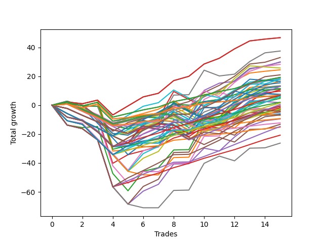

# Long Pointer 005 
- Symbol: ES
- Date Range: 03/18/2022 - 07/15/2022
- Trading Period: 7:20-12:30
- Number of Trades: 15



| Name | Win Percent | Profit | Avg Profit / Trade | Avg Time / Trade |      | Name | Win Percent | Profit | Avg Profit / Trade | Avg Time / Trade |
| ---- | ----------- | ------ | ------------------ | ---------------- | ---- | ---- | ----------- | ------ | ------------------ | ---------------- |
| Sorted By <br> Profit | | | | | | Sorted By <br> Win Percentage ||||
| Sixty-Five | 86.67 | 23375.00 | 1558.33 | 07:02 |     | Sixty-Five | 86.67 | 23375.00 | 1558.33 | 07:02 |
| Fifty-Seven | 86.67 | 23375.00 | 1558.33 | 07:00 |     | Fifty-Seven | 86.67 | 23375.00 | 1558.33 | 07:00 |
| Sixty-Nine | 66.67 | 18750.00 | 1250.00 | 20:59 |     | One | 86.67 | 12250.00 | 816.67 | 08:56 |
| Sixty-Seven | 80.00 | 16500.00 | 1100.00 | 07:50 |     | One Hundred Twenty-Seven | 86.67 | 9625.00 | 641.67 | 05:41 |
| Fifty-Nine | 80.00 | 15000.00 | 1000.00 | 08:05 |     | One Hundred Twenty-Two | 86.67 | 9625.00 | 641.67 | 05:39 |
| Sixty-Six | 73.33 | 14875.00 | 991.67 | 14:26 |     | One Hundred Twenty-Six | 86.67 | 3500.00 | 233.33 | 04:43 |
| Sixty-Eight | 66.67 | 14125.00 | 941.67 | 16:10 |     | One Hundred Twenty-One | 86.67 | 3500.00 | 233.33 | 04:42 |
| Seventy | 66.67 | 12875.00 | 858.33 | 09:24 |     | Eighty-Two | 86.67 | -1500.00 | -100.00 | 07:35 |
| One | 86.67 | 12250.00 | 816.67 | 08:56 |     | Eighty-One | 86.67 | -7625.00 | -508.33 | 06:37 |
| One Hundred Thirty | 73.33 | 10500.00 | 700.00 | 13:00 |     | Sixty-Seven | 80.00 | 16500.00 | 1100.00 | 07:50 |
| One Hundred Twenty-Seven | 86.67 | 9625.00 | 641.67 | 05:41 |     | Fifty-Nine | 80.00 | 15000.00 | 1000.00 | 08:05 |
| One Hundred Twenty-Two | 86.67 | 9625.00 | 641.67 | 05:39 |     | Three | 80.00 | 5375.00 | 358.33 | 11:05 |
| Fifty-Eight | 60.00 | 9500.00 | 633.33 | 16:34 |     | Sixty-Six | 73.33 | 14875.00 | 991.67 | 14:26 |
| Forty-One | 66.67 | 9125.00 | 608.33 | 04:00 |     | One Hundred Thirty | 73.33 | 10500.00 | 700.00 | 13:00 |
| Seventy-One | 73.33 | 9000.00 | 600.00 | 15:05 |     | Seventy-One | 73.33 | 9000.00 | 600.00 | 15:05 |
| Sixty-One | 53.33 | 9000.00 | 600.00 | 23:39 |     | One Hundred Twenty-Five | 73.33 | 7750.00 | 516.67 | 13:23 |
| Forty-Three | 66.67 | 8375.00 | 558.33 | 03:52 |     | One Hundred Twenty-Nine | 73.33 | 6500.00 | 433.33 | 10:51 |
| Sixty-Two | 60.00 | 8250.00 | 550.00 | 11:43 |     | One Hundred Twenty-Four | 73.33 | 3750.00 | 250.00 | 11:13 |
| One Hundred Twenty-Five | 73.33 | 7750.00 | 516.67 | 13:23 |     | One Hundred Twenty-Eight | 73.33 | 3500.00 | 233.33 | 08:46 |
| Forty-Nine | 60.00 | 6750.00 | 450.00 | 03:38 |     | One Hundred Twenty-Three | 73.33 | 750.00 | 50.00 | 09:09 |
| Sixty | 60.00 | 6625.00 | 441.67 | 18:36 |     | Eighty-Five | 73.33 | -3375.00 | -225.00 | 16:46 |
| One Hundred Twenty-Nine | 73.33 | 6500.00 | 433.33 | 10:51 |     | Eighty-Four | 73.33 | -7375.00 | -491.67 | 14:37 |
| One Hundred Fifteen | 60.00 | 6500.00 | 433.33 | 07:49 |     | Eighty-Three | 73.33 | -10375.00 | -691.67 | 12:32 |
| Sixty-Four | 66.67 | 5750.00 | 383.33 | 03:52 |     | Sixty-Nine | 66.67 | 18750.00 | 1250.00 | 20:59 |
| Fifty-Six | 66.67 | 5750.00 | 383.33 | 03:50 |     | Sixty-Eight | 66.67 | 14125.00 | 941.67 | 16:10 |
| Forty-Four | 46.67 | 5625.00 | 375.00 | 12:30 |     | Seventy | 66.67 | 12875.00 | 858.33 | 09:24 |
| Three | 80.00 | 5375.00 | 358.33 | 11:05 |     | Forty-One | 66.67 | 9125.00 | 608.33 | 04:00 |
| Forty-Five | 40.00 | 4875.00 | 325.00 | 17:02 |     | Forty-Three | 66.67 | 8375.00 | 558.33 | 03:52 |
| One Hundred Twenty-Four | 73.33 | 3750.00 | 250.00 | 11:13 |     | Sixty-Four | 66.67 | 5750.00 | 383.33 | 03:52 |
| Seventy-Three | 53.33 | 3750.00 | 250.00 | 07:21 |     | Fifty-Six | 66.67 | 5750.00 | 383.33 | 03:50 |
| Fifty-Two | 33.33 | 3625.00 | 241.67 | 07:24 |     | Two | 66.67 | 2375.00 | 158.33 | 19:57 |
| One Hundred Twenty-Six | 86.67 | 3500.00 | 233.33 | 04:43 |     | One Hundred Seventeen | 66.67 | 1000.00 | 66.67 | 02:03 |
| One Hundred Twenty-One | 86.67 | 3500.00 | 233.33 | 04:42 |     | One Hundred Twelve | 66.67 | -500.00 | -33.33 | 01:47 |
| One Hundred Twenty-Eight | 73.33 | 3500.00 | 233.33 | 08:46 |     | Zero | 66.67 | -3000.00 | -200.00 | 05:30 |
| Fifty-One | 53.33 | 3500.00 | 233.33 | 03:43 |     | One Hundred Sixteen | 66.67 | -4625.00 | -308.33 | 01:17 |
| Forty-Two | 46.67 | 3250.00 | 216.67 | 10:00 |     | One Hundred Eleven | 66.67 | -6125.00 | -408.33 | 01:01 |
| One Hundred Fourteen | 60.00 | 3000.00 | 200.00 | 05:41 |     | Fifty-Eight | 60.00 | 9500.00 | 633.33 | 16:34 |
| Fifty | 46.67 | 3000.00 | 200.00 | 06:02 |     | Sixty-Two | 60.00 | 8250.00 | 550.00 | 11:43 |
| Fifty-Four | 46.67 | 2750.00 | 183.33 | 03:08 |     | Forty-Nine | 60.00 | 6750.00 | 450.00 | 03:38 |
| Two | 66.67 | 2375.00 | 158.33 | 19:57 |     | Sixty | 60.00 | 6625.00 | 441.67 | 18:36 |
| One Hundred Seventeen | 66.67 | 1000.00 | 66.67 | 02:03 |     | One Hundred Fifteen | 60.00 | 6500.00 | 433.33 | 07:49 |
| Forty-Six | 46.67 | 875.00 | 58.33 | 04:35 |     | One Hundred Fourteen | 60.00 | 3000.00 | 200.00 | 05:41 |
| One Hundred Twenty-Three | 73.33 | 750.00 | 50.00 | 09:09 |     | Forty-Eight | 60.00 | -1000.00 | -66.67 | 01:32 |
| One Hundred Ninteen | 46.67 | 250.00 | 16.67 | 05:34 |     | One Hundred Thirteen | 60.00 | -1250.00 | -83.33 | 04:17 |
| One Hundred Eighteen | 53.33 | -250.00 | -16.67 | 04:22 |     | Forty | 60.00 | -1250.00 | -83.33 | 01:31 |
| One Hundred Twelve | 66.67 | -500.00 | -33.33 | 01:47 |     | Six | 60.00 | -1625.00 | -108.33 | 15:06 |
| Fifty-Five | 46.67 | -875.00 | -58.33 | 05:20 |     | Four | 60.00 | -4750.00 | -316.67 | 22:22 |
| Forty-Eight | 60.00 | -1000.00 | -66.67 | 01:32 |     | Sixty-One | 53.33 | 9000.00 | 600.00 | 23:39 |
| One Hundred Thirteen | 60.00 | -1250.00 | -83.33 | 04:17 |     | Seventy-Three | 53.33 | 3750.00 | 250.00 | 07:21 |
| Forty | 60.00 | -1250.00 | -83.33 | 01:31 |     | Fifty-One | 53.33 | 3500.00 | 233.33 | 03:43 |
| Eighty-Two | 86.67 | -1500.00 | -100.00 | 07:35 |     | One Hundred Eighteen | 53.33 | -250.00 | -16.67 | 04:22 |
| Six | 60.00 | -1625.00 | -108.33 | 15:06 |     | Sixty-Three | 53.33 | -1750.00 | -116.67 | 18:27 |
| Sixty-Three | 53.33 | -1750.00 | -116.67 | 18:27 |     | Five | 53.33 | -2375.00 | -158.33 | 27:25 |
| One Hundred Twenty | 33.33 | -2125.00 | -141.67 | 06:38 |     | Seven | 53.33 | -13125.00 | -875.00 | 22:13 |
| Five | 53.33 | -2375.00 | -158.33 | 27:25 |     | Forty-Four | 46.67 | 5625.00 | 375.00 | 12:30 |
| Zero | 66.67 | -3000.00 | -200.00 | 05:30 |     | Forty-Two | 46.67 | 3250.00 | 216.67 | 10:00 |
| Eighty-Five | 73.33 | -3375.00 | -225.00 | 16:46 |     | Fifty | 46.67 | 3000.00 | 200.00 | 06:02 |
| Fifty-Three | 33.33 | -3500.00 | -233.33 | 08:41 |     | Fifty-Four | 46.67 | 2750.00 | 183.33 | 03:08 |
| One Hundred Sixteen | 66.67 | -4625.00 | -308.33 | 01:17 |     | Forty-Six | 46.67 | 875.00 | 58.33 | 04:35 |
| Four | 60.00 | -4750.00 | -316.67 | 22:22 |     | One Hundred Ninteen | 46.67 | 250.00 | 16.67 | 05:34 |
| One Hundred Eleven | 66.67 | -6125.00 | -408.33 | 01:01 |     | Fifty-Five | 46.67 | -875.00 | -58.33 | 05:20 |
| Forty-Seven | 40.00 | -6625.00 | -441.67 | 10:42 |     | Forty-Five | 40.00 | 4875.00 | 325.00 | 17:02 |
| Eighty-Four | 73.33 | -7375.00 | -491.67 | 14:37 |     | Forty-Seven | 40.00 | -6625.00 | -441.67 | 10:42 |
| Eighty-One | 86.67 | -7625.00 | -508.33 | 06:37 |     | Fifty-Two | 33.33 | 3625.00 | 241.67 | 07:24 |
| Eighty-Three | 73.33 | -10375.00 | -691.67 | 12:32 |     | One Hundred Twenty | 33.33 | -2125.00 | -141.67 | 06:38 |
| Seven | 53.33 | -13125.00 | -875.00 | 22:13 |     | Fifty-Three | 33.33 | -3500.00 | -233.33 | 08:41 |

## NO STOPLOSS

### Test Zero
* Sell when price hits the middle line of the 20p bollinger
* No Stoploss
* Results:
```
Total Trades: 15
Percent Up: 66.67
Percent Down: 33.33
Total Points Moved Up: -6.00
Potential Profit: -3000.00
Total Points Ups: 26.25 Count Ups: 10
Total Points Downs: -32.25 Count Downs: 5
```

<details><summary>Trades</summary>

<code>In: 2022-03-28 08:11:00		Out: 2022-03-28 08:11:45		Total Position Time: 00:45		Total Move Up: 2.75		Total to Date: 2.75</code> <br />
<code>In: 2022-04-12 07:47:00		Out: 2022-04-12 08:02:05		Total Position Time: 15:05		Total Move Up: -3.25		Total to Date: -0.50</code> <br />
<code>In: 2022-04-27 12:07:00		Out: 2022-04-27 12:13:55		Total Position Time: 06:55		Total Move Up: -0.25		Total to Date: -0.75</code> <br />
<code>In: 2022-05-10 07:33:00		Out: 2022-05-10 07:59:00		Total Position Time: 26:00		Total Move Up: -27.75		Total to Date: -28.50</code> <br />
<code>In: 2022-05-12 11:15:00		Out: 2022-05-12 11:16:05		Total Position Time: 01:05		Total Move Up: 2.00		Total to Date: -26.50</code> <br />
<code>In: 2022-05-19 10:19:00		Out: 2022-05-19 10:19:20		Total Position Time: 00:20		Total Move Up: 1.75		Total to Date: -24.75</code> <br />
<code>In: 2022-05-26 10:32:00		Out: 2022-05-26 10:33:55		Total Position Time: 01:55		Total Move Up: 1.75		Total to Date: -23.00</code> <br />
<code>In: 2022-06-02 07:30:00		Out: 2022-06-02 07:34:10		Total Position Time: 04:10		Total Move Up: 6.25		Total to Date: -16.75</code> <br />
<code>In: 2022-06-15 08:19:00		Out: 2022-06-15 08:32:00		Total Position Time: 13:00		Total Move Up: -0.75		Total to Date: -17.50</code> <br />
<code>In: 2022-06-16 11:57:00		Out: 2022-06-16 12:00:25		Total Position Time: 03:25		Total Move Up: 2.50		Total to Date: -15.00</code> <br />
<code>In: 2022-06-22 11:55:00		Out: 2022-06-22 11:55:25		Total Position Time: 00:25		Total Move Up: 1.50		Total to Date: -13.50</code> <br />
<code>In: 2022-06-27 12:09:00		Out: 2022-06-27 12:09:45		Total Position Time: 00:45		Total Move Up: 3.25		Total to Date: -10.25</code> <br />
<code>In: 2022-06-29 09:32:00		Out: 2022-06-29 09:36:40		Total Position Time: 04:40		Total Move Up: 3.50		Total to Date: -6.75</code> <br />
<code>In: 2022-07-07 08:35:00		Out: 2022-07-07 08:37:00		Total Position Time: 02:00		Total Move Up: -0.25		Total to Date: -7.00</code> <br />
<code>In: 2022-07-15 11:08:00		Out: 2022-07-15 11:10:05		Total Position Time: 02:05		Total Move Up: 1.00		Total to Date: -6.00</code> <br />


</details>

### Test One
* Sell when the price hits the upper line of the 20p 1std bollinger
* No Stoploss
* Results:
```
Total Trades: 15
Percent Up: 86.67
Percent Down: 13.33
Total Points Moved Up: 24.50
Potential Profit: 12250.00
Total Points Ups: 58.25 Count Ups: 13
Total Points Downs: -33.75 Count Downs: 2
```

<details><summary>Trades</summary>

<code>In: 2022-03-28 08:11:00		Out: 2022-03-28 08:20:05		Total Position Time: 09:05		Total Move Up: 2.25		Total to Date: 2.25</code> <br />
<code>In: 2022-04-12 07:47:00		Out: 2022-04-12 08:02:35		Total Position Time: 15:35		Total Move Up: -1.25		Total to Date: 1.00</code> <br />
<code>In: 2022-04-27 12:07:00		Out: 2022-04-27 12:15:20		Total Position Time: 08:20		Total Move Up: 2.50		Total to Date: 3.50</code> <br />
<code>In: 2022-05-10 07:33:00		Out: 2022-05-10 08:02:55		Total Position Time: 29:55		Total Move Up: -32.50		Total to Date: -29.00</code> <br />
<code>In: 2022-05-12 11:15:00		Out: 2022-05-12 11:19:55		Total Position Time: 04:55		Total Move Up: 6.25		Total to Date: -22.75</code> <br />
<code>In: 2022-05-19 10:19:00		Out: 2022-05-19 10:22:45		Total Position Time: 03:45		Total Move Up: 6.25		Total to Date: -16.50</code> <br />
<code>In: 2022-05-26 10:32:00		Out: 2022-05-26 10:41:05		Total Position Time: 09:05		Total Move Up: 2.50		Total to Date: -14.00</code> <br />
<code>In: 2022-06-02 07:30:00		Out: 2022-06-02 07:38:35		Total Position Time: 08:35		Total Move Up: 8.75		Total to Date: -5.25</code> <br />
<code>In: 2022-06-15 08:19:00		Out: 2022-06-15 08:38:55		Total Position Time: 19:55		Total Move Up: 3.00		Total to Date: -2.25</code> <br />
<code>In: 2022-06-16 11:57:00		Out: 2022-06-16 12:01:45		Total Position Time: 04:45		Total Move Up: 8.50		Total to Date: 6.25</code> <br />
<code>In: 2022-06-22 11:55:00		Out: 2022-06-22 11:56:20		Total Position Time: 01:20		Total Move Up: 4.00		Total to Date: 10.25</code> <br />
<code>In: 2022-06-27 12:09:00		Out: 2022-06-27 12:12:00		Total Position Time: 03:00		Total Move Up: 6.50		Total to Date: 16.75</code> <br />
<code>In: 2022-06-29 09:32:00		Out: 2022-06-29 09:37:15		Total Position Time: 05:15		Total Move Up: 5.50		Total to Date: 22.25</code> <br />
<code>In: 2022-07-07 08:35:00		Out: 2022-07-07 08:39:05		Total Position Time: 04:05		Total Move Up: 1.25		Total to Date: 23.50</code> <br />
<code>In: 2022-07-15 11:08:00		Out: 2022-07-15 11:14:25		Total Position Time: 06:25		Total Move Up: 1.00		Total to Date: 24.50</code> <br />


</details>

### Test Two
* Sell when the price hits the upper line of the 20p 2std bollinger
* No Stoploss
* Results:
```
Total Trades: 15
Percent Up: 66.67
Percent Down: 33.33
Total Points Moved Up: 4.75
Potential Profit: 2375.00
Total Points Ups: 68.00 Count Ups: 10
Total Points Downs: -63.25 Count Downs: 5
```

<details><summary>Trades</summary>

<code>In: 2022-03-28 08:11:00		Out: 2022-03-28 08:40:55		Total Position Time: 29:55		Total Move Up: -13.75		Total to Date: -13.75</code> <br />
<code>In: 2022-04-12 07:47:00		Out: 2022-04-12 08:15:45		Total Position Time: 28:45		Total Move Up: -1.75		Total to Date: -15.50</code> <br />
<code>In: 2022-04-27 12:07:00		Out: 2022-04-27 12:31:20		Total Position Time: 24:20		Total Move Up: 0.75		Total to Date: -14.75</code> <br />
<code>In: 2022-05-10 07:33:00		Out: 2022-05-10 08:02:55		Total Position Time: 29:55		Total Move Up: -32.50		Total to Date: -47.25</code> <br />
<code>In: 2022-05-12 11:15:00		Out: 2022-05-12 11:44:55		Total Position Time: 29:55		Total Move Up: -12.00		Total to Date: -59.25</code> <br />
<code>In: 2022-05-19 10:19:00		Out: 2022-05-19 10:44:05		Total Position Time: 25:05		Total Move Up: 13.50		Total to Date: -45.75</code> <br />
<code>In: 2022-05-26 10:32:00		Out: 2022-05-26 10:46:25		Total Position Time: 14:25		Total Move Up: 2.50		Total to Date: -43.25</code> <br />
<code>In: 2022-06-02 07:30:00		Out: 2022-06-02 07:42:40		Total Position Time: 12:40		Total Move Up: 12.25		Total to Date: -31.00</code> <br />
<code>In: 2022-06-15 08:19:00		Out: 2022-06-15 08:48:55		Total Position Time: 29:55		Total Move Up: 0.25		Total to Date: -30.75</code> <br />
<code>In: 2022-06-16 11:57:00		Out: 2022-06-16 12:10:15		Total Position Time: 13:15		Total Move Up: 20.50		Total to Date: -10.25</code> <br />
<code>In: 2022-06-22 11:55:00		Out: 2022-06-22 12:04:10		Total Position Time: 09:10		Total Move Up: 5.00		Total to Date: -5.25</code> <br />
<code>In: 2022-06-27 12:09:00		Out: 2022-06-27 12:38:55		Total Position Time: 29:55		Total Move Up: -3.25		Total to Date: -8.50</code> <br />
<code>In: 2022-06-29 09:32:00		Out: 2022-06-29 09:38:30		Total Position Time: 06:30		Total Move Up: 8.50		Total to Date: 0.00</code> <br />
<code>In: 2022-07-07 08:35:00		Out: 2022-07-07 08:43:45		Total Position Time: 08:45		Total Move Up: 2.25		Total to Date: 2.25</code> <br />
<code>In: 2022-07-15 11:08:00		Out: 2022-07-15 11:14:55		Total Position Time: 06:55		Total Move Up: 2.50		Total to Date: 4.75</code> <br />


</details>

### Test Three
* Sell when price hits the middle line of the 50p bollinger
* No Stoploss
* Results:
```
Total Trades: 15
Percent Up: 80.00
Percent Down: 20.00
Total Points Moved Up: 10.75
Potential Profit: 5375.00
Total Points Ups: 52.00 Count Ups: 12
Total Points Downs: -41.25 Count Downs: 3
```

<details><summary>Trades</summary>

<code>In: 2022-03-28 08:11:00		Out: 2022-03-28 08:11:20		Total Position Time: 00:20		Total Move Up: 1.00		Total to Date: 1.00</code> <br />
<code>In: 2022-04-12 07:47:00		Out: 2022-04-12 08:15:40		Total Position Time: 28:40		Total Move Up: -1.00		Total to Date: 0.00</code> <br />
<code>In: 2022-04-27 12:07:00		Out: 2022-04-27 12:36:55		Total Position Time: 29:55		Total Move Up: -7.75		Total to Date: -7.75</code> <br />
<code>In: 2022-05-10 07:33:00		Out: 2022-05-10 08:02:55		Total Position Time: 29:55		Total Move Up: -32.50		Total to Date: -40.25</code> <br />
<code>In: 2022-05-12 11:15:00		Out: 2022-05-12 11:20:15		Total Position Time: 05:15		Total Move Up: 6.00		Total to Date: -34.25</code> <br />
<code>In: 2022-05-19 10:19:00		Out: 2022-05-19 10:20:05		Total Position Time: 01:05		Total Move Up: 2.75		Total to Date: -31.50</code> <br />
<code>In: 2022-05-26 10:32:00		Out: 2022-05-26 10:48:40		Total Position Time: 16:40		Total Move Up: 3.00		Total to Date: -28.50</code> <br />
<code>In: 2022-06-02 07:30:00		Out: 2022-06-02 07:31:30		Total Position Time: 01:30		Total Move Up: 5.75		Total to Date: -22.75</code> <br />
<code>In: 2022-06-15 08:19:00		Out: 2022-06-15 08:38:55		Total Position Time: 19:55		Total Move Up: 3.00		Total to Date: -19.75</code> <br />
<code>In: 2022-06-16 11:57:00		Out: 2022-06-16 12:01:35		Total Position Time: 04:35		Total Move Up: 6.25		Total to Date: -13.50</code> <br />
<code>In: 2022-06-22 11:55:00		Out: 2022-06-22 12:04:10		Total Position Time: 09:10		Total Move Up: 5.00		Total to Date: -8.50</code> <br />
<code>In: 2022-06-27 12:09:00		Out: 2022-06-27 12:10:30		Total Position Time: 01:30		Total Move Up: 6.25		Total to Date: -2.25</code> <br />
<code>In: 2022-06-29 09:32:00		Out: 2022-06-29 09:38:30		Total Position Time: 06:30		Total Move Up: 8.50		Total to Date: 6.25</code> <br />
<code>In: 2022-07-07 08:35:00		Out: 2022-07-07 08:39:05		Total Position Time: 04:05		Total Move Up: 1.25		Total to Date: 7.50</code> <br />
<code>In: 2022-07-15 11:08:00		Out: 2022-07-15 11:15:20		Total Position Time: 07:20		Total Move Up: 3.25		Total to Date: 10.75</code> <br />


</details>

### Test Four
* Sell when the price hits the upper line of the 50p 1std bollinger
* No Stoploss
* Results:
```
Total Trades: 15
Percent Up: 60.00
Percent Down: 40.00
Total Points Moved Up: -9.50
Potential Profit: -4750.00
Total Points Ups: 61.00 Count Ups: 9
Total Points Downs: -70.50 Count Downs: 6
```

<details><summary>Trades</summary>

<code>In: 2022-03-28 08:11:00		Out: 2022-03-28 08:40:55		Total Position Time: 29:55		Total Move Up: -13.75		Total to Date: -13.75</code> <br />
<code>In: 2022-04-12 07:47:00		Out: 2022-04-12 08:16:55		Total Position Time: 29:55		Total Move Up: -2.50		Total to Date: -16.25</code> <br />
<code>In: 2022-04-27 12:07:00		Out: 2022-04-27 12:36:55		Total Position Time: 29:55		Total Move Up: -7.75		Total to Date: -24.00</code> <br />
<code>In: 2022-05-10 07:33:00		Out: 2022-05-10 08:02:55		Total Position Time: 29:55		Total Move Up: -32.50		Total to Date: -56.50</code> <br />
<code>In: 2022-05-12 11:15:00		Out: 2022-05-12 11:44:55		Total Position Time: 29:55		Total Move Up: -12.00		Total to Date: -68.50</code> <br />
<code>In: 2022-05-19 10:19:00		Out: 2022-05-19 10:23:25		Total Position Time: 04:25		Total Move Up: 9.00		Total to Date: -59.50</code> <br />
<code>In: 2022-05-26 10:32:00		Out: 2022-05-26 10:58:45		Total Position Time: 26:45		Total Move Up: 4.75		Total to Date: -54.75</code> <br />
<code>In: 2022-06-02 07:30:00		Out: 2022-06-02 07:47:05		Total Position Time: 17:05		Total Move Up: 14.00		Total to Date: -40.75</code> <br />
<code>In: 2022-06-15 08:19:00		Out: 2022-06-15 08:48:55		Total Position Time: 29:55		Total Move Up: 0.25		Total to Date: -40.50</code> <br />
<code>In: 2022-06-16 11:57:00		Out: 2022-06-16 12:02:00		Total Position Time: 05:00		Total Move Up: 10.75		Total to Date: -29.75</code> <br />
<code>In: 2022-06-22 11:55:00		Out: 2022-06-22 12:24:55		Total Position Time: 29:55		Total Move Up: -2.00		Total to Date: -31.75</code> <br />
<code>In: 2022-06-27 12:09:00		Out: 2022-06-27 12:15:20		Total Position Time: 06:20		Total Move Up: 9.75		Total to Date: -22.00</code> <br />
<code>In: 2022-06-29 09:32:00		Out: 2022-06-29 09:59:10		Total Position Time: 27:10		Total Move Up: 7.75		Total to Date: -14.25</code> <br />
<code>In: 2022-07-07 08:35:00		Out: 2022-07-07 08:44:25		Total Position Time: 09:25		Total Move Up: 3.50		Total to Date: -10.75</code> <br />
<code>In: 2022-07-15 11:08:00		Out: 2022-07-15 11:37:55		Total Position Time: 29:55		Total Move Up: 1.25		Total to Date: -9.50</code> <br />


</details>

### Test Five
* Sell when the price hits the upper line of the 50p 2std bollinger
* No Stoploss
* Results:
```
Total Trades: 15
Percent Up: 53.33
Percent Down: 46.67
Total Points Moved Up: -4.75
Potential Profit: -2375.00
Total Points Ups: 69.00 Count Ups: 8
Total Points Downs: -73.75 Count Downs: 7
```

<details><summary>Trades</summary>

<code>In: 2022-03-28 08:11:00		Out: 2022-03-28 08:40:55		Total Position Time: 29:55		Total Move Up: -13.75		Total to Date: -13.75</code> <br />
<code>In: 2022-04-12 07:47:00		Out: 2022-04-12 08:16:55		Total Position Time: 29:55		Total Move Up: -2.50		Total to Date: -16.25</code> <br />
<code>In: 2022-04-27 12:07:00		Out: 2022-04-27 12:36:55		Total Position Time: 29:55		Total Move Up: -7.75		Total to Date: -24.00</code> <br />
<code>In: 2022-05-10 07:33:00		Out: 2022-05-10 08:02:55		Total Position Time: 29:55		Total Move Up: -32.50		Total to Date: -56.50</code> <br />
<code>In: 2022-05-12 11:15:00		Out: 2022-05-12 11:44:55		Total Position Time: 29:55		Total Move Up: -12.00		Total to Date: -68.50</code> <br />
<code>In: 2022-05-19 10:19:00		Out: 2022-05-19 10:31:30		Total Position Time: 12:30		Total Move Up: 12.25		Total to Date: -56.25</code> <br />
<code>In: 2022-05-26 10:32:00		Out: 2022-05-26 11:01:55		Total Position Time: 29:55		Total Move Up: 5.00		Total to Date: -51.25</code> <br />
<code>In: 2022-06-02 07:30:00		Out: 2022-06-02 07:59:55		Total Position Time: 29:55		Total Move Up: 18.50		Total to Date: -32.75</code> <br />
<code>In: 2022-06-15 08:19:00		Out: 2022-06-15 08:48:55		Total Position Time: 29:55		Total Move Up: 0.25		Total to Date: -32.50</code> <br />
<code>In: 2022-06-16 11:57:00		Out: 2022-06-16 12:09:55		Total Position Time: 12:55		Total Move Up: 17.00		Total to Date: -15.50</code> <br />
<code>In: 2022-06-22 11:55:00		Out: 2022-06-22 12:24:55		Total Position Time: 29:55		Total Move Up: -2.00		Total to Date: -17.50</code> <br />
<code>In: 2022-06-27 12:09:00		Out: 2022-06-27 12:38:55		Total Position Time: 29:55		Total Move Up: -3.25		Total to Date: -20.75</code> <br />
<code>In: 2022-06-29 09:32:00		Out: 2022-06-29 10:01:55		Total Position Time: 29:55		Total Move Up: 8.75		Total to Date: -12.00</code> <br />
<code>In: 2022-07-07 08:35:00		Out: 2022-07-07 09:02:00		Total Position Time: 27:00		Total Move Up: 6.00		Total to Date: -6.00</code> <br />
<code>In: 2022-07-15 11:08:00		Out: 2022-07-15 11:37:55		Total Position Time: 29:55		Total Move Up: 1.25		Total to Date: -4.75</code> <br />


</details>

### Test Six
* Sell when the price hits the middle line of the 1std VWAP
* No Stoploss
* Results:
```
Total Trades: 15
Percent Up: 60.00
Percent Down: 40.00
Total Points Moved Up: -3.25
Potential Profit: -1625.00
Total Points Ups: 53.00 Count Ups: 9
Total Points Downs: -56.25 Count Downs: 6
```

<details><summary>Trades</summary>

<code>In: 2022-03-28 08:11:00		Out: 2022-03-28 08:11:10		Total Position Time: 00:10		Total Move Up: 0.75		Total to Date: 0.75</code> <br />
<code>In: 2022-04-12 07:47:00		Out: 2022-04-12 08:16:55		Total Position Time: 29:55		Total Move Up: -2.50		Total to Date: -1.75</code> <br />
<code>In: 2022-04-27 12:07:00		Out: 2022-04-27 12:36:55		Total Position Time: 29:55		Total Move Up: -7.75		Total to Date: -9.50</code> <br />
<code>In: 2022-05-10 07:33:00		Out: 2022-05-10 08:02:55		Total Position Time: 29:55		Total Move Up: -32.50		Total to Date: -42.00</code> <br />
<code>In: 2022-05-12 11:15:00		Out: 2022-05-12 11:44:55		Total Position Time: 29:55		Total Move Up: -12.00		Total to Date: -54.00</code> <br />
<code>In: 2022-05-19 10:19:00		Out: 2022-05-19 10:22:55		Total Position Time: 03:55		Total Move Up: 8.00		Total to Date: -46.00</code> <br />
<code>In: 2022-05-26 10:32:00		Out: 2022-05-26 10:32:10		Total Position Time: 00:10		Total Move Up: 0.00		Total to Date: -46.00</code> <br />
<code>In: 2022-06-02 07:30:00		Out: 2022-06-02 07:31:30		Total Position Time: 01:30		Total Move Up: 5.75		Total to Date: -40.25</code> <br />
<code>In: 2022-06-15 08:19:00		Out: 2022-06-15 08:48:55		Total Position Time: 29:55		Total Move Up: 0.25		Total to Date: -40.00</code> <br />
<code>In: 2022-06-16 11:57:00		Out: 2022-06-16 12:26:55		Total Position Time: 29:55		Total Move Up: 18.50		Total to Date: -21.50</code> <br />
<code>In: 2022-06-22 11:55:00		Out: 2022-06-22 11:55:10		Total Position Time: 00:10		Total Move Up: 0.25		Total to Date: -21.25</code> <br />
<code>In: 2022-06-27 12:09:00		Out: 2022-06-27 12:19:55		Total Position Time: 10:55		Total Move Up: 10.75		Total to Date: -10.50</code> <br />
<code>In: 2022-06-29 09:32:00		Out: 2022-06-29 10:01:55		Total Position Time: 29:55		Total Move Up: 8.75		Total to Date: -1.75</code> <br />
<code>In: 2022-07-07 08:35:00		Out: 2022-07-07 08:35:10		Total Position Time: 00:10		Total Move Up: -0.75		Total to Date: -2.50</code> <br />
<code>In: 2022-07-15 11:08:00		Out: 2022-07-15 11:08:10		Total Position Time: 00:10		Total Move Up: -0.75		Total to Date: -3.25</code> <br />


</details>

### Test Seven
* Sell when the price hits the upper line of the 1std VWAP
* No Stoploss
* Results:
```
Total Trades: 15
Percent Up: 53.33
Percent Down: 46.67
Total Points Moved Up: -26.25
Potential Profit: -13125.00
Total Points Ups: 48.00 Count Ups: 8
Total Points Downs: -74.25 Count Downs: 7
```

<details><summary>Trades</summary>

<code>In: 2022-03-28 08:11:00		Out: 2022-03-28 08:40:55		Total Position Time: 29:55		Total Move Up: -13.75		Total to Date: -13.75</code> <br />
<code>In: 2022-04-12 07:47:00		Out: 2022-04-12 08:16:55		Total Position Time: 29:55		Total Move Up: -2.50		Total to Date: -16.25</code> <br />
<code>In: 2022-04-27 12:07:00		Out: 2022-04-27 12:36:55		Total Position Time: 29:55		Total Move Up: -7.75		Total to Date: -24.00</code> <br />
<code>In: 2022-05-10 07:33:00		Out: 2022-05-10 08:02:55		Total Position Time: 29:55		Total Move Up: -32.50		Total to Date: -56.50</code> <br />
<code>In: 2022-05-12 11:15:00		Out: 2022-05-12 11:44:55		Total Position Time: 29:55		Total Move Up: -12.00		Total to Date: -68.50</code> <br />
<code>In: 2022-05-19 10:19:00		Out: 2022-05-19 10:48:55		Total Position Time: 29:55		Total Move Up: -2.50		Total to Date: -71.00</code> <br />
<code>In: 2022-05-26 10:32:00		Out: 2022-05-26 10:32:10		Total Position Time: 00:10		Total Move Up: 0.00		Total to Date: -71.00</code> <br />
<code>In: 2022-06-02 07:30:00		Out: 2022-06-02 07:44:30		Total Position Time: 14:30		Total Move Up: 12.00		Total to Date: -59.00</code> <br />
<code>In: 2022-06-15 08:19:00		Out: 2022-06-15 08:48:55		Total Position Time: 29:55		Total Move Up: 0.25		Total to Date: -58.75</code> <br />
<code>In: 2022-06-16 11:57:00		Out: 2022-06-16 12:26:55		Total Position Time: 29:55		Total Move Up: 18.50		Total to Date: -40.25</code> <br />
<code>In: 2022-06-22 11:55:00		Out: 2022-06-22 12:04:10		Total Position Time: 09:10		Total Move Up: 5.00		Total to Date: -35.25</code> <br />
<code>In: 2022-06-27 12:09:00		Out: 2022-06-27 12:38:55		Total Position Time: 29:55		Total Move Up: -3.25		Total to Date: -38.50</code> <br />
<code>In: 2022-06-29 09:32:00		Out: 2022-06-29 10:01:55		Total Position Time: 29:55		Total Move Up: 8.75		Total to Date: -29.75</code> <br />
<code>In: 2022-07-07 08:35:00		Out: 2022-07-07 08:38:05		Total Position Time: 03:05		Total Move Up: 0.25		Total to Date: -29.50</code> <br />
<code>In: 2022-07-15 11:08:00		Out: 2022-07-15 11:15:20		Total Position Time: 07:20		Total Move Up: 3.25		Total to Date: -26.25</code> <br />


</details>

## STOPLOSS OF 5

### Test Forty
* Sell when price hits the middle line of the 20p bollinger
* Stoploss is 5 points
* Results:
```
Total Trades: 15
Percent Up: 60.00
Percent Down: 40.00
Total Points Moved Up: -2.50
Potential Profit: -1250.00
Total Points Ups: 23.75 Count Ups: 9
Total Points Downs: -26.25 Count Downs: 6
```

<details><summary>Trades</summary>

<code>In: 2022-03-28 08:11:00		Out: 2022-03-28 08:11:45		Total Position Time: 00:45		Total Move Up: 2.75		Total to Date: 2.75</code> <br />
<code>In: 2022-04-12 07:47:00		Out: 2022-04-12 07:48:20		Total Position Time: 01:20		Total Move Up: -5.00		Total to Date: -2.25</code> <br />
<code>In: 2022-04-27 12:07:00		Out: 2022-04-27 12:08:40		Total Position Time: 01:40		Total Move Up: -5.00		Total to Date: -7.25</code> <br />
<code>In: 2022-05-10 07:33:00		Out: 2022-05-10 07:33:40		Total Position Time: 00:40		Total Move Up: -5.50		Total to Date: -12.75</code> <br />
<code>In: 2022-05-12 11:15:00		Out: 2022-05-12 11:16:05		Total Position Time: 01:05		Total Move Up: 2.00		Total to Date: -10.75</code> <br />
<code>In: 2022-05-19 10:19:00		Out: 2022-05-19 10:19:20		Total Position Time: 00:20		Total Move Up: 1.75		Total to Date: -9.00</code> <br />
<code>In: 2022-05-26 10:32:00		Out: 2022-05-26 10:33:55		Total Position Time: 01:55		Total Move Up: 1.75		Total to Date: -7.25</code> <br />
<code>In: 2022-06-02 07:30:00		Out: 2022-06-02 07:34:10		Total Position Time: 04:10		Total Move Up: 6.25		Total to Date: -1.00</code> <br />
<code>In: 2022-06-15 08:19:00		Out: 2022-06-15 08:19:40		Total Position Time: 00:40		Total Move Up: -5.50		Total to Date: -6.50</code> <br />
<code>In: 2022-06-16 11:57:00		Out: 2022-06-16 11:57:15		Total Position Time: 00:15		Total Move Up: -5.00		Total to Date: -11.50</code> <br />
<code>In: 2022-06-22 11:55:00		Out: 2022-06-22 11:55:25		Total Position Time: 00:25		Total Move Up: 1.50		Total to Date: -10.00</code> <br />
<code>In: 2022-06-27 12:09:00		Out: 2022-06-27 12:09:45		Total Position Time: 00:45		Total Move Up: 3.25		Total to Date: -6.75</code> <br />
<code>In: 2022-06-29 09:32:00		Out: 2022-06-29 09:36:40		Total Position Time: 04:40		Total Move Up: 3.50		Total to Date: -3.25</code> <br />
<code>In: 2022-07-07 08:35:00		Out: 2022-07-07 08:37:00		Total Position Time: 02:00		Total Move Up: -0.25		Total to Date: -3.50</code> <br />
<code>In: 2022-07-15 11:08:00		Out: 2022-07-15 11:10:05		Total Position Time: 02:05		Total Move Up: 1.00		Total to Date: -2.50</code> <br />


</details>

### Test Forty-One
* Sell when the price hits the upper line of the 20p 1std bollinger
* Stoploss is 5 points
* Results:
```
Total Trades: 15
Percent Up: 66.67
Percent Down: 33.33
Total Points Moved Up: 18.25
Potential Profit: 9125.00
Total Points Ups: 44.25 Count Ups: 10
Total Points Downs: -26.00 Count Downs: 5
```

<details><summary>Trades</summary>

<code>In: 2022-03-28 08:11:00		Out: 2022-03-28 08:20:05		Total Position Time: 09:05		Total Move Up: 2.25		Total to Date: 2.25</code> <br />
<code>In: 2022-04-12 07:47:00		Out: 2022-04-12 07:48:20		Total Position Time: 01:20		Total Move Up: -5.00		Total to Date: -2.75</code> <br />
<code>In: 2022-04-27 12:07:00		Out: 2022-04-27 12:08:40		Total Position Time: 01:40		Total Move Up: -5.00		Total to Date: -7.75</code> <br />
<code>In: 2022-05-10 07:33:00		Out: 2022-05-10 07:33:40		Total Position Time: 00:40		Total Move Up: -5.50		Total to Date: -13.25</code> <br />
<code>In: 2022-05-12 11:15:00		Out: 2022-05-12 11:19:55		Total Position Time: 04:55		Total Move Up: 6.25		Total to Date: -7.00</code> <br />
<code>In: 2022-05-19 10:19:00		Out: 2022-05-19 10:22:45		Total Position Time: 03:45		Total Move Up: 6.25		Total to Date: -0.75</code> <br />
<code>In: 2022-05-26 10:32:00		Out: 2022-05-26 10:41:05		Total Position Time: 09:05		Total Move Up: 2.50		Total to Date: 1.75</code> <br />
<code>In: 2022-06-02 07:30:00		Out: 2022-06-02 07:38:35		Total Position Time: 08:35		Total Move Up: 8.75		Total to Date: 10.50</code> <br />
<code>In: 2022-06-15 08:19:00		Out: 2022-06-15 08:19:40		Total Position Time: 00:40		Total Move Up: -5.50		Total to Date: 5.00</code> <br />
<code>In: 2022-06-16 11:57:00		Out: 2022-06-16 11:57:15		Total Position Time: 00:15		Total Move Up: -5.00		Total to Date: 0.00</code> <br />
<code>In: 2022-06-22 11:55:00		Out: 2022-06-22 11:56:20		Total Position Time: 01:20		Total Move Up: 4.00		Total to Date: 4.00</code> <br />
<code>In: 2022-06-27 12:09:00		Out: 2022-06-27 12:12:00		Total Position Time: 03:00		Total Move Up: 6.50		Total to Date: 10.50</code> <br />
<code>In: 2022-06-29 09:32:00		Out: 2022-06-29 09:37:15		Total Position Time: 05:15		Total Move Up: 5.50		Total to Date: 16.00</code> <br />
<code>In: 2022-07-07 08:35:00		Out: 2022-07-07 08:39:05		Total Position Time: 04:05		Total Move Up: 1.25		Total to Date: 17.25</code> <br />
<code>In: 2022-07-15 11:08:00		Out: 2022-07-15 11:14:25		Total Position Time: 06:25		Total Move Up: 1.00		Total to Date: 18.25</code> <br />


</details>

### Test Forty-Two
* Sell when the price hits the upper line of the 20p 2std bollinger
* Stoploss is 5 points
* Results:
```
Total Trades: 15
Percent Up: 46.67
Percent Down: 53.33
Total Points Moved Up: 6.50
Potential Profit: 3250.00
Total Points Ups: 46.50 Count Ups: 7
Total Points Downs: -40.00 Count Downs: 8
```

<details><summary>Trades</summary>

<code>In: 2022-03-28 08:11:00		Out: 2022-03-28 08:25:50		Total Position Time: 14:50		Total Move Up: -5.75		Total to Date: -5.75</code> <br />
<code>In: 2022-04-12 07:47:00		Out: 2022-04-12 07:48:20		Total Position Time: 01:20		Total Move Up: -5.00		Total to Date: -10.75</code> <br />
<code>In: 2022-04-27 12:07:00		Out: 2022-04-27 12:08:40		Total Position Time: 01:40		Total Move Up: -5.00		Total to Date: -15.75</code> <br />
<code>In: 2022-05-10 07:33:00		Out: 2022-05-10 07:33:40		Total Position Time: 00:40		Total Move Up: -5.50		Total to Date: -21.25</code> <br />
<code>In: 2022-05-12 11:15:00		Out: 2022-05-12 11:32:15		Total Position Time: 17:15		Total Move Up: -5.00		Total to Date: -26.25</code> <br />
<code>In: 2022-05-19 10:19:00		Out: 2022-05-19 10:44:05		Total Position Time: 25:05		Total Move Up: 13.50		Total to Date: -12.75</code> <br />
<code>In: 2022-05-26 10:32:00		Out: 2022-05-26 10:46:25		Total Position Time: 14:25		Total Move Up: 2.50		Total to Date: -10.25</code> <br />
<code>In: 2022-06-02 07:30:00		Out: 2022-06-02 07:42:40		Total Position Time: 12:40		Total Move Up: 12.25		Total to Date: 2.00</code> <br />
<code>In: 2022-06-15 08:19:00		Out: 2022-06-15 08:19:40		Total Position Time: 00:40		Total Move Up: -5.50		Total to Date: -3.50</code> <br />
<code>In: 2022-06-16 11:57:00		Out: 2022-06-16 11:57:15		Total Position Time: 00:15		Total Move Up: -5.00		Total to Date: -8.50</code> <br />
<code>In: 2022-06-22 11:55:00		Out: 2022-06-22 12:04:10		Total Position Time: 09:10		Total Move Up: 5.00		Total to Date: -3.50</code> <br />
<code>In: 2022-06-27 12:09:00		Out: 2022-06-27 12:38:55		Total Position Time: 29:55		Total Move Up: -3.25		Total to Date: -6.75</code> <br />
<code>In: 2022-06-29 09:32:00		Out: 2022-06-29 09:38:30		Total Position Time: 06:30		Total Move Up: 8.50		Total to Date: 1.75</code> <br />
<code>In: 2022-07-07 08:35:00		Out: 2022-07-07 08:43:45		Total Position Time: 08:45		Total Move Up: 2.25		Total to Date: 4.00</code> <br />
<code>In: 2022-07-15 11:08:00		Out: 2022-07-15 11:14:55		Total Position Time: 06:55		Total Move Up: 2.50		Total to Date: 6.50</code> <br />


</details>

### Test Forty-Three
* Sell when price hits the middle line of the 50p bollinger
* Stoploss is 5 points
* Results:
```
Total Trades: 15
Percent Up: 66.67
Percent Down: 33.33
Total Points Moved Up: 16.75
Potential Profit: 8375.00
Total Points Ups: 42.75 Count Ups: 10
Total Points Downs: -26.00 Count Downs: 5
```

<details><summary>Trades</summary>

<code>In: 2022-03-28 08:11:00		Out: 2022-03-28 08:11:20		Total Position Time: 00:20		Total Move Up: 1.00		Total to Date: 1.00</code> <br />
<code>In: 2022-04-12 07:47:00		Out: 2022-04-12 07:48:20		Total Position Time: 01:20		Total Move Up: -5.00		Total to Date: -4.00</code> <br />
<code>In: 2022-04-27 12:07:00		Out: 2022-04-27 12:08:40		Total Position Time: 01:40		Total Move Up: -5.00		Total to Date: -9.00</code> <br />
<code>In: 2022-05-10 07:33:00		Out: 2022-05-10 07:33:40		Total Position Time: 00:40		Total Move Up: -5.50		Total to Date: -14.50</code> <br />
<code>In: 2022-05-12 11:15:00		Out: 2022-05-12 11:20:15		Total Position Time: 05:15		Total Move Up: 6.00		Total to Date: -8.50</code> <br />
<code>In: 2022-05-19 10:19:00		Out: 2022-05-19 10:20:05		Total Position Time: 01:05		Total Move Up: 2.75		Total to Date: -5.75</code> <br />
<code>In: 2022-05-26 10:32:00		Out: 2022-05-26 10:48:40		Total Position Time: 16:40		Total Move Up: 3.00		Total to Date: -2.75</code> <br />
<code>In: 2022-06-02 07:30:00		Out: 2022-06-02 07:31:30		Total Position Time: 01:30		Total Move Up: 5.75		Total to Date: 3.00</code> <br />
<code>In: 2022-06-15 08:19:00		Out: 2022-06-15 08:19:40		Total Position Time: 00:40		Total Move Up: -5.50		Total to Date: -2.50</code> <br />
<code>In: 2022-06-16 11:57:00		Out: 2022-06-16 11:57:15		Total Position Time: 00:15		Total Move Up: -5.00		Total to Date: -7.50</code> <br />
<code>In: 2022-06-22 11:55:00		Out: 2022-06-22 12:04:10		Total Position Time: 09:10		Total Move Up: 5.00		Total to Date: -2.50</code> <br />
<code>In: 2022-06-27 12:09:00		Out: 2022-06-27 12:10:30		Total Position Time: 01:30		Total Move Up: 6.25		Total to Date: 3.75</code> <br />
<code>In: 2022-06-29 09:32:00		Out: 2022-06-29 09:38:30		Total Position Time: 06:30		Total Move Up: 8.50		Total to Date: 12.25</code> <br />
<code>In: 2022-07-07 08:35:00		Out: 2022-07-07 08:39:05		Total Position Time: 04:05		Total Move Up: 1.25		Total to Date: 13.50</code> <br />
<code>In: 2022-07-15 11:08:00		Out: 2022-07-15 11:15:20		Total Position Time: 07:20		Total Move Up: 3.25		Total to Date: 16.75</code> <br />


</details>

### Test Forty-Four
* Sell when the price hits the upper line of the 50p 1std bollinger
* Stoploss is 5 points
* Results:
```
Total Trades: 15
Percent Up: 46.67
Percent Down: 53.33
Total Points Moved Up: 11.25
Potential Profit: 5625.00
Total Points Ups: 50.00 Count Ups: 7
Total Points Downs: -38.75 Count Downs: 8
```

<details><summary>Trades</summary>

<code>In: 2022-03-28 08:11:00		Out: 2022-03-28 08:25:50		Total Position Time: 14:50		Total Move Up: -5.75		Total to Date: -5.75</code> <br />
<code>In: 2022-04-12 07:47:00		Out: 2022-04-12 07:48:20		Total Position Time: 01:20		Total Move Up: -5.00		Total to Date: -10.75</code> <br />
<code>In: 2022-04-27 12:07:00		Out: 2022-04-27 12:08:40		Total Position Time: 01:40		Total Move Up: -5.00		Total to Date: -15.75</code> <br />
<code>In: 2022-05-10 07:33:00		Out: 2022-05-10 07:33:40		Total Position Time: 00:40		Total Move Up: -5.50		Total to Date: -21.25</code> <br />
<code>In: 2022-05-12 11:15:00		Out: 2022-05-12 11:32:15		Total Position Time: 17:15		Total Move Up: -5.00		Total to Date: -26.25</code> <br />
<code>In: 2022-05-19 10:19:00		Out: 2022-05-19 10:23:25		Total Position Time: 04:25		Total Move Up: 9.00		Total to Date: -17.25</code> <br />
<code>In: 2022-05-26 10:32:00		Out: 2022-05-26 10:58:45		Total Position Time: 26:45		Total Move Up: 4.75		Total to Date: -12.50</code> <br />
<code>In: 2022-06-02 07:30:00		Out: 2022-06-02 07:47:05		Total Position Time: 17:05		Total Move Up: 14.00		Total to Date: 1.50</code> <br />
<code>In: 2022-06-15 08:19:00		Out: 2022-06-15 08:19:40		Total Position Time: 00:40		Total Move Up: -5.50		Total to Date: -4.00</code> <br />
<code>In: 2022-06-16 11:57:00		Out: 2022-06-16 11:57:15		Total Position Time: 00:15		Total Move Up: -5.00		Total to Date: -9.00</code> <br />
<code>In: 2022-06-22 11:55:00		Out: 2022-06-22 12:24:55		Total Position Time: 29:55		Total Move Up: -2.00		Total to Date: -11.00</code> <br />
<code>In: 2022-06-27 12:09:00		Out: 2022-06-27 12:15:20		Total Position Time: 06:20		Total Move Up: 9.75		Total to Date: -1.25</code> <br />
<code>In: 2022-06-29 09:32:00		Out: 2022-06-29 09:59:10		Total Position Time: 27:10		Total Move Up: 7.75		Total to Date: 6.50</code> <br />
<code>In: 2022-07-07 08:35:00		Out: 2022-07-07 08:44:25		Total Position Time: 09:25		Total Move Up: 3.50		Total to Date: 10.00</code> <br />
<code>In: 2022-07-15 11:08:00		Out: 2022-07-15 11:37:55		Total Position Time: 29:55		Total Move Up: 1.25		Total to Date: 11.25</code> <br />


</details>

### Test Forty-Five
* Sell when the price hits the upper line of the 50p 2std bollinger
* Stoploss is 5 points
* Results:
```
Total Trades: 15
Percent Up: 40.00
Percent Down: 60.00
Total Points Moved Up: 9.75
Potential Profit: 4875.00
Total Points Ups: 51.75 Count Ups: 6
Total Points Downs: -42.00 Count Downs: 9
```

<details><summary>Trades</summary>

<code>In: 2022-03-28 08:11:00		Out: 2022-03-28 08:25:50		Total Position Time: 14:50		Total Move Up: -5.75		Total to Date: -5.75</code> <br />
<code>In: 2022-04-12 07:47:00		Out: 2022-04-12 07:48:20		Total Position Time: 01:20		Total Move Up: -5.00		Total to Date: -10.75</code> <br />
<code>In: 2022-04-27 12:07:00		Out: 2022-04-27 12:08:40		Total Position Time: 01:40		Total Move Up: -5.00		Total to Date: -15.75</code> <br />
<code>In: 2022-05-10 07:33:00		Out: 2022-05-10 07:33:40		Total Position Time: 00:40		Total Move Up: -5.50		Total to Date: -21.25</code> <br />
<code>In: 2022-05-12 11:15:00		Out: 2022-05-12 11:32:15		Total Position Time: 17:15		Total Move Up: -5.00		Total to Date: -26.25</code> <br />
<code>In: 2022-05-19 10:19:00		Out: 2022-05-19 10:31:30		Total Position Time: 12:30		Total Move Up: 12.25		Total to Date: -14.00</code> <br />
<code>In: 2022-05-26 10:32:00		Out: 2022-05-26 11:01:55		Total Position Time: 29:55		Total Move Up: 5.00		Total to Date: -9.00</code> <br />
<code>In: 2022-06-02 07:30:00		Out: 2022-06-02 07:59:55		Total Position Time: 29:55		Total Move Up: 18.50		Total to Date: 9.50</code> <br />
<code>In: 2022-06-15 08:19:00		Out: 2022-06-15 08:19:40		Total Position Time: 00:40		Total Move Up: -5.50		Total to Date: 4.00</code> <br />
<code>In: 2022-06-16 11:57:00		Out: 2022-06-16 11:57:15		Total Position Time: 00:15		Total Move Up: -5.00		Total to Date: -1.00</code> <br />
<code>In: 2022-06-22 11:55:00		Out: 2022-06-22 12:24:55		Total Position Time: 29:55		Total Move Up: -2.00		Total to Date: -3.00</code> <br />
<code>In: 2022-06-27 12:09:00		Out: 2022-06-27 12:38:55		Total Position Time: 29:55		Total Move Up: -3.25		Total to Date: -6.25</code> <br />
<code>In: 2022-06-29 09:32:00		Out: 2022-06-29 10:01:55		Total Position Time: 29:55		Total Move Up: 8.75		Total to Date: 2.50</code> <br />
<code>In: 2022-07-07 08:35:00		Out: 2022-07-07 09:02:00		Total Position Time: 27:00		Total Move Up: 6.00		Total to Date: 8.50</code> <br />
<code>In: 2022-07-15 11:08:00		Out: 2022-07-15 11:37:55		Total Position Time: 29:55		Total Move Up: 1.25		Total to Date: 9.75</code> <br />


</details>

### Test Forty-Six
* Sell when the price hits the middle line of the 1std VWAP
* Stoploss is 5 points
* Results:
```
Total Trades: 15
Percent Up: 46.67
Percent Down: 53.33
Total Points Moved Up: 1.75
Potential Profit: 875.00
Total Points Ups: 34.25 Count Ups: 7
Total Points Downs: -32.50 Count Downs: 8
```

<details><summary>Trades</summary>

<code>In: 2022-03-28 08:11:00		Out: 2022-03-28 08:11:10		Total Position Time: 00:10		Total Move Up: 0.75		Total to Date: 0.75</code> <br />
<code>In: 2022-04-12 07:47:00		Out: 2022-04-12 07:48:20		Total Position Time: 01:20		Total Move Up: -5.00		Total to Date: -4.25</code> <br />
<code>In: 2022-04-27 12:07:00		Out: 2022-04-27 12:08:40		Total Position Time: 01:40		Total Move Up: -5.00		Total to Date: -9.25</code> <br />
<code>In: 2022-05-10 07:33:00		Out: 2022-05-10 07:33:40		Total Position Time: 00:40		Total Move Up: -5.50		Total to Date: -14.75</code> <br />
<code>In: 2022-05-12 11:15:00		Out: 2022-05-12 11:32:15		Total Position Time: 17:15		Total Move Up: -5.00		Total to Date: -19.75</code> <br />
<code>In: 2022-05-19 10:19:00		Out: 2022-05-19 10:22:55		Total Position Time: 03:55		Total Move Up: 8.00		Total to Date: -11.75</code> <br />
<code>In: 2022-05-26 10:32:00		Out: 2022-05-26 10:32:10		Total Position Time: 00:10		Total Move Up: 0.00		Total to Date: -11.75</code> <br />
<code>In: 2022-06-02 07:30:00		Out: 2022-06-02 07:31:30		Total Position Time: 01:30		Total Move Up: 5.75		Total to Date: -6.00</code> <br />
<code>In: 2022-06-15 08:19:00		Out: 2022-06-15 08:19:40		Total Position Time: 00:40		Total Move Up: -5.50		Total to Date: -11.50</code> <br />
<code>In: 2022-06-16 11:57:00		Out: 2022-06-16 11:57:15		Total Position Time: 00:15		Total Move Up: -5.00		Total to Date: -16.50</code> <br />
<code>In: 2022-06-22 11:55:00		Out: 2022-06-22 11:55:10		Total Position Time: 00:10		Total Move Up: 0.25		Total to Date: -16.25</code> <br />
<code>In: 2022-06-27 12:09:00		Out: 2022-06-27 12:19:55		Total Position Time: 10:55		Total Move Up: 10.75		Total to Date: -5.50</code> <br />
<code>In: 2022-06-29 09:32:00		Out: 2022-06-29 10:01:55		Total Position Time: 29:55		Total Move Up: 8.75		Total to Date: 3.25</code> <br />
<code>In: 2022-07-07 08:35:00		Out: 2022-07-07 08:35:10		Total Position Time: 00:10		Total Move Up: -0.75		Total to Date: 2.50</code> <br />
<code>In: 2022-07-15 11:08:00		Out: 2022-07-15 11:08:10		Total Position Time: 00:10		Total Move Up: -0.75		Total to Date: 1.75</code> <br />


</details>

### Test Forty-Seven
* Sell when the price hits the upper line of the 1std VWAP
* Stoploss is 5 points
* Results:
```
Total Trades: 15
Percent Up: 40.00
Percent Down: 60.00
Total Points Moved Up: -13.25
Potential Profit: -6625.00
Total Points Ups: 29.25 Count Ups: 6
Total Points Downs: -42.50 Count Downs: 9
```

<details><summary>Trades</summary>

<code>In: 2022-03-28 08:11:00		Out: 2022-03-28 08:25:50		Total Position Time: 14:50		Total Move Up: -5.75		Total to Date: -5.75</code> <br />
<code>In: 2022-04-12 07:47:00		Out: 2022-04-12 07:48:20		Total Position Time: 01:20		Total Move Up: -5.00		Total to Date: -10.75</code> <br />
<code>In: 2022-04-27 12:07:00		Out: 2022-04-27 12:08:40		Total Position Time: 01:40		Total Move Up: -5.00		Total to Date: -15.75</code> <br />
<code>In: 2022-05-10 07:33:00		Out: 2022-05-10 07:33:40		Total Position Time: 00:40		Total Move Up: -5.50		Total to Date: -21.25</code> <br />
<code>In: 2022-05-12 11:15:00		Out: 2022-05-12 11:32:15		Total Position Time: 17:15		Total Move Up: -5.00		Total to Date: -26.25</code> <br />
<code>In: 2022-05-19 10:19:00		Out: 2022-05-19 10:48:55		Total Position Time: 29:55		Total Move Up: -2.50		Total to Date: -28.75</code> <br />
<code>In: 2022-05-26 10:32:00		Out: 2022-05-26 10:32:10		Total Position Time: 00:10		Total Move Up: 0.00		Total to Date: -28.75</code> <br />
<code>In: 2022-06-02 07:30:00		Out: 2022-06-02 07:44:30		Total Position Time: 14:30		Total Move Up: 12.00		Total to Date: -16.75</code> <br />
<code>In: 2022-06-15 08:19:00		Out: 2022-06-15 08:19:40		Total Position Time: 00:40		Total Move Up: -5.50		Total to Date: -22.25</code> <br />
<code>In: 2022-06-16 11:57:00		Out: 2022-06-16 11:57:15		Total Position Time: 00:15		Total Move Up: -5.00		Total to Date: -27.25</code> <br />
<code>In: 2022-06-22 11:55:00		Out: 2022-06-22 12:04:10		Total Position Time: 09:10		Total Move Up: 5.00		Total to Date: -22.25</code> <br />
<code>In: 2022-06-27 12:09:00		Out: 2022-06-27 12:38:55		Total Position Time: 29:55		Total Move Up: -3.25		Total to Date: -25.50</code> <br />
<code>In: 2022-06-29 09:32:00		Out: 2022-06-29 10:01:55		Total Position Time: 29:55		Total Move Up: 8.75		Total to Date: -16.75</code> <br />
<code>In: 2022-07-07 08:35:00		Out: 2022-07-07 08:38:05		Total Position Time: 03:05		Total Move Up: 0.25		Total to Date: -16.50</code> <br />
<code>In: 2022-07-15 11:08:00		Out: 2022-07-15 11:15:20		Total Position Time: 07:20		Total Move Up: 3.25		Total to Date: -13.25</code> <br />


</details>

## TRAIL STOP OF 5

### Test Forty-Eight
* Sell when price hits the middle line of the 20p bollinger
* Trailing Stop is 5 points
* Results:
```
Total Trades: 15
Percent Up: 60.00
Percent Down: 40.00
Total Points Moved Up: -2.00
Potential Profit: -1000.00
Total Points Ups: 20.00 Count Ups: 9
Total Points Downs: -22.00 Count Downs: 6
```

<details><summary>Trades</summary>

<code>In: 2022-03-28 08:11:00		Out: 2022-03-28 08:11:45		Total Position Time: 00:45		Total Move Up: 2.75		Total to Date: 2.75</code> <br />
<code>In: 2022-04-12 07:47:00		Out: 2022-04-12 07:48:15		Total Position Time: 01:15		Total Move Up: -4.75		Total to Date: -2.00</code> <br />
<code>In: 2022-04-27 12:07:00		Out: 2022-04-27 12:08:35		Total Position Time: 01:35		Total Move Up: -4.50		Total to Date: -6.50</code> <br />
<code>In: 2022-05-10 07:33:00		Out: 2022-05-10 07:33:40		Total Position Time: 00:40		Total Move Up: -5.50		Total to Date: -12.00</code> <br />
<code>In: 2022-05-12 11:15:00		Out: 2022-05-12 11:16:05		Total Position Time: 01:05		Total Move Up: 2.00		Total to Date: -10.00</code> <br />
<code>In: 2022-05-19 10:19:00		Out: 2022-05-19 10:19:20		Total Position Time: 00:20		Total Move Up: 1.75		Total to Date: -8.25</code> <br />
<code>In: 2022-05-26 10:32:00		Out: 2022-05-26 10:33:55		Total Position Time: 01:55		Total Move Up: 1.75		Total to Date: -6.50</code> <br />
<code>In: 2022-06-02 07:30:00		Out: 2022-06-02 07:30:15		Total Position Time: 00:15		Total Move Up: -1.00		Total to Date: -7.50</code> <br />
<code>In: 2022-06-15 08:19:00		Out: 2022-06-15 08:20:50		Total Position Time: 01:50		Total Move Up: -6.00		Total to Date: -13.50</code> <br />
<code>In: 2022-06-16 11:57:00		Out: 2022-06-16 12:00:25		Total Position Time: 03:25		Total Move Up: 2.50		Total to Date: -11.00</code> <br />
<code>In: 2022-06-22 11:55:00		Out: 2022-06-22 11:55:25		Total Position Time: 00:25		Total Move Up: 1.50		Total to Date: -9.50</code> <br />
<code>In: 2022-06-27 12:09:00		Out: 2022-06-27 12:09:45		Total Position Time: 00:45		Total Move Up: 3.25		Total to Date: -6.25</code> <br />
<code>In: 2022-06-29 09:32:00		Out: 2022-06-29 09:36:40		Total Position Time: 04:40		Total Move Up: 3.50		Total to Date: -2.75</code> <br />
<code>In: 2022-07-07 08:35:00		Out: 2022-07-07 08:37:00		Total Position Time: 02:00		Total Move Up: -0.25		Total to Date: -3.00</code> <br />
<code>In: 2022-07-15 11:08:00		Out: 2022-07-15 11:10:05		Total Position Time: 02:05		Total Move Up: 1.00		Total to Date: -2.00</code> <br />


</details>

### Test Forty-Nine
* Sell when the price hits the upper line of the 20p 1std bollinger
* Trailing Stop is 5 points
* Results:
```
Total Trades: 15
Percent Up: 60.00
Percent Down: 40.00
Total Points Moved Up: 13.50
Potential Profit: 6750.00
Total Points Ups: 37.75 Count Ups: 9
Total Points Downs: -24.25 Count Downs: 6
```

<details><summary>Trades</summary>

<code>In: 2022-03-28 08:11:00		Out: 2022-03-28 08:20:05		Total Position Time: 09:05		Total Move Up: 2.25		Total to Date: 2.25</code> <br />
<code>In: 2022-04-12 07:47:00		Out: 2022-04-12 07:48:15		Total Position Time: 01:15		Total Move Up: -4.75		Total to Date: -2.50</code> <br />
<code>In: 2022-04-27 12:07:00		Out: 2022-04-27 12:08:35		Total Position Time: 01:35		Total Move Up: -4.50		Total to Date: -7.00</code> <br />
<code>In: 2022-05-10 07:33:00		Out: 2022-05-10 07:33:40		Total Position Time: 00:40		Total Move Up: -5.50		Total to Date: -12.50</code> <br />
<code>In: 2022-05-12 11:15:00		Out: 2022-05-12 11:17:10		Total Position Time: 02:10		Total Move Up: -2.50		Total to Date: -15.00</code> <br />
<code>In: 2022-05-19 10:19:00		Out: 2022-05-19 10:22:45		Total Position Time: 03:45		Total Move Up: 6.25		Total to Date: -8.75</code> <br />
<code>In: 2022-05-26 10:32:00		Out: 2022-05-26 10:41:05		Total Position Time: 09:05		Total Move Up: 2.50		Total to Date: -6.25</code> <br />
<code>In: 2022-06-02 07:30:00		Out: 2022-06-02 07:30:15		Total Position Time: 00:15		Total Move Up: -1.00		Total to Date: -7.25</code> <br />
<code>In: 2022-06-15 08:19:00		Out: 2022-06-15 08:20:50		Total Position Time: 01:50		Total Move Up: -6.00		Total to Date: -13.25</code> <br />
<code>In: 2022-06-16 11:57:00		Out: 2022-06-16 12:01:45		Total Position Time: 04:45		Total Move Up: 8.50		Total to Date: -4.75</code> <br />
<code>In: 2022-06-22 11:55:00		Out: 2022-06-22 11:56:20		Total Position Time: 01:20		Total Move Up: 4.00		Total to Date: -0.75</code> <br />
<code>In: 2022-06-27 12:09:00		Out: 2022-06-27 12:12:00		Total Position Time: 03:00		Total Move Up: 6.50		Total to Date: 5.75</code> <br />
<code>In: 2022-06-29 09:32:00		Out: 2022-06-29 09:37:15		Total Position Time: 05:15		Total Move Up: 5.50		Total to Date: 11.25</code> <br />
<code>In: 2022-07-07 08:35:00		Out: 2022-07-07 08:39:05		Total Position Time: 04:05		Total Move Up: 1.25		Total to Date: 12.50</code> <br />
<code>In: 2022-07-15 11:08:00		Out: 2022-07-15 11:14:25		Total Position Time: 06:25		Total Move Up: 1.00		Total to Date: 13.50</code> <br />


</details>

### Test Fifty
* Sell when the price hits the upper line of the 20p 2std bollinger
* Trailing Stop is 5 points
* Results:
```
Total Trades: 15
Percent Up: 46.67
Percent Down: 53.33
Total Points Moved Up: 6.00
Potential Profit: 3000.00
Total Points Ups: 33.50 Count Ups: 7
Total Points Downs: -27.50 Count Downs: 8
```

<details><summary>Trades</summary>

<code>In: 2022-03-28 08:11:00		Out: 2022-03-28 08:24:45		Total Position Time: 13:45		Total Move Up: -2.25		Total to Date: -2.25</code> <br />
<code>In: 2022-04-12 07:47:00		Out: 2022-04-12 07:48:15		Total Position Time: 01:15		Total Move Up: -4.75		Total to Date: -7.00</code> <br />
<code>In: 2022-04-27 12:07:00		Out: 2022-04-27 12:08:35		Total Position Time: 01:35		Total Move Up: -4.50		Total to Date: -11.50</code> <br />
<code>In: 2022-05-10 07:33:00		Out: 2022-05-10 07:33:40		Total Position Time: 00:40		Total Move Up: -5.50		Total to Date: -17.00</code> <br />
<code>In: 2022-05-12 11:15:00		Out: 2022-05-12 11:17:10		Total Position Time: 02:10		Total Move Up: -2.50		Total to Date: -19.50</code> <br />
<code>In: 2022-05-19 10:19:00		Out: 2022-05-19 10:24:40		Total Position Time: 05:40		Total Move Up: 4.75		Total to Date: -14.75</code> <br />
<code>In: 2022-05-26 10:32:00		Out: 2022-05-26 10:46:25		Total Position Time: 14:25		Total Move Up: 2.50		Total to Date: -12.25</code> <br />
<code>In: 2022-06-02 07:30:00		Out: 2022-06-02 07:30:15		Total Position Time: 00:15		Total Move Up: -1.00		Total to Date: -13.25</code> <br />
<code>In: 2022-06-15 08:19:00		Out: 2022-06-15 08:20:50		Total Position Time: 01:50		Total Move Up: -6.00		Total to Date: -19.25</code> <br />
<code>In: 2022-06-16 11:57:00		Out: 2022-06-16 12:05:05		Total Position Time: 08:05		Total Move Up: 7.00		Total to Date: -12.25</code> <br />
<code>In: 2022-06-22 11:55:00		Out: 2022-06-22 12:01:05		Total Position Time: 06:05		Total Move Up: -1.00		Total to Date: -13.25</code> <br />
<code>In: 2022-06-27 12:09:00		Out: 2022-06-27 12:21:40		Total Position Time: 12:40		Total Move Up: 6.00		Total to Date: -7.25</code> <br />
<code>In: 2022-06-29 09:32:00		Out: 2022-06-29 09:38:30		Total Position Time: 06:30		Total Move Up: 8.50		Total to Date: 1.25</code> <br />
<code>In: 2022-07-07 08:35:00		Out: 2022-07-07 08:43:45		Total Position Time: 08:45		Total Move Up: 2.25		Total to Date: 3.50</code> <br />
<code>In: 2022-07-15 11:08:00		Out: 2022-07-15 11:14:55		Total Position Time: 06:55		Total Move Up: 2.50		Total to Date: 6.00</code> <br />


</details>

### Test Fifty-One
* Sell when price hits the middle line of the 50p bollinger
* Trailing Stop is 5 points
* Results:
```
Total Trades: 15
Percent Up: 53.33
Percent Down: 46.67
Total Points Moved Up: 7.00
Potential Profit: 3500.00
Total Points Ups: 32.25 Count Ups: 8
Total Points Downs: -25.25 Count Downs: 7
```

<details><summary>Trades</summary>

<code>In: 2022-03-28 08:11:00		Out: 2022-03-28 08:11:20		Total Position Time: 00:20		Total Move Up: 1.00		Total to Date: 1.00</code> <br />
<code>In: 2022-04-12 07:47:00		Out: 2022-04-12 07:48:15		Total Position Time: 01:15		Total Move Up: -4.75		Total to Date: -3.75</code> <br />
<code>In: 2022-04-27 12:07:00		Out: 2022-04-27 12:08:35		Total Position Time: 01:35		Total Move Up: -4.50		Total to Date: -8.25</code> <br />
<code>In: 2022-05-10 07:33:00		Out: 2022-05-10 07:33:40		Total Position Time: 00:40		Total Move Up: -5.50		Total to Date: -13.75</code> <br />
<code>In: 2022-05-12 11:15:00		Out: 2022-05-12 11:17:10		Total Position Time: 02:10		Total Move Up: -2.50		Total to Date: -16.25</code> <br />
<code>In: 2022-05-19 10:19:00		Out: 2022-05-19 10:20:05		Total Position Time: 01:05		Total Move Up: 2.75		Total to Date: -13.50</code> <br />
<code>In: 2022-05-26 10:32:00		Out: 2022-05-26 10:48:40		Total Position Time: 16:40		Total Move Up: 3.00		Total to Date: -10.50</code> <br />
<code>In: 2022-06-02 07:30:00		Out: 2022-06-02 07:30:15		Total Position Time: 00:15		Total Move Up: -1.00		Total to Date: -11.50</code> <br />
<code>In: 2022-06-15 08:19:00		Out: 2022-06-15 08:20:50		Total Position Time: 01:50		Total Move Up: -6.00		Total to Date: -17.50</code> <br />
<code>In: 2022-06-16 11:57:00		Out: 2022-06-16 12:01:35		Total Position Time: 04:35		Total Move Up: 6.25		Total to Date: -11.25</code> <br />
<code>In: 2022-06-22 11:55:00		Out: 2022-06-22 12:01:05		Total Position Time: 06:05		Total Move Up: -1.00		Total to Date: -12.25</code> <br />
<code>In: 2022-06-27 12:09:00		Out: 2022-06-27 12:10:30		Total Position Time: 01:30		Total Move Up: 6.25		Total to Date: -6.00</code> <br />
<code>In: 2022-06-29 09:32:00		Out: 2022-06-29 09:38:30		Total Position Time: 06:30		Total Move Up: 8.50		Total to Date: 2.50</code> <br />
<code>In: 2022-07-07 08:35:00		Out: 2022-07-07 08:39:05		Total Position Time: 04:05		Total Move Up: 1.25		Total to Date: 3.75</code> <br />
<code>In: 2022-07-15 11:08:00		Out: 2022-07-15 11:15:20		Total Position Time: 07:20		Total Move Up: 3.25		Total to Date: 7.00</code> <br />


</details>

### Test Fifty-Two
* Sell when the price hits the upper line of the 50p 1std bollinger
* Trailing Stop is 5 points
* Results:
```
Total Trades: 15
Percent Up: 33.33
Percent Down: 66.67
Total Points Moved Up: 7.25
Potential Profit: 3625.00
Total Points Ups: 37.50 Count Ups: 5
Total Points Downs: -30.25 Count Downs: 10
```

<details><summary>Trades</summary>

<code>In: 2022-03-28 08:11:00		Out: 2022-03-28 08:24:45		Total Position Time: 13:45		Total Move Up: -2.25		Total to Date: -2.25</code> <br />
<code>In: 2022-04-12 07:47:00		Out: 2022-04-12 07:48:15		Total Position Time: 01:15		Total Move Up: -4.75		Total to Date: -7.00</code> <br />
<code>In: 2022-04-27 12:07:00		Out: 2022-04-27 12:08:35		Total Position Time: 01:35		Total Move Up: -4.50		Total to Date: -11.50</code> <br />
<code>In: 2022-05-10 07:33:00		Out: 2022-05-10 07:33:40		Total Position Time: 00:40		Total Move Up: -5.50		Total to Date: -17.00</code> <br />
<code>In: 2022-05-12 11:15:00		Out: 2022-05-12 11:17:10		Total Position Time: 02:10		Total Move Up: -2.50		Total to Date: -19.50</code> <br />
<code>In: 2022-05-19 10:19:00		Out: 2022-05-19 10:23:25		Total Position Time: 04:25		Total Move Up: 9.00		Total to Date: -10.50</code> <br />
<code>In: 2022-05-26 10:32:00		Out: 2022-05-26 10:56:20		Total Position Time: 24:20		Total Move Up: -2.00		Total to Date: -12.50</code> <br />
<code>In: 2022-06-02 07:30:00		Out: 2022-06-02 07:30:15		Total Position Time: 00:15		Total Move Up: -1.00		Total to Date: -13.50</code> <br />
<code>In: 2022-06-15 08:19:00		Out: 2022-06-15 08:20:50		Total Position Time: 01:50		Total Move Up: -6.00		Total to Date: -19.50</code> <br />
<code>In: 2022-06-16 11:57:00		Out: 2022-06-16 12:02:00		Total Position Time: 05:00		Total Move Up: 10.75		Total to Date: -8.75</code> <br />
<code>In: 2022-06-22 11:55:00		Out: 2022-06-22 12:01:05		Total Position Time: 06:05		Total Move Up: -1.00		Total to Date: -9.75</code> <br />
<code>In: 2022-06-27 12:09:00		Out: 2022-06-27 12:15:20		Total Position Time: 06:20		Total Move Up: 9.75		Total to Date: 0.00</code> <br />
<code>In: 2022-06-29 09:32:00		Out: 2022-06-29 09:47:30		Total Position Time: 15:30		Total Move Up: 4.50		Total to Date: 4.50</code> <br />
<code>In: 2022-07-07 08:35:00		Out: 2022-07-07 08:44:25		Total Position Time: 09:25		Total Move Up: 3.50		Total to Date: 8.00</code> <br />
<code>In: 2022-07-15 11:08:00		Out: 2022-07-15 11:26:30		Total Position Time: 18:30		Total Move Up: -0.75		Total to Date: 7.25</code> <br />


</details>

### Test Fifty-Three
* Sell when the price hits the upper line of the 50p 2std bollinger
* Trailing Stop is 5 points
* Results:
```
Total Trades: 15
Percent Up: 33.33
Percent Down: 66.67
Total Points Moved Up: -7.00
Potential Profit: -3500.00
Total Points Ups: 23.25 Count Ups: 5
Total Points Downs: -30.25 Count Downs: 10
```

<details><summary>Trades</summary>

<code>In: 2022-03-28 08:11:00		Out: 2022-03-28 08:24:45		Total Position Time: 13:45		Total Move Up: -2.25		Total to Date: -2.25</code> <br />
<code>In: 2022-04-12 07:47:00		Out: 2022-04-12 07:48:15		Total Position Time: 01:15		Total Move Up: -4.75		Total to Date: -7.00</code> <br />
<code>In: 2022-04-27 12:07:00		Out: 2022-04-27 12:08:35		Total Position Time: 01:35		Total Move Up: -4.50		Total to Date: -11.50</code> <br />
<code>In: 2022-05-10 07:33:00		Out: 2022-05-10 07:33:40		Total Position Time: 00:40		Total Move Up: -5.50		Total to Date: -17.00</code> <br />
<code>In: 2022-05-12 11:15:00		Out: 2022-05-12 11:17:10		Total Position Time: 02:10		Total Move Up: -2.50		Total to Date: -19.50</code> <br />
<code>In: 2022-05-19 10:19:00		Out: 2022-05-19 10:24:40		Total Position Time: 05:40		Total Move Up: 4.75		Total to Date: -14.75</code> <br />
<code>In: 2022-05-26 10:32:00		Out: 2022-05-26 10:56:20		Total Position Time: 24:20		Total Move Up: -2.00		Total to Date: -16.75</code> <br />
<code>In: 2022-06-02 07:30:00		Out: 2022-06-02 07:30:15		Total Position Time: 00:15		Total Move Up: -1.00		Total to Date: -17.75</code> <br />
<code>In: 2022-06-15 08:19:00		Out: 2022-06-15 08:20:50		Total Position Time: 01:50		Total Move Up: -6.00		Total to Date: -23.75</code> <br />
<code>In: 2022-06-16 11:57:00		Out: 2022-06-16 12:05:05		Total Position Time: 08:05		Total Move Up: 7.00		Total to Date: -16.75</code> <br />
<code>In: 2022-06-22 11:55:00		Out: 2022-06-22 12:01:05		Total Position Time: 06:05		Total Move Up: -1.00		Total to Date: -17.75</code> <br />
<code>In: 2022-06-27 12:09:00		Out: 2022-06-27 12:21:40		Total Position Time: 12:40		Total Move Up: 6.00		Total to Date: -11.75</code> <br />
<code>In: 2022-06-29 09:32:00		Out: 2022-06-29 09:47:30		Total Position Time: 15:30		Total Move Up: 4.50		Total to Date: -7.25</code> <br />
<code>In: 2022-07-07 08:35:00		Out: 2022-07-07 08:53:05		Total Position Time: 18:05		Total Move Up: 1.00		Total to Date: -6.25</code> <br />
<code>In: 2022-07-15 11:08:00		Out: 2022-07-15 11:26:30		Total Position Time: 18:30		Total Move Up: -0.75		Total to Date: -7.00</code> <br />


</details>

### Test Fifty-Four
* Sell when the price hits the middle line of the 1std VWAP
* Trailing Stop is 5 points
* Results:
```
Total Trades: 15
Percent Up: 46.67
Percent Down: 53.33
Total Points Moved Up: 5.50
Potential Profit: 2750.00
Total Points Ups: 31.25 Count Ups: 7
Total Points Downs: -25.75 Count Downs: 8
```

<details><summary>Trades</summary>

<code>In: 2022-03-28 08:11:00		Out: 2022-03-28 08:11:10		Total Position Time: 00:10		Total Move Up: 0.75		Total to Date: 0.75</code> <br />
<code>In: 2022-04-12 07:47:00		Out: 2022-04-12 07:48:15		Total Position Time: 01:15		Total Move Up: -4.75		Total to Date: -4.00</code> <br />
<code>In: 2022-04-27 12:07:00		Out: 2022-04-27 12:08:35		Total Position Time: 01:35		Total Move Up: -4.50		Total to Date: -8.50</code> <br />
<code>In: 2022-05-10 07:33:00		Out: 2022-05-10 07:33:40		Total Position Time: 00:40		Total Move Up: -5.50		Total to Date: -14.00</code> <br />
<code>In: 2022-05-12 11:15:00		Out: 2022-05-12 11:17:10		Total Position Time: 02:10		Total Move Up: -2.50		Total to Date: -16.50</code> <br />
<code>In: 2022-05-19 10:19:00		Out: 2022-05-19 10:22:55		Total Position Time: 03:55		Total Move Up: 8.00		Total to Date: -8.50</code> <br />
<code>In: 2022-05-26 10:32:00		Out: 2022-05-26 10:32:10		Total Position Time: 00:10		Total Move Up: 0.00		Total to Date: -8.50</code> <br />
<code>In: 2022-06-02 07:30:00		Out: 2022-06-02 07:30:15		Total Position Time: 00:15		Total Move Up: -1.00		Total to Date: -9.50</code> <br />
<code>In: 2022-06-15 08:19:00		Out: 2022-06-15 08:20:50		Total Position Time: 01:50		Total Move Up: -6.00		Total to Date: -15.50</code> <br />
<code>In: 2022-06-16 11:57:00		Out: 2022-06-16 12:05:05		Total Position Time: 08:05		Total Move Up: 7.00		Total to Date: -8.50</code> <br />
<code>In: 2022-06-22 11:55:00		Out: 2022-06-22 11:55:10		Total Position Time: 00:10		Total Move Up: 0.25		Total to Date: -8.25</code> <br />
<code>In: 2022-06-27 12:09:00		Out: 2022-06-27 12:19:55		Total Position Time: 10:55		Total Move Up: 10.75		Total to Date: 2.50</code> <br />
<code>In: 2022-06-29 09:32:00		Out: 2022-06-29 09:47:30		Total Position Time: 15:30		Total Move Up: 4.50		Total to Date: 7.00</code> <br />
<code>In: 2022-07-07 08:35:00		Out: 2022-07-07 08:35:10		Total Position Time: 00:10		Total Move Up: -0.75		Total to Date: 6.25</code> <br />
<code>In: 2022-07-15 11:08:00		Out: 2022-07-15 11:08:10		Total Position Time: 00:10		Total Move Up: -0.75		Total to Date: 5.50</code> <br />


</details>

### Test Fifty-Five
* Sell when the price hits the upper line of the 1std VWAP
* Trailing Stop is 5 points
* Results:
```
Total Trades: 15
Percent Up: 46.67
Percent Down: 53.33
Total Points Moved Up: -1.75
Potential Profit: -875.00
Total Points Ups: 25.75 Count Ups: 7
Total Points Downs: -27.50 Count Downs: 8
```

<details><summary>Trades</summary>

<code>In: 2022-03-28 08:11:00		Out: 2022-03-28 08:24:45		Total Position Time: 13:45		Total Move Up: -2.25		Total to Date: -2.25</code> <br />
<code>In: 2022-04-12 07:47:00		Out: 2022-04-12 07:48:15		Total Position Time: 01:15		Total Move Up: -4.75		Total to Date: -7.00</code> <br />
<code>In: 2022-04-27 12:07:00		Out: 2022-04-27 12:08:35		Total Position Time: 01:35		Total Move Up: -4.50		Total to Date: -11.50</code> <br />
<code>In: 2022-05-10 07:33:00		Out: 2022-05-10 07:33:40		Total Position Time: 00:40		Total Move Up: -5.50		Total to Date: -17.00</code> <br />
<code>In: 2022-05-12 11:15:00		Out: 2022-05-12 11:17:10		Total Position Time: 02:10		Total Move Up: -2.50		Total to Date: -19.50</code> <br />
<code>In: 2022-05-19 10:19:00		Out: 2022-05-19 10:24:40		Total Position Time: 05:40		Total Move Up: 4.75		Total to Date: -14.75</code> <br />
<code>In: 2022-05-26 10:32:00		Out: 2022-05-26 10:32:10		Total Position Time: 00:10		Total Move Up: 0.00		Total to Date: -14.75</code> <br />
<code>In: 2022-06-02 07:30:00		Out: 2022-06-02 07:30:15		Total Position Time: 00:15		Total Move Up: -1.00		Total to Date: -15.75</code> <br />
<code>In: 2022-06-15 08:19:00		Out: 2022-06-15 08:20:50		Total Position Time: 01:50		Total Move Up: -6.00		Total to Date: -21.75</code> <br />
<code>In: 2022-06-16 11:57:00		Out: 2022-06-16 12:05:05		Total Position Time: 08:05		Total Move Up: 7.00		Total to Date: -14.75</code> <br />
<code>In: 2022-06-22 11:55:00		Out: 2022-06-22 12:01:05		Total Position Time: 06:05		Total Move Up: -1.00		Total to Date: -15.75</code> <br />
<code>In: 2022-06-27 12:09:00		Out: 2022-06-27 12:21:40		Total Position Time: 12:40		Total Move Up: 6.00		Total to Date: -9.75</code> <br />
<code>In: 2022-06-29 09:32:00		Out: 2022-06-29 09:47:30		Total Position Time: 15:30		Total Move Up: 4.50		Total to Date: -5.25</code> <br />
<code>In: 2022-07-07 08:35:00		Out: 2022-07-07 08:38:05		Total Position Time: 03:05		Total Move Up: 0.25		Total to Date: -5.00</code> <br />
<code>In: 2022-07-15 11:08:00		Out: 2022-07-15 11:15:20		Total Position Time: 07:20		Total Move Up: 3.25		Total to Date: -1.75</code> <br />


</details>

## STOPLOSS OF 10

### Test Fifty-Six
* Sell when price hits the middle line of the 20p bollinger
* Stoploss is 10 points
* Results:
```
Total Trades: 15
Percent Up: 66.67
Percent Down: 33.33
Total Points Moved Up: 11.50
Potential Profit: 5750.00
Total Points Ups: 26.25 Count Ups: 10
Total Points Downs: -14.75 Count Downs: 5
```

<details><summary>Trades</summary>

<code>In: 2022-03-28 08:11:00		Out: 2022-03-28 08:11:45		Total Position Time: 00:45		Total Move Up: 2.75		Total to Date: 2.75</code> <br />
<code>In: 2022-04-12 07:47:00		Out: 2022-04-12 08:02:05		Total Position Time: 15:05		Total Move Up: -3.25		Total to Date: -0.50</code> <br />
<code>In: 2022-04-27 12:07:00		Out: 2022-04-27 12:13:55		Total Position Time: 06:55		Total Move Up: -0.25		Total to Date: -0.75</code> <br />
<code>In: 2022-05-10 07:33:00		Out: 2022-05-10 07:34:05		Total Position Time: 01:05		Total Move Up: -10.25		Total to Date: -11.00</code> <br />
<code>In: 2022-05-12 11:15:00		Out: 2022-05-12 11:16:05		Total Position Time: 01:05		Total Move Up: 2.00		Total to Date: -9.00</code> <br />
<code>In: 2022-05-19 10:19:00		Out: 2022-05-19 10:19:20		Total Position Time: 00:20		Total Move Up: 1.75		Total to Date: -7.25</code> <br />
<code>In: 2022-05-26 10:32:00		Out: 2022-05-26 10:33:55		Total Position Time: 01:55		Total Move Up: 1.75		Total to Date: -5.50</code> <br />
<code>In: 2022-06-02 07:30:00		Out: 2022-06-02 07:34:10		Total Position Time: 04:10		Total Move Up: 6.25		Total to Date: 0.75</code> <br />
<code>In: 2022-06-15 08:19:00		Out: 2022-06-15 08:32:00		Total Position Time: 13:00		Total Move Up: -0.75		Total to Date: 0.00</code> <br />
<code>In: 2022-06-16 11:57:00		Out: 2022-06-16 12:00:25		Total Position Time: 03:25		Total Move Up: 2.50		Total to Date: 2.50</code> <br />
<code>In: 2022-06-22 11:55:00		Out: 2022-06-22 11:55:25		Total Position Time: 00:25		Total Move Up: 1.50		Total to Date: 4.00</code> <br />
<code>In: 2022-06-27 12:09:00		Out: 2022-06-27 12:09:45		Total Position Time: 00:45		Total Move Up: 3.25		Total to Date: 7.25</code> <br />
<code>In: 2022-06-29 09:32:00		Out: 2022-06-29 09:36:40		Total Position Time: 04:40		Total Move Up: 3.50		Total to Date: 10.75</code> <br />
<code>In: 2022-07-07 08:35:00		Out: 2022-07-07 08:37:00		Total Position Time: 02:00		Total Move Up: -0.25		Total to Date: 10.50</code> <br />
<code>In: 2022-07-15 11:08:00		Out: 2022-07-15 11:10:05		Total Position Time: 02:05		Total Move Up: 1.00		Total to Date: 11.50</code> <br />


</details>

### Test Fifty-Seven
* Sell when the price hits the upper line of the 20p 1std bollinger
* Stoploss is 10 points
* Results:
```
Total Trades: 15
Percent Up: 86.67
Percent Down: 13.33
Total Points Moved Up: 46.75
Potential Profit: 23375.00
Total Points Ups: 58.25 Count Ups: 13
Total Points Downs: -11.50 Count Downs: 2
```

<details><summary>Trades</summary>

<code>In: 2022-03-28 08:11:00		Out: 2022-03-28 08:20:05		Total Position Time: 09:05		Total Move Up: 2.25		Total to Date: 2.25</code> <br />
<code>In: 2022-04-12 07:47:00		Out: 2022-04-12 08:02:35		Total Position Time: 15:35		Total Move Up: -1.25		Total to Date: 1.00</code> <br />
<code>In: 2022-04-27 12:07:00		Out: 2022-04-27 12:15:20		Total Position Time: 08:20		Total Move Up: 2.50		Total to Date: 3.50</code> <br />
<code>In: 2022-05-10 07:33:00		Out: 2022-05-10 07:34:05		Total Position Time: 01:05		Total Move Up: -10.25		Total to Date: -6.75</code> <br />
<code>In: 2022-05-12 11:15:00		Out: 2022-05-12 11:19:55		Total Position Time: 04:55		Total Move Up: 6.25		Total to Date: -0.50</code> <br />
<code>In: 2022-05-19 10:19:00		Out: 2022-05-19 10:22:45		Total Position Time: 03:45		Total Move Up: 6.25		Total to Date: 5.75</code> <br />
<code>In: 2022-05-26 10:32:00		Out: 2022-05-26 10:41:05		Total Position Time: 09:05		Total Move Up: 2.50		Total to Date: 8.25</code> <br />
<code>In: 2022-06-02 07:30:00		Out: 2022-06-02 07:38:35		Total Position Time: 08:35		Total Move Up: 8.75		Total to Date: 17.00</code> <br />
<code>In: 2022-06-15 08:19:00		Out: 2022-06-15 08:38:55		Total Position Time: 19:55		Total Move Up: 3.00		Total to Date: 20.00</code> <br />
<code>In: 2022-06-16 11:57:00		Out: 2022-06-16 12:01:45		Total Position Time: 04:45		Total Move Up: 8.50		Total to Date: 28.50</code> <br />
<code>In: 2022-06-22 11:55:00		Out: 2022-06-22 11:56:20		Total Position Time: 01:20		Total Move Up: 4.00		Total to Date: 32.50</code> <br />
<code>In: 2022-06-27 12:09:00		Out: 2022-06-27 12:12:00		Total Position Time: 03:00		Total Move Up: 6.50		Total to Date: 39.00</code> <br />
<code>In: 2022-06-29 09:32:00		Out: 2022-06-29 09:37:15		Total Position Time: 05:15		Total Move Up: 5.50		Total to Date: 44.50</code> <br />
<code>In: 2022-07-07 08:35:00		Out: 2022-07-07 08:39:05		Total Position Time: 04:05		Total Move Up: 1.25		Total to Date: 45.75</code> <br />
<code>In: 2022-07-15 11:08:00		Out: 2022-07-15 11:14:25		Total Position Time: 06:25		Total Move Up: 1.00		Total to Date: 46.75</code> <br />


</details>

### Test Fifty-Eight
* Sell when the price hits the upper line of the 20p 2std bollinger
* Stoploss is 10 points
* Results:
```
Total Trades: 15
Percent Up: 60.00
Percent Down: 40.00
Total Points Moved Up: 19.00
Potential Profit: 9500.00
Total Points Ups: 67.25 Count Ups: 9
Total Points Downs: -48.25 Count Downs: 6
```

<details><summary>Trades</summary>

<code>In: 2022-03-28 08:11:00		Out: 2022-03-28 08:35:05		Total Position Time: 24:05		Total Move Up: -10.75		Total to Date: -10.75</code> <br />
<code>In: 2022-04-12 07:47:00		Out: 2022-04-12 08:15:45		Total Position Time: 28:45		Total Move Up: -1.75		Total to Date: -12.50</code> <br />
<code>In: 2022-04-27 12:07:00		Out: 2022-04-27 12:20:45		Total Position Time: 13:45		Total Move Up: -10.75		Total to Date: -23.25</code> <br />
<code>In: 2022-05-10 07:33:00		Out: 2022-05-10 07:34:05		Total Position Time: 01:05		Total Move Up: -10.25		Total to Date: -33.50</code> <br />
<code>In: 2022-05-12 11:15:00		Out: 2022-05-12 11:39:15		Total Position Time: 24:15		Total Move Up: -11.50		Total to Date: -45.00</code> <br />
<code>In: 2022-05-19 10:19:00		Out: 2022-05-19 10:44:05		Total Position Time: 25:05		Total Move Up: 13.50		Total to Date: -31.50</code> <br />
<code>In: 2022-05-26 10:32:00		Out: 2022-05-26 10:46:25		Total Position Time: 14:25		Total Move Up: 2.50		Total to Date: -29.00</code> <br />
<code>In: 2022-06-02 07:30:00		Out: 2022-06-02 07:42:40		Total Position Time: 12:40		Total Move Up: 12.25		Total to Date: -16.75</code> <br />
<code>In: 2022-06-15 08:19:00		Out: 2022-06-15 08:48:55		Total Position Time: 29:55		Total Move Up: 0.25		Total to Date: -16.50</code> <br />
<code>In: 2022-06-16 11:57:00		Out: 2022-06-16 12:10:15		Total Position Time: 13:15		Total Move Up: 20.50		Total to Date: 4.00</code> <br />
<code>In: 2022-06-22 11:55:00		Out: 2022-06-22 12:04:10		Total Position Time: 09:10		Total Move Up: 5.00		Total to Date: 9.00</code> <br />
<code>In: 2022-06-27 12:09:00		Out: 2022-06-27 12:38:55		Total Position Time: 29:55		Total Move Up: -3.25		Total to Date: 5.75</code> <br />
<code>In: 2022-06-29 09:32:00		Out: 2022-06-29 09:38:30		Total Position Time: 06:30		Total Move Up: 8.50		Total to Date: 14.25</code> <br />
<code>In: 2022-07-07 08:35:00		Out: 2022-07-07 08:43:45		Total Position Time: 08:45		Total Move Up: 2.25		Total to Date: 16.50</code> <br />
<code>In: 2022-07-15 11:08:00		Out: 2022-07-15 11:14:55		Total Position Time: 06:55		Total Move Up: 2.50		Total to Date: 19.00</code> <br />


</details>

### Test Fifty-Nine
* Sell when price hits the middle line of the 50p bollinger
* Stoploss is 10 points
* Results:
```
Total Trades: 15
Percent Up: 80.00
Percent Down: 20.00
Total Points Moved Up: 30.00
Potential Profit: 15000.00
Total Points Ups: 52.00 Count Ups: 12
Total Points Downs: -22.00 Count Downs: 3
```

<details><summary>Trades</summary>

<code>In: 2022-03-28 08:11:00		Out: 2022-03-28 08:11:20		Total Position Time: 00:20		Total Move Up: 1.00		Total to Date: 1.00</code> <br />
<code>In: 2022-04-12 07:47:00		Out: 2022-04-12 08:15:40		Total Position Time: 28:40		Total Move Up: -1.00		Total to Date: 0.00</code> <br />
<code>In: 2022-04-27 12:07:00		Out: 2022-04-27 12:20:45		Total Position Time: 13:45		Total Move Up: -10.75		Total to Date: -10.75</code> <br />
<code>In: 2022-05-10 07:33:00		Out: 2022-05-10 07:34:05		Total Position Time: 01:05		Total Move Up: -10.25		Total to Date: -21.00</code> <br />
<code>In: 2022-05-12 11:15:00		Out: 2022-05-12 11:20:15		Total Position Time: 05:15		Total Move Up: 6.00		Total to Date: -15.00</code> <br />
<code>In: 2022-05-19 10:19:00		Out: 2022-05-19 10:20:05		Total Position Time: 01:05		Total Move Up: 2.75		Total to Date: -12.25</code> <br />
<code>In: 2022-05-26 10:32:00		Out: 2022-05-26 10:48:40		Total Position Time: 16:40		Total Move Up: 3.00		Total to Date: -9.25</code> <br />
<code>In: 2022-06-02 07:30:00		Out: 2022-06-02 07:31:30		Total Position Time: 01:30		Total Move Up: 5.75		Total to Date: -3.50</code> <br />
<code>In: 2022-06-15 08:19:00		Out: 2022-06-15 08:38:55		Total Position Time: 19:55		Total Move Up: 3.00		Total to Date: -0.50</code> <br />
<code>In: 2022-06-16 11:57:00		Out: 2022-06-16 12:01:35		Total Position Time: 04:35		Total Move Up: 6.25		Total to Date: 5.75</code> <br />
<code>In: 2022-06-22 11:55:00		Out: 2022-06-22 12:04:10		Total Position Time: 09:10		Total Move Up: 5.00		Total to Date: 10.75</code> <br />
<code>In: 2022-06-27 12:09:00		Out: 2022-06-27 12:10:30		Total Position Time: 01:30		Total Move Up: 6.25		Total to Date: 17.00</code> <br />
<code>In: 2022-06-29 09:32:00		Out: 2022-06-29 09:38:30		Total Position Time: 06:30		Total Move Up: 8.50		Total to Date: 25.50</code> <br />
<code>In: 2022-07-07 08:35:00		Out: 2022-07-07 08:39:05		Total Position Time: 04:05		Total Move Up: 1.25		Total to Date: 26.75</code> <br />
<code>In: 2022-07-15 11:08:00		Out: 2022-07-15 11:15:20		Total Position Time: 07:20		Total Move Up: 3.25		Total to Date: 30.00</code> <br />


</details>

### Test Sixty
* Sell when the price hits the upper line of the 50p 1std bollinger
* Stoploss is 10 points
* Results:
```
Total Trades: 15
Percent Up: 60.00
Percent Down: 40.00
Total Points Moved Up: 13.25
Potential Profit: 6625.00
Total Points Ups: 61.00 Count Ups: 9
Total Points Downs: -47.75 Count Downs: 6
```

<details><summary>Trades</summary>

<code>In: 2022-03-28 08:11:00		Out: 2022-03-28 08:35:05		Total Position Time: 24:05		Total Move Up: -10.75		Total to Date: -10.75</code> <br />
<code>In: 2022-04-12 07:47:00		Out: 2022-04-12 08:16:55		Total Position Time: 29:55		Total Move Up: -2.50		Total to Date: -13.25</code> <br />
<code>In: 2022-04-27 12:07:00		Out: 2022-04-27 12:20:45		Total Position Time: 13:45		Total Move Up: -10.75		Total to Date: -24.00</code> <br />
<code>In: 2022-05-10 07:33:00		Out: 2022-05-10 07:34:05		Total Position Time: 01:05		Total Move Up: -10.25		Total to Date: -34.25</code> <br />
<code>In: 2022-05-12 11:15:00		Out: 2022-05-12 11:39:15		Total Position Time: 24:15		Total Move Up: -11.50		Total to Date: -45.75</code> <br />
<code>In: 2022-05-19 10:19:00		Out: 2022-05-19 10:23:25		Total Position Time: 04:25		Total Move Up: 9.00		Total to Date: -36.75</code> <br />
<code>In: 2022-05-26 10:32:00		Out: 2022-05-26 10:58:45		Total Position Time: 26:45		Total Move Up: 4.75		Total to Date: -32.00</code> <br />
<code>In: 2022-06-02 07:30:00		Out: 2022-06-02 07:47:05		Total Position Time: 17:05		Total Move Up: 14.00		Total to Date: -18.00</code> <br />
<code>In: 2022-06-15 08:19:00		Out: 2022-06-15 08:48:55		Total Position Time: 29:55		Total Move Up: 0.25		Total to Date: -17.75</code> <br />
<code>In: 2022-06-16 11:57:00		Out: 2022-06-16 12:02:00		Total Position Time: 05:00		Total Move Up: 10.75		Total to Date: -7.00</code> <br />
<code>In: 2022-06-22 11:55:00		Out: 2022-06-22 12:24:55		Total Position Time: 29:55		Total Move Up: -2.00		Total to Date: -9.00</code> <br />
<code>In: 2022-06-27 12:09:00		Out: 2022-06-27 12:15:20		Total Position Time: 06:20		Total Move Up: 9.75		Total to Date: 0.75</code> <br />
<code>In: 2022-06-29 09:32:00		Out: 2022-06-29 09:59:10		Total Position Time: 27:10		Total Move Up: 7.75		Total to Date: 8.50</code> <br />
<code>In: 2022-07-07 08:35:00		Out: 2022-07-07 08:44:25		Total Position Time: 09:25		Total Move Up: 3.50		Total to Date: 12.00</code> <br />
<code>In: 2022-07-15 11:08:00		Out: 2022-07-15 11:37:55		Total Position Time: 29:55		Total Move Up: 1.25		Total to Date: 13.25</code> <br />


</details>

### Test Sixty-One
* Sell when the price hits the upper line of the 50p 2std bollinger
* Stoploss is 10 points
* Results:
```
Total Trades: 15
Percent Up: 53.33
Percent Down: 46.67
Total Points Moved Up: 18.00
Potential Profit: 9000.00
Total Points Ups: 69.00 Count Ups: 8
Total Points Downs: -51.00 Count Downs: 7
```

<details><summary>Trades</summary>

<code>In: 2022-03-28 08:11:00		Out: 2022-03-28 08:35:05		Total Position Time: 24:05		Total Move Up: -10.75		Total to Date: -10.75</code> <br />
<code>In: 2022-04-12 07:47:00		Out: 2022-04-12 08:16:55		Total Position Time: 29:55		Total Move Up: -2.50		Total to Date: -13.25</code> <br />
<code>In: 2022-04-27 12:07:00		Out: 2022-04-27 12:20:45		Total Position Time: 13:45		Total Move Up: -10.75		Total to Date: -24.00</code> <br />
<code>In: 2022-05-10 07:33:00		Out: 2022-05-10 07:34:05		Total Position Time: 01:05		Total Move Up: -10.25		Total to Date: -34.25</code> <br />
<code>In: 2022-05-12 11:15:00		Out: 2022-05-12 11:39:15		Total Position Time: 24:15		Total Move Up: -11.50		Total to Date: -45.75</code> <br />
<code>In: 2022-05-19 10:19:00		Out: 2022-05-19 10:31:30		Total Position Time: 12:30		Total Move Up: 12.25		Total to Date: -33.50</code> <br />
<code>In: 2022-05-26 10:32:00		Out: 2022-05-26 11:01:55		Total Position Time: 29:55		Total Move Up: 5.00		Total to Date: -28.50</code> <br />
<code>In: 2022-06-02 07:30:00		Out: 2022-06-02 07:59:55		Total Position Time: 29:55		Total Move Up: 18.50		Total to Date: -10.00</code> <br />
<code>In: 2022-06-15 08:19:00		Out: 2022-06-15 08:48:55		Total Position Time: 29:55		Total Move Up: 0.25		Total to Date: -9.75</code> <br />
<code>In: 2022-06-16 11:57:00		Out: 2022-06-16 12:09:55		Total Position Time: 12:55		Total Move Up: 17.00		Total to Date: 7.25</code> <br />
<code>In: 2022-06-22 11:55:00		Out: 2022-06-22 12:24:55		Total Position Time: 29:55		Total Move Up: -2.00		Total to Date: 5.25</code> <br />
<code>In: 2022-06-27 12:09:00		Out: 2022-06-27 12:38:55		Total Position Time: 29:55		Total Move Up: -3.25		Total to Date: 2.00</code> <br />
<code>In: 2022-06-29 09:32:00		Out: 2022-06-29 10:01:55		Total Position Time: 29:55		Total Move Up: 8.75		Total to Date: 10.75</code> <br />
<code>In: 2022-07-07 08:35:00		Out: 2022-07-07 09:02:00		Total Position Time: 27:00		Total Move Up: 6.00		Total to Date: 16.75</code> <br />
<code>In: 2022-07-15 11:08:00		Out: 2022-07-15 11:37:55		Total Position Time: 29:55		Total Move Up: 1.25		Total to Date: 18.00</code> <br />


</details>

### Test Sixty-Two
* Sell when the price hits the middle line of the 1std VWAP
* Stoploss is 10 points
* Results:
```
Total Trades: 15
Percent Up: 60.00
Percent Down: 40.00
Total Points Moved Up: 16.50
Potential Profit: 8250.00
Total Points Ups: 53.00 Count Ups: 9
Total Points Downs: -36.50 Count Downs: 6
```

<details><summary>Trades</summary>

<code>In: 2022-03-28 08:11:00		Out: 2022-03-28 08:11:10		Total Position Time: 00:10		Total Move Up: 0.75		Total to Date: 0.75</code> <br />
<code>In: 2022-04-12 07:47:00		Out: 2022-04-12 08:16:55		Total Position Time: 29:55		Total Move Up: -2.50		Total to Date: -1.75</code> <br />
<code>In: 2022-04-27 12:07:00		Out: 2022-04-27 12:20:45		Total Position Time: 13:45		Total Move Up: -10.75		Total to Date: -12.50</code> <br />
<code>In: 2022-05-10 07:33:00		Out: 2022-05-10 07:34:05		Total Position Time: 01:05		Total Move Up: -10.25		Total to Date: -22.75</code> <br />
<code>In: 2022-05-12 11:15:00		Out: 2022-05-12 11:39:15		Total Position Time: 24:15		Total Move Up: -11.50		Total to Date: -34.25</code> <br />
<code>In: 2022-05-19 10:19:00		Out: 2022-05-19 10:22:55		Total Position Time: 03:55		Total Move Up: 8.00		Total to Date: -26.25</code> <br />
<code>In: 2022-05-26 10:32:00		Out: 2022-05-26 10:32:10		Total Position Time: 00:10		Total Move Up: 0.00		Total to Date: -26.25</code> <br />
<code>In: 2022-06-02 07:30:00		Out: 2022-06-02 07:31:30		Total Position Time: 01:30		Total Move Up: 5.75		Total to Date: -20.50</code> <br />
<code>In: 2022-06-15 08:19:00		Out: 2022-06-15 08:48:55		Total Position Time: 29:55		Total Move Up: 0.25		Total to Date: -20.25</code> <br />
<code>In: 2022-06-16 11:57:00		Out: 2022-06-16 12:26:55		Total Position Time: 29:55		Total Move Up: 18.50		Total to Date: -1.75</code> <br />
<code>In: 2022-06-22 11:55:00		Out: 2022-06-22 11:55:10		Total Position Time: 00:10		Total Move Up: 0.25		Total to Date: -1.50</code> <br />
<code>In: 2022-06-27 12:09:00		Out: 2022-06-27 12:19:55		Total Position Time: 10:55		Total Move Up: 10.75		Total to Date: 9.25</code> <br />
<code>In: 2022-06-29 09:32:00		Out: 2022-06-29 10:01:55		Total Position Time: 29:55		Total Move Up: 8.75		Total to Date: 18.00</code> <br />
<code>In: 2022-07-07 08:35:00		Out: 2022-07-07 08:35:10		Total Position Time: 00:10		Total Move Up: -0.75		Total to Date: 17.25</code> <br />
<code>In: 2022-07-15 11:08:00		Out: 2022-07-15 11:08:10		Total Position Time: 00:10		Total Move Up: -0.75		Total to Date: 16.50</code> <br />


</details>

### Test Sixty-Three
* Sell when the price hits the upper line of the 1std VWAP
* Stoploss is 10 points
* Results:
```
Total Trades: 15
Percent Up: 53.33
Percent Down: 46.67
Total Points Moved Up: -3.50
Potential Profit: -1750.00
Total Points Ups: 48.00 Count Ups: 8
Total Points Downs: -51.50 Count Downs: 7
```

<details><summary>Trades</summary>

<code>In: 2022-03-28 08:11:00		Out: 2022-03-28 08:35:05		Total Position Time: 24:05		Total Move Up: -10.75		Total to Date: -10.75</code> <br />
<code>In: 2022-04-12 07:47:00		Out: 2022-04-12 08:16:55		Total Position Time: 29:55		Total Move Up: -2.50		Total to Date: -13.25</code> <br />
<code>In: 2022-04-27 12:07:00		Out: 2022-04-27 12:20:45		Total Position Time: 13:45		Total Move Up: -10.75		Total to Date: -24.00</code> <br />
<code>In: 2022-05-10 07:33:00		Out: 2022-05-10 07:34:05		Total Position Time: 01:05		Total Move Up: -10.25		Total to Date: -34.25</code> <br />
<code>In: 2022-05-12 11:15:00		Out: 2022-05-12 11:39:15		Total Position Time: 24:15		Total Move Up: -11.50		Total to Date: -45.75</code> <br />
<code>In: 2022-05-19 10:19:00		Out: 2022-05-19 10:48:55		Total Position Time: 29:55		Total Move Up: -2.50		Total to Date: -48.25</code> <br />
<code>In: 2022-05-26 10:32:00		Out: 2022-05-26 10:32:10		Total Position Time: 00:10		Total Move Up: 0.00		Total to Date: -48.25</code> <br />
<code>In: 2022-06-02 07:30:00		Out: 2022-06-02 07:44:30		Total Position Time: 14:30		Total Move Up: 12.00		Total to Date: -36.25</code> <br />
<code>In: 2022-06-15 08:19:00		Out: 2022-06-15 08:48:55		Total Position Time: 29:55		Total Move Up: 0.25		Total to Date: -36.00</code> <br />
<code>In: 2022-06-16 11:57:00		Out: 2022-06-16 12:26:55		Total Position Time: 29:55		Total Move Up: 18.50		Total to Date: -17.50</code> <br />
<code>In: 2022-06-22 11:55:00		Out: 2022-06-22 12:04:10		Total Position Time: 09:10		Total Move Up: 5.00		Total to Date: -12.50</code> <br />
<code>In: 2022-06-27 12:09:00		Out: 2022-06-27 12:38:55		Total Position Time: 29:55		Total Move Up: -3.25		Total to Date: -15.75</code> <br />
<code>In: 2022-06-29 09:32:00		Out: 2022-06-29 10:01:55		Total Position Time: 29:55		Total Move Up: 8.75		Total to Date: -7.00</code> <br />
<code>In: 2022-07-07 08:35:00		Out: 2022-07-07 08:38:05		Total Position Time: 03:05		Total Move Up: 0.25		Total to Date: -6.75</code> <br />
<code>In: 2022-07-15 11:08:00		Out: 2022-07-15 11:15:20		Total Position Time: 07:20		Total Move Up: 3.25		Total to Date: -3.50</code> <br />


</details>

## TRAIL STOP OF 10

### Test Sixty-Four
* Sell when price hits the middle line of the 20p bollinger
* Trailing Stop is 10 points
* Results:
```
Total Trades: 15
Percent Up: 66.67
Percent Down: 33.33
Total Points Moved Up: 11.50
Potential Profit: 5750.00
Total Points Ups: 26.25 Count Ups: 10
Total Points Downs: -14.75 Count Downs: 5
```

<details><summary>Trades</summary>

<code>In: 2022-03-28 08:11:00		Out: 2022-03-28 08:11:45		Total Position Time: 00:45		Total Move Up: 2.75		Total to Date: 2.75</code> <br />
<code>In: 2022-04-12 07:47:00		Out: 2022-04-12 08:02:05		Total Position Time: 15:05		Total Move Up: -3.25		Total to Date: -0.50</code> <br />
<code>In: 2022-04-27 12:07:00		Out: 2022-04-27 12:13:55		Total Position Time: 06:55		Total Move Up: -0.25		Total to Date: -0.75</code> <br />
<code>In: 2022-05-10 07:33:00		Out: 2022-05-10 07:34:25		Total Position Time: 01:25		Total Move Up: -10.25		Total to Date: -11.00</code> <br />
<code>In: 2022-05-12 11:15:00		Out: 2022-05-12 11:16:05		Total Position Time: 01:05		Total Move Up: 2.00		Total to Date: -9.00</code> <br />
<code>In: 2022-05-19 10:19:00		Out: 2022-05-19 10:19:20		Total Position Time: 00:20		Total Move Up: 1.75		Total to Date: -7.25</code> <br />
<code>In: 2022-05-26 10:32:00		Out: 2022-05-26 10:33:55		Total Position Time: 01:55		Total Move Up: 1.75		Total to Date: -5.50</code> <br />
<code>In: 2022-06-02 07:30:00		Out: 2022-06-02 07:34:10		Total Position Time: 04:10		Total Move Up: 6.25		Total to Date: 0.75</code> <br />
<code>In: 2022-06-15 08:19:00		Out: 2022-06-15 08:32:00		Total Position Time: 13:00		Total Move Up: -0.75		Total to Date: 0.00</code> <br />
<code>In: 2022-06-16 11:57:00		Out: 2022-06-16 12:00:25		Total Position Time: 03:25		Total Move Up: 2.50		Total to Date: 2.50</code> <br />
<code>In: 2022-06-22 11:55:00		Out: 2022-06-22 11:55:25		Total Position Time: 00:25		Total Move Up: 1.50		Total to Date: 4.00</code> <br />
<code>In: 2022-06-27 12:09:00		Out: 2022-06-27 12:09:45		Total Position Time: 00:45		Total Move Up: 3.25		Total to Date: 7.25</code> <br />
<code>In: 2022-06-29 09:32:00		Out: 2022-06-29 09:36:40		Total Position Time: 04:40		Total Move Up: 3.50		Total to Date: 10.75</code> <br />
<code>In: 2022-07-07 08:35:00		Out: 2022-07-07 08:37:00		Total Position Time: 02:00		Total Move Up: -0.25		Total to Date: 10.50</code> <br />
<code>In: 2022-07-15 11:08:00		Out: 2022-07-15 11:10:05		Total Position Time: 02:05		Total Move Up: 1.00		Total to Date: 11.50</code> <br />


</details>

### Test Sixty-Five
* Sell when the price hits the upper line of the 20p 1std bollinger
* Trailing Stop is 10 points
* Results:
```
Total Trades: 15
Percent Up: 86.67
Percent Down: 13.33
Total Points Moved Up: 46.75
Potential Profit: 23375.00
Total Points Ups: 58.25 Count Ups: 13
Total Points Downs: -11.50 Count Downs: 2
```

<details><summary>Trades</summary>

<code>In: 2022-03-28 08:11:00		Out: 2022-03-28 08:20:05		Total Position Time: 09:05		Total Move Up: 2.25		Total to Date: 2.25</code> <br />
<code>In: 2022-04-12 07:47:00		Out: 2022-04-12 08:02:35		Total Position Time: 15:35		Total Move Up: -1.25		Total to Date: 1.00</code> <br />
<code>In: 2022-04-27 12:07:00		Out: 2022-04-27 12:15:20		Total Position Time: 08:20		Total Move Up: 2.50		Total to Date: 3.50</code> <br />
<code>In: 2022-05-10 07:33:00		Out: 2022-05-10 07:34:25		Total Position Time: 01:25		Total Move Up: -10.25		Total to Date: -6.75</code> <br />
<code>In: 2022-05-12 11:15:00		Out: 2022-05-12 11:19:55		Total Position Time: 04:55		Total Move Up: 6.25		Total to Date: -0.50</code> <br />
<code>In: 2022-05-19 10:19:00		Out: 2022-05-19 10:22:45		Total Position Time: 03:45		Total Move Up: 6.25		Total to Date: 5.75</code> <br />
<code>In: 2022-05-26 10:32:00		Out: 2022-05-26 10:41:05		Total Position Time: 09:05		Total Move Up: 2.50		Total to Date: 8.25</code> <br />
<code>In: 2022-06-02 07:30:00		Out: 2022-06-02 07:38:35		Total Position Time: 08:35		Total Move Up: 8.75		Total to Date: 17.00</code> <br />
<code>In: 2022-06-15 08:19:00		Out: 2022-06-15 08:38:55		Total Position Time: 19:55		Total Move Up: 3.00		Total to Date: 20.00</code> <br />
<code>In: 2022-06-16 11:57:00		Out: 2022-06-16 12:01:45		Total Position Time: 04:45		Total Move Up: 8.50		Total to Date: 28.50</code> <br />
<code>In: 2022-06-22 11:55:00		Out: 2022-06-22 11:56:20		Total Position Time: 01:20		Total Move Up: 4.00		Total to Date: 32.50</code> <br />
<code>In: 2022-06-27 12:09:00		Out: 2022-06-27 12:12:00		Total Position Time: 03:00		Total Move Up: 6.50		Total to Date: 39.00</code> <br />
<code>In: 2022-06-29 09:32:00		Out: 2022-06-29 09:37:15		Total Position Time: 05:15		Total Move Up: 5.50		Total to Date: 44.50</code> <br />
<code>In: 2022-07-07 08:35:00		Out: 2022-07-07 08:39:05		Total Position Time: 04:05		Total Move Up: 1.25		Total to Date: 45.75</code> <br />
<code>In: 2022-07-15 11:08:00		Out: 2022-07-15 11:14:25		Total Position Time: 06:25		Total Move Up: 1.00		Total to Date: 46.75</code> <br />


</details>

### Test Sixty-Six
* Sell when the price hits the upper line of the 20p 2std bollinger
* Trailing Stop is 10 points
* Results:
```
Total Trades: 15
Percent Up: 73.33
Percent Down: 26.67
Total Points Moved Up: 29.75
Potential Profit: 14875.00
Total Points Ups: 57.75 Count Ups: 11
Total Points Downs: -28.00 Count Downs: 4
```

<details><summary>Trades</summary>

<code>In: 2022-03-28 08:11:00		Out: 2022-03-28 08:33:25		Total Position Time: 22:25		Total Move Up: -8.25		Total to Date: -8.25</code> <br />
<code>In: 2022-04-12 07:47:00		Out: 2022-04-12 08:15:45		Total Position Time: 28:45		Total Move Up: -1.75		Total to Date: -10.00</code> <br />
<code>In: 2022-04-27 12:07:00		Out: 2022-04-27 12:16:30		Total Position Time: 09:30		Total Move Up: -7.75		Total to Date: -17.75</code> <br />
<code>In: 2022-05-10 07:33:00		Out: 2022-05-10 07:34:25		Total Position Time: 01:25		Total Move Up: -10.25		Total to Date: -28.00</code> <br />
<code>In: 2022-05-12 11:15:00		Out: 2022-05-12 11:22:25		Total Position Time: 07:25		Total Move Up: 0.00		Total to Date: -28.00</code> <br />
<code>In: 2022-05-19 10:19:00		Out: 2022-05-19 10:38:20		Total Position Time: 19:20		Total Move Up: 2.75		Total to Date: -25.25</code> <br />
<code>In: 2022-05-26 10:32:00		Out: 2022-05-26 10:46:25		Total Position Time: 14:25		Total Move Up: 2.50		Total to Date: -22.75</code> <br />
<code>In: 2022-06-02 07:30:00		Out: 2022-06-02 07:42:40		Total Position Time: 12:40		Total Move Up: 12.25		Total to Date: -10.50</code> <br />
<code>In: 2022-06-15 08:19:00		Out: 2022-06-15 08:48:55		Total Position Time: 29:55		Total Move Up: 0.25		Total to Date: -10.25</code> <br />
<code>In: 2022-06-16 11:57:00		Out: 2022-06-16 12:10:15		Total Position Time: 13:15		Total Move Up: 20.50		Total to Date: 10.25</code> <br />
<code>In: 2022-06-22 11:55:00		Out: 2022-06-22 12:04:10		Total Position Time: 09:10		Total Move Up: 5.00		Total to Date: 15.25</code> <br />
<code>In: 2022-06-27 12:09:00		Out: 2022-06-27 12:35:15		Total Position Time: 26:15		Total Move Up: 1.25		Total to Date: 16.50</code> <br />
<code>In: 2022-06-29 09:32:00		Out: 2022-06-29 09:38:30		Total Position Time: 06:30		Total Move Up: 8.50		Total to Date: 25.00</code> <br />
<code>In: 2022-07-07 08:35:00		Out: 2022-07-07 08:43:45		Total Position Time: 08:45		Total Move Up: 2.25		Total to Date: 27.25</code> <br />
<code>In: 2022-07-15 11:08:00		Out: 2022-07-15 11:14:55		Total Position Time: 06:55		Total Move Up: 2.50		Total to Date: 29.75</code> <br />


</details>

### Test Sixty-Seven
* Sell when price hits the middle line of the 50p bollinger
* Trailing Stop is 10 points
* Results:
```
Total Trades: 15
Percent Up: 80.00
Percent Down: 20.00
Total Points Moved Up: 33.00
Potential Profit: 16500.00
Total Points Ups: 52.00 Count Ups: 12
Total Points Downs: -19.00 Count Downs: 3
```

<details><summary>Trades</summary>

<code>In: 2022-03-28 08:11:00		Out: 2022-03-28 08:11:20		Total Position Time: 00:20		Total Move Up: 1.00		Total to Date: 1.00</code> <br />
<code>In: 2022-04-12 07:47:00		Out: 2022-04-12 08:15:40		Total Position Time: 28:40		Total Move Up: -1.00		Total to Date: 0.00</code> <br />
<code>In: 2022-04-27 12:07:00		Out: 2022-04-27 12:16:30		Total Position Time: 09:30		Total Move Up: -7.75		Total to Date: -7.75</code> <br />
<code>In: 2022-05-10 07:33:00		Out: 2022-05-10 07:34:25		Total Position Time: 01:25		Total Move Up: -10.25		Total to Date: -18.00</code> <br />
<code>In: 2022-05-12 11:15:00		Out: 2022-05-12 11:20:15		Total Position Time: 05:15		Total Move Up: 6.00		Total to Date: -12.00</code> <br />
<code>In: 2022-05-19 10:19:00		Out: 2022-05-19 10:20:05		Total Position Time: 01:05		Total Move Up: 2.75		Total to Date: -9.25</code> <br />
<code>In: 2022-05-26 10:32:00		Out: 2022-05-26 10:48:40		Total Position Time: 16:40		Total Move Up: 3.00		Total to Date: -6.25</code> <br />
<code>In: 2022-06-02 07:30:00		Out: 2022-06-02 07:31:30		Total Position Time: 01:30		Total Move Up: 5.75		Total to Date: -0.50</code> <br />
<code>In: 2022-06-15 08:19:00		Out: 2022-06-15 08:38:55		Total Position Time: 19:55		Total Move Up: 3.00		Total to Date: 2.50</code> <br />
<code>In: 2022-06-16 11:57:00		Out: 2022-06-16 12:01:35		Total Position Time: 04:35		Total Move Up: 6.25		Total to Date: 8.75</code> <br />
<code>In: 2022-06-22 11:55:00		Out: 2022-06-22 12:04:10		Total Position Time: 09:10		Total Move Up: 5.00		Total to Date: 13.75</code> <br />
<code>In: 2022-06-27 12:09:00		Out: 2022-06-27 12:10:30		Total Position Time: 01:30		Total Move Up: 6.25		Total to Date: 20.00</code> <br />
<code>In: 2022-06-29 09:32:00		Out: 2022-06-29 09:38:30		Total Position Time: 06:30		Total Move Up: 8.50		Total to Date: 28.50</code> <br />
<code>In: 2022-07-07 08:35:00		Out: 2022-07-07 08:39:05		Total Position Time: 04:05		Total Move Up: 1.25		Total to Date: 29.75</code> <br />
<code>In: 2022-07-15 11:08:00		Out: 2022-07-15 11:15:20		Total Position Time: 07:20		Total Move Up: 3.25		Total to Date: 33.00</code> <br />


</details>

### Test Sixty-Eight
* Sell when the price hits the upper line of the 50p 1std bollinger
* Trailing Stop is 10 points
* Results:
```
Total Trades: 15
Percent Up: 66.67
Percent Down: 33.33
Total Points Moved Up: 28.25
Potential Profit: 14125.00
Total Points Ups: 61.00 Count Ups: 10
Total Points Downs: -32.75 Count Downs: 5
```

<details><summary>Trades</summary>

<code>In: 2022-03-28 08:11:00		Out: 2022-03-28 08:33:25		Total Position Time: 22:25		Total Move Up: -8.25		Total to Date: -8.25</code> <br />
<code>In: 2022-04-12 07:47:00		Out: 2022-04-12 08:16:55		Total Position Time: 29:55		Total Move Up: -2.50		Total to Date: -10.75</code> <br />
<code>In: 2022-04-27 12:07:00		Out: 2022-04-27 12:16:30		Total Position Time: 09:30		Total Move Up: -7.75		Total to Date: -18.50</code> <br />
<code>In: 2022-05-10 07:33:00		Out: 2022-05-10 07:34:25		Total Position Time: 01:25		Total Move Up: -10.25		Total to Date: -28.75</code> <br />
<code>In: 2022-05-12 11:15:00		Out: 2022-05-12 11:22:25		Total Position Time: 07:25		Total Move Up: 0.00		Total to Date: -28.75</code> <br />
<code>In: 2022-05-19 10:19:00		Out: 2022-05-19 10:23:25		Total Position Time: 04:25		Total Move Up: 9.00		Total to Date: -19.75</code> <br />
<code>In: 2022-05-26 10:32:00		Out: 2022-05-26 10:58:45		Total Position Time: 26:45		Total Move Up: 4.75		Total to Date: -15.00</code> <br />
<code>In: 2022-06-02 07:30:00		Out: 2022-06-02 07:47:05		Total Position Time: 17:05		Total Move Up: 14.00		Total to Date: -1.00</code> <br />
<code>In: 2022-06-15 08:19:00		Out: 2022-06-15 08:48:55		Total Position Time: 29:55		Total Move Up: 0.25		Total to Date: -0.75</code> <br />
<code>In: 2022-06-16 11:57:00		Out: 2022-06-16 12:02:00		Total Position Time: 05:00		Total Move Up: 10.75		Total to Date: 10.00</code> <br />
<code>In: 2022-06-22 11:55:00		Out: 2022-06-22 12:10:50		Total Position Time: 15:50		Total Move Up: -4.00		Total to Date: 6.00</code> <br />
<code>In: 2022-06-27 12:09:00		Out: 2022-06-27 12:15:20		Total Position Time: 06:20		Total Move Up: 9.75		Total to Date: 15.75</code> <br />
<code>In: 2022-06-29 09:32:00		Out: 2022-06-29 09:59:10		Total Position Time: 27:10		Total Move Up: 7.75		Total to Date: 23.50</code> <br />
<code>In: 2022-07-07 08:35:00		Out: 2022-07-07 08:44:25		Total Position Time: 09:25		Total Move Up: 3.50		Total to Date: 27.00</code> <br />
<code>In: 2022-07-15 11:08:00		Out: 2022-07-15 11:37:55		Total Position Time: 29:55		Total Move Up: 1.25		Total to Date: 28.25</code> <br />


</details>

### Test Sixty-Nine
* Sell when the price hits the upper line of the 50p 2std bollinger
* Trailing Stop is 10 points
* Results:
```
Total Trades: 15
Percent Up: 66.67
Percent Down: 33.33
Total Points Moved Up: 37.50
Potential Profit: 18750.00
Total Points Ups: 70.25 Count Ups: 10
Total Points Downs: -32.75 Count Downs: 5
```

<details><summary>Trades</summary>

<code>In: 2022-03-28 08:11:00		Out: 2022-03-28 08:33:25		Total Position Time: 22:25		Total Move Up: -8.25		Total to Date: -8.25</code> <br />
<code>In: 2022-04-12 07:47:00		Out: 2022-04-12 08:16:55		Total Position Time: 29:55		Total Move Up: -2.50		Total to Date: -10.75</code> <br />
<code>In: 2022-04-27 12:07:00		Out: 2022-04-27 12:16:30		Total Position Time: 09:30		Total Move Up: -7.75		Total to Date: -18.50</code> <br />
<code>In: 2022-05-10 07:33:00		Out: 2022-05-10 07:34:25		Total Position Time: 01:25		Total Move Up: -10.25		Total to Date: -28.75</code> <br />
<code>In: 2022-05-12 11:15:00		Out: 2022-05-12 11:22:25		Total Position Time: 07:25		Total Move Up: 0.00		Total to Date: -28.75</code> <br />
<code>In: 2022-05-19 10:19:00		Out: 2022-05-19 10:31:30		Total Position Time: 12:30		Total Move Up: 12.25		Total to Date: -16.50</code> <br />
<code>In: 2022-05-26 10:32:00		Out: 2022-05-26 11:01:55		Total Position Time: 29:55		Total Move Up: 5.00		Total to Date: -11.50</code> <br />
<code>In: 2022-06-02 07:30:00		Out: 2022-06-02 07:59:55		Total Position Time: 29:55		Total Move Up: 18.50		Total to Date: 7.00</code> <br />
<code>In: 2022-06-15 08:19:00		Out: 2022-06-15 08:48:55		Total Position Time: 29:55		Total Move Up: 0.25		Total to Date: 7.25</code> <br />
<code>In: 2022-06-16 11:57:00		Out: 2022-06-16 12:09:55		Total Position Time: 12:55		Total Move Up: 17.00		Total to Date: 24.25</code> <br />
<code>In: 2022-06-22 11:55:00		Out: 2022-06-22 12:10:50		Total Position Time: 15:50		Total Move Up: -4.00		Total to Date: 20.25</code> <br />
<code>In: 2022-06-27 12:09:00		Out: 2022-06-27 12:35:15		Total Position Time: 26:15		Total Move Up: 1.25		Total to Date: 21.50</code> <br />
<code>In: 2022-06-29 09:32:00		Out: 2022-06-29 10:01:55		Total Position Time: 29:55		Total Move Up: 8.75		Total to Date: 30.25</code> <br />
<code>In: 2022-07-07 08:35:00		Out: 2022-07-07 09:02:00		Total Position Time: 27:00		Total Move Up: 6.00		Total to Date: 36.25</code> <br />
<code>In: 2022-07-15 11:08:00		Out: 2022-07-15 11:37:55		Total Position Time: 29:55		Total Move Up: 1.25		Total to Date: 37.50</code> <br />


</details>

### Test Seventy
* Sell when the price hits the middle line of the 1std VWAP
* Trailing Stop is 10 points
* Results:
```
Total Trades: 15
Percent Up: 66.67
Percent Down: 33.33
Total Points Moved Up: 25.75
Potential Profit: 12875.00
Total Points Ups: 47.75 Count Ups: 10
Total Points Downs: -22.00 Count Downs: 5
```

<details><summary>Trades</summary>

<code>In: 2022-03-28 08:11:00		Out: 2022-03-28 08:11:10		Total Position Time: 00:10		Total Move Up: 0.75		Total to Date: 0.75</code> <br />
<code>In: 2022-04-12 07:47:00		Out: 2022-04-12 08:16:55		Total Position Time: 29:55		Total Move Up: -2.50		Total to Date: -1.75</code> <br />
<code>In: 2022-04-27 12:07:00		Out: 2022-04-27 12:16:30		Total Position Time: 09:30		Total Move Up: -7.75		Total to Date: -9.50</code> <br />
<code>In: 2022-05-10 07:33:00		Out: 2022-05-10 07:34:25		Total Position Time: 01:25		Total Move Up: -10.25		Total to Date: -19.75</code> <br />
<code>In: 2022-05-12 11:15:00		Out: 2022-05-12 11:22:25		Total Position Time: 07:25		Total Move Up: 0.00		Total to Date: -19.75</code> <br />
<code>In: 2022-05-19 10:19:00		Out: 2022-05-19 10:22:55		Total Position Time: 03:55		Total Move Up: 8.00		Total to Date: -11.75</code> <br />
<code>In: 2022-05-26 10:32:00		Out: 2022-05-26 10:32:10		Total Position Time: 00:10		Total Move Up: 0.00		Total to Date: -11.75</code> <br />
<code>In: 2022-06-02 07:30:00		Out: 2022-06-02 07:31:30		Total Position Time: 01:30		Total Move Up: 5.75		Total to Date: -6.00</code> <br />
<code>In: 2022-06-15 08:19:00		Out: 2022-06-15 08:48:55		Total Position Time: 29:55		Total Move Up: 0.25		Total to Date: -5.75</code> <br />
<code>In: 2022-06-16 11:57:00		Out: 2022-06-16 12:12:55		Total Position Time: 15:55		Total Move Up: 13.25		Total to Date: 7.50</code> <br />
<code>In: 2022-06-22 11:55:00		Out: 2022-06-22 11:55:10		Total Position Time: 00:10		Total Move Up: 0.25		Total to Date: 7.75</code> <br />
<code>In: 2022-06-27 12:09:00		Out: 2022-06-27 12:19:55		Total Position Time: 10:55		Total Move Up: 10.75		Total to Date: 18.50</code> <br />
<code>In: 2022-06-29 09:32:00		Out: 2022-06-29 10:01:55		Total Position Time: 29:55		Total Move Up: 8.75		Total to Date: 27.25</code> <br />
<code>In: 2022-07-07 08:35:00		Out: 2022-07-07 08:35:10		Total Position Time: 00:10		Total Move Up: -0.75		Total to Date: 26.50</code> <br />
<code>In: 2022-07-15 11:08:00		Out: 2022-07-15 11:08:10		Total Position Time: 00:10		Total Move Up: -0.75		Total to Date: 25.75</code> <br />


</details>

### Test Seventy-One
* Sell when the price hits the upper line of the 1std VWAP
* Trailing Stop is 10 points
* Results:
```
Total Trades: 15
Percent Up: 73.33
Percent Down: 26.67
Total Points Moved Up: 18.00
Potential Profit: 9000.00
Total Points Ups: 46.75 Count Ups: 11
Total Points Downs: -28.75 Count Downs: 4
```

<details><summary>Trades</summary>

<code>In: 2022-03-28 08:11:00		Out: 2022-03-28 08:33:25		Total Position Time: 22:25		Total Move Up: -8.25		Total to Date: -8.25</code> <br />
<code>In: 2022-04-12 07:47:00		Out: 2022-04-12 08:16:55		Total Position Time: 29:55		Total Move Up: -2.50		Total to Date: -10.75</code> <br />
<code>In: 2022-04-27 12:07:00		Out: 2022-04-27 12:16:30		Total Position Time: 09:30		Total Move Up: -7.75		Total to Date: -18.50</code> <br />
<code>In: 2022-05-10 07:33:00		Out: 2022-05-10 07:34:25		Total Position Time: 01:25		Total Move Up: -10.25		Total to Date: -28.75</code> <br />
<code>In: 2022-05-12 11:15:00		Out: 2022-05-12 11:22:25		Total Position Time: 07:25		Total Move Up: 0.00		Total to Date: -28.75</code> <br />
<code>In: 2022-05-19 10:19:00		Out: 2022-05-19 10:38:20		Total Position Time: 19:20		Total Move Up: 2.75		Total to Date: -26.00</code> <br />
<code>In: 2022-05-26 10:32:00		Out: 2022-05-26 10:32:10		Total Position Time: 00:10		Total Move Up: 0.00		Total to Date: -26.00</code> <br />
<code>In: 2022-06-02 07:30:00		Out: 2022-06-02 07:44:30		Total Position Time: 14:30		Total Move Up: 12.00		Total to Date: -14.00</code> <br />
<code>In: 2022-06-15 08:19:00		Out: 2022-06-15 08:48:55		Total Position Time: 29:55		Total Move Up: 0.25		Total to Date: -13.75</code> <br />
<code>In: 2022-06-16 11:57:00		Out: 2022-06-16 12:12:55		Total Position Time: 15:55		Total Move Up: 13.25		Total to Date: -0.50</code> <br />
<code>In: 2022-06-22 11:55:00		Out: 2022-06-22 12:04:10		Total Position Time: 09:10		Total Move Up: 5.00		Total to Date: 4.50</code> <br />
<code>In: 2022-06-27 12:09:00		Out: 2022-06-27 12:35:15		Total Position Time: 26:15		Total Move Up: 1.25		Total to Date: 5.75</code> <br />
<code>In: 2022-06-29 09:32:00		Out: 2022-06-29 10:01:55		Total Position Time: 29:55		Total Move Up: 8.75		Total to Date: 14.50</code> <br />
<code>In: 2022-07-07 08:35:00		Out: 2022-07-07 08:38:05		Total Position Time: 03:05		Total Move Up: 0.25		Total to Date: 14.75</code> <br />
<code>In: 2022-07-15 11:08:00		Out: 2022-07-15 11:15:20		Total Position Time: 07:20		Total Move Up: 3.25		Total to Date: 18.00</code> <br />


</details>

## SPECIAL EXIT CONDITIONS 

### Test Seventy-Three
* Sell when the linear regression slope changes to negative
* No Stoploss
* Results:
```
Total Trades: 15
Percent Up: 53.33
Percent Down: 46.67
Total Points Moved Up: 7.50
Potential Profit: 3750.00
Total Points Ups: 39.00 Count Ups: 8
Total Points Downs: -31.50 Count Downs: 7
```

<details><summary>Trades</summary>

<code>In: 2022-03-28 08:11:00		Out: 2022-03-28 08:20:05		Total Position Time: 09:05		Total Move Up: 2.25		Total to Date: 2.25</code> <br />
<code>In: 2022-04-12 07:47:00		Out: 2022-04-12 07:49:05		Total Position Time: 02:05		Total Move Up: -5.25		Total to Date: -3.00</code> <br />
<code>In: 2022-04-27 12:07:00		Out: 2022-04-27 12:09:05		Total Position Time: 02:05		Total Move Up: -6.25		Total to Date: -9.25</code> <br />
<code>In: 2022-05-10 07:33:00		Out: 2022-05-10 07:34:05		Total Position Time: 01:05		Total Move Up: -10.25		Total to Date: -19.50</code> <br />
<code>In: 2022-05-12 11:15:00		Out: 2022-05-12 11:24:05		Total Position Time: 09:05		Total Move Up: -1.25		Total to Date: -20.75</code> <br />
<code>In: 2022-05-19 10:19:00		Out: 2022-05-19 10:29:05		Total Position Time: 10:05		Total Move Up: 5.75		Total to Date: -15.00</code> <br />
<code>In: 2022-05-26 10:32:00		Out: 2022-05-26 10:39:05		Total Position Time: 07:05		Total Move Up: 0.50		Total to Date: -14.50</code> <br />
<code>In: 2022-06-02 07:30:00		Out: 2022-06-02 07:42:05		Total Position Time: 12:05		Total Move Up: 10.00		Total to Date: -4.50</code> <br />
<code>In: 2022-06-15 08:19:00		Out: 2022-06-15 08:20:05		Total Position Time: 01:05		Total Move Up: -5.25		Total to Date: -9.75</code> <br />
<code>In: 2022-06-16 11:57:00		Out: 2022-06-16 12:13:05		Total Position Time: 16:05		Total Move Up: 12.25		Total to Date: 2.50</code> <br />
<code>In: 2022-06-22 11:55:00		Out: 2022-06-22 12:02:05		Total Position Time: 07:05		Total Move Up: 0.25		Total to Date: 2.75</code> <br />
<code>In: 2022-06-27 12:09:00		Out: 2022-06-27 12:21:05		Total Position Time: 12:05		Total Move Up: 7.00		Total to Date: 9.75</code> <br />
<code>In: 2022-06-29 09:32:00		Out: 2022-06-29 09:34:05		Total Position Time: 02:05		Total Move Up: -2.50		Total to Date: 7.25</code> <br />
<code>In: 2022-07-07 08:35:00		Out: 2022-07-07 08:53:05		Total Position Time: 18:05		Total Move Up: 1.00		Total to Date: 8.25</code> <br />
<code>In: 2022-07-15 11:08:00		Out: 2022-07-15 11:09:05		Total Position Time: 01:05		Total Move Up: -0.75		Total to Date: 7.50</code> <br />


</details>

## TAKE PROFIT

### Test Eighty-One
* Take Profit of 1 Point
* No Stoploss
* Results:
```
Total Trades: 15
Percent Up: 86.67
Percent Down: 13.33
Total Points Moved Up: -15.25
Potential Profit: -7625.00
Total Points Ups: 19.75 Count Ups: 13
Total Points Downs: -35.00 Count Downs: 2
```

<details><summary>Trades</summary>

<code>In: 2022-03-28 08:11:00		Out: 2022-03-28 08:11:10		Total Position Time: 00:10		Total Move Up: 0.75		Total to Date: 0.75</code> <br />
<code>In: 2022-04-12 07:47:00		Out: 2022-04-12 08:16:55		Total Position Time: 29:55		Total Move Up: -2.50		Total to Date: -1.75</code> <br />
<code>In: 2022-04-27 12:07:00		Out: 2022-04-27 12:15:20		Total Position Time: 08:20		Total Move Up: 2.50		Total to Date: 0.75</code> <br />
<code>In: 2022-05-10 07:33:00		Out: 2022-05-10 08:02:55		Total Position Time: 29:55		Total Move Up: -32.50		Total to Date: -31.75</code> <br />
<code>In: 2022-05-12 11:15:00		Out: 2022-05-12 11:15:55		Total Position Time: 00:55		Total Move Up: 1.00		Total to Date: -30.75</code> <br />
<code>In: 2022-05-19 10:19:00		Out: 2022-05-19 10:19:20		Total Position Time: 00:20		Total Move Up: 1.75		Total to Date: -29.00</code> <br />
<code>In: 2022-05-26 10:32:00		Out: 2022-05-26 10:33:15		Total Position Time: 01:15		Total Move Up: 1.00		Total to Date: -28.00</code> <br />
<code>In: 2022-06-02 07:30:00		Out: 2022-06-02 07:30:35		Total Position Time: 00:35		Total Move Up: 3.75		Total to Date: -24.25</code> <br />
<code>In: 2022-06-15 08:19:00		Out: 2022-06-15 08:36:00		Total Position Time: 17:00		Total Move Up: 1.00		Total to Date: -23.25</code> <br />
<code>In: 2022-06-16 11:57:00		Out: 2022-06-16 12:00:25		Total Position Time: 03:25		Total Move Up: 2.50		Total to Date: -20.75</code> <br />
<code>In: 2022-06-22 11:55:00		Out: 2022-06-22 11:55:15		Total Position Time: 00:15		Total Move Up: 0.75		Total to Date: -20.00</code> <br />
<code>In: 2022-06-27 12:09:00		Out: 2022-06-27 12:09:25		Total Position Time: 00:25		Total Move Up: 1.00		Total to Date: -19.00</code> <br />
<code>In: 2022-06-29 09:32:00		Out: 2022-06-29 09:32:45		Total Position Time: 00:45		Total Move Up: 1.50		Total to Date: -17.50</code> <br />
<code>In: 2022-07-07 08:35:00		Out: 2022-07-07 08:39:05		Total Position Time: 04:05		Total Move Up: 1.25		Total to Date: -16.25</code> <br />
<code>In: 2022-07-15 11:08:00		Out: 2022-07-15 11:10:05		Total Position Time: 02:05		Total Move Up: 1.00		Total to Date: -15.25</code> <br />


</details>

### Test Eighty-Two
* Take Profit of 2 Point
* No Stoploss
* Results:
```
Total Trades: 15
Percent Up: 86.67
Percent Down: 13.33
Total Points Moved Up: -3.00
Potential Profit: -1500.00
Total Points Ups: 32.00 Count Ups: 13
Total Points Downs: -35.00 Count Downs: 2
```

<details><summary>Trades</summary>

<code>In: 2022-03-28 08:11:00		Out: 2022-03-28 08:11:40		Total Position Time: 00:40		Total Move Up: 2.00		Total to Date: 2.00</code> <br />
<code>In: 2022-04-12 07:47:00		Out: 2022-04-12 08:16:55		Total Position Time: 29:55		Total Move Up: -2.50		Total to Date: -0.50</code> <br />
<code>In: 2022-04-27 12:07:00		Out: 2022-04-27 12:15:20		Total Position Time: 08:20		Total Move Up: 2.50		Total to Date: 2.00</code> <br />
<code>In: 2022-05-10 07:33:00		Out: 2022-05-10 08:02:55		Total Position Time: 29:55		Total Move Up: -32.50		Total to Date: -30.50</code> <br />
<code>In: 2022-05-12 11:15:00		Out: 2022-05-12 11:16:10		Total Position Time: 01:10		Total Move Up: 2.50		Total to Date: -28.00</code> <br />
<code>In: 2022-05-19 10:19:00		Out: 2022-05-19 10:19:30		Total Position Time: 00:30		Total Move Up: 2.50		Total to Date: -25.50</code> <br />
<code>In: 2022-05-26 10:32:00		Out: 2022-05-26 10:34:00		Total Position Time: 02:00		Total Move Up: 2.00		Total to Date: -23.50</code> <br />
<code>In: 2022-06-02 07:30:00		Out: 2022-06-02 07:30:35		Total Position Time: 00:35		Total Move Up: 3.75		Total to Date: -19.75</code> <br />
<code>In: 2022-06-15 08:19:00		Out: 2022-06-15 08:38:50		Total Position Time: 19:50		Total Move Up: 2.00		Total to Date: -17.75</code> <br />
<code>In: 2022-06-16 11:57:00		Out: 2022-06-16 12:00:25		Total Position Time: 03:25		Total Move Up: 2.50		Total to Date: -15.25</code> <br />
<code>In: 2022-06-22 11:55:00		Out: 2022-06-22 11:56:05		Total Position Time: 01:05		Total Move Up: 2.50		Total to Date: -12.75</code> <br />
<code>In: 2022-06-27 12:09:00		Out: 2022-06-27 12:09:30		Total Position Time: 00:30		Total Move Up: 2.00		Total to Date: -10.75</code> <br />
<code>In: 2022-06-29 09:32:00		Out: 2022-06-29 09:36:40		Total Position Time: 04:40		Total Move Up: 3.50		Total to Date: -7.25</code> <br />
<code>In: 2022-07-07 08:35:00		Out: 2022-07-07 08:43:45		Total Position Time: 08:45		Total Move Up: 2.25		Total to Date: -5.00</code> <br />
<code>In: 2022-07-15 11:08:00		Out: 2022-07-15 11:10:25		Total Position Time: 02:25		Total Move Up: 2.00		Total to Date: -3.00</code> <br />


</details>

### Test Eighty-Three
* Take Profit of 3 Point
* No Stoploss
* Results:
```
Total Trades: 15
Percent Up: 73.33
Percent Down: 26.67
Total Points Moved Up: -20.75
Potential Profit: -10375.00
Total Points Ups: 35.75 Count Ups: 11
Total Points Downs: -56.50 Count Downs: 4
```

<details><summary>Trades</summary>

<code>In: 2022-03-28 08:11:00		Out: 2022-03-28 08:40:55		Total Position Time: 29:55		Total Move Up: -13.75		Total to Date: -13.75</code> <br />
<code>In: 2022-04-12 07:47:00		Out: 2022-04-12 08:16:55		Total Position Time: 29:55		Total Move Up: -2.50		Total to Date: -16.25</code> <br />
<code>In: 2022-04-27 12:07:00		Out: 2022-04-27 12:36:55		Total Position Time: 29:55		Total Move Up: -7.75		Total to Date: -24.00</code> <br />
<code>In: 2022-05-10 07:33:00		Out: 2022-05-10 08:02:55		Total Position Time: 29:55		Total Move Up: -32.50		Total to Date: -56.50</code> <br />
<code>In: 2022-05-12 11:15:00		Out: 2022-05-12 11:18:50		Total Position Time: 03:50		Total Move Up: 3.00		Total to Date: -53.50</code> <br />
<code>In: 2022-05-19 10:19:00		Out: 2022-05-19 10:20:00		Total Position Time: 01:00		Total Move Up: 3.50		Total to Date: -50.00</code> <br />
<code>In: 2022-05-26 10:32:00		Out: 2022-05-26 10:48:40		Total Position Time: 16:40		Total Move Up: 3.00		Total to Date: -47.00</code> <br />
<code>In: 2022-06-02 07:30:00		Out: 2022-06-02 07:30:35		Total Position Time: 00:35		Total Move Up: 3.75		Total to Date: -43.25</code> <br />
<code>In: 2022-06-15 08:19:00		Out: 2022-06-15 08:38:55		Total Position Time: 19:55		Total Move Up: 3.00		Total to Date: -40.25</code> <br />
<code>In: 2022-06-16 11:57:00		Out: 2022-06-16 12:00:35		Total Position Time: 03:35		Total Move Up: 3.50		Total to Date: -36.75</code> <br />
<code>In: 2022-06-22 11:55:00		Out: 2022-06-22 11:56:10		Total Position Time: 01:10		Total Move Up: 3.00		Total to Date: -33.75</code> <br />
<code>In: 2022-06-27 12:09:00		Out: 2022-06-27 12:09:40		Total Position Time: 00:40		Total Move Up: 3.00		Total to Date: -30.75</code> <br />
<code>In: 2022-06-29 09:32:00		Out: 2022-06-29 09:36:40		Total Position Time: 04:40		Total Move Up: 3.50		Total to Date: -27.25</code> <br />
<code>In: 2022-07-07 08:35:00		Out: 2022-07-07 08:44:05		Total Position Time: 09:05		Total Move Up: 3.50		Total to Date: -23.75</code> <br />
<code>In: 2022-07-15 11:08:00		Out: 2022-07-15 11:15:15		Total Position Time: 07:15		Total Move Up: 3.00		Total to Date: -20.75</code> <br />


</details>

### Test Eighty-Four
* Take Profit of 4 Point
* No Stoploss
* Results:
```
Total Trades: 15
Percent Up: 73.33
Percent Down: 26.67
Total Points Moved Up: -14.75
Potential Profit: -7375.00
Total Points Ups: 41.75 Count Ups: 11
Total Points Downs: -56.50 Count Downs: 4
```

<details><summary>Trades</summary>

<code>In: 2022-03-28 08:11:00		Out: 2022-03-28 08:40:55		Total Position Time: 29:55		Total Move Up: -13.75		Total to Date: -13.75</code> <br />
<code>In: 2022-04-12 07:47:00		Out: 2022-04-12 08:16:55		Total Position Time: 29:55		Total Move Up: -2.50		Total to Date: -16.25</code> <br />
<code>In: 2022-04-27 12:07:00		Out: 2022-04-27 12:36:55		Total Position Time: 29:55		Total Move Up: -7.75		Total to Date: -24.00</code> <br />
<code>In: 2022-05-10 07:33:00		Out: 2022-05-10 08:02:55		Total Position Time: 29:55		Total Move Up: -32.50		Total to Date: -56.50</code> <br />
<code>In: 2022-05-12 11:15:00		Out: 2022-05-12 11:19:30		Total Position Time: 04:30		Total Move Up: 4.25		Total to Date: -52.25</code> <br />
<code>In: 2022-05-19 10:19:00		Out: 2022-05-19 10:21:15		Total Position Time: 02:15		Total Move Up: 4.50		Total to Date: -47.75</code> <br />
<code>In: 2022-05-26 10:32:00		Out: 2022-05-26 10:58:25		Total Position Time: 26:25		Total Move Up: 4.25		Total to Date: -43.50</code> <br />
<code>In: 2022-06-02 07:30:00		Out: 2022-06-02 07:31:00		Total Position Time: 01:00		Total Move Up: 4.00		Total to Date: -39.50</code> <br />
<code>In: 2022-06-15 08:19:00		Out: 2022-06-15 08:48:55		Total Position Time: 29:55		Total Move Up: 0.25		Total to Date: -39.25</code> <br />
<code>In: 2022-06-16 11:57:00		Out: 2022-06-16 12:00:40		Total Position Time: 03:40		Total Move Up: 3.75		Total to Date: -35.50</code> <br />
<code>In: 2022-06-22 11:55:00		Out: 2022-06-22 11:56:20		Total Position Time: 01:20		Total Move Up: 4.00		Total to Date: -31.50</code> <br />
<code>In: 2022-06-27 12:09:00		Out: 2022-06-27 12:10:20		Total Position Time: 01:20		Total Move Up: 4.25		Total to Date: -27.25</code> <br />
<code>In: 2022-06-29 09:32:00		Out: 2022-06-29 09:36:45		Total Position Time: 04:45		Total Move Up: 4.25		Total to Date: -23.00</code> <br />
<code>In: 2022-07-07 08:35:00		Out: 2022-07-07 08:48:15		Total Position Time: 13:15		Total Move Up: 4.25		Total to Date: -18.75</code> <br />
<code>In: 2022-07-15 11:08:00		Out: 2022-07-15 11:19:10		Total Position Time: 11:10		Total Move Up: 4.00		Total to Date: -14.75</code> <br />


</details>

### Test Eighty-Five
* Take Profit of 5 Point
* No Stoploss
* Results:
```
Total Trades: 15
Percent Up: 73.33
Percent Down: 26.67
Total Points Moved Up: -6.75
Potential Profit: -3375.00
Total Points Ups: 49.75 Count Ups: 11
Total Points Downs: -56.50 Count Downs: 4
```

<details><summary>Trades</summary>

<code>In: 2022-03-28 08:11:00		Out: 2022-03-28 08:40:55		Total Position Time: 29:55		Total Move Up: -13.75		Total to Date: -13.75</code> <br />
<code>In: 2022-04-12 07:47:00		Out: 2022-04-12 08:16:55		Total Position Time: 29:55		Total Move Up: -2.50		Total to Date: -16.25</code> <br />
<code>In: 2022-04-27 12:07:00		Out: 2022-04-27 12:36:55		Total Position Time: 29:55		Total Move Up: -7.75		Total to Date: -24.00</code> <br />
<code>In: 2022-05-10 07:33:00		Out: 2022-05-10 08:02:55		Total Position Time: 29:55		Total Move Up: -32.50		Total to Date: -56.50</code> <br />
<code>In: 2022-05-12 11:15:00		Out: 2022-05-12 11:19:55		Total Position Time: 04:55		Total Move Up: 6.25		Total to Date: -50.25</code> <br />
<code>In: 2022-05-19 10:19:00		Out: 2022-05-19 10:21:35		Total Position Time: 02:35		Total Move Up: 5.00		Total to Date: -45.25</code> <br />
<code>In: 2022-05-26 10:32:00		Out: 2022-05-26 10:59:20		Total Position Time: 27:20		Total Move Up: 5.25		Total to Date: -40.00</code> <br />
<code>In: 2022-06-02 07:30:00		Out: 2022-06-02 07:31:30		Total Position Time: 01:30		Total Move Up: 5.75		Total to Date: -34.25</code> <br />
<code>In: 2022-06-15 08:19:00		Out: 2022-06-15 08:48:55		Total Position Time: 29:55		Total Move Up: 0.25		Total to Date: -34.00</code> <br />
<code>In: 2022-06-16 11:57:00		Out: 2022-06-16 12:01:00		Total Position Time: 04:00		Total Move Up: 4.75		Total to Date: -29.25</code> <br />
<code>In: 2022-06-22 11:55:00		Out: 2022-06-22 12:04:10		Total Position Time: 09:10		Total Move Up: 5.00		Total to Date: -24.25</code> <br />
<code>In: 2022-06-27 12:09:00		Out: 2022-06-27 12:10:30		Total Position Time: 01:30		Total Move Up: 6.25		Total to Date: -18.00</code> <br />
<code>In: 2022-06-29 09:32:00		Out: 2022-06-29 09:37:05		Total Position Time: 05:05		Total Move Up: 5.00		Total to Date: -13.00</code> <br />
<code>In: 2022-07-07 08:35:00		Out: 2022-07-07 08:51:00		Total Position Time: 16:00		Total Move Up: 5.00		Total to Date: -8.00</code> <br />
<code>In: 2022-07-15 11:08:00		Out: 2022-07-15 11:37:55		Total Position Time: 29:55		Total Move Up: 1.25		Total to Date: -6.75</code> <br />


</details>

## TAKE PROFIT Stoploss of Five

### Test One Hundred Eleven
* Take Profit of 1 Point
* Stoploss is 5 points
* Results:
```
Total Trades: 15
Percent Up: 66.67
Percent Down: 33.33
Total Points Moved Up: -12.25
Potential Profit: -6125.00
Total Points Ups: 13.75 Count Ups: 10
Total Points Downs: -26.00 Count Downs: 5
```

<details><summary>Trades</summary>

<code>In: 2022-03-28 08:11:00		Out: 2022-03-28 08:11:10		Total Position Time: 00:10		Total Move Up: 0.75		Total to Date: 0.75</code> <br />
<code>In: 2022-04-12 07:47:00		Out: 2022-04-12 07:48:20		Total Position Time: 01:20		Total Move Up: -5.00		Total to Date: -4.25</code> <br />
<code>In: 2022-04-27 12:07:00		Out: 2022-04-27 12:08:40		Total Position Time: 01:40		Total Move Up: -5.00		Total to Date: -9.25</code> <br />
<code>In: 2022-05-10 07:33:00		Out: 2022-05-10 07:33:40		Total Position Time: 00:40		Total Move Up: -5.50		Total to Date: -14.75</code> <br />
<code>In: 2022-05-12 11:15:00		Out: 2022-05-12 11:15:55		Total Position Time: 00:55		Total Move Up: 1.00		Total to Date: -13.75</code> <br />
<code>In: 2022-05-19 10:19:00		Out: 2022-05-19 10:19:20		Total Position Time: 00:20		Total Move Up: 1.75		Total to Date: -12.00</code> <br />
<code>In: 2022-05-26 10:32:00		Out: 2022-05-26 10:33:15		Total Position Time: 01:15		Total Move Up: 1.00		Total to Date: -11.00</code> <br />
<code>In: 2022-06-02 07:30:00		Out: 2022-06-02 07:30:35		Total Position Time: 00:35		Total Move Up: 3.75		Total to Date: -7.25</code> <br />
<code>In: 2022-06-15 08:19:00		Out: 2022-06-15 08:19:40		Total Position Time: 00:40		Total Move Up: -5.50		Total to Date: -12.75</code> <br />
<code>In: 2022-06-16 11:57:00		Out: 2022-06-16 11:57:15		Total Position Time: 00:15		Total Move Up: -5.00		Total to Date: -17.75</code> <br />
<code>In: 2022-06-22 11:55:00		Out: 2022-06-22 11:55:15		Total Position Time: 00:15		Total Move Up: 0.75		Total to Date: -17.00</code> <br />
<code>In: 2022-06-27 12:09:00		Out: 2022-06-27 12:09:25		Total Position Time: 00:25		Total Move Up: 1.00		Total to Date: -16.00</code> <br />
<code>In: 2022-06-29 09:32:00		Out: 2022-06-29 09:32:45		Total Position Time: 00:45		Total Move Up: 1.50		Total to Date: -14.50</code> <br />
<code>In: 2022-07-07 08:35:00		Out: 2022-07-07 08:39:05		Total Position Time: 04:05		Total Move Up: 1.25		Total to Date: -13.25</code> <br />
<code>In: 2022-07-15 11:08:00		Out: 2022-07-15 11:10:05		Total Position Time: 02:05		Total Move Up: 1.00		Total to Date: -12.25</code> <br />


</details>

### Test One Hundred Twelve
* Take Profit of 2 Point
* Stoploss is 5 points
* Results:
```
Total Trades: 15
Percent Up: 66.67
Percent Down: 33.33
Total Points Moved Up: -1.00
Potential Profit: -500.00
Total Points Ups: 25.00 Count Ups: 10
Total Points Downs: -26.00 Count Downs: 5
```

<details><summary>Trades</summary>

<code>In: 2022-03-28 08:11:00		Out: 2022-03-28 08:11:40		Total Position Time: 00:40		Total Move Up: 2.00		Total to Date: 2.00</code> <br />
<code>In: 2022-04-12 07:47:00		Out: 2022-04-12 07:48:20		Total Position Time: 01:20		Total Move Up: -5.00		Total to Date: -3.00</code> <br />
<code>In: 2022-04-27 12:07:00		Out: 2022-04-27 12:08:40		Total Position Time: 01:40		Total Move Up: -5.00		Total to Date: -8.00</code> <br />
<code>In: 2022-05-10 07:33:00		Out: 2022-05-10 07:33:40		Total Position Time: 00:40		Total Move Up: -5.50		Total to Date: -13.50</code> <br />
<code>In: 2022-05-12 11:15:00		Out: 2022-05-12 11:16:10		Total Position Time: 01:10		Total Move Up: 2.50		Total to Date: -11.00</code> <br />
<code>In: 2022-05-19 10:19:00		Out: 2022-05-19 10:19:30		Total Position Time: 00:30		Total Move Up: 2.50		Total to Date: -8.50</code> <br />
<code>In: 2022-05-26 10:32:00		Out: 2022-05-26 10:34:00		Total Position Time: 02:00		Total Move Up: 2.00		Total to Date: -6.50</code> <br />
<code>In: 2022-06-02 07:30:00		Out: 2022-06-02 07:30:35		Total Position Time: 00:35		Total Move Up: 3.75		Total to Date: -2.75</code> <br />
<code>In: 2022-06-15 08:19:00		Out: 2022-06-15 08:19:40		Total Position Time: 00:40		Total Move Up: -5.50		Total to Date: -8.25</code> <br />
<code>In: 2022-06-16 11:57:00		Out: 2022-06-16 11:57:15		Total Position Time: 00:15		Total Move Up: -5.00		Total to Date: -13.25</code> <br />
<code>In: 2022-06-22 11:55:00		Out: 2022-06-22 11:56:05		Total Position Time: 01:05		Total Move Up: 2.50		Total to Date: -10.75</code> <br />
<code>In: 2022-06-27 12:09:00		Out: 2022-06-27 12:09:30		Total Position Time: 00:30		Total Move Up: 2.00		Total to Date: -8.75</code> <br />
<code>In: 2022-06-29 09:32:00		Out: 2022-06-29 09:36:40		Total Position Time: 04:40		Total Move Up: 3.50		Total to Date: -5.25</code> <br />
<code>In: 2022-07-07 08:35:00		Out: 2022-07-07 08:43:45		Total Position Time: 08:45		Total Move Up: 2.25		Total to Date: -3.00</code> <br />
<code>In: 2022-07-15 11:08:00		Out: 2022-07-15 11:10:25		Total Position Time: 02:25		Total Move Up: 2.00		Total to Date: -1.00</code> <br />


</details>

### Test One Hundred Thirteen
* Take Profit of 3 Point
* Stoploss is 5 points
* Results:
```
Total Trades: 15
Percent Up: 60.00
Percent Down: 40.00
Total Points Moved Up: -2.50
Potential Profit: -1250.00
Total Points Ups: 29.25 Count Ups: 9
Total Points Downs: -31.75 Count Downs: 6
```

<details><summary>Trades</summary>

<code>In: 2022-03-28 08:11:00		Out: 2022-03-28 08:25:50		Total Position Time: 14:50		Total Move Up: -5.75		Total to Date: -5.75</code> <br />
<code>In: 2022-04-12 07:47:00		Out: 2022-04-12 07:48:20		Total Position Time: 01:20		Total Move Up: -5.00		Total to Date: -10.75</code> <br />
<code>In: 2022-04-27 12:07:00		Out: 2022-04-27 12:08:40		Total Position Time: 01:40		Total Move Up: -5.00		Total to Date: -15.75</code> <br />
<code>In: 2022-05-10 07:33:00		Out: 2022-05-10 07:33:40		Total Position Time: 00:40		Total Move Up: -5.50		Total to Date: -21.25</code> <br />
<code>In: 2022-05-12 11:15:00		Out: 2022-05-12 11:18:50		Total Position Time: 03:50		Total Move Up: 3.00		Total to Date: -18.25</code> <br />
<code>In: 2022-05-19 10:19:00		Out: 2022-05-19 10:20:00		Total Position Time: 01:00		Total Move Up: 3.50		Total to Date: -14.75</code> <br />
<code>In: 2022-05-26 10:32:00		Out: 2022-05-26 10:48:40		Total Position Time: 16:40		Total Move Up: 3.00		Total to Date: -11.75</code> <br />
<code>In: 2022-06-02 07:30:00		Out: 2022-06-02 07:30:35		Total Position Time: 00:35		Total Move Up: 3.75		Total to Date: -8.00</code> <br />
<code>In: 2022-06-15 08:19:00		Out: 2022-06-15 08:19:40		Total Position Time: 00:40		Total Move Up: -5.50		Total to Date: -13.50</code> <br />
<code>In: 2022-06-16 11:57:00		Out: 2022-06-16 11:57:15		Total Position Time: 00:15		Total Move Up: -5.00		Total to Date: -18.50</code> <br />
<code>In: 2022-06-22 11:55:00		Out: 2022-06-22 11:56:10		Total Position Time: 01:10		Total Move Up: 3.00		Total to Date: -15.50</code> <br />
<code>In: 2022-06-27 12:09:00		Out: 2022-06-27 12:09:40		Total Position Time: 00:40		Total Move Up: 3.00		Total to Date: -12.50</code> <br />
<code>In: 2022-06-29 09:32:00		Out: 2022-06-29 09:36:40		Total Position Time: 04:40		Total Move Up: 3.50		Total to Date: -9.00</code> <br />
<code>In: 2022-07-07 08:35:00		Out: 2022-07-07 08:44:05		Total Position Time: 09:05		Total Move Up: 3.50		Total to Date: -5.50</code> <br />
<code>In: 2022-07-15 11:08:00		Out: 2022-07-15 11:15:15		Total Position Time: 07:15		Total Move Up: 3.00		Total to Date: -2.50</code> <br />


</details>

### Test One Hundred Fourteen
* Take Profit of 4 Point
* Stoploss is 5 points
* Results:
```
Total Trades: 15
Percent Up: 60.00
Percent Down: 40.00
Total Points Moved Up: 6.00
Potential Profit: 3000.00
Total Points Ups: 37.75 Count Ups: 9
Total Points Downs: -31.75 Count Downs: 6
```

<details><summary>Trades</summary>

<code>In: 2022-03-28 08:11:00		Out: 2022-03-28 08:25:50		Total Position Time: 14:50		Total Move Up: -5.75		Total to Date: -5.75</code> <br />
<code>In: 2022-04-12 07:47:00		Out: 2022-04-12 07:48:20		Total Position Time: 01:20		Total Move Up: -5.00		Total to Date: -10.75</code> <br />
<code>In: 2022-04-27 12:07:00		Out: 2022-04-27 12:08:40		Total Position Time: 01:40		Total Move Up: -5.00		Total to Date: -15.75</code> <br />
<code>In: 2022-05-10 07:33:00		Out: 2022-05-10 07:33:40		Total Position Time: 00:40		Total Move Up: -5.50		Total to Date: -21.25</code> <br />
<code>In: 2022-05-12 11:15:00		Out: 2022-05-12 11:19:30		Total Position Time: 04:30		Total Move Up: 4.25		Total to Date: -17.00</code> <br />
<code>In: 2022-05-19 10:19:00		Out: 2022-05-19 10:21:15		Total Position Time: 02:15		Total Move Up: 4.50		Total to Date: -12.50</code> <br />
<code>In: 2022-05-26 10:32:00		Out: 2022-05-26 10:58:25		Total Position Time: 26:25		Total Move Up: 4.25		Total to Date: -8.25</code> <br />
<code>In: 2022-06-02 07:30:00		Out: 2022-06-02 07:31:00		Total Position Time: 01:00		Total Move Up: 4.00		Total to Date: -4.25</code> <br />
<code>In: 2022-06-15 08:19:00		Out: 2022-06-15 08:19:40		Total Position Time: 00:40		Total Move Up: -5.50		Total to Date: -9.75</code> <br />
<code>In: 2022-06-16 11:57:00		Out: 2022-06-16 11:57:15		Total Position Time: 00:15		Total Move Up: -5.00		Total to Date: -14.75</code> <br />
<code>In: 2022-06-22 11:55:00		Out: 2022-06-22 11:56:20		Total Position Time: 01:20		Total Move Up: 4.00		Total to Date: -10.75</code> <br />
<code>In: 2022-06-27 12:09:00		Out: 2022-06-27 12:10:20		Total Position Time: 01:20		Total Move Up: 4.25		Total to Date: -6.50</code> <br />
<code>In: 2022-06-29 09:32:00		Out: 2022-06-29 09:36:45		Total Position Time: 04:45		Total Move Up: 4.25		Total to Date: -2.25</code> <br />
<code>In: 2022-07-07 08:35:00		Out: 2022-07-07 08:48:15		Total Position Time: 13:15		Total Move Up: 4.25		Total to Date: 2.00</code> <br />
<code>In: 2022-07-15 11:08:00		Out: 2022-07-15 11:19:10		Total Position Time: 11:10		Total Move Up: 4.00		Total to Date: 6.00</code> <br />


</details>

### Test One Hundred Fifteen
* Take Profit of 5 Point
* Stoploss is 5 points
* Results:
```
Total Trades: 15
Percent Up: 60.00
Percent Down: 40.00
Total Points Moved Up: 13.00
Potential Profit: 6500.00
Total Points Ups: 44.75 Count Ups: 9
Total Points Downs: -31.75 Count Downs: 6
```

<details><summary>Trades</summary>

<code>In: 2022-03-28 08:11:00		Out: 2022-03-28 08:25:50		Total Position Time: 14:50		Total Move Up: -5.75		Total to Date: -5.75</code> <br />
<code>In: 2022-04-12 07:47:00		Out: 2022-04-12 07:48:20		Total Position Time: 01:20		Total Move Up: -5.00		Total to Date: -10.75</code> <br />
<code>In: 2022-04-27 12:07:00		Out: 2022-04-27 12:08:40		Total Position Time: 01:40		Total Move Up: -5.00		Total to Date: -15.75</code> <br />
<code>In: 2022-05-10 07:33:00		Out: 2022-05-10 07:33:40		Total Position Time: 00:40		Total Move Up: -5.50		Total to Date: -21.25</code> <br />
<code>In: 2022-05-12 11:15:00		Out: 2022-05-12 11:19:55		Total Position Time: 04:55		Total Move Up: 6.25		Total to Date: -15.00</code> <br />
<code>In: 2022-05-19 10:19:00		Out: 2022-05-19 10:21:35		Total Position Time: 02:35		Total Move Up: 5.00		Total to Date: -10.00</code> <br />
<code>In: 2022-05-26 10:32:00		Out: 2022-05-26 10:59:20		Total Position Time: 27:20		Total Move Up: 5.25		Total to Date: -4.75</code> <br />
<code>In: 2022-06-02 07:30:00		Out: 2022-06-02 07:31:30		Total Position Time: 01:30		Total Move Up: 5.75		Total to Date: 1.00</code> <br />
<code>In: 2022-06-15 08:19:00		Out: 2022-06-15 08:19:40		Total Position Time: 00:40		Total Move Up: -5.50		Total to Date: -4.50</code> <br />
<code>In: 2022-06-16 11:57:00		Out: 2022-06-16 11:57:15		Total Position Time: 00:15		Total Move Up: -5.00		Total to Date: -9.50</code> <br />
<code>In: 2022-06-22 11:55:00		Out: 2022-06-22 12:04:10		Total Position Time: 09:10		Total Move Up: 5.00		Total to Date: -4.50</code> <br />
<code>In: 2022-06-27 12:09:00		Out: 2022-06-27 12:10:30		Total Position Time: 01:30		Total Move Up: 6.25		Total to Date: 1.75</code> <br />
<code>In: 2022-06-29 09:32:00		Out: 2022-06-29 09:37:05		Total Position Time: 05:05		Total Move Up: 5.00		Total to Date: 6.75</code> <br />
<code>In: 2022-07-07 08:35:00		Out: 2022-07-07 08:51:00		Total Position Time: 16:00		Total Move Up: 5.00		Total to Date: 11.75</code> <br />
<code>In: 2022-07-15 11:08:00		Out: 2022-07-15 11:37:55		Total Position Time: 29:55		Total Move Up: 1.25		Total to Date: 13.00</code> <br />


</details>

## TAKE PROFIT Trailstop of Five

### Test One Hundred Sixteen
* Take Profit of 1 Point
* Trailing stop is 5 points
* Results:
```
Total Trades: 15
Percent Up: 66.67
Percent Down: 33.33
Total Points Moved Up: -9.25
Potential Profit: -4625.00
Total Points Ups: 12.50 Count Ups: 10
Total Points Downs: -21.75 Count Downs: 5
```

<details><summary>Trades</summary>

<code>In: 2022-03-28 08:11:00		Out: 2022-03-28 08:11:10		Total Position Time: 00:10		Total Move Up: 0.75		Total to Date: 0.75</code> <br />
<code>In: 2022-04-12 07:47:00		Out: 2022-04-12 07:48:15		Total Position Time: 01:15		Total Move Up: -4.75		Total to Date: -4.00</code> <br />
<code>In: 2022-04-27 12:07:00		Out: 2022-04-27 12:08:35		Total Position Time: 01:35		Total Move Up: -4.50		Total to Date: -8.50</code> <br />
<code>In: 2022-05-10 07:33:00		Out: 2022-05-10 07:33:40		Total Position Time: 00:40		Total Move Up: -5.50		Total to Date: -14.00</code> <br />
<code>In: 2022-05-12 11:15:00		Out: 2022-05-12 11:15:55		Total Position Time: 00:55		Total Move Up: 1.00		Total to Date: -13.00</code> <br />
<code>In: 2022-05-19 10:19:00		Out: 2022-05-19 10:19:20		Total Position Time: 00:20		Total Move Up: 1.75		Total to Date: -11.25</code> <br />
<code>In: 2022-05-26 10:32:00		Out: 2022-05-26 10:33:15		Total Position Time: 01:15		Total Move Up: 1.00		Total to Date: -10.25</code> <br />
<code>In: 2022-06-02 07:30:00		Out: 2022-06-02 07:30:15		Total Position Time: 00:15		Total Move Up: -1.00		Total to Date: -11.25</code> <br />
<code>In: 2022-06-15 08:19:00		Out: 2022-06-15 08:20:50		Total Position Time: 01:50		Total Move Up: -6.00		Total to Date: -17.25</code> <br />
<code>In: 2022-06-16 11:57:00		Out: 2022-06-16 12:00:25		Total Position Time: 03:25		Total Move Up: 2.50		Total to Date: -14.75</code> <br />
<code>In: 2022-06-22 11:55:00		Out: 2022-06-22 11:55:15		Total Position Time: 00:15		Total Move Up: 0.75		Total to Date: -14.00</code> <br />
<code>In: 2022-06-27 12:09:00		Out: 2022-06-27 12:09:25		Total Position Time: 00:25		Total Move Up: 1.00		Total to Date: -13.00</code> <br />
<code>In: 2022-06-29 09:32:00		Out: 2022-06-29 09:32:45		Total Position Time: 00:45		Total Move Up: 1.50		Total to Date: -11.50</code> <br />
<code>In: 2022-07-07 08:35:00		Out: 2022-07-07 08:39:05		Total Position Time: 04:05		Total Move Up: 1.25		Total to Date: -10.25</code> <br />
<code>In: 2022-07-15 11:08:00		Out: 2022-07-15 11:10:05		Total Position Time: 02:05		Total Move Up: 1.00		Total to Date: -9.25</code> <br />


</details>

### Test One Hundred Seventeen
* Take Profit of 2 Point
* Trailing stop is 5 points
* Results:
```
Total Trades: 15
Percent Up: 66.67
Percent Down: 33.33
Total Points Moved Up: 2.00
Potential Profit: 1000.00
Total Points Ups: 23.75 Count Ups: 10
Total Points Downs: -21.75 Count Downs: 5
```

<details><summary>Trades</summary>

<code>In: 2022-03-28 08:11:00		Out: 2022-03-28 08:11:40		Total Position Time: 00:40		Total Move Up: 2.00		Total to Date: 2.00</code> <br />
<code>In: 2022-04-12 07:47:00		Out: 2022-04-12 07:48:15		Total Position Time: 01:15		Total Move Up: -4.75		Total to Date: -2.75</code> <br />
<code>In: 2022-04-27 12:07:00		Out: 2022-04-27 12:08:35		Total Position Time: 01:35		Total Move Up: -4.50		Total to Date: -7.25</code> <br />
<code>In: 2022-05-10 07:33:00		Out: 2022-05-10 07:33:40		Total Position Time: 00:40		Total Move Up: -5.50		Total to Date: -12.75</code> <br />
<code>In: 2022-05-12 11:15:00		Out: 2022-05-12 11:16:10		Total Position Time: 01:10		Total Move Up: 2.50		Total to Date: -10.25</code> <br />
<code>In: 2022-05-19 10:19:00		Out: 2022-05-19 10:19:30		Total Position Time: 00:30		Total Move Up: 2.50		Total to Date: -7.75</code> <br />
<code>In: 2022-05-26 10:32:00		Out: 2022-05-26 10:34:00		Total Position Time: 02:00		Total Move Up: 2.00		Total to Date: -5.75</code> <br />
<code>In: 2022-06-02 07:30:00		Out: 2022-06-02 07:30:15		Total Position Time: 00:15		Total Move Up: -1.00		Total to Date: -6.75</code> <br />
<code>In: 2022-06-15 08:19:00		Out: 2022-06-15 08:20:50		Total Position Time: 01:50		Total Move Up: -6.00		Total to Date: -12.75</code> <br />
<code>In: 2022-06-16 11:57:00		Out: 2022-06-16 12:00:25		Total Position Time: 03:25		Total Move Up: 2.50		Total to Date: -10.25</code> <br />
<code>In: 2022-06-22 11:55:00		Out: 2022-06-22 11:56:05		Total Position Time: 01:05		Total Move Up: 2.50		Total to Date: -7.75</code> <br />
<code>In: 2022-06-27 12:09:00		Out: 2022-06-27 12:09:30		Total Position Time: 00:30		Total Move Up: 2.00		Total to Date: -5.75</code> <br />
<code>In: 2022-06-29 09:32:00		Out: 2022-06-29 09:36:40		Total Position Time: 04:40		Total Move Up: 3.50		Total to Date: -2.25</code> <br />
<code>In: 2022-07-07 08:35:00		Out: 2022-07-07 08:43:45		Total Position Time: 08:45		Total Move Up: 2.25		Total to Date: 0.00</code> <br />
<code>In: 2022-07-15 11:08:00		Out: 2022-07-15 11:10:25		Total Position Time: 02:25		Total Move Up: 2.00		Total to Date: 2.00</code> <br />


</details>

### Test One Hundred Eighteen
* Take Profit of 3 Point
* Trailing stop is 5 points
* Results:
```
Total Trades: 15
Percent Up: 53.33
Percent Down: 46.67
Total Points Moved Up: -0.50
Potential Profit: -250.00
Total Points Ups: 26.00 Count Ups: 8
Total Points Downs: -26.50 Count Downs: 7
```

<details><summary>Trades</summary>

<code>In: 2022-03-28 08:11:00		Out: 2022-03-28 08:24:45		Total Position Time: 13:45		Total Move Up: -2.25		Total to Date: -2.25</code> <br />
<code>In: 2022-04-12 07:47:00		Out: 2022-04-12 07:48:15		Total Position Time: 01:15		Total Move Up: -4.75		Total to Date: -7.00</code> <br />
<code>In: 2022-04-27 12:07:00		Out: 2022-04-27 12:08:35		Total Position Time: 01:35		Total Move Up: -4.50		Total to Date: -11.50</code> <br />
<code>In: 2022-05-10 07:33:00		Out: 2022-05-10 07:33:40		Total Position Time: 00:40		Total Move Up: -5.50		Total to Date: -17.00</code> <br />
<code>In: 2022-05-12 11:15:00		Out: 2022-05-12 11:17:10		Total Position Time: 02:10		Total Move Up: -2.50		Total to Date: -19.50</code> <br />
<code>In: 2022-05-19 10:19:00		Out: 2022-05-19 10:20:00		Total Position Time: 01:00		Total Move Up: 3.50		Total to Date: -16.00</code> <br />
<code>In: 2022-05-26 10:32:00		Out: 2022-05-26 10:48:40		Total Position Time: 16:40		Total Move Up: 3.00		Total to Date: -13.00</code> <br />
<code>In: 2022-06-02 07:30:00		Out: 2022-06-02 07:30:15		Total Position Time: 00:15		Total Move Up: -1.00		Total to Date: -14.00</code> <br />
<code>In: 2022-06-15 08:19:00		Out: 2022-06-15 08:20:50		Total Position Time: 01:50		Total Move Up: -6.00		Total to Date: -20.00</code> <br />
<code>In: 2022-06-16 11:57:00		Out: 2022-06-16 12:00:35		Total Position Time: 03:35		Total Move Up: 3.50		Total to Date: -16.50</code> <br />
<code>In: 2022-06-22 11:55:00		Out: 2022-06-22 11:56:10		Total Position Time: 01:10		Total Move Up: 3.00		Total to Date: -13.50</code> <br />
<code>In: 2022-06-27 12:09:00		Out: 2022-06-27 12:09:40		Total Position Time: 00:40		Total Move Up: 3.00		Total to Date: -10.50</code> <br />
<code>In: 2022-06-29 09:32:00		Out: 2022-06-29 09:36:40		Total Position Time: 04:40		Total Move Up: 3.50		Total to Date: -7.00</code> <br />
<code>In: 2022-07-07 08:35:00		Out: 2022-07-07 08:44:05		Total Position Time: 09:05		Total Move Up: 3.50		Total to Date: -3.50</code> <br />
<code>In: 2022-07-15 11:08:00		Out: 2022-07-15 11:15:15		Total Position Time: 07:15		Total Move Up: 3.00		Total to Date: -0.50</code> <br />


</details>

### Test One Hundred Ninteen
* Take Profit of 4 Point
* Trailing stop is 5 points
* Results:
```
Total Trades: 15
Percent Up: 46.67
Percent Down: 53.33
Total Points Moved Up: 0.50
Potential Profit: 250.00
Total Points Ups: 29.00 Count Ups: 7
Total Points Downs: -28.50 Count Downs: 8
```

<details><summary>Trades</summary>

<code>In: 2022-03-28 08:11:00		Out: 2022-03-28 08:24:45		Total Position Time: 13:45		Total Move Up: -2.25		Total to Date: -2.25</code> <br />
<code>In: 2022-04-12 07:47:00		Out: 2022-04-12 07:48:15		Total Position Time: 01:15		Total Move Up: -4.75		Total to Date: -7.00</code> <br />
<code>In: 2022-04-27 12:07:00		Out: 2022-04-27 12:08:35		Total Position Time: 01:35		Total Move Up: -4.50		Total to Date: -11.50</code> <br />
<code>In: 2022-05-10 07:33:00		Out: 2022-05-10 07:33:40		Total Position Time: 00:40		Total Move Up: -5.50		Total to Date: -17.00</code> <br />
<code>In: 2022-05-12 11:15:00		Out: 2022-05-12 11:17:10		Total Position Time: 02:10		Total Move Up: -2.50		Total to Date: -19.50</code> <br />
<code>In: 2022-05-19 10:19:00		Out: 2022-05-19 10:21:15		Total Position Time: 02:15		Total Move Up: 4.50		Total to Date: -15.00</code> <br />
<code>In: 2022-05-26 10:32:00		Out: 2022-05-26 10:56:20		Total Position Time: 24:20		Total Move Up: -2.00		Total to Date: -17.00</code> <br />
<code>In: 2022-06-02 07:30:00		Out: 2022-06-02 07:30:15		Total Position Time: 00:15		Total Move Up: -1.00		Total to Date: -18.00</code> <br />
<code>In: 2022-06-15 08:19:00		Out: 2022-06-15 08:20:50		Total Position Time: 01:50		Total Move Up: -6.00		Total to Date: -24.00</code> <br />
<code>In: 2022-06-16 11:57:00		Out: 2022-06-16 12:00:40		Total Position Time: 03:40		Total Move Up: 3.75		Total to Date: -20.25</code> <br />
<code>In: 2022-06-22 11:55:00		Out: 2022-06-22 11:56:20		Total Position Time: 01:20		Total Move Up: 4.00		Total to Date: -16.25</code> <br />
<code>In: 2022-06-27 12:09:00		Out: 2022-06-27 12:10:20		Total Position Time: 01:20		Total Move Up: 4.25		Total to Date: -12.00</code> <br />
<code>In: 2022-06-29 09:32:00		Out: 2022-06-29 09:36:45		Total Position Time: 04:45		Total Move Up: 4.25		Total to Date: -7.75</code> <br />
<code>In: 2022-07-07 08:35:00		Out: 2022-07-07 08:48:15		Total Position Time: 13:15		Total Move Up: 4.25		Total to Date: -3.50</code> <br />
<code>In: 2022-07-15 11:08:00		Out: 2022-07-15 11:19:10		Total Position Time: 11:10		Total Move Up: 4.00		Total to Date: 0.50</code> <br />


</details>

### Test One Hundred Twenty
* Take Profit of 5 Point
* Trailing stop is 5 points
* Results:
```
Total Trades: 15
Percent Up: 33.33
Percent Down: 66.67
Total Points Moved Up: -4.25
Potential Profit: -2125.00
Total Points Ups: 26.00 Count Ups: 5
Total Points Downs: -30.25 Count Downs: 10
```

<details><summary>Trades</summary>

<code>In: 2022-03-28 08:11:00		Out: 2022-03-28 08:24:45		Total Position Time: 13:45		Total Move Up: -2.25		Total to Date: -2.25</code> <br />
<code>In: 2022-04-12 07:47:00		Out: 2022-04-12 07:48:15		Total Position Time: 01:15		Total Move Up: -4.75		Total to Date: -7.00</code> <br />
<code>In: 2022-04-27 12:07:00		Out: 2022-04-27 12:08:35		Total Position Time: 01:35		Total Move Up: -4.50		Total to Date: -11.50</code> <br />
<code>In: 2022-05-10 07:33:00		Out: 2022-05-10 07:33:40		Total Position Time: 00:40		Total Move Up: -5.50		Total to Date: -17.00</code> <br />
<code>In: 2022-05-12 11:15:00		Out: 2022-05-12 11:17:10		Total Position Time: 02:10		Total Move Up: -2.50		Total to Date: -19.50</code> <br />
<code>In: 2022-05-19 10:19:00		Out: 2022-05-19 10:21:35		Total Position Time: 02:35		Total Move Up: 5.00		Total to Date: -14.50</code> <br />
<code>In: 2022-05-26 10:32:00		Out: 2022-05-26 10:56:20		Total Position Time: 24:20		Total Move Up: -2.00		Total to Date: -16.50</code> <br />
<code>In: 2022-06-02 07:30:00		Out: 2022-06-02 07:30:15		Total Position Time: 00:15		Total Move Up: -1.00		Total to Date: -17.50</code> <br />
<code>In: 2022-06-15 08:19:00		Out: 2022-06-15 08:20:50		Total Position Time: 01:50		Total Move Up: -6.00		Total to Date: -23.50</code> <br />
<code>In: 2022-06-16 11:57:00		Out: 2022-06-16 12:01:00		Total Position Time: 04:00		Total Move Up: 4.75		Total to Date: -18.75</code> <br />
<code>In: 2022-06-22 11:55:00		Out: 2022-06-22 12:01:05		Total Position Time: 06:05		Total Move Up: -1.00		Total to Date: -19.75</code> <br />
<code>In: 2022-06-27 12:09:00		Out: 2022-06-27 12:10:30		Total Position Time: 01:30		Total Move Up: 6.25		Total to Date: -13.50</code> <br />
<code>In: 2022-06-29 09:32:00		Out: 2022-06-29 09:37:05		Total Position Time: 05:05		Total Move Up: 5.00		Total to Date: -8.50</code> <br />
<code>In: 2022-07-07 08:35:00		Out: 2022-07-07 08:51:00		Total Position Time: 16:00		Total Move Up: 5.00		Total to Date: -3.50</code> <br />
<code>In: 2022-07-15 11:08:00		Out: 2022-07-15 11:26:30		Total Position Time: 18:30		Total Move Up: -0.75		Total to Date: -4.25</code> <br />


</details>

## TAKE PROFIT Stoploss of Ten

### Test One Hundred Twenty-One
* Take Profit of 1 Point
* Stoploss is 10 points
* Results:
```
Total Trades: 15
Percent Up: 86.67
Percent Down: 13.33
Total Points Moved Up: 7.00
Potential Profit: 3500.00
Total Points Ups: 19.75 Count Ups: 13
Total Points Downs: -12.75 Count Downs: 2
```

<details><summary>Trades</summary>

<code>In: 2022-03-28 08:11:00		Out: 2022-03-28 08:11:10		Total Position Time: 00:10		Total Move Up: 0.75		Total to Date: 0.75</code> <br />
<code>In: 2022-04-12 07:47:00		Out: 2022-04-12 08:16:55		Total Position Time: 29:55		Total Move Up: -2.50		Total to Date: -1.75</code> <br />
<code>In: 2022-04-27 12:07:00		Out: 2022-04-27 12:15:20		Total Position Time: 08:20		Total Move Up: 2.50		Total to Date: 0.75</code> <br />
<code>In: 2022-05-10 07:33:00		Out: 2022-05-10 07:34:05		Total Position Time: 01:05		Total Move Up: -10.25		Total to Date: -9.50</code> <br />
<code>In: 2022-05-12 11:15:00		Out: 2022-05-12 11:15:55		Total Position Time: 00:55		Total Move Up: 1.00		Total to Date: -8.50</code> <br />
<code>In: 2022-05-19 10:19:00		Out: 2022-05-19 10:19:20		Total Position Time: 00:20		Total Move Up: 1.75		Total to Date: -6.75</code> <br />
<code>In: 2022-05-26 10:32:00		Out: 2022-05-26 10:33:15		Total Position Time: 01:15		Total Move Up: 1.00		Total to Date: -5.75</code> <br />
<code>In: 2022-06-02 07:30:00		Out: 2022-06-02 07:30:35		Total Position Time: 00:35		Total Move Up: 3.75		Total to Date: -2.00</code> <br />
<code>In: 2022-06-15 08:19:00		Out: 2022-06-15 08:36:00		Total Position Time: 17:00		Total Move Up: 1.00		Total to Date: -1.00</code> <br />
<code>In: 2022-06-16 11:57:00		Out: 2022-06-16 12:00:25		Total Position Time: 03:25		Total Move Up: 2.50		Total to Date: 1.50</code> <br />
<code>In: 2022-06-22 11:55:00		Out: 2022-06-22 11:55:15		Total Position Time: 00:15		Total Move Up: 0.75		Total to Date: 2.25</code> <br />
<code>In: 2022-06-27 12:09:00		Out: 2022-06-27 12:09:25		Total Position Time: 00:25		Total Move Up: 1.00		Total to Date: 3.25</code> <br />
<code>In: 2022-06-29 09:32:00		Out: 2022-06-29 09:32:45		Total Position Time: 00:45		Total Move Up: 1.50		Total to Date: 4.75</code> <br />
<code>In: 2022-07-07 08:35:00		Out: 2022-07-07 08:39:05		Total Position Time: 04:05		Total Move Up: 1.25		Total to Date: 6.00</code> <br />
<code>In: 2022-07-15 11:08:00		Out: 2022-07-15 11:10:05		Total Position Time: 02:05		Total Move Up: 1.00		Total to Date: 7.00</code> <br />


</details>

### Test One Hundred Twenty-Two
* Take Profit of 2 Point
* Stoploss is 10 points
* Results:
```
Total Trades: 15
Percent Up: 86.67
Percent Down: 13.33
Total Points Moved Up: 19.25
Potential Profit: 9625.00
Total Points Ups: 32.00 Count Ups: 13
Total Points Downs: -12.75 Count Downs: 2
```

<details><summary>Trades</summary>

<code>In: 2022-03-28 08:11:00		Out: 2022-03-28 08:11:40		Total Position Time: 00:40		Total Move Up: 2.00		Total to Date: 2.00</code> <br />
<code>In: 2022-04-12 07:47:00		Out: 2022-04-12 08:16:55		Total Position Time: 29:55		Total Move Up: -2.50		Total to Date: -0.50</code> <br />
<code>In: 2022-04-27 12:07:00		Out: 2022-04-27 12:15:20		Total Position Time: 08:20		Total Move Up: 2.50		Total to Date: 2.00</code> <br />
<code>In: 2022-05-10 07:33:00		Out: 2022-05-10 07:34:05		Total Position Time: 01:05		Total Move Up: -10.25		Total to Date: -8.25</code> <br />
<code>In: 2022-05-12 11:15:00		Out: 2022-05-12 11:16:10		Total Position Time: 01:10		Total Move Up: 2.50		Total to Date: -5.75</code> <br />
<code>In: 2022-05-19 10:19:00		Out: 2022-05-19 10:19:30		Total Position Time: 00:30		Total Move Up: 2.50		Total to Date: -3.25</code> <br />
<code>In: 2022-05-26 10:32:00		Out: 2022-05-26 10:34:00		Total Position Time: 02:00		Total Move Up: 2.00		Total to Date: -1.25</code> <br />
<code>In: 2022-06-02 07:30:00		Out: 2022-06-02 07:30:35		Total Position Time: 00:35		Total Move Up: 3.75		Total to Date: 2.50</code> <br />
<code>In: 2022-06-15 08:19:00		Out: 2022-06-15 08:38:50		Total Position Time: 19:50		Total Move Up: 2.00		Total to Date: 4.50</code> <br />
<code>In: 2022-06-16 11:57:00		Out: 2022-06-16 12:00:25		Total Position Time: 03:25		Total Move Up: 2.50		Total to Date: 7.00</code> <br />
<code>In: 2022-06-22 11:55:00		Out: 2022-06-22 11:56:05		Total Position Time: 01:05		Total Move Up: 2.50		Total to Date: 9.50</code> <br />
<code>In: 2022-06-27 12:09:00		Out: 2022-06-27 12:09:30		Total Position Time: 00:30		Total Move Up: 2.00		Total to Date: 11.50</code> <br />
<code>In: 2022-06-29 09:32:00		Out: 2022-06-29 09:36:40		Total Position Time: 04:40		Total Move Up: 3.50		Total to Date: 15.00</code> <br />
<code>In: 2022-07-07 08:35:00		Out: 2022-07-07 08:43:45		Total Position Time: 08:45		Total Move Up: 2.25		Total to Date: 17.25</code> <br />
<code>In: 2022-07-15 11:08:00		Out: 2022-07-15 11:10:25		Total Position Time: 02:25		Total Move Up: 2.00		Total to Date: 19.25</code> <br />


</details>

### Test One Hundred Twenty-Three
* Take Profit of 3 Point
* Stoploss is 10 points
* Results:
```
Total Trades: 15
Percent Up: 73.33
Percent Down: 26.67
Total Points Moved Up: 1.50
Potential Profit: 750.00
Total Points Ups: 35.75 Count Ups: 11
Total Points Downs: -34.25 Count Downs: 4
```

<details><summary>Trades</summary>

<code>In: 2022-03-28 08:11:00		Out: 2022-03-28 08:35:05		Total Position Time: 24:05		Total Move Up: -10.75		Total to Date: -10.75</code> <br />
<code>In: 2022-04-12 07:47:00		Out: 2022-04-12 08:16:55		Total Position Time: 29:55		Total Move Up: -2.50		Total to Date: -13.25</code> <br />
<code>In: 2022-04-27 12:07:00		Out: 2022-04-27 12:20:45		Total Position Time: 13:45		Total Move Up: -10.75		Total to Date: -24.00</code> <br />
<code>In: 2022-05-10 07:33:00		Out: 2022-05-10 07:34:05		Total Position Time: 01:05		Total Move Up: -10.25		Total to Date: -34.25</code> <br />
<code>In: 2022-05-12 11:15:00		Out: 2022-05-12 11:18:50		Total Position Time: 03:50		Total Move Up: 3.00		Total to Date: -31.25</code> <br />
<code>In: 2022-05-19 10:19:00		Out: 2022-05-19 10:20:00		Total Position Time: 01:00		Total Move Up: 3.50		Total to Date: -27.75</code> <br />
<code>In: 2022-05-26 10:32:00		Out: 2022-05-26 10:48:40		Total Position Time: 16:40		Total Move Up: 3.00		Total to Date: -24.75</code> <br />
<code>In: 2022-06-02 07:30:00		Out: 2022-06-02 07:30:35		Total Position Time: 00:35		Total Move Up: 3.75		Total to Date: -21.00</code> <br />
<code>In: 2022-06-15 08:19:00		Out: 2022-06-15 08:38:55		Total Position Time: 19:55		Total Move Up: 3.00		Total to Date: -18.00</code> <br />
<code>In: 2022-06-16 11:57:00		Out: 2022-06-16 12:00:35		Total Position Time: 03:35		Total Move Up: 3.50		Total to Date: -14.50</code> <br />
<code>In: 2022-06-22 11:55:00		Out: 2022-06-22 11:56:10		Total Position Time: 01:10		Total Move Up: 3.00		Total to Date: -11.50</code> <br />
<code>In: 2022-06-27 12:09:00		Out: 2022-06-27 12:09:40		Total Position Time: 00:40		Total Move Up: 3.00		Total to Date: -8.50</code> <br />
<code>In: 2022-06-29 09:32:00		Out: 2022-06-29 09:36:40		Total Position Time: 04:40		Total Move Up: 3.50		Total to Date: -5.00</code> <br />
<code>In: 2022-07-07 08:35:00		Out: 2022-07-07 08:44:05		Total Position Time: 09:05		Total Move Up: 3.50		Total to Date: -1.50</code> <br />
<code>In: 2022-07-15 11:08:00		Out: 2022-07-15 11:15:15		Total Position Time: 07:15		Total Move Up: 3.00		Total to Date: 1.50</code> <br />


</details>

### Test One Hundred Twenty-Four
* Take Profit of 4 Point
* Stoploss is 10 points
* Results:
```
Total Trades: 15
Percent Up: 73.33
Percent Down: 26.67
Total Points Moved Up: 7.50
Potential Profit: 3750.00
Total Points Ups: 41.75 Count Ups: 11
Total Points Downs: -34.25 Count Downs: 4
```

<details><summary>Trades</summary>

<code>In: 2022-03-28 08:11:00		Out: 2022-03-28 08:35:05		Total Position Time: 24:05		Total Move Up: -10.75		Total to Date: -10.75</code> <br />
<code>In: 2022-04-12 07:47:00		Out: 2022-04-12 08:16:55		Total Position Time: 29:55		Total Move Up: -2.50		Total to Date: -13.25</code> <br />
<code>In: 2022-04-27 12:07:00		Out: 2022-04-27 12:20:45		Total Position Time: 13:45		Total Move Up: -10.75		Total to Date: -24.00</code> <br />
<code>In: 2022-05-10 07:33:00		Out: 2022-05-10 07:34:05		Total Position Time: 01:05		Total Move Up: -10.25		Total to Date: -34.25</code> <br />
<code>In: 2022-05-12 11:15:00		Out: 2022-05-12 11:19:30		Total Position Time: 04:30		Total Move Up: 4.25		Total to Date: -30.00</code> <br />
<code>In: 2022-05-19 10:19:00		Out: 2022-05-19 10:21:15		Total Position Time: 02:15		Total Move Up: 4.50		Total to Date: -25.50</code> <br />
<code>In: 2022-05-26 10:32:00		Out: 2022-05-26 10:58:25		Total Position Time: 26:25		Total Move Up: 4.25		Total to Date: -21.25</code> <br />
<code>In: 2022-06-02 07:30:00		Out: 2022-06-02 07:31:00		Total Position Time: 01:00		Total Move Up: 4.00		Total to Date: -17.25</code> <br />
<code>In: 2022-06-15 08:19:00		Out: 2022-06-15 08:48:55		Total Position Time: 29:55		Total Move Up: 0.25		Total to Date: -17.00</code> <br />
<code>In: 2022-06-16 11:57:00		Out: 2022-06-16 12:00:40		Total Position Time: 03:40		Total Move Up: 3.75		Total to Date: -13.25</code> <br />
<code>In: 2022-06-22 11:55:00		Out: 2022-06-22 11:56:20		Total Position Time: 01:20		Total Move Up: 4.00		Total to Date: -9.25</code> <br />
<code>In: 2022-06-27 12:09:00		Out: 2022-06-27 12:10:20		Total Position Time: 01:20		Total Move Up: 4.25		Total to Date: -5.00</code> <br />
<code>In: 2022-06-29 09:32:00		Out: 2022-06-29 09:36:45		Total Position Time: 04:45		Total Move Up: 4.25		Total to Date: -0.75</code> <br />
<code>In: 2022-07-07 08:35:00		Out: 2022-07-07 08:48:15		Total Position Time: 13:15		Total Move Up: 4.25		Total to Date: 3.50</code> <br />
<code>In: 2022-07-15 11:08:00		Out: 2022-07-15 11:19:10		Total Position Time: 11:10		Total Move Up: 4.00		Total to Date: 7.50</code> <br />


</details>

### Test One Hundred Twenty-Five
* Take Profit of 5 Point
* Stoploss is 10 points
* Results:
```
Total Trades: 15
Percent Up: 73.33
Percent Down: 26.67
Total Points Moved Up: 15.50
Potential Profit: 7750.00
Total Points Ups: 49.75 Count Ups: 11
Total Points Downs: -34.25 Count Downs: 4
```

<details><summary>Trades</summary>

<code>In: 2022-03-28 08:11:00		Out: 2022-03-28 08:35:05		Total Position Time: 24:05		Total Move Up: -10.75		Total to Date: -10.75</code> <br />
<code>In: 2022-04-12 07:47:00		Out: 2022-04-12 08:16:55		Total Position Time: 29:55		Total Move Up: -2.50		Total to Date: -13.25</code> <br />
<code>In: 2022-04-27 12:07:00		Out: 2022-04-27 12:20:45		Total Position Time: 13:45		Total Move Up: -10.75		Total to Date: -24.00</code> <br />
<code>In: 2022-05-10 07:33:00		Out: 2022-05-10 07:34:05		Total Position Time: 01:05		Total Move Up: -10.25		Total to Date: -34.25</code> <br />
<code>In: 2022-05-12 11:15:00		Out: 2022-05-12 11:19:55		Total Position Time: 04:55		Total Move Up: 6.25		Total to Date: -28.00</code> <br />
<code>In: 2022-05-19 10:19:00		Out: 2022-05-19 10:21:35		Total Position Time: 02:35		Total Move Up: 5.00		Total to Date: -23.00</code> <br />
<code>In: 2022-05-26 10:32:00		Out: 2022-05-26 10:59:20		Total Position Time: 27:20		Total Move Up: 5.25		Total to Date: -17.75</code> <br />
<code>In: 2022-06-02 07:30:00		Out: 2022-06-02 07:31:30		Total Position Time: 01:30		Total Move Up: 5.75		Total to Date: -12.00</code> <br />
<code>In: 2022-06-15 08:19:00		Out: 2022-06-15 08:48:55		Total Position Time: 29:55		Total Move Up: 0.25		Total to Date: -11.75</code> <br />
<code>In: 2022-06-16 11:57:00		Out: 2022-06-16 12:01:00		Total Position Time: 04:00		Total Move Up: 4.75		Total to Date: -7.00</code> <br />
<code>In: 2022-06-22 11:55:00		Out: 2022-06-22 12:04:10		Total Position Time: 09:10		Total Move Up: 5.00		Total to Date: -2.00</code> <br />
<code>In: 2022-06-27 12:09:00		Out: 2022-06-27 12:10:30		Total Position Time: 01:30		Total Move Up: 6.25		Total to Date: 4.25</code> <br />
<code>In: 2022-06-29 09:32:00		Out: 2022-06-29 09:37:05		Total Position Time: 05:05		Total Move Up: 5.00		Total to Date: 9.25</code> <br />
<code>In: 2022-07-07 08:35:00		Out: 2022-07-07 08:51:00		Total Position Time: 16:00		Total Move Up: 5.00		Total to Date: 14.25</code> <br />
<code>In: 2022-07-15 11:08:00		Out: 2022-07-15 11:37:55		Total Position Time: 29:55		Total Move Up: 1.25		Total to Date: 15.50</code> <br />


</details>

## TAKE PROFIT Trailstop of Ten

### Test One Hundred Twenty-Six
* Take Profit of 1 Point
* Trailing stop is 10 points
* Results:
```
Total Trades: 15
Percent Up: 86.67
Percent Down: 13.33
Total Points Moved Up: 7.00
Potential Profit: 3500.00
Total Points Ups: 19.75 Count Ups: 13
Total Points Downs: -12.75 Count Downs: 2
```

<details><summary>Trades</summary>

<code>In: 2022-03-28 08:11:00		Out: 2022-03-28 08:11:10		Total Position Time: 00:10		Total Move Up: 0.75		Total to Date: 0.75</code> <br />
<code>In: 2022-04-12 07:47:00		Out: 2022-04-12 08:16:55		Total Position Time: 29:55		Total Move Up: -2.50		Total to Date: -1.75</code> <br />
<code>In: 2022-04-27 12:07:00		Out: 2022-04-27 12:15:20		Total Position Time: 08:20		Total Move Up: 2.50		Total to Date: 0.75</code> <br />
<code>In: 2022-05-10 07:33:00		Out: 2022-05-10 07:34:25		Total Position Time: 01:25		Total Move Up: -10.25		Total to Date: -9.50</code> <br />
<code>In: 2022-05-12 11:15:00		Out: 2022-05-12 11:15:55		Total Position Time: 00:55		Total Move Up: 1.00		Total to Date: -8.50</code> <br />
<code>In: 2022-05-19 10:19:00		Out: 2022-05-19 10:19:20		Total Position Time: 00:20		Total Move Up: 1.75		Total to Date: -6.75</code> <br />
<code>In: 2022-05-26 10:32:00		Out: 2022-05-26 10:33:15		Total Position Time: 01:15		Total Move Up: 1.00		Total to Date: -5.75</code> <br />
<code>In: 2022-06-02 07:30:00		Out: 2022-06-02 07:30:35		Total Position Time: 00:35		Total Move Up: 3.75		Total to Date: -2.00</code> <br />
<code>In: 2022-06-15 08:19:00		Out: 2022-06-15 08:36:00		Total Position Time: 17:00		Total Move Up: 1.00		Total to Date: -1.00</code> <br />
<code>In: 2022-06-16 11:57:00		Out: 2022-06-16 12:00:25		Total Position Time: 03:25		Total Move Up: 2.50		Total to Date: 1.50</code> <br />
<code>In: 2022-06-22 11:55:00		Out: 2022-06-22 11:55:15		Total Position Time: 00:15		Total Move Up: 0.75		Total to Date: 2.25</code> <br />
<code>In: 2022-06-27 12:09:00		Out: 2022-06-27 12:09:25		Total Position Time: 00:25		Total Move Up: 1.00		Total to Date: 3.25</code> <br />
<code>In: 2022-06-29 09:32:00		Out: 2022-06-29 09:32:45		Total Position Time: 00:45		Total Move Up: 1.50		Total to Date: 4.75</code> <br />
<code>In: 2022-07-07 08:35:00		Out: 2022-07-07 08:39:05		Total Position Time: 04:05		Total Move Up: 1.25		Total to Date: 6.00</code> <br />
<code>In: 2022-07-15 11:08:00		Out: 2022-07-15 11:10:05		Total Position Time: 02:05		Total Move Up: 1.00		Total to Date: 7.00</code> <br />


</details>

### Test One Hundred Twenty-Seven
* Take Profit of 2 Point
* Trailing stop is 10 points
* Results:
```
Total Trades: 15
Percent Up: 86.67
Percent Down: 13.33
Total Points Moved Up: 19.25
Potential Profit: 9625.00
Total Points Ups: 32.00 Count Ups: 13
Total Points Downs: -12.75 Count Downs: 2
```

<details><summary>Trades</summary>

<code>In: 2022-03-28 08:11:00		Out: 2022-03-28 08:11:40		Total Position Time: 00:40		Total Move Up: 2.00		Total to Date: 2.00</code> <br />
<code>In: 2022-04-12 07:47:00		Out: 2022-04-12 08:16:55		Total Position Time: 29:55		Total Move Up: -2.50		Total to Date: -0.50</code> <br />
<code>In: 2022-04-27 12:07:00		Out: 2022-04-27 12:15:20		Total Position Time: 08:20		Total Move Up: 2.50		Total to Date: 2.00</code> <br />
<code>In: 2022-05-10 07:33:00		Out: 2022-05-10 07:34:25		Total Position Time: 01:25		Total Move Up: -10.25		Total to Date: -8.25</code> <br />
<code>In: 2022-05-12 11:15:00		Out: 2022-05-12 11:16:10		Total Position Time: 01:10		Total Move Up: 2.50		Total to Date: -5.75</code> <br />
<code>In: 2022-05-19 10:19:00		Out: 2022-05-19 10:19:30		Total Position Time: 00:30		Total Move Up: 2.50		Total to Date: -3.25</code> <br />
<code>In: 2022-05-26 10:32:00		Out: 2022-05-26 10:34:00		Total Position Time: 02:00		Total Move Up: 2.00		Total to Date: -1.25</code> <br />
<code>In: 2022-06-02 07:30:00		Out: 2022-06-02 07:30:35		Total Position Time: 00:35		Total Move Up: 3.75		Total to Date: 2.50</code> <br />
<code>In: 2022-06-15 08:19:00		Out: 2022-06-15 08:38:50		Total Position Time: 19:50		Total Move Up: 2.00		Total to Date: 4.50</code> <br />
<code>In: 2022-06-16 11:57:00		Out: 2022-06-16 12:00:25		Total Position Time: 03:25		Total Move Up: 2.50		Total to Date: 7.00</code> <br />
<code>In: 2022-06-22 11:55:00		Out: 2022-06-22 11:56:05		Total Position Time: 01:05		Total Move Up: 2.50		Total to Date: 9.50</code> <br />
<code>In: 2022-06-27 12:09:00		Out: 2022-06-27 12:09:30		Total Position Time: 00:30		Total Move Up: 2.00		Total to Date: 11.50</code> <br />
<code>In: 2022-06-29 09:32:00		Out: 2022-06-29 09:36:40		Total Position Time: 04:40		Total Move Up: 3.50		Total to Date: 15.00</code> <br />
<code>In: 2022-07-07 08:35:00		Out: 2022-07-07 08:43:45		Total Position Time: 08:45		Total Move Up: 2.25		Total to Date: 17.25</code> <br />
<code>In: 2022-07-15 11:08:00		Out: 2022-07-15 11:10:25		Total Position Time: 02:25		Total Move Up: 2.00		Total to Date: 19.25</code> <br />


</details>

### Test One Hundred Twenty-Eight
* Take Profit of 3 Point
* Trailing stop is 10 points
* Results:
```
Total Trades: 15
Percent Up: 73.33
Percent Down: 26.67
Total Points Moved Up: 7.00
Potential Profit: 3500.00
Total Points Ups: 35.75 Count Ups: 11
Total Points Downs: -28.75 Count Downs: 4
```

<details><summary>Trades</summary>

<code>In: 2022-03-28 08:11:00		Out: 2022-03-28 08:33:25		Total Position Time: 22:25		Total Move Up: -8.25		Total to Date: -8.25</code> <br />
<code>In: 2022-04-12 07:47:00		Out: 2022-04-12 08:16:55		Total Position Time: 29:55		Total Move Up: -2.50		Total to Date: -10.75</code> <br />
<code>In: 2022-04-27 12:07:00		Out: 2022-04-27 12:16:30		Total Position Time: 09:30		Total Move Up: -7.75		Total to Date: -18.50</code> <br />
<code>In: 2022-05-10 07:33:00		Out: 2022-05-10 07:34:25		Total Position Time: 01:25		Total Move Up: -10.25		Total to Date: -28.75</code> <br />
<code>In: 2022-05-12 11:15:00		Out: 2022-05-12 11:18:50		Total Position Time: 03:50		Total Move Up: 3.00		Total to Date: -25.75</code> <br />
<code>In: 2022-05-19 10:19:00		Out: 2022-05-19 10:20:00		Total Position Time: 01:00		Total Move Up: 3.50		Total to Date: -22.25</code> <br />
<code>In: 2022-05-26 10:32:00		Out: 2022-05-26 10:48:40		Total Position Time: 16:40		Total Move Up: 3.00		Total to Date: -19.25</code> <br />
<code>In: 2022-06-02 07:30:00		Out: 2022-06-02 07:30:35		Total Position Time: 00:35		Total Move Up: 3.75		Total to Date: -15.50</code> <br />
<code>In: 2022-06-15 08:19:00		Out: 2022-06-15 08:38:55		Total Position Time: 19:55		Total Move Up: 3.00		Total to Date: -12.50</code> <br />
<code>In: 2022-06-16 11:57:00		Out: 2022-06-16 12:00:35		Total Position Time: 03:35		Total Move Up: 3.50		Total to Date: -9.00</code> <br />
<code>In: 2022-06-22 11:55:00		Out: 2022-06-22 11:56:10		Total Position Time: 01:10		Total Move Up: 3.00		Total to Date: -6.00</code> <br />
<code>In: 2022-06-27 12:09:00		Out: 2022-06-27 12:09:40		Total Position Time: 00:40		Total Move Up: 3.00		Total to Date: -3.00</code> <br />
<code>In: 2022-06-29 09:32:00		Out: 2022-06-29 09:36:40		Total Position Time: 04:40		Total Move Up: 3.50		Total to Date: 0.50</code> <br />
<code>In: 2022-07-07 08:35:00		Out: 2022-07-07 08:44:05		Total Position Time: 09:05		Total Move Up: 3.50		Total to Date: 4.00</code> <br />
<code>In: 2022-07-15 11:08:00		Out: 2022-07-15 11:15:15		Total Position Time: 07:15		Total Move Up: 3.00		Total to Date: 7.00</code> <br />


</details>

### Test One Hundred Twenty-Nine
* Take Profit of 4 Point
* Trailing stop is 10 points
* Results:
```
Total Trades: 15
Percent Up: 73.33
Percent Down: 26.67
Total Points Moved Up: 13.00
Potential Profit: 6500.00
Total Points Ups: 41.75 Count Ups: 11
Total Points Downs: -28.75 Count Downs: 4
```

<details><summary>Trades</summary>

<code>In: 2022-03-28 08:11:00		Out: 2022-03-28 08:33:25		Total Position Time: 22:25		Total Move Up: -8.25		Total to Date: -8.25</code> <br />
<code>In: 2022-04-12 07:47:00		Out: 2022-04-12 08:16:55		Total Position Time: 29:55		Total Move Up: -2.50		Total to Date: -10.75</code> <br />
<code>In: 2022-04-27 12:07:00		Out: 2022-04-27 12:16:30		Total Position Time: 09:30		Total Move Up: -7.75		Total to Date: -18.50</code> <br />
<code>In: 2022-05-10 07:33:00		Out: 2022-05-10 07:34:25		Total Position Time: 01:25		Total Move Up: -10.25		Total to Date: -28.75</code> <br />
<code>In: 2022-05-12 11:15:00		Out: 2022-05-12 11:19:30		Total Position Time: 04:30		Total Move Up: 4.25		Total to Date: -24.50</code> <br />
<code>In: 2022-05-19 10:19:00		Out: 2022-05-19 10:21:15		Total Position Time: 02:15		Total Move Up: 4.50		Total to Date: -20.00</code> <br />
<code>In: 2022-05-26 10:32:00		Out: 2022-05-26 10:58:25		Total Position Time: 26:25		Total Move Up: 4.25		Total to Date: -15.75</code> <br />
<code>In: 2022-06-02 07:30:00		Out: 2022-06-02 07:31:00		Total Position Time: 01:00		Total Move Up: 4.00		Total to Date: -11.75</code> <br />
<code>In: 2022-06-15 08:19:00		Out: 2022-06-15 08:48:55		Total Position Time: 29:55		Total Move Up: 0.25		Total to Date: -11.50</code> <br />
<code>In: 2022-06-16 11:57:00		Out: 2022-06-16 12:00:40		Total Position Time: 03:40		Total Move Up: 3.75		Total to Date: -7.75</code> <br />
<code>In: 2022-06-22 11:55:00		Out: 2022-06-22 11:56:20		Total Position Time: 01:20		Total Move Up: 4.00		Total to Date: -3.75</code> <br />
<code>In: 2022-06-27 12:09:00		Out: 2022-06-27 12:10:20		Total Position Time: 01:20		Total Move Up: 4.25		Total to Date: 0.50</code> <br />
<code>In: 2022-06-29 09:32:00		Out: 2022-06-29 09:36:45		Total Position Time: 04:45		Total Move Up: 4.25		Total to Date: 4.75</code> <br />
<code>In: 2022-07-07 08:35:00		Out: 2022-07-07 08:48:15		Total Position Time: 13:15		Total Move Up: 4.25		Total to Date: 9.00</code> <br />
<code>In: 2022-07-15 11:08:00		Out: 2022-07-15 11:19:10		Total Position Time: 11:10		Total Move Up: 4.00		Total to Date: 13.00</code> <br />


</details>

### Test One Hundred Thirty
* Take Profit of 5 Point
* Trailing stop is 10 points
* Results:
```
Total Trades: 15
Percent Up: 73.33
Percent Down: 26.67
Total Points Moved Up: 21.00
Potential Profit: 10500.00
Total Points Ups: 49.75 Count Ups: 11
Total Points Downs: -28.75 Count Downs: 4
```

<details><summary>Trades</summary>

<code>In: 2022-03-28 08:11:00		Out: 2022-03-28 08:33:25		Total Position Time: 22:25		Total Move Up: -8.25		Total to Date: -8.25</code> <br />
<code>In: 2022-04-12 07:47:00		Out: 2022-04-12 08:16:55		Total Position Time: 29:55		Total Move Up: -2.50		Total to Date: -10.75</code> <br />
<code>In: 2022-04-27 12:07:00		Out: 2022-04-27 12:16:30		Total Position Time: 09:30		Total Move Up: -7.75		Total to Date: -18.50</code> <br />
<code>In: 2022-05-10 07:33:00		Out: 2022-05-10 07:34:25		Total Position Time: 01:25		Total Move Up: -10.25		Total to Date: -28.75</code> <br />
<code>In: 2022-05-12 11:15:00		Out: 2022-05-12 11:19:55		Total Position Time: 04:55		Total Move Up: 6.25		Total to Date: -22.50</code> <br />
<code>In: 2022-05-19 10:19:00		Out: 2022-05-19 10:21:35		Total Position Time: 02:35		Total Move Up: 5.00		Total to Date: -17.50</code> <br />
<code>In: 2022-05-26 10:32:00		Out: 2022-05-26 10:59:20		Total Position Time: 27:20		Total Move Up: 5.25		Total to Date: -12.25</code> <br />
<code>In: 2022-06-02 07:30:00		Out: 2022-06-02 07:31:30		Total Position Time: 01:30		Total Move Up: 5.75		Total to Date: -6.50</code> <br />
<code>In: 2022-06-15 08:19:00		Out: 2022-06-15 08:48:55		Total Position Time: 29:55		Total Move Up: 0.25		Total to Date: -6.25</code> <br />
<code>In: 2022-06-16 11:57:00		Out: 2022-06-16 12:01:00		Total Position Time: 04:00		Total Move Up: 4.75		Total to Date: -1.50</code> <br />
<code>In: 2022-06-22 11:55:00		Out: 2022-06-22 12:04:10		Total Position Time: 09:10		Total Move Up: 5.00		Total to Date: 3.50</code> <br />
<code>In: 2022-06-27 12:09:00		Out: 2022-06-27 12:10:30		Total Position Time: 01:30		Total Move Up: 6.25		Total to Date: 9.75</code> <br />
<code>In: 2022-06-29 09:32:00		Out: 2022-06-29 09:37:05		Total Position Time: 05:05		Total Move Up: 5.00		Total to Date: 14.75</code> <br />
<code>In: 2022-07-07 08:35:00		Out: 2022-07-07 08:51:00		Total Position Time: 16:00		Total Move Up: 5.00		Total to Date: 19.75</code> <br />
<code>In: 2022-07-15 11:08:00		Out: 2022-07-15 11:37:55		Total Position Time: 29:55		Total Move Up: 1.25		Total to Date: 21.00</code> <br />


</details>