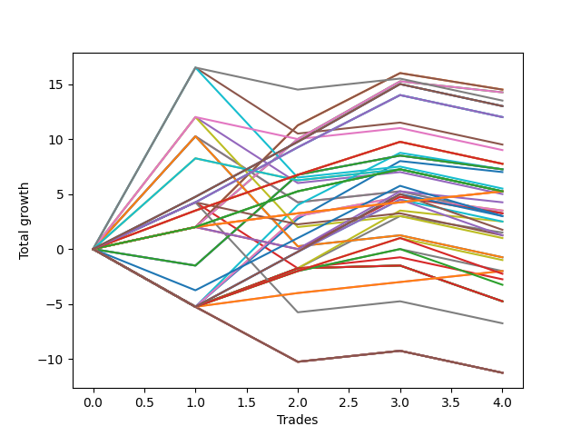

# Long Pointer 007 
- Symbol: ES
- Date Range: 03/18/2022 - 07/15/2022
- Trading Period: 7:20-12:30
- Number of Trades: 4



| Name | Win Percent | Profit | Avg Profit / Trade | Avg Time / Trade |      | Name | Win Percent | Profit | Avg Profit / Trade | Avg Time / Trade |
| ---- | ----------- | ------ | ------------------ | ---------------- | ---- | ---- | ----------- | ------ | ------------------ | ---------------- |
| Sorted By <br> Profit | | | | | | Sorted By <br> Win Percentage ||||
| Fifty-Seven | 75.00 | 7250.00 | 1812.50 | 12:43 |     | One Hundred Twenty-Six | 100.00 | 2625.00 | 656.25 | 08:43 |
| One | 75.00 | 7250.00 | 1812.50 | 12:43 |     | One Hundred Twenty-One | 100.00 | 2625.00 | 656.25 | 08:43 |
| Fifty-Eight | 75.00 | 7125.00 | 1781.25 | 16:10 |     | Eighty-One | 100.00 | 2625.00 | 656.25 | 08:43 |
| Two | 75.00 | 7125.00 | 1781.25 | 16:10 |     | Fifty-Seven | 75.00 | 7250.00 | 1812.50 | 12:43 |
| Sixty-Nine | 50.00 | 6750.00 | 1687.50 | 20:08 |     | One | 75.00 | 7250.00 | 1812.50 | 12:43 |
| One Hundred Thirty | 75.00 | 6500.00 | 1625.00 | 13:43 |     | Fifty-Eight | 75.00 | 7125.00 | 1781.25 | 16:10 |
| One Hundred Twenty-Five | 75.00 | 6500.00 | 1625.00 | 13:43 |     | Two | 75.00 | 7125.00 | 1781.25 | 16:10 |
| Eighty-Five | 75.00 | 6500.00 | 1625.00 | 13:43 |     | One Hundred Thirty | 75.00 | 6500.00 | 1625.00 | 13:43 |
| One Hundred Twenty-Nine | 75.00 | 6000.00 | 1500.00 | 13:41 |     | One Hundred Twenty-Five | 75.00 | 6500.00 | 1625.00 | 13:43 |
| One Hundred Twenty-Four | 75.00 | 6000.00 | 1500.00 | 13:41 |     | Eighty-Five | 75.00 | 6500.00 | 1625.00 | 13:43 |
| Eighty-Four | 75.00 | 6000.00 | 1500.00 | 13:41 |     | One Hundred Twenty-Nine | 75.00 | 6000.00 | 1500.00 | 13:41 |
| Five | 50.00 | 4750.00 | 1187.50 | 26:37 |     | One Hundred Twenty-Four | 75.00 | 6000.00 | 1500.00 | 13:41 |
| Sixty-Eight | 50.00 | 4500.00 | 1125.00 | 19:30 |     | Eighty-Four | 75.00 | 6000.00 | 1500.00 | 13:41 |
| One Hundred Twenty-Eight | 75.00 | 3875.00 | 968.75 | 12:01 |     | One Hundred Twenty-Eight | 75.00 | 3875.00 | 968.75 | 12:01 |
| One Hundred Twenty-Three | 75.00 | 3875.00 | 968.75 | 12:01 |     | One Hundred Twenty-Three | 75.00 | 3875.00 | 968.75 | 12:01 |
| Eighty-Three | 75.00 | 3875.00 | 968.75 | 12:01 |     | Eighty-Three | 75.00 | 3875.00 | 968.75 | 12:01 |
| Sixty-Four | 50.00 | 3625.00 | 906.25 | 06:43 |     | One Hundred Twenty-Seven | 75.00 | 2625.00 | 656.25 | 11:25 |
| Fifty-Six | 50.00 | 3625.00 | 906.25 | 06:43 |     | One Hundred Twenty-Two | 75.00 | 2625.00 | 656.25 | 11:25 |
| Forty-One | 50.00 | 3625.00 | 906.25 | 10:33 |     | Eighty-Two | 75.00 | 2625.00 | 656.25 | 11:25 |
| Zero | 50.00 | 3625.00 | 906.25 | 06:43 |     | One Hundred Sixteen | 75.00 | -1000.00 | -250.00 | 06:33 |
| Forty-Two | 50.00 | 3500.00 | 875.00 | 14:00 |     | One Hundred Eleven | 75.00 | -1000.00 | -250.00 | 06:33 |
| Sixty-One | 50.00 | 2750.00 | 687.50 | 26:27 |     | Sixty-Nine | 50.00 | 6750.00 | 1687.50 | 20:08 |
| One Hundred Twenty-Six | 100.00 | 2625.00 | 656.25 | 08:43 |     | Five | 50.00 | 4750.00 | 1187.50 | 26:37 |
| One Hundred Twenty-One | 100.00 | 2625.00 | 656.25 | 08:43 |     | Sixty-Eight | 50.00 | 4500.00 | 1125.00 | 19:30 |
| Eighty-One | 100.00 | 2625.00 | 656.25 | 08:43 |     | Sixty-Four | 50.00 | 3625.00 | 906.25 | 06:43 |
| One Hundred Twenty-Seven | 75.00 | 2625.00 | 656.25 | 11:25 |     | Fifty-Six | 50.00 | 3625.00 | 906.25 | 06:43 |
| One Hundred Twenty-Two | 75.00 | 2625.00 | 656.25 | 11:25 |     | Forty-One | 50.00 | 3625.00 | 906.25 | 10:33 |
| Eighty-Two | 75.00 | 2625.00 | 656.25 | 11:25 |     | Zero | 50.00 | 3625.00 | 906.25 | 06:43 |
| Seventy-One | 50.00 | 2625.00 | 656.25 | 22:01 |     | Forty-Two | 50.00 | 3500.00 | 875.00 | 14:00 |
| Seventy | 50.00 | 2625.00 | 656.25 | 22:01 |     | Sixty-One | 50.00 | 2750.00 | 687.50 | 26:27 |
| Four | 50.00 | 2500.00 | 625.00 | 25:58 |     | Seventy-One | 50.00 | 2625.00 | 656.25 | 22:01 |
| Sixty-Six | 50.00 | 2125.00 | 531.25 | 11:51 |     | Seventy | 50.00 | 2625.00 | 656.25 | 22:01 |
| Forty-Eight | 50.00 | 1750.00 | 437.50 | 05:40 |     | Four | 50.00 | 2500.00 | 625.00 | 25:58 |
| Forty | 50.00 | 1750.00 | 437.50 | 05:40 |     | Sixty-Six | 50.00 | 2125.00 | 531.25 | 11:51 |
| Sixty-Five | 50.00 | 1625.00 | 406.25 | 11:47 |     | Forty-Eight | 50.00 | 1750.00 | 437.50 | 05:40 |
| Seven | 50.00 | 1625.00 | 406.25 | 29:55 |     | Forty | 50.00 | 1750.00 | 437.50 | 05:40 |
| Six | 50.00 | 1625.00 | 406.25 | 29:55 |     | Sixty-Five | 50.00 | 1625.00 | 406.25 | 11:47 |
| One Hundred Fifteen | 50.00 | 1500.00 | 375.00 | 11:16 |     | Seven | 50.00 | 1625.00 | 406.25 | 29:55 |
| Seventy-Three | 50.00 | 1500.00 | 375.00 | 07:05 |     | Six | 50.00 | 1625.00 | 406.25 | 29:55 |
| One Hundred Fourteen | 50.00 | 1250.00 | 312.50 | 11:15 |     | One Hundred Fifteen | 50.00 | 1500.00 | 375.00 | 11:16 |
| Fifty | 50.00 | 1250.00 | 312.50 | 09:08 |     | Seventy-Three | 50.00 | 1500.00 | 375.00 | 07:05 |
| One Hundred Twenty | 50.00 | 875.00 | 218.75 | 10:57 |     | One Hundred Fourteen | 50.00 | 1250.00 | 312.50 | 11:15 |
| Forty-Nine | 50.00 | 750.00 | 187.50 | 09:05 |     | Fifty | 50.00 | 1250.00 | 312.50 | 09:08 |
| One Hundred Ninteen | 50.00 | 625.00 | 156.25 | 10:56 |     | One Hundred Twenty | 50.00 | 875.00 | 218.75 | 10:57 |
| Sixty-Seven | 50.00 | 625.00 | 156.25 | 19:11 |     | Forty-Nine | 50.00 | 750.00 | 187.50 | 09:05 |
| Sixty | 50.00 | 500.00 | 125.00 | 25:48 |     | One Hundred Ninteen | 50.00 | 625.00 | 156.25 | 10:56 |
| Sixty-Three | 50.00 | -375.00 | -93.75 | 29:45 |     | Sixty-Seven | 50.00 | 625.00 | 156.25 | 19:11 |
| Sixty-Two | 50.00 | -375.00 | -93.75 | 29:45 |     | Sixty | 50.00 | 500.00 | 125.00 | 25:48 |
| One Hundred Thirteen | 50.00 | -500.00 | -125.00 | 09:36 |     | Sixty-Three | 50.00 | -375.00 | -93.75 | 29:45 |
| One Hundred Sixteen | 75.00 | -1000.00 | -250.00 | 06:33 |     | Sixty-Two | 50.00 | -375.00 | -93.75 | 29:45 |
| One Hundred Eleven | 75.00 | -1000.00 | -250.00 | 06:33 |     | One Hundred Thirteen | 50.00 | -500.00 | -125.00 | 09:36 |
| One Hundred Twelve | 50.00 | -1000.00 | -250.00 | 09:15 |     | One Hundred Twelve | 50.00 | -1000.00 | -250.00 | 09:15 |
| One Hundred Eighteen | 50.00 | -1125.00 | -281.25 | 09:17 |     | One Hundred Eighteen | 50.00 | -1125.00 | -281.25 | 09:17 |
| Three | 50.00 | -1375.00 | -343.75 | 25:40 |     | Three | 50.00 | -1375.00 | -343.75 | 25:40 |
| One Hundred Seventeen | 50.00 | -1625.00 | -406.25 | 08:56 |     | One Hundred Seventeen | 50.00 | -1625.00 | -406.25 | 08:56 |
| Fifty-Five | 50.00 | -2375.00 | -593.75 | 11:50 |     | Fifty-Five | 50.00 | -2375.00 | -593.75 | 11:50 |
| Fifty-Four | 50.00 | -2375.00 | -593.75 | 11:50 |     | Fifty-Four | 50.00 | -2375.00 | -593.75 | 11:50 |
| Fifty-Three | 50.00 | -2375.00 | -593.75 | 11:50 |     | Fifty-Three | 50.00 | -2375.00 | -593.75 | 11:50 |
| Fifty-Two | 50.00 | -2375.00 | -593.75 | 11:50 |     | Fifty-Two | 50.00 | -2375.00 | -593.75 | 11:50 |
| Fifty-One | 50.00 | -2375.00 | -593.75 | 11:50 |     | Fifty-One | 50.00 | -2375.00 | -593.75 | 11:50 |
| Fifty-Nine | 50.00 | -3375.00 | -843.75 | 25:30 |     | Fifty-Nine | 50.00 | -3375.00 | -843.75 | 25:30 |
| Forty-Seven | 25.00 | -5625.00 | -1406.25 | 22:27 |     | Forty-Seven | 25.00 | -5625.00 | -1406.25 | 22:27 |
| Forty-Six | 25.00 | -5625.00 | -1406.25 | 22:27 |     | Forty-Six | 25.00 | -5625.00 | -1406.25 | 22:27 |
| Forty-Five | 25.00 | -5625.00 | -1406.25 | 22:27 |     | Forty-Five | 25.00 | -5625.00 | -1406.25 | 22:27 |
| Forty-Four | 25.00 | -5625.00 | -1406.25 | 22:27 |     | Forty-Four | 25.00 | -5625.00 | -1406.25 | 22:27 |
| Forty-Three | 25.00 | -5625.00 | -1406.25 | 22:27 |     | Forty-Three | 25.00 | -5625.00 | -1406.25 | 22:27 |

## NO STOPLOSS

### Test Zero
* Sell when price hits the middle line of the 20p bollinger
* No Stoploss
* Results:
```
Total Trades: 4
Percent Up: 50.00
Percent Down: 50.00
Total Points Moved Up: 7.25
Potential Profit: 3625.00
Total Points Ups: 10.00 Count Ups: 2
Total Points Downs: -2.75 Count Downs: 2
```

<details><summary>Trades</summary>

<code>In: 2022-04-22 12:00:00		Out: 2022-04-22 12:07:25		Total Position Time: 07:25		Total Move Up: -1.50		Total to Date: -1.50</code> <br />
<code>In: 2022-05-24 07:22:00		Out: 2022-05-24 07:23:15		Total Position Time: 01:15		Total Move Up: 8.25		Total to Date: 6.75</code> <br />
<code>In: 2022-06-08 09:48:00		Out: 2022-06-08 09:53:05		Total Position Time: 05:05		Total Move Up: 1.75		Total to Date: 8.50</code> <br />
<code>In: 2022-07-11 12:09:00		Out: 2022-07-11 12:22:10		Total Position Time: 13:10		Total Move Up: -1.25		Total to Date: 7.25</code> <br />


</details>

### Test One
* Sell when the price hits the upper line of the 20p 1std bollinger
* No Stoploss
* Results:
```
Total Trades: 4
Percent Up: 75.00
Percent Down: 25.00
Total Points Moved Up: 14.50
Potential Profit: 7250.00
Total Points Ups: 16.00 Count Ups: 3
Total Points Downs: -1.50 Count Downs: 1
```

<details><summary>Trades</summary>

<code>In: 2022-04-22 12:00:00		Out: 2022-04-22 12:11:50		Total Position Time: 11:50		Total Move Up: 2.00		Total to Date: 2.00</code> <br />
<code>In: 2022-05-24 07:22:00		Out: 2022-05-24 07:29:45		Total Position Time: 07:45		Total Move Up: 9.25		Total to Date: 11.25</code> <br />
<code>In: 2022-06-08 09:48:00		Out: 2022-06-08 09:59:05		Total Position Time: 11:05		Total Move Up: 4.75		Total to Date: 16.00</code> <br />
<code>In: 2022-07-11 12:09:00		Out: 2022-07-11 12:29:15		Total Position Time: 20:15		Total Move Up: -1.50		Total to Date: 14.50</code> <br />


</details>

### Test Two
* Sell when the price hits the upper line of the 20p 2std bollinger
* No Stoploss
* Results:
```
Total Trades: 4
Percent Up: 75.00
Percent Down: 25.00
Total Points Moved Up: 14.25
Potential Profit: 7125.00
Total Points Ups: 15.25 Count Ups: 3
Total Points Downs: -1.00 Count Downs: 1
```

<details><summary>Trades</summary>

<code>In: 2022-04-22 12:00:00		Out: 2022-04-22 12:11:50		Total Position Time: 11:50		Total Move Up: 2.00		Total to Date: 2.00</code> <br />
<code>In: 2022-05-24 07:22:00		Out: 2022-05-24 07:43:15		Total Position Time: 21:15		Total Move Up: 8.00		Total to Date: 10.00</code> <br />
<code>In: 2022-06-08 09:48:00		Out: 2022-06-08 09:59:10		Total Position Time: 11:10		Total Move Up: 5.25		Total to Date: 15.25</code> <br />
<code>In: 2022-07-11 12:09:00		Out: 2022-07-11 12:29:25		Total Position Time: 20:25		Total Move Up: -1.00		Total to Date: 14.25</code> <br />


</details>

### Test Three
* Sell when price hits the middle line of the 50p bollinger
* No Stoploss
* Results:
```
Total Trades: 4
Percent Up: 50.00
Percent Down: 50.00
Total Points Moved Up: -2.75
Potential Profit: -1375.00
Total Points Ups: 5.25 Count Ups: 2
Total Points Downs: -8.00 Count Downs: 2
```

<details><summary>Trades</summary>

<code>In: 2022-04-22 12:00:00		Out: 2022-04-22 12:12:55		Total Position Time: 12:55		Total Move Up: 4.25		Total to Date: 4.25</code> <br />
<code>In: 2022-05-24 07:22:00		Out: 2022-05-24 07:51:55		Total Position Time: 29:55		Total Move Up: -6.00		Total to Date: -1.75</code> <br />
<code>In: 2022-06-08 09:48:00		Out: 2022-06-08 10:17:55		Total Position Time: 29:55		Total Move Up: 1.00		Total to Date: -0.75</code> <br />
<code>In: 2022-07-11 12:09:00		Out: 2022-07-11 12:38:55		Total Position Time: 29:55		Total Move Up: -2.00		Total to Date: -2.75</code> <br />


</details>

### Test Four
* Sell when the price hits the upper line of the 50p 1std bollinger
* No Stoploss
* Results:
```
Total Trades: 4
Percent Up: 50.00
Percent Down: 50.00
Total Points Moved Up: 5.00
Potential Profit: 2500.00
Total Points Ups: 13.00 Count Ups: 2
Total Points Downs: -8.00 Count Downs: 2
```

<details><summary>Trades</summary>

<code>In: 2022-04-22 12:00:00		Out: 2022-04-22 12:14:10		Total Position Time: 14:10		Total Move Up: 12.00		Total to Date: 12.00</code> <br />
<code>In: 2022-05-24 07:22:00		Out: 2022-05-24 07:51:55		Total Position Time: 29:55		Total Move Up: -6.00		Total to Date: 6.00</code> <br />
<code>In: 2022-06-08 09:48:00		Out: 2022-06-08 10:17:55		Total Position Time: 29:55		Total Move Up: 1.00		Total to Date: 7.00</code> <br />
<code>In: 2022-07-11 12:09:00		Out: 2022-07-11 12:38:55		Total Position Time: 29:55		Total Move Up: -2.00		Total to Date: 5.00</code> <br />


</details>

### Test Five
* Sell when the price hits the upper line of the 50p 2std bollinger
* No Stoploss
* Results:
```
Total Trades: 4
Percent Up: 50.00
Percent Down: 50.00
Total Points Moved Up: 9.50
Potential Profit: 4750.00
Total Points Ups: 17.50 Count Ups: 2
Total Points Downs: -8.00 Count Downs: 2
```

<details><summary>Trades</summary>

<code>In: 2022-04-22 12:00:00		Out: 2022-04-22 12:16:45		Total Position Time: 16:45		Total Move Up: 16.50		Total to Date: 16.50</code> <br />
<code>In: 2022-05-24 07:22:00		Out: 2022-05-24 07:51:55		Total Position Time: 29:55		Total Move Up: -6.00		Total to Date: 10.50</code> <br />
<code>In: 2022-06-08 09:48:00		Out: 2022-06-08 10:17:55		Total Position Time: 29:55		Total Move Up: 1.00		Total to Date: 11.50</code> <br />
<code>In: 2022-07-11 12:09:00		Out: 2022-07-11 12:38:55		Total Position Time: 29:55		Total Move Up: -2.00		Total to Date: 9.50</code> <br />


</details>

### Test Six
* Sell when the price hits the middle line of the 1std VWAP
* No Stoploss
* Results:
```
Total Trades: 4
Percent Up: 50.00
Percent Down: 50.00
Total Points Moved Up: 3.25
Potential Profit: 1625.00
Total Points Ups: 11.25 Count Ups: 2
Total Points Downs: -8.00 Count Downs: 2
```

<details><summary>Trades</summary>

<code>In: 2022-04-22 12:00:00		Out: 2022-04-22 12:29:55		Total Position Time: 29:55		Total Move Up: 10.25		Total to Date: 10.25</code> <br />
<code>In: 2022-05-24 07:22:00		Out: 2022-05-24 07:51:55		Total Position Time: 29:55		Total Move Up: -6.00		Total to Date: 4.25</code> <br />
<code>In: 2022-06-08 09:48:00		Out: 2022-06-08 10:17:55		Total Position Time: 29:55		Total Move Up: 1.00		Total to Date: 5.25</code> <br />
<code>In: 2022-07-11 12:09:00		Out: 2022-07-11 12:38:55		Total Position Time: 29:55		Total Move Up: -2.00		Total to Date: 3.25</code> <br />


</details>

### Test Seven
* Sell when the price hits the upper line of the 1std VWAP
* No Stoploss
* Results:
```
Total Trades: 4
Percent Up: 50.00
Percent Down: 50.00
Total Points Moved Up: 3.25
Potential Profit: 1625.00
Total Points Ups: 11.25 Count Ups: 2
Total Points Downs: -8.00 Count Downs: 2
```

<details><summary>Trades</summary>

<code>In: 2022-04-22 12:00:00		Out: 2022-04-22 12:29:55		Total Position Time: 29:55		Total Move Up: 10.25		Total to Date: 10.25</code> <br />
<code>In: 2022-05-24 07:22:00		Out: 2022-05-24 07:51:55		Total Position Time: 29:55		Total Move Up: -6.00		Total to Date: 4.25</code> <br />
<code>In: 2022-06-08 09:48:00		Out: 2022-06-08 10:17:55		Total Position Time: 29:55		Total Move Up: 1.00		Total to Date: 5.25</code> <br />
<code>In: 2022-07-11 12:09:00		Out: 2022-07-11 12:38:55		Total Position Time: 29:55		Total Move Up: -2.00		Total to Date: 3.25</code> <br />


</details>

## STOPLOSS OF 5

### Test Forty
* Sell when price hits the middle line of the 20p bollinger
* Stoploss is 5 points
* Results:
```
Total Trades: 4
Percent Up: 50.00
Percent Down: 50.00
Total Points Moved Up: 3.50
Potential Profit: 1750.00
Total Points Ups: 10.00 Count Ups: 2
Total Points Downs: -6.50 Count Downs: 2
```

<details><summary>Trades</summary>

<code>In: 2022-04-22 12:00:00		Out: 2022-04-22 12:03:10		Total Position Time: 03:10		Total Move Up: -5.25		Total to Date: -5.25</code> <br />
<code>In: 2022-05-24 07:22:00		Out: 2022-05-24 07:23:15		Total Position Time: 01:15		Total Move Up: 8.25		Total to Date: 3.00</code> <br />
<code>In: 2022-06-08 09:48:00		Out: 2022-06-08 09:53:05		Total Position Time: 05:05		Total Move Up: 1.75		Total to Date: 4.75</code> <br />
<code>In: 2022-07-11 12:09:00		Out: 2022-07-11 12:22:10		Total Position Time: 13:10		Total Move Up: -1.25		Total to Date: 3.50</code> <br />


</details>

### Test Forty-One
* Sell when the price hits the upper line of the 20p 1std bollinger
* Stoploss is 5 points
* Results:
```
Total Trades: 4
Percent Up: 50.00
Percent Down: 50.00
Total Points Moved Up: 7.25
Potential Profit: 3625.00
Total Points Ups: 14.00 Count Ups: 2
Total Points Downs: -6.75 Count Downs: 2
```

<details><summary>Trades</summary>

<code>In: 2022-04-22 12:00:00		Out: 2022-04-22 12:03:10		Total Position Time: 03:10		Total Move Up: -5.25		Total to Date: -5.25</code> <br />
<code>In: 2022-05-24 07:22:00		Out: 2022-05-24 07:29:45		Total Position Time: 07:45		Total Move Up: 9.25		Total to Date: 4.00</code> <br />
<code>In: 2022-06-08 09:48:00		Out: 2022-06-08 09:59:05		Total Position Time: 11:05		Total Move Up: 4.75		Total to Date: 8.75</code> <br />
<code>In: 2022-07-11 12:09:00		Out: 2022-07-11 12:29:15		Total Position Time: 20:15		Total Move Up: -1.50		Total to Date: 7.25</code> <br />


</details>

### Test Forty-Two
* Sell when the price hits the upper line of the 20p 2std bollinger
* Stoploss is 5 points
* Results:
```
Total Trades: 4
Percent Up: 50.00
Percent Down: 50.00
Total Points Moved Up: 7.00
Potential Profit: 3500.00
Total Points Ups: 13.25 Count Ups: 2
Total Points Downs: -6.25 Count Downs: 2
```

<details><summary>Trades</summary>

<code>In: 2022-04-22 12:00:00		Out: 2022-04-22 12:03:10		Total Position Time: 03:10		Total Move Up: -5.25		Total to Date: -5.25</code> <br />
<code>In: 2022-05-24 07:22:00		Out: 2022-05-24 07:43:15		Total Position Time: 21:15		Total Move Up: 8.00		Total to Date: 2.75</code> <br />
<code>In: 2022-06-08 09:48:00		Out: 2022-06-08 09:59:10		Total Position Time: 11:10		Total Move Up: 5.25		Total to Date: 8.00</code> <br />
<code>In: 2022-07-11 12:09:00		Out: 2022-07-11 12:29:25		Total Position Time: 20:25		Total Move Up: -1.00		Total to Date: 7.00</code> <br />


</details>

### Test Forty-Three
* Sell when price hits the middle line of the 50p bollinger
* Stoploss is 5 points
* Results:
```
Total Trades: 4
Percent Up: 25.00
Percent Down: 75.00
Total Points Moved Up: -11.25
Potential Profit: -5625.00
Total Points Ups: 1.00 Count Ups: 1
Total Points Downs: -12.25 Count Downs: 3
```

<details><summary>Trades</summary>

<code>In: 2022-04-22 12:00:00		Out: 2022-04-22 12:03:10		Total Position Time: 03:10		Total Move Up: -5.25		Total to Date: -5.25</code> <br />
<code>In: 2022-05-24 07:22:00		Out: 2022-05-24 07:48:50		Total Position Time: 26:50		Total Move Up: -5.00		Total to Date: -10.25</code> <br />
<code>In: 2022-06-08 09:48:00		Out: 2022-06-08 10:17:55		Total Position Time: 29:55		Total Move Up: 1.00		Total to Date: -9.25</code> <br />
<code>In: 2022-07-11 12:09:00		Out: 2022-07-11 12:38:55		Total Position Time: 29:55		Total Move Up: -2.00		Total to Date: -11.25</code> <br />


</details>

### Test Forty-Four
* Sell when the price hits the upper line of the 50p 1std bollinger
* Stoploss is 5 points
* Results:
```
Total Trades: 4
Percent Up: 25.00
Percent Down: 75.00
Total Points Moved Up: -11.25
Potential Profit: -5625.00
Total Points Ups: 1.00 Count Ups: 1
Total Points Downs: -12.25 Count Downs: 3
```

<details><summary>Trades</summary>

<code>In: 2022-04-22 12:00:00		Out: 2022-04-22 12:03:10		Total Position Time: 03:10		Total Move Up: -5.25		Total to Date: -5.25</code> <br />
<code>In: 2022-05-24 07:22:00		Out: 2022-05-24 07:48:50		Total Position Time: 26:50		Total Move Up: -5.00		Total to Date: -10.25</code> <br />
<code>In: 2022-06-08 09:48:00		Out: 2022-06-08 10:17:55		Total Position Time: 29:55		Total Move Up: 1.00		Total to Date: -9.25</code> <br />
<code>In: 2022-07-11 12:09:00		Out: 2022-07-11 12:38:55		Total Position Time: 29:55		Total Move Up: -2.00		Total to Date: -11.25</code> <br />


</details>

### Test Forty-Five
* Sell when the price hits the upper line of the 50p 2std bollinger
* Stoploss is 5 points
* Results:
```
Total Trades: 4
Percent Up: 25.00
Percent Down: 75.00
Total Points Moved Up: -11.25
Potential Profit: -5625.00
Total Points Ups: 1.00 Count Ups: 1
Total Points Downs: -12.25 Count Downs: 3
```

<details><summary>Trades</summary>

<code>In: 2022-04-22 12:00:00		Out: 2022-04-22 12:03:10		Total Position Time: 03:10		Total Move Up: -5.25		Total to Date: -5.25</code> <br />
<code>In: 2022-05-24 07:22:00		Out: 2022-05-24 07:48:50		Total Position Time: 26:50		Total Move Up: -5.00		Total to Date: -10.25</code> <br />
<code>In: 2022-06-08 09:48:00		Out: 2022-06-08 10:17:55		Total Position Time: 29:55		Total Move Up: 1.00		Total to Date: -9.25</code> <br />
<code>In: 2022-07-11 12:09:00		Out: 2022-07-11 12:38:55		Total Position Time: 29:55		Total Move Up: -2.00		Total to Date: -11.25</code> <br />


</details>

### Test Forty-Six
* Sell when the price hits the middle line of the 1std VWAP
* Stoploss is 5 points
* Results:
```
Total Trades: 4
Percent Up: 25.00
Percent Down: 75.00
Total Points Moved Up: -11.25
Potential Profit: -5625.00
Total Points Ups: 1.00 Count Ups: 1
Total Points Downs: -12.25 Count Downs: 3
```

<details><summary>Trades</summary>

<code>In: 2022-04-22 12:00:00		Out: 2022-04-22 12:03:10		Total Position Time: 03:10		Total Move Up: -5.25		Total to Date: -5.25</code> <br />
<code>In: 2022-05-24 07:22:00		Out: 2022-05-24 07:48:50		Total Position Time: 26:50		Total Move Up: -5.00		Total to Date: -10.25</code> <br />
<code>In: 2022-06-08 09:48:00		Out: 2022-06-08 10:17:55		Total Position Time: 29:55		Total Move Up: 1.00		Total to Date: -9.25</code> <br />
<code>In: 2022-07-11 12:09:00		Out: 2022-07-11 12:38:55		Total Position Time: 29:55		Total Move Up: -2.00		Total to Date: -11.25</code> <br />


</details>

### Test Forty-Seven
* Sell when the price hits the upper line of the 1std VWAP
* Stoploss is 5 points
* Results:
```
Total Trades: 4
Percent Up: 25.00
Percent Down: 75.00
Total Points Moved Up: -11.25
Potential Profit: -5625.00
Total Points Ups: 1.00 Count Ups: 1
Total Points Downs: -12.25 Count Downs: 3
```

<details><summary>Trades</summary>

<code>In: 2022-04-22 12:00:00		Out: 2022-04-22 12:03:10		Total Position Time: 03:10		Total Move Up: -5.25		Total to Date: -5.25</code> <br />
<code>In: 2022-05-24 07:22:00		Out: 2022-05-24 07:48:50		Total Position Time: 26:50		Total Move Up: -5.00		Total to Date: -10.25</code> <br />
<code>In: 2022-06-08 09:48:00		Out: 2022-06-08 10:17:55		Total Position Time: 29:55		Total Move Up: 1.00		Total to Date: -9.25</code> <br />
<code>In: 2022-07-11 12:09:00		Out: 2022-07-11 12:38:55		Total Position Time: 29:55		Total Move Up: -2.00		Total to Date: -11.25</code> <br />


</details>

## TRAIL STOP OF 5

### Test Forty-Eight
* Sell when price hits the middle line of the 20p bollinger
* Trailing Stop is 5 points
* Results:
```
Total Trades: 4
Percent Up: 50.00
Percent Down: 50.00
Total Points Moved Up: 3.50
Potential Profit: 1750.00
Total Points Ups: 10.00 Count Ups: 2
Total Points Downs: -6.50 Count Downs: 2
```

<details><summary>Trades</summary>

<code>In: 2022-04-22 12:00:00		Out: 2022-04-22 12:03:10		Total Position Time: 03:10		Total Move Up: -5.25		Total to Date: -5.25</code> <br />
<code>In: 2022-05-24 07:22:00		Out: 2022-05-24 07:23:15		Total Position Time: 01:15		Total Move Up: 8.25		Total to Date: 3.00</code> <br />
<code>In: 2022-06-08 09:48:00		Out: 2022-06-08 09:53:05		Total Position Time: 05:05		Total Move Up: 1.75		Total to Date: 4.75</code> <br />
<code>In: 2022-07-11 12:09:00		Out: 2022-07-11 12:22:10		Total Position Time: 13:10		Total Move Up: -1.25		Total to Date: 3.50</code> <br />


</details>

### Test Forty-Nine
* Sell when the price hits the upper line of the 20p 1std bollinger
* Trailing Stop is 5 points
* Results:
```
Total Trades: 4
Percent Up: 50.00
Percent Down: 50.00
Total Points Moved Up: 1.50
Potential Profit: 750.00
Total Points Ups: 8.25 Count Ups: 2
Total Points Downs: -6.75 Count Downs: 2
```

<details><summary>Trades</summary>

<code>In: 2022-04-22 12:00:00		Out: 2022-04-22 12:03:10		Total Position Time: 03:10		Total Move Up: -5.25		Total to Date: -5.25</code> <br />
<code>In: 2022-05-24 07:22:00		Out: 2022-05-24 07:23:50		Total Position Time: 01:50		Total Move Up: 3.50		Total to Date: -1.75</code> <br />
<code>In: 2022-06-08 09:48:00		Out: 2022-06-08 09:59:05		Total Position Time: 11:05		Total Move Up: 4.75		Total to Date: 3.00</code> <br />
<code>In: 2022-07-11 12:09:00		Out: 2022-07-11 12:29:15		Total Position Time: 20:15		Total Move Up: -1.50		Total to Date: 1.50</code> <br />


</details>

### Test Fifty
* Sell when the price hits the upper line of the 20p 2std bollinger
* Trailing Stop is 5 points
* Results:
```
Total Trades: 4
Percent Up: 50.00
Percent Down: 50.00
Total Points Moved Up: 2.50
Potential Profit: 1250.00
Total Points Ups: 8.75 Count Ups: 2
Total Points Downs: -6.25 Count Downs: 2
```

<details><summary>Trades</summary>

<code>In: 2022-04-22 12:00:00		Out: 2022-04-22 12:03:10		Total Position Time: 03:10		Total Move Up: -5.25		Total to Date: -5.25</code> <br />
<code>In: 2022-05-24 07:22:00		Out: 2022-05-24 07:23:50		Total Position Time: 01:50		Total Move Up: 3.50		Total to Date: -1.75</code> <br />
<code>In: 2022-06-08 09:48:00		Out: 2022-06-08 09:59:10		Total Position Time: 11:10		Total Move Up: 5.25		Total to Date: 3.50</code> <br />
<code>In: 2022-07-11 12:09:00		Out: 2022-07-11 12:29:25		Total Position Time: 20:25		Total Move Up: -1.00		Total to Date: 2.50</code> <br />


</details>

### Test Fifty-One
* Sell when price hits the middle line of the 50p bollinger
* Trailing Stop is 5 points
* Results:
```
Total Trades: 4
Percent Up: 50.00
Percent Down: 50.00
Total Points Moved Up: -4.75
Potential Profit: -2375.00
Total Points Ups: 3.75 Count Ups: 2
Total Points Downs: -8.50 Count Downs: 2
```

<details><summary>Trades</summary>

<code>In: 2022-04-22 12:00:00		Out: 2022-04-22 12:03:10		Total Position Time: 03:10		Total Move Up: -5.25		Total to Date: -5.25</code> <br />
<code>In: 2022-05-24 07:22:00		Out: 2022-05-24 07:23:50		Total Position Time: 01:50		Total Move Up: 3.50		Total to Date: -1.75</code> <br />
<code>In: 2022-06-08 09:48:00		Out: 2022-06-08 10:01:40		Total Position Time: 13:40		Total Move Up: 0.25		Total to Date: -1.50</code> <br />
<code>In: 2022-07-11 12:09:00		Out: 2022-07-11 12:37:40		Total Position Time: 28:40		Total Move Up: -3.25		Total to Date: -4.75</code> <br />


</details>

### Test Fifty-Two
* Sell when the price hits the upper line of the 50p 1std bollinger
* Trailing Stop is 5 points
* Results:
```
Total Trades: 4
Percent Up: 50.00
Percent Down: 50.00
Total Points Moved Up: -4.75
Potential Profit: -2375.00
Total Points Ups: 3.75 Count Ups: 2
Total Points Downs: -8.50 Count Downs: 2
```

<details><summary>Trades</summary>

<code>In: 2022-04-22 12:00:00		Out: 2022-04-22 12:03:10		Total Position Time: 03:10		Total Move Up: -5.25		Total to Date: -5.25</code> <br />
<code>In: 2022-05-24 07:22:00		Out: 2022-05-24 07:23:50		Total Position Time: 01:50		Total Move Up: 3.50		Total to Date: -1.75</code> <br />
<code>In: 2022-06-08 09:48:00		Out: 2022-06-08 10:01:40		Total Position Time: 13:40		Total Move Up: 0.25		Total to Date: -1.50</code> <br />
<code>In: 2022-07-11 12:09:00		Out: 2022-07-11 12:37:40		Total Position Time: 28:40		Total Move Up: -3.25		Total to Date: -4.75</code> <br />


</details>

### Test Fifty-Three
* Sell when the price hits the upper line of the 50p 2std bollinger
* Trailing Stop is 5 points
* Results:
```
Total Trades: 4
Percent Up: 50.00
Percent Down: 50.00
Total Points Moved Up: -4.75
Potential Profit: -2375.00
Total Points Ups: 3.75 Count Ups: 2
Total Points Downs: -8.50 Count Downs: 2
```

<details><summary>Trades</summary>

<code>In: 2022-04-22 12:00:00		Out: 2022-04-22 12:03:10		Total Position Time: 03:10		Total Move Up: -5.25		Total to Date: -5.25</code> <br />
<code>In: 2022-05-24 07:22:00		Out: 2022-05-24 07:23:50		Total Position Time: 01:50		Total Move Up: 3.50		Total to Date: -1.75</code> <br />
<code>In: 2022-06-08 09:48:00		Out: 2022-06-08 10:01:40		Total Position Time: 13:40		Total Move Up: 0.25		Total to Date: -1.50</code> <br />
<code>In: 2022-07-11 12:09:00		Out: 2022-07-11 12:37:40		Total Position Time: 28:40		Total Move Up: -3.25		Total to Date: -4.75</code> <br />


</details>

### Test Fifty-Four
* Sell when the price hits the middle line of the 1std VWAP
* Trailing Stop is 5 points
* Results:
```
Total Trades: 4
Percent Up: 50.00
Percent Down: 50.00
Total Points Moved Up: -4.75
Potential Profit: -2375.00
Total Points Ups: 3.75 Count Ups: 2
Total Points Downs: -8.50 Count Downs: 2
```

<details><summary>Trades</summary>

<code>In: 2022-04-22 12:00:00		Out: 2022-04-22 12:03:10		Total Position Time: 03:10		Total Move Up: -5.25		Total to Date: -5.25</code> <br />
<code>In: 2022-05-24 07:22:00		Out: 2022-05-24 07:23:50		Total Position Time: 01:50		Total Move Up: 3.50		Total to Date: -1.75</code> <br />
<code>In: 2022-06-08 09:48:00		Out: 2022-06-08 10:01:40		Total Position Time: 13:40		Total Move Up: 0.25		Total to Date: -1.50</code> <br />
<code>In: 2022-07-11 12:09:00		Out: 2022-07-11 12:37:40		Total Position Time: 28:40		Total Move Up: -3.25		Total to Date: -4.75</code> <br />


</details>

### Test Fifty-Five
* Sell when the price hits the upper line of the 1std VWAP
* Trailing Stop is 5 points
* Results:
```
Total Trades: 4
Percent Up: 50.00
Percent Down: 50.00
Total Points Moved Up: -4.75
Potential Profit: -2375.00
Total Points Ups: 3.75 Count Ups: 2
Total Points Downs: -8.50 Count Downs: 2
```

<details><summary>Trades</summary>

<code>In: 2022-04-22 12:00:00		Out: 2022-04-22 12:03:10		Total Position Time: 03:10		Total Move Up: -5.25		Total to Date: -5.25</code> <br />
<code>In: 2022-05-24 07:22:00		Out: 2022-05-24 07:23:50		Total Position Time: 01:50		Total Move Up: 3.50		Total to Date: -1.75</code> <br />
<code>In: 2022-06-08 09:48:00		Out: 2022-06-08 10:01:40		Total Position Time: 13:40		Total Move Up: 0.25		Total to Date: -1.50</code> <br />
<code>In: 2022-07-11 12:09:00		Out: 2022-07-11 12:37:40		Total Position Time: 28:40		Total Move Up: -3.25		Total to Date: -4.75</code> <br />


</details>

## STOPLOSS OF 10

### Test Fifty-Six
* Sell when price hits the middle line of the 20p bollinger
* Stoploss is 10 points
* Results:
```
Total Trades: 4
Percent Up: 50.00
Percent Down: 50.00
Total Points Moved Up: 7.25
Potential Profit: 3625.00
Total Points Ups: 10.00 Count Ups: 2
Total Points Downs: -2.75 Count Downs: 2
```

<details><summary>Trades</summary>

<code>In: 2022-04-22 12:00:00		Out: 2022-04-22 12:07:25		Total Position Time: 07:25		Total Move Up: -1.50		Total to Date: -1.50</code> <br />
<code>In: 2022-05-24 07:22:00		Out: 2022-05-24 07:23:15		Total Position Time: 01:15		Total Move Up: 8.25		Total to Date: 6.75</code> <br />
<code>In: 2022-06-08 09:48:00		Out: 2022-06-08 09:53:05		Total Position Time: 05:05		Total Move Up: 1.75		Total to Date: 8.50</code> <br />
<code>In: 2022-07-11 12:09:00		Out: 2022-07-11 12:22:10		Total Position Time: 13:10		Total Move Up: -1.25		Total to Date: 7.25</code> <br />


</details>

### Test Fifty-Seven
* Sell when the price hits the upper line of the 20p 1std bollinger
* Stoploss is 10 points
* Results:
```
Total Trades: 4
Percent Up: 75.00
Percent Down: 25.00
Total Points Moved Up: 14.50
Potential Profit: 7250.00
Total Points Ups: 16.00 Count Ups: 3
Total Points Downs: -1.50 Count Downs: 1
```

<details><summary>Trades</summary>

<code>In: 2022-04-22 12:00:00		Out: 2022-04-22 12:11:50		Total Position Time: 11:50		Total Move Up: 2.00		Total to Date: 2.00</code> <br />
<code>In: 2022-05-24 07:22:00		Out: 2022-05-24 07:29:45		Total Position Time: 07:45		Total Move Up: 9.25		Total to Date: 11.25</code> <br />
<code>In: 2022-06-08 09:48:00		Out: 2022-06-08 09:59:05		Total Position Time: 11:05		Total Move Up: 4.75		Total to Date: 16.00</code> <br />
<code>In: 2022-07-11 12:09:00		Out: 2022-07-11 12:29:15		Total Position Time: 20:15		Total Move Up: -1.50		Total to Date: 14.50</code> <br />


</details>

### Test Fifty-Eight
* Sell when the price hits the upper line of the 20p 2std bollinger
* Stoploss is 10 points
* Results:
```
Total Trades: 4
Percent Up: 75.00
Percent Down: 25.00
Total Points Moved Up: 14.25
Potential Profit: 7125.00
Total Points Ups: 15.25 Count Ups: 3
Total Points Downs: -1.00 Count Downs: 1
```

<details><summary>Trades</summary>

<code>In: 2022-04-22 12:00:00		Out: 2022-04-22 12:11:50		Total Position Time: 11:50		Total Move Up: 2.00		Total to Date: 2.00</code> <br />
<code>In: 2022-05-24 07:22:00		Out: 2022-05-24 07:43:15		Total Position Time: 21:15		Total Move Up: 8.00		Total to Date: 10.00</code> <br />
<code>In: 2022-06-08 09:48:00		Out: 2022-06-08 09:59:10		Total Position Time: 11:10		Total Move Up: 5.25		Total to Date: 15.25</code> <br />
<code>In: 2022-07-11 12:09:00		Out: 2022-07-11 12:29:25		Total Position Time: 20:25		Total Move Up: -1.00		Total to Date: 14.25</code> <br />


</details>

### Test Fifty-Nine
* Sell when price hits the middle line of the 50p bollinger
* Stoploss is 10 points
* Results:
```
Total Trades: 4
Percent Up: 50.00
Percent Down: 50.00
Total Points Moved Up: -6.75
Potential Profit: -3375.00
Total Points Ups: 5.25 Count Ups: 2
Total Points Downs: -12.00 Count Downs: 2
```

<details><summary>Trades</summary>

<code>In: 2022-04-22 12:00:00		Out: 2022-04-22 12:12:55		Total Position Time: 12:55		Total Move Up: 4.25		Total to Date: 4.25</code> <br />
<code>In: 2022-05-24 07:22:00		Out: 2022-05-24 07:51:15		Total Position Time: 29:15		Total Move Up: -10.00		Total to Date: -5.75</code> <br />
<code>In: 2022-06-08 09:48:00		Out: 2022-06-08 10:17:55		Total Position Time: 29:55		Total Move Up: 1.00		Total to Date: -4.75</code> <br />
<code>In: 2022-07-11 12:09:00		Out: 2022-07-11 12:38:55		Total Position Time: 29:55		Total Move Up: -2.00		Total to Date: -6.75</code> <br />


</details>

### Test Sixty
* Sell when the price hits the upper line of the 50p 1std bollinger
* Stoploss is 10 points
* Results:
```
Total Trades: 4
Percent Up: 50.00
Percent Down: 50.00
Total Points Moved Up: 1.00
Potential Profit: 500.00
Total Points Ups: 13.00 Count Ups: 2
Total Points Downs: -12.00 Count Downs: 2
```

<details><summary>Trades</summary>

<code>In: 2022-04-22 12:00:00		Out: 2022-04-22 12:14:10		Total Position Time: 14:10		Total Move Up: 12.00		Total to Date: 12.00</code> <br />
<code>In: 2022-05-24 07:22:00		Out: 2022-05-24 07:51:15		Total Position Time: 29:15		Total Move Up: -10.00		Total to Date: 2.00</code> <br />
<code>In: 2022-06-08 09:48:00		Out: 2022-06-08 10:17:55		Total Position Time: 29:55		Total Move Up: 1.00		Total to Date: 3.00</code> <br />
<code>In: 2022-07-11 12:09:00		Out: 2022-07-11 12:38:55		Total Position Time: 29:55		Total Move Up: -2.00		Total to Date: 1.00</code> <br />


</details>

### Test Sixty-One
* Sell when the price hits the upper line of the 50p 2std bollinger
* Stoploss is 10 points
* Results:
```
Total Trades: 4
Percent Up: 50.00
Percent Down: 50.00
Total Points Moved Up: 5.50
Potential Profit: 2750.00
Total Points Ups: 17.50 Count Ups: 2
Total Points Downs: -12.00 Count Downs: 2
```

<details><summary>Trades</summary>

<code>In: 2022-04-22 12:00:00		Out: 2022-04-22 12:16:45		Total Position Time: 16:45		Total Move Up: 16.50		Total to Date: 16.50</code> <br />
<code>In: 2022-05-24 07:22:00		Out: 2022-05-24 07:51:15		Total Position Time: 29:15		Total Move Up: -10.00		Total to Date: 6.50</code> <br />
<code>In: 2022-06-08 09:48:00		Out: 2022-06-08 10:17:55		Total Position Time: 29:55		Total Move Up: 1.00		Total to Date: 7.50</code> <br />
<code>In: 2022-07-11 12:09:00		Out: 2022-07-11 12:38:55		Total Position Time: 29:55		Total Move Up: -2.00		Total to Date: 5.50</code> <br />


</details>

### Test Sixty-Two
* Sell when the price hits the middle line of the 1std VWAP
* Stoploss is 10 points
* Results:
```
Total Trades: 4
Percent Up: 50.00
Percent Down: 50.00
Total Points Moved Up: -0.75
Potential Profit: -375.00
Total Points Ups: 11.25 Count Ups: 2
Total Points Downs: -12.00 Count Downs: 2
```

<details><summary>Trades</summary>

<code>In: 2022-04-22 12:00:00		Out: 2022-04-22 12:29:55		Total Position Time: 29:55		Total Move Up: 10.25		Total to Date: 10.25</code> <br />
<code>In: 2022-05-24 07:22:00		Out: 2022-05-24 07:51:15		Total Position Time: 29:15		Total Move Up: -10.00		Total to Date: 0.25</code> <br />
<code>In: 2022-06-08 09:48:00		Out: 2022-06-08 10:17:55		Total Position Time: 29:55		Total Move Up: 1.00		Total to Date: 1.25</code> <br />
<code>In: 2022-07-11 12:09:00		Out: 2022-07-11 12:38:55		Total Position Time: 29:55		Total Move Up: -2.00		Total to Date: -0.75</code> <br />


</details>

### Test Sixty-Three
* Sell when the price hits the upper line of the 1std VWAP
* Stoploss is 10 points
* Results:
```
Total Trades: 4
Percent Up: 50.00
Percent Down: 50.00
Total Points Moved Up: -0.75
Potential Profit: -375.00
Total Points Ups: 11.25 Count Ups: 2
Total Points Downs: -12.00 Count Downs: 2
```

<details><summary>Trades</summary>

<code>In: 2022-04-22 12:00:00		Out: 2022-04-22 12:29:55		Total Position Time: 29:55		Total Move Up: 10.25		Total to Date: 10.25</code> <br />
<code>In: 2022-05-24 07:22:00		Out: 2022-05-24 07:51:15		Total Position Time: 29:15		Total Move Up: -10.00		Total to Date: 0.25</code> <br />
<code>In: 2022-06-08 09:48:00		Out: 2022-06-08 10:17:55		Total Position Time: 29:55		Total Move Up: 1.00		Total to Date: 1.25</code> <br />
<code>In: 2022-07-11 12:09:00		Out: 2022-07-11 12:38:55		Total Position Time: 29:55		Total Move Up: -2.00		Total to Date: -0.75</code> <br />


</details>

## TRAIL STOP OF 10

### Test Sixty-Four
* Sell when price hits the middle line of the 20p bollinger
* Trailing Stop is 10 points
* Results:
```
Total Trades: 4
Percent Up: 50.00
Percent Down: 50.00
Total Points Moved Up: 7.25
Potential Profit: 3625.00
Total Points Ups: 10.00 Count Ups: 2
Total Points Downs: -2.75 Count Downs: 2
```

<details><summary>Trades</summary>

<code>In: 2022-04-22 12:00:00		Out: 2022-04-22 12:07:25		Total Position Time: 07:25		Total Move Up: -1.50		Total to Date: -1.50</code> <br />
<code>In: 2022-05-24 07:22:00		Out: 2022-05-24 07:23:15		Total Position Time: 01:15		Total Move Up: 8.25		Total to Date: 6.75</code> <br />
<code>In: 2022-06-08 09:48:00		Out: 2022-06-08 09:53:05		Total Position Time: 05:05		Total Move Up: 1.75		Total to Date: 8.50</code> <br />
<code>In: 2022-07-11 12:09:00		Out: 2022-07-11 12:22:10		Total Position Time: 13:10		Total Move Up: -1.25		Total to Date: 7.25</code> <br />


</details>

### Test Sixty-Five
* Sell when the price hits the upper line of the 20p 1std bollinger
* Trailing Stop is 10 points
* Results:
```
Total Trades: 4
Percent Up: 50.00
Percent Down: 50.00
Total Points Moved Up: 3.25
Potential Profit: 1625.00
Total Points Ups: 6.75 Count Ups: 2
Total Points Downs: -3.50 Count Downs: 2
```

<details><summary>Trades</summary>

<code>In: 2022-04-22 12:00:00		Out: 2022-04-22 12:11:50		Total Position Time: 11:50		Total Move Up: 2.00		Total to Date: 2.00</code> <br />
<code>In: 2022-05-24 07:22:00		Out: 2022-05-24 07:26:00		Total Position Time: 04:00		Total Move Up: -2.00		Total to Date: 0.00</code> <br />
<code>In: 2022-06-08 09:48:00		Out: 2022-06-08 09:59:05		Total Position Time: 11:05		Total Move Up: 4.75		Total to Date: 4.75</code> <br />
<code>In: 2022-07-11 12:09:00		Out: 2022-07-11 12:29:15		Total Position Time: 20:15		Total Move Up: -1.50		Total to Date: 3.25</code> <br />


</details>

### Test Sixty-Six
* Sell when the price hits the upper line of the 20p 2std bollinger
* Trailing Stop is 10 points
* Results:
```
Total Trades: 4
Percent Up: 50.00
Percent Down: 50.00
Total Points Moved Up: 4.25
Potential Profit: 2125.00
Total Points Ups: 7.25 Count Ups: 2
Total Points Downs: -3.00 Count Downs: 2
```

<details><summary>Trades</summary>

<code>In: 2022-04-22 12:00:00		Out: 2022-04-22 12:11:50		Total Position Time: 11:50		Total Move Up: 2.00		Total to Date: 2.00</code> <br />
<code>In: 2022-05-24 07:22:00		Out: 2022-05-24 07:26:00		Total Position Time: 04:00		Total Move Up: -2.00		Total to Date: 0.00</code> <br />
<code>In: 2022-06-08 09:48:00		Out: 2022-06-08 09:59:10		Total Position Time: 11:10		Total Move Up: 5.25		Total to Date: 5.25</code> <br />
<code>In: 2022-07-11 12:09:00		Out: 2022-07-11 12:29:25		Total Position Time: 20:25		Total Move Up: -1.00		Total to Date: 4.25</code> <br />


</details>

### Test Sixty-Seven
* Sell when price hits the middle line of the 50p bollinger
* Trailing Stop is 10 points
* Results:
```
Total Trades: 4
Percent Up: 50.00
Percent Down: 50.00
Total Points Moved Up: 1.25
Potential Profit: 625.00
Total Points Ups: 5.25 Count Ups: 2
Total Points Downs: -4.00 Count Downs: 2
```

<details><summary>Trades</summary>

<code>In: 2022-04-22 12:00:00		Out: 2022-04-22 12:12:55		Total Position Time: 12:55		Total Move Up: 4.25		Total to Date: 4.25</code> <br />
<code>In: 2022-05-24 07:22:00		Out: 2022-05-24 07:26:00		Total Position Time: 04:00		Total Move Up: -2.00		Total to Date: 2.25</code> <br />
<code>In: 2022-06-08 09:48:00		Out: 2022-06-08 10:17:55		Total Position Time: 29:55		Total Move Up: 1.00		Total to Date: 3.25</code> <br />
<code>In: 2022-07-11 12:09:00		Out: 2022-07-11 12:38:55		Total Position Time: 29:55		Total Move Up: -2.00		Total to Date: 1.25</code> <br />


</details>

### Test Sixty-Eight
* Sell when the price hits the upper line of the 50p 1std bollinger
* Trailing Stop is 10 points
* Results:
```
Total Trades: 4
Percent Up: 50.00
Percent Down: 50.00
Total Points Moved Up: 9.00
Potential Profit: 4500.00
Total Points Ups: 13.00 Count Ups: 2
Total Points Downs: -4.00 Count Downs: 2
```

<details><summary>Trades</summary>

<code>In: 2022-04-22 12:00:00		Out: 2022-04-22 12:14:10		Total Position Time: 14:10		Total Move Up: 12.00		Total to Date: 12.00</code> <br />
<code>In: 2022-05-24 07:22:00		Out: 2022-05-24 07:26:00		Total Position Time: 04:00		Total Move Up: -2.00		Total to Date: 10.00</code> <br />
<code>In: 2022-06-08 09:48:00		Out: 2022-06-08 10:17:55		Total Position Time: 29:55		Total Move Up: 1.00		Total to Date: 11.00</code> <br />
<code>In: 2022-07-11 12:09:00		Out: 2022-07-11 12:38:55		Total Position Time: 29:55		Total Move Up: -2.00		Total to Date: 9.00</code> <br />


</details>

### Test Sixty-Nine
* Sell when the price hits the upper line of the 50p 2std bollinger
* Trailing Stop is 10 points
* Results:
```
Total Trades: 4
Percent Up: 50.00
Percent Down: 50.00
Total Points Moved Up: 13.50
Potential Profit: 6750.00
Total Points Ups: 17.50 Count Ups: 2
Total Points Downs: -4.00 Count Downs: 2
```

<details><summary>Trades</summary>

<code>In: 2022-04-22 12:00:00		Out: 2022-04-22 12:16:45		Total Position Time: 16:45		Total Move Up: 16.50		Total to Date: 16.50</code> <br />
<code>In: 2022-05-24 07:22:00		Out: 2022-05-24 07:26:00		Total Position Time: 04:00		Total Move Up: -2.00		Total to Date: 14.50</code> <br />
<code>In: 2022-06-08 09:48:00		Out: 2022-06-08 10:17:55		Total Position Time: 29:55		Total Move Up: 1.00		Total to Date: 15.50</code> <br />
<code>In: 2022-07-11 12:09:00		Out: 2022-07-11 12:38:55		Total Position Time: 29:55		Total Move Up: -2.00		Total to Date: 13.50</code> <br />


</details>

### Test Seventy
* Sell when the price hits the middle line of the 1std VWAP
* Trailing Stop is 10 points
* Results:
```
Total Trades: 4
Percent Up: 50.00
Percent Down: 50.00
Total Points Moved Up: 5.25
Potential Profit: 2625.00
Total Points Ups: 9.25 Count Ups: 2
Total Points Downs: -4.00 Count Downs: 2
```

<details><summary>Trades</summary>

<code>In: 2022-04-22 12:00:00		Out: 2022-04-22 12:24:15		Total Position Time: 24:15		Total Move Up: 8.25		Total to Date: 8.25</code> <br />
<code>In: 2022-05-24 07:22:00		Out: 2022-05-24 07:26:00		Total Position Time: 04:00		Total Move Up: -2.00		Total to Date: 6.25</code> <br />
<code>In: 2022-06-08 09:48:00		Out: 2022-06-08 10:17:55		Total Position Time: 29:55		Total Move Up: 1.00		Total to Date: 7.25</code> <br />
<code>In: 2022-07-11 12:09:00		Out: 2022-07-11 12:38:55		Total Position Time: 29:55		Total Move Up: -2.00		Total to Date: 5.25</code> <br />


</details>

### Test Seventy-One
* Sell when the price hits the upper line of the 1std VWAP
* Trailing Stop is 10 points
* Results:
```
Total Trades: 4
Percent Up: 50.00
Percent Down: 50.00
Total Points Moved Up: 5.25
Potential Profit: 2625.00
Total Points Ups: 9.25 Count Ups: 2
Total Points Downs: -4.00 Count Downs: 2
```

<details><summary>Trades</summary>

<code>In: 2022-04-22 12:00:00		Out: 2022-04-22 12:24:15		Total Position Time: 24:15		Total Move Up: 8.25		Total to Date: 8.25</code> <br />
<code>In: 2022-05-24 07:22:00		Out: 2022-05-24 07:26:00		Total Position Time: 04:00		Total Move Up: -2.00		Total to Date: 6.25</code> <br />
<code>In: 2022-06-08 09:48:00		Out: 2022-06-08 10:17:55		Total Position Time: 29:55		Total Move Up: 1.00		Total to Date: 7.25</code> <br />
<code>In: 2022-07-11 12:09:00		Out: 2022-07-11 12:38:55		Total Position Time: 29:55		Total Move Up: -2.00		Total to Date: 5.25</code> <br />


</details>

## SPECIAL EXIT CONDITIONS 

### Test Seventy-Three
* Sell when the linear regression slope changes to negative
* No Stoploss
* Results:
```
Total Trades: 4
Percent Up: 50.00
Percent Down: 50.00
Total Points Moved Up: 3.00
Potential Profit: 1500.00
Total Points Ups: 9.50 Count Ups: 2
Total Points Downs: -6.50 Count Downs: 2
```

<details><summary>Trades</summary>

<code>In: 2022-04-22 12:00:00		Out: 2022-04-22 12:01:05		Total Position Time: 01:05		Total Move Up: -3.75		Total to Date: -3.75</code> <br />
<code>In: 2022-05-24 07:22:00		Out: 2022-05-24 07:33:05		Total Position Time: 11:05		Total Move Up: 4.75		Total to Date: 1.00</code> <br />
<code>In: 2022-06-08 09:48:00		Out: 2022-06-08 09:59:05		Total Position Time: 11:05		Total Move Up: 4.75		Total to Date: 5.75</code> <br />
<code>In: 2022-07-11 12:09:00		Out: 2022-07-11 12:14:05		Total Position Time: 05:05		Total Move Up: -2.75		Total to Date: 3.00</code> <br />


</details>

## TAKE PROFIT

### Test Eighty-One
* Take Profit of 1 Point
* No Stoploss
* Results:
```
Total Trades: 4
Percent Up: 100.00
Percent Down: 0.00
Total Points Moved Up: 5.25
Potential Profit: 2625.00
Total Points Ups: 5.25 Count Ups: 4
Total Points Downs: 0.00 Count Downs: 0
```

<details><summary>Trades</summary>

<code>In: 2022-04-22 12:00:00		Out: 2022-04-22 12:11:50		Total Position Time: 11:50		Total Move Up: 2.00		Total to Date: 2.00</code> <br />
<code>In: 2022-05-24 07:22:00		Out: 2022-05-24 07:22:15		Total Position Time: 00:15		Total Move Up: 1.25		Total to Date: 3.25</code> <br />
<code>In: 2022-06-08 09:48:00		Out: 2022-06-08 09:48:35		Total Position Time: 00:35		Total Move Up: 1.00		Total to Date: 4.25</code> <br />
<code>In: 2022-07-11 12:09:00		Out: 2022-07-11 12:31:15		Total Position Time: 22:15		Total Move Up: 1.00		Total to Date: 5.25</code> <br />


</details>

### Test Eighty-Two
* Take Profit of 2 Point
* No Stoploss
* Results:
```
Total Trades: 4
Percent Up: 75.00
Percent Down: 25.00
Total Points Moved Up: 5.25
Potential Profit: 2625.00
Total Points Ups: 7.25 Count Ups: 3
Total Points Downs: -2.00 Count Downs: 1
```

<details><summary>Trades</summary>

<code>In: 2022-04-22 12:00:00		Out: 2022-04-22 12:11:50		Total Position Time: 11:50		Total Move Up: 2.00		Total to Date: 2.00</code> <br />
<code>In: 2022-05-24 07:22:00		Out: 2022-05-24 07:22:20		Total Position Time: 00:20		Total Move Up: 3.25		Total to Date: 5.25</code> <br />
<code>In: 2022-06-08 09:48:00		Out: 2022-06-08 09:51:35		Total Position Time: 03:35		Total Move Up: 2.00		Total to Date: 7.25</code> <br />
<code>In: 2022-07-11 12:09:00		Out: 2022-07-11 12:38:55		Total Position Time: 29:55		Total Move Up: -2.00		Total to Date: 5.25</code> <br />


</details>

### Test Eighty-Three
* Take Profit of 3 Point
* No Stoploss
* Results:
```
Total Trades: 4
Percent Up: 75.00
Percent Down: 25.00
Total Points Moved Up: 7.75
Potential Profit: 3875.00
Total Points Ups: 9.75 Count Ups: 3
Total Points Downs: -2.00 Count Downs: 1
```

<details><summary>Trades</summary>

<code>In: 2022-04-22 12:00:00		Out: 2022-04-22 12:12:50		Total Position Time: 12:50		Total Move Up: 3.50		Total to Date: 3.50</code> <br />
<code>In: 2022-05-24 07:22:00		Out: 2022-05-24 07:22:20		Total Position Time: 00:20		Total Move Up: 3.25		Total to Date: 6.75</code> <br />
<code>In: 2022-06-08 09:48:00		Out: 2022-06-08 09:53:00		Total Position Time: 05:00		Total Move Up: 3.00		Total to Date: 9.75</code> <br />
<code>In: 2022-07-11 12:09:00		Out: 2022-07-11 12:38:55		Total Position Time: 29:55		Total Move Up: -2.00		Total to Date: 7.75</code> <br />


</details>

### Test Eighty-Four
* Take Profit of 4 Point
* No Stoploss
* Results:
```
Total Trades: 4
Percent Up: 75.00
Percent Down: 25.00
Total Points Moved Up: 12.00
Potential Profit: 6000.00
Total Points Ups: 14.00 Count Ups: 3
Total Points Downs: -2.00 Count Downs: 1
```

<details><summary>Trades</summary>

<code>In: 2022-04-22 12:00:00		Out: 2022-04-22 12:12:55		Total Position Time: 12:55		Total Move Up: 4.25		Total to Date: 4.25</code> <br />
<code>In: 2022-05-24 07:22:00		Out: 2022-05-24 07:22:50		Total Position Time: 00:50		Total Move Up: 5.00		Total to Date: 9.25</code> <br />
<code>In: 2022-06-08 09:48:00		Out: 2022-06-08 09:59:05		Total Position Time: 11:05		Total Move Up: 4.75		Total to Date: 14.00</code> <br />
<code>In: 2022-07-11 12:09:00		Out: 2022-07-11 12:38:55		Total Position Time: 29:55		Total Move Up: -2.00		Total to Date: 12.00</code> <br />


</details>

### Test Eighty-Five
* Take Profit of 5 Point
* No Stoploss
* Results:
```
Total Trades: 4
Percent Up: 75.00
Percent Down: 25.00
Total Points Moved Up: 13.00
Potential Profit: 6500.00
Total Points Ups: 15.00 Count Ups: 3
Total Points Downs: -2.00 Count Downs: 1
```

<details><summary>Trades</summary>

<code>In: 2022-04-22 12:00:00		Out: 2022-04-22 12:13:00		Total Position Time: 13:00		Total Move Up: 4.75		Total to Date: 4.75</code> <br />
<code>In: 2022-05-24 07:22:00		Out: 2022-05-24 07:22:50		Total Position Time: 00:50		Total Move Up: 5.00		Total to Date: 9.75</code> <br />
<code>In: 2022-06-08 09:48:00		Out: 2022-06-08 09:59:10		Total Position Time: 11:10		Total Move Up: 5.25		Total to Date: 15.00</code> <br />
<code>In: 2022-07-11 12:09:00		Out: 2022-07-11 12:38:55		Total Position Time: 29:55		Total Move Up: -2.00		Total to Date: 13.00</code> <br />


</details>

## TAKE PROFIT Stoploss of Five

### Test One Hundred Eleven
* Take Profit of 1 Point
* Stoploss is 5 points
* Results:
```
Total Trades: 4
Percent Up: 75.00
Percent Down: 25.00
Total Points Moved Up: -2.00
Potential Profit: -1000.00
Total Points Ups: 3.25 Count Ups: 3
Total Points Downs: -5.25 Count Downs: 1
```

<details><summary>Trades</summary>

<code>In: 2022-04-22 12:00:00		Out: 2022-04-22 12:03:10		Total Position Time: 03:10		Total Move Up: -5.25		Total to Date: -5.25</code> <br />
<code>In: 2022-05-24 07:22:00		Out: 2022-05-24 07:22:15		Total Position Time: 00:15		Total Move Up: 1.25		Total to Date: -4.00</code> <br />
<code>In: 2022-06-08 09:48:00		Out: 2022-06-08 09:48:35		Total Position Time: 00:35		Total Move Up: 1.00		Total to Date: -3.00</code> <br />
<code>In: 2022-07-11 12:09:00		Out: 2022-07-11 12:31:15		Total Position Time: 22:15		Total Move Up: 1.00		Total to Date: -2.00</code> <br />


</details>

### Test One Hundred Twelve
* Take Profit of 2 Point
* Stoploss is 5 points
* Results:
```
Total Trades: 4
Percent Up: 50.00
Percent Down: 50.00
Total Points Moved Up: -2.00
Potential Profit: -1000.00
Total Points Ups: 5.25 Count Ups: 2
Total Points Downs: -7.25 Count Downs: 2
```

<details><summary>Trades</summary>

<code>In: 2022-04-22 12:00:00		Out: 2022-04-22 12:03:10		Total Position Time: 03:10		Total Move Up: -5.25		Total to Date: -5.25</code> <br />
<code>In: 2022-05-24 07:22:00		Out: 2022-05-24 07:22:20		Total Position Time: 00:20		Total Move Up: 3.25		Total to Date: -2.00</code> <br />
<code>In: 2022-06-08 09:48:00		Out: 2022-06-08 09:51:35		Total Position Time: 03:35		Total Move Up: 2.00		Total to Date: 0.00</code> <br />
<code>In: 2022-07-11 12:09:00		Out: 2022-07-11 12:38:55		Total Position Time: 29:55		Total Move Up: -2.00		Total to Date: -2.00</code> <br />


</details>

### Test One Hundred Thirteen
* Take Profit of 3 Point
* Stoploss is 5 points
* Results:
```
Total Trades: 4
Percent Up: 50.00
Percent Down: 50.00
Total Points Moved Up: -1.00
Potential Profit: -500.00
Total Points Ups: 6.25 Count Ups: 2
Total Points Downs: -7.25 Count Downs: 2
```

<details><summary>Trades</summary>

<code>In: 2022-04-22 12:00:00		Out: 2022-04-22 12:03:10		Total Position Time: 03:10		Total Move Up: -5.25		Total to Date: -5.25</code> <br />
<code>In: 2022-05-24 07:22:00		Out: 2022-05-24 07:22:20		Total Position Time: 00:20		Total Move Up: 3.25		Total to Date: -2.00</code> <br />
<code>In: 2022-06-08 09:48:00		Out: 2022-06-08 09:53:00		Total Position Time: 05:00		Total Move Up: 3.00		Total to Date: 1.00</code> <br />
<code>In: 2022-07-11 12:09:00		Out: 2022-07-11 12:38:55		Total Position Time: 29:55		Total Move Up: -2.00		Total to Date: -1.00</code> <br />


</details>

### Test One Hundred Fourteen
* Take Profit of 4 Point
* Stoploss is 5 points
* Results:
```
Total Trades: 4
Percent Up: 50.00
Percent Down: 50.00
Total Points Moved Up: 2.50
Potential Profit: 1250.00
Total Points Ups: 9.75 Count Ups: 2
Total Points Downs: -7.25 Count Downs: 2
```

<details><summary>Trades</summary>

<code>In: 2022-04-22 12:00:00		Out: 2022-04-22 12:03:10		Total Position Time: 03:10		Total Move Up: -5.25		Total to Date: -5.25</code> <br />
<code>In: 2022-05-24 07:22:00		Out: 2022-05-24 07:22:50		Total Position Time: 00:50		Total Move Up: 5.00		Total to Date: -0.25</code> <br />
<code>In: 2022-06-08 09:48:00		Out: 2022-06-08 09:59:05		Total Position Time: 11:05		Total Move Up: 4.75		Total to Date: 4.50</code> <br />
<code>In: 2022-07-11 12:09:00		Out: 2022-07-11 12:38:55		Total Position Time: 29:55		Total Move Up: -2.00		Total to Date: 2.50</code> <br />


</details>

### Test One Hundred Fifteen
* Take Profit of 5 Point
* Stoploss is 5 points
* Results:
```
Total Trades: 4
Percent Up: 50.00
Percent Down: 50.00
Total Points Moved Up: 3.00
Potential Profit: 1500.00
Total Points Ups: 10.25 Count Ups: 2
Total Points Downs: -7.25 Count Downs: 2
```

<details><summary>Trades</summary>

<code>In: 2022-04-22 12:00:00		Out: 2022-04-22 12:03:10		Total Position Time: 03:10		Total Move Up: -5.25		Total to Date: -5.25</code> <br />
<code>In: 2022-05-24 07:22:00		Out: 2022-05-24 07:22:50		Total Position Time: 00:50		Total Move Up: 5.00		Total to Date: -0.25</code> <br />
<code>In: 2022-06-08 09:48:00		Out: 2022-06-08 09:59:10		Total Position Time: 11:10		Total Move Up: 5.25		Total to Date: 5.00</code> <br />
<code>In: 2022-07-11 12:09:00		Out: 2022-07-11 12:38:55		Total Position Time: 29:55		Total Move Up: -2.00		Total to Date: 3.00</code> <br />


</details>

## TAKE PROFIT Trailstop of Five

### Test One Hundred Sixteen
* Take Profit of 1 Point
* Trailing stop is 5 points
* Results:
```
Total Trades: 4
Percent Up: 75.00
Percent Down: 25.00
Total Points Moved Up: -2.00
Potential Profit: -1000.00
Total Points Ups: 3.25 Count Ups: 3
Total Points Downs: -5.25 Count Downs: 1
```

<details><summary>Trades</summary>

<code>In: 2022-04-22 12:00:00		Out: 2022-04-22 12:03:10		Total Position Time: 03:10		Total Move Up: -5.25		Total to Date: -5.25</code> <br />
<code>In: 2022-05-24 07:22:00		Out: 2022-05-24 07:22:15		Total Position Time: 00:15		Total Move Up: 1.25		Total to Date: -4.00</code> <br />
<code>In: 2022-06-08 09:48:00		Out: 2022-06-08 09:48:35		Total Position Time: 00:35		Total Move Up: 1.00		Total to Date: -3.00</code> <br />
<code>In: 2022-07-11 12:09:00		Out: 2022-07-11 12:31:15		Total Position Time: 22:15		Total Move Up: 1.00		Total to Date: -2.00</code> <br />


</details>

### Test One Hundred Seventeen
* Take Profit of 2 Point
* Trailing stop is 5 points
* Results:
```
Total Trades: 4
Percent Up: 50.00
Percent Down: 50.00
Total Points Moved Up: -3.25
Potential Profit: -1625.00
Total Points Ups: 5.25 Count Ups: 2
Total Points Downs: -8.50 Count Downs: 2
```

<details><summary>Trades</summary>

<code>In: 2022-04-22 12:00:00		Out: 2022-04-22 12:03:10		Total Position Time: 03:10		Total Move Up: -5.25		Total to Date: -5.25</code> <br />
<code>In: 2022-05-24 07:22:00		Out: 2022-05-24 07:22:20		Total Position Time: 00:20		Total Move Up: 3.25		Total to Date: -2.00</code> <br />
<code>In: 2022-06-08 09:48:00		Out: 2022-06-08 09:51:35		Total Position Time: 03:35		Total Move Up: 2.00		Total to Date: 0.00</code> <br />
<code>In: 2022-07-11 12:09:00		Out: 2022-07-11 12:37:40		Total Position Time: 28:40		Total Move Up: -3.25		Total to Date: -3.25</code> <br />


</details>

### Test One Hundred Eighteen
* Take Profit of 3 Point
* Trailing stop is 5 points
* Results:
```
Total Trades: 4
Percent Up: 50.00
Percent Down: 50.00
Total Points Moved Up: -2.25
Potential Profit: -1125.00
Total Points Ups: 6.25 Count Ups: 2
Total Points Downs: -8.50 Count Downs: 2
```

<details><summary>Trades</summary>

<code>In: 2022-04-22 12:00:00		Out: 2022-04-22 12:03:10		Total Position Time: 03:10		Total Move Up: -5.25		Total to Date: -5.25</code> <br />
<code>In: 2022-05-24 07:22:00		Out: 2022-05-24 07:22:20		Total Position Time: 00:20		Total Move Up: 3.25		Total to Date: -2.00</code> <br />
<code>In: 2022-06-08 09:48:00		Out: 2022-06-08 09:53:00		Total Position Time: 05:00		Total Move Up: 3.00		Total to Date: 1.00</code> <br />
<code>In: 2022-07-11 12:09:00		Out: 2022-07-11 12:37:40		Total Position Time: 28:40		Total Move Up: -3.25		Total to Date: -2.25</code> <br />


</details>

### Test One Hundred Ninteen
* Take Profit of 4 Point
* Trailing stop is 5 points
* Results:
```
Total Trades: 4
Percent Up: 50.00
Percent Down: 50.00
Total Points Moved Up: 1.25
Potential Profit: 625.00
Total Points Ups: 9.75 Count Ups: 2
Total Points Downs: -8.50 Count Downs: 2
```

<details><summary>Trades</summary>

<code>In: 2022-04-22 12:00:00		Out: 2022-04-22 12:03:10		Total Position Time: 03:10		Total Move Up: -5.25		Total to Date: -5.25</code> <br />
<code>In: 2022-05-24 07:22:00		Out: 2022-05-24 07:22:50		Total Position Time: 00:50		Total Move Up: 5.00		Total to Date: -0.25</code> <br />
<code>In: 2022-06-08 09:48:00		Out: 2022-06-08 09:59:05		Total Position Time: 11:05		Total Move Up: 4.75		Total to Date: 4.50</code> <br />
<code>In: 2022-07-11 12:09:00		Out: 2022-07-11 12:37:40		Total Position Time: 28:40		Total Move Up: -3.25		Total to Date: 1.25</code> <br />


</details>

### Test One Hundred Twenty
* Take Profit of 5 Point
* Trailing stop is 5 points
* Results:
```
Total Trades: 4
Percent Up: 50.00
Percent Down: 50.00
Total Points Moved Up: 1.75
Potential Profit: 875.00
Total Points Ups: 10.25 Count Ups: 2
Total Points Downs: -8.50 Count Downs: 2
```

<details><summary>Trades</summary>

<code>In: 2022-04-22 12:00:00		Out: 2022-04-22 12:03:10		Total Position Time: 03:10		Total Move Up: -5.25		Total to Date: -5.25</code> <br />
<code>In: 2022-05-24 07:22:00		Out: 2022-05-24 07:22:50		Total Position Time: 00:50		Total Move Up: 5.00		Total to Date: -0.25</code> <br />
<code>In: 2022-06-08 09:48:00		Out: 2022-06-08 09:59:10		Total Position Time: 11:10		Total Move Up: 5.25		Total to Date: 5.00</code> <br />
<code>In: 2022-07-11 12:09:00		Out: 2022-07-11 12:37:40		Total Position Time: 28:40		Total Move Up: -3.25		Total to Date: 1.75</code> <br />


</details>

## TAKE PROFIT Stoploss of Ten

### Test One Hundred Twenty-One
* Take Profit of 1 Point
* Stoploss is 10 points
* Results:
```
Total Trades: 4
Percent Up: 100.00
Percent Down: 0.00
Total Points Moved Up: 5.25
Potential Profit: 2625.00
Total Points Ups: 5.25 Count Ups: 4
Total Points Downs: 0.00 Count Downs: 0
```

<details><summary>Trades</summary>

<code>In: 2022-04-22 12:00:00		Out: 2022-04-22 12:11:50		Total Position Time: 11:50		Total Move Up: 2.00		Total to Date: 2.00</code> <br />
<code>In: 2022-05-24 07:22:00		Out: 2022-05-24 07:22:15		Total Position Time: 00:15		Total Move Up: 1.25		Total to Date: 3.25</code> <br />
<code>In: 2022-06-08 09:48:00		Out: 2022-06-08 09:48:35		Total Position Time: 00:35		Total Move Up: 1.00		Total to Date: 4.25</code> <br />
<code>In: 2022-07-11 12:09:00		Out: 2022-07-11 12:31:15		Total Position Time: 22:15		Total Move Up: 1.00		Total to Date: 5.25</code> <br />


</details>

### Test One Hundred Twenty-Two
* Take Profit of 2 Point
* Stoploss is 10 points
* Results:
```
Total Trades: 4
Percent Up: 75.00
Percent Down: 25.00
Total Points Moved Up: 5.25
Potential Profit: 2625.00
Total Points Ups: 7.25 Count Ups: 3
Total Points Downs: -2.00 Count Downs: 1
```

<details><summary>Trades</summary>

<code>In: 2022-04-22 12:00:00		Out: 2022-04-22 12:11:50		Total Position Time: 11:50		Total Move Up: 2.00		Total to Date: 2.00</code> <br />
<code>In: 2022-05-24 07:22:00		Out: 2022-05-24 07:22:20		Total Position Time: 00:20		Total Move Up: 3.25		Total to Date: 5.25</code> <br />
<code>In: 2022-06-08 09:48:00		Out: 2022-06-08 09:51:35		Total Position Time: 03:35		Total Move Up: 2.00		Total to Date: 7.25</code> <br />
<code>In: 2022-07-11 12:09:00		Out: 2022-07-11 12:38:55		Total Position Time: 29:55		Total Move Up: -2.00		Total to Date: 5.25</code> <br />


</details>

### Test One Hundred Twenty-Three
* Take Profit of 3 Point
* Stoploss is 10 points
* Results:
```
Total Trades: 4
Percent Up: 75.00
Percent Down: 25.00
Total Points Moved Up: 7.75
Potential Profit: 3875.00
Total Points Ups: 9.75 Count Ups: 3
Total Points Downs: -2.00 Count Downs: 1
```

<details><summary>Trades</summary>

<code>In: 2022-04-22 12:00:00		Out: 2022-04-22 12:12:50		Total Position Time: 12:50		Total Move Up: 3.50		Total to Date: 3.50</code> <br />
<code>In: 2022-05-24 07:22:00		Out: 2022-05-24 07:22:20		Total Position Time: 00:20		Total Move Up: 3.25		Total to Date: 6.75</code> <br />
<code>In: 2022-06-08 09:48:00		Out: 2022-06-08 09:53:00		Total Position Time: 05:00		Total Move Up: 3.00		Total to Date: 9.75</code> <br />
<code>In: 2022-07-11 12:09:00		Out: 2022-07-11 12:38:55		Total Position Time: 29:55		Total Move Up: -2.00		Total to Date: 7.75</code> <br />


</details>

### Test One Hundred Twenty-Four
* Take Profit of 4 Point
* Stoploss is 10 points
* Results:
```
Total Trades: 4
Percent Up: 75.00
Percent Down: 25.00
Total Points Moved Up: 12.00
Potential Profit: 6000.00
Total Points Ups: 14.00 Count Ups: 3
Total Points Downs: -2.00 Count Downs: 1
```

<details><summary>Trades</summary>

<code>In: 2022-04-22 12:00:00		Out: 2022-04-22 12:12:55		Total Position Time: 12:55		Total Move Up: 4.25		Total to Date: 4.25</code> <br />
<code>In: 2022-05-24 07:22:00		Out: 2022-05-24 07:22:50		Total Position Time: 00:50		Total Move Up: 5.00		Total to Date: 9.25</code> <br />
<code>In: 2022-06-08 09:48:00		Out: 2022-06-08 09:59:05		Total Position Time: 11:05		Total Move Up: 4.75		Total to Date: 14.00</code> <br />
<code>In: 2022-07-11 12:09:00		Out: 2022-07-11 12:38:55		Total Position Time: 29:55		Total Move Up: -2.00		Total to Date: 12.00</code> <br />


</details>

### Test One Hundred Twenty-Five
* Take Profit of 5 Point
* Stoploss is 10 points
* Results:
```
Total Trades: 4
Percent Up: 75.00
Percent Down: 25.00
Total Points Moved Up: 13.00
Potential Profit: 6500.00
Total Points Ups: 15.00 Count Ups: 3
Total Points Downs: -2.00 Count Downs: 1
```

<details><summary>Trades</summary>

<code>In: 2022-04-22 12:00:00		Out: 2022-04-22 12:13:00		Total Position Time: 13:00		Total Move Up: 4.75		Total to Date: 4.75</code> <br />
<code>In: 2022-05-24 07:22:00		Out: 2022-05-24 07:22:50		Total Position Time: 00:50		Total Move Up: 5.00		Total to Date: 9.75</code> <br />
<code>In: 2022-06-08 09:48:00		Out: 2022-06-08 09:59:10		Total Position Time: 11:10		Total Move Up: 5.25		Total to Date: 15.00</code> <br />
<code>In: 2022-07-11 12:09:00		Out: 2022-07-11 12:38:55		Total Position Time: 29:55		Total Move Up: -2.00		Total to Date: 13.00</code> <br />


</details>

## TAKE PROFIT Trailstop of Ten

### Test One Hundred Twenty-Six
* Take Profit of 1 Point
* Trailing stop is 10 points
* Results:
```
Total Trades: 4
Percent Up: 100.00
Percent Down: 0.00
Total Points Moved Up: 5.25
Potential Profit: 2625.00
Total Points Ups: 5.25 Count Ups: 4
Total Points Downs: 0.00 Count Downs: 0
```

<details><summary>Trades</summary>

<code>In: 2022-04-22 12:00:00		Out: 2022-04-22 12:11:50		Total Position Time: 11:50		Total Move Up: 2.00		Total to Date: 2.00</code> <br />
<code>In: 2022-05-24 07:22:00		Out: 2022-05-24 07:22:15		Total Position Time: 00:15		Total Move Up: 1.25		Total to Date: 3.25</code> <br />
<code>In: 2022-06-08 09:48:00		Out: 2022-06-08 09:48:35		Total Position Time: 00:35		Total Move Up: 1.00		Total to Date: 4.25</code> <br />
<code>In: 2022-07-11 12:09:00		Out: 2022-07-11 12:31:15		Total Position Time: 22:15		Total Move Up: 1.00		Total to Date: 5.25</code> <br />


</details>

### Test One Hundred Twenty-Seven
* Take Profit of 2 Point
* Trailing stop is 10 points
* Results:
```
Total Trades: 4
Percent Up: 75.00
Percent Down: 25.00
Total Points Moved Up: 5.25
Potential Profit: 2625.00
Total Points Ups: 7.25 Count Ups: 3
Total Points Downs: -2.00 Count Downs: 1
```

<details><summary>Trades</summary>

<code>In: 2022-04-22 12:00:00		Out: 2022-04-22 12:11:50		Total Position Time: 11:50		Total Move Up: 2.00		Total to Date: 2.00</code> <br />
<code>In: 2022-05-24 07:22:00		Out: 2022-05-24 07:22:20		Total Position Time: 00:20		Total Move Up: 3.25		Total to Date: 5.25</code> <br />
<code>In: 2022-06-08 09:48:00		Out: 2022-06-08 09:51:35		Total Position Time: 03:35		Total Move Up: 2.00		Total to Date: 7.25</code> <br />
<code>In: 2022-07-11 12:09:00		Out: 2022-07-11 12:38:55		Total Position Time: 29:55		Total Move Up: -2.00		Total to Date: 5.25</code> <br />


</details>

### Test One Hundred Twenty-Eight
* Take Profit of 3 Point
* Trailing stop is 10 points
* Results:
```
Total Trades: 4
Percent Up: 75.00
Percent Down: 25.00
Total Points Moved Up: 7.75
Potential Profit: 3875.00
Total Points Ups: 9.75 Count Ups: 3
Total Points Downs: -2.00 Count Downs: 1
```

<details><summary>Trades</summary>

<code>In: 2022-04-22 12:00:00		Out: 2022-04-22 12:12:50		Total Position Time: 12:50		Total Move Up: 3.50		Total to Date: 3.50</code> <br />
<code>In: 2022-05-24 07:22:00		Out: 2022-05-24 07:22:20		Total Position Time: 00:20		Total Move Up: 3.25		Total to Date: 6.75</code> <br />
<code>In: 2022-06-08 09:48:00		Out: 2022-06-08 09:53:00		Total Position Time: 05:00		Total Move Up: 3.00		Total to Date: 9.75</code> <br />
<code>In: 2022-07-11 12:09:00		Out: 2022-07-11 12:38:55		Total Position Time: 29:55		Total Move Up: -2.00		Total to Date: 7.75</code> <br />


</details>

### Test One Hundred Twenty-Nine
* Take Profit of 4 Point
* Trailing stop is 10 points
* Results:
```
Total Trades: 4
Percent Up: 75.00
Percent Down: 25.00
Total Points Moved Up: 12.00
Potential Profit: 6000.00
Total Points Ups: 14.00 Count Ups: 3
Total Points Downs: -2.00 Count Downs: 1
```

<details><summary>Trades</summary>

<code>In: 2022-04-22 12:00:00		Out: 2022-04-22 12:12:55		Total Position Time: 12:55		Total Move Up: 4.25		Total to Date: 4.25</code> <br />
<code>In: 2022-05-24 07:22:00		Out: 2022-05-24 07:22:50		Total Position Time: 00:50		Total Move Up: 5.00		Total to Date: 9.25</code> <br />
<code>In: 2022-06-08 09:48:00		Out: 2022-06-08 09:59:05		Total Position Time: 11:05		Total Move Up: 4.75		Total to Date: 14.00</code> <br />
<code>In: 2022-07-11 12:09:00		Out: 2022-07-11 12:38:55		Total Position Time: 29:55		Total Move Up: -2.00		Total to Date: 12.00</code> <br />


</details>

### Test One Hundred Thirty
* Take Profit of 5 Point
* Trailing stop is 10 points
* Results:
```
Total Trades: 4
Percent Up: 75.00
Percent Down: 25.00
Total Points Moved Up: 13.00
Potential Profit: 6500.00
Total Points Ups: 15.00 Count Ups: 3
Total Points Downs: -2.00 Count Downs: 1
```

<details><summary>Trades</summary>

<code>In: 2022-04-22 12:00:00		Out: 2022-04-22 12:13:00		Total Position Time: 13:00		Total Move Up: 4.75		Total to Date: 4.75</code> <br />
<code>In: 2022-05-24 07:22:00		Out: 2022-05-24 07:22:50		Total Position Time: 00:50		Total Move Up: 5.00		Total to Date: 9.75</code> <br />
<code>In: 2022-06-08 09:48:00		Out: 2022-06-08 09:59:10		Total Position Time: 11:10		Total Move Up: 5.25		Total to Date: 15.00</code> <br />
<code>In: 2022-07-11 12:09:00		Out: 2022-07-11 12:38:55		Total Position Time: 29:55		Total Move Up: -2.00		Total to Date: 13.00</code> <br />


</details>