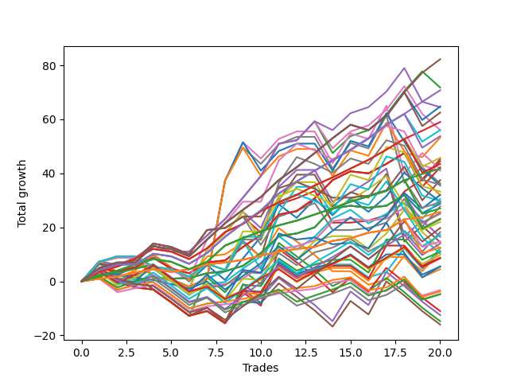

# Long Pointer 009 AB 
- Symbol: ES
- Date Range: 03/18/2022 - 07/15/2022
- Trading Period: 7:20-12:30
- Number of Trades: 20



| Name | Win Percent | Profit | Avg Profit / Trade | Avg Time / Trade |      | Name | Win Percent | Profit | Avg Profit / Trade | Avg Time / Trade |
| ---- | ----------- | ------ | ------------------ | ---------------- | ---- | ---- | ----------- | ------ | ------------------ | ---------------- |
| Sorted By <br> Profit | | | | | | Sorted By <br> Win Percentage ||||
| Eighty-Five | 85.00 | 41125.00 | 2056.25 | 11:45 |     | Eighty-One | 95.00 | 12875.00 | 643.75 | 05:46 |
| Two | 80.00 | 35875.00 | 1793.75 | 13:22 |     | Eighty-Four | 90.00 | 35375.00 | 1768.75 | 10:19 |
| Eighty-Four | 90.00 | 35375.00 | 1768.75 | 10:19 |     | Eighty-Three | 90.00 | 29500.00 | 1475.00 | 09:04 |
| One Hundred Twenty-Five | 80.00 | 32375.00 | 1618.75 | 11:11 |     | Eighty-Two | 90.00 | 20875.00 | 1043.75 | 08:00 |
| Sixty-Six | 75.00 | 32250.00 | 1612.50 | 11:31 |     | One Hundred Twenty-One | 90.00 | 7375.00 | 368.75 | 05:20 |
| One Hundred Thirty | 80.00 | 31250.00 | 1562.50 | 11:17 |     | One Hundred Twenty-Six | 90.00 | 6250.00 | 312.50 | 05:25 |
| Eighty-Three | 90.00 | 29500.00 | 1475.00 | 09:04 |     | Eighty-Five | 85.00 | 41125.00 | 2056.25 | 11:45 |
| One Hundred Twenty-Four | 85.00 | 28000.00 | 1400.00 | 09:48 |     | One Hundred Twenty-Four | 85.00 | 28000.00 | 1400.00 | 09:48 |
| Fifty-Eight | 75.00 | 28000.00 | 1400.00 | 12:20 |     | One Hundred Twenty-Nine | 85.00 | 26875.00 | 1343.75 | 09:53 |
| One Hundred Twenty-Nine | 85.00 | 26875.00 | 1343.75 | 09:53 |     | One Hundred Twenty-Three | 85.00 | 22875.00 | 1143.75 | 08:36 |
| One | 75.00 | 26625.00 | 1331.25 | 07:58 |     | One Hundred Twenty-Eight | 85.00 | 21750.00 | 1087.50 | 08:42 |
| One Hundred Twenty-Three | 85.00 | 22875.00 | 1143.75 | 08:36 |     | One Hundred Twenty-Two | 85.00 | 14625.00 | 731.25 | 07:34 |
| Three | 75.00 | 22625.00 | 1131.25 | 14:14 |     | Zero | 85.00 | 14375.00 | 718.75 | 03:51 |
| Fifty-Seven | 75.00 | 22250.00 | 1112.50 | 07:35 |     | One Hundred Twenty-Seven | 85.00 | 13500.00 | 675.00 | 07:39 |
| One Hundred Twenty-Eight | 85.00 | 21750.00 | 1087.50 | 08:42 |     | Fifty-Six | 85.00 | 12625.00 | 631.25 | 03:30 |
| Sixty-Five | 75.00 | 21125.00 | 1056.25 | 07:41 |     | Sixty-Four | 85.00 | 11500.00 | 575.00 | 03:36 |
| Eighty-Two | 90.00 | 20875.00 | 1043.75 | 08:00 |     | Two | 80.00 | 35875.00 | 1793.75 | 13:22 |
| Six | 60.00 | 20750.00 | 1037.50 | 27:45 |     | One Hundred Twenty-Five | 80.00 | 32375.00 | 1618.75 | 11:11 |
| Sixty-Eight | 60.00 | 20500.00 | 1025.00 | 15:09 |     | One Hundred Thirty | 80.00 | 31250.00 | 1562.50 | 11:17 |
| Sixty-Seven | 70.00 | 18750.00 | 937.50 | 11:16 |     | Forty | 80.00 | 12500.00 | 625.00 | 02:08 |
| Seven | 60.00 | 18125.00 | 906.25 | 29:19 |     | Forty-Eight | 80.00 | 11625.00 | 581.25 | 02:11 |
| Sixty-Nine | 50.00 | 17875.00 | 893.75 | 17:50 |     | Sixty-Six | 75.00 | 32250.00 | 1612.50 | 11:31 |
| Sixty-Two | 55.00 | 17750.00 | 887.50 | 24:37 |     | Fifty-Eight | 75.00 | 28000.00 | 1400.00 | 12:20 |
| Seventy | 50.00 | 16625.00 | 831.25 | 20:33 |     | One | 75.00 | 26625.00 | 1331.25 | 07:58 |
| One Hundred Fifteen | 65.00 | 16000.00 | 800.00 | 05:19 |     | Three | 75.00 | 22625.00 | 1131.25 | 14:14 |
| Sixty-Three | 55.00 | 16000.00 | 800.00 | 25:38 |     | Fifty-Seven | 75.00 | 22250.00 | 1112.50 | 07:35 |
| Forty-One | 70.00 | 15250.00 | 762.50 | 04:20 |     | Sixty-Five | 75.00 | 21125.00 | 1056.25 | 07:41 |
| Seventy-One | 50.00 | 14875.00 | 743.75 | 21:34 |     | One Hundred Eleven | 75.00 | -1625.00 | -81.25 | 02:26 |
| Forty-Two | 55.00 | 14750.00 | 737.50 | 07:35 |     | One Hundred Sixteen | 75.00 | -1875.00 | -93.75 | 02:19 |
| One Hundred Twenty-Two | 85.00 | 14625.00 | 731.25 | 07:34 |     | Sixty-Seven | 70.00 | 18750.00 | 937.50 | 11:16 |
| Zero | 85.00 | 14375.00 | 718.75 | 03:51 |     | Forty-One | 70.00 | 15250.00 | 762.50 | 04:20 |
| Fifty-Nine | 70.00 | 13875.00 | 693.75 | 12:29 |     | Fifty-Nine | 70.00 | 13875.00 | 693.75 | 12:29 |
| One Hundred Twenty-Seven | 85.00 | 13500.00 | 675.00 | 07:39 |     | One Hundred Fifteen | 65.00 | 16000.00 | 800.00 | 05:19 |
| Eighty-One | 95.00 | 12875.00 | 643.75 | 05:46 |     | Forty-Nine | 65.00 | 9125.00 | 456.25 | 03:57 |
| Fifty-Six | 85.00 | 12625.00 | 631.25 | 03:30 |     | One Hundred Fourteen | 65.00 | 8625.00 | 431.25 | 04:43 |
| Forty | 80.00 | 12500.00 | 625.00 | 02:08 |     | Four | 65.00 | 8250.00 | 412.50 | 21:03 |
| Forty-Eight | 80.00 | 11625.00 | 581.25 | 02:11 |     | One Hundred Thirteen | 65.00 | 4875.00 | 243.75 | 03:51 |
| Sixty-Four | 85.00 | 11500.00 | 575.00 | 03:36 |     | One Hundred Eighteen | 65.00 | 4250.00 | 212.50 | 03:42 |
| Fifty | 55.00 | 11000.00 | 550.00 | 05:29 |     | One Hundred Seventeen | 65.00 | -2375.00 | -118.75 | 02:48 |
| One Hundred Twenty | 55.00 | 9875.00 | 493.75 | 04:30 |     | One Hundred Twelve | 65.00 | -2375.00 | -118.75 | 02:57 |
| Forty-Nine | 65.00 | 9125.00 | 456.25 | 03:57 |     | Six | 60.00 | 20750.00 | 1037.50 | 27:45 |
| One Hundred Fourteen | 65.00 | 8625.00 | 431.25 | 04:43 |     | Sixty-Eight | 60.00 | 20500.00 | 1025.00 | 15:09 |
| Four | 65.00 | 8250.00 | 412.50 | 21:03 |     | Seven | 60.00 | 18125.00 | 906.25 | 29:19 |
| One Hundred Twenty-One | 90.00 | 7375.00 | 368.75 | 05:20 |     | Five | 60.00 | 7250.00 | 362.50 | 24:42 |
| Five | 60.00 | 7250.00 | 362.50 | 24:42 |     | One Hundred Ninteen | 60.00 | 7000.00 | 350.00 | 04:15 |
| One Hundred Ninteen | 60.00 | 7000.00 | 350.00 | 04:15 |     | Sixty | 60.00 | 6125.00 | 306.25 | 17:24 |
| One Hundred Twenty-Six | 90.00 | 6250.00 | 312.50 | 05:25 |     | Sixty-Two | 55.00 | 17750.00 | 887.50 | 24:37 |
| Sixty | 60.00 | 6125.00 | 306.25 | 17:24 |     | Sixty-Three | 55.00 | 16000.00 | 800.00 | 25:38 |
| Fifty-One | 55.00 | 6125.00 | 306.25 | 05:10 |     | Forty-Two | 55.00 | 14750.00 | 737.50 | 07:35 |
| Forty-Three | 55.00 | 5625.00 | 281.25 | 06:57 |     | Fifty | 55.00 | 11000.00 | 550.00 | 05:29 |
| Fifty-Four | 50.00 | 5500.00 | 275.00 | 08:12 |     | One Hundred Twenty | 55.00 | 9875.00 | 493.75 | 04:30 |
| Sixty-One | 55.00 | 5125.00 | 256.25 | 21:01 |     | Fifty-One | 55.00 | 6125.00 | 306.25 | 05:10 |
| One Hundred Thirteen | 65.00 | 4875.00 | 243.75 | 03:51 |     | Forty-Three | 55.00 | 5625.00 | 281.25 | 06:57 |
| Fifty-Five | 50.00 | 4375.00 | 218.75 | 08:22 |     | Sixty-One | 55.00 | 5125.00 | 256.25 | 21:01 |
| One Hundred Eighteen | 65.00 | 4250.00 | 212.50 | 03:42 |     | Sixty-Nine | 50.00 | 17875.00 | 893.75 | 17:50 |
| Fifty-Two | 50.00 | 2750.00 | 137.50 | 06:07 |     | Seventy | 50.00 | 16625.00 | 831.25 | 20:33 |
| Seventy-Three | 40.00 | 2750.00 | 137.50 | 06:50 |     | Seventy-One | 50.00 | 14875.00 | 743.75 | 21:34 |
| Fifty-Three | 50.00 | 2250.00 | 112.50 | 06:56 |     | Fifty-Four | 50.00 | 5500.00 | 275.00 | 08:12 |
| One Hundred Eleven | 75.00 | -1625.00 | -81.25 | 02:26 |     | Fifty-Five | 50.00 | 4375.00 | 218.75 | 08:22 |
| One Hundred Sixteen | 75.00 | -1875.00 | -93.75 | 02:19 |     | Fifty-Two | 50.00 | 2750.00 | 137.50 | 06:07 |
| One Hundred Seventeen | 65.00 | -2375.00 | -118.75 | 02:48 |     | Fifty-Three | 50.00 | 2250.00 | 112.50 | 06:56 |
| One Hundred Twelve | 65.00 | -2375.00 | -118.75 | 02:57 |     | Seventy-Three | 40.00 | 2750.00 | 137.50 | 06:50 |
| Forty-Five | 35.00 | -5500.00 | -275.00 | 12:32 |     | Forty-Five | 35.00 | -5500.00 | -275.00 | 12:32 |
| Forty-Six | 35.00 | -6250.00 | -312.50 | 15:13 |     | Forty-Six | 35.00 | -6250.00 | -312.50 | 15:13 |
| Forty-Four | 35.00 | -7375.00 | -368.75 | 10:10 |     | Forty-Four | 35.00 | -7375.00 | -368.75 | 10:10 |
| Forty-Seven | 35.00 | -8000.00 | -400.00 | 16:14 |     | Forty-Seven | 35.00 | -8000.00 | -400.00 | 16:14 |

## NO STOPLOSS

### Test Zero
* Sell when price hits the middle line of the 20p bollinger
* No Stoploss
* Results:
```
Total Trades: 20
Percent Up: 85.00
Percent Down: 15.00
Total Points Moved Up: 28.75
Potential Profit: 14375.00
Total Points Ups: 41.50 Count Ups: 17
Total Points Downs: -12.75 Count Downs: 3
```

<details><summary>Trades</summary>

<code>In: 2022-03-30 12:27:00		Out: 2022-03-30 12:28:15		Total Position Time: 01:15		Total Move Up: 2.50		Total to Date: 2.50</code> <br />
<code>In: 2022-03-31 10:02:00		Out: 2022-03-31 10:04:00		Total Position Time: 02:00		Total Move Up: 0.75		Total to Date: 3.25</code> <br />
<code>In: 2022-04-06 09:23:00		Out: 2022-04-06 09:31:15		Total Position Time: 08:15		Total Move Up: 1.50		Total to Date: 4.75</code> <br />
<code>In: 2022-04-12 11:35:00		Out: 2022-04-12 11:35:50		Total Position Time: 00:50		Total Move Up: 1.50		Total to Date: 6.25</code> <br />
<code>In: 2022-04-14 09:32:00		Out: 2022-04-14 09:56:10		Total Position Time: 24:10		Total Move Up: -5.25		Total to Date: 1.00</code> <br />
<code>In: 2022-04-21 09:12:00		Out: 2022-04-21 09:19:05		Total Position Time: 07:05		Total Move Up: 0.25		Total to Date: 1.25</code> <br />
<code>In: 2022-04-21 10:21:00		Out: 2022-04-21 10:21:10		Total Position Time: 00:10		Total Move Up: 1.75		Total to Date: 3.00</code> <br />
<code>In: 2022-05-02 11:46:00		Out: 2022-05-02 11:46:10		Total Position Time: 00:10		Total Move Up: 0.75		Total to Date: 3.75</code> <br />
<code>In: 2022-05-04 08:37:00		Out: 2022-05-04 08:39:20		Total Position Time: 02:20		Total Move Up: 2.00		Total to Date: 5.75</code> <br />
<code>In: 2022-05-09 07:42:00		Out: 2022-05-09 07:42:30		Total Position Time: 00:30		Total Move Up: 4.75		Total to Date: 10.50</code> <br />
<code>In: 2022-05-09 08:34:00		Out: 2022-05-09 08:35:10		Total Position Time: 01:10		Total Move Up: 6.25		Total to Date: 16.75</code> <br />
<code>In: 2022-05-09 10:03:00		Out: 2022-05-09 10:09:25		Total Position Time: 06:25		Total Move Up: 1.00		Total to Date: 17.75</code> <br />
<code>In: 2022-05-18 09:12:00		Out: 2022-05-18 09:14:45		Total Position Time: 02:45		Total Move Up: 2.25		Total to Date: 20.00</code> <br />
<code>In: 2022-05-20 09:48:00		Out: 2022-05-20 09:50:00		Total Position Time: 02:00		Total Move Up: 7.00		Total to Date: 27.00</code> <br />
<code>In: 2022-05-25 10:15:00		Out: 2022-05-25 10:15:20		Total Position Time: 00:20		Total Move Up: 1.00		Total to Date: 28.00</code> <br />
<code>In: 2022-06-08 11:31:00		Out: 2022-06-08 11:31:10		Total Position Time: 00:10		Total Move Up: -0.75		Total to Date: 27.25</code> <br />
<code>In: 2022-06-08 12:11:00		Out: 2022-06-08 12:11:20		Total Position Time: 00:20		Total Move Up: 0.75		Total to Date: 28.00</code> <br />
<code>In: 2022-06-13 12:17:00		Out: 2022-06-13 12:17:10		Total Position Time: 00:10		Total Move Up: 4.00		Total to Date: 32.00</code> <br />
<code>In: 2022-06-14 07:32:00		Out: 2022-06-14 07:46:40		Total Position Time: 14:40		Total Move Up: -6.75		Total to Date: 25.25</code> <br />
<code>In: 2022-07-06 08:12:00		Out: 2022-07-06 08:14:30		Total Position Time: 02:30		Total Move Up: 3.50		Total to Date: 28.75</code> <br />


</details>

### Test One
* Sell when the price hits the upper line of the 20p 1std bollinger
* No Stoploss
* Results:
```
Total Trades: 20
Percent Up: 75.00
Percent Down: 25.00
Total Points Moved Up: 53.25
Potential Profit: 26625.00
Total Points Ups: 62.25 Count Ups: 15
Total Points Downs: -9.00 Count Downs: 5
```

<details><summary>Trades</summary>

<code>In: 2022-03-30 12:27:00		Out: 2022-03-30 12:32:20		Total Position Time: 05:20		Total Move Up: 4.75		Total to Date: 4.75</code> <br />
<code>In: 2022-03-31 10:02:00		Out: 2022-03-31 10:19:20		Total Position Time: 17:20		Total Move Up: -1.00		Total to Date: 3.75</code> <br />
<code>In: 2022-04-06 09:23:00		Out: 2022-04-06 09:34:05		Total Position Time: 11:05		Total Move Up: 1.50		Total to Date: 5.25</code> <br />
<code>In: 2022-04-12 11:35:00		Out: 2022-04-12 11:37:20		Total Position Time: 02:20		Total Move Up: 3.50		Total to Date: 8.75</code> <br />
<code>In: 2022-04-14 09:32:00		Out: 2022-04-14 09:58:15		Total Position Time: 26:15		Total Move Up: -4.00		Total to Date: 4.75</code> <br />
<code>In: 2022-04-21 09:12:00		Out: 2022-04-21 09:34:10		Total Position Time: 22:10		Total Move Up: -1.75		Total to Date: 3.00</code> <br />
<code>In: 2022-04-21 10:21:00		Out: 2022-04-21 10:21:20		Total Position Time: 00:20		Total Move Up: 4.00		Total to Date: 7.00</code> <br />
<code>In: 2022-05-02 11:46:00		Out: 2022-05-02 11:46:10		Total Position Time: 00:10		Total Move Up: 0.75		Total to Date: 7.75</code> <br />
<code>In: 2022-05-04 08:37:00		Out: 2022-05-04 08:40:55		Total Position Time: 03:55		Total Move Up: 5.00		Total to Date: 12.75</code> <br />
<code>In: 2022-05-09 07:42:00		Out: 2022-05-09 07:45:10		Total Position Time: 03:10		Total Move Up: 4.50		Total to Date: 17.25</code> <br />
<code>In: 2022-05-09 08:34:00		Out: 2022-05-09 08:38:35		Total Position Time: 04:35		Total Move Up: 7.50		Total to Date: 24.75</code> <br />
<code>In: 2022-05-09 10:03:00		Out: 2022-05-09 10:18:05		Total Position Time: 15:05		Total Move Up: 1.25		Total to Date: 26.00</code> <br />
<code>In: 2022-05-18 09:12:00		Out: 2022-05-18 09:16:25		Total Position Time: 04:25		Total Move Up: 4.75		Total to Date: 30.75</code> <br />
<code>In: 2022-05-20 09:48:00		Out: 2022-05-20 09:56:10		Total Position Time: 08:10		Total Move Up: 6.75		Total to Date: 37.50</code> <br />
<code>In: 2022-05-25 10:15:00		Out: 2022-05-25 10:15:30		Total Position Time: 00:30		Total Move Up: 3.25		Total to Date: 40.75</code> <br />
<code>In: 2022-06-08 11:31:00		Out: 2022-06-08 11:43:05		Total Position Time: 12:05		Total Move Up: -0.75		Total to Date: 40.00</code> <br />
<code>In: 2022-06-08 12:11:00		Out: 2022-06-08 12:12:15		Total Position Time: 01:15		Total Move Up: 3.50		Total to Date: 43.50</code> <br />
<code>In: 2022-06-13 12:17:00		Out: 2022-06-13 12:17:10		Total Position Time: 00:10		Total Move Up: 4.00		Total to Date: 47.50</code> <br />
<code>In: 2022-06-14 07:32:00		Out: 2022-06-14 07:47:10		Total Position Time: 15:10		Total Move Up: -1.50		Total to Date: 46.00</code> <br />
<code>In: 2022-07-06 08:12:00		Out: 2022-07-06 08:17:50		Total Position Time: 05:50		Total Move Up: 7.25		Total to Date: 53.25</code> <br />


</details>

### Test Two
* Sell when the price hits the upper line of the 20p 2std bollinger
* No Stoploss
* Results:
```
Total Trades: 20
Percent Up: 80.00
Percent Down: 20.00
Total Points Moved Up: 71.75
Potential Profit: 35875.00
Total Points Ups: 93.25 Count Ups: 16
Total Points Downs: -21.50 Count Downs: 4
```

<details><summary>Trades</summary>

<code>In: 2022-03-30 12:27:00		Out: 2022-03-30 12:36:20		Total Position Time: 09:20		Total Move Up: 7.50		Total to Date: 7.50</code> <br />
<code>In: 2022-03-31 10:02:00		Out: 2022-03-31 10:27:00		Total Position Time: 25:00		Total Move Up: -1.50		Total to Date: 6.00</code> <br />
<code>In: 2022-04-06 09:23:00		Out: 2022-04-06 09:34:25		Total Position Time: 11:25		Total Move Up: 2.75		Total to Date: 8.75</code> <br />
<code>In: 2022-04-12 11:35:00		Out: 2022-04-12 11:47:00		Total Position Time: 12:00		Total Move Up: 4.50		Total to Date: 13.25</code> <br />
<code>In: 2022-04-14 09:32:00		Out: 2022-04-14 09:58:55		Total Position Time: 26:55		Total Move Up: -2.25		Total to Date: 11.00</code> <br />
<code>In: 2022-04-21 09:12:00		Out: 2022-04-21 09:35:40		Total Position Time: 23:40		Total Move Up: 0.00		Total to Date: 11.00</code> <br />
<code>In: 2022-04-21 10:21:00		Out: 2022-04-21 10:21:30		Total Position Time: 00:30		Total Move Up: 6.00		Total to Date: 17.00</code> <br />
<code>In: 2022-05-02 11:46:00		Out: 2022-05-02 11:53:35		Total Position Time: 07:35		Total Move Up: 6.00		Total to Date: 23.00</code> <br />
<code>In: 2022-05-04 08:37:00		Out: 2022-05-04 08:47:05		Total Position Time: 10:05		Total Move Up: 8.00		Total to Date: 31.00</code> <br />
<code>In: 2022-05-09 07:42:00		Out: 2022-05-09 07:48:05		Total Position Time: 06:05		Total Move Up: 8.00		Total to Date: 39.00</code> <br />
<code>In: 2022-05-09 08:34:00		Out: 2022-05-09 08:39:15		Total Position Time: 05:15		Total Move Up: 12.00		Total to Date: 51.00</code> <br />
<code>In: 2022-05-09 10:03:00		Out: 2022-05-09 10:18:05		Total Position Time: 15:05		Total Move Up: 1.25		Total to Date: 52.25</code> <br />
<code>In: 2022-05-18 09:12:00		Out: 2022-05-18 09:17:50		Total Position Time: 05:50		Total Move Up: 7.00		Total to Date: 59.25</code> <br />
<code>In: 2022-05-20 09:48:00		Out: 2022-05-20 10:17:55		Total Position Time: 29:55		Total Move Up: -11.75		Total to Date: 47.50</code> <br />
<code>In: 2022-05-25 10:15:00		Out: 2022-05-25 10:29:40		Total Position Time: 14:40		Total Move Up: 6.25		Total to Date: 53.75</code> <br />
<code>In: 2022-06-08 11:31:00		Out: 2022-06-08 11:43:35		Total Position Time: 12:35		Total Move Up: 2.25		Total to Date: 56.00</code> <br />
<code>In: 2022-06-08 12:11:00		Out: 2022-06-08 12:13:25		Total Position Time: 02:25		Total Move Up: 5.75		Total to Date: 61.75</code> <br />
<code>In: 2022-06-13 12:17:00		Out: 2022-06-13 12:17:15		Total Position Time: 00:15		Total Move Up: 8.75		Total to Date: 70.50</code> <br />
<code>In: 2022-06-14 07:32:00		Out: 2022-06-14 07:51:00		Total Position Time: 19:00		Total Move Up: 7.25		Total to Date: 77.75</code> <br />
<code>In: 2022-07-06 08:12:00		Out: 2022-07-06 08:41:55		Total Position Time: 29:55		Total Move Up: -6.00		Total to Date: 71.75</code> <br />


</details>

### Test Three
* Sell when price hits the middle line of the 50p bollinger
* No Stoploss
* Results:
```
Total Trades: 20
Percent Up: 75.00
Percent Down: 25.00
Total Points Moved Up: 45.25
Potential Profit: 22625.00
Total Points Ups: 68.00 Count Ups: 15
Total Points Downs: -22.75 Count Downs: 5
```

<details><summary>Trades</summary>

<code>In: 2022-03-30 12:27:00		Out: 2022-03-30 12:33:25		Total Position Time: 06:25		Total Move Up: 6.50		Total to Date: 6.50</code> <br />
<code>In: 2022-03-31 10:02:00		Out: 2022-03-31 10:27:25		Total Position Time: 25:25		Total Move Up: -1.00		Total to Date: 5.50</code> <br />
<code>In: 2022-04-06 09:23:00		Out: 2022-04-06 09:48:50		Total Position Time: 25:50		Total Move Up: 2.50		Total to Date: 8.00</code> <br />
<code>In: 2022-04-12 11:35:00		Out: 2022-04-12 11:47:05		Total Position Time: 12:05		Total Move Up: 6.00		Total to Date: 14.00</code> <br />
<code>In: 2022-04-14 09:32:00		Out: 2022-04-14 09:59:25		Total Position Time: 27:25		Total Move Up: -1.25		Total to Date: 12.75</code> <br />
<code>In: 2022-04-21 09:12:00		Out: 2022-04-21 09:41:55		Total Position Time: 29:55		Total Move Up: -2.75		Total to Date: 10.00</code> <br />
<code>In: 2022-04-21 10:21:00		Out: 2022-04-21 10:22:25		Total Position Time: 01:25		Total Move Up: 9.00		Total to Date: 19.00</code> <br />
<code>In: 2022-05-02 11:46:00		Out: 2022-05-02 11:46:10		Total Position Time: 00:10		Total Move Up: 0.75		Total to Date: 19.75</code> <br />
<code>In: 2022-05-04 08:37:00		Out: 2022-05-04 08:41:00		Total Position Time: 04:00		Total Move Up: 4.25		Total to Date: 24.00</code> <br />
<code>In: 2022-05-09 07:42:00		Out: 2022-05-09 08:11:55		Total Position Time: 29:55		Total Move Up: -6.00		Total to Date: 18.00</code> <br />
<code>In: 2022-05-09 08:34:00		Out: 2022-05-09 08:39:00		Total Position Time: 05:00		Total Move Up: 10.50		Total to Date: 28.50</code> <br />
<code>In: 2022-05-09 10:03:00		Out: 2022-05-09 10:25:15		Total Position Time: 22:15		Total Move Up: 2.25		Total to Date: 30.75</code> <br />
<code>In: 2022-05-18 09:12:00		Out: 2022-05-18 09:36:05		Total Position Time: 24:05		Total Move Up: 2.75		Total to Date: 33.50</code> <br />
<code>In: 2022-05-20 09:48:00		Out: 2022-05-20 10:17:55		Total Position Time: 29:55		Total Move Up: -11.75		Total to Date: 21.75</code> <br />
<code>In: 2022-05-25 10:15:00		Out: 2022-05-25 10:15:10		Total Position Time: 00:10		Total Move Up: 0.00		Total to Date: 21.75</code> <br />
<code>In: 2022-06-08 11:31:00		Out: 2022-06-08 11:43:20		Total Position Time: 12:20		Total Move Up: 0.75		Total to Date: 22.50</code> <br />
<code>In: 2022-06-08 12:11:00		Out: 2022-06-08 12:11:45		Total Position Time: 00:45		Total Move Up: 2.00		Total to Date: 24.50</code> <br />
<code>In: 2022-06-13 12:17:00		Out: 2022-06-13 12:17:15		Total Position Time: 00:15		Total Move Up: 8.75		Total to Date: 33.25</code> <br />
<code>In: 2022-06-14 07:32:00		Out: 2022-06-14 07:50:00		Total Position Time: 18:00		Total Move Up: 4.50		Total to Date: 37.75</code> <br />
<code>In: 2022-07-06 08:12:00		Out: 2022-07-06 08:21:30		Total Position Time: 09:30		Total Move Up: 7.50		Total to Date: 45.25</code> <br />


</details>

### Test Four
* Sell when the price hits the upper line of the 50p 1std bollinger
* No Stoploss
* Results:
```
Total Trades: 20
Percent Up: 65.00
Percent Down: 35.00
Total Points Moved Up: 16.50
Potential Profit: 8250.00
Total Points Ups: 76.50 Count Ups: 13
Total Points Downs: -60.00 Count Downs: 7
```

<details><summary>Trades</summary>

<code>In: 2022-03-30 12:27:00		Out: 2022-03-30 12:46:00		Total Position Time: 19:00		Total Move Up: 7.25		Total to Date: 7.25</code> <br />
<code>In: 2022-03-31 10:02:00		Out: 2022-03-31 10:29:50		Total Position Time: 27:50		Total Move Up: 1.50		Total to Date: 8.75</code> <br />
<code>In: 2022-04-06 09:23:00		Out: 2022-04-06 09:52:55		Total Position Time: 29:55		Total Move Up: 0.00		Total to Date: 8.75</code> <br />
<code>In: 2022-04-12 11:35:00		Out: 2022-04-12 12:04:55		Total Position Time: 29:55		Total Move Up: -7.50		Total to Date: 1.25</code> <br />
<code>In: 2022-04-14 09:32:00		Out: 2022-04-14 10:01:55		Total Position Time: 29:55		Total Move Up: -1.00		Total to Date: 0.25</code> <br />
<code>In: 2022-04-21 09:12:00		Out: 2022-04-21 09:41:55		Total Position Time: 29:55		Total Move Up: -2.75		Total to Date: -2.50</code> <br />
<code>In: 2022-04-21 10:21:00		Out: 2022-04-21 10:31:15		Total Position Time: 10:15		Total Move Up: 14.25		Total to Date: 11.75</code> <br />
<code>In: 2022-05-02 11:46:00		Out: 2022-05-02 11:53:35		Total Position Time: 07:35		Total Move Up: 6.00		Total to Date: 17.75</code> <br />
<code>In: 2022-05-04 08:37:00		Out: 2022-05-04 08:47:05		Total Position Time: 10:05		Total Move Up: 8.00		Total to Date: 25.75</code> <br />
<code>In: 2022-05-09 07:42:00		Out: 2022-05-09 08:11:55		Total Position Time: 29:55		Total Move Up: -6.00		Total to Date: 19.75</code> <br />
<code>In: 2022-05-09 08:34:00		Out: 2022-05-09 08:40:00		Total Position Time: 06:00		Total Move Up: 15.25		Total to Date: 35.00</code> <br />
<code>In: 2022-05-09 10:03:00		Out: 2022-05-09 10:29:25		Total Position Time: 26:25		Total Move Up: 6.25		Total to Date: 41.25</code> <br />
<code>In: 2022-05-18 09:12:00		Out: 2022-05-18 09:41:55		Total Position Time: 29:55		Total Move Up: 0.00		Total to Date: 41.25</code> <br />
<code>In: 2022-05-20 09:48:00		Out: 2022-05-20 10:17:55		Total Position Time: 29:55		Total Move Up: -11.75		Total to Date: 29.50</code> <br />
<code>In: 2022-05-25 10:15:00		Out: 2022-05-25 10:15:30		Total Position Time: 00:30		Total Move Up: 3.25		Total to Date: 32.75</code> <br />
<code>In: 2022-06-08 11:31:00		Out: 2022-06-08 11:45:30		Total Position Time: 14:30		Total Move Up: 4.25		Total to Date: 37.00</code> <br />
<code>In: 2022-06-08 12:11:00		Out: 2022-06-08 12:12:25		Total Position Time: 01:25		Total Move Up: 4.75		Total to Date: 41.75</code> <br />
<code>In: 2022-06-13 12:17:00		Out: 2022-06-13 12:46:00		Total Position Time: 29:00		Total Move Up: -25.00		Total to Date: 16.75</code> <br />
<code>In: 2022-06-14 07:32:00		Out: 2022-06-14 08:01:15		Total Position Time: 29:15		Total Move Up: 5.75		Total to Date: 22.50</code> <br />
<code>In: 2022-07-06 08:12:00		Out: 2022-07-06 08:41:55		Total Position Time: 29:55		Total Move Up: -6.00		Total to Date: 16.50</code> <br />


</details>

### Test Five
* Sell when the price hits the upper line of the 50p 2std bollinger
* No Stoploss
* Results:
```
Total Trades: 20
Percent Up: 60.00
Percent Down: 40.00
Total Points Moved Up: 14.50
Potential Profit: 7250.00
Total Points Ups: 76.50 Count Ups: 12
Total Points Downs: -62.00 Count Downs: 8
```

<details><summary>Trades</summary>

<code>In: 2022-03-30 12:27:00		Out: 2022-03-30 12:46:00		Total Position Time: 19:00		Total Move Up: 7.25		Total to Date: 7.25</code> <br />
<code>In: 2022-03-31 10:02:00		Out: 2022-03-31 10:31:55		Total Position Time: 29:55		Total Move Up: 2.00		Total to Date: 9.25</code> <br />
<code>In: 2022-04-06 09:23:00		Out: 2022-04-06 09:52:55		Total Position Time: 29:55		Total Move Up: 0.00		Total to Date: 9.25</code> <br />
<code>In: 2022-04-12 11:35:00		Out: 2022-04-12 12:04:55		Total Position Time: 29:55		Total Move Up: -7.50		Total to Date: 1.75</code> <br />
<code>In: 2022-04-14 09:32:00		Out: 2022-04-14 10:01:55		Total Position Time: 29:55		Total Move Up: -1.00		Total to Date: 0.75</code> <br />
<code>In: 2022-04-21 09:12:00		Out: 2022-04-21 09:41:55		Total Position Time: 29:55		Total Move Up: -2.75		Total to Date: -2.00</code> <br />
<code>In: 2022-04-21 10:21:00		Out: 2022-04-21 10:50:55		Total Position Time: 29:55		Total Move Up: 3.00		Total to Date: 1.00</code> <br />
<code>In: 2022-05-02 11:46:00		Out: 2022-05-02 12:01:10		Total Position Time: 15:10		Total Move Up: 2.75		Total to Date: 3.75</code> <br />
<code>In: 2022-05-04 08:37:00		Out: 2022-05-04 08:48:35		Total Position Time: 11:35		Total Move Up: 11.25		Total to Date: 15.00</code> <br />
<code>In: 2022-05-09 07:42:00		Out: 2022-05-09 08:11:55		Total Position Time: 29:55		Total Move Up: -6.00		Total to Date: 9.00</code> <br />
<code>In: 2022-05-09 08:34:00		Out: 2022-05-09 08:43:15		Total Position Time: 09:15		Total Move Up: 21.00		Total to Date: 30.00</code> <br />
<code>In: 2022-05-09 10:03:00		Out: 2022-05-09 10:29:30		Total Position Time: 26:30		Total Move Up: 9.50		Total to Date: 39.50</code> <br />
<code>In: 2022-05-18 09:12:00		Out: 2022-05-18 09:41:55		Total Position Time: 29:55		Total Move Up: 0.00		Total to Date: 39.50</code> <br />
<code>In: 2022-05-20 09:48:00		Out: 2022-05-20 10:17:55		Total Position Time: 29:55		Total Move Up: -11.75		Total to Date: 27.75</code> <br />
<code>In: 2022-05-25 10:15:00		Out: 2022-05-25 10:29:25		Total Position Time: 14:25		Total Move Up: 5.25		Total to Date: 33.00</code> <br />
<code>In: 2022-06-08 11:31:00		Out: 2022-06-08 12:00:55		Total Position Time: 29:55		Total Move Up: -2.00		Total to Date: 31.00</code> <br />
<code>In: 2022-06-08 12:11:00		Out: 2022-06-08 12:21:15		Total Position Time: 10:15		Total Move Up: 8.75		Total to Date: 39.75</code> <br />
<code>In: 2022-06-13 12:17:00		Out: 2022-06-13 12:46:00		Total Position Time: 29:00		Total Move Up: -25.00		Total to Date: 14.75</code> <br />
<code>In: 2022-06-14 07:32:00		Out: 2022-06-14 08:01:55		Total Position Time: 29:55		Total Move Up: 5.75		Total to Date: 20.50</code> <br />
<code>In: 2022-07-06 08:12:00		Out: 2022-07-06 08:41:55		Total Position Time: 29:55		Total Move Up: -6.00		Total to Date: 14.50</code> <br />


</details>

### Test Six
* Sell when the price hits the middle line of the 1std VWAP
* No Stoploss
* Results:
```
Total Trades: 20
Percent Up: 60.00
Percent Down: 40.00
Total Points Moved Up: 41.50
Potential Profit: 20750.00
Total Points Ups: 103.50 Count Ups: 12
Total Points Downs: -62.00 Count Downs: 8
```

<details><summary>Trades</summary>

<code>In: 2022-03-30 12:27:00		Out: 2022-03-30 12:46:00		Total Position Time: 19:00		Total Move Up: 7.25		Total to Date: 7.25</code> <br />
<code>In: 2022-03-31 10:02:00		Out: 2022-03-31 10:31:55		Total Position Time: 29:55		Total Move Up: 2.00		Total to Date: 9.25</code> <br />
<code>In: 2022-04-06 09:23:00		Out: 2022-04-06 09:52:55		Total Position Time: 29:55		Total Move Up: 0.00		Total to Date: 9.25</code> <br />
<code>In: 2022-04-12 11:35:00		Out: 2022-04-12 12:04:55		Total Position Time: 29:55		Total Move Up: -7.50		Total to Date: 1.75</code> <br />
<code>In: 2022-04-14 09:32:00		Out: 2022-04-14 10:01:55		Total Position Time: 29:55		Total Move Up: -1.00		Total to Date: 0.75</code> <br />
<code>In: 2022-04-21 09:12:00		Out: 2022-04-21 09:41:55		Total Position Time: 29:55		Total Move Up: -2.75		Total to Date: -2.00</code> <br />
<code>In: 2022-04-21 10:21:00		Out: 2022-04-21 10:50:55		Total Position Time: 29:55		Total Move Up: 3.00		Total to Date: 1.00</code> <br />
<code>In: 2022-05-02 11:46:00		Out: 2022-05-02 12:15:55		Total Position Time: 29:55		Total Move Up: 36.25		Total to Date: 37.25</code> <br />
<code>In: 2022-05-04 08:37:00		Out: 2022-05-04 08:54:15		Total Position Time: 17:15		Total Move Up: 14.25		Total to Date: 51.50</code> <br />
<code>In: 2022-05-09 07:42:00		Out: 2022-05-09 08:11:55		Total Position Time: 29:55		Total Move Up: -6.00		Total to Date: 45.50</code> <br />
<code>In: 2022-05-09 08:34:00		Out: 2022-05-09 09:03:55		Total Position Time: 29:55		Total Move Up: 7.25		Total to Date: 52.75</code> <br />
<code>In: 2022-05-09 10:03:00		Out: 2022-05-09 10:32:55		Total Position Time: 29:55		Total Move Up: 2.75		Total to Date: 55.50</code> <br />
<code>In: 2022-05-18 09:12:00		Out: 2022-05-18 09:41:55		Total Position Time: 29:55		Total Move Up: 0.00		Total to Date: 55.50</code> <br />
<code>In: 2022-05-20 09:48:00		Out: 2022-05-20 10:17:55		Total Position Time: 29:55		Total Move Up: -11.75		Total to Date: 43.75</code> <br />
<code>In: 2022-05-25 10:15:00		Out: 2022-05-25 10:37:05		Total Position Time: 22:05		Total Move Up: 11.00		Total to Date: 54.75</code> <br />
<code>In: 2022-06-08 11:31:00		Out: 2022-06-08 12:00:55		Total Position Time: 29:55		Total Move Up: -2.00		Total to Date: 52.75</code> <br />
<code>In: 2022-06-08 12:11:00		Out: 2022-06-08 12:40:55		Total Position Time: 29:55		Total Move Up: 12.25		Total to Date: 65.00</code> <br />
<code>In: 2022-06-13 12:17:00		Out: 2022-06-13 12:46:00		Total Position Time: 29:00		Total Move Up: -25.00		Total to Date: 40.00</code> <br />
<code>In: 2022-06-14 07:32:00		Out: 2022-06-14 07:51:05		Total Position Time: 19:05		Total Move Up: 7.50		Total to Date: 47.50</code> <br />
<code>In: 2022-07-06 08:12:00		Out: 2022-07-06 08:41:55		Total Position Time: 29:55		Total Move Up: -6.00		Total to Date: 41.50</code> <br />


</details>

### Test Seven
* Sell when the price hits the upper line of the 1std VWAP
* No Stoploss
* Results:
```
Total Trades: 20
Percent Up: 60.00
Percent Down: 40.00
Total Points Moved Up: 36.25
Potential Profit: 18125.00
Total Points Ups: 98.25 Count Ups: 12
Total Points Downs: -62.00 Count Downs: 8
```

<details><summary>Trades</summary>

<code>In: 2022-03-30 12:27:00		Out: 2022-03-30 12:46:00		Total Position Time: 19:00		Total Move Up: 7.25		Total to Date: 7.25</code> <br />
<code>In: 2022-03-31 10:02:00		Out: 2022-03-31 10:31:55		Total Position Time: 29:55		Total Move Up: 2.00		Total to Date: 9.25</code> <br />
<code>In: 2022-04-06 09:23:00		Out: 2022-04-06 09:52:55		Total Position Time: 29:55		Total Move Up: 0.00		Total to Date: 9.25</code> <br />
<code>In: 2022-04-12 11:35:00		Out: 2022-04-12 12:04:55		Total Position Time: 29:55		Total Move Up: -7.50		Total to Date: 1.75</code> <br />
<code>In: 2022-04-14 09:32:00		Out: 2022-04-14 10:01:55		Total Position Time: 29:55		Total Move Up: -1.00		Total to Date: 0.75</code> <br />
<code>In: 2022-04-21 09:12:00		Out: 2022-04-21 09:41:55		Total Position Time: 29:55		Total Move Up: -2.75		Total to Date: -2.00</code> <br />
<code>In: 2022-04-21 10:21:00		Out: 2022-04-21 10:50:55		Total Position Time: 29:55		Total Move Up: 3.00		Total to Date: 1.00</code> <br />
<code>In: 2022-05-02 11:46:00		Out: 2022-05-02 12:15:55		Total Position Time: 29:55		Total Move Up: 36.25		Total to Date: 37.25</code> <br />
<code>In: 2022-05-04 08:37:00		Out: 2022-05-04 09:06:55		Total Position Time: 29:55		Total Move Up: 12.25		Total to Date: 49.50</code> <br />
<code>In: 2022-05-09 07:42:00		Out: 2022-05-09 08:11:55		Total Position Time: 29:55		Total Move Up: -6.00		Total to Date: 43.50</code> <br />
<code>In: 2022-05-09 08:34:00		Out: 2022-05-09 09:03:55		Total Position Time: 29:55		Total Move Up: 7.25		Total to Date: 50.75</code> <br />
<code>In: 2022-05-09 10:03:00		Out: 2022-05-09 10:32:55		Total Position Time: 29:55		Total Move Up: 2.75		Total to Date: 53.50</code> <br />
<code>In: 2022-05-18 09:12:00		Out: 2022-05-18 09:41:55		Total Position Time: 29:55		Total Move Up: 0.00		Total to Date: 53.50</code> <br />
<code>In: 2022-05-20 09:48:00		Out: 2022-05-20 10:17:55		Total Position Time: 29:55		Total Move Up: -11.75		Total to Date: 41.75</code> <br />
<code>In: 2022-05-25 10:15:00		Out: 2022-05-25 10:44:55		Total Position Time: 29:55		Total Move Up: 9.50		Total to Date: 51.25</code> <br />
<code>In: 2022-06-08 11:31:00		Out: 2022-06-08 12:00:55		Total Position Time: 29:55		Total Move Up: -2.00		Total to Date: 49.25</code> <br />
<code>In: 2022-06-08 12:11:00		Out: 2022-06-08 12:40:55		Total Position Time: 29:55		Total Move Up: 12.25		Total to Date: 61.50</code> <br />
<code>In: 2022-06-13 12:17:00		Out: 2022-06-13 12:46:00		Total Position Time: 29:00		Total Move Up: -25.00		Total to Date: 36.50</code> <br />
<code>In: 2022-06-14 07:32:00		Out: 2022-06-14 08:01:55		Total Position Time: 29:55		Total Move Up: 5.75		Total to Date: 42.25</code> <br />
<code>In: 2022-07-06 08:12:00		Out: 2022-07-06 08:41:55		Total Position Time: 29:55		Total Move Up: -6.00		Total to Date: 36.25</code> <br />


</details>

## STOPLOSS OF 5

### Test Forty
* Sell when price hits the middle line of the 20p bollinger
* Stoploss is 5 points
* Results:
```
Total Trades: 20
Percent Up: 80.00
Percent Down: 20.00
Total Points Moved Up: 25.00
Potential Profit: 12500.00
Total Points Ups: 41.25 Count Ups: 16
Total Points Downs: -16.25 Count Downs: 4
```

<details><summary>Trades</summary>

<code>In: 2022-03-30 12:27:00		Out: 2022-03-30 12:28:15		Total Position Time: 01:15		Total Move Up: 2.50		Total to Date: 2.50</code> <br />
<code>In: 2022-03-31 10:02:00		Out: 2022-03-31 10:04:00		Total Position Time: 02:00		Total Move Up: 0.75		Total to Date: 3.25</code> <br />
<code>In: 2022-04-06 09:23:00		Out: 2022-04-06 09:31:15		Total Position Time: 08:15		Total Move Up: 1.50		Total to Date: 4.75</code> <br />
<code>In: 2022-04-12 11:35:00		Out: 2022-04-12 11:35:50		Total Position Time: 00:50		Total Move Up: 1.50		Total to Date: 6.25</code> <br />
<code>In: 2022-04-14 09:32:00		Out: 2022-04-14 09:41:25		Total Position Time: 09:25		Total Move Up: -4.75		Total to Date: 1.50</code> <br />
<code>In: 2022-04-21 09:12:00		Out: 2022-04-21 09:13:45		Total Position Time: 01:45		Total Move Up: -5.00		Total to Date: -3.50</code> <br />
<code>In: 2022-04-21 10:21:00		Out: 2022-04-21 10:21:10		Total Position Time: 00:10		Total Move Up: 1.75		Total to Date: -1.75</code> <br />
<code>In: 2022-05-02 11:46:00		Out: 2022-05-02 11:46:10		Total Position Time: 00:10		Total Move Up: 0.75		Total to Date: -1.00</code> <br />
<code>In: 2022-05-04 08:37:00		Out: 2022-05-04 08:39:20		Total Position Time: 02:20		Total Move Up: 2.00		Total to Date: 1.00</code> <br />
<code>In: 2022-05-09 07:42:00		Out: 2022-05-09 07:42:30		Total Position Time: 00:30		Total Move Up: 4.75		Total to Date: 5.75</code> <br />
<code>In: 2022-05-09 08:34:00		Out: 2022-05-09 08:35:10		Total Position Time: 01:10		Total Move Up: 6.25		Total to Date: 12.00</code> <br />
<code>In: 2022-05-09 10:03:00		Out: 2022-05-09 10:09:25		Total Position Time: 06:25		Total Move Up: 1.00		Total to Date: 13.00</code> <br />
<code>In: 2022-05-18 09:12:00		Out: 2022-05-18 09:14:45		Total Position Time: 02:45		Total Move Up: 2.25		Total to Date: 15.25</code> <br />
<code>In: 2022-05-20 09:48:00		Out: 2022-05-20 09:50:00		Total Position Time: 02:00		Total Move Up: 7.00		Total to Date: 22.25</code> <br />
<code>In: 2022-05-25 10:15:00		Out: 2022-05-25 10:15:20		Total Position Time: 00:20		Total Move Up: 1.00		Total to Date: 23.25</code> <br />
<code>In: 2022-06-08 11:31:00		Out: 2022-06-08 11:31:10		Total Position Time: 00:10		Total Move Up: -0.75		Total to Date: 22.50</code> <br />
<code>In: 2022-06-08 12:11:00		Out: 2022-06-08 12:11:20		Total Position Time: 00:20		Total Move Up: 0.75		Total to Date: 23.25</code> <br />
<code>In: 2022-06-13 12:17:00		Out: 2022-06-13 12:17:10		Total Position Time: 00:10		Total Move Up: 4.00		Total to Date: 27.25</code> <br />
<code>In: 2022-06-14 07:32:00		Out: 2022-06-14 07:32:20		Total Position Time: 00:20		Total Move Up: -5.75		Total to Date: 21.50</code> <br />
<code>In: 2022-07-06 08:12:00		Out: 2022-07-06 08:14:30		Total Position Time: 02:30		Total Move Up: 3.50		Total to Date: 25.00</code> <br />


</details>

### Test Forty-One
* Sell when the price hits the upper line of the 20p 1std bollinger
* Stoploss is 5 points
* Results:
```
Total Trades: 20
Percent Up: 70.00
Percent Down: 30.00
Total Points Moved Up: 30.50
Potential Profit: 15250.00
Total Points Ups: 61.00 Count Ups: 14
Total Points Downs: -30.50 Count Downs: 6
```

<details><summary>Trades</summary>

<code>In: 2022-03-30 12:27:00		Out: 2022-03-30 12:32:20		Total Position Time: 05:20		Total Move Up: 4.75		Total to Date: 4.75</code> <br />
<code>In: 2022-03-31 10:02:00		Out: 2022-03-31 10:15:15		Total Position Time: 13:15		Total Move Up: -5.00		Total to Date: -0.25</code> <br />
<code>In: 2022-04-06 09:23:00		Out: 2022-04-06 09:34:05		Total Position Time: 11:05		Total Move Up: 1.50		Total to Date: 1.25</code> <br />
<code>In: 2022-04-12 11:35:00		Out: 2022-04-12 11:37:20		Total Position Time: 02:20		Total Move Up: 3.50		Total to Date: 4.75</code> <br />
<code>In: 2022-04-14 09:32:00		Out: 2022-04-14 09:41:25		Total Position Time: 09:25		Total Move Up: -4.75		Total to Date: 0.00</code> <br />
<code>In: 2022-04-21 09:12:00		Out: 2022-04-21 09:13:45		Total Position Time: 01:45		Total Move Up: -5.00		Total to Date: -5.00</code> <br />
<code>In: 2022-04-21 10:21:00		Out: 2022-04-21 10:21:20		Total Position Time: 00:20		Total Move Up: 4.00		Total to Date: -1.00</code> <br />
<code>In: 2022-05-02 11:46:00		Out: 2022-05-02 11:46:10		Total Position Time: 00:10		Total Move Up: 0.75		Total to Date: -0.25</code> <br />
<code>In: 2022-05-04 08:37:00		Out: 2022-05-04 08:40:55		Total Position Time: 03:55		Total Move Up: 5.00		Total to Date: 4.75</code> <br />
<code>In: 2022-05-09 07:42:00		Out: 2022-05-09 07:45:10		Total Position Time: 03:10		Total Move Up: 4.50		Total to Date: 9.25</code> <br />
<code>In: 2022-05-09 08:34:00		Out: 2022-05-09 08:38:35		Total Position Time: 04:35		Total Move Up: 7.50		Total to Date: 16.75</code> <br />
<code>In: 2022-05-09 10:03:00		Out: 2022-05-09 10:10:20		Total Position Time: 07:20		Total Move Up: -5.00		Total to Date: 11.75</code> <br />
<code>In: 2022-05-18 09:12:00		Out: 2022-05-18 09:16:25		Total Position Time: 04:25		Total Move Up: 4.75		Total to Date: 16.50</code> <br />
<code>In: 2022-05-20 09:48:00		Out: 2022-05-20 09:56:10		Total Position Time: 08:10		Total Move Up: 6.75		Total to Date: 23.25</code> <br />
<code>In: 2022-05-25 10:15:00		Out: 2022-05-25 10:15:30		Total Position Time: 00:30		Total Move Up: 3.25		Total to Date: 26.50</code> <br />
<code>In: 2022-06-08 11:31:00		Out: 2022-06-08 11:34:35		Total Position Time: 03:35		Total Move Up: -5.00		Total to Date: 21.50</code> <br />
<code>In: 2022-06-08 12:11:00		Out: 2022-06-08 12:12:15		Total Position Time: 01:15		Total Move Up: 3.50		Total to Date: 25.00</code> <br />
<code>In: 2022-06-13 12:17:00		Out: 2022-06-13 12:17:10		Total Position Time: 00:10		Total Move Up: 4.00		Total to Date: 29.00</code> <br />
<code>In: 2022-06-14 07:32:00		Out: 2022-06-14 07:32:20		Total Position Time: 00:20		Total Move Up: -5.75		Total to Date: 23.25</code> <br />
<code>In: 2022-07-06 08:12:00		Out: 2022-07-06 08:17:50		Total Position Time: 05:50		Total Move Up: 7.25		Total to Date: 30.50</code> <br />


</details>

### Test Forty-Two
* Sell when the price hits the upper line of the 20p 2std bollinger
* Stoploss is 5 points
* Results:
```
Total Trades: 20
Percent Up: 55.00
Percent Down: 45.00
Total Points Moved Up: 29.50
Potential Profit: 14750.00
Total Points Ups: 76.50 Count Ups: 11
Total Points Downs: -47.00 Count Downs: 9
```

<details><summary>Trades</summary>

<code>In: 2022-03-30 12:27:00		Out: 2022-03-30 12:36:20		Total Position Time: 09:20		Total Move Up: 7.50		Total to Date: 7.50</code> <br />
<code>In: 2022-03-31 10:02:00		Out: 2022-03-31 10:15:15		Total Position Time: 13:15		Total Move Up: -5.00		Total to Date: 2.50</code> <br />
<code>In: 2022-04-06 09:23:00		Out: 2022-04-06 09:34:25		Total Position Time: 11:25		Total Move Up: 2.75		Total to Date: 5.25</code> <br />
<code>In: 2022-04-12 11:35:00		Out: 2022-04-12 11:47:00		Total Position Time: 12:00		Total Move Up: 4.50		Total to Date: 9.75</code> <br />
<code>In: 2022-04-14 09:32:00		Out: 2022-04-14 09:41:25		Total Position Time: 09:25		Total Move Up: -4.75		Total to Date: 5.00</code> <br />
<code>In: 2022-04-21 09:12:00		Out: 2022-04-21 09:13:45		Total Position Time: 01:45		Total Move Up: -5.00		Total to Date: 0.00</code> <br />
<code>In: 2022-04-21 10:21:00		Out: 2022-04-21 10:21:30		Total Position Time: 00:30		Total Move Up: 6.00		Total to Date: 6.00</code> <br />
<code>In: 2022-05-02 11:46:00		Out: 2022-05-02 11:50:55		Total Position Time: 04:55		Total Move Up: -5.50		Total to Date: 0.50</code> <br />
<code>In: 2022-05-04 08:37:00		Out: 2022-05-04 08:47:05		Total Position Time: 10:05		Total Move Up: 8.00		Total to Date: 8.50</code> <br />
<code>In: 2022-05-09 07:42:00		Out: 2022-05-09 07:48:05		Total Position Time: 06:05		Total Move Up: 8.00		Total to Date: 16.50</code> <br />
<code>In: 2022-05-09 08:34:00		Out: 2022-05-09 08:39:15		Total Position Time: 05:15		Total Move Up: 12.00		Total to Date: 28.50</code> <br />
<code>In: 2022-05-09 10:03:00		Out: 2022-05-09 10:10:20		Total Position Time: 07:20		Total Move Up: -5.00		Total to Date: 23.50</code> <br />
<code>In: 2022-05-18 09:12:00		Out: 2022-05-18 09:17:50		Total Position Time: 05:50		Total Move Up: 7.00		Total to Date: 30.50</code> <br />
<code>In: 2022-05-20 09:48:00		Out: 2022-05-20 10:02:15		Total Position Time: 14:15		Total Move Up: -6.00		Total to Date: 24.50</code> <br />
<code>In: 2022-05-25 10:15:00		Out: 2022-05-25 10:29:40		Total Position Time: 14:40		Total Move Up: 6.25		Total to Date: 30.75</code> <br />
<code>In: 2022-06-08 11:31:00		Out: 2022-06-08 11:34:35		Total Position Time: 03:35		Total Move Up: -5.00		Total to Date: 25.75</code> <br />
<code>In: 2022-06-08 12:11:00		Out: 2022-06-08 12:13:25		Total Position Time: 02:25		Total Move Up: 5.75		Total to Date: 31.50</code> <br />
<code>In: 2022-06-13 12:17:00		Out: 2022-06-13 12:17:15		Total Position Time: 00:15		Total Move Up: 8.75		Total to Date: 40.25</code> <br />
<code>In: 2022-06-14 07:32:00		Out: 2022-06-14 07:32:20		Total Position Time: 00:20		Total Move Up: -5.75		Total to Date: 34.50</code> <br />
<code>In: 2022-07-06 08:12:00		Out: 2022-07-06 08:31:00		Total Position Time: 19:00		Total Move Up: -5.00		Total to Date: 29.50</code> <br />


</details>

### Test Forty-Three
* Sell when price hits the middle line of the 50p bollinger
* Stoploss is 5 points
* Results:
```
Total Trades: 20
Percent Up: 55.00
Percent Down: 45.00
Total Points Moved Up: 11.25
Potential Profit: 5625.00
Total Points Ups: 57.75 Count Ups: 11
Total Points Downs: -46.50 Count Downs: 9
```

<details><summary>Trades</summary>

<code>In: 2022-03-30 12:27:00		Out: 2022-03-30 12:33:25		Total Position Time: 06:25		Total Move Up: 6.50		Total to Date: 6.50</code> <br />
<code>In: 2022-03-31 10:02:00		Out: 2022-03-31 10:15:15		Total Position Time: 13:15		Total Move Up: -5.00		Total to Date: 1.50</code> <br />
<code>In: 2022-04-06 09:23:00		Out: 2022-04-06 09:48:50		Total Position Time: 25:50		Total Move Up: 2.50		Total to Date: 4.00</code> <br />
<code>In: 2022-04-12 11:35:00		Out: 2022-04-12 11:47:05		Total Position Time: 12:05		Total Move Up: 6.00		Total to Date: 10.00</code> <br />
<code>In: 2022-04-14 09:32:00		Out: 2022-04-14 09:41:25		Total Position Time: 09:25		Total Move Up: -4.75		Total to Date: 5.25</code> <br />
<code>In: 2022-04-21 09:12:00		Out: 2022-04-21 09:13:45		Total Position Time: 01:45		Total Move Up: -5.00		Total to Date: 0.25</code> <br />
<code>In: 2022-04-21 10:21:00		Out: 2022-04-21 10:22:25		Total Position Time: 01:25		Total Move Up: 9.00		Total to Date: 9.25</code> <br />
<code>In: 2022-05-02 11:46:00		Out: 2022-05-02 11:46:10		Total Position Time: 00:10		Total Move Up: 0.75		Total to Date: 10.00</code> <br />
<code>In: 2022-05-04 08:37:00		Out: 2022-05-04 08:41:00		Total Position Time: 04:00		Total Move Up: 4.25		Total to Date: 14.25</code> <br />
<code>In: 2022-05-09 07:42:00		Out: 2022-05-09 07:54:10		Total Position Time: 12:10		Total Move Up: -5.00		Total to Date: 9.25</code> <br />
<code>In: 2022-05-09 08:34:00		Out: 2022-05-09 08:39:00		Total Position Time: 05:00		Total Move Up: 10.50		Total to Date: 19.75</code> <br />
<code>In: 2022-05-09 10:03:00		Out: 2022-05-09 10:10:20		Total Position Time: 07:20		Total Move Up: -5.00		Total to Date: 14.75</code> <br />
<code>In: 2022-05-18 09:12:00		Out: 2022-05-18 09:23:25		Total Position Time: 11:25		Total Move Up: -5.00		Total to Date: 9.75</code> <br />
<code>In: 2022-05-20 09:48:00		Out: 2022-05-20 10:02:15		Total Position Time: 14:15		Total Move Up: -6.00		Total to Date: 3.75</code> <br />
<code>In: 2022-05-25 10:15:00		Out: 2022-05-25 10:15:10		Total Position Time: 00:10		Total Move Up: 0.00		Total to Date: 3.75</code> <br />
<code>In: 2022-06-08 11:31:00		Out: 2022-06-08 11:34:35		Total Position Time: 03:35		Total Move Up: -5.00		Total to Date: -1.25</code> <br />
<code>In: 2022-06-08 12:11:00		Out: 2022-06-08 12:11:45		Total Position Time: 00:45		Total Move Up: 2.00		Total to Date: 0.75</code> <br />
<code>In: 2022-06-13 12:17:00		Out: 2022-06-13 12:17:15		Total Position Time: 00:15		Total Move Up: 8.75		Total to Date: 9.50</code> <br />
<code>In: 2022-06-14 07:32:00		Out: 2022-06-14 07:32:20		Total Position Time: 00:20		Total Move Up: -5.75		Total to Date: 3.75</code> <br />
<code>In: 2022-07-06 08:12:00		Out: 2022-07-06 08:21:30		Total Position Time: 09:30		Total Move Up: 7.50		Total to Date: 11.25</code> <br />


</details>

### Test Forty-Four
* Sell when the price hits the upper line of the 50p 1std bollinger
* Stoploss is 5 points
* Results:
```
Total Trades: 20
Percent Up: 35.00
Percent Down: 65.00
Total Points Moved Up: -14.75
Potential Profit: -7375.00
Total Points Ups: 52.75 Count Ups: 7
Total Points Downs: -67.50 Count Downs: 13
```

<details><summary>Trades</summary>

<code>In: 2022-03-30 12:27:00		Out: 2022-03-30 12:46:00		Total Position Time: 19:00		Total Move Up: 7.25		Total to Date: 7.25</code> <br />
<code>In: 2022-03-31 10:02:00		Out: 2022-03-31 10:15:15		Total Position Time: 13:15		Total Move Up: -5.00		Total to Date: 2.25</code> <br />
<code>In: 2022-04-06 09:23:00		Out: 2022-04-06 09:52:55		Total Position Time: 29:55		Total Move Up: 0.00		Total to Date: 2.25</code> <br />
<code>In: 2022-04-12 11:35:00		Out: 2022-04-12 12:03:05		Total Position Time: 28:05		Total Move Up: -5.25		Total to Date: -3.00</code> <br />
<code>In: 2022-04-14 09:32:00		Out: 2022-04-14 09:41:25		Total Position Time: 09:25		Total Move Up: -4.75		Total to Date: -7.75</code> <br />
<code>In: 2022-04-21 09:12:00		Out: 2022-04-21 09:13:45		Total Position Time: 01:45		Total Move Up: -5.00		Total to Date: -12.75</code> <br />
<code>In: 2022-04-21 10:21:00		Out: 2022-04-21 10:31:15		Total Position Time: 10:15		Total Move Up: 14.25		Total to Date: 1.50</code> <br />
<code>In: 2022-05-02 11:46:00		Out: 2022-05-02 11:50:55		Total Position Time: 04:55		Total Move Up: -5.50		Total to Date: -4.00</code> <br />
<code>In: 2022-05-04 08:37:00		Out: 2022-05-04 08:47:05		Total Position Time: 10:05		Total Move Up: 8.00		Total to Date: 4.00</code> <br />
<code>In: 2022-05-09 07:42:00		Out: 2022-05-09 07:54:10		Total Position Time: 12:10		Total Move Up: -5.00		Total to Date: -1.00</code> <br />
<code>In: 2022-05-09 08:34:00		Out: 2022-05-09 08:40:00		Total Position Time: 06:00		Total Move Up: 15.25		Total to Date: 14.25</code> <br />
<code>In: 2022-05-09 10:03:00		Out: 2022-05-09 10:10:20		Total Position Time: 07:20		Total Move Up: -5.00		Total to Date: 9.25</code> <br />
<code>In: 2022-05-18 09:12:00		Out: 2022-05-18 09:23:25		Total Position Time: 11:25		Total Move Up: -5.00		Total to Date: 4.25</code> <br />
<code>In: 2022-05-20 09:48:00		Out: 2022-05-20 10:02:15		Total Position Time: 14:15		Total Move Up: -6.00		Total to Date: -1.75</code> <br />
<code>In: 2022-05-25 10:15:00		Out: 2022-05-25 10:15:30		Total Position Time: 00:30		Total Move Up: 3.25		Total to Date: 1.50</code> <br />
<code>In: 2022-06-08 11:31:00		Out: 2022-06-08 11:34:35		Total Position Time: 03:35		Total Move Up: -5.00		Total to Date: -3.50</code> <br />
<code>In: 2022-06-08 12:11:00		Out: 2022-06-08 12:12:25		Total Position Time: 01:25		Total Move Up: 4.75		Total to Date: 1.25</code> <br />
<code>In: 2022-06-13 12:17:00		Out: 2022-06-13 12:17:55		Total Position Time: 00:55		Total Move Up: -5.25		Total to Date: -4.00</code> <br />
<code>In: 2022-06-14 07:32:00		Out: 2022-06-14 07:32:20		Total Position Time: 00:20		Total Move Up: -5.75		Total to Date: -9.75</code> <br />
<code>In: 2022-07-06 08:12:00		Out: 2022-07-06 08:31:00		Total Position Time: 19:00		Total Move Up: -5.00		Total to Date: -14.75</code> <br />


</details>

### Test Forty-Five
* Sell when the price hits the upper line of the 50p 2std bollinger
* Stoploss is 5 points
* Results:
```
Total Trades: 20
Percent Up: 35.00
Percent Down: 65.00
Total Points Moved Up: -11.00
Potential Profit: -5500.00
Total Points Ups: 56.50 Count Ups: 7
Total Points Downs: -67.50 Count Downs: 13
```

<details><summary>Trades</summary>

<code>In: 2022-03-30 12:27:00		Out: 2022-03-30 12:46:00		Total Position Time: 19:00		Total Move Up: 7.25		Total to Date: 7.25</code> <br />
<code>In: 2022-03-31 10:02:00		Out: 2022-03-31 10:15:15		Total Position Time: 13:15		Total Move Up: -5.00		Total to Date: 2.25</code> <br />
<code>In: 2022-04-06 09:23:00		Out: 2022-04-06 09:52:55		Total Position Time: 29:55		Total Move Up: 0.00		Total to Date: 2.25</code> <br />
<code>In: 2022-04-12 11:35:00		Out: 2022-04-12 12:03:05		Total Position Time: 28:05		Total Move Up: -5.25		Total to Date: -3.00</code> <br />
<code>In: 2022-04-14 09:32:00		Out: 2022-04-14 09:41:25		Total Position Time: 09:25		Total Move Up: -4.75		Total to Date: -7.75</code> <br />
<code>In: 2022-04-21 09:12:00		Out: 2022-04-21 09:13:45		Total Position Time: 01:45		Total Move Up: -5.00		Total to Date: -12.75</code> <br />
<code>In: 2022-04-21 10:21:00		Out: 2022-04-21 10:50:55		Total Position Time: 29:55		Total Move Up: 3.00		Total to Date: -9.75</code> <br />
<code>In: 2022-05-02 11:46:00		Out: 2022-05-02 11:50:55		Total Position Time: 04:55		Total Move Up: -5.50		Total to Date: -15.25</code> <br />
<code>In: 2022-05-04 08:37:00		Out: 2022-05-04 08:48:35		Total Position Time: 11:35		Total Move Up: 11.25		Total to Date: -4.00</code> <br />
<code>In: 2022-05-09 07:42:00		Out: 2022-05-09 07:54:10		Total Position Time: 12:10		Total Move Up: -5.00		Total to Date: -9.00</code> <br />
<code>In: 2022-05-09 08:34:00		Out: 2022-05-09 08:43:15		Total Position Time: 09:15		Total Move Up: 21.00		Total to Date: 12.00</code> <br />
<code>In: 2022-05-09 10:03:00		Out: 2022-05-09 10:10:20		Total Position Time: 07:20		Total Move Up: -5.00		Total to Date: 7.00</code> <br />
<code>In: 2022-05-18 09:12:00		Out: 2022-05-18 09:23:25		Total Position Time: 11:25		Total Move Up: -5.00		Total to Date: 2.00</code> <br />
<code>In: 2022-05-20 09:48:00		Out: 2022-05-20 10:02:15		Total Position Time: 14:15		Total Move Up: -6.00		Total to Date: -4.00</code> <br />
<code>In: 2022-05-25 10:15:00		Out: 2022-05-25 10:29:25		Total Position Time: 14:25		Total Move Up: 5.25		Total to Date: 1.25</code> <br />
<code>In: 2022-06-08 11:31:00		Out: 2022-06-08 11:34:35		Total Position Time: 03:35		Total Move Up: -5.00		Total to Date: -3.75</code> <br />
<code>In: 2022-06-08 12:11:00		Out: 2022-06-08 12:21:15		Total Position Time: 10:15		Total Move Up: 8.75		Total to Date: 5.00</code> <br />
<code>In: 2022-06-13 12:17:00		Out: 2022-06-13 12:17:55		Total Position Time: 00:55		Total Move Up: -5.25		Total to Date: -0.25</code> <br />
<code>In: 2022-06-14 07:32:00		Out: 2022-06-14 07:32:20		Total Position Time: 00:20		Total Move Up: -5.75		Total to Date: -6.00</code> <br />
<code>In: 2022-07-06 08:12:00		Out: 2022-07-06 08:31:00		Total Position Time: 19:00		Total Move Up: -5.00		Total to Date: -11.00</code> <br />


</details>

### Test Forty-Six
* Sell when the price hits the middle line of the 1std VWAP
* Stoploss is 5 points
* Results:
```
Total Trades: 20
Percent Up: 35.00
Percent Down: 65.00
Total Points Moved Up: -12.50
Potential Profit: -6250.00
Total Points Ups: 55.00 Count Ups: 7
Total Points Downs: -67.50 Count Downs: 13
```

<details><summary>Trades</summary>

<code>In: 2022-03-30 12:27:00		Out: 2022-03-30 12:46:00		Total Position Time: 19:00		Total Move Up: 7.25		Total to Date: 7.25</code> <br />
<code>In: 2022-03-31 10:02:00		Out: 2022-03-31 10:15:15		Total Position Time: 13:15		Total Move Up: -5.00		Total to Date: 2.25</code> <br />
<code>In: 2022-04-06 09:23:00		Out: 2022-04-06 09:52:55		Total Position Time: 29:55		Total Move Up: 0.00		Total to Date: 2.25</code> <br />
<code>In: 2022-04-12 11:35:00		Out: 2022-04-12 12:03:05		Total Position Time: 28:05		Total Move Up: -5.25		Total to Date: -3.00</code> <br />
<code>In: 2022-04-14 09:32:00		Out: 2022-04-14 09:41:25		Total Position Time: 09:25		Total Move Up: -4.75		Total to Date: -7.75</code> <br />
<code>In: 2022-04-21 09:12:00		Out: 2022-04-21 09:13:45		Total Position Time: 01:45		Total Move Up: -5.00		Total to Date: -12.75</code> <br />
<code>In: 2022-04-21 10:21:00		Out: 2022-04-21 10:50:55		Total Position Time: 29:55		Total Move Up: 3.00		Total to Date: -9.75</code> <br />
<code>In: 2022-05-02 11:46:00		Out: 2022-05-02 11:50:55		Total Position Time: 04:55		Total Move Up: -5.50		Total to Date: -15.25</code> <br />
<code>In: 2022-05-04 08:37:00		Out: 2022-05-04 08:54:15		Total Position Time: 17:15		Total Move Up: 14.25		Total to Date: -1.00</code> <br />
<code>In: 2022-05-09 07:42:00		Out: 2022-05-09 07:54:10		Total Position Time: 12:10		Total Move Up: -5.00		Total to Date: -6.00</code> <br />
<code>In: 2022-05-09 08:34:00		Out: 2022-05-09 09:03:55		Total Position Time: 29:55		Total Move Up: 7.25		Total to Date: 1.25</code> <br />
<code>In: 2022-05-09 10:03:00		Out: 2022-05-09 10:10:20		Total Position Time: 07:20		Total Move Up: -5.00		Total to Date: -3.75</code> <br />
<code>In: 2022-05-18 09:12:00		Out: 2022-05-18 09:23:25		Total Position Time: 11:25		Total Move Up: -5.00		Total to Date: -8.75</code> <br />
<code>In: 2022-05-20 09:48:00		Out: 2022-05-20 10:02:15		Total Position Time: 14:15		Total Move Up: -6.00		Total to Date: -14.75</code> <br />
<code>In: 2022-05-25 10:15:00		Out: 2022-05-25 10:37:05		Total Position Time: 22:05		Total Move Up: 11.00		Total to Date: -3.75</code> <br />
<code>In: 2022-06-08 11:31:00		Out: 2022-06-08 11:34:35		Total Position Time: 03:35		Total Move Up: -5.00		Total to Date: -8.75</code> <br />
<code>In: 2022-06-08 12:11:00		Out: 2022-06-08 12:40:55		Total Position Time: 29:55		Total Move Up: 12.25		Total to Date: 3.50</code> <br />
<code>In: 2022-06-13 12:17:00		Out: 2022-06-13 12:17:55		Total Position Time: 00:55		Total Move Up: -5.25		Total to Date: -1.75</code> <br />
<code>In: 2022-06-14 07:32:00		Out: 2022-06-14 07:32:20		Total Position Time: 00:20		Total Move Up: -5.75		Total to Date: -7.50</code> <br />
<code>In: 2022-07-06 08:12:00		Out: 2022-07-06 08:31:00		Total Position Time: 19:00		Total Move Up: -5.00		Total to Date: -12.50</code> <br />


</details>

### Test Forty-Seven
* Sell when the price hits the upper line of the 1std VWAP
* Stoploss is 5 points
* Results:
```
Total Trades: 20
Percent Up: 35.00
Percent Down: 65.00
Total Points Moved Up: -16.00
Potential Profit: -8000.00
Total Points Ups: 51.50 Count Ups: 7
Total Points Downs: -67.50 Count Downs: 13
```

<details><summary>Trades</summary>

<code>In: 2022-03-30 12:27:00		Out: 2022-03-30 12:46:00		Total Position Time: 19:00		Total Move Up: 7.25		Total to Date: 7.25</code> <br />
<code>In: 2022-03-31 10:02:00		Out: 2022-03-31 10:15:15		Total Position Time: 13:15		Total Move Up: -5.00		Total to Date: 2.25</code> <br />
<code>In: 2022-04-06 09:23:00		Out: 2022-04-06 09:52:55		Total Position Time: 29:55		Total Move Up: 0.00		Total to Date: 2.25</code> <br />
<code>In: 2022-04-12 11:35:00		Out: 2022-04-12 12:03:05		Total Position Time: 28:05		Total Move Up: -5.25		Total to Date: -3.00</code> <br />
<code>In: 2022-04-14 09:32:00		Out: 2022-04-14 09:41:25		Total Position Time: 09:25		Total Move Up: -4.75		Total to Date: -7.75</code> <br />
<code>In: 2022-04-21 09:12:00		Out: 2022-04-21 09:13:45		Total Position Time: 01:45		Total Move Up: -5.00		Total to Date: -12.75</code> <br />
<code>In: 2022-04-21 10:21:00		Out: 2022-04-21 10:50:55		Total Position Time: 29:55		Total Move Up: 3.00		Total to Date: -9.75</code> <br />
<code>In: 2022-05-02 11:46:00		Out: 2022-05-02 11:50:55		Total Position Time: 04:55		Total Move Up: -5.50		Total to Date: -15.25</code> <br />
<code>In: 2022-05-04 08:37:00		Out: 2022-05-04 09:06:55		Total Position Time: 29:55		Total Move Up: 12.25		Total to Date: -3.00</code> <br />
<code>In: 2022-05-09 07:42:00		Out: 2022-05-09 07:54:10		Total Position Time: 12:10		Total Move Up: -5.00		Total to Date: -8.00</code> <br />
<code>In: 2022-05-09 08:34:00		Out: 2022-05-09 09:03:55		Total Position Time: 29:55		Total Move Up: 7.25		Total to Date: -0.75</code> <br />
<code>In: 2022-05-09 10:03:00		Out: 2022-05-09 10:10:20		Total Position Time: 07:20		Total Move Up: -5.00		Total to Date: -5.75</code> <br />
<code>In: 2022-05-18 09:12:00		Out: 2022-05-18 09:23:25		Total Position Time: 11:25		Total Move Up: -5.00		Total to Date: -10.75</code> <br />
<code>In: 2022-05-20 09:48:00		Out: 2022-05-20 10:02:15		Total Position Time: 14:15		Total Move Up: -6.00		Total to Date: -16.75</code> <br />
<code>In: 2022-05-25 10:15:00		Out: 2022-05-25 10:44:55		Total Position Time: 29:55		Total Move Up: 9.50		Total to Date: -7.25</code> <br />
<code>In: 2022-06-08 11:31:00		Out: 2022-06-08 11:34:35		Total Position Time: 03:35		Total Move Up: -5.00		Total to Date: -12.25</code> <br />
<code>In: 2022-06-08 12:11:00		Out: 2022-06-08 12:40:55		Total Position Time: 29:55		Total Move Up: 12.25		Total to Date: 0.00</code> <br />
<code>In: 2022-06-13 12:17:00		Out: 2022-06-13 12:17:55		Total Position Time: 00:55		Total Move Up: -5.25		Total to Date: -5.25</code> <br />
<code>In: 2022-06-14 07:32:00		Out: 2022-06-14 07:32:20		Total Position Time: 00:20		Total Move Up: -5.75		Total to Date: -11.00</code> <br />
<code>In: 2022-07-06 08:12:00		Out: 2022-07-06 08:31:00		Total Position Time: 19:00		Total Move Up: -5.00		Total to Date: -16.00</code> <br />


</details>

## TRAIL STOP OF 5

### Test Forty-Eight
* Sell when price hits the middle line of the 20p bollinger
* Trailing Stop is 5 points
* Results:
```
Total Trades: 20
Percent Up: 80.00
Percent Down: 20.00
Total Points Moved Up: 23.25
Potential Profit: 11625.00
Total Points Ups: 41.25 Count Ups: 16
Total Points Downs: -18.00 Count Downs: 4
```

<details><summary>Trades</summary>

<code>In: 2022-03-30 12:27:00		Out: 2022-03-30 12:28:15		Total Position Time: 01:15		Total Move Up: 2.50		Total to Date: 2.50</code> <br />
<code>In: 2022-03-31 10:02:00		Out: 2022-03-31 10:04:00		Total Position Time: 02:00		Total Move Up: 0.75		Total to Date: 3.25</code> <br />
<code>In: 2022-04-06 09:23:00		Out: 2022-04-06 09:31:15		Total Position Time: 08:15		Total Move Up: 1.50		Total to Date: 4.75</code> <br />
<code>In: 2022-04-12 11:35:00		Out: 2022-04-12 11:35:50		Total Position Time: 00:50		Total Move Up: 1.50		Total to Date: 6.25</code> <br />
<code>In: 2022-04-14 09:32:00		Out: 2022-04-14 09:41:25		Total Position Time: 09:25		Total Move Up: -4.75		Total to Date: 1.50</code> <br />
<code>In: 2022-04-21 09:12:00		Out: 2022-04-21 09:13:45		Total Position Time: 01:45		Total Move Up: -5.00		Total to Date: -3.50</code> <br />
<code>In: 2022-04-21 10:21:00		Out: 2022-04-21 10:21:10		Total Position Time: 00:10		Total Move Up: 1.75		Total to Date: -1.75</code> <br />
<code>In: 2022-05-02 11:46:00		Out: 2022-05-02 11:46:10		Total Position Time: 00:10		Total Move Up: 0.75		Total to Date: -1.00</code> <br />
<code>In: 2022-05-04 08:37:00		Out: 2022-05-04 08:39:20		Total Position Time: 02:20		Total Move Up: 2.00		Total to Date: 1.00</code> <br />
<code>In: 2022-05-09 07:42:00		Out: 2022-05-09 07:42:30		Total Position Time: 00:30		Total Move Up: 4.75		Total to Date: 5.75</code> <br />
<code>In: 2022-05-09 08:34:00		Out: 2022-05-09 08:35:10		Total Position Time: 01:10		Total Move Up: 6.25		Total to Date: 12.00</code> <br />
<code>In: 2022-05-09 10:03:00		Out: 2022-05-09 10:09:25		Total Position Time: 06:25		Total Move Up: 1.00		Total to Date: 13.00</code> <br />
<code>In: 2022-05-18 09:12:00		Out: 2022-05-18 09:14:45		Total Position Time: 02:45		Total Move Up: 2.25		Total to Date: 15.25</code> <br />
<code>In: 2022-05-20 09:48:00		Out: 2022-05-20 09:50:00		Total Position Time: 02:00		Total Move Up: 7.00		Total to Date: 22.25</code> <br />
<code>In: 2022-05-25 10:15:00		Out: 2022-05-25 10:15:20		Total Position Time: 00:20		Total Move Up: 1.00		Total to Date: 23.25</code> <br />
<code>In: 2022-06-08 11:31:00		Out: 2022-06-08 11:31:10		Total Position Time: 00:10		Total Move Up: -0.75		Total to Date: 22.50</code> <br />
<code>In: 2022-06-08 12:11:00		Out: 2022-06-08 12:11:20		Total Position Time: 00:20		Total Move Up: 0.75		Total to Date: 23.25</code> <br />
<code>In: 2022-06-13 12:17:00		Out: 2022-06-13 12:17:10		Total Position Time: 00:10		Total Move Up: 4.00		Total to Date: 27.25</code> <br />
<code>In: 2022-06-14 07:32:00		Out: 2022-06-14 07:33:25		Total Position Time: 01:25		Total Move Up: -7.50		Total to Date: 19.75</code> <br />
<code>In: 2022-07-06 08:12:00		Out: 2022-07-06 08:14:30		Total Position Time: 02:30		Total Move Up: 3.50		Total to Date: 23.25</code> <br />


</details>

### Test Forty-Nine
* Sell when the price hits the upper line of the 20p 1std bollinger
* Trailing Stop is 5 points
* Results:
```
Total Trades: 20
Percent Up: 65.00
Percent Down: 35.00
Total Points Moved Up: 18.25
Potential Profit: 9125.00
Total Points Ups: 49.25 Count Ups: 13
Total Points Downs: -31.00 Count Downs: 7
```

<details><summary>Trades</summary>

<code>In: 2022-03-30 12:27:00		Out: 2022-03-30 12:32:20		Total Position Time: 05:20		Total Move Up: 4.75		Total to Date: 4.75</code> <br />
<code>In: 2022-03-31 10:02:00		Out: 2022-03-31 10:11:55		Total Position Time: 09:55		Total Move Up: -4.00		Total to Date: 0.75</code> <br />
<code>In: 2022-04-06 09:23:00		Out: 2022-04-06 09:34:05		Total Position Time: 11:05		Total Move Up: 1.50		Total to Date: 2.25</code> <br />
<code>In: 2022-04-12 11:35:00		Out: 2022-04-12 11:37:20		Total Position Time: 02:20		Total Move Up: 3.50		Total to Date: 5.75</code> <br />
<code>In: 2022-04-14 09:32:00		Out: 2022-04-14 09:41:25		Total Position Time: 09:25		Total Move Up: -4.75		Total to Date: 1.00</code> <br />
<code>In: 2022-04-21 09:12:00		Out: 2022-04-21 09:13:45		Total Position Time: 01:45		Total Move Up: -5.00		Total to Date: -4.00</code> <br />
<code>In: 2022-04-21 10:21:00		Out: 2022-04-21 10:21:10		Total Position Time: 00:10		Total Move Up: 1.75		Total to Date: -2.25</code> <br />
<code>In: 2022-05-02 11:46:00		Out: 2022-05-02 11:46:10		Total Position Time: 00:10		Total Move Up: 0.75		Total to Date: -1.50</code> <br />
<code>In: 2022-05-04 08:37:00		Out: 2022-05-04 08:40:55		Total Position Time: 03:55		Total Move Up: 5.00		Total to Date: 3.50</code> <br />
<code>In: 2022-05-09 07:42:00		Out: 2022-05-09 07:44:05		Total Position Time: 02:05		Total Move Up: -0.50		Total to Date: 3.00</code> <br />
<code>In: 2022-05-09 08:34:00		Out: 2022-05-09 08:38:35		Total Position Time: 04:35		Total Move Up: 7.50		Total to Date: 10.50</code> <br />
<code>In: 2022-05-09 10:03:00		Out: 2022-05-09 10:10:15		Total Position Time: 07:15		Total Move Up: -4.50		Total to Date: 6.00</code> <br />
<code>In: 2022-05-18 09:12:00		Out: 2022-05-18 09:16:25		Total Position Time: 04:25		Total Move Up: 4.75		Total to Date: 10.75</code> <br />
<code>In: 2022-05-20 09:48:00		Out: 2022-05-20 09:52:05		Total Position Time: 04:05		Total Move Up: 1.75		Total to Date: 12.50</code> <br />
<code>In: 2022-05-25 10:15:00		Out: 2022-05-25 10:15:30		Total Position Time: 00:30		Total Move Up: 3.25		Total to Date: 15.75</code> <br />
<code>In: 2022-06-08 11:31:00		Out: 2022-06-08 11:34:30		Total Position Time: 03:30		Total Move Up: -4.75		Total to Date: 11.00</code> <br />
<code>In: 2022-06-08 12:11:00		Out: 2022-06-08 12:12:15		Total Position Time: 01:15		Total Move Up: 3.50		Total to Date: 14.50</code> <br />
<code>In: 2022-06-13 12:17:00		Out: 2022-06-13 12:17:10		Total Position Time: 00:10		Total Move Up: 4.00		Total to Date: 18.50</code> <br />
<code>In: 2022-06-14 07:32:00		Out: 2022-06-14 07:33:25		Total Position Time: 01:25		Total Move Up: -7.50		Total to Date: 11.00</code> <br />
<code>In: 2022-07-06 08:12:00		Out: 2022-07-06 08:17:50		Total Position Time: 05:50		Total Move Up: 7.25		Total to Date: 18.25</code> <br />


</details>

### Test Fifty
* Sell when the price hits the upper line of the 20p 2std bollinger
* Trailing Stop is 5 points
* Results:
```
Total Trades: 20
Percent Up: 55.00
Percent Down: 45.00
Total Points Moved Up: 22.00
Potential Profit: 11000.00
Total Points Ups: 58.25 Count Ups: 11
Total Points Downs: -36.25 Count Downs: 9
```

<details><summary>Trades</summary>

<code>In: 2022-03-30 12:27:00		Out: 2022-03-30 12:36:20		Total Position Time: 09:20		Total Move Up: 7.50		Total to Date: 7.50</code> <br />
<code>In: 2022-03-31 10:02:00		Out: 2022-03-31 10:11:55		Total Position Time: 09:55		Total Move Up: -4.00		Total to Date: 3.50</code> <br />
<code>In: 2022-04-06 09:23:00		Out: 2022-04-06 09:34:25		Total Position Time: 11:25		Total Move Up: 2.75		Total to Date: 6.25</code> <br />
<code>In: 2022-04-12 11:35:00		Out: 2022-04-12 11:40:05		Total Position Time: 05:05		Total Move Up: -0.75		Total to Date: 5.50</code> <br />
<code>In: 2022-04-14 09:32:00		Out: 2022-04-14 09:41:25		Total Position Time: 09:25		Total Move Up: -4.75		Total to Date: 0.75</code> <br />
<code>In: 2022-04-21 09:12:00		Out: 2022-04-21 09:13:45		Total Position Time: 01:45		Total Move Up: -5.00		Total to Date: -4.25</code> <br />
<code>In: 2022-04-21 10:21:00		Out: 2022-04-21 10:21:10		Total Position Time: 00:10		Total Move Up: 1.75		Total to Date: -2.50</code> <br />
<code>In: 2022-05-02 11:46:00		Out: 2022-05-02 11:50:25		Total Position Time: 04:25		Total Move Up: -4.50		Total to Date: -7.00</code> <br />
<code>In: 2022-05-04 08:37:00		Out: 2022-05-04 08:47:05		Total Position Time: 10:05		Total Move Up: 8.00		Total to Date: 1.00</code> <br />
<code>In: 2022-05-09 07:42:00		Out: 2022-05-09 07:44:05		Total Position Time: 02:05		Total Move Up: -0.50		Total to Date: 0.50</code> <br />
<code>In: 2022-05-09 08:34:00		Out: 2022-05-09 08:39:15		Total Position Time: 05:15		Total Move Up: 12.00		Total to Date: 12.50</code> <br />
<code>In: 2022-05-09 10:03:00		Out: 2022-05-09 10:10:15		Total Position Time: 07:15		Total Move Up: -4.50		Total to Date: 8.00</code> <br />
<code>In: 2022-05-18 09:12:00		Out: 2022-05-18 09:17:50		Total Position Time: 05:50		Total Move Up: 7.00		Total to Date: 15.00</code> <br />
<code>In: 2022-05-20 09:48:00		Out: 2022-05-20 09:52:05		Total Position Time: 04:05		Total Move Up: 1.75		Total to Date: 16.75</code> <br />
<code>In: 2022-05-25 10:15:00		Out: 2022-05-25 10:20:35		Total Position Time: 05:35		Total Move Up: 0.00		Total to Date: 16.75</code> <br />
<code>In: 2022-06-08 11:31:00		Out: 2022-06-08 11:34:30		Total Position Time: 03:30		Total Move Up: -4.75		Total to Date: 12.00</code> <br />
<code>In: 2022-06-08 12:11:00		Out: 2022-06-08 12:13:25		Total Position Time: 02:25		Total Move Up: 5.75		Total to Date: 17.75</code> <br />
<code>In: 2022-06-13 12:17:00		Out: 2022-06-13 12:17:15		Total Position Time: 00:15		Total Move Up: 8.75		Total to Date: 26.50</code> <br />
<code>In: 2022-06-14 07:32:00		Out: 2022-06-14 07:33:25		Total Position Time: 01:25		Total Move Up: -7.50		Total to Date: 19.00</code> <br />
<code>In: 2022-07-06 08:12:00		Out: 2022-07-06 08:22:35		Total Position Time: 10:35		Total Move Up: 3.00		Total to Date: 22.00</code> <br />


</details>

### Test Fifty-One
* Sell when price hits the middle line of the 50p bollinger
* Trailing Stop is 5 points
* Results:
```
Total Trades: 20
Percent Up: 55.00
Percent Down: 45.00
Total Points Moved Up: 12.25
Potential Profit: 6125.00
Total Points Ups: 46.00 Count Ups: 11
Total Points Downs: -33.75 Count Downs: 9
```

<details><summary>Trades</summary>

<code>In: 2022-03-30 12:27:00		Out: 2022-03-30 12:33:25		Total Position Time: 06:25		Total Move Up: 6.50		Total to Date: 6.50</code> <br />
<code>In: 2022-03-31 10:02:00		Out: 2022-03-31 10:11:55		Total Position Time: 09:55		Total Move Up: -4.00		Total to Date: 2.50</code> <br />
<code>In: 2022-04-06 09:23:00		Out: 2022-04-06 09:46:35		Total Position Time: 23:35		Total Move Up: -2.00		Total to Date: 0.50</code> <br />
<code>In: 2022-04-12 11:35:00		Out: 2022-04-12 11:40:05		Total Position Time: 05:05		Total Move Up: -0.75		Total to Date: -0.25</code> <br />
<code>In: 2022-04-14 09:32:00		Out: 2022-04-14 09:41:25		Total Position Time: 09:25		Total Move Up: -4.75		Total to Date: -5.00</code> <br />
<code>In: 2022-04-21 09:12:00		Out: 2022-04-21 09:13:45		Total Position Time: 01:45		Total Move Up: -5.00		Total to Date: -10.00</code> <br />
<code>In: 2022-04-21 10:21:00		Out: 2022-04-21 10:21:10		Total Position Time: 00:10		Total Move Up: 1.75		Total to Date: -8.25</code> <br />
<code>In: 2022-05-02 11:46:00		Out: 2022-05-02 11:46:10		Total Position Time: 00:10		Total Move Up: 0.75		Total to Date: -7.50</code> <br />
<code>In: 2022-05-04 08:37:00		Out: 2022-05-04 08:41:00		Total Position Time: 04:00		Total Move Up: 4.25		Total to Date: -3.25</code> <br />
<code>In: 2022-05-09 07:42:00		Out: 2022-05-09 07:44:05		Total Position Time: 02:05		Total Move Up: -0.50		Total to Date: -3.75</code> <br />
<code>In: 2022-05-09 08:34:00		Out: 2022-05-09 08:39:00		Total Position Time: 05:00		Total Move Up: 10.50		Total to Date: 6.75</code> <br />
<code>In: 2022-05-09 10:03:00		Out: 2022-05-09 10:10:15		Total Position Time: 07:15		Total Move Up: -4.50		Total to Date: 2.25</code> <br />
<code>In: 2022-05-18 09:12:00		Out: 2022-05-18 09:20:55		Total Position Time: 08:55		Total Move Up: 2.25		Total to Date: 4.50</code> <br />
<code>In: 2022-05-20 09:48:00		Out: 2022-05-20 09:52:05		Total Position Time: 04:05		Total Move Up: 1.75		Total to Date: 6.25</code> <br />
<code>In: 2022-05-25 10:15:00		Out: 2022-05-25 10:15:10		Total Position Time: 00:10		Total Move Up: 0.00		Total to Date: 6.25</code> <br />
<code>In: 2022-06-08 11:31:00		Out: 2022-06-08 11:34:30		Total Position Time: 03:30		Total Move Up: -4.75		Total to Date: 1.50</code> <br />
<code>In: 2022-06-08 12:11:00		Out: 2022-06-08 12:11:45		Total Position Time: 00:45		Total Move Up: 2.00		Total to Date: 3.50</code> <br />
<code>In: 2022-06-13 12:17:00		Out: 2022-06-13 12:17:15		Total Position Time: 00:15		Total Move Up: 8.75		Total to Date: 12.25</code> <br />
<code>In: 2022-06-14 07:32:00		Out: 2022-06-14 07:33:25		Total Position Time: 01:25		Total Move Up: -7.50		Total to Date: 4.75</code> <br />
<code>In: 2022-07-06 08:12:00		Out: 2022-07-06 08:21:30		Total Position Time: 09:30		Total Move Up: 7.50		Total to Date: 12.25</code> <br />


</details>

### Test Fifty-Two
* Sell when the price hits the upper line of the 50p 1std bollinger
* Trailing Stop is 5 points
* Results:
```
Total Trades: 20
Percent Up: 50.00
Percent Down: 50.00
Total Points Moved Up: 5.50
Potential Profit: 2750.00
Total Points Ups: 43.75 Count Ups: 10
Total Points Downs: -38.25 Count Downs: 10
```

<details><summary>Trades</summary>

<code>In: 2022-03-30 12:27:00		Out: 2022-03-30 12:38:50		Total Position Time: 11:50		Total Move Up: 3.75		Total to Date: 3.75</code> <br />
<code>In: 2022-03-31 10:02:00		Out: 2022-03-31 10:11:55		Total Position Time: 09:55		Total Move Up: -4.00		Total to Date: -0.25</code> <br />
<code>In: 2022-04-06 09:23:00		Out: 2022-04-06 09:46:35		Total Position Time: 23:35		Total Move Up: -2.00		Total to Date: -2.25</code> <br />
<code>In: 2022-04-12 11:35:00		Out: 2022-04-12 11:40:05		Total Position Time: 05:05		Total Move Up: -0.75		Total to Date: -3.00</code> <br />
<code>In: 2022-04-14 09:32:00		Out: 2022-04-14 09:41:25		Total Position Time: 09:25		Total Move Up: -4.75		Total to Date: -7.75</code> <br />
<code>In: 2022-04-21 09:12:00		Out: 2022-04-21 09:13:45		Total Position Time: 01:45		Total Move Up: -5.00		Total to Date: -12.75</code> <br />
<code>In: 2022-04-21 10:21:00		Out: 2022-04-21 10:21:10		Total Position Time: 00:10		Total Move Up: 1.75		Total to Date: -11.00</code> <br />
<code>In: 2022-05-02 11:46:00		Out: 2022-05-02 11:50:25		Total Position Time: 04:25		Total Move Up: -4.50		Total to Date: -15.50</code> <br />
<code>In: 2022-05-04 08:37:00		Out: 2022-05-04 08:47:05		Total Position Time: 10:05		Total Move Up: 8.00		Total to Date: -7.50</code> <br />
<code>In: 2022-05-09 07:42:00		Out: 2022-05-09 07:44:05		Total Position Time: 02:05		Total Move Up: -0.50		Total to Date: -8.00</code> <br />
<code>In: 2022-05-09 08:34:00		Out: 2022-05-09 08:40:00		Total Position Time: 06:00		Total Move Up: 15.25		Total to Date: 7.25</code> <br />
<code>In: 2022-05-09 10:03:00		Out: 2022-05-09 10:10:15		Total Position Time: 07:15		Total Move Up: -4.50		Total to Date: 2.75</code> <br />
<code>In: 2022-05-18 09:12:00		Out: 2022-05-18 09:20:55		Total Position Time: 08:55		Total Move Up: 2.25		Total to Date: 5.00</code> <br />
<code>In: 2022-05-20 09:48:00		Out: 2022-05-20 09:52:05		Total Position Time: 04:05		Total Move Up: 1.75		Total to Date: 6.75</code> <br />
<code>In: 2022-05-25 10:15:00		Out: 2022-05-25 10:15:30		Total Position Time: 00:30		Total Move Up: 3.25		Total to Date: 10.00</code> <br />
<code>In: 2022-06-08 11:31:00		Out: 2022-06-08 11:34:30		Total Position Time: 03:30		Total Move Up: -4.75		Total to Date: 5.25</code> <br />
<code>In: 2022-06-08 12:11:00		Out: 2022-06-08 12:12:25		Total Position Time: 01:25		Total Move Up: 4.75		Total to Date: 10.00</code> <br />
<code>In: 2022-06-13 12:17:00		Out: 2022-06-13 12:17:30		Total Position Time: 00:30		Total Move Up: 0.00		Total to Date: 10.00</code> <br />
<code>In: 2022-06-14 07:32:00		Out: 2022-06-14 07:33:25		Total Position Time: 01:25		Total Move Up: -7.50		Total to Date: 2.50</code> <br />
<code>In: 2022-07-06 08:12:00		Out: 2022-07-06 08:22:35		Total Position Time: 10:35		Total Move Up: 3.00		Total to Date: 5.50</code> <br />


</details>

### Test Fifty-Three
* Sell when the price hits the upper line of the 50p 2std bollinger
* Trailing Stop is 5 points
* Results:
```
Total Trades: 20
Percent Up: 50.00
Percent Down: 50.00
Total Points Moved Up: 4.50
Potential Profit: 2250.00
Total Points Ups: 42.75 Count Ups: 10
Total Points Downs: -38.25 Count Downs: 10
```

<details><summary>Trades</summary>

<code>In: 2022-03-30 12:27:00		Out: 2022-03-30 12:38:50		Total Position Time: 11:50		Total Move Up: 3.75		Total to Date: 3.75</code> <br />
<code>In: 2022-03-31 10:02:00		Out: 2022-03-31 10:11:55		Total Position Time: 09:55		Total Move Up: -4.00		Total to Date: -0.25</code> <br />
<code>In: 2022-04-06 09:23:00		Out: 2022-04-06 09:46:35		Total Position Time: 23:35		Total Move Up: -2.00		Total to Date: -2.25</code> <br />
<code>In: 2022-04-12 11:35:00		Out: 2022-04-12 11:40:05		Total Position Time: 05:05		Total Move Up: -0.75		Total to Date: -3.00</code> <br />
<code>In: 2022-04-14 09:32:00		Out: 2022-04-14 09:41:25		Total Position Time: 09:25		Total Move Up: -4.75		Total to Date: -7.75</code> <br />
<code>In: 2022-04-21 09:12:00		Out: 2022-04-21 09:13:45		Total Position Time: 01:45		Total Move Up: -5.00		Total to Date: -12.75</code> <br />
<code>In: 2022-04-21 10:21:00		Out: 2022-04-21 10:21:10		Total Position Time: 00:10		Total Move Up: 1.75		Total to Date: -11.00</code> <br />
<code>In: 2022-05-02 11:46:00		Out: 2022-05-02 11:50:25		Total Position Time: 04:25		Total Move Up: -4.50		Total to Date: -15.50</code> <br />
<code>In: 2022-05-04 08:37:00		Out: 2022-05-04 08:48:35		Total Position Time: 11:35		Total Move Up: 11.25		Total to Date: -4.25</code> <br />
<code>In: 2022-05-09 07:42:00		Out: 2022-05-09 07:44:05		Total Position Time: 02:05		Total Move Up: -0.50		Total to Date: -4.75</code> <br />
<code>In: 2022-05-09 08:34:00		Out: 2022-05-09 08:40:55		Total Position Time: 06:55		Total Move Up: 10.25		Total to Date: 5.50</code> <br />
<code>In: 2022-05-09 10:03:00		Out: 2022-05-09 10:10:15		Total Position Time: 07:15		Total Move Up: -4.50		Total to Date: 1.00</code> <br />
<code>In: 2022-05-18 09:12:00		Out: 2022-05-18 09:20:55		Total Position Time: 08:55		Total Move Up: 2.25		Total to Date: 3.25</code> <br />
<code>In: 2022-05-20 09:48:00		Out: 2022-05-20 09:52:05		Total Position Time: 04:05		Total Move Up: 1.75		Total to Date: 5.00</code> <br />
<code>In: 2022-05-25 10:15:00		Out: 2022-05-25 10:20:35		Total Position Time: 05:35		Total Move Up: 0.00		Total to Date: 5.00</code> <br />
<code>In: 2022-06-08 11:31:00		Out: 2022-06-08 11:34:30		Total Position Time: 03:30		Total Move Up: -4.75		Total to Date: 0.25</code> <br />
<code>In: 2022-06-08 12:11:00		Out: 2022-06-08 12:21:15		Total Position Time: 10:15		Total Move Up: 8.75		Total to Date: 9.00</code> <br />
<code>In: 2022-06-13 12:17:00		Out: 2022-06-13 12:17:30		Total Position Time: 00:30		Total Move Up: 0.00		Total to Date: 9.00</code> <br />
<code>In: 2022-06-14 07:32:00		Out: 2022-06-14 07:33:25		Total Position Time: 01:25		Total Move Up: -7.50		Total to Date: 1.50</code> <br />
<code>In: 2022-07-06 08:12:00		Out: 2022-07-06 08:22:35		Total Position Time: 10:35		Total Move Up: 3.00		Total to Date: 4.50</code> <br />


</details>

### Test Fifty-Four
* Sell when the price hits the middle line of the 1std VWAP
* Trailing Stop is 5 points
* Results:
```
Total Trades: 20
Percent Up: 50.00
Percent Down: 50.00
Total Points Moved Up: 11.00
Potential Profit: 5500.00
Total Points Ups: 49.25 Count Ups: 10
Total Points Downs: -38.25 Count Downs: 10
```

<details><summary>Trades</summary>

<code>In: 2022-03-30 12:27:00		Out: 2022-03-30 12:38:50		Total Position Time: 11:50		Total Move Up: 3.75		Total to Date: 3.75</code> <br />
<code>In: 2022-03-31 10:02:00		Out: 2022-03-31 10:11:55		Total Position Time: 09:55		Total Move Up: -4.00		Total to Date: -0.25</code> <br />
<code>In: 2022-04-06 09:23:00		Out: 2022-04-06 09:46:35		Total Position Time: 23:35		Total Move Up: -2.00		Total to Date: -2.25</code> <br />
<code>In: 2022-04-12 11:35:00		Out: 2022-04-12 11:40:05		Total Position Time: 05:05		Total Move Up: -0.75		Total to Date: -3.00</code> <br />
<code>In: 2022-04-14 09:32:00		Out: 2022-04-14 09:41:25		Total Position Time: 09:25		Total Move Up: -4.75		Total to Date: -7.75</code> <br />
<code>In: 2022-04-21 09:12:00		Out: 2022-04-21 09:13:45		Total Position Time: 01:45		Total Move Up: -5.00		Total to Date: -12.75</code> <br />
<code>In: 2022-04-21 10:21:00		Out: 2022-04-21 10:21:10		Total Position Time: 00:10		Total Move Up: 1.75		Total to Date: -11.00</code> <br />
<code>In: 2022-05-02 11:46:00		Out: 2022-05-02 11:50:25		Total Position Time: 04:25		Total Move Up: -4.50		Total to Date: -15.50</code> <br />
<code>In: 2022-05-04 08:37:00		Out: 2022-05-04 08:54:15		Total Position Time: 17:15		Total Move Up: 14.25		Total to Date: -1.25</code> <br />
<code>In: 2022-05-09 07:42:00		Out: 2022-05-09 07:44:05		Total Position Time: 02:05		Total Move Up: -0.50		Total to Date: -1.75</code> <br />
<code>In: 2022-05-09 08:34:00		Out: 2022-05-09 08:40:55		Total Position Time: 06:55		Total Move Up: 10.25		Total to Date: 8.50</code> <br />
<code>In: 2022-05-09 10:03:00		Out: 2022-05-09 10:10:15		Total Position Time: 07:15		Total Move Up: -4.50		Total to Date: 4.00</code> <br />
<code>In: 2022-05-18 09:12:00		Out: 2022-05-18 09:20:55		Total Position Time: 08:55		Total Move Up: 2.25		Total to Date: 6.25</code> <br />
<code>In: 2022-05-20 09:48:00		Out: 2022-05-20 09:52:05		Total Position Time: 04:05		Total Move Up: 1.75		Total to Date: 8.00</code> <br />
<code>In: 2022-05-25 10:15:00		Out: 2022-05-25 10:20:35		Total Position Time: 05:35		Total Move Up: 0.00		Total to Date: 8.00</code> <br />
<code>In: 2022-06-08 11:31:00		Out: 2022-06-08 11:34:30		Total Position Time: 03:30		Total Move Up: -4.75		Total to Date: 3.25</code> <br />
<code>In: 2022-06-08 12:11:00		Out: 2022-06-08 12:40:55		Total Position Time: 29:55		Total Move Up: 12.25		Total to Date: 15.50</code> <br />
<code>In: 2022-06-13 12:17:00		Out: 2022-06-13 12:17:30		Total Position Time: 00:30		Total Move Up: 0.00		Total to Date: 15.50</code> <br />
<code>In: 2022-06-14 07:32:00		Out: 2022-06-14 07:33:25		Total Position Time: 01:25		Total Move Up: -7.50		Total to Date: 8.00</code> <br />
<code>In: 2022-07-06 08:12:00		Out: 2022-07-06 08:22:35		Total Position Time: 10:35		Total Move Up: 3.00		Total to Date: 11.00</code> <br />


</details>

### Test Fifty-Five
* Sell when the price hits the upper line of the 1std VWAP
* Trailing Stop is 5 points
* Results:
```
Total Trades: 20
Percent Up: 50.00
Percent Down: 50.00
Total Points Moved Up: 8.75
Potential Profit: 4375.00
Total Points Ups: 47.00 Count Ups: 10
Total Points Downs: -38.25 Count Downs: 10
```

<details><summary>Trades</summary>

<code>In: 2022-03-30 12:27:00		Out: 2022-03-30 12:38:50		Total Position Time: 11:50		Total Move Up: 3.75		Total to Date: 3.75</code> <br />
<code>In: 2022-03-31 10:02:00		Out: 2022-03-31 10:11:55		Total Position Time: 09:55		Total Move Up: -4.00		Total to Date: -0.25</code> <br />
<code>In: 2022-04-06 09:23:00		Out: 2022-04-06 09:46:35		Total Position Time: 23:35		Total Move Up: -2.00		Total to Date: -2.25</code> <br />
<code>In: 2022-04-12 11:35:00		Out: 2022-04-12 11:40:05		Total Position Time: 05:05		Total Move Up: -0.75		Total to Date: -3.00</code> <br />
<code>In: 2022-04-14 09:32:00		Out: 2022-04-14 09:41:25		Total Position Time: 09:25		Total Move Up: -4.75		Total to Date: -7.75</code> <br />
<code>In: 2022-04-21 09:12:00		Out: 2022-04-21 09:13:45		Total Position Time: 01:45		Total Move Up: -5.00		Total to Date: -12.75</code> <br />
<code>In: 2022-04-21 10:21:00		Out: 2022-04-21 10:21:10		Total Position Time: 00:10		Total Move Up: 1.75		Total to Date: -11.00</code> <br />
<code>In: 2022-05-02 11:46:00		Out: 2022-05-02 11:50:25		Total Position Time: 04:25		Total Move Up: -4.50		Total to Date: -15.50</code> <br />
<code>In: 2022-05-04 08:37:00		Out: 2022-05-04 08:57:30		Total Position Time: 20:30		Total Move Up: 12.00		Total to Date: -3.50</code> <br />
<code>In: 2022-05-09 07:42:00		Out: 2022-05-09 07:44:05		Total Position Time: 02:05		Total Move Up: -0.50		Total to Date: -4.00</code> <br />
<code>In: 2022-05-09 08:34:00		Out: 2022-05-09 08:40:55		Total Position Time: 06:55		Total Move Up: 10.25		Total to Date: 6.25</code> <br />
<code>In: 2022-05-09 10:03:00		Out: 2022-05-09 10:10:15		Total Position Time: 07:15		Total Move Up: -4.50		Total to Date: 1.75</code> <br />
<code>In: 2022-05-18 09:12:00		Out: 2022-05-18 09:20:55		Total Position Time: 08:55		Total Move Up: 2.25		Total to Date: 4.00</code> <br />
<code>In: 2022-05-20 09:48:00		Out: 2022-05-20 09:52:05		Total Position Time: 04:05		Total Move Up: 1.75		Total to Date: 5.75</code> <br />
<code>In: 2022-05-25 10:15:00		Out: 2022-05-25 10:20:35		Total Position Time: 05:35		Total Move Up: 0.00		Total to Date: 5.75</code> <br />
<code>In: 2022-06-08 11:31:00		Out: 2022-06-08 11:34:30		Total Position Time: 03:30		Total Move Up: -4.75		Total to Date: 1.00</code> <br />
<code>In: 2022-06-08 12:11:00		Out: 2022-06-08 12:40:55		Total Position Time: 29:55		Total Move Up: 12.25		Total to Date: 13.25</code> <br />
<code>In: 2022-06-13 12:17:00		Out: 2022-06-13 12:17:30		Total Position Time: 00:30		Total Move Up: 0.00		Total to Date: 13.25</code> <br />
<code>In: 2022-06-14 07:32:00		Out: 2022-06-14 07:33:25		Total Position Time: 01:25		Total Move Up: -7.50		Total to Date: 5.75</code> <br />
<code>In: 2022-07-06 08:12:00		Out: 2022-07-06 08:22:35		Total Position Time: 10:35		Total Move Up: 3.00		Total to Date: 8.75</code> <br />


</details>

## STOPLOSS OF 10

### Test Fifty-Six
* Sell when price hits the middle line of the 20p bollinger
* Stoploss is 10 points
* Results:
```
Total Trades: 20
Percent Up: 85.00
Percent Down: 15.00
Total Points Moved Up: 25.25
Potential Profit: 12625.00
Total Points Ups: 41.50 Count Ups: 17
Total Points Downs: -16.25 Count Downs: 3
```

<details><summary>Trades</summary>

<code>In: 2022-03-30 12:27:00		Out: 2022-03-30 12:28:15		Total Position Time: 01:15		Total Move Up: 2.50		Total to Date: 2.50</code> <br />
<code>In: 2022-03-31 10:02:00		Out: 2022-03-31 10:04:00		Total Position Time: 02:00		Total Move Up: 0.75		Total to Date: 3.25</code> <br />
<code>In: 2022-04-06 09:23:00		Out: 2022-04-06 09:31:15		Total Position Time: 08:15		Total Move Up: 1.50		Total to Date: 4.75</code> <br />
<code>In: 2022-04-12 11:35:00		Out: 2022-04-12 11:35:50		Total Position Time: 00:50		Total Move Up: 1.50		Total to Date: 6.25</code> <br />
<code>In: 2022-04-14 09:32:00		Out: 2022-04-14 09:56:10		Total Position Time: 24:10		Total Move Up: -5.25		Total to Date: 1.00</code> <br />
<code>In: 2022-04-21 09:12:00		Out: 2022-04-21 09:19:05		Total Position Time: 07:05		Total Move Up: 0.25		Total to Date: 1.25</code> <br />
<code>In: 2022-04-21 10:21:00		Out: 2022-04-21 10:21:10		Total Position Time: 00:10		Total Move Up: 1.75		Total to Date: 3.00</code> <br />
<code>In: 2022-05-02 11:46:00		Out: 2022-05-02 11:46:10		Total Position Time: 00:10		Total Move Up: 0.75		Total to Date: 3.75</code> <br />
<code>In: 2022-05-04 08:37:00		Out: 2022-05-04 08:39:20		Total Position Time: 02:20		Total Move Up: 2.00		Total to Date: 5.75</code> <br />
<code>In: 2022-05-09 07:42:00		Out: 2022-05-09 07:42:30		Total Position Time: 00:30		Total Move Up: 4.75		Total to Date: 10.50</code> <br />
<code>In: 2022-05-09 08:34:00		Out: 2022-05-09 08:35:10		Total Position Time: 01:10		Total Move Up: 6.25		Total to Date: 16.75</code> <br />
<code>In: 2022-05-09 10:03:00		Out: 2022-05-09 10:09:25		Total Position Time: 06:25		Total Move Up: 1.00		Total to Date: 17.75</code> <br />
<code>In: 2022-05-18 09:12:00		Out: 2022-05-18 09:14:45		Total Position Time: 02:45		Total Move Up: 2.25		Total to Date: 20.00</code> <br />
<code>In: 2022-05-20 09:48:00		Out: 2022-05-20 09:50:00		Total Position Time: 02:00		Total Move Up: 7.00		Total to Date: 27.00</code> <br />
<code>In: 2022-05-25 10:15:00		Out: 2022-05-25 10:15:20		Total Position Time: 00:20		Total Move Up: 1.00		Total to Date: 28.00</code> <br />
<code>In: 2022-06-08 11:31:00		Out: 2022-06-08 11:31:10		Total Position Time: 00:10		Total Move Up: -0.75		Total to Date: 27.25</code> <br />
<code>In: 2022-06-08 12:11:00		Out: 2022-06-08 12:11:20		Total Position Time: 00:20		Total Move Up: 0.75		Total to Date: 28.00</code> <br />
<code>In: 2022-06-13 12:17:00		Out: 2022-06-13 12:17:10		Total Position Time: 00:10		Total Move Up: 4.00		Total to Date: 32.00</code> <br />
<code>In: 2022-06-14 07:32:00		Out: 2022-06-14 07:39:40		Total Position Time: 07:40		Total Move Up: -10.25		Total to Date: 21.75</code> <br />
<code>In: 2022-07-06 08:12:00		Out: 2022-07-06 08:14:30		Total Position Time: 02:30		Total Move Up: 3.50		Total to Date: 25.25</code> <br />


</details>

### Test Fifty-Seven
* Sell when the price hits the upper line of the 20p 1std bollinger
* Stoploss is 10 points
* Results:
```
Total Trades: 20
Percent Up: 75.00
Percent Down: 25.00
Total Points Moved Up: 44.50
Potential Profit: 22250.00
Total Points Ups: 62.25 Count Ups: 15
Total Points Downs: -17.75 Count Downs: 5
```

<details><summary>Trades</summary>

<code>In: 2022-03-30 12:27:00		Out: 2022-03-30 12:32:20		Total Position Time: 05:20		Total Move Up: 4.75		Total to Date: 4.75</code> <br />
<code>In: 2022-03-31 10:02:00		Out: 2022-03-31 10:19:20		Total Position Time: 17:20		Total Move Up: -1.00		Total to Date: 3.75</code> <br />
<code>In: 2022-04-06 09:23:00		Out: 2022-04-06 09:34:05		Total Position Time: 11:05		Total Move Up: 1.50		Total to Date: 5.25</code> <br />
<code>In: 2022-04-12 11:35:00		Out: 2022-04-12 11:37:20		Total Position Time: 02:20		Total Move Up: 3.50		Total to Date: 8.75</code> <br />
<code>In: 2022-04-14 09:32:00		Out: 2022-04-14 09:58:15		Total Position Time: 26:15		Total Move Up: -4.00		Total to Date: 4.75</code> <br />
<code>In: 2022-04-21 09:12:00		Out: 2022-04-21 09:34:10		Total Position Time: 22:10		Total Move Up: -1.75		Total to Date: 3.00</code> <br />
<code>In: 2022-04-21 10:21:00		Out: 2022-04-21 10:21:20		Total Position Time: 00:20		Total Move Up: 4.00		Total to Date: 7.00</code> <br />
<code>In: 2022-05-02 11:46:00		Out: 2022-05-02 11:46:10		Total Position Time: 00:10		Total Move Up: 0.75		Total to Date: 7.75</code> <br />
<code>In: 2022-05-04 08:37:00		Out: 2022-05-04 08:40:55		Total Position Time: 03:55		Total Move Up: 5.00		Total to Date: 12.75</code> <br />
<code>In: 2022-05-09 07:42:00		Out: 2022-05-09 07:45:10		Total Position Time: 03:10		Total Move Up: 4.50		Total to Date: 17.25</code> <br />
<code>In: 2022-05-09 08:34:00		Out: 2022-05-09 08:38:35		Total Position Time: 04:35		Total Move Up: 7.50		Total to Date: 24.75</code> <br />
<code>In: 2022-05-09 10:03:00		Out: 2022-05-09 10:18:05		Total Position Time: 15:05		Total Move Up: 1.25		Total to Date: 26.00</code> <br />
<code>In: 2022-05-18 09:12:00		Out: 2022-05-18 09:16:25		Total Position Time: 04:25		Total Move Up: 4.75		Total to Date: 30.75</code> <br />
<code>In: 2022-05-20 09:48:00		Out: 2022-05-20 09:56:10		Total Position Time: 08:10		Total Move Up: 6.75		Total to Date: 37.50</code> <br />
<code>In: 2022-05-25 10:15:00		Out: 2022-05-25 10:15:30		Total Position Time: 00:30		Total Move Up: 3.25		Total to Date: 40.75</code> <br />
<code>In: 2022-06-08 11:31:00		Out: 2022-06-08 11:43:05		Total Position Time: 12:05		Total Move Up: -0.75		Total to Date: 40.00</code> <br />
<code>In: 2022-06-08 12:11:00		Out: 2022-06-08 12:12:15		Total Position Time: 01:15		Total Move Up: 3.50		Total to Date: 43.50</code> <br />
<code>In: 2022-06-13 12:17:00		Out: 2022-06-13 12:17:10		Total Position Time: 00:10		Total Move Up: 4.00		Total to Date: 47.50</code> <br />
<code>In: 2022-06-14 07:32:00		Out: 2022-06-14 07:39:40		Total Position Time: 07:40		Total Move Up: -10.25		Total to Date: 37.25</code> <br />
<code>In: 2022-07-06 08:12:00		Out: 2022-07-06 08:17:50		Total Position Time: 05:50		Total Move Up: 7.25		Total to Date: 44.50</code> <br />


</details>

### Test Fifty-Eight
* Sell when the price hits the upper line of the 20p 2std bollinger
* Stoploss is 10 points
* Results:
```
Total Trades: 20
Percent Up: 75.00
Percent Down: 25.00
Total Points Moved Up: 56.00
Potential Profit: 28000.00
Total Points Ups: 86.00 Count Ups: 15
Total Points Downs: -30.00 Count Downs: 5
```

<details><summary>Trades</summary>

<code>In: 2022-03-30 12:27:00		Out: 2022-03-30 12:36:20		Total Position Time: 09:20		Total Move Up: 7.50		Total to Date: 7.50</code> <br />
<code>In: 2022-03-31 10:02:00		Out: 2022-03-31 10:27:00		Total Position Time: 25:00		Total Move Up: -1.50		Total to Date: 6.00</code> <br />
<code>In: 2022-04-06 09:23:00		Out: 2022-04-06 09:34:25		Total Position Time: 11:25		Total Move Up: 2.75		Total to Date: 8.75</code> <br />
<code>In: 2022-04-12 11:35:00		Out: 2022-04-12 11:47:00		Total Position Time: 12:00		Total Move Up: 4.50		Total to Date: 13.25</code> <br />
<code>In: 2022-04-14 09:32:00		Out: 2022-04-14 09:58:55		Total Position Time: 26:55		Total Move Up: -2.25		Total to Date: 11.00</code> <br />
<code>In: 2022-04-21 09:12:00		Out: 2022-04-21 09:35:40		Total Position Time: 23:40		Total Move Up: 0.00		Total to Date: 11.00</code> <br />
<code>In: 2022-04-21 10:21:00		Out: 2022-04-21 10:21:30		Total Position Time: 00:30		Total Move Up: 6.00		Total to Date: 17.00</code> <br />
<code>In: 2022-05-02 11:46:00		Out: 2022-05-02 11:53:35		Total Position Time: 07:35		Total Move Up: 6.00		Total to Date: 23.00</code> <br />
<code>In: 2022-05-04 08:37:00		Out: 2022-05-04 08:47:05		Total Position Time: 10:05		Total Move Up: 8.00		Total to Date: 31.00</code> <br />
<code>In: 2022-05-09 07:42:00		Out: 2022-05-09 07:48:05		Total Position Time: 06:05		Total Move Up: 8.00		Total to Date: 39.00</code> <br />
<code>In: 2022-05-09 08:34:00		Out: 2022-05-09 08:39:15		Total Position Time: 05:15		Total Move Up: 12.00		Total to Date: 51.00</code> <br />
<code>In: 2022-05-09 10:03:00		Out: 2022-05-09 10:18:05		Total Position Time: 15:05		Total Move Up: 1.25		Total to Date: 52.25</code> <br />
<code>In: 2022-05-18 09:12:00		Out: 2022-05-18 09:17:50		Total Position Time: 05:50		Total Move Up: 7.00		Total to Date: 59.25</code> <br />
<code>In: 2022-05-20 09:48:00		Out: 2022-05-20 10:08:40		Total Position Time: 20:40		Total Move Up: -10.00		Total to Date: 49.25</code> <br />
<code>In: 2022-05-25 10:15:00		Out: 2022-05-25 10:29:40		Total Position Time: 14:40		Total Move Up: 6.25		Total to Date: 55.50</code> <br />
<code>In: 2022-06-08 11:31:00		Out: 2022-06-08 11:43:35		Total Position Time: 12:35		Total Move Up: 2.25		Total to Date: 57.75</code> <br />
<code>In: 2022-06-08 12:11:00		Out: 2022-06-08 12:13:25		Total Position Time: 02:25		Total Move Up: 5.75		Total to Date: 63.50</code> <br />
<code>In: 2022-06-13 12:17:00		Out: 2022-06-13 12:17:15		Total Position Time: 00:15		Total Move Up: 8.75		Total to Date: 72.25</code> <br />
<code>In: 2022-06-14 07:32:00		Out: 2022-06-14 07:39:40		Total Position Time: 07:40		Total Move Up: -10.25		Total to Date: 62.00</code> <br />
<code>In: 2022-07-06 08:12:00		Out: 2022-07-06 08:41:55		Total Position Time: 29:55		Total Move Up: -6.00		Total to Date: 56.00</code> <br />


</details>

### Test Fifty-Nine
* Sell when price hits the middle line of the 50p bollinger
* Stoploss is 10 points
* Results:
```
Total Trades: 20
Percent Up: 70.00
Percent Down: 30.00
Total Points Moved Up: 27.75
Potential Profit: 13875.00
Total Points Ups: 63.50 Count Ups: 14
Total Points Downs: -35.75 Count Downs: 6
```

<details><summary>Trades</summary>

<code>In: 2022-03-30 12:27:00		Out: 2022-03-30 12:33:25		Total Position Time: 06:25		Total Move Up: 6.50		Total to Date: 6.50</code> <br />
<code>In: 2022-03-31 10:02:00		Out: 2022-03-31 10:27:25		Total Position Time: 25:25		Total Move Up: -1.00		Total to Date: 5.50</code> <br />
<code>In: 2022-04-06 09:23:00		Out: 2022-04-06 09:48:50		Total Position Time: 25:50		Total Move Up: 2.50		Total to Date: 8.00</code> <br />
<code>In: 2022-04-12 11:35:00		Out: 2022-04-12 11:47:05		Total Position Time: 12:05		Total Move Up: 6.00		Total to Date: 14.00</code> <br />
<code>In: 2022-04-14 09:32:00		Out: 2022-04-14 09:59:25		Total Position Time: 27:25		Total Move Up: -1.25		Total to Date: 12.75</code> <br />
<code>In: 2022-04-21 09:12:00		Out: 2022-04-21 09:41:55		Total Position Time: 29:55		Total Move Up: -2.75		Total to Date: 10.00</code> <br />
<code>In: 2022-04-21 10:21:00		Out: 2022-04-21 10:22:25		Total Position Time: 01:25		Total Move Up: 9.00		Total to Date: 19.00</code> <br />
<code>In: 2022-05-02 11:46:00		Out: 2022-05-02 11:46:10		Total Position Time: 00:10		Total Move Up: 0.75		Total to Date: 19.75</code> <br />
<code>In: 2022-05-04 08:37:00		Out: 2022-05-04 08:41:00		Total Position Time: 04:00		Total Move Up: 4.25		Total to Date: 24.00</code> <br />
<code>In: 2022-05-09 07:42:00		Out: 2022-05-09 07:56:20		Total Position Time: 14:20		Total Move Up: -10.50		Total to Date: 13.50</code> <br />
<code>In: 2022-05-09 08:34:00		Out: 2022-05-09 08:39:00		Total Position Time: 05:00		Total Move Up: 10.50		Total to Date: 24.00</code> <br />
<code>In: 2022-05-09 10:03:00		Out: 2022-05-09 10:25:15		Total Position Time: 22:15		Total Move Up: 2.25		Total to Date: 26.25</code> <br />
<code>In: 2022-05-18 09:12:00		Out: 2022-05-18 09:36:05		Total Position Time: 24:05		Total Move Up: 2.75		Total to Date: 29.00</code> <br />
<code>In: 2022-05-20 09:48:00		Out: 2022-05-20 10:08:40		Total Position Time: 20:40		Total Move Up: -10.00		Total to Date: 19.00</code> <br />
<code>In: 2022-05-25 10:15:00		Out: 2022-05-25 10:15:10		Total Position Time: 00:10		Total Move Up: 0.00		Total to Date: 19.00</code> <br />
<code>In: 2022-06-08 11:31:00		Out: 2022-06-08 11:43:20		Total Position Time: 12:20		Total Move Up: 0.75		Total to Date: 19.75</code> <br />
<code>In: 2022-06-08 12:11:00		Out: 2022-06-08 12:11:45		Total Position Time: 00:45		Total Move Up: 2.00		Total to Date: 21.75</code> <br />
<code>In: 2022-06-13 12:17:00		Out: 2022-06-13 12:17:15		Total Position Time: 00:15		Total Move Up: 8.75		Total to Date: 30.50</code> <br />
<code>In: 2022-06-14 07:32:00		Out: 2022-06-14 07:39:40		Total Position Time: 07:40		Total Move Up: -10.25		Total to Date: 20.25</code> <br />
<code>In: 2022-07-06 08:12:00		Out: 2022-07-06 08:21:30		Total Position Time: 09:30		Total Move Up: 7.50		Total to Date: 27.75</code> <br />


</details>

### Test Sixty
* Sell when the price hits the upper line of the 50p 1std bollinger
* Stoploss is 10 points
* Results:
```
Total Trades: 20
Percent Up: 60.00
Percent Down: 40.00
Total Points Moved Up: 12.25
Potential Profit: 6125.00
Total Points Ups: 70.75 Count Ups: 12
Total Points Downs: -58.50 Count Downs: 8
```

<details><summary>Trades</summary>

<code>In: 2022-03-30 12:27:00		Out: 2022-03-30 12:46:00		Total Position Time: 19:00		Total Move Up: 7.25		Total to Date: 7.25</code> <br />
<code>In: 2022-03-31 10:02:00		Out: 2022-03-31 10:29:50		Total Position Time: 27:50		Total Move Up: 1.50		Total to Date: 8.75</code> <br />
<code>In: 2022-04-06 09:23:00		Out: 2022-04-06 09:52:55		Total Position Time: 29:55		Total Move Up: 0.00		Total to Date: 8.75</code> <br />
<code>In: 2022-04-12 11:35:00		Out: 2022-04-12 12:04:55		Total Position Time: 29:55		Total Move Up: -7.50		Total to Date: 1.25</code> <br />
<code>In: 2022-04-14 09:32:00		Out: 2022-04-14 10:01:55		Total Position Time: 29:55		Total Move Up: -1.00		Total to Date: 0.25</code> <br />
<code>In: 2022-04-21 09:12:00		Out: 2022-04-21 09:41:55		Total Position Time: 29:55		Total Move Up: -2.75		Total to Date: -2.50</code> <br />
<code>In: 2022-04-21 10:21:00		Out: 2022-04-21 10:31:15		Total Position Time: 10:15		Total Move Up: 14.25		Total to Date: 11.75</code> <br />
<code>In: 2022-05-02 11:46:00		Out: 2022-05-02 11:53:35		Total Position Time: 07:35		Total Move Up: 6.00		Total to Date: 17.75</code> <br />
<code>In: 2022-05-04 08:37:00		Out: 2022-05-04 08:47:05		Total Position Time: 10:05		Total Move Up: 8.00		Total to Date: 25.75</code> <br />
<code>In: 2022-05-09 07:42:00		Out: 2022-05-09 07:56:20		Total Position Time: 14:20		Total Move Up: -10.50		Total to Date: 15.25</code> <br />
<code>In: 2022-05-09 08:34:00		Out: 2022-05-09 08:40:00		Total Position Time: 06:00		Total Move Up: 15.25		Total to Date: 30.50</code> <br />
<code>In: 2022-05-09 10:03:00		Out: 2022-05-09 10:29:25		Total Position Time: 26:25		Total Move Up: 6.25		Total to Date: 36.75</code> <br />
<code>In: 2022-05-18 09:12:00		Out: 2022-05-18 09:41:55		Total Position Time: 29:55		Total Move Up: 0.00		Total to Date: 36.75</code> <br />
<code>In: 2022-05-20 09:48:00		Out: 2022-05-20 10:08:40		Total Position Time: 20:40		Total Move Up: -10.00		Total to Date: 26.75</code> <br />
<code>In: 2022-05-25 10:15:00		Out: 2022-05-25 10:15:30		Total Position Time: 00:30		Total Move Up: 3.25		Total to Date: 30.00</code> <br />
<code>In: 2022-06-08 11:31:00		Out: 2022-06-08 11:45:30		Total Position Time: 14:30		Total Move Up: 4.25		Total to Date: 34.25</code> <br />
<code>In: 2022-06-08 12:11:00		Out: 2022-06-08 12:12:25		Total Position Time: 01:25		Total Move Up: 4.75		Total to Date: 39.00</code> <br />
<code>In: 2022-06-13 12:17:00		Out: 2022-06-13 12:19:25		Total Position Time: 02:25		Total Move Up: -10.50		Total to Date: 28.50</code> <br />
<code>In: 2022-06-14 07:32:00		Out: 2022-06-14 07:39:40		Total Position Time: 07:40		Total Move Up: -10.25		Total to Date: 18.25</code> <br />
<code>In: 2022-07-06 08:12:00		Out: 2022-07-06 08:41:55		Total Position Time: 29:55		Total Move Up: -6.00		Total to Date: 12.25</code> <br />


</details>

### Test Sixty-One
* Sell when the price hits the upper line of the 50p 2std bollinger
* Stoploss is 10 points
* Results:
```
Total Trades: 20
Percent Up: 55.00
Percent Down: 45.00
Total Points Moved Up: 10.25
Potential Profit: 5125.00
Total Points Ups: 70.75 Count Ups: 11
Total Points Downs: -60.50 Count Downs: 9
```

<details><summary>Trades</summary>

<code>In: 2022-03-30 12:27:00		Out: 2022-03-30 12:46:00		Total Position Time: 19:00		Total Move Up: 7.25		Total to Date: 7.25</code> <br />
<code>In: 2022-03-31 10:02:00		Out: 2022-03-31 10:31:55		Total Position Time: 29:55		Total Move Up: 2.00		Total to Date: 9.25</code> <br />
<code>In: 2022-04-06 09:23:00		Out: 2022-04-06 09:52:55		Total Position Time: 29:55		Total Move Up: 0.00		Total to Date: 9.25</code> <br />
<code>In: 2022-04-12 11:35:00		Out: 2022-04-12 12:04:55		Total Position Time: 29:55		Total Move Up: -7.50		Total to Date: 1.75</code> <br />
<code>In: 2022-04-14 09:32:00		Out: 2022-04-14 10:01:55		Total Position Time: 29:55		Total Move Up: -1.00		Total to Date: 0.75</code> <br />
<code>In: 2022-04-21 09:12:00		Out: 2022-04-21 09:41:55		Total Position Time: 29:55		Total Move Up: -2.75		Total to Date: -2.00</code> <br />
<code>In: 2022-04-21 10:21:00		Out: 2022-04-21 10:50:55		Total Position Time: 29:55		Total Move Up: 3.00		Total to Date: 1.00</code> <br />
<code>In: 2022-05-02 11:46:00		Out: 2022-05-02 12:01:10		Total Position Time: 15:10		Total Move Up: 2.75		Total to Date: 3.75</code> <br />
<code>In: 2022-05-04 08:37:00		Out: 2022-05-04 08:48:35		Total Position Time: 11:35		Total Move Up: 11.25		Total to Date: 15.00</code> <br />
<code>In: 2022-05-09 07:42:00		Out: 2022-05-09 07:56:20		Total Position Time: 14:20		Total Move Up: -10.50		Total to Date: 4.50</code> <br />
<code>In: 2022-05-09 08:34:00		Out: 2022-05-09 08:43:15		Total Position Time: 09:15		Total Move Up: 21.00		Total to Date: 25.50</code> <br />
<code>In: 2022-05-09 10:03:00		Out: 2022-05-09 10:29:30		Total Position Time: 26:30		Total Move Up: 9.50		Total to Date: 35.00</code> <br />
<code>In: 2022-05-18 09:12:00		Out: 2022-05-18 09:41:55		Total Position Time: 29:55		Total Move Up: 0.00		Total to Date: 35.00</code> <br />
<code>In: 2022-05-20 09:48:00		Out: 2022-05-20 10:08:40		Total Position Time: 20:40		Total Move Up: -10.00		Total to Date: 25.00</code> <br />
<code>In: 2022-05-25 10:15:00		Out: 2022-05-25 10:29:25		Total Position Time: 14:25		Total Move Up: 5.25		Total to Date: 30.25</code> <br />
<code>In: 2022-06-08 11:31:00		Out: 2022-06-08 12:00:55		Total Position Time: 29:55		Total Move Up: -2.00		Total to Date: 28.25</code> <br />
<code>In: 2022-06-08 12:11:00		Out: 2022-06-08 12:21:15		Total Position Time: 10:15		Total Move Up: 8.75		Total to Date: 37.00</code> <br />
<code>In: 2022-06-13 12:17:00		Out: 2022-06-13 12:19:25		Total Position Time: 02:25		Total Move Up: -10.50		Total to Date: 26.50</code> <br />
<code>In: 2022-06-14 07:32:00		Out: 2022-06-14 07:39:40		Total Position Time: 07:40		Total Move Up: -10.25		Total to Date: 16.25</code> <br />
<code>In: 2022-07-06 08:12:00		Out: 2022-07-06 08:41:55		Total Position Time: 29:55		Total Move Up: -6.00		Total to Date: 10.25</code> <br />


</details>

### Test Sixty-Two
* Sell when the price hits the middle line of the 1std VWAP
* Stoploss is 10 points
* Results:
```
Total Trades: 20
Percent Up: 55.00
Percent Down: 45.00
Total Points Moved Up: 35.50
Potential Profit: 17750.00
Total Points Ups: 96.00 Count Ups: 11
Total Points Downs: -60.50 Count Downs: 9
```

<details><summary>Trades</summary>

<code>In: 2022-03-30 12:27:00		Out: 2022-03-30 12:46:00		Total Position Time: 19:00		Total Move Up: 7.25		Total to Date: 7.25</code> <br />
<code>In: 2022-03-31 10:02:00		Out: 2022-03-31 10:31:55		Total Position Time: 29:55		Total Move Up: 2.00		Total to Date: 9.25</code> <br />
<code>In: 2022-04-06 09:23:00		Out: 2022-04-06 09:52:55		Total Position Time: 29:55		Total Move Up: 0.00		Total to Date: 9.25</code> <br />
<code>In: 2022-04-12 11:35:00		Out: 2022-04-12 12:04:55		Total Position Time: 29:55		Total Move Up: -7.50		Total to Date: 1.75</code> <br />
<code>In: 2022-04-14 09:32:00		Out: 2022-04-14 10:01:55		Total Position Time: 29:55		Total Move Up: -1.00		Total to Date: 0.75</code> <br />
<code>In: 2022-04-21 09:12:00		Out: 2022-04-21 09:41:55		Total Position Time: 29:55		Total Move Up: -2.75		Total to Date: -2.00</code> <br />
<code>In: 2022-04-21 10:21:00		Out: 2022-04-21 10:50:55		Total Position Time: 29:55		Total Move Up: 3.00		Total to Date: 1.00</code> <br />
<code>In: 2022-05-02 11:46:00		Out: 2022-05-02 12:15:55		Total Position Time: 29:55		Total Move Up: 36.25		Total to Date: 37.25</code> <br />
<code>In: 2022-05-04 08:37:00		Out: 2022-05-04 08:54:15		Total Position Time: 17:15		Total Move Up: 14.25		Total to Date: 51.50</code> <br />
<code>In: 2022-05-09 07:42:00		Out: 2022-05-09 07:56:20		Total Position Time: 14:20		Total Move Up: -10.50		Total to Date: 41.00</code> <br />
<code>In: 2022-05-09 08:34:00		Out: 2022-05-09 09:03:55		Total Position Time: 29:55		Total Move Up: 7.25		Total to Date: 48.25</code> <br />
<code>In: 2022-05-09 10:03:00		Out: 2022-05-09 10:32:55		Total Position Time: 29:55		Total Move Up: 2.75		Total to Date: 51.00</code> <br />
<code>In: 2022-05-18 09:12:00		Out: 2022-05-18 09:41:55		Total Position Time: 29:55		Total Move Up: 0.00		Total to Date: 51.00</code> <br />
<code>In: 2022-05-20 09:48:00		Out: 2022-05-20 10:08:40		Total Position Time: 20:40		Total Move Up: -10.00		Total to Date: 41.00</code> <br />
<code>In: 2022-05-25 10:15:00		Out: 2022-05-25 10:37:05		Total Position Time: 22:05		Total Move Up: 11.00		Total to Date: 52.00</code> <br />
<code>In: 2022-06-08 11:31:00		Out: 2022-06-08 12:00:55		Total Position Time: 29:55		Total Move Up: -2.00		Total to Date: 50.00</code> <br />
<code>In: 2022-06-08 12:11:00		Out: 2022-06-08 12:40:55		Total Position Time: 29:55		Total Move Up: 12.25		Total to Date: 62.25</code> <br />
<code>In: 2022-06-13 12:17:00		Out: 2022-06-13 12:19:25		Total Position Time: 02:25		Total Move Up: -10.50		Total to Date: 51.75</code> <br />
<code>In: 2022-06-14 07:32:00		Out: 2022-06-14 07:39:40		Total Position Time: 07:40		Total Move Up: -10.25		Total to Date: 41.50</code> <br />
<code>In: 2022-07-06 08:12:00		Out: 2022-07-06 08:41:55		Total Position Time: 29:55		Total Move Up: -6.00		Total to Date: 35.50</code> <br />


</details>

### Test Sixty-Three
* Sell when the price hits the upper line of the 1std VWAP
* Stoploss is 10 points
* Results:
```
Total Trades: 20
Percent Up: 55.00
Percent Down: 45.00
Total Points Moved Up: 32.00
Potential Profit: 16000.00
Total Points Ups: 92.50 Count Ups: 11
Total Points Downs: -60.50 Count Downs: 9
```

<details><summary>Trades</summary>

<code>In: 2022-03-30 12:27:00		Out: 2022-03-30 12:46:00		Total Position Time: 19:00		Total Move Up: 7.25		Total to Date: 7.25</code> <br />
<code>In: 2022-03-31 10:02:00		Out: 2022-03-31 10:31:55		Total Position Time: 29:55		Total Move Up: 2.00		Total to Date: 9.25</code> <br />
<code>In: 2022-04-06 09:23:00		Out: 2022-04-06 09:52:55		Total Position Time: 29:55		Total Move Up: 0.00		Total to Date: 9.25</code> <br />
<code>In: 2022-04-12 11:35:00		Out: 2022-04-12 12:04:55		Total Position Time: 29:55		Total Move Up: -7.50		Total to Date: 1.75</code> <br />
<code>In: 2022-04-14 09:32:00		Out: 2022-04-14 10:01:55		Total Position Time: 29:55		Total Move Up: -1.00		Total to Date: 0.75</code> <br />
<code>In: 2022-04-21 09:12:00		Out: 2022-04-21 09:41:55		Total Position Time: 29:55		Total Move Up: -2.75		Total to Date: -2.00</code> <br />
<code>In: 2022-04-21 10:21:00		Out: 2022-04-21 10:50:55		Total Position Time: 29:55		Total Move Up: 3.00		Total to Date: 1.00</code> <br />
<code>In: 2022-05-02 11:46:00		Out: 2022-05-02 12:15:55		Total Position Time: 29:55		Total Move Up: 36.25		Total to Date: 37.25</code> <br />
<code>In: 2022-05-04 08:37:00		Out: 2022-05-04 09:06:55		Total Position Time: 29:55		Total Move Up: 12.25		Total to Date: 49.50</code> <br />
<code>In: 2022-05-09 07:42:00		Out: 2022-05-09 07:56:20		Total Position Time: 14:20		Total Move Up: -10.50		Total to Date: 39.00</code> <br />
<code>In: 2022-05-09 08:34:00		Out: 2022-05-09 09:03:55		Total Position Time: 29:55		Total Move Up: 7.25		Total to Date: 46.25</code> <br />
<code>In: 2022-05-09 10:03:00		Out: 2022-05-09 10:32:55		Total Position Time: 29:55		Total Move Up: 2.75		Total to Date: 49.00</code> <br />
<code>In: 2022-05-18 09:12:00		Out: 2022-05-18 09:41:55		Total Position Time: 29:55		Total Move Up: 0.00		Total to Date: 49.00</code> <br />
<code>In: 2022-05-20 09:48:00		Out: 2022-05-20 10:08:40		Total Position Time: 20:40		Total Move Up: -10.00		Total to Date: 39.00</code> <br />
<code>In: 2022-05-25 10:15:00		Out: 2022-05-25 10:44:55		Total Position Time: 29:55		Total Move Up: 9.50		Total to Date: 48.50</code> <br />
<code>In: 2022-06-08 11:31:00		Out: 2022-06-08 12:00:55		Total Position Time: 29:55		Total Move Up: -2.00		Total to Date: 46.50</code> <br />
<code>In: 2022-06-08 12:11:00		Out: 2022-06-08 12:40:55		Total Position Time: 29:55		Total Move Up: 12.25		Total to Date: 58.75</code> <br />
<code>In: 2022-06-13 12:17:00		Out: 2022-06-13 12:19:25		Total Position Time: 02:25		Total Move Up: -10.50		Total to Date: 48.25</code> <br />
<code>In: 2022-06-14 07:32:00		Out: 2022-06-14 07:39:40		Total Position Time: 07:40		Total Move Up: -10.25		Total to Date: 38.00</code> <br />
<code>In: 2022-07-06 08:12:00		Out: 2022-07-06 08:41:55		Total Position Time: 29:55		Total Move Up: -6.00		Total to Date: 32.00</code> <br />


</details>

## TRAIL STOP OF 10

### Test Sixty-Four
* Sell when price hits the middle line of the 20p bollinger
* Trailing Stop is 10 points
* Results:
```
Total Trades: 20
Percent Up: 85.00
Percent Down: 15.00
Total Points Moved Up: 23.00
Potential Profit: 11500.00
Total Points Ups: 41.50 Count Ups: 17
Total Points Downs: -18.50 Count Downs: 3
```

<details><summary>Trades</summary>

<code>In: 2022-03-30 12:27:00		Out: 2022-03-30 12:28:15		Total Position Time: 01:15		Total Move Up: 2.50		Total to Date: 2.50</code> <br />
<code>In: 2022-03-31 10:02:00		Out: 2022-03-31 10:04:00		Total Position Time: 02:00		Total Move Up: 0.75		Total to Date: 3.25</code> <br />
<code>In: 2022-04-06 09:23:00		Out: 2022-04-06 09:31:15		Total Position Time: 08:15		Total Move Up: 1.50		Total to Date: 4.75</code> <br />
<code>In: 2022-04-12 11:35:00		Out: 2022-04-12 11:35:50		Total Position Time: 00:50		Total Move Up: 1.50		Total to Date: 6.25</code> <br />
<code>In: 2022-04-14 09:32:00		Out: 2022-04-14 09:56:10		Total Position Time: 24:10		Total Move Up: -5.25		Total to Date: 1.00</code> <br />
<code>In: 2022-04-21 09:12:00		Out: 2022-04-21 09:19:05		Total Position Time: 07:05		Total Move Up: 0.25		Total to Date: 1.25</code> <br />
<code>In: 2022-04-21 10:21:00		Out: 2022-04-21 10:21:10		Total Position Time: 00:10		Total Move Up: 1.75		Total to Date: 3.00</code> <br />
<code>In: 2022-05-02 11:46:00		Out: 2022-05-02 11:46:10		Total Position Time: 00:10		Total Move Up: 0.75		Total to Date: 3.75</code> <br />
<code>In: 2022-05-04 08:37:00		Out: 2022-05-04 08:39:20		Total Position Time: 02:20		Total Move Up: 2.00		Total to Date: 5.75</code> <br />
<code>In: 2022-05-09 07:42:00		Out: 2022-05-09 07:42:30		Total Position Time: 00:30		Total Move Up: 4.75		Total to Date: 10.50</code> <br />
<code>In: 2022-05-09 08:34:00		Out: 2022-05-09 08:35:10		Total Position Time: 01:10		Total Move Up: 6.25		Total to Date: 16.75</code> <br />
<code>In: 2022-05-09 10:03:00		Out: 2022-05-09 10:09:25		Total Position Time: 06:25		Total Move Up: 1.00		Total to Date: 17.75</code> <br />
<code>In: 2022-05-18 09:12:00		Out: 2022-05-18 09:14:45		Total Position Time: 02:45		Total Move Up: 2.25		Total to Date: 20.00</code> <br />
<code>In: 2022-05-20 09:48:00		Out: 2022-05-20 09:50:00		Total Position Time: 02:00		Total Move Up: 7.00		Total to Date: 27.00</code> <br />
<code>In: 2022-05-25 10:15:00		Out: 2022-05-25 10:15:20		Total Position Time: 00:20		Total Move Up: 1.00		Total to Date: 28.00</code> <br />
<code>In: 2022-06-08 11:31:00		Out: 2022-06-08 11:31:10		Total Position Time: 00:10		Total Move Up: -0.75		Total to Date: 27.25</code> <br />
<code>In: 2022-06-08 12:11:00		Out: 2022-06-08 12:11:20		Total Position Time: 00:20		Total Move Up: 0.75		Total to Date: 28.00</code> <br />
<code>In: 2022-06-13 12:17:00		Out: 2022-06-13 12:17:10		Total Position Time: 00:10		Total Move Up: 4.00		Total to Date: 32.00</code> <br />
<code>In: 2022-06-14 07:32:00		Out: 2022-06-14 07:41:30		Total Position Time: 09:30		Total Move Up: -12.50		Total to Date: 19.50</code> <br />
<code>In: 2022-07-06 08:12:00		Out: 2022-07-06 08:14:30		Total Position Time: 02:30		Total Move Up: 3.50		Total to Date: 23.00</code> <br />


</details>

### Test Sixty-Five
* Sell when the price hits the upper line of the 20p 1std bollinger
* Trailing Stop is 10 points
* Results:
```
Total Trades: 20
Percent Up: 75.00
Percent Down: 25.00
Total Points Moved Up: 42.25
Potential Profit: 21125.00
Total Points Ups: 62.25 Count Ups: 15
Total Points Downs: -20.00 Count Downs: 5
```

<details><summary>Trades</summary>

<code>In: 2022-03-30 12:27:00		Out: 2022-03-30 12:32:20		Total Position Time: 05:20		Total Move Up: 4.75		Total to Date: 4.75</code> <br />
<code>In: 2022-03-31 10:02:00		Out: 2022-03-31 10:19:20		Total Position Time: 17:20		Total Move Up: -1.00		Total to Date: 3.75</code> <br />
<code>In: 2022-04-06 09:23:00		Out: 2022-04-06 09:34:05		Total Position Time: 11:05		Total Move Up: 1.50		Total to Date: 5.25</code> <br />
<code>In: 2022-04-12 11:35:00		Out: 2022-04-12 11:37:20		Total Position Time: 02:20		Total Move Up: 3.50		Total to Date: 8.75</code> <br />
<code>In: 2022-04-14 09:32:00		Out: 2022-04-14 09:58:15		Total Position Time: 26:15		Total Move Up: -4.00		Total to Date: 4.75</code> <br />
<code>In: 2022-04-21 09:12:00		Out: 2022-04-21 09:34:10		Total Position Time: 22:10		Total Move Up: -1.75		Total to Date: 3.00</code> <br />
<code>In: 2022-04-21 10:21:00		Out: 2022-04-21 10:21:20		Total Position Time: 00:20		Total Move Up: 4.00		Total to Date: 7.00</code> <br />
<code>In: 2022-05-02 11:46:00		Out: 2022-05-02 11:46:10		Total Position Time: 00:10		Total Move Up: 0.75		Total to Date: 7.75</code> <br />
<code>In: 2022-05-04 08:37:00		Out: 2022-05-04 08:40:55		Total Position Time: 03:55		Total Move Up: 5.00		Total to Date: 12.75</code> <br />
<code>In: 2022-05-09 07:42:00		Out: 2022-05-09 07:45:10		Total Position Time: 03:10		Total Move Up: 4.50		Total to Date: 17.25</code> <br />
<code>In: 2022-05-09 08:34:00		Out: 2022-05-09 08:38:35		Total Position Time: 04:35		Total Move Up: 7.50		Total to Date: 24.75</code> <br />
<code>In: 2022-05-09 10:03:00		Out: 2022-05-09 10:18:05		Total Position Time: 15:05		Total Move Up: 1.25		Total to Date: 26.00</code> <br />
<code>In: 2022-05-18 09:12:00		Out: 2022-05-18 09:16:25		Total Position Time: 04:25		Total Move Up: 4.75		Total to Date: 30.75</code> <br />
<code>In: 2022-05-20 09:48:00		Out: 2022-05-20 09:56:10		Total Position Time: 08:10		Total Move Up: 6.75		Total to Date: 37.50</code> <br />
<code>In: 2022-05-25 10:15:00		Out: 2022-05-25 10:15:30		Total Position Time: 00:30		Total Move Up: 3.25		Total to Date: 40.75</code> <br />
<code>In: 2022-06-08 11:31:00		Out: 2022-06-08 11:43:05		Total Position Time: 12:05		Total Move Up: -0.75		Total to Date: 40.00</code> <br />
<code>In: 2022-06-08 12:11:00		Out: 2022-06-08 12:12:15		Total Position Time: 01:15		Total Move Up: 3.50		Total to Date: 43.50</code> <br />
<code>In: 2022-06-13 12:17:00		Out: 2022-06-13 12:17:10		Total Position Time: 00:10		Total Move Up: 4.00		Total to Date: 47.50</code> <br />
<code>In: 2022-06-14 07:32:00		Out: 2022-06-14 07:41:30		Total Position Time: 09:30		Total Move Up: -12.50		Total to Date: 35.00</code> <br />
<code>In: 2022-07-06 08:12:00		Out: 2022-07-06 08:17:50		Total Position Time: 05:50		Total Move Up: 7.25		Total to Date: 42.25</code> <br />


</details>

### Test Sixty-Six
* Sell when the price hits the upper line of the 20p 2std bollinger
* Trailing Stop is 10 points
* Results:
```
Total Trades: 20
Percent Up: 75.00
Percent Down: 25.00
Total Points Moved Up: 64.50
Potential Profit: 32250.00
Total Points Ups: 86.00 Count Ups: 15
Total Points Downs: -21.50 Count Downs: 5
```

<details><summary>Trades</summary>

<code>In: 2022-03-30 12:27:00		Out: 2022-03-30 12:36:20		Total Position Time: 09:20		Total Move Up: 7.50		Total to Date: 7.50</code> <br />
<code>In: 2022-03-31 10:02:00		Out: 2022-03-31 10:27:00		Total Position Time: 25:00		Total Move Up: -1.50		Total to Date: 6.00</code> <br />
<code>In: 2022-04-06 09:23:00		Out: 2022-04-06 09:34:25		Total Position Time: 11:25		Total Move Up: 2.75		Total to Date: 8.75</code> <br />
<code>In: 2022-04-12 11:35:00		Out: 2022-04-12 11:47:00		Total Position Time: 12:00		Total Move Up: 4.50		Total to Date: 13.25</code> <br />
<code>In: 2022-04-14 09:32:00		Out: 2022-04-14 09:58:55		Total Position Time: 26:55		Total Move Up: -2.25		Total to Date: 11.00</code> <br />
<code>In: 2022-04-21 09:12:00		Out: 2022-04-21 09:35:40		Total Position Time: 23:40		Total Move Up: 0.00		Total to Date: 11.00</code> <br />
<code>In: 2022-04-21 10:21:00		Out: 2022-04-21 10:21:30		Total Position Time: 00:30		Total Move Up: 6.00		Total to Date: 17.00</code> <br />
<code>In: 2022-05-02 11:46:00		Out: 2022-05-02 11:53:35		Total Position Time: 07:35		Total Move Up: 6.00		Total to Date: 23.00</code> <br />
<code>In: 2022-05-04 08:37:00		Out: 2022-05-04 08:47:05		Total Position Time: 10:05		Total Move Up: 8.00		Total to Date: 31.00</code> <br />
<code>In: 2022-05-09 07:42:00		Out: 2022-05-09 07:48:05		Total Position Time: 06:05		Total Move Up: 8.00		Total to Date: 39.00</code> <br />
<code>In: 2022-05-09 08:34:00		Out: 2022-05-09 08:39:15		Total Position Time: 05:15		Total Move Up: 12.00		Total to Date: 51.00</code> <br />
<code>In: 2022-05-09 10:03:00		Out: 2022-05-09 10:18:05		Total Position Time: 15:05		Total Move Up: 1.25		Total to Date: 52.25</code> <br />
<code>In: 2022-05-18 09:12:00		Out: 2022-05-18 09:17:50		Total Position Time: 05:50		Total Move Up: 7.00		Total to Date: 59.25</code> <br />
<code>In: 2022-05-20 09:48:00		Out: 2022-05-20 10:01:40		Total Position Time: 13:40		Total Move Up: -3.25		Total to Date: 56.00</code> <br />
<code>In: 2022-05-25 10:15:00		Out: 2022-05-25 10:29:40		Total Position Time: 14:40		Total Move Up: 6.25		Total to Date: 62.25</code> <br />
<code>In: 2022-06-08 11:31:00		Out: 2022-06-08 11:43:35		Total Position Time: 12:35		Total Move Up: 2.25		Total to Date: 64.50</code> <br />
<code>In: 2022-06-08 12:11:00		Out: 2022-06-08 12:13:25		Total Position Time: 02:25		Total Move Up: 5.75		Total to Date: 70.25</code> <br />
<code>In: 2022-06-13 12:17:00		Out: 2022-06-13 12:17:15		Total Position Time: 00:15		Total Move Up: 8.75		Total to Date: 79.00</code> <br />
<code>In: 2022-06-14 07:32:00		Out: 2022-06-14 07:41:30		Total Position Time: 09:30		Total Move Up: -12.50		Total to Date: 66.50</code> <br />
<code>In: 2022-07-06 08:12:00		Out: 2022-07-06 08:30:45		Total Position Time: 18:45		Total Move Up: -2.00		Total to Date: 64.50</code> <br />


</details>

### Test Sixty-Seven
* Sell when price hits the middle line of the 50p bollinger
* Trailing Stop is 10 points
* Results:
```
Total Trades: 20
Percent Up: 70.00
Percent Down: 30.00
Total Points Moved Up: 37.50
Potential Profit: 18750.00
Total Points Ups: 60.75 Count Ups: 14
Total Points Downs: -23.25 Count Downs: 6
```

<details><summary>Trades</summary>

<code>In: 2022-03-30 12:27:00		Out: 2022-03-30 12:33:25		Total Position Time: 06:25		Total Move Up: 6.50		Total to Date: 6.50</code> <br />
<code>In: 2022-03-31 10:02:00		Out: 2022-03-31 10:27:25		Total Position Time: 25:25		Total Move Up: -1.00		Total to Date: 5.50</code> <br />
<code>In: 2022-04-06 09:23:00		Out: 2022-04-06 09:48:50		Total Position Time: 25:50		Total Move Up: 2.50		Total to Date: 8.00</code> <br />
<code>In: 2022-04-12 11:35:00		Out: 2022-04-12 11:47:05		Total Position Time: 12:05		Total Move Up: 6.00		Total to Date: 14.00</code> <br />
<code>In: 2022-04-14 09:32:00		Out: 2022-04-14 09:59:25		Total Position Time: 27:25		Total Move Up: -1.25		Total to Date: 12.75</code> <br />
<code>In: 2022-04-21 09:12:00		Out: 2022-04-21 09:41:55		Total Position Time: 29:55		Total Move Up: -2.75		Total to Date: 10.00</code> <br />
<code>In: 2022-04-21 10:21:00		Out: 2022-04-21 10:22:25		Total Position Time: 01:25		Total Move Up: 9.00		Total to Date: 19.00</code> <br />
<code>In: 2022-05-02 11:46:00		Out: 2022-05-02 11:46:10		Total Position Time: 00:10		Total Move Up: 0.75		Total to Date: 19.75</code> <br />
<code>In: 2022-05-04 08:37:00		Out: 2022-05-04 08:41:00		Total Position Time: 04:00		Total Move Up: 4.25		Total to Date: 24.00</code> <br />
<code>In: 2022-05-09 07:42:00		Out: 2022-05-09 07:51:30		Total Position Time: 09:30		Total Move Up: 0.00		Total to Date: 24.00</code> <br />
<code>In: 2022-05-09 08:34:00		Out: 2022-05-09 08:39:00		Total Position Time: 05:00		Total Move Up: 10.50		Total to Date: 34.50</code> <br />
<code>In: 2022-05-09 10:03:00		Out: 2022-05-09 10:25:15		Total Position Time: 22:15		Total Move Up: 2.25		Total to Date: 36.75</code> <br />
<code>In: 2022-05-18 09:12:00		Out: 2022-05-18 09:22:00		Total Position Time: 10:00		Total Move Up: -2.50		Total to Date: 34.25</code> <br />
<code>In: 2022-05-20 09:48:00		Out: 2022-05-20 10:01:40		Total Position Time: 13:40		Total Move Up: -3.25		Total to Date: 31.00</code> <br />
<code>In: 2022-05-25 10:15:00		Out: 2022-05-25 10:15:10		Total Position Time: 00:10		Total Move Up: 0.00		Total to Date: 31.00</code> <br />
<code>In: 2022-06-08 11:31:00		Out: 2022-06-08 11:43:20		Total Position Time: 12:20		Total Move Up: 0.75		Total to Date: 31.75</code> <br />
<code>In: 2022-06-08 12:11:00		Out: 2022-06-08 12:11:45		Total Position Time: 00:45		Total Move Up: 2.00		Total to Date: 33.75</code> <br />
<code>In: 2022-06-13 12:17:00		Out: 2022-06-13 12:17:15		Total Position Time: 00:15		Total Move Up: 8.75		Total to Date: 42.50</code> <br />
<code>In: 2022-06-14 07:32:00		Out: 2022-06-14 07:41:30		Total Position Time: 09:30		Total Move Up: -12.50		Total to Date: 30.00</code> <br />
<code>In: 2022-07-06 08:12:00		Out: 2022-07-06 08:21:30		Total Position Time: 09:30		Total Move Up: 7.50		Total to Date: 37.50</code> <br />


</details>

### Test Sixty-Eight
* Sell when the price hits the upper line of the 50p 1std bollinger
* Trailing Stop is 10 points
* Results:
```
Total Trades: 20
Percent Up: 60.00
Percent Down: 40.00
Total Points Moved Up: 41.00
Potential Profit: 20500.00
Total Points Ups: 70.75 Count Ups: 12
Total Points Downs: -29.75 Count Downs: 8
```

<details><summary>Trades</summary>

<code>In: 2022-03-30 12:27:00		Out: 2022-03-30 12:46:00		Total Position Time: 19:00		Total Move Up: 7.25		Total to Date: 7.25</code> <br />
<code>In: 2022-03-31 10:02:00		Out: 2022-03-31 10:29:50		Total Position Time: 27:50		Total Move Up: 1.50		Total to Date: 8.75</code> <br />
<code>In: 2022-04-06 09:23:00		Out: 2022-04-06 09:52:55		Total Position Time: 29:55		Total Move Up: 0.00		Total to Date: 8.75</code> <br />
<code>In: 2022-04-12 11:35:00		Out: 2022-04-12 12:02:50		Total Position Time: 27:50		Total Move Up: -3.75		Total to Date: 5.00</code> <br />
<code>In: 2022-04-14 09:32:00		Out: 2022-04-14 10:01:55		Total Position Time: 29:55		Total Move Up: -1.00		Total to Date: 4.00</code> <br />
<code>In: 2022-04-21 09:12:00		Out: 2022-04-21 09:41:55		Total Position Time: 29:55		Total Move Up: -2.75		Total to Date: 1.25</code> <br />
<code>In: 2022-04-21 10:21:00		Out: 2022-04-21 10:31:15		Total Position Time: 10:15		Total Move Up: 14.25		Total to Date: 15.50</code> <br />
<code>In: 2022-05-02 11:46:00		Out: 2022-05-02 11:53:35		Total Position Time: 07:35		Total Move Up: 6.00		Total to Date: 21.50</code> <br />
<code>In: 2022-05-04 08:37:00		Out: 2022-05-04 08:47:05		Total Position Time: 10:05		Total Move Up: 8.00		Total to Date: 29.50</code> <br />
<code>In: 2022-05-09 07:42:00		Out: 2022-05-09 07:51:30		Total Position Time: 09:30		Total Move Up: 0.00		Total to Date: 29.50</code> <br />
<code>In: 2022-05-09 08:34:00		Out: 2022-05-09 08:40:00		Total Position Time: 06:00		Total Move Up: 15.25		Total to Date: 44.75</code> <br />
<code>In: 2022-05-09 10:03:00		Out: 2022-05-09 10:29:25		Total Position Time: 26:25		Total Move Up: 6.25		Total to Date: 51.00</code> <br />
<code>In: 2022-05-18 09:12:00		Out: 2022-05-18 09:22:00		Total Position Time: 10:00		Total Move Up: -2.50		Total to Date: 48.50</code> <br />
<code>In: 2022-05-20 09:48:00		Out: 2022-05-20 10:01:40		Total Position Time: 13:40		Total Move Up: -3.25		Total to Date: 45.25</code> <br />
<code>In: 2022-05-25 10:15:00		Out: 2022-05-25 10:15:30		Total Position Time: 00:30		Total Move Up: 3.25		Total to Date: 48.50</code> <br />
<code>In: 2022-06-08 11:31:00		Out: 2022-06-08 11:45:30		Total Position Time: 14:30		Total Move Up: 4.25		Total to Date: 52.75</code> <br />
<code>In: 2022-06-08 12:11:00		Out: 2022-06-08 12:12:25		Total Position Time: 01:25		Total Move Up: 4.75		Total to Date: 57.50</code> <br />
<code>In: 2022-06-13 12:17:00		Out: 2022-06-13 12:17:40		Total Position Time: 00:40		Total Move Up: -2.00		Total to Date: 55.50</code> <br />
<code>In: 2022-06-14 07:32:00		Out: 2022-06-14 07:41:30		Total Position Time: 09:30		Total Move Up: -12.50		Total to Date: 43.00</code> <br />
<code>In: 2022-07-06 08:12:00		Out: 2022-07-06 08:30:45		Total Position Time: 18:45		Total Move Up: -2.00		Total to Date: 41.00</code> <br />


</details>

### Test Sixty-Nine
* Sell when the price hits the upper line of the 50p 2std bollinger
* Trailing Stop is 10 points
* Results:
```
Total Trades: 20
Percent Up: 50.00
Percent Down: 50.00
Total Points Moved Up: 35.75
Potential Profit: 17875.00
Total Points Ups: 69.75 Count Ups: 10
Total Points Downs: -34.00 Count Downs: 10
```

<details><summary>Trades</summary>

<code>In: 2022-03-30 12:27:00		Out: 2022-03-30 12:46:00		Total Position Time: 19:00		Total Move Up: 7.25		Total to Date: 7.25</code> <br />
<code>In: 2022-03-31 10:02:00		Out: 2022-03-31 10:31:55		Total Position Time: 29:55		Total Move Up: 2.00		Total to Date: 9.25</code> <br />
<code>In: 2022-04-06 09:23:00		Out: 2022-04-06 09:52:55		Total Position Time: 29:55		Total Move Up: 0.00		Total to Date: 9.25</code> <br />
<code>In: 2022-04-12 11:35:00		Out: 2022-04-12 12:02:50		Total Position Time: 27:50		Total Move Up: -3.75		Total to Date: 5.50</code> <br />
<code>In: 2022-04-14 09:32:00		Out: 2022-04-14 10:01:55		Total Position Time: 29:55		Total Move Up: -1.00		Total to Date: 4.50</code> <br />
<code>In: 2022-04-21 09:12:00		Out: 2022-04-21 09:41:55		Total Position Time: 29:55		Total Move Up: -2.75		Total to Date: 1.75</code> <br />
<code>In: 2022-04-21 10:21:00		Out: 2022-04-21 10:36:45		Total Position Time: 15:45		Total Move Up: 4.75		Total to Date: 6.50</code> <br />
<code>In: 2022-05-02 11:46:00		Out: 2022-05-02 11:56:35		Total Position Time: 10:35		Total Move Up: -2.25		Total to Date: 4.25</code> <br />
<code>In: 2022-05-04 08:37:00		Out: 2022-05-04 08:48:35		Total Position Time: 11:35		Total Move Up: 11.25		Total to Date: 15.50</code> <br />
<code>In: 2022-05-09 07:42:00		Out: 2022-05-09 07:51:30		Total Position Time: 09:30		Total Move Up: 0.00		Total to Date: 15.50</code> <br />
<code>In: 2022-05-09 08:34:00		Out: 2022-05-09 08:43:15		Total Position Time: 09:15		Total Move Up: 21.00		Total to Date: 36.50</code> <br />
<code>In: 2022-05-09 10:03:00		Out: 2022-05-09 10:29:30		Total Position Time: 26:30		Total Move Up: 9.50		Total to Date: 46.00</code> <br />
<code>In: 2022-05-18 09:12:00		Out: 2022-05-18 09:22:00		Total Position Time: 10:00		Total Move Up: -2.50		Total to Date: 43.50</code> <br />
<code>In: 2022-05-20 09:48:00		Out: 2022-05-20 10:01:40		Total Position Time: 13:40		Total Move Up: -3.25		Total to Date: 40.25</code> <br />
<code>In: 2022-05-25 10:15:00		Out: 2022-05-25 10:29:25		Total Position Time: 14:25		Total Move Up: 5.25		Total to Date: 45.50</code> <br />
<code>In: 2022-06-08 11:31:00		Out: 2022-06-08 12:00:55		Total Position Time: 29:55		Total Move Up: -2.00		Total to Date: 43.50</code> <br />
<code>In: 2022-06-08 12:11:00		Out: 2022-06-08 12:21:15		Total Position Time: 10:15		Total Move Up: 8.75		Total to Date: 52.25</code> <br />
<code>In: 2022-06-13 12:17:00		Out: 2022-06-13 12:17:40		Total Position Time: 00:40		Total Move Up: -2.00		Total to Date: 50.25</code> <br />
<code>In: 2022-06-14 07:32:00		Out: 2022-06-14 07:41:30		Total Position Time: 09:30		Total Move Up: -12.50		Total to Date: 37.75</code> <br />
<code>In: 2022-07-06 08:12:00		Out: 2022-07-06 08:30:45		Total Position Time: 18:45		Total Move Up: -2.00		Total to Date: 35.75</code> <br />


</details>

### Test Seventy
* Sell when the price hits the middle line of the 1std VWAP
* Trailing Stop is 10 points
* Results:
```
Total Trades: 20
Percent Up: 50.00
Percent Down: 50.00
Total Points Moved Up: 33.25
Potential Profit: 16625.00
Total Points Ups: 67.25 Count Ups: 10
Total Points Downs: -34.00 Count Downs: 10
```

<details><summary>Trades</summary>

<code>In: 2022-03-30 12:27:00		Out: 2022-03-30 12:46:00		Total Position Time: 19:00		Total Move Up: 7.25		Total to Date: 7.25</code> <br />
<code>In: 2022-03-31 10:02:00		Out: 2022-03-31 10:31:55		Total Position Time: 29:55		Total Move Up: 2.00		Total to Date: 9.25</code> <br />
<code>In: 2022-04-06 09:23:00		Out: 2022-04-06 09:52:55		Total Position Time: 29:55		Total Move Up: 0.00		Total to Date: 9.25</code> <br />
<code>In: 2022-04-12 11:35:00		Out: 2022-04-12 12:02:50		Total Position Time: 27:50		Total Move Up: -3.75		Total to Date: 5.50</code> <br />
<code>In: 2022-04-14 09:32:00		Out: 2022-04-14 10:01:55		Total Position Time: 29:55		Total Move Up: -1.00		Total to Date: 4.50</code> <br />
<code>In: 2022-04-21 09:12:00		Out: 2022-04-21 09:41:55		Total Position Time: 29:55		Total Move Up: -2.75		Total to Date: 1.75</code> <br />
<code>In: 2022-04-21 10:21:00		Out: 2022-04-21 10:36:45		Total Position Time: 15:45		Total Move Up: 4.75		Total to Date: 6.50</code> <br />
<code>In: 2022-05-02 11:46:00		Out: 2022-05-02 11:56:35		Total Position Time: 10:35		Total Move Up: -2.25		Total to Date: 4.25</code> <br />
<code>In: 2022-05-04 08:37:00		Out: 2022-05-04 08:54:15		Total Position Time: 17:15		Total Move Up: 14.25		Total to Date: 18.50</code> <br />
<code>In: 2022-05-09 07:42:00		Out: 2022-05-09 07:51:30		Total Position Time: 09:30		Total Move Up: 0.00		Total to Date: 18.50</code> <br />
<code>In: 2022-05-09 08:34:00		Out: 2022-05-09 09:01:00		Total Position Time: 27:00		Total Move Up: 13.00		Total to Date: 31.50</code> <br />
<code>In: 2022-05-09 10:03:00		Out: 2022-05-09 10:32:55		Total Position Time: 29:55		Total Move Up: 2.75		Total to Date: 34.25</code> <br />
<code>In: 2022-05-18 09:12:00		Out: 2022-05-18 09:22:00		Total Position Time: 10:00		Total Move Up: -2.50		Total to Date: 31.75</code> <br />
<code>In: 2022-05-20 09:48:00		Out: 2022-05-20 10:01:40		Total Position Time: 13:40		Total Move Up: -3.25		Total to Date: 28.50</code> <br />
<code>In: 2022-05-25 10:15:00		Out: 2022-05-25 10:37:05		Total Position Time: 22:05		Total Move Up: 11.00		Total to Date: 39.50</code> <br />
<code>In: 2022-06-08 11:31:00		Out: 2022-06-08 12:00:55		Total Position Time: 29:55		Total Move Up: -2.00		Total to Date: 37.50</code> <br />
<code>In: 2022-06-08 12:11:00		Out: 2022-06-08 12:40:55		Total Position Time: 29:55		Total Move Up: 12.25		Total to Date: 49.75</code> <br />
<code>In: 2022-06-13 12:17:00		Out: 2022-06-13 12:17:40		Total Position Time: 00:40		Total Move Up: -2.00		Total to Date: 47.75</code> <br />
<code>In: 2022-06-14 07:32:00		Out: 2022-06-14 07:41:30		Total Position Time: 09:30		Total Move Up: -12.50		Total to Date: 35.25</code> <br />
<code>In: 2022-07-06 08:12:00		Out: 2022-07-06 08:30:45		Total Position Time: 18:45		Total Move Up: -2.00		Total to Date: 33.25</code> <br />


</details>

### Test Seventy-One
* Sell when the price hits the upper line of the 1std VWAP
* Trailing Stop is 10 points
* Results:
```
Total Trades: 20
Percent Up: 50.00
Percent Down: 50.00
Total Points Moved Up: 29.75
Potential Profit: 14875.00
Total Points Ups: 63.75 Count Ups: 10
Total Points Downs: -34.00 Count Downs: 10
```

<details><summary>Trades</summary>

<code>In: 2022-03-30 12:27:00		Out: 2022-03-30 12:46:00		Total Position Time: 19:00		Total Move Up: 7.25		Total to Date: 7.25</code> <br />
<code>In: 2022-03-31 10:02:00		Out: 2022-03-31 10:31:55		Total Position Time: 29:55		Total Move Up: 2.00		Total to Date: 9.25</code> <br />
<code>In: 2022-04-06 09:23:00		Out: 2022-04-06 09:52:55		Total Position Time: 29:55		Total Move Up: 0.00		Total to Date: 9.25</code> <br />
<code>In: 2022-04-12 11:35:00		Out: 2022-04-12 12:02:50		Total Position Time: 27:50		Total Move Up: -3.75		Total to Date: 5.50</code> <br />
<code>In: 2022-04-14 09:32:00		Out: 2022-04-14 10:01:55		Total Position Time: 29:55		Total Move Up: -1.00		Total to Date: 4.50</code> <br />
<code>In: 2022-04-21 09:12:00		Out: 2022-04-21 09:41:55		Total Position Time: 29:55		Total Move Up: -2.75		Total to Date: 1.75</code> <br />
<code>In: 2022-04-21 10:21:00		Out: 2022-04-21 10:36:45		Total Position Time: 15:45		Total Move Up: 4.75		Total to Date: 6.50</code> <br />
<code>In: 2022-05-02 11:46:00		Out: 2022-05-02 11:56:35		Total Position Time: 10:35		Total Move Up: -2.25		Total to Date: 4.25</code> <br />
<code>In: 2022-05-04 08:37:00		Out: 2022-05-04 09:06:55		Total Position Time: 29:55		Total Move Up: 12.25		Total to Date: 16.50</code> <br />
<code>In: 2022-05-09 07:42:00		Out: 2022-05-09 07:51:30		Total Position Time: 09:30		Total Move Up: 0.00		Total to Date: 16.50</code> <br />
<code>In: 2022-05-09 08:34:00		Out: 2022-05-09 09:01:00		Total Position Time: 27:00		Total Move Up: 13.00		Total to Date: 29.50</code> <br />
<code>In: 2022-05-09 10:03:00		Out: 2022-05-09 10:32:55		Total Position Time: 29:55		Total Move Up: 2.75		Total to Date: 32.25</code> <br />
<code>In: 2022-05-18 09:12:00		Out: 2022-05-18 09:22:00		Total Position Time: 10:00		Total Move Up: -2.50		Total to Date: 29.75</code> <br />
<code>In: 2022-05-20 09:48:00		Out: 2022-05-20 10:01:40		Total Position Time: 13:40		Total Move Up: -3.25		Total to Date: 26.50</code> <br />
<code>In: 2022-05-25 10:15:00		Out: 2022-05-25 10:44:55		Total Position Time: 29:55		Total Move Up: 9.50		Total to Date: 36.00</code> <br />
<code>In: 2022-06-08 11:31:00		Out: 2022-06-08 12:00:55		Total Position Time: 29:55		Total Move Up: -2.00		Total to Date: 34.00</code> <br />
<code>In: 2022-06-08 12:11:00		Out: 2022-06-08 12:40:55		Total Position Time: 29:55		Total Move Up: 12.25		Total to Date: 46.25</code> <br />
<code>In: 2022-06-13 12:17:00		Out: 2022-06-13 12:17:40		Total Position Time: 00:40		Total Move Up: -2.00		Total to Date: 44.25</code> <br />
<code>In: 2022-06-14 07:32:00		Out: 2022-06-14 07:41:30		Total Position Time: 09:30		Total Move Up: -12.50		Total to Date: 31.75</code> <br />
<code>In: 2022-07-06 08:12:00		Out: 2022-07-06 08:30:45		Total Position Time: 18:45		Total Move Up: -2.00		Total to Date: 29.75</code> <br />


</details>

## SPECIAL EXIT CONDITIONS 

### Test Seventy-Three
* Sell when the linear regression slope changes to negative
* No Stoploss
* Results:
```
Total Trades: 20
Percent Up: 40.00
Percent Down: 60.00
Total Points Moved Up: 5.50
Potential Profit: 2750.00
Total Points Ups: 46.25 Count Ups: 8
Total Points Downs: -40.75 Count Downs: 12
```

<details><summary>Trades</summary>

<code>In: 2022-03-30 12:27:00		Out: 2022-03-30 12:39:05		Total Position Time: 12:05		Total Move Up: 3.50		Total to Date: 3.50</code> <br />
<code>In: 2022-03-31 10:02:00		Out: 2022-03-31 10:05:05		Total Position Time: 03:05		Total Move Up: -1.00		Total to Date: 2.50</code> <br />
<code>In: 2022-04-06 09:23:00		Out: 2022-04-06 09:24:05		Total Position Time: 01:05		Total Move Up: -1.25		Total to Date: 1.25</code> <br />
<code>In: 2022-04-12 11:35:00		Out: 2022-04-12 11:40:05		Total Position Time: 05:05		Total Move Up: -0.75		Total to Date: 0.50</code> <br />
<code>In: 2022-04-14 09:32:00		Out: 2022-04-14 09:33:05		Total Position Time: 01:05		Total Move Up: -1.50		Total to Date: -1.00</code> <br />
<code>In: 2022-04-21 09:12:00		Out: 2022-04-21 09:13:05		Total Position Time: 01:05		Total Move Up: -1.75		Total to Date: -2.75</code> <br />
<code>In: 2022-04-21 10:21:00		Out: 2022-04-21 10:26:05		Total Position Time: 05:05		Total Move Up: 2.75		Total to Date: 0.00</code> <br />
<code>In: 2022-05-02 11:46:00		Out: 2022-05-02 11:51:05		Total Position Time: 05:05		Total Move Up: -6.50		Total to Date: -6.50</code> <br />
<code>In: 2022-05-04 08:37:00		Out: 2022-05-04 08:58:05		Total Position Time: 21:05		Total Move Up: 10.75		Total to Date: 4.25</code> <br />
<code>In: 2022-05-09 07:42:00		Out: 2022-05-09 07:52:05		Total Position Time: 10:05		Total Move Up: -1.00		Total to Date: 3.25</code> <br />
<code>In: 2022-05-09 08:34:00		Out: 2022-05-09 08:48:05		Total Position Time: 14:05		Total Move Up: 14.50		Total to Date: 17.75</code> <br />
<code>In: 2022-05-09 10:03:00		Out: 2022-05-09 10:05:05		Total Position Time: 02:05		Total Move Up: -2.25		Total to Date: 15.50</code> <br />
<code>In: 2022-05-18 09:12:00		Out: 2022-05-18 09:13:05		Total Position Time: 01:05		Total Move Up: 0.75		Total to Date: 16.25</code> <br />
<code>In: 2022-05-20 09:48:00		Out: 2022-05-20 09:54:05		Total Position Time: 06:05		Total Move Up: -2.50		Total to Date: 13.75</code> <br />
<code>In: 2022-05-25 10:15:00		Out: 2022-05-25 10:21:05		Total Position Time: 06:05		Total Move Up: 0.50		Total to Date: 14.25</code> <br />
<code>In: 2022-06-08 11:31:00		Out: 2022-06-08 11:33:05		Total Position Time: 02:05		Total Move Up: -2.00		Total to Date: 12.25</code> <br />
<code>In: 2022-06-08 12:11:00		Out: 2022-06-08 12:32:05		Total Position Time: 21:05		Total Move Up: 9.50		Total to Date: 21.75</code> <br />
<code>In: 2022-06-13 12:17:00		Out: 2022-06-13 12:23:05		Total Position Time: 06:05		Total Move Up: -11.25		Total to Date: 10.50</code> <br />
<code>In: 2022-06-14 07:32:00		Out: 2022-06-14 07:34:05		Total Position Time: 02:05		Total Move Up: -9.00		Total to Date: 1.50</code> <br />
<code>In: 2022-07-06 08:12:00		Out: 2022-07-06 08:23:05		Total Position Time: 11:05		Total Move Up: 4.00		Total to Date: 5.50</code> <br />


</details>

## TAKE PROFIT

### Test Eighty-One
* Take Profit of 1 Point
* No Stoploss
* Results:
```
Total Trades: 20
Percent Up: 95.00
Percent Down: 5.00
Total Points Moved Up: 25.75
Potential Profit: 12875.00
Total Points Ups: 26.75 Count Ups: 19
Total Points Downs: -1.00 Count Downs: 1
```

<details><summary>Trades</summary>

<code>In: 2022-03-30 12:27:00		Out: 2022-03-30 12:27:35		Total Position Time: 00:35		Total Move Up: 1.00		Total to Date: 1.00</code> <br />
<code>In: 2022-03-31 10:02:00		Out: 2022-03-31 10:29:40		Total Position Time: 27:40		Total Move Up: 0.75		Total to Date: 1.75</code> <br />
<code>In: 2022-04-06 09:23:00		Out: 2022-04-06 09:31:15		Total Position Time: 08:15		Total Move Up: 1.50		Total to Date: 3.25</code> <br />
<code>In: 2022-04-12 11:35:00		Out: 2022-04-12 11:35:45		Total Position Time: 00:45		Total Move Up: 1.25		Total to Date: 4.50</code> <br />
<code>In: 2022-04-14 09:32:00		Out: 2022-04-14 10:01:55		Total Position Time: 29:55		Total Move Up: -1.00		Total to Date: 3.50</code> <br />
<code>In: 2022-04-21 09:12:00		Out: 2022-04-21 09:20:35		Total Position Time: 08:35		Total Move Up: 1.00		Total to Date: 4.50</code> <br />
<code>In: 2022-04-21 10:21:00		Out: 2022-04-21 10:21:10		Total Position Time: 00:10		Total Move Up: 1.75		Total to Date: 6.25</code> <br />
<code>In: 2022-05-02 11:46:00		Out: 2022-05-02 11:46:10		Total Position Time: 00:10		Total Move Up: 0.75		Total to Date: 7.00</code> <br />
<code>In: 2022-05-04 08:37:00		Out: 2022-05-04 08:38:10		Total Position Time: 01:10		Total Move Up: 1.00		Total to Date: 8.00</code> <br />
<code>In: 2022-05-09 07:42:00		Out: 2022-05-09 07:42:20		Total Position Time: 00:20		Total Move Up: 1.50		Total to Date: 9.50</code> <br />
<code>In: 2022-05-09 08:34:00		Out: 2022-05-09 08:34:10		Total Position Time: 00:10		Total Move Up: 1.50		Total to Date: 11.00</code> <br />
<code>In: 2022-05-09 10:03:00		Out: 2022-05-09 10:09:25		Total Position Time: 06:25		Total Move Up: 1.00		Total to Date: 12.00</code> <br />
<code>In: 2022-05-18 09:12:00		Out: 2022-05-18 09:13:05		Total Position Time: 01:05		Total Move Up: 0.75		Total to Date: 12.75</code> <br />
<code>In: 2022-05-20 09:48:00		Out: 2022-05-20 09:48:25		Total Position Time: 00:25		Total Move Up: 2.25		Total to Date: 15.00</code> <br />
<code>In: 2022-05-25 10:15:00		Out: 2022-05-25 10:15:20		Total Position Time: 00:20		Total Move Up: 1.00		Total to Date: 16.00</code> <br />
<code>In: 2022-06-08 11:31:00		Out: 2022-06-08 11:43:30		Total Position Time: 12:30		Total Move Up: 2.00		Total to Date: 18.00</code> <br />
<code>In: 2022-06-08 12:11:00		Out: 2022-06-08 12:11:10		Total Position Time: 00:10		Total Move Up: 1.00		Total to Date: 19.00</code> <br />
<code>In: 2022-06-13 12:17:00		Out: 2022-06-13 12:17:10		Total Position Time: 00:10		Total Move Up: 4.00		Total to Date: 23.00</code> <br />
<code>In: 2022-06-14 07:32:00		Out: 2022-06-14 07:48:25		Total Position Time: 16:25		Total Move Up: 0.75		Total to Date: 23.75</code> <br />
<code>In: 2022-07-06 08:12:00		Out: 2022-07-06 08:12:15		Total Position Time: 00:15		Total Move Up: 2.00		Total to Date: 25.75</code> <br />


</details>

### Test Eighty-Two
* Take Profit of 2 Point
* No Stoploss
* Results:
```
Total Trades: 20
Percent Up: 90.00
Percent Down: 10.00
Total Points Moved Up: 41.75
Potential Profit: 20875.00
Total Points Ups: 45.50 Count Ups: 18
Total Points Downs: -3.75 Count Downs: 2
```

<details><summary>Trades</summary>

<code>In: 2022-03-30 12:27:00		Out: 2022-03-30 12:28:00		Total Position Time: 01:00		Total Move Up: 1.75		Total to Date: 1.75</code> <br />
<code>In: 2022-03-31 10:02:00		Out: 2022-03-31 10:31:20		Total Position Time: 29:20		Total Move Up: 2.25		Total to Date: 4.00</code> <br />
<code>In: 2022-04-06 09:23:00		Out: 2022-04-06 09:31:25		Total Position Time: 08:25		Total Move Up: 2.25		Total to Date: 6.25</code> <br />
<code>In: 2022-04-12 11:35:00		Out: 2022-04-12 11:35:55		Total Position Time: 00:55		Total Move Up: 2.00		Total to Date: 8.25</code> <br />
<code>In: 2022-04-14 09:32:00		Out: 2022-04-14 10:01:55		Total Position Time: 29:55		Total Move Up: -1.00		Total to Date: 7.25</code> <br />
<code>In: 2022-04-21 09:12:00		Out: 2022-04-21 09:41:55		Total Position Time: 29:55		Total Move Up: -2.75		Total to Date: 4.50</code> <br />
<code>In: 2022-04-21 10:21:00		Out: 2022-04-21 10:21:15		Total Position Time: 00:15		Total Move Up: 2.75		Total to Date: 7.25</code> <br />
<code>In: 2022-05-02 11:46:00		Out: 2022-05-02 11:53:35		Total Position Time: 07:35		Total Move Up: 6.00		Total to Date: 13.25</code> <br />
<code>In: 2022-05-04 08:37:00		Out: 2022-05-04 08:39:25		Total Position Time: 02:25		Total Move Up: 2.75		Total to Date: 16.00</code> <br />
<code>In: 2022-05-09 07:42:00		Out: 2022-05-09 07:42:25		Total Position Time: 00:25		Total Move Up: 2.50		Total to Date: 18.50</code> <br />
<code>In: 2022-05-09 08:34:00		Out: 2022-05-09 08:34:15		Total Position Time: 00:15		Total Move Up: 2.25		Total to Date: 20.75</code> <br />
<code>In: 2022-05-09 10:03:00		Out: 2022-05-09 10:19:05		Total Position Time: 16:05		Total Move Up: 1.75		Total to Date: 22.50</code> <br />
<code>In: 2022-05-18 09:12:00		Out: 2022-05-18 09:14:45		Total Position Time: 02:45		Total Move Up: 2.25		Total to Date: 24.75</code> <br />
<code>In: 2022-05-20 09:48:00		Out: 2022-05-20 09:48:25		Total Position Time: 00:25		Total Move Up: 2.25		Total to Date: 27.00</code> <br />
<code>In: 2022-05-25 10:15:00		Out: 2022-05-25 10:15:25		Total Position Time: 00:25		Total Move Up: 2.50		Total to Date: 29.50</code> <br />
<code>In: 2022-06-08 11:31:00		Out: 2022-06-08 11:43:30		Total Position Time: 12:30		Total Move Up: 2.00		Total to Date: 31.50</code> <br />
<code>In: 2022-06-08 12:11:00		Out: 2022-06-08 12:11:45		Total Position Time: 00:45		Total Move Up: 2.00		Total to Date: 33.50</code> <br />
<code>In: 2022-06-13 12:17:00		Out: 2022-06-13 12:17:10		Total Position Time: 00:10		Total Move Up: 4.00		Total to Date: 37.50</code> <br />
<code>In: 2022-06-14 07:32:00		Out: 2022-06-14 07:48:30		Total Position Time: 16:30		Total Move Up: 2.25		Total to Date: 39.75</code> <br />
<code>In: 2022-07-06 08:12:00		Out: 2022-07-06 08:12:15		Total Position Time: 00:15		Total Move Up: 2.00		Total to Date: 41.75</code> <br />


</details>

### Test Eighty-Three
* Take Profit of 3 Point
* No Stoploss
* Results:
```
Total Trades: 20
Percent Up: 90.00
Percent Down: 10.00
Total Points Moved Up: 59.00
Potential Profit: 29500.00
Total Points Ups: 62.75 Count Ups: 18
Total Points Downs: -3.75 Count Downs: 2
```

<details><summary>Trades</summary>

<code>In: 2022-03-30 12:27:00		Out: 2022-03-30 12:31:35		Total Position Time: 04:35		Total Move Up: 3.50		Total to Date: 3.50</code> <br />
<code>In: 2022-03-31 10:02:00		Out: 2022-03-31 10:31:55		Total Position Time: 29:55		Total Move Up: 2.00		Total to Date: 5.50</code> <br />
<code>In: 2022-04-06 09:23:00		Out: 2022-04-06 09:41:10		Total Position Time: 18:10		Total Move Up: 3.00		Total to Date: 8.50</code> <br />
<code>In: 2022-04-12 11:35:00		Out: 2022-04-12 11:37:20		Total Position Time: 02:20		Total Move Up: 3.50		Total to Date: 12.00</code> <br />
<code>In: 2022-04-14 09:32:00		Out: 2022-04-14 10:01:55		Total Position Time: 29:55		Total Move Up: -1.00		Total to Date: 11.00</code> <br />
<code>In: 2022-04-21 09:12:00		Out: 2022-04-21 09:41:55		Total Position Time: 29:55		Total Move Up: -2.75		Total to Date: 8.25</code> <br />
<code>In: 2022-04-21 10:21:00		Out: 2022-04-21 10:21:20		Total Position Time: 00:20		Total Move Up: 4.00		Total to Date: 12.25</code> <br />
<code>In: 2022-05-02 11:46:00		Out: 2022-05-02 11:53:35		Total Position Time: 07:35		Total Move Up: 6.00		Total to Date: 18.25</code> <br />
<code>In: 2022-05-04 08:37:00		Out: 2022-05-04 08:39:30		Total Position Time: 02:30		Total Move Up: 3.00		Total to Date: 21.25</code> <br />
<code>In: 2022-05-09 07:42:00		Out: 2022-05-09 07:42:30		Total Position Time: 00:30		Total Move Up: 4.75		Total to Date: 26.00</code> <br />
<code>In: 2022-05-09 08:34:00		Out: 2022-05-09 08:34:40		Total Position Time: 00:40		Total Move Up: 3.25		Total to Date: 29.25</code> <br />
<code>In: 2022-05-09 10:03:00		Out: 2022-05-09 10:19:10		Total Position Time: 16:10		Total Move Up: 2.75		Total to Date: 32.00</code> <br />
<code>In: 2022-05-18 09:12:00		Out: 2022-05-18 09:15:20		Total Position Time: 03:20		Total Move Up: 3.50		Total to Date: 35.50</code> <br />
<code>In: 2022-05-20 09:48:00		Out: 2022-05-20 09:49:10		Total Position Time: 01:10		Total Move Up: 3.00		Total to Date: 38.50</code> <br />
<code>In: 2022-05-25 10:15:00		Out: 2022-05-25 10:15:30		Total Position Time: 00:30		Total Move Up: 3.25		Total to Date: 41.75</code> <br />
<code>In: 2022-06-08 11:31:00		Out: 2022-06-08 11:45:20		Total Position Time: 14:20		Total Move Up: 3.25		Total to Date: 45.00</code> <br />
<code>In: 2022-06-08 12:11:00		Out: 2022-06-08 12:12:10		Total Position Time: 01:10		Total Move Up: 3.75		Total to Date: 48.75</code> <br />
<code>In: 2022-06-13 12:17:00		Out: 2022-06-13 12:17:10		Total Position Time: 00:10		Total Move Up: 4.00		Total to Date: 52.75</code> <br />
<code>In: 2022-06-14 07:32:00		Out: 2022-06-14 07:48:50		Total Position Time: 16:50		Total Move Up: 3.00		Total to Date: 55.75</code> <br />
<code>In: 2022-07-06 08:12:00		Out: 2022-07-06 08:13:15		Total Position Time: 01:15		Total Move Up: 3.25		Total to Date: 59.00</code> <br />


</details>

### Test Eighty-Four
* Take Profit of 4 Point
* No Stoploss
* Results:
```
Total Trades: 20
Percent Up: 90.00
Percent Down: 10.00
Total Points Moved Up: 70.75
Potential Profit: 35375.00
Total Points Ups: 74.50 Count Ups: 18
Total Points Downs: -3.75 Count Downs: 2
```

<details><summary>Trades</summary>

<code>In: 2022-03-30 12:27:00		Out: 2022-03-30 12:32:15		Total Position Time: 05:15		Total Move Up: 4.25		Total to Date: 4.25</code> <br />
<code>In: 2022-03-31 10:02:00		Out: 2022-03-31 10:31:55		Total Position Time: 29:55		Total Move Up: 2.00		Total to Date: 6.25</code> <br />
<code>In: 2022-04-06 09:23:00		Out: 2022-04-06 09:52:55		Total Position Time: 29:55		Total Move Up: 0.00		Total to Date: 6.25</code> <br />
<code>In: 2022-04-12 11:35:00		Out: 2022-04-12 11:37:35		Total Position Time: 02:35		Total Move Up: 4.00		Total to Date: 10.25</code> <br />
<code>In: 2022-04-14 09:32:00		Out: 2022-04-14 10:01:55		Total Position Time: 29:55		Total Move Up: -1.00		Total to Date: 9.25</code> <br />
<code>In: 2022-04-21 09:12:00		Out: 2022-04-21 09:41:55		Total Position Time: 29:55		Total Move Up: -2.75		Total to Date: 6.50</code> <br />
<code>In: 2022-04-21 10:21:00		Out: 2022-04-21 10:21:20		Total Position Time: 00:20		Total Move Up: 4.00		Total to Date: 10.50</code> <br />
<code>In: 2022-05-02 11:46:00		Out: 2022-05-02 11:53:35		Total Position Time: 07:35		Total Move Up: 6.00		Total to Date: 16.50</code> <br />
<code>In: 2022-05-04 08:37:00		Out: 2022-05-04 08:40:55		Total Position Time: 03:55		Total Move Up: 5.00		Total to Date: 21.50</code> <br />
<code>In: 2022-05-09 07:42:00		Out: 2022-05-09 07:42:30		Total Position Time: 00:30		Total Move Up: 4.75		Total to Date: 26.25</code> <br />
<code>In: 2022-05-09 08:34:00		Out: 2022-05-09 08:35:10		Total Position Time: 01:10		Total Move Up: 6.25		Total to Date: 32.50</code> <br />
<code>In: 2022-05-09 10:03:00		Out: 2022-05-09 10:25:40		Total Position Time: 22:40		Total Move Up: 4.50		Total to Date: 37.00</code> <br />
<code>In: 2022-05-18 09:12:00		Out: 2022-05-18 09:15:25		Total Position Time: 03:25		Total Move Up: 4.00		Total to Date: 41.00</code> <br />
<code>In: 2022-05-20 09:48:00		Out: 2022-05-20 09:49:20		Total Position Time: 01:20		Total Move Up: 3.75		Total to Date: 44.75</code> <br />
<code>In: 2022-05-25 10:15:00		Out: 2022-05-25 10:15:55		Total Position Time: 00:55		Total Move Up: 4.00		Total to Date: 48.75</code> <br />
<code>In: 2022-06-08 11:31:00		Out: 2022-06-08 11:45:30		Total Position Time: 14:30		Total Move Up: 4.25		Total to Date: 53.00</code> <br />
<code>In: 2022-06-08 12:11:00		Out: 2022-06-08 12:12:20		Total Position Time: 01:20		Total Move Up: 5.00		Total to Date: 58.00</code> <br />
<code>In: 2022-06-13 12:17:00		Out: 2022-06-13 12:17:10		Total Position Time: 00:10		Total Move Up: 4.00		Total to Date: 62.00</code> <br />
<code>In: 2022-06-14 07:32:00		Out: 2022-06-14 07:50:00		Total Position Time: 18:00		Total Move Up: 4.50		Total to Date: 66.50</code> <br />
<code>In: 2022-07-06 08:12:00		Out: 2022-07-06 08:15:05		Total Position Time: 03:05		Total Move Up: 4.25		Total to Date: 70.75</code> <br />


</details>

### Test Eighty-Five
* Take Profit of 5 Point
* No Stoploss
* Results:
```
Total Trades: 20
Percent Up: 85.00
Percent Down: 15.00
Total Points Moved Up: 82.25
Potential Profit: 41125.00
Total Points Ups: 88.00 Count Ups: 17
Total Points Downs: -5.75 Count Downs: 3
```

<details><summary>Trades</summary>

<code>In: 2022-03-30 12:27:00		Out: 2022-03-30 12:32:25		Total Position Time: 05:25		Total Move Up: 5.00		Total to Date: 5.00</code> <br />
<code>In: 2022-03-31 10:02:00		Out: 2022-03-31 10:31:55		Total Position Time: 29:55		Total Move Up: 2.00		Total to Date: 7.00</code> <br />
<code>In: 2022-04-06 09:23:00		Out: 2022-04-06 09:52:55		Total Position Time: 29:55		Total Move Up: 0.00		Total to Date: 7.00</code> <br />
<code>In: 2022-04-12 11:35:00		Out: 2022-04-12 11:47:05		Total Position Time: 12:05		Total Move Up: 6.00		Total to Date: 13.00</code> <br />
<code>In: 2022-04-14 09:32:00		Out: 2022-04-14 10:01:55		Total Position Time: 29:55		Total Move Up: -1.00		Total to Date: 12.00</code> <br />
<code>In: 2022-04-21 09:12:00		Out: 2022-04-21 09:41:55		Total Position Time: 29:55		Total Move Up: -2.75		Total to Date: 9.25</code> <br />
<code>In: 2022-04-21 10:21:00		Out: 2022-04-21 10:21:25		Total Position Time: 00:25		Total Move Up: 6.25		Total to Date: 15.50</code> <br />
<code>In: 2022-05-02 11:46:00		Out: 2022-05-02 11:53:35		Total Position Time: 07:35		Total Move Up: 6.00		Total to Date: 21.50</code> <br />
<code>In: 2022-05-04 08:37:00		Out: 2022-05-04 08:40:55		Total Position Time: 03:55		Total Move Up: 5.00		Total to Date: 26.50</code> <br />
<code>In: 2022-05-09 07:42:00		Out: 2022-05-09 07:42:30		Total Position Time: 00:30		Total Move Up: 4.75		Total to Date: 31.25</code> <br />
<code>In: 2022-05-09 08:34:00		Out: 2022-05-09 08:35:10		Total Position Time: 01:10		Total Move Up: 6.25		Total to Date: 37.50</code> <br />
<code>In: 2022-05-09 10:03:00		Out: 2022-05-09 10:26:00		Total Position Time: 23:00		Total Move Up: 4.75		Total to Date: 42.25</code> <br />
<code>In: 2022-05-18 09:12:00		Out: 2022-05-18 09:16:30		Total Position Time: 04:30		Total Move Up: 5.25		Total to Date: 47.50</code> <br />
<code>In: 2022-05-20 09:48:00		Out: 2022-05-20 09:49:30		Total Position Time: 01:30		Total Move Up: 5.50		Total to Date: 53.00</code> <br />
<code>In: 2022-05-25 10:15:00		Out: 2022-05-25 10:16:25		Total Position Time: 01:25		Total Move Up: 5.00		Total to Date: 58.00</code> <br />
<code>In: 2022-06-08 11:31:00		Out: 2022-06-08 12:00:55		Total Position Time: 29:55		Total Move Up: -2.00		Total to Date: 56.00</code> <br />
<code>In: 2022-06-08 12:11:00		Out: 2022-06-08 12:12:35		Total Position Time: 01:35		Total Move Up: 5.25		Total to Date: 61.25</code> <br />
<code>In: 2022-06-13 12:17:00		Out: 2022-06-13 12:17:15		Total Position Time: 00:15		Total Move Up: 8.75		Total to Date: 70.00</code> <br />
<code>In: 2022-06-14 07:32:00		Out: 2022-06-14 07:51:00		Total Position Time: 19:00		Total Move Up: 7.25		Total to Date: 77.25</code> <br />
<code>In: 2022-07-06 08:12:00		Out: 2022-07-06 08:15:15		Total Position Time: 03:15		Total Move Up: 5.00		Total to Date: 82.25</code> <br />


</details>

## TAKE PROFIT Stoploss of Five

### Test One Hundred Eleven
* Take Profit of 1 Point
* Stoploss is 5 points
* Results:
```
Total Trades: 20
Percent Up: 75.00
Percent Down: 25.00
Total Points Moved Up: -3.25
Potential Profit: -1625.00
Total Points Ups: 22.25 Count Ups: 15
Total Points Downs: -25.50 Count Downs: 5
```

<details><summary>Trades</summary>

<code>In: 2022-03-30 12:27:00		Out: 2022-03-30 12:27:35		Total Position Time: 00:35		Total Move Up: 1.00		Total to Date: 1.00</code> <br />
<code>In: 2022-03-31 10:02:00		Out: 2022-03-31 10:15:15		Total Position Time: 13:15		Total Move Up: -5.00		Total to Date: -4.00</code> <br />
<code>In: 2022-04-06 09:23:00		Out: 2022-04-06 09:31:15		Total Position Time: 08:15		Total Move Up: 1.50		Total to Date: -2.50</code> <br />
<code>In: 2022-04-12 11:35:00		Out: 2022-04-12 11:35:45		Total Position Time: 00:45		Total Move Up: 1.25		Total to Date: -1.25</code> <br />
<code>In: 2022-04-14 09:32:00		Out: 2022-04-14 09:41:25		Total Position Time: 09:25		Total Move Up: -4.75		Total to Date: -6.00</code> <br />
<code>In: 2022-04-21 09:12:00		Out: 2022-04-21 09:13:45		Total Position Time: 01:45		Total Move Up: -5.00		Total to Date: -11.00</code> <br />
<code>In: 2022-04-21 10:21:00		Out: 2022-04-21 10:21:10		Total Position Time: 00:10		Total Move Up: 1.75		Total to Date: -9.25</code> <br />
<code>In: 2022-05-02 11:46:00		Out: 2022-05-02 11:46:10		Total Position Time: 00:10		Total Move Up: 0.75		Total to Date: -8.50</code> <br />
<code>In: 2022-05-04 08:37:00		Out: 2022-05-04 08:38:10		Total Position Time: 01:10		Total Move Up: 1.00		Total to Date: -7.50</code> <br />
<code>In: 2022-05-09 07:42:00		Out: 2022-05-09 07:42:20		Total Position Time: 00:20		Total Move Up: 1.50		Total to Date: -6.00</code> <br />
<code>In: 2022-05-09 08:34:00		Out: 2022-05-09 08:34:10		Total Position Time: 00:10		Total Move Up: 1.50		Total to Date: -4.50</code> <br />
<code>In: 2022-05-09 10:03:00		Out: 2022-05-09 10:09:25		Total Position Time: 06:25		Total Move Up: 1.00		Total to Date: -3.50</code> <br />
<code>In: 2022-05-18 09:12:00		Out: 2022-05-18 09:13:05		Total Position Time: 01:05		Total Move Up: 0.75		Total to Date: -2.75</code> <br />
<code>In: 2022-05-20 09:48:00		Out: 2022-05-20 09:48:25		Total Position Time: 00:25		Total Move Up: 2.25		Total to Date: -0.50</code> <br />
<code>In: 2022-05-25 10:15:00		Out: 2022-05-25 10:15:20		Total Position Time: 00:20		Total Move Up: 1.00		Total to Date: 0.50</code> <br />
<code>In: 2022-06-08 11:31:00		Out: 2022-06-08 11:34:35		Total Position Time: 03:35		Total Move Up: -5.00		Total to Date: -4.50</code> <br />
<code>In: 2022-06-08 12:11:00		Out: 2022-06-08 12:11:10		Total Position Time: 00:10		Total Move Up: 1.00		Total to Date: -3.50</code> <br />
<code>In: 2022-06-13 12:17:00		Out: 2022-06-13 12:17:10		Total Position Time: 00:10		Total Move Up: 4.00		Total to Date: 0.50</code> <br />
<code>In: 2022-06-14 07:32:00		Out: 2022-06-14 07:32:20		Total Position Time: 00:20		Total Move Up: -5.75		Total to Date: -5.25</code> <br />
<code>In: 2022-07-06 08:12:00		Out: 2022-07-06 08:12:15		Total Position Time: 00:15		Total Move Up: 2.00		Total to Date: -3.25</code> <br />


</details>

### Test One Hundred Twelve
* Take Profit of 2 Point
* Stoploss is 5 points
* Results:
```
Total Trades: 20
Percent Up: 65.00
Percent Down: 35.00
Total Points Moved Up: -4.75
Potential Profit: -2375.00
Total Points Ups: 31.25 Count Ups: 13
Total Points Downs: -36.00 Count Downs: 7
```

<details><summary>Trades</summary>

<code>In: 2022-03-30 12:27:00		Out: 2022-03-30 12:28:00		Total Position Time: 01:00		Total Move Up: 1.75		Total to Date: 1.75</code> <br />
<code>In: 2022-03-31 10:02:00		Out: 2022-03-31 10:15:15		Total Position Time: 13:15		Total Move Up: -5.00		Total to Date: -3.25</code> <br />
<code>In: 2022-04-06 09:23:00		Out: 2022-04-06 09:31:25		Total Position Time: 08:25		Total Move Up: 2.25		Total to Date: -1.00</code> <br />
<code>In: 2022-04-12 11:35:00		Out: 2022-04-12 11:35:55		Total Position Time: 00:55		Total Move Up: 2.00		Total to Date: 1.00</code> <br />
<code>In: 2022-04-14 09:32:00		Out: 2022-04-14 09:41:25		Total Position Time: 09:25		Total Move Up: -4.75		Total to Date: -3.75</code> <br />
<code>In: 2022-04-21 09:12:00		Out: 2022-04-21 09:13:45		Total Position Time: 01:45		Total Move Up: -5.00		Total to Date: -8.75</code> <br />
<code>In: 2022-04-21 10:21:00		Out: 2022-04-21 10:21:15		Total Position Time: 00:15		Total Move Up: 2.75		Total to Date: -6.00</code> <br />
<code>In: 2022-05-02 11:46:00		Out: 2022-05-02 11:50:55		Total Position Time: 04:55		Total Move Up: -5.50		Total to Date: -11.50</code> <br />
<code>In: 2022-05-04 08:37:00		Out: 2022-05-04 08:39:25		Total Position Time: 02:25		Total Move Up: 2.75		Total to Date: -8.75</code> <br />
<code>In: 2022-05-09 07:42:00		Out: 2022-05-09 07:42:25		Total Position Time: 00:25		Total Move Up: 2.50		Total to Date: -6.25</code> <br />
<code>In: 2022-05-09 08:34:00		Out: 2022-05-09 08:34:15		Total Position Time: 00:15		Total Move Up: 2.25		Total to Date: -4.00</code> <br />
<code>In: 2022-05-09 10:03:00		Out: 2022-05-09 10:10:20		Total Position Time: 07:20		Total Move Up: -5.00		Total to Date: -9.00</code> <br />
<code>In: 2022-05-18 09:12:00		Out: 2022-05-18 09:14:45		Total Position Time: 02:45		Total Move Up: 2.25		Total to Date: -6.75</code> <br />
<code>In: 2022-05-20 09:48:00		Out: 2022-05-20 09:48:25		Total Position Time: 00:25		Total Move Up: 2.25		Total to Date: -4.50</code> <br />
<code>In: 2022-05-25 10:15:00		Out: 2022-05-25 10:15:25		Total Position Time: 00:25		Total Move Up: 2.50		Total to Date: -2.00</code> <br />
<code>In: 2022-06-08 11:31:00		Out: 2022-06-08 11:34:35		Total Position Time: 03:35		Total Move Up: -5.00		Total to Date: -7.00</code> <br />
<code>In: 2022-06-08 12:11:00		Out: 2022-06-08 12:11:45		Total Position Time: 00:45		Total Move Up: 2.00		Total to Date: -5.00</code> <br />
<code>In: 2022-06-13 12:17:00		Out: 2022-06-13 12:17:10		Total Position Time: 00:10		Total Move Up: 4.00		Total to Date: -1.00</code> <br />
<code>In: 2022-06-14 07:32:00		Out: 2022-06-14 07:32:20		Total Position Time: 00:20		Total Move Up: -5.75		Total to Date: -6.75</code> <br />
<code>In: 2022-07-06 08:12:00		Out: 2022-07-06 08:12:15		Total Position Time: 00:15		Total Move Up: 2.00		Total to Date: -4.75</code> <br />


</details>

### Test One Hundred Thirteen
* Take Profit of 3 Point
* Stoploss is 5 points
* Results:
```
Total Trades: 20
Percent Up: 65.00
Percent Down: 35.00
Total Points Moved Up: 9.75
Potential Profit: 4875.00
Total Points Ups: 45.75 Count Ups: 13
Total Points Downs: -36.00 Count Downs: 7
```

<details><summary>Trades</summary>

<code>In: 2022-03-30 12:27:00		Out: 2022-03-30 12:31:35		Total Position Time: 04:35		Total Move Up: 3.50		Total to Date: 3.50</code> <br />
<code>In: 2022-03-31 10:02:00		Out: 2022-03-31 10:15:15		Total Position Time: 13:15		Total Move Up: -5.00		Total to Date: -1.50</code> <br />
<code>In: 2022-04-06 09:23:00		Out: 2022-04-06 09:41:10		Total Position Time: 18:10		Total Move Up: 3.00		Total to Date: 1.50</code> <br />
<code>In: 2022-04-12 11:35:00		Out: 2022-04-12 11:37:20		Total Position Time: 02:20		Total Move Up: 3.50		Total to Date: 5.00</code> <br />
<code>In: 2022-04-14 09:32:00		Out: 2022-04-14 09:41:25		Total Position Time: 09:25		Total Move Up: -4.75		Total to Date: 0.25</code> <br />
<code>In: 2022-04-21 09:12:00		Out: 2022-04-21 09:13:45		Total Position Time: 01:45		Total Move Up: -5.00		Total to Date: -4.75</code> <br />
<code>In: 2022-04-21 10:21:00		Out: 2022-04-21 10:21:20		Total Position Time: 00:20		Total Move Up: 4.00		Total to Date: -0.75</code> <br />
<code>In: 2022-05-02 11:46:00		Out: 2022-05-02 11:50:55		Total Position Time: 04:55		Total Move Up: -5.50		Total to Date: -6.25</code> <br />
<code>In: 2022-05-04 08:37:00		Out: 2022-05-04 08:39:30		Total Position Time: 02:30		Total Move Up: 3.00		Total to Date: -3.25</code> <br />
<code>In: 2022-05-09 07:42:00		Out: 2022-05-09 07:42:30		Total Position Time: 00:30		Total Move Up: 4.75		Total to Date: 1.50</code> <br />
<code>In: 2022-05-09 08:34:00		Out: 2022-05-09 08:34:40		Total Position Time: 00:40		Total Move Up: 3.25		Total to Date: 4.75</code> <br />
<code>In: 2022-05-09 10:03:00		Out: 2022-05-09 10:10:20		Total Position Time: 07:20		Total Move Up: -5.00		Total to Date: -0.25</code> <br />
<code>In: 2022-05-18 09:12:00		Out: 2022-05-18 09:15:20		Total Position Time: 03:20		Total Move Up: 3.50		Total to Date: 3.25</code> <br />
<code>In: 2022-05-20 09:48:00		Out: 2022-05-20 09:49:10		Total Position Time: 01:10		Total Move Up: 3.00		Total to Date: 6.25</code> <br />
<code>In: 2022-05-25 10:15:00		Out: 2022-05-25 10:15:30		Total Position Time: 00:30		Total Move Up: 3.25		Total to Date: 9.50</code> <br />
<code>In: 2022-06-08 11:31:00		Out: 2022-06-08 11:34:35		Total Position Time: 03:35		Total Move Up: -5.00		Total to Date: 4.50</code> <br />
<code>In: 2022-06-08 12:11:00		Out: 2022-06-08 12:12:10		Total Position Time: 01:10		Total Move Up: 3.75		Total to Date: 8.25</code> <br />
<code>In: 2022-06-13 12:17:00		Out: 2022-06-13 12:17:10		Total Position Time: 00:10		Total Move Up: 4.00		Total to Date: 12.25</code> <br />
<code>In: 2022-06-14 07:32:00		Out: 2022-06-14 07:32:20		Total Position Time: 00:20		Total Move Up: -5.75		Total to Date: 6.50</code> <br />
<code>In: 2022-07-06 08:12:00		Out: 2022-07-06 08:13:15		Total Position Time: 01:15		Total Move Up: 3.25		Total to Date: 9.75</code> <br />


</details>

### Test One Hundred Fourteen
* Take Profit of 4 Point
* Stoploss is 5 points
* Results:
```
Total Trades: 20
Percent Up: 65.00
Percent Down: 35.00
Total Points Moved Up: 17.25
Potential Profit: 8625.00
Total Points Ups: 53.25 Count Ups: 13
Total Points Downs: -36.00 Count Downs: 7
```

<details><summary>Trades</summary>

<code>In: 2022-03-30 12:27:00		Out: 2022-03-30 12:32:15		Total Position Time: 05:15		Total Move Up: 4.25		Total to Date: 4.25</code> <br />
<code>In: 2022-03-31 10:02:00		Out: 2022-03-31 10:15:15		Total Position Time: 13:15		Total Move Up: -5.00		Total to Date: -0.75</code> <br />
<code>In: 2022-04-06 09:23:00		Out: 2022-04-06 09:52:55		Total Position Time: 29:55		Total Move Up: 0.00		Total to Date: -0.75</code> <br />
<code>In: 2022-04-12 11:35:00		Out: 2022-04-12 11:37:35		Total Position Time: 02:35		Total Move Up: 4.00		Total to Date: 3.25</code> <br />
<code>In: 2022-04-14 09:32:00		Out: 2022-04-14 09:41:25		Total Position Time: 09:25		Total Move Up: -4.75		Total to Date: -1.50</code> <br />
<code>In: 2022-04-21 09:12:00		Out: 2022-04-21 09:13:45		Total Position Time: 01:45		Total Move Up: -5.00		Total to Date: -6.50</code> <br />
<code>In: 2022-04-21 10:21:00		Out: 2022-04-21 10:21:20		Total Position Time: 00:20		Total Move Up: 4.00		Total to Date: -2.50</code> <br />
<code>In: 2022-05-02 11:46:00		Out: 2022-05-02 11:50:55		Total Position Time: 04:55		Total Move Up: -5.50		Total to Date: -8.00</code> <br />
<code>In: 2022-05-04 08:37:00		Out: 2022-05-04 08:40:55		Total Position Time: 03:55		Total Move Up: 5.00		Total to Date: -3.00</code> <br />
<code>In: 2022-05-09 07:42:00		Out: 2022-05-09 07:42:30		Total Position Time: 00:30		Total Move Up: 4.75		Total to Date: 1.75</code> <br />
<code>In: 2022-05-09 08:34:00		Out: 2022-05-09 08:35:10		Total Position Time: 01:10		Total Move Up: 6.25		Total to Date: 8.00</code> <br />
<code>In: 2022-05-09 10:03:00		Out: 2022-05-09 10:10:20		Total Position Time: 07:20		Total Move Up: -5.00		Total to Date: 3.00</code> <br />
<code>In: 2022-05-18 09:12:00		Out: 2022-05-18 09:15:25		Total Position Time: 03:25		Total Move Up: 4.00		Total to Date: 7.00</code> <br />
<code>In: 2022-05-20 09:48:00		Out: 2022-05-20 09:49:20		Total Position Time: 01:20		Total Move Up: 3.75		Total to Date: 10.75</code> <br />
<code>In: 2022-05-25 10:15:00		Out: 2022-05-25 10:15:55		Total Position Time: 00:55		Total Move Up: 4.00		Total to Date: 14.75</code> <br />
<code>In: 2022-06-08 11:31:00		Out: 2022-06-08 11:34:35		Total Position Time: 03:35		Total Move Up: -5.00		Total to Date: 9.75</code> <br />
<code>In: 2022-06-08 12:11:00		Out: 2022-06-08 12:12:20		Total Position Time: 01:20		Total Move Up: 5.00		Total to Date: 14.75</code> <br />
<code>In: 2022-06-13 12:17:00		Out: 2022-06-13 12:17:10		Total Position Time: 00:10		Total Move Up: 4.00		Total to Date: 18.75</code> <br />
<code>In: 2022-06-14 07:32:00		Out: 2022-06-14 07:32:20		Total Position Time: 00:20		Total Move Up: -5.75		Total to Date: 13.00</code> <br />
<code>In: 2022-07-06 08:12:00		Out: 2022-07-06 08:15:05		Total Position Time: 03:05		Total Move Up: 4.25		Total to Date: 17.25</code> <br />


</details>

### Test One Hundred Fifteen
* Take Profit of 5 Point
* Stoploss is 5 points
* Results:
```
Total Trades: 20
Percent Up: 65.00
Percent Down: 35.00
Total Points Moved Up: 32.00
Potential Profit: 16000.00
Total Points Ups: 68.00 Count Ups: 13
Total Points Downs: -36.00 Count Downs: 7
```

<details><summary>Trades</summary>

<code>In: 2022-03-30 12:27:00		Out: 2022-03-30 12:32:25		Total Position Time: 05:25		Total Move Up: 5.00		Total to Date: 5.00</code> <br />
<code>In: 2022-03-31 10:02:00		Out: 2022-03-31 10:15:15		Total Position Time: 13:15		Total Move Up: -5.00		Total to Date: 0.00</code> <br />
<code>In: 2022-04-06 09:23:00		Out: 2022-04-06 09:52:55		Total Position Time: 29:55		Total Move Up: 0.00		Total to Date: 0.00</code> <br />
<code>In: 2022-04-12 11:35:00		Out: 2022-04-12 11:47:05		Total Position Time: 12:05		Total Move Up: 6.00		Total to Date: 6.00</code> <br />
<code>In: 2022-04-14 09:32:00		Out: 2022-04-14 09:41:25		Total Position Time: 09:25		Total Move Up: -4.75		Total to Date: 1.25</code> <br />
<code>In: 2022-04-21 09:12:00		Out: 2022-04-21 09:13:45		Total Position Time: 01:45		Total Move Up: -5.00		Total to Date: -3.75</code> <br />
<code>In: 2022-04-21 10:21:00		Out: 2022-04-21 10:21:25		Total Position Time: 00:25		Total Move Up: 6.25		Total to Date: 2.50</code> <br />
<code>In: 2022-05-02 11:46:00		Out: 2022-05-02 11:50:55		Total Position Time: 04:55		Total Move Up: -5.50		Total to Date: -3.00</code> <br />
<code>In: 2022-05-04 08:37:00		Out: 2022-05-04 08:40:55		Total Position Time: 03:55		Total Move Up: 5.00		Total to Date: 2.00</code> <br />
<code>In: 2022-05-09 07:42:00		Out: 2022-05-09 07:42:30		Total Position Time: 00:30		Total Move Up: 4.75		Total to Date: 6.75</code> <br />
<code>In: 2022-05-09 08:34:00		Out: 2022-05-09 08:35:10		Total Position Time: 01:10		Total Move Up: 6.25		Total to Date: 13.00</code> <br />
<code>In: 2022-05-09 10:03:00		Out: 2022-05-09 10:10:20		Total Position Time: 07:20		Total Move Up: -5.00		Total to Date: 8.00</code> <br />
<code>In: 2022-05-18 09:12:00		Out: 2022-05-18 09:16:30		Total Position Time: 04:30		Total Move Up: 5.25		Total to Date: 13.25</code> <br />
<code>In: 2022-05-20 09:48:00		Out: 2022-05-20 09:49:30		Total Position Time: 01:30		Total Move Up: 5.50		Total to Date: 18.75</code> <br />
<code>In: 2022-05-25 10:15:00		Out: 2022-05-25 10:16:25		Total Position Time: 01:25		Total Move Up: 5.00		Total to Date: 23.75</code> <br />
<code>In: 2022-06-08 11:31:00		Out: 2022-06-08 11:34:35		Total Position Time: 03:35		Total Move Up: -5.00		Total to Date: 18.75</code> <br />
<code>In: 2022-06-08 12:11:00		Out: 2022-06-08 12:12:35		Total Position Time: 01:35		Total Move Up: 5.25		Total to Date: 24.00</code> <br />
<code>In: 2022-06-13 12:17:00		Out: 2022-06-13 12:17:15		Total Position Time: 00:15		Total Move Up: 8.75		Total to Date: 32.75</code> <br />
<code>In: 2022-06-14 07:32:00		Out: 2022-06-14 07:32:20		Total Position Time: 00:20		Total Move Up: -5.75		Total to Date: 27.00</code> <br />
<code>In: 2022-07-06 08:12:00		Out: 2022-07-06 08:15:15		Total Position Time: 03:15		Total Move Up: 5.00		Total to Date: 32.00</code> <br />


</details>

## TAKE PROFIT Trailstop of Five

### Test One Hundred Sixteen
* Take Profit of 1 Point
* Trailing stop is 5 points
* Results:
```
Total Trades: 20
Percent Up: 75.00
Percent Down: 25.00
Total Points Moved Up: -3.75
Potential Profit: -1875.00
Total Points Ups: 22.25 Count Ups: 15
Total Points Downs: -26.00 Count Downs: 5
```

<details><summary>Trades</summary>

<code>In: 2022-03-30 12:27:00		Out: 2022-03-30 12:27:35		Total Position Time: 00:35		Total Move Up: 1.00		Total to Date: 1.00</code> <br />
<code>In: 2022-03-31 10:02:00		Out: 2022-03-31 10:11:55		Total Position Time: 09:55		Total Move Up: -4.00		Total to Date: -3.00</code> <br />
<code>In: 2022-04-06 09:23:00		Out: 2022-04-06 09:31:15		Total Position Time: 08:15		Total Move Up: 1.50		Total to Date: -1.50</code> <br />
<code>In: 2022-04-12 11:35:00		Out: 2022-04-12 11:35:45		Total Position Time: 00:45		Total Move Up: 1.25		Total to Date: -0.25</code> <br />
<code>In: 2022-04-14 09:32:00		Out: 2022-04-14 09:41:25		Total Position Time: 09:25		Total Move Up: -4.75		Total to Date: -5.00</code> <br />
<code>In: 2022-04-21 09:12:00		Out: 2022-04-21 09:13:45		Total Position Time: 01:45		Total Move Up: -5.00		Total to Date: -10.00</code> <br />
<code>In: 2022-04-21 10:21:00		Out: 2022-04-21 10:21:10		Total Position Time: 00:10		Total Move Up: 1.75		Total to Date: -8.25</code> <br />
<code>In: 2022-05-02 11:46:00		Out: 2022-05-02 11:46:10		Total Position Time: 00:10		Total Move Up: 0.75		Total to Date: -7.50</code> <br />
<code>In: 2022-05-04 08:37:00		Out: 2022-05-04 08:38:10		Total Position Time: 01:10		Total Move Up: 1.00		Total to Date: -6.50</code> <br />
<code>In: 2022-05-09 07:42:00		Out: 2022-05-09 07:42:20		Total Position Time: 00:20		Total Move Up: 1.50		Total to Date: -5.00</code> <br />
<code>In: 2022-05-09 08:34:00		Out: 2022-05-09 08:34:10		Total Position Time: 00:10		Total Move Up: 1.50		Total to Date: -3.50</code> <br />
<code>In: 2022-05-09 10:03:00		Out: 2022-05-09 10:09:25		Total Position Time: 06:25		Total Move Up: 1.00		Total to Date: -2.50</code> <br />
<code>In: 2022-05-18 09:12:00		Out: 2022-05-18 09:13:05		Total Position Time: 01:05		Total Move Up: 0.75		Total to Date: -1.75</code> <br />
<code>In: 2022-05-20 09:48:00		Out: 2022-05-20 09:48:25		Total Position Time: 00:25		Total Move Up: 2.25		Total to Date: 0.50</code> <br />
<code>In: 2022-05-25 10:15:00		Out: 2022-05-25 10:15:20		Total Position Time: 00:20		Total Move Up: 1.00		Total to Date: 1.50</code> <br />
<code>In: 2022-06-08 11:31:00		Out: 2022-06-08 11:34:30		Total Position Time: 03:30		Total Move Up: -4.75		Total to Date: -3.25</code> <br />
<code>In: 2022-06-08 12:11:00		Out: 2022-06-08 12:11:10		Total Position Time: 00:10		Total Move Up: 1.00		Total to Date: -2.25</code> <br />
<code>In: 2022-06-13 12:17:00		Out: 2022-06-13 12:17:10		Total Position Time: 00:10		Total Move Up: 4.00		Total to Date: 1.75</code> <br />
<code>In: 2022-06-14 07:32:00		Out: 2022-06-14 07:33:25		Total Position Time: 01:25		Total Move Up: -7.50		Total to Date: -5.75</code> <br />
<code>In: 2022-07-06 08:12:00		Out: 2022-07-06 08:12:15		Total Position Time: 00:15		Total Move Up: 2.00		Total to Date: -3.75</code> <br />


</details>

### Test One Hundred Seventeen
* Take Profit of 2 Point
* Trailing stop is 5 points
* Results:
```
Total Trades: 20
Percent Up: 65.00
Percent Down: 35.00
Total Points Moved Up: -4.75
Potential Profit: -2375.00
Total Points Ups: 30.25 Count Ups: 13
Total Points Downs: -35.00 Count Downs: 7
```

<details><summary>Trades</summary>

<code>In: 2022-03-30 12:27:00		Out: 2022-03-30 12:28:00		Total Position Time: 01:00		Total Move Up: 1.75		Total to Date: 1.75</code> <br />
<code>In: 2022-03-31 10:02:00		Out: 2022-03-31 10:11:55		Total Position Time: 09:55		Total Move Up: -4.00		Total to Date: -2.25</code> <br />
<code>In: 2022-04-06 09:23:00		Out: 2022-04-06 09:31:25		Total Position Time: 08:25		Total Move Up: 2.25		Total to Date: 0.00</code> <br />
<code>In: 2022-04-12 11:35:00		Out: 2022-04-12 11:35:55		Total Position Time: 00:55		Total Move Up: 2.00		Total to Date: 2.00</code> <br />
<code>In: 2022-04-14 09:32:00		Out: 2022-04-14 09:41:25		Total Position Time: 09:25		Total Move Up: -4.75		Total to Date: -2.75</code> <br />
<code>In: 2022-04-21 09:12:00		Out: 2022-04-21 09:13:45		Total Position Time: 01:45		Total Move Up: -5.00		Total to Date: -7.75</code> <br />
<code>In: 2022-04-21 10:21:00		Out: 2022-04-21 10:21:10		Total Position Time: 00:10		Total Move Up: 1.75		Total to Date: -6.00</code> <br />
<code>In: 2022-05-02 11:46:00		Out: 2022-05-02 11:50:25		Total Position Time: 04:25		Total Move Up: -4.50		Total to Date: -10.50</code> <br />
<code>In: 2022-05-04 08:37:00		Out: 2022-05-04 08:39:25		Total Position Time: 02:25		Total Move Up: 2.75		Total to Date: -7.75</code> <br />
<code>In: 2022-05-09 07:42:00		Out: 2022-05-09 07:42:25		Total Position Time: 00:25		Total Move Up: 2.50		Total to Date: -5.25</code> <br />
<code>In: 2022-05-09 08:34:00		Out: 2022-05-09 08:34:15		Total Position Time: 00:15		Total Move Up: 2.25		Total to Date: -3.00</code> <br />
<code>In: 2022-05-09 10:03:00		Out: 2022-05-09 10:10:15		Total Position Time: 07:15		Total Move Up: -4.50		Total to Date: -7.50</code> <br />
<code>In: 2022-05-18 09:12:00		Out: 2022-05-18 09:14:45		Total Position Time: 02:45		Total Move Up: 2.25		Total to Date: -5.25</code> <br />
<code>In: 2022-05-20 09:48:00		Out: 2022-05-20 09:48:25		Total Position Time: 00:25		Total Move Up: 2.25		Total to Date: -3.00</code> <br />
<code>In: 2022-05-25 10:15:00		Out: 2022-05-25 10:15:25		Total Position Time: 00:25		Total Move Up: 2.50		Total to Date: -0.50</code> <br />
<code>In: 2022-06-08 11:31:00		Out: 2022-06-08 11:34:30		Total Position Time: 03:30		Total Move Up: -4.75		Total to Date: -5.25</code> <br />
<code>In: 2022-06-08 12:11:00		Out: 2022-06-08 12:11:45		Total Position Time: 00:45		Total Move Up: 2.00		Total to Date: -3.25</code> <br />
<code>In: 2022-06-13 12:17:00		Out: 2022-06-13 12:17:10		Total Position Time: 00:10		Total Move Up: 4.00		Total to Date: 0.75</code> <br />
<code>In: 2022-06-14 07:32:00		Out: 2022-06-14 07:33:25		Total Position Time: 01:25		Total Move Up: -7.50		Total to Date: -6.75</code> <br />
<code>In: 2022-07-06 08:12:00		Out: 2022-07-06 08:12:15		Total Position Time: 00:15		Total Move Up: 2.00		Total to Date: -4.75</code> <br />


</details>

### Test One Hundred Eighteen
* Take Profit of 3 Point
* Trailing stop is 5 points
* Results:
```
Total Trades: 20
Percent Up: 65.00
Percent Down: 35.00
Total Points Moved Up: 8.50
Potential Profit: 4250.00
Total Points Ups: 43.50 Count Ups: 13
Total Points Downs: -35.00 Count Downs: 7
```

<details><summary>Trades</summary>

<code>In: 2022-03-30 12:27:00		Out: 2022-03-30 12:31:35		Total Position Time: 04:35		Total Move Up: 3.50		Total to Date: 3.50</code> <br />
<code>In: 2022-03-31 10:02:00		Out: 2022-03-31 10:11:55		Total Position Time: 09:55		Total Move Up: -4.00		Total to Date: -0.50</code> <br />
<code>In: 2022-04-06 09:23:00		Out: 2022-04-06 09:41:10		Total Position Time: 18:10		Total Move Up: 3.00		Total to Date: 2.50</code> <br />
<code>In: 2022-04-12 11:35:00		Out: 2022-04-12 11:37:20		Total Position Time: 02:20		Total Move Up: 3.50		Total to Date: 6.00</code> <br />
<code>In: 2022-04-14 09:32:00		Out: 2022-04-14 09:41:25		Total Position Time: 09:25		Total Move Up: -4.75		Total to Date: 1.25</code> <br />
<code>In: 2022-04-21 09:12:00		Out: 2022-04-21 09:13:45		Total Position Time: 01:45		Total Move Up: -5.00		Total to Date: -3.75</code> <br />
<code>In: 2022-04-21 10:21:00		Out: 2022-04-21 10:21:10		Total Position Time: 00:10		Total Move Up: 1.75		Total to Date: -2.00</code> <br />
<code>In: 2022-05-02 11:46:00		Out: 2022-05-02 11:50:25		Total Position Time: 04:25		Total Move Up: -4.50		Total to Date: -6.50</code> <br />
<code>In: 2022-05-04 08:37:00		Out: 2022-05-04 08:39:30		Total Position Time: 02:30		Total Move Up: 3.00		Total to Date: -3.50</code> <br />
<code>In: 2022-05-09 07:42:00		Out: 2022-05-09 07:42:30		Total Position Time: 00:30		Total Move Up: 4.75		Total to Date: 1.25</code> <br />
<code>In: 2022-05-09 08:34:00		Out: 2022-05-09 08:34:40		Total Position Time: 00:40		Total Move Up: 3.25		Total to Date: 4.50</code> <br />
<code>In: 2022-05-09 10:03:00		Out: 2022-05-09 10:10:15		Total Position Time: 07:15		Total Move Up: -4.50		Total to Date: 0.00</code> <br />
<code>In: 2022-05-18 09:12:00		Out: 2022-05-18 09:15:20		Total Position Time: 03:20		Total Move Up: 3.50		Total to Date: 3.50</code> <br />
<code>In: 2022-05-20 09:48:00		Out: 2022-05-20 09:49:10		Total Position Time: 01:10		Total Move Up: 3.00		Total to Date: 6.50</code> <br />
<code>In: 2022-05-25 10:15:00		Out: 2022-05-25 10:15:30		Total Position Time: 00:30		Total Move Up: 3.25		Total to Date: 9.75</code> <br />
<code>In: 2022-06-08 11:31:00		Out: 2022-06-08 11:34:30		Total Position Time: 03:30		Total Move Up: -4.75		Total to Date: 5.00</code> <br />
<code>In: 2022-06-08 12:11:00		Out: 2022-06-08 12:12:10		Total Position Time: 01:10		Total Move Up: 3.75		Total to Date: 8.75</code> <br />
<code>In: 2022-06-13 12:17:00		Out: 2022-06-13 12:17:10		Total Position Time: 00:10		Total Move Up: 4.00		Total to Date: 12.75</code> <br />
<code>In: 2022-06-14 07:32:00		Out: 2022-06-14 07:33:25		Total Position Time: 01:25		Total Move Up: -7.50		Total to Date: 5.25</code> <br />
<code>In: 2022-07-06 08:12:00		Out: 2022-07-06 08:13:15		Total Position Time: 01:15		Total Move Up: 3.25		Total to Date: 8.50</code> <br />


</details>

### Test One Hundred Ninteen
* Take Profit of 4 Point
* Trailing stop is 5 points
* Results:
```
Total Trades: 20
Percent Up: 60.00
Percent Down: 40.00
Total Points Moved Up: 14.00
Potential Profit: 7000.00
Total Points Ups: 51.00 Count Ups: 12
Total Points Downs: -37.00 Count Downs: 8
```

<details><summary>Trades</summary>

<code>In: 2022-03-30 12:27:00		Out: 2022-03-30 12:32:15		Total Position Time: 05:15		Total Move Up: 4.25		Total to Date: 4.25</code> <br />
<code>In: 2022-03-31 10:02:00		Out: 2022-03-31 10:11:55		Total Position Time: 09:55		Total Move Up: -4.00		Total to Date: 0.25</code> <br />
<code>In: 2022-04-06 09:23:00		Out: 2022-04-06 09:46:35		Total Position Time: 23:35		Total Move Up: -2.00		Total to Date: -1.75</code> <br />
<code>In: 2022-04-12 11:35:00		Out: 2022-04-12 11:37:35		Total Position Time: 02:35		Total Move Up: 4.00		Total to Date: 2.25</code> <br />
<code>In: 2022-04-14 09:32:00		Out: 2022-04-14 09:41:25		Total Position Time: 09:25		Total Move Up: -4.75		Total to Date: -2.50</code> <br />
<code>In: 2022-04-21 09:12:00		Out: 2022-04-21 09:13:45		Total Position Time: 01:45		Total Move Up: -5.00		Total to Date: -7.50</code> <br />
<code>In: 2022-04-21 10:21:00		Out: 2022-04-21 10:21:10		Total Position Time: 00:10		Total Move Up: 1.75		Total to Date: -5.75</code> <br />
<code>In: 2022-05-02 11:46:00		Out: 2022-05-02 11:50:25		Total Position Time: 04:25		Total Move Up: -4.50		Total to Date: -10.25</code> <br />
<code>In: 2022-05-04 08:37:00		Out: 2022-05-04 08:40:55		Total Position Time: 03:55		Total Move Up: 5.00		Total to Date: -5.25</code> <br />
<code>In: 2022-05-09 07:42:00		Out: 2022-05-09 07:42:30		Total Position Time: 00:30		Total Move Up: 4.75		Total to Date: -0.50</code> <br />
<code>In: 2022-05-09 08:34:00		Out: 2022-05-09 08:35:10		Total Position Time: 01:10		Total Move Up: 6.25		Total to Date: 5.75</code> <br />
<code>In: 2022-05-09 10:03:00		Out: 2022-05-09 10:10:15		Total Position Time: 07:15		Total Move Up: -4.50		Total to Date: 1.25</code> <br />
<code>In: 2022-05-18 09:12:00		Out: 2022-05-18 09:15:25		Total Position Time: 03:25		Total Move Up: 4.00		Total to Date: 5.25</code> <br />
<code>In: 2022-05-20 09:48:00		Out: 2022-05-20 09:49:20		Total Position Time: 01:20		Total Move Up: 3.75		Total to Date: 9.00</code> <br />
<code>In: 2022-05-25 10:15:00		Out: 2022-05-25 10:15:55		Total Position Time: 00:55		Total Move Up: 4.00		Total to Date: 13.00</code> <br />
<code>In: 2022-06-08 11:31:00		Out: 2022-06-08 11:34:30		Total Position Time: 03:30		Total Move Up: -4.75		Total to Date: 8.25</code> <br />
<code>In: 2022-06-08 12:11:00		Out: 2022-06-08 12:12:20		Total Position Time: 01:20		Total Move Up: 5.00		Total to Date: 13.25</code> <br />
<code>In: 2022-06-13 12:17:00		Out: 2022-06-13 12:17:10		Total Position Time: 00:10		Total Move Up: 4.00		Total to Date: 17.25</code> <br />
<code>In: 2022-06-14 07:32:00		Out: 2022-06-14 07:33:25		Total Position Time: 01:25		Total Move Up: -7.50		Total to Date: 9.75</code> <br />
<code>In: 2022-07-06 08:12:00		Out: 2022-07-06 08:15:05		Total Position Time: 03:05		Total Move Up: 4.25		Total to Date: 14.00</code> <br />


</details>

### Test One Hundred Twenty
* Take Profit of 5 Point
* Trailing stop is 5 points
* Results:
```
Total Trades: 20
Percent Up: 55.00
Percent Down: 45.00
Total Points Moved Up: 19.75
Potential Profit: 9875.00
Total Points Ups: 57.50 Count Ups: 11
Total Points Downs: -37.75 Count Downs: 9
```

<details><summary>Trades</summary>

<code>In: 2022-03-30 12:27:00		Out: 2022-03-30 12:32:25		Total Position Time: 05:25		Total Move Up: 5.00		Total to Date: 5.00</code> <br />
<code>In: 2022-03-31 10:02:00		Out: 2022-03-31 10:11:55		Total Position Time: 09:55		Total Move Up: -4.00		Total to Date: 1.00</code> <br />
<code>In: 2022-04-06 09:23:00		Out: 2022-04-06 09:46:35		Total Position Time: 23:35		Total Move Up: -2.00		Total to Date: -1.00</code> <br />
<code>In: 2022-04-12 11:35:00		Out: 2022-04-12 11:40:05		Total Position Time: 05:05		Total Move Up: -0.75		Total to Date: -1.75</code> <br />
<code>In: 2022-04-14 09:32:00		Out: 2022-04-14 09:41:25		Total Position Time: 09:25		Total Move Up: -4.75		Total to Date: -6.50</code> <br />
<code>In: 2022-04-21 09:12:00		Out: 2022-04-21 09:13:45		Total Position Time: 01:45		Total Move Up: -5.00		Total to Date: -11.50</code> <br />
<code>In: 2022-04-21 10:21:00		Out: 2022-04-21 10:21:10		Total Position Time: 00:10		Total Move Up: 1.75		Total to Date: -9.75</code> <br />
<code>In: 2022-05-02 11:46:00		Out: 2022-05-02 11:50:25		Total Position Time: 04:25		Total Move Up: -4.50		Total to Date: -14.25</code> <br />
<code>In: 2022-05-04 08:37:00		Out: 2022-05-04 08:40:55		Total Position Time: 03:55		Total Move Up: 5.00		Total to Date: -9.25</code> <br />
<code>In: 2022-05-09 07:42:00		Out: 2022-05-09 07:42:30		Total Position Time: 00:30		Total Move Up: 4.75		Total to Date: -4.50</code> <br />
<code>In: 2022-05-09 08:34:00		Out: 2022-05-09 08:35:10		Total Position Time: 01:10		Total Move Up: 6.25		Total to Date: 1.75</code> <br />
<code>In: 2022-05-09 10:03:00		Out: 2022-05-09 10:10:15		Total Position Time: 07:15		Total Move Up: -4.50		Total to Date: -2.75</code> <br />
<code>In: 2022-05-18 09:12:00		Out: 2022-05-18 09:16:30		Total Position Time: 04:30		Total Move Up: 5.25		Total to Date: 2.50</code> <br />
<code>In: 2022-05-20 09:48:00		Out: 2022-05-20 09:49:30		Total Position Time: 01:30		Total Move Up: 5.50		Total to Date: 8.00</code> <br />
<code>In: 2022-05-25 10:15:00		Out: 2022-05-25 10:16:25		Total Position Time: 01:25		Total Move Up: 5.00		Total to Date: 13.00</code> <br />
<code>In: 2022-06-08 11:31:00		Out: 2022-06-08 11:34:30		Total Position Time: 03:30		Total Move Up: -4.75		Total to Date: 8.25</code> <br />
<code>In: 2022-06-08 12:11:00		Out: 2022-06-08 12:12:35		Total Position Time: 01:35		Total Move Up: 5.25		Total to Date: 13.50</code> <br />
<code>In: 2022-06-13 12:17:00		Out: 2022-06-13 12:17:15		Total Position Time: 00:15		Total Move Up: 8.75		Total to Date: 22.25</code> <br />
<code>In: 2022-06-14 07:32:00		Out: 2022-06-14 07:33:25		Total Position Time: 01:25		Total Move Up: -7.50		Total to Date: 14.75</code> <br />
<code>In: 2022-07-06 08:12:00		Out: 2022-07-06 08:15:15		Total Position Time: 03:15		Total Move Up: 5.00		Total to Date: 19.75</code> <br />


</details>

## TAKE PROFIT Stoploss of Ten

### Test One Hundred Twenty-One
* Take Profit of 1 Point
* Stoploss is 10 points
* Results:
```
Total Trades: 20
Percent Up: 90.00
Percent Down: 10.00
Total Points Moved Up: 14.75
Potential Profit: 7375.00
Total Points Ups: 26.00 Count Ups: 18
Total Points Downs: -11.25 Count Downs: 2
```

<details><summary>Trades</summary>

<code>In: 2022-03-30 12:27:00		Out: 2022-03-30 12:27:35		Total Position Time: 00:35		Total Move Up: 1.00		Total to Date: 1.00</code> <br />
<code>In: 2022-03-31 10:02:00		Out: 2022-03-31 10:29:40		Total Position Time: 27:40		Total Move Up: 0.75		Total to Date: 1.75</code> <br />
<code>In: 2022-04-06 09:23:00		Out: 2022-04-06 09:31:15		Total Position Time: 08:15		Total Move Up: 1.50		Total to Date: 3.25</code> <br />
<code>In: 2022-04-12 11:35:00		Out: 2022-04-12 11:35:45		Total Position Time: 00:45		Total Move Up: 1.25		Total to Date: 4.50</code> <br />
<code>In: 2022-04-14 09:32:00		Out: 2022-04-14 10:01:55		Total Position Time: 29:55		Total Move Up: -1.00		Total to Date: 3.50</code> <br />
<code>In: 2022-04-21 09:12:00		Out: 2022-04-21 09:20:35		Total Position Time: 08:35		Total Move Up: 1.00		Total to Date: 4.50</code> <br />
<code>In: 2022-04-21 10:21:00		Out: 2022-04-21 10:21:10		Total Position Time: 00:10		Total Move Up: 1.75		Total to Date: 6.25</code> <br />
<code>In: 2022-05-02 11:46:00		Out: 2022-05-02 11:46:10		Total Position Time: 00:10		Total Move Up: 0.75		Total to Date: 7.00</code> <br />
<code>In: 2022-05-04 08:37:00		Out: 2022-05-04 08:38:10		Total Position Time: 01:10		Total Move Up: 1.00		Total to Date: 8.00</code> <br />
<code>In: 2022-05-09 07:42:00		Out: 2022-05-09 07:42:20		Total Position Time: 00:20		Total Move Up: 1.50		Total to Date: 9.50</code> <br />
<code>In: 2022-05-09 08:34:00		Out: 2022-05-09 08:34:10		Total Position Time: 00:10		Total Move Up: 1.50		Total to Date: 11.00</code> <br />
<code>In: 2022-05-09 10:03:00		Out: 2022-05-09 10:09:25		Total Position Time: 06:25		Total Move Up: 1.00		Total to Date: 12.00</code> <br />
<code>In: 2022-05-18 09:12:00		Out: 2022-05-18 09:13:05		Total Position Time: 01:05		Total Move Up: 0.75		Total to Date: 12.75</code> <br />
<code>In: 2022-05-20 09:48:00		Out: 2022-05-20 09:48:25		Total Position Time: 00:25		Total Move Up: 2.25		Total to Date: 15.00</code> <br />
<code>In: 2022-05-25 10:15:00		Out: 2022-05-25 10:15:20		Total Position Time: 00:20		Total Move Up: 1.00		Total to Date: 16.00</code> <br />
<code>In: 2022-06-08 11:31:00		Out: 2022-06-08 11:43:30		Total Position Time: 12:30		Total Move Up: 2.00		Total to Date: 18.00</code> <br />
<code>In: 2022-06-08 12:11:00		Out: 2022-06-08 12:11:10		Total Position Time: 00:10		Total Move Up: 1.00		Total to Date: 19.00</code> <br />
<code>In: 2022-06-13 12:17:00		Out: 2022-06-13 12:17:10		Total Position Time: 00:10		Total Move Up: 4.00		Total to Date: 23.00</code> <br />
<code>In: 2022-06-14 07:32:00		Out: 2022-06-14 07:39:40		Total Position Time: 07:40		Total Move Up: -10.25		Total to Date: 12.75</code> <br />
<code>In: 2022-07-06 08:12:00		Out: 2022-07-06 08:12:15		Total Position Time: 00:15		Total Move Up: 2.00		Total to Date: 14.75</code> <br />


</details>

### Test One Hundred Twenty-Two
* Take Profit of 2 Point
* Stoploss is 10 points
* Results:
```
Total Trades: 20
Percent Up: 85.00
Percent Down: 15.00
Total Points Moved Up: 29.25
Potential Profit: 14625.00
Total Points Ups: 43.25 Count Ups: 17
Total Points Downs: -14.00 Count Downs: 3
```

<details><summary>Trades</summary>

<code>In: 2022-03-30 12:27:00		Out: 2022-03-30 12:28:00		Total Position Time: 01:00		Total Move Up: 1.75		Total to Date: 1.75</code> <br />
<code>In: 2022-03-31 10:02:00		Out: 2022-03-31 10:31:20		Total Position Time: 29:20		Total Move Up: 2.25		Total to Date: 4.00</code> <br />
<code>In: 2022-04-06 09:23:00		Out: 2022-04-06 09:31:25		Total Position Time: 08:25		Total Move Up: 2.25		Total to Date: 6.25</code> <br />
<code>In: 2022-04-12 11:35:00		Out: 2022-04-12 11:35:55		Total Position Time: 00:55		Total Move Up: 2.00		Total to Date: 8.25</code> <br />
<code>In: 2022-04-14 09:32:00		Out: 2022-04-14 10:01:55		Total Position Time: 29:55		Total Move Up: -1.00		Total to Date: 7.25</code> <br />
<code>In: 2022-04-21 09:12:00		Out: 2022-04-21 09:41:55		Total Position Time: 29:55		Total Move Up: -2.75		Total to Date: 4.50</code> <br />
<code>In: 2022-04-21 10:21:00		Out: 2022-04-21 10:21:15		Total Position Time: 00:15		Total Move Up: 2.75		Total to Date: 7.25</code> <br />
<code>In: 2022-05-02 11:46:00		Out: 2022-05-02 11:53:35		Total Position Time: 07:35		Total Move Up: 6.00		Total to Date: 13.25</code> <br />
<code>In: 2022-05-04 08:37:00		Out: 2022-05-04 08:39:25		Total Position Time: 02:25		Total Move Up: 2.75		Total to Date: 16.00</code> <br />
<code>In: 2022-05-09 07:42:00		Out: 2022-05-09 07:42:25		Total Position Time: 00:25		Total Move Up: 2.50		Total to Date: 18.50</code> <br />
<code>In: 2022-05-09 08:34:00		Out: 2022-05-09 08:34:15		Total Position Time: 00:15		Total Move Up: 2.25		Total to Date: 20.75</code> <br />
<code>In: 2022-05-09 10:03:00		Out: 2022-05-09 10:19:05		Total Position Time: 16:05		Total Move Up: 1.75		Total to Date: 22.50</code> <br />
<code>In: 2022-05-18 09:12:00		Out: 2022-05-18 09:14:45		Total Position Time: 02:45		Total Move Up: 2.25		Total to Date: 24.75</code> <br />
<code>In: 2022-05-20 09:48:00		Out: 2022-05-20 09:48:25		Total Position Time: 00:25		Total Move Up: 2.25		Total to Date: 27.00</code> <br />
<code>In: 2022-05-25 10:15:00		Out: 2022-05-25 10:15:25		Total Position Time: 00:25		Total Move Up: 2.50		Total to Date: 29.50</code> <br />
<code>In: 2022-06-08 11:31:00		Out: 2022-06-08 11:43:30		Total Position Time: 12:30		Total Move Up: 2.00		Total to Date: 31.50</code> <br />
<code>In: 2022-06-08 12:11:00		Out: 2022-06-08 12:11:45		Total Position Time: 00:45		Total Move Up: 2.00		Total to Date: 33.50</code> <br />
<code>In: 2022-06-13 12:17:00		Out: 2022-06-13 12:17:10		Total Position Time: 00:10		Total Move Up: 4.00		Total to Date: 37.50</code> <br />
<code>In: 2022-06-14 07:32:00		Out: 2022-06-14 07:39:40		Total Position Time: 07:40		Total Move Up: -10.25		Total to Date: 27.25</code> <br />
<code>In: 2022-07-06 08:12:00		Out: 2022-07-06 08:12:15		Total Position Time: 00:15		Total Move Up: 2.00		Total to Date: 29.25</code> <br />


</details>

### Test One Hundred Twenty-Three
* Take Profit of 3 Point
* Stoploss is 10 points
* Results:
```
Total Trades: 20
Percent Up: 85.00
Percent Down: 15.00
Total Points Moved Up: 45.75
Potential Profit: 22875.00
Total Points Ups: 59.75 Count Ups: 17
Total Points Downs: -14.00 Count Downs: 3
```

<details><summary>Trades</summary>

<code>In: 2022-03-30 12:27:00		Out: 2022-03-30 12:31:35		Total Position Time: 04:35		Total Move Up: 3.50		Total to Date: 3.50</code> <br />
<code>In: 2022-03-31 10:02:00		Out: 2022-03-31 10:31:55		Total Position Time: 29:55		Total Move Up: 2.00		Total to Date: 5.50</code> <br />
<code>In: 2022-04-06 09:23:00		Out: 2022-04-06 09:41:10		Total Position Time: 18:10		Total Move Up: 3.00		Total to Date: 8.50</code> <br />
<code>In: 2022-04-12 11:35:00		Out: 2022-04-12 11:37:20		Total Position Time: 02:20		Total Move Up: 3.50		Total to Date: 12.00</code> <br />
<code>In: 2022-04-14 09:32:00		Out: 2022-04-14 10:01:55		Total Position Time: 29:55		Total Move Up: -1.00		Total to Date: 11.00</code> <br />
<code>In: 2022-04-21 09:12:00		Out: 2022-04-21 09:41:55		Total Position Time: 29:55		Total Move Up: -2.75		Total to Date: 8.25</code> <br />
<code>In: 2022-04-21 10:21:00		Out: 2022-04-21 10:21:20		Total Position Time: 00:20		Total Move Up: 4.00		Total to Date: 12.25</code> <br />
<code>In: 2022-05-02 11:46:00		Out: 2022-05-02 11:53:35		Total Position Time: 07:35		Total Move Up: 6.00		Total to Date: 18.25</code> <br />
<code>In: 2022-05-04 08:37:00		Out: 2022-05-04 08:39:30		Total Position Time: 02:30		Total Move Up: 3.00		Total to Date: 21.25</code> <br />
<code>In: 2022-05-09 07:42:00		Out: 2022-05-09 07:42:30		Total Position Time: 00:30		Total Move Up: 4.75		Total to Date: 26.00</code> <br />
<code>In: 2022-05-09 08:34:00		Out: 2022-05-09 08:34:40		Total Position Time: 00:40		Total Move Up: 3.25		Total to Date: 29.25</code> <br />
<code>In: 2022-05-09 10:03:00		Out: 2022-05-09 10:19:10		Total Position Time: 16:10		Total Move Up: 2.75		Total to Date: 32.00</code> <br />
<code>In: 2022-05-18 09:12:00		Out: 2022-05-18 09:15:20		Total Position Time: 03:20		Total Move Up: 3.50		Total to Date: 35.50</code> <br />
<code>In: 2022-05-20 09:48:00		Out: 2022-05-20 09:49:10		Total Position Time: 01:10		Total Move Up: 3.00		Total to Date: 38.50</code> <br />
<code>In: 2022-05-25 10:15:00		Out: 2022-05-25 10:15:30		Total Position Time: 00:30		Total Move Up: 3.25		Total to Date: 41.75</code> <br />
<code>In: 2022-06-08 11:31:00		Out: 2022-06-08 11:45:20		Total Position Time: 14:20		Total Move Up: 3.25		Total to Date: 45.00</code> <br />
<code>In: 2022-06-08 12:11:00		Out: 2022-06-08 12:12:10		Total Position Time: 01:10		Total Move Up: 3.75		Total to Date: 48.75</code> <br />
<code>In: 2022-06-13 12:17:00		Out: 2022-06-13 12:17:10		Total Position Time: 00:10		Total Move Up: 4.00		Total to Date: 52.75</code> <br />
<code>In: 2022-06-14 07:32:00		Out: 2022-06-14 07:39:40		Total Position Time: 07:40		Total Move Up: -10.25		Total to Date: 42.50</code> <br />
<code>In: 2022-07-06 08:12:00		Out: 2022-07-06 08:13:15		Total Position Time: 01:15		Total Move Up: 3.25		Total to Date: 45.75</code> <br />


</details>

### Test One Hundred Twenty-Four
* Take Profit of 4 Point
* Stoploss is 10 points
* Results:
```
Total Trades: 20
Percent Up: 85.00
Percent Down: 15.00
Total Points Moved Up: 56.00
Potential Profit: 28000.00
Total Points Ups: 70.00 Count Ups: 17
Total Points Downs: -14.00 Count Downs: 3
```

<details><summary>Trades</summary>

<code>In: 2022-03-30 12:27:00		Out: 2022-03-30 12:32:15		Total Position Time: 05:15		Total Move Up: 4.25		Total to Date: 4.25</code> <br />
<code>In: 2022-03-31 10:02:00		Out: 2022-03-31 10:31:55		Total Position Time: 29:55		Total Move Up: 2.00		Total to Date: 6.25</code> <br />
<code>In: 2022-04-06 09:23:00		Out: 2022-04-06 09:52:55		Total Position Time: 29:55		Total Move Up: 0.00		Total to Date: 6.25</code> <br />
<code>In: 2022-04-12 11:35:00		Out: 2022-04-12 11:37:35		Total Position Time: 02:35		Total Move Up: 4.00		Total to Date: 10.25</code> <br />
<code>In: 2022-04-14 09:32:00		Out: 2022-04-14 10:01:55		Total Position Time: 29:55		Total Move Up: -1.00		Total to Date: 9.25</code> <br />
<code>In: 2022-04-21 09:12:00		Out: 2022-04-21 09:41:55		Total Position Time: 29:55		Total Move Up: -2.75		Total to Date: 6.50</code> <br />
<code>In: 2022-04-21 10:21:00		Out: 2022-04-21 10:21:20		Total Position Time: 00:20		Total Move Up: 4.00		Total to Date: 10.50</code> <br />
<code>In: 2022-05-02 11:46:00		Out: 2022-05-02 11:53:35		Total Position Time: 07:35		Total Move Up: 6.00		Total to Date: 16.50</code> <br />
<code>In: 2022-05-04 08:37:00		Out: 2022-05-04 08:40:55		Total Position Time: 03:55		Total Move Up: 5.00		Total to Date: 21.50</code> <br />
<code>In: 2022-05-09 07:42:00		Out: 2022-05-09 07:42:30		Total Position Time: 00:30		Total Move Up: 4.75		Total to Date: 26.25</code> <br />
<code>In: 2022-05-09 08:34:00		Out: 2022-05-09 08:35:10		Total Position Time: 01:10		Total Move Up: 6.25		Total to Date: 32.50</code> <br />
<code>In: 2022-05-09 10:03:00		Out: 2022-05-09 10:25:40		Total Position Time: 22:40		Total Move Up: 4.50		Total to Date: 37.00</code> <br />
<code>In: 2022-05-18 09:12:00		Out: 2022-05-18 09:15:25		Total Position Time: 03:25		Total Move Up: 4.00		Total to Date: 41.00</code> <br />
<code>In: 2022-05-20 09:48:00		Out: 2022-05-20 09:49:20		Total Position Time: 01:20		Total Move Up: 3.75		Total to Date: 44.75</code> <br />
<code>In: 2022-05-25 10:15:00		Out: 2022-05-25 10:15:55		Total Position Time: 00:55		Total Move Up: 4.00		Total to Date: 48.75</code> <br />
<code>In: 2022-06-08 11:31:00		Out: 2022-06-08 11:45:30		Total Position Time: 14:30		Total Move Up: 4.25		Total to Date: 53.00</code> <br />
<code>In: 2022-06-08 12:11:00		Out: 2022-06-08 12:12:20		Total Position Time: 01:20		Total Move Up: 5.00		Total to Date: 58.00</code> <br />
<code>In: 2022-06-13 12:17:00		Out: 2022-06-13 12:17:10		Total Position Time: 00:10		Total Move Up: 4.00		Total to Date: 62.00</code> <br />
<code>In: 2022-06-14 07:32:00		Out: 2022-06-14 07:39:40		Total Position Time: 07:40		Total Move Up: -10.25		Total to Date: 51.75</code> <br />
<code>In: 2022-07-06 08:12:00		Out: 2022-07-06 08:15:05		Total Position Time: 03:05		Total Move Up: 4.25		Total to Date: 56.00</code> <br />


</details>

### Test One Hundred Twenty-Five
* Take Profit of 5 Point
* Stoploss is 10 points
* Results:
```
Total Trades: 20
Percent Up: 80.00
Percent Down: 20.00
Total Points Moved Up: 64.75
Potential Profit: 32375.00
Total Points Ups: 80.75 Count Ups: 16
Total Points Downs: -16.00 Count Downs: 4
```

<details><summary>Trades</summary>

<code>In: 2022-03-30 12:27:00		Out: 2022-03-30 12:32:25		Total Position Time: 05:25		Total Move Up: 5.00		Total to Date: 5.00</code> <br />
<code>In: 2022-03-31 10:02:00		Out: 2022-03-31 10:31:55		Total Position Time: 29:55		Total Move Up: 2.00		Total to Date: 7.00</code> <br />
<code>In: 2022-04-06 09:23:00		Out: 2022-04-06 09:52:55		Total Position Time: 29:55		Total Move Up: 0.00		Total to Date: 7.00</code> <br />
<code>In: 2022-04-12 11:35:00		Out: 2022-04-12 11:47:05		Total Position Time: 12:05		Total Move Up: 6.00		Total to Date: 13.00</code> <br />
<code>In: 2022-04-14 09:32:00		Out: 2022-04-14 10:01:55		Total Position Time: 29:55		Total Move Up: -1.00		Total to Date: 12.00</code> <br />
<code>In: 2022-04-21 09:12:00		Out: 2022-04-21 09:41:55		Total Position Time: 29:55		Total Move Up: -2.75		Total to Date: 9.25</code> <br />
<code>In: 2022-04-21 10:21:00		Out: 2022-04-21 10:21:25		Total Position Time: 00:25		Total Move Up: 6.25		Total to Date: 15.50</code> <br />
<code>In: 2022-05-02 11:46:00		Out: 2022-05-02 11:53:35		Total Position Time: 07:35		Total Move Up: 6.00		Total to Date: 21.50</code> <br />
<code>In: 2022-05-04 08:37:00		Out: 2022-05-04 08:40:55		Total Position Time: 03:55		Total Move Up: 5.00		Total to Date: 26.50</code> <br />
<code>In: 2022-05-09 07:42:00		Out: 2022-05-09 07:42:30		Total Position Time: 00:30		Total Move Up: 4.75		Total to Date: 31.25</code> <br />
<code>In: 2022-05-09 08:34:00		Out: 2022-05-09 08:35:10		Total Position Time: 01:10		Total Move Up: 6.25		Total to Date: 37.50</code> <br />
<code>In: 2022-05-09 10:03:00		Out: 2022-05-09 10:26:00		Total Position Time: 23:00		Total Move Up: 4.75		Total to Date: 42.25</code> <br />
<code>In: 2022-05-18 09:12:00		Out: 2022-05-18 09:16:30		Total Position Time: 04:30		Total Move Up: 5.25		Total to Date: 47.50</code> <br />
<code>In: 2022-05-20 09:48:00		Out: 2022-05-20 09:49:30		Total Position Time: 01:30		Total Move Up: 5.50		Total to Date: 53.00</code> <br />
<code>In: 2022-05-25 10:15:00		Out: 2022-05-25 10:16:25		Total Position Time: 01:25		Total Move Up: 5.00		Total to Date: 58.00</code> <br />
<code>In: 2022-06-08 11:31:00		Out: 2022-06-08 12:00:55		Total Position Time: 29:55		Total Move Up: -2.00		Total to Date: 56.00</code> <br />
<code>In: 2022-06-08 12:11:00		Out: 2022-06-08 12:12:35		Total Position Time: 01:35		Total Move Up: 5.25		Total to Date: 61.25</code> <br />
<code>In: 2022-06-13 12:17:00		Out: 2022-06-13 12:17:15		Total Position Time: 00:15		Total Move Up: 8.75		Total to Date: 70.00</code> <br />
<code>In: 2022-06-14 07:32:00		Out: 2022-06-14 07:39:40		Total Position Time: 07:40		Total Move Up: -10.25		Total to Date: 59.75</code> <br />
<code>In: 2022-07-06 08:12:00		Out: 2022-07-06 08:15:15		Total Position Time: 03:15		Total Move Up: 5.00		Total to Date: 64.75</code> <br />


</details>

## TAKE PROFIT Trailstop of Ten

### Test One Hundred Twenty-Six
* Take Profit of 1 Point
* Trailing stop is 10 points
* Results:
```
Total Trades: 20
Percent Up: 90.00
Percent Down: 10.00
Total Points Moved Up: 12.50
Potential Profit: 6250.00
Total Points Ups: 26.00 Count Ups: 18
Total Points Downs: -13.50 Count Downs: 2
```

<details><summary>Trades</summary>

<code>In: 2022-03-30 12:27:00		Out: 2022-03-30 12:27:35		Total Position Time: 00:35		Total Move Up: 1.00		Total to Date: 1.00</code> <br />
<code>In: 2022-03-31 10:02:00		Out: 2022-03-31 10:29:40		Total Position Time: 27:40		Total Move Up: 0.75		Total to Date: 1.75</code> <br />
<code>In: 2022-04-06 09:23:00		Out: 2022-04-06 09:31:15		Total Position Time: 08:15		Total Move Up: 1.50		Total to Date: 3.25</code> <br />
<code>In: 2022-04-12 11:35:00		Out: 2022-04-12 11:35:45		Total Position Time: 00:45		Total Move Up: 1.25		Total to Date: 4.50</code> <br />
<code>In: 2022-04-14 09:32:00		Out: 2022-04-14 10:01:55		Total Position Time: 29:55		Total Move Up: -1.00		Total to Date: 3.50</code> <br />
<code>In: 2022-04-21 09:12:00		Out: 2022-04-21 09:20:35		Total Position Time: 08:35		Total Move Up: 1.00		Total to Date: 4.50</code> <br />
<code>In: 2022-04-21 10:21:00		Out: 2022-04-21 10:21:10		Total Position Time: 00:10		Total Move Up: 1.75		Total to Date: 6.25</code> <br />
<code>In: 2022-05-02 11:46:00		Out: 2022-05-02 11:46:10		Total Position Time: 00:10		Total Move Up: 0.75		Total to Date: 7.00</code> <br />
<code>In: 2022-05-04 08:37:00		Out: 2022-05-04 08:38:10		Total Position Time: 01:10		Total Move Up: 1.00		Total to Date: 8.00</code> <br />
<code>In: 2022-05-09 07:42:00		Out: 2022-05-09 07:42:20		Total Position Time: 00:20		Total Move Up: 1.50		Total to Date: 9.50</code> <br />
<code>In: 2022-05-09 08:34:00		Out: 2022-05-09 08:34:10		Total Position Time: 00:10		Total Move Up: 1.50		Total to Date: 11.00</code> <br />
<code>In: 2022-05-09 10:03:00		Out: 2022-05-09 10:09:25		Total Position Time: 06:25		Total Move Up: 1.00		Total to Date: 12.00</code> <br />
<code>In: 2022-05-18 09:12:00		Out: 2022-05-18 09:13:05		Total Position Time: 01:05		Total Move Up: 0.75		Total to Date: 12.75</code> <br />
<code>In: 2022-05-20 09:48:00		Out: 2022-05-20 09:48:25		Total Position Time: 00:25		Total Move Up: 2.25		Total to Date: 15.00</code> <br />
<code>In: 2022-05-25 10:15:00		Out: 2022-05-25 10:15:20		Total Position Time: 00:20		Total Move Up: 1.00		Total to Date: 16.00</code> <br />
<code>In: 2022-06-08 11:31:00		Out: 2022-06-08 11:43:30		Total Position Time: 12:30		Total Move Up: 2.00		Total to Date: 18.00</code> <br />
<code>In: 2022-06-08 12:11:00		Out: 2022-06-08 12:11:10		Total Position Time: 00:10		Total Move Up: 1.00		Total to Date: 19.00</code> <br />
<code>In: 2022-06-13 12:17:00		Out: 2022-06-13 12:17:10		Total Position Time: 00:10		Total Move Up: 4.00		Total to Date: 23.00</code> <br />
<code>In: 2022-06-14 07:32:00		Out: 2022-06-14 07:41:30		Total Position Time: 09:30		Total Move Up: -12.50		Total to Date: 10.50</code> <br />
<code>In: 2022-07-06 08:12:00		Out: 2022-07-06 08:12:15		Total Position Time: 00:15		Total Move Up: 2.00		Total to Date: 12.50</code> <br />


</details>

### Test One Hundred Twenty-Seven
* Take Profit of 2 Point
* Trailing stop is 10 points
* Results:
```
Total Trades: 20
Percent Up: 85.00
Percent Down: 15.00
Total Points Moved Up: 27.00
Potential Profit: 13500.00
Total Points Ups: 43.25 Count Ups: 17
Total Points Downs: -16.25 Count Downs: 3
```

<details><summary>Trades</summary>

<code>In: 2022-03-30 12:27:00		Out: 2022-03-30 12:28:00		Total Position Time: 01:00		Total Move Up: 1.75		Total to Date: 1.75</code> <br />
<code>In: 2022-03-31 10:02:00		Out: 2022-03-31 10:31:20		Total Position Time: 29:20		Total Move Up: 2.25		Total to Date: 4.00</code> <br />
<code>In: 2022-04-06 09:23:00		Out: 2022-04-06 09:31:25		Total Position Time: 08:25		Total Move Up: 2.25		Total to Date: 6.25</code> <br />
<code>In: 2022-04-12 11:35:00		Out: 2022-04-12 11:35:55		Total Position Time: 00:55		Total Move Up: 2.00		Total to Date: 8.25</code> <br />
<code>In: 2022-04-14 09:32:00		Out: 2022-04-14 10:01:55		Total Position Time: 29:55		Total Move Up: -1.00		Total to Date: 7.25</code> <br />
<code>In: 2022-04-21 09:12:00		Out: 2022-04-21 09:41:55		Total Position Time: 29:55		Total Move Up: -2.75		Total to Date: 4.50</code> <br />
<code>In: 2022-04-21 10:21:00		Out: 2022-04-21 10:21:15		Total Position Time: 00:15		Total Move Up: 2.75		Total to Date: 7.25</code> <br />
<code>In: 2022-05-02 11:46:00		Out: 2022-05-02 11:53:35		Total Position Time: 07:35		Total Move Up: 6.00		Total to Date: 13.25</code> <br />
<code>In: 2022-05-04 08:37:00		Out: 2022-05-04 08:39:25		Total Position Time: 02:25		Total Move Up: 2.75		Total to Date: 16.00</code> <br />
<code>In: 2022-05-09 07:42:00		Out: 2022-05-09 07:42:25		Total Position Time: 00:25		Total Move Up: 2.50		Total to Date: 18.50</code> <br />
<code>In: 2022-05-09 08:34:00		Out: 2022-05-09 08:34:15		Total Position Time: 00:15		Total Move Up: 2.25		Total to Date: 20.75</code> <br />
<code>In: 2022-05-09 10:03:00		Out: 2022-05-09 10:19:05		Total Position Time: 16:05		Total Move Up: 1.75		Total to Date: 22.50</code> <br />
<code>In: 2022-05-18 09:12:00		Out: 2022-05-18 09:14:45		Total Position Time: 02:45		Total Move Up: 2.25		Total to Date: 24.75</code> <br />
<code>In: 2022-05-20 09:48:00		Out: 2022-05-20 09:48:25		Total Position Time: 00:25		Total Move Up: 2.25		Total to Date: 27.00</code> <br />
<code>In: 2022-05-25 10:15:00		Out: 2022-05-25 10:15:25		Total Position Time: 00:25		Total Move Up: 2.50		Total to Date: 29.50</code> <br />
<code>In: 2022-06-08 11:31:00		Out: 2022-06-08 11:43:30		Total Position Time: 12:30		Total Move Up: 2.00		Total to Date: 31.50</code> <br />
<code>In: 2022-06-08 12:11:00		Out: 2022-06-08 12:11:45		Total Position Time: 00:45		Total Move Up: 2.00		Total to Date: 33.50</code> <br />
<code>In: 2022-06-13 12:17:00		Out: 2022-06-13 12:17:10		Total Position Time: 00:10		Total Move Up: 4.00		Total to Date: 37.50</code> <br />
<code>In: 2022-06-14 07:32:00		Out: 2022-06-14 07:41:30		Total Position Time: 09:30		Total Move Up: -12.50		Total to Date: 25.00</code> <br />
<code>In: 2022-07-06 08:12:00		Out: 2022-07-06 08:12:15		Total Position Time: 00:15		Total Move Up: 2.00		Total to Date: 27.00</code> <br />


</details>

### Test One Hundred Twenty-Eight
* Take Profit of 3 Point
* Trailing stop is 10 points
* Results:
```
Total Trades: 20
Percent Up: 85.00
Percent Down: 15.00
Total Points Moved Up: 43.50
Potential Profit: 21750.00
Total Points Ups: 59.75 Count Ups: 17
Total Points Downs: -16.25 Count Downs: 3
```

<details><summary>Trades</summary>

<code>In: 2022-03-30 12:27:00		Out: 2022-03-30 12:31:35		Total Position Time: 04:35		Total Move Up: 3.50		Total to Date: 3.50</code> <br />
<code>In: 2022-03-31 10:02:00		Out: 2022-03-31 10:31:55		Total Position Time: 29:55		Total Move Up: 2.00		Total to Date: 5.50</code> <br />
<code>In: 2022-04-06 09:23:00		Out: 2022-04-06 09:41:10		Total Position Time: 18:10		Total Move Up: 3.00		Total to Date: 8.50</code> <br />
<code>In: 2022-04-12 11:35:00		Out: 2022-04-12 11:37:20		Total Position Time: 02:20		Total Move Up: 3.50		Total to Date: 12.00</code> <br />
<code>In: 2022-04-14 09:32:00		Out: 2022-04-14 10:01:55		Total Position Time: 29:55		Total Move Up: -1.00		Total to Date: 11.00</code> <br />
<code>In: 2022-04-21 09:12:00		Out: 2022-04-21 09:41:55		Total Position Time: 29:55		Total Move Up: -2.75		Total to Date: 8.25</code> <br />
<code>In: 2022-04-21 10:21:00		Out: 2022-04-21 10:21:20		Total Position Time: 00:20		Total Move Up: 4.00		Total to Date: 12.25</code> <br />
<code>In: 2022-05-02 11:46:00		Out: 2022-05-02 11:53:35		Total Position Time: 07:35		Total Move Up: 6.00		Total to Date: 18.25</code> <br />
<code>In: 2022-05-04 08:37:00		Out: 2022-05-04 08:39:30		Total Position Time: 02:30		Total Move Up: 3.00		Total to Date: 21.25</code> <br />
<code>In: 2022-05-09 07:42:00		Out: 2022-05-09 07:42:30		Total Position Time: 00:30		Total Move Up: 4.75		Total to Date: 26.00</code> <br />
<code>In: 2022-05-09 08:34:00		Out: 2022-05-09 08:34:40		Total Position Time: 00:40		Total Move Up: 3.25		Total to Date: 29.25</code> <br />
<code>In: 2022-05-09 10:03:00		Out: 2022-05-09 10:19:10		Total Position Time: 16:10		Total Move Up: 2.75		Total to Date: 32.00</code> <br />
<code>In: 2022-05-18 09:12:00		Out: 2022-05-18 09:15:20		Total Position Time: 03:20		Total Move Up: 3.50		Total to Date: 35.50</code> <br />
<code>In: 2022-05-20 09:48:00		Out: 2022-05-20 09:49:10		Total Position Time: 01:10		Total Move Up: 3.00		Total to Date: 38.50</code> <br />
<code>In: 2022-05-25 10:15:00		Out: 2022-05-25 10:15:30		Total Position Time: 00:30		Total Move Up: 3.25		Total to Date: 41.75</code> <br />
<code>In: 2022-06-08 11:31:00		Out: 2022-06-08 11:45:20		Total Position Time: 14:20		Total Move Up: 3.25		Total to Date: 45.00</code> <br />
<code>In: 2022-06-08 12:11:00		Out: 2022-06-08 12:12:10		Total Position Time: 01:10		Total Move Up: 3.75		Total to Date: 48.75</code> <br />
<code>In: 2022-06-13 12:17:00		Out: 2022-06-13 12:17:10		Total Position Time: 00:10		Total Move Up: 4.00		Total to Date: 52.75</code> <br />
<code>In: 2022-06-14 07:32:00		Out: 2022-06-14 07:41:30		Total Position Time: 09:30		Total Move Up: -12.50		Total to Date: 40.25</code> <br />
<code>In: 2022-07-06 08:12:00		Out: 2022-07-06 08:13:15		Total Position Time: 01:15		Total Move Up: 3.25		Total to Date: 43.50</code> <br />


</details>

### Test One Hundred Twenty-Nine
* Take Profit of 4 Point
* Trailing stop is 10 points
* Results:
```
Total Trades: 20
Percent Up: 85.00
Percent Down: 15.00
Total Points Moved Up: 53.75
Potential Profit: 26875.00
Total Points Ups: 70.00 Count Ups: 17
Total Points Downs: -16.25 Count Downs: 3
```

<details><summary>Trades</summary>

<code>In: 2022-03-30 12:27:00		Out: 2022-03-30 12:32:15		Total Position Time: 05:15		Total Move Up: 4.25		Total to Date: 4.25</code> <br />
<code>In: 2022-03-31 10:02:00		Out: 2022-03-31 10:31:55		Total Position Time: 29:55		Total Move Up: 2.00		Total to Date: 6.25</code> <br />
<code>In: 2022-04-06 09:23:00		Out: 2022-04-06 09:52:55		Total Position Time: 29:55		Total Move Up: 0.00		Total to Date: 6.25</code> <br />
<code>In: 2022-04-12 11:35:00		Out: 2022-04-12 11:37:35		Total Position Time: 02:35		Total Move Up: 4.00		Total to Date: 10.25</code> <br />
<code>In: 2022-04-14 09:32:00		Out: 2022-04-14 10:01:55		Total Position Time: 29:55		Total Move Up: -1.00		Total to Date: 9.25</code> <br />
<code>In: 2022-04-21 09:12:00		Out: 2022-04-21 09:41:55		Total Position Time: 29:55		Total Move Up: -2.75		Total to Date: 6.50</code> <br />
<code>In: 2022-04-21 10:21:00		Out: 2022-04-21 10:21:20		Total Position Time: 00:20		Total Move Up: 4.00		Total to Date: 10.50</code> <br />
<code>In: 2022-05-02 11:46:00		Out: 2022-05-02 11:53:35		Total Position Time: 07:35		Total Move Up: 6.00		Total to Date: 16.50</code> <br />
<code>In: 2022-05-04 08:37:00		Out: 2022-05-04 08:40:55		Total Position Time: 03:55		Total Move Up: 5.00		Total to Date: 21.50</code> <br />
<code>In: 2022-05-09 07:42:00		Out: 2022-05-09 07:42:30		Total Position Time: 00:30		Total Move Up: 4.75		Total to Date: 26.25</code> <br />
<code>In: 2022-05-09 08:34:00		Out: 2022-05-09 08:35:10		Total Position Time: 01:10		Total Move Up: 6.25		Total to Date: 32.50</code> <br />
<code>In: 2022-05-09 10:03:00		Out: 2022-05-09 10:25:40		Total Position Time: 22:40		Total Move Up: 4.50		Total to Date: 37.00</code> <br />
<code>In: 2022-05-18 09:12:00		Out: 2022-05-18 09:15:25		Total Position Time: 03:25		Total Move Up: 4.00		Total to Date: 41.00</code> <br />
<code>In: 2022-05-20 09:48:00		Out: 2022-05-20 09:49:20		Total Position Time: 01:20		Total Move Up: 3.75		Total to Date: 44.75</code> <br />
<code>In: 2022-05-25 10:15:00		Out: 2022-05-25 10:15:55		Total Position Time: 00:55		Total Move Up: 4.00		Total to Date: 48.75</code> <br />
<code>In: 2022-06-08 11:31:00		Out: 2022-06-08 11:45:30		Total Position Time: 14:30		Total Move Up: 4.25		Total to Date: 53.00</code> <br />
<code>In: 2022-06-08 12:11:00		Out: 2022-06-08 12:12:20		Total Position Time: 01:20		Total Move Up: 5.00		Total to Date: 58.00</code> <br />
<code>In: 2022-06-13 12:17:00		Out: 2022-06-13 12:17:10		Total Position Time: 00:10		Total Move Up: 4.00		Total to Date: 62.00</code> <br />
<code>In: 2022-06-14 07:32:00		Out: 2022-06-14 07:41:30		Total Position Time: 09:30		Total Move Up: -12.50		Total to Date: 49.50</code> <br />
<code>In: 2022-07-06 08:12:00		Out: 2022-07-06 08:15:05		Total Position Time: 03:05		Total Move Up: 4.25		Total to Date: 53.75</code> <br />


</details>

### Test One Hundred Thirty
* Take Profit of 5 Point
* Trailing stop is 10 points
* Results:
```
Total Trades: 20
Percent Up: 80.00
Percent Down: 20.00
Total Points Moved Up: 62.50
Potential Profit: 31250.00
Total Points Ups: 80.75 Count Ups: 16
Total Points Downs: -18.25 Count Downs: 4
```

<details><summary>Trades</summary>

<code>In: 2022-03-30 12:27:00		Out: 2022-03-30 12:32:25		Total Position Time: 05:25		Total Move Up: 5.00		Total to Date: 5.00</code> <br />
<code>In: 2022-03-31 10:02:00		Out: 2022-03-31 10:31:55		Total Position Time: 29:55		Total Move Up: 2.00		Total to Date: 7.00</code> <br />
<code>In: 2022-04-06 09:23:00		Out: 2022-04-06 09:52:55		Total Position Time: 29:55		Total Move Up: 0.00		Total to Date: 7.00</code> <br />
<code>In: 2022-04-12 11:35:00		Out: 2022-04-12 11:47:05		Total Position Time: 12:05		Total Move Up: 6.00		Total to Date: 13.00</code> <br />
<code>In: 2022-04-14 09:32:00		Out: 2022-04-14 10:01:55		Total Position Time: 29:55		Total Move Up: -1.00		Total to Date: 12.00</code> <br />
<code>In: 2022-04-21 09:12:00		Out: 2022-04-21 09:41:55		Total Position Time: 29:55		Total Move Up: -2.75		Total to Date: 9.25</code> <br />
<code>In: 2022-04-21 10:21:00		Out: 2022-04-21 10:21:25		Total Position Time: 00:25		Total Move Up: 6.25		Total to Date: 15.50</code> <br />
<code>In: 2022-05-02 11:46:00		Out: 2022-05-02 11:53:35		Total Position Time: 07:35		Total Move Up: 6.00		Total to Date: 21.50</code> <br />
<code>In: 2022-05-04 08:37:00		Out: 2022-05-04 08:40:55		Total Position Time: 03:55		Total Move Up: 5.00		Total to Date: 26.50</code> <br />
<code>In: 2022-05-09 07:42:00		Out: 2022-05-09 07:42:30		Total Position Time: 00:30		Total Move Up: 4.75		Total to Date: 31.25</code> <br />
<code>In: 2022-05-09 08:34:00		Out: 2022-05-09 08:35:10		Total Position Time: 01:10		Total Move Up: 6.25		Total to Date: 37.50</code> <br />
<code>In: 2022-05-09 10:03:00		Out: 2022-05-09 10:26:00		Total Position Time: 23:00		Total Move Up: 4.75		Total to Date: 42.25</code> <br />
<code>In: 2022-05-18 09:12:00		Out: 2022-05-18 09:16:30		Total Position Time: 04:30		Total Move Up: 5.25		Total to Date: 47.50</code> <br />
<code>In: 2022-05-20 09:48:00		Out: 2022-05-20 09:49:30		Total Position Time: 01:30		Total Move Up: 5.50		Total to Date: 53.00</code> <br />
<code>In: 2022-05-25 10:15:00		Out: 2022-05-25 10:16:25		Total Position Time: 01:25		Total Move Up: 5.00		Total to Date: 58.00</code> <br />
<code>In: 2022-06-08 11:31:00		Out: 2022-06-08 12:00:55		Total Position Time: 29:55		Total Move Up: -2.00		Total to Date: 56.00</code> <br />
<code>In: 2022-06-08 12:11:00		Out: 2022-06-08 12:12:35		Total Position Time: 01:35		Total Move Up: 5.25		Total to Date: 61.25</code> <br />
<code>In: 2022-06-13 12:17:00		Out: 2022-06-13 12:17:15		Total Position Time: 00:15		Total Move Up: 8.75		Total to Date: 70.00</code> <br />
<code>In: 2022-06-14 07:32:00		Out: 2022-06-14 07:41:30		Total Position Time: 09:30		Total Move Up: -12.50		Total to Date: 57.50</code> <br />
<code>In: 2022-07-06 08:12:00		Out: 2022-07-06 08:15:15		Total Position Time: 03:15		Total Move Up: 5.00		Total to Date: 62.50</code> <br />


</details>