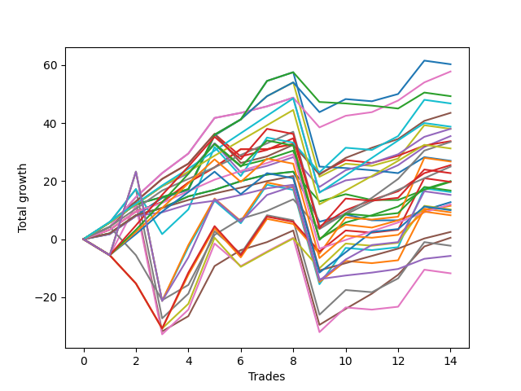

# Long Pointer 009 DB 
- Symbol: ES
- Date Range: 03/18/2022 - 12/30/2022
- Trading Period: 8:30-12:30
- Number of Trades: 6



| Name | Win Percent | Profit | Avg Profit / Trade | Avg Time / Trade |      | Name | Win Percent | Profit | Avg Profit / Trade | Avg Time / Trade |
| ---- | ----------- | ------ | ------------------ | ---------------- | ---- | ---- | ----------- | ------ | ------------------ | ---------------- |
| Sorted By <br> Profit | | | | | | Sorted By <br> Win Percentage ||||
| BB-100 U/L 2SD | 83.33 | 40000.00 | 6666.67 | 55:09 |     | NEWFI 000 | 100.00 | 37250.00 | 6208.33 | 49:21 |
| BB-200 U/L 2SD | 83.33 | 39125.00 | 6520.83 | 56:56 |     | BB-50 U/L 2SD | 100.00 | 24625.00 | 4104.17 | 32:49 |
| NEWFI 000 | 100.00 | 37250.00 | 6208.33 | 49:21 |     | BB-50 U/L 1SD | 100.00 | 18375.00 | 3062.50 | 22:30 |
| BB-50 U/L 2SD | 100.00 | 24625.00 | 4104.17 | 32:49 |     | TP-6 | 100.00 | 18000.00 | 3000.00 | 15:19 |
| V U/L 1SD | 83.33 | 24375.00 | 4062.50 | 29:25 |     | BB-100 Mid | 100.00 | 17875.00 | 2979.17 | 15:47 |
| TP-10 | 83.33 | 19750.00 | 3291.67 | 36:20 |     | TP-5 | 100.00 | 16250.00 | 2708.33 | 14:45 |
| BB-50 U/L 1SD | 100.00 | 18375.00 | 3062.50 | 22:30 |     | BB-50 Mid | 100.00 | 16250.00 | 2708.33 | 10:00 |
| TP-6 | 100.00 | 18000.00 | 3000.00 | 15:19 |     | BB-20 U/L 2SD C | 100.00 | 14000.00 | 2333.33 | 12:25 |
| BB-100 Mid | 100.00 | 17875.00 | 2979.17 | 15:47 |     | TP-4 | 100.00 | 13125.00 | 2187.50 | 09:31 |
| TP-9 | 83.33 | 17875.00 | 2979.17 | 36:01 |     | BB-20 U/L 2SD | 100.00 | 12500.00 | 2083.33 | 10:25 |
| TP-5 | 100.00 | 16250.00 | 2708.33 | 14:45 |     | TP-3 | 100.00 | 11250.00 | 1875.00 | 07:05 |
| BB-50 Mid | 100.00 | 16250.00 | 2708.33 | 10:00 |     | BB-20 U/L 1SD | 100.00 | 10375.00 | 1729.17 | 06:15 |
| TP-8 | 83.33 | 15875.00 | 2645.83 | 32:45 |     | TP-2 | 100.00 | 9500.00 | 1583.33 | 02:58 |
| BB-200 Mid | 83.33 | 14875.00 | 2479.17 | 12:16 |     | TP-1 | 100.00 | 8625.00 | 1437.50 | 02:47 |
| TP-7 | 83.33 | 14125.00 | 2354.17 | 29:42 |     | BB-20 Mid | 100.00 | 8500.00 | 1416.67 | 02:45 |
| BB-20 U/L 2SD C | 100.00 | 14000.00 | 2333.33 | 12:25 |     | BB-100 U/L 2SD | 83.33 | 40000.00 | 6666.67 | 55:09 |
| TP-4 | 100.00 | 13125.00 | 2187.50 | 09:31 |     | BB-200 U/L 2SD | 83.33 | 39125.00 | 6520.83 | 56:56 |
| BB-20 U/L 2SD | 100.00 | 12500.00 | 2083.33 | 10:25 |     | V U/L 1SD | 83.33 | 24375.00 | 4062.50 | 29:25 |
| TP-3 | 100.00 | 11250.00 | 1875.00 | 07:05 |     | TP-10 | 83.33 | 19750.00 | 3291.67 | 36:20 |
| BB-20 U/L 1SD | 100.00 | 10375.00 | 1729.17 | 06:15 |     | TP-9 | 83.33 | 17875.00 | 2979.17 | 36:01 |
| TP-2 | 100.00 | 9500.00 | 1583.33 | 02:58 |     | TP-8 | 83.33 | 15875.00 | 2645.83 | 32:45 |
| V Mid | 66.67 | 8875.00 | 1479.17 | 08:24 |     | BB-200 Mid | 83.33 | 14875.00 | 2479.17 | 12:16 |
| TP-1 | 100.00 | 8625.00 | 1437.50 | 02:47 |     | TP-7 | 83.33 | 14125.00 | 2354.17 | 29:42 |
| BB-20 Mid | 100.00 | 8500.00 | 1416.67 | 02:45 |     | V Mid | 66.67 | 8875.00 | 1479.17 | 08:24 |
| NEWFI 0000 | 33.33 | -3125.00 | -520.83 | 15:25 |     | NEWFI 0000 | 33.33 | -3125.00 | -520.83 | 15:25 |

## NO STOPLOSS

### Test BB-20 Mid
* Sell when price hits the middle line of the 20p bollinger
* No Stoploss
* Results:
```
Total Trades: 6
Percent Up: 100.00
Percent Down: 0.00
Total Points Moved Up: 17.00
Potential Profit: 8500.00
Total Points Ups: 17.00 Count Ups: 6
Total Points Downs: 0.00 Count Downs: 0
```

<details><summary>Trades</summary>

<code>In: 2022-05-06 09:03:00		Out: 2022-05-06 09:04:10		Total Position Time: 01:10		Total Move Up: 6.25		Total to Date: 6.25</code> <br />
<code>In: 2022-05-16 09:47:00		Out: 2022-05-16 09:48:15		Total Position Time: 01:15		Total Move Up: 4.00		Total to Date: 10.25</code> <br />
<code>In: 2022-07-08 09:48:00		Out: 2022-07-08 09:49:10		Total Position Time: 01:10		Total Move Up: 2.25		Total to Date: 12.50</code> <br />
<code>In: 2022-07-12 10:28:00		Out: 2022-07-12 10:29:10		Total Position Time: 01:10		Total Move Up: 1.00		Total to Date: 13.50</code> <br />
<code>In: 2022-10-17 11:28:00		Out: 2022-10-17 11:35:40		Total Position Time: 07:40		Total Move Up: 0.00		Total to Date: 13.50</code> <br />
<code>In: 2022-11-10 09:58:00		Out: 2022-11-10 10:02:05		Total Position Time: 04:05		Total Move Up: 3.50		Total to Date: 17.00</code> <br />


</details>

### Test BB-20 U/L 1SD
* Sell when the price hits the upper line of the 20p 1std bollinger
* No Stoploss
* Results:
```
Total Trades: 6
Percent Up: 100.00
Percent Down: 0.00
Total Points Moved Up: 20.75
Potential Profit: 10375.00
Total Points Ups: 20.75 Count Ups: 6
Total Points Downs: 0.00 Count Downs: 0
```

<details><summary>Trades</summary>

<code>In: 2022-05-06 09:03:00		Out: 2022-05-06 09:04:10		Total Position Time: 01:10		Total Move Up: 6.25		Total to Date: 6.25</code> <br />
<code>In: 2022-05-16 09:47:00		Out: 2022-05-16 09:50:05		Total Position Time: 03:05		Total Move Up: 6.75		Total to Date: 13.00</code> <br />
<code>In: 2022-07-08 09:48:00		Out: 2022-07-08 10:06:55		Total Position Time: 18:55		Total Move Up: 0.00		Total to Date: 13.00</code> <br />
<code>In: 2022-07-12 10:28:00		Out: 2022-07-12 10:30:05		Total Position Time: 02:05		Total Move Up: 1.75		Total to Date: 14.75</code> <br />
<code>In: 2022-10-17 11:28:00		Out: 2022-10-17 11:36:10		Total Position Time: 08:10		Total Move Up: 2.50		Total to Date: 17.25</code> <br />
<code>In: 2022-11-10 09:58:00		Out: 2022-11-10 10:02:05		Total Position Time: 04:05		Total Move Up: 3.50		Total to Date: 20.75</code> <br />


</details>

### Test BB-20 U/L 2SD
* Sell when the price hits the upper line of the 20p 2std bollinger
* No Stoploss
* Results:
```
Total Trades: 6
Percent Up: 100.00
Percent Down: 0.00
Total Points Moved Up: 25.00
Potential Profit: 12500.00
Total Points Ups: 25.00 Count Ups: 6
Total Points Downs: 0.00 Count Downs: 0
```

<details><summary>Trades</summary>

<code>In: 2022-05-06 09:03:00		Out: 2022-05-06 09:04:10		Total Position Time: 01:10		Total Move Up: 6.25		Total to Date: 6.25</code> <br />
<code>In: 2022-05-16 09:47:00		Out: 2022-05-16 10:06:30		Total Position Time: 19:30		Total Move Up: 4.50		Total to Date: 10.75</code> <br />
<code>In: 2022-07-08 09:48:00		Out: 2022-07-08 10:11:05		Total Position Time: 23:05		Total Move Up: 2.25		Total to Date: 13.00</code> <br />
<code>In: 2022-07-12 10:28:00		Out: 2022-07-12 10:31:30		Total Position Time: 03:30		Total Move Up: 3.00		Total to Date: 16.00</code> <br />
<code>In: 2022-10-17 11:28:00		Out: 2022-10-17 11:37:30		Total Position Time: 09:30		Total Move Up: 3.00		Total to Date: 19.00</code> <br />
<code>In: 2022-11-10 09:58:00		Out: 2022-11-10 10:03:45		Total Position Time: 05:45		Total Move Up: 6.00		Total to Date: 25.00</code> <br />


</details>

### Test BB-20 U/L 2SD C
* Sell when the price hits the upper line of the 20p 2std bollinger
* No Stoploss
* Results:
```
Total Trades: 6
Percent Up: 100.00
Percent Down: 0.00
Total Points Moved Up: 28.00
Potential Profit: 14000.00
Total Points Ups: 28.00 Count Ups: 6
Total Points Downs: 0.00 Count Downs: 0
```

<details><summary>Trades</summary>

<code>In: 2022-05-06 09:03:00		Out: 2022-05-06 09:05:00		Total Position Time: 02:00		Total Move Up: 7.25		Total to Date: 7.25</code> <br />
<code>In: 2022-05-16 09:47:00		Out: 2022-05-16 10:07:00		Total Position Time: 20:00		Total Move Up: 5.25		Total to Date: 12.50</code> <br />
<code>In: 2022-07-08 09:48:00		Out: 2022-07-08 10:11:05		Total Position Time: 23:05		Total Move Up: 2.25		Total to Date: 14.75</code> <br />
<code>In: 2022-07-12 10:28:00		Out: 2022-07-12 10:41:40		Total Position Time: 13:40		Total Move Up: 4.00		Total to Date: 18.75</code> <br />
<code>In: 2022-10-17 11:28:00		Out: 2022-10-17 11:37:55		Total Position Time: 09:55		Total Move Up: 3.00		Total to Date: 21.75</code> <br />
<code>In: 2022-11-10 09:58:00		Out: 2022-11-10 10:03:55		Total Position Time: 05:55		Total Move Up: 6.25		Total to Date: 28.00</code> <br />


</details>

### Test BB-50 Mid
* Sell when price hits the middle line of the 50p bollinger
* No Stoploss
* Results:
```
Total Trades: 6
Percent Up: 100.00
Percent Down: 0.00
Total Points Moved Up: 32.50
Potential Profit: 16250.00
Total Points Ups: 32.50 Count Ups: 6
Total Points Downs: 0.00 Count Downs: 0
```

<details><summary>Trades</summary>

<code>In: 2022-05-06 09:03:00		Out: 2022-05-06 09:06:05		Total Position Time: 03:05		Total Move Up: 10.25		Total to Date: 10.25</code> <br />
<code>In: 2022-05-16 09:47:00		Out: 2022-05-16 09:50:05		Total Position Time: 03:05		Total Move Up: 6.75		Total to Date: 17.00</code> <br />
<code>In: 2022-07-08 09:48:00		Out: 2022-07-08 10:11:10		Total Position Time: 23:10		Total Move Up: 2.25		Total to Date: 19.25</code> <br />
<code>In: 2022-07-12 10:28:00		Out: 2022-07-12 10:41:35		Total Position Time: 13:35		Total Move Up: 3.00		Total to Date: 22.25</code> <br />
<code>In: 2022-10-17 11:28:00		Out: 2022-10-17 11:39:15		Total Position Time: 11:15		Total Move Up: 4.00		Total to Date: 26.25</code> <br />
<code>In: 2022-11-10 09:58:00		Out: 2022-11-10 10:03:55		Total Position Time: 05:55		Total Move Up: 6.25		Total to Date: 32.50</code> <br />


</details>

### Test BB-50 U/L 1SD
* Sell when the price hits the upper line of the 50p 1std bollinger
* No Stoploss
* Results:
```
Total Trades: 6
Percent Up: 100.00
Percent Down: 0.00
Total Points Moved Up: 36.75
Potential Profit: 18375.00
Total Points Ups: 36.75 Count Ups: 6
Total Points Downs: 0.00 Count Downs: 0
```

<details><summary>Trades</summary>

<code>In: 2022-05-06 09:03:00		Out: 2022-05-06 09:23:05		Total Position Time: 20:05		Total Move Up: 8.50		Total to Date: 8.50</code> <br />
<code>In: 2022-05-16 09:47:00		Out: 2022-05-16 10:07:05		Total Position Time: 20:05		Total Move Up: 5.25		Total to Date: 13.75</code> <br />
<code>In: 2022-07-08 09:48:00		Out: 2022-07-08 10:26:30		Total Position Time: 38:30		Total Move Up: 2.75		Total to Date: 16.50</code> <br />
<code>In: 2022-07-12 10:28:00		Out: 2022-07-12 10:53:20		Total Position Time: 25:20		Total Move Up: 4.00		Total to Date: 20.50</code> <br />
<code>In: 2022-10-17 11:28:00		Out: 2022-10-17 11:43:20		Total Position Time: 15:20		Total Move Up: 6.50		Total to Date: 27.00</code> <br />
<code>In: 2022-11-10 09:58:00		Out: 2022-11-10 10:13:45		Total Position Time: 15:45		Total Move Up: 9.75		Total to Date: 36.75</code> <br />


</details>

### Test BB-50 U/L 2SD
* Sell when the price hits the upper line of the 50p 2std bollinger
* No Stoploss
* Results:
```
Total Trades: 6
Percent Up: 100.00
Percent Down: 0.00
Total Points Moved Up: 49.25
Potential Profit: 24625.00
Total Points Ups: 49.25 Count Ups: 6
Total Points Downs: 0.00 Count Downs: 0
```

<details><summary>Trades</summary>

<code>In: 2022-05-06 09:03:00		Out: 2022-05-06 09:35:05		Total Position Time: 32:05		Total Move Up: 17.25		Total to Date: 17.25</code> <br />
<code>In: 2022-05-16 09:47:00		Out: 2022-05-16 10:07:35		Total Position Time: 20:35		Total Move Up: 8.50		Total to Date: 25.75</code> <br />
<code>In: 2022-07-08 09:48:00		Out: 2022-07-08 10:27:00		Total Position Time: 39:00		Total Move Up: 5.00		Total to Date: 30.75</code> <br />
<code>In: 2022-07-12 10:28:00		Out: 2022-07-12 10:54:05		Total Position Time: 26:05		Total Move Up: 4.75		Total to Date: 35.50</code> <br />
<code>In: 2022-10-17 11:28:00		Out: 2022-10-17 12:28:55		Total Position Time: 60:55		Total Move Up: 1.00		Total to Date: 36.50</code> <br />
<code>In: 2022-11-10 09:58:00		Out: 2022-11-10 10:16:15		Total Position Time: 18:15		Total Move Up: 12.75		Total to Date: 49.25</code> <br />


</details>

### Test V Mid
* Sell when the price hits the middle line of the 1std VWAP
* No Stoploss
* Results:
```
Total Trades: 6
Percent Up: 66.67
Percent Down: 33.33
Total Points Moved Up: 17.75
Potential Profit: 8875.00
Total Points Ups: 20.00 Count Ups: 4
Total Points Downs: -2.25 Count Downs: 2
```

<details><summary>Trades</summary>

<code>In: 2022-05-06 09:03:00		Out: 2022-05-06 09:04:10		Total Position Time: 01:10		Total Move Up: 6.25		Total to Date: 6.25</code> <br />
<code>In: 2022-05-16 09:47:00		Out: 2022-05-16 09:48:10		Total Position Time: 01:10		Total Move Up: 2.75		Total to Date: 9.00</code> <br />
<code>In: 2022-07-08 09:48:00		Out: 2022-07-08 10:29:10		Total Position Time: 41:10		Total Move Up: 8.00		Total to Date: 17.00</code> <br />
<code>In: 2022-07-12 10:28:00		Out: 2022-07-12 10:31:15		Total Position Time: 03:15		Total Move Up: 3.00		Total to Date: 20.00</code> <br />
<code>In: 2022-10-17 11:28:00		Out: 2022-10-17 11:29:10		Total Position Time: 01:10		Total Move Up: -0.25		Total to Date: 19.75</code> <br />
<code>In: 2022-11-10 09:58:00		Out: 2022-11-10 10:00:30		Total Position Time: 02:30		Total Move Up: -2.00		Total to Date: 17.75</code> <br />


</details>

### Test V U/L 1SD
* Sell when the price hits the upper line of the 1std VWAP
* No Stoploss
* Results:
```
Total Trades: 6
Percent Up: 83.33
Percent Down: 16.67
Total Points Moved Up: 48.75
Potential Profit: 24375.00
Total Points Ups: 50.50 Count Ups: 5
Total Points Downs: -1.75 Count Downs: 1
```

<details><summary>Trades</summary>

<code>In: 2022-05-06 09:03:00		Out: 2022-05-06 09:06:40		Total Position Time: 03:40		Total Move Up: 11.50		Total to Date: 11.50</code> <br />
<code>In: 2022-05-16 09:47:00		Out: 2022-05-16 10:07:35		Total Position Time: 20:35		Total Move Up: 8.50		Total to Date: 20.00</code> <br />
<code>In: 2022-07-08 09:48:00		Out: 2022-07-08 10:48:55		Total Position Time: 60:55		Total Move Up: 13.25		Total to Date: 33.25</code> <br />
<code>In: 2022-07-12 10:28:00		Out: 2022-07-12 11:28:55		Total Position Time: 60:55		Total Move Up: -1.75		Total to Date: 31.50</code> <br />
<code>In: 2022-10-17 11:28:00		Out: 2022-10-17 11:40:40		Total Position Time: 12:40		Total Move Up: 4.75		Total to Date: 36.25</code> <br />
<code>In: 2022-11-10 09:58:00		Out: 2022-11-10 10:15:50		Total Position Time: 17:50		Total Move Up: 12.50		Total to Date: 48.75</code> <br />


</details>

### Test BB-100 Mid
* Move to BB100 Mid
* No Stoploss
* Results:
```
Total Trades: 6
Percent Up: 100.00
Percent Down: 0.00
Total Points Moved Up: 35.75
Potential Profit: 17875.00
Total Points Ups: 35.75 Count Ups: 6
Total Points Downs: 0.00 Count Downs: 0
```

<details><summary>Trades</summary>

<code>In: 2022-05-06 09:03:00		Out: 2022-05-06 09:04:10		Total Position Time: 01:10		Total Move Up: 6.25		Total to Date: 6.25</code> <br />
<code>In: 2022-05-16 09:47:00		Out: 2022-05-16 09:48:10		Total Position Time: 01:10		Total Move Up: 2.75		Total to Date: 9.00</code> <br />
<code>In: 2022-07-08 09:48:00		Out: 2022-07-08 10:29:10		Total Position Time: 41:10		Total Move Up: 8.00		Total to Date: 17.00</code> <br />
<code>In: 2022-07-12 10:28:00		Out: 2022-07-12 10:54:05		Total Position Time: 26:05		Total Move Up: 4.75		Total to Date: 21.75</code> <br />
<code>In: 2022-10-17 11:28:00		Out: 2022-10-17 11:36:10		Total Position Time: 08:10		Total Move Up: 2.50		Total to Date: 24.25</code> <br />
<code>In: 2022-11-10 09:58:00		Out: 2022-11-10 10:15:00		Total Position Time: 17:00		Total Move Up: 11.50		Total to Date: 35.75</code> <br />


</details>

### Test BB-100 U/L 2SD
* Move to BB100 Upper Band
* No Stoploss
* Results:
```
Total Trades: 6
Percent Up: 83.33
Percent Down: 16.67
Total Points Moved Up: 80.00
Potential Profit: 40000.00
Total Points Ups: 81.75 Count Ups: 5
Total Points Downs: -1.75 Count Downs: 1
```

<details><summary>Trades</summary>

<code>In: 2022-05-06 09:03:00		Out: 2022-05-06 10:03:55		Total Position Time: 60:55		Total Move Up: 28.75		Total to Date: 28.75</code> <br />
<code>In: 2022-05-16 09:47:00		Out: 2022-05-16 10:24:00		Total Position Time: 37:00		Total Move Up: 18.50		Total to Date: 47.25</code> <br />
<code>In: 2022-07-08 09:48:00		Out: 2022-07-08 10:48:55		Total Position Time: 60:55		Total Move Up: 13.25		Total to Date: 60.50</code> <br />
<code>In: 2022-07-12 10:28:00		Out: 2022-07-12 11:28:55		Total Position Time: 60:55		Total Move Up: -1.75		Total to Date: 58.75</code> <br />
<code>In: 2022-10-17 11:28:00		Out: 2022-10-17 12:28:55		Total Position Time: 60:55		Total Move Up: 1.00		Total to Date: 59.75</code> <br />
<code>In: 2022-11-10 09:58:00		Out: 2022-11-10 10:48:15		Total Position Time: 50:15		Total Move Up: 20.25		Total to Date: 80.00</code> <br />


</details>

### Test BB-200 Mid
* Move to BB200 Mid
* No Stoploss
* Results:
```
Total Trades: 6
Percent Up: 83.33
Percent Down: 16.67
Total Points Moved Up: 29.75
Potential Profit: 14875.00
Total Points Ups: 30.75 Count Ups: 5
Total Points Downs: -1.00 Count Downs: 1
```

<details><summary>Trades</summary>

<code>In: 2022-05-06 09:03:00		Out: 2022-05-06 09:04:10		Total Position Time: 01:10		Total Move Up: 6.25		Total to Date: 6.25</code> <br />
<code>In: 2022-05-16 09:47:00		Out: 2022-05-16 09:48:10		Total Position Time: 01:10		Total Move Up: 2.75		Total to Date: 9.00</code> <br />
<code>In: 2022-07-08 09:48:00		Out: 2022-07-08 10:48:55		Total Position Time: 60:55		Total Move Up: 13.25		Total to Date: 22.25</code> <br />
<code>In: 2022-07-12 10:28:00		Out: 2022-07-12 10:31:15		Total Position Time: 03:15		Total Move Up: 3.00		Total to Date: 25.25</code> <br />
<code>In: 2022-10-17 11:28:00		Out: 2022-10-17 11:29:35		Total Position Time: 01:35		Total Move Up: -1.00		Total to Date: 24.25</code> <br />
<code>In: 2022-11-10 09:58:00		Out: 2022-11-10 10:03:35		Total Position Time: 05:35		Total Move Up: 5.50		Total to Date: 29.75</code> <br />


</details>

### Test BB-200 U/L 2SD
* Move to BB200 Upper Band
* No Stoploss
* Results:
```
Total Trades: 6
Percent Up: 83.33
Percent Down: 16.67
Total Points Moved Up: 78.25
Potential Profit: 39125.00
Total Points Ups: 80.00 Count Ups: 5
Total Points Downs: -1.75 Count Downs: 1
```

<details><summary>Trades</summary>

<code>In: 2022-05-06 09:03:00		Out: 2022-05-06 10:03:55		Total Position Time: 60:55		Total Move Up: 28.75		Total to Date: 28.75</code> <br />
<code>In: 2022-05-16 09:47:00		Out: 2022-05-16 10:24:05		Total Position Time: 37:05		Total Move Up: 19.25		Total to Date: 48.00</code> <br />
<code>In: 2022-07-08 09:48:00		Out: 2022-07-08 10:48:55		Total Position Time: 60:55		Total Move Up: 13.25		Total to Date: 61.25</code> <br />
<code>In: 2022-07-12 10:28:00		Out: 2022-07-12 11:28:55		Total Position Time: 60:55		Total Move Up: -1.75		Total to Date: 59.50</code> <br />
<code>In: 2022-10-17 11:28:00		Out: 2022-10-17 12:28:55		Total Position Time: 60:55		Total Move Up: 1.00		Total to Date: 60.50</code> <br />
<code>In: 2022-11-10 09:58:00		Out: 2022-11-10 10:58:55		Total Position Time: 60:55		Total Move Up: 17.75		Total to Date: 78.25</code> <br />


</details>

## TAKE PROFIT

### Test TP-1
* Take Profit of 1 Point
* No Stoploss
* Results:
```
Total Trades: 6
Percent Up: 100.00
Percent Down: 0.00
Total Points Moved Up: 17.25
Potential Profit: 8625.00
Total Points Ups: 17.25 Count Ups: 6
Total Points Downs: 0.00 Count Downs: 0
```

<details><summary>Trades</summary>

<code>In: 2022-05-06 09:03:00		Out: 2022-05-06 09:04:10		Total Position Time: 01:10		Total Move Up: 6.25		Total to Date: 6.25</code> <br />
<code>In: 2022-05-16 09:47:00		Out: 2022-05-16 09:48:10		Total Position Time: 01:10		Total Move Up: 2.75		Total to Date: 9.00</code> <br />
<code>In: 2022-07-08 09:48:00		Out: 2022-07-08 09:49:10		Total Position Time: 01:10		Total Move Up: 2.25		Total to Date: 11.25</code> <br />
<code>In: 2022-07-12 10:28:00		Out: 2022-07-12 10:29:15		Total Position Time: 01:15		Total Move Up: 1.25		Total to Date: 12.50</code> <br />
<code>In: 2022-10-17 11:28:00		Out: 2022-10-17 11:35:55		Total Position Time: 07:55		Total Move Up: 1.25		Total to Date: 13.75</code> <br />
<code>In: 2022-11-10 09:58:00		Out: 2022-11-10 10:02:05		Total Position Time: 04:05		Total Move Up: 3.50		Total to Date: 17.25</code> <br />


</details>

### Test TP-2
* Take Profit of 2 Point
* No Stoploss
* Results:
```
Total Trades: 6
Percent Up: 100.00
Percent Down: 0.00
Total Points Moved Up: 19.00
Potential Profit: 9500.00
Total Points Ups: 19.00 Count Ups: 6
Total Points Downs: 0.00 Count Downs: 0
```

<details><summary>Trades</summary>

<code>In: 2022-05-06 09:03:00		Out: 2022-05-06 09:04:10		Total Position Time: 01:10		Total Move Up: 6.25		Total to Date: 6.25</code> <br />
<code>In: 2022-05-16 09:47:00		Out: 2022-05-16 09:48:10		Total Position Time: 01:10		Total Move Up: 2.75		Total to Date: 9.00</code> <br />
<code>In: 2022-07-08 09:48:00		Out: 2022-07-08 09:49:10		Total Position Time: 01:10		Total Move Up: 2.25		Total to Date: 11.25</code> <br />
<code>In: 2022-07-12 10:28:00		Out: 2022-07-12 10:30:05		Total Position Time: 02:05		Total Move Up: 1.75		Total to Date: 13.00</code> <br />
<code>In: 2022-10-17 11:28:00		Out: 2022-10-17 11:36:10		Total Position Time: 08:10		Total Move Up: 2.50		Total to Date: 15.50</code> <br />
<code>In: 2022-11-10 09:58:00		Out: 2022-11-10 10:02:05		Total Position Time: 04:05		Total Move Up: 3.50		Total to Date: 19.00</code> <br />


</details>

### Test TP-3
* Take Profit of 3 Point
* No Stoploss
* Results:
```
Total Trades: 6
Percent Up: 100.00
Percent Down: 0.00
Total Points Moved Up: 22.50
Potential Profit: 11250.00
Total Points Ups: 22.50 Count Ups: 6
Total Points Downs: 0.00 Count Downs: 0
```

<details><summary>Trades</summary>

<code>In: 2022-05-06 09:03:00		Out: 2022-05-06 09:04:10		Total Position Time: 01:10		Total Move Up: 6.25		Total to Date: 6.25</code> <br />
<code>In: 2022-05-16 09:47:00		Out: 2022-05-16 09:48:15		Total Position Time: 01:15		Total Move Up: 4.00		Total to Date: 10.25</code> <br />
<code>In: 2022-07-08 09:48:00		Out: 2022-07-08 10:11:20		Total Position Time: 23:20		Total Move Up: 2.75		Total to Date: 13.00</code> <br />
<code>In: 2022-07-12 10:28:00		Out: 2022-07-12 10:31:15		Total Position Time: 03:15		Total Move Up: 3.00		Total to Date: 16.00</code> <br />
<code>In: 2022-10-17 11:28:00		Out: 2022-10-17 11:37:30		Total Position Time: 09:30		Total Move Up: 3.00		Total to Date: 19.00</code> <br />
<code>In: 2022-11-10 09:58:00		Out: 2022-11-10 10:02:05		Total Position Time: 04:05		Total Move Up: 3.50		Total to Date: 22.50</code> <br />


</details>

### Test TP-4
* Take Profit of 4 Point
* No Stoploss
* Results:
```
Total Trades: 6
Percent Up: 100.00
Percent Down: 0.00
Total Points Moved Up: 26.25
Potential Profit: 13125.00
Total Points Ups: 26.25 Count Ups: 6
Total Points Downs: 0.00 Count Downs: 0
```

<details><summary>Trades</summary>

<code>In: 2022-05-06 09:03:00		Out: 2022-05-06 09:04:10		Total Position Time: 01:10		Total Move Up: 6.25		Total to Date: 6.25</code> <br />
<code>In: 2022-05-16 09:47:00		Out: 2022-05-16 09:48:15		Total Position Time: 01:15		Total Move Up: 4.00		Total to Date: 10.25</code> <br />
<code>In: 2022-07-08 09:48:00		Out: 2022-07-08 10:12:25		Total Position Time: 24:25		Total Move Up: 4.00		Total to Date: 14.25</code> <br />
<code>In: 2022-07-12 10:28:00		Out: 2022-07-12 10:41:40		Total Position Time: 13:40		Total Move Up: 4.00		Total to Date: 18.25</code> <br />
<code>In: 2022-10-17 11:28:00		Out: 2022-10-17 11:39:15		Total Position Time: 11:15		Total Move Up: 4.00		Total to Date: 22.25</code> <br />
<code>In: 2022-11-10 09:58:00		Out: 2022-11-10 10:03:25		Total Position Time: 05:25		Total Move Up: 4.00		Total to Date: 26.25</code> <br />


</details>

### Test TP-5
* Take Profit of 5 Point
* No Stoploss
* Results:
```
Total Trades: 6
Percent Up: 100.00
Percent Down: 0.00
Total Points Moved Up: 32.50
Potential Profit: 16250.00
Total Points Ups: 32.50 Count Ups: 6
Total Points Downs: 0.00 Count Downs: 0
```

<details><summary>Trades</summary>

<code>In: 2022-05-06 09:03:00		Out: 2022-05-06 09:04:10		Total Position Time: 01:10		Total Move Up: 6.25		Total to Date: 6.25</code> <br />
<code>In: 2022-05-16 09:47:00		Out: 2022-05-16 09:48:45		Total Position Time: 01:45		Total Move Up: 5.00		Total to Date: 11.25</code> <br />
<code>In: 2022-07-08 09:48:00		Out: 2022-07-08 10:28:05		Total Position Time: 40:05		Total Move Up: 5.25		Total to Date: 16.50</code> <br />
<code>In: 2022-07-12 10:28:00		Out: 2022-07-12 10:54:15		Total Position Time: 26:15		Total Move Up: 5.25		Total to Date: 21.75</code> <br />
<code>In: 2022-10-17 11:28:00		Out: 2022-10-17 11:41:40		Total Position Time: 13:40		Total Move Up: 5.25		Total to Date: 27.00</code> <br />
<code>In: 2022-11-10 09:58:00		Out: 2022-11-10 10:03:35		Total Position Time: 05:35		Total Move Up: 5.50		Total to Date: 32.50</code> <br />


</details>

### Test TP-6
* Take Profit of 6 Point
* No Stoploss
* Results:
```
Total Trades: 6
Percent Up: 100.00
Percent Down: 0.00
Total Points Moved Up: 36.00
Potential Profit: 18000.00
Total Points Ups: 36.00 Count Ups: 6
Total Points Downs: 0.00 Count Downs: 0
```

<details><summary>Trades</summary>

<code>In: 2022-05-06 09:03:00		Out: 2022-05-06 09:04:10		Total Position Time: 01:10		Total Move Up: 6.25		Total to Date: 6.25</code> <br />
<code>In: 2022-05-16 09:47:00		Out: 2022-05-16 09:50:00		Total Position Time: 03:00		Total Move Up: 5.75		Total to Date: 12.00</code> <br />
<code>In: 2022-07-08 09:48:00		Out: 2022-07-08 10:28:15		Total Position Time: 40:15		Total Move Up: 6.00		Total to Date: 18.00</code> <br />
<code>In: 2022-07-12 10:28:00		Out: 2022-07-12 10:55:00		Total Position Time: 27:00		Total Move Up: 6.00		Total to Date: 24.00</code> <br />
<code>In: 2022-10-17 11:28:00		Out: 2022-10-17 11:42:45		Total Position Time: 14:45		Total Move Up: 6.00		Total to Date: 30.00</code> <br />
<code>In: 2022-11-10 09:58:00		Out: 2022-11-10 10:03:45		Total Position Time: 05:45		Total Move Up: 6.00		Total to Date: 36.00</code> <br />


</details>

### Test TP-7
* Take Profit of 7 Point
* No Stoploss
* Results:
```
Total Trades: 6
Percent Up: 83.33
Percent Down: 16.67
Total Points Moved Up: 28.25
Potential Profit: 14125.00
Total Points Ups: 30.00 Count Ups: 5
Total Points Downs: -1.75 Count Downs: 1
```

<details><summary>Trades</summary>

<code>In: 2022-05-06 09:03:00		Out: 2022-05-06 09:05:00		Total Position Time: 02:00		Total Move Up: 7.25		Total to Date: 7.25</code> <br />
<code>In: 2022-05-16 09:47:00		Out: 2022-05-16 09:50:05		Total Position Time: 03:05		Total Move Up: 6.75		Total to Date: 14.00</code> <br />
<code>In: 2022-07-08 09:48:00		Out: 2022-07-08 10:28:55		Total Position Time: 40:55		Total Move Up: 7.25		Total to Date: 21.25</code> <br />
<code>In: 2022-07-12 10:28:00		Out: 2022-07-12 11:28:55		Total Position Time: 60:55		Total Move Up: -1.75		Total to Date: 19.50</code> <br />
<code>In: 2022-10-17 11:28:00		Out: 2022-10-17 12:28:55		Total Position Time: 60:55		Total Move Up: 1.00		Total to Date: 20.50</code> <br />
<code>In: 2022-11-10 09:58:00		Out: 2022-11-10 10:08:25		Total Position Time: 10:25		Total Move Up: 7.75		Total to Date: 28.25</code> <br />


</details>

### Test TP-8
* Take Profit of 8 Point
* No Stoploss
* Results:
```
Total Trades: 6
Percent Up: 83.33
Percent Down: 16.67
Total Points Moved Up: 31.75
Potential Profit: 15875.00
Total Points Ups: 33.50 Count Ups: 5
Total Points Downs: -1.75 Count Downs: 1
```

<details><summary>Trades</summary>

<code>In: 2022-05-06 09:03:00		Out: 2022-05-06 09:05:30		Total Position Time: 02:30		Total Move Up: 8.00		Total to Date: 8.00</code> <br />
<code>In: 2022-05-16 09:47:00		Out: 2022-05-16 10:07:35		Total Position Time: 20:35		Total Move Up: 8.50		Total to Date: 16.50</code> <br />
<code>In: 2022-07-08 09:48:00		Out: 2022-07-08 10:29:10		Total Position Time: 41:10		Total Move Up: 8.00		Total to Date: 24.50</code> <br />
<code>In: 2022-07-12 10:28:00		Out: 2022-07-12 11:28:55		Total Position Time: 60:55		Total Move Up: -1.75		Total to Date: 22.75</code> <br />
<code>In: 2022-10-17 11:28:00		Out: 2022-10-17 12:28:55		Total Position Time: 60:55		Total Move Up: 1.00		Total to Date: 23.75</code> <br />
<code>In: 2022-11-10 09:58:00		Out: 2022-11-10 10:08:30		Total Position Time: 10:30		Total Move Up: 8.00		Total to Date: 31.75</code> <br />


</details>

### Test TP-9
* Take Profit of 9 Point
* No Stoploss
* Results:
```
Total Trades: 6
Percent Up: 83.33
Percent Down: 16.67
Total Points Moved Up: 35.75
Potential Profit: 17875.00
Total Points Ups: 37.50 Count Ups: 5
Total Points Downs: -1.75 Count Downs: 1
```

<details><summary>Trades</summary>

<code>In: 2022-05-06 09:03:00		Out: 2022-05-06 09:06:00		Total Position Time: 03:00		Total Move Up: 8.75		Total to Date: 8.75</code> <br />
<code>In: 2022-05-16 09:47:00		Out: 2022-05-16 10:11:25		Total Position Time: 24:25		Total Move Up: 9.75		Total to Date: 18.50</code> <br />
<code>In: 2022-07-08 09:48:00		Out: 2022-07-08 10:39:20		Total Position Time: 51:20		Total Move Up: 9.00		Total to Date: 27.50</code> <br />
<code>In: 2022-07-12 10:28:00		Out: 2022-07-12 11:28:55		Total Position Time: 60:55		Total Move Up: -1.75		Total to Date: 25.75</code> <br />
<code>In: 2022-10-17 11:28:00		Out: 2022-10-17 12:28:55		Total Position Time: 60:55		Total Move Up: 1.00		Total to Date: 26.75</code> <br />
<code>In: 2022-11-10 09:58:00		Out: 2022-11-10 10:13:35		Total Position Time: 15:35		Total Move Up: 9.00		Total to Date: 35.75</code> <br />


</details>

### Test TP-10
* Take Profit of 10 Point
* No Stoploss
* Results:
```
Total Trades: 6
Percent Up: 83.33
Percent Down: 16.67
Total Points Moved Up: 39.50
Potential Profit: 19750.00
Total Points Ups: 41.25 Count Ups: 5
Total Points Downs: -1.75 Count Downs: 1
```

<details><summary>Trades</summary>

<code>In: 2022-05-06 09:03:00		Out: 2022-05-06 09:06:05		Total Position Time: 03:05		Total Move Up: 10.25		Total to Date: 10.25</code> <br />
<code>In: 2022-05-16 09:47:00		Out: 2022-05-16 10:11:30		Total Position Time: 24:30		Total Move Up: 9.75		Total to Date: 20.00</code> <br />
<code>In: 2022-07-08 09:48:00		Out: 2022-07-08 10:40:55		Total Position Time: 52:55		Total Move Up: 10.50		Total to Date: 30.50</code> <br />
<code>In: 2022-07-12 10:28:00		Out: 2022-07-12 11:28:55		Total Position Time: 60:55		Total Move Up: -1.75		Total to Date: 28.75</code> <br />
<code>In: 2022-10-17 11:28:00		Out: 2022-10-17 12:28:55		Total Position Time: 60:55		Total Move Up: 1.00		Total to Date: 29.75</code> <br />
<code>In: 2022-11-10 09:58:00		Out: 2022-11-10 10:13:45		Total Position Time: 15:45		Total Move Up: 9.75		Total to Date: 39.50</code> <br />


</details>

## Indicator Exits

### Test NEWFI 000
* Newfi 0000
* No Stoploss
* Results:
```
Total Trades: 6
Percent Up: 100.00
Percent Down: 0.00
Total Points Moved Up: 74.50
Potential Profit: 37250.00
Total Points Ups: 74.50 Count Ups: 6
Total Points Downs: 0.00 Count Downs: 0
```

<details><summary>Trades</summary>

<code>In: 2022-05-06 09:03:00		Out: 2022-05-06 10:03:55		Total Position Time: 60:55		Total Move Up: 28.75		Total to Date: 28.75</code> <br />
<code>In: 2022-05-16 09:47:00		Out: 2022-05-16 10:17:05		Total Position Time: 30:05		Total Move Up: 15.00		Total to Date: 43.75</code> <br />
<code>In: 2022-07-08 09:48:00		Out: 2022-07-08 10:45:05		Total Position Time: 57:05		Total Move Up: 9.25		Total to Date: 53.00</code> <br />
<code>In: 2022-07-12 10:28:00		Out: 2022-07-12 11:01:05		Total Position Time: 33:05		Total Move Up: 3.00		Total to Date: 56.00</code> <br />
<code>In: 2022-10-17 11:28:00		Out: 2022-10-17 12:28:55		Total Position Time: 60:55		Total Move Up: 1.00		Total to Date: 57.00</code> <br />
<code>In: 2022-11-10 09:58:00		Out: 2022-11-10 10:52:05		Total Position Time: 54:05		Total Move Up: 17.50		Total to Date: 74.50</code> <br />


</details>

### Test NEWFI 0000
* Newfi 0000
* No Stoploss
* Results:
```
Total Trades: 6
Percent Up: 33.33
Percent Down: 66.67
Total Points Moved Up: -6.25
Potential Profit: -3125.00
Total Points Ups: 2.75 Count Ups: 2
Total Points Downs: -9.00 Count Downs: 4
```

<details><summary>Trades</summary>

<code>In: 2022-05-06 09:03:00		Out: 2022-05-06 09:19:05		Total Position Time: 16:05		Total Move Up: 2.00		Total to Date: 2.00</code> <br />
<code>In: 2022-05-16 09:47:00		Out: 2022-05-16 09:48:05		Total Position Time: 01:05		Total Move Up: 0.75		Total to Date: 2.75</code> <br />
<code>In: 2022-07-08 09:48:00		Out: 2022-07-08 10:02:05		Total Position Time: 14:05		Total Move Up: -4.50		Total to Date: -1.75</code> <br />
<code>In: 2022-07-12 10:28:00		Out: 2022-07-12 11:27:05		Total Position Time: 59:05		Total Move Up: -1.00		Total to Date: -2.75</code> <br />
<code>In: 2022-10-17 11:28:00		Out: 2022-10-17 11:29:05		Total Position Time: 01:05		Total Move Up: -0.50		Total to Date: -3.25</code> <br />
<code>In: 2022-11-10 09:58:00		Out: 2022-11-10 09:59:05		Total Position Time: 01:05		Total Move Up: -3.00		Total to Date: -6.25</code> <br />


</details>