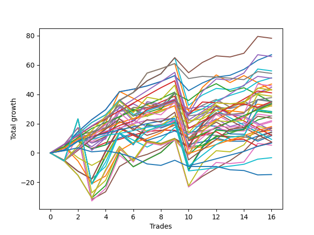

# Long Pointer 009 SD 
- Symbol: ES
- Date Range: 03/18/2022 - 07/15/2022
- Trading Period: 7:20-12:30
- Number of Trades: 16



| Name | Win Percent | Profit | Avg Profit / Trade | Avg Time / Trade |      | Name | Win Percent | Profit | Avg Profit / Trade | Avg Time / Trade |
| ---- | ----------- | ------ | ------------------ | ---------------- | ---- | ---- | ----------- | ------ | ------------------ | ---------------- |
| Sorted By <br> Profit | | | | | | Sorted By <br> Win Percentage ||||
| Eighty-Six | 100.00 | 43375.00 | 2710.94 | 12:35 |     | Eighty-Six | 100.00 | 43375.00 | 2710.94 | 12:35 |
| Three | 93.75 | 41750.00 | 2609.38 | 10:21 |     | Eighty-Five | 100.00 | 39500.00 | 2468.75 | 11:12 |
| Eighty-Five | 100.00 | 39500.00 | 2468.75 | 11:12 |     | Eighty-Four | 100.00 | 31000.00 | 1937.50 | 09:15 |
| Eighty-Eight | 87.50 | 37500.00 | 2343.75 | 19:10 |     | Eighty-Three | 100.00 | 25875.00 | 1617.19 | 07:22 |
| Eighty-Nine | 81.25 | 35125.00 | 2195.31 | 21:14 |     | Eighty-Two | 100.00 | 17875.00 | 1117.19 | 04:09 |
| Two | 81.25 | 33375.00 | 2085.94 | 13:51 |     | Eighty-One | 100.00 | 12125.00 | 757.81 | 03:45 |
| Eighty-Seven | 87.50 | 33250.00 | 2078.12 | 17:16 |     | Three | 93.75 | 41750.00 | 2609.38 | 10:21 |
| Eighty-Four | 100.00 | 31000.00 | 1937.50 | 09:15 |     | Zero | 93.75 | 12500.00 | 781.25 | 02:36 |
| Eighty-Three | 100.00 | 25875.00 | 1617.19 | 07:22 |     | Eighty-Eight | 87.50 | 37500.00 | 2343.75 | 19:10 |
| One | 87.50 | 25250.00 | 1578.12 | 06:33 |     | Eighty-Seven | 87.50 | 33250.00 | 2078.12 | 17:16 |
| Ninety | 75.00 | 19500.00 | 1218.75 | 23:37 |     | One | 87.50 | 25250.00 | 1578.12 | 06:33 |
| Eighty-Two | 100.00 | 17875.00 | 1117.19 | 04:09 |     | Eighty-Nine | 81.25 | 35125.00 | 2195.31 | 21:14 |
| Zero | 93.75 | 12500.00 | 781.25 | 02:36 |     | Two | 81.25 | 33375.00 | 2085.94 | 13:51 |
| Eighty-One | 100.00 | 12125.00 | 757.81 | 03:45 |     | Ninety | 75.00 | 19500.00 | 1218.75 | 23:37 |
| Seven | 68.75 | 8250.00 | 515.62 | 25:05 |     | Six | 75.00 | 4250.00 | 265.62 | 16:01 |
| Six | 75.00 | 4250.00 | 265.62 | 16:01 |     | Four | 75.00 | 875.00 | 54.69 | 23:02 |
| Four | 75.00 | 875.00 | 54.69 | 23:02 |     | Seven | 68.75 | 8250.00 | 515.62 | 25:05 |
| Five | 68.75 | 625.00 | 39.06 | 27:08 |     | Five | 68.75 | 625.00 | 39.06 | 27:08 |
| Seventy-Three | 50.00 | -1625.00 | -101.56 | 07:16 |     | Seventy-Three | 50.00 | -1625.00 | -101.56 | 07:16 |

## NO STOPLOSS

### Test Zero
* Sell when price hits the middle line of the 20p bollinger
* No Stoploss
* Results:
```
Total Trades: 16
Percent Up: 93.75
Percent Down: 6.25
Total Points Moved Up: 25.00
Potential Profit: 12500.00
Total Points Ups: 31.75 Count Ups: 15
Total Points Downs: -6.75 Count Downs: 1
```

<details><summary>Trades</summary>

<code>In: 2022-03-30 12:27:00		Out: 2022-03-30 12:28:15		Total Position Time: 01:15		Total Move Up: 2.50		Total to Date: 2.50</code> <br />
<code>In: 2022-03-31 08:37:00		Out: 2022-03-31 08:38:15		Total Position Time: 01:15		Total Move Up: 2.00		Total to Date: 4.50</code> <br />
<code>In: 2022-03-31 10:02:00		Out: 2022-03-31 10:04:00		Total Position Time: 02:00		Total Move Up: 0.75		Total to Date: 5.25</code> <br />
<code>In: 2022-04-06 09:23:00		Out: 2022-04-06 09:31:15		Total Position Time: 08:15		Total Move Up: 1.50		Total to Date: 6.75</code> <br />
<code>In: 2022-04-12 11:35:00		Out: 2022-04-12 11:35:50		Total Position Time: 00:50		Total Move Up: 1.50		Total to Date: 8.25</code> <br />
<code>In: 2022-05-06 09:03:00		Out: 2022-05-06 09:03:10		Total Position Time: 00:10		Total Move Up: 2.50		Total to Date: 10.75</code> <br />
<code>In: 2022-05-11 09:14:00		Out: 2022-05-11 09:17:50		Total Position Time: 03:50		Total Move Up: 0.25		Total to Date: 11.00</code> <br />
<code>In: 2022-05-16 09:47:00		Out: 2022-05-16 09:48:15		Total Position Time: 01:15		Total Move Up: 4.00		Total to Date: 15.00</code> <br />
<code>In: 2022-05-25 10:15:00		Out: 2022-05-25 10:15:20		Total Position Time: 00:20		Total Move Up: 1.00		Total to Date: 16.00</code> <br />
<code>In: 2022-05-31 12:05:00		Out: 2022-05-31 12:07:20		Total Position Time: 02:20		Total Move Up: 2.25		Total to Date: 18.25</code> <br />
<code>In: 2022-06-13 12:17:00		Out: 2022-06-13 12:17:10		Total Position Time: 00:10		Total Move Up: 4.00		Total to Date: 22.25</code> <br />
<code>In: 2022-06-14 07:32:00		Out: 2022-06-14 07:46:40		Total Position Time: 14:40		Total Move Up: -6.75		Total to Date: 15.50</code> <br />
<code>In: 2022-06-27 10:10:00		Out: 2022-06-27 10:11:25		Total Position Time: 01:25		Total Move Up: 3.00		Total to Date: 18.50</code> <br />
<code>In: 2022-07-06 08:12:00		Out: 2022-07-06 08:14:30		Total Position Time: 02:30		Total Move Up: 3.50		Total to Date: 22.00</code> <br />
<code>In: 2022-07-08 09:48:00		Out: 2022-07-08 09:48:40		Total Position Time: 00:40		Total Move Up: 1.75		Total to Date: 23.75</code> <br />
<code>In: 2022-07-12 10:28:00		Out: 2022-07-12 10:28:50		Total Position Time: 00:50		Total Move Up: 1.25		Total to Date: 25.00</code> <br />


</details>

### Test One
* Sell when the price hits the upper line of the 20p 1std bollinger
* No Stoploss
* Results:
```
Total Trades: 16
Percent Up: 87.50
Percent Down: 12.50
Total Points Moved Up: 50.50
Potential Profit: 25250.00
Total Points Ups: 53.00 Count Ups: 14
Total Points Downs: -2.50 Count Downs: 2
```

<details><summary>Trades</summary>

<code>In: 2022-03-30 12:27:00		Out: 2022-03-30 12:32:20		Total Position Time: 05:20		Total Move Up: 4.75		Total to Date: 4.75</code> <br />
<code>In: 2022-03-31 08:37:00		Out: 2022-03-31 08:40:35		Total Position Time: 03:35		Total Move Up: 3.25		Total to Date: 8.00</code> <br />
<code>In: 2022-03-31 10:02:00		Out: 2022-03-31 10:19:20		Total Position Time: 17:20		Total Move Up: -1.00		Total to Date: 7.00</code> <br />
<code>In: 2022-04-06 09:23:00		Out: 2022-04-06 09:34:05		Total Position Time: 11:05		Total Move Up: 1.50		Total to Date: 8.50</code> <br />
<code>In: 2022-04-12 11:35:00		Out: 2022-04-12 11:37:20		Total Position Time: 02:20		Total Move Up: 3.50		Total to Date: 12.00</code> <br />
<code>In: 2022-05-06 09:03:00		Out: 2022-05-06 09:03:10		Total Position Time: 00:10		Total Move Up: 2.50		Total to Date: 14.50</code> <br />
<code>In: 2022-05-11 09:14:00		Out: 2022-05-11 09:23:10		Total Position Time: 09:10		Total Move Up: 3.25		Total to Date: 17.75</code> <br />
<code>In: 2022-05-16 09:47:00		Out: 2022-05-16 09:50:05		Total Position Time: 03:05		Total Move Up: 6.75		Total to Date: 24.50</code> <br />
<code>In: 2022-05-25 10:15:00		Out: 2022-05-25 10:15:30		Total Position Time: 00:30		Total Move Up: 3.25		Total to Date: 27.75</code> <br />
<code>In: 2022-05-31 12:05:00		Out: 2022-05-31 12:09:15		Total Position Time: 04:15		Total Move Up: 5.25		Total to Date: 33.00</code> <br />
<code>In: 2022-06-13 12:17:00		Out: 2022-06-13 12:17:10		Total Position Time: 00:10		Total Move Up: 4.00		Total to Date: 37.00</code> <br />
<code>In: 2022-06-14 07:32:00		Out: 2022-06-14 07:47:10		Total Position Time: 15:10		Total Move Up: -1.50		Total to Date: 35.50</code> <br />
<code>In: 2022-06-27 10:10:00		Out: 2022-06-27 10:15:55		Total Position Time: 05:55		Total Move Up: 6.00		Total to Date: 41.50</code> <br />
<code>In: 2022-07-06 08:12:00		Out: 2022-07-06 08:17:50		Total Position Time: 05:50		Total Move Up: 7.25		Total to Date: 48.75</code> <br />
<code>In: 2022-07-08 09:48:00		Out: 2022-07-08 10:06:55		Total Position Time: 18:55		Total Move Up: 0.00		Total to Date: 48.75</code> <br />
<code>In: 2022-07-12 10:28:00		Out: 2022-07-12 10:30:05		Total Position Time: 02:05		Total Move Up: 1.75		Total to Date: 50.50</code> <br />


</details>

### Test Two
* Sell when the price hits the upper line of the 20p 2std bollinger
* No Stoploss
* Results:
```
Total Trades: 16
Percent Up: 81.25
Percent Down: 18.75
Total Points Moved Up: 66.75
Potential Profit: 33375.00
Total Points Ups: 75.25 Count Ups: 13
Total Points Downs: -8.50 Count Downs: 3
```

<details><summary>Trades</summary>

<code>In: 2022-03-30 12:27:00		Out: 2022-03-30 12:36:20		Total Position Time: 09:20		Total Move Up: 7.50		Total to Date: 7.50</code> <br />
<code>In: 2022-03-31 08:37:00		Out: 2022-03-31 08:41:10		Total Position Time: 04:10		Total Move Up: 5.75		Total to Date: 13.25</code> <br />
<code>In: 2022-03-31 10:02:00		Out: 2022-03-31 10:27:00		Total Position Time: 25:00		Total Move Up: -1.50		Total to Date: 11.75</code> <br />
<code>In: 2022-04-06 09:23:00		Out: 2022-04-06 09:34:25		Total Position Time: 11:25		Total Move Up: 2.75		Total to Date: 14.50</code> <br />
<code>In: 2022-04-12 11:35:00		Out: 2022-04-12 11:47:00		Total Position Time: 12:00		Total Move Up: 4.50		Total to Date: 19.00</code> <br />
<code>In: 2022-05-06 09:03:00		Out: 2022-05-06 09:03:55		Total Position Time: 00:55		Total Move Up: 6.75		Total to Date: 25.75</code> <br />
<code>In: 2022-05-11 09:14:00		Out: 2022-05-11 09:23:35		Total Position Time: 09:35		Total Move Up: 6.25		Total to Date: 32.00</code> <br />
<code>In: 2022-05-16 09:47:00		Out: 2022-05-16 10:06:30		Total Position Time: 19:30		Total Move Up: 4.50		Total to Date: 36.50</code> <br />
<code>In: 2022-05-25 10:15:00		Out: 2022-05-25 10:29:40		Total Position Time: 14:40		Total Move Up: 6.25		Total to Date: 42.75</code> <br />
<code>In: 2022-05-31 12:05:00		Out: 2022-05-31 12:15:05		Total Position Time: 10:05		Total Move Up: 10.25		Total to Date: 53.00</code> <br />
<code>In: 2022-06-13 12:17:00		Out: 2022-06-13 12:17:15		Total Position Time: 00:15		Total Move Up: 8.75		Total to Date: 61.75</code> <br />
<code>In: 2022-06-14 07:32:00		Out: 2022-06-14 07:51:00		Total Position Time: 19:00		Total Move Up: 7.25		Total to Date: 69.00</code> <br />
<code>In: 2022-06-27 10:10:00		Out: 2022-06-27 10:39:55		Total Position Time: 29:55		Total Move Up: -1.00		Total to Date: 68.00</code> <br />
<code>In: 2022-07-06 08:12:00		Out: 2022-07-06 08:41:55		Total Position Time: 29:55		Total Move Up: -6.00		Total to Date: 62.00</code> <br />
<code>In: 2022-07-08 09:48:00		Out: 2022-07-08 10:10:30		Total Position Time: 22:30		Total Move Up: 1.75		Total to Date: 63.75</code> <br />
<code>In: 2022-07-12 10:28:00		Out: 2022-07-12 10:31:30		Total Position Time: 03:30		Total Move Up: 3.00		Total to Date: 66.75</code> <br />


</details>

### Test Three
* Sell when price hits the middle line of the 50p bollinger
* No Stoploss
* Results:
```
Total Trades: 16
Percent Up: 93.75
Percent Down: 6.25
Total Points Moved Up: 83.50
Potential Profit: 41750.00
Total Points Ups: 84.50 Count Ups: 15
Total Points Downs: -1.00 Count Downs: 1
```

<details><summary>Trades</summary>

<code>In: 2022-03-30 12:27:00		Out: 2022-03-30 12:33:25		Total Position Time: 06:25		Total Move Up: 6.50		Total to Date: 6.50</code> <br />
<code>In: 2022-03-31 08:37:00		Out: 2022-03-31 08:41:05		Total Position Time: 04:05		Total Move Up: 4.25		Total to Date: 10.75</code> <br />
<code>In: 2022-03-31 10:02:00		Out: 2022-03-31 10:27:25		Total Position Time: 25:25		Total Move Up: -1.00		Total to Date: 9.75</code> <br />
<code>In: 2022-04-06 09:23:00		Out: 2022-04-06 09:48:50		Total Position Time: 25:50		Total Move Up: 2.50		Total to Date: 12.25</code> <br />
<code>In: 2022-04-12 11:35:00		Out: 2022-04-12 11:47:05		Total Position Time: 12:05		Total Move Up: 6.00		Total to Date: 18.25</code> <br />
<code>In: 2022-05-06 09:03:00		Out: 2022-05-06 09:06:05		Total Position Time: 03:05		Total Move Up: 10.25		Total to Date: 28.50</code> <br />
<code>In: 2022-05-11 09:14:00		Out: 2022-05-11 09:23:45		Total Position Time: 09:45		Total Move Up: 8.25		Total to Date: 36.75</code> <br />
<code>In: 2022-05-16 09:47:00		Out: 2022-05-16 09:50:05		Total Position Time: 03:05		Total Move Up: 6.75		Total to Date: 43.50</code> <br />
<code>In: 2022-05-25 10:15:00		Out: 2022-05-25 10:15:10		Total Position Time: 00:10		Total Move Up: 0.00		Total to Date: 43.50</code> <br />
<code>In: 2022-05-31 12:05:00		Out: 2022-05-31 12:15:15		Total Position Time: 10:15		Total Move Up: 12.25		Total to Date: 55.75</code> <br />
<code>In: 2022-06-13 12:17:00		Out: 2022-06-13 12:17:15		Total Position Time: 00:15		Total Move Up: 8.75		Total to Date: 64.50</code> <br />
<code>In: 2022-06-14 07:32:00		Out: 2022-06-14 07:50:00		Total Position Time: 18:00		Total Move Up: 4.50		Total to Date: 69.00</code> <br />
<code>In: 2022-06-27 10:10:00		Out: 2022-06-27 10:11:15		Total Position Time: 01:15		Total Move Up: 1.75		Total to Date: 70.75</code> <br />
<code>In: 2022-07-06 08:12:00		Out: 2022-07-06 08:21:30		Total Position Time: 09:30		Total Move Up: 7.50		Total to Date: 78.25</code> <br />
<code>In: 2022-07-08 09:48:00		Out: 2022-07-08 10:11:05		Total Position Time: 23:05		Total Move Up: 2.25		Total to Date: 80.50</code> <br />
<code>In: 2022-07-12 10:28:00		Out: 2022-07-12 10:41:35		Total Position Time: 13:35		Total Move Up: 3.00		Total to Date: 83.50</code> <br />


</details>

### Test Four
* Sell when the price hits the upper line of the 50p 1std bollinger
* No Stoploss
* Results:
```
Total Trades: 16
Percent Up: 75.00
Percent Down: 25.00
Total Points Moved Up: 1.75
Potential Profit: 875.00
Total Points Ups: 63.25 Count Ups: 12
Total Points Downs: -61.50 Count Downs: 4
```

<details><summary>Trades</summary>

<code>In: 2022-03-30 12:27:00		Out: 2022-03-30 12:46:00		Total Position Time: 19:00		Total Move Up: 7.25		Total to Date: 7.25</code> <br />
<code>In: 2022-03-31 08:37:00		Out: 2022-03-31 09:00:15		Total Position Time: 23:15		Total Move Up: 4.25		Total to Date: 11.50</code> <br />
<code>In: 2022-03-31 10:02:00		Out: 2022-03-31 10:29:50		Total Position Time: 27:50		Total Move Up: 1.50		Total to Date: 13.00</code> <br />
<code>In: 2022-04-06 09:23:00		Out: 2022-04-06 09:52:55		Total Position Time: 29:55		Total Move Up: 0.00		Total to Date: 13.00</code> <br />
<code>In: 2022-04-12 11:35:00		Out: 2022-04-12 12:04:55		Total Position Time: 29:55		Total Move Up: -7.50		Total to Date: 5.50</code> <br />
<code>In: 2022-05-06 09:03:00		Out: 2022-05-06 09:22:25		Total Position Time: 19:25		Total Move Up: 8.25		Total to Date: 13.75</code> <br />
<code>In: 2022-05-11 09:14:00		Out: 2022-05-11 09:43:55		Total Position Time: 29:55		Total Move Up: -23.00		Total to Date: -9.25</code> <br />
<code>In: 2022-05-16 09:47:00		Out: 2022-05-16 10:07:00		Total Position Time: 20:00		Total Move Up: 5.25		Total to Date: -4.00</code> <br />
<code>In: 2022-05-25 10:15:00		Out: 2022-05-25 10:15:30		Total Position Time: 00:30		Total Move Up: 3.25		Total to Date: -0.75</code> <br />
<code>In: 2022-05-31 12:05:00		Out: 2022-05-31 12:28:20		Total Position Time: 23:20		Total Move Up: 16.50		Total to Date: 15.75</code> <br />
<code>In: 2022-06-13 12:17:00		Out: 2022-06-13 12:46:00		Total Position Time: 29:00		Total Move Up: -25.00		Total to Date: -9.25</code> <br />
<code>In: 2022-06-14 07:32:00		Out: 2022-06-14 08:01:15		Total Position Time: 29:15		Total Move Up: 5.75		Total to Date: -3.50</code> <br />
<code>In: 2022-06-27 10:10:00		Out: 2022-06-27 10:13:05		Total Position Time: 03:05		Total Move Up: 5.50		Total to Date: 2.00</code> <br />
<code>In: 2022-07-06 08:12:00		Out: 2022-07-06 08:41:55		Total Position Time: 29:55		Total Move Up: -6.00		Total to Date: -4.00</code> <br />
<code>In: 2022-07-08 09:48:00		Out: 2022-07-08 10:17:55		Total Position Time: 29:55		Total Move Up: 2.00		Total to Date: -2.00</code> <br />
<code>In: 2022-07-12 10:28:00		Out: 2022-07-12 10:52:25		Total Position Time: 24:25		Total Move Up: 3.75		Total to Date: 1.75</code> <br />


</details>

### Test Five
* Sell when the price hits the upper line of the 50p 2std bollinger
* No Stoploss
* Results:
```
Total Trades: 16
Percent Up: 68.75
Percent Down: 31.25
Total Points Moved Up: 1.25
Potential Profit: 625.00
Total Points Ups: 63.75 Count Ups: 11
Total Points Downs: -62.50 Count Downs: 5
```

<details><summary>Trades</summary>

<code>In: 2022-03-30 12:27:00		Out: 2022-03-30 12:46:00		Total Position Time: 19:00		Total Move Up: 7.25		Total to Date: 7.25</code> <br />
<code>In: 2022-03-31 08:37:00		Out: 2022-03-31 09:06:55		Total Position Time: 29:55		Total Move Up: 0.25		Total to Date: 7.50</code> <br />
<code>In: 2022-03-31 10:02:00		Out: 2022-03-31 10:31:55		Total Position Time: 29:55		Total Move Up: 2.00		Total to Date: 9.50</code> <br />
<code>In: 2022-04-06 09:23:00		Out: 2022-04-06 09:52:55		Total Position Time: 29:55		Total Move Up: 0.00		Total to Date: 9.50</code> <br />
<code>In: 2022-04-12 11:35:00		Out: 2022-04-12 12:04:55		Total Position Time: 29:55		Total Move Up: -7.50		Total to Date: 2.00</code> <br />
<code>In: 2022-05-06 09:03:00		Out: 2022-05-06 09:32:55		Total Position Time: 29:55		Total Move Up: 5.25		Total to Date: 7.25</code> <br />
<code>In: 2022-05-11 09:14:00		Out: 2022-05-11 09:43:55		Total Position Time: 29:55		Total Move Up: -23.00		Total to Date: -15.75</code> <br />
<code>In: 2022-05-16 09:47:00		Out: 2022-05-16 10:07:35		Total Position Time: 20:35		Total Move Up: 8.50		Total to Date: -7.25</code> <br />
<code>In: 2022-05-25 10:15:00		Out: 2022-05-25 10:29:25		Total Position Time: 14:25		Total Move Up: 5.25		Total to Date: -2.00</code> <br />
<code>In: 2022-05-31 12:05:00		Out: 2022-05-31 12:31:05		Total Position Time: 26:05		Total Move Up: 22.75		Total to Date: 20.75</code> <br />
<code>In: 2022-06-13 12:17:00		Out: 2022-06-13 12:46:00		Total Position Time: 29:00		Total Move Up: -25.00		Total to Date: -4.25</code> <br />
<code>In: 2022-06-14 07:32:00		Out: 2022-06-14 08:01:55		Total Position Time: 29:55		Total Move Up: 5.75		Total to Date: 1.50</code> <br />
<code>In: 2022-06-27 10:10:00		Out: 2022-06-27 10:39:55		Total Position Time: 29:55		Total Move Up: -1.00		Total to Date: 0.50</code> <br />
<code>In: 2022-07-06 08:12:00		Out: 2022-07-06 08:41:55		Total Position Time: 29:55		Total Move Up: -6.00		Total to Date: -5.50</code> <br />
<code>In: 2022-07-08 09:48:00		Out: 2022-07-08 10:17:55		Total Position Time: 29:55		Total Move Up: 2.00		Total to Date: -3.50</code> <br />
<code>In: 2022-07-12 10:28:00		Out: 2022-07-12 10:54:05		Total Position Time: 26:05		Total Move Up: 4.75		Total to Date: 1.25</code> <br />


</details>

### Test Six
* Sell when the price hits the middle line of the 1std VWAP
* No Stoploss
* Results:
```
Total Trades: 16
Percent Up: 75.00
Percent Down: 25.00
Total Points Moved Up: 8.50
Potential Profit: 4250.00
Total Points Ups: 47.50 Count Ups: 12
Total Points Downs: -39.00 Count Downs: 4
```

<details><summary>Trades</summary>

<code>In: 2022-03-30 12:27:00		Out: 2022-03-30 12:46:00		Total Position Time: 19:00		Total Move Up: 7.25		Total to Date: 7.25</code> <br />
<code>In: 2022-03-31 08:37:00		Out: 2022-03-31 08:37:40		Total Position Time: 00:40		Total Move Up: 1.25		Total to Date: 8.50</code> <br />
<code>In: 2022-03-31 10:02:00		Out: 2022-03-31 10:31:55		Total Position Time: 29:55		Total Move Up: 2.00		Total to Date: 10.50</code> <br />
<code>In: 2022-04-06 09:23:00		Out: 2022-04-06 09:52:55		Total Position Time: 29:55		Total Move Up: 0.00		Total to Date: 10.50</code> <br />
<code>In: 2022-04-12 11:35:00		Out: 2022-04-12 12:04:55		Total Position Time: 29:55		Total Move Up: -7.50		Total to Date: 3.00</code> <br />
<code>In: 2022-05-06 09:03:00		Out: 2022-05-06 09:03:10		Total Position Time: 00:10		Total Move Up: 2.50		Total to Date: 5.50</code> <br />
<code>In: 2022-05-11 09:14:00		Out: 2022-05-11 09:23:10		Total Position Time: 09:10		Total Move Up: 3.25		Total to Date: 8.75</code> <br />
<code>In: 2022-05-16 09:47:00		Out: 2022-05-16 09:47:10		Total Position Time: 00:10		Total Move Up: -0.50		Total to Date: 8.25</code> <br />
<code>In: 2022-05-25 10:15:00		Out: 2022-05-25 10:37:05		Total Position Time: 22:05		Total Move Up: 11.00		Total to Date: 19.25</code> <br />
<code>In: 2022-05-31 12:05:00		Out: 2022-05-31 12:07:50		Total Position Time: 02:50		Total Move Up: 4.75		Total to Date: 24.00</code> <br />
<code>In: 2022-06-13 12:17:00		Out: 2022-06-13 12:46:00		Total Position Time: 29:00		Total Move Up: -25.00		Total to Date: -1.00</code> <br />
<code>In: 2022-06-14 07:32:00		Out: 2022-06-14 07:51:05		Total Position Time: 19:05		Total Move Up: 7.50		Total to Date: 6.50</code> <br />
<code>In: 2022-06-27 10:10:00		Out: 2022-06-27 10:11:25		Total Position Time: 01:25		Total Move Up: 3.00		Total to Date: 9.50</code> <br />
<code>In: 2022-07-06 08:12:00		Out: 2022-07-06 08:41:55		Total Position Time: 29:55		Total Move Up: -6.00		Total to Date: 3.50</code> <br />
<code>In: 2022-07-08 09:48:00		Out: 2022-07-08 10:17:55		Total Position Time: 29:55		Total Move Up: 2.00		Total to Date: 5.50</code> <br />
<code>In: 2022-07-12 10:28:00		Out: 2022-07-12 10:31:15		Total Position Time: 03:15		Total Move Up: 3.00		Total to Date: 8.50</code> <br />


</details>

### Test Seven
* Sell when the price hits the upper line of the 1std VWAP
* No Stoploss
* Results:
```
Total Trades: 16
Percent Up: 68.75
Percent Down: 31.25
Total Points Moved Up: 16.50
Potential Profit: 8250.00
Total Points Ups: 79.00 Count Ups: 11
Total Points Downs: -62.50 Count Downs: 5
```

<details><summary>Trades</summary>

<code>In: 2022-03-30 12:27:00		Out: 2022-03-30 12:46:00		Total Position Time: 19:00		Total Move Up: 7.25		Total to Date: 7.25</code> <br />
<code>In: 2022-03-31 08:37:00		Out: 2022-03-31 08:41:10		Total Position Time: 04:10		Total Move Up: 5.75		Total to Date: 13.00</code> <br />
<code>In: 2022-03-31 10:02:00		Out: 2022-03-31 10:31:55		Total Position Time: 29:55		Total Move Up: 2.00		Total to Date: 15.00</code> <br />
<code>In: 2022-04-06 09:23:00		Out: 2022-04-06 09:52:55		Total Position Time: 29:55		Total Move Up: 0.00		Total to Date: 15.00</code> <br />
<code>In: 2022-04-12 11:35:00		Out: 2022-04-12 12:04:55		Total Position Time: 29:55		Total Move Up: -7.50		Total to Date: 7.50</code> <br />
<code>In: 2022-05-06 09:03:00		Out: 2022-05-06 09:06:40		Total Position Time: 03:40		Total Move Up: 11.50		Total to Date: 19.00</code> <br />
<code>In: 2022-05-11 09:14:00		Out: 2022-05-11 09:43:55		Total Position Time: 29:55		Total Move Up: -23.00		Total to Date: -4.00</code> <br />
<code>In: 2022-05-16 09:47:00		Out: 2022-05-16 10:07:35		Total Position Time: 20:35		Total Move Up: 8.50		Total to Date: 4.50</code> <br />
<code>In: 2022-05-25 10:15:00		Out: 2022-05-25 10:44:55		Total Position Time: 29:55		Total Move Up: 9.50		Total to Date: 14.00</code> <br />
<code>In: 2022-05-31 12:05:00		Out: 2022-05-31 12:30:55		Total Position Time: 25:55		Total Move Up: 21.50		Total to Date: 35.50</code> <br />
<code>In: 2022-06-13 12:17:00		Out: 2022-06-13 12:46:00		Total Position Time: 29:00		Total Move Up: -25.00		Total to Date: 10.50</code> <br />
<code>In: 2022-06-14 07:32:00		Out: 2022-06-14 08:01:55		Total Position Time: 29:55		Total Move Up: 5.75		Total to Date: 16.25</code> <br />
<code>In: 2022-06-27 10:10:00		Out: 2022-06-27 10:39:55		Total Position Time: 29:55		Total Move Up: -1.00		Total to Date: 15.25</code> <br />
<code>In: 2022-07-06 08:12:00		Out: 2022-07-06 08:41:55		Total Position Time: 29:55		Total Move Up: -6.00		Total to Date: 9.25</code> <br />
<code>In: 2022-07-08 09:48:00		Out: 2022-07-08 10:17:55		Total Position Time: 29:55		Total Move Up: 2.00		Total to Date: 11.25</code> <br />
<code>In: 2022-07-12 10:28:00		Out: 2022-07-12 10:57:55		Total Position Time: 29:55		Total Move Up: 5.25		Total to Date: 16.50</code> <br />


</details>

## SPECIAL EXIT CONDITIONS 

### Test Seventy-Three
* Sell when the linear regression slope changes to negative
* No Stoploss
* Results:
```
Total Trades: 16
Percent Up: 50.00
Percent Down: 50.00
Total Points Moved Up: -3.25
Potential Profit: -1625.00
Total Points Ups: 23.25 Count Ups: 8
Total Points Downs: -26.50 Count Downs: 8
```

<details><summary>Trades</summary>

<code>In: 2022-03-30 12:27:00		Out: 2022-03-30 12:39:05		Total Position Time: 12:05		Total Move Up: 3.50		Total to Date: 3.50</code> <br />
<code>In: 2022-03-31 08:37:00		Out: 2022-03-31 08:48:05		Total Position Time: 11:05		Total Move Up: 2.00		Total to Date: 5.50</code> <br />
<code>In: 2022-03-31 10:02:00		Out: 2022-03-31 10:05:05		Total Position Time: 03:05		Total Move Up: -1.00		Total to Date: 4.50</code> <br />
<code>In: 2022-04-06 09:23:00		Out: 2022-04-06 09:24:05		Total Position Time: 01:05		Total Move Up: -1.25		Total to Date: 3.25</code> <br />
<code>In: 2022-04-12 11:35:00		Out: 2022-04-12 11:40:05		Total Position Time: 05:05		Total Move Up: -0.75		Total to Date: 2.50</code> <br />
<code>In: 2022-05-06 09:03:00		Out: 2022-05-06 09:12:05		Total Position Time: 09:05		Total Move Up: -0.25		Total to Date: 2.25</code> <br />
<code>In: 2022-05-11 09:14:00		Out: 2022-05-11 09:15:05		Total Position Time: 01:05		Total Move Up: -2.75		Total to Date: -0.50</code> <br />
<code>In: 2022-05-16 09:47:00		Out: 2022-05-16 09:54:05		Total Position Time: 07:05		Total Move Up: 0.25		Total to Date: -0.25</code> <br />
<code>In: 2022-05-25 10:15:00		Out: 2022-05-25 10:21:05		Total Position Time: 06:05		Total Move Up: 0.50		Total to Date: 0.25</code> <br />
<code>In: 2022-05-31 12:05:00		Out: 2022-05-31 12:20:05		Total Position Time: 15:05		Total Move Up: 8.50		Total to Date: 8.75</code> <br />
<code>In: 2022-06-13 12:17:00		Out: 2022-06-13 12:23:05		Total Position Time: 06:05		Total Move Up: -11.25		Total to Date: -2.50</code> <br />
<code>In: 2022-06-14 07:32:00		Out: 2022-06-14 07:34:05		Total Position Time: 02:05		Total Move Up: -9.00		Total to Date: -11.50</code> <br />
<code>In: 2022-06-27 10:10:00		Out: 2022-06-27 10:21:05		Total Position Time: 11:05		Total Move Up: 2.75		Total to Date: -8.75</code> <br />
<code>In: 2022-07-06 08:12:00		Out: 2022-07-06 08:23:05		Total Position Time: 11:05		Total Move Up: 4.00		Total to Date: -4.75</code> <br />
<code>In: 2022-07-08 09:48:00		Out: 2022-07-08 09:53:05		Total Position Time: 05:05		Total Move Up: -0.25		Total to Date: -5.00</code> <br />
<code>In: 2022-07-12 10:28:00		Out: 2022-07-12 10:38:05		Total Position Time: 10:05		Total Move Up: 1.75		Total to Date: -3.25</code> <br />


</details>

## TAKE PROFIT

### Test Eighty-One
* Take Profit of 1 Point
* No Stoploss
* Results:
```
Total Trades: 16
Percent Up: 100.00
Percent Down: 0.00
Total Points Moved Up: 24.25
Potential Profit: 12125.00
Total Points Ups: 24.25 Count Ups: 16
Total Points Downs: 0.00 Count Downs: 0
```

<details><summary>Trades</summary>

<code>In: 2022-03-30 12:27:00		Out: 2022-03-30 12:27:35		Total Position Time: 00:35		Total Move Up: 1.00		Total to Date: 1.00</code> <br />
<code>In: 2022-03-31 08:37:00		Out: 2022-03-31 08:37:40		Total Position Time: 00:40		Total Move Up: 1.25		Total to Date: 2.25</code> <br />
<code>In: 2022-03-31 10:02:00		Out: 2022-03-31 10:29:40		Total Position Time: 27:40		Total Move Up: 0.75		Total to Date: 3.00</code> <br />
<code>In: 2022-04-06 09:23:00		Out: 2022-04-06 09:31:15		Total Position Time: 08:15		Total Move Up: 1.50		Total to Date: 4.50</code> <br />
<code>In: 2022-04-12 11:35:00		Out: 2022-04-12 11:35:45		Total Position Time: 00:45		Total Move Up: 1.25		Total to Date: 5.75</code> <br />
<code>In: 2022-05-06 09:03:00		Out: 2022-05-06 09:03:10		Total Position Time: 00:10		Total Move Up: 2.50		Total to Date: 8.25</code> <br />
<code>In: 2022-05-11 09:14:00		Out: 2022-05-11 09:14:25		Total Position Time: 00:25		Total Move Up: 1.50		Total to Date: 9.75</code> <br />
<code>In: 2022-05-16 09:47:00		Out: 2022-05-16 09:47:50		Total Position Time: 00:50		Total Move Up: 2.00		Total to Date: 11.75</code> <br />
<code>In: 2022-05-25 10:15:00		Out: 2022-05-25 10:15:20		Total Position Time: 00:20		Total Move Up: 1.00		Total to Date: 12.75</code> <br />
<code>In: 2022-05-31 12:05:00		Out: 2022-05-31 12:07:05		Total Position Time: 02:05		Total Move Up: 1.25		Total to Date: 14.00</code> <br />
<code>In: 2022-06-13 12:17:00		Out: 2022-06-13 12:17:10		Total Position Time: 00:10		Total Move Up: 4.00		Total to Date: 18.00</code> <br />
<code>In: 2022-06-14 07:32:00		Out: 2022-06-14 07:48:25		Total Position Time: 16:25		Total Move Up: 0.75		Total to Date: 18.75</code> <br />
<code>In: 2022-06-27 10:10:00		Out: 2022-06-27 10:10:25		Total Position Time: 00:25		Total Move Up: 1.25		Total to Date: 20.00</code> <br />
<code>In: 2022-07-06 08:12:00		Out: 2022-07-06 08:12:15		Total Position Time: 00:15		Total Move Up: 2.00		Total to Date: 22.00</code> <br />
<code>In: 2022-07-08 09:48:00		Out: 2022-07-08 09:48:20		Total Position Time: 00:20		Total Move Up: 1.00		Total to Date: 23.00</code> <br />
<code>In: 2022-07-12 10:28:00		Out: 2022-07-12 10:28:50		Total Position Time: 00:50		Total Move Up: 1.25		Total to Date: 24.25</code> <br />


</details>

### Test Eighty-Two
* Take Profit of 2 Point
* No Stoploss
* Results:
```
Total Trades: 16
Percent Up: 100.00
Percent Down: 0.00
Total Points Moved Up: 35.75
Potential Profit: 17875.00
Total Points Ups: 35.75 Count Ups: 16
Total Points Downs: 0.00 Count Downs: 0
```

<details><summary>Trades</summary>

<code>In: 2022-03-30 12:27:00		Out: 2022-03-30 12:28:00		Total Position Time: 01:00		Total Move Up: 1.75		Total to Date: 1.75</code> <br />
<code>In: 2022-03-31 08:37:00		Out: 2022-03-31 08:38:15		Total Position Time: 01:15		Total Move Up: 2.00		Total to Date: 3.75</code> <br />
<code>In: 2022-03-31 10:02:00		Out: 2022-03-31 10:31:20		Total Position Time: 29:20		Total Move Up: 2.25		Total to Date: 6.00</code> <br />
<code>In: 2022-04-06 09:23:00		Out: 2022-04-06 09:31:25		Total Position Time: 08:25		Total Move Up: 2.25		Total to Date: 8.25</code> <br />
<code>In: 2022-04-12 11:35:00		Out: 2022-04-12 11:35:55		Total Position Time: 00:55		Total Move Up: 2.00		Total to Date: 10.25</code> <br />
<code>In: 2022-05-06 09:03:00		Out: 2022-05-06 09:03:10		Total Position Time: 00:10		Total Move Up: 2.50		Total to Date: 12.75</code> <br />
<code>In: 2022-05-11 09:14:00		Out: 2022-05-11 09:14:30		Total Position Time: 00:30		Total Move Up: 2.25		Total to Date: 15.00</code> <br />
<code>In: 2022-05-16 09:47:00		Out: 2022-05-16 09:47:55		Total Position Time: 00:55		Total Move Up: 2.25		Total to Date: 17.25</code> <br />
<code>In: 2022-05-25 10:15:00		Out: 2022-05-25 10:15:25		Total Position Time: 00:25		Total Move Up: 2.50		Total to Date: 19.75</code> <br />
<code>In: 2022-05-31 12:05:00		Out: 2022-05-31 12:07:20		Total Position Time: 02:20		Total Move Up: 2.25		Total to Date: 22.00</code> <br />
<code>In: 2022-06-13 12:17:00		Out: 2022-06-13 12:17:10		Total Position Time: 00:10		Total Move Up: 4.00		Total to Date: 26.00</code> <br />
<code>In: 2022-06-14 07:32:00		Out: 2022-06-14 07:48:30		Total Position Time: 16:30		Total Move Up: 2.25		Total to Date: 28.25</code> <br />
<code>In: 2022-06-27 10:10:00		Out: 2022-06-27 10:11:10		Total Position Time: 01:10		Total Move Up: 2.00		Total to Date: 30.25</code> <br />
<code>In: 2022-07-06 08:12:00		Out: 2022-07-06 08:12:15		Total Position Time: 00:15		Total Move Up: 2.00		Total to Date: 32.25</code> <br />
<code>In: 2022-07-08 09:48:00		Out: 2022-07-08 09:49:00		Total Position Time: 01:00		Total Move Up: 1.75		Total to Date: 34.00</code> <br />
<code>In: 2022-07-12 10:28:00		Out: 2022-07-12 10:30:05		Total Position Time: 02:05		Total Move Up: 1.75		Total to Date: 35.75</code> <br />


</details>

### Test Eighty-Three
* Take Profit of 3 Point
* No Stoploss
* Results:
```
Total Trades: 16
Percent Up: 100.00
Percent Down: 0.00
Total Points Moved Up: 51.75
Potential Profit: 25875.00
Total Points Ups: 51.75 Count Ups: 16
Total Points Downs: 0.00 Count Downs: 0
```

<details><summary>Trades</summary>

<code>In: 2022-03-30 12:27:00		Out: 2022-03-30 12:31:35		Total Position Time: 04:35		Total Move Up: 3.50		Total to Date: 3.50</code> <br />
<code>In: 2022-03-31 08:37:00		Out: 2022-03-31 08:40:35		Total Position Time: 03:35		Total Move Up: 3.25		Total to Date: 6.75</code> <br />
<code>In: 2022-03-31 10:02:00		Out: 2022-03-31 10:31:55		Total Position Time: 29:55		Total Move Up: 2.00		Total to Date: 8.75</code> <br />
<code>In: 2022-04-06 09:23:00		Out: 2022-04-06 09:41:10		Total Position Time: 18:10		Total Move Up: 3.00		Total to Date: 11.75</code> <br />
<code>In: 2022-04-12 11:35:00		Out: 2022-04-12 11:37:20		Total Position Time: 02:20		Total Move Up: 3.50		Total to Date: 15.25</code> <br />
<code>In: 2022-05-06 09:03:00		Out: 2022-05-06 09:03:40		Total Position Time: 00:40		Total Move Up: 3.25		Total to Date: 18.50</code> <br />
<code>In: 2022-05-11 09:14:00		Out: 2022-05-11 09:22:05		Total Position Time: 08:05		Total Move Up: 3.00		Total to Date: 21.50</code> <br />
<code>In: 2022-05-16 09:47:00		Out: 2022-05-16 09:48:15		Total Position Time: 01:15		Total Move Up: 4.00		Total to Date: 25.50</code> <br />
<code>In: 2022-05-25 10:15:00		Out: 2022-05-25 10:15:30		Total Position Time: 00:30		Total Move Up: 3.25		Total to Date: 28.75</code> <br />
<code>In: 2022-05-31 12:05:00		Out: 2022-05-31 12:07:45		Total Position Time: 02:45		Total Move Up: 4.00		Total to Date: 32.75</code> <br />
<code>In: 2022-06-13 12:17:00		Out: 2022-06-13 12:17:10		Total Position Time: 00:10		Total Move Up: 4.00		Total to Date: 36.75</code> <br />
<code>In: 2022-06-14 07:32:00		Out: 2022-06-14 07:48:50		Total Position Time: 16:50		Total Move Up: 3.00		Total to Date: 39.75</code> <br />
<code>In: 2022-06-27 10:10:00		Out: 2022-06-27 10:11:25		Total Position Time: 01:25		Total Move Up: 3.00		Total to Date: 42.75</code> <br />
<code>In: 2022-07-06 08:12:00		Out: 2022-07-06 08:13:15		Total Position Time: 01:15		Total Move Up: 3.25		Total to Date: 46.00</code> <br />
<code>In: 2022-07-08 09:48:00		Out: 2022-07-08 10:11:20		Total Position Time: 23:20		Total Move Up: 2.75		Total to Date: 48.75</code> <br />
<code>In: 2022-07-12 10:28:00		Out: 2022-07-12 10:31:15		Total Position Time: 03:15		Total Move Up: 3.00		Total to Date: 51.75</code> <br />


</details>

### Test Eighty-Four
* Take Profit of 4 Point
* No Stoploss
* Results:
```
Total Trades: 16
Percent Up: 100.00
Percent Down: 0.00
Total Points Moved Up: 62.00
Potential Profit: 31000.00
Total Points Ups: 62.00 Count Ups: 16
Total Points Downs: 0.00 Count Downs: 0
```

<details><summary>Trades</summary>

<code>In: 2022-03-30 12:27:00		Out: 2022-03-30 12:32:15		Total Position Time: 05:15		Total Move Up: 4.25		Total to Date: 4.25</code> <br />
<code>In: 2022-03-31 08:37:00		Out: 2022-03-31 08:41:05		Total Position Time: 04:05		Total Move Up: 4.25		Total to Date: 8.50</code> <br />
<code>In: 2022-03-31 10:02:00		Out: 2022-03-31 10:31:55		Total Position Time: 29:55		Total Move Up: 2.00		Total to Date: 10.50</code> <br />
<code>In: 2022-04-06 09:23:00		Out: 2022-04-06 09:52:55		Total Position Time: 29:55		Total Move Up: 0.00		Total to Date: 10.50</code> <br />
<code>In: 2022-04-12 11:35:00		Out: 2022-04-12 11:37:35		Total Position Time: 02:35		Total Move Up: 4.00		Total to Date: 14.50</code> <br />
<code>In: 2022-05-06 09:03:00		Out: 2022-05-06 09:03:45		Total Position Time: 00:45		Total Move Up: 4.25		Total to Date: 18.75</code> <br />
<code>In: 2022-05-11 09:14:00		Out: 2022-05-11 09:23:15		Total Position Time: 09:15		Total Move Up: 6.25		Total to Date: 25.00</code> <br />
<code>In: 2022-05-16 09:47:00		Out: 2022-05-16 09:48:15		Total Position Time: 01:15		Total Move Up: 4.00		Total to Date: 29.00</code> <br />
<code>In: 2022-05-25 10:15:00		Out: 2022-05-25 10:15:55		Total Position Time: 00:55		Total Move Up: 4.00		Total to Date: 33.00</code> <br />
<code>In: 2022-05-31 12:05:00		Out: 2022-05-31 12:07:45		Total Position Time: 02:45		Total Move Up: 4.00		Total to Date: 37.00</code> <br />
<code>In: 2022-06-13 12:17:00		Out: 2022-06-13 12:17:10		Total Position Time: 00:10		Total Move Up: 4.00		Total to Date: 41.00</code> <br />
<code>In: 2022-06-14 07:32:00		Out: 2022-06-14 07:50:00		Total Position Time: 18:00		Total Move Up: 4.50		Total to Date: 45.50</code> <br />
<code>In: 2022-06-27 10:10:00		Out: 2022-06-27 10:12:00		Total Position Time: 02:00		Total Move Up: 4.25		Total to Date: 49.75</code> <br />
<code>In: 2022-07-06 08:12:00		Out: 2022-07-06 08:15:05		Total Position Time: 03:05		Total Move Up: 4.25		Total to Date: 54.00</code> <br />
<code>In: 2022-07-08 09:48:00		Out: 2022-07-08 10:12:25		Total Position Time: 24:25		Total Move Up: 4.00		Total to Date: 58.00</code> <br />
<code>In: 2022-07-12 10:28:00		Out: 2022-07-12 10:41:40		Total Position Time: 13:40		Total Move Up: 4.00		Total to Date: 62.00</code> <br />


</details>

### Test Eighty-Five
* Take Profit of 5 Point
* No Stoploss
* Results:
```
Total Trades: 16
Percent Up: 100.00
Percent Down: 0.00
Total Points Moved Up: 79.00
Potential Profit: 39500.00
Total Points Ups: 79.00 Count Ups: 16
Total Points Downs: 0.00 Count Downs: 0
```

<details><summary>Trades</summary>

<code>In: 2022-03-30 12:27:00		Out: 2022-03-30 12:32:25		Total Position Time: 05:25		Total Move Up: 5.00		Total to Date: 5.00</code> <br />
<code>In: 2022-03-31 08:37:00		Out: 2022-03-31 08:41:10		Total Position Time: 04:10		Total Move Up: 5.75		Total to Date: 10.75</code> <br />
<code>In: 2022-03-31 10:02:00		Out: 2022-03-31 10:31:55		Total Position Time: 29:55		Total Move Up: 2.00		Total to Date: 12.75</code> <br />
<code>In: 2022-04-06 09:23:00		Out: 2022-04-06 09:52:55		Total Position Time: 29:55		Total Move Up: 0.00		Total to Date: 12.75</code> <br />
<code>In: 2022-04-12 11:35:00		Out: 2022-04-12 11:47:05		Total Position Time: 12:05		Total Move Up: 6.00		Total to Date: 18.75</code> <br />
<code>In: 2022-05-06 09:03:00		Out: 2022-05-06 09:03:50		Total Position Time: 00:50		Total Move Up: 5.00		Total to Date: 23.75</code> <br />
<code>In: 2022-05-11 09:14:00		Out: 2022-05-11 09:23:15		Total Position Time: 09:15		Total Move Up: 6.25		Total to Date: 30.00</code> <br />
<code>In: 2022-05-16 09:47:00		Out: 2022-05-16 09:48:45		Total Position Time: 01:45		Total Move Up: 5.00		Total to Date: 35.00</code> <br />
<code>In: 2022-05-25 10:15:00		Out: 2022-05-25 10:16:25		Total Position Time: 01:25		Total Move Up: 5.00		Total to Date: 40.00</code> <br />
<code>In: 2022-05-31 12:05:00		Out: 2022-05-31 12:07:55		Total Position Time: 02:55		Total Move Up: 5.50		Total to Date: 45.50</code> <br />
<code>In: 2022-06-13 12:17:00		Out: 2022-06-13 12:17:15		Total Position Time: 00:15		Total Move Up: 8.75		Total to Date: 54.25</code> <br />
<code>In: 2022-06-14 07:32:00		Out: 2022-06-14 07:51:00		Total Position Time: 19:00		Total Move Up: 7.25		Total to Date: 61.50</code> <br />
<code>In: 2022-06-27 10:10:00		Out: 2022-06-27 10:12:55		Total Position Time: 02:55		Total Move Up: 5.25		Total to Date: 66.75</code> <br />
<code>In: 2022-07-06 08:12:00		Out: 2022-07-06 08:15:15		Total Position Time: 03:15		Total Move Up: 5.00		Total to Date: 71.75</code> <br />
<code>In: 2022-07-08 09:48:00		Out: 2022-07-08 10:17:55		Total Position Time: 29:55		Total Move Up: 2.00		Total to Date: 73.75</code> <br />
<code>In: 2022-07-12 10:28:00		Out: 2022-07-12 10:54:15		Total Position Time: 26:15		Total Move Up: 5.25		Total to Date: 79.00</code> <br />


</details>

### Test Eighty-Six
* Take Profit of 6 Point
* No Stoploss
* Results:
```
Total Trades: 16
Percent Up: 100.00
Percent Down: 0.00
Total Points Moved Up: 86.75
Potential Profit: 43375.00
Total Points Ups: 86.75 Count Ups: 16
Total Points Downs: 0.00 Count Downs: 0
```

<details><summary>Trades</summary>

<code>In: 2022-03-30 12:27:00		Out: 2022-03-30 12:32:40		Total Position Time: 05:40		Total Move Up: 5.75		Total to Date: 5.75</code> <br />
<code>In: 2022-03-31 08:37:00		Out: 2022-03-31 08:41:50		Total Position Time: 04:50		Total Move Up: 6.00		Total to Date: 11.75</code> <br />
<code>In: 2022-03-31 10:02:00		Out: 2022-03-31 10:31:55		Total Position Time: 29:55		Total Move Up: 2.00		Total to Date: 13.75</code> <br />
<code>In: 2022-04-06 09:23:00		Out: 2022-04-06 09:52:55		Total Position Time: 29:55		Total Move Up: 0.00		Total to Date: 13.75</code> <br />
<code>In: 2022-04-12 11:35:00		Out: 2022-04-12 11:47:05		Total Position Time: 12:05		Total Move Up: 6.00		Total to Date: 19.75</code> <br />
<code>In: 2022-05-06 09:03:00		Out: 2022-05-06 09:03:55		Total Position Time: 00:55		Total Move Up: 6.75		Total to Date: 26.50</code> <br />
<code>In: 2022-05-11 09:14:00		Out: 2022-05-11 09:23:15		Total Position Time: 09:15		Total Move Up: 6.25		Total to Date: 32.75</code> <br />
<code>In: 2022-05-16 09:47:00		Out: 2022-05-16 09:50:00		Total Position Time: 03:00		Total Move Up: 5.75		Total to Date: 38.50</code> <br />
<code>In: 2022-05-25 10:15:00		Out: 2022-05-25 10:29:35		Total Position Time: 14:35		Total Move Up: 6.00		Total to Date: 44.50</code> <br />
<code>In: 2022-05-31 12:05:00		Out: 2022-05-31 12:09:20		Total Position Time: 04:20		Total Move Up: 6.25		Total to Date: 50.75</code> <br />
<code>In: 2022-06-13 12:17:00		Out: 2022-06-13 12:17:15		Total Position Time: 00:15		Total Move Up: 8.75		Total to Date: 59.50</code> <br />
<code>In: 2022-06-14 07:32:00		Out: 2022-06-14 07:51:00		Total Position Time: 19:00		Total Move Up: 7.25		Total to Date: 66.75</code> <br />
<code>In: 2022-06-27 10:10:00		Out: 2022-06-27 10:15:55		Total Position Time: 05:55		Total Move Up: 6.00		Total to Date: 72.75</code> <br />
<code>In: 2022-07-06 08:12:00		Out: 2022-07-06 08:17:00		Total Position Time: 05:00		Total Move Up: 6.00		Total to Date: 78.75</code> <br />
<code>In: 2022-07-08 09:48:00		Out: 2022-07-08 10:17:55		Total Position Time: 29:55		Total Move Up: 2.00		Total to Date: 80.75</code> <br />
<code>In: 2022-07-12 10:28:00		Out: 2022-07-12 10:55:00		Total Position Time: 27:00		Total Move Up: 6.00		Total to Date: 86.75</code> <br />


</details>

### Test Eighty-Seven
* Take Profit of 7 Point
* No Stoploss
* Results:
```
Total Trades: 16
Percent Up: 87.50
Percent Down: 12.50
Total Points Moved Up: 66.50
Potential Profit: 33250.00
Total Points Ups: 75.00 Count Ups: 14
Total Points Downs: -8.50 Count Downs: 2
```

<details><summary>Trades</summary>

<code>In: 2022-03-30 12:27:00		Out: 2022-03-30 12:35:55		Total Position Time: 08:55		Total Move Up: 7.00		Total to Date: 7.00</code> <br />
<code>In: 2022-03-31 08:37:00		Out: 2022-03-31 09:06:55		Total Position Time: 29:55		Total Move Up: 0.25		Total to Date: 7.25</code> <br />
<code>In: 2022-03-31 10:02:00		Out: 2022-03-31 10:31:55		Total Position Time: 29:55		Total Move Up: 2.00		Total to Date: 9.25</code> <br />
<code>In: 2022-04-06 09:23:00		Out: 2022-04-06 09:52:55		Total Position Time: 29:55		Total Move Up: 0.00		Total to Date: 9.25</code> <br />
<code>In: 2022-04-12 11:35:00		Out: 2022-04-12 12:04:55		Total Position Time: 29:55		Total Move Up: -7.50		Total to Date: 1.75</code> <br />
<code>In: 2022-05-06 09:03:00		Out: 2022-05-06 09:03:55		Total Position Time: 00:55		Total Move Up: 6.75		Total to Date: 8.50</code> <br />
<code>In: 2022-05-11 09:14:00		Out: 2022-05-11 09:23:40		Total Position Time: 09:40		Total Move Up: 7.75		Total to Date: 16.25</code> <br />
<code>In: 2022-05-16 09:47:00		Out: 2022-05-16 09:50:05		Total Position Time: 03:05		Total Move Up: 6.75		Total to Date: 23.00</code> <br />
<code>In: 2022-05-25 10:15:00		Out: 2022-05-25 10:29:45		Total Position Time: 14:45		Total Move Up: 7.00		Total to Date: 30.00</code> <br />
<code>In: 2022-05-31 12:05:00		Out: 2022-05-31 12:09:40		Total Position Time: 04:40		Total Move Up: 7.00		Total to Date: 37.00</code> <br />
<code>In: 2022-06-13 12:17:00		Out: 2022-06-13 12:17:15		Total Position Time: 00:15		Total Move Up: 8.75		Total to Date: 45.75</code> <br />
<code>In: 2022-06-14 07:32:00		Out: 2022-06-14 07:51:00		Total Position Time: 19:00		Total Move Up: 7.25		Total to Date: 53.00</code> <br />
<code>In: 2022-06-27 10:10:00		Out: 2022-06-27 10:39:55		Total Position Time: 29:55		Total Move Up: -1.00		Total to Date: 52.00</code> <br />
<code>In: 2022-07-06 08:12:00		Out: 2022-07-06 08:17:50		Total Position Time: 05:50		Total Move Up: 7.25		Total to Date: 59.25</code> <br />
<code>In: 2022-07-08 09:48:00		Out: 2022-07-08 10:17:55		Total Position Time: 29:55		Total Move Up: 2.00		Total to Date: 61.25</code> <br />
<code>In: 2022-07-12 10:28:00		Out: 2022-07-12 10:57:55		Total Position Time: 29:55		Total Move Up: 5.25		Total to Date: 66.50</code> <br />


</details>

### Test Eighty-Eight
* Take Profit of 8 Point
* No Stoploss
* Results:
```
Total Trades: 16
Percent Up: 87.50
Percent Down: 12.50
Total Points Moved Up: 75.00
Potential Profit: 37500.00
Total Points Ups: 83.50 Count Ups: 14
Total Points Downs: -8.50 Count Downs: 2
```

<details><summary>Trades</summary>

<code>In: 2022-03-30 12:27:00		Out: 2022-03-30 12:36:55		Total Position Time: 09:55		Total Move Up: 8.50		Total to Date: 8.50</code> <br />
<code>In: 2022-03-31 08:37:00		Out: 2022-03-31 09:06:55		Total Position Time: 29:55		Total Move Up: 0.25		Total to Date: 8.75</code> <br />
<code>In: 2022-03-31 10:02:00		Out: 2022-03-31 10:31:55		Total Position Time: 29:55		Total Move Up: 2.00		Total to Date: 10.75</code> <br />
<code>In: 2022-04-06 09:23:00		Out: 2022-04-06 09:52:55		Total Position Time: 29:55		Total Move Up: 0.00		Total to Date: 10.75</code> <br />
<code>In: 2022-04-12 11:35:00		Out: 2022-04-12 12:04:55		Total Position Time: 29:55		Total Move Up: -7.50		Total to Date: 3.25</code> <br />
<code>In: 2022-05-06 09:03:00		Out: 2022-05-06 09:05:30		Total Position Time: 02:30		Total Move Up: 8.00		Total to Date: 11.25</code> <br />
<code>In: 2022-05-11 09:14:00		Out: 2022-05-11 09:23:45		Total Position Time: 09:45		Total Move Up: 8.25		Total to Date: 19.50</code> <br />
<code>In: 2022-05-16 09:47:00		Out: 2022-05-16 10:07:35		Total Position Time: 20:35		Total Move Up: 8.50		Total to Date: 28.00</code> <br />
<code>In: 2022-05-25 10:15:00		Out: 2022-05-25 10:35:45		Total Position Time: 20:45		Total Move Up: 8.00		Total to Date: 36.00</code> <br />
<code>In: 2022-05-31 12:05:00		Out: 2022-05-31 12:09:55		Total Position Time: 04:55		Total Move Up: 8.25		Total to Date: 44.25</code> <br />
<code>In: 2022-06-13 12:17:00		Out: 2022-06-13 12:17:15		Total Position Time: 00:15		Total Move Up: 8.75		Total to Date: 53.00</code> <br />
<code>In: 2022-06-14 07:32:00		Out: 2022-06-14 07:51:05		Total Position Time: 19:05		Total Move Up: 7.50		Total to Date: 60.50</code> <br />
<code>In: 2022-06-27 10:10:00		Out: 2022-06-27 10:39:55		Total Position Time: 29:55		Total Move Up: -1.00		Total to Date: 59.50</code> <br />
<code>In: 2022-07-06 08:12:00		Out: 2022-07-06 08:21:40		Total Position Time: 09:40		Total Move Up: 8.25		Total to Date: 67.75</code> <br />
<code>In: 2022-07-08 09:48:00		Out: 2022-07-08 10:17:55		Total Position Time: 29:55		Total Move Up: 2.00		Total to Date: 69.75</code> <br />
<code>In: 2022-07-12 10:28:00		Out: 2022-07-12 10:57:55		Total Position Time: 29:55		Total Move Up: 5.25		Total to Date: 75.00</code> <br />


</details>

### Test Eighty-Nine
* Take Profit of 9 Point
* No Stoploss
* Results:
```
Total Trades: 16
Percent Up: 81.25
Percent Down: 18.75
Total Points Moved Up: 70.25
Potential Profit: 35125.00
Total Points Ups: 84.75 Count Ups: 13
Total Points Downs: -14.50 Count Downs: 3
```

<details><summary>Trades</summary>

<code>In: 2022-03-30 12:27:00		Out: 2022-03-30 12:37:05		Total Position Time: 10:05		Total Move Up: 8.75		Total to Date: 8.75</code> <br />
<code>In: 2022-03-31 08:37:00		Out: 2022-03-31 09:06:55		Total Position Time: 29:55		Total Move Up: 0.25		Total to Date: 9.00</code> <br />
<code>In: 2022-03-31 10:02:00		Out: 2022-03-31 10:31:55		Total Position Time: 29:55		Total Move Up: 2.00		Total to Date: 11.00</code> <br />
<code>In: 2022-04-06 09:23:00		Out: 2022-04-06 09:52:55		Total Position Time: 29:55		Total Move Up: 0.00		Total to Date: 11.00</code> <br />
<code>In: 2022-04-12 11:35:00		Out: 2022-04-12 12:04:55		Total Position Time: 29:55		Total Move Up: -7.50		Total to Date: 3.50</code> <br />
<code>In: 2022-05-06 09:03:00		Out: 2022-05-06 09:06:00		Total Position Time: 03:00		Total Move Up: 8.75		Total to Date: 12.25</code> <br />
<code>In: 2022-05-11 09:14:00		Out: 2022-05-11 09:24:05		Total Position Time: 10:05		Total Move Up: 9.50		Total to Date: 21.75</code> <br />
<code>In: 2022-05-16 09:47:00		Out: 2022-05-16 10:11:25		Total Position Time: 24:25		Total Move Up: 9.75		Total to Date: 31.50</code> <br />
<code>In: 2022-05-25 10:15:00		Out: 2022-05-25 10:36:50		Total Position Time: 21:50		Total Move Up: 9.50		Total to Date: 41.00</code> <br />
<code>In: 2022-05-31 12:05:00		Out: 2022-05-31 12:15:05		Total Position Time: 10:05		Total Move Up: 10.25		Total to Date: 51.25</code> <br />
<code>In: 2022-06-13 12:17:00		Out: 2022-06-13 12:17:15		Total Position Time: 00:15		Total Move Up: 8.75		Total to Date: 60.00</code> <br />
<code>In: 2022-06-14 07:32:00		Out: 2022-06-14 07:52:45		Total Position Time: 20:45		Total Move Up: 10.00		Total to Date: 70.00</code> <br />
<code>In: 2022-06-27 10:10:00		Out: 2022-06-27 10:39:55		Total Position Time: 29:55		Total Move Up: -1.00		Total to Date: 69.00</code> <br />
<code>In: 2022-07-06 08:12:00		Out: 2022-07-06 08:41:55		Total Position Time: 29:55		Total Move Up: -6.00		Total to Date: 63.00</code> <br />
<code>In: 2022-07-08 09:48:00		Out: 2022-07-08 10:17:55		Total Position Time: 29:55		Total Move Up: 2.00		Total to Date: 65.00</code> <br />
<code>In: 2022-07-12 10:28:00		Out: 2022-07-12 10:57:55		Total Position Time: 29:55		Total Move Up: 5.25		Total to Date: 70.25</code> <br />


</details>

### Test Ninety
* Take Profit of 10 Point
* No Stoploss
* Results:
```
Total Trades: 16
Percent Up: 75.00
Percent Down: 25.00
Total Points Moved Up: 39.00
Potential Profit: 19500.00
Total Points Ups: 78.50 Count Ups: 12
Total Points Downs: -39.50 Count Downs: 4
```

<details><summary>Trades</summary>

<code>In: 2022-03-30 12:27:00		Out: 2022-03-30 12:46:00		Total Position Time: 19:00		Total Move Up: 7.25		Total to Date: 7.25</code> <br />
<code>In: 2022-03-31 08:37:00		Out: 2022-03-31 09:06:55		Total Position Time: 29:55		Total Move Up: 0.25		Total to Date: 7.50</code> <br />
<code>In: 2022-03-31 10:02:00		Out: 2022-03-31 10:31:55		Total Position Time: 29:55		Total Move Up: 2.00		Total to Date: 9.50</code> <br />
<code>In: 2022-04-06 09:23:00		Out: 2022-04-06 09:52:55		Total Position Time: 29:55		Total Move Up: 0.00		Total to Date: 9.50</code> <br />
<code>In: 2022-04-12 11:35:00		Out: 2022-04-12 12:04:55		Total Position Time: 29:55		Total Move Up: -7.50		Total to Date: 2.00</code> <br />
<code>In: 2022-05-06 09:03:00		Out: 2022-05-06 09:06:05		Total Position Time: 03:05		Total Move Up: 10.25		Total to Date: 12.25</code> <br />
<code>In: 2022-05-11 09:14:00		Out: 2022-05-11 09:24:10		Total Position Time: 10:10		Total Move Up: 10.50		Total to Date: 22.75</code> <br />
<code>In: 2022-05-16 09:47:00		Out: 2022-05-16 10:11:30		Total Position Time: 24:30		Total Move Up: 9.75		Total to Date: 32.50</code> <br />
<code>In: 2022-05-25 10:15:00		Out: 2022-05-25 10:37:05		Total Position Time: 22:05		Total Move Up: 11.00		Total to Date: 43.50</code> <br />
<code>In: 2022-05-31 12:05:00		Out: 2022-05-31 12:15:05		Total Position Time: 10:05		Total Move Up: 10.25		Total to Date: 53.75</code> <br />
<code>In: 2022-06-13 12:17:00		Out: 2022-06-13 12:46:00		Total Position Time: 29:00		Total Move Up: -25.00		Total to Date: 28.75</code> <br />
<code>In: 2022-06-14 07:32:00		Out: 2022-06-14 07:52:45		Total Position Time: 20:45		Total Move Up: 10.00		Total to Date: 38.75</code> <br />
<code>In: 2022-06-27 10:10:00		Out: 2022-06-27 10:39:55		Total Position Time: 29:55		Total Move Up: -1.00		Total to Date: 37.75</code> <br />
<code>In: 2022-07-06 08:12:00		Out: 2022-07-06 08:41:55		Total Position Time: 29:55		Total Move Up: -6.00		Total to Date: 31.75</code> <br />
<code>In: 2022-07-08 09:48:00		Out: 2022-07-08 10:17:55		Total Position Time: 29:55		Total Move Up: 2.00		Total to Date: 33.75</code> <br />
<code>In: 2022-07-12 10:28:00		Out: 2022-07-12 10:57:55		Total Position Time: 29:55		Total Move Up: 5.25		Total to Date: 39.00</code> <br />


</details>