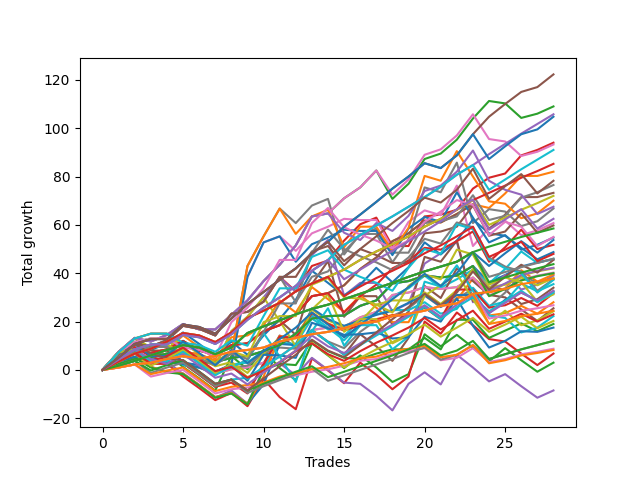

# Long Pointer 009 
- Symbol: ES
- Date Range: 03/18/2022 - 07/15/2022
- Trading Period: 7:20-12:30
- Number of Trades: 28



| Name | Win Percent | Profit | Avg Profit / Trade | Avg Time / Trade |      | Name | Win Percent | Profit | Avg Profit / Trade | Avg Time / Trade |
| ---- | ----------- | ------ | ------------------ | ---------------- | ---- | ---- | ----------- | ------ | ------------------ | ---------------- |
| Sorted By <br> Profit | | | | | | Sorted By <br> Win Percentage ||||
| Eighty-Five | 89.29 | 61125.00 | 2183.04 | 11:11 |     | Eighty-One | 96.43 | 18875.00 | 674.11 | 04:19 |
| Two | 82.14 | 54500.00 | 1946.43 | 13:07 |     | Eighty-Four | 92.86 | 52875.00 | 1888.39 | 09:26 |
| Eighty-Four | 92.86 | 52875.00 | 1888.39 | 09:26 |     | Eighty-Three | 92.86 | 42625.00 | 1522.32 | 08:03 |
| One Hundred Twenty-Five | 85.71 | 52375.00 | 1870.54 | 10:46 |     | Eighty-Two | 92.86 | 29250.00 | 1044.64 | 06:03 |
| Three | 82.14 | 47000.00 | 1678.57 | 12:36 |     | One Hundred Twenty-One | 92.86 | 13375.00 | 477.68 | 04:01 |
| Fifty-Eight | 78.57 | 46625.00 | 1665.18 | 12:23 |     | One Hundred Twenty-Six | 92.86 | 12250.00 | 437.50 | 04:05 |
| One Hundred Twenty-Four | 89.29 | 45500.00 | 1625.00 | 09:04 |     | Eighty-Five | 89.29 | 61125.00 | 2183.04 | 11:11 |
| Eighty-Three | 92.86 | 42625.00 | 1522.32 | 08:03 |     | One Hundred Twenty-Four | 89.29 | 45500.00 | 1625.00 | 09:04 |
| One | 82.14 | 41000.00 | 1464.29 | 07:22 |     | One Hundred Twenty-Three | 89.29 | 36000.00 | 1285.71 | 07:43 |
| One Hundred Thirty | 78.57 | 39125.00 | 1397.32 | 10:15 |     | One Hundred Twenty-Two | 89.29 | 23000.00 | 821.43 | 05:44 |
| Fifty-Nine | 78.57 | 38250.00 | 1366.07 | 11:21 |     | Zero | 89.29 | 22875.00 | 816.96 | 03:10 |
| Fifty-Seven | 82.14 | 36625.00 | 1308.04 | 07:06 |     | One Hundred Twenty-Seven | 89.29 | 21875.00 | 781.25 | 05:48 |
| One Hundred Twenty-Three | 89.29 | 36000.00 | 1285.71 | 07:43 |     | Fifty-Six | 89.29 | 21125.00 | 754.46 | 02:55 |
| Sixty-Three | 60.71 | 35000.00 | 1250.00 | 24:00 |     | Sixty-Four | 89.29 | 20000.00 | 714.29 | 02:59 |
| Sixty-Six | 67.86 | 33750.00 | 1205.36 | 11:00 |     | One Hundred Twenty-Five | 85.71 | 52375.00 | 1870.54 | 10:46 |
| Seven | 64.29 | 33375.00 | 1191.96 | 27:09 |     | Forty | 85.71 | 21000.00 | 750.00 | 01:56 |
| One Hundred Twenty-Nine | 82.14 | 31250.00 | 1116.07 | 08:45 |     | Forty-Eight | 85.71 | 20125.00 | 718.75 | 01:59 |
| Six | 67.86 | 30375.00 | 1084.82 | 21:31 |     | Two | 82.14 | 54500.00 | 1946.43 | 13:07 |
| Sixty-Seven | 71.43 | 29875.00 | 1066.96 | 10:07 |     | Three | 82.14 | 47000.00 | 1678.57 | 12:36 |
| Eighty-Two | 92.86 | 29250.00 | 1044.64 | 06:03 |     | One | 82.14 | 41000.00 | 1464.29 | 07:22 |
| Sixty-Eight | 60.71 | 27500.00 | 982.14 | 14:30 |     | Fifty-Seven | 82.14 | 36625.00 | 1308.04 | 07:06 |
| Sixty-Two | 64.29 | 27375.00 | 977.68 | 19:16 |     | One Hundred Twenty-Nine | 82.14 | 31250.00 | 1116.07 | 08:45 |
| One Hundred Fifteen | 67.86 | 26875.00 | 959.82 | 05:56 |     | One Hundred Twenty-Eight | 82.14 | 24000.00 | 857.14 | 07:28 |
| Sixty-Five | 75.00 | 25875.00 | 924.11 | 06:58 |     | One Hundred Eleven | 82.14 | 4375.00 | 156.25 | 01:56 |
| Forty-Two | 57.14 | 24375.00 | 870.54 | 08:36 |     | One Hundred Sixteen | 82.14 | 4125.00 | 147.32 | 01:51 |
| One Hundred Twenty-Eight | 82.14 | 24000.00 | 857.14 | 07:28 |     | Fifty-Eight | 78.57 | 46625.00 | 1665.18 | 12:23 |
| One Hundred Twenty-Two | 89.29 | 23000.00 | 821.43 | 05:44 |     | One Hundred Thirty | 78.57 | 39125.00 | 1397.32 | 10:15 |
| Forty-One | 71.43 | 23000.00 | 821.43 | 04:32 |     | Fifty-Nine | 78.57 | 38250.00 | 1366.07 | 11:21 |
| Zero | 89.29 | 22875.00 | 816.96 | 03:10 |     | Sixty-Five | 75.00 | 25875.00 | 924.11 | 06:58 |
| One Hundred Twenty | 60.71 | 22750.00 | 812.50 | 04:59 |     | One Hundred Seventeen | 75.00 | 6000.00 | 214.29 | 02:20 |
| One Hundred Twenty-Seven | 89.29 | 21875.00 | 781.25 | 05:48 |     | One Hundred Twelve | 75.00 | 6000.00 | 214.29 | 02:26 |
| Fifty-Six | 89.29 | 21125.00 | 754.46 | 02:55 |     | Sixty-Seven | 71.43 | 29875.00 | 1066.96 | 10:07 |
| Forty | 85.71 | 21000.00 | 750.00 | 01:56 |     | Forty-One | 71.43 | 23000.00 | 821.43 | 04:32 |
| Forty-Eight | 85.71 | 20125.00 | 718.75 | 01:59 |     | Four | 71.43 | 19500.00 | 696.43 | 21:13 |
| Sixty-Four | 89.29 | 20000.00 | 714.29 | 02:59 |     | Sixty-Six | 67.86 | 33750.00 | 1205.36 | 11:00 |
| Forty-Three | 60.71 | 19750.00 | 705.36 | 06:58 |     | Six | 67.86 | 30375.00 | 1084.82 | 21:31 |
| Four | 71.43 | 19500.00 | 696.43 | 21:13 |     | One Hundred Fifteen | 67.86 | 26875.00 | 959.82 | 05:56 |
| Fifty | 60.71 | 19000.00 | 678.57 | 05:18 |     | Forty-Nine | 67.86 | 18875.00 | 674.11 | 03:53 |
| Eighty-One | 96.43 | 18875.00 | 674.11 | 04:19 |     | One Hundred Fourteen | 67.86 | 16000.00 | 571.43 | 05:00 |
| Forty-Nine | 67.86 | 18875.00 | 674.11 | 03:53 |     | One Hundred Eighteen | 67.86 | 11500.00 | 410.71 | 03:29 |
| Sixty-Nine | 50.00 | 18750.00 | 669.64 | 17:37 |     | One Hundred Thirteen | 67.86 | 10125.00 | 361.61 | 03:58 |
| Seventy-One | 50.00 | 18625.00 | 665.18 | 19:23 |     | Seven | 64.29 | 33375.00 | 1191.96 | 27:09 |
| Fifty-One | 60.71 | 17750.00 | 633.93 | 05:14 |     | Sixty-Two | 64.29 | 27375.00 | 977.68 | 19:16 |
| Five | 64.29 | 17000.00 | 607.14 | 25:35 |     | Five | 64.29 | 17000.00 | 607.14 | 25:35 |
| One Hundred Ninteen | 64.29 | 16375.00 | 584.82 | 04:18 |     | One Hundred Ninteen | 64.29 | 16375.00 | 584.82 | 04:18 |
| Fifty-Two | 57.14 | 16250.00 | 580.36 | 06:45 |     | Sixty | 64.29 | 12125.00 | 433.04 | 17:50 |
| One Hundred Fourteen | 67.86 | 16000.00 | 571.43 | 05:00 |     | Sixty-Three | 60.71 | 35000.00 | 1250.00 | 24:00 |
| Fifty-Five | 57.14 | 15875.00 | 566.96 | 08:24 |     | Sixty-Eight | 60.71 | 27500.00 | 982.14 | 14:30 |
| Seventy | 53.57 | 15625.00 | 558.04 | 15:47 |     | One Hundred Twenty | 60.71 | 22750.00 | 812.50 | 04:59 |
| Fifty-Three | 57.14 | 14000.00 | 500.00 | 07:33 |     | Forty-Three | 60.71 | 19750.00 | 705.36 | 06:58 |
| One Hundred Twenty-One | 92.86 | 13375.00 | 477.68 | 04:01 |     | Fifty | 60.71 | 19000.00 | 678.57 | 05:18 |
| Forty-Seven | 42.86 | 12750.00 | 455.36 | 16:26 |     | Fifty-One | 60.71 | 17750.00 | 633.93 | 05:14 |
| One Hundred Twenty-Six | 92.86 | 12250.00 | 437.50 | 04:05 |     | Forty-Two | 57.14 | 24375.00 | 870.54 | 08:36 |
| Sixty | 64.29 | 12125.00 | 433.04 | 17:50 |     | Fifty-Two | 57.14 | 16250.00 | 580.36 | 06:45 |
| One Hundred Eighteen | 67.86 | 11500.00 | 410.71 | 03:29 |     | Fifty-Five | 57.14 | 15875.00 | 566.96 | 08:24 |
| Sixty-One | 57.14 | 11125.00 | 397.32 | 21:48 |     | Fifty-Three | 57.14 | 14000.00 | 500.00 | 07:33 |
| One Hundred Thirteen | 67.86 | 10125.00 | 361.61 | 03:58 |     | Sixty-One | 57.14 | 11125.00 | 397.32 | 21:48 |
| Fifty-Four | 53.57 | 9500.00 | 339.29 | 06:33 |     | Seventy | 53.57 | 15625.00 | 558.04 | 15:47 |
| Seventy-Three | 46.43 | 8750.00 | 312.50 | 07:22 |     | Fifty-Four | 53.57 | 9500.00 | 339.29 | 06:33 |
| One Hundred Seventeen | 75.00 | 6000.00 | 214.29 | 02:20 |     | Sixty-Nine | 50.00 | 18750.00 | 669.64 | 17:37 |
| One Hundred Twelve | 75.00 | 6000.00 | 214.29 | 02:26 |     | Seventy-One | 50.00 | 18625.00 | 665.18 | 19:23 |
| One Hundred Eleven | 82.14 | 4375.00 | 156.25 | 01:56 |     | Seventy-Three | 46.43 | 8750.00 | 312.50 | 07:22 |
| One Hundred Sixteen | 82.14 | 4125.00 | 147.32 | 01:51 |     | Forty-Seven | 42.86 | 12750.00 | 455.36 | 16:26 |
| Forty-Five | 39.29 | 3375.00 | 120.54 | 14:48 |     | Forty-Four | 42.86 | 1500.00 | 53.57 | 11:45 |
| Forty-Four | 42.86 | 1500.00 | 53.57 | 11:45 |     | Forty-Six | 42.86 | -4250.00 | -151.79 | 11:55 |
| Forty-Six | 42.86 | -4250.00 | -151.79 | 11:55 |     | Forty-Five | 39.29 | 3375.00 | 120.54 | 14:48 |

## NO STOPLOSS

### Test Zero
* Sell when price hits the middle line of the 20p bollinger
* No Stoploss
* Results:
```
Total Trades: 28
Percent Up: 89.29
Percent Down: 10.71
Total Points Moved Up: 45.75
Potential Profit: 22875.00
Total Points Ups: 58.50 Count Ups: 25
Total Points Downs: -12.75 Count Downs: 3
```

<details><summary>Trades</summary>

<code>In: 2022-03-30 12:27:00		Out: 2022-03-30 12:28:15		Total Position Time: 01:15		Total Move Up: 2.50		Total to Date: 2.50</code> <br />
<code>In: 2022-03-31 08:37:00		Out: 2022-03-31 08:38:15		Total Position Time: 01:15		Total Move Up: 2.00		Total to Date: 4.50</code> <br />
<code>In: 2022-03-31 10:02:00		Out: 2022-03-31 10:04:00		Total Position Time: 02:00		Total Move Up: 0.75		Total to Date: 5.25</code> <br />
<code>In: 2022-04-06 09:23:00		Out: 2022-04-06 09:31:15		Total Position Time: 08:15		Total Move Up: 1.50		Total to Date: 6.75</code> <br />
<code>In: 2022-04-12 11:35:00		Out: 2022-04-12 11:35:50		Total Position Time: 00:50		Total Move Up: 1.50		Total to Date: 8.25</code> <br />
<code>In: 2022-04-14 09:32:00		Out: 2022-04-14 09:56:10		Total Position Time: 24:10		Total Move Up: -5.25		Total to Date: 3.00</code> <br />
<code>In: 2022-04-21 09:12:00		Out: 2022-04-21 09:19:05		Total Position Time: 07:05		Total Move Up: 0.25		Total to Date: 3.25</code> <br />
<code>In: 2022-04-21 10:21:00		Out: 2022-04-21 10:21:10		Total Position Time: 00:10		Total Move Up: 1.75		Total to Date: 5.00</code> <br />
<code>In: 2022-05-02 11:46:00		Out: 2022-05-02 11:46:10		Total Position Time: 00:10		Total Move Up: 0.75		Total to Date: 5.75</code> <br />
<code>In: 2022-05-04 08:37:00		Out: 2022-05-04 08:39:20		Total Position Time: 02:20		Total Move Up: 2.00		Total to Date: 7.75</code> <br />
<code>In: 2022-05-06 09:03:00		Out: 2022-05-06 09:03:10		Total Position Time: 00:10		Total Move Up: 2.50		Total to Date: 10.25</code> <br />
<code>In: 2022-05-09 07:42:00		Out: 2022-05-09 07:42:30		Total Position Time: 00:30		Total Move Up: 4.75		Total to Date: 15.00</code> <br />
<code>In: 2022-05-09 08:34:00		Out: 2022-05-09 08:35:10		Total Position Time: 01:10		Total Move Up: 6.25		Total to Date: 21.25</code> <br />
<code>In: 2022-05-09 10:03:00		Out: 2022-05-09 10:09:25		Total Position Time: 06:25		Total Move Up: 1.00		Total to Date: 22.25</code> <br />
<code>In: 2022-05-11 09:14:00		Out: 2022-05-11 09:17:50		Total Position Time: 03:50		Total Move Up: 0.25		Total to Date: 22.50</code> <br />
<code>In: 2022-05-16 09:47:00		Out: 2022-05-16 09:48:15		Total Position Time: 01:15		Total Move Up: 4.00		Total to Date: 26.50</code> <br />
<code>In: 2022-05-18 09:12:00		Out: 2022-05-18 09:14:45		Total Position Time: 02:45		Total Move Up: 2.25		Total to Date: 28.75</code> <br />
<code>In: 2022-05-20 09:48:00		Out: 2022-05-20 09:50:00		Total Position Time: 02:00		Total Move Up: 7.00		Total to Date: 35.75</code> <br />
<code>In: 2022-05-25 10:15:00		Out: 2022-05-25 10:15:20		Total Position Time: 00:20		Total Move Up: 1.00		Total to Date: 36.75</code> <br />
<code>In: 2022-05-31 12:05:00		Out: 2022-05-31 12:07:20		Total Position Time: 02:20		Total Move Up: 2.25		Total to Date: 39.00</code> <br />
<code>In: 2022-06-08 11:31:00		Out: 2022-06-08 11:31:10		Total Position Time: 00:10		Total Move Up: -0.75		Total to Date: 38.25</code> <br />
<code>In: 2022-06-08 12:11:00		Out: 2022-06-08 12:11:20		Total Position Time: 00:20		Total Move Up: 0.75		Total to Date: 39.00</code> <br />
<code>In: 2022-06-13 12:17:00		Out: 2022-06-13 12:17:10		Total Position Time: 00:10		Total Move Up: 4.00		Total to Date: 43.00</code> <br />
<code>In: 2022-06-14 07:32:00		Out: 2022-06-14 07:46:40		Total Position Time: 14:40		Total Move Up: -6.75		Total to Date: 36.25</code> <br />
<code>In: 2022-06-27 10:10:00		Out: 2022-06-27 10:11:25		Total Position Time: 01:25		Total Move Up: 3.00		Total to Date: 39.25</code> <br />
<code>In: 2022-07-06 08:12:00		Out: 2022-07-06 08:14:30		Total Position Time: 02:30		Total Move Up: 3.50		Total to Date: 42.75</code> <br />
<code>In: 2022-07-08 09:48:00		Out: 2022-07-08 09:48:40		Total Position Time: 00:40		Total Move Up: 1.75		Total to Date: 44.50</code> <br />
<code>In: 2022-07-12 10:28:00		Out: 2022-07-12 10:28:50		Total Position Time: 00:50		Total Move Up: 1.25		Total to Date: 45.75</code> <br />


</details>

### Test One
* Sell when the price hits the upper line of the 20p 1std bollinger
* No Stoploss
* Results:
```
Total Trades: 28
Percent Up: 82.14
Percent Down: 17.86
Total Points Moved Up: 82.00
Potential Profit: 41000.00
Total Points Ups: 91.00 Count Ups: 23
Total Points Downs: -9.00 Count Downs: 5
```

<details><summary>Trades</summary>

<code>In: 2022-03-30 12:27:00		Out: 2022-03-30 12:32:20		Total Position Time: 05:20		Total Move Up: 4.75		Total to Date: 4.75</code> <br />
<code>In: 2022-03-31 08:37:00		Out: 2022-03-31 08:40:35		Total Position Time: 03:35		Total Move Up: 3.25		Total to Date: 8.00</code> <br />
<code>In: 2022-03-31 10:02:00		Out: 2022-03-31 10:19:20		Total Position Time: 17:20		Total Move Up: -1.00		Total to Date: 7.00</code> <br />
<code>In: 2022-04-06 09:23:00		Out: 2022-04-06 09:34:05		Total Position Time: 11:05		Total Move Up: 1.50		Total to Date: 8.50</code> <br />
<code>In: 2022-04-12 11:35:00		Out: 2022-04-12 11:37:20		Total Position Time: 02:20		Total Move Up: 3.50		Total to Date: 12.00</code> <br />
<code>In: 2022-04-14 09:32:00		Out: 2022-04-14 09:58:15		Total Position Time: 26:15		Total Move Up: -4.00		Total to Date: 8.00</code> <br />
<code>In: 2022-04-21 09:12:00		Out: 2022-04-21 09:34:10		Total Position Time: 22:10		Total Move Up: -1.75		Total to Date: 6.25</code> <br />
<code>In: 2022-04-21 10:21:00		Out: 2022-04-21 10:21:20		Total Position Time: 00:20		Total Move Up: 4.00		Total to Date: 10.25</code> <br />
<code>In: 2022-05-02 11:46:00		Out: 2022-05-02 11:46:10		Total Position Time: 00:10		Total Move Up: 0.75		Total to Date: 11.00</code> <br />
<code>In: 2022-05-04 08:37:00		Out: 2022-05-04 08:40:55		Total Position Time: 03:55		Total Move Up: 5.00		Total to Date: 16.00</code> <br />
<code>In: 2022-05-06 09:03:00		Out: 2022-05-06 09:03:10		Total Position Time: 00:10		Total Move Up: 2.50		Total to Date: 18.50</code> <br />
<code>In: 2022-05-09 07:42:00		Out: 2022-05-09 07:45:10		Total Position Time: 03:10		Total Move Up: 4.50		Total to Date: 23.00</code> <br />
<code>In: 2022-05-09 08:34:00		Out: 2022-05-09 08:38:35		Total Position Time: 04:35		Total Move Up: 7.50		Total to Date: 30.50</code> <br />
<code>In: 2022-05-09 10:03:00		Out: 2022-05-09 10:18:05		Total Position Time: 15:05		Total Move Up: 1.25		Total to Date: 31.75</code> <br />
<code>In: 2022-05-11 09:14:00		Out: 2022-05-11 09:23:10		Total Position Time: 09:10		Total Move Up: 3.25		Total to Date: 35.00</code> <br />
<code>In: 2022-05-16 09:47:00		Out: 2022-05-16 09:50:05		Total Position Time: 03:05		Total Move Up: 6.75		Total to Date: 41.75</code> <br />
<code>In: 2022-05-18 09:12:00		Out: 2022-05-18 09:16:25		Total Position Time: 04:25		Total Move Up: 4.75		Total to Date: 46.50</code> <br />
<code>In: 2022-05-20 09:48:00		Out: 2022-05-20 09:56:10		Total Position Time: 08:10		Total Move Up: 6.75		Total to Date: 53.25</code> <br />
<code>In: 2022-05-25 10:15:00		Out: 2022-05-25 10:15:30		Total Position Time: 00:30		Total Move Up: 3.25		Total to Date: 56.50</code> <br />
<code>In: 2022-05-31 12:05:00		Out: 2022-05-31 12:09:15		Total Position Time: 04:15		Total Move Up: 5.25		Total to Date: 61.75</code> <br />
<code>In: 2022-06-08 11:31:00		Out: 2022-06-08 11:43:05		Total Position Time: 12:05		Total Move Up: -0.75		Total to Date: 61.00</code> <br />
<code>In: 2022-06-08 12:11:00		Out: 2022-06-08 12:12:15		Total Position Time: 01:15		Total Move Up: 3.50		Total to Date: 64.50</code> <br />
<code>In: 2022-06-13 12:17:00		Out: 2022-06-13 12:17:10		Total Position Time: 00:10		Total Move Up: 4.00		Total to Date: 68.50</code> <br />
<code>In: 2022-06-14 07:32:00		Out: 2022-06-14 07:47:10		Total Position Time: 15:10		Total Move Up: -1.50		Total to Date: 67.00</code> <br />
<code>In: 2022-06-27 10:10:00		Out: 2022-06-27 10:15:55		Total Position Time: 05:55		Total Move Up: 6.00		Total to Date: 73.00</code> <br />
<code>In: 2022-07-06 08:12:00		Out: 2022-07-06 08:17:50		Total Position Time: 05:50		Total Move Up: 7.25		Total to Date: 80.25</code> <br />
<code>In: 2022-07-08 09:48:00		Out: 2022-07-08 10:06:55		Total Position Time: 18:55		Total Move Up: 0.00		Total to Date: 80.25</code> <br />
<code>In: 2022-07-12 10:28:00		Out: 2022-07-12 10:30:05		Total Position Time: 02:05		Total Move Up: 1.75		Total to Date: 82.00</code> <br />


</details>

### Test Two
* Sell when the price hits the upper line of the 20p 2std bollinger
* No Stoploss
* Results:
```
Total Trades: 28
Percent Up: 82.14
Percent Down: 17.86
Total Points Moved Up: 109.00
Potential Profit: 54500.00
Total Points Ups: 131.50 Count Ups: 23
Total Points Downs: -22.50 Count Downs: 5
```

<details><summary>Trades</summary>

<code>In: 2022-03-30 12:27:00		Out: 2022-03-30 12:36:20		Total Position Time: 09:20		Total Move Up: 7.50		Total to Date: 7.50</code> <br />
<code>In: 2022-03-31 08:37:00		Out: 2022-03-31 08:41:10		Total Position Time: 04:10		Total Move Up: 5.75		Total to Date: 13.25</code> <br />
<code>In: 2022-03-31 10:02:00		Out: 2022-03-31 10:27:00		Total Position Time: 25:00		Total Move Up: -1.50		Total to Date: 11.75</code> <br />
<code>In: 2022-04-06 09:23:00		Out: 2022-04-06 09:34:25		Total Position Time: 11:25		Total Move Up: 2.75		Total to Date: 14.50</code> <br />
<code>In: 2022-04-12 11:35:00		Out: 2022-04-12 11:47:00		Total Position Time: 12:00		Total Move Up: 4.50		Total to Date: 19.00</code> <br />
<code>In: 2022-04-14 09:32:00		Out: 2022-04-14 09:58:55		Total Position Time: 26:55		Total Move Up: -2.25		Total to Date: 16.75</code> <br />
<code>In: 2022-04-21 09:12:00		Out: 2022-04-21 09:35:40		Total Position Time: 23:40		Total Move Up: 0.00		Total to Date: 16.75</code> <br />
<code>In: 2022-04-21 10:21:00		Out: 2022-04-21 10:21:30		Total Position Time: 00:30		Total Move Up: 6.00		Total to Date: 22.75</code> <br />
<code>In: 2022-05-02 11:46:00		Out: 2022-05-02 11:53:35		Total Position Time: 07:35		Total Move Up: 6.00		Total to Date: 28.75</code> <br />
<code>In: 2022-05-04 08:37:00		Out: 2022-05-04 08:47:05		Total Position Time: 10:05		Total Move Up: 8.00		Total to Date: 36.75</code> <br />
<code>In: 2022-05-06 09:03:00		Out: 2022-05-06 09:03:55		Total Position Time: 00:55		Total Move Up: 6.75		Total to Date: 43.50</code> <br />
<code>In: 2022-05-09 07:42:00		Out: 2022-05-09 07:48:05		Total Position Time: 06:05		Total Move Up: 8.00		Total to Date: 51.50</code> <br />
<code>In: 2022-05-09 08:34:00		Out: 2022-05-09 08:39:15		Total Position Time: 05:15		Total Move Up: 12.00		Total to Date: 63.50</code> <br />
<code>In: 2022-05-09 10:03:00		Out: 2022-05-09 10:18:05		Total Position Time: 15:05		Total Move Up: 1.25		Total to Date: 64.75</code> <br />
<code>In: 2022-05-11 09:14:00		Out: 2022-05-11 09:23:35		Total Position Time: 09:35		Total Move Up: 6.25		Total to Date: 71.00</code> <br />
<code>In: 2022-05-16 09:47:00		Out: 2022-05-16 10:06:30		Total Position Time: 19:30		Total Move Up: 4.50		Total to Date: 75.50</code> <br />
<code>In: 2022-05-18 09:12:00		Out: 2022-05-18 09:17:50		Total Position Time: 05:50		Total Move Up: 7.00		Total to Date: 82.50</code> <br />
<code>In: 2022-05-20 09:48:00		Out: 2022-05-20 10:17:55		Total Position Time: 29:55		Total Move Up: -11.75		Total to Date: 70.75</code> <br />
<code>In: 2022-05-25 10:15:00		Out: 2022-05-25 10:29:40		Total Position Time: 14:40		Total Move Up: 6.25		Total to Date: 77.00</code> <br />
<code>In: 2022-05-31 12:05:00		Out: 2022-05-31 12:15:05		Total Position Time: 10:05		Total Move Up: 10.25		Total to Date: 87.25</code> <br />
<code>In: 2022-06-08 11:31:00		Out: 2022-06-08 11:43:35		Total Position Time: 12:35		Total Move Up: 2.25		Total to Date: 89.50</code> <br />
<code>In: 2022-06-08 12:11:00		Out: 2022-06-08 12:13:25		Total Position Time: 02:25		Total Move Up: 5.75		Total to Date: 95.25</code> <br />
<code>In: 2022-06-13 12:17:00		Out: 2022-06-13 12:17:15		Total Position Time: 00:15		Total Move Up: 8.75		Total to Date: 104.00</code> <br />
<code>In: 2022-06-14 07:32:00		Out: 2022-06-14 07:51:00		Total Position Time: 19:00		Total Move Up: 7.25		Total to Date: 111.25</code> <br />
<code>In: 2022-06-27 10:10:00		Out: 2022-06-27 10:39:55		Total Position Time: 29:55		Total Move Up: -1.00		Total to Date: 110.25</code> <br />
<code>In: 2022-07-06 08:12:00		Out: 2022-07-06 08:41:55		Total Position Time: 29:55		Total Move Up: -6.00		Total to Date: 104.25</code> <br />
<code>In: 2022-07-08 09:48:00		Out: 2022-07-08 10:10:30		Total Position Time: 22:30		Total Move Up: 1.75		Total to Date: 106.00</code> <br />
<code>In: 2022-07-12 10:28:00		Out: 2022-07-12 10:31:30		Total Position Time: 03:30		Total Move Up: 3.00		Total to Date: 109.00</code> <br />


</details>

### Test Three
* Sell when price hits the middle line of the 50p bollinger
* No Stoploss
* Results:
```
Total Trades: 28
Percent Up: 82.14
Percent Down: 17.86
Total Points Moved Up: 94.00
Potential Profit: 47000.00
Total Points Ups: 116.75 Count Ups: 23
Total Points Downs: -22.75 Count Downs: 5
```

<details><summary>Trades</summary>

<code>In: 2022-03-30 12:27:00		Out: 2022-03-30 12:33:25		Total Position Time: 06:25		Total Move Up: 6.50		Total to Date: 6.50</code> <br />
<code>In: 2022-03-31 08:37:00		Out: 2022-03-31 08:41:05		Total Position Time: 04:05		Total Move Up: 4.25		Total to Date: 10.75</code> <br />
<code>In: 2022-03-31 10:02:00		Out: 2022-03-31 10:27:25		Total Position Time: 25:25		Total Move Up: -1.00		Total to Date: 9.75</code> <br />
<code>In: 2022-04-06 09:23:00		Out: 2022-04-06 09:48:50		Total Position Time: 25:50		Total Move Up: 2.50		Total to Date: 12.25</code> <br />
<code>In: 2022-04-12 11:35:00		Out: 2022-04-12 11:47:05		Total Position Time: 12:05		Total Move Up: 6.00		Total to Date: 18.25</code> <br />
<code>In: 2022-04-14 09:32:00		Out: 2022-04-14 09:59:25		Total Position Time: 27:25		Total Move Up: -1.25		Total to Date: 17.00</code> <br />
<code>In: 2022-04-21 09:12:00		Out: 2022-04-21 09:41:55		Total Position Time: 29:55		Total Move Up: -2.75		Total to Date: 14.25</code> <br />
<code>In: 2022-04-21 10:21:00		Out: 2022-04-21 10:22:25		Total Position Time: 01:25		Total Move Up: 9.00		Total to Date: 23.25</code> <br />
<code>In: 2022-05-02 11:46:00		Out: 2022-05-02 11:46:10		Total Position Time: 00:10		Total Move Up: 0.75		Total to Date: 24.00</code> <br />
<code>In: 2022-05-04 08:37:00		Out: 2022-05-04 08:41:00		Total Position Time: 04:00		Total Move Up: 4.25		Total to Date: 28.25</code> <br />
<code>In: 2022-05-06 09:03:00		Out: 2022-05-06 09:06:05		Total Position Time: 03:05		Total Move Up: 10.25		Total to Date: 38.50</code> <br />
<code>In: 2022-05-09 07:42:00		Out: 2022-05-09 08:11:55		Total Position Time: 29:55		Total Move Up: -6.00		Total to Date: 32.50</code> <br />
<code>In: 2022-05-09 08:34:00		Out: 2022-05-09 08:39:00		Total Position Time: 05:00		Total Move Up: 10.50		Total to Date: 43.00</code> <br />
<code>In: 2022-05-09 10:03:00		Out: 2022-05-09 10:25:15		Total Position Time: 22:15		Total Move Up: 2.25		Total to Date: 45.25</code> <br />
<code>In: 2022-05-11 09:14:00		Out: 2022-05-11 09:23:45		Total Position Time: 09:45		Total Move Up: 8.25		Total to Date: 53.50</code> <br />
<code>In: 2022-05-16 09:47:00		Out: 2022-05-16 09:50:05		Total Position Time: 03:05		Total Move Up: 6.75		Total to Date: 60.25</code> <br />
<code>In: 2022-05-18 09:12:00		Out: 2022-05-18 09:36:05		Total Position Time: 24:05		Total Move Up: 2.75		Total to Date: 63.00</code> <br />
<code>In: 2022-05-20 09:48:00		Out: 2022-05-20 10:17:55		Total Position Time: 29:55		Total Move Up: -11.75		Total to Date: 51.25</code> <br />
<code>In: 2022-05-25 10:15:00		Out: 2022-05-25 10:15:10		Total Position Time: 00:10		Total Move Up: 0.00		Total to Date: 51.25</code> <br />
<code>In: 2022-05-31 12:05:00		Out: 2022-05-31 12:15:15		Total Position Time: 10:15		Total Move Up: 12.25		Total to Date: 63.50</code> <br />
<code>In: 2022-06-08 11:31:00		Out: 2022-06-08 11:43:20		Total Position Time: 12:20		Total Move Up: 0.75		Total to Date: 64.25</code> <br />
<code>In: 2022-06-08 12:11:00		Out: 2022-06-08 12:11:45		Total Position Time: 00:45		Total Move Up: 2.00		Total to Date: 66.25</code> <br />
<code>In: 2022-06-13 12:17:00		Out: 2022-06-13 12:17:15		Total Position Time: 00:15		Total Move Up: 8.75		Total to Date: 75.00</code> <br />
<code>In: 2022-06-14 07:32:00		Out: 2022-06-14 07:50:00		Total Position Time: 18:00		Total Move Up: 4.50		Total to Date: 79.50</code> <br />
<code>In: 2022-06-27 10:10:00		Out: 2022-06-27 10:11:15		Total Position Time: 01:15		Total Move Up: 1.75		Total to Date: 81.25</code> <br />
<code>In: 2022-07-06 08:12:00		Out: 2022-07-06 08:21:30		Total Position Time: 09:30		Total Move Up: 7.50		Total to Date: 88.75</code> <br />
<code>In: 2022-07-08 09:48:00		Out: 2022-07-08 10:11:05		Total Position Time: 23:05		Total Move Up: 2.25		Total to Date: 91.00</code> <br />
<code>In: 2022-07-12 10:28:00		Out: 2022-07-12 10:41:35		Total Position Time: 13:35		Total Move Up: 3.00		Total to Date: 94.00</code> <br />


</details>

### Test Four
* Sell when the price hits the upper line of the 50p 1std bollinger
* No Stoploss
* Results:
```
Total Trades: 28
Percent Up: 71.43
Percent Down: 28.57
Total Points Moved Up: 39.00
Potential Profit: 19500.00
Total Points Ups: 122.00 Count Ups: 20
Total Points Downs: -83.00 Count Downs: 8
```

<details><summary>Trades</summary>

<code>In: 2022-03-30 12:27:00		Out: 2022-03-30 12:46:00		Total Position Time: 19:00		Total Move Up: 7.25		Total to Date: 7.25</code> <br />
<code>In: 2022-03-31 08:37:00		Out: 2022-03-31 09:00:15		Total Position Time: 23:15		Total Move Up: 4.25		Total to Date: 11.50</code> <br />
<code>In: 2022-03-31 10:02:00		Out: 2022-03-31 10:29:50		Total Position Time: 27:50		Total Move Up: 1.50		Total to Date: 13.00</code> <br />
<code>In: 2022-04-06 09:23:00		Out: 2022-04-06 09:52:55		Total Position Time: 29:55		Total Move Up: 0.00		Total to Date: 13.00</code> <br />
<code>In: 2022-04-12 11:35:00		Out: 2022-04-12 12:04:55		Total Position Time: 29:55		Total Move Up: -7.50		Total to Date: 5.50</code> <br />
<code>In: 2022-04-14 09:32:00		Out: 2022-04-14 10:01:55		Total Position Time: 29:55		Total Move Up: -1.00		Total to Date: 4.50</code> <br />
<code>In: 2022-04-21 09:12:00		Out: 2022-04-21 09:41:55		Total Position Time: 29:55		Total Move Up: -2.75		Total to Date: 1.75</code> <br />
<code>In: 2022-04-21 10:21:00		Out: 2022-04-21 10:31:15		Total Position Time: 10:15		Total Move Up: 14.25		Total to Date: 16.00</code> <br />
<code>In: 2022-05-02 11:46:00		Out: 2022-05-02 11:53:35		Total Position Time: 07:35		Total Move Up: 6.00		Total to Date: 22.00</code> <br />
<code>In: 2022-05-04 08:37:00		Out: 2022-05-04 08:47:05		Total Position Time: 10:05		Total Move Up: 8.00		Total to Date: 30.00</code> <br />
<code>In: 2022-05-06 09:03:00		Out: 2022-05-06 09:22:25		Total Position Time: 19:25		Total Move Up: 8.25		Total to Date: 38.25</code> <br />
<code>In: 2022-05-09 07:42:00		Out: 2022-05-09 08:11:55		Total Position Time: 29:55		Total Move Up: -6.00		Total to Date: 32.25</code> <br />
<code>In: 2022-05-09 08:34:00		Out: 2022-05-09 08:40:00		Total Position Time: 06:00		Total Move Up: 15.25		Total to Date: 47.50</code> <br />
<code>In: 2022-05-09 10:03:00		Out: 2022-05-09 10:29:25		Total Position Time: 26:25		Total Move Up: 6.25		Total to Date: 53.75</code> <br />
<code>In: 2022-05-11 09:14:00		Out: 2022-05-11 09:43:55		Total Position Time: 29:55		Total Move Up: -23.00		Total to Date: 30.75</code> <br />
<code>In: 2022-05-16 09:47:00		Out: 2022-05-16 10:07:00		Total Position Time: 20:00		Total Move Up: 5.25		Total to Date: 36.00</code> <br />
<code>In: 2022-05-18 09:12:00		Out: 2022-05-18 09:41:55		Total Position Time: 29:55		Total Move Up: 0.00		Total to Date: 36.00</code> <br />
<code>In: 2022-05-20 09:48:00		Out: 2022-05-20 10:17:55		Total Position Time: 29:55		Total Move Up: -11.75		Total to Date: 24.25</code> <br />
<code>In: 2022-05-25 10:15:00		Out: 2022-05-25 10:15:30		Total Position Time: 00:30		Total Move Up: 3.25		Total to Date: 27.50</code> <br />
<code>In: 2022-05-31 12:05:00		Out: 2022-05-31 12:28:20		Total Position Time: 23:20		Total Move Up: 16.50		Total to Date: 44.00</code> <br />
<code>In: 2022-06-08 11:31:00		Out: 2022-06-08 11:45:30		Total Position Time: 14:30		Total Move Up: 4.25		Total to Date: 48.25</code> <br />
<code>In: 2022-06-08 12:11:00		Out: 2022-06-08 12:12:25		Total Position Time: 01:25		Total Move Up: 4.75		Total to Date: 53.00</code> <br />
<code>In: 2022-06-13 12:17:00		Out: 2022-06-13 12:46:00		Total Position Time: 29:00		Total Move Up: -25.00		Total to Date: 28.00</code> <br />
<code>In: 2022-06-14 07:32:00		Out: 2022-06-14 08:01:15		Total Position Time: 29:15		Total Move Up: 5.75		Total to Date: 33.75</code> <br />
<code>In: 2022-06-27 10:10:00		Out: 2022-06-27 10:13:05		Total Position Time: 03:05		Total Move Up: 5.50		Total to Date: 39.25</code> <br />
<code>In: 2022-07-06 08:12:00		Out: 2022-07-06 08:41:55		Total Position Time: 29:55		Total Move Up: -6.00		Total to Date: 33.25</code> <br />
<code>In: 2022-07-08 09:48:00		Out: 2022-07-08 10:17:55		Total Position Time: 29:55		Total Move Up: 2.00		Total to Date: 35.25</code> <br />
<code>In: 2022-07-12 10:28:00		Out: 2022-07-12 10:52:25		Total Position Time: 24:25		Total Move Up: 3.75		Total to Date: 39.00</code> <br />


</details>

### Test Five
* Sell when the price hits the upper line of the 50p 2std bollinger
* No Stoploss
* Results:
```
Total Trades: 28
Percent Up: 64.29
Percent Down: 35.71
Total Points Moved Up: 34.00
Potential Profit: 17000.00
Total Points Ups: 120.00 Count Ups: 18
Total Points Downs: -86.00 Count Downs: 10
```

<details><summary>Trades</summary>

<code>In: 2022-03-30 12:27:00		Out: 2022-03-30 12:46:00		Total Position Time: 19:00		Total Move Up: 7.25		Total to Date: 7.25</code> <br />
<code>In: 2022-03-31 08:37:00		Out: 2022-03-31 09:06:55		Total Position Time: 29:55		Total Move Up: 0.25		Total to Date: 7.50</code> <br />
<code>In: 2022-03-31 10:02:00		Out: 2022-03-31 10:31:55		Total Position Time: 29:55		Total Move Up: 2.00		Total to Date: 9.50</code> <br />
<code>In: 2022-04-06 09:23:00		Out: 2022-04-06 09:52:55		Total Position Time: 29:55		Total Move Up: 0.00		Total to Date: 9.50</code> <br />
<code>In: 2022-04-12 11:35:00		Out: 2022-04-12 12:04:55		Total Position Time: 29:55		Total Move Up: -7.50		Total to Date: 2.00</code> <br />
<code>In: 2022-04-14 09:32:00		Out: 2022-04-14 10:01:55		Total Position Time: 29:55		Total Move Up: -1.00		Total to Date: 1.00</code> <br />
<code>In: 2022-04-21 09:12:00		Out: 2022-04-21 09:41:55		Total Position Time: 29:55		Total Move Up: -2.75		Total to Date: -1.75</code> <br />
<code>In: 2022-04-21 10:21:00		Out: 2022-04-21 10:50:55		Total Position Time: 29:55		Total Move Up: 3.00		Total to Date: 1.25</code> <br />
<code>In: 2022-05-02 11:46:00		Out: 2022-05-02 12:01:10		Total Position Time: 15:10		Total Move Up: 2.75		Total to Date: 4.00</code> <br />
<code>In: 2022-05-04 08:37:00		Out: 2022-05-04 08:48:35		Total Position Time: 11:35		Total Move Up: 11.25		Total to Date: 15.25</code> <br />
<code>In: 2022-05-06 09:03:00		Out: 2022-05-06 09:32:55		Total Position Time: 29:55		Total Move Up: 5.25		Total to Date: 20.50</code> <br />
<code>In: 2022-05-09 07:42:00		Out: 2022-05-09 08:11:55		Total Position Time: 29:55		Total Move Up: -6.00		Total to Date: 14.50</code> <br />
<code>In: 2022-05-09 08:34:00		Out: 2022-05-09 08:43:15		Total Position Time: 09:15		Total Move Up: 21.00		Total to Date: 35.50</code> <br />
<code>In: 2022-05-09 10:03:00		Out: 2022-05-09 10:29:30		Total Position Time: 26:30		Total Move Up: 9.50		Total to Date: 45.00</code> <br />
<code>In: 2022-05-11 09:14:00		Out: 2022-05-11 09:43:55		Total Position Time: 29:55		Total Move Up: -23.00		Total to Date: 22.00</code> <br />
<code>In: 2022-05-16 09:47:00		Out: 2022-05-16 10:07:35		Total Position Time: 20:35		Total Move Up: 8.50		Total to Date: 30.50</code> <br />
<code>In: 2022-05-18 09:12:00		Out: 2022-05-18 09:41:55		Total Position Time: 29:55		Total Move Up: 0.00		Total to Date: 30.50</code> <br />
<code>In: 2022-05-20 09:48:00		Out: 2022-05-20 10:17:55		Total Position Time: 29:55		Total Move Up: -11.75		Total to Date: 18.75</code> <br />
<code>In: 2022-05-25 10:15:00		Out: 2022-05-25 10:29:25		Total Position Time: 14:25		Total Move Up: 5.25		Total to Date: 24.00</code> <br />
<code>In: 2022-05-31 12:05:00		Out: 2022-05-31 12:31:05		Total Position Time: 26:05		Total Move Up: 22.75		Total to Date: 46.75</code> <br />
<code>In: 2022-06-08 11:31:00		Out: 2022-06-08 12:00:55		Total Position Time: 29:55		Total Move Up: -2.00		Total to Date: 44.75</code> <br />
<code>In: 2022-06-08 12:11:00		Out: 2022-06-08 12:21:15		Total Position Time: 10:15		Total Move Up: 8.75		Total to Date: 53.50</code> <br />
<code>In: 2022-06-13 12:17:00		Out: 2022-06-13 12:46:00		Total Position Time: 29:00		Total Move Up: -25.00		Total to Date: 28.50</code> <br />
<code>In: 2022-06-14 07:32:00		Out: 2022-06-14 08:01:55		Total Position Time: 29:55		Total Move Up: 5.75		Total to Date: 34.25</code> <br />
<code>In: 2022-06-27 10:10:00		Out: 2022-06-27 10:39:55		Total Position Time: 29:55		Total Move Up: -1.00		Total to Date: 33.25</code> <br />
<code>In: 2022-07-06 08:12:00		Out: 2022-07-06 08:41:55		Total Position Time: 29:55		Total Move Up: -6.00		Total to Date: 27.25</code> <br />
<code>In: 2022-07-08 09:48:00		Out: 2022-07-08 10:17:55		Total Position Time: 29:55		Total Move Up: 2.00		Total to Date: 29.25</code> <br />
<code>In: 2022-07-12 10:28:00		Out: 2022-07-12 10:54:05		Total Position Time: 26:05		Total Move Up: 4.75		Total to Date: 34.00</code> <br />


</details>

### Test Six
* Sell when the price hits the middle line of the 1std VWAP
* No Stoploss
* Results:
```
Total Trades: 28
Percent Up: 67.86
Percent Down: 32.14
Total Points Moved Up: 60.75
Potential Profit: 30375.00
Total Points Ups: 123.25 Count Ups: 19
Total Points Downs: -62.50 Count Downs: 9
```

<details><summary>Trades</summary>

<code>In: 2022-03-30 12:27:00		Out: 2022-03-30 12:46:00		Total Position Time: 19:00		Total Move Up: 7.25		Total to Date: 7.25</code> <br />
<code>In: 2022-03-31 08:37:00		Out: 2022-03-31 08:37:40		Total Position Time: 00:40		Total Move Up: 1.25		Total to Date: 8.50</code> <br />
<code>In: 2022-03-31 10:02:00		Out: 2022-03-31 10:31:55		Total Position Time: 29:55		Total Move Up: 2.00		Total to Date: 10.50</code> <br />
<code>In: 2022-04-06 09:23:00		Out: 2022-04-06 09:52:55		Total Position Time: 29:55		Total Move Up: 0.00		Total to Date: 10.50</code> <br />
<code>In: 2022-04-12 11:35:00		Out: 2022-04-12 12:04:55		Total Position Time: 29:55		Total Move Up: -7.50		Total to Date: 3.00</code> <br />
<code>In: 2022-04-14 09:32:00		Out: 2022-04-14 10:01:55		Total Position Time: 29:55		Total Move Up: -1.00		Total to Date: 2.00</code> <br />
<code>In: 2022-04-21 09:12:00		Out: 2022-04-21 09:41:55		Total Position Time: 29:55		Total Move Up: -2.75		Total to Date: -0.75</code> <br />
<code>In: 2022-04-21 10:21:00		Out: 2022-04-21 10:50:55		Total Position Time: 29:55		Total Move Up: 3.00		Total to Date: 2.25</code> <br />
<code>In: 2022-05-02 11:46:00		Out: 2022-05-02 12:15:55		Total Position Time: 29:55		Total Move Up: 36.25		Total to Date: 38.50</code> <br />
<code>In: 2022-05-04 08:37:00		Out: 2022-05-04 08:54:15		Total Position Time: 17:15		Total Move Up: 14.25		Total to Date: 52.75</code> <br />
<code>In: 2022-05-06 09:03:00		Out: 2022-05-06 09:03:10		Total Position Time: 00:10		Total Move Up: 2.50		Total to Date: 55.25</code> <br />
<code>In: 2022-05-09 07:42:00		Out: 2022-05-09 08:11:55		Total Position Time: 29:55		Total Move Up: -6.00		Total to Date: 49.25</code> <br />
<code>In: 2022-05-09 08:34:00		Out: 2022-05-09 09:03:55		Total Position Time: 29:55		Total Move Up: 7.25		Total to Date: 56.50</code> <br />
<code>In: 2022-05-09 10:03:00		Out: 2022-05-09 10:32:55		Total Position Time: 29:55		Total Move Up: 2.75		Total to Date: 59.25</code> <br />
<code>In: 2022-05-11 09:14:00		Out: 2022-05-11 09:23:10		Total Position Time: 09:10		Total Move Up: 3.25		Total to Date: 62.50</code> <br />
<code>In: 2022-05-16 09:47:00		Out: 2022-05-16 09:47:10		Total Position Time: 00:10		Total Move Up: -0.50		Total to Date: 62.00</code> <br />
<code>In: 2022-05-18 09:12:00		Out: 2022-05-18 09:41:55		Total Position Time: 29:55		Total Move Up: 0.00		Total to Date: 62.00</code> <br />
<code>In: 2022-05-20 09:48:00		Out: 2022-05-20 10:17:55		Total Position Time: 29:55		Total Move Up: -11.75		Total to Date: 50.25</code> <br />
<code>In: 2022-05-25 10:15:00		Out: 2022-05-25 10:37:05		Total Position Time: 22:05		Total Move Up: 11.00		Total to Date: 61.25</code> <br />
<code>In: 2022-05-31 12:05:00		Out: 2022-05-31 12:07:50		Total Position Time: 02:50		Total Move Up: 4.75		Total to Date: 66.00</code> <br />
<code>In: 2022-06-08 11:31:00		Out: 2022-06-08 12:00:55		Total Position Time: 29:55		Total Move Up: -2.00		Total to Date: 64.00</code> <br />
<code>In: 2022-06-08 12:11:00		Out: 2022-06-08 12:40:55		Total Position Time: 29:55		Total Move Up: 12.25		Total to Date: 76.25</code> <br />
<code>In: 2022-06-13 12:17:00		Out: 2022-06-13 12:46:00		Total Position Time: 29:00		Total Move Up: -25.00		Total to Date: 51.25</code> <br />
<code>In: 2022-06-14 07:32:00		Out: 2022-06-14 07:51:05		Total Position Time: 19:05		Total Move Up: 7.50		Total to Date: 58.75</code> <br />
<code>In: 2022-06-27 10:10:00		Out: 2022-06-27 10:11:25		Total Position Time: 01:25		Total Move Up: 3.00		Total to Date: 61.75</code> <br />
<code>In: 2022-07-06 08:12:00		Out: 2022-07-06 08:41:55		Total Position Time: 29:55		Total Move Up: -6.00		Total to Date: 55.75</code> <br />
<code>In: 2022-07-08 09:48:00		Out: 2022-07-08 10:17:55		Total Position Time: 29:55		Total Move Up: 2.00		Total to Date: 57.75</code> <br />
<code>In: 2022-07-12 10:28:00		Out: 2022-07-12 10:31:15		Total Position Time: 03:15		Total Move Up: 3.00		Total to Date: 60.75</code> <br />


</details>

### Test Seven
* Sell when the price hits the upper line of the 1std VWAP
* No Stoploss
* Results:
```
Total Trades: 28
Percent Up: 64.29
Percent Down: 35.71
Total Points Moved Up: 66.75
Potential Profit: 33375.00
Total Points Ups: 152.75 Count Ups: 18
Total Points Downs: -86.00 Count Downs: 10
```

<details><summary>Trades</summary>

<code>In: 2022-03-30 12:27:00		Out: 2022-03-30 12:46:00		Total Position Time: 19:00		Total Move Up: 7.25		Total to Date: 7.25</code> <br />
<code>In: 2022-03-31 08:37:00		Out: 2022-03-31 08:41:10		Total Position Time: 04:10		Total Move Up: 5.75		Total to Date: 13.00</code> <br />
<code>In: 2022-03-31 10:02:00		Out: 2022-03-31 10:31:55		Total Position Time: 29:55		Total Move Up: 2.00		Total to Date: 15.00</code> <br />
<code>In: 2022-04-06 09:23:00		Out: 2022-04-06 09:52:55		Total Position Time: 29:55		Total Move Up: 0.00		Total to Date: 15.00</code> <br />
<code>In: 2022-04-12 11:35:00		Out: 2022-04-12 12:04:55		Total Position Time: 29:55		Total Move Up: -7.50		Total to Date: 7.50</code> <br />
<code>In: 2022-04-14 09:32:00		Out: 2022-04-14 10:01:55		Total Position Time: 29:55		Total Move Up: -1.00		Total to Date: 6.50</code> <br />
<code>In: 2022-04-21 09:12:00		Out: 2022-04-21 09:41:55		Total Position Time: 29:55		Total Move Up: -2.75		Total to Date: 3.75</code> <br />
<code>In: 2022-04-21 10:21:00		Out: 2022-04-21 10:50:55		Total Position Time: 29:55		Total Move Up: 3.00		Total to Date: 6.75</code> <br />
<code>In: 2022-05-02 11:46:00		Out: 2022-05-02 12:15:55		Total Position Time: 29:55		Total Move Up: 36.25		Total to Date: 43.00</code> <br />
<code>In: 2022-05-04 08:37:00		Out: 2022-05-04 09:06:55		Total Position Time: 29:55		Total Move Up: 12.25		Total to Date: 55.25</code> <br />
<code>In: 2022-05-06 09:03:00		Out: 2022-05-06 09:06:40		Total Position Time: 03:40		Total Move Up: 11.50		Total to Date: 66.75</code> <br />
<code>In: 2022-05-09 07:42:00		Out: 2022-05-09 08:11:55		Total Position Time: 29:55		Total Move Up: -6.00		Total to Date: 60.75</code> <br />
<code>In: 2022-05-09 08:34:00		Out: 2022-05-09 09:03:55		Total Position Time: 29:55		Total Move Up: 7.25		Total to Date: 68.00</code> <br />
<code>In: 2022-05-09 10:03:00		Out: 2022-05-09 10:32:55		Total Position Time: 29:55		Total Move Up: 2.75		Total to Date: 70.75</code> <br />
<code>In: 2022-05-11 09:14:00		Out: 2022-05-11 09:43:55		Total Position Time: 29:55		Total Move Up: -23.00		Total to Date: 47.75</code> <br />
<code>In: 2022-05-16 09:47:00		Out: 2022-05-16 10:07:35		Total Position Time: 20:35		Total Move Up: 8.50		Total to Date: 56.25</code> <br />
<code>In: 2022-05-18 09:12:00		Out: 2022-05-18 09:41:55		Total Position Time: 29:55		Total Move Up: 0.00		Total to Date: 56.25</code> <br />
<code>In: 2022-05-20 09:48:00		Out: 2022-05-20 10:17:55		Total Position Time: 29:55		Total Move Up: -11.75		Total to Date: 44.50</code> <br />
<code>In: 2022-05-25 10:15:00		Out: 2022-05-25 10:44:55		Total Position Time: 29:55		Total Move Up: 9.50		Total to Date: 54.00</code> <br />
<code>In: 2022-05-31 12:05:00		Out: 2022-05-31 12:30:55		Total Position Time: 25:55		Total Move Up: 21.50		Total to Date: 75.50</code> <br />
<code>In: 2022-06-08 11:31:00		Out: 2022-06-08 12:00:55		Total Position Time: 29:55		Total Move Up: -2.00		Total to Date: 73.50</code> <br />
<code>In: 2022-06-08 12:11:00		Out: 2022-06-08 12:40:55		Total Position Time: 29:55		Total Move Up: 12.25		Total to Date: 85.75</code> <br />
<code>In: 2022-06-13 12:17:00		Out: 2022-06-13 12:46:00		Total Position Time: 29:00		Total Move Up: -25.00		Total to Date: 60.75</code> <br />
<code>In: 2022-06-14 07:32:00		Out: 2022-06-14 08:01:55		Total Position Time: 29:55		Total Move Up: 5.75		Total to Date: 66.50</code> <br />
<code>In: 2022-06-27 10:10:00		Out: 2022-06-27 10:39:55		Total Position Time: 29:55		Total Move Up: -1.00		Total to Date: 65.50</code> <br />
<code>In: 2022-07-06 08:12:00		Out: 2022-07-06 08:41:55		Total Position Time: 29:55		Total Move Up: -6.00		Total to Date: 59.50</code> <br />
<code>In: 2022-07-08 09:48:00		Out: 2022-07-08 10:17:55		Total Position Time: 29:55		Total Move Up: 2.00		Total to Date: 61.50</code> <br />
<code>In: 2022-07-12 10:28:00		Out: 2022-07-12 10:57:55		Total Position Time: 29:55		Total Move Up: 5.25		Total to Date: 66.75</code> <br />


</details>

## STOPLOSS OF 5

### Test Forty
* Sell when price hits the middle line of the 20p bollinger
* Stoploss is 5 points
* Results:
```
Total Trades: 28
Percent Up: 85.71
Percent Down: 14.29
Total Points Moved Up: 42.00
Potential Profit: 21000.00
Total Points Ups: 58.25 Count Ups: 24
Total Points Downs: -16.25 Count Downs: 4
```

<details><summary>Trades</summary>

<code>In: 2022-03-30 12:27:00		Out: 2022-03-30 12:28:15		Total Position Time: 01:15		Total Move Up: 2.50		Total to Date: 2.50</code> <br />
<code>In: 2022-03-31 08:37:00		Out: 2022-03-31 08:38:15		Total Position Time: 01:15		Total Move Up: 2.00		Total to Date: 4.50</code> <br />
<code>In: 2022-03-31 10:02:00		Out: 2022-03-31 10:04:00		Total Position Time: 02:00		Total Move Up: 0.75		Total to Date: 5.25</code> <br />
<code>In: 2022-04-06 09:23:00		Out: 2022-04-06 09:31:15		Total Position Time: 08:15		Total Move Up: 1.50		Total to Date: 6.75</code> <br />
<code>In: 2022-04-12 11:35:00		Out: 2022-04-12 11:35:50		Total Position Time: 00:50		Total Move Up: 1.50		Total to Date: 8.25</code> <br />
<code>In: 2022-04-14 09:32:00		Out: 2022-04-14 09:41:25		Total Position Time: 09:25		Total Move Up: -4.75		Total to Date: 3.50</code> <br />
<code>In: 2022-04-21 09:12:00		Out: 2022-04-21 09:13:45		Total Position Time: 01:45		Total Move Up: -5.00		Total to Date: -1.50</code> <br />
<code>In: 2022-04-21 10:21:00		Out: 2022-04-21 10:21:10		Total Position Time: 00:10		Total Move Up: 1.75		Total to Date: 0.25</code> <br />
<code>In: 2022-05-02 11:46:00		Out: 2022-05-02 11:46:10		Total Position Time: 00:10		Total Move Up: 0.75		Total to Date: 1.00</code> <br />
<code>In: 2022-05-04 08:37:00		Out: 2022-05-04 08:39:20		Total Position Time: 02:20		Total Move Up: 2.00		Total to Date: 3.00</code> <br />
<code>In: 2022-05-06 09:03:00		Out: 2022-05-06 09:03:10		Total Position Time: 00:10		Total Move Up: 2.50		Total to Date: 5.50</code> <br />
<code>In: 2022-05-09 07:42:00		Out: 2022-05-09 07:42:30		Total Position Time: 00:30		Total Move Up: 4.75		Total to Date: 10.25</code> <br />
<code>In: 2022-05-09 08:34:00		Out: 2022-05-09 08:35:10		Total Position Time: 01:10		Total Move Up: 6.25		Total to Date: 16.50</code> <br />
<code>In: 2022-05-09 10:03:00		Out: 2022-05-09 10:09:25		Total Position Time: 06:25		Total Move Up: 1.00		Total to Date: 17.50</code> <br />
<code>In: 2022-05-11 09:14:00		Out: 2022-05-11 09:17:50		Total Position Time: 03:50		Total Move Up: 0.25		Total to Date: 17.75</code> <br />
<code>In: 2022-05-16 09:47:00		Out: 2022-05-16 09:48:15		Total Position Time: 01:15		Total Move Up: 4.00		Total to Date: 21.75</code> <br />
<code>In: 2022-05-18 09:12:00		Out: 2022-05-18 09:14:45		Total Position Time: 02:45		Total Move Up: 2.25		Total to Date: 24.00</code> <br />
<code>In: 2022-05-20 09:48:00		Out: 2022-05-20 09:50:00		Total Position Time: 02:00		Total Move Up: 7.00		Total to Date: 31.00</code> <br />
<code>In: 2022-05-25 10:15:00		Out: 2022-05-25 10:15:20		Total Position Time: 00:20		Total Move Up: 1.00		Total to Date: 32.00</code> <br />
<code>In: 2022-05-31 12:05:00		Out: 2022-05-31 12:07:20		Total Position Time: 02:20		Total Move Up: 2.25		Total to Date: 34.25</code> <br />
<code>In: 2022-06-08 11:31:00		Out: 2022-06-08 11:31:10		Total Position Time: 00:10		Total Move Up: -0.75		Total to Date: 33.50</code> <br />
<code>In: 2022-06-08 12:11:00		Out: 2022-06-08 12:11:20		Total Position Time: 00:20		Total Move Up: 0.75		Total to Date: 34.25</code> <br />
<code>In: 2022-06-13 12:17:00		Out: 2022-06-13 12:17:10		Total Position Time: 00:10		Total Move Up: 4.00		Total to Date: 38.25</code> <br />
<code>In: 2022-06-14 07:32:00		Out: 2022-06-14 07:32:20		Total Position Time: 00:20		Total Move Up: -5.75		Total to Date: 32.50</code> <br />
<code>In: 2022-06-27 10:10:00		Out: 2022-06-27 10:11:25		Total Position Time: 01:25		Total Move Up: 3.00		Total to Date: 35.50</code> <br />
<code>In: 2022-07-06 08:12:00		Out: 2022-07-06 08:14:30		Total Position Time: 02:30		Total Move Up: 3.50		Total to Date: 39.00</code> <br />
<code>In: 2022-07-08 09:48:00		Out: 2022-07-08 09:48:40		Total Position Time: 00:40		Total Move Up: 1.75		Total to Date: 40.75</code> <br />
<code>In: 2022-07-12 10:28:00		Out: 2022-07-12 10:28:50		Total Position Time: 00:50		Total Move Up: 1.25		Total to Date: 42.00</code> <br />


</details>

### Test Forty-One
* Sell when the price hits the upper line of the 20p 1std bollinger
* Stoploss is 5 points
* Results:
```
Total Trades: 28
Percent Up: 71.43
Percent Down: 28.57
Total Points Moved Up: 46.00
Potential Profit: 23000.00
Total Points Ups: 86.50 Count Ups: 20
Total Points Downs: -40.50 Count Downs: 8
```

<details><summary>Trades</summary>

<code>In: 2022-03-30 12:27:00		Out: 2022-03-30 12:32:20		Total Position Time: 05:20		Total Move Up: 4.75		Total to Date: 4.75</code> <br />
<code>In: 2022-03-31 08:37:00		Out: 2022-03-31 08:40:35		Total Position Time: 03:35		Total Move Up: 3.25		Total to Date: 8.00</code> <br />
<code>In: 2022-03-31 10:02:00		Out: 2022-03-31 10:15:15		Total Position Time: 13:15		Total Move Up: -5.00		Total to Date: 3.00</code> <br />
<code>In: 2022-04-06 09:23:00		Out: 2022-04-06 09:34:05		Total Position Time: 11:05		Total Move Up: 1.50		Total to Date: 4.50</code> <br />
<code>In: 2022-04-12 11:35:00		Out: 2022-04-12 11:37:20		Total Position Time: 02:20		Total Move Up: 3.50		Total to Date: 8.00</code> <br />
<code>In: 2022-04-14 09:32:00		Out: 2022-04-14 09:41:25		Total Position Time: 09:25		Total Move Up: -4.75		Total to Date: 3.25</code> <br />
<code>In: 2022-04-21 09:12:00		Out: 2022-04-21 09:13:45		Total Position Time: 01:45		Total Move Up: -5.00		Total to Date: -1.75</code> <br />
<code>In: 2022-04-21 10:21:00		Out: 2022-04-21 10:21:20		Total Position Time: 00:20		Total Move Up: 4.00		Total to Date: 2.25</code> <br />
<code>In: 2022-05-02 11:46:00		Out: 2022-05-02 11:46:10		Total Position Time: 00:10		Total Move Up: 0.75		Total to Date: 3.00</code> <br />
<code>In: 2022-05-04 08:37:00		Out: 2022-05-04 08:40:55		Total Position Time: 03:55		Total Move Up: 5.00		Total to Date: 8.00</code> <br />
<code>In: 2022-05-06 09:03:00		Out: 2022-05-06 09:03:10		Total Position Time: 00:10		Total Move Up: 2.50		Total to Date: 10.50</code> <br />
<code>In: 2022-05-09 07:42:00		Out: 2022-05-09 07:45:10		Total Position Time: 03:10		Total Move Up: 4.50		Total to Date: 15.00</code> <br />
<code>In: 2022-05-09 08:34:00		Out: 2022-05-09 08:38:35		Total Position Time: 04:35		Total Move Up: 7.50		Total to Date: 22.50</code> <br />
<code>In: 2022-05-09 10:03:00		Out: 2022-05-09 10:10:20		Total Position Time: 07:20		Total Move Up: -5.00		Total to Date: 17.50</code> <br />
<code>In: 2022-05-11 09:14:00		Out: 2022-05-11 09:19:05		Total Position Time: 05:05		Total Move Up: -5.25		Total to Date: 12.25</code> <br />
<code>In: 2022-05-16 09:47:00		Out: 2022-05-16 09:50:05		Total Position Time: 03:05		Total Move Up: 6.75		Total to Date: 19.00</code> <br />
<code>In: 2022-05-18 09:12:00		Out: 2022-05-18 09:16:25		Total Position Time: 04:25		Total Move Up: 4.75		Total to Date: 23.75</code> <br />
<code>In: 2022-05-20 09:48:00		Out: 2022-05-20 09:56:10		Total Position Time: 08:10		Total Move Up: 6.75		Total to Date: 30.50</code> <br />
<code>In: 2022-05-25 10:15:00		Out: 2022-05-25 10:15:30		Total Position Time: 00:30		Total Move Up: 3.25		Total to Date: 33.75</code> <br />
<code>In: 2022-05-31 12:05:00		Out: 2022-05-31 12:09:15		Total Position Time: 04:15		Total Move Up: 5.25		Total to Date: 39.00</code> <br />
<code>In: 2022-06-08 11:31:00		Out: 2022-06-08 11:34:35		Total Position Time: 03:35		Total Move Up: -5.00		Total to Date: 34.00</code> <br />
<code>In: 2022-06-08 12:11:00		Out: 2022-06-08 12:12:15		Total Position Time: 01:15		Total Move Up: 3.50		Total to Date: 37.50</code> <br />
<code>In: 2022-06-13 12:17:00		Out: 2022-06-13 12:17:10		Total Position Time: 00:10		Total Move Up: 4.00		Total to Date: 41.50</code> <br />
<code>In: 2022-06-14 07:32:00		Out: 2022-06-14 07:32:20		Total Position Time: 00:20		Total Move Up: -5.75		Total to Date: 35.75</code> <br />
<code>In: 2022-06-27 10:10:00		Out: 2022-06-27 10:15:55		Total Position Time: 05:55		Total Move Up: 6.00		Total to Date: 41.75</code> <br />
<code>In: 2022-07-06 08:12:00		Out: 2022-07-06 08:17:50		Total Position Time: 05:50		Total Move Up: 7.25		Total to Date: 49.00</code> <br />
<code>In: 2022-07-08 09:48:00		Out: 2022-07-08 10:04:00		Total Position Time: 16:00		Total Move Up: -4.75		Total to Date: 44.25</code> <br />
<code>In: 2022-07-12 10:28:00		Out: 2022-07-12 10:30:05		Total Position Time: 02:05		Total Move Up: 1.75		Total to Date: 46.00</code> <br />


</details>

### Test Forty-Two
* Sell when the price hits the upper line of the 20p 2std bollinger
* Stoploss is 5 points
* Results:
```
Total Trades: 28
Percent Up: 57.14
Percent Down: 42.86
Total Points Moved Up: 48.75
Potential Profit: 24375.00
Total Points Ups: 106.75 Count Ups: 16
Total Points Downs: -58.00 Count Downs: 12
```

<details><summary>Trades</summary>

<code>In: 2022-03-30 12:27:00		Out: 2022-03-30 12:36:20		Total Position Time: 09:20		Total Move Up: 7.50		Total to Date: 7.50</code> <br />
<code>In: 2022-03-31 08:37:00		Out: 2022-03-31 08:41:10		Total Position Time: 04:10		Total Move Up: 5.75		Total to Date: 13.25</code> <br />
<code>In: 2022-03-31 10:02:00		Out: 2022-03-31 10:15:15		Total Position Time: 13:15		Total Move Up: -5.00		Total to Date: 8.25</code> <br />
<code>In: 2022-04-06 09:23:00		Out: 2022-04-06 09:34:25		Total Position Time: 11:25		Total Move Up: 2.75		Total to Date: 11.00</code> <br />
<code>In: 2022-04-12 11:35:00		Out: 2022-04-12 11:47:00		Total Position Time: 12:00		Total Move Up: 4.50		Total to Date: 15.50</code> <br />
<code>In: 2022-04-14 09:32:00		Out: 2022-04-14 09:41:25		Total Position Time: 09:25		Total Move Up: -4.75		Total to Date: 10.75</code> <br />
<code>In: 2022-04-21 09:12:00		Out: 2022-04-21 09:13:45		Total Position Time: 01:45		Total Move Up: -5.00		Total to Date: 5.75</code> <br />
<code>In: 2022-04-21 10:21:00		Out: 2022-04-21 10:21:30		Total Position Time: 00:30		Total Move Up: 6.00		Total to Date: 11.75</code> <br />
<code>In: 2022-05-02 11:46:00		Out: 2022-05-02 11:50:55		Total Position Time: 04:55		Total Move Up: -5.50		Total to Date: 6.25</code> <br />
<code>In: 2022-05-04 08:37:00		Out: 2022-05-04 08:47:05		Total Position Time: 10:05		Total Move Up: 8.00		Total to Date: 14.25</code> <br />
<code>In: 2022-05-06 09:03:00		Out: 2022-05-06 09:03:55		Total Position Time: 00:55		Total Move Up: 6.75		Total to Date: 21.00</code> <br />
<code>In: 2022-05-09 07:42:00		Out: 2022-05-09 07:48:05		Total Position Time: 06:05		Total Move Up: 8.00		Total to Date: 29.00</code> <br />
<code>In: 2022-05-09 08:34:00		Out: 2022-05-09 08:39:15		Total Position Time: 05:15		Total Move Up: 12.00		Total to Date: 41.00</code> <br />
<code>In: 2022-05-09 10:03:00		Out: 2022-05-09 10:10:20		Total Position Time: 07:20		Total Move Up: -5.00		Total to Date: 36.00</code> <br />
<code>In: 2022-05-11 09:14:00		Out: 2022-05-11 09:19:05		Total Position Time: 05:05		Total Move Up: -5.25		Total to Date: 30.75</code> <br />
<code>In: 2022-05-16 09:47:00		Out: 2022-05-16 10:06:30		Total Position Time: 19:30		Total Move Up: 4.50		Total to Date: 35.25</code> <br />
<code>In: 2022-05-18 09:12:00		Out: 2022-05-18 09:17:50		Total Position Time: 05:50		Total Move Up: 7.00		Total to Date: 42.25</code> <br />
<code>In: 2022-05-20 09:48:00		Out: 2022-05-20 10:02:15		Total Position Time: 14:15		Total Move Up: -6.00		Total to Date: 36.25</code> <br />
<code>In: 2022-05-25 10:15:00		Out: 2022-05-25 10:29:40		Total Position Time: 14:40		Total Move Up: 6.25		Total to Date: 42.50</code> <br />
<code>In: 2022-05-31 12:05:00		Out: 2022-05-31 12:15:05		Total Position Time: 10:05		Total Move Up: 10.25		Total to Date: 52.75</code> <br />
<code>In: 2022-06-08 11:31:00		Out: 2022-06-08 11:34:35		Total Position Time: 03:35		Total Move Up: -5.00		Total to Date: 47.75</code> <br />
<code>In: 2022-06-08 12:11:00		Out: 2022-06-08 12:13:25		Total Position Time: 02:25		Total Move Up: 5.75		Total to Date: 53.50</code> <br />
<code>In: 2022-06-13 12:17:00		Out: 2022-06-13 12:17:15		Total Position Time: 00:15		Total Move Up: 8.75		Total to Date: 62.25</code> <br />
<code>In: 2022-06-14 07:32:00		Out: 2022-06-14 07:32:20		Total Position Time: 00:20		Total Move Up: -5.75		Total to Date: 56.50</code> <br />
<code>In: 2022-06-27 10:10:00		Out: 2022-06-27 10:39:55		Total Position Time: 29:55		Total Move Up: -1.00		Total to Date: 55.50</code> <br />
<code>In: 2022-07-06 08:12:00		Out: 2022-07-06 08:31:00		Total Position Time: 19:00		Total Move Up: -5.00		Total to Date: 50.50</code> <br />
<code>In: 2022-07-08 09:48:00		Out: 2022-07-08 10:04:00		Total Position Time: 16:00		Total Move Up: -4.75		Total to Date: 45.75</code> <br />
<code>In: 2022-07-12 10:28:00		Out: 2022-07-12 10:31:30		Total Position Time: 03:30		Total Move Up: 3.00		Total to Date: 48.75</code> <br />


</details>

### Test Forty-Three
* Sell when price hits the middle line of the 50p bollinger
* Stoploss is 5 points
* Results:
```
Total Trades: 28
Percent Up: 60.71
Percent Down: 39.29
Total Points Moved Up: 39.50
Potential Profit: 19750.00
Total Points Ups: 96.00 Count Ups: 17
Total Points Downs: -56.50 Count Downs: 11
```

<details><summary>Trades</summary>

<code>In: 2022-03-30 12:27:00		Out: 2022-03-30 12:33:25		Total Position Time: 06:25		Total Move Up: 6.50		Total to Date: 6.50</code> <br />
<code>In: 2022-03-31 08:37:00		Out: 2022-03-31 08:41:05		Total Position Time: 04:05		Total Move Up: 4.25		Total to Date: 10.75</code> <br />
<code>In: 2022-03-31 10:02:00		Out: 2022-03-31 10:15:15		Total Position Time: 13:15		Total Move Up: -5.00		Total to Date: 5.75</code> <br />
<code>In: 2022-04-06 09:23:00		Out: 2022-04-06 09:48:50		Total Position Time: 25:50		Total Move Up: 2.50		Total to Date: 8.25</code> <br />
<code>In: 2022-04-12 11:35:00		Out: 2022-04-12 11:47:05		Total Position Time: 12:05		Total Move Up: 6.00		Total to Date: 14.25</code> <br />
<code>In: 2022-04-14 09:32:00		Out: 2022-04-14 09:41:25		Total Position Time: 09:25		Total Move Up: -4.75		Total to Date: 9.50</code> <br />
<code>In: 2022-04-21 09:12:00		Out: 2022-04-21 09:13:45		Total Position Time: 01:45		Total Move Up: -5.00		Total to Date: 4.50</code> <br />
<code>In: 2022-04-21 10:21:00		Out: 2022-04-21 10:22:25		Total Position Time: 01:25		Total Move Up: 9.00		Total to Date: 13.50</code> <br />
<code>In: 2022-05-02 11:46:00		Out: 2022-05-02 11:46:10		Total Position Time: 00:10		Total Move Up: 0.75		Total to Date: 14.25</code> <br />
<code>In: 2022-05-04 08:37:00		Out: 2022-05-04 08:41:00		Total Position Time: 04:00		Total Move Up: 4.25		Total to Date: 18.50</code> <br />
<code>In: 2022-05-06 09:03:00		Out: 2022-05-06 09:06:05		Total Position Time: 03:05		Total Move Up: 10.25		Total to Date: 28.75</code> <br />
<code>In: 2022-05-09 07:42:00		Out: 2022-05-09 07:54:10		Total Position Time: 12:10		Total Move Up: -5.00		Total to Date: 23.75</code> <br />
<code>In: 2022-05-09 08:34:00		Out: 2022-05-09 08:39:00		Total Position Time: 05:00		Total Move Up: 10.50		Total to Date: 34.25</code> <br />
<code>In: 2022-05-09 10:03:00		Out: 2022-05-09 10:10:20		Total Position Time: 07:20		Total Move Up: -5.00		Total to Date: 29.25</code> <br />
<code>In: 2022-05-11 09:14:00		Out: 2022-05-11 09:19:05		Total Position Time: 05:05		Total Move Up: -5.25		Total to Date: 24.00</code> <br />
<code>In: 2022-05-16 09:47:00		Out: 2022-05-16 09:50:05		Total Position Time: 03:05		Total Move Up: 6.75		Total to Date: 30.75</code> <br />
<code>In: 2022-05-18 09:12:00		Out: 2022-05-18 09:23:25		Total Position Time: 11:25		Total Move Up: -5.00		Total to Date: 25.75</code> <br />
<code>In: 2022-05-20 09:48:00		Out: 2022-05-20 10:02:15		Total Position Time: 14:15		Total Move Up: -6.00		Total to Date: 19.75</code> <br />
<code>In: 2022-05-25 10:15:00		Out: 2022-05-25 10:15:10		Total Position Time: 00:10		Total Move Up: 0.00		Total to Date: 19.75</code> <br />
<code>In: 2022-05-31 12:05:00		Out: 2022-05-31 12:15:15		Total Position Time: 10:15		Total Move Up: 12.25		Total to Date: 32.00</code> <br />
<code>In: 2022-06-08 11:31:00		Out: 2022-06-08 11:34:35		Total Position Time: 03:35		Total Move Up: -5.00		Total to Date: 27.00</code> <br />
<code>In: 2022-06-08 12:11:00		Out: 2022-06-08 12:11:45		Total Position Time: 00:45		Total Move Up: 2.00		Total to Date: 29.00</code> <br />
<code>In: 2022-06-13 12:17:00		Out: 2022-06-13 12:17:15		Total Position Time: 00:15		Total Move Up: 8.75		Total to Date: 37.75</code> <br />
<code>In: 2022-06-14 07:32:00		Out: 2022-06-14 07:32:20		Total Position Time: 00:20		Total Move Up: -5.75		Total to Date: 32.00</code> <br />
<code>In: 2022-06-27 10:10:00		Out: 2022-06-27 10:11:15		Total Position Time: 01:15		Total Move Up: 1.75		Total to Date: 33.75</code> <br />
<code>In: 2022-07-06 08:12:00		Out: 2022-07-06 08:21:30		Total Position Time: 09:30		Total Move Up: 7.50		Total to Date: 41.25</code> <br />
<code>In: 2022-07-08 09:48:00		Out: 2022-07-08 10:04:00		Total Position Time: 16:00		Total Move Up: -4.75		Total to Date: 36.50</code> <br />
<code>In: 2022-07-12 10:28:00		Out: 2022-07-12 10:41:35		Total Position Time: 13:35		Total Move Up: 3.00		Total to Date: 39.50</code> <br />


</details>

### Test Forty-Four
* Sell when the price hits the upper line of the 50p 1std bollinger
* Stoploss is 5 points
* Results:
```
Total Trades: 28
Percent Up: 42.86
Percent Down: 57.14
Total Points Moved Up: 3.00
Potential Profit: 1500.00
Total Points Ups: 88.00 Count Ups: 12
Total Points Downs: -85.00 Count Downs: 16
```

<details><summary>Trades</summary>

<code>In: 2022-03-30 12:27:00		Out: 2022-03-30 12:46:00		Total Position Time: 19:00		Total Move Up: 7.25		Total to Date: 7.25</code> <br />
<code>In: 2022-03-31 08:37:00		Out: 2022-03-31 09:00:15		Total Position Time: 23:15		Total Move Up: 4.25		Total to Date: 11.50</code> <br />
<code>In: 2022-03-31 10:02:00		Out: 2022-03-31 10:15:15		Total Position Time: 13:15		Total Move Up: -5.00		Total to Date: 6.50</code> <br />
<code>In: 2022-04-06 09:23:00		Out: 2022-04-06 09:52:55		Total Position Time: 29:55		Total Move Up: 0.00		Total to Date: 6.50</code> <br />
<code>In: 2022-04-12 11:35:00		Out: 2022-04-12 12:03:05		Total Position Time: 28:05		Total Move Up: -5.25		Total to Date: 1.25</code> <br />
<code>In: 2022-04-14 09:32:00		Out: 2022-04-14 09:41:25		Total Position Time: 09:25		Total Move Up: -4.75		Total to Date: -3.50</code> <br />
<code>In: 2022-04-21 09:12:00		Out: 2022-04-21 09:13:45		Total Position Time: 01:45		Total Move Up: -5.00		Total to Date: -8.50</code> <br />
<code>In: 2022-04-21 10:21:00		Out: 2022-04-21 10:31:15		Total Position Time: 10:15		Total Move Up: 14.25		Total to Date: 5.75</code> <br />
<code>In: 2022-05-02 11:46:00		Out: 2022-05-02 11:50:55		Total Position Time: 04:55		Total Move Up: -5.50		Total to Date: 0.25</code> <br />
<code>In: 2022-05-04 08:37:00		Out: 2022-05-04 08:47:05		Total Position Time: 10:05		Total Move Up: 8.00		Total to Date: 8.25</code> <br />
<code>In: 2022-05-06 09:03:00		Out: 2022-05-06 09:13:15		Total Position Time: 10:15		Total Move Up: -7.50		Total to Date: 0.75</code> <br />
<code>In: 2022-05-09 07:42:00		Out: 2022-05-09 07:54:10		Total Position Time: 12:10		Total Move Up: -5.00		Total to Date: -4.25</code> <br />
<code>In: 2022-05-09 08:34:00		Out: 2022-05-09 08:40:00		Total Position Time: 06:00		Total Move Up: 15.25		Total to Date: 11.00</code> <br />
<code>In: 2022-05-09 10:03:00		Out: 2022-05-09 10:10:20		Total Position Time: 07:20		Total Move Up: -5.00		Total to Date: 6.00</code> <br />
<code>In: 2022-05-11 09:14:00		Out: 2022-05-11 09:19:05		Total Position Time: 05:05		Total Move Up: -5.25		Total to Date: 0.75</code> <br />
<code>In: 2022-05-16 09:47:00		Out: 2022-05-16 10:07:00		Total Position Time: 20:00		Total Move Up: 5.25		Total to Date: 6.00</code> <br />
<code>In: 2022-05-18 09:12:00		Out: 2022-05-18 09:23:25		Total Position Time: 11:25		Total Move Up: -5.00		Total to Date: 1.00</code> <br />
<code>In: 2022-05-20 09:48:00		Out: 2022-05-20 10:02:15		Total Position Time: 14:15		Total Move Up: -6.00		Total to Date: -5.00</code> <br />
<code>In: 2022-05-25 10:15:00		Out: 2022-05-25 10:15:30		Total Position Time: 00:30		Total Move Up: 3.25		Total to Date: -1.75</code> <br />
<code>In: 2022-05-31 12:05:00		Out: 2022-05-31 12:28:20		Total Position Time: 23:20		Total Move Up: 16.50		Total to Date: 14.75</code> <br />
<code>In: 2022-06-08 11:31:00		Out: 2022-06-08 11:34:35		Total Position Time: 03:35		Total Move Up: -5.00		Total to Date: 9.75</code> <br />
<code>In: 2022-06-08 12:11:00		Out: 2022-06-08 12:12:25		Total Position Time: 01:25		Total Move Up: 4.75		Total to Date: 14.50</code> <br />
<code>In: 2022-06-13 12:17:00		Out: 2022-06-13 12:17:55		Total Position Time: 00:55		Total Move Up: -5.25		Total to Date: 9.25</code> <br />
<code>In: 2022-06-14 07:32:00		Out: 2022-06-14 07:32:20		Total Position Time: 00:20		Total Move Up: -5.75		Total to Date: 3.50</code> <br />
<code>In: 2022-06-27 10:10:00		Out: 2022-06-27 10:13:05		Total Position Time: 03:05		Total Move Up: 5.50		Total to Date: 9.00</code> <br />
<code>In: 2022-07-06 08:12:00		Out: 2022-07-06 08:31:00		Total Position Time: 19:00		Total Move Up: -5.00		Total to Date: 4.00</code> <br />
<code>In: 2022-07-08 09:48:00		Out: 2022-07-08 10:04:00		Total Position Time: 16:00		Total Move Up: -4.75		Total to Date: -0.75</code> <br />
<code>In: 2022-07-12 10:28:00		Out: 2022-07-12 10:52:25		Total Position Time: 24:25		Total Move Up: 3.75		Total to Date: 3.00</code> <br />


</details>

### Test Forty-Five
* Sell when the price hits the upper line of the 50p 2std bollinger
* Stoploss is 5 points
* Results:
```
Total Trades: 28
Percent Up: 39.29
Percent Down: 60.71
Total Points Moved Up: 6.75
Potential Profit: 3375.00
Total Points Ups: 92.75 Count Ups: 11
Total Points Downs: -86.00 Count Downs: 17
```

<details><summary>Trades</summary>

<code>In: 2022-03-30 12:27:00		Out: 2022-03-30 12:46:00		Total Position Time: 19:00		Total Move Up: 7.25		Total to Date: 7.25</code> <br />
<code>In: 2022-03-31 08:37:00		Out: 2022-03-31 09:06:55		Total Position Time: 29:55		Total Move Up: 0.25		Total to Date: 7.50</code> <br />
<code>In: 2022-03-31 10:02:00		Out: 2022-03-31 10:15:15		Total Position Time: 13:15		Total Move Up: -5.00		Total to Date: 2.50</code> <br />
<code>In: 2022-04-06 09:23:00		Out: 2022-04-06 09:52:55		Total Position Time: 29:55		Total Move Up: 0.00		Total to Date: 2.50</code> <br />
<code>In: 2022-04-12 11:35:00		Out: 2022-04-12 12:03:05		Total Position Time: 28:05		Total Move Up: -5.25		Total to Date: -2.75</code> <br />
<code>In: 2022-04-14 09:32:00		Out: 2022-04-14 09:41:25		Total Position Time: 09:25		Total Move Up: -4.75		Total to Date: -7.50</code> <br />
<code>In: 2022-04-21 09:12:00		Out: 2022-04-21 09:13:45		Total Position Time: 01:45		Total Move Up: -5.00		Total to Date: -12.50</code> <br />
<code>In: 2022-04-21 10:21:00		Out: 2022-04-21 10:50:55		Total Position Time: 29:55		Total Move Up: 3.00		Total to Date: -9.50</code> <br />
<code>In: 2022-05-02 11:46:00		Out: 2022-05-02 11:50:55		Total Position Time: 04:55		Total Move Up: -5.50		Total to Date: -15.00</code> <br />
<code>In: 2022-05-04 08:37:00		Out: 2022-05-04 08:48:35		Total Position Time: 11:35		Total Move Up: 11.25		Total to Date: -3.75</code> <br />
<code>In: 2022-05-06 09:03:00		Out: 2022-05-06 09:13:15		Total Position Time: 10:15		Total Move Up: -7.50		Total to Date: -11.25</code> <br />
<code>In: 2022-05-09 07:42:00		Out: 2022-05-09 07:54:10		Total Position Time: 12:10		Total Move Up: -5.00		Total to Date: -16.25</code> <br />
<code>In: 2022-05-09 08:34:00		Out: 2022-05-09 08:43:15		Total Position Time: 09:15		Total Move Up: 21.00		Total to Date: 4.75</code> <br />
<code>In: 2022-05-09 10:03:00		Out: 2022-05-09 10:10:20		Total Position Time: 07:20		Total Move Up: -5.00		Total to Date: -0.25</code> <br />
<code>In: 2022-05-11 09:14:00		Out: 2022-05-11 09:19:05		Total Position Time: 05:05		Total Move Up: -5.25		Total to Date: -5.50</code> <br />
<code>In: 2022-05-16 09:47:00		Out: 2022-05-16 10:07:35		Total Position Time: 20:35		Total Move Up: 8.50		Total to Date: 3.00</code> <br />
<code>In: 2022-05-18 09:12:00		Out: 2022-05-18 09:23:25		Total Position Time: 11:25		Total Move Up: -5.00		Total to Date: -2.00</code> <br />
<code>In: 2022-05-20 09:48:00		Out: 2022-05-20 10:02:15		Total Position Time: 14:15		Total Move Up: -6.00		Total to Date: -8.00</code> <br />
<code>In: 2022-05-25 10:15:00		Out: 2022-05-25 10:29:25		Total Position Time: 14:25		Total Move Up: 5.25		Total to Date: -2.75</code> <br />
<code>In: 2022-05-31 12:05:00		Out: 2022-05-31 12:31:05		Total Position Time: 26:05		Total Move Up: 22.75		Total to Date: 20.00</code> <br />
<code>In: 2022-06-08 11:31:00		Out: 2022-06-08 11:34:35		Total Position Time: 03:35		Total Move Up: -5.00		Total to Date: 15.00</code> <br />
<code>In: 2022-06-08 12:11:00		Out: 2022-06-08 12:21:15		Total Position Time: 10:15		Total Move Up: 8.75		Total to Date: 23.75</code> <br />
<code>In: 2022-06-13 12:17:00		Out: 2022-06-13 12:17:55		Total Position Time: 00:55		Total Move Up: -5.25		Total to Date: 18.50</code> <br />
<code>In: 2022-06-14 07:32:00		Out: 2022-06-14 07:32:20		Total Position Time: 00:20		Total Move Up: -5.75		Total to Date: 12.75</code> <br />
<code>In: 2022-06-27 10:10:00		Out: 2022-06-27 10:39:55		Total Position Time: 29:55		Total Move Up: -1.00		Total to Date: 11.75</code> <br />
<code>In: 2022-07-06 08:12:00		Out: 2022-07-06 08:31:00		Total Position Time: 19:00		Total Move Up: -5.00		Total to Date: 6.75</code> <br />
<code>In: 2022-07-08 09:48:00		Out: 2022-07-08 10:04:00		Total Position Time: 16:00		Total Move Up: -4.75		Total to Date: 2.00</code> <br />
<code>In: 2022-07-12 10:28:00		Out: 2022-07-12 10:54:05		Total Position Time: 26:05		Total Move Up: 4.75		Total to Date: 6.75</code> <br />


</details>

### Test Forty-Six
* Sell when the price hits the middle line of the 1std VWAP
* Stoploss is 5 points
* Results:
```
Total Trades: 28
Percent Up: 42.86
Percent Down: 57.14
Total Points Moved Up: -8.50
Potential Profit: -4250.00
Total Points Ups: 69.50 Count Ups: 12
Total Points Downs: -78.00 Count Downs: 16
```

<details><summary>Trades</summary>

<code>In: 2022-03-30 12:27:00		Out: 2022-03-30 12:46:00		Total Position Time: 19:00		Total Move Up: 7.25		Total to Date: 7.25</code> <br />
<code>In: 2022-03-31 08:37:00		Out: 2022-03-31 08:37:40		Total Position Time: 00:40		Total Move Up: 1.25		Total to Date: 8.50</code> <br />
<code>In: 2022-03-31 10:02:00		Out: 2022-03-31 10:15:15		Total Position Time: 13:15		Total Move Up: -5.00		Total to Date: 3.50</code> <br />
<code>In: 2022-04-06 09:23:00		Out: 2022-04-06 09:52:55		Total Position Time: 29:55		Total Move Up: 0.00		Total to Date: 3.50</code> <br />
<code>In: 2022-04-12 11:35:00		Out: 2022-04-12 12:03:05		Total Position Time: 28:05		Total Move Up: -5.25		Total to Date: -1.75</code> <br />
<code>In: 2022-04-14 09:32:00		Out: 2022-04-14 09:41:25		Total Position Time: 09:25		Total Move Up: -4.75		Total to Date: -6.50</code> <br />
<code>In: 2022-04-21 09:12:00		Out: 2022-04-21 09:13:45		Total Position Time: 01:45		Total Move Up: -5.00		Total to Date: -11.50</code> <br />
<code>In: 2022-04-21 10:21:00		Out: 2022-04-21 10:50:55		Total Position Time: 29:55		Total Move Up: 3.00		Total to Date: -8.50</code> <br />
<code>In: 2022-05-02 11:46:00		Out: 2022-05-02 11:50:55		Total Position Time: 04:55		Total Move Up: -5.50		Total to Date: -14.00</code> <br />
<code>In: 2022-05-04 08:37:00		Out: 2022-05-04 08:54:15		Total Position Time: 17:15		Total Move Up: 14.25		Total to Date: 0.25</code> <br />
<code>In: 2022-05-06 09:03:00		Out: 2022-05-06 09:03:10		Total Position Time: 00:10		Total Move Up: 2.50		Total to Date: 2.75</code> <br />
<code>In: 2022-05-09 07:42:00		Out: 2022-05-09 07:54:10		Total Position Time: 12:10		Total Move Up: -5.00		Total to Date: -2.25</code> <br />
<code>In: 2022-05-09 08:34:00		Out: 2022-05-09 09:03:55		Total Position Time: 29:55		Total Move Up: 7.25		Total to Date: 5.00</code> <br />
<code>In: 2022-05-09 10:03:00		Out: 2022-05-09 10:10:20		Total Position Time: 07:20		Total Move Up: -5.00		Total to Date: 0.00</code> <br />
<code>In: 2022-05-11 09:14:00		Out: 2022-05-11 09:19:05		Total Position Time: 05:05		Total Move Up: -5.25		Total to Date: -5.25</code> <br />
<code>In: 2022-05-16 09:47:00		Out: 2022-05-16 09:47:10		Total Position Time: 00:10		Total Move Up: -0.50		Total to Date: -5.75</code> <br />
<code>In: 2022-05-18 09:12:00		Out: 2022-05-18 09:23:25		Total Position Time: 11:25		Total Move Up: -5.00		Total to Date: -10.75</code> <br />
<code>In: 2022-05-20 09:48:00		Out: 2022-05-20 10:02:15		Total Position Time: 14:15		Total Move Up: -6.00		Total to Date: -16.75</code> <br />
<code>In: 2022-05-25 10:15:00		Out: 2022-05-25 10:37:05		Total Position Time: 22:05		Total Move Up: 11.00		Total to Date: -5.75</code> <br />
<code>In: 2022-05-31 12:05:00		Out: 2022-05-31 12:07:50		Total Position Time: 02:50		Total Move Up: 4.75		Total to Date: -1.00</code> <br />
<code>In: 2022-06-08 11:31:00		Out: 2022-06-08 11:34:35		Total Position Time: 03:35		Total Move Up: -5.00		Total to Date: -6.00</code> <br />
<code>In: 2022-06-08 12:11:00		Out: 2022-06-08 12:40:55		Total Position Time: 29:55		Total Move Up: 12.25		Total to Date: 6.25</code> <br />
<code>In: 2022-06-13 12:17:00		Out: 2022-06-13 12:17:55		Total Position Time: 00:55		Total Move Up: -5.25		Total to Date: 1.00</code> <br />
<code>In: 2022-06-14 07:32:00		Out: 2022-06-14 07:32:20		Total Position Time: 00:20		Total Move Up: -5.75		Total to Date: -4.75</code> <br />
<code>In: 2022-06-27 10:10:00		Out: 2022-06-27 10:11:25		Total Position Time: 01:25		Total Move Up: 3.00		Total to Date: -1.75</code> <br />
<code>In: 2022-07-06 08:12:00		Out: 2022-07-06 08:31:00		Total Position Time: 19:00		Total Move Up: -5.00		Total to Date: -6.75</code> <br />
<code>In: 2022-07-08 09:48:00		Out: 2022-07-08 10:04:00		Total Position Time: 16:00		Total Move Up: -4.75		Total to Date: -11.50</code> <br />
<code>In: 2022-07-12 10:28:00		Out: 2022-07-12 10:31:15		Total Position Time: 03:15		Total Move Up: 3.00		Total to Date: -8.50</code> <br />


</details>

### Test Forty-Seven
* Sell when the price hits the upper line of the 1std VWAP
* Stoploss is 5 points
* Results:
```
Total Trades: 28
Percent Up: 42.86
Percent Down: 57.14
Total Points Moved Up: 25.50
Potential Profit: 12750.00
Total Points Ups: 104.00 Count Ups: 12
Total Points Downs: -78.50 Count Downs: 16
```

<details><summary>Trades</summary>

<code>In: 2022-03-30 12:27:00		Out: 2022-03-30 12:46:00		Total Position Time: 19:00		Total Move Up: 7.25		Total to Date: 7.25</code> <br />
<code>In: 2022-03-31 08:37:00		Out: 2022-03-31 08:41:10		Total Position Time: 04:10		Total Move Up: 5.75		Total to Date: 13.00</code> <br />
<code>In: 2022-03-31 10:02:00		Out: 2022-03-31 10:15:15		Total Position Time: 13:15		Total Move Up: -5.00		Total to Date: 8.00</code> <br />
<code>In: 2022-04-06 09:23:00		Out: 2022-04-06 09:52:55		Total Position Time: 29:55		Total Move Up: 0.00		Total to Date: 8.00</code> <br />
<code>In: 2022-04-12 11:35:00		Out: 2022-04-12 12:03:05		Total Position Time: 28:05		Total Move Up: -5.25		Total to Date: 2.75</code> <br />
<code>In: 2022-04-14 09:32:00		Out: 2022-04-14 09:41:25		Total Position Time: 09:25		Total Move Up: -4.75		Total to Date: -2.00</code> <br />
<code>In: 2022-04-21 09:12:00		Out: 2022-04-21 09:13:45		Total Position Time: 01:45		Total Move Up: -5.00		Total to Date: -7.00</code> <br />
<code>In: 2022-04-21 10:21:00		Out: 2022-04-21 10:50:55		Total Position Time: 29:55		Total Move Up: 3.00		Total to Date: -4.00</code> <br />
<code>In: 2022-05-02 11:46:00		Out: 2022-05-02 11:50:55		Total Position Time: 04:55		Total Move Up: -5.50		Total to Date: -9.50</code> <br />
<code>In: 2022-05-04 08:37:00		Out: 2022-05-04 09:06:55		Total Position Time: 29:55		Total Move Up: 12.25		Total to Date: 2.75</code> <br />
<code>In: 2022-05-06 09:03:00		Out: 2022-05-06 09:06:40		Total Position Time: 03:40		Total Move Up: 11.50		Total to Date: 14.25</code> <br />
<code>In: 2022-05-09 07:42:00		Out: 2022-05-09 07:54:10		Total Position Time: 12:10		Total Move Up: -5.00		Total to Date: 9.25</code> <br />
<code>In: 2022-05-09 08:34:00		Out: 2022-05-09 09:03:55		Total Position Time: 29:55		Total Move Up: 7.25		Total to Date: 16.50</code> <br />
<code>In: 2022-05-09 10:03:00		Out: 2022-05-09 10:10:20		Total Position Time: 07:20		Total Move Up: -5.00		Total to Date: 11.50</code> <br />
<code>In: 2022-05-11 09:14:00		Out: 2022-05-11 09:19:05		Total Position Time: 05:05		Total Move Up: -5.25		Total to Date: 6.25</code> <br />
<code>In: 2022-05-16 09:47:00		Out: 2022-05-16 10:07:35		Total Position Time: 20:35		Total Move Up: 8.50		Total to Date: 14.75</code> <br />
<code>In: 2022-05-18 09:12:00		Out: 2022-05-18 09:23:25		Total Position Time: 11:25		Total Move Up: -5.00		Total to Date: 9.75</code> <br />
<code>In: 2022-05-20 09:48:00		Out: 2022-05-20 10:02:15		Total Position Time: 14:15		Total Move Up: -6.00		Total to Date: 3.75</code> <br />
<code>In: 2022-05-25 10:15:00		Out: 2022-05-25 10:44:55		Total Position Time: 29:55		Total Move Up: 9.50		Total to Date: 13.25</code> <br />
<code>In: 2022-05-31 12:05:00		Out: 2022-05-31 12:30:55		Total Position Time: 25:55		Total Move Up: 21.50		Total to Date: 34.75</code> <br />
<code>In: 2022-06-08 11:31:00		Out: 2022-06-08 11:34:35		Total Position Time: 03:35		Total Move Up: -5.00		Total to Date: 29.75</code> <br />
<code>In: 2022-06-08 12:11:00		Out: 2022-06-08 12:40:55		Total Position Time: 29:55		Total Move Up: 12.25		Total to Date: 42.00</code> <br />
<code>In: 2022-06-13 12:17:00		Out: 2022-06-13 12:17:55		Total Position Time: 00:55		Total Move Up: -5.25		Total to Date: 36.75</code> <br />
<code>In: 2022-06-14 07:32:00		Out: 2022-06-14 07:32:20		Total Position Time: 00:20		Total Move Up: -5.75		Total to Date: 31.00</code> <br />
<code>In: 2022-06-27 10:10:00		Out: 2022-06-27 10:39:55		Total Position Time: 29:55		Total Move Up: -1.00		Total to Date: 30.00</code> <br />
<code>In: 2022-07-06 08:12:00		Out: 2022-07-06 08:31:00		Total Position Time: 19:00		Total Move Up: -5.00		Total to Date: 25.00</code> <br />
<code>In: 2022-07-08 09:48:00		Out: 2022-07-08 10:04:00		Total Position Time: 16:00		Total Move Up: -4.75		Total to Date: 20.25</code> <br />
<code>In: 2022-07-12 10:28:00		Out: 2022-07-12 10:57:55		Total Position Time: 29:55		Total Move Up: 5.25		Total to Date: 25.50</code> <br />


</details>

## TRAIL STOP OF 5

### Test Forty-Eight
* Sell when price hits the middle line of the 20p bollinger
* Trailing Stop is 5 points
* Results:
```
Total Trades: 28
Percent Up: 85.71
Percent Down: 14.29
Total Points Moved Up: 40.25
Potential Profit: 20125.00
Total Points Ups: 58.25 Count Ups: 24
Total Points Downs: -18.00 Count Downs: 4
```

<details><summary>Trades</summary>

<code>In: 2022-03-30 12:27:00		Out: 2022-03-30 12:28:15		Total Position Time: 01:15		Total Move Up: 2.50		Total to Date: 2.50</code> <br />
<code>In: 2022-03-31 08:37:00		Out: 2022-03-31 08:38:15		Total Position Time: 01:15		Total Move Up: 2.00		Total to Date: 4.50</code> <br />
<code>In: 2022-03-31 10:02:00		Out: 2022-03-31 10:04:00		Total Position Time: 02:00		Total Move Up: 0.75		Total to Date: 5.25</code> <br />
<code>In: 2022-04-06 09:23:00		Out: 2022-04-06 09:31:15		Total Position Time: 08:15		Total Move Up: 1.50		Total to Date: 6.75</code> <br />
<code>In: 2022-04-12 11:35:00		Out: 2022-04-12 11:35:50		Total Position Time: 00:50		Total Move Up: 1.50		Total to Date: 8.25</code> <br />
<code>In: 2022-04-14 09:32:00		Out: 2022-04-14 09:41:25		Total Position Time: 09:25		Total Move Up: -4.75		Total to Date: 3.50</code> <br />
<code>In: 2022-04-21 09:12:00		Out: 2022-04-21 09:13:45		Total Position Time: 01:45		Total Move Up: -5.00		Total to Date: -1.50</code> <br />
<code>In: 2022-04-21 10:21:00		Out: 2022-04-21 10:21:10		Total Position Time: 00:10		Total Move Up: 1.75		Total to Date: 0.25</code> <br />
<code>In: 2022-05-02 11:46:00		Out: 2022-05-02 11:46:10		Total Position Time: 00:10		Total Move Up: 0.75		Total to Date: 1.00</code> <br />
<code>In: 2022-05-04 08:37:00		Out: 2022-05-04 08:39:20		Total Position Time: 02:20		Total Move Up: 2.00		Total to Date: 3.00</code> <br />
<code>In: 2022-05-06 09:03:00		Out: 2022-05-06 09:03:10		Total Position Time: 00:10		Total Move Up: 2.50		Total to Date: 5.50</code> <br />
<code>In: 2022-05-09 07:42:00		Out: 2022-05-09 07:42:30		Total Position Time: 00:30		Total Move Up: 4.75		Total to Date: 10.25</code> <br />
<code>In: 2022-05-09 08:34:00		Out: 2022-05-09 08:35:10		Total Position Time: 01:10		Total Move Up: 6.25		Total to Date: 16.50</code> <br />
<code>In: 2022-05-09 10:03:00		Out: 2022-05-09 10:09:25		Total Position Time: 06:25		Total Move Up: 1.00		Total to Date: 17.50</code> <br />
<code>In: 2022-05-11 09:14:00		Out: 2022-05-11 09:17:50		Total Position Time: 03:50		Total Move Up: 0.25		Total to Date: 17.75</code> <br />
<code>In: 2022-05-16 09:47:00		Out: 2022-05-16 09:48:15		Total Position Time: 01:15		Total Move Up: 4.00		Total to Date: 21.75</code> <br />
<code>In: 2022-05-18 09:12:00		Out: 2022-05-18 09:14:45		Total Position Time: 02:45		Total Move Up: 2.25		Total to Date: 24.00</code> <br />
<code>In: 2022-05-20 09:48:00		Out: 2022-05-20 09:50:00		Total Position Time: 02:00		Total Move Up: 7.00		Total to Date: 31.00</code> <br />
<code>In: 2022-05-25 10:15:00		Out: 2022-05-25 10:15:20		Total Position Time: 00:20		Total Move Up: 1.00		Total to Date: 32.00</code> <br />
<code>In: 2022-05-31 12:05:00		Out: 2022-05-31 12:07:20		Total Position Time: 02:20		Total Move Up: 2.25		Total to Date: 34.25</code> <br />
<code>In: 2022-06-08 11:31:00		Out: 2022-06-08 11:31:10		Total Position Time: 00:10		Total Move Up: -0.75		Total to Date: 33.50</code> <br />
<code>In: 2022-06-08 12:11:00		Out: 2022-06-08 12:11:20		Total Position Time: 00:20		Total Move Up: 0.75		Total to Date: 34.25</code> <br />
<code>In: 2022-06-13 12:17:00		Out: 2022-06-13 12:17:10		Total Position Time: 00:10		Total Move Up: 4.00		Total to Date: 38.25</code> <br />
<code>In: 2022-06-14 07:32:00		Out: 2022-06-14 07:33:25		Total Position Time: 01:25		Total Move Up: -7.50		Total to Date: 30.75</code> <br />
<code>In: 2022-06-27 10:10:00		Out: 2022-06-27 10:11:25		Total Position Time: 01:25		Total Move Up: 3.00		Total to Date: 33.75</code> <br />
<code>In: 2022-07-06 08:12:00		Out: 2022-07-06 08:14:30		Total Position Time: 02:30		Total Move Up: 3.50		Total to Date: 37.25</code> <br />
<code>In: 2022-07-08 09:48:00		Out: 2022-07-08 09:48:40		Total Position Time: 00:40		Total Move Up: 1.75		Total to Date: 39.00</code> <br />
<code>In: 2022-07-12 10:28:00		Out: 2022-07-12 10:28:50		Total Position Time: 00:50		Total Move Up: 1.25		Total to Date: 40.25</code> <br />


</details>

### Test Forty-Nine
* Sell when the price hits the upper line of the 20p 1std bollinger
* Trailing Stop is 5 points
* Results:
```
Total Trades: 28
Percent Up: 67.86
Percent Down: 32.14
Total Points Moved Up: 37.75
Potential Profit: 18875.00
Total Points Ups: 74.75 Count Ups: 19
Total Points Downs: -37.00 Count Downs: 9
```

<details><summary>Trades</summary>

<code>In: 2022-03-30 12:27:00		Out: 2022-03-30 12:32:20		Total Position Time: 05:20		Total Move Up: 4.75		Total to Date: 4.75</code> <br />
<code>In: 2022-03-31 08:37:00		Out: 2022-03-31 08:40:35		Total Position Time: 03:35		Total Move Up: 3.25		Total to Date: 8.00</code> <br />
<code>In: 2022-03-31 10:02:00		Out: 2022-03-31 10:11:55		Total Position Time: 09:55		Total Move Up: -4.00		Total to Date: 4.00</code> <br />
<code>In: 2022-04-06 09:23:00		Out: 2022-04-06 09:34:05		Total Position Time: 11:05		Total Move Up: 1.50		Total to Date: 5.50</code> <br />
<code>In: 2022-04-12 11:35:00		Out: 2022-04-12 11:37:20		Total Position Time: 02:20		Total Move Up: 3.50		Total to Date: 9.00</code> <br />
<code>In: 2022-04-14 09:32:00		Out: 2022-04-14 09:41:25		Total Position Time: 09:25		Total Move Up: -4.75		Total to Date: 4.25</code> <br />
<code>In: 2022-04-21 09:12:00		Out: 2022-04-21 09:13:45		Total Position Time: 01:45		Total Move Up: -5.00		Total to Date: -0.75</code> <br />
<code>In: 2022-04-21 10:21:00		Out: 2022-04-21 10:21:10		Total Position Time: 00:10		Total Move Up: 1.75		Total to Date: 1.00</code> <br />
<code>In: 2022-05-02 11:46:00		Out: 2022-05-02 11:46:10		Total Position Time: 00:10		Total Move Up: 0.75		Total to Date: 1.75</code> <br />
<code>In: 2022-05-04 08:37:00		Out: 2022-05-04 08:40:55		Total Position Time: 03:55		Total Move Up: 5.00		Total to Date: 6.75</code> <br />
<code>In: 2022-05-06 09:03:00		Out: 2022-05-06 09:03:10		Total Position Time: 00:10		Total Move Up: 2.50		Total to Date: 9.25</code> <br />
<code>In: 2022-05-09 07:42:00		Out: 2022-05-09 07:44:05		Total Position Time: 02:05		Total Move Up: -0.50		Total to Date: 8.75</code> <br />
<code>In: 2022-05-09 08:34:00		Out: 2022-05-09 08:38:35		Total Position Time: 04:35		Total Move Up: 7.50		Total to Date: 16.25</code> <br />
<code>In: 2022-05-09 10:03:00		Out: 2022-05-09 10:10:15		Total Position Time: 07:15		Total Move Up: -4.50		Total to Date: 11.75</code> <br />
<code>In: 2022-05-11 09:14:00		Out: 2022-05-11 09:18:50		Total Position Time: 04:50		Total Move Up: -2.75		Total to Date: 9.00</code> <br />
<code>In: 2022-05-16 09:47:00		Out: 2022-05-16 09:50:05		Total Position Time: 03:05		Total Move Up: 6.75		Total to Date: 15.75</code> <br />
<code>In: 2022-05-18 09:12:00		Out: 2022-05-18 09:16:25		Total Position Time: 04:25		Total Move Up: 4.75		Total to Date: 20.50</code> <br />
<code>In: 2022-05-20 09:48:00		Out: 2022-05-20 09:52:05		Total Position Time: 04:05		Total Move Up: 1.75		Total to Date: 22.25</code> <br />
<code>In: 2022-05-25 10:15:00		Out: 2022-05-25 10:15:30		Total Position Time: 00:30		Total Move Up: 3.25		Total to Date: 25.50</code> <br />
<code>In: 2022-05-31 12:05:00		Out: 2022-05-31 12:09:15		Total Position Time: 04:15		Total Move Up: 5.25		Total to Date: 30.75</code> <br />
<code>In: 2022-06-08 11:31:00		Out: 2022-06-08 11:34:30		Total Position Time: 03:30		Total Move Up: -4.75		Total to Date: 26.00</code> <br />
<code>In: 2022-06-08 12:11:00		Out: 2022-06-08 12:12:15		Total Position Time: 01:15		Total Move Up: 3.50		Total to Date: 29.50</code> <br />
<code>In: 2022-06-13 12:17:00		Out: 2022-06-13 12:17:10		Total Position Time: 00:10		Total Move Up: 4.00		Total to Date: 33.50</code> <br />
<code>In: 2022-06-14 07:32:00		Out: 2022-06-14 07:33:25		Total Position Time: 01:25		Total Move Up: -7.50		Total to Date: 26.00</code> <br />
<code>In: 2022-06-27 10:10:00		Out: 2022-06-27 10:15:55		Total Position Time: 05:55		Total Move Up: 6.00		Total to Date: 32.00</code> <br />
<code>In: 2022-07-06 08:12:00		Out: 2022-07-06 08:17:50		Total Position Time: 05:50		Total Move Up: 7.25		Total to Date: 39.25</code> <br />
<code>In: 2022-07-08 09:48:00		Out: 2022-07-08 09:54:00		Total Position Time: 06:00		Total Move Up: -3.25		Total to Date: 36.00</code> <br />
<code>In: 2022-07-12 10:28:00		Out: 2022-07-12 10:30:05		Total Position Time: 02:05		Total Move Up: 1.75		Total to Date: 37.75</code> <br />


</details>

### Test Fifty
* Sell when the price hits the upper line of the 20p 2std bollinger
* Trailing Stop is 5 points
* Results:
```
Total Trades: 28
Percent Up: 60.71
Percent Down: 39.29
Total Points Moved Up: 38.00
Potential Profit: 19000.00
Total Points Ups: 80.25 Count Ups: 17
Total Points Downs: -42.25 Count Downs: 11
```

<details><summary>Trades</summary>

<code>In: 2022-03-30 12:27:00		Out: 2022-03-30 12:36:20		Total Position Time: 09:20		Total Move Up: 7.50		Total to Date: 7.50</code> <br />
<code>In: 2022-03-31 08:37:00		Out: 2022-03-31 08:41:10		Total Position Time: 04:10		Total Move Up: 5.75		Total to Date: 13.25</code> <br />
<code>In: 2022-03-31 10:02:00		Out: 2022-03-31 10:11:55		Total Position Time: 09:55		Total Move Up: -4.00		Total to Date: 9.25</code> <br />
<code>In: 2022-04-06 09:23:00		Out: 2022-04-06 09:34:25		Total Position Time: 11:25		Total Move Up: 2.75		Total to Date: 12.00</code> <br />
<code>In: 2022-04-12 11:35:00		Out: 2022-04-12 11:40:05		Total Position Time: 05:05		Total Move Up: -0.75		Total to Date: 11.25</code> <br />
<code>In: 2022-04-14 09:32:00		Out: 2022-04-14 09:41:25		Total Position Time: 09:25		Total Move Up: -4.75		Total to Date: 6.50</code> <br />
<code>In: 2022-04-21 09:12:00		Out: 2022-04-21 09:13:45		Total Position Time: 01:45		Total Move Up: -5.00		Total to Date: 1.50</code> <br />
<code>In: 2022-04-21 10:21:00		Out: 2022-04-21 10:21:10		Total Position Time: 00:10		Total Move Up: 1.75		Total to Date: 3.25</code> <br />
<code>In: 2022-05-02 11:46:00		Out: 2022-05-02 11:50:25		Total Position Time: 04:25		Total Move Up: -4.50		Total to Date: -1.25</code> <br />
<code>In: 2022-05-04 08:37:00		Out: 2022-05-04 08:47:05		Total Position Time: 10:05		Total Move Up: 8.00		Total to Date: 6.75</code> <br />
<code>In: 2022-05-06 09:03:00		Out: 2022-05-06 09:03:55		Total Position Time: 00:55		Total Move Up: 6.75		Total to Date: 13.50</code> <br />
<code>In: 2022-05-09 07:42:00		Out: 2022-05-09 07:44:05		Total Position Time: 02:05		Total Move Up: -0.50		Total to Date: 13.00</code> <br />
<code>In: 2022-05-09 08:34:00		Out: 2022-05-09 08:39:15		Total Position Time: 05:15		Total Move Up: 12.00		Total to Date: 25.00</code> <br />
<code>In: 2022-05-09 10:03:00		Out: 2022-05-09 10:10:15		Total Position Time: 07:15		Total Move Up: -4.50		Total to Date: 20.50</code> <br />
<code>In: 2022-05-11 09:14:00		Out: 2022-05-11 09:18:50		Total Position Time: 04:50		Total Move Up: -2.75		Total to Date: 17.75</code> <br />
<code>In: 2022-05-16 09:47:00		Out: 2022-05-16 09:51:35		Total Position Time: 04:35		Total Move Up: 2.25		Total to Date: 20.00</code> <br />
<code>In: 2022-05-18 09:12:00		Out: 2022-05-18 09:17:50		Total Position Time: 05:50		Total Move Up: 7.00		Total to Date: 27.00</code> <br />
<code>In: 2022-05-20 09:48:00		Out: 2022-05-20 09:52:05		Total Position Time: 04:05		Total Move Up: 1.75		Total to Date: 28.75</code> <br />
<code>In: 2022-05-25 10:15:00		Out: 2022-05-25 10:20:35		Total Position Time: 05:35		Total Move Up: 0.00		Total to Date: 28.75</code> <br />
<code>In: 2022-05-31 12:05:00		Out: 2022-05-31 12:12:20		Total Position Time: 07:20		Total Move Up: 3.25		Total to Date: 32.00</code> <br />
<code>In: 2022-06-08 11:31:00		Out: 2022-06-08 11:34:30		Total Position Time: 03:30		Total Move Up: -4.75		Total to Date: 27.25</code> <br />
<code>In: 2022-06-08 12:11:00		Out: 2022-06-08 12:13:25		Total Position Time: 02:25		Total Move Up: 5.75		Total to Date: 33.00</code> <br />
<code>In: 2022-06-13 12:17:00		Out: 2022-06-13 12:17:15		Total Position Time: 00:15		Total Move Up: 8.75		Total to Date: 41.75</code> <br />
<code>In: 2022-06-14 07:32:00		Out: 2022-06-14 07:33:25		Total Position Time: 01:25		Total Move Up: -7.50		Total to Date: 34.25</code> <br />
<code>In: 2022-06-27 10:10:00		Out: 2022-06-27 10:17:30		Total Position Time: 07:30		Total Move Up: 1.00		Total to Date: 35.25</code> <br />
<code>In: 2022-07-06 08:12:00		Out: 2022-07-06 08:22:35		Total Position Time: 10:35		Total Move Up: 3.00		Total to Date: 38.25</code> <br />
<code>In: 2022-07-08 09:48:00		Out: 2022-07-08 09:54:00		Total Position Time: 06:00		Total Move Up: -3.25		Total to Date: 35.00</code> <br />
<code>In: 2022-07-12 10:28:00		Out: 2022-07-12 10:31:30		Total Position Time: 03:30		Total Move Up: 3.00		Total to Date: 38.00</code> <br />


</details>

### Test Fifty-One
* Sell when price hits the middle line of the 50p bollinger
* Trailing Stop is 5 points
* Results:
```
Total Trades: 28
Percent Up: 60.71
Percent Down: 39.29
Total Points Moved Up: 35.50
Potential Profit: 17750.00
Total Points Ups: 75.25 Count Ups: 17
Total Points Downs: -39.75 Count Downs: 11
```

<details><summary>Trades</summary>

<code>In: 2022-03-30 12:27:00		Out: 2022-03-30 12:33:25		Total Position Time: 06:25		Total Move Up: 6.50		Total to Date: 6.50</code> <br />
<code>In: 2022-03-31 08:37:00		Out: 2022-03-31 08:41:05		Total Position Time: 04:05		Total Move Up: 4.25		Total to Date: 10.75</code> <br />
<code>In: 2022-03-31 10:02:00		Out: 2022-03-31 10:11:55		Total Position Time: 09:55		Total Move Up: -4.00		Total to Date: 6.75</code> <br />
<code>In: 2022-04-06 09:23:00		Out: 2022-04-06 09:46:35		Total Position Time: 23:35		Total Move Up: -2.00		Total to Date: 4.75</code> <br />
<code>In: 2022-04-12 11:35:00		Out: 2022-04-12 11:40:05		Total Position Time: 05:05		Total Move Up: -0.75		Total to Date: 4.00</code> <br />
<code>In: 2022-04-14 09:32:00		Out: 2022-04-14 09:41:25		Total Position Time: 09:25		Total Move Up: -4.75		Total to Date: -0.75</code> <br />
<code>In: 2022-04-21 09:12:00		Out: 2022-04-21 09:13:45		Total Position Time: 01:45		Total Move Up: -5.00		Total to Date: -5.75</code> <br />
<code>In: 2022-04-21 10:21:00		Out: 2022-04-21 10:21:10		Total Position Time: 00:10		Total Move Up: 1.75		Total to Date: -4.00</code> <br />
<code>In: 2022-05-02 11:46:00		Out: 2022-05-02 11:46:10		Total Position Time: 00:10		Total Move Up: 0.75		Total to Date: -3.25</code> <br />
<code>In: 2022-05-04 08:37:00		Out: 2022-05-04 08:41:00		Total Position Time: 04:00		Total Move Up: 4.25		Total to Date: 1.00</code> <br />
<code>In: 2022-05-06 09:03:00		Out: 2022-05-06 09:06:05		Total Position Time: 03:05		Total Move Up: 10.25		Total to Date: 11.25</code> <br />
<code>In: 2022-05-09 07:42:00		Out: 2022-05-09 07:44:05		Total Position Time: 02:05		Total Move Up: -0.50		Total to Date: 10.75</code> <br />
<code>In: 2022-05-09 08:34:00		Out: 2022-05-09 08:39:00		Total Position Time: 05:00		Total Move Up: 10.50		Total to Date: 21.25</code> <br />
<code>In: 2022-05-09 10:03:00		Out: 2022-05-09 10:10:15		Total Position Time: 07:15		Total Move Up: -4.50		Total to Date: 16.75</code> <br />
<code>In: 2022-05-11 09:14:00		Out: 2022-05-11 09:18:50		Total Position Time: 04:50		Total Move Up: -2.75		Total to Date: 14.00</code> <br />
<code>In: 2022-05-16 09:47:00		Out: 2022-05-16 09:50:05		Total Position Time: 03:05		Total Move Up: 6.75		Total to Date: 20.75</code> <br />
<code>In: 2022-05-18 09:12:00		Out: 2022-05-18 09:20:55		Total Position Time: 08:55		Total Move Up: 2.25		Total to Date: 23.00</code> <br />
<code>In: 2022-05-20 09:48:00		Out: 2022-05-20 09:52:05		Total Position Time: 04:05		Total Move Up: 1.75		Total to Date: 24.75</code> <br />
<code>In: 2022-05-25 10:15:00		Out: 2022-05-25 10:15:10		Total Position Time: 00:10		Total Move Up: 0.00		Total to Date: 24.75</code> <br />
<code>In: 2022-05-31 12:05:00		Out: 2022-05-31 12:12:20		Total Position Time: 07:20		Total Move Up: 3.25		Total to Date: 28.00</code> <br />
<code>In: 2022-06-08 11:31:00		Out: 2022-06-08 11:34:30		Total Position Time: 03:30		Total Move Up: -4.75		Total to Date: 23.25</code> <br />
<code>In: 2022-06-08 12:11:00		Out: 2022-06-08 12:11:45		Total Position Time: 00:45		Total Move Up: 2.00		Total to Date: 25.25</code> <br />
<code>In: 2022-06-13 12:17:00		Out: 2022-06-13 12:17:15		Total Position Time: 00:15		Total Move Up: 8.75		Total to Date: 34.00</code> <br />
<code>In: 2022-06-14 07:32:00		Out: 2022-06-14 07:33:25		Total Position Time: 01:25		Total Move Up: -7.50		Total to Date: 26.50</code> <br />
<code>In: 2022-06-27 10:10:00		Out: 2022-06-27 10:11:15		Total Position Time: 01:15		Total Move Up: 1.75		Total to Date: 28.25</code> <br />
<code>In: 2022-07-06 08:12:00		Out: 2022-07-06 08:21:30		Total Position Time: 09:30		Total Move Up: 7.50		Total to Date: 35.75</code> <br />
<code>In: 2022-07-08 09:48:00		Out: 2022-07-08 09:54:00		Total Position Time: 06:00		Total Move Up: -3.25		Total to Date: 32.50</code> <br />
<code>In: 2022-07-12 10:28:00		Out: 2022-07-12 10:41:35		Total Position Time: 13:35		Total Move Up: 3.00		Total to Date: 35.50</code> <br />


</details>

### Test Fifty-Two
* Sell when the price hits the upper line of the 50p 1std bollinger
* Trailing Stop is 5 points
* Results:
```
Total Trades: 28
Percent Up: 57.14
Percent Down: 42.86
Total Points Moved Up: 32.50
Potential Profit: 16250.00
Total Points Ups: 76.75 Count Ups: 16
Total Points Downs: -44.25 Count Downs: 12
```

<details><summary>Trades</summary>

<code>In: 2022-03-30 12:27:00		Out: 2022-03-30 12:38:50		Total Position Time: 11:50		Total Move Up: 3.75		Total to Date: 3.75</code> <br />
<code>In: 2022-03-31 08:37:00		Out: 2022-03-31 08:47:20		Total Position Time: 10:20		Total Move Up: 1.50		Total to Date: 5.25</code> <br />
<code>In: 2022-03-31 10:02:00		Out: 2022-03-31 10:11:55		Total Position Time: 09:55		Total Move Up: -4.00		Total to Date: 1.25</code> <br />
<code>In: 2022-04-06 09:23:00		Out: 2022-04-06 09:46:35		Total Position Time: 23:35		Total Move Up: -2.00		Total to Date: -0.75</code> <br />
<code>In: 2022-04-12 11:35:00		Out: 2022-04-12 11:40:05		Total Position Time: 05:05		Total Move Up: -0.75		Total to Date: -1.50</code> <br />
<code>In: 2022-04-14 09:32:00		Out: 2022-04-14 09:41:25		Total Position Time: 09:25		Total Move Up: -4.75		Total to Date: -6.25</code> <br />
<code>In: 2022-04-21 09:12:00		Out: 2022-04-21 09:13:45		Total Position Time: 01:45		Total Move Up: -5.00		Total to Date: -11.25</code> <br />
<code>In: 2022-04-21 10:21:00		Out: 2022-04-21 10:21:10		Total Position Time: 00:10		Total Move Up: 1.75		Total to Date: -9.50</code> <br />
<code>In: 2022-05-02 11:46:00		Out: 2022-05-02 11:50:25		Total Position Time: 04:25		Total Move Up: -4.50		Total to Date: -14.00</code> <br />
<code>In: 2022-05-04 08:37:00		Out: 2022-05-04 08:47:05		Total Position Time: 10:05		Total Move Up: 8.00		Total to Date: -6.00</code> <br />
<code>In: 2022-05-06 09:03:00		Out: 2022-05-06 09:08:55		Total Position Time: 05:55		Total Move Up: 16.75		Total to Date: 10.75</code> <br />
<code>In: 2022-05-09 07:42:00		Out: 2022-05-09 07:44:05		Total Position Time: 02:05		Total Move Up: -0.50		Total to Date: 10.25</code> <br />
<code>In: 2022-05-09 08:34:00		Out: 2022-05-09 08:40:00		Total Position Time: 06:00		Total Move Up: 15.25		Total to Date: 25.50</code> <br />
<code>In: 2022-05-09 10:03:00		Out: 2022-05-09 10:10:15		Total Position Time: 07:15		Total Move Up: -4.50		Total to Date: 21.00</code> <br />
<code>In: 2022-05-11 09:14:00		Out: 2022-05-11 09:18:50		Total Position Time: 04:50		Total Move Up: -2.75		Total to Date: 18.25</code> <br />
<code>In: 2022-05-16 09:47:00		Out: 2022-05-16 09:51:35		Total Position Time: 04:35		Total Move Up: 2.25		Total to Date: 20.50</code> <br />
<code>In: 2022-05-18 09:12:00		Out: 2022-05-18 09:20:55		Total Position Time: 08:55		Total Move Up: 2.25		Total to Date: 22.75</code> <br />
<code>In: 2022-05-20 09:48:00		Out: 2022-05-20 09:52:05		Total Position Time: 04:05		Total Move Up: 1.75		Total to Date: 24.50</code> <br />
<code>In: 2022-05-25 10:15:00		Out: 2022-05-25 10:15:30		Total Position Time: 00:30		Total Move Up: 3.25		Total to Date: 27.75</code> <br />
<code>In: 2022-05-31 12:05:00		Out: 2022-05-31 12:12:20		Total Position Time: 07:20		Total Move Up: 3.25		Total to Date: 31.00</code> <br />
<code>In: 2022-06-08 11:31:00		Out: 2022-06-08 11:34:30		Total Position Time: 03:30		Total Move Up: -4.75		Total to Date: 26.25</code> <br />
<code>In: 2022-06-08 12:11:00		Out: 2022-06-08 12:12:25		Total Position Time: 01:25		Total Move Up: 4.75		Total to Date: 31.00</code> <br />
<code>In: 2022-06-13 12:17:00		Out: 2022-06-13 12:17:30		Total Position Time: 00:30		Total Move Up: 0.00		Total to Date: 31.00</code> <br />
<code>In: 2022-06-14 07:32:00		Out: 2022-06-14 07:33:25		Total Position Time: 01:25		Total Move Up: -7.50		Total to Date: 23.50</code> <br />
<code>In: 2022-06-27 10:10:00		Out: 2022-06-27 10:13:05		Total Position Time: 03:05		Total Move Up: 5.50		Total to Date: 29.00</code> <br />
<code>In: 2022-07-06 08:12:00		Out: 2022-07-06 08:22:35		Total Position Time: 10:35		Total Move Up: 3.00		Total to Date: 32.00</code> <br />
<code>In: 2022-07-08 09:48:00		Out: 2022-07-08 09:54:00		Total Position Time: 06:00		Total Move Up: -3.25		Total to Date: 28.75</code> <br />
<code>In: 2022-07-12 10:28:00		Out: 2022-07-12 10:52:25		Total Position Time: 24:25		Total Move Up: 3.75		Total to Date: 32.50</code> <br />


</details>

### Test Fifty-Three
* Sell when the price hits the upper line of the 50p 2std bollinger
* Trailing Stop is 5 points
* Results:
```
Total Trades: 28
Percent Up: 57.14
Percent Down: 42.86
Total Points Moved Up: 28.00
Potential Profit: 14000.00
Total Points Ups: 72.25 Count Ups: 16
Total Points Downs: -44.25 Count Downs: 12
```

<details><summary>Trades</summary>

<code>In: 2022-03-30 12:27:00		Out: 2022-03-30 12:38:50		Total Position Time: 11:50		Total Move Up: 3.75		Total to Date: 3.75</code> <br />
<code>In: 2022-03-31 08:37:00		Out: 2022-03-31 08:47:20		Total Position Time: 10:20		Total Move Up: 1.50		Total to Date: 5.25</code> <br />
<code>In: 2022-03-31 10:02:00		Out: 2022-03-31 10:11:55		Total Position Time: 09:55		Total Move Up: -4.00		Total to Date: 1.25</code> <br />
<code>In: 2022-04-06 09:23:00		Out: 2022-04-06 09:46:35		Total Position Time: 23:35		Total Move Up: -2.00		Total to Date: -0.75</code> <br />
<code>In: 2022-04-12 11:35:00		Out: 2022-04-12 11:40:05		Total Position Time: 05:05		Total Move Up: -0.75		Total to Date: -1.50</code> <br />
<code>In: 2022-04-14 09:32:00		Out: 2022-04-14 09:41:25		Total Position Time: 09:25		Total Move Up: -4.75		Total to Date: -6.25</code> <br />
<code>In: 2022-04-21 09:12:00		Out: 2022-04-21 09:13:45		Total Position Time: 01:45		Total Move Up: -5.00		Total to Date: -11.25</code> <br />
<code>In: 2022-04-21 10:21:00		Out: 2022-04-21 10:21:10		Total Position Time: 00:10		Total Move Up: 1.75		Total to Date: -9.50</code> <br />
<code>In: 2022-05-02 11:46:00		Out: 2022-05-02 11:50:25		Total Position Time: 04:25		Total Move Up: -4.50		Total to Date: -14.00</code> <br />
<code>In: 2022-05-04 08:37:00		Out: 2022-05-04 08:48:35		Total Position Time: 11:35		Total Move Up: 11.25		Total to Date: -2.75</code> <br />
<code>In: 2022-05-06 09:03:00		Out: 2022-05-06 09:08:55		Total Position Time: 05:55		Total Move Up: 16.75		Total to Date: 14.00</code> <br />
<code>In: 2022-05-09 07:42:00		Out: 2022-05-09 07:44:05		Total Position Time: 02:05		Total Move Up: -0.50		Total to Date: 13.50</code> <br />
<code>In: 2022-05-09 08:34:00		Out: 2022-05-09 08:40:55		Total Position Time: 06:55		Total Move Up: 10.25		Total to Date: 23.75</code> <br />
<code>In: 2022-05-09 10:03:00		Out: 2022-05-09 10:10:15		Total Position Time: 07:15		Total Move Up: -4.50		Total to Date: 19.25</code> <br />
<code>In: 2022-05-11 09:14:00		Out: 2022-05-11 09:18:50		Total Position Time: 04:50		Total Move Up: -2.75		Total to Date: 16.50</code> <br />
<code>In: 2022-05-16 09:47:00		Out: 2022-05-16 09:51:35		Total Position Time: 04:35		Total Move Up: 2.25		Total to Date: 18.75</code> <br />
<code>In: 2022-05-18 09:12:00		Out: 2022-05-18 09:20:55		Total Position Time: 08:55		Total Move Up: 2.25		Total to Date: 21.00</code> <br />
<code>In: 2022-05-20 09:48:00		Out: 2022-05-20 09:52:05		Total Position Time: 04:05		Total Move Up: 1.75		Total to Date: 22.75</code> <br />
<code>In: 2022-05-25 10:15:00		Out: 2022-05-25 10:20:35		Total Position Time: 05:35		Total Move Up: 0.00		Total to Date: 22.75</code> <br />
<code>In: 2022-05-31 12:05:00		Out: 2022-05-31 12:12:20		Total Position Time: 07:20		Total Move Up: 3.25		Total to Date: 26.00</code> <br />
<code>In: 2022-06-08 11:31:00		Out: 2022-06-08 11:34:30		Total Position Time: 03:30		Total Move Up: -4.75		Total to Date: 21.25</code> <br />
<code>In: 2022-06-08 12:11:00		Out: 2022-06-08 12:21:15		Total Position Time: 10:15		Total Move Up: 8.75		Total to Date: 30.00</code> <br />
<code>In: 2022-06-13 12:17:00		Out: 2022-06-13 12:17:30		Total Position Time: 00:30		Total Move Up: 0.00		Total to Date: 30.00</code> <br />
<code>In: 2022-06-14 07:32:00		Out: 2022-06-14 07:33:25		Total Position Time: 01:25		Total Move Up: -7.50		Total to Date: 22.50</code> <br />
<code>In: 2022-06-27 10:10:00		Out: 2022-06-27 10:17:30		Total Position Time: 07:30		Total Move Up: 1.00		Total to Date: 23.50</code> <br />
<code>In: 2022-07-06 08:12:00		Out: 2022-07-06 08:22:35		Total Position Time: 10:35		Total Move Up: 3.00		Total to Date: 26.50</code> <br />
<code>In: 2022-07-08 09:48:00		Out: 2022-07-08 09:54:00		Total Position Time: 06:00		Total Move Up: -3.25		Total to Date: 23.25</code> <br />
<code>In: 2022-07-12 10:28:00		Out: 2022-07-12 10:54:05		Total Position Time: 26:05		Total Move Up: 4.75		Total to Date: 28.00</code> <br />


</details>

### Test Fifty-Four
* Sell when the price hits the middle line of the 1std VWAP
* Trailing Stop is 5 points
* Results:
```
Total Trades: 28
Percent Up: 53.57
Percent Down: 46.43
Total Points Moved Up: 19.00
Potential Profit: 9500.00
Total Points Ups: 63.75 Count Ups: 15
Total Points Downs: -44.75 Count Downs: 13
```

<details><summary>Trades</summary>

<code>In: 2022-03-30 12:27:00		Out: 2022-03-30 12:38:50		Total Position Time: 11:50		Total Move Up: 3.75		Total to Date: 3.75</code> <br />
<code>In: 2022-03-31 08:37:00		Out: 2022-03-31 08:37:40		Total Position Time: 00:40		Total Move Up: 1.25		Total to Date: 5.00</code> <br />
<code>In: 2022-03-31 10:02:00		Out: 2022-03-31 10:11:55		Total Position Time: 09:55		Total Move Up: -4.00		Total to Date: 1.00</code> <br />
<code>In: 2022-04-06 09:23:00		Out: 2022-04-06 09:46:35		Total Position Time: 23:35		Total Move Up: -2.00		Total to Date: -1.00</code> <br />
<code>In: 2022-04-12 11:35:00		Out: 2022-04-12 11:40:05		Total Position Time: 05:05		Total Move Up: -0.75		Total to Date: -1.75</code> <br />
<code>In: 2022-04-14 09:32:00		Out: 2022-04-14 09:41:25		Total Position Time: 09:25		Total Move Up: -4.75		Total to Date: -6.50</code> <br />
<code>In: 2022-04-21 09:12:00		Out: 2022-04-21 09:13:45		Total Position Time: 01:45		Total Move Up: -5.00		Total to Date: -11.50</code> <br />
<code>In: 2022-04-21 10:21:00		Out: 2022-04-21 10:21:10		Total Position Time: 00:10		Total Move Up: 1.75		Total to Date: -9.75</code> <br />
<code>In: 2022-05-02 11:46:00		Out: 2022-05-02 11:50:25		Total Position Time: 04:25		Total Move Up: -4.50		Total to Date: -14.25</code> <br />
<code>In: 2022-05-04 08:37:00		Out: 2022-05-04 08:54:15		Total Position Time: 17:15		Total Move Up: 14.25		Total to Date: 0.00</code> <br />
<code>In: 2022-05-06 09:03:00		Out: 2022-05-06 09:03:10		Total Position Time: 00:10		Total Move Up: 2.50		Total to Date: 2.50</code> <br />
<code>In: 2022-05-09 07:42:00		Out: 2022-05-09 07:44:05		Total Position Time: 02:05		Total Move Up: -0.50		Total to Date: 2.00</code> <br />
<code>In: 2022-05-09 08:34:00		Out: 2022-05-09 08:40:55		Total Position Time: 06:55		Total Move Up: 10.25		Total to Date: 12.25</code> <br />
<code>In: 2022-05-09 10:03:00		Out: 2022-05-09 10:10:15		Total Position Time: 07:15		Total Move Up: -4.50		Total to Date: 7.75</code> <br />
<code>In: 2022-05-11 09:14:00		Out: 2022-05-11 09:18:50		Total Position Time: 04:50		Total Move Up: -2.75		Total to Date: 5.00</code> <br />
<code>In: 2022-05-16 09:47:00		Out: 2022-05-16 09:47:10		Total Position Time: 00:10		Total Move Up: -0.50		Total to Date: 4.50</code> <br />
<code>In: 2022-05-18 09:12:00		Out: 2022-05-18 09:20:55		Total Position Time: 08:55		Total Move Up: 2.25		Total to Date: 6.75</code> <br />
<code>In: 2022-05-20 09:48:00		Out: 2022-05-20 09:52:05		Total Position Time: 04:05		Total Move Up: 1.75		Total to Date: 8.50</code> <br />
<code>In: 2022-05-25 10:15:00		Out: 2022-05-25 10:20:35		Total Position Time: 05:35		Total Move Up: 0.00		Total to Date: 8.50</code> <br />
<code>In: 2022-05-31 12:05:00		Out: 2022-05-31 12:07:50		Total Position Time: 02:50		Total Move Up: 4.75		Total to Date: 13.25</code> <br />
<code>In: 2022-06-08 11:31:00		Out: 2022-06-08 11:34:30		Total Position Time: 03:30		Total Move Up: -4.75		Total to Date: 8.50</code> <br />
<code>In: 2022-06-08 12:11:00		Out: 2022-06-08 12:40:55		Total Position Time: 29:55		Total Move Up: 12.25		Total to Date: 20.75</code> <br />
<code>In: 2022-06-13 12:17:00		Out: 2022-06-13 12:17:30		Total Position Time: 00:30		Total Move Up: 0.00		Total to Date: 20.75</code> <br />
<code>In: 2022-06-14 07:32:00		Out: 2022-06-14 07:33:25		Total Position Time: 01:25		Total Move Up: -7.50		Total to Date: 13.25</code> <br />
<code>In: 2022-06-27 10:10:00		Out: 2022-06-27 10:11:25		Total Position Time: 01:25		Total Move Up: 3.00		Total to Date: 16.25</code> <br />
<code>In: 2022-07-06 08:12:00		Out: 2022-07-06 08:22:35		Total Position Time: 10:35		Total Move Up: 3.00		Total to Date: 19.25</code> <br />
<code>In: 2022-07-08 09:48:00		Out: 2022-07-08 09:54:00		Total Position Time: 06:00		Total Move Up: -3.25		Total to Date: 16.00</code> <br />
<code>In: 2022-07-12 10:28:00		Out: 2022-07-12 10:31:15		Total Position Time: 03:15		Total Move Up: 3.00		Total to Date: 19.00</code> <br />


</details>

### Test Fifty-Five
* Sell when the price hits the upper line of the 1std VWAP
* Trailing Stop is 5 points
* Results:
```
Total Trades: 28
Percent Up: 57.14
Percent Down: 42.86
Total Points Moved Up: 31.75
Potential Profit: 15875.00
Total Points Ups: 76.00 Count Ups: 16
Total Points Downs: -44.25 Count Downs: 12
```

<details><summary>Trades</summary>

<code>In: 2022-03-30 12:27:00		Out: 2022-03-30 12:38:50		Total Position Time: 11:50		Total Move Up: 3.75		Total to Date: 3.75</code> <br />
<code>In: 2022-03-31 08:37:00		Out: 2022-03-31 08:41:10		Total Position Time: 04:10		Total Move Up: 5.75		Total to Date: 9.50</code> <br />
<code>In: 2022-03-31 10:02:00		Out: 2022-03-31 10:11:55		Total Position Time: 09:55		Total Move Up: -4.00		Total to Date: 5.50</code> <br />
<code>In: 2022-04-06 09:23:00		Out: 2022-04-06 09:46:35		Total Position Time: 23:35		Total Move Up: -2.00		Total to Date: 3.50</code> <br />
<code>In: 2022-04-12 11:35:00		Out: 2022-04-12 11:40:05		Total Position Time: 05:05		Total Move Up: -0.75		Total to Date: 2.75</code> <br />
<code>In: 2022-04-14 09:32:00		Out: 2022-04-14 09:41:25		Total Position Time: 09:25		Total Move Up: -4.75		Total to Date: -2.00</code> <br />
<code>In: 2022-04-21 09:12:00		Out: 2022-04-21 09:13:45		Total Position Time: 01:45		Total Move Up: -5.00		Total to Date: -7.00</code> <br />
<code>In: 2022-04-21 10:21:00		Out: 2022-04-21 10:21:10		Total Position Time: 00:10		Total Move Up: 1.75		Total to Date: -5.25</code> <br />
<code>In: 2022-05-02 11:46:00		Out: 2022-05-02 11:50:25		Total Position Time: 04:25		Total Move Up: -4.50		Total to Date: -9.75</code> <br />
<code>In: 2022-05-04 08:37:00		Out: 2022-05-04 08:57:30		Total Position Time: 20:30		Total Move Up: 12.00		Total to Date: 2.25</code> <br />
<code>In: 2022-05-06 09:03:00		Out: 2022-05-06 09:06:40		Total Position Time: 03:40		Total Move Up: 11.50		Total to Date: 13.75</code> <br />
<code>In: 2022-05-09 07:42:00		Out: 2022-05-09 07:44:05		Total Position Time: 02:05		Total Move Up: -0.50		Total to Date: 13.25</code> <br />
<code>In: 2022-05-09 08:34:00		Out: 2022-05-09 08:40:55		Total Position Time: 06:55		Total Move Up: 10.25		Total to Date: 23.50</code> <br />
<code>In: 2022-05-09 10:03:00		Out: 2022-05-09 10:10:15		Total Position Time: 07:15		Total Move Up: -4.50		Total to Date: 19.00</code> <br />
<code>In: 2022-05-11 09:14:00		Out: 2022-05-11 09:18:50		Total Position Time: 04:50		Total Move Up: -2.75		Total to Date: 16.25</code> <br />
<code>In: 2022-05-16 09:47:00		Out: 2022-05-16 09:51:35		Total Position Time: 04:35		Total Move Up: 2.25		Total to Date: 18.50</code> <br />
<code>In: 2022-05-18 09:12:00		Out: 2022-05-18 09:20:55		Total Position Time: 08:55		Total Move Up: 2.25		Total to Date: 20.75</code> <br />
<code>In: 2022-05-20 09:48:00		Out: 2022-05-20 09:52:05		Total Position Time: 04:05		Total Move Up: 1.75		Total to Date: 22.50</code> <br />
<code>In: 2022-05-25 10:15:00		Out: 2022-05-25 10:20:35		Total Position Time: 05:35		Total Move Up: 0.00		Total to Date: 22.50</code> <br />
<code>In: 2022-05-31 12:05:00		Out: 2022-05-31 12:12:20		Total Position Time: 07:20		Total Move Up: 3.25		Total to Date: 25.75</code> <br />
<code>In: 2022-06-08 11:31:00		Out: 2022-06-08 11:34:30		Total Position Time: 03:30		Total Move Up: -4.75		Total to Date: 21.00</code> <br />
<code>In: 2022-06-08 12:11:00		Out: 2022-06-08 12:40:55		Total Position Time: 29:55		Total Move Up: 12.25		Total to Date: 33.25</code> <br />
<code>In: 2022-06-13 12:17:00		Out: 2022-06-13 12:17:30		Total Position Time: 00:30		Total Move Up: 0.00		Total to Date: 33.25</code> <br />
<code>In: 2022-06-14 07:32:00		Out: 2022-06-14 07:33:25		Total Position Time: 01:25		Total Move Up: -7.50		Total to Date: 25.75</code> <br />
<code>In: 2022-06-27 10:10:00		Out: 2022-06-27 10:17:30		Total Position Time: 07:30		Total Move Up: 1.00		Total to Date: 26.75</code> <br />
<code>In: 2022-07-06 08:12:00		Out: 2022-07-06 08:22:35		Total Position Time: 10:35		Total Move Up: 3.00		Total to Date: 29.75</code> <br />
<code>In: 2022-07-08 09:48:00		Out: 2022-07-08 09:54:00		Total Position Time: 06:00		Total Move Up: -3.25		Total to Date: 26.50</code> <br />
<code>In: 2022-07-12 10:28:00		Out: 2022-07-12 10:57:55		Total Position Time: 29:55		Total Move Up: 5.25		Total to Date: 31.75</code> <br />


</details>

## STOPLOSS OF 10

### Test Fifty-Six
* Sell when price hits the middle line of the 20p bollinger
* Stoploss is 10 points
* Results:
```
Total Trades: 28
Percent Up: 89.29
Percent Down: 10.71
Total Points Moved Up: 42.25
Potential Profit: 21125.00
Total Points Ups: 58.50 Count Ups: 25
Total Points Downs: -16.25 Count Downs: 3
```

<details><summary>Trades</summary>

<code>In: 2022-03-30 12:27:00		Out: 2022-03-30 12:28:15		Total Position Time: 01:15		Total Move Up: 2.50		Total to Date: 2.50</code> <br />
<code>In: 2022-03-31 08:37:00		Out: 2022-03-31 08:38:15		Total Position Time: 01:15		Total Move Up: 2.00		Total to Date: 4.50</code> <br />
<code>In: 2022-03-31 10:02:00		Out: 2022-03-31 10:04:00		Total Position Time: 02:00		Total Move Up: 0.75		Total to Date: 5.25</code> <br />
<code>In: 2022-04-06 09:23:00		Out: 2022-04-06 09:31:15		Total Position Time: 08:15		Total Move Up: 1.50		Total to Date: 6.75</code> <br />
<code>In: 2022-04-12 11:35:00		Out: 2022-04-12 11:35:50		Total Position Time: 00:50		Total Move Up: 1.50		Total to Date: 8.25</code> <br />
<code>In: 2022-04-14 09:32:00		Out: 2022-04-14 09:56:10		Total Position Time: 24:10		Total Move Up: -5.25		Total to Date: 3.00</code> <br />
<code>In: 2022-04-21 09:12:00		Out: 2022-04-21 09:19:05		Total Position Time: 07:05		Total Move Up: 0.25		Total to Date: 3.25</code> <br />
<code>In: 2022-04-21 10:21:00		Out: 2022-04-21 10:21:10		Total Position Time: 00:10		Total Move Up: 1.75		Total to Date: 5.00</code> <br />
<code>In: 2022-05-02 11:46:00		Out: 2022-05-02 11:46:10		Total Position Time: 00:10		Total Move Up: 0.75		Total to Date: 5.75</code> <br />
<code>In: 2022-05-04 08:37:00		Out: 2022-05-04 08:39:20		Total Position Time: 02:20		Total Move Up: 2.00		Total to Date: 7.75</code> <br />
<code>In: 2022-05-06 09:03:00		Out: 2022-05-06 09:03:10		Total Position Time: 00:10		Total Move Up: 2.50		Total to Date: 10.25</code> <br />
<code>In: 2022-05-09 07:42:00		Out: 2022-05-09 07:42:30		Total Position Time: 00:30		Total Move Up: 4.75		Total to Date: 15.00</code> <br />
<code>In: 2022-05-09 08:34:00		Out: 2022-05-09 08:35:10		Total Position Time: 01:10		Total Move Up: 6.25		Total to Date: 21.25</code> <br />
<code>In: 2022-05-09 10:03:00		Out: 2022-05-09 10:09:25		Total Position Time: 06:25		Total Move Up: 1.00		Total to Date: 22.25</code> <br />
<code>In: 2022-05-11 09:14:00		Out: 2022-05-11 09:17:50		Total Position Time: 03:50		Total Move Up: 0.25		Total to Date: 22.50</code> <br />
<code>In: 2022-05-16 09:47:00		Out: 2022-05-16 09:48:15		Total Position Time: 01:15		Total Move Up: 4.00		Total to Date: 26.50</code> <br />
<code>In: 2022-05-18 09:12:00		Out: 2022-05-18 09:14:45		Total Position Time: 02:45		Total Move Up: 2.25		Total to Date: 28.75</code> <br />
<code>In: 2022-05-20 09:48:00		Out: 2022-05-20 09:50:00		Total Position Time: 02:00		Total Move Up: 7.00		Total to Date: 35.75</code> <br />
<code>In: 2022-05-25 10:15:00		Out: 2022-05-25 10:15:20		Total Position Time: 00:20		Total Move Up: 1.00		Total to Date: 36.75</code> <br />
<code>In: 2022-05-31 12:05:00		Out: 2022-05-31 12:07:20		Total Position Time: 02:20		Total Move Up: 2.25		Total to Date: 39.00</code> <br />
<code>In: 2022-06-08 11:31:00		Out: 2022-06-08 11:31:10		Total Position Time: 00:10		Total Move Up: -0.75		Total to Date: 38.25</code> <br />
<code>In: 2022-06-08 12:11:00		Out: 2022-06-08 12:11:20		Total Position Time: 00:20		Total Move Up: 0.75		Total to Date: 39.00</code> <br />
<code>In: 2022-06-13 12:17:00		Out: 2022-06-13 12:17:10		Total Position Time: 00:10		Total Move Up: 4.00		Total to Date: 43.00</code> <br />
<code>In: 2022-06-14 07:32:00		Out: 2022-06-14 07:39:40		Total Position Time: 07:40		Total Move Up: -10.25		Total to Date: 32.75</code> <br />
<code>In: 2022-06-27 10:10:00		Out: 2022-06-27 10:11:25		Total Position Time: 01:25		Total Move Up: 3.00		Total to Date: 35.75</code> <br />
<code>In: 2022-07-06 08:12:00		Out: 2022-07-06 08:14:30		Total Position Time: 02:30		Total Move Up: 3.50		Total to Date: 39.25</code> <br />
<code>In: 2022-07-08 09:48:00		Out: 2022-07-08 09:48:40		Total Position Time: 00:40		Total Move Up: 1.75		Total to Date: 41.00</code> <br />
<code>In: 2022-07-12 10:28:00		Out: 2022-07-12 10:28:50		Total Position Time: 00:50		Total Move Up: 1.25		Total to Date: 42.25</code> <br />


</details>

### Test Fifty-Seven
* Sell when the price hits the upper line of the 20p 1std bollinger
* Stoploss is 10 points
* Results:
```
Total Trades: 28
Percent Up: 82.14
Percent Down: 17.86
Total Points Moved Up: 73.25
Potential Profit: 36625.00
Total Points Ups: 91.00 Count Ups: 23
Total Points Downs: -17.75 Count Downs: 5
```

<details><summary>Trades</summary>

<code>In: 2022-03-30 12:27:00		Out: 2022-03-30 12:32:20		Total Position Time: 05:20		Total Move Up: 4.75		Total to Date: 4.75</code> <br />
<code>In: 2022-03-31 08:37:00		Out: 2022-03-31 08:40:35		Total Position Time: 03:35		Total Move Up: 3.25		Total to Date: 8.00</code> <br />
<code>In: 2022-03-31 10:02:00		Out: 2022-03-31 10:19:20		Total Position Time: 17:20		Total Move Up: -1.00		Total to Date: 7.00</code> <br />
<code>In: 2022-04-06 09:23:00		Out: 2022-04-06 09:34:05		Total Position Time: 11:05		Total Move Up: 1.50		Total to Date: 8.50</code> <br />
<code>In: 2022-04-12 11:35:00		Out: 2022-04-12 11:37:20		Total Position Time: 02:20		Total Move Up: 3.50		Total to Date: 12.00</code> <br />
<code>In: 2022-04-14 09:32:00		Out: 2022-04-14 09:58:15		Total Position Time: 26:15		Total Move Up: -4.00		Total to Date: 8.00</code> <br />
<code>In: 2022-04-21 09:12:00		Out: 2022-04-21 09:34:10		Total Position Time: 22:10		Total Move Up: -1.75		Total to Date: 6.25</code> <br />
<code>In: 2022-04-21 10:21:00		Out: 2022-04-21 10:21:20		Total Position Time: 00:20		Total Move Up: 4.00		Total to Date: 10.25</code> <br />
<code>In: 2022-05-02 11:46:00		Out: 2022-05-02 11:46:10		Total Position Time: 00:10		Total Move Up: 0.75		Total to Date: 11.00</code> <br />
<code>In: 2022-05-04 08:37:00		Out: 2022-05-04 08:40:55		Total Position Time: 03:55		Total Move Up: 5.00		Total to Date: 16.00</code> <br />
<code>In: 2022-05-06 09:03:00		Out: 2022-05-06 09:03:10		Total Position Time: 00:10		Total Move Up: 2.50		Total to Date: 18.50</code> <br />
<code>In: 2022-05-09 07:42:00		Out: 2022-05-09 07:45:10		Total Position Time: 03:10		Total Move Up: 4.50		Total to Date: 23.00</code> <br />
<code>In: 2022-05-09 08:34:00		Out: 2022-05-09 08:38:35		Total Position Time: 04:35		Total Move Up: 7.50		Total to Date: 30.50</code> <br />
<code>In: 2022-05-09 10:03:00		Out: 2022-05-09 10:18:05		Total Position Time: 15:05		Total Move Up: 1.25		Total to Date: 31.75</code> <br />
<code>In: 2022-05-11 09:14:00		Out: 2022-05-11 09:23:10		Total Position Time: 09:10		Total Move Up: 3.25		Total to Date: 35.00</code> <br />
<code>In: 2022-05-16 09:47:00		Out: 2022-05-16 09:50:05		Total Position Time: 03:05		Total Move Up: 6.75		Total to Date: 41.75</code> <br />
<code>In: 2022-05-18 09:12:00		Out: 2022-05-18 09:16:25		Total Position Time: 04:25		Total Move Up: 4.75		Total to Date: 46.50</code> <br />
<code>In: 2022-05-20 09:48:00		Out: 2022-05-20 09:56:10		Total Position Time: 08:10		Total Move Up: 6.75		Total to Date: 53.25</code> <br />
<code>In: 2022-05-25 10:15:00		Out: 2022-05-25 10:15:30		Total Position Time: 00:30		Total Move Up: 3.25		Total to Date: 56.50</code> <br />
<code>In: 2022-05-31 12:05:00		Out: 2022-05-31 12:09:15		Total Position Time: 04:15		Total Move Up: 5.25		Total to Date: 61.75</code> <br />
<code>In: 2022-06-08 11:31:00		Out: 2022-06-08 11:43:05		Total Position Time: 12:05		Total Move Up: -0.75		Total to Date: 61.00</code> <br />
<code>In: 2022-06-08 12:11:00		Out: 2022-06-08 12:12:15		Total Position Time: 01:15		Total Move Up: 3.50		Total to Date: 64.50</code> <br />
<code>In: 2022-06-13 12:17:00		Out: 2022-06-13 12:17:10		Total Position Time: 00:10		Total Move Up: 4.00		Total to Date: 68.50</code> <br />
<code>In: 2022-06-14 07:32:00		Out: 2022-06-14 07:39:40		Total Position Time: 07:40		Total Move Up: -10.25		Total to Date: 58.25</code> <br />
<code>In: 2022-06-27 10:10:00		Out: 2022-06-27 10:15:55		Total Position Time: 05:55		Total Move Up: 6.00		Total to Date: 64.25</code> <br />
<code>In: 2022-07-06 08:12:00		Out: 2022-07-06 08:17:50		Total Position Time: 05:50		Total Move Up: 7.25		Total to Date: 71.50</code> <br />
<code>In: 2022-07-08 09:48:00		Out: 2022-07-08 10:06:55		Total Position Time: 18:55		Total Move Up: 0.00		Total to Date: 71.50</code> <br />
<code>In: 2022-07-12 10:28:00		Out: 2022-07-12 10:30:05		Total Position Time: 02:05		Total Move Up: 1.75		Total to Date: 73.25</code> <br />


</details>

### Test Fifty-Eight
* Sell when the price hits the upper line of the 20p 2std bollinger
* Stoploss is 10 points
* Results:
```
Total Trades: 28
Percent Up: 78.57
Percent Down: 21.43
Total Points Moved Up: 93.25
Potential Profit: 46625.00
Total Points Ups: 124.25 Count Ups: 22
Total Points Downs: -31.00 Count Downs: 6
```

<details><summary>Trades</summary>

<code>In: 2022-03-30 12:27:00		Out: 2022-03-30 12:36:20		Total Position Time: 09:20		Total Move Up: 7.50		Total to Date: 7.50</code> <br />
<code>In: 2022-03-31 08:37:00		Out: 2022-03-31 08:41:10		Total Position Time: 04:10		Total Move Up: 5.75		Total to Date: 13.25</code> <br />
<code>In: 2022-03-31 10:02:00		Out: 2022-03-31 10:27:00		Total Position Time: 25:00		Total Move Up: -1.50		Total to Date: 11.75</code> <br />
<code>In: 2022-04-06 09:23:00		Out: 2022-04-06 09:34:25		Total Position Time: 11:25		Total Move Up: 2.75		Total to Date: 14.50</code> <br />
<code>In: 2022-04-12 11:35:00		Out: 2022-04-12 11:47:00		Total Position Time: 12:00		Total Move Up: 4.50		Total to Date: 19.00</code> <br />
<code>In: 2022-04-14 09:32:00		Out: 2022-04-14 09:58:55		Total Position Time: 26:55		Total Move Up: -2.25		Total to Date: 16.75</code> <br />
<code>In: 2022-04-21 09:12:00		Out: 2022-04-21 09:35:40		Total Position Time: 23:40		Total Move Up: 0.00		Total to Date: 16.75</code> <br />
<code>In: 2022-04-21 10:21:00		Out: 2022-04-21 10:21:30		Total Position Time: 00:30		Total Move Up: 6.00		Total to Date: 22.75</code> <br />
<code>In: 2022-05-02 11:46:00		Out: 2022-05-02 11:53:35		Total Position Time: 07:35		Total Move Up: 6.00		Total to Date: 28.75</code> <br />
<code>In: 2022-05-04 08:37:00		Out: 2022-05-04 08:47:05		Total Position Time: 10:05		Total Move Up: 8.00		Total to Date: 36.75</code> <br />
<code>In: 2022-05-06 09:03:00		Out: 2022-05-06 09:03:55		Total Position Time: 00:55		Total Move Up: 6.75		Total to Date: 43.50</code> <br />
<code>In: 2022-05-09 07:42:00		Out: 2022-05-09 07:48:05		Total Position Time: 06:05		Total Move Up: 8.00		Total to Date: 51.50</code> <br />
<code>In: 2022-05-09 08:34:00		Out: 2022-05-09 08:39:15		Total Position Time: 05:15		Total Move Up: 12.00		Total to Date: 63.50</code> <br />
<code>In: 2022-05-09 10:03:00		Out: 2022-05-09 10:18:05		Total Position Time: 15:05		Total Move Up: 1.25		Total to Date: 64.75</code> <br />
<code>In: 2022-05-11 09:14:00		Out: 2022-05-11 09:23:35		Total Position Time: 09:35		Total Move Up: 6.25		Total to Date: 71.00</code> <br />
<code>In: 2022-05-16 09:47:00		Out: 2022-05-16 10:06:30		Total Position Time: 19:30		Total Move Up: 4.50		Total to Date: 75.50</code> <br />
<code>In: 2022-05-18 09:12:00		Out: 2022-05-18 09:17:50		Total Position Time: 05:50		Total Move Up: 7.00		Total to Date: 82.50</code> <br />
<code>In: 2022-05-20 09:48:00		Out: 2022-05-20 10:08:40		Total Position Time: 20:40		Total Move Up: -10.00		Total to Date: 72.50</code> <br />
<code>In: 2022-05-25 10:15:00		Out: 2022-05-25 10:29:40		Total Position Time: 14:40		Total Move Up: 6.25		Total to Date: 78.75</code> <br />
<code>In: 2022-05-31 12:05:00		Out: 2022-05-31 12:15:05		Total Position Time: 10:05		Total Move Up: 10.25		Total to Date: 89.00</code> <br />
<code>In: 2022-06-08 11:31:00		Out: 2022-06-08 11:43:35		Total Position Time: 12:35		Total Move Up: 2.25		Total to Date: 91.25</code> <br />
<code>In: 2022-06-08 12:11:00		Out: 2022-06-08 12:13:25		Total Position Time: 02:25		Total Move Up: 5.75		Total to Date: 97.00</code> <br />
<code>In: 2022-06-13 12:17:00		Out: 2022-06-13 12:17:15		Total Position Time: 00:15		Total Move Up: 8.75		Total to Date: 105.75</code> <br />
<code>In: 2022-06-14 07:32:00		Out: 2022-06-14 07:39:40		Total Position Time: 07:40		Total Move Up: -10.25		Total to Date: 95.50</code> <br />
<code>In: 2022-06-27 10:10:00		Out: 2022-06-27 10:39:55		Total Position Time: 29:55		Total Move Up: -1.00		Total to Date: 94.50</code> <br />
<code>In: 2022-07-06 08:12:00		Out: 2022-07-06 08:41:55		Total Position Time: 29:55		Total Move Up: -6.00		Total to Date: 88.50</code> <br />
<code>In: 2022-07-08 09:48:00		Out: 2022-07-08 10:10:30		Total Position Time: 22:30		Total Move Up: 1.75		Total to Date: 90.25</code> <br />
<code>In: 2022-07-12 10:28:00		Out: 2022-07-12 10:31:30		Total Position Time: 03:30		Total Move Up: 3.00		Total to Date: 93.25</code> <br />


</details>

### Test Fifty-Nine
* Sell when price hits the middle line of the 50p bollinger
* Stoploss is 10 points
* Results:
```
Total Trades: 28
Percent Up: 78.57
Percent Down: 21.43
Total Points Moved Up: 76.50
Potential Profit: 38250.00
Total Points Ups: 112.25 Count Ups: 22
Total Points Downs: -35.75 Count Downs: 6
```

<details><summary>Trades</summary>

<code>In: 2022-03-30 12:27:00		Out: 2022-03-30 12:33:25		Total Position Time: 06:25		Total Move Up: 6.50		Total to Date: 6.50</code> <br />
<code>In: 2022-03-31 08:37:00		Out: 2022-03-31 08:41:05		Total Position Time: 04:05		Total Move Up: 4.25		Total to Date: 10.75</code> <br />
<code>In: 2022-03-31 10:02:00		Out: 2022-03-31 10:27:25		Total Position Time: 25:25		Total Move Up: -1.00		Total to Date: 9.75</code> <br />
<code>In: 2022-04-06 09:23:00		Out: 2022-04-06 09:48:50		Total Position Time: 25:50		Total Move Up: 2.50		Total to Date: 12.25</code> <br />
<code>In: 2022-04-12 11:35:00		Out: 2022-04-12 11:47:05		Total Position Time: 12:05		Total Move Up: 6.00		Total to Date: 18.25</code> <br />
<code>In: 2022-04-14 09:32:00		Out: 2022-04-14 09:59:25		Total Position Time: 27:25		Total Move Up: -1.25		Total to Date: 17.00</code> <br />
<code>In: 2022-04-21 09:12:00		Out: 2022-04-21 09:41:55		Total Position Time: 29:55		Total Move Up: -2.75		Total to Date: 14.25</code> <br />
<code>In: 2022-04-21 10:21:00		Out: 2022-04-21 10:22:25		Total Position Time: 01:25		Total Move Up: 9.00		Total to Date: 23.25</code> <br />
<code>In: 2022-05-02 11:46:00		Out: 2022-05-02 11:46:10		Total Position Time: 00:10		Total Move Up: 0.75		Total to Date: 24.00</code> <br />
<code>In: 2022-05-04 08:37:00		Out: 2022-05-04 08:41:00		Total Position Time: 04:00		Total Move Up: 4.25		Total to Date: 28.25</code> <br />
<code>In: 2022-05-06 09:03:00		Out: 2022-05-06 09:06:05		Total Position Time: 03:05		Total Move Up: 10.25		Total to Date: 38.50</code> <br />
<code>In: 2022-05-09 07:42:00		Out: 2022-05-09 07:56:20		Total Position Time: 14:20		Total Move Up: -10.50		Total to Date: 28.00</code> <br />
<code>In: 2022-05-09 08:34:00		Out: 2022-05-09 08:39:00		Total Position Time: 05:00		Total Move Up: 10.50		Total to Date: 38.50</code> <br />
<code>In: 2022-05-09 10:03:00		Out: 2022-05-09 10:25:15		Total Position Time: 22:15		Total Move Up: 2.25		Total to Date: 40.75</code> <br />
<code>In: 2022-05-11 09:14:00		Out: 2022-05-11 09:23:45		Total Position Time: 09:45		Total Move Up: 8.25		Total to Date: 49.00</code> <br />
<code>In: 2022-05-16 09:47:00		Out: 2022-05-16 09:50:05		Total Position Time: 03:05		Total Move Up: 6.75		Total to Date: 55.75</code> <br />
<code>In: 2022-05-18 09:12:00		Out: 2022-05-18 09:36:05		Total Position Time: 24:05		Total Move Up: 2.75		Total to Date: 58.50</code> <br />
<code>In: 2022-05-20 09:48:00		Out: 2022-05-20 10:08:40		Total Position Time: 20:40		Total Move Up: -10.00		Total to Date: 48.50</code> <br />
<code>In: 2022-05-25 10:15:00		Out: 2022-05-25 10:15:10		Total Position Time: 00:10		Total Move Up: 0.00		Total to Date: 48.50</code> <br />
<code>In: 2022-05-31 12:05:00		Out: 2022-05-31 12:15:15		Total Position Time: 10:15		Total Move Up: 12.25		Total to Date: 60.75</code> <br />
<code>In: 2022-06-08 11:31:00		Out: 2022-06-08 11:43:20		Total Position Time: 12:20		Total Move Up: 0.75		Total to Date: 61.50</code> <br />
<code>In: 2022-06-08 12:11:00		Out: 2022-06-08 12:11:45		Total Position Time: 00:45		Total Move Up: 2.00		Total to Date: 63.50</code> <br />
<code>In: 2022-06-13 12:17:00		Out: 2022-06-13 12:17:15		Total Position Time: 00:15		Total Move Up: 8.75		Total to Date: 72.25</code> <br />
<code>In: 2022-06-14 07:32:00		Out: 2022-06-14 07:39:40		Total Position Time: 07:40		Total Move Up: -10.25		Total to Date: 62.00</code> <br />
<code>In: 2022-06-27 10:10:00		Out: 2022-06-27 10:11:15		Total Position Time: 01:15		Total Move Up: 1.75		Total to Date: 63.75</code> <br />
<code>In: 2022-07-06 08:12:00		Out: 2022-07-06 08:21:30		Total Position Time: 09:30		Total Move Up: 7.50		Total to Date: 71.25</code> <br />
<code>In: 2022-07-08 09:48:00		Out: 2022-07-08 10:11:05		Total Position Time: 23:05		Total Move Up: 2.25		Total to Date: 73.50</code> <br />
<code>In: 2022-07-12 10:28:00		Out: 2022-07-12 10:41:35		Total Position Time: 13:35		Total Move Up: 3.00		Total to Date: 76.50</code> <br />


</details>

### Test Sixty
* Sell when the price hits the upper line of the 50p 1std bollinger
* Stoploss is 10 points
* Results:
```
Total Trades: 28
Percent Up: 64.29
Percent Down: 35.71
Total Points Moved Up: 24.25
Potential Profit: 12125.00
Total Points Ups: 108.00 Count Ups: 18
Total Points Downs: -83.75 Count Downs: 10
```

<details><summary>Trades</summary>

<code>In: 2022-03-30 12:27:00		Out: 2022-03-30 12:46:00		Total Position Time: 19:00		Total Move Up: 7.25		Total to Date: 7.25</code> <br />
<code>In: 2022-03-31 08:37:00		Out: 2022-03-31 09:00:15		Total Position Time: 23:15		Total Move Up: 4.25		Total to Date: 11.50</code> <br />
<code>In: 2022-03-31 10:02:00		Out: 2022-03-31 10:29:50		Total Position Time: 27:50		Total Move Up: 1.50		Total to Date: 13.00</code> <br />
<code>In: 2022-04-06 09:23:00		Out: 2022-04-06 09:52:55		Total Position Time: 29:55		Total Move Up: 0.00		Total to Date: 13.00</code> <br />
<code>In: 2022-04-12 11:35:00		Out: 2022-04-12 12:04:55		Total Position Time: 29:55		Total Move Up: -7.50		Total to Date: 5.50</code> <br />
<code>In: 2022-04-14 09:32:00		Out: 2022-04-14 10:01:55		Total Position Time: 29:55		Total Move Up: -1.00		Total to Date: 4.50</code> <br />
<code>In: 2022-04-21 09:12:00		Out: 2022-04-21 09:41:55		Total Position Time: 29:55		Total Move Up: -2.75		Total to Date: 1.75</code> <br />
<code>In: 2022-04-21 10:21:00		Out: 2022-04-21 10:31:15		Total Position Time: 10:15		Total Move Up: 14.25		Total to Date: 16.00</code> <br />
<code>In: 2022-05-02 11:46:00		Out: 2022-05-02 11:53:35		Total Position Time: 07:35		Total Move Up: 6.00		Total to Date: 22.00</code> <br />
<code>In: 2022-05-04 08:37:00		Out: 2022-05-04 08:47:05		Total Position Time: 10:05		Total Move Up: 8.00		Total to Date: 30.00</code> <br />
<code>In: 2022-05-06 09:03:00		Out: 2022-05-06 09:15:15		Total Position Time: 12:15		Total Move Up: -9.75		Total to Date: 20.25</code> <br />
<code>In: 2022-05-09 07:42:00		Out: 2022-05-09 07:56:20		Total Position Time: 14:20		Total Move Up: -10.50		Total to Date: 9.75</code> <br />
<code>In: 2022-05-09 08:34:00		Out: 2022-05-09 08:40:00		Total Position Time: 06:00		Total Move Up: 15.25		Total to Date: 25.00</code> <br />
<code>In: 2022-05-09 10:03:00		Out: 2022-05-09 10:29:25		Total Position Time: 26:25		Total Move Up: 6.25		Total to Date: 31.25</code> <br />
<code>In: 2022-05-11 09:14:00		Out: 2022-05-11 09:29:15		Total Position Time: 15:15		Total Move Up: -15.50		Total to Date: 15.75</code> <br />
<code>In: 2022-05-16 09:47:00		Out: 2022-05-16 10:07:00		Total Position Time: 20:00		Total Move Up: 5.25		Total to Date: 21.00</code> <br />
<code>In: 2022-05-18 09:12:00		Out: 2022-05-18 09:41:55		Total Position Time: 29:55		Total Move Up: 0.00		Total to Date: 21.00</code> <br />
<code>In: 2022-05-20 09:48:00		Out: 2022-05-20 10:08:40		Total Position Time: 20:40		Total Move Up: -10.00		Total to Date: 11.00</code> <br />
<code>In: 2022-05-25 10:15:00		Out: 2022-05-25 10:15:30		Total Position Time: 00:30		Total Move Up: 3.25		Total to Date: 14.25</code> <br />
<code>In: 2022-05-31 12:05:00		Out: 2022-05-31 12:28:20		Total Position Time: 23:20		Total Move Up: 16.50		Total to Date: 30.75</code> <br />
<code>In: 2022-06-08 11:31:00		Out: 2022-06-08 11:45:30		Total Position Time: 14:30		Total Move Up: 4.25		Total to Date: 35.00</code> <br />
<code>In: 2022-06-08 12:11:00		Out: 2022-06-08 12:12:25		Total Position Time: 01:25		Total Move Up: 4.75		Total to Date: 39.75</code> <br />
<code>In: 2022-06-13 12:17:00		Out: 2022-06-13 12:19:25		Total Position Time: 02:25		Total Move Up: -10.50		Total to Date: 29.25</code> <br />
<code>In: 2022-06-14 07:32:00		Out: 2022-06-14 07:39:40		Total Position Time: 07:40		Total Move Up: -10.25		Total to Date: 19.00</code> <br />
<code>In: 2022-06-27 10:10:00		Out: 2022-06-27 10:13:05		Total Position Time: 03:05		Total Move Up: 5.50		Total to Date: 24.50</code> <br />
<code>In: 2022-07-06 08:12:00		Out: 2022-07-06 08:41:55		Total Position Time: 29:55		Total Move Up: -6.00		Total to Date: 18.50</code> <br />
<code>In: 2022-07-08 09:48:00		Out: 2022-07-08 10:17:55		Total Position Time: 29:55		Total Move Up: 2.00		Total to Date: 20.50</code> <br />
<code>In: 2022-07-12 10:28:00		Out: 2022-07-12 10:52:25		Total Position Time: 24:25		Total Move Up: 3.75		Total to Date: 24.25</code> <br />


</details>

### Test Sixty-One
* Sell when the price hits the upper line of the 50p 2std bollinger
* Stoploss is 10 points
* Results:
```
Total Trades: 28
Percent Up: 57.14
Percent Down: 42.86
Total Points Moved Up: 22.25
Potential Profit: 11125.00
Total Points Ups: 109.00 Count Ups: 16
Total Points Downs: -86.75 Count Downs: 12
```

<details><summary>Trades</summary>

<code>In: 2022-03-30 12:27:00		Out: 2022-03-30 12:46:00		Total Position Time: 19:00		Total Move Up: 7.25		Total to Date: 7.25</code> <br />
<code>In: 2022-03-31 08:37:00		Out: 2022-03-31 09:06:55		Total Position Time: 29:55		Total Move Up: 0.25		Total to Date: 7.50</code> <br />
<code>In: 2022-03-31 10:02:00		Out: 2022-03-31 10:31:55		Total Position Time: 29:55		Total Move Up: 2.00		Total to Date: 9.50</code> <br />
<code>In: 2022-04-06 09:23:00		Out: 2022-04-06 09:52:55		Total Position Time: 29:55		Total Move Up: 0.00		Total to Date: 9.50</code> <br />
<code>In: 2022-04-12 11:35:00		Out: 2022-04-12 12:04:55		Total Position Time: 29:55		Total Move Up: -7.50		Total to Date: 2.00</code> <br />
<code>In: 2022-04-14 09:32:00		Out: 2022-04-14 10:01:55		Total Position Time: 29:55		Total Move Up: -1.00		Total to Date: 1.00</code> <br />
<code>In: 2022-04-21 09:12:00		Out: 2022-04-21 09:41:55		Total Position Time: 29:55		Total Move Up: -2.75		Total to Date: -1.75</code> <br />
<code>In: 2022-04-21 10:21:00		Out: 2022-04-21 10:50:55		Total Position Time: 29:55		Total Move Up: 3.00		Total to Date: 1.25</code> <br />
<code>In: 2022-05-02 11:46:00		Out: 2022-05-02 12:01:10		Total Position Time: 15:10		Total Move Up: 2.75		Total to Date: 4.00</code> <br />
<code>In: 2022-05-04 08:37:00		Out: 2022-05-04 08:48:35		Total Position Time: 11:35		Total Move Up: 11.25		Total to Date: 15.25</code> <br />
<code>In: 2022-05-06 09:03:00		Out: 2022-05-06 09:15:15		Total Position Time: 12:15		Total Move Up: -9.75		Total to Date: 5.50</code> <br />
<code>In: 2022-05-09 07:42:00		Out: 2022-05-09 07:56:20		Total Position Time: 14:20		Total Move Up: -10.50		Total to Date: -5.00</code> <br />
<code>In: 2022-05-09 08:34:00		Out: 2022-05-09 08:43:15		Total Position Time: 09:15		Total Move Up: 21.00		Total to Date: 16.00</code> <br />
<code>In: 2022-05-09 10:03:00		Out: 2022-05-09 10:29:30		Total Position Time: 26:30		Total Move Up: 9.50		Total to Date: 25.50</code> <br />
<code>In: 2022-05-11 09:14:00		Out: 2022-05-11 09:29:15		Total Position Time: 15:15		Total Move Up: -15.50		Total to Date: 10.00</code> <br />
<code>In: 2022-05-16 09:47:00		Out: 2022-05-16 10:07:35		Total Position Time: 20:35		Total Move Up: 8.50		Total to Date: 18.50</code> <br />
<code>In: 2022-05-18 09:12:00		Out: 2022-05-18 09:41:55		Total Position Time: 29:55		Total Move Up: 0.00		Total to Date: 18.50</code> <br />
<code>In: 2022-05-20 09:48:00		Out: 2022-05-20 10:08:40		Total Position Time: 20:40		Total Move Up: -10.00		Total to Date: 8.50</code> <br />
<code>In: 2022-05-25 10:15:00		Out: 2022-05-25 10:29:25		Total Position Time: 14:25		Total Move Up: 5.25		Total to Date: 13.75</code> <br />
<code>In: 2022-05-31 12:05:00		Out: 2022-05-31 12:31:05		Total Position Time: 26:05		Total Move Up: 22.75		Total to Date: 36.50</code> <br />
<code>In: 2022-06-08 11:31:00		Out: 2022-06-08 12:00:55		Total Position Time: 29:55		Total Move Up: -2.00		Total to Date: 34.50</code> <br />
<code>In: 2022-06-08 12:11:00		Out: 2022-06-08 12:21:15		Total Position Time: 10:15		Total Move Up: 8.75		Total to Date: 43.25</code> <br />
<code>In: 2022-06-13 12:17:00		Out: 2022-06-13 12:19:25		Total Position Time: 02:25		Total Move Up: -10.50		Total to Date: 32.75</code> <br />
<code>In: 2022-06-14 07:32:00		Out: 2022-06-14 07:39:40		Total Position Time: 07:40		Total Move Up: -10.25		Total to Date: 22.50</code> <br />
<code>In: 2022-06-27 10:10:00		Out: 2022-06-27 10:39:55		Total Position Time: 29:55		Total Move Up: -1.00		Total to Date: 21.50</code> <br />
<code>In: 2022-07-06 08:12:00		Out: 2022-07-06 08:41:55		Total Position Time: 29:55		Total Move Up: -6.00		Total to Date: 15.50</code> <br />
<code>In: 2022-07-08 09:48:00		Out: 2022-07-08 10:17:55		Total Position Time: 29:55		Total Move Up: 2.00		Total to Date: 17.50</code> <br />
<code>In: 2022-07-12 10:28:00		Out: 2022-07-12 10:54:05		Total Position Time: 26:05		Total Move Up: 4.75		Total to Date: 22.25</code> <br />


</details>

### Test Sixty-Two
* Sell when the price hits the middle line of the 1std VWAP
* Stoploss is 10 points
* Results:
```
Total Trades: 28
Percent Up: 64.29
Percent Down: 35.71
Total Points Moved Up: 54.75
Potential Profit: 27375.00
Total Points Ups: 115.75 Count Ups: 18
Total Points Downs: -61.00 Count Downs: 10
```

<details><summary>Trades</summary>

<code>In: 2022-03-30 12:27:00		Out: 2022-03-30 12:46:00		Total Position Time: 19:00		Total Move Up: 7.25		Total to Date: 7.25</code> <br />
<code>In: 2022-03-31 08:37:00		Out: 2022-03-31 08:37:40		Total Position Time: 00:40		Total Move Up: 1.25		Total to Date: 8.50</code> <br />
<code>In: 2022-03-31 10:02:00		Out: 2022-03-31 10:31:55		Total Position Time: 29:55		Total Move Up: 2.00		Total to Date: 10.50</code> <br />
<code>In: 2022-04-06 09:23:00		Out: 2022-04-06 09:52:55		Total Position Time: 29:55		Total Move Up: 0.00		Total to Date: 10.50</code> <br />
<code>In: 2022-04-12 11:35:00		Out: 2022-04-12 12:04:55		Total Position Time: 29:55		Total Move Up: -7.50		Total to Date: 3.00</code> <br />
<code>In: 2022-04-14 09:32:00		Out: 2022-04-14 10:01:55		Total Position Time: 29:55		Total Move Up: -1.00		Total to Date: 2.00</code> <br />
<code>In: 2022-04-21 09:12:00		Out: 2022-04-21 09:41:55		Total Position Time: 29:55		Total Move Up: -2.75		Total to Date: -0.75</code> <br />
<code>In: 2022-04-21 10:21:00		Out: 2022-04-21 10:50:55		Total Position Time: 29:55		Total Move Up: 3.00		Total to Date: 2.25</code> <br />
<code>In: 2022-05-02 11:46:00		Out: 2022-05-02 12:15:55		Total Position Time: 29:55		Total Move Up: 36.25		Total to Date: 38.50</code> <br />
<code>In: 2022-05-04 08:37:00		Out: 2022-05-04 08:54:15		Total Position Time: 17:15		Total Move Up: 14.25		Total to Date: 52.75</code> <br />
<code>In: 2022-05-06 09:03:00		Out: 2022-05-06 09:03:10		Total Position Time: 00:10		Total Move Up: 2.50		Total to Date: 55.25</code> <br />
<code>In: 2022-05-09 07:42:00		Out: 2022-05-09 07:56:20		Total Position Time: 14:20		Total Move Up: -10.50		Total to Date: 44.75</code> <br />
<code>In: 2022-05-09 08:34:00		Out: 2022-05-09 09:03:55		Total Position Time: 29:55		Total Move Up: 7.25		Total to Date: 52.00</code> <br />
<code>In: 2022-05-09 10:03:00		Out: 2022-05-09 10:32:55		Total Position Time: 29:55		Total Move Up: 2.75		Total to Date: 54.75</code> <br />
<code>In: 2022-05-11 09:14:00		Out: 2022-05-11 09:23:10		Total Position Time: 09:10		Total Move Up: 3.25		Total to Date: 58.00</code> <br />
<code>In: 2022-05-16 09:47:00		Out: 2022-05-16 09:47:10		Total Position Time: 00:10		Total Move Up: -0.50		Total to Date: 57.50</code> <br />
<code>In: 2022-05-18 09:12:00		Out: 2022-05-18 09:41:55		Total Position Time: 29:55		Total Move Up: 0.00		Total to Date: 57.50</code> <br />
<code>In: 2022-05-20 09:48:00		Out: 2022-05-20 10:08:40		Total Position Time: 20:40		Total Move Up: -10.00		Total to Date: 47.50</code> <br />
<code>In: 2022-05-25 10:15:00		Out: 2022-05-25 10:37:05		Total Position Time: 22:05		Total Move Up: 11.00		Total to Date: 58.50</code> <br />
<code>In: 2022-05-31 12:05:00		Out: 2022-05-31 12:07:50		Total Position Time: 02:50		Total Move Up: 4.75		Total to Date: 63.25</code> <br />
<code>In: 2022-06-08 11:31:00		Out: 2022-06-08 12:00:55		Total Position Time: 29:55		Total Move Up: -2.00		Total to Date: 61.25</code> <br />
<code>In: 2022-06-08 12:11:00		Out: 2022-06-08 12:40:55		Total Position Time: 29:55		Total Move Up: 12.25		Total to Date: 73.50</code> <br />
<code>In: 2022-06-13 12:17:00		Out: 2022-06-13 12:19:25		Total Position Time: 02:25		Total Move Up: -10.50		Total to Date: 63.00</code> <br />
<code>In: 2022-06-14 07:32:00		Out: 2022-06-14 07:39:40		Total Position Time: 07:40		Total Move Up: -10.25		Total to Date: 52.75</code> <br />
<code>In: 2022-06-27 10:10:00		Out: 2022-06-27 10:11:25		Total Position Time: 01:25		Total Move Up: 3.00		Total to Date: 55.75</code> <br />
<code>In: 2022-07-06 08:12:00		Out: 2022-07-06 08:41:55		Total Position Time: 29:55		Total Move Up: -6.00		Total to Date: 49.75</code> <br />
<code>In: 2022-07-08 09:48:00		Out: 2022-07-08 10:17:55		Total Position Time: 29:55		Total Move Up: 2.00		Total to Date: 51.75</code> <br />
<code>In: 2022-07-12 10:28:00		Out: 2022-07-12 10:31:15		Total Position Time: 03:15		Total Move Up: 3.00		Total to Date: 54.75</code> <br />


</details>

### Test Sixty-Three
* Sell when the price hits the upper line of the 1std VWAP
* Stoploss is 10 points
* Results:
```
Total Trades: 28
Percent Up: 60.71
Percent Down: 39.29
Total Points Moved Up: 70.00
Potential Profit: 35000.00
Total Points Ups: 147.00 Count Ups: 17
Total Points Downs: -77.00 Count Downs: 11
```

<details><summary>Trades</summary>

<code>In: 2022-03-30 12:27:00		Out: 2022-03-30 12:46:00		Total Position Time: 19:00		Total Move Up: 7.25		Total to Date: 7.25</code> <br />
<code>In: 2022-03-31 08:37:00		Out: 2022-03-31 08:41:10		Total Position Time: 04:10		Total Move Up: 5.75		Total to Date: 13.00</code> <br />
<code>In: 2022-03-31 10:02:00		Out: 2022-03-31 10:31:55		Total Position Time: 29:55		Total Move Up: 2.00		Total to Date: 15.00</code> <br />
<code>In: 2022-04-06 09:23:00		Out: 2022-04-06 09:52:55		Total Position Time: 29:55		Total Move Up: 0.00		Total to Date: 15.00</code> <br />
<code>In: 2022-04-12 11:35:00		Out: 2022-04-12 12:04:55		Total Position Time: 29:55		Total Move Up: -7.50		Total to Date: 7.50</code> <br />
<code>In: 2022-04-14 09:32:00		Out: 2022-04-14 10:01:55		Total Position Time: 29:55		Total Move Up: -1.00		Total to Date: 6.50</code> <br />
<code>In: 2022-04-21 09:12:00		Out: 2022-04-21 09:41:55		Total Position Time: 29:55		Total Move Up: -2.75		Total to Date: 3.75</code> <br />
<code>In: 2022-04-21 10:21:00		Out: 2022-04-21 10:50:55		Total Position Time: 29:55		Total Move Up: 3.00		Total to Date: 6.75</code> <br />
<code>In: 2022-05-02 11:46:00		Out: 2022-05-02 12:15:55		Total Position Time: 29:55		Total Move Up: 36.25		Total to Date: 43.00</code> <br />
<code>In: 2022-05-04 08:37:00		Out: 2022-05-04 09:06:55		Total Position Time: 29:55		Total Move Up: 12.25		Total to Date: 55.25</code> <br />
<code>In: 2022-05-06 09:03:00		Out: 2022-05-06 09:06:40		Total Position Time: 03:40		Total Move Up: 11.50		Total to Date: 66.75</code> <br />
<code>In: 2022-05-09 07:42:00		Out: 2022-05-09 07:56:20		Total Position Time: 14:20		Total Move Up: -10.50		Total to Date: 56.25</code> <br />
<code>In: 2022-05-09 08:34:00		Out: 2022-05-09 09:03:55		Total Position Time: 29:55		Total Move Up: 7.25		Total to Date: 63.50</code> <br />
<code>In: 2022-05-09 10:03:00		Out: 2022-05-09 10:32:55		Total Position Time: 29:55		Total Move Up: 2.75		Total to Date: 66.25</code> <br />
<code>In: 2022-05-11 09:14:00		Out: 2022-05-11 09:29:15		Total Position Time: 15:15		Total Move Up: -15.50		Total to Date: 50.75</code> <br />
<code>In: 2022-05-16 09:47:00		Out: 2022-05-16 10:07:35		Total Position Time: 20:35		Total Move Up: 8.50		Total to Date: 59.25</code> <br />
<code>In: 2022-05-18 09:12:00		Out: 2022-05-18 09:41:55		Total Position Time: 29:55		Total Move Up: 0.00		Total to Date: 59.25</code> <br />
<code>In: 2022-05-20 09:48:00		Out: 2022-05-20 10:08:40		Total Position Time: 20:40		Total Move Up: -10.00		Total to Date: 49.25</code> <br />
<code>In: 2022-05-25 10:15:00		Out: 2022-05-25 10:44:55		Total Position Time: 29:55		Total Move Up: 9.50		Total to Date: 58.75</code> <br />
<code>In: 2022-05-31 12:05:00		Out: 2022-05-31 12:30:55		Total Position Time: 25:55		Total Move Up: 21.50		Total to Date: 80.25</code> <br />
<code>In: 2022-06-08 11:31:00		Out: 2022-06-08 12:00:55		Total Position Time: 29:55		Total Move Up: -2.00		Total to Date: 78.25</code> <br />
<code>In: 2022-06-08 12:11:00		Out: 2022-06-08 12:40:55		Total Position Time: 29:55		Total Move Up: 12.25		Total to Date: 90.50</code> <br />
<code>In: 2022-06-13 12:17:00		Out: 2022-06-13 12:19:25		Total Position Time: 02:25		Total Move Up: -10.50		Total to Date: 80.00</code> <br />
<code>In: 2022-06-14 07:32:00		Out: 2022-06-14 07:39:40		Total Position Time: 07:40		Total Move Up: -10.25		Total to Date: 69.75</code> <br />
<code>In: 2022-06-27 10:10:00		Out: 2022-06-27 10:39:55		Total Position Time: 29:55		Total Move Up: -1.00		Total to Date: 68.75</code> <br />
<code>In: 2022-07-06 08:12:00		Out: 2022-07-06 08:41:55		Total Position Time: 29:55		Total Move Up: -6.00		Total to Date: 62.75</code> <br />
<code>In: 2022-07-08 09:48:00		Out: 2022-07-08 10:17:55		Total Position Time: 29:55		Total Move Up: 2.00		Total to Date: 64.75</code> <br />
<code>In: 2022-07-12 10:28:00		Out: 2022-07-12 10:57:55		Total Position Time: 29:55		Total Move Up: 5.25		Total to Date: 70.00</code> <br />


</details>

## TRAIL STOP OF 10

### Test Sixty-Four
* Sell when price hits the middle line of the 20p bollinger
* Trailing Stop is 10 points
* Results:
```
Total Trades: 28
Percent Up: 89.29
Percent Down: 10.71
Total Points Moved Up: 40.00
Potential Profit: 20000.00
Total Points Ups: 58.50 Count Ups: 25
Total Points Downs: -18.50 Count Downs: 3
```

<details><summary>Trades</summary>

<code>In: 2022-03-30 12:27:00		Out: 2022-03-30 12:28:15		Total Position Time: 01:15		Total Move Up: 2.50		Total to Date: 2.50</code> <br />
<code>In: 2022-03-31 08:37:00		Out: 2022-03-31 08:38:15		Total Position Time: 01:15		Total Move Up: 2.00		Total to Date: 4.50</code> <br />
<code>In: 2022-03-31 10:02:00		Out: 2022-03-31 10:04:00		Total Position Time: 02:00		Total Move Up: 0.75		Total to Date: 5.25</code> <br />
<code>In: 2022-04-06 09:23:00		Out: 2022-04-06 09:31:15		Total Position Time: 08:15		Total Move Up: 1.50		Total to Date: 6.75</code> <br />
<code>In: 2022-04-12 11:35:00		Out: 2022-04-12 11:35:50		Total Position Time: 00:50		Total Move Up: 1.50		Total to Date: 8.25</code> <br />
<code>In: 2022-04-14 09:32:00		Out: 2022-04-14 09:56:10		Total Position Time: 24:10		Total Move Up: -5.25		Total to Date: 3.00</code> <br />
<code>In: 2022-04-21 09:12:00		Out: 2022-04-21 09:19:05		Total Position Time: 07:05		Total Move Up: 0.25		Total to Date: 3.25</code> <br />
<code>In: 2022-04-21 10:21:00		Out: 2022-04-21 10:21:10		Total Position Time: 00:10		Total Move Up: 1.75		Total to Date: 5.00</code> <br />
<code>In: 2022-05-02 11:46:00		Out: 2022-05-02 11:46:10		Total Position Time: 00:10		Total Move Up: 0.75		Total to Date: 5.75</code> <br />
<code>In: 2022-05-04 08:37:00		Out: 2022-05-04 08:39:20		Total Position Time: 02:20		Total Move Up: 2.00		Total to Date: 7.75</code> <br />
<code>In: 2022-05-06 09:03:00		Out: 2022-05-06 09:03:10		Total Position Time: 00:10		Total Move Up: 2.50		Total to Date: 10.25</code> <br />
<code>In: 2022-05-09 07:42:00		Out: 2022-05-09 07:42:30		Total Position Time: 00:30		Total Move Up: 4.75		Total to Date: 15.00</code> <br />
<code>In: 2022-05-09 08:34:00		Out: 2022-05-09 08:35:10		Total Position Time: 01:10		Total Move Up: 6.25		Total to Date: 21.25</code> <br />
<code>In: 2022-05-09 10:03:00		Out: 2022-05-09 10:09:25		Total Position Time: 06:25		Total Move Up: 1.00		Total to Date: 22.25</code> <br />
<code>In: 2022-05-11 09:14:00		Out: 2022-05-11 09:17:50		Total Position Time: 03:50		Total Move Up: 0.25		Total to Date: 22.50</code> <br />
<code>In: 2022-05-16 09:47:00		Out: 2022-05-16 09:48:15		Total Position Time: 01:15		Total Move Up: 4.00		Total to Date: 26.50</code> <br />
<code>In: 2022-05-18 09:12:00		Out: 2022-05-18 09:14:45		Total Position Time: 02:45		Total Move Up: 2.25		Total to Date: 28.75</code> <br />
<code>In: 2022-05-20 09:48:00		Out: 2022-05-20 09:50:00		Total Position Time: 02:00		Total Move Up: 7.00		Total to Date: 35.75</code> <br />
<code>In: 2022-05-25 10:15:00		Out: 2022-05-25 10:15:20		Total Position Time: 00:20		Total Move Up: 1.00		Total to Date: 36.75</code> <br />
<code>In: 2022-05-31 12:05:00		Out: 2022-05-31 12:07:20		Total Position Time: 02:20		Total Move Up: 2.25		Total to Date: 39.00</code> <br />
<code>In: 2022-06-08 11:31:00		Out: 2022-06-08 11:31:10		Total Position Time: 00:10		Total Move Up: -0.75		Total to Date: 38.25</code> <br />
<code>In: 2022-06-08 12:11:00		Out: 2022-06-08 12:11:20		Total Position Time: 00:20		Total Move Up: 0.75		Total to Date: 39.00</code> <br />
<code>In: 2022-06-13 12:17:00		Out: 2022-06-13 12:17:10		Total Position Time: 00:10		Total Move Up: 4.00		Total to Date: 43.00</code> <br />
<code>In: 2022-06-14 07:32:00		Out: 2022-06-14 07:41:30		Total Position Time: 09:30		Total Move Up: -12.50		Total to Date: 30.50</code> <br />
<code>In: 2022-06-27 10:10:00		Out: 2022-06-27 10:11:25		Total Position Time: 01:25		Total Move Up: 3.00		Total to Date: 33.50</code> <br />
<code>In: 2022-07-06 08:12:00		Out: 2022-07-06 08:14:30		Total Position Time: 02:30		Total Move Up: 3.50		Total to Date: 37.00</code> <br />
<code>In: 2022-07-08 09:48:00		Out: 2022-07-08 09:48:40		Total Position Time: 00:40		Total Move Up: 1.75		Total to Date: 38.75</code> <br />
<code>In: 2022-07-12 10:28:00		Out: 2022-07-12 10:28:50		Total Position Time: 00:50		Total Move Up: 1.25		Total to Date: 40.00</code> <br />


</details>

### Test Sixty-Five
* Sell when the price hits the upper line of the 20p 1std bollinger
* Trailing Stop is 10 points
* Results:
```
Total Trades: 28
Percent Up: 75.00
Percent Down: 25.00
Total Points Moved Up: 51.75
Potential Profit: 25875.00
Total Points Ups: 87.75 Count Ups: 21
Total Points Downs: -36.00 Count Downs: 7
```

<details><summary>Trades</summary>

<code>In: 2022-03-30 12:27:00		Out: 2022-03-30 12:32:20		Total Position Time: 05:20		Total Move Up: 4.75		Total to Date: 4.75</code> <br />
<code>In: 2022-03-31 08:37:00		Out: 2022-03-31 08:40:35		Total Position Time: 03:35		Total Move Up: 3.25		Total to Date: 8.00</code> <br />
<code>In: 2022-03-31 10:02:00		Out: 2022-03-31 10:19:20		Total Position Time: 17:20		Total Move Up: -1.00		Total to Date: 7.00</code> <br />
<code>In: 2022-04-06 09:23:00		Out: 2022-04-06 09:34:05		Total Position Time: 11:05		Total Move Up: 1.50		Total to Date: 8.50</code> <br />
<code>In: 2022-04-12 11:35:00		Out: 2022-04-12 11:37:20		Total Position Time: 02:20		Total Move Up: 3.50		Total to Date: 12.00</code> <br />
<code>In: 2022-04-14 09:32:00		Out: 2022-04-14 09:58:15		Total Position Time: 26:15		Total Move Up: -4.00		Total to Date: 8.00</code> <br />
<code>In: 2022-04-21 09:12:00		Out: 2022-04-21 09:34:10		Total Position Time: 22:10		Total Move Up: -1.75		Total to Date: 6.25</code> <br />
<code>In: 2022-04-21 10:21:00		Out: 2022-04-21 10:21:20		Total Position Time: 00:20		Total Move Up: 4.00		Total to Date: 10.25</code> <br />
<code>In: 2022-05-02 11:46:00		Out: 2022-05-02 11:46:10		Total Position Time: 00:10		Total Move Up: 0.75		Total to Date: 11.00</code> <br />
<code>In: 2022-05-04 08:37:00		Out: 2022-05-04 08:40:55		Total Position Time: 03:55		Total Move Up: 5.00		Total to Date: 16.00</code> <br />
<code>In: 2022-05-06 09:03:00		Out: 2022-05-06 09:03:10		Total Position Time: 00:10		Total Move Up: 2.50		Total to Date: 18.50</code> <br />
<code>In: 2022-05-09 07:42:00		Out: 2022-05-09 07:45:10		Total Position Time: 03:10		Total Move Up: 4.50		Total to Date: 23.00</code> <br />
<code>In: 2022-05-09 08:34:00		Out: 2022-05-09 08:38:35		Total Position Time: 04:35		Total Move Up: 7.50		Total to Date: 30.50</code> <br />
<code>In: 2022-05-09 10:03:00		Out: 2022-05-09 10:18:05		Total Position Time: 15:05		Total Move Up: 1.25		Total to Date: 31.75</code> <br />
<code>In: 2022-05-11 09:14:00		Out: 2022-05-11 09:20:05		Total Position Time: 06:05		Total Move Up: -8.00		Total to Date: 23.75</code> <br />
<code>In: 2022-05-16 09:47:00		Out: 2022-05-16 09:50:05		Total Position Time: 03:05		Total Move Up: 6.75		Total to Date: 30.50</code> <br />
<code>In: 2022-05-18 09:12:00		Out: 2022-05-18 09:16:25		Total Position Time: 04:25		Total Move Up: 4.75		Total to Date: 35.25</code> <br />
<code>In: 2022-05-20 09:48:00		Out: 2022-05-20 09:56:10		Total Position Time: 08:10		Total Move Up: 6.75		Total to Date: 42.00</code> <br />
<code>In: 2022-05-25 10:15:00		Out: 2022-05-25 10:15:30		Total Position Time: 00:30		Total Move Up: 3.25		Total to Date: 45.25</code> <br />
<code>In: 2022-05-31 12:05:00		Out: 2022-05-31 12:09:15		Total Position Time: 04:15		Total Move Up: 5.25		Total to Date: 50.50</code> <br />
<code>In: 2022-06-08 11:31:00		Out: 2022-06-08 11:43:05		Total Position Time: 12:05		Total Move Up: -0.75		Total to Date: 49.75</code> <br />
<code>In: 2022-06-08 12:11:00		Out: 2022-06-08 12:12:15		Total Position Time: 01:15		Total Move Up: 3.50		Total to Date: 53.25</code> <br />
<code>In: 2022-06-13 12:17:00		Out: 2022-06-13 12:17:10		Total Position Time: 00:10		Total Move Up: 4.00		Total to Date: 57.25</code> <br />
<code>In: 2022-06-14 07:32:00		Out: 2022-06-14 07:41:30		Total Position Time: 09:30		Total Move Up: -12.50		Total to Date: 44.75</code> <br />
<code>In: 2022-06-27 10:10:00		Out: 2022-06-27 10:15:55		Total Position Time: 05:55		Total Move Up: 6.00		Total to Date: 50.75</code> <br />
<code>In: 2022-07-06 08:12:00		Out: 2022-07-06 08:17:50		Total Position Time: 05:50		Total Move Up: 7.25		Total to Date: 58.00</code> <br />
<code>In: 2022-07-08 09:48:00		Out: 2022-07-08 10:04:30		Total Position Time: 16:30		Total Move Up: -8.00		Total to Date: 50.00</code> <br />
<code>In: 2022-07-12 10:28:00		Out: 2022-07-12 10:30:05		Total Position Time: 02:05		Total Move Up: 1.75		Total to Date: 51.75</code> <br />


</details>

### Test Sixty-Six
* Sell when the price hits the upper line of the 20p 2std bollinger
* Trailing Stop is 10 points
* Results:
```
Total Trades: 28
Percent Up: 67.86
Percent Down: 32.14
Total Points Moved Up: 67.50
Potential Profit: 33750.00
Total Points Ups: 111.75 Count Ups: 19
Total Points Downs: -44.25 Count Downs: 9
```

<details><summary>Trades</summary>

<code>In: 2022-03-30 12:27:00		Out: 2022-03-30 12:36:20		Total Position Time: 09:20		Total Move Up: 7.50		Total to Date: 7.50</code> <br />
<code>In: 2022-03-31 08:37:00		Out: 2022-03-31 08:41:10		Total Position Time: 04:10		Total Move Up: 5.75		Total to Date: 13.25</code> <br />
<code>In: 2022-03-31 10:02:00		Out: 2022-03-31 10:27:00		Total Position Time: 25:00		Total Move Up: -1.50		Total to Date: 11.75</code> <br />
<code>In: 2022-04-06 09:23:00		Out: 2022-04-06 09:34:25		Total Position Time: 11:25		Total Move Up: 2.75		Total to Date: 14.50</code> <br />
<code>In: 2022-04-12 11:35:00		Out: 2022-04-12 11:47:00		Total Position Time: 12:00		Total Move Up: 4.50		Total to Date: 19.00</code> <br />
<code>In: 2022-04-14 09:32:00		Out: 2022-04-14 09:58:55		Total Position Time: 26:55		Total Move Up: -2.25		Total to Date: 16.75</code> <br />
<code>In: 2022-04-21 09:12:00		Out: 2022-04-21 09:35:40		Total Position Time: 23:40		Total Move Up: 0.00		Total to Date: 16.75</code> <br />
<code>In: 2022-04-21 10:21:00		Out: 2022-04-21 10:21:30		Total Position Time: 00:30		Total Move Up: 6.00		Total to Date: 22.75</code> <br />
<code>In: 2022-05-02 11:46:00		Out: 2022-05-02 11:53:35		Total Position Time: 07:35		Total Move Up: 6.00		Total to Date: 28.75</code> <br />
<code>In: 2022-05-04 08:37:00		Out: 2022-05-04 08:47:05		Total Position Time: 10:05		Total Move Up: 8.00		Total to Date: 36.75</code> <br />
<code>In: 2022-05-06 09:03:00		Out: 2022-05-06 09:03:55		Total Position Time: 00:55		Total Move Up: 6.75		Total to Date: 43.50</code> <br />
<code>In: 2022-05-09 07:42:00		Out: 2022-05-09 07:48:05		Total Position Time: 06:05		Total Move Up: 8.00		Total to Date: 51.50</code> <br />
<code>In: 2022-05-09 08:34:00		Out: 2022-05-09 08:39:15		Total Position Time: 05:15		Total Move Up: 12.00		Total to Date: 63.50</code> <br />
<code>In: 2022-05-09 10:03:00		Out: 2022-05-09 10:18:05		Total Position Time: 15:05		Total Move Up: 1.25		Total to Date: 64.75</code> <br />
<code>In: 2022-05-11 09:14:00		Out: 2022-05-11 09:20:05		Total Position Time: 06:05		Total Move Up: -8.00		Total to Date: 56.75</code> <br />
<code>In: 2022-05-16 09:47:00		Out: 2022-05-16 09:55:10		Total Position Time: 08:10		Total Move Up: -3.00		Total to Date: 53.75</code> <br />
<code>In: 2022-05-18 09:12:00		Out: 2022-05-18 09:17:50		Total Position Time: 05:50		Total Move Up: 7.00		Total to Date: 60.75</code> <br />
<code>In: 2022-05-20 09:48:00		Out: 2022-05-20 10:01:40		Total Position Time: 13:40		Total Move Up: -3.25		Total to Date: 57.50</code> <br />
<code>In: 2022-05-25 10:15:00		Out: 2022-05-25 10:29:40		Total Position Time: 14:40		Total Move Up: 6.25		Total to Date: 63.75</code> <br />
<code>In: 2022-05-31 12:05:00		Out: 2022-05-31 12:15:05		Total Position Time: 10:05		Total Move Up: 10.25		Total to Date: 74.00</code> <br />
<code>In: 2022-06-08 11:31:00		Out: 2022-06-08 11:43:35		Total Position Time: 12:35		Total Move Up: 2.25		Total to Date: 76.25</code> <br />
<code>In: 2022-06-08 12:11:00		Out: 2022-06-08 12:13:25		Total Position Time: 02:25		Total Move Up: 5.75		Total to Date: 82.00</code> <br />
<code>In: 2022-06-13 12:17:00		Out: 2022-06-13 12:17:15		Total Position Time: 00:15		Total Move Up: 8.75		Total to Date: 90.75</code> <br />
<code>In: 2022-06-14 07:32:00		Out: 2022-06-14 07:41:30		Total Position Time: 09:30		Total Move Up: -12.50		Total to Date: 78.25</code> <br />
<code>In: 2022-06-27 10:10:00		Out: 2022-06-27 10:38:10		Total Position Time: 28:10		Total Move Up: -3.75		Total to Date: 74.50</code> <br />
<code>In: 2022-07-06 08:12:00		Out: 2022-07-06 08:30:45		Total Position Time: 18:45		Total Move Up: -2.00		Total to Date: 72.50</code> <br />
<code>In: 2022-07-08 09:48:00		Out: 2022-07-08 10:04:30		Total Position Time: 16:30		Total Move Up: -8.00		Total to Date: 64.50</code> <br />
<code>In: 2022-07-12 10:28:00		Out: 2022-07-12 10:31:30		Total Position Time: 03:30		Total Move Up: 3.00		Total to Date: 67.50</code> <br />


</details>

### Test Sixty-Seven
* Sell when price hits the middle line of the 50p bollinger
* Trailing Stop is 10 points
* Results:
```
Total Trades: 28
Percent Up: 71.43
Percent Down: 28.57
Total Points Moved Up: 59.75
Potential Profit: 29875.00
Total Points Ups: 99.00 Count Ups: 20
Total Points Downs: -39.25 Count Downs: 8
```

<details><summary>Trades</summary>

<code>In: 2022-03-30 12:27:00		Out: 2022-03-30 12:33:25		Total Position Time: 06:25		Total Move Up: 6.50		Total to Date: 6.50</code> <br />
<code>In: 2022-03-31 08:37:00		Out: 2022-03-31 08:41:05		Total Position Time: 04:05		Total Move Up: 4.25		Total to Date: 10.75</code> <br />
<code>In: 2022-03-31 10:02:00		Out: 2022-03-31 10:27:25		Total Position Time: 25:25		Total Move Up: -1.00		Total to Date: 9.75</code> <br />
<code>In: 2022-04-06 09:23:00		Out: 2022-04-06 09:48:50		Total Position Time: 25:50		Total Move Up: 2.50		Total to Date: 12.25</code> <br />
<code>In: 2022-04-12 11:35:00		Out: 2022-04-12 11:47:05		Total Position Time: 12:05		Total Move Up: 6.00		Total to Date: 18.25</code> <br />
<code>In: 2022-04-14 09:32:00		Out: 2022-04-14 09:59:25		Total Position Time: 27:25		Total Move Up: -1.25		Total to Date: 17.00</code> <br />
<code>In: 2022-04-21 09:12:00		Out: 2022-04-21 09:41:55		Total Position Time: 29:55		Total Move Up: -2.75		Total to Date: 14.25</code> <br />
<code>In: 2022-04-21 10:21:00		Out: 2022-04-21 10:22:25		Total Position Time: 01:25		Total Move Up: 9.00		Total to Date: 23.25</code> <br />
<code>In: 2022-05-02 11:46:00		Out: 2022-05-02 11:46:10		Total Position Time: 00:10		Total Move Up: 0.75		Total to Date: 24.00</code> <br />
<code>In: 2022-05-04 08:37:00		Out: 2022-05-04 08:41:00		Total Position Time: 04:00		Total Move Up: 4.25		Total to Date: 28.25</code> <br />
<code>In: 2022-05-06 09:03:00		Out: 2022-05-06 09:06:05		Total Position Time: 03:05		Total Move Up: 10.25		Total to Date: 38.50</code> <br />
<code>In: 2022-05-09 07:42:00		Out: 2022-05-09 07:51:30		Total Position Time: 09:30		Total Move Up: 0.00		Total to Date: 38.50</code> <br />
<code>In: 2022-05-09 08:34:00		Out: 2022-05-09 08:39:00		Total Position Time: 05:00		Total Move Up: 10.50		Total to Date: 49.00</code> <br />
<code>In: 2022-05-09 10:03:00		Out: 2022-05-09 10:25:15		Total Position Time: 22:15		Total Move Up: 2.25		Total to Date: 51.25</code> <br />
<code>In: 2022-05-11 09:14:00		Out: 2022-05-11 09:20:05		Total Position Time: 06:05		Total Move Up: -8.00		Total to Date: 43.25</code> <br />
<code>In: 2022-05-16 09:47:00		Out: 2022-05-16 09:50:05		Total Position Time: 03:05		Total Move Up: 6.75		Total to Date: 50.00</code> <br />
<code>In: 2022-05-18 09:12:00		Out: 2022-05-18 09:22:00		Total Position Time: 10:00		Total Move Up: -2.50		Total to Date: 47.50</code> <br />
<code>In: 2022-05-20 09:48:00		Out: 2022-05-20 10:01:40		Total Position Time: 13:40		Total Move Up: -3.25		Total to Date: 44.25</code> <br />
<code>In: 2022-05-25 10:15:00		Out: 2022-05-25 10:15:10		Total Position Time: 00:10		Total Move Up: 0.00		Total to Date: 44.25</code> <br />
<code>In: 2022-05-31 12:05:00		Out: 2022-05-31 12:15:15		Total Position Time: 10:15		Total Move Up: 12.25		Total to Date: 56.50</code> <br />
<code>In: 2022-06-08 11:31:00		Out: 2022-06-08 11:43:20		Total Position Time: 12:20		Total Move Up: 0.75		Total to Date: 57.25</code> <br />
<code>In: 2022-06-08 12:11:00		Out: 2022-06-08 12:11:45		Total Position Time: 00:45		Total Move Up: 2.00		Total to Date: 59.25</code> <br />
<code>In: 2022-06-13 12:17:00		Out: 2022-06-13 12:17:15		Total Position Time: 00:15		Total Move Up: 8.75		Total to Date: 68.00</code> <br />
<code>In: 2022-06-14 07:32:00		Out: 2022-06-14 07:41:30		Total Position Time: 09:30		Total Move Up: -12.50		Total to Date: 55.50</code> <br />
<code>In: 2022-06-27 10:10:00		Out: 2022-06-27 10:11:15		Total Position Time: 01:15		Total Move Up: 1.75		Total to Date: 57.25</code> <br />
<code>In: 2022-07-06 08:12:00		Out: 2022-07-06 08:21:30		Total Position Time: 09:30		Total Move Up: 7.50		Total to Date: 64.75</code> <br />
<code>In: 2022-07-08 09:48:00		Out: 2022-07-08 10:04:30		Total Position Time: 16:30		Total Move Up: -8.00		Total to Date: 56.75</code> <br />
<code>In: 2022-07-12 10:28:00		Out: 2022-07-12 10:41:35		Total Position Time: 13:35		Total Move Up: 3.00		Total to Date: 59.75</code> <br />


</details>

### Test Sixty-Eight
* Sell when the price hits the upper line of the 50p 1std bollinger
* Trailing Stop is 10 points
* Results:
```
Total Trades: 28
Percent Up: 60.71
Percent Down: 39.29
Total Points Moved Up: 55.00
Potential Profit: 27500.00
Total Points Ups: 103.75 Count Ups: 17
Total Points Downs: -48.75 Count Downs: 11
```

<details><summary>Trades</summary>

<code>In: 2022-03-30 12:27:00		Out: 2022-03-30 12:46:00		Total Position Time: 19:00		Total Move Up: 7.25		Total to Date: 7.25</code> <br />
<code>In: 2022-03-31 08:37:00		Out: 2022-03-31 09:00:15		Total Position Time: 23:15		Total Move Up: 4.25		Total to Date: 11.50</code> <br />
<code>In: 2022-03-31 10:02:00		Out: 2022-03-31 10:29:50		Total Position Time: 27:50		Total Move Up: 1.50		Total to Date: 13.00</code> <br />
<code>In: 2022-04-06 09:23:00		Out: 2022-04-06 09:52:55		Total Position Time: 29:55		Total Move Up: 0.00		Total to Date: 13.00</code> <br />
<code>In: 2022-04-12 11:35:00		Out: 2022-04-12 12:02:50		Total Position Time: 27:50		Total Move Up: -3.75		Total to Date: 9.25</code> <br />
<code>In: 2022-04-14 09:32:00		Out: 2022-04-14 10:01:55		Total Position Time: 29:55		Total Move Up: -1.00		Total to Date: 8.25</code> <br />
<code>In: 2022-04-21 09:12:00		Out: 2022-04-21 09:41:55		Total Position Time: 29:55		Total Move Up: -2.75		Total to Date: 5.50</code> <br />
<code>In: 2022-04-21 10:21:00		Out: 2022-04-21 10:31:15		Total Position Time: 10:15		Total Move Up: 14.25		Total to Date: 19.75</code> <br />
<code>In: 2022-05-02 11:46:00		Out: 2022-05-02 11:53:35		Total Position Time: 07:35		Total Move Up: 6.00		Total to Date: 25.75</code> <br />
<code>In: 2022-05-04 08:37:00		Out: 2022-05-04 08:47:05		Total Position Time: 10:05		Total Move Up: 8.00		Total to Date: 33.75</code> <br />
<code>In: 2022-05-06 09:03:00		Out: 2022-05-06 09:09:50		Total Position Time: 06:50		Total Move Up: 11.75		Total to Date: 45.50</code> <br />
<code>In: 2022-05-09 07:42:00		Out: 2022-05-09 07:51:30		Total Position Time: 09:30		Total Move Up: 0.00		Total to Date: 45.50</code> <br />
<code>In: 2022-05-09 08:34:00		Out: 2022-05-09 08:40:00		Total Position Time: 06:00		Total Move Up: 15.25		Total to Date: 60.75</code> <br />
<code>In: 2022-05-09 10:03:00		Out: 2022-05-09 10:29:25		Total Position Time: 26:25		Total Move Up: 6.25		Total to Date: 67.00</code> <br />
<code>In: 2022-05-11 09:14:00		Out: 2022-05-11 09:20:05		Total Position Time: 06:05		Total Move Up: -8.00		Total to Date: 59.00</code> <br />
<code>In: 2022-05-16 09:47:00		Out: 2022-05-16 09:55:10		Total Position Time: 08:10		Total Move Up: -3.00		Total to Date: 56.00</code> <br />
<code>In: 2022-05-18 09:12:00		Out: 2022-05-18 09:22:00		Total Position Time: 10:00		Total Move Up: -2.50		Total to Date: 53.50</code> <br />
<code>In: 2022-05-20 09:48:00		Out: 2022-05-20 10:01:40		Total Position Time: 13:40		Total Move Up: -3.25		Total to Date: 50.25</code> <br />
<code>In: 2022-05-25 10:15:00		Out: 2022-05-25 10:15:30		Total Position Time: 00:30		Total Move Up: 3.25		Total to Date: 53.50</code> <br />
<code>In: 2022-05-31 12:05:00		Out: 2022-05-31 12:19:50		Total Position Time: 14:50		Total Move Up: 7.75		Total to Date: 61.25</code> <br />
<code>In: 2022-06-08 11:31:00		Out: 2022-06-08 11:45:30		Total Position Time: 14:30		Total Move Up: 4.25		Total to Date: 65.50</code> <br />
<code>In: 2022-06-08 12:11:00		Out: 2022-06-08 12:12:25		Total Position Time: 01:25		Total Move Up: 4.75		Total to Date: 70.25</code> <br />
<code>In: 2022-06-13 12:17:00		Out: 2022-06-13 12:17:40		Total Position Time: 00:40		Total Move Up: -2.00		Total to Date: 68.25</code> <br />
<code>In: 2022-06-14 07:32:00		Out: 2022-06-14 07:41:30		Total Position Time: 09:30		Total Move Up: -12.50		Total to Date: 55.75</code> <br />
<code>In: 2022-06-27 10:10:00		Out: 2022-06-27 10:13:05		Total Position Time: 03:05		Total Move Up: 5.50		Total to Date: 61.25</code> <br />
<code>In: 2022-07-06 08:12:00		Out: 2022-07-06 08:30:45		Total Position Time: 18:45		Total Move Up: -2.00		Total to Date: 59.25</code> <br />
<code>In: 2022-07-08 09:48:00		Out: 2022-07-08 10:04:30		Total Position Time: 16:30		Total Move Up: -8.00		Total to Date: 51.25</code> <br />
<code>In: 2022-07-12 10:28:00		Out: 2022-07-12 10:52:25		Total Position Time: 24:25		Total Move Up: 3.75		Total to Date: 55.00</code> <br />


</details>

### Test Sixty-Nine
* Sell when the price hits the upper line of the 50p 2std bollinger
* Trailing Stop is 10 points
* Results:
```
Total Trades: 28
Percent Up: 50.00
Percent Down: 50.00
Total Points Moved Up: 37.50
Potential Profit: 18750.00
Total Points Ups: 94.25 Count Ups: 14
Total Points Downs: -56.75 Count Downs: 14
```

<details><summary>Trades</summary>

<code>In: 2022-03-30 12:27:00		Out: 2022-03-30 12:46:00		Total Position Time: 19:00		Total Move Up: 7.25		Total to Date: 7.25</code> <br />
<code>In: 2022-03-31 08:37:00		Out: 2022-03-31 09:06:55		Total Position Time: 29:55		Total Move Up: 0.25		Total to Date: 7.50</code> <br />
<code>In: 2022-03-31 10:02:00		Out: 2022-03-31 10:31:55		Total Position Time: 29:55		Total Move Up: 2.00		Total to Date: 9.50</code> <br />
<code>In: 2022-04-06 09:23:00		Out: 2022-04-06 09:52:55		Total Position Time: 29:55		Total Move Up: 0.00		Total to Date: 9.50</code> <br />
<code>In: 2022-04-12 11:35:00		Out: 2022-04-12 12:02:50		Total Position Time: 27:50		Total Move Up: -3.75		Total to Date: 5.75</code> <br />
<code>In: 2022-04-14 09:32:00		Out: 2022-04-14 10:01:55		Total Position Time: 29:55		Total Move Up: -1.00		Total to Date: 4.75</code> <br />
<code>In: 2022-04-21 09:12:00		Out: 2022-04-21 09:41:55		Total Position Time: 29:55		Total Move Up: -2.75		Total to Date: 2.00</code> <br />
<code>In: 2022-04-21 10:21:00		Out: 2022-04-21 10:36:45		Total Position Time: 15:45		Total Move Up: 4.75		Total to Date: 6.75</code> <br />
<code>In: 2022-05-02 11:46:00		Out: 2022-05-02 11:56:35		Total Position Time: 10:35		Total Move Up: -2.25		Total to Date: 4.50</code> <br />
<code>In: 2022-05-04 08:37:00		Out: 2022-05-04 08:48:35		Total Position Time: 11:35		Total Move Up: 11.25		Total to Date: 15.75</code> <br />
<code>In: 2022-05-06 09:03:00		Out: 2022-05-06 09:09:50		Total Position Time: 06:50		Total Move Up: 11.75		Total to Date: 27.50</code> <br />
<code>In: 2022-05-09 07:42:00		Out: 2022-05-09 07:51:30		Total Position Time: 09:30		Total Move Up: 0.00		Total to Date: 27.50</code> <br />
<code>In: 2022-05-09 08:34:00		Out: 2022-05-09 08:43:15		Total Position Time: 09:15		Total Move Up: 21.00		Total to Date: 48.50</code> <br />
<code>In: 2022-05-09 10:03:00		Out: 2022-05-09 10:29:30		Total Position Time: 26:30		Total Move Up: 9.50		Total to Date: 58.00</code> <br />
<code>In: 2022-05-11 09:14:00		Out: 2022-05-11 09:20:05		Total Position Time: 06:05		Total Move Up: -8.00		Total to Date: 50.00</code> <br />
<code>In: 2022-05-16 09:47:00		Out: 2022-05-16 09:55:10		Total Position Time: 08:10		Total Move Up: -3.00		Total to Date: 47.00</code> <br />
<code>In: 2022-05-18 09:12:00		Out: 2022-05-18 09:22:00		Total Position Time: 10:00		Total Move Up: -2.50		Total to Date: 44.50</code> <br />
<code>In: 2022-05-20 09:48:00		Out: 2022-05-20 10:01:40		Total Position Time: 13:40		Total Move Up: -3.25		Total to Date: 41.25</code> <br />
<code>In: 2022-05-25 10:15:00		Out: 2022-05-25 10:29:25		Total Position Time: 14:25		Total Move Up: 5.25		Total to Date: 46.50</code> <br />
<code>In: 2022-05-31 12:05:00		Out: 2022-05-31 12:19:50		Total Position Time: 14:50		Total Move Up: 7.75		Total to Date: 54.25</code> <br />
<code>In: 2022-06-08 11:31:00		Out: 2022-06-08 12:00:55		Total Position Time: 29:55		Total Move Up: -2.00		Total to Date: 52.25</code> <br />
<code>In: 2022-06-08 12:11:00		Out: 2022-06-08 12:21:15		Total Position Time: 10:15		Total Move Up: 8.75		Total to Date: 61.00</code> <br />
<code>In: 2022-06-13 12:17:00		Out: 2022-06-13 12:17:40		Total Position Time: 00:40		Total Move Up: -2.00		Total to Date: 59.00</code> <br />
<code>In: 2022-06-14 07:32:00		Out: 2022-06-14 07:41:30		Total Position Time: 09:30		Total Move Up: -12.50		Total to Date: 46.50</code> <br />
<code>In: 2022-06-27 10:10:00		Out: 2022-06-27 10:38:10		Total Position Time: 28:10		Total Move Up: -3.75		Total to Date: 42.75</code> <br />
<code>In: 2022-07-06 08:12:00		Out: 2022-07-06 08:30:45		Total Position Time: 18:45		Total Move Up: -2.00		Total to Date: 40.75</code> <br />
<code>In: 2022-07-08 09:48:00		Out: 2022-07-08 10:04:30		Total Position Time: 16:30		Total Move Up: -8.00		Total to Date: 32.75</code> <br />
<code>In: 2022-07-12 10:28:00		Out: 2022-07-12 10:54:05		Total Position Time: 26:05		Total Move Up: 4.75		Total to Date: 37.50</code> <br />


</details>

### Test Seventy
* Sell when the price hits the middle line of the 1std VWAP
* Trailing Stop is 10 points
* Results:
```
Total Trades: 28
Percent Up: 53.57
Percent Down: 46.43
Total Points Moved Up: 31.25
Potential Profit: 15625.00
Total Points Ups: 81.75 Count Ups: 15
Total Points Downs: -50.50 Count Downs: 13
```

<details><summary>Trades</summary>

<code>In: 2022-03-30 12:27:00		Out: 2022-03-30 12:46:00		Total Position Time: 19:00		Total Move Up: 7.25		Total to Date: 7.25</code> <br />
<code>In: 2022-03-31 08:37:00		Out: 2022-03-31 08:37:40		Total Position Time: 00:40		Total Move Up: 1.25		Total to Date: 8.50</code> <br />
<code>In: 2022-03-31 10:02:00		Out: 2022-03-31 10:31:55		Total Position Time: 29:55		Total Move Up: 2.00		Total to Date: 10.50</code> <br />
<code>In: 2022-04-06 09:23:00		Out: 2022-04-06 09:52:55		Total Position Time: 29:55		Total Move Up: 0.00		Total to Date: 10.50</code> <br />
<code>In: 2022-04-12 11:35:00		Out: 2022-04-12 12:02:50		Total Position Time: 27:50		Total Move Up: -3.75		Total to Date: 6.75</code> <br />
<code>In: 2022-04-14 09:32:00		Out: 2022-04-14 10:01:55		Total Position Time: 29:55		Total Move Up: -1.00		Total to Date: 5.75</code> <br />
<code>In: 2022-04-21 09:12:00		Out: 2022-04-21 09:41:55		Total Position Time: 29:55		Total Move Up: -2.75		Total to Date: 3.00</code> <br />
<code>In: 2022-04-21 10:21:00		Out: 2022-04-21 10:36:45		Total Position Time: 15:45		Total Move Up: 4.75		Total to Date: 7.75</code> <br />
<code>In: 2022-05-02 11:46:00		Out: 2022-05-02 11:56:35		Total Position Time: 10:35		Total Move Up: -2.25		Total to Date: 5.50</code> <br />
<code>In: 2022-05-04 08:37:00		Out: 2022-05-04 08:54:15		Total Position Time: 17:15		Total Move Up: 14.25		Total to Date: 19.75</code> <br />
<code>In: 2022-05-06 09:03:00		Out: 2022-05-06 09:03:10		Total Position Time: 00:10		Total Move Up: 2.50		Total to Date: 22.25</code> <br />
<code>In: 2022-05-09 07:42:00		Out: 2022-05-09 07:51:30		Total Position Time: 09:30		Total Move Up: 0.00		Total to Date: 22.25</code> <br />
<code>In: 2022-05-09 08:34:00		Out: 2022-05-09 09:01:00		Total Position Time: 27:00		Total Move Up: 13.00		Total to Date: 35.25</code> <br />
<code>In: 2022-05-09 10:03:00		Out: 2022-05-09 10:32:55		Total Position Time: 29:55		Total Move Up: 2.75		Total to Date: 38.00</code> <br />
<code>In: 2022-05-11 09:14:00		Out: 2022-05-11 09:20:05		Total Position Time: 06:05		Total Move Up: -8.00		Total to Date: 30.00</code> <br />
<code>In: 2022-05-16 09:47:00		Out: 2022-05-16 09:47:10		Total Position Time: 00:10		Total Move Up: -0.50		Total to Date: 29.50</code> <br />
<code>In: 2022-05-18 09:12:00		Out: 2022-05-18 09:22:00		Total Position Time: 10:00		Total Move Up: -2.50		Total to Date: 27.00</code> <br />
<code>In: 2022-05-20 09:48:00		Out: 2022-05-20 10:01:40		Total Position Time: 13:40		Total Move Up: -3.25		Total to Date: 23.75</code> <br />
<code>In: 2022-05-25 10:15:00		Out: 2022-05-25 10:37:05		Total Position Time: 22:05		Total Move Up: 11.00		Total to Date: 34.75</code> <br />
<code>In: 2022-05-31 12:05:00		Out: 2022-05-31 12:07:50		Total Position Time: 02:50		Total Move Up: 4.75		Total to Date: 39.50</code> <br />
<code>In: 2022-06-08 11:31:00		Out: 2022-06-08 12:00:55		Total Position Time: 29:55		Total Move Up: -2.00		Total to Date: 37.50</code> <br />
<code>In: 2022-06-08 12:11:00		Out: 2022-06-08 12:40:55		Total Position Time: 29:55		Total Move Up: 12.25		Total to Date: 49.75</code> <br />
<code>In: 2022-06-13 12:17:00		Out: 2022-06-13 12:17:40		Total Position Time: 00:40		Total Move Up: -2.00		Total to Date: 47.75</code> <br />
<code>In: 2022-06-14 07:32:00		Out: 2022-06-14 07:41:30		Total Position Time: 09:30		Total Move Up: -12.50		Total to Date: 35.25</code> <br />
<code>In: 2022-06-27 10:10:00		Out: 2022-06-27 10:11:25		Total Position Time: 01:25		Total Move Up: 3.00		Total to Date: 38.25</code> <br />
<code>In: 2022-07-06 08:12:00		Out: 2022-07-06 08:30:45		Total Position Time: 18:45		Total Move Up: -2.00		Total to Date: 36.25</code> <br />
<code>In: 2022-07-08 09:48:00		Out: 2022-07-08 10:04:30		Total Position Time: 16:30		Total Move Up: -8.00		Total to Date: 28.25</code> <br />
<code>In: 2022-07-12 10:28:00		Out: 2022-07-12 10:31:15		Total Position Time: 03:15		Total Move Up: 3.00		Total to Date: 31.25</code> <br />


</details>

### Test Seventy-One
* Sell when the price hits the upper line of the 1std VWAP
* Trailing Stop is 10 points
* Results:
```
Total Trades: 28
Percent Up: 50.00
Percent Down: 50.00
Total Points Moved Up: 37.25
Potential Profit: 18625.00
Total Points Ups: 94.00 Count Ups: 14
Total Points Downs: -56.75 Count Downs: 14
```

<details><summary>Trades</summary>

<code>In: 2022-03-30 12:27:00		Out: 2022-03-30 12:46:00		Total Position Time: 19:00		Total Move Up: 7.25		Total to Date: 7.25</code> <br />
<code>In: 2022-03-31 08:37:00		Out: 2022-03-31 08:41:10		Total Position Time: 04:10		Total Move Up: 5.75		Total to Date: 13.00</code> <br />
<code>In: 2022-03-31 10:02:00		Out: 2022-03-31 10:31:55		Total Position Time: 29:55		Total Move Up: 2.00		Total to Date: 15.00</code> <br />
<code>In: 2022-04-06 09:23:00		Out: 2022-04-06 09:52:55		Total Position Time: 29:55		Total Move Up: 0.00		Total to Date: 15.00</code> <br />
<code>In: 2022-04-12 11:35:00		Out: 2022-04-12 12:02:50		Total Position Time: 27:50		Total Move Up: -3.75		Total to Date: 11.25</code> <br />
<code>In: 2022-04-14 09:32:00		Out: 2022-04-14 10:01:55		Total Position Time: 29:55		Total Move Up: -1.00		Total to Date: 10.25</code> <br />
<code>In: 2022-04-21 09:12:00		Out: 2022-04-21 09:41:55		Total Position Time: 29:55		Total Move Up: -2.75		Total to Date: 7.50</code> <br />
<code>In: 2022-04-21 10:21:00		Out: 2022-04-21 10:36:45		Total Position Time: 15:45		Total Move Up: 4.75		Total to Date: 12.25</code> <br />
<code>In: 2022-05-02 11:46:00		Out: 2022-05-02 11:56:35		Total Position Time: 10:35		Total Move Up: -2.25		Total to Date: 10.00</code> <br />
<code>In: 2022-05-04 08:37:00		Out: 2022-05-04 09:06:55		Total Position Time: 29:55		Total Move Up: 12.25		Total to Date: 22.25</code> <br />
<code>In: 2022-05-06 09:03:00		Out: 2022-05-06 09:06:40		Total Position Time: 03:40		Total Move Up: 11.50		Total to Date: 33.75</code> <br />
<code>In: 2022-05-09 07:42:00		Out: 2022-05-09 07:51:30		Total Position Time: 09:30		Total Move Up: 0.00		Total to Date: 33.75</code> <br />
<code>In: 2022-05-09 08:34:00		Out: 2022-05-09 09:01:00		Total Position Time: 27:00		Total Move Up: 13.00		Total to Date: 46.75</code> <br />
<code>In: 2022-05-09 10:03:00		Out: 2022-05-09 10:32:55		Total Position Time: 29:55		Total Move Up: 2.75		Total to Date: 49.50</code> <br />
<code>In: 2022-05-11 09:14:00		Out: 2022-05-11 09:20:05		Total Position Time: 06:05		Total Move Up: -8.00		Total to Date: 41.50</code> <br />
<code>In: 2022-05-16 09:47:00		Out: 2022-05-16 09:55:10		Total Position Time: 08:10		Total Move Up: -3.00		Total to Date: 38.50</code> <br />
<code>In: 2022-05-18 09:12:00		Out: 2022-05-18 09:22:00		Total Position Time: 10:00		Total Move Up: -2.50		Total to Date: 36.00</code> <br />
<code>In: 2022-05-20 09:48:00		Out: 2022-05-20 10:01:40		Total Position Time: 13:40		Total Move Up: -3.25		Total to Date: 32.75</code> <br />
<code>In: 2022-05-25 10:15:00		Out: 2022-05-25 10:44:55		Total Position Time: 29:55		Total Move Up: 9.50		Total to Date: 42.25</code> <br />
<code>In: 2022-05-31 12:05:00		Out: 2022-05-31 12:19:50		Total Position Time: 14:50		Total Move Up: 7.75		Total to Date: 50.00</code> <br />
<code>In: 2022-06-08 11:31:00		Out: 2022-06-08 12:00:55		Total Position Time: 29:55		Total Move Up: -2.00		Total to Date: 48.00</code> <br />
<code>In: 2022-06-08 12:11:00		Out: 2022-06-08 12:40:55		Total Position Time: 29:55		Total Move Up: 12.25		Total to Date: 60.25</code> <br />
<code>In: 2022-06-13 12:17:00		Out: 2022-06-13 12:17:40		Total Position Time: 00:40		Total Move Up: -2.00		Total to Date: 58.25</code> <br />
<code>In: 2022-06-14 07:32:00		Out: 2022-06-14 07:41:30		Total Position Time: 09:30		Total Move Up: -12.50		Total to Date: 45.75</code> <br />
<code>In: 2022-06-27 10:10:00		Out: 2022-06-27 10:38:10		Total Position Time: 28:10		Total Move Up: -3.75		Total to Date: 42.00</code> <br />
<code>In: 2022-07-06 08:12:00		Out: 2022-07-06 08:30:45		Total Position Time: 18:45		Total Move Up: -2.00		Total to Date: 40.00</code> <br />
<code>In: 2022-07-08 09:48:00		Out: 2022-07-08 10:04:30		Total Position Time: 16:30		Total Move Up: -8.00		Total to Date: 32.00</code> <br />
<code>In: 2022-07-12 10:28:00		Out: 2022-07-12 10:57:55		Total Position Time: 29:55		Total Move Up: 5.25		Total to Date: 37.25</code> <br />


</details>

## SPECIAL EXIT CONDITIONS 

### Test Seventy-Three
* Sell when the linear regression slope changes to negative
* No Stoploss
* Results:
```
Total Trades: 28
Percent Up: 46.43
Percent Down: 53.57
Total Points Moved Up: 17.50
Potential Profit: 8750.00
Total Points Ups: 61.50 Count Ups: 13
Total Points Downs: -44.00 Count Downs: 15
```

<details><summary>Trades</summary>

<code>In: 2022-03-30 12:27:00		Out: 2022-03-30 12:39:05		Total Position Time: 12:05		Total Move Up: 3.50		Total to Date: 3.50</code> <br />
<code>In: 2022-03-31 08:37:00		Out: 2022-03-31 08:48:05		Total Position Time: 11:05		Total Move Up: 2.00		Total to Date: 5.50</code> <br />
<code>In: 2022-03-31 10:02:00		Out: 2022-03-31 10:05:05		Total Position Time: 03:05		Total Move Up: -1.00		Total to Date: 4.50</code> <br />
<code>In: 2022-04-06 09:23:00		Out: 2022-04-06 09:24:05		Total Position Time: 01:05		Total Move Up: -1.25		Total to Date: 3.25</code> <br />
<code>In: 2022-04-12 11:35:00		Out: 2022-04-12 11:40:05		Total Position Time: 05:05		Total Move Up: -0.75		Total to Date: 2.50</code> <br />
<code>In: 2022-04-14 09:32:00		Out: 2022-04-14 09:33:05		Total Position Time: 01:05		Total Move Up: -1.50		Total to Date: 1.00</code> <br />
<code>In: 2022-04-21 09:12:00		Out: 2022-04-21 09:13:05		Total Position Time: 01:05		Total Move Up: -1.75		Total to Date: -0.75</code> <br />
<code>In: 2022-04-21 10:21:00		Out: 2022-04-21 10:26:05		Total Position Time: 05:05		Total Move Up: 2.75		Total to Date: 2.00</code> <br />
<code>In: 2022-05-02 11:46:00		Out: 2022-05-02 11:51:05		Total Position Time: 05:05		Total Move Up: -6.50		Total to Date: -4.50</code> <br />
<code>In: 2022-05-04 08:37:00		Out: 2022-05-04 08:58:05		Total Position Time: 21:05		Total Move Up: 10.75		Total to Date: 6.25</code> <br />
<code>In: 2022-05-06 09:03:00		Out: 2022-05-06 09:12:05		Total Position Time: 09:05		Total Move Up: -0.25		Total to Date: 6.00</code> <br />
<code>In: 2022-05-09 07:42:00		Out: 2022-05-09 07:52:05		Total Position Time: 10:05		Total Move Up: -1.00		Total to Date: 5.00</code> <br />
<code>In: 2022-05-09 08:34:00		Out: 2022-05-09 08:48:05		Total Position Time: 14:05		Total Move Up: 14.50		Total to Date: 19.50</code> <br />
<code>In: 2022-05-09 10:03:00		Out: 2022-05-09 10:05:05		Total Position Time: 02:05		Total Move Up: -2.25		Total to Date: 17.25</code> <br />
<code>In: 2022-05-11 09:14:00		Out: 2022-05-11 09:15:05		Total Position Time: 01:05		Total Move Up: -2.75		Total to Date: 14.50</code> <br />
<code>In: 2022-05-16 09:47:00		Out: 2022-05-16 09:54:05		Total Position Time: 07:05		Total Move Up: 0.25		Total to Date: 14.75</code> <br />
<code>In: 2022-05-18 09:12:00		Out: 2022-05-18 09:13:05		Total Position Time: 01:05		Total Move Up: 0.75		Total to Date: 15.50</code> <br />
<code>In: 2022-05-20 09:48:00		Out: 2022-05-20 09:54:05		Total Position Time: 06:05		Total Move Up: -2.50		Total to Date: 13.00</code> <br />
<code>In: 2022-05-25 10:15:00		Out: 2022-05-25 10:21:05		Total Position Time: 06:05		Total Move Up: 0.50		Total to Date: 13.50</code> <br />
<code>In: 2022-05-31 12:05:00		Out: 2022-05-31 12:20:05		Total Position Time: 15:05		Total Move Up: 8.50		Total to Date: 22.00</code> <br />
<code>In: 2022-06-08 11:31:00		Out: 2022-06-08 11:33:05		Total Position Time: 02:05		Total Move Up: -2.00		Total to Date: 20.00</code> <br />
<code>In: 2022-06-08 12:11:00		Out: 2022-06-08 12:32:05		Total Position Time: 21:05		Total Move Up: 9.50		Total to Date: 29.50</code> <br />
<code>In: 2022-06-13 12:17:00		Out: 2022-06-13 12:23:05		Total Position Time: 06:05		Total Move Up: -11.25		Total to Date: 18.25</code> <br />
<code>In: 2022-06-14 07:32:00		Out: 2022-06-14 07:34:05		Total Position Time: 02:05		Total Move Up: -9.00		Total to Date: 9.25</code> <br />
<code>In: 2022-06-27 10:10:00		Out: 2022-06-27 10:21:05		Total Position Time: 11:05		Total Move Up: 2.75		Total to Date: 12.00</code> <br />
<code>In: 2022-07-06 08:12:00		Out: 2022-07-06 08:23:05		Total Position Time: 11:05		Total Move Up: 4.00		Total to Date: 16.00</code> <br />
<code>In: 2022-07-08 09:48:00		Out: 2022-07-08 09:53:05		Total Position Time: 05:05		Total Move Up: -0.25		Total to Date: 15.75</code> <br />
<code>In: 2022-07-12 10:28:00		Out: 2022-07-12 10:38:05		Total Position Time: 10:05		Total Move Up: 1.75		Total to Date: 17.50</code> <br />


</details>

## TAKE PROFIT

### Test Eighty-One
* Take Profit of 1 Point
* No Stoploss
* Results:
```
Total Trades: 28
Percent Up: 96.43
Percent Down: 3.57
Total Points Moved Up: 37.75
Potential Profit: 18875.00
Total Points Ups: 38.75 Count Ups: 27
Total Points Downs: -1.00 Count Downs: 1
```

<details><summary>Trades</summary>

<code>In: 2022-03-30 12:27:00		Out: 2022-03-30 12:27:35		Total Position Time: 00:35		Total Move Up: 1.00		Total to Date: 1.00</code> <br />
<code>In: 2022-03-31 08:37:00		Out: 2022-03-31 08:37:40		Total Position Time: 00:40		Total Move Up: 1.25		Total to Date: 2.25</code> <br />
<code>In: 2022-03-31 10:02:00		Out: 2022-03-31 10:29:40		Total Position Time: 27:40		Total Move Up: 0.75		Total to Date: 3.00</code> <br />
<code>In: 2022-04-06 09:23:00		Out: 2022-04-06 09:31:15		Total Position Time: 08:15		Total Move Up: 1.50		Total to Date: 4.50</code> <br />
<code>In: 2022-04-12 11:35:00		Out: 2022-04-12 11:35:45		Total Position Time: 00:45		Total Move Up: 1.25		Total to Date: 5.75</code> <br />
<code>In: 2022-04-14 09:32:00		Out: 2022-04-14 10:01:55		Total Position Time: 29:55		Total Move Up: -1.00		Total to Date: 4.75</code> <br />
<code>In: 2022-04-21 09:12:00		Out: 2022-04-21 09:20:35		Total Position Time: 08:35		Total Move Up: 1.00		Total to Date: 5.75</code> <br />
<code>In: 2022-04-21 10:21:00		Out: 2022-04-21 10:21:10		Total Position Time: 00:10		Total Move Up: 1.75		Total to Date: 7.50</code> <br />
<code>In: 2022-05-02 11:46:00		Out: 2022-05-02 11:46:10		Total Position Time: 00:10		Total Move Up: 0.75		Total to Date: 8.25</code> <br />
<code>In: 2022-05-04 08:37:00		Out: 2022-05-04 08:38:10		Total Position Time: 01:10		Total Move Up: 1.00		Total to Date: 9.25</code> <br />
<code>In: 2022-05-06 09:03:00		Out: 2022-05-06 09:03:10		Total Position Time: 00:10		Total Move Up: 2.50		Total to Date: 11.75</code> <br />
<code>In: 2022-05-09 07:42:00		Out: 2022-05-09 07:42:20		Total Position Time: 00:20		Total Move Up: 1.50		Total to Date: 13.25</code> <br />
<code>In: 2022-05-09 08:34:00		Out: 2022-05-09 08:34:10		Total Position Time: 00:10		Total Move Up: 1.50		Total to Date: 14.75</code> <br />
<code>In: 2022-05-09 10:03:00		Out: 2022-05-09 10:09:25		Total Position Time: 06:25		Total Move Up: 1.00		Total to Date: 15.75</code> <br />
<code>In: 2022-05-11 09:14:00		Out: 2022-05-11 09:14:25		Total Position Time: 00:25		Total Move Up: 1.50		Total to Date: 17.25</code> <br />
<code>In: 2022-05-16 09:47:00		Out: 2022-05-16 09:47:50		Total Position Time: 00:50		Total Move Up: 2.00		Total to Date: 19.25</code> <br />
<code>In: 2022-05-18 09:12:00		Out: 2022-05-18 09:13:05		Total Position Time: 01:05		Total Move Up: 0.75		Total to Date: 20.00</code> <br />
<code>In: 2022-05-20 09:48:00		Out: 2022-05-20 09:48:25		Total Position Time: 00:25		Total Move Up: 2.25		Total to Date: 22.25</code> <br />
<code>In: 2022-05-25 10:15:00		Out: 2022-05-25 10:15:20		Total Position Time: 00:20		Total Move Up: 1.00		Total to Date: 23.25</code> <br />
<code>In: 2022-05-31 12:05:00		Out: 2022-05-31 12:07:05		Total Position Time: 02:05		Total Move Up: 1.25		Total to Date: 24.50</code> <br />
<code>In: 2022-06-08 11:31:00		Out: 2022-06-08 11:43:30		Total Position Time: 12:30		Total Move Up: 2.00		Total to Date: 26.50</code> <br />
<code>In: 2022-06-08 12:11:00		Out: 2022-06-08 12:11:10		Total Position Time: 00:10		Total Move Up: 1.00		Total to Date: 27.50</code> <br />
<code>In: 2022-06-13 12:17:00		Out: 2022-06-13 12:17:10		Total Position Time: 00:10		Total Move Up: 4.00		Total to Date: 31.50</code> <br />
<code>In: 2022-06-14 07:32:00		Out: 2022-06-14 07:48:25		Total Position Time: 16:25		Total Move Up: 0.75		Total to Date: 32.25</code> <br />
<code>In: 2022-06-27 10:10:00		Out: 2022-06-27 10:10:25		Total Position Time: 00:25		Total Move Up: 1.25		Total to Date: 33.50</code> <br />
<code>In: 2022-07-06 08:12:00		Out: 2022-07-06 08:12:15		Total Position Time: 00:15		Total Move Up: 2.00		Total to Date: 35.50</code> <br />
<code>In: 2022-07-08 09:48:00		Out: 2022-07-08 09:48:20		Total Position Time: 00:20		Total Move Up: 1.00		Total to Date: 36.50</code> <br />
<code>In: 2022-07-12 10:28:00		Out: 2022-07-12 10:28:50		Total Position Time: 00:50		Total Move Up: 1.25		Total to Date: 37.75</code> <br />


</details>

### Test Eighty-Two
* Take Profit of 2 Point
* No Stoploss
* Results:
```
Total Trades: 28
Percent Up: 92.86
Percent Down: 7.14
Total Points Moved Up: 58.50
Potential Profit: 29250.00
Total Points Ups: 62.25 Count Ups: 26
Total Points Downs: -3.75 Count Downs: 2
```

<details><summary>Trades</summary>

<code>In: 2022-03-30 12:27:00		Out: 2022-03-30 12:28:00		Total Position Time: 01:00		Total Move Up: 1.75		Total to Date: 1.75</code> <br />
<code>In: 2022-03-31 08:37:00		Out: 2022-03-31 08:38:15		Total Position Time: 01:15		Total Move Up: 2.00		Total to Date: 3.75</code> <br />
<code>In: 2022-03-31 10:02:00		Out: 2022-03-31 10:31:20		Total Position Time: 29:20		Total Move Up: 2.25		Total to Date: 6.00</code> <br />
<code>In: 2022-04-06 09:23:00		Out: 2022-04-06 09:31:25		Total Position Time: 08:25		Total Move Up: 2.25		Total to Date: 8.25</code> <br />
<code>In: 2022-04-12 11:35:00		Out: 2022-04-12 11:35:55		Total Position Time: 00:55		Total Move Up: 2.00		Total to Date: 10.25</code> <br />
<code>In: 2022-04-14 09:32:00		Out: 2022-04-14 10:01:55		Total Position Time: 29:55		Total Move Up: -1.00		Total to Date: 9.25</code> <br />
<code>In: 2022-04-21 09:12:00		Out: 2022-04-21 09:41:55		Total Position Time: 29:55		Total Move Up: -2.75		Total to Date: 6.50</code> <br />
<code>In: 2022-04-21 10:21:00		Out: 2022-04-21 10:21:15		Total Position Time: 00:15		Total Move Up: 2.75		Total to Date: 9.25</code> <br />
<code>In: 2022-05-02 11:46:00		Out: 2022-05-02 11:53:35		Total Position Time: 07:35		Total Move Up: 6.00		Total to Date: 15.25</code> <br />
<code>In: 2022-05-04 08:37:00		Out: 2022-05-04 08:39:25		Total Position Time: 02:25		Total Move Up: 2.75		Total to Date: 18.00</code> <br />
<code>In: 2022-05-06 09:03:00		Out: 2022-05-06 09:03:10		Total Position Time: 00:10		Total Move Up: 2.50		Total to Date: 20.50</code> <br />
<code>In: 2022-05-09 07:42:00		Out: 2022-05-09 07:42:25		Total Position Time: 00:25		Total Move Up: 2.50		Total to Date: 23.00</code> <br />
<code>In: 2022-05-09 08:34:00		Out: 2022-05-09 08:34:15		Total Position Time: 00:15		Total Move Up: 2.25		Total to Date: 25.25</code> <br />
<code>In: 2022-05-09 10:03:00		Out: 2022-05-09 10:19:05		Total Position Time: 16:05		Total Move Up: 1.75		Total to Date: 27.00</code> <br />
<code>In: 2022-05-11 09:14:00		Out: 2022-05-11 09:14:30		Total Position Time: 00:30		Total Move Up: 2.25		Total to Date: 29.25</code> <br />
<code>In: 2022-05-16 09:47:00		Out: 2022-05-16 09:47:55		Total Position Time: 00:55		Total Move Up: 2.25		Total to Date: 31.50</code> <br />
<code>In: 2022-05-18 09:12:00		Out: 2022-05-18 09:14:45		Total Position Time: 02:45		Total Move Up: 2.25		Total to Date: 33.75</code> <br />
<code>In: 2022-05-20 09:48:00		Out: 2022-05-20 09:48:25		Total Position Time: 00:25		Total Move Up: 2.25		Total to Date: 36.00</code> <br />
<code>In: 2022-05-25 10:15:00		Out: 2022-05-25 10:15:25		Total Position Time: 00:25		Total Move Up: 2.50		Total to Date: 38.50</code> <br />
<code>In: 2022-05-31 12:05:00		Out: 2022-05-31 12:07:20		Total Position Time: 02:20		Total Move Up: 2.25		Total to Date: 40.75</code> <br />
<code>In: 2022-06-08 11:31:00		Out: 2022-06-08 11:43:30		Total Position Time: 12:30		Total Move Up: 2.00		Total to Date: 42.75</code> <br />
<code>In: 2022-06-08 12:11:00		Out: 2022-06-08 12:11:45		Total Position Time: 00:45		Total Move Up: 2.00		Total to Date: 44.75</code> <br />
<code>In: 2022-06-13 12:17:00		Out: 2022-06-13 12:17:10		Total Position Time: 00:10		Total Move Up: 4.00		Total to Date: 48.75</code> <br />
<code>In: 2022-06-14 07:32:00		Out: 2022-06-14 07:48:30		Total Position Time: 16:30		Total Move Up: 2.25		Total to Date: 51.00</code> <br />
<code>In: 2022-06-27 10:10:00		Out: 2022-06-27 10:11:10		Total Position Time: 01:10		Total Move Up: 2.00		Total to Date: 53.00</code> <br />
<code>In: 2022-07-06 08:12:00		Out: 2022-07-06 08:12:15		Total Position Time: 00:15		Total Move Up: 2.00		Total to Date: 55.00</code> <br />
<code>In: 2022-07-08 09:48:00		Out: 2022-07-08 09:49:00		Total Position Time: 01:00		Total Move Up: 1.75		Total to Date: 56.75</code> <br />
<code>In: 2022-07-12 10:28:00		Out: 2022-07-12 10:30:05		Total Position Time: 02:05		Total Move Up: 1.75		Total to Date: 58.50</code> <br />


</details>

### Test Eighty-Three
* Take Profit of 3 Point
* No Stoploss
* Results:
```
Total Trades: 28
Percent Up: 92.86
Percent Down: 7.14
Total Points Moved Up: 85.25
Potential Profit: 42625.00
Total Points Ups: 89.00 Count Ups: 26
Total Points Downs: -3.75 Count Downs: 2
```

<details><summary>Trades</summary>

<code>In: 2022-03-30 12:27:00		Out: 2022-03-30 12:31:35		Total Position Time: 04:35		Total Move Up: 3.50		Total to Date: 3.50</code> <br />
<code>In: 2022-03-31 08:37:00		Out: 2022-03-31 08:40:35		Total Position Time: 03:35		Total Move Up: 3.25		Total to Date: 6.75</code> <br />
<code>In: 2022-03-31 10:02:00		Out: 2022-03-31 10:31:55		Total Position Time: 29:55		Total Move Up: 2.00		Total to Date: 8.75</code> <br />
<code>In: 2022-04-06 09:23:00		Out: 2022-04-06 09:41:10		Total Position Time: 18:10		Total Move Up: 3.00		Total to Date: 11.75</code> <br />
<code>In: 2022-04-12 11:35:00		Out: 2022-04-12 11:37:20		Total Position Time: 02:20		Total Move Up: 3.50		Total to Date: 15.25</code> <br />
<code>In: 2022-04-14 09:32:00		Out: 2022-04-14 10:01:55		Total Position Time: 29:55		Total Move Up: -1.00		Total to Date: 14.25</code> <br />
<code>In: 2022-04-21 09:12:00		Out: 2022-04-21 09:41:55		Total Position Time: 29:55		Total Move Up: -2.75		Total to Date: 11.50</code> <br />
<code>In: 2022-04-21 10:21:00		Out: 2022-04-21 10:21:20		Total Position Time: 00:20		Total Move Up: 4.00		Total to Date: 15.50</code> <br />
<code>In: 2022-05-02 11:46:00		Out: 2022-05-02 11:53:35		Total Position Time: 07:35		Total Move Up: 6.00		Total to Date: 21.50</code> <br />
<code>In: 2022-05-04 08:37:00		Out: 2022-05-04 08:39:30		Total Position Time: 02:30		Total Move Up: 3.00		Total to Date: 24.50</code> <br />
<code>In: 2022-05-06 09:03:00		Out: 2022-05-06 09:03:40		Total Position Time: 00:40		Total Move Up: 3.25		Total to Date: 27.75</code> <br />
<code>In: 2022-05-09 07:42:00		Out: 2022-05-09 07:42:30		Total Position Time: 00:30		Total Move Up: 4.75		Total to Date: 32.50</code> <br />
<code>In: 2022-05-09 08:34:00		Out: 2022-05-09 08:34:40		Total Position Time: 00:40		Total Move Up: 3.25		Total to Date: 35.75</code> <br />
<code>In: 2022-05-09 10:03:00		Out: 2022-05-09 10:19:10		Total Position Time: 16:10		Total Move Up: 2.75		Total to Date: 38.50</code> <br />
<code>In: 2022-05-11 09:14:00		Out: 2022-05-11 09:22:05		Total Position Time: 08:05		Total Move Up: 3.00		Total to Date: 41.50</code> <br />
<code>In: 2022-05-16 09:47:00		Out: 2022-05-16 09:48:15		Total Position Time: 01:15		Total Move Up: 4.00		Total to Date: 45.50</code> <br />
<code>In: 2022-05-18 09:12:00		Out: 2022-05-18 09:15:20		Total Position Time: 03:20		Total Move Up: 3.50		Total to Date: 49.00</code> <br />
<code>In: 2022-05-20 09:48:00		Out: 2022-05-20 09:49:10		Total Position Time: 01:10		Total Move Up: 3.00		Total to Date: 52.00</code> <br />
<code>In: 2022-05-25 10:15:00		Out: 2022-05-25 10:15:30		Total Position Time: 00:30		Total Move Up: 3.25		Total to Date: 55.25</code> <br />
<code>In: 2022-05-31 12:05:00		Out: 2022-05-31 12:07:45		Total Position Time: 02:45		Total Move Up: 4.00		Total to Date: 59.25</code> <br />
<code>In: 2022-06-08 11:31:00		Out: 2022-06-08 11:45:20		Total Position Time: 14:20		Total Move Up: 3.25		Total to Date: 62.50</code> <br />
<code>In: 2022-06-08 12:11:00		Out: 2022-06-08 12:12:10		Total Position Time: 01:10		Total Move Up: 3.75		Total to Date: 66.25</code> <br />
<code>In: 2022-06-13 12:17:00		Out: 2022-06-13 12:17:10		Total Position Time: 00:10		Total Move Up: 4.00		Total to Date: 70.25</code> <br />
<code>In: 2022-06-14 07:32:00		Out: 2022-06-14 07:48:50		Total Position Time: 16:50		Total Move Up: 3.00		Total to Date: 73.25</code> <br />
<code>In: 2022-06-27 10:10:00		Out: 2022-06-27 10:11:25		Total Position Time: 01:25		Total Move Up: 3.00		Total to Date: 76.25</code> <br />
<code>In: 2022-07-06 08:12:00		Out: 2022-07-06 08:13:15		Total Position Time: 01:15		Total Move Up: 3.25		Total to Date: 79.50</code> <br />
<code>In: 2022-07-08 09:48:00		Out: 2022-07-08 10:11:20		Total Position Time: 23:20		Total Move Up: 2.75		Total to Date: 82.25</code> <br />
<code>In: 2022-07-12 10:28:00		Out: 2022-07-12 10:31:15		Total Position Time: 03:15		Total Move Up: 3.00		Total to Date: 85.25</code> <br />


</details>

### Test Eighty-Four
* Take Profit of 4 Point
* No Stoploss
* Results:
```
Total Trades: 28
Percent Up: 92.86
Percent Down: 7.14
Total Points Moved Up: 105.75
Potential Profit: 52875.00
Total Points Ups: 109.50 Count Ups: 26
Total Points Downs: -3.75 Count Downs: 2
```

<details><summary>Trades</summary>

<code>In: 2022-03-30 12:27:00		Out: 2022-03-30 12:32:15		Total Position Time: 05:15		Total Move Up: 4.25		Total to Date: 4.25</code> <br />
<code>In: 2022-03-31 08:37:00		Out: 2022-03-31 08:41:05		Total Position Time: 04:05		Total Move Up: 4.25		Total to Date: 8.50</code> <br />
<code>In: 2022-03-31 10:02:00		Out: 2022-03-31 10:31:55		Total Position Time: 29:55		Total Move Up: 2.00		Total to Date: 10.50</code> <br />
<code>In: 2022-04-06 09:23:00		Out: 2022-04-06 09:52:55		Total Position Time: 29:55		Total Move Up: 0.00		Total to Date: 10.50</code> <br />
<code>In: 2022-04-12 11:35:00		Out: 2022-04-12 11:37:35		Total Position Time: 02:35		Total Move Up: 4.00		Total to Date: 14.50</code> <br />
<code>In: 2022-04-14 09:32:00		Out: 2022-04-14 10:01:55		Total Position Time: 29:55		Total Move Up: -1.00		Total to Date: 13.50</code> <br />
<code>In: 2022-04-21 09:12:00		Out: 2022-04-21 09:41:55		Total Position Time: 29:55		Total Move Up: -2.75		Total to Date: 10.75</code> <br />
<code>In: 2022-04-21 10:21:00		Out: 2022-04-21 10:21:20		Total Position Time: 00:20		Total Move Up: 4.00		Total to Date: 14.75</code> <br />
<code>In: 2022-05-02 11:46:00		Out: 2022-05-02 11:53:35		Total Position Time: 07:35		Total Move Up: 6.00		Total to Date: 20.75</code> <br />
<code>In: 2022-05-04 08:37:00		Out: 2022-05-04 08:40:55		Total Position Time: 03:55		Total Move Up: 5.00		Total to Date: 25.75</code> <br />
<code>In: 2022-05-06 09:03:00		Out: 2022-05-06 09:03:45		Total Position Time: 00:45		Total Move Up: 4.25		Total to Date: 30.00</code> <br />
<code>In: 2022-05-09 07:42:00		Out: 2022-05-09 07:42:30		Total Position Time: 00:30		Total Move Up: 4.75		Total to Date: 34.75</code> <br />
<code>In: 2022-05-09 08:34:00		Out: 2022-05-09 08:35:10		Total Position Time: 01:10		Total Move Up: 6.25		Total to Date: 41.00</code> <br />
<code>In: 2022-05-09 10:03:00		Out: 2022-05-09 10:25:40		Total Position Time: 22:40		Total Move Up: 4.50		Total to Date: 45.50</code> <br />
<code>In: 2022-05-11 09:14:00		Out: 2022-05-11 09:23:15		Total Position Time: 09:15		Total Move Up: 6.25		Total to Date: 51.75</code> <br />
<code>In: 2022-05-16 09:47:00		Out: 2022-05-16 09:48:15		Total Position Time: 01:15		Total Move Up: 4.00		Total to Date: 55.75</code> <br />
<code>In: 2022-05-18 09:12:00		Out: 2022-05-18 09:15:25		Total Position Time: 03:25		Total Move Up: 4.00		Total to Date: 59.75</code> <br />
<code>In: 2022-05-20 09:48:00		Out: 2022-05-20 09:49:20		Total Position Time: 01:20		Total Move Up: 3.75		Total to Date: 63.50</code> <br />
<code>In: 2022-05-25 10:15:00		Out: 2022-05-25 10:15:55		Total Position Time: 00:55		Total Move Up: 4.00		Total to Date: 67.50</code> <br />
<code>In: 2022-05-31 12:05:00		Out: 2022-05-31 12:07:45		Total Position Time: 02:45		Total Move Up: 4.00		Total to Date: 71.50</code> <br />
<code>In: 2022-06-08 11:31:00		Out: 2022-06-08 11:45:30		Total Position Time: 14:30		Total Move Up: 4.25		Total to Date: 75.75</code> <br />
<code>In: 2022-06-08 12:11:00		Out: 2022-06-08 12:12:20		Total Position Time: 01:20		Total Move Up: 5.00		Total to Date: 80.75</code> <br />
<code>In: 2022-06-13 12:17:00		Out: 2022-06-13 12:17:10		Total Position Time: 00:10		Total Move Up: 4.00		Total to Date: 84.75</code> <br />
<code>In: 2022-06-14 07:32:00		Out: 2022-06-14 07:50:00		Total Position Time: 18:00		Total Move Up: 4.50		Total to Date: 89.25</code> <br />
<code>In: 2022-06-27 10:10:00		Out: 2022-06-27 10:12:00		Total Position Time: 02:00		Total Move Up: 4.25		Total to Date: 93.50</code> <br />
<code>In: 2022-07-06 08:12:00		Out: 2022-07-06 08:15:05		Total Position Time: 03:05		Total Move Up: 4.25		Total to Date: 97.75</code> <br />
<code>In: 2022-07-08 09:48:00		Out: 2022-07-08 10:12:25		Total Position Time: 24:25		Total Move Up: 4.00		Total to Date: 101.75</code> <br />
<code>In: 2022-07-12 10:28:00		Out: 2022-07-12 10:41:40		Total Position Time: 13:40		Total Move Up: 4.00		Total to Date: 105.75</code> <br />


</details>

### Test Eighty-Five
* Take Profit of 5 Point
* No Stoploss
* Results:
```
Total Trades: 28
Percent Up: 89.29
Percent Down: 10.71
Total Points Moved Up: 122.25
Potential Profit: 61125.00
Total Points Ups: 128.00 Count Ups: 25
Total Points Downs: -5.75 Count Downs: 3
```

<details><summary>Trades</summary>

<code>In: 2022-03-30 12:27:00		Out: 2022-03-30 12:32:25		Total Position Time: 05:25		Total Move Up: 5.00		Total to Date: 5.00</code> <br />
<code>In: 2022-03-31 08:37:00		Out: 2022-03-31 08:41:10		Total Position Time: 04:10		Total Move Up: 5.75		Total to Date: 10.75</code> <br />
<code>In: 2022-03-31 10:02:00		Out: 2022-03-31 10:31:55		Total Position Time: 29:55		Total Move Up: 2.00		Total to Date: 12.75</code> <br />
<code>In: 2022-04-06 09:23:00		Out: 2022-04-06 09:52:55		Total Position Time: 29:55		Total Move Up: 0.00		Total to Date: 12.75</code> <br />
<code>In: 2022-04-12 11:35:00		Out: 2022-04-12 11:47:05		Total Position Time: 12:05		Total Move Up: 6.00		Total to Date: 18.75</code> <br />
<code>In: 2022-04-14 09:32:00		Out: 2022-04-14 10:01:55		Total Position Time: 29:55		Total Move Up: -1.00		Total to Date: 17.75</code> <br />
<code>In: 2022-04-21 09:12:00		Out: 2022-04-21 09:41:55		Total Position Time: 29:55		Total Move Up: -2.75		Total to Date: 15.00</code> <br />
<code>In: 2022-04-21 10:21:00		Out: 2022-04-21 10:21:25		Total Position Time: 00:25		Total Move Up: 6.25		Total to Date: 21.25</code> <br />
<code>In: 2022-05-02 11:46:00		Out: 2022-05-02 11:53:35		Total Position Time: 07:35		Total Move Up: 6.00		Total to Date: 27.25</code> <br />
<code>In: 2022-05-04 08:37:00		Out: 2022-05-04 08:40:55		Total Position Time: 03:55		Total Move Up: 5.00		Total to Date: 32.25</code> <br />
<code>In: 2022-05-06 09:03:00		Out: 2022-05-06 09:03:50		Total Position Time: 00:50		Total Move Up: 5.00		Total to Date: 37.25</code> <br />
<code>In: 2022-05-09 07:42:00		Out: 2022-05-09 07:42:30		Total Position Time: 00:30		Total Move Up: 4.75		Total to Date: 42.00</code> <br />
<code>In: 2022-05-09 08:34:00		Out: 2022-05-09 08:35:10		Total Position Time: 01:10		Total Move Up: 6.25		Total to Date: 48.25</code> <br />
<code>In: 2022-05-09 10:03:00		Out: 2022-05-09 10:26:00		Total Position Time: 23:00		Total Move Up: 4.75		Total to Date: 53.00</code> <br />
<code>In: 2022-05-11 09:14:00		Out: 2022-05-11 09:23:15		Total Position Time: 09:15		Total Move Up: 6.25		Total to Date: 59.25</code> <br />
<code>In: 2022-05-16 09:47:00		Out: 2022-05-16 09:48:45		Total Position Time: 01:45		Total Move Up: 5.00		Total to Date: 64.25</code> <br />
<code>In: 2022-05-18 09:12:00		Out: 2022-05-18 09:16:30		Total Position Time: 04:30		Total Move Up: 5.25		Total to Date: 69.50</code> <br />
<code>In: 2022-05-20 09:48:00		Out: 2022-05-20 09:49:30		Total Position Time: 01:30		Total Move Up: 5.50		Total to Date: 75.00</code> <br />
<code>In: 2022-05-25 10:15:00		Out: 2022-05-25 10:16:25		Total Position Time: 01:25		Total Move Up: 5.00		Total to Date: 80.00</code> <br />
<code>In: 2022-05-31 12:05:00		Out: 2022-05-31 12:07:55		Total Position Time: 02:55		Total Move Up: 5.50		Total to Date: 85.50</code> <br />
<code>In: 2022-06-08 11:31:00		Out: 2022-06-08 12:00:55		Total Position Time: 29:55		Total Move Up: -2.00		Total to Date: 83.50</code> <br />
<code>In: 2022-06-08 12:11:00		Out: 2022-06-08 12:12:35		Total Position Time: 01:35		Total Move Up: 5.25		Total to Date: 88.75</code> <br />
<code>In: 2022-06-13 12:17:00		Out: 2022-06-13 12:17:15		Total Position Time: 00:15		Total Move Up: 8.75		Total to Date: 97.50</code> <br />
<code>In: 2022-06-14 07:32:00		Out: 2022-06-14 07:51:00		Total Position Time: 19:00		Total Move Up: 7.25		Total to Date: 104.75</code> <br />
<code>In: 2022-06-27 10:10:00		Out: 2022-06-27 10:12:55		Total Position Time: 02:55		Total Move Up: 5.25		Total to Date: 110.00</code> <br />
<code>In: 2022-07-06 08:12:00		Out: 2022-07-06 08:15:15		Total Position Time: 03:15		Total Move Up: 5.00		Total to Date: 115.00</code> <br />
<code>In: 2022-07-08 09:48:00		Out: 2022-07-08 10:17:55		Total Position Time: 29:55		Total Move Up: 2.00		Total to Date: 117.00</code> <br />
<code>In: 2022-07-12 10:28:00		Out: 2022-07-12 10:54:15		Total Position Time: 26:15		Total Move Up: 5.25		Total to Date: 122.25</code> <br />


</details>

## TAKE PROFIT Stoploss of Five

### Test One Hundred Eleven
* Take Profit of 1 Point
* Stoploss is 5 points
* Results:
```
Total Trades: 28
Percent Up: 82.14
Percent Down: 17.86
Total Points Moved Up: 8.75
Potential Profit: 4375.00
Total Points Ups: 34.25 Count Ups: 23
Total Points Downs: -25.50 Count Downs: 5
```

<details><summary>Trades</summary>

<code>In: 2022-03-30 12:27:00		Out: 2022-03-30 12:27:35		Total Position Time: 00:35		Total Move Up: 1.00		Total to Date: 1.00</code> <br />
<code>In: 2022-03-31 08:37:00		Out: 2022-03-31 08:37:40		Total Position Time: 00:40		Total Move Up: 1.25		Total to Date: 2.25</code> <br />
<code>In: 2022-03-31 10:02:00		Out: 2022-03-31 10:15:15		Total Position Time: 13:15		Total Move Up: -5.00		Total to Date: -2.75</code> <br />
<code>In: 2022-04-06 09:23:00		Out: 2022-04-06 09:31:15		Total Position Time: 08:15		Total Move Up: 1.50		Total to Date: -1.25</code> <br />
<code>In: 2022-04-12 11:35:00		Out: 2022-04-12 11:35:45		Total Position Time: 00:45		Total Move Up: 1.25		Total to Date: 0.00</code> <br />
<code>In: 2022-04-14 09:32:00		Out: 2022-04-14 09:41:25		Total Position Time: 09:25		Total Move Up: -4.75		Total to Date: -4.75</code> <br />
<code>In: 2022-04-21 09:12:00		Out: 2022-04-21 09:13:45		Total Position Time: 01:45		Total Move Up: -5.00		Total to Date: -9.75</code> <br />
<code>In: 2022-04-21 10:21:00		Out: 2022-04-21 10:21:10		Total Position Time: 00:10		Total Move Up: 1.75		Total to Date: -8.00</code> <br />
<code>In: 2022-05-02 11:46:00		Out: 2022-05-02 11:46:10		Total Position Time: 00:10		Total Move Up: 0.75		Total to Date: -7.25</code> <br />
<code>In: 2022-05-04 08:37:00		Out: 2022-05-04 08:38:10		Total Position Time: 01:10		Total Move Up: 1.00		Total to Date: -6.25</code> <br />
<code>In: 2022-05-06 09:03:00		Out: 2022-05-06 09:03:10		Total Position Time: 00:10		Total Move Up: 2.50		Total to Date: -3.75</code> <br />
<code>In: 2022-05-09 07:42:00		Out: 2022-05-09 07:42:20		Total Position Time: 00:20		Total Move Up: 1.50		Total to Date: -2.25</code> <br />
<code>In: 2022-05-09 08:34:00		Out: 2022-05-09 08:34:10		Total Position Time: 00:10		Total Move Up: 1.50		Total to Date: -0.75</code> <br />
<code>In: 2022-05-09 10:03:00		Out: 2022-05-09 10:09:25		Total Position Time: 06:25		Total Move Up: 1.00		Total to Date: 0.25</code> <br />
<code>In: 2022-05-11 09:14:00		Out: 2022-05-11 09:14:25		Total Position Time: 00:25		Total Move Up: 1.50		Total to Date: 1.75</code> <br />
<code>In: 2022-05-16 09:47:00		Out: 2022-05-16 09:47:50		Total Position Time: 00:50		Total Move Up: 2.00		Total to Date: 3.75</code> <br />
<code>In: 2022-05-18 09:12:00		Out: 2022-05-18 09:13:05		Total Position Time: 01:05		Total Move Up: 0.75		Total to Date: 4.50</code> <br />
<code>In: 2022-05-20 09:48:00		Out: 2022-05-20 09:48:25		Total Position Time: 00:25		Total Move Up: 2.25		Total to Date: 6.75</code> <br />
<code>In: 2022-05-25 10:15:00		Out: 2022-05-25 10:15:20		Total Position Time: 00:20		Total Move Up: 1.00		Total to Date: 7.75</code> <br />
<code>In: 2022-05-31 12:05:00		Out: 2022-05-31 12:07:05		Total Position Time: 02:05		Total Move Up: 1.25		Total to Date: 9.00</code> <br />
<code>In: 2022-06-08 11:31:00		Out: 2022-06-08 11:34:35		Total Position Time: 03:35		Total Move Up: -5.00		Total to Date: 4.00</code> <br />
<code>In: 2022-06-08 12:11:00		Out: 2022-06-08 12:11:10		Total Position Time: 00:10		Total Move Up: 1.00		Total to Date: 5.00</code> <br />
<code>In: 2022-06-13 12:17:00		Out: 2022-06-13 12:17:10		Total Position Time: 00:10		Total Move Up: 4.00		Total to Date: 9.00</code> <br />
<code>In: 2022-06-14 07:32:00		Out: 2022-06-14 07:32:20		Total Position Time: 00:20		Total Move Up: -5.75		Total to Date: 3.25</code> <br />
<code>In: 2022-06-27 10:10:00		Out: 2022-06-27 10:10:25		Total Position Time: 00:25		Total Move Up: 1.25		Total to Date: 4.50</code> <br />
<code>In: 2022-07-06 08:12:00		Out: 2022-07-06 08:12:15		Total Position Time: 00:15		Total Move Up: 2.00		Total to Date: 6.50</code> <br />
<code>In: 2022-07-08 09:48:00		Out: 2022-07-08 09:48:20		Total Position Time: 00:20		Total Move Up: 1.00		Total to Date: 7.50</code> <br />
<code>In: 2022-07-12 10:28:00		Out: 2022-07-12 10:28:50		Total Position Time: 00:50		Total Move Up: 1.25		Total to Date: 8.75</code> <br />


</details>

### Test One Hundred Twelve
* Take Profit of 2 Point
* Stoploss is 5 points
* Results:
```
Total Trades: 28
Percent Up: 75.00
Percent Down: 25.00
Total Points Moved Up: 12.00
Potential Profit: 6000.00
Total Points Ups: 48.00 Count Ups: 21
Total Points Downs: -36.00 Count Downs: 7
```

<details><summary>Trades</summary>

<code>In: 2022-03-30 12:27:00		Out: 2022-03-30 12:28:00		Total Position Time: 01:00		Total Move Up: 1.75		Total to Date: 1.75</code> <br />
<code>In: 2022-03-31 08:37:00		Out: 2022-03-31 08:38:15		Total Position Time: 01:15		Total Move Up: 2.00		Total to Date: 3.75</code> <br />
<code>In: 2022-03-31 10:02:00		Out: 2022-03-31 10:15:15		Total Position Time: 13:15		Total Move Up: -5.00		Total to Date: -1.25</code> <br />
<code>In: 2022-04-06 09:23:00		Out: 2022-04-06 09:31:25		Total Position Time: 08:25		Total Move Up: 2.25		Total to Date: 1.00</code> <br />
<code>In: 2022-04-12 11:35:00		Out: 2022-04-12 11:35:55		Total Position Time: 00:55		Total Move Up: 2.00		Total to Date: 3.00</code> <br />
<code>In: 2022-04-14 09:32:00		Out: 2022-04-14 09:41:25		Total Position Time: 09:25		Total Move Up: -4.75		Total to Date: -1.75</code> <br />
<code>In: 2022-04-21 09:12:00		Out: 2022-04-21 09:13:45		Total Position Time: 01:45		Total Move Up: -5.00		Total to Date: -6.75</code> <br />
<code>In: 2022-04-21 10:21:00		Out: 2022-04-21 10:21:15		Total Position Time: 00:15		Total Move Up: 2.75		Total to Date: -4.00</code> <br />
<code>In: 2022-05-02 11:46:00		Out: 2022-05-02 11:50:55		Total Position Time: 04:55		Total Move Up: -5.50		Total to Date: -9.50</code> <br />
<code>In: 2022-05-04 08:37:00		Out: 2022-05-04 08:39:25		Total Position Time: 02:25		Total Move Up: 2.75		Total to Date: -6.75</code> <br />
<code>In: 2022-05-06 09:03:00		Out: 2022-05-06 09:03:10		Total Position Time: 00:10		Total Move Up: 2.50		Total to Date: -4.25</code> <br />
<code>In: 2022-05-09 07:42:00		Out: 2022-05-09 07:42:25		Total Position Time: 00:25		Total Move Up: 2.50		Total to Date: -1.75</code> <br />
<code>In: 2022-05-09 08:34:00		Out: 2022-05-09 08:34:15		Total Position Time: 00:15		Total Move Up: 2.25		Total to Date: 0.50</code> <br />
<code>In: 2022-05-09 10:03:00		Out: 2022-05-09 10:10:20		Total Position Time: 07:20		Total Move Up: -5.00		Total to Date: -4.50</code> <br />
<code>In: 2022-05-11 09:14:00		Out: 2022-05-11 09:14:30		Total Position Time: 00:30		Total Move Up: 2.25		Total to Date: -2.25</code> <br />
<code>In: 2022-05-16 09:47:00		Out: 2022-05-16 09:47:55		Total Position Time: 00:55		Total Move Up: 2.25		Total to Date: 0.00</code> <br />
<code>In: 2022-05-18 09:12:00		Out: 2022-05-18 09:14:45		Total Position Time: 02:45		Total Move Up: 2.25		Total to Date: 2.25</code> <br />
<code>In: 2022-05-20 09:48:00		Out: 2022-05-20 09:48:25		Total Position Time: 00:25		Total Move Up: 2.25		Total to Date: 4.50</code> <br />
<code>In: 2022-05-25 10:15:00		Out: 2022-05-25 10:15:25		Total Position Time: 00:25		Total Move Up: 2.50		Total to Date: 7.00</code> <br />
<code>In: 2022-05-31 12:05:00		Out: 2022-05-31 12:07:20		Total Position Time: 02:20		Total Move Up: 2.25		Total to Date: 9.25</code> <br />
<code>In: 2022-06-08 11:31:00		Out: 2022-06-08 11:34:35		Total Position Time: 03:35		Total Move Up: -5.00		Total to Date: 4.25</code> <br />
<code>In: 2022-06-08 12:11:00		Out: 2022-06-08 12:11:45		Total Position Time: 00:45		Total Move Up: 2.00		Total to Date: 6.25</code> <br />
<code>In: 2022-06-13 12:17:00		Out: 2022-06-13 12:17:10		Total Position Time: 00:10		Total Move Up: 4.00		Total to Date: 10.25</code> <br />
<code>In: 2022-06-14 07:32:00		Out: 2022-06-14 07:32:20		Total Position Time: 00:20		Total Move Up: -5.75		Total to Date: 4.50</code> <br />
<code>In: 2022-06-27 10:10:00		Out: 2022-06-27 10:11:10		Total Position Time: 01:10		Total Move Up: 2.00		Total to Date: 6.50</code> <br />
<code>In: 2022-07-06 08:12:00		Out: 2022-07-06 08:12:15		Total Position Time: 00:15		Total Move Up: 2.00		Total to Date: 8.50</code> <br />
<code>In: 2022-07-08 09:48:00		Out: 2022-07-08 09:49:00		Total Position Time: 01:00		Total Move Up: 1.75		Total to Date: 10.25</code> <br />
<code>In: 2022-07-12 10:28:00		Out: 2022-07-12 10:30:05		Total Position Time: 02:05		Total Move Up: 1.75		Total to Date: 12.00</code> <br />


</details>

### Test One Hundred Thirteen
* Take Profit of 3 Point
* Stoploss is 5 points
* Results:
```
Total Trades: 28
Percent Up: 67.86
Percent Down: 32.14
Total Points Moved Up: 20.25
Potential Profit: 10125.00
Total Points Ups: 66.25 Count Ups: 19
Total Points Downs: -46.00 Count Downs: 9
```

<details><summary>Trades</summary>

<code>In: 2022-03-30 12:27:00		Out: 2022-03-30 12:31:35		Total Position Time: 04:35		Total Move Up: 3.50		Total to Date: 3.50</code> <br />
<code>In: 2022-03-31 08:37:00		Out: 2022-03-31 08:40:35		Total Position Time: 03:35		Total Move Up: 3.25		Total to Date: 6.75</code> <br />
<code>In: 2022-03-31 10:02:00		Out: 2022-03-31 10:15:15		Total Position Time: 13:15		Total Move Up: -5.00		Total to Date: 1.75</code> <br />
<code>In: 2022-04-06 09:23:00		Out: 2022-04-06 09:41:10		Total Position Time: 18:10		Total Move Up: 3.00		Total to Date: 4.75</code> <br />
<code>In: 2022-04-12 11:35:00		Out: 2022-04-12 11:37:20		Total Position Time: 02:20		Total Move Up: 3.50		Total to Date: 8.25</code> <br />
<code>In: 2022-04-14 09:32:00		Out: 2022-04-14 09:41:25		Total Position Time: 09:25		Total Move Up: -4.75		Total to Date: 3.50</code> <br />
<code>In: 2022-04-21 09:12:00		Out: 2022-04-21 09:13:45		Total Position Time: 01:45		Total Move Up: -5.00		Total to Date: -1.50</code> <br />
<code>In: 2022-04-21 10:21:00		Out: 2022-04-21 10:21:20		Total Position Time: 00:20		Total Move Up: 4.00		Total to Date: 2.50</code> <br />
<code>In: 2022-05-02 11:46:00		Out: 2022-05-02 11:50:55		Total Position Time: 04:55		Total Move Up: -5.50		Total to Date: -3.00</code> <br />
<code>In: 2022-05-04 08:37:00		Out: 2022-05-04 08:39:30		Total Position Time: 02:30		Total Move Up: 3.00		Total to Date: 0.00</code> <br />
<code>In: 2022-05-06 09:03:00		Out: 2022-05-06 09:03:40		Total Position Time: 00:40		Total Move Up: 3.25		Total to Date: 3.25</code> <br />
<code>In: 2022-05-09 07:42:00		Out: 2022-05-09 07:42:30		Total Position Time: 00:30		Total Move Up: 4.75		Total to Date: 8.00</code> <br />
<code>In: 2022-05-09 08:34:00		Out: 2022-05-09 08:34:40		Total Position Time: 00:40		Total Move Up: 3.25		Total to Date: 11.25</code> <br />
<code>In: 2022-05-09 10:03:00		Out: 2022-05-09 10:10:20		Total Position Time: 07:20		Total Move Up: -5.00		Total to Date: 6.25</code> <br />
<code>In: 2022-05-11 09:14:00		Out: 2022-05-11 09:19:05		Total Position Time: 05:05		Total Move Up: -5.25		Total to Date: 1.00</code> <br />
<code>In: 2022-05-16 09:47:00		Out: 2022-05-16 09:48:15		Total Position Time: 01:15		Total Move Up: 4.00		Total to Date: 5.00</code> <br />
<code>In: 2022-05-18 09:12:00		Out: 2022-05-18 09:15:20		Total Position Time: 03:20		Total Move Up: 3.50		Total to Date: 8.50</code> <br />
<code>In: 2022-05-20 09:48:00		Out: 2022-05-20 09:49:10		Total Position Time: 01:10		Total Move Up: 3.00		Total to Date: 11.50</code> <br />
<code>In: 2022-05-25 10:15:00		Out: 2022-05-25 10:15:30		Total Position Time: 00:30		Total Move Up: 3.25		Total to Date: 14.75</code> <br />
<code>In: 2022-05-31 12:05:00		Out: 2022-05-31 12:07:45		Total Position Time: 02:45		Total Move Up: 4.00		Total to Date: 18.75</code> <br />
<code>In: 2022-06-08 11:31:00		Out: 2022-06-08 11:34:35		Total Position Time: 03:35		Total Move Up: -5.00		Total to Date: 13.75</code> <br />
<code>In: 2022-06-08 12:11:00		Out: 2022-06-08 12:12:10		Total Position Time: 01:10		Total Move Up: 3.75		Total to Date: 17.50</code> <br />
<code>In: 2022-06-13 12:17:00		Out: 2022-06-13 12:17:10		Total Position Time: 00:10		Total Move Up: 4.00		Total to Date: 21.50</code> <br />
<code>In: 2022-06-14 07:32:00		Out: 2022-06-14 07:32:20		Total Position Time: 00:20		Total Move Up: -5.75		Total to Date: 15.75</code> <br />
<code>In: 2022-06-27 10:10:00		Out: 2022-06-27 10:11:25		Total Position Time: 01:25		Total Move Up: 3.00		Total to Date: 18.75</code> <br />
<code>In: 2022-07-06 08:12:00		Out: 2022-07-06 08:13:15		Total Position Time: 01:15		Total Move Up: 3.25		Total to Date: 22.00</code> <br />
<code>In: 2022-07-08 09:48:00		Out: 2022-07-08 10:04:00		Total Position Time: 16:00		Total Move Up: -4.75		Total to Date: 17.25</code> <br />
<code>In: 2022-07-12 10:28:00		Out: 2022-07-12 10:31:15		Total Position Time: 03:15		Total Move Up: 3.00		Total to Date: 20.25</code> <br />


</details>

### Test One Hundred Fourteen
* Take Profit of 4 Point
* Stoploss is 5 points
* Results:
```
Total Trades: 28
Percent Up: 67.86
Percent Down: 32.14
Total Points Moved Up: 32.00
Potential Profit: 16000.00
Total Points Ups: 78.00 Count Ups: 19
Total Points Downs: -46.00 Count Downs: 9
```

<details><summary>Trades</summary>

<code>In: 2022-03-30 12:27:00		Out: 2022-03-30 12:32:15		Total Position Time: 05:15		Total Move Up: 4.25		Total to Date: 4.25</code> <br />
<code>In: 2022-03-31 08:37:00		Out: 2022-03-31 08:41:05		Total Position Time: 04:05		Total Move Up: 4.25		Total to Date: 8.50</code> <br />
<code>In: 2022-03-31 10:02:00		Out: 2022-03-31 10:15:15		Total Position Time: 13:15		Total Move Up: -5.00		Total to Date: 3.50</code> <br />
<code>In: 2022-04-06 09:23:00		Out: 2022-04-06 09:52:55		Total Position Time: 29:55		Total Move Up: 0.00		Total to Date: 3.50</code> <br />
<code>In: 2022-04-12 11:35:00		Out: 2022-04-12 11:37:35		Total Position Time: 02:35		Total Move Up: 4.00		Total to Date: 7.50</code> <br />
<code>In: 2022-04-14 09:32:00		Out: 2022-04-14 09:41:25		Total Position Time: 09:25		Total Move Up: -4.75		Total to Date: 2.75</code> <br />
<code>In: 2022-04-21 09:12:00		Out: 2022-04-21 09:13:45		Total Position Time: 01:45		Total Move Up: -5.00		Total to Date: -2.25</code> <br />
<code>In: 2022-04-21 10:21:00		Out: 2022-04-21 10:21:20		Total Position Time: 00:20		Total Move Up: 4.00		Total to Date: 1.75</code> <br />
<code>In: 2022-05-02 11:46:00		Out: 2022-05-02 11:50:55		Total Position Time: 04:55		Total Move Up: -5.50		Total to Date: -3.75</code> <br />
<code>In: 2022-05-04 08:37:00		Out: 2022-05-04 08:40:55		Total Position Time: 03:55		Total Move Up: 5.00		Total to Date: 1.25</code> <br />
<code>In: 2022-05-06 09:03:00		Out: 2022-05-06 09:03:45		Total Position Time: 00:45		Total Move Up: 4.25		Total to Date: 5.50</code> <br />
<code>In: 2022-05-09 07:42:00		Out: 2022-05-09 07:42:30		Total Position Time: 00:30		Total Move Up: 4.75		Total to Date: 10.25</code> <br />
<code>In: 2022-05-09 08:34:00		Out: 2022-05-09 08:35:10		Total Position Time: 01:10		Total Move Up: 6.25		Total to Date: 16.50</code> <br />
<code>In: 2022-05-09 10:03:00		Out: 2022-05-09 10:10:20		Total Position Time: 07:20		Total Move Up: -5.00		Total to Date: 11.50</code> <br />
<code>In: 2022-05-11 09:14:00		Out: 2022-05-11 09:19:05		Total Position Time: 05:05		Total Move Up: -5.25		Total to Date: 6.25</code> <br />
<code>In: 2022-05-16 09:47:00		Out: 2022-05-16 09:48:15		Total Position Time: 01:15		Total Move Up: 4.00		Total to Date: 10.25</code> <br />
<code>In: 2022-05-18 09:12:00		Out: 2022-05-18 09:15:25		Total Position Time: 03:25		Total Move Up: 4.00		Total to Date: 14.25</code> <br />
<code>In: 2022-05-20 09:48:00		Out: 2022-05-20 09:49:20		Total Position Time: 01:20		Total Move Up: 3.75		Total to Date: 18.00</code> <br />
<code>In: 2022-05-25 10:15:00		Out: 2022-05-25 10:15:55		Total Position Time: 00:55		Total Move Up: 4.00		Total to Date: 22.00</code> <br />
<code>In: 2022-05-31 12:05:00		Out: 2022-05-31 12:07:45		Total Position Time: 02:45		Total Move Up: 4.00		Total to Date: 26.00</code> <br />
<code>In: 2022-06-08 11:31:00		Out: 2022-06-08 11:34:35		Total Position Time: 03:35		Total Move Up: -5.00		Total to Date: 21.00</code> <br />
<code>In: 2022-06-08 12:11:00		Out: 2022-06-08 12:12:20		Total Position Time: 01:20		Total Move Up: 5.00		Total to Date: 26.00</code> <br />
<code>In: 2022-06-13 12:17:00		Out: 2022-06-13 12:17:10		Total Position Time: 00:10		Total Move Up: 4.00		Total to Date: 30.00</code> <br />
<code>In: 2022-06-14 07:32:00		Out: 2022-06-14 07:32:20		Total Position Time: 00:20		Total Move Up: -5.75		Total to Date: 24.25</code> <br />
<code>In: 2022-06-27 10:10:00		Out: 2022-06-27 10:12:00		Total Position Time: 02:00		Total Move Up: 4.25		Total to Date: 28.50</code> <br />
<code>In: 2022-07-06 08:12:00		Out: 2022-07-06 08:15:05		Total Position Time: 03:05		Total Move Up: 4.25		Total to Date: 32.75</code> <br />
<code>In: 2022-07-08 09:48:00		Out: 2022-07-08 10:04:00		Total Position Time: 16:00		Total Move Up: -4.75		Total to Date: 28.00</code> <br />
<code>In: 2022-07-12 10:28:00		Out: 2022-07-12 10:41:40		Total Position Time: 13:40		Total Move Up: 4.00		Total to Date: 32.00</code> <br />


</details>

### Test One Hundred Fifteen
* Take Profit of 5 Point
* Stoploss is 5 points
* Results:
```
Total Trades: 28
Percent Up: 67.86
Percent Down: 32.14
Total Points Moved Up: 53.75
Potential Profit: 26875.00
Total Points Ups: 99.75 Count Ups: 19
Total Points Downs: -46.00 Count Downs: 9
```

<details><summary>Trades</summary>

<code>In: 2022-03-30 12:27:00		Out: 2022-03-30 12:32:25		Total Position Time: 05:25		Total Move Up: 5.00		Total to Date: 5.00</code> <br />
<code>In: 2022-03-31 08:37:00		Out: 2022-03-31 08:41:10		Total Position Time: 04:10		Total Move Up: 5.75		Total to Date: 10.75</code> <br />
<code>In: 2022-03-31 10:02:00		Out: 2022-03-31 10:15:15		Total Position Time: 13:15		Total Move Up: -5.00		Total to Date: 5.75</code> <br />
<code>In: 2022-04-06 09:23:00		Out: 2022-04-06 09:52:55		Total Position Time: 29:55		Total Move Up: 0.00		Total to Date: 5.75</code> <br />
<code>In: 2022-04-12 11:35:00		Out: 2022-04-12 11:47:05		Total Position Time: 12:05		Total Move Up: 6.00		Total to Date: 11.75</code> <br />
<code>In: 2022-04-14 09:32:00		Out: 2022-04-14 09:41:25		Total Position Time: 09:25		Total Move Up: -4.75		Total to Date: 7.00</code> <br />
<code>In: 2022-04-21 09:12:00		Out: 2022-04-21 09:13:45		Total Position Time: 01:45		Total Move Up: -5.00		Total to Date: 2.00</code> <br />
<code>In: 2022-04-21 10:21:00		Out: 2022-04-21 10:21:25		Total Position Time: 00:25		Total Move Up: 6.25		Total to Date: 8.25</code> <br />
<code>In: 2022-05-02 11:46:00		Out: 2022-05-02 11:50:55		Total Position Time: 04:55		Total Move Up: -5.50		Total to Date: 2.75</code> <br />
<code>In: 2022-05-04 08:37:00		Out: 2022-05-04 08:40:55		Total Position Time: 03:55		Total Move Up: 5.00		Total to Date: 7.75</code> <br />
<code>In: 2022-05-06 09:03:00		Out: 2022-05-06 09:03:50		Total Position Time: 00:50		Total Move Up: 5.00		Total to Date: 12.75</code> <br />
<code>In: 2022-05-09 07:42:00		Out: 2022-05-09 07:42:30		Total Position Time: 00:30		Total Move Up: 4.75		Total to Date: 17.50</code> <br />
<code>In: 2022-05-09 08:34:00		Out: 2022-05-09 08:35:10		Total Position Time: 01:10		Total Move Up: 6.25		Total to Date: 23.75</code> <br />
<code>In: 2022-05-09 10:03:00		Out: 2022-05-09 10:10:20		Total Position Time: 07:20		Total Move Up: -5.00		Total to Date: 18.75</code> <br />
<code>In: 2022-05-11 09:14:00		Out: 2022-05-11 09:19:05		Total Position Time: 05:05		Total Move Up: -5.25		Total to Date: 13.50</code> <br />
<code>In: 2022-05-16 09:47:00		Out: 2022-05-16 09:48:45		Total Position Time: 01:45		Total Move Up: 5.00		Total to Date: 18.50</code> <br />
<code>In: 2022-05-18 09:12:00		Out: 2022-05-18 09:16:30		Total Position Time: 04:30		Total Move Up: 5.25		Total to Date: 23.75</code> <br />
<code>In: 2022-05-20 09:48:00		Out: 2022-05-20 09:49:30		Total Position Time: 01:30		Total Move Up: 5.50		Total to Date: 29.25</code> <br />
<code>In: 2022-05-25 10:15:00		Out: 2022-05-25 10:16:25		Total Position Time: 01:25		Total Move Up: 5.00		Total to Date: 34.25</code> <br />
<code>In: 2022-05-31 12:05:00		Out: 2022-05-31 12:07:55		Total Position Time: 02:55		Total Move Up: 5.50		Total to Date: 39.75</code> <br />
<code>In: 2022-06-08 11:31:00		Out: 2022-06-08 11:34:35		Total Position Time: 03:35		Total Move Up: -5.00		Total to Date: 34.75</code> <br />
<code>In: 2022-06-08 12:11:00		Out: 2022-06-08 12:12:35		Total Position Time: 01:35		Total Move Up: 5.25		Total to Date: 40.00</code> <br />
<code>In: 2022-06-13 12:17:00		Out: 2022-06-13 12:17:15		Total Position Time: 00:15		Total Move Up: 8.75		Total to Date: 48.75</code> <br />
<code>In: 2022-06-14 07:32:00		Out: 2022-06-14 07:32:20		Total Position Time: 00:20		Total Move Up: -5.75		Total to Date: 43.00</code> <br />
<code>In: 2022-06-27 10:10:00		Out: 2022-06-27 10:12:55		Total Position Time: 02:55		Total Move Up: 5.25		Total to Date: 48.25</code> <br />
<code>In: 2022-07-06 08:12:00		Out: 2022-07-06 08:15:15		Total Position Time: 03:15		Total Move Up: 5.00		Total to Date: 53.25</code> <br />
<code>In: 2022-07-08 09:48:00		Out: 2022-07-08 10:04:00		Total Position Time: 16:00		Total Move Up: -4.75		Total to Date: 48.50</code> <br />
<code>In: 2022-07-12 10:28:00		Out: 2022-07-12 10:54:15		Total Position Time: 26:15		Total Move Up: 5.25		Total to Date: 53.75</code> <br />


</details>

## TAKE PROFIT Trailstop of Five

### Test One Hundred Sixteen
* Take Profit of 1 Point
* Trailing stop is 5 points
* Results:
```
Total Trades: 28
Percent Up: 82.14
Percent Down: 17.86
Total Points Moved Up: 8.25
Potential Profit: 4125.00
Total Points Ups: 34.25 Count Ups: 23
Total Points Downs: -26.00 Count Downs: 5
```

<details><summary>Trades</summary>

<code>In: 2022-03-30 12:27:00		Out: 2022-03-30 12:27:35		Total Position Time: 00:35		Total Move Up: 1.00		Total to Date: 1.00</code> <br />
<code>In: 2022-03-31 08:37:00		Out: 2022-03-31 08:37:40		Total Position Time: 00:40		Total Move Up: 1.25		Total to Date: 2.25</code> <br />
<code>In: 2022-03-31 10:02:00		Out: 2022-03-31 10:11:55		Total Position Time: 09:55		Total Move Up: -4.00		Total to Date: -1.75</code> <br />
<code>In: 2022-04-06 09:23:00		Out: 2022-04-06 09:31:15		Total Position Time: 08:15		Total Move Up: 1.50		Total to Date: -0.25</code> <br />
<code>In: 2022-04-12 11:35:00		Out: 2022-04-12 11:35:45		Total Position Time: 00:45		Total Move Up: 1.25		Total to Date: 1.00</code> <br />
<code>In: 2022-04-14 09:32:00		Out: 2022-04-14 09:41:25		Total Position Time: 09:25		Total Move Up: -4.75		Total to Date: -3.75</code> <br />
<code>In: 2022-04-21 09:12:00		Out: 2022-04-21 09:13:45		Total Position Time: 01:45		Total Move Up: -5.00		Total to Date: -8.75</code> <br />
<code>In: 2022-04-21 10:21:00		Out: 2022-04-21 10:21:10		Total Position Time: 00:10		Total Move Up: 1.75		Total to Date: -7.00</code> <br />
<code>In: 2022-05-02 11:46:00		Out: 2022-05-02 11:46:10		Total Position Time: 00:10		Total Move Up: 0.75		Total to Date: -6.25</code> <br />
<code>In: 2022-05-04 08:37:00		Out: 2022-05-04 08:38:10		Total Position Time: 01:10		Total Move Up: 1.00		Total to Date: -5.25</code> <br />
<code>In: 2022-05-06 09:03:00		Out: 2022-05-06 09:03:10		Total Position Time: 00:10		Total Move Up: 2.50		Total to Date: -2.75</code> <br />
<code>In: 2022-05-09 07:42:00		Out: 2022-05-09 07:42:20		Total Position Time: 00:20		Total Move Up: 1.50		Total to Date: -1.25</code> <br />
<code>In: 2022-05-09 08:34:00		Out: 2022-05-09 08:34:10		Total Position Time: 00:10		Total Move Up: 1.50		Total to Date: 0.25</code> <br />
<code>In: 2022-05-09 10:03:00		Out: 2022-05-09 10:09:25		Total Position Time: 06:25		Total Move Up: 1.00		Total to Date: 1.25</code> <br />
<code>In: 2022-05-11 09:14:00		Out: 2022-05-11 09:14:25		Total Position Time: 00:25		Total Move Up: 1.50		Total to Date: 2.75</code> <br />
<code>In: 2022-05-16 09:47:00		Out: 2022-05-16 09:47:50		Total Position Time: 00:50		Total Move Up: 2.00		Total to Date: 4.75</code> <br />
<code>In: 2022-05-18 09:12:00		Out: 2022-05-18 09:13:05		Total Position Time: 01:05		Total Move Up: 0.75		Total to Date: 5.50</code> <br />
<code>In: 2022-05-20 09:48:00		Out: 2022-05-20 09:48:25		Total Position Time: 00:25		Total Move Up: 2.25		Total to Date: 7.75</code> <br />
<code>In: 2022-05-25 10:15:00		Out: 2022-05-25 10:15:20		Total Position Time: 00:20		Total Move Up: 1.00		Total to Date: 8.75</code> <br />
<code>In: 2022-05-31 12:05:00		Out: 2022-05-31 12:07:05		Total Position Time: 02:05		Total Move Up: 1.25		Total to Date: 10.00</code> <br />
<code>In: 2022-06-08 11:31:00		Out: 2022-06-08 11:34:30		Total Position Time: 03:30		Total Move Up: -4.75		Total to Date: 5.25</code> <br />
<code>In: 2022-06-08 12:11:00		Out: 2022-06-08 12:11:10		Total Position Time: 00:10		Total Move Up: 1.00		Total to Date: 6.25</code> <br />
<code>In: 2022-06-13 12:17:00		Out: 2022-06-13 12:17:10		Total Position Time: 00:10		Total Move Up: 4.00		Total to Date: 10.25</code> <br />
<code>In: 2022-06-14 07:32:00		Out: 2022-06-14 07:33:25		Total Position Time: 01:25		Total Move Up: -7.50		Total to Date: 2.75</code> <br />
<code>In: 2022-06-27 10:10:00		Out: 2022-06-27 10:10:25		Total Position Time: 00:25		Total Move Up: 1.25		Total to Date: 4.00</code> <br />
<code>In: 2022-07-06 08:12:00		Out: 2022-07-06 08:12:15		Total Position Time: 00:15		Total Move Up: 2.00		Total to Date: 6.00</code> <br />
<code>In: 2022-07-08 09:48:00		Out: 2022-07-08 09:48:20		Total Position Time: 00:20		Total Move Up: 1.00		Total to Date: 7.00</code> <br />
<code>In: 2022-07-12 10:28:00		Out: 2022-07-12 10:28:50		Total Position Time: 00:50		Total Move Up: 1.25		Total to Date: 8.25</code> <br />


</details>

### Test One Hundred Seventeen
* Take Profit of 2 Point
* Trailing stop is 5 points
* Results:
```
Total Trades: 28
Percent Up: 75.00
Percent Down: 25.00
Total Points Moved Up: 12.00
Potential Profit: 6000.00
Total Points Ups: 47.00 Count Ups: 21
Total Points Downs: -35.00 Count Downs: 7
```

<details><summary>Trades</summary>

<code>In: 2022-03-30 12:27:00		Out: 2022-03-30 12:28:00		Total Position Time: 01:00		Total Move Up: 1.75		Total to Date: 1.75</code> <br />
<code>In: 2022-03-31 08:37:00		Out: 2022-03-31 08:38:15		Total Position Time: 01:15		Total Move Up: 2.00		Total to Date: 3.75</code> <br />
<code>In: 2022-03-31 10:02:00		Out: 2022-03-31 10:11:55		Total Position Time: 09:55		Total Move Up: -4.00		Total to Date: -0.25</code> <br />
<code>In: 2022-04-06 09:23:00		Out: 2022-04-06 09:31:25		Total Position Time: 08:25		Total Move Up: 2.25		Total to Date: 2.00</code> <br />
<code>In: 2022-04-12 11:35:00		Out: 2022-04-12 11:35:55		Total Position Time: 00:55		Total Move Up: 2.00		Total to Date: 4.00</code> <br />
<code>In: 2022-04-14 09:32:00		Out: 2022-04-14 09:41:25		Total Position Time: 09:25		Total Move Up: -4.75		Total to Date: -0.75</code> <br />
<code>In: 2022-04-21 09:12:00		Out: 2022-04-21 09:13:45		Total Position Time: 01:45		Total Move Up: -5.00		Total to Date: -5.75</code> <br />
<code>In: 2022-04-21 10:21:00		Out: 2022-04-21 10:21:10		Total Position Time: 00:10		Total Move Up: 1.75		Total to Date: -4.00</code> <br />
<code>In: 2022-05-02 11:46:00		Out: 2022-05-02 11:50:25		Total Position Time: 04:25		Total Move Up: -4.50		Total to Date: -8.50</code> <br />
<code>In: 2022-05-04 08:37:00		Out: 2022-05-04 08:39:25		Total Position Time: 02:25		Total Move Up: 2.75		Total to Date: -5.75</code> <br />
<code>In: 2022-05-06 09:03:00		Out: 2022-05-06 09:03:10		Total Position Time: 00:10		Total Move Up: 2.50		Total to Date: -3.25</code> <br />
<code>In: 2022-05-09 07:42:00		Out: 2022-05-09 07:42:25		Total Position Time: 00:25		Total Move Up: 2.50		Total to Date: -0.75</code> <br />
<code>In: 2022-05-09 08:34:00		Out: 2022-05-09 08:34:15		Total Position Time: 00:15		Total Move Up: 2.25		Total to Date: 1.50</code> <br />
<code>In: 2022-05-09 10:03:00		Out: 2022-05-09 10:10:15		Total Position Time: 07:15		Total Move Up: -4.50		Total to Date: -3.00</code> <br />
<code>In: 2022-05-11 09:14:00		Out: 2022-05-11 09:14:30		Total Position Time: 00:30		Total Move Up: 2.25		Total to Date: -0.75</code> <br />
<code>In: 2022-05-16 09:47:00		Out: 2022-05-16 09:47:55		Total Position Time: 00:55		Total Move Up: 2.25		Total to Date: 1.50</code> <br />
<code>In: 2022-05-18 09:12:00		Out: 2022-05-18 09:14:45		Total Position Time: 02:45		Total Move Up: 2.25		Total to Date: 3.75</code> <br />
<code>In: 2022-05-20 09:48:00		Out: 2022-05-20 09:48:25		Total Position Time: 00:25		Total Move Up: 2.25		Total to Date: 6.00</code> <br />
<code>In: 2022-05-25 10:15:00		Out: 2022-05-25 10:15:25		Total Position Time: 00:25		Total Move Up: 2.50		Total to Date: 8.50</code> <br />
<code>In: 2022-05-31 12:05:00		Out: 2022-05-31 12:07:20		Total Position Time: 02:20		Total Move Up: 2.25		Total to Date: 10.75</code> <br />
<code>In: 2022-06-08 11:31:00		Out: 2022-06-08 11:34:30		Total Position Time: 03:30		Total Move Up: -4.75		Total to Date: 6.00</code> <br />
<code>In: 2022-06-08 12:11:00		Out: 2022-06-08 12:11:45		Total Position Time: 00:45		Total Move Up: 2.00		Total to Date: 8.00</code> <br />
<code>In: 2022-06-13 12:17:00		Out: 2022-06-13 12:17:10		Total Position Time: 00:10		Total Move Up: 4.00		Total to Date: 12.00</code> <br />
<code>In: 2022-06-14 07:32:00		Out: 2022-06-14 07:33:25		Total Position Time: 01:25		Total Move Up: -7.50		Total to Date: 4.50</code> <br />
<code>In: 2022-06-27 10:10:00		Out: 2022-06-27 10:11:10		Total Position Time: 01:10		Total Move Up: 2.00		Total to Date: 6.50</code> <br />
<code>In: 2022-07-06 08:12:00		Out: 2022-07-06 08:12:15		Total Position Time: 00:15		Total Move Up: 2.00		Total to Date: 8.50</code> <br />
<code>In: 2022-07-08 09:48:00		Out: 2022-07-08 09:49:00		Total Position Time: 01:00		Total Move Up: 1.75		Total to Date: 10.25</code> <br />
<code>In: 2022-07-12 10:28:00		Out: 2022-07-12 10:30:05		Total Position Time: 02:05		Total Move Up: 1.75		Total to Date: 12.00</code> <br />


</details>

### Test One Hundred Eighteen
* Take Profit of 3 Point
* Trailing stop is 5 points
* Results:
```
Total Trades: 28
Percent Up: 67.86
Percent Down: 32.14
Total Points Moved Up: 23.00
Potential Profit: 11500.00
Total Points Ups: 64.00 Count Ups: 19
Total Points Downs: -41.00 Count Downs: 9
```

<details><summary>Trades</summary>

<code>In: 2022-03-30 12:27:00		Out: 2022-03-30 12:31:35		Total Position Time: 04:35		Total Move Up: 3.50		Total to Date: 3.50</code> <br />
<code>In: 2022-03-31 08:37:00		Out: 2022-03-31 08:40:35		Total Position Time: 03:35		Total Move Up: 3.25		Total to Date: 6.75</code> <br />
<code>In: 2022-03-31 10:02:00		Out: 2022-03-31 10:11:55		Total Position Time: 09:55		Total Move Up: -4.00		Total to Date: 2.75</code> <br />
<code>In: 2022-04-06 09:23:00		Out: 2022-04-06 09:41:10		Total Position Time: 18:10		Total Move Up: 3.00		Total to Date: 5.75</code> <br />
<code>In: 2022-04-12 11:35:00		Out: 2022-04-12 11:37:20		Total Position Time: 02:20		Total Move Up: 3.50		Total to Date: 9.25</code> <br />
<code>In: 2022-04-14 09:32:00		Out: 2022-04-14 09:41:25		Total Position Time: 09:25		Total Move Up: -4.75		Total to Date: 4.50</code> <br />
<code>In: 2022-04-21 09:12:00		Out: 2022-04-21 09:13:45		Total Position Time: 01:45		Total Move Up: -5.00		Total to Date: -0.50</code> <br />
<code>In: 2022-04-21 10:21:00		Out: 2022-04-21 10:21:10		Total Position Time: 00:10		Total Move Up: 1.75		Total to Date: 1.25</code> <br />
<code>In: 2022-05-02 11:46:00		Out: 2022-05-02 11:50:25		Total Position Time: 04:25		Total Move Up: -4.50		Total to Date: -3.25</code> <br />
<code>In: 2022-05-04 08:37:00		Out: 2022-05-04 08:39:30		Total Position Time: 02:30		Total Move Up: 3.00		Total to Date: -0.25</code> <br />
<code>In: 2022-05-06 09:03:00		Out: 2022-05-06 09:03:40		Total Position Time: 00:40		Total Move Up: 3.25		Total to Date: 3.00</code> <br />
<code>In: 2022-05-09 07:42:00		Out: 2022-05-09 07:42:30		Total Position Time: 00:30		Total Move Up: 4.75		Total to Date: 7.75</code> <br />
<code>In: 2022-05-09 08:34:00		Out: 2022-05-09 08:34:40		Total Position Time: 00:40		Total Move Up: 3.25		Total to Date: 11.00</code> <br />
<code>In: 2022-05-09 10:03:00		Out: 2022-05-09 10:10:15		Total Position Time: 07:15		Total Move Up: -4.50		Total to Date: 6.50</code> <br />
<code>In: 2022-05-11 09:14:00		Out: 2022-05-11 09:18:50		Total Position Time: 04:50		Total Move Up: -2.75		Total to Date: 3.75</code> <br />
<code>In: 2022-05-16 09:47:00		Out: 2022-05-16 09:48:15		Total Position Time: 01:15		Total Move Up: 4.00		Total to Date: 7.75</code> <br />
<code>In: 2022-05-18 09:12:00		Out: 2022-05-18 09:15:20		Total Position Time: 03:20		Total Move Up: 3.50		Total to Date: 11.25</code> <br />
<code>In: 2022-05-20 09:48:00		Out: 2022-05-20 09:49:10		Total Position Time: 01:10		Total Move Up: 3.00		Total to Date: 14.25</code> <br />
<code>In: 2022-05-25 10:15:00		Out: 2022-05-25 10:15:30		Total Position Time: 00:30		Total Move Up: 3.25		Total to Date: 17.50</code> <br />
<code>In: 2022-05-31 12:05:00		Out: 2022-05-31 12:07:45		Total Position Time: 02:45		Total Move Up: 4.00		Total to Date: 21.50</code> <br />
<code>In: 2022-06-08 11:31:00		Out: 2022-06-08 11:34:30		Total Position Time: 03:30		Total Move Up: -4.75		Total to Date: 16.75</code> <br />
<code>In: 2022-06-08 12:11:00		Out: 2022-06-08 12:12:10		Total Position Time: 01:10		Total Move Up: 3.75		Total to Date: 20.50</code> <br />
<code>In: 2022-06-13 12:17:00		Out: 2022-06-13 12:17:10		Total Position Time: 00:10		Total Move Up: 4.00		Total to Date: 24.50</code> <br />
<code>In: 2022-06-14 07:32:00		Out: 2022-06-14 07:33:25		Total Position Time: 01:25		Total Move Up: -7.50		Total to Date: 17.00</code> <br />
<code>In: 2022-06-27 10:10:00		Out: 2022-06-27 10:11:25		Total Position Time: 01:25		Total Move Up: 3.00		Total to Date: 20.00</code> <br />
<code>In: 2022-07-06 08:12:00		Out: 2022-07-06 08:13:15		Total Position Time: 01:15		Total Move Up: 3.25		Total to Date: 23.25</code> <br />
<code>In: 2022-07-08 09:48:00		Out: 2022-07-08 09:54:00		Total Position Time: 06:00		Total Move Up: -3.25		Total to Date: 20.00</code> <br />
<code>In: 2022-07-12 10:28:00		Out: 2022-07-12 10:31:15		Total Position Time: 03:15		Total Move Up: 3.00		Total to Date: 23.00</code> <br />


</details>

### Test One Hundred Ninteen
* Take Profit of 4 Point
* Trailing stop is 5 points
* Results:
```
Total Trades: 28
Percent Up: 64.29
Percent Down: 35.71
Total Points Moved Up: 32.75
Potential Profit: 16375.00
Total Points Ups: 75.75 Count Ups: 18
Total Points Downs: -43.00 Count Downs: 10
```

<details><summary>Trades</summary>

<code>In: 2022-03-30 12:27:00		Out: 2022-03-30 12:32:15		Total Position Time: 05:15		Total Move Up: 4.25		Total to Date: 4.25</code> <br />
<code>In: 2022-03-31 08:37:00		Out: 2022-03-31 08:41:05		Total Position Time: 04:05		Total Move Up: 4.25		Total to Date: 8.50</code> <br />
<code>In: 2022-03-31 10:02:00		Out: 2022-03-31 10:11:55		Total Position Time: 09:55		Total Move Up: -4.00		Total to Date: 4.50</code> <br />
<code>In: 2022-04-06 09:23:00		Out: 2022-04-06 09:46:35		Total Position Time: 23:35		Total Move Up: -2.00		Total to Date: 2.50</code> <br />
<code>In: 2022-04-12 11:35:00		Out: 2022-04-12 11:37:35		Total Position Time: 02:35		Total Move Up: 4.00		Total to Date: 6.50</code> <br />
<code>In: 2022-04-14 09:32:00		Out: 2022-04-14 09:41:25		Total Position Time: 09:25		Total Move Up: -4.75		Total to Date: 1.75</code> <br />
<code>In: 2022-04-21 09:12:00		Out: 2022-04-21 09:13:45		Total Position Time: 01:45		Total Move Up: -5.00		Total to Date: -3.25</code> <br />
<code>In: 2022-04-21 10:21:00		Out: 2022-04-21 10:21:10		Total Position Time: 00:10		Total Move Up: 1.75		Total to Date: -1.50</code> <br />
<code>In: 2022-05-02 11:46:00		Out: 2022-05-02 11:50:25		Total Position Time: 04:25		Total Move Up: -4.50		Total to Date: -6.00</code> <br />
<code>In: 2022-05-04 08:37:00		Out: 2022-05-04 08:40:55		Total Position Time: 03:55		Total Move Up: 5.00		Total to Date: -1.00</code> <br />
<code>In: 2022-05-06 09:03:00		Out: 2022-05-06 09:03:45		Total Position Time: 00:45		Total Move Up: 4.25		Total to Date: 3.25</code> <br />
<code>In: 2022-05-09 07:42:00		Out: 2022-05-09 07:42:30		Total Position Time: 00:30		Total Move Up: 4.75		Total to Date: 8.00</code> <br />
<code>In: 2022-05-09 08:34:00		Out: 2022-05-09 08:35:10		Total Position Time: 01:10		Total Move Up: 6.25		Total to Date: 14.25</code> <br />
<code>In: 2022-05-09 10:03:00		Out: 2022-05-09 10:10:15		Total Position Time: 07:15		Total Move Up: -4.50		Total to Date: 9.75</code> <br />
<code>In: 2022-05-11 09:14:00		Out: 2022-05-11 09:18:50		Total Position Time: 04:50		Total Move Up: -2.75		Total to Date: 7.00</code> <br />
<code>In: 2022-05-16 09:47:00		Out: 2022-05-16 09:48:15		Total Position Time: 01:15		Total Move Up: 4.00		Total to Date: 11.00</code> <br />
<code>In: 2022-05-18 09:12:00		Out: 2022-05-18 09:15:25		Total Position Time: 03:25		Total Move Up: 4.00		Total to Date: 15.00</code> <br />
<code>In: 2022-05-20 09:48:00		Out: 2022-05-20 09:49:20		Total Position Time: 01:20		Total Move Up: 3.75		Total to Date: 18.75</code> <br />
<code>In: 2022-05-25 10:15:00		Out: 2022-05-25 10:15:55		Total Position Time: 00:55		Total Move Up: 4.00		Total to Date: 22.75</code> <br />
<code>In: 2022-05-31 12:05:00		Out: 2022-05-31 12:07:45		Total Position Time: 02:45		Total Move Up: 4.00		Total to Date: 26.75</code> <br />
<code>In: 2022-06-08 11:31:00		Out: 2022-06-08 11:34:30		Total Position Time: 03:30		Total Move Up: -4.75		Total to Date: 22.00</code> <br />
<code>In: 2022-06-08 12:11:00		Out: 2022-06-08 12:12:20		Total Position Time: 01:20		Total Move Up: 5.00		Total to Date: 27.00</code> <br />
<code>In: 2022-06-13 12:17:00		Out: 2022-06-13 12:17:10		Total Position Time: 00:10		Total Move Up: 4.00		Total to Date: 31.00</code> <br />
<code>In: 2022-06-14 07:32:00		Out: 2022-06-14 07:33:25		Total Position Time: 01:25		Total Move Up: -7.50		Total to Date: 23.50</code> <br />
<code>In: 2022-06-27 10:10:00		Out: 2022-06-27 10:12:00		Total Position Time: 02:00		Total Move Up: 4.25		Total to Date: 27.75</code> <br />
<code>In: 2022-07-06 08:12:00		Out: 2022-07-06 08:15:05		Total Position Time: 03:05		Total Move Up: 4.25		Total to Date: 32.00</code> <br />
<code>In: 2022-07-08 09:48:00		Out: 2022-07-08 09:54:00		Total Position Time: 06:00		Total Move Up: -3.25		Total to Date: 28.75</code> <br />
<code>In: 2022-07-12 10:28:00		Out: 2022-07-12 10:41:40		Total Position Time: 13:40		Total Move Up: 4.00		Total to Date: 32.75</code> <br />


</details>

### Test One Hundred Twenty
* Take Profit of 5 Point
* Trailing stop is 5 points
* Results:
```
Total Trades: 28
Percent Up: 60.71
Percent Down: 39.29
Total Points Moved Up: 45.50
Potential Profit: 22750.00
Total Points Ups: 89.25 Count Ups: 17
Total Points Downs: -43.75 Count Downs: 11
```

<details><summary>Trades</summary>

<code>In: 2022-03-30 12:27:00		Out: 2022-03-30 12:32:25		Total Position Time: 05:25		Total Move Up: 5.00		Total to Date: 5.00</code> <br />
<code>In: 2022-03-31 08:37:00		Out: 2022-03-31 08:41:10		Total Position Time: 04:10		Total Move Up: 5.75		Total to Date: 10.75</code> <br />
<code>In: 2022-03-31 10:02:00		Out: 2022-03-31 10:11:55		Total Position Time: 09:55		Total Move Up: -4.00		Total to Date: 6.75</code> <br />
<code>In: 2022-04-06 09:23:00		Out: 2022-04-06 09:46:35		Total Position Time: 23:35		Total Move Up: -2.00		Total to Date: 4.75</code> <br />
<code>In: 2022-04-12 11:35:00		Out: 2022-04-12 11:40:05		Total Position Time: 05:05		Total Move Up: -0.75		Total to Date: 4.00</code> <br />
<code>In: 2022-04-14 09:32:00		Out: 2022-04-14 09:41:25		Total Position Time: 09:25		Total Move Up: -4.75		Total to Date: -0.75</code> <br />
<code>In: 2022-04-21 09:12:00		Out: 2022-04-21 09:13:45		Total Position Time: 01:45		Total Move Up: -5.00		Total to Date: -5.75</code> <br />
<code>In: 2022-04-21 10:21:00		Out: 2022-04-21 10:21:10		Total Position Time: 00:10		Total Move Up: 1.75		Total to Date: -4.00</code> <br />
<code>In: 2022-05-02 11:46:00		Out: 2022-05-02 11:50:25		Total Position Time: 04:25		Total Move Up: -4.50		Total to Date: -8.50</code> <br />
<code>In: 2022-05-04 08:37:00		Out: 2022-05-04 08:40:55		Total Position Time: 03:55		Total Move Up: 5.00		Total to Date: -3.50</code> <br />
<code>In: 2022-05-06 09:03:00		Out: 2022-05-06 09:03:50		Total Position Time: 00:50		Total Move Up: 5.00		Total to Date: 1.50</code> <br />
<code>In: 2022-05-09 07:42:00		Out: 2022-05-09 07:42:30		Total Position Time: 00:30		Total Move Up: 4.75		Total to Date: 6.25</code> <br />
<code>In: 2022-05-09 08:34:00		Out: 2022-05-09 08:35:10		Total Position Time: 01:10		Total Move Up: 6.25		Total to Date: 12.50</code> <br />
<code>In: 2022-05-09 10:03:00		Out: 2022-05-09 10:10:15		Total Position Time: 07:15		Total Move Up: -4.50		Total to Date: 8.00</code> <br />
<code>In: 2022-05-11 09:14:00		Out: 2022-05-11 09:18:50		Total Position Time: 04:50		Total Move Up: -2.75		Total to Date: 5.25</code> <br />
<code>In: 2022-05-16 09:47:00		Out: 2022-05-16 09:48:45		Total Position Time: 01:45		Total Move Up: 5.00		Total to Date: 10.25</code> <br />
<code>In: 2022-05-18 09:12:00		Out: 2022-05-18 09:16:30		Total Position Time: 04:30		Total Move Up: 5.25		Total to Date: 15.50</code> <br />
<code>In: 2022-05-20 09:48:00		Out: 2022-05-20 09:49:30		Total Position Time: 01:30		Total Move Up: 5.50		Total to Date: 21.00</code> <br />
<code>In: 2022-05-25 10:15:00		Out: 2022-05-25 10:16:25		Total Position Time: 01:25		Total Move Up: 5.00		Total to Date: 26.00</code> <br />
<code>In: 2022-05-31 12:05:00		Out: 2022-05-31 12:07:55		Total Position Time: 02:55		Total Move Up: 5.50		Total to Date: 31.50</code> <br />
<code>In: 2022-06-08 11:31:00		Out: 2022-06-08 11:34:30		Total Position Time: 03:30		Total Move Up: -4.75		Total to Date: 26.75</code> <br />
<code>In: 2022-06-08 12:11:00		Out: 2022-06-08 12:12:35		Total Position Time: 01:35		Total Move Up: 5.25		Total to Date: 32.00</code> <br />
<code>In: 2022-06-13 12:17:00		Out: 2022-06-13 12:17:15		Total Position Time: 00:15		Total Move Up: 8.75		Total to Date: 40.75</code> <br />
<code>In: 2022-06-14 07:32:00		Out: 2022-06-14 07:33:25		Total Position Time: 01:25		Total Move Up: -7.50		Total to Date: 33.25</code> <br />
<code>In: 2022-06-27 10:10:00		Out: 2022-06-27 10:12:55		Total Position Time: 02:55		Total Move Up: 5.25		Total to Date: 38.50</code> <br />
<code>In: 2022-07-06 08:12:00		Out: 2022-07-06 08:15:15		Total Position Time: 03:15		Total Move Up: 5.00		Total to Date: 43.50</code> <br />
<code>In: 2022-07-08 09:48:00		Out: 2022-07-08 09:54:00		Total Position Time: 06:00		Total Move Up: -3.25		Total to Date: 40.25</code> <br />
<code>In: 2022-07-12 10:28:00		Out: 2022-07-12 10:54:15		Total Position Time: 26:15		Total Move Up: 5.25		Total to Date: 45.50</code> <br />


</details>

## TAKE PROFIT Stoploss of Ten

### Test One Hundred Twenty-One
* Take Profit of 1 Point
* Stoploss is 10 points
* Results:
```
Total Trades: 28
Percent Up: 92.86
Percent Down: 7.14
Total Points Moved Up: 26.75
Potential Profit: 13375.00
Total Points Ups: 38.00 Count Ups: 26
Total Points Downs: -11.25 Count Downs: 2
```

<details><summary>Trades</summary>

<code>In: 2022-03-30 12:27:00		Out: 2022-03-30 12:27:35		Total Position Time: 00:35		Total Move Up: 1.00		Total to Date: 1.00</code> <br />
<code>In: 2022-03-31 08:37:00		Out: 2022-03-31 08:37:40		Total Position Time: 00:40		Total Move Up: 1.25		Total to Date: 2.25</code> <br />
<code>In: 2022-03-31 10:02:00		Out: 2022-03-31 10:29:40		Total Position Time: 27:40		Total Move Up: 0.75		Total to Date: 3.00</code> <br />
<code>In: 2022-04-06 09:23:00		Out: 2022-04-06 09:31:15		Total Position Time: 08:15		Total Move Up: 1.50		Total to Date: 4.50</code> <br />
<code>In: 2022-04-12 11:35:00		Out: 2022-04-12 11:35:45		Total Position Time: 00:45		Total Move Up: 1.25		Total to Date: 5.75</code> <br />
<code>In: 2022-04-14 09:32:00		Out: 2022-04-14 10:01:55		Total Position Time: 29:55		Total Move Up: -1.00		Total to Date: 4.75</code> <br />
<code>In: 2022-04-21 09:12:00		Out: 2022-04-21 09:20:35		Total Position Time: 08:35		Total Move Up: 1.00		Total to Date: 5.75</code> <br />
<code>In: 2022-04-21 10:21:00		Out: 2022-04-21 10:21:10		Total Position Time: 00:10		Total Move Up: 1.75		Total to Date: 7.50</code> <br />
<code>In: 2022-05-02 11:46:00		Out: 2022-05-02 11:46:10		Total Position Time: 00:10		Total Move Up: 0.75		Total to Date: 8.25</code> <br />
<code>In: 2022-05-04 08:37:00		Out: 2022-05-04 08:38:10		Total Position Time: 01:10		Total Move Up: 1.00		Total to Date: 9.25</code> <br />
<code>In: 2022-05-06 09:03:00		Out: 2022-05-06 09:03:10		Total Position Time: 00:10		Total Move Up: 2.50		Total to Date: 11.75</code> <br />
<code>In: 2022-05-09 07:42:00		Out: 2022-05-09 07:42:20		Total Position Time: 00:20		Total Move Up: 1.50		Total to Date: 13.25</code> <br />
<code>In: 2022-05-09 08:34:00		Out: 2022-05-09 08:34:10		Total Position Time: 00:10		Total Move Up: 1.50		Total to Date: 14.75</code> <br />
<code>In: 2022-05-09 10:03:00		Out: 2022-05-09 10:09:25		Total Position Time: 06:25		Total Move Up: 1.00		Total to Date: 15.75</code> <br />
<code>In: 2022-05-11 09:14:00		Out: 2022-05-11 09:14:25		Total Position Time: 00:25		Total Move Up: 1.50		Total to Date: 17.25</code> <br />
<code>In: 2022-05-16 09:47:00		Out: 2022-05-16 09:47:50		Total Position Time: 00:50		Total Move Up: 2.00		Total to Date: 19.25</code> <br />
<code>In: 2022-05-18 09:12:00		Out: 2022-05-18 09:13:05		Total Position Time: 01:05		Total Move Up: 0.75		Total to Date: 20.00</code> <br />
<code>In: 2022-05-20 09:48:00		Out: 2022-05-20 09:48:25		Total Position Time: 00:25		Total Move Up: 2.25		Total to Date: 22.25</code> <br />
<code>In: 2022-05-25 10:15:00		Out: 2022-05-25 10:15:20		Total Position Time: 00:20		Total Move Up: 1.00		Total to Date: 23.25</code> <br />
<code>In: 2022-05-31 12:05:00		Out: 2022-05-31 12:07:05		Total Position Time: 02:05		Total Move Up: 1.25		Total to Date: 24.50</code> <br />
<code>In: 2022-06-08 11:31:00		Out: 2022-06-08 11:43:30		Total Position Time: 12:30		Total Move Up: 2.00		Total to Date: 26.50</code> <br />
<code>In: 2022-06-08 12:11:00		Out: 2022-06-08 12:11:10		Total Position Time: 00:10		Total Move Up: 1.00		Total to Date: 27.50</code> <br />
<code>In: 2022-06-13 12:17:00		Out: 2022-06-13 12:17:10		Total Position Time: 00:10		Total Move Up: 4.00		Total to Date: 31.50</code> <br />
<code>In: 2022-06-14 07:32:00		Out: 2022-06-14 07:39:40		Total Position Time: 07:40		Total Move Up: -10.25		Total to Date: 21.25</code> <br />
<code>In: 2022-06-27 10:10:00		Out: 2022-06-27 10:10:25		Total Position Time: 00:25		Total Move Up: 1.25		Total to Date: 22.50</code> <br />
<code>In: 2022-07-06 08:12:00		Out: 2022-07-06 08:12:15		Total Position Time: 00:15		Total Move Up: 2.00		Total to Date: 24.50</code> <br />
<code>In: 2022-07-08 09:48:00		Out: 2022-07-08 09:48:20		Total Position Time: 00:20		Total Move Up: 1.00		Total to Date: 25.50</code> <br />
<code>In: 2022-07-12 10:28:00		Out: 2022-07-12 10:28:50		Total Position Time: 00:50		Total Move Up: 1.25		Total to Date: 26.75</code> <br />


</details>

### Test One Hundred Twenty-Two
* Take Profit of 2 Point
* Stoploss is 10 points
* Results:
```
Total Trades: 28
Percent Up: 89.29
Percent Down: 10.71
Total Points Moved Up: 46.00
Potential Profit: 23000.00
Total Points Ups: 60.00 Count Ups: 25
Total Points Downs: -14.00 Count Downs: 3
```

<details><summary>Trades</summary>

<code>In: 2022-03-30 12:27:00		Out: 2022-03-30 12:28:00		Total Position Time: 01:00		Total Move Up: 1.75		Total to Date: 1.75</code> <br />
<code>In: 2022-03-31 08:37:00		Out: 2022-03-31 08:38:15		Total Position Time: 01:15		Total Move Up: 2.00		Total to Date: 3.75</code> <br />
<code>In: 2022-03-31 10:02:00		Out: 2022-03-31 10:31:20		Total Position Time: 29:20		Total Move Up: 2.25		Total to Date: 6.00</code> <br />
<code>In: 2022-04-06 09:23:00		Out: 2022-04-06 09:31:25		Total Position Time: 08:25		Total Move Up: 2.25		Total to Date: 8.25</code> <br />
<code>In: 2022-04-12 11:35:00		Out: 2022-04-12 11:35:55		Total Position Time: 00:55		Total Move Up: 2.00		Total to Date: 10.25</code> <br />
<code>In: 2022-04-14 09:32:00		Out: 2022-04-14 10:01:55		Total Position Time: 29:55		Total Move Up: -1.00		Total to Date: 9.25</code> <br />
<code>In: 2022-04-21 09:12:00		Out: 2022-04-21 09:41:55		Total Position Time: 29:55		Total Move Up: -2.75		Total to Date: 6.50</code> <br />
<code>In: 2022-04-21 10:21:00		Out: 2022-04-21 10:21:15		Total Position Time: 00:15		Total Move Up: 2.75		Total to Date: 9.25</code> <br />
<code>In: 2022-05-02 11:46:00		Out: 2022-05-02 11:53:35		Total Position Time: 07:35		Total Move Up: 6.00		Total to Date: 15.25</code> <br />
<code>In: 2022-05-04 08:37:00		Out: 2022-05-04 08:39:25		Total Position Time: 02:25		Total Move Up: 2.75		Total to Date: 18.00</code> <br />
<code>In: 2022-05-06 09:03:00		Out: 2022-05-06 09:03:10		Total Position Time: 00:10		Total Move Up: 2.50		Total to Date: 20.50</code> <br />
<code>In: 2022-05-09 07:42:00		Out: 2022-05-09 07:42:25		Total Position Time: 00:25		Total Move Up: 2.50		Total to Date: 23.00</code> <br />
<code>In: 2022-05-09 08:34:00		Out: 2022-05-09 08:34:15		Total Position Time: 00:15		Total Move Up: 2.25		Total to Date: 25.25</code> <br />
<code>In: 2022-05-09 10:03:00		Out: 2022-05-09 10:19:05		Total Position Time: 16:05		Total Move Up: 1.75		Total to Date: 27.00</code> <br />
<code>In: 2022-05-11 09:14:00		Out: 2022-05-11 09:14:30		Total Position Time: 00:30		Total Move Up: 2.25		Total to Date: 29.25</code> <br />
<code>In: 2022-05-16 09:47:00		Out: 2022-05-16 09:47:55		Total Position Time: 00:55		Total Move Up: 2.25		Total to Date: 31.50</code> <br />
<code>In: 2022-05-18 09:12:00		Out: 2022-05-18 09:14:45		Total Position Time: 02:45		Total Move Up: 2.25		Total to Date: 33.75</code> <br />
<code>In: 2022-05-20 09:48:00		Out: 2022-05-20 09:48:25		Total Position Time: 00:25		Total Move Up: 2.25		Total to Date: 36.00</code> <br />
<code>In: 2022-05-25 10:15:00		Out: 2022-05-25 10:15:25		Total Position Time: 00:25		Total Move Up: 2.50		Total to Date: 38.50</code> <br />
<code>In: 2022-05-31 12:05:00		Out: 2022-05-31 12:07:20		Total Position Time: 02:20		Total Move Up: 2.25		Total to Date: 40.75</code> <br />
<code>In: 2022-06-08 11:31:00		Out: 2022-06-08 11:43:30		Total Position Time: 12:30		Total Move Up: 2.00		Total to Date: 42.75</code> <br />
<code>In: 2022-06-08 12:11:00		Out: 2022-06-08 12:11:45		Total Position Time: 00:45		Total Move Up: 2.00		Total to Date: 44.75</code> <br />
<code>In: 2022-06-13 12:17:00		Out: 2022-06-13 12:17:10		Total Position Time: 00:10		Total Move Up: 4.00		Total to Date: 48.75</code> <br />
<code>In: 2022-06-14 07:32:00		Out: 2022-06-14 07:39:40		Total Position Time: 07:40		Total Move Up: -10.25		Total to Date: 38.50</code> <br />
<code>In: 2022-06-27 10:10:00		Out: 2022-06-27 10:11:10		Total Position Time: 01:10		Total Move Up: 2.00		Total to Date: 40.50</code> <br />
<code>In: 2022-07-06 08:12:00		Out: 2022-07-06 08:12:15		Total Position Time: 00:15		Total Move Up: 2.00		Total to Date: 42.50</code> <br />
<code>In: 2022-07-08 09:48:00		Out: 2022-07-08 09:49:00		Total Position Time: 01:00		Total Move Up: 1.75		Total to Date: 44.25</code> <br />
<code>In: 2022-07-12 10:28:00		Out: 2022-07-12 10:30:05		Total Position Time: 02:05		Total Move Up: 1.75		Total to Date: 46.00</code> <br />


</details>

### Test One Hundred Twenty-Three
* Take Profit of 3 Point
* Stoploss is 10 points
* Results:
```
Total Trades: 28
Percent Up: 89.29
Percent Down: 10.71
Total Points Moved Up: 72.00
Potential Profit: 36000.00
Total Points Ups: 86.00 Count Ups: 25
Total Points Downs: -14.00 Count Downs: 3
```

<details><summary>Trades</summary>

<code>In: 2022-03-30 12:27:00		Out: 2022-03-30 12:31:35		Total Position Time: 04:35		Total Move Up: 3.50		Total to Date: 3.50</code> <br />
<code>In: 2022-03-31 08:37:00		Out: 2022-03-31 08:40:35		Total Position Time: 03:35		Total Move Up: 3.25		Total to Date: 6.75</code> <br />
<code>In: 2022-03-31 10:02:00		Out: 2022-03-31 10:31:55		Total Position Time: 29:55		Total Move Up: 2.00		Total to Date: 8.75</code> <br />
<code>In: 2022-04-06 09:23:00		Out: 2022-04-06 09:41:10		Total Position Time: 18:10		Total Move Up: 3.00		Total to Date: 11.75</code> <br />
<code>In: 2022-04-12 11:35:00		Out: 2022-04-12 11:37:20		Total Position Time: 02:20		Total Move Up: 3.50		Total to Date: 15.25</code> <br />
<code>In: 2022-04-14 09:32:00		Out: 2022-04-14 10:01:55		Total Position Time: 29:55		Total Move Up: -1.00		Total to Date: 14.25</code> <br />
<code>In: 2022-04-21 09:12:00		Out: 2022-04-21 09:41:55		Total Position Time: 29:55		Total Move Up: -2.75		Total to Date: 11.50</code> <br />
<code>In: 2022-04-21 10:21:00		Out: 2022-04-21 10:21:20		Total Position Time: 00:20		Total Move Up: 4.00		Total to Date: 15.50</code> <br />
<code>In: 2022-05-02 11:46:00		Out: 2022-05-02 11:53:35		Total Position Time: 07:35		Total Move Up: 6.00		Total to Date: 21.50</code> <br />
<code>In: 2022-05-04 08:37:00		Out: 2022-05-04 08:39:30		Total Position Time: 02:30		Total Move Up: 3.00		Total to Date: 24.50</code> <br />
<code>In: 2022-05-06 09:03:00		Out: 2022-05-06 09:03:40		Total Position Time: 00:40		Total Move Up: 3.25		Total to Date: 27.75</code> <br />
<code>In: 2022-05-09 07:42:00		Out: 2022-05-09 07:42:30		Total Position Time: 00:30		Total Move Up: 4.75		Total to Date: 32.50</code> <br />
<code>In: 2022-05-09 08:34:00		Out: 2022-05-09 08:34:40		Total Position Time: 00:40		Total Move Up: 3.25		Total to Date: 35.75</code> <br />
<code>In: 2022-05-09 10:03:00		Out: 2022-05-09 10:19:10		Total Position Time: 16:10		Total Move Up: 2.75		Total to Date: 38.50</code> <br />
<code>In: 2022-05-11 09:14:00		Out: 2022-05-11 09:22:05		Total Position Time: 08:05		Total Move Up: 3.00		Total to Date: 41.50</code> <br />
<code>In: 2022-05-16 09:47:00		Out: 2022-05-16 09:48:15		Total Position Time: 01:15		Total Move Up: 4.00		Total to Date: 45.50</code> <br />
<code>In: 2022-05-18 09:12:00		Out: 2022-05-18 09:15:20		Total Position Time: 03:20		Total Move Up: 3.50		Total to Date: 49.00</code> <br />
<code>In: 2022-05-20 09:48:00		Out: 2022-05-20 09:49:10		Total Position Time: 01:10		Total Move Up: 3.00		Total to Date: 52.00</code> <br />
<code>In: 2022-05-25 10:15:00		Out: 2022-05-25 10:15:30		Total Position Time: 00:30		Total Move Up: 3.25		Total to Date: 55.25</code> <br />
<code>In: 2022-05-31 12:05:00		Out: 2022-05-31 12:07:45		Total Position Time: 02:45		Total Move Up: 4.00		Total to Date: 59.25</code> <br />
<code>In: 2022-06-08 11:31:00		Out: 2022-06-08 11:45:20		Total Position Time: 14:20		Total Move Up: 3.25		Total to Date: 62.50</code> <br />
<code>In: 2022-06-08 12:11:00		Out: 2022-06-08 12:12:10		Total Position Time: 01:10		Total Move Up: 3.75		Total to Date: 66.25</code> <br />
<code>In: 2022-06-13 12:17:00		Out: 2022-06-13 12:17:10		Total Position Time: 00:10		Total Move Up: 4.00		Total to Date: 70.25</code> <br />
<code>In: 2022-06-14 07:32:00		Out: 2022-06-14 07:39:40		Total Position Time: 07:40		Total Move Up: -10.25		Total to Date: 60.00</code> <br />
<code>In: 2022-06-27 10:10:00		Out: 2022-06-27 10:11:25		Total Position Time: 01:25		Total Move Up: 3.00		Total to Date: 63.00</code> <br />
<code>In: 2022-07-06 08:12:00		Out: 2022-07-06 08:13:15		Total Position Time: 01:15		Total Move Up: 3.25		Total to Date: 66.25</code> <br />
<code>In: 2022-07-08 09:48:00		Out: 2022-07-08 10:11:20		Total Position Time: 23:20		Total Move Up: 2.75		Total to Date: 69.00</code> <br />
<code>In: 2022-07-12 10:28:00		Out: 2022-07-12 10:31:15		Total Position Time: 03:15		Total Move Up: 3.00		Total to Date: 72.00</code> <br />


</details>

### Test One Hundred Twenty-Four
* Take Profit of 4 Point
* Stoploss is 10 points
* Results:
```
Total Trades: 28
Percent Up: 89.29
Percent Down: 10.71
Total Points Moved Up: 91.00
Potential Profit: 45500.00
Total Points Ups: 105.00 Count Ups: 25
Total Points Downs: -14.00 Count Downs: 3
```

<details><summary>Trades</summary>

<code>In: 2022-03-30 12:27:00		Out: 2022-03-30 12:32:15		Total Position Time: 05:15		Total Move Up: 4.25		Total to Date: 4.25</code> <br />
<code>In: 2022-03-31 08:37:00		Out: 2022-03-31 08:41:05		Total Position Time: 04:05		Total Move Up: 4.25		Total to Date: 8.50</code> <br />
<code>In: 2022-03-31 10:02:00		Out: 2022-03-31 10:31:55		Total Position Time: 29:55		Total Move Up: 2.00		Total to Date: 10.50</code> <br />
<code>In: 2022-04-06 09:23:00		Out: 2022-04-06 09:52:55		Total Position Time: 29:55		Total Move Up: 0.00		Total to Date: 10.50</code> <br />
<code>In: 2022-04-12 11:35:00		Out: 2022-04-12 11:37:35		Total Position Time: 02:35		Total Move Up: 4.00		Total to Date: 14.50</code> <br />
<code>In: 2022-04-14 09:32:00		Out: 2022-04-14 10:01:55		Total Position Time: 29:55		Total Move Up: -1.00		Total to Date: 13.50</code> <br />
<code>In: 2022-04-21 09:12:00		Out: 2022-04-21 09:41:55		Total Position Time: 29:55		Total Move Up: -2.75		Total to Date: 10.75</code> <br />
<code>In: 2022-04-21 10:21:00		Out: 2022-04-21 10:21:20		Total Position Time: 00:20		Total Move Up: 4.00		Total to Date: 14.75</code> <br />
<code>In: 2022-05-02 11:46:00		Out: 2022-05-02 11:53:35		Total Position Time: 07:35		Total Move Up: 6.00		Total to Date: 20.75</code> <br />
<code>In: 2022-05-04 08:37:00		Out: 2022-05-04 08:40:55		Total Position Time: 03:55		Total Move Up: 5.00		Total to Date: 25.75</code> <br />
<code>In: 2022-05-06 09:03:00		Out: 2022-05-06 09:03:45		Total Position Time: 00:45		Total Move Up: 4.25		Total to Date: 30.00</code> <br />
<code>In: 2022-05-09 07:42:00		Out: 2022-05-09 07:42:30		Total Position Time: 00:30		Total Move Up: 4.75		Total to Date: 34.75</code> <br />
<code>In: 2022-05-09 08:34:00		Out: 2022-05-09 08:35:10		Total Position Time: 01:10		Total Move Up: 6.25		Total to Date: 41.00</code> <br />
<code>In: 2022-05-09 10:03:00		Out: 2022-05-09 10:25:40		Total Position Time: 22:40		Total Move Up: 4.50		Total to Date: 45.50</code> <br />
<code>In: 2022-05-11 09:14:00		Out: 2022-05-11 09:23:15		Total Position Time: 09:15		Total Move Up: 6.25		Total to Date: 51.75</code> <br />
<code>In: 2022-05-16 09:47:00		Out: 2022-05-16 09:48:15		Total Position Time: 01:15		Total Move Up: 4.00		Total to Date: 55.75</code> <br />
<code>In: 2022-05-18 09:12:00		Out: 2022-05-18 09:15:25		Total Position Time: 03:25		Total Move Up: 4.00		Total to Date: 59.75</code> <br />
<code>In: 2022-05-20 09:48:00		Out: 2022-05-20 09:49:20		Total Position Time: 01:20		Total Move Up: 3.75		Total to Date: 63.50</code> <br />
<code>In: 2022-05-25 10:15:00		Out: 2022-05-25 10:15:55		Total Position Time: 00:55		Total Move Up: 4.00		Total to Date: 67.50</code> <br />
<code>In: 2022-05-31 12:05:00		Out: 2022-05-31 12:07:45		Total Position Time: 02:45		Total Move Up: 4.00		Total to Date: 71.50</code> <br />
<code>In: 2022-06-08 11:31:00		Out: 2022-06-08 11:45:30		Total Position Time: 14:30		Total Move Up: 4.25		Total to Date: 75.75</code> <br />
<code>In: 2022-06-08 12:11:00		Out: 2022-06-08 12:12:20		Total Position Time: 01:20		Total Move Up: 5.00		Total to Date: 80.75</code> <br />
<code>In: 2022-06-13 12:17:00		Out: 2022-06-13 12:17:10		Total Position Time: 00:10		Total Move Up: 4.00		Total to Date: 84.75</code> <br />
<code>In: 2022-06-14 07:32:00		Out: 2022-06-14 07:39:40		Total Position Time: 07:40		Total Move Up: -10.25		Total to Date: 74.50</code> <br />
<code>In: 2022-06-27 10:10:00		Out: 2022-06-27 10:12:00		Total Position Time: 02:00		Total Move Up: 4.25		Total to Date: 78.75</code> <br />
<code>In: 2022-07-06 08:12:00		Out: 2022-07-06 08:15:05		Total Position Time: 03:05		Total Move Up: 4.25		Total to Date: 83.00</code> <br />
<code>In: 2022-07-08 09:48:00		Out: 2022-07-08 10:12:25		Total Position Time: 24:25		Total Move Up: 4.00		Total to Date: 87.00</code> <br />
<code>In: 2022-07-12 10:28:00		Out: 2022-07-12 10:41:40		Total Position Time: 13:40		Total Move Up: 4.00		Total to Date: 91.00</code> <br />


</details>

### Test One Hundred Twenty-Five
* Take Profit of 5 Point
* Stoploss is 10 points
* Results:
```
Total Trades: 28
Percent Up: 85.71
Percent Down: 14.29
Total Points Moved Up: 104.75
Potential Profit: 52375.00
Total Points Ups: 120.75 Count Ups: 24
Total Points Downs: -16.00 Count Downs: 4
```

<details><summary>Trades</summary>

<code>In: 2022-03-30 12:27:00		Out: 2022-03-30 12:32:25		Total Position Time: 05:25		Total Move Up: 5.00		Total to Date: 5.00</code> <br />
<code>In: 2022-03-31 08:37:00		Out: 2022-03-31 08:41:10		Total Position Time: 04:10		Total Move Up: 5.75		Total to Date: 10.75</code> <br />
<code>In: 2022-03-31 10:02:00		Out: 2022-03-31 10:31:55		Total Position Time: 29:55		Total Move Up: 2.00		Total to Date: 12.75</code> <br />
<code>In: 2022-04-06 09:23:00		Out: 2022-04-06 09:52:55		Total Position Time: 29:55		Total Move Up: 0.00		Total to Date: 12.75</code> <br />
<code>In: 2022-04-12 11:35:00		Out: 2022-04-12 11:47:05		Total Position Time: 12:05		Total Move Up: 6.00		Total to Date: 18.75</code> <br />
<code>In: 2022-04-14 09:32:00		Out: 2022-04-14 10:01:55		Total Position Time: 29:55		Total Move Up: -1.00		Total to Date: 17.75</code> <br />
<code>In: 2022-04-21 09:12:00		Out: 2022-04-21 09:41:55		Total Position Time: 29:55		Total Move Up: -2.75		Total to Date: 15.00</code> <br />
<code>In: 2022-04-21 10:21:00		Out: 2022-04-21 10:21:25		Total Position Time: 00:25		Total Move Up: 6.25		Total to Date: 21.25</code> <br />
<code>In: 2022-05-02 11:46:00		Out: 2022-05-02 11:53:35		Total Position Time: 07:35		Total Move Up: 6.00		Total to Date: 27.25</code> <br />
<code>In: 2022-05-04 08:37:00		Out: 2022-05-04 08:40:55		Total Position Time: 03:55		Total Move Up: 5.00		Total to Date: 32.25</code> <br />
<code>In: 2022-05-06 09:03:00		Out: 2022-05-06 09:03:50		Total Position Time: 00:50		Total Move Up: 5.00		Total to Date: 37.25</code> <br />
<code>In: 2022-05-09 07:42:00		Out: 2022-05-09 07:42:30		Total Position Time: 00:30		Total Move Up: 4.75		Total to Date: 42.00</code> <br />
<code>In: 2022-05-09 08:34:00		Out: 2022-05-09 08:35:10		Total Position Time: 01:10		Total Move Up: 6.25		Total to Date: 48.25</code> <br />
<code>In: 2022-05-09 10:03:00		Out: 2022-05-09 10:26:00		Total Position Time: 23:00		Total Move Up: 4.75		Total to Date: 53.00</code> <br />
<code>In: 2022-05-11 09:14:00		Out: 2022-05-11 09:23:15		Total Position Time: 09:15		Total Move Up: 6.25		Total to Date: 59.25</code> <br />
<code>In: 2022-05-16 09:47:00		Out: 2022-05-16 09:48:45		Total Position Time: 01:45		Total Move Up: 5.00		Total to Date: 64.25</code> <br />
<code>In: 2022-05-18 09:12:00		Out: 2022-05-18 09:16:30		Total Position Time: 04:30		Total Move Up: 5.25		Total to Date: 69.50</code> <br />
<code>In: 2022-05-20 09:48:00		Out: 2022-05-20 09:49:30		Total Position Time: 01:30		Total Move Up: 5.50		Total to Date: 75.00</code> <br />
<code>In: 2022-05-25 10:15:00		Out: 2022-05-25 10:16:25		Total Position Time: 01:25		Total Move Up: 5.00		Total to Date: 80.00</code> <br />
<code>In: 2022-05-31 12:05:00		Out: 2022-05-31 12:07:55		Total Position Time: 02:55		Total Move Up: 5.50		Total to Date: 85.50</code> <br />
<code>In: 2022-06-08 11:31:00		Out: 2022-06-08 12:00:55		Total Position Time: 29:55		Total Move Up: -2.00		Total to Date: 83.50</code> <br />
<code>In: 2022-06-08 12:11:00		Out: 2022-06-08 12:12:35		Total Position Time: 01:35		Total Move Up: 5.25		Total to Date: 88.75</code> <br />
<code>In: 2022-06-13 12:17:00		Out: 2022-06-13 12:17:15		Total Position Time: 00:15		Total Move Up: 8.75		Total to Date: 97.50</code> <br />
<code>In: 2022-06-14 07:32:00		Out: 2022-06-14 07:39:40		Total Position Time: 07:40		Total Move Up: -10.25		Total to Date: 87.25</code> <br />
<code>In: 2022-06-27 10:10:00		Out: 2022-06-27 10:12:55		Total Position Time: 02:55		Total Move Up: 5.25		Total to Date: 92.50</code> <br />
<code>In: 2022-07-06 08:12:00		Out: 2022-07-06 08:15:15		Total Position Time: 03:15		Total Move Up: 5.00		Total to Date: 97.50</code> <br />
<code>In: 2022-07-08 09:48:00		Out: 2022-07-08 10:17:55		Total Position Time: 29:55		Total Move Up: 2.00		Total to Date: 99.50</code> <br />
<code>In: 2022-07-12 10:28:00		Out: 2022-07-12 10:54:15		Total Position Time: 26:15		Total Move Up: 5.25		Total to Date: 104.75</code> <br />


</details>

## TAKE PROFIT Trailstop of Ten

### Test One Hundred Twenty-Six
* Take Profit of 1 Point
* Trailing stop is 10 points
* Results:
```
Total Trades: 28
Percent Up: 92.86
Percent Down: 7.14
Total Points Moved Up: 24.50
Potential Profit: 12250.00
Total Points Ups: 38.00 Count Ups: 26
Total Points Downs: -13.50 Count Downs: 2
```

<details><summary>Trades</summary>

<code>In: 2022-03-30 12:27:00		Out: 2022-03-30 12:27:35		Total Position Time: 00:35		Total Move Up: 1.00		Total to Date: 1.00</code> <br />
<code>In: 2022-03-31 08:37:00		Out: 2022-03-31 08:37:40		Total Position Time: 00:40		Total Move Up: 1.25		Total to Date: 2.25</code> <br />
<code>In: 2022-03-31 10:02:00		Out: 2022-03-31 10:29:40		Total Position Time: 27:40		Total Move Up: 0.75		Total to Date: 3.00</code> <br />
<code>In: 2022-04-06 09:23:00		Out: 2022-04-06 09:31:15		Total Position Time: 08:15		Total Move Up: 1.50		Total to Date: 4.50</code> <br />
<code>In: 2022-04-12 11:35:00		Out: 2022-04-12 11:35:45		Total Position Time: 00:45		Total Move Up: 1.25		Total to Date: 5.75</code> <br />
<code>In: 2022-04-14 09:32:00		Out: 2022-04-14 10:01:55		Total Position Time: 29:55		Total Move Up: -1.00		Total to Date: 4.75</code> <br />
<code>In: 2022-04-21 09:12:00		Out: 2022-04-21 09:20:35		Total Position Time: 08:35		Total Move Up: 1.00		Total to Date: 5.75</code> <br />
<code>In: 2022-04-21 10:21:00		Out: 2022-04-21 10:21:10		Total Position Time: 00:10		Total Move Up: 1.75		Total to Date: 7.50</code> <br />
<code>In: 2022-05-02 11:46:00		Out: 2022-05-02 11:46:10		Total Position Time: 00:10		Total Move Up: 0.75		Total to Date: 8.25</code> <br />
<code>In: 2022-05-04 08:37:00		Out: 2022-05-04 08:38:10		Total Position Time: 01:10		Total Move Up: 1.00		Total to Date: 9.25</code> <br />
<code>In: 2022-05-06 09:03:00		Out: 2022-05-06 09:03:10		Total Position Time: 00:10		Total Move Up: 2.50		Total to Date: 11.75</code> <br />
<code>In: 2022-05-09 07:42:00		Out: 2022-05-09 07:42:20		Total Position Time: 00:20		Total Move Up: 1.50		Total to Date: 13.25</code> <br />
<code>In: 2022-05-09 08:34:00		Out: 2022-05-09 08:34:10		Total Position Time: 00:10		Total Move Up: 1.50		Total to Date: 14.75</code> <br />
<code>In: 2022-05-09 10:03:00		Out: 2022-05-09 10:09:25		Total Position Time: 06:25		Total Move Up: 1.00		Total to Date: 15.75</code> <br />
<code>In: 2022-05-11 09:14:00		Out: 2022-05-11 09:14:25		Total Position Time: 00:25		Total Move Up: 1.50		Total to Date: 17.25</code> <br />
<code>In: 2022-05-16 09:47:00		Out: 2022-05-16 09:47:50		Total Position Time: 00:50		Total Move Up: 2.00		Total to Date: 19.25</code> <br />
<code>In: 2022-05-18 09:12:00		Out: 2022-05-18 09:13:05		Total Position Time: 01:05		Total Move Up: 0.75		Total to Date: 20.00</code> <br />
<code>In: 2022-05-20 09:48:00		Out: 2022-05-20 09:48:25		Total Position Time: 00:25		Total Move Up: 2.25		Total to Date: 22.25</code> <br />
<code>In: 2022-05-25 10:15:00		Out: 2022-05-25 10:15:20		Total Position Time: 00:20		Total Move Up: 1.00		Total to Date: 23.25</code> <br />
<code>In: 2022-05-31 12:05:00		Out: 2022-05-31 12:07:05		Total Position Time: 02:05		Total Move Up: 1.25		Total to Date: 24.50</code> <br />
<code>In: 2022-06-08 11:31:00		Out: 2022-06-08 11:43:30		Total Position Time: 12:30		Total Move Up: 2.00		Total to Date: 26.50</code> <br />
<code>In: 2022-06-08 12:11:00		Out: 2022-06-08 12:11:10		Total Position Time: 00:10		Total Move Up: 1.00		Total to Date: 27.50</code> <br />
<code>In: 2022-06-13 12:17:00		Out: 2022-06-13 12:17:10		Total Position Time: 00:10		Total Move Up: 4.00		Total to Date: 31.50</code> <br />
<code>In: 2022-06-14 07:32:00		Out: 2022-06-14 07:41:30		Total Position Time: 09:30		Total Move Up: -12.50		Total to Date: 19.00</code> <br />
<code>In: 2022-06-27 10:10:00		Out: 2022-06-27 10:10:25		Total Position Time: 00:25		Total Move Up: 1.25		Total to Date: 20.25</code> <br />
<code>In: 2022-07-06 08:12:00		Out: 2022-07-06 08:12:15		Total Position Time: 00:15		Total Move Up: 2.00		Total to Date: 22.25</code> <br />
<code>In: 2022-07-08 09:48:00		Out: 2022-07-08 09:48:20		Total Position Time: 00:20		Total Move Up: 1.00		Total to Date: 23.25</code> <br />
<code>In: 2022-07-12 10:28:00		Out: 2022-07-12 10:28:50		Total Position Time: 00:50		Total Move Up: 1.25		Total to Date: 24.50</code> <br />


</details>

### Test One Hundred Twenty-Seven
* Take Profit of 2 Point
* Trailing stop is 10 points
* Results:
```
Total Trades: 28
Percent Up: 89.29
Percent Down: 10.71
Total Points Moved Up: 43.75
Potential Profit: 21875.00
Total Points Ups: 60.00 Count Ups: 25
Total Points Downs: -16.25 Count Downs: 3
```

<details><summary>Trades</summary>

<code>In: 2022-03-30 12:27:00		Out: 2022-03-30 12:28:00		Total Position Time: 01:00		Total Move Up: 1.75		Total to Date: 1.75</code> <br />
<code>In: 2022-03-31 08:37:00		Out: 2022-03-31 08:38:15		Total Position Time: 01:15		Total Move Up: 2.00		Total to Date: 3.75</code> <br />
<code>In: 2022-03-31 10:02:00		Out: 2022-03-31 10:31:20		Total Position Time: 29:20		Total Move Up: 2.25		Total to Date: 6.00</code> <br />
<code>In: 2022-04-06 09:23:00		Out: 2022-04-06 09:31:25		Total Position Time: 08:25		Total Move Up: 2.25		Total to Date: 8.25</code> <br />
<code>In: 2022-04-12 11:35:00		Out: 2022-04-12 11:35:55		Total Position Time: 00:55		Total Move Up: 2.00		Total to Date: 10.25</code> <br />
<code>In: 2022-04-14 09:32:00		Out: 2022-04-14 10:01:55		Total Position Time: 29:55		Total Move Up: -1.00		Total to Date: 9.25</code> <br />
<code>In: 2022-04-21 09:12:00		Out: 2022-04-21 09:41:55		Total Position Time: 29:55		Total Move Up: -2.75		Total to Date: 6.50</code> <br />
<code>In: 2022-04-21 10:21:00		Out: 2022-04-21 10:21:15		Total Position Time: 00:15		Total Move Up: 2.75		Total to Date: 9.25</code> <br />
<code>In: 2022-05-02 11:46:00		Out: 2022-05-02 11:53:35		Total Position Time: 07:35		Total Move Up: 6.00		Total to Date: 15.25</code> <br />
<code>In: 2022-05-04 08:37:00		Out: 2022-05-04 08:39:25		Total Position Time: 02:25		Total Move Up: 2.75		Total to Date: 18.00</code> <br />
<code>In: 2022-05-06 09:03:00		Out: 2022-05-06 09:03:10		Total Position Time: 00:10		Total Move Up: 2.50		Total to Date: 20.50</code> <br />
<code>In: 2022-05-09 07:42:00		Out: 2022-05-09 07:42:25		Total Position Time: 00:25		Total Move Up: 2.50		Total to Date: 23.00</code> <br />
<code>In: 2022-05-09 08:34:00		Out: 2022-05-09 08:34:15		Total Position Time: 00:15		Total Move Up: 2.25		Total to Date: 25.25</code> <br />
<code>In: 2022-05-09 10:03:00		Out: 2022-05-09 10:19:05		Total Position Time: 16:05		Total Move Up: 1.75		Total to Date: 27.00</code> <br />
<code>In: 2022-05-11 09:14:00		Out: 2022-05-11 09:14:30		Total Position Time: 00:30		Total Move Up: 2.25		Total to Date: 29.25</code> <br />
<code>In: 2022-05-16 09:47:00		Out: 2022-05-16 09:47:55		Total Position Time: 00:55		Total Move Up: 2.25		Total to Date: 31.50</code> <br />
<code>In: 2022-05-18 09:12:00		Out: 2022-05-18 09:14:45		Total Position Time: 02:45		Total Move Up: 2.25		Total to Date: 33.75</code> <br />
<code>In: 2022-05-20 09:48:00		Out: 2022-05-20 09:48:25		Total Position Time: 00:25		Total Move Up: 2.25		Total to Date: 36.00</code> <br />
<code>In: 2022-05-25 10:15:00		Out: 2022-05-25 10:15:25		Total Position Time: 00:25		Total Move Up: 2.50		Total to Date: 38.50</code> <br />
<code>In: 2022-05-31 12:05:00		Out: 2022-05-31 12:07:20		Total Position Time: 02:20		Total Move Up: 2.25		Total to Date: 40.75</code> <br />
<code>In: 2022-06-08 11:31:00		Out: 2022-06-08 11:43:30		Total Position Time: 12:30		Total Move Up: 2.00		Total to Date: 42.75</code> <br />
<code>In: 2022-06-08 12:11:00		Out: 2022-06-08 12:11:45		Total Position Time: 00:45		Total Move Up: 2.00		Total to Date: 44.75</code> <br />
<code>In: 2022-06-13 12:17:00		Out: 2022-06-13 12:17:10		Total Position Time: 00:10		Total Move Up: 4.00		Total to Date: 48.75</code> <br />
<code>In: 2022-06-14 07:32:00		Out: 2022-06-14 07:41:30		Total Position Time: 09:30		Total Move Up: -12.50		Total to Date: 36.25</code> <br />
<code>In: 2022-06-27 10:10:00		Out: 2022-06-27 10:11:10		Total Position Time: 01:10		Total Move Up: 2.00		Total to Date: 38.25</code> <br />
<code>In: 2022-07-06 08:12:00		Out: 2022-07-06 08:12:15		Total Position Time: 00:15		Total Move Up: 2.00		Total to Date: 40.25</code> <br />
<code>In: 2022-07-08 09:48:00		Out: 2022-07-08 09:49:00		Total Position Time: 01:00		Total Move Up: 1.75		Total to Date: 42.00</code> <br />
<code>In: 2022-07-12 10:28:00		Out: 2022-07-12 10:30:05		Total Position Time: 02:05		Total Move Up: 1.75		Total to Date: 43.75</code> <br />


</details>

### Test One Hundred Twenty-Eight
* Take Profit of 3 Point
* Trailing stop is 10 points
* Results:
```
Total Trades: 28
Percent Up: 82.14
Percent Down: 17.86
Total Points Moved Up: 48.00
Potential Profit: 24000.00
Total Points Ups: 80.25 Count Ups: 23
Total Points Downs: -32.25 Count Downs: 5
```

<details><summary>Trades</summary>

<code>In: 2022-03-30 12:27:00		Out: 2022-03-30 12:31:35		Total Position Time: 04:35		Total Move Up: 3.50		Total to Date: 3.50</code> <br />
<code>In: 2022-03-31 08:37:00		Out: 2022-03-31 08:40:35		Total Position Time: 03:35		Total Move Up: 3.25		Total to Date: 6.75</code> <br />
<code>In: 2022-03-31 10:02:00		Out: 2022-03-31 10:31:55		Total Position Time: 29:55		Total Move Up: 2.00		Total to Date: 8.75</code> <br />
<code>In: 2022-04-06 09:23:00		Out: 2022-04-06 09:41:10		Total Position Time: 18:10		Total Move Up: 3.00		Total to Date: 11.75</code> <br />
<code>In: 2022-04-12 11:35:00		Out: 2022-04-12 11:37:20		Total Position Time: 02:20		Total Move Up: 3.50		Total to Date: 15.25</code> <br />
<code>In: 2022-04-14 09:32:00		Out: 2022-04-14 10:01:55		Total Position Time: 29:55		Total Move Up: -1.00		Total to Date: 14.25</code> <br />
<code>In: 2022-04-21 09:12:00		Out: 2022-04-21 09:41:55		Total Position Time: 29:55		Total Move Up: -2.75		Total to Date: 11.50</code> <br />
<code>In: 2022-04-21 10:21:00		Out: 2022-04-21 10:21:20		Total Position Time: 00:20		Total Move Up: 4.00		Total to Date: 15.50</code> <br />
<code>In: 2022-05-02 11:46:00		Out: 2022-05-02 11:53:35		Total Position Time: 07:35		Total Move Up: 6.00		Total to Date: 21.50</code> <br />
<code>In: 2022-05-04 08:37:00		Out: 2022-05-04 08:39:30		Total Position Time: 02:30		Total Move Up: 3.00		Total to Date: 24.50</code> <br />
<code>In: 2022-05-06 09:03:00		Out: 2022-05-06 09:03:40		Total Position Time: 00:40		Total Move Up: 3.25		Total to Date: 27.75</code> <br />
<code>In: 2022-05-09 07:42:00		Out: 2022-05-09 07:42:30		Total Position Time: 00:30		Total Move Up: 4.75		Total to Date: 32.50</code> <br />
<code>In: 2022-05-09 08:34:00		Out: 2022-05-09 08:34:40		Total Position Time: 00:40		Total Move Up: 3.25		Total to Date: 35.75</code> <br />
<code>In: 2022-05-09 10:03:00		Out: 2022-05-09 10:19:10		Total Position Time: 16:10		Total Move Up: 2.75		Total to Date: 38.50</code> <br />
<code>In: 2022-05-11 09:14:00		Out: 2022-05-11 09:20:05		Total Position Time: 06:05		Total Move Up: -8.00		Total to Date: 30.50</code> <br />
<code>In: 2022-05-16 09:47:00		Out: 2022-05-16 09:48:15		Total Position Time: 01:15		Total Move Up: 4.00		Total to Date: 34.50</code> <br />
<code>In: 2022-05-18 09:12:00		Out: 2022-05-18 09:15:20		Total Position Time: 03:20		Total Move Up: 3.50		Total to Date: 38.00</code> <br />
<code>In: 2022-05-20 09:48:00		Out: 2022-05-20 09:49:10		Total Position Time: 01:10		Total Move Up: 3.00		Total to Date: 41.00</code> <br />
<code>In: 2022-05-25 10:15:00		Out: 2022-05-25 10:15:30		Total Position Time: 00:30		Total Move Up: 3.25		Total to Date: 44.25</code> <br />
<code>In: 2022-05-31 12:05:00		Out: 2022-05-31 12:07:45		Total Position Time: 02:45		Total Move Up: 4.00		Total to Date: 48.25</code> <br />
<code>In: 2022-06-08 11:31:00		Out: 2022-06-08 11:45:20		Total Position Time: 14:20		Total Move Up: 3.25		Total to Date: 51.50</code> <br />
<code>In: 2022-06-08 12:11:00		Out: 2022-06-08 12:12:10		Total Position Time: 01:10		Total Move Up: 3.75		Total to Date: 55.25</code> <br />
<code>In: 2022-06-13 12:17:00		Out: 2022-06-13 12:17:10		Total Position Time: 00:10		Total Move Up: 4.00		Total to Date: 59.25</code> <br />
<code>In: 2022-06-14 07:32:00		Out: 2022-06-14 07:41:30		Total Position Time: 09:30		Total Move Up: -12.50		Total to Date: 46.75</code> <br />
<code>In: 2022-06-27 10:10:00		Out: 2022-06-27 10:11:25		Total Position Time: 01:25		Total Move Up: 3.00		Total to Date: 49.75</code> <br />
<code>In: 2022-07-06 08:12:00		Out: 2022-07-06 08:13:15		Total Position Time: 01:15		Total Move Up: 3.25		Total to Date: 53.00</code> <br />
<code>In: 2022-07-08 09:48:00		Out: 2022-07-08 10:04:30		Total Position Time: 16:30		Total Move Up: -8.00		Total to Date: 45.00</code> <br />
<code>In: 2022-07-12 10:28:00		Out: 2022-07-12 10:31:15		Total Position Time: 03:15		Total Move Up: 3.00		Total to Date: 48.00</code> <br />


</details>

### Test One Hundred Twenty-Nine
* Take Profit of 4 Point
* Trailing stop is 10 points
* Results:
```
Total Trades: 28
Percent Up: 82.14
Percent Down: 17.86
Total Points Moved Up: 62.50
Potential Profit: 31250.00
Total Points Ups: 94.75 Count Ups: 23
Total Points Downs: -32.25 Count Downs: 5
```

<details><summary>Trades</summary>

<code>In: 2022-03-30 12:27:00		Out: 2022-03-30 12:32:15		Total Position Time: 05:15		Total Move Up: 4.25		Total to Date: 4.25</code> <br />
<code>In: 2022-03-31 08:37:00		Out: 2022-03-31 08:41:05		Total Position Time: 04:05		Total Move Up: 4.25		Total to Date: 8.50</code> <br />
<code>In: 2022-03-31 10:02:00		Out: 2022-03-31 10:31:55		Total Position Time: 29:55		Total Move Up: 2.00		Total to Date: 10.50</code> <br />
<code>In: 2022-04-06 09:23:00		Out: 2022-04-06 09:52:55		Total Position Time: 29:55		Total Move Up: 0.00		Total to Date: 10.50</code> <br />
<code>In: 2022-04-12 11:35:00		Out: 2022-04-12 11:37:35		Total Position Time: 02:35		Total Move Up: 4.00		Total to Date: 14.50</code> <br />
<code>In: 2022-04-14 09:32:00		Out: 2022-04-14 10:01:55		Total Position Time: 29:55		Total Move Up: -1.00		Total to Date: 13.50</code> <br />
<code>In: 2022-04-21 09:12:00		Out: 2022-04-21 09:41:55		Total Position Time: 29:55		Total Move Up: -2.75		Total to Date: 10.75</code> <br />
<code>In: 2022-04-21 10:21:00		Out: 2022-04-21 10:21:20		Total Position Time: 00:20		Total Move Up: 4.00		Total to Date: 14.75</code> <br />
<code>In: 2022-05-02 11:46:00		Out: 2022-05-02 11:53:35		Total Position Time: 07:35		Total Move Up: 6.00		Total to Date: 20.75</code> <br />
<code>In: 2022-05-04 08:37:00		Out: 2022-05-04 08:40:55		Total Position Time: 03:55		Total Move Up: 5.00		Total to Date: 25.75</code> <br />
<code>In: 2022-05-06 09:03:00		Out: 2022-05-06 09:03:45		Total Position Time: 00:45		Total Move Up: 4.25		Total to Date: 30.00</code> <br />
<code>In: 2022-05-09 07:42:00		Out: 2022-05-09 07:42:30		Total Position Time: 00:30		Total Move Up: 4.75		Total to Date: 34.75</code> <br />
<code>In: 2022-05-09 08:34:00		Out: 2022-05-09 08:35:10		Total Position Time: 01:10		Total Move Up: 6.25		Total to Date: 41.00</code> <br />
<code>In: 2022-05-09 10:03:00		Out: 2022-05-09 10:25:40		Total Position Time: 22:40		Total Move Up: 4.50		Total to Date: 45.50</code> <br />
<code>In: 2022-05-11 09:14:00		Out: 2022-05-11 09:20:05		Total Position Time: 06:05		Total Move Up: -8.00		Total to Date: 37.50</code> <br />
<code>In: 2022-05-16 09:47:00		Out: 2022-05-16 09:48:15		Total Position Time: 01:15		Total Move Up: 4.00		Total to Date: 41.50</code> <br />
<code>In: 2022-05-18 09:12:00		Out: 2022-05-18 09:15:25		Total Position Time: 03:25		Total Move Up: 4.00		Total to Date: 45.50</code> <br />
<code>In: 2022-05-20 09:48:00		Out: 2022-05-20 09:49:20		Total Position Time: 01:20		Total Move Up: 3.75		Total to Date: 49.25</code> <br />
<code>In: 2022-05-25 10:15:00		Out: 2022-05-25 10:15:55		Total Position Time: 00:55		Total Move Up: 4.00		Total to Date: 53.25</code> <br />
<code>In: 2022-05-31 12:05:00		Out: 2022-05-31 12:07:45		Total Position Time: 02:45		Total Move Up: 4.00		Total to Date: 57.25</code> <br />
<code>In: 2022-06-08 11:31:00		Out: 2022-06-08 11:45:30		Total Position Time: 14:30		Total Move Up: 4.25		Total to Date: 61.50</code> <br />
<code>In: 2022-06-08 12:11:00		Out: 2022-06-08 12:12:20		Total Position Time: 01:20		Total Move Up: 5.00		Total to Date: 66.50</code> <br />
<code>In: 2022-06-13 12:17:00		Out: 2022-06-13 12:17:10		Total Position Time: 00:10		Total Move Up: 4.00		Total to Date: 70.50</code> <br />
<code>In: 2022-06-14 07:32:00		Out: 2022-06-14 07:41:30		Total Position Time: 09:30		Total Move Up: -12.50		Total to Date: 58.00</code> <br />
<code>In: 2022-06-27 10:10:00		Out: 2022-06-27 10:12:00		Total Position Time: 02:00		Total Move Up: 4.25		Total to Date: 62.25</code> <br />
<code>In: 2022-07-06 08:12:00		Out: 2022-07-06 08:15:05		Total Position Time: 03:05		Total Move Up: 4.25		Total to Date: 66.50</code> <br />
<code>In: 2022-07-08 09:48:00		Out: 2022-07-08 10:04:30		Total Position Time: 16:30		Total Move Up: -8.00		Total to Date: 58.50</code> <br />
<code>In: 2022-07-12 10:28:00		Out: 2022-07-12 10:41:40		Total Position Time: 13:40		Total Move Up: 4.00		Total to Date: 62.50</code> <br />


</details>

### Test One Hundred Thirty
* Take Profit of 5 Point
* Trailing stop is 10 points
* Results:
```
Total Trades: 28
Percent Up: 78.57
Percent Down: 21.43
Total Points Moved Up: 78.25
Potential Profit: 39125.00
Total Points Ups: 112.50 Count Ups: 22
Total Points Downs: -34.25 Count Downs: 6
```

<details><summary>Trades</summary>

<code>In: 2022-03-30 12:27:00		Out: 2022-03-30 12:32:25		Total Position Time: 05:25		Total Move Up: 5.00		Total to Date: 5.00</code> <br />
<code>In: 2022-03-31 08:37:00		Out: 2022-03-31 08:41:10		Total Position Time: 04:10		Total Move Up: 5.75		Total to Date: 10.75</code> <br />
<code>In: 2022-03-31 10:02:00		Out: 2022-03-31 10:31:55		Total Position Time: 29:55		Total Move Up: 2.00		Total to Date: 12.75</code> <br />
<code>In: 2022-04-06 09:23:00		Out: 2022-04-06 09:52:55		Total Position Time: 29:55		Total Move Up: 0.00		Total to Date: 12.75</code> <br />
<code>In: 2022-04-12 11:35:00		Out: 2022-04-12 11:47:05		Total Position Time: 12:05		Total Move Up: 6.00		Total to Date: 18.75</code> <br />
<code>In: 2022-04-14 09:32:00		Out: 2022-04-14 10:01:55		Total Position Time: 29:55		Total Move Up: -1.00		Total to Date: 17.75</code> <br />
<code>In: 2022-04-21 09:12:00		Out: 2022-04-21 09:41:55		Total Position Time: 29:55		Total Move Up: -2.75		Total to Date: 15.00</code> <br />
<code>In: 2022-04-21 10:21:00		Out: 2022-04-21 10:21:25		Total Position Time: 00:25		Total Move Up: 6.25		Total to Date: 21.25</code> <br />
<code>In: 2022-05-02 11:46:00		Out: 2022-05-02 11:53:35		Total Position Time: 07:35		Total Move Up: 6.00		Total to Date: 27.25</code> <br />
<code>In: 2022-05-04 08:37:00		Out: 2022-05-04 08:40:55		Total Position Time: 03:55		Total Move Up: 5.00		Total to Date: 32.25</code> <br />
<code>In: 2022-05-06 09:03:00		Out: 2022-05-06 09:03:50		Total Position Time: 00:50		Total Move Up: 5.00		Total to Date: 37.25</code> <br />
<code>In: 2022-05-09 07:42:00		Out: 2022-05-09 07:42:30		Total Position Time: 00:30		Total Move Up: 4.75		Total to Date: 42.00</code> <br />
<code>In: 2022-05-09 08:34:00		Out: 2022-05-09 08:35:10		Total Position Time: 01:10		Total Move Up: 6.25		Total to Date: 48.25</code> <br />
<code>In: 2022-05-09 10:03:00		Out: 2022-05-09 10:26:00		Total Position Time: 23:00		Total Move Up: 4.75		Total to Date: 53.00</code> <br />
<code>In: 2022-05-11 09:14:00		Out: 2022-05-11 09:20:05		Total Position Time: 06:05		Total Move Up: -8.00		Total to Date: 45.00</code> <br />
<code>In: 2022-05-16 09:47:00		Out: 2022-05-16 09:48:45		Total Position Time: 01:45		Total Move Up: 5.00		Total to Date: 50.00</code> <br />
<code>In: 2022-05-18 09:12:00		Out: 2022-05-18 09:16:30		Total Position Time: 04:30		Total Move Up: 5.25		Total to Date: 55.25</code> <br />
<code>In: 2022-05-20 09:48:00		Out: 2022-05-20 09:49:30		Total Position Time: 01:30		Total Move Up: 5.50		Total to Date: 60.75</code> <br />
<code>In: 2022-05-25 10:15:00		Out: 2022-05-25 10:16:25		Total Position Time: 01:25		Total Move Up: 5.00		Total to Date: 65.75</code> <br />
<code>In: 2022-05-31 12:05:00		Out: 2022-05-31 12:07:55		Total Position Time: 02:55		Total Move Up: 5.50		Total to Date: 71.25</code> <br />
<code>In: 2022-06-08 11:31:00		Out: 2022-06-08 12:00:55		Total Position Time: 29:55		Total Move Up: -2.00		Total to Date: 69.25</code> <br />
<code>In: 2022-06-08 12:11:00		Out: 2022-06-08 12:12:35		Total Position Time: 01:35		Total Move Up: 5.25		Total to Date: 74.50</code> <br />
<code>In: 2022-06-13 12:17:00		Out: 2022-06-13 12:17:15		Total Position Time: 00:15		Total Move Up: 8.75		Total to Date: 83.25</code> <br />
<code>In: 2022-06-14 07:32:00		Out: 2022-06-14 07:41:30		Total Position Time: 09:30		Total Move Up: -12.50		Total to Date: 70.75</code> <br />
<code>In: 2022-06-27 10:10:00		Out: 2022-06-27 10:12:55		Total Position Time: 02:55		Total Move Up: 5.25		Total to Date: 76.00</code> <br />
<code>In: 2022-07-06 08:12:00		Out: 2022-07-06 08:15:15		Total Position Time: 03:15		Total Move Up: 5.00		Total to Date: 81.00</code> <br />
<code>In: 2022-07-08 09:48:00		Out: 2022-07-08 10:04:30		Total Position Time: 16:30		Total Move Up: -8.00		Total to Date: 73.00</code> <br />
<code>In: 2022-07-12 10:28:00		Out: 2022-07-12 10:54:15		Total Position Time: 26:15		Total Move Up: 5.25		Total to Date: 78.25</code> <br />


</details>