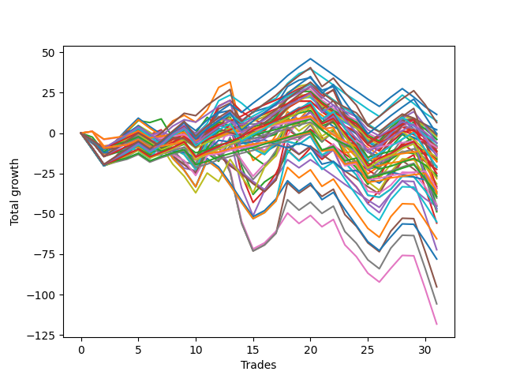

# Long Pointer 011 
- Symbol: ES
- Date Range: 03/18/2022 - 07/15/2022
- Trading Period: 7:20-12:30
- Number of Trades: 31



| Name | Win Percent | Profit | Avg Profit / Trade | Avg Time / Trade |      | Name | Win Percent | Profit | Avg Profit / Trade | Avg Time / Trade |
| ---- | ----------- | ------ | ------------------ | ---------------- | ---- | ---- | ----------- | ------ | ------------------ | ---------------- |
| Sorted By <br> Profit | | | | | | Sorted By <br> Win Percentage ||||
| One Hundred Fifteen | 51.61 | 5750.00 | 185.48 | 06:25 |     | One Hundred Twenty-One | 77.42 | -17250.00 | -556.45 | 04:50 |
| Forty-One | 48.39 | 3750.00 | 120.97 | 08:00 |     | One Hundred Twenty-Six | 77.42 | -18000.00 | -580.65 | 05:10 |
| One Hundred Thirty | 64.52 | 3250.00 | 104.84 | 10:58 |     | Eighty-One | 77.42 | -18750.00 | -604.84 | 08:17 |
| Zero | 64.52 | 1000.00 | 32.26 | 11:25 |     | One Hundred Eleven | 74.19 | -4500.00 | -145.16 | 02:18 |
| Forty | 54.84 | -125.00 | -4.03 | 05:30 |     | One Hundred Sixteen | 70.97 | -8750.00 | -282.26 | 02:19 |
| One Hundred Twenty-Five | 64.52 | -250.00 | -8.06 | 10:53 |     | One Hundred Twenty-Seven | 70.97 | -19625.00 | -633.06 | 06:43 |
| One Hundred Twenty | 41.94 | -625.00 | -20.16 | 05:20 |     | One Hundred Twenty-Two | 70.97 | -20125.00 | -649.19 | 06:27 |
| Fifty | 38.71 | -1125.00 | -36.29 | 06:52 |     | Eighty-Two | 70.97 | -24375.00 | -786.29 | 10:42 |
| Fifty-One | 38.71 | -1875.00 | -60.48 | 06:56 |     | One Hundred Twenty-Eight | 67.74 | -12500.00 | -403.23 | 08:24 |
| Forty-Eight | 51.61 | -2000.00 | -64.52 | 04:26 |     | One Hundred Twenty-Three | 67.74 | -14125.00 | -455.65 | 08:16 |
| Fifty-Four | 38.71 | -2000.00 | -64.52 | 08:17 |     | Eighty-Three | 67.74 | -17000.00 | -548.39 | 12:53 |
| One Hundred Ninteen | 48.39 | -3000.00 | -96.77 | 04:34 |     | One Hundred Thirty | 64.52 | 3250.00 | 104.84 | 10:58 |
| One Hundred Fourteen | 51.61 | -3125.00 | -100.81 | 05:09 |     | Zero | 64.52 | 1000.00 | 32.26 | 11:25 |
| Sixty-Six | 54.84 | -3250.00 | -104.84 | 13:42 |     | One Hundred Twenty-Five | 64.52 | -250.00 | -8.06 | 10:53 |
| Forty-Two | 38.71 | -4000.00 | -129.03 | 10:20 |     | One Hundred Twenty-Nine | 64.52 | -7125.00 | -229.84 | 09:25 |
| Forty-Nine | 41.94 | -4125.00 | -133.06 | 06:07 |     | Fifty-Six | 64.52 | -7750.00 | -250.00 | 08:12 |
| One Hundred Eleven | 74.19 | -4500.00 | -145.16 | 02:18 |     | One Hundred Twenty-Four | 64.52 | -10625.00 | -342.74 | 09:19 |
| Fifty-Five | 38.71 | -4625.00 | -149.19 | 08:40 |     | Eighty-Five | 64.52 | -13500.00 | -435.48 | 16:20 |
| Fifty-Three | 38.71 | -4625.00 | -149.19 | 08:36 |     | Eighty-Four | 64.52 | -23875.00 | -770.16 | 14:47 |
| Sixty-Seven | 51.61 | -5500.00 | -177.42 | 13:52 |     | Fifty-Seven | 61.29 | -6250.00 | -201.61 | 11:27 |
| One Hundred Eighteen | 54.84 | -5750.00 | -185.48 | 04:16 |     | Sixty-Four | 61.29 | -8000.00 | -258.06 | 08:16 |
| Forty-Three | 35.48 | -5750.00 | -185.48 | 10:50 |     | One Hundred Twelve | 61.29 | -10250.00 | -330.65 | 03:27 |
| Fifty-Seven | 61.29 | -6250.00 | -201.61 | 11:27 |     | One | 61.29 | -24000.00 | -774.19 | 17:15 |
| Fifty-Two | 38.71 | -6625.00 | -213.71 | 08:12 |     | Sixty-Five | 58.06 | -8875.00 | -286.29 | 11:08 |
| Fifty-Eight | 54.84 | -6750.00 | -217.74 | 15:08 |     | One Hundred Seventeen | 58.06 | -13125.00 | -423.39 | 03:23 |
| One Hundred Twenty-Nine | 64.52 | -7125.00 | -229.84 | 09:25 |     | Forty | 54.84 | -125.00 | -4.03 | 05:30 |
| One Hundred Thirteen | 54.84 | -7500.00 | -241.94 | 04:46 |     | Sixty-Six | 54.84 | -3250.00 | -104.84 | 13:42 |
| Fifty-Six | 64.52 | -7750.00 | -250.00 | 08:12 |     | One Hundred Eighteen | 54.84 | -5750.00 | -185.48 | 04:16 |
| Sixty-Four | 61.29 | -8000.00 | -258.06 | 08:16 |     | Fifty-Eight | 54.84 | -6750.00 | -217.74 | 15:08 |
| Forty-Four | 32.26 | -8375.00 | -270.16 | 14:57 |     | One Hundred Thirteen | 54.84 | -7500.00 | -241.94 | 04:46 |
| One Hundred Sixteen | 70.97 | -8750.00 | -282.26 | 02:19 |     | Two | 54.84 | -22500.00 | -725.81 | 21:40 |
| Sixty-Five | 58.06 | -8875.00 | -286.29 | 11:08 |     | One Hundred Fifteen | 51.61 | 5750.00 | 185.48 | 06:25 |
| One Hundred Twelve | 61.29 | -10250.00 | -330.65 | 03:27 |     | Forty-Eight | 51.61 | -2000.00 | -64.52 | 04:26 |
| One Hundred Twenty-Four | 64.52 | -10625.00 | -342.74 | 09:19 |     | One Hundred Fourteen | 51.61 | -3125.00 | -100.81 | 05:09 |
| Fifty-Nine | 51.61 | -10625.00 | -342.74 | 15:34 |     | Sixty-Seven | 51.61 | -5500.00 | -177.42 | 13:52 |
| Forty-Five | 29.03 | -11250.00 | -362.90 | 15:43 |     | Fifty-Nine | 51.61 | -10625.00 | -342.74 | 15:34 |
| One Hundred Twenty-Eight | 67.74 | -12500.00 | -403.23 | 08:24 |     | Three | 51.61 | -27875.00 | -899.19 | 22:10 |
| One Hundred Seventeen | 58.06 | -13125.00 | -423.39 | 03:23 |     | Forty-One | 48.39 | 3750.00 | 120.97 | 08:00 |
| Eighty-Five | 64.52 | -13500.00 | -435.48 | 16:20 |     | One Hundred Ninteen | 48.39 | -3000.00 | -96.77 | 04:34 |
| One Hundred Twenty-Three | 67.74 | -14125.00 | -455.65 | 08:16 |     | One Hundred Twenty | 41.94 | -625.00 | -20.16 | 05:20 |
| Seventy | 38.71 | -15750.00 | -508.06 | 18:48 |     | Forty-Nine | 41.94 | -4125.00 | -133.06 | 06:07 |
| Forty-Seven | 29.03 | -16500.00 | -532.26 | 15:31 |     | Sixty | 41.94 | -18875.00 | -608.87 | 21:25 |
| Eighty-Three | 67.74 | -17000.00 | -548.39 | 12:53 |     | Four | 41.94 | -36125.00 | -1165.32 | 28:02 |
| One Hundred Twenty-One | 77.42 | -17250.00 | -556.45 | 04:50 |     | Fifty | 38.71 | -1125.00 | -36.29 | 06:52 |
| One Hundred Twenty-Six | 77.42 | -18000.00 | -580.65 | 05:10 |     | Fifty-One | 38.71 | -1875.00 | -60.48 | 06:56 |
| Seventy-Three | 35.48 | -18375.00 | -592.74 | 09:12 |     | Fifty-Four | 38.71 | -2000.00 | -64.52 | 08:17 |
| Eighty-One | 77.42 | -18750.00 | -604.84 | 08:17 |     | Forty-Two | 38.71 | -4000.00 | -129.03 | 10:20 |
| Sixty | 41.94 | -18875.00 | -608.87 | 21:25 |     | Fifty-Five | 38.71 | -4625.00 | -149.19 | 08:40 |
| One Hundred Twenty-Seven | 70.97 | -19625.00 | -633.06 | 06:43 |     | Fifty-Three | 38.71 | -4625.00 | -149.19 | 08:36 |
| One Hundred Twenty-Two | 70.97 | -20125.00 | -649.19 | 06:27 |     | Fifty-Two | 38.71 | -6625.00 | -213.71 | 08:12 |
| Sixty-Eight | 38.71 | -22125.00 | -713.71 | 18:43 |     | Seventy | 38.71 | -15750.00 | -508.06 | 18:48 |
| Two | 54.84 | -22500.00 | -725.81 | 21:40 |     | Sixty-Eight | 38.71 | -22125.00 | -713.71 | 18:43 |
| Forty-Six | 29.03 | -22750.00 | -733.87 | 14:23 |     | Seventy-One | 38.71 | -23375.00 | -754.03 | 19:22 |
| Seventy-One | 38.71 | -23375.00 | -754.03 | 19:22 |     | Sixty-Nine | 38.71 | -23375.00 | -754.03 | 19:14 |
| Sixty-Nine | 38.71 | -23375.00 | -754.03 | 19:14 |     | Sixty-One | 38.71 | -27500.00 | -887.10 | 22:25 |
| Eighty-Four | 64.52 | -23875.00 | -770.16 | 14:47 |     | Sixty-Three | 38.71 | -32750.00 | -1056.45 | 22:17 |
| One | 61.29 | -24000.00 | -774.19 | 17:15 |     | Sixty-Two | 38.71 | -39000.00 | -1258.06 | 21:09 |
| Eighty-Two | 70.97 | -24375.00 | -786.29 | 10:42 |     | Five | 38.71 | -47625.00 | -1536.29 | 29:16 |
| Sixty-One | 38.71 | -27500.00 | -887.10 | 22:25 |     | Seven | 38.71 | -52875.00 | -1705.65 | 29:07 |
| Three | 51.61 | -27875.00 | -899.19 | 22:10 |     | Six | 38.71 | -59125.00 | -1907.26 | 27:59 |
| Sixty-Three | 38.71 | -32750.00 | -1056.45 | 22:17 |     | Forty-Three | 35.48 | -5750.00 | -185.48 | 10:50 |
| Four | 41.94 | -36125.00 | -1165.32 | 28:02 |     | Seventy-Three | 35.48 | -18375.00 | -592.74 | 09:12 |
| Sixty-Two | 38.71 | -39000.00 | -1258.06 | 21:09 |     | Forty-Four | 32.26 | -8375.00 | -270.16 | 14:57 |
| Five | 38.71 | -47625.00 | -1536.29 | 29:16 |     | Forty-Five | 29.03 | -11250.00 | -362.90 | 15:43 |
| Seven | 38.71 | -52875.00 | -1705.65 | 29:07 |     | Forty-Seven | 29.03 | -16500.00 | -532.26 | 15:31 |
| Six | 38.71 | -59125.00 | -1907.26 | 27:59 |     | Forty-Six | 29.03 | -22750.00 | -733.87 | 14:23 |

## NO STOPLOSS

### Test Zero
* Sell when price hits the middle line of the 20p bollinger
* No Stoploss
* Results:
```
Total Trades: 31
Percent Up: 64.52
Percent Down: 35.48
Total Points Moved Up: 2.00
Potential Profit: 1000.00
Total Points Ups: 74.50 Count Ups: 20
Total Points Downs: -72.50 Count Downs: 11
```

<details><summary>Trades</summary>

<code>In: 2022-03-28 08:39:00		Out: 2022-03-28 09:01:45		Total Position Time: 22:45		Total Move Up: -6.50		Total to Date: -6.50</code> <br />
<code>In: 2022-03-30 08:02:00		Out: 2022-03-30 08:19:20		Total Position Time: 17:20		Total Move Up: -5.50		Total to Date: -12.00</code> <br />
<code>In: 2022-03-30 08:14:00		Out: 2022-03-30 08:19:20		Total Position Time: 05:20		Total Move Up: 3.00		Total to Date: -9.00</code> <br />
<code>In: 2022-03-30 12:27:00		Out: 2022-03-30 12:28:15		Total Position Time: 01:15		Total Move Up: 2.50		Total to Date: -6.50</code> <br />
<code>In: 2022-04-07 08:35:00		Out: 2022-04-07 08:36:10		Total Position Time: 01:10		Total Move Up: 4.25		Total to Date: -2.25</code> <br />
<code>In: 2022-04-11 07:30:00		Out: 2022-04-11 07:51:10		Total Position Time: 21:10		Total Move Up: -3.75		Total to Date: -6.00</code> <br />
<code>In: 2022-04-12 07:53:00		Out: 2022-04-12 08:02:05		Total Position Time: 09:05		Total Move Up: 0.75		Total to Date: -5.25</code> <br />
<code>In: 2022-04-12 09:14:00		Out: 2022-04-12 09:17:45		Total Position Time: 03:45		Total Move Up: 6.25		Total to Date: 1.00</code> <br />
<code>In: 2022-04-12 11:35:00		Out: 2022-04-12 11:35:50		Total Position Time: 00:50		Total Move Up: 1.50		Total to Date: 2.50</code> <br />
<code>In: 2022-04-18 08:30:00		Out: 2022-04-18 08:55:05		Total Position Time: 25:05		Total Move Up: -5.25		Total to Date: -2.75</code> <br />
<code>In: 2022-04-20 11:58:00		Out: 2022-04-20 12:01:15		Total Position Time: 03:15		Total Move Up: 4.75		Total to Date: 2.00</code> <br />
<code>In: 2022-05-02 10:06:00		Out: 2022-05-02 10:08:15		Total Position Time: 02:15		Total Move Up: 10.50		Total to Date: 12.50</code> <br />
<code>In: 2022-05-02 10:51:00		Out: 2022-05-02 10:59:15		Total Position Time: 08:15		Total Move Up: 1.50		Total to Date: 14.00</code> <br />
<code>In: 2022-05-10 07:44:00		Out: 2022-05-10 07:59:00		Total Position Time: 15:00		Total Move Up: -6.25		Total to Date: 7.75</code> <br />
<code>In: 2022-05-10 07:52:00		Out: 2022-05-10 07:59:00		Total Position Time: 07:00		Total Move Up: 5.25		Total to Date: 13.00</code> <br />
<code>In: 2022-05-13 11:07:00		Out: 2022-05-13 11:19:15		Total Position Time: 12:15		Total Move Up: 2.25		Total to Date: 15.25</code> <br />
<code>In: 2022-05-17 07:48:00		Out: 2022-05-17 07:55:10		Total Position Time: 07:10		Total Move Up: 2.00		Total to Date: 17.25</code> <br />
<code>In: 2022-05-17 11:24:00		Out: 2022-05-17 11:27:30		Total Position Time: 03:30		Total Move Up: 11.50		Total to Date: 28.75</code> <br />
<code>In: 2022-05-18 08:32:00		Out: 2022-05-18 08:36:55		Total Position Time: 04:55		Total Move Up: 4.00		Total to Date: 32.75</code> <br />
<code>In: 2022-05-25 09:29:00		Out: 2022-05-25 09:41:25		Total Position Time: 12:25		Total Move Up: 1.50		Total to Date: 34.25</code> <br />
<code>In: 2022-06-06 09:08:00		Out: 2022-06-06 09:26:35		Total Position Time: 18:35		Total Move Up: -7.75		Total to Date: 26.50</code> <br />
<code>In: 2022-06-08 10:35:00		Out: 2022-06-08 10:42:15		Total Position Time: 07:15		Total Move Up: 2.25		Total to Date: 28.75</code> <br />
<code>In: 2022-06-14 11:52:00		Out: 2022-06-14 12:21:55		Total Position Time: 29:55		Total Move Up: -15.75		Total to Date: 13.00</code> <br />
<code>In: 2022-06-15 07:57:00		Out: 2022-06-15 08:26:55		Total Position Time: 29:55		Total Move Up: -7.25		Total to Date: 5.75</code> <br />
<code>In: 2022-06-16 11:02:00		Out: 2022-06-16 11:31:55		Total Position Time: 29:55		Total Move Up: -10.25		Total to Date: -4.50</code> <br />
<code>In: 2022-06-23 09:07:00		Out: 2022-06-23 09:14:30		Total Position Time: 07:30		Total Move Up: 2.00		Total to Date: -2.50</code> <br />
<code>In: 2022-06-29 08:25:00		Out: 2022-06-29 08:28:15		Total Position Time: 03:15		Total Move Up: 4.25		Total to Date: 1.75</code> <br />
<code>In: 2022-06-29 09:29:00		Out: 2022-06-29 09:36:40		Total Position Time: 07:40		Total Move Up: 4.50		Total to Date: 6.25</code> <br />
<code>In: 2022-07-06 08:35:00		Out: 2022-07-06 08:46:05		Total Position Time: 11:05		Total Move Up: -1.00		Total to Date: 5.25</code> <br />
<code>In: 2022-07-12 11:36:00		Out: 2022-07-12 11:48:05		Total Position Time: 12:05		Total Move Up: 0.00		Total to Date: 5.25</code> <br />
<code>In: 2022-07-12 12:07:00		Out: 2022-07-12 12:20:15		Total Position Time: 13:15		Total Move Up: -3.25		Total to Date: 2.00</code> <br />


</details>

### Test One
* Sell when the price hits the upper line of the 20p 1std bollinger
* No Stoploss
* Results:
```
Total Trades: 31
Percent Up: 61.29
Percent Down: 38.71
Total Points Moved Up: -48.00
Potential Profit: -24000.00
Total Points Ups: 103.50 Count Ups: 19
Total Points Downs: -151.50 Count Downs: 12
```

<details><summary>Trades</summary>

<code>In: 2022-03-28 08:39:00		Out: 2022-03-28 09:04:40		Total Position Time: 25:40		Total Move Up: -4.00		Total to Date: -4.00</code> <br />
<code>In: 2022-03-30 08:02:00		Out: 2022-03-30 08:31:55		Total Position Time: 29:55		Total Move Up: -9.00		Total to Date: -13.00</code> <br />
<code>In: 2022-03-30 08:14:00		Out: 2022-03-30 08:34:40		Total Position Time: 20:40		Total Move Up: 2.75		Total to Date: -10.25</code> <br />
<code>In: 2022-03-30 12:27:00		Out: 2022-03-30 12:32:20		Total Position Time: 05:20		Total Move Up: 4.75		Total to Date: -5.50</code> <br />
<code>In: 2022-04-07 08:35:00		Out: 2022-04-07 08:47:05		Total Position Time: 12:05		Total Move Up: 5.00		Total to Date: -0.50</code> <br />
<code>In: 2022-04-11 07:30:00		Out: 2022-04-11 07:52:00		Total Position Time: 22:00		Total Move Up: -2.50		Total to Date: -3.00</code> <br />
<code>In: 2022-04-12 07:53:00		Out: 2022-04-12 08:02:35		Total Position Time: 09:35		Total Move Up: 2.75		Total to Date: -0.25</code> <br />
<code>In: 2022-04-12 09:14:00		Out: 2022-04-12 09:18:05		Total Position Time: 04:05		Total Move Up: 7.75		Total to Date: 7.50</code> <br />
<code>In: 2022-04-12 11:35:00		Out: 2022-04-12 11:37:20		Total Position Time: 02:20		Total Move Up: 3.50		Total to Date: 11.00</code> <br />
<code>In: 2022-04-18 08:30:00		Out: 2022-04-18 08:57:10		Total Position Time: 27:10		Total Move Up: -4.25		Total to Date: 6.75</code> <br />
<code>In: 2022-04-20 11:58:00		Out: 2022-04-20 12:04:20		Total Position Time: 06:20		Total Move Up: 7.50		Total to Date: 14.25</code> <br />
<code>In: 2022-05-02 10:06:00		Out: 2022-05-02 10:10:55		Total Position Time: 04:55		Total Move Up: 14.00		Total to Date: 28.25</code> <br />
<code>In: 2022-05-02 10:51:00		Out: 2022-05-02 11:02:25		Total Position Time: 11:25		Total Move Up: 3.50		Total to Date: 31.75</code> <br />
<code>In: 2022-05-10 07:44:00		Out: 2022-05-10 08:13:55		Total Position Time: 29:55		Total Move Up: -31.50		Total to Date: 0.25</code> <br />
<code>In: 2022-05-10 07:52:00		Out: 2022-05-10 08:21:55		Total Position Time: 29:55		Total Move Up: -17.25		Total to Date: -17.00</code> <br />
<code>In: 2022-05-13 11:07:00		Out: 2022-05-13 11:20:00		Total Position Time: 13:00		Total Move Up: 5.75		Total to Date: -11.25</code> <br />
<code>In: 2022-05-17 07:48:00		Out: 2022-05-17 07:58:50		Total Position Time: 10:50		Total Move Up: 3.25		Total to Date: -8.00</code> <br />
<code>In: 2022-05-17 11:24:00		Out: 2022-05-17 11:37:35		Total Position Time: 13:35		Total Move Up: 9.25		Total to Date: 1.25</code> <br />
<code>In: 2022-05-18 08:32:00		Out: 2022-05-18 08:41:15		Total Position Time: 09:15		Total Move Up: 6.00		Total to Date: 7.25</code> <br />
<code>In: 2022-05-25 09:29:00		Out: 2022-05-25 09:44:25		Total Position Time: 15:25		Total Move Up: 3.00		Total to Date: 10.25</code> <br />
<code>In: 2022-06-06 09:08:00		Out: 2022-06-06 09:37:35		Total Position Time: 29:35		Total Move Up: -7.50		Total to Date: 2.75</code> <br />
<code>In: 2022-06-08 10:35:00		Out: 2022-06-08 10:47:05		Total Position Time: 12:05		Total Move Up: 5.25		Total to Date: 8.00</code> <br />
<code>In: 2022-06-14 11:52:00		Out: 2022-06-14 12:21:55		Total Position Time: 29:55		Total Move Up: -15.75		Total to Date: -7.75</code> <br />
<code>In: 2022-06-15 07:57:00		Out: 2022-06-15 08:26:55		Total Position Time: 29:55		Total Move Up: -7.25		Total to Date: -15.00</code> <br />
<code>In: 2022-06-16 11:02:00		Out: 2022-06-16 11:31:55		Total Position Time: 29:55		Total Move Up: -10.25		Total to Date: -25.25</code> <br />
<code>In: 2022-06-23 09:07:00		Out: 2022-06-23 09:18:25		Total Position Time: 11:25		Total Move Up: 4.75		Total to Date: -20.50</code> <br />
<code>In: 2022-06-29 08:25:00		Out: 2022-06-29 08:32:20		Total Position Time: 07:20		Total Move Up: 6.75		Total to Date: -13.75</code> <br />
<code>In: 2022-06-29 09:29:00		Out: 2022-06-29 09:37:15		Total Position Time: 08:15		Total Move Up: 6.50		Total to Date: -7.25</code> <br />
<code>In: 2022-07-06 08:35:00		Out: 2022-07-06 08:48:10		Total Position Time: 13:10		Total Move Up: 1.50		Total to Date: -5.75</code> <br />
<code>In: 2022-07-12 11:36:00		Out: 2022-07-12 12:05:55		Total Position Time: 29:55		Total Move Up: -20.50		Total to Date: -26.25</code> <br />
<code>In: 2022-07-12 12:07:00		Out: 2022-07-12 12:36:55		Total Position Time: 29:55		Total Move Up: -21.75		Total to Date: -48.00</code> <br />


</details>

### Test Two
* Sell when the price hits the upper line of the 20p 2std bollinger
* No Stoploss
* Results:
```
Total Trades: 31
Percent Up: 54.84
Percent Down: 45.16
Total Points Moved Up: -45.00
Potential Profit: -22500.00
Total Points Ups: 117.50 Count Ups: 17
Total Points Downs: -162.50 Count Downs: 14
```

<details><summary>Trades</summary>

<code>In: 2022-03-28 08:39:00		Out: 2022-03-28 09:07:10		Total Position Time: 28:10		Total Move Up: -2.50		Total to Date: -2.50</code> <br />
<code>In: 2022-03-30 08:02:00		Out: 2022-03-30 08:31:55		Total Position Time: 29:55		Total Move Up: -9.00		Total to Date: -11.50</code> <br />
<code>In: 2022-03-30 08:14:00		Out: 2022-03-30 08:35:15		Total Position Time: 21:15		Total Move Up: 4.75		Total to Date: -6.75</code> <br />
<code>In: 2022-03-30 12:27:00		Out: 2022-03-30 12:36:20		Total Position Time: 09:20		Total Move Up: 7.50		Total to Date: 0.75</code> <br />
<code>In: 2022-04-07 08:35:00		Out: 2022-04-07 08:47:35		Total Position Time: 12:35		Total Move Up: 7.00		Total to Date: 7.75</code> <br />
<code>In: 2022-04-11 07:30:00		Out: 2022-04-11 07:54:25		Total Position Time: 24:25		Total Move Up: -1.25		Total to Date: 6.50</code> <br />
<code>In: 2022-04-12 07:53:00		Out: 2022-04-12 08:15:45		Total Position Time: 22:45		Total Move Up: 2.25		Total to Date: 8.75</code> <br />
<code>In: 2022-04-12 09:14:00		Out: 2022-04-12 09:43:55		Total Position Time: 29:55		Total Move Up: -11.75		Total to Date: -3.00</code> <br />
<code>In: 2022-04-12 11:35:00		Out: 2022-04-12 11:47:00		Total Position Time: 12:00		Total Move Up: 4.50		Total to Date: 1.50</code> <br />
<code>In: 2022-04-18 08:30:00		Out: 2022-04-18 08:59:35		Total Position Time: 29:35		Total Move Up: -1.50		Total to Date: 0.00</code> <br />
<code>In: 2022-04-20 11:58:00		Out: 2022-04-20 12:12:35		Total Position Time: 14:35		Total Move Up: 9.75		Total to Date: 9.75</code> <br />
<code>In: 2022-05-02 10:06:00		Out: 2022-05-02 10:35:55		Total Position Time: 29:55		Total Move Up: -5.25		Total to Date: 4.50</code> <br />
<code>In: 2022-05-02 10:51:00		Out: 2022-05-02 11:03:45		Total Position Time: 12:45		Total Move Up: 6.25		Total to Date: 10.75</code> <br />
<code>In: 2022-05-10 07:44:00		Out: 2022-05-10 08:13:55		Total Position Time: 29:55		Total Move Up: -31.50		Total to Date: -20.75</code> <br />
<code>In: 2022-05-10 07:52:00		Out: 2022-05-10 08:21:55		Total Position Time: 29:55		Total Move Up: -17.25		Total to Date: -38.00</code> <br />
<code>In: 2022-05-13 11:07:00		Out: 2022-05-13 11:31:20		Total Position Time: 24:20		Total Move Up: 7.75		Total to Date: -30.25</code> <br />
<code>In: 2022-05-17 07:48:00		Out: 2022-05-17 07:59:25		Total Position Time: 11:25		Total Move Up: 4.75		Total to Date: -25.50</code> <br />
<code>In: 2022-05-17 11:24:00		Out: 2022-05-17 11:40:00		Total Position Time: 16:00		Total Move Up: 13.00		Total to Date: -12.50</code> <br />
<code>In: 2022-05-18 08:32:00		Out: 2022-05-18 08:42:55		Total Position Time: 10:55		Total Move Up: 8.75		Total to Date: -3.75</code> <br />
<code>In: 2022-05-25 09:29:00		Out: 2022-05-25 09:45:20		Total Position Time: 16:20		Total Move Up: 5.25		Total to Date: 1.50</code> <br />
<code>In: 2022-06-06 09:08:00		Out: 2022-06-06 09:37:55		Total Position Time: 29:55		Total Move Up: -7.00		Total to Date: -5.50</code> <br />
<code>In: 2022-06-08 10:35:00		Out: 2022-06-08 11:03:45		Total Position Time: 28:45		Total Move Up: 7.00		Total to Date: 1.50</code> <br />
<code>In: 2022-06-14 11:52:00		Out: 2022-06-14 12:21:55		Total Position Time: 29:55		Total Move Up: -15.75		Total to Date: -14.25</code> <br />
<code>In: 2022-06-15 07:57:00		Out: 2022-06-15 08:26:55		Total Position Time: 29:55		Total Move Up: -7.25		Total to Date: -21.50</code> <br />
<code>In: 2022-06-16 11:02:00		Out: 2022-06-16 11:31:55		Total Position Time: 29:55		Total Move Up: -10.25		Total to Date: -31.75</code> <br />
<code>In: 2022-06-23 09:07:00		Out: 2022-06-23 09:19:05		Total Position Time: 12:05		Total Move Up: 7.00		Total to Date: -24.75</code> <br />
<code>In: 2022-06-29 08:25:00		Out: 2022-06-29 08:34:40		Total Position Time: 09:40		Total Move Up: 8.50		Total to Date: -16.25</code> <br />
<code>In: 2022-06-29 09:29:00		Out: 2022-06-29 09:38:30		Total Position Time: 09:30		Total Move Up: 9.50		Total to Date: -6.75</code> <br />
<code>In: 2022-07-06 08:35:00		Out: 2022-07-06 08:51:15		Total Position Time: 16:15		Total Move Up: 4.00		Total to Date: -2.75</code> <br />
<code>In: 2022-07-12 11:36:00		Out: 2022-07-12 12:05:55		Total Position Time: 29:55		Total Move Up: -20.50		Total to Date: -23.25</code> <br />
<code>In: 2022-07-12 12:07:00		Out: 2022-07-12 12:36:55		Total Position Time: 29:55		Total Move Up: -21.75		Total to Date: -45.00</code> <br />


</details>

### Test Three
* Sell when price hits the middle line of the 50p bollinger
* No Stoploss
* Results:
```
Total Trades: 31
Percent Up: 51.61
Percent Down: 48.39
Total Points Moved Up: -55.75
Potential Profit: -27875.00
Total Points Ups: 119.75 Count Ups: 16
Total Points Downs: -175.50 Count Downs: 15
```

<details><summary>Trades</summary>

<code>In: 2022-03-28 08:39:00		Out: 2022-03-28 09:08:55		Total Position Time: 29:55		Total Move Up: -5.50		Total to Date: -5.50</code> <br />
<code>In: 2022-03-30 08:02:00		Out: 2022-03-30 08:31:55		Total Position Time: 29:55		Total Move Up: -9.00		Total to Date: -14.50</code> <br />
<code>In: 2022-03-30 08:14:00		Out: 2022-03-30 08:35:15		Total Position Time: 21:15		Total Move Up: 4.75		Total to Date: -9.75</code> <br />
<code>In: 2022-03-30 12:27:00		Out: 2022-03-30 12:33:25		Total Position Time: 06:25		Total Move Up: 6.50		Total to Date: -3.25</code> <br />
<code>In: 2022-04-07 08:35:00		Out: 2022-04-07 08:47:35		Total Position Time: 12:35		Total Move Up: 7.00		Total to Date: 3.75</code> <br />
<code>In: 2022-04-11 07:30:00		Out: 2022-04-11 07:59:55		Total Position Time: 29:55		Total Move Up: -4.75		Total to Date: -1.00</code> <br />
<code>In: 2022-04-12 07:53:00		Out: 2022-04-12 08:15:40		Total Position Time: 22:40		Total Move Up: 3.00		Total to Date: 2.00</code> <br />
<code>In: 2022-04-12 09:14:00		Out: 2022-04-12 09:43:55		Total Position Time: 29:55		Total Move Up: -11.75		Total to Date: -9.75</code> <br />
<code>In: 2022-04-12 11:35:00		Out: 2022-04-12 11:47:05		Total Position Time: 12:05		Total Move Up: 6.00		Total to Date: -3.75</code> <br />
<code>In: 2022-04-18 08:30:00		Out: 2022-04-18 08:59:55		Total Position Time: 29:55		Total Move Up: -1.50		Total to Date: -5.25</code> <br />
<code>In: 2022-04-20 11:58:00		Out: 2022-04-20 12:10:10		Total Position Time: 12:10		Total Move Up: 8.25		Total to Date: 3.00</code> <br />
<code>In: 2022-05-02 10:06:00		Out: 2022-05-02 10:35:55		Total Position Time: 29:55		Total Move Up: -5.25		Total to Date: -2.25</code> <br />
<code>In: 2022-05-02 10:51:00		Out: 2022-05-02 11:04:00		Total Position Time: 13:00		Total Move Up: 8.00		Total to Date: 5.75</code> <br />
<code>In: 2022-05-10 07:44:00		Out: 2022-05-10 08:13:55		Total Position Time: 29:55		Total Move Up: -31.50		Total to Date: -25.75</code> <br />
<code>In: 2022-05-10 07:52:00		Out: 2022-05-10 08:21:55		Total Position Time: 29:55		Total Move Up: -17.25		Total to Date: -43.00</code> <br />
<code>In: 2022-05-13 11:07:00		Out: 2022-05-13 11:31:20		Total Position Time: 24:20		Total Move Up: 7.75		Total to Date: -35.25</code> <br />
<code>In: 2022-05-17 07:48:00		Out: 2022-05-17 08:04:10		Total Position Time: 16:10		Total Move Up: 10.25		Total to Date: -25.00</code> <br />
<code>In: 2022-05-17 11:24:00		Out: 2022-05-17 11:40:05		Total Position Time: 16:05		Total Move Up: 14.50		Total to Date: -10.50</code> <br />
<code>In: 2022-05-18 08:32:00		Out: 2022-05-18 09:01:55		Total Position Time: 29:55		Total Move Up: -6.50		Total to Date: -17.00</code> <br />
<code>In: 2022-05-25 09:29:00		Out: 2022-05-25 09:49:05		Total Position Time: 20:05		Total Move Up: 7.75		Total to Date: -9.25</code> <br />
<code>In: 2022-06-06 09:08:00		Out: 2022-06-06 09:37:55		Total Position Time: 29:55		Total Move Up: -7.00		Total to Date: -16.25</code> <br />
<code>In: 2022-06-08 10:35:00		Out: 2022-06-08 10:47:20		Total Position Time: 12:20		Total Move Up: 6.00		Total to Date: -10.25</code> <br />
<code>In: 2022-06-14 11:52:00		Out: 2022-06-14 12:21:55		Total Position Time: 29:55		Total Move Up: -15.75		Total to Date: -26.00</code> <br />
<code>In: 2022-06-15 07:57:00		Out: 2022-06-15 08:26:55		Total Position Time: 29:55		Total Move Up: -7.25		Total to Date: -33.25</code> <br />
<code>In: 2022-06-16 11:02:00		Out: 2022-06-16 11:31:55		Total Position Time: 29:55		Total Move Up: -10.25		Total to Date: -43.50</code> <br />
<code>In: 2022-06-23 09:07:00		Out: 2022-06-23 09:21:10		Total Position Time: 14:10		Total Move Up: 8.00		Total to Date: -35.50</code> <br />
<code>In: 2022-06-29 08:25:00		Out: 2022-06-29 08:34:40		Total Position Time: 09:40		Total Move Up: 8.50		Total to Date: -27.00</code> <br />
<code>In: 2022-06-29 09:29:00		Out: 2022-06-29 09:38:30		Total Position Time: 09:30		Total Move Up: 9.50		Total to Date: -17.50</code> <br />
<code>In: 2022-07-06 08:35:00		Out: 2022-07-06 08:51:15		Total Position Time: 16:15		Total Move Up: 4.00		Total to Date: -13.50</code> <br />
<code>In: 2022-07-12 11:36:00		Out: 2022-07-12 12:05:55		Total Position Time: 29:55		Total Move Up: -20.50		Total to Date: -34.00</code> <br />
<code>In: 2022-07-12 12:07:00		Out: 2022-07-12 12:36:55		Total Position Time: 29:55		Total Move Up: -21.75		Total to Date: -55.75</code> <br />


</details>

### Test Four
* Sell when the price hits the upper line of the 50p 1std bollinger
* No Stoploss
* Results:
```
Total Trades: 31
Percent Up: 41.94
Percent Down: 58.06
Total Points Moved Up: -72.25
Potential Profit: -36125.00
Total Points Ups: 116.50 Count Ups: 13
Total Points Downs: -188.75 Count Downs: 18
```

<details><summary>Trades</summary>

<code>In: 2022-03-28 08:39:00		Out: 2022-03-28 09:08:55		Total Position Time: 29:55		Total Move Up: -5.50		Total to Date: -5.50</code> <br />
<code>In: 2022-03-30 08:02:00		Out: 2022-03-30 08:31:55		Total Position Time: 29:55		Total Move Up: -9.00		Total to Date: -14.50</code> <br />
<code>In: 2022-03-30 08:14:00		Out: 2022-03-30 08:43:55		Total Position Time: 29:55		Total Move Up: 3.75		Total to Date: -10.75</code> <br />
<code>In: 2022-03-30 12:27:00		Out: 2022-03-30 12:46:00		Total Position Time: 19:00		Total Move Up: 7.25		Total to Date: -3.50</code> <br />
<code>In: 2022-04-07 08:35:00		Out: 2022-04-07 09:04:55		Total Position Time: 29:55		Total Move Up: 0.50		Total to Date: -3.00</code> <br />
<code>In: 2022-04-11 07:30:00		Out: 2022-04-11 07:59:55		Total Position Time: 29:55		Total Move Up: -4.75		Total to Date: -7.75</code> <br />
<code>In: 2022-04-12 07:53:00		Out: 2022-04-12 08:19:45		Total Position Time: 26:45		Total Move Up: 5.25		Total to Date: -2.50</code> <br />
<code>In: 2022-04-12 09:14:00		Out: 2022-04-12 09:43:55		Total Position Time: 29:55		Total Move Up: -11.75		Total to Date: -14.25</code> <br />
<code>In: 2022-04-12 11:35:00		Out: 2022-04-12 12:04:55		Total Position Time: 29:55		Total Move Up: -7.50		Total to Date: -21.75</code> <br />
<code>In: 2022-04-18 08:30:00		Out: 2022-04-18 08:59:55		Total Position Time: 29:55		Total Move Up: -1.50		Total to Date: -23.25</code> <br />
<code>In: 2022-04-20 11:58:00		Out: 2022-04-20 12:13:30		Total Position Time: 15:30		Total Move Up: 12.25		Total to Date: -11.00</code> <br />
<code>In: 2022-05-02 10:06:00		Out: 2022-05-02 10:35:55		Total Position Time: 29:55		Total Move Up: -5.25		Total to Date: -16.25</code> <br />
<code>In: 2022-05-02 10:51:00		Out: 2022-05-02 11:07:10		Total Position Time: 16:10		Total Move Up: 13.75		Total to Date: -2.50</code> <br />
<code>In: 2022-05-10 07:44:00		Out: 2022-05-10 08:13:55		Total Position Time: 29:55		Total Move Up: -31.50		Total to Date: -34.00</code> <br />
<code>In: 2022-05-10 07:52:00		Out: 2022-05-10 08:21:55		Total Position Time: 29:55		Total Move Up: -17.25		Total to Date: -51.25</code> <br />
<code>In: 2022-05-13 11:07:00		Out: 2022-05-13 11:32:00		Total Position Time: 25:00		Total Move Up: 15.75		Total to Date: -35.50</code> <br />
<code>In: 2022-05-17 07:48:00		Out: 2022-05-17 08:17:55		Total Position Time: 29:55		Total Move Up: 7.25		Total to Date: -28.25</code> <br />
<code>In: 2022-05-17 11:24:00		Out: 2022-05-17 11:44:30		Total Position Time: 20:30		Total Move Up: 21.75		Total to Date: -6.50</code> <br />
<code>In: 2022-05-18 08:32:00		Out: 2022-05-18 09:01:55		Total Position Time: 29:55		Total Move Up: -6.50		Total to Date: -13.00</code> <br />
<code>In: 2022-05-25 09:29:00		Out: 2022-05-25 09:58:55		Total Position Time: 29:55		Total Move Up: 5.00		Total to Date: -8.00</code> <br />
<code>In: 2022-06-06 09:08:00		Out: 2022-06-06 09:37:55		Total Position Time: 29:55		Total Move Up: -7.00		Total to Date: -15.00</code> <br />
<code>In: 2022-06-08 10:35:00		Out: 2022-06-08 11:04:55		Total Position Time: 29:55		Total Move Up: 4.50		Total to Date: -10.50</code> <br />
<code>In: 2022-06-14 11:52:00		Out: 2022-06-14 12:21:55		Total Position Time: 29:55		Total Move Up: -15.75		Total to Date: -26.25</code> <br />
<code>In: 2022-06-15 07:57:00		Out: 2022-06-15 08:26:55		Total Position Time: 29:55		Total Move Up: -7.25		Total to Date: -33.50</code> <br />
<code>In: 2022-06-16 11:02:00		Out: 2022-06-16 11:31:55		Total Position Time: 29:55		Total Move Up: -10.25		Total to Date: -43.75</code> <br />
<code>In: 2022-06-23 09:07:00		Out: 2022-06-23 09:36:55		Total Position Time: 29:55		Total Move Up: -5.50		Total to Date: -49.25</code> <br />
<code>In: 2022-06-29 08:25:00		Out: 2022-06-29 08:53:10		Total Position Time: 28:10		Total Move Up: 11.50		Total to Date: -37.75</code> <br />
<code>In: 2022-06-29 09:29:00		Out: 2022-06-29 09:58:55		Total Position Time: 29:55		Total Move Up: 8.00		Total to Date: -29.75</code> <br />
<code>In: 2022-07-06 08:35:00		Out: 2022-07-06 09:04:55		Total Position Time: 29:55		Total Move Up: -0.25		Total to Date: -30.00</code> <br />
<code>In: 2022-07-12 11:36:00		Out: 2022-07-12 12:05:55		Total Position Time: 29:55		Total Move Up: -20.50		Total to Date: -50.50</code> <br />
<code>In: 2022-07-12 12:07:00		Out: 2022-07-12 12:36:55		Total Position Time: 29:55		Total Move Up: -21.75		Total to Date: -72.25</code> <br />


</details>

### Test Five
* Sell when the price hits the upper line of the 50p 2std bollinger
* No Stoploss
* Results:
```
Total Trades: 31
Percent Up: 38.71
Percent Down: 61.29
Total Points Moved Up: -95.25
Potential Profit: -47625.00
Total Points Ups: 109.25 Count Ups: 12
Total Points Downs: -204.50 Count Downs: 19
```

<details><summary>Trades</summary>

<code>In: 2022-03-28 08:39:00		Out: 2022-03-28 09:08:55		Total Position Time: 29:55		Total Move Up: -5.50		Total to Date: -5.50</code> <br />
<code>In: 2022-03-30 08:02:00		Out: 2022-03-30 08:31:55		Total Position Time: 29:55		Total Move Up: -9.00		Total to Date: -14.50</code> <br />
<code>In: 2022-03-30 08:14:00		Out: 2022-03-30 08:43:55		Total Position Time: 29:55		Total Move Up: 3.75		Total to Date: -10.75</code> <br />
<code>In: 2022-03-30 12:27:00		Out: 2022-03-30 12:46:00		Total Position Time: 19:00		Total Move Up: 7.25		Total to Date: -3.50</code> <br />
<code>In: 2022-04-07 08:35:00		Out: 2022-04-07 09:04:55		Total Position Time: 29:55		Total Move Up: 0.50		Total to Date: -3.00</code> <br />
<code>In: 2022-04-11 07:30:00		Out: 2022-04-11 07:59:55		Total Position Time: 29:55		Total Move Up: -4.75		Total to Date: -7.75</code> <br />
<code>In: 2022-04-12 07:53:00		Out: 2022-04-12 08:21:10		Total Position Time: 28:10		Total Move Up: 9.00		Total to Date: 1.25</code> <br />
<code>In: 2022-04-12 09:14:00		Out: 2022-04-12 09:43:55		Total Position Time: 29:55		Total Move Up: -11.75		Total to Date: -10.50</code> <br />
<code>In: 2022-04-12 11:35:00		Out: 2022-04-12 12:04:55		Total Position Time: 29:55		Total Move Up: -7.50		Total to Date: -18.00</code> <br />
<code>In: 2022-04-18 08:30:00		Out: 2022-04-18 08:59:55		Total Position Time: 29:55		Total Move Up: -1.50		Total to Date: -19.50</code> <br />
<code>In: 2022-04-20 11:58:00		Out: 2022-04-20 12:25:45		Total Position Time: 27:45		Total Move Up: 16.25		Total to Date: -3.25</code> <br />
<code>In: 2022-05-02 10:06:00		Out: 2022-05-02 10:35:55		Total Position Time: 29:55		Total Move Up: -5.25		Total to Date: -8.50</code> <br />
<code>In: 2022-05-02 10:51:00		Out: 2022-05-02 11:20:55		Total Position Time: 29:55		Total Move Up: -15.75		Total to Date: -24.25</code> <br />
<code>In: 2022-05-10 07:44:00		Out: 2022-05-10 08:13:55		Total Position Time: 29:55		Total Move Up: -31.50		Total to Date: -55.75</code> <br />
<code>In: 2022-05-10 07:52:00		Out: 2022-05-10 08:21:55		Total Position Time: 29:55		Total Move Up: -17.25		Total to Date: -73.00</code> <br />
<code>In: 2022-05-13 11:07:00		Out: 2022-05-13 11:36:55		Total Position Time: 29:55		Total Move Up: 3.75		Total to Date: -69.25</code> <br />
<code>In: 2022-05-17 07:48:00		Out: 2022-05-17 08:17:55		Total Position Time: 29:55		Total Move Up: 7.25		Total to Date: -62.00</code> <br />
<code>In: 2022-05-17 11:24:00		Out: 2022-05-17 11:48:45		Total Position Time: 24:45		Total Move Up: 31.25		Total to Date: -30.75</code> <br />
<code>In: 2022-05-18 08:32:00		Out: 2022-05-18 09:01:55		Total Position Time: 29:55		Total Move Up: -6.50		Total to Date: -37.25</code> <br />
<code>In: 2022-05-25 09:29:00		Out: 2022-05-25 09:58:55		Total Position Time: 29:55		Total Move Up: 5.00		Total to Date: -32.25</code> <br />
<code>In: 2022-06-06 09:08:00		Out: 2022-06-06 09:37:55		Total Position Time: 29:55		Total Move Up: -7.00		Total to Date: -39.25</code> <br />
<code>In: 2022-06-08 10:35:00		Out: 2022-06-08 11:04:55		Total Position Time: 29:55		Total Move Up: 4.50		Total to Date: -34.75</code> <br />
<code>In: 2022-06-14 11:52:00		Out: 2022-06-14 12:21:55		Total Position Time: 29:55		Total Move Up: -15.75		Total to Date: -50.50</code> <br />
<code>In: 2022-06-15 07:57:00		Out: 2022-06-15 08:26:55		Total Position Time: 29:55		Total Move Up: -7.25		Total to Date: -57.75</code> <br />
<code>In: 2022-06-16 11:02:00		Out: 2022-06-16 11:31:55		Total Position Time: 29:55		Total Move Up: -10.25		Total to Date: -68.00</code> <br />
<code>In: 2022-06-23 09:07:00		Out: 2022-06-23 09:36:55		Total Position Time: 29:55		Total Move Up: -5.50		Total to Date: -73.50</code> <br />
<code>In: 2022-06-29 08:25:00		Out: 2022-06-29 08:54:55		Total Position Time: 29:55		Total Move Up: 12.75		Total to Date: -60.75</code> <br />
<code>In: 2022-06-29 09:29:00		Out: 2022-06-29 09:58:55		Total Position Time: 29:55		Total Move Up: 8.00		Total to Date: -52.75</code> <br />
<code>In: 2022-07-06 08:35:00		Out: 2022-07-06 09:04:55		Total Position Time: 29:55		Total Move Up: -0.25		Total to Date: -53.00</code> <br />
<code>In: 2022-07-12 11:36:00		Out: 2022-07-12 12:05:55		Total Position Time: 29:55		Total Move Up: -20.50		Total to Date: -73.50</code> <br />
<code>In: 2022-07-12 12:07:00		Out: 2022-07-12 12:36:55		Total Position Time: 29:55		Total Move Up: -21.75		Total to Date: -95.25</code> <br />


</details>

### Test Six
* Sell when the price hits the middle line of the 1std VWAP
* No Stoploss
* Results:
```
Total Trades: 31
Percent Up: 38.71
Percent Down: 61.29
Total Points Moved Up: -118.25
Potential Profit: -59125.00
Total Points Ups: 86.25 Count Ups: 12
Total Points Downs: -204.50 Count Downs: 19
```

<details><summary>Trades</summary>

<code>In: 2022-03-28 08:39:00		Out: 2022-03-28 09:08:55		Total Position Time: 29:55		Total Move Up: -5.50		Total to Date: -5.50</code> <br />
<code>In: 2022-03-30 08:02:00		Out: 2022-03-30 08:31:55		Total Position Time: 29:55		Total Move Up: -9.00		Total to Date: -14.50</code> <br />
<code>In: 2022-03-30 08:14:00		Out: 2022-03-30 08:43:55		Total Position Time: 29:55		Total Move Up: 3.75		Total to Date: -10.75</code> <br />
<code>In: 2022-03-30 12:27:00		Out: 2022-03-30 12:46:00		Total Position Time: 19:00		Total Move Up: 7.25		Total to Date: -3.50</code> <br />
<code>In: 2022-04-07 08:35:00		Out: 2022-04-07 09:04:55		Total Position Time: 29:55		Total Move Up: 0.50		Total to Date: -3.00</code> <br />
<code>In: 2022-04-11 07:30:00		Out: 2022-04-11 07:59:55		Total Position Time: 29:55		Total Move Up: -4.75		Total to Date: -7.75</code> <br />
<code>In: 2022-04-12 07:53:00		Out: 2022-04-12 08:22:55		Total Position Time: 29:55		Total Move Up: 9.00		Total to Date: 1.25</code> <br />
<code>In: 2022-04-12 09:14:00		Out: 2022-04-12 09:43:55		Total Position Time: 29:55		Total Move Up: -11.75		Total to Date: -10.50</code> <br />
<code>In: 2022-04-12 11:35:00		Out: 2022-04-12 12:04:55		Total Position Time: 29:55		Total Move Up: -7.50		Total to Date: -18.00</code> <br />
<code>In: 2022-04-18 08:30:00		Out: 2022-04-18 08:59:55		Total Position Time: 29:55		Total Move Up: -1.50		Total to Date: -19.50</code> <br />
<code>In: 2022-04-20 11:58:00		Out: 2022-04-20 12:25:50		Total Position Time: 27:50		Total Move Up: 17.50		Total to Date: -2.00</code> <br />
<code>In: 2022-05-02 10:06:00		Out: 2022-05-02 10:35:55		Total Position Time: 29:55		Total Move Up: -5.25		Total to Date: -7.25</code> <br />
<code>In: 2022-05-02 10:51:00		Out: 2022-05-02 11:20:55		Total Position Time: 29:55		Total Move Up: -15.75		Total to Date: -23.00</code> <br />
<code>In: 2022-05-10 07:44:00		Out: 2022-05-10 08:13:55		Total Position Time: 29:55		Total Move Up: -31.50		Total to Date: -54.50</code> <br />
<code>In: 2022-05-10 07:52:00		Out: 2022-05-10 08:21:55		Total Position Time: 29:55		Total Move Up: -17.25		Total to Date: -71.75</code> <br />
<code>In: 2022-05-13 11:07:00		Out: 2022-05-13 11:36:55		Total Position Time: 29:55		Total Move Up: 3.75		Total to Date: -68.00</code> <br />
<code>In: 2022-05-17 07:48:00		Out: 2022-05-17 08:17:55		Total Position Time: 29:55		Total Move Up: 7.25		Total to Date: -60.75</code> <br />
<code>In: 2022-05-17 11:24:00		Out: 2022-05-17 11:27:25		Total Position Time: 03:25		Total Move Up: 11.25		Total to Date: -49.50</code> <br />
<code>In: 2022-05-18 08:32:00		Out: 2022-05-18 09:01:55		Total Position Time: 29:55		Total Move Up: -6.50		Total to Date: -56.00</code> <br />
<code>In: 2022-05-25 09:29:00		Out: 2022-05-25 09:58:55		Total Position Time: 29:55		Total Move Up: 5.00		Total to Date: -51.00</code> <br />
<code>In: 2022-06-06 09:08:00		Out: 2022-06-06 09:37:55		Total Position Time: 29:55		Total Move Up: -7.00		Total to Date: -58.00</code> <br />
<code>In: 2022-06-08 10:35:00		Out: 2022-06-08 11:04:55		Total Position Time: 29:55		Total Move Up: 4.50		Total to Date: -53.50</code> <br />
<code>In: 2022-06-14 11:52:00		Out: 2022-06-14 12:21:55		Total Position Time: 29:55		Total Move Up: -15.75		Total to Date: -69.25</code> <br />
<code>In: 2022-06-15 07:57:00		Out: 2022-06-15 08:26:55		Total Position Time: 29:55		Total Move Up: -7.25		Total to Date: -76.50</code> <br />
<code>In: 2022-06-16 11:02:00		Out: 2022-06-16 11:31:55		Total Position Time: 29:55		Total Move Up: -10.25		Total to Date: -86.75</code> <br />
<code>In: 2022-06-23 09:07:00		Out: 2022-06-23 09:36:55		Total Position Time: 29:55		Total Move Up: -5.50		Total to Date: -92.25</code> <br />
<code>In: 2022-06-29 08:25:00		Out: 2022-06-29 08:34:40		Total Position Time: 09:40		Total Move Up: 8.50		Total to Date: -83.75</code> <br />
<code>In: 2022-06-29 09:29:00		Out: 2022-06-29 09:58:55		Total Position Time: 29:55		Total Move Up: 8.00		Total to Date: -75.75</code> <br />
<code>In: 2022-07-06 08:35:00		Out: 2022-07-06 09:04:55		Total Position Time: 29:55		Total Move Up: -0.25		Total to Date: -76.00</code> <br />
<code>In: 2022-07-12 11:36:00		Out: 2022-07-12 12:05:55		Total Position Time: 29:55		Total Move Up: -20.50		Total to Date: -96.50</code> <br />
<code>In: 2022-07-12 12:07:00		Out: 2022-07-12 12:36:55		Total Position Time: 29:55		Total Move Up: -21.75		Total to Date: -118.25</code> <br />


</details>

### Test Seven
* Sell when the price hits the upper line of the 1std VWAP
* No Stoploss
* Results:
```
Total Trades: 31
Percent Up: 38.71
Percent Down: 61.29
Total Points Moved Up: -105.75
Potential Profit: -52875.00
Total Points Ups: 98.75 Count Ups: 12
Total Points Downs: -204.50 Count Downs: 19
```

<details><summary>Trades</summary>

<code>In: 2022-03-28 08:39:00		Out: 2022-03-28 09:08:55		Total Position Time: 29:55		Total Move Up: -5.50		Total to Date: -5.50</code> <br />
<code>In: 2022-03-30 08:02:00		Out: 2022-03-30 08:31:55		Total Position Time: 29:55		Total Move Up: -9.00		Total to Date: -14.50</code> <br />
<code>In: 2022-03-30 08:14:00		Out: 2022-03-30 08:43:55		Total Position Time: 29:55		Total Move Up: 3.75		Total to Date: -10.75</code> <br />
<code>In: 2022-03-30 12:27:00		Out: 2022-03-30 12:46:00		Total Position Time: 19:00		Total Move Up: 7.25		Total to Date: -3.50</code> <br />
<code>In: 2022-04-07 08:35:00		Out: 2022-04-07 09:04:55		Total Position Time: 29:55		Total Move Up: 0.50		Total to Date: -3.00</code> <br />
<code>In: 2022-04-11 07:30:00		Out: 2022-04-11 07:59:55		Total Position Time: 29:55		Total Move Up: -4.75		Total to Date: -7.75</code> <br />
<code>In: 2022-04-12 07:53:00		Out: 2022-04-12 08:22:55		Total Position Time: 29:55		Total Move Up: 9.00		Total to Date: 1.25</code> <br />
<code>In: 2022-04-12 09:14:00		Out: 2022-04-12 09:43:55		Total Position Time: 29:55		Total Move Up: -11.75		Total to Date: -10.50</code> <br />
<code>In: 2022-04-12 11:35:00		Out: 2022-04-12 12:04:55		Total Position Time: 29:55		Total Move Up: -7.50		Total to Date: -18.00</code> <br />
<code>In: 2022-04-18 08:30:00		Out: 2022-04-18 08:59:55		Total Position Time: 29:55		Total Move Up: -1.50		Total to Date: -19.50</code> <br />
<code>In: 2022-04-20 11:58:00		Out: 2022-04-20 12:27:55		Total Position Time: 29:55		Total Move Up: 16.25		Total to Date: -3.25</code> <br />
<code>In: 2022-05-02 10:06:00		Out: 2022-05-02 10:35:55		Total Position Time: 29:55		Total Move Up: -5.25		Total to Date: -8.50</code> <br />
<code>In: 2022-05-02 10:51:00		Out: 2022-05-02 11:20:55		Total Position Time: 29:55		Total Move Up: -15.75		Total to Date: -24.25</code> <br />
<code>In: 2022-05-10 07:44:00		Out: 2022-05-10 08:13:55		Total Position Time: 29:55		Total Move Up: -31.50		Total to Date: -55.75</code> <br />
<code>In: 2022-05-10 07:52:00		Out: 2022-05-10 08:21:55		Total Position Time: 29:55		Total Move Up: -17.25		Total to Date: -73.00</code> <br />
<code>In: 2022-05-13 11:07:00		Out: 2022-05-13 11:36:55		Total Position Time: 29:55		Total Move Up: 3.75		Total to Date: -69.25</code> <br />
<code>In: 2022-05-17 07:48:00		Out: 2022-05-17 08:17:55		Total Position Time: 29:55		Total Move Up: 7.25		Total to Date: -62.00</code> <br />
<code>In: 2022-05-17 11:24:00		Out: 2022-05-17 11:40:20		Total Position Time: 16:20		Total Move Up: 20.75		Total to Date: -41.25</code> <br />
<code>In: 2022-05-18 08:32:00		Out: 2022-05-18 09:01:55		Total Position Time: 29:55		Total Move Up: -6.50		Total to Date: -47.75</code> <br />
<code>In: 2022-05-25 09:29:00		Out: 2022-05-25 09:58:55		Total Position Time: 29:55		Total Move Up: 5.00		Total to Date: -42.75</code> <br />
<code>In: 2022-06-06 09:08:00		Out: 2022-06-06 09:37:55		Total Position Time: 29:55		Total Move Up: -7.00		Total to Date: -49.75</code> <br />
<code>In: 2022-06-08 10:35:00		Out: 2022-06-08 11:04:55		Total Position Time: 29:55		Total Move Up: 4.50		Total to Date: -45.25</code> <br />
<code>In: 2022-06-14 11:52:00		Out: 2022-06-14 12:21:55		Total Position Time: 29:55		Total Move Up: -15.75		Total to Date: -61.00</code> <br />
<code>In: 2022-06-15 07:57:00		Out: 2022-06-15 08:26:55		Total Position Time: 29:55		Total Move Up: -7.25		Total to Date: -68.25</code> <br />
<code>In: 2022-06-16 11:02:00		Out: 2022-06-16 11:31:55		Total Position Time: 29:55		Total Move Up: -10.25		Total to Date: -78.50</code> <br />
<code>In: 2022-06-23 09:07:00		Out: 2022-06-23 09:36:55		Total Position Time: 29:55		Total Move Up: -5.50		Total to Date: -84.00</code> <br />
<code>In: 2022-06-29 08:25:00		Out: 2022-06-29 08:54:55		Total Position Time: 29:55		Total Move Up: 12.75		Total to Date: -71.25</code> <br />
<code>In: 2022-06-29 09:29:00		Out: 2022-06-29 09:58:55		Total Position Time: 29:55		Total Move Up: 8.00		Total to Date: -63.25</code> <br />
<code>In: 2022-07-06 08:35:00		Out: 2022-07-06 09:04:55		Total Position Time: 29:55		Total Move Up: -0.25		Total to Date: -63.50</code> <br />
<code>In: 2022-07-12 11:36:00		Out: 2022-07-12 12:05:55		Total Position Time: 29:55		Total Move Up: -20.50		Total to Date: -84.00</code> <br />
<code>In: 2022-07-12 12:07:00		Out: 2022-07-12 12:36:55		Total Position Time: 29:55		Total Move Up: -21.75		Total to Date: -105.75</code> <br />


</details>

## STOPLOSS OF 5

### Test Forty
* Sell when price hits the middle line of the 20p bollinger
* Stoploss is 5 points
* Results:
```
Total Trades: 31
Percent Up: 54.84
Percent Down: 45.16
Total Points Moved Up: -0.25
Potential Profit: -125.00
Total Points Ups: 69.50 Count Ups: 17
Total Points Downs: -69.75 Count Downs: 14
```

<details><summary>Trades</summary>

<code>In: 2022-03-28 08:39:00		Out: 2022-03-28 08:46:30		Total Position Time: 07:30		Total Move Up: -5.00		Total to Date: -5.00</code> <br />
<code>In: 2022-03-30 08:02:00		Out: 2022-03-30 08:08:00		Total Position Time: 06:00		Total Move Up: -5.00		Total to Date: -10.00</code> <br />
<code>In: 2022-03-30 08:14:00		Out: 2022-03-30 08:19:20		Total Position Time: 05:20		Total Move Up: 3.00		Total to Date: -7.00</code> <br />
<code>In: 2022-03-30 12:27:00		Out: 2022-03-30 12:28:15		Total Position Time: 01:15		Total Move Up: 2.50		Total to Date: -4.50</code> <br />
<code>In: 2022-04-07 08:35:00		Out: 2022-04-07 08:36:10		Total Position Time: 01:10		Total Move Up: 4.25		Total to Date: -0.25</code> <br />
<code>In: 2022-04-11 07:30:00		Out: 2022-04-11 07:38:00		Total Position Time: 08:00		Total Move Up: -5.25		Total to Date: -5.50</code> <br />
<code>In: 2022-04-12 07:53:00		Out: 2022-04-12 08:00:35		Total Position Time: 07:35		Total Move Up: -4.75		Total to Date: -10.25</code> <br />
<code>In: 2022-04-12 09:14:00		Out: 2022-04-12 09:17:45		Total Position Time: 03:45		Total Move Up: 6.25		Total to Date: -4.00</code> <br />
<code>In: 2022-04-12 11:35:00		Out: 2022-04-12 11:35:50		Total Position Time: 00:50		Total Move Up: 1.50		Total to Date: -2.50</code> <br />
<code>In: 2022-04-18 08:30:00		Out: 2022-04-18 08:38:10		Total Position Time: 08:10		Total Move Up: -5.25		Total to Date: -7.75</code> <br />
<code>In: 2022-04-20 11:58:00		Out: 2022-04-20 12:01:15		Total Position Time: 03:15		Total Move Up: 4.75		Total to Date: -3.00</code> <br />
<code>In: 2022-05-02 10:06:00		Out: 2022-05-02 10:08:15		Total Position Time: 02:15		Total Move Up: 10.50		Total to Date: 7.50</code> <br />
<code>In: 2022-05-02 10:51:00		Out: 2022-05-02 10:59:15		Total Position Time: 08:15		Total Move Up: 1.50		Total to Date: 9.00</code> <br />
<code>In: 2022-05-10 07:44:00		Out: 2022-05-10 07:46:30		Total Position Time: 02:30		Total Move Up: -5.00		Total to Date: 4.00</code> <br />
<code>In: 2022-05-10 07:52:00		Out: 2022-05-10 07:59:00		Total Position Time: 07:00		Total Move Up: 5.25		Total to Date: 9.25</code> <br />
<code>In: 2022-05-13 11:07:00		Out: 2022-05-13 11:19:15		Total Position Time: 12:15		Total Move Up: 2.25		Total to Date: 11.50</code> <br />
<code>In: 2022-05-17 07:48:00		Out: 2022-05-17 07:55:10		Total Position Time: 07:10		Total Move Up: 2.00		Total to Date: 13.50</code> <br />
<code>In: 2022-05-17 11:24:00		Out: 2022-05-17 11:27:30		Total Position Time: 03:30		Total Move Up: 11.50		Total to Date: 25.00</code> <br />
<code>In: 2022-05-18 08:32:00		Out: 2022-05-18 08:36:55		Total Position Time: 04:55		Total Move Up: 4.00		Total to Date: 29.00</code> <br />
<code>In: 2022-05-25 09:29:00		Out: 2022-05-25 09:41:25		Total Position Time: 12:25		Total Move Up: 1.50		Total to Date: 30.50</code> <br />
<code>In: 2022-06-06 09:08:00		Out: 2022-06-06 09:09:10		Total Position Time: 01:10		Total Move Up: -5.00		Total to Date: 25.50</code> <br />
<code>In: 2022-06-08 10:35:00		Out: 2022-06-08 10:38:15		Total Position Time: 03:15		Total Move Up: -5.00		Total to Date: 20.50</code> <br />
<code>In: 2022-06-14 11:52:00		Out: 2022-06-14 11:54:45		Total Position Time: 02:45		Total Move Up: -5.25		Total to Date: 15.25</code> <br />
<code>In: 2022-06-15 07:57:00		Out: 2022-06-15 08:10:15		Total Position Time: 13:15		Total Move Up: -4.75		Total to Date: 10.50</code> <br />
<code>In: 2022-06-16 11:02:00		Out: 2022-06-16 11:02:30		Total Position Time: 00:30		Total Move Up: -5.00		Total to Date: 5.50</code> <br />
<code>In: 2022-06-23 09:07:00		Out: 2022-06-23 09:09:30		Total Position Time: 02:30		Total Move Up: -4.50		Total to Date: 1.00</code> <br />
<code>In: 2022-06-29 08:25:00		Out: 2022-06-29 08:28:15		Total Position Time: 03:15		Total Move Up: 4.25		Total to Date: 5.25</code> <br />
<code>In: 2022-06-29 09:29:00		Out: 2022-06-29 09:36:40		Total Position Time: 07:40		Total Move Up: 4.50		Total to Date: 9.75</code> <br />
<code>In: 2022-07-06 08:35:00		Out: 2022-07-06 08:45:15		Total Position Time: 10:15		Total Move Up: -5.25		Total to Date: 4.50</code> <br />
<code>In: 2022-07-12 11:36:00		Out: 2022-07-12 11:48:05		Total Position Time: 12:05		Total Move Up: 0.00		Total to Date: 4.50</code> <br />
<code>In: 2022-07-12 12:07:00		Out: 2022-07-12 12:08:10		Total Position Time: 01:10		Total Move Up: -4.75		Total to Date: -0.25</code> <br />


</details>

### Test Forty-One
* Sell when the price hits the upper line of the 20p 1std bollinger
* Stoploss is 5 points
* Results:
```
Total Trades: 31
Percent Up: 48.39
Percent Down: 51.61
Total Points Moved Up: 7.50
Potential Profit: 3750.00
Total Points Ups: 89.25 Count Ups: 15
Total Points Downs: -81.75 Count Downs: 16
```

<details><summary>Trades</summary>

<code>In: 2022-03-28 08:39:00		Out: 2022-03-28 08:46:30		Total Position Time: 07:30		Total Move Up: -5.00		Total to Date: -5.00</code> <br />
<code>In: 2022-03-30 08:02:00		Out: 2022-03-30 08:08:00		Total Position Time: 06:00		Total Move Up: -5.00		Total to Date: -10.00</code> <br />
<code>In: 2022-03-30 08:14:00		Out: 2022-03-30 08:34:40		Total Position Time: 20:40		Total Move Up: 2.75		Total to Date: -7.25</code> <br />
<code>In: 2022-03-30 12:27:00		Out: 2022-03-30 12:32:20		Total Position Time: 05:20		Total Move Up: 4.75		Total to Date: -2.50</code> <br />
<code>In: 2022-04-07 08:35:00		Out: 2022-04-07 08:47:05		Total Position Time: 12:05		Total Move Up: 5.00		Total to Date: 2.50</code> <br />
<code>In: 2022-04-11 07:30:00		Out: 2022-04-11 07:38:00		Total Position Time: 08:00		Total Move Up: -5.25		Total to Date: -2.75</code> <br />
<code>In: 2022-04-12 07:53:00		Out: 2022-04-12 08:00:35		Total Position Time: 07:35		Total Move Up: -4.75		Total to Date: -7.50</code> <br />
<code>In: 2022-04-12 09:14:00		Out: 2022-04-12 09:18:05		Total Position Time: 04:05		Total Move Up: 7.75		Total to Date: 0.25</code> <br />
<code>In: 2022-04-12 11:35:00		Out: 2022-04-12 11:37:20		Total Position Time: 02:20		Total Move Up: 3.50		Total to Date: 3.75</code> <br />
<code>In: 2022-04-18 08:30:00		Out: 2022-04-18 08:38:10		Total Position Time: 08:10		Total Move Up: -5.25		Total to Date: -1.50</code> <br />
<code>In: 2022-04-20 11:58:00		Out: 2022-04-20 12:04:20		Total Position Time: 06:20		Total Move Up: 7.50		Total to Date: 6.00</code> <br />
<code>In: 2022-05-02 10:06:00		Out: 2022-05-02 10:10:55		Total Position Time: 04:55		Total Move Up: 14.00		Total to Date: 20.00</code> <br />
<code>In: 2022-05-02 10:51:00		Out: 2022-05-02 11:02:25		Total Position Time: 11:25		Total Move Up: 3.50		Total to Date: 23.50</code> <br />
<code>In: 2022-05-10 07:44:00		Out: 2022-05-10 07:46:30		Total Position Time: 02:30		Total Move Up: -5.00		Total to Date: 18.50</code> <br />
<code>In: 2022-05-10 07:52:00		Out: 2022-05-10 08:01:00		Total Position Time: 09:00		Total Move Up: -6.00		Total to Date: 12.50</code> <br />
<code>In: 2022-05-13 11:07:00		Out: 2022-05-13 11:20:00		Total Position Time: 13:00		Total Move Up: 5.75		Total to Date: 18.25</code> <br />
<code>In: 2022-05-17 07:48:00		Out: 2022-05-17 07:58:50		Total Position Time: 10:50		Total Move Up: 3.25		Total to Date: 21.50</code> <br />
<code>In: 2022-05-17 11:24:00		Out: 2022-05-17 11:37:35		Total Position Time: 13:35		Total Move Up: 9.25		Total to Date: 30.75</code> <br />
<code>In: 2022-05-18 08:32:00		Out: 2022-05-18 08:41:15		Total Position Time: 09:15		Total Move Up: 6.00		Total to Date: 36.75</code> <br />
<code>In: 2022-05-25 09:29:00		Out: 2022-05-25 09:44:25		Total Position Time: 15:25		Total Move Up: 3.00		Total to Date: 39.75</code> <br />
<code>In: 2022-06-06 09:08:00		Out: 2022-06-06 09:09:10		Total Position Time: 01:10		Total Move Up: -5.00		Total to Date: 34.75</code> <br />
<code>In: 2022-06-08 10:35:00		Out: 2022-06-08 10:38:15		Total Position Time: 03:15		Total Move Up: -5.00		Total to Date: 29.75</code> <br />
<code>In: 2022-06-14 11:52:00		Out: 2022-06-14 11:54:45		Total Position Time: 02:45		Total Move Up: -5.25		Total to Date: 24.50</code> <br />
<code>In: 2022-06-15 07:57:00		Out: 2022-06-15 08:10:15		Total Position Time: 13:15		Total Move Up: -4.75		Total to Date: 19.75</code> <br />
<code>In: 2022-06-16 11:02:00		Out: 2022-06-16 11:02:30		Total Position Time: 00:30		Total Move Up: -5.00		Total to Date: 14.75</code> <br />
<code>In: 2022-06-23 09:07:00		Out: 2022-06-23 09:09:30		Total Position Time: 02:30		Total Move Up: -4.50		Total to Date: 10.25</code> <br />
<code>In: 2022-06-29 08:25:00		Out: 2022-06-29 08:32:20		Total Position Time: 07:20		Total Move Up: 6.75		Total to Date: 17.00</code> <br />
<code>In: 2022-06-29 09:29:00		Out: 2022-06-29 09:37:15		Total Position Time: 08:15		Total Move Up: 6.50		Total to Date: 23.50</code> <br />
<code>In: 2022-07-06 08:35:00		Out: 2022-07-06 08:45:15		Total Position Time: 10:15		Total Move Up: -5.25		Total to Date: 18.25</code> <br />
<code>In: 2022-07-12 11:36:00		Out: 2022-07-12 11:56:05		Total Position Time: 20:05		Total Move Up: -6.00		Total to Date: 12.25</code> <br />
<code>In: 2022-07-12 12:07:00		Out: 2022-07-12 12:08:10		Total Position Time: 01:10		Total Move Up: -4.75		Total to Date: 7.50</code> <br />


</details>

### Test Forty-Two
* Sell when the price hits the upper line of the 20p 2std bollinger
* Stoploss is 5 points
* Results:
```
Total Trades: 31
Percent Up: 38.71
Percent Down: 61.29
Total Points Moved Up: -8.00
Potential Profit: -4000.00
Total Points Ups: 89.50 Count Ups: 12
Total Points Downs: -97.50 Count Downs: 19
```

<details><summary>Trades</summary>

<code>In: 2022-03-28 08:39:00		Out: 2022-03-28 08:46:30		Total Position Time: 07:30		Total Move Up: -5.00		Total to Date: -5.00</code> <br />
<code>In: 2022-03-30 08:02:00		Out: 2022-03-30 08:08:00		Total Position Time: 06:00		Total Move Up: -5.00		Total to Date: -10.00</code> <br />
<code>In: 2022-03-30 08:14:00		Out: 2022-03-30 08:35:15		Total Position Time: 21:15		Total Move Up: 4.75		Total to Date: -5.25</code> <br />
<code>In: 2022-03-30 12:27:00		Out: 2022-03-30 12:36:20		Total Position Time: 09:20		Total Move Up: 7.50		Total to Date: 2.25</code> <br />
<code>In: 2022-04-07 08:35:00		Out: 2022-04-07 08:47:35		Total Position Time: 12:35		Total Move Up: 7.00		Total to Date: 9.25</code> <br />
<code>In: 2022-04-11 07:30:00		Out: 2022-04-11 07:38:00		Total Position Time: 08:00		Total Move Up: -5.25		Total to Date: 4.00</code> <br />
<code>In: 2022-04-12 07:53:00		Out: 2022-04-12 08:00:35		Total Position Time: 07:35		Total Move Up: -4.75		Total to Date: -0.75</code> <br />
<code>In: 2022-04-12 09:14:00		Out: 2022-04-12 09:25:05		Total Position Time: 11:05		Total Move Up: -5.75		Total to Date: -6.50</code> <br />
<code>In: 2022-04-12 11:35:00		Out: 2022-04-12 11:47:00		Total Position Time: 12:00		Total Move Up: 4.50		Total to Date: -2.00</code> <br />
<code>In: 2022-04-18 08:30:00		Out: 2022-04-18 08:38:10		Total Position Time: 08:10		Total Move Up: -5.25		Total to Date: -7.25</code> <br />
<code>In: 2022-04-20 11:58:00		Out: 2022-04-20 12:12:35		Total Position Time: 14:35		Total Move Up: 9.75		Total to Date: 2.50</code> <br />
<code>In: 2022-05-02 10:06:00		Out: 2022-05-02 10:35:35		Total Position Time: 29:35		Total Move Up: -5.00		Total to Date: -2.50</code> <br />
<code>In: 2022-05-02 10:51:00		Out: 2022-05-02 11:03:45		Total Position Time: 12:45		Total Move Up: 6.25		Total to Date: 3.75</code> <br />
<code>In: 2022-05-10 07:44:00		Out: 2022-05-10 07:46:30		Total Position Time: 02:30		Total Move Up: -5.00		Total to Date: -1.25</code> <br />
<code>In: 2022-05-10 07:52:00		Out: 2022-05-10 08:01:00		Total Position Time: 09:00		Total Move Up: -6.00		Total to Date: -7.25</code> <br />
<code>In: 2022-05-13 11:07:00		Out: 2022-05-13 11:26:55		Total Position Time: 19:55		Total Move Up: -5.00		Total to Date: -12.25</code> <br />
<code>In: 2022-05-17 07:48:00		Out: 2022-05-17 07:59:25		Total Position Time: 11:25		Total Move Up: 4.75		Total to Date: -7.50</code> <br />
<code>In: 2022-05-17 11:24:00		Out: 2022-05-17 11:40:00		Total Position Time: 16:00		Total Move Up: 13.00		Total to Date: 5.50</code> <br />
<code>In: 2022-05-18 08:32:00		Out: 2022-05-18 08:42:55		Total Position Time: 10:55		Total Move Up: 8.75		Total to Date: 14.25</code> <br />
<code>In: 2022-05-25 09:29:00		Out: 2022-05-25 09:45:20		Total Position Time: 16:20		Total Move Up: 5.25		Total to Date: 19.50</code> <br />
<code>In: 2022-06-06 09:08:00		Out: 2022-06-06 09:09:10		Total Position Time: 01:10		Total Move Up: -5.00		Total to Date: 14.50</code> <br />
<code>In: 2022-06-08 10:35:00		Out: 2022-06-08 10:38:15		Total Position Time: 03:15		Total Move Up: -5.00		Total to Date: 9.50</code> <br />
<code>In: 2022-06-14 11:52:00		Out: 2022-06-14 11:54:45		Total Position Time: 02:45		Total Move Up: -5.25		Total to Date: 4.25</code> <br />
<code>In: 2022-06-15 07:57:00		Out: 2022-06-15 08:10:15		Total Position Time: 13:15		Total Move Up: -4.75		Total to Date: -0.50</code> <br />
<code>In: 2022-06-16 11:02:00		Out: 2022-06-16 11:02:30		Total Position Time: 00:30		Total Move Up: -5.00		Total to Date: -5.50</code> <br />
<code>In: 2022-06-23 09:07:00		Out: 2022-06-23 09:09:30		Total Position Time: 02:30		Total Move Up: -4.50		Total to Date: -10.00</code> <br />
<code>In: 2022-06-29 08:25:00		Out: 2022-06-29 08:34:40		Total Position Time: 09:40		Total Move Up: 8.50		Total to Date: -1.50</code> <br />
<code>In: 2022-06-29 09:29:00		Out: 2022-06-29 09:38:30		Total Position Time: 09:30		Total Move Up: 9.50		Total to Date: 8.00</code> <br />
<code>In: 2022-07-06 08:35:00		Out: 2022-07-06 08:45:15		Total Position Time: 10:15		Total Move Up: -5.25		Total to Date: 2.75</code> <br />
<code>In: 2022-07-12 11:36:00		Out: 2022-07-12 11:56:05		Total Position Time: 20:05		Total Move Up: -6.00		Total to Date: -3.25</code> <br />
<code>In: 2022-07-12 12:07:00		Out: 2022-07-12 12:08:10		Total Position Time: 01:10		Total Move Up: -4.75		Total to Date: -8.00</code> <br />


</details>

### Test Forty-Three
* Sell when price hits the middle line of the 50p bollinger
* Stoploss is 5 points
* Results:
```
Total Trades: 31
Percent Up: 35.48
Percent Down: 64.52
Total Points Moved Up: -11.50
Potential Profit: -5750.00
Total Points Ups: 91.00 Count Ups: 11
Total Points Downs: -102.50 Count Downs: 20
```

<details><summary>Trades</summary>

<code>In: 2022-03-28 08:39:00		Out: 2022-03-28 08:46:30		Total Position Time: 07:30		Total Move Up: -5.00		Total to Date: -5.00</code> <br />
<code>In: 2022-03-30 08:02:00		Out: 2022-03-30 08:08:00		Total Position Time: 06:00		Total Move Up: -5.00		Total to Date: -10.00</code> <br />
<code>In: 2022-03-30 08:14:00		Out: 2022-03-30 08:35:15		Total Position Time: 21:15		Total Move Up: 4.75		Total to Date: -5.25</code> <br />
<code>In: 2022-03-30 12:27:00		Out: 2022-03-30 12:33:25		Total Position Time: 06:25		Total Move Up: 6.50		Total to Date: 1.25</code> <br />
<code>In: 2022-04-07 08:35:00		Out: 2022-04-07 08:47:35		Total Position Time: 12:35		Total Move Up: 7.00		Total to Date: 8.25</code> <br />
<code>In: 2022-04-11 07:30:00		Out: 2022-04-11 07:38:00		Total Position Time: 08:00		Total Move Up: -5.25		Total to Date: 3.00</code> <br />
<code>In: 2022-04-12 07:53:00		Out: 2022-04-12 08:00:35		Total Position Time: 07:35		Total Move Up: -4.75		Total to Date: -1.75</code> <br />
<code>In: 2022-04-12 09:14:00		Out: 2022-04-12 09:25:05		Total Position Time: 11:05		Total Move Up: -5.75		Total to Date: -7.50</code> <br />
<code>In: 2022-04-12 11:35:00		Out: 2022-04-12 11:47:05		Total Position Time: 12:05		Total Move Up: 6.00		Total to Date: -1.50</code> <br />
<code>In: 2022-04-18 08:30:00		Out: 2022-04-18 08:38:10		Total Position Time: 08:10		Total Move Up: -5.25		Total to Date: -6.75</code> <br />
<code>In: 2022-04-20 11:58:00		Out: 2022-04-20 12:10:10		Total Position Time: 12:10		Total Move Up: 8.25		Total to Date: 1.50</code> <br />
<code>In: 2022-05-02 10:06:00		Out: 2022-05-02 10:35:35		Total Position Time: 29:35		Total Move Up: -5.00		Total to Date: -3.50</code> <br />
<code>In: 2022-05-02 10:51:00		Out: 2022-05-02 11:04:00		Total Position Time: 13:00		Total Move Up: 8.00		Total to Date: 4.50</code> <br />
<code>In: 2022-05-10 07:44:00		Out: 2022-05-10 07:46:30		Total Position Time: 02:30		Total Move Up: -5.00		Total to Date: -0.50</code> <br />
<code>In: 2022-05-10 07:52:00		Out: 2022-05-10 08:01:00		Total Position Time: 09:00		Total Move Up: -6.00		Total to Date: -6.50</code> <br />
<code>In: 2022-05-13 11:07:00		Out: 2022-05-13 11:26:55		Total Position Time: 19:55		Total Move Up: -5.00		Total to Date: -11.50</code> <br />
<code>In: 2022-05-17 07:48:00		Out: 2022-05-17 08:04:10		Total Position Time: 16:10		Total Move Up: 10.25		Total to Date: -1.25</code> <br />
<code>In: 2022-05-17 11:24:00		Out: 2022-05-17 11:40:05		Total Position Time: 16:05		Total Move Up: 14.50		Total to Date: 13.25</code> <br />
<code>In: 2022-05-18 08:32:00		Out: 2022-05-18 08:54:35		Total Position Time: 22:35		Total Move Up: -5.00		Total to Date: 8.25</code> <br />
<code>In: 2022-05-25 09:29:00		Out: 2022-05-25 09:49:05		Total Position Time: 20:05		Total Move Up: 7.75		Total to Date: 16.00</code> <br />
<code>In: 2022-06-06 09:08:00		Out: 2022-06-06 09:09:10		Total Position Time: 01:10		Total Move Up: -5.00		Total to Date: 11.00</code> <br />
<code>In: 2022-06-08 10:35:00		Out: 2022-06-08 10:38:15		Total Position Time: 03:15		Total Move Up: -5.00		Total to Date: 6.00</code> <br />
<code>In: 2022-06-14 11:52:00		Out: 2022-06-14 11:54:45		Total Position Time: 02:45		Total Move Up: -5.25		Total to Date: 0.75</code> <br />
<code>In: 2022-06-15 07:57:00		Out: 2022-06-15 08:10:15		Total Position Time: 13:15		Total Move Up: -4.75		Total to Date: -4.00</code> <br />
<code>In: 2022-06-16 11:02:00		Out: 2022-06-16 11:02:30		Total Position Time: 00:30		Total Move Up: -5.00		Total to Date: -9.00</code> <br />
<code>In: 2022-06-23 09:07:00		Out: 2022-06-23 09:09:30		Total Position Time: 02:30		Total Move Up: -4.50		Total to Date: -13.50</code> <br />
<code>In: 2022-06-29 08:25:00		Out: 2022-06-29 08:34:40		Total Position Time: 09:40		Total Move Up: 8.50		Total to Date: -5.00</code> <br />
<code>In: 2022-06-29 09:29:00		Out: 2022-06-29 09:38:30		Total Position Time: 09:30		Total Move Up: 9.50		Total to Date: 4.50</code> <br />
<code>In: 2022-07-06 08:35:00		Out: 2022-07-06 08:45:15		Total Position Time: 10:15		Total Move Up: -5.25		Total to Date: -0.75</code> <br />
<code>In: 2022-07-12 11:36:00		Out: 2022-07-12 11:56:05		Total Position Time: 20:05		Total Move Up: -6.00		Total to Date: -6.75</code> <br />
<code>In: 2022-07-12 12:07:00		Out: 2022-07-12 12:08:10		Total Position Time: 01:10		Total Move Up: -4.75		Total to Date: -11.50</code> <br />


</details>

### Test Forty-Four
* Sell when the price hits the upper line of the 50p 1std bollinger
* Stoploss is 5 points
* Results:
```
Total Trades: 31
Percent Up: 32.26
Percent Down: 67.74
Total Points Moved Up: -16.75
Potential Profit: -8375.00
Total Points Ups: 91.00 Count Ups: 10
Total Points Downs: -107.75 Count Downs: 21
```

<details><summary>Trades</summary>

<code>In: 2022-03-28 08:39:00		Out: 2022-03-28 08:46:30		Total Position Time: 07:30		Total Move Up: -5.00		Total to Date: -5.00</code> <br />
<code>In: 2022-03-30 08:02:00		Out: 2022-03-30 08:08:00		Total Position Time: 06:00		Total Move Up: -5.00		Total to Date: -10.00</code> <br />
<code>In: 2022-03-30 08:14:00		Out: 2022-03-30 08:43:55		Total Position Time: 29:55		Total Move Up: 3.75		Total to Date: -6.25</code> <br />
<code>In: 2022-03-30 12:27:00		Out: 2022-03-30 12:46:00		Total Position Time: 19:00		Total Move Up: 7.25		Total to Date: 1.00</code> <br />
<code>In: 2022-04-07 08:35:00		Out: 2022-04-07 09:04:55		Total Position Time: 29:55		Total Move Up: 0.50		Total to Date: 1.50</code> <br />
<code>In: 2022-04-11 07:30:00		Out: 2022-04-11 07:38:00		Total Position Time: 08:00		Total Move Up: -5.25		Total to Date: -3.75</code> <br />
<code>In: 2022-04-12 07:53:00		Out: 2022-04-12 08:00:35		Total Position Time: 07:35		Total Move Up: -4.75		Total to Date: -8.50</code> <br />
<code>In: 2022-04-12 09:14:00		Out: 2022-04-12 09:25:05		Total Position Time: 11:05		Total Move Up: -5.75		Total to Date: -14.25</code> <br />
<code>In: 2022-04-12 11:35:00		Out: 2022-04-12 12:03:05		Total Position Time: 28:05		Total Move Up: -5.25		Total to Date: -19.50</code> <br />
<code>In: 2022-04-18 08:30:00		Out: 2022-04-18 08:38:10		Total Position Time: 08:10		Total Move Up: -5.25		Total to Date: -24.75</code> <br />
<code>In: 2022-04-20 11:58:00		Out: 2022-04-20 12:13:30		Total Position Time: 15:30		Total Move Up: 12.25		Total to Date: -12.50</code> <br />
<code>In: 2022-05-02 10:06:00		Out: 2022-05-02 10:35:35		Total Position Time: 29:35		Total Move Up: -5.00		Total to Date: -17.50</code> <br />
<code>In: 2022-05-02 10:51:00		Out: 2022-05-02 11:07:10		Total Position Time: 16:10		Total Move Up: 13.75		Total to Date: -3.75</code> <br />
<code>In: 2022-05-10 07:44:00		Out: 2022-05-10 07:46:30		Total Position Time: 02:30		Total Move Up: -5.00		Total to Date: -8.75</code> <br />
<code>In: 2022-05-10 07:52:00		Out: 2022-05-10 08:01:00		Total Position Time: 09:00		Total Move Up: -6.00		Total to Date: -14.75</code> <br />
<code>In: 2022-05-13 11:07:00		Out: 2022-05-13 11:26:55		Total Position Time: 19:55		Total Move Up: -5.00		Total to Date: -19.75</code> <br />
<code>In: 2022-05-17 07:48:00		Out: 2022-05-17 08:17:55		Total Position Time: 29:55		Total Move Up: 7.25		Total to Date: -12.50</code> <br />
<code>In: 2022-05-17 11:24:00		Out: 2022-05-17 11:44:30		Total Position Time: 20:30		Total Move Up: 21.75		Total to Date: 9.25</code> <br />
<code>In: 2022-05-18 08:32:00		Out: 2022-05-18 08:54:35		Total Position Time: 22:35		Total Move Up: -5.00		Total to Date: 4.25</code> <br />
<code>In: 2022-05-25 09:29:00		Out: 2022-05-25 09:58:55		Total Position Time: 29:55		Total Move Up: 5.00		Total to Date: 9.25</code> <br />
<code>In: 2022-06-06 09:08:00		Out: 2022-06-06 09:09:10		Total Position Time: 01:10		Total Move Up: -5.00		Total to Date: 4.25</code> <br />
<code>In: 2022-06-08 10:35:00		Out: 2022-06-08 10:38:15		Total Position Time: 03:15		Total Move Up: -5.00		Total to Date: -0.75</code> <br />
<code>In: 2022-06-14 11:52:00		Out: 2022-06-14 11:54:45		Total Position Time: 02:45		Total Move Up: -5.25		Total to Date: -6.00</code> <br />
<code>In: 2022-06-15 07:57:00		Out: 2022-06-15 08:10:15		Total Position Time: 13:15		Total Move Up: -4.75		Total to Date: -10.75</code> <br />
<code>In: 2022-06-16 11:02:00		Out: 2022-06-16 11:02:30		Total Position Time: 00:30		Total Move Up: -5.00		Total to Date: -15.75</code> <br />
<code>In: 2022-06-23 09:07:00		Out: 2022-06-23 09:09:30		Total Position Time: 02:30		Total Move Up: -4.50		Total to Date: -20.25</code> <br />
<code>In: 2022-06-29 08:25:00		Out: 2022-06-29 08:53:10		Total Position Time: 28:10		Total Move Up: 11.50		Total to Date: -8.75</code> <br />
<code>In: 2022-06-29 09:29:00		Out: 2022-06-29 09:58:55		Total Position Time: 29:55		Total Move Up: 8.00		Total to Date: -0.75</code> <br />
<code>In: 2022-07-06 08:35:00		Out: 2022-07-06 08:45:15		Total Position Time: 10:15		Total Move Up: -5.25		Total to Date: -6.00</code> <br />
<code>In: 2022-07-12 11:36:00		Out: 2022-07-12 11:56:05		Total Position Time: 20:05		Total Move Up: -6.00		Total to Date: -12.00</code> <br />
<code>In: 2022-07-12 12:07:00		Out: 2022-07-12 12:08:10		Total Position Time: 01:10		Total Move Up: -4.75		Total to Date: -16.75</code> <br />


</details>

### Test Forty-Five
* Sell when the price hits the upper line of the 50p 2std bollinger
* Stoploss is 5 points
* Results:
```
Total Trades: 31
Percent Up: 29.03
Percent Down: 70.97
Total Points Moved Up: -22.50
Potential Profit: -11250.00
Total Points Ups: 92.00 Count Ups: 9
Total Points Downs: -114.50 Count Downs: 22
```

<details><summary>Trades</summary>

<code>In: 2022-03-28 08:39:00		Out: 2022-03-28 08:46:30		Total Position Time: 07:30		Total Move Up: -5.00		Total to Date: -5.00</code> <br />
<code>In: 2022-03-30 08:02:00		Out: 2022-03-30 08:08:00		Total Position Time: 06:00		Total Move Up: -5.00		Total to Date: -10.00</code> <br />
<code>In: 2022-03-30 08:14:00		Out: 2022-03-30 08:43:55		Total Position Time: 29:55		Total Move Up: 3.75		Total to Date: -6.25</code> <br />
<code>In: 2022-03-30 12:27:00		Out: 2022-03-30 12:46:00		Total Position Time: 19:00		Total Move Up: 7.25		Total to Date: 1.00</code> <br />
<code>In: 2022-04-07 08:35:00		Out: 2022-04-07 09:04:55		Total Position Time: 29:55		Total Move Up: 0.50		Total to Date: 1.50</code> <br />
<code>In: 2022-04-11 07:30:00		Out: 2022-04-11 07:38:00		Total Position Time: 08:00		Total Move Up: -5.25		Total to Date: -3.75</code> <br />
<code>In: 2022-04-12 07:53:00		Out: 2022-04-12 08:00:35		Total Position Time: 07:35		Total Move Up: -4.75		Total to Date: -8.50</code> <br />
<code>In: 2022-04-12 09:14:00		Out: 2022-04-12 09:25:05		Total Position Time: 11:05		Total Move Up: -5.75		Total to Date: -14.25</code> <br />
<code>In: 2022-04-12 11:35:00		Out: 2022-04-12 12:03:05		Total Position Time: 28:05		Total Move Up: -5.25		Total to Date: -19.50</code> <br />
<code>In: 2022-04-18 08:30:00		Out: 2022-04-18 08:38:10		Total Position Time: 08:10		Total Move Up: -5.25		Total to Date: -24.75</code> <br />
<code>In: 2022-04-20 11:58:00		Out: 2022-04-20 12:25:45		Total Position Time: 27:45		Total Move Up: 16.25		Total to Date: -8.50</code> <br />
<code>In: 2022-05-02 10:06:00		Out: 2022-05-02 10:35:35		Total Position Time: 29:35		Total Move Up: -5.00		Total to Date: -13.50</code> <br />
<code>In: 2022-05-02 10:51:00		Out: 2022-05-02 11:12:30		Total Position Time: 21:30		Total Move Up: -6.75		Total to Date: -20.25</code> <br />
<code>In: 2022-05-10 07:44:00		Out: 2022-05-10 07:46:30		Total Position Time: 02:30		Total Move Up: -5.00		Total to Date: -25.25</code> <br />
<code>In: 2022-05-10 07:52:00		Out: 2022-05-10 08:01:00		Total Position Time: 09:00		Total Move Up: -6.00		Total to Date: -31.25</code> <br />
<code>In: 2022-05-13 11:07:00		Out: 2022-05-13 11:26:55		Total Position Time: 19:55		Total Move Up: -5.00		Total to Date: -36.25</code> <br />
<code>In: 2022-05-17 07:48:00		Out: 2022-05-17 08:17:55		Total Position Time: 29:55		Total Move Up: 7.25		Total to Date: -29.00</code> <br />
<code>In: 2022-05-17 11:24:00		Out: 2022-05-17 11:48:45		Total Position Time: 24:45		Total Move Up: 31.25		Total to Date: 2.25</code> <br />
<code>In: 2022-05-18 08:32:00		Out: 2022-05-18 08:54:35		Total Position Time: 22:35		Total Move Up: -5.00		Total to Date: -2.75</code> <br />
<code>In: 2022-05-25 09:29:00		Out: 2022-05-25 09:58:55		Total Position Time: 29:55		Total Move Up: 5.00		Total to Date: 2.25</code> <br />
<code>In: 2022-06-06 09:08:00		Out: 2022-06-06 09:09:10		Total Position Time: 01:10		Total Move Up: -5.00		Total to Date: -2.75</code> <br />
<code>In: 2022-06-08 10:35:00		Out: 2022-06-08 10:38:15		Total Position Time: 03:15		Total Move Up: -5.00		Total to Date: -7.75</code> <br />
<code>In: 2022-06-14 11:52:00		Out: 2022-06-14 11:54:45		Total Position Time: 02:45		Total Move Up: -5.25		Total to Date: -13.00</code> <br />
<code>In: 2022-06-15 07:57:00		Out: 2022-06-15 08:10:15		Total Position Time: 13:15		Total Move Up: -4.75		Total to Date: -17.75</code> <br />
<code>In: 2022-06-16 11:02:00		Out: 2022-06-16 11:02:30		Total Position Time: 00:30		Total Move Up: -5.00		Total to Date: -22.75</code> <br />
<code>In: 2022-06-23 09:07:00		Out: 2022-06-23 09:09:30		Total Position Time: 02:30		Total Move Up: -4.50		Total to Date: -27.25</code> <br />
<code>In: 2022-06-29 08:25:00		Out: 2022-06-29 08:54:55		Total Position Time: 29:55		Total Move Up: 12.75		Total to Date: -14.50</code> <br />
<code>In: 2022-06-29 09:29:00		Out: 2022-06-29 09:58:55		Total Position Time: 29:55		Total Move Up: 8.00		Total to Date: -6.50</code> <br />
<code>In: 2022-07-06 08:35:00		Out: 2022-07-06 08:45:15		Total Position Time: 10:15		Total Move Up: -5.25		Total to Date: -11.75</code> <br />
<code>In: 2022-07-12 11:36:00		Out: 2022-07-12 11:56:05		Total Position Time: 20:05		Total Move Up: -6.00		Total to Date: -17.75</code> <br />
<code>In: 2022-07-12 12:07:00		Out: 2022-07-12 12:08:10		Total Position Time: 01:10		Total Move Up: -4.75		Total to Date: -22.50</code> <br />


</details>

### Test Forty-Six
* Sell when the price hits the middle line of the 1std VWAP
* Stoploss is 5 points
* Results:
```
Total Trades: 31
Percent Up: 29.03
Percent Down: 70.97
Total Points Moved Up: -45.50
Potential Profit: -22750.00
Total Points Ups: 69.00 Count Ups: 9
Total Points Downs: -114.50 Count Downs: 22
```

<details><summary>Trades</summary>

<code>In: 2022-03-28 08:39:00		Out: 2022-03-28 08:46:30		Total Position Time: 07:30		Total Move Up: -5.00		Total to Date: -5.00</code> <br />
<code>In: 2022-03-30 08:02:00		Out: 2022-03-30 08:08:00		Total Position Time: 06:00		Total Move Up: -5.00		Total to Date: -10.00</code> <br />
<code>In: 2022-03-30 08:14:00		Out: 2022-03-30 08:43:55		Total Position Time: 29:55		Total Move Up: 3.75		Total to Date: -6.25</code> <br />
<code>In: 2022-03-30 12:27:00		Out: 2022-03-30 12:46:00		Total Position Time: 19:00		Total Move Up: 7.25		Total to Date: 1.00</code> <br />
<code>In: 2022-04-07 08:35:00		Out: 2022-04-07 09:04:55		Total Position Time: 29:55		Total Move Up: 0.50		Total to Date: 1.50</code> <br />
<code>In: 2022-04-11 07:30:00		Out: 2022-04-11 07:38:00		Total Position Time: 08:00		Total Move Up: -5.25		Total to Date: -3.75</code> <br />
<code>In: 2022-04-12 07:53:00		Out: 2022-04-12 08:00:35		Total Position Time: 07:35		Total Move Up: -4.75		Total to Date: -8.50</code> <br />
<code>In: 2022-04-12 09:14:00		Out: 2022-04-12 09:25:05		Total Position Time: 11:05		Total Move Up: -5.75		Total to Date: -14.25</code> <br />
<code>In: 2022-04-12 11:35:00		Out: 2022-04-12 12:03:05		Total Position Time: 28:05		Total Move Up: -5.25		Total to Date: -19.50</code> <br />
<code>In: 2022-04-18 08:30:00		Out: 2022-04-18 08:38:10		Total Position Time: 08:10		Total Move Up: -5.25		Total to Date: -24.75</code> <br />
<code>In: 2022-04-20 11:58:00		Out: 2022-04-20 12:25:50		Total Position Time: 27:50		Total Move Up: 17.50		Total to Date: -7.25</code> <br />
<code>In: 2022-05-02 10:06:00		Out: 2022-05-02 10:35:35		Total Position Time: 29:35		Total Move Up: -5.00		Total to Date: -12.25</code> <br />
<code>In: 2022-05-02 10:51:00		Out: 2022-05-02 11:12:30		Total Position Time: 21:30		Total Move Up: -6.75		Total to Date: -19.00</code> <br />
<code>In: 2022-05-10 07:44:00		Out: 2022-05-10 07:46:30		Total Position Time: 02:30		Total Move Up: -5.00		Total to Date: -24.00</code> <br />
<code>In: 2022-05-10 07:52:00		Out: 2022-05-10 08:01:00		Total Position Time: 09:00		Total Move Up: -6.00		Total to Date: -30.00</code> <br />
<code>In: 2022-05-13 11:07:00		Out: 2022-05-13 11:26:55		Total Position Time: 19:55		Total Move Up: -5.00		Total to Date: -35.00</code> <br />
<code>In: 2022-05-17 07:48:00		Out: 2022-05-17 08:17:55		Total Position Time: 29:55		Total Move Up: 7.25		Total to Date: -27.75</code> <br />
<code>In: 2022-05-17 11:24:00		Out: 2022-05-17 11:27:25		Total Position Time: 03:25		Total Move Up: 11.25		Total to Date: -16.50</code> <br />
<code>In: 2022-05-18 08:32:00		Out: 2022-05-18 08:54:35		Total Position Time: 22:35		Total Move Up: -5.00		Total to Date: -21.50</code> <br />
<code>In: 2022-05-25 09:29:00		Out: 2022-05-25 09:58:55		Total Position Time: 29:55		Total Move Up: 5.00		Total to Date: -16.50</code> <br />
<code>In: 2022-06-06 09:08:00		Out: 2022-06-06 09:09:10		Total Position Time: 01:10		Total Move Up: -5.00		Total to Date: -21.50</code> <br />
<code>In: 2022-06-08 10:35:00		Out: 2022-06-08 10:38:15		Total Position Time: 03:15		Total Move Up: -5.00		Total to Date: -26.50</code> <br />
<code>In: 2022-06-14 11:52:00		Out: 2022-06-14 11:54:45		Total Position Time: 02:45		Total Move Up: -5.25		Total to Date: -31.75</code> <br />
<code>In: 2022-06-15 07:57:00		Out: 2022-06-15 08:10:15		Total Position Time: 13:15		Total Move Up: -4.75		Total to Date: -36.50</code> <br />
<code>In: 2022-06-16 11:02:00		Out: 2022-06-16 11:02:30		Total Position Time: 00:30		Total Move Up: -5.00		Total to Date: -41.50</code> <br />
<code>In: 2022-06-23 09:07:00		Out: 2022-06-23 09:09:30		Total Position Time: 02:30		Total Move Up: -4.50		Total to Date: -46.00</code> <br />
<code>In: 2022-06-29 08:25:00		Out: 2022-06-29 08:34:40		Total Position Time: 09:40		Total Move Up: 8.50		Total to Date: -37.50</code> <br />
<code>In: 2022-06-29 09:29:00		Out: 2022-06-29 09:58:55		Total Position Time: 29:55		Total Move Up: 8.00		Total to Date: -29.50</code> <br />
<code>In: 2022-07-06 08:35:00		Out: 2022-07-06 08:45:15		Total Position Time: 10:15		Total Move Up: -5.25		Total to Date: -34.75</code> <br />
<code>In: 2022-07-12 11:36:00		Out: 2022-07-12 11:56:05		Total Position Time: 20:05		Total Move Up: -6.00		Total to Date: -40.75</code> <br />
<code>In: 2022-07-12 12:07:00		Out: 2022-07-12 12:08:10		Total Position Time: 01:10		Total Move Up: -4.75		Total to Date: -45.50</code> <br />


</details>

### Test Forty-Seven
* Sell when the price hits the upper line of the 1std VWAP
* Stoploss is 5 points
* Results:
```
Total Trades: 31
Percent Up: 29.03
Percent Down: 70.97
Total Points Moved Up: -33.00
Potential Profit: -16500.00
Total Points Ups: 81.50 Count Ups: 9
Total Points Downs: -114.50 Count Downs: 22
```

<details><summary>Trades</summary>

<code>In: 2022-03-28 08:39:00		Out: 2022-03-28 08:46:30		Total Position Time: 07:30		Total Move Up: -5.00		Total to Date: -5.00</code> <br />
<code>In: 2022-03-30 08:02:00		Out: 2022-03-30 08:08:00		Total Position Time: 06:00		Total Move Up: -5.00		Total to Date: -10.00</code> <br />
<code>In: 2022-03-30 08:14:00		Out: 2022-03-30 08:43:55		Total Position Time: 29:55		Total Move Up: 3.75		Total to Date: -6.25</code> <br />
<code>In: 2022-03-30 12:27:00		Out: 2022-03-30 12:46:00		Total Position Time: 19:00		Total Move Up: 7.25		Total to Date: 1.00</code> <br />
<code>In: 2022-04-07 08:35:00		Out: 2022-04-07 09:04:55		Total Position Time: 29:55		Total Move Up: 0.50		Total to Date: 1.50</code> <br />
<code>In: 2022-04-11 07:30:00		Out: 2022-04-11 07:38:00		Total Position Time: 08:00		Total Move Up: -5.25		Total to Date: -3.75</code> <br />
<code>In: 2022-04-12 07:53:00		Out: 2022-04-12 08:00:35		Total Position Time: 07:35		Total Move Up: -4.75		Total to Date: -8.50</code> <br />
<code>In: 2022-04-12 09:14:00		Out: 2022-04-12 09:25:05		Total Position Time: 11:05		Total Move Up: -5.75		Total to Date: -14.25</code> <br />
<code>In: 2022-04-12 11:35:00		Out: 2022-04-12 12:03:05		Total Position Time: 28:05		Total Move Up: -5.25		Total to Date: -19.50</code> <br />
<code>In: 2022-04-18 08:30:00		Out: 2022-04-18 08:38:10		Total Position Time: 08:10		Total Move Up: -5.25		Total to Date: -24.75</code> <br />
<code>In: 2022-04-20 11:58:00		Out: 2022-04-20 12:27:55		Total Position Time: 29:55		Total Move Up: 16.25		Total to Date: -8.50</code> <br />
<code>In: 2022-05-02 10:06:00		Out: 2022-05-02 10:35:35		Total Position Time: 29:35		Total Move Up: -5.00		Total to Date: -13.50</code> <br />
<code>In: 2022-05-02 10:51:00		Out: 2022-05-02 11:12:30		Total Position Time: 21:30		Total Move Up: -6.75		Total to Date: -20.25</code> <br />
<code>In: 2022-05-10 07:44:00		Out: 2022-05-10 07:46:30		Total Position Time: 02:30		Total Move Up: -5.00		Total to Date: -25.25</code> <br />
<code>In: 2022-05-10 07:52:00		Out: 2022-05-10 08:01:00		Total Position Time: 09:00		Total Move Up: -6.00		Total to Date: -31.25</code> <br />
<code>In: 2022-05-13 11:07:00		Out: 2022-05-13 11:26:55		Total Position Time: 19:55		Total Move Up: -5.00		Total to Date: -36.25</code> <br />
<code>In: 2022-05-17 07:48:00		Out: 2022-05-17 08:17:55		Total Position Time: 29:55		Total Move Up: 7.25		Total to Date: -29.00</code> <br />
<code>In: 2022-05-17 11:24:00		Out: 2022-05-17 11:40:20		Total Position Time: 16:20		Total Move Up: 20.75		Total to Date: -8.25</code> <br />
<code>In: 2022-05-18 08:32:00		Out: 2022-05-18 08:54:35		Total Position Time: 22:35		Total Move Up: -5.00		Total to Date: -13.25</code> <br />
<code>In: 2022-05-25 09:29:00		Out: 2022-05-25 09:58:55		Total Position Time: 29:55		Total Move Up: 5.00		Total to Date: -8.25</code> <br />
<code>In: 2022-06-06 09:08:00		Out: 2022-06-06 09:09:10		Total Position Time: 01:10		Total Move Up: -5.00		Total to Date: -13.25</code> <br />
<code>In: 2022-06-08 10:35:00		Out: 2022-06-08 10:38:15		Total Position Time: 03:15		Total Move Up: -5.00		Total to Date: -18.25</code> <br />
<code>In: 2022-06-14 11:52:00		Out: 2022-06-14 11:54:45		Total Position Time: 02:45		Total Move Up: -5.25		Total to Date: -23.50</code> <br />
<code>In: 2022-06-15 07:57:00		Out: 2022-06-15 08:10:15		Total Position Time: 13:15		Total Move Up: -4.75		Total to Date: -28.25</code> <br />
<code>In: 2022-06-16 11:02:00		Out: 2022-06-16 11:02:30		Total Position Time: 00:30		Total Move Up: -5.00		Total to Date: -33.25</code> <br />
<code>In: 2022-06-23 09:07:00		Out: 2022-06-23 09:09:30		Total Position Time: 02:30		Total Move Up: -4.50		Total to Date: -37.75</code> <br />
<code>In: 2022-06-29 08:25:00		Out: 2022-06-29 08:54:55		Total Position Time: 29:55		Total Move Up: 12.75		Total to Date: -25.00</code> <br />
<code>In: 2022-06-29 09:29:00		Out: 2022-06-29 09:58:55		Total Position Time: 29:55		Total Move Up: 8.00		Total to Date: -17.00</code> <br />
<code>In: 2022-07-06 08:35:00		Out: 2022-07-06 08:45:15		Total Position Time: 10:15		Total Move Up: -5.25		Total to Date: -22.25</code> <br />
<code>In: 2022-07-12 11:36:00		Out: 2022-07-12 11:56:05		Total Position Time: 20:05		Total Move Up: -6.00		Total to Date: -28.25</code> <br />
<code>In: 2022-07-12 12:07:00		Out: 2022-07-12 12:08:10		Total Position Time: 01:10		Total Move Up: -4.75		Total to Date: -33.00</code> <br />


</details>

## TRAIL STOP OF 5

### Test Forty-Eight
* Sell when price hits the middle line of the 20p bollinger
* Trailing Stop is 5 points
* Results:
```
Total Trades: 31
Percent Up: 51.61
Percent Down: 48.39
Total Points Moved Up: -4.00
Potential Profit: -2000.00
Total Points Ups: 61.50 Count Ups: 16
Total Points Downs: -65.50 Count Downs: 15
```

<details><summary>Trades</summary>

<code>In: 2022-03-28 08:39:00		Out: 2022-03-28 08:46:25		Total Position Time: 07:25		Total Move Up: -4.50		Total to Date: -4.50</code> <br />
<code>In: 2022-03-30 08:02:00		Out: 2022-03-30 08:07:05		Total Position Time: 05:05		Total Move Up: -4.75		Total to Date: -9.25</code> <br />
<code>In: 2022-03-30 08:14:00		Out: 2022-03-30 08:19:20		Total Position Time: 05:20		Total Move Up: 3.00		Total to Date: -6.25</code> <br />
<code>In: 2022-03-30 12:27:00		Out: 2022-03-30 12:28:15		Total Position Time: 01:15		Total Move Up: 2.50		Total to Date: -3.75</code> <br />
<code>In: 2022-04-07 08:35:00		Out: 2022-04-07 08:36:10		Total Position Time: 01:10		Total Move Up: 4.25		Total to Date: 0.50</code> <br />
<code>In: 2022-04-11 07:30:00		Out: 2022-04-11 07:37:05		Total Position Time: 07:05		Total Move Up: -4.25		Total to Date: -3.75</code> <br />
<code>In: 2022-04-12 07:53:00		Out: 2022-04-12 08:00:35		Total Position Time: 07:35		Total Move Up: -4.75		Total to Date: -8.50</code> <br />
<code>In: 2022-04-12 09:14:00		Out: 2022-04-12 09:17:45		Total Position Time: 03:45		Total Move Up: 6.25		Total to Date: -2.25</code> <br />
<code>In: 2022-04-12 11:35:00		Out: 2022-04-12 11:35:50		Total Position Time: 00:50		Total Move Up: 1.50		Total to Date: -0.75</code> <br />
<code>In: 2022-04-18 08:30:00		Out: 2022-04-18 08:38:10		Total Position Time: 08:10		Total Move Up: -5.25		Total to Date: -6.00</code> <br />
<code>In: 2022-04-20 11:58:00		Out: 2022-04-20 12:01:15		Total Position Time: 03:15		Total Move Up: 4.75		Total to Date: -1.25</code> <br />
<code>In: 2022-05-02 10:06:00		Out: 2022-05-02 10:08:15		Total Position Time: 02:15		Total Move Up: 10.50		Total to Date: 9.25</code> <br />
<code>In: 2022-05-02 10:51:00		Out: 2022-05-02 10:59:15		Total Position Time: 08:15		Total Move Up: 1.50		Total to Date: 10.75</code> <br />
<code>In: 2022-05-10 07:44:00		Out: 2022-05-10 07:45:35		Total Position Time: 01:35		Total Move Up: -2.00		Total to Date: 8.75</code> <br />
<code>In: 2022-05-10 07:52:00		Out: 2022-05-10 07:55:20		Total Position Time: 03:20		Total Move Up: -0.25		Total to Date: 8.50</code> <br />
<code>In: 2022-05-13 11:07:00		Out: 2022-05-13 11:13:40		Total Position Time: 06:40		Total Move Up: 1.00		Total to Date: 9.50</code> <br />
<code>In: 2022-05-17 07:48:00		Out: 2022-05-17 07:55:10		Total Position Time: 07:10		Total Move Up: 2.00		Total to Date: 11.50</code> <br />
<code>In: 2022-05-17 11:24:00		Out: 2022-05-17 11:27:30		Total Position Time: 03:30		Total Move Up: 11.50		Total to Date: 23.00</code> <br />
<code>In: 2022-05-18 08:32:00		Out: 2022-05-18 08:36:55		Total Position Time: 04:55		Total Move Up: 4.00		Total to Date: 27.00</code> <br />
<code>In: 2022-05-25 09:29:00		Out: 2022-05-25 09:33:30		Total Position Time: 04:30		Total Move Up: 0.00		Total to Date: 27.00</code> <br />
<code>In: 2022-06-06 09:08:00		Out: 2022-06-06 09:09:20		Total Position Time: 01:20		Total Move Up: -6.50		Total to Date: 20.50</code> <br />
<code>In: 2022-06-08 10:35:00		Out: 2022-06-08 10:38:40		Total Position Time: 03:40		Total Move Up: -5.25		Total to Date: 15.25</code> <br />
<code>In: 2022-06-14 11:52:00		Out: 2022-06-14 11:52:20		Total Position Time: 00:20		Total Move Up: -3.75		Total to Date: 11.50</code> <br />
<code>In: 2022-06-15 07:57:00		Out: 2022-06-15 07:57:15		Total Position Time: 00:15		Total Move Up: -3.50		Total to Date: 8.00</code> <br />
<code>In: 2022-06-16 11:02:00		Out: 2022-06-16 11:07:05		Total Position Time: 05:05		Total Move Up: -8.00		Total to Date: 0.00</code> <br />
<code>In: 2022-06-23 09:07:00		Out: 2022-06-23 09:08:55		Total Position Time: 01:55		Total Move Up: -3.75		Total to Date: -3.75</code> <br />
<code>In: 2022-06-29 08:25:00		Out: 2022-06-29 08:28:15		Total Position Time: 03:15		Total Move Up: 4.25		Total to Date: 0.50</code> <br />
<code>In: 2022-06-29 09:29:00		Out: 2022-06-29 09:36:40		Total Position Time: 07:40		Total Move Up: 4.50		Total to Date: 5.00</code> <br />
<code>In: 2022-07-06 08:35:00		Out: 2022-07-06 08:41:35		Total Position Time: 06:35		Total Move Up: -2.50		Total to Date: 2.50</code> <br />
<code>In: 2022-07-12 11:36:00		Out: 2022-07-12 11:48:05		Total Position Time: 12:05		Total Move Up: 0.00		Total to Date: 2.50</code> <br />
<code>In: 2022-07-12 12:07:00		Out: 2022-07-12 12:09:20		Total Position Time: 02:20		Total Move Up: -6.50		Total to Date: -4.00</code> <br />


</details>

### Test Forty-Nine
* Sell when the price hits the upper line of the 20p 1std bollinger
* Trailing Stop is 5 points
* Results:
```
Total Trades: 31
Percent Up: 41.94
Percent Down: 58.06
Total Points Moved Up: -8.25
Potential Profit: -4125.00
Total Points Ups: 64.25 Count Ups: 13
Total Points Downs: -72.50 Count Downs: 18
```

<details><summary>Trades</summary>

<code>In: 2022-03-28 08:39:00		Out: 2022-03-28 08:46:25		Total Position Time: 07:25		Total Move Up: -4.50		Total to Date: -4.50</code> <br />
<code>In: 2022-03-30 08:02:00		Out: 2022-03-30 08:07:05		Total Position Time: 05:05		Total Move Up: -4.75		Total to Date: -9.25</code> <br />
<code>In: 2022-03-30 08:14:00		Out: 2022-03-30 08:27:05		Total Position Time: 13:05		Total Move Up: -0.50		Total to Date: -9.75</code> <br />
<code>In: 2022-03-30 12:27:00		Out: 2022-03-30 12:32:20		Total Position Time: 05:20		Total Move Up: 4.75		Total to Date: -5.00</code> <br />
<code>In: 2022-04-07 08:35:00		Out: 2022-04-07 08:47:05		Total Position Time: 12:05		Total Move Up: 5.00		Total to Date: 0.00</code> <br />
<code>In: 2022-04-11 07:30:00		Out: 2022-04-11 07:37:05		Total Position Time: 07:05		Total Move Up: -4.25		Total to Date: -4.25</code> <br />
<code>In: 2022-04-12 07:53:00		Out: 2022-04-12 08:00:35		Total Position Time: 07:35		Total Move Up: -4.75		Total to Date: -9.00</code> <br />
<code>In: 2022-04-12 09:14:00		Out: 2022-04-12 09:18:05		Total Position Time: 04:05		Total Move Up: 7.75		Total to Date: -1.25</code> <br />
<code>In: 2022-04-12 11:35:00		Out: 2022-04-12 11:37:20		Total Position Time: 02:20		Total Move Up: 3.50		Total to Date: 2.25</code> <br />
<code>In: 2022-04-18 08:30:00		Out: 2022-04-18 08:38:10		Total Position Time: 08:10		Total Move Up: -5.25		Total to Date: -3.00</code> <br />
<code>In: 2022-04-20 11:58:00		Out: 2022-04-20 12:04:20		Total Position Time: 06:20		Total Move Up: 7.50		Total to Date: 4.50</code> <br />
<code>In: 2022-05-02 10:06:00		Out: 2022-05-02 10:09:15		Total Position Time: 03:15		Total Move Up: 5.75		Total to Date: 10.25</code> <br />
<code>In: 2022-05-02 10:51:00		Out: 2022-05-02 11:00:30		Total Position Time: 09:30		Total Move Up: -2.50		Total to Date: 7.75</code> <br />
<code>In: 2022-05-10 07:44:00		Out: 2022-05-10 07:45:35		Total Position Time: 01:35		Total Move Up: -2.00		Total to Date: 5.75</code> <br />
<code>In: 2022-05-10 07:52:00		Out: 2022-05-10 07:55:20		Total Position Time: 03:20		Total Move Up: -0.25		Total to Date: 5.50</code> <br />
<code>In: 2022-05-13 11:07:00		Out: 2022-05-13 11:13:40		Total Position Time: 06:40		Total Move Up: 1.00		Total to Date: 6.50</code> <br />
<code>In: 2022-05-17 07:48:00		Out: 2022-05-17 07:58:50		Total Position Time: 10:50		Total Move Up: 3.25		Total to Date: 9.75</code> <br />
<code>In: 2022-05-17 11:24:00		Out: 2022-05-17 11:29:15		Total Position Time: 05:15		Total Move Up: 6.50		Total to Date: 16.25</code> <br />
<code>In: 2022-05-18 08:32:00		Out: 2022-05-18 08:41:15		Total Position Time: 09:15		Total Move Up: 6.00		Total to Date: 22.25</code> <br />
<code>In: 2022-05-25 09:29:00		Out: 2022-05-25 09:33:30		Total Position Time: 04:30		Total Move Up: 0.00		Total to Date: 22.25</code> <br />
<code>In: 2022-06-06 09:08:00		Out: 2022-06-06 09:09:20		Total Position Time: 01:20		Total Move Up: -6.50		Total to Date: 15.75</code> <br />
<code>In: 2022-06-08 10:35:00		Out: 2022-06-08 10:38:40		Total Position Time: 03:40		Total Move Up: -5.25		Total to Date: 10.50</code> <br />
<code>In: 2022-06-14 11:52:00		Out: 2022-06-14 11:52:20		Total Position Time: 00:20		Total Move Up: -3.75		Total to Date: 6.75</code> <br />
<code>In: 2022-06-15 07:57:00		Out: 2022-06-15 07:57:15		Total Position Time: 00:15		Total Move Up: -3.50		Total to Date: 3.25</code> <br />
<code>In: 2022-06-16 11:02:00		Out: 2022-06-16 11:07:05		Total Position Time: 05:05		Total Move Up: -8.00		Total to Date: -4.75</code> <br />
<code>In: 2022-06-23 09:07:00		Out: 2022-06-23 09:08:55		Total Position Time: 01:55		Total Move Up: -3.75		Total to Date: -8.50</code> <br />
<code>In: 2022-06-29 08:25:00		Out: 2022-06-29 08:32:20		Total Position Time: 07:20		Total Move Up: 6.75		Total to Date: -1.75</code> <br />
<code>In: 2022-06-29 09:29:00		Out: 2022-06-29 09:37:15		Total Position Time: 08:15		Total Move Up: 6.50		Total to Date: 4.75</code> <br />
<code>In: 2022-07-06 08:35:00		Out: 2022-07-06 08:41:35		Total Position Time: 06:35		Total Move Up: -2.50		Total to Date: 2.25</code> <br />
<code>In: 2022-07-12 11:36:00		Out: 2022-07-12 11:55:55		Total Position Time: 19:55		Total Move Up: -4.00		Total to Date: -1.75</code> <br />
<code>In: 2022-07-12 12:07:00		Out: 2022-07-12 12:09:20		Total Position Time: 02:20		Total Move Up: -6.50		Total to Date: -8.25</code> <br />


</details>

### Test Fifty
* Sell when the price hits the upper line of the 20p 2std bollinger
* Trailing Stop is 5 points
* Results:
```
Total Trades: 31
Percent Up: 38.71
Percent Down: 61.29
Total Points Moved Up: -2.25
Potential Profit: -1125.00
Total Points Ups: 71.00 Count Ups: 12
Total Points Downs: -73.25 Count Downs: 19
```

<details><summary>Trades</summary>

<code>In: 2022-03-28 08:39:00		Out: 2022-03-28 08:46:25		Total Position Time: 07:25		Total Move Up: -4.50		Total to Date: -4.50</code> <br />
<code>In: 2022-03-30 08:02:00		Out: 2022-03-30 08:07:05		Total Position Time: 05:05		Total Move Up: -4.75		Total to Date: -9.25</code> <br />
<code>In: 2022-03-30 08:14:00		Out: 2022-03-30 08:27:05		Total Position Time: 13:05		Total Move Up: -0.50		Total to Date: -9.75</code> <br />
<code>In: 2022-03-30 12:27:00		Out: 2022-03-30 12:36:20		Total Position Time: 09:20		Total Move Up: 7.50		Total to Date: -2.25</code> <br />
<code>In: 2022-04-07 08:35:00		Out: 2022-04-07 08:47:35		Total Position Time: 12:35		Total Move Up: 7.00		Total to Date: 4.75</code> <br />
<code>In: 2022-04-11 07:30:00		Out: 2022-04-11 07:37:05		Total Position Time: 07:05		Total Move Up: -4.25		Total to Date: 0.50</code> <br />
<code>In: 2022-04-12 07:53:00		Out: 2022-04-12 08:00:35		Total Position Time: 07:35		Total Move Up: -4.75		Total to Date: -4.25</code> <br />
<code>In: 2022-04-12 09:14:00		Out: 2022-04-12 09:20:00		Total Position Time: 06:00		Total Move Up: 2.00		Total to Date: -2.25</code> <br />
<code>In: 2022-04-12 11:35:00		Out: 2022-04-12 11:40:05		Total Position Time: 05:05		Total Move Up: -0.75		Total to Date: -3.00</code> <br />
<code>In: 2022-04-18 08:30:00		Out: 2022-04-18 08:38:10		Total Position Time: 08:10		Total Move Up: -5.25		Total to Date: -8.25</code> <br />
<code>In: 2022-04-20 11:58:00		Out: 2022-04-20 12:12:35		Total Position Time: 14:35		Total Move Up: 9.75		Total to Date: 1.50</code> <br />
<code>In: 2022-05-02 10:06:00		Out: 2022-05-02 10:09:15		Total Position Time: 03:15		Total Move Up: 5.75		Total to Date: 7.25</code> <br />
<code>In: 2022-05-02 10:51:00		Out: 2022-05-02 11:00:30		Total Position Time: 09:30		Total Move Up: -2.50		Total to Date: 4.75</code> <br />
<code>In: 2022-05-10 07:44:00		Out: 2022-05-10 07:45:35		Total Position Time: 01:35		Total Move Up: -2.00		Total to Date: 2.75</code> <br />
<code>In: 2022-05-10 07:52:00		Out: 2022-05-10 07:55:20		Total Position Time: 03:20		Total Move Up: -0.25		Total to Date: 2.50</code> <br />
<code>In: 2022-05-13 11:07:00		Out: 2022-05-13 11:13:40		Total Position Time: 06:40		Total Move Up: 1.00		Total to Date: 3.50</code> <br />
<code>In: 2022-05-17 07:48:00		Out: 2022-05-17 07:59:25		Total Position Time: 11:25		Total Move Up: 4.75		Total to Date: 8.25</code> <br />
<code>In: 2022-05-17 11:24:00		Out: 2022-05-17 11:29:15		Total Position Time: 05:15		Total Move Up: 6.50		Total to Date: 14.75</code> <br />
<code>In: 2022-05-18 08:32:00		Out: 2022-05-18 08:42:55		Total Position Time: 10:55		Total Move Up: 8.75		Total to Date: 23.50</code> <br />
<code>In: 2022-05-25 09:29:00		Out: 2022-05-25 09:33:30		Total Position Time: 04:30		Total Move Up: 0.00		Total to Date: 23.50</code> <br />
<code>In: 2022-06-06 09:08:00		Out: 2022-06-06 09:09:20		Total Position Time: 01:20		Total Move Up: -6.50		Total to Date: 17.00</code> <br />
<code>In: 2022-06-08 10:35:00		Out: 2022-06-08 10:38:40		Total Position Time: 03:40		Total Move Up: -5.25		Total to Date: 11.75</code> <br />
<code>In: 2022-06-14 11:52:00		Out: 2022-06-14 11:52:20		Total Position Time: 00:20		Total Move Up: -3.75		Total to Date: 8.00</code> <br />
<code>In: 2022-06-15 07:57:00		Out: 2022-06-15 07:57:15		Total Position Time: 00:15		Total Move Up: -3.50		Total to Date: 4.50</code> <br />
<code>In: 2022-06-16 11:02:00		Out: 2022-06-16 11:07:05		Total Position Time: 05:05		Total Move Up: -8.00		Total to Date: -3.50</code> <br />
<code>In: 2022-06-23 09:07:00		Out: 2022-06-23 09:08:55		Total Position Time: 01:55		Total Move Up: -3.75		Total to Date: -7.25</code> <br />
<code>In: 2022-06-29 08:25:00		Out: 2022-06-29 08:34:40		Total Position Time: 09:40		Total Move Up: 8.50		Total to Date: 1.25</code> <br />
<code>In: 2022-06-29 09:29:00		Out: 2022-06-29 09:38:30		Total Position Time: 09:30		Total Move Up: 9.50		Total to Date: 10.75</code> <br />
<code>In: 2022-07-06 08:35:00		Out: 2022-07-06 08:41:35		Total Position Time: 06:35		Total Move Up: -2.50		Total to Date: 8.25</code> <br />
<code>In: 2022-07-12 11:36:00		Out: 2022-07-12 11:55:55		Total Position Time: 19:55		Total Move Up: -4.00		Total to Date: 4.25</code> <br />
<code>In: 2022-07-12 12:07:00		Out: 2022-07-12 12:09:20		Total Position Time: 02:20		Total Move Up: -6.50		Total to Date: -2.25</code> <br />


</details>

### Test Fifty-One
* Sell when price hits the middle line of the 50p bollinger
* Trailing Stop is 5 points
* Results:
```
Total Trades: 31
Percent Up: 38.71
Percent Down: 61.29
Total Points Moved Up: -3.75
Potential Profit: -1875.00
Total Points Ups: 69.50 Count Ups: 12
Total Points Downs: -73.25 Count Downs: 19
```

<details><summary>Trades</summary>

<code>In: 2022-03-28 08:39:00		Out: 2022-03-28 08:46:25		Total Position Time: 07:25		Total Move Up: -4.50		Total to Date: -4.50</code> <br />
<code>In: 2022-03-30 08:02:00		Out: 2022-03-30 08:07:05		Total Position Time: 05:05		Total Move Up: -4.75		Total to Date: -9.25</code> <br />
<code>In: 2022-03-30 08:14:00		Out: 2022-03-30 08:27:05		Total Position Time: 13:05		Total Move Up: -0.50		Total to Date: -9.75</code> <br />
<code>In: 2022-03-30 12:27:00		Out: 2022-03-30 12:33:25		Total Position Time: 06:25		Total Move Up: 6.50		Total to Date: -3.25</code> <br />
<code>In: 2022-04-07 08:35:00		Out: 2022-04-07 08:47:35		Total Position Time: 12:35		Total Move Up: 7.00		Total to Date: 3.75</code> <br />
<code>In: 2022-04-11 07:30:00		Out: 2022-04-11 07:37:05		Total Position Time: 07:05		Total Move Up: -4.25		Total to Date: -0.50</code> <br />
<code>In: 2022-04-12 07:53:00		Out: 2022-04-12 08:00:35		Total Position Time: 07:35		Total Move Up: -4.75		Total to Date: -5.25</code> <br />
<code>In: 2022-04-12 09:14:00		Out: 2022-04-12 09:20:00		Total Position Time: 06:00		Total Move Up: 2.00		Total to Date: -3.25</code> <br />
<code>In: 2022-04-12 11:35:00		Out: 2022-04-12 11:40:05		Total Position Time: 05:05		Total Move Up: -0.75		Total to Date: -4.00</code> <br />
<code>In: 2022-04-18 08:30:00		Out: 2022-04-18 08:38:10		Total Position Time: 08:10		Total Move Up: -5.25		Total to Date: -9.25</code> <br />
<code>In: 2022-04-20 11:58:00		Out: 2022-04-20 12:10:10		Total Position Time: 12:10		Total Move Up: 8.25		Total to Date: -1.00</code> <br />
<code>In: 2022-05-02 10:06:00		Out: 2022-05-02 10:09:15		Total Position Time: 03:15		Total Move Up: 5.75		Total to Date: 4.75</code> <br />
<code>In: 2022-05-02 10:51:00		Out: 2022-05-02 11:00:30		Total Position Time: 09:30		Total Move Up: -2.50		Total to Date: 2.25</code> <br />
<code>In: 2022-05-10 07:44:00		Out: 2022-05-10 07:45:35		Total Position Time: 01:35		Total Move Up: -2.00		Total to Date: 0.25</code> <br />
<code>In: 2022-05-10 07:52:00		Out: 2022-05-10 07:55:20		Total Position Time: 03:20		Total Move Up: -0.25		Total to Date: 0.00</code> <br />
<code>In: 2022-05-13 11:07:00		Out: 2022-05-13 11:13:40		Total Position Time: 06:40		Total Move Up: 1.00		Total to Date: 1.00</code> <br />
<code>In: 2022-05-17 07:48:00		Out: 2022-05-17 08:04:10		Total Position Time: 16:10		Total Move Up: 10.25		Total to Date: 11.25</code> <br />
<code>In: 2022-05-17 11:24:00		Out: 2022-05-17 11:29:15		Total Position Time: 05:15		Total Move Up: 6.50		Total to Date: 17.75</code> <br />
<code>In: 2022-05-18 08:32:00		Out: 2022-05-18 08:45:55		Total Position Time: 13:55		Total Move Up: 4.25		Total to Date: 22.00</code> <br />
<code>In: 2022-05-25 09:29:00		Out: 2022-05-25 09:33:30		Total Position Time: 04:30		Total Move Up: 0.00		Total to Date: 22.00</code> <br />
<code>In: 2022-06-06 09:08:00		Out: 2022-06-06 09:09:20		Total Position Time: 01:20		Total Move Up: -6.50		Total to Date: 15.50</code> <br />
<code>In: 2022-06-08 10:35:00		Out: 2022-06-08 10:38:40		Total Position Time: 03:40		Total Move Up: -5.25		Total to Date: 10.25</code> <br />
<code>In: 2022-06-14 11:52:00		Out: 2022-06-14 11:52:20		Total Position Time: 00:20		Total Move Up: -3.75		Total to Date: 6.50</code> <br />
<code>In: 2022-06-15 07:57:00		Out: 2022-06-15 07:57:15		Total Position Time: 00:15		Total Move Up: -3.50		Total to Date: 3.00</code> <br />
<code>In: 2022-06-16 11:02:00		Out: 2022-06-16 11:07:05		Total Position Time: 05:05		Total Move Up: -8.00		Total to Date: -5.00</code> <br />
<code>In: 2022-06-23 09:07:00		Out: 2022-06-23 09:08:55		Total Position Time: 01:55		Total Move Up: -3.75		Total to Date: -8.75</code> <br />
<code>In: 2022-06-29 08:25:00		Out: 2022-06-29 08:34:40		Total Position Time: 09:40		Total Move Up: 8.50		Total to Date: -0.25</code> <br />
<code>In: 2022-06-29 09:29:00		Out: 2022-06-29 09:38:30		Total Position Time: 09:30		Total Move Up: 9.50		Total to Date: 9.25</code> <br />
<code>In: 2022-07-06 08:35:00		Out: 2022-07-06 08:41:35		Total Position Time: 06:35		Total Move Up: -2.50		Total to Date: 6.75</code> <br />
<code>In: 2022-07-12 11:36:00		Out: 2022-07-12 11:55:55		Total Position Time: 19:55		Total Move Up: -4.00		Total to Date: 2.75</code> <br />
<code>In: 2022-07-12 12:07:00		Out: 2022-07-12 12:09:20		Total Position Time: 02:20		Total Move Up: -6.50		Total to Date: -3.75</code> <br />


</details>

### Test Fifty-Two
* Sell when the price hits the upper line of the 50p 1std bollinger
* Trailing Stop is 5 points
* Results:
```
Total Trades: 31
Percent Up: 38.71
Percent Down: 61.29
Total Points Moved Up: -13.25
Potential Profit: -6625.00
Total Points Ups: 60.00 Count Ups: 12
Total Points Downs: -73.25 Count Downs: 19
```

<details><summary>Trades</summary>

<code>In: 2022-03-28 08:39:00		Out: 2022-03-28 08:46:25		Total Position Time: 07:25		Total Move Up: -4.50		Total to Date: -4.50</code> <br />
<code>In: 2022-03-30 08:02:00		Out: 2022-03-30 08:07:05		Total Position Time: 05:05		Total Move Up: -4.75		Total to Date: -9.25</code> <br />
<code>In: 2022-03-30 08:14:00		Out: 2022-03-30 08:27:05		Total Position Time: 13:05		Total Move Up: -0.50		Total to Date: -9.75</code> <br />
<code>In: 2022-03-30 12:27:00		Out: 2022-03-30 12:38:50		Total Position Time: 11:50		Total Move Up: 3.75		Total to Date: -6.00</code> <br />
<code>In: 2022-04-07 08:35:00		Out: 2022-04-07 08:49:20		Total Position Time: 14:20		Total Move Up: 2.50		Total to Date: -3.50</code> <br />
<code>In: 2022-04-11 07:30:00		Out: 2022-04-11 07:37:05		Total Position Time: 07:05		Total Move Up: -4.25		Total to Date: -7.75</code> <br />
<code>In: 2022-04-12 07:53:00		Out: 2022-04-12 08:00:35		Total Position Time: 07:35		Total Move Up: -4.75		Total to Date: -12.50</code> <br />
<code>In: 2022-04-12 09:14:00		Out: 2022-04-12 09:20:00		Total Position Time: 06:00		Total Move Up: 2.00		Total to Date: -10.50</code> <br />
<code>In: 2022-04-12 11:35:00		Out: 2022-04-12 11:40:05		Total Position Time: 05:05		Total Move Up: -0.75		Total to Date: -11.25</code> <br />
<code>In: 2022-04-18 08:30:00		Out: 2022-04-18 08:38:10		Total Position Time: 08:10		Total Move Up: -5.25		Total to Date: -16.50</code> <br />
<code>In: 2022-04-20 11:58:00		Out: 2022-04-20 12:13:30		Total Position Time: 15:30		Total Move Up: 12.25		Total to Date: -4.25</code> <br />
<code>In: 2022-05-02 10:06:00		Out: 2022-05-02 10:09:15		Total Position Time: 03:15		Total Move Up: 5.75		Total to Date: 1.50</code> <br />
<code>In: 2022-05-02 10:51:00		Out: 2022-05-02 11:00:30		Total Position Time: 09:30		Total Move Up: -2.50		Total to Date: -1.00</code> <br />
<code>In: 2022-05-10 07:44:00		Out: 2022-05-10 07:45:35		Total Position Time: 01:35		Total Move Up: -2.00		Total to Date: -3.00</code> <br />
<code>In: 2022-05-10 07:52:00		Out: 2022-05-10 07:55:20		Total Position Time: 03:20		Total Move Up: -0.25		Total to Date: -3.25</code> <br />
<code>In: 2022-05-13 11:07:00		Out: 2022-05-13 11:13:40		Total Position Time: 06:40		Total Move Up: 1.00		Total to Date: -2.25</code> <br />
<code>In: 2022-05-17 07:48:00		Out: 2022-05-17 08:16:00		Total Position Time: 28:00		Total Move Up: 7.25		Total to Date: 5.00</code> <br />
<code>In: 2022-05-17 11:24:00		Out: 2022-05-17 11:29:15		Total Position Time: 05:15		Total Move Up: 6.50		Total to Date: 11.50</code> <br />
<code>In: 2022-05-18 08:32:00		Out: 2022-05-18 08:45:55		Total Position Time: 13:55		Total Move Up: 4.25		Total to Date: 15.75</code> <br />
<code>In: 2022-05-25 09:29:00		Out: 2022-05-25 09:33:30		Total Position Time: 04:30		Total Move Up: 0.00		Total to Date: 15.75</code> <br />
<code>In: 2022-06-06 09:08:00		Out: 2022-06-06 09:09:20		Total Position Time: 01:20		Total Move Up: -6.50		Total to Date: 9.25</code> <br />
<code>In: 2022-06-08 10:35:00		Out: 2022-06-08 10:38:40		Total Position Time: 03:40		Total Move Up: -5.25		Total to Date: 4.00</code> <br />
<code>In: 2022-06-14 11:52:00		Out: 2022-06-14 11:52:20		Total Position Time: 00:20		Total Move Up: -3.75		Total to Date: 0.25</code> <br />
<code>In: 2022-06-15 07:57:00		Out: 2022-06-15 07:57:15		Total Position Time: 00:15		Total Move Up: -3.50		Total to Date: -3.25</code> <br />
<code>In: 2022-06-16 11:02:00		Out: 2022-06-16 11:07:05		Total Position Time: 05:05		Total Move Up: -8.00		Total to Date: -11.25</code> <br />
<code>In: 2022-06-23 09:07:00		Out: 2022-06-23 09:08:55		Total Position Time: 01:55		Total Move Up: -3.75		Total to Date: -15.00</code> <br />
<code>In: 2022-06-29 08:25:00		Out: 2022-06-29 08:42:30		Total Position Time: 17:30		Total Move Up: 9.25		Total to Date: -5.75</code> <br />
<code>In: 2022-06-29 09:29:00		Out: 2022-06-29 09:47:30		Total Position Time: 18:30		Total Move Up: 5.50		Total to Date: -0.25</code> <br />
<code>In: 2022-07-06 08:35:00		Out: 2022-07-06 08:41:35		Total Position Time: 06:35		Total Move Up: -2.50		Total to Date: -2.75</code> <br />
<code>In: 2022-07-12 11:36:00		Out: 2022-07-12 11:55:55		Total Position Time: 19:55		Total Move Up: -4.00		Total to Date: -6.75</code> <br />
<code>In: 2022-07-12 12:07:00		Out: 2022-07-12 12:09:20		Total Position Time: 02:20		Total Move Up: -6.50		Total to Date: -13.25</code> <br />


</details>

### Test Fifty-Three
* Sell when the price hits the upper line of the 50p 2std bollinger
* Trailing Stop is 5 points
* Results:
```
Total Trades: 31
Percent Up: 38.71
Percent Down: 61.29
Total Points Moved Up: -9.25
Potential Profit: -4625.00
Total Points Ups: 64.00 Count Ups: 12
Total Points Downs: -73.25 Count Downs: 19
```

<details><summary>Trades</summary>

<code>In: 2022-03-28 08:39:00		Out: 2022-03-28 08:46:25		Total Position Time: 07:25		Total Move Up: -4.50		Total to Date: -4.50</code> <br />
<code>In: 2022-03-30 08:02:00		Out: 2022-03-30 08:07:05		Total Position Time: 05:05		Total Move Up: -4.75		Total to Date: -9.25</code> <br />
<code>In: 2022-03-30 08:14:00		Out: 2022-03-30 08:27:05		Total Position Time: 13:05		Total Move Up: -0.50		Total to Date: -9.75</code> <br />
<code>In: 2022-03-30 12:27:00		Out: 2022-03-30 12:38:50		Total Position Time: 11:50		Total Move Up: 3.75		Total to Date: -6.00</code> <br />
<code>In: 2022-04-07 08:35:00		Out: 2022-04-07 08:49:20		Total Position Time: 14:20		Total Move Up: 2.50		Total to Date: -3.50</code> <br />
<code>In: 2022-04-11 07:30:00		Out: 2022-04-11 07:37:05		Total Position Time: 07:05		Total Move Up: -4.25		Total to Date: -7.75</code> <br />
<code>In: 2022-04-12 07:53:00		Out: 2022-04-12 08:00:35		Total Position Time: 07:35		Total Move Up: -4.75		Total to Date: -12.50</code> <br />
<code>In: 2022-04-12 09:14:00		Out: 2022-04-12 09:20:00		Total Position Time: 06:00		Total Move Up: 2.00		Total to Date: -10.50</code> <br />
<code>In: 2022-04-12 11:35:00		Out: 2022-04-12 11:40:05		Total Position Time: 05:05		Total Move Up: -0.75		Total to Date: -11.25</code> <br />
<code>In: 2022-04-18 08:30:00		Out: 2022-04-18 08:38:10		Total Position Time: 08:10		Total Move Up: -5.25		Total to Date: -16.50</code> <br />
<code>In: 2022-04-20 11:58:00		Out: 2022-04-20 12:25:45		Total Position Time: 27:45		Total Move Up: 16.25		Total to Date: -0.25</code> <br />
<code>In: 2022-05-02 10:06:00		Out: 2022-05-02 10:09:15		Total Position Time: 03:15		Total Move Up: 5.75		Total to Date: 5.50</code> <br />
<code>In: 2022-05-02 10:51:00		Out: 2022-05-02 11:00:30		Total Position Time: 09:30		Total Move Up: -2.50		Total to Date: 3.00</code> <br />
<code>In: 2022-05-10 07:44:00		Out: 2022-05-10 07:45:35		Total Position Time: 01:35		Total Move Up: -2.00		Total to Date: 1.00</code> <br />
<code>In: 2022-05-10 07:52:00		Out: 2022-05-10 07:55:20		Total Position Time: 03:20		Total Move Up: -0.25		Total to Date: 0.75</code> <br />
<code>In: 2022-05-13 11:07:00		Out: 2022-05-13 11:13:40		Total Position Time: 06:40		Total Move Up: 1.00		Total to Date: 1.75</code> <br />
<code>In: 2022-05-17 07:48:00		Out: 2022-05-17 08:16:00		Total Position Time: 28:00		Total Move Up: 7.25		Total to Date: 9.00</code> <br />
<code>In: 2022-05-17 11:24:00		Out: 2022-05-17 11:29:15		Total Position Time: 05:15		Total Move Up: 6.50		Total to Date: 15.50</code> <br />
<code>In: 2022-05-18 08:32:00		Out: 2022-05-18 08:45:55		Total Position Time: 13:55		Total Move Up: 4.25		Total to Date: 19.75</code> <br />
<code>In: 2022-05-25 09:29:00		Out: 2022-05-25 09:33:30		Total Position Time: 04:30		Total Move Up: 0.00		Total to Date: 19.75</code> <br />
<code>In: 2022-06-06 09:08:00		Out: 2022-06-06 09:09:20		Total Position Time: 01:20		Total Move Up: -6.50		Total to Date: 13.25</code> <br />
<code>In: 2022-06-08 10:35:00		Out: 2022-06-08 10:38:40		Total Position Time: 03:40		Total Move Up: -5.25		Total to Date: 8.00</code> <br />
<code>In: 2022-06-14 11:52:00		Out: 2022-06-14 11:52:20		Total Position Time: 00:20		Total Move Up: -3.75		Total to Date: 4.25</code> <br />
<code>In: 2022-06-15 07:57:00		Out: 2022-06-15 07:57:15		Total Position Time: 00:15		Total Move Up: -3.50		Total to Date: 0.75</code> <br />
<code>In: 2022-06-16 11:02:00		Out: 2022-06-16 11:07:05		Total Position Time: 05:05		Total Move Up: -8.00		Total to Date: -7.25</code> <br />
<code>In: 2022-06-23 09:07:00		Out: 2022-06-23 09:08:55		Total Position Time: 01:55		Total Move Up: -3.75		Total to Date: -11.00</code> <br />
<code>In: 2022-06-29 08:25:00		Out: 2022-06-29 08:42:30		Total Position Time: 17:30		Total Move Up: 9.25		Total to Date: -1.75</code> <br />
<code>In: 2022-06-29 09:29:00		Out: 2022-06-29 09:47:30		Total Position Time: 18:30		Total Move Up: 5.50		Total to Date: 3.75</code> <br />
<code>In: 2022-07-06 08:35:00		Out: 2022-07-06 08:41:35		Total Position Time: 06:35		Total Move Up: -2.50		Total to Date: 1.25</code> <br />
<code>In: 2022-07-12 11:36:00		Out: 2022-07-12 11:55:55		Total Position Time: 19:55		Total Move Up: -4.00		Total to Date: -2.75</code> <br />
<code>In: 2022-07-12 12:07:00		Out: 2022-07-12 12:09:20		Total Position Time: 02:20		Total Move Up: -6.50		Total to Date: -9.25</code> <br />


</details>

### Test Fifty-Four
* Sell when the price hits the middle line of the 1std VWAP
* Trailing Stop is 5 points
* Results:
```
Total Trades: 31
Percent Up: 38.71
Percent Down: 61.29
Total Points Moved Up: -4.00
Potential Profit: -2000.00
Total Points Ups: 69.25 Count Ups: 12
Total Points Downs: -73.25 Count Downs: 19
```

<details><summary>Trades</summary>

<code>In: 2022-03-28 08:39:00		Out: 2022-03-28 08:46:25		Total Position Time: 07:25		Total Move Up: -4.50		Total to Date: -4.50</code> <br />
<code>In: 2022-03-30 08:02:00		Out: 2022-03-30 08:07:05		Total Position Time: 05:05		Total Move Up: -4.75		Total to Date: -9.25</code> <br />
<code>In: 2022-03-30 08:14:00		Out: 2022-03-30 08:27:05		Total Position Time: 13:05		Total Move Up: -0.50		Total to Date: -9.75</code> <br />
<code>In: 2022-03-30 12:27:00		Out: 2022-03-30 12:38:50		Total Position Time: 11:50		Total Move Up: 3.75		Total to Date: -6.00</code> <br />
<code>In: 2022-04-07 08:35:00		Out: 2022-04-07 08:49:20		Total Position Time: 14:20		Total Move Up: 2.50		Total to Date: -3.50</code> <br />
<code>In: 2022-04-11 07:30:00		Out: 2022-04-11 07:37:05		Total Position Time: 07:05		Total Move Up: -4.25		Total to Date: -7.75</code> <br />
<code>In: 2022-04-12 07:53:00		Out: 2022-04-12 08:00:35		Total Position Time: 07:35		Total Move Up: -4.75		Total to Date: -12.50</code> <br />
<code>In: 2022-04-12 09:14:00		Out: 2022-04-12 09:20:00		Total Position Time: 06:00		Total Move Up: 2.00		Total to Date: -10.50</code> <br />
<code>In: 2022-04-12 11:35:00		Out: 2022-04-12 11:40:05		Total Position Time: 05:05		Total Move Up: -0.75		Total to Date: -11.25</code> <br />
<code>In: 2022-04-18 08:30:00		Out: 2022-04-18 08:38:10		Total Position Time: 08:10		Total Move Up: -5.25		Total to Date: -16.50</code> <br />
<code>In: 2022-04-20 11:58:00		Out: 2022-04-20 12:25:50		Total Position Time: 27:50		Total Move Up: 17.50		Total to Date: 1.00</code> <br />
<code>In: 2022-05-02 10:06:00		Out: 2022-05-02 10:09:15		Total Position Time: 03:15		Total Move Up: 5.75		Total to Date: 6.75</code> <br />
<code>In: 2022-05-02 10:51:00		Out: 2022-05-02 11:00:30		Total Position Time: 09:30		Total Move Up: -2.50		Total to Date: 4.25</code> <br />
<code>In: 2022-05-10 07:44:00		Out: 2022-05-10 07:45:35		Total Position Time: 01:35		Total Move Up: -2.00		Total to Date: 2.25</code> <br />
<code>In: 2022-05-10 07:52:00		Out: 2022-05-10 07:55:20		Total Position Time: 03:20		Total Move Up: -0.25		Total to Date: 2.00</code> <br />
<code>In: 2022-05-13 11:07:00		Out: 2022-05-13 11:13:40		Total Position Time: 06:40		Total Move Up: 1.00		Total to Date: 3.00</code> <br />
<code>In: 2022-05-17 07:48:00		Out: 2022-05-17 08:16:00		Total Position Time: 28:00		Total Move Up: 7.25		Total to Date: 10.25</code> <br />
<code>In: 2022-05-17 11:24:00		Out: 2022-05-17 11:27:25		Total Position Time: 03:25		Total Move Up: 11.25		Total to Date: 21.50</code> <br />
<code>In: 2022-05-18 08:32:00		Out: 2022-05-18 08:45:55		Total Position Time: 13:55		Total Move Up: 4.25		Total to Date: 25.75</code> <br />
<code>In: 2022-05-25 09:29:00		Out: 2022-05-25 09:33:30		Total Position Time: 04:30		Total Move Up: 0.00		Total to Date: 25.75</code> <br />
<code>In: 2022-06-06 09:08:00		Out: 2022-06-06 09:09:20		Total Position Time: 01:20		Total Move Up: -6.50		Total to Date: 19.25</code> <br />
<code>In: 2022-06-08 10:35:00		Out: 2022-06-08 10:38:40		Total Position Time: 03:40		Total Move Up: -5.25		Total to Date: 14.00</code> <br />
<code>In: 2022-06-14 11:52:00		Out: 2022-06-14 11:52:20		Total Position Time: 00:20		Total Move Up: -3.75		Total to Date: 10.25</code> <br />
<code>In: 2022-06-15 07:57:00		Out: 2022-06-15 07:57:15		Total Position Time: 00:15		Total Move Up: -3.50		Total to Date: 6.75</code> <br />
<code>In: 2022-06-16 11:02:00		Out: 2022-06-16 11:07:05		Total Position Time: 05:05		Total Move Up: -8.00		Total to Date: -1.25</code> <br />
<code>In: 2022-06-23 09:07:00		Out: 2022-06-23 09:08:55		Total Position Time: 01:55		Total Move Up: -3.75		Total to Date: -5.00</code> <br />
<code>In: 2022-06-29 08:25:00		Out: 2022-06-29 08:34:40		Total Position Time: 09:40		Total Move Up: 8.50		Total to Date: 3.50</code> <br />
<code>In: 2022-06-29 09:29:00		Out: 2022-06-29 09:47:30		Total Position Time: 18:30		Total Move Up: 5.50		Total to Date: 9.00</code> <br />
<code>In: 2022-07-06 08:35:00		Out: 2022-07-06 08:41:35		Total Position Time: 06:35		Total Move Up: -2.50		Total to Date: 6.50</code> <br />
<code>In: 2022-07-12 11:36:00		Out: 2022-07-12 11:55:55		Total Position Time: 19:55		Total Move Up: -4.00		Total to Date: 2.50</code> <br />
<code>In: 2022-07-12 12:07:00		Out: 2022-07-12 12:09:20		Total Position Time: 02:20		Total Move Up: -6.50		Total to Date: -4.00</code> <br />


</details>

### Test Fifty-Five
* Sell when the price hits the upper line of the 1std VWAP
* Trailing Stop is 5 points
* Results:
```
Total Trades: 31
Percent Up: 38.71
Percent Down: 61.29
Total Points Moved Up: -9.25
Potential Profit: -4625.00
Total Points Ups: 64.00 Count Ups: 12
Total Points Downs: -73.25 Count Downs: 19
```

<details><summary>Trades</summary>

<code>In: 2022-03-28 08:39:00		Out: 2022-03-28 08:46:25		Total Position Time: 07:25		Total Move Up: -4.50		Total to Date: -4.50</code> <br />
<code>In: 2022-03-30 08:02:00		Out: 2022-03-30 08:07:05		Total Position Time: 05:05		Total Move Up: -4.75		Total to Date: -9.25</code> <br />
<code>In: 2022-03-30 08:14:00		Out: 2022-03-30 08:27:05		Total Position Time: 13:05		Total Move Up: -0.50		Total to Date: -9.75</code> <br />
<code>In: 2022-03-30 12:27:00		Out: 2022-03-30 12:38:50		Total Position Time: 11:50		Total Move Up: 3.75		Total to Date: -6.00</code> <br />
<code>In: 2022-04-07 08:35:00		Out: 2022-04-07 08:49:20		Total Position Time: 14:20		Total Move Up: 2.50		Total to Date: -3.50</code> <br />
<code>In: 2022-04-11 07:30:00		Out: 2022-04-11 07:37:05		Total Position Time: 07:05		Total Move Up: -4.25		Total to Date: -7.75</code> <br />
<code>In: 2022-04-12 07:53:00		Out: 2022-04-12 08:00:35		Total Position Time: 07:35		Total Move Up: -4.75		Total to Date: -12.50</code> <br />
<code>In: 2022-04-12 09:14:00		Out: 2022-04-12 09:20:00		Total Position Time: 06:00		Total Move Up: 2.00		Total to Date: -10.50</code> <br />
<code>In: 2022-04-12 11:35:00		Out: 2022-04-12 11:40:05		Total Position Time: 05:05		Total Move Up: -0.75		Total to Date: -11.25</code> <br />
<code>In: 2022-04-18 08:30:00		Out: 2022-04-18 08:38:10		Total Position Time: 08:10		Total Move Up: -5.25		Total to Date: -16.50</code> <br />
<code>In: 2022-04-20 11:58:00		Out: 2022-04-20 12:27:55		Total Position Time: 29:55		Total Move Up: 16.25		Total to Date: -0.25</code> <br />
<code>In: 2022-05-02 10:06:00		Out: 2022-05-02 10:09:15		Total Position Time: 03:15		Total Move Up: 5.75		Total to Date: 5.50</code> <br />
<code>In: 2022-05-02 10:51:00		Out: 2022-05-02 11:00:30		Total Position Time: 09:30		Total Move Up: -2.50		Total to Date: 3.00</code> <br />
<code>In: 2022-05-10 07:44:00		Out: 2022-05-10 07:45:35		Total Position Time: 01:35		Total Move Up: -2.00		Total to Date: 1.00</code> <br />
<code>In: 2022-05-10 07:52:00		Out: 2022-05-10 07:55:20		Total Position Time: 03:20		Total Move Up: -0.25		Total to Date: 0.75</code> <br />
<code>In: 2022-05-13 11:07:00		Out: 2022-05-13 11:13:40		Total Position Time: 06:40		Total Move Up: 1.00		Total to Date: 1.75</code> <br />
<code>In: 2022-05-17 07:48:00		Out: 2022-05-17 08:16:00		Total Position Time: 28:00		Total Move Up: 7.25		Total to Date: 9.00</code> <br />
<code>In: 2022-05-17 11:24:00		Out: 2022-05-17 11:29:15		Total Position Time: 05:15		Total Move Up: 6.50		Total to Date: 15.50</code> <br />
<code>In: 2022-05-18 08:32:00		Out: 2022-05-18 08:45:55		Total Position Time: 13:55		Total Move Up: 4.25		Total to Date: 19.75</code> <br />
<code>In: 2022-05-25 09:29:00		Out: 2022-05-25 09:33:30		Total Position Time: 04:30		Total Move Up: 0.00		Total to Date: 19.75</code> <br />
<code>In: 2022-06-06 09:08:00		Out: 2022-06-06 09:09:20		Total Position Time: 01:20		Total Move Up: -6.50		Total to Date: 13.25</code> <br />
<code>In: 2022-06-08 10:35:00		Out: 2022-06-08 10:38:40		Total Position Time: 03:40		Total Move Up: -5.25		Total to Date: 8.00</code> <br />
<code>In: 2022-06-14 11:52:00		Out: 2022-06-14 11:52:20		Total Position Time: 00:20		Total Move Up: -3.75		Total to Date: 4.25</code> <br />
<code>In: 2022-06-15 07:57:00		Out: 2022-06-15 07:57:15		Total Position Time: 00:15		Total Move Up: -3.50		Total to Date: 0.75</code> <br />
<code>In: 2022-06-16 11:02:00		Out: 2022-06-16 11:07:05		Total Position Time: 05:05		Total Move Up: -8.00		Total to Date: -7.25</code> <br />
<code>In: 2022-06-23 09:07:00		Out: 2022-06-23 09:08:55		Total Position Time: 01:55		Total Move Up: -3.75		Total to Date: -11.00</code> <br />
<code>In: 2022-06-29 08:25:00		Out: 2022-06-29 08:42:30		Total Position Time: 17:30		Total Move Up: 9.25		Total to Date: -1.75</code> <br />
<code>In: 2022-06-29 09:29:00		Out: 2022-06-29 09:47:30		Total Position Time: 18:30		Total Move Up: 5.50		Total to Date: 3.75</code> <br />
<code>In: 2022-07-06 08:35:00		Out: 2022-07-06 08:41:35		Total Position Time: 06:35		Total Move Up: -2.50		Total to Date: 1.25</code> <br />
<code>In: 2022-07-12 11:36:00		Out: 2022-07-12 11:55:55		Total Position Time: 19:55		Total Move Up: -4.00		Total to Date: -2.75</code> <br />
<code>In: 2022-07-12 12:07:00		Out: 2022-07-12 12:09:20		Total Position Time: 02:20		Total Move Up: -6.50		Total to Date: -9.25</code> <br />


</details>

## STOPLOSS OF 10

### Test Fifty-Six
* Sell when price hits the middle line of the 20p bollinger
* Stoploss is 10 points
* Results:
```
Total Trades: 31
Percent Up: 64.52
Percent Down: 35.48
Total Points Moved Up: -15.50
Potential Profit: -7750.00
Total Points Ups: 74.50 Count Ups: 20
Total Points Downs: -90.00 Count Downs: 11
```

<details><summary>Trades</summary>

<code>In: 2022-03-28 08:39:00		Out: 2022-03-28 08:50:00		Total Position Time: 11:00		Total Move Up: -10.00		Total to Date: -10.00</code> <br />
<code>In: 2022-03-30 08:02:00		Out: 2022-03-30 08:11:10		Total Position Time: 09:10		Total Move Up: -10.25		Total to Date: -20.25</code> <br />
<code>In: 2022-03-30 08:14:00		Out: 2022-03-30 08:19:20		Total Position Time: 05:20		Total Move Up: 3.00		Total to Date: -17.25</code> <br />
<code>In: 2022-03-30 12:27:00		Out: 2022-03-30 12:28:15		Total Position Time: 01:15		Total Move Up: 2.50		Total to Date: -14.75</code> <br />
<code>In: 2022-04-07 08:35:00		Out: 2022-04-07 08:36:10		Total Position Time: 01:10		Total Move Up: 4.25		Total to Date: -10.50</code> <br />
<code>In: 2022-04-11 07:30:00		Out: 2022-04-11 07:51:10		Total Position Time: 21:10		Total Move Up: -3.75		Total to Date: -14.25</code> <br />
<code>In: 2022-04-12 07:53:00		Out: 2022-04-12 08:02:05		Total Position Time: 09:05		Total Move Up: 0.75		Total to Date: -13.50</code> <br />
<code>In: 2022-04-12 09:14:00		Out: 2022-04-12 09:17:45		Total Position Time: 03:45		Total Move Up: 6.25		Total to Date: -7.25</code> <br />
<code>In: 2022-04-12 11:35:00		Out: 2022-04-12 11:35:50		Total Position Time: 00:50		Total Move Up: 1.50		Total to Date: -5.75</code> <br />
<code>In: 2022-04-18 08:30:00		Out: 2022-04-18 08:49:10		Total Position Time: 19:10		Total Move Up: -10.25		Total to Date: -16.00</code> <br />
<code>In: 2022-04-20 11:58:00		Out: 2022-04-20 12:01:15		Total Position Time: 03:15		Total Move Up: 4.75		Total to Date: -11.25</code> <br />
<code>In: 2022-05-02 10:06:00		Out: 2022-05-02 10:08:15		Total Position Time: 02:15		Total Move Up: 10.50		Total to Date: -0.75</code> <br />
<code>In: 2022-05-02 10:51:00		Out: 2022-05-02 10:59:15		Total Position Time: 08:15		Total Move Up: 1.50		Total to Date: 0.75</code> <br />
<code>In: 2022-05-10 07:44:00		Out: 2022-05-10 07:47:55		Total Position Time: 03:55		Total Move Up: -10.75		Total to Date: -10.00</code> <br />
<code>In: 2022-05-10 07:52:00		Out: 2022-05-10 07:59:00		Total Position Time: 07:00		Total Move Up: 5.25		Total to Date: -4.75</code> <br />
<code>In: 2022-05-13 11:07:00		Out: 2022-05-13 11:19:15		Total Position Time: 12:15		Total Move Up: 2.25		Total to Date: -2.50</code> <br />
<code>In: 2022-05-17 07:48:00		Out: 2022-05-17 07:55:10		Total Position Time: 07:10		Total Move Up: 2.00		Total to Date: -0.50</code> <br />
<code>In: 2022-05-17 11:24:00		Out: 2022-05-17 11:27:30		Total Position Time: 03:30		Total Move Up: 11.50		Total to Date: 11.00</code> <br />
<code>In: 2022-05-18 08:32:00		Out: 2022-05-18 08:36:55		Total Position Time: 04:55		Total Move Up: 4.00		Total to Date: 15.00</code> <br />
<code>In: 2022-05-25 09:29:00		Out: 2022-05-25 09:41:25		Total Position Time: 12:25		Total Move Up: 1.50		Total to Date: 16.50</code> <br />
<code>In: 2022-06-06 09:08:00		Out: 2022-06-06 09:12:50		Total Position Time: 04:50		Total Move Up: -10.25		Total to Date: 6.25</code> <br />
<code>In: 2022-06-08 10:35:00		Out: 2022-06-08 10:42:15		Total Position Time: 07:15		Total Move Up: 2.25		Total to Date: 8.50</code> <br />
<code>In: 2022-06-14 11:52:00		Out: 2022-06-14 12:08:20		Total Position Time: 16:20		Total Move Up: -10.50		Total to Date: -2.00</code> <br />
<code>In: 2022-06-15 07:57:00		Out: 2022-06-15 08:15:20		Total Position Time: 18:20		Total Move Up: -10.00		Total to Date: -12.00</code> <br />
<code>In: 2022-06-16 11:02:00		Out: 2022-06-16 11:08:05		Total Position Time: 06:05		Total Move Up: -10.00		Total to Date: -22.00</code> <br />
<code>In: 2022-06-23 09:07:00		Out: 2022-06-23 09:14:30		Total Position Time: 07:30		Total Move Up: 2.00		Total to Date: -20.00</code> <br />
<code>In: 2022-06-29 08:25:00		Out: 2022-06-29 08:28:15		Total Position Time: 03:15		Total Move Up: 4.25		Total to Date: -15.75</code> <br />
<code>In: 2022-06-29 09:29:00		Out: 2022-06-29 09:36:40		Total Position Time: 07:40		Total Move Up: 4.50		Total to Date: -11.25</code> <br />
<code>In: 2022-07-06 08:35:00		Out: 2022-07-06 08:46:05		Total Position Time: 11:05		Total Move Up: -1.00		Total to Date: -12.25</code> <br />
<code>In: 2022-07-12 11:36:00		Out: 2022-07-12 11:48:05		Total Position Time: 12:05		Total Move Up: 0.00		Total to Date: -12.25</code> <br />
<code>In: 2022-07-12 12:07:00		Out: 2022-07-12 12:20:15		Total Position Time: 13:15		Total Move Up: -3.25		Total to Date: -15.50</code> <br />


</details>

### Test Fifty-Seven
* Sell when the price hits the upper line of the 20p 1std bollinger
* Stoploss is 10 points
* Results:
```
Total Trades: 31
Percent Up: 61.29
Percent Down: 38.71
Total Points Moved Up: -12.50
Potential Profit: -6250.00
Total Points Ups: 103.50 Count Ups: 19
Total Points Downs: -116.00 Count Downs: 12
```

<details><summary>Trades</summary>

<code>In: 2022-03-28 08:39:00		Out: 2022-03-28 08:50:00		Total Position Time: 11:00		Total Move Up: -10.00		Total to Date: -10.00</code> <br />
<code>In: 2022-03-30 08:02:00		Out: 2022-03-30 08:11:10		Total Position Time: 09:10		Total Move Up: -10.25		Total to Date: -20.25</code> <br />
<code>In: 2022-03-30 08:14:00		Out: 2022-03-30 08:34:40		Total Position Time: 20:40		Total Move Up: 2.75		Total to Date: -17.50</code> <br />
<code>In: 2022-03-30 12:27:00		Out: 2022-03-30 12:32:20		Total Position Time: 05:20		Total Move Up: 4.75		Total to Date: -12.75</code> <br />
<code>In: 2022-04-07 08:35:00		Out: 2022-04-07 08:47:05		Total Position Time: 12:05		Total Move Up: 5.00		Total to Date: -7.75</code> <br />
<code>In: 2022-04-11 07:30:00		Out: 2022-04-11 07:52:00		Total Position Time: 22:00		Total Move Up: -2.50		Total to Date: -10.25</code> <br />
<code>In: 2022-04-12 07:53:00		Out: 2022-04-12 08:02:35		Total Position Time: 09:35		Total Move Up: 2.75		Total to Date: -7.50</code> <br />
<code>In: 2022-04-12 09:14:00		Out: 2022-04-12 09:18:05		Total Position Time: 04:05		Total Move Up: 7.75		Total to Date: 0.25</code> <br />
<code>In: 2022-04-12 11:35:00		Out: 2022-04-12 11:37:20		Total Position Time: 02:20		Total Move Up: 3.50		Total to Date: 3.75</code> <br />
<code>In: 2022-04-18 08:30:00		Out: 2022-04-18 08:49:10		Total Position Time: 19:10		Total Move Up: -10.25		Total to Date: -6.50</code> <br />
<code>In: 2022-04-20 11:58:00		Out: 2022-04-20 12:04:20		Total Position Time: 06:20		Total Move Up: 7.50		Total to Date: 1.00</code> <br />
<code>In: 2022-05-02 10:06:00		Out: 2022-05-02 10:10:55		Total Position Time: 04:55		Total Move Up: 14.00		Total to Date: 15.00</code> <br />
<code>In: 2022-05-02 10:51:00		Out: 2022-05-02 11:02:25		Total Position Time: 11:25		Total Move Up: 3.50		Total to Date: 18.50</code> <br />
<code>In: 2022-05-10 07:44:00		Out: 2022-05-10 07:47:55		Total Position Time: 03:55		Total Move Up: -10.75		Total to Date: 7.75</code> <br />
<code>In: 2022-05-10 07:52:00		Out: 2022-05-10 08:04:00		Total Position Time: 12:00		Total Move Up: -10.00		Total to Date: -2.25</code> <br />
<code>In: 2022-05-13 11:07:00		Out: 2022-05-13 11:20:00		Total Position Time: 13:00		Total Move Up: 5.75		Total to Date: 3.50</code> <br />
<code>In: 2022-05-17 07:48:00		Out: 2022-05-17 07:58:50		Total Position Time: 10:50		Total Move Up: 3.25		Total to Date: 6.75</code> <br />
<code>In: 2022-05-17 11:24:00		Out: 2022-05-17 11:37:35		Total Position Time: 13:35		Total Move Up: 9.25		Total to Date: 16.00</code> <br />
<code>In: 2022-05-18 08:32:00		Out: 2022-05-18 08:41:15		Total Position Time: 09:15		Total Move Up: 6.00		Total to Date: 22.00</code> <br />
<code>In: 2022-05-25 09:29:00		Out: 2022-05-25 09:44:25		Total Position Time: 15:25		Total Move Up: 3.00		Total to Date: 25.00</code> <br />
<code>In: 2022-06-06 09:08:00		Out: 2022-06-06 09:12:50		Total Position Time: 04:50		Total Move Up: -10.25		Total to Date: 14.75</code> <br />
<code>In: 2022-06-08 10:35:00		Out: 2022-06-08 10:47:05		Total Position Time: 12:05		Total Move Up: 5.25		Total to Date: 20.00</code> <br />
<code>In: 2022-06-14 11:52:00		Out: 2022-06-14 12:08:20		Total Position Time: 16:20		Total Move Up: -10.50		Total to Date: 9.50</code> <br />
<code>In: 2022-06-15 07:57:00		Out: 2022-06-15 08:15:20		Total Position Time: 18:20		Total Move Up: -10.00		Total to Date: -0.50</code> <br />
<code>In: 2022-06-16 11:02:00		Out: 2022-06-16 11:08:05		Total Position Time: 06:05		Total Move Up: -10.00		Total to Date: -10.50</code> <br />
<code>In: 2022-06-23 09:07:00		Out: 2022-06-23 09:18:25		Total Position Time: 11:25		Total Move Up: 4.75		Total to Date: -5.75</code> <br />
<code>In: 2022-06-29 08:25:00		Out: 2022-06-29 08:32:20		Total Position Time: 07:20		Total Move Up: 6.75		Total to Date: 1.00</code> <br />
<code>In: 2022-06-29 09:29:00		Out: 2022-06-29 09:37:15		Total Position Time: 08:15		Total Move Up: 6.50		Total to Date: 7.50</code> <br />
<code>In: 2022-07-06 08:35:00		Out: 2022-07-06 08:48:10		Total Position Time: 13:10		Total Move Up: 1.50		Total to Date: 9.00</code> <br />
<code>In: 2022-07-12 11:36:00		Out: 2022-07-12 12:00:10		Total Position Time: 24:10		Total Move Up: -10.50		Total to Date: -1.50</code> <br />
<code>In: 2022-07-12 12:07:00		Out: 2022-07-12 12:23:55		Total Position Time: 16:55		Total Move Up: -11.00		Total to Date: -12.50</code> <br />


</details>

### Test Fifty-Eight
* Sell when the price hits the upper line of the 20p 2std bollinger
* Stoploss is 10 points
* Results:
```
Total Trades: 31
Percent Up: 54.84
Percent Down: 45.16
Total Points Moved Up: -13.50
Potential Profit: -6750.00
Total Points Ups: 117.50 Count Ups: 17
Total Points Downs: -131.00 Count Downs: 14
```

<details><summary>Trades</summary>

<code>In: 2022-03-28 08:39:00		Out: 2022-03-28 08:50:00		Total Position Time: 11:00		Total Move Up: -10.00		Total to Date: -10.00</code> <br />
<code>In: 2022-03-30 08:02:00		Out: 2022-03-30 08:11:10		Total Position Time: 09:10		Total Move Up: -10.25		Total to Date: -20.25</code> <br />
<code>In: 2022-03-30 08:14:00		Out: 2022-03-30 08:35:15		Total Position Time: 21:15		Total Move Up: 4.75		Total to Date: -15.50</code> <br />
<code>In: 2022-03-30 12:27:00		Out: 2022-03-30 12:36:20		Total Position Time: 09:20		Total Move Up: 7.50		Total to Date: -8.00</code> <br />
<code>In: 2022-04-07 08:35:00		Out: 2022-04-07 08:47:35		Total Position Time: 12:35		Total Move Up: 7.00		Total to Date: -1.00</code> <br />
<code>In: 2022-04-11 07:30:00		Out: 2022-04-11 07:54:25		Total Position Time: 24:25		Total Move Up: -1.25		Total to Date: -2.25</code> <br />
<code>In: 2022-04-12 07:53:00		Out: 2022-04-12 08:15:45		Total Position Time: 22:45		Total Move Up: 2.25		Total to Date: 0.00</code> <br />
<code>In: 2022-04-12 09:14:00		Out: 2022-04-12 09:26:25		Total Position Time: 12:25		Total Move Up: -11.00		Total to Date: -11.00</code> <br />
<code>In: 2022-04-12 11:35:00		Out: 2022-04-12 11:47:00		Total Position Time: 12:00		Total Move Up: 4.50		Total to Date: -6.50</code> <br />
<code>In: 2022-04-18 08:30:00		Out: 2022-04-18 08:49:10		Total Position Time: 19:10		Total Move Up: -10.25		Total to Date: -16.75</code> <br />
<code>In: 2022-04-20 11:58:00		Out: 2022-04-20 12:12:35		Total Position Time: 14:35		Total Move Up: 9.75		Total to Date: -7.00</code> <br />
<code>In: 2022-05-02 10:06:00		Out: 2022-05-02 10:35:55		Total Position Time: 29:55		Total Move Up: -5.25		Total to Date: -12.25</code> <br />
<code>In: 2022-05-02 10:51:00		Out: 2022-05-02 11:03:45		Total Position Time: 12:45		Total Move Up: 6.25		Total to Date: -6.00</code> <br />
<code>In: 2022-05-10 07:44:00		Out: 2022-05-10 07:47:55		Total Position Time: 03:55		Total Move Up: -10.75		Total to Date: -16.75</code> <br />
<code>In: 2022-05-10 07:52:00		Out: 2022-05-10 08:04:00		Total Position Time: 12:00		Total Move Up: -10.00		Total to Date: -26.75</code> <br />
<code>In: 2022-05-13 11:07:00		Out: 2022-05-13 11:31:20		Total Position Time: 24:20		Total Move Up: 7.75		Total to Date: -19.00</code> <br />
<code>In: 2022-05-17 07:48:00		Out: 2022-05-17 07:59:25		Total Position Time: 11:25		Total Move Up: 4.75		Total to Date: -14.25</code> <br />
<code>In: 2022-05-17 11:24:00		Out: 2022-05-17 11:40:00		Total Position Time: 16:00		Total Move Up: 13.00		Total to Date: -1.25</code> <br />
<code>In: 2022-05-18 08:32:00		Out: 2022-05-18 08:42:55		Total Position Time: 10:55		Total Move Up: 8.75		Total to Date: 7.50</code> <br />
<code>In: 2022-05-25 09:29:00		Out: 2022-05-25 09:45:20		Total Position Time: 16:20		Total Move Up: 5.25		Total to Date: 12.75</code> <br />
<code>In: 2022-06-06 09:08:00		Out: 2022-06-06 09:12:50		Total Position Time: 04:50		Total Move Up: -10.25		Total to Date: 2.50</code> <br />
<code>In: 2022-06-08 10:35:00		Out: 2022-06-08 11:03:45		Total Position Time: 28:45		Total Move Up: 7.00		Total to Date: 9.50</code> <br />
<code>In: 2022-06-14 11:52:00		Out: 2022-06-14 12:08:20		Total Position Time: 16:20		Total Move Up: -10.50		Total to Date: -1.00</code> <br />
<code>In: 2022-06-15 07:57:00		Out: 2022-06-15 08:15:20		Total Position Time: 18:20		Total Move Up: -10.00		Total to Date: -11.00</code> <br />
<code>In: 2022-06-16 11:02:00		Out: 2022-06-16 11:08:05		Total Position Time: 06:05		Total Move Up: -10.00		Total to Date: -21.00</code> <br />
<code>In: 2022-06-23 09:07:00		Out: 2022-06-23 09:19:05		Total Position Time: 12:05		Total Move Up: 7.00		Total to Date: -14.00</code> <br />
<code>In: 2022-06-29 08:25:00		Out: 2022-06-29 08:34:40		Total Position Time: 09:40		Total Move Up: 8.50		Total to Date: -5.50</code> <br />
<code>In: 2022-06-29 09:29:00		Out: 2022-06-29 09:38:30		Total Position Time: 09:30		Total Move Up: 9.50		Total to Date: 4.00</code> <br />
<code>In: 2022-07-06 08:35:00		Out: 2022-07-06 08:51:15		Total Position Time: 16:15		Total Move Up: 4.00		Total to Date: 8.00</code> <br />
<code>In: 2022-07-12 11:36:00		Out: 2022-07-12 12:00:10		Total Position Time: 24:10		Total Move Up: -10.50		Total to Date: -2.50</code> <br />
<code>In: 2022-07-12 12:07:00		Out: 2022-07-12 12:23:55		Total Position Time: 16:55		Total Move Up: -11.00		Total to Date: -13.50</code> <br />


</details>

### Test Fifty-Nine
* Sell when price hits the middle line of the 50p bollinger
* Stoploss is 10 points
* Results:
```
Total Trades: 31
Percent Up: 51.61
Percent Down: 48.39
Total Points Moved Up: -21.25
Potential Profit: -10625.00
Total Points Ups: 119.75 Count Ups: 16
Total Points Downs: -141.00 Count Downs: 15
```

<details><summary>Trades</summary>

<code>In: 2022-03-28 08:39:00		Out: 2022-03-28 08:50:00		Total Position Time: 11:00		Total Move Up: -10.00		Total to Date: -10.00</code> <br />
<code>In: 2022-03-30 08:02:00		Out: 2022-03-30 08:11:10		Total Position Time: 09:10		Total Move Up: -10.25		Total to Date: -20.25</code> <br />
<code>In: 2022-03-30 08:14:00		Out: 2022-03-30 08:35:15		Total Position Time: 21:15		Total Move Up: 4.75		Total to Date: -15.50</code> <br />
<code>In: 2022-03-30 12:27:00		Out: 2022-03-30 12:33:25		Total Position Time: 06:25		Total Move Up: 6.50		Total to Date: -9.00</code> <br />
<code>In: 2022-04-07 08:35:00		Out: 2022-04-07 08:47:35		Total Position Time: 12:35		Total Move Up: 7.00		Total to Date: -2.00</code> <br />
<code>In: 2022-04-11 07:30:00		Out: 2022-04-11 07:59:55		Total Position Time: 29:55		Total Move Up: -4.75		Total to Date: -6.75</code> <br />
<code>In: 2022-04-12 07:53:00		Out: 2022-04-12 08:15:40		Total Position Time: 22:40		Total Move Up: 3.00		Total to Date: -3.75</code> <br />
<code>In: 2022-04-12 09:14:00		Out: 2022-04-12 09:26:25		Total Position Time: 12:25		Total Move Up: -11.00		Total to Date: -14.75</code> <br />
<code>In: 2022-04-12 11:35:00		Out: 2022-04-12 11:47:05		Total Position Time: 12:05		Total Move Up: 6.00		Total to Date: -8.75</code> <br />
<code>In: 2022-04-18 08:30:00		Out: 2022-04-18 08:49:10		Total Position Time: 19:10		Total Move Up: -10.25		Total to Date: -19.00</code> <br />
<code>In: 2022-04-20 11:58:00		Out: 2022-04-20 12:10:10		Total Position Time: 12:10		Total Move Up: 8.25		Total to Date: -10.75</code> <br />
<code>In: 2022-05-02 10:06:00		Out: 2022-05-02 10:35:55		Total Position Time: 29:55		Total Move Up: -5.25		Total to Date: -16.00</code> <br />
<code>In: 2022-05-02 10:51:00		Out: 2022-05-02 11:04:00		Total Position Time: 13:00		Total Move Up: 8.00		Total to Date: -8.00</code> <br />
<code>In: 2022-05-10 07:44:00		Out: 2022-05-10 07:47:55		Total Position Time: 03:55		Total Move Up: -10.75		Total to Date: -18.75</code> <br />
<code>In: 2022-05-10 07:52:00		Out: 2022-05-10 08:04:00		Total Position Time: 12:00		Total Move Up: -10.00		Total to Date: -28.75</code> <br />
<code>In: 2022-05-13 11:07:00		Out: 2022-05-13 11:31:20		Total Position Time: 24:20		Total Move Up: 7.75		Total to Date: -21.00</code> <br />
<code>In: 2022-05-17 07:48:00		Out: 2022-05-17 08:04:10		Total Position Time: 16:10		Total Move Up: 10.25		Total to Date: -10.75</code> <br />
<code>In: 2022-05-17 11:24:00		Out: 2022-05-17 11:40:05		Total Position Time: 16:05		Total Move Up: 14.50		Total to Date: 3.75</code> <br />
<code>In: 2022-05-18 08:32:00		Out: 2022-05-18 09:01:55		Total Position Time: 29:55		Total Move Up: -6.50		Total to Date: -2.75</code> <br />
<code>In: 2022-05-25 09:29:00		Out: 2022-05-25 09:49:05		Total Position Time: 20:05		Total Move Up: 7.75		Total to Date: 5.00</code> <br />
<code>In: 2022-06-06 09:08:00		Out: 2022-06-06 09:12:50		Total Position Time: 04:50		Total Move Up: -10.25		Total to Date: -5.25</code> <br />
<code>In: 2022-06-08 10:35:00		Out: 2022-06-08 10:47:20		Total Position Time: 12:20		Total Move Up: 6.00		Total to Date: 0.75</code> <br />
<code>In: 2022-06-14 11:52:00		Out: 2022-06-14 12:08:20		Total Position Time: 16:20		Total Move Up: -10.50		Total to Date: -9.75</code> <br />
<code>In: 2022-06-15 07:57:00		Out: 2022-06-15 08:15:20		Total Position Time: 18:20		Total Move Up: -10.00		Total to Date: -19.75</code> <br />
<code>In: 2022-06-16 11:02:00		Out: 2022-06-16 11:08:05		Total Position Time: 06:05		Total Move Up: -10.00		Total to Date: -29.75</code> <br />
<code>In: 2022-06-23 09:07:00		Out: 2022-06-23 09:21:10		Total Position Time: 14:10		Total Move Up: 8.00		Total to Date: -21.75</code> <br />
<code>In: 2022-06-29 08:25:00		Out: 2022-06-29 08:34:40		Total Position Time: 09:40		Total Move Up: 8.50		Total to Date: -13.25</code> <br />
<code>In: 2022-06-29 09:29:00		Out: 2022-06-29 09:38:30		Total Position Time: 09:30		Total Move Up: 9.50		Total to Date: -3.75</code> <br />
<code>In: 2022-07-06 08:35:00		Out: 2022-07-06 08:51:15		Total Position Time: 16:15		Total Move Up: 4.00		Total to Date: 0.25</code> <br />
<code>In: 2022-07-12 11:36:00		Out: 2022-07-12 12:00:10		Total Position Time: 24:10		Total Move Up: -10.50		Total to Date: -10.25</code> <br />
<code>In: 2022-07-12 12:07:00		Out: 2022-07-12 12:23:55		Total Position Time: 16:55		Total Move Up: -11.00		Total to Date: -21.25</code> <br />


</details>

### Test Sixty
* Sell when the price hits the upper line of the 50p 1std bollinger
* Stoploss is 10 points
* Results:
```
Total Trades: 31
Percent Up: 41.94
Percent Down: 58.06
Total Points Moved Up: -37.75
Potential Profit: -18875.00
Total Points Ups: 116.50 Count Ups: 13
Total Points Downs: -154.25 Count Downs: 18
```

<details><summary>Trades</summary>

<code>In: 2022-03-28 08:39:00		Out: 2022-03-28 08:50:00		Total Position Time: 11:00		Total Move Up: -10.00		Total to Date: -10.00</code> <br />
<code>In: 2022-03-30 08:02:00		Out: 2022-03-30 08:11:10		Total Position Time: 09:10		Total Move Up: -10.25		Total to Date: -20.25</code> <br />
<code>In: 2022-03-30 08:14:00		Out: 2022-03-30 08:43:55		Total Position Time: 29:55		Total Move Up: 3.75		Total to Date: -16.50</code> <br />
<code>In: 2022-03-30 12:27:00		Out: 2022-03-30 12:46:00		Total Position Time: 19:00		Total Move Up: 7.25		Total to Date: -9.25</code> <br />
<code>In: 2022-04-07 08:35:00		Out: 2022-04-07 09:04:55		Total Position Time: 29:55		Total Move Up: 0.50		Total to Date: -8.75</code> <br />
<code>In: 2022-04-11 07:30:00		Out: 2022-04-11 07:59:55		Total Position Time: 29:55		Total Move Up: -4.75		Total to Date: -13.50</code> <br />
<code>In: 2022-04-12 07:53:00		Out: 2022-04-12 08:19:45		Total Position Time: 26:45		Total Move Up: 5.25		Total to Date: -8.25</code> <br />
<code>In: 2022-04-12 09:14:00		Out: 2022-04-12 09:26:25		Total Position Time: 12:25		Total Move Up: -11.00		Total to Date: -19.25</code> <br />
<code>In: 2022-04-12 11:35:00		Out: 2022-04-12 12:04:55		Total Position Time: 29:55		Total Move Up: -7.50		Total to Date: -26.75</code> <br />
<code>In: 2022-04-18 08:30:00		Out: 2022-04-18 08:49:10		Total Position Time: 19:10		Total Move Up: -10.25		Total to Date: -37.00</code> <br />
<code>In: 2022-04-20 11:58:00		Out: 2022-04-20 12:13:30		Total Position Time: 15:30		Total Move Up: 12.25		Total to Date: -24.75</code> <br />
<code>In: 2022-05-02 10:06:00		Out: 2022-05-02 10:35:55		Total Position Time: 29:55		Total Move Up: -5.25		Total to Date: -30.00</code> <br />
<code>In: 2022-05-02 10:51:00		Out: 2022-05-02 11:07:10		Total Position Time: 16:10		Total Move Up: 13.75		Total to Date: -16.25</code> <br />
<code>In: 2022-05-10 07:44:00		Out: 2022-05-10 07:47:55		Total Position Time: 03:55		Total Move Up: -10.75		Total to Date: -27.00</code> <br />
<code>In: 2022-05-10 07:52:00		Out: 2022-05-10 08:04:00		Total Position Time: 12:00		Total Move Up: -10.00		Total to Date: -37.00</code> <br />
<code>In: 2022-05-13 11:07:00		Out: 2022-05-13 11:32:00		Total Position Time: 25:00		Total Move Up: 15.75		Total to Date: -21.25</code> <br />
<code>In: 2022-05-17 07:48:00		Out: 2022-05-17 08:17:55		Total Position Time: 29:55		Total Move Up: 7.25		Total to Date: -14.00</code> <br />
<code>In: 2022-05-17 11:24:00		Out: 2022-05-17 11:44:30		Total Position Time: 20:30		Total Move Up: 21.75		Total to Date: 7.75</code> <br />
<code>In: 2022-05-18 08:32:00		Out: 2022-05-18 09:01:55		Total Position Time: 29:55		Total Move Up: -6.50		Total to Date: 1.25</code> <br />
<code>In: 2022-05-25 09:29:00		Out: 2022-05-25 09:58:55		Total Position Time: 29:55		Total Move Up: 5.00		Total to Date: 6.25</code> <br />
<code>In: 2022-06-06 09:08:00		Out: 2022-06-06 09:12:50		Total Position Time: 04:50		Total Move Up: -10.25		Total to Date: -4.00</code> <br />
<code>In: 2022-06-08 10:35:00		Out: 2022-06-08 11:04:55		Total Position Time: 29:55		Total Move Up: 4.50		Total to Date: 0.50</code> <br />
<code>In: 2022-06-14 11:52:00		Out: 2022-06-14 12:08:20		Total Position Time: 16:20		Total Move Up: -10.50		Total to Date: -10.00</code> <br />
<code>In: 2022-06-15 07:57:00		Out: 2022-06-15 08:15:20		Total Position Time: 18:20		Total Move Up: -10.00		Total to Date: -20.00</code> <br />
<code>In: 2022-06-16 11:02:00		Out: 2022-06-16 11:08:05		Total Position Time: 06:05		Total Move Up: -10.00		Total to Date: -30.00</code> <br />
<code>In: 2022-06-23 09:07:00		Out: 2022-06-23 09:36:55		Total Position Time: 29:55		Total Move Up: -5.50		Total to Date: -35.50</code> <br />
<code>In: 2022-06-29 08:25:00		Out: 2022-06-29 08:53:10		Total Position Time: 28:10		Total Move Up: 11.50		Total to Date: -24.00</code> <br />
<code>In: 2022-06-29 09:29:00		Out: 2022-06-29 09:58:55		Total Position Time: 29:55		Total Move Up: 8.00		Total to Date: -16.00</code> <br />
<code>In: 2022-07-06 08:35:00		Out: 2022-07-06 09:04:55		Total Position Time: 29:55		Total Move Up: -0.25		Total to Date: -16.25</code> <br />
<code>In: 2022-07-12 11:36:00		Out: 2022-07-12 12:00:10		Total Position Time: 24:10		Total Move Up: -10.50		Total to Date: -26.75</code> <br />
<code>In: 2022-07-12 12:07:00		Out: 2022-07-12 12:23:55		Total Position Time: 16:55		Total Move Up: -11.00		Total to Date: -37.75</code> <br />


</details>

### Test Sixty-One
* Sell when the price hits the upper line of the 50p 2std bollinger
* Stoploss is 10 points
* Results:
```
Total Trades: 31
Percent Up: 38.71
Percent Down: 61.29
Total Points Moved Up: -55.00
Potential Profit: -27500.00
Total Points Ups: 109.25 Count Ups: 12
Total Points Downs: -164.25 Count Downs: 19
```

<details><summary>Trades</summary>

<code>In: 2022-03-28 08:39:00		Out: 2022-03-28 08:50:00		Total Position Time: 11:00		Total Move Up: -10.00		Total to Date: -10.00</code> <br />
<code>In: 2022-03-30 08:02:00		Out: 2022-03-30 08:11:10		Total Position Time: 09:10		Total Move Up: -10.25		Total to Date: -20.25</code> <br />
<code>In: 2022-03-30 08:14:00		Out: 2022-03-30 08:43:55		Total Position Time: 29:55		Total Move Up: 3.75		Total to Date: -16.50</code> <br />
<code>In: 2022-03-30 12:27:00		Out: 2022-03-30 12:46:00		Total Position Time: 19:00		Total Move Up: 7.25		Total to Date: -9.25</code> <br />
<code>In: 2022-04-07 08:35:00		Out: 2022-04-07 09:04:55		Total Position Time: 29:55		Total Move Up: 0.50		Total to Date: -8.75</code> <br />
<code>In: 2022-04-11 07:30:00		Out: 2022-04-11 07:59:55		Total Position Time: 29:55		Total Move Up: -4.75		Total to Date: -13.50</code> <br />
<code>In: 2022-04-12 07:53:00		Out: 2022-04-12 08:21:10		Total Position Time: 28:10		Total Move Up: 9.00		Total to Date: -4.50</code> <br />
<code>In: 2022-04-12 09:14:00		Out: 2022-04-12 09:26:25		Total Position Time: 12:25		Total Move Up: -11.00		Total to Date: -15.50</code> <br />
<code>In: 2022-04-12 11:35:00		Out: 2022-04-12 12:04:55		Total Position Time: 29:55		Total Move Up: -7.50		Total to Date: -23.00</code> <br />
<code>In: 2022-04-18 08:30:00		Out: 2022-04-18 08:49:10		Total Position Time: 19:10		Total Move Up: -10.25		Total to Date: -33.25</code> <br />
<code>In: 2022-04-20 11:58:00		Out: 2022-04-20 12:25:45		Total Position Time: 27:45		Total Move Up: 16.25		Total to Date: -17.00</code> <br />
<code>In: 2022-05-02 10:06:00		Out: 2022-05-02 10:35:55		Total Position Time: 29:55		Total Move Up: -5.25		Total to Date: -22.25</code> <br />
<code>In: 2022-05-02 10:51:00		Out: 2022-05-02 11:13:35		Total Position Time: 22:35		Total Move Up: -10.00		Total to Date: -32.25</code> <br />
<code>In: 2022-05-10 07:44:00		Out: 2022-05-10 07:47:55		Total Position Time: 03:55		Total Move Up: -10.75		Total to Date: -43.00</code> <br />
<code>In: 2022-05-10 07:52:00		Out: 2022-05-10 08:04:00		Total Position Time: 12:00		Total Move Up: -10.00		Total to Date: -53.00</code> <br />
<code>In: 2022-05-13 11:07:00		Out: 2022-05-13 11:36:55		Total Position Time: 29:55		Total Move Up: 3.75		Total to Date: -49.25</code> <br />
<code>In: 2022-05-17 07:48:00		Out: 2022-05-17 08:17:55		Total Position Time: 29:55		Total Move Up: 7.25		Total to Date: -42.00</code> <br />
<code>In: 2022-05-17 11:24:00		Out: 2022-05-17 11:48:45		Total Position Time: 24:45		Total Move Up: 31.25		Total to Date: -10.75</code> <br />
<code>In: 2022-05-18 08:32:00		Out: 2022-05-18 09:01:55		Total Position Time: 29:55		Total Move Up: -6.50		Total to Date: -17.25</code> <br />
<code>In: 2022-05-25 09:29:00		Out: 2022-05-25 09:58:55		Total Position Time: 29:55		Total Move Up: 5.00		Total to Date: -12.25</code> <br />
<code>In: 2022-06-06 09:08:00		Out: 2022-06-06 09:12:50		Total Position Time: 04:50		Total Move Up: -10.25		Total to Date: -22.50</code> <br />
<code>In: 2022-06-08 10:35:00		Out: 2022-06-08 11:04:55		Total Position Time: 29:55		Total Move Up: 4.50		Total to Date: -18.00</code> <br />
<code>In: 2022-06-14 11:52:00		Out: 2022-06-14 12:08:20		Total Position Time: 16:20		Total Move Up: -10.50		Total to Date: -28.50</code> <br />
<code>In: 2022-06-15 07:57:00		Out: 2022-06-15 08:15:20		Total Position Time: 18:20		Total Move Up: -10.00		Total to Date: -38.50</code> <br />
<code>In: 2022-06-16 11:02:00		Out: 2022-06-16 11:08:05		Total Position Time: 06:05		Total Move Up: -10.00		Total to Date: -48.50</code> <br />
<code>In: 2022-06-23 09:07:00		Out: 2022-06-23 09:36:55		Total Position Time: 29:55		Total Move Up: -5.50		Total to Date: -54.00</code> <br />
<code>In: 2022-06-29 08:25:00		Out: 2022-06-29 08:54:55		Total Position Time: 29:55		Total Move Up: 12.75		Total to Date: -41.25</code> <br />
<code>In: 2022-06-29 09:29:00		Out: 2022-06-29 09:58:55		Total Position Time: 29:55		Total Move Up: 8.00		Total to Date: -33.25</code> <br />
<code>In: 2022-07-06 08:35:00		Out: 2022-07-06 09:04:55		Total Position Time: 29:55		Total Move Up: -0.25		Total to Date: -33.50</code> <br />
<code>In: 2022-07-12 11:36:00		Out: 2022-07-12 12:00:10		Total Position Time: 24:10		Total Move Up: -10.50		Total to Date: -44.00</code> <br />
<code>In: 2022-07-12 12:07:00		Out: 2022-07-12 12:23:55		Total Position Time: 16:55		Total Move Up: -11.00		Total to Date: -55.00</code> <br />


</details>

### Test Sixty-Two
* Sell when the price hits the middle line of the 1std VWAP
* Stoploss is 10 points
* Results:
```
Total Trades: 31
Percent Up: 38.71
Percent Down: 61.29
Total Points Moved Up: -78.00
Potential Profit: -39000.00
Total Points Ups: 86.25 Count Ups: 12
Total Points Downs: -164.25 Count Downs: 19
```

<details><summary>Trades</summary>

<code>In: 2022-03-28 08:39:00		Out: 2022-03-28 08:50:00		Total Position Time: 11:00		Total Move Up: -10.00		Total to Date: -10.00</code> <br />
<code>In: 2022-03-30 08:02:00		Out: 2022-03-30 08:11:10		Total Position Time: 09:10		Total Move Up: -10.25		Total to Date: -20.25</code> <br />
<code>In: 2022-03-30 08:14:00		Out: 2022-03-30 08:43:55		Total Position Time: 29:55		Total Move Up: 3.75		Total to Date: -16.50</code> <br />
<code>In: 2022-03-30 12:27:00		Out: 2022-03-30 12:46:00		Total Position Time: 19:00		Total Move Up: 7.25		Total to Date: -9.25</code> <br />
<code>In: 2022-04-07 08:35:00		Out: 2022-04-07 09:04:55		Total Position Time: 29:55		Total Move Up: 0.50		Total to Date: -8.75</code> <br />
<code>In: 2022-04-11 07:30:00		Out: 2022-04-11 07:59:55		Total Position Time: 29:55		Total Move Up: -4.75		Total to Date: -13.50</code> <br />
<code>In: 2022-04-12 07:53:00		Out: 2022-04-12 08:22:55		Total Position Time: 29:55		Total Move Up: 9.00		Total to Date: -4.50</code> <br />
<code>In: 2022-04-12 09:14:00		Out: 2022-04-12 09:26:25		Total Position Time: 12:25		Total Move Up: -11.00		Total to Date: -15.50</code> <br />
<code>In: 2022-04-12 11:35:00		Out: 2022-04-12 12:04:55		Total Position Time: 29:55		Total Move Up: -7.50		Total to Date: -23.00</code> <br />
<code>In: 2022-04-18 08:30:00		Out: 2022-04-18 08:49:10		Total Position Time: 19:10		Total Move Up: -10.25		Total to Date: -33.25</code> <br />
<code>In: 2022-04-20 11:58:00		Out: 2022-04-20 12:25:50		Total Position Time: 27:50		Total Move Up: 17.50		Total to Date: -15.75</code> <br />
<code>In: 2022-05-02 10:06:00		Out: 2022-05-02 10:35:55		Total Position Time: 29:55		Total Move Up: -5.25		Total to Date: -21.00</code> <br />
<code>In: 2022-05-02 10:51:00		Out: 2022-05-02 11:13:35		Total Position Time: 22:35		Total Move Up: -10.00		Total to Date: -31.00</code> <br />
<code>In: 2022-05-10 07:44:00		Out: 2022-05-10 07:47:55		Total Position Time: 03:55		Total Move Up: -10.75		Total to Date: -41.75</code> <br />
<code>In: 2022-05-10 07:52:00		Out: 2022-05-10 08:04:00		Total Position Time: 12:00		Total Move Up: -10.00		Total to Date: -51.75</code> <br />
<code>In: 2022-05-13 11:07:00		Out: 2022-05-13 11:36:55		Total Position Time: 29:55		Total Move Up: 3.75		Total to Date: -48.00</code> <br />
<code>In: 2022-05-17 07:48:00		Out: 2022-05-17 08:17:55		Total Position Time: 29:55		Total Move Up: 7.25		Total to Date: -40.75</code> <br />
<code>In: 2022-05-17 11:24:00		Out: 2022-05-17 11:27:25		Total Position Time: 03:25		Total Move Up: 11.25		Total to Date: -29.50</code> <br />
<code>In: 2022-05-18 08:32:00		Out: 2022-05-18 09:01:55		Total Position Time: 29:55		Total Move Up: -6.50		Total to Date: -36.00</code> <br />
<code>In: 2022-05-25 09:29:00		Out: 2022-05-25 09:58:55		Total Position Time: 29:55		Total Move Up: 5.00		Total to Date: -31.00</code> <br />
<code>In: 2022-06-06 09:08:00		Out: 2022-06-06 09:12:50		Total Position Time: 04:50		Total Move Up: -10.25		Total to Date: -41.25</code> <br />
<code>In: 2022-06-08 10:35:00		Out: 2022-06-08 11:04:55		Total Position Time: 29:55		Total Move Up: 4.50		Total to Date: -36.75</code> <br />
<code>In: 2022-06-14 11:52:00		Out: 2022-06-14 12:08:20		Total Position Time: 16:20		Total Move Up: -10.50		Total to Date: -47.25</code> <br />
<code>In: 2022-06-15 07:57:00		Out: 2022-06-15 08:15:20		Total Position Time: 18:20		Total Move Up: -10.00		Total to Date: -57.25</code> <br />
<code>In: 2022-06-16 11:02:00		Out: 2022-06-16 11:08:05		Total Position Time: 06:05		Total Move Up: -10.00		Total to Date: -67.25</code> <br />
<code>In: 2022-06-23 09:07:00		Out: 2022-06-23 09:36:55		Total Position Time: 29:55		Total Move Up: -5.50		Total to Date: -72.75</code> <br />
<code>In: 2022-06-29 08:25:00		Out: 2022-06-29 08:34:40		Total Position Time: 09:40		Total Move Up: 8.50		Total to Date: -64.25</code> <br />
<code>In: 2022-06-29 09:29:00		Out: 2022-06-29 09:58:55		Total Position Time: 29:55		Total Move Up: 8.00		Total to Date: -56.25</code> <br />
<code>In: 2022-07-06 08:35:00		Out: 2022-07-06 09:04:55		Total Position Time: 29:55		Total Move Up: -0.25		Total to Date: -56.50</code> <br />
<code>In: 2022-07-12 11:36:00		Out: 2022-07-12 12:00:10		Total Position Time: 24:10		Total Move Up: -10.50		Total to Date: -67.00</code> <br />
<code>In: 2022-07-12 12:07:00		Out: 2022-07-12 12:23:55		Total Position Time: 16:55		Total Move Up: -11.00		Total to Date: -78.00</code> <br />


</details>

### Test Sixty-Three
* Sell when the price hits the upper line of the 1std VWAP
* Stoploss is 10 points
* Results:
```
Total Trades: 31
Percent Up: 38.71
Percent Down: 61.29
Total Points Moved Up: -65.50
Potential Profit: -32750.00
Total Points Ups: 98.75 Count Ups: 12
Total Points Downs: -164.25 Count Downs: 19
```

<details><summary>Trades</summary>

<code>In: 2022-03-28 08:39:00		Out: 2022-03-28 08:50:00		Total Position Time: 11:00		Total Move Up: -10.00		Total to Date: -10.00</code> <br />
<code>In: 2022-03-30 08:02:00		Out: 2022-03-30 08:11:10		Total Position Time: 09:10		Total Move Up: -10.25		Total to Date: -20.25</code> <br />
<code>In: 2022-03-30 08:14:00		Out: 2022-03-30 08:43:55		Total Position Time: 29:55		Total Move Up: 3.75		Total to Date: -16.50</code> <br />
<code>In: 2022-03-30 12:27:00		Out: 2022-03-30 12:46:00		Total Position Time: 19:00		Total Move Up: 7.25		Total to Date: -9.25</code> <br />
<code>In: 2022-04-07 08:35:00		Out: 2022-04-07 09:04:55		Total Position Time: 29:55		Total Move Up: 0.50		Total to Date: -8.75</code> <br />
<code>In: 2022-04-11 07:30:00		Out: 2022-04-11 07:59:55		Total Position Time: 29:55		Total Move Up: -4.75		Total to Date: -13.50</code> <br />
<code>In: 2022-04-12 07:53:00		Out: 2022-04-12 08:22:55		Total Position Time: 29:55		Total Move Up: 9.00		Total to Date: -4.50</code> <br />
<code>In: 2022-04-12 09:14:00		Out: 2022-04-12 09:26:25		Total Position Time: 12:25		Total Move Up: -11.00		Total to Date: -15.50</code> <br />
<code>In: 2022-04-12 11:35:00		Out: 2022-04-12 12:04:55		Total Position Time: 29:55		Total Move Up: -7.50		Total to Date: -23.00</code> <br />
<code>In: 2022-04-18 08:30:00		Out: 2022-04-18 08:49:10		Total Position Time: 19:10		Total Move Up: -10.25		Total to Date: -33.25</code> <br />
<code>In: 2022-04-20 11:58:00		Out: 2022-04-20 12:27:55		Total Position Time: 29:55		Total Move Up: 16.25		Total to Date: -17.00</code> <br />
<code>In: 2022-05-02 10:06:00		Out: 2022-05-02 10:35:55		Total Position Time: 29:55		Total Move Up: -5.25		Total to Date: -22.25</code> <br />
<code>In: 2022-05-02 10:51:00		Out: 2022-05-02 11:13:35		Total Position Time: 22:35		Total Move Up: -10.00		Total to Date: -32.25</code> <br />
<code>In: 2022-05-10 07:44:00		Out: 2022-05-10 07:47:55		Total Position Time: 03:55		Total Move Up: -10.75		Total to Date: -43.00</code> <br />
<code>In: 2022-05-10 07:52:00		Out: 2022-05-10 08:04:00		Total Position Time: 12:00		Total Move Up: -10.00		Total to Date: -53.00</code> <br />
<code>In: 2022-05-13 11:07:00		Out: 2022-05-13 11:36:55		Total Position Time: 29:55		Total Move Up: 3.75		Total to Date: -49.25</code> <br />
<code>In: 2022-05-17 07:48:00		Out: 2022-05-17 08:17:55		Total Position Time: 29:55		Total Move Up: 7.25		Total to Date: -42.00</code> <br />
<code>In: 2022-05-17 11:24:00		Out: 2022-05-17 11:40:20		Total Position Time: 16:20		Total Move Up: 20.75		Total to Date: -21.25</code> <br />
<code>In: 2022-05-18 08:32:00		Out: 2022-05-18 09:01:55		Total Position Time: 29:55		Total Move Up: -6.50		Total to Date: -27.75</code> <br />
<code>In: 2022-05-25 09:29:00		Out: 2022-05-25 09:58:55		Total Position Time: 29:55		Total Move Up: 5.00		Total to Date: -22.75</code> <br />
<code>In: 2022-06-06 09:08:00		Out: 2022-06-06 09:12:50		Total Position Time: 04:50		Total Move Up: -10.25		Total to Date: -33.00</code> <br />
<code>In: 2022-06-08 10:35:00		Out: 2022-06-08 11:04:55		Total Position Time: 29:55		Total Move Up: 4.50		Total to Date: -28.50</code> <br />
<code>In: 2022-06-14 11:52:00		Out: 2022-06-14 12:08:20		Total Position Time: 16:20		Total Move Up: -10.50		Total to Date: -39.00</code> <br />
<code>In: 2022-06-15 07:57:00		Out: 2022-06-15 08:15:20		Total Position Time: 18:20		Total Move Up: -10.00		Total to Date: -49.00</code> <br />
<code>In: 2022-06-16 11:02:00		Out: 2022-06-16 11:08:05		Total Position Time: 06:05		Total Move Up: -10.00		Total to Date: -59.00</code> <br />
<code>In: 2022-06-23 09:07:00		Out: 2022-06-23 09:36:55		Total Position Time: 29:55		Total Move Up: -5.50		Total to Date: -64.50</code> <br />
<code>In: 2022-06-29 08:25:00		Out: 2022-06-29 08:54:55		Total Position Time: 29:55		Total Move Up: 12.75		Total to Date: -51.75</code> <br />
<code>In: 2022-06-29 09:29:00		Out: 2022-06-29 09:58:55		Total Position Time: 29:55		Total Move Up: 8.00		Total to Date: -43.75</code> <br />
<code>In: 2022-07-06 08:35:00		Out: 2022-07-06 09:04:55		Total Position Time: 29:55		Total Move Up: -0.25		Total to Date: -44.00</code> <br />
<code>In: 2022-07-12 11:36:00		Out: 2022-07-12 12:00:10		Total Position Time: 24:10		Total Move Up: -10.50		Total to Date: -54.50</code> <br />
<code>In: 2022-07-12 12:07:00		Out: 2022-07-12 12:23:55		Total Position Time: 16:55		Total Move Up: -11.00		Total to Date: -65.50</code> <br />


</details>

## TRAIL STOP OF 10

### Test Sixty-Four
* Sell when price hits the middle line of the 20p bollinger
* Trailing Stop is 10 points
* Results:
```
Total Trades: 31
Percent Up: 61.29
Percent Down: 38.71
Total Points Moved Up: -16.00
Potential Profit: -8000.00
Total Points Ups: 72.25 Count Ups: 19
Total Points Downs: -88.25 Count Downs: 12
```

<details><summary>Trades</summary>

<code>In: 2022-03-28 08:39:00		Out: 2022-03-28 08:49:45		Total Position Time: 10:45		Total Move Up: -9.25		Total to Date: -9.25</code> <br />
<code>In: 2022-03-30 08:02:00		Out: 2022-03-30 08:11:10		Total Position Time: 09:10		Total Move Up: -10.25		Total to Date: -19.50</code> <br />
<code>In: 2022-03-30 08:14:00		Out: 2022-03-30 08:19:20		Total Position Time: 05:20		Total Move Up: 3.00		Total to Date: -16.50</code> <br />
<code>In: 2022-03-30 12:27:00		Out: 2022-03-30 12:28:15		Total Position Time: 01:15		Total Move Up: 2.50		Total to Date: -14.00</code> <br />
<code>In: 2022-04-07 08:35:00		Out: 2022-04-07 08:36:10		Total Position Time: 01:10		Total Move Up: 4.25		Total to Date: -9.75</code> <br />
<code>In: 2022-04-11 07:30:00		Out: 2022-04-11 07:51:10		Total Position Time: 21:10		Total Move Up: -3.75		Total to Date: -13.50</code> <br />
<code>In: 2022-04-12 07:53:00		Out: 2022-04-12 08:02:05		Total Position Time: 09:05		Total Move Up: 0.75		Total to Date: -12.75</code> <br />
<code>In: 2022-04-12 09:14:00		Out: 2022-04-12 09:17:45		Total Position Time: 03:45		Total Move Up: 6.25		Total to Date: -6.50</code> <br />
<code>In: 2022-04-12 11:35:00		Out: 2022-04-12 11:35:50		Total Position Time: 00:50		Total Move Up: 1.50		Total to Date: -5.00</code> <br />
<code>In: 2022-04-18 08:30:00		Out: 2022-04-18 08:48:40		Total Position Time: 18:40		Total Move Up: -9.25		Total to Date: -14.25</code> <br />
<code>In: 2022-04-20 11:58:00		Out: 2022-04-20 12:01:15		Total Position Time: 03:15		Total Move Up: 4.75		Total to Date: -9.50</code> <br />
<code>In: 2022-05-02 10:06:00		Out: 2022-05-02 10:08:15		Total Position Time: 02:15		Total Move Up: 10.50		Total to Date: 1.00</code> <br />
<code>In: 2022-05-02 10:51:00		Out: 2022-05-02 10:59:15		Total Position Time: 08:15		Total Move Up: 1.50		Total to Date: 2.50</code> <br />
<code>In: 2022-05-10 07:44:00		Out: 2022-05-10 07:46:45		Total Position Time: 02:45		Total Move Up: -7.00		Total to Date: -4.50</code> <br />
<code>In: 2022-05-10 07:52:00		Out: 2022-05-10 07:59:00		Total Position Time: 07:00		Total Move Up: 5.25		Total to Date: 0.75</code> <br />
<code>In: 2022-05-13 11:07:00		Out: 2022-05-13 11:16:05		Total Position Time: 09:05		Total Move Up: -3.50		Total to Date: -2.75</code> <br />
<code>In: 2022-05-17 07:48:00		Out: 2022-05-17 07:55:10		Total Position Time: 07:10		Total Move Up: 2.00		Total to Date: -0.75</code> <br />
<code>In: 2022-05-17 11:24:00		Out: 2022-05-17 11:27:30		Total Position Time: 03:30		Total Move Up: 11.50		Total to Date: 10.75</code> <br />
<code>In: 2022-05-18 08:32:00		Out: 2022-05-18 08:36:55		Total Position Time: 04:55		Total Move Up: 4.00		Total to Date: 14.75</code> <br />
<code>In: 2022-05-25 09:29:00		Out: 2022-05-25 09:41:25		Total Position Time: 12:25		Total Move Up: 1.50		Total to Date: 16.25</code> <br />
<code>In: 2022-06-06 09:08:00		Out: 2022-06-06 09:13:10		Total Position Time: 05:10		Total Move Up: -11.75		Total to Date: 4.50</code> <br />
<code>In: 2022-06-08 10:35:00		Out: 2022-06-08 10:42:15		Total Position Time: 07:15		Total Move Up: 2.25		Total to Date: 6.75</code> <br />
<code>In: 2022-06-14 11:52:00		Out: 2022-06-14 12:03:10		Total Position Time: 11:10		Total Move Up: -9.00		Total to Date: -2.25</code> <br />
<code>In: 2022-06-15 07:57:00		Out: 2022-06-15 08:11:30		Total Position Time: 14:30		Total Move Up: -7.75		Total to Date: -10.00</code> <br />
<code>In: 2022-06-16 11:02:00		Out: 2022-06-16 11:23:40		Total Position Time: 21:40		Total Move Up: -12.50		Total to Date: -22.50</code> <br />
<code>In: 2022-06-23 09:07:00		Out: 2022-06-23 09:14:30		Total Position Time: 07:30		Total Move Up: 2.00		Total to Date: -20.50</code> <br />
<code>In: 2022-06-29 08:25:00		Out: 2022-06-29 08:28:15		Total Position Time: 03:15		Total Move Up: 4.25		Total to Date: -16.25</code> <br />
<code>In: 2022-06-29 09:29:00		Out: 2022-06-29 09:36:40		Total Position Time: 07:40		Total Move Up: 4.50		Total to Date: -11.75</code> <br />
<code>In: 2022-07-06 08:35:00		Out: 2022-07-06 08:46:05		Total Position Time: 11:05		Total Move Up: -1.00		Total to Date: -12.75</code> <br />
<code>In: 2022-07-12 11:36:00		Out: 2022-07-12 11:48:05		Total Position Time: 12:05		Total Move Up: 0.00		Total to Date: -12.75</code> <br />
<code>In: 2022-07-12 12:07:00		Out: 2022-07-12 12:20:15		Total Position Time: 13:15		Total Move Up: -3.25		Total to Date: -16.00</code> <br />


</details>

### Test Sixty-Five
* Sell when the price hits the upper line of the 20p 1std bollinger
* Trailing Stop is 10 points
* Results:
```
Total Trades: 31
Percent Up: 58.06
Percent Down: 41.94
Total Points Moved Up: -17.75
Potential Profit: -8875.00
Total Points Ups: 89.25 Count Ups: 18
Total Points Downs: -107.00 Count Downs: 13
```

<details><summary>Trades</summary>

<code>In: 2022-03-28 08:39:00		Out: 2022-03-28 08:49:45		Total Position Time: 10:45		Total Move Up: -9.25		Total to Date: -9.25</code> <br />
<code>In: 2022-03-30 08:02:00		Out: 2022-03-30 08:11:10		Total Position Time: 09:10		Total Move Up: -10.25		Total to Date: -19.50</code> <br />
<code>In: 2022-03-30 08:14:00		Out: 2022-03-30 08:34:40		Total Position Time: 20:40		Total Move Up: 2.75		Total to Date: -16.75</code> <br />
<code>In: 2022-03-30 12:27:00		Out: 2022-03-30 12:32:20		Total Position Time: 05:20		Total Move Up: 4.75		Total to Date: -12.00</code> <br />
<code>In: 2022-04-07 08:35:00		Out: 2022-04-07 08:47:05		Total Position Time: 12:05		Total Move Up: 5.00		Total to Date: -7.00</code> <br />
<code>In: 2022-04-11 07:30:00		Out: 2022-04-11 07:52:00		Total Position Time: 22:00		Total Move Up: -2.50		Total to Date: -9.50</code> <br />
<code>In: 2022-04-12 07:53:00		Out: 2022-04-12 08:02:35		Total Position Time: 09:35		Total Move Up: 2.75		Total to Date: -6.75</code> <br />
<code>In: 2022-04-12 09:14:00		Out: 2022-04-12 09:18:05		Total Position Time: 04:05		Total Move Up: 7.75		Total to Date: 1.00</code> <br />
<code>In: 2022-04-12 11:35:00		Out: 2022-04-12 11:37:20		Total Position Time: 02:20		Total Move Up: 3.50		Total to Date: 4.50</code> <br />
<code>In: 2022-04-18 08:30:00		Out: 2022-04-18 08:48:40		Total Position Time: 18:40		Total Move Up: -9.25		Total to Date: -4.75</code> <br />
<code>In: 2022-04-20 11:58:00		Out: 2022-04-20 12:04:20		Total Position Time: 06:20		Total Move Up: 7.50		Total to Date: 2.75</code> <br />
<code>In: 2022-05-02 10:06:00		Out: 2022-05-02 10:10:55		Total Position Time: 04:55		Total Move Up: 14.00		Total to Date: 16.75</code> <br />
<code>In: 2022-05-02 10:51:00		Out: 2022-05-02 11:02:25		Total Position Time: 11:25		Total Move Up: 3.50		Total to Date: 20.25</code> <br />
<code>In: 2022-05-10 07:44:00		Out: 2022-05-10 07:46:45		Total Position Time: 02:45		Total Move Up: -7.00		Total to Date: 13.25</code> <br />
<code>In: 2022-05-10 07:52:00		Out: 2022-05-10 07:59:35		Total Position Time: 07:35		Total Move Up: -4.50		Total to Date: 8.75</code> <br />
<code>In: 2022-05-13 11:07:00		Out: 2022-05-13 11:16:05		Total Position Time: 09:05		Total Move Up: -3.50		Total to Date: 5.25</code> <br />
<code>In: 2022-05-17 07:48:00		Out: 2022-05-17 07:58:50		Total Position Time: 10:50		Total Move Up: 3.25		Total to Date: 8.50</code> <br />
<code>In: 2022-05-17 11:24:00		Out: 2022-05-17 11:33:15		Total Position Time: 09:15		Total Move Up: 0.75		Total to Date: 9.25</code> <br />
<code>In: 2022-05-18 08:32:00		Out: 2022-05-18 08:41:15		Total Position Time: 09:15		Total Move Up: 6.00		Total to Date: 15.25</code> <br />
<code>In: 2022-05-25 09:29:00		Out: 2022-05-25 09:44:25		Total Position Time: 15:25		Total Move Up: 3.00		Total to Date: 18.25</code> <br />
<code>In: 2022-06-06 09:08:00		Out: 2022-06-06 09:13:10		Total Position Time: 05:10		Total Move Up: -11.75		Total to Date: 6.50</code> <br />
<code>In: 2022-06-08 10:35:00		Out: 2022-06-08 10:47:05		Total Position Time: 12:05		Total Move Up: 5.25		Total to Date: 11.75</code> <br />
<code>In: 2022-06-14 11:52:00		Out: 2022-06-14 12:03:10		Total Position Time: 11:10		Total Move Up: -9.00		Total to Date: 2.75</code> <br />
<code>In: 2022-06-15 07:57:00		Out: 2022-06-15 08:11:30		Total Position Time: 14:30		Total Move Up: -7.75		Total to Date: -5.00</code> <br />
<code>In: 2022-06-16 11:02:00		Out: 2022-06-16 11:23:40		Total Position Time: 21:40		Total Move Up: -12.50		Total to Date: -17.50</code> <br />
<code>In: 2022-06-23 09:07:00		Out: 2022-06-23 09:18:25		Total Position Time: 11:25		Total Move Up: 4.75		Total to Date: -12.75</code> <br />
<code>In: 2022-06-29 08:25:00		Out: 2022-06-29 08:32:20		Total Position Time: 07:20		Total Move Up: 6.75		Total to Date: -6.00</code> <br />
<code>In: 2022-06-29 09:29:00		Out: 2022-06-29 09:37:15		Total Position Time: 08:15		Total Move Up: 6.50		Total to Date: 0.50</code> <br />
<code>In: 2022-07-06 08:35:00		Out: 2022-07-06 08:48:10		Total Position Time: 13:10		Total Move Up: 1.50		Total to Date: 2.00</code> <br />
<code>In: 2022-07-12 11:36:00		Out: 2022-07-12 11:58:10		Total Position Time: 22:10		Total Move Up: -8.75		Total to Date: -6.75</code> <br />
<code>In: 2022-07-12 12:07:00		Out: 2022-07-12 12:23:55		Total Position Time: 16:55		Total Move Up: -11.00		Total to Date: -17.75</code> <br />


</details>

### Test Sixty-Six
* Sell when the price hits the upper line of the 20p 2std bollinger
* Trailing Stop is 10 points
* Results:
```
Total Trades: 31
Percent Up: 54.84
Percent Down: 45.16
Total Points Moved Up: -6.50
Potential Profit: -3250.00
Total Points Ups: 102.00 Count Ups: 17
Total Points Downs: -108.50 Count Downs: 14
```

<details><summary>Trades</summary>

<code>In: 2022-03-28 08:39:00		Out: 2022-03-28 08:49:45		Total Position Time: 10:45		Total Move Up: -9.25		Total to Date: -9.25</code> <br />
<code>In: 2022-03-30 08:02:00		Out: 2022-03-30 08:11:10		Total Position Time: 09:10		Total Move Up: -10.25		Total to Date: -19.50</code> <br />
<code>In: 2022-03-30 08:14:00		Out: 2022-03-30 08:35:15		Total Position Time: 21:15		Total Move Up: 4.75		Total to Date: -14.75</code> <br />
<code>In: 2022-03-30 12:27:00		Out: 2022-03-30 12:36:20		Total Position Time: 09:20		Total Move Up: 7.50		Total to Date: -7.25</code> <br />
<code>In: 2022-04-07 08:35:00		Out: 2022-04-07 08:47:35		Total Position Time: 12:35		Total Move Up: 7.00		Total to Date: -0.25</code> <br />
<code>In: 2022-04-11 07:30:00		Out: 2022-04-11 07:54:25		Total Position Time: 24:25		Total Move Up: -1.25		Total to Date: -1.50</code> <br />
<code>In: 2022-04-12 07:53:00		Out: 2022-04-12 08:15:45		Total Position Time: 22:45		Total Move Up: 2.25		Total to Date: 0.75</code> <br />
<code>In: 2022-04-12 09:14:00		Out: 2022-04-12 09:23:35		Total Position Time: 09:35		Total Move Up: -2.75		Total to Date: -2.00</code> <br />
<code>In: 2022-04-12 11:35:00		Out: 2022-04-12 11:47:00		Total Position Time: 12:00		Total Move Up: 4.50		Total to Date: 2.50</code> <br />
<code>In: 2022-04-18 08:30:00		Out: 2022-04-18 08:48:40		Total Position Time: 18:40		Total Move Up: -9.25		Total to Date: -6.75</code> <br />
<code>In: 2022-04-20 11:58:00		Out: 2022-04-20 12:12:35		Total Position Time: 14:35		Total Move Up: 9.75		Total to Date: 3.00</code> <br />
<code>In: 2022-05-02 10:06:00		Out: 2022-05-02 10:18:05		Total Position Time: 12:05		Total Move Up: 4.50		Total to Date: 7.50</code> <br />
<code>In: 2022-05-02 10:51:00		Out: 2022-05-02 11:03:45		Total Position Time: 12:45		Total Move Up: 6.25		Total to Date: 13.75</code> <br />
<code>In: 2022-05-10 07:44:00		Out: 2022-05-10 07:46:45		Total Position Time: 02:45		Total Move Up: -7.00		Total to Date: 6.75</code> <br />
<code>In: 2022-05-10 07:52:00		Out: 2022-05-10 07:59:35		Total Position Time: 07:35		Total Move Up: -4.50		Total to Date: 2.25</code> <br />
<code>In: 2022-05-13 11:07:00		Out: 2022-05-13 11:16:05		Total Position Time: 09:05		Total Move Up: -3.50		Total to Date: -1.25</code> <br />
<code>In: 2022-05-17 07:48:00		Out: 2022-05-17 07:59:25		Total Position Time: 11:25		Total Move Up: 4.75		Total to Date: 3.50</code> <br />
<code>In: 2022-05-17 11:24:00		Out: 2022-05-17 11:33:15		Total Position Time: 09:15		Total Move Up: 0.75		Total to Date: 4.25</code> <br />
<code>In: 2022-05-18 08:32:00		Out: 2022-05-18 08:42:55		Total Position Time: 10:55		Total Move Up: 8.75		Total to Date: 13.00</code> <br />
<code>In: 2022-05-25 09:29:00		Out: 2022-05-25 09:45:20		Total Position Time: 16:20		Total Move Up: 5.25		Total to Date: 18.25</code> <br />
<code>In: 2022-06-06 09:08:00		Out: 2022-06-06 09:13:10		Total Position Time: 05:10		Total Move Up: -11.75		Total to Date: 6.50</code> <br />
<code>In: 2022-06-08 10:35:00		Out: 2022-06-08 11:03:45		Total Position Time: 28:45		Total Move Up: 7.00		Total to Date: 13.50</code> <br />
<code>In: 2022-06-14 11:52:00		Out: 2022-06-14 12:03:10		Total Position Time: 11:10		Total Move Up: -9.00		Total to Date: 4.50</code> <br />
<code>In: 2022-06-15 07:57:00		Out: 2022-06-15 08:11:30		Total Position Time: 14:30		Total Move Up: -7.75		Total to Date: -3.25</code> <br />
<code>In: 2022-06-16 11:02:00		Out: 2022-06-16 11:23:40		Total Position Time: 21:40		Total Move Up: -12.50		Total to Date: -15.75</code> <br />
<code>In: 2022-06-23 09:07:00		Out: 2022-06-23 09:19:05		Total Position Time: 12:05		Total Move Up: 7.00		Total to Date: -8.75</code> <br />
<code>In: 2022-06-29 08:25:00		Out: 2022-06-29 08:34:40		Total Position Time: 09:40		Total Move Up: 8.50		Total to Date: -0.25</code> <br />
<code>In: 2022-06-29 09:29:00		Out: 2022-06-29 09:38:30		Total Position Time: 09:30		Total Move Up: 9.50		Total to Date: 9.25</code> <br />
<code>In: 2022-07-06 08:35:00		Out: 2022-07-06 08:51:15		Total Position Time: 16:15		Total Move Up: 4.00		Total to Date: 13.25</code> <br />
<code>In: 2022-07-12 11:36:00		Out: 2022-07-12 11:58:10		Total Position Time: 22:10		Total Move Up: -8.75		Total to Date: 4.50</code> <br />
<code>In: 2022-07-12 12:07:00		Out: 2022-07-12 12:23:55		Total Position Time: 16:55		Total Move Up: -11.00		Total to Date: -6.50</code> <br />


</details>

### Test Sixty-Seven
* Sell when price hits the middle line of the 50p bollinger
* Trailing Stop is 10 points
* Results:
```
Total Trades: 31
Percent Up: 51.61
Percent Down: 48.39
Total Points Moved Up: -11.00
Potential Profit: -5500.00
Total Points Ups: 102.75 Count Ups: 16
Total Points Downs: -113.75 Count Downs: 15
```

<details><summary>Trades</summary>

<code>In: 2022-03-28 08:39:00		Out: 2022-03-28 08:49:45		Total Position Time: 10:45		Total Move Up: -9.25		Total to Date: -9.25</code> <br />
<code>In: 2022-03-30 08:02:00		Out: 2022-03-30 08:11:10		Total Position Time: 09:10		Total Move Up: -10.25		Total to Date: -19.50</code> <br />
<code>In: 2022-03-30 08:14:00		Out: 2022-03-30 08:35:15		Total Position Time: 21:15		Total Move Up: 4.75		Total to Date: -14.75</code> <br />
<code>In: 2022-03-30 12:27:00		Out: 2022-03-30 12:33:25		Total Position Time: 06:25		Total Move Up: 6.50		Total to Date: -8.25</code> <br />
<code>In: 2022-04-07 08:35:00		Out: 2022-04-07 08:47:35		Total Position Time: 12:35		Total Move Up: 7.00		Total to Date: -1.25</code> <br />
<code>In: 2022-04-11 07:30:00		Out: 2022-04-11 07:59:55		Total Position Time: 29:55		Total Move Up: -4.75		Total to Date: -6.00</code> <br />
<code>In: 2022-04-12 07:53:00		Out: 2022-04-12 08:15:40		Total Position Time: 22:40		Total Move Up: 3.00		Total to Date: -3.00</code> <br />
<code>In: 2022-04-12 09:14:00		Out: 2022-04-12 09:23:35		Total Position Time: 09:35		Total Move Up: -2.75		Total to Date: -5.75</code> <br />
<code>In: 2022-04-12 11:35:00		Out: 2022-04-12 11:47:05		Total Position Time: 12:05		Total Move Up: 6.00		Total to Date: 0.25</code> <br />
<code>In: 2022-04-18 08:30:00		Out: 2022-04-18 08:48:40		Total Position Time: 18:40		Total Move Up: -9.25		Total to Date: -9.00</code> <br />
<code>In: 2022-04-20 11:58:00		Out: 2022-04-20 12:10:10		Total Position Time: 12:10		Total Move Up: 8.25		Total to Date: -0.75</code> <br />
<code>In: 2022-05-02 10:06:00		Out: 2022-05-02 10:18:05		Total Position Time: 12:05		Total Move Up: 4.50		Total to Date: 3.75</code> <br />
<code>In: 2022-05-02 10:51:00		Out: 2022-05-02 11:04:00		Total Position Time: 13:00		Total Move Up: 8.00		Total to Date: 11.75</code> <br />
<code>In: 2022-05-10 07:44:00		Out: 2022-05-10 07:46:45		Total Position Time: 02:45		Total Move Up: -7.00		Total to Date: 4.75</code> <br />
<code>In: 2022-05-10 07:52:00		Out: 2022-05-10 07:59:35		Total Position Time: 07:35		Total Move Up: -4.50		Total to Date: 0.25</code> <br />
<code>In: 2022-05-13 11:07:00		Out: 2022-05-13 11:16:05		Total Position Time: 09:05		Total Move Up: -3.50		Total to Date: -3.25</code> <br />
<code>In: 2022-05-17 07:48:00		Out: 2022-05-17 08:04:10		Total Position Time: 16:10		Total Move Up: 10.25		Total to Date: 7.00</code> <br />
<code>In: 2022-05-17 11:24:00		Out: 2022-05-17 11:33:15		Total Position Time: 09:15		Total Move Up: 0.75		Total to Date: 7.75</code> <br />
<code>In: 2022-05-18 08:32:00		Out: 2022-05-18 08:53:20		Total Position Time: 21:20		Total Move Up: -1.75		Total to Date: 6.00</code> <br />
<code>In: 2022-05-25 09:29:00		Out: 2022-05-25 09:49:05		Total Position Time: 20:05		Total Move Up: 7.75		Total to Date: 13.75</code> <br />
<code>In: 2022-06-06 09:08:00		Out: 2022-06-06 09:13:10		Total Position Time: 05:10		Total Move Up: -11.75		Total to Date: 2.00</code> <br />
<code>In: 2022-06-08 10:35:00		Out: 2022-06-08 10:47:20		Total Position Time: 12:20		Total Move Up: 6.00		Total to Date: 8.00</code> <br />
<code>In: 2022-06-14 11:52:00		Out: 2022-06-14 12:03:10		Total Position Time: 11:10		Total Move Up: -9.00		Total to Date: -1.00</code> <br />
<code>In: 2022-06-15 07:57:00		Out: 2022-06-15 08:11:30		Total Position Time: 14:30		Total Move Up: -7.75		Total to Date: -8.75</code> <br />
<code>In: 2022-06-16 11:02:00		Out: 2022-06-16 11:23:40		Total Position Time: 21:40		Total Move Up: -12.50		Total to Date: -21.25</code> <br />
<code>In: 2022-06-23 09:07:00		Out: 2022-06-23 09:21:10		Total Position Time: 14:10		Total Move Up: 8.00		Total to Date: -13.25</code> <br />
<code>In: 2022-06-29 08:25:00		Out: 2022-06-29 08:34:40		Total Position Time: 09:40		Total Move Up: 8.50		Total to Date: -4.75</code> <br />
<code>In: 2022-06-29 09:29:00		Out: 2022-06-29 09:38:30		Total Position Time: 09:30		Total Move Up: 9.50		Total to Date: 4.75</code> <br />
<code>In: 2022-07-06 08:35:00		Out: 2022-07-06 08:51:15		Total Position Time: 16:15		Total Move Up: 4.00		Total to Date: 8.75</code> <br />
<code>In: 2022-07-12 11:36:00		Out: 2022-07-12 11:58:10		Total Position Time: 22:10		Total Move Up: -8.75		Total to Date: 0.00</code> <br />
<code>In: 2022-07-12 12:07:00		Out: 2022-07-12 12:23:55		Total Position Time: 16:55		Total Move Up: -11.00		Total to Date: -11.00</code> <br />


</details>

### Test Sixty-Eight
* Sell when the price hits the upper line of the 50p 1std bollinger
* Trailing Stop is 10 points
* Results:
```
Total Trades: 31
Percent Up: 38.71
Percent Down: 61.29
Total Points Moved Up: -44.25
Potential Profit: -22125.00
Total Points Ups: 77.25 Count Ups: 12
Total Points Downs: -121.50 Count Downs: 19
```

<details><summary>Trades</summary>

<code>In: 2022-03-28 08:39:00		Out: 2022-03-28 08:49:45		Total Position Time: 10:45		Total Move Up: -9.25		Total to Date: -9.25</code> <br />
<code>In: 2022-03-30 08:02:00		Out: 2022-03-30 08:11:10		Total Position Time: 09:10		Total Move Up: -10.25		Total to Date: -19.50</code> <br />
<code>In: 2022-03-30 08:14:00		Out: 2022-03-30 08:43:55		Total Position Time: 29:55		Total Move Up: 3.75		Total to Date: -15.75</code> <br />
<code>In: 2022-03-30 12:27:00		Out: 2022-03-30 12:46:00		Total Position Time: 19:00		Total Move Up: 7.25		Total to Date: -8.50</code> <br />
<code>In: 2022-04-07 08:35:00		Out: 2022-04-07 08:54:45		Total Position Time: 19:45		Total Move Up: -2.50		Total to Date: -11.00</code> <br />
<code>In: 2022-04-11 07:30:00		Out: 2022-04-11 07:59:55		Total Position Time: 29:55		Total Move Up: -4.75		Total to Date: -15.75</code> <br />
<code>In: 2022-04-12 07:53:00		Out: 2022-04-12 08:19:45		Total Position Time: 26:45		Total Move Up: 5.25		Total to Date: -10.50</code> <br />
<code>In: 2022-04-12 09:14:00		Out: 2022-04-12 09:23:35		Total Position Time: 09:35		Total Move Up: -2.75		Total to Date: -13.25</code> <br />
<code>In: 2022-04-12 11:35:00		Out: 2022-04-12 12:02:50		Total Position Time: 27:50		Total Move Up: -3.75		Total to Date: -17.00</code> <br />
<code>In: 2022-04-18 08:30:00		Out: 2022-04-18 08:48:40		Total Position Time: 18:40		Total Move Up: -9.25		Total to Date: -26.25</code> <br />
<code>In: 2022-04-20 11:58:00		Out: 2022-04-20 12:13:30		Total Position Time: 15:30		Total Move Up: 12.25		Total to Date: -14.00</code> <br />
<code>In: 2022-05-02 10:06:00		Out: 2022-05-02 10:18:05		Total Position Time: 12:05		Total Move Up: 4.50		Total to Date: -9.50</code> <br />
<code>In: 2022-05-02 10:51:00		Out: 2022-05-02 11:07:10		Total Position Time: 16:10		Total Move Up: 13.75		Total to Date: 4.25</code> <br />
<code>In: 2022-05-10 07:44:00		Out: 2022-05-10 07:46:45		Total Position Time: 02:45		Total Move Up: -7.00		Total to Date: -2.75</code> <br />
<code>In: 2022-05-10 07:52:00		Out: 2022-05-10 07:59:35		Total Position Time: 07:35		Total Move Up: -4.50		Total to Date: -7.25</code> <br />
<code>In: 2022-05-13 11:07:00		Out: 2022-05-13 11:16:05		Total Position Time: 09:05		Total Move Up: -3.50		Total to Date: -10.75</code> <br />
<code>In: 2022-05-17 07:48:00		Out: 2022-05-17 08:17:55		Total Position Time: 29:55		Total Move Up: 7.25		Total to Date: -3.50</code> <br />
<code>In: 2022-05-17 11:24:00		Out: 2022-05-17 11:33:15		Total Position Time: 09:15		Total Move Up: 0.75		Total to Date: -2.75</code> <br />
<code>In: 2022-05-18 08:32:00		Out: 2022-05-18 08:53:20		Total Position Time: 21:20		Total Move Up: -1.75		Total to Date: -4.50</code> <br />
<code>In: 2022-05-25 09:29:00		Out: 2022-05-25 09:58:55		Total Position Time: 29:55		Total Move Up: 5.00		Total to Date: 0.50</code> <br />
<code>In: 2022-06-06 09:08:00		Out: 2022-06-06 09:13:10		Total Position Time: 05:10		Total Move Up: -11.75		Total to Date: -11.25</code> <br />
<code>In: 2022-06-08 10:35:00		Out: 2022-06-08 11:04:55		Total Position Time: 29:55		Total Move Up: 4.50		Total to Date: -6.75</code> <br />
<code>In: 2022-06-14 11:52:00		Out: 2022-06-14 12:03:10		Total Position Time: 11:10		Total Move Up: -9.00		Total to Date: -15.75</code> <br />
<code>In: 2022-06-15 07:57:00		Out: 2022-06-15 08:11:30		Total Position Time: 14:30		Total Move Up: -7.75		Total to Date: -23.50</code> <br />
<code>In: 2022-06-16 11:02:00		Out: 2022-06-16 11:23:40		Total Position Time: 21:40		Total Move Up: -12.50		Total to Date: -36.00</code> <br />
<code>In: 2022-06-23 09:07:00		Out: 2022-06-23 09:32:00		Total Position Time: 25:00		Total Move Up: -1.25		Total to Date: -37.25</code> <br />
<code>In: 2022-06-29 08:25:00		Out: 2022-06-29 08:44:20		Total Position Time: 19:20		Total Move Up: 5.00		Total to Date: -32.25</code> <br />
<code>In: 2022-06-29 09:29:00		Out: 2022-06-29 09:58:55		Total Position Time: 29:55		Total Move Up: 8.00		Total to Date: -24.25</code> <br />
<code>In: 2022-07-06 08:35:00		Out: 2022-07-06 09:04:55		Total Position Time: 29:55		Total Move Up: -0.25		Total to Date: -24.50</code> <br />
<code>In: 2022-07-12 11:36:00		Out: 2022-07-12 11:58:10		Total Position Time: 22:10		Total Move Up: -8.75		Total to Date: -33.25</code> <br />
<code>In: 2022-07-12 12:07:00		Out: 2022-07-12 12:23:55		Total Position Time: 16:55		Total Move Up: -11.00		Total to Date: -44.25</code> <br />


</details>

### Test Sixty-Nine
* Sell when the price hits the upper line of the 50p 2std bollinger
* Trailing Stop is 10 points
* Results:
```
Total Trades: 31
Percent Up: 38.71
Percent Down: 61.29
Total Points Moved Up: -46.75
Potential Profit: -23375.00
Total Points Ups: 74.75 Count Ups: 12
Total Points Downs: -121.50 Count Downs: 19
```

<details><summary>Trades</summary>

<code>In: 2022-03-28 08:39:00		Out: 2022-03-28 08:49:45		Total Position Time: 10:45		Total Move Up: -9.25		Total to Date: -9.25</code> <br />
<code>In: 2022-03-30 08:02:00		Out: 2022-03-30 08:11:10		Total Position Time: 09:10		Total Move Up: -10.25		Total to Date: -19.50</code> <br />
<code>In: 2022-03-30 08:14:00		Out: 2022-03-30 08:43:55		Total Position Time: 29:55		Total Move Up: 3.75		Total to Date: -15.75</code> <br />
<code>In: 2022-03-30 12:27:00		Out: 2022-03-30 12:46:00		Total Position Time: 19:00		Total Move Up: 7.25		Total to Date: -8.50</code> <br />
<code>In: 2022-04-07 08:35:00		Out: 2022-04-07 08:54:45		Total Position Time: 19:45		Total Move Up: -2.50		Total to Date: -11.00</code> <br />
<code>In: 2022-04-11 07:30:00		Out: 2022-04-11 07:59:55		Total Position Time: 29:55		Total Move Up: -4.75		Total to Date: -15.75</code> <br />
<code>In: 2022-04-12 07:53:00		Out: 2022-04-12 08:21:10		Total Position Time: 28:10		Total Move Up: 9.00		Total to Date: -6.75</code> <br />
<code>In: 2022-04-12 09:14:00		Out: 2022-04-12 09:23:35		Total Position Time: 09:35		Total Move Up: -2.75		Total to Date: -9.50</code> <br />
<code>In: 2022-04-12 11:35:00		Out: 2022-04-12 12:02:50		Total Position Time: 27:50		Total Move Up: -3.75		Total to Date: -13.25</code> <br />
<code>In: 2022-04-18 08:30:00		Out: 2022-04-18 08:48:40		Total Position Time: 18:40		Total Move Up: -9.25		Total to Date: -22.50</code> <br />
<code>In: 2022-04-20 11:58:00		Out: 2022-04-20 12:25:45		Total Position Time: 27:45		Total Move Up: 16.25		Total to Date: -6.25</code> <br />
<code>In: 2022-05-02 10:06:00		Out: 2022-05-02 10:18:05		Total Position Time: 12:05		Total Move Up: 4.50		Total to Date: -1.75</code> <br />
<code>In: 2022-05-02 10:51:00		Out: 2022-05-02 11:09:25		Total Position Time: 18:25		Total Move Up: 3.50		Total to Date: 1.75</code> <br />
<code>In: 2022-05-10 07:44:00		Out: 2022-05-10 07:46:45		Total Position Time: 02:45		Total Move Up: -7.00		Total to Date: -5.25</code> <br />
<code>In: 2022-05-10 07:52:00		Out: 2022-05-10 07:59:35		Total Position Time: 07:35		Total Move Up: -4.50		Total to Date: -9.75</code> <br />
<code>In: 2022-05-13 11:07:00		Out: 2022-05-13 11:16:05		Total Position Time: 09:05		Total Move Up: -3.50		Total to Date: -13.25</code> <br />
<code>In: 2022-05-17 07:48:00		Out: 2022-05-17 08:17:55		Total Position Time: 29:55		Total Move Up: 7.25		Total to Date: -6.00</code> <br />
<code>In: 2022-05-17 11:24:00		Out: 2022-05-17 11:33:15		Total Position Time: 09:15		Total Move Up: 0.75		Total to Date: -5.25</code> <br />
<code>In: 2022-05-18 08:32:00		Out: 2022-05-18 08:53:20		Total Position Time: 21:20		Total Move Up: -1.75		Total to Date: -7.00</code> <br />
<code>In: 2022-05-25 09:29:00		Out: 2022-05-25 09:58:55		Total Position Time: 29:55		Total Move Up: 5.00		Total to Date: -2.00</code> <br />
<code>In: 2022-06-06 09:08:00		Out: 2022-06-06 09:13:10		Total Position Time: 05:10		Total Move Up: -11.75		Total to Date: -13.75</code> <br />
<code>In: 2022-06-08 10:35:00		Out: 2022-06-08 11:04:55		Total Position Time: 29:55		Total Move Up: 4.50		Total to Date: -9.25</code> <br />
<code>In: 2022-06-14 11:52:00		Out: 2022-06-14 12:03:10		Total Position Time: 11:10		Total Move Up: -9.00		Total to Date: -18.25</code> <br />
<code>In: 2022-06-15 07:57:00		Out: 2022-06-15 08:11:30		Total Position Time: 14:30		Total Move Up: -7.75		Total to Date: -26.00</code> <br />
<code>In: 2022-06-16 11:02:00		Out: 2022-06-16 11:23:40		Total Position Time: 21:40		Total Move Up: -12.50		Total to Date: -38.50</code> <br />
<code>In: 2022-06-23 09:07:00		Out: 2022-06-23 09:32:00		Total Position Time: 25:00		Total Move Up: -1.25		Total to Date: -39.75</code> <br />
<code>In: 2022-06-29 08:25:00		Out: 2022-06-29 08:44:20		Total Position Time: 19:20		Total Move Up: 5.00		Total to Date: -34.75</code> <br />
<code>In: 2022-06-29 09:29:00		Out: 2022-06-29 09:58:55		Total Position Time: 29:55		Total Move Up: 8.00		Total to Date: -26.75</code> <br />
<code>In: 2022-07-06 08:35:00		Out: 2022-07-06 09:04:55		Total Position Time: 29:55		Total Move Up: -0.25		Total to Date: -27.00</code> <br />
<code>In: 2022-07-12 11:36:00		Out: 2022-07-12 11:58:10		Total Position Time: 22:10		Total Move Up: -8.75		Total to Date: -35.75</code> <br />
<code>In: 2022-07-12 12:07:00		Out: 2022-07-12 12:23:55		Total Position Time: 16:55		Total Move Up: -11.00		Total to Date: -46.75</code> <br />


</details>

### Test Seventy
* Sell when the price hits the middle line of the 1std VWAP
* Trailing Stop is 10 points
* Results:
```
Total Trades: 31
Percent Up: 38.71
Percent Down: 61.29
Total Points Moved Up: -31.50
Potential Profit: -15750.00
Total Points Ups: 90.00 Count Ups: 12
Total Points Downs: -121.50 Count Downs: 19
```

<details><summary>Trades</summary>

<code>In: 2022-03-28 08:39:00		Out: 2022-03-28 08:49:45		Total Position Time: 10:45		Total Move Up: -9.25		Total to Date: -9.25</code> <br />
<code>In: 2022-03-30 08:02:00		Out: 2022-03-30 08:11:10		Total Position Time: 09:10		Total Move Up: -10.25		Total to Date: -19.50</code> <br />
<code>In: 2022-03-30 08:14:00		Out: 2022-03-30 08:43:55		Total Position Time: 29:55		Total Move Up: 3.75		Total to Date: -15.75</code> <br />
<code>In: 2022-03-30 12:27:00		Out: 2022-03-30 12:46:00		Total Position Time: 19:00		Total Move Up: 7.25		Total to Date: -8.50</code> <br />
<code>In: 2022-04-07 08:35:00		Out: 2022-04-07 08:54:45		Total Position Time: 19:45		Total Move Up: -2.50		Total to Date: -11.00</code> <br />
<code>In: 2022-04-11 07:30:00		Out: 2022-04-11 07:59:55		Total Position Time: 29:55		Total Move Up: -4.75		Total to Date: -15.75</code> <br />
<code>In: 2022-04-12 07:53:00		Out: 2022-04-12 08:22:55		Total Position Time: 29:55		Total Move Up: 9.00		Total to Date: -6.75</code> <br />
<code>In: 2022-04-12 09:14:00		Out: 2022-04-12 09:23:35		Total Position Time: 09:35		Total Move Up: -2.75		Total to Date: -9.50</code> <br />
<code>In: 2022-04-12 11:35:00		Out: 2022-04-12 12:02:50		Total Position Time: 27:50		Total Move Up: -3.75		Total to Date: -13.25</code> <br />
<code>In: 2022-04-18 08:30:00		Out: 2022-04-18 08:48:40		Total Position Time: 18:40		Total Move Up: -9.25		Total to Date: -22.50</code> <br />
<code>In: 2022-04-20 11:58:00		Out: 2022-04-20 12:25:50		Total Position Time: 27:50		Total Move Up: 17.50		Total to Date: -5.00</code> <br />
<code>In: 2022-05-02 10:06:00		Out: 2022-05-02 10:18:05		Total Position Time: 12:05		Total Move Up: 4.50		Total to Date: -0.50</code> <br />
<code>In: 2022-05-02 10:51:00		Out: 2022-05-02 11:09:25		Total Position Time: 18:25		Total Move Up: 3.50		Total to Date: 3.00</code> <br />
<code>In: 2022-05-10 07:44:00		Out: 2022-05-10 07:46:45		Total Position Time: 02:45		Total Move Up: -7.00		Total to Date: -4.00</code> <br />
<code>In: 2022-05-10 07:52:00		Out: 2022-05-10 07:59:35		Total Position Time: 07:35		Total Move Up: -4.50		Total to Date: -8.50</code> <br />
<code>In: 2022-05-13 11:07:00		Out: 2022-05-13 11:16:05		Total Position Time: 09:05		Total Move Up: -3.50		Total to Date: -12.00</code> <br />
<code>In: 2022-05-17 07:48:00		Out: 2022-05-17 08:17:55		Total Position Time: 29:55		Total Move Up: 7.25		Total to Date: -4.75</code> <br />
<code>In: 2022-05-17 11:24:00		Out: 2022-05-17 11:27:25		Total Position Time: 03:25		Total Move Up: 11.25		Total to Date: 6.50</code> <br />
<code>In: 2022-05-18 08:32:00		Out: 2022-05-18 08:53:20		Total Position Time: 21:20		Total Move Up: -1.75		Total to Date: 4.75</code> <br />
<code>In: 2022-05-25 09:29:00		Out: 2022-05-25 09:58:55		Total Position Time: 29:55		Total Move Up: 5.00		Total to Date: 9.75</code> <br />
<code>In: 2022-06-06 09:08:00		Out: 2022-06-06 09:13:10		Total Position Time: 05:10		Total Move Up: -11.75		Total to Date: -2.00</code> <br />
<code>In: 2022-06-08 10:35:00		Out: 2022-06-08 11:04:55		Total Position Time: 29:55		Total Move Up: 4.50		Total to Date: 2.50</code> <br />
<code>In: 2022-06-14 11:52:00		Out: 2022-06-14 12:03:10		Total Position Time: 11:10		Total Move Up: -9.00		Total to Date: -6.50</code> <br />
<code>In: 2022-06-15 07:57:00		Out: 2022-06-15 08:11:30		Total Position Time: 14:30		Total Move Up: -7.75		Total to Date: -14.25</code> <br />
<code>In: 2022-06-16 11:02:00		Out: 2022-06-16 11:23:40		Total Position Time: 21:40		Total Move Up: -12.50		Total to Date: -26.75</code> <br />
<code>In: 2022-06-23 09:07:00		Out: 2022-06-23 09:32:00		Total Position Time: 25:00		Total Move Up: -1.25		Total to Date: -28.00</code> <br />
<code>In: 2022-06-29 08:25:00		Out: 2022-06-29 08:34:40		Total Position Time: 09:40		Total Move Up: 8.50		Total to Date: -19.50</code> <br />
<code>In: 2022-06-29 09:29:00		Out: 2022-06-29 09:58:55		Total Position Time: 29:55		Total Move Up: 8.00		Total to Date: -11.50</code> <br />
<code>In: 2022-07-06 08:35:00		Out: 2022-07-06 09:04:55		Total Position Time: 29:55		Total Move Up: -0.25		Total to Date: -11.75</code> <br />
<code>In: 2022-07-12 11:36:00		Out: 2022-07-12 11:58:10		Total Position Time: 22:10		Total Move Up: -8.75		Total to Date: -20.50</code> <br />
<code>In: 2022-07-12 12:07:00		Out: 2022-07-12 12:23:55		Total Position Time: 16:55		Total Move Up: -11.00		Total to Date: -31.50</code> <br />


</details>

### Test Seventy-One
* Sell when the price hits the upper line of the 1std VWAP
* Trailing Stop is 10 points
* Results:
```
Total Trades: 31
Percent Up: 38.71
Percent Down: 61.29
Total Points Moved Up: -46.75
Potential Profit: -23375.00
Total Points Ups: 74.75 Count Ups: 12
Total Points Downs: -121.50 Count Downs: 19
```

<details><summary>Trades</summary>

<code>In: 2022-03-28 08:39:00		Out: 2022-03-28 08:49:45		Total Position Time: 10:45		Total Move Up: -9.25		Total to Date: -9.25</code> <br />
<code>In: 2022-03-30 08:02:00		Out: 2022-03-30 08:11:10		Total Position Time: 09:10		Total Move Up: -10.25		Total to Date: -19.50</code> <br />
<code>In: 2022-03-30 08:14:00		Out: 2022-03-30 08:43:55		Total Position Time: 29:55		Total Move Up: 3.75		Total to Date: -15.75</code> <br />
<code>In: 2022-03-30 12:27:00		Out: 2022-03-30 12:46:00		Total Position Time: 19:00		Total Move Up: 7.25		Total to Date: -8.50</code> <br />
<code>In: 2022-04-07 08:35:00		Out: 2022-04-07 08:54:45		Total Position Time: 19:45		Total Move Up: -2.50		Total to Date: -11.00</code> <br />
<code>In: 2022-04-11 07:30:00		Out: 2022-04-11 07:59:55		Total Position Time: 29:55		Total Move Up: -4.75		Total to Date: -15.75</code> <br />
<code>In: 2022-04-12 07:53:00		Out: 2022-04-12 08:22:55		Total Position Time: 29:55		Total Move Up: 9.00		Total to Date: -6.75</code> <br />
<code>In: 2022-04-12 09:14:00		Out: 2022-04-12 09:23:35		Total Position Time: 09:35		Total Move Up: -2.75		Total to Date: -9.50</code> <br />
<code>In: 2022-04-12 11:35:00		Out: 2022-04-12 12:02:50		Total Position Time: 27:50		Total Move Up: -3.75		Total to Date: -13.25</code> <br />
<code>In: 2022-04-18 08:30:00		Out: 2022-04-18 08:48:40		Total Position Time: 18:40		Total Move Up: -9.25		Total to Date: -22.50</code> <br />
<code>In: 2022-04-20 11:58:00		Out: 2022-04-20 12:27:55		Total Position Time: 29:55		Total Move Up: 16.25		Total to Date: -6.25</code> <br />
<code>In: 2022-05-02 10:06:00		Out: 2022-05-02 10:18:05		Total Position Time: 12:05		Total Move Up: 4.50		Total to Date: -1.75</code> <br />
<code>In: 2022-05-02 10:51:00		Out: 2022-05-02 11:09:25		Total Position Time: 18:25		Total Move Up: 3.50		Total to Date: 1.75</code> <br />
<code>In: 2022-05-10 07:44:00		Out: 2022-05-10 07:46:45		Total Position Time: 02:45		Total Move Up: -7.00		Total to Date: -5.25</code> <br />
<code>In: 2022-05-10 07:52:00		Out: 2022-05-10 07:59:35		Total Position Time: 07:35		Total Move Up: -4.50		Total to Date: -9.75</code> <br />
<code>In: 2022-05-13 11:07:00		Out: 2022-05-13 11:16:05		Total Position Time: 09:05		Total Move Up: -3.50		Total to Date: -13.25</code> <br />
<code>In: 2022-05-17 07:48:00		Out: 2022-05-17 08:17:55		Total Position Time: 29:55		Total Move Up: 7.25		Total to Date: -6.00</code> <br />
<code>In: 2022-05-17 11:24:00		Out: 2022-05-17 11:33:15		Total Position Time: 09:15		Total Move Up: 0.75		Total to Date: -5.25</code> <br />
<code>In: 2022-05-18 08:32:00		Out: 2022-05-18 08:53:20		Total Position Time: 21:20		Total Move Up: -1.75		Total to Date: -7.00</code> <br />
<code>In: 2022-05-25 09:29:00		Out: 2022-05-25 09:58:55		Total Position Time: 29:55		Total Move Up: 5.00		Total to Date: -2.00</code> <br />
<code>In: 2022-06-06 09:08:00		Out: 2022-06-06 09:13:10		Total Position Time: 05:10		Total Move Up: -11.75		Total to Date: -13.75</code> <br />
<code>In: 2022-06-08 10:35:00		Out: 2022-06-08 11:04:55		Total Position Time: 29:55		Total Move Up: 4.50		Total to Date: -9.25</code> <br />
<code>In: 2022-06-14 11:52:00		Out: 2022-06-14 12:03:10		Total Position Time: 11:10		Total Move Up: -9.00		Total to Date: -18.25</code> <br />
<code>In: 2022-06-15 07:57:00		Out: 2022-06-15 08:11:30		Total Position Time: 14:30		Total Move Up: -7.75		Total to Date: -26.00</code> <br />
<code>In: 2022-06-16 11:02:00		Out: 2022-06-16 11:23:40		Total Position Time: 21:40		Total Move Up: -12.50		Total to Date: -38.50</code> <br />
<code>In: 2022-06-23 09:07:00		Out: 2022-06-23 09:32:00		Total Position Time: 25:00		Total Move Up: -1.25		Total to Date: -39.75</code> <br />
<code>In: 2022-06-29 08:25:00		Out: 2022-06-29 08:44:20		Total Position Time: 19:20		Total Move Up: 5.00		Total to Date: -34.75</code> <br />
<code>In: 2022-06-29 09:29:00		Out: 2022-06-29 09:58:55		Total Position Time: 29:55		Total Move Up: 8.00		Total to Date: -26.75</code> <br />
<code>In: 2022-07-06 08:35:00		Out: 2022-07-06 09:04:55		Total Position Time: 29:55		Total Move Up: -0.25		Total to Date: -27.00</code> <br />
<code>In: 2022-07-12 11:36:00		Out: 2022-07-12 11:58:10		Total Position Time: 22:10		Total Move Up: -8.75		Total to Date: -35.75</code> <br />
<code>In: 2022-07-12 12:07:00		Out: 2022-07-12 12:23:55		Total Position Time: 16:55		Total Move Up: -11.00		Total to Date: -46.75</code> <br />


</details>

## SPECIAL EXIT CONDITIONS 

### Test Seventy-Three
* Sell when the linear regression slope changes to negative
* No Stoploss
* Results:
```
Total Trades: 31
Percent Up: 35.48
Percent Down: 64.52
Total Points Moved Up: -36.75
Potential Profit: -18375.00
Total Points Ups: 31.00 Count Ups: 11
Total Points Downs: -67.75 Count Downs: 20
```

<details><summary>Trades</summary>

<code>In: 2022-03-28 08:39:00		Out: 2022-03-28 08:47:05		Total Position Time: 08:05		Total Move Up: -4.25		Total to Date: -4.25</code> <br />
<code>In: 2022-03-30 08:02:00		Out: 2022-03-30 08:26:05		Total Position Time: 24:05		Total Move Up: -8.00		Total to Date: -12.25</code> <br />
<code>In: 2022-03-30 08:14:00		Out: 2022-03-30 08:26:05		Total Position Time: 12:05		Total Move Up: 0.50		Total to Date: -11.75</code> <br />
<code>In: 2022-03-30 12:27:00		Out: 2022-03-30 12:39:05		Total Position Time: 12:05		Total Move Up: 3.50		Total to Date: -8.25</code> <br />
<code>In: 2022-04-07 08:35:00		Out: 2022-04-07 08:45:05		Total Position Time: 10:05		Total Move Up: 2.25		Total to Date: -6.00</code> <br />
<code>In: 2022-04-11 07:30:00		Out: 2022-04-11 07:37:05		Total Position Time: 07:05		Total Move Up: -4.25		Total to Date: -10.25</code> <br />
<code>In: 2022-04-12 07:53:00		Out: 2022-04-12 07:58:05		Total Position Time: 05:05		Total Move Up: -0.75		Total to Date: -11.00</code> <br />
<code>In: 2022-04-12 09:14:00		Out: 2022-04-12 09:21:05		Total Position Time: 07:05		Total Move Up: -0.25		Total to Date: -11.25</code> <br />
<code>In: 2022-04-12 11:35:00		Out: 2022-04-12 11:40:05		Total Position Time: 05:05		Total Move Up: -0.75		Total to Date: -12.00</code> <br />
<code>In: 2022-04-18 08:30:00		Out: 2022-04-18 08:37:05		Total Position Time: 07:05		Total Move Up: -3.25		Total to Date: -15.25</code> <br />
<code>In: 2022-04-20 11:58:00		Out: 2022-04-20 12:09:05		Total Position Time: 11:05		Total Move Up: 4.00		Total to Date: -11.25</code> <br />
<code>In: 2022-05-02 10:06:00		Out: 2022-05-02 10:17:05		Total Position Time: 11:05		Total Move Up: 6.75		Total to Date: -4.50</code> <br />
<code>In: 2022-05-02 10:51:00		Out: 2022-05-02 11:01:05		Total Position Time: 10:05		Total Move Up: -1.00		Total to Date: -5.50</code> <br />
<code>In: 2022-05-10 07:44:00		Out: 2022-05-10 07:46:05		Total Position Time: 02:05		Total Move Up: -1.00		Total to Date: -6.50</code> <br />
<code>In: 2022-05-10 07:52:00		Out: 2022-05-10 07:56:05		Total Position Time: 04:05		Total Move Up: 1.25		Total to Date: -5.25</code> <br />
<code>In: 2022-05-13 11:07:00		Out: 2022-05-13 11:18:05		Total Position Time: 11:05		Total Move Up: 1.00		Total to Date: -4.25</code> <br />
<code>In: 2022-05-17 07:48:00		Out: 2022-05-17 07:51:05		Total Position Time: 03:05		Total Move Up: -2.75		Total to Date: -7.00</code> <br />
<code>In: 2022-05-17 11:24:00		Out: 2022-05-17 11:35:05		Total Position Time: 11:05		Total Move Up: -2.25		Total to Date: -9.25</code> <br />
<code>In: 2022-05-18 08:32:00		Out: 2022-05-18 08:46:05		Total Position Time: 14:05		Total Move Up: 3.00		Total to Date: -6.25</code> <br />
<code>In: 2022-05-25 09:29:00		Out: 2022-05-25 09:36:05		Total Position Time: 07:05		Total Move Up: -2.25		Total to Date: -8.50</code> <br />
<code>In: 2022-06-06 09:08:00		Out: 2022-06-06 09:16:05		Total Position Time: 08:05		Total Move Up: -10.75		Total to Date: -19.25</code> <br />
<code>In: 2022-06-08 10:35:00		Out: 2022-06-08 10:52:05		Total Position Time: 17:05		Total Move Up: 1.75		Total to Date: -17.50</code> <br />
<code>In: 2022-06-14 11:52:00		Out: 2022-06-14 11:55:05		Total Position Time: 03:05		Total Move Up: -6.00		Total to Date: -23.50</code> <br />
<code>In: 2022-06-15 07:57:00		Out: 2022-06-15 08:08:05		Total Position Time: 11:05		Total Move Up: 0.25		Total to Date: -23.25</code> <br />
<code>In: 2022-06-16 11:02:00		Out: 2022-06-16 11:05:05		Total Position Time: 03:05		Total Move Up: -4.25		Total to Date: -27.50</code> <br />
<code>In: 2022-06-23 09:07:00		Out: 2022-06-23 09:12:05		Total Position Time: 05:05		Total Move Up: -3.50		Total to Date: -31.00</code> <br />
<code>In: 2022-06-29 08:25:00		Out: 2022-06-29 08:43:05		Total Position Time: 18:05		Total Move Up: 6.75		Total to Date: -24.25</code> <br />
<code>In: 2022-06-29 09:29:00		Out: 2022-06-29 09:34:05		Total Position Time: 05:05		Total Move Up: -1.50		Total to Date: -25.75</code> <br />
<code>In: 2022-07-06 08:35:00		Out: 2022-07-06 08:42:05		Total Position Time: 07:05		Total Move Up: -1.50		Total to Date: -27.25</code> <br />
<code>In: 2022-07-12 11:36:00		Out: 2022-07-12 11:46:05		Total Position Time: 10:05		Total Move Up: -1.75		Total to Date: -29.00</code> <br />
<code>In: 2022-07-12 12:07:00		Out: 2022-07-12 12:22:05		Total Position Time: 15:05		Total Move Up: -7.75		Total to Date: -36.75</code> <br />


</details>

## TAKE PROFIT

### Test Eighty-One
* Take Profit of 1 Point
* No Stoploss
* Results:
```
Total Trades: 31
Percent Up: 77.42
Percent Down: 22.58
Total Points Moved Up: -37.50
Potential Profit: -18750.00
Total Points Ups: 32.50 Count Ups: 24
Total Points Downs: -70.00 Count Downs: 7
```

<details><summary>Trades</summary>

<code>In: 2022-03-28 08:39:00		Out: 2022-03-28 08:44:40		Total Position Time: 05:40		Total Move Up: 1.00		Total to Date: 1.00</code> <br />
<code>In: 2022-03-30 08:02:00		Out: 2022-03-30 08:31:55		Total Position Time: 29:55		Total Move Up: -9.00		Total to Date: -8.00</code> <br />
<code>In: 2022-03-30 08:14:00		Out: 2022-03-30 08:15:25		Total Position Time: 01:25		Total Move Up: 1.00		Total to Date: -7.00</code> <br />
<code>In: 2022-03-30 12:27:00		Out: 2022-03-30 12:27:35		Total Position Time: 00:35		Total Move Up: 1.00		Total to Date: -6.00</code> <br />
<code>In: 2022-04-07 08:35:00		Out: 2022-04-07 08:35:10		Total Position Time: 00:10		Total Move Up: 3.00		Total to Date: -3.00</code> <br />
<code>In: 2022-04-11 07:30:00		Out: 2022-04-11 07:59:55		Total Position Time: 29:55		Total Move Up: -4.75		Total to Date: -7.75</code> <br />
<code>In: 2022-04-12 07:53:00		Out: 2022-04-12 07:57:25		Total Position Time: 04:25		Total Move Up: 1.00		Total to Date: -6.75</code> <br />
<code>In: 2022-04-12 09:14:00		Out: 2022-04-12 09:15:00		Total Position Time: 01:00		Total Move Up: 1.25		Total to Date: -5.50</code> <br />
<code>In: 2022-04-12 11:35:00		Out: 2022-04-12 11:35:45		Total Position Time: 00:45		Total Move Up: 1.25		Total to Date: -4.25</code> <br />
<code>In: 2022-04-18 08:30:00		Out: 2022-04-18 08:59:55		Total Position Time: 29:55		Total Move Up: -1.50		Total to Date: -5.75</code> <br />
<code>In: 2022-04-20 11:58:00		Out: 2022-04-20 12:00:15		Total Position Time: 02:15		Total Move Up: 2.00		Total to Date: -3.75</code> <br />
<code>In: 2022-05-02 10:06:00		Out: 2022-05-02 10:07:25		Total Position Time: 01:25		Total Move Up: 1.00		Total to Date: -2.75</code> <br />
<code>In: 2022-05-02 10:51:00		Out: 2022-05-02 10:55:45		Total Position Time: 04:45		Total Move Up: 2.00		Total to Date: -0.75</code> <br />
<code>In: 2022-05-10 07:44:00		Out: 2022-05-10 07:44:10		Total Position Time: 00:10		Total Move Up: 1.50		Total to Date: 0.75</code> <br />
<code>In: 2022-05-10 07:52:00		Out: 2022-05-10 07:52:20		Total Position Time: 00:20		Total Move Up: 1.25		Total to Date: 2.00</code> <br />
<code>In: 2022-05-13 11:07:00		Out: 2022-05-13 11:09:25		Total Position Time: 02:25		Total Move Up: 1.25		Total to Date: 3.25</code> <br />
<code>In: 2022-05-17 07:48:00		Out: 2022-05-17 07:52:35		Total Position Time: 04:35		Total Move Up: 1.75		Total to Date: 5.00</code> <br />
<code>In: 2022-05-17 11:24:00		Out: 2022-05-17 11:24:25		Total Position Time: 00:25		Total Move Up: 1.75		Total to Date: 6.75</code> <br />
<code>In: 2022-05-18 08:32:00		Out: 2022-05-18 08:33:20		Total Position Time: 01:20		Total Move Up: 1.25		Total to Date: 8.00</code> <br />
<code>In: 2022-05-25 09:29:00		Out: 2022-05-25 09:30:00		Total Position Time: 01:00		Total Move Up: 1.50		Total to Date: 9.50</code> <br />
<code>In: 2022-06-06 09:08:00		Out: 2022-06-06 09:37:55		Total Position Time: 29:55		Total Move Up: -7.00		Total to Date: 2.50</code> <br />
<code>In: 2022-06-08 10:35:00		Out: 2022-06-08 10:41:55		Total Position Time: 06:55		Total Move Up: 1.00		Total to Date: 3.50</code> <br />
<code>In: 2022-06-14 11:52:00		Out: 2022-06-14 12:21:55		Total Position Time: 29:55		Total Move Up: -15.75		Total to Date: -12.25</code> <br />
<code>In: 2022-06-15 07:57:00		Out: 2022-06-15 07:59:05		Total Position Time: 02:05		Total Move Up: 1.25		Total to Date: -11.00</code> <br />
<code>In: 2022-06-16 11:02:00		Out: 2022-06-16 11:31:55		Total Position Time: 29:55		Total Move Up: -10.25		Total to Date: -21.25</code> <br />
<code>In: 2022-06-23 09:07:00		Out: 2022-06-23 09:07:10		Total Position Time: 00:10		Total Move Up: 1.00		Total to Date: -20.25</code> <br />
<code>In: 2022-06-29 08:25:00		Out: 2022-06-29 08:25:15		Total Position Time: 00:15		Total Move Up: 1.75		Total to Date: -18.50</code> <br />
<code>In: 2022-06-29 09:29:00		Out: 2022-06-29 09:32:00		Total Position Time: 03:00		Total Move Up: 1.00		Total to Date: -17.50</code> <br />
<code>In: 2022-07-06 08:35:00		Out: 2022-07-06 08:36:55		Total Position Time: 01:55		Total Move Up: 1.00		Total to Date: -16.50</code> <br />
<code>In: 2022-07-12 11:36:00		Out: 2022-07-12 11:36:30		Total Position Time: 00:30		Total Move Up: 0.75		Total to Date: -15.75</code> <br />
<code>In: 2022-07-12 12:07:00		Out: 2022-07-12 12:36:55		Total Position Time: 29:55		Total Move Up: -21.75		Total to Date: -37.50</code> <br />


</details>

### Test Eighty-Two
* Take Profit of 2 Point
* No Stoploss
* Results:
```
Total Trades: 31
Percent Up: 70.97
Percent Down: 29.03
Total Points Moved Up: -48.75
Potential Profit: -24375.00
Total Points Ups: 47.25 Count Ups: 22
Total Points Downs: -96.00 Count Downs: 9
```

<details><summary>Trades</summary>

<code>In: 2022-03-28 08:39:00		Out: 2022-03-28 09:08:55		Total Position Time: 29:55		Total Move Up: -5.50		Total to Date: -5.50</code> <br />
<code>In: 2022-03-30 08:02:00		Out: 2022-03-30 08:31:55		Total Position Time: 29:55		Total Move Up: -9.00		Total to Date: -14.50</code> <br />
<code>In: 2022-03-30 08:14:00		Out: 2022-03-30 08:15:40		Total Position Time: 01:40		Total Move Up: 2.25		Total to Date: -12.25</code> <br />
<code>In: 2022-03-30 12:27:00		Out: 2022-03-30 12:28:00		Total Position Time: 01:00		Total Move Up: 1.75		Total to Date: -10.50</code> <br />
<code>In: 2022-04-07 08:35:00		Out: 2022-04-07 08:35:10		Total Position Time: 00:10		Total Move Up: 3.00		Total to Date: -7.50</code> <br />
<code>In: 2022-04-11 07:30:00		Out: 2022-04-11 07:59:55		Total Position Time: 29:55		Total Move Up: -4.75		Total to Date: -12.25</code> <br />
<code>In: 2022-04-12 07:53:00		Out: 2022-04-12 08:02:35		Total Position Time: 09:35		Total Move Up: 2.75		Total to Date: -9.50</code> <br />
<code>In: 2022-04-12 09:14:00		Out: 2022-04-12 09:16:20		Total Position Time: 02:20		Total Move Up: 2.25		Total to Date: -7.25</code> <br />
<code>In: 2022-04-12 11:35:00		Out: 2022-04-12 11:35:55		Total Position Time: 00:55		Total Move Up: 2.00		Total to Date: -5.25</code> <br />
<code>In: 2022-04-18 08:30:00		Out: 2022-04-18 08:59:55		Total Position Time: 29:55		Total Move Up: -1.50		Total to Date: -6.75</code> <br />
<code>In: 2022-04-20 11:58:00		Out: 2022-04-20 12:00:15		Total Position Time: 02:15		Total Move Up: 2.00		Total to Date: -4.75</code> <br />
<code>In: 2022-05-02 10:06:00		Out: 2022-05-02 10:07:30		Total Position Time: 01:30		Total Move Up: 2.75		Total to Date: -2.00</code> <br />
<code>In: 2022-05-02 10:51:00		Out: 2022-05-02 10:55:45		Total Position Time: 04:45		Total Move Up: 2.00		Total to Date: 0.00</code> <br />
<code>In: 2022-05-10 07:44:00		Out: 2022-05-10 07:44:20		Total Position Time: 00:20		Total Move Up: 2.00		Total to Date: 2.00</code> <br />
<code>In: 2022-05-10 07:52:00		Out: 2022-05-10 07:54:10		Total Position Time: 02:10		Total Move Up: 1.75		Total to Date: 3.75</code> <br />
<code>In: 2022-05-13 11:07:00		Out: 2022-05-13 11:09:30		Total Position Time: 02:30		Total Move Up: 2.25		Total to Date: 6.00</code> <br />
<code>In: 2022-05-17 07:48:00		Out: 2022-05-17 07:52:40		Total Position Time: 04:40		Total Move Up: 1.75		Total to Date: 7.75</code> <br />
<code>In: 2022-05-17 11:24:00		Out: 2022-05-17 11:24:35		Total Position Time: 00:35		Total Move Up: 2.25		Total to Date: 10.00</code> <br />
<code>In: 2022-05-18 08:32:00		Out: 2022-05-18 08:35:00		Total Position Time: 03:00		Total Move Up: 2.25		Total to Date: 12.25</code> <br />
<code>In: 2022-05-25 09:29:00		Out: 2022-05-25 09:30:05		Total Position Time: 01:05		Total Move Up: 1.75		Total to Date: 14.00</code> <br />
<code>In: 2022-06-06 09:08:00		Out: 2022-06-06 09:37:55		Total Position Time: 29:55		Total Move Up: -7.00		Total to Date: 7.00</code> <br />
<code>In: 2022-06-08 10:35:00		Out: 2022-06-08 10:42:15		Total Position Time: 07:15		Total Move Up: 2.25		Total to Date: 9.25</code> <br />
<code>In: 2022-06-14 11:52:00		Out: 2022-06-14 12:21:55		Total Position Time: 29:55		Total Move Up: -15.75		Total to Date: -6.50</code> <br />
<code>In: 2022-06-15 07:57:00		Out: 2022-06-15 08:00:20		Total Position Time: 03:20		Total Move Up: 1.75		Total to Date: -4.75</code> <br />
<code>In: 2022-06-16 11:02:00		Out: 2022-06-16 11:31:55		Total Position Time: 29:55		Total Move Up: -10.25		Total to Date: -15.00</code> <br />
<code>In: 2022-06-23 09:07:00		Out: 2022-06-23 09:14:30		Total Position Time: 07:30		Total Move Up: 2.00		Total to Date: -13.00</code> <br />
<code>In: 2022-06-29 08:25:00		Out: 2022-06-29 08:25:15		Total Position Time: 00:15		Total Move Up: 1.75		Total to Date: -11.25</code> <br />
<code>In: 2022-06-29 09:29:00		Out: 2022-06-29 09:32:45		Total Position Time: 03:45		Total Move Up: 2.50		Total to Date: -8.75</code> <br />
<code>In: 2022-07-06 08:35:00		Out: 2022-07-06 08:37:05		Total Position Time: 02:05		Total Move Up: 2.25		Total to Date: -6.50</code> <br />
<code>In: 2022-07-12 11:36:00		Out: 2022-07-12 12:05:55		Total Position Time: 29:55		Total Move Up: -20.50		Total to Date: -27.00</code> <br />
<code>In: 2022-07-12 12:07:00		Out: 2022-07-12 12:36:55		Total Position Time: 29:55		Total Move Up: -21.75		Total to Date: -48.75</code> <br />


</details>

### Test Eighty-Three
* Take Profit of 3 Point
* No Stoploss
* Results:
```
Total Trades: 31
Percent Up: 67.74
Percent Down: 32.26
Total Points Moved Up: -34.00
Potential Profit: -17000.00
Total Points Ups: 69.25 Count Ups: 21
Total Points Downs: -103.25 Count Downs: 10
```

<details><summary>Trades</summary>

<code>In: 2022-03-28 08:39:00		Out: 2022-03-28 09:08:55		Total Position Time: 29:55		Total Move Up: -5.50		Total to Date: -5.50</code> <br />
<code>In: 2022-03-30 08:02:00		Out: 2022-03-30 08:31:55		Total Position Time: 29:55		Total Move Up: -9.00		Total to Date: -14.50</code> <br />
<code>In: 2022-03-30 08:14:00		Out: 2022-03-30 08:19:15		Total Position Time: 05:15		Total Move Up: 2.75		Total to Date: -11.75</code> <br />
<code>In: 2022-03-30 12:27:00		Out: 2022-03-30 12:31:35		Total Position Time: 04:35		Total Move Up: 3.50		Total to Date: -8.25</code> <br />
<code>In: 2022-04-07 08:35:00		Out: 2022-04-07 08:35:15		Total Position Time: 00:15		Total Move Up: 3.25		Total to Date: -5.00</code> <br />
<code>In: 2022-04-11 07:30:00		Out: 2022-04-11 07:59:55		Total Position Time: 29:55		Total Move Up: -4.75		Total to Date: -9.75</code> <br />
<code>In: 2022-04-12 07:53:00		Out: 2022-04-12 08:02:55		Total Position Time: 09:55		Total Move Up: 2.75		Total to Date: -7.00</code> <br />
<code>In: 2022-04-12 09:14:00		Out: 2022-04-12 09:16:50		Total Position Time: 02:50		Total Move Up: 3.00		Total to Date: -4.00</code> <br />
<code>In: 2022-04-12 11:35:00		Out: 2022-04-12 11:37:20		Total Position Time: 02:20		Total Move Up: 3.50		Total to Date: -0.50</code> <br />
<code>In: 2022-04-18 08:30:00		Out: 2022-04-18 08:59:55		Total Position Time: 29:55		Total Move Up: -1.50		Total to Date: -2.00</code> <br />
<code>In: 2022-04-20 11:58:00		Out: 2022-04-20 12:01:10		Total Position Time: 03:10		Total Move Up: 3.50		Total to Date: 1.50</code> <br />
<code>In: 2022-05-02 10:06:00		Out: 2022-05-02 10:07:40		Total Position Time: 01:40		Total Move Up: 3.00		Total to Date: 4.50</code> <br />
<code>In: 2022-05-02 10:51:00		Out: 2022-05-02 11:00:05		Total Position Time: 09:05		Total Move Up: 3.00		Total to Date: 7.50</code> <br />
<code>In: 2022-05-10 07:44:00		Out: 2022-05-10 07:45:00		Total Position Time: 01:00		Total Move Up: 3.00		Total to Date: 10.50</code> <br />
<code>In: 2022-05-10 07:52:00		Out: 2022-05-10 07:54:15		Total Position Time: 02:15		Total Move Up: 4.00		Total to Date: 14.50</code> <br />
<code>In: 2022-05-13 11:07:00		Out: 2022-05-13 11:09:35		Total Position Time: 02:35		Total Move Up: 3.00		Total to Date: 17.50</code> <br />
<code>In: 2022-05-17 07:48:00		Out: 2022-05-17 07:55:15		Total Position Time: 07:15		Total Move Up: 3.00		Total to Date: 20.50</code> <br />
<code>In: 2022-05-17 11:24:00		Out: 2022-05-17 11:24:40		Total Position Time: 00:40		Total Move Up: 3.25		Total to Date: 23.75</code> <br />
<code>In: 2022-05-18 08:32:00		Out: 2022-05-18 08:35:30		Total Position Time: 03:30		Total Move Up: 3.75		Total to Date: 27.50</code> <br />
<code>In: 2022-05-25 09:29:00		Out: 2022-05-25 09:30:15		Total Position Time: 01:15		Total Move Up: 2.75		Total to Date: 30.25</code> <br />
<code>In: 2022-06-06 09:08:00		Out: 2022-06-06 09:37:55		Total Position Time: 29:55		Total Move Up: -7.00		Total to Date: 23.25</code> <br />
<code>In: 2022-06-08 10:35:00		Out: 2022-06-08 10:44:05		Total Position Time: 09:05		Total Move Up: 3.25		Total to Date: 26.50</code> <br />
<code>In: 2022-06-14 11:52:00		Out: 2022-06-14 12:21:55		Total Position Time: 29:55		Total Move Up: -15.75		Total to Date: 10.75</code> <br />
<code>In: 2022-06-15 07:57:00		Out: 2022-06-15 08:26:55		Total Position Time: 29:55		Total Move Up: -7.25		Total to Date: 3.50</code> <br />
<code>In: 2022-06-16 11:02:00		Out: 2022-06-16 11:31:55		Total Position Time: 29:55		Total Move Up: -10.25		Total to Date: -6.75</code> <br />
<code>In: 2022-06-23 09:07:00		Out: 2022-06-23 09:18:25		Total Position Time: 11:25		Total Move Up: 4.75		Total to Date: -2.00</code> <br />
<code>In: 2022-06-29 08:25:00		Out: 2022-06-29 08:25:20		Total Position Time: 00:20		Total Move Up: 3.00		Total to Date: 1.00</code> <br />
<code>In: 2022-06-29 09:29:00		Out: 2022-06-29 09:36:40		Total Position Time: 07:40		Total Move Up: 4.50		Total to Date: 5.50</code> <br />
<code>In: 2022-07-06 08:35:00		Out: 2022-07-06 08:49:20		Total Position Time: 14:20		Total Move Up: 2.75		Total to Date: 8.25</code> <br />
<code>In: 2022-07-12 11:36:00		Out: 2022-07-12 12:05:55		Total Position Time: 29:55		Total Move Up: -20.50		Total to Date: -12.25</code> <br />
<code>In: 2022-07-12 12:07:00		Out: 2022-07-12 12:36:55		Total Position Time: 29:55		Total Move Up: -21.75		Total to Date: -34.00</code> <br />


</details>

### Test Eighty-Four
* Take Profit of 4 Point
* No Stoploss
* Results:
```
Total Trades: 31
Percent Up: 64.52
Percent Down: 35.48
Total Points Moved Up: -47.75
Potential Profit: -23875.00
Total Points Ups: 87.00 Count Ups: 20
Total Points Downs: -134.75 Count Downs: 11
```

<details><summary>Trades</summary>

<code>In: 2022-03-28 08:39:00		Out: 2022-03-28 09:08:55		Total Position Time: 29:55		Total Move Up: -5.50		Total to Date: -5.50</code> <br />
<code>In: 2022-03-30 08:02:00		Out: 2022-03-30 08:31:55		Total Position Time: 29:55		Total Move Up: -9.00		Total to Date: -14.50</code> <br />
<code>In: 2022-03-30 08:14:00		Out: 2022-03-30 08:19:30		Total Position Time: 05:30		Total Move Up: 4.00		Total to Date: -10.50</code> <br />
<code>In: 2022-03-30 12:27:00		Out: 2022-03-30 12:32:15		Total Position Time: 05:15		Total Move Up: 4.25		Total to Date: -6.25</code> <br />
<code>In: 2022-04-07 08:35:00		Out: 2022-04-07 08:36:05		Total Position Time: 01:05		Total Move Up: 4.75		Total to Date: -1.50</code> <br />
<code>In: 2022-04-11 07:30:00		Out: 2022-04-11 07:59:55		Total Position Time: 29:55		Total Move Up: -4.75		Total to Date: -6.25</code> <br />
<code>In: 2022-04-12 07:53:00		Out: 2022-04-12 08:18:50		Total Position Time: 25:50		Total Move Up: 4.25		Total to Date: -2.00</code> <br />
<code>In: 2022-04-12 09:14:00		Out: 2022-04-12 09:17:45		Total Position Time: 03:45		Total Move Up: 6.25		Total to Date: 4.25</code> <br />
<code>In: 2022-04-12 11:35:00		Out: 2022-04-12 11:37:35		Total Position Time: 02:35		Total Move Up: 4.00		Total to Date: 8.25</code> <br />
<code>In: 2022-04-18 08:30:00		Out: 2022-04-18 08:59:55		Total Position Time: 29:55		Total Move Up: -1.50		Total to Date: 6.75</code> <br />
<code>In: 2022-04-20 11:58:00		Out: 2022-04-20 12:01:15		Total Position Time: 03:15		Total Move Up: 4.75		Total to Date: 11.50</code> <br />
<code>In: 2022-05-02 10:06:00		Out: 2022-05-02 10:07:45		Total Position Time: 01:45		Total Move Up: 5.00		Total to Date: 16.50</code> <br />
<code>In: 2022-05-02 10:51:00		Out: 2022-05-02 11:02:40		Total Position Time: 11:40		Total Move Up: 3.75		Total to Date: 20.25</code> <br />
<code>In: 2022-05-10 07:44:00		Out: 2022-05-10 08:13:55		Total Position Time: 29:55		Total Move Up: -31.50		Total to Date: -11.25</code> <br />
<code>In: 2022-05-10 07:52:00		Out: 2022-05-10 07:54:15		Total Position Time: 02:15		Total Move Up: 4.00		Total to Date: -7.25</code> <br />
<code>In: 2022-05-13 11:07:00		Out: 2022-05-13 11:10:20		Total Position Time: 03:20		Total Move Up: 3.75		Total to Date: -3.50</code> <br />
<code>In: 2022-05-17 07:48:00		Out: 2022-05-17 07:56:10		Total Position Time: 08:10		Total Move Up: 4.75		Total to Date: 1.25</code> <br />
<code>In: 2022-05-17 11:24:00		Out: 2022-05-17 11:24:50		Total Position Time: 00:50		Total Move Up: 3.75		Total to Date: 5.00</code> <br />
<code>In: 2022-05-18 08:32:00		Out: 2022-05-18 08:35:35		Total Position Time: 03:35		Total Move Up: 3.75		Total to Date: 8.75</code> <br />
<code>In: 2022-05-25 09:29:00		Out: 2022-05-25 09:30:30		Total Position Time: 01:30		Total Move Up: 4.00		Total to Date: 12.75</code> <br />
<code>In: 2022-06-06 09:08:00		Out: 2022-06-06 09:37:55		Total Position Time: 29:55		Total Move Up: -7.00		Total to Date: 5.75</code> <br />
<code>In: 2022-06-08 10:35:00		Out: 2022-06-08 10:45:20		Total Position Time: 10:20		Total Move Up: 4.50		Total to Date: 10.25</code> <br />
<code>In: 2022-06-14 11:52:00		Out: 2022-06-14 12:21:55		Total Position Time: 29:55		Total Move Up: -15.75		Total to Date: -5.50</code> <br />
<code>In: 2022-06-15 07:57:00		Out: 2022-06-15 08:26:55		Total Position Time: 29:55		Total Move Up: -7.25		Total to Date: -12.75</code> <br />
<code>In: 2022-06-16 11:02:00		Out: 2022-06-16 11:31:55		Total Position Time: 29:55		Total Move Up: -10.25		Total to Date: -23.00</code> <br />
<code>In: 2022-06-23 09:07:00		Out: 2022-06-23 09:18:25		Total Position Time: 11:25		Total Move Up: 4.75		Total to Date: -18.25</code> <br />
<code>In: 2022-06-29 08:25:00		Out: 2022-06-29 08:28:15		Total Position Time: 03:15		Total Move Up: 4.25		Total to Date: -14.00</code> <br />
<code>In: 2022-06-29 09:29:00		Out: 2022-06-29 09:36:40		Total Position Time: 07:40		Total Move Up: 4.50		Total to Date: -9.50</code> <br />
<code>In: 2022-07-06 08:35:00		Out: 2022-07-06 08:51:15		Total Position Time: 16:15		Total Move Up: 4.00		Total to Date: -5.50</code> <br />
<code>In: 2022-07-12 11:36:00		Out: 2022-07-12 12:05:55		Total Position Time: 29:55		Total Move Up: -20.50		Total to Date: -26.00</code> <br />
<code>In: 2022-07-12 12:07:00		Out: 2022-07-12 12:36:55		Total Position Time: 29:55		Total Move Up: -21.75		Total to Date: -47.75</code> <br />


</details>

### Test Eighty-Five
* Take Profit of 5 Point
* No Stoploss
* Results:
```
Total Trades: 31
Percent Up: 64.52
Percent Down: 35.48
Total Points Moved Up: -27.00
Potential Profit: -13500.00
Total Points Ups: 107.75 Count Ups: 20
Total Points Downs: -134.75 Count Downs: 11
```

<details><summary>Trades</summary>

<code>In: 2022-03-28 08:39:00		Out: 2022-03-28 09:08:55		Total Position Time: 29:55		Total Move Up: -5.50		Total to Date: -5.50</code> <br />
<code>In: 2022-03-30 08:02:00		Out: 2022-03-30 08:31:55		Total Position Time: 29:55		Total Move Up: -9.00		Total to Date: -14.50</code> <br />
<code>In: 2022-03-30 08:14:00		Out: 2022-03-30 08:35:15		Total Position Time: 21:15		Total Move Up: 4.75		Total to Date: -9.75</code> <br />
<code>In: 2022-03-30 12:27:00		Out: 2022-03-30 12:32:25		Total Position Time: 05:25		Total Move Up: 5.00		Total to Date: -4.75</code> <br />
<code>In: 2022-04-07 08:35:00		Out: 2022-04-07 08:36:25		Total Position Time: 01:25		Total Move Up: 4.75		Total to Date: 0.00</code> <br />
<code>In: 2022-04-11 07:30:00		Out: 2022-04-11 07:59:55		Total Position Time: 29:55		Total Move Up: -4.75		Total to Date: -4.75</code> <br />
<code>In: 2022-04-12 07:53:00		Out: 2022-04-12 08:19:00		Total Position Time: 26:00		Total Move Up: 4.75		Total to Date: 0.00</code> <br />
<code>In: 2022-04-12 09:14:00		Out: 2022-04-12 09:17:45		Total Position Time: 03:45		Total Move Up: 6.25		Total to Date: 6.25</code> <br />
<code>In: 2022-04-12 11:35:00		Out: 2022-04-12 11:47:05		Total Position Time: 12:05		Total Move Up: 6.00		Total to Date: 12.25</code> <br />
<code>In: 2022-04-18 08:30:00		Out: 2022-04-18 08:59:55		Total Position Time: 29:55		Total Move Up: -1.50		Total to Date: 10.75</code> <br />
<code>In: 2022-04-20 11:58:00		Out: 2022-04-20 12:01:20		Total Position Time: 03:20		Total Move Up: 6.50		Total to Date: 17.25</code> <br />
<code>In: 2022-05-02 10:06:00		Out: 2022-05-02 10:07:45		Total Position Time: 01:45		Total Move Up: 5.00		Total to Date: 22.25</code> <br />
<code>In: 2022-05-02 10:51:00		Out: 2022-05-02 11:02:45		Total Position Time: 11:45		Total Move Up: 4.75		Total to Date: 27.00</code> <br />
<code>In: 2022-05-10 07:44:00		Out: 2022-05-10 08:13:55		Total Position Time: 29:55		Total Move Up: -31.50		Total to Date: -4.50</code> <br />
<code>In: 2022-05-10 07:52:00		Out: 2022-05-10 07:54:20		Total Position Time: 02:20		Total Move Up: 5.75		Total to Date: 1.25</code> <br />
<code>In: 2022-05-13 11:07:00		Out: 2022-05-13 11:10:50		Total Position Time: 03:50		Total Move Up: 5.25		Total to Date: 6.50</code> <br />
<code>In: 2022-05-17 07:48:00		Out: 2022-05-17 07:59:15		Total Position Time: 11:15		Total Move Up: 5.25		Total to Date: 11.75</code> <br />
<code>In: 2022-05-17 11:24:00		Out: 2022-05-17 11:26:40		Total Position Time: 02:40		Total Move Up: 6.50		Total to Date: 18.25</code> <br />
<code>In: 2022-05-18 08:32:00		Out: 2022-05-18 08:37:40		Total Position Time: 05:40		Total Move Up: 5.50		Total to Date: 23.75</code> <br />
<code>In: 2022-05-25 09:29:00		Out: 2022-05-25 09:32:10		Total Position Time: 03:10		Total Move Up: 5.00		Total to Date: 28.75</code> <br />
<code>In: 2022-06-06 09:08:00		Out: 2022-06-06 09:37:55		Total Position Time: 29:55		Total Move Up: -7.00		Total to Date: 21.75</code> <br />
<code>In: 2022-06-08 10:35:00		Out: 2022-06-08 10:47:05		Total Position Time: 12:05		Total Move Up: 5.25		Total to Date: 27.00</code> <br />
<code>In: 2022-06-14 11:52:00		Out: 2022-06-14 12:21:55		Total Position Time: 29:55		Total Move Up: -15.75		Total to Date: 11.25</code> <br />
<code>In: 2022-06-15 07:57:00		Out: 2022-06-15 08:26:55		Total Position Time: 29:55		Total Move Up: -7.25		Total to Date: 4.00</code> <br />
<code>In: 2022-06-16 11:02:00		Out: 2022-06-16 11:31:55		Total Position Time: 29:55		Total Move Up: -10.25		Total to Date: -6.25</code> <br />
<code>In: 2022-06-23 09:07:00		Out: 2022-06-23 09:18:40		Total Position Time: 11:40		Total Move Up: 5.50		Total to Date: -0.75</code> <br />
<code>In: 2022-06-29 08:25:00		Out: 2022-06-29 08:32:15		Total Position Time: 07:15		Total Move Up: 5.75		Total to Date: 5.00</code> <br />
<code>In: 2022-06-29 09:29:00		Out: 2022-06-29 09:36:45		Total Position Time: 07:45		Total Move Up: 5.25		Total to Date: 10.25</code> <br />
<code>In: 2022-07-06 08:35:00		Out: 2022-07-06 08:58:10		Total Position Time: 23:10		Total Move Up: 5.00		Total to Date: 15.25</code> <br />
<code>In: 2022-07-12 11:36:00		Out: 2022-07-12 12:05:55		Total Position Time: 29:55		Total Move Up: -20.50		Total to Date: -5.25</code> <br />
<code>In: 2022-07-12 12:07:00		Out: 2022-07-12 12:36:55		Total Position Time: 29:55		Total Move Up: -21.75		Total to Date: -27.00</code> <br />


</details>

## TAKE PROFIT Stoploss of Five

### Test One Hundred Eleven
* Take Profit of 1 Point
* Stoploss is 5 points
* Results:
```
Total Trades: 31
Percent Up: 74.19
Percent Down: 25.81
Total Points Moved Up: -9.00
Potential Profit: -4500.00
Total Points Ups: 31.50 Count Ups: 23
Total Points Downs: -40.50 Count Downs: 8
```

<details><summary>Trades</summary>

<code>In: 2022-03-28 08:39:00		Out: 2022-03-28 08:44:40		Total Position Time: 05:40		Total Move Up: 1.00		Total to Date: 1.00</code> <br />
<code>In: 2022-03-30 08:02:00		Out: 2022-03-30 08:08:00		Total Position Time: 06:00		Total Move Up: -5.00		Total to Date: -4.00</code> <br />
<code>In: 2022-03-30 08:14:00		Out: 2022-03-30 08:15:25		Total Position Time: 01:25		Total Move Up: 1.00		Total to Date: -3.00</code> <br />
<code>In: 2022-03-30 12:27:00		Out: 2022-03-30 12:27:35		Total Position Time: 00:35		Total Move Up: 1.00		Total to Date: -2.00</code> <br />
<code>In: 2022-04-07 08:35:00		Out: 2022-04-07 08:35:10		Total Position Time: 00:10		Total Move Up: 3.00		Total to Date: 1.00</code> <br />
<code>In: 2022-04-11 07:30:00		Out: 2022-04-11 07:38:00		Total Position Time: 08:00		Total Move Up: -5.25		Total to Date: -4.25</code> <br />
<code>In: 2022-04-12 07:53:00		Out: 2022-04-12 07:57:25		Total Position Time: 04:25		Total Move Up: 1.00		Total to Date: -3.25</code> <br />
<code>In: 2022-04-12 09:14:00		Out: 2022-04-12 09:15:00		Total Position Time: 01:00		Total Move Up: 1.25		Total to Date: -2.00</code> <br />
<code>In: 2022-04-12 11:35:00		Out: 2022-04-12 11:35:45		Total Position Time: 00:45		Total Move Up: 1.25		Total to Date: -0.75</code> <br />
<code>In: 2022-04-18 08:30:00		Out: 2022-04-18 08:38:10		Total Position Time: 08:10		Total Move Up: -5.25		Total to Date: -6.00</code> <br />
<code>In: 2022-04-20 11:58:00		Out: 2022-04-20 12:00:15		Total Position Time: 02:15		Total Move Up: 2.00		Total to Date: -4.00</code> <br />
<code>In: 2022-05-02 10:06:00		Out: 2022-05-02 10:07:25		Total Position Time: 01:25		Total Move Up: 1.00		Total to Date: -3.00</code> <br />
<code>In: 2022-05-02 10:51:00		Out: 2022-05-02 10:55:45		Total Position Time: 04:45		Total Move Up: 2.00		Total to Date: -1.00</code> <br />
<code>In: 2022-05-10 07:44:00		Out: 2022-05-10 07:44:10		Total Position Time: 00:10		Total Move Up: 1.50		Total to Date: 0.50</code> <br />
<code>In: 2022-05-10 07:52:00		Out: 2022-05-10 07:52:20		Total Position Time: 00:20		Total Move Up: 1.25		Total to Date: 1.75</code> <br />
<code>In: 2022-05-13 11:07:00		Out: 2022-05-13 11:09:25		Total Position Time: 02:25		Total Move Up: 1.25		Total to Date: 3.00</code> <br />
<code>In: 2022-05-17 07:48:00		Out: 2022-05-17 07:52:35		Total Position Time: 04:35		Total Move Up: 1.75		Total to Date: 4.75</code> <br />
<code>In: 2022-05-17 11:24:00		Out: 2022-05-17 11:24:25		Total Position Time: 00:25		Total Move Up: 1.75		Total to Date: 6.50</code> <br />
<code>In: 2022-05-18 08:32:00		Out: 2022-05-18 08:33:20		Total Position Time: 01:20		Total Move Up: 1.25		Total to Date: 7.75</code> <br />
<code>In: 2022-05-25 09:29:00		Out: 2022-05-25 09:30:00		Total Position Time: 01:00		Total Move Up: 1.50		Total to Date: 9.25</code> <br />
<code>In: 2022-06-06 09:08:00		Out: 2022-06-06 09:09:10		Total Position Time: 01:10		Total Move Up: -5.00		Total to Date: 4.25</code> <br />
<code>In: 2022-06-08 10:35:00		Out: 2022-06-08 10:38:15		Total Position Time: 03:15		Total Move Up: -5.00		Total to Date: -0.75</code> <br />
<code>In: 2022-06-14 11:52:00		Out: 2022-06-14 11:54:45		Total Position Time: 02:45		Total Move Up: -5.25		Total to Date: -6.00</code> <br />
<code>In: 2022-06-15 07:57:00		Out: 2022-06-15 07:59:05		Total Position Time: 02:05		Total Move Up: 1.25		Total to Date: -4.75</code> <br />
<code>In: 2022-06-16 11:02:00		Out: 2022-06-16 11:02:30		Total Position Time: 00:30		Total Move Up: -5.00		Total to Date: -9.75</code> <br />
<code>In: 2022-06-23 09:07:00		Out: 2022-06-23 09:07:10		Total Position Time: 00:10		Total Move Up: 1.00		Total to Date: -8.75</code> <br />
<code>In: 2022-06-29 08:25:00		Out: 2022-06-29 08:25:15		Total Position Time: 00:15		Total Move Up: 1.75		Total to Date: -7.00</code> <br />
<code>In: 2022-06-29 09:29:00		Out: 2022-06-29 09:32:00		Total Position Time: 03:00		Total Move Up: 1.00		Total to Date: -6.00</code> <br />
<code>In: 2022-07-06 08:35:00		Out: 2022-07-06 08:36:55		Total Position Time: 01:55		Total Move Up: 1.00		Total to Date: -5.00</code> <br />
<code>In: 2022-07-12 11:36:00		Out: 2022-07-12 11:36:30		Total Position Time: 00:30		Total Move Up: 0.75		Total to Date: -4.25</code> <br />
<code>In: 2022-07-12 12:07:00		Out: 2022-07-12 12:08:10		Total Position Time: 01:10		Total Move Up: -4.75		Total to Date: -9.00</code> <br />


</details>

### Test One Hundred Twelve
* Take Profit of 2 Point
* Stoploss is 5 points
* Results:
```
Total Trades: 31
Percent Up: 61.29
Percent Down: 38.71
Total Points Moved Up: -20.50
Potential Profit: -10250.00
Total Points Ups: 40.25 Count Ups: 19
Total Points Downs: -60.75 Count Downs: 12
```

<details><summary>Trades</summary>

<code>In: 2022-03-28 08:39:00		Out: 2022-03-28 08:46:30		Total Position Time: 07:30		Total Move Up: -5.00		Total to Date: -5.00</code> <br />
<code>In: 2022-03-30 08:02:00		Out: 2022-03-30 08:08:00		Total Position Time: 06:00		Total Move Up: -5.00		Total to Date: -10.00</code> <br />
<code>In: 2022-03-30 08:14:00		Out: 2022-03-30 08:15:40		Total Position Time: 01:40		Total Move Up: 2.25		Total to Date: -7.75</code> <br />
<code>In: 2022-03-30 12:27:00		Out: 2022-03-30 12:28:00		Total Position Time: 01:00		Total Move Up: 1.75		Total to Date: -6.00</code> <br />
<code>In: 2022-04-07 08:35:00		Out: 2022-04-07 08:35:10		Total Position Time: 00:10		Total Move Up: 3.00		Total to Date: -3.00</code> <br />
<code>In: 2022-04-11 07:30:00		Out: 2022-04-11 07:38:00		Total Position Time: 08:00		Total Move Up: -5.25		Total to Date: -8.25</code> <br />
<code>In: 2022-04-12 07:53:00		Out: 2022-04-12 08:00:35		Total Position Time: 07:35		Total Move Up: -4.75		Total to Date: -13.00</code> <br />
<code>In: 2022-04-12 09:14:00		Out: 2022-04-12 09:16:20		Total Position Time: 02:20		Total Move Up: 2.25		Total to Date: -10.75</code> <br />
<code>In: 2022-04-12 11:35:00		Out: 2022-04-12 11:35:55		Total Position Time: 00:55		Total Move Up: 2.00		Total to Date: -8.75</code> <br />
<code>In: 2022-04-18 08:30:00		Out: 2022-04-18 08:38:10		Total Position Time: 08:10		Total Move Up: -5.25		Total to Date: -14.00</code> <br />
<code>In: 2022-04-20 11:58:00		Out: 2022-04-20 12:00:15		Total Position Time: 02:15		Total Move Up: 2.00		Total to Date: -12.00</code> <br />
<code>In: 2022-05-02 10:06:00		Out: 2022-05-02 10:07:30		Total Position Time: 01:30		Total Move Up: 2.75		Total to Date: -9.25</code> <br />
<code>In: 2022-05-02 10:51:00		Out: 2022-05-02 10:55:45		Total Position Time: 04:45		Total Move Up: 2.00		Total to Date: -7.25</code> <br />
<code>In: 2022-05-10 07:44:00		Out: 2022-05-10 07:44:20		Total Position Time: 00:20		Total Move Up: 2.00		Total to Date: -5.25</code> <br />
<code>In: 2022-05-10 07:52:00		Out: 2022-05-10 07:54:10		Total Position Time: 02:10		Total Move Up: 1.75		Total to Date: -3.50</code> <br />
<code>In: 2022-05-13 11:07:00		Out: 2022-05-13 11:09:30		Total Position Time: 02:30		Total Move Up: 2.25		Total to Date: -1.25</code> <br />
<code>In: 2022-05-17 07:48:00		Out: 2022-05-17 07:52:40		Total Position Time: 04:40		Total Move Up: 1.75		Total to Date: 0.50</code> <br />
<code>In: 2022-05-17 11:24:00		Out: 2022-05-17 11:24:35		Total Position Time: 00:35		Total Move Up: 2.25		Total to Date: 2.75</code> <br />
<code>In: 2022-05-18 08:32:00		Out: 2022-05-18 08:35:00		Total Position Time: 03:00		Total Move Up: 2.25		Total to Date: 5.00</code> <br />
<code>In: 2022-05-25 09:29:00		Out: 2022-05-25 09:30:05		Total Position Time: 01:05		Total Move Up: 1.75		Total to Date: 6.75</code> <br />
<code>In: 2022-06-06 09:08:00		Out: 2022-06-06 09:09:10		Total Position Time: 01:10		Total Move Up: -5.00		Total to Date: 1.75</code> <br />
<code>In: 2022-06-08 10:35:00		Out: 2022-06-08 10:38:15		Total Position Time: 03:15		Total Move Up: -5.00		Total to Date: -3.25</code> <br />
<code>In: 2022-06-14 11:52:00		Out: 2022-06-14 11:54:45		Total Position Time: 02:45		Total Move Up: -5.25		Total to Date: -8.50</code> <br />
<code>In: 2022-06-15 07:57:00		Out: 2022-06-15 08:00:20		Total Position Time: 03:20		Total Move Up: 1.75		Total to Date: -6.75</code> <br />
<code>In: 2022-06-16 11:02:00		Out: 2022-06-16 11:02:30		Total Position Time: 00:30		Total Move Up: -5.00		Total to Date: -11.75</code> <br />
<code>In: 2022-06-23 09:07:00		Out: 2022-06-23 09:09:30		Total Position Time: 02:30		Total Move Up: -4.50		Total to Date: -16.25</code> <br />
<code>In: 2022-06-29 08:25:00		Out: 2022-06-29 08:25:15		Total Position Time: 00:15		Total Move Up: 1.75		Total to Date: -14.50</code> <br />
<code>In: 2022-06-29 09:29:00		Out: 2022-06-29 09:32:45		Total Position Time: 03:45		Total Move Up: 2.50		Total to Date: -12.00</code> <br />
<code>In: 2022-07-06 08:35:00		Out: 2022-07-06 08:37:05		Total Position Time: 02:05		Total Move Up: 2.25		Total to Date: -9.75</code> <br />
<code>In: 2022-07-12 11:36:00		Out: 2022-07-12 11:56:05		Total Position Time: 20:05		Total Move Up: -6.00		Total to Date: -15.75</code> <br />
<code>In: 2022-07-12 12:07:00		Out: 2022-07-12 12:08:10		Total Position Time: 01:10		Total Move Up: -4.75		Total to Date: -20.50</code> <br />


</details>

### Test One Hundred Thirteen
* Take Profit of 3 Point
* Stoploss is 5 points
* Results:
```
Total Trades: 31
Percent Up: 54.84
Percent Down: 45.16
Total Points Moved Up: -15.00
Potential Profit: -7500.00
Total Points Ups: 55.75 Count Ups: 17
Total Points Downs: -70.75 Count Downs: 14
```

<details><summary>Trades</summary>

<code>In: 2022-03-28 08:39:00		Out: 2022-03-28 08:46:30		Total Position Time: 07:30		Total Move Up: -5.00		Total to Date: -5.00</code> <br />
<code>In: 2022-03-30 08:02:00		Out: 2022-03-30 08:08:00		Total Position Time: 06:00		Total Move Up: -5.00		Total to Date: -10.00</code> <br />
<code>In: 2022-03-30 08:14:00		Out: 2022-03-30 08:19:15		Total Position Time: 05:15		Total Move Up: 2.75		Total to Date: -7.25</code> <br />
<code>In: 2022-03-30 12:27:00		Out: 2022-03-30 12:31:35		Total Position Time: 04:35		Total Move Up: 3.50		Total to Date: -3.75</code> <br />
<code>In: 2022-04-07 08:35:00		Out: 2022-04-07 08:35:15		Total Position Time: 00:15		Total Move Up: 3.25		Total to Date: -0.50</code> <br />
<code>In: 2022-04-11 07:30:00		Out: 2022-04-11 07:38:00		Total Position Time: 08:00		Total Move Up: -5.25		Total to Date: -5.75</code> <br />
<code>In: 2022-04-12 07:53:00		Out: 2022-04-12 08:00:35		Total Position Time: 07:35		Total Move Up: -4.75		Total to Date: -10.50</code> <br />
<code>In: 2022-04-12 09:14:00		Out: 2022-04-12 09:16:50		Total Position Time: 02:50		Total Move Up: 3.00		Total to Date: -7.50</code> <br />
<code>In: 2022-04-12 11:35:00		Out: 2022-04-12 11:37:20		Total Position Time: 02:20		Total Move Up: 3.50		Total to Date: -4.00</code> <br />
<code>In: 2022-04-18 08:30:00		Out: 2022-04-18 08:38:10		Total Position Time: 08:10		Total Move Up: -5.25		Total to Date: -9.25</code> <br />
<code>In: 2022-04-20 11:58:00		Out: 2022-04-20 12:01:10		Total Position Time: 03:10		Total Move Up: 3.50		Total to Date: -5.75</code> <br />
<code>In: 2022-05-02 10:06:00		Out: 2022-05-02 10:07:40		Total Position Time: 01:40		Total Move Up: 3.00		Total to Date: -2.75</code> <br />
<code>In: 2022-05-02 10:51:00		Out: 2022-05-02 11:00:05		Total Position Time: 09:05		Total Move Up: 3.00		Total to Date: 0.25</code> <br />
<code>In: 2022-05-10 07:44:00		Out: 2022-05-10 07:45:00		Total Position Time: 01:00		Total Move Up: 3.00		Total to Date: 3.25</code> <br />
<code>In: 2022-05-10 07:52:00		Out: 2022-05-10 07:54:15		Total Position Time: 02:15		Total Move Up: 4.00		Total to Date: 7.25</code> <br />
<code>In: 2022-05-13 11:07:00		Out: 2022-05-13 11:09:35		Total Position Time: 02:35		Total Move Up: 3.00		Total to Date: 10.25</code> <br />
<code>In: 2022-05-17 07:48:00		Out: 2022-05-17 07:55:15		Total Position Time: 07:15		Total Move Up: 3.00		Total to Date: 13.25</code> <br />
<code>In: 2022-05-17 11:24:00		Out: 2022-05-17 11:24:40		Total Position Time: 00:40		Total Move Up: 3.25		Total to Date: 16.50</code> <br />
<code>In: 2022-05-18 08:32:00		Out: 2022-05-18 08:35:30		Total Position Time: 03:30		Total Move Up: 3.75		Total to Date: 20.25</code> <br />
<code>In: 2022-05-25 09:29:00		Out: 2022-05-25 09:30:15		Total Position Time: 01:15		Total Move Up: 2.75		Total to Date: 23.00</code> <br />
<code>In: 2022-06-06 09:08:00		Out: 2022-06-06 09:09:10		Total Position Time: 01:10		Total Move Up: -5.00		Total to Date: 18.00</code> <br />
<code>In: 2022-06-08 10:35:00		Out: 2022-06-08 10:38:15		Total Position Time: 03:15		Total Move Up: -5.00		Total to Date: 13.00</code> <br />
<code>In: 2022-06-14 11:52:00		Out: 2022-06-14 11:54:45		Total Position Time: 02:45		Total Move Up: -5.25		Total to Date: 7.75</code> <br />
<code>In: 2022-06-15 07:57:00		Out: 2022-06-15 08:10:15		Total Position Time: 13:15		Total Move Up: -4.75		Total to Date: 3.00</code> <br />
<code>In: 2022-06-16 11:02:00		Out: 2022-06-16 11:02:30		Total Position Time: 00:30		Total Move Up: -5.00		Total to Date: -2.00</code> <br />
<code>In: 2022-06-23 09:07:00		Out: 2022-06-23 09:09:30		Total Position Time: 02:30		Total Move Up: -4.50		Total to Date: -6.50</code> <br />
<code>In: 2022-06-29 08:25:00		Out: 2022-06-29 08:25:20		Total Position Time: 00:20		Total Move Up: 3.00		Total to Date: -3.50</code> <br />
<code>In: 2022-06-29 09:29:00		Out: 2022-06-29 09:36:40		Total Position Time: 07:40		Total Move Up: 4.50		Total to Date: 1.00</code> <br />
<code>In: 2022-07-06 08:35:00		Out: 2022-07-06 08:45:15		Total Position Time: 10:15		Total Move Up: -5.25		Total to Date: -4.25</code> <br />
<code>In: 2022-07-12 11:36:00		Out: 2022-07-12 11:56:05		Total Position Time: 20:05		Total Move Up: -6.00		Total to Date: -10.25</code> <br />
<code>In: 2022-07-12 12:07:00		Out: 2022-07-12 12:08:10		Total Position Time: 01:10		Total Move Up: -4.75		Total to Date: -15.00</code> <br />


</details>

### Test One Hundred Fourteen
* Take Profit of 4 Point
* Stoploss is 5 points
* Results:
```
Total Trades: 31
Percent Up: 51.61
Percent Down: 48.39
Total Points Moved Up: -6.25
Potential Profit: -3125.00
Total Points Ups: 69.50 Count Ups: 16
Total Points Downs: -75.75 Count Downs: 15
```

<details><summary>Trades</summary>

<code>In: 2022-03-28 08:39:00		Out: 2022-03-28 08:46:30		Total Position Time: 07:30		Total Move Up: -5.00		Total to Date: -5.00</code> <br />
<code>In: 2022-03-30 08:02:00		Out: 2022-03-30 08:08:00		Total Position Time: 06:00		Total Move Up: -5.00		Total to Date: -10.00</code> <br />
<code>In: 2022-03-30 08:14:00		Out: 2022-03-30 08:19:30		Total Position Time: 05:30		Total Move Up: 4.00		Total to Date: -6.00</code> <br />
<code>In: 2022-03-30 12:27:00		Out: 2022-03-30 12:32:15		Total Position Time: 05:15		Total Move Up: 4.25		Total to Date: -1.75</code> <br />
<code>In: 2022-04-07 08:35:00		Out: 2022-04-07 08:36:05		Total Position Time: 01:05		Total Move Up: 4.75		Total to Date: 3.00</code> <br />
<code>In: 2022-04-11 07:30:00		Out: 2022-04-11 07:38:00		Total Position Time: 08:00		Total Move Up: -5.25		Total to Date: -2.25</code> <br />
<code>In: 2022-04-12 07:53:00		Out: 2022-04-12 08:00:35		Total Position Time: 07:35		Total Move Up: -4.75		Total to Date: -7.00</code> <br />
<code>In: 2022-04-12 09:14:00		Out: 2022-04-12 09:17:45		Total Position Time: 03:45		Total Move Up: 6.25		Total to Date: -0.75</code> <br />
<code>In: 2022-04-12 11:35:00		Out: 2022-04-12 11:37:35		Total Position Time: 02:35		Total Move Up: 4.00		Total to Date: 3.25</code> <br />
<code>In: 2022-04-18 08:30:00		Out: 2022-04-18 08:38:10		Total Position Time: 08:10		Total Move Up: -5.25		Total to Date: -2.00</code> <br />
<code>In: 2022-04-20 11:58:00		Out: 2022-04-20 12:01:15		Total Position Time: 03:15		Total Move Up: 4.75		Total to Date: 2.75</code> <br />
<code>In: 2022-05-02 10:06:00		Out: 2022-05-02 10:07:45		Total Position Time: 01:45		Total Move Up: 5.00		Total to Date: 7.75</code> <br />
<code>In: 2022-05-02 10:51:00		Out: 2022-05-02 11:02:40		Total Position Time: 11:40		Total Move Up: 3.75		Total to Date: 11.50</code> <br />
<code>In: 2022-05-10 07:44:00		Out: 2022-05-10 07:46:30		Total Position Time: 02:30		Total Move Up: -5.00		Total to Date: 6.50</code> <br />
<code>In: 2022-05-10 07:52:00		Out: 2022-05-10 07:54:15		Total Position Time: 02:15		Total Move Up: 4.00		Total to Date: 10.50</code> <br />
<code>In: 2022-05-13 11:07:00		Out: 2022-05-13 11:10:20		Total Position Time: 03:20		Total Move Up: 3.75		Total to Date: 14.25</code> <br />
<code>In: 2022-05-17 07:48:00		Out: 2022-05-17 07:56:10		Total Position Time: 08:10		Total Move Up: 4.75		Total to Date: 19.00</code> <br />
<code>In: 2022-05-17 11:24:00		Out: 2022-05-17 11:24:50		Total Position Time: 00:50		Total Move Up: 3.75		Total to Date: 22.75</code> <br />
<code>In: 2022-05-18 08:32:00		Out: 2022-05-18 08:35:35		Total Position Time: 03:35		Total Move Up: 3.75		Total to Date: 26.50</code> <br />
<code>In: 2022-05-25 09:29:00		Out: 2022-05-25 09:30:30		Total Position Time: 01:30		Total Move Up: 4.00		Total to Date: 30.50</code> <br />
<code>In: 2022-06-06 09:08:00		Out: 2022-06-06 09:09:10		Total Position Time: 01:10		Total Move Up: -5.00		Total to Date: 25.50</code> <br />
<code>In: 2022-06-08 10:35:00		Out: 2022-06-08 10:38:15		Total Position Time: 03:15		Total Move Up: -5.00		Total to Date: 20.50</code> <br />
<code>In: 2022-06-14 11:52:00		Out: 2022-06-14 11:54:45		Total Position Time: 02:45		Total Move Up: -5.25		Total to Date: 15.25</code> <br />
<code>In: 2022-06-15 07:57:00		Out: 2022-06-15 08:10:15		Total Position Time: 13:15		Total Move Up: -4.75		Total to Date: 10.50</code> <br />
<code>In: 2022-06-16 11:02:00		Out: 2022-06-16 11:02:30		Total Position Time: 00:30		Total Move Up: -5.00		Total to Date: 5.50</code> <br />
<code>In: 2022-06-23 09:07:00		Out: 2022-06-23 09:09:30		Total Position Time: 02:30		Total Move Up: -4.50		Total to Date: 1.00</code> <br />
<code>In: 2022-06-29 08:25:00		Out: 2022-06-29 08:28:15		Total Position Time: 03:15		Total Move Up: 4.25		Total to Date: 5.25</code> <br />
<code>In: 2022-06-29 09:29:00		Out: 2022-06-29 09:36:40		Total Position Time: 07:40		Total Move Up: 4.50		Total to Date: 9.75</code> <br />
<code>In: 2022-07-06 08:35:00		Out: 2022-07-06 08:45:15		Total Position Time: 10:15		Total Move Up: -5.25		Total to Date: 4.50</code> <br />
<code>In: 2022-07-12 11:36:00		Out: 2022-07-12 11:56:05		Total Position Time: 20:05		Total Move Up: -6.00		Total to Date: -1.50</code> <br />
<code>In: 2022-07-12 12:07:00		Out: 2022-07-12 12:08:10		Total Position Time: 01:10		Total Move Up: -4.75		Total to Date: -6.25</code> <br />


</details>

### Test One Hundred Fifteen
* Take Profit of 5 Point
* Stoploss is 5 points
* Results:
```
Total Trades: 31
Percent Up: 51.61
Percent Down: 48.39
Total Points Moved Up: 11.50
Potential Profit: 5750.00
Total Points Ups: 87.25 Count Ups: 16
Total Points Downs: -75.75 Count Downs: 15
```

<details><summary>Trades</summary>

<code>In: 2022-03-28 08:39:00		Out: 2022-03-28 08:46:30		Total Position Time: 07:30		Total Move Up: -5.00		Total to Date: -5.00</code> <br />
<code>In: 2022-03-30 08:02:00		Out: 2022-03-30 08:08:00		Total Position Time: 06:00		Total Move Up: -5.00		Total to Date: -10.00</code> <br />
<code>In: 2022-03-30 08:14:00		Out: 2022-03-30 08:35:15		Total Position Time: 21:15		Total Move Up: 4.75		Total to Date: -5.25</code> <br />
<code>In: 2022-03-30 12:27:00		Out: 2022-03-30 12:32:25		Total Position Time: 05:25		Total Move Up: 5.00		Total to Date: -0.25</code> <br />
<code>In: 2022-04-07 08:35:00		Out: 2022-04-07 08:36:25		Total Position Time: 01:25		Total Move Up: 4.75		Total to Date: 4.50</code> <br />
<code>In: 2022-04-11 07:30:00		Out: 2022-04-11 07:38:00		Total Position Time: 08:00		Total Move Up: -5.25		Total to Date: -0.75</code> <br />
<code>In: 2022-04-12 07:53:00		Out: 2022-04-12 08:00:35		Total Position Time: 07:35		Total Move Up: -4.75		Total to Date: -5.50</code> <br />
<code>In: 2022-04-12 09:14:00		Out: 2022-04-12 09:17:45		Total Position Time: 03:45		Total Move Up: 6.25		Total to Date: 0.75</code> <br />
<code>In: 2022-04-12 11:35:00		Out: 2022-04-12 11:47:05		Total Position Time: 12:05		Total Move Up: 6.00		Total to Date: 6.75</code> <br />
<code>In: 2022-04-18 08:30:00		Out: 2022-04-18 08:38:10		Total Position Time: 08:10		Total Move Up: -5.25		Total to Date: 1.50</code> <br />
<code>In: 2022-04-20 11:58:00		Out: 2022-04-20 12:01:20		Total Position Time: 03:20		Total Move Up: 6.50		Total to Date: 8.00</code> <br />
<code>In: 2022-05-02 10:06:00		Out: 2022-05-02 10:07:45		Total Position Time: 01:45		Total Move Up: 5.00		Total to Date: 13.00</code> <br />
<code>In: 2022-05-02 10:51:00		Out: 2022-05-02 11:02:45		Total Position Time: 11:45		Total Move Up: 4.75		Total to Date: 17.75</code> <br />
<code>In: 2022-05-10 07:44:00		Out: 2022-05-10 07:46:30		Total Position Time: 02:30		Total Move Up: -5.00		Total to Date: 12.75</code> <br />
<code>In: 2022-05-10 07:52:00		Out: 2022-05-10 07:54:20		Total Position Time: 02:20		Total Move Up: 5.75		Total to Date: 18.50</code> <br />
<code>In: 2022-05-13 11:07:00		Out: 2022-05-13 11:10:50		Total Position Time: 03:50		Total Move Up: 5.25		Total to Date: 23.75</code> <br />
<code>In: 2022-05-17 07:48:00		Out: 2022-05-17 07:59:15		Total Position Time: 11:15		Total Move Up: 5.25		Total to Date: 29.00</code> <br />
<code>In: 2022-05-17 11:24:00		Out: 2022-05-17 11:26:40		Total Position Time: 02:40		Total Move Up: 6.50		Total to Date: 35.50</code> <br />
<code>In: 2022-05-18 08:32:00		Out: 2022-05-18 08:37:40		Total Position Time: 05:40		Total Move Up: 5.50		Total to Date: 41.00</code> <br />
<code>In: 2022-05-25 09:29:00		Out: 2022-05-25 09:32:10		Total Position Time: 03:10		Total Move Up: 5.00		Total to Date: 46.00</code> <br />
<code>In: 2022-06-06 09:08:00		Out: 2022-06-06 09:09:10		Total Position Time: 01:10		Total Move Up: -5.00		Total to Date: 41.00</code> <br />
<code>In: 2022-06-08 10:35:00		Out: 2022-06-08 10:38:15		Total Position Time: 03:15		Total Move Up: -5.00		Total to Date: 36.00</code> <br />
<code>In: 2022-06-14 11:52:00		Out: 2022-06-14 11:54:45		Total Position Time: 02:45		Total Move Up: -5.25		Total to Date: 30.75</code> <br />
<code>In: 2022-06-15 07:57:00		Out: 2022-06-15 08:10:15		Total Position Time: 13:15		Total Move Up: -4.75		Total to Date: 26.00</code> <br />
<code>In: 2022-06-16 11:02:00		Out: 2022-06-16 11:02:30		Total Position Time: 00:30		Total Move Up: -5.00		Total to Date: 21.00</code> <br />
<code>In: 2022-06-23 09:07:00		Out: 2022-06-23 09:09:30		Total Position Time: 02:30		Total Move Up: -4.50		Total to Date: 16.50</code> <br />
<code>In: 2022-06-29 08:25:00		Out: 2022-06-29 08:32:15		Total Position Time: 07:15		Total Move Up: 5.75		Total to Date: 22.25</code> <br />
<code>In: 2022-06-29 09:29:00		Out: 2022-06-29 09:36:45		Total Position Time: 07:45		Total Move Up: 5.25		Total to Date: 27.50</code> <br />
<code>In: 2022-07-06 08:35:00		Out: 2022-07-06 08:45:15		Total Position Time: 10:15		Total Move Up: -5.25		Total to Date: 22.25</code> <br />
<code>In: 2022-07-12 11:36:00		Out: 2022-07-12 11:56:05		Total Position Time: 20:05		Total Move Up: -6.00		Total to Date: 16.25</code> <br />
<code>In: 2022-07-12 12:07:00		Out: 2022-07-12 12:08:10		Total Position Time: 01:10		Total Move Up: -4.75		Total to Date: 11.50</code> <br />


</details>

## TAKE PROFIT Trailstop of Five

### Test One Hundred Sixteen
* Take Profit of 1 Point
* Trailing stop is 5 points
* Results:
```
Total Trades: 31
Percent Up: 70.97
Percent Down: 29.03
Total Points Moved Up: -17.50
Potential Profit: -8750.00
Total Points Ups: 30.25 Count Ups: 22
Total Points Downs: -47.75 Count Downs: 9
```

<details><summary>Trades</summary>

<code>In: 2022-03-28 08:39:00		Out: 2022-03-28 08:44:40		Total Position Time: 05:40		Total Move Up: 1.00		Total to Date: 1.00</code> <br />
<code>In: 2022-03-30 08:02:00		Out: 2022-03-30 08:07:05		Total Position Time: 05:05		Total Move Up: -4.75		Total to Date: -3.75</code> <br />
<code>In: 2022-03-30 08:14:00		Out: 2022-03-30 08:15:25		Total Position Time: 01:25		Total Move Up: 1.00		Total to Date: -2.75</code> <br />
<code>In: 2022-03-30 12:27:00		Out: 2022-03-30 12:27:35		Total Position Time: 00:35		Total Move Up: 1.00		Total to Date: -1.75</code> <br />
<code>In: 2022-04-07 08:35:00		Out: 2022-04-07 08:35:10		Total Position Time: 00:10		Total Move Up: 3.00		Total to Date: 1.25</code> <br />
<code>In: 2022-04-11 07:30:00		Out: 2022-04-11 07:37:05		Total Position Time: 07:05		Total Move Up: -4.25		Total to Date: -3.00</code> <br />
<code>In: 2022-04-12 07:53:00		Out: 2022-04-12 07:57:25		Total Position Time: 04:25		Total Move Up: 1.00		Total to Date: -2.00</code> <br />
<code>In: 2022-04-12 09:14:00		Out: 2022-04-12 09:15:00		Total Position Time: 01:00		Total Move Up: 1.25		Total to Date: -0.75</code> <br />
<code>In: 2022-04-12 11:35:00		Out: 2022-04-12 11:35:45		Total Position Time: 00:45		Total Move Up: 1.25		Total to Date: 0.50</code> <br />
<code>In: 2022-04-18 08:30:00		Out: 2022-04-18 08:38:10		Total Position Time: 08:10		Total Move Up: -5.25		Total to Date: -4.75</code> <br />
<code>In: 2022-04-20 11:58:00		Out: 2022-04-20 12:00:15		Total Position Time: 02:15		Total Move Up: 2.00		Total to Date: -2.75</code> <br />
<code>In: 2022-05-02 10:06:00		Out: 2022-05-02 10:07:25		Total Position Time: 01:25		Total Move Up: 1.00		Total to Date: -1.75</code> <br />
<code>In: 2022-05-02 10:51:00		Out: 2022-05-02 10:55:45		Total Position Time: 04:45		Total Move Up: 2.00		Total to Date: 0.25</code> <br />
<code>In: 2022-05-10 07:44:00		Out: 2022-05-10 07:44:10		Total Position Time: 00:10		Total Move Up: 1.50		Total to Date: 1.75</code> <br />
<code>In: 2022-05-10 07:52:00		Out: 2022-05-10 07:52:20		Total Position Time: 00:20		Total Move Up: 1.25		Total to Date: 3.00</code> <br />
<code>In: 2022-05-13 11:07:00		Out: 2022-05-13 11:09:25		Total Position Time: 02:25		Total Move Up: 1.25		Total to Date: 4.25</code> <br />
<code>In: 2022-05-17 07:48:00		Out: 2022-05-17 07:52:35		Total Position Time: 04:35		Total Move Up: 1.75		Total to Date: 6.00</code> <br />
<code>In: 2022-05-17 11:24:00		Out: 2022-05-17 11:24:25		Total Position Time: 00:25		Total Move Up: 1.75		Total to Date: 7.75</code> <br />
<code>In: 2022-05-18 08:32:00		Out: 2022-05-18 08:33:20		Total Position Time: 01:20		Total Move Up: 1.25		Total to Date: 9.00</code> <br />
<code>In: 2022-05-25 09:29:00		Out: 2022-05-25 09:30:00		Total Position Time: 01:00		Total Move Up: 1.50		Total to Date: 10.50</code> <br />
<code>In: 2022-06-06 09:08:00		Out: 2022-06-06 09:09:20		Total Position Time: 01:20		Total Move Up: -6.50		Total to Date: 4.00</code> <br />
<code>In: 2022-06-08 10:35:00		Out: 2022-06-08 10:38:40		Total Position Time: 03:40		Total Move Up: -5.25		Total to Date: -1.25</code> <br />
<code>In: 2022-06-14 11:52:00		Out: 2022-06-14 11:52:20		Total Position Time: 00:20		Total Move Up: -3.75		Total to Date: -5.00</code> <br />
<code>In: 2022-06-15 07:57:00		Out: 2022-06-15 07:57:15		Total Position Time: 00:15		Total Move Up: -3.50		Total to Date: -8.50</code> <br />
<code>In: 2022-06-16 11:02:00		Out: 2022-06-16 11:07:05		Total Position Time: 05:05		Total Move Up: -8.00		Total to Date: -16.50</code> <br />
<code>In: 2022-06-23 09:07:00		Out: 2022-06-23 09:07:10		Total Position Time: 00:10		Total Move Up: 1.00		Total to Date: -15.50</code> <br />
<code>In: 2022-06-29 08:25:00		Out: 2022-06-29 08:25:15		Total Position Time: 00:15		Total Move Up: 1.75		Total to Date: -13.75</code> <br />
<code>In: 2022-06-29 09:29:00		Out: 2022-06-29 09:32:00		Total Position Time: 03:00		Total Move Up: 1.00		Total to Date: -12.75</code> <br />
<code>In: 2022-07-06 08:35:00		Out: 2022-07-06 08:36:55		Total Position Time: 01:55		Total Move Up: 1.00		Total to Date: -11.75</code> <br />
<code>In: 2022-07-12 11:36:00		Out: 2022-07-12 11:36:30		Total Position Time: 00:30		Total Move Up: 0.75		Total to Date: -11.00</code> <br />
<code>In: 2022-07-12 12:07:00		Out: 2022-07-12 12:09:20		Total Position Time: 02:20		Total Move Up: -6.50		Total to Date: -17.50</code> <br />


</details>

### Test One Hundred Seventeen
* Take Profit of 2 Point
* Trailing stop is 5 points
* Results:
```
Total Trades: 31
Percent Up: 58.06
Percent Down: 41.94
Total Points Moved Up: -26.25
Potential Profit: -13125.00
Total Points Ups: 38.50 Count Ups: 18
Total Points Downs: -64.75 Count Downs: 13
```

<details><summary>Trades</summary>

<code>In: 2022-03-28 08:39:00		Out: 2022-03-28 08:46:25		Total Position Time: 07:25		Total Move Up: -4.50		Total to Date: -4.50</code> <br />
<code>In: 2022-03-30 08:02:00		Out: 2022-03-30 08:07:05		Total Position Time: 05:05		Total Move Up: -4.75		Total to Date: -9.25</code> <br />
<code>In: 2022-03-30 08:14:00		Out: 2022-03-30 08:15:40		Total Position Time: 01:40		Total Move Up: 2.25		Total to Date: -7.00</code> <br />
<code>In: 2022-03-30 12:27:00		Out: 2022-03-30 12:28:00		Total Position Time: 01:00		Total Move Up: 1.75		Total to Date: -5.25</code> <br />
<code>In: 2022-04-07 08:35:00		Out: 2022-04-07 08:35:10		Total Position Time: 00:10		Total Move Up: 3.00		Total to Date: -2.25</code> <br />
<code>In: 2022-04-11 07:30:00		Out: 2022-04-11 07:37:05		Total Position Time: 07:05		Total Move Up: -4.25		Total to Date: -6.50</code> <br />
<code>In: 2022-04-12 07:53:00		Out: 2022-04-12 08:00:35		Total Position Time: 07:35		Total Move Up: -4.75		Total to Date: -11.25</code> <br />
<code>In: 2022-04-12 09:14:00		Out: 2022-04-12 09:16:20		Total Position Time: 02:20		Total Move Up: 2.25		Total to Date: -9.00</code> <br />
<code>In: 2022-04-12 11:35:00		Out: 2022-04-12 11:35:55		Total Position Time: 00:55		Total Move Up: 2.00		Total to Date: -7.00</code> <br />
<code>In: 2022-04-18 08:30:00		Out: 2022-04-18 08:38:10		Total Position Time: 08:10		Total Move Up: -5.25		Total to Date: -12.25</code> <br />
<code>In: 2022-04-20 11:58:00		Out: 2022-04-20 12:00:15		Total Position Time: 02:15		Total Move Up: 2.00		Total to Date: -10.25</code> <br />
<code>In: 2022-05-02 10:06:00		Out: 2022-05-02 10:07:30		Total Position Time: 01:30		Total Move Up: 2.75		Total to Date: -7.50</code> <br />
<code>In: 2022-05-02 10:51:00		Out: 2022-05-02 10:55:45		Total Position Time: 04:45		Total Move Up: 2.00		Total to Date: -5.50</code> <br />
<code>In: 2022-05-10 07:44:00		Out: 2022-05-10 07:44:20		Total Position Time: 00:20		Total Move Up: 2.00		Total to Date: -3.50</code> <br />
<code>In: 2022-05-10 07:52:00		Out: 2022-05-10 07:54:10		Total Position Time: 02:10		Total Move Up: 1.75		Total to Date: -1.75</code> <br />
<code>In: 2022-05-13 11:07:00		Out: 2022-05-13 11:09:30		Total Position Time: 02:30		Total Move Up: 2.25		Total to Date: 0.50</code> <br />
<code>In: 2022-05-17 07:48:00		Out: 2022-05-17 07:52:40		Total Position Time: 04:40		Total Move Up: 1.75		Total to Date: 2.25</code> <br />
<code>In: 2022-05-17 11:24:00		Out: 2022-05-17 11:24:35		Total Position Time: 00:35		Total Move Up: 2.25		Total to Date: 4.50</code> <br />
<code>In: 2022-05-18 08:32:00		Out: 2022-05-18 08:35:00		Total Position Time: 03:00		Total Move Up: 2.25		Total to Date: 6.75</code> <br />
<code>In: 2022-05-25 09:29:00		Out: 2022-05-25 09:30:05		Total Position Time: 01:05		Total Move Up: 1.75		Total to Date: 8.50</code> <br />
<code>In: 2022-06-06 09:08:00		Out: 2022-06-06 09:09:20		Total Position Time: 01:20		Total Move Up: -6.50		Total to Date: 2.00</code> <br />
<code>In: 2022-06-08 10:35:00		Out: 2022-06-08 10:38:40		Total Position Time: 03:40		Total Move Up: -5.25		Total to Date: -3.25</code> <br />
<code>In: 2022-06-14 11:52:00		Out: 2022-06-14 11:52:20		Total Position Time: 00:20		Total Move Up: -3.75		Total to Date: -7.00</code> <br />
<code>In: 2022-06-15 07:57:00		Out: 2022-06-15 07:57:15		Total Position Time: 00:15		Total Move Up: -3.50		Total to Date: -10.50</code> <br />
<code>In: 2022-06-16 11:02:00		Out: 2022-06-16 11:07:05		Total Position Time: 05:05		Total Move Up: -8.00		Total to Date: -18.50</code> <br />
<code>In: 2022-06-23 09:07:00		Out: 2022-06-23 09:08:55		Total Position Time: 01:55		Total Move Up: -3.75		Total to Date: -22.25</code> <br />
<code>In: 2022-06-29 08:25:00		Out: 2022-06-29 08:25:15		Total Position Time: 00:15		Total Move Up: 1.75		Total to Date: -20.50</code> <br />
<code>In: 2022-06-29 09:29:00		Out: 2022-06-29 09:32:45		Total Position Time: 03:45		Total Move Up: 2.50		Total to Date: -18.00</code> <br />
<code>In: 2022-07-06 08:35:00		Out: 2022-07-06 08:37:05		Total Position Time: 02:05		Total Move Up: 2.25		Total to Date: -15.75</code> <br />
<code>In: 2022-07-12 11:36:00		Out: 2022-07-12 11:55:55		Total Position Time: 19:55		Total Move Up: -4.00		Total to Date: -19.75</code> <br />
<code>In: 2022-07-12 12:07:00		Out: 2022-07-12 12:09:20		Total Position Time: 02:20		Total Move Up: -6.50		Total to Date: -26.25</code> <br />


</details>

### Test One Hundred Eighteen
* Take Profit of 3 Point
* Trailing stop is 5 points
* Results:
```
Total Trades: 31
Percent Up: 54.84
Percent Down: 45.16
Total Points Moved Up: -11.50
Potential Profit: -5750.00
Total Points Ups: 55.75 Count Ups: 17
Total Points Downs: -67.25 Count Downs: 14
```

<details><summary>Trades</summary>

<code>In: 2022-03-28 08:39:00		Out: 2022-03-28 08:46:25		Total Position Time: 07:25		Total Move Up: -4.50		Total to Date: -4.50</code> <br />
<code>In: 2022-03-30 08:02:00		Out: 2022-03-30 08:07:05		Total Position Time: 05:05		Total Move Up: -4.75		Total to Date: -9.25</code> <br />
<code>In: 2022-03-30 08:14:00		Out: 2022-03-30 08:19:15		Total Position Time: 05:15		Total Move Up: 2.75		Total to Date: -6.50</code> <br />
<code>In: 2022-03-30 12:27:00		Out: 2022-03-30 12:31:35		Total Position Time: 04:35		Total Move Up: 3.50		Total to Date: -3.00</code> <br />
<code>In: 2022-04-07 08:35:00		Out: 2022-04-07 08:35:15		Total Position Time: 00:15		Total Move Up: 3.25		Total to Date: 0.25</code> <br />
<code>In: 2022-04-11 07:30:00		Out: 2022-04-11 07:37:05		Total Position Time: 07:05		Total Move Up: -4.25		Total to Date: -4.00</code> <br />
<code>In: 2022-04-12 07:53:00		Out: 2022-04-12 08:00:35		Total Position Time: 07:35		Total Move Up: -4.75		Total to Date: -8.75</code> <br />
<code>In: 2022-04-12 09:14:00		Out: 2022-04-12 09:16:50		Total Position Time: 02:50		Total Move Up: 3.00		Total to Date: -5.75</code> <br />
<code>In: 2022-04-12 11:35:00		Out: 2022-04-12 11:37:20		Total Position Time: 02:20		Total Move Up: 3.50		Total to Date: -2.25</code> <br />
<code>In: 2022-04-18 08:30:00		Out: 2022-04-18 08:38:10		Total Position Time: 08:10		Total Move Up: -5.25		Total to Date: -7.50</code> <br />
<code>In: 2022-04-20 11:58:00		Out: 2022-04-20 12:01:10		Total Position Time: 03:10		Total Move Up: 3.50		Total to Date: -4.00</code> <br />
<code>In: 2022-05-02 10:06:00		Out: 2022-05-02 10:07:40		Total Position Time: 01:40		Total Move Up: 3.00		Total to Date: -1.00</code> <br />
<code>In: 2022-05-02 10:51:00		Out: 2022-05-02 11:00:05		Total Position Time: 09:05		Total Move Up: 3.00		Total to Date: 2.00</code> <br />
<code>In: 2022-05-10 07:44:00		Out: 2022-05-10 07:45:00		Total Position Time: 01:00		Total Move Up: 3.00		Total to Date: 5.00</code> <br />
<code>In: 2022-05-10 07:52:00		Out: 2022-05-10 07:54:15		Total Position Time: 02:15		Total Move Up: 4.00		Total to Date: 9.00</code> <br />
<code>In: 2022-05-13 11:07:00		Out: 2022-05-13 11:09:35		Total Position Time: 02:35		Total Move Up: 3.00		Total to Date: 12.00</code> <br />
<code>In: 2022-05-17 07:48:00		Out: 2022-05-17 07:55:15		Total Position Time: 07:15		Total Move Up: 3.00		Total to Date: 15.00</code> <br />
<code>In: 2022-05-17 11:24:00		Out: 2022-05-17 11:24:40		Total Position Time: 00:40		Total Move Up: 3.25		Total to Date: 18.25</code> <br />
<code>In: 2022-05-18 08:32:00		Out: 2022-05-18 08:35:30		Total Position Time: 03:30		Total Move Up: 3.75		Total to Date: 22.00</code> <br />
<code>In: 2022-05-25 09:29:00		Out: 2022-05-25 09:30:15		Total Position Time: 01:15		Total Move Up: 2.75		Total to Date: 24.75</code> <br />
<code>In: 2022-06-06 09:08:00		Out: 2022-06-06 09:09:20		Total Position Time: 01:20		Total Move Up: -6.50		Total to Date: 18.25</code> <br />
<code>In: 2022-06-08 10:35:00		Out: 2022-06-08 10:38:40		Total Position Time: 03:40		Total Move Up: -5.25		Total to Date: 13.00</code> <br />
<code>In: 2022-06-14 11:52:00		Out: 2022-06-14 11:52:20		Total Position Time: 00:20		Total Move Up: -3.75		Total to Date: 9.25</code> <br />
<code>In: 2022-06-15 07:57:00		Out: 2022-06-15 07:57:15		Total Position Time: 00:15		Total Move Up: -3.50		Total to Date: 5.75</code> <br />
<code>In: 2022-06-16 11:02:00		Out: 2022-06-16 11:07:05		Total Position Time: 05:05		Total Move Up: -8.00		Total to Date: -2.25</code> <br />
<code>In: 2022-06-23 09:07:00		Out: 2022-06-23 09:08:55		Total Position Time: 01:55		Total Move Up: -3.75		Total to Date: -6.00</code> <br />
<code>In: 2022-06-29 08:25:00		Out: 2022-06-29 08:25:20		Total Position Time: 00:20		Total Move Up: 3.00		Total to Date: -3.00</code> <br />
<code>In: 2022-06-29 09:29:00		Out: 2022-06-29 09:36:40		Total Position Time: 07:40		Total Move Up: 4.50		Total to Date: 1.50</code> <br />
<code>In: 2022-07-06 08:35:00		Out: 2022-07-06 08:41:35		Total Position Time: 06:35		Total Move Up: -2.50		Total to Date: -1.00</code> <br />
<code>In: 2022-07-12 11:36:00		Out: 2022-07-12 11:55:55		Total Position Time: 19:55		Total Move Up: -4.00		Total to Date: -5.00</code> <br />
<code>In: 2022-07-12 12:07:00		Out: 2022-07-12 12:09:20		Total Position Time: 02:20		Total Move Up: -6.50		Total to Date: -11.50</code> <br />


</details>

### Test One Hundred Ninteen
* Take Profit of 4 Point
* Trailing stop is 5 points
* Results:
```
Total Trades: 31
Percent Up: 48.39
Percent Down: 51.61
Total Points Moved Up: -6.00
Potential Profit: -3000.00
Total Points Ups: 65.75 Count Ups: 15
Total Points Downs: -71.75 Count Downs: 16
```

<details><summary>Trades</summary>

<code>In: 2022-03-28 08:39:00		Out: 2022-03-28 08:46:25		Total Position Time: 07:25		Total Move Up: -4.50		Total to Date: -4.50</code> <br />
<code>In: 2022-03-30 08:02:00		Out: 2022-03-30 08:07:05		Total Position Time: 05:05		Total Move Up: -4.75		Total to Date: -9.25</code> <br />
<code>In: 2022-03-30 08:14:00		Out: 2022-03-30 08:19:30		Total Position Time: 05:30		Total Move Up: 4.00		Total to Date: -5.25</code> <br />
<code>In: 2022-03-30 12:27:00		Out: 2022-03-30 12:32:15		Total Position Time: 05:15		Total Move Up: 4.25		Total to Date: -1.00</code> <br />
<code>In: 2022-04-07 08:35:00		Out: 2022-04-07 08:36:05		Total Position Time: 01:05		Total Move Up: 4.75		Total to Date: 3.75</code> <br />
<code>In: 2022-04-11 07:30:00		Out: 2022-04-11 07:37:05		Total Position Time: 07:05		Total Move Up: -4.25		Total to Date: -0.50</code> <br />
<code>In: 2022-04-12 07:53:00		Out: 2022-04-12 08:00:35		Total Position Time: 07:35		Total Move Up: -4.75		Total to Date: -5.25</code> <br />
<code>In: 2022-04-12 09:14:00		Out: 2022-04-12 09:17:45		Total Position Time: 03:45		Total Move Up: 6.25		Total to Date: 1.00</code> <br />
<code>In: 2022-04-12 11:35:00		Out: 2022-04-12 11:37:35		Total Position Time: 02:35		Total Move Up: 4.00		Total to Date: 5.00</code> <br />
<code>In: 2022-04-18 08:30:00		Out: 2022-04-18 08:38:10		Total Position Time: 08:10		Total Move Up: -5.25		Total to Date: -0.25</code> <br />
<code>In: 2022-04-20 11:58:00		Out: 2022-04-20 12:01:15		Total Position Time: 03:15		Total Move Up: 4.75		Total to Date: 4.50</code> <br />
<code>In: 2022-05-02 10:06:00		Out: 2022-05-02 10:07:45		Total Position Time: 01:45		Total Move Up: 5.00		Total to Date: 9.50</code> <br />
<code>In: 2022-05-02 10:51:00		Out: 2022-05-02 11:00:30		Total Position Time: 09:30		Total Move Up: -2.50		Total to Date: 7.00</code> <br />
<code>In: 2022-05-10 07:44:00		Out: 2022-05-10 07:45:35		Total Position Time: 01:35		Total Move Up: -2.00		Total to Date: 5.00</code> <br />
<code>In: 2022-05-10 07:52:00		Out: 2022-05-10 07:54:15		Total Position Time: 02:15		Total Move Up: 4.00		Total to Date: 9.00</code> <br />
<code>In: 2022-05-13 11:07:00		Out: 2022-05-13 11:10:20		Total Position Time: 03:20		Total Move Up: 3.75		Total to Date: 12.75</code> <br />
<code>In: 2022-05-17 07:48:00		Out: 2022-05-17 07:56:10		Total Position Time: 08:10		Total Move Up: 4.75		Total to Date: 17.50</code> <br />
<code>In: 2022-05-17 11:24:00		Out: 2022-05-17 11:24:50		Total Position Time: 00:50		Total Move Up: 3.75		Total to Date: 21.25</code> <br />
<code>In: 2022-05-18 08:32:00		Out: 2022-05-18 08:35:35		Total Position Time: 03:35		Total Move Up: 3.75		Total to Date: 25.00</code> <br />
<code>In: 2022-05-25 09:29:00		Out: 2022-05-25 09:30:30		Total Position Time: 01:30		Total Move Up: 4.00		Total to Date: 29.00</code> <br />
<code>In: 2022-06-06 09:08:00		Out: 2022-06-06 09:09:20		Total Position Time: 01:20		Total Move Up: -6.50		Total to Date: 22.50</code> <br />
<code>In: 2022-06-08 10:35:00		Out: 2022-06-08 10:38:40		Total Position Time: 03:40		Total Move Up: -5.25		Total to Date: 17.25</code> <br />
<code>In: 2022-06-14 11:52:00		Out: 2022-06-14 11:52:20		Total Position Time: 00:20		Total Move Up: -3.75		Total to Date: 13.50</code> <br />
<code>In: 2022-06-15 07:57:00		Out: 2022-06-15 07:57:15		Total Position Time: 00:15		Total Move Up: -3.50		Total to Date: 10.00</code> <br />
<code>In: 2022-06-16 11:02:00		Out: 2022-06-16 11:07:05		Total Position Time: 05:05		Total Move Up: -8.00		Total to Date: 2.00</code> <br />
<code>In: 2022-06-23 09:07:00		Out: 2022-06-23 09:08:55		Total Position Time: 01:55		Total Move Up: -3.75		Total to Date: -1.75</code> <br />
<code>In: 2022-06-29 08:25:00		Out: 2022-06-29 08:28:15		Total Position Time: 03:15		Total Move Up: 4.25		Total to Date: 2.50</code> <br />
<code>In: 2022-06-29 09:29:00		Out: 2022-06-29 09:36:40		Total Position Time: 07:40		Total Move Up: 4.50		Total to Date: 7.00</code> <br />
<code>In: 2022-07-06 08:35:00		Out: 2022-07-06 08:41:35		Total Position Time: 06:35		Total Move Up: -2.50		Total to Date: 4.50</code> <br />
<code>In: 2022-07-12 11:36:00		Out: 2022-07-12 11:55:55		Total Position Time: 19:55		Total Move Up: -4.00		Total to Date: 0.50</code> <br />
<code>In: 2022-07-12 12:07:00		Out: 2022-07-12 12:09:20		Total Position Time: 02:20		Total Move Up: -6.50		Total to Date: -6.00</code> <br />


</details>

### Test One Hundred Twenty
* Take Profit of 5 Point
* Trailing stop is 5 points
* Results:
```
Total Trades: 31
Percent Up: 41.94
Percent Down: 58.06
Total Points Moved Up: -1.25
Potential Profit: -625.00
Total Points Ups: 71.75 Count Ups: 13
Total Points Downs: -73.00 Count Downs: 18
```

<details><summary>Trades</summary>

<code>In: 2022-03-28 08:39:00		Out: 2022-03-28 08:46:25		Total Position Time: 07:25		Total Move Up: -4.50		Total to Date: -4.50</code> <br />
<code>In: 2022-03-30 08:02:00		Out: 2022-03-30 08:07:05		Total Position Time: 05:05		Total Move Up: -4.75		Total to Date: -9.25</code> <br />
<code>In: 2022-03-30 08:14:00		Out: 2022-03-30 08:27:05		Total Position Time: 13:05		Total Move Up: -0.50		Total to Date: -9.75</code> <br />
<code>In: 2022-03-30 12:27:00		Out: 2022-03-30 12:32:25		Total Position Time: 05:25		Total Move Up: 5.00		Total to Date: -4.75</code> <br />
<code>In: 2022-04-07 08:35:00		Out: 2022-04-07 08:36:25		Total Position Time: 01:25		Total Move Up: 4.75		Total to Date: 0.00</code> <br />
<code>In: 2022-04-11 07:30:00		Out: 2022-04-11 07:37:05		Total Position Time: 07:05		Total Move Up: -4.25		Total to Date: -4.25</code> <br />
<code>In: 2022-04-12 07:53:00		Out: 2022-04-12 08:00:35		Total Position Time: 07:35		Total Move Up: -4.75		Total to Date: -9.00</code> <br />
<code>In: 2022-04-12 09:14:00		Out: 2022-04-12 09:17:45		Total Position Time: 03:45		Total Move Up: 6.25		Total to Date: -2.75</code> <br />
<code>In: 2022-04-12 11:35:00		Out: 2022-04-12 11:40:05		Total Position Time: 05:05		Total Move Up: -0.75		Total to Date: -3.50</code> <br />
<code>In: 2022-04-18 08:30:00		Out: 2022-04-18 08:38:10		Total Position Time: 08:10		Total Move Up: -5.25		Total to Date: -8.75</code> <br />
<code>In: 2022-04-20 11:58:00		Out: 2022-04-20 12:01:20		Total Position Time: 03:20		Total Move Up: 6.50		Total to Date: -2.25</code> <br />
<code>In: 2022-05-02 10:06:00		Out: 2022-05-02 10:07:45		Total Position Time: 01:45		Total Move Up: 5.00		Total to Date: 2.75</code> <br />
<code>In: 2022-05-02 10:51:00		Out: 2022-05-02 11:00:30		Total Position Time: 09:30		Total Move Up: -2.50		Total to Date: 0.25</code> <br />
<code>In: 2022-05-10 07:44:00		Out: 2022-05-10 07:45:35		Total Position Time: 01:35		Total Move Up: -2.00		Total to Date: -1.75</code> <br />
<code>In: 2022-05-10 07:52:00		Out: 2022-05-10 07:54:20		Total Position Time: 02:20		Total Move Up: 5.75		Total to Date: 4.00</code> <br />
<code>In: 2022-05-13 11:07:00		Out: 2022-05-13 11:10:50		Total Position Time: 03:50		Total Move Up: 5.25		Total to Date: 9.25</code> <br />
<code>In: 2022-05-17 07:48:00		Out: 2022-05-17 07:59:15		Total Position Time: 11:15		Total Move Up: 5.25		Total to Date: 14.50</code> <br />
<code>In: 2022-05-17 11:24:00		Out: 2022-05-17 11:26:40		Total Position Time: 02:40		Total Move Up: 6.50		Total to Date: 21.00</code> <br />
<code>In: 2022-05-18 08:32:00		Out: 2022-05-18 08:37:40		Total Position Time: 05:40		Total Move Up: 5.50		Total to Date: 26.50</code> <br />
<code>In: 2022-05-25 09:29:00		Out: 2022-05-25 09:32:10		Total Position Time: 03:10		Total Move Up: 5.00		Total to Date: 31.50</code> <br />
<code>In: 2022-06-06 09:08:00		Out: 2022-06-06 09:09:20		Total Position Time: 01:20		Total Move Up: -6.50		Total to Date: 25.00</code> <br />
<code>In: 2022-06-08 10:35:00		Out: 2022-06-08 10:38:40		Total Position Time: 03:40		Total Move Up: -5.25		Total to Date: 19.75</code> <br />
<code>In: 2022-06-14 11:52:00		Out: 2022-06-14 11:52:20		Total Position Time: 00:20		Total Move Up: -3.75		Total to Date: 16.00</code> <br />
<code>In: 2022-06-15 07:57:00		Out: 2022-06-15 07:57:15		Total Position Time: 00:15		Total Move Up: -3.50		Total to Date: 12.50</code> <br />
<code>In: 2022-06-16 11:02:00		Out: 2022-06-16 11:07:05		Total Position Time: 05:05		Total Move Up: -8.00		Total to Date: 4.50</code> <br />
<code>In: 2022-06-23 09:07:00		Out: 2022-06-23 09:08:55		Total Position Time: 01:55		Total Move Up: -3.75		Total to Date: 0.75</code> <br />
<code>In: 2022-06-29 08:25:00		Out: 2022-06-29 08:32:15		Total Position Time: 07:15		Total Move Up: 5.75		Total to Date: 6.50</code> <br />
<code>In: 2022-06-29 09:29:00		Out: 2022-06-29 09:36:45		Total Position Time: 07:45		Total Move Up: 5.25		Total to Date: 11.75</code> <br />
<code>In: 2022-07-06 08:35:00		Out: 2022-07-06 08:41:35		Total Position Time: 06:35		Total Move Up: -2.50		Total to Date: 9.25</code> <br />
<code>In: 2022-07-12 11:36:00		Out: 2022-07-12 11:55:55		Total Position Time: 19:55		Total Move Up: -4.00		Total to Date: 5.25</code> <br />
<code>In: 2022-07-12 12:07:00		Out: 2022-07-12 12:09:20		Total Position Time: 02:20		Total Move Up: -6.50		Total to Date: -1.25</code> <br />


</details>

## TAKE PROFIT Stoploss of Ten

### Test One Hundred Twenty-One
* Take Profit of 1 Point
* Stoploss is 10 points
* Results:
```
Total Trades: 31
Percent Up: 77.42
Percent Down: 22.58
Total Points Moved Up: -34.50
Potential Profit: -17250.00
Total Points Ups: 32.50 Count Ups: 24
Total Points Downs: -67.00 Count Downs: 7
```

<details><summary>Trades</summary>

<code>In: 2022-03-28 08:39:00		Out: 2022-03-28 08:44:40		Total Position Time: 05:40		Total Move Up: 1.00		Total to Date: 1.00</code> <br />
<code>In: 2022-03-30 08:02:00		Out: 2022-03-30 08:11:10		Total Position Time: 09:10		Total Move Up: -10.25		Total to Date: -9.25</code> <br />
<code>In: 2022-03-30 08:14:00		Out: 2022-03-30 08:15:25		Total Position Time: 01:25		Total Move Up: 1.00		Total to Date: -8.25</code> <br />
<code>In: 2022-03-30 12:27:00		Out: 2022-03-30 12:27:35		Total Position Time: 00:35		Total Move Up: 1.00		Total to Date: -7.25</code> <br />
<code>In: 2022-04-07 08:35:00		Out: 2022-04-07 08:35:10		Total Position Time: 00:10		Total Move Up: 3.00		Total to Date: -4.25</code> <br />
<code>In: 2022-04-11 07:30:00		Out: 2022-04-11 07:59:55		Total Position Time: 29:55		Total Move Up: -4.75		Total to Date: -9.00</code> <br />
<code>In: 2022-04-12 07:53:00		Out: 2022-04-12 07:57:25		Total Position Time: 04:25		Total Move Up: 1.00		Total to Date: -8.00</code> <br />
<code>In: 2022-04-12 09:14:00		Out: 2022-04-12 09:15:00		Total Position Time: 01:00		Total Move Up: 1.25		Total to Date: -6.75</code> <br />
<code>In: 2022-04-12 11:35:00		Out: 2022-04-12 11:35:45		Total Position Time: 00:45		Total Move Up: 1.25		Total to Date: -5.50</code> <br />
<code>In: 2022-04-18 08:30:00		Out: 2022-04-18 08:49:10		Total Position Time: 19:10		Total Move Up: -10.25		Total to Date: -15.75</code> <br />
<code>In: 2022-04-20 11:58:00		Out: 2022-04-20 12:00:15		Total Position Time: 02:15		Total Move Up: 2.00		Total to Date: -13.75</code> <br />
<code>In: 2022-05-02 10:06:00		Out: 2022-05-02 10:07:25		Total Position Time: 01:25		Total Move Up: 1.00		Total to Date: -12.75</code> <br />
<code>In: 2022-05-02 10:51:00		Out: 2022-05-02 10:55:45		Total Position Time: 04:45		Total Move Up: 2.00		Total to Date: -10.75</code> <br />
<code>In: 2022-05-10 07:44:00		Out: 2022-05-10 07:44:10		Total Position Time: 00:10		Total Move Up: 1.50		Total to Date: -9.25</code> <br />
<code>In: 2022-05-10 07:52:00		Out: 2022-05-10 07:52:20		Total Position Time: 00:20		Total Move Up: 1.25		Total to Date: -8.00</code> <br />
<code>In: 2022-05-13 11:07:00		Out: 2022-05-13 11:09:25		Total Position Time: 02:25		Total Move Up: 1.25		Total to Date: -6.75</code> <br />
<code>In: 2022-05-17 07:48:00		Out: 2022-05-17 07:52:35		Total Position Time: 04:35		Total Move Up: 1.75		Total to Date: -5.00</code> <br />
<code>In: 2022-05-17 11:24:00		Out: 2022-05-17 11:24:25		Total Position Time: 00:25		Total Move Up: 1.75		Total to Date: -3.25</code> <br />
<code>In: 2022-05-18 08:32:00		Out: 2022-05-18 08:33:20		Total Position Time: 01:20		Total Move Up: 1.25		Total to Date: -2.00</code> <br />
<code>In: 2022-05-25 09:29:00		Out: 2022-05-25 09:30:00		Total Position Time: 01:00		Total Move Up: 1.50		Total to Date: -0.50</code> <br />
<code>In: 2022-06-06 09:08:00		Out: 2022-06-06 09:12:50		Total Position Time: 04:50		Total Move Up: -10.25		Total to Date: -10.75</code> <br />
<code>In: 2022-06-08 10:35:00		Out: 2022-06-08 10:41:55		Total Position Time: 06:55		Total Move Up: 1.00		Total to Date: -9.75</code> <br />
<code>In: 2022-06-14 11:52:00		Out: 2022-06-14 12:08:20		Total Position Time: 16:20		Total Move Up: -10.50		Total to Date: -20.25</code> <br />
<code>In: 2022-06-15 07:57:00		Out: 2022-06-15 07:59:05		Total Position Time: 02:05		Total Move Up: 1.25		Total to Date: -19.00</code> <br />
<code>In: 2022-06-16 11:02:00		Out: 2022-06-16 11:08:05		Total Position Time: 06:05		Total Move Up: -10.00		Total to Date: -29.00</code> <br />
<code>In: 2022-06-23 09:07:00		Out: 2022-06-23 09:07:10		Total Position Time: 00:10		Total Move Up: 1.00		Total to Date: -28.00</code> <br />
<code>In: 2022-06-29 08:25:00		Out: 2022-06-29 08:25:15		Total Position Time: 00:15		Total Move Up: 1.75		Total to Date: -26.25</code> <br />
<code>In: 2022-06-29 09:29:00		Out: 2022-06-29 09:32:00		Total Position Time: 03:00		Total Move Up: 1.00		Total to Date: -25.25</code> <br />
<code>In: 2022-07-06 08:35:00		Out: 2022-07-06 08:36:55		Total Position Time: 01:55		Total Move Up: 1.00		Total to Date: -24.25</code> <br />
<code>In: 2022-07-12 11:36:00		Out: 2022-07-12 11:36:30		Total Position Time: 00:30		Total Move Up: 0.75		Total to Date: -23.50</code> <br />
<code>In: 2022-07-12 12:07:00		Out: 2022-07-12 12:23:55		Total Position Time: 16:55		Total Move Up: -11.00		Total to Date: -34.50</code> <br />


</details>

### Test One Hundred Twenty-Two
* Take Profit of 2 Point
* Stoploss is 10 points
* Results:
```
Total Trades: 31
Percent Up: 70.97
Percent Down: 29.03
Total Points Moved Up: -40.25
Potential Profit: -20125.00
Total Points Ups: 47.25 Count Ups: 22
Total Points Downs: -87.50 Count Downs: 9
```

<details><summary>Trades</summary>

<code>In: 2022-03-28 08:39:00		Out: 2022-03-28 08:50:00		Total Position Time: 11:00		Total Move Up: -10.00		Total to Date: -10.00</code> <br />
<code>In: 2022-03-30 08:02:00		Out: 2022-03-30 08:11:10		Total Position Time: 09:10		Total Move Up: -10.25		Total to Date: -20.25</code> <br />
<code>In: 2022-03-30 08:14:00		Out: 2022-03-30 08:15:40		Total Position Time: 01:40		Total Move Up: 2.25		Total to Date: -18.00</code> <br />
<code>In: 2022-03-30 12:27:00		Out: 2022-03-30 12:28:00		Total Position Time: 01:00		Total Move Up: 1.75		Total to Date: -16.25</code> <br />
<code>In: 2022-04-07 08:35:00		Out: 2022-04-07 08:35:10		Total Position Time: 00:10		Total Move Up: 3.00		Total to Date: -13.25</code> <br />
<code>In: 2022-04-11 07:30:00		Out: 2022-04-11 07:59:55		Total Position Time: 29:55		Total Move Up: -4.75		Total to Date: -18.00</code> <br />
<code>In: 2022-04-12 07:53:00		Out: 2022-04-12 08:02:35		Total Position Time: 09:35		Total Move Up: 2.75		Total to Date: -15.25</code> <br />
<code>In: 2022-04-12 09:14:00		Out: 2022-04-12 09:16:20		Total Position Time: 02:20		Total Move Up: 2.25		Total to Date: -13.00</code> <br />
<code>In: 2022-04-12 11:35:00		Out: 2022-04-12 11:35:55		Total Position Time: 00:55		Total Move Up: 2.00		Total to Date: -11.00</code> <br />
<code>In: 2022-04-18 08:30:00		Out: 2022-04-18 08:49:10		Total Position Time: 19:10		Total Move Up: -10.25		Total to Date: -21.25</code> <br />
<code>In: 2022-04-20 11:58:00		Out: 2022-04-20 12:00:15		Total Position Time: 02:15		Total Move Up: 2.00		Total to Date: -19.25</code> <br />
<code>In: 2022-05-02 10:06:00		Out: 2022-05-02 10:07:30		Total Position Time: 01:30		Total Move Up: 2.75		Total to Date: -16.50</code> <br />
<code>In: 2022-05-02 10:51:00		Out: 2022-05-02 10:55:45		Total Position Time: 04:45		Total Move Up: 2.00		Total to Date: -14.50</code> <br />
<code>In: 2022-05-10 07:44:00		Out: 2022-05-10 07:44:20		Total Position Time: 00:20		Total Move Up: 2.00		Total to Date: -12.50</code> <br />
<code>In: 2022-05-10 07:52:00		Out: 2022-05-10 07:54:10		Total Position Time: 02:10		Total Move Up: 1.75		Total to Date: -10.75</code> <br />
<code>In: 2022-05-13 11:07:00		Out: 2022-05-13 11:09:30		Total Position Time: 02:30		Total Move Up: 2.25		Total to Date: -8.50</code> <br />
<code>In: 2022-05-17 07:48:00		Out: 2022-05-17 07:52:40		Total Position Time: 04:40		Total Move Up: 1.75		Total to Date: -6.75</code> <br />
<code>In: 2022-05-17 11:24:00		Out: 2022-05-17 11:24:35		Total Position Time: 00:35		Total Move Up: 2.25		Total to Date: -4.50</code> <br />
<code>In: 2022-05-18 08:32:00		Out: 2022-05-18 08:35:00		Total Position Time: 03:00		Total Move Up: 2.25		Total to Date: -2.25</code> <br />
<code>In: 2022-05-25 09:29:00		Out: 2022-05-25 09:30:05		Total Position Time: 01:05		Total Move Up: 1.75		Total to Date: -0.50</code> <br />
<code>In: 2022-06-06 09:08:00		Out: 2022-06-06 09:12:50		Total Position Time: 04:50		Total Move Up: -10.25		Total to Date: -10.75</code> <br />
<code>In: 2022-06-08 10:35:00		Out: 2022-06-08 10:42:15		Total Position Time: 07:15		Total Move Up: 2.25		Total to Date: -8.50</code> <br />
<code>In: 2022-06-14 11:52:00		Out: 2022-06-14 12:08:20		Total Position Time: 16:20		Total Move Up: -10.50		Total to Date: -19.00</code> <br />
<code>In: 2022-06-15 07:57:00		Out: 2022-06-15 08:00:20		Total Position Time: 03:20		Total Move Up: 1.75		Total to Date: -17.25</code> <br />
<code>In: 2022-06-16 11:02:00		Out: 2022-06-16 11:08:05		Total Position Time: 06:05		Total Move Up: -10.00		Total to Date: -27.25</code> <br />
<code>In: 2022-06-23 09:07:00		Out: 2022-06-23 09:14:30		Total Position Time: 07:30		Total Move Up: 2.00		Total to Date: -25.25</code> <br />
<code>In: 2022-06-29 08:25:00		Out: 2022-06-29 08:25:15		Total Position Time: 00:15		Total Move Up: 1.75		Total to Date: -23.50</code> <br />
<code>In: 2022-06-29 09:29:00		Out: 2022-06-29 09:32:45		Total Position Time: 03:45		Total Move Up: 2.50		Total to Date: -21.00</code> <br />
<code>In: 2022-07-06 08:35:00		Out: 2022-07-06 08:37:05		Total Position Time: 02:05		Total Move Up: 2.25		Total to Date: -18.75</code> <br />
<code>In: 2022-07-12 11:36:00		Out: 2022-07-12 12:00:10		Total Position Time: 24:10		Total Move Up: -10.50		Total to Date: -29.25</code> <br />
<code>In: 2022-07-12 12:07:00		Out: 2022-07-12 12:23:55		Total Position Time: 16:55		Total Move Up: -11.00		Total to Date: -40.25</code> <br />


</details>

### Test One Hundred Twenty-Three
* Take Profit of 3 Point
* Stoploss is 10 points
* Results:
```
Total Trades: 31
Percent Up: 67.74
Percent Down: 32.26
Total Points Moved Up: -28.25
Potential Profit: -14125.00
Total Points Ups: 69.25 Count Ups: 21
Total Points Downs: -97.50 Count Downs: 10
```

<details><summary>Trades</summary>

<code>In: 2022-03-28 08:39:00		Out: 2022-03-28 08:50:00		Total Position Time: 11:00		Total Move Up: -10.00		Total to Date: -10.00</code> <br />
<code>In: 2022-03-30 08:02:00		Out: 2022-03-30 08:11:10		Total Position Time: 09:10		Total Move Up: -10.25		Total to Date: -20.25</code> <br />
<code>In: 2022-03-30 08:14:00		Out: 2022-03-30 08:19:15		Total Position Time: 05:15		Total Move Up: 2.75		Total to Date: -17.50</code> <br />
<code>In: 2022-03-30 12:27:00		Out: 2022-03-30 12:31:35		Total Position Time: 04:35		Total Move Up: 3.50		Total to Date: -14.00</code> <br />
<code>In: 2022-04-07 08:35:00		Out: 2022-04-07 08:35:15		Total Position Time: 00:15		Total Move Up: 3.25		Total to Date: -10.75</code> <br />
<code>In: 2022-04-11 07:30:00		Out: 2022-04-11 07:59:55		Total Position Time: 29:55		Total Move Up: -4.75		Total to Date: -15.50</code> <br />
<code>In: 2022-04-12 07:53:00		Out: 2022-04-12 08:02:55		Total Position Time: 09:55		Total Move Up: 2.75		Total to Date: -12.75</code> <br />
<code>In: 2022-04-12 09:14:00		Out: 2022-04-12 09:16:50		Total Position Time: 02:50		Total Move Up: 3.00		Total to Date: -9.75</code> <br />
<code>In: 2022-04-12 11:35:00		Out: 2022-04-12 11:37:20		Total Position Time: 02:20		Total Move Up: 3.50		Total to Date: -6.25</code> <br />
<code>In: 2022-04-18 08:30:00		Out: 2022-04-18 08:49:10		Total Position Time: 19:10		Total Move Up: -10.25		Total to Date: -16.50</code> <br />
<code>In: 2022-04-20 11:58:00		Out: 2022-04-20 12:01:10		Total Position Time: 03:10		Total Move Up: 3.50		Total to Date: -13.00</code> <br />
<code>In: 2022-05-02 10:06:00		Out: 2022-05-02 10:07:40		Total Position Time: 01:40		Total Move Up: 3.00		Total to Date: -10.00</code> <br />
<code>In: 2022-05-02 10:51:00		Out: 2022-05-02 11:00:05		Total Position Time: 09:05		Total Move Up: 3.00		Total to Date: -7.00</code> <br />
<code>In: 2022-05-10 07:44:00		Out: 2022-05-10 07:45:00		Total Position Time: 01:00		Total Move Up: 3.00		Total to Date: -4.00</code> <br />
<code>In: 2022-05-10 07:52:00		Out: 2022-05-10 07:54:15		Total Position Time: 02:15		Total Move Up: 4.00		Total to Date: 0.00</code> <br />
<code>In: 2022-05-13 11:07:00		Out: 2022-05-13 11:09:35		Total Position Time: 02:35		Total Move Up: 3.00		Total to Date: 3.00</code> <br />
<code>In: 2022-05-17 07:48:00		Out: 2022-05-17 07:55:15		Total Position Time: 07:15		Total Move Up: 3.00		Total to Date: 6.00</code> <br />
<code>In: 2022-05-17 11:24:00		Out: 2022-05-17 11:24:40		Total Position Time: 00:40		Total Move Up: 3.25		Total to Date: 9.25</code> <br />
<code>In: 2022-05-18 08:32:00		Out: 2022-05-18 08:35:30		Total Position Time: 03:30		Total Move Up: 3.75		Total to Date: 13.00</code> <br />
<code>In: 2022-05-25 09:29:00		Out: 2022-05-25 09:30:15		Total Position Time: 01:15		Total Move Up: 2.75		Total to Date: 15.75</code> <br />
<code>In: 2022-06-06 09:08:00		Out: 2022-06-06 09:12:50		Total Position Time: 04:50		Total Move Up: -10.25		Total to Date: 5.50</code> <br />
<code>In: 2022-06-08 10:35:00		Out: 2022-06-08 10:44:05		Total Position Time: 09:05		Total Move Up: 3.25		Total to Date: 8.75</code> <br />
<code>In: 2022-06-14 11:52:00		Out: 2022-06-14 12:08:20		Total Position Time: 16:20		Total Move Up: -10.50		Total to Date: -1.75</code> <br />
<code>In: 2022-06-15 07:57:00		Out: 2022-06-15 08:15:20		Total Position Time: 18:20		Total Move Up: -10.00		Total to Date: -11.75</code> <br />
<code>In: 2022-06-16 11:02:00		Out: 2022-06-16 11:08:05		Total Position Time: 06:05		Total Move Up: -10.00		Total to Date: -21.75</code> <br />
<code>In: 2022-06-23 09:07:00		Out: 2022-06-23 09:18:25		Total Position Time: 11:25		Total Move Up: 4.75		Total to Date: -17.00</code> <br />
<code>In: 2022-06-29 08:25:00		Out: 2022-06-29 08:25:20		Total Position Time: 00:20		Total Move Up: 3.00		Total to Date: -14.00</code> <br />
<code>In: 2022-06-29 09:29:00		Out: 2022-06-29 09:36:40		Total Position Time: 07:40		Total Move Up: 4.50		Total to Date: -9.50</code> <br />
<code>In: 2022-07-06 08:35:00		Out: 2022-07-06 08:49:20		Total Position Time: 14:20		Total Move Up: 2.75		Total to Date: -6.75</code> <br />
<code>In: 2022-07-12 11:36:00		Out: 2022-07-12 12:00:10		Total Position Time: 24:10		Total Move Up: -10.50		Total to Date: -17.25</code> <br />
<code>In: 2022-07-12 12:07:00		Out: 2022-07-12 12:23:55		Total Position Time: 16:55		Total Move Up: -11.00		Total to Date: -28.25</code> <br />


</details>

### Test One Hundred Twenty-Four
* Take Profit of 4 Point
* Stoploss is 10 points
* Results:
```
Total Trades: 31
Percent Up: 64.52
Percent Down: 35.48
Total Points Moved Up: -21.25
Potential Profit: -10625.00
Total Points Ups: 87.00 Count Ups: 20
Total Points Downs: -108.25 Count Downs: 11
```

<details><summary>Trades</summary>

<code>In: 2022-03-28 08:39:00		Out: 2022-03-28 08:50:00		Total Position Time: 11:00		Total Move Up: -10.00		Total to Date: -10.00</code> <br />
<code>In: 2022-03-30 08:02:00		Out: 2022-03-30 08:11:10		Total Position Time: 09:10		Total Move Up: -10.25		Total to Date: -20.25</code> <br />
<code>In: 2022-03-30 08:14:00		Out: 2022-03-30 08:19:30		Total Position Time: 05:30		Total Move Up: 4.00		Total to Date: -16.25</code> <br />
<code>In: 2022-03-30 12:27:00		Out: 2022-03-30 12:32:15		Total Position Time: 05:15		Total Move Up: 4.25		Total to Date: -12.00</code> <br />
<code>In: 2022-04-07 08:35:00		Out: 2022-04-07 08:36:05		Total Position Time: 01:05		Total Move Up: 4.75		Total to Date: -7.25</code> <br />
<code>In: 2022-04-11 07:30:00		Out: 2022-04-11 07:59:55		Total Position Time: 29:55		Total Move Up: -4.75		Total to Date: -12.00</code> <br />
<code>In: 2022-04-12 07:53:00		Out: 2022-04-12 08:18:50		Total Position Time: 25:50		Total Move Up: 4.25		Total to Date: -7.75</code> <br />
<code>In: 2022-04-12 09:14:00		Out: 2022-04-12 09:17:45		Total Position Time: 03:45		Total Move Up: 6.25		Total to Date: -1.50</code> <br />
<code>In: 2022-04-12 11:35:00		Out: 2022-04-12 11:37:35		Total Position Time: 02:35		Total Move Up: 4.00		Total to Date: 2.50</code> <br />
<code>In: 2022-04-18 08:30:00		Out: 2022-04-18 08:49:10		Total Position Time: 19:10		Total Move Up: -10.25		Total to Date: -7.75</code> <br />
<code>In: 2022-04-20 11:58:00		Out: 2022-04-20 12:01:15		Total Position Time: 03:15		Total Move Up: 4.75		Total to Date: -3.00</code> <br />
<code>In: 2022-05-02 10:06:00		Out: 2022-05-02 10:07:45		Total Position Time: 01:45		Total Move Up: 5.00		Total to Date: 2.00</code> <br />
<code>In: 2022-05-02 10:51:00		Out: 2022-05-02 11:02:40		Total Position Time: 11:40		Total Move Up: 3.75		Total to Date: 5.75</code> <br />
<code>In: 2022-05-10 07:44:00		Out: 2022-05-10 07:47:55		Total Position Time: 03:55		Total Move Up: -10.75		Total to Date: -5.00</code> <br />
<code>In: 2022-05-10 07:52:00		Out: 2022-05-10 07:54:15		Total Position Time: 02:15		Total Move Up: 4.00		Total to Date: -1.00</code> <br />
<code>In: 2022-05-13 11:07:00		Out: 2022-05-13 11:10:20		Total Position Time: 03:20		Total Move Up: 3.75		Total to Date: 2.75</code> <br />
<code>In: 2022-05-17 07:48:00		Out: 2022-05-17 07:56:10		Total Position Time: 08:10		Total Move Up: 4.75		Total to Date: 7.50</code> <br />
<code>In: 2022-05-17 11:24:00		Out: 2022-05-17 11:24:50		Total Position Time: 00:50		Total Move Up: 3.75		Total to Date: 11.25</code> <br />
<code>In: 2022-05-18 08:32:00		Out: 2022-05-18 08:35:35		Total Position Time: 03:35		Total Move Up: 3.75		Total to Date: 15.00</code> <br />
<code>In: 2022-05-25 09:29:00		Out: 2022-05-25 09:30:30		Total Position Time: 01:30		Total Move Up: 4.00		Total to Date: 19.00</code> <br />
<code>In: 2022-06-06 09:08:00		Out: 2022-06-06 09:12:50		Total Position Time: 04:50		Total Move Up: -10.25		Total to Date: 8.75</code> <br />
<code>In: 2022-06-08 10:35:00		Out: 2022-06-08 10:45:20		Total Position Time: 10:20		Total Move Up: 4.50		Total to Date: 13.25</code> <br />
<code>In: 2022-06-14 11:52:00		Out: 2022-06-14 12:08:20		Total Position Time: 16:20		Total Move Up: -10.50		Total to Date: 2.75</code> <br />
<code>In: 2022-06-15 07:57:00		Out: 2022-06-15 08:15:20		Total Position Time: 18:20		Total Move Up: -10.00		Total to Date: -7.25</code> <br />
<code>In: 2022-06-16 11:02:00		Out: 2022-06-16 11:08:05		Total Position Time: 06:05		Total Move Up: -10.00		Total to Date: -17.25</code> <br />
<code>In: 2022-06-23 09:07:00		Out: 2022-06-23 09:18:25		Total Position Time: 11:25		Total Move Up: 4.75		Total to Date: -12.50</code> <br />
<code>In: 2022-06-29 08:25:00		Out: 2022-06-29 08:28:15		Total Position Time: 03:15		Total Move Up: 4.25		Total to Date: -8.25</code> <br />
<code>In: 2022-06-29 09:29:00		Out: 2022-06-29 09:36:40		Total Position Time: 07:40		Total Move Up: 4.50		Total to Date: -3.75</code> <br />
<code>In: 2022-07-06 08:35:00		Out: 2022-07-06 08:51:15		Total Position Time: 16:15		Total Move Up: 4.00		Total to Date: 0.25</code> <br />
<code>In: 2022-07-12 11:36:00		Out: 2022-07-12 12:00:10		Total Position Time: 24:10		Total Move Up: -10.50		Total to Date: -10.25</code> <br />
<code>In: 2022-07-12 12:07:00		Out: 2022-07-12 12:23:55		Total Position Time: 16:55		Total Move Up: -11.00		Total to Date: -21.25</code> <br />


</details>

### Test One Hundred Twenty-Five
* Take Profit of 5 Point
* Stoploss is 10 points
* Results:
```
Total Trades: 31
Percent Up: 64.52
Percent Down: 35.48
Total Points Moved Up: -0.50
Potential Profit: -250.00
Total Points Ups: 107.75 Count Ups: 20
Total Points Downs: -108.25 Count Downs: 11
```

<details><summary>Trades</summary>

<code>In: 2022-03-28 08:39:00		Out: 2022-03-28 08:50:00		Total Position Time: 11:00		Total Move Up: -10.00		Total to Date: -10.00</code> <br />
<code>In: 2022-03-30 08:02:00		Out: 2022-03-30 08:11:10		Total Position Time: 09:10		Total Move Up: -10.25		Total to Date: -20.25</code> <br />
<code>In: 2022-03-30 08:14:00		Out: 2022-03-30 08:35:15		Total Position Time: 21:15		Total Move Up: 4.75		Total to Date: -15.50</code> <br />
<code>In: 2022-03-30 12:27:00		Out: 2022-03-30 12:32:25		Total Position Time: 05:25		Total Move Up: 5.00		Total to Date: -10.50</code> <br />
<code>In: 2022-04-07 08:35:00		Out: 2022-04-07 08:36:25		Total Position Time: 01:25		Total Move Up: 4.75		Total to Date: -5.75</code> <br />
<code>In: 2022-04-11 07:30:00		Out: 2022-04-11 07:59:55		Total Position Time: 29:55		Total Move Up: -4.75		Total to Date: -10.50</code> <br />
<code>In: 2022-04-12 07:53:00		Out: 2022-04-12 08:19:00		Total Position Time: 26:00		Total Move Up: 4.75		Total to Date: -5.75</code> <br />
<code>In: 2022-04-12 09:14:00		Out: 2022-04-12 09:17:45		Total Position Time: 03:45		Total Move Up: 6.25		Total to Date: 0.50</code> <br />
<code>In: 2022-04-12 11:35:00		Out: 2022-04-12 11:47:05		Total Position Time: 12:05		Total Move Up: 6.00		Total to Date: 6.50</code> <br />
<code>In: 2022-04-18 08:30:00		Out: 2022-04-18 08:49:10		Total Position Time: 19:10		Total Move Up: -10.25		Total to Date: -3.75</code> <br />
<code>In: 2022-04-20 11:58:00		Out: 2022-04-20 12:01:20		Total Position Time: 03:20		Total Move Up: 6.50		Total to Date: 2.75</code> <br />
<code>In: 2022-05-02 10:06:00		Out: 2022-05-02 10:07:45		Total Position Time: 01:45		Total Move Up: 5.00		Total to Date: 7.75</code> <br />
<code>In: 2022-05-02 10:51:00		Out: 2022-05-02 11:02:45		Total Position Time: 11:45		Total Move Up: 4.75		Total to Date: 12.50</code> <br />
<code>In: 2022-05-10 07:44:00		Out: 2022-05-10 07:47:55		Total Position Time: 03:55		Total Move Up: -10.75		Total to Date: 1.75</code> <br />
<code>In: 2022-05-10 07:52:00		Out: 2022-05-10 07:54:20		Total Position Time: 02:20		Total Move Up: 5.75		Total to Date: 7.50</code> <br />
<code>In: 2022-05-13 11:07:00		Out: 2022-05-13 11:10:50		Total Position Time: 03:50		Total Move Up: 5.25		Total to Date: 12.75</code> <br />
<code>In: 2022-05-17 07:48:00		Out: 2022-05-17 07:59:15		Total Position Time: 11:15		Total Move Up: 5.25		Total to Date: 18.00</code> <br />
<code>In: 2022-05-17 11:24:00		Out: 2022-05-17 11:26:40		Total Position Time: 02:40		Total Move Up: 6.50		Total to Date: 24.50</code> <br />
<code>In: 2022-05-18 08:32:00		Out: 2022-05-18 08:37:40		Total Position Time: 05:40		Total Move Up: 5.50		Total to Date: 30.00</code> <br />
<code>In: 2022-05-25 09:29:00		Out: 2022-05-25 09:32:10		Total Position Time: 03:10		Total Move Up: 5.00		Total to Date: 35.00</code> <br />
<code>In: 2022-06-06 09:08:00		Out: 2022-06-06 09:12:50		Total Position Time: 04:50		Total Move Up: -10.25		Total to Date: 24.75</code> <br />
<code>In: 2022-06-08 10:35:00		Out: 2022-06-08 10:47:05		Total Position Time: 12:05		Total Move Up: 5.25		Total to Date: 30.00</code> <br />
<code>In: 2022-06-14 11:52:00		Out: 2022-06-14 12:08:20		Total Position Time: 16:20		Total Move Up: -10.50		Total to Date: 19.50</code> <br />
<code>In: 2022-06-15 07:57:00		Out: 2022-06-15 08:15:20		Total Position Time: 18:20		Total Move Up: -10.00		Total to Date: 9.50</code> <br />
<code>In: 2022-06-16 11:02:00		Out: 2022-06-16 11:08:05		Total Position Time: 06:05		Total Move Up: -10.00		Total to Date: -0.50</code> <br />
<code>In: 2022-06-23 09:07:00		Out: 2022-06-23 09:18:40		Total Position Time: 11:40		Total Move Up: 5.50		Total to Date: 5.00</code> <br />
<code>In: 2022-06-29 08:25:00		Out: 2022-06-29 08:32:15		Total Position Time: 07:15		Total Move Up: 5.75		Total to Date: 10.75</code> <br />
<code>In: 2022-06-29 09:29:00		Out: 2022-06-29 09:36:45		Total Position Time: 07:45		Total Move Up: 5.25		Total to Date: 16.00</code> <br />
<code>In: 2022-07-06 08:35:00		Out: 2022-07-06 08:58:10		Total Position Time: 23:10		Total Move Up: 5.00		Total to Date: 21.00</code> <br />
<code>In: 2022-07-12 11:36:00		Out: 2022-07-12 12:00:10		Total Position Time: 24:10		Total Move Up: -10.50		Total to Date: 10.50</code> <br />
<code>In: 2022-07-12 12:07:00		Out: 2022-07-12 12:23:55		Total Position Time: 16:55		Total Move Up: -11.00		Total to Date: -0.50</code> <br />


</details>

## TAKE PROFIT Trailstop of Ten

### Test One Hundred Twenty-Six
* Take Profit of 1 Point
* Trailing stop is 10 points
* Results:
```
Total Trades: 31
Percent Up: 77.42
Percent Down: 22.58
Total Points Moved Up: -36.00
Potential Profit: -18000.00
Total Points Ups: 32.50 Count Ups: 24
Total Points Downs: -68.50 Count Downs: 7
```

<details><summary>Trades</summary>

<code>In: 2022-03-28 08:39:00		Out: 2022-03-28 08:44:40		Total Position Time: 05:40		Total Move Up: 1.00		Total to Date: 1.00</code> <br />
<code>In: 2022-03-30 08:02:00		Out: 2022-03-30 08:11:10		Total Position Time: 09:10		Total Move Up: -10.25		Total to Date: -9.25</code> <br />
<code>In: 2022-03-30 08:14:00		Out: 2022-03-30 08:15:25		Total Position Time: 01:25		Total Move Up: 1.00		Total to Date: -8.25</code> <br />
<code>In: 2022-03-30 12:27:00		Out: 2022-03-30 12:27:35		Total Position Time: 00:35		Total Move Up: 1.00		Total to Date: -7.25</code> <br />
<code>In: 2022-04-07 08:35:00		Out: 2022-04-07 08:35:10		Total Position Time: 00:10		Total Move Up: 3.00		Total to Date: -4.25</code> <br />
<code>In: 2022-04-11 07:30:00		Out: 2022-04-11 07:59:55		Total Position Time: 29:55		Total Move Up: -4.75		Total to Date: -9.00</code> <br />
<code>In: 2022-04-12 07:53:00		Out: 2022-04-12 07:57:25		Total Position Time: 04:25		Total Move Up: 1.00		Total to Date: -8.00</code> <br />
<code>In: 2022-04-12 09:14:00		Out: 2022-04-12 09:15:00		Total Position Time: 01:00		Total Move Up: 1.25		Total to Date: -6.75</code> <br />
<code>In: 2022-04-12 11:35:00		Out: 2022-04-12 11:35:45		Total Position Time: 00:45		Total Move Up: 1.25		Total to Date: -5.50</code> <br />
<code>In: 2022-04-18 08:30:00		Out: 2022-04-18 08:48:40		Total Position Time: 18:40		Total Move Up: -9.25		Total to Date: -14.75</code> <br />
<code>In: 2022-04-20 11:58:00		Out: 2022-04-20 12:00:15		Total Position Time: 02:15		Total Move Up: 2.00		Total to Date: -12.75</code> <br />
<code>In: 2022-05-02 10:06:00		Out: 2022-05-02 10:07:25		Total Position Time: 01:25		Total Move Up: 1.00		Total to Date: -11.75</code> <br />
<code>In: 2022-05-02 10:51:00		Out: 2022-05-02 10:55:45		Total Position Time: 04:45		Total Move Up: 2.00		Total to Date: -9.75</code> <br />
<code>In: 2022-05-10 07:44:00		Out: 2022-05-10 07:44:10		Total Position Time: 00:10		Total Move Up: 1.50		Total to Date: -8.25</code> <br />
<code>In: 2022-05-10 07:52:00		Out: 2022-05-10 07:52:20		Total Position Time: 00:20		Total Move Up: 1.25		Total to Date: -7.00</code> <br />
<code>In: 2022-05-13 11:07:00		Out: 2022-05-13 11:09:25		Total Position Time: 02:25		Total Move Up: 1.25		Total to Date: -5.75</code> <br />
<code>In: 2022-05-17 07:48:00		Out: 2022-05-17 07:52:35		Total Position Time: 04:35		Total Move Up: 1.75		Total to Date: -4.00</code> <br />
<code>In: 2022-05-17 11:24:00		Out: 2022-05-17 11:24:25		Total Position Time: 00:25		Total Move Up: 1.75		Total to Date: -2.25</code> <br />
<code>In: 2022-05-18 08:32:00		Out: 2022-05-18 08:33:20		Total Position Time: 01:20		Total Move Up: 1.25		Total to Date: -1.00</code> <br />
<code>In: 2022-05-25 09:29:00		Out: 2022-05-25 09:30:00		Total Position Time: 01:00		Total Move Up: 1.50		Total to Date: 0.50</code> <br />
<code>In: 2022-06-06 09:08:00		Out: 2022-06-06 09:13:10		Total Position Time: 05:10		Total Move Up: -11.75		Total to Date: -11.25</code> <br />
<code>In: 2022-06-08 10:35:00		Out: 2022-06-08 10:41:55		Total Position Time: 06:55		Total Move Up: 1.00		Total to Date: -10.25</code> <br />
<code>In: 2022-06-14 11:52:00		Out: 2022-06-14 12:03:10		Total Position Time: 11:10		Total Move Up: -9.00		Total to Date: -19.25</code> <br />
<code>In: 2022-06-15 07:57:00		Out: 2022-06-15 07:59:05		Total Position Time: 02:05		Total Move Up: 1.25		Total to Date: -18.00</code> <br />
<code>In: 2022-06-16 11:02:00		Out: 2022-06-16 11:23:40		Total Position Time: 21:40		Total Move Up: -12.50		Total to Date: -30.50</code> <br />
<code>In: 2022-06-23 09:07:00		Out: 2022-06-23 09:07:10		Total Position Time: 00:10		Total Move Up: 1.00		Total to Date: -29.50</code> <br />
<code>In: 2022-06-29 08:25:00		Out: 2022-06-29 08:25:15		Total Position Time: 00:15		Total Move Up: 1.75		Total to Date: -27.75</code> <br />
<code>In: 2022-06-29 09:29:00		Out: 2022-06-29 09:32:00		Total Position Time: 03:00		Total Move Up: 1.00		Total to Date: -26.75</code> <br />
<code>In: 2022-07-06 08:35:00		Out: 2022-07-06 08:36:55		Total Position Time: 01:55		Total Move Up: 1.00		Total to Date: -25.75</code> <br />
<code>In: 2022-07-12 11:36:00		Out: 2022-07-12 11:36:30		Total Position Time: 00:30		Total Move Up: 0.75		Total to Date: -25.00</code> <br />
<code>In: 2022-07-12 12:07:00		Out: 2022-07-12 12:23:55		Total Position Time: 16:55		Total Move Up: -11.00		Total to Date: -36.00</code> <br />


</details>

### Test One Hundred Twenty-Seven
* Take Profit of 2 Point
* Trailing stop is 10 points
* Results:
```
Total Trades: 31
Percent Up: 70.97
Percent Down: 29.03
Total Points Moved Up: -39.25
Potential Profit: -19625.00
Total Points Ups: 47.25 Count Ups: 22
Total Points Downs: -86.50 Count Downs: 9
```

<details><summary>Trades</summary>

<code>In: 2022-03-28 08:39:00		Out: 2022-03-28 08:49:45		Total Position Time: 10:45		Total Move Up: -9.25		Total to Date: -9.25</code> <br />
<code>In: 2022-03-30 08:02:00		Out: 2022-03-30 08:11:10		Total Position Time: 09:10		Total Move Up: -10.25		Total to Date: -19.50</code> <br />
<code>In: 2022-03-30 08:14:00		Out: 2022-03-30 08:15:40		Total Position Time: 01:40		Total Move Up: 2.25		Total to Date: -17.25</code> <br />
<code>In: 2022-03-30 12:27:00		Out: 2022-03-30 12:28:00		Total Position Time: 01:00		Total Move Up: 1.75		Total to Date: -15.50</code> <br />
<code>In: 2022-04-07 08:35:00		Out: 2022-04-07 08:35:10		Total Position Time: 00:10		Total Move Up: 3.00		Total to Date: -12.50</code> <br />
<code>In: 2022-04-11 07:30:00		Out: 2022-04-11 07:59:55		Total Position Time: 29:55		Total Move Up: -4.75		Total to Date: -17.25</code> <br />
<code>In: 2022-04-12 07:53:00		Out: 2022-04-12 08:02:35		Total Position Time: 09:35		Total Move Up: 2.75		Total to Date: -14.50</code> <br />
<code>In: 2022-04-12 09:14:00		Out: 2022-04-12 09:16:20		Total Position Time: 02:20		Total Move Up: 2.25		Total to Date: -12.25</code> <br />
<code>In: 2022-04-12 11:35:00		Out: 2022-04-12 11:35:55		Total Position Time: 00:55		Total Move Up: 2.00		Total to Date: -10.25</code> <br />
<code>In: 2022-04-18 08:30:00		Out: 2022-04-18 08:48:40		Total Position Time: 18:40		Total Move Up: -9.25		Total to Date: -19.50</code> <br />
<code>In: 2022-04-20 11:58:00		Out: 2022-04-20 12:00:15		Total Position Time: 02:15		Total Move Up: 2.00		Total to Date: -17.50</code> <br />
<code>In: 2022-05-02 10:06:00		Out: 2022-05-02 10:07:30		Total Position Time: 01:30		Total Move Up: 2.75		Total to Date: -14.75</code> <br />
<code>In: 2022-05-02 10:51:00		Out: 2022-05-02 10:55:45		Total Position Time: 04:45		Total Move Up: 2.00		Total to Date: -12.75</code> <br />
<code>In: 2022-05-10 07:44:00		Out: 2022-05-10 07:44:20		Total Position Time: 00:20		Total Move Up: 2.00		Total to Date: -10.75</code> <br />
<code>In: 2022-05-10 07:52:00		Out: 2022-05-10 07:54:10		Total Position Time: 02:10		Total Move Up: 1.75		Total to Date: -9.00</code> <br />
<code>In: 2022-05-13 11:07:00		Out: 2022-05-13 11:09:30		Total Position Time: 02:30		Total Move Up: 2.25		Total to Date: -6.75</code> <br />
<code>In: 2022-05-17 07:48:00		Out: 2022-05-17 07:52:40		Total Position Time: 04:40		Total Move Up: 1.75		Total to Date: -5.00</code> <br />
<code>In: 2022-05-17 11:24:00		Out: 2022-05-17 11:24:35		Total Position Time: 00:35		Total Move Up: 2.25		Total to Date: -2.75</code> <br />
<code>In: 2022-05-18 08:32:00		Out: 2022-05-18 08:35:00		Total Position Time: 03:00		Total Move Up: 2.25		Total to Date: -0.50</code> <br />
<code>In: 2022-05-25 09:29:00		Out: 2022-05-25 09:30:05		Total Position Time: 01:05		Total Move Up: 1.75		Total to Date: 1.25</code> <br />
<code>In: 2022-06-06 09:08:00		Out: 2022-06-06 09:13:10		Total Position Time: 05:10		Total Move Up: -11.75		Total to Date: -10.50</code> <br />
<code>In: 2022-06-08 10:35:00		Out: 2022-06-08 10:42:15		Total Position Time: 07:15		Total Move Up: 2.25		Total to Date: -8.25</code> <br />
<code>In: 2022-06-14 11:52:00		Out: 2022-06-14 12:03:10		Total Position Time: 11:10		Total Move Up: -9.00		Total to Date: -17.25</code> <br />
<code>In: 2022-06-15 07:57:00		Out: 2022-06-15 08:00:20		Total Position Time: 03:20		Total Move Up: 1.75		Total to Date: -15.50</code> <br />
<code>In: 2022-06-16 11:02:00		Out: 2022-06-16 11:23:40		Total Position Time: 21:40		Total Move Up: -12.50		Total to Date: -28.00</code> <br />
<code>In: 2022-06-23 09:07:00		Out: 2022-06-23 09:14:30		Total Position Time: 07:30		Total Move Up: 2.00		Total to Date: -26.00</code> <br />
<code>In: 2022-06-29 08:25:00		Out: 2022-06-29 08:25:15		Total Position Time: 00:15		Total Move Up: 1.75		Total to Date: -24.25</code> <br />
<code>In: 2022-06-29 09:29:00		Out: 2022-06-29 09:32:45		Total Position Time: 03:45		Total Move Up: 2.50		Total to Date: -21.75</code> <br />
<code>In: 2022-07-06 08:35:00		Out: 2022-07-06 08:37:05		Total Position Time: 02:05		Total Move Up: 2.25		Total to Date: -19.50</code> <br />
<code>In: 2022-07-12 11:36:00		Out: 2022-07-12 11:58:10		Total Position Time: 22:10		Total Move Up: -8.75		Total to Date: -28.25</code> <br />
<code>In: 2022-07-12 12:07:00		Out: 2022-07-12 12:23:55		Total Position Time: 16:55		Total Move Up: -11.00		Total to Date: -39.25</code> <br />


</details>

### Test One Hundred Twenty-Eight
* Take Profit of 3 Point
* Trailing stop is 10 points
* Results:
```
Total Trades: 31
Percent Up: 67.74
Percent Down: 32.26
Total Points Moved Up: -25.00
Potential Profit: -12500.00
Total Points Ups: 69.25 Count Ups: 21
Total Points Downs: -94.25 Count Downs: 10
```

<details><summary>Trades</summary>

<code>In: 2022-03-28 08:39:00		Out: 2022-03-28 08:49:45		Total Position Time: 10:45		Total Move Up: -9.25		Total to Date: -9.25</code> <br />
<code>In: 2022-03-30 08:02:00		Out: 2022-03-30 08:11:10		Total Position Time: 09:10		Total Move Up: -10.25		Total to Date: -19.50</code> <br />
<code>In: 2022-03-30 08:14:00		Out: 2022-03-30 08:19:15		Total Position Time: 05:15		Total Move Up: 2.75		Total to Date: -16.75</code> <br />
<code>In: 2022-03-30 12:27:00		Out: 2022-03-30 12:31:35		Total Position Time: 04:35		Total Move Up: 3.50		Total to Date: -13.25</code> <br />
<code>In: 2022-04-07 08:35:00		Out: 2022-04-07 08:35:15		Total Position Time: 00:15		Total Move Up: 3.25		Total to Date: -10.00</code> <br />
<code>In: 2022-04-11 07:30:00		Out: 2022-04-11 07:59:55		Total Position Time: 29:55		Total Move Up: -4.75		Total to Date: -14.75</code> <br />
<code>In: 2022-04-12 07:53:00		Out: 2022-04-12 08:02:55		Total Position Time: 09:55		Total Move Up: 2.75		Total to Date: -12.00</code> <br />
<code>In: 2022-04-12 09:14:00		Out: 2022-04-12 09:16:50		Total Position Time: 02:50		Total Move Up: 3.00		Total to Date: -9.00</code> <br />
<code>In: 2022-04-12 11:35:00		Out: 2022-04-12 11:37:20		Total Position Time: 02:20		Total Move Up: 3.50		Total to Date: -5.50</code> <br />
<code>In: 2022-04-18 08:30:00		Out: 2022-04-18 08:48:40		Total Position Time: 18:40		Total Move Up: -9.25		Total to Date: -14.75</code> <br />
<code>In: 2022-04-20 11:58:00		Out: 2022-04-20 12:01:10		Total Position Time: 03:10		Total Move Up: 3.50		Total to Date: -11.25</code> <br />
<code>In: 2022-05-02 10:06:00		Out: 2022-05-02 10:07:40		Total Position Time: 01:40		Total Move Up: 3.00		Total to Date: -8.25</code> <br />
<code>In: 2022-05-02 10:51:00		Out: 2022-05-02 11:00:05		Total Position Time: 09:05		Total Move Up: 3.00		Total to Date: -5.25</code> <br />
<code>In: 2022-05-10 07:44:00		Out: 2022-05-10 07:45:00		Total Position Time: 01:00		Total Move Up: 3.00		Total to Date: -2.25</code> <br />
<code>In: 2022-05-10 07:52:00		Out: 2022-05-10 07:54:15		Total Position Time: 02:15		Total Move Up: 4.00		Total to Date: 1.75</code> <br />
<code>In: 2022-05-13 11:07:00		Out: 2022-05-13 11:09:35		Total Position Time: 02:35		Total Move Up: 3.00		Total to Date: 4.75</code> <br />
<code>In: 2022-05-17 07:48:00		Out: 2022-05-17 07:55:15		Total Position Time: 07:15		Total Move Up: 3.00		Total to Date: 7.75</code> <br />
<code>In: 2022-05-17 11:24:00		Out: 2022-05-17 11:24:40		Total Position Time: 00:40		Total Move Up: 3.25		Total to Date: 11.00</code> <br />
<code>In: 2022-05-18 08:32:00		Out: 2022-05-18 08:35:30		Total Position Time: 03:30		Total Move Up: 3.75		Total to Date: 14.75</code> <br />
<code>In: 2022-05-25 09:29:00		Out: 2022-05-25 09:30:15		Total Position Time: 01:15		Total Move Up: 2.75		Total to Date: 17.50</code> <br />
<code>In: 2022-06-06 09:08:00		Out: 2022-06-06 09:13:10		Total Position Time: 05:10		Total Move Up: -11.75		Total to Date: 5.75</code> <br />
<code>In: 2022-06-08 10:35:00		Out: 2022-06-08 10:44:05		Total Position Time: 09:05		Total Move Up: 3.25		Total to Date: 9.00</code> <br />
<code>In: 2022-06-14 11:52:00		Out: 2022-06-14 12:03:10		Total Position Time: 11:10		Total Move Up: -9.00		Total to Date: 0.00</code> <br />
<code>In: 2022-06-15 07:57:00		Out: 2022-06-15 08:11:30		Total Position Time: 14:30		Total Move Up: -7.75		Total to Date: -7.75</code> <br />
<code>In: 2022-06-16 11:02:00		Out: 2022-06-16 11:23:40		Total Position Time: 21:40		Total Move Up: -12.50		Total to Date: -20.25</code> <br />
<code>In: 2022-06-23 09:07:00		Out: 2022-06-23 09:18:25		Total Position Time: 11:25		Total Move Up: 4.75		Total to Date: -15.50</code> <br />
<code>In: 2022-06-29 08:25:00		Out: 2022-06-29 08:25:20		Total Position Time: 00:20		Total Move Up: 3.00		Total to Date: -12.50</code> <br />
<code>In: 2022-06-29 09:29:00		Out: 2022-06-29 09:36:40		Total Position Time: 07:40		Total Move Up: 4.50		Total to Date: -8.00</code> <br />
<code>In: 2022-07-06 08:35:00		Out: 2022-07-06 08:49:20		Total Position Time: 14:20		Total Move Up: 2.75		Total to Date: -5.25</code> <br />
<code>In: 2022-07-12 11:36:00		Out: 2022-07-12 11:58:10		Total Position Time: 22:10		Total Move Up: -8.75		Total to Date: -14.00</code> <br />
<code>In: 2022-07-12 12:07:00		Out: 2022-07-12 12:23:55		Total Position Time: 16:55		Total Move Up: -11.00		Total to Date: -25.00</code> <br />


</details>

### Test One Hundred Twenty-Nine
* Take Profit of 4 Point
* Trailing stop is 10 points
* Results:
```
Total Trades: 31
Percent Up: 64.52
Percent Down: 35.48
Total Points Moved Up: -14.25
Potential Profit: -7125.00
Total Points Ups: 87.00 Count Ups: 20
Total Points Downs: -101.25 Count Downs: 11
```

<details><summary>Trades</summary>

<code>In: 2022-03-28 08:39:00		Out: 2022-03-28 08:49:45		Total Position Time: 10:45		Total Move Up: -9.25		Total to Date: -9.25</code> <br />
<code>In: 2022-03-30 08:02:00		Out: 2022-03-30 08:11:10		Total Position Time: 09:10		Total Move Up: -10.25		Total to Date: -19.50</code> <br />
<code>In: 2022-03-30 08:14:00		Out: 2022-03-30 08:19:30		Total Position Time: 05:30		Total Move Up: 4.00		Total to Date: -15.50</code> <br />
<code>In: 2022-03-30 12:27:00		Out: 2022-03-30 12:32:15		Total Position Time: 05:15		Total Move Up: 4.25		Total to Date: -11.25</code> <br />
<code>In: 2022-04-07 08:35:00		Out: 2022-04-07 08:36:05		Total Position Time: 01:05		Total Move Up: 4.75		Total to Date: -6.50</code> <br />
<code>In: 2022-04-11 07:30:00		Out: 2022-04-11 07:59:55		Total Position Time: 29:55		Total Move Up: -4.75		Total to Date: -11.25</code> <br />
<code>In: 2022-04-12 07:53:00		Out: 2022-04-12 08:18:50		Total Position Time: 25:50		Total Move Up: 4.25		Total to Date: -7.00</code> <br />
<code>In: 2022-04-12 09:14:00		Out: 2022-04-12 09:17:45		Total Position Time: 03:45		Total Move Up: 6.25		Total to Date: -0.75</code> <br />
<code>In: 2022-04-12 11:35:00		Out: 2022-04-12 11:37:35		Total Position Time: 02:35		Total Move Up: 4.00		Total to Date: 3.25</code> <br />
<code>In: 2022-04-18 08:30:00		Out: 2022-04-18 08:48:40		Total Position Time: 18:40		Total Move Up: -9.25		Total to Date: -6.00</code> <br />
<code>In: 2022-04-20 11:58:00		Out: 2022-04-20 12:01:15		Total Position Time: 03:15		Total Move Up: 4.75		Total to Date: -1.25</code> <br />
<code>In: 2022-05-02 10:06:00		Out: 2022-05-02 10:07:45		Total Position Time: 01:45		Total Move Up: 5.00		Total to Date: 3.75</code> <br />
<code>In: 2022-05-02 10:51:00		Out: 2022-05-02 11:02:40		Total Position Time: 11:40		Total Move Up: 3.75		Total to Date: 7.50</code> <br />
<code>In: 2022-05-10 07:44:00		Out: 2022-05-10 07:46:45		Total Position Time: 02:45		Total Move Up: -7.00		Total to Date: 0.50</code> <br />
<code>In: 2022-05-10 07:52:00		Out: 2022-05-10 07:54:15		Total Position Time: 02:15		Total Move Up: 4.00		Total to Date: 4.50</code> <br />
<code>In: 2022-05-13 11:07:00		Out: 2022-05-13 11:10:20		Total Position Time: 03:20		Total Move Up: 3.75		Total to Date: 8.25</code> <br />
<code>In: 2022-05-17 07:48:00		Out: 2022-05-17 07:56:10		Total Position Time: 08:10		Total Move Up: 4.75		Total to Date: 13.00</code> <br />
<code>In: 2022-05-17 11:24:00		Out: 2022-05-17 11:24:50		Total Position Time: 00:50		Total Move Up: 3.75		Total to Date: 16.75</code> <br />
<code>In: 2022-05-18 08:32:00		Out: 2022-05-18 08:35:35		Total Position Time: 03:35		Total Move Up: 3.75		Total to Date: 20.50</code> <br />
<code>In: 2022-05-25 09:29:00		Out: 2022-05-25 09:30:30		Total Position Time: 01:30		Total Move Up: 4.00		Total to Date: 24.50</code> <br />
<code>In: 2022-06-06 09:08:00		Out: 2022-06-06 09:13:10		Total Position Time: 05:10		Total Move Up: -11.75		Total to Date: 12.75</code> <br />
<code>In: 2022-06-08 10:35:00		Out: 2022-06-08 10:45:20		Total Position Time: 10:20		Total Move Up: 4.50		Total to Date: 17.25</code> <br />
<code>In: 2022-06-14 11:52:00		Out: 2022-06-14 12:03:10		Total Position Time: 11:10		Total Move Up: -9.00		Total to Date: 8.25</code> <br />
<code>In: 2022-06-15 07:57:00		Out: 2022-06-15 08:11:30		Total Position Time: 14:30		Total Move Up: -7.75		Total to Date: 0.50</code> <br />
<code>In: 2022-06-16 11:02:00		Out: 2022-06-16 11:23:40		Total Position Time: 21:40		Total Move Up: -12.50		Total to Date: -12.00</code> <br />
<code>In: 2022-06-23 09:07:00		Out: 2022-06-23 09:18:25		Total Position Time: 11:25		Total Move Up: 4.75		Total to Date: -7.25</code> <br />
<code>In: 2022-06-29 08:25:00		Out: 2022-06-29 08:28:15		Total Position Time: 03:15		Total Move Up: 4.25		Total to Date: -3.00</code> <br />
<code>In: 2022-06-29 09:29:00		Out: 2022-06-29 09:36:40		Total Position Time: 07:40		Total Move Up: 4.50		Total to Date: 1.50</code> <br />
<code>In: 2022-07-06 08:35:00		Out: 2022-07-06 08:51:15		Total Position Time: 16:15		Total Move Up: 4.00		Total to Date: 5.50</code> <br />
<code>In: 2022-07-12 11:36:00		Out: 2022-07-12 11:58:10		Total Position Time: 22:10		Total Move Up: -8.75		Total to Date: -3.25</code> <br />
<code>In: 2022-07-12 12:07:00		Out: 2022-07-12 12:23:55		Total Position Time: 16:55		Total Move Up: -11.00		Total to Date: -14.25</code> <br />


</details>

### Test One Hundred Thirty
* Take Profit of 5 Point
* Trailing stop is 10 points
* Results:
```
Total Trades: 31
Percent Up: 64.52
Percent Down: 35.48
Total Points Moved Up: 6.50
Potential Profit: 3250.00
Total Points Ups: 107.75 Count Ups: 20
Total Points Downs: -101.25 Count Downs: 11
```

<details><summary>Trades</summary>

<code>In: 2022-03-28 08:39:00		Out: 2022-03-28 08:49:45		Total Position Time: 10:45		Total Move Up: -9.25		Total to Date: -9.25</code> <br />
<code>In: 2022-03-30 08:02:00		Out: 2022-03-30 08:11:10		Total Position Time: 09:10		Total Move Up: -10.25		Total to Date: -19.50</code> <br />
<code>In: 2022-03-30 08:14:00		Out: 2022-03-30 08:35:15		Total Position Time: 21:15		Total Move Up: 4.75		Total to Date: -14.75</code> <br />
<code>In: 2022-03-30 12:27:00		Out: 2022-03-30 12:32:25		Total Position Time: 05:25		Total Move Up: 5.00		Total to Date: -9.75</code> <br />
<code>In: 2022-04-07 08:35:00		Out: 2022-04-07 08:36:25		Total Position Time: 01:25		Total Move Up: 4.75		Total to Date: -5.00</code> <br />
<code>In: 2022-04-11 07:30:00		Out: 2022-04-11 07:59:55		Total Position Time: 29:55		Total Move Up: -4.75		Total to Date: -9.75</code> <br />
<code>In: 2022-04-12 07:53:00		Out: 2022-04-12 08:19:00		Total Position Time: 26:00		Total Move Up: 4.75		Total to Date: -5.00</code> <br />
<code>In: 2022-04-12 09:14:00		Out: 2022-04-12 09:17:45		Total Position Time: 03:45		Total Move Up: 6.25		Total to Date: 1.25</code> <br />
<code>In: 2022-04-12 11:35:00		Out: 2022-04-12 11:47:05		Total Position Time: 12:05		Total Move Up: 6.00		Total to Date: 7.25</code> <br />
<code>In: 2022-04-18 08:30:00		Out: 2022-04-18 08:48:40		Total Position Time: 18:40		Total Move Up: -9.25		Total to Date: -2.00</code> <br />
<code>In: 2022-04-20 11:58:00		Out: 2022-04-20 12:01:20		Total Position Time: 03:20		Total Move Up: 6.50		Total to Date: 4.50</code> <br />
<code>In: 2022-05-02 10:06:00		Out: 2022-05-02 10:07:45		Total Position Time: 01:45		Total Move Up: 5.00		Total to Date: 9.50</code> <br />
<code>In: 2022-05-02 10:51:00		Out: 2022-05-02 11:02:45		Total Position Time: 11:45		Total Move Up: 4.75		Total to Date: 14.25</code> <br />
<code>In: 2022-05-10 07:44:00		Out: 2022-05-10 07:46:45		Total Position Time: 02:45		Total Move Up: -7.00		Total to Date: 7.25</code> <br />
<code>In: 2022-05-10 07:52:00		Out: 2022-05-10 07:54:20		Total Position Time: 02:20		Total Move Up: 5.75		Total to Date: 13.00</code> <br />
<code>In: 2022-05-13 11:07:00		Out: 2022-05-13 11:10:50		Total Position Time: 03:50		Total Move Up: 5.25		Total to Date: 18.25</code> <br />
<code>In: 2022-05-17 07:48:00		Out: 2022-05-17 07:59:15		Total Position Time: 11:15		Total Move Up: 5.25		Total to Date: 23.50</code> <br />
<code>In: 2022-05-17 11:24:00		Out: 2022-05-17 11:26:40		Total Position Time: 02:40		Total Move Up: 6.50		Total to Date: 30.00</code> <br />
<code>In: 2022-05-18 08:32:00		Out: 2022-05-18 08:37:40		Total Position Time: 05:40		Total Move Up: 5.50		Total to Date: 35.50</code> <br />
<code>In: 2022-05-25 09:29:00		Out: 2022-05-25 09:32:10		Total Position Time: 03:10		Total Move Up: 5.00		Total to Date: 40.50</code> <br />
<code>In: 2022-06-06 09:08:00		Out: 2022-06-06 09:13:10		Total Position Time: 05:10		Total Move Up: -11.75		Total to Date: 28.75</code> <br />
<code>In: 2022-06-08 10:35:00		Out: 2022-06-08 10:47:05		Total Position Time: 12:05		Total Move Up: 5.25		Total to Date: 34.00</code> <br />
<code>In: 2022-06-14 11:52:00		Out: 2022-06-14 12:03:10		Total Position Time: 11:10		Total Move Up: -9.00		Total to Date: 25.00</code> <br />
<code>In: 2022-06-15 07:57:00		Out: 2022-06-15 08:11:30		Total Position Time: 14:30		Total Move Up: -7.75		Total to Date: 17.25</code> <br />
<code>In: 2022-06-16 11:02:00		Out: 2022-06-16 11:23:40		Total Position Time: 21:40		Total Move Up: -12.50		Total to Date: 4.75</code> <br />
<code>In: 2022-06-23 09:07:00		Out: 2022-06-23 09:18:40		Total Position Time: 11:40		Total Move Up: 5.50		Total to Date: 10.25</code> <br />
<code>In: 2022-06-29 08:25:00		Out: 2022-06-29 08:32:15		Total Position Time: 07:15		Total Move Up: 5.75		Total to Date: 16.00</code> <br />
<code>In: 2022-06-29 09:29:00		Out: 2022-06-29 09:36:45		Total Position Time: 07:45		Total Move Up: 5.25		Total to Date: 21.25</code> <br />
<code>In: 2022-07-06 08:35:00		Out: 2022-07-06 08:58:10		Total Position Time: 23:10		Total Move Up: 5.00		Total to Date: 26.25</code> <br />
<code>In: 2022-07-12 11:36:00		Out: 2022-07-12 11:58:10		Total Position Time: 22:10		Total Move Up: -8.75		Total to Date: 17.50</code> <br />
<code>In: 2022-07-12 12:07:00		Out: 2022-07-12 12:23:55		Total Position Time: 16:55		Total Move Up: -11.00		Total to Date: 6.50</code> <br />


</details>