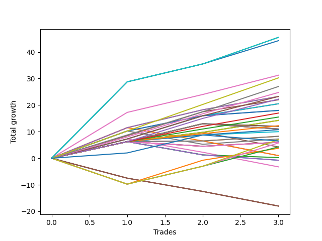

# Long Pointer 102 DB 
- Symbol: ES
- Date Range: 03/18/2022 - 12/30/2022
- Trading Period: 8:30-12:30
- Number of Trades: 3



| Name | Win Percent | Profit | Avg Profit / Trade | Avg Time / Trade |      | Name | Win Percent | Profit | Avg Profit / Trade | Avg Time / Trade |
| ---- | ----------- | ------ | ------------------ | ---------------- | ---- | ---- | ----------- | ------ | ------------------ | ---------------- |
| Sorted By <br> Profit | | | | | | Sorted By <br> Win Percentage ||||
| NEWFI 000 | 100.00 | 22750.00 | 7583.33 | 50:16 |     | NEWFI 000 | 100.00 | 22750.00 | 7583.33 | 50:16 |
| BB-200 U/L 2SD | 100.00 | 22750.00 | 7583.33 | 50:16 |     | BB-200 U/L 2SD | 100.00 | 22750.00 | 7583.33 | 50:16 |
| BB-100 U/L 2SD | 100.00 | 22125.00 | 7375.00 | 50:10 |     | BB-100 U/L 2SD | 100.00 | 22125.00 | 7375.00 | 50:10 |
| BB-50 U/L 2SD | 100.00 | 15625.00 | 5208.33 | 32:23 |     | BB-50 U/L 2SD | 100.00 | 15625.00 | 5208.33 | 32:23 |
| TP-10 | 100.00 | 15125.00 | 5041.67 | 28:31 |     | TP-10 | 100.00 | 15125.00 | 5041.67 | 28:31 |
| TP-9 | 100.00 | 13500.00 | 4500.00 | 27:35 |     | TP-9 | 100.00 | 13500.00 | 4500.00 | 27:35 |
| TP-8 | 100.00 | 12375.00 | 4125.00 | 26:46 |     | TP-8 | 100.00 | 12375.00 | 4125.00 | 26:46 |
| TP-7 | 100.00 | 11625.00 | 3875.00 | 19:01 |     | TP-7 | 100.00 | 11625.00 | 3875.00 | 19:01 |
| V U/L 1SD SL-10 | 100.00 | 11625.00 | 3875.00 | 22:53 |     | V U/L 1SD SL-10 | 100.00 | 11625.00 | 3875.00 | 22:53 |
| V U/L 1SD | 100.00 | 11625.00 | 3875.00 | 22:53 |     | V U/L 1SD | 100.00 | 11625.00 | 3875.00 | 22:53 |
| TP-6 | 100.00 | 11125.00 | 3708.33 | 18:45 |     | TP-6 | 100.00 | 11125.00 | 3708.33 | 18:45 |
| BB-50 U/L 1SD | 100.00 | 11000.00 | 3666.67 | 23:15 |     | BB-50 U/L 1SD | 100.00 | 11000.00 | 3666.67 | 23:15 |
| BB-20 U/L 2SD C SL-10 | 100.00 | 10250.00 | 3416.67 | 16:25 |     | BB-20 U/L 2SD C SL-10 | 100.00 | 10250.00 | 3416.67 | 16:25 |
| BB-20 U/L 2SD C | 100.00 | 10250.00 | 3416.67 | 16:25 |     | BB-20 U/L 2SD C | 100.00 | 10250.00 | 3416.67 | 16:25 |
| BB-50 Mid SL-10 | 100.00 | 9000.00 | 3000.00 | 08:41 |     | BB-50 Mid SL-10 | 100.00 | 9000.00 | 3000.00 | 08:41 |
| BB-50 Mid | 100.00 | 9000.00 | 3000.00 | 08:41 |     | BB-50 Mid | 100.00 | 9000.00 | 3000.00 | 08:41 |
| TP-5 | 100.00 | 8500.00 | 2833.33 | 18:35 |     | TP-5 | 100.00 | 8500.00 | 2833.33 | 18:35 |
| TP-4 | 100.00 | 7750.00 | 2583.33 | 11:21 |     | TP-4 | 100.00 | 7750.00 | 2583.33 | 11:21 |
| BB-20 U/L 2SD SL-10 | 100.00 | 7125.00 | 2375.00 | 11:20 |     | BB-20 U/L 2SD SL-10 | 100.00 | 7125.00 | 2375.00 | 11:20 |
| BB-20 U/L 2SD | 100.00 | 7125.00 | 2375.00 | 11:20 |     | BB-20 U/L 2SD | 100.00 | 7125.00 | 2375.00 | 11:20 |
| TP-3 | 100.00 | 6125.00 | 2041.67 | 03:38 |     | TP-3 | 100.00 | 6125.00 | 2041.67 | 03:38 |
| BB-100 Mid SL-10 | 66.67 | 6000.00 | 2000.00 | 10:31 |     | TP-2 | 100.00 | 5375.00 | 1791.67 | 03:00 |
| BB-100 Mid | 66.67 | 6000.00 | 2000.00 | 10:31 |     | TP-1 | 100.00 | 5000.00 | 1666.67 | 02:53 |
| BB-200 Mid SL-10 | 66.67 | 5500.00 | 1833.33 | 10:26 |     | BB-20 U/L 1SD SL-10 | 100.00 | 4125.00 | 1375.00 | 07:10 |
| V Mid SL-10 | 66.67 | 5500.00 | 1833.33 | 10:26 |     | BB-20 U/L 1SD | 100.00 | 4125.00 | 1375.00 | 07:10 |
| BB-200 Mid | 66.67 | 5500.00 | 1833.33 | 10:26 |     | BB-100 Mid SL-10 | 66.67 | 6000.00 | 2000.00 | 10:31 |
| V Mid | 66.67 | 5500.00 | 1833.33 | 10:26 |     | BB-100 Mid | 66.67 | 6000.00 | 2000.00 | 10:31 |
| TP-2 | 100.00 | 5375.00 | 1791.67 | 03:00 |     | BB-200 Mid SL-10 | 66.67 | 5500.00 | 1833.33 | 10:26 |
| TP-1 | 100.00 | 5000.00 | 1666.67 | 02:53 |     | V Mid SL-10 | 66.67 | 5500.00 | 1833.33 | 10:26 |
| BB-20 U/L 1SD SL-10 | 100.00 | 4125.00 | 1375.00 | 07:10 |     | BB-200 Mid | 66.67 | 5500.00 | 1833.33 | 10:26 |
| BB-20 U/L 1SD | 100.00 | 4125.00 | 1375.00 | 07:10 |     | V Mid | 66.67 | 5500.00 | 1833.33 | 10:26 |
| BB-50 Mid SL-5 | 66.67 | 3625.00 | 1208.33 | 06:06 |     | BB-50 Mid SL-5 | 66.67 | 3625.00 | 1208.33 | 06:06 |
| BB-200 U/L 2SD SL-10 | 66.67 | 3500.00 | 1166.67 | 34:03 |     | BB-200 U/L 2SD SL-10 | 66.67 | 3500.00 | 1166.67 | 34:03 |
| NEWFI 0000 | 66.67 | 3250.00 | 1083.33 | 20:43 |     | NEWFI 0000 | 66.67 | 3250.00 | 1083.33 | 20:43 |
| BB-20 Mid SL-10 | 66.67 | 3000.00 | 1000.00 | 02:11 |     | BB-20 Mid SL-10 | 66.67 | 3000.00 | 1000.00 | 02:11 |
| BB-20 Mid SL-5 | 66.67 | 3000.00 | 1000.00 | 02:11 |     | BB-20 Mid SL-5 | 66.67 | 3000.00 | 1000.00 | 02:11 |
| BB-20 Mid | 66.67 | 3000.00 | 1000.00 | 02:11 |     | BB-20 Mid | 66.67 | 3000.00 | 1000.00 | 02:11 |
| BB-100 U/L 2SD SL-10 | 66.67 | 2875.00 | 958.33 | 33:56 |     | BB-100 U/L 2SD SL-10 | 66.67 | 2875.00 | 958.33 | 33:56 |
| BB-50 U/L 2SD SL-10 | 66.67 | 2125.00 | 708.33 | 25:46 |     | BB-50 U/L 2SD SL-10 | 66.67 | 2125.00 | 708.33 | 25:46 |
| BB-20 U/L 2SD SL-5 | 66.67 | 2125.00 | 708.33 | 06:36 |     | BB-20 U/L 2SD SL-5 | 66.67 | 2125.00 | 708.33 | 06:36 |
| BB-50 U/L 1SD SL-10 | 66.67 | 1875.00 | 625.00 | 20:38 |     | BB-50 U/L 1SD SL-10 | 66.67 | 1875.00 | 625.00 | 20:38 |
| BB-20 U/L 1SD SL-5 | 66.67 | 500.00 | 166.67 | 05:58 |     | BB-20 U/L 1SD SL-5 | 66.67 | 500.00 | 166.67 | 05:58 |
| V U/L 1SD SL-5 | 33.33 | 500.00 | 166.67 | 09:31 |     | V U/L 1SD SL-5 | 33.33 | 500.00 | 166.67 | 09:31 |
| BB-100 Mid SL-5 | 33.33 | 125.00 | 41.67 | 04:28 |     | BB-100 Mid SL-5 | 33.33 | 125.00 | 41.67 | 04:28 |
| BB-200 Mid SL-5 | 33.33 | -375.00 | -125.00 | 04:23 |     | BB-200 Mid SL-5 | 33.33 | -375.00 | -125.00 | 04:23 |
| V Mid SL-5 | 33.33 | -375.00 | -125.00 | 04:23 |     | V Mid SL-5 | 33.33 | -375.00 | -125.00 | 04:23 |
| BB-20 U/L 2SD C SL-5 | 33.33 | -1625.00 | -541.67 | 08:58 |     | BB-20 U/L 2SD C SL-5 | 33.33 | -1625.00 | -541.67 | 08:58 |
| BB-200 U/L 2SD SL-5 | 0.00 | -9000.00 | -3000.00 | 11:43 |     | BB-200 U/L 2SD SL-5 | 0.00 | -9000.00 | -3000.00 | 11:43 |
| BB-100 U/L 2SD SL-5 | 0.00 | -9000.00 | -3000.00 | 11:43 |     | BB-100 U/L 2SD SL-5 | 0.00 | -9000.00 | -3000.00 | 11:43 |
| BB-50 U/L 2SD SL-5 | 0.00 | -9000.00 | -3000.00 | 11:43 |     | BB-50 U/L 2SD SL-5 | 0.00 | -9000.00 | -3000.00 | 11:43 |
| BB-50 U/L 1SD SL-5 | 0.00 | -9000.00 | -3000.00 | 11:43 |     | BB-50 U/L 1SD SL-5 | 0.00 | -9000.00 | -3000.00 | 11:43 |

## NO STOPLOSS

### Test BB-20 Mid
* Sell when price hits the middle line of the 20p bollinger
* No Stoploss
* Results:
```
Total Trades: 3
Percent Up: 66.67
Percent Down: 33.33
Total Points Moved Up: 6.00
Potential Profit: 3000.00
Total Points Ups: 7.75 Count Ups: 2
Total Points Downs: -1.75 Count Downs: 1
```

<details><summary>Trades</summary>

<code>In: 2022-05-06 09:03:00		Out: 2022-05-06 09:04:10		Total Position Time: 01:10		Total Move Up: 6.25		Total to Date: 6.25</code> <br />
<code>In: 2022-10-11 12:18:00		Out: 2022-10-11 12:19:10		Total Position Time: 01:10		Total Move Up: -1.75		Total to Date: 4.50</code> <br />
<code>In: 2022-10-17 09:48:00		Out: 2022-10-17 09:52:15		Total Position Time: 04:15		Total Move Up: 1.50		Total to Date: 6.00</code> <br />


</details>

### Test BB-20 U/L 1SD
* Sell when the price hits the upper line of the 20p 1std bollinger
* No Stoploss
* Results:
```
Total Trades: 3
Percent Up: 100.00
Percent Down: 0.00
Total Points Moved Up: 8.25
Potential Profit: 4125.00
Total Points Ups: 8.25 Count Ups: 3
Total Points Downs: 0.00 Count Downs: 0
```

<details><summary>Trades</summary>

<code>In: 2022-05-06 09:03:00		Out: 2022-05-06 09:04:10		Total Position Time: 01:10		Total Move Up: 6.25		Total to Date: 6.25</code> <br />
<code>In: 2022-10-11 12:18:00		Out: 2022-10-11 12:20:40		Total Position Time: 02:40		Total Move Up: 0.25		Total to Date: 6.50</code> <br />
<code>In: 2022-10-17 09:48:00		Out: 2022-10-17 10:05:40		Total Position Time: 17:40		Total Move Up: 1.75		Total to Date: 8.25</code> <br />


</details>

### Test BB-20 U/L 2SD
* Sell when the price hits the upper line of the 20p 2std bollinger
* No Stoploss
* Results:
```
Total Trades: 3
Percent Up: 100.00
Percent Down: 0.00
Total Points Moved Up: 14.25
Potential Profit: 7125.00
Total Points Ups: 14.25 Count Ups: 3
Total Points Downs: 0.00 Count Downs: 0
```

<details><summary>Trades</summary>

<code>In: 2022-05-06 09:03:00		Out: 2022-05-06 09:04:10		Total Position Time: 01:10		Total Move Up: 6.25		Total to Date: 6.25</code> <br />
<code>In: 2022-10-11 12:18:00		Out: 2022-10-11 12:22:35		Total Position Time: 04:35		Total Move Up: 3.50		Total to Date: 9.75</code> <br />
<code>In: 2022-10-17 09:48:00		Out: 2022-10-17 10:16:15		Total Position Time: 28:15		Total Move Up: 4.50		Total to Date: 14.25</code> <br />


</details>

### Test BB-20 U/L 2SD C
* Sell when the price hits the upper line of the 20p 2std bollinger
* No Stoploss
* Results:
```
Total Trades: 3
Percent Up: 100.00
Percent Down: 0.00
Total Points Moved Up: 20.50
Potential Profit: 10250.00
Total Points Ups: 20.50 Count Ups: 3
Total Points Downs: 0.00 Count Downs: 0
```

<details><summary>Trades</summary>

<code>In: 2022-05-06 09:03:00		Out: 2022-05-06 09:05:00		Total Position Time: 02:00		Total Move Up: 7.25		Total to Date: 7.25</code> <br />
<code>In: 2022-10-11 12:18:00		Out: 2022-10-11 12:37:00		Total Position Time: 19:00		Total Move Up: 8.75		Total to Date: 16.00</code> <br />
<code>In: 2022-10-17 09:48:00		Out: 2022-10-17 10:16:15		Total Position Time: 28:15		Total Move Up: 4.50		Total to Date: 20.50</code> <br />


</details>

### Test BB-50 Mid
* Sell when price hits the middle line of the 50p bollinger
* No Stoploss
* Results:
```
Total Trades: 3
Percent Up: 100.00
Percent Down: 0.00
Total Points Moved Up: 18.00
Potential Profit: 9000.00
Total Points Ups: 18.00 Count Ups: 3
Total Points Downs: 0.00 Count Downs: 0
```

<details><summary>Trades</summary>

<code>In: 2022-05-06 09:03:00		Out: 2022-05-06 09:06:05		Total Position Time: 03:05		Total Move Up: 10.25		Total to Date: 10.25</code> <br />
<code>In: 2022-10-11 12:18:00		Out: 2022-10-11 12:36:35		Total Position Time: 18:35		Total Move Up: 5.75		Total to Date: 16.00</code> <br />
<code>In: 2022-10-17 09:48:00		Out: 2022-10-17 09:52:25		Total Position Time: 04:25		Total Move Up: 2.00		Total to Date: 18.00</code> <br />


</details>

### Test BB-50 U/L 1SD
* Sell when the price hits the upper line of the 50p 1std bollinger
* No Stoploss
* Results:
```
Total Trades: 3
Percent Up: 100.00
Percent Down: 0.00
Total Points Moved Up: 22.00
Potential Profit: 11000.00
Total Points Ups: 22.00 Count Ups: 3
Total Points Downs: 0.00 Count Downs: 0
```

<details><summary>Trades</summary>

<code>In: 2022-05-06 09:03:00		Out: 2022-05-06 09:23:05		Total Position Time: 20:05		Total Move Up: 8.50		Total to Date: 8.50</code> <br />
<code>In: 2022-10-11 12:18:00		Out: 2022-10-11 12:39:25		Total Position Time: 21:25		Total Move Up: 9.00		Total to Date: 17.50</code> <br />
<code>In: 2022-10-17 09:48:00		Out: 2022-10-17 10:16:15		Total Position Time: 28:15		Total Move Up: 4.50		Total to Date: 22.00</code> <br />


</details>

### Test BB-50 U/L 2SD
* Sell when the price hits the upper line of the 50p 2std bollinger
* No Stoploss
* Results:
```
Total Trades: 3
Percent Up: 100.00
Percent Down: 0.00
Total Points Moved Up: 31.25
Potential Profit: 15625.00
Total Points Ups: 31.25 Count Ups: 3
Total Points Downs: 0.00 Count Downs: 0
```

<details><summary>Trades</summary>

<code>In: 2022-05-06 09:03:00		Out: 2022-05-06 09:35:05		Total Position Time: 32:05		Total Move Up: 17.25		Total to Date: 17.25</code> <br />
<code>In: 2022-10-11 12:18:00		Out: 2022-10-11 12:47:00		Total Position Time: 29:00		Total Move Up: 6.75		Total to Date: 24.00</code> <br />
<code>In: 2022-10-17 09:48:00		Out: 2022-10-17 10:24:05		Total Position Time: 36:05		Total Move Up: 7.25		Total to Date: 31.25</code> <br />


</details>

### Test V Mid
* Sell when the price hits the middle line of the 1std VWAP
* No Stoploss
* Results:
```
Total Trades: 3
Percent Up: 66.67
Percent Down: 33.33
Total Points Moved Up: 11.00
Potential Profit: 5500.00
Total Points Ups: 13.00 Count Ups: 2
Total Points Downs: -2.00 Count Downs: 1
```

<details><summary>Trades</summary>

<code>In: 2022-05-06 09:03:00		Out: 2022-05-06 09:04:10		Total Position Time: 01:10		Total Move Up: 6.25		Total to Date: 6.25</code> <br />
<code>In: 2022-10-11 12:18:00		Out: 2022-10-11 12:47:00		Total Position Time: 29:00		Total Move Up: 6.75		Total to Date: 13.00</code> <br />
<code>In: 2022-10-17 09:48:00		Out: 2022-10-17 09:49:10		Total Position Time: 01:10		Total Move Up: -2.00		Total to Date: 11.00</code> <br />


</details>

### Test V U/L 1SD
* Sell when the price hits the upper line of the 1std VWAP
* No Stoploss
* Results:
```
Total Trades: 3
Percent Up: 100.00
Percent Down: 0.00
Total Points Moved Up: 23.25
Potential Profit: 11625.00
Total Points Ups: 23.25 Count Ups: 3
Total Points Downs: 0.00 Count Downs: 0
```

<details><summary>Trades</summary>

<code>In: 2022-05-06 09:03:00		Out: 2022-05-06 09:06:40		Total Position Time: 03:40		Total Move Up: 11.50		Total to Date: 11.50</code> <br />
<code>In: 2022-10-11 12:18:00		Out: 2022-10-11 12:47:00		Total Position Time: 29:00		Total Move Up: 6.75		Total to Date: 18.25</code> <br />
<code>In: 2022-10-17 09:48:00		Out: 2022-10-17 10:24:00		Total Position Time: 36:00		Total Move Up: 5.00		Total to Date: 23.25</code> <br />


</details>

### Test BB-100 Mid
* Move to BB100 Mid
* No Stoploss
* Results:
```
Total Trades: 3
Percent Up: 66.67
Percent Down: 33.33
Total Points Moved Up: 12.00
Potential Profit: 6000.00
Total Points Ups: 13.00 Count Ups: 2
Total Points Downs: -1.00 Count Downs: 1
```

<details><summary>Trades</summary>

<code>In: 2022-05-06 09:03:00		Out: 2022-05-06 09:04:10		Total Position Time: 01:10		Total Move Up: 6.25		Total to Date: 6.25</code> <br />
<code>In: 2022-10-11 12:18:00		Out: 2022-10-11 12:47:00		Total Position Time: 29:00		Total Move Up: 6.75		Total to Date: 13.00</code> <br />
<code>In: 2022-10-17 09:48:00		Out: 2022-10-17 09:49:25		Total Position Time: 01:25		Total Move Up: -1.00		Total to Date: 12.00</code> <br />


</details>

### Test BB-100 U/L 2SD
* Move to BB100 Upper Band
* No Stoploss
* Results:
```
Total Trades: 3
Percent Up: 100.00
Percent Down: 0.00
Total Points Moved Up: 44.25
Potential Profit: 22125.00
Total Points Ups: 44.25 Count Ups: 3
Total Points Downs: 0.00 Count Downs: 0
```

<details><summary>Trades</summary>

<code>In: 2022-05-06 09:03:00		Out: 2022-05-06 10:03:55		Total Position Time: 60:55		Total Move Up: 28.75		Total to Date: 28.75</code> <br />
<code>In: 2022-10-11 12:18:00		Out: 2022-10-11 12:47:00		Total Position Time: 29:00		Total Move Up: 6.75		Total to Date: 35.50</code> <br />
<code>In: 2022-10-17 09:48:00		Out: 2022-10-17 10:48:35		Total Position Time: 60:35		Total Move Up: 8.75		Total to Date: 44.25</code> <br />


</details>

### Test BB-200 Mid
* Move to BB200 Mid
* No Stoploss
* Results:
```
Total Trades: 3
Percent Up: 66.67
Percent Down: 33.33
Total Points Moved Up: 11.00
Potential Profit: 5500.00
Total Points Ups: 13.00 Count Ups: 2
Total Points Downs: -2.00 Count Downs: 1
```

<details><summary>Trades</summary>

<code>In: 2022-05-06 09:03:00		Out: 2022-05-06 09:04:10		Total Position Time: 01:10		Total Move Up: 6.25		Total to Date: 6.25</code> <br />
<code>In: 2022-10-11 12:18:00		Out: 2022-10-11 12:47:00		Total Position Time: 29:00		Total Move Up: 6.75		Total to Date: 13.00</code> <br />
<code>In: 2022-10-17 09:48:00		Out: 2022-10-17 09:49:10		Total Position Time: 01:10		Total Move Up: -2.00		Total to Date: 11.00</code> <br />


</details>

### Test BB-200 U/L 2SD
* Move to BB200 Upper Band
* No Stoploss
* Results:
```
Total Trades: 3
Percent Up: 100.00
Percent Down: 0.00
Total Points Moved Up: 45.50
Potential Profit: 22750.00
Total Points Ups: 45.50 Count Ups: 3
Total Points Downs: 0.00 Count Downs: 0
```

<details><summary>Trades</summary>

<code>In: 2022-05-06 09:03:00		Out: 2022-05-06 10:03:55		Total Position Time: 60:55		Total Move Up: 28.75		Total to Date: 28.75</code> <br />
<code>In: 2022-10-11 12:18:00		Out: 2022-10-11 12:47:00		Total Position Time: 29:00		Total Move Up: 6.75		Total to Date: 35.50</code> <br />
<code>In: 2022-10-17 09:48:00		Out: 2022-10-17 10:48:55		Total Position Time: 60:55		Total Move Up: 10.00		Total to Date: 45.50</code> <br />


</details>

## STOPLOSS OF 5

### Test BB-20 Mid SL-5
* Sell when price hits the middle line of the 20p bollinger
* Stoploss is 5 points
* Results:
```
Total Trades: 3
Percent Up: 66.67
Percent Down: 33.33
Total Points Moved Up: 6.00
Potential Profit: 3000.00
Total Points Ups: 7.75 Count Ups: 2
Total Points Downs: -1.75 Count Downs: 1
```

<details><summary>Trades</summary>

<code>In: 2022-05-06 09:03:00		Out: 2022-05-06 09:04:10		Total Position Time: 01:10		Total Move Up: 6.25		Total to Date: 6.25</code> <br />
<code>In: 2022-10-11 12:18:00		Out: 2022-10-11 12:19:10		Total Position Time: 01:10		Total Move Up: -1.75		Total to Date: 4.50</code> <br />
<code>In: 2022-10-17 09:48:00		Out: 2022-10-17 09:52:15		Total Position Time: 04:15		Total Move Up: 1.50		Total to Date: 6.00</code> <br />


</details>

### Test BB-20 U/L 1SD SL-5
* Sell when the price hits the upper line of the 20p 1std bollinger
* Stoploss is 5 points
* Results:
```
Total Trades: 3
Percent Up: 66.67
Percent Down: 33.33
Total Points Moved Up: 1.00
Potential Profit: 500.00
Total Points Ups: 6.50 Count Ups: 2
Total Points Downs: -5.50 Count Downs: 1
```

<details><summary>Trades</summary>

<code>In: 2022-05-06 09:03:00		Out: 2022-05-06 09:04:10		Total Position Time: 01:10		Total Move Up: 6.25		Total to Date: 6.25</code> <br />
<code>In: 2022-10-11 12:18:00		Out: 2022-10-11 12:20:40		Total Position Time: 02:40		Total Move Up: 0.25		Total to Date: 6.50</code> <br />
<code>In: 2022-10-17 09:48:00		Out: 2022-10-17 10:02:05		Total Position Time: 14:05		Total Move Up: -5.50		Total to Date: 1.00</code> <br />


</details>

### Test BB-20 U/L 2SD SL-5
* Sell when the price hits the upper line of the 20p 2std bollinger
* Stoploss is 5 points
* Results:
```
Total Trades: 3
Percent Up: 66.67
Percent Down: 33.33
Total Points Moved Up: 4.25
Potential Profit: 2125.00
Total Points Ups: 9.75 Count Ups: 2
Total Points Downs: -5.50 Count Downs: 1
```

<details><summary>Trades</summary>

<code>In: 2022-05-06 09:03:00		Out: 2022-05-06 09:04:10		Total Position Time: 01:10		Total Move Up: 6.25		Total to Date: 6.25</code> <br />
<code>In: 2022-10-11 12:18:00		Out: 2022-10-11 12:22:35		Total Position Time: 04:35		Total Move Up: 3.50		Total to Date: 9.75</code> <br />
<code>In: 2022-10-17 09:48:00		Out: 2022-10-17 10:02:05		Total Position Time: 14:05		Total Move Up: -5.50		Total to Date: 4.25</code> <br />


</details>

### Test BB-20 U/L 2SD C SL-5
* Sell when the price hits the upper line of the 20p 2std bollinger
* Stoploss is 5 points
* Results:
```
Total Trades: 3
Percent Up: 33.33
Percent Down: 66.67
Total Points Moved Up: -3.25
Potential Profit: -1625.00
Total Points Ups: 7.25 Count Ups: 1
Total Points Downs: -10.50 Count Downs: 2
```

<details><summary>Trades</summary>

<code>In: 2022-05-06 09:03:00		Out: 2022-05-06 09:05:00		Total Position Time: 02:00		Total Move Up: 7.25		Total to Date: 7.25</code> <br />
<code>In: 2022-10-11 12:18:00		Out: 2022-10-11 12:28:50		Total Position Time: 10:50		Total Move Up: -5.00		Total to Date: 2.25</code> <br />
<code>In: 2022-10-17 09:48:00		Out: 2022-10-17 10:02:05		Total Position Time: 14:05		Total Move Up: -5.50		Total to Date: -3.25</code> <br />


</details>

### Test BB-50 Mid SL-5
* Sell when price hits the middle line of the 50p bollinger
* Stoploss is 5 points
* Results:
```
Total Trades: 3
Percent Up: 66.67
Percent Down: 33.33
Total Points Moved Up: 7.25
Potential Profit: 3625.00
Total Points Ups: 12.25 Count Ups: 2
Total Points Downs: -5.00 Count Downs: 1
```

<details><summary>Trades</summary>

<code>In: 2022-05-06 09:03:00		Out: 2022-05-06 09:06:05		Total Position Time: 03:05		Total Move Up: 10.25		Total to Date: 10.25</code> <br />
<code>In: 2022-10-11 12:18:00		Out: 2022-10-11 12:28:50		Total Position Time: 10:50		Total Move Up: -5.00		Total to Date: 5.25</code> <br />
<code>In: 2022-10-17 09:48:00		Out: 2022-10-17 09:52:25		Total Position Time: 04:25		Total Move Up: 2.00		Total to Date: 7.25</code> <br />


</details>

### Test BB-50 U/L 1SD SL-5
* Sell when the price hits the upper line of the 50p 1std bollinger
* Stoploss is 5 points
* Results:
```
Total Trades: 3
Percent Up: 0.00
Percent Down: 100.00
Total Points Moved Up: -18.00
Potential Profit: -9000.00
Total Points Ups: 0.00 Count Ups: 0
Total Points Downs: -18.00 Count Downs: 3
```

<details><summary>Trades</summary>

<code>In: 2022-05-06 09:03:00		Out: 2022-05-06 09:13:15		Total Position Time: 10:15		Total Move Up: -7.50		Total to Date: -7.50</code> <br />
<code>In: 2022-10-11 12:18:00		Out: 2022-10-11 12:28:50		Total Position Time: 10:50		Total Move Up: -5.00		Total to Date: -12.50</code> <br />
<code>In: 2022-10-17 09:48:00		Out: 2022-10-17 10:02:05		Total Position Time: 14:05		Total Move Up: -5.50		Total to Date: -18.00</code> <br />


</details>

### Test BB-50 U/L 2SD SL-5
* Sell when the price hits the upper line of the 50p 2std bollinger
* Stoploss is 5 points
* Results:
```
Total Trades: 3
Percent Up: 0.00
Percent Down: 100.00
Total Points Moved Up: -18.00
Potential Profit: -9000.00
Total Points Ups: 0.00 Count Ups: 0
Total Points Downs: -18.00 Count Downs: 3
```

<details><summary>Trades</summary>

<code>In: 2022-05-06 09:03:00		Out: 2022-05-06 09:13:15		Total Position Time: 10:15		Total Move Up: -7.50		Total to Date: -7.50</code> <br />
<code>In: 2022-10-11 12:18:00		Out: 2022-10-11 12:28:50		Total Position Time: 10:50		Total Move Up: -5.00		Total to Date: -12.50</code> <br />
<code>In: 2022-10-17 09:48:00		Out: 2022-10-17 10:02:05		Total Position Time: 14:05		Total Move Up: -5.50		Total to Date: -18.00</code> <br />


</details>

### Test V Mid SL-5
* Sell when the price hits the middle line of the 1std VWAP
* Stoploss is 5 points
* Results:
```
Total Trades: 3
Percent Up: 33.33
Percent Down: 66.67
Total Points Moved Up: -0.75
Potential Profit: -375.00
Total Points Ups: 6.25 Count Ups: 1
Total Points Downs: -7.00 Count Downs: 2
```

<details><summary>Trades</summary>

<code>In: 2022-05-06 09:03:00		Out: 2022-05-06 09:04:10		Total Position Time: 01:10		Total Move Up: 6.25		Total to Date: 6.25</code> <br />
<code>In: 2022-10-11 12:18:00		Out: 2022-10-11 12:28:50		Total Position Time: 10:50		Total Move Up: -5.00		Total to Date: 1.25</code> <br />
<code>In: 2022-10-17 09:48:00		Out: 2022-10-17 09:49:10		Total Position Time: 01:10		Total Move Up: -2.00		Total to Date: -0.75</code> <br />


</details>

### Test V U/L 1SD SL-5
* Sell when the price hits the upper line of the 1std VWAP
* Stoploss is 5 points
* Results:
```
Total Trades: 3
Percent Up: 33.33
Percent Down: 66.67
Total Points Moved Up: 1.00
Potential Profit: 500.00
Total Points Ups: 11.50 Count Ups: 1
Total Points Downs: -10.50 Count Downs: 2
```

<details><summary>Trades</summary>

<code>In: 2022-05-06 09:03:00		Out: 2022-05-06 09:06:40		Total Position Time: 03:40		Total Move Up: 11.50		Total to Date: 11.50</code> <br />
<code>In: 2022-10-11 12:18:00		Out: 2022-10-11 12:28:50		Total Position Time: 10:50		Total Move Up: -5.00		Total to Date: 6.50</code> <br />
<code>In: 2022-10-17 09:48:00		Out: 2022-10-17 10:02:05		Total Position Time: 14:05		Total Move Up: -5.50		Total to Date: 1.00</code> <br />


</details>

### Test BB-100 Mid SL-5
* Move to BB100 Mid
* Stoploss is 5 points
* Results:
```
Total Trades: 3
Percent Up: 33.33
Percent Down: 66.67
Total Points Moved Up: 0.25
Potential Profit: 125.00
Total Points Ups: 6.25 Count Ups: 1
Total Points Downs: -6.00 Count Downs: 2
```

<details><summary>Trades</summary>

<code>In: 2022-05-06 09:03:00		Out: 2022-05-06 09:04:10		Total Position Time: 01:10		Total Move Up: 6.25		Total to Date: 6.25</code> <br />
<code>In: 2022-10-11 12:18:00		Out: 2022-10-11 12:28:50		Total Position Time: 10:50		Total Move Up: -5.00		Total to Date: 1.25</code> <br />
<code>In: 2022-10-17 09:48:00		Out: 2022-10-17 09:49:25		Total Position Time: 01:25		Total Move Up: -1.00		Total to Date: 0.25</code> <br />


</details>

### Test BB-100 U/L 2SD SL-5
* Move to BB100 Upper Band
* Stoploss is 5 points
* Results:
```
Total Trades: 3
Percent Up: 0.00
Percent Down: 100.00
Total Points Moved Up: -18.00
Potential Profit: -9000.00
Total Points Ups: 0.00 Count Ups: 0
Total Points Downs: -18.00 Count Downs: 3
```

<details><summary>Trades</summary>

<code>In: 2022-05-06 09:03:00		Out: 2022-05-06 09:13:15		Total Position Time: 10:15		Total Move Up: -7.50		Total to Date: -7.50</code> <br />
<code>In: 2022-10-11 12:18:00		Out: 2022-10-11 12:28:50		Total Position Time: 10:50		Total Move Up: -5.00		Total to Date: -12.50</code> <br />
<code>In: 2022-10-17 09:48:00		Out: 2022-10-17 10:02:05		Total Position Time: 14:05		Total Move Up: -5.50		Total to Date: -18.00</code> <br />


</details>

### Test BB-200 Mid SL-5
* Move to BB200 Mid
* Stoploss is 5 points
* Results:
```
Total Trades: 3
Percent Up: 33.33
Percent Down: 66.67
Total Points Moved Up: -0.75
Potential Profit: -375.00
Total Points Ups: 6.25 Count Ups: 1
Total Points Downs: -7.00 Count Downs: 2
```

<details><summary>Trades</summary>

<code>In: 2022-05-06 09:03:00		Out: 2022-05-06 09:04:10		Total Position Time: 01:10		Total Move Up: 6.25		Total to Date: 6.25</code> <br />
<code>In: 2022-10-11 12:18:00		Out: 2022-10-11 12:28:50		Total Position Time: 10:50		Total Move Up: -5.00		Total to Date: 1.25</code> <br />
<code>In: 2022-10-17 09:48:00		Out: 2022-10-17 09:49:10		Total Position Time: 01:10		Total Move Up: -2.00		Total to Date: -0.75</code> <br />


</details>

### Test BB-200 U/L 2SD SL-5
* Move to BB200 Upper Band
* Stoploss is 5 points
* Results:
```
Total Trades: 3
Percent Up: 0.00
Percent Down: 100.00
Total Points Moved Up: -18.00
Potential Profit: -9000.00
Total Points Ups: 0.00 Count Ups: 0
Total Points Downs: -18.00 Count Downs: 3
```

<details><summary>Trades</summary>

<code>In: 2022-05-06 09:03:00		Out: 2022-05-06 09:13:15		Total Position Time: 10:15		Total Move Up: -7.50		Total to Date: -7.50</code> <br />
<code>In: 2022-10-11 12:18:00		Out: 2022-10-11 12:28:50		Total Position Time: 10:50		Total Move Up: -5.00		Total to Date: -12.50</code> <br />
<code>In: 2022-10-17 09:48:00		Out: 2022-10-17 10:02:05		Total Position Time: 14:05		Total Move Up: -5.50		Total to Date: -18.00</code> <br />


</details>

## STOPLOSS OF 10

### Test BB-20 Mid SL-10
* Sell when price hits the middle line of the 20p bollinger
* Stoploss is 10 points
* Results:
```
Total Trades: 3
Percent Up: 66.67
Percent Down: 33.33
Total Points Moved Up: 6.00
Potential Profit: 3000.00
Total Points Ups: 7.75 Count Ups: 2
Total Points Downs: -1.75 Count Downs: 1
```

<details><summary>Trades</summary>

<code>In: 2022-05-06 09:03:00		Out: 2022-05-06 09:04:10		Total Position Time: 01:10		Total Move Up: 6.25		Total to Date: 6.25</code> <br />
<code>In: 2022-10-11 12:18:00		Out: 2022-10-11 12:19:10		Total Position Time: 01:10		Total Move Up: -1.75		Total to Date: 4.50</code> <br />
<code>In: 2022-10-17 09:48:00		Out: 2022-10-17 09:52:15		Total Position Time: 04:15		Total Move Up: 1.50		Total to Date: 6.00</code> <br />


</details>

### Test BB-20 U/L 1SD SL-10
* Sell when the price hits the upper line of the 20p 1std bollinger
* Stoploss is 10 points
* Results:
```
Total Trades: 3
Percent Up: 100.00
Percent Down: 0.00
Total Points Moved Up: 8.25
Potential Profit: 4125.00
Total Points Ups: 8.25 Count Ups: 3
Total Points Downs: 0.00 Count Downs: 0
```

<details><summary>Trades</summary>

<code>In: 2022-05-06 09:03:00		Out: 2022-05-06 09:04:10		Total Position Time: 01:10		Total Move Up: 6.25		Total to Date: 6.25</code> <br />
<code>In: 2022-10-11 12:18:00		Out: 2022-10-11 12:20:40		Total Position Time: 02:40		Total Move Up: 0.25		Total to Date: 6.50</code> <br />
<code>In: 2022-10-17 09:48:00		Out: 2022-10-17 10:05:40		Total Position Time: 17:40		Total Move Up: 1.75		Total to Date: 8.25</code> <br />


</details>

### Test BB-20 U/L 2SD SL-10
* Sell when the price hits the upper line of the 20p 2std bollinger
* Stoploss is 10 points
* Results:
```
Total Trades: 3
Percent Up: 100.00
Percent Down: 0.00
Total Points Moved Up: 14.25
Potential Profit: 7125.00
Total Points Ups: 14.25 Count Ups: 3
Total Points Downs: 0.00 Count Downs: 0
```

<details><summary>Trades</summary>

<code>In: 2022-05-06 09:03:00		Out: 2022-05-06 09:04:10		Total Position Time: 01:10		Total Move Up: 6.25		Total to Date: 6.25</code> <br />
<code>In: 2022-10-11 12:18:00		Out: 2022-10-11 12:22:35		Total Position Time: 04:35		Total Move Up: 3.50		Total to Date: 9.75</code> <br />
<code>In: 2022-10-17 09:48:00		Out: 2022-10-17 10:16:15		Total Position Time: 28:15		Total Move Up: 4.50		Total to Date: 14.25</code> <br />


</details>

### Test BB-20 U/L 2SD C SL-10
* Sell when the price hits the upper line of the 20p 2std bollinger
* Stoploss is 10 points
* Results:
```
Total Trades: 3
Percent Up: 100.00
Percent Down: 0.00
Total Points Moved Up: 20.50
Potential Profit: 10250.00
Total Points Ups: 20.50 Count Ups: 3
Total Points Downs: 0.00 Count Downs: 0
```

<details><summary>Trades</summary>

<code>In: 2022-05-06 09:03:00		Out: 2022-05-06 09:05:00		Total Position Time: 02:00		Total Move Up: 7.25		Total to Date: 7.25</code> <br />
<code>In: 2022-10-11 12:18:00		Out: 2022-10-11 12:37:00		Total Position Time: 19:00		Total Move Up: 8.75		Total to Date: 16.00</code> <br />
<code>In: 2022-10-17 09:48:00		Out: 2022-10-17 10:16:15		Total Position Time: 28:15		Total Move Up: 4.50		Total to Date: 20.50</code> <br />


</details>

### Test BB-50 Mid SL-10
* Sell when price hits the middle line of the 50p bollinger
* Stoploss is 10 points
* Results:
```
Total Trades: 3
Percent Up: 100.00
Percent Down: 0.00
Total Points Moved Up: 18.00
Potential Profit: 9000.00
Total Points Ups: 18.00 Count Ups: 3
Total Points Downs: 0.00 Count Downs: 0
```

<details><summary>Trades</summary>

<code>In: 2022-05-06 09:03:00		Out: 2022-05-06 09:06:05		Total Position Time: 03:05		Total Move Up: 10.25		Total to Date: 10.25</code> <br />
<code>In: 2022-10-11 12:18:00		Out: 2022-10-11 12:36:35		Total Position Time: 18:35		Total Move Up: 5.75		Total to Date: 16.00</code> <br />
<code>In: 2022-10-17 09:48:00		Out: 2022-10-17 09:52:25		Total Position Time: 04:25		Total Move Up: 2.00		Total to Date: 18.00</code> <br />


</details>

### Test BB-50 U/L 1SD SL-10
* Sell when the price hits the upper line of the 50p 1std bollinger
* Stoploss is 10 points
* Results:
```
Total Trades: 3
Percent Up: 66.67
Percent Down: 33.33
Total Points Moved Up: 3.75
Potential Profit: 1875.00
Total Points Ups: 13.50 Count Ups: 2
Total Points Downs: -9.75 Count Downs: 1
```

<details><summary>Trades</summary>

<code>In: 2022-05-06 09:03:00		Out: 2022-05-06 09:15:15		Total Position Time: 12:15		Total Move Up: -9.75		Total to Date: -9.75</code> <br />
<code>In: 2022-10-11 12:18:00		Out: 2022-10-11 12:39:25		Total Position Time: 21:25		Total Move Up: 9.00		Total to Date: -0.75</code> <br />
<code>In: 2022-10-17 09:48:00		Out: 2022-10-17 10:16:15		Total Position Time: 28:15		Total Move Up: 4.50		Total to Date: 3.75</code> <br />


</details>

### Test BB-50 U/L 2SD SL-10
* Sell when the price hits the upper line of the 50p 2std bollinger
* Stoploss is 10 points
* Results:
```
Total Trades: 3
Percent Up: 66.67
Percent Down: 33.33
Total Points Moved Up: 4.25
Potential Profit: 2125.00
Total Points Ups: 14.00 Count Ups: 2
Total Points Downs: -9.75 Count Downs: 1
```

<details><summary>Trades</summary>

<code>In: 2022-05-06 09:03:00		Out: 2022-05-06 09:15:15		Total Position Time: 12:15		Total Move Up: -9.75		Total to Date: -9.75</code> <br />
<code>In: 2022-10-11 12:18:00		Out: 2022-10-11 12:47:00		Total Position Time: 29:00		Total Move Up: 6.75		Total to Date: -3.00</code> <br />
<code>In: 2022-10-17 09:48:00		Out: 2022-10-17 10:24:05		Total Position Time: 36:05		Total Move Up: 7.25		Total to Date: 4.25</code> <br />


</details>

### Test V Mid SL-10
* Sell when the price hits the middle line of the 1std VWAP
* Stoploss is 10 points
* Results:
```
Total Trades: 3
Percent Up: 66.67
Percent Down: 33.33
Total Points Moved Up: 11.00
Potential Profit: 5500.00
Total Points Ups: 13.00 Count Ups: 2
Total Points Downs: -2.00 Count Downs: 1
```

<details><summary>Trades</summary>

<code>In: 2022-05-06 09:03:00		Out: 2022-05-06 09:04:10		Total Position Time: 01:10		Total Move Up: 6.25		Total to Date: 6.25</code> <br />
<code>In: 2022-10-11 12:18:00		Out: 2022-10-11 12:47:00		Total Position Time: 29:00		Total Move Up: 6.75		Total to Date: 13.00</code> <br />
<code>In: 2022-10-17 09:48:00		Out: 2022-10-17 09:49:10		Total Position Time: 01:10		Total Move Up: -2.00		Total to Date: 11.00</code> <br />


</details>

### Test V U/L 1SD SL-10
* Sell when the price hits the upper line of the 1std VWAP
* Stoploss is 10 points
* Results:
```
Total Trades: 3
Percent Up: 100.00
Percent Down: 0.00
Total Points Moved Up: 23.25
Potential Profit: 11625.00
Total Points Ups: 23.25 Count Ups: 3
Total Points Downs: 0.00 Count Downs: 0
```

<details><summary>Trades</summary>

<code>In: 2022-05-06 09:03:00		Out: 2022-05-06 09:06:40		Total Position Time: 03:40		Total Move Up: 11.50		Total to Date: 11.50</code> <br />
<code>In: 2022-10-11 12:18:00		Out: 2022-10-11 12:47:00		Total Position Time: 29:00		Total Move Up: 6.75		Total to Date: 18.25</code> <br />
<code>In: 2022-10-17 09:48:00		Out: 2022-10-17 10:24:00		Total Position Time: 36:00		Total Move Up: 5.00		Total to Date: 23.25</code> <br />


</details>

### Test BB-100 Mid SL-10
* Move to BB100 Mid
* Stoploss is 10 points
* Results:
```
Total Trades: 3
Percent Up: 66.67
Percent Down: 33.33
Total Points Moved Up: 12.00
Potential Profit: 6000.00
Total Points Ups: 13.00 Count Ups: 2
Total Points Downs: -1.00 Count Downs: 1
```

<details><summary>Trades</summary>

<code>In: 2022-05-06 09:03:00		Out: 2022-05-06 09:04:10		Total Position Time: 01:10		Total Move Up: 6.25		Total to Date: 6.25</code> <br />
<code>In: 2022-10-11 12:18:00		Out: 2022-10-11 12:47:00		Total Position Time: 29:00		Total Move Up: 6.75		Total to Date: 13.00</code> <br />
<code>In: 2022-10-17 09:48:00		Out: 2022-10-17 09:49:25		Total Position Time: 01:25		Total Move Up: -1.00		Total to Date: 12.00</code> <br />


</details>

### Test BB-100 U/L 2SD SL-10
* Move to BB100 Upper Band
* Stoploss is 10 points
* Results:
```
Total Trades: 3
Percent Up: 66.67
Percent Down: 33.33
Total Points Moved Up: 5.75
Potential Profit: 2875.00
Total Points Ups: 15.50 Count Ups: 2
Total Points Downs: -9.75 Count Downs: 1
```

<details><summary>Trades</summary>

<code>In: 2022-05-06 09:03:00		Out: 2022-05-06 09:15:15		Total Position Time: 12:15		Total Move Up: -9.75		Total to Date: -9.75</code> <br />
<code>In: 2022-10-11 12:18:00		Out: 2022-10-11 12:47:00		Total Position Time: 29:00		Total Move Up: 6.75		Total to Date: -3.00</code> <br />
<code>In: 2022-10-17 09:48:00		Out: 2022-10-17 10:48:35		Total Position Time: 60:35		Total Move Up: 8.75		Total to Date: 5.75</code> <br />


</details>

### Test BB-200 Mid SL-10
* Move to BB200 Mid
* Stoploss is 10 points
* Results:
```
Total Trades: 3
Percent Up: 66.67
Percent Down: 33.33
Total Points Moved Up: 11.00
Potential Profit: 5500.00
Total Points Ups: 13.00 Count Ups: 2
Total Points Downs: -2.00 Count Downs: 1
```

<details><summary>Trades</summary>

<code>In: 2022-05-06 09:03:00		Out: 2022-05-06 09:04:10		Total Position Time: 01:10		Total Move Up: 6.25		Total to Date: 6.25</code> <br />
<code>In: 2022-10-11 12:18:00		Out: 2022-10-11 12:47:00		Total Position Time: 29:00		Total Move Up: 6.75		Total to Date: 13.00</code> <br />
<code>In: 2022-10-17 09:48:00		Out: 2022-10-17 09:49:10		Total Position Time: 01:10		Total Move Up: -2.00		Total to Date: 11.00</code> <br />


</details>

### Test BB-200 U/L 2SD SL-10
* Move to BB200 Upper Band
* Stoploss is 10 points
* Results:
```
Total Trades: 3
Percent Up: 66.67
Percent Down: 33.33
Total Points Moved Up: 7.00
Potential Profit: 3500.00
Total Points Ups: 16.75 Count Ups: 2
Total Points Downs: -9.75 Count Downs: 1
```

<details><summary>Trades</summary>

<code>In: 2022-05-06 09:03:00		Out: 2022-05-06 09:15:15		Total Position Time: 12:15		Total Move Up: -9.75		Total to Date: -9.75</code> <br />
<code>In: 2022-10-11 12:18:00		Out: 2022-10-11 12:47:00		Total Position Time: 29:00		Total Move Up: 6.75		Total to Date: -3.00</code> <br />
<code>In: 2022-10-17 09:48:00		Out: 2022-10-17 10:48:55		Total Position Time: 60:55		Total Move Up: 10.00		Total to Date: 7.00</code> <br />


</details>

## TAKE PROFIT

### Test TP-1
* Take Profit of 1 Point
* No Stoploss
* Results:
```
Total Trades: 3
Percent Up: 100.00
Percent Down: 0.00
Total Points Moved Up: 10.00
Potential Profit: 5000.00
Total Points Ups: 10.00 Count Ups: 3
Total Points Downs: 0.00 Count Downs: 0
```

<details><summary>Trades</summary>

<code>In: 2022-05-06 09:03:00		Out: 2022-05-06 09:04:10		Total Position Time: 01:10		Total Move Up: 6.25		Total to Date: 6.25</code> <br />
<code>In: 2022-10-11 12:18:00		Out: 2022-10-11 12:21:25		Total Position Time: 03:25		Total Move Up: 2.50		Total to Date: 8.75</code> <br />
<code>In: 2022-10-17 09:48:00		Out: 2022-10-17 09:52:05		Total Position Time: 04:05		Total Move Up: 1.25		Total to Date: 10.00</code> <br />


</details>

### Test TP-2
* Take Profit of 2 Point
* No Stoploss
* Results:
```
Total Trades: 3
Percent Up: 100.00
Percent Down: 0.00
Total Points Moved Up: 10.75
Potential Profit: 5375.00
Total Points Ups: 10.75 Count Ups: 3
Total Points Downs: 0.00 Count Downs: 0
```

<details><summary>Trades</summary>

<code>In: 2022-05-06 09:03:00		Out: 2022-05-06 09:04:10		Total Position Time: 01:10		Total Move Up: 6.25		Total to Date: 6.25</code> <br />
<code>In: 2022-10-11 12:18:00		Out: 2022-10-11 12:21:25		Total Position Time: 03:25		Total Move Up: 2.50		Total to Date: 8.75</code> <br />
<code>In: 2022-10-17 09:48:00		Out: 2022-10-17 09:52:25		Total Position Time: 04:25		Total Move Up: 2.00		Total to Date: 10.75</code> <br />


</details>

### Test TP-3
* Take Profit of 3 Point
* No Stoploss
* Results:
```
Total Trades: 3
Percent Up: 100.00
Percent Down: 0.00
Total Points Moved Up: 12.25
Potential Profit: 6125.00
Total Points Ups: 12.25 Count Ups: 3
Total Points Downs: 0.00 Count Downs: 0
```

<details><summary>Trades</summary>

<code>In: 2022-05-06 09:03:00		Out: 2022-05-06 09:04:10		Total Position Time: 01:10		Total Move Up: 6.25		Total to Date: 6.25</code> <br />
<code>In: 2022-10-11 12:18:00		Out: 2022-10-11 12:21:30		Total Position Time: 03:30		Total Move Up: 3.00		Total to Date: 9.25</code> <br />
<code>In: 2022-10-17 09:48:00		Out: 2022-10-17 09:54:15		Total Position Time: 06:15		Total Move Up: 3.00		Total to Date: 12.25</code> <br />


</details>

### Test TP-4
* Take Profit of 4 Point
* No Stoploss
* Results:
```
Total Trades: 3
Percent Up: 100.00
Percent Down: 0.00
Total Points Moved Up: 15.50
Potential Profit: 7750.00
Total Points Ups: 15.50 Count Ups: 3
Total Points Downs: 0.00 Count Downs: 0
```

<details><summary>Trades</summary>

<code>In: 2022-05-06 09:03:00		Out: 2022-05-06 09:04:10		Total Position Time: 01:10		Total Move Up: 6.25		Total to Date: 6.25</code> <br />
<code>In: 2022-10-11 12:18:00		Out: 2022-10-11 12:22:40		Total Position Time: 04:40		Total Move Up: 4.75		Total to Date: 11.00</code> <br />
<code>In: 2022-10-17 09:48:00		Out: 2022-10-17 10:16:15		Total Position Time: 28:15		Total Move Up: 4.50		Total to Date: 15.50</code> <br />


</details>

### Test TP-5
* Take Profit of 5 Point
* No Stoploss
* Results:
```
Total Trades: 3
Percent Up: 100.00
Percent Down: 0.00
Total Points Moved Up: 17.00
Potential Profit: 8500.00
Total Points Ups: 17.00 Count Ups: 3
Total Points Downs: 0.00 Count Downs: 0
```

<details><summary>Trades</summary>

<code>In: 2022-05-06 09:03:00		Out: 2022-05-06 09:04:10		Total Position Time: 01:10		Total Move Up: 6.25		Total to Date: 6.25</code> <br />
<code>In: 2022-10-11 12:18:00		Out: 2022-10-11 12:36:35		Total Position Time: 18:35		Total Move Up: 5.75		Total to Date: 12.00</code> <br />
<code>In: 2022-10-17 09:48:00		Out: 2022-10-17 10:24:00		Total Position Time: 36:00		Total Move Up: 5.00		Total to Date: 17.00</code> <br />


</details>

### Test TP-6
* Take Profit of 6 Point
* No Stoploss
* Results:
```
Total Trades: 3
Percent Up: 100.00
Percent Down: 0.00
Total Points Moved Up: 22.25
Potential Profit: 11125.00
Total Points Ups: 22.25 Count Ups: 3
Total Points Downs: 0.00 Count Downs: 0
```

<details><summary>Trades</summary>

<code>In: 2022-05-06 09:03:00		Out: 2022-05-06 09:04:10		Total Position Time: 01:10		Total Move Up: 6.25		Total to Date: 6.25</code> <br />
<code>In: 2022-10-11 12:18:00		Out: 2022-10-11 12:37:00		Total Position Time: 19:00		Total Move Up: 8.75		Total to Date: 15.00</code> <br />
<code>In: 2022-10-17 09:48:00		Out: 2022-10-17 10:24:05		Total Position Time: 36:05		Total Move Up: 7.25		Total to Date: 22.25</code> <br />


</details>

### Test TP-7
* Take Profit of 7 Point
* No Stoploss
* Results:
```
Total Trades: 3
Percent Up: 100.00
Percent Down: 0.00
Total Points Moved Up: 23.25
Potential Profit: 11625.00
Total Points Ups: 23.25 Count Ups: 3
Total Points Downs: 0.00 Count Downs: 0
```

<details><summary>Trades</summary>

<code>In: 2022-05-06 09:03:00		Out: 2022-05-06 09:05:00		Total Position Time: 02:00		Total Move Up: 7.25		Total to Date: 7.25</code> <br />
<code>In: 2022-10-11 12:18:00		Out: 2022-10-11 12:37:00		Total Position Time: 19:00		Total Move Up: 8.75		Total to Date: 16.00</code> <br />
<code>In: 2022-10-17 09:48:00		Out: 2022-10-17 10:24:05		Total Position Time: 36:05		Total Move Up: 7.25		Total to Date: 23.25</code> <br />


</details>

### Test TP-8
* Take Profit of 8 Point
* No Stoploss
* Results:
```
Total Trades: 3
Percent Up: 100.00
Percent Down: 0.00
Total Points Moved Up: 24.75
Potential Profit: 12375.00
Total Points Ups: 24.75 Count Ups: 3
Total Points Downs: 0.00 Count Downs: 0
```

<details><summary>Trades</summary>

<code>In: 2022-05-06 09:03:00		Out: 2022-05-06 09:05:30		Total Position Time: 02:30		Total Move Up: 8.00		Total to Date: 8.00</code> <br />
<code>In: 2022-10-11 12:18:00		Out: 2022-10-11 12:37:00		Total Position Time: 19:00		Total Move Up: 8.75		Total to Date: 16.75</code> <br />
<code>In: 2022-10-17 09:48:00		Out: 2022-10-17 10:46:50		Total Position Time: 58:50		Total Move Up: 8.00		Total to Date: 24.75</code> <br />


</details>

### Test TP-9
* Take Profit of 9 Point
* No Stoploss
* Results:
```
Total Trades: 3
Percent Up: 100.00
Percent Down: 0.00
Total Points Moved Up: 27.00
Potential Profit: 13500.00
Total Points Ups: 27.00 Count Ups: 3
Total Points Downs: 0.00 Count Downs: 0
```

<details><summary>Trades</summary>

<code>In: 2022-05-06 09:03:00		Out: 2022-05-06 09:06:00		Total Position Time: 03:00		Total Move Up: 8.75		Total to Date: 8.75</code> <br />
<code>In: 2022-10-11 12:18:00		Out: 2022-10-11 12:37:00		Total Position Time: 19:00		Total Move Up: 8.75		Total to Date: 17.50</code> <br />
<code>In: 2022-10-17 09:48:00		Out: 2022-10-17 10:48:45		Total Position Time: 60:45		Total Move Up: 9.50		Total to Date: 27.00</code> <br />


</details>

### Test TP-10
* Take Profit of 10 Point
* No Stoploss
* Results:
```
Total Trades: 3
Percent Up: 100.00
Percent Down: 0.00
Total Points Moved Up: 30.25
Potential Profit: 15125.00
Total Points Ups: 30.25 Count Ups: 3
Total Points Downs: 0.00 Count Downs: 0
```

<details><summary>Trades</summary>

<code>In: 2022-05-06 09:03:00		Out: 2022-05-06 09:06:05		Total Position Time: 03:05		Total Move Up: 10.25		Total to Date: 10.25</code> <br />
<code>In: 2022-10-11 12:18:00		Out: 2022-10-11 12:39:35		Total Position Time: 21:35		Total Move Up: 10.00		Total to Date: 20.25</code> <br />
<code>In: 2022-10-17 09:48:00		Out: 2022-10-17 10:48:55		Total Position Time: 60:55		Total Move Up: 10.00		Total to Date: 30.25</code> <br />


</details>

## Indicator Exits

### Test NEWFI 000
* Newfi 0000
* No Stoploss
* Results:
```
Total Trades: 3
Percent Up: 100.00
Percent Down: 0.00
Total Points Moved Up: 45.50
Potential Profit: 22750.00
Total Points Ups: 45.50 Count Ups: 3
Total Points Downs: 0.00 Count Downs: 0
```

<details><summary>Trades</summary>

<code>In: 2022-05-06 09:03:00		Out: 2022-05-06 10:03:55		Total Position Time: 60:55		Total Move Up: 28.75		Total to Date: 28.75</code> <br />
<code>In: 2022-10-11 12:18:00		Out: 2022-10-11 12:47:00		Total Position Time: 29:00		Total Move Up: 6.75		Total to Date: 35.50</code> <br />
<code>In: 2022-10-17 09:48:00		Out: 2022-10-17 10:48:55		Total Position Time: 60:55		Total Move Up: 10.00		Total to Date: 45.50</code> <br />


</details>

### Test NEWFI 0000
* Newfi 0000
* No Stoploss
* Results:
```
Total Trades: 3
Percent Up: 66.67
Percent Down: 33.33
Total Points Moved Up: 6.50
Potential Profit: 3250.00
Total Points Ups: 8.75 Count Ups: 2
Total Points Downs: -2.25 Count Downs: 1
```

<details><summary>Trades</summary>

<code>In: 2022-05-06 09:03:00		Out: 2022-05-06 09:19:05		Total Position Time: 16:05		Total Move Up: 2.00		Total to Date: 2.00</code> <br />
<code>In: 2022-10-11 12:18:00		Out: 2022-10-11 12:47:00		Total Position Time: 29:00		Total Move Up: 6.75		Total to Date: 8.75</code> <br />
<code>In: 2022-10-17 09:48:00		Out: 2022-10-17 10:05:05		Total Position Time: 17:05		Total Move Up: -2.25		Total to Date: 6.50</code> <br />


</details>