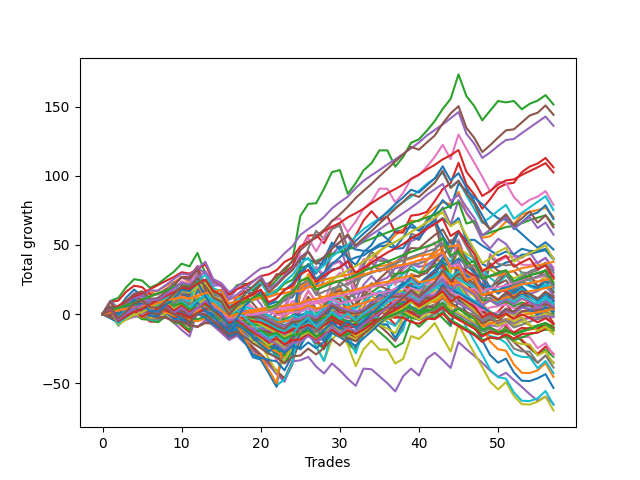

# Long Pointer One (1226) 
- Symbol: ES
- Date Range: 03/18/2022 - 07/15/2022
- Trading Period: 7:20-12:30
- Number of Trades: 57



| Name | Win Percent | Profit | Avg Profit / Trade | Avg Time / Trade |      | Name | Win Percent | Profit | Avg Profit / Trade | Avg Time / Trade |
| ---- | ----------- | ------ | ------------------ | ---------------- | ---- | ---- | ----------- | ------ | ------------------ | ---------------- |
| Sorted By <br> Profit | | | | | | Sorted By <br> Win Percentage ||||
| Two | 71.93 | 75875.00 | 1331.14 | 17:23 |     | Eighty-One | 92.98 | 18875.00 | 331.14 | 04:15 |
| Eighty-Five | 78.95 | 72125.00 | 1265.35 | 14:39 |     | One Hundred Twenty-One | 91.23 | 14500.00 | 254.39 | 03:03 |
| Eighty-Four | 84.21 | 68125.00 | 1195.18 | 11:57 |     | One Hundred Twenty-Six | 91.23 | 13000.00 | 228.07 | 03:16 |
| Three | 70.18 | 53125.00 | 932.02 | 17:01 |     | Eighty-Two | 87.72 | 32375.00 | 567.98 | 08:01 |
| Eighty-Three | 85.96 | 51250.00 | 899.12 | 10:33 |     | Eighty-Three | 85.96 | 51250.00 | 899.12 | 10:33 |
| Fifty-Eight | 63.16 | 39500.00 | 692.98 | 13:15 |     | One Hundred Eleven | 85.96 | 13000.00 | 228.07 | 01:39 |
| One Hundred Twenty-Four | 77.19 | 37625.00 | 660.09 | 08:46 |     | Eighty-Four | 84.21 | 68125.00 | 1195.18 | 11:57 |
| One | 68.42 | 35125.00 | 616.23 | 12:23 |     | One Hundred Sixteen | 84.21 | 10000.00 | 175.44 | 01:37 |
| One Hundred Twenty-Five | 70.18 | 34375.00 | 603.07 | 10:56 |     | One Hundred Twenty-Seven | 80.70 | 11375.00 | 199.56 | 05:25 |
| Eighty-Two | 87.72 | 32375.00 | 567.98 | 08:01 |     | One Hundred Twenty-Two | 80.70 | 9500.00 | 166.67 | 05:24 |
| One Hundred Thirty | 66.67 | 31375.00 | 550.44 | 10:13 |     | Eighty-Five | 78.95 | 72125.00 | 1265.35 | 14:39 |
| One Hundred Twenty-Nine | 73.68 | 28750.00 | 504.39 | 08:30 |     | One Hundred Twenty-Four | 77.19 | 37625.00 | 660.09 | 08:46 |
| Forty-Two | 42.11 | 23375.00 | 410.09 | 08:24 |     | One Hundred Twenty-Three | 77.19 | 19875.00 | 348.68 | 07:30 |
| Seventy-Three | 40.35 | 20250.00 | 355.26 | 07:44 |     | Zero | 75.44 | 19750.00 | 346.49 | 07:15 |
| One Hundred Twenty-Three | 77.19 | 19875.00 | 348.68 | 07:30 |     | Fifty-Six | 75.44 | -250.00 | -4.39 | 05:20 |
| Zero | 75.44 | 19750.00 | 346.49 | 07:15 |     | One Hundred Twenty-Nine | 73.68 | 28750.00 | 504.39 | 08:30 |
| Eighty-One | 92.98 | 18875.00 | 331.14 | 04:15 |     | One Hundred Twenty-Eight | 73.68 | 13250.00 | 232.46 | 07:16 |
| Six | 54.39 | 16875.00 | 296.05 | 24:36 |     | One Hundred One | 73.68 | 5250.00 | 92.11 | 01:03 |
| Sixty-Six | 52.63 | 16000.00 | 280.70 | 11:23 |     | Sixty-Four | 73.68 | 250.00 | 4.39 | 05:16 |
| Seven | 50.88 | 15125.00 | 265.35 | 27:56 |     | Two | 71.93 | 75875.00 | 1331.14 | 17:23 |
| One Hundred Twenty-One | 91.23 | 14500.00 | 254.39 | 03:03 |     | Three | 70.18 | 53125.00 | 932.02 | 17:01 |
| Fifty-Nine | 61.40 | 13625.00 | 239.04 | 12:38 |     | One Hundred Twenty-Five | 70.18 | 34375.00 | 603.07 | 10:56 |
| One Hundred Twenty-Eight | 73.68 | 13250.00 | 232.46 | 07:16 |     | One Hundred Six | 70.18 | 1875.00 | 32.89 | 01:09 |
| One Hundred Twenty-Six | 91.23 | 13000.00 | 228.07 | 03:16 |     | One | 68.42 | 35125.00 | 616.23 | 12:23 |
| One Hundred Eleven | 85.96 | 13000.00 | 228.07 | 01:39 |     | One Hundred Thirty | 66.67 | 31375.00 | 550.44 | 10:13 |
| Five | 50.88 | 12625.00 | 221.49 | 27:03 |     | Ninety-One | 66.67 | 3000.00 | 52.63 | 00:46 |
| Fifty | 43.86 | 11500.00 | 201.75 | 05:32 |     | One Hundred Twelve | 66.67 | -3625.00 | -63.60 | 02:29 |
| One Hundred Twenty-Seven | 80.70 | 11375.00 | 199.56 | 05:25 |     | Fifty-Seven | 64.91 | 10625.00 | 186.40 | 08:45 |
| Fifty-Seven | 64.91 | 10625.00 | 186.40 | 08:45 |     | One Hundred Seventeen | 64.91 | -5625.00 | -98.68 | 02:15 |
| Ninety-Five | 35.09 | 10625.00 | 186.40 | 02:55 |     | Fifty-Eight | 63.16 | 39500.00 | 692.98 | 13:15 |
| One Hundred Sixteen | 84.21 | 10000.00 | 175.44 | 01:37 |     | Forty | 63.16 | -750.00 | -13.16 | 03:19 |
| One Hundred Twenty-Two | 80.70 | 9500.00 | 166.67 | 05:24 |     | Fifty-Nine | 61.40 | 13625.00 | 239.04 | 12:38 |
| Ninety-Four | 40.35 | 9500.00 | 166.67 | 02:06 |     | Forty-Eight | 61.40 | 1000.00 | 17.54 | 02:37 |
| Fifty-One | 43.86 | 8625.00 | 151.32 | 05:12 |     | Ninety-Six | 59.65 | -3875.00 | -67.98 | 00:40 |
| Forty-One | 52.63 | 8000.00 | 140.35 | 05:26 |     | Sixty-Five | 57.89 | -3250.00 | -57.02 | 08:06 |
| Sixty-Seven | 54.39 | 7750.00 | 135.96 | 11:04 |     | One Hundred Fourteen | 56.14 | 3625.00 | 63.60 | 04:42 |
| Four | 54.39 | 6750.00 | 118.42 | 24:11 |     | One Hundred Two | 56.14 | -4875.00 | -85.53 | 01:27 |
| One Hundred Twenty | 45.61 | 6125.00 | 107.46 | 04:38 |     | One Hundred Thirteen | 56.14 | -7250.00 | -127.19 | 04:00 |
| Fifty-Five | 42.11 | 5875.00 | 103.07 | 07:17 |     | Six | 54.39 | 16875.00 | 296.05 | 24:36 |
| One Hundred One | 73.68 | 5250.00 | 92.11 | 01:03 |     | Sixty-Seven | 54.39 | 7750.00 | 135.96 | 11:04 |
| One Hundred Fifteen | 50.88 | 5000.00 | 87.72 | 06:01 |     | Four | 54.39 | 6750.00 | 118.42 | 24:11 |
| Forty-Nine | 49.12 | 4625.00 | 81.14 | 04:06 |     | One Hundred Eighteen | 54.39 | -3500.00 | -61.40 | 03:16 |
| Fifty-Two | 42.11 | 4375.00 | 76.75 | 06:12 |     | Sixty-Six | 52.63 | 16000.00 | 280.70 | 11:23 |
| One Hundred Four | 45.61 | 3750.00 | 65.79 | 03:02 |     | Forty-One | 52.63 | 8000.00 | 140.35 | 05:26 |
| One Hundred Fourteen | 56.14 | 3625.00 | 63.60 | 04:42 |     | One Hundred Seven | 52.63 | -4625.00 | -81.14 | 01:30 |
| Fifty-Three | 42.11 | 3250.00 | 57.02 | 06:50 |     | Seven | 50.88 | 15125.00 | 265.35 | 27:56 |
| Ninety-One | 66.67 | 3000.00 | 52.63 | 00:46 |     | Five | 50.88 | 12625.00 | 221.49 | 27:03 |
| One Hundred Ninteen | 50.88 | 2750.00 | 48.25 | 03:48 |     | One Hundred Fifteen | 50.88 | 5000.00 | 87.72 | 06:01 |
| One Hundred Nine | 40.35 | 2625.00 | 46.05 | 02:16 |     | One Hundred Ninteen | 50.88 | 2750.00 | 48.25 | 03:48 |
| One Hundred Ten | 40.35 | 2250.00 | 39.47 | 02:31 |     | Ninety-Two | 50.88 | -750.00 | -13.16 | 01:03 |
| Forty-Three | 43.86 | 2125.00 | 37.28 | 07:37 |     | Forty-Nine | 49.12 | 4625.00 | 81.14 | 04:06 |
| One Hundred Six | 70.18 | 1875.00 | 32.89 | 01:09 |     | Ninety-Seven | 47.37 | -6125.00 | -107.46 | 00:52 |
| One Hundred | 45.61 | 1625.00 | 28.51 | 01:15 |     | One Hundred Twenty | 45.61 | 6125.00 | 107.46 | 04:38 |
| Forty-Eight | 61.40 | 1000.00 | 17.54 | 02:37 |     | One Hundred Four | 45.61 | 3750.00 | 65.79 | 03:02 |
| Fifty-Four | 40.35 | 875.00 | 15.35 | 06:18 |     | One Hundred | 45.61 | 1625.00 | 28.51 | 01:15 |
| One Hundred Five | 38.60 | 875.00 | 15.35 | 03:58 |     | Ninety-Nine | 45.61 | -1125.00 | -19.74 | 01:10 |
| Sixty-Four | 73.68 | 250.00 | 4.39 | 05:16 |     | Ninety-Eight | 45.61 | -5750.00 | -100.88 | 01:02 |
| Fifty-Six | 75.44 | -250.00 | -4.39 | 05:20 |     | One Hundred Three | 45.61 | -5875.00 | -103.07 | 02:24 |
| Forty | 63.16 | -750.00 | -13.16 | 03:19 |     | Sixty-Two | 45.61 | -26750.00 | -469.30 | 19:00 |
| Ninety-Two | 50.88 | -750.00 | -13.16 | 01:03 |     | Fifty | 43.86 | 11500.00 | 201.75 | 05:32 |
| Ninety-Nine | 45.61 | -1125.00 | -19.74 | 01:10 |     | Fifty-One | 43.86 | 8625.00 | 151.32 | 05:12 |
| Ninety-Three | 40.35 | -1125.00 | -19.74 | 01:41 |     | Forty-Three | 43.86 | 2125.00 | 37.28 | 07:37 |
| Sixty-Five | 57.89 | -3250.00 | -57.02 | 08:06 |     | Sixty | 43.86 | -34875.00 | -611.84 | 18:07 |
| One Hundred Eighteen | 54.39 | -3500.00 | -61.40 | 03:16 |     | Forty-Two | 42.11 | 23375.00 | 410.09 | 08:24 |
| One Hundred Twelve | 66.67 | -3625.00 | -63.60 | 02:29 |     | Fifty-Five | 42.11 | 5875.00 | 103.07 | 07:17 |
| Ninety-Six | 59.65 | -3875.00 | -67.98 | 00:40 |     | Fifty-Two | 42.11 | 4375.00 | 76.75 | 06:12 |
| One Hundred Seven | 52.63 | -4625.00 | -81.14 | 01:30 |     | Fifty-Three | 42.11 | 3250.00 | 57.02 | 06:50 |
| One Hundred Two | 56.14 | -4875.00 | -85.53 | 01:27 |     | Sixty-Eight | 42.11 | -14875.00 | -260.96 | 14:45 |
| One Hundred Eight | 40.35 | -5125.00 | -89.91 | 01:56 |     | Seventy | 42.11 | -17875.00 | -313.60 | 15:32 |
| One Hundred Seventeen | 64.91 | -5625.00 | -98.68 | 02:15 |     | Sixty-Three | 42.11 | -22750.00 | -399.12 | 21:51 |
| Ninety-Eight | 45.61 | -5750.00 | -100.88 | 01:02 |     | Seventy-Three | 40.35 | 20250.00 | 355.26 | 07:44 |
| One Hundred Three | 45.61 | -5875.00 | -103.07 | 02:24 |     | Ninety-Four | 40.35 | 9500.00 | 166.67 | 02:06 |
| Ninety-Seven | 47.37 | -6125.00 | -107.46 | 00:52 |     | One Hundred Nine | 40.35 | 2625.00 | 46.05 | 02:16 |
| One Hundred Thirteen | 56.14 | -7250.00 | -127.19 | 04:00 |     | One Hundred Ten | 40.35 | 2250.00 | 39.47 | 02:31 |
| Forty-Five | 29.82 | -14375.00 | -252.19 | 13:22 |     | Fifty-Four | 40.35 | 875.00 | 15.35 | 06:18 |
| Sixty-Eight | 42.11 | -14875.00 | -260.96 | 14:45 |     | Ninety-Three | 40.35 | -1125.00 | -19.74 | 01:41 |
| Forty-Four | 33.33 | -15500.00 | -271.93 | 11:04 |     | One Hundred Eight | 40.35 | -5125.00 | -89.91 | 01:56 |
| Forty-Seven | 31.58 | -17625.00 | -309.21 | 14:17 |     | Sixty-One | 40.35 | -32875.00 | -576.75 | 20:42 |
| Seventy | 42.11 | -17875.00 | -313.60 | 15:32 |     | One Hundred Five | 38.60 | 875.00 | 15.35 | 03:58 |
| Sixty-Nine | 38.60 | -19375.00 | -339.91 | 16:28 |     | Sixty-Nine | 38.60 | -19375.00 | -339.91 | 16:28 |
| Seventy-One | 38.60 | -21375.00 | -375.00 | 17:25 |     | Seventy-One | 38.60 | -21375.00 | -375.00 | 17:25 |
| Sixty-Three | 42.11 | -22750.00 | -399.12 | 21:51 |     | Ninety-Five | 35.09 | 10625.00 | 186.40 | 02:55 |
| Sixty-Two | 45.61 | -26750.00 | -469.30 | 19:00 |     | Forty-Four | 33.33 | -15500.00 | -271.93 | 11:04 |
| Forty-Six | 33.33 | -32500.00 | -570.18 | 11:32 |     | Forty-Six | 33.33 | -32500.00 | -570.18 | 11:32 |
| Sixty-One | 40.35 | -32875.00 | -576.75 | 20:42 |     | Forty-Seven | 31.58 | -17625.00 | -309.21 | 14:17 |
| Sixty | 43.86 | -34875.00 | -611.84 | 18:07 |     | Forty-Five | 29.82 | -14375.00 | -252.19 | 13:22 |

## NO STOPLOSS

### Test Zero
* Sell when price hits the middle line of the 20p bollinger
* No Stoploss
* Results:
```
Total Trades: 57
Percent Up: 75.44
Percent Down: 24.56
Total Points Moved Up: 39.50
Potential Profit: 19750.00
Total Points Ups: 120.75 Count Ups: 43
Total Points Downs: -81.25 Count Downs: 14
```

<details><summary>Trades</summary>

<code>In: 2022-03-25 08:30:00		Out: 2022-03-25 08:36:40		Total Position Time: 06:40		Total Move Up: 4.00		Total to Date: 4.00</code> <br />
<code>In: 2022-03-30 12:14:00		Out: 2022-03-30 12:28:15		Total Position Time: 14:15		Total Move Up: -3.00		Total to Date: 1.00</code> <br />
<code>In: 2022-03-30 12:27:00		Out: 2022-03-30 12:28:15		Total Position Time: 01:15		Total Move Up: 2.50		Total to Date: 3.50</code> <br />
<code>In: 2022-03-31 08:37:00		Out: 2022-03-31 08:38:15		Total Position Time: 01:15		Total Move Up: 2.00		Total to Date: 5.50</code> <br />
<code>In: 2022-03-31 10:02:00		Out: 2022-03-31 10:04:00		Total Position Time: 02:00		Total Move Up: 0.75		Total to Date: 6.25</code> <br />
<code>In: 2022-04-05 09:04:00		Out: 2022-04-05 09:06:10		Total Position Time: 02:10		Total Move Up: 3.25		Total to Date: 9.50</code> <br />
<code>In: 2022-04-06 09:23:00		Out: 2022-04-06 09:31:15		Total Position Time: 08:15		Total Move Up: 1.50		Total to Date: 11.00</code> <br />
<code>In: 2022-04-07 08:56:00		Out: 2022-04-07 09:00:25		Total Position Time: 04:25		Total Move Up: 2.25		Total to Date: 13.25</code> <br />
<code>In: 2022-04-12 07:53:00		Out: 2022-04-12 08:02:05		Total Position Time: 09:05		Total Move Up: 0.75		Total to Date: 14.00</code> <br />
<code>In: 2022-04-12 11:35:00		Out: 2022-04-12 11:35:50		Total Position Time: 00:50		Total Move Up: 1.50		Total to Date: 15.50</code> <br />
<code>In: 2022-04-14 09:32:00		Out: 2022-04-14 09:56:15		Total Position Time: 24:15		Total Move Up: -4.75		Total to Date: 10.75</code> <br />
<code>In: 2022-04-20 11:58:00		Out: 2022-04-20 12:01:15		Total Position Time: 03:15		Total Move Up: 4.75		Total to Date: 15.50</code> <br />
<code>In: 2022-04-21 08:25:00		Out: 2022-04-21 08:25:15		Total Position Time: 00:15		Total Move Up: 2.75		Total to Date: 18.25</code> <br />
<code>In: 2022-04-21 09:02:00		Out: 2022-04-21 09:19:05		Total Position Time: 17:05		Total Move Up: -5.25		Total to Date: 13.00</code> <br />
<code>In: 2022-04-21 09:12:00		Out: 2022-04-21 09:19:05		Total Position Time: 07:05		Total Move Up: 0.25		Total to Date: 13.25</code> <br />
<code>In: 2022-04-21 09:56:00		Out: 2022-04-21 10:13:45		Total Position Time: 17:45		Total Move Up: -5.50		Total to Date: 7.75</code> <br />
<code>In: 2022-04-21 10:21:00		Out: 2022-04-21 10:21:10		Total Position Time: 00:10		Total Move Up: 1.75		Total to Date: 9.50</code> <br />
<code>In: 2022-04-21 12:06:00		Out: 2022-04-21 12:18:10		Total Position Time: 12:10		Total Move Up: -2.25		Total to Date: 7.25</code> <br />
<code>In: 2022-05-02 08:07:00		Out: 2022-05-02 08:13:20		Total Position Time: 06:20		Total Move Up: 2.75		Total to Date: 10.00</code> <br />
<code>In: 2022-05-02 08:22:00		Out: 2022-05-02 08:26:10		Total Position Time: 04:10		Total Move Up: 5.25		Total to Date: 15.25</code> <br />
<code>In: 2022-05-02 10:37:00		Out: 2022-05-02 10:59:45		Total Position Time: 22:45		Total Move Up: -8.25		Total to Date: 7.00</code> <br />
<code>In: 2022-05-02 10:51:00		Out: 2022-05-02 10:59:45		Total Position Time: 08:45		Total Move Up: 1.75		Total to Date: 8.75</code> <br />
<code>In: 2022-05-02 11:46:00		Out: 2022-05-02 11:46:10		Total Position Time: 00:10		Total Move Up: 0.75		Total to Date: 9.50</code> <br />
<code>In: 2022-05-04 08:37:00		Out: 2022-05-04 08:39:25		Total Position Time: 02:25		Total Move Up: 2.75		Total to Date: 12.25</code> <br />
<code>In: 2022-05-04 11:36:00		Out: 2022-05-04 11:36:40		Total Position Time: 00:40		Total Move Up: 8.25		Total to Date: 20.50</code> <br />
<code>In: 2022-05-06 09:03:00		Out: 2022-05-06 09:03:10		Total Position Time: 00:10		Total Move Up: 2.50		Total to Date: 23.00</code> <br />
<code>In: 2022-05-06 11:28:00		Out: 2022-05-06 11:40:25		Total Position Time: 12:25		Total Move Up: -1.75		Total to Date: 21.25</code> <br />
<code>In: 2022-05-09 07:42:00		Out: 2022-05-09 07:42:30		Total Position Time: 00:30		Total Move Up: 4.75		Total to Date: 26.00</code> <br />
<code>In: 2022-05-09 08:34:00		Out: 2022-05-09 08:35:10		Total Position Time: 01:10		Total Move Up: 6.25		Total to Date: 32.25</code> <br />
<code>In: 2022-05-09 10:03:00		Out: 2022-05-09 10:09:25		Total Position Time: 06:25		Total Move Up: 1.00		Total to Date: 33.25</code> <br />
<code>In: 2022-05-10 07:52:00		Out: 2022-05-10 07:59:00		Total Position Time: 07:00		Total Move Up: 5.25		Total to Date: 38.50</code> <br />
<code>In: 2022-05-11 09:14:00		Out: 2022-05-11 09:21:05		Total Position Time: 07:05		Total Move Up: 2.50		Total to Date: 41.00</code> <br />
<code>In: 2022-05-11 11:01:00		Out: 2022-05-11 11:01:10		Total Position Time: 00:10		Total Move Up: 1.50		Total to Date: 42.50</code> <br />
<code>In: 2022-05-16 09:47:00		Out: 2022-05-16 09:48:15		Total Position Time: 01:15		Total Move Up: 4.00		Total to Date: 46.50</code> <br />
<code>In: 2022-05-18 08:32:00		Out: 2022-05-18 08:36:55		Total Position Time: 04:55		Total Move Up: 4.00		Total to Date: 50.50</code> <br />
<code>In: 2022-05-18 09:12:00		Out: 2022-05-18 09:14:45		Total Position Time: 02:45		Total Move Up: 2.25		Total to Date: 52.75</code> <br />
<code>In: 2022-05-20 09:48:00		Out: 2022-05-20 09:50:00		Total Position Time: 02:00		Total Move Up: 7.00		Total to Date: 59.75</code> <br />
<code>In: 2022-05-25 10:15:00		Out: 2022-05-25 10:15:20		Total Position Time: 00:20		Total Move Up: 1.00		Total to Date: 60.75</code> <br />
<code>In: 2022-05-31 12:05:00		Out: 2022-05-31 12:07:20		Total Position Time: 02:20		Total Move Up: 2.25		Total to Date: 63.00</code> <br />
<code>In: 2022-06-08 11:31:00		Out: 2022-06-08 11:41:35		Total Position Time: 10:35		Total Move Up: -2.50		Total to Date: 60.50</code> <br />
<code>In: 2022-06-08 12:11:00		Out: 2022-06-08 12:11:30		Total Position Time: 00:30		Total Move Up: 1.75		Total to Date: 62.25</code> <br />
<code>In: 2022-06-09 08:10:00		Out: 2022-06-09 08:11:10		Total Position Time: 01:10		Total Move Up: 3.25		Total to Date: 65.50</code> <br />
<code>In: 2022-06-13 12:17:00		Out: 2022-06-13 12:17:10		Total Position Time: 00:10		Total Move Up: 4.00		Total to Date: 69.50</code> <br />
<code>In: 2022-06-14 07:32:00		Out: 2022-06-14 07:47:00		Total Position Time: 15:00		Total Move Up: -5.25		Total to Date: 64.25</code> <br />
<code>In: 2022-06-14 07:45:00		Out: 2022-06-14 07:47:00		Total Position Time: 02:00		Total Move Up: 5.25		Total to Date: 69.50</code> <br />
<code>In: 2022-06-14 11:52:00		Out: 2022-06-14 12:21:55		Total Position Time: 29:55		Total Move Up: -15.75		Total to Date: 53.75</code> <br />
<code>In: 2022-06-15 07:57:00		Out: 2022-06-15 08:26:55		Total Position Time: 29:55		Total Move Up: -7.25		Total to Date: 46.50</code> <br />
<code>In: 2022-06-16 11:02:00		Out: 2022-06-16 11:31:55		Total Position Time: 29:55		Total Move Up: -10.25		Total to Date: 36.25</code> <br />
<code>In: 2022-06-17 07:38:00		Out: 2022-06-17 07:55:05		Total Position Time: 17:05		Total Move Up: -2.75		Total to Date: 33.50</code> <br />
<code>In: 2022-06-23 09:07:00		Out: 2022-06-23 09:17:10		Total Position Time: 10:10		Total Move Up: 0.75		Total to Date: 34.25</code> <br />
<code>In: 2022-06-27 10:10:00		Out: 2022-06-27 10:11:25		Total Position Time: 01:25		Total Move Up: 3.00		Total to Date: 37.25</code> <br />
<code>In: 2022-06-29 09:16:00		Out: 2022-06-29 09:21:05		Total Position Time: 05:05		Total Move Up: 1.50		Total to Date: 38.75</code> <br />
<code>In: 2022-07-06 08:12:00		Out: 2022-07-06 08:15:05		Total Position Time: 03:05		Total Move Up: 4.25		Total to Date: 43.00</code> <br />
<code>In: 2022-07-06 08:35:00		Out: 2022-07-06 08:46:30		Total Position Time: 11:30		Total Move Up: 0.25		Total to Date: 43.25</code> <br />
<code>In: 2022-07-08 09:48:00		Out: 2022-07-08 09:49:00		Total Position Time: 01:00		Total Move Up: 1.75		Total to Date: 45.00</code> <br />
<code>In: 2022-07-12 10:28:00		Out: 2022-07-12 10:28:50		Total Position Time: 00:50		Total Move Up: 1.25		Total to Date: 46.25</code> <br />
<code>In: 2022-07-12 12:27:00		Out: 2022-07-12 12:45:35		Total Position Time: 18:35		Total Move Up: -6.75		Total to Date: 39.50</code> <br />


</details>

### Test One
* Sell when the price hits the upper line of the 20p 1std bollinger
* No Stoploss
* Results:
```
Total Trades: 57
Percent Up: 68.42
Percent Down: 31.58
Total Points Moved Up: 70.25
Potential Profit: 35125.00
Total Points Ups: 182.75 Count Ups: 39
Total Points Downs: -112.50 Count Downs: 18
```

<details><summary>Trades</summary>

<code>In: 2022-03-25 08:30:00		Out: 2022-03-25 08:41:05		Total Position Time: 11:05		Total Move Up: 5.25		Total to Date: 5.25</code> <br />
<code>In: 2022-03-30 12:14:00		Out: 2022-03-30 12:32:20		Total Position Time: 18:20		Total Move Up: -0.75		Total to Date: 4.50</code> <br />
<code>In: 2022-03-30 12:27:00		Out: 2022-03-30 12:32:20		Total Position Time: 05:20		Total Move Up: 4.75		Total to Date: 9.25</code> <br />
<code>In: 2022-03-31 08:37:00		Out: 2022-03-31 08:40:35		Total Position Time: 03:35		Total Move Up: 3.25		Total to Date: 12.50</code> <br />
<code>In: 2022-03-31 10:02:00		Out: 2022-03-31 10:19:40		Total Position Time: 17:40		Total Move Up: -0.50		Total to Date: 12.00</code> <br />
<code>In: 2022-04-05 09:04:00		Out: 2022-04-05 09:13:35		Total Position Time: 09:35		Total Move Up: 3.50		Total to Date: 15.50</code> <br />
<code>In: 2022-04-06 09:23:00		Out: 2022-04-06 09:34:05		Total Position Time: 11:05		Total Move Up: 1.50		Total to Date: 17.00</code> <br />
<code>In: 2022-04-07 08:56:00		Out: 2022-04-07 09:02:50		Total Position Time: 06:50		Total Move Up: 3.25		Total to Date: 20.25</code> <br />
<code>In: 2022-04-12 07:53:00		Out: 2022-04-12 08:02:35		Total Position Time: 09:35		Total Move Up: 2.75		Total to Date: 23.00</code> <br />
<code>In: 2022-04-12 11:35:00		Out: 2022-04-12 11:37:20		Total Position Time: 02:20		Total Move Up: 3.50		Total to Date: 26.50</code> <br />
<code>In: 2022-04-14 09:32:00		Out: 2022-04-14 09:58:40		Total Position Time: 26:40		Total Move Up: -3.25		Total to Date: 23.25</code> <br />
<code>In: 2022-04-20 11:58:00		Out: 2022-04-20 12:04:20		Total Position Time: 06:20		Total Move Up: 7.50		Total to Date: 30.75</code> <br />
<code>In: 2022-04-21 08:25:00		Out: 2022-04-21 08:54:55		Total Position Time: 29:55		Total Move Up: -15.00		Total to Date: 15.75</code> <br />
<code>In: 2022-04-21 09:02:00		Out: 2022-04-21 09:31:55		Total Position Time: 29:55		Total Move Up: -12.50		Total to Date: 3.25</code> <br />
<code>In: 2022-04-21 09:12:00		Out: 2022-04-21 09:34:10		Total Position Time: 22:10		Total Move Up: -1.75		Total to Date: 1.50</code> <br />
<code>In: 2022-04-21 09:56:00		Out: 2022-04-21 10:21:20		Total Position Time: 25:20		Total Move Up: -6.25		Total to Date: -4.75</code> <br />
<code>In: 2022-04-21 10:21:00		Out: 2022-04-21 10:21:20		Total Position Time: 00:20		Total Move Up: 4.00		Total to Date: -0.75</code> <br />
<code>In: 2022-04-21 12:06:00		Out: 2022-04-21 12:23:10		Total Position Time: 17:10		Total Move Up: -1.00		Total to Date: -1.75</code> <br />
<code>In: 2022-05-02 08:07:00		Out: 2022-05-02 08:34:10		Total Position Time: 27:10		Total Move Up: -4.25		Total to Date: -6.00</code> <br />
<code>In: 2022-05-02 08:22:00		Out: 2022-05-02 08:34:10		Total Position Time: 12:10		Total Move Up: 6.00		Total to Date: 0.00</code> <br />
<code>In: 2022-05-02 10:37:00		Out: 2022-05-02 11:02:25		Total Position Time: 25:25		Total Move Up: -6.50		Total to Date: -6.50</code> <br />
<code>In: 2022-05-02 10:51:00		Out: 2022-05-02 11:02:25		Total Position Time: 11:25		Total Move Up: 3.50		Total to Date: -3.00</code> <br />
<code>In: 2022-05-02 11:46:00		Out: 2022-05-02 11:46:10		Total Position Time: 00:10		Total Move Up: 0.75		Total to Date: -2.25</code> <br />
<code>In: 2022-05-04 08:37:00		Out: 2022-05-04 08:40:55		Total Position Time: 03:55		Total Move Up: 5.00		Total to Date: 2.75</code> <br />
<code>In: 2022-05-04 11:36:00		Out: 2022-05-04 11:41:40		Total Position Time: 05:40		Total Move Up: 17.25		Total to Date: 20.00</code> <br />
<code>In: 2022-05-06 09:03:00		Out: 2022-05-06 09:03:10		Total Position Time: 00:10		Total Move Up: 2.50		Total to Date: 22.50</code> <br />
<code>In: 2022-05-06 11:28:00		Out: 2022-05-06 11:49:10		Total Position Time: 21:10		Total Move Up: 0.50		Total to Date: 23.00</code> <br />
<code>In: 2022-05-09 07:42:00		Out: 2022-05-09 07:46:05		Total Position Time: 04:05		Total Move Up: 6.50		Total to Date: 29.50</code> <br />
<code>In: 2022-05-09 08:34:00		Out: 2022-05-09 08:38:40		Total Position Time: 04:40		Total Move Up: 7.50		Total to Date: 37.00</code> <br />
<code>In: 2022-05-09 10:03:00		Out: 2022-05-09 10:18:05		Total Position Time: 15:05		Total Move Up: 1.25		Total to Date: 38.25</code> <br />
<code>In: 2022-05-10 07:52:00		Out: 2022-05-10 08:21:55		Total Position Time: 29:55		Total Move Up: -17.25		Total to Date: 21.00</code> <br />
<code>In: 2022-05-11 09:14:00		Out: 2022-05-11 09:23:15		Total Position Time: 09:15		Total Move Up: 6.25		Total to Date: 27.25</code> <br />
<code>In: 2022-05-11 11:01:00		Out: 2022-05-11 11:01:20		Total Position Time: 00:20		Total Move Up: 5.25		Total to Date: 32.50</code> <br />
<code>In: 2022-05-16 09:47:00		Out: 2022-05-16 09:50:05		Total Position Time: 03:05		Total Move Up: 6.75		Total to Date: 39.25</code> <br />
<code>In: 2022-05-18 08:32:00		Out: 2022-05-18 08:41:15		Total Position Time: 09:15		Total Move Up: 6.00		Total to Date: 45.25</code> <br />
<code>In: 2022-05-18 09:12:00		Out: 2022-05-18 09:16:30		Total Position Time: 04:30		Total Move Up: 5.25		Total to Date: 50.50</code> <br />
<code>In: 2022-05-20 09:48:00		Out: 2022-05-20 09:56:10		Total Position Time: 08:10		Total Move Up: 6.75		Total to Date: 57.25</code> <br />
<code>In: 2022-05-25 10:15:00		Out: 2022-05-25 10:15:55		Total Position Time: 00:55		Total Move Up: 4.00		Total to Date: 61.25</code> <br />
<code>In: 2022-05-31 12:05:00		Out: 2022-05-31 12:09:20		Total Position Time: 04:20		Total Move Up: 6.25		Total to Date: 67.50</code> <br />
<code>In: 2022-06-08 11:31:00		Out: 2022-06-08 11:43:15		Total Position Time: 12:15		Total Move Up: -0.25		Total to Date: 67.25</code> <br />
<code>In: 2022-06-08 12:11:00		Out: 2022-06-08 12:12:20		Total Position Time: 01:20		Total Move Up: 5.00		Total to Date: 72.25</code> <br />
<code>In: 2022-06-09 08:10:00		Out: 2022-06-09 08:21:10		Total Position Time: 11:10		Total Move Up: 4.75		Total to Date: 77.00</code> <br />
<code>In: 2022-06-13 12:17:00		Out: 2022-06-13 12:17:10		Total Position Time: 00:10		Total Move Up: 4.00		Total to Date: 81.00</code> <br />
<code>In: 2022-06-14 07:32:00		Out: 2022-06-14 07:47:10		Total Position Time: 15:10		Total Move Up: -1.50		Total to Date: 79.50</code> <br />
<code>In: 2022-06-14 07:45:00		Out: 2022-06-14 07:47:10		Total Position Time: 02:10		Total Move Up: 9.00		Total to Date: 88.50</code> <br />
<code>In: 2022-06-14 11:52:00		Out: 2022-06-14 12:21:55		Total Position Time: 29:55		Total Move Up: -15.75		Total to Date: 72.75</code> <br />
<code>In: 2022-06-15 07:57:00		Out: 2022-06-15 08:26:55		Total Position Time: 29:55		Total Move Up: -7.25		Total to Date: 65.50</code> <br />
<code>In: 2022-06-16 11:02:00		Out: 2022-06-16 11:31:55		Total Position Time: 29:55		Total Move Up: -10.25		Total to Date: 55.25</code> <br />
<code>In: 2022-06-17 07:38:00		Out: 2022-06-17 07:56:20		Total Position Time: 18:20		Total Move Up: 1.00		Total to Date: 56.25</code> <br />
<code>In: 2022-06-23 09:07:00		Out: 2022-06-23 09:18:25		Total Position Time: 11:25		Total Move Up: 4.75		Total to Date: 61.00</code> <br />
<code>In: 2022-06-27 10:10:00		Out: 2022-06-27 10:15:55		Total Position Time: 05:55		Total Move Up: 6.00		Total to Date: 67.00</code> <br />
<code>In: 2022-06-29 09:16:00		Out: 2022-06-29 09:37:20		Total Position Time: 21:20		Total Move Up: -1.75		Total to Date: 65.25</code> <br />
<code>In: 2022-07-06 08:12:00		Out: 2022-07-06 08:19:05		Total Position Time: 07:05		Total Move Up: 7.00		Total to Date: 72.25</code> <br />
<code>In: 2022-07-06 08:35:00		Out: 2022-07-06 08:48:20		Total Position Time: 13:20		Total Move Up: 1.75		Total to Date: 74.00</code> <br />
<code>In: 2022-07-08 09:48:00		Out: 2022-07-08 10:09:40		Total Position Time: 21:40		Total Move Up: 1.25		Total to Date: 75.25</code> <br />
<code>In: 2022-07-12 10:28:00		Out: 2022-07-12 10:30:05		Total Position Time: 02:05		Total Move Up: 1.75		Total to Date: 77.00</code> <br />
<code>In: 2022-07-12 12:27:00		Out: 2022-07-12 12:46:00		Total Position Time: 19:00		Total Move Up: -6.75		Total to Date: 70.25</code> <br />


</details>

### Test Two
* Sell when the price hits the upper line of the 20p 2std bollinger
* No Stoploss
* Results:
```
Total Trades: 57
Percent Up: 71.93
Percent Down: 28.07
Total Points Moved Up: 151.75
Potential Profit: 75875.00
Total Points Ups: 275.50 Count Ups: 41
Total Points Downs: -123.75 Count Downs: 16
```

<details><summary>Trades</summary>

<code>In: 2022-03-25 08:30:00		Out: 2022-03-25 08:41:55		Total Position Time: 11:55		Total Move Up: 9.50		Total to Date: 9.50</code> <br />
<code>In: 2022-03-30 12:14:00		Out: 2022-03-30 12:36:25		Total Position Time: 22:25		Total Move Up: 2.25		Total to Date: 11.75</code> <br />
<code>In: 2022-03-30 12:27:00		Out: 2022-03-30 12:36:25		Total Position Time: 09:25		Total Move Up: 7.75		Total to Date: 19.50</code> <br />
<code>In: 2022-03-31 08:37:00		Out: 2022-03-31 08:41:10		Total Position Time: 04:10		Total Move Up: 5.75		Total to Date: 25.25</code> <br />
<code>In: 2022-03-31 10:02:00		Out: 2022-03-31 10:28:00		Total Position Time: 26:00		Total Move Up: -1.00		Total to Date: 24.25</code> <br />
<code>In: 2022-04-05 09:04:00		Out: 2022-04-05 09:33:55		Total Position Time: 29:55		Total Move Up: -5.25		Total to Date: 19.00</code> <br />
<code>In: 2022-04-06 09:23:00		Out: 2022-04-06 09:34:25		Total Position Time: 11:25		Total Move Up: 2.75		Total to Date: 21.75</code> <br />
<code>In: 2022-04-07 08:56:00		Out: 2022-04-07 09:08:55		Total Position Time: 12:55		Total Move Up: 4.50		Total to Date: 26.25</code> <br />
<code>In: 2022-04-12 07:53:00		Out: 2022-04-12 08:18:50		Total Position Time: 25:50		Total Move Up: 4.25		Total to Date: 30.50</code> <br />
<code>In: 2022-04-12 11:35:00		Out: 2022-04-12 11:47:05		Total Position Time: 12:05		Total Move Up: 6.00		Total to Date: 36.50</code> <br />
<code>In: 2022-04-14 09:32:00		Out: 2022-04-14 09:59:05		Total Position Time: 27:05		Total Move Up: -2.00		Total to Date: 34.50</code> <br />
<code>In: 2022-04-20 11:58:00		Out: 2022-04-20 12:12:35		Total Position Time: 14:35		Total Move Up: 9.75		Total to Date: 44.25</code> <br />
<code>In: 2022-04-21 08:25:00		Out: 2022-04-21 08:54:55		Total Position Time: 29:55		Total Move Up: -15.00		Total to Date: 29.25</code> <br />
<code>In: 2022-04-21 09:02:00		Out: 2022-04-21 09:31:55		Total Position Time: 29:55		Total Move Up: -12.50		Total to Date: 16.75</code> <br />
<code>In: 2022-04-21 09:12:00		Out: 2022-04-21 09:35:55		Total Position Time: 23:55		Total Move Up: 0.50		Total to Date: 17.25</code> <br />
<code>In: 2022-04-21 09:56:00		Out: 2022-04-21 10:22:00		Total Position Time: 26:00		Total Move Up: -3.25		Total to Date: 14.00</code> <br />
<code>In: 2022-04-21 10:21:00		Out: 2022-04-21 10:22:00		Total Position Time: 01:00		Total Move Up: 7.00		Total to Date: 21.00</code> <br />
<code>In: 2022-04-21 12:06:00		Out: 2022-04-21 12:24:30		Total Position Time: 18:30		Total Move Up: 1.00		Total to Date: 22.00</code> <br />
<code>In: 2022-05-02 08:07:00		Out: 2022-05-02 08:36:30		Total Position Time: 29:30		Total Move Up: -5.00		Total to Date: 17.00</code> <br />
<code>In: 2022-05-02 08:22:00		Out: 2022-05-02 08:36:30		Total Position Time: 14:30		Total Move Up: 5.25		Total to Date: 22.25</code> <br />
<code>In: 2022-05-02 10:37:00		Out: 2022-05-02 11:03:45		Total Position Time: 26:45		Total Move Up: -3.75		Total to Date: 18.50</code> <br />
<code>In: 2022-05-02 10:51:00		Out: 2022-05-02 11:03:45		Total Position Time: 12:45		Total Move Up: 6.25		Total to Date: 24.75</code> <br />
<code>In: 2022-05-02 11:46:00		Out: 2022-05-02 11:53:35		Total Position Time: 07:35		Total Move Up: 6.00		Total to Date: 30.75</code> <br />
<code>In: 2022-05-04 08:37:00		Out: 2022-05-04 08:47:05		Total Position Time: 10:05		Total Move Up: 8.00		Total to Date: 38.75</code> <br />
<code>In: 2022-05-04 11:36:00		Out: 2022-05-04 11:43:55		Total Position Time: 07:55		Total Move Up: 32.25		Total to Date: 71.00</code> <br />
<code>In: 2022-05-06 09:03:00		Out: 2022-05-06 09:06:00		Total Position Time: 03:00		Total Move Up: 8.75		Total to Date: 79.75</code> <br />
<code>In: 2022-05-06 11:28:00		Out: 2022-05-06 11:49:10		Total Position Time: 21:10		Total Move Up: 0.50		Total to Date: 80.25</code> <br />
<code>In: 2022-05-09 07:42:00		Out: 2022-05-09 07:49:10		Total Position Time: 07:10		Total Move Up: 10.50		Total to Date: 90.75</code> <br />
<code>In: 2022-05-09 08:34:00		Out: 2022-05-09 08:39:15		Total Position Time: 05:15		Total Move Up: 12.00		Total to Date: 102.75</code> <br />
<code>In: 2022-05-09 10:03:00		Out: 2022-05-09 10:19:00		Total Position Time: 16:00		Total Move Up: 1.50		Total to Date: 104.25</code> <br />
<code>In: 2022-05-10 07:52:00		Out: 2022-05-10 08:21:55		Total Position Time: 29:55		Total Move Up: -17.25		Total to Date: 87.00</code> <br />
<code>In: 2022-05-11 09:14:00		Out: 2022-05-11 09:23:40		Total Position Time: 09:40		Total Move Up: 7.75		Total to Date: 94.75</code> <br />
<code>In: 2022-05-11 11:01:00		Out: 2022-05-11 11:04:55		Total Position Time: 03:55		Total Move Up: 9.25		Total to Date: 104.00</code> <br />
<code>In: 2022-05-16 09:47:00		Out: 2022-05-16 10:07:00		Total Position Time: 20:00		Total Move Up: 5.25		Total to Date: 109.25</code> <br />
<code>In: 2022-05-18 08:32:00		Out: 2022-05-18 08:43:00		Total Position Time: 11:00		Total Move Up: 9.25		Total to Date: 118.50</code> <br />
<code>In: 2022-05-18 09:12:00		Out: 2022-05-18 09:41:55		Total Position Time: 29:55		Total Move Up: 0.00		Total to Date: 118.50</code> <br />
<code>In: 2022-05-20 09:48:00		Out: 2022-05-20 10:17:55		Total Position Time: 29:55		Total Move Up: -11.75		Total to Date: 106.75</code> <br />
<code>In: 2022-05-25 10:15:00		Out: 2022-05-25 10:29:45		Total Position Time: 14:45		Total Move Up: 7.00		Total to Date: 113.75</code> <br />
<code>In: 2022-05-31 12:05:00		Out: 2022-05-31 12:15:05		Total Position Time: 10:05		Total Move Up: 10.25		Total to Date: 124.00</code> <br />
<code>In: 2022-06-08 11:31:00		Out: 2022-06-08 11:43:45		Total Position Time: 12:45		Total Move Up: 2.50		Total to Date: 126.50</code> <br />
<code>In: 2022-06-08 12:11:00		Out: 2022-06-08 12:13:30		Total Position Time: 02:30		Total Move Up: 6.25		Total to Date: 132.75</code> <br />
<code>In: 2022-06-09 08:10:00		Out: 2022-06-09 08:22:35		Total Position Time: 12:35		Total Move Up: 7.00		Total to Date: 139.75</code> <br />
<code>In: 2022-06-13 12:17:00		Out: 2022-06-13 12:17:15		Total Position Time: 00:15		Total Move Up: 8.75		Total to Date: 148.50</code> <br />
<code>In: 2022-06-14 07:32:00		Out: 2022-06-14 07:51:00		Total Position Time: 19:00		Total Move Up: 7.25		Total to Date: 155.75</code> <br />
<code>In: 2022-06-14 07:45:00		Out: 2022-06-14 07:51:00		Total Position Time: 06:00		Total Move Up: 17.75		Total to Date: 173.50</code> <br />
<code>In: 2022-06-14 11:52:00		Out: 2022-06-14 12:21:55		Total Position Time: 29:55		Total Move Up: -15.75		Total to Date: 157.75</code> <br />
<code>In: 2022-06-15 07:57:00		Out: 2022-06-15 08:26:55		Total Position Time: 29:55		Total Move Up: -7.25		Total to Date: 150.50</code> <br />
<code>In: 2022-06-16 11:02:00		Out: 2022-06-16 11:31:55		Total Position Time: 29:55		Total Move Up: -10.25		Total to Date: 140.25</code> <br />
<code>In: 2022-06-17 07:38:00		Out: 2022-06-17 08:02:30		Total Position Time: 24:30		Total Move Up: 7.00		Total to Date: 147.25</code> <br />
<code>In: 2022-06-23 09:07:00		Out: 2022-06-23 09:19:05		Total Position Time: 12:05		Total Move Up: 7.00		Total to Date: 154.25</code> <br />
<code>In: 2022-06-27 10:10:00		Out: 2022-06-27 10:39:55		Total Position Time: 29:55		Total Move Up: -1.00		Total to Date: 153.25</code> <br />
<code>In: 2022-06-29 09:16:00		Out: 2022-06-29 09:38:35		Total Position Time: 22:35		Total Move Up: 1.00		Total to Date: 154.25</code> <br />
<code>In: 2022-07-06 08:12:00		Out: 2022-07-06 08:41:55		Total Position Time: 29:55		Total Move Up: -6.00		Total to Date: 148.25</code> <br />
<code>In: 2022-07-06 08:35:00		Out: 2022-07-06 08:51:15		Total Position Time: 16:15		Total Move Up: 4.00		Total to Date: 152.25</code> <br />
<code>In: 2022-07-08 09:48:00		Out: 2022-07-08 10:11:05		Total Position Time: 23:05		Total Move Up: 2.25		Total to Date: 154.50</code> <br />
<code>In: 2022-07-12 10:28:00		Out: 2022-07-12 10:41:40		Total Position Time: 13:40		Total Move Up: 4.00		Total to Date: 158.50</code> <br />
<code>In: 2022-07-12 12:27:00		Out: 2022-07-12 12:46:00		Total Position Time: 19:00		Total Move Up: -6.75		Total to Date: 151.75</code> <br />


</details>

### Test Three
* Sell when price hits the middle line of the 50p bollinger
* No Stoploss
* Results:
```
Total Trades: 57
Percent Up: 70.18
Percent Down: 29.82
Total Points Moved Up: 106.25
Potential Profit: 53125.00
Total Points Ups: 230.50 Count Ups: 40
Total Points Downs: -124.25 Count Downs: 17
```

<details><summary>Trades</summary>

<code>In: 2022-03-25 08:30:00		Out: 2022-03-25 08:53:00		Total Position Time: 23:00		Total Move Up: 8.75		Total to Date: 8.75</code> <br />
<code>In: 2022-03-30 12:14:00		Out: 2022-03-30 12:33:25		Total Position Time: 19:25		Total Move Up: 1.00		Total to Date: 9.75</code> <br />
<code>In: 2022-03-30 12:27:00		Out: 2022-03-30 12:33:25		Total Position Time: 06:25		Total Move Up: 6.50		Total to Date: 16.25</code> <br />
<code>In: 2022-03-31 08:37:00		Out: 2022-03-31 08:41:05		Total Position Time: 04:05		Total Move Up: 4.25		Total to Date: 20.50</code> <br />
<code>In: 2022-03-31 10:02:00		Out: 2022-03-31 10:28:00		Total Position Time: 26:00		Total Move Up: -1.00		Total to Date: 19.50</code> <br />
<code>In: 2022-04-05 09:04:00		Out: 2022-04-05 09:33:55		Total Position Time: 29:55		Total Move Up: -5.25		Total to Date: 14.25</code> <br />
<code>In: 2022-04-06 09:23:00		Out: 2022-04-06 09:52:55		Total Position Time: 29:55		Total Move Up: 0.00		Total to Date: 14.25</code> <br />
<code>In: 2022-04-07 08:56:00		Out: 2022-04-07 09:06:05		Total Position Time: 10:05		Total Move Up: 3.75		Total to Date: 18.00</code> <br />
<code>In: 2022-04-12 07:53:00		Out: 2022-04-12 08:15:40		Total Position Time: 22:40		Total Move Up: 3.00		Total to Date: 21.00</code> <br />
<code>In: 2022-04-12 11:35:00		Out: 2022-04-12 11:47:05		Total Position Time: 12:05		Total Move Up: 6.00		Total to Date: 27.00</code> <br />
<code>In: 2022-04-14 09:32:00		Out: 2022-04-14 10:00:05		Total Position Time: 28:05		Total Move Up: -0.50		Total to Date: 26.50</code> <br />
<code>In: 2022-04-20 11:58:00		Out: 2022-04-20 12:10:10		Total Position Time: 12:10		Total Move Up: 8.25		Total to Date: 34.75</code> <br />
<code>In: 2022-04-21 08:25:00		Out: 2022-04-21 08:54:55		Total Position Time: 29:55		Total Move Up: -15.00		Total to Date: 19.75</code> <br />
<code>In: 2022-04-21 09:02:00		Out: 2022-04-21 09:31:55		Total Position Time: 29:55		Total Move Up: -12.50		Total to Date: 7.25</code> <br />
<code>In: 2022-04-21 09:12:00		Out: 2022-04-21 09:41:55		Total Position Time: 29:55		Total Move Up: -2.75		Total to Date: 4.50</code> <br />
<code>In: 2022-04-21 09:56:00		Out: 2022-04-21 10:22:30		Total Position Time: 26:30		Total Move Up: -1.25		Total to Date: 3.25</code> <br />
<code>In: 2022-04-21 10:21:00		Out: 2022-04-21 10:22:30		Total Position Time: 01:30		Total Move Up: 9.00		Total to Date: 12.25</code> <br />
<code>In: 2022-04-21 12:06:00		Out: 2022-04-21 12:29:40		Total Position Time: 23:40		Total Move Up: 4.25		Total to Date: 16.50</code> <br />
<code>In: 2022-05-02 08:07:00		Out: 2022-05-02 08:36:55		Total Position Time: 29:55		Total Move Up: -3.00		Total to Date: 13.50</code> <br />
<code>In: 2022-05-02 08:22:00		Out: 2022-05-02 08:38:10		Total Position Time: 16:10		Total Move Up: 8.25		Total to Date: 21.75</code> <br />
<code>In: 2022-05-02 10:37:00		Out: 2022-05-02 11:04:55		Total Position Time: 27:55		Total Move Up: -1.50		Total to Date: 20.25</code> <br />
<code>In: 2022-05-02 10:51:00		Out: 2022-05-02 11:04:55		Total Position Time: 13:55		Total Move Up: 8.50		Total to Date: 28.75</code> <br />
<code>In: 2022-05-02 11:46:00		Out: 2022-05-02 11:46:10		Total Position Time: 00:10		Total Move Up: 0.75		Total to Date: 29.50</code> <br />
<code>In: 2022-05-04 08:37:00		Out: 2022-05-04 08:41:50		Total Position Time: 04:50		Total Move Up: 5.25		Total to Date: 34.75</code> <br />
<code>In: 2022-05-04 11:36:00		Out: 2022-05-04 11:41:15		Total Position Time: 05:15		Total Move Up: 11.75		Total to Date: 46.50</code> <br />
<code>In: 2022-05-06 09:03:00		Out: 2022-05-06 09:06:05		Total Position Time: 03:05		Total Move Up: 10.25		Total to Date: 56.75</code> <br />
<code>In: 2022-05-06 11:28:00		Out: 2022-05-06 11:49:10		Total Position Time: 21:10		Total Move Up: 0.50		Total to Date: 57.25</code> <br />
<code>In: 2022-05-09 07:42:00		Out: 2022-05-09 08:11:55		Total Position Time: 29:55		Total Move Up: -6.00		Total to Date: 51.25</code> <br />
<code>In: 2022-05-09 08:34:00		Out: 2022-05-09 08:39:00		Total Position Time: 05:00		Total Move Up: 10.50		Total to Date: 61.75</code> <br />
<code>In: 2022-05-09 10:03:00		Out: 2022-05-09 10:25:35		Total Position Time: 22:35		Total Move Up: 2.75		Total to Date: 64.50</code> <br />
<code>In: 2022-05-10 07:52:00		Out: 2022-05-10 08:21:55		Total Position Time: 29:55		Total Move Up: -17.25		Total to Date: 47.25</code> <br />
<code>In: 2022-05-11 09:14:00		Out: 2022-05-11 09:24:05		Total Position Time: 10:05		Total Move Up: 9.50		Total to Date: 56.75</code> <br />
<code>In: 2022-05-11 11:01:00		Out: 2022-05-11 11:05:00		Total Position Time: 04:00		Total Move Up: 11.00		Total to Date: 67.75</code> <br />
<code>In: 2022-05-16 09:47:00		Out: 2022-05-16 09:50:05		Total Position Time: 03:05		Total Move Up: 6.75		Total to Date: 74.50</code> <br />
<code>In: 2022-05-18 08:32:00		Out: 2022-05-18 09:01:55		Total Position Time: 29:55		Total Move Up: -6.50		Total to Date: 68.00</code> <br />
<code>In: 2022-05-18 09:12:00		Out: 2022-05-18 09:36:05		Total Position Time: 24:05		Total Move Up: 2.75		Total to Date: 70.75</code> <br />
<code>In: 2022-05-20 09:48:00		Out: 2022-05-20 10:17:55		Total Position Time: 29:55		Total Move Up: -11.75		Total to Date: 59.00</code> <br />
<code>In: 2022-05-25 10:15:00		Out: 2022-05-25 10:15:10		Total Position Time: 00:10		Total Move Up: 0.00		Total to Date: 59.00</code> <br />
<code>In: 2022-05-31 12:05:00		Out: 2022-05-31 12:15:15		Total Position Time: 10:15		Total Move Up: 12.25		Total to Date: 71.25</code> <br />
<code>In: 2022-06-08 11:31:00		Out: 2022-06-08 11:43:20		Total Position Time: 12:20		Total Move Up: 0.75		Total to Date: 72.00</code> <br />
<code>In: 2022-06-08 12:11:00		Out: 2022-06-08 12:11:45		Total Position Time: 00:45		Total Move Up: 2.00		Total to Date: 74.00</code> <br />
<code>In: 2022-06-09 08:10:00		Out: 2022-06-09 08:22:45		Total Position Time: 12:45		Total Move Up: 7.75		Total to Date: 81.75</code> <br />
<code>In: 2022-06-13 12:17:00		Out: 2022-06-13 12:17:15		Total Position Time: 00:15		Total Move Up: 8.75		Total to Date: 90.50</code> <br />
<code>In: 2022-06-14 07:32:00		Out: 2022-06-14 07:50:15		Total Position Time: 18:15		Total Move Up: 4.25		Total to Date: 94.75</code> <br />
<code>In: 2022-06-14 07:45:00		Out: 2022-06-14 07:50:15		Total Position Time: 05:15		Total Move Up: 14.75		Total to Date: 109.50</code> <br />
<code>In: 2022-06-14 11:52:00		Out: 2022-06-14 12:21:55		Total Position Time: 29:55		Total Move Up: -15.75		Total to Date: 93.75</code> <br />
<code>In: 2022-06-15 07:57:00		Out: 2022-06-15 08:26:55		Total Position Time: 29:55		Total Move Up: -7.25		Total to Date: 86.50</code> <br />
<code>In: 2022-06-16 11:02:00		Out: 2022-06-16 11:31:55		Total Position Time: 29:55		Total Move Up: -10.25		Total to Date: 76.25</code> <br />
<code>In: 2022-06-17 07:38:00		Out: 2022-06-17 08:02:30		Total Position Time: 24:30		Total Move Up: 7.00		Total to Date: 83.25</code> <br />
<code>In: 2022-06-23 09:07:00		Out: 2022-06-23 09:21:10		Total Position Time: 14:10		Total Move Up: 8.00		Total to Date: 91.25</code> <br />
<code>In: 2022-06-27 10:10:00		Out: 2022-06-27 10:11:25		Total Position Time: 01:25		Total Move Up: 3.00		Total to Date: 94.25</code> <br />
<code>In: 2022-06-29 09:16:00		Out: 2022-06-29 09:38:30		Total Position Time: 22:30		Total Move Up: 0.75		Total to Date: 95.00</code> <br />
<code>In: 2022-07-06 08:12:00		Out: 2022-07-06 08:21:35		Total Position Time: 09:35		Total Move Up: 7.75		Total to Date: 102.75</code> <br />
<code>In: 2022-07-06 08:35:00		Out: 2022-07-06 08:51:15		Total Position Time: 16:15		Total Move Up: 4.00		Total to Date: 106.75</code> <br />
<code>In: 2022-07-08 09:48:00		Out: 2022-07-08 10:11:05		Total Position Time: 23:05		Total Move Up: 2.25		Total to Date: 109.00</code> <br />
<code>In: 2022-07-12 10:28:00		Out: 2022-07-12 10:41:40		Total Position Time: 13:40		Total Move Up: 4.00		Total to Date: 113.00</code> <br />
<code>In: 2022-07-12 12:27:00		Out: 2022-07-12 12:46:00		Total Position Time: 19:00		Total Move Up: -6.75		Total to Date: 106.25</code> <br />


</details>

### Test Four
* Sell when the price hits the upper line of the 50p 1std bollinger
* No Stoploss
* Results:
```
Total Trades: 57
Percent Up: 54.39
Percent Down: 45.61
Total Points Moved Up: 13.50
Potential Profit: 6750.00
Total Points Ups: 238.25 Count Ups: 31
Total Points Downs: -224.75 Count Downs: 26
```

<details><summary>Trades</summary>

<code>In: 2022-03-25 08:30:00		Out: 2022-03-25 08:59:55		Total Position Time: 29:55		Total Move Up: 2.25		Total to Date: 2.25</code> <br />
<code>In: 2022-03-30 12:14:00		Out: 2022-03-30 12:43:55		Total Position Time: 29:55		Total Move Up: -1.25		Total to Date: 1.00</code> <br />
<code>In: 2022-03-30 12:27:00		Out: 2022-03-30 12:46:00		Total Position Time: 19:00		Total Move Up: 7.25		Total to Date: 8.25</code> <br />
<code>In: 2022-03-31 08:37:00		Out: 2022-03-31 09:00:40		Total Position Time: 23:40		Total Move Up: 5.00		Total to Date: 13.25</code> <br />
<code>In: 2022-03-31 10:02:00		Out: 2022-03-31 10:29:50		Total Position Time: 27:50		Total Move Up: 1.50		Total to Date: 14.75</code> <br />
<code>In: 2022-04-05 09:04:00		Out: 2022-04-05 09:33:55		Total Position Time: 29:55		Total Move Up: -5.25		Total to Date: 9.50</code> <br />
<code>In: 2022-04-06 09:23:00		Out: 2022-04-06 09:52:55		Total Position Time: 29:55		Total Move Up: 0.00		Total to Date: 9.50</code> <br />
<code>In: 2022-04-07 08:56:00		Out: 2022-04-07 09:10:45		Total Position Time: 14:45		Total Move Up: 7.00		Total to Date: 16.50</code> <br />
<code>In: 2022-04-12 07:53:00		Out: 2022-04-12 08:19:50		Total Position Time: 26:50		Total Move Up: 6.50		Total to Date: 23.00</code> <br />
<code>In: 2022-04-12 11:35:00		Out: 2022-04-12 12:04:55		Total Position Time: 29:55		Total Move Up: -7.50		Total to Date: 15.50</code> <br />
<code>In: 2022-04-14 09:32:00		Out: 2022-04-14 10:01:55		Total Position Time: 29:55		Total Move Up: -1.00		Total to Date: 14.50</code> <br />
<code>In: 2022-04-20 11:58:00		Out: 2022-04-20 12:13:35		Total Position Time: 15:35		Total Move Up: 13.00		Total to Date: 27.50</code> <br />
<code>In: 2022-04-21 08:25:00		Out: 2022-04-21 08:54:55		Total Position Time: 29:55		Total Move Up: -15.00		Total to Date: 12.50</code> <br />
<code>In: 2022-04-21 09:02:00		Out: 2022-04-21 09:31:55		Total Position Time: 29:55		Total Move Up: -12.50		Total to Date: 0.00</code> <br />
<code>In: 2022-04-21 09:12:00		Out: 2022-04-21 09:41:55		Total Position Time: 29:55		Total Move Up: -2.75		Total to Date: -2.75</code> <br />
<code>In: 2022-04-21 09:56:00		Out: 2022-04-21 10:25:55		Total Position Time: 29:55		Total Move Up: -6.75		Total to Date: -9.50</code> <br />
<code>In: 2022-04-21 10:21:00		Out: 2022-04-21 10:31:15		Total Position Time: 10:15		Total Move Up: 14.25		Total to Date: 4.75</code> <br />
<code>In: 2022-04-21 12:06:00		Out: 2022-04-21 12:35:55		Total Position Time: 29:55		Total Move Up: -9.00		Total to Date: -4.25</code> <br />
<code>In: 2022-05-02 08:07:00		Out: 2022-05-02 08:36:55		Total Position Time: 29:55		Total Move Up: -3.00		Total to Date: -7.25</code> <br />
<code>In: 2022-05-02 08:22:00		Out: 2022-05-02 08:51:55		Total Position Time: 29:55		Total Move Up: -1.75		Total to Date: -9.00</code> <br />
<code>In: 2022-05-02 10:37:00		Out: 2022-05-02 11:06:55		Total Position Time: 29:55		Total Move Up: 1.25		Total to Date: -7.75</code> <br />
<code>In: 2022-05-02 10:51:00		Out: 2022-05-02 11:20:55		Total Position Time: 29:55		Total Move Up: -15.75		Total to Date: -23.50</code> <br />
<code>In: 2022-05-02 11:46:00		Out: 2022-05-02 11:53:40		Total Position Time: 07:40		Total Move Up: 9.50		Total to Date: -14.00</code> <br />
<code>In: 2022-05-04 08:37:00		Out: 2022-05-04 08:47:05		Total Position Time: 10:05		Total Move Up: 8.00		Total to Date: -6.00</code> <br />
<code>In: 2022-05-04 11:36:00		Out: 2022-05-04 11:42:00		Total Position Time: 06:00		Total Move Up: 21.25		Total to Date: 15.25</code> <br />
<code>In: 2022-05-06 09:03:00		Out: 2022-05-06 09:23:00		Total Position Time: 20:00		Total Move Up: 9.75		Total to Date: 25.00</code> <br />
<code>In: 2022-05-06 11:28:00		Out: 2022-05-06 11:50:10		Total Position Time: 22:10		Total Move Up: 8.75		Total to Date: 33.75</code> <br />
<code>In: 2022-05-09 07:42:00		Out: 2022-05-09 08:11:55		Total Position Time: 29:55		Total Move Up: -6.00		Total to Date: 27.75</code> <br />
<code>In: 2022-05-09 08:34:00		Out: 2022-05-09 08:40:00		Total Position Time: 06:00		Total Move Up: 15.25		Total to Date: 43.00</code> <br />
<code>In: 2022-05-09 10:03:00		Out: 2022-05-09 10:29:25		Total Position Time: 26:25		Total Move Up: 6.25		Total to Date: 49.25</code> <br />
<code>In: 2022-05-10 07:52:00		Out: 2022-05-10 08:21:55		Total Position Time: 29:55		Total Move Up: -17.25		Total to Date: 32.00</code> <br />
<code>In: 2022-05-11 09:14:00		Out: 2022-05-11 09:43:55		Total Position Time: 29:55		Total Move Up: -23.00		Total to Date: 9.00</code> <br />
<code>In: 2022-05-11 11:01:00		Out: 2022-05-11 11:18:15		Total Position Time: 17:15		Total Move Up: 12.25		Total to Date: 21.25</code> <br />
<code>In: 2022-05-16 09:47:00		Out: 2022-05-16 10:07:25		Total Position Time: 20:25		Total Move Up: 6.25		Total to Date: 27.50</code> <br />
<code>In: 2022-05-18 08:32:00		Out: 2022-05-18 09:01:55		Total Position Time: 29:55		Total Move Up: -6.50		Total to Date: 21.00</code> <br />
<code>In: 2022-05-18 09:12:00		Out: 2022-05-18 09:41:55		Total Position Time: 29:55		Total Move Up: 0.00		Total to Date: 21.00</code> <br />
<code>In: 2022-05-20 09:48:00		Out: 2022-05-20 10:17:55		Total Position Time: 29:55		Total Move Up: -11.75		Total to Date: 9.25</code> <br />
<code>In: 2022-05-25 10:15:00		Out: 2022-05-25 10:15:30		Total Position Time: 00:30		Total Move Up: 3.25		Total to Date: 12.50</code> <br />
<code>In: 2022-05-31 12:05:00		Out: 2022-05-31 12:28:20		Total Position Time: 23:20		Total Move Up: 16.50		Total to Date: 29.00</code> <br />
<code>In: 2022-06-08 11:31:00		Out: 2022-06-08 12:00:55		Total Position Time: 29:55		Total Move Up: -2.00		Total to Date: 27.00</code> <br />
<code>In: 2022-06-08 12:11:00		Out: 2022-06-08 12:12:35		Total Position Time: 01:35		Total Move Up: 5.25		Total to Date: 32.25</code> <br />
<code>In: 2022-06-09 08:10:00		Out: 2022-06-09 08:39:45		Total Position Time: 29:45		Total Move Up: 6.25		Total to Date: 38.50</code> <br />
<code>In: 2022-06-13 12:17:00		Out: 2022-06-13 12:46:00		Total Position Time: 29:00		Total Move Up: -25.00		Total to Date: 13.50</code> <br />
<code>In: 2022-06-14 07:32:00		Out: 2022-06-14 08:01:55		Total Position Time: 29:55		Total Move Up: 5.75		Total to Date: 19.25</code> <br />
<code>In: 2022-06-14 07:45:00		Out: 2022-06-14 08:02:25		Total Position Time: 17:25		Total Move Up: 19.50		Total to Date: 38.75</code> <br />
<code>In: 2022-06-14 11:52:00		Out: 2022-06-14 12:21:55		Total Position Time: 29:55		Total Move Up: -15.75		Total to Date: 23.00</code> <br />
<code>In: 2022-06-15 07:57:00		Out: 2022-06-15 08:26:55		Total Position Time: 29:55		Total Move Up: -7.25		Total to Date: 15.75</code> <br />
<code>In: 2022-06-16 11:02:00		Out: 2022-06-16 11:31:55		Total Position Time: 29:55		Total Move Up: -10.25		Total to Date: 5.50</code> <br />
<code>In: 2022-06-17 07:38:00		Out: 2022-06-17 08:06:05		Total Position Time: 28:05		Total Move Up: 14.75		Total to Date: 20.25</code> <br />
<code>In: 2022-06-23 09:07:00		Out: 2022-06-23 09:36:55		Total Position Time: 29:55		Total Move Up: -5.50		Total to Date: 14.75</code> <br />
<code>In: 2022-06-27 10:10:00		Out: 2022-06-27 10:14:20		Total Position Time: 04:20		Total Move Up: 5.25		Total to Date: 20.00</code> <br />
<code>In: 2022-06-29 09:16:00		Out: 2022-06-29 09:45:55		Total Position Time: 29:55		Total Move Up: 0.75		Total to Date: 20.75</code> <br />
<code>In: 2022-07-06 08:12:00		Out: 2022-07-06 08:41:55		Total Position Time: 29:55		Total Move Up: -6.00		Total to Date: 14.75</code> <br />
<code>In: 2022-07-06 08:35:00		Out: 2022-07-06 09:04:55		Total Position Time: 29:55		Total Move Up: -0.25		Total to Date: 14.50</code> <br />
<code>In: 2022-07-08 09:48:00		Out: 2022-07-08 10:17:55		Total Position Time: 29:55		Total Move Up: 2.00		Total to Date: 16.50</code> <br />
<code>In: 2022-07-12 10:28:00		Out: 2022-07-12 10:52:25		Total Position Time: 24:25		Total Move Up: 3.75		Total to Date: 20.25</code> <br />
<code>In: 2022-07-12 12:27:00		Out: 2022-07-12 12:46:00		Total Position Time: 19:00		Total Move Up: -6.75		Total to Date: 13.50</code> <br />


</details>

### Test Five
* Sell when the price hits the upper line of the 50p 2std bollinger
* No Stoploss
* Results:
```
Total Trades: 57
Percent Up: 50.88
Percent Down: 49.12
Total Points Moved Up: 25.25
Potential Profit: 12625.00
Total Points Ups: 252.25 Count Ups: 29
Total Points Downs: -227.00 Count Downs: 28
```

<details><summary>Trades</summary>

<code>In: 2022-03-25 08:30:00		Out: 2022-03-25 08:59:55		Total Position Time: 29:55		Total Move Up: 2.25		Total to Date: 2.25</code> <br />
<code>In: 2022-03-30 12:14:00		Out: 2022-03-30 12:43:55		Total Position Time: 29:55		Total Move Up: -1.25		Total to Date: 1.00</code> <br />
<code>In: 2022-03-30 12:27:00		Out: 2022-03-30 12:46:00		Total Position Time: 19:00		Total Move Up: 7.25		Total to Date: 8.25</code> <br />
<code>In: 2022-03-31 08:37:00		Out: 2022-03-31 09:06:55		Total Position Time: 29:55		Total Move Up: 0.25		Total to Date: 8.50</code> <br />
<code>In: 2022-03-31 10:02:00		Out: 2022-03-31 10:31:55		Total Position Time: 29:55		Total Move Up: 2.00		Total to Date: 10.50</code> <br />
<code>In: 2022-04-05 09:04:00		Out: 2022-04-05 09:33:55		Total Position Time: 29:55		Total Move Up: -5.25		Total to Date: 5.25</code> <br />
<code>In: 2022-04-06 09:23:00		Out: 2022-04-06 09:52:55		Total Position Time: 29:55		Total Move Up: 0.00		Total to Date: 5.25</code> <br />
<code>In: 2022-04-07 08:56:00		Out: 2022-04-07 09:22:05		Total Position Time: 26:05		Total Move Up: 7.00		Total to Date: 12.25</code> <br />
<code>In: 2022-04-12 07:53:00		Out: 2022-04-12 08:22:55		Total Position Time: 29:55		Total Move Up: 9.00		Total to Date: 21.25</code> <br />
<code>In: 2022-04-12 11:35:00		Out: 2022-04-12 12:04:55		Total Position Time: 29:55		Total Move Up: -7.50		Total to Date: 13.75</code> <br />
<code>In: 2022-04-14 09:32:00		Out: 2022-04-14 10:01:55		Total Position Time: 29:55		Total Move Up: -1.00		Total to Date: 12.75</code> <br />
<code>In: 2022-04-20 11:58:00		Out: 2022-04-20 12:25:45		Total Position Time: 27:45		Total Move Up: 16.25		Total to Date: 29.00</code> <br />
<code>In: 2022-04-21 08:25:00		Out: 2022-04-21 08:54:55		Total Position Time: 29:55		Total Move Up: -15.00		Total to Date: 14.00</code> <br />
<code>In: 2022-04-21 09:02:00		Out: 2022-04-21 09:31:55		Total Position Time: 29:55		Total Move Up: -12.50		Total to Date: 1.50</code> <br />
<code>In: 2022-04-21 09:12:00		Out: 2022-04-21 09:41:55		Total Position Time: 29:55		Total Move Up: -2.75		Total to Date: -1.25</code> <br />
<code>In: 2022-04-21 09:56:00		Out: 2022-04-21 10:25:55		Total Position Time: 29:55		Total Move Up: -6.75		Total to Date: -8.00</code> <br />
<code>In: 2022-04-21 10:21:00		Out: 2022-04-21 10:50:55		Total Position Time: 29:55		Total Move Up: 3.00		Total to Date: -5.00</code> <br />
<code>In: 2022-04-21 12:06:00		Out: 2022-04-21 12:35:55		Total Position Time: 29:55		Total Move Up: -9.00		Total to Date: -14.00</code> <br />
<code>In: 2022-05-02 08:07:00		Out: 2022-05-02 08:36:55		Total Position Time: 29:55		Total Move Up: -3.00		Total to Date: -17.00</code> <br />
<code>In: 2022-05-02 08:22:00		Out: 2022-05-02 08:51:55		Total Position Time: 29:55		Total Move Up: -1.75		Total to Date: -18.75</code> <br />
<code>In: 2022-05-02 10:37:00		Out: 2022-05-02 11:06:55		Total Position Time: 29:55		Total Move Up: 1.25		Total to Date: -17.50</code> <br />
<code>In: 2022-05-02 10:51:00		Out: 2022-05-02 11:20:55		Total Position Time: 29:55		Total Move Up: -15.75		Total to Date: -33.25</code> <br />
<code>In: 2022-05-02 11:46:00		Out: 2022-05-02 12:03:30		Total Position Time: 17:30		Total Move Up: 4.50		Total to Date: -28.75</code> <br />
<code>In: 2022-05-04 08:37:00		Out: 2022-05-04 08:49:05		Total Position Time: 12:05		Total Move Up: 11.50		Total to Date: -17.25</code> <br />
<code>In: 2022-05-04 11:36:00		Out: 2022-05-04 11:43:55		Total Position Time: 07:55		Total Move Up: 32.25		Total to Date: 15.00</code> <br />
<code>In: 2022-05-06 09:03:00		Out: 2022-05-06 09:32:55		Total Position Time: 29:55		Total Move Up: 5.25		Total to Date: 20.25</code> <br />
<code>In: 2022-05-06 11:28:00		Out: 2022-05-06 11:54:15		Total Position Time: 26:15		Total Move Up: 13.00		Total to Date: 33.25</code> <br />
<code>In: 2022-05-09 07:42:00		Out: 2022-05-09 08:11:55		Total Position Time: 29:55		Total Move Up: -6.00		Total to Date: 27.25</code> <br />
<code>In: 2022-05-09 08:34:00		Out: 2022-05-09 08:43:15		Total Position Time: 09:15		Total Move Up: 21.00		Total to Date: 48.25</code> <br />
<code>In: 2022-05-09 10:03:00		Out: 2022-05-09 10:30:30		Total Position Time: 27:30		Total Move Up: 10.00		Total to Date: 58.25</code> <br />
<code>In: 2022-05-10 07:52:00		Out: 2022-05-10 08:21:55		Total Position Time: 29:55		Total Move Up: -17.25		Total to Date: 41.00</code> <br />
<code>In: 2022-05-11 09:14:00		Out: 2022-05-11 09:43:55		Total Position Time: 29:55		Total Move Up: -23.00		Total to Date: 18.00</code> <br />
<code>In: 2022-05-11 11:01:00		Out: 2022-05-11 11:23:40		Total Position Time: 22:40		Total Move Up: 17.50		Total to Date: 35.50</code> <br />
<code>In: 2022-05-16 09:47:00		Out: 2022-05-16 10:11:25		Total Position Time: 24:25		Total Move Up: 9.75		Total to Date: 45.25</code> <br />
<code>In: 2022-05-18 08:32:00		Out: 2022-05-18 09:01:55		Total Position Time: 29:55		Total Move Up: -6.50		Total to Date: 38.75</code> <br />
<code>In: 2022-05-18 09:12:00		Out: 2022-05-18 09:41:55		Total Position Time: 29:55		Total Move Up: 0.00		Total to Date: 38.75</code> <br />
<code>In: 2022-05-20 09:48:00		Out: 2022-05-20 10:17:55		Total Position Time: 29:55		Total Move Up: -11.75		Total to Date: 27.00</code> <br />
<code>In: 2022-05-25 10:15:00		Out: 2022-05-25 10:29:35		Total Position Time: 14:35		Total Move Up: 6.00		Total to Date: 33.00</code> <br />
<code>In: 2022-05-31 12:05:00		Out: 2022-05-31 12:31:05		Total Position Time: 26:05		Total Move Up: 22.75		Total to Date: 55.75</code> <br />
<code>In: 2022-06-08 11:31:00		Out: 2022-06-08 12:00:55		Total Position Time: 29:55		Total Move Up: -2.00		Total to Date: 53.75</code> <br />
<code>In: 2022-06-08 12:11:00		Out: 2022-06-08 12:21:20		Total Position Time: 10:20		Total Move Up: 9.75		Total to Date: 63.50</code> <br />
<code>In: 2022-06-09 08:10:00		Out: 2022-06-09 08:39:55		Total Position Time: 29:55		Total Move Up: 4.25		Total to Date: 67.75</code> <br />
<code>In: 2022-06-13 12:17:00		Out: 2022-06-13 12:46:00		Total Position Time: 29:00		Total Move Up: -25.00		Total to Date: 42.75</code> <br />
<code>In: 2022-06-14 07:32:00		Out: 2022-06-14 08:01:55		Total Position Time: 29:55		Total Move Up: 5.75		Total to Date: 48.50</code> <br />
<code>In: 2022-06-14 07:45:00		Out: 2022-06-14 08:14:55		Total Position Time: 29:55		Total Move Up: -1.25		Total to Date: 47.25</code> <br />
<code>In: 2022-06-14 11:52:00		Out: 2022-06-14 12:21:55		Total Position Time: 29:55		Total Move Up: -15.75		Total to Date: 31.50</code> <br />
<code>In: 2022-06-15 07:57:00		Out: 2022-06-15 08:26:55		Total Position Time: 29:55		Total Move Up: -7.25		Total to Date: 24.25</code> <br />
<code>In: 2022-06-16 11:02:00		Out: 2022-06-16 11:31:55		Total Position Time: 29:55		Total Move Up: -10.25		Total to Date: 14.00</code> <br />
<code>In: 2022-06-17 07:38:00		Out: 2022-06-17 08:07:55		Total Position Time: 29:55		Total Move Up: 22.75		Total to Date: 36.75</code> <br />
<code>In: 2022-06-23 09:07:00		Out: 2022-06-23 09:36:55		Total Position Time: 29:55		Total Move Up: -5.50		Total to Date: 31.25</code> <br />
<code>In: 2022-06-27 10:10:00		Out: 2022-06-27 10:39:55		Total Position Time: 29:55		Total Move Up: -1.00		Total to Date: 30.25</code> <br />
<code>In: 2022-06-29 09:16:00		Out: 2022-06-29 09:45:55		Total Position Time: 29:55		Total Move Up: 0.75		Total to Date: 31.00</code> <br />
<code>In: 2022-07-06 08:12:00		Out: 2022-07-06 08:41:55		Total Position Time: 29:55		Total Move Up: -6.00		Total to Date: 25.00</code> <br />
<code>In: 2022-07-06 08:35:00		Out: 2022-07-06 09:04:55		Total Position Time: 29:55		Total Move Up: -0.25		Total to Date: 24.75</code> <br />
<code>In: 2022-07-08 09:48:00		Out: 2022-07-08 10:17:55		Total Position Time: 29:55		Total Move Up: 2.00		Total to Date: 26.75</code> <br />
<code>In: 2022-07-12 10:28:00		Out: 2022-07-12 10:54:15		Total Position Time: 26:15		Total Move Up: 5.25		Total to Date: 32.00</code> <br />
<code>In: 2022-07-12 12:27:00		Out: 2022-07-12 12:46:00		Total Position Time: 19:00		Total Move Up: -6.75		Total to Date: 25.25</code> <br />


</details>

### Test Six
* Sell when the price hits the middle line of the 1std VWAP
* No Stoploss
* Results:
```
Total Trades: 57
Percent Up: 54.39
Percent Down: 45.61
Total Points Moved Up: 33.75
Potential Profit: 16875.00
Total Points Ups: 236.00 Count Ups: 31
Total Points Downs: -202.25 Count Downs: 26
```

<details><summary>Trades</summary>

<code>In: 2022-03-25 08:30:00		Out: 2022-03-25 08:59:55		Total Position Time: 29:55		Total Move Up: 2.25		Total to Date: 2.25</code> <br />
<code>In: 2022-03-30 12:14:00		Out: 2022-03-30 12:43:55		Total Position Time: 29:55		Total Move Up: -1.25		Total to Date: 1.00</code> <br />
<code>In: 2022-03-30 12:27:00		Out: 2022-03-30 12:46:00		Total Position Time: 19:00		Total Move Up: 7.25		Total to Date: 8.25</code> <br />
<code>In: 2022-03-31 08:37:00		Out: 2022-03-31 08:37:40		Total Position Time: 00:40		Total Move Up: 1.25		Total to Date: 9.50</code> <br />
<code>In: 2022-03-31 10:02:00		Out: 2022-03-31 10:31:55		Total Position Time: 29:55		Total Move Up: 2.00		Total to Date: 11.50</code> <br />
<code>In: 2022-04-05 09:04:00		Out: 2022-04-05 09:33:55		Total Position Time: 29:55		Total Move Up: -5.25		Total to Date: 6.25</code> <br />
<code>In: 2022-04-06 09:23:00		Out: 2022-04-06 09:52:55		Total Position Time: 29:55		Total Move Up: 0.00		Total to Date: 6.25</code> <br />
<code>In: 2022-04-07 08:56:00		Out: 2022-04-07 09:25:55		Total Position Time: 29:55		Total Move Up: 3.00		Total to Date: 9.25</code> <br />
<code>In: 2022-04-12 07:53:00		Out: 2022-04-12 08:22:55		Total Position Time: 29:55		Total Move Up: 9.00		Total to Date: 18.25</code> <br />
<code>In: 2022-04-12 11:35:00		Out: 2022-04-12 12:04:55		Total Position Time: 29:55		Total Move Up: -7.50		Total to Date: 10.75</code> <br />
<code>In: 2022-04-14 09:32:00		Out: 2022-04-14 10:01:55		Total Position Time: 29:55		Total Move Up: -1.00		Total to Date: 9.75</code> <br />
<code>In: 2022-04-20 11:58:00		Out: 2022-04-20 12:26:10		Total Position Time: 28:10		Total Move Up: 18.25		Total to Date: 28.00</code> <br />
<code>In: 2022-04-21 08:25:00		Out: 2022-04-21 08:54:55		Total Position Time: 29:55		Total Move Up: -15.00		Total to Date: 13.00</code> <br />
<code>In: 2022-04-21 09:02:00		Out: 2022-04-21 09:31:55		Total Position Time: 29:55		Total Move Up: -12.50		Total to Date: 0.50</code> <br />
<code>In: 2022-04-21 09:12:00		Out: 2022-04-21 09:41:55		Total Position Time: 29:55		Total Move Up: -2.75		Total to Date: -2.25</code> <br />
<code>In: 2022-04-21 09:56:00		Out: 2022-04-21 10:25:55		Total Position Time: 29:55		Total Move Up: -6.75		Total to Date: -9.00</code> <br />
<code>In: 2022-04-21 10:21:00		Out: 2022-04-21 10:50:55		Total Position Time: 29:55		Total Move Up: 3.00		Total to Date: -6.00</code> <br />
<code>In: 2022-04-21 12:06:00		Out: 2022-04-21 12:35:55		Total Position Time: 29:55		Total Move Up: -9.00		Total to Date: -15.00</code> <br />
<code>In: 2022-05-02 08:07:00		Out: 2022-05-02 08:36:55		Total Position Time: 29:55		Total Move Up: -3.00		Total to Date: -18.00</code> <br />
<code>In: 2022-05-02 08:22:00		Out: 2022-05-02 08:51:55		Total Position Time: 29:55		Total Move Up: -1.75		Total to Date: -19.75</code> <br />
<code>In: 2022-05-02 10:37:00		Out: 2022-05-02 11:06:55		Total Position Time: 29:55		Total Move Up: 1.25		Total to Date: -18.50</code> <br />
<code>In: 2022-05-02 10:51:00		Out: 2022-05-02 11:20:55		Total Position Time: 29:55		Total Move Up: -15.75		Total to Date: -34.25</code> <br />
<code>In: 2022-05-02 11:46:00		Out: 2022-05-02 12:15:55		Total Position Time: 29:55		Total Move Up: 36.25		Total to Date: 2.00</code> <br />
<code>In: 2022-05-04 08:37:00		Out: 2022-05-04 08:54:25		Total Position Time: 17:25		Total Move Up: 14.75		Total to Date: 16.75</code> <br />
<code>In: 2022-05-04 11:36:00		Out: 2022-05-04 11:36:10		Total Position Time: 00:10		Total Move Up: 0.75		Total to Date: 17.50</code> <br />
<code>In: 2022-05-06 09:03:00		Out: 2022-05-06 09:03:10		Total Position Time: 00:10		Total Move Up: 2.50		Total to Date: 20.00</code> <br />
<code>In: 2022-05-06 11:28:00		Out: 2022-05-06 11:55:05		Total Position Time: 27:05		Total Move Up: 14.25		Total to Date: 34.25</code> <br />
<code>In: 2022-05-09 07:42:00		Out: 2022-05-09 08:11:55		Total Position Time: 29:55		Total Move Up: -6.00		Total to Date: 28.25</code> <br />
<code>In: 2022-05-09 08:34:00		Out: 2022-05-09 09:03:55		Total Position Time: 29:55		Total Move Up: 7.25		Total to Date: 35.50</code> <br />
<code>In: 2022-05-09 10:03:00		Out: 2022-05-09 10:32:55		Total Position Time: 29:55		Total Move Up: 2.75		Total to Date: 38.25</code> <br />
<code>In: 2022-05-10 07:52:00		Out: 2022-05-10 08:21:55		Total Position Time: 29:55		Total Move Up: -17.25		Total to Date: 21.00</code> <br />
<code>In: 2022-05-11 09:14:00		Out: 2022-05-11 09:23:15		Total Position Time: 09:15		Total Move Up: 6.25		Total to Date: 27.25</code> <br />
<code>In: 2022-05-11 11:01:00		Out: 2022-05-11 11:30:55		Total Position Time: 29:55		Total Move Up: 12.50		Total to Date: 39.75</code> <br />
<code>In: 2022-05-16 09:47:00		Out: 2022-05-16 09:47:10		Total Position Time: 00:10		Total Move Up: -0.50		Total to Date: 39.25</code> <br />
<code>In: 2022-05-18 08:32:00		Out: 2022-05-18 09:01:55		Total Position Time: 29:55		Total Move Up: -6.50		Total to Date: 32.75</code> <br />
<code>In: 2022-05-18 09:12:00		Out: 2022-05-18 09:41:55		Total Position Time: 29:55		Total Move Up: 0.00		Total to Date: 32.75</code> <br />
<code>In: 2022-05-20 09:48:00		Out: 2022-05-20 10:17:55		Total Position Time: 29:55		Total Move Up: -11.75		Total to Date: 21.00</code> <br />
<code>In: 2022-05-25 10:15:00		Out: 2022-05-25 10:37:05		Total Position Time: 22:05		Total Move Up: 11.00		Total to Date: 32.00</code> <br />
<code>In: 2022-05-31 12:05:00		Out: 2022-05-31 12:07:55		Total Position Time: 02:55		Total Move Up: 5.50		Total to Date: 37.50</code> <br />
<code>In: 2022-06-08 11:31:00		Out: 2022-06-08 12:00:55		Total Position Time: 29:55		Total Move Up: -2.00		Total to Date: 35.50</code> <br />
<code>In: 2022-06-08 12:11:00		Out: 2022-06-08 12:40:55		Total Position Time: 29:55		Total Move Up: 12.25		Total to Date: 47.75</code> <br />
<code>In: 2022-06-09 08:10:00		Out: 2022-06-09 08:39:55		Total Position Time: 29:55		Total Move Up: 4.25		Total to Date: 52.00</code> <br />
<code>In: 2022-06-13 12:17:00		Out: 2022-06-13 12:46:00		Total Position Time: 29:00		Total Move Up: -25.00		Total to Date: 27.00</code> <br />
<code>In: 2022-06-14 07:32:00		Out: 2022-06-14 07:51:40		Total Position Time: 19:40		Total Move Up: 8.25		Total to Date: 35.25</code> <br />
<code>In: 2022-06-14 07:45:00		Out: 2022-06-14 07:51:40		Total Position Time: 06:40		Total Move Up: 18.75		Total to Date: 54.00</code> <br />
<code>In: 2022-06-14 11:52:00		Out: 2022-06-14 12:21:55		Total Position Time: 29:55		Total Move Up: -15.75		Total to Date: 38.25</code> <br />
<code>In: 2022-06-15 07:57:00		Out: 2022-06-15 08:26:55		Total Position Time: 29:55		Total Move Up: -7.25		Total to Date: 31.00</code> <br />
<code>In: 2022-06-16 11:02:00		Out: 2022-06-16 11:31:55		Total Position Time: 29:55		Total Move Up: -10.25		Total to Date: 20.75</code> <br />
<code>In: 2022-06-17 07:38:00		Out: 2022-06-17 08:07:55		Total Position Time: 29:55		Total Move Up: 22.75		Total to Date: 43.50</code> <br />
<code>In: 2022-06-23 09:07:00		Out: 2022-06-23 09:36:55		Total Position Time: 29:55		Total Move Up: -5.50		Total to Date: 38.00</code> <br />
<code>In: 2022-06-27 10:10:00		Out: 2022-06-27 10:11:25		Total Position Time: 01:25		Total Move Up: 3.00		Total to Date: 41.00</code> <br />
<code>In: 2022-06-29 09:16:00		Out: 2022-06-29 09:45:55		Total Position Time: 29:55		Total Move Up: 0.75		Total to Date: 41.75</code> <br />
<code>In: 2022-07-06 08:12:00		Out: 2022-07-06 08:41:55		Total Position Time: 29:55		Total Move Up: -6.00		Total to Date: 35.75</code> <br />
<code>In: 2022-07-06 08:35:00		Out: 2022-07-06 09:04:55		Total Position Time: 29:55		Total Move Up: -0.25		Total to Date: 35.50</code> <br />
<code>In: 2022-07-08 09:48:00		Out: 2022-07-08 10:17:55		Total Position Time: 29:55		Total Move Up: 2.00		Total to Date: 37.50</code> <br />
<code>In: 2022-07-12 10:28:00		Out: 2022-07-12 10:31:15		Total Position Time: 03:15		Total Move Up: 3.00		Total to Date: 40.50</code> <br />
<code>In: 2022-07-12 12:27:00		Out: 2022-07-12 12:46:00		Total Position Time: 19:00		Total Move Up: -6.75		Total to Date: 33.75</code> <br />


</details>

### Test Seven
* Sell when the price hits the upper line of the 1std VWAP
* No Stoploss
* Results:
```
Total Trades: 57
Percent Up: 50.88
Percent Down: 49.12
Total Points Moved Up: 30.25
Potential Profit: 15125.00
Total Points Ups: 257.25 Count Ups: 29
Total Points Downs: -227.00 Count Downs: 28
```

<details><summary>Trades</summary>

<code>In: 2022-03-25 08:30:00		Out: 2022-03-25 08:59:55		Total Position Time: 29:55		Total Move Up: 2.25		Total to Date: 2.25</code> <br />
<code>In: 2022-03-30 12:14:00		Out: 2022-03-30 12:43:55		Total Position Time: 29:55		Total Move Up: -1.25		Total to Date: 1.00</code> <br />
<code>In: 2022-03-30 12:27:00		Out: 2022-03-30 12:46:00		Total Position Time: 19:00		Total Move Up: 7.25		Total to Date: 8.25</code> <br />
<code>In: 2022-03-31 08:37:00		Out: 2022-03-31 08:41:10		Total Position Time: 04:10		Total Move Up: 5.75		Total to Date: 14.00</code> <br />
<code>In: 2022-03-31 10:02:00		Out: 2022-03-31 10:31:55		Total Position Time: 29:55		Total Move Up: 2.00		Total to Date: 16.00</code> <br />
<code>In: 2022-04-05 09:04:00		Out: 2022-04-05 09:33:55		Total Position Time: 29:55		Total Move Up: -5.25		Total to Date: 10.75</code> <br />
<code>In: 2022-04-06 09:23:00		Out: 2022-04-06 09:52:55		Total Position Time: 29:55		Total Move Up: 0.00		Total to Date: 10.75</code> <br />
<code>In: 2022-04-07 08:56:00		Out: 2022-04-07 09:25:55		Total Position Time: 29:55		Total Move Up: 3.00		Total to Date: 13.75</code> <br />
<code>In: 2022-04-12 07:53:00		Out: 2022-04-12 08:22:55		Total Position Time: 29:55		Total Move Up: 9.00		Total to Date: 22.75</code> <br />
<code>In: 2022-04-12 11:35:00		Out: 2022-04-12 12:04:55		Total Position Time: 29:55		Total Move Up: -7.50		Total to Date: 15.25</code> <br />
<code>In: 2022-04-14 09:32:00		Out: 2022-04-14 10:01:55		Total Position Time: 29:55		Total Move Up: -1.00		Total to Date: 14.25</code> <br />
<code>In: 2022-04-20 11:58:00		Out: 2022-04-20 12:27:55		Total Position Time: 29:55		Total Move Up: 16.25		Total to Date: 30.50</code> <br />
<code>In: 2022-04-21 08:25:00		Out: 2022-04-21 08:54:55		Total Position Time: 29:55		Total Move Up: -15.00		Total to Date: 15.50</code> <br />
<code>In: 2022-04-21 09:02:00		Out: 2022-04-21 09:31:55		Total Position Time: 29:55		Total Move Up: -12.50		Total to Date: 3.00</code> <br />
<code>In: 2022-04-21 09:12:00		Out: 2022-04-21 09:41:55		Total Position Time: 29:55		Total Move Up: -2.75		Total to Date: 0.25</code> <br />
<code>In: 2022-04-21 09:56:00		Out: 2022-04-21 10:25:55		Total Position Time: 29:55		Total Move Up: -6.75		Total to Date: -6.50</code> <br />
<code>In: 2022-04-21 10:21:00		Out: 2022-04-21 10:50:55		Total Position Time: 29:55		Total Move Up: 3.00		Total to Date: -3.50</code> <br />
<code>In: 2022-04-21 12:06:00		Out: 2022-04-21 12:35:55		Total Position Time: 29:55		Total Move Up: -9.00		Total to Date: -12.50</code> <br />
<code>In: 2022-05-02 08:07:00		Out: 2022-05-02 08:36:55		Total Position Time: 29:55		Total Move Up: -3.00		Total to Date: -15.50</code> <br />
<code>In: 2022-05-02 08:22:00		Out: 2022-05-02 08:51:55		Total Position Time: 29:55		Total Move Up: -1.75		Total to Date: -17.25</code> <br />
<code>In: 2022-05-02 10:37:00		Out: 2022-05-02 11:06:55		Total Position Time: 29:55		Total Move Up: 1.25		Total to Date: -16.00</code> <br />
<code>In: 2022-05-02 10:51:00		Out: 2022-05-02 11:20:55		Total Position Time: 29:55		Total Move Up: -15.75		Total to Date: -31.75</code> <br />
<code>In: 2022-05-02 11:46:00		Out: 2022-05-02 12:15:55		Total Position Time: 29:55		Total Move Up: 36.25		Total to Date: 4.50</code> <br />
<code>In: 2022-05-04 08:37:00		Out: 2022-05-04 09:06:55		Total Position Time: 29:55		Total Move Up: 12.25		Total to Date: 16.75</code> <br />
<code>In: 2022-05-04 11:36:00		Out: 2022-05-04 11:41:35		Total Position Time: 05:35		Total Move Up: 16.00		Total to Date: 32.75</code> <br />
<code>In: 2022-05-06 09:03:00		Out: 2022-05-06 09:06:45		Total Position Time: 03:45		Total Move Up: 14.75		Total to Date: 47.50</code> <br />
<code>In: 2022-05-06 11:28:00		Out: 2022-05-06 11:57:55		Total Position Time: 29:55		Total Move Up: 12.75		Total to Date: 60.25</code> <br />
<code>In: 2022-05-09 07:42:00		Out: 2022-05-09 08:11:55		Total Position Time: 29:55		Total Move Up: -6.00		Total to Date: 54.25</code> <br />
<code>In: 2022-05-09 08:34:00		Out: 2022-05-09 09:03:55		Total Position Time: 29:55		Total Move Up: 7.25		Total to Date: 61.50</code> <br />
<code>In: 2022-05-09 10:03:00		Out: 2022-05-09 10:32:55		Total Position Time: 29:55		Total Move Up: 2.75		Total to Date: 64.25</code> <br />
<code>In: 2022-05-10 07:52:00		Out: 2022-05-10 08:21:55		Total Position Time: 29:55		Total Move Up: -17.25		Total to Date: 47.00</code> <br />
<code>In: 2022-05-11 09:14:00		Out: 2022-05-11 09:43:55		Total Position Time: 29:55		Total Move Up: -23.00		Total to Date: 24.00</code> <br />
<code>In: 2022-05-11 11:01:00		Out: 2022-05-11 11:30:55		Total Position Time: 29:55		Total Move Up: 12.50		Total to Date: 36.50</code> <br />
<code>In: 2022-05-16 09:47:00		Out: 2022-05-16 10:07:35		Total Position Time: 20:35		Total Move Up: 8.50		Total to Date: 45.00</code> <br />
<code>In: 2022-05-18 08:32:00		Out: 2022-05-18 09:01:55		Total Position Time: 29:55		Total Move Up: -6.50		Total to Date: 38.50</code> <br />
<code>In: 2022-05-18 09:12:00		Out: 2022-05-18 09:41:55		Total Position Time: 29:55		Total Move Up: 0.00		Total to Date: 38.50</code> <br />
<code>In: 2022-05-20 09:48:00		Out: 2022-05-20 10:17:55		Total Position Time: 29:55		Total Move Up: -11.75		Total to Date: 26.75</code> <br />
<code>In: 2022-05-25 10:15:00		Out: 2022-05-25 10:44:55		Total Position Time: 29:55		Total Move Up: 9.50		Total to Date: 36.25</code> <br />
<code>In: 2022-05-31 12:05:00		Out: 2022-05-31 12:31:00		Total Position Time: 26:00		Total Move Up: 22.00		Total to Date: 58.25</code> <br />
<code>In: 2022-06-08 11:31:00		Out: 2022-06-08 12:00:55		Total Position Time: 29:55		Total Move Up: -2.00		Total to Date: 56.25</code> <br />
<code>In: 2022-06-08 12:11:00		Out: 2022-06-08 12:40:55		Total Position Time: 29:55		Total Move Up: 12.25		Total to Date: 68.50</code> <br />
<code>In: 2022-06-09 08:10:00		Out: 2022-06-09 08:39:55		Total Position Time: 29:55		Total Move Up: 4.25		Total to Date: 72.75</code> <br />
<code>In: 2022-06-13 12:17:00		Out: 2022-06-13 12:46:00		Total Position Time: 29:00		Total Move Up: -25.00		Total to Date: 47.75</code> <br />
<code>In: 2022-06-14 07:32:00		Out: 2022-06-14 08:01:55		Total Position Time: 29:55		Total Move Up: 5.75		Total to Date: 53.50</code> <br />
<code>In: 2022-06-14 07:45:00		Out: 2022-06-14 08:14:55		Total Position Time: 29:55		Total Move Up: -1.25		Total to Date: 52.25</code> <br />
<code>In: 2022-06-14 11:52:00		Out: 2022-06-14 12:21:55		Total Position Time: 29:55		Total Move Up: -15.75		Total to Date: 36.50</code> <br />
<code>In: 2022-06-15 07:57:00		Out: 2022-06-15 08:26:55		Total Position Time: 29:55		Total Move Up: -7.25		Total to Date: 29.25</code> <br />
<code>In: 2022-06-16 11:02:00		Out: 2022-06-16 11:31:55		Total Position Time: 29:55		Total Move Up: -10.25		Total to Date: 19.00</code> <br />
<code>In: 2022-06-17 07:38:00		Out: 2022-06-17 08:07:55		Total Position Time: 29:55		Total Move Up: 22.75		Total to Date: 41.75</code> <br />
<code>In: 2022-06-23 09:07:00		Out: 2022-06-23 09:36:55		Total Position Time: 29:55		Total Move Up: -5.50		Total to Date: 36.25</code> <br />
<code>In: 2022-06-27 10:10:00		Out: 2022-06-27 10:39:55		Total Position Time: 29:55		Total Move Up: -1.00		Total to Date: 35.25</code> <br />
<code>In: 2022-06-29 09:16:00		Out: 2022-06-29 09:45:55		Total Position Time: 29:55		Total Move Up: 0.75		Total to Date: 36.00</code> <br />
<code>In: 2022-07-06 08:12:00		Out: 2022-07-06 08:41:55		Total Position Time: 29:55		Total Move Up: -6.00		Total to Date: 30.00</code> <br />
<code>In: 2022-07-06 08:35:00		Out: 2022-07-06 09:04:55		Total Position Time: 29:55		Total Move Up: -0.25		Total to Date: 29.75</code> <br />
<code>In: 2022-07-08 09:48:00		Out: 2022-07-08 10:17:55		Total Position Time: 29:55		Total Move Up: 2.00		Total to Date: 31.75</code> <br />
<code>In: 2022-07-12 10:28:00		Out: 2022-07-12 10:57:55		Total Position Time: 29:55		Total Move Up: 5.25		Total to Date: 37.00</code> <br />
<code>In: 2022-07-12 12:27:00		Out: 2022-07-12 12:46:00		Total Position Time: 19:00		Total Move Up: -6.75		Total to Date: 30.25</code> <br />


</details>

## STOPLOSS OF 5

### Test Forty
* Sell when price hits the middle line of the 20p bollinger
* Stoploss is 5 points
* Results:
```
Total Trades: 57
Percent Up: 63.16
Percent Down: 36.84
Total Points Moved Up: -1.50
Potential Profit: -750.00
Total Points Ups: 108.25 Count Ups: 36
Total Points Downs: -109.75 Count Downs: 21
```

<details><summary>Trades</summary>

<code>In: 2022-03-25 08:30:00		Out: 2022-03-25 08:36:40		Total Position Time: 06:40		Total Move Up: 4.00		Total to Date: 4.00</code> <br />
<code>In: 2022-03-30 12:14:00		Out: 2022-03-30 12:19:15		Total Position Time: 05:15		Total Move Up: -5.25		Total to Date: -1.25</code> <br />
<code>In: 2022-03-30 12:27:00		Out: 2022-03-30 12:28:15		Total Position Time: 01:15		Total Move Up: 2.50		Total to Date: 1.25</code> <br />
<code>In: 2022-03-31 08:37:00		Out: 2022-03-31 08:38:15		Total Position Time: 01:15		Total Move Up: 2.00		Total to Date: 3.25</code> <br />
<code>In: 2022-03-31 10:02:00		Out: 2022-03-31 10:04:00		Total Position Time: 02:00		Total Move Up: 0.75		Total to Date: 4.00</code> <br />
<code>In: 2022-04-05 09:04:00		Out: 2022-04-05 09:06:10		Total Position Time: 02:10		Total Move Up: 3.25		Total to Date: 7.25</code> <br />
<code>In: 2022-04-06 09:23:00		Out: 2022-04-06 09:31:15		Total Position Time: 08:15		Total Move Up: 1.50		Total to Date: 8.75</code> <br />
<code>In: 2022-04-07 08:56:00		Out: 2022-04-07 09:00:25		Total Position Time: 04:25		Total Move Up: 2.25		Total to Date: 11.00</code> <br />
<code>In: 2022-04-12 07:53:00		Out: 2022-04-12 08:00:35		Total Position Time: 07:35		Total Move Up: -4.75		Total to Date: 6.25</code> <br />
<code>In: 2022-04-12 11:35:00		Out: 2022-04-12 11:35:50		Total Position Time: 00:50		Total Move Up: 1.50		Total to Date: 7.75</code> <br />
<code>In: 2022-04-14 09:32:00		Out: 2022-04-14 09:41:25		Total Position Time: 09:25		Total Move Up: -4.75		Total to Date: 3.00</code> <br />
<code>In: 2022-04-20 11:58:00		Out: 2022-04-20 12:01:15		Total Position Time: 03:15		Total Move Up: 4.75		Total to Date: 7.75</code> <br />
<code>In: 2022-04-21 08:25:00		Out: 2022-04-21 08:25:15		Total Position Time: 00:15		Total Move Up: 2.75		Total to Date: 10.50</code> <br />
<code>In: 2022-04-21 09:02:00		Out: 2022-04-21 09:03:55		Total Position Time: 01:55		Total Move Up: -5.00		Total to Date: 5.50</code> <br />
<code>In: 2022-04-21 09:12:00		Out: 2022-04-21 09:13:45		Total Position Time: 01:45		Total Move Up: -5.00		Total to Date: 0.50</code> <br />
<code>In: 2022-04-21 09:56:00		Out: 2022-04-21 10:01:40		Total Position Time: 05:40		Total Move Up: -5.25		Total to Date: -4.75</code> <br />
<code>In: 2022-04-21 10:21:00		Out: 2022-04-21 10:21:10		Total Position Time: 00:10		Total Move Up: 1.75		Total to Date: -3.00</code> <br />
<code>In: 2022-04-21 12:06:00		Out: 2022-04-21 12:09:00		Total Position Time: 03:00		Total Move Up: -5.50		Total to Date: -8.50</code> <br />
<code>In: 2022-05-02 08:07:00		Out: 2022-05-02 08:10:50		Total Position Time: 03:50		Total Move Up: -5.00		Total to Date: -13.50</code> <br />
<code>In: 2022-05-02 08:22:00		Out: 2022-05-02 08:25:25		Total Position Time: 03:25		Total Move Up: -5.50		Total to Date: -19.00</code> <br />
<code>In: 2022-05-02 10:37:00		Out: 2022-05-02 10:39:35		Total Position Time: 02:35		Total Move Up: -5.00		Total to Date: -24.00</code> <br />
<code>In: 2022-05-02 10:51:00		Out: 2022-05-02 10:59:45		Total Position Time: 08:45		Total Move Up: 1.75		Total to Date: -22.25</code> <br />
<code>In: 2022-05-02 11:46:00		Out: 2022-05-02 11:46:10		Total Position Time: 00:10		Total Move Up: 0.75		Total to Date: -21.50</code> <br />
<code>In: 2022-05-04 08:37:00		Out: 2022-05-04 08:39:25		Total Position Time: 02:25		Total Move Up: 2.75		Total to Date: -18.75</code> <br />
<code>In: 2022-05-04 11:36:00		Out: 2022-05-04 11:36:40		Total Position Time: 00:40		Total Move Up: 8.25		Total to Date: -10.50</code> <br />
<code>In: 2022-05-06 09:03:00		Out: 2022-05-06 09:03:10		Total Position Time: 00:10		Total Move Up: 2.50		Total to Date: -8.00</code> <br />
<code>In: 2022-05-06 11:28:00		Out: 2022-05-06 11:32:05		Total Position Time: 04:05		Total Move Up: -7.00		Total to Date: -15.00</code> <br />
<code>In: 2022-05-09 07:42:00		Out: 2022-05-09 07:42:30		Total Position Time: 00:30		Total Move Up: 4.75		Total to Date: -10.25</code> <br />
<code>In: 2022-05-09 08:34:00		Out: 2022-05-09 08:35:10		Total Position Time: 01:10		Total Move Up: 6.25		Total to Date: -4.00</code> <br />
<code>In: 2022-05-09 10:03:00		Out: 2022-05-09 10:09:25		Total Position Time: 06:25		Total Move Up: 1.00		Total to Date: -3.00</code> <br />
<code>In: 2022-05-10 07:52:00		Out: 2022-05-10 07:59:00		Total Position Time: 07:00		Total Move Up: 5.25		Total to Date: 2.25</code> <br />
<code>In: 2022-05-11 09:14:00		Out: 2022-05-11 09:19:05		Total Position Time: 05:05		Total Move Up: -5.25		Total to Date: -3.00</code> <br />
<code>In: 2022-05-11 11:01:00		Out: 2022-05-11 11:01:10		Total Position Time: 00:10		Total Move Up: 1.50		Total to Date: -1.50</code> <br />
<code>In: 2022-05-16 09:47:00		Out: 2022-05-16 09:48:15		Total Position Time: 01:15		Total Move Up: 4.00		Total to Date: 2.50</code> <br />
<code>In: 2022-05-18 08:32:00		Out: 2022-05-18 08:36:55		Total Position Time: 04:55		Total Move Up: 4.00		Total to Date: 6.50</code> <br />
<code>In: 2022-05-18 09:12:00		Out: 2022-05-18 09:14:45		Total Position Time: 02:45		Total Move Up: 2.25		Total to Date: 8.75</code> <br />
<code>In: 2022-05-20 09:48:00		Out: 2022-05-20 09:50:00		Total Position Time: 02:00		Total Move Up: 7.00		Total to Date: 15.75</code> <br />
<code>In: 2022-05-25 10:15:00		Out: 2022-05-25 10:15:20		Total Position Time: 00:20		Total Move Up: 1.00		Total to Date: 16.75</code> <br />
<code>In: 2022-05-31 12:05:00		Out: 2022-05-31 12:07:20		Total Position Time: 02:20		Total Move Up: 2.25		Total to Date: 19.00</code> <br />
<code>In: 2022-06-08 11:31:00		Out: 2022-06-08 11:34:35		Total Position Time: 03:35		Total Move Up: -5.00		Total to Date: 14.00</code> <br />
<code>In: 2022-06-08 12:11:00		Out: 2022-06-08 12:11:30		Total Position Time: 00:30		Total Move Up: 1.75		Total to Date: 15.75</code> <br />
<code>In: 2022-06-09 08:10:00		Out: 2022-06-09 08:11:10		Total Position Time: 01:10		Total Move Up: 3.25		Total to Date: 19.00</code> <br />
<code>In: 2022-06-13 12:17:00		Out: 2022-06-13 12:17:10		Total Position Time: 00:10		Total Move Up: 4.00		Total to Date: 23.00</code> <br />
<code>In: 2022-06-14 07:32:00		Out: 2022-06-14 07:32:20		Total Position Time: 00:20		Total Move Up: -5.75		Total to Date: 17.25</code> <br />
<code>In: 2022-06-14 07:45:00		Out: 2022-06-14 07:47:00		Total Position Time: 02:00		Total Move Up: 5.25		Total to Date: 22.50</code> <br />
<code>In: 2022-06-14 11:52:00		Out: 2022-06-14 11:54:45		Total Position Time: 02:45		Total Move Up: -5.25		Total to Date: 17.25</code> <br />
<code>In: 2022-06-15 07:57:00		Out: 2022-06-15 08:10:15		Total Position Time: 13:15		Total Move Up: -4.75		Total to Date: 12.50</code> <br />
<code>In: 2022-06-16 11:02:00		Out: 2022-06-16 11:02:30		Total Position Time: 00:30		Total Move Up: -5.00		Total to Date: 7.50</code> <br />
<code>In: 2022-06-17 07:38:00		Out: 2022-06-17 07:47:40		Total Position Time: 09:40		Total Move Up: -5.75		Total to Date: 1.75</code> <br />
<code>In: 2022-06-23 09:07:00		Out: 2022-06-23 09:09:30		Total Position Time: 02:30		Total Move Up: -4.50		Total to Date: -2.75</code> <br />
<code>In: 2022-06-27 10:10:00		Out: 2022-06-27 10:11:25		Total Position Time: 01:25		Total Move Up: 3.00		Total to Date: 0.25</code> <br />
<code>In: 2022-06-29 09:16:00		Out: 2022-06-29 09:21:05		Total Position Time: 05:05		Total Move Up: 1.50		Total to Date: 1.75</code> <br />
<code>In: 2022-07-06 08:12:00		Out: 2022-07-06 08:15:05		Total Position Time: 03:05		Total Move Up: 4.25		Total to Date: 6.00</code> <br />
<code>In: 2022-07-06 08:35:00		Out: 2022-07-06 08:45:15		Total Position Time: 10:15		Total Move Up: -5.25		Total to Date: 0.75</code> <br />
<code>In: 2022-07-08 09:48:00		Out: 2022-07-08 09:49:00		Total Position Time: 01:00		Total Move Up: 1.75		Total to Date: 2.50</code> <br />
<code>In: 2022-07-12 10:28:00		Out: 2022-07-12 10:28:50		Total Position Time: 00:50		Total Move Up: 1.25		Total to Date: 3.75</code> <br />
<code>In: 2022-07-12 12:27:00		Out: 2022-07-12 12:33:00		Total Position Time: 06:00		Total Move Up: -5.25		Total to Date: -1.50</code> <br />


</details>

### Test Forty-One
* Sell when the price hits the upper line of the 20p 1std bollinger
* Stoploss is 5 points
* Results:
```
Total Trades: 57
Percent Up: 52.63
Percent Down: 47.37
Total Points Moved Up: 16.00
Potential Profit: 8000.00
Total Points Ups: 157.25 Count Ups: 30
Total Points Downs: -141.25 Count Downs: 27
```

<details><summary>Trades</summary>

<code>In: 2022-03-25 08:30:00		Out: 2022-03-25 08:41:05		Total Position Time: 11:05		Total Move Up: 5.25		Total to Date: 5.25</code> <br />
<code>In: 2022-03-30 12:14:00		Out: 2022-03-30 12:19:15		Total Position Time: 05:15		Total Move Up: -5.25		Total to Date: 0.00</code> <br />
<code>In: 2022-03-30 12:27:00		Out: 2022-03-30 12:32:20		Total Position Time: 05:20		Total Move Up: 4.75		Total to Date: 4.75</code> <br />
<code>In: 2022-03-31 08:37:00		Out: 2022-03-31 08:40:35		Total Position Time: 03:35		Total Move Up: 3.25		Total to Date: 8.00</code> <br />
<code>In: 2022-03-31 10:02:00		Out: 2022-03-31 10:15:15		Total Position Time: 13:15		Total Move Up: -5.00		Total to Date: 3.00</code> <br />
<code>In: 2022-04-05 09:04:00		Out: 2022-04-05 09:13:35		Total Position Time: 09:35		Total Move Up: 3.50		Total to Date: 6.50</code> <br />
<code>In: 2022-04-06 09:23:00		Out: 2022-04-06 09:34:05		Total Position Time: 11:05		Total Move Up: 1.50		Total to Date: 8.00</code> <br />
<code>In: 2022-04-07 08:56:00		Out: 2022-04-07 09:02:50		Total Position Time: 06:50		Total Move Up: 3.25		Total to Date: 11.25</code> <br />
<code>In: 2022-04-12 07:53:00		Out: 2022-04-12 08:00:35		Total Position Time: 07:35		Total Move Up: -4.75		Total to Date: 6.50</code> <br />
<code>In: 2022-04-12 11:35:00		Out: 2022-04-12 11:37:20		Total Position Time: 02:20		Total Move Up: 3.50		Total to Date: 10.00</code> <br />
<code>In: 2022-04-14 09:32:00		Out: 2022-04-14 09:41:25		Total Position Time: 09:25		Total Move Up: -4.75		Total to Date: 5.25</code> <br />
<code>In: 2022-04-20 11:58:00		Out: 2022-04-20 12:04:20		Total Position Time: 06:20		Total Move Up: 7.50		Total to Date: 12.75</code> <br />
<code>In: 2022-04-21 08:25:00		Out: 2022-04-21 08:32:30		Total Position Time: 07:30		Total Move Up: -5.50		Total to Date: 7.25</code> <br />
<code>In: 2022-04-21 09:02:00		Out: 2022-04-21 09:03:55		Total Position Time: 01:55		Total Move Up: -5.00		Total to Date: 2.25</code> <br />
<code>In: 2022-04-21 09:12:00		Out: 2022-04-21 09:13:45		Total Position Time: 01:45		Total Move Up: -5.00		Total to Date: -2.75</code> <br />
<code>In: 2022-04-21 09:56:00		Out: 2022-04-21 10:01:40		Total Position Time: 05:40		Total Move Up: -5.25		Total to Date: -8.00</code> <br />
<code>In: 2022-04-21 10:21:00		Out: 2022-04-21 10:21:20		Total Position Time: 00:20		Total Move Up: 4.00		Total to Date: -4.00</code> <br />
<code>In: 2022-04-21 12:06:00		Out: 2022-04-21 12:09:00		Total Position Time: 03:00		Total Move Up: -5.50		Total to Date: -9.50</code> <br />
<code>In: 2022-05-02 08:07:00		Out: 2022-05-02 08:10:50		Total Position Time: 03:50		Total Move Up: -5.00		Total to Date: -14.50</code> <br />
<code>In: 2022-05-02 08:22:00		Out: 2022-05-02 08:25:25		Total Position Time: 03:25		Total Move Up: -5.50		Total to Date: -20.00</code> <br />
<code>In: 2022-05-02 10:37:00		Out: 2022-05-02 10:39:35		Total Position Time: 02:35		Total Move Up: -5.00		Total to Date: -25.00</code> <br />
<code>In: 2022-05-02 10:51:00		Out: 2022-05-02 11:02:25		Total Position Time: 11:25		Total Move Up: 3.50		Total to Date: -21.50</code> <br />
<code>In: 2022-05-02 11:46:00		Out: 2022-05-02 11:46:10		Total Position Time: 00:10		Total Move Up: 0.75		Total to Date: -20.75</code> <br />
<code>In: 2022-05-04 08:37:00		Out: 2022-05-04 08:40:55		Total Position Time: 03:55		Total Move Up: 5.00		Total to Date: -15.75</code> <br />
<code>In: 2022-05-04 11:36:00		Out: 2022-05-04 11:41:40		Total Position Time: 05:40		Total Move Up: 17.25		Total to Date: 1.50</code> <br />
<code>In: 2022-05-06 09:03:00		Out: 2022-05-06 09:03:10		Total Position Time: 00:10		Total Move Up: 2.50		Total to Date: 4.00</code> <br />
<code>In: 2022-05-06 11:28:00		Out: 2022-05-06 11:32:05		Total Position Time: 04:05		Total Move Up: -7.00		Total to Date: -3.00</code> <br />
<code>In: 2022-05-09 07:42:00		Out: 2022-05-09 07:46:05		Total Position Time: 04:05		Total Move Up: 6.50		Total to Date: 3.50</code> <br />
<code>In: 2022-05-09 08:34:00		Out: 2022-05-09 08:38:40		Total Position Time: 04:40		Total Move Up: 7.50		Total to Date: 11.00</code> <br />
<code>In: 2022-05-09 10:03:00		Out: 2022-05-09 10:10:20		Total Position Time: 07:20		Total Move Up: -5.00		Total to Date: 6.00</code> <br />
<code>In: 2022-05-10 07:52:00		Out: 2022-05-10 08:01:00		Total Position Time: 09:00		Total Move Up: -6.00		Total to Date: 0.00</code> <br />
<code>In: 2022-05-11 09:14:00		Out: 2022-05-11 09:19:05		Total Position Time: 05:05		Total Move Up: -5.25		Total to Date: -5.25</code> <br />
<code>In: 2022-05-11 11:01:00		Out: 2022-05-11 11:01:20		Total Position Time: 00:20		Total Move Up: 5.25		Total to Date: 0.00</code> <br />
<code>In: 2022-05-16 09:47:00		Out: 2022-05-16 09:50:05		Total Position Time: 03:05		Total Move Up: 6.75		Total to Date: 6.75</code> <br />
<code>In: 2022-05-18 08:32:00		Out: 2022-05-18 08:41:15		Total Position Time: 09:15		Total Move Up: 6.00		Total to Date: 12.75</code> <br />
<code>In: 2022-05-18 09:12:00		Out: 2022-05-18 09:16:30		Total Position Time: 04:30		Total Move Up: 5.25		Total to Date: 18.00</code> <br />
<code>In: 2022-05-20 09:48:00		Out: 2022-05-20 09:56:10		Total Position Time: 08:10		Total Move Up: 6.75		Total to Date: 24.75</code> <br />
<code>In: 2022-05-25 10:15:00		Out: 2022-05-25 10:15:55		Total Position Time: 00:55		Total Move Up: 4.00		Total to Date: 28.75</code> <br />
<code>In: 2022-05-31 12:05:00		Out: 2022-05-31 12:09:20		Total Position Time: 04:20		Total Move Up: 6.25		Total to Date: 35.00</code> <br />
<code>In: 2022-06-08 11:31:00		Out: 2022-06-08 11:34:35		Total Position Time: 03:35		Total Move Up: -5.00		Total to Date: 30.00</code> <br />
<code>In: 2022-06-08 12:11:00		Out: 2022-06-08 12:12:20		Total Position Time: 01:20		Total Move Up: 5.00		Total to Date: 35.00</code> <br />
<code>In: 2022-06-09 08:10:00		Out: 2022-06-09 08:21:10		Total Position Time: 11:10		Total Move Up: 4.75		Total to Date: 39.75</code> <br />
<code>In: 2022-06-13 12:17:00		Out: 2022-06-13 12:17:10		Total Position Time: 00:10		Total Move Up: 4.00		Total to Date: 43.75</code> <br />
<code>In: 2022-06-14 07:32:00		Out: 2022-06-14 07:32:20		Total Position Time: 00:20		Total Move Up: -5.75		Total to Date: 38.00</code> <br />
<code>In: 2022-06-14 07:45:00		Out: 2022-06-14 07:47:10		Total Position Time: 02:10		Total Move Up: 9.00		Total to Date: 47.00</code> <br />
<code>In: 2022-06-14 11:52:00		Out: 2022-06-14 11:54:45		Total Position Time: 02:45		Total Move Up: -5.25		Total to Date: 41.75</code> <br />
<code>In: 2022-06-15 07:57:00		Out: 2022-06-15 08:10:15		Total Position Time: 13:15		Total Move Up: -4.75		Total to Date: 37.00</code> <br />
<code>In: 2022-06-16 11:02:00		Out: 2022-06-16 11:02:30		Total Position Time: 00:30		Total Move Up: -5.00		Total to Date: 32.00</code> <br />
<code>In: 2022-06-17 07:38:00		Out: 2022-06-17 07:47:40		Total Position Time: 09:40		Total Move Up: -5.75		Total to Date: 26.25</code> <br />
<code>In: 2022-06-23 09:07:00		Out: 2022-06-23 09:09:30		Total Position Time: 02:30		Total Move Up: -4.50		Total to Date: 21.75</code> <br />
<code>In: 2022-06-27 10:10:00		Out: 2022-06-27 10:15:55		Total Position Time: 05:55		Total Move Up: 6.00		Total to Date: 27.75</code> <br />
<code>In: 2022-06-29 09:16:00		Out: 2022-06-29 09:23:45		Total Position Time: 07:45		Total Move Up: -5.25		Total to Date: 22.50</code> <br />
<code>In: 2022-07-06 08:12:00		Out: 2022-07-06 08:19:05		Total Position Time: 07:05		Total Move Up: 7.00		Total to Date: 29.50</code> <br />
<code>In: 2022-07-06 08:35:00		Out: 2022-07-06 08:45:15		Total Position Time: 10:15		Total Move Up: -5.25		Total to Date: 24.25</code> <br />
<code>In: 2022-07-08 09:48:00		Out: 2022-07-08 10:04:00		Total Position Time: 16:00		Total Move Up: -4.75		Total to Date: 19.50</code> <br />
<code>In: 2022-07-12 10:28:00		Out: 2022-07-12 10:30:05		Total Position Time: 02:05		Total Move Up: 1.75		Total to Date: 21.25</code> <br />
<code>In: 2022-07-12 12:27:00		Out: 2022-07-12 12:33:00		Total Position Time: 06:00		Total Move Up: -5.25		Total to Date: 16.00</code> <br />


</details>

### Test Forty-Two
* Sell when the price hits the upper line of the 20p 2std bollinger
* Stoploss is 5 points
* Results:
```
Total Trades: 57
Percent Up: 42.11
Percent Down: 57.89
Total Points Moved Up: 46.75
Potential Profit: 23375.00
Total Points Ups: 215.50 Count Ups: 24
Total Points Downs: -168.75 Count Downs: 33
```

<details><summary>Trades</summary>

<code>In: 2022-03-25 08:30:00		Out: 2022-03-25 08:41:55		Total Position Time: 11:55		Total Move Up: 9.50		Total to Date: 9.50</code> <br />
<code>In: 2022-03-30 12:14:00		Out: 2022-03-30 12:19:15		Total Position Time: 05:15		Total Move Up: -5.25		Total to Date: 4.25</code> <br />
<code>In: 2022-03-30 12:27:00		Out: 2022-03-30 12:36:25		Total Position Time: 09:25		Total Move Up: 7.75		Total to Date: 12.00</code> <br />
<code>In: 2022-03-31 08:37:00		Out: 2022-03-31 08:41:10		Total Position Time: 04:10		Total Move Up: 5.75		Total to Date: 17.75</code> <br />
<code>In: 2022-03-31 10:02:00		Out: 2022-03-31 10:15:15		Total Position Time: 13:15		Total Move Up: -5.00		Total to Date: 12.75</code> <br />
<code>In: 2022-04-05 09:04:00		Out: 2022-04-05 09:22:20		Total Position Time: 18:20		Total Move Up: -5.00		Total to Date: 7.75</code> <br />
<code>In: 2022-04-06 09:23:00		Out: 2022-04-06 09:34:25		Total Position Time: 11:25		Total Move Up: 2.75		Total to Date: 10.50</code> <br />
<code>In: 2022-04-07 08:56:00		Out: 2022-04-07 09:08:55		Total Position Time: 12:55		Total Move Up: 4.50		Total to Date: 15.00</code> <br />
<code>In: 2022-04-12 07:53:00		Out: 2022-04-12 08:00:35		Total Position Time: 07:35		Total Move Up: -4.75		Total to Date: 10.25</code> <br />
<code>In: 2022-04-12 11:35:00		Out: 2022-04-12 11:47:05		Total Position Time: 12:05		Total Move Up: 6.00		Total to Date: 16.25</code> <br />
<code>In: 2022-04-14 09:32:00		Out: 2022-04-14 09:41:25		Total Position Time: 09:25		Total Move Up: -4.75		Total to Date: 11.50</code> <br />
<code>In: 2022-04-20 11:58:00		Out: 2022-04-20 12:12:35		Total Position Time: 14:35		Total Move Up: 9.75		Total to Date: 21.25</code> <br />
<code>In: 2022-04-21 08:25:00		Out: 2022-04-21 08:32:30		Total Position Time: 07:30		Total Move Up: -5.50		Total to Date: 15.75</code> <br />
<code>In: 2022-04-21 09:02:00		Out: 2022-04-21 09:03:55		Total Position Time: 01:55		Total Move Up: -5.00		Total to Date: 10.75</code> <br />
<code>In: 2022-04-21 09:12:00		Out: 2022-04-21 09:13:45		Total Position Time: 01:45		Total Move Up: -5.00		Total to Date: 5.75</code> <br />
<code>In: 2022-04-21 09:56:00		Out: 2022-04-21 10:01:40		Total Position Time: 05:40		Total Move Up: -5.25		Total to Date: 0.50</code> <br />
<code>In: 2022-04-21 10:21:00		Out: 2022-04-21 10:22:00		Total Position Time: 01:00		Total Move Up: 7.00		Total to Date: 7.50</code> <br />
<code>In: 2022-04-21 12:06:00		Out: 2022-04-21 12:09:00		Total Position Time: 03:00		Total Move Up: -5.50		Total to Date: 2.00</code> <br />
<code>In: 2022-05-02 08:07:00		Out: 2022-05-02 08:10:50		Total Position Time: 03:50		Total Move Up: -5.00		Total to Date: -3.00</code> <br />
<code>In: 2022-05-02 08:22:00		Out: 2022-05-02 08:25:25		Total Position Time: 03:25		Total Move Up: -5.50		Total to Date: -8.50</code> <br />
<code>In: 2022-05-02 10:37:00		Out: 2022-05-02 10:39:35		Total Position Time: 02:35		Total Move Up: -5.00		Total to Date: -13.50</code> <br />
<code>In: 2022-05-02 10:51:00		Out: 2022-05-02 11:03:45		Total Position Time: 12:45		Total Move Up: 6.25		Total to Date: -7.25</code> <br />
<code>In: 2022-05-02 11:46:00		Out: 2022-05-02 11:50:55		Total Position Time: 04:55		Total Move Up: -5.50		Total to Date: -12.75</code> <br />
<code>In: 2022-05-04 08:37:00		Out: 2022-05-04 08:47:05		Total Position Time: 10:05		Total Move Up: 8.00		Total to Date: -4.75</code> <br />
<code>In: 2022-05-04 11:36:00		Out: 2022-05-04 11:43:55		Total Position Time: 07:55		Total Move Up: 32.25		Total to Date: 27.50</code> <br />
<code>In: 2022-05-06 09:03:00		Out: 2022-05-06 09:06:00		Total Position Time: 03:00		Total Move Up: 8.75		Total to Date: 36.25</code> <br />
<code>In: 2022-05-06 11:28:00		Out: 2022-05-06 11:32:05		Total Position Time: 04:05		Total Move Up: -7.00		Total to Date: 29.25</code> <br />
<code>In: 2022-05-09 07:42:00		Out: 2022-05-09 07:49:10		Total Position Time: 07:10		Total Move Up: 10.50		Total to Date: 39.75</code> <br />
<code>In: 2022-05-09 08:34:00		Out: 2022-05-09 08:39:15		Total Position Time: 05:15		Total Move Up: 12.00		Total to Date: 51.75</code> <br />
<code>In: 2022-05-09 10:03:00		Out: 2022-05-09 10:10:20		Total Position Time: 07:20		Total Move Up: -5.00		Total to Date: 46.75</code> <br />
<code>In: 2022-05-10 07:52:00		Out: 2022-05-10 08:01:00		Total Position Time: 09:00		Total Move Up: -6.00		Total to Date: 40.75</code> <br />
<code>In: 2022-05-11 09:14:00		Out: 2022-05-11 09:19:05		Total Position Time: 05:05		Total Move Up: -5.25		Total to Date: 35.50</code> <br />
<code>In: 2022-05-11 11:01:00		Out: 2022-05-11 11:04:55		Total Position Time: 03:55		Total Move Up: 9.25		Total to Date: 44.75</code> <br />
<code>In: 2022-05-16 09:47:00		Out: 2022-05-16 10:07:00		Total Position Time: 20:00		Total Move Up: 5.25		Total to Date: 50.00</code> <br />
<code>In: 2022-05-18 08:32:00		Out: 2022-05-18 08:43:00		Total Position Time: 11:00		Total Move Up: 9.25		Total to Date: 59.25</code> <br />
<code>In: 2022-05-18 09:12:00		Out: 2022-05-18 09:23:25		Total Position Time: 11:25		Total Move Up: -5.00		Total to Date: 54.25</code> <br />
<code>In: 2022-05-20 09:48:00		Out: 2022-05-20 10:02:15		Total Position Time: 14:15		Total Move Up: -6.00		Total to Date: 48.25</code> <br />
<code>In: 2022-05-25 10:15:00		Out: 2022-05-25 10:29:45		Total Position Time: 14:45		Total Move Up: 7.00		Total to Date: 55.25</code> <br />
<code>In: 2022-05-31 12:05:00		Out: 2022-05-31 12:15:05		Total Position Time: 10:05		Total Move Up: 10.25		Total to Date: 65.50</code> <br />
<code>In: 2022-06-08 11:31:00		Out: 2022-06-08 11:34:35		Total Position Time: 03:35		Total Move Up: -5.00		Total to Date: 60.50</code> <br />
<code>In: 2022-06-08 12:11:00		Out: 2022-06-08 12:13:30		Total Position Time: 02:30		Total Move Up: 6.25		Total to Date: 66.75</code> <br />
<code>In: 2022-06-09 08:10:00		Out: 2022-06-09 08:22:35		Total Position Time: 12:35		Total Move Up: 7.00		Total to Date: 73.75</code> <br />
<code>In: 2022-06-13 12:17:00		Out: 2022-06-13 12:17:15		Total Position Time: 00:15		Total Move Up: 8.75		Total to Date: 82.50</code> <br />
<code>In: 2022-06-14 07:32:00		Out: 2022-06-14 07:32:20		Total Position Time: 00:20		Total Move Up: -5.75		Total to Date: 76.75</code> <br />
<code>In: 2022-06-14 07:45:00		Out: 2022-06-14 07:51:00		Total Position Time: 06:00		Total Move Up: 17.75		Total to Date: 94.50</code> <br />
<code>In: 2022-06-14 11:52:00		Out: 2022-06-14 11:54:45		Total Position Time: 02:45		Total Move Up: -5.25		Total to Date: 89.25</code> <br />
<code>In: 2022-06-15 07:57:00		Out: 2022-06-15 08:10:15		Total Position Time: 13:15		Total Move Up: -4.75		Total to Date: 84.50</code> <br />
<code>In: 2022-06-16 11:02:00		Out: 2022-06-16 11:02:30		Total Position Time: 00:30		Total Move Up: -5.00		Total to Date: 79.50</code> <br />
<code>In: 2022-06-17 07:38:00		Out: 2022-06-17 07:47:40		Total Position Time: 09:40		Total Move Up: -5.75		Total to Date: 73.75</code> <br />
<code>In: 2022-06-23 09:07:00		Out: 2022-06-23 09:09:30		Total Position Time: 02:30		Total Move Up: -4.50		Total to Date: 69.25</code> <br />
<code>In: 2022-06-27 10:10:00		Out: 2022-06-27 10:39:55		Total Position Time: 29:55		Total Move Up: -1.00		Total to Date: 68.25</code> <br />
<code>In: 2022-06-29 09:16:00		Out: 2022-06-29 09:23:45		Total Position Time: 07:45		Total Move Up: -5.25		Total to Date: 63.00</code> <br />
<code>In: 2022-07-06 08:12:00		Out: 2022-07-06 08:31:00		Total Position Time: 19:00		Total Move Up: -5.00		Total to Date: 58.00</code> <br />
<code>In: 2022-07-06 08:35:00		Out: 2022-07-06 08:45:15		Total Position Time: 10:15		Total Move Up: -5.25		Total to Date: 52.75</code> <br />
<code>In: 2022-07-08 09:48:00		Out: 2022-07-08 10:04:00		Total Position Time: 16:00		Total Move Up: -4.75		Total to Date: 48.00</code> <br />
<code>In: 2022-07-12 10:28:00		Out: 2022-07-12 10:41:40		Total Position Time: 13:40		Total Move Up: 4.00		Total to Date: 52.00</code> <br />
<code>In: 2022-07-12 12:27:00		Out: 2022-07-12 12:33:00		Total Position Time: 06:00		Total Move Up: -5.25		Total to Date: 46.75</code> <br />


</details>

### Test Forty-Three
* Sell when price hits the middle line of the 50p bollinger
* Stoploss is 5 points
* Results:
```
Total Trades: 57
Percent Up: 43.86
Percent Down: 56.14
Total Points Moved Up: 4.25
Potential Profit: 2125.00
Total Points Ups: 171.50 Count Ups: 25
Total Points Downs: -167.25 Count Downs: 32
```

<details><summary>Trades</summary>

<code>In: 2022-03-25 08:30:00		Out: 2022-03-25 08:53:00		Total Position Time: 23:00		Total Move Up: 8.75		Total to Date: 8.75</code> <br />
<code>In: 2022-03-30 12:14:00		Out: 2022-03-30 12:19:15		Total Position Time: 05:15		Total Move Up: -5.25		Total to Date: 3.50</code> <br />
<code>In: 2022-03-30 12:27:00		Out: 2022-03-30 12:33:25		Total Position Time: 06:25		Total Move Up: 6.50		Total to Date: 10.00</code> <br />
<code>In: 2022-03-31 08:37:00		Out: 2022-03-31 08:41:05		Total Position Time: 04:05		Total Move Up: 4.25		Total to Date: 14.25</code> <br />
<code>In: 2022-03-31 10:02:00		Out: 2022-03-31 10:15:15		Total Position Time: 13:15		Total Move Up: -5.00		Total to Date: 9.25</code> <br />
<code>In: 2022-04-05 09:04:00		Out: 2022-04-05 09:22:20		Total Position Time: 18:20		Total Move Up: -5.00		Total to Date: 4.25</code> <br />
<code>In: 2022-04-06 09:23:00		Out: 2022-04-06 09:52:55		Total Position Time: 29:55		Total Move Up: 0.00		Total to Date: 4.25</code> <br />
<code>In: 2022-04-07 08:56:00		Out: 2022-04-07 09:06:05		Total Position Time: 10:05		Total Move Up: 3.75		Total to Date: 8.00</code> <br />
<code>In: 2022-04-12 07:53:00		Out: 2022-04-12 08:00:35		Total Position Time: 07:35		Total Move Up: -4.75		Total to Date: 3.25</code> <br />
<code>In: 2022-04-12 11:35:00		Out: 2022-04-12 11:47:05		Total Position Time: 12:05		Total Move Up: 6.00		Total to Date: 9.25</code> <br />
<code>In: 2022-04-14 09:32:00		Out: 2022-04-14 09:41:25		Total Position Time: 09:25		Total Move Up: -4.75		Total to Date: 4.50</code> <br />
<code>In: 2022-04-20 11:58:00		Out: 2022-04-20 12:10:10		Total Position Time: 12:10		Total Move Up: 8.25		Total to Date: 12.75</code> <br />
<code>In: 2022-04-21 08:25:00		Out: 2022-04-21 08:32:30		Total Position Time: 07:30		Total Move Up: -5.50		Total to Date: 7.25</code> <br />
<code>In: 2022-04-21 09:02:00		Out: 2022-04-21 09:03:55		Total Position Time: 01:55		Total Move Up: -5.00		Total to Date: 2.25</code> <br />
<code>In: 2022-04-21 09:12:00		Out: 2022-04-21 09:13:45		Total Position Time: 01:45		Total Move Up: -5.00		Total to Date: -2.75</code> <br />
<code>In: 2022-04-21 09:56:00		Out: 2022-04-21 10:01:40		Total Position Time: 05:40		Total Move Up: -5.25		Total to Date: -8.00</code> <br />
<code>In: 2022-04-21 10:21:00		Out: 2022-04-21 10:22:30		Total Position Time: 01:30		Total Move Up: 9.00		Total to Date: 1.00</code> <br />
<code>In: 2022-04-21 12:06:00		Out: 2022-04-21 12:09:00		Total Position Time: 03:00		Total Move Up: -5.50		Total to Date: -4.50</code> <br />
<code>In: 2022-05-02 08:07:00		Out: 2022-05-02 08:10:50		Total Position Time: 03:50		Total Move Up: -5.00		Total to Date: -9.50</code> <br />
<code>In: 2022-05-02 08:22:00		Out: 2022-05-02 08:25:25		Total Position Time: 03:25		Total Move Up: -5.50		Total to Date: -15.00</code> <br />
<code>In: 2022-05-02 10:37:00		Out: 2022-05-02 10:39:35		Total Position Time: 02:35		Total Move Up: -5.00		Total to Date: -20.00</code> <br />
<code>In: 2022-05-02 10:51:00		Out: 2022-05-02 11:04:55		Total Position Time: 13:55		Total Move Up: 8.50		Total to Date: -11.50</code> <br />
<code>In: 2022-05-02 11:46:00		Out: 2022-05-02 11:46:10		Total Position Time: 00:10		Total Move Up: 0.75		Total to Date: -10.75</code> <br />
<code>In: 2022-05-04 08:37:00		Out: 2022-05-04 08:41:50		Total Position Time: 04:50		Total Move Up: 5.25		Total to Date: -5.50</code> <br />
<code>In: 2022-05-04 11:36:00		Out: 2022-05-04 11:41:15		Total Position Time: 05:15		Total Move Up: 11.75		Total to Date: 6.25</code> <br />
<code>In: 2022-05-06 09:03:00		Out: 2022-05-06 09:06:05		Total Position Time: 03:05		Total Move Up: 10.25		Total to Date: 16.50</code> <br />
<code>In: 2022-05-06 11:28:00		Out: 2022-05-06 11:32:05		Total Position Time: 04:05		Total Move Up: -7.00		Total to Date: 9.50</code> <br />
<code>In: 2022-05-09 07:42:00		Out: 2022-05-09 07:54:10		Total Position Time: 12:10		Total Move Up: -5.00		Total to Date: 4.50</code> <br />
<code>In: 2022-05-09 08:34:00		Out: 2022-05-09 08:39:00		Total Position Time: 05:00		Total Move Up: 10.50		Total to Date: 15.00</code> <br />
<code>In: 2022-05-09 10:03:00		Out: 2022-05-09 10:10:20		Total Position Time: 07:20		Total Move Up: -5.00		Total to Date: 10.00</code> <br />
<code>In: 2022-05-10 07:52:00		Out: 2022-05-10 08:01:00		Total Position Time: 09:00		Total Move Up: -6.00		Total to Date: 4.00</code> <br />
<code>In: 2022-05-11 09:14:00		Out: 2022-05-11 09:19:05		Total Position Time: 05:05		Total Move Up: -5.25		Total to Date: -1.25</code> <br />
<code>In: 2022-05-11 11:01:00		Out: 2022-05-11 11:05:00		Total Position Time: 04:00		Total Move Up: 11.00		Total to Date: 9.75</code> <br />
<code>In: 2022-05-16 09:47:00		Out: 2022-05-16 09:50:05		Total Position Time: 03:05		Total Move Up: 6.75		Total to Date: 16.50</code> <br />
<code>In: 2022-05-18 08:32:00		Out: 2022-05-18 08:54:35		Total Position Time: 22:35		Total Move Up: -5.00		Total to Date: 11.50</code> <br />
<code>In: 2022-05-18 09:12:00		Out: 2022-05-18 09:23:25		Total Position Time: 11:25		Total Move Up: -5.00		Total to Date: 6.50</code> <br />
<code>In: 2022-05-20 09:48:00		Out: 2022-05-20 10:02:15		Total Position Time: 14:15		Total Move Up: -6.00		Total to Date: 0.50</code> <br />
<code>In: 2022-05-25 10:15:00		Out: 2022-05-25 10:15:10		Total Position Time: 00:10		Total Move Up: 0.00		Total to Date: 0.50</code> <br />
<code>In: 2022-05-31 12:05:00		Out: 2022-05-31 12:15:15		Total Position Time: 10:15		Total Move Up: 12.25		Total to Date: 12.75</code> <br />
<code>In: 2022-06-08 11:31:00		Out: 2022-06-08 11:34:35		Total Position Time: 03:35		Total Move Up: -5.00		Total to Date: 7.75</code> <br />
<code>In: 2022-06-08 12:11:00		Out: 2022-06-08 12:11:45		Total Position Time: 00:45		Total Move Up: 2.00		Total to Date: 9.75</code> <br />
<code>In: 2022-06-09 08:10:00		Out: 2022-06-09 08:22:45		Total Position Time: 12:45		Total Move Up: 7.75		Total to Date: 17.50</code> <br />
<code>In: 2022-06-13 12:17:00		Out: 2022-06-13 12:17:15		Total Position Time: 00:15		Total Move Up: 8.75		Total to Date: 26.25</code> <br />
<code>In: 2022-06-14 07:32:00		Out: 2022-06-14 07:32:20		Total Position Time: 00:20		Total Move Up: -5.75		Total to Date: 20.50</code> <br />
<code>In: 2022-06-14 07:45:00		Out: 2022-06-14 07:50:15		Total Position Time: 05:15		Total Move Up: 14.75		Total to Date: 35.25</code> <br />
<code>In: 2022-06-14 11:52:00		Out: 2022-06-14 11:54:45		Total Position Time: 02:45		Total Move Up: -5.25		Total to Date: 30.00</code> <br />
<code>In: 2022-06-15 07:57:00		Out: 2022-06-15 08:10:15		Total Position Time: 13:15		Total Move Up: -4.75		Total to Date: 25.25</code> <br />
<code>In: 2022-06-16 11:02:00		Out: 2022-06-16 11:02:30		Total Position Time: 00:30		Total Move Up: -5.00		Total to Date: 20.25</code> <br />
<code>In: 2022-06-17 07:38:00		Out: 2022-06-17 07:47:40		Total Position Time: 09:40		Total Move Up: -5.75		Total to Date: 14.50</code> <br />
<code>In: 2022-06-23 09:07:00		Out: 2022-06-23 09:09:30		Total Position Time: 02:30		Total Move Up: -4.50		Total to Date: 10.00</code> <br />
<code>In: 2022-06-27 10:10:00		Out: 2022-06-27 10:11:25		Total Position Time: 01:25		Total Move Up: 3.00		Total to Date: 13.00</code> <br />
<code>In: 2022-06-29 09:16:00		Out: 2022-06-29 09:23:45		Total Position Time: 07:45		Total Move Up: -5.25		Total to Date: 7.75</code> <br />
<code>In: 2022-07-06 08:12:00		Out: 2022-07-06 08:21:35		Total Position Time: 09:35		Total Move Up: 7.75		Total to Date: 15.50</code> <br />
<code>In: 2022-07-06 08:35:00		Out: 2022-07-06 08:45:15		Total Position Time: 10:15		Total Move Up: -5.25		Total to Date: 10.25</code> <br />
<code>In: 2022-07-08 09:48:00		Out: 2022-07-08 10:04:00		Total Position Time: 16:00		Total Move Up: -4.75		Total to Date: 5.50</code> <br />
<code>In: 2022-07-12 10:28:00		Out: 2022-07-12 10:41:40		Total Position Time: 13:40		Total Move Up: 4.00		Total to Date: 9.50</code> <br />
<code>In: 2022-07-12 12:27:00		Out: 2022-07-12 12:33:00		Total Position Time: 06:00		Total Move Up: -5.25		Total to Date: 4.25</code> <br />


</details>

### Test Forty-Four
* Sell when the price hits the upper line of the 50p 1std bollinger
* Stoploss is 5 points
* Results:
```
Total Trades: 57
Percent Up: 33.33
Percent Down: 66.67
Total Points Moved Up: -31.00
Potential Profit: -15500.00
Total Points Ups: 171.50 Count Ups: 19
Total Points Downs: -202.50 Count Downs: 38
```

<details><summary>Trades</summary>

<code>In: 2022-03-25 08:30:00		Out: 2022-03-25 08:59:55		Total Position Time: 29:55		Total Move Up: 2.25		Total to Date: 2.25</code> <br />
<code>In: 2022-03-30 12:14:00		Out: 2022-03-30 12:19:15		Total Position Time: 05:15		Total Move Up: -5.25		Total to Date: -3.00</code> <br />
<code>In: 2022-03-30 12:27:00		Out: 2022-03-30 12:46:00		Total Position Time: 19:00		Total Move Up: 7.25		Total to Date: 4.25</code> <br />
<code>In: 2022-03-31 08:37:00		Out: 2022-03-31 09:00:40		Total Position Time: 23:40		Total Move Up: 5.00		Total to Date: 9.25</code> <br />
<code>In: 2022-03-31 10:02:00		Out: 2022-03-31 10:15:15		Total Position Time: 13:15		Total Move Up: -5.00		Total to Date: 4.25</code> <br />
<code>In: 2022-04-05 09:04:00		Out: 2022-04-05 09:22:20		Total Position Time: 18:20		Total Move Up: -5.00		Total to Date: -0.75</code> <br />
<code>In: 2022-04-06 09:23:00		Out: 2022-04-06 09:52:55		Total Position Time: 29:55		Total Move Up: 0.00		Total to Date: -0.75</code> <br />
<code>In: 2022-04-07 08:56:00		Out: 2022-04-07 09:10:45		Total Position Time: 14:45		Total Move Up: 7.00		Total to Date: 6.25</code> <br />
<code>In: 2022-04-12 07:53:00		Out: 2022-04-12 08:00:35		Total Position Time: 07:35		Total Move Up: -4.75		Total to Date: 1.50</code> <br />
<code>In: 2022-04-12 11:35:00		Out: 2022-04-12 12:03:05		Total Position Time: 28:05		Total Move Up: -5.25		Total to Date: -3.75</code> <br />
<code>In: 2022-04-14 09:32:00		Out: 2022-04-14 09:41:25		Total Position Time: 09:25		Total Move Up: -4.75		Total to Date: -8.50</code> <br />
<code>In: 2022-04-20 11:58:00		Out: 2022-04-20 12:13:35		Total Position Time: 15:35		Total Move Up: 13.00		Total to Date: 4.50</code> <br />
<code>In: 2022-04-21 08:25:00		Out: 2022-04-21 08:32:30		Total Position Time: 07:30		Total Move Up: -5.50		Total to Date: -1.00</code> <br />
<code>In: 2022-04-21 09:02:00		Out: 2022-04-21 09:03:55		Total Position Time: 01:55		Total Move Up: -5.00		Total to Date: -6.00</code> <br />
<code>In: 2022-04-21 09:12:00		Out: 2022-04-21 09:13:45		Total Position Time: 01:45		Total Move Up: -5.00		Total to Date: -11.00</code> <br />
<code>In: 2022-04-21 09:56:00		Out: 2022-04-21 10:01:40		Total Position Time: 05:40		Total Move Up: -5.25		Total to Date: -16.25</code> <br />
<code>In: 2022-04-21 10:21:00		Out: 2022-04-21 10:31:15		Total Position Time: 10:15		Total Move Up: 14.25		Total to Date: -2.00</code> <br />
<code>In: 2022-04-21 12:06:00		Out: 2022-04-21 12:09:00		Total Position Time: 03:00		Total Move Up: -5.50		Total to Date: -7.50</code> <br />
<code>In: 2022-05-02 08:07:00		Out: 2022-05-02 08:10:50		Total Position Time: 03:50		Total Move Up: -5.00		Total to Date: -12.50</code> <br />
<code>In: 2022-05-02 08:22:00		Out: 2022-05-02 08:25:25		Total Position Time: 03:25		Total Move Up: -5.50		Total to Date: -18.00</code> <br />
<code>In: 2022-05-02 10:37:00		Out: 2022-05-02 10:39:35		Total Position Time: 02:35		Total Move Up: -5.00		Total to Date: -23.00</code> <br />
<code>In: 2022-05-02 10:51:00		Out: 2022-05-02 11:12:30		Total Position Time: 21:30		Total Move Up: -6.75		Total to Date: -29.75</code> <br />
<code>In: 2022-05-02 11:46:00		Out: 2022-05-02 11:50:55		Total Position Time: 04:55		Total Move Up: -5.50		Total to Date: -35.25</code> <br />
<code>In: 2022-05-04 08:37:00		Out: 2022-05-04 08:47:05		Total Position Time: 10:05		Total Move Up: 8.00		Total to Date: -27.25</code> <br />
<code>In: 2022-05-04 11:36:00		Out: 2022-05-04 11:42:00		Total Position Time: 06:00		Total Move Up: 21.25		Total to Date: -6.00</code> <br />
<code>In: 2022-05-06 09:03:00		Out: 2022-05-06 09:13:15		Total Position Time: 10:15		Total Move Up: -7.50		Total to Date: -13.50</code> <br />
<code>In: 2022-05-06 11:28:00		Out: 2022-05-06 11:32:05		Total Position Time: 04:05		Total Move Up: -7.00		Total to Date: -20.50</code> <br />
<code>In: 2022-05-09 07:42:00		Out: 2022-05-09 07:54:10		Total Position Time: 12:10		Total Move Up: -5.00		Total to Date: -25.50</code> <br />
<code>In: 2022-05-09 08:34:00		Out: 2022-05-09 08:40:00		Total Position Time: 06:00		Total Move Up: 15.25		Total to Date: -10.25</code> <br />
<code>In: 2022-05-09 10:03:00		Out: 2022-05-09 10:10:20		Total Position Time: 07:20		Total Move Up: -5.00		Total to Date: -15.25</code> <br />
<code>In: 2022-05-10 07:52:00		Out: 2022-05-10 08:01:00		Total Position Time: 09:00		Total Move Up: -6.00		Total to Date: -21.25</code> <br />
<code>In: 2022-05-11 09:14:00		Out: 2022-05-11 09:19:05		Total Position Time: 05:05		Total Move Up: -5.25		Total to Date: -26.50</code> <br />
<code>In: 2022-05-11 11:01:00		Out: 2022-05-11 11:18:15		Total Position Time: 17:15		Total Move Up: 12.25		Total to Date: -14.25</code> <br />
<code>In: 2022-05-16 09:47:00		Out: 2022-05-16 10:07:25		Total Position Time: 20:25		Total Move Up: 6.25		Total to Date: -8.00</code> <br />
<code>In: 2022-05-18 08:32:00		Out: 2022-05-18 08:54:35		Total Position Time: 22:35		Total Move Up: -5.00		Total to Date: -13.00</code> <br />
<code>In: 2022-05-18 09:12:00		Out: 2022-05-18 09:23:25		Total Position Time: 11:25		Total Move Up: -5.00		Total to Date: -18.00</code> <br />
<code>In: 2022-05-20 09:48:00		Out: 2022-05-20 10:02:15		Total Position Time: 14:15		Total Move Up: -6.00		Total to Date: -24.00</code> <br />
<code>In: 2022-05-25 10:15:00		Out: 2022-05-25 10:15:30		Total Position Time: 00:30		Total Move Up: 3.25		Total to Date: -20.75</code> <br />
<code>In: 2022-05-31 12:05:00		Out: 2022-05-31 12:28:20		Total Position Time: 23:20		Total Move Up: 16.50		Total to Date: -4.25</code> <br />
<code>In: 2022-06-08 11:31:00		Out: 2022-06-08 11:34:35		Total Position Time: 03:35		Total Move Up: -5.00		Total to Date: -9.25</code> <br />
<code>In: 2022-06-08 12:11:00		Out: 2022-06-08 12:12:35		Total Position Time: 01:35		Total Move Up: 5.25		Total to Date: -4.00</code> <br />
<code>In: 2022-06-09 08:10:00		Out: 2022-06-09 08:39:45		Total Position Time: 29:45		Total Move Up: 6.25		Total to Date: 2.25</code> <br />
<code>In: 2022-06-13 12:17:00		Out: 2022-06-13 12:17:55		Total Position Time: 00:55		Total Move Up: -5.25		Total to Date: -3.00</code> <br />
<code>In: 2022-06-14 07:32:00		Out: 2022-06-14 07:32:20		Total Position Time: 00:20		Total Move Up: -5.75		Total to Date: -8.75</code> <br />
<code>In: 2022-06-14 07:45:00		Out: 2022-06-14 08:02:25		Total Position Time: 17:25		Total Move Up: 19.50		Total to Date: 10.75</code> <br />
<code>In: 2022-06-14 11:52:00		Out: 2022-06-14 11:54:45		Total Position Time: 02:45		Total Move Up: -5.25		Total to Date: 5.50</code> <br />
<code>In: 2022-06-15 07:57:00		Out: 2022-06-15 08:10:15		Total Position Time: 13:15		Total Move Up: -4.75		Total to Date: 0.75</code> <br />
<code>In: 2022-06-16 11:02:00		Out: 2022-06-16 11:02:30		Total Position Time: 00:30		Total Move Up: -5.00		Total to Date: -4.25</code> <br />
<code>In: 2022-06-17 07:38:00		Out: 2022-06-17 07:47:40		Total Position Time: 09:40		Total Move Up: -5.75		Total to Date: -10.00</code> <br />
<code>In: 2022-06-23 09:07:00		Out: 2022-06-23 09:09:30		Total Position Time: 02:30		Total Move Up: -4.50		Total to Date: -14.50</code> <br />
<code>In: 2022-06-27 10:10:00		Out: 2022-06-27 10:14:20		Total Position Time: 04:20		Total Move Up: 5.25		Total to Date: -9.25</code> <br />
<code>In: 2022-06-29 09:16:00		Out: 2022-06-29 09:23:45		Total Position Time: 07:45		Total Move Up: -5.25		Total to Date: -14.50</code> <br />
<code>In: 2022-07-06 08:12:00		Out: 2022-07-06 08:31:00		Total Position Time: 19:00		Total Move Up: -5.00		Total to Date: -19.50</code> <br />
<code>In: 2022-07-06 08:35:00		Out: 2022-07-06 08:45:15		Total Position Time: 10:15		Total Move Up: -5.25		Total to Date: -24.75</code> <br />
<code>In: 2022-07-08 09:48:00		Out: 2022-07-08 10:04:00		Total Position Time: 16:00		Total Move Up: -4.75		Total to Date: -29.50</code> <br />
<code>In: 2022-07-12 10:28:00		Out: 2022-07-12 10:52:25		Total Position Time: 24:25		Total Move Up: 3.75		Total to Date: -25.75</code> <br />
<code>In: 2022-07-12 12:27:00		Out: 2022-07-12 12:33:00		Total Position Time: 06:00		Total Move Up: -5.25		Total to Date: -31.00</code> <br />


</details>

### Test Forty-Five
* Sell when the price hits the upper line of the 50p 2std bollinger
* Stoploss is 5 points
* Results:
```
Total Trades: 57
Percent Up: 29.82
Percent Down: 70.18
Total Points Moved Up: -28.75
Potential Profit: -14375.00
Total Points Ups: 176.00 Count Ups: 17
Total Points Downs: -204.75 Count Downs: 40
```

<details><summary>Trades</summary>

<code>In: 2022-03-25 08:30:00		Out: 2022-03-25 08:59:55		Total Position Time: 29:55		Total Move Up: 2.25		Total to Date: 2.25</code> <br />
<code>In: 2022-03-30 12:14:00		Out: 2022-03-30 12:19:15		Total Position Time: 05:15		Total Move Up: -5.25		Total to Date: -3.00</code> <br />
<code>In: 2022-03-30 12:27:00		Out: 2022-03-30 12:46:00		Total Position Time: 19:00		Total Move Up: 7.25		Total to Date: 4.25</code> <br />
<code>In: 2022-03-31 08:37:00		Out: 2022-03-31 09:06:55		Total Position Time: 29:55		Total Move Up: 0.25		Total to Date: 4.50</code> <br />
<code>In: 2022-03-31 10:02:00		Out: 2022-03-31 10:15:15		Total Position Time: 13:15		Total Move Up: -5.00		Total to Date: -0.50</code> <br />
<code>In: 2022-04-05 09:04:00		Out: 2022-04-05 09:22:20		Total Position Time: 18:20		Total Move Up: -5.00		Total to Date: -5.50</code> <br />
<code>In: 2022-04-06 09:23:00		Out: 2022-04-06 09:52:55		Total Position Time: 29:55		Total Move Up: 0.00		Total to Date: -5.50</code> <br />
<code>In: 2022-04-07 08:56:00		Out: 2022-04-07 09:22:05		Total Position Time: 26:05		Total Move Up: 7.00		Total to Date: 1.50</code> <br />
<code>In: 2022-04-12 07:53:00		Out: 2022-04-12 08:00:35		Total Position Time: 07:35		Total Move Up: -4.75		Total to Date: -3.25</code> <br />
<code>In: 2022-04-12 11:35:00		Out: 2022-04-12 12:03:05		Total Position Time: 28:05		Total Move Up: -5.25		Total to Date: -8.50</code> <br />
<code>In: 2022-04-14 09:32:00		Out: 2022-04-14 09:41:25		Total Position Time: 09:25		Total Move Up: -4.75		Total to Date: -13.25</code> <br />
<code>In: 2022-04-20 11:58:00		Out: 2022-04-20 12:25:45		Total Position Time: 27:45		Total Move Up: 16.25		Total to Date: 3.00</code> <br />
<code>In: 2022-04-21 08:25:00		Out: 2022-04-21 08:32:30		Total Position Time: 07:30		Total Move Up: -5.50		Total to Date: -2.50</code> <br />
<code>In: 2022-04-21 09:02:00		Out: 2022-04-21 09:03:55		Total Position Time: 01:55		Total Move Up: -5.00		Total to Date: -7.50</code> <br />
<code>In: 2022-04-21 09:12:00		Out: 2022-04-21 09:13:45		Total Position Time: 01:45		Total Move Up: -5.00		Total to Date: -12.50</code> <br />
<code>In: 2022-04-21 09:56:00		Out: 2022-04-21 10:01:40		Total Position Time: 05:40		Total Move Up: -5.25		Total to Date: -17.75</code> <br />
<code>In: 2022-04-21 10:21:00		Out: 2022-04-21 10:50:55		Total Position Time: 29:55		Total Move Up: 3.00		Total to Date: -14.75</code> <br />
<code>In: 2022-04-21 12:06:00		Out: 2022-04-21 12:09:00		Total Position Time: 03:00		Total Move Up: -5.50		Total to Date: -20.25</code> <br />
<code>In: 2022-05-02 08:07:00		Out: 2022-05-02 08:10:50		Total Position Time: 03:50		Total Move Up: -5.00		Total to Date: -25.25</code> <br />
<code>In: 2022-05-02 08:22:00		Out: 2022-05-02 08:25:25		Total Position Time: 03:25		Total Move Up: -5.50		Total to Date: -30.75</code> <br />
<code>In: 2022-05-02 10:37:00		Out: 2022-05-02 10:39:35		Total Position Time: 02:35		Total Move Up: -5.00		Total to Date: -35.75</code> <br />
<code>In: 2022-05-02 10:51:00		Out: 2022-05-02 11:12:30		Total Position Time: 21:30		Total Move Up: -6.75		Total to Date: -42.50</code> <br />
<code>In: 2022-05-02 11:46:00		Out: 2022-05-02 11:50:55		Total Position Time: 04:55		Total Move Up: -5.50		Total to Date: -48.00</code> <br />
<code>In: 2022-05-04 08:37:00		Out: 2022-05-04 08:49:05		Total Position Time: 12:05		Total Move Up: 11.50		Total to Date: -36.50</code> <br />
<code>In: 2022-05-04 11:36:00		Out: 2022-05-04 11:43:55		Total Position Time: 07:55		Total Move Up: 32.25		Total to Date: -4.25</code> <br />
<code>In: 2022-05-06 09:03:00		Out: 2022-05-06 09:13:15		Total Position Time: 10:15		Total Move Up: -7.50		Total to Date: -11.75</code> <br />
<code>In: 2022-05-06 11:28:00		Out: 2022-05-06 11:32:05		Total Position Time: 04:05		Total Move Up: -7.00		Total to Date: -18.75</code> <br />
<code>In: 2022-05-09 07:42:00		Out: 2022-05-09 07:54:10		Total Position Time: 12:10		Total Move Up: -5.00		Total to Date: -23.75</code> <br />
<code>In: 2022-05-09 08:34:00		Out: 2022-05-09 08:43:15		Total Position Time: 09:15		Total Move Up: 21.00		Total to Date: -2.75</code> <br />
<code>In: 2022-05-09 10:03:00		Out: 2022-05-09 10:10:20		Total Position Time: 07:20		Total Move Up: -5.00		Total to Date: -7.75</code> <br />
<code>In: 2022-05-10 07:52:00		Out: 2022-05-10 08:01:00		Total Position Time: 09:00		Total Move Up: -6.00		Total to Date: -13.75</code> <br />
<code>In: 2022-05-11 09:14:00		Out: 2022-05-11 09:19:05		Total Position Time: 05:05		Total Move Up: -5.25		Total to Date: -19.00</code> <br />
<code>In: 2022-05-11 11:01:00		Out: 2022-05-11 11:23:40		Total Position Time: 22:40		Total Move Up: 17.50		Total to Date: -1.50</code> <br />
<code>In: 2022-05-16 09:47:00		Out: 2022-05-16 10:11:25		Total Position Time: 24:25		Total Move Up: 9.75		Total to Date: 8.25</code> <br />
<code>In: 2022-05-18 08:32:00		Out: 2022-05-18 08:54:35		Total Position Time: 22:35		Total Move Up: -5.00		Total to Date: 3.25</code> <br />
<code>In: 2022-05-18 09:12:00		Out: 2022-05-18 09:23:25		Total Position Time: 11:25		Total Move Up: -5.00		Total to Date: -1.75</code> <br />
<code>In: 2022-05-20 09:48:00		Out: 2022-05-20 10:02:15		Total Position Time: 14:15		Total Move Up: -6.00		Total to Date: -7.75</code> <br />
<code>In: 2022-05-25 10:15:00		Out: 2022-05-25 10:29:35		Total Position Time: 14:35		Total Move Up: 6.00		Total to Date: -1.75</code> <br />
<code>In: 2022-05-31 12:05:00		Out: 2022-05-31 12:31:05		Total Position Time: 26:05		Total Move Up: 22.75		Total to Date: 21.00</code> <br />
<code>In: 2022-06-08 11:31:00		Out: 2022-06-08 11:34:35		Total Position Time: 03:35		Total Move Up: -5.00		Total to Date: 16.00</code> <br />
<code>In: 2022-06-08 12:11:00		Out: 2022-06-08 12:21:20		Total Position Time: 10:20		Total Move Up: 9.75		Total to Date: 25.75</code> <br />
<code>In: 2022-06-09 08:10:00		Out: 2022-06-09 08:39:55		Total Position Time: 29:55		Total Move Up: 4.25		Total to Date: 30.00</code> <br />
<code>In: 2022-06-13 12:17:00		Out: 2022-06-13 12:17:55		Total Position Time: 00:55		Total Move Up: -5.25		Total to Date: 24.75</code> <br />
<code>In: 2022-06-14 07:32:00		Out: 2022-06-14 07:32:20		Total Position Time: 00:20		Total Move Up: -5.75		Total to Date: 19.00</code> <br />
<code>In: 2022-06-14 07:45:00		Out: 2022-06-14 08:14:55		Total Position Time: 29:55		Total Move Up: -1.25		Total to Date: 17.75</code> <br />
<code>In: 2022-06-14 11:52:00		Out: 2022-06-14 11:54:45		Total Position Time: 02:45		Total Move Up: -5.25		Total to Date: 12.50</code> <br />
<code>In: 2022-06-15 07:57:00		Out: 2022-06-15 08:10:15		Total Position Time: 13:15		Total Move Up: -4.75		Total to Date: 7.75</code> <br />
<code>In: 2022-06-16 11:02:00		Out: 2022-06-16 11:02:30		Total Position Time: 00:30		Total Move Up: -5.00		Total to Date: 2.75</code> <br />
<code>In: 2022-06-17 07:38:00		Out: 2022-06-17 07:47:40		Total Position Time: 09:40		Total Move Up: -5.75		Total to Date: -3.00</code> <br />
<code>In: 2022-06-23 09:07:00		Out: 2022-06-23 09:09:30		Total Position Time: 02:30		Total Move Up: -4.50		Total to Date: -7.50</code> <br />
<code>In: 2022-06-27 10:10:00		Out: 2022-06-27 10:39:55		Total Position Time: 29:55		Total Move Up: -1.00		Total to Date: -8.50</code> <br />
<code>In: 2022-06-29 09:16:00		Out: 2022-06-29 09:23:45		Total Position Time: 07:45		Total Move Up: -5.25		Total to Date: -13.75</code> <br />
<code>In: 2022-07-06 08:12:00		Out: 2022-07-06 08:31:00		Total Position Time: 19:00		Total Move Up: -5.00		Total to Date: -18.75</code> <br />
<code>In: 2022-07-06 08:35:00		Out: 2022-07-06 08:45:15		Total Position Time: 10:15		Total Move Up: -5.25		Total to Date: -24.00</code> <br />
<code>In: 2022-07-08 09:48:00		Out: 2022-07-08 10:04:00		Total Position Time: 16:00		Total Move Up: -4.75		Total to Date: -28.75</code> <br />
<code>In: 2022-07-12 10:28:00		Out: 2022-07-12 10:54:15		Total Position Time: 26:15		Total Move Up: 5.25		Total to Date: -23.50</code> <br />
<code>In: 2022-07-12 12:27:00		Out: 2022-07-12 12:33:00		Total Position Time: 06:00		Total Move Up: -5.25		Total to Date: -28.75</code> <br />


</details>

### Test Forty-Six
* Sell when the price hits the middle line of the 1std VWAP
* Stoploss is 5 points
* Results:
```
Total Trades: 57
Percent Up: 33.33
Percent Down: 66.67
Total Points Moved Up: -65.00
Potential Profit: -32500.00
Total Points Ups: 130.50 Count Ups: 19
Total Points Downs: -195.50 Count Downs: 38
```

<details><summary>Trades</summary>

<code>In: 2022-03-25 08:30:00		Out: 2022-03-25 08:59:55		Total Position Time: 29:55		Total Move Up: 2.25		Total to Date: 2.25</code> <br />
<code>In: 2022-03-30 12:14:00		Out: 2022-03-30 12:19:15		Total Position Time: 05:15		Total Move Up: -5.25		Total to Date: -3.00</code> <br />
<code>In: 2022-03-30 12:27:00		Out: 2022-03-30 12:46:00		Total Position Time: 19:00		Total Move Up: 7.25		Total to Date: 4.25</code> <br />
<code>In: 2022-03-31 08:37:00		Out: 2022-03-31 08:37:40		Total Position Time: 00:40		Total Move Up: 1.25		Total to Date: 5.50</code> <br />
<code>In: 2022-03-31 10:02:00		Out: 2022-03-31 10:15:15		Total Position Time: 13:15		Total Move Up: -5.00		Total to Date: 0.50</code> <br />
<code>In: 2022-04-05 09:04:00		Out: 2022-04-05 09:22:20		Total Position Time: 18:20		Total Move Up: -5.00		Total to Date: -4.50</code> <br />
<code>In: 2022-04-06 09:23:00		Out: 2022-04-06 09:52:55		Total Position Time: 29:55		Total Move Up: 0.00		Total to Date: -4.50</code> <br />
<code>In: 2022-04-07 08:56:00		Out: 2022-04-07 09:25:55		Total Position Time: 29:55		Total Move Up: 3.00		Total to Date: -1.50</code> <br />
<code>In: 2022-04-12 07:53:00		Out: 2022-04-12 08:00:35		Total Position Time: 07:35		Total Move Up: -4.75		Total to Date: -6.25</code> <br />
<code>In: 2022-04-12 11:35:00		Out: 2022-04-12 12:03:05		Total Position Time: 28:05		Total Move Up: -5.25		Total to Date: -11.50</code> <br />
<code>In: 2022-04-14 09:32:00		Out: 2022-04-14 09:41:25		Total Position Time: 09:25		Total Move Up: -4.75		Total to Date: -16.25</code> <br />
<code>In: 2022-04-20 11:58:00		Out: 2022-04-20 12:26:10		Total Position Time: 28:10		Total Move Up: 18.25		Total to Date: 2.00</code> <br />
<code>In: 2022-04-21 08:25:00		Out: 2022-04-21 08:32:30		Total Position Time: 07:30		Total Move Up: -5.50		Total to Date: -3.50</code> <br />
<code>In: 2022-04-21 09:02:00		Out: 2022-04-21 09:03:55		Total Position Time: 01:55		Total Move Up: -5.00		Total to Date: -8.50</code> <br />
<code>In: 2022-04-21 09:12:00		Out: 2022-04-21 09:13:45		Total Position Time: 01:45		Total Move Up: -5.00		Total to Date: -13.50</code> <br />
<code>In: 2022-04-21 09:56:00		Out: 2022-04-21 10:01:40		Total Position Time: 05:40		Total Move Up: -5.25		Total to Date: -18.75</code> <br />
<code>In: 2022-04-21 10:21:00		Out: 2022-04-21 10:50:55		Total Position Time: 29:55		Total Move Up: 3.00		Total to Date: -15.75</code> <br />
<code>In: 2022-04-21 12:06:00		Out: 2022-04-21 12:09:00		Total Position Time: 03:00		Total Move Up: -5.50		Total to Date: -21.25</code> <br />
<code>In: 2022-05-02 08:07:00		Out: 2022-05-02 08:10:50		Total Position Time: 03:50		Total Move Up: -5.00		Total to Date: -26.25</code> <br />
<code>In: 2022-05-02 08:22:00		Out: 2022-05-02 08:25:25		Total Position Time: 03:25		Total Move Up: -5.50		Total to Date: -31.75</code> <br />
<code>In: 2022-05-02 10:37:00		Out: 2022-05-02 10:39:35		Total Position Time: 02:35		Total Move Up: -5.00		Total to Date: -36.75</code> <br />
<code>In: 2022-05-02 10:51:00		Out: 2022-05-02 11:12:30		Total Position Time: 21:30		Total Move Up: -6.75		Total to Date: -43.50</code> <br />
<code>In: 2022-05-02 11:46:00		Out: 2022-05-02 11:50:55		Total Position Time: 04:55		Total Move Up: -5.50		Total to Date: -49.00</code> <br />
<code>In: 2022-05-04 08:37:00		Out: 2022-05-04 08:54:25		Total Position Time: 17:25		Total Move Up: 14.75		Total to Date: -34.25</code> <br />
<code>In: 2022-05-04 11:36:00		Out: 2022-05-04 11:36:10		Total Position Time: 00:10		Total Move Up: 0.75		Total to Date: -33.50</code> <br />
<code>In: 2022-05-06 09:03:00		Out: 2022-05-06 09:03:10		Total Position Time: 00:10		Total Move Up: 2.50		Total to Date: -31.00</code> <br />
<code>In: 2022-05-06 11:28:00		Out: 2022-05-06 11:32:05		Total Position Time: 04:05		Total Move Up: -7.00		Total to Date: -38.00</code> <br />
<code>In: 2022-05-09 07:42:00		Out: 2022-05-09 07:54:10		Total Position Time: 12:10		Total Move Up: -5.00		Total to Date: -43.00</code> <br />
<code>In: 2022-05-09 08:34:00		Out: 2022-05-09 09:03:55		Total Position Time: 29:55		Total Move Up: 7.25		Total to Date: -35.75</code> <br />
<code>In: 2022-05-09 10:03:00		Out: 2022-05-09 10:10:20		Total Position Time: 07:20		Total Move Up: -5.00		Total to Date: -40.75</code> <br />
<code>In: 2022-05-10 07:52:00		Out: 2022-05-10 08:01:00		Total Position Time: 09:00		Total Move Up: -6.00		Total to Date: -46.75</code> <br />
<code>In: 2022-05-11 09:14:00		Out: 2022-05-11 09:19:05		Total Position Time: 05:05		Total Move Up: -5.25		Total to Date: -52.00</code> <br />
<code>In: 2022-05-11 11:01:00		Out: 2022-05-11 11:30:55		Total Position Time: 29:55		Total Move Up: 12.50		Total to Date: -39.50</code> <br />
<code>In: 2022-05-16 09:47:00		Out: 2022-05-16 09:47:10		Total Position Time: 00:10		Total Move Up: -0.50		Total to Date: -40.00</code> <br />
<code>In: 2022-05-18 08:32:00		Out: 2022-05-18 08:54:35		Total Position Time: 22:35		Total Move Up: -5.00		Total to Date: -45.00</code> <br />
<code>In: 2022-05-18 09:12:00		Out: 2022-05-18 09:23:25		Total Position Time: 11:25		Total Move Up: -5.00		Total to Date: -50.00</code> <br />
<code>In: 2022-05-20 09:48:00		Out: 2022-05-20 10:02:15		Total Position Time: 14:15		Total Move Up: -6.00		Total to Date: -56.00</code> <br />
<code>In: 2022-05-25 10:15:00		Out: 2022-05-25 10:37:05		Total Position Time: 22:05		Total Move Up: 11.00		Total to Date: -45.00</code> <br />
<code>In: 2022-05-31 12:05:00		Out: 2022-05-31 12:07:55		Total Position Time: 02:55		Total Move Up: 5.50		Total to Date: -39.50</code> <br />
<code>In: 2022-06-08 11:31:00		Out: 2022-06-08 11:34:35		Total Position Time: 03:35		Total Move Up: -5.00		Total to Date: -44.50</code> <br />
<code>In: 2022-06-08 12:11:00		Out: 2022-06-08 12:40:55		Total Position Time: 29:55		Total Move Up: 12.25		Total to Date: -32.25</code> <br />
<code>In: 2022-06-09 08:10:00		Out: 2022-06-09 08:39:55		Total Position Time: 29:55		Total Move Up: 4.25		Total to Date: -28.00</code> <br />
<code>In: 2022-06-13 12:17:00		Out: 2022-06-13 12:17:55		Total Position Time: 00:55		Total Move Up: -5.25		Total to Date: -33.25</code> <br />
<code>In: 2022-06-14 07:32:00		Out: 2022-06-14 07:32:20		Total Position Time: 00:20		Total Move Up: -5.75		Total to Date: -39.00</code> <br />
<code>In: 2022-06-14 07:45:00		Out: 2022-06-14 07:51:40		Total Position Time: 06:40		Total Move Up: 18.75		Total to Date: -20.25</code> <br />
<code>In: 2022-06-14 11:52:00		Out: 2022-06-14 11:54:45		Total Position Time: 02:45		Total Move Up: -5.25		Total to Date: -25.50</code> <br />
<code>In: 2022-06-15 07:57:00		Out: 2022-06-15 08:10:15		Total Position Time: 13:15		Total Move Up: -4.75		Total to Date: -30.25</code> <br />
<code>In: 2022-06-16 11:02:00		Out: 2022-06-16 11:02:30		Total Position Time: 00:30		Total Move Up: -5.00		Total to Date: -35.25</code> <br />
<code>In: 2022-06-17 07:38:00		Out: 2022-06-17 07:47:40		Total Position Time: 09:40		Total Move Up: -5.75		Total to Date: -41.00</code> <br />
<code>In: 2022-06-23 09:07:00		Out: 2022-06-23 09:09:30		Total Position Time: 02:30		Total Move Up: -4.50		Total to Date: -45.50</code> <br />
<code>In: 2022-06-27 10:10:00		Out: 2022-06-27 10:11:25		Total Position Time: 01:25		Total Move Up: 3.00		Total to Date: -42.50</code> <br />
<code>In: 2022-06-29 09:16:00		Out: 2022-06-29 09:23:45		Total Position Time: 07:45		Total Move Up: -5.25		Total to Date: -47.75</code> <br />
<code>In: 2022-07-06 08:12:00		Out: 2022-07-06 08:31:00		Total Position Time: 19:00		Total Move Up: -5.00		Total to Date: -52.75</code> <br />
<code>In: 2022-07-06 08:35:00		Out: 2022-07-06 08:45:15		Total Position Time: 10:15		Total Move Up: -5.25		Total to Date: -58.00</code> <br />
<code>In: 2022-07-08 09:48:00		Out: 2022-07-08 10:04:00		Total Position Time: 16:00		Total Move Up: -4.75		Total to Date: -62.75</code> <br />
<code>In: 2022-07-12 10:28:00		Out: 2022-07-12 10:31:15		Total Position Time: 03:15		Total Move Up: 3.00		Total to Date: -59.75</code> <br />
<code>In: 2022-07-12 12:27:00		Out: 2022-07-12 12:33:00		Total Position Time: 06:00		Total Move Up: -5.25		Total to Date: -65.00</code> <br />


</details>

### Test Forty-Seven
* Sell when the price hits the upper line of the 1std VWAP
* Stoploss is 5 points
* Results:
```
Total Trades: 57
Percent Up: 31.58
Percent Down: 68.42
Total Points Moved Up: -35.25
Potential Profit: -17625.00
Total Points Ups: 162.00 Count Ups: 18
Total Points Downs: -197.25 Count Downs: 39
```

<details><summary>Trades</summary>

<code>In: 2022-03-25 08:30:00		Out: 2022-03-25 08:59:55		Total Position Time: 29:55		Total Move Up: 2.25		Total to Date: 2.25</code> <br />
<code>In: 2022-03-30 12:14:00		Out: 2022-03-30 12:19:15		Total Position Time: 05:15		Total Move Up: -5.25		Total to Date: -3.00</code> <br />
<code>In: 2022-03-30 12:27:00		Out: 2022-03-30 12:46:00		Total Position Time: 19:00		Total Move Up: 7.25		Total to Date: 4.25</code> <br />
<code>In: 2022-03-31 08:37:00		Out: 2022-03-31 08:41:10		Total Position Time: 04:10		Total Move Up: 5.75		Total to Date: 10.00</code> <br />
<code>In: 2022-03-31 10:02:00		Out: 2022-03-31 10:15:15		Total Position Time: 13:15		Total Move Up: -5.00		Total to Date: 5.00</code> <br />
<code>In: 2022-04-05 09:04:00		Out: 2022-04-05 09:22:20		Total Position Time: 18:20		Total Move Up: -5.00		Total to Date: 0.00</code> <br />
<code>In: 2022-04-06 09:23:00		Out: 2022-04-06 09:52:55		Total Position Time: 29:55		Total Move Up: 0.00		Total to Date: 0.00</code> <br />
<code>In: 2022-04-07 08:56:00		Out: 2022-04-07 09:25:55		Total Position Time: 29:55		Total Move Up: 3.00		Total to Date: 3.00</code> <br />
<code>In: 2022-04-12 07:53:00		Out: 2022-04-12 08:00:35		Total Position Time: 07:35		Total Move Up: -4.75		Total to Date: -1.75</code> <br />
<code>In: 2022-04-12 11:35:00		Out: 2022-04-12 12:03:05		Total Position Time: 28:05		Total Move Up: -5.25		Total to Date: -7.00</code> <br />
<code>In: 2022-04-14 09:32:00		Out: 2022-04-14 09:41:25		Total Position Time: 09:25		Total Move Up: -4.75		Total to Date: -11.75</code> <br />
<code>In: 2022-04-20 11:58:00		Out: 2022-04-20 12:27:55		Total Position Time: 29:55		Total Move Up: 16.25		Total to Date: 4.50</code> <br />
<code>In: 2022-04-21 08:25:00		Out: 2022-04-21 08:32:30		Total Position Time: 07:30		Total Move Up: -5.50		Total to Date: -1.00</code> <br />
<code>In: 2022-04-21 09:02:00		Out: 2022-04-21 09:03:55		Total Position Time: 01:55		Total Move Up: -5.00		Total to Date: -6.00</code> <br />
<code>In: 2022-04-21 09:12:00		Out: 2022-04-21 09:13:45		Total Position Time: 01:45		Total Move Up: -5.00		Total to Date: -11.00</code> <br />
<code>In: 2022-04-21 09:56:00		Out: 2022-04-21 10:01:40		Total Position Time: 05:40		Total Move Up: -5.25		Total to Date: -16.25</code> <br />
<code>In: 2022-04-21 10:21:00		Out: 2022-04-21 10:50:55		Total Position Time: 29:55		Total Move Up: 3.00		Total to Date: -13.25</code> <br />
<code>In: 2022-04-21 12:06:00		Out: 2022-04-21 12:09:00		Total Position Time: 03:00		Total Move Up: -5.50		Total to Date: -18.75</code> <br />
<code>In: 2022-05-02 08:07:00		Out: 2022-05-02 08:10:50		Total Position Time: 03:50		Total Move Up: -5.00		Total to Date: -23.75</code> <br />
<code>In: 2022-05-02 08:22:00		Out: 2022-05-02 08:25:25		Total Position Time: 03:25		Total Move Up: -5.50		Total to Date: -29.25</code> <br />
<code>In: 2022-05-02 10:37:00		Out: 2022-05-02 10:39:35		Total Position Time: 02:35		Total Move Up: -5.00		Total to Date: -34.25</code> <br />
<code>In: 2022-05-02 10:51:00		Out: 2022-05-02 11:12:30		Total Position Time: 21:30		Total Move Up: -6.75		Total to Date: -41.00</code> <br />
<code>In: 2022-05-02 11:46:00		Out: 2022-05-02 11:50:55		Total Position Time: 04:55		Total Move Up: -5.50		Total to Date: -46.50</code> <br />
<code>In: 2022-05-04 08:37:00		Out: 2022-05-04 09:06:55		Total Position Time: 29:55		Total Move Up: 12.25		Total to Date: -34.25</code> <br />
<code>In: 2022-05-04 11:36:00		Out: 2022-05-04 11:41:35		Total Position Time: 05:35		Total Move Up: 16.00		Total to Date: -18.25</code> <br />
<code>In: 2022-05-06 09:03:00		Out: 2022-05-06 09:06:45		Total Position Time: 03:45		Total Move Up: 14.75		Total to Date: -3.50</code> <br />
<code>In: 2022-05-06 11:28:00		Out: 2022-05-06 11:32:05		Total Position Time: 04:05		Total Move Up: -7.00		Total to Date: -10.50</code> <br />
<code>In: 2022-05-09 07:42:00		Out: 2022-05-09 07:54:10		Total Position Time: 12:10		Total Move Up: -5.00		Total to Date: -15.50</code> <br />
<code>In: 2022-05-09 08:34:00		Out: 2022-05-09 09:03:55		Total Position Time: 29:55		Total Move Up: 7.25		Total to Date: -8.25</code> <br />
<code>In: 2022-05-09 10:03:00		Out: 2022-05-09 10:10:20		Total Position Time: 07:20		Total Move Up: -5.00		Total to Date: -13.25</code> <br />
<code>In: 2022-05-10 07:52:00		Out: 2022-05-10 08:01:00		Total Position Time: 09:00		Total Move Up: -6.00		Total to Date: -19.25</code> <br />
<code>In: 2022-05-11 09:14:00		Out: 2022-05-11 09:19:05		Total Position Time: 05:05		Total Move Up: -5.25		Total to Date: -24.50</code> <br />
<code>In: 2022-05-11 11:01:00		Out: 2022-05-11 11:30:55		Total Position Time: 29:55		Total Move Up: 12.50		Total to Date: -12.00</code> <br />
<code>In: 2022-05-16 09:47:00		Out: 2022-05-16 10:07:35		Total Position Time: 20:35		Total Move Up: 8.50		Total to Date: -3.50</code> <br />
<code>In: 2022-05-18 08:32:00		Out: 2022-05-18 08:54:35		Total Position Time: 22:35		Total Move Up: -5.00		Total to Date: -8.50</code> <br />
<code>In: 2022-05-18 09:12:00		Out: 2022-05-18 09:23:25		Total Position Time: 11:25		Total Move Up: -5.00		Total to Date: -13.50</code> <br />
<code>In: 2022-05-20 09:48:00		Out: 2022-05-20 10:02:15		Total Position Time: 14:15		Total Move Up: -6.00		Total to Date: -19.50</code> <br />
<code>In: 2022-05-25 10:15:00		Out: 2022-05-25 10:44:55		Total Position Time: 29:55		Total Move Up: 9.50		Total to Date: -10.00</code> <br />
<code>In: 2022-05-31 12:05:00		Out: 2022-05-31 12:31:00		Total Position Time: 26:00		Total Move Up: 22.00		Total to Date: 12.00</code> <br />
<code>In: 2022-06-08 11:31:00		Out: 2022-06-08 11:34:35		Total Position Time: 03:35		Total Move Up: -5.00		Total to Date: 7.00</code> <br />
<code>In: 2022-06-08 12:11:00		Out: 2022-06-08 12:40:55		Total Position Time: 29:55		Total Move Up: 12.25		Total to Date: 19.25</code> <br />
<code>In: 2022-06-09 08:10:00		Out: 2022-06-09 08:39:55		Total Position Time: 29:55		Total Move Up: 4.25		Total to Date: 23.50</code> <br />
<code>In: 2022-06-13 12:17:00		Out: 2022-06-13 12:17:55		Total Position Time: 00:55		Total Move Up: -5.25		Total to Date: 18.25</code> <br />
<code>In: 2022-06-14 07:32:00		Out: 2022-06-14 07:32:20		Total Position Time: 00:20		Total Move Up: -5.75		Total to Date: 12.50</code> <br />
<code>In: 2022-06-14 07:45:00		Out: 2022-06-14 08:14:55		Total Position Time: 29:55		Total Move Up: -1.25		Total to Date: 11.25</code> <br />
<code>In: 2022-06-14 11:52:00		Out: 2022-06-14 11:54:45		Total Position Time: 02:45		Total Move Up: -5.25		Total to Date: 6.00</code> <br />
<code>In: 2022-06-15 07:57:00		Out: 2022-06-15 08:10:15		Total Position Time: 13:15		Total Move Up: -4.75		Total to Date: 1.25</code> <br />
<code>In: 2022-06-16 11:02:00		Out: 2022-06-16 11:02:30		Total Position Time: 00:30		Total Move Up: -5.00		Total to Date: -3.75</code> <br />
<code>In: 2022-06-17 07:38:00		Out: 2022-06-17 07:47:40		Total Position Time: 09:40		Total Move Up: -5.75		Total to Date: -9.50</code> <br />
<code>In: 2022-06-23 09:07:00		Out: 2022-06-23 09:09:30		Total Position Time: 02:30		Total Move Up: -4.50		Total to Date: -14.00</code> <br />
<code>In: 2022-06-27 10:10:00		Out: 2022-06-27 10:39:55		Total Position Time: 29:55		Total Move Up: -1.00		Total to Date: -15.00</code> <br />
<code>In: 2022-06-29 09:16:00		Out: 2022-06-29 09:23:45		Total Position Time: 07:45		Total Move Up: -5.25		Total to Date: -20.25</code> <br />
<code>In: 2022-07-06 08:12:00		Out: 2022-07-06 08:31:00		Total Position Time: 19:00		Total Move Up: -5.00		Total to Date: -25.25</code> <br />
<code>In: 2022-07-06 08:35:00		Out: 2022-07-06 08:45:15		Total Position Time: 10:15		Total Move Up: -5.25		Total to Date: -30.50</code> <br />
<code>In: 2022-07-08 09:48:00		Out: 2022-07-08 10:04:00		Total Position Time: 16:00		Total Move Up: -4.75		Total to Date: -35.25</code> <br />
<code>In: 2022-07-12 10:28:00		Out: 2022-07-12 10:57:55		Total Position Time: 29:55		Total Move Up: 5.25		Total to Date: -30.00</code> <br />
<code>In: 2022-07-12 12:27:00		Out: 2022-07-12 12:33:00		Total Position Time: 06:00		Total Move Up: -5.25		Total to Date: -35.25</code> <br />


</details>

## TRAIL STOP OF 5

### Test Forty-Eight
* Sell when price hits the middle line of the 20p bollinger
* Trailing Stop is 5 points
* Results:
```
Total Trades: 57
Percent Up: 61.40
Percent Down: 38.60
Total Points Moved Up: 2.00
Potential Profit: 1000.00
Total Points Ups: 91.50 Count Ups: 35
Total Points Downs: -89.50 Count Downs: 22
```

<details><summary>Trades</summary>

<code>In: 2022-03-25 08:30:00		Out: 2022-03-25 08:32:20		Total Position Time: 02:20		Total Move Up: -2.25		Total to Date: -2.25</code> <br />
<code>In: 2022-03-30 12:14:00		Out: 2022-03-30 12:17:40		Total Position Time: 03:40		Total Move Up: -2.50		Total to Date: -4.75</code> <br />
<code>In: 2022-03-30 12:27:00		Out: 2022-03-30 12:28:15		Total Position Time: 01:15		Total Move Up: 2.50		Total to Date: -2.25</code> <br />
<code>In: 2022-03-31 08:37:00		Out: 2022-03-31 08:38:15		Total Position Time: 01:15		Total Move Up: 2.00		Total to Date: -0.25</code> <br />
<code>In: 2022-03-31 10:02:00		Out: 2022-03-31 10:04:00		Total Position Time: 02:00		Total Move Up: 0.75		Total to Date: 0.50</code> <br />
<code>In: 2022-04-05 09:04:00		Out: 2022-04-05 09:06:10		Total Position Time: 02:10		Total Move Up: 3.25		Total to Date: 3.75</code> <br />
<code>In: 2022-04-06 09:23:00		Out: 2022-04-06 09:31:15		Total Position Time: 08:15		Total Move Up: 1.50		Total to Date: 5.25</code> <br />
<code>In: 2022-04-07 08:56:00		Out: 2022-04-07 09:00:25		Total Position Time: 04:25		Total Move Up: 2.25		Total to Date: 7.50</code> <br />
<code>In: 2022-04-12 07:53:00		Out: 2022-04-12 08:00:35		Total Position Time: 07:35		Total Move Up: -4.75		Total to Date: 2.75</code> <br />
<code>In: 2022-04-12 11:35:00		Out: 2022-04-12 11:35:50		Total Position Time: 00:50		Total Move Up: 1.50		Total to Date: 4.25</code> <br />
<code>In: 2022-04-14 09:32:00		Out: 2022-04-14 09:41:25		Total Position Time: 09:25		Total Move Up: -4.75		Total to Date: -0.50</code> <br />
<code>In: 2022-04-20 11:58:00		Out: 2022-04-20 12:01:15		Total Position Time: 03:15		Total Move Up: 4.75		Total to Date: 4.25</code> <br />
<code>In: 2022-04-21 08:25:00		Out: 2022-04-21 08:25:15		Total Position Time: 00:15		Total Move Up: 2.75		Total to Date: 7.00</code> <br />
<code>In: 2022-04-21 09:02:00		Out: 2022-04-21 09:03:45		Total Position Time: 01:45		Total Move Up: -4.75		Total to Date: 2.25</code> <br />
<code>In: 2022-04-21 09:12:00		Out: 2022-04-21 09:13:45		Total Position Time: 01:45		Total Move Up: -5.00		Total to Date: -2.75</code> <br />
<code>In: 2022-04-21 09:56:00		Out: 2022-04-21 10:01:25		Total Position Time: 05:25		Total Move Up: -4.50		Total to Date: -7.25</code> <br />
<code>In: 2022-04-21 10:21:00		Out: 2022-04-21 10:21:10		Total Position Time: 00:10		Total Move Up: 1.75		Total to Date: -5.50</code> <br />
<code>In: 2022-04-21 12:06:00		Out: 2022-04-21 12:07:30		Total Position Time: 01:30		Total Move Up: -4.00		Total to Date: -9.50</code> <br />
<code>In: 2022-05-02 08:07:00		Out: 2022-05-02 08:08:30		Total Position Time: 01:30		Total Move Up: -4.50		Total to Date: -14.00</code> <br />
<code>In: 2022-05-02 08:22:00		Out: 2022-05-02 08:25:20		Total Position Time: 03:20		Total Move Up: -3.50		Total to Date: -17.50</code> <br />
<code>In: 2022-05-02 10:37:00		Out: 2022-05-02 10:39:25		Total Position Time: 02:25		Total Move Up: -4.00		Total to Date: -21.50</code> <br />
<code>In: 2022-05-02 10:51:00		Out: 2022-05-02 10:59:45		Total Position Time: 08:45		Total Move Up: 1.75		Total to Date: -19.75</code> <br />
<code>In: 2022-05-02 11:46:00		Out: 2022-05-02 11:46:10		Total Position Time: 00:10		Total Move Up: 0.75		Total to Date: -19.00</code> <br />
<code>In: 2022-05-04 08:37:00		Out: 2022-05-04 08:39:25		Total Position Time: 02:25		Total Move Up: 2.75		Total to Date: -16.25</code> <br />
<code>In: 2022-05-04 11:36:00		Out: 2022-05-04 11:36:10		Total Position Time: 00:10		Total Move Up: 0.75		Total to Date: -15.50</code> <br />
<code>In: 2022-05-06 09:03:00		Out: 2022-05-06 09:03:10		Total Position Time: 00:10		Total Move Up: 2.50		Total to Date: -13.00</code> <br />
<code>In: 2022-05-06 11:28:00		Out: 2022-05-06 11:30:45		Total Position Time: 02:45		Total Move Up: -4.25		Total to Date: -17.25</code> <br />
<code>In: 2022-05-09 07:42:00		Out: 2022-05-09 07:42:30		Total Position Time: 00:30		Total Move Up: 4.75		Total to Date: -12.50</code> <br />
<code>In: 2022-05-09 08:34:00		Out: 2022-05-09 08:35:10		Total Position Time: 01:10		Total Move Up: 6.25		Total to Date: -6.25</code> <br />
<code>In: 2022-05-09 10:03:00		Out: 2022-05-09 10:09:25		Total Position Time: 06:25		Total Move Up: 1.00		Total to Date: -5.25</code> <br />
<code>In: 2022-05-10 07:52:00		Out: 2022-05-10 07:55:20		Total Position Time: 03:20		Total Move Up: -0.25		Total to Date: -5.50</code> <br />
<code>In: 2022-05-11 09:14:00		Out: 2022-05-11 09:18:50		Total Position Time: 04:50		Total Move Up: -2.75		Total to Date: -8.25</code> <br />
<code>In: 2022-05-11 11:01:00		Out: 2022-05-11 11:01:10		Total Position Time: 00:10		Total Move Up: 1.50		Total to Date: -6.75</code> <br />
<code>In: 2022-05-16 09:47:00		Out: 2022-05-16 09:48:15		Total Position Time: 01:15		Total Move Up: 4.00		Total to Date: -2.75</code> <br />
<code>In: 2022-05-18 08:32:00		Out: 2022-05-18 08:36:55		Total Position Time: 04:55		Total Move Up: 4.00		Total to Date: 1.25</code> <br />
<code>In: 2022-05-18 09:12:00		Out: 2022-05-18 09:14:45		Total Position Time: 02:45		Total Move Up: 2.25		Total to Date: 3.50</code> <br />
<code>In: 2022-05-20 09:48:00		Out: 2022-05-20 09:50:00		Total Position Time: 02:00		Total Move Up: 7.00		Total to Date: 10.50</code> <br />
<code>In: 2022-05-25 10:15:00		Out: 2022-05-25 10:15:20		Total Position Time: 00:20		Total Move Up: 1.00		Total to Date: 11.50</code> <br />
<code>In: 2022-05-31 12:05:00		Out: 2022-05-31 12:07:20		Total Position Time: 02:20		Total Move Up: 2.25		Total to Date: 13.75</code> <br />
<code>In: 2022-06-08 11:31:00		Out: 2022-06-08 11:34:30		Total Position Time: 03:30		Total Move Up: -4.75		Total to Date: 9.00</code> <br />
<code>In: 2022-06-08 12:11:00		Out: 2022-06-08 12:11:30		Total Position Time: 00:30		Total Move Up: 1.75		Total to Date: 10.75</code> <br />
<code>In: 2022-06-09 08:10:00		Out: 2022-06-09 08:11:10		Total Position Time: 01:10		Total Move Up: 3.25		Total to Date: 14.00</code> <br />
<code>In: 2022-06-13 12:17:00		Out: 2022-06-13 12:17:10		Total Position Time: 00:10		Total Move Up: 4.00		Total to Date: 18.00</code> <br />
<code>In: 2022-06-14 07:32:00		Out: 2022-06-14 07:33:25		Total Position Time: 01:25		Total Move Up: -7.50		Total to Date: 10.50</code> <br />
<code>In: 2022-06-14 07:45:00		Out: 2022-06-14 07:47:00		Total Position Time: 02:00		Total Move Up: 5.25		Total to Date: 15.75</code> <br />
<code>In: 2022-06-14 11:52:00		Out: 2022-06-14 11:52:20		Total Position Time: 00:20		Total Move Up: -3.75		Total to Date: 12.00</code> <br />
<code>In: 2022-06-15 07:57:00		Out: 2022-06-15 07:57:15		Total Position Time: 00:15		Total Move Up: -3.50		Total to Date: 8.50</code> <br />
<code>In: 2022-06-16 11:02:00		Out: 2022-06-16 11:07:05		Total Position Time: 05:05		Total Move Up: -8.00		Total to Date: 0.50</code> <br />
<code>In: 2022-06-17 07:38:00		Out: 2022-06-17 07:40:05		Total Position Time: 02:05		Total Move Up: 0.00		Total to Date: 0.50</code> <br />
<code>In: 2022-06-23 09:07:00		Out: 2022-06-23 09:08:55		Total Position Time: 01:55		Total Move Up: -3.75		Total to Date: -3.25</code> <br />
<code>In: 2022-06-27 10:10:00		Out: 2022-06-27 10:11:25		Total Position Time: 01:25		Total Move Up: 3.00		Total to Date: -0.25</code> <br />
<code>In: 2022-06-29 09:16:00		Out: 2022-06-29 09:21:05		Total Position Time: 05:05		Total Move Up: 1.50		Total to Date: 1.25</code> <br />
<code>In: 2022-07-06 08:12:00		Out: 2022-07-06 08:15:05		Total Position Time: 03:05		Total Move Up: 4.25		Total to Date: 5.50</code> <br />
<code>In: 2022-07-06 08:35:00		Out: 2022-07-06 08:41:35		Total Position Time: 06:35		Total Move Up: -2.50		Total to Date: 3.00</code> <br />
<code>In: 2022-07-08 09:48:00		Out: 2022-07-08 09:49:00		Total Position Time: 01:00		Total Move Up: 1.75		Total to Date: 4.75</code> <br />
<code>In: 2022-07-12 10:28:00		Out: 2022-07-12 10:28:50		Total Position Time: 00:50		Total Move Up: 1.25		Total to Date: 6.00</code> <br />
<code>In: 2022-07-12 12:27:00		Out: 2022-07-12 12:31:10		Total Position Time: 04:10		Total Move Up: -4.00		Total to Date: 2.00</code> <br />


</details>

### Test Forty-Nine
* Sell when the price hits the upper line of the 20p 1std bollinger
* Trailing Stop is 5 points
* Results:
```
Total Trades: 57
Percent Up: 49.12
Percent Down: 50.88
Total Points Moved Up: 9.25
Potential Profit: 4625.00
Total Points Ups: 118.25 Count Ups: 28
Total Points Downs: -109.00 Count Downs: 29
```

<details><summary>Trades</summary>

<code>In: 2022-03-25 08:30:00		Out: 2022-03-25 08:32:20		Total Position Time: 02:20		Total Move Up: -2.25		Total to Date: -2.25</code> <br />
<code>In: 2022-03-30 12:14:00		Out: 2022-03-30 12:17:40		Total Position Time: 03:40		Total Move Up: -2.50		Total to Date: -4.75</code> <br />
<code>In: 2022-03-30 12:27:00		Out: 2022-03-30 12:32:20		Total Position Time: 05:20		Total Move Up: 4.75		Total to Date: 0.00</code> <br />
<code>In: 2022-03-31 08:37:00		Out: 2022-03-31 08:40:35		Total Position Time: 03:35		Total Move Up: 3.25		Total to Date: 3.25</code> <br />
<code>In: 2022-03-31 10:02:00		Out: 2022-03-31 10:11:55		Total Position Time: 09:55		Total Move Up: -4.00		Total to Date: -0.75</code> <br />
<code>In: 2022-04-05 09:04:00		Out: 2022-04-05 09:13:35		Total Position Time: 09:35		Total Move Up: 3.50		Total to Date: 2.75</code> <br />
<code>In: 2022-04-06 09:23:00		Out: 2022-04-06 09:34:05		Total Position Time: 11:05		Total Move Up: 1.50		Total to Date: 4.25</code> <br />
<code>In: 2022-04-07 08:56:00		Out: 2022-04-07 09:02:50		Total Position Time: 06:50		Total Move Up: 3.25		Total to Date: 7.50</code> <br />
<code>In: 2022-04-12 07:53:00		Out: 2022-04-12 08:00:35		Total Position Time: 07:35		Total Move Up: -4.75		Total to Date: 2.75</code> <br />
<code>In: 2022-04-12 11:35:00		Out: 2022-04-12 11:37:20		Total Position Time: 02:20		Total Move Up: 3.50		Total to Date: 6.25</code> <br />
<code>In: 2022-04-14 09:32:00		Out: 2022-04-14 09:41:25		Total Position Time: 09:25		Total Move Up: -4.75		Total to Date: 1.50</code> <br />
<code>In: 2022-04-20 11:58:00		Out: 2022-04-20 12:04:20		Total Position Time: 06:20		Total Move Up: 7.50		Total to Date: 9.00</code> <br />
<code>In: 2022-04-21 08:25:00		Out: 2022-04-21 08:29:05		Total Position Time: 04:05		Total Move Up: -1.00		Total to Date: 8.00</code> <br />
<code>In: 2022-04-21 09:02:00		Out: 2022-04-21 09:03:45		Total Position Time: 01:45		Total Move Up: -4.75		Total to Date: 3.25</code> <br />
<code>In: 2022-04-21 09:12:00		Out: 2022-04-21 09:13:45		Total Position Time: 01:45		Total Move Up: -5.00		Total to Date: -1.75</code> <br />
<code>In: 2022-04-21 09:56:00		Out: 2022-04-21 10:01:25		Total Position Time: 05:25		Total Move Up: -4.50		Total to Date: -6.25</code> <br />
<code>In: 2022-04-21 10:21:00		Out: 2022-04-21 10:21:10		Total Position Time: 00:10		Total Move Up: 1.75		Total to Date: -4.50</code> <br />
<code>In: 2022-04-21 12:06:00		Out: 2022-04-21 12:07:30		Total Position Time: 01:30		Total Move Up: -4.00		Total to Date: -8.50</code> <br />
<code>In: 2022-05-02 08:07:00		Out: 2022-05-02 08:08:30		Total Position Time: 01:30		Total Move Up: -4.50		Total to Date: -13.00</code> <br />
<code>In: 2022-05-02 08:22:00		Out: 2022-05-02 08:25:20		Total Position Time: 03:20		Total Move Up: -3.50		Total to Date: -16.50</code> <br />
<code>In: 2022-05-02 10:37:00		Out: 2022-05-02 10:39:25		Total Position Time: 02:25		Total Move Up: -4.00		Total to Date: -20.50</code> <br />
<code>In: 2022-05-02 10:51:00		Out: 2022-05-02 11:00:30		Total Position Time: 09:30		Total Move Up: -2.50		Total to Date: -23.00</code> <br />
<code>In: 2022-05-02 11:46:00		Out: 2022-05-02 11:46:10		Total Position Time: 00:10		Total Move Up: 0.75		Total to Date: -22.25</code> <br />
<code>In: 2022-05-04 08:37:00		Out: 2022-05-04 08:40:55		Total Position Time: 03:55		Total Move Up: 5.00		Total to Date: -17.25</code> <br />
<code>In: 2022-05-04 11:36:00		Out: 2022-05-04 11:36:10		Total Position Time: 00:10		Total Move Up: 0.75		Total to Date: -16.50</code> <br />
<code>In: 2022-05-06 09:03:00		Out: 2022-05-06 09:03:10		Total Position Time: 00:10		Total Move Up: 2.50		Total to Date: -14.00</code> <br />
<code>In: 2022-05-06 11:28:00		Out: 2022-05-06 11:30:45		Total Position Time: 02:45		Total Move Up: -4.25		Total to Date: -18.25</code> <br />
<code>In: 2022-05-09 07:42:00		Out: 2022-05-09 07:44:05		Total Position Time: 02:05		Total Move Up: -0.50		Total to Date: -18.75</code> <br />
<code>In: 2022-05-09 08:34:00		Out: 2022-05-09 08:38:40		Total Position Time: 04:40		Total Move Up: 7.50		Total to Date: -11.25</code> <br />
<code>In: 2022-05-09 10:03:00		Out: 2022-05-09 10:10:15		Total Position Time: 07:15		Total Move Up: -4.50		Total to Date: -15.75</code> <br />
<code>In: 2022-05-10 07:52:00		Out: 2022-05-10 07:55:20		Total Position Time: 03:20		Total Move Up: -0.25		Total to Date: -16.00</code> <br />
<code>In: 2022-05-11 09:14:00		Out: 2022-05-11 09:18:50		Total Position Time: 04:50		Total Move Up: -2.75		Total to Date: -18.75</code> <br />
<code>In: 2022-05-11 11:01:00		Out: 2022-05-11 11:01:20		Total Position Time: 00:20		Total Move Up: 5.25		Total to Date: -13.50</code> <br />
<code>In: 2022-05-16 09:47:00		Out: 2022-05-16 09:50:05		Total Position Time: 03:05		Total Move Up: 6.75		Total to Date: -6.75</code> <br />
<code>In: 2022-05-18 08:32:00		Out: 2022-05-18 08:41:15		Total Position Time: 09:15		Total Move Up: 6.00		Total to Date: -0.75</code> <br />
<code>In: 2022-05-18 09:12:00		Out: 2022-05-18 09:16:30		Total Position Time: 04:30		Total Move Up: 5.25		Total to Date: 4.50</code> <br />
<code>In: 2022-05-20 09:48:00		Out: 2022-05-20 09:52:05		Total Position Time: 04:05		Total Move Up: 1.75		Total to Date: 6.25</code> <br />
<code>In: 2022-05-25 10:15:00		Out: 2022-05-25 10:15:55		Total Position Time: 00:55		Total Move Up: 4.00		Total to Date: 10.25</code> <br />
<code>In: 2022-05-31 12:05:00		Out: 2022-05-31 12:09:20		Total Position Time: 04:20		Total Move Up: 6.25		Total to Date: 16.50</code> <br />
<code>In: 2022-06-08 11:31:00		Out: 2022-06-08 11:34:30		Total Position Time: 03:30		Total Move Up: -4.75		Total to Date: 11.75</code> <br />
<code>In: 2022-06-08 12:11:00		Out: 2022-06-08 12:12:20		Total Position Time: 01:20		Total Move Up: 5.00		Total to Date: 16.75</code> <br />
<code>In: 2022-06-09 08:10:00		Out: 2022-06-09 08:21:10		Total Position Time: 11:10		Total Move Up: 4.75		Total to Date: 21.50</code> <br />
<code>In: 2022-06-13 12:17:00		Out: 2022-06-13 12:17:10		Total Position Time: 00:10		Total Move Up: 4.00		Total to Date: 25.50</code> <br />
<code>In: 2022-06-14 07:32:00		Out: 2022-06-14 07:33:25		Total Position Time: 01:25		Total Move Up: -7.50		Total to Date: 18.00</code> <br />
<code>In: 2022-06-14 07:45:00		Out: 2022-06-14 07:47:10		Total Position Time: 02:10		Total Move Up: 9.00		Total to Date: 27.00</code> <br />
<code>In: 2022-06-14 11:52:00		Out: 2022-06-14 11:52:20		Total Position Time: 00:20		Total Move Up: -3.75		Total to Date: 23.25</code> <br />
<code>In: 2022-06-15 07:57:00		Out: 2022-06-15 07:57:15		Total Position Time: 00:15		Total Move Up: -3.50		Total to Date: 19.75</code> <br />
<code>In: 2022-06-16 11:02:00		Out: 2022-06-16 11:07:05		Total Position Time: 05:05		Total Move Up: -8.00		Total to Date: 11.75</code> <br />
<code>In: 2022-06-17 07:38:00		Out: 2022-06-17 07:40:05		Total Position Time: 02:05		Total Move Up: 0.00		Total to Date: 11.75</code> <br />
<code>In: 2022-06-23 09:07:00		Out: 2022-06-23 09:08:55		Total Position Time: 01:55		Total Move Up: -3.75		Total to Date: 8.00</code> <br />
<code>In: 2022-06-27 10:10:00		Out: 2022-06-27 10:15:55		Total Position Time: 05:55		Total Move Up: 6.00		Total to Date: 14.00</code> <br />
<code>In: 2022-06-29 09:16:00		Out: 2022-06-29 09:23:30		Total Position Time: 07:30		Total Move Up: -3.75		Total to Date: 10.25</code> <br />
<code>In: 2022-07-06 08:12:00		Out: 2022-07-06 08:19:05		Total Position Time: 07:05		Total Move Up: 7.00		Total to Date: 17.25</code> <br />
<code>In: 2022-07-06 08:35:00		Out: 2022-07-06 08:41:35		Total Position Time: 06:35		Total Move Up: -2.50		Total to Date: 14.75</code> <br />
<code>In: 2022-07-08 09:48:00		Out: 2022-07-08 09:54:00		Total Position Time: 06:00		Total Move Up: -3.25		Total to Date: 11.50</code> <br />
<code>In: 2022-07-12 10:28:00		Out: 2022-07-12 10:30:05		Total Position Time: 02:05		Total Move Up: 1.75		Total to Date: 13.25</code> <br />
<code>In: 2022-07-12 12:27:00		Out: 2022-07-12 12:31:10		Total Position Time: 04:10		Total Move Up: -4.00		Total to Date: 9.25</code> <br />


</details>

### Test Fifty
* Sell when the price hits the upper line of the 20p 2std bollinger
* Trailing Stop is 5 points
* Results:
```
Total Trades: 57
Percent Up: 43.86
Percent Down: 56.14
Total Points Moved Up: 23.00
Potential Profit: 11500.00
Total Points Ups: 137.50 Count Ups: 25
Total Points Downs: -114.50 Count Downs: 32
```

<details><summary>Trades</summary>

<code>In: 2022-03-25 08:30:00		Out: 2022-03-25 08:32:20		Total Position Time: 02:20		Total Move Up: -2.25		Total to Date: -2.25</code> <br />
<code>In: 2022-03-30 12:14:00		Out: 2022-03-30 12:17:40		Total Position Time: 03:40		Total Move Up: -2.50		Total to Date: -4.75</code> <br />
<code>In: 2022-03-30 12:27:00		Out: 2022-03-30 12:36:25		Total Position Time: 09:25		Total Move Up: 7.75		Total to Date: 3.00</code> <br />
<code>In: 2022-03-31 08:37:00		Out: 2022-03-31 08:41:10		Total Position Time: 04:10		Total Move Up: 5.75		Total to Date: 8.75</code> <br />
<code>In: 2022-03-31 10:02:00		Out: 2022-03-31 10:11:55		Total Position Time: 09:55		Total Move Up: -4.00		Total to Date: 4.75</code> <br />
<code>In: 2022-04-05 09:04:00		Out: 2022-04-05 09:17:20		Total Position Time: 13:20		Total Move Up: -0.25		Total to Date: 4.50</code> <br />
<code>In: 2022-04-06 09:23:00		Out: 2022-04-06 09:34:25		Total Position Time: 11:25		Total Move Up: 2.75		Total to Date: 7.25</code> <br />
<code>In: 2022-04-07 08:56:00		Out: 2022-04-07 09:08:55		Total Position Time: 12:55		Total Move Up: 4.50		Total to Date: 11.75</code> <br />
<code>In: 2022-04-12 07:53:00		Out: 2022-04-12 08:00:35		Total Position Time: 07:35		Total Move Up: -4.75		Total to Date: 7.00</code> <br />
<code>In: 2022-04-12 11:35:00		Out: 2022-04-12 11:40:05		Total Position Time: 05:05		Total Move Up: -0.75		Total to Date: 6.25</code> <br />
<code>In: 2022-04-14 09:32:00		Out: 2022-04-14 09:41:25		Total Position Time: 09:25		Total Move Up: -4.75		Total to Date: 1.50</code> <br />
<code>In: 2022-04-20 11:58:00		Out: 2022-04-20 12:12:35		Total Position Time: 14:35		Total Move Up: 9.75		Total to Date: 11.25</code> <br />
<code>In: 2022-04-21 08:25:00		Out: 2022-04-21 08:29:05		Total Position Time: 04:05		Total Move Up: -1.00		Total to Date: 10.25</code> <br />
<code>In: 2022-04-21 09:02:00		Out: 2022-04-21 09:03:45		Total Position Time: 01:45		Total Move Up: -4.75		Total to Date: 5.50</code> <br />
<code>In: 2022-04-21 09:12:00		Out: 2022-04-21 09:13:45		Total Position Time: 01:45		Total Move Up: -5.00		Total to Date: 0.50</code> <br />
<code>In: 2022-04-21 09:56:00		Out: 2022-04-21 10:01:25		Total Position Time: 05:25		Total Move Up: -4.50		Total to Date: -4.00</code> <br />
<code>In: 2022-04-21 10:21:00		Out: 2022-04-21 10:21:10		Total Position Time: 00:10		Total Move Up: 1.75		Total to Date: -2.25</code> <br />
<code>In: 2022-04-21 12:06:00		Out: 2022-04-21 12:07:30		Total Position Time: 01:30		Total Move Up: -4.00		Total to Date: -6.25</code> <br />
<code>In: 2022-05-02 08:07:00		Out: 2022-05-02 08:08:30		Total Position Time: 01:30		Total Move Up: -4.50		Total to Date: -10.75</code> <br />
<code>In: 2022-05-02 08:22:00		Out: 2022-05-02 08:25:20		Total Position Time: 03:20		Total Move Up: -3.50		Total to Date: -14.25</code> <br />
<code>In: 2022-05-02 10:37:00		Out: 2022-05-02 10:39:25		Total Position Time: 02:25		Total Move Up: -4.00		Total to Date: -18.25</code> <br />
<code>In: 2022-05-02 10:51:00		Out: 2022-05-02 11:00:30		Total Position Time: 09:30		Total Move Up: -2.50		Total to Date: -20.75</code> <br />
<code>In: 2022-05-02 11:46:00		Out: 2022-05-02 11:50:25		Total Position Time: 04:25		Total Move Up: -4.50		Total to Date: -25.25</code> <br />
<code>In: 2022-05-04 08:37:00		Out: 2022-05-04 08:47:05		Total Position Time: 10:05		Total Move Up: 8.00		Total to Date: -17.25</code> <br />
<code>In: 2022-05-04 11:36:00		Out: 2022-05-04 11:36:10		Total Position Time: 00:10		Total Move Up: 0.75		Total to Date: -16.50</code> <br />
<code>In: 2022-05-06 09:03:00		Out: 2022-05-06 09:06:00		Total Position Time: 03:00		Total Move Up: 8.75		Total to Date: -7.75</code> <br />
<code>In: 2022-05-06 11:28:00		Out: 2022-05-06 11:30:45		Total Position Time: 02:45		Total Move Up: -4.25		Total to Date: -12.00</code> <br />
<code>In: 2022-05-09 07:42:00		Out: 2022-05-09 07:44:05		Total Position Time: 02:05		Total Move Up: -0.50		Total to Date: -12.50</code> <br />
<code>In: 2022-05-09 08:34:00		Out: 2022-05-09 08:39:15		Total Position Time: 05:15		Total Move Up: 12.00		Total to Date: -0.50</code> <br />
<code>In: 2022-05-09 10:03:00		Out: 2022-05-09 10:10:15		Total Position Time: 07:15		Total Move Up: -4.50		Total to Date: -5.00</code> <br />
<code>In: 2022-05-10 07:52:00		Out: 2022-05-10 07:55:20		Total Position Time: 03:20		Total Move Up: -0.25		Total to Date: -5.25</code> <br />
<code>In: 2022-05-11 09:14:00		Out: 2022-05-11 09:18:50		Total Position Time: 04:50		Total Move Up: -2.75		Total to Date: -8.00</code> <br />
<code>In: 2022-05-11 11:01:00		Out: 2022-05-11 11:04:55		Total Position Time: 03:55		Total Move Up: 9.25		Total to Date: 1.25</code> <br />
<code>In: 2022-05-16 09:47:00		Out: 2022-05-16 09:51:35		Total Position Time: 04:35		Total Move Up: 2.25		Total to Date: 3.50</code> <br />
<code>In: 2022-05-18 08:32:00		Out: 2022-05-18 08:43:00		Total Position Time: 11:00		Total Move Up: 9.25		Total to Date: 12.75</code> <br />
<code>In: 2022-05-18 09:12:00		Out: 2022-05-18 09:20:55		Total Position Time: 08:55		Total Move Up: 2.25		Total to Date: 15.00</code> <br />
<code>In: 2022-05-20 09:48:00		Out: 2022-05-20 09:52:05		Total Position Time: 04:05		Total Move Up: 1.75		Total to Date: 16.75</code> <br />
<code>In: 2022-05-25 10:15:00		Out: 2022-05-25 10:20:35		Total Position Time: 05:35		Total Move Up: 0.00		Total to Date: 16.75</code> <br />
<code>In: 2022-05-31 12:05:00		Out: 2022-05-31 12:12:20		Total Position Time: 07:20		Total Move Up: 3.25		Total to Date: 20.00</code> <br />
<code>In: 2022-06-08 11:31:00		Out: 2022-06-08 11:34:30		Total Position Time: 03:30		Total Move Up: -4.75		Total to Date: 15.25</code> <br />
<code>In: 2022-06-08 12:11:00		Out: 2022-06-08 12:13:30		Total Position Time: 02:30		Total Move Up: 6.25		Total to Date: 21.50</code> <br />
<code>In: 2022-06-09 08:10:00		Out: 2022-06-09 08:22:35		Total Position Time: 12:35		Total Move Up: 7.00		Total to Date: 28.50</code> <br />
<code>In: 2022-06-13 12:17:00		Out: 2022-06-13 12:17:15		Total Position Time: 00:15		Total Move Up: 8.75		Total to Date: 37.25</code> <br />
<code>In: 2022-06-14 07:32:00		Out: 2022-06-14 07:33:25		Total Position Time: 01:25		Total Move Up: -7.50		Total to Date: 29.75</code> <br />
<code>In: 2022-06-14 07:45:00		Out: 2022-06-14 07:51:00		Total Position Time: 06:00		Total Move Up: 17.75		Total to Date: 47.50</code> <br />
<code>In: 2022-06-14 11:52:00		Out: 2022-06-14 11:52:20		Total Position Time: 00:20		Total Move Up: -3.75		Total to Date: 43.75</code> <br />
<code>In: 2022-06-15 07:57:00		Out: 2022-06-15 07:57:15		Total Position Time: 00:15		Total Move Up: -3.50		Total to Date: 40.25</code> <br />
<code>In: 2022-06-16 11:02:00		Out: 2022-06-16 11:07:05		Total Position Time: 05:05		Total Move Up: -8.00		Total to Date: 32.25</code> <br />
<code>In: 2022-06-17 07:38:00		Out: 2022-06-17 07:40:05		Total Position Time: 02:05		Total Move Up: 0.00		Total to Date: 32.25</code> <br />
<code>In: 2022-06-23 09:07:00		Out: 2022-06-23 09:08:55		Total Position Time: 01:55		Total Move Up: -3.75		Total to Date: 28.50</code> <br />
<code>In: 2022-06-27 10:10:00		Out: 2022-06-27 10:17:30		Total Position Time: 07:30		Total Move Up: 1.00		Total to Date: 29.50</code> <br />
<code>In: 2022-06-29 09:16:00		Out: 2022-06-29 09:23:30		Total Position Time: 07:30		Total Move Up: -3.75		Total to Date: 25.75</code> <br />
<code>In: 2022-07-06 08:12:00		Out: 2022-07-06 08:22:35		Total Position Time: 10:35		Total Move Up: 3.00		Total to Date: 28.75</code> <br />
<code>In: 2022-07-06 08:35:00		Out: 2022-07-06 08:41:35		Total Position Time: 06:35		Total Move Up: -2.50		Total to Date: 26.25</code> <br />
<code>In: 2022-07-08 09:48:00		Out: 2022-07-08 09:54:00		Total Position Time: 06:00		Total Move Up: -3.25		Total to Date: 23.00</code> <br />
<code>In: 2022-07-12 10:28:00		Out: 2022-07-12 10:41:40		Total Position Time: 13:40		Total Move Up: 4.00		Total to Date: 27.00</code> <br />
<code>In: 2022-07-12 12:27:00		Out: 2022-07-12 12:31:10		Total Position Time: 04:10		Total Move Up: -4.00		Total to Date: 23.00</code> <br />


</details>

### Test Fifty-One
* Sell when price hits the middle line of the 50p bollinger
* Trailing Stop is 5 points
* Results:
```
Total Trades: 57
Percent Up: 43.86
Percent Down: 56.14
Total Points Moved Up: 17.25
Potential Profit: 8625.00
Total Points Ups: 129.25 Count Ups: 25
Total Points Downs: -112.00 Count Downs: 32
```

<details><summary>Trades</summary>

<code>In: 2022-03-25 08:30:00		Out: 2022-03-25 08:32:20		Total Position Time: 02:20		Total Move Up: -2.25		Total to Date: -2.25</code> <br />
<code>In: 2022-03-30 12:14:00		Out: 2022-03-30 12:17:40		Total Position Time: 03:40		Total Move Up: -2.50		Total to Date: -4.75</code> <br />
<code>In: 2022-03-30 12:27:00		Out: 2022-03-30 12:33:25		Total Position Time: 06:25		Total Move Up: 6.50		Total to Date: 1.75</code> <br />
<code>In: 2022-03-31 08:37:00		Out: 2022-03-31 08:41:05		Total Position Time: 04:05		Total Move Up: 4.25		Total to Date: 6.00</code> <br />
<code>In: 2022-03-31 10:02:00		Out: 2022-03-31 10:11:55		Total Position Time: 09:55		Total Move Up: -4.00		Total to Date: 2.00</code> <br />
<code>In: 2022-04-05 09:04:00		Out: 2022-04-05 09:17:20		Total Position Time: 13:20		Total Move Up: -0.25		Total to Date: 1.75</code> <br />
<code>In: 2022-04-06 09:23:00		Out: 2022-04-06 09:46:35		Total Position Time: 23:35		Total Move Up: -2.00		Total to Date: -0.25</code> <br />
<code>In: 2022-04-07 08:56:00		Out: 2022-04-07 09:06:05		Total Position Time: 10:05		Total Move Up: 3.75		Total to Date: 3.50</code> <br />
<code>In: 2022-04-12 07:53:00		Out: 2022-04-12 08:00:35		Total Position Time: 07:35		Total Move Up: -4.75		Total to Date: -1.25</code> <br />
<code>In: 2022-04-12 11:35:00		Out: 2022-04-12 11:40:05		Total Position Time: 05:05		Total Move Up: -0.75		Total to Date: -2.00</code> <br />
<code>In: 2022-04-14 09:32:00		Out: 2022-04-14 09:41:25		Total Position Time: 09:25		Total Move Up: -4.75		Total to Date: -6.75</code> <br />
<code>In: 2022-04-20 11:58:00		Out: 2022-04-20 12:10:10		Total Position Time: 12:10		Total Move Up: 8.25		Total to Date: 1.50</code> <br />
<code>In: 2022-04-21 08:25:00		Out: 2022-04-21 08:29:05		Total Position Time: 04:05		Total Move Up: -1.00		Total to Date: 0.50</code> <br />
<code>In: 2022-04-21 09:02:00		Out: 2022-04-21 09:03:45		Total Position Time: 01:45		Total Move Up: -4.75		Total to Date: -4.25</code> <br />
<code>In: 2022-04-21 09:12:00		Out: 2022-04-21 09:13:45		Total Position Time: 01:45		Total Move Up: -5.00		Total to Date: -9.25</code> <br />
<code>In: 2022-04-21 09:56:00		Out: 2022-04-21 10:01:25		Total Position Time: 05:25		Total Move Up: -4.50		Total to Date: -13.75</code> <br />
<code>In: 2022-04-21 10:21:00		Out: 2022-04-21 10:21:10		Total Position Time: 00:10		Total Move Up: 1.75		Total to Date: -12.00</code> <br />
<code>In: 2022-04-21 12:06:00		Out: 2022-04-21 12:07:30		Total Position Time: 01:30		Total Move Up: -4.00		Total to Date: -16.00</code> <br />
<code>In: 2022-05-02 08:07:00		Out: 2022-05-02 08:08:30		Total Position Time: 01:30		Total Move Up: -4.50		Total to Date: -20.50</code> <br />
<code>In: 2022-05-02 08:22:00		Out: 2022-05-02 08:25:20		Total Position Time: 03:20		Total Move Up: -3.50		Total to Date: -24.00</code> <br />
<code>In: 2022-05-02 10:37:00		Out: 2022-05-02 10:39:25		Total Position Time: 02:25		Total Move Up: -4.00		Total to Date: -28.00</code> <br />
<code>In: 2022-05-02 10:51:00		Out: 2022-05-02 11:00:30		Total Position Time: 09:30		Total Move Up: -2.50		Total to Date: -30.50</code> <br />
<code>In: 2022-05-02 11:46:00		Out: 2022-05-02 11:46:10		Total Position Time: 00:10		Total Move Up: 0.75		Total to Date: -29.75</code> <br />
<code>In: 2022-05-04 08:37:00		Out: 2022-05-04 08:41:50		Total Position Time: 04:50		Total Move Up: 5.25		Total to Date: -24.50</code> <br />
<code>In: 2022-05-04 11:36:00		Out: 2022-05-04 11:36:10		Total Position Time: 00:10		Total Move Up: 0.75		Total to Date: -23.75</code> <br />
<code>In: 2022-05-06 09:03:00		Out: 2022-05-06 09:06:05		Total Position Time: 03:05		Total Move Up: 10.25		Total to Date: -13.50</code> <br />
<code>In: 2022-05-06 11:28:00		Out: 2022-05-06 11:30:45		Total Position Time: 02:45		Total Move Up: -4.25		Total to Date: -17.75</code> <br />
<code>In: 2022-05-09 07:42:00		Out: 2022-05-09 07:44:05		Total Position Time: 02:05		Total Move Up: -0.50		Total to Date: -18.25</code> <br />
<code>In: 2022-05-09 08:34:00		Out: 2022-05-09 08:39:00		Total Position Time: 05:00		Total Move Up: 10.50		Total to Date: -7.75</code> <br />
<code>In: 2022-05-09 10:03:00		Out: 2022-05-09 10:10:15		Total Position Time: 07:15		Total Move Up: -4.50		Total to Date: -12.25</code> <br />
<code>In: 2022-05-10 07:52:00		Out: 2022-05-10 07:55:20		Total Position Time: 03:20		Total Move Up: -0.25		Total to Date: -12.50</code> <br />
<code>In: 2022-05-11 09:14:00		Out: 2022-05-11 09:18:50		Total Position Time: 04:50		Total Move Up: -2.75		Total to Date: -15.25</code> <br />
<code>In: 2022-05-11 11:01:00		Out: 2022-05-11 11:05:00		Total Position Time: 04:00		Total Move Up: 11.00		Total to Date: -4.25</code> <br />
<code>In: 2022-05-16 09:47:00		Out: 2022-05-16 09:50:05		Total Position Time: 03:05		Total Move Up: 6.75		Total to Date: 2.50</code> <br />
<code>In: 2022-05-18 08:32:00		Out: 2022-05-18 08:45:55		Total Position Time: 13:55		Total Move Up: 4.25		Total to Date: 6.75</code> <br />
<code>In: 2022-05-18 09:12:00		Out: 2022-05-18 09:20:55		Total Position Time: 08:55		Total Move Up: 2.25		Total to Date: 9.00</code> <br />
<code>In: 2022-05-20 09:48:00		Out: 2022-05-20 09:52:05		Total Position Time: 04:05		Total Move Up: 1.75		Total to Date: 10.75</code> <br />
<code>In: 2022-05-25 10:15:00		Out: 2022-05-25 10:15:10		Total Position Time: 00:10		Total Move Up: 0.00		Total to Date: 10.75</code> <br />
<code>In: 2022-05-31 12:05:00		Out: 2022-05-31 12:12:20		Total Position Time: 07:20		Total Move Up: 3.25		Total to Date: 14.00</code> <br />
<code>In: 2022-06-08 11:31:00		Out: 2022-06-08 11:34:30		Total Position Time: 03:30		Total Move Up: -4.75		Total to Date: 9.25</code> <br />
<code>In: 2022-06-08 12:11:00		Out: 2022-06-08 12:11:45		Total Position Time: 00:45		Total Move Up: 2.00		Total to Date: 11.25</code> <br />
<code>In: 2022-06-09 08:10:00		Out: 2022-06-09 08:22:45		Total Position Time: 12:45		Total Move Up: 7.75		Total to Date: 19.00</code> <br />
<code>In: 2022-06-13 12:17:00		Out: 2022-06-13 12:17:15		Total Position Time: 00:15		Total Move Up: 8.75		Total to Date: 27.75</code> <br />
<code>In: 2022-06-14 07:32:00		Out: 2022-06-14 07:33:25		Total Position Time: 01:25		Total Move Up: -7.50		Total to Date: 20.25</code> <br />
<code>In: 2022-06-14 07:45:00		Out: 2022-06-14 07:50:15		Total Position Time: 05:15		Total Move Up: 14.75		Total to Date: 35.00</code> <br />
<code>In: 2022-06-14 11:52:00		Out: 2022-06-14 11:52:20		Total Position Time: 00:20		Total Move Up: -3.75		Total to Date: 31.25</code> <br />
<code>In: 2022-06-15 07:57:00		Out: 2022-06-15 07:57:15		Total Position Time: 00:15		Total Move Up: -3.50		Total to Date: 27.75</code> <br />
<code>In: 2022-06-16 11:02:00		Out: 2022-06-16 11:07:05		Total Position Time: 05:05		Total Move Up: -8.00		Total to Date: 19.75</code> <br />
<code>In: 2022-06-17 07:38:00		Out: 2022-06-17 07:40:05		Total Position Time: 02:05		Total Move Up: 0.00		Total to Date: 19.75</code> <br />
<code>In: 2022-06-23 09:07:00		Out: 2022-06-23 09:08:55		Total Position Time: 01:55		Total Move Up: -3.75		Total to Date: 16.00</code> <br />
<code>In: 2022-06-27 10:10:00		Out: 2022-06-27 10:11:25		Total Position Time: 01:25		Total Move Up: 3.00		Total to Date: 19.00</code> <br />
<code>In: 2022-06-29 09:16:00		Out: 2022-06-29 09:23:30		Total Position Time: 07:30		Total Move Up: -3.75		Total to Date: 15.25</code> <br />
<code>In: 2022-07-06 08:12:00		Out: 2022-07-06 08:21:35		Total Position Time: 09:35		Total Move Up: 7.75		Total to Date: 23.00</code> <br />
<code>In: 2022-07-06 08:35:00		Out: 2022-07-06 08:41:35		Total Position Time: 06:35		Total Move Up: -2.50		Total to Date: 20.50</code> <br />
<code>In: 2022-07-08 09:48:00		Out: 2022-07-08 09:54:00		Total Position Time: 06:00		Total Move Up: -3.25		Total to Date: 17.25</code> <br />
<code>In: 2022-07-12 10:28:00		Out: 2022-07-12 10:41:40		Total Position Time: 13:40		Total Move Up: 4.00		Total to Date: 21.25</code> <br />
<code>In: 2022-07-12 12:27:00		Out: 2022-07-12 12:31:10		Total Position Time: 04:10		Total Move Up: -4.00		Total to Date: 17.25</code> <br />


</details>

### Test Fifty-Two
* Sell when the price hits the upper line of the 50p 1std bollinger
* Trailing Stop is 5 points
* Results:
```
Total Trades: 57
Percent Up: 42.11
Percent Down: 57.89
Total Points Moved Up: 8.75
Potential Profit: 4375.00
Total Points Ups: 125.25 Count Ups: 24
Total Points Downs: -116.50 Count Downs: 33
```

<details><summary>Trades</summary>

<code>In: 2022-03-25 08:30:00		Out: 2022-03-25 08:32:20		Total Position Time: 02:20		Total Move Up: -2.25		Total to Date: -2.25</code> <br />
<code>In: 2022-03-30 12:14:00		Out: 2022-03-30 12:17:40		Total Position Time: 03:40		Total Move Up: -2.50		Total to Date: -4.75</code> <br />
<code>In: 2022-03-30 12:27:00		Out: 2022-03-30 12:38:50		Total Position Time: 11:50		Total Move Up: 3.75		Total to Date: -1.00</code> <br />
<code>In: 2022-03-31 08:37:00		Out: 2022-03-31 08:47:20		Total Position Time: 10:20		Total Move Up: 1.50		Total to Date: 0.50</code> <br />
<code>In: 2022-03-31 10:02:00		Out: 2022-03-31 10:11:55		Total Position Time: 09:55		Total Move Up: -4.00		Total to Date: -3.50</code> <br />
<code>In: 2022-04-05 09:04:00		Out: 2022-04-05 09:17:20		Total Position Time: 13:20		Total Move Up: -0.25		Total to Date: -3.75</code> <br />
<code>In: 2022-04-06 09:23:00		Out: 2022-04-06 09:46:35		Total Position Time: 23:35		Total Move Up: -2.00		Total to Date: -5.75</code> <br />
<code>In: 2022-04-07 08:56:00		Out: 2022-04-07 09:10:45		Total Position Time: 14:45		Total Move Up: 7.00		Total to Date: 1.25</code> <br />
<code>In: 2022-04-12 07:53:00		Out: 2022-04-12 08:00:35		Total Position Time: 07:35		Total Move Up: -4.75		Total to Date: -3.50</code> <br />
<code>In: 2022-04-12 11:35:00		Out: 2022-04-12 11:40:05		Total Position Time: 05:05		Total Move Up: -0.75		Total to Date: -4.25</code> <br />
<code>In: 2022-04-14 09:32:00		Out: 2022-04-14 09:41:25		Total Position Time: 09:25		Total Move Up: -4.75		Total to Date: -9.00</code> <br />
<code>In: 2022-04-20 11:58:00		Out: 2022-04-20 12:13:35		Total Position Time: 15:35		Total Move Up: 13.00		Total to Date: 4.00</code> <br />
<code>In: 2022-04-21 08:25:00		Out: 2022-04-21 08:29:05		Total Position Time: 04:05		Total Move Up: -1.00		Total to Date: 3.00</code> <br />
<code>In: 2022-04-21 09:02:00		Out: 2022-04-21 09:03:45		Total Position Time: 01:45		Total Move Up: -4.75		Total to Date: -1.75</code> <br />
<code>In: 2022-04-21 09:12:00		Out: 2022-04-21 09:13:45		Total Position Time: 01:45		Total Move Up: -5.00		Total to Date: -6.75</code> <br />
<code>In: 2022-04-21 09:56:00		Out: 2022-04-21 10:01:25		Total Position Time: 05:25		Total Move Up: -4.50		Total to Date: -11.25</code> <br />
<code>In: 2022-04-21 10:21:00		Out: 2022-04-21 10:21:10		Total Position Time: 00:10		Total Move Up: 1.75		Total to Date: -9.50</code> <br />
<code>In: 2022-04-21 12:06:00		Out: 2022-04-21 12:07:30		Total Position Time: 01:30		Total Move Up: -4.00		Total to Date: -13.50</code> <br />
<code>In: 2022-05-02 08:07:00		Out: 2022-05-02 08:08:30		Total Position Time: 01:30		Total Move Up: -4.50		Total to Date: -18.00</code> <br />
<code>In: 2022-05-02 08:22:00		Out: 2022-05-02 08:25:20		Total Position Time: 03:20		Total Move Up: -3.50		Total to Date: -21.50</code> <br />
<code>In: 2022-05-02 10:37:00		Out: 2022-05-02 10:39:25		Total Position Time: 02:25		Total Move Up: -4.00		Total to Date: -25.50</code> <br />
<code>In: 2022-05-02 10:51:00		Out: 2022-05-02 11:00:30		Total Position Time: 09:30		Total Move Up: -2.50		Total to Date: -28.00</code> <br />
<code>In: 2022-05-02 11:46:00		Out: 2022-05-02 11:50:25		Total Position Time: 04:25		Total Move Up: -4.50		Total to Date: -32.50</code> <br />
<code>In: 2022-05-04 08:37:00		Out: 2022-05-04 08:47:05		Total Position Time: 10:05		Total Move Up: 8.00		Total to Date: -24.50</code> <br />
<code>In: 2022-05-04 11:36:00		Out: 2022-05-04 11:36:10		Total Position Time: 00:10		Total Move Up: 0.75		Total to Date: -23.75</code> <br />
<code>In: 2022-05-06 09:03:00		Out: 2022-05-06 09:08:55		Total Position Time: 05:55		Total Move Up: 16.75		Total to Date: -7.00</code> <br />
<code>In: 2022-05-06 11:28:00		Out: 2022-05-06 11:30:45		Total Position Time: 02:45		Total Move Up: -4.25		Total to Date: -11.25</code> <br />
<code>In: 2022-05-09 07:42:00		Out: 2022-05-09 07:44:05		Total Position Time: 02:05		Total Move Up: -0.50		Total to Date: -11.75</code> <br />
<code>In: 2022-05-09 08:34:00		Out: 2022-05-09 08:40:00		Total Position Time: 06:00		Total Move Up: 15.25		Total to Date: 3.50</code> <br />
<code>In: 2022-05-09 10:03:00		Out: 2022-05-09 10:10:15		Total Position Time: 07:15		Total Move Up: -4.50		Total to Date: -1.00</code> <br />
<code>In: 2022-05-10 07:52:00		Out: 2022-05-10 07:55:20		Total Position Time: 03:20		Total Move Up: -0.25		Total to Date: -1.25</code> <br />
<code>In: 2022-05-11 09:14:00		Out: 2022-05-11 09:18:50		Total Position Time: 04:50		Total Move Up: -2.75		Total to Date: -4.00</code> <br />
<code>In: 2022-05-11 11:01:00		Out: 2022-05-11 11:06:55		Total Position Time: 05:55		Total Move Up: 4.50		Total to Date: 0.50</code> <br />
<code>In: 2022-05-16 09:47:00		Out: 2022-05-16 09:51:35		Total Position Time: 04:35		Total Move Up: 2.25		Total to Date: 2.75</code> <br />
<code>In: 2022-05-18 08:32:00		Out: 2022-05-18 08:45:55		Total Position Time: 13:55		Total Move Up: 4.25		Total to Date: 7.00</code> <br />
<code>In: 2022-05-18 09:12:00		Out: 2022-05-18 09:20:55		Total Position Time: 08:55		Total Move Up: 2.25		Total to Date: 9.25</code> <br />
<code>In: 2022-05-20 09:48:00		Out: 2022-05-20 09:52:05		Total Position Time: 04:05		Total Move Up: 1.75		Total to Date: 11.00</code> <br />
<code>In: 2022-05-25 10:15:00		Out: 2022-05-25 10:15:30		Total Position Time: 00:30		Total Move Up: 3.25		Total to Date: 14.25</code> <br />
<code>In: 2022-05-31 12:05:00		Out: 2022-05-31 12:12:20		Total Position Time: 07:20		Total Move Up: 3.25		Total to Date: 17.50</code> <br />
<code>In: 2022-06-08 11:31:00		Out: 2022-06-08 11:34:30		Total Position Time: 03:30		Total Move Up: -4.75		Total to Date: 12.75</code> <br />
<code>In: 2022-06-08 12:11:00		Out: 2022-06-08 12:12:35		Total Position Time: 01:35		Total Move Up: 5.25		Total to Date: 18.00</code> <br />
<code>In: 2022-06-09 08:10:00		Out: 2022-06-09 08:23:40		Total Position Time: 13:40		Total Move Up: 2.75		Total to Date: 20.75</code> <br />
<code>In: 2022-06-13 12:17:00		Out: 2022-06-13 12:17:30		Total Position Time: 00:30		Total Move Up: 0.00		Total to Date: 20.75</code> <br />
<code>In: 2022-06-14 07:32:00		Out: 2022-06-14 07:33:25		Total Position Time: 01:25		Total Move Up: -7.50		Total to Date: 13.25</code> <br />
<code>In: 2022-06-14 07:45:00		Out: 2022-06-14 07:54:15		Total Position Time: 09:15		Total Move Up: 16.00		Total to Date: 29.25</code> <br />
<code>In: 2022-06-14 11:52:00		Out: 2022-06-14 11:52:20		Total Position Time: 00:20		Total Move Up: -3.75		Total to Date: 25.50</code> <br />
<code>In: 2022-06-15 07:57:00		Out: 2022-06-15 07:57:15		Total Position Time: 00:15		Total Move Up: -3.50		Total to Date: 22.00</code> <br />
<code>In: 2022-06-16 11:02:00		Out: 2022-06-16 11:07:05		Total Position Time: 05:05		Total Move Up: -8.00		Total to Date: 14.00</code> <br />
<code>In: 2022-06-17 07:38:00		Out: 2022-06-17 07:40:05		Total Position Time: 02:05		Total Move Up: 0.00		Total to Date: 14.00</code> <br />
<code>In: 2022-06-23 09:07:00		Out: 2022-06-23 09:08:55		Total Position Time: 01:55		Total Move Up: -3.75		Total to Date: 10.25</code> <br />
<code>In: 2022-06-27 10:10:00		Out: 2022-06-27 10:14:20		Total Position Time: 04:20		Total Move Up: 5.25		Total to Date: 15.50</code> <br />
<code>In: 2022-06-29 09:16:00		Out: 2022-06-29 09:23:30		Total Position Time: 07:30		Total Move Up: -3.75		Total to Date: 11.75</code> <br />
<code>In: 2022-07-06 08:12:00		Out: 2022-07-06 08:22:35		Total Position Time: 10:35		Total Move Up: 3.00		Total to Date: 14.75</code> <br />
<code>In: 2022-07-06 08:35:00		Out: 2022-07-06 08:41:35		Total Position Time: 06:35		Total Move Up: -2.50		Total to Date: 12.25</code> <br />
<code>In: 2022-07-08 09:48:00		Out: 2022-07-08 09:54:00		Total Position Time: 06:00		Total Move Up: -3.25		Total to Date: 9.00</code> <br />
<code>In: 2022-07-12 10:28:00		Out: 2022-07-12 10:52:25		Total Position Time: 24:25		Total Move Up: 3.75		Total to Date: 12.75</code> <br />
<code>In: 2022-07-12 12:27:00		Out: 2022-07-12 12:31:10		Total Position Time: 04:10		Total Move Up: -4.00		Total to Date: 8.75</code> <br />


</details>

### Test Fifty-Three
* Sell when the price hits the upper line of the 50p 2std bollinger
* Trailing Stop is 5 points
* Results:
```
Total Trades: 57
Percent Up: 42.11
Percent Down: 57.89
Total Points Moved Up: 6.50
Potential Profit: 3250.00
Total Points Ups: 123.00 Count Ups: 24
Total Points Downs: -116.50 Count Downs: 33
```

<details><summary>Trades</summary>

<code>In: 2022-03-25 08:30:00		Out: 2022-03-25 08:32:20		Total Position Time: 02:20		Total Move Up: -2.25		Total to Date: -2.25</code> <br />
<code>In: 2022-03-30 12:14:00		Out: 2022-03-30 12:17:40		Total Position Time: 03:40		Total Move Up: -2.50		Total to Date: -4.75</code> <br />
<code>In: 2022-03-30 12:27:00		Out: 2022-03-30 12:38:50		Total Position Time: 11:50		Total Move Up: 3.75		Total to Date: -1.00</code> <br />
<code>In: 2022-03-31 08:37:00		Out: 2022-03-31 08:47:20		Total Position Time: 10:20		Total Move Up: 1.50		Total to Date: 0.50</code> <br />
<code>In: 2022-03-31 10:02:00		Out: 2022-03-31 10:11:55		Total Position Time: 09:55		Total Move Up: -4.00		Total to Date: -3.50</code> <br />
<code>In: 2022-04-05 09:04:00		Out: 2022-04-05 09:17:20		Total Position Time: 13:20		Total Move Up: -0.25		Total to Date: -3.75</code> <br />
<code>In: 2022-04-06 09:23:00		Out: 2022-04-06 09:46:35		Total Position Time: 23:35		Total Move Up: -2.00		Total to Date: -5.75</code> <br />
<code>In: 2022-04-07 08:56:00		Out: 2022-04-07 09:12:35		Total Position Time: 16:35		Total Move Up: 4.50		Total to Date: -1.25</code> <br />
<code>In: 2022-04-12 07:53:00		Out: 2022-04-12 08:00:35		Total Position Time: 07:35		Total Move Up: -4.75		Total to Date: -6.00</code> <br />
<code>In: 2022-04-12 11:35:00		Out: 2022-04-12 11:40:05		Total Position Time: 05:05		Total Move Up: -0.75		Total to Date: -6.75</code> <br />
<code>In: 2022-04-14 09:32:00		Out: 2022-04-14 09:41:25		Total Position Time: 09:25		Total Move Up: -4.75		Total to Date: -11.50</code> <br />
<code>In: 2022-04-20 11:58:00		Out: 2022-04-20 12:25:45		Total Position Time: 27:45		Total Move Up: 16.25		Total to Date: 4.75</code> <br />
<code>In: 2022-04-21 08:25:00		Out: 2022-04-21 08:29:05		Total Position Time: 04:05		Total Move Up: -1.00		Total to Date: 3.75</code> <br />
<code>In: 2022-04-21 09:02:00		Out: 2022-04-21 09:03:45		Total Position Time: 01:45		Total Move Up: -4.75		Total to Date: -1.00</code> <br />
<code>In: 2022-04-21 09:12:00		Out: 2022-04-21 09:13:45		Total Position Time: 01:45		Total Move Up: -5.00		Total to Date: -6.00</code> <br />
<code>In: 2022-04-21 09:56:00		Out: 2022-04-21 10:01:25		Total Position Time: 05:25		Total Move Up: -4.50		Total to Date: -10.50</code> <br />
<code>In: 2022-04-21 10:21:00		Out: 2022-04-21 10:21:10		Total Position Time: 00:10		Total Move Up: 1.75		Total to Date: -8.75</code> <br />
<code>In: 2022-04-21 12:06:00		Out: 2022-04-21 12:07:30		Total Position Time: 01:30		Total Move Up: -4.00		Total to Date: -12.75</code> <br />
<code>In: 2022-05-02 08:07:00		Out: 2022-05-02 08:08:30		Total Position Time: 01:30		Total Move Up: -4.50		Total to Date: -17.25</code> <br />
<code>In: 2022-05-02 08:22:00		Out: 2022-05-02 08:25:20		Total Position Time: 03:20		Total Move Up: -3.50		Total to Date: -20.75</code> <br />
<code>In: 2022-05-02 10:37:00		Out: 2022-05-02 10:39:25		Total Position Time: 02:25		Total Move Up: -4.00		Total to Date: -24.75</code> <br />
<code>In: 2022-05-02 10:51:00		Out: 2022-05-02 11:00:30		Total Position Time: 09:30		Total Move Up: -2.50		Total to Date: -27.25</code> <br />
<code>In: 2022-05-02 11:46:00		Out: 2022-05-02 11:50:25		Total Position Time: 04:25		Total Move Up: -4.50		Total to Date: -31.75</code> <br />
<code>In: 2022-05-04 08:37:00		Out: 2022-05-04 08:49:05		Total Position Time: 12:05		Total Move Up: 11.50		Total to Date: -20.25</code> <br />
<code>In: 2022-05-04 11:36:00		Out: 2022-05-04 11:36:10		Total Position Time: 00:10		Total Move Up: 0.75		Total to Date: -19.50</code> <br />
<code>In: 2022-05-06 09:03:00		Out: 2022-05-06 09:08:55		Total Position Time: 05:55		Total Move Up: 16.75		Total to Date: -2.75</code> <br />
<code>In: 2022-05-06 11:28:00		Out: 2022-05-06 11:30:45		Total Position Time: 02:45		Total Move Up: -4.25		Total to Date: -7.00</code> <br />
<code>In: 2022-05-09 07:42:00		Out: 2022-05-09 07:44:05		Total Position Time: 02:05		Total Move Up: -0.50		Total to Date: -7.50</code> <br />
<code>In: 2022-05-09 08:34:00		Out: 2022-05-09 08:40:55		Total Position Time: 06:55		Total Move Up: 10.25		Total to Date: 2.75</code> <br />
<code>In: 2022-05-09 10:03:00		Out: 2022-05-09 10:10:15		Total Position Time: 07:15		Total Move Up: -4.50		Total to Date: -1.75</code> <br />
<code>In: 2022-05-10 07:52:00		Out: 2022-05-10 07:55:20		Total Position Time: 03:20		Total Move Up: -0.25		Total to Date: -2.00</code> <br />
<code>In: 2022-05-11 09:14:00		Out: 2022-05-11 09:18:50		Total Position Time: 04:50		Total Move Up: -2.75		Total to Date: -4.75</code> <br />
<code>In: 2022-05-11 11:01:00		Out: 2022-05-11 11:06:55		Total Position Time: 05:55		Total Move Up: 4.50		Total to Date: -0.25</code> <br />
<code>In: 2022-05-16 09:47:00		Out: 2022-05-16 09:51:35		Total Position Time: 04:35		Total Move Up: 2.25		Total to Date: 2.00</code> <br />
<code>In: 2022-05-18 08:32:00		Out: 2022-05-18 08:45:55		Total Position Time: 13:55		Total Move Up: 4.25		Total to Date: 6.25</code> <br />
<code>In: 2022-05-18 09:12:00		Out: 2022-05-18 09:20:55		Total Position Time: 08:55		Total Move Up: 2.25		Total to Date: 8.50</code> <br />
<code>In: 2022-05-20 09:48:00		Out: 2022-05-20 09:52:05		Total Position Time: 04:05		Total Move Up: 1.75		Total to Date: 10.25</code> <br />
<code>In: 2022-05-25 10:15:00		Out: 2022-05-25 10:20:35		Total Position Time: 05:35		Total Move Up: 0.00		Total to Date: 10.25</code> <br />
<code>In: 2022-05-31 12:05:00		Out: 2022-05-31 12:12:20		Total Position Time: 07:20		Total Move Up: 3.25		Total to Date: 13.50</code> <br />
<code>In: 2022-06-08 11:31:00		Out: 2022-06-08 11:34:30		Total Position Time: 03:30		Total Move Up: -4.75		Total to Date: 8.75</code> <br />
<code>In: 2022-06-08 12:11:00		Out: 2022-06-08 12:21:20		Total Position Time: 10:20		Total Move Up: 9.75		Total to Date: 18.50</code> <br />
<code>In: 2022-06-09 08:10:00		Out: 2022-06-09 08:23:40		Total Position Time: 13:40		Total Move Up: 2.75		Total to Date: 21.25</code> <br />
<code>In: 2022-06-13 12:17:00		Out: 2022-06-13 12:17:30		Total Position Time: 00:30		Total Move Up: 0.00		Total to Date: 21.25</code> <br />
<code>In: 2022-06-14 07:32:00		Out: 2022-06-14 07:33:25		Total Position Time: 01:25		Total Move Up: -7.50		Total to Date: 13.75</code> <br />
<code>In: 2022-06-14 07:45:00		Out: 2022-06-14 07:54:15		Total Position Time: 09:15		Total Move Up: 16.00		Total to Date: 29.75</code> <br />
<code>In: 2022-06-14 11:52:00		Out: 2022-06-14 11:52:20		Total Position Time: 00:20		Total Move Up: -3.75		Total to Date: 26.00</code> <br />
<code>In: 2022-06-15 07:57:00		Out: 2022-06-15 07:57:15		Total Position Time: 00:15		Total Move Up: -3.50		Total to Date: 22.50</code> <br />
<code>In: 2022-06-16 11:02:00		Out: 2022-06-16 11:07:05		Total Position Time: 05:05		Total Move Up: -8.00		Total to Date: 14.50</code> <br />
<code>In: 2022-06-17 07:38:00		Out: 2022-06-17 07:40:05		Total Position Time: 02:05		Total Move Up: 0.00		Total to Date: 14.50</code> <br />
<code>In: 2022-06-23 09:07:00		Out: 2022-06-23 09:08:55		Total Position Time: 01:55		Total Move Up: -3.75		Total to Date: 10.75</code> <br />
<code>In: 2022-06-27 10:10:00		Out: 2022-06-27 10:17:30		Total Position Time: 07:30		Total Move Up: 1.00		Total to Date: 11.75</code> <br />
<code>In: 2022-06-29 09:16:00		Out: 2022-06-29 09:23:30		Total Position Time: 07:30		Total Move Up: -3.75		Total to Date: 8.00</code> <br />
<code>In: 2022-07-06 08:12:00		Out: 2022-07-06 08:22:35		Total Position Time: 10:35		Total Move Up: 3.00		Total to Date: 11.00</code> <br />
<code>In: 2022-07-06 08:35:00		Out: 2022-07-06 08:41:35		Total Position Time: 06:35		Total Move Up: -2.50		Total to Date: 8.50</code> <br />
<code>In: 2022-07-08 09:48:00		Out: 2022-07-08 09:54:00		Total Position Time: 06:00		Total Move Up: -3.25		Total to Date: 5.25</code> <br />
<code>In: 2022-07-12 10:28:00		Out: 2022-07-12 10:54:15		Total Position Time: 26:15		Total Move Up: 5.25		Total to Date: 10.50</code> <br />
<code>In: 2022-07-12 12:27:00		Out: 2022-07-12 12:31:10		Total Position Time: 04:10		Total Move Up: -4.00		Total to Date: 6.50</code> <br />


</details>

### Test Fifty-Four
* Sell when the price hits the middle line of the 1std VWAP
* Trailing Stop is 5 points
* Results:
```
Total Trades: 57
Percent Up: 40.35
Percent Down: 59.65
Total Points Moved Up: 1.75
Potential Profit: 875.00
Total Points Ups: 118.75 Count Ups: 23
Total Points Downs: -117.00 Count Downs: 34
```

<details><summary>Trades</summary>

<code>In: 2022-03-25 08:30:00		Out: 2022-03-25 08:32:20		Total Position Time: 02:20		Total Move Up: -2.25		Total to Date: -2.25</code> <br />
<code>In: 2022-03-30 12:14:00		Out: 2022-03-30 12:17:40		Total Position Time: 03:40		Total Move Up: -2.50		Total to Date: -4.75</code> <br />
<code>In: 2022-03-30 12:27:00		Out: 2022-03-30 12:38:50		Total Position Time: 11:50		Total Move Up: 3.75		Total to Date: -1.00</code> <br />
<code>In: 2022-03-31 08:37:00		Out: 2022-03-31 08:37:40		Total Position Time: 00:40		Total Move Up: 1.25		Total to Date: 0.25</code> <br />
<code>In: 2022-03-31 10:02:00		Out: 2022-03-31 10:11:55		Total Position Time: 09:55		Total Move Up: -4.00		Total to Date: -3.75</code> <br />
<code>In: 2022-04-05 09:04:00		Out: 2022-04-05 09:17:20		Total Position Time: 13:20		Total Move Up: -0.25		Total to Date: -4.00</code> <br />
<code>In: 2022-04-06 09:23:00		Out: 2022-04-06 09:46:35		Total Position Time: 23:35		Total Move Up: -2.00		Total to Date: -6.00</code> <br />
<code>In: 2022-04-07 08:56:00		Out: 2022-04-07 09:12:35		Total Position Time: 16:35		Total Move Up: 4.50		Total to Date: -1.50</code> <br />
<code>In: 2022-04-12 07:53:00		Out: 2022-04-12 08:00:35		Total Position Time: 07:35		Total Move Up: -4.75		Total to Date: -6.25</code> <br />
<code>In: 2022-04-12 11:35:00		Out: 2022-04-12 11:40:05		Total Position Time: 05:05		Total Move Up: -0.75		Total to Date: -7.00</code> <br />
<code>In: 2022-04-14 09:32:00		Out: 2022-04-14 09:41:25		Total Position Time: 09:25		Total Move Up: -4.75		Total to Date: -11.75</code> <br />
<code>In: 2022-04-20 11:58:00		Out: 2022-04-20 12:26:10		Total Position Time: 28:10		Total Move Up: 18.25		Total to Date: 6.50</code> <br />
<code>In: 2022-04-21 08:25:00		Out: 2022-04-21 08:29:05		Total Position Time: 04:05		Total Move Up: -1.00		Total to Date: 5.50</code> <br />
<code>In: 2022-04-21 09:02:00		Out: 2022-04-21 09:03:45		Total Position Time: 01:45		Total Move Up: -4.75		Total to Date: 0.75</code> <br />
<code>In: 2022-04-21 09:12:00		Out: 2022-04-21 09:13:45		Total Position Time: 01:45		Total Move Up: -5.00		Total to Date: -4.25</code> <br />
<code>In: 2022-04-21 09:56:00		Out: 2022-04-21 10:01:25		Total Position Time: 05:25		Total Move Up: -4.50		Total to Date: -8.75</code> <br />
<code>In: 2022-04-21 10:21:00		Out: 2022-04-21 10:21:10		Total Position Time: 00:10		Total Move Up: 1.75		Total to Date: -7.00</code> <br />
<code>In: 2022-04-21 12:06:00		Out: 2022-04-21 12:07:30		Total Position Time: 01:30		Total Move Up: -4.00		Total to Date: -11.00</code> <br />
<code>In: 2022-05-02 08:07:00		Out: 2022-05-02 08:08:30		Total Position Time: 01:30		Total Move Up: -4.50		Total to Date: -15.50</code> <br />
<code>In: 2022-05-02 08:22:00		Out: 2022-05-02 08:25:20		Total Position Time: 03:20		Total Move Up: -3.50		Total to Date: -19.00</code> <br />
<code>In: 2022-05-02 10:37:00		Out: 2022-05-02 10:39:25		Total Position Time: 02:25		Total Move Up: -4.00		Total to Date: -23.00</code> <br />
<code>In: 2022-05-02 10:51:00		Out: 2022-05-02 11:00:30		Total Position Time: 09:30		Total Move Up: -2.50		Total to Date: -25.50</code> <br />
<code>In: 2022-05-02 11:46:00		Out: 2022-05-02 11:50:25		Total Position Time: 04:25		Total Move Up: -4.50		Total to Date: -30.00</code> <br />
<code>In: 2022-05-04 08:37:00		Out: 2022-05-04 08:54:25		Total Position Time: 17:25		Total Move Up: 14.75		Total to Date: -15.25</code> <br />
<code>In: 2022-05-04 11:36:00		Out: 2022-05-04 11:36:10		Total Position Time: 00:10		Total Move Up: 0.75		Total to Date: -14.50</code> <br />
<code>In: 2022-05-06 09:03:00		Out: 2022-05-06 09:03:10		Total Position Time: 00:10		Total Move Up: 2.50		Total to Date: -12.00</code> <br />
<code>In: 2022-05-06 11:28:00		Out: 2022-05-06 11:30:45		Total Position Time: 02:45		Total Move Up: -4.25		Total to Date: -16.25</code> <br />
<code>In: 2022-05-09 07:42:00		Out: 2022-05-09 07:44:05		Total Position Time: 02:05		Total Move Up: -0.50		Total to Date: -16.75</code> <br />
<code>In: 2022-05-09 08:34:00		Out: 2022-05-09 08:40:55		Total Position Time: 06:55		Total Move Up: 10.25		Total to Date: -6.50</code> <br />
<code>In: 2022-05-09 10:03:00		Out: 2022-05-09 10:10:15		Total Position Time: 07:15		Total Move Up: -4.50		Total to Date: -11.00</code> <br />
<code>In: 2022-05-10 07:52:00		Out: 2022-05-10 07:55:20		Total Position Time: 03:20		Total Move Up: -0.25		Total to Date: -11.25</code> <br />
<code>In: 2022-05-11 09:14:00		Out: 2022-05-11 09:18:50		Total Position Time: 04:50		Total Move Up: -2.75		Total to Date: -14.00</code> <br />
<code>In: 2022-05-11 11:01:00		Out: 2022-05-11 11:06:55		Total Position Time: 05:55		Total Move Up: 4.50		Total to Date: -9.50</code> <br />
<code>In: 2022-05-16 09:47:00		Out: 2022-05-16 09:47:10		Total Position Time: 00:10		Total Move Up: -0.50		Total to Date: -10.00</code> <br />
<code>In: 2022-05-18 08:32:00		Out: 2022-05-18 08:45:55		Total Position Time: 13:55		Total Move Up: 4.25		Total to Date: -5.75</code> <br />
<code>In: 2022-05-18 09:12:00		Out: 2022-05-18 09:20:55		Total Position Time: 08:55		Total Move Up: 2.25		Total to Date: -3.50</code> <br />
<code>In: 2022-05-20 09:48:00		Out: 2022-05-20 09:52:05		Total Position Time: 04:05		Total Move Up: 1.75		Total to Date: -1.75</code> <br />
<code>In: 2022-05-25 10:15:00		Out: 2022-05-25 10:20:35		Total Position Time: 05:35		Total Move Up: 0.00		Total to Date: -1.75</code> <br />
<code>In: 2022-05-31 12:05:00		Out: 2022-05-31 12:07:55		Total Position Time: 02:55		Total Move Up: 5.50		Total to Date: 3.75</code> <br />
<code>In: 2022-06-08 11:31:00		Out: 2022-06-08 11:34:30		Total Position Time: 03:30		Total Move Up: -4.75		Total to Date: -1.00</code> <br />
<code>In: 2022-06-08 12:11:00		Out: 2022-06-08 12:40:55		Total Position Time: 29:55		Total Move Up: 12.25		Total to Date: 11.25</code> <br />
<code>In: 2022-06-09 08:10:00		Out: 2022-06-09 08:23:40		Total Position Time: 13:40		Total Move Up: 2.75		Total to Date: 14.00</code> <br />
<code>In: 2022-06-13 12:17:00		Out: 2022-06-13 12:17:30		Total Position Time: 00:30		Total Move Up: 0.00		Total to Date: 14.00</code> <br />
<code>In: 2022-06-14 07:32:00		Out: 2022-06-14 07:33:25		Total Position Time: 01:25		Total Move Up: -7.50		Total to Date: 6.50</code> <br />
<code>In: 2022-06-14 07:45:00		Out: 2022-06-14 07:51:40		Total Position Time: 06:40		Total Move Up: 18.75		Total to Date: 25.25</code> <br />
<code>In: 2022-06-14 11:52:00		Out: 2022-06-14 11:52:20		Total Position Time: 00:20		Total Move Up: -3.75		Total to Date: 21.50</code> <br />
<code>In: 2022-06-15 07:57:00		Out: 2022-06-15 07:57:15		Total Position Time: 00:15		Total Move Up: -3.50		Total to Date: 18.00</code> <br />
<code>In: 2022-06-16 11:02:00		Out: 2022-06-16 11:07:05		Total Position Time: 05:05		Total Move Up: -8.00		Total to Date: 10.00</code> <br />
<code>In: 2022-06-17 07:38:00		Out: 2022-06-17 07:40:05		Total Position Time: 02:05		Total Move Up: 0.00		Total to Date: 10.00</code> <br />
<code>In: 2022-06-23 09:07:00		Out: 2022-06-23 09:08:55		Total Position Time: 01:55		Total Move Up: -3.75		Total to Date: 6.25</code> <br />
<code>In: 2022-06-27 10:10:00		Out: 2022-06-27 10:11:25		Total Position Time: 01:25		Total Move Up: 3.00		Total to Date: 9.25</code> <br />
<code>In: 2022-06-29 09:16:00		Out: 2022-06-29 09:23:30		Total Position Time: 07:30		Total Move Up: -3.75		Total to Date: 5.50</code> <br />
<code>In: 2022-07-06 08:12:00		Out: 2022-07-06 08:22:35		Total Position Time: 10:35		Total Move Up: 3.00		Total to Date: 8.50</code> <br />
<code>In: 2022-07-06 08:35:00		Out: 2022-07-06 08:41:35		Total Position Time: 06:35		Total Move Up: -2.50		Total to Date: 6.00</code> <br />
<code>In: 2022-07-08 09:48:00		Out: 2022-07-08 09:54:00		Total Position Time: 06:00		Total Move Up: -3.25		Total to Date: 2.75</code> <br />
<code>In: 2022-07-12 10:28:00		Out: 2022-07-12 10:31:15		Total Position Time: 03:15		Total Move Up: 3.00		Total to Date: 5.75</code> <br />
<code>In: 2022-07-12 12:27:00		Out: 2022-07-12 12:31:10		Total Position Time: 04:10		Total Move Up: -4.00		Total to Date: 1.75</code> <br />


</details>

### Test Fifty-Five
* Sell when the price hits the upper line of the 1std VWAP
* Trailing Stop is 5 points
* Results:
```
Total Trades: 57
Percent Up: 42.11
Percent Down: 57.89
Total Points Moved Up: 11.75
Potential Profit: 5875.00
Total Points Ups: 128.25 Count Ups: 24
Total Points Downs: -116.50 Count Downs: 33
```

<details><summary>Trades</summary>

<code>In: 2022-03-25 08:30:00		Out: 2022-03-25 08:32:20		Total Position Time: 02:20		Total Move Up: -2.25		Total to Date: -2.25</code> <br />
<code>In: 2022-03-30 12:14:00		Out: 2022-03-30 12:17:40		Total Position Time: 03:40		Total Move Up: -2.50		Total to Date: -4.75</code> <br />
<code>In: 2022-03-30 12:27:00		Out: 2022-03-30 12:38:50		Total Position Time: 11:50		Total Move Up: 3.75		Total to Date: -1.00</code> <br />
<code>In: 2022-03-31 08:37:00		Out: 2022-03-31 08:41:10		Total Position Time: 04:10		Total Move Up: 5.75		Total to Date: 4.75</code> <br />
<code>In: 2022-03-31 10:02:00		Out: 2022-03-31 10:11:55		Total Position Time: 09:55		Total Move Up: -4.00		Total to Date: 0.75</code> <br />
<code>In: 2022-04-05 09:04:00		Out: 2022-04-05 09:17:20		Total Position Time: 13:20		Total Move Up: -0.25		Total to Date: 0.50</code> <br />
<code>In: 2022-04-06 09:23:00		Out: 2022-04-06 09:46:35		Total Position Time: 23:35		Total Move Up: -2.00		Total to Date: -1.50</code> <br />
<code>In: 2022-04-07 08:56:00		Out: 2022-04-07 09:12:35		Total Position Time: 16:35		Total Move Up: 4.50		Total to Date: 3.00</code> <br />
<code>In: 2022-04-12 07:53:00		Out: 2022-04-12 08:00:35		Total Position Time: 07:35		Total Move Up: -4.75		Total to Date: -1.75</code> <br />
<code>In: 2022-04-12 11:35:00		Out: 2022-04-12 11:40:05		Total Position Time: 05:05		Total Move Up: -0.75		Total to Date: -2.50</code> <br />
<code>In: 2022-04-14 09:32:00		Out: 2022-04-14 09:41:25		Total Position Time: 09:25		Total Move Up: -4.75		Total to Date: -7.25</code> <br />
<code>In: 2022-04-20 11:58:00		Out: 2022-04-20 12:27:55		Total Position Time: 29:55		Total Move Up: 16.25		Total to Date: 9.00</code> <br />
<code>In: 2022-04-21 08:25:00		Out: 2022-04-21 08:29:05		Total Position Time: 04:05		Total Move Up: -1.00		Total to Date: 8.00</code> <br />
<code>In: 2022-04-21 09:02:00		Out: 2022-04-21 09:03:45		Total Position Time: 01:45		Total Move Up: -4.75		Total to Date: 3.25</code> <br />
<code>In: 2022-04-21 09:12:00		Out: 2022-04-21 09:13:45		Total Position Time: 01:45		Total Move Up: -5.00		Total to Date: -1.75</code> <br />
<code>In: 2022-04-21 09:56:00		Out: 2022-04-21 10:01:25		Total Position Time: 05:25		Total Move Up: -4.50		Total to Date: -6.25</code> <br />
<code>In: 2022-04-21 10:21:00		Out: 2022-04-21 10:21:10		Total Position Time: 00:10		Total Move Up: 1.75		Total to Date: -4.50</code> <br />
<code>In: 2022-04-21 12:06:00		Out: 2022-04-21 12:07:30		Total Position Time: 01:30		Total Move Up: -4.00		Total to Date: -8.50</code> <br />
<code>In: 2022-05-02 08:07:00		Out: 2022-05-02 08:08:30		Total Position Time: 01:30		Total Move Up: -4.50		Total to Date: -13.00</code> <br />
<code>In: 2022-05-02 08:22:00		Out: 2022-05-02 08:25:20		Total Position Time: 03:20		Total Move Up: -3.50		Total to Date: -16.50</code> <br />
<code>In: 2022-05-02 10:37:00		Out: 2022-05-02 10:39:25		Total Position Time: 02:25		Total Move Up: -4.00		Total to Date: -20.50</code> <br />
<code>In: 2022-05-02 10:51:00		Out: 2022-05-02 11:00:30		Total Position Time: 09:30		Total Move Up: -2.50		Total to Date: -23.00</code> <br />
<code>In: 2022-05-02 11:46:00		Out: 2022-05-02 11:50:25		Total Position Time: 04:25		Total Move Up: -4.50		Total to Date: -27.50</code> <br />
<code>In: 2022-05-04 08:37:00		Out: 2022-05-04 08:57:30		Total Position Time: 20:30		Total Move Up: 12.00		Total to Date: -15.50</code> <br />
<code>In: 2022-05-04 11:36:00		Out: 2022-05-04 11:36:10		Total Position Time: 00:10		Total Move Up: 0.75		Total to Date: -14.75</code> <br />
<code>In: 2022-05-06 09:03:00		Out: 2022-05-06 09:06:45		Total Position Time: 03:45		Total Move Up: 14.75		Total to Date: 0.00</code> <br />
<code>In: 2022-05-06 11:28:00		Out: 2022-05-06 11:30:45		Total Position Time: 02:45		Total Move Up: -4.25		Total to Date: -4.25</code> <br />
<code>In: 2022-05-09 07:42:00		Out: 2022-05-09 07:44:05		Total Position Time: 02:05		Total Move Up: -0.50		Total to Date: -4.75</code> <br />
<code>In: 2022-05-09 08:34:00		Out: 2022-05-09 08:40:55		Total Position Time: 06:55		Total Move Up: 10.25		Total to Date: 5.50</code> <br />
<code>In: 2022-05-09 10:03:00		Out: 2022-05-09 10:10:15		Total Position Time: 07:15		Total Move Up: -4.50		Total to Date: 1.00</code> <br />
<code>In: 2022-05-10 07:52:00		Out: 2022-05-10 07:55:20		Total Position Time: 03:20		Total Move Up: -0.25		Total to Date: 0.75</code> <br />
<code>In: 2022-05-11 09:14:00		Out: 2022-05-11 09:18:50		Total Position Time: 04:50		Total Move Up: -2.75		Total to Date: -2.00</code> <br />
<code>In: 2022-05-11 11:01:00		Out: 2022-05-11 11:06:55		Total Position Time: 05:55		Total Move Up: 4.50		Total to Date: 2.50</code> <br />
<code>In: 2022-05-16 09:47:00		Out: 2022-05-16 09:51:35		Total Position Time: 04:35		Total Move Up: 2.25		Total to Date: 4.75</code> <br />
<code>In: 2022-05-18 08:32:00		Out: 2022-05-18 08:45:55		Total Position Time: 13:55		Total Move Up: 4.25		Total to Date: 9.00</code> <br />
<code>In: 2022-05-18 09:12:00		Out: 2022-05-18 09:20:55		Total Position Time: 08:55		Total Move Up: 2.25		Total to Date: 11.25</code> <br />
<code>In: 2022-05-20 09:48:00		Out: 2022-05-20 09:52:05		Total Position Time: 04:05		Total Move Up: 1.75		Total to Date: 13.00</code> <br />
<code>In: 2022-05-25 10:15:00		Out: 2022-05-25 10:20:35		Total Position Time: 05:35		Total Move Up: 0.00		Total to Date: 13.00</code> <br />
<code>In: 2022-05-31 12:05:00		Out: 2022-05-31 12:12:20		Total Position Time: 07:20		Total Move Up: 3.25		Total to Date: 16.25</code> <br />
<code>In: 2022-06-08 11:31:00		Out: 2022-06-08 11:34:30		Total Position Time: 03:30		Total Move Up: -4.75		Total to Date: 11.50</code> <br />
<code>In: 2022-06-08 12:11:00		Out: 2022-06-08 12:40:55		Total Position Time: 29:55		Total Move Up: 12.25		Total to Date: 23.75</code> <br />
<code>In: 2022-06-09 08:10:00		Out: 2022-06-09 08:23:40		Total Position Time: 13:40		Total Move Up: 2.75		Total to Date: 26.50</code> <br />
<code>In: 2022-06-13 12:17:00		Out: 2022-06-13 12:17:30		Total Position Time: 00:30		Total Move Up: 0.00		Total to Date: 26.50</code> <br />
<code>In: 2022-06-14 07:32:00		Out: 2022-06-14 07:33:25		Total Position Time: 01:25		Total Move Up: -7.50		Total to Date: 19.00</code> <br />
<code>In: 2022-06-14 07:45:00		Out: 2022-06-14 07:54:15		Total Position Time: 09:15		Total Move Up: 16.00		Total to Date: 35.00</code> <br />
<code>In: 2022-06-14 11:52:00		Out: 2022-06-14 11:52:20		Total Position Time: 00:20		Total Move Up: -3.75		Total to Date: 31.25</code> <br />
<code>In: 2022-06-15 07:57:00		Out: 2022-06-15 07:57:15		Total Position Time: 00:15		Total Move Up: -3.50		Total to Date: 27.75</code> <br />
<code>In: 2022-06-16 11:02:00		Out: 2022-06-16 11:07:05		Total Position Time: 05:05		Total Move Up: -8.00		Total to Date: 19.75</code> <br />
<code>In: 2022-06-17 07:38:00		Out: 2022-06-17 07:40:05		Total Position Time: 02:05		Total Move Up: 0.00		Total to Date: 19.75</code> <br />
<code>In: 2022-06-23 09:07:00		Out: 2022-06-23 09:08:55		Total Position Time: 01:55		Total Move Up: -3.75		Total to Date: 16.00</code> <br />
<code>In: 2022-06-27 10:10:00		Out: 2022-06-27 10:17:30		Total Position Time: 07:30		Total Move Up: 1.00		Total to Date: 17.00</code> <br />
<code>In: 2022-06-29 09:16:00		Out: 2022-06-29 09:23:30		Total Position Time: 07:30		Total Move Up: -3.75		Total to Date: 13.25</code> <br />
<code>In: 2022-07-06 08:12:00		Out: 2022-07-06 08:22:35		Total Position Time: 10:35		Total Move Up: 3.00		Total to Date: 16.25</code> <br />
<code>In: 2022-07-06 08:35:00		Out: 2022-07-06 08:41:35		Total Position Time: 06:35		Total Move Up: -2.50		Total to Date: 13.75</code> <br />
<code>In: 2022-07-08 09:48:00		Out: 2022-07-08 09:54:00		Total Position Time: 06:00		Total Move Up: -3.25		Total to Date: 10.50</code> <br />
<code>In: 2022-07-12 10:28:00		Out: 2022-07-12 10:57:55		Total Position Time: 29:55		Total Move Up: 5.25		Total to Date: 15.75</code> <br />
<code>In: 2022-07-12 12:27:00		Out: 2022-07-12 12:31:10		Total Position Time: 04:10		Total Move Up: -4.00		Total to Date: 11.75</code> <br />


</details>

## STOPLOSS OF 10

### Test Fifty-Six
* Sell when price hits the middle line of the 20p bollinger
* Stoploss is 10 points
* Results:
```
Total Trades: 57
Percent Up: 75.44
Percent Down: 24.56
Total Points Moved Up: -0.50
Potential Profit: -250.00
Total Points Ups: 120.75 Count Ups: 43
Total Points Downs: -121.25 Count Downs: 14
```

<details><summary>Trades</summary>

<code>In: 2022-03-25 08:30:00		Out: 2022-03-25 08:36:40		Total Position Time: 06:40		Total Move Up: 4.00		Total to Date: 4.00</code> <br />
<code>In: 2022-03-30 12:14:00		Out: 2022-03-30 12:24:40		Total Position Time: 10:40		Total Move Up: -10.50		Total to Date: -6.50</code> <br />
<code>In: 2022-03-30 12:27:00		Out: 2022-03-30 12:28:15		Total Position Time: 01:15		Total Move Up: 2.50		Total to Date: -4.00</code> <br />
<code>In: 2022-03-31 08:37:00		Out: 2022-03-31 08:38:15		Total Position Time: 01:15		Total Move Up: 2.00		Total to Date: -2.00</code> <br />
<code>In: 2022-03-31 10:02:00		Out: 2022-03-31 10:04:00		Total Position Time: 02:00		Total Move Up: 0.75		Total to Date: -1.25</code> <br />
<code>In: 2022-04-05 09:04:00		Out: 2022-04-05 09:06:10		Total Position Time: 02:10		Total Move Up: 3.25		Total to Date: 2.00</code> <br />
<code>In: 2022-04-06 09:23:00		Out: 2022-04-06 09:31:15		Total Position Time: 08:15		Total Move Up: 1.50		Total to Date: 3.50</code> <br />
<code>In: 2022-04-07 08:56:00		Out: 2022-04-07 09:00:25		Total Position Time: 04:25		Total Move Up: 2.25		Total to Date: 5.75</code> <br />
<code>In: 2022-04-12 07:53:00		Out: 2022-04-12 08:02:05		Total Position Time: 09:05		Total Move Up: 0.75		Total to Date: 6.50</code> <br />
<code>In: 2022-04-12 11:35:00		Out: 2022-04-12 11:35:50		Total Position Time: 00:50		Total Move Up: 1.50		Total to Date: 8.00</code> <br />
<code>In: 2022-04-14 09:32:00		Out: 2022-04-14 09:56:15		Total Position Time: 24:15		Total Move Up: -4.75		Total to Date: 3.25</code> <br />
<code>In: 2022-04-20 11:58:00		Out: 2022-04-20 12:01:15		Total Position Time: 03:15		Total Move Up: 4.75		Total to Date: 8.00</code> <br />
<code>In: 2022-04-21 08:25:00		Out: 2022-04-21 08:25:15		Total Position Time: 00:15		Total Move Up: 2.75		Total to Date: 10.75</code> <br />
<code>In: 2022-04-21 09:02:00		Out: 2022-04-21 09:10:40		Total Position Time: 08:40		Total Move Up: -9.75		Total to Date: 1.00</code> <br />
<code>In: 2022-04-21 09:12:00		Out: 2022-04-21 09:19:05		Total Position Time: 07:05		Total Move Up: 0.25		Total to Date: 1.25</code> <br />
<code>In: 2022-04-21 09:56:00		Out: 2022-04-21 10:04:25		Total Position Time: 08:25		Total Move Up: -10.00		Total to Date: -8.75</code> <br />
<code>In: 2022-04-21 10:21:00		Out: 2022-04-21 10:21:10		Total Position Time: 00:10		Total Move Up: 1.75		Total to Date: -7.00</code> <br />
<code>In: 2022-04-21 12:06:00		Out: 2022-04-21 12:18:10		Total Position Time: 12:10		Total Move Up: -2.25		Total to Date: -9.25</code> <br />
<code>In: 2022-05-02 08:07:00		Out: 2022-05-02 08:13:20		Total Position Time: 06:20		Total Move Up: 2.75		Total to Date: -6.50</code> <br />
<code>In: 2022-05-02 08:22:00		Out: 2022-05-02 08:26:10		Total Position Time: 04:10		Total Move Up: 5.25		Total to Date: -1.25</code> <br />
<code>In: 2022-05-02 10:37:00		Out: 2022-05-02 10:46:10		Total Position Time: 09:10		Total Move Up: -9.75		Total to Date: -11.00</code> <br />
<code>In: 2022-05-02 10:51:00		Out: 2022-05-02 10:59:45		Total Position Time: 08:45		Total Move Up: 1.75		Total to Date: -9.25</code> <br />
<code>In: 2022-05-02 11:46:00		Out: 2022-05-02 11:46:10		Total Position Time: 00:10		Total Move Up: 0.75		Total to Date: -8.50</code> <br />
<code>In: 2022-05-04 08:37:00		Out: 2022-05-04 08:39:25		Total Position Time: 02:25		Total Move Up: 2.75		Total to Date: -5.75</code> <br />
<code>In: 2022-05-04 11:36:00		Out: 2022-05-04 11:36:40		Total Position Time: 00:40		Total Move Up: 8.25		Total to Date: 2.50</code> <br />
<code>In: 2022-05-06 09:03:00		Out: 2022-05-06 09:03:10		Total Position Time: 00:10		Total Move Up: 2.50		Total to Date: 5.00</code> <br />
<code>In: 2022-05-06 11:28:00		Out: 2022-05-06 11:39:25		Total Position Time: 11:25		Total Move Up: -10.25		Total to Date: -5.25</code> <br />
<code>In: 2022-05-09 07:42:00		Out: 2022-05-09 07:42:30		Total Position Time: 00:30		Total Move Up: 4.75		Total to Date: -0.50</code> <br />
<code>In: 2022-05-09 08:34:00		Out: 2022-05-09 08:35:10		Total Position Time: 01:10		Total Move Up: 6.25		Total to Date: 5.75</code> <br />
<code>In: 2022-05-09 10:03:00		Out: 2022-05-09 10:09:25		Total Position Time: 06:25		Total Move Up: 1.00		Total to Date: 6.75</code> <br />
<code>In: 2022-05-10 07:52:00		Out: 2022-05-10 07:59:00		Total Position Time: 07:00		Total Move Up: 5.25		Total to Date: 12.00</code> <br />
<code>In: 2022-05-11 09:14:00		Out: 2022-05-11 09:21:05		Total Position Time: 07:05		Total Move Up: 2.50		Total to Date: 14.50</code> <br />
<code>In: 2022-05-11 11:01:00		Out: 2022-05-11 11:01:10		Total Position Time: 00:10		Total Move Up: 1.50		Total to Date: 16.00</code> <br />
<code>In: 2022-05-16 09:47:00		Out: 2022-05-16 09:48:15		Total Position Time: 01:15		Total Move Up: 4.00		Total to Date: 20.00</code> <br />
<code>In: 2022-05-18 08:32:00		Out: 2022-05-18 08:36:55		Total Position Time: 04:55		Total Move Up: 4.00		Total to Date: 24.00</code> <br />
<code>In: 2022-05-18 09:12:00		Out: 2022-05-18 09:14:45		Total Position Time: 02:45		Total Move Up: 2.25		Total to Date: 26.25</code> <br />
<code>In: 2022-05-20 09:48:00		Out: 2022-05-20 09:50:00		Total Position Time: 02:00		Total Move Up: 7.00		Total to Date: 33.25</code> <br />
<code>In: 2022-05-25 10:15:00		Out: 2022-05-25 10:15:20		Total Position Time: 00:20		Total Move Up: 1.00		Total to Date: 34.25</code> <br />
<code>In: 2022-05-31 12:05:00		Out: 2022-05-31 12:07:20		Total Position Time: 02:20		Total Move Up: 2.25		Total to Date: 36.50</code> <br />
<code>In: 2022-06-08 11:31:00		Out: 2022-06-08 11:41:35		Total Position Time: 10:35		Total Move Up: -2.50		Total to Date: 34.00</code> <br />
<code>In: 2022-06-08 12:11:00		Out: 2022-06-08 12:11:30		Total Position Time: 00:30		Total Move Up: 1.75		Total to Date: 35.75</code> <br />
<code>In: 2022-06-09 08:10:00		Out: 2022-06-09 08:11:10		Total Position Time: 01:10		Total Move Up: 3.25		Total to Date: 39.00</code> <br />
<code>In: 2022-06-13 12:17:00		Out: 2022-06-13 12:17:10		Total Position Time: 00:10		Total Move Up: 4.00		Total to Date: 43.00</code> <br />
<code>In: 2022-06-14 07:32:00		Out: 2022-06-14 07:39:40		Total Position Time: 07:40		Total Move Up: -10.25		Total to Date: 32.75</code> <br />
<code>In: 2022-06-14 07:45:00		Out: 2022-06-14 07:47:00		Total Position Time: 02:00		Total Move Up: 5.25		Total to Date: 38.00</code> <br />
<code>In: 2022-06-14 11:52:00		Out: 2022-06-14 12:08:20		Total Position Time: 16:20		Total Move Up: -10.50		Total to Date: 27.50</code> <br />
<code>In: 2022-06-15 07:57:00		Out: 2022-06-15 08:15:20		Total Position Time: 18:20		Total Move Up: -10.00		Total to Date: 17.50</code> <br />
<code>In: 2022-06-16 11:02:00		Out: 2022-06-16 11:08:05		Total Position Time: 06:05		Total Move Up: -10.00		Total to Date: 7.50</code> <br />
<code>In: 2022-06-17 07:38:00		Out: 2022-06-17 07:48:40		Total Position Time: 10:40		Total Move Up: -10.75		Total to Date: -3.25</code> <br />
<code>In: 2022-06-23 09:07:00		Out: 2022-06-23 09:17:10		Total Position Time: 10:10		Total Move Up: 0.75		Total to Date: -2.50</code> <br />
<code>In: 2022-06-27 10:10:00		Out: 2022-06-27 10:11:25		Total Position Time: 01:25		Total Move Up: 3.00		Total to Date: 0.50</code> <br />
<code>In: 2022-06-29 09:16:00		Out: 2022-06-29 09:21:05		Total Position Time: 05:05		Total Move Up: 1.50		Total to Date: 2.00</code> <br />
<code>In: 2022-07-06 08:12:00		Out: 2022-07-06 08:15:05		Total Position Time: 03:05		Total Move Up: 4.25		Total to Date: 6.25</code> <br />
<code>In: 2022-07-06 08:35:00		Out: 2022-07-06 08:46:30		Total Position Time: 11:30		Total Move Up: 0.25		Total to Date: 6.50</code> <br />
<code>In: 2022-07-08 09:48:00		Out: 2022-07-08 09:49:00		Total Position Time: 01:00		Total Move Up: 1.75		Total to Date: 8.25</code> <br />
<code>In: 2022-07-12 10:28:00		Out: 2022-07-12 10:28:50		Total Position Time: 00:50		Total Move Up: 1.25		Total to Date: 9.50</code> <br />
<code>In: 2022-07-12 12:27:00		Out: 2022-07-12 12:35:20		Total Position Time: 08:20		Total Move Up: -10.00		Total to Date: -0.50</code> <br />


</details>

### Test Fifty-Seven
* Sell when the price hits the upper line of the 20p 1std bollinger
* Stoploss is 10 points
* Results:
```
Total Trades: 57
Percent Up: 64.91
Percent Down: 35.09
Total Points Moved Up: 21.25
Potential Profit: 10625.00
Total Points Ups: 181.25 Count Ups: 37
Total Points Downs: -160.00 Count Downs: 20
```

<details><summary>Trades</summary>

<code>In: 2022-03-25 08:30:00		Out: 2022-03-25 08:41:05		Total Position Time: 11:05		Total Move Up: 5.25		Total to Date: 5.25</code> <br />
<code>In: 2022-03-30 12:14:00		Out: 2022-03-30 12:24:40		Total Position Time: 10:40		Total Move Up: -10.50		Total to Date: -5.25</code> <br />
<code>In: 2022-03-30 12:27:00		Out: 2022-03-30 12:32:20		Total Position Time: 05:20		Total Move Up: 4.75		Total to Date: -0.50</code> <br />
<code>In: 2022-03-31 08:37:00		Out: 2022-03-31 08:40:35		Total Position Time: 03:35		Total Move Up: 3.25		Total to Date: 2.75</code> <br />
<code>In: 2022-03-31 10:02:00		Out: 2022-03-31 10:19:40		Total Position Time: 17:40		Total Move Up: -0.50		Total to Date: 2.25</code> <br />
<code>In: 2022-04-05 09:04:00		Out: 2022-04-05 09:13:35		Total Position Time: 09:35		Total Move Up: 3.50		Total to Date: 5.75</code> <br />
<code>In: 2022-04-06 09:23:00		Out: 2022-04-06 09:34:05		Total Position Time: 11:05		Total Move Up: 1.50		Total to Date: 7.25</code> <br />
<code>In: 2022-04-07 08:56:00		Out: 2022-04-07 09:02:50		Total Position Time: 06:50		Total Move Up: 3.25		Total to Date: 10.50</code> <br />
<code>In: 2022-04-12 07:53:00		Out: 2022-04-12 08:02:35		Total Position Time: 09:35		Total Move Up: 2.75		Total to Date: 13.25</code> <br />
<code>In: 2022-04-12 11:35:00		Out: 2022-04-12 11:37:20		Total Position Time: 02:20		Total Move Up: 3.50		Total to Date: 16.75</code> <br />
<code>In: 2022-04-14 09:32:00		Out: 2022-04-14 09:58:40		Total Position Time: 26:40		Total Move Up: -3.25		Total to Date: 13.50</code> <br />
<code>In: 2022-04-20 11:58:00		Out: 2022-04-20 12:04:20		Total Position Time: 06:20		Total Move Up: 7.50		Total to Date: 21.00</code> <br />
<code>In: 2022-04-21 08:25:00		Out: 2022-04-21 08:39:20		Total Position Time: 14:20		Total Move Up: -10.00		Total to Date: 11.00</code> <br />
<code>In: 2022-04-21 09:02:00		Out: 2022-04-21 09:10:40		Total Position Time: 08:40		Total Move Up: -9.75		Total to Date: 1.25</code> <br />
<code>In: 2022-04-21 09:12:00		Out: 2022-04-21 09:34:10		Total Position Time: 22:10		Total Move Up: -1.75		Total to Date: -0.50</code> <br />
<code>In: 2022-04-21 09:56:00		Out: 2022-04-21 10:04:25		Total Position Time: 08:25		Total Move Up: -10.00		Total to Date: -10.50</code> <br />
<code>In: 2022-04-21 10:21:00		Out: 2022-04-21 10:21:20		Total Position Time: 00:20		Total Move Up: 4.00		Total to Date: -6.50</code> <br />
<code>In: 2022-04-21 12:06:00		Out: 2022-04-21 12:23:10		Total Position Time: 17:10		Total Move Up: -1.00		Total to Date: -7.50</code> <br />
<code>In: 2022-05-02 08:07:00		Out: 2022-05-02 08:17:15		Total Position Time: 10:15		Total Move Up: -11.50		Total to Date: -19.00</code> <br />
<code>In: 2022-05-02 08:22:00		Out: 2022-05-02 08:34:10		Total Position Time: 12:10		Total Move Up: 6.00		Total to Date: -13.00</code> <br />
<code>In: 2022-05-02 10:37:00		Out: 2022-05-02 10:46:10		Total Position Time: 09:10		Total Move Up: -9.75		Total to Date: -22.75</code> <br />
<code>In: 2022-05-02 10:51:00		Out: 2022-05-02 11:02:25		Total Position Time: 11:25		Total Move Up: 3.50		Total to Date: -19.25</code> <br />
<code>In: 2022-05-02 11:46:00		Out: 2022-05-02 11:46:10		Total Position Time: 00:10		Total Move Up: 0.75		Total to Date: -18.50</code> <br />
<code>In: 2022-05-04 08:37:00		Out: 2022-05-04 08:40:55		Total Position Time: 03:55		Total Move Up: 5.00		Total to Date: -13.50</code> <br />
<code>In: 2022-05-04 11:36:00		Out: 2022-05-04 11:41:40		Total Position Time: 05:40		Total Move Up: 17.25		Total to Date: 3.75</code> <br />
<code>In: 2022-05-06 09:03:00		Out: 2022-05-06 09:03:10		Total Position Time: 00:10		Total Move Up: 2.50		Total to Date: 6.25</code> <br />
<code>In: 2022-05-06 11:28:00		Out: 2022-05-06 11:39:25		Total Position Time: 11:25		Total Move Up: -10.25		Total to Date: -4.00</code> <br />
<code>In: 2022-05-09 07:42:00		Out: 2022-05-09 07:46:05		Total Position Time: 04:05		Total Move Up: 6.50		Total to Date: 2.50</code> <br />
<code>In: 2022-05-09 08:34:00		Out: 2022-05-09 08:38:40		Total Position Time: 04:40		Total Move Up: 7.50		Total to Date: 10.00</code> <br />
<code>In: 2022-05-09 10:03:00		Out: 2022-05-09 10:18:05		Total Position Time: 15:05		Total Move Up: 1.25		Total to Date: 11.25</code> <br />
<code>In: 2022-05-10 07:52:00		Out: 2022-05-10 08:04:00		Total Position Time: 12:00		Total Move Up: -10.00		Total to Date: 1.25</code> <br />
<code>In: 2022-05-11 09:14:00		Out: 2022-05-11 09:23:15		Total Position Time: 09:15		Total Move Up: 6.25		Total to Date: 7.50</code> <br />
<code>In: 2022-05-11 11:01:00		Out: 2022-05-11 11:01:20		Total Position Time: 00:20		Total Move Up: 5.25		Total to Date: 12.75</code> <br />
<code>In: 2022-05-16 09:47:00		Out: 2022-05-16 09:50:05		Total Position Time: 03:05		Total Move Up: 6.75		Total to Date: 19.50</code> <br />
<code>In: 2022-05-18 08:32:00		Out: 2022-05-18 08:41:15		Total Position Time: 09:15		Total Move Up: 6.00		Total to Date: 25.50</code> <br />
<code>In: 2022-05-18 09:12:00		Out: 2022-05-18 09:16:30		Total Position Time: 04:30		Total Move Up: 5.25		Total to Date: 30.75</code> <br />
<code>In: 2022-05-20 09:48:00		Out: 2022-05-20 09:56:10		Total Position Time: 08:10		Total Move Up: 6.75		Total to Date: 37.50</code> <br />
<code>In: 2022-05-25 10:15:00		Out: 2022-05-25 10:15:55		Total Position Time: 00:55		Total Move Up: 4.00		Total to Date: 41.50</code> <br />
<code>In: 2022-05-31 12:05:00		Out: 2022-05-31 12:09:20		Total Position Time: 04:20		Total Move Up: 6.25		Total to Date: 47.75</code> <br />
<code>In: 2022-06-08 11:31:00		Out: 2022-06-08 11:43:15		Total Position Time: 12:15		Total Move Up: -0.25		Total to Date: 47.50</code> <br />
<code>In: 2022-06-08 12:11:00		Out: 2022-06-08 12:12:20		Total Position Time: 01:20		Total Move Up: 5.00		Total to Date: 52.50</code> <br />
<code>In: 2022-06-09 08:10:00		Out: 2022-06-09 08:21:10		Total Position Time: 11:10		Total Move Up: 4.75		Total to Date: 57.25</code> <br />
<code>In: 2022-06-13 12:17:00		Out: 2022-06-13 12:17:10		Total Position Time: 00:10		Total Move Up: 4.00		Total to Date: 61.25</code> <br />
<code>In: 2022-06-14 07:32:00		Out: 2022-06-14 07:39:40		Total Position Time: 07:40		Total Move Up: -10.25		Total to Date: 51.00</code> <br />
<code>In: 2022-06-14 07:45:00		Out: 2022-06-14 07:47:10		Total Position Time: 02:10		Total Move Up: 9.00		Total to Date: 60.00</code> <br />
<code>In: 2022-06-14 11:52:00		Out: 2022-06-14 12:08:20		Total Position Time: 16:20		Total Move Up: -10.50		Total to Date: 49.50</code> <br />
<code>In: 2022-06-15 07:57:00		Out: 2022-06-15 08:15:20		Total Position Time: 18:20		Total Move Up: -10.00		Total to Date: 39.50</code> <br />
<code>In: 2022-06-16 11:02:00		Out: 2022-06-16 11:08:05		Total Position Time: 06:05		Total Move Up: -10.00		Total to Date: 29.50</code> <br />
<code>In: 2022-06-17 07:38:00		Out: 2022-06-17 07:48:40		Total Position Time: 10:40		Total Move Up: -10.75		Total to Date: 18.75</code> <br />
<code>In: 2022-06-23 09:07:00		Out: 2022-06-23 09:18:25		Total Position Time: 11:25		Total Move Up: 4.75		Total to Date: 23.50</code> <br />
<code>In: 2022-06-27 10:10:00		Out: 2022-06-27 10:15:55		Total Position Time: 05:55		Total Move Up: 6.00		Total to Date: 29.50</code> <br />
<code>In: 2022-06-29 09:16:00		Out: 2022-06-29 09:27:25		Total Position Time: 11:25		Total Move Up: -10.00		Total to Date: 19.50</code> <br />
<code>In: 2022-07-06 08:12:00		Out: 2022-07-06 08:19:05		Total Position Time: 07:05		Total Move Up: 7.00		Total to Date: 26.50</code> <br />
<code>In: 2022-07-06 08:35:00		Out: 2022-07-06 08:48:20		Total Position Time: 13:20		Total Move Up: 1.75		Total to Date: 28.25</code> <br />
<code>In: 2022-07-08 09:48:00		Out: 2022-07-08 10:09:40		Total Position Time: 21:40		Total Move Up: 1.25		Total to Date: 29.50</code> <br />
<code>In: 2022-07-12 10:28:00		Out: 2022-07-12 10:30:05		Total Position Time: 02:05		Total Move Up: 1.75		Total to Date: 31.25</code> <br />
<code>In: 2022-07-12 12:27:00		Out: 2022-07-12 12:35:20		Total Position Time: 08:20		Total Move Up: -10.00		Total to Date: 21.25</code> <br />


</details>

### Test Fifty-Eight
* Sell when the price hits the upper line of the 20p 2std bollinger
* Stoploss is 10 points
* Results:
```
Total Trades: 57
Percent Up: 63.16
Percent Down: 36.84
Total Points Moved Up: 79.00
Potential Profit: 39500.00
Total Points Ups: 257.50 Count Ups: 36
Total Points Downs: -178.50 Count Downs: 21
```

<details><summary>Trades</summary>

<code>In: 2022-03-25 08:30:00		Out: 2022-03-25 08:41:55		Total Position Time: 11:55		Total Move Up: 9.50		Total to Date: 9.50</code> <br />
<code>In: 2022-03-30 12:14:00		Out: 2022-03-30 12:24:40		Total Position Time: 10:40		Total Move Up: -10.50		Total to Date: -1.00</code> <br />
<code>In: 2022-03-30 12:27:00		Out: 2022-03-30 12:36:25		Total Position Time: 09:25		Total Move Up: 7.75		Total to Date: 6.75</code> <br />
<code>In: 2022-03-31 08:37:00		Out: 2022-03-31 08:41:10		Total Position Time: 04:10		Total Move Up: 5.75		Total to Date: 12.50</code> <br />
<code>In: 2022-03-31 10:02:00		Out: 2022-03-31 10:28:00		Total Position Time: 26:00		Total Move Up: -1.00		Total to Date: 11.50</code> <br />
<code>In: 2022-04-05 09:04:00		Out: 2022-04-05 09:33:55		Total Position Time: 29:55		Total Move Up: -5.25		Total to Date: 6.25</code> <br />
<code>In: 2022-04-06 09:23:00		Out: 2022-04-06 09:34:25		Total Position Time: 11:25		Total Move Up: 2.75		Total to Date: 9.00</code> <br />
<code>In: 2022-04-07 08:56:00		Out: 2022-04-07 09:08:55		Total Position Time: 12:55		Total Move Up: 4.50		Total to Date: 13.50</code> <br />
<code>In: 2022-04-12 07:53:00		Out: 2022-04-12 08:18:50		Total Position Time: 25:50		Total Move Up: 4.25		Total to Date: 17.75</code> <br />
<code>In: 2022-04-12 11:35:00		Out: 2022-04-12 11:47:05		Total Position Time: 12:05		Total Move Up: 6.00		Total to Date: 23.75</code> <br />
<code>In: 2022-04-14 09:32:00		Out: 2022-04-14 09:59:05		Total Position Time: 27:05		Total Move Up: -2.00		Total to Date: 21.75</code> <br />
<code>In: 2022-04-20 11:58:00		Out: 2022-04-20 12:12:35		Total Position Time: 14:35		Total Move Up: 9.75		Total to Date: 31.50</code> <br />
<code>In: 2022-04-21 08:25:00		Out: 2022-04-21 08:39:20		Total Position Time: 14:20		Total Move Up: -10.00		Total to Date: 21.50</code> <br />
<code>In: 2022-04-21 09:02:00		Out: 2022-04-21 09:10:40		Total Position Time: 08:40		Total Move Up: -9.75		Total to Date: 11.75</code> <br />
<code>In: 2022-04-21 09:12:00		Out: 2022-04-21 09:35:55		Total Position Time: 23:55		Total Move Up: 0.50		Total to Date: 12.25</code> <br />
<code>In: 2022-04-21 09:56:00		Out: 2022-04-21 10:04:25		Total Position Time: 08:25		Total Move Up: -10.00		Total to Date: 2.25</code> <br />
<code>In: 2022-04-21 10:21:00		Out: 2022-04-21 10:22:00		Total Position Time: 01:00		Total Move Up: 7.00		Total to Date: 9.25</code> <br />
<code>In: 2022-04-21 12:06:00		Out: 2022-04-21 12:24:30		Total Position Time: 18:30		Total Move Up: 1.00		Total to Date: 10.25</code> <br />
<code>In: 2022-05-02 08:07:00		Out: 2022-05-02 08:17:15		Total Position Time: 10:15		Total Move Up: -11.50		Total to Date: -1.25</code> <br />
<code>In: 2022-05-02 08:22:00		Out: 2022-05-02 08:36:30		Total Position Time: 14:30		Total Move Up: 5.25		Total to Date: 4.00</code> <br />
<code>In: 2022-05-02 10:37:00		Out: 2022-05-02 10:46:10		Total Position Time: 09:10		Total Move Up: -9.75		Total to Date: -5.75</code> <br />
<code>In: 2022-05-02 10:51:00		Out: 2022-05-02 11:03:45		Total Position Time: 12:45		Total Move Up: 6.25		Total to Date: 0.50</code> <br />
<code>In: 2022-05-02 11:46:00		Out: 2022-05-02 11:53:35		Total Position Time: 07:35		Total Move Up: 6.00		Total to Date: 6.50</code> <br />
<code>In: 2022-05-04 08:37:00		Out: 2022-05-04 08:47:05		Total Position Time: 10:05		Total Move Up: 8.00		Total to Date: 14.50</code> <br />
<code>In: 2022-05-04 11:36:00		Out: 2022-05-04 11:43:55		Total Position Time: 07:55		Total Move Up: 32.25		Total to Date: 46.75</code> <br />
<code>In: 2022-05-06 09:03:00		Out: 2022-05-06 09:06:00		Total Position Time: 03:00		Total Move Up: 8.75		Total to Date: 55.50</code> <br />
<code>In: 2022-05-06 11:28:00		Out: 2022-05-06 11:39:25		Total Position Time: 11:25		Total Move Up: -10.25		Total to Date: 45.25</code> <br />
<code>In: 2022-05-09 07:42:00		Out: 2022-05-09 07:49:10		Total Position Time: 07:10		Total Move Up: 10.50		Total to Date: 55.75</code> <br />
<code>In: 2022-05-09 08:34:00		Out: 2022-05-09 08:39:15		Total Position Time: 05:15		Total Move Up: 12.00		Total to Date: 67.75</code> <br />
<code>In: 2022-05-09 10:03:00		Out: 2022-05-09 10:19:00		Total Position Time: 16:00		Total Move Up: 1.50		Total to Date: 69.25</code> <br />
<code>In: 2022-05-10 07:52:00		Out: 2022-05-10 08:04:00		Total Position Time: 12:00		Total Move Up: -10.00		Total to Date: 59.25</code> <br />
<code>In: 2022-05-11 09:14:00		Out: 2022-05-11 09:23:40		Total Position Time: 09:40		Total Move Up: 7.75		Total to Date: 67.00</code> <br />
<code>In: 2022-05-11 11:01:00		Out: 2022-05-11 11:04:55		Total Position Time: 03:55		Total Move Up: 9.25		Total to Date: 76.25</code> <br />
<code>In: 2022-05-16 09:47:00		Out: 2022-05-16 10:07:00		Total Position Time: 20:00		Total Move Up: 5.25		Total to Date: 81.50</code> <br />
<code>In: 2022-05-18 08:32:00		Out: 2022-05-18 08:43:00		Total Position Time: 11:00		Total Move Up: 9.25		Total to Date: 90.75</code> <br />
<code>In: 2022-05-18 09:12:00		Out: 2022-05-18 09:41:55		Total Position Time: 29:55		Total Move Up: 0.00		Total to Date: 90.75</code> <br />
<code>In: 2022-05-20 09:48:00		Out: 2022-05-20 10:08:40		Total Position Time: 20:40		Total Move Up: -10.00		Total to Date: 80.75</code> <br />
<code>In: 2022-05-25 10:15:00		Out: 2022-05-25 10:29:45		Total Position Time: 14:45		Total Move Up: 7.00		Total to Date: 87.75</code> <br />
<code>In: 2022-05-31 12:05:00		Out: 2022-05-31 12:15:05		Total Position Time: 10:05		Total Move Up: 10.25		Total to Date: 98.00</code> <br />
<code>In: 2022-06-08 11:31:00		Out: 2022-06-08 11:43:45		Total Position Time: 12:45		Total Move Up: 2.50		Total to Date: 100.50</code> <br />
<code>In: 2022-06-08 12:11:00		Out: 2022-06-08 12:13:30		Total Position Time: 02:30		Total Move Up: 6.25		Total to Date: 106.75</code> <br />
<code>In: 2022-06-09 08:10:00		Out: 2022-06-09 08:22:35		Total Position Time: 12:35		Total Move Up: 7.00		Total to Date: 113.75</code> <br />
<code>In: 2022-06-13 12:17:00		Out: 2022-06-13 12:17:15		Total Position Time: 00:15		Total Move Up: 8.75		Total to Date: 122.50</code> <br />
<code>In: 2022-06-14 07:32:00		Out: 2022-06-14 07:39:40		Total Position Time: 07:40		Total Move Up: -10.25		Total to Date: 112.25</code> <br />
<code>In: 2022-06-14 07:45:00		Out: 2022-06-14 07:51:00		Total Position Time: 06:00		Total Move Up: 17.75		Total to Date: 130.00</code> <br />
<code>In: 2022-06-14 11:52:00		Out: 2022-06-14 12:08:20		Total Position Time: 16:20		Total Move Up: -10.50		Total to Date: 119.50</code> <br />
<code>In: 2022-06-15 07:57:00		Out: 2022-06-15 08:15:20		Total Position Time: 18:20		Total Move Up: -10.00		Total to Date: 109.50</code> <br />
<code>In: 2022-06-16 11:02:00		Out: 2022-06-16 11:08:05		Total Position Time: 06:05		Total Move Up: -10.00		Total to Date: 99.50</code> <br />
<code>In: 2022-06-17 07:38:00		Out: 2022-06-17 07:48:40		Total Position Time: 10:40		Total Move Up: -10.75		Total to Date: 88.75</code> <br />
<code>In: 2022-06-23 09:07:00		Out: 2022-06-23 09:19:05		Total Position Time: 12:05		Total Move Up: 7.00		Total to Date: 95.75</code> <br />
<code>In: 2022-06-27 10:10:00		Out: 2022-06-27 10:39:55		Total Position Time: 29:55		Total Move Up: -1.00		Total to Date: 94.75</code> <br />
<code>In: 2022-06-29 09:16:00		Out: 2022-06-29 09:27:25		Total Position Time: 11:25		Total Move Up: -10.00		Total to Date: 84.75</code> <br />
<code>In: 2022-07-06 08:12:00		Out: 2022-07-06 08:41:55		Total Position Time: 29:55		Total Move Up: -6.00		Total to Date: 78.75</code> <br />
<code>In: 2022-07-06 08:35:00		Out: 2022-07-06 08:51:15		Total Position Time: 16:15		Total Move Up: 4.00		Total to Date: 82.75</code> <br />
<code>In: 2022-07-08 09:48:00		Out: 2022-07-08 10:11:05		Total Position Time: 23:05		Total Move Up: 2.25		Total to Date: 85.00</code> <br />
<code>In: 2022-07-12 10:28:00		Out: 2022-07-12 10:41:40		Total Position Time: 13:40		Total Move Up: 4.00		Total to Date: 89.00</code> <br />
<code>In: 2022-07-12 12:27:00		Out: 2022-07-12 12:35:20		Total Position Time: 08:20		Total Move Up: -10.00		Total to Date: 79.00</code> <br />


</details>

### Test Fifty-Nine
* Sell when price hits the middle line of the 50p bollinger
* Stoploss is 10 points
* Results:
```
Total Trades: 57
Percent Up: 61.40
Percent Down: 38.60
Total Points Moved Up: 27.25
Potential Profit: 13625.00
Total Points Ups: 217.00 Count Ups: 35
Total Points Downs: -189.75 Count Downs: 22
```

<details><summary>Trades</summary>

<code>In: 2022-03-25 08:30:00		Out: 2022-03-25 08:53:00		Total Position Time: 23:00		Total Move Up: 8.75		Total to Date: 8.75</code> <br />
<code>In: 2022-03-30 12:14:00		Out: 2022-03-30 12:24:40		Total Position Time: 10:40		Total Move Up: -10.50		Total to Date: -1.75</code> <br />
<code>In: 2022-03-30 12:27:00		Out: 2022-03-30 12:33:25		Total Position Time: 06:25		Total Move Up: 6.50		Total to Date: 4.75</code> <br />
<code>In: 2022-03-31 08:37:00		Out: 2022-03-31 08:41:05		Total Position Time: 04:05		Total Move Up: 4.25		Total to Date: 9.00</code> <br />
<code>In: 2022-03-31 10:02:00		Out: 2022-03-31 10:28:00		Total Position Time: 26:00		Total Move Up: -1.00		Total to Date: 8.00</code> <br />
<code>In: 2022-04-05 09:04:00		Out: 2022-04-05 09:33:55		Total Position Time: 29:55		Total Move Up: -5.25		Total to Date: 2.75</code> <br />
<code>In: 2022-04-06 09:23:00		Out: 2022-04-06 09:52:55		Total Position Time: 29:55		Total Move Up: 0.00		Total to Date: 2.75</code> <br />
<code>In: 2022-04-07 08:56:00		Out: 2022-04-07 09:06:05		Total Position Time: 10:05		Total Move Up: 3.75		Total to Date: 6.50</code> <br />
<code>In: 2022-04-12 07:53:00		Out: 2022-04-12 08:15:40		Total Position Time: 22:40		Total Move Up: 3.00		Total to Date: 9.50</code> <br />
<code>In: 2022-04-12 11:35:00		Out: 2022-04-12 11:47:05		Total Position Time: 12:05		Total Move Up: 6.00		Total to Date: 15.50</code> <br />
<code>In: 2022-04-14 09:32:00		Out: 2022-04-14 10:00:05		Total Position Time: 28:05		Total Move Up: -0.50		Total to Date: 15.00</code> <br />
<code>In: 2022-04-20 11:58:00		Out: 2022-04-20 12:10:10		Total Position Time: 12:10		Total Move Up: 8.25		Total to Date: 23.25</code> <br />
<code>In: 2022-04-21 08:25:00		Out: 2022-04-21 08:39:20		Total Position Time: 14:20		Total Move Up: -10.00		Total to Date: 13.25</code> <br />
<code>In: 2022-04-21 09:02:00		Out: 2022-04-21 09:10:40		Total Position Time: 08:40		Total Move Up: -9.75		Total to Date: 3.50</code> <br />
<code>In: 2022-04-21 09:12:00		Out: 2022-04-21 09:41:55		Total Position Time: 29:55		Total Move Up: -2.75		Total to Date: 0.75</code> <br />
<code>In: 2022-04-21 09:56:00		Out: 2022-04-21 10:04:25		Total Position Time: 08:25		Total Move Up: -10.00		Total to Date: -9.25</code> <br />
<code>In: 2022-04-21 10:21:00		Out: 2022-04-21 10:22:30		Total Position Time: 01:30		Total Move Up: 9.00		Total to Date: -0.25</code> <br />
<code>In: 2022-04-21 12:06:00		Out: 2022-04-21 12:29:40		Total Position Time: 23:40		Total Move Up: 4.25		Total to Date: 4.00</code> <br />
<code>In: 2022-05-02 08:07:00		Out: 2022-05-02 08:17:15		Total Position Time: 10:15		Total Move Up: -11.50		Total to Date: -7.50</code> <br />
<code>In: 2022-05-02 08:22:00		Out: 2022-05-02 08:38:10		Total Position Time: 16:10		Total Move Up: 8.25		Total to Date: 0.75</code> <br />
<code>In: 2022-05-02 10:37:00		Out: 2022-05-02 10:46:10		Total Position Time: 09:10		Total Move Up: -9.75		Total to Date: -9.00</code> <br />
<code>In: 2022-05-02 10:51:00		Out: 2022-05-02 11:04:55		Total Position Time: 13:55		Total Move Up: 8.50		Total to Date: -0.50</code> <br />
<code>In: 2022-05-02 11:46:00		Out: 2022-05-02 11:46:10		Total Position Time: 00:10		Total Move Up: 0.75		Total to Date: 0.25</code> <br />
<code>In: 2022-05-04 08:37:00		Out: 2022-05-04 08:41:50		Total Position Time: 04:50		Total Move Up: 5.25		Total to Date: 5.50</code> <br />
<code>In: 2022-05-04 11:36:00		Out: 2022-05-04 11:41:15		Total Position Time: 05:15		Total Move Up: 11.75		Total to Date: 17.25</code> <br />
<code>In: 2022-05-06 09:03:00		Out: 2022-05-06 09:06:05		Total Position Time: 03:05		Total Move Up: 10.25		Total to Date: 27.50</code> <br />
<code>In: 2022-05-06 11:28:00		Out: 2022-05-06 11:39:25		Total Position Time: 11:25		Total Move Up: -10.25		Total to Date: 17.25</code> <br />
<code>In: 2022-05-09 07:42:00		Out: 2022-05-09 07:56:20		Total Position Time: 14:20		Total Move Up: -10.50		Total to Date: 6.75</code> <br />
<code>In: 2022-05-09 08:34:00		Out: 2022-05-09 08:39:00		Total Position Time: 05:00		Total Move Up: 10.50		Total to Date: 17.25</code> <br />
<code>In: 2022-05-09 10:03:00		Out: 2022-05-09 10:25:35		Total Position Time: 22:35		Total Move Up: 2.75		Total to Date: 20.00</code> <br />
<code>In: 2022-05-10 07:52:00		Out: 2022-05-10 08:04:00		Total Position Time: 12:00		Total Move Up: -10.00		Total to Date: 10.00</code> <br />
<code>In: 2022-05-11 09:14:00		Out: 2022-05-11 09:24:05		Total Position Time: 10:05		Total Move Up: 9.50		Total to Date: 19.50</code> <br />
<code>In: 2022-05-11 11:01:00		Out: 2022-05-11 11:05:00		Total Position Time: 04:00		Total Move Up: 11.00		Total to Date: 30.50</code> <br />
<code>In: 2022-05-16 09:47:00		Out: 2022-05-16 09:50:05		Total Position Time: 03:05		Total Move Up: 6.75		Total to Date: 37.25</code> <br />
<code>In: 2022-05-18 08:32:00		Out: 2022-05-18 09:01:55		Total Position Time: 29:55		Total Move Up: -6.50		Total to Date: 30.75</code> <br />
<code>In: 2022-05-18 09:12:00		Out: 2022-05-18 09:36:05		Total Position Time: 24:05		Total Move Up: 2.75		Total to Date: 33.50</code> <br />
<code>In: 2022-05-20 09:48:00		Out: 2022-05-20 10:08:40		Total Position Time: 20:40		Total Move Up: -10.00		Total to Date: 23.50</code> <br />
<code>In: 2022-05-25 10:15:00		Out: 2022-05-25 10:15:10		Total Position Time: 00:10		Total Move Up: 0.00		Total to Date: 23.50</code> <br />
<code>In: 2022-05-31 12:05:00		Out: 2022-05-31 12:15:15		Total Position Time: 10:15		Total Move Up: 12.25		Total to Date: 35.75</code> <br />
<code>In: 2022-06-08 11:31:00		Out: 2022-06-08 11:43:20		Total Position Time: 12:20		Total Move Up: 0.75		Total to Date: 36.50</code> <br />
<code>In: 2022-06-08 12:11:00		Out: 2022-06-08 12:11:45		Total Position Time: 00:45		Total Move Up: 2.00		Total to Date: 38.50</code> <br />
<code>In: 2022-06-09 08:10:00		Out: 2022-06-09 08:22:45		Total Position Time: 12:45		Total Move Up: 7.75		Total to Date: 46.25</code> <br />
<code>In: 2022-06-13 12:17:00		Out: 2022-06-13 12:17:15		Total Position Time: 00:15		Total Move Up: 8.75		Total to Date: 55.00</code> <br />
<code>In: 2022-06-14 07:32:00		Out: 2022-06-14 07:39:40		Total Position Time: 07:40		Total Move Up: -10.25		Total to Date: 44.75</code> <br />
<code>In: 2022-06-14 07:45:00		Out: 2022-06-14 07:50:15		Total Position Time: 05:15		Total Move Up: 14.75		Total to Date: 59.50</code> <br />
<code>In: 2022-06-14 11:52:00		Out: 2022-06-14 12:08:20		Total Position Time: 16:20		Total Move Up: -10.50		Total to Date: 49.00</code> <br />
<code>In: 2022-06-15 07:57:00		Out: 2022-06-15 08:15:20		Total Position Time: 18:20		Total Move Up: -10.00		Total to Date: 39.00</code> <br />
<code>In: 2022-06-16 11:02:00		Out: 2022-06-16 11:08:05		Total Position Time: 06:05		Total Move Up: -10.00		Total to Date: 29.00</code> <br />
<code>In: 2022-06-17 07:38:00		Out: 2022-06-17 07:48:40		Total Position Time: 10:40		Total Move Up: -10.75		Total to Date: 18.25</code> <br />
<code>In: 2022-06-23 09:07:00		Out: 2022-06-23 09:21:10		Total Position Time: 14:10		Total Move Up: 8.00		Total to Date: 26.25</code> <br />
<code>In: 2022-06-27 10:10:00		Out: 2022-06-27 10:11:25		Total Position Time: 01:25		Total Move Up: 3.00		Total to Date: 29.25</code> <br />
<code>In: 2022-06-29 09:16:00		Out: 2022-06-29 09:27:25		Total Position Time: 11:25		Total Move Up: -10.00		Total to Date: 19.25</code> <br />
<code>In: 2022-07-06 08:12:00		Out: 2022-07-06 08:21:35		Total Position Time: 09:35		Total Move Up: 7.75		Total to Date: 27.00</code> <br />
<code>In: 2022-07-06 08:35:00		Out: 2022-07-06 08:51:15		Total Position Time: 16:15		Total Move Up: 4.00		Total to Date: 31.00</code> <br />
<code>In: 2022-07-08 09:48:00		Out: 2022-07-08 10:11:05		Total Position Time: 23:05		Total Move Up: 2.25		Total to Date: 33.25</code> <br />
<code>In: 2022-07-12 10:28:00		Out: 2022-07-12 10:41:40		Total Position Time: 13:40		Total Move Up: 4.00		Total to Date: 37.25</code> <br />
<code>In: 2022-07-12 12:27:00		Out: 2022-07-12 12:35:20		Total Position Time: 08:20		Total Move Up: -10.00		Total to Date: 27.25</code> <br />


</details>

### Test Sixty
* Sell when the price hits the upper line of the 50p 1std bollinger
* Stoploss is 10 points
* Results:
```
Total Trades: 57
Percent Up: 43.86
Percent Down: 56.14
Total Points Moved Up: -69.75
Potential Profit: -34875.00
Total Points Ups: 197.25 Count Ups: 25
Total Points Downs: -267.00 Count Downs: 32
```

<details><summary>Trades</summary>

<code>In: 2022-03-25 08:30:00		Out: 2022-03-25 08:59:55		Total Position Time: 29:55		Total Move Up: 2.25		Total to Date: 2.25</code> <br />
<code>In: 2022-03-30 12:14:00		Out: 2022-03-30 12:24:40		Total Position Time: 10:40		Total Move Up: -10.50		Total to Date: -8.25</code> <br />
<code>In: 2022-03-30 12:27:00		Out: 2022-03-30 12:46:00		Total Position Time: 19:00		Total Move Up: 7.25		Total to Date: -1.00</code> <br />
<code>In: 2022-03-31 08:37:00		Out: 2022-03-31 09:00:40		Total Position Time: 23:40		Total Move Up: 5.00		Total to Date: 4.00</code> <br />
<code>In: 2022-03-31 10:02:00		Out: 2022-03-31 10:29:50		Total Position Time: 27:50		Total Move Up: 1.50		Total to Date: 5.50</code> <br />
<code>In: 2022-04-05 09:04:00		Out: 2022-04-05 09:33:55		Total Position Time: 29:55		Total Move Up: -5.25		Total to Date: 0.25</code> <br />
<code>In: 2022-04-06 09:23:00		Out: 2022-04-06 09:52:55		Total Position Time: 29:55		Total Move Up: 0.00		Total to Date: 0.25</code> <br />
<code>In: 2022-04-07 08:56:00		Out: 2022-04-07 09:10:45		Total Position Time: 14:45		Total Move Up: 7.00		Total to Date: 7.25</code> <br />
<code>In: 2022-04-12 07:53:00		Out: 2022-04-12 08:19:50		Total Position Time: 26:50		Total Move Up: 6.50		Total to Date: 13.75</code> <br />
<code>In: 2022-04-12 11:35:00		Out: 2022-04-12 12:04:55		Total Position Time: 29:55		Total Move Up: -7.50		Total to Date: 6.25</code> <br />
<code>In: 2022-04-14 09:32:00		Out: 2022-04-14 10:01:55		Total Position Time: 29:55		Total Move Up: -1.00		Total to Date: 5.25</code> <br />
<code>In: 2022-04-20 11:58:00		Out: 2022-04-20 12:13:35		Total Position Time: 15:35		Total Move Up: 13.00		Total to Date: 18.25</code> <br />
<code>In: 2022-04-21 08:25:00		Out: 2022-04-21 08:39:20		Total Position Time: 14:20		Total Move Up: -10.00		Total to Date: 8.25</code> <br />
<code>In: 2022-04-21 09:02:00		Out: 2022-04-21 09:10:40		Total Position Time: 08:40		Total Move Up: -9.75		Total to Date: -1.50</code> <br />
<code>In: 2022-04-21 09:12:00		Out: 2022-04-21 09:41:55		Total Position Time: 29:55		Total Move Up: -2.75		Total to Date: -4.25</code> <br />
<code>In: 2022-04-21 09:56:00		Out: 2022-04-21 10:04:25		Total Position Time: 08:25		Total Move Up: -10.00		Total to Date: -14.25</code> <br />
<code>In: 2022-04-21 10:21:00		Out: 2022-04-21 10:31:15		Total Position Time: 10:15		Total Move Up: 14.25		Total to Date: 0.00</code> <br />
<code>In: 2022-04-21 12:06:00		Out: 2022-04-21 12:35:55		Total Position Time: 29:55		Total Move Up: -9.00		Total to Date: -9.00</code> <br />
<code>In: 2022-05-02 08:07:00		Out: 2022-05-02 08:17:15		Total Position Time: 10:15		Total Move Up: -11.50		Total to Date: -20.50</code> <br />
<code>In: 2022-05-02 08:22:00		Out: 2022-05-02 08:51:55		Total Position Time: 29:55		Total Move Up: -1.75		Total to Date: -22.25</code> <br />
<code>In: 2022-05-02 10:37:00		Out: 2022-05-02 10:46:10		Total Position Time: 09:10		Total Move Up: -9.75		Total to Date: -32.00</code> <br />
<code>In: 2022-05-02 10:51:00		Out: 2022-05-02 11:13:35		Total Position Time: 22:35		Total Move Up: -10.00		Total to Date: -42.00</code> <br />
<code>In: 2022-05-02 11:46:00		Out: 2022-05-02 11:53:40		Total Position Time: 07:40		Total Move Up: 9.50		Total to Date: -32.50</code> <br />
<code>In: 2022-05-04 08:37:00		Out: 2022-05-04 08:47:05		Total Position Time: 10:05		Total Move Up: 8.00		Total to Date: -24.50</code> <br />
<code>In: 2022-05-04 11:36:00		Out: 2022-05-04 11:42:00		Total Position Time: 06:00		Total Move Up: 21.25		Total to Date: -3.25</code> <br />
<code>In: 2022-05-06 09:03:00		Out: 2022-05-06 09:15:15		Total Position Time: 12:15		Total Move Up: -9.75		Total to Date: -13.00</code> <br />
<code>In: 2022-05-06 11:28:00		Out: 2022-05-06 11:39:25		Total Position Time: 11:25		Total Move Up: -10.25		Total to Date: -23.25</code> <br />
<code>In: 2022-05-09 07:42:00		Out: 2022-05-09 07:56:20		Total Position Time: 14:20		Total Move Up: -10.50		Total to Date: -33.75</code> <br />
<code>In: 2022-05-09 08:34:00		Out: 2022-05-09 08:40:00		Total Position Time: 06:00		Total Move Up: 15.25		Total to Date: -18.50</code> <br />
<code>In: 2022-05-09 10:03:00		Out: 2022-05-09 10:29:25		Total Position Time: 26:25		Total Move Up: 6.25		Total to Date: -12.25</code> <br />
<code>In: 2022-05-10 07:52:00		Out: 2022-05-10 08:04:00		Total Position Time: 12:00		Total Move Up: -10.00		Total to Date: -22.25</code> <br />
<code>In: 2022-05-11 09:14:00		Out: 2022-05-11 09:29:15		Total Position Time: 15:15		Total Move Up: -15.50		Total to Date: -37.75</code> <br />
<code>In: 2022-05-11 11:01:00		Out: 2022-05-11 11:18:15		Total Position Time: 17:15		Total Move Up: 12.25		Total to Date: -25.50</code> <br />
<code>In: 2022-05-16 09:47:00		Out: 2022-05-16 10:07:25		Total Position Time: 20:25		Total Move Up: 6.25		Total to Date: -19.25</code> <br />
<code>In: 2022-05-18 08:32:00		Out: 2022-05-18 09:01:55		Total Position Time: 29:55		Total Move Up: -6.50		Total to Date: -25.75</code> <br />
<code>In: 2022-05-18 09:12:00		Out: 2022-05-18 09:41:55		Total Position Time: 29:55		Total Move Up: 0.00		Total to Date: -25.75</code> <br />
<code>In: 2022-05-20 09:48:00		Out: 2022-05-20 10:08:40		Total Position Time: 20:40		Total Move Up: -10.00		Total to Date: -35.75</code> <br />
<code>In: 2022-05-25 10:15:00		Out: 2022-05-25 10:15:30		Total Position Time: 00:30		Total Move Up: 3.25		Total to Date: -32.50</code> <br />
<code>In: 2022-05-31 12:05:00		Out: 2022-05-31 12:28:20		Total Position Time: 23:20		Total Move Up: 16.50		Total to Date: -16.00</code> <br />
<code>In: 2022-06-08 11:31:00		Out: 2022-06-08 12:00:55		Total Position Time: 29:55		Total Move Up: -2.00		Total to Date: -18.00</code> <br />
<code>In: 2022-06-08 12:11:00		Out: 2022-06-08 12:12:35		Total Position Time: 01:35		Total Move Up: 5.25		Total to Date: -12.75</code> <br />
<code>In: 2022-06-09 08:10:00		Out: 2022-06-09 08:39:45		Total Position Time: 29:45		Total Move Up: 6.25		Total to Date: -6.50</code> <br />
<code>In: 2022-06-13 12:17:00		Out: 2022-06-13 12:19:25		Total Position Time: 02:25		Total Move Up: -10.50		Total to Date: -17.00</code> <br />
<code>In: 2022-06-14 07:32:00		Out: 2022-06-14 07:39:40		Total Position Time: 07:40		Total Move Up: -10.25		Total to Date: -27.25</code> <br />
<code>In: 2022-06-14 07:45:00		Out: 2022-06-14 08:02:25		Total Position Time: 17:25		Total Move Up: 19.50		Total to Date: -7.75</code> <br />
<code>In: 2022-06-14 11:52:00		Out: 2022-06-14 12:08:20		Total Position Time: 16:20		Total Move Up: -10.50		Total to Date: -18.25</code> <br />
<code>In: 2022-06-15 07:57:00		Out: 2022-06-15 08:15:20		Total Position Time: 18:20		Total Move Up: -10.00		Total to Date: -28.25</code> <br />
<code>In: 2022-06-16 11:02:00		Out: 2022-06-16 11:08:05		Total Position Time: 06:05		Total Move Up: -10.00		Total to Date: -38.25</code> <br />
<code>In: 2022-06-17 07:38:00		Out: 2022-06-17 07:48:40		Total Position Time: 10:40		Total Move Up: -10.75		Total to Date: -49.00</code> <br />
<code>In: 2022-06-23 09:07:00		Out: 2022-06-23 09:36:55		Total Position Time: 29:55		Total Move Up: -5.50		Total to Date: -54.50</code> <br />
<code>In: 2022-06-27 10:10:00		Out: 2022-06-27 10:14:20		Total Position Time: 04:20		Total Move Up: 5.25		Total to Date: -49.25</code> <br />
<code>In: 2022-06-29 09:16:00		Out: 2022-06-29 09:27:25		Total Position Time: 11:25		Total Move Up: -10.00		Total to Date: -59.25</code> <br />
<code>In: 2022-07-06 08:12:00		Out: 2022-07-06 08:41:55		Total Position Time: 29:55		Total Move Up: -6.00		Total to Date: -65.25</code> <br />
<code>In: 2022-07-06 08:35:00		Out: 2022-07-06 09:04:55		Total Position Time: 29:55		Total Move Up: -0.25		Total to Date: -65.50</code> <br />
<code>In: 2022-07-08 09:48:00		Out: 2022-07-08 10:17:55		Total Position Time: 29:55		Total Move Up: 2.00		Total to Date: -63.50</code> <br />
<code>In: 2022-07-12 10:28:00		Out: 2022-07-12 10:52:25		Total Position Time: 24:25		Total Move Up: 3.75		Total to Date: -59.75</code> <br />
<code>In: 2022-07-12 12:27:00		Out: 2022-07-12 12:35:20		Total Position Time: 08:20		Total Move Up: -10.00		Total to Date: -69.75</code> <br />


</details>

### Test Sixty-One
* Sell when the price hits the upper line of the 50p 2std bollinger
* Stoploss is 10 points
* Results:
```
Total Trades: 57
Percent Up: 40.35
Percent Down: 59.65
Total Points Moved Up: -65.75
Potential Profit: -32875.00
Total Points Ups: 203.50 Count Ups: 23
Total Points Downs: -269.25 Count Downs: 34
```

<details><summary>Trades</summary>

<code>In: 2022-03-25 08:30:00		Out: 2022-03-25 08:59:55		Total Position Time: 29:55		Total Move Up: 2.25		Total to Date: 2.25</code> <br />
<code>In: 2022-03-30 12:14:00		Out: 2022-03-30 12:24:40		Total Position Time: 10:40		Total Move Up: -10.50		Total to Date: -8.25</code> <br />
<code>In: 2022-03-30 12:27:00		Out: 2022-03-30 12:46:00		Total Position Time: 19:00		Total Move Up: 7.25		Total to Date: -1.00</code> <br />
<code>In: 2022-03-31 08:37:00		Out: 2022-03-31 09:06:55		Total Position Time: 29:55		Total Move Up: 0.25		Total to Date: -0.75</code> <br />
<code>In: 2022-03-31 10:02:00		Out: 2022-03-31 10:31:55		Total Position Time: 29:55		Total Move Up: 2.00		Total to Date: 1.25</code> <br />
<code>In: 2022-04-05 09:04:00		Out: 2022-04-05 09:33:55		Total Position Time: 29:55		Total Move Up: -5.25		Total to Date: -4.00</code> <br />
<code>In: 2022-04-06 09:23:00		Out: 2022-04-06 09:52:55		Total Position Time: 29:55		Total Move Up: 0.00		Total to Date: -4.00</code> <br />
<code>In: 2022-04-07 08:56:00		Out: 2022-04-07 09:22:05		Total Position Time: 26:05		Total Move Up: 7.00		Total to Date: 3.00</code> <br />
<code>In: 2022-04-12 07:53:00		Out: 2022-04-12 08:22:55		Total Position Time: 29:55		Total Move Up: 9.00		Total to Date: 12.00</code> <br />
<code>In: 2022-04-12 11:35:00		Out: 2022-04-12 12:04:55		Total Position Time: 29:55		Total Move Up: -7.50		Total to Date: 4.50</code> <br />
<code>In: 2022-04-14 09:32:00		Out: 2022-04-14 10:01:55		Total Position Time: 29:55		Total Move Up: -1.00		Total to Date: 3.50</code> <br />
<code>In: 2022-04-20 11:58:00		Out: 2022-04-20 12:25:45		Total Position Time: 27:45		Total Move Up: 16.25		Total to Date: 19.75</code> <br />
<code>In: 2022-04-21 08:25:00		Out: 2022-04-21 08:39:20		Total Position Time: 14:20		Total Move Up: -10.00		Total to Date: 9.75</code> <br />
<code>In: 2022-04-21 09:02:00		Out: 2022-04-21 09:10:40		Total Position Time: 08:40		Total Move Up: -9.75		Total to Date: 0.00</code> <br />
<code>In: 2022-04-21 09:12:00		Out: 2022-04-21 09:41:55		Total Position Time: 29:55		Total Move Up: -2.75		Total to Date: -2.75</code> <br />
<code>In: 2022-04-21 09:56:00		Out: 2022-04-21 10:04:25		Total Position Time: 08:25		Total Move Up: -10.00		Total to Date: -12.75</code> <br />
<code>In: 2022-04-21 10:21:00		Out: 2022-04-21 10:50:55		Total Position Time: 29:55		Total Move Up: 3.00		Total to Date: -9.75</code> <br />
<code>In: 2022-04-21 12:06:00		Out: 2022-04-21 12:35:55		Total Position Time: 29:55		Total Move Up: -9.00		Total to Date: -18.75</code> <br />
<code>In: 2022-05-02 08:07:00		Out: 2022-05-02 08:17:15		Total Position Time: 10:15		Total Move Up: -11.50		Total to Date: -30.25</code> <br />
<code>In: 2022-05-02 08:22:00		Out: 2022-05-02 08:51:55		Total Position Time: 29:55		Total Move Up: -1.75		Total to Date: -32.00</code> <br />
<code>In: 2022-05-02 10:37:00		Out: 2022-05-02 10:46:10		Total Position Time: 09:10		Total Move Up: -9.75		Total to Date: -41.75</code> <br />
<code>In: 2022-05-02 10:51:00		Out: 2022-05-02 11:13:35		Total Position Time: 22:35		Total Move Up: -10.00		Total to Date: -51.75</code> <br />
<code>In: 2022-05-02 11:46:00		Out: 2022-05-02 12:03:30		Total Position Time: 17:30		Total Move Up: 4.50		Total to Date: -47.25</code> <br />
<code>In: 2022-05-04 08:37:00		Out: 2022-05-04 08:49:05		Total Position Time: 12:05		Total Move Up: 11.50		Total to Date: -35.75</code> <br />
<code>In: 2022-05-04 11:36:00		Out: 2022-05-04 11:43:55		Total Position Time: 07:55		Total Move Up: 32.25		Total to Date: -3.50</code> <br />
<code>In: 2022-05-06 09:03:00		Out: 2022-05-06 09:15:15		Total Position Time: 12:15		Total Move Up: -9.75		Total to Date: -13.25</code> <br />
<code>In: 2022-05-06 11:28:00		Out: 2022-05-06 11:39:25		Total Position Time: 11:25		Total Move Up: -10.25		Total to Date: -23.50</code> <br />
<code>In: 2022-05-09 07:42:00		Out: 2022-05-09 07:56:20		Total Position Time: 14:20		Total Move Up: -10.50		Total to Date: -34.00</code> <br />
<code>In: 2022-05-09 08:34:00		Out: 2022-05-09 08:43:15		Total Position Time: 09:15		Total Move Up: 21.00		Total to Date: -13.00</code> <br />
<code>In: 2022-05-09 10:03:00		Out: 2022-05-09 10:30:30		Total Position Time: 27:30		Total Move Up: 10.00		Total to Date: -3.00</code> <br />
<code>In: 2022-05-10 07:52:00		Out: 2022-05-10 08:04:00		Total Position Time: 12:00		Total Move Up: -10.00		Total to Date: -13.00</code> <br />
<code>In: 2022-05-11 09:14:00		Out: 2022-05-11 09:29:15		Total Position Time: 15:15		Total Move Up: -15.50		Total to Date: -28.50</code> <br />
<code>In: 2022-05-11 11:01:00		Out: 2022-05-11 11:23:40		Total Position Time: 22:40		Total Move Up: 17.50		Total to Date: -11.00</code> <br />
<code>In: 2022-05-16 09:47:00		Out: 2022-05-16 10:11:25		Total Position Time: 24:25		Total Move Up: 9.75		Total to Date: -1.25</code> <br />
<code>In: 2022-05-18 08:32:00		Out: 2022-05-18 09:01:55		Total Position Time: 29:55		Total Move Up: -6.50		Total to Date: -7.75</code> <br />
<code>In: 2022-05-18 09:12:00		Out: 2022-05-18 09:41:55		Total Position Time: 29:55		Total Move Up: 0.00		Total to Date: -7.75</code> <br />
<code>In: 2022-05-20 09:48:00		Out: 2022-05-20 10:08:40		Total Position Time: 20:40		Total Move Up: -10.00		Total to Date: -17.75</code> <br />
<code>In: 2022-05-25 10:15:00		Out: 2022-05-25 10:29:35		Total Position Time: 14:35		Total Move Up: 6.00		Total to Date: -11.75</code> <br />
<code>In: 2022-05-31 12:05:00		Out: 2022-05-31 12:31:05		Total Position Time: 26:05		Total Move Up: 22.75		Total to Date: 11.00</code> <br />
<code>In: 2022-06-08 11:31:00		Out: 2022-06-08 12:00:55		Total Position Time: 29:55		Total Move Up: -2.00		Total to Date: 9.00</code> <br />
<code>In: 2022-06-08 12:11:00		Out: 2022-06-08 12:21:20		Total Position Time: 10:20		Total Move Up: 9.75		Total to Date: 18.75</code> <br />
<code>In: 2022-06-09 08:10:00		Out: 2022-06-09 08:39:55		Total Position Time: 29:55		Total Move Up: 4.25		Total to Date: 23.00</code> <br />
<code>In: 2022-06-13 12:17:00		Out: 2022-06-13 12:19:25		Total Position Time: 02:25		Total Move Up: -10.50		Total to Date: 12.50</code> <br />
<code>In: 2022-06-14 07:32:00		Out: 2022-06-14 07:39:40		Total Position Time: 07:40		Total Move Up: -10.25		Total to Date: 2.25</code> <br />
<code>In: 2022-06-14 07:45:00		Out: 2022-06-14 08:14:55		Total Position Time: 29:55		Total Move Up: -1.25		Total to Date: 1.00</code> <br />
<code>In: 2022-06-14 11:52:00		Out: 2022-06-14 12:08:20		Total Position Time: 16:20		Total Move Up: -10.50		Total to Date: -9.50</code> <br />
<code>In: 2022-06-15 07:57:00		Out: 2022-06-15 08:15:20		Total Position Time: 18:20		Total Move Up: -10.00		Total to Date: -19.50</code> <br />
<code>In: 2022-06-16 11:02:00		Out: 2022-06-16 11:08:05		Total Position Time: 06:05		Total Move Up: -10.00		Total to Date: -29.50</code> <br />
<code>In: 2022-06-17 07:38:00		Out: 2022-06-17 07:48:40		Total Position Time: 10:40		Total Move Up: -10.75		Total to Date: -40.25</code> <br />
<code>In: 2022-06-23 09:07:00		Out: 2022-06-23 09:36:55		Total Position Time: 29:55		Total Move Up: -5.50		Total to Date: -45.75</code> <br />
<code>In: 2022-06-27 10:10:00		Out: 2022-06-27 10:39:55		Total Position Time: 29:55		Total Move Up: -1.00		Total to Date: -46.75</code> <br />
<code>In: 2022-06-29 09:16:00		Out: 2022-06-29 09:27:25		Total Position Time: 11:25		Total Move Up: -10.00		Total to Date: -56.75</code> <br />
<code>In: 2022-07-06 08:12:00		Out: 2022-07-06 08:41:55		Total Position Time: 29:55		Total Move Up: -6.00		Total to Date: -62.75</code> <br />
<code>In: 2022-07-06 08:35:00		Out: 2022-07-06 09:04:55		Total Position Time: 29:55		Total Move Up: -0.25		Total to Date: -63.00</code> <br />
<code>In: 2022-07-08 09:48:00		Out: 2022-07-08 10:17:55		Total Position Time: 29:55		Total Move Up: 2.00		Total to Date: -61.00</code> <br />
<code>In: 2022-07-12 10:28:00		Out: 2022-07-12 10:54:15		Total Position Time: 26:15		Total Move Up: 5.25		Total to Date: -55.75</code> <br />
<code>In: 2022-07-12 12:27:00		Out: 2022-07-12 12:35:20		Total Position Time: 08:20		Total Move Up: -10.00		Total to Date: -65.75</code> <br />


</details>

### Test Sixty-Two
* Sell when the price hits the middle line of the 1std VWAP
* Stoploss is 10 points
* Results:
```
Total Trades: 57
Percent Up: 45.61
Percent Down: 54.39
Total Points Moved Up: -53.50
Potential Profit: -26750.00
Total Points Ups: 188.75 Count Ups: 26
Total Points Downs: -242.25 Count Downs: 31
```

<details><summary>Trades</summary>

<code>In: 2022-03-25 08:30:00		Out: 2022-03-25 08:59:55		Total Position Time: 29:55		Total Move Up: 2.25		Total to Date: 2.25</code> <br />
<code>In: 2022-03-30 12:14:00		Out: 2022-03-30 12:24:40		Total Position Time: 10:40		Total Move Up: -10.50		Total to Date: -8.25</code> <br />
<code>In: 2022-03-30 12:27:00		Out: 2022-03-30 12:46:00		Total Position Time: 19:00		Total Move Up: 7.25		Total to Date: -1.00</code> <br />
<code>In: 2022-03-31 08:37:00		Out: 2022-03-31 08:37:40		Total Position Time: 00:40		Total Move Up: 1.25		Total to Date: 0.25</code> <br />
<code>In: 2022-03-31 10:02:00		Out: 2022-03-31 10:31:55		Total Position Time: 29:55		Total Move Up: 2.00		Total to Date: 2.25</code> <br />
<code>In: 2022-04-05 09:04:00		Out: 2022-04-05 09:33:55		Total Position Time: 29:55		Total Move Up: -5.25		Total to Date: -3.00</code> <br />
<code>In: 2022-04-06 09:23:00		Out: 2022-04-06 09:52:55		Total Position Time: 29:55		Total Move Up: 0.00		Total to Date: -3.00</code> <br />
<code>In: 2022-04-07 08:56:00		Out: 2022-04-07 09:25:55		Total Position Time: 29:55		Total Move Up: 3.00		Total to Date: 0.00</code> <br />
<code>In: 2022-04-12 07:53:00		Out: 2022-04-12 08:22:55		Total Position Time: 29:55		Total Move Up: 9.00		Total to Date: 9.00</code> <br />
<code>In: 2022-04-12 11:35:00		Out: 2022-04-12 12:04:55		Total Position Time: 29:55		Total Move Up: -7.50		Total to Date: 1.50</code> <br />
<code>In: 2022-04-14 09:32:00		Out: 2022-04-14 10:01:55		Total Position Time: 29:55		Total Move Up: -1.00		Total to Date: 0.50</code> <br />
<code>In: 2022-04-20 11:58:00		Out: 2022-04-20 12:26:10		Total Position Time: 28:10		Total Move Up: 18.25		Total to Date: 18.75</code> <br />
<code>In: 2022-04-21 08:25:00		Out: 2022-04-21 08:39:20		Total Position Time: 14:20		Total Move Up: -10.00		Total to Date: 8.75</code> <br />
<code>In: 2022-04-21 09:02:00		Out: 2022-04-21 09:10:40		Total Position Time: 08:40		Total Move Up: -9.75		Total to Date: -1.00</code> <br />
<code>In: 2022-04-21 09:12:00		Out: 2022-04-21 09:41:55		Total Position Time: 29:55		Total Move Up: -2.75		Total to Date: -3.75</code> <br />
<code>In: 2022-04-21 09:56:00		Out: 2022-04-21 10:04:25		Total Position Time: 08:25		Total Move Up: -10.00		Total to Date: -13.75</code> <br />
<code>In: 2022-04-21 10:21:00		Out: 2022-04-21 10:50:55		Total Position Time: 29:55		Total Move Up: 3.00		Total to Date: -10.75</code> <br />
<code>In: 2022-04-21 12:06:00		Out: 2022-04-21 12:35:55		Total Position Time: 29:55		Total Move Up: -9.00		Total to Date: -19.75</code> <br />
<code>In: 2022-05-02 08:07:00		Out: 2022-05-02 08:17:15		Total Position Time: 10:15		Total Move Up: -11.50		Total to Date: -31.25</code> <br />
<code>In: 2022-05-02 08:22:00		Out: 2022-05-02 08:51:55		Total Position Time: 29:55		Total Move Up: -1.75		Total to Date: -33.00</code> <br />
<code>In: 2022-05-02 10:37:00		Out: 2022-05-02 10:46:10		Total Position Time: 09:10		Total Move Up: -9.75		Total to Date: -42.75</code> <br />
<code>In: 2022-05-02 10:51:00		Out: 2022-05-02 11:13:35		Total Position Time: 22:35		Total Move Up: -10.00		Total to Date: -52.75</code> <br />
<code>In: 2022-05-02 11:46:00		Out: 2022-05-02 12:15:55		Total Position Time: 29:55		Total Move Up: 36.25		Total to Date: -16.50</code> <br />
<code>In: 2022-05-04 08:37:00		Out: 2022-05-04 08:54:25		Total Position Time: 17:25		Total Move Up: 14.75		Total to Date: -1.75</code> <br />
<code>In: 2022-05-04 11:36:00		Out: 2022-05-04 11:36:10		Total Position Time: 00:10		Total Move Up: 0.75		Total to Date: -1.00</code> <br />
<code>In: 2022-05-06 09:03:00		Out: 2022-05-06 09:03:10		Total Position Time: 00:10		Total Move Up: 2.50		Total to Date: 1.50</code> <br />
<code>In: 2022-05-06 11:28:00		Out: 2022-05-06 11:39:25		Total Position Time: 11:25		Total Move Up: -10.25		Total to Date: -8.75</code> <br />
<code>In: 2022-05-09 07:42:00		Out: 2022-05-09 07:56:20		Total Position Time: 14:20		Total Move Up: -10.50		Total to Date: -19.25</code> <br />
<code>In: 2022-05-09 08:34:00		Out: 2022-05-09 09:03:55		Total Position Time: 29:55		Total Move Up: 7.25		Total to Date: -12.00</code> <br />
<code>In: 2022-05-09 10:03:00		Out: 2022-05-09 10:32:55		Total Position Time: 29:55		Total Move Up: 2.75		Total to Date: -9.25</code> <br />
<code>In: 2022-05-10 07:52:00		Out: 2022-05-10 08:04:00		Total Position Time: 12:00		Total Move Up: -10.00		Total to Date: -19.25</code> <br />
<code>In: 2022-05-11 09:14:00		Out: 2022-05-11 09:23:15		Total Position Time: 09:15		Total Move Up: 6.25		Total to Date: -13.00</code> <br />
<code>In: 2022-05-11 11:01:00		Out: 2022-05-11 11:30:55		Total Position Time: 29:55		Total Move Up: 12.50		Total to Date: -0.50</code> <br />
<code>In: 2022-05-16 09:47:00		Out: 2022-05-16 09:47:10		Total Position Time: 00:10		Total Move Up: -0.50		Total to Date: -1.00</code> <br />
<code>In: 2022-05-18 08:32:00		Out: 2022-05-18 09:01:55		Total Position Time: 29:55		Total Move Up: -6.50		Total to Date: -7.50</code> <br />
<code>In: 2022-05-18 09:12:00		Out: 2022-05-18 09:41:55		Total Position Time: 29:55		Total Move Up: 0.00		Total to Date: -7.50</code> <br />
<code>In: 2022-05-20 09:48:00		Out: 2022-05-20 10:08:40		Total Position Time: 20:40		Total Move Up: -10.00		Total to Date: -17.50</code> <br />
<code>In: 2022-05-25 10:15:00		Out: 2022-05-25 10:37:05		Total Position Time: 22:05		Total Move Up: 11.00		Total to Date: -6.50</code> <br />
<code>In: 2022-05-31 12:05:00		Out: 2022-05-31 12:07:55		Total Position Time: 02:55		Total Move Up: 5.50		Total to Date: -1.00</code> <br />
<code>In: 2022-06-08 11:31:00		Out: 2022-06-08 12:00:55		Total Position Time: 29:55		Total Move Up: -2.00		Total to Date: -3.00</code> <br />
<code>In: 2022-06-08 12:11:00		Out: 2022-06-08 12:40:55		Total Position Time: 29:55		Total Move Up: 12.25		Total to Date: 9.25</code> <br />
<code>In: 2022-06-09 08:10:00		Out: 2022-06-09 08:39:55		Total Position Time: 29:55		Total Move Up: 4.25		Total to Date: 13.50</code> <br />
<code>In: 2022-06-13 12:17:00		Out: 2022-06-13 12:19:25		Total Position Time: 02:25		Total Move Up: -10.50		Total to Date: 3.00</code> <br />
<code>In: 2022-06-14 07:32:00		Out: 2022-06-14 07:39:40		Total Position Time: 07:40		Total Move Up: -10.25		Total to Date: -7.25</code> <br />
<code>In: 2022-06-14 07:45:00		Out: 2022-06-14 07:51:40		Total Position Time: 06:40		Total Move Up: 18.75		Total to Date: 11.50</code> <br />
<code>In: 2022-06-14 11:52:00		Out: 2022-06-14 12:08:20		Total Position Time: 16:20		Total Move Up: -10.50		Total to Date: 1.00</code> <br />
<code>In: 2022-06-15 07:57:00		Out: 2022-06-15 08:15:20		Total Position Time: 18:20		Total Move Up: -10.00		Total to Date: -9.00</code> <br />
<code>In: 2022-06-16 11:02:00		Out: 2022-06-16 11:08:05		Total Position Time: 06:05		Total Move Up: -10.00		Total to Date: -19.00</code> <br />
<code>In: 2022-06-17 07:38:00		Out: 2022-06-17 07:48:40		Total Position Time: 10:40		Total Move Up: -10.75		Total to Date: -29.75</code> <br />
<code>In: 2022-06-23 09:07:00		Out: 2022-06-23 09:36:55		Total Position Time: 29:55		Total Move Up: -5.50		Total to Date: -35.25</code> <br />
<code>In: 2022-06-27 10:10:00		Out: 2022-06-27 10:11:25		Total Position Time: 01:25		Total Move Up: 3.00		Total to Date: -32.25</code> <br />
<code>In: 2022-06-29 09:16:00		Out: 2022-06-29 09:27:25		Total Position Time: 11:25		Total Move Up: -10.00		Total to Date: -42.25</code> <br />
<code>In: 2022-07-06 08:12:00		Out: 2022-07-06 08:41:55		Total Position Time: 29:55		Total Move Up: -6.00		Total to Date: -48.25</code> <br />
<code>In: 2022-07-06 08:35:00		Out: 2022-07-06 09:04:55		Total Position Time: 29:55		Total Move Up: -0.25		Total to Date: -48.50</code> <br />
<code>In: 2022-07-08 09:48:00		Out: 2022-07-08 10:17:55		Total Position Time: 29:55		Total Move Up: 2.00		Total to Date: -46.50</code> <br />
<code>In: 2022-07-12 10:28:00		Out: 2022-07-12 10:31:15		Total Position Time: 03:15		Total Move Up: 3.00		Total to Date: -43.50</code> <br />
<code>In: 2022-07-12 12:27:00		Out: 2022-07-12 12:35:20		Total Position Time: 08:20		Total Move Up: -10.00		Total to Date: -53.50</code> <br />


</details>

### Test Sixty-Three
* Sell when the price hits the upper line of the 1std VWAP
* Stoploss is 10 points
* Results:
```
Total Trades: 57
Percent Up: 42.11
Percent Down: 57.89
Total Points Moved Up: -45.50
Potential Profit: -22750.00
Total Points Ups: 214.00 Count Ups: 24
Total Points Downs: -259.50 Count Downs: 33
```

<details><summary>Trades</summary>

<code>In: 2022-03-25 08:30:00		Out: 2022-03-25 08:59:55		Total Position Time: 29:55		Total Move Up: 2.25		Total to Date: 2.25</code> <br />
<code>In: 2022-03-30 12:14:00		Out: 2022-03-30 12:24:40		Total Position Time: 10:40		Total Move Up: -10.50		Total to Date: -8.25</code> <br />
<code>In: 2022-03-30 12:27:00		Out: 2022-03-30 12:46:00		Total Position Time: 19:00		Total Move Up: 7.25		Total to Date: -1.00</code> <br />
<code>In: 2022-03-31 08:37:00		Out: 2022-03-31 08:41:10		Total Position Time: 04:10		Total Move Up: 5.75		Total to Date: 4.75</code> <br />
<code>In: 2022-03-31 10:02:00		Out: 2022-03-31 10:31:55		Total Position Time: 29:55		Total Move Up: 2.00		Total to Date: 6.75</code> <br />
<code>In: 2022-04-05 09:04:00		Out: 2022-04-05 09:33:55		Total Position Time: 29:55		Total Move Up: -5.25		Total to Date: 1.50</code> <br />
<code>In: 2022-04-06 09:23:00		Out: 2022-04-06 09:52:55		Total Position Time: 29:55		Total Move Up: 0.00		Total to Date: 1.50</code> <br />
<code>In: 2022-04-07 08:56:00		Out: 2022-04-07 09:25:55		Total Position Time: 29:55		Total Move Up: 3.00		Total to Date: 4.50</code> <br />
<code>In: 2022-04-12 07:53:00		Out: 2022-04-12 08:22:55		Total Position Time: 29:55		Total Move Up: 9.00		Total to Date: 13.50</code> <br />
<code>In: 2022-04-12 11:35:00		Out: 2022-04-12 12:04:55		Total Position Time: 29:55		Total Move Up: -7.50		Total to Date: 6.00</code> <br />
<code>In: 2022-04-14 09:32:00		Out: 2022-04-14 10:01:55		Total Position Time: 29:55		Total Move Up: -1.00		Total to Date: 5.00</code> <br />
<code>In: 2022-04-20 11:58:00		Out: 2022-04-20 12:27:55		Total Position Time: 29:55		Total Move Up: 16.25		Total to Date: 21.25</code> <br />
<code>In: 2022-04-21 08:25:00		Out: 2022-04-21 08:39:20		Total Position Time: 14:20		Total Move Up: -10.00		Total to Date: 11.25</code> <br />
<code>In: 2022-04-21 09:02:00		Out: 2022-04-21 09:10:40		Total Position Time: 08:40		Total Move Up: -9.75		Total to Date: 1.50</code> <br />
<code>In: 2022-04-21 09:12:00		Out: 2022-04-21 09:41:55		Total Position Time: 29:55		Total Move Up: -2.75		Total to Date: -1.25</code> <br />
<code>In: 2022-04-21 09:56:00		Out: 2022-04-21 10:04:25		Total Position Time: 08:25		Total Move Up: -10.00		Total to Date: -11.25</code> <br />
<code>In: 2022-04-21 10:21:00		Out: 2022-04-21 10:50:55		Total Position Time: 29:55		Total Move Up: 3.00		Total to Date: -8.25</code> <br />
<code>In: 2022-04-21 12:06:00		Out: 2022-04-21 12:35:55		Total Position Time: 29:55		Total Move Up: -9.00		Total to Date: -17.25</code> <br />
<code>In: 2022-05-02 08:07:00		Out: 2022-05-02 08:17:15		Total Position Time: 10:15		Total Move Up: -11.50		Total to Date: -28.75</code> <br />
<code>In: 2022-05-02 08:22:00		Out: 2022-05-02 08:51:55		Total Position Time: 29:55		Total Move Up: -1.75		Total to Date: -30.50</code> <br />
<code>In: 2022-05-02 10:37:00		Out: 2022-05-02 10:46:10		Total Position Time: 09:10		Total Move Up: -9.75		Total to Date: -40.25</code> <br />
<code>In: 2022-05-02 10:51:00		Out: 2022-05-02 11:13:35		Total Position Time: 22:35		Total Move Up: -10.00		Total to Date: -50.25</code> <br />
<code>In: 2022-05-02 11:46:00		Out: 2022-05-02 12:15:55		Total Position Time: 29:55		Total Move Up: 36.25		Total to Date: -14.00</code> <br />
<code>In: 2022-05-04 08:37:00		Out: 2022-05-04 09:06:55		Total Position Time: 29:55		Total Move Up: 12.25		Total to Date: -1.75</code> <br />
<code>In: 2022-05-04 11:36:00		Out: 2022-05-04 11:41:35		Total Position Time: 05:35		Total Move Up: 16.00		Total to Date: 14.25</code> <br />
<code>In: 2022-05-06 09:03:00		Out: 2022-05-06 09:06:45		Total Position Time: 03:45		Total Move Up: 14.75		Total to Date: 29.00</code> <br />
<code>In: 2022-05-06 11:28:00		Out: 2022-05-06 11:39:25		Total Position Time: 11:25		Total Move Up: -10.25		Total to Date: 18.75</code> <br />
<code>In: 2022-05-09 07:42:00		Out: 2022-05-09 07:56:20		Total Position Time: 14:20		Total Move Up: -10.50		Total to Date: 8.25</code> <br />
<code>In: 2022-05-09 08:34:00		Out: 2022-05-09 09:03:55		Total Position Time: 29:55		Total Move Up: 7.25		Total to Date: 15.50</code> <br />
<code>In: 2022-05-09 10:03:00		Out: 2022-05-09 10:32:55		Total Position Time: 29:55		Total Move Up: 2.75		Total to Date: 18.25</code> <br />
<code>In: 2022-05-10 07:52:00		Out: 2022-05-10 08:04:00		Total Position Time: 12:00		Total Move Up: -10.00		Total to Date: 8.25</code> <br />
<code>In: 2022-05-11 09:14:00		Out: 2022-05-11 09:29:15		Total Position Time: 15:15		Total Move Up: -15.50		Total to Date: -7.25</code> <br />
<code>In: 2022-05-11 11:01:00		Out: 2022-05-11 11:30:55		Total Position Time: 29:55		Total Move Up: 12.50		Total to Date: 5.25</code> <br />
<code>In: 2022-05-16 09:47:00		Out: 2022-05-16 10:07:35		Total Position Time: 20:35		Total Move Up: 8.50		Total to Date: 13.75</code> <br />
<code>In: 2022-05-18 08:32:00		Out: 2022-05-18 09:01:55		Total Position Time: 29:55		Total Move Up: -6.50		Total to Date: 7.25</code> <br />
<code>In: 2022-05-18 09:12:00		Out: 2022-05-18 09:41:55		Total Position Time: 29:55		Total Move Up: 0.00		Total to Date: 7.25</code> <br />
<code>In: 2022-05-20 09:48:00		Out: 2022-05-20 10:08:40		Total Position Time: 20:40		Total Move Up: -10.00		Total to Date: -2.75</code> <br />
<code>In: 2022-05-25 10:15:00		Out: 2022-05-25 10:44:55		Total Position Time: 29:55		Total Move Up: 9.50		Total to Date: 6.75</code> <br />
<code>In: 2022-05-31 12:05:00		Out: 2022-05-31 12:31:00		Total Position Time: 26:00		Total Move Up: 22.00		Total to Date: 28.75</code> <br />
<code>In: 2022-06-08 11:31:00		Out: 2022-06-08 12:00:55		Total Position Time: 29:55		Total Move Up: -2.00		Total to Date: 26.75</code> <br />
<code>In: 2022-06-08 12:11:00		Out: 2022-06-08 12:40:55		Total Position Time: 29:55		Total Move Up: 12.25		Total to Date: 39.00</code> <br />
<code>In: 2022-06-09 08:10:00		Out: 2022-06-09 08:39:55		Total Position Time: 29:55		Total Move Up: 4.25		Total to Date: 43.25</code> <br />
<code>In: 2022-06-13 12:17:00		Out: 2022-06-13 12:19:25		Total Position Time: 02:25		Total Move Up: -10.50		Total to Date: 32.75</code> <br />
<code>In: 2022-06-14 07:32:00		Out: 2022-06-14 07:39:40		Total Position Time: 07:40		Total Move Up: -10.25		Total to Date: 22.50</code> <br />
<code>In: 2022-06-14 07:45:00		Out: 2022-06-14 08:14:55		Total Position Time: 29:55		Total Move Up: -1.25		Total to Date: 21.25</code> <br />
<code>In: 2022-06-14 11:52:00		Out: 2022-06-14 12:08:20		Total Position Time: 16:20		Total Move Up: -10.50		Total to Date: 10.75</code> <br />
<code>In: 2022-06-15 07:57:00		Out: 2022-06-15 08:15:20		Total Position Time: 18:20		Total Move Up: -10.00		Total to Date: 0.75</code> <br />
<code>In: 2022-06-16 11:02:00		Out: 2022-06-16 11:08:05		Total Position Time: 06:05		Total Move Up: -10.00		Total to Date: -9.25</code> <br />
<code>In: 2022-06-17 07:38:00		Out: 2022-06-17 07:48:40		Total Position Time: 10:40		Total Move Up: -10.75		Total to Date: -20.00</code> <br />
<code>In: 2022-06-23 09:07:00		Out: 2022-06-23 09:36:55		Total Position Time: 29:55		Total Move Up: -5.50		Total to Date: -25.50</code> <br />
<code>In: 2022-06-27 10:10:00		Out: 2022-06-27 10:39:55		Total Position Time: 29:55		Total Move Up: -1.00		Total to Date: -26.50</code> <br />
<code>In: 2022-06-29 09:16:00		Out: 2022-06-29 09:27:25		Total Position Time: 11:25		Total Move Up: -10.00		Total to Date: -36.50</code> <br />
<code>In: 2022-07-06 08:12:00		Out: 2022-07-06 08:41:55		Total Position Time: 29:55		Total Move Up: -6.00		Total to Date: -42.50</code> <br />
<code>In: 2022-07-06 08:35:00		Out: 2022-07-06 09:04:55		Total Position Time: 29:55		Total Move Up: -0.25		Total to Date: -42.75</code> <br />
<code>In: 2022-07-08 09:48:00		Out: 2022-07-08 10:17:55		Total Position Time: 29:55		Total Move Up: 2.00		Total to Date: -40.75</code> <br />
<code>In: 2022-07-12 10:28:00		Out: 2022-07-12 10:57:55		Total Position Time: 29:55		Total Move Up: 5.25		Total to Date: -35.50</code> <br />
<code>In: 2022-07-12 12:27:00		Out: 2022-07-12 12:35:20		Total Position Time: 08:20		Total Move Up: -10.00		Total to Date: -45.50</code> <br />


</details>

## TRAIL STOP OF 10

### Test Sixty-Four
* Sell when price hits the middle line of the 20p bollinger
* Trailing Stop is 10 points
* Results:
```
Total Trades: 57
Percent Up: 73.68
Percent Down: 26.32
Total Points Moved Up: 0.50
Potential Profit: 250.00
Total Points Ups: 118.25 Count Ups: 42
Total Points Downs: -117.75 Count Downs: 15
```

<details><summary>Trades</summary>

<code>In: 2022-03-25 08:30:00		Out: 2022-03-25 08:36:40		Total Position Time: 06:40		Total Move Up: 4.00		Total to Date: 4.00</code> <br />
<code>In: 2022-03-30 12:14:00		Out: 2022-03-30 12:23:10		Total Position Time: 09:10		Total Move Up: -8.00		Total to Date: -4.00</code> <br />
<code>In: 2022-03-30 12:27:00		Out: 2022-03-30 12:28:15		Total Position Time: 01:15		Total Move Up: 2.50		Total to Date: -1.50</code> <br />
<code>In: 2022-03-31 08:37:00		Out: 2022-03-31 08:38:15		Total Position Time: 01:15		Total Move Up: 2.00		Total to Date: 0.50</code> <br />
<code>In: 2022-03-31 10:02:00		Out: 2022-03-31 10:04:00		Total Position Time: 02:00		Total Move Up: 0.75		Total to Date: 1.25</code> <br />
<code>In: 2022-04-05 09:04:00		Out: 2022-04-05 09:06:10		Total Position Time: 02:10		Total Move Up: 3.25		Total to Date: 4.50</code> <br />
<code>In: 2022-04-06 09:23:00		Out: 2022-04-06 09:31:15		Total Position Time: 08:15		Total Move Up: 1.50		Total to Date: 6.00</code> <br />
<code>In: 2022-04-07 08:56:00		Out: 2022-04-07 09:00:25		Total Position Time: 04:25		Total Move Up: 2.25		Total to Date: 8.25</code> <br />
<code>In: 2022-04-12 07:53:00		Out: 2022-04-12 08:02:05		Total Position Time: 09:05		Total Move Up: 0.75		Total to Date: 9.00</code> <br />
<code>In: 2022-04-12 11:35:00		Out: 2022-04-12 11:35:50		Total Position Time: 00:50		Total Move Up: 1.50		Total to Date: 10.50</code> <br />
<code>In: 2022-04-14 09:32:00		Out: 2022-04-14 09:56:15		Total Position Time: 24:15		Total Move Up: -4.75		Total to Date: 5.75</code> <br />
<code>In: 2022-04-20 11:58:00		Out: 2022-04-20 12:01:15		Total Position Time: 03:15		Total Move Up: 4.75		Total to Date: 10.50</code> <br />
<code>In: 2022-04-21 08:25:00		Out: 2022-04-21 08:25:15		Total Position Time: 00:15		Total Move Up: 2.75		Total to Date: 13.25</code> <br />
<code>In: 2022-04-21 09:02:00		Out: 2022-04-21 09:09:45		Total Position Time: 07:45		Total Move Up: -8.25		Total to Date: 5.00</code> <br />
<code>In: 2022-04-21 09:12:00		Out: 2022-04-21 09:19:05		Total Position Time: 07:05		Total Move Up: 0.25		Total to Date: 5.25</code> <br />
<code>In: 2022-04-21 09:56:00		Out: 2022-04-21 10:04:15		Total Position Time: 08:15		Total Move Up: -9.75		Total to Date: -4.50</code> <br />
<code>In: 2022-04-21 10:21:00		Out: 2022-04-21 10:21:10		Total Position Time: 00:10		Total Move Up: 1.75		Total to Date: -2.75</code> <br />
<code>In: 2022-04-21 12:06:00		Out: 2022-04-21 12:18:10		Total Position Time: 12:10		Total Move Up: -2.25		Total to Date: -5.00</code> <br />
<code>In: 2022-05-02 08:07:00		Out: 2022-05-02 08:13:20		Total Position Time: 06:20		Total Move Up: 2.75		Total to Date: -2.25</code> <br />
<code>In: 2022-05-02 08:22:00		Out: 2022-05-02 08:26:10		Total Position Time: 04:10		Total Move Up: 5.25		Total to Date: 3.00</code> <br />
<code>In: 2022-05-02 10:37:00		Out: 2022-05-02 10:45:45		Total Position Time: 08:45		Total Move Up: -9.25		Total to Date: -6.25</code> <br />
<code>In: 2022-05-02 10:51:00		Out: 2022-05-02 10:59:45		Total Position Time: 08:45		Total Move Up: 1.75		Total to Date: -4.50</code> <br />
<code>In: 2022-05-02 11:46:00		Out: 2022-05-02 11:46:10		Total Position Time: 00:10		Total Move Up: 0.75		Total to Date: -3.75</code> <br />
<code>In: 2022-05-04 08:37:00		Out: 2022-05-04 08:39:25		Total Position Time: 02:25		Total Move Up: 2.75		Total to Date: -1.00</code> <br />
<code>In: 2022-05-04 11:36:00		Out: 2022-05-04 11:36:40		Total Position Time: 00:40		Total Move Up: 8.25		Total to Date: 7.25</code> <br />
<code>In: 2022-05-06 09:03:00		Out: 2022-05-06 09:03:10		Total Position Time: 00:10		Total Move Up: 2.50		Total to Date: 9.75</code> <br />
<code>In: 2022-05-06 11:28:00		Out: 2022-05-06 11:32:40		Total Position Time: 04:40		Total Move Up: -8.75		Total to Date: 1.00</code> <br />
<code>In: 2022-05-09 07:42:00		Out: 2022-05-09 07:42:30		Total Position Time: 00:30		Total Move Up: 4.75		Total to Date: 5.75</code> <br />
<code>In: 2022-05-09 08:34:00		Out: 2022-05-09 08:35:10		Total Position Time: 01:10		Total Move Up: 6.25		Total to Date: 12.00</code> <br />
<code>In: 2022-05-09 10:03:00		Out: 2022-05-09 10:09:25		Total Position Time: 06:25		Total Move Up: 1.00		Total to Date: 13.00</code> <br />
<code>In: 2022-05-10 07:52:00		Out: 2022-05-10 07:59:00		Total Position Time: 07:00		Total Move Up: 5.25		Total to Date: 18.25</code> <br />
<code>In: 2022-05-11 09:14:00		Out: 2022-05-11 09:20:05		Total Position Time: 06:05		Total Move Up: -8.00		Total to Date: 10.25</code> <br />
<code>In: 2022-05-11 11:01:00		Out: 2022-05-11 11:01:10		Total Position Time: 00:10		Total Move Up: 1.50		Total to Date: 11.75</code> <br />
<code>In: 2022-05-16 09:47:00		Out: 2022-05-16 09:48:15		Total Position Time: 01:15		Total Move Up: 4.00		Total to Date: 15.75</code> <br />
<code>In: 2022-05-18 08:32:00		Out: 2022-05-18 08:36:55		Total Position Time: 04:55		Total Move Up: 4.00		Total to Date: 19.75</code> <br />
<code>In: 2022-05-18 09:12:00		Out: 2022-05-18 09:14:45		Total Position Time: 02:45		Total Move Up: 2.25		Total to Date: 22.00</code> <br />
<code>In: 2022-05-20 09:48:00		Out: 2022-05-20 09:50:00		Total Position Time: 02:00		Total Move Up: 7.00		Total to Date: 29.00</code> <br />
<code>In: 2022-05-25 10:15:00		Out: 2022-05-25 10:15:20		Total Position Time: 00:20		Total Move Up: 1.00		Total to Date: 30.00</code> <br />
<code>In: 2022-05-31 12:05:00		Out: 2022-05-31 12:07:20		Total Position Time: 02:20		Total Move Up: 2.25		Total to Date: 32.25</code> <br />
<code>In: 2022-06-08 11:31:00		Out: 2022-06-08 11:41:35		Total Position Time: 10:35		Total Move Up: -2.50		Total to Date: 29.75</code> <br />
<code>In: 2022-06-08 12:11:00		Out: 2022-06-08 12:11:30		Total Position Time: 00:30		Total Move Up: 1.75		Total to Date: 31.50</code> <br />
<code>In: 2022-06-09 08:10:00		Out: 2022-06-09 08:11:10		Total Position Time: 01:10		Total Move Up: 3.25		Total to Date: 34.75</code> <br />
<code>In: 2022-06-13 12:17:00		Out: 2022-06-13 12:17:10		Total Position Time: 00:10		Total Move Up: 4.00		Total to Date: 38.75</code> <br />
<code>In: 2022-06-14 07:32:00		Out: 2022-06-14 07:41:30		Total Position Time: 09:30		Total Move Up: -12.50		Total to Date: 26.25</code> <br />
<code>In: 2022-06-14 07:45:00		Out: 2022-06-14 07:47:00		Total Position Time: 02:00		Total Move Up: 5.25		Total to Date: 31.50</code> <br />
<code>In: 2022-06-14 11:52:00		Out: 2022-06-14 12:03:10		Total Position Time: 11:10		Total Move Up: -9.00		Total to Date: 22.50</code> <br />
<code>In: 2022-06-15 07:57:00		Out: 2022-06-15 08:11:30		Total Position Time: 14:30		Total Move Up: -7.75		Total to Date: 14.75</code> <br />
<code>In: 2022-06-16 11:02:00		Out: 2022-06-16 11:23:40		Total Position Time: 21:40		Total Move Up: -12.50		Total to Date: 2.25</code> <br />
<code>In: 2022-06-17 07:38:00		Out: 2022-06-17 07:47:40		Total Position Time: 09:40		Total Move Up: -5.75		Total to Date: -3.50</code> <br />
<code>In: 2022-06-23 09:07:00		Out: 2022-06-23 09:17:10		Total Position Time: 10:10		Total Move Up: 0.75		Total to Date: -2.75</code> <br />
<code>In: 2022-06-27 10:10:00		Out: 2022-06-27 10:11:25		Total Position Time: 01:25		Total Move Up: 3.00		Total to Date: 0.25</code> <br />
<code>In: 2022-06-29 09:16:00		Out: 2022-06-29 09:21:05		Total Position Time: 05:05		Total Move Up: 1.50		Total to Date: 1.75</code> <br />
<code>In: 2022-07-06 08:12:00		Out: 2022-07-06 08:15:05		Total Position Time: 03:05		Total Move Up: 4.25		Total to Date: 6.00</code> <br />
<code>In: 2022-07-06 08:35:00		Out: 2022-07-06 08:46:30		Total Position Time: 11:30		Total Move Up: 0.25		Total to Date: 6.25</code> <br />
<code>In: 2022-07-08 09:48:00		Out: 2022-07-08 09:49:00		Total Position Time: 01:00		Total Move Up: 1.75		Total to Date: 8.00</code> <br />
<code>In: 2022-07-12 10:28:00		Out: 2022-07-12 10:28:50		Total Position Time: 00:50		Total Move Up: 1.25		Total to Date: 9.25</code> <br />
<code>In: 2022-07-12 12:27:00		Out: 2022-07-12 12:34:50		Total Position Time: 07:50		Total Move Up: -8.75		Total to Date: 0.50</code> <br />


</details>

### Test Sixty-Five
* Sell when the price hits the upper line of the 20p 1std bollinger
* Trailing Stop is 10 points
* Results:
```
Total Trades: 57
Percent Up: 57.89
Percent Down: 42.11
Total Points Moved Up: -6.50
Potential Profit: -3250.00
Total Points Ups: 150.50 Count Ups: 33
Total Points Downs: -157.00 Count Downs: 24
```

<details><summary>Trades</summary>

<code>In: 2022-03-25 08:30:00		Out: 2022-03-25 08:41:05		Total Position Time: 11:05		Total Move Up: 5.25		Total to Date: 5.25</code> <br />
<code>In: 2022-03-30 12:14:00		Out: 2022-03-30 12:23:10		Total Position Time: 09:10		Total Move Up: -8.00		Total to Date: -2.75</code> <br />
<code>In: 2022-03-30 12:27:00		Out: 2022-03-30 12:32:20		Total Position Time: 05:20		Total Move Up: 4.75		Total to Date: 2.00</code> <br />
<code>In: 2022-03-31 08:37:00		Out: 2022-03-31 08:40:35		Total Position Time: 03:35		Total Move Up: 3.25		Total to Date: 5.25</code> <br />
<code>In: 2022-03-31 10:02:00		Out: 2022-03-31 10:19:40		Total Position Time: 17:40		Total Move Up: -0.50		Total to Date: 4.75</code> <br />
<code>In: 2022-04-05 09:04:00		Out: 2022-04-05 09:13:35		Total Position Time: 09:35		Total Move Up: 3.50		Total to Date: 8.25</code> <br />
<code>In: 2022-04-06 09:23:00		Out: 2022-04-06 09:34:05		Total Position Time: 11:05		Total Move Up: 1.50		Total to Date: 9.75</code> <br />
<code>In: 2022-04-07 08:56:00		Out: 2022-04-07 09:02:50		Total Position Time: 06:50		Total Move Up: 3.25		Total to Date: 13.00</code> <br />
<code>In: 2022-04-12 07:53:00		Out: 2022-04-12 08:02:35		Total Position Time: 09:35		Total Move Up: 2.75		Total to Date: 15.75</code> <br />
<code>In: 2022-04-12 11:35:00		Out: 2022-04-12 11:37:20		Total Position Time: 02:20		Total Move Up: 3.50		Total to Date: 19.25</code> <br />
<code>In: 2022-04-14 09:32:00		Out: 2022-04-14 09:58:40		Total Position Time: 26:40		Total Move Up: -3.25		Total to Date: 16.00</code> <br />
<code>In: 2022-04-20 11:58:00		Out: 2022-04-20 12:04:20		Total Position Time: 06:20		Total Move Up: 7.50		Total to Date: 23.50</code> <br />
<code>In: 2022-04-21 08:25:00		Out: 2022-04-21 08:32:30		Total Position Time: 07:30		Total Move Up: -5.50		Total to Date: 18.00</code> <br />
<code>In: 2022-04-21 09:02:00		Out: 2022-04-21 09:09:45		Total Position Time: 07:45		Total Move Up: -8.25		Total to Date: 9.75</code> <br />
<code>In: 2022-04-21 09:12:00		Out: 2022-04-21 09:34:10		Total Position Time: 22:10		Total Move Up: -1.75		Total to Date: 8.00</code> <br />
<code>In: 2022-04-21 09:56:00		Out: 2022-04-21 10:04:15		Total Position Time: 08:15		Total Move Up: -9.75		Total to Date: -1.75</code> <br />
<code>In: 2022-04-21 10:21:00		Out: 2022-04-21 10:21:20		Total Position Time: 00:20		Total Move Up: 4.00		Total to Date: 2.25</code> <br />
<code>In: 2022-04-21 12:06:00		Out: 2022-04-21 12:23:10		Total Position Time: 17:10		Total Move Up: -1.00		Total to Date: 1.25</code> <br />
<code>In: 2022-05-02 08:07:00		Out: 2022-05-02 08:16:30		Total Position Time: 09:30		Total Move Up: -5.25		Total to Date: -4.00</code> <br />
<code>In: 2022-05-02 08:22:00		Out: 2022-05-02 08:27:15		Total Position Time: 05:15		Total Move Up: -6.75		Total to Date: -10.75</code> <br />
<code>In: 2022-05-02 10:37:00		Out: 2022-05-02 10:45:45		Total Position Time: 08:45		Total Move Up: -9.25		Total to Date: -20.00</code> <br />
<code>In: 2022-05-02 10:51:00		Out: 2022-05-02 11:02:25		Total Position Time: 11:25		Total Move Up: 3.50		Total to Date: -16.50</code> <br />
<code>In: 2022-05-02 11:46:00		Out: 2022-05-02 11:46:10		Total Position Time: 00:10		Total Move Up: 0.75		Total to Date: -15.75</code> <br />
<code>In: 2022-05-04 08:37:00		Out: 2022-05-04 08:40:55		Total Position Time: 03:55		Total Move Up: 5.00		Total to Date: -10.75</code> <br />
<code>In: 2022-05-04 11:36:00		Out: 2022-05-04 11:37:15		Total Position Time: 01:15		Total Move Up: -4.00		Total to Date: -14.75</code> <br />
<code>In: 2022-05-06 09:03:00		Out: 2022-05-06 09:03:10		Total Position Time: 00:10		Total Move Up: 2.50		Total to Date: -12.25</code> <br />
<code>In: 2022-05-06 11:28:00		Out: 2022-05-06 11:32:40		Total Position Time: 04:40		Total Move Up: -8.75		Total to Date: -21.00</code> <br />
<code>In: 2022-05-09 07:42:00		Out: 2022-05-09 07:46:05		Total Position Time: 04:05		Total Move Up: 6.50		Total to Date: -14.50</code> <br />
<code>In: 2022-05-09 08:34:00		Out: 2022-05-09 08:38:40		Total Position Time: 04:40		Total Move Up: 7.50		Total to Date: -7.00</code> <br />
<code>In: 2022-05-09 10:03:00		Out: 2022-05-09 10:18:05		Total Position Time: 15:05		Total Move Up: 1.25		Total to Date: -5.75</code> <br />
<code>In: 2022-05-10 07:52:00		Out: 2022-05-10 07:59:35		Total Position Time: 07:35		Total Move Up: -4.50		Total to Date: -10.25</code> <br />
<code>In: 2022-05-11 09:14:00		Out: 2022-05-11 09:20:05		Total Position Time: 06:05		Total Move Up: -8.00		Total to Date: -18.25</code> <br />
<code>In: 2022-05-11 11:01:00		Out: 2022-05-11 11:01:20		Total Position Time: 00:20		Total Move Up: 5.25		Total to Date: -13.00</code> <br />
<code>In: 2022-05-16 09:47:00		Out: 2022-05-16 09:50:05		Total Position Time: 03:05		Total Move Up: 6.75		Total to Date: -6.25</code> <br />
<code>In: 2022-05-18 08:32:00		Out: 2022-05-18 08:41:15		Total Position Time: 09:15		Total Move Up: 6.00		Total to Date: -0.25</code> <br />
<code>In: 2022-05-18 09:12:00		Out: 2022-05-18 09:16:30		Total Position Time: 04:30		Total Move Up: 5.25		Total to Date: 5.00</code> <br />
<code>In: 2022-05-20 09:48:00		Out: 2022-05-20 09:56:10		Total Position Time: 08:10		Total Move Up: 6.75		Total to Date: 11.75</code> <br />
<code>In: 2022-05-25 10:15:00		Out: 2022-05-25 10:15:55		Total Position Time: 00:55		Total Move Up: 4.00		Total to Date: 15.75</code> <br />
<code>In: 2022-05-31 12:05:00		Out: 2022-05-31 12:09:20		Total Position Time: 04:20		Total Move Up: 6.25		Total to Date: 22.00</code> <br />
<code>In: 2022-06-08 11:31:00		Out: 2022-06-08 11:43:15		Total Position Time: 12:15		Total Move Up: -0.25		Total to Date: 21.75</code> <br />
<code>In: 2022-06-08 12:11:00		Out: 2022-06-08 12:12:20		Total Position Time: 01:20		Total Move Up: 5.00		Total to Date: 26.75</code> <br />
<code>In: 2022-06-09 08:10:00		Out: 2022-06-09 08:21:10		Total Position Time: 11:10		Total Move Up: 4.75		Total to Date: 31.50</code> <br />
<code>In: 2022-06-13 12:17:00		Out: 2022-06-13 12:17:10		Total Position Time: 00:10		Total Move Up: 4.00		Total to Date: 35.50</code> <br />
<code>In: 2022-06-14 07:32:00		Out: 2022-06-14 07:41:30		Total Position Time: 09:30		Total Move Up: -12.50		Total to Date: 23.00</code> <br />
<code>In: 2022-06-14 07:45:00		Out: 2022-06-14 07:47:10		Total Position Time: 02:10		Total Move Up: 9.00		Total to Date: 32.00</code> <br />
<code>In: 2022-06-14 11:52:00		Out: 2022-06-14 12:03:10		Total Position Time: 11:10		Total Move Up: -9.00		Total to Date: 23.00</code> <br />
<code>In: 2022-06-15 07:57:00		Out: 2022-06-15 08:11:30		Total Position Time: 14:30		Total Move Up: -7.75		Total to Date: 15.25</code> <br />
<code>In: 2022-06-16 11:02:00		Out: 2022-06-16 11:23:40		Total Position Time: 21:40		Total Move Up: -12.50		Total to Date: 2.75</code> <br />
<code>In: 2022-06-17 07:38:00		Out: 2022-06-17 07:47:40		Total Position Time: 09:40		Total Move Up: -5.75		Total to Date: -3.00</code> <br />
<code>In: 2022-06-23 09:07:00		Out: 2022-06-23 09:18:25		Total Position Time: 11:25		Total Move Up: 4.75		Total to Date: 1.75</code> <br />
<code>In: 2022-06-27 10:10:00		Out: 2022-06-27 10:15:55		Total Position Time: 05:55		Total Move Up: 6.00		Total to Date: 7.75</code> <br />
<code>In: 2022-06-29 09:16:00		Out: 2022-06-29 09:24:40		Total Position Time: 08:40		Total Move Up: -8.00		Total to Date: -0.25</code> <br />
<code>In: 2022-07-06 08:12:00		Out: 2022-07-06 08:19:05		Total Position Time: 07:05		Total Move Up: 7.00		Total to Date: 6.75</code> <br />
<code>In: 2022-07-06 08:35:00		Out: 2022-07-06 08:48:20		Total Position Time: 13:20		Total Move Up: 1.75		Total to Date: 8.50</code> <br />
<code>In: 2022-07-08 09:48:00		Out: 2022-07-08 10:04:30		Total Position Time: 16:30		Total Move Up: -8.00		Total to Date: 0.50</code> <br />
<code>In: 2022-07-12 10:28:00		Out: 2022-07-12 10:30:05		Total Position Time: 02:05		Total Move Up: 1.75		Total to Date: 2.25</code> <br />
<code>In: 2022-07-12 12:27:00		Out: 2022-07-12 12:34:50		Total Position Time: 07:50		Total Move Up: -8.75		Total to Date: -6.50</code> <br />


</details>

### Test Sixty-Six
* Sell when the price hits the upper line of the 20p 2std bollinger
* Trailing Stop is 10 points
* Results:
```
Total Trades: 57
Percent Up: 52.63
Percent Down: 47.37
Total Points Moved Up: 32.00
Potential Profit: 16000.00
Total Points Ups: 204.75 Count Ups: 30
Total Points Downs: -172.75 Count Downs: 27
```

<details><summary>Trades</summary>

<code>In: 2022-03-25 08:30:00		Out: 2022-03-25 08:41:55		Total Position Time: 11:55		Total Move Up: 9.50		Total to Date: 9.50</code> <br />
<code>In: 2022-03-30 12:14:00		Out: 2022-03-30 12:23:10		Total Position Time: 09:10		Total Move Up: -8.00		Total to Date: 1.50</code> <br />
<code>In: 2022-03-30 12:27:00		Out: 2022-03-30 12:36:25		Total Position Time: 09:25		Total Move Up: 7.75		Total to Date: 9.25</code> <br />
<code>In: 2022-03-31 08:37:00		Out: 2022-03-31 08:41:10		Total Position Time: 04:10		Total Move Up: 5.75		Total to Date: 15.00</code> <br />
<code>In: 2022-03-31 10:02:00		Out: 2022-03-31 10:28:00		Total Position Time: 26:00		Total Move Up: -1.00		Total to Date: 14.00</code> <br />
<code>In: 2022-04-05 09:04:00		Out: 2022-04-05 09:22:25		Total Position Time: 18:25		Total Move Up: -5.00		Total to Date: 9.00</code> <br />
<code>In: 2022-04-06 09:23:00		Out: 2022-04-06 09:34:25		Total Position Time: 11:25		Total Move Up: 2.75		Total to Date: 11.75</code> <br />
<code>In: 2022-04-07 08:56:00		Out: 2022-04-07 09:08:55		Total Position Time: 12:55		Total Move Up: 4.50		Total to Date: 16.25</code> <br />
<code>In: 2022-04-12 07:53:00		Out: 2022-04-12 08:18:50		Total Position Time: 25:50		Total Move Up: 4.25		Total to Date: 20.50</code> <br />
<code>In: 2022-04-12 11:35:00		Out: 2022-04-12 11:47:05		Total Position Time: 12:05		Total Move Up: 6.00		Total to Date: 26.50</code> <br />
<code>In: 2022-04-14 09:32:00		Out: 2022-04-14 09:59:05		Total Position Time: 27:05		Total Move Up: -2.00		Total to Date: 24.50</code> <br />
<code>In: 2022-04-20 11:58:00		Out: 2022-04-20 12:12:35		Total Position Time: 14:35		Total Move Up: 9.75		Total to Date: 34.25</code> <br />
<code>In: 2022-04-21 08:25:00		Out: 2022-04-21 08:32:30		Total Position Time: 07:30		Total Move Up: -5.50		Total to Date: 28.75</code> <br />
<code>In: 2022-04-21 09:02:00		Out: 2022-04-21 09:09:45		Total Position Time: 07:45		Total Move Up: -8.25		Total to Date: 20.50</code> <br />
<code>In: 2022-04-21 09:12:00		Out: 2022-04-21 09:35:55		Total Position Time: 23:55		Total Move Up: 0.50		Total to Date: 21.00</code> <br />
<code>In: 2022-04-21 09:56:00		Out: 2022-04-21 10:04:15		Total Position Time: 08:15		Total Move Up: -9.75		Total to Date: 11.25</code> <br />
<code>In: 2022-04-21 10:21:00		Out: 2022-04-21 10:22:00		Total Position Time: 01:00		Total Move Up: 7.00		Total to Date: 18.25</code> <br />
<code>In: 2022-04-21 12:06:00		Out: 2022-04-21 12:24:30		Total Position Time: 18:30		Total Move Up: 1.00		Total to Date: 19.25</code> <br />
<code>In: 2022-05-02 08:07:00		Out: 2022-05-02 08:16:30		Total Position Time: 09:30		Total Move Up: -5.25		Total to Date: 14.00</code> <br />
<code>In: 2022-05-02 08:22:00		Out: 2022-05-02 08:27:15		Total Position Time: 05:15		Total Move Up: -6.75		Total to Date: 7.25</code> <br />
<code>In: 2022-05-02 10:37:00		Out: 2022-05-02 10:45:45		Total Position Time: 08:45		Total Move Up: -9.25		Total to Date: -2.00</code> <br />
<code>In: 2022-05-02 10:51:00		Out: 2022-05-02 11:03:45		Total Position Time: 12:45		Total Move Up: 6.25		Total to Date: 4.25</code> <br />
<code>In: 2022-05-02 11:46:00		Out: 2022-05-02 11:53:35		Total Position Time: 07:35		Total Move Up: 6.00		Total to Date: 10.25</code> <br />
<code>In: 2022-05-04 08:37:00		Out: 2022-05-04 08:47:05		Total Position Time: 10:05		Total Move Up: 8.00		Total to Date: 18.25</code> <br />
<code>In: 2022-05-04 11:36:00		Out: 2022-05-04 11:37:15		Total Position Time: 01:15		Total Move Up: -4.00		Total to Date: 14.25</code> <br />
<code>In: 2022-05-06 09:03:00		Out: 2022-05-06 09:06:00		Total Position Time: 03:00		Total Move Up: 8.75		Total to Date: 23.00</code> <br />
<code>In: 2022-05-06 11:28:00		Out: 2022-05-06 11:32:40		Total Position Time: 04:40		Total Move Up: -8.75		Total to Date: 14.25</code> <br />
<code>In: 2022-05-09 07:42:00		Out: 2022-05-09 07:49:10		Total Position Time: 07:10		Total Move Up: 10.50		Total to Date: 24.75</code> <br />
<code>In: 2022-05-09 08:34:00		Out: 2022-05-09 08:39:15		Total Position Time: 05:15		Total Move Up: 12.00		Total to Date: 36.75</code> <br />
<code>In: 2022-05-09 10:03:00		Out: 2022-05-09 10:19:00		Total Position Time: 16:00		Total Move Up: 1.50		Total to Date: 38.25</code> <br />
<code>In: 2022-05-10 07:52:00		Out: 2022-05-10 07:59:35		Total Position Time: 07:35		Total Move Up: -4.50		Total to Date: 33.75</code> <br />
<code>In: 2022-05-11 09:14:00		Out: 2022-05-11 09:20:05		Total Position Time: 06:05		Total Move Up: -8.00		Total to Date: 25.75</code> <br />
<code>In: 2022-05-11 11:01:00		Out: 2022-05-11 11:04:55		Total Position Time: 03:55		Total Move Up: 9.25		Total to Date: 35.00</code> <br />
<code>In: 2022-05-16 09:47:00		Out: 2022-05-16 09:55:10		Total Position Time: 08:10		Total Move Up: -3.00		Total to Date: 32.00</code> <br />
<code>In: 2022-05-18 08:32:00		Out: 2022-05-18 08:43:00		Total Position Time: 11:00		Total Move Up: 9.25		Total to Date: 41.25</code> <br />
<code>In: 2022-05-18 09:12:00		Out: 2022-05-18 09:22:00		Total Position Time: 10:00		Total Move Up: -2.50		Total to Date: 38.75</code> <br />
<code>In: 2022-05-20 09:48:00		Out: 2022-05-20 10:01:40		Total Position Time: 13:40		Total Move Up: -3.25		Total to Date: 35.50</code> <br />
<code>In: 2022-05-25 10:15:00		Out: 2022-05-25 10:29:45		Total Position Time: 14:45		Total Move Up: 7.00		Total to Date: 42.50</code> <br />
<code>In: 2022-05-31 12:05:00		Out: 2022-05-31 12:15:05		Total Position Time: 10:05		Total Move Up: 10.25		Total to Date: 52.75</code> <br />
<code>In: 2022-06-08 11:31:00		Out: 2022-06-08 11:43:45		Total Position Time: 12:45		Total Move Up: 2.50		Total to Date: 55.25</code> <br />
<code>In: 2022-06-08 12:11:00		Out: 2022-06-08 12:13:30		Total Position Time: 02:30		Total Move Up: 6.25		Total to Date: 61.50</code> <br />
<code>In: 2022-06-09 08:10:00		Out: 2022-06-09 08:22:35		Total Position Time: 12:35		Total Move Up: 7.00		Total to Date: 68.50</code> <br />
<code>In: 2022-06-13 12:17:00		Out: 2022-06-13 12:17:15		Total Position Time: 00:15		Total Move Up: 8.75		Total to Date: 77.25</code> <br />
<code>In: 2022-06-14 07:32:00		Out: 2022-06-14 07:41:30		Total Position Time: 09:30		Total Move Up: -12.50		Total to Date: 64.75</code> <br />
<code>In: 2022-06-14 07:45:00		Out: 2022-06-14 07:51:00		Total Position Time: 06:00		Total Move Up: 17.75		Total to Date: 82.50</code> <br />
<code>In: 2022-06-14 11:52:00		Out: 2022-06-14 12:03:10		Total Position Time: 11:10		Total Move Up: -9.00		Total to Date: 73.50</code> <br />
<code>In: 2022-06-15 07:57:00		Out: 2022-06-15 08:11:30		Total Position Time: 14:30		Total Move Up: -7.75		Total to Date: 65.75</code> <br />
<code>In: 2022-06-16 11:02:00		Out: 2022-06-16 11:23:40		Total Position Time: 21:40		Total Move Up: -12.50		Total to Date: 53.25</code> <br />
<code>In: 2022-06-17 07:38:00		Out: 2022-06-17 07:47:40		Total Position Time: 09:40		Total Move Up: -5.75		Total to Date: 47.50</code> <br />
<code>In: 2022-06-23 09:07:00		Out: 2022-06-23 09:19:05		Total Position Time: 12:05		Total Move Up: 7.00		Total to Date: 54.50</code> <br />
<code>In: 2022-06-27 10:10:00		Out: 2022-06-27 10:38:10		Total Position Time: 28:10		Total Move Up: -3.75		Total to Date: 50.75</code> <br />
<code>In: 2022-06-29 09:16:00		Out: 2022-06-29 09:24:40		Total Position Time: 08:40		Total Move Up: -8.00		Total to Date: 42.75</code> <br />
<code>In: 2022-07-06 08:12:00		Out: 2022-07-06 08:30:45		Total Position Time: 18:45		Total Move Up: -2.00		Total to Date: 40.75</code> <br />
<code>In: 2022-07-06 08:35:00		Out: 2022-07-06 08:51:15		Total Position Time: 16:15		Total Move Up: 4.00		Total to Date: 44.75</code> <br />
<code>In: 2022-07-08 09:48:00		Out: 2022-07-08 10:04:30		Total Position Time: 16:30		Total Move Up: -8.00		Total to Date: 36.75</code> <br />
<code>In: 2022-07-12 10:28:00		Out: 2022-07-12 10:41:40		Total Position Time: 13:40		Total Move Up: 4.00		Total to Date: 40.75</code> <br />
<code>In: 2022-07-12 12:27:00		Out: 2022-07-12 12:34:50		Total Position Time: 07:50		Total Move Up: -8.75		Total to Date: 32.00</code> <br />


</details>

### Test Sixty-Seven
* Sell when price hits the middle line of the 50p bollinger
* Trailing Stop is 10 points
* Results:
```
Total Trades: 57
Percent Up: 54.39
Percent Down: 45.61
Total Points Moved Up: 15.50
Potential Profit: 7750.00
Total Points Ups: 182.50 Count Ups: 31
Total Points Downs: -167.00 Count Downs: 26
```

<details><summary>Trades</summary>

<code>In: 2022-03-25 08:30:00		Out: 2022-03-25 08:53:00		Total Position Time: 23:00		Total Move Up: 8.75		Total to Date: 8.75</code> <br />
<code>In: 2022-03-30 12:14:00		Out: 2022-03-30 12:23:10		Total Position Time: 09:10		Total Move Up: -8.00		Total to Date: 0.75</code> <br />
<code>In: 2022-03-30 12:27:00		Out: 2022-03-30 12:33:25		Total Position Time: 06:25		Total Move Up: 6.50		Total to Date: 7.25</code> <br />
<code>In: 2022-03-31 08:37:00		Out: 2022-03-31 08:41:05		Total Position Time: 04:05		Total Move Up: 4.25		Total to Date: 11.50</code> <br />
<code>In: 2022-03-31 10:02:00		Out: 2022-03-31 10:28:00		Total Position Time: 26:00		Total Move Up: -1.00		Total to Date: 10.50</code> <br />
<code>In: 2022-04-05 09:04:00		Out: 2022-04-05 09:22:25		Total Position Time: 18:25		Total Move Up: -5.00		Total to Date: 5.50</code> <br />
<code>In: 2022-04-06 09:23:00		Out: 2022-04-06 09:52:55		Total Position Time: 29:55		Total Move Up: 0.00		Total to Date: 5.50</code> <br />
<code>In: 2022-04-07 08:56:00		Out: 2022-04-07 09:06:05		Total Position Time: 10:05		Total Move Up: 3.75		Total to Date: 9.25</code> <br />
<code>In: 2022-04-12 07:53:00		Out: 2022-04-12 08:15:40		Total Position Time: 22:40		Total Move Up: 3.00		Total to Date: 12.25</code> <br />
<code>In: 2022-04-12 11:35:00		Out: 2022-04-12 11:47:05		Total Position Time: 12:05		Total Move Up: 6.00		Total to Date: 18.25</code> <br />
<code>In: 2022-04-14 09:32:00		Out: 2022-04-14 10:00:05		Total Position Time: 28:05		Total Move Up: -0.50		Total to Date: 17.75</code> <br />
<code>In: 2022-04-20 11:58:00		Out: 2022-04-20 12:10:10		Total Position Time: 12:10		Total Move Up: 8.25		Total to Date: 26.00</code> <br />
<code>In: 2022-04-21 08:25:00		Out: 2022-04-21 08:32:30		Total Position Time: 07:30		Total Move Up: -5.50		Total to Date: 20.50</code> <br />
<code>In: 2022-04-21 09:02:00		Out: 2022-04-21 09:09:45		Total Position Time: 07:45		Total Move Up: -8.25		Total to Date: 12.25</code> <br />
<code>In: 2022-04-21 09:12:00		Out: 2022-04-21 09:41:55		Total Position Time: 29:55		Total Move Up: -2.75		Total to Date: 9.50</code> <br />
<code>In: 2022-04-21 09:56:00		Out: 2022-04-21 10:04:15		Total Position Time: 08:15		Total Move Up: -9.75		Total to Date: -0.25</code> <br />
<code>In: 2022-04-21 10:21:00		Out: 2022-04-21 10:22:30		Total Position Time: 01:30		Total Move Up: 9.00		Total to Date: 8.75</code> <br />
<code>In: 2022-04-21 12:06:00		Out: 2022-04-21 12:29:40		Total Position Time: 23:40		Total Move Up: 4.25		Total to Date: 13.00</code> <br />
<code>In: 2022-05-02 08:07:00		Out: 2022-05-02 08:16:30		Total Position Time: 09:30		Total Move Up: -5.25		Total to Date: 7.75</code> <br />
<code>In: 2022-05-02 08:22:00		Out: 2022-05-02 08:27:15		Total Position Time: 05:15		Total Move Up: -6.75		Total to Date: 1.00</code> <br />
<code>In: 2022-05-02 10:37:00		Out: 2022-05-02 10:45:45		Total Position Time: 08:45		Total Move Up: -9.25		Total to Date: -8.25</code> <br />
<code>In: 2022-05-02 10:51:00		Out: 2022-05-02 11:04:55		Total Position Time: 13:55		Total Move Up: 8.50		Total to Date: 0.25</code> <br />
<code>In: 2022-05-02 11:46:00		Out: 2022-05-02 11:46:10		Total Position Time: 00:10		Total Move Up: 0.75		Total to Date: 1.00</code> <br />
<code>In: 2022-05-04 08:37:00		Out: 2022-05-04 08:41:50		Total Position Time: 04:50		Total Move Up: 5.25		Total to Date: 6.25</code> <br />
<code>In: 2022-05-04 11:36:00		Out: 2022-05-04 11:37:15		Total Position Time: 01:15		Total Move Up: -4.00		Total to Date: 2.25</code> <br />
<code>In: 2022-05-06 09:03:00		Out: 2022-05-06 09:06:05		Total Position Time: 03:05		Total Move Up: 10.25		Total to Date: 12.50</code> <br />
<code>In: 2022-05-06 11:28:00		Out: 2022-05-06 11:32:40		Total Position Time: 04:40		Total Move Up: -8.75		Total to Date: 3.75</code> <br />
<code>In: 2022-05-09 07:42:00		Out: 2022-05-09 07:51:30		Total Position Time: 09:30		Total Move Up: 0.00		Total to Date: 3.75</code> <br />
<code>In: 2022-05-09 08:34:00		Out: 2022-05-09 08:39:00		Total Position Time: 05:00		Total Move Up: 10.50		Total to Date: 14.25</code> <br />
<code>In: 2022-05-09 10:03:00		Out: 2022-05-09 10:25:35		Total Position Time: 22:35		Total Move Up: 2.75		Total to Date: 17.00</code> <br />
<code>In: 2022-05-10 07:52:00		Out: 2022-05-10 07:59:35		Total Position Time: 07:35		Total Move Up: -4.50		Total to Date: 12.50</code> <br />
<code>In: 2022-05-11 09:14:00		Out: 2022-05-11 09:20:05		Total Position Time: 06:05		Total Move Up: -8.00		Total to Date: 4.50</code> <br />
<code>In: 2022-05-11 11:01:00		Out: 2022-05-11 11:05:00		Total Position Time: 04:00		Total Move Up: 11.00		Total to Date: 15.50</code> <br />
<code>In: 2022-05-16 09:47:00		Out: 2022-05-16 09:50:05		Total Position Time: 03:05		Total Move Up: 6.75		Total to Date: 22.25</code> <br />
<code>In: 2022-05-18 08:32:00		Out: 2022-05-18 08:53:20		Total Position Time: 21:20		Total Move Up: -1.75		Total to Date: 20.50</code> <br />
<code>In: 2022-05-18 09:12:00		Out: 2022-05-18 09:22:00		Total Position Time: 10:00		Total Move Up: -2.50		Total to Date: 18.00</code> <br />
<code>In: 2022-05-20 09:48:00		Out: 2022-05-20 10:01:40		Total Position Time: 13:40		Total Move Up: -3.25		Total to Date: 14.75</code> <br />
<code>In: 2022-05-25 10:15:00		Out: 2022-05-25 10:15:10		Total Position Time: 00:10		Total Move Up: 0.00		Total to Date: 14.75</code> <br />
<code>In: 2022-05-31 12:05:00		Out: 2022-05-31 12:15:15		Total Position Time: 10:15		Total Move Up: 12.25		Total to Date: 27.00</code> <br />
<code>In: 2022-06-08 11:31:00		Out: 2022-06-08 11:43:20		Total Position Time: 12:20		Total Move Up: 0.75		Total to Date: 27.75</code> <br />
<code>In: 2022-06-08 12:11:00		Out: 2022-06-08 12:11:45		Total Position Time: 00:45		Total Move Up: 2.00		Total to Date: 29.75</code> <br />
<code>In: 2022-06-09 08:10:00		Out: 2022-06-09 08:22:45		Total Position Time: 12:45		Total Move Up: 7.75		Total to Date: 37.50</code> <br />
<code>In: 2022-06-13 12:17:00		Out: 2022-06-13 12:17:15		Total Position Time: 00:15		Total Move Up: 8.75		Total to Date: 46.25</code> <br />
<code>In: 2022-06-14 07:32:00		Out: 2022-06-14 07:41:30		Total Position Time: 09:30		Total Move Up: -12.50		Total to Date: 33.75</code> <br />
<code>In: 2022-06-14 07:45:00		Out: 2022-06-14 07:50:15		Total Position Time: 05:15		Total Move Up: 14.75		Total to Date: 48.50</code> <br />
<code>In: 2022-06-14 11:52:00		Out: 2022-06-14 12:03:10		Total Position Time: 11:10		Total Move Up: -9.00		Total to Date: 39.50</code> <br />
<code>In: 2022-06-15 07:57:00		Out: 2022-06-15 08:11:30		Total Position Time: 14:30		Total Move Up: -7.75		Total to Date: 31.75</code> <br />
<code>In: 2022-06-16 11:02:00		Out: 2022-06-16 11:23:40		Total Position Time: 21:40		Total Move Up: -12.50		Total to Date: 19.25</code> <br />
<code>In: 2022-06-17 07:38:00		Out: 2022-06-17 07:47:40		Total Position Time: 09:40		Total Move Up: -5.75		Total to Date: 13.50</code> <br />
<code>In: 2022-06-23 09:07:00		Out: 2022-06-23 09:21:10		Total Position Time: 14:10		Total Move Up: 8.00		Total to Date: 21.50</code> <br />
<code>In: 2022-06-27 10:10:00		Out: 2022-06-27 10:11:25		Total Position Time: 01:25		Total Move Up: 3.00		Total to Date: 24.50</code> <br />
<code>In: 2022-06-29 09:16:00		Out: 2022-06-29 09:24:40		Total Position Time: 08:40		Total Move Up: -8.00		Total to Date: 16.50</code> <br />
<code>In: 2022-07-06 08:12:00		Out: 2022-07-06 08:21:35		Total Position Time: 09:35		Total Move Up: 7.75		Total to Date: 24.25</code> <br />
<code>In: 2022-07-06 08:35:00		Out: 2022-07-06 08:51:15		Total Position Time: 16:15		Total Move Up: 4.00		Total to Date: 28.25</code> <br />
<code>In: 2022-07-08 09:48:00		Out: 2022-07-08 10:04:30		Total Position Time: 16:30		Total Move Up: -8.00		Total to Date: 20.25</code> <br />
<code>In: 2022-07-12 10:28:00		Out: 2022-07-12 10:41:40		Total Position Time: 13:40		Total Move Up: 4.00		Total to Date: 24.25</code> <br />
<code>In: 2022-07-12 12:27:00		Out: 2022-07-12 12:34:50		Total Position Time: 07:50		Total Move Up: -8.75		Total to Date: 15.50</code> <br />


</details>

### Test Sixty-Eight
* Sell when the price hits the upper line of the 50p 1std bollinger
* Trailing Stop is 10 points
* Results:
```
Total Trades: 57
Percent Up: 42.11
Percent Down: 57.89
Total Points Moved Up: -29.75
Potential Profit: -14875.00
Total Points Ups: 151.75 Count Ups: 24
Total Points Downs: -181.50 Count Downs: 33
```

<details><summary>Trades</summary>

<code>In: 2022-03-25 08:30:00		Out: 2022-03-25 08:57:05		Total Position Time: 27:05		Total Move Up: 0.00		Total to Date: 0.00</code> <br />
<code>In: 2022-03-30 12:14:00		Out: 2022-03-30 12:23:10		Total Position Time: 09:10		Total Move Up: -8.00		Total to Date: -8.00</code> <br />
<code>In: 2022-03-30 12:27:00		Out: 2022-03-30 12:46:00		Total Position Time: 19:00		Total Move Up: 7.25		Total to Date: -0.75</code> <br />
<code>In: 2022-03-31 08:37:00		Out: 2022-03-31 09:00:40		Total Position Time: 23:40		Total Move Up: 5.00		Total to Date: 4.25</code> <br />
<code>In: 2022-03-31 10:02:00		Out: 2022-03-31 10:29:50		Total Position Time: 27:50		Total Move Up: 1.50		Total to Date: 5.75</code> <br />
<code>In: 2022-04-05 09:04:00		Out: 2022-04-05 09:22:25		Total Position Time: 18:25		Total Move Up: -5.00		Total to Date: 0.75</code> <br />
<code>In: 2022-04-06 09:23:00		Out: 2022-04-06 09:52:55		Total Position Time: 29:55		Total Move Up: 0.00		Total to Date: 0.75</code> <br />
<code>In: 2022-04-07 08:56:00		Out: 2022-04-07 09:10:45		Total Position Time: 14:45		Total Move Up: 7.00		Total to Date: 7.75</code> <br />
<code>In: 2022-04-12 07:53:00		Out: 2022-04-12 08:19:50		Total Position Time: 26:50		Total Move Up: 6.50		Total to Date: 14.25</code> <br />
<code>In: 2022-04-12 11:35:00		Out: 2022-04-12 12:02:50		Total Position Time: 27:50		Total Move Up: -3.75		Total to Date: 10.50</code> <br />
<code>In: 2022-04-14 09:32:00		Out: 2022-04-14 10:01:55		Total Position Time: 29:55		Total Move Up: -1.00		Total to Date: 9.50</code> <br />
<code>In: 2022-04-20 11:58:00		Out: 2022-04-20 12:13:35		Total Position Time: 15:35		Total Move Up: 13.00		Total to Date: 22.50</code> <br />
<code>In: 2022-04-21 08:25:00		Out: 2022-04-21 08:32:30		Total Position Time: 07:30		Total Move Up: -5.50		Total to Date: 17.00</code> <br />
<code>In: 2022-04-21 09:02:00		Out: 2022-04-21 09:09:45		Total Position Time: 07:45		Total Move Up: -8.25		Total to Date: 8.75</code> <br />
<code>In: 2022-04-21 09:12:00		Out: 2022-04-21 09:41:55		Total Position Time: 29:55		Total Move Up: -2.75		Total to Date: 6.00</code> <br />
<code>In: 2022-04-21 09:56:00		Out: 2022-04-21 10:04:15		Total Position Time: 08:15		Total Move Up: -9.75		Total to Date: -3.75</code> <br />
<code>In: 2022-04-21 10:21:00		Out: 2022-04-21 10:31:15		Total Position Time: 10:15		Total Move Up: 14.25		Total to Date: 10.50</code> <br />
<code>In: 2022-04-21 12:06:00		Out: 2022-04-21 12:33:55		Total Position Time: 27:55		Total Move Up: -0.75		Total to Date: 9.75</code> <br />
<code>In: 2022-05-02 08:07:00		Out: 2022-05-02 08:16:30		Total Position Time: 09:30		Total Move Up: -5.25		Total to Date: 4.50</code> <br />
<code>In: 2022-05-02 08:22:00		Out: 2022-05-02 08:27:15		Total Position Time: 05:15		Total Move Up: -6.75		Total to Date: -2.25</code> <br />
<code>In: 2022-05-02 10:37:00		Out: 2022-05-02 10:45:45		Total Position Time: 08:45		Total Move Up: -9.25		Total to Date: -11.50</code> <br />
<code>In: 2022-05-02 10:51:00		Out: 2022-05-02 11:09:25		Total Position Time: 18:25		Total Move Up: 3.50		Total to Date: -8.00</code> <br />
<code>In: 2022-05-02 11:46:00		Out: 2022-05-02 11:53:40		Total Position Time: 07:40		Total Move Up: 9.50		Total to Date: 1.50</code> <br />
<code>In: 2022-05-04 08:37:00		Out: 2022-05-04 08:47:05		Total Position Time: 10:05		Total Move Up: 8.00		Total to Date: 9.50</code> <br />
<code>In: 2022-05-04 11:36:00		Out: 2022-05-04 11:37:15		Total Position Time: 01:15		Total Move Up: -4.00		Total to Date: 5.50</code> <br />
<code>In: 2022-05-06 09:03:00		Out: 2022-05-06 09:09:50		Total Position Time: 06:50		Total Move Up: 11.75		Total to Date: 17.25</code> <br />
<code>In: 2022-05-06 11:28:00		Out: 2022-05-06 11:32:40		Total Position Time: 04:40		Total Move Up: -8.75		Total to Date: 8.50</code> <br />
<code>In: 2022-05-09 07:42:00		Out: 2022-05-09 07:51:30		Total Position Time: 09:30		Total Move Up: 0.00		Total to Date: 8.50</code> <br />
<code>In: 2022-05-09 08:34:00		Out: 2022-05-09 08:40:00		Total Position Time: 06:00		Total Move Up: 15.25		Total to Date: 23.75</code> <br />
<code>In: 2022-05-09 10:03:00		Out: 2022-05-09 10:29:25		Total Position Time: 26:25		Total Move Up: 6.25		Total to Date: 30.00</code> <br />
<code>In: 2022-05-10 07:52:00		Out: 2022-05-10 07:59:35		Total Position Time: 07:35		Total Move Up: -4.50		Total to Date: 25.50</code> <br />
<code>In: 2022-05-11 09:14:00		Out: 2022-05-11 09:20:05		Total Position Time: 06:05		Total Move Up: -8.00		Total to Date: 17.50</code> <br />
<code>In: 2022-05-11 11:01:00		Out: 2022-05-11 11:10:00		Total Position Time: 09:00		Total Move Up: 1.00		Total to Date: 18.50</code> <br />
<code>In: 2022-05-16 09:47:00		Out: 2022-05-16 09:55:10		Total Position Time: 08:10		Total Move Up: -3.00		Total to Date: 15.50</code> <br />
<code>In: 2022-05-18 08:32:00		Out: 2022-05-18 08:53:20		Total Position Time: 21:20		Total Move Up: -1.75		Total to Date: 13.75</code> <br />
<code>In: 2022-05-18 09:12:00		Out: 2022-05-18 09:22:00		Total Position Time: 10:00		Total Move Up: -2.50		Total to Date: 11.25</code> <br />
<code>In: 2022-05-20 09:48:00		Out: 2022-05-20 10:01:40		Total Position Time: 13:40		Total Move Up: -3.25		Total to Date: 8.00</code> <br />
<code>In: 2022-05-25 10:15:00		Out: 2022-05-25 10:15:30		Total Position Time: 00:30		Total Move Up: 3.25		Total to Date: 11.25</code> <br />
<code>In: 2022-05-31 12:05:00		Out: 2022-05-31 12:19:50		Total Position Time: 14:50		Total Move Up: 7.75		Total to Date: 19.00</code> <br />
<code>In: 2022-06-08 11:31:00		Out: 2022-06-08 12:00:55		Total Position Time: 29:55		Total Move Up: -2.00		Total to Date: 17.00</code> <br />
<code>In: 2022-06-08 12:11:00		Out: 2022-06-08 12:12:35		Total Position Time: 01:35		Total Move Up: 5.25		Total to Date: 22.25</code> <br />
<code>In: 2022-06-09 08:10:00		Out: 2022-06-09 08:39:45		Total Position Time: 29:45		Total Move Up: 6.25		Total to Date: 28.50</code> <br />
<code>In: 2022-06-13 12:17:00		Out: 2022-06-13 12:17:40		Total Position Time: 00:40		Total Move Up: -2.00		Total to Date: 26.50</code> <br />
<code>In: 2022-06-14 07:32:00		Out: 2022-06-14 07:41:30		Total Position Time: 09:30		Total Move Up: -12.50		Total to Date: 14.00</code> <br />
<code>In: 2022-06-14 07:45:00		Out: 2022-06-14 07:55:10		Total Position Time: 10:10		Total Move Up: 10.50		Total to Date: 24.50</code> <br />
<code>In: 2022-06-14 11:52:00		Out: 2022-06-14 12:03:10		Total Position Time: 11:10		Total Move Up: -9.00		Total to Date: 15.50</code> <br />
<code>In: 2022-06-15 07:57:00		Out: 2022-06-15 08:11:30		Total Position Time: 14:30		Total Move Up: -7.75		Total to Date: 7.75</code> <br />
<code>In: 2022-06-16 11:02:00		Out: 2022-06-16 11:23:40		Total Position Time: 21:40		Total Move Up: -12.50		Total to Date: -4.75</code> <br />
<code>In: 2022-06-17 07:38:00		Out: 2022-06-17 07:47:40		Total Position Time: 09:40		Total Move Up: -5.75		Total to Date: -10.50</code> <br />
<code>In: 2022-06-23 09:07:00		Out: 2022-06-23 09:32:00		Total Position Time: 25:00		Total Move Up: -1.25		Total to Date: -11.75</code> <br />
<code>In: 2022-06-27 10:10:00		Out: 2022-06-27 10:14:20		Total Position Time: 04:20		Total Move Up: 5.25		Total to Date: -6.50</code> <br />
<code>In: 2022-06-29 09:16:00		Out: 2022-06-29 09:24:40		Total Position Time: 08:40		Total Move Up: -8.00		Total to Date: -14.50</code> <br />
<code>In: 2022-07-06 08:12:00		Out: 2022-07-06 08:30:45		Total Position Time: 18:45		Total Move Up: -2.00		Total to Date: -16.50</code> <br />
<code>In: 2022-07-06 08:35:00		Out: 2022-07-06 09:04:55		Total Position Time: 29:55		Total Move Up: -0.25		Total to Date: -16.75</code> <br />
<code>In: 2022-07-08 09:48:00		Out: 2022-07-08 10:04:30		Total Position Time: 16:30		Total Move Up: -8.00		Total to Date: -24.75</code> <br />
<code>In: 2022-07-12 10:28:00		Out: 2022-07-12 10:52:25		Total Position Time: 24:25		Total Move Up: 3.75		Total to Date: -21.00</code> <br />
<code>In: 2022-07-12 12:27:00		Out: 2022-07-12 12:34:50		Total Position Time: 07:50		Total Move Up: -8.75		Total to Date: -29.75</code> <br />


</details>

### Test Sixty-Nine
* Sell when the price hits the upper line of the 50p 2std bollinger
* Trailing Stop is 10 points
* Results:
```
Total Trades: 57
Percent Up: 38.60
Percent Down: 61.40
Total Points Moved Up: -38.75
Potential Profit: -19375.00
Total Points Ups: 148.75 Count Ups: 22
Total Points Downs: -187.50 Count Downs: 35
```

<details><summary>Trades</summary>

<code>In: 2022-03-25 08:30:00		Out: 2022-03-25 08:57:05		Total Position Time: 27:05		Total Move Up: 0.00		Total to Date: 0.00</code> <br />
<code>In: 2022-03-30 12:14:00		Out: 2022-03-30 12:23:10		Total Position Time: 09:10		Total Move Up: -8.00		Total to Date: -8.00</code> <br />
<code>In: 2022-03-30 12:27:00		Out: 2022-03-30 12:46:00		Total Position Time: 19:00		Total Move Up: 7.25		Total to Date: -0.75</code> <br />
<code>In: 2022-03-31 08:37:00		Out: 2022-03-31 09:06:55		Total Position Time: 29:55		Total Move Up: 0.25		Total to Date: -0.50</code> <br />
<code>In: 2022-03-31 10:02:00		Out: 2022-03-31 10:31:55		Total Position Time: 29:55		Total Move Up: 2.00		Total to Date: 1.50</code> <br />
<code>In: 2022-04-05 09:04:00		Out: 2022-04-05 09:22:25		Total Position Time: 18:25		Total Move Up: -5.00		Total to Date: -3.50</code> <br />
<code>In: 2022-04-06 09:23:00		Out: 2022-04-06 09:52:55		Total Position Time: 29:55		Total Move Up: 0.00		Total to Date: -3.50</code> <br />
<code>In: 2022-04-07 08:56:00		Out: 2022-04-07 09:22:05		Total Position Time: 26:05		Total Move Up: 7.00		Total to Date: 3.50</code> <br />
<code>In: 2022-04-12 07:53:00		Out: 2022-04-12 08:22:55		Total Position Time: 29:55		Total Move Up: 9.00		Total to Date: 12.50</code> <br />
<code>In: 2022-04-12 11:35:00		Out: 2022-04-12 12:02:50		Total Position Time: 27:50		Total Move Up: -3.75		Total to Date: 8.75</code> <br />
<code>In: 2022-04-14 09:32:00		Out: 2022-04-14 10:01:55		Total Position Time: 29:55		Total Move Up: -1.00		Total to Date: 7.75</code> <br />
<code>In: 2022-04-20 11:58:00		Out: 2022-04-20 12:25:45		Total Position Time: 27:45		Total Move Up: 16.25		Total to Date: 24.00</code> <br />
<code>In: 2022-04-21 08:25:00		Out: 2022-04-21 08:32:30		Total Position Time: 07:30		Total Move Up: -5.50		Total to Date: 18.50</code> <br />
<code>In: 2022-04-21 09:02:00		Out: 2022-04-21 09:09:45		Total Position Time: 07:45		Total Move Up: -8.25		Total to Date: 10.25</code> <br />
<code>In: 2022-04-21 09:12:00		Out: 2022-04-21 09:41:55		Total Position Time: 29:55		Total Move Up: -2.75		Total to Date: 7.50</code> <br />
<code>In: 2022-04-21 09:56:00		Out: 2022-04-21 10:04:15		Total Position Time: 08:15		Total Move Up: -9.75		Total to Date: -2.25</code> <br />
<code>In: 2022-04-21 10:21:00		Out: 2022-04-21 10:36:45		Total Position Time: 15:45		Total Move Up: 4.75		Total to Date: 2.50</code> <br />
<code>In: 2022-04-21 12:06:00		Out: 2022-04-21 12:33:55		Total Position Time: 27:55		Total Move Up: -0.75		Total to Date: 1.75</code> <br />
<code>In: 2022-05-02 08:07:00		Out: 2022-05-02 08:16:30		Total Position Time: 09:30		Total Move Up: -5.25		Total to Date: -3.50</code> <br />
<code>In: 2022-05-02 08:22:00		Out: 2022-05-02 08:27:15		Total Position Time: 05:15		Total Move Up: -6.75		Total to Date: -10.25</code> <br />
<code>In: 2022-05-02 10:37:00		Out: 2022-05-02 10:45:45		Total Position Time: 08:45		Total Move Up: -9.25		Total to Date: -19.50</code> <br />
<code>In: 2022-05-02 10:51:00		Out: 2022-05-02 11:09:25		Total Position Time: 18:25		Total Move Up: 3.50		Total to Date: -16.00</code> <br />
<code>In: 2022-05-02 11:46:00		Out: 2022-05-02 11:56:35		Total Position Time: 10:35		Total Move Up: -2.25		Total to Date: -18.25</code> <br />
<code>In: 2022-05-04 08:37:00		Out: 2022-05-04 08:49:05		Total Position Time: 12:05		Total Move Up: 11.50		Total to Date: -6.75</code> <br />
<code>In: 2022-05-04 11:36:00		Out: 2022-05-04 11:37:15		Total Position Time: 01:15		Total Move Up: -4.00		Total to Date: -10.75</code> <br />
<code>In: 2022-05-06 09:03:00		Out: 2022-05-06 09:09:50		Total Position Time: 06:50		Total Move Up: 11.75		Total to Date: 1.00</code> <br />
<code>In: 2022-05-06 11:28:00		Out: 2022-05-06 11:32:40		Total Position Time: 04:40		Total Move Up: -8.75		Total to Date: -7.75</code> <br />
<code>In: 2022-05-09 07:42:00		Out: 2022-05-09 07:51:30		Total Position Time: 09:30		Total Move Up: 0.00		Total to Date: -7.75</code> <br />
<code>In: 2022-05-09 08:34:00		Out: 2022-05-09 08:43:15		Total Position Time: 09:15		Total Move Up: 21.00		Total to Date: 13.25</code> <br />
<code>In: 2022-05-09 10:03:00		Out: 2022-05-09 10:30:30		Total Position Time: 27:30		Total Move Up: 10.00		Total to Date: 23.25</code> <br />
<code>In: 2022-05-10 07:52:00		Out: 2022-05-10 07:59:35		Total Position Time: 07:35		Total Move Up: -4.50		Total to Date: 18.75</code> <br />
<code>In: 2022-05-11 09:14:00		Out: 2022-05-11 09:20:05		Total Position Time: 06:05		Total Move Up: -8.00		Total to Date: 10.75</code> <br />
<code>In: 2022-05-11 11:01:00		Out: 2022-05-11 11:10:00		Total Position Time: 09:00		Total Move Up: 1.00		Total to Date: 11.75</code> <br />
<code>In: 2022-05-16 09:47:00		Out: 2022-05-16 09:55:10		Total Position Time: 08:10		Total Move Up: -3.00		Total to Date: 8.75</code> <br />
<code>In: 2022-05-18 08:32:00		Out: 2022-05-18 08:53:20		Total Position Time: 21:20		Total Move Up: -1.75		Total to Date: 7.00</code> <br />
<code>In: 2022-05-18 09:12:00		Out: 2022-05-18 09:22:00		Total Position Time: 10:00		Total Move Up: -2.50		Total to Date: 4.50</code> <br />
<code>In: 2022-05-20 09:48:00		Out: 2022-05-20 10:01:40		Total Position Time: 13:40		Total Move Up: -3.25		Total to Date: 1.25</code> <br />
<code>In: 2022-05-25 10:15:00		Out: 2022-05-25 10:29:35		Total Position Time: 14:35		Total Move Up: 6.00		Total to Date: 7.25</code> <br />
<code>In: 2022-05-31 12:05:00		Out: 2022-05-31 12:19:50		Total Position Time: 14:50		Total Move Up: 7.75		Total to Date: 15.00</code> <br />
<code>In: 2022-06-08 11:31:00		Out: 2022-06-08 12:00:55		Total Position Time: 29:55		Total Move Up: -2.00		Total to Date: 13.00</code> <br />
<code>In: 2022-06-08 12:11:00		Out: 2022-06-08 12:21:20		Total Position Time: 10:20		Total Move Up: 9.75		Total to Date: 22.75</code> <br />
<code>In: 2022-06-09 08:10:00		Out: 2022-06-09 08:39:55		Total Position Time: 29:55		Total Move Up: 4.25		Total to Date: 27.00</code> <br />
<code>In: 2022-06-13 12:17:00		Out: 2022-06-13 12:17:40		Total Position Time: 00:40		Total Move Up: -2.00		Total to Date: 25.00</code> <br />
<code>In: 2022-06-14 07:32:00		Out: 2022-06-14 07:41:30		Total Position Time: 09:30		Total Move Up: -12.50		Total to Date: 12.50</code> <br />
<code>In: 2022-06-14 07:45:00		Out: 2022-06-14 07:55:10		Total Position Time: 10:10		Total Move Up: 10.50		Total to Date: 23.00</code> <br />
<code>In: 2022-06-14 11:52:00		Out: 2022-06-14 12:03:10		Total Position Time: 11:10		Total Move Up: -9.00		Total to Date: 14.00</code> <br />
<code>In: 2022-06-15 07:57:00		Out: 2022-06-15 08:11:30		Total Position Time: 14:30		Total Move Up: -7.75		Total to Date: 6.25</code> <br />
<code>In: 2022-06-16 11:02:00		Out: 2022-06-16 11:23:40		Total Position Time: 21:40		Total Move Up: -12.50		Total to Date: -6.25</code> <br />
<code>In: 2022-06-17 07:38:00		Out: 2022-06-17 07:47:40		Total Position Time: 09:40		Total Move Up: -5.75		Total to Date: -12.00</code> <br />
<code>In: 2022-06-23 09:07:00		Out: 2022-06-23 09:32:00		Total Position Time: 25:00		Total Move Up: -1.25		Total to Date: -13.25</code> <br />
<code>In: 2022-06-27 10:10:00		Out: 2022-06-27 10:38:10		Total Position Time: 28:10		Total Move Up: -3.75		Total to Date: -17.00</code> <br />
<code>In: 2022-06-29 09:16:00		Out: 2022-06-29 09:24:40		Total Position Time: 08:40		Total Move Up: -8.00		Total to Date: -25.00</code> <br />
<code>In: 2022-07-06 08:12:00		Out: 2022-07-06 08:30:45		Total Position Time: 18:45		Total Move Up: -2.00		Total to Date: -27.00</code> <br />
<code>In: 2022-07-06 08:35:00		Out: 2022-07-06 09:04:55		Total Position Time: 29:55		Total Move Up: -0.25		Total to Date: -27.25</code> <br />
<code>In: 2022-07-08 09:48:00		Out: 2022-07-08 10:04:30		Total Position Time: 16:30		Total Move Up: -8.00		Total to Date: -35.25</code> <br />
<code>In: 2022-07-12 10:28:00		Out: 2022-07-12 10:54:15		Total Position Time: 26:15		Total Move Up: 5.25		Total to Date: -30.00</code> <br />
<code>In: 2022-07-12 12:27:00		Out: 2022-07-12 12:34:50		Total Position Time: 07:50		Total Move Up: -8.75		Total to Date: -38.75</code> <br />


</details>

### Test Seventy
* Sell when the price hits the middle line of the 1std VWAP
* Trailing Stop is 10 points
* Results:
```
Total Trades: 57
Percent Up: 42.11
Percent Down: 57.89
Total Points Moved Up: -35.75
Potential Profit: -17875.00
Total Points Ups: 141.50 Count Ups: 24
Total Points Downs: -177.25 Count Downs: 33
```

<details><summary>Trades</summary>

<code>In: 2022-03-25 08:30:00		Out: 2022-03-25 08:57:05		Total Position Time: 27:05		Total Move Up: 0.00		Total to Date: 0.00</code> <br />
<code>In: 2022-03-30 12:14:00		Out: 2022-03-30 12:23:10		Total Position Time: 09:10		Total Move Up: -8.00		Total to Date: -8.00</code> <br />
<code>In: 2022-03-30 12:27:00		Out: 2022-03-30 12:46:00		Total Position Time: 19:00		Total Move Up: 7.25		Total to Date: -0.75</code> <br />
<code>In: 2022-03-31 08:37:00		Out: 2022-03-31 08:37:40		Total Position Time: 00:40		Total Move Up: 1.25		Total to Date: 0.50</code> <br />
<code>In: 2022-03-31 10:02:00		Out: 2022-03-31 10:31:55		Total Position Time: 29:55		Total Move Up: 2.00		Total to Date: 2.50</code> <br />
<code>In: 2022-04-05 09:04:00		Out: 2022-04-05 09:22:25		Total Position Time: 18:25		Total Move Up: -5.00		Total to Date: -2.50</code> <br />
<code>In: 2022-04-06 09:23:00		Out: 2022-04-06 09:52:55		Total Position Time: 29:55		Total Move Up: 0.00		Total to Date: -2.50</code> <br />
<code>In: 2022-04-07 08:56:00		Out: 2022-04-07 09:25:55		Total Position Time: 29:55		Total Move Up: 3.00		Total to Date: 0.50</code> <br />
<code>In: 2022-04-12 07:53:00		Out: 2022-04-12 08:22:55		Total Position Time: 29:55		Total Move Up: 9.00		Total to Date: 9.50</code> <br />
<code>In: 2022-04-12 11:35:00		Out: 2022-04-12 12:02:50		Total Position Time: 27:50		Total Move Up: -3.75		Total to Date: 5.75</code> <br />
<code>In: 2022-04-14 09:32:00		Out: 2022-04-14 10:01:55		Total Position Time: 29:55		Total Move Up: -1.00		Total to Date: 4.75</code> <br />
<code>In: 2022-04-20 11:58:00		Out: 2022-04-20 12:26:10		Total Position Time: 28:10		Total Move Up: 18.25		Total to Date: 23.00</code> <br />
<code>In: 2022-04-21 08:25:00		Out: 2022-04-21 08:32:30		Total Position Time: 07:30		Total Move Up: -5.50		Total to Date: 17.50</code> <br />
<code>In: 2022-04-21 09:02:00		Out: 2022-04-21 09:09:45		Total Position Time: 07:45		Total Move Up: -8.25		Total to Date: 9.25</code> <br />
<code>In: 2022-04-21 09:12:00		Out: 2022-04-21 09:41:55		Total Position Time: 29:55		Total Move Up: -2.75		Total to Date: 6.50</code> <br />
<code>In: 2022-04-21 09:56:00		Out: 2022-04-21 10:04:15		Total Position Time: 08:15		Total Move Up: -9.75		Total to Date: -3.25</code> <br />
<code>In: 2022-04-21 10:21:00		Out: 2022-04-21 10:36:45		Total Position Time: 15:45		Total Move Up: 4.75		Total to Date: 1.50</code> <br />
<code>In: 2022-04-21 12:06:00		Out: 2022-04-21 12:33:55		Total Position Time: 27:55		Total Move Up: -0.75		Total to Date: 0.75</code> <br />
<code>In: 2022-05-02 08:07:00		Out: 2022-05-02 08:16:30		Total Position Time: 09:30		Total Move Up: -5.25		Total to Date: -4.50</code> <br />
<code>In: 2022-05-02 08:22:00		Out: 2022-05-02 08:27:15		Total Position Time: 05:15		Total Move Up: -6.75		Total to Date: -11.25</code> <br />
<code>In: 2022-05-02 10:37:00		Out: 2022-05-02 10:45:45		Total Position Time: 08:45		Total Move Up: -9.25		Total to Date: -20.50</code> <br />
<code>In: 2022-05-02 10:51:00		Out: 2022-05-02 11:09:25		Total Position Time: 18:25		Total Move Up: 3.50		Total to Date: -17.00</code> <br />
<code>In: 2022-05-02 11:46:00		Out: 2022-05-02 11:56:35		Total Position Time: 10:35		Total Move Up: -2.25		Total to Date: -19.25</code> <br />
<code>In: 2022-05-04 08:37:00		Out: 2022-05-04 08:54:25		Total Position Time: 17:25		Total Move Up: 14.75		Total to Date: -4.50</code> <br />
<code>In: 2022-05-04 11:36:00		Out: 2022-05-04 11:36:10		Total Position Time: 00:10		Total Move Up: 0.75		Total to Date: -3.75</code> <br />
<code>In: 2022-05-06 09:03:00		Out: 2022-05-06 09:03:10		Total Position Time: 00:10		Total Move Up: 2.50		Total to Date: -1.25</code> <br />
<code>In: 2022-05-06 11:28:00		Out: 2022-05-06 11:32:40		Total Position Time: 04:40		Total Move Up: -8.75		Total to Date: -10.00</code> <br />
<code>In: 2022-05-09 07:42:00		Out: 2022-05-09 07:51:30		Total Position Time: 09:30		Total Move Up: 0.00		Total to Date: -10.00</code> <br />
<code>In: 2022-05-09 08:34:00		Out: 2022-05-09 09:01:00		Total Position Time: 27:00		Total Move Up: 13.00		Total to Date: 3.00</code> <br />
<code>In: 2022-05-09 10:03:00		Out: 2022-05-09 10:32:55		Total Position Time: 29:55		Total Move Up: 2.75		Total to Date: 5.75</code> <br />
<code>In: 2022-05-10 07:52:00		Out: 2022-05-10 07:59:35		Total Position Time: 07:35		Total Move Up: -4.50		Total to Date: 1.25</code> <br />
<code>In: 2022-05-11 09:14:00		Out: 2022-05-11 09:20:05		Total Position Time: 06:05		Total Move Up: -8.00		Total to Date: -6.75</code> <br />
<code>In: 2022-05-11 11:01:00		Out: 2022-05-11 11:10:00		Total Position Time: 09:00		Total Move Up: 1.00		Total to Date: -5.75</code> <br />
<code>In: 2022-05-16 09:47:00		Out: 2022-05-16 09:47:10		Total Position Time: 00:10		Total Move Up: -0.50		Total to Date: -6.25</code> <br />
<code>In: 2022-05-18 08:32:00		Out: 2022-05-18 08:53:20		Total Position Time: 21:20		Total Move Up: -1.75		Total to Date: -8.00</code> <br />
<code>In: 2022-05-18 09:12:00		Out: 2022-05-18 09:22:00		Total Position Time: 10:00		Total Move Up: -2.50		Total to Date: -10.50</code> <br />
<code>In: 2022-05-20 09:48:00		Out: 2022-05-20 10:01:40		Total Position Time: 13:40		Total Move Up: -3.25		Total to Date: -13.75</code> <br />
<code>In: 2022-05-25 10:15:00		Out: 2022-05-25 10:37:05		Total Position Time: 22:05		Total Move Up: 11.00		Total to Date: -2.75</code> <br />
<code>In: 2022-05-31 12:05:00		Out: 2022-05-31 12:07:55		Total Position Time: 02:55		Total Move Up: 5.50		Total to Date: 2.75</code> <br />
<code>In: 2022-06-08 11:31:00		Out: 2022-06-08 12:00:55		Total Position Time: 29:55		Total Move Up: -2.00		Total to Date: 0.75</code> <br />
<code>In: 2022-06-08 12:11:00		Out: 2022-06-08 12:40:55		Total Position Time: 29:55		Total Move Up: 12.25		Total to Date: 13.00</code> <br />
<code>In: 2022-06-09 08:10:00		Out: 2022-06-09 08:39:55		Total Position Time: 29:55		Total Move Up: 4.25		Total to Date: 17.25</code> <br />
<code>In: 2022-06-13 12:17:00		Out: 2022-06-13 12:17:40		Total Position Time: 00:40		Total Move Up: -2.00		Total to Date: 15.25</code> <br />
<code>In: 2022-06-14 07:32:00		Out: 2022-06-14 07:41:30		Total Position Time: 09:30		Total Move Up: -12.50		Total to Date: 2.75</code> <br />
<code>In: 2022-06-14 07:45:00		Out: 2022-06-14 07:51:40		Total Position Time: 06:40		Total Move Up: 18.75		Total to Date: 21.50</code> <br />
<code>In: 2022-06-14 11:52:00		Out: 2022-06-14 12:03:10		Total Position Time: 11:10		Total Move Up: -9.00		Total to Date: 12.50</code> <br />
<code>In: 2022-06-15 07:57:00		Out: 2022-06-15 08:11:30		Total Position Time: 14:30		Total Move Up: -7.75		Total to Date: 4.75</code> <br />
<code>In: 2022-06-16 11:02:00		Out: 2022-06-16 11:23:40		Total Position Time: 21:40		Total Move Up: -12.50		Total to Date: -7.75</code> <br />
<code>In: 2022-06-17 07:38:00		Out: 2022-06-17 07:47:40		Total Position Time: 09:40		Total Move Up: -5.75		Total to Date: -13.50</code> <br />
<code>In: 2022-06-23 09:07:00		Out: 2022-06-23 09:32:00		Total Position Time: 25:00		Total Move Up: -1.25		Total to Date: -14.75</code> <br />
<code>In: 2022-06-27 10:10:00		Out: 2022-06-27 10:11:25		Total Position Time: 01:25		Total Move Up: 3.00		Total to Date: -11.75</code> <br />
<code>In: 2022-06-29 09:16:00		Out: 2022-06-29 09:24:40		Total Position Time: 08:40		Total Move Up: -8.00		Total to Date: -19.75</code> <br />
<code>In: 2022-07-06 08:12:00		Out: 2022-07-06 08:30:45		Total Position Time: 18:45		Total Move Up: -2.00		Total to Date: -21.75</code> <br />
<code>In: 2022-07-06 08:35:00		Out: 2022-07-06 09:04:55		Total Position Time: 29:55		Total Move Up: -0.25		Total to Date: -22.00</code> <br />
<code>In: 2022-07-08 09:48:00		Out: 2022-07-08 10:04:30		Total Position Time: 16:30		Total Move Up: -8.00		Total to Date: -30.00</code> <br />
<code>In: 2022-07-12 10:28:00		Out: 2022-07-12 10:31:15		Total Position Time: 03:15		Total Move Up: 3.00		Total to Date: -27.00</code> <br />
<code>In: 2022-07-12 12:27:00		Out: 2022-07-12 12:34:50		Total Position Time: 07:50		Total Move Up: -8.75		Total to Date: -35.75</code> <br />


</details>

### Test Seventy-One
* Sell when the price hits the upper line of the 1std VWAP
* Trailing Stop is 10 points
* Results:
```
Total Trades: 57
Percent Up: 38.60
Percent Down: 61.40
Total Points Moved Up: -42.75
Potential Profit: -21375.00
Total Points Ups: 144.75 Count Ups: 22
Total Points Downs: -187.50 Count Downs: 35
```

<details><summary>Trades</summary>

<code>In: 2022-03-25 08:30:00		Out: 2022-03-25 08:57:05		Total Position Time: 27:05		Total Move Up: 0.00		Total to Date: 0.00</code> <br />
<code>In: 2022-03-30 12:14:00		Out: 2022-03-30 12:23:10		Total Position Time: 09:10		Total Move Up: -8.00		Total to Date: -8.00</code> <br />
<code>In: 2022-03-30 12:27:00		Out: 2022-03-30 12:46:00		Total Position Time: 19:00		Total Move Up: 7.25		Total to Date: -0.75</code> <br />
<code>In: 2022-03-31 08:37:00		Out: 2022-03-31 08:41:10		Total Position Time: 04:10		Total Move Up: 5.75		Total to Date: 5.00</code> <br />
<code>In: 2022-03-31 10:02:00		Out: 2022-03-31 10:31:55		Total Position Time: 29:55		Total Move Up: 2.00		Total to Date: 7.00</code> <br />
<code>In: 2022-04-05 09:04:00		Out: 2022-04-05 09:22:25		Total Position Time: 18:25		Total Move Up: -5.00		Total to Date: 2.00</code> <br />
<code>In: 2022-04-06 09:23:00		Out: 2022-04-06 09:52:55		Total Position Time: 29:55		Total Move Up: 0.00		Total to Date: 2.00</code> <br />
<code>In: 2022-04-07 08:56:00		Out: 2022-04-07 09:25:55		Total Position Time: 29:55		Total Move Up: 3.00		Total to Date: 5.00</code> <br />
<code>In: 2022-04-12 07:53:00		Out: 2022-04-12 08:22:55		Total Position Time: 29:55		Total Move Up: 9.00		Total to Date: 14.00</code> <br />
<code>In: 2022-04-12 11:35:00		Out: 2022-04-12 12:02:50		Total Position Time: 27:50		Total Move Up: -3.75		Total to Date: 10.25</code> <br />
<code>In: 2022-04-14 09:32:00		Out: 2022-04-14 10:01:55		Total Position Time: 29:55		Total Move Up: -1.00		Total to Date: 9.25</code> <br />
<code>In: 2022-04-20 11:58:00		Out: 2022-04-20 12:27:55		Total Position Time: 29:55		Total Move Up: 16.25		Total to Date: 25.50</code> <br />
<code>In: 2022-04-21 08:25:00		Out: 2022-04-21 08:32:30		Total Position Time: 07:30		Total Move Up: -5.50		Total to Date: 20.00</code> <br />
<code>In: 2022-04-21 09:02:00		Out: 2022-04-21 09:09:45		Total Position Time: 07:45		Total Move Up: -8.25		Total to Date: 11.75</code> <br />
<code>In: 2022-04-21 09:12:00		Out: 2022-04-21 09:41:55		Total Position Time: 29:55		Total Move Up: -2.75		Total to Date: 9.00</code> <br />
<code>In: 2022-04-21 09:56:00		Out: 2022-04-21 10:04:15		Total Position Time: 08:15		Total Move Up: -9.75		Total to Date: -0.75</code> <br />
<code>In: 2022-04-21 10:21:00		Out: 2022-04-21 10:36:45		Total Position Time: 15:45		Total Move Up: 4.75		Total to Date: 4.00</code> <br />
<code>In: 2022-04-21 12:06:00		Out: 2022-04-21 12:33:55		Total Position Time: 27:55		Total Move Up: -0.75		Total to Date: 3.25</code> <br />
<code>In: 2022-05-02 08:07:00		Out: 2022-05-02 08:16:30		Total Position Time: 09:30		Total Move Up: -5.25		Total to Date: -2.00</code> <br />
<code>In: 2022-05-02 08:22:00		Out: 2022-05-02 08:27:15		Total Position Time: 05:15		Total Move Up: -6.75		Total to Date: -8.75</code> <br />
<code>In: 2022-05-02 10:37:00		Out: 2022-05-02 10:45:45		Total Position Time: 08:45		Total Move Up: -9.25		Total to Date: -18.00</code> <br />
<code>In: 2022-05-02 10:51:00		Out: 2022-05-02 11:09:25		Total Position Time: 18:25		Total Move Up: 3.50		Total to Date: -14.50</code> <br />
<code>In: 2022-05-02 11:46:00		Out: 2022-05-02 11:56:35		Total Position Time: 10:35		Total Move Up: -2.25		Total to Date: -16.75</code> <br />
<code>In: 2022-05-04 08:37:00		Out: 2022-05-04 09:06:55		Total Position Time: 29:55		Total Move Up: 12.25		Total to Date: -4.50</code> <br />
<code>In: 2022-05-04 11:36:00		Out: 2022-05-04 11:37:15		Total Position Time: 01:15		Total Move Up: -4.00		Total to Date: -8.50</code> <br />
<code>In: 2022-05-06 09:03:00		Out: 2022-05-06 09:06:45		Total Position Time: 03:45		Total Move Up: 14.75		Total to Date: 6.25</code> <br />
<code>In: 2022-05-06 11:28:00		Out: 2022-05-06 11:32:40		Total Position Time: 04:40		Total Move Up: -8.75		Total to Date: -2.50</code> <br />
<code>In: 2022-05-09 07:42:00		Out: 2022-05-09 07:51:30		Total Position Time: 09:30		Total Move Up: 0.00		Total to Date: -2.50</code> <br />
<code>In: 2022-05-09 08:34:00		Out: 2022-05-09 09:01:00		Total Position Time: 27:00		Total Move Up: 13.00		Total to Date: 10.50</code> <br />
<code>In: 2022-05-09 10:03:00		Out: 2022-05-09 10:32:55		Total Position Time: 29:55		Total Move Up: 2.75		Total to Date: 13.25</code> <br />
<code>In: 2022-05-10 07:52:00		Out: 2022-05-10 07:59:35		Total Position Time: 07:35		Total Move Up: -4.50		Total to Date: 8.75</code> <br />
<code>In: 2022-05-11 09:14:00		Out: 2022-05-11 09:20:05		Total Position Time: 06:05		Total Move Up: -8.00		Total to Date: 0.75</code> <br />
<code>In: 2022-05-11 11:01:00		Out: 2022-05-11 11:10:00		Total Position Time: 09:00		Total Move Up: 1.00		Total to Date: 1.75</code> <br />
<code>In: 2022-05-16 09:47:00		Out: 2022-05-16 09:55:10		Total Position Time: 08:10		Total Move Up: -3.00		Total to Date: -1.25</code> <br />
<code>In: 2022-05-18 08:32:00		Out: 2022-05-18 08:53:20		Total Position Time: 21:20		Total Move Up: -1.75		Total to Date: -3.00</code> <br />
<code>In: 2022-05-18 09:12:00		Out: 2022-05-18 09:22:00		Total Position Time: 10:00		Total Move Up: -2.50		Total to Date: -5.50</code> <br />
<code>In: 2022-05-20 09:48:00		Out: 2022-05-20 10:01:40		Total Position Time: 13:40		Total Move Up: -3.25		Total to Date: -8.75</code> <br />
<code>In: 2022-05-25 10:15:00		Out: 2022-05-25 10:44:55		Total Position Time: 29:55		Total Move Up: 9.50		Total to Date: 0.75</code> <br />
<code>In: 2022-05-31 12:05:00		Out: 2022-05-31 12:19:50		Total Position Time: 14:50		Total Move Up: 7.75		Total to Date: 8.50</code> <br />
<code>In: 2022-06-08 11:31:00		Out: 2022-06-08 12:00:55		Total Position Time: 29:55		Total Move Up: -2.00		Total to Date: 6.50</code> <br />
<code>In: 2022-06-08 12:11:00		Out: 2022-06-08 12:40:55		Total Position Time: 29:55		Total Move Up: 12.25		Total to Date: 18.75</code> <br />
<code>In: 2022-06-09 08:10:00		Out: 2022-06-09 08:39:55		Total Position Time: 29:55		Total Move Up: 4.25		Total to Date: 23.00</code> <br />
<code>In: 2022-06-13 12:17:00		Out: 2022-06-13 12:17:40		Total Position Time: 00:40		Total Move Up: -2.00		Total to Date: 21.00</code> <br />
<code>In: 2022-06-14 07:32:00		Out: 2022-06-14 07:41:30		Total Position Time: 09:30		Total Move Up: -12.50		Total to Date: 8.50</code> <br />
<code>In: 2022-06-14 07:45:00		Out: 2022-06-14 07:55:10		Total Position Time: 10:10		Total Move Up: 10.50		Total to Date: 19.00</code> <br />
<code>In: 2022-06-14 11:52:00		Out: 2022-06-14 12:03:10		Total Position Time: 11:10		Total Move Up: -9.00		Total to Date: 10.00</code> <br />
<code>In: 2022-06-15 07:57:00		Out: 2022-06-15 08:11:30		Total Position Time: 14:30		Total Move Up: -7.75		Total to Date: 2.25</code> <br />
<code>In: 2022-06-16 11:02:00		Out: 2022-06-16 11:23:40		Total Position Time: 21:40		Total Move Up: -12.50		Total to Date: -10.25</code> <br />
<code>In: 2022-06-17 07:38:00		Out: 2022-06-17 07:47:40		Total Position Time: 09:40		Total Move Up: -5.75		Total to Date: -16.00</code> <br />
<code>In: 2022-06-23 09:07:00		Out: 2022-06-23 09:32:00		Total Position Time: 25:00		Total Move Up: -1.25		Total to Date: -17.25</code> <br />
<code>In: 2022-06-27 10:10:00		Out: 2022-06-27 10:38:10		Total Position Time: 28:10		Total Move Up: -3.75		Total to Date: -21.00</code> <br />
<code>In: 2022-06-29 09:16:00		Out: 2022-06-29 09:24:40		Total Position Time: 08:40		Total Move Up: -8.00		Total to Date: -29.00</code> <br />
<code>In: 2022-07-06 08:12:00		Out: 2022-07-06 08:30:45		Total Position Time: 18:45		Total Move Up: -2.00		Total to Date: -31.00</code> <br />
<code>In: 2022-07-06 08:35:00		Out: 2022-07-06 09:04:55		Total Position Time: 29:55		Total Move Up: -0.25		Total to Date: -31.25</code> <br />
<code>In: 2022-07-08 09:48:00		Out: 2022-07-08 10:04:30		Total Position Time: 16:30		Total Move Up: -8.00		Total to Date: -39.25</code> <br />
<code>In: 2022-07-12 10:28:00		Out: 2022-07-12 10:57:55		Total Position Time: 29:55		Total Move Up: 5.25		Total to Date: -34.00</code> <br />
<code>In: 2022-07-12 12:27:00		Out: 2022-07-12 12:34:50		Total Position Time: 07:50		Total Move Up: -8.75		Total to Date: -42.75</code> <br />


</details>

## SPECIAL EXIT CONDITIONS 

### Test Seventy-Three
* Sell when the linear regression slope changes to negative
* No Stoploss
* Results:
```
Total Trades: 57
Percent Up: 40.35
Percent Down: 59.65
Total Points Moved Up: 40.50
Potential Profit: 20250.00
Total Points Ups: 158.25 Count Ups: 23
Total Points Downs: -117.75 Count Downs: 34
```

<details><summary>Trades</summary>

<code>In: 2022-03-25 08:30:00		Out: 2022-03-25 08:32:05		Total Position Time: 02:05		Total Move Up: 0.00		Total to Date: 0.00</code> <br />
<code>In: 2022-03-30 12:14:00		Out: 2022-03-30 12:17:05		Total Position Time: 03:05		Total Move Up: -2.25		Total to Date: -2.25</code> <br />
<code>In: 2022-03-30 12:27:00		Out: 2022-03-30 12:39:05		Total Position Time: 12:05		Total Move Up: 3.50		Total to Date: 1.25</code> <br />
<code>In: 2022-03-31 08:37:00		Out: 2022-03-31 08:48:05		Total Position Time: 11:05		Total Move Up: 2.00		Total to Date: 3.25</code> <br />
<code>In: 2022-03-31 10:02:00		Out: 2022-03-31 10:05:05		Total Position Time: 03:05		Total Move Up: -1.00		Total to Date: 2.25</code> <br />
<code>In: 2022-04-05 09:04:00		Out: 2022-04-05 09:16:05		Total Position Time: 12:05		Total Move Up: 1.00		Total to Date: 3.25</code> <br />
<code>In: 2022-04-06 09:23:00		Out: 2022-04-06 09:24:05		Total Position Time: 01:05		Total Move Up: -1.25		Total to Date: 2.00</code> <br />
<code>In: 2022-04-07 08:56:00		Out: 2022-04-07 09:07:05		Total Position Time: 11:05		Total Move Up: 1.25		Total to Date: 3.25</code> <br />
<code>In: 2022-04-12 07:53:00		Out: 2022-04-12 07:58:05		Total Position Time: 05:05		Total Move Up: -0.75		Total to Date: 2.50</code> <br />
<code>In: 2022-04-12 11:35:00		Out: 2022-04-12 11:40:05		Total Position Time: 05:05		Total Move Up: -0.75		Total to Date: 1.75</code> <br />
<code>In: 2022-04-14 09:32:00		Out: 2022-04-14 09:33:05		Total Position Time: 01:05		Total Move Up: -1.50		Total to Date: 0.25</code> <br />
<code>In: 2022-04-20 11:58:00		Out: 2022-04-20 12:09:05		Total Position Time: 11:05		Total Move Up: 4.00		Total to Date: 4.25</code> <br />
<code>In: 2022-04-21 08:25:00		Out: 2022-04-21 08:30:05		Total Position Time: 05:05		Total Move Up: -2.75		Total to Date: 1.50</code> <br />
<code>In: 2022-04-21 09:02:00		Out: 2022-04-21 09:10:05		Total Position Time: 08:05		Total Move Up: -8.00		Total to Date: -6.50</code> <br />
<code>In: 2022-04-21 09:12:00		Out: 2022-04-21 09:13:05		Total Position Time: 01:05		Total Move Up: -1.75		Total to Date: -8.25</code> <br />
<code>In: 2022-04-21 09:56:00		Out: 2022-04-21 10:04:05		Total Position Time: 08:05		Total Move Up: -8.25		Total to Date: -16.50</code> <br />
<code>In: 2022-04-21 10:21:00		Out: 2022-04-21 10:26:05		Total Position Time: 05:05		Total Move Up: 2.75		Total to Date: -13.75</code> <br />
<code>In: 2022-04-21 12:06:00		Out: 2022-04-21 12:16:05		Total Position Time: 10:05		Total Move Up: -7.00		Total to Date: -20.75</code> <br />
<code>In: 2022-05-02 08:07:00		Out: 2022-05-02 08:17:05		Total Position Time: 10:05		Total Move Up: -8.50		Total to Date: -29.25</code> <br />
<code>In: 2022-05-02 08:22:00		Out: 2022-05-02 08:25:05		Total Position Time: 03:05		Total Move Up: -2.25		Total to Date: -31.50</code> <br />
<code>In: 2022-05-02 10:37:00		Out: 2022-05-02 10:39:05		Total Position Time: 02:05		Total Move Up: -1.75		Total to Date: -33.25</code> <br />
<code>In: 2022-05-02 10:51:00		Out: 2022-05-02 11:01:05		Total Position Time: 10:05		Total Move Up: -1.00		Total to Date: -34.25</code> <br />
<code>In: 2022-05-02 11:46:00		Out: 2022-05-02 11:51:05		Total Position Time: 05:05		Total Move Up: -6.50		Total to Date: -40.75</code> <br />
<code>In: 2022-05-04 08:37:00		Out: 2022-05-04 08:58:05		Total Position Time: 21:05		Total Move Up: 10.75		Total to Date: -30.00</code> <br />
<code>In: 2022-05-04 11:36:00		Out: 2022-05-04 11:58:05		Total Position Time: 22:05		Total Move Up: 70.00		Total to Date: 40.00</code> <br />
<code>In: 2022-05-06 09:03:00		Out: 2022-05-06 09:12:05		Total Position Time: 09:05		Total Move Up: -0.25		Total to Date: 39.75</code> <br />
<code>In: 2022-05-06 11:28:00		Out: 2022-05-06 11:31:05		Total Position Time: 03:05		Total Move Up: -2.75		Total to Date: 37.00</code> <br />
<code>In: 2022-05-09 07:42:00		Out: 2022-05-09 07:52:05		Total Position Time: 10:05		Total Move Up: -1.00		Total to Date: 36.00</code> <br />
<code>In: 2022-05-09 08:34:00		Out: 2022-05-09 08:48:05		Total Position Time: 14:05		Total Move Up: 14.50		Total to Date: 50.50</code> <br />
<code>In: 2022-05-09 10:03:00		Out: 2022-05-09 10:05:05		Total Position Time: 02:05		Total Move Up: -2.25		Total to Date: 48.25</code> <br />
<code>In: 2022-05-10 07:52:00		Out: 2022-05-10 07:56:05		Total Position Time: 04:05		Total Move Up: 1.25		Total to Date: 49.50</code> <br />
<code>In: 2022-05-11 09:14:00		Out: 2022-05-11 09:15:05		Total Position Time: 01:05		Total Move Up: -2.75		Total to Date: 46.75</code> <br />
<code>In: 2022-05-11 11:01:00		Out: 2022-05-11 11:10:05		Total Position Time: 09:05		Total Move Up: -1.00		Total to Date: 45.75</code> <br />
<code>In: 2022-05-16 09:47:00		Out: 2022-05-16 09:54:05		Total Position Time: 07:05		Total Move Up: 0.25		Total to Date: 46.00</code> <br />
<code>In: 2022-05-18 08:32:00		Out: 2022-05-18 08:46:05		Total Position Time: 14:05		Total Move Up: 3.00		Total to Date: 49.00</code> <br />
<code>In: 2022-05-18 09:12:00		Out: 2022-05-18 09:13:05		Total Position Time: 01:05		Total Move Up: 0.75		Total to Date: 49.75</code> <br />
<code>In: 2022-05-20 09:48:00		Out: 2022-05-20 09:54:05		Total Position Time: 06:05		Total Move Up: -2.50		Total to Date: 47.25</code> <br />
<code>In: 2022-05-25 10:15:00		Out: 2022-05-25 10:21:05		Total Position Time: 06:05		Total Move Up: 0.50		Total to Date: 47.75</code> <br />
<code>In: 2022-05-31 12:05:00		Out: 2022-05-31 12:20:05		Total Position Time: 15:05		Total Move Up: 8.50		Total to Date: 56.25</code> <br />
<code>In: 2022-06-08 11:31:00		Out: 2022-06-08 11:33:05		Total Position Time: 02:05		Total Move Up: -2.00		Total to Date: 54.25</code> <br />
<code>In: 2022-06-08 12:11:00		Out: 2022-06-08 12:32:05		Total Position Time: 21:05		Total Move Up: 9.50		Total to Date: 63.75</code> <br />
<code>In: 2022-06-09 08:10:00		Out: 2022-06-09 08:22:05		Total Position Time: 12:05		Total Move Up: 4.00		Total to Date: 67.75</code> <br />
<code>In: 2022-06-13 12:17:00		Out: 2022-06-13 12:23:05		Total Position Time: 06:05		Total Move Up: -11.25		Total to Date: 56.50</code> <br />
<code>In: 2022-06-14 07:32:00		Out: 2022-06-14 07:34:05		Total Position Time: 02:05		Total Move Up: -9.00		Total to Date: 47.50</code> <br />
<code>In: 2022-06-14 07:45:00		Out: 2022-06-14 07:56:05		Total Position Time: 11:05		Total Move Up: 12.00		Total to Date: 59.50</code> <br />
<code>In: 2022-06-14 11:52:00		Out: 2022-06-14 11:55:05		Total Position Time: 03:05		Total Move Up: -6.00		Total to Date: 53.50</code> <br />
<code>In: 2022-06-15 07:57:00		Out: 2022-06-15 08:08:05		Total Position Time: 11:05		Total Move Up: 0.25		Total to Date: 53.75</code> <br />
<code>In: 2022-06-16 11:02:00		Out: 2022-06-16 11:05:05		Total Position Time: 03:05		Total Move Up: -4.25		Total to Date: 49.50</code> <br />
<code>In: 2022-06-17 07:38:00		Out: 2022-06-17 07:41:05		Total Position Time: 03:05		Total Move Up: -3.50		Total to Date: 46.00</code> <br />
<code>In: 2022-06-23 09:07:00		Out: 2022-06-23 09:12:05		Total Position Time: 05:05		Total Move Up: -3.50		Total to Date: 42.50</code> <br />
<code>In: 2022-06-27 10:10:00		Out: 2022-06-27 10:21:05		Total Position Time: 11:05		Total Move Up: 2.75		Total to Date: 45.25</code> <br />
<code>In: 2022-06-29 09:16:00		Out: 2022-06-29 09:23:05		Total Position Time: 07:05		Total Move Up: -2.00		Total to Date: 43.25</code> <br />
<code>In: 2022-07-06 08:12:00		Out: 2022-07-06 08:23:05		Total Position Time: 11:05		Total Move Up: 4.00		Total to Date: 47.25</code> <br />
<code>In: 2022-07-06 08:35:00		Out: 2022-07-06 08:42:05		Total Position Time: 07:05		Total Move Up: -1.50		Total to Date: 45.75</code> <br />
<code>In: 2022-07-08 09:48:00		Out: 2022-07-08 09:53:05		Total Position Time: 05:05		Total Move Up: -0.25		Total to Date: 45.50</code> <br />
<code>In: 2022-07-12 10:28:00		Out: 2022-07-12 10:38:05		Total Position Time: 10:05		Total Move Up: 1.75		Total to Date: 47.25</code> <br />
<code>In: 2022-07-12 12:27:00		Out: 2022-07-12 12:46:00		Total Position Time: 19:00		Total Move Up: -6.75		Total to Date: 40.50</code> <br />


</details>

## TAKE PROFIT

### Test Eighty-One
* Take Profit of 1 Point
* No Stoploss
* Results:
```
Total Trades: 57
Percent Up: 92.98
Percent Down: 7.02
Total Points Moved Up: 37.75
Potential Profit: 18875.00
Total Points Ups: 71.50 Count Ups: 53
Total Points Downs: -33.75 Count Downs: 4
```

<details><summary>Trades</summary>

<code>In: 2022-03-25 08:30:00		Out: 2022-03-25 08:30:20		Total Position Time: 00:20		Total Move Up: 1.50		Total to Date: 1.50</code> <br />
<code>In: 2022-03-30 12:14:00		Out: 2022-03-30 12:14:50		Total Position Time: 00:50		Total Move Up: 1.25		Total to Date: 2.75</code> <br />
<code>In: 2022-03-30 12:27:00		Out: 2022-03-30 12:27:35		Total Position Time: 00:35		Total Move Up: 1.00		Total to Date: 3.75</code> <br />
<code>In: 2022-03-31 08:37:00		Out: 2022-03-31 08:37:40		Total Position Time: 00:40		Total Move Up: 1.25		Total to Date: 5.00</code> <br />
<code>In: 2022-03-31 10:02:00		Out: 2022-03-31 10:29:40		Total Position Time: 27:40		Total Move Up: 0.75		Total to Date: 5.75</code> <br />
<code>In: 2022-04-05 09:04:00		Out: 2022-04-05 09:04:45		Total Position Time: 00:45		Total Move Up: 0.75		Total to Date: 6.50</code> <br />
<code>In: 2022-04-06 09:23:00		Out: 2022-04-06 09:31:15		Total Position Time: 08:15		Total Move Up: 1.50		Total to Date: 8.00</code> <br />
<code>In: 2022-04-07 08:56:00		Out: 2022-04-07 08:56:10		Total Position Time: 00:10		Total Move Up: 2.00		Total to Date: 10.00</code> <br />
<code>In: 2022-04-12 07:53:00		Out: 2022-04-12 07:57:25		Total Position Time: 04:25		Total Move Up: 1.00		Total to Date: 11.00</code> <br />
<code>In: 2022-04-12 11:35:00		Out: 2022-04-12 11:35:45		Total Position Time: 00:45		Total Move Up: 1.25		Total to Date: 12.25</code> <br />
<code>In: 2022-04-14 09:32:00		Out: 2022-04-14 10:01:55		Total Position Time: 29:55		Total Move Up: -1.00		Total to Date: 11.25</code> <br />
<code>In: 2022-04-20 11:58:00		Out: 2022-04-20 12:00:15		Total Position Time: 02:15		Total Move Up: 2.00		Total to Date: 13.25</code> <br />
<code>In: 2022-04-21 08:25:00		Out: 2022-04-21 08:25:10		Total Position Time: 00:10		Total Move Up: 2.00		Total to Date: 15.25</code> <br />
<code>In: 2022-04-21 09:02:00		Out: 2022-04-21 09:02:15		Total Position Time: 00:15		Total Move Up: 1.00		Total to Date: 16.25</code> <br />
<code>In: 2022-04-21 09:12:00		Out: 2022-04-21 09:20:35		Total Position Time: 08:35		Total Move Up: 1.00		Total to Date: 17.25</code> <br />
<code>In: 2022-04-21 09:56:00		Out: 2022-04-21 10:25:55		Total Position Time: 29:55		Total Move Up: -6.75		Total to Date: 10.50</code> <br />
<code>In: 2022-04-21 10:21:00		Out: 2022-04-21 10:21:10		Total Position Time: 00:10		Total Move Up: 1.75		Total to Date: 12.25</code> <br />
<code>In: 2022-04-21 12:06:00		Out: 2022-04-21 12:06:25		Total Position Time: 00:25		Total Move Up: 0.75		Total to Date: 13.00</code> <br />
<code>In: 2022-05-02 08:07:00		Out: 2022-05-02 08:07:10		Total Position Time: 00:10		Total Move Up: 0.75		Total to Date: 13.75</code> <br />
<code>In: 2022-05-02 08:22:00		Out: 2022-05-02 08:22:30		Total Position Time: 00:30		Total Move Up: 1.00		Total to Date: 14.75</code> <br />
<code>In: 2022-05-02 10:37:00		Out: 2022-05-02 10:38:00		Total Position Time: 01:00		Total Move Up: 0.75		Total to Date: 15.50</code> <br />
<code>In: 2022-05-02 10:51:00		Out: 2022-05-02 10:55:45		Total Position Time: 04:45		Total Move Up: 2.00		Total to Date: 17.50</code> <br />
<code>In: 2022-05-02 11:46:00		Out: 2022-05-02 11:46:10		Total Position Time: 00:10		Total Move Up: 0.75		Total to Date: 18.25</code> <br />
<code>In: 2022-05-04 08:37:00		Out: 2022-05-04 08:38:10		Total Position Time: 01:10		Total Move Up: 1.00		Total to Date: 19.25</code> <br />
<code>In: 2022-05-04 11:36:00		Out: 2022-05-04 11:36:10		Total Position Time: 00:10		Total Move Up: 0.75		Total to Date: 20.00</code> <br />
<code>In: 2022-05-06 09:03:00		Out: 2022-05-06 09:03:10		Total Position Time: 00:10		Total Move Up: 2.50		Total to Date: 22.50</code> <br />
<code>In: 2022-05-06 11:28:00		Out: 2022-05-06 11:30:35		Total Position Time: 02:35		Total Move Up: 0.75		Total to Date: 23.25</code> <br />
<code>In: 2022-05-09 07:42:00		Out: 2022-05-09 07:42:20		Total Position Time: 00:20		Total Move Up: 1.50		Total to Date: 24.75</code> <br />
<code>In: 2022-05-09 08:34:00		Out: 2022-05-09 08:34:10		Total Position Time: 00:10		Total Move Up: 1.50		Total to Date: 26.25</code> <br />
<code>In: 2022-05-09 10:03:00		Out: 2022-05-09 10:09:25		Total Position Time: 06:25		Total Move Up: 1.00		Total to Date: 27.25</code> <br />
<code>In: 2022-05-10 07:52:00		Out: 2022-05-10 07:52:20		Total Position Time: 00:20		Total Move Up: 1.25		Total to Date: 28.50</code> <br />
<code>In: 2022-05-11 09:14:00		Out: 2022-05-11 09:14:25		Total Position Time: 00:25		Total Move Up: 1.50		Total to Date: 30.00</code> <br />
<code>In: 2022-05-11 11:01:00		Out: 2022-05-11 11:01:10		Total Position Time: 00:10		Total Move Up: 1.50		Total to Date: 31.50</code> <br />
<code>In: 2022-05-16 09:47:00		Out: 2022-05-16 09:47:50		Total Position Time: 00:50		Total Move Up: 2.00		Total to Date: 33.50</code> <br />
<code>In: 2022-05-18 08:32:00		Out: 2022-05-18 08:33:20		Total Position Time: 01:20		Total Move Up: 1.25		Total to Date: 34.75</code> <br />
<code>In: 2022-05-18 09:12:00		Out: 2022-05-18 09:13:05		Total Position Time: 01:05		Total Move Up: 0.75		Total to Date: 35.50</code> <br />
<code>In: 2022-05-20 09:48:00		Out: 2022-05-20 09:48:25		Total Position Time: 00:25		Total Move Up: 2.25		Total to Date: 37.75</code> <br />
<code>In: 2022-05-25 10:15:00		Out: 2022-05-25 10:15:20		Total Position Time: 00:20		Total Move Up: 1.00		Total to Date: 38.75</code> <br />
<code>In: 2022-05-31 12:05:00		Out: 2022-05-31 12:07:05		Total Position Time: 02:05		Total Move Up: 1.25		Total to Date: 40.00</code> <br />
<code>In: 2022-06-08 11:31:00		Out: 2022-06-08 11:43:30		Total Position Time: 12:30		Total Move Up: 2.00		Total to Date: 42.00</code> <br />
<code>In: 2022-06-08 12:11:00		Out: 2022-06-08 12:11:10		Total Position Time: 00:10		Total Move Up: 1.00		Total to Date: 43.00</code> <br />
<code>In: 2022-06-09 08:10:00		Out: 2022-06-09 08:10:35		Total Position Time: 00:35		Total Move Up: 1.25		Total to Date: 44.25</code> <br />
<code>In: 2022-06-13 12:17:00		Out: 2022-06-13 12:17:10		Total Position Time: 00:10		Total Move Up: 4.00		Total to Date: 48.25</code> <br />
<code>In: 2022-06-14 07:32:00		Out: 2022-06-14 07:48:25		Total Position Time: 16:25		Total Move Up: 0.75		Total to Date: 49.00</code> <br />
<code>In: 2022-06-14 07:45:00		Out: 2022-06-14 07:46:15		Total Position Time: 01:15		Total Move Up: 1.00		Total to Date: 50.00</code> <br />
<code>In: 2022-06-14 11:52:00		Out: 2022-06-14 12:21:55		Total Position Time: 29:55		Total Move Up: -15.75		Total to Date: 34.25</code> <br />
<code>In: 2022-06-15 07:57:00		Out: 2022-06-15 07:59:05		Total Position Time: 02:05		Total Move Up: 1.25		Total to Date: 35.50</code> <br />
<code>In: 2022-06-16 11:02:00		Out: 2022-06-16 11:31:55		Total Position Time: 29:55		Total Move Up: -10.25		Total to Date: 25.25</code> <br />
<code>In: 2022-06-17 07:38:00		Out: 2022-06-17 07:38:10		Total Position Time: 00:10		Total Move Up: 2.00		Total to Date: 27.25</code> <br />
<code>In: 2022-06-23 09:07:00		Out: 2022-06-23 09:07:10		Total Position Time: 00:10		Total Move Up: 1.00		Total to Date: 28.25</code> <br />
<code>In: 2022-06-27 10:10:00		Out: 2022-06-27 10:10:25		Total Position Time: 00:25		Total Move Up: 1.25		Total to Date: 29.50</code> <br />
<code>In: 2022-06-29 09:16:00		Out: 2022-06-29 09:20:20		Total Position Time: 04:20		Total Move Up: 1.75		Total to Date: 31.25</code> <br />
<code>In: 2022-07-06 08:12:00		Out: 2022-07-06 08:12:15		Total Position Time: 00:15		Total Move Up: 2.00		Total to Date: 33.25</code> <br />
<code>In: 2022-07-06 08:35:00		Out: 2022-07-06 08:36:55		Total Position Time: 01:55		Total Move Up: 1.00		Total to Date: 34.25</code> <br />
<code>In: 2022-07-08 09:48:00		Out: 2022-07-08 09:48:20		Total Position Time: 00:20		Total Move Up: 1.00		Total to Date: 35.25</code> <br />
<code>In: 2022-07-12 10:28:00		Out: 2022-07-12 10:28:50		Total Position Time: 00:50		Total Move Up: 1.25		Total to Date: 36.50</code> <br />
<code>In: 2022-07-12 12:27:00		Out: 2022-07-12 12:27:10		Total Position Time: 00:10		Total Move Up: 1.25		Total to Date: 37.75</code> <br />


</details>

### Test Eighty-Two
* Take Profit of 2 Point
* No Stoploss
* Results:
```
Total Trades: 57
Percent Up: 87.72
Percent Down: 12.28
Total Points Moved Up: 64.75
Potential Profit: 32375.00
Total Points Ups: 120.50 Count Ups: 50
Total Points Downs: -55.75 Count Downs: 7
```

<details><summary>Trades</summary>

<code>In: 2022-03-25 08:30:00		Out: 2022-03-25 08:30:30		Total Position Time: 00:30		Total Move Up: 2.50		Total to Date: 2.50</code> <br />
<code>In: 2022-03-30 12:14:00		Out: 2022-03-30 12:15:20		Total Position Time: 01:20		Total Move Up: 2.00		Total to Date: 4.50</code> <br />
<code>In: 2022-03-30 12:27:00		Out: 2022-03-30 12:28:00		Total Position Time: 01:00		Total Move Up: 1.75		Total to Date: 6.25</code> <br />
<code>In: 2022-03-31 08:37:00		Out: 2022-03-31 08:38:15		Total Position Time: 01:15		Total Move Up: 2.00		Total to Date: 8.25</code> <br />
<code>In: 2022-03-31 10:02:00		Out: 2022-03-31 10:31:20		Total Position Time: 29:20		Total Move Up: 2.25		Total to Date: 10.50</code> <br />
<code>In: 2022-04-05 09:04:00		Out: 2022-04-05 09:05:20		Total Position Time: 01:20		Total Move Up: 2.25		Total to Date: 12.75</code> <br />
<code>In: 2022-04-06 09:23:00		Out: 2022-04-06 09:31:25		Total Position Time: 08:25		Total Move Up: 2.25		Total to Date: 15.00</code> <br />
<code>In: 2022-04-07 08:56:00		Out: 2022-04-07 08:56:10		Total Position Time: 00:10		Total Move Up: 2.00		Total to Date: 17.00</code> <br />
<code>In: 2022-04-12 07:53:00		Out: 2022-04-12 08:02:35		Total Position Time: 09:35		Total Move Up: 2.75		Total to Date: 19.75</code> <br />
<code>In: 2022-04-12 11:35:00		Out: 2022-04-12 11:35:55		Total Position Time: 00:55		Total Move Up: 2.00		Total to Date: 21.75</code> <br />
<code>In: 2022-04-14 09:32:00		Out: 2022-04-14 10:01:55		Total Position Time: 29:55		Total Move Up: -1.00		Total to Date: 20.75</code> <br />
<code>In: 2022-04-20 11:58:00		Out: 2022-04-20 12:00:15		Total Position Time: 02:15		Total Move Up: 2.00		Total to Date: 22.75</code> <br />
<code>In: 2022-04-21 08:25:00		Out: 2022-04-21 08:25:10		Total Position Time: 00:10		Total Move Up: 2.00		Total to Date: 24.75</code> <br />
<code>In: 2022-04-21 09:02:00		Out: 2022-04-21 09:31:55		Total Position Time: 29:55		Total Move Up: -12.50		Total to Date: 12.25</code> <br />
<code>In: 2022-04-21 09:12:00		Out: 2022-04-21 09:41:55		Total Position Time: 29:55		Total Move Up: -2.75		Total to Date: 9.50</code> <br />
<code>In: 2022-04-21 09:56:00		Out: 2022-04-21 10:25:55		Total Position Time: 29:55		Total Move Up: -6.75		Total to Date: 2.75</code> <br />
<code>In: 2022-04-21 10:21:00		Out: 2022-04-21 10:21:15		Total Position Time: 00:15		Total Move Up: 2.75		Total to Date: 5.50</code> <br />
<code>In: 2022-04-21 12:06:00		Out: 2022-04-21 12:24:40		Total Position Time: 18:40		Total Move Up: 2.25		Total to Date: 7.75</code> <br />
<code>In: 2022-05-02 08:07:00		Out: 2022-05-02 08:13:20		Total Position Time: 06:20		Total Move Up: 2.75		Total to Date: 10.50</code> <br />
<code>In: 2022-05-02 08:22:00		Out: 2022-05-02 08:22:55		Total Position Time: 00:55		Total Move Up: 2.25		Total to Date: 12.75</code> <br />
<code>In: 2022-05-02 10:37:00		Out: 2022-05-02 11:06:55		Total Position Time: 29:55		Total Move Up: 1.25		Total to Date: 14.00</code> <br />
<code>In: 2022-05-02 10:51:00		Out: 2022-05-02 10:55:45		Total Position Time: 04:45		Total Move Up: 2.00		Total to Date: 16.00</code> <br />
<code>In: 2022-05-02 11:46:00		Out: 2022-05-02 11:53:35		Total Position Time: 07:35		Total Move Up: 6.00		Total to Date: 22.00</code> <br />
<code>In: 2022-05-04 08:37:00		Out: 2022-05-04 08:39:25		Total Position Time: 02:25		Total Move Up: 2.75		Total to Date: 24.75</code> <br />
<code>In: 2022-05-04 11:36:00		Out: 2022-05-04 11:36:40		Total Position Time: 00:40		Total Move Up: 8.25		Total to Date: 33.00</code> <br />
<code>In: 2022-05-06 09:03:00		Out: 2022-05-06 09:03:10		Total Position Time: 00:10		Total Move Up: 2.50		Total to Date: 35.50</code> <br />
<code>In: 2022-05-06 11:28:00		Out: 2022-05-06 11:49:25		Total Position Time: 21:25		Total Move Up: 3.00		Total to Date: 38.50</code> <br />
<code>In: 2022-05-09 07:42:00		Out: 2022-05-09 07:42:25		Total Position Time: 00:25		Total Move Up: 2.50		Total to Date: 41.00</code> <br />
<code>In: 2022-05-09 08:34:00		Out: 2022-05-09 08:34:15		Total Position Time: 00:15		Total Move Up: 2.25		Total to Date: 43.25</code> <br />
<code>In: 2022-05-09 10:03:00		Out: 2022-05-09 10:19:05		Total Position Time: 16:05		Total Move Up: 1.75		Total to Date: 45.00</code> <br />
<code>In: 2022-05-10 07:52:00		Out: 2022-05-10 07:54:10		Total Position Time: 02:10		Total Move Up: 1.75		Total to Date: 46.75</code> <br />
<code>In: 2022-05-11 09:14:00		Out: 2022-05-11 09:14:30		Total Position Time: 00:30		Total Move Up: 2.25		Total to Date: 49.00</code> <br />
<code>In: 2022-05-11 11:01:00		Out: 2022-05-11 11:01:15		Total Position Time: 00:15		Total Move Up: 3.25		Total to Date: 52.25</code> <br />
<code>In: 2022-05-16 09:47:00		Out: 2022-05-16 09:47:55		Total Position Time: 00:55		Total Move Up: 2.25		Total to Date: 54.50</code> <br />
<code>In: 2022-05-18 08:32:00		Out: 2022-05-18 08:35:00		Total Position Time: 03:00		Total Move Up: 2.25		Total to Date: 56.75</code> <br />
<code>In: 2022-05-18 09:12:00		Out: 2022-05-18 09:14:45		Total Position Time: 02:45		Total Move Up: 2.25		Total to Date: 59.00</code> <br />
<code>In: 2022-05-20 09:48:00		Out: 2022-05-20 09:48:25		Total Position Time: 00:25		Total Move Up: 2.25		Total to Date: 61.25</code> <br />
<code>In: 2022-05-25 10:15:00		Out: 2022-05-25 10:15:25		Total Position Time: 00:25		Total Move Up: 2.50		Total to Date: 63.75</code> <br />
<code>In: 2022-05-31 12:05:00		Out: 2022-05-31 12:07:20		Total Position Time: 02:20		Total Move Up: 2.25		Total to Date: 66.00</code> <br />
<code>In: 2022-06-08 11:31:00		Out: 2022-06-08 11:43:30		Total Position Time: 12:30		Total Move Up: 2.00		Total to Date: 68.00</code> <br />
<code>In: 2022-06-08 12:11:00		Out: 2022-06-08 12:11:45		Total Position Time: 00:45		Total Move Up: 2.00		Total to Date: 70.00</code> <br />
<code>In: 2022-06-09 08:10:00		Out: 2022-06-09 08:10:45		Total Position Time: 00:45		Total Move Up: 2.00		Total to Date: 72.00</code> <br />
<code>In: 2022-06-13 12:17:00		Out: 2022-06-13 12:17:10		Total Position Time: 00:10		Total Move Up: 4.00		Total to Date: 76.00</code> <br />
<code>In: 2022-06-14 07:32:00		Out: 2022-06-14 07:48:30		Total Position Time: 16:30		Total Move Up: 2.25		Total to Date: 78.25</code> <br />
<code>In: 2022-06-14 07:45:00		Out: 2022-06-14 07:46:35		Total Position Time: 01:35		Total Move Up: 3.00		Total to Date: 81.25</code> <br />
<code>In: 2022-06-14 11:52:00		Out: 2022-06-14 12:21:55		Total Position Time: 29:55		Total Move Up: -15.75		Total to Date: 65.50</code> <br />
<code>In: 2022-06-15 07:57:00		Out: 2022-06-15 08:00:20		Total Position Time: 03:20		Total Move Up: 1.75		Total to Date: 67.25</code> <br />
<code>In: 2022-06-16 11:02:00		Out: 2022-06-16 11:31:55		Total Position Time: 29:55		Total Move Up: -10.25		Total to Date: 57.00</code> <br />
<code>In: 2022-06-17 07:38:00		Out: 2022-06-17 07:38:10		Total Position Time: 00:10		Total Move Up: 2.00		Total to Date: 59.00</code> <br />
<code>In: 2022-06-23 09:07:00		Out: 2022-06-23 09:14:30		Total Position Time: 07:30		Total Move Up: 2.00		Total to Date: 61.00</code> <br />
<code>In: 2022-06-27 10:10:00		Out: 2022-06-27 10:11:10		Total Position Time: 01:10		Total Move Up: 2.00		Total to Date: 63.00</code> <br />
<code>In: 2022-06-29 09:16:00		Out: 2022-06-29 09:45:55		Total Position Time: 29:55		Total Move Up: 0.75		Total to Date: 63.75</code> <br />
<code>In: 2022-07-06 08:12:00		Out: 2022-07-06 08:12:15		Total Position Time: 00:15		Total Move Up: 2.00		Total to Date: 65.75</code> <br />
<code>In: 2022-07-06 08:35:00		Out: 2022-07-06 08:37:05		Total Position Time: 02:05		Total Move Up: 2.25		Total to Date: 68.00</code> <br />
<code>In: 2022-07-08 09:48:00		Out: 2022-07-08 09:49:00		Total Position Time: 01:00		Total Move Up: 1.75		Total to Date: 69.75</code> <br />
<code>In: 2022-07-12 10:28:00		Out: 2022-07-12 10:30:05		Total Position Time: 02:05		Total Move Up: 1.75		Total to Date: 71.50</code> <br />
<code>In: 2022-07-12 12:27:00		Out: 2022-07-12 12:46:00		Total Position Time: 19:00		Total Move Up: -6.75		Total to Date: 64.75</code> <br />


</details>

### Test Eighty-Three
* Take Profit of 3 Point
* No Stoploss
* Results:
```
Total Trades: 57
Percent Up: 85.96
Percent Down: 14.04
Total Points Moved Up: 102.50
Potential Profit: 51250.00
Total Points Ups: 165.50 Count Ups: 49
Total Points Downs: -63.00 Count Downs: 8
```

<details><summary>Trades</summary>

<code>In: 2022-03-25 08:30:00		Out: 2022-03-25 08:35:05		Total Position Time: 05:05		Total Move Up: 3.00		Total to Date: 3.00</code> <br />
<code>In: 2022-03-30 12:14:00		Out: 2022-03-30 12:36:55		Total Position Time: 22:55		Total Move Up: 3.00		Total to Date: 6.00</code> <br />
<code>In: 2022-03-30 12:27:00		Out: 2022-03-30 12:31:35		Total Position Time: 04:35		Total Move Up: 3.50		Total to Date: 9.50</code> <br />
<code>In: 2022-03-31 08:37:00		Out: 2022-03-31 08:40:35		Total Position Time: 03:35		Total Move Up: 3.25		Total to Date: 12.75</code> <br />
<code>In: 2022-03-31 10:02:00		Out: 2022-03-31 10:31:55		Total Position Time: 29:55		Total Move Up: 2.00		Total to Date: 14.75</code> <br />
<code>In: 2022-04-05 09:04:00		Out: 2022-04-05 09:06:10		Total Position Time: 02:10		Total Move Up: 3.25		Total to Date: 18.00</code> <br />
<code>In: 2022-04-06 09:23:00		Out: 2022-04-06 09:41:10		Total Position Time: 18:10		Total Move Up: 3.00		Total to Date: 21.00</code> <br />
<code>In: 2022-04-07 08:56:00		Out: 2022-04-07 09:02:45		Total Position Time: 06:45		Total Move Up: 3.00		Total to Date: 24.00</code> <br />
<code>In: 2022-04-12 07:53:00		Out: 2022-04-12 08:02:55		Total Position Time: 09:55		Total Move Up: 2.75		Total to Date: 26.75</code> <br />
<code>In: 2022-04-12 11:35:00		Out: 2022-04-12 11:37:20		Total Position Time: 02:20		Total Move Up: 3.50		Total to Date: 30.25</code> <br />
<code>In: 2022-04-14 09:32:00		Out: 2022-04-14 10:01:55		Total Position Time: 29:55		Total Move Up: -1.00		Total to Date: 29.25</code> <br />
<code>In: 2022-04-20 11:58:00		Out: 2022-04-20 12:01:10		Total Position Time: 03:10		Total Move Up: 3.50		Total to Date: 32.75</code> <br />
<code>In: 2022-04-21 08:25:00		Out: 2022-04-21 08:25:20		Total Position Time: 00:20		Total Move Up: 3.25		Total to Date: 36.00</code> <br />
<code>In: 2022-04-21 09:02:00		Out: 2022-04-21 09:31:55		Total Position Time: 29:55		Total Move Up: -12.50		Total to Date: 23.50</code> <br />
<code>In: 2022-04-21 09:12:00		Out: 2022-04-21 09:41:55		Total Position Time: 29:55		Total Move Up: -2.75		Total to Date: 20.75</code> <br />
<code>In: 2022-04-21 09:56:00		Out: 2022-04-21 10:25:55		Total Position Time: 29:55		Total Move Up: -6.75		Total to Date: 14.00</code> <br />
<code>In: 2022-04-21 10:21:00		Out: 2022-04-21 10:21:20		Total Position Time: 00:20		Total Move Up: 4.00		Total to Date: 18.00</code> <br />
<code>In: 2022-04-21 12:06:00		Out: 2022-04-21 12:25:00		Total Position Time: 19:00		Total Move Up: 3.00		Total to Date: 21.00</code> <br />
<code>In: 2022-05-02 08:07:00		Out: 2022-05-02 08:14:55		Total Position Time: 07:55		Total Move Up: 2.75		Total to Date: 23.75</code> <br />
<code>In: 2022-05-02 08:22:00		Out: 2022-05-02 08:26:00		Total Position Time: 04:00		Total Move Up: 3.75		Total to Date: 27.50</code> <br />
<code>In: 2022-05-02 10:37:00		Out: 2022-05-02 11:06:55		Total Position Time: 29:55		Total Move Up: 1.25		Total to Date: 28.75</code> <br />
<code>In: 2022-05-02 10:51:00		Out: 2022-05-02 11:00:05		Total Position Time: 09:05		Total Move Up: 3.00		Total to Date: 31.75</code> <br />
<code>In: 2022-05-02 11:46:00		Out: 2022-05-02 11:53:35		Total Position Time: 07:35		Total Move Up: 6.00		Total to Date: 37.75</code> <br />
<code>In: 2022-05-04 08:37:00		Out: 2022-05-04 08:39:30		Total Position Time: 02:30		Total Move Up: 3.00		Total to Date: 40.75</code> <br />
<code>In: 2022-05-04 11:36:00		Out: 2022-05-04 11:36:40		Total Position Time: 00:40		Total Move Up: 8.25		Total to Date: 49.00</code> <br />
<code>In: 2022-05-06 09:03:00		Out: 2022-05-06 09:03:40		Total Position Time: 00:40		Total Move Up: 3.25		Total to Date: 52.25</code> <br />
<code>In: 2022-05-06 11:28:00		Out: 2022-05-06 11:49:25		Total Position Time: 21:25		Total Move Up: 3.00		Total to Date: 55.25</code> <br />
<code>In: 2022-05-09 07:42:00		Out: 2022-05-09 07:42:30		Total Position Time: 00:30		Total Move Up: 4.75		Total to Date: 60.00</code> <br />
<code>In: 2022-05-09 08:34:00		Out: 2022-05-09 08:34:40		Total Position Time: 00:40		Total Move Up: 3.25		Total to Date: 63.25</code> <br />
<code>In: 2022-05-09 10:03:00		Out: 2022-05-09 10:19:10		Total Position Time: 16:10		Total Move Up: 2.75		Total to Date: 66.00</code> <br />
<code>In: 2022-05-10 07:52:00		Out: 2022-05-10 07:54:15		Total Position Time: 02:15		Total Move Up: 4.00		Total to Date: 70.00</code> <br />
<code>In: 2022-05-11 09:14:00		Out: 2022-05-11 09:22:05		Total Position Time: 08:05		Total Move Up: 3.00		Total to Date: 73.00</code> <br />
<code>In: 2022-05-11 11:01:00		Out: 2022-05-11 11:01:15		Total Position Time: 00:15		Total Move Up: 3.25		Total to Date: 76.25</code> <br />
<code>In: 2022-05-16 09:47:00		Out: 2022-05-16 09:48:15		Total Position Time: 01:15		Total Move Up: 4.00		Total to Date: 80.25</code> <br />
<code>In: 2022-05-18 08:32:00		Out: 2022-05-18 08:35:30		Total Position Time: 03:30		Total Move Up: 3.75		Total to Date: 84.00</code> <br />
<code>In: 2022-05-18 09:12:00		Out: 2022-05-18 09:15:20		Total Position Time: 03:20		Total Move Up: 3.50		Total to Date: 87.50</code> <br />
<code>In: 2022-05-20 09:48:00		Out: 2022-05-20 09:49:10		Total Position Time: 01:10		Total Move Up: 3.00		Total to Date: 90.50</code> <br />
<code>In: 2022-05-25 10:15:00		Out: 2022-05-25 10:15:30		Total Position Time: 00:30		Total Move Up: 3.25		Total to Date: 93.75</code> <br />
<code>In: 2022-05-31 12:05:00		Out: 2022-05-31 12:07:45		Total Position Time: 02:45		Total Move Up: 4.00		Total to Date: 97.75</code> <br />
<code>In: 2022-06-08 11:31:00		Out: 2022-06-08 11:45:20		Total Position Time: 14:20		Total Move Up: 3.25		Total to Date: 101.00</code> <br />
<code>In: 2022-06-08 12:11:00		Out: 2022-06-08 12:12:10		Total Position Time: 01:10		Total Move Up: 3.75		Total to Date: 104.75</code> <br />
<code>In: 2022-06-09 08:10:00		Out: 2022-06-09 08:11:10		Total Position Time: 01:10		Total Move Up: 3.25		Total to Date: 108.00</code> <br />
<code>In: 2022-06-13 12:17:00		Out: 2022-06-13 12:17:10		Total Position Time: 00:10		Total Move Up: 4.00		Total to Date: 112.00</code> <br />
<code>In: 2022-06-14 07:32:00		Out: 2022-06-14 07:48:50		Total Position Time: 16:50		Total Move Up: 3.00		Total to Date: 115.00</code> <br />
<code>In: 2022-06-14 07:45:00		Out: 2022-06-14 07:46:40		Total Position Time: 01:40		Total Move Up: 3.75		Total to Date: 118.75</code> <br />
<code>In: 2022-06-14 11:52:00		Out: 2022-06-14 12:21:55		Total Position Time: 29:55		Total Move Up: -15.75		Total to Date: 103.00</code> <br />
<code>In: 2022-06-15 07:57:00		Out: 2022-06-15 08:26:55		Total Position Time: 29:55		Total Move Up: -7.25		Total to Date: 95.75</code> <br />
<code>In: 2022-06-16 11:02:00		Out: 2022-06-16 11:31:55		Total Position Time: 29:55		Total Move Up: -10.25		Total to Date: 85.50</code> <br />
<code>In: 2022-06-17 07:38:00		Out: 2022-06-17 07:38:20		Total Position Time: 00:20		Total Move Up: 3.50		Total to Date: 89.00</code> <br />
<code>In: 2022-06-23 09:07:00		Out: 2022-06-23 09:18:25		Total Position Time: 11:25		Total Move Up: 4.75		Total to Date: 93.75</code> <br />
<code>In: 2022-06-27 10:10:00		Out: 2022-06-27 10:11:25		Total Position Time: 01:25		Total Move Up: 3.00		Total to Date: 96.75</code> <br />
<code>In: 2022-06-29 09:16:00		Out: 2022-06-29 09:45:55		Total Position Time: 29:55		Total Move Up: 0.75		Total to Date: 97.50</code> <br />
<code>In: 2022-07-06 08:12:00		Out: 2022-07-06 08:13:15		Total Position Time: 01:15		Total Move Up: 3.25		Total to Date: 100.75</code> <br />
<code>In: 2022-07-06 08:35:00		Out: 2022-07-06 08:49:20		Total Position Time: 14:20		Total Move Up: 2.75		Total to Date: 103.50</code> <br />
<code>In: 2022-07-08 09:48:00		Out: 2022-07-08 10:11:20		Total Position Time: 23:20		Total Move Up: 2.75		Total to Date: 106.25</code> <br />
<code>In: 2022-07-12 10:28:00		Out: 2022-07-12 10:31:15		Total Position Time: 03:15		Total Move Up: 3.00		Total to Date: 109.25</code> <br />
<code>In: 2022-07-12 12:27:00		Out: 2022-07-12 12:46:00		Total Position Time: 19:00		Total Move Up: -6.75		Total to Date: 102.50</code> <br />


</details>

### Test Eighty-Four
* Take Profit of 4 Point
* No Stoploss
* Results:
```
Total Trades: 57
Percent Up: 84.21
Percent Down: 15.79
Total Points Moved Up: 136.25
Potential Profit: 68125.00
Total Points Ups: 200.50 Count Ups: 48
Total Points Downs: -64.25 Count Downs: 9
```

<details><summary>Trades</summary>

<code>In: 2022-03-25 08:30:00		Out: 2022-03-25 08:36:55		Total Position Time: 06:55		Total Move Up: 4.00		Total to Date: 4.00</code> <br />
<code>In: 2022-03-30 12:14:00		Out: 2022-03-30 12:43:55		Total Position Time: 29:55		Total Move Up: -1.25		Total to Date: 2.75</code> <br />
<code>In: 2022-03-30 12:27:00		Out: 2022-03-30 12:32:15		Total Position Time: 05:15		Total Move Up: 4.25		Total to Date: 7.00</code> <br />
<code>In: 2022-03-31 08:37:00		Out: 2022-03-31 08:41:05		Total Position Time: 04:05		Total Move Up: 4.25		Total to Date: 11.25</code> <br />
<code>In: 2022-03-31 10:02:00		Out: 2022-03-31 10:31:55		Total Position Time: 29:55		Total Move Up: 2.00		Total to Date: 13.25</code> <br />
<code>In: 2022-04-05 09:04:00		Out: 2022-04-05 09:07:10		Total Position Time: 03:10		Total Move Up: 3.75		Total to Date: 17.00</code> <br />
<code>In: 2022-04-06 09:23:00		Out: 2022-04-06 09:52:55		Total Position Time: 29:55		Total Move Up: 0.00		Total to Date: 17.00</code> <br />
<code>In: 2022-04-07 08:56:00		Out: 2022-04-07 09:06:15		Total Position Time: 10:15		Total Move Up: 4.00		Total to Date: 21.00</code> <br />
<code>In: 2022-04-12 07:53:00		Out: 2022-04-12 08:18:50		Total Position Time: 25:50		Total Move Up: 4.25		Total to Date: 25.25</code> <br />
<code>In: 2022-04-12 11:35:00		Out: 2022-04-12 11:37:35		Total Position Time: 02:35		Total Move Up: 4.00		Total to Date: 29.25</code> <br />
<code>In: 2022-04-14 09:32:00		Out: 2022-04-14 10:01:55		Total Position Time: 29:55		Total Move Up: -1.00		Total to Date: 28.25</code> <br />
<code>In: 2022-04-20 11:58:00		Out: 2022-04-20 12:01:15		Total Position Time: 03:15		Total Move Up: 4.75		Total to Date: 33.00</code> <br />
<code>In: 2022-04-21 08:25:00		Out: 2022-04-21 08:27:10		Total Position Time: 02:10		Total Move Up: 4.75		Total to Date: 37.75</code> <br />
<code>In: 2022-04-21 09:02:00		Out: 2022-04-21 09:31:55		Total Position Time: 29:55		Total Move Up: -12.50		Total to Date: 25.25</code> <br />
<code>In: 2022-04-21 09:12:00		Out: 2022-04-21 09:41:55		Total Position Time: 29:55		Total Move Up: -2.75		Total to Date: 22.50</code> <br />
<code>In: 2022-04-21 09:56:00		Out: 2022-04-21 10:25:55		Total Position Time: 29:55		Total Move Up: -6.75		Total to Date: 15.75</code> <br />
<code>In: 2022-04-21 10:21:00		Out: 2022-04-21 10:21:20		Total Position Time: 00:20		Total Move Up: 4.00		Total to Date: 19.75</code> <br />
<code>In: 2022-04-21 12:06:00		Out: 2022-04-21 12:29:40		Total Position Time: 23:40		Total Move Up: 4.25		Total to Date: 24.00</code> <br />
<code>In: 2022-05-02 08:07:00		Out: 2022-05-02 08:15:00		Total Position Time: 08:00		Total Move Up: 4.75		Total to Date: 28.75</code> <br />
<code>In: 2022-05-02 08:22:00		Out: 2022-05-02 08:26:05		Total Position Time: 04:05		Total Move Up: 4.25		Total to Date: 33.00</code> <br />
<code>In: 2022-05-02 10:37:00		Out: 2022-05-02 11:06:55		Total Position Time: 29:55		Total Move Up: 1.25		Total to Date: 34.25</code> <br />
<code>In: 2022-05-02 10:51:00		Out: 2022-05-02 11:02:40		Total Position Time: 11:40		Total Move Up: 3.75		Total to Date: 38.00</code> <br />
<code>In: 2022-05-02 11:46:00		Out: 2022-05-02 11:53:35		Total Position Time: 07:35		Total Move Up: 6.00		Total to Date: 44.00</code> <br />
<code>In: 2022-05-04 08:37:00		Out: 2022-05-04 08:40:55		Total Position Time: 03:55		Total Move Up: 5.00		Total to Date: 49.00</code> <br />
<code>In: 2022-05-04 11:36:00		Out: 2022-05-04 11:36:40		Total Position Time: 00:40		Total Move Up: 8.25		Total to Date: 57.25</code> <br />
<code>In: 2022-05-06 09:03:00		Out: 2022-05-06 09:03:45		Total Position Time: 00:45		Total Move Up: 4.25		Total to Date: 61.50</code> <br />
<code>In: 2022-05-06 11:28:00		Out: 2022-05-06 11:49:30		Total Position Time: 21:30		Total Move Up: 4.00		Total to Date: 65.50</code> <br />
<code>In: 2022-05-09 07:42:00		Out: 2022-05-09 07:42:30		Total Position Time: 00:30		Total Move Up: 4.75		Total to Date: 70.25</code> <br />
<code>In: 2022-05-09 08:34:00		Out: 2022-05-09 08:35:10		Total Position Time: 01:10		Total Move Up: 6.25		Total to Date: 76.50</code> <br />
<code>In: 2022-05-09 10:03:00		Out: 2022-05-09 10:25:40		Total Position Time: 22:40		Total Move Up: 4.50		Total to Date: 81.00</code> <br />
<code>In: 2022-05-10 07:52:00		Out: 2022-05-10 07:54:15		Total Position Time: 02:15		Total Move Up: 4.00		Total to Date: 85.00</code> <br />
<code>In: 2022-05-11 09:14:00		Out: 2022-05-11 09:23:15		Total Position Time: 09:15		Total Move Up: 6.25		Total to Date: 91.25</code> <br />
<code>In: 2022-05-11 11:01:00		Out: 2022-05-11 11:01:20		Total Position Time: 00:20		Total Move Up: 5.25		Total to Date: 96.50</code> <br />
<code>In: 2022-05-16 09:47:00		Out: 2022-05-16 09:48:15		Total Position Time: 01:15		Total Move Up: 4.00		Total to Date: 100.50</code> <br />
<code>In: 2022-05-18 08:32:00		Out: 2022-05-18 08:35:35		Total Position Time: 03:35		Total Move Up: 3.75		Total to Date: 104.25</code> <br />
<code>In: 2022-05-18 09:12:00		Out: 2022-05-18 09:15:25		Total Position Time: 03:25		Total Move Up: 4.00		Total to Date: 108.25</code> <br />
<code>In: 2022-05-20 09:48:00		Out: 2022-05-20 09:49:20		Total Position Time: 01:20		Total Move Up: 3.75		Total to Date: 112.00</code> <br />
<code>In: 2022-05-25 10:15:00		Out: 2022-05-25 10:15:55		Total Position Time: 00:55		Total Move Up: 4.00		Total to Date: 116.00</code> <br />
<code>In: 2022-05-31 12:05:00		Out: 2022-05-31 12:07:45		Total Position Time: 02:45		Total Move Up: 4.00		Total to Date: 120.00</code> <br />
<code>In: 2022-06-08 11:31:00		Out: 2022-06-08 11:45:30		Total Position Time: 14:30		Total Move Up: 4.25		Total to Date: 124.25</code> <br />
<code>In: 2022-06-08 12:11:00		Out: 2022-06-08 12:12:20		Total Position Time: 01:20		Total Move Up: 5.00		Total to Date: 129.25</code> <br />
<code>In: 2022-06-09 08:10:00		Out: 2022-06-09 08:11:30		Total Position Time: 01:30		Total Move Up: 4.00		Total to Date: 133.25</code> <br />
<code>In: 2022-06-13 12:17:00		Out: 2022-06-13 12:17:10		Total Position Time: 00:10		Total Move Up: 4.00		Total to Date: 137.25</code> <br />
<code>In: 2022-06-14 07:32:00		Out: 2022-06-14 07:50:00		Total Position Time: 18:00		Total Move Up: 4.50		Total to Date: 141.75</code> <br />
<code>In: 2022-06-14 07:45:00		Out: 2022-06-14 07:46:50		Total Position Time: 01:50		Total Move Up: 4.50		Total to Date: 146.25</code> <br />
<code>In: 2022-06-14 11:52:00		Out: 2022-06-14 12:21:55		Total Position Time: 29:55		Total Move Up: -15.75		Total to Date: 130.50</code> <br />
<code>In: 2022-06-15 07:57:00		Out: 2022-06-15 08:26:55		Total Position Time: 29:55		Total Move Up: -7.25		Total to Date: 123.25</code> <br />
<code>In: 2022-06-16 11:02:00		Out: 2022-06-16 11:31:55		Total Position Time: 29:55		Total Move Up: -10.25		Total to Date: 113.00</code> <br />
<code>In: 2022-06-17 07:38:00		Out: 2022-06-17 07:38:25		Total Position Time: 00:25		Total Move Up: 4.00		Total to Date: 117.00</code> <br />
<code>In: 2022-06-23 09:07:00		Out: 2022-06-23 09:18:25		Total Position Time: 11:25		Total Move Up: 4.75		Total to Date: 121.75</code> <br />
<code>In: 2022-06-27 10:10:00		Out: 2022-06-27 10:12:00		Total Position Time: 02:00		Total Move Up: 4.25		Total to Date: 126.00</code> <br />
<code>In: 2022-06-29 09:16:00		Out: 2022-06-29 09:45:55		Total Position Time: 29:55		Total Move Up: 0.75		Total to Date: 126.75</code> <br />
<code>In: 2022-07-06 08:12:00		Out: 2022-07-06 08:15:05		Total Position Time: 03:05		Total Move Up: 4.25		Total to Date: 131.00</code> <br />
<code>In: 2022-07-06 08:35:00		Out: 2022-07-06 08:51:15		Total Position Time: 16:15		Total Move Up: 4.00		Total to Date: 135.00</code> <br />
<code>In: 2022-07-08 09:48:00		Out: 2022-07-08 10:12:25		Total Position Time: 24:25		Total Move Up: 4.00		Total to Date: 139.00</code> <br />
<code>In: 2022-07-12 10:28:00		Out: 2022-07-12 10:41:40		Total Position Time: 13:40		Total Move Up: 4.00		Total to Date: 143.00</code> <br />
<code>In: 2022-07-12 12:27:00		Out: 2022-07-12 12:46:00		Total Position Time: 19:00		Total Move Up: -6.75		Total to Date: 136.25</code> <br />


</details>

### Test Eighty-Five
* Take Profit of 5 Point
* No Stoploss
* Results:
```
Total Trades: 57
Percent Up: 78.95
Percent Down: 21.05
Total Points Moved Up: 144.25
Potential Profit: 72125.00
Total Points Ups: 230.75 Count Ups: 45
Total Points Downs: -86.50 Count Downs: 12
```

<details><summary>Trades</summary>

<code>In: 2022-03-25 08:30:00		Out: 2022-03-25 08:40:40		Total Position Time: 10:40		Total Move Up: 5.00		Total to Date: 5.00</code> <br />
<code>In: 2022-03-30 12:14:00		Out: 2022-03-30 12:43:55		Total Position Time: 29:55		Total Move Up: -1.25		Total to Date: 3.75</code> <br />
<code>In: 2022-03-30 12:27:00		Out: 2022-03-30 12:32:25		Total Position Time: 05:25		Total Move Up: 5.00		Total to Date: 8.75</code> <br />
<code>In: 2022-03-31 08:37:00		Out: 2022-03-31 08:41:10		Total Position Time: 04:10		Total Move Up: 5.75		Total to Date: 14.50</code> <br />
<code>In: 2022-03-31 10:02:00		Out: 2022-03-31 10:31:55		Total Position Time: 29:55		Total Move Up: 2.00		Total to Date: 16.50</code> <br />
<code>In: 2022-04-05 09:04:00		Out: 2022-04-05 09:33:55		Total Position Time: 29:55		Total Move Up: -5.25		Total to Date: 11.25</code> <br />
<code>In: 2022-04-06 09:23:00		Out: 2022-04-06 09:52:55		Total Position Time: 29:55		Total Move Up: 0.00		Total to Date: 11.25</code> <br />
<code>In: 2022-04-07 08:56:00		Out: 2022-04-07 09:09:05		Total Position Time: 13:05		Total Move Up: 4.75		Total to Date: 16.00</code> <br />
<code>In: 2022-04-12 07:53:00		Out: 2022-04-12 08:19:00		Total Position Time: 26:00		Total Move Up: 4.75		Total to Date: 20.75</code> <br />
<code>In: 2022-04-12 11:35:00		Out: 2022-04-12 11:47:05		Total Position Time: 12:05		Total Move Up: 6.00		Total to Date: 26.75</code> <br />
<code>In: 2022-04-14 09:32:00		Out: 2022-04-14 10:01:55		Total Position Time: 29:55		Total Move Up: -1.00		Total to Date: 25.75</code> <br />
<code>In: 2022-04-20 11:58:00		Out: 2022-04-20 12:01:20		Total Position Time: 03:20		Total Move Up: 6.50		Total to Date: 32.25</code> <br />
<code>In: 2022-04-21 08:25:00		Out: 2022-04-21 08:54:55		Total Position Time: 29:55		Total Move Up: -15.00		Total to Date: 17.25</code> <br />
<code>In: 2022-04-21 09:02:00		Out: 2022-04-21 09:31:55		Total Position Time: 29:55		Total Move Up: -12.50		Total to Date: 4.75</code> <br />
<code>In: 2022-04-21 09:12:00		Out: 2022-04-21 09:41:55		Total Position Time: 29:55		Total Move Up: -2.75		Total to Date: 2.00</code> <br />
<code>In: 2022-04-21 09:56:00		Out: 2022-04-21 10:25:55		Total Position Time: 29:55		Total Move Up: -6.75		Total to Date: -4.75</code> <br />
<code>In: 2022-04-21 10:21:00		Out: 2022-04-21 10:21:25		Total Position Time: 00:25		Total Move Up: 6.25		Total to Date: 1.50</code> <br />
<code>In: 2022-04-21 12:06:00		Out: 2022-04-21 12:29:55		Total Position Time: 23:55		Total Move Up: 9.50		Total to Date: 11.00</code> <br />
<code>In: 2022-05-02 08:07:00		Out: 2022-05-02 08:15:00		Total Position Time: 08:00		Total Move Up: 4.75		Total to Date: 15.75</code> <br />
<code>In: 2022-05-02 08:22:00		Out: 2022-05-02 08:26:10		Total Position Time: 04:10		Total Move Up: 5.25		Total to Date: 21.00</code> <br />
<code>In: 2022-05-02 10:37:00		Out: 2022-05-02 11:06:55		Total Position Time: 29:55		Total Move Up: 1.25		Total to Date: 22.25</code> <br />
<code>In: 2022-05-02 10:51:00		Out: 2022-05-02 11:02:45		Total Position Time: 11:45		Total Move Up: 4.75		Total to Date: 27.00</code> <br />
<code>In: 2022-05-02 11:46:00		Out: 2022-05-02 11:53:35		Total Position Time: 07:35		Total Move Up: 6.00		Total to Date: 33.00</code> <br />
<code>In: 2022-05-04 08:37:00		Out: 2022-05-04 08:40:55		Total Position Time: 03:55		Total Move Up: 5.00		Total to Date: 38.00</code> <br />
<code>In: 2022-05-04 11:36:00		Out: 2022-05-04 11:36:40		Total Position Time: 00:40		Total Move Up: 8.25		Total to Date: 46.25</code> <br />
<code>In: 2022-05-06 09:03:00		Out: 2022-05-06 09:03:50		Total Position Time: 00:50		Total Move Up: 5.00		Total to Date: 51.25</code> <br />
<code>In: 2022-05-06 11:28:00		Out: 2022-05-06 11:50:05		Total Position Time: 22:05		Total Move Up: 5.00		Total to Date: 56.25</code> <br />
<code>In: 2022-05-09 07:42:00		Out: 2022-05-09 07:42:30		Total Position Time: 00:30		Total Move Up: 4.75		Total to Date: 61.00</code> <br />
<code>In: 2022-05-09 08:34:00		Out: 2022-05-09 08:35:10		Total Position Time: 01:10		Total Move Up: 6.25		Total to Date: 67.25</code> <br />
<code>In: 2022-05-09 10:03:00		Out: 2022-05-09 10:26:00		Total Position Time: 23:00		Total Move Up: 4.75		Total to Date: 72.00</code> <br />
<code>In: 2022-05-10 07:52:00		Out: 2022-05-10 07:54:20		Total Position Time: 02:20		Total Move Up: 5.75		Total to Date: 77.75</code> <br />
<code>In: 2022-05-11 09:14:00		Out: 2022-05-11 09:23:15		Total Position Time: 09:15		Total Move Up: 6.25		Total to Date: 84.00</code> <br />
<code>In: 2022-05-11 11:01:00		Out: 2022-05-11 11:01:20		Total Position Time: 00:20		Total Move Up: 5.25		Total to Date: 89.25</code> <br />
<code>In: 2022-05-16 09:47:00		Out: 2022-05-16 09:48:45		Total Position Time: 01:45		Total Move Up: 5.00		Total to Date: 94.25</code> <br />
<code>In: 2022-05-18 08:32:00		Out: 2022-05-18 08:37:40		Total Position Time: 05:40		Total Move Up: 5.50		Total to Date: 99.75</code> <br />
<code>In: 2022-05-18 09:12:00		Out: 2022-05-18 09:16:30		Total Position Time: 04:30		Total Move Up: 5.25		Total to Date: 105.00</code> <br />
<code>In: 2022-05-20 09:48:00		Out: 2022-05-20 09:49:30		Total Position Time: 01:30		Total Move Up: 5.50		Total to Date: 110.50</code> <br />
<code>In: 2022-05-25 10:15:00		Out: 2022-05-25 10:16:25		Total Position Time: 01:25		Total Move Up: 5.00		Total to Date: 115.50</code> <br />
<code>In: 2022-05-31 12:05:00		Out: 2022-05-31 12:07:55		Total Position Time: 02:55		Total Move Up: 5.50		Total to Date: 121.00</code> <br />
<code>In: 2022-06-08 11:31:00		Out: 2022-06-08 12:00:55		Total Position Time: 29:55		Total Move Up: -2.00		Total to Date: 119.00</code> <br />
<code>In: 2022-06-08 12:11:00		Out: 2022-06-08 12:12:35		Total Position Time: 01:35		Total Move Up: 5.25		Total to Date: 124.25</code> <br />
<code>In: 2022-06-09 08:10:00		Out: 2022-06-09 08:21:15		Total Position Time: 11:15		Total Move Up: 5.00		Total to Date: 129.25</code> <br />
<code>In: 2022-06-13 12:17:00		Out: 2022-06-13 12:17:15		Total Position Time: 00:15		Total Move Up: 8.75		Total to Date: 138.00</code> <br />
<code>In: 2022-06-14 07:32:00		Out: 2022-06-14 07:51:00		Total Position Time: 19:00		Total Move Up: 7.25		Total to Date: 145.25</code> <br />
<code>In: 2022-06-14 07:45:00		Out: 2022-06-14 07:47:00		Total Position Time: 02:00		Total Move Up: 5.25		Total to Date: 150.50</code> <br />
<code>In: 2022-06-14 11:52:00		Out: 2022-06-14 12:21:55		Total Position Time: 29:55		Total Move Up: -15.75		Total to Date: 134.75</code> <br />
<code>In: 2022-06-15 07:57:00		Out: 2022-06-15 08:26:55		Total Position Time: 29:55		Total Move Up: -7.25		Total to Date: 127.50</code> <br />
<code>In: 2022-06-16 11:02:00		Out: 2022-06-16 11:31:55		Total Position Time: 29:55		Total Move Up: -10.25		Total to Date: 117.25</code> <br />
<code>In: 2022-06-17 07:38:00		Out: 2022-06-17 08:02:25		Total Position Time: 24:25		Total Move Up: 5.00		Total to Date: 122.25</code> <br />
<code>In: 2022-06-23 09:07:00		Out: 2022-06-23 09:18:40		Total Position Time: 11:40		Total Move Up: 5.50		Total to Date: 127.75</code> <br />
<code>In: 2022-06-27 10:10:00		Out: 2022-06-27 10:12:55		Total Position Time: 02:55		Total Move Up: 5.25		Total to Date: 133.00</code> <br />
<code>In: 2022-06-29 09:16:00		Out: 2022-06-29 09:45:55		Total Position Time: 29:55		Total Move Up: 0.75		Total to Date: 133.75</code> <br />
<code>In: 2022-07-06 08:12:00		Out: 2022-07-06 08:15:15		Total Position Time: 03:15		Total Move Up: 5.00		Total to Date: 138.75</code> <br />
<code>In: 2022-07-06 08:35:00		Out: 2022-07-06 08:58:10		Total Position Time: 23:10		Total Move Up: 5.00		Total to Date: 143.75</code> <br />
<code>In: 2022-07-08 09:48:00		Out: 2022-07-08 10:17:55		Total Position Time: 29:55		Total Move Up: 2.00		Total to Date: 145.75</code> <br />
<code>In: 2022-07-12 10:28:00		Out: 2022-07-12 10:54:15		Total Position Time: 26:15		Total Move Up: 5.25		Total to Date: 151.00</code> <br />
<code>In: 2022-07-12 12:27:00		Out: 2022-07-12 12:46:00		Total Position Time: 19:00		Total Move Up: -6.75		Total to Date: 144.25</code> <br />


</details>

## TAKE PROFIT Stoploss of Two

### Test Ninety-One
* Take Profit of 1 Point
* Stoploss is 2 points
* Results:
```
Total Trades: 57
Percent Up: 66.67
Percent Down: 33.33
Total Points Moved Up: 6.00
Potential Profit: 3000.00
Total Points Ups: 53.50 Count Ups: 38
Total Points Downs: -47.50 Count Downs: 19
```

<details><summary>Trades</summary>

<code>In: 2022-03-25 08:30:00		Out: 2022-03-25 08:30:20		Total Position Time: 00:20		Total Move Up: 1.50		Total to Date: 1.50</code> <br />
<code>In: 2022-03-30 12:14:00		Out: 2022-03-30 12:14:50		Total Position Time: 00:50		Total Move Up: 1.25		Total to Date: 2.75</code> <br />
<code>In: 2022-03-30 12:27:00		Out: 2022-03-30 12:27:35		Total Position Time: 00:35		Total Move Up: 1.00		Total to Date: 3.75</code> <br />
<code>In: 2022-03-31 08:37:00		Out: 2022-03-31 08:37:40		Total Position Time: 00:40		Total Move Up: 1.25		Total to Date: 5.00</code> <br />
<code>In: 2022-03-31 10:02:00		Out: 2022-03-31 10:06:10		Total Position Time: 04:10		Total Move Up: -1.75		Total to Date: 3.25</code> <br />
<code>In: 2022-04-05 09:04:00		Out: 2022-04-05 09:04:45		Total Position Time: 00:45		Total Move Up: 0.75		Total to Date: 4.00</code> <br />
<code>In: 2022-04-06 09:23:00		Out: 2022-04-06 09:30:15		Total Position Time: 07:15		Total Move Up: -2.00		Total to Date: 2.00</code> <br />
<code>In: 2022-04-07 08:56:00		Out: 2022-04-07 08:56:10		Total Position Time: 00:10		Total Move Up: 2.00		Total to Date: 4.00</code> <br />
<code>In: 2022-04-12 07:53:00		Out: 2022-04-12 07:54:40		Total Position Time: 01:40		Total Move Up: -2.75		Total to Date: 1.25</code> <br />
<code>In: 2022-04-12 11:35:00		Out: 2022-04-12 11:35:20		Total Position Time: 00:20		Total Move Up: -2.00		Total to Date: -0.75</code> <br />
<code>In: 2022-04-14 09:32:00		Out: 2022-04-14 09:34:25		Total Position Time: 02:25		Total Move Up: -2.25		Total to Date: -3.00</code> <br />
<code>In: 2022-04-20 11:58:00		Out: 2022-04-20 12:00:15		Total Position Time: 02:15		Total Move Up: 2.00		Total to Date: -1.00</code> <br />
<code>In: 2022-04-21 08:25:00		Out: 2022-04-21 08:25:10		Total Position Time: 00:10		Total Move Up: 2.00		Total to Date: 1.00</code> <br />
<code>In: 2022-04-21 09:02:00		Out: 2022-04-21 09:02:15		Total Position Time: 00:15		Total Move Up: 1.00		Total to Date: 2.00</code> <br />
<code>In: 2022-04-21 09:12:00		Out: 2022-04-21 09:13:10		Total Position Time: 01:10		Total Move Up: -2.50		Total to Date: -0.50</code> <br />
<code>In: 2022-04-21 09:56:00		Out: 2022-04-21 09:58:45		Total Position Time: 02:45		Total Move Up: -2.25		Total to Date: -2.75</code> <br />
<code>In: 2022-04-21 10:21:00		Out: 2022-04-21 10:21:10		Total Position Time: 00:10		Total Move Up: 1.75		Total to Date: -1.00</code> <br />
<code>In: 2022-04-21 12:06:00		Out: 2022-04-21 12:06:25		Total Position Time: 00:25		Total Move Up: 0.75		Total to Date: -0.25</code> <br />
<code>In: 2022-05-02 08:07:00		Out: 2022-05-02 08:07:10		Total Position Time: 00:10		Total Move Up: 0.75		Total to Date: 0.50</code> <br />
<code>In: 2022-05-02 08:22:00		Out: 2022-05-02 08:22:30		Total Position Time: 00:30		Total Move Up: 1.00		Total to Date: 1.50</code> <br />
<code>In: 2022-05-02 10:37:00		Out: 2022-05-02 10:38:00		Total Position Time: 01:00		Total Move Up: 0.75		Total to Date: 2.25</code> <br />
<code>In: 2022-05-02 10:51:00		Out: 2022-05-02 10:51:15		Total Position Time: 00:15		Total Move Up: -3.00		Total to Date: -0.75</code> <br />
<code>In: 2022-05-02 11:46:00		Out: 2022-05-02 11:46:10		Total Position Time: 00:10		Total Move Up: 0.75		Total to Date: 0.00</code> <br />
<code>In: 2022-05-04 08:37:00		Out: 2022-05-04 08:38:10		Total Position Time: 01:10		Total Move Up: 1.00		Total to Date: 1.00</code> <br />
<code>In: 2022-05-04 11:36:00		Out: 2022-05-04 11:36:10		Total Position Time: 00:10		Total Move Up: 0.75		Total to Date: 1.75</code> <br />
<code>In: 2022-05-06 09:03:00		Out: 2022-05-06 09:03:10		Total Position Time: 00:10		Total Move Up: 2.50		Total to Date: 4.25</code> <br />
<code>In: 2022-05-06 11:28:00		Out: 2022-05-06 11:28:10		Total Position Time: 00:10		Total Move Up: -2.00		Total to Date: 2.25</code> <br />
<code>In: 2022-05-09 07:42:00		Out: 2022-05-09 07:42:20		Total Position Time: 00:20		Total Move Up: 1.50		Total to Date: 3.75</code> <br />
<code>In: 2022-05-09 08:34:00		Out: 2022-05-09 08:34:10		Total Position Time: 00:10		Total Move Up: 1.50		Total to Date: 5.25</code> <br />
<code>In: 2022-05-09 10:03:00		Out: 2022-05-09 10:03:10		Total Position Time: 00:10		Total Move Up: -1.75		Total to Date: 3.50</code> <br />
<code>In: 2022-05-10 07:52:00		Out: 2022-05-10 07:52:20		Total Position Time: 00:20		Total Move Up: 1.25		Total to Date: 4.75</code> <br />
<code>In: 2022-05-11 09:14:00		Out: 2022-05-11 09:14:25		Total Position Time: 00:25		Total Move Up: 1.50		Total to Date: 6.25</code> <br />
<code>In: 2022-05-11 11:01:00		Out: 2022-05-11 11:01:10		Total Position Time: 00:10		Total Move Up: 1.50		Total to Date: 7.75</code> <br />
<code>In: 2022-05-16 09:47:00		Out: 2022-05-16 09:47:50		Total Position Time: 00:50		Total Move Up: 2.00		Total to Date: 9.75</code> <br />
<code>In: 2022-05-18 08:32:00		Out: 2022-05-18 08:33:20		Total Position Time: 01:20		Total Move Up: 1.25		Total to Date: 11.00</code> <br />
<code>In: 2022-05-18 09:12:00		Out: 2022-05-18 09:12:30		Total Position Time: 00:30		Total Move Up: -2.00		Total to Date: 9.00</code> <br />
<code>In: 2022-05-20 09:48:00		Out: 2022-05-20 09:48:25		Total Position Time: 00:25		Total Move Up: 2.25		Total to Date: 11.25</code> <br />
<code>In: 2022-05-25 10:15:00		Out: 2022-05-25 10:15:20		Total Position Time: 00:20		Total Move Up: 1.00		Total to Date: 12.25</code> <br />
<code>In: 2022-05-31 12:05:00		Out: 2022-05-31 12:05:15		Total Position Time: 00:15		Total Move Up: -2.00		Total to Date: 10.25</code> <br />
<code>In: 2022-06-08 11:31:00		Out: 2022-06-08 11:32:50		Total Position Time: 01:50		Total Move Up: -2.00		Total to Date: 8.25</code> <br />
<code>In: 2022-06-08 12:11:00		Out: 2022-06-08 12:11:10		Total Position Time: 00:10		Total Move Up: 1.00		Total to Date: 9.25</code> <br />
<code>In: 2022-06-09 08:10:00		Out: 2022-06-09 08:10:35		Total Position Time: 00:35		Total Move Up: 1.25		Total to Date: 10.50</code> <br />
<code>In: 2022-06-13 12:17:00		Out: 2022-06-13 12:17:10		Total Position Time: 00:10		Total Move Up: 4.00		Total to Date: 14.50</code> <br />
<code>In: 2022-06-14 07:32:00		Out: 2022-06-14 07:32:10		Total Position Time: 00:10		Total Move Up: -3.00		Total to Date: 11.50</code> <br />
<code>In: 2022-06-14 07:45:00		Out: 2022-06-14 07:45:10		Total Position Time: 00:10		Total Move Up: -3.25		Total to Date: 8.25</code> <br />
<code>In: 2022-06-14 11:52:00		Out: 2022-06-14 11:52:10		Total Position Time: 00:10		Total Move Up: -3.25		Total to Date: 5.00</code> <br />
<code>In: 2022-06-15 07:57:00		Out: 2022-06-15 07:57:10		Total Position Time: 00:10		Total Move Up: -3.25		Total to Date: 1.75</code> <br />
<code>In: 2022-06-16 11:02:00		Out: 2022-06-16 11:02:10		Total Position Time: 00:10		Total Move Up: -3.50		Total to Date: -1.75</code> <br />
<code>In: 2022-06-17 07:38:00		Out: 2022-06-17 07:38:10		Total Position Time: 00:10		Total Move Up: 2.00		Total to Date: 0.25</code> <br />
<code>In: 2022-06-23 09:07:00		Out: 2022-06-23 09:07:10		Total Position Time: 00:10		Total Move Up: 1.00		Total to Date: 1.25</code> <br />
<code>In: 2022-06-27 10:10:00		Out: 2022-06-27 10:10:25		Total Position Time: 00:25		Total Move Up: 1.25		Total to Date: 2.50</code> <br />
<code>In: 2022-06-29 09:16:00		Out: 2022-06-29 09:16:35		Total Position Time: 00:35		Total Move Up: -3.00		Total to Date: -0.50</code> <br />
<code>In: 2022-07-06 08:12:00		Out: 2022-07-06 08:12:15		Total Position Time: 00:15		Total Move Up: 2.00		Total to Date: 1.50</code> <br />
<code>In: 2022-07-06 08:35:00		Out: 2022-07-06 08:36:55		Total Position Time: 01:55		Total Move Up: 1.00		Total to Date: 2.50</code> <br />
<code>In: 2022-07-08 09:48:00		Out: 2022-07-08 09:48:20		Total Position Time: 00:20		Total Move Up: 1.00		Total to Date: 3.50</code> <br />
<code>In: 2022-07-12 10:28:00		Out: 2022-07-12 10:28:50		Total Position Time: 00:50		Total Move Up: 1.25		Total to Date: 4.75</code> <br />
<code>In: 2022-07-12 12:27:00		Out: 2022-07-12 12:27:10		Total Position Time: 00:10		Total Move Up: 1.25		Total to Date: 6.00</code> <br />


</details>

### Test Ninety-Two
* Take Profit of 2 Point
* Stoploss is 2 points
* Results:
```
Total Trades: 57
Percent Up: 50.88
Percent Down: 49.12
Total Points Moved Up: -1.50
Potential Profit: -750.00
Total Points Ups: 66.00 Count Ups: 29
Total Points Downs: -67.50 Count Downs: 28
```

<details><summary>Trades</summary>

<code>In: 2022-03-25 08:30:00		Out: 2022-03-25 08:30:30		Total Position Time: 00:30		Total Move Up: 2.50		Total to Date: 2.50</code> <br />
<code>In: 2022-03-30 12:14:00		Out: 2022-03-30 12:15:20		Total Position Time: 01:20		Total Move Up: 2.00		Total to Date: 4.50</code> <br />
<code>In: 2022-03-30 12:27:00		Out: 2022-03-30 12:28:00		Total Position Time: 01:00		Total Move Up: 1.75		Total to Date: 6.25</code> <br />
<code>In: 2022-03-31 08:37:00		Out: 2022-03-31 08:38:15		Total Position Time: 01:15		Total Move Up: 2.00		Total to Date: 8.25</code> <br />
<code>In: 2022-03-31 10:02:00		Out: 2022-03-31 10:06:10		Total Position Time: 04:10		Total Move Up: -1.75		Total to Date: 6.50</code> <br />
<code>In: 2022-04-05 09:04:00		Out: 2022-04-05 09:05:20		Total Position Time: 01:20		Total Move Up: 2.25		Total to Date: 8.75</code> <br />
<code>In: 2022-04-06 09:23:00		Out: 2022-04-06 09:30:15		Total Position Time: 07:15		Total Move Up: -2.00		Total to Date: 6.75</code> <br />
<code>In: 2022-04-07 08:56:00		Out: 2022-04-07 08:56:10		Total Position Time: 00:10		Total Move Up: 2.00		Total to Date: 8.75</code> <br />
<code>In: 2022-04-12 07:53:00		Out: 2022-04-12 07:54:40		Total Position Time: 01:40		Total Move Up: -2.75		Total to Date: 6.00</code> <br />
<code>In: 2022-04-12 11:35:00		Out: 2022-04-12 11:35:20		Total Position Time: 00:20		Total Move Up: -2.00		Total to Date: 4.00</code> <br />
<code>In: 2022-04-14 09:32:00		Out: 2022-04-14 09:34:25		Total Position Time: 02:25		Total Move Up: -2.25		Total to Date: 1.75</code> <br />
<code>In: 2022-04-20 11:58:00		Out: 2022-04-20 12:00:15		Total Position Time: 02:15		Total Move Up: 2.00		Total to Date: 3.75</code> <br />
<code>In: 2022-04-21 08:25:00		Out: 2022-04-21 08:25:10		Total Position Time: 00:10		Total Move Up: 2.00		Total to Date: 5.75</code> <br />
<code>In: 2022-04-21 09:02:00		Out: 2022-04-21 09:03:35		Total Position Time: 01:35		Total Move Up: -2.00		Total to Date: 3.75</code> <br />
<code>In: 2022-04-21 09:12:00		Out: 2022-04-21 09:13:10		Total Position Time: 01:10		Total Move Up: -2.50		Total to Date: 1.25</code> <br />
<code>In: 2022-04-21 09:56:00		Out: 2022-04-21 09:58:45		Total Position Time: 02:45		Total Move Up: -2.25		Total to Date: -1.00</code> <br />
<code>In: 2022-04-21 10:21:00		Out: 2022-04-21 10:21:15		Total Position Time: 00:15		Total Move Up: 2.75		Total to Date: 1.75</code> <br />
<code>In: 2022-04-21 12:06:00		Out: 2022-04-21 12:07:05		Total Position Time: 01:05		Total Move Up: -2.50		Total to Date: -0.75</code> <br />
<code>In: 2022-05-02 08:07:00		Out: 2022-05-02 08:07:45		Total Position Time: 00:45		Total Move Up: -1.75		Total to Date: -2.50</code> <br />
<code>In: 2022-05-02 08:22:00		Out: 2022-05-02 08:22:55		Total Position Time: 00:55		Total Move Up: 2.25		Total to Date: -0.25</code> <br />
<code>In: 2022-05-02 10:37:00		Out: 2022-05-02 10:38:40		Total Position Time: 01:40		Total Move Up: -2.75		Total to Date: -3.00</code> <br />
<code>In: 2022-05-02 10:51:00		Out: 2022-05-02 10:51:15		Total Position Time: 00:15		Total Move Up: -3.00		Total to Date: -6.00</code> <br />
<code>In: 2022-05-02 11:46:00		Out: 2022-05-02 11:46:30		Total Position Time: 00:30		Total Move Up: -2.00		Total to Date: -8.00</code> <br />
<code>In: 2022-05-04 08:37:00		Out: 2022-05-04 08:39:25		Total Position Time: 02:25		Total Move Up: 2.75		Total to Date: -5.25</code> <br />
<code>In: 2022-05-04 11:36:00		Out: 2022-05-04 11:36:15		Total Position Time: 00:15		Total Move Up: -2.00		Total to Date: -7.25</code> <br />
<code>In: 2022-05-06 09:03:00		Out: 2022-05-06 09:03:10		Total Position Time: 00:10		Total Move Up: 2.50		Total to Date: -4.75</code> <br />
<code>In: 2022-05-06 11:28:00		Out: 2022-05-06 11:28:10		Total Position Time: 00:10		Total Move Up: -2.00		Total to Date: -6.75</code> <br />
<code>In: 2022-05-09 07:42:00		Out: 2022-05-09 07:42:25		Total Position Time: 00:25		Total Move Up: 2.50		Total to Date: -4.25</code> <br />
<code>In: 2022-05-09 08:34:00		Out: 2022-05-09 08:34:15		Total Position Time: 00:15		Total Move Up: 2.25		Total to Date: -2.00</code> <br />
<code>In: 2022-05-09 10:03:00		Out: 2022-05-09 10:03:10		Total Position Time: 00:10		Total Move Up: -1.75		Total to Date: -3.75</code> <br />
<code>In: 2022-05-10 07:52:00		Out: 2022-05-10 07:52:35		Total Position Time: 00:35		Total Move Up: -2.00		Total to Date: -5.75</code> <br />
<code>In: 2022-05-11 09:14:00		Out: 2022-05-11 09:14:30		Total Position Time: 00:30		Total Move Up: 2.25		Total to Date: -3.50</code> <br />
<code>In: 2022-05-11 11:01:00		Out: 2022-05-11 11:01:15		Total Position Time: 00:15		Total Move Up: 3.25		Total to Date: -0.25</code> <br />
<code>In: 2022-05-16 09:47:00		Out: 2022-05-16 09:47:55		Total Position Time: 00:55		Total Move Up: 2.25		Total to Date: 2.00</code> <br />
<code>In: 2022-05-18 08:32:00		Out: 2022-05-18 08:35:00		Total Position Time: 03:00		Total Move Up: 2.25		Total to Date: 4.25</code> <br />
<code>In: 2022-05-18 09:12:00		Out: 2022-05-18 09:12:30		Total Position Time: 00:30		Total Move Up: -2.00		Total to Date: 2.25</code> <br />
<code>In: 2022-05-20 09:48:00		Out: 2022-05-20 09:48:25		Total Position Time: 00:25		Total Move Up: 2.25		Total to Date: 4.50</code> <br />
<code>In: 2022-05-25 10:15:00		Out: 2022-05-25 10:15:25		Total Position Time: 00:25		Total Move Up: 2.50		Total to Date: 7.00</code> <br />
<code>In: 2022-05-31 12:05:00		Out: 2022-05-31 12:05:15		Total Position Time: 00:15		Total Move Up: -2.00		Total to Date: 5.00</code> <br />
<code>In: 2022-06-08 11:31:00		Out: 2022-06-08 11:32:50		Total Position Time: 01:50		Total Move Up: -2.00		Total to Date: 3.00</code> <br />
<code>In: 2022-06-08 12:11:00		Out: 2022-06-08 12:11:45		Total Position Time: 00:45		Total Move Up: 2.00		Total to Date: 5.00</code> <br />
<code>In: 2022-06-09 08:10:00		Out: 2022-06-09 08:10:45		Total Position Time: 00:45		Total Move Up: 2.00		Total to Date: 7.00</code> <br />
<code>In: 2022-06-13 12:17:00		Out: 2022-06-13 12:17:10		Total Position Time: 00:10		Total Move Up: 4.00		Total to Date: 11.00</code> <br />
<code>In: 2022-06-14 07:32:00		Out: 2022-06-14 07:32:10		Total Position Time: 00:10		Total Move Up: -3.00		Total to Date: 8.00</code> <br />
<code>In: 2022-06-14 07:45:00		Out: 2022-06-14 07:45:10		Total Position Time: 00:10		Total Move Up: -3.25		Total to Date: 4.75</code> <br />
<code>In: 2022-06-14 11:52:00		Out: 2022-06-14 11:52:10		Total Position Time: 00:10		Total Move Up: -3.25		Total to Date: 1.50</code> <br />
<code>In: 2022-06-15 07:57:00		Out: 2022-06-15 07:57:10		Total Position Time: 00:10		Total Move Up: -3.25		Total to Date: -1.75</code> <br />
<code>In: 2022-06-16 11:02:00		Out: 2022-06-16 11:02:10		Total Position Time: 00:10		Total Move Up: -3.50		Total to Date: -5.25</code> <br />
<code>In: 2022-06-17 07:38:00		Out: 2022-06-17 07:38:10		Total Position Time: 00:10		Total Move Up: 2.00		Total to Date: -3.25</code> <br />
<code>In: 2022-06-23 09:07:00		Out: 2022-06-23 09:08:30		Total Position Time: 01:30		Total Move Up: -2.25		Total to Date: -5.50</code> <br />
<code>In: 2022-06-27 10:10:00		Out: 2022-06-27 10:11:10		Total Position Time: 01:10		Total Move Up: 2.00		Total to Date: -3.50</code> <br />
<code>In: 2022-06-29 09:16:00		Out: 2022-06-29 09:16:35		Total Position Time: 00:35		Total Move Up: -3.00		Total to Date: -6.50</code> <br />
<code>In: 2022-07-06 08:12:00		Out: 2022-07-06 08:12:15		Total Position Time: 00:15		Total Move Up: 2.00		Total to Date: -4.50</code> <br />
<code>In: 2022-07-06 08:35:00		Out: 2022-07-06 08:37:05		Total Position Time: 02:05		Total Move Up: 2.25		Total to Date: -2.25</code> <br />
<code>In: 2022-07-08 09:48:00		Out: 2022-07-08 09:49:00		Total Position Time: 01:00		Total Move Up: 1.75		Total to Date: -0.50</code> <br />
<code>In: 2022-07-12 10:28:00		Out: 2022-07-12 10:30:05		Total Position Time: 02:05		Total Move Up: 1.75		Total to Date: 1.25</code> <br />
<code>In: 2022-07-12 12:27:00		Out: 2022-07-12 12:29:05		Total Position Time: 02:05		Total Move Up: -2.75		Total to Date: -1.50</code> <br />


</details>

### Test Ninety-Three
* Take Profit of 3 Point
* Stoploss is 2 points
* Results:
```
Total Trades: 57
Percent Up: 40.35
Percent Down: 59.65
Total Points Moved Up: -2.25
Potential Profit: -1125.00
Total Points Ups: 79.00 Count Ups: 23
Total Points Downs: -81.25 Count Downs: 34
```

<details><summary>Trades</summary>

<code>In: 2022-03-25 08:30:00		Out: 2022-03-25 08:32:20		Total Position Time: 02:20		Total Move Up: -2.25		Total to Date: -2.25</code> <br />
<code>In: 2022-03-30 12:14:00		Out: 2022-03-30 12:17:05		Total Position Time: 03:05		Total Move Up: -2.25		Total to Date: -4.50</code> <br />
<code>In: 2022-03-30 12:27:00		Out: 2022-03-30 12:31:35		Total Position Time: 04:35		Total Move Up: 3.50		Total to Date: -1.00</code> <br />
<code>In: 2022-03-31 08:37:00		Out: 2022-03-31 08:40:35		Total Position Time: 03:35		Total Move Up: 3.25		Total to Date: 2.25</code> <br />
<code>In: 2022-03-31 10:02:00		Out: 2022-03-31 10:06:10		Total Position Time: 04:10		Total Move Up: -1.75		Total to Date: 0.50</code> <br />
<code>In: 2022-04-05 09:04:00		Out: 2022-04-05 09:06:10		Total Position Time: 02:10		Total Move Up: 3.25		Total to Date: 3.75</code> <br />
<code>In: 2022-04-06 09:23:00		Out: 2022-04-06 09:30:15		Total Position Time: 07:15		Total Move Up: -2.00		Total to Date: 1.75</code> <br />
<code>In: 2022-04-07 08:56:00		Out: 2022-04-07 09:02:45		Total Position Time: 06:45		Total Move Up: 3.00		Total to Date: 4.75</code> <br />
<code>In: 2022-04-12 07:53:00		Out: 2022-04-12 07:54:40		Total Position Time: 01:40		Total Move Up: -2.75		Total to Date: 2.00</code> <br />
<code>In: 2022-04-12 11:35:00		Out: 2022-04-12 11:35:20		Total Position Time: 00:20		Total Move Up: -2.00		Total to Date: 0.00</code> <br />
<code>In: 2022-04-14 09:32:00		Out: 2022-04-14 09:34:25		Total Position Time: 02:25		Total Move Up: -2.25		Total to Date: -2.25</code> <br />
<code>In: 2022-04-20 11:58:00		Out: 2022-04-20 12:01:10		Total Position Time: 03:10		Total Move Up: 3.50		Total to Date: 1.25</code> <br />
<code>In: 2022-04-21 08:25:00		Out: 2022-04-21 08:25:20		Total Position Time: 00:20		Total Move Up: 3.25		Total to Date: 4.50</code> <br />
<code>In: 2022-04-21 09:02:00		Out: 2022-04-21 09:03:35		Total Position Time: 01:35		Total Move Up: -2.00		Total to Date: 2.50</code> <br />
<code>In: 2022-04-21 09:12:00		Out: 2022-04-21 09:13:10		Total Position Time: 01:10		Total Move Up: -2.50		Total to Date: 0.00</code> <br />
<code>In: 2022-04-21 09:56:00		Out: 2022-04-21 09:58:45		Total Position Time: 02:45		Total Move Up: -2.25		Total to Date: -2.25</code> <br />
<code>In: 2022-04-21 10:21:00		Out: 2022-04-21 10:21:20		Total Position Time: 00:20		Total Move Up: 4.00		Total to Date: 1.75</code> <br />
<code>In: 2022-04-21 12:06:00		Out: 2022-04-21 12:07:05		Total Position Time: 01:05		Total Move Up: -2.50		Total to Date: -0.75</code> <br />
<code>In: 2022-05-02 08:07:00		Out: 2022-05-02 08:07:45		Total Position Time: 00:45		Total Move Up: -1.75		Total to Date: -2.50</code> <br />
<code>In: 2022-05-02 08:22:00		Out: 2022-05-02 08:24:30		Total Position Time: 02:30		Total Move Up: -1.75		Total to Date: -4.25</code> <br />
<code>In: 2022-05-02 10:37:00		Out: 2022-05-02 10:38:40		Total Position Time: 01:40		Total Move Up: -2.75		Total to Date: -7.00</code> <br />
<code>In: 2022-05-02 10:51:00		Out: 2022-05-02 10:51:15		Total Position Time: 00:15		Total Move Up: -3.00		Total to Date: -10.00</code> <br />
<code>In: 2022-05-02 11:46:00		Out: 2022-05-02 11:46:30		Total Position Time: 00:30		Total Move Up: -2.00		Total to Date: -12.00</code> <br />
<code>In: 2022-05-04 08:37:00		Out: 2022-05-04 08:39:30		Total Position Time: 02:30		Total Move Up: 3.00		Total to Date: -9.00</code> <br />
<code>In: 2022-05-04 11:36:00		Out: 2022-05-04 11:36:15		Total Position Time: 00:15		Total Move Up: -2.00		Total to Date: -11.00</code> <br />
<code>In: 2022-05-06 09:03:00		Out: 2022-05-06 09:03:40		Total Position Time: 00:40		Total Move Up: 3.25		Total to Date: -7.75</code> <br />
<code>In: 2022-05-06 11:28:00		Out: 2022-05-06 11:28:10		Total Position Time: 00:10		Total Move Up: -2.00		Total to Date: -9.75</code> <br />
<code>In: 2022-05-09 07:42:00		Out: 2022-05-09 07:42:30		Total Position Time: 00:30		Total Move Up: 4.75		Total to Date: -5.00</code> <br />
<code>In: 2022-05-09 08:34:00		Out: 2022-05-09 08:34:40		Total Position Time: 00:40		Total Move Up: 3.25		Total to Date: -1.75</code> <br />
<code>In: 2022-05-09 10:03:00		Out: 2022-05-09 10:03:10		Total Position Time: 00:10		Total Move Up: -1.75		Total to Date: -3.50</code> <br />
<code>In: 2022-05-10 07:52:00		Out: 2022-05-10 07:52:35		Total Position Time: 00:35		Total Move Up: -2.00		Total to Date: -5.50</code> <br />
<code>In: 2022-05-11 09:14:00		Out: 2022-05-11 09:15:05		Total Position Time: 01:05		Total Move Up: -2.75		Total to Date: -8.25</code> <br />
<code>In: 2022-05-11 11:01:00		Out: 2022-05-11 11:01:15		Total Position Time: 00:15		Total Move Up: 3.25		Total to Date: -5.00</code> <br />
<code>In: 2022-05-16 09:47:00		Out: 2022-05-16 09:48:15		Total Position Time: 01:15		Total Move Up: 4.00		Total to Date: -1.00</code> <br />
<code>In: 2022-05-18 08:32:00		Out: 2022-05-18 08:35:30		Total Position Time: 03:30		Total Move Up: 3.75		Total to Date: 2.75</code> <br />
<code>In: 2022-05-18 09:12:00		Out: 2022-05-18 09:12:30		Total Position Time: 00:30		Total Move Up: -2.00		Total to Date: 0.75</code> <br />
<code>In: 2022-05-20 09:48:00		Out: 2022-05-20 09:49:10		Total Position Time: 01:10		Total Move Up: 3.00		Total to Date: 3.75</code> <br />
<code>In: 2022-05-25 10:15:00		Out: 2022-05-25 10:15:30		Total Position Time: 00:30		Total Move Up: 3.25		Total to Date: 7.00</code> <br />
<code>In: 2022-05-31 12:05:00		Out: 2022-05-31 12:05:15		Total Position Time: 00:15		Total Move Up: -2.00		Total to Date: 5.00</code> <br />
<code>In: 2022-06-08 11:31:00		Out: 2022-06-08 11:32:50		Total Position Time: 01:50		Total Move Up: -2.00		Total to Date: 3.00</code> <br />
<code>In: 2022-06-08 12:11:00		Out: 2022-06-08 12:12:10		Total Position Time: 01:10		Total Move Up: 3.75		Total to Date: 6.75</code> <br />
<code>In: 2022-06-09 08:10:00		Out: 2022-06-09 08:11:10		Total Position Time: 01:10		Total Move Up: 3.25		Total to Date: 10.00</code> <br />
<code>In: 2022-06-13 12:17:00		Out: 2022-06-13 12:17:10		Total Position Time: 00:10		Total Move Up: 4.00		Total to Date: 14.00</code> <br />
<code>In: 2022-06-14 07:32:00		Out: 2022-06-14 07:32:10		Total Position Time: 00:10		Total Move Up: -3.00		Total to Date: 11.00</code> <br />
<code>In: 2022-06-14 07:45:00		Out: 2022-06-14 07:45:10		Total Position Time: 00:10		Total Move Up: -3.25		Total to Date: 7.75</code> <br />
<code>In: 2022-06-14 11:52:00		Out: 2022-06-14 11:52:10		Total Position Time: 00:10		Total Move Up: -3.25		Total to Date: 4.50</code> <br />
<code>In: 2022-06-15 07:57:00		Out: 2022-06-15 07:57:10		Total Position Time: 00:10		Total Move Up: -3.25		Total to Date: 1.25</code> <br />
<code>In: 2022-06-16 11:02:00		Out: 2022-06-16 11:02:10		Total Position Time: 00:10		Total Move Up: -3.50		Total to Date: -2.25</code> <br />
<code>In: 2022-06-17 07:38:00		Out: 2022-06-17 07:38:20		Total Position Time: 00:20		Total Move Up: 3.50		Total to Date: 1.25</code> <br />
<code>In: 2022-06-23 09:07:00		Out: 2022-06-23 09:08:30		Total Position Time: 01:30		Total Move Up: -2.25		Total to Date: -1.00</code> <br />
<code>In: 2022-06-27 10:10:00		Out: 2022-06-27 10:11:25		Total Position Time: 01:25		Total Move Up: 3.00		Total to Date: 2.00</code> <br />
<code>In: 2022-06-29 09:16:00		Out: 2022-06-29 09:16:35		Total Position Time: 00:35		Total Move Up: -3.00		Total to Date: -1.00</code> <br />
<code>In: 2022-07-06 08:12:00		Out: 2022-07-06 08:13:15		Total Position Time: 01:15		Total Move Up: 3.25		Total to Date: 2.25</code> <br />
<code>In: 2022-07-06 08:35:00		Out: 2022-07-06 08:41:35		Total Position Time: 06:35		Total Move Up: -2.50		Total to Date: -0.25</code> <br />
<code>In: 2022-07-08 09:48:00		Out: 2022-07-08 09:53:55		Total Position Time: 05:55		Total Move Up: -2.25		Total to Date: -2.50</code> <br />
<code>In: 2022-07-12 10:28:00		Out: 2022-07-12 10:31:15		Total Position Time: 03:15		Total Move Up: 3.00		Total to Date: 0.50</code> <br />
<code>In: 2022-07-12 12:27:00		Out: 2022-07-12 12:29:05		Total Position Time: 02:05		Total Move Up: -2.75		Total to Date: -2.25</code> <br />


</details>

### Test Ninety-Four
* Take Profit of 4 Point
* Stoploss is 2 points
* Results:
```
Total Trades: 57
Percent Up: 40.35
Percent Down: 59.65
Total Points Moved Up: 19.00
Potential Profit: 9500.00
Total Points Ups: 100.25 Count Ups: 23
Total Points Downs: -81.25 Count Downs: 34
```

<details><summary>Trades</summary>

<code>In: 2022-03-25 08:30:00		Out: 2022-03-25 08:32:20		Total Position Time: 02:20		Total Move Up: -2.25		Total to Date: -2.25</code> <br />
<code>In: 2022-03-30 12:14:00		Out: 2022-03-30 12:17:05		Total Position Time: 03:05		Total Move Up: -2.25		Total to Date: -4.50</code> <br />
<code>In: 2022-03-30 12:27:00		Out: 2022-03-30 12:32:15		Total Position Time: 05:15		Total Move Up: 4.25		Total to Date: -0.25</code> <br />
<code>In: 2022-03-31 08:37:00		Out: 2022-03-31 08:41:05		Total Position Time: 04:05		Total Move Up: 4.25		Total to Date: 4.00</code> <br />
<code>In: 2022-03-31 10:02:00		Out: 2022-03-31 10:06:10		Total Position Time: 04:10		Total Move Up: -1.75		Total to Date: 2.25</code> <br />
<code>In: 2022-04-05 09:04:00		Out: 2022-04-05 09:07:10		Total Position Time: 03:10		Total Move Up: 3.75		Total to Date: 6.00</code> <br />
<code>In: 2022-04-06 09:23:00		Out: 2022-04-06 09:30:15		Total Position Time: 07:15		Total Move Up: -2.00		Total to Date: 4.00</code> <br />
<code>In: 2022-04-07 08:56:00		Out: 2022-04-07 09:06:15		Total Position Time: 10:15		Total Move Up: 4.00		Total to Date: 8.00</code> <br />
<code>In: 2022-04-12 07:53:00		Out: 2022-04-12 07:54:40		Total Position Time: 01:40		Total Move Up: -2.75		Total to Date: 5.25</code> <br />
<code>In: 2022-04-12 11:35:00		Out: 2022-04-12 11:35:20		Total Position Time: 00:20		Total Move Up: -2.00		Total to Date: 3.25</code> <br />
<code>In: 2022-04-14 09:32:00		Out: 2022-04-14 09:34:25		Total Position Time: 02:25		Total Move Up: -2.25		Total to Date: 1.00</code> <br />
<code>In: 2022-04-20 11:58:00		Out: 2022-04-20 12:01:15		Total Position Time: 03:15		Total Move Up: 4.75		Total to Date: 5.75</code> <br />
<code>In: 2022-04-21 08:25:00		Out: 2022-04-21 08:27:10		Total Position Time: 02:10		Total Move Up: 4.75		Total to Date: 10.50</code> <br />
<code>In: 2022-04-21 09:02:00		Out: 2022-04-21 09:03:35		Total Position Time: 01:35		Total Move Up: -2.00		Total to Date: 8.50</code> <br />
<code>In: 2022-04-21 09:12:00		Out: 2022-04-21 09:13:10		Total Position Time: 01:10		Total Move Up: -2.50		Total to Date: 6.00</code> <br />
<code>In: 2022-04-21 09:56:00		Out: 2022-04-21 09:58:45		Total Position Time: 02:45		Total Move Up: -2.25		Total to Date: 3.75</code> <br />
<code>In: 2022-04-21 10:21:00		Out: 2022-04-21 10:21:20		Total Position Time: 00:20		Total Move Up: 4.00		Total to Date: 7.75</code> <br />
<code>In: 2022-04-21 12:06:00		Out: 2022-04-21 12:07:05		Total Position Time: 01:05		Total Move Up: -2.50		Total to Date: 5.25</code> <br />
<code>In: 2022-05-02 08:07:00		Out: 2022-05-02 08:07:45		Total Position Time: 00:45		Total Move Up: -1.75		Total to Date: 3.50</code> <br />
<code>In: 2022-05-02 08:22:00		Out: 2022-05-02 08:24:30		Total Position Time: 02:30		Total Move Up: -1.75		Total to Date: 1.75</code> <br />
<code>In: 2022-05-02 10:37:00		Out: 2022-05-02 10:38:40		Total Position Time: 01:40		Total Move Up: -2.75		Total to Date: -1.00</code> <br />
<code>In: 2022-05-02 10:51:00		Out: 2022-05-02 10:51:15		Total Position Time: 00:15		Total Move Up: -3.00		Total to Date: -4.00</code> <br />
<code>In: 2022-05-02 11:46:00		Out: 2022-05-02 11:46:30		Total Position Time: 00:30		Total Move Up: -2.00		Total to Date: -6.00</code> <br />
<code>In: 2022-05-04 08:37:00		Out: 2022-05-04 08:40:55		Total Position Time: 03:55		Total Move Up: 5.00		Total to Date: -1.00</code> <br />
<code>In: 2022-05-04 11:36:00		Out: 2022-05-04 11:36:15		Total Position Time: 00:15		Total Move Up: -2.00		Total to Date: -3.00</code> <br />
<code>In: 2022-05-06 09:03:00		Out: 2022-05-06 09:03:45		Total Position Time: 00:45		Total Move Up: 4.25		Total to Date: 1.25</code> <br />
<code>In: 2022-05-06 11:28:00		Out: 2022-05-06 11:28:10		Total Position Time: 00:10		Total Move Up: -2.00		Total to Date: -0.75</code> <br />
<code>In: 2022-05-09 07:42:00		Out: 2022-05-09 07:42:30		Total Position Time: 00:30		Total Move Up: 4.75		Total to Date: 4.00</code> <br />
<code>In: 2022-05-09 08:34:00		Out: 2022-05-09 08:35:10		Total Position Time: 01:10		Total Move Up: 6.25		Total to Date: 10.25</code> <br />
<code>In: 2022-05-09 10:03:00		Out: 2022-05-09 10:03:10		Total Position Time: 00:10		Total Move Up: -1.75		Total to Date: 8.50</code> <br />
<code>In: 2022-05-10 07:52:00		Out: 2022-05-10 07:52:35		Total Position Time: 00:35		Total Move Up: -2.00		Total to Date: 6.50</code> <br />
<code>In: 2022-05-11 09:14:00		Out: 2022-05-11 09:15:05		Total Position Time: 01:05		Total Move Up: -2.75		Total to Date: 3.75</code> <br />
<code>In: 2022-05-11 11:01:00		Out: 2022-05-11 11:01:20		Total Position Time: 00:20		Total Move Up: 5.25		Total to Date: 9.00</code> <br />
<code>In: 2022-05-16 09:47:00		Out: 2022-05-16 09:48:15		Total Position Time: 01:15		Total Move Up: 4.00		Total to Date: 13.00</code> <br />
<code>In: 2022-05-18 08:32:00		Out: 2022-05-18 08:35:35		Total Position Time: 03:35		Total Move Up: 3.75		Total to Date: 16.75</code> <br />
<code>In: 2022-05-18 09:12:00		Out: 2022-05-18 09:12:30		Total Position Time: 00:30		Total Move Up: -2.00		Total to Date: 14.75</code> <br />
<code>In: 2022-05-20 09:48:00		Out: 2022-05-20 09:49:20		Total Position Time: 01:20		Total Move Up: 3.75		Total to Date: 18.50</code> <br />
<code>In: 2022-05-25 10:15:00		Out: 2022-05-25 10:15:55		Total Position Time: 00:55		Total Move Up: 4.00		Total to Date: 22.50</code> <br />
<code>In: 2022-05-31 12:05:00		Out: 2022-05-31 12:05:15		Total Position Time: 00:15		Total Move Up: -2.00		Total to Date: 20.50</code> <br />
<code>In: 2022-06-08 11:31:00		Out: 2022-06-08 11:32:50		Total Position Time: 01:50		Total Move Up: -2.00		Total to Date: 18.50</code> <br />
<code>In: 2022-06-08 12:11:00		Out: 2022-06-08 12:12:20		Total Position Time: 01:20		Total Move Up: 5.00		Total to Date: 23.50</code> <br />
<code>In: 2022-06-09 08:10:00		Out: 2022-06-09 08:11:30		Total Position Time: 01:30		Total Move Up: 4.00		Total to Date: 27.50</code> <br />
<code>In: 2022-06-13 12:17:00		Out: 2022-06-13 12:17:10		Total Position Time: 00:10		Total Move Up: 4.00		Total to Date: 31.50</code> <br />
<code>In: 2022-06-14 07:32:00		Out: 2022-06-14 07:32:10		Total Position Time: 00:10		Total Move Up: -3.00		Total to Date: 28.50</code> <br />
<code>In: 2022-06-14 07:45:00		Out: 2022-06-14 07:45:10		Total Position Time: 00:10		Total Move Up: -3.25		Total to Date: 25.25</code> <br />
<code>In: 2022-06-14 11:52:00		Out: 2022-06-14 11:52:10		Total Position Time: 00:10		Total Move Up: -3.25		Total to Date: 22.00</code> <br />
<code>In: 2022-06-15 07:57:00		Out: 2022-06-15 07:57:10		Total Position Time: 00:10		Total Move Up: -3.25		Total to Date: 18.75</code> <br />
<code>In: 2022-06-16 11:02:00		Out: 2022-06-16 11:02:10		Total Position Time: 00:10		Total Move Up: -3.50		Total to Date: 15.25</code> <br />
<code>In: 2022-06-17 07:38:00		Out: 2022-06-17 07:38:25		Total Position Time: 00:25		Total Move Up: 4.00		Total to Date: 19.25</code> <br />
<code>In: 2022-06-23 09:07:00		Out: 2022-06-23 09:08:30		Total Position Time: 01:30		Total Move Up: -2.25		Total to Date: 17.00</code> <br />
<code>In: 2022-06-27 10:10:00		Out: 2022-06-27 10:12:00		Total Position Time: 02:00		Total Move Up: 4.25		Total to Date: 21.25</code> <br />
<code>In: 2022-06-29 09:16:00		Out: 2022-06-29 09:16:35		Total Position Time: 00:35		Total Move Up: -3.00		Total to Date: 18.25</code> <br />
<code>In: 2022-07-06 08:12:00		Out: 2022-07-06 08:15:05		Total Position Time: 03:05		Total Move Up: 4.25		Total to Date: 22.50</code> <br />
<code>In: 2022-07-06 08:35:00		Out: 2022-07-06 08:41:35		Total Position Time: 06:35		Total Move Up: -2.50		Total to Date: 20.00</code> <br />
<code>In: 2022-07-08 09:48:00		Out: 2022-07-08 09:53:55		Total Position Time: 05:55		Total Move Up: -2.25		Total to Date: 17.75</code> <br />
<code>In: 2022-07-12 10:28:00		Out: 2022-07-12 10:41:40		Total Position Time: 13:40		Total Move Up: 4.00		Total to Date: 21.75</code> <br />
<code>In: 2022-07-12 12:27:00		Out: 2022-07-12 12:29:05		Total Position Time: 02:05		Total Move Up: -2.75		Total to Date: 19.00</code> <br />


</details>

### Test Ninety-Five
* Take Profit of 5 Point
* Stoploss is 2 points
* Results:
```
Total Trades: 57
Percent Up: 35.09
Percent Down: 64.91
Total Points Moved Up: 21.25
Potential Profit: 10625.00
Total Points Ups: 110.00 Count Ups: 20
Total Points Downs: -88.75 Count Downs: 37
```

<details><summary>Trades</summary>

<code>In: 2022-03-25 08:30:00		Out: 2022-03-25 08:32:20		Total Position Time: 02:20		Total Move Up: -2.25		Total to Date: -2.25</code> <br />
<code>In: 2022-03-30 12:14:00		Out: 2022-03-30 12:17:05		Total Position Time: 03:05		Total Move Up: -2.25		Total to Date: -4.50</code> <br />
<code>In: 2022-03-30 12:27:00		Out: 2022-03-30 12:32:25		Total Position Time: 05:25		Total Move Up: 5.00		Total to Date: 0.50</code> <br />
<code>In: 2022-03-31 08:37:00		Out: 2022-03-31 08:41:10		Total Position Time: 04:10		Total Move Up: 5.75		Total to Date: 6.25</code> <br />
<code>In: 2022-03-31 10:02:00		Out: 2022-03-31 10:06:10		Total Position Time: 04:10		Total Move Up: -1.75		Total to Date: 4.50</code> <br />
<code>In: 2022-04-05 09:04:00		Out: 2022-04-05 09:18:50		Total Position Time: 14:50		Total Move Up: -2.00		Total to Date: 2.50</code> <br />
<code>In: 2022-04-06 09:23:00		Out: 2022-04-06 09:30:15		Total Position Time: 07:15		Total Move Up: -2.00		Total to Date: 0.50</code> <br />
<code>In: 2022-04-07 08:56:00		Out: 2022-04-07 09:09:05		Total Position Time: 13:05		Total Move Up: 4.75		Total to Date: 5.25</code> <br />
<code>In: 2022-04-12 07:53:00		Out: 2022-04-12 07:54:40		Total Position Time: 01:40		Total Move Up: -2.75		Total to Date: 2.50</code> <br />
<code>In: 2022-04-12 11:35:00		Out: 2022-04-12 11:35:20		Total Position Time: 00:20		Total Move Up: -2.00		Total to Date: 0.50</code> <br />
<code>In: 2022-04-14 09:32:00		Out: 2022-04-14 09:34:25		Total Position Time: 02:25		Total Move Up: -2.25		Total to Date: -1.75</code> <br />
<code>In: 2022-04-20 11:58:00		Out: 2022-04-20 12:01:20		Total Position Time: 03:20		Total Move Up: 6.50		Total to Date: 4.75</code> <br />
<code>In: 2022-04-21 08:25:00		Out: 2022-04-21 08:29:15		Total Position Time: 04:15		Total Move Up: -2.75		Total to Date: 2.00</code> <br />
<code>In: 2022-04-21 09:02:00		Out: 2022-04-21 09:03:35		Total Position Time: 01:35		Total Move Up: -2.00		Total to Date: 0.00</code> <br />
<code>In: 2022-04-21 09:12:00		Out: 2022-04-21 09:13:10		Total Position Time: 01:10		Total Move Up: -2.50		Total to Date: -2.50</code> <br />
<code>In: 2022-04-21 09:56:00		Out: 2022-04-21 09:58:45		Total Position Time: 02:45		Total Move Up: -2.25		Total to Date: -4.75</code> <br />
<code>In: 2022-04-21 10:21:00		Out: 2022-04-21 10:21:25		Total Position Time: 00:25		Total Move Up: 6.25		Total to Date: 1.50</code> <br />
<code>In: 2022-04-21 12:06:00		Out: 2022-04-21 12:07:05		Total Position Time: 01:05		Total Move Up: -2.50		Total to Date: -1.00</code> <br />
<code>In: 2022-05-02 08:07:00		Out: 2022-05-02 08:07:45		Total Position Time: 00:45		Total Move Up: -1.75		Total to Date: -2.75</code> <br />
<code>In: 2022-05-02 08:22:00		Out: 2022-05-02 08:24:30		Total Position Time: 02:30		Total Move Up: -1.75		Total to Date: -4.50</code> <br />
<code>In: 2022-05-02 10:37:00		Out: 2022-05-02 10:38:40		Total Position Time: 01:40		Total Move Up: -2.75		Total to Date: -7.25</code> <br />
<code>In: 2022-05-02 10:51:00		Out: 2022-05-02 10:51:15		Total Position Time: 00:15		Total Move Up: -3.00		Total to Date: -10.25</code> <br />
<code>In: 2022-05-02 11:46:00		Out: 2022-05-02 11:46:30		Total Position Time: 00:30		Total Move Up: -2.00		Total to Date: -12.25</code> <br />
<code>In: 2022-05-04 08:37:00		Out: 2022-05-04 08:40:55		Total Position Time: 03:55		Total Move Up: 5.00		Total to Date: -7.25</code> <br />
<code>In: 2022-05-04 11:36:00		Out: 2022-05-04 11:36:15		Total Position Time: 00:15		Total Move Up: -2.00		Total to Date: -9.25</code> <br />
<code>In: 2022-05-06 09:03:00		Out: 2022-05-06 09:03:50		Total Position Time: 00:50		Total Move Up: 5.00		Total to Date: -4.25</code> <br />
<code>In: 2022-05-06 11:28:00		Out: 2022-05-06 11:28:10		Total Position Time: 00:10		Total Move Up: -2.00		Total to Date: -6.25</code> <br />
<code>In: 2022-05-09 07:42:00		Out: 2022-05-09 07:42:30		Total Position Time: 00:30		Total Move Up: 4.75		Total to Date: -1.50</code> <br />
<code>In: 2022-05-09 08:34:00		Out: 2022-05-09 08:35:10		Total Position Time: 01:10		Total Move Up: 6.25		Total to Date: 4.75</code> <br />
<code>In: 2022-05-09 10:03:00		Out: 2022-05-09 10:03:10		Total Position Time: 00:10		Total Move Up: -1.75		Total to Date: 3.00</code> <br />
<code>In: 2022-05-10 07:52:00		Out: 2022-05-10 07:52:35		Total Position Time: 00:35		Total Move Up: -2.00		Total to Date: 1.00</code> <br />
<code>In: 2022-05-11 09:14:00		Out: 2022-05-11 09:15:05		Total Position Time: 01:05		Total Move Up: -2.75		Total to Date: -1.75</code> <br />
<code>In: 2022-05-11 11:01:00		Out: 2022-05-11 11:01:20		Total Position Time: 00:20		Total Move Up: 5.25		Total to Date: 3.50</code> <br />
<code>In: 2022-05-16 09:47:00		Out: 2022-05-16 09:48:45		Total Position Time: 01:45		Total Move Up: 5.00		Total to Date: 8.50</code> <br />
<code>In: 2022-05-18 08:32:00		Out: 2022-05-18 08:37:40		Total Position Time: 05:40		Total Move Up: 5.50		Total to Date: 14.00</code> <br />
<code>In: 2022-05-18 09:12:00		Out: 2022-05-18 09:12:30		Total Position Time: 00:30		Total Move Up: -2.00		Total to Date: 12.00</code> <br />
<code>In: 2022-05-20 09:48:00		Out: 2022-05-20 09:49:30		Total Position Time: 01:30		Total Move Up: 5.50		Total to Date: 17.50</code> <br />
<code>In: 2022-05-25 10:15:00		Out: 2022-05-25 10:16:25		Total Position Time: 01:25		Total Move Up: 5.00		Total to Date: 22.50</code> <br />
<code>In: 2022-05-31 12:05:00		Out: 2022-05-31 12:05:15		Total Position Time: 00:15		Total Move Up: -2.00		Total to Date: 20.50</code> <br />
<code>In: 2022-06-08 11:31:00		Out: 2022-06-08 11:32:50		Total Position Time: 01:50		Total Move Up: -2.00		Total to Date: 18.50</code> <br />
<code>In: 2022-06-08 12:11:00		Out: 2022-06-08 12:12:35		Total Position Time: 01:35		Total Move Up: 5.25		Total to Date: 23.75</code> <br />
<code>In: 2022-06-09 08:10:00		Out: 2022-06-09 08:21:15		Total Position Time: 11:15		Total Move Up: 5.00		Total to Date: 28.75</code> <br />
<code>In: 2022-06-13 12:17:00		Out: 2022-06-13 12:17:15		Total Position Time: 00:15		Total Move Up: 8.75		Total to Date: 37.50</code> <br />
<code>In: 2022-06-14 07:32:00		Out: 2022-06-14 07:32:10		Total Position Time: 00:10		Total Move Up: -3.00		Total to Date: 34.50</code> <br />
<code>In: 2022-06-14 07:45:00		Out: 2022-06-14 07:45:10		Total Position Time: 00:10		Total Move Up: -3.25		Total to Date: 31.25</code> <br />
<code>In: 2022-06-14 11:52:00		Out: 2022-06-14 11:52:10		Total Position Time: 00:10		Total Move Up: -3.25		Total to Date: 28.00</code> <br />
<code>In: 2022-06-15 07:57:00		Out: 2022-06-15 07:57:10		Total Position Time: 00:10		Total Move Up: -3.25		Total to Date: 24.75</code> <br />
<code>In: 2022-06-16 11:02:00		Out: 2022-06-16 11:02:10		Total Position Time: 00:10		Total Move Up: -3.50		Total to Date: 21.25</code> <br />
<code>In: 2022-06-17 07:38:00		Out: 2022-06-17 07:41:00		Total Position Time: 03:00		Total Move Up: -2.75		Total to Date: 18.50</code> <br />
<code>In: 2022-06-23 09:07:00		Out: 2022-06-23 09:08:30		Total Position Time: 01:30		Total Move Up: -2.25		Total to Date: 16.25</code> <br />
<code>In: 2022-06-27 10:10:00		Out: 2022-06-27 10:12:55		Total Position Time: 02:55		Total Move Up: 5.25		Total to Date: 21.50</code> <br />
<code>In: 2022-06-29 09:16:00		Out: 2022-06-29 09:16:35		Total Position Time: 00:35		Total Move Up: -3.00		Total to Date: 18.50</code> <br />
<code>In: 2022-07-06 08:12:00		Out: 2022-07-06 08:15:15		Total Position Time: 03:15		Total Move Up: 5.00		Total to Date: 23.50</code> <br />
<code>In: 2022-07-06 08:35:00		Out: 2022-07-06 08:41:35		Total Position Time: 06:35		Total Move Up: -2.50		Total to Date: 21.00</code> <br />
<code>In: 2022-07-08 09:48:00		Out: 2022-07-08 09:53:55		Total Position Time: 05:55		Total Move Up: -2.25		Total to Date: 18.75</code> <br />
<code>In: 2022-07-12 10:28:00		Out: 2022-07-12 10:54:15		Total Position Time: 26:15		Total Move Up: 5.25		Total to Date: 24.00</code> <br />
<code>In: 2022-07-12 12:27:00		Out: 2022-07-12 12:29:05		Total Position Time: 02:05		Total Move Up: -2.75		Total to Date: 21.25</code> <br />


</details>

## TAKE PROFIT Trailstop of Two

### Test Ninety-Six
* Take Profit of 1 Point
* Trailing stop is 2 points
* Results:
```
Total Trades: 57
Percent Up: 59.65
Percent Down: 40.35
Total Points Moved Up: -7.75
Potential Profit: -3875.00
Total Points Ups: 44.25 Count Ups: 34
Total Points Downs: -52.00 Count Downs: 23
```

<details><summary>Trades</summary>

<code>In: 2022-03-25 08:30:00		Out: 2022-03-25 08:30:15		Total Position Time: 00:15		Total Move Up: 0.50		Total to Date: 0.50</code> <br />
<code>In: 2022-03-30 12:14:00		Out: 2022-03-30 12:14:50		Total Position Time: 00:50		Total Move Up: 1.25		Total to Date: 1.75</code> <br />
<code>In: 2022-03-30 12:27:00		Out: 2022-03-30 12:27:10		Total Position Time: 00:10		Total Move Up: 0.00		Total to Date: 1.75</code> <br />
<code>In: 2022-03-31 08:37:00		Out: 2022-03-31 08:37:40		Total Position Time: 00:40		Total Move Up: 1.25		Total to Date: 3.00</code> <br />
<code>In: 2022-03-31 10:02:00		Out: 2022-03-31 10:04:35		Total Position Time: 02:35		Total Move Up: -1.25		Total to Date: 1.75</code> <br />
<code>In: 2022-04-05 09:04:00		Out: 2022-04-05 09:04:10		Total Position Time: 00:10		Total Move Up: -0.75		Total to Date: 1.00</code> <br />
<code>In: 2022-04-06 09:23:00		Out: 2022-04-06 09:26:50		Total Position Time: 03:50		Total Move Up: -1.50		Total to Date: -0.50</code> <br />
<code>In: 2022-04-07 08:56:00		Out: 2022-04-07 08:56:10		Total Position Time: 00:10		Total Move Up: 2.00		Total to Date: 1.50</code> <br />
<code>In: 2022-04-12 07:53:00		Out: 2022-04-12 07:54:40		Total Position Time: 01:40		Total Move Up: -2.75		Total to Date: -1.25</code> <br />
<code>In: 2022-04-12 11:35:00		Out: 2022-04-12 11:35:10		Total Position Time: 00:10		Total Move Up: -0.50		Total to Date: -1.75</code> <br />
<code>In: 2022-04-14 09:32:00		Out: 2022-04-14 09:34:25		Total Position Time: 02:25		Total Move Up: -2.25		Total to Date: -4.00</code> <br />
<code>In: 2022-04-20 11:58:00		Out: 2022-04-20 11:59:05		Total Position Time: 01:05		Total Move Up: -1.25		Total to Date: -5.25</code> <br />
<code>In: 2022-04-21 08:25:00		Out: 2022-04-21 08:25:10		Total Position Time: 00:10		Total Move Up: 2.00		Total to Date: -3.25</code> <br />
<code>In: 2022-04-21 09:02:00		Out: 2022-04-21 09:02:15		Total Position Time: 00:15		Total Move Up: 1.00		Total to Date: -2.25</code> <br />
<code>In: 2022-04-21 09:12:00		Out: 2022-04-21 09:13:05		Total Position Time: 01:05		Total Move Up: -1.75		Total to Date: -4.00</code> <br />
<code>In: 2022-04-21 09:56:00		Out: 2022-04-21 09:57:30		Total Position Time: 01:30		Total Move Up: -1.75		Total to Date: -5.75</code> <br />
<code>In: 2022-04-21 10:21:00		Out: 2022-04-21 10:21:10		Total Position Time: 00:10		Total Move Up: 1.75		Total to Date: -4.00</code> <br />
<code>In: 2022-04-21 12:06:00		Out: 2022-04-21 12:06:25		Total Position Time: 00:25		Total Move Up: 0.75		Total to Date: -3.25</code> <br />
<code>In: 2022-05-02 08:07:00		Out: 2022-05-02 08:07:10		Total Position Time: 00:10		Total Move Up: 0.75		Total to Date: -2.50</code> <br />
<code>In: 2022-05-02 08:22:00		Out: 2022-05-02 08:22:10		Total Position Time: 00:10		Total Move Up: 0.00		Total to Date: -2.50</code> <br />
<code>In: 2022-05-02 10:37:00		Out: 2022-05-02 10:37:45		Total Position Time: 00:45		Total Move Up: -1.00		Total to Date: -3.50</code> <br />
<code>In: 2022-05-02 10:51:00		Out: 2022-05-02 10:52:20		Total Position Time: 01:20		Total Move Up: -2.50		Total to Date: -6.00</code> <br />
<code>In: 2022-05-02 11:46:00		Out: 2022-05-02 11:46:10		Total Position Time: 00:10		Total Move Up: 0.75		Total to Date: -5.25</code> <br />
<code>In: 2022-05-04 08:37:00		Out: 2022-05-04 08:38:10		Total Position Time: 01:10		Total Move Up: 1.00		Total to Date: -4.25</code> <br />
<code>In: 2022-05-04 11:36:00		Out: 2022-05-04 11:36:10		Total Position Time: 00:10		Total Move Up: 0.75		Total to Date: -3.50</code> <br />
<code>In: 2022-05-06 09:03:00		Out: 2022-05-06 09:03:10		Total Position Time: 00:10		Total Move Up: 2.50		Total to Date: -1.00</code> <br />
<code>In: 2022-05-06 11:28:00		Out: 2022-05-06 11:29:40		Total Position Time: 01:40		Total Move Up: -2.25		Total to Date: -3.25</code> <br />
<code>In: 2022-05-09 07:42:00		Out: 2022-05-09 07:42:20		Total Position Time: 00:20		Total Move Up: 1.50		Total to Date: -1.75</code> <br />
<code>In: 2022-05-09 08:34:00		Out: 2022-05-09 08:34:10		Total Position Time: 00:10		Total Move Up: 1.50		Total to Date: -0.25</code> <br />
<code>In: 2022-05-09 10:03:00		Out: 2022-05-09 10:04:25		Total Position Time: 01:25		Total Move Up: -2.75		Total to Date: -3.00</code> <br />
<code>In: 2022-05-10 07:52:00		Out: 2022-05-10 07:52:20		Total Position Time: 00:20		Total Move Up: 1.25		Total to Date: -1.75</code> <br />
<code>In: 2022-05-11 09:14:00		Out: 2022-05-11 09:14:25		Total Position Time: 00:25		Total Move Up: 1.50		Total to Date: -0.25</code> <br />
<code>In: 2022-05-11 11:01:00		Out: 2022-05-11 11:01:10		Total Position Time: 00:10		Total Move Up: 1.50		Total to Date: 1.25</code> <br />
<code>In: 2022-05-16 09:47:00		Out: 2022-05-16 09:47:50		Total Position Time: 00:50		Total Move Up: 2.00		Total to Date: 3.25</code> <br />
<code>In: 2022-05-18 08:32:00		Out: 2022-05-18 08:32:25		Total Position Time: 00:25		Total Move Up: -1.25		Total to Date: 2.00</code> <br />
<code>In: 2022-05-18 09:12:00		Out: 2022-05-18 09:13:05		Total Position Time: 01:05		Total Move Up: 0.75		Total to Date: 2.75</code> <br />
<code>In: 2022-05-20 09:48:00		Out: 2022-05-20 09:48:25		Total Position Time: 00:25		Total Move Up: 2.25		Total to Date: 5.00</code> <br />
<code>In: 2022-05-25 10:15:00		Out: 2022-05-25 10:15:10		Total Position Time: 00:10		Total Move Up: 0.00		Total to Date: 5.00</code> <br />
<code>In: 2022-05-31 12:05:00		Out: 2022-05-31 12:06:15		Total Position Time: 01:15		Total Move Up: -3.25		Total to Date: 1.75</code> <br />
<code>In: 2022-06-08 11:31:00		Out: 2022-06-08 11:32:25		Total Position Time: 01:25		Total Move Up: -1.25		Total to Date: 0.50</code> <br />
<code>In: 2022-06-08 12:11:00		Out: 2022-06-08 12:11:10		Total Position Time: 00:10		Total Move Up: 1.00		Total to Date: 1.50</code> <br />
<code>In: 2022-06-09 08:10:00		Out: 2022-06-09 08:10:10		Total Position Time: 00:10		Total Move Up: -0.50		Total to Date: 1.00</code> <br />
<code>In: 2022-06-13 12:17:00		Out: 2022-06-13 12:17:10		Total Position Time: 00:10		Total Move Up: 4.00		Total to Date: 5.00</code> <br />
<code>In: 2022-06-14 07:32:00		Out: 2022-06-14 07:32:20		Total Position Time: 00:20		Total Move Up: -5.75		Total to Date: -0.75</code> <br />
<code>In: 2022-06-14 07:45:00		Out: 2022-06-14 07:45:10		Total Position Time: 00:10		Total Move Up: -3.25		Total to Date: -4.00</code> <br />
<code>In: 2022-06-14 11:52:00		Out: 2022-06-14 11:52:10		Total Position Time: 00:10		Total Move Up: -3.25		Total to Date: -7.25</code> <br />
<code>In: 2022-06-15 07:57:00		Out: 2022-06-15 07:57:10		Total Position Time: 00:10		Total Move Up: -3.25		Total to Date: -10.50</code> <br />
<code>In: 2022-06-16 11:02:00		Out: 2022-06-16 11:02:30		Total Position Time: 00:30		Total Move Up: -5.00		Total to Date: -15.50</code> <br />
<code>In: 2022-06-17 07:38:00		Out: 2022-06-17 07:38:10		Total Position Time: 00:10		Total Move Up: 2.00		Total to Date: -13.50</code> <br />
<code>In: 2022-06-23 09:07:00		Out: 2022-06-23 09:07:10		Total Position Time: 00:10		Total Move Up: 1.00		Total to Date: -12.50</code> <br />
<code>In: 2022-06-27 10:10:00		Out: 2022-06-27 10:10:25		Total Position Time: 00:25		Total Move Up: 1.25		Total to Date: -11.25</code> <br />
<code>In: 2022-06-29 09:16:00		Out: 2022-06-29 09:16:35		Total Position Time: 00:35		Total Move Up: -3.00		Total to Date: -14.25</code> <br />
<code>In: 2022-07-06 08:12:00		Out: 2022-07-06 08:12:15		Total Position Time: 00:15		Total Move Up: 2.00		Total to Date: -12.25</code> <br />
<code>In: 2022-07-06 08:35:00		Out: 2022-07-06 08:36:55		Total Position Time: 01:55		Total Move Up: 1.00		Total to Date: -11.25</code> <br />
<code>In: 2022-07-08 09:48:00		Out: 2022-07-08 09:48:20		Total Position Time: 00:20		Total Move Up: 1.00		Total to Date: -10.25</code> <br />
<code>In: 2022-07-12 10:28:00		Out: 2022-07-12 10:28:50		Total Position Time: 00:50		Total Move Up: 1.25		Total to Date: -9.00</code> <br />
<code>In: 2022-07-12 12:27:00		Out: 2022-07-12 12:27:10		Total Position Time: 00:10		Total Move Up: 1.25		Total to Date: -7.75</code> <br />


</details>

### Test Ninety-Seven
* Take Profit of 2 Point
* Trailing stop is 2 points
* Results:
```
Total Trades: 57
Percent Up: 47.37
Percent Down: 52.63
Total Points Moved Up: -12.25
Potential Profit: -6125.00
Total Points Ups: 49.25 Count Ups: 27
Total Points Downs: -61.50 Count Downs: 30
```

<details><summary>Trades</summary>

<code>In: 2022-03-25 08:30:00		Out: 2022-03-25 08:30:15		Total Position Time: 00:15		Total Move Up: 0.50		Total to Date: 0.50</code> <br />
<code>In: 2022-03-30 12:14:00		Out: 2022-03-30 12:15:20		Total Position Time: 01:20		Total Move Up: 2.00		Total to Date: 2.50</code> <br />
<code>In: 2022-03-30 12:27:00		Out: 2022-03-30 12:27:10		Total Position Time: 00:10		Total Move Up: 0.00		Total to Date: 2.50</code> <br />
<code>In: 2022-03-31 08:37:00		Out: 2022-03-31 08:38:15		Total Position Time: 01:15		Total Move Up: 2.00		Total to Date: 4.50</code> <br />
<code>In: 2022-03-31 10:02:00		Out: 2022-03-31 10:04:35		Total Position Time: 02:35		Total Move Up: -1.25		Total to Date: 3.25</code> <br />
<code>In: 2022-04-05 09:04:00		Out: 2022-04-05 09:04:10		Total Position Time: 00:10		Total Move Up: -0.75		Total to Date: 2.50</code> <br />
<code>In: 2022-04-06 09:23:00		Out: 2022-04-06 09:26:50		Total Position Time: 03:50		Total Move Up: -1.50		Total to Date: 1.00</code> <br />
<code>In: 2022-04-07 08:56:00		Out: 2022-04-07 08:56:10		Total Position Time: 00:10		Total Move Up: 2.00		Total to Date: 3.00</code> <br />
<code>In: 2022-04-12 07:53:00		Out: 2022-04-12 07:54:40		Total Position Time: 01:40		Total Move Up: -2.75		Total to Date: 0.25</code> <br />
<code>In: 2022-04-12 11:35:00		Out: 2022-04-12 11:35:10		Total Position Time: 00:10		Total Move Up: -0.50		Total to Date: -0.25</code> <br />
<code>In: 2022-04-14 09:32:00		Out: 2022-04-14 09:34:25		Total Position Time: 02:25		Total Move Up: -2.25		Total to Date: -2.50</code> <br />
<code>In: 2022-04-20 11:58:00		Out: 2022-04-20 11:59:05		Total Position Time: 01:05		Total Move Up: -1.25		Total to Date: -3.75</code> <br />
<code>In: 2022-04-21 08:25:00		Out: 2022-04-21 08:25:10		Total Position Time: 00:10		Total Move Up: 2.00		Total to Date: -1.75</code> <br />
<code>In: 2022-04-21 09:02:00		Out: 2022-04-21 09:02:40		Total Position Time: 00:40		Total Move Up: -0.50		Total to Date: -2.25</code> <br />
<code>In: 2022-04-21 09:12:00		Out: 2022-04-21 09:13:05		Total Position Time: 01:05		Total Move Up: -1.75		Total to Date: -4.00</code> <br />
<code>In: 2022-04-21 09:56:00		Out: 2022-04-21 09:57:30		Total Position Time: 01:30		Total Move Up: -1.75		Total to Date: -5.75</code> <br />
<code>In: 2022-04-21 10:21:00		Out: 2022-04-21 10:21:10		Total Position Time: 00:10		Total Move Up: 1.75		Total to Date: -4.00</code> <br />
<code>In: 2022-04-21 12:06:00		Out: 2022-04-21 12:07:05		Total Position Time: 01:05		Total Move Up: -2.50		Total to Date: -6.50</code> <br />
<code>In: 2022-05-02 08:07:00		Out: 2022-05-02 08:07:20		Total Position Time: 00:20		Total Move Up: -1.25		Total to Date: -7.75</code> <br />
<code>In: 2022-05-02 08:22:00		Out: 2022-05-02 08:22:10		Total Position Time: 00:10		Total Move Up: 0.00		Total to Date: -7.75</code> <br />
<code>In: 2022-05-02 10:37:00		Out: 2022-05-02 10:37:45		Total Position Time: 00:45		Total Move Up: -1.00		Total to Date: -8.75</code> <br />
<code>In: 2022-05-02 10:51:00		Out: 2022-05-02 10:52:20		Total Position Time: 01:20		Total Move Up: -2.50		Total to Date: -11.25</code> <br />
<code>In: 2022-05-02 11:46:00		Out: 2022-05-02 11:46:25		Total Position Time: 00:25		Total Move Up: -1.25		Total to Date: -12.50</code> <br />
<code>In: 2022-05-04 08:37:00		Out: 2022-05-04 08:39:25		Total Position Time: 02:25		Total Move Up: 2.75		Total to Date: -9.75</code> <br />
<code>In: 2022-05-04 11:36:00		Out: 2022-05-04 11:36:10		Total Position Time: 00:10		Total Move Up: 0.75		Total to Date: -9.00</code> <br />
<code>In: 2022-05-06 09:03:00		Out: 2022-05-06 09:03:10		Total Position Time: 00:10		Total Move Up: 2.50		Total to Date: -6.50</code> <br />
<code>In: 2022-05-06 11:28:00		Out: 2022-05-06 11:29:40		Total Position Time: 01:40		Total Move Up: -2.25		Total to Date: -8.75</code> <br />
<code>In: 2022-05-09 07:42:00		Out: 2022-05-09 07:42:25		Total Position Time: 00:25		Total Move Up: 2.50		Total to Date: -6.25</code> <br />
<code>In: 2022-05-09 08:34:00		Out: 2022-05-09 08:34:15		Total Position Time: 00:15		Total Move Up: 2.25		Total to Date: -4.00</code> <br />
<code>In: 2022-05-09 10:03:00		Out: 2022-05-09 10:04:25		Total Position Time: 01:25		Total Move Up: -2.75		Total to Date: -6.75</code> <br />
<code>In: 2022-05-10 07:52:00		Out: 2022-05-10 07:52:35		Total Position Time: 00:35		Total Move Up: -2.00		Total to Date: -8.75</code> <br />
<code>In: 2022-05-11 09:14:00		Out: 2022-05-11 09:14:30		Total Position Time: 00:30		Total Move Up: 2.25		Total to Date: -6.50</code> <br />
<code>In: 2022-05-11 11:01:00		Out: 2022-05-11 11:01:10		Total Position Time: 00:10		Total Move Up: 1.50		Total to Date: -5.00</code> <br />
<code>In: 2022-05-16 09:47:00		Out: 2022-05-16 09:47:55		Total Position Time: 00:55		Total Move Up: 2.25		Total to Date: -2.75</code> <br />
<code>In: 2022-05-18 08:32:00		Out: 2022-05-18 08:32:25		Total Position Time: 00:25		Total Move Up: -1.25		Total to Date: -4.00</code> <br />
<code>In: 2022-05-18 09:12:00		Out: 2022-05-18 09:14:45		Total Position Time: 02:45		Total Move Up: 2.25		Total to Date: -1.75</code> <br />
<code>In: 2022-05-20 09:48:00		Out: 2022-05-20 09:48:25		Total Position Time: 00:25		Total Move Up: 2.25		Total to Date: 0.50</code> <br />
<code>In: 2022-05-25 10:15:00		Out: 2022-05-25 10:15:10		Total Position Time: 00:10		Total Move Up: 0.00		Total to Date: 0.50</code> <br />
<code>In: 2022-05-31 12:05:00		Out: 2022-05-31 12:06:15		Total Position Time: 01:15		Total Move Up: -3.25		Total to Date: -2.75</code> <br />
<code>In: 2022-06-08 11:31:00		Out: 2022-06-08 11:32:25		Total Position Time: 01:25		Total Move Up: -1.25		Total to Date: -4.00</code> <br />
<code>In: 2022-06-08 12:11:00		Out: 2022-06-08 12:11:45		Total Position Time: 00:45		Total Move Up: 2.00		Total to Date: -2.00</code> <br />
<code>In: 2022-06-09 08:10:00		Out: 2022-06-09 08:10:10		Total Position Time: 00:10		Total Move Up: -0.50		Total to Date: -2.50</code> <br />
<code>In: 2022-06-13 12:17:00		Out: 2022-06-13 12:17:10		Total Position Time: 00:10		Total Move Up: 4.00		Total to Date: 1.50</code> <br />
<code>In: 2022-06-14 07:32:00		Out: 2022-06-14 07:32:20		Total Position Time: 00:20		Total Move Up: -5.75		Total to Date: -4.25</code> <br />
<code>In: 2022-06-14 07:45:00		Out: 2022-06-14 07:45:10		Total Position Time: 00:10		Total Move Up: -3.25		Total to Date: -7.50</code> <br />
<code>In: 2022-06-14 11:52:00		Out: 2022-06-14 11:52:10		Total Position Time: 00:10		Total Move Up: -3.25		Total to Date: -10.75</code> <br />
<code>In: 2022-06-15 07:57:00		Out: 2022-06-15 07:57:10		Total Position Time: 00:10		Total Move Up: -3.25		Total to Date: -14.00</code> <br />
<code>In: 2022-06-16 11:02:00		Out: 2022-06-16 11:02:30		Total Position Time: 00:30		Total Move Up: -5.00		Total to Date: -19.00</code> <br />
<code>In: 2022-06-17 07:38:00		Out: 2022-06-17 07:38:10		Total Position Time: 00:10		Total Move Up: 2.00		Total to Date: -17.00</code> <br />
<code>In: 2022-06-23 09:07:00		Out: 2022-06-23 09:07:55		Total Position Time: 00:55		Total Move Up: -1.00		Total to Date: -18.00</code> <br />
<code>In: 2022-06-27 10:10:00		Out: 2022-06-27 10:11:10		Total Position Time: 01:10		Total Move Up: 2.00		Total to Date: -16.00</code> <br />
<code>In: 2022-06-29 09:16:00		Out: 2022-06-29 09:16:35		Total Position Time: 00:35		Total Move Up: -3.00		Total to Date: -19.00</code> <br />
<code>In: 2022-07-06 08:12:00		Out: 2022-07-06 08:12:15		Total Position Time: 00:15		Total Move Up: 2.00		Total to Date: -17.00</code> <br />
<code>In: 2022-07-06 08:35:00		Out: 2022-07-06 08:37:05		Total Position Time: 02:05		Total Move Up: 2.25		Total to Date: -14.75</code> <br />
<code>In: 2022-07-08 09:48:00		Out: 2022-07-08 09:49:00		Total Position Time: 01:00		Total Move Up: 1.75		Total to Date: -13.00</code> <br />
<code>In: 2022-07-12 10:28:00		Out: 2022-07-12 10:30:05		Total Position Time: 02:05		Total Move Up: 1.75		Total to Date: -11.25</code> <br />
<code>In: 2022-07-12 12:27:00		Out: 2022-07-12 12:28:30		Total Position Time: 01:30		Total Move Up: -1.00		Total to Date: -12.25</code> <br />


</details>

### Test Ninety-Eight
* Take Profit of 3 Point
* Trailing stop is 2 points
* Results:
```
Total Trades: 57
Percent Up: 45.61
Percent Down: 54.39
Total Points Moved Up: -11.50
Potential Profit: -5750.00
Total Points Ups: 50.75 Count Ups: 26
Total Points Downs: -62.25 Count Downs: 31
```

<details><summary>Trades</summary>

<code>In: 2022-03-25 08:30:00		Out: 2022-03-25 08:30:15		Total Position Time: 00:15		Total Move Up: 0.50		Total to Date: 0.50</code> <br />
<code>In: 2022-03-30 12:14:00		Out: 2022-03-30 12:15:55		Total Position Time: 01:55		Total Move Up: 0.50		Total to Date: 1.00</code> <br />
<code>In: 2022-03-30 12:27:00		Out: 2022-03-30 12:27:10		Total Position Time: 00:10		Total Move Up: 0.00		Total to Date: 1.00</code> <br />
<code>In: 2022-03-31 08:37:00		Out: 2022-03-31 08:39:10		Total Position Time: 02:10		Total Move Up: 0.00		Total to Date: 1.00</code> <br />
<code>In: 2022-03-31 10:02:00		Out: 2022-03-31 10:04:35		Total Position Time: 02:35		Total Move Up: -1.25		Total to Date: -0.25</code> <br />
<code>In: 2022-04-05 09:04:00		Out: 2022-04-05 09:04:10		Total Position Time: 00:10		Total Move Up: -0.75		Total to Date: -1.00</code> <br />
<code>In: 2022-04-06 09:23:00		Out: 2022-04-06 09:26:50		Total Position Time: 03:50		Total Move Up: -1.50		Total to Date: -2.50</code> <br />
<code>In: 2022-04-07 08:56:00		Out: 2022-04-07 08:56:30		Total Position Time: 00:30		Total Move Up: 0.00		Total to Date: -2.50</code> <br />
<code>In: 2022-04-12 07:53:00		Out: 2022-04-12 07:54:40		Total Position Time: 01:40		Total Move Up: -2.75		Total to Date: -5.25</code> <br />
<code>In: 2022-04-12 11:35:00		Out: 2022-04-12 11:35:10		Total Position Time: 00:10		Total Move Up: -0.50		Total to Date: -5.75</code> <br />
<code>In: 2022-04-14 09:32:00		Out: 2022-04-14 09:34:25		Total Position Time: 02:25		Total Move Up: -2.25		Total to Date: -8.00</code> <br />
<code>In: 2022-04-20 11:58:00		Out: 2022-04-20 11:59:05		Total Position Time: 01:05		Total Move Up: -1.25		Total to Date: -9.25</code> <br />
<code>In: 2022-04-21 08:25:00		Out: 2022-04-21 08:25:20		Total Position Time: 00:20		Total Move Up: 3.25		Total to Date: -6.00</code> <br />
<code>In: 2022-04-21 09:02:00		Out: 2022-04-21 09:02:40		Total Position Time: 00:40		Total Move Up: -0.50		Total to Date: -6.50</code> <br />
<code>In: 2022-04-21 09:12:00		Out: 2022-04-21 09:13:05		Total Position Time: 01:05		Total Move Up: -1.75		Total to Date: -8.25</code> <br />
<code>In: 2022-04-21 09:56:00		Out: 2022-04-21 09:57:30		Total Position Time: 01:30		Total Move Up: -1.75		Total to Date: -10.00</code> <br />
<code>In: 2022-04-21 10:21:00		Out: 2022-04-21 10:21:10		Total Position Time: 00:10		Total Move Up: 1.75		Total to Date: -8.25</code> <br />
<code>In: 2022-04-21 12:06:00		Out: 2022-04-21 12:07:05		Total Position Time: 01:05		Total Move Up: -2.50		Total to Date: -10.75</code> <br />
<code>In: 2022-05-02 08:07:00		Out: 2022-05-02 08:07:20		Total Position Time: 00:20		Total Move Up: -1.25		Total to Date: -12.00</code> <br />
<code>In: 2022-05-02 08:22:00		Out: 2022-05-02 08:22:10		Total Position Time: 00:10		Total Move Up: 0.00		Total to Date: -12.00</code> <br />
<code>In: 2022-05-02 10:37:00		Out: 2022-05-02 10:37:45		Total Position Time: 00:45		Total Move Up: -1.00		Total to Date: -13.00</code> <br />
<code>In: 2022-05-02 10:51:00		Out: 2022-05-02 10:52:20		Total Position Time: 01:20		Total Move Up: -2.50		Total to Date: -15.50</code> <br />
<code>In: 2022-05-02 11:46:00		Out: 2022-05-02 11:46:25		Total Position Time: 00:25		Total Move Up: -1.25		Total to Date: -16.75</code> <br />
<code>In: 2022-05-04 08:37:00		Out: 2022-05-04 08:39:30		Total Position Time: 02:30		Total Move Up: 3.00		Total to Date: -13.75</code> <br />
<code>In: 2022-05-04 11:36:00		Out: 2022-05-04 11:36:10		Total Position Time: 00:10		Total Move Up: 0.75		Total to Date: -13.00</code> <br />
<code>In: 2022-05-06 09:03:00		Out: 2022-05-06 09:03:10		Total Position Time: 00:10		Total Move Up: 2.50		Total to Date: -10.50</code> <br />
<code>In: 2022-05-06 11:28:00		Out: 2022-05-06 11:29:40		Total Position Time: 01:40		Total Move Up: -2.25		Total to Date: -12.75</code> <br />
<code>In: 2022-05-09 07:42:00		Out: 2022-05-09 07:42:30		Total Position Time: 00:30		Total Move Up: 4.75		Total to Date: -8.00</code> <br />
<code>In: 2022-05-09 08:34:00		Out: 2022-05-09 08:34:40		Total Position Time: 00:40		Total Move Up: 3.25		Total to Date: -4.75</code> <br />
<code>In: 2022-05-09 10:03:00		Out: 2022-05-09 10:04:25		Total Position Time: 01:25		Total Move Up: -2.75		Total to Date: -7.50</code> <br />
<code>In: 2022-05-10 07:52:00		Out: 2022-05-10 07:52:35		Total Position Time: 00:35		Total Move Up: -2.00		Total to Date: -9.50</code> <br />
<code>In: 2022-05-11 09:14:00		Out: 2022-05-11 09:14:40		Total Position Time: 00:40		Total Move Up: 0.00		Total to Date: -9.50</code> <br />
<code>In: 2022-05-11 11:01:00		Out: 2022-05-11 11:01:10		Total Position Time: 00:10		Total Move Up: 1.50		Total to Date: -8.00</code> <br />
<code>In: 2022-05-16 09:47:00		Out: 2022-05-16 09:48:15		Total Position Time: 01:15		Total Move Up: 4.00		Total to Date: -4.00</code> <br />
<code>In: 2022-05-18 08:32:00		Out: 2022-05-18 08:32:25		Total Position Time: 00:25		Total Move Up: -1.25		Total to Date: -5.25</code> <br />
<code>In: 2022-05-18 09:12:00		Out: 2022-05-18 09:15:20		Total Position Time: 03:20		Total Move Up: 3.50		Total to Date: -1.75</code> <br />
<code>In: 2022-05-20 09:48:00		Out: 2022-05-20 09:48:40		Total Position Time: 00:40		Total Move Up: -0.75		Total to Date: -2.50</code> <br />
<code>In: 2022-05-25 10:15:00		Out: 2022-05-25 10:15:10		Total Position Time: 00:10		Total Move Up: 0.00		Total to Date: -2.50</code> <br />
<code>In: 2022-05-31 12:05:00		Out: 2022-05-31 12:06:15		Total Position Time: 01:15		Total Move Up: -3.25		Total to Date: -5.75</code> <br />
<code>In: 2022-06-08 11:31:00		Out: 2022-06-08 11:32:25		Total Position Time: 01:25		Total Move Up: -1.25		Total to Date: -7.00</code> <br />
<code>In: 2022-06-08 12:11:00		Out: 2022-06-08 12:12:10		Total Position Time: 01:10		Total Move Up: 3.75		Total to Date: -3.25</code> <br />
<code>In: 2022-06-09 08:10:00		Out: 2022-06-09 08:10:10		Total Position Time: 00:10		Total Move Up: -0.50		Total to Date: -3.75</code> <br />
<code>In: 2022-06-13 12:17:00		Out: 2022-06-13 12:17:10		Total Position Time: 00:10		Total Move Up: 4.00		Total to Date: 0.25</code> <br />
<code>In: 2022-06-14 07:32:00		Out: 2022-06-14 07:32:20		Total Position Time: 00:20		Total Move Up: -5.75		Total to Date: -5.50</code> <br />
<code>In: 2022-06-14 07:45:00		Out: 2022-06-14 07:45:10		Total Position Time: 00:10		Total Move Up: -3.25		Total to Date: -8.75</code> <br />
<code>In: 2022-06-14 11:52:00		Out: 2022-06-14 11:52:10		Total Position Time: 00:10		Total Move Up: -3.25		Total to Date: -12.00</code> <br />
<code>In: 2022-06-15 07:57:00		Out: 2022-06-15 07:57:10		Total Position Time: 00:10		Total Move Up: -3.25		Total to Date: -15.25</code> <br />
<code>In: 2022-06-16 11:02:00		Out: 2022-06-16 11:02:30		Total Position Time: 00:30		Total Move Up: -5.00		Total to Date: -20.25</code> <br />
<code>In: 2022-06-17 07:38:00		Out: 2022-06-17 07:38:20		Total Position Time: 00:20		Total Move Up: 3.50		Total to Date: -16.75</code> <br />
<code>In: 2022-06-23 09:07:00		Out: 2022-06-23 09:07:55		Total Position Time: 00:55		Total Move Up: -1.00		Total to Date: -17.75</code> <br />
<code>In: 2022-06-27 10:10:00		Out: 2022-06-27 10:11:25		Total Position Time: 01:25		Total Move Up: 3.00		Total to Date: -14.75</code> <br />
<code>In: 2022-06-29 09:16:00		Out: 2022-06-29 09:16:35		Total Position Time: 00:35		Total Move Up: -3.00		Total to Date: -17.75</code> <br />
<code>In: 2022-07-06 08:12:00		Out: 2022-07-06 08:13:15		Total Position Time: 01:15		Total Move Up: 3.25		Total to Date: -14.50</code> <br />
<code>In: 2022-07-06 08:35:00		Out: 2022-07-06 08:37:40		Total Position Time: 02:40		Total Move Up: 0.50		Total to Date: -14.00</code> <br />
<code>In: 2022-07-08 09:48:00		Out: 2022-07-08 09:50:45		Total Position Time: 02:45		Total Move Up: 0.50		Total to Date: -13.50</code> <br />
<code>In: 2022-07-12 10:28:00		Out: 2022-07-12 10:31:15		Total Position Time: 03:15		Total Move Up: 3.00		Total to Date: -10.50</code> <br />
<code>In: 2022-07-12 12:27:00		Out: 2022-07-12 12:28:30		Total Position Time: 01:30		Total Move Up: -1.00		Total to Date: -11.50</code> <br />


</details>

### Test Ninety-Nine
* Take Profit of 4 Point
* Trailing stop is 2 points
* Results:
```
Total Trades: 57
Percent Up: 45.61
Percent Down: 54.39
Total Points Moved Up: -2.25
Potential Profit: -1125.00
Total Points Ups: 60.00 Count Ups: 26
Total Points Downs: -62.25 Count Downs: 31
```

<details><summary>Trades</summary>

<code>In: 2022-03-25 08:30:00		Out: 2022-03-25 08:30:15		Total Position Time: 00:15		Total Move Up: 0.50		Total to Date: 0.50</code> <br />
<code>In: 2022-03-30 12:14:00		Out: 2022-03-30 12:15:55		Total Position Time: 01:55		Total Move Up: 0.50		Total to Date: 1.00</code> <br />
<code>In: 2022-03-30 12:27:00		Out: 2022-03-30 12:27:10		Total Position Time: 00:10		Total Move Up: 0.00		Total to Date: 1.00</code> <br />
<code>In: 2022-03-31 08:37:00		Out: 2022-03-31 08:39:10		Total Position Time: 02:10		Total Move Up: 0.00		Total to Date: 1.00</code> <br />
<code>In: 2022-03-31 10:02:00		Out: 2022-03-31 10:04:35		Total Position Time: 02:35		Total Move Up: -1.25		Total to Date: -0.25</code> <br />
<code>In: 2022-04-05 09:04:00		Out: 2022-04-05 09:04:10		Total Position Time: 00:10		Total Move Up: -0.75		Total to Date: -1.00</code> <br />
<code>In: 2022-04-06 09:23:00		Out: 2022-04-06 09:26:50		Total Position Time: 03:50		Total Move Up: -1.50		Total to Date: -2.50</code> <br />
<code>In: 2022-04-07 08:56:00		Out: 2022-04-07 08:56:30		Total Position Time: 00:30		Total Move Up: 0.00		Total to Date: -2.50</code> <br />
<code>In: 2022-04-12 07:53:00		Out: 2022-04-12 07:54:40		Total Position Time: 01:40		Total Move Up: -2.75		Total to Date: -5.25</code> <br />
<code>In: 2022-04-12 11:35:00		Out: 2022-04-12 11:35:10		Total Position Time: 00:10		Total Move Up: -0.50		Total to Date: -5.75</code> <br />
<code>In: 2022-04-14 09:32:00		Out: 2022-04-14 09:34:25		Total Position Time: 02:25		Total Move Up: -2.25		Total to Date: -8.00</code> <br />
<code>In: 2022-04-20 11:58:00		Out: 2022-04-20 11:59:05		Total Position Time: 01:05		Total Move Up: -1.25		Total to Date: -9.25</code> <br />
<code>In: 2022-04-21 08:25:00		Out: 2022-04-21 08:27:10		Total Position Time: 02:10		Total Move Up: 4.75		Total to Date: -4.50</code> <br />
<code>In: 2022-04-21 09:02:00		Out: 2022-04-21 09:02:40		Total Position Time: 00:40		Total Move Up: -0.50		Total to Date: -5.00</code> <br />
<code>In: 2022-04-21 09:12:00		Out: 2022-04-21 09:13:05		Total Position Time: 01:05		Total Move Up: -1.75		Total to Date: -6.75</code> <br />
<code>In: 2022-04-21 09:56:00		Out: 2022-04-21 09:57:30		Total Position Time: 01:30		Total Move Up: -1.75		Total to Date: -8.50</code> <br />
<code>In: 2022-04-21 10:21:00		Out: 2022-04-21 10:21:10		Total Position Time: 00:10		Total Move Up: 1.75		Total to Date: -6.75</code> <br />
<code>In: 2022-04-21 12:06:00		Out: 2022-04-21 12:07:05		Total Position Time: 01:05		Total Move Up: -2.50		Total to Date: -9.25</code> <br />
<code>In: 2022-05-02 08:07:00		Out: 2022-05-02 08:07:20		Total Position Time: 00:20		Total Move Up: -1.25		Total to Date: -10.50</code> <br />
<code>In: 2022-05-02 08:22:00		Out: 2022-05-02 08:22:10		Total Position Time: 00:10		Total Move Up: 0.00		Total to Date: -10.50</code> <br />
<code>In: 2022-05-02 10:37:00		Out: 2022-05-02 10:37:45		Total Position Time: 00:45		Total Move Up: -1.00		Total to Date: -11.50</code> <br />
<code>In: 2022-05-02 10:51:00		Out: 2022-05-02 10:52:20		Total Position Time: 01:20		Total Move Up: -2.50		Total to Date: -14.00</code> <br />
<code>In: 2022-05-02 11:46:00		Out: 2022-05-02 11:46:25		Total Position Time: 00:25		Total Move Up: -1.25		Total to Date: -15.25</code> <br />
<code>In: 2022-05-04 08:37:00		Out: 2022-05-04 08:40:55		Total Position Time: 03:55		Total Move Up: 5.00		Total to Date: -10.25</code> <br />
<code>In: 2022-05-04 11:36:00		Out: 2022-05-04 11:36:10		Total Position Time: 00:10		Total Move Up: 0.75		Total to Date: -9.50</code> <br />
<code>In: 2022-05-06 09:03:00		Out: 2022-05-06 09:03:10		Total Position Time: 00:10		Total Move Up: 2.50		Total to Date: -7.00</code> <br />
<code>In: 2022-05-06 11:28:00		Out: 2022-05-06 11:29:40		Total Position Time: 01:40		Total Move Up: -2.25		Total to Date: -9.25</code> <br />
<code>In: 2022-05-09 07:42:00		Out: 2022-05-09 07:42:30		Total Position Time: 00:30		Total Move Up: 4.75		Total to Date: -4.50</code> <br />
<code>In: 2022-05-09 08:34:00		Out: 2022-05-09 08:35:10		Total Position Time: 01:10		Total Move Up: 6.25		Total to Date: 1.75</code> <br />
<code>In: 2022-05-09 10:03:00		Out: 2022-05-09 10:04:25		Total Position Time: 01:25		Total Move Up: -2.75		Total to Date: -1.00</code> <br />
<code>In: 2022-05-10 07:52:00		Out: 2022-05-10 07:52:35		Total Position Time: 00:35		Total Move Up: -2.00		Total to Date: -3.00</code> <br />
<code>In: 2022-05-11 09:14:00		Out: 2022-05-11 09:14:40		Total Position Time: 00:40		Total Move Up: 0.00		Total to Date: -3.00</code> <br />
<code>In: 2022-05-11 11:01:00		Out: 2022-05-11 11:01:10		Total Position Time: 00:10		Total Move Up: 1.50		Total to Date: -1.50</code> <br />
<code>In: 2022-05-16 09:47:00		Out: 2022-05-16 09:48:15		Total Position Time: 01:15		Total Move Up: 4.00		Total to Date: 2.50</code> <br />
<code>In: 2022-05-18 08:32:00		Out: 2022-05-18 08:32:25		Total Position Time: 00:25		Total Move Up: -1.25		Total to Date: 1.25</code> <br />
<code>In: 2022-05-18 09:12:00		Out: 2022-05-18 09:15:25		Total Position Time: 03:25		Total Move Up: 4.00		Total to Date: 5.25</code> <br />
<code>In: 2022-05-20 09:48:00		Out: 2022-05-20 09:48:40		Total Position Time: 00:40		Total Move Up: -0.75		Total to Date: 4.50</code> <br />
<code>In: 2022-05-25 10:15:00		Out: 2022-05-25 10:15:10		Total Position Time: 00:10		Total Move Up: 0.00		Total to Date: 4.50</code> <br />
<code>In: 2022-05-31 12:05:00		Out: 2022-05-31 12:06:15		Total Position Time: 01:15		Total Move Up: -3.25		Total to Date: 1.25</code> <br />
<code>In: 2022-06-08 11:31:00		Out: 2022-06-08 11:32:25		Total Position Time: 01:25		Total Move Up: -1.25		Total to Date: 0.00</code> <br />
<code>In: 2022-06-08 12:11:00		Out: 2022-06-08 12:12:20		Total Position Time: 01:20		Total Move Up: 5.00		Total to Date: 5.00</code> <br />
<code>In: 2022-06-09 08:10:00		Out: 2022-06-09 08:10:10		Total Position Time: 00:10		Total Move Up: -0.50		Total to Date: 4.50</code> <br />
<code>In: 2022-06-13 12:17:00		Out: 2022-06-13 12:17:10		Total Position Time: 00:10		Total Move Up: 4.00		Total to Date: 8.50</code> <br />
<code>In: 2022-06-14 07:32:00		Out: 2022-06-14 07:32:20		Total Position Time: 00:20		Total Move Up: -5.75		Total to Date: 2.75</code> <br />
<code>In: 2022-06-14 07:45:00		Out: 2022-06-14 07:45:10		Total Position Time: 00:10		Total Move Up: -3.25		Total to Date: -0.50</code> <br />
<code>In: 2022-06-14 11:52:00		Out: 2022-06-14 11:52:10		Total Position Time: 00:10		Total Move Up: -3.25		Total to Date: -3.75</code> <br />
<code>In: 2022-06-15 07:57:00		Out: 2022-06-15 07:57:10		Total Position Time: 00:10		Total Move Up: -3.25		Total to Date: -7.00</code> <br />
<code>In: 2022-06-16 11:02:00		Out: 2022-06-16 11:02:30		Total Position Time: 00:30		Total Move Up: -5.00		Total to Date: -12.00</code> <br />
<code>In: 2022-06-17 07:38:00		Out: 2022-06-17 07:38:25		Total Position Time: 00:25		Total Move Up: 4.00		Total to Date: -8.00</code> <br />
<code>In: 2022-06-23 09:07:00		Out: 2022-06-23 09:07:55		Total Position Time: 00:55		Total Move Up: -1.00		Total to Date: -9.00</code> <br />
<code>In: 2022-06-27 10:10:00		Out: 2022-06-27 10:12:00		Total Position Time: 02:00		Total Move Up: 4.25		Total to Date: -4.75</code> <br />
<code>In: 2022-06-29 09:16:00		Out: 2022-06-29 09:16:35		Total Position Time: 00:35		Total Move Up: -3.00		Total to Date: -7.75</code> <br />
<code>In: 2022-07-06 08:12:00		Out: 2022-07-06 08:15:05		Total Position Time: 03:05		Total Move Up: 4.25		Total to Date: -3.50</code> <br />
<code>In: 2022-07-06 08:35:00		Out: 2022-07-06 08:37:40		Total Position Time: 02:40		Total Move Up: 0.50		Total to Date: -3.00</code> <br />
<code>In: 2022-07-08 09:48:00		Out: 2022-07-08 09:50:45		Total Position Time: 02:45		Total Move Up: 0.50		Total to Date: -2.50</code> <br />
<code>In: 2022-07-12 10:28:00		Out: 2022-07-12 10:32:50		Total Position Time: 04:50		Total Move Up: 1.25		Total to Date: -1.25</code> <br />
<code>In: 2022-07-12 12:27:00		Out: 2022-07-12 12:28:30		Total Position Time: 01:30		Total Move Up: -1.00		Total to Date: -2.25</code> <br />


</details>

### Test One Hundred
* Take Profit of 5 Point
* Trailing stop is 2 points
* Results:
```
Total Trades: 57
Percent Up: 45.61
Percent Down: 54.39
Total Points Moved Up: 3.25
Potential Profit: 1625.00
Total Points Ups: 65.50 Count Ups: 26
Total Points Downs: -62.25 Count Downs: 31
```

<details><summary>Trades</summary>

<code>In: 2022-03-25 08:30:00		Out: 2022-03-25 08:30:15		Total Position Time: 00:15		Total Move Up: 0.50		Total to Date: 0.50</code> <br />
<code>In: 2022-03-30 12:14:00		Out: 2022-03-30 12:15:55		Total Position Time: 01:55		Total Move Up: 0.50		Total to Date: 1.00</code> <br />
<code>In: 2022-03-30 12:27:00		Out: 2022-03-30 12:27:10		Total Position Time: 00:10		Total Move Up: 0.00		Total to Date: 1.00</code> <br />
<code>In: 2022-03-31 08:37:00		Out: 2022-03-31 08:39:10		Total Position Time: 02:10		Total Move Up: 0.00		Total to Date: 1.00</code> <br />
<code>In: 2022-03-31 10:02:00		Out: 2022-03-31 10:04:35		Total Position Time: 02:35		Total Move Up: -1.25		Total to Date: -0.25</code> <br />
<code>In: 2022-04-05 09:04:00		Out: 2022-04-05 09:04:10		Total Position Time: 00:10		Total Move Up: -0.75		Total to Date: -1.00</code> <br />
<code>In: 2022-04-06 09:23:00		Out: 2022-04-06 09:26:50		Total Position Time: 03:50		Total Move Up: -1.50		Total to Date: -2.50</code> <br />
<code>In: 2022-04-07 08:56:00		Out: 2022-04-07 08:56:30		Total Position Time: 00:30		Total Move Up: 0.00		Total to Date: -2.50</code> <br />
<code>In: 2022-04-12 07:53:00		Out: 2022-04-12 07:54:40		Total Position Time: 01:40		Total Move Up: -2.75		Total to Date: -5.25</code> <br />
<code>In: 2022-04-12 11:35:00		Out: 2022-04-12 11:35:10		Total Position Time: 00:10		Total Move Up: -0.50		Total to Date: -5.75</code> <br />
<code>In: 2022-04-14 09:32:00		Out: 2022-04-14 09:34:25		Total Position Time: 02:25		Total Move Up: -2.25		Total to Date: -8.00</code> <br />
<code>In: 2022-04-20 11:58:00		Out: 2022-04-20 11:59:05		Total Position Time: 01:05		Total Move Up: -1.25		Total to Date: -9.25</code> <br />
<code>In: 2022-04-21 08:25:00		Out: 2022-04-21 08:28:05		Total Position Time: 03:05		Total Move Up: 2.75		Total to Date: -6.50</code> <br />
<code>In: 2022-04-21 09:02:00		Out: 2022-04-21 09:02:40		Total Position Time: 00:40		Total Move Up: -0.50		Total to Date: -7.00</code> <br />
<code>In: 2022-04-21 09:12:00		Out: 2022-04-21 09:13:05		Total Position Time: 01:05		Total Move Up: -1.75		Total to Date: -8.75</code> <br />
<code>In: 2022-04-21 09:56:00		Out: 2022-04-21 09:57:30		Total Position Time: 01:30		Total Move Up: -1.75		Total to Date: -10.50</code> <br />
<code>In: 2022-04-21 10:21:00		Out: 2022-04-21 10:21:10		Total Position Time: 00:10		Total Move Up: 1.75		Total to Date: -8.75</code> <br />
<code>In: 2022-04-21 12:06:00		Out: 2022-04-21 12:07:05		Total Position Time: 01:05		Total Move Up: -2.50		Total to Date: -11.25</code> <br />
<code>In: 2022-05-02 08:07:00		Out: 2022-05-02 08:07:20		Total Position Time: 00:20		Total Move Up: -1.25		Total to Date: -12.50</code> <br />
<code>In: 2022-05-02 08:22:00		Out: 2022-05-02 08:22:10		Total Position Time: 00:10		Total Move Up: 0.00		Total to Date: -12.50</code> <br />
<code>In: 2022-05-02 10:37:00		Out: 2022-05-02 10:37:45		Total Position Time: 00:45		Total Move Up: -1.00		Total to Date: -13.50</code> <br />
<code>In: 2022-05-02 10:51:00		Out: 2022-05-02 10:52:20		Total Position Time: 01:20		Total Move Up: -2.50		Total to Date: -16.00</code> <br />
<code>In: 2022-05-02 11:46:00		Out: 2022-05-02 11:46:25		Total Position Time: 00:25		Total Move Up: -1.25		Total to Date: -17.25</code> <br />
<code>In: 2022-05-04 08:37:00		Out: 2022-05-04 08:40:55		Total Position Time: 03:55		Total Move Up: 5.00		Total to Date: -12.25</code> <br />
<code>In: 2022-05-04 11:36:00		Out: 2022-05-04 11:36:10		Total Position Time: 00:10		Total Move Up: 0.75		Total to Date: -11.50</code> <br />
<code>In: 2022-05-06 09:03:00		Out: 2022-05-06 09:03:10		Total Position Time: 00:10		Total Move Up: 2.50		Total to Date: -9.00</code> <br />
<code>In: 2022-05-06 11:28:00		Out: 2022-05-06 11:29:40		Total Position Time: 01:40		Total Move Up: -2.25		Total to Date: -11.25</code> <br />
<code>In: 2022-05-09 07:42:00		Out: 2022-05-09 07:42:30		Total Position Time: 00:30		Total Move Up: 4.75		Total to Date: -6.50</code> <br />
<code>In: 2022-05-09 08:34:00		Out: 2022-05-09 08:35:10		Total Position Time: 01:10		Total Move Up: 6.25		Total to Date: -0.25</code> <br />
<code>In: 2022-05-09 10:03:00		Out: 2022-05-09 10:04:25		Total Position Time: 01:25		Total Move Up: -2.75		Total to Date: -3.00</code> <br />
<code>In: 2022-05-10 07:52:00		Out: 2022-05-10 07:52:35		Total Position Time: 00:35		Total Move Up: -2.00		Total to Date: -5.00</code> <br />
<code>In: 2022-05-11 09:14:00		Out: 2022-05-11 09:14:40		Total Position Time: 00:40		Total Move Up: 0.00		Total to Date: -5.00</code> <br />
<code>In: 2022-05-11 11:01:00		Out: 2022-05-11 11:01:10		Total Position Time: 00:10		Total Move Up: 1.50		Total to Date: -3.50</code> <br />
<code>In: 2022-05-16 09:47:00		Out: 2022-05-16 09:48:45		Total Position Time: 01:45		Total Move Up: 5.00		Total to Date: 1.50</code> <br />
<code>In: 2022-05-18 08:32:00		Out: 2022-05-18 08:32:25		Total Position Time: 00:25		Total Move Up: -1.25		Total to Date: 0.25</code> <br />
<code>In: 2022-05-18 09:12:00		Out: 2022-05-18 09:16:30		Total Position Time: 04:30		Total Move Up: 5.25		Total to Date: 5.50</code> <br />
<code>In: 2022-05-20 09:48:00		Out: 2022-05-20 09:48:40		Total Position Time: 00:40		Total Move Up: -0.75		Total to Date: 4.75</code> <br />
<code>In: 2022-05-25 10:15:00		Out: 2022-05-25 10:15:10		Total Position Time: 00:10		Total Move Up: 0.00		Total to Date: 4.75</code> <br />
<code>In: 2022-05-31 12:05:00		Out: 2022-05-31 12:06:15		Total Position Time: 01:15		Total Move Up: -3.25		Total to Date: 1.50</code> <br />
<code>In: 2022-06-08 11:31:00		Out: 2022-06-08 11:32:25		Total Position Time: 01:25		Total Move Up: -1.25		Total to Date: 0.25</code> <br />
<code>In: 2022-06-08 12:11:00		Out: 2022-06-08 12:12:35		Total Position Time: 01:35		Total Move Up: 5.25		Total to Date: 5.50</code> <br />
<code>In: 2022-06-09 08:10:00		Out: 2022-06-09 08:10:10		Total Position Time: 00:10		Total Move Up: -0.50		Total to Date: 5.00</code> <br />
<code>In: 2022-06-13 12:17:00		Out: 2022-06-13 12:17:15		Total Position Time: 00:15		Total Move Up: 8.75		Total to Date: 13.75</code> <br />
<code>In: 2022-06-14 07:32:00		Out: 2022-06-14 07:32:20		Total Position Time: 00:20		Total Move Up: -5.75		Total to Date: 8.00</code> <br />
<code>In: 2022-06-14 07:45:00		Out: 2022-06-14 07:45:10		Total Position Time: 00:10		Total Move Up: -3.25		Total to Date: 4.75</code> <br />
<code>In: 2022-06-14 11:52:00		Out: 2022-06-14 11:52:10		Total Position Time: 00:10		Total Move Up: -3.25		Total to Date: 1.50</code> <br />
<code>In: 2022-06-15 07:57:00		Out: 2022-06-15 07:57:10		Total Position Time: 00:10		Total Move Up: -3.25		Total to Date: -1.75</code> <br />
<code>In: 2022-06-16 11:02:00		Out: 2022-06-16 11:02:30		Total Position Time: 00:30		Total Move Up: -5.00		Total to Date: -6.75</code> <br />
<code>In: 2022-06-17 07:38:00		Out: 2022-06-17 07:38:55		Total Position Time: 00:55		Total Move Up: 2.50		Total to Date: -4.25</code> <br />
<code>In: 2022-06-23 09:07:00		Out: 2022-06-23 09:07:55		Total Position Time: 00:55		Total Move Up: -1.00		Total to Date: -5.25</code> <br />
<code>In: 2022-06-27 10:10:00		Out: 2022-06-27 10:12:55		Total Position Time: 02:55		Total Move Up: 5.25		Total to Date: 0.00</code> <br />
<code>In: 2022-06-29 09:16:00		Out: 2022-06-29 09:16:35		Total Position Time: 00:35		Total Move Up: -3.00		Total to Date: -3.00</code> <br />
<code>In: 2022-07-06 08:12:00		Out: 2022-07-06 08:15:15		Total Position Time: 03:15		Total Move Up: 5.00		Total to Date: 2.00</code> <br />
<code>In: 2022-07-06 08:35:00		Out: 2022-07-06 08:37:40		Total Position Time: 02:40		Total Move Up: 0.50		Total to Date: 2.50</code> <br />
<code>In: 2022-07-08 09:48:00		Out: 2022-07-08 09:50:45		Total Position Time: 02:45		Total Move Up: 0.50		Total to Date: 3.00</code> <br />
<code>In: 2022-07-12 10:28:00		Out: 2022-07-12 10:32:50		Total Position Time: 04:50		Total Move Up: 1.25		Total to Date: 4.25</code> <br />
<code>In: 2022-07-12 12:27:00		Out: 2022-07-12 12:28:30		Total Position Time: 01:30		Total Move Up: -1.00		Total to Date: 3.25</code> <br />


</details>

## TAKE PROFIT Stoploss of Three

### Test One Hundred One
* Take Profit of 1 Point
* Stoploss is 3 points
* Results:
```
Total Trades: 57
Percent Up: 73.68
Percent Down: 26.32
Total Points Moved Up: 10.50
Potential Profit: 5250.00
Total Points Ups: 57.75 Count Ups: 42
Total Points Downs: -47.25 Count Downs: 15
```

<details><summary>Trades</summary>

<code>In: 2022-03-25 08:30:00		Out: 2022-03-25 08:30:20		Total Position Time: 00:20		Total Move Up: 1.50		Total to Date: 1.50</code> <br />
<code>In: 2022-03-30 12:14:00		Out: 2022-03-30 12:14:50		Total Position Time: 00:50		Total Move Up: 1.25		Total to Date: 2.75</code> <br />
<code>In: 2022-03-30 12:27:00		Out: 2022-03-30 12:27:35		Total Position Time: 00:35		Total Move Up: 1.00		Total to Date: 3.75</code> <br />
<code>In: 2022-03-31 08:37:00		Out: 2022-03-31 08:37:40		Total Position Time: 00:40		Total Move Up: 1.25		Total to Date: 5.00</code> <br />
<code>In: 2022-03-31 10:02:00		Out: 2022-03-31 10:06:45		Total Position Time: 04:45		Total Move Up: -3.25		Total to Date: 1.75</code> <br />
<code>In: 2022-04-05 09:04:00		Out: 2022-04-05 09:04:45		Total Position Time: 00:45		Total Move Up: 0.75		Total to Date: 2.50</code> <br />
<code>In: 2022-04-06 09:23:00		Out: 2022-04-06 09:31:15		Total Position Time: 08:15		Total Move Up: 1.50		Total to Date: 4.00</code> <br />
<code>In: 2022-04-07 08:56:00		Out: 2022-04-07 08:56:10		Total Position Time: 00:10		Total Move Up: 2.00		Total to Date: 6.00</code> <br />
<code>In: 2022-04-12 07:53:00		Out: 2022-04-12 07:55:30		Total Position Time: 02:30		Total Move Up: -3.25		Total to Date: 2.75</code> <br />
<code>In: 2022-04-12 11:35:00		Out: 2022-04-12 11:35:45		Total Position Time: 00:45		Total Move Up: 1.25		Total to Date: 4.00</code> <br />
<code>In: 2022-04-14 09:32:00		Out: 2022-04-14 09:40:05		Total Position Time: 08:05		Total Move Up: -3.00		Total to Date: 1.00</code> <br />
<code>In: 2022-04-20 11:58:00		Out: 2022-04-20 12:00:15		Total Position Time: 02:15		Total Move Up: 2.00		Total to Date: 3.00</code> <br />
<code>In: 2022-04-21 08:25:00		Out: 2022-04-21 08:25:10		Total Position Time: 00:10		Total Move Up: 2.00		Total to Date: 5.00</code> <br />
<code>In: 2022-04-21 09:02:00		Out: 2022-04-21 09:02:15		Total Position Time: 00:15		Total Move Up: 1.00		Total to Date: 6.00</code> <br />
<code>In: 2022-04-21 09:12:00		Out: 2022-04-21 09:13:25		Total Position Time: 01:25		Total Move Up: -3.00		Total to Date: 3.00</code> <br />
<code>In: 2022-04-21 09:56:00		Out: 2022-04-21 09:58:55		Total Position Time: 02:55		Total Move Up: -3.25		Total to Date: -0.25</code> <br />
<code>In: 2022-04-21 10:21:00		Out: 2022-04-21 10:21:10		Total Position Time: 00:10		Total Move Up: 1.75		Total to Date: 1.50</code> <br />
<code>In: 2022-04-21 12:06:00		Out: 2022-04-21 12:06:25		Total Position Time: 00:25		Total Move Up: 0.75		Total to Date: 2.25</code> <br />
<code>In: 2022-05-02 08:07:00		Out: 2022-05-02 08:07:10		Total Position Time: 00:10		Total Move Up: 0.75		Total to Date: 3.00</code> <br />
<code>In: 2022-05-02 08:22:00		Out: 2022-05-02 08:22:30		Total Position Time: 00:30		Total Move Up: 1.00		Total to Date: 4.00</code> <br />
<code>In: 2022-05-02 10:37:00		Out: 2022-05-02 10:38:00		Total Position Time: 01:00		Total Move Up: 0.75		Total to Date: 4.75</code> <br />
<code>In: 2022-05-02 10:51:00		Out: 2022-05-02 10:51:25		Total Position Time: 00:25		Total Move Up: -2.75		Total to Date: 2.00</code> <br />
<code>In: 2022-05-02 11:46:00		Out: 2022-05-02 11:46:10		Total Position Time: 00:10		Total Move Up: 0.75		Total to Date: 2.75</code> <br />
<code>In: 2022-05-04 08:37:00		Out: 2022-05-04 08:38:10		Total Position Time: 01:10		Total Move Up: 1.00		Total to Date: 3.75</code> <br />
<code>In: 2022-05-04 11:36:00		Out: 2022-05-04 11:36:10		Total Position Time: 00:10		Total Move Up: 0.75		Total to Date: 4.50</code> <br />
<code>In: 2022-05-06 09:03:00		Out: 2022-05-06 09:03:10		Total Position Time: 00:10		Total Move Up: 2.50		Total to Date: 7.00</code> <br />
<code>In: 2022-05-06 11:28:00		Out: 2022-05-06 11:30:35		Total Position Time: 02:35		Total Move Up: 0.75		Total to Date: 7.75</code> <br />
<code>In: 2022-05-09 07:42:00		Out: 2022-05-09 07:42:20		Total Position Time: 00:20		Total Move Up: 1.50		Total to Date: 9.25</code> <br />
<code>In: 2022-05-09 08:34:00		Out: 2022-05-09 08:34:10		Total Position Time: 00:10		Total Move Up: 1.50		Total to Date: 10.75</code> <br />
<code>In: 2022-05-09 10:03:00		Out: 2022-05-09 10:06:30		Total Position Time: 03:30		Total Move Up: -3.00		Total to Date: 7.75</code> <br />
<code>In: 2022-05-10 07:52:00		Out: 2022-05-10 07:52:20		Total Position Time: 00:20		Total Move Up: 1.25		Total to Date: 9.00</code> <br />
<code>In: 2022-05-11 09:14:00		Out: 2022-05-11 09:14:25		Total Position Time: 00:25		Total Move Up: 1.50		Total to Date: 10.50</code> <br />
<code>In: 2022-05-11 11:01:00		Out: 2022-05-11 11:01:10		Total Position Time: 00:10		Total Move Up: 1.50		Total to Date: 12.00</code> <br />
<code>In: 2022-05-16 09:47:00		Out: 2022-05-16 09:47:50		Total Position Time: 00:50		Total Move Up: 2.00		Total to Date: 14.00</code> <br />
<code>In: 2022-05-18 08:32:00		Out: 2022-05-18 08:33:20		Total Position Time: 01:20		Total Move Up: 1.25		Total to Date: 15.25</code> <br />
<code>In: 2022-05-18 09:12:00		Out: 2022-05-18 09:13:05		Total Position Time: 01:05		Total Move Up: 0.75		Total to Date: 16.00</code> <br />
<code>In: 2022-05-20 09:48:00		Out: 2022-05-20 09:48:25		Total Position Time: 00:25		Total Move Up: 2.25		Total to Date: 18.25</code> <br />
<code>In: 2022-05-25 10:15:00		Out: 2022-05-25 10:15:20		Total Position Time: 00:20		Total Move Up: 1.00		Total to Date: 19.25</code> <br />
<code>In: 2022-05-31 12:05:00		Out: 2022-05-31 12:06:15		Total Position Time: 01:15		Total Move Up: -3.25		Total to Date: 16.00</code> <br />
<code>In: 2022-06-08 11:31:00		Out: 2022-06-08 11:33:00		Total Position Time: 02:00		Total Move Up: -3.25		Total to Date: 12.75</code> <br />
<code>In: 2022-06-08 12:11:00		Out: 2022-06-08 12:11:10		Total Position Time: 00:10		Total Move Up: 1.00		Total to Date: 13.75</code> <br />
<code>In: 2022-06-09 08:10:00		Out: 2022-06-09 08:10:35		Total Position Time: 00:35		Total Move Up: 1.25		Total to Date: 15.00</code> <br />
<code>In: 2022-06-13 12:17:00		Out: 2022-06-13 12:17:10		Total Position Time: 00:10		Total Move Up: 4.00		Total to Date: 19.00</code> <br />
<code>In: 2022-06-14 07:32:00		Out: 2022-06-14 07:32:10		Total Position Time: 00:10		Total Move Up: -3.00		Total to Date: 16.00</code> <br />
<code>In: 2022-06-14 07:45:00		Out: 2022-06-14 07:45:10		Total Position Time: 00:10		Total Move Up: -3.25		Total to Date: 12.75</code> <br />
<code>In: 2022-06-14 11:52:00		Out: 2022-06-14 11:52:10		Total Position Time: 00:10		Total Move Up: -3.25		Total to Date: 9.50</code> <br />
<code>In: 2022-06-15 07:57:00		Out: 2022-06-15 07:57:10		Total Position Time: 00:10		Total Move Up: -3.25		Total to Date: 6.25</code> <br />
<code>In: 2022-06-16 11:02:00		Out: 2022-06-16 11:02:10		Total Position Time: 00:10		Total Move Up: -3.50		Total to Date: 2.75</code> <br />
<code>In: 2022-06-17 07:38:00		Out: 2022-06-17 07:38:10		Total Position Time: 00:10		Total Move Up: 2.00		Total to Date: 4.75</code> <br />
<code>In: 2022-06-23 09:07:00		Out: 2022-06-23 09:07:10		Total Position Time: 00:10		Total Move Up: 1.00		Total to Date: 5.75</code> <br />
<code>In: 2022-06-27 10:10:00		Out: 2022-06-27 10:10:25		Total Position Time: 00:25		Total Move Up: 1.25		Total to Date: 7.00</code> <br />
<code>In: 2022-06-29 09:16:00		Out: 2022-06-29 09:16:35		Total Position Time: 00:35		Total Move Up: -3.00		Total to Date: 4.00</code> <br />
<code>In: 2022-07-06 08:12:00		Out: 2022-07-06 08:12:15		Total Position Time: 00:15		Total Move Up: 2.00		Total to Date: 6.00</code> <br />
<code>In: 2022-07-06 08:35:00		Out: 2022-07-06 08:36:55		Total Position Time: 01:55		Total Move Up: 1.00		Total to Date: 7.00</code> <br />
<code>In: 2022-07-08 09:48:00		Out: 2022-07-08 09:48:20		Total Position Time: 00:20		Total Move Up: 1.00		Total to Date: 8.00</code> <br />
<code>In: 2022-07-12 10:28:00		Out: 2022-07-12 10:28:50		Total Position Time: 00:50		Total Move Up: 1.25		Total to Date: 9.25</code> <br />
<code>In: 2022-07-12 12:27:00		Out: 2022-07-12 12:27:10		Total Position Time: 00:10		Total Move Up: 1.25		Total to Date: 10.50</code> <br />


</details>

### Test One Hundred Two
* Take Profit of 2 Point
* Stoploss is 3 points
* Results:
```
Total Trades: 57
Percent Up: 56.14
Percent Down: 43.86
Total Points Moved Up: -9.75
Potential Profit: -4875.00
Total Points Ups: 72.50 Count Ups: 32
Total Points Downs: -82.25 Count Downs: 25
```

<details><summary>Trades</summary>

<code>In: 2022-03-25 08:30:00		Out: 2022-03-25 08:30:30		Total Position Time: 00:30		Total Move Up: 2.50		Total to Date: 2.50</code> <br />
<code>In: 2022-03-30 12:14:00		Out: 2022-03-30 12:15:20		Total Position Time: 01:20		Total Move Up: 2.00		Total to Date: 4.50</code> <br />
<code>In: 2022-03-30 12:27:00		Out: 2022-03-30 12:28:00		Total Position Time: 01:00		Total Move Up: 1.75		Total to Date: 6.25</code> <br />
<code>In: 2022-03-31 08:37:00		Out: 2022-03-31 08:38:15		Total Position Time: 01:15		Total Move Up: 2.00		Total to Date: 8.25</code> <br />
<code>In: 2022-03-31 10:02:00		Out: 2022-03-31 10:06:45		Total Position Time: 04:45		Total Move Up: -3.25		Total to Date: 5.00</code> <br />
<code>In: 2022-04-05 09:04:00		Out: 2022-04-05 09:05:20		Total Position Time: 01:20		Total Move Up: 2.25		Total to Date: 7.25</code> <br />
<code>In: 2022-04-06 09:23:00		Out: 2022-04-06 09:31:25		Total Position Time: 08:25		Total Move Up: 2.25		Total to Date: 9.50</code> <br />
<code>In: 2022-04-07 08:56:00		Out: 2022-04-07 08:56:10		Total Position Time: 00:10		Total Move Up: 2.00		Total to Date: 11.50</code> <br />
<code>In: 2022-04-12 07:53:00		Out: 2022-04-12 07:55:30		Total Position Time: 02:30		Total Move Up: -3.25		Total to Date: 8.25</code> <br />
<code>In: 2022-04-12 11:35:00		Out: 2022-04-12 11:35:55		Total Position Time: 00:55		Total Move Up: 2.00		Total to Date: 10.25</code> <br />
<code>In: 2022-04-14 09:32:00		Out: 2022-04-14 09:40:05		Total Position Time: 08:05		Total Move Up: -3.00		Total to Date: 7.25</code> <br />
<code>In: 2022-04-20 11:58:00		Out: 2022-04-20 12:00:15		Total Position Time: 02:15		Total Move Up: 2.00		Total to Date: 9.25</code> <br />
<code>In: 2022-04-21 08:25:00		Out: 2022-04-21 08:25:10		Total Position Time: 00:10		Total Move Up: 2.00		Total to Date: 11.25</code> <br />
<code>In: 2022-04-21 09:02:00		Out: 2022-04-21 09:03:45		Total Position Time: 01:45		Total Move Up: -4.75		Total to Date: 6.50</code> <br />
<code>In: 2022-04-21 09:12:00		Out: 2022-04-21 09:13:25		Total Position Time: 01:25		Total Move Up: -3.00		Total to Date: 3.50</code> <br />
<code>In: 2022-04-21 09:56:00		Out: 2022-04-21 09:58:55		Total Position Time: 02:55		Total Move Up: -3.25		Total to Date: 0.25</code> <br />
<code>In: 2022-04-21 10:21:00		Out: 2022-04-21 10:21:15		Total Position Time: 00:15		Total Move Up: 2.75		Total to Date: 3.00</code> <br />
<code>In: 2022-04-21 12:06:00		Out: 2022-04-21 12:07:15		Total Position Time: 01:15		Total Move Up: -3.50		Total to Date: -0.50</code> <br />
<code>In: 2022-05-02 08:07:00		Out: 2022-05-02 08:08:30		Total Position Time: 01:30		Total Move Up: -4.50		Total to Date: -5.00</code> <br />
<code>In: 2022-05-02 08:22:00		Out: 2022-05-02 08:22:55		Total Position Time: 00:55		Total Move Up: 2.25		Total to Date: -2.75</code> <br />
<code>In: 2022-05-02 10:37:00		Out: 2022-05-02 10:38:50		Total Position Time: 01:50		Total Move Up: -3.00		Total to Date: -5.75</code> <br />
<code>In: 2022-05-02 10:51:00		Out: 2022-05-02 10:51:25		Total Position Time: 00:25		Total Move Up: -2.75		Total to Date: -8.50</code> <br />
<code>In: 2022-05-02 11:46:00		Out: 2022-05-02 11:46:50		Total Position Time: 00:50		Total Move Up: -3.00		Total to Date: -11.50</code> <br />
<code>In: 2022-05-04 08:37:00		Out: 2022-05-04 08:39:25		Total Position Time: 02:25		Total Move Up: 2.75		Total to Date: -8.75</code> <br />
<code>In: 2022-05-04 11:36:00		Out: 2022-05-04 11:36:25		Total Position Time: 00:25		Total Move Up: -2.75		Total to Date: -11.50</code> <br />
<code>In: 2022-05-06 09:03:00		Out: 2022-05-06 09:03:10		Total Position Time: 00:10		Total Move Up: 2.50		Total to Date: -9.00</code> <br />
<code>In: 2022-05-06 11:28:00		Out: 2022-05-06 11:30:45		Total Position Time: 02:45		Total Move Up: -4.25		Total to Date: -13.25</code> <br />
<code>In: 2022-05-09 07:42:00		Out: 2022-05-09 07:42:25		Total Position Time: 00:25		Total Move Up: 2.50		Total to Date: -10.75</code> <br />
<code>In: 2022-05-09 08:34:00		Out: 2022-05-09 08:34:15		Total Position Time: 00:15		Total Move Up: 2.25		Total to Date: -8.50</code> <br />
<code>In: 2022-05-09 10:03:00		Out: 2022-05-09 10:06:30		Total Position Time: 03:30		Total Move Up: -3.00		Total to Date: -11.50</code> <br />
<code>In: 2022-05-10 07:52:00		Out: 2022-05-10 07:53:05		Total Position Time: 01:05		Total Move Up: -3.25		Total to Date: -14.75</code> <br />
<code>In: 2022-05-11 09:14:00		Out: 2022-05-11 09:14:30		Total Position Time: 00:30		Total Move Up: 2.25		Total to Date: -12.50</code> <br />
<code>In: 2022-05-11 11:01:00		Out: 2022-05-11 11:01:15		Total Position Time: 00:15		Total Move Up: 3.25		Total to Date: -9.25</code> <br />
<code>In: 2022-05-16 09:47:00		Out: 2022-05-16 09:47:55		Total Position Time: 00:55		Total Move Up: 2.25		Total to Date: -7.00</code> <br />
<code>In: 2022-05-18 08:32:00		Out: 2022-05-18 08:35:00		Total Position Time: 03:00		Total Move Up: 2.25		Total to Date: -4.75</code> <br />
<code>In: 2022-05-18 09:12:00		Out: 2022-05-18 09:14:45		Total Position Time: 02:45		Total Move Up: 2.25		Total to Date: -2.50</code> <br />
<code>In: 2022-05-20 09:48:00		Out: 2022-05-20 09:48:25		Total Position Time: 00:25		Total Move Up: 2.25		Total to Date: -0.25</code> <br />
<code>In: 2022-05-25 10:15:00		Out: 2022-05-25 10:15:25		Total Position Time: 00:25		Total Move Up: 2.50		Total to Date: 2.25</code> <br />
<code>In: 2022-05-31 12:05:00		Out: 2022-05-31 12:06:15		Total Position Time: 01:15		Total Move Up: -3.25		Total to Date: -1.00</code> <br />
<code>In: 2022-06-08 11:31:00		Out: 2022-06-08 11:33:00		Total Position Time: 02:00		Total Move Up: -3.25		Total to Date: -4.25</code> <br />
<code>In: 2022-06-08 12:11:00		Out: 2022-06-08 12:11:45		Total Position Time: 00:45		Total Move Up: 2.00		Total to Date: -2.25</code> <br />
<code>In: 2022-06-09 08:10:00		Out: 2022-06-09 08:10:45		Total Position Time: 00:45		Total Move Up: 2.00		Total to Date: -0.25</code> <br />
<code>In: 2022-06-13 12:17:00		Out: 2022-06-13 12:17:10		Total Position Time: 00:10		Total Move Up: 4.00		Total to Date: 3.75</code> <br />
<code>In: 2022-06-14 07:32:00		Out: 2022-06-14 07:32:10		Total Position Time: 00:10		Total Move Up: -3.00		Total to Date: 0.75</code> <br />
<code>In: 2022-06-14 07:45:00		Out: 2022-06-14 07:45:10		Total Position Time: 00:10		Total Move Up: -3.25		Total to Date: -2.50</code> <br />
<code>In: 2022-06-14 11:52:00		Out: 2022-06-14 11:52:10		Total Position Time: 00:10		Total Move Up: -3.25		Total to Date: -5.75</code> <br />
<code>In: 2022-06-15 07:57:00		Out: 2022-06-15 07:57:10		Total Position Time: 00:10		Total Move Up: -3.25		Total to Date: -9.00</code> <br />
<code>In: 2022-06-16 11:02:00		Out: 2022-06-16 11:02:10		Total Position Time: 00:10		Total Move Up: -3.50		Total to Date: -12.50</code> <br />
<code>In: 2022-06-17 07:38:00		Out: 2022-06-17 07:38:10		Total Position Time: 00:10		Total Move Up: 2.00		Total to Date: -10.50</code> <br />
<code>In: 2022-06-23 09:07:00		Out: 2022-06-23 09:08:50		Total Position Time: 01:50		Total Move Up: -2.75		Total to Date: -13.25</code> <br />
<code>In: 2022-06-27 10:10:00		Out: 2022-06-27 10:11:10		Total Position Time: 01:10		Total Move Up: 2.00		Total to Date: -11.25</code> <br />
<code>In: 2022-06-29 09:16:00		Out: 2022-06-29 09:16:35		Total Position Time: 00:35		Total Move Up: -3.00		Total to Date: -14.25</code> <br />
<code>In: 2022-07-06 08:12:00		Out: 2022-07-06 08:12:15		Total Position Time: 00:15		Total Move Up: 2.00		Total to Date: -12.25</code> <br />
<code>In: 2022-07-06 08:35:00		Out: 2022-07-06 08:37:05		Total Position Time: 02:05		Total Move Up: 2.25		Total to Date: -10.00</code> <br />
<code>In: 2022-07-08 09:48:00		Out: 2022-07-08 09:49:00		Total Position Time: 01:00		Total Move Up: 1.75		Total to Date: -8.25</code> <br />
<code>In: 2022-07-12 10:28:00		Out: 2022-07-12 10:30:05		Total Position Time: 02:05		Total Move Up: 1.75		Total to Date: -6.50</code> <br />
<code>In: 2022-07-12 12:27:00		Out: 2022-07-12 12:30:05		Total Position Time: 03:05		Total Move Up: -3.25		Total to Date: -9.75</code> <br />


</details>

### Test One Hundred Three
* Take Profit of 3 Point
* Stoploss is 3 points
* Results:
```
Total Trades: 57
Percent Up: 45.61
Percent Down: 54.39
Total Points Moved Up: -11.75
Potential Profit: -5875.00
Total Points Ups: 89.00 Count Ups: 26
Total Points Downs: -100.75 Count Downs: 31
```

<details><summary>Trades</summary>

<code>In: 2022-03-25 08:30:00		Out: 2022-03-25 08:32:30		Total Position Time: 02:30		Total Move Up: -3.00		Total to Date: -3.00</code> <br />
<code>In: 2022-03-30 12:14:00		Out: 2022-03-30 12:18:00		Total Position Time: 04:00		Total Move Up: -3.00		Total to Date: -6.00</code> <br />
<code>In: 2022-03-30 12:27:00		Out: 2022-03-30 12:31:35		Total Position Time: 04:35		Total Move Up: 3.50		Total to Date: -2.50</code> <br />
<code>In: 2022-03-31 08:37:00		Out: 2022-03-31 08:40:35		Total Position Time: 03:35		Total Move Up: 3.25		Total to Date: 0.75</code> <br />
<code>In: 2022-03-31 10:02:00		Out: 2022-03-31 10:06:45		Total Position Time: 04:45		Total Move Up: -3.25		Total to Date: -2.50</code> <br />
<code>In: 2022-04-05 09:04:00		Out: 2022-04-05 09:06:10		Total Position Time: 02:10		Total Move Up: 3.25		Total to Date: 0.75</code> <br />
<code>In: 2022-04-06 09:23:00		Out: 2022-04-06 09:41:10		Total Position Time: 18:10		Total Move Up: 3.00		Total to Date: 3.75</code> <br />
<code>In: 2022-04-07 08:56:00		Out: 2022-04-07 09:02:45		Total Position Time: 06:45		Total Move Up: 3.00		Total to Date: 6.75</code> <br />
<code>In: 2022-04-12 07:53:00		Out: 2022-04-12 07:55:30		Total Position Time: 02:30		Total Move Up: -3.25		Total to Date: 3.50</code> <br />
<code>In: 2022-04-12 11:35:00		Out: 2022-04-12 11:37:20		Total Position Time: 02:20		Total Move Up: 3.50		Total to Date: 7.00</code> <br />
<code>In: 2022-04-14 09:32:00		Out: 2022-04-14 09:40:05		Total Position Time: 08:05		Total Move Up: -3.00		Total to Date: 4.00</code> <br />
<code>In: 2022-04-20 11:58:00		Out: 2022-04-20 12:01:10		Total Position Time: 03:10		Total Move Up: 3.50		Total to Date: 7.50</code> <br />
<code>In: 2022-04-21 08:25:00		Out: 2022-04-21 08:25:20		Total Position Time: 00:20		Total Move Up: 3.25		Total to Date: 10.75</code> <br />
<code>In: 2022-04-21 09:02:00		Out: 2022-04-21 09:03:45		Total Position Time: 01:45		Total Move Up: -4.75		Total to Date: 6.00</code> <br />
<code>In: 2022-04-21 09:12:00		Out: 2022-04-21 09:13:25		Total Position Time: 01:25		Total Move Up: -3.00		Total to Date: 3.00</code> <br />
<code>In: 2022-04-21 09:56:00		Out: 2022-04-21 09:58:55		Total Position Time: 02:55		Total Move Up: -3.25		Total to Date: -0.25</code> <br />
<code>In: 2022-04-21 10:21:00		Out: 2022-04-21 10:21:20		Total Position Time: 00:20		Total Move Up: 4.00		Total to Date: 3.75</code> <br />
<code>In: 2022-04-21 12:06:00		Out: 2022-04-21 12:07:15		Total Position Time: 01:15		Total Move Up: -3.50		Total to Date: 0.25</code> <br />
<code>In: 2022-05-02 08:07:00		Out: 2022-05-02 08:08:30		Total Position Time: 01:30		Total Move Up: -4.50		Total to Date: -4.25</code> <br />
<code>In: 2022-05-02 08:22:00		Out: 2022-05-02 08:25:20		Total Position Time: 03:20		Total Move Up: -3.50		Total to Date: -7.75</code> <br />
<code>In: 2022-05-02 10:37:00		Out: 2022-05-02 10:38:50		Total Position Time: 01:50		Total Move Up: -3.00		Total to Date: -10.75</code> <br />
<code>In: 2022-05-02 10:51:00		Out: 2022-05-02 10:51:25		Total Position Time: 00:25		Total Move Up: -2.75		Total to Date: -13.50</code> <br />
<code>In: 2022-05-02 11:46:00		Out: 2022-05-02 11:46:50		Total Position Time: 00:50		Total Move Up: -3.00		Total to Date: -16.50</code> <br />
<code>In: 2022-05-04 08:37:00		Out: 2022-05-04 08:39:30		Total Position Time: 02:30		Total Move Up: 3.00		Total to Date: -13.50</code> <br />
<code>In: 2022-05-04 11:36:00		Out: 2022-05-04 11:36:25		Total Position Time: 00:25		Total Move Up: -2.75		Total to Date: -16.25</code> <br />
<code>In: 2022-05-06 09:03:00		Out: 2022-05-06 09:03:40		Total Position Time: 00:40		Total Move Up: 3.25		Total to Date: -13.00</code> <br />
<code>In: 2022-05-06 11:28:00		Out: 2022-05-06 11:30:45		Total Position Time: 02:45		Total Move Up: -4.25		Total to Date: -17.25</code> <br />
<code>In: 2022-05-09 07:42:00		Out: 2022-05-09 07:42:30		Total Position Time: 00:30		Total Move Up: 4.75		Total to Date: -12.50</code> <br />
<code>In: 2022-05-09 08:34:00		Out: 2022-05-09 08:34:40		Total Position Time: 00:40		Total Move Up: 3.25		Total to Date: -9.25</code> <br />
<code>In: 2022-05-09 10:03:00		Out: 2022-05-09 10:06:30		Total Position Time: 03:30		Total Move Up: -3.00		Total to Date: -12.25</code> <br />
<code>In: 2022-05-10 07:52:00		Out: 2022-05-10 07:53:05		Total Position Time: 01:05		Total Move Up: -3.25		Total to Date: -15.50</code> <br />
<code>In: 2022-05-11 09:14:00		Out: 2022-05-11 09:18:50		Total Position Time: 04:50		Total Move Up: -2.75		Total to Date: -18.25</code> <br />
<code>In: 2022-05-11 11:01:00		Out: 2022-05-11 11:01:15		Total Position Time: 00:15		Total Move Up: 3.25		Total to Date: -15.00</code> <br />
<code>In: 2022-05-16 09:47:00		Out: 2022-05-16 09:48:15		Total Position Time: 01:15		Total Move Up: 4.00		Total to Date: -11.00</code> <br />
<code>In: 2022-05-18 08:32:00		Out: 2022-05-18 08:35:30		Total Position Time: 03:30		Total Move Up: 3.75		Total to Date: -7.25</code> <br />
<code>In: 2022-05-18 09:12:00		Out: 2022-05-18 09:15:20		Total Position Time: 03:20		Total Move Up: 3.50		Total to Date: -3.75</code> <br />
<code>In: 2022-05-20 09:48:00		Out: 2022-05-20 09:49:10		Total Position Time: 01:10		Total Move Up: 3.00		Total to Date: -0.75</code> <br />
<code>In: 2022-05-25 10:15:00		Out: 2022-05-25 10:15:30		Total Position Time: 00:30		Total Move Up: 3.25		Total to Date: 2.50</code> <br />
<code>In: 2022-05-31 12:05:00		Out: 2022-05-31 12:06:15		Total Position Time: 01:15		Total Move Up: -3.25		Total to Date: -0.75</code> <br />
<code>In: 2022-06-08 11:31:00		Out: 2022-06-08 11:33:00		Total Position Time: 02:00		Total Move Up: -3.25		Total to Date: -4.00</code> <br />
<code>In: 2022-06-08 12:11:00		Out: 2022-06-08 12:12:10		Total Position Time: 01:10		Total Move Up: 3.75		Total to Date: -0.25</code> <br />
<code>In: 2022-06-09 08:10:00		Out: 2022-06-09 08:11:10		Total Position Time: 01:10		Total Move Up: 3.25		Total to Date: 3.00</code> <br />
<code>In: 2022-06-13 12:17:00		Out: 2022-06-13 12:17:10		Total Position Time: 00:10		Total Move Up: 4.00		Total to Date: 7.00</code> <br />
<code>In: 2022-06-14 07:32:00		Out: 2022-06-14 07:32:10		Total Position Time: 00:10		Total Move Up: -3.00		Total to Date: 4.00</code> <br />
<code>In: 2022-06-14 07:45:00		Out: 2022-06-14 07:45:10		Total Position Time: 00:10		Total Move Up: -3.25		Total to Date: 0.75</code> <br />
<code>In: 2022-06-14 11:52:00		Out: 2022-06-14 11:52:10		Total Position Time: 00:10		Total Move Up: -3.25		Total to Date: -2.50</code> <br />
<code>In: 2022-06-15 07:57:00		Out: 2022-06-15 07:57:10		Total Position Time: 00:10		Total Move Up: -3.25		Total to Date: -5.75</code> <br />
<code>In: 2022-06-16 11:02:00		Out: 2022-06-16 11:02:10		Total Position Time: 00:10		Total Move Up: -3.50		Total to Date: -9.25</code> <br />
<code>In: 2022-06-17 07:38:00		Out: 2022-06-17 07:38:20		Total Position Time: 00:20		Total Move Up: 3.50		Total to Date: -5.75</code> <br />
<code>In: 2022-06-23 09:07:00		Out: 2022-06-23 09:08:50		Total Position Time: 01:50		Total Move Up: -2.75		Total to Date: -8.50</code> <br />
<code>In: 2022-06-27 10:10:00		Out: 2022-06-27 10:11:25		Total Position Time: 01:25		Total Move Up: 3.00		Total to Date: -5.50</code> <br />
<code>In: 2022-06-29 09:16:00		Out: 2022-06-29 09:16:35		Total Position Time: 00:35		Total Move Up: -3.00		Total to Date: -8.50</code> <br />
<code>In: 2022-07-06 08:12:00		Out: 2022-07-06 08:13:15		Total Position Time: 01:15		Total Move Up: 3.25		Total to Date: -5.25</code> <br />
<code>In: 2022-07-06 08:35:00		Out: 2022-07-06 08:42:20		Total Position Time: 07:20		Total Move Up: -3.00		Total to Date: -8.25</code> <br />
<code>In: 2022-07-08 09:48:00		Out: 2022-07-08 09:54:00		Total Position Time: 06:00		Total Move Up: -3.25		Total to Date: -11.50</code> <br />
<code>In: 2022-07-12 10:28:00		Out: 2022-07-12 10:31:15		Total Position Time: 03:15		Total Move Up: 3.00		Total to Date: -8.50</code> <br />
<code>In: 2022-07-12 12:27:00		Out: 2022-07-12 12:30:05		Total Position Time: 03:05		Total Move Up: -3.25		Total to Date: -11.75</code> <br />


</details>

### Test One Hundred Four
* Take Profit of 4 Point
* Stoploss is 3 points
* Results:
```
Total Trades: 57
Percent Up: 45.61
Percent Down: 54.39
Total Points Moved Up: 7.50
Potential Profit: 3750.00
Total Points Ups: 108.25 Count Ups: 26
Total Points Downs: -100.75 Count Downs: 31
```

<details><summary>Trades</summary>

<code>In: 2022-03-25 08:30:00		Out: 2022-03-25 08:32:30		Total Position Time: 02:30		Total Move Up: -3.00		Total to Date: -3.00</code> <br />
<code>In: 2022-03-30 12:14:00		Out: 2022-03-30 12:18:00		Total Position Time: 04:00		Total Move Up: -3.00		Total to Date: -6.00</code> <br />
<code>In: 2022-03-30 12:27:00		Out: 2022-03-30 12:32:15		Total Position Time: 05:15		Total Move Up: 4.25		Total to Date: -1.75</code> <br />
<code>In: 2022-03-31 08:37:00		Out: 2022-03-31 08:41:05		Total Position Time: 04:05		Total Move Up: 4.25		Total to Date: 2.50</code> <br />
<code>In: 2022-03-31 10:02:00		Out: 2022-03-31 10:06:45		Total Position Time: 04:45		Total Move Up: -3.25		Total to Date: -0.75</code> <br />
<code>In: 2022-04-05 09:04:00		Out: 2022-04-05 09:07:10		Total Position Time: 03:10		Total Move Up: 3.75		Total to Date: 3.00</code> <br />
<code>In: 2022-04-06 09:23:00		Out: 2022-04-06 09:52:55		Total Position Time: 29:55		Total Move Up: 0.00		Total to Date: 3.00</code> <br />
<code>In: 2022-04-07 08:56:00		Out: 2022-04-07 09:06:15		Total Position Time: 10:15		Total Move Up: 4.00		Total to Date: 7.00</code> <br />
<code>In: 2022-04-12 07:53:00		Out: 2022-04-12 07:55:30		Total Position Time: 02:30		Total Move Up: -3.25		Total to Date: 3.75</code> <br />
<code>In: 2022-04-12 11:35:00		Out: 2022-04-12 11:37:35		Total Position Time: 02:35		Total Move Up: 4.00		Total to Date: 7.75</code> <br />
<code>In: 2022-04-14 09:32:00		Out: 2022-04-14 09:40:05		Total Position Time: 08:05		Total Move Up: -3.00		Total to Date: 4.75</code> <br />
<code>In: 2022-04-20 11:58:00		Out: 2022-04-20 12:01:15		Total Position Time: 03:15		Total Move Up: 4.75		Total to Date: 9.50</code> <br />
<code>In: 2022-04-21 08:25:00		Out: 2022-04-21 08:27:10		Total Position Time: 02:10		Total Move Up: 4.75		Total to Date: 14.25</code> <br />
<code>In: 2022-04-21 09:02:00		Out: 2022-04-21 09:03:45		Total Position Time: 01:45		Total Move Up: -4.75		Total to Date: 9.50</code> <br />
<code>In: 2022-04-21 09:12:00		Out: 2022-04-21 09:13:25		Total Position Time: 01:25		Total Move Up: -3.00		Total to Date: 6.50</code> <br />
<code>In: 2022-04-21 09:56:00		Out: 2022-04-21 09:58:55		Total Position Time: 02:55		Total Move Up: -3.25		Total to Date: 3.25</code> <br />
<code>In: 2022-04-21 10:21:00		Out: 2022-04-21 10:21:20		Total Position Time: 00:20		Total Move Up: 4.00		Total to Date: 7.25</code> <br />
<code>In: 2022-04-21 12:06:00		Out: 2022-04-21 12:07:15		Total Position Time: 01:15		Total Move Up: -3.50		Total to Date: 3.75</code> <br />
<code>In: 2022-05-02 08:07:00		Out: 2022-05-02 08:08:30		Total Position Time: 01:30		Total Move Up: -4.50		Total to Date: -0.75</code> <br />
<code>In: 2022-05-02 08:22:00		Out: 2022-05-02 08:25:20		Total Position Time: 03:20		Total Move Up: -3.50		Total to Date: -4.25</code> <br />
<code>In: 2022-05-02 10:37:00		Out: 2022-05-02 10:38:50		Total Position Time: 01:50		Total Move Up: -3.00		Total to Date: -7.25</code> <br />
<code>In: 2022-05-02 10:51:00		Out: 2022-05-02 10:51:25		Total Position Time: 00:25		Total Move Up: -2.75		Total to Date: -10.00</code> <br />
<code>In: 2022-05-02 11:46:00		Out: 2022-05-02 11:46:50		Total Position Time: 00:50		Total Move Up: -3.00		Total to Date: -13.00</code> <br />
<code>In: 2022-05-04 08:37:00		Out: 2022-05-04 08:40:55		Total Position Time: 03:55		Total Move Up: 5.00		Total to Date: -8.00</code> <br />
<code>In: 2022-05-04 11:36:00		Out: 2022-05-04 11:36:25		Total Position Time: 00:25		Total Move Up: -2.75		Total to Date: -10.75</code> <br />
<code>In: 2022-05-06 09:03:00		Out: 2022-05-06 09:03:45		Total Position Time: 00:45		Total Move Up: 4.25		Total to Date: -6.50</code> <br />
<code>In: 2022-05-06 11:28:00		Out: 2022-05-06 11:30:45		Total Position Time: 02:45		Total Move Up: -4.25		Total to Date: -10.75</code> <br />
<code>In: 2022-05-09 07:42:00		Out: 2022-05-09 07:42:30		Total Position Time: 00:30		Total Move Up: 4.75		Total to Date: -6.00</code> <br />
<code>In: 2022-05-09 08:34:00		Out: 2022-05-09 08:35:10		Total Position Time: 01:10		Total Move Up: 6.25		Total to Date: 0.25</code> <br />
<code>In: 2022-05-09 10:03:00		Out: 2022-05-09 10:06:30		Total Position Time: 03:30		Total Move Up: -3.00		Total to Date: -2.75</code> <br />
<code>In: 2022-05-10 07:52:00		Out: 2022-05-10 07:53:05		Total Position Time: 01:05		Total Move Up: -3.25		Total to Date: -6.00</code> <br />
<code>In: 2022-05-11 09:14:00		Out: 2022-05-11 09:18:50		Total Position Time: 04:50		Total Move Up: -2.75		Total to Date: -8.75</code> <br />
<code>In: 2022-05-11 11:01:00		Out: 2022-05-11 11:01:20		Total Position Time: 00:20		Total Move Up: 5.25		Total to Date: -3.50</code> <br />
<code>In: 2022-05-16 09:47:00		Out: 2022-05-16 09:48:15		Total Position Time: 01:15		Total Move Up: 4.00		Total to Date: 0.50</code> <br />
<code>In: 2022-05-18 08:32:00		Out: 2022-05-18 08:35:35		Total Position Time: 03:35		Total Move Up: 3.75		Total to Date: 4.25</code> <br />
<code>In: 2022-05-18 09:12:00		Out: 2022-05-18 09:15:25		Total Position Time: 03:25		Total Move Up: 4.00		Total to Date: 8.25</code> <br />
<code>In: 2022-05-20 09:48:00		Out: 2022-05-20 09:49:20		Total Position Time: 01:20		Total Move Up: 3.75		Total to Date: 12.00</code> <br />
<code>In: 2022-05-25 10:15:00		Out: 2022-05-25 10:15:55		Total Position Time: 00:55		Total Move Up: 4.00		Total to Date: 16.00</code> <br />
<code>In: 2022-05-31 12:05:00		Out: 2022-05-31 12:06:15		Total Position Time: 01:15		Total Move Up: -3.25		Total to Date: 12.75</code> <br />
<code>In: 2022-06-08 11:31:00		Out: 2022-06-08 11:33:00		Total Position Time: 02:00		Total Move Up: -3.25		Total to Date: 9.50</code> <br />
<code>In: 2022-06-08 12:11:00		Out: 2022-06-08 12:12:20		Total Position Time: 01:20		Total Move Up: 5.00		Total to Date: 14.50</code> <br />
<code>In: 2022-06-09 08:10:00		Out: 2022-06-09 08:11:30		Total Position Time: 01:30		Total Move Up: 4.00		Total to Date: 18.50</code> <br />
<code>In: 2022-06-13 12:17:00		Out: 2022-06-13 12:17:10		Total Position Time: 00:10		Total Move Up: 4.00		Total to Date: 22.50</code> <br />
<code>In: 2022-06-14 07:32:00		Out: 2022-06-14 07:32:10		Total Position Time: 00:10		Total Move Up: -3.00		Total to Date: 19.50</code> <br />
<code>In: 2022-06-14 07:45:00		Out: 2022-06-14 07:45:10		Total Position Time: 00:10		Total Move Up: -3.25		Total to Date: 16.25</code> <br />
<code>In: 2022-06-14 11:52:00		Out: 2022-06-14 11:52:10		Total Position Time: 00:10		Total Move Up: -3.25		Total to Date: 13.00</code> <br />
<code>In: 2022-06-15 07:57:00		Out: 2022-06-15 07:57:10		Total Position Time: 00:10		Total Move Up: -3.25		Total to Date: 9.75</code> <br />
<code>In: 2022-06-16 11:02:00		Out: 2022-06-16 11:02:10		Total Position Time: 00:10		Total Move Up: -3.50		Total to Date: 6.25</code> <br />
<code>In: 2022-06-17 07:38:00		Out: 2022-06-17 07:38:25		Total Position Time: 00:25		Total Move Up: 4.00		Total to Date: 10.25</code> <br />
<code>In: 2022-06-23 09:07:00		Out: 2022-06-23 09:08:50		Total Position Time: 01:50		Total Move Up: -2.75		Total to Date: 7.50</code> <br />
<code>In: 2022-06-27 10:10:00		Out: 2022-06-27 10:12:00		Total Position Time: 02:00		Total Move Up: 4.25		Total to Date: 11.75</code> <br />
<code>In: 2022-06-29 09:16:00		Out: 2022-06-29 09:16:35		Total Position Time: 00:35		Total Move Up: -3.00		Total to Date: 8.75</code> <br />
<code>In: 2022-07-06 08:12:00		Out: 2022-07-06 08:15:05		Total Position Time: 03:05		Total Move Up: 4.25		Total to Date: 13.00</code> <br />
<code>In: 2022-07-06 08:35:00		Out: 2022-07-06 08:42:20		Total Position Time: 07:20		Total Move Up: -3.00		Total to Date: 10.00</code> <br />
<code>In: 2022-07-08 09:48:00		Out: 2022-07-08 09:54:00		Total Position Time: 06:00		Total Move Up: -3.25		Total to Date: 6.75</code> <br />
<code>In: 2022-07-12 10:28:00		Out: 2022-07-12 10:41:40		Total Position Time: 13:40		Total Move Up: 4.00		Total to Date: 10.75</code> <br />
<code>In: 2022-07-12 12:27:00		Out: 2022-07-12 12:30:05		Total Position Time: 03:05		Total Move Up: -3.25		Total to Date: 7.50</code> <br />


</details>

### Test One Hundred Five
* Take Profit of 5 Point
* Stoploss is 3 points
* Results:
```
Total Trades: 57
Percent Up: 38.60
Percent Down: 61.40
Total Points Moved Up: 1.75
Potential Profit: 875.00
Total Points Ups: 115.25 Count Ups: 22
Total Points Downs: -113.50 Count Downs: 35
```

<details><summary>Trades</summary>

<code>In: 2022-03-25 08:30:00		Out: 2022-03-25 08:32:30		Total Position Time: 02:30		Total Move Up: -3.00		Total to Date: -3.00</code> <br />
<code>In: 2022-03-30 12:14:00		Out: 2022-03-30 12:18:00		Total Position Time: 04:00		Total Move Up: -3.00		Total to Date: -6.00</code> <br />
<code>In: 2022-03-30 12:27:00		Out: 2022-03-30 12:32:25		Total Position Time: 05:25		Total Move Up: 5.00		Total to Date: -1.00</code> <br />
<code>In: 2022-03-31 08:37:00		Out: 2022-03-31 08:41:10		Total Position Time: 04:10		Total Move Up: 5.75		Total to Date: 4.75</code> <br />
<code>In: 2022-03-31 10:02:00		Out: 2022-03-31 10:06:45		Total Position Time: 04:45		Total Move Up: -3.25		Total to Date: 1.50</code> <br />
<code>In: 2022-04-05 09:04:00		Out: 2022-04-05 09:19:15		Total Position Time: 15:15		Total Move Up: -2.75		Total to Date: -1.25</code> <br />
<code>In: 2022-04-06 09:23:00		Out: 2022-04-06 09:52:55		Total Position Time: 29:55		Total Move Up: 0.00		Total to Date: -1.25</code> <br />
<code>In: 2022-04-07 08:56:00		Out: 2022-04-07 09:09:05		Total Position Time: 13:05		Total Move Up: 4.75		Total to Date: 3.50</code> <br />
<code>In: 2022-04-12 07:53:00		Out: 2022-04-12 07:55:30		Total Position Time: 02:30		Total Move Up: -3.25		Total to Date: 0.25</code> <br />
<code>In: 2022-04-12 11:35:00		Out: 2022-04-12 11:43:20		Total Position Time: 08:20		Total Move Up: -3.50		Total to Date: -3.25</code> <br />
<code>In: 2022-04-14 09:32:00		Out: 2022-04-14 09:40:05		Total Position Time: 08:05		Total Move Up: -3.00		Total to Date: -6.25</code> <br />
<code>In: 2022-04-20 11:58:00		Out: 2022-04-20 12:01:20		Total Position Time: 03:20		Total Move Up: 6.50		Total to Date: 0.25</code> <br />
<code>In: 2022-04-21 08:25:00		Out: 2022-04-21 08:29:20		Total Position Time: 04:20		Total Move Up: -3.00		Total to Date: -2.75</code> <br />
<code>In: 2022-04-21 09:02:00		Out: 2022-04-21 09:03:45		Total Position Time: 01:45		Total Move Up: -4.75		Total to Date: -7.50</code> <br />
<code>In: 2022-04-21 09:12:00		Out: 2022-04-21 09:13:25		Total Position Time: 01:25		Total Move Up: -3.00		Total to Date: -10.50</code> <br />
<code>In: 2022-04-21 09:56:00		Out: 2022-04-21 09:58:55		Total Position Time: 02:55		Total Move Up: -3.25		Total to Date: -13.75</code> <br />
<code>In: 2022-04-21 10:21:00		Out: 2022-04-21 10:21:25		Total Position Time: 00:25		Total Move Up: 6.25		Total to Date: -7.50</code> <br />
<code>In: 2022-04-21 12:06:00		Out: 2022-04-21 12:07:15		Total Position Time: 01:15		Total Move Up: -3.50		Total to Date: -11.00</code> <br />
<code>In: 2022-05-02 08:07:00		Out: 2022-05-02 08:08:30		Total Position Time: 01:30		Total Move Up: -4.50		Total to Date: -15.50</code> <br />
<code>In: 2022-05-02 08:22:00		Out: 2022-05-02 08:25:20		Total Position Time: 03:20		Total Move Up: -3.50		Total to Date: -19.00</code> <br />
<code>In: 2022-05-02 10:37:00		Out: 2022-05-02 10:38:50		Total Position Time: 01:50		Total Move Up: -3.00		Total to Date: -22.00</code> <br />
<code>In: 2022-05-02 10:51:00		Out: 2022-05-02 10:51:25		Total Position Time: 00:25		Total Move Up: -2.75		Total to Date: -24.75</code> <br />
<code>In: 2022-05-02 11:46:00		Out: 2022-05-02 11:46:50		Total Position Time: 00:50		Total Move Up: -3.00		Total to Date: -27.75</code> <br />
<code>In: 2022-05-04 08:37:00		Out: 2022-05-04 08:40:55		Total Position Time: 03:55		Total Move Up: 5.00		Total to Date: -22.75</code> <br />
<code>In: 2022-05-04 11:36:00		Out: 2022-05-04 11:36:25		Total Position Time: 00:25		Total Move Up: -2.75		Total to Date: -25.50</code> <br />
<code>In: 2022-05-06 09:03:00		Out: 2022-05-06 09:03:50		Total Position Time: 00:50		Total Move Up: 5.00		Total to Date: -20.50</code> <br />
<code>In: 2022-05-06 11:28:00		Out: 2022-05-06 11:30:45		Total Position Time: 02:45		Total Move Up: -4.25		Total to Date: -24.75</code> <br />
<code>In: 2022-05-09 07:42:00		Out: 2022-05-09 07:42:30		Total Position Time: 00:30		Total Move Up: 4.75		Total to Date: -20.00</code> <br />
<code>In: 2022-05-09 08:34:00		Out: 2022-05-09 08:35:10		Total Position Time: 01:10		Total Move Up: 6.25		Total to Date: -13.75</code> <br />
<code>In: 2022-05-09 10:03:00		Out: 2022-05-09 10:06:30		Total Position Time: 03:30		Total Move Up: -3.00		Total to Date: -16.75</code> <br />
<code>In: 2022-05-10 07:52:00		Out: 2022-05-10 07:53:05		Total Position Time: 01:05		Total Move Up: -3.25		Total to Date: -20.00</code> <br />
<code>In: 2022-05-11 09:14:00		Out: 2022-05-11 09:18:50		Total Position Time: 04:50		Total Move Up: -2.75		Total to Date: -22.75</code> <br />
<code>In: 2022-05-11 11:01:00		Out: 2022-05-11 11:01:20		Total Position Time: 00:20		Total Move Up: 5.25		Total to Date: -17.50</code> <br />
<code>In: 2022-05-16 09:47:00		Out: 2022-05-16 09:48:45		Total Position Time: 01:45		Total Move Up: 5.00		Total to Date: -12.50</code> <br />
<code>In: 2022-05-18 08:32:00		Out: 2022-05-18 08:37:40		Total Position Time: 05:40		Total Move Up: 5.50		Total to Date: -7.00</code> <br />
<code>In: 2022-05-18 09:12:00		Out: 2022-05-18 09:16:30		Total Position Time: 04:30		Total Move Up: 5.25		Total to Date: -1.75</code> <br />
<code>In: 2022-05-20 09:48:00		Out: 2022-05-20 09:49:30		Total Position Time: 01:30		Total Move Up: 5.50		Total to Date: 3.75</code> <br />
<code>In: 2022-05-25 10:15:00		Out: 2022-05-25 10:16:25		Total Position Time: 01:25		Total Move Up: 5.00		Total to Date: 8.75</code> <br />
<code>In: 2022-05-31 12:05:00		Out: 2022-05-31 12:06:15		Total Position Time: 01:15		Total Move Up: -3.25		Total to Date: 5.50</code> <br />
<code>In: 2022-06-08 11:31:00		Out: 2022-06-08 11:33:00		Total Position Time: 02:00		Total Move Up: -3.25		Total to Date: 2.25</code> <br />
<code>In: 2022-06-08 12:11:00		Out: 2022-06-08 12:12:35		Total Position Time: 01:35		Total Move Up: 5.25		Total to Date: 7.50</code> <br />
<code>In: 2022-06-09 08:10:00		Out: 2022-06-09 08:21:15		Total Position Time: 11:15		Total Move Up: 5.00		Total to Date: 12.50</code> <br />
<code>In: 2022-06-13 12:17:00		Out: 2022-06-13 12:17:15		Total Position Time: 00:15		Total Move Up: 8.75		Total to Date: 21.25</code> <br />
<code>In: 2022-06-14 07:32:00		Out: 2022-06-14 07:32:10		Total Position Time: 00:10		Total Move Up: -3.00		Total to Date: 18.25</code> <br />
<code>In: 2022-06-14 07:45:00		Out: 2022-06-14 07:45:10		Total Position Time: 00:10		Total Move Up: -3.25		Total to Date: 15.00</code> <br />
<code>In: 2022-06-14 11:52:00		Out: 2022-06-14 11:52:10		Total Position Time: 00:10		Total Move Up: -3.25		Total to Date: 11.75</code> <br />
<code>In: 2022-06-15 07:57:00		Out: 2022-06-15 07:57:10		Total Position Time: 00:10		Total Move Up: -3.25		Total to Date: 8.50</code> <br />
<code>In: 2022-06-16 11:02:00		Out: 2022-06-16 11:02:10		Total Position Time: 00:10		Total Move Up: -3.50		Total to Date: 5.00</code> <br />
<code>In: 2022-06-17 07:38:00		Out: 2022-06-17 07:41:05		Total Position Time: 03:05		Total Move Up: -3.50		Total to Date: 1.50</code> <br />
<code>In: 2022-06-23 09:07:00		Out: 2022-06-23 09:08:50		Total Position Time: 01:50		Total Move Up: -2.75		Total to Date: -1.25</code> <br />
<code>In: 2022-06-27 10:10:00		Out: 2022-06-27 10:12:55		Total Position Time: 02:55		Total Move Up: 5.25		Total to Date: 4.00</code> <br />
<code>In: 2022-06-29 09:16:00		Out: 2022-06-29 09:16:35		Total Position Time: 00:35		Total Move Up: -3.00		Total to Date: 1.00</code> <br />
<code>In: 2022-07-06 08:12:00		Out: 2022-07-06 08:15:15		Total Position Time: 03:15		Total Move Up: 5.00		Total to Date: 6.00</code> <br />
<code>In: 2022-07-06 08:35:00		Out: 2022-07-06 08:42:20		Total Position Time: 07:20		Total Move Up: -3.00		Total to Date: 3.00</code> <br />
<code>In: 2022-07-08 09:48:00		Out: 2022-07-08 09:54:00		Total Position Time: 06:00		Total Move Up: -3.25		Total to Date: -0.25</code> <br />
<code>In: 2022-07-12 10:28:00		Out: 2022-07-12 10:54:15		Total Position Time: 26:15		Total Move Up: 5.25		Total to Date: 5.00</code> <br />
<code>In: 2022-07-12 12:27:00		Out: 2022-07-12 12:30:05		Total Position Time: 03:05		Total Move Up: -3.25		Total to Date: 1.75</code> <br />


</details>

## TAKE PROFIT Trailstop of Three

### Test One Hundred Six
* Take Profit of 1 Point
* Trailing stop is 3 points
* Results:
```
Total Trades: 57
Percent Up: 70.18
Percent Down: 29.82
Total Points Moved Up: 3.75
Potential Profit: 1875.00
Total Points Ups: 54.75 Count Ups: 40
Total Points Downs: -51.00 Count Downs: 17
```

<details><summary>Trades</summary>

<code>In: 2022-03-25 08:30:00		Out: 2022-03-25 08:30:20		Total Position Time: 00:20		Total Move Up: 1.50		Total to Date: 1.50</code> <br />
<code>In: 2022-03-30 12:14:00		Out: 2022-03-30 12:14:50		Total Position Time: 00:50		Total Move Up: 1.25		Total to Date: 2.75</code> <br />
<code>In: 2022-03-30 12:27:00		Out: 2022-03-30 12:27:35		Total Position Time: 00:35		Total Move Up: 1.00		Total to Date: 3.75</code> <br />
<code>In: 2022-03-31 08:37:00		Out: 2022-03-31 08:37:40		Total Position Time: 00:40		Total Move Up: 1.25		Total to Date: 5.00</code> <br />
<code>In: 2022-03-31 10:02:00		Out: 2022-03-31 10:06:35		Total Position Time: 04:35		Total Move Up: -2.75		Total to Date: 2.25</code> <br />
<code>In: 2022-04-05 09:04:00		Out: 2022-04-05 09:04:45		Total Position Time: 00:45		Total Move Up: 0.75		Total to Date: 3.00</code> <br />
<code>In: 2022-04-06 09:23:00		Out: 2022-04-06 09:30:20		Total Position Time: 07:20		Total Move Up: -2.25		Total to Date: 0.75</code> <br />
<code>In: 2022-04-07 08:56:00		Out: 2022-04-07 08:56:10		Total Position Time: 00:10		Total Move Up: 2.00		Total to Date: 2.75</code> <br />
<code>In: 2022-04-12 07:53:00		Out: 2022-04-12 07:57:25		Total Position Time: 04:25		Total Move Up: 1.00		Total to Date: 3.75</code> <br />
<code>In: 2022-04-12 11:35:00		Out: 2022-04-12 11:35:10		Total Position Time: 00:10		Total Move Up: -0.50		Total to Date: 3.25</code> <br />
<code>In: 2022-04-14 09:32:00		Out: 2022-04-14 09:40:05		Total Position Time: 08:05		Total Move Up: -3.00		Total to Date: 0.25</code> <br />
<code>In: 2022-04-20 11:58:00		Out: 2022-04-20 12:00:15		Total Position Time: 02:15		Total Move Up: 2.00		Total to Date: 2.25</code> <br />
<code>In: 2022-04-21 08:25:00		Out: 2022-04-21 08:25:10		Total Position Time: 00:10		Total Move Up: 2.00		Total to Date: 4.25</code> <br />
<code>In: 2022-04-21 09:02:00		Out: 2022-04-21 09:02:15		Total Position Time: 00:15		Total Move Up: 1.00		Total to Date: 5.25</code> <br />
<code>In: 2022-04-21 09:12:00		Out: 2022-04-21 09:13:20		Total Position Time: 01:20		Total Move Up: -2.50		Total to Date: 2.75</code> <br />
<code>In: 2022-04-21 09:56:00		Out: 2022-04-21 09:58:55		Total Position Time: 02:55		Total Move Up: -3.25		Total to Date: -0.50</code> <br />
<code>In: 2022-04-21 10:21:00		Out: 2022-04-21 10:21:10		Total Position Time: 00:10		Total Move Up: 1.75		Total to Date: 1.25</code> <br />
<code>In: 2022-04-21 12:06:00		Out: 2022-04-21 12:06:25		Total Position Time: 00:25		Total Move Up: 0.75		Total to Date: 2.00</code> <br />
<code>In: 2022-05-02 08:07:00		Out: 2022-05-02 08:07:10		Total Position Time: 00:10		Total Move Up: 0.75		Total to Date: 2.75</code> <br />
<code>In: 2022-05-02 08:22:00		Out: 2022-05-02 08:22:30		Total Position Time: 00:30		Total Move Up: 1.00		Total to Date: 3.75</code> <br />
<code>In: 2022-05-02 10:37:00		Out: 2022-05-02 10:38:00		Total Position Time: 01:00		Total Move Up: 0.75		Total to Date: 4.50</code> <br />
<code>In: 2022-05-02 10:51:00		Out: 2022-05-02 10:53:35		Total Position Time: 02:35		Total Move Up: -3.25		Total to Date: 1.25</code> <br />
<code>In: 2022-05-02 11:46:00		Out: 2022-05-02 11:46:10		Total Position Time: 00:10		Total Move Up: 0.75		Total to Date: 2.00</code> <br />
<code>In: 2022-05-04 08:37:00		Out: 2022-05-04 08:38:10		Total Position Time: 01:10		Total Move Up: 1.00		Total to Date: 3.00</code> <br />
<code>In: 2022-05-04 11:36:00		Out: 2022-05-04 11:36:10		Total Position Time: 00:10		Total Move Up: 0.75		Total to Date: 3.75</code> <br />
<code>In: 2022-05-06 09:03:00		Out: 2022-05-06 09:03:10		Total Position Time: 00:10		Total Move Up: 2.50		Total to Date: 6.25</code> <br />
<code>In: 2022-05-06 11:28:00		Out: 2022-05-06 11:29:40		Total Position Time: 01:40		Total Move Up: -2.25		Total to Date: 4.00</code> <br />
<code>In: 2022-05-09 07:42:00		Out: 2022-05-09 07:42:20		Total Position Time: 00:20		Total Move Up: 1.50		Total to Date: 5.50</code> <br />
<code>In: 2022-05-09 08:34:00		Out: 2022-05-09 08:34:10		Total Position Time: 00:10		Total Move Up: 1.50		Total to Date: 7.00</code> <br />
<code>In: 2022-05-09 10:03:00		Out: 2022-05-09 10:06:35		Total Position Time: 03:35		Total Move Up: -3.25		Total to Date: 3.75</code> <br />
<code>In: 2022-05-10 07:52:00		Out: 2022-05-10 07:52:20		Total Position Time: 00:20		Total Move Up: 1.25		Total to Date: 5.00</code> <br />
<code>In: 2022-05-11 09:14:00		Out: 2022-05-11 09:14:25		Total Position Time: 00:25		Total Move Up: 1.50		Total to Date: 6.50</code> <br />
<code>In: 2022-05-11 11:01:00		Out: 2022-05-11 11:01:10		Total Position Time: 00:10		Total Move Up: 1.50		Total to Date: 8.00</code> <br />
<code>In: 2022-05-16 09:47:00		Out: 2022-05-16 09:47:50		Total Position Time: 00:50		Total Move Up: 2.00		Total to Date: 10.00</code> <br />
<code>In: 2022-05-18 08:32:00		Out: 2022-05-18 08:33:20		Total Position Time: 01:20		Total Move Up: 1.25		Total to Date: 11.25</code> <br />
<code>In: 2022-05-18 09:12:00		Out: 2022-05-18 09:13:05		Total Position Time: 01:05		Total Move Up: 0.75		Total to Date: 12.00</code> <br />
<code>In: 2022-05-20 09:48:00		Out: 2022-05-20 09:48:25		Total Position Time: 00:25		Total Move Up: 2.25		Total to Date: 14.25</code> <br />
<code>In: 2022-05-25 10:15:00		Out: 2022-05-25 10:15:10		Total Position Time: 00:10		Total Move Up: 0.00		Total to Date: 14.25</code> <br />
<code>In: 2022-05-31 12:05:00		Out: 2022-05-31 12:06:15		Total Position Time: 01:15		Total Move Up: -3.25		Total to Date: 11.00</code> <br />
<code>In: 2022-06-08 11:31:00		Out: 2022-06-08 11:32:55		Total Position Time: 01:55		Total Move Up: -2.50		Total to Date: 8.50</code> <br />
<code>In: 2022-06-08 12:11:00		Out: 2022-06-08 12:11:10		Total Position Time: 00:10		Total Move Up: 1.00		Total to Date: 9.50</code> <br />
<code>In: 2022-06-09 08:10:00		Out: 2022-06-09 08:10:15		Total Position Time: 00:15		Total Move Up: -1.00		Total to Date: 8.50</code> <br />
<code>In: 2022-06-13 12:17:00		Out: 2022-06-13 12:17:10		Total Position Time: 00:10		Total Move Up: 4.00		Total to Date: 12.50</code> <br />
<code>In: 2022-06-14 07:32:00		Out: 2022-06-14 07:32:20		Total Position Time: 00:20		Total Move Up: -5.75		Total to Date: 6.75</code> <br />
<code>In: 2022-06-14 07:45:00		Out: 2022-06-14 07:45:10		Total Position Time: 00:10		Total Move Up: -3.25		Total to Date: 3.50</code> <br />
<code>In: 2022-06-14 11:52:00		Out: 2022-06-14 11:52:10		Total Position Time: 00:10		Total Move Up: -3.25		Total to Date: 0.25</code> <br />
<code>In: 2022-06-15 07:57:00		Out: 2022-06-15 07:57:10		Total Position Time: 00:10		Total Move Up: -3.25		Total to Date: -3.00</code> <br />
<code>In: 2022-06-16 11:02:00		Out: 2022-06-16 11:02:35		Total Position Time: 00:35		Total Move Up: -5.75		Total to Date: -8.75</code> <br />
<code>In: 2022-06-17 07:38:00		Out: 2022-06-17 07:38:10		Total Position Time: 00:10		Total Move Up: 2.00		Total to Date: -6.75</code> <br />
<code>In: 2022-06-23 09:07:00		Out: 2022-06-23 09:07:10		Total Position Time: 00:10		Total Move Up: 1.00		Total to Date: -5.75</code> <br />
<code>In: 2022-06-27 10:10:00		Out: 2022-06-27 10:10:25		Total Position Time: 00:25		Total Move Up: 1.25		Total to Date: -4.50</code> <br />
<code>In: 2022-06-29 09:16:00		Out: 2022-06-29 09:20:20		Total Position Time: 04:20		Total Move Up: 1.75		Total to Date: -2.75</code> <br />
<code>In: 2022-07-06 08:12:00		Out: 2022-07-06 08:12:15		Total Position Time: 00:15		Total Move Up: 2.00		Total to Date: -0.75</code> <br />
<code>In: 2022-07-06 08:35:00		Out: 2022-07-06 08:36:55		Total Position Time: 01:55		Total Move Up: 1.00		Total to Date: 0.25</code> <br />
<code>In: 2022-07-08 09:48:00		Out: 2022-07-08 09:48:20		Total Position Time: 00:20		Total Move Up: 1.00		Total to Date: 1.25</code> <br />
<code>In: 2022-07-12 10:28:00		Out: 2022-07-12 10:28:50		Total Position Time: 00:50		Total Move Up: 1.25		Total to Date: 2.50</code> <br />
<code>In: 2022-07-12 12:27:00		Out: 2022-07-12 12:27:10		Total Position Time: 00:10		Total Move Up: 1.25		Total to Date: 3.75</code> <br />


</details>

### Test One Hundred Seven
* Take Profit of 2 Point
* Trailing stop is 3 points
* Results:
```
Total Trades: 57
Percent Up: 52.63
Percent Down: 47.37
Total Points Moved Up: -9.25
Potential Profit: -4625.00
Total Points Ups: 61.75 Count Ups: 30
Total Points Downs: -71.00 Count Downs: 27
```

<details><summary>Trades</summary>

<code>In: 2022-03-25 08:30:00		Out: 2022-03-25 08:30:30		Total Position Time: 00:30		Total Move Up: 2.50		Total to Date: 2.50</code> <br />
<code>In: 2022-03-30 12:14:00		Out: 2022-03-30 12:15:20		Total Position Time: 01:20		Total Move Up: 2.00		Total to Date: 4.50</code> <br />
<code>In: 2022-03-30 12:27:00		Out: 2022-03-30 12:28:00		Total Position Time: 01:00		Total Move Up: 1.75		Total to Date: 6.25</code> <br />
<code>In: 2022-03-31 08:37:00		Out: 2022-03-31 08:38:15		Total Position Time: 01:15		Total Move Up: 2.00		Total to Date: 8.25</code> <br />
<code>In: 2022-03-31 10:02:00		Out: 2022-03-31 10:06:35		Total Position Time: 04:35		Total Move Up: -2.75		Total to Date: 5.50</code> <br />
<code>In: 2022-04-05 09:04:00		Out: 2022-04-05 09:05:20		Total Position Time: 01:20		Total Move Up: 2.25		Total to Date: 7.75</code> <br />
<code>In: 2022-04-06 09:23:00		Out: 2022-04-06 09:30:20		Total Position Time: 07:20		Total Move Up: -2.25		Total to Date: 5.50</code> <br />
<code>In: 2022-04-07 08:56:00		Out: 2022-04-07 08:56:10		Total Position Time: 00:10		Total Move Up: 2.00		Total to Date: 7.50</code> <br />
<code>In: 2022-04-12 07:53:00		Out: 2022-04-12 07:57:50		Total Position Time: 04:50		Total Move Up: -1.75		Total to Date: 5.75</code> <br />
<code>In: 2022-04-12 11:35:00		Out: 2022-04-12 11:35:10		Total Position Time: 00:10		Total Move Up: -0.50		Total to Date: 5.25</code> <br />
<code>In: 2022-04-14 09:32:00		Out: 2022-04-14 09:40:05		Total Position Time: 08:05		Total Move Up: -3.00		Total to Date: 2.25</code> <br />
<code>In: 2022-04-20 11:58:00		Out: 2022-04-20 12:00:15		Total Position Time: 02:15		Total Move Up: 2.00		Total to Date: 4.25</code> <br />
<code>In: 2022-04-21 08:25:00		Out: 2022-04-21 08:25:10		Total Position Time: 00:10		Total Move Up: 2.00		Total to Date: 6.25</code> <br />
<code>In: 2022-04-21 09:02:00		Out: 2022-04-21 09:03:20		Total Position Time: 01:20		Total Move Up: -1.00		Total to Date: 5.25</code> <br />
<code>In: 2022-04-21 09:12:00		Out: 2022-04-21 09:13:20		Total Position Time: 01:20		Total Move Up: -2.50		Total to Date: 2.75</code> <br />
<code>In: 2022-04-21 09:56:00		Out: 2022-04-21 09:58:55		Total Position Time: 02:55		Total Move Up: -3.25		Total to Date: -0.50</code> <br />
<code>In: 2022-04-21 10:21:00		Out: 2022-04-21 10:21:10		Total Position Time: 00:10		Total Move Up: 1.75		Total to Date: 1.25</code> <br />
<code>In: 2022-04-21 12:06:00		Out: 2022-04-21 12:07:05		Total Position Time: 01:05		Total Move Up: -2.50		Total to Date: -1.25</code> <br />
<code>In: 2022-05-02 08:07:00		Out: 2022-05-02 08:07:45		Total Position Time: 00:45		Total Move Up: -1.75		Total to Date: -3.00</code> <br />
<code>In: 2022-05-02 08:22:00		Out: 2022-05-02 08:22:55		Total Position Time: 00:55		Total Move Up: 2.25		Total to Date: -0.75</code> <br />
<code>In: 2022-05-02 10:37:00		Out: 2022-05-02 10:38:40		Total Position Time: 01:40		Total Move Up: -2.75		Total to Date: -3.50</code> <br />
<code>In: 2022-05-02 10:51:00		Out: 2022-05-02 10:53:35		Total Position Time: 02:35		Total Move Up: -3.25		Total to Date: -6.75</code> <br />
<code>In: 2022-05-02 11:46:00		Out: 2022-05-02 11:46:30		Total Position Time: 00:30		Total Move Up: -2.00		Total to Date: -8.75</code> <br />
<code>In: 2022-05-04 08:37:00		Out: 2022-05-04 08:39:25		Total Position Time: 02:25		Total Move Up: 2.75		Total to Date: -6.00</code> <br />
<code>In: 2022-05-04 11:36:00		Out: 2022-05-04 11:36:10		Total Position Time: 00:10		Total Move Up: 0.75		Total to Date: -5.25</code> <br />
<code>In: 2022-05-06 09:03:00		Out: 2022-05-06 09:03:10		Total Position Time: 00:10		Total Move Up: 2.50		Total to Date: -2.75</code> <br />
<code>In: 2022-05-06 11:28:00		Out: 2022-05-06 11:29:40		Total Position Time: 01:40		Total Move Up: -2.25		Total to Date: -5.00</code> <br />
<code>In: 2022-05-09 07:42:00		Out: 2022-05-09 07:42:25		Total Position Time: 00:25		Total Move Up: 2.50		Total to Date: -2.50</code> <br />
<code>In: 2022-05-09 08:34:00		Out: 2022-05-09 08:34:15		Total Position Time: 00:15		Total Move Up: 2.25		Total to Date: -0.25</code> <br />
<code>In: 2022-05-09 10:03:00		Out: 2022-05-09 10:06:35		Total Position Time: 03:35		Total Move Up: -3.25		Total to Date: -3.50</code> <br />
<code>In: 2022-05-10 07:52:00		Out: 2022-05-10 07:52:35		Total Position Time: 00:35		Total Move Up: -2.00		Total to Date: -5.50</code> <br />
<code>In: 2022-05-11 09:14:00		Out: 2022-05-11 09:14:30		Total Position Time: 00:30		Total Move Up: 2.25		Total to Date: -3.25</code> <br />
<code>In: 2022-05-11 11:01:00		Out: 2022-05-11 11:01:10		Total Position Time: 00:10		Total Move Up: 1.50		Total to Date: -1.75</code> <br />
<code>In: 2022-05-16 09:47:00		Out: 2022-05-16 09:47:55		Total Position Time: 00:55		Total Move Up: 2.25		Total to Date: 0.50</code> <br />
<code>In: 2022-05-18 08:32:00		Out: 2022-05-18 08:35:00		Total Position Time: 03:00		Total Move Up: 2.25		Total to Date: 2.75</code> <br />
<code>In: 2022-05-18 09:12:00		Out: 2022-05-18 09:14:45		Total Position Time: 02:45		Total Move Up: 2.25		Total to Date: 5.00</code> <br />
<code>In: 2022-05-20 09:48:00		Out: 2022-05-20 09:48:25		Total Position Time: 00:25		Total Move Up: 2.25		Total to Date: 7.25</code> <br />
<code>In: 2022-05-25 10:15:00		Out: 2022-05-25 10:15:10		Total Position Time: 00:10		Total Move Up: 0.00		Total to Date: 7.25</code> <br />
<code>In: 2022-05-31 12:05:00		Out: 2022-05-31 12:06:15		Total Position Time: 01:15		Total Move Up: -3.25		Total to Date: 4.00</code> <br />
<code>In: 2022-06-08 11:31:00		Out: 2022-06-08 11:32:55		Total Position Time: 01:55		Total Move Up: -2.50		Total to Date: 1.50</code> <br />
<code>In: 2022-06-08 12:11:00		Out: 2022-06-08 12:11:45		Total Position Time: 00:45		Total Move Up: 2.00		Total to Date: 3.50</code> <br />
<code>In: 2022-06-09 08:10:00		Out: 2022-06-09 08:10:15		Total Position Time: 00:15		Total Move Up: -1.00		Total to Date: 2.50</code> <br />
<code>In: 2022-06-13 12:17:00		Out: 2022-06-13 12:17:10		Total Position Time: 00:10		Total Move Up: 4.00		Total to Date: 6.50</code> <br />
<code>In: 2022-06-14 07:32:00		Out: 2022-06-14 07:32:20		Total Position Time: 00:20		Total Move Up: -5.75		Total to Date: 0.75</code> <br />
<code>In: 2022-06-14 07:45:00		Out: 2022-06-14 07:45:10		Total Position Time: 00:10		Total Move Up: -3.25		Total to Date: -2.50</code> <br />
<code>In: 2022-06-14 11:52:00		Out: 2022-06-14 11:52:10		Total Position Time: 00:10		Total Move Up: -3.25		Total to Date: -5.75</code> <br />
<code>In: 2022-06-15 07:57:00		Out: 2022-06-15 07:57:10		Total Position Time: 00:10		Total Move Up: -3.25		Total to Date: -9.00</code> <br />
<code>In: 2022-06-16 11:02:00		Out: 2022-06-16 11:02:35		Total Position Time: 00:35		Total Move Up: -5.75		Total to Date: -14.75</code> <br />
<code>In: 2022-06-17 07:38:00		Out: 2022-06-17 07:38:10		Total Position Time: 00:10		Total Move Up: 2.00		Total to Date: -12.75</code> <br />
<code>In: 2022-06-23 09:07:00		Out: 2022-06-23 09:08:15		Total Position Time: 01:15		Total Move Up: -1.75		Total to Date: -14.50</code> <br />
<code>In: 2022-06-27 10:10:00		Out: 2022-06-27 10:11:10		Total Position Time: 01:10		Total Move Up: 2.00		Total to Date: -12.50</code> <br />
<code>In: 2022-06-29 09:16:00		Out: 2022-06-29 09:22:20		Total Position Time: 06:20		Total Move Up: -1.75		Total to Date: -14.25</code> <br />
<code>In: 2022-07-06 08:12:00		Out: 2022-07-06 08:12:15		Total Position Time: 00:15		Total Move Up: 2.00		Total to Date: -12.25</code> <br />
<code>In: 2022-07-06 08:35:00		Out: 2022-07-06 08:37:05		Total Position Time: 02:05		Total Move Up: 2.25		Total to Date: -10.00</code> <br />
<code>In: 2022-07-08 09:48:00		Out: 2022-07-08 09:49:00		Total Position Time: 01:00		Total Move Up: 1.75		Total to Date: -8.25</code> <br />
<code>In: 2022-07-12 10:28:00		Out: 2022-07-12 10:30:05		Total Position Time: 02:05		Total Move Up: 1.75		Total to Date: -6.50</code> <br />
<code>In: 2022-07-12 12:27:00		Out: 2022-07-12 12:29:05		Total Position Time: 02:05		Total Move Up: -2.75		Total to Date: -9.25</code> <br />


</details>

### Test One Hundred Eight
* Take Profit of 3 Point
* Trailing stop is 3 points
* Results:
```
Total Trades: 57
Percent Up: 40.35
Percent Down: 59.65
Total Points Moved Up: -10.25
Potential Profit: -5125.00
Total Points Ups: 66.00 Count Ups: 23
Total Points Downs: -76.25 Count Downs: 34
```

<details><summary>Trades</summary>

<code>In: 2022-03-25 08:30:00		Out: 2022-03-25 08:31:35		Total Position Time: 01:35		Total Move Up: -0.50		Total to Date: -0.50</code> <br />
<code>In: 2022-03-30 12:14:00		Out: 2022-03-30 12:16:30		Total Position Time: 02:30		Total Move Up: -0.75		Total to Date: -1.25</code> <br />
<code>In: 2022-03-30 12:27:00		Out: 2022-03-30 12:31:35		Total Position Time: 04:35		Total Move Up: 3.50		Total to Date: 2.25</code> <br />
<code>In: 2022-03-31 08:37:00		Out: 2022-03-31 08:40:35		Total Position Time: 03:35		Total Move Up: 3.25		Total to Date: 5.50</code> <br />
<code>In: 2022-03-31 10:02:00		Out: 2022-03-31 10:06:35		Total Position Time: 04:35		Total Move Up: -2.75		Total to Date: 2.75</code> <br />
<code>In: 2022-04-05 09:04:00		Out: 2022-04-05 09:06:10		Total Position Time: 02:10		Total Move Up: 3.25		Total to Date: 6.00</code> <br />
<code>In: 2022-04-06 09:23:00		Out: 2022-04-06 09:30:20		Total Position Time: 07:20		Total Move Up: -2.25		Total to Date: 3.75</code> <br />
<code>In: 2022-04-07 08:56:00		Out: 2022-04-07 08:58:35		Total Position Time: 02:35		Total Move Up: -1.25		Total to Date: 2.50</code> <br />
<code>In: 2022-04-12 07:53:00		Out: 2022-04-12 07:57:50		Total Position Time: 04:50		Total Move Up: -1.75		Total to Date: 0.75</code> <br />
<code>In: 2022-04-12 11:35:00		Out: 2022-04-12 11:35:10		Total Position Time: 00:10		Total Move Up: -0.50		Total to Date: 0.25</code> <br />
<code>In: 2022-04-14 09:32:00		Out: 2022-04-14 09:40:05		Total Position Time: 08:05		Total Move Up: -3.00		Total to Date: -2.75</code> <br />
<code>In: 2022-04-20 11:58:00		Out: 2022-04-20 12:01:10		Total Position Time: 03:10		Total Move Up: 3.50		Total to Date: 0.75</code> <br />
<code>In: 2022-04-21 08:25:00		Out: 2022-04-21 08:25:20		Total Position Time: 00:20		Total Move Up: 3.25		Total to Date: 4.00</code> <br />
<code>In: 2022-04-21 09:02:00		Out: 2022-04-21 09:03:20		Total Position Time: 01:20		Total Move Up: -1.00		Total to Date: 3.00</code> <br />
<code>In: 2022-04-21 09:12:00		Out: 2022-04-21 09:13:20		Total Position Time: 01:20		Total Move Up: -2.50		Total to Date: 0.50</code> <br />
<code>In: 2022-04-21 09:56:00		Out: 2022-04-21 09:58:55		Total Position Time: 02:55		Total Move Up: -3.25		Total to Date: -2.75</code> <br />
<code>In: 2022-04-21 10:21:00		Out: 2022-04-21 10:21:10		Total Position Time: 00:10		Total Move Up: 1.75		Total to Date: -1.00</code> <br />
<code>In: 2022-04-21 12:06:00		Out: 2022-04-21 12:07:05		Total Position Time: 01:05		Total Move Up: -2.50		Total to Date: -3.50</code> <br />
<code>In: 2022-05-02 08:07:00		Out: 2022-05-02 08:07:45		Total Position Time: 00:45		Total Move Up: -1.75		Total to Date: -5.25</code> <br />
<code>In: 2022-05-02 08:22:00		Out: 2022-05-02 08:23:50		Total Position Time: 01:50		Total Move Up: -0.75		Total to Date: -6.00</code> <br />
<code>In: 2022-05-02 10:37:00		Out: 2022-05-02 10:38:40		Total Position Time: 01:40		Total Move Up: -2.75		Total to Date: -8.75</code> <br />
<code>In: 2022-05-02 10:51:00		Out: 2022-05-02 10:53:35		Total Position Time: 02:35		Total Move Up: -3.25		Total to Date: -12.00</code> <br />
<code>In: 2022-05-02 11:46:00		Out: 2022-05-02 11:46:30		Total Position Time: 00:30		Total Move Up: -2.00		Total to Date: -14.00</code> <br />
<code>In: 2022-05-04 08:37:00		Out: 2022-05-04 08:39:30		Total Position Time: 02:30		Total Move Up: 3.00		Total to Date: -11.00</code> <br />
<code>In: 2022-05-04 11:36:00		Out: 2022-05-04 11:36:10		Total Position Time: 00:10		Total Move Up: 0.75		Total to Date: -10.25</code> <br />
<code>In: 2022-05-06 09:03:00		Out: 2022-05-06 09:03:10		Total Position Time: 00:10		Total Move Up: 2.50		Total to Date: -7.75</code> <br />
<code>In: 2022-05-06 11:28:00		Out: 2022-05-06 11:29:40		Total Position Time: 01:40		Total Move Up: -2.25		Total to Date: -10.00</code> <br />
<code>In: 2022-05-09 07:42:00		Out: 2022-05-09 07:42:30		Total Position Time: 00:30		Total Move Up: 4.75		Total to Date: -5.25</code> <br />
<code>In: 2022-05-09 08:34:00		Out: 2022-05-09 08:34:40		Total Position Time: 00:40		Total Move Up: 3.25		Total to Date: -2.00</code> <br />
<code>In: 2022-05-09 10:03:00		Out: 2022-05-09 10:06:35		Total Position Time: 03:35		Total Move Up: -3.25		Total to Date: -5.25</code> <br />
<code>In: 2022-05-10 07:52:00		Out: 2022-05-10 07:52:35		Total Position Time: 00:35		Total Move Up: -2.00		Total to Date: -7.25</code> <br />
<code>In: 2022-05-11 09:14:00		Out: 2022-05-11 09:14:45		Total Position Time: 00:45		Total Move Up: -0.75		Total to Date: -8.00</code> <br />
<code>In: 2022-05-11 11:01:00		Out: 2022-05-11 11:01:10		Total Position Time: 00:10		Total Move Up: 1.50		Total to Date: -6.50</code> <br />
<code>In: 2022-05-16 09:47:00		Out: 2022-05-16 09:48:15		Total Position Time: 01:15		Total Move Up: 4.00		Total to Date: -2.50</code> <br />
<code>In: 2022-05-18 08:32:00		Out: 2022-05-18 08:35:30		Total Position Time: 03:30		Total Move Up: 3.75		Total to Date: 1.25</code> <br />
<code>In: 2022-05-18 09:12:00		Out: 2022-05-18 09:15:20		Total Position Time: 03:20		Total Move Up: 3.50		Total to Date: 4.75</code> <br />
<code>In: 2022-05-20 09:48:00		Out: 2022-05-20 09:48:40		Total Position Time: 00:40		Total Move Up: -0.75		Total to Date: 4.00</code> <br />
<code>In: 2022-05-25 10:15:00		Out: 2022-05-25 10:15:10		Total Position Time: 00:10		Total Move Up: 0.00		Total to Date: 4.00</code> <br />
<code>In: 2022-05-31 12:05:00		Out: 2022-05-31 12:06:15		Total Position Time: 01:15		Total Move Up: -3.25		Total to Date: 0.75</code> <br />
<code>In: 2022-06-08 11:31:00		Out: 2022-06-08 11:32:55		Total Position Time: 01:55		Total Move Up: -2.50		Total to Date: -1.75</code> <br />
<code>In: 2022-06-08 12:11:00		Out: 2022-06-08 12:12:10		Total Position Time: 01:10		Total Move Up: 3.75		Total to Date: 2.00</code> <br />
<code>In: 2022-06-09 08:10:00		Out: 2022-06-09 08:10:15		Total Position Time: 00:15		Total Move Up: -1.00		Total to Date: 1.00</code> <br />
<code>In: 2022-06-13 12:17:00		Out: 2022-06-13 12:17:10		Total Position Time: 00:10		Total Move Up: 4.00		Total to Date: 5.00</code> <br />
<code>In: 2022-06-14 07:32:00		Out: 2022-06-14 07:32:20		Total Position Time: 00:20		Total Move Up: -5.75		Total to Date: -0.75</code> <br />
<code>In: 2022-06-14 07:45:00		Out: 2022-06-14 07:45:10		Total Position Time: 00:10		Total Move Up: -3.25		Total to Date: -4.00</code> <br />
<code>In: 2022-06-14 11:52:00		Out: 2022-06-14 11:52:10		Total Position Time: 00:10		Total Move Up: -3.25		Total to Date: -7.25</code> <br />
<code>In: 2022-06-15 07:57:00		Out: 2022-06-15 07:57:10		Total Position Time: 00:10		Total Move Up: -3.25		Total to Date: -10.50</code> <br />
<code>In: 2022-06-16 11:02:00		Out: 2022-06-16 11:02:35		Total Position Time: 00:35		Total Move Up: -5.75		Total to Date: -16.25</code> <br />
<code>In: 2022-06-17 07:38:00		Out: 2022-06-17 07:38:20		Total Position Time: 00:20		Total Move Up: 3.50		Total to Date: -12.75</code> <br />
<code>In: 2022-06-23 09:07:00		Out: 2022-06-23 09:08:15		Total Position Time: 01:15		Total Move Up: -1.75		Total to Date: -14.50</code> <br />
<code>In: 2022-06-27 10:10:00		Out: 2022-06-27 10:11:25		Total Position Time: 01:25		Total Move Up: 3.00		Total to Date: -11.50</code> <br />
<code>In: 2022-06-29 09:16:00		Out: 2022-06-29 09:22:20		Total Position Time: 06:20		Total Move Up: -1.75		Total to Date: -13.25</code> <br />
<code>In: 2022-07-06 08:12:00		Out: 2022-07-06 08:13:15		Total Position Time: 01:15		Total Move Up: 3.25		Total to Date: -10.00</code> <br />
<code>In: 2022-07-06 08:35:00		Out: 2022-07-06 08:40:10		Total Position Time: 05:10		Total Move Up: -0.50		Total to Date: -10.50</code> <br />
<code>In: 2022-07-08 09:48:00		Out: 2022-07-08 09:51:45		Total Position Time: 03:45		Total Move Up: 0.00		Total to Date: -10.50</code> <br />
<code>In: 2022-07-12 10:28:00		Out: 2022-07-12 10:31:15		Total Position Time: 03:15		Total Move Up: 3.00		Total to Date: -7.50</code> <br />
<code>In: 2022-07-12 12:27:00		Out: 2022-07-12 12:29:05		Total Position Time: 02:05		Total Move Up: -2.75		Total to Date: -10.25</code> <br />


</details>

### Test One Hundred Nine
* Take Profit of 4 Point
* Trailing stop is 3 points
* Results:
```
Total Trades: 57
Percent Up: 40.35
Percent Down: 59.65
Total Points Moved Up: 5.25
Potential Profit: 2625.00
Total Points Ups: 81.50 Count Ups: 23
Total Points Downs: -76.25 Count Downs: 34
```

<details><summary>Trades</summary>

<code>In: 2022-03-25 08:30:00		Out: 2022-03-25 08:31:35		Total Position Time: 01:35		Total Move Up: -0.50		Total to Date: -0.50</code> <br />
<code>In: 2022-03-30 12:14:00		Out: 2022-03-30 12:16:30		Total Position Time: 02:30		Total Move Up: -0.75		Total to Date: -1.25</code> <br />
<code>In: 2022-03-30 12:27:00		Out: 2022-03-30 12:32:15		Total Position Time: 05:15		Total Move Up: 4.25		Total to Date: 3.00</code> <br />
<code>In: 2022-03-31 08:37:00		Out: 2022-03-31 08:41:05		Total Position Time: 04:05		Total Move Up: 4.25		Total to Date: 7.25</code> <br />
<code>In: 2022-03-31 10:02:00		Out: 2022-03-31 10:06:35		Total Position Time: 04:35		Total Move Up: -2.75		Total to Date: 4.50</code> <br />
<code>In: 2022-04-05 09:04:00		Out: 2022-04-05 09:07:10		Total Position Time: 03:10		Total Move Up: 3.75		Total to Date: 8.25</code> <br />
<code>In: 2022-04-06 09:23:00		Out: 2022-04-06 09:30:20		Total Position Time: 07:20		Total Move Up: -2.25		Total to Date: 6.00</code> <br />
<code>In: 2022-04-07 08:56:00		Out: 2022-04-07 08:58:35		Total Position Time: 02:35		Total Move Up: -1.25		Total to Date: 4.75</code> <br />
<code>In: 2022-04-12 07:53:00		Out: 2022-04-12 07:57:50		Total Position Time: 04:50		Total Move Up: -1.75		Total to Date: 3.00</code> <br />
<code>In: 2022-04-12 11:35:00		Out: 2022-04-12 11:35:10		Total Position Time: 00:10		Total Move Up: -0.50		Total to Date: 2.50</code> <br />
<code>In: 2022-04-14 09:32:00		Out: 2022-04-14 09:40:05		Total Position Time: 08:05		Total Move Up: -3.00		Total to Date: -0.50</code> <br />
<code>In: 2022-04-20 11:58:00		Out: 2022-04-20 12:01:15		Total Position Time: 03:15		Total Move Up: 4.75		Total to Date: 4.25</code> <br />
<code>In: 2022-04-21 08:25:00		Out: 2022-04-21 08:27:10		Total Position Time: 02:10		Total Move Up: 4.75		Total to Date: 9.00</code> <br />
<code>In: 2022-04-21 09:02:00		Out: 2022-04-21 09:03:20		Total Position Time: 01:20		Total Move Up: -1.00		Total to Date: 8.00</code> <br />
<code>In: 2022-04-21 09:12:00		Out: 2022-04-21 09:13:20		Total Position Time: 01:20		Total Move Up: -2.50		Total to Date: 5.50</code> <br />
<code>In: 2022-04-21 09:56:00		Out: 2022-04-21 09:58:55		Total Position Time: 02:55		Total Move Up: -3.25		Total to Date: 2.25</code> <br />
<code>In: 2022-04-21 10:21:00		Out: 2022-04-21 10:21:10		Total Position Time: 00:10		Total Move Up: 1.75		Total to Date: 4.00</code> <br />
<code>In: 2022-04-21 12:06:00		Out: 2022-04-21 12:07:05		Total Position Time: 01:05		Total Move Up: -2.50		Total to Date: 1.50</code> <br />
<code>In: 2022-05-02 08:07:00		Out: 2022-05-02 08:07:45		Total Position Time: 00:45		Total Move Up: -1.75		Total to Date: -0.25</code> <br />
<code>In: 2022-05-02 08:22:00		Out: 2022-05-02 08:23:50		Total Position Time: 01:50		Total Move Up: -0.75		Total to Date: -1.00</code> <br />
<code>In: 2022-05-02 10:37:00		Out: 2022-05-02 10:38:40		Total Position Time: 01:40		Total Move Up: -2.75		Total to Date: -3.75</code> <br />
<code>In: 2022-05-02 10:51:00		Out: 2022-05-02 10:53:35		Total Position Time: 02:35		Total Move Up: -3.25		Total to Date: -7.00</code> <br />
<code>In: 2022-05-02 11:46:00		Out: 2022-05-02 11:46:30		Total Position Time: 00:30		Total Move Up: -2.00		Total to Date: -9.00</code> <br />
<code>In: 2022-05-04 08:37:00		Out: 2022-05-04 08:40:55		Total Position Time: 03:55		Total Move Up: 5.00		Total to Date: -4.00</code> <br />
<code>In: 2022-05-04 11:36:00		Out: 2022-05-04 11:36:10		Total Position Time: 00:10		Total Move Up: 0.75		Total to Date: -3.25</code> <br />
<code>In: 2022-05-06 09:03:00		Out: 2022-05-06 09:03:10		Total Position Time: 00:10		Total Move Up: 2.50		Total to Date: -0.75</code> <br />
<code>In: 2022-05-06 11:28:00		Out: 2022-05-06 11:29:40		Total Position Time: 01:40		Total Move Up: -2.25		Total to Date: -3.00</code> <br />
<code>In: 2022-05-09 07:42:00		Out: 2022-05-09 07:42:30		Total Position Time: 00:30		Total Move Up: 4.75		Total to Date: 1.75</code> <br />
<code>In: 2022-05-09 08:34:00		Out: 2022-05-09 08:35:10		Total Position Time: 01:10		Total Move Up: 6.25		Total to Date: 8.00</code> <br />
<code>In: 2022-05-09 10:03:00		Out: 2022-05-09 10:06:35		Total Position Time: 03:35		Total Move Up: -3.25		Total to Date: 4.75</code> <br />
<code>In: 2022-05-10 07:52:00		Out: 2022-05-10 07:52:35		Total Position Time: 00:35		Total Move Up: -2.00		Total to Date: 2.75</code> <br />
<code>In: 2022-05-11 09:14:00		Out: 2022-05-11 09:14:45		Total Position Time: 00:45		Total Move Up: -0.75		Total to Date: 2.00</code> <br />
<code>In: 2022-05-11 11:01:00		Out: 2022-05-11 11:01:10		Total Position Time: 00:10		Total Move Up: 1.50		Total to Date: 3.50</code> <br />
<code>In: 2022-05-16 09:47:00		Out: 2022-05-16 09:48:15		Total Position Time: 01:15		Total Move Up: 4.00		Total to Date: 7.50</code> <br />
<code>In: 2022-05-18 08:32:00		Out: 2022-05-18 08:35:35		Total Position Time: 03:35		Total Move Up: 3.75		Total to Date: 11.25</code> <br />
<code>In: 2022-05-18 09:12:00		Out: 2022-05-18 09:15:25		Total Position Time: 03:25		Total Move Up: 4.00		Total to Date: 15.25</code> <br />
<code>In: 2022-05-20 09:48:00		Out: 2022-05-20 09:48:40		Total Position Time: 00:40		Total Move Up: -0.75		Total to Date: 14.50</code> <br />
<code>In: 2022-05-25 10:15:00		Out: 2022-05-25 10:15:10		Total Position Time: 00:10		Total Move Up: 0.00		Total to Date: 14.50</code> <br />
<code>In: 2022-05-31 12:05:00		Out: 2022-05-31 12:06:15		Total Position Time: 01:15		Total Move Up: -3.25		Total to Date: 11.25</code> <br />
<code>In: 2022-06-08 11:31:00		Out: 2022-06-08 11:32:55		Total Position Time: 01:55		Total Move Up: -2.50		Total to Date: 8.75</code> <br />
<code>In: 2022-06-08 12:11:00		Out: 2022-06-08 12:12:20		Total Position Time: 01:20		Total Move Up: 5.00		Total to Date: 13.75</code> <br />
<code>In: 2022-06-09 08:10:00		Out: 2022-06-09 08:10:15		Total Position Time: 00:15		Total Move Up: -1.00		Total to Date: 12.75</code> <br />
<code>In: 2022-06-13 12:17:00		Out: 2022-06-13 12:17:10		Total Position Time: 00:10		Total Move Up: 4.00		Total to Date: 16.75</code> <br />
<code>In: 2022-06-14 07:32:00		Out: 2022-06-14 07:32:20		Total Position Time: 00:20		Total Move Up: -5.75		Total to Date: 11.00</code> <br />
<code>In: 2022-06-14 07:45:00		Out: 2022-06-14 07:45:10		Total Position Time: 00:10		Total Move Up: -3.25		Total to Date: 7.75</code> <br />
<code>In: 2022-06-14 11:52:00		Out: 2022-06-14 11:52:10		Total Position Time: 00:10		Total Move Up: -3.25		Total to Date: 4.50</code> <br />
<code>In: 2022-06-15 07:57:00		Out: 2022-06-15 07:57:10		Total Position Time: 00:10		Total Move Up: -3.25		Total to Date: 1.25</code> <br />
<code>In: 2022-06-16 11:02:00		Out: 2022-06-16 11:02:35		Total Position Time: 00:35		Total Move Up: -5.75		Total to Date: -4.50</code> <br />
<code>In: 2022-06-17 07:38:00		Out: 2022-06-17 07:38:25		Total Position Time: 00:25		Total Move Up: 4.00		Total to Date: -0.50</code> <br />
<code>In: 2022-06-23 09:07:00		Out: 2022-06-23 09:08:15		Total Position Time: 01:15		Total Move Up: -1.75		Total to Date: -2.25</code> <br />
<code>In: 2022-06-27 10:10:00		Out: 2022-06-27 10:12:00		Total Position Time: 02:00		Total Move Up: 4.25		Total to Date: 2.00</code> <br />
<code>In: 2022-06-29 09:16:00		Out: 2022-06-29 09:22:20		Total Position Time: 06:20		Total Move Up: -1.75		Total to Date: 0.25</code> <br />
<code>In: 2022-07-06 08:12:00		Out: 2022-07-06 08:15:05		Total Position Time: 03:05		Total Move Up: 4.25		Total to Date: 4.50</code> <br />
<code>In: 2022-07-06 08:35:00		Out: 2022-07-06 08:40:10		Total Position Time: 05:10		Total Move Up: -0.50		Total to Date: 4.00</code> <br />
<code>In: 2022-07-08 09:48:00		Out: 2022-07-08 09:51:45		Total Position Time: 03:45		Total Move Up: 0.00		Total to Date: 4.00</code> <br />
<code>In: 2022-07-12 10:28:00		Out: 2022-07-12 10:41:40		Total Position Time: 13:40		Total Move Up: 4.00		Total to Date: 8.00</code> <br />
<code>In: 2022-07-12 12:27:00		Out: 2022-07-12 12:29:05		Total Position Time: 02:05		Total Move Up: -2.75		Total to Date: 5.25</code> <br />


</details>

### Test One Hundred Ten
* Take Profit of 5 Point
* Trailing stop is 3 points
* Results:
```
Total Trades: 57
Percent Up: 40.35
Percent Down: 59.65
Total Points Moved Up: 4.50
Potential Profit: 2250.00
Total Points Ups: 80.75 Count Ups: 23
Total Points Downs: -76.25 Count Downs: 34
```

<details><summary>Trades</summary>

<code>In: 2022-03-25 08:30:00		Out: 2022-03-25 08:31:35		Total Position Time: 01:35		Total Move Up: -0.50		Total to Date: -0.50</code> <br />
<code>In: 2022-03-30 12:14:00		Out: 2022-03-30 12:16:30		Total Position Time: 02:30		Total Move Up: -0.75		Total to Date: -1.25</code> <br />
<code>In: 2022-03-30 12:27:00		Out: 2022-03-30 12:32:25		Total Position Time: 05:25		Total Move Up: 5.00		Total to Date: 3.75</code> <br />
<code>In: 2022-03-31 08:37:00		Out: 2022-03-31 08:41:10		Total Position Time: 04:10		Total Move Up: 5.75		Total to Date: 9.50</code> <br />
<code>In: 2022-03-31 10:02:00		Out: 2022-03-31 10:06:35		Total Position Time: 04:35		Total Move Up: -2.75		Total to Date: 6.75</code> <br />
<code>In: 2022-04-05 09:04:00		Out: 2022-04-05 09:11:35		Total Position Time: 07:35		Total Move Up: 1.50		Total to Date: 8.25</code> <br />
<code>In: 2022-04-06 09:23:00		Out: 2022-04-06 09:30:20		Total Position Time: 07:20		Total Move Up: -2.25		Total to Date: 6.00</code> <br />
<code>In: 2022-04-07 08:56:00		Out: 2022-04-07 08:58:35		Total Position Time: 02:35		Total Move Up: -1.25		Total to Date: 4.75</code> <br />
<code>In: 2022-04-12 07:53:00		Out: 2022-04-12 07:57:50		Total Position Time: 04:50		Total Move Up: -1.75		Total to Date: 3.00</code> <br />
<code>In: 2022-04-12 11:35:00		Out: 2022-04-12 11:35:10		Total Position Time: 00:10		Total Move Up: -0.50		Total to Date: 2.50</code> <br />
<code>In: 2022-04-14 09:32:00		Out: 2022-04-14 09:40:05		Total Position Time: 08:05		Total Move Up: -3.00		Total to Date: -0.50</code> <br />
<code>In: 2022-04-20 11:58:00		Out: 2022-04-20 12:01:20		Total Position Time: 03:20		Total Move Up: 6.50		Total to Date: 6.00</code> <br />
<code>In: 2022-04-21 08:25:00		Out: 2022-04-21 08:28:15		Total Position Time: 03:15		Total Move Up: 1.25		Total to Date: 7.25</code> <br />
<code>In: 2022-04-21 09:02:00		Out: 2022-04-21 09:03:20		Total Position Time: 01:20		Total Move Up: -1.00		Total to Date: 6.25</code> <br />
<code>In: 2022-04-21 09:12:00		Out: 2022-04-21 09:13:20		Total Position Time: 01:20		Total Move Up: -2.50		Total to Date: 3.75</code> <br />
<code>In: 2022-04-21 09:56:00		Out: 2022-04-21 09:58:55		Total Position Time: 02:55		Total Move Up: -3.25		Total to Date: 0.50</code> <br />
<code>In: 2022-04-21 10:21:00		Out: 2022-04-21 10:21:10		Total Position Time: 00:10		Total Move Up: 1.75		Total to Date: 2.25</code> <br />
<code>In: 2022-04-21 12:06:00		Out: 2022-04-21 12:07:05		Total Position Time: 01:05		Total Move Up: -2.50		Total to Date: -0.25</code> <br />
<code>In: 2022-05-02 08:07:00		Out: 2022-05-02 08:07:45		Total Position Time: 00:45		Total Move Up: -1.75		Total to Date: -2.00</code> <br />
<code>In: 2022-05-02 08:22:00		Out: 2022-05-02 08:23:50		Total Position Time: 01:50		Total Move Up: -0.75		Total to Date: -2.75</code> <br />
<code>In: 2022-05-02 10:37:00		Out: 2022-05-02 10:38:40		Total Position Time: 01:40		Total Move Up: -2.75		Total to Date: -5.50</code> <br />
<code>In: 2022-05-02 10:51:00		Out: 2022-05-02 10:53:35		Total Position Time: 02:35		Total Move Up: -3.25		Total to Date: -8.75</code> <br />
<code>In: 2022-05-02 11:46:00		Out: 2022-05-02 11:46:30		Total Position Time: 00:30		Total Move Up: -2.00		Total to Date: -10.75</code> <br />
<code>In: 2022-05-04 08:37:00		Out: 2022-05-04 08:40:55		Total Position Time: 03:55		Total Move Up: 5.00		Total to Date: -5.75</code> <br />
<code>In: 2022-05-04 11:36:00		Out: 2022-05-04 11:36:10		Total Position Time: 00:10		Total Move Up: 0.75		Total to Date: -5.00</code> <br />
<code>In: 2022-05-06 09:03:00		Out: 2022-05-06 09:03:10		Total Position Time: 00:10		Total Move Up: 2.50		Total to Date: -2.50</code> <br />
<code>In: 2022-05-06 11:28:00		Out: 2022-05-06 11:29:40		Total Position Time: 01:40		Total Move Up: -2.25		Total to Date: -4.75</code> <br />
<code>In: 2022-05-09 07:42:00		Out: 2022-05-09 07:42:30		Total Position Time: 00:30		Total Move Up: 4.75		Total to Date: 0.00</code> <br />
<code>In: 2022-05-09 08:34:00		Out: 2022-05-09 08:35:10		Total Position Time: 01:10		Total Move Up: 6.25		Total to Date: 6.25</code> <br />
<code>In: 2022-05-09 10:03:00		Out: 2022-05-09 10:06:35		Total Position Time: 03:35		Total Move Up: -3.25		Total to Date: 3.00</code> <br />
<code>In: 2022-05-10 07:52:00		Out: 2022-05-10 07:52:35		Total Position Time: 00:35		Total Move Up: -2.00		Total to Date: 1.00</code> <br />
<code>In: 2022-05-11 09:14:00		Out: 2022-05-11 09:14:45		Total Position Time: 00:45		Total Move Up: -0.75		Total to Date: 0.25</code> <br />
<code>In: 2022-05-11 11:01:00		Out: 2022-05-11 11:01:10		Total Position Time: 00:10		Total Move Up: 1.50		Total to Date: 1.75</code> <br />
<code>In: 2022-05-16 09:47:00		Out: 2022-05-16 09:48:45		Total Position Time: 01:45		Total Move Up: 5.00		Total to Date: 6.75</code> <br />
<code>In: 2022-05-18 08:32:00		Out: 2022-05-18 08:36:05		Total Position Time: 04:05		Total Move Up: 1.25		Total to Date: 8.00</code> <br />
<code>In: 2022-05-18 09:12:00		Out: 2022-05-18 09:16:30		Total Position Time: 04:30		Total Move Up: 5.25		Total to Date: 13.25</code> <br />
<code>In: 2022-05-20 09:48:00		Out: 2022-05-20 09:48:40		Total Position Time: 00:40		Total Move Up: -0.75		Total to Date: 12.50</code> <br />
<code>In: 2022-05-25 10:15:00		Out: 2022-05-25 10:15:10		Total Position Time: 00:10		Total Move Up: 0.00		Total to Date: 12.50</code> <br />
<code>In: 2022-05-31 12:05:00		Out: 2022-05-31 12:06:15		Total Position Time: 01:15		Total Move Up: -3.25		Total to Date: 9.25</code> <br />
<code>In: 2022-06-08 11:31:00		Out: 2022-06-08 11:32:55		Total Position Time: 01:55		Total Move Up: -2.50		Total to Date: 6.75</code> <br />
<code>In: 2022-06-08 12:11:00		Out: 2022-06-08 12:12:35		Total Position Time: 01:35		Total Move Up: 5.25		Total to Date: 12.00</code> <br />
<code>In: 2022-06-09 08:10:00		Out: 2022-06-09 08:10:15		Total Position Time: 00:15		Total Move Up: -1.00		Total to Date: 11.00</code> <br />
<code>In: 2022-06-13 12:17:00		Out: 2022-06-13 12:17:15		Total Position Time: 00:15		Total Move Up: 8.75		Total to Date: 19.75</code> <br />
<code>In: 2022-06-14 07:32:00		Out: 2022-06-14 07:32:20		Total Position Time: 00:20		Total Move Up: -5.75		Total to Date: 14.00</code> <br />
<code>In: 2022-06-14 07:45:00		Out: 2022-06-14 07:45:10		Total Position Time: 00:10		Total Move Up: -3.25		Total to Date: 10.75</code> <br />
<code>In: 2022-06-14 11:52:00		Out: 2022-06-14 11:52:10		Total Position Time: 00:10		Total Move Up: -3.25		Total to Date: 7.50</code> <br />
<code>In: 2022-06-15 07:57:00		Out: 2022-06-15 07:57:10		Total Position Time: 00:10		Total Move Up: -3.25		Total to Date: 4.25</code> <br />
<code>In: 2022-06-16 11:02:00		Out: 2022-06-16 11:02:35		Total Position Time: 00:35		Total Move Up: -5.75		Total to Date: -1.50</code> <br />
<code>In: 2022-06-17 07:38:00		Out: 2022-06-17 07:39:25		Total Position Time: 01:25		Total Move Up: 1.50		Total to Date: 0.00</code> <br />
<code>In: 2022-06-23 09:07:00		Out: 2022-06-23 09:08:15		Total Position Time: 01:15		Total Move Up: -1.75		Total to Date: -1.75</code> <br />
<code>In: 2022-06-27 10:10:00		Out: 2022-06-27 10:12:55		Total Position Time: 02:55		Total Move Up: 5.25		Total to Date: 3.50</code> <br />
<code>In: 2022-06-29 09:16:00		Out: 2022-06-29 09:22:20		Total Position Time: 06:20		Total Move Up: -1.75		Total to Date: 1.75</code> <br />
<code>In: 2022-07-06 08:12:00		Out: 2022-07-06 08:15:15		Total Position Time: 03:15		Total Move Up: 5.00		Total to Date: 6.75</code> <br />
<code>In: 2022-07-06 08:35:00		Out: 2022-07-06 08:40:10		Total Position Time: 05:10		Total Move Up: -0.50		Total to Date: 6.25</code> <br />
<code>In: 2022-07-08 09:48:00		Out: 2022-07-08 09:51:45		Total Position Time: 03:45		Total Move Up: 0.00		Total to Date: 6.25</code> <br />
<code>In: 2022-07-12 10:28:00		Out: 2022-07-12 10:45:30		Total Position Time: 17:30		Total Move Up: 1.00		Total to Date: 7.25</code> <br />
<code>In: 2022-07-12 12:27:00		Out: 2022-07-12 12:29:05		Total Position Time: 02:05		Total Move Up: -2.75		Total to Date: 4.50</code> <br />


</details>

## TAKE PROFIT Stoploss of Five

### Test One Hundred Eleven
* Take Profit of 1 Point
* Stoploss is 5 points
* Results:
```
Total Trades: 57
Percent Up: 85.96
Percent Down: 14.04
Total Points Moved Up: 26.00
Potential Profit: 13000.00
Total Points Ups: 67.00 Count Ups: 49
Total Points Downs: -41.00 Count Downs: 8
```

<details><summary>Trades</summary>

<code>In: 2022-03-25 08:30:00		Out: 2022-03-25 08:30:20		Total Position Time: 00:20		Total Move Up: 1.50		Total to Date: 1.50</code> <br />
<code>In: 2022-03-30 12:14:00		Out: 2022-03-30 12:14:50		Total Position Time: 00:50		Total Move Up: 1.25		Total to Date: 2.75</code> <br />
<code>In: 2022-03-30 12:27:00		Out: 2022-03-30 12:27:35		Total Position Time: 00:35		Total Move Up: 1.00		Total to Date: 3.75</code> <br />
<code>In: 2022-03-31 08:37:00		Out: 2022-03-31 08:37:40		Total Position Time: 00:40		Total Move Up: 1.25		Total to Date: 5.00</code> <br />
<code>In: 2022-03-31 10:02:00		Out: 2022-03-31 10:15:15		Total Position Time: 13:15		Total Move Up: -5.00		Total to Date: 0.00</code> <br />
<code>In: 2022-04-05 09:04:00		Out: 2022-04-05 09:04:45		Total Position Time: 00:45		Total Move Up: 0.75		Total to Date: 0.75</code> <br />
<code>In: 2022-04-06 09:23:00		Out: 2022-04-06 09:31:15		Total Position Time: 08:15		Total Move Up: 1.50		Total to Date: 2.25</code> <br />
<code>In: 2022-04-07 08:56:00		Out: 2022-04-07 08:56:10		Total Position Time: 00:10		Total Move Up: 2.00		Total to Date: 4.25</code> <br />
<code>In: 2022-04-12 07:53:00		Out: 2022-04-12 07:57:25		Total Position Time: 04:25		Total Move Up: 1.00		Total to Date: 5.25</code> <br />
<code>In: 2022-04-12 11:35:00		Out: 2022-04-12 11:35:45		Total Position Time: 00:45		Total Move Up: 1.25		Total to Date: 6.50</code> <br />
<code>In: 2022-04-14 09:32:00		Out: 2022-04-14 09:41:25		Total Position Time: 09:25		Total Move Up: -4.75		Total to Date: 1.75</code> <br />
<code>In: 2022-04-20 11:58:00		Out: 2022-04-20 12:00:15		Total Position Time: 02:15		Total Move Up: 2.00		Total to Date: 3.75</code> <br />
<code>In: 2022-04-21 08:25:00		Out: 2022-04-21 08:25:10		Total Position Time: 00:10		Total Move Up: 2.00		Total to Date: 5.75</code> <br />
<code>In: 2022-04-21 09:02:00		Out: 2022-04-21 09:02:15		Total Position Time: 00:15		Total Move Up: 1.00		Total to Date: 6.75</code> <br />
<code>In: 2022-04-21 09:12:00		Out: 2022-04-21 09:13:45		Total Position Time: 01:45		Total Move Up: -5.00		Total to Date: 1.75</code> <br />
<code>In: 2022-04-21 09:56:00		Out: 2022-04-21 10:01:40		Total Position Time: 05:40		Total Move Up: -5.25		Total to Date: -3.50</code> <br />
<code>In: 2022-04-21 10:21:00		Out: 2022-04-21 10:21:10		Total Position Time: 00:10		Total Move Up: 1.75		Total to Date: -1.75</code> <br />
<code>In: 2022-04-21 12:06:00		Out: 2022-04-21 12:06:25		Total Position Time: 00:25		Total Move Up: 0.75		Total to Date: -1.00</code> <br />
<code>In: 2022-05-02 08:07:00		Out: 2022-05-02 08:07:10		Total Position Time: 00:10		Total Move Up: 0.75		Total to Date: -0.25</code> <br />
<code>In: 2022-05-02 08:22:00		Out: 2022-05-02 08:22:30		Total Position Time: 00:30		Total Move Up: 1.00		Total to Date: 0.75</code> <br />
<code>In: 2022-05-02 10:37:00		Out: 2022-05-02 10:38:00		Total Position Time: 01:00		Total Move Up: 0.75		Total to Date: 1.50</code> <br />
<code>In: 2022-05-02 10:51:00		Out: 2022-05-02 10:55:45		Total Position Time: 04:45		Total Move Up: 2.00		Total to Date: 3.50</code> <br />
<code>In: 2022-05-02 11:46:00		Out: 2022-05-02 11:46:10		Total Position Time: 00:10		Total Move Up: 0.75		Total to Date: 4.25</code> <br />
<code>In: 2022-05-04 08:37:00		Out: 2022-05-04 08:38:10		Total Position Time: 01:10		Total Move Up: 1.00		Total to Date: 5.25</code> <br />
<code>In: 2022-05-04 11:36:00		Out: 2022-05-04 11:36:10		Total Position Time: 00:10		Total Move Up: 0.75		Total to Date: 6.00</code> <br />
<code>In: 2022-05-06 09:03:00		Out: 2022-05-06 09:03:10		Total Position Time: 00:10		Total Move Up: 2.50		Total to Date: 8.50</code> <br />
<code>In: 2022-05-06 11:28:00		Out: 2022-05-06 11:30:35		Total Position Time: 02:35		Total Move Up: 0.75		Total to Date: 9.25</code> <br />
<code>In: 2022-05-09 07:42:00		Out: 2022-05-09 07:42:20		Total Position Time: 00:20		Total Move Up: 1.50		Total to Date: 10.75</code> <br />
<code>In: 2022-05-09 08:34:00		Out: 2022-05-09 08:34:10		Total Position Time: 00:10		Total Move Up: 1.50		Total to Date: 12.25</code> <br />
<code>In: 2022-05-09 10:03:00		Out: 2022-05-09 10:09:25		Total Position Time: 06:25		Total Move Up: 1.00		Total to Date: 13.25</code> <br />
<code>In: 2022-05-10 07:52:00		Out: 2022-05-10 07:52:20		Total Position Time: 00:20		Total Move Up: 1.25		Total to Date: 14.50</code> <br />
<code>In: 2022-05-11 09:14:00		Out: 2022-05-11 09:14:25		Total Position Time: 00:25		Total Move Up: 1.50		Total to Date: 16.00</code> <br />
<code>In: 2022-05-11 11:01:00		Out: 2022-05-11 11:01:10		Total Position Time: 00:10		Total Move Up: 1.50		Total to Date: 17.50</code> <br />
<code>In: 2022-05-16 09:47:00		Out: 2022-05-16 09:47:50		Total Position Time: 00:50		Total Move Up: 2.00		Total to Date: 19.50</code> <br />
<code>In: 2022-05-18 08:32:00		Out: 2022-05-18 08:33:20		Total Position Time: 01:20		Total Move Up: 1.25		Total to Date: 20.75</code> <br />
<code>In: 2022-05-18 09:12:00		Out: 2022-05-18 09:13:05		Total Position Time: 01:05		Total Move Up: 0.75		Total to Date: 21.50</code> <br />
<code>In: 2022-05-20 09:48:00		Out: 2022-05-20 09:48:25		Total Position Time: 00:25		Total Move Up: 2.25		Total to Date: 23.75</code> <br />
<code>In: 2022-05-25 10:15:00		Out: 2022-05-25 10:15:20		Total Position Time: 00:20		Total Move Up: 1.00		Total to Date: 24.75</code> <br />
<code>In: 2022-05-31 12:05:00		Out: 2022-05-31 12:07:05		Total Position Time: 02:05		Total Move Up: 1.25		Total to Date: 26.00</code> <br />
<code>In: 2022-06-08 11:31:00		Out: 2022-06-08 11:34:35		Total Position Time: 03:35		Total Move Up: -5.00		Total to Date: 21.00</code> <br />
<code>In: 2022-06-08 12:11:00		Out: 2022-06-08 12:11:10		Total Position Time: 00:10		Total Move Up: 1.00		Total to Date: 22.00</code> <br />
<code>In: 2022-06-09 08:10:00		Out: 2022-06-09 08:10:35		Total Position Time: 00:35		Total Move Up: 1.25		Total to Date: 23.25</code> <br />
<code>In: 2022-06-13 12:17:00		Out: 2022-06-13 12:17:10		Total Position Time: 00:10		Total Move Up: 4.00		Total to Date: 27.25</code> <br />
<code>In: 2022-06-14 07:32:00		Out: 2022-06-14 07:32:20		Total Position Time: 00:20		Total Move Up: -5.75		Total to Date: 21.50</code> <br />
<code>In: 2022-06-14 07:45:00		Out: 2022-06-14 07:46:15		Total Position Time: 01:15		Total Move Up: 1.00		Total to Date: 22.50</code> <br />
<code>In: 2022-06-14 11:52:00		Out: 2022-06-14 11:54:45		Total Position Time: 02:45		Total Move Up: -5.25		Total to Date: 17.25</code> <br />
<code>In: 2022-06-15 07:57:00		Out: 2022-06-15 07:59:05		Total Position Time: 02:05		Total Move Up: 1.25		Total to Date: 18.50</code> <br />
<code>In: 2022-06-16 11:02:00		Out: 2022-06-16 11:02:30		Total Position Time: 00:30		Total Move Up: -5.00		Total to Date: 13.50</code> <br />
<code>In: 2022-06-17 07:38:00		Out: 2022-06-17 07:38:10		Total Position Time: 00:10		Total Move Up: 2.00		Total to Date: 15.50</code> <br />
<code>In: 2022-06-23 09:07:00		Out: 2022-06-23 09:07:10		Total Position Time: 00:10		Total Move Up: 1.00		Total to Date: 16.50</code> <br />
<code>In: 2022-06-27 10:10:00		Out: 2022-06-27 10:10:25		Total Position Time: 00:25		Total Move Up: 1.25		Total to Date: 17.75</code> <br />
<code>In: 2022-06-29 09:16:00		Out: 2022-06-29 09:20:20		Total Position Time: 04:20		Total Move Up: 1.75		Total to Date: 19.50</code> <br />
<code>In: 2022-07-06 08:12:00		Out: 2022-07-06 08:12:15		Total Position Time: 00:15		Total Move Up: 2.00		Total to Date: 21.50</code> <br />
<code>In: 2022-07-06 08:35:00		Out: 2022-07-06 08:36:55		Total Position Time: 01:55		Total Move Up: 1.00		Total to Date: 22.50</code> <br />
<code>In: 2022-07-08 09:48:00		Out: 2022-07-08 09:48:20		Total Position Time: 00:20		Total Move Up: 1.00		Total to Date: 23.50</code> <br />
<code>In: 2022-07-12 10:28:00		Out: 2022-07-12 10:28:50		Total Position Time: 00:50		Total Move Up: 1.25		Total to Date: 24.75</code> <br />
<code>In: 2022-07-12 12:27:00		Out: 2022-07-12 12:27:10		Total Position Time: 00:10		Total Move Up: 1.25		Total to Date: 26.00</code> <br />


</details>

### Test One Hundred Twelve
* Take Profit of 2 Point
* Stoploss is 5 points
* Results:
```
Total Trades: 57
Percent Up: 66.67
Percent Down: 33.33
Total Points Moved Up: -7.25
Potential Profit: -3625.00
Total Points Ups: 91.50 Count Ups: 38
Total Points Downs: -98.75 Count Downs: 19
```

<details><summary>Trades</summary>

<code>In: 2022-03-25 08:30:00		Out: 2022-03-25 08:30:30		Total Position Time: 00:30		Total Move Up: 2.50		Total to Date: 2.50</code> <br />
<code>In: 2022-03-30 12:14:00		Out: 2022-03-30 12:15:20		Total Position Time: 01:20		Total Move Up: 2.00		Total to Date: 4.50</code> <br />
<code>In: 2022-03-30 12:27:00		Out: 2022-03-30 12:28:00		Total Position Time: 01:00		Total Move Up: 1.75		Total to Date: 6.25</code> <br />
<code>In: 2022-03-31 08:37:00		Out: 2022-03-31 08:38:15		Total Position Time: 01:15		Total Move Up: 2.00		Total to Date: 8.25</code> <br />
<code>In: 2022-03-31 10:02:00		Out: 2022-03-31 10:15:15		Total Position Time: 13:15		Total Move Up: -5.00		Total to Date: 3.25</code> <br />
<code>In: 2022-04-05 09:04:00		Out: 2022-04-05 09:05:20		Total Position Time: 01:20		Total Move Up: 2.25		Total to Date: 5.50</code> <br />
<code>In: 2022-04-06 09:23:00		Out: 2022-04-06 09:31:25		Total Position Time: 08:25		Total Move Up: 2.25		Total to Date: 7.75</code> <br />
<code>In: 2022-04-07 08:56:00		Out: 2022-04-07 08:56:10		Total Position Time: 00:10		Total Move Up: 2.00		Total to Date: 9.75</code> <br />
<code>In: 2022-04-12 07:53:00		Out: 2022-04-12 08:00:35		Total Position Time: 07:35		Total Move Up: -4.75		Total to Date: 5.00</code> <br />
<code>In: 2022-04-12 11:35:00		Out: 2022-04-12 11:35:55		Total Position Time: 00:55		Total Move Up: 2.00		Total to Date: 7.00</code> <br />
<code>In: 2022-04-14 09:32:00		Out: 2022-04-14 09:41:25		Total Position Time: 09:25		Total Move Up: -4.75		Total to Date: 2.25</code> <br />
<code>In: 2022-04-20 11:58:00		Out: 2022-04-20 12:00:15		Total Position Time: 02:15		Total Move Up: 2.00		Total to Date: 4.25</code> <br />
<code>In: 2022-04-21 08:25:00		Out: 2022-04-21 08:25:10		Total Position Time: 00:10		Total Move Up: 2.00		Total to Date: 6.25</code> <br />
<code>In: 2022-04-21 09:02:00		Out: 2022-04-21 09:03:55		Total Position Time: 01:55		Total Move Up: -5.00		Total to Date: 1.25</code> <br />
<code>In: 2022-04-21 09:12:00		Out: 2022-04-21 09:13:45		Total Position Time: 01:45		Total Move Up: -5.00		Total to Date: -3.75</code> <br />
<code>In: 2022-04-21 09:56:00		Out: 2022-04-21 10:01:40		Total Position Time: 05:40		Total Move Up: -5.25		Total to Date: -9.00</code> <br />
<code>In: 2022-04-21 10:21:00		Out: 2022-04-21 10:21:15		Total Position Time: 00:15		Total Move Up: 2.75		Total to Date: -6.25</code> <br />
<code>In: 2022-04-21 12:06:00		Out: 2022-04-21 12:09:00		Total Position Time: 03:00		Total Move Up: -5.50		Total to Date: -11.75</code> <br />
<code>In: 2022-05-02 08:07:00		Out: 2022-05-02 08:10:50		Total Position Time: 03:50		Total Move Up: -5.00		Total to Date: -16.75</code> <br />
<code>In: 2022-05-02 08:22:00		Out: 2022-05-02 08:22:55		Total Position Time: 00:55		Total Move Up: 2.25		Total to Date: -14.50</code> <br />
<code>In: 2022-05-02 10:37:00		Out: 2022-05-02 10:39:35		Total Position Time: 02:35		Total Move Up: -5.00		Total to Date: -19.50</code> <br />
<code>In: 2022-05-02 10:51:00		Out: 2022-05-02 10:55:45		Total Position Time: 04:45		Total Move Up: 2.00		Total to Date: -17.50</code> <br />
<code>In: 2022-05-02 11:46:00		Out: 2022-05-02 11:50:55		Total Position Time: 04:55		Total Move Up: -5.50		Total to Date: -23.00</code> <br />
<code>In: 2022-05-04 08:37:00		Out: 2022-05-04 08:39:25		Total Position Time: 02:25		Total Move Up: 2.75		Total to Date: -20.25</code> <br />
<code>In: 2022-05-04 11:36:00		Out: 2022-05-04 11:36:40		Total Position Time: 00:40		Total Move Up: 8.25		Total to Date: -12.00</code> <br />
<code>In: 2022-05-06 09:03:00		Out: 2022-05-06 09:03:10		Total Position Time: 00:10		Total Move Up: 2.50		Total to Date: -9.50</code> <br />
<code>In: 2022-05-06 11:28:00		Out: 2022-05-06 11:32:05		Total Position Time: 04:05		Total Move Up: -7.00		Total to Date: -16.50</code> <br />
<code>In: 2022-05-09 07:42:00		Out: 2022-05-09 07:42:25		Total Position Time: 00:25		Total Move Up: 2.50		Total to Date: -14.00</code> <br />
<code>In: 2022-05-09 08:34:00		Out: 2022-05-09 08:34:15		Total Position Time: 00:15		Total Move Up: 2.25		Total to Date: -11.75</code> <br />
<code>In: 2022-05-09 10:03:00		Out: 2022-05-09 10:10:20		Total Position Time: 07:20		Total Move Up: -5.00		Total to Date: -16.75</code> <br />
<code>In: 2022-05-10 07:52:00		Out: 2022-05-10 07:54:10		Total Position Time: 02:10		Total Move Up: 1.75		Total to Date: -15.00</code> <br />
<code>In: 2022-05-11 09:14:00		Out: 2022-05-11 09:14:30		Total Position Time: 00:30		Total Move Up: 2.25		Total to Date: -12.75</code> <br />
<code>In: 2022-05-11 11:01:00		Out: 2022-05-11 11:01:15		Total Position Time: 00:15		Total Move Up: 3.25		Total to Date: -9.50</code> <br />
<code>In: 2022-05-16 09:47:00		Out: 2022-05-16 09:47:55		Total Position Time: 00:55		Total Move Up: 2.25		Total to Date: -7.25</code> <br />
<code>In: 2022-05-18 08:32:00		Out: 2022-05-18 08:35:00		Total Position Time: 03:00		Total Move Up: 2.25		Total to Date: -5.00</code> <br />
<code>In: 2022-05-18 09:12:00		Out: 2022-05-18 09:14:45		Total Position Time: 02:45		Total Move Up: 2.25		Total to Date: -2.75</code> <br />
<code>In: 2022-05-20 09:48:00		Out: 2022-05-20 09:48:25		Total Position Time: 00:25		Total Move Up: 2.25		Total to Date: -0.50</code> <br />
<code>In: 2022-05-25 10:15:00		Out: 2022-05-25 10:15:25		Total Position Time: 00:25		Total Move Up: 2.50		Total to Date: 2.00</code> <br />
<code>In: 2022-05-31 12:05:00		Out: 2022-05-31 12:07:20		Total Position Time: 02:20		Total Move Up: 2.25		Total to Date: 4.25</code> <br />
<code>In: 2022-06-08 11:31:00		Out: 2022-06-08 11:34:35		Total Position Time: 03:35		Total Move Up: -5.00		Total to Date: -0.75</code> <br />
<code>In: 2022-06-08 12:11:00		Out: 2022-06-08 12:11:45		Total Position Time: 00:45		Total Move Up: 2.00		Total to Date: 1.25</code> <br />
<code>In: 2022-06-09 08:10:00		Out: 2022-06-09 08:10:45		Total Position Time: 00:45		Total Move Up: 2.00		Total to Date: 3.25</code> <br />
<code>In: 2022-06-13 12:17:00		Out: 2022-06-13 12:17:10		Total Position Time: 00:10		Total Move Up: 4.00		Total to Date: 7.25</code> <br />
<code>In: 2022-06-14 07:32:00		Out: 2022-06-14 07:32:20		Total Position Time: 00:20		Total Move Up: -5.75		Total to Date: 1.50</code> <br />
<code>In: 2022-06-14 07:45:00		Out: 2022-06-14 07:46:35		Total Position Time: 01:35		Total Move Up: 3.00		Total to Date: 4.50</code> <br />
<code>In: 2022-06-14 11:52:00		Out: 2022-06-14 11:54:45		Total Position Time: 02:45		Total Move Up: -5.25		Total to Date: -0.75</code> <br />
<code>In: 2022-06-15 07:57:00		Out: 2022-06-15 08:00:20		Total Position Time: 03:20		Total Move Up: 1.75		Total to Date: 1.00</code> <br />
<code>In: 2022-06-16 11:02:00		Out: 2022-06-16 11:02:30		Total Position Time: 00:30		Total Move Up: -5.00		Total to Date: -4.00</code> <br />
<code>In: 2022-06-17 07:38:00		Out: 2022-06-17 07:38:10		Total Position Time: 00:10		Total Move Up: 2.00		Total to Date: -2.00</code> <br />
<code>In: 2022-06-23 09:07:00		Out: 2022-06-23 09:09:30		Total Position Time: 02:30		Total Move Up: -4.50		Total to Date: -6.50</code> <br />
<code>In: 2022-06-27 10:10:00		Out: 2022-06-27 10:11:10		Total Position Time: 01:10		Total Move Up: 2.00		Total to Date: -4.50</code> <br />
<code>In: 2022-06-29 09:16:00		Out: 2022-06-29 09:23:45		Total Position Time: 07:45		Total Move Up: -5.25		Total to Date: -9.75</code> <br />
<code>In: 2022-07-06 08:12:00		Out: 2022-07-06 08:12:15		Total Position Time: 00:15		Total Move Up: 2.00		Total to Date: -7.75</code> <br />
<code>In: 2022-07-06 08:35:00		Out: 2022-07-06 08:37:05		Total Position Time: 02:05		Total Move Up: 2.25		Total to Date: -5.50</code> <br />
<code>In: 2022-07-08 09:48:00		Out: 2022-07-08 09:49:00		Total Position Time: 01:00		Total Move Up: 1.75		Total to Date: -3.75</code> <br />
<code>In: 2022-07-12 10:28:00		Out: 2022-07-12 10:30:05		Total Position Time: 02:05		Total Move Up: 1.75		Total to Date: -2.00</code> <br />
<code>In: 2022-07-12 12:27:00		Out: 2022-07-12 12:33:00		Total Position Time: 06:00		Total Move Up: -5.25		Total to Date: -7.25</code> <br />


</details>

### Test One Hundred Thirteen
* Take Profit of 3 Point
* Stoploss is 5 points
* Results:
```
Total Trades: 57
Percent Up: 56.14
Percent Down: 43.86
Total Points Moved Up: -14.50
Potential Profit: -7250.00
Total Points Ups: 115.00 Count Ups: 32
Total Points Downs: -129.50 Count Downs: 25
```

<details><summary>Trades</summary>

<code>In: 2022-03-25 08:30:00		Out: 2022-03-25 08:35:05		Total Position Time: 05:05		Total Move Up: 3.00		Total to Date: 3.00</code> <br />
<code>In: 2022-03-30 12:14:00		Out: 2022-03-30 12:19:15		Total Position Time: 05:15		Total Move Up: -5.25		Total to Date: -2.25</code> <br />
<code>In: 2022-03-30 12:27:00		Out: 2022-03-30 12:31:35		Total Position Time: 04:35		Total Move Up: 3.50		Total to Date: 1.25</code> <br />
<code>In: 2022-03-31 08:37:00		Out: 2022-03-31 08:40:35		Total Position Time: 03:35		Total Move Up: 3.25		Total to Date: 4.50</code> <br />
<code>In: 2022-03-31 10:02:00		Out: 2022-03-31 10:15:15		Total Position Time: 13:15		Total Move Up: -5.00		Total to Date: -0.50</code> <br />
<code>In: 2022-04-05 09:04:00		Out: 2022-04-05 09:06:10		Total Position Time: 02:10		Total Move Up: 3.25		Total to Date: 2.75</code> <br />
<code>In: 2022-04-06 09:23:00		Out: 2022-04-06 09:41:10		Total Position Time: 18:10		Total Move Up: 3.00		Total to Date: 5.75</code> <br />
<code>In: 2022-04-07 08:56:00		Out: 2022-04-07 09:02:45		Total Position Time: 06:45		Total Move Up: 3.00		Total to Date: 8.75</code> <br />
<code>In: 2022-04-12 07:53:00		Out: 2022-04-12 08:00:35		Total Position Time: 07:35		Total Move Up: -4.75		Total to Date: 4.00</code> <br />
<code>In: 2022-04-12 11:35:00		Out: 2022-04-12 11:37:20		Total Position Time: 02:20		Total Move Up: 3.50		Total to Date: 7.50</code> <br />
<code>In: 2022-04-14 09:32:00		Out: 2022-04-14 09:41:25		Total Position Time: 09:25		Total Move Up: -4.75		Total to Date: 2.75</code> <br />
<code>In: 2022-04-20 11:58:00		Out: 2022-04-20 12:01:10		Total Position Time: 03:10		Total Move Up: 3.50		Total to Date: 6.25</code> <br />
<code>In: 2022-04-21 08:25:00		Out: 2022-04-21 08:25:20		Total Position Time: 00:20		Total Move Up: 3.25		Total to Date: 9.50</code> <br />
<code>In: 2022-04-21 09:02:00		Out: 2022-04-21 09:03:55		Total Position Time: 01:55		Total Move Up: -5.00		Total to Date: 4.50</code> <br />
<code>In: 2022-04-21 09:12:00		Out: 2022-04-21 09:13:45		Total Position Time: 01:45		Total Move Up: -5.00		Total to Date: -0.50</code> <br />
<code>In: 2022-04-21 09:56:00		Out: 2022-04-21 10:01:40		Total Position Time: 05:40		Total Move Up: -5.25		Total to Date: -5.75</code> <br />
<code>In: 2022-04-21 10:21:00		Out: 2022-04-21 10:21:20		Total Position Time: 00:20		Total Move Up: 4.00		Total to Date: -1.75</code> <br />
<code>In: 2022-04-21 12:06:00		Out: 2022-04-21 12:09:00		Total Position Time: 03:00		Total Move Up: -5.50		Total to Date: -7.25</code> <br />
<code>In: 2022-05-02 08:07:00		Out: 2022-05-02 08:10:50		Total Position Time: 03:50		Total Move Up: -5.00		Total to Date: -12.25</code> <br />
<code>In: 2022-05-02 08:22:00		Out: 2022-05-02 08:25:25		Total Position Time: 03:25		Total Move Up: -5.50		Total to Date: -17.75</code> <br />
<code>In: 2022-05-02 10:37:00		Out: 2022-05-02 10:39:35		Total Position Time: 02:35		Total Move Up: -5.00		Total to Date: -22.75</code> <br />
<code>In: 2022-05-02 10:51:00		Out: 2022-05-02 11:00:05		Total Position Time: 09:05		Total Move Up: 3.00		Total to Date: -19.75</code> <br />
<code>In: 2022-05-02 11:46:00		Out: 2022-05-02 11:50:55		Total Position Time: 04:55		Total Move Up: -5.50		Total to Date: -25.25</code> <br />
<code>In: 2022-05-04 08:37:00		Out: 2022-05-04 08:39:30		Total Position Time: 02:30		Total Move Up: 3.00		Total to Date: -22.25</code> <br />
<code>In: 2022-05-04 11:36:00		Out: 2022-05-04 11:36:40		Total Position Time: 00:40		Total Move Up: 8.25		Total to Date: -14.00</code> <br />
<code>In: 2022-05-06 09:03:00		Out: 2022-05-06 09:03:40		Total Position Time: 00:40		Total Move Up: 3.25		Total to Date: -10.75</code> <br />
<code>In: 2022-05-06 11:28:00		Out: 2022-05-06 11:32:05		Total Position Time: 04:05		Total Move Up: -7.00		Total to Date: -17.75</code> <br />
<code>In: 2022-05-09 07:42:00		Out: 2022-05-09 07:42:30		Total Position Time: 00:30		Total Move Up: 4.75		Total to Date: -13.00</code> <br />
<code>In: 2022-05-09 08:34:00		Out: 2022-05-09 08:34:40		Total Position Time: 00:40		Total Move Up: 3.25		Total to Date: -9.75</code> <br />
<code>In: 2022-05-09 10:03:00		Out: 2022-05-09 10:10:20		Total Position Time: 07:20		Total Move Up: -5.00		Total to Date: -14.75</code> <br />
<code>In: 2022-05-10 07:52:00		Out: 2022-05-10 07:54:15		Total Position Time: 02:15		Total Move Up: 4.00		Total to Date: -10.75</code> <br />
<code>In: 2022-05-11 09:14:00		Out: 2022-05-11 09:19:05		Total Position Time: 05:05		Total Move Up: -5.25		Total to Date: -16.00</code> <br />
<code>In: 2022-05-11 11:01:00		Out: 2022-05-11 11:01:15		Total Position Time: 00:15		Total Move Up: 3.25		Total to Date: -12.75</code> <br />
<code>In: 2022-05-16 09:47:00		Out: 2022-05-16 09:48:15		Total Position Time: 01:15		Total Move Up: 4.00		Total to Date: -8.75</code> <br />
<code>In: 2022-05-18 08:32:00		Out: 2022-05-18 08:35:30		Total Position Time: 03:30		Total Move Up: 3.75		Total to Date: -5.00</code> <br />
<code>In: 2022-05-18 09:12:00		Out: 2022-05-18 09:15:20		Total Position Time: 03:20		Total Move Up: 3.50		Total to Date: -1.50</code> <br />
<code>In: 2022-05-20 09:48:00		Out: 2022-05-20 09:49:10		Total Position Time: 01:10		Total Move Up: 3.00		Total to Date: 1.50</code> <br />
<code>In: 2022-05-25 10:15:00		Out: 2022-05-25 10:15:30		Total Position Time: 00:30		Total Move Up: 3.25		Total to Date: 4.75</code> <br />
<code>In: 2022-05-31 12:05:00		Out: 2022-05-31 12:07:45		Total Position Time: 02:45		Total Move Up: 4.00		Total to Date: 8.75</code> <br />
<code>In: 2022-06-08 11:31:00		Out: 2022-06-08 11:34:35		Total Position Time: 03:35		Total Move Up: -5.00		Total to Date: 3.75</code> <br />
<code>In: 2022-06-08 12:11:00		Out: 2022-06-08 12:12:10		Total Position Time: 01:10		Total Move Up: 3.75		Total to Date: 7.50</code> <br />
<code>In: 2022-06-09 08:10:00		Out: 2022-06-09 08:11:10		Total Position Time: 01:10		Total Move Up: 3.25		Total to Date: 10.75</code> <br />
<code>In: 2022-06-13 12:17:00		Out: 2022-06-13 12:17:10		Total Position Time: 00:10		Total Move Up: 4.00		Total to Date: 14.75</code> <br />
<code>In: 2022-06-14 07:32:00		Out: 2022-06-14 07:32:20		Total Position Time: 00:20		Total Move Up: -5.75		Total to Date: 9.00</code> <br />
<code>In: 2022-06-14 07:45:00		Out: 2022-06-14 07:46:40		Total Position Time: 01:40		Total Move Up: 3.75		Total to Date: 12.75</code> <br />
<code>In: 2022-06-14 11:52:00		Out: 2022-06-14 11:54:45		Total Position Time: 02:45		Total Move Up: -5.25		Total to Date: 7.50</code> <br />
<code>In: 2022-06-15 07:57:00		Out: 2022-06-15 08:10:15		Total Position Time: 13:15		Total Move Up: -4.75		Total to Date: 2.75</code> <br />
<code>In: 2022-06-16 11:02:00		Out: 2022-06-16 11:02:30		Total Position Time: 00:30		Total Move Up: -5.00		Total to Date: -2.25</code> <br />
<code>In: 2022-06-17 07:38:00		Out: 2022-06-17 07:38:20		Total Position Time: 00:20		Total Move Up: 3.50		Total to Date: 1.25</code> <br />
<code>In: 2022-06-23 09:07:00		Out: 2022-06-23 09:09:30		Total Position Time: 02:30		Total Move Up: -4.50		Total to Date: -3.25</code> <br />
<code>In: 2022-06-27 10:10:00		Out: 2022-06-27 10:11:25		Total Position Time: 01:25		Total Move Up: 3.00		Total to Date: -0.25</code> <br />
<code>In: 2022-06-29 09:16:00		Out: 2022-06-29 09:23:45		Total Position Time: 07:45		Total Move Up: -5.25		Total to Date: -5.50</code> <br />
<code>In: 2022-07-06 08:12:00		Out: 2022-07-06 08:13:15		Total Position Time: 01:15		Total Move Up: 3.25		Total to Date: -2.25</code> <br />
<code>In: 2022-07-06 08:35:00		Out: 2022-07-06 08:45:15		Total Position Time: 10:15		Total Move Up: -5.25		Total to Date: -7.50</code> <br />
<code>In: 2022-07-08 09:48:00		Out: 2022-07-08 10:04:00		Total Position Time: 16:00		Total Move Up: -4.75		Total to Date: -12.25</code> <br />
<code>In: 2022-07-12 10:28:00		Out: 2022-07-12 10:31:15		Total Position Time: 03:15		Total Move Up: 3.00		Total to Date: -9.25</code> <br />
<code>In: 2022-07-12 12:27:00		Out: 2022-07-12 12:33:00		Total Position Time: 06:00		Total Move Up: -5.25		Total to Date: -14.50</code> <br />


</details>

### Test One Hundred Fourteen
* Take Profit of 4 Point
* Stoploss is 5 points
* Results:
```
Total Trades: 57
Percent Up: 56.14
Percent Down: 43.86
Total Points Moved Up: 7.25
Potential Profit: 3625.00
Total Points Ups: 136.75 Count Ups: 32
Total Points Downs: -129.50 Count Downs: 25
```

<details><summary>Trades</summary>

<code>In: 2022-03-25 08:30:00		Out: 2022-03-25 08:36:55		Total Position Time: 06:55		Total Move Up: 4.00		Total to Date: 4.00</code> <br />
<code>In: 2022-03-30 12:14:00		Out: 2022-03-30 12:19:15		Total Position Time: 05:15		Total Move Up: -5.25		Total to Date: -1.25</code> <br />
<code>In: 2022-03-30 12:27:00		Out: 2022-03-30 12:32:15		Total Position Time: 05:15		Total Move Up: 4.25		Total to Date: 3.00</code> <br />
<code>In: 2022-03-31 08:37:00		Out: 2022-03-31 08:41:05		Total Position Time: 04:05		Total Move Up: 4.25		Total to Date: 7.25</code> <br />
<code>In: 2022-03-31 10:02:00		Out: 2022-03-31 10:15:15		Total Position Time: 13:15		Total Move Up: -5.00		Total to Date: 2.25</code> <br />
<code>In: 2022-04-05 09:04:00		Out: 2022-04-05 09:07:10		Total Position Time: 03:10		Total Move Up: 3.75		Total to Date: 6.00</code> <br />
<code>In: 2022-04-06 09:23:00		Out: 2022-04-06 09:52:55		Total Position Time: 29:55		Total Move Up: 0.00		Total to Date: 6.00</code> <br />
<code>In: 2022-04-07 08:56:00		Out: 2022-04-07 09:06:15		Total Position Time: 10:15		Total Move Up: 4.00		Total to Date: 10.00</code> <br />
<code>In: 2022-04-12 07:53:00		Out: 2022-04-12 08:00:35		Total Position Time: 07:35		Total Move Up: -4.75		Total to Date: 5.25</code> <br />
<code>In: 2022-04-12 11:35:00		Out: 2022-04-12 11:37:35		Total Position Time: 02:35		Total Move Up: 4.00		Total to Date: 9.25</code> <br />
<code>In: 2022-04-14 09:32:00		Out: 2022-04-14 09:41:25		Total Position Time: 09:25		Total Move Up: -4.75		Total to Date: 4.50</code> <br />
<code>In: 2022-04-20 11:58:00		Out: 2022-04-20 12:01:15		Total Position Time: 03:15		Total Move Up: 4.75		Total to Date: 9.25</code> <br />
<code>In: 2022-04-21 08:25:00		Out: 2022-04-21 08:27:10		Total Position Time: 02:10		Total Move Up: 4.75		Total to Date: 14.00</code> <br />
<code>In: 2022-04-21 09:02:00		Out: 2022-04-21 09:03:55		Total Position Time: 01:55		Total Move Up: -5.00		Total to Date: 9.00</code> <br />
<code>In: 2022-04-21 09:12:00		Out: 2022-04-21 09:13:45		Total Position Time: 01:45		Total Move Up: -5.00		Total to Date: 4.00</code> <br />
<code>In: 2022-04-21 09:56:00		Out: 2022-04-21 10:01:40		Total Position Time: 05:40		Total Move Up: -5.25		Total to Date: -1.25</code> <br />
<code>In: 2022-04-21 10:21:00		Out: 2022-04-21 10:21:20		Total Position Time: 00:20		Total Move Up: 4.00		Total to Date: 2.75</code> <br />
<code>In: 2022-04-21 12:06:00		Out: 2022-04-21 12:09:00		Total Position Time: 03:00		Total Move Up: -5.50		Total to Date: -2.75</code> <br />
<code>In: 2022-05-02 08:07:00		Out: 2022-05-02 08:10:50		Total Position Time: 03:50		Total Move Up: -5.00		Total to Date: -7.75</code> <br />
<code>In: 2022-05-02 08:22:00		Out: 2022-05-02 08:25:25		Total Position Time: 03:25		Total Move Up: -5.50		Total to Date: -13.25</code> <br />
<code>In: 2022-05-02 10:37:00		Out: 2022-05-02 10:39:35		Total Position Time: 02:35		Total Move Up: -5.00		Total to Date: -18.25</code> <br />
<code>In: 2022-05-02 10:51:00		Out: 2022-05-02 11:02:40		Total Position Time: 11:40		Total Move Up: 3.75		Total to Date: -14.50</code> <br />
<code>In: 2022-05-02 11:46:00		Out: 2022-05-02 11:50:55		Total Position Time: 04:55		Total Move Up: -5.50		Total to Date: -20.00</code> <br />
<code>In: 2022-05-04 08:37:00		Out: 2022-05-04 08:40:55		Total Position Time: 03:55		Total Move Up: 5.00		Total to Date: -15.00</code> <br />
<code>In: 2022-05-04 11:36:00		Out: 2022-05-04 11:36:40		Total Position Time: 00:40		Total Move Up: 8.25		Total to Date: -6.75</code> <br />
<code>In: 2022-05-06 09:03:00		Out: 2022-05-06 09:03:45		Total Position Time: 00:45		Total Move Up: 4.25		Total to Date: -2.50</code> <br />
<code>In: 2022-05-06 11:28:00		Out: 2022-05-06 11:32:05		Total Position Time: 04:05		Total Move Up: -7.00		Total to Date: -9.50</code> <br />
<code>In: 2022-05-09 07:42:00		Out: 2022-05-09 07:42:30		Total Position Time: 00:30		Total Move Up: 4.75		Total to Date: -4.75</code> <br />
<code>In: 2022-05-09 08:34:00		Out: 2022-05-09 08:35:10		Total Position Time: 01:10		Total Move Up: 6.25		Total to Date: 1.50</code> <br />
<code>In: 2022-05-09 10:03:00		Out: 2022-05-09 10:10:20		Total Position Time: 07:20		Total Move Up: -5.00		Total to Date: -3.50</code> <br />
<code>In: 2022-05-10 07:52:00		Out: 2022-05-10 07:54:15		Total Position Time: 02:15		Total Move Up: 4.00		Total to Date: 0.50</code> <br />
<code>In: 2022-05-11 09:14:00		Out: 2022-05-11 09:19:05		Total Position Time: 05:05		Total Move Up: -5.25		Total to Date: -4.75</code> <br />
<code>In: 2022-05-11 11:01:00		Out: 2022-05-11 11:01:20		Total Position Time: 00:20		Total Move Up: 5.25		Total to Date: 0.50</code> <br />
<code>In: 2022-05-16 09:47:00		Out: 2022-05-16 09:48:15		Total Position Time: 01:15		Total Move Up: 4.00		Total to Date: 4.50</code> <br />
<code>In: 2022-05-18 08:32:00		Out: 2022-05-18 08:35:35		Total Position Time: 03:35		Total Move Up: 3.75		Total to Date: 8.25</code> <br />
<code>In: 2022-05-18 09:12:00		Out: 2022-05-18 09:15:25		Total Position Time: 03:25		Total Move Up: 4.00		Total to Date: 12.25</code> <br />
<code>In: 2022-05-20 09:48:00		Out: 2022-05-20 09:49:20		Total Position Time: 01:20		Total Move Up: 3.75		Total to Date: 16.00</code> <br />
<code>In: 2022-05-25 10:15:00		Out: 2022-05-25 10:15:55		Total Position Time: 00:55		Total Move Up: 4.00		Total to Date: 20.00</code> <br />
<code>In: 2022-05-31 12:05:00		Out: 2022-05-31 12:07:45		Total Position Time: 02:45		Total Move Up: 4.00		Total to Date: 24.00</code> <br />
<code>In: 2022-06-08 11:31:00		Out: 2022-06-08 11:34:35		Total Position Time: 03:35		Total Move Up: -5.00		Total to Date: 19.00</code> <br />
<code>In: 2022-06-08 12:11:00		Out: 2022-06-08 12:12:20		Total Position Time: 01:20		Total Move Up: 5.00		Total to Date: 24.00</code> <br />
<code>In: 2022-06-09 08:10:00		Out: 2022-06-09 08:11:30		Total Position Time: 01:30		Total Move Up: 4.00		Total to Date: 28.00</code> <br />
<code>In: 2022-06-13 12:17:00		Out: 2022-06-13 12:17:10		Total Position Time: 00:10		Total Move Up: 4.00		Total to Date: 32.00</code> <br />
<code>In: 2022-06-14 07:32:00		Out: 2022-06-14 07:32:20		Total Position Time: 00:20		Total Move Up: -5.75		Total to Date: 26.25</code> <br />
<code>In: 2022-06-14 07:45:00		Out: 2022-06-14 07:46:50		Total Position Time: 01:50		Total Move Up: 4.50		Total to Date: 30.75</code> <br />
<code>In: 2022-06-14 11:52:00		Out: 2022-06-14 11:54:45		Total Position Time: 02:45		Total Move Up: -5.25		Total to Date: 25.50</code> <br />
<code>In: 2022-06-15 07:57:00		Out: 2022-06-15 08:10:15		Total Position Time: 13:15		Total Move Up: -4.75		Total to Date: 20.75</code> <br />
<code>In: 2022-06-16 11:02:00		Out: 2022-06-16 11:02:30		Total Position Time: 00:30		Total Move Up: -5.00		Total to Date: 15.75</code> <br />
<code>In: 2022-06-17 07:38:00		Out: 2022-06-17 07:38:25		Total Position Time: 00:25		Total Move Up: 4.00		Total to Date: 19.75</code> <br />
<code>In: 2022-06-23 09:07:00		Out: 2022-06-23 09:09:30		Total Position Time: 02:30		Total Move Up: -4.50		Total to Date: 15.25</code> <br />
<code>In: 2022-06-27 10:10:00		Out: 2022-06-27 10:12:00		Total Position Time: 02:00		Total Move Up: 4.25		Total to Date: 19.50</code> <br />
<code>In: 2022-06-29 09:16:00		Out: 2022-06-29 09:23:45		Total Position Time: 07:45		Total Move Up: -5.25		Total to Date: 14.25</code> <br />
<code>In: 2022-07-06 08:12:00		Out: 2022-07-06 08:15:05		Total Position Time: 03:05		Total Move Up: 4.25		Total to Date: 18.50</code> <br />
<code>In: 2022-07-06 08:35:00		Out: 2022-07-06 08:45:15		Total Position Time: 10:15		Total Move Up: -5.25		Total to Date: 13.25</code> <br />
<code>In: 2022-07-08 09:48:00		Out: 2022-07-08 10:04:00		Total Position Time: 16:00		Total Move Up: -4.75		Total to Date: 8.50</code> <br />
<code>In: 2022-07-12 10:28:00		Out: 2022-07-12 10:41:40		Total Position Time: 13:40		Total Move Up: 4.00		Total to Date: 12.50</code> <br />
<code>In: 2022-07-12 12:27:00		Out: 2022-07-12 12:33:00		Total Position Time: 06:00		Total Move Up: -5.25		Total to Date: 7.25</code> <br />


</details>

### Test One Hundred Fifteen
* Take Profit of 5 Point
* Stoploss is 5 points
* Results:
```
Total Trades: 57
Percent Up: 50.88
Percent Down: 49.12
Total Points Moved Up: 10.00
Potential Profit: 5000.00
Total Points Ups: 155.75 Count Ups: 29
Total Points Downs: -145.75 Count Downs: 28
```

<details><summary>Trades</summary>

<code>In: 2022-03-25 08:30:00		Out: 2022-03-25 08:40:40		Total Position Time: 10:40		Total Move Up: 5.00		Total to Date: 5.00</code> <br />
<code>In: 2022-03-30 12:14:00		Out: 2022-03-30 12:19:15		Total Position Time: 05:15		Total Move Up: -5.25		Total to Date: -0.25</code> <br />
<code>In: 2022-03-30 12:27:00		Out: 2022-03-30 12:32:25		Total Position Time: 05:25		Total Move Up: 5.00		Total to Date: 4.75</code> <br />
<code>In: 2022-03-31 08:37:00		Out: 2022-03-31 08:41:10		Total Position Time: 04:10		Total Move Up: 5.75		Total to Date: 10.50</code> <br />
<code>In: 2022-03-31 10:02:00		Out: 2022-03-31 10:15:15		Total Position Time: 13:15		Total Move Up: -5.00		Total to Date: 5.50</code> <br />
<code>In: 2022-04-05 09:04:00		Out: 2022-04-05 09:22:20		Total Position Time: 18:20		Total Move Up: -5.00		Total to Date: 0.50</code> <br />
<code>In: 2022-04-06 09:23:00		Out: 2022-04-06 09:52:55		Total Position Time: 29:55		Total Move Up: 0.00		Total to Date: 0.50</code> <br />
<code>In: 2022-04-07 08:56:00		Out: 2022-04-07 09:09:05		Total Position Time: 13:05		Total Move Up: 4.75		Total to Date: 5.25</code> <br />
<code>In: 2022-04-12 07:53:00		Out: 2022-04-12 08:00:35		Total Position Time: 07:35		Total Move Up: -4.75		Total to Date: 0.50</code> <br />
<code>In: 2022-04-12 11:35:00		Out: 2022-04-12 11:47:05		Total Position Time: 12:05		Total Move Up: 6.00		Total to Date: 6.50</code> <br />
<code>In: 2022-04-14 09:32:00		Out: 2022-04-14 09:41:25		Total Position Time: 09:25		Total Move Up: -4.75		Total to Date: 1.75</code> <br />
<code>In: 2022-04-20 11:58:00		Out: 2022-04-20 12:01:20		Total Position Time: 03:20		Total Move Up: 6.50		Total to Date: 8.25</code> <br />
<code>In: 2022-04-21 08:25:00		Out: 2022-04-21 08:32:30		Total Position Time: 07:30		Total Move Up: -5.50		Total to Date: 2.75</code> <br />
<code>In: 2022-04-21 09:02:00		Out: 2022-04-21 09:03:55		Total Position Time: 01:55		Total Move Up: -5.00		Total to Date: -2.25</code> <br />
<code>In: 2022-04-21 09:12:00		Out: 2022-04-21 09:13:45		Total Position Time: 01:45		Total Move Up: -5.00		Total to Date: -7.25</code> <br />
<code>In: 2022-04-21 09:56:00		Out: 2022-04-21 10:01:40		Total Position Time: 05:40		Total Move Up: -5.25		Total to Date: -12.50</code> <br />
<code>In: 2022-04-21 10:21:00		Out: 2022-04-21 10:21:25		Total Position Time: 00:25		Total Move Up: 6.25		Total to Date: -6.25</code> <br />
<code>In: 2022-04-21 12:06:00		Out: 2022-04-21 12:09:00		Total Position Time: 03:00		Total Move Up: -5.50		Total to Date: -11.75</code> <br />
<code>In: 2022-05-02 08:07:00		Out: 2022-05-02 08:10:50		Total Position Time: 03:50		Total Move Up: -5.00		Total to Date: -16.75</code> <br />
<code>In: 2022-05-02 08:22:00		Out: 2022-05-02 08:25:25		Total Position Time: 03:25		Total Move Up: -5.50		Total to Date: -22.25</code> <br />
<code>In: 2022-05-02 10:37:00		Out: 2022-05-02 10:39:35		Total Position Time: 02:35		Total Move Up: -5.00		Total to Date: -27.25</code> <br />
<code>In: 2022-05-02 10:51:00		Out: 2022-05-02 11:02:45		Total Position Time: 11:45		Total Move Up: 4.75		Total to Date: -22.50</code> <br />
<code>In: 2022-05-02 11:46:00		Out: 2022-05-02 11:50:55		Total Position Time: 04:55		Total Move Up: -5.50		Total to Date: -28.00</code> <br />
<code>In: 2022-05-04 08:37:00		Out: 2022-05-04 08:40:55		Total Position Time: 03:55		Total Move Up: 5.00		Total to Date: -23.00</code> <br />
<code>In: 2022-05-04 11:36:00		Out: 2022-05-04 11:36:40		Total Position Time: 00:40		Total Move Up: 8.25		Total to Date: -14.75</code> <br />
<code>In: 2022-05-06 09:03:00		Out: 2022-05-06 09:03:50		Total Position Time: 00:50		Total Move Up: 5.00		Total to Date: -9.75</code> <br />
<code>In: 2022-05-06 11:28:00		Out: 2022-05-06 11:32:05		Total Position Time: 04:05		Total Move Up: -7.00		Total to Date: -16.75</code> <br />
<code>In: 2022-05-09 07:42:00		Out: 2022-05-09 07:42:30		Total Position Time: 00:30		Total Move Up: 4.75		Total to Date: -12.00</code> <br />
<code>In: 2022-05-09 08:34:00		Out: 2022-05-09 08:35:10		Total Position Time: 01:10		Total Move Up: 6.25		Total to Date: -5.75</code> <br />
<code>In: 2022-05-09 10:03:00		Out: 2022-05-09 10:10:20		Total Position Time: 07:20		Total Move Up: -5.00		Total to Date: -10.75</code> <br />
<code>In: 2022-05-10 07:52:00		Out: 2022-05-10 07:54:20		Total Position Time: 02:20		Total Move Up: 5.75		Total to Date: -5.00</code> <br />
<code>In: 2022-05-11 09:14:00		Out: 2022-05-11 09:19:05		Total Position Time: 05:05		Total Move Up: -5.25		Total to Date: -10.25</code> <br />
<code>In: 2022-05-11 11:01:00		Out: 2022-05-11 11:01:20		Total Position Time: 00:20		Total Move Up: 5.25		Total to Date: -5.00</code> <br />
<code>In: 2022-05-16 09:47:00		Out: 2022-05-16 09:48:45		Total Position Time: 01:45		Total Move Up: 5.00		Total to Date: 0.00</code> <br />
<code>In: 2022-05-18 08:32:00		Out: 2022-05-18 08:37:40		Total Position Time: 05:40		Total Move Up: 5.50		Total to Date: 5.50</code> <br />
<code>In: 2022-05-18 09:12:00		Out: 2022-05-18 09:16:30		Total Position Time: 04:30		Total Move Up: 5.25		Total to Date: 10.75</code> <br />
<code>In: 2022-05-20 09:48:00		Out: 2022-05-20 09:49:30		Total Position Time: 01:30		Total Move Up: 5.50		Total to Date: 16.25</code> <br />
<code>In: 2022-05-25 10:15:00		Out: 2022-05-25 10:16:25		Total Position Time: 01:25		Total Move Up: 5.00		Total to Date: 21.25</code> <br />
<code>In: 2022-05-31 12:05:00		Out: 2022-05-31 12:07:55		Total Position Time: 02:55		Total Move Up: 5.50		Total to Date: 26.75</code> <br />
<code>In: 2022-06-08 11:31:00		Out: 2022-06-08 11:34:35		Total Position Time: 03:35		Total Move Up: -5.00		Total to Date: 21.75</code> <br />
<code>In: 2022-06-08 12:11:00		Out: 2022-06-08 12:12:35		Total Position Time: 01:35		Total Move Up: 5.25		Total to Date: 27.00</code> <br />
<code>In: 2022-06-09 08:10:00		Out: 2022-06-09 08:21:15		Total Position Time: 11:15		Total Move Up: 5.00		Total to Date: 32.00</code> <br />
<code>In: 2022-06-13 12:17:00		Out: 2022-06-13 12:17:15		Total Position Time: 00:15		Total Move Up: 8.75		Total to Date: 40.75</code> <br />
<code>In: 2022-06-14 07:32:00		Out: 2022-06-14 07:32:20		Total Position Time: 00:20		Total Move Up: -5.75		Total to Date: 35.00</code> <br />
<code>In: 2022-06-14 07:45:00		Out: 2022-06-14 07:47:00		Total Position Time: 02:00		Total Move Up: 5.25		Total to Date: 40.25</code> <br />
<code>In: 2022-06-14 11:52:00		Out: 2022-06-14 11:54:45		Total Position Time: 02:45		Total Move Up: -5.25		Total to Date: 35.00</code> <br />
<code>In: 2022-06-15 07:57:00		Out: 2022-06-15 08:10:15		Total Position Time: 13:15		Total Move Up: -4.75		Total to Date: 30.25</code> <br />
<code>In: 2022-06-16 11:02:00		Out: 2022-06-16 11:02:30		Total Position Time: 00:30		Total Move Up: -5.00		Total to Date: 25.25</code> <br />
<code>In: 2022-06-17 07:38:00		Out: 2022-06-17 07:47:40		Total Position Time: 09:40		Total Move Up: -5.75		Total to Date: 19.50</code> <br />
<code>In: 2022-06-23 09:07:00		Out: 2022-06-23 09:09:30		Total Position Time: 02:30		Total Move Up: -4.50		Total to Date: 15.00</code> <br />
<code>In: 2022-06-27 10:10:00		Out: 2022-06-27 10:12:55		Total Position Time: 02:55		Total Move Up: 5.25		Total to Date: 20.25</code> <br />
<code>In: 2022-06-29 09:16:00		Out: 2022-06-29 09:23:45		Total Position Time: 07:45		Total Move Up: -5.25		Total to Date: 15.00</code> <br />
<code>In: 2022-07-06 08:12:00		Out: 2022-07-06 08:15:15		Total Position Time: 03:15		Total Move Up: 5.00		Total to Date: 20.00</code> <br />
<code>In: 2022-07-06 08:35:00		Out: 2022-07-06 08:45:15		Total Position Time: 10:15		Total Move Up: -5.25		Total to Date: 14.75</code> <br />
<code>In: 2022-07-08 09:48:00		Out: 2022-07-08 10:04:00		Total Position Time: 16:00		Total Move Up: -4.75		Total to Date: 10.00</code> <br />
<code>In: 2022-07-12 10:28:00		Out: 2022-07-12 10:54:15		Total Position Time: 26:15		Total Move Up: 5.25		Total to Date: 15.25</code> <br />
<code>In: 2022-07-12 12:27:00		Out: 2022-07-12 12:33:00		Total Position Time: 06:00		Total Move Up: -5.25		Total to Date: 10.00</code> <br />


</details>

## TAKE PROFIT Trailstop of Five

### Test One Hundred Sixteen
* Take Profit of 1 Point
* Trailing stop is 5 points
* Results:
```
Total Trades: 57
Percent Up: 84.21
Percent Down: 15.79
Total Points Moved Up: 20.00
Potential Profit: 10000.00
Total Points Ups: 65.75 Count Ups: 48
Total Points Downs: -45.75 Count Downs: 9
```

<details><summary>Trades</summary>

<code>In: 2022-03-25 08:30:00		Out: 2022-03-25 08:30:20		Total Position Time: 00:20		Total Move Up: 1.50		Total to Date: 1.50</code> <br />
<code>In: 2022-03-30 12:14:00		Out: 2022-03-30 12:14:50		Total Position Time: 00:50		Total Move Up: 1.25		Total to Date: 2.75</code> <br />
<code>In: 2022-03-30 12:27:00		Out: 2022-03-30 12:27:35		Total Position Time: 00:35		Total Move Up: 1.00		Total to Date: 3.75</code> <br />
<code>In: 2022-03-31 08:37:00		Out: 2022-03-31 08:37:40		Total Position Time: 00:40		Total Move Up: 1.25		Total to Date: 5.00</code> <br />
<code>In: 2022-03-31 10:02:00		Out: 2022-03-31 10:11:55		Total Position Time: 09:55		Total Move Up: -4.00		Total to Date: 1.00</code> <br />
<code>In: 2022-04-05 09:04:00		Out: 2022-04-05 09:04:45		Total Position Time: 00:45		Total Move Up: 0.75		Total to Date: 1.75</code> <br />
<code>In: 2022-04-06 09:23:00		Out: 2022-04-06 09:31:15		Total Position Time: 08:15		Total Move Up: 1.50		Total to Date: 3.25</code> <br />
<code>In: 2022-04-07 08:56:00		Out: 2022-04-07 08:56:10		Total Position Time: 00:10		Total Move Up: 2.00		Total to Date: 5.25</code> <br />
<code>In: 2022-04-12 07:53:00		Out: 2022-04-12 07:57:25		Total Position Time: 04:25		Total Move Up: 1.00		Total to Date: 6.25</code> <br />
<code>In: 2022-04-12 11:35:00		Out: 2022-04-12 11:35:45		Total Position Time: 00:45		Total Move Up: 1.25		Total to Date: 7.50</code> <br />
<code>In: 2022-04-14 09:32:00		Out: 2022-04-14 09:41:25		Total Position Time: 09:25		Total Move Up: -4.75		Total to Date: 2.75</code> <br />
<code>In: 2022-04-20 11:58:00		Out: 2022-04-20 12:00:15		Total Position Time: 02:15		Total Move Up: 2.00		Total to Date: 4.75</code> <br />
<code>In: 2022-04-21 08:25:00		Out: 2022-04-21 08:25:10		Total Position Time: 00:10		Total Move Up: 2.00		Total to Date: 6.75</code> <br />
<code>In: 2022-04-21 09:02:00		Out: 2022-04-21 09:02:15		Total Position Time: 00:15		Total Move Up: 1.00		Total to Date: 7.75</code> <br />
<code>In: 2022-04-21 09:12:00		Out: 2022-04-21 09:13:45		Total Position Time: 01:45		Total Move Up: -5.00		Total to Date: 2.75</code> <br />
<code>In: 2022-04-21 09:56:00		Out: 2022-04-21 10:01:25		Total Position Time: 05:25		Total Move Up: -4.50		Total to Date: -1.75</code> <br />
<code>In: 2022-04-21 10:21:00		Out: 2022-04-21 10:21:10		Total Position Time: 00:10		Total Move Up: 1.75		Total to Date: 0.00</code> <br />
<code>In: 2022-04-21 12:06:00		Out: 2022-04-21 12:06:25		Total Position Time: 00:25		Total Move Up: 0.75		Total to Date: 0.75</code> <br />
<code>In: 2022-05-02 08:07:00		Out: 2022-05-02 08:07:10		Total Position Time: 00:10		Total Move Up: 0.75		Total to Date: 1.50</code> <br />
<code>In: 2022-05-02 08:22:00		Out: 2022-05-02 08:22:30		Total Position Time: 00:30		Total Move Up: 1.00		Total to Date: 2.50</code> <br />
<code>In: 2022-05-02 10:37:00		Out: 2022-05-02 10:38:00		Total Position Time: 01:00		Total Move Up: 0.75		Total to Date: 3.25</code> <br />
<code>In: 2022-05-02 10:51:00		Out: 2022-05-02 10:55:45		Total Position Time: 04:45		Total Move Up: 2.00		Total to Date: 5.25</code> <br />
<code>In: 2022-05-02 11:46:00		Out: 2022-05-02 11:46:10		Total Position Time: 00:10		Total Move Up: 0.75		Total to Date: 6.00</code> <br />
<code>In: 2022-05-04 08:37:00		Out: 2022-05-04 08:38:10		Total Position Time: 01:10		Total Move Up: 1.00		Total to Date: 7.00</code> <br />
<code>In: 2022-05-04 11:36:00		Out: 2022-05-04 11:36:10		Total Position Time: 00:10		Total Move Up: 0.75		Total to Date: 7.75</code> <br />
<code>In: 2022-05-06 09:03:00		Out: 2022-05-06 09:03:10		Total Position Time: 00:10		Total Move Up: 2.50		Total to Date: 10.25</code> <br />
<code>In: 2022-05-06 11:28:00		Out: 2022-05-06 11:30:35		Total Position Time: 02:35		Total Move Up: 0.75		Total to Date: 11.00</code> <br />
<code>In: 2022-05-09 07:42:00		Out: 2022-05-09 07:42:20		Total Position Time: 00:20		Total Move Up: 1.50		Total to Date: 12.50</code> <br />
<code>In: 2022-05-09 08:34:00		Out: 2022-05-09 08:34:10		Total Position Time: 00:10		Total Move Up: 1.50		Total to Date: 14.00</code> <br />
<code>In: 2022-05-09 10:03:00		Out: 2022-05-09 10:09:25		Total Position Time: 06:25		Total Move Up: 1.00		Total to Date: 15.00</code> <br />
<code>In: 2022-05-10 07:52:00		Out: 2022-05-10 07:52:20		Total Position Time: 00:20		Total Move Up: 1.25		Total to Date: 16.25</code> <br />
<code>In: 2022-05-11 09:14:00		Out: 2022-05-11 09:14:25		Total Position Time: 00:25		Total Move Up: 1.50		Total to Date: 17.75</code> <br />
<code>In: 2022-05-11 11:01:00		Out: 2022-05-11 11:01:10		Total Position Time: 00:10		Total Move Up: 1.50		Total to Date: 19.25</code> <br />
<code>In: 2022-05-16 09:47:00		Out: 2022-05-16 09:47:50		Total Position Time: 00:50		Total Move Up: 2.00		Total to Date: 21.25</code> <br />
<code>In: 2022-05-18 08:32:00		Out: 2022-05-18 08:33:20		Total Position Time: 01:20		Total Move Up: 1.25		Total to Date: 22.50</code> <br />
<code>In: 2022-05-18 09:12:00		Out: 2022-05-18 09:13:05		Total Position Time: 01:05		Total Move Up: 0.75		Total to Date: 23.25</code> <br />
<code>In: 2022-05-20 09:48:00		Out: 2022-05-20 09:48:25		Total Position Time: 00:25		Total Move Up: 2.25		Total to Date: 25.50</code> <br />
<code>In: 2022-05-25 10:15:00		Out: 2022-05-25 10:15:20		Total Position Time: 00:20		Total Move Up: 1.00		Total to Date: 26.50</code> <br />
<code>In: 2022-05-31 12:05:00		Out: 2022-05-31 12:07:05		Total Position Time: 02:05		Total Move Up: 1.25		Total to Date: 27.75</code> <br />
<code>In: 2022-06-08 11:31:00		Out: 2022-06-08 11:34:30		Total Position Time: 03:30		Total Move Up: -4.75		Total to Date: 23.00</code> <br />
<code>In: 2022-06-08 12:11:00		Out: 2022-06-08 12:11:10		Total Position Time: 00:10		Total Move Up: 1.00		Total to Date: 24.00</code> <br />
<code>In: 2022-06-09 08:10:00		Out: 2022-06-09 08:10:35		Total Position Time: 00:35		Total Move Up: 1.25		Total to Date: 25.25</code> <br />
<code>In: 2022-06-13 12:17:00		Out: 2022-06-13 12:17:10		Total Position Time: 00:10		Total Move Up: 4.00		Total to Date: 29.25</code> <br />
<code>In: 2022-06-14 07:32:00		Out: 2022-06-14 07:33:25		Total Position Time: 01:25		Total Move Up: -7.50		Total to Date: 21.75</code> <br />
<code>In: 2022-06-14 07:45:00		Out: 2022-06-14 07:46:15		Total Position Time: 01:15		Total Move Up: 1.00		Total to Date: 22.75</code> <br />
<code>In: 2022-06-14 11:52:00		Out: 2022-06-14 11:52:20		Total Position Time: 00:20		Total Move Up: -3.75		Total to Date: 19.00</code> <br />
<code>In: 2022-06-15 07:57:00		Out: 2022-06-15 07:57:15		Total Position Time: 00:15		Total Move Up: -3.50		Total to Date: 15.50</code> <br />
<code>In: 2022-06-16 11:02:00		Out: 2022-06-16 11:07:05		Total Position Time: 05:05		Total Move Up: -8.00		Total to Date: 7.50</code> <br />
<code>In: 2022-06-17 07:38:00		Out: 2022-06-17 07:38:10		Total Position Time: 00:10		Total Move Up: 2.00		Total to Date: 9.50</code> <br />
<code>In: 2022-06-23 09:07:00		Out: 2022-06-23 09:07:10		Total Position Time: 00:10		Total Move Up: 1.00		Total to Date: 10.50</code> <br />
<code>In: 2022-06-27 10:10:00		Out: 2022-06-27 10:10:25		Total Position Time: 00:25		Total Move Up: 1.25		Total to Date: 11.75</code> <br />
<code>In: 2022-06-29 09:16:00		Out: 2022-06-29 09:20:20		Total Position Time: 04:20		Total Move Up: 1.75		Total to Date: 13.50</code> <br />
<code>In: 2022-07-06 08:12:00		Out: 2022-07-06 08:12:15		Total Position Time: 00:15		Total Move Up: 2.00		Total to Date: 15.50</code> <br />
<code>In: 2022-07-06 08:35:00		Out: 2022-07-06 08:36:55		Total Position Time: 01:55		Total Move Up: 1.00		Total to Date: 16.50</code> <br />
<code>In: 2022-07-08 09:48:00		Out: 2022-07-08 09:48:20		Total Position Time: 00:20		Total Move Up: 1.00		Total to Date: 17.50</code> <br />
<code>In: 2022-07-12 10:28:00		Out: 2022-07-12 10:28:50		Total Position Time: 00:50		Total Move Up: 1.25		Total to Date: 18.75</code> <br />
<code>In: 2022-07-12 12:27:00		Out: 2022-07-12 12:27:10		Total Position Time: 00:10		Total Move Up: 1.25		Total to Date: 20.00</code> <br />


</details>

### Test One Hundred Seventeen
* Take Profit of 2 Point
* Trailing stop is 5 points
* Results:
```
Total Trades: 57
Percent Up: 64.91
Percent Down: 35.09
Total Points Moved Up: -11.25
Potential Profit: -5625.00
Total Points Ups: 81.25 Count Ups: 37
Total Points Downs: -92.50 Count Downs: 20
```

<details><summary>Trades</summary>

<code>In: 2022-03-25 08:30:00		Out: 2022-03-25 08:30:30		Total Position Time: 00:30		Total Move Up: 2.50		Total to Date: 2.50</code> <br />
<code>In: 2022-03-30 12:14:00		Out: 2022-03-30 12:15:20		Total Position Time: 01:20		Total Move Up: 2.00		Total to Date: 4.50</code> <br />
<code>In: 2022-03-30 12:27:00		Out: 2022-03-30 12:28:00		Total Position Time: 01:00		Total Move Up: 1.75		Total to Date: 6.25</code> <br />
<code>In: 2022-03-31 08:37:00		Out: 2022-03-31 08:38:15		Total Position Time: 01:15		Total Move Up: 2.00		Total to Date: 8.25</code> <br />
<code>In: 2022-03-31 10:02:00		Out: 2022-03-31 10:11:55		Total Position Time: 09:55		Total Move Up: -4.00		Total to Date: 4.25</code> <br />
<code>In: 2022-04-05 09:04:00		Out: 2022-04-05 09:05:20		Total Position Time: 01:20		Total Move Up: 2.25		Total to Date: 6.50</code> <br />
<code>In: 2022-04-06 09:23:00		Out: 2022-04-06 09:31:25		Total Position Time: 08:25		Total Move Up: 2.25		Total to Date: 8.75</code> <br />
<code>In: 2022-04-07 08:56:00		Out: 2022-04-07 08:56:10		Total Position Time: 00:10		Total Move Up: 2.00		Total to Date: 10.75</code> <br />
<code>In: 2022-04-12 07:53:00		Out: 2022-04-12 08:00:35		Total Position Time: 07:35		Total Move Up: -4.75		Total to Date: 6.00</code> <br />
<code>In: 2022-04-12 11:35:00		Out: 2022-04-12 11:35:55		Total Position Time: 00:55		Total Move Up: 2.00		Total to Date: 8.00</code> <br />
<code>In: 2022-04-14 09:32:00		Out: 2022-04-14 09:41:25		Total Position Time: 09:25		Total Move Up: -4.75		Total to Date: 3.25</code> <br />
<code>In: 2022-04-20 11:58:00		Out: 2022-04-20 12:00:15		Total Position Time: 02:15		Total Move Up: 2.00		Total to Date: 5.25</code> <br />
<code>In: 2022-04-21 08:25:00		Out: 2022-04-21 08:25:10		Total Position Time: 00:10		Total Move Up: 2.00		Total to Date: 7.25</code> <br />
<code>In: 2022-04-21 09:02:00		Out: 2022-04-21 09:03:45		Total Position Time: 01:45		Total Move Up: -4.75		Total to Date: 2.50</code> <br />
<code>In: 2022-04-21 09:12:00		Out: 2022-04-21 09:13:45		Total Position Time: 01:45		Total Move Up: -5.00		Total to Date: -2.50</code> <br />
<code>In: 2022-04-21 09:56:00		Out: 2022-04-21 10:01:25		Total Position Time: 05:25		Total Move Up: -4.50		Total to Date: -7.00</code> <br />
<code>In: 2022-04-21 10:21:00		Out: 2022-04-21 10:21:10		Total Position Time: 00:10		Total Move Up: 1.75		Total to Date: -5.25</code> <br />
<code>In: 2022-04-21 12:06:00		Out: 2022-04-21 12:07:30		Total Position Time: 01:30		Total Move Up: -4.00		Total to Date: -9.25</code> <br />
<code>In: 2022-05-02 08:07:00		Out: 2022-05-02 08:08:30		Total Position Time: 01:30		Total Move Up: -4.50		Total to Date: -13.75</code> <br />
<code>In: 2022-05-02 08:22:00		Out: 2022-05-02 08:22:55		Total Position Time: 00:55		Total Move Up: 2.25		Total to Date: -11.50</code> <br />
<code>In: 2022-05-02 10:37:00		Out: 2022-05-02 10:39:25		Total Position Time: 02:25		Total Move Up: -4.00		Total to Date: -15.50</code> <br />
<code>In: 2022-05-02 10:51:00		Out: 2022-05-02 10:55:45		Total Position Time: 04:45		Total Move Up: 2.00		Total to Date: -13.50</code> <br />
<code>In: 2022-05-02 11:46:00		Out: 2022-05-02 11:50:25		Total Position Time: 04:25		Total Move Up: -4.50		Total to Date: -18.00</code> <br />
<code>In: 2022-05-04 08:37:00		Out: 2022-05-04 08:39:25		Total Position Time: 02:25		Total Move Up: 2.75		Total to Date: -15.25</code> <br />
<code>In: 2022-05-04 11:36:00		Out: 2022-05-04 11:36:10		Total Position Time: 00:10		Total Move Up: 0.75		Total to Date: -14.50</code> <br />
<code>In: 2022-05-06 09:03:00		Out: 2022-05-06 09:03:10		Total Position Time: 00:10		Total Move Up: 2.50		Total to Date: -12.00</code> <br />
<code>In: 2022-05-06 11:28:00		Out: 2022-05-06 11:30:45		Total Position Time: 02:45		Total Move Up: -4.25		Total to Date: -16.25</code> <br />
<code>In: 2022-05-09 07:42:00		Out: 2022-05-09 07:42:25		Total Position Time: 00:25		Total Move Up: 2.50		Total to Date: -13.75</code> <br />
<code>In: 2022-05-09 08:34:00		Out: 2022-05-09 08:34:15		Total Position Time: 00:15		Total Move Up: 2.25		Total to Date: -11.50</code> <br />
<code>In: 2022-05-09 10:03:00		Out: 2022-05-09 10:10:15		Total Position Time: 07:15		Total Move Up: -4.50		Total to Date: -16.00</code> <br />
<code>In: 2022-05-10 07:52:00		Out: 2022-05-10 07:54:10		Total Position Time: 02:10		Total Move Up: 1.75		Total to Date: -14.25</code> <br />
<code>In: 2022-05-11 09:14:00		Out: 2022-05-11 09:14:30		Total Position Time: 00:30		Total Move Up: 2.25		Total to Date: -12.00</code> <br />
<code>In: 2022-05-11 11:01:00		Out: 2022-05-11 11:01:15		Total Position Time: 00:15		Total Move Up: 3.25		Total to Date: -8.75</code> <br />
<code>In: 2022-05-16 09:47:00		Out: 2022-05-16 09:47:55		Total Position Time: 00:55		Total Move Up: 2.25		Total to Date: -6.50</code> <br />
<code>In: 2022-05-18 08:32:00		Out: 2022-05-18 08:35:00		Total Position Time: 03:00		Total Move Up: 2.25		Total to Date: -4.25</code> <br />
<code>In: 2022-05-18 09:12:00		Out: 2022-05-18 09:14:45		Total Position Time: 02:45		Total Move Up: 2.25		Total to Date: -2.00</code> <br />
<code>In: 2022-05-20 09:48:00		Out: 2022-05-20 09:48:25		Total Position Time: 00:25		Total Move Up: 2.25		Total to Date: 0.25</code> <br />
<code>In: 2022-05-25 10:15:00		Out: 2022-05-25 10:15:25		Total Position Time: 00:25		Total Move Up: 2.50		Total to Date: 2.75</code> <br />
<code>In: 2022-05-31 12:05:00		Out: 2022-05-31 12:07:20		Total Position Time: 02:20		Total Move Up: 2.25		Total to Date: 5.00</code> <br />
<code>In: 2022-06-08 11:31:00		Out: 2022-06-08 11:34:30		Total Position Time: 03:30		Total Move Up: -4.75		Total to Date: 0.25</code> <br />
<code>In: 2022-06-08 12:11:00		Out: 2022-06-08 12:11:45		Total Position Time: 00:45		Total Move Up: 2.00		Total to Date: 2.25</code> <br />
<code>In: 2022-06-09 08:10:00		Out: 2022-06-09 08:10:45		Total Position Time: 00:45		Total Move Up: 2.00		Total to Date: 4.25</code> <br />
<code>In: 2022-06-13 12:17:00		Out: 2022-06-13 12:17:10		Total Position Time: 00:10		Total Move Up: 4.00		Total to Date: 8.25</code> <br />
<code>In: 2022-06-14 07:32:00		Out: 2022-06-14 07:33:25		Total Position Time: 01:25		Total Move Up: -7.50		Total to Date: 0.75</code> <br />
<code>In: 2022-06-14 07:45:00		Out: 2022-06-14 07:46:35		Total Position Time: 01:35		Total Move Up: 3.00		Total to Date: 3.75</code> <br />
<code>In: 2022-06-14 11:52:00		Out: 2022-06-14 11:52:20		Total Position Time: 00:20		Total Move Up: -3.75		Total to Date: 0.00</code> <br />
<code>In: 2022-06-15 07:57:00		Out: 2022-06-15 07:57:15		Total Position Time: 00:15		Total Move Up: -3.50		Total to Date: -3.50</code> <br />
<code>In: 2022-06-16 11:02:00		Out: 2022-06-16 11:07:05		Total Position Time: 05:05		Total Move Up: -8.00		Total to Date: -11.50</code> <br />
<code>In: 2022-06-17 07:38:00		Out: 2022-06-17 07:38:10		Total Position Time: 00:10		Total Move Up: 2.00		Total to Date: -9.50</code> <br />
<code>In: 2022-06-23 09:07:00		Out: 2022-06-23 09:08:55		Total Position Time: 01:55		Total Move Up: -3.75		Total to Date: -13.25</code> <br />
<code>In: 2022-06-27 10:10:00		Out: 2022-06-27 10:11:10		Total Position Time: 01:10		Total Move Up: 2.00		Total to Date: -11.25</code> <br />
<code>In: 2022-06-29 09:16:00		Out: 2022-06-29 09:23:30		Total Position Time: 07:30		Total Move Up: -3.75		Total to Date: -15.00</code> <br />
<code>In: 2022-07-06 08:12:00		Out: 2022-07-06 08:12:15		Total Position Time: 00:15		Total Move Up: 2.00		Total to Date: -13.00</code> <br />
<code>In: 2022-07-06 08:35:00		Out: 2022-07-06 08:37:05		Total Position Time: 02:05		Total Move Up: 2.25		Total to Date: -10.75</code> <br />
<code>In: 2022-07-08 09:48:00		Out: 2022-07-08 09:49:00		Total Position Time: 01:00		Total Move Up: 1.75		Total to Date: -9.00</code> <br />
<code>In: 2022-07-12 10:28:00		Out: 2022-07-12 10:30:05		Total Position Time: 02:05		Total Move Up: 1.75		Total to Date: -7.25</code> <br />
<code>In: 2022-07-12 12:27:00		Out: 2022-07-12 12:31:10		Total Position Time: 04:10		Total Move Up: -4.00		Total to Date: -11.25</code> <br />


</details>

### Test One Hundred Eighteen
* Take Profit of 3 Point
* Trailing stop is 5 points
* Results:
```
Total Trades: 57
Percent Up: 54.39
Percent Down: 45.61
Total Points Moved Up: -7.00
Potential Profit: -3500.00
Total Points Ups: 102.25 Count Ups: 31
Total Points Downs: -109.25 Count Downs: 26
```

<details><summary>Trades</summary>

<code>In: 2022-03-25 08:30:00		Out: 2022-03-25 08:32:20		Total Position Time: 02:20		Total Move Up: -2.25		Total to Date: -2.25</code> <br />
<code>In: 2022-03-30 12:14:00		Out: 2022-03-30 12:17:40		Total Position Time: 03:40		Total Move Up: -2.50		Total to Date: -4.75</code> <br />
<code>In: 2022-03-30 12:27:00		Out: 2022-03-30 12:31:35		Total Position Time: 04:35		Total Move Up: 3.50		Total to Date: -1.25</code> <br />
<code>In: 2022-03-31 08:37:00		Out: 2022-03-31 08:40:35		Total Position Time: 03:35		Total Move Up: 3.25		Total to Date: 2.00</code> <br />
<code>In: 2022-03-31 10:02:00		Out: 2022-03-31 10:11:55		Total Position Time: 09:55		Total Move Up: -4.00		Total to Date: -2.00</code> <br />
<code>In: 2022-04-05 09:04:00		Out: 2022-04-05 09:06:10		Total Position Time: 02:10		Total Move Up: 3.25		Total to Date: 1.25</code> <br />
<code>In: 2022-04-06 09:23:00		Out: 2022-04-06 09:41:10		Total Position Time: 18:10		Total Move Up: 3.00		Total to Date: 4.25</code> <br />
<code>In: 2022-04-07 08:56:00		Out: 2022-04-07 09:02:45		Total Position Time: 06:45		Total Move Up: 3.00		Total to Date: 7.25</code> <br />
<code>In: 2022-04-12 07:53:00		Out: 2022-04-12 08:00:35		Total Position Time: 07:35		Total Move Up: -4.75		Total to Date: 2.50</code> <br />
<code>In: 2022-04-12 11:35:00		Out: 2022-04-12 11:37:20		Total Position Time: 02:20		Total Move Up: 3.50		Total to Date: 6.00</code> <br />
<code>In: 2022-04-14 09:32:00		Out: 2022-04-14 09:41:25		Total Position Time: 09:25		Total Move Up: -4.75		Total to Date: 1.25</code> <br />
<code>In: 2022-04-20 11:58:00		Out: 2022-04-20 12:01:10		Total Position Time: 03:10		Total Move Up: 3.50		Total to Date: 4.75</code> <br />
<code>In: 2022-04-21 08:25:00		Out: 2022-04-21 08:25:20		Total Position Time: 00:20		Total Move Up: 3.25		Total to Date: 8.00</code> <br />
<code>In: 2022-04-21 09:02:00		Out: 2022-04-21 09:03:45		Total Position Time: 01:45		Total Move Up: -4.75		Total to Date: 3.25</code> <br />
<code>In: 2022-04-21 09:12:00		Out: 2022-04-21 09:13:45		Total Position Time: 01:45		Total Move Up: -5.00		Total to Date: -1.75</code> <br />
<code>In: 2022-04-21 09:56:00		Out: 2022-04-21 10:01:25		Total Position Time: 05:25		Total Move Up: -4.50		Total to Date: -6.25</code> <br />
<code>In: 2022-04-21 10:21:00		Out: 2022-04-21 10:21:10		Total Position Time: 00:10		Total Move Up: 1.75		Total to Date: -4.50</code> <br />
<code>In: 2022-04-21 12:06:00		Out: 2022-04-21 12:07:30		Total Position Time: 01:30		Total Move Up: -4.00		Total to Date: -8.50</code> <br />
<code>In: 2022-05-02 08:07:00		Out: 2022-05-02 08:08:30		Total Position Time: 01:30		Total Move Up: -4.50		Total to Date: -13.00</code> <br />
<code>In: 2022-05-02 08:22:00		Out: 2022-05-02 08:25:20		Total Position Time: 03:20		Total Move Up: -3.50		Total to Date: -16.50</code> <br />
<code>In: 2022-05-02 10:37:00		Out: 2022-05-02 10:39:25		Total Position Time: 02:25		Total Move Up: -4.00		Total to Date: -20.50</code> <br />
<code>In: 2022-05-02 10:51:00		Out: 2022-05-02 11:00:05		Total Position Time: 09:05		Total Move Up: 3.00		Total to Date: -17.50</code> <br />
<code>In: 2022-05-02 11:46:00		Out: 2022-05-02 11:50:25		Total Position Time: 04:25		Total Move Up: -4.50		Total to Date: -22.00</code> <br />
<code>In: 2022-05-04 08:37:00		Out: 2022-05-04 08:39:30		Total Position Time: 02:30		Total Move Up: 3.00		Total to Date: -19.00</code> <br />
<code>In: 2022-05-04 11:36:00		Out: 2022-05-04 11:36:10		Total Position Time: 00:10		Total Move Up: 0.75		Total to Date: -18.25</code> <br />
<code>In: 2022-05-06 09:03:00		Out: 2022-05-06 09:03:40		Total Position Time: 00:40		Total Move Up: 3.25		Total to Date: -15.00</code> <br />
<code>In: 2022-05-06 11:28:00		Out: 2022-05-06 11:30:45		Total Position Time: 02:45		Total Move Up: -4.25		Total to Date: -19.25</code> <br />
<code>In: 2022-05-09 07:42:00		Out: 2022-05-09 07:42:30		Total Position Time: 00:30		Total Move Up: 4.75		Total to Date: -14.50</code> <br />
<code>In: 2022-05-09 08:34:00		Out: 2022-05-09 08:34:40		Total Position Time: 00:40		Total Move Up: 3.25		Total to Date: -11.25</code> <br />
<code>In: 2022-05-09 10:03:00		Out: 2022-05-09 10:10:15		Total Position Time: 07:15		Total Move Up: -4.50		Total to Date: -15.75</code> <br />
<code>In: 2022-05-10 07:52:00		Out: 2022-05-10 07:54:15		Total Position Time: 02:15		Total Move Up: 4.00		Total to Date: -11.75</code> <br />
<code>In: 2022-05-11 09:14:00		Out: 2022-05-11 09:18:50		Total Position Time: 04:50		Total Move Up: -2.75		Total to Date: -14.50</code> <br />
<code>In: 2022-05-11 11:01:00		Out: 2022-05-11 11:01:15		Total Position Time: 00:15		Total Move Up: 3.25		Total to Date: -11.25</code> <br />
<code>In: 2022-05-16 09:47:00		Out: 2022-05-16 09:48:15		Total Position Time: 01:15		Total Move Up: 4.00		Total to Date: -7.25</code> <br />
<code>In: 2022-05-18 08:32:00		Out: 2022-05-18 08:35:30		Total Position Time: 03:30		Total Move Up: 3.75		Total to Date: -3.50</code> <br />
<code>In: 2022-05-18 09:12:00		Out: 2022-05-18 09:15:20		Total Position Time: 03:20		Total Move Up: 3.50		Total to Date: 0.00</code> <br />
<code>In: 2022-05-20 09:48:00		Out: 2022-05-20 09:49:10		Total Position Time: 01:10		Total Move Up: 3.00		Total to Date: 3.00</code> <br />
<code>In: 2022-05-25 10:15:00		Out: 2022-05-25 10:15:30		Total Position Time: 00:30		Total Move Up: 3.25		Total to Date: 6.25</code> <br />
<code>In: 2022-05-31 12:05:00		Out: 2022-05-31 12:07:45		Total Position Time: 02:45		Total Move Up: 4.00		Total to Date: 10.25</code> <br />
<code>In: 2022-06-08 11:31:00		Out: 2022-06-08 11:34:30		Total Position Time: 03:30		Total Move Up: -4.75		Total to Date: 5.50</code> <br />
<code>In: 2022-06-08 12:11:00		Out: 2022-06-08 12:12:10		Total Position Time: 01:10		Total Move Up: 3.75		Total to Date: 9.25</code> <br />
<code>In: 2022-06-09 08:10:00		Out: 2022-06-09 08:11:10		Total Position Time: 01:10		Total Move Up: 3.25		Total to Date: 12.50</code> <br />
<code>In: 2022-06-13 12:17:00		Out: 2022-06-13 12:17:10		Total Position Time: 00:10		Total Move Up: 4.00		Total to Date: 16.50</code> <br />
<code>In: 2022-06-14 07:32:00		Out: 2022-06-14 07:33:25		Total Position Time: 01:25		Total Move Up: -7.50		Total to Date: 9.00</code> <br />
<code>In: 2022-06-14 07:45:00		Out: 2022-06-14 07:46:40		Total Position Time: 01:40		Total Move Up: 3.75		Total to Date: 12.75</code> <br />
<code>In: 2022-06-14 11:52:00		Out: 2022-06-14 11:52:20		Total Position Time: 00:20		Total Move Up: -3.75		Total to Date: 9.00</code> <br />
<code>In: 2022-06-15 07:57:00		Out: 2022-06-15 07:57:15		Total Position Time: 00:15		Total Move Up: -3.50		Total to Date: 5.50</code> <br />
<code>In: 2022-06-16 11:02:00		Out: 2022-06-16 11:07:05		Total Position Time: 05:05		Total Move Up: -8.00		Total to Date: -2.50</code> <br />
<code>In: 2022-06-17 07:38:00		Out: 2022-06-17 07:38:20		Total Position Time: 00:20		Total Move Up: 3.50		Total to Date: 1.00</code> <br />
<code>In: 2022-06-23 09:07:00		Out: 2022-06-23 09:08:55		Total Position Time: 01:55		Total Move Up: -3.75		Total to Date: -2.75</code> <br />
<code>In: 2022-06-27 10:10:00		Out: 2022-06-27 10:11:25		Total Position Time: 01:25		Total Move Up: 3.00		Total to Date: 0.25</code> <br />
<code>In: 2022-06-29 09:16:00		Out: 2022-06-29 09:23:30		Total Position Time: 07:30		Total Move Up: -3.75		Total to Date: -3.50</code> <br />
<code>In: 2022-07-06 08:12:00		Out: 2022-07-06 08:13:15		Total Position Time: 01:15		Total Move Up: 3.25		Total to Date: -0.25</code> <br />
<code>In: 2022-07-06 08:35:00		Out: 2022-07-06 08:41:35		Total Position Time: 06:35		Total Move Up: -2.50		Total to Date: -2.75</code> <br />
<code>In: 2022-07-08 09:48:00		Out: 2022-07-08 09:54:00		Total Position Time: 06:00		Total Move Up: -3.25		Total to Date: -6.00</code> <br />
<code>In: 2022-07-12 10:28:00		Out: 2022-07-12 10:31:15		Total Position Time: 03:15		Total Move Up: 3.00		Total to Date: -3.00</code> <br />
<code>In: 2022-07-12 12:27:00		Out: 2022-07-12 12:31:10		Total Position Time: 04:10		Total Move Up: -4.00		Total to Date: -7.00</code> <br />


</details>

### Test One Hundred Ninteen
* Take Profit of 4 Point
* Trailing stop is 5 points
* Results:
```
Total Trades: 57
Percent Up: 50.88
Percent Down: 49.12
Total Points Moved Up: 5.50
Potential Profit: 2750.00
Total Points Ups: 119.25 Count Ups: 29
Total Points Downs: -113.75 Count Downs: 28
```

<details><summary>Trades</summary>

<code>In: 2022-03-25 08:30:00		Out: 2022-03-25 08:32:20		Total Position Time: 02:20		Total Move Up: -2.25		Total to Date: -2.25</code> <br />
<code>In: 2022-03-30 12:14:00		Out: 2022-03-30 12:17:40		Total Position Time: 03:40		Total Move Up: -2.50		Total to Date: -4.75</code> <br />
<code>In: 2022-03-30 12:27:00		Out: 2022-03-30 12:32:15		Total Position Time: 05:15		Total Move Up: 4.25		Total to Date: -0.50</code> <br />
<code>In: 2022-03-31 08:37:00		Out: 2022-03-31 08:41:05		Total Position Time: 04:05		Total Move Up: 4.25		Total to Date: 3.75</code> <br />
<code>In: 2022-03-31 10:02:00		Out: 2022-03-31 10:11:55		Total Position Time: 09:55		Total Move Up: -4.00		Total to Date: -0.25</code> <br />
<code>In: 2022-04-05 09:04:00		Out: 2022-04-05 09:07:10		Total Position Time: 03:10		Total Move Up: 3.75		Total to Date: 3.50</code> <br />
<code>In: 2022-04-06 09:23:00		Out: 2022-04-06 09:46:35		Total Position Time: 23:35		Total Move Up: -2.00		Total to Date: 1.50</code> <br />
<code>In: 2022-04-07 08:56:00		Out: 2022-04-07 09:06:15		Total Position Time: 10:15		Total Move Up: 4.00		Total to Date: 5.50</code> <br />
<code>In: 2022-04-12 07:53:00		Out: 2022-04-12 08:00:35		Total Position Time: 07:35		Total Move Up: -4.75		Total to Date: 0.75</code> <br />
<code>In: 2022-04-12 11:35:00		Out: 2022-04-12 11:37:35		Total Position Time: 02:35		Total Move Up: 4.00		Total to Date: 4.75</code> <br />
<code>In: 2022-04-14 09:32:00		Out: 2022-04-14 09:41:25		Total Position Time: 09:25		Total Move Up: -4.75		Total to Date: 0.00</code> <br />
<code>In: 2022-04-20 11:58:00		Out: 2022-04-20 12:01:15		Total Position Time: 03:15		Total Move Up: 4.75		Total to Date: 4.75</code> <br />
<code>In: 2022-04-21 08:25:00		Out: 2022-04-21 08:27:10		Total Position Time: 02:10		Total Move Up: 4.75		Total to Date: 9.50</code> <br />
<code>In: 2022-04-21 09:02:00		Out: 2022-04-21 09:03:45		Total Position Time: 01:45		Total Move Up: -4.75		Total to Date: 4.75</code> <br />
<code>In: 2022-04-21 09:12:00		Out: 2022-04-21 09:13:45		Total Position Time: 01:45		Total Move Up: -5.00		Total to Date: -0.25</code> <br />
<code>In: 2022-04-21 09:56:00		Out: 2022-04-21 10:01:25		Total Position Time: 05:25		Total Move Up: -4.50		Total to Date: -4.75</code> <br />
<code>In: 2022-04-21 10:21:00		Out: 2022-04-21 10:21:10		Total Position Time: 00:10		Total Move Up: 1.75		Total to Date: -3.00</code> <br />
<code>In: 2022-04-21 12:06:00		Out: 2022-04-21 12:07:30		Total Position Time: 01:30		Total Move Up: -4.00		Total to Date: -7.00</code> <br />
<code>In: 2022-05-02 08:07:00		Out: 2022-05-02 08:08:30		Total Position Time: 01:30		Total Move Up: -4.50		Total to Date: -11.50</code> <br />
<code>In: 2022-05-02 08:22:00		Out: 2022-05-02 08:25:20		Total Position Time: 03:20		Total Move Up: -3.50		Total to Date: -15.00</code> <br />
<code>In: 2022-05-02 10:37:00		Out: 2022-05-02 10:39:25		Total Position Time: 02:25		Total Move Up: -4.00		Total to Date: -19.00</code> <br />
<code>In: 2022-05-02 10:51:00		Out: 2022-05-02 11:00:30		Total Position Time: 09:30		Total Move Up: -2.50		Total to Date: -21.50</code> <br />
<code>In: 2022-05-02 11:46:00		Out: 2022-05-02 11:50:25		Total Position Time: 04:25		Total Move Up: -4.50		Total to Date: -26.00</code> <br />
<code>In: 2022-05-04 08:37:00		Out: 2022-05-04 08:40:55		Total Position Time: 03:55		Total Move Up: 5.00		Total to Date: -21.00</code> <br />
<code>In: 2022-05-04 11:36:00		Out: 2022-05-04 11:36:10		Total Position Time: 00:10		Total Move Up: 0.75		Total to Date: -20.25</code> <br />
<code>In: 2022-05-06 09:03:00		Out: 2022-05-06 09:03:45		Total Position Time: 00:45		Total Move Up: 4.25		Total to Date: -16.00</code> <br />
<code>In: 2022-05-06 11:28:00		Out: 2022-05-06 11:30:45		Total Position Time: 02:45		Total Move Up: -4.25		Total to Date: -20.25</code> <br />
<code>In: 2022-05-09 07:42:00		Out: 2022-05-09 07:42:30		Total Position Time: 00:30		Total Move Up: 4.75		Total to Date: -15.50</code> <br />
<code>In: 2022-05-09 08:34:00		Out: 2022-05-09 08:35:10		Total Position Time: 01:10		Total Move Up: 6.25		Total to Date: -9.25</code> <br />
<code>In: 2022-05-09 10:03:00		Out: 2022-05-09 10:10:15		Total Position Time: 07:15		Total Move Up: -4.50		Total to Date: -13.75</code> <br />
<code>In: 2022-05-10 07:52:00		Out: 2022-05-10 07:54:15		Total Position Time: 02:15		Total Move Up: 4.00		Total to Date: -9.75</code> <br />
<code>In: 2022-05-11 09:14:00		Out: 2022-05-11 09:18:50		Total Position Time: 04:50		Total Move Up: -2.75		Total to Date: -12.50</code> <br />
<code>In: 2022-05-11 11:01:00		Out: 2022-05-11 11:01:20		Total Position Time: 00:20		Total Move Up: 5.25		Total to Date: -7.25</code> <br />
<code>In: 2022-05-16 09:47:00		Out: 2022-05-16 09:48:15		Total Position Time: 01:15		Total Move Up: 4.00		Total to Date: -3.25</code> <br />
<code>In: 2022-05-18 08:32:00		Out: 2022-05-18 08:35:35		Total Position Time: 03:35		Total Move Up: 3.75		Total to Date: 0.50</code> <br />
<code>In: 2022-05-18 09:12:00		Out: 2022-05-18 09:15:25		Total Position Time: 03:25		Total Move Up: 4.00		Total to Date: 4.50</code> <br />
<code>In: 2022-05-20 09:48:00		Out: 2022-05-20 09:49:20		Total Position Time: 01:20		Total Move Up: 3.75		Total to Date: 8.25</code> <br />
<code>In: 2022-05-25 10:15:00		Out: 2022-05-25 10:15:55		Total Position Time: 00:55		Total Move Up: 4.00		Total to Date: 12.25</code> <br />
<code>In: 2022-05-31 12:05:00		Out: 2022-05-31 12:07:45		Total Position Time: 02:45		Total Move Up: 4.00		Total to Date: 16.25</code> <br />
<code>In: 2022-06-08 11:31:00		Out: 2022-06-08 11:34:30		Total Position Time: 03:30		Total Move Up: -4.75		Total to Date: 11.50</code> <br />
<code>In: 2022-06-08 12:11:00		Out: 2022-06-08 12:12:20		Total Position Time: 01:20		Total Move Up: 5.00		Total to Date: 16.50</code> <br />
<code>In: 2022-06-09 08:10:00		Out: 2022-06-09 08:11:30		Total Position Time: 01:30		Total Move Up: 4.00		Total to Date: 20.50</code> <br />
<code>In: 2022-06-13 12:17:00		Out: 2022-06-13 12:17:10		Total Position Time: 00:10		Total Move Up: 4.00		Total to Date: 24.50</code> <br />
<code>In: 2022-06-14 07:32:00		Out: 2022-06-14 07:33:25		Total Position Time: 01:25		Total Move Up: -7.50		Total to Date: 17.00</code> <br />
<code>In: 2022-06-14 07:45:00		Out: 2022-06-14 07:46:50		Total Position Time: 01:50		Total Move Up: 4.50		Total to Date: 21.50</code> <br />
<code>In: 2022-06-14 11:52:00		Out: 2022-06-14 11:52:20		Total Position Time: 00:20		Total Move Up: -3.75		Total to Date: 17.75</code> <br />
<code>In: 2022-06-15 07:57:00		Out: 2022-06-15 07:57:15		Total Position Time: 00:15		Total Move Up: -3.50		Total to Date: 14.25</code> <br />
<code>In: 2022-06-16 11:02:00		Out: 2022-06-16 11:07:05		Total Position Time: 05:05		Total Move Up: -8.00		Total to Date: 6.25</code> <br />
<code>In: 2022-06-17 07:38:00		Out: 2022-06-17 07:38:25		Total Position Time: 00:25		Total Move Up: 4.00		Total to Date: 10.25</code> <br />
<code>In: 2022-06-23 09:07:00		Out: 2022-06-23 09:08:55		Total Position Time: 01:55		Total Move Up: -3.75		Total to Date: 6.50</code> <br />
<code>In: 2022-06-27 10:10:00		Out: 2022-06-27 10:12:00		Total Position Time: 02:00		Total Move Up: 4.25		Total to Date: 10.75</code> <br />
<code>In: 2022-06-29 09:16:00		Out: 2022-06-29 09:23:30		Total Position Time: 07:30		Total Move Up: -3.75		Total to Date: 7.00</code> <br />
<code>In: 2022-07-06 08:12:00		Out: 2022-07-06 08:15:05		Total Position Time: 03:05		Total Move Up: 4.25		Total to Date: 11.25</code> <br />
<code>In: 2022-07-06 08:35:00		Out: 2022-07-06 08:41:35		Total Position Time: 06:35		Total Move Up: -2.50		Total to Date: 8.75</code> <br />
<code>In: 2022-07-08 09:48:00		Out: 2022-07-08 09:54:00		Total Position Time: 06:00		Total Move Up: -3.25		Total to Date: 5.50</code> <br />
<code>In: 2022-07-12 10:28:00		Out: 2022-07-12 10:41:40		Total Position Time: 13:40		Total Move Up: 4.00		Total to Date: 9.50</code> <br />
<code>In: 2022-07-12 12:27:00		Out: 2022-07-12 12:31:10		Total Position Time: 04:10		Total Move Up: -4.00		Total to Date: 5.50</code> <br />


</details>

### Test One Hundred Twenty
* Take Profit of 5 Point
* Trailing stop is 5 points
* Results:
```
Total Trades: 57
Percent Up: 45.61
Percent Down: 54.39
Total Points Moved Up: 12.25
Potential Profit: 6125.00
Total Points Ups: 128.00 Count Ups: 26
Total Points Downs: -115.75 Count Downs: 31
```

<details><summary>Trades</summary>

<code>In: 2022-03-25 08:30:00		Out: 2022-03-25 08:32:20		Total Position Time: 02:20		Total Move Up: -2.25		Total to Date: -2.25</code> <br />
<code>In: 2022-03-30 12:14:00		Out: 2022-03-30 12:17:40		Total Position Time: 03:40		Total Move Up: -2.50		Total to Date: -4.75</code> <br />
<code>In: 2022-03-30 12:27:00		Out: 2022-03-30 12:32:25		Total Position Time: 05:25		Total Move Up: 5.00		Total to Date: 0.25</code> <br />
<code>In: 2022-03-31 08:37:00		Out: 2022-03-31 08:41:10		Total Position Time: 04:10		Total Move Up: 5.75		Total to Date: 6.00</code> <br />
<code>In: 2022-03-31 10:02:00		Out: 2022-03-31 10:11:55		Total Position Time: 09:55		Total Move Up: -4.00		Total to Date: 2.00</code> <br />
<code>In: 2022-04-05 09:04:00		Out: 2022-04-05 09:17:20		Total Position Time: 13:20		Total Move Up: -0.25		Total to Date: 1.75</code> <br />
<code>In: 2022-04-06 09:23:00		Out: 2022-04-06 09:46:35		Total Position Time: 23:35		Total Move Up: -2.00		Total to Date: -0.25</code> <br />
<code>In: 2022-04-07 08:56:00		Out: 2022-04-07 09:09:05		Total Position Time: 13:05		Total Move Up: 4.75		Total to Date: 4.50</code> <br />
<code>In: 2022-04-12 07:53:00		Out: 2022-04-12 08:00:35		Total Position Time: 07:35		Total Move Up: -4.75		Total to Date: -0.25</code> <br />
<code>In: 2022-04-12 11:35:00		Out: 2022-04-12 11:40:05		Total Position Time: 05:05		Total Move Up: -0.75		Total to Date: -1.00</code> <br />
<code>In: 2022-04-14 09:32:00		Out: 2022-04-14 09:41:25		Total Position Time: 09:25		Total Move Up: -4.75		Total to Date: -5.75</code> <br />
<code>In: 2022-04-20 11:58:00		Out: 2022-04-20 12:01:20		Total Position Time: 03:20		Total Move Up: 6.50		Total to Date: 0.75</code> <br />
<code>In: 2022-04-21 08:25:00		Out: 2022-04-21 08:29:05		Total Position Time: 04:05		Total Move Up: -1.00		Total to Date: -0.25</code> <br />
<code>In: 2022-04-21 09:02:00		Out: 2022-04-21 09:03:45		Total Position Time: 01:45		Total Move Up: -4.75		Total to Date: -5.00</code> <br />
<code>In: 2022-04-21 09:12:00		Out: 2022-04-21 09:13:45		Total Position Time: 01:45		Total Move Up: -5.00		Total to Date: -10.00</code> <br />
<code>In: 2022-04-21 09:56:00		Out: 2022-04-21 10:01:25		Total Position Time: 05:25		Total Move Up: -4.50		Total to Date: -14.50</code> <br />
<code>In: 2022-04-21 10:21:00		Out: 2022-04-21 10:21:10		Total Position Time: 00:10		Total Move Up: 1.75		Total to Date: -12.75</code> <br />
<code>In: 2022-04-21 12:06:00		Out: 2022-04-21 12:07:30		Total Position Time: 01:30		Total Move Up: -4.00		Total to Date: -16.75</code> <br />
<code>In: 2022-05-02 08:07:00		Out: 2022-05-02 08:08:30		Total Position Time: 01:30		Total Move Up: -4.50		Total to Date: -21.25</code> <br />
<code>In: 2022-05-02 08:22:00		Out: 2022-05-02 08:25:20		Total Position Time: 03:20		Total Move Up: -3.50		Total to Date: -24.75</code> <br />
<code>In: 2022-05-02 10:37:00		Out: 2022-05-02 10:39:25		Total Position Time: 02:25		Total Move Up: -4.00		Total to Date: -28.75</code> <br />
<code>In: 2022-05-02 10:51:00		Out: 2022-05-02 11:00:30		Total Position Time: 09:30		Total Move Up: -2.50		Total to Date: -31.25</code> <br />
<code>In: 2022-05-02 11:46:00		Out: 2022-05-02 11:50:25		Total Position Time: 04:25		Total Move Up: -4.50		Total to Date: -35.75</code> <br />
<code>In: 2022-05-04 08:37:00		Out: 2022-05-04 08:40:55		Total Position Time: 03:55		Total Move Up: 5.00		Total to Date: -30.75</code> <br />
<code>In: 2022-05-04 11:36:00		Out: 2022-05-04 11:36:10		Total Position Time: 00:10		Total Move Up: 0.75		Total to Date: -30.00</code> <br />
<code>In: 2022-05-06 09:03:00		Out: 2022-05-06 09:03:50		Total Position Time: 00:50		Total Move Up: 5.00		Total to Date: -25.00</code> <br />
<code>In: 2022-05-06 11:28:00		Out: 2022-05-06 11:30:45		Total Position Time: 02:45		Total Move Up: -4.25		Total to Date: -29.25</code> <br />
<code>In: 2022-05-09 07:42:00		Out: 2022-05-09 07:42:30		Total Position Time: 00:30		Total Move Up: 4.75		Total to Date: -24.50</code> <br />
<code>In: 2022-05-09 08:34:00		Out: 2022-05-09 08:35:10		Total Position Time: 01:10		Total Move Up: 6.25		Total to Date: -18.25</code> <br />
<code>In: 2022-05-09 10:03:00		Out: 2022-05-09 10:10:15		Total Position Time: 07:15		Total Move Up: -4.50		Total to Date: -22.75</code> <br />
<code>In: 2022-05-10 07:52:00		Out: 2022-05-10 07:54:20		Total Position Time: 02:20		Total Move Up: 5.75		Total to Date: -17.00</code> <br />
<code>In: 2022-05-11 09:14:00		Out: 2022-05-11 09:18:50		Total Position Time: 04:50		Total Move Up: -2.75		Total to Date: -19.75</code> <br />
<code>In: 2022-05-11 11:01:00		Out: 2022-05-11 11:01:20		Total Position Time: 00:20		Total Move Up: 5.25		Total to Date: -14.50</code> <br />
<code>In: 2022-05-16 09:47:00		Out: 2022-05-16 09:48:45		Total Position Time: 01:45		Total Move Up: 5.00		Total to Date: -9.50</code> <br />
<code>In: 2022-05-18 08:32:00		Out: 2022-05-18 08:37:40		Total Position Time: 05:40		Total Move Up: 5.50		Total to Date: -4.00</code> <br />
<code>In: 2022-05-18 09:12:00		Out: 2022-05-18 09:16:30		Total Position Time: 04:30		Total Move Up: 5.25		Total to Date: 1.25</code> <br />
<code>In: 2022-05-20 09:48:00		Out: 2022-05-20 09:49:30		Total Position Time: 01:30		Total Move Up: 5.50		Total to Date: 6.75</code> <br />
<code>In: 2022-05-25 10:15:00		Out: 2022-05-25 10:16:25		Total Position Time: 01:25		Total Move Up: 5.00		Total to Date: 11.75</code> <br />
<code>In: 2022-05-31 12:05:00		Out: 2022-05-31 12:07:55		Total Position Time: 02:55		Total Move Up: 5.50		Total to Date: 17.25</code> <br />
<code>In: 2022-06-08 11:31:00		Out: 2022-06-08 11:34:30		Total Position Time: 03:30		Total Move Up: -4.75		Total to Date: 12.50</code> <br />
<code>In: 2022-06-08 12:11:00		Out: 2022-06-08 12:12:35		Total Position Time: 01:35		Total Move Up: 5.25		Total to Date: 17.75</code> <br />
<code>In: 2022-06-09 08:10:00		Out: 2022-06-09 08:21:15		Total Position Time: 11:15		Total Move Up: 5.00		Total to Date: 22.75</code> <br />
<code>In: 2022-06-13 12:17:00		Out: 2022-06-13 12:17:15		Total Position Time: 00:15		Total Move Up: 8.75		Total to Date: 31.50</code> <br />
<code>In: 2022-06-14 07:32:00		Out: 2022-06-14 07:33:25		Total Position Time: 01:25		Total Move Up: -7.50		Total to Date: 24.00</code> <br />
<code>In: 2022-06-14 07:45:00		Out: 2022-06-14 07:47:00		Total Position Time: 02:00		Total Move Up: 5.25		Total to Date: 29.25</code> <br />
<code>In: 2022-06-14 11:52:00		Out: 2022-06-14 11:52:20		Total Position Time: 00:20		Total Move Up: -3.75		Total to Date: 25.50</code> <br />
<code>In: 2022-06-15 07:57:00		Out: 2022-06-15 07:57:15		Total Position Time: 00:15		Total Move Up: -3.50		Total to Date: 22.00</code> <br />
<code>In: 2022-06-16 11:02:00		Out: 2022-06-16 11:07:05		Total Position Time: 05:05		Total Move Up: -8.00		Total to Date: 14.00</code> <br />
<code>In: 2022-06-17 07:38:00		Out: 2022-06-17 07:40:05		Total Position Time: 02:05		Total Move Up: 0.00		Total to Date: 14.00</code> <br />
<code>In: 2022-06-23 09:07:00		Out: 2022-06-23 09:08:55		Total Position Time: 01:55		Total Move Up: -3.75		Total to Date: 10.25</code> <br />
<code>In: 2022-06-27 10:10:00		Out: 2022-06-27 10:12:55		Total Position Time: 02:55		Total Move Up: 5.25		Total to Date: 15.50</code> <br />
<code>In: 2022-06-29 09:16:00		Out: 2022-06-29 09:23:30		Total Position Time: 07:30		Total Move Up: -3.75		Total to Date: 11.75</code> <br />
<code>In: 2022-07-06 08:12:00		Out: 2022-07-06 08:15:15		Total Position Time: 03:15		Total Move Up: 5.00		Total to Date: 16.75</code> <br />
<code>In: 2022-07-06 08:35:00		Out: 2022-07-06 08:41:35		Total Position Time: 06:35		Total Move Up: -2.50		Total to Date: 14.25</code> <br />
<code>In: 2022-07-08 09:48:00		Out: 2022-07-08 09:54:00		Total Position Time: 06:00		Total Move Up: -3.25		Total to Date: 11.00</code> <br />
<code>In: 2022-07-12 10:28:00		Out: 2022-07-12 10:54:15		Total Position Time: 26:15		Total Move Up: 5.25		Total to Date: 16.25</code> <br />
<code>In: 2022-07-12 12:27:00		Out: 2022-07-12 12:31:10		Total Position Time: 04:10		Total Move Up: -4.00		Total to Date: 12.25</code> <br />


</details>

## TAKE PROFIT Stoploss of Ten

### Test One Hundred Twenty-One
* Take Profit of 1 Point
* Stoploss is 10 points
* Results:
```
Total Trades: 57
Percent Up: 91.23
Percent Down: 8.77
Total Points Moved Up: 29.00
Potential Profit: 14500.00
Total Points Ups: 70.75 Count Ups: 52
Total Points Downs: -41.75 Count Downs: 5
```

<details><summary>Trades</summary>

<code>In: 2022-03-25 08:30:00		Out: 2022-03-25 08:30:20		Total Position Time: 00:20		Total Move Up: 1.50		Total to Date: 1.50</code> <br />
<code>In: 2022-03-30 12:14:00		Out: 2022-03-30 12:14:50		Total Position Time: 00:50		Total Move Up: 1.25		Total to Date: 2.75</code> <br />
<code>In: 2022-03-30 12:27:00		Out: 2022-03-30 12:27:35		Total Position Time: 00:35		Total Move Up: 1.00		Total to Date: 3.75</code> <br />
<code>In: 2022-03-31 08:37:00		Out: 2022-03-31 08:37:40		Total Position Time: 00:40		Total Move Up: 1.25		Total to Date: 5.00</code> <br />
<code>In: 2022-03-31 10:02:00		Out: 2022-03-31 10:29:40		Total Position Time: 27:40		Total Move Up: 0.75		Total to Date: 5.75</code> <br />
<code>In: 2022-04-05 09:04:00		Out: 2022-04-05 09:04:45		Total Position Time: 00:45		Total Move Up: 0.75		Total to Date: 6.50</code> <br />
<code>In: 2022-04-06 09:23:00		Out: 2022-04-06 09:31:15		Total Position Time: 08:15		Total Move Up: 1.50		Total to Date: 8.00</code> <br />
<code>In: 2022-04-07 08:56:00		Out: 2022-04-07 08:56:10		Total Position Time: 00:10		Total Move Up: 2.00		Total to Date: 10.00</code> <br />
<code>In: 2022-04-12 07:53:00		Out: 2022-04-12 07:57:25		Total Position Time: 04:25		Total Move Up: 1.00		Total to Date: 11.00</code> <br />
<code>In: 2022-04-12 11:35:00		Out: 2022-04-12 11:35:45		Total Position Time: 00:45		Total Move Up: 1.25		Total to Date: 12.25</code> <br />
<code>In: 2022-04-14 09:32:00		Out: 2022-04-14 10:01:55		Total Position Time: 29:55		Total Move Up: -1.00		Total to Date: 11.25</code> <br />
<code>In: 2022-04-20 11:58:00		Out: 2022-04-20 12:00:15		Total Position Time: 02:15		Total Move Up: 2.00		Total to Date: 13.25</code> <br />
<code>In: 2022-04-21 08:25:00		Out: 2022-04-21 08:25:10		Total Position Time: 00:10		Total Move Up: 2.00		Total to Date: 15.25</code> <br />
<code>In: 2022-04-21 09:02:00		Out: 2022-04-21 09:02:15		Total Position Time: 00:15		Total Move Up: 1.00		Total to Date: 16.25</code> <br />
<code>In: 2022-04-21 09:12:00		Out: 2022-04-21 09:20:35		Total Position Time: 08:35		Total Move Up: 1.00		Total to Date: 17.25</code> <br />
<code>In: 2022-04-21 09:56:00		Out: 2022-04-21 10:04:25		Total Position Time: 08:25		Total Move Up: -10.00		Total to Date: 7.25</code> <br />
<code>In: 2022-04-21 10:21:00		Out: 2022-04-21 10:21:10		Total Position Time: 00:10		Total Move Up: 1.75		Total to Date: 9.00</code> <br />
<code>In: 2022-04-21 12:06:00		Out: 2022-04-21 12:06:25		Total Position Time: 00:25		Total Move Up: 0.75		Total to Date: 9.75</code> <br />
<code>In: 2022-05-02 08:07:00		Out: 2022-05-02 08:07:10		Total Position Time: 00:10		Total Move Up: 0.75		Total to Date: 10.50</code> <br />
<code>In: 2022-05-02 08:22:00		Out: 2022-05-02 08:22:30		Total Position Time: 00:30		Total Move Up: 1.00		Total to Date: 11.50</code> <br />
<code>In: 2022-05-02 10:37:00		Out: 2022-05-02 10:38:00		Total Position Time: 01:00		Total Move Up: 0.75		Total to Date: 12.25</code> <br />
<code>In: 2022-05-02 10:51:00		Out: 2022-05-02 10:55:45		Total Position Time: 04:45		Total Move Up: 2.00		Total to Date: 14.25</code> <br />
<code>In: 2022-05-02 11:46:00		Out: 2022-05-02 11:46:10		Total Position Time: 00:10		Total Move Up: 0.75		Total to Date: 15.00</code> <br />
<code>In: 2022-05-04 08:37:00		Out: 2022-05-04 08:38:10		Total Position Time: 01:10		Total Move Up: 1.00		Total to Date: 16.00</code> <br />
<code>In: 2022-05-04 11:36:00		Out: 2022-05-04 11:36:10		Total Position Time: 00:10		Total Move Up: 0.75		Total to Date: 16.75</code> <br />
<code>In: 2022-05-06 09:03:00		Out: 2022-05-06 09:03:10		Total Position Time: 00:10		Total Move Up: 2.50		Total to Date: 19.25</code> <br />
<code>In: 2022-05-06 11:28:00		Out: 2022-05-06 11:30:35		Total Position Time: 02:35		Total Move Up: 0.75		Total to Date: 20.00</code> <br />
<code>In: 2022-05-09 07:42:00		Out: 2022-05-09 07:42:20		Total Position Time: 00:20		Total Move Up: 1.50		Total to Date: 21.50</code> <br />
<code>In: 2022-05-09 08:34:00		Out: 2022-05-09 08:34:10		Total Position Time: 00:10		Total Move Up: 1.50		Total to Date: 23.00</code> <br />
<code>In: 2022-05-09 10:03:00		Out: 2022-05-09 10:09:25		Total Position Time: 06:25		Total Move Up: 1.00		Total to Date: 24.00</code> <br />
<code>In: 2022-05-10 07:52:00		Out: 2022-05-10 07:52:20		Total Position Time: 00:20		Total Move Up: 1.25		Total to Date: 25.25</code> <br />
<code>In: 2022-05-11 09:14:00		Out: 2022-05-11 09:14:25		Total Position Time: 00:25		Total Move Up: 1.50		Total to Date: 26.75</code> <br />
<code>In: 2022-05-11 11:01:00		Out: 2022-05-11 11:01:10		Total Position Time: 00:10		Total Move Up: 1.50		Total to Date: 28.25</code> <br />
<code>In: 2022-05-16 09:47:00		Out: 2022-05-16 09:47:50		Total Position Time: 00:50		Total Move Up: 2.00		Total to Date: 30.25</code> <br />
<code>In: 2022-05-18 08:32:00		Out: 2022-05-18 08:33:20		Total Position Time: 01:20		Total Move Up: 1.25		Total to Date: 31.50</code> <br />
<code>In: 2022-05-18 09:12:00		Out: 2022-05-18 09:13:05		Total Position Time: 01:05		Total Move Up: 0.75		Total to Date: 32.25</code> <br />
<code>In: 2022-05-20 09:48:00		Out: 2022-05-20 09:48:25		Total Position Time: 00:25		Total Move Up: 2.25		Total to Date: 34.50</code> <br />
<code>In: 2022-05-25 10:15:00		Out: 2022-05-25 10:15:20		Total Position Time: 00:20		Total Move Up: 1.00		Total to Date: 35.50</code> <br />
<code>In: 2022-05-31 12:05:00		Out: 2022-05-31 12:07:05		Total Position Time: 02:05		Total Move Up: 1.25		Total to Date: 36.75</code> <br />
<code>In: 2022-06-08 11:31:00		Out: 2022-06-08 11:43:30		Total Position Time: 12:30		Total Move Up: 2.00		Total to Date: 38.75</code> <br />
<code>In: 2022-06-08 12:11:00		Out: 2022-06-08 12:11:10		Total Position Time: 00:10		Total Move Up: 1.00		Total to Date: 39.75</code> <br />
<code>In: 2022-06-09 08:10:00		Out: 2022-06-09 08:10:35		Total Position Time: 00:35		Total Move Up: 1.25		Total to Date: 41.00</code> <br />
<code>In: 2022-06-13 12:17:00		Out: 2022-06-13 12:17:10		Total Position Time: 00:10		Total Move Up: 4.00		Total to Date: 45.00</code> <br />
<code>In: 2022-06-14 07:32:00		Out: 2022-06-14 07:39:40		Total Position Time: 07:40		Total Move Up: -10.25		Total to Date: 34.75</code> <br />
<code>In: 2022-06-14 07:45:00		Out: 2022-06-14 07:46:15		Total Position Time: 01:15		Total Move Up: 1.00		Total to Date: 35.75</code> <br />
<code>In: 2022-06-14 11:52:00		Out: 2022-06-14 12:08:20		Total Position Time: 16:20		Total Move Up: -10.50		Total to Date: 25.25</code> <br />
<code>In: 2022-06-15 07:57:00		Out: 2022-06-15 07:59:05		Total Position Time: 02:05		Total Move Up: 1.25		Total to Date: 26.50</code> <br />
<code>In: 2022-06-16 11:02:00		Out: 2022-06-16 11:08:05		Total Position Time: 06:05		Total Move Up: -10.00		Total to Date: 16.50</code> <br />
<code>In: 2022-06-17 07:38:00		Out: 2022-06-17 07:38:10		Total Position Time: 00:10		Total Move Up: 2.00		Total to Date: 18.50</code> <br />
<code>In: 2022-06-23 09:07:00		Out: 2022-06-23 09:07:10		Total Position Time: 00:10		Total Move Up: 1.00		Total to Date: 19.50</code> <br />
<code>In: 2022-06-27 10:10:00		Out: 2022-06-27 10:10:25		Total Position Time: 00:25		Total Move Up: 1.25		Total to Date: 20.75</code> <br />
<code>In: 2022-06-29 09:16:00		Out: 2022-06-29 09:20:20		Total Position Time: 04:20		Total Move Up: 1.75		Total to Date: 22.50</code> <br />
<code>In: 2022-07-06 08:12:00		Out: 2022-07-06 08:12:15		Total Position Time: 00:15		Total Move Up: 2.00		Total to Date: 24.50</code> <br />
<code>In: 2022-07-06 08:35:00		Out: 2022-07-06 08:36:55		Total Position Time: 01:55		Total Move Up: 1.00		Total to Date: 25.50</code> <br />
<code>In: 2022-07-08 09:48:00		Out: 2022-07-08 09:48:20		Total Position Time: 00:20		Total Move Up: 1.00		Total to Date: 26.50</code> <br />
<code>In: 2022-07-12 10:28:00		Out: 2022-07-12 10:28:50		Total Position Time: 00:50		Total Move Up: 1.25		Total to Date: 27.75</code> <br />
<code>In: 2022-07-12 12:27:00		Out: 2022-07-12 12:27:10		Total Position Time: 00:10		Total Move Up: 1.25		Total to Date: 29.00</code> <br />


</details>

### Test One Hundred Twenty-Two
* Take Profit of 2 Point
* Stoploss is 10 points
* Results:
```
Total Trades: 57
Percent Up: 80.70
Percent Down: 19.30
Total Points Moved Up: 19.00
Potential Profit: 9500.00
Total Points Ups: 113.25 Count Ups: 46
Total Points Downs: -94.25 Count Downs: 11
```

<details><summary>Trades</summary>

<code>In: 2022-03-25 08:30:00		Out: 2022-03-25 08:30:30		Total Position Time: 00:30		Total Move Up: 2.50		Total to Date: 2.50</code> <br />
<code>In: 2022-03-30 12:14:00		Out: 2022-03-30 12:15:20		Total Position Time: 01:20		Total Move Up: 2.00		Total to Date: 4.50</code> <br />
<code>In: 2022-03-30 12:27:00		Out: 2022-03-30 12:28:00		Total Position Time: 01:00		Total Move Up: 1.75		Total to Date: 6.25</code> <br />
<code>In: 2022-03-31 08:37:00		Out: 2022-03-31 08:38:15		Total Position Time: 01:15		Total Move Up: 2.00		Total to Date: 8.25</code> <br />
<code>In: 2022-03-31 10:02:00		Out: 2022-03-31 10:31:20		Total Position Time: 29:20		Total Move Up: 2.25		Total to Date: 10.50</code> <br />
<code>In: 2022-04-05 09:04:00		Out: 2022-04-05 09:05:20		Total Position Time: 01:20		Total Move Up: 2.25		Total to Date: 12.75</code> <br />
<code>In: 2022-04-06 09:23:00		Out: 2022-04-06 09:31:25		Total Position Time: 08:25		Total Move Up: 2.25		Total to Date: 15.00</code> <br />
<code>In: 2022-04-07 08:56:00		Out: 2022-04-07 08:56:10		Total Position Time: 00:10		Total Move Up: 2.00		Total to Date: 17.00</code> <br />
<code>In: 2022-04-12 07:53:00		Out: 2022-04-12 08:02:35		Total Position Time: 09:35		Total Move Up: 2.75		Total to Date: 19.75</code> <br />
<code>In: 2022-04-12 11:35:00		Out: 2022-04-12 11:35:55		Total Position Time: 00:55		Total Move Up: 2.00		Total to Date: 21.75</code> <br />
<code>In: 2022-04-14 09:32:00		Out: 2022-04-14 10:01:55		Total Position Time: 29:55		Total Move Up: -1.00		Total to Date: 20.75</code> <br />
<code>In: 2022-04-20 11:58:00		Out: 2022-04-20 12:00:15		Total Position Time: 02:15		Total Move Up: 2.00		Total to Date: 22.75</code> <br />
<code>In: 2022-04-21 08:25:00		Out: 2022-04-21 08:25:10		Total Position Time: 00:10		Total Move Up: 2.00		Total to Date: 24.75</code> <br />
<code>In: 2022-04-21 09:02:00		Out: 2022-04-21 09:10:40		Total Position Time: 08:40		Total Move Up: -9.75		Total to Date: 15.00</code> <br />
<code>In: 2022-04-21 09:12:00		Out: 2022-04-21 09:41:55		Total Position Time: 29:55		Total Move Up: -2.75		Total to Date: 12.25</code> <br />
<code>In: 2022-04-21 09:56:00		Out: 2022-04-21 10:04:25		Total Position Time: 08:25		Total Move Up: -10.00		Total to Date: 2.25</code> <br />
<code>In: 2022-04-21 10:21:00		Out: 2022-04-21 10:21:15		Total Position Time: 00:15		Total Move Up: 2.75		Total to Date: 5.00</code> <br />
<code>In: 2022-04-21 12:06:00		Out: 2022-04-21 12:24:40		Total Position Time: 18:40		Total Move Up: 2.25		Total to Date: 7.25</code> <br />
<code>In: 2022-05-02 08:07:00		Out: 2022-05-02 08:13:20		Total Position Time: 06:20		Total Move Up: 2.75		Total to Date: 10.00</code> <br />
<code>In: 2022-05-02 08:22:00		Out: 2022-05-02 08:22:55		Total Position Time: 00:55		Total Move Up: 2.25		Total to Date: 12.25</code> <br />
<code>In: 2022-05-02 10:37:00		Out: 2022-05-02 10:46:10		Total Position Time: 09:10		Total Move Up: -9.75		Total to Date: 2.50</code> <br />
<code>In: 2022-05-02 10:51:00		Out: 2022-05-02 10:55:45		Total Position Time: 04:45		Total Move Up: 2.00		Total to Date: 4.50</code> <br />
<code>In: 2022-05-02 11:46:00		Out: 2022-05-02 11:53:35		Total Position Time: 07:35		Total Move Up: 6.00		Total to Date: 10.50</code> <br />
<code>In: 2022-05-04 08:37:00		Out: 2022-05-04 08:39:25		Total Position Time: 02:25		Total Move Up: 2.75		Total to Date: 13.25</code> <br />
<code>In: 2022-05-04 11:36:00		Out: 2022-05-04 11:36:40		Total Position Time: 00:40		Total Move Up: 8.25		Total to Date: 21.50</code> <br />
<code>In: 2022-05-06 09:03:00		Out: 2022-05-06 09:03:10		Total Position Time: 00:10		Total Move Up: 2.50		Total to Date: 24.00</code> <br />
<code>In: 2022-05-06 11:28:00		Out: 2022-05-06 11:39:25		Total Position Time: 11:25		Total Move Up: -10.25		Total to Date: 13.75</code> <br />
<code>In: 2022-05-09 07:42:00		Out: 2022-05-09 07:42:25		Total Position Time: 00:25		Total Move Up: 2.50		Total to Date: 16.25</code> <br />
<code>In: 2022-05-09 08:34:00		Out: 2022-05-09 08:34:15		Total Position Time: 00:15		Total Move Up: 2.25		Total to Date: 18.50</code> <br />
<code>In: 2022-05-09 10:03:00		Out: 2022-05-09 10:19:05		Total Position Time: 16:05		Total Move Up: 1.75		Total to Date: 20.25</code> <br />
<code>In: 2022-05-10 07:52:00		Out: 2022-05-10 07:54:10		Total Position Time: 02:10		Total Move Up: 1.75		Total to Date: 22.00</code> <br />
<code>In: 2022-05-11 09:14:00		Out: 2022-05-11 09:14:30		Total Position Time: 00:30		Total Move Up: 2.25		Total to Date: 24.25</code> <br />
<code>In: 2022-05-11 11:01:00		Out: 2022-05-11 11:01:15		Total Position Time: 00:15		Total Move Up: 3.25		Total to Date: 27.50</code> <br />
<code>In: 2022-05-16 09:47:00		Out: 2022-05-16 09:47:55		Total Position Time: 00:55		Total Move Up: 2.25		Total to Date: 29.75</code> <br />
<code>In: 2022-05-18 08:32:00		Out: 2022-05-18 08:35:00		Total Position Time: 03:00		Total Move Up: 2.25		Total to Date: 32.00</code> <br />
<code>In: 2022-05-18 09:12:00		Out: 2022-05-18 09:14:45		Total Position Time: 02:45		Total Move Up: 2.25		Total to Date: 34.25</code> <br />
<code>In: 2022-05-20 09:48:00		Out: 2022-05-20 09:48:25		Total Position Time: 00:25		Total Move Up: 2.25		Total to Date: 36.50</code> <br />
<code>In: 2022-05-25 10:15:00		Out: 2022-05-25 10:15:25		Total Position Time: 00:25		Total Move Up: 2.50		Total to Date: 39.00</code> <br />
<code>In: 2022-05-31 12:05:00		Out: 2022-05-31 12:07:20		Total Position Time: 02:20		Total Move Up: 2.25		Total to Date: 41.25</code> <br />
<code>In: 2022-06-08 11:31:00		Out: 2022-06-08 11:43:30		Total Position Time: 12:30		Total Move Up: 2.00		Total to Date: 43.25</code> <br />
<code>In: 2022-06-08 12:11:00		Out: 2022-06-08 12:11:45		Total Position Time: 00:45		Total Move Up: 2.00		Total to Date: 45.25</code> <br />
<code>In: 2022-06-09 08:10:00		Out: 2022-06-09 08:10:45		Total Position Time: 00:45		Total Move Up: 2.00		Total to Date: 47.25</code> <br />
<code>In: 2022-06-13 12:17:00		Out: 2022-06-13 12:17:10		Total Position Time: 00:10		Total Move Up: 4.00		Total to Date: 51.25</code> <br />
<code>In: 2022-06-14 07:32:00		Out: 2022-06-14 07:39:40		Total Position Time: 07:40		Total Move Up: -10.25		Total to Date: 41.00</code> <br />
<code>In: 2022-06-14 07:45:00		Out: 2022-06-14 07:46:35		Total Position Time: 01:35		Total Move Up: 3.00		Total to Date: 44.00</code> <br />
<code>In: 2022-06-14 11:52:00		Out: 2022-06-14 12:08:20		Total Position Time: 16:20		Total Move Up: -10.50		Total to Date: 33.50</code> <br />
<code>In: 2022-06-15 07:57:00		Out: 2022-06-15 08:00:20		Total Position Time: 03:20		Total Move Up: 1.75		Total to Date: 35.25</code> <br />
<code>In: 2022-06-16 11:02:00		Out: 2022-06-16 11:08:05		Total Position Time: 06:05		Total Move Up: -10.00		Total to Date: 25.25</code> <br />
<code>In: 2022-06-17 07:38:00		Out: 2022-06-17 07:38:10		Total Position Time: 00:10		Total Move Up: 2.00		Total to Date: 27.25</code> <br />
<code>In: 2022-06-23 09:07:00		Out: 2022-06-23 09:14:30		Total Position Time: 07:30		Total Move Up: 2.00		Total to Date: 29.25</code> <br />
<code>In: 2022-06-27 10:10:00		Out: 2022-06-27 10:11:10		Total Position Time: 01:10		Total Move Up: 2.00		Total to Date: 31.25</code> <br />
<code>In: 2022-06-29 09:16:00		Out: 2022-06-29 09:27:25		Total Position Time: 11:25		Total Move Up: -10.00		Total to Date: 21.25</code> <br />
<code>In: 2022-07-06 08:12:00		Out: 2022-07-06 08:12:15		Total Position Time: 00:15		Total Move Up: 2.00		Total to Date: 23.25</code> <br />
<code>In: 2022-07-06 08:35:00		Out: 2022-07-06 08:37:05		Total Position Time: 02:05		Total Move Up: 2.25		Total to Date: 25.50</code> <br />
<code>In: 2022-07-08 09:48:00		Out: 2022-07-08 09:49:00		Total Position Time: 01:00		Total Move Up: 1.75		Total to Date: 27.25</code> <br />
<code>In: 2022-07-12 10:28:00		Out: 2022-07-12 10:30:05		Total Position Time: 02:05		Total Move Up: 1.75		Total to Date: 29.00</code> <br />
<code>In: 2022-07-12 12:27:00		Out: 2022-07-12 12:35:20		Total Position Time: 08:20		Total Move Up: -10.00		Total to Date: 19.00</code> <br />


</details>

### Test One Hundred Twenty-Three
* Take Profit of 3 Point
* Stoploss is 10 points
* Results:
```
Total Trades: 57
Percent Up: 77.19
Percent Down: 22.81
Total Points Moved Up: 39.75
Potential Profit: 19875.00
Total Points Ups: 154.50 Count Ups: 44
Total Points Downs: -114.75 Count Downs: 13
```

<details><summary>Trades</summary>

<code>In: 2022-03-25 08:30:00		Out: 2022-03-25 08:35:05		Total Position Time: 05:05		Total Move Up: 3.00		Total to Date: 3.00</code> <br />
<code>In: 2022-03-30 12:14:00		Out: 2022-03-30 12:24:40		Total Position Time: 10:40		Total Move Up: -10.50		Total to Date: -7.50</code> <br />
<code>In: 2022-03-30 12:27:00		Out: 2022-03-30 12:31:35		Total Position Time: 04:35		Total Move Up: 3.50		Total to Date: -4.00</code> <br />
<code>In: 2022-03-31 08:37:00		Out: 2022-03-31 08:40:35		Total Position Time: 03:35		Total Move Up: 3.25		Total to Date: -0.75</code> <br />
<code>In: 2022-03-31 10:02:00		Out: 2022-03-31 10:31:55		Total Position Time: 29:55		Total Move Up: 2.00		Total to Date: 1.25</code> <br />
<code>In: 2022-04-05 09:04:00		Out: 2022-04-05 09:06:10		Total Position Time: 02:10		Total Move Up: 3.25		Total to Date: 4.50</code> <br />
<code>In: 2022-04-06 09:23:00		Out: 2022-04-06 09:41:10		Total Position Time: 18:10		Total Move Up: 3.00		Total to Date: 7.50</code> <br />
<code>In: 2022-04-07 08:56:00		Out: 2022-04-07 09:02:45		Total Position Time: 06:45		Total Move Up: 3.00		Total to Date: 10.50</code> <br />
<code>In: 2022-04-12 07:53:00		Out: 2022-04-12 08:02:55		Total Position Time: 09:55		Total Move Up: 2.75		Total to Date: 13.25</code> <br />
<code>In: 2022-04-12 11:35:00		Out: 2022-04-12 11:37:20		Total Position Time: 02:20		Total Move Up: 3.50		Total to Date: 16.75</code> <br />
<code>In: 2022-04-14 09:32:00		Out: 2022-04-14 10:01:55		Total Position Time: 29:55		Total Move Up: -1.00		Total to Date: 15.75</code> <br />
<code>In: 2022-04-20 11:58:00		Out: 2022-04-20 12:01:10		Total Position Time: 03:10		Total Move Up: 3.50		Total to Date: 19.25</code> <br />
<code>In: 2022-04-21 08:25:00		Out: 2022-04-21 08:25:20		Total Position Time: 00:20		Total Move Up: 3.25		Total to Date: 22.50</code> <br />
<code>In: 2022-04-21 09:02:00		Out: 2022-04-21 09:10:40		Total Position Time: 08:40		Total Move Up: -9.75		Total to Date: 12.75</code> <br />
<code>In: 2022-04-21 09:12:00		Out: 2022-04-21 09:41:55		Total Position Time: 29:55		Total Move Up: -2.75		Total to Date: 10.00</code> <br />
<code>In: 2022-04-21 09:56:00		Out: 2022-04-21 10:04:25		Total Position Time: 08:25		Total Move Up: -10.00		Total to Date: 0.00</code> <br />
<code>In: 2022-04-21 10:21:00		Out: 2022-04-21 10:21:20		Total Position Time: 00:20		Total Move Up: 4.00		Total to Date: 4.00</code> <br />
<code>In: 2022-04-21 12:06:00		Out: 2022-04-21 12:25:00		Total Position Time: 19:00		Total Move Up: 3.00		Total to Date: 7.00</code> <br />
<code>In: 2022-05-02 08:07:00		Out: 2022-05-02 08:14:55		Total Position Time: 07:55		Total Move Up: 2.75		Total to Date: 9.75</code> <br />
<code>In: 2022-05-02 08:22:00		Out: 2022-05-02 08:26:00		Total Position Time: 04:00		Total Move Up: 3.75		Total to Date: 13.50</code> <br />
<code>In: 2022-05-02 10:37:00		Out: 2022-05-02 10:46:10		Total Position Time: 09:10		Total Move Up: -9.75		Total to Date: 3.75</code> <br />
<code>In: 2022-05-02 10:51:00		Out: 2022-05-02 11:00:05		Total Position Time: 09:05		Total Move Up: 3.00		Total to Date: 6.75</code> <br />
<code>In: 2022-05-02 11:46:00		Out: 2022-05-02 11:53:35		Total Position Time: 07:35		Total Move Up: 6.00		Total to Date: 12.75</code> <br />
<code>In: 2022-05-04 08:37:00		Out: 2022-05-04 08:39:30		Total Position Time: 02:30		Total Move Up: 3.00		Total to Date: 15.75</code> <br />
<code>In: 2022-05-04 11:36:00		Out: 2022-05-04 11:36:40		Total Position Time: 00:40		Total Move Up: 8.25		Total to Date: 24.00</code> <br />
<code>In: 2022-05-06 09:03:00		Out: 2022-05-06 09:03:40		Total Position Time: 00:40		Total Move Up: 3.25		Total to Date: 27.25</code> <br />
<code>In: 2022-05-06 11:28:00		Out: 2022-05-06 11:39:25		Total Position Time: 11:25		Total Move Up: -10.25		Total to Date: 17.00</code> <br />
<code>In: 2022-05-09 07:42:00		Out: 2022-05-09 07:42:30		Total Position Time: 00:30		Total Move Up: 4.75		Total to Date: 21.75</code> <br />
<code>In: 2022-05-09 08:34:00		Out: 2022-05-09 08:34:40		Total Position Time: 00:40		Total Move Up: 3.25		Total to Date: 25.00</code> <br />
<code>In: 2022-05-09 10:03:00		Out: 2022-05-09 10:19:10		Total Position Time: 16:10		Total Move Up: 2.75		Total to Date: 27.75</code> <br />
<code>In: 2022-05-10 07:52:00		Out: 2022-05-10 07:54:15		Total Position Time: 02:15		Total Move Up: 4.00		Total to Date: 31.75</code> <br />
<code>In: 2022-05-11 09:14:00		Out: 2022-05-11 09:22:05		Total Position Time: 08:05		Total Move Up: 3.00		Total to Date: 34.75</code> <br />
<code>In: 2022-05-11 11:01:00		Out: 2022-05-11 11:01:15		Total Position Time: 00:15		Total Move Up: 3.25		Total to Date: 38.00</code> <br />
<code>In: 2022-05-16 09:47:00		Out: 2022-05-16 09:48:15		Total Position Time: 01:15		Total Move Up: 4.00		Total to Date: 42.00</code> <br />
<code>In: 2022-05-18 08:32:00		Out: 2022-05-18 08:35:30		Total Position Time: 03:30		Total Move Up: 3.75		Total to Date: 45.75</code> <br />
<code>In: 2022-05-18 09:12:00		Out: 2022-05-18 09:15:20		Total Position Time: 03:20		Total Move Up: 3.50		Total to Date: 49.25</code> <br />
<code>In: 2022-05-20 09:48:00		Out: 2022-05-20 09:49:10		Total Position Time: 01:10		Total Move Up: 3.00		Total to Date: 52.25</code> <br />
<code>In: 2022-05-25 10:15:00		Out: 2022-05-25 10:15:30		Total Position Time: 00:30		Total Move Up: 3.25		Total to Date: 55.50</code> <br />
<code>In: 2022-05-31 12:05:00		Out: 2022-05-31 12:07:45		Total Position Time: 02:45		Total Move Up: 4.00		Total to Date: 59.50</code> <br />
<code>In: 2022-06-08 11:31:00		Out: 2022-06-08 11:45:20		Total Position Time: 14:20		Total Move Up: 3.25		Total to Date: 62.75</code> <br />
<code>In: 2022-06-08 12:11:00		Out: 2022-06-08 12:12:10		Total Position Time: 01:10		Total Move Up: 3.75		Total to Date: 66.50</code> <br />
<code>In: 2022-06-09 08:10:00		Out: 2022-06-09 08:11:10		Total Position Time: 01:10		Total Move Up: 3.25		Total to Date: 69.75</code> <br />
<code>In: 2022-06-13 12:17:00		Out: 2022-06-13 12:17:10		Total Position Time: 00:10		Total Move Up: 4.00		Total to Date: 73.75</code> <br />
<code>In: 2022-06-14 07:32:00		Out: 2022-06-14 07:39:40		Total Position Time: 07:40		Total Move Up: -10.25		Total to Date: 63.50</code> <br />
<code>In: 2022-06-14 07:45:00		Out: 2022-06-14 07:46:40		Total Position Time: 01:40		Total Move Up: 3.75		Total to Date: 67.25</code> <br />
<code>In: 2022-06-14 11:52:00		Out: 2022-06-14 12:08:20		Total Position Time: 16:20		Total Move Up: -10.50		Total to Date: 56.75</code> <br />
<code>In: 2022-06-15 07:57:00		Out: 2022-06-15 08:15:20		Total Position Time: 18:20		Total Move Up: -10.00		Total to Date: 46.75</code> <br />
<code>In: 2022-06-16 11:02:00		Out: 2022-06-16 11:08:05		Total Position Time: 06:05		Total Move Up: -10.00		Total to Date: 36.75</code> <br />
<code>In: 2022-06-17 07:38:00		Out: 2022-06-17 07:38:20		Total Position Time: 00:20		Total Move Up: 3.50		Total to Date: 40.25</code> <br />
<code>In: 2022-06-23 09:07:00		Out: 2022-06-23 09:18:25		Total Position Time: 11:25		Total Move Up: 4.75		Total to Date: 45.00</code> <br />
<code>In: 2022-06-27 10:10:00		Out: 2022-06-27 10:11:25		Total Position Time: 01:25		Total Move Up: 3.00		Total to Date: 48.00</code> <br />
<code>In: 2022-06-29 09:16:00		Out: 2022-06-29 09:27:25		Total Position Time: 11:25		Total Move Up: -10.00		Total to Date: 38.00</code> <br />
<code>In: 2022-07-06 08:12:00		Out: 2022-07-06 08:13:15		Total Position Time: 01:15		Total Move Up: 3.25		Total to Date: 41.25</code> <br />
<code>In: 2022-07-06 08:35:00		Out: 2022-07-06 08:49:20		Total Position Time: 14:20		Total Move Up: 2.75		Total to Date: 44.00</code> <br />
<code>In: 2022-07-08 09:48:00		Out: 2022-07-08 10:11:20		Total Position Time: 23:20		Total Move Up: 2.75		Total to Date: 46.75</code> <br />
<code>In: 2022-07-12 10:28:00		Out: 2022-07-12 10:31:15		Total Position Time: 03:15		Total Move Up: 3.00		Total to Date: 49.75</code> <br />
<code>In: 2022-07-12 12:27:00		Out: 2022-07-12 12:35:20		Total Position Time: 08:20		Total Move Up: -10.00		Total to Date: 39.75</code> <br />


</details>

### Test One Hundred Twenty-Four
* Take Profit of 4 Point
* Stoploss is 10 points
* Results:
```
Total Trades: 57
Percent Up: 77.19
Percent Down: 22.81
Total Points Moved Up: 75.25
Potential Profit: 37625.00
Total Points Ups: 190.00 Count Ups: 44
Total Points Downs: -114.75 Count Downs: 13
```

<details><summary>Trades</summary>

<code>In: 2022-03-25 08:30:00		Out: 2022-03-25 08:36:55		Total Position Time: 06:55		Total Move Up: 4.00		Total to Date: 4.00</code> <br />
<code>In: 2022-03-30 12:14:00		Out: 2022-03-30 12:24:40		Total Position Time: 10:40		Total Move Up: -10.50		Total to Date: -6.50</code> <br />
<code>In: 2022-03-30 12:27:00		Out: 2022-03-30 12:32:15		Total Position Time: 05:15		Total Move Up: 4.25		Total to Date: -2.25</code> <br />
<code>In: 2022-03-31 08:37:00		Out: 2022-03-31 08:41:05		Total Position Time: 04:05		Total Move Up: 4.25		Total to Date: 2.00</code> <br />
<code>In: 2022-03-31 10:02:00		Out: 2022-03-31 10:31:55		Total Position Time: 29:55		Total Move Up: 2.00		Total to Date: 4.00</code> <br />
<code>In: 2022-04-05 09:04:00		Out: 2022-04-05 09:07:10		Total Position Time: 03:10		Total Move Up: 3.75		Total to Date: 7.75</code> <br />
<code>In: 2022-04-06 09:23:00		Out: 2022-04-06 09:52:55		Total Position Time: 29:55		Total Move Up: 0.00		Total to Date: 7.75</code> <br />
<code>In: 2022-04-07 08:56:00		Out: 2022-04-07 09:06:15		Total Position Time: 10:15		Total Move Up: 4.00		Total to Date: 11.75</code> <br />
<code>In: 2022-04-12 07:53:00		Out: 2022-04-12 08:18:50		Total Position Time: 25:50		Total Move Up: 4.25		Total to Date: 16.00</code> <br />
<code>In: 2022-04-12 11:35:00		Out: 2022-04-12 11:37:35		Total Position Time: 02:35		Total Move Up: 4.00		Total to Date: 20.00</code> <br />
<code>In: 2022-04-14 09:32:00		Out: 2022-04-14 10:01:55		Total Position Time: 29:55		Total Move Up: -1.00		Total to Date: 19.00</code> <br />
<code>In: 2022-04-20 11:58:00		Out: 2022-04-20 12:01:15		Total Position Time: 03:15		Total Move Up: 4.75		Total to Date: 23.75</code> <br />
<code>In: 2022-04-21 08:25:00		Out: 2022-04-21 08:27:10		Total Position Time: 02:10		Total Move Up: 4.75		Total to Date: 28.50</code> <br />
<code>In: 2022-04-21 09:02:00		Out: 2022-04-21 09:10:40		Total Position Time: 08:40		Total Move Up: -9.75		Total to Date: 18.75</code> <br />
<code>In: 2022-04-21 09:12:00		Out: 2022-04-21 09:41:55		Total Position Time: 29:55		Total Move Up: -2.75		Total to Date: 16.00</code> <br />
<code>In: 2022-04-21 09:56:00		Out: 2022-04-21 10:04:25		Total Position Time: 08:25		Total Move Up: -10.00		Total to Date: 6.00</code> <br />
<code>In: 2022-04-21 10:21:00		Out: 2022-04-21 10:21:20		Total Position Time: 00:20		Total Move Up: 4.00		Total to Date: 10.00</code> <br />
<code>In: 2022-04-21 12:06:00		Out: 2022-04-21 12:29:40		Total Position Time: 23:40		Total Move Up: 4.25		Total to Date: 14.25</code> <br />
<code>In: 2022-05-02 08:07:00		Out: 2022-05-02 08:15:00		Total Position Time: 08:00		Total Move Up: 4.75		Total to Date: 19.00</code> <br />
<code>In: 2022-05-02 08:22:00		Out: 2022-05-02 08:26:05		Total Position Time: 04:05		Total Move Up: 4.25		Total to Date: 23.25</code> <br />
<code>In: 2022-05-02 10:37:00		Out: 2022-05-02 10:46:10		Total Position Time: 09:10		Total Move Up: -9.75		Total to Date: 13.50</code> <br />
<code>In: 2022-05-02 10:51:00		Out: 2022-05-02 11:02:40		Total Position Time: 11:40		Total Move Up: 3.75		Total to Date: 17.25</code> <br />
<code>In: 2022-05-02 11:46:00		Out: 2022-05-02 11:53:35		Total Position Time: 07:35		Total Move Up: 6.00		Total to Date: 23.25</code> <br />
<code>In: 2022-05-04 08:37:00		Out: 2022-05-04 08:40:55		Total Position Time: 03:55		Total Move Up: 5.00		Total to Date: 28.25</code> <br />
<code>In: 2022-05-04 11:36:00		Out: 2022-05-04 11:36:40		Total Position Time: 00:40		Total Move Up: 8.25		Total to Date: 36.50</code> <br />
<code>In: 2022-05-06 09:03:00		Out: 2022-05-06 09:03:45		Total Position Time: 00:45		Total Move Up: 4.25		Total to Date: 40.75</code> <br />
<code>In: 2022-05-06 11:28:00		Out: 2022-05-06 11:39:25		Total Position Time: 11:25		Total Move Up: -10.25		Total to Date: 30.50</code> <br />
<code>In: 2022-05-09 07:42:00		Out: 2022-05-09 07:42:30		Total Position Time: 00:30		Total Move Up: 4.75		Total to Date: 35.25</code> <br />
<code>In: 2022-05-09 08:34:00		Out: 2022-05-09 08:35:10		Total Position Time: 01:10		Total Move Up: 6.25		Total to Date: 41.50</code> <br />
<code>In: 2022-05-09 10:03:00		Out: 2022-05-09 10:25:40		Total Position Time: 22:40		Total Move Up: 4.50		Total to Date: 46.00</code> <br />
<code>In: 2022-05-10 07:52:00		Out: 2022-05-10 07:54:15		Total Position Time: 02:15		Total Move Up: 4.00		Total to Date: 50.00</code> <br />
<code>In: 2022-05-11 09:14:00		Out: 2022-05-11 09:23:15		Total Position Time: 09:15		Total Move Up: 6.25		Total to Date: 56.25</code> <br />
<code>In: 2022-05-11 11:01:00		Out: 2022-05-11 11:01:20		Total Position Time: 00:20		Total Move Up: 5.25		Total to Date: 61.50</code> <br />
<code>In: 2022-05-16 09:47:00		Out: 2022-05-16 09:48:15		Total Position Time: 01:15		Total Move Up: 4.00		Total to Date: 65.50</code> <br />
<code>In: 2022-05-18 08:32:00		Out: 2022-05-18 08:35:35		Total Position Time: 03:35		Total Move Up: 3.75		Total to Date: 69.25</code> <br />
<code>In: 2022-05-18 09:12:00		Out: 2022-05-18 09:15:25		Total Position Time: 03:25		Total Move Up: 4.00		Total to Date: 73.25</code> <br />
<code>In: 2022-05-20 09:48:00		Out: 2022-05-20 09:49:20		Total Position Time: 01:20		Total Move Up: 3.75		Total to Date: 77.00</code> <br />
<code>In: 2022-05-25 10:15:00		Out: 2022-05-25 10:15:55		Total Position Time: 00:55		Total Move Up: 4.00		Total to Date: 81.00</code> <br />
<code>In: 2022-05-31 12:05:00		Out: 2022-05-31 12:07:45		Total Position Time: 02:45		Total Move Up: 4.00		Total to Date: 85.00</code> <br />
<code>In: 2022-06-08 11:31:00		Out: 2022-06-08 11:45:30		Total Position Time: 14:30		Total Move Up: 4.25		Total to Date: 89.25</code> <br />
<code>In: 2022-06-08 12:11:00		Out: 2022-06-08 12:12:20		Total Position Time: 01:20		Total Move Up: 5.00		Total to Date: 94.25</code> <br />
<code>In: 2022-06-09 08:10:00		Out: 2022-06-09 08:11:30		Total Position Time: 01:30		Total Move Up: 4.00		Total to Date: 98.25</code> <br />
<code>In: 2022-06-13 12:17:00		Out: 2022-06-13 12:17:10		Total Position Time: 00:10		Total Move Up: 4.00		Total to Date: 102.25</code> <br />
<code>In: 2022-06-14 07:32:00		Out: 2022-06-14 07:39:40		Total Position Time: 07:40		Total Move Up: -10.25		Total to Date: 92.00</code> <br />
<code>In: 2022-06-14 07:45:00		Out: 2022-06-14 07:46:50		Total Position Time: 01:50		Total Move Up: 4.50		Total to Date: 96.50</code> <br />
<code>In: 2022-06-14 11:52:00		Out: 2022-06-14 12:08:20		Total Position Time: 16:20		Total Move Up: -10.50		Total to Date: 86.00</code> <br />
<code>In: 2022-06-15 07:57:00		Out: 2022-06-15 08:15:20		Total Position Time: 18:20		Total Move Up: -10.00		Total to Date: 76.00</code> <br />
<code>In: 2022-06-16 11:02:00		Out: 2022-06-16 11:08:05		Total Position Time: 06:05		Total Move Up: -10.00		Total to Date: 66.00</code> <br />
<code>In: 2022-06-17 07:38:00		Out: 2022-06-17 07:38:25		Total Position Time: 00:25		Total Move Up: 4.00		Total to Date: 70.00</code> <br />
<code>In: 2022-06-23 09:07:00		Out: 2022-06-23 09:18:25		Total Position Time: 11:25		Total Move Up: 4.75		Total to Date: 74.75</code> <br />
<code>In: 2022-06-27 10:10:00		Out: 2022-06-27 10:12:00		Total Position Time: 02:00		Total Move Up: 4.25		Total to Date: 79.00</code> <br />
<code>In: 2022-06-29 09:16:00		Out: 2022-06-29 09:27:25		Total Position Time: 11:25		Total Move Up: -10.00		Total to Date: 69.00</code> <br />
<code>In: 2022-07-06 08:12:00		Out: 2022-07-06 08:15:05		Total Position Time: 03:05		Total Move Up: 4.25		Total to Date: 73.25</code> <br />
<code>In: 2022-07-06 08:35:00		Out: 2022-07-06 08:51:15		Total Position Time: 16:15		Total Move Up: 4.00		Total to Date: 77.25</code> <br />
<code>In: 2022-07-08 09:48:00		Out: 2022-07-08 10:12:25		Total Position Time: 24:25		Total Move Up: 4.00		Total to Date: 81.25</code> <br />
<code>In: 2022-07-12 10:28:00		Out: 2022-07-12 10:41:40		Total Position Time: 13:40		Total Move Up: 4.00		Total to Date: 85.25</code> <br />
<code>In: 2022-07-12 12:27:00		Out: 2022-07-12 12:35:20		Total Position Time: 08:20		Total Move Up: -10.00		Total to Date: 75.25</code> <br />


</details>

### Test One Hundred Twenty-Five
* Take Profit of 5 Point
* Stoploss is 10 points
* Results:
```
Total Trades: 57
Percent Up: 70.18
Percent Down: 29.82
Total Points Moved Up: 68.75
Potential Profit: 34375.00
Total Points Ups: 211.50 Count Ups: 40
Total Points Downs: -142.75 Count Downs: 17
```

<details><summary>Trades</summary>

<code>In: 2022-03-25 08:30:00		Out: 2022-03-25 08:40:40		Total Position Time: 10:40		Total Move Up: 5.00		Total to Date: 5.00</code> <br />
<code>In: 2022-03-30 12:14:00		Out: 2022-03-30 12:24:40		Total Position Time: 10:40		Total Move Up: -10.50		Total to Date: -5.50</code> <br />
<code>In: 2022-03-30 12:27:00		Out: 2022-03-30 12:32:25		Total Position Time: 05:25		Total Move Up: 5.00		Total to Date: -0.50</code> <br />
<code>In: 2022-03-31 08:37:00		Out: 2022-03-31 08:41:10		Total Position Time: 04:10		Total Move Up: 5.75		Total to Date: 5.25</code> <br />
<code>In: 2022-03-31 10:02:00		Out: 2022-03-31 10:31:55		Total Position Time: 29:55		Total Move Up: 2.00		Total to Date: 7.25</code> <br />
<code>In: 2022-04-05 09:04:00		Out: 2022-04-05 09:33:55		Total Position Time: 29:55		Total Move Up: -5.25		Total to Date: 2.00</code> <br />
<code>In: 2022-04-06 09:23:00		Out: 2022-04-06 09:52:55		Total Position Time: 29:55		Total Move Up: 0.00		Total to Date: 2.00</code> <br />
<code>In: 2022-04-07 08:56:00		Out: 2022-04-07 09:09:05		Total Position Time: 13:05		Total Move Up: 4.75		Total to Date: 6.75</code> <br />
<code>In: 2022-04-12 07:53:00		Out: 2022-04-12 08:19:00		Total Position Time: 26:00		Total Move Up: 4.75		Total to Date: 11.50</code> <br />
<code>In: 2022-04-12 11:35:00		Out: 2022-04-12 11:47:05		Total Position Time: 12:05		Total Move Up: 6.00		Total to Date: 17.50</code> <br />
<code>In: 2022-04-14 09:32:00		Out: 2022-04-14 10:01:55		Total Position Time: 29:55		Total Move Up: -1.00		Total to Date: 16.50</code> <br />
<code>In: 2022-04-20 11:58:00		Out: 2022-04-20 12:01:20		Total Position Time: 03:20		Total Move Up: 6.50		Total to Date: 23.00</code> <br />
<code>In: 2022-04-21 08:25:00		Out: 2022-04-21 08:39:20		Total Position Time: 14:20		Total Move Up: -10.00		Total to Date: 13.00</code> <br />
<code>In: 2022-04-21 09:02:00		Out: 2022-04-21 09:10:40		Total Position Time: 08:40		Total Move Up: -9.75		Total to Date: 3.25</code> <br />
<code>In: 2022-04-21 09:12:00		Out: 2022-04-21 09:41:55		Total Position Time: 29:55		Total Move Up: -2.75		Total to Date: 0.50</code> <br />
<code>In: 2022-04-21 09:56:00		Out: 2022-04-21 10:04:25		Total Position Time: 08:25		Total Move Up: -10.00		Total to Date: -9.50</code> <br />
<code>In: 2022-04-21 10:21:00		Out: 2022-04-21 10:21:25		Total Position Time: 00:25		Total Move Up: 6.25		Total to Date: -3.25</code> <br />
<code>In: 2022-04-21 12:06:00		Out: 2022-04-21 12:29:55		Total Position Time: 23:55		Total Move Up: 9.50		Total to Date: 6.25</code> <br />
<code>In: 2022-05-02 08:07:00		Out: 2022-05-02 08:15:00		Total Position Time: 08:00		Total Move Up: 4.75		Total to Date: 11.00</code> <br />
<code>In: 2022-05-02 08:22:00		Out: 2022-05-02 08:26:10		Total Position Time: 04:10		Total Move Up: 5.25		Total to Date: 16.25</code> <br />
<code>In: 2022-05-02 10:37:00		Out: 2022-05-02 10:46:10		Total Position Time: 09:10		Total Move Up: -9.75		Total to Date: 6.50</code> <br />
<code>In: 2022-05-02 10:51:00		Out: 2022-05-02 11:02:45		Total Position Time: 11:45		Total Move Up: 4.75		Total to Date: 11.25</code> <br />
<code>In: 2022-05-02 11:46:00		Out: 2022-05-02 11:53:35		Total Position Time: 07:35		Total Move Up: 6.00		Total to Date: 17.25</code> <br />
<code>In: 2022-05-04 08:37:00		Out: 2022-05-04 08:40:55		Total Position Time: 03:55		Total Move Up: 5.00		Total to Date: 22.25</code> <br />
<code>In: 2022-05-04 11:36:00		Out: 2022-05-04 11:36:40		Total Position Time: 00:40		Total Move Up: 8.25		Total to Date: 30.50</code> <br />
<code>In: 2022-05-06 09:03:00		Out: 2022-05-06 09:03:50		Total Position Time: 00:50		Total Move Up: 5.00		Total to Date: 35.50</code> <br />
<code>In: 2022-05-06 11:28:00		Out: 2022-05-06 11:39:25		Total Position Time: 11:25		Total Move Up: -10.25		Total to Date: 25.25</code> <br />
<code>In: 2022-05-09 07:42:00		Out: 2022-05-09 07:42:30		Total Position Time: 00:30		Total Move Up: 4.75		Total to Date: 30.00</code> <br />
<code>In: 2022-05-09 08:34:00		Out: 2022-05-09 08:35:10		Total Position Time: 01:10		Total Move Up: 6.25		Total to Date: 36.25</code> <br />
<code>In: 2022-05-09 10:03:00		Out: 2022-05-09 10:26:00		Total Position Time: 23:00		Total Move Up: 4.75		Total to Date: 41.00</code> <br />
<code>In: 2022-05-10 07:52:00		Out: 2022-05-10 07:54:20		Total Position Time: 02:20		Total Move Up: 5.75		Total to Date: 46.75</code> <br />
<code>In: 2022-05-11 09:14:00		Out: 2022-05-11 09:23:15		Total Position Time: 09:15		Total Move Up: 6.25		Total to Date: 53.00</code> <br />
<code>In: 2022-05-11 11:01:00		Out: 2022-05-11 11:01:20		Total Position Time: 00:20		Total Move Up: 5.25		Total to Date: 58.25</code> <br />
<code>In: 2022-05-16 09:47:00		Out: 2022-05-16 09:48:45		Total Position Time: 01:45		Total Move Up: 5.00		Total to Date: 63.25</code> <br />
<code>In: 2022-05-18 08:32:00		Out: 2022-05-18 08:37:40		Total Position Time: 05:40		Total Move Up: 5.50		Total to Date: 68.75</code> <br />
<code>In: 2022-05-18 09:12:00		Out: 2022-05-18 09:16:30		Total Position Time: 04:30		Total Move Up: 5.25		Total to Date: 74.00</code> <br />
<code>In: 2022-05-20 09:48:00		Out: 2022-05-20 09:49:30		Total Position Time: 01:30		Total Move Up: 5.50		Total to Date: 79.50</code> <br />
<code>In: 2022-05-25 10:15:00		Out: 2022-05-25 10:16:25		Total Position Time: 01:25		Total Move Up: 5.00		Total to Date: 84.50</code> <br />
<code>In: 2022-05-31 12:05:00		Out: 2022-05-31 12:07:55		Total Position Time: 02:55		Total Move Up: 5.50		Total to Date: 90.00</code> <br />
<code>In: 2022-06-08 11:31:00		Out: 2022-06-08 12:00:55		Total Position Time: 29:55		Total Move Up: -2.00		Total to Date: 88.00</code> <br />
<code>In: 2022-06-08 12:11:00		Out: 2022-06-08 12:12:35		Total Position Time: 01:35		Total Move Up: 5.25		Total to Date: 93.25</code> <br />
<code>In: 2022-06-09 08:10:00		Out: 2022-06-09 08:21:15		Total Position Time: 11:15		Total Move Up: 5.00		Total to Date: 98.25</code> <br />
<code>In: 2022-06-13 12:17:00		Out: 2022-06-13 12:17:15		Total Position Time: 00:15		Total Move Up: 8.75		Total to Date: 107.00</code> <br />
<code>In: 2022-06-14 07:32:00		Out: 2022-06-14 07:39:40		Total Position Time: 07:40		Total Move Up: -10.25		Total to Date: 96.75</code> <br />
<code>In: 2022-06-14 07:45:00		Out: 2022-06-14 07:47:00		Total Position Time: 02:00		Total Move Up: 5.25		Total to Date: 102.00</code> <br />
<code>In: 2022-06-14 11:52:00		Out: 2022-06-14 12:08:20		Total Position Time: 16:20		Total Move Up: -10.50		Total to Date: 91.50</code> <br />
<code>In: 2022-06-15 07:57:00		Out: 2022-06-15 08:15:20		Total Position Time: 18:20		Total Move Up: -10.00		Total to Date: 81.50</code> <br />
<code>In: 2022-06-16 11:02:00		Out: 2022-06-16 11:08:05		Total Position Time: 06:05		Total Move Up: -10.00		Total to Date: 71.50</code> <br />
<code>In: 2022-06-17 07:38:00		Out: 2022-06-17 07:48:40		Total Position Time: 10:40		Total Move Up: -10.75		Total to Date: 60.75</code> <br />
<code>In: 2022-06-23 09:07:00		Out: 2022-06-23 09:18:40		Total Position Time: 11:40		Total Move Up: 5.50		Total to Date: 66.25</code> <br />
<code>In: 2022-06-27 10:10:00		Out: 2022-06-27 10:12:55		Total Position Time: 02:55		Total Move Up: 5.25		Total to Date: 71.50</code> <br />
<code>In: 2022-06-29 09:16:00		Out: 2022-06-29 09:27:25		Total Position Time: 11:25		Total Move Up: -10.00		Total to Date: 61.50</code> <br />
<code>In: 2022-07-06 08:12:00		Out: 2022-07-06 08:15:15		Total Position Time: 03:15		Total Move Up: 5.00		Total to Date: 66.50</code> <br />
<code>In: 2022-07-06 08:35:00		Out: 2022-07-06 08:58:10		Total Position Time: 23:10		Total Move Up: 5.00		Total to Date: 71.50</code> <br />
<code>In: 2022-07-08 09:48:00		Out: 2022-07-08 10:17:55		Total Position Time: 29:55		Total Move Up: 2.00		Total to Date: 73.50</code> <br />
<code>In: 2022-07-12 10:28:00		Out: 2022-07-12 10:54:15		Total Position Time: 26:15		Total Move Up: 5.25		Total to Date: 78.75</code> <br />
<code>In: 2022-07-12 12:27:00		Out: 2022-07-12 12:35:20		Total Position Time: 08:20		Total Move Up: -10.00		Total to Date: 68.75</code> <br />


</details>

## TAKE PROFIT Trailstop of Ten

### Test One Hundred Twenty-Six
* Take Profit of 1 Point
* Trailing stop is 10 points
* Results:
```
Total Trades: 57
Percent Up: 91.23
Percent Down: 8.77
Total Points Moved Up: 26.00
Potential Profit: 13000.00
Total Points Ups: 70.75 Count Ups: 52
Total Points Downs: -44.75 Count Downs: 5
```

<details><summary>Trades</summary>

<code>In: 2022-03-25 08:30:00		Out: 2022-03-25 08:30:20		Total Position Time: 00:20		Total Move Up: 1.50		Total to Date: 1.50</code> <br />
<code>In: 2022-03-30 12:14:00		Out: 2022-03-30 12:14:50		Total Position Time: 00:50		Total Move Up: 1.25		Total to Date: 2.75</code> <br />
<code>In: 2022-03-30 12:27:00		Out: 2022-03-30 12:27:35		Total Position Time: 00:35		Total Move Up: 1.00		Total to Date: 3.75</code> <br />
<code>In: 2022-03-31 08:37:00		Out: 2022-03-31 08:37:40		Total Position Time: 00:40		Total Move Up: 1.25		Total to Date: 5.00</code> <br />
<code>In: 2022-03-31 10:02:00		Out: 2022-03-31 10:29:40		Total Position Time: 27:40		Total Move Up: 0.75		Total to Date: 5.75</code> <br />
<code>In: 2022-04-05 09:04:00		Out: 2022-04-05 09:04:45		Total Position Time: 00:45		Total Move Up: 0.75		Total to Date: 6.50</code> <br />
<code>In: 2022-04-06 09:23:00		Out: 2022-04-06 09:31:15		Total Position Time: 08:15		Total Move Up: 1.50		Total to Date: 8.00</code> <br />
<code>In: 2022-04-07 08:56:00		Out: 2022-04-07 08:56:10		Total Position Time: 00:10		Total Move Up: 2.00		Total to Date: 10.00</code> <br />
<code>In: 2022-04-12 07:53:00		Out: 2022-04-12 07:57:25		Total Position Time: 04:25		Total Move Up: 1.00		Total to Date: 11.00</code> <br />
<code>In: 2022-04-12 11:35:00		Out: 2022-04-12 11:35:45		Total Position Time: 00:45		Total Move Up: 1.25		Total to Date: 12.25</code> <br />
<code>In: 2022-04-14 09:32:00		Out: 2022-04-14 10:01:55		Total Position Time: 29:55		Total Move Up: -1.00		Total to Date: 11.25</code> <br />
<code>In: 2022-04-20 11:58:00		Out: 2022-04-20 12:00:15		Total Position Time: 02:15		Total Move Up: 2.00		Total to Date: 13.25</code> <br />
<code>In: 2022-04-21 08:25:00		Out: 2022-04-21 08:25:10		Total Position Time: 00:10		Total Move Up: 2.00		Total to Date: 15.25</code> <br />
<code>In: 2022-04-21 09:02:00		Out: 2022-04-21 09:02:15		Total Position Time: 00:15		Total Move Up: 1.00		Total to Date: 16.25</code> <br />
<code>In: 2022-04-21 09:12:00		Out: 2022-04-21 09:20:35		Total Position Time: 08:35		Total Move Up: 1.00		Total to Date: 17.25</code> <br />
<code>In: 2022-04-21 09:56:00		Out: 2022-04-21 10:04:15		Total Position Time: 08:15		Total Move Up: -9.75		Total to Date: 7.50</code> <br />
<code>In: 2022-04-21 10:21:00		Out: 2022-04-21 10:21:10		Total Position Time: 00:10		Total Move Up: 1.75		Total to Date: 9.25</code> <br />
<code>In: 2022-04-21 12:06:00		Out: 2022-04-21 12:06:25		Total Position Time: 00:25		Total Move Up: 0.75		Total to Date: 10.00</code> <br />
<code>In: 2022-05-02 08:07:00		Out: 2022-05-02 08:07:10		Total Position Time: 00:10		Total Move Up: 0.75		Total to Date: 10.75</code> <br />
<code>In: 2022-05-02 08:22:00		Out: 2022-05-02 08:22:30		Total Position Time: 00:30		Total Move Up: 1.00		Total to Date: 11.75</code> <br />
<code>In: 2022-05-02 10:37:00		Out: 2022-05-02 10:38:00		Total Position Time: 01:00		Total Move Up: 0.75		Total to Date: 12.50</code> <br />
<code>In: 2022-05-02 10:51:00		Out: 2022-05-02 10:55:45		Total Position Time: 04:45		Total Move Up: 2.00		Total to Date: 14.50</code> <br />
<code>In: 2022-05-02 11:46:00		Out: 2022-05-02 11:46:10		Total Position Time: 00:10		Total Move Up: 0.75		Total to Date: 15.25</code> <br />
<code>In: 2022-05-04 08:37:00		Out: 2022-05-04 08:38:10		Total Position Time: 01:10		Total Move Up: 1.00		Total to Date: 16.25</code> <br />
<code>In: 2022-05-04 11:36:00		Out: 2022-05-04 11:36:10		Total Position Time: 00:10		Total Move Up: 0.75		Total to Date: 17.00</code> <br />
<code>In: 2022-05-06 09:03:00		Out: 2022-05-06 09:03:10		Total Position Time: 00:10		Total Move Up: 2.50		Total to Date: 19.50</code> <br />
<code>In: 2022-05-06 11:28:00		Out: 2022-05-06 11:30:35		Total Position Time: 02:35		Total Move Up: 0.75		Total to Date: 20.25</code> <br />
<code>In: 2022-05-09 07:42:00		Out: 2022-05-09 07:42:20		Total Position Time: 00:20		Total Move Up: 1.50		Total to Date: 21.75</code> <br />
<code>In: 2022-05-09 08:34:00		Out: 2022-05-09 08:34:10		Total Position Time: 00:10		Total Move Up: 1.50		Total to Date: 23.25</code> <br />
<code>In: 2022-05-09 10:03:00		Out: 2022-05-09 10:09:25		Total Position Time: 06:25		Total Move Up: 1.00		Total to Date: 24.25</code> <br />
<code>In: 2022-05-10 07:52:00		Out: 2022-05-10 07:52:20		Total Position Time: 00:20		Total Move Up: 1.25		Total to Date: 25.50</code> <br />
<code>In: 2022-05-11 09:14:00		Out: 2022-05-11 09:14:25		Total Position Time: 00:25		Total Move Up: 1.50		Total to Date: 27.00</code> <br />
<code>In: 2022-05-11 11:01:00		Out: 2022-05-11 11:01:10		Total Position Time: 00:10		Total Move Up: 1.50		Total to Date: 28.50</code> <br />
<code>In: 2022-05-16 09:47:00		Out: 2022-05-16 09:47:50		Total Position Time: 00:50		Total Move Up: 2.00		Total to Date: 30.50</code> <br />
<code>In: 2022-05-18 08:32:00		Out: 2022-05-18 08:33:20		Total Position Time: 01:20		Total Move Up: 1.25		Total to Date: 31.75</code> <br />
<code>In: 2022-05-18 09:12:00		Out: 2022-05-18 09:13:05		Total Position Time: 01:05		Total Move Up: 0.75		Total to Date: 32.50</code> <br />
<code>In: 2022-05-20 09:48:00		Out: 2022-05-20 09:48:25		Total Position Time: 00:25		Total Move Up: 2.25		Total to Date: 34.75</code> <br />
<code>In: 2022-05-25 10:15:00		Out: 2022-05-25 10:15:20		Total Position Time: 00:20		Total Move Up: 1.00		Total to Date: 35.75</code> <br />
<code>In: 2022-05-31 12:05:00		Out: 2022-05-31 12:07:05		Total Position Time: 02:05		Total Move Up: 1.25		Total to Date: 37.00</code> <br />
<code>In: 2022-06-08 11:31:00		Out: 2022-06-08 11:43:30		Total Position Time: 12:30		Total Move Up: 2.00		Total to Date: 39.00</code> <br />
<code>In: 2022-06-08 12:11:00		Out: 2022-06-08 12:11:10		Total Position Time: 00:10		Total Move Up: 1.00		Total to Date: 40.00</code> <br />
<code>In: 2022-06-09 08:10:00		Out: 2022-06-09 08:10:35		Total Position Time: 00:35		Total Move Up: 1.25		Total to Date: 41.25</code> <br />
<code>In: 2022-06-13 12:17:00		Out: 2022-06-13 12:17:10		Total Position Time: 00:10		Total Move Up: 4.00		Total to Date: 45.25</code> <br />
<code>In: 2022-06-14 07:32:00		Out: 2022-06-14 07:41:30		Total Position Time: 09:30		Total Move Up: -12.50		Total to Date: 32.75</code> <br />
<code>In: 2022-06-14 07:45:00		Out: 2022-06-14 07:46:15		Total Position Time: 01:15		Total Move Up: 1.00		Total to Date: 33.75</code> <br />
<code>In: 2022-06-14 11:52:00		Out: 2022-06-14 12:03:10		Total Position Time: 11:10		Total Move Up: -9.00		Total to Date: 24.75</code> <br />
<code>In: 2022-06-15 07:57:00		Out: 2022-06-15 07:59:05		Total Position Time: 02:05		Total Move Up: 1.25		Total to Date: 26.00</code> <br />
<code>In: 2022-06-16 11:02:00		Out: 2022-06-16 11:23:40		Total Position Time: 21:40		Total Move Up: -12.50		Total to Date: 13.50</code> <br />
<code>In: 2022-06-17 07:38:00		Out: 2022-06-17 07:38:10		Total Position Time: 00:10		Total Move Up: 2.00		Total to Date: 15.50</code> <br />
<code>In: 2022-06-23 09:07:00		Out: 2022-06-23 09:07:10		Total Position Time: 00:10		Total Move Up: 1.00		Total to Date: 16.50</code> <br />
<code>In: 2022-06-27 10:10:00		Out: 2022-06-27 10:10:25		Total Position Time: 00:25		Total Move Up: 1.25		Total to Date: 17.75</code> <br />
<code>In: 2022-06-29 09:16:00		Out: 2022-06-29 09:20:20		Total Position Time: 04:20		Total Move Up: 1.75		Total to Date: 19.50</code> <br />
<code>In: 2022-07-06 08:12:00		Out: 2022-07-06 08:12:15		Total Position Time: 00:15		Total Move Up: 2.00		Total to Date: 21.50</code> <br />
<code>In: 2022-07-06 08:35:00		Out: 2022-07-06 08:36:55		Total Position Time: 01:55		Total Move Up: 1.00		Total to Date: 22.50</code> <br />
<code>In: 2022-07-08 09:48:00		Out: 2022-07-08 09:48:20		Total Position Time: 00:20		Total Move Up: 1.00		Total to Date: 23.50</code> <br />
<code>In: 2022-07-12 10:28:00		Out: 2022-07-12 10:28:50		Total Position Time: 00:50		Total Move Up: 1.25		Total to Date: 24.75</code> <br />
<code>In: 2022-07-12 12:27:00		Out: 2022-07-12 12:27:10		Total Position Time: 00:10		Total Move Up: 1.25		Total to Date: 26.00</code> <br />


</details>

### Test One Hundred Twenty-Seven
* Take Profit of 2 Point
* Trailing stop is 10 points
* Results:
```
Total Trades: 57
Percent Up: 80.70
Percent Down: 19.30
Total Points Moved Up: 22.75
Potential Profit: 11375.00
Total Points Ups: 113.25 Count Ups: 46
Total Points Downs: -90.50 Count Downs: 11
```

<details><summary>Trades</summary>

<code>In: 2022-03-25 08:30:00		Out: 2022-03-25 08:30:30		Total Position Time: 00:30		Total Move Up: 2.50		Total to Date: 2.50</code> <br />
<code>In: 2022-03-30 12:14:00		Out: 2022-03-30 12:15:20		Total Position Time: 01:20		Total Move Up: 2.00		Total to Date: 4.50</code> <br />
<code>In: 2022-03-30 12:27:00		Out: 2022-03-30 12:28:00		Total Position Time: 01:00		Total Move Up: 1.75		Total to Date: 6.25</code> <br />
<code>In: 2022-03-31 08:37:00		Out: 2022-03-31 08:38:15		Total Position Time: 01:15		Total Move Up: 2.00		Total to Date: 8.25</code> <br />
<code>In: 2022-03-31 10:02:00		Out: 2022-03-31 10:31:20		Total Position Time: 29:20		Total Move Up: 2.25		Total to Date: 10.50</code> <br />
<code>In: 2022-04-05 09:04:00		Out: 2022-04-05 09:05:20		Total Position Time: 01:20		Total Move Up: 2.25		Total to Date: 12.75</code> <br />
<code>In: 2022-04-06 09:23:00		Out: 2022-04-06 09:31:25		Total Position Time: 08:25		Total Move Up: 2.25		Total to Date: 15.00</code> <br />
<code>In: 2022-04-07 08:56:00		Out: 2022-04-07 08:56:10		Total Position Time: 00:10		Total Move Up: 2.00		Total to Date: 17.00</code> <br />
<code>In: 2022-04-12 07:53:00		Out: 2022-04-12 08:02:35		Total Position Time: 09:35		Total Move Up: 2.75		Total to Date: 19.75</code> <br />
<code>In: 2022-04-12 11:35:00		Out: 2022-04-12 11:35:55		Total Position Time: 00:55		Total Move Up: 2.00		Total to Date: 21.75</code> <br />
<code>In: 2022-04-14 09:32:00		Out: 2022-04-14 10:01:55		Total Position Time: 29:55		Total Move Up: -1.00		Total to Date: 20.75</code> <br />
<code>In: 2022-04-20 11:58:00		Out: 2022-04-20 12:00:15		Total Position Time: 02:15		Total Move Up: 2.00		Total to Date: 22.75</code> <br />
<code>In: 2022-04-21 08:25:00		Out: 2022-04-21 08:25:10		Total Position Time: 00:10		Total Move Up: 2.00		Total to Date: 24.75</code> <br />
<code>In: 2022-04-21 09:02:00		Out: 2022-04-21 09:09:45		Total Position Time: 07:45		Total Move Up: -8.25		Total to Date: 16.50</code> <br />
<code>In: 2022-04-21 09:12:00		Out: 2022-04-21 09:41:55		Total Position Time: 29:55		Total Move Up: -2.75		Total to Date: 13.75</code> <br />
<code>In: 2022-04-21 09:56:00		Out: 2022-04-21 10:04:15		Total Position Time: 08:15		Total Move Up: -9.75		Total to Date: 4.00</code> <br />
<code>In: 2022-04-21 10:21:00		Out: 2022-04-21 10:21:15		Total Position Time: 00:15		Total Move Up: 2.75		Total to Date: 6.75</code> <br />
<code>In: 2022-04-21 12:06:00		Out: 2022-04-21 12:24:40		Total Position Time: 18:40		Total Move Up: 2.25		Total to Date: 9.00</code> <br />
<code>In: 2022-05-02 08:07:00		Out: 2022-05-02 08:13:20		Total Position Time: 06:20		Total Move Up: 2.75		Total to Date: 11.75</code> <br />
<code>In: 2022-05-02 08:22:00		Out: 2022-05-02 08:22:55		Total Position Time: 00:55		Total Move Up: 2.25		Total to Date: 14.00</code> <br />
<code>In: 2022-05-02 10:37:00		Out: 2022-05-02 10:45:45		Total Position Time: 08:45		Total Move Up: -9.25		Total to Date: 4.75</code> <br />
<code>In: 2022-05-02 10:51:00		Out: 2022-05-02 10:55:45		Total Position Time: 04:45		Total Move Up: 2.00		Total to Date: 6.75</code> <br />
<code>In: 2022-05-02 11:46:00		Out: 2022-05-02 11:53:35		Total Position Time: 07:35		Total Move Up: 6.00		Total to Date: 12.75</code> <br />
<code>In: 2022-05-04 08:37:00		Out: 2022-05-04 08:39:25		Total Position Time: 02:25		Total Move Up: 2.75		Total to Date: 15.50</code> <br />
<code>In: 2022-05-04 11:36:00		Out: 2022-05-04 11:36:40		Total Position Time: 00:40		Total Move Up: 8.25		Total to Date: 23.75</code> <br />
<code>In: 2022-05-06 09:03:00		Out: 2022-05-06 09:03:10		Total Position Time: 00:10		Total Move Up: 2.50		Total to Date: 26.25</code> <br />
<code>In: 2022-05-06 11:28:00		Out: 2022-05-06 11:32:40		Total Position Time: 04:40		Total Move Up: -8.75		Total to Date: 17.50</code> <br />
<code>In: 2022-05-09 07:42:00		Out: 2022-05-09 07:42:25		Total Position Time: 00:25		Total Move Up: 2.50		Total to Date: 20.00</code> <br />
<code>In: 2022-05-09 08:34:00		Out: 2022-05-09 08:34:15		Total Position Time: 00:15		Total Move Up: 2.25		Total to Date: 22.25</code> <br />
<code>In: 2022-05-09 10:03:00		Out: 2022-05-09 10:19:05		Total Position Time: 16:05		Total Move Up: 1.75		Total to Date: 24.00</code> <br />
<code>In: 2022-05-10 07:52:00		Out: 2022-05-10 07:54:10		Total Position Time: 02:10		Total Move Up: 1.75		Total to Date: 25.75</code> <br />
<code>In: 2022-05-11 09:14:00		Out: 2022-05-11 09:14:30		Total Position Time: 00:30		Total Move Up: 2.25		Total to Date: 28.00</code> <br />
<code>In: 2022-05-11 11:01:00		Out: 2022-05-11 11:01:15		Total Position Time: 00:15		Total Move Up: 3.25		Total to Date: 31.25</code> <br />
<code>In: 2022-05-16 09:47:00		Out: 2022-05-16 09:47:55		Total Position Time: 00:55		Total Move Up: 2.25		Total to Date: 33.50</code> <br />
<code>In: 2022-05-18 08:32:00		Out: 2022-05-18 08:35:00		Total Position Time: 03:00		Total Move Up: 2.25		Total to Date: 35.75</code> <br />
<code>In: 2022-05-18 09:12:00		Out: 2022-05-18 09:14:45		Total Position Time: 02:45		Total Move Up: 2.25		Total to Date: 38.00</code> <br />
<code>In: 2022-05-20 09:48:00		Out: 2022-05-20 09:48:25		Total Position Time: 00:25		Total Move Up: 2.25		Total to Date: 40.25</code> <br />
<code>In: 2022-05-25 10:15:00		Out: 2022-05-25 10:15:25		Total Position Time: 00:25		Total Move Up: 2.50		Total to Date: 42.75</code> <br />
<code>In: 2022-05-31 12:05:00		Out: 2022-05-31 12:07:20		Total Position Time: 02:20		Total Move Up: 2.25		Total to Date: 45.00</code> <br />
<code>In: 2022-06-08 11:31:00		Out: 2022-06-08 11:43:30		Total Position Time: 12:30		Total Move Up: 2.00		Total to Date: 47.00</code> <br />
<code>In: 2022-06-08 12:11:00		Out: 2022-06-08 12:11:45		Total Position Time: 00:45		Total Move Up: 2.00		Total to Date: 49.00</code> <br />
<code>In: 2022-06-09 08:10:00		Out: 2022-06-09 08:10:45		Total Position Time: 00:45		Total Move Up: 2.00		Total to Date: 51.00</code> <br />
<code>In: 2022-06-13 12:17:00		Out: 2022-06-13 12:17:10		Total Position Time: 00:10		Total Move Up: 4.00		Total to Date: 55.00</code> <br />
<code>In: 2022-06-14 07:32:00		Out: 2022-06-14 07:41:30		Total Position Time: 09:30		Total Move Up: -12.50		Total to Date: 42.50</code> <br />
<code>In: 2022-06-14 07:45:00		Out: 2022-06-14 07:46:35		Total Position Time: 01:35		Total Move Up: 3.00		Total to Date: 45.50</code> <br />
<code>In: 2022-06-14 11:52:00		Out: 2022-06-14 12:03:10		Total Position Time: 11:10		Total Move Up: -9.00		Total to Date: 36.50</code> <br />
<code>In: 2022-06-15 07:57:00		Out: 2022-06-15 08:00:20		Total Position Time: 03:20		Total Move Up: 1.75		Total to Date: 38.25</code> <br />
<code>In: 2022-06-16 11:02:00		Out: 2022-06-16 11:23:40		Total Position Time: 21:40		Total Move Up: -12.50		Total to Date: 25.75</code> <br />
<code>In: 2022-06-17 07:38:00		Out: 2022-06-17 07:38:10		Total Position Time: 00:10		Total Move Up: 2.00		Total to Date: 27.75</code> <br />
<code>In: 2022-06-23 09:07:00		Out: 2022-06-23 09:14:30		Total Position Time: 07:30		Total Move Up: 2.00		Total to Date: 29.75</code> <br />
<code>In: 2022-06-27 10:10:00		Out: 2022-06-27 10:11:10		Total Position Time: 01:10		Total Move Up: 2.00		Total to Date: 31.75</code> <br />
<code>In: 2022-06-29 09:16:00		Out: 2022-06-29 09:24:40		Total Position Time: 08:40		Total Move Up: -8.00		Total to Date: 23.75</code> <br />
<code>In: 2022-07-06 08:12:00		Out: 2022-07-06 08:12:15		Total Position Time: 00:15		Total Move Up: 2.00		Total to Date: 25.75</code> <br />
<code>In: 2022-07-06 08:35:00		Out: 2022-07-06 08:37:05		Total Position Time: 02:05		Total Move Up: 2.25		Total to Date: 28.00</code> <br />
<code>In: 2022-07-08 09:48:00		Out: 2022-07-08 09:49:00		Total Position Time: 01:00		Total Move Up: 1.75		Total to Date: 29.75</code> <br />
<code>In: 2022-07-12 10:28:00		Out: 2022-07-12 10:30:05		Total Position Time: 02:05		Total Move Up: 1.75		Total to Date: 31.50</code> <br />
<code>In: 2022-07-12 12:27:00		Out: 2022-07-12 12:34:50		Total Position Time: 07:50		Total Move Up: -8.75		Total to Date: 22.75</code> <br />


</details>

### Test One Hundred Twenty-Eight
* Take Profit of 3 Point
* Trailing stop is 10 points
* Results:
```
Total Trades: 57
Percent Up: 73.68
Percent Down: 26.32
Total Points Moved Up: 26.50
Potential Profit: 13250.00
Total Points Ups: 148.75 Count Ups: 42
Total Points Downs: -122.25 Count Downs: 15
```

<details><summary>Trades</summary>

<code>In: 2022-03-25 08:30:00		Out: 2022-03-25 08:35:05		Total Position Time: 05:05		Total Move Up: 3.00		Total to Date: 3.00</code> <br />
<code>In: 2022-03-30 12:14:00		Out: 2022-03-30 12:23:10		Total Position Time: 09:10		Total Move Up: -8.00		Total to Date: -5.00</code> <br />
<code>In: 2022-03-30 12:27:00		Out: 2022-03-30 12:31:35		Total Position Time: 04:35		Total Move Up: 3.50		Total to Date: -1.50</code> <br />
<code>In: 2022-03-31 08:37:00		Out: 2022-03-31 08:40:35		Total Position Time: 03:35		Total Move Up: 3.25		Total to Date: 1.75</code> <br />
<code>In: 2022-03-31 10:02:00		Out: 2022-03-31 10:31:55		Total Position Time: 29:55		Total Move Up: 2.00		Total to Date: 3.75</code> <br />
<code>In: 2022-04-05 09:04:00		Out: 2022-04-05 09:06:10		Total Position Time: 02:10		Total Move Up: 3.25		Total to Date: 7.00</code> <br />
<code>In: 2022-04-06 09:23:00		Out: 2022-04-06 09:41:10		Total Position Time: 18:10		Total Move Up: 3.00		Total to Date: 10.00</code> <br />
<code>In: 2022-04-07 08:56:00		Out: 2022-04-07 09:02:45		Total Position Time: 06:45		Total Move Up: 3.00		Total to Date: 13.00</code> <br />
<code>In: 2022-04-12 07:53:00		Out: 2022-04-12 08:02:55		Total Position Time: 09:55		Total Move Up: 2.75		Total to Date: 15.75</code> <br />
<code>In: 2022-04-12 11:35:00		Out: 2022-04-12 11:37:20		Total Position Time: 02:20		Total Move Up: 3.50		Total to Date: 19.25</code> <br />
<code>In: 2022-04-14 09:32:00		Out: 2022-04-14 10:01:55		Total Position Time: 29:55		Total Move Up: -1.00		Total to Date: 18.25</code> <br />
<code>In: 2022-04-20 11:58:00		Out: 2022-04-20 12:01:10		Total Position Time: 03:10		Total Move Up: 3.50		Total to Date: 21.75</code> <br />
<code>In: 2022-04-21 08:25:00		Out: 2022-04-21 08:25:20		Total Position Time: 00:20		Total Move Up: 3.25		Total to Date: 25.00</code> <br />
<code>In: 2022-04-21 09:02:00		Out: 2022-04-21 09:09:45		Total Position Time: 07:45		Total Move Up: -8.25		Total to Date: 16.75</code> <br />
<code>In: 2022-04-21 09:12:00		Out: 2022-04-21 09:41:55		Total Position Time: 29:55		Total Move Up: -2.75		Total to Date: 14.00</code> <br />
<code>In: 2022-04-21 09:56:00		Out: 2022-04-21 10:04:15		Total Position Time: 08:15		Total Move Up: -9.75		Total to Date: 4.25</code> <br />
<code>In: 2022-04-21 10:21:00		Out: 2022-04-21 10:21:20		Total Position Time: 00:20		Total Move Up: 4.00		Total to Date: 8.25</code> <br />
<code>In: 2022-04-21 12:06:00		Out: 2022-04-21 12:25:00		Total Position Time: 19:00		Total Move Up: 3.00		Total to Date: 11.25</code> <br />
<code>In: 2022-05-02 08:07:00		Out: 2022-05-02 08:14:55		Total Position Time: 07:55		Total Move Up: 2.75		Total to Date: 14.00</code> <br />
<code>In: 2022-05-02 08:22:00		Out: 2022-05-02 08:26:00		Total Position Time: 04:00		Total Move Up: 3.75		Total to Date: 17.75</code> <br />
<code>In: 2022-05-02 10:37:00		Out: 2022-05-02 10:45:45		Total Position Time: 08:45		Total Move Up: -9.25		Total to Date: 8.50</code> <br />
<code>In: 2022-05-02 10:51:00		Out: 2022-05-02 11:00:05		Total Position Time: 09:05		Total Move Up: 3.00		Total to Date: 11.50</code> <br />
<code>In: 2022-05-02 11:46:00		Out: 2022-05-02 11:53:35		Total Position Time: 07:35		Total Move Up: 6.00		Total to Date: 17.50</code> <br />
<code>In: 2022-05-04 08:37:00		Out: 2022-05-04 08:39:30		Total Position Time: 02:30		Total Move Up: 3.00		Total to Date: 20.50</code> <br />
<code>In: 2022-05-04 11:36:00		Out: 2022-05-04 11:36:40		Total Position Time: 00:40		Total Move Up: 8.25		Total to Date: 28.75</code> <br />
<code>In: 2022-05-06 09:03:00		Out: 2022-05-06 09:03:40		Total Position Time: 00:40		Total Move Up: 3.25		Total to Date: 32.00</code> <br />
<code>In: 2022-05-06 11:28:00		Out: 2022-05-06 11:32:40		Total Position Time: 04:40		Total Move Up: -8.75		Total to Date: 23.25</code> <br />
<code>In: 2022-05-09 07:42:00		Out: 2022-05-09 07:42:30		Total Position Time: 00:30		Total Move Up: 4.75		Total to Date: 28.00</code> <br />
<code>In: 2022-05-09 08:34:00		Out: 2022-05-09 08:34:40		Total Position Time: 00:40		Total Move Up: 3.25		Total to Date: 31.25</code> <br />
<code>In: 2022-05-09 10:03:00		Out: 2022-05-09 10:19:10		Total Position Time: 16:10		Total Move Up: 2.75		Total to Date: 34.00</code> <br />
<code>In: 2022-05-10 07:52:00		Out: 2022-05-10 07:54:15		Total Position Time: 02:15		Total Move Up: 4.00		Total to Date: 38.00</code> <br />
<code>In: 2022-05-11 09:14:00		Out: 2022-05-11 09:20:05		Total Position Time: 06:05		Total Move Up: -8.00		Total to Date: 30.00</code> <br />
<code>In: 2022-05-11 11:01:00		Out: 2022-05-11 11:01:15		Total Position Time: 00:15		Total Move Up: 3.25		Total to Date: 33.25</code> <br />
<code>In: 2022-05-16 09:47:00		Out: 2022-05-16 09:48:15		Total Position Time: 01:15		Total Move Up: 4.00		Total to Date: 37.25</code> <br />
<code>In: 2022-05-18 08:32:00		Out: 2022-05-18 08:35:30		Total Position Time: 03:30		Total Move Up: 3.75		Total to Date: 41.00</code> <br />
<code>In: 2022-05-18 09:12:00		Out: 2022-05-18 09:15:20		Total Position Time: 03:20		Total Move Up: 3.50		Total to Date: 44.50</code> <br />
<code>In: 2022-05-20 09:48:00		Out: 2022-05-20 09:49:10		Total Position Time: 01:10		Total Move Up: 3.00		Total to Date: 47.50</code> <br />
<code>In: 2022-05-25 10:15:00		Out: 2022-05-25 10:15:30		Total Position Time: 00:30		Total Move Up: 3.25		Total to Date: 50.75</code> <br />
<code>In: 2022-05-31 12:05:00		Out: 2022-05-31 12:07:45		Total Position Time: 02:45		Total Move Up: 4.00		Total to Date: 54.75</code> <br />
<code>In: 2022-06-08 11:31:00		Out: 2022-06-08 11:45:20		Total Position Time: 14:20		Total Move Up: 3.25		Total to Date: 58.00</code> <br />
<code>In: 2022-06-08 12:11:00		Out: 2022-06-08 12:12:10		Total Position Time: 01:10		Total Move Up: 3.75		Total to Date: 61.75</code> <br />
<code>In: 2022-06-09 08:10:00		Out: 2022-06-09 08:11:10		Total Position Time: 01:10		Total Move Up: 3.25		Total to Date: 65.00</code> <br />
<code>In: 2022-06-13 12:17:00		Out: 2022-06-13 12:17:10		Total Position Time: 00:10		Total Move Up: 4.00		Total to Date: 69.00</code> <br />
<code>In: 2022-06-14 07:32:00		Out: 2022-06-14 07:41:30		Total Position Time: 09:30		Total Move Up: -12.50		Total to Date: 56.50</code> <br />
<code>In: 2022-06-14 07:45:00		Out: 2022-06-14 07:46:40		Total Position Time: 01:40		Total Move Up: 3.75		Total to Date: 60.25</code> <br />
<code>In: 2022-06-14 11:52:00		Out: 2022-06-14 12:03:10		Total Position Time: 11:10		Total Move Up: -9.00		Total to Date: 51.25</code> <br />
<code>In: 2022-06-15 07:57:00		Out: 2022-06-15 08:11:30		Total Position Time: 14:30		Total Move Up: -7.75		Total to Date: 43.50</code> <br />
<code>In: 2022-06-16 11:02:00		Out: 2022-06-16 11:23:40		Total Position Time: 21:40		Total Move Up: -12.50		Total to Date: 31.00</code> <br />
<code>In: 2022-06-17 07:38:00		Out: 2022-06-17 07:38:20		Total Position Time: 00:20		Total Move Up: 3.50		Total to Date: 34.50</code> <br />
<code>In: 2022-06-23 09:07:00		Out: 2022-06-23 09:18:25		Total Position Time: 11:25		Total Move Up: 4.75		Total to Date: 39.25</code> <br />
<code>In: 2022-06-27 10:10:00		Out: 2022-06-27 10:11:25		Total Position Time: 01:25		Total Move Up: 3.00		Total to Date: 42.25</code> <br />
<code>In: 2022-06-29 09:16:00		Out: 2022-06-29 09:24:40		Total Position Time: 08:40		Total Move Up: -8.00		Total to Date: 34.25</code> <br />
<code>In: 2022-07-06 08:12:00		Out: 2022-07-06 08:13:15		Total Position Time: 01:15		Total Move Up: 3.25		Total to Date: 37.50</code> <br />
<code>In: 2022-07-06 08:35:00		Out: 2022-07-06 08:49:20		Total Position Time: 14:20		Total Move Up: 2.75		Total to Date: 40.25</code> <br />
<code>In: 2022-07-08 09:48:00		Out: 2022-07-08 10:04:30		Total Position Time: 16:30		Total Move Up: -8.00		Total to Date: 32.25</code> <br />
<code>In: 2022-07-12 10:28:00		Out: 2022-07-12 10:31:15		Total Position Time: 03:15		Total Move Up: 3.00		Total to Date: 35.25</code> <br />
<code>In: 2022-07-12 12:27:00		Out: 2022-07-12 12:34:50		Total Position Time: 07:50		Total Move Up: -8.75		Total to Date: 26.50</code> <br />


</details>

### Test One Hundred Twenty-Nine
* Take Profit of 4 Point
* Trailing stop is 10 points
* Results:
```
Total Trades: 57
Percent Up: 73.68
Percent Down: 26.32
Total Points Moved Up: 57.50
Potential Profit: 28750.00
Total Points Ups: 179.75 Count Ups: 42
Total Points Downs: -122.25 Count Downs: 15
```

<details><summary>Trades</summary>

<code>In: 2022-03-25 08:30:00		Out: 2022-03-25 08:36:55		Total Position Time: 06:55		Total Move Up: 4.00		Total to Date: 4.00</code> <br />
<code>In: 2022-03-30 12:14:00		Out: 2022-03-30 12:23:10		Total Position Time: 09:10		Total Move Up: -8.00		Total to Date: -4.00</code> <br />
<code>In: 2022-03-30 12:27:00		Out: 2022-03-30 12:32:15		Total Position Time: 05:15		Total Move Up: 4.25		Total to Date: 0.25</code> <br />
<code>In: 2022-03-31 08:37:00		Out: 2022-03-31 08:41:05		Total Position Time: 04:05		Total Move Up: 4.25		Total to Date: 4.50</code> <br />
<code>In: 2022-03-31 10:02:00		Out: 2022-03-31 10:31:55		Total Position Time: 29:55		Total Move Up: 2.00		Total to Date: 6.50</code> <br />
<code>In: 2022-04-05 09:04:00		Out: 2022-04-05 09:07:10		Total Position Time: 03:10		Total Move Up: 3.75		Total to Date: 10.25</code> <br />
<code>In: 2022-04-06 09:23:00		Out: 2022-04-06 09:52:55		Total Position Time: 29:55		Total Move Up: 0.00		Total to Date: 10.25</code> <br />
<code>In: 2022-04-07 08:56:00		Out: 2022-04-07 09:06:15		Total Position Time: 10:15		Total Move Up: 4.00		Total to Date: 14.25</code> <br />
<code>In: 2022-04-12 07:53:00		Out: 2022-04-12 08:18:50		Total Position Time: 25:50		Total Move Up: 4.25		Total to Date: 18.50</code> <br />
<code>In: 2022-04-12 11:35:00		Out: 2022-04-12 11:37:35		Total Position Time: 02:35		Total Move Up: 4.00		Total to Date: 22.50</code> <br />
<code>In: 2022-04-14 09:32:00		Out: 2022-04-14 10:01:55		Total Position Time: 29:55		Total Move Up: -1.00		Total to Date: 21.50</code> <br />
<code>In: 2022-04-20 11:58:00		Out: 2022-04-20 12:01:15		Total Position Time: 03:15		Total Move Up: 4.75		Total to Date: 26.25</code> <br />
<code>In: 2022-04-21 08:25:00		Out: 2022-04-21 08:27:10		Total Position Time: 02:10		Total Move Up: 4.75		Total to Date: 31.00</code> <br />
<code>In: 2022-04-21 09:02:00		Out: 2022-04-21 09:09:45		Total Position Time: 07:45		Total Move Up: -8.25		Total to Date: 22.75</code> <br />
<code>In: 2022-04-21 09:12:00		Out: 2022-04-21 09:41:55		Total Position Time: 29:55		Total Move Up: -2.75		Total to Date: 20.00</code> <br />
<code>In: 2022-04-21 09:56:00		Out: 2022-04-21 10:04:15		Total Position Time: 08:15		Total Move Up: -9.75		Total to Date: 10.25</code> <br />
<code>In: 2022-04-21 10:21:00		Out: 2022-04-21 10:21:20		Total Position Time: 00:20		Total Move Up: 4.00		Total to Date: 14.25</code> <br />
<code>In: 2022-04-21 12:06:00		Out: 2022-04-21 12:29:40		Total Position Time: 23:40		Total Move Up: 4.25		Total to Date: 18.50</code> <br />
<code>In: 2022-05-02 08:07:00		Out: 2022-05-02 08:15:00		Total Position Time: 08:00		Total Move Up: 4.75		Total to Date: 23.25</code> <br />
<code>In: 2022-05-02 08:22:00		Out: 2022-05-02 08:26:05		Total Position Time: 04:05		Total Move Up: 4.25		Total to Date: 27.50</code> <br />
<code>In: 2022-05-02 10:37:00		Out: 2022-05-02 10:45:45		Total Position Time: 08:45		Total Move Up: -9.25		Total to Date: 18.25</code> <br />
<code>In: 2022-05-02 10:51:00		Out: 2022-05-02 11:02:40		Total Position Time: 11:40		Total Move Up: 3.75		Total to Date: 22.00</code> <br />
<code>In: 2022-05-02 11:46:00		Out: 2022-05-02 11:53:35		Total Position Time: 07:35		Total Move Up: 6.00		Total to Date: 28.00</code> <br />
<code>In: 2022-05-04 08:37:00		Out: 2022-05-04 08:40:55		Total Position Time: 03:55		Total Move Up: 5.00		Total to Date: 33.00</code> <br />
<code>In: 2022-05-04 11:36:00		Out: 2022-05-04 11:36:40		Total Position Time: 00:40		Total Move Up: 8.25		Total to Date: 41.25</code> <br />
<code>In: 2022-05-06 09:03:00		Out: 2022-05-06 09:03:45		Total Position Time: 00:45		Total Move Up: 4.25		Total to Date: 45.50</code> <br />
<code>In: 2022-05-06 11:28:00		Out: 2022-05-06 11:32:40		Total Position Time: 04:40		Total Move Up: -8.75		Total to Date: 36.75</code> <br />
<code>In: 2022-05-09 07:42:00		Out: 2022-05-09 07:42:30		Total Position Time: 00:30		Total Move Up: 4.75		Total to Date: 41.50</code> <br />
<code>In: 2022-05-09 08:34:00		Out: 2022-05-09 08:35:10		Total Position Time: 01:10		Total Move Up: 6.25		Total to Date: 47.75</code> <br />
<code>In: 2022-05-09 10:03:00		Out: 2022-05-09 10:25:40		Total Position Time: 22:40		Total Move Up: 4.50		Total to Date: 52.25</code> <br />
<code>In: 2022-05-10 07:52:00		Out: 2022-05-10 07:54:15		Total Position Time: 02:15		Total Move Up: 4.00		Total to Date: 56.25</code> <br />
<code>In: 2022-05-11 09:14:00		Out: 2022-05-11 09:20:05		Total Position Time: 06:05		Total Move Up: -8.00		Total to Date: 48.25</code> <br />
<code>In: 2022-05-11 11:01:00		Out: 2022-05-11 11:01:20		Total Position Time: 00:20		Total Move Up: 5.25		Total to Date: 53.50</code> <br />
<code>In: 2022-05-16 09:47:00		Out: 2022-05-16 09:48:15		Total Position Time: 01:15		Total Move Up: 4.00		Total to Date: 57.50</code> <br />
<code>In: 2022-05-18 08:32:00		Out: 2022-05-18 08:35:35		Total Position Time: 03:35		Total Move Up: 3.75		Total to Date: 61.25</code> <br />
<code>In: 2022-05-18 09:12:00		Out: 2022-05-18 09:15:25		Total Position Time: 03:25		Total Move Up: 4.00		Total to Date: 65.25</code> <br />
<code>In: 2022-05-20 09:48:00		Out: 2022-05-20 09:49:20		Total Position Time: 01:20		Total Move Up: 3.75		Total to Date: 69.00</code> <br />
<code>In: 2022-05-25 10:15:00		Out: 2022-05-25 10:15:55		Total Position Time: 00:55		Total Move Up: 4.00		Total to Date: 73.00</code> <br />
<code>In: 2022-05-31 12:05:00		Out: 2022-05-31 12:07:45		Total Position Time: 02:45		Total Move Up: 4.00		Total to Date: 77.00</code> <br />
<code>In: 2022-06-08 11:31:00		Out: 2022-06-08 11:45:30		Total Position Time: 14:30		Total Move Up: 4.25		Total to Date: 81.25</code> <br />
<code>In: 2022-06-08 12:11:00		Out: 2022-06-08 12:12:20		Total Position Time: 01:20		Total Move Up: 5.00		Total to Date: 86.25</code> <br />
<code>In: 2022-06-09 08:10:00		Out: 2022-06-09 08:11:30		Total Position Time: 01:30		Total Move Up: 4.00		Total to Date: 90.25</code> <br />
<code>In: 2022-06-13 12:17:00		Out: 2022-06-13 12:17:10		Total Position Time: 00:10		Total Move Up: 4.00		Total to Date: 94.25</code> <br />
<code>In: 2022-06-14 07:32:00		Out: 2022-06-14 07:41:30		Total Position Time: 09:30		Total Move Up: -12.50		Total to Date: 81.75</code> <br />
<code>In: 2022-06-14 07:45:00		Out: 2022-06-14 07:46:50		Total Position Time: 01:50		Total Move Up: 4.50		Total to Date: 86.25</code> <br />
<code>In: 2022-06-14 11:52:00		Out: 2022-06-14 12:03:10		Total Position Time: 11:10		Total Move Up: -9.00		Total to Date: 77.25</code> <br />
<code>In: 2022-06-15 07:57:00		Out: 2022-06-15 08:11:30		Total Position Time: 14:30		Total Move Up: -7.75		Total to Date: 69.50</code> <br />
<code>In: 2022-06-16 11:02:00		Out: 2022-06-16 11:23:40		Total Position Time: 21:40		Total Move Up: -12.50		Total to Date: 57.00</code> <br />
<code>In: 2022-06-17 07:38:00		Out: 2022-06-17 07:38:25		Total Position Time: 00:25		Total Move Up: 4.00		Total to Date: 61.00</code> <br />
<code>In: 2022-06-23 09:07:00		Out: 2022-06-23 09:18:25		Total Position Time: 11:25		Total Move Up: 4.75		Total to Date: 65.75</code> <br />
<code>In: 2022-06-27 10:10:00		Out: 2022-06-27 10:12:00		Total Position Time: 02:00		Total Move Up: 4.25		Total to Date: 70.00</code> <br />
<code>In: 2022-06-29 09:16:00		Out: 2022-06-29 09:24:40		Total Position Time: 08:40		Total Move Up: -8.00		Total to Date: 62.00</code> <br />
<code>In: 2022-07-06 08:12:00		Out: 2022-07-06 08:15:05		Total Position Time: 03:05		Total Move Up: 4.25		Total to Date: 66.25</code> <br />
<code>In: 2022-07-06 08:35:00		Out: 2022-07-06 08:51:15		Total Position Time: 16:15		Total Move Up: 4.00		Total to Date: 70.25</code> <br />
<code>In: 2022-07-08 09:48:00		Out: 2022-07-08 10:04:30		Total Position Time: 16:30		Total Move Up: -8.00		Total to Date: 62.25</code> <br />
<code>In: 2022-07-12 10:28:00		Out: 2022-07-12 10:41:40		Total Position Time: 13:40		Total Move Up: 4.00		Total to Date: 66.25</code> <br />
<code>In: 2022-07-12 12:27:00		Out: 2022-07-12 12:34:50		Total Position Time: 07:50		Total Move Up: -8.75		Total to Date: 57.50</code> <br />


</details>

### Test One Hundred Thirty
* Take Profit of 5 Point
* Trailing stop is 10 points
* Results:
```
Total Trades: 57
Percent Up: 66.67
Percent Down: 33.33
Total Points Moved Up: 62.75
Potential Profit: 31375.00
Total Points Ups: 203.25 Count Ups: 38
Total Points Downs: -140.50 Count Downs: 19
```

<details><summary>Trades</summary>

<code>In: 2022-03-25 08:30:00		Out: 2022-03-25 08:40:40		Total Position Time: 10:40		Total Move Up: 5.00		Total to Date: 5.00</code> <br />
<code>In: 2022-03-30 12:14:00		Out: 2022-03-30 12:23:10		Total Position Time: 09:10		Total Move Up: -8.00		Total to Date: -3.00</code> <br />
<code>In: 2022-03-30 12:27:00		Out: 2022-03-30 12:32:25		Total Position Time: 05:25		Total Move Up: 5.00		Total to Date: 2.00</code> <br />
<code>In: 2022-03-31 08:37:00		Out: 2022-03-31 08:41:10		Total Position Time: 04:10		Total Move Up: 5.75		Total to Date: 7.75</code> <br />
<code>In: 2022-03-31 10:02:00		Out: 2022-03-31 10:31:55		Total Position Time: 29:55		Total Move Up: 2.00		Total to Date: 9.75</code> <br />
<code>In: 2022-04-05 09:04:00		Out: 2022-04-05 09:22:25		Total Position Time: 18:25		Total Move Up: -5.00		Total to Date: 4.75</code> <br />
<code>In: 2022-04-06 09:23:00		Out: 2022-04-06 09:52:55		Total Position Time: 29:55		Total Move Up: 0.00		Total to Date: 4.75</code> <br />
<code>In: 2022-04-07 08:56:00		Out: 2022-04-07 09:09:05		Total Position Time: 13:05		Total Move Up: 4.75		Total to Date: 9.50</code> <br />
<code>In: 2022-04-12 07:53:00		Out: 2022-04-12 08:19:00		Total Position Time: 26:00		Total Move Up: 4.75		Total to Date: 14.25</code> <br />
<code>In: 2022-04-12 11:35:00		Out: 2022-04-12 11:47:05		Total Position Time: 12:05		Total Move Up: 6.00		Total to Date: 20.25</code> <br />
<code>In: 2022-04-14 09:32:00		Out: 2022-04-14 10:01:55		Total Position Time: 29:55		Total Move Up: -1.00		Total to Date: 19.25</code> <br />
<code>In: 2022-04-20 11:58:00		Out: 2022-04-20 12:01:20		Total Position Time: 03:20		Total Move Up: 6.50		Total to Date: 25.75</code> <br />
<code>In: 2022-04-21 08:25:00		Out: 2022-04-21 08:32:30		Total Position Time: 07:30		Total Move Up: -5.50		Total to Date: 20.25</code> <br />
<code>In: 2022-04-21 09:02:00		Out: 2022-04-21 09:09:45		Total Position Time: 07:45		Total Move Up: -8.25		Total to Date: 12.00</code> <br />
<code>In: 2022-04-21 09:12:00		Out: 2022-04-21 09:41:55		Total Position Time: 29:55		Total Move Up: -2.75		Total to Date: 9.25</code> <br />
<code>In: 2022-04-21 09:56:00		Out: 2022-04-21 10:04:15		Total Position Time: 08:15		Total Move Up: -9.75		Total to Date: -0.50</code> <br />
<code>In: 2022-04-21 10:21:00		Out: 2022-04-21 10:21:25		Total Position Time: 00:25		Total Move Up: 6.25		Total to Date: 5.75</code> <br />
<code>In: 2022-04-21 12:06:00		Out: 2022-04-21 12:29:55		Total Position Time: 23:55		Total Move Up: 9.50		Total to Date: 15.25</code> <br />
<code>In: 2022-05-02 08:07:00		Out: 2022-05-02 08:15:00		Total Position Time: 08:00		Total Move Up: 4.75		Total to Date: 20.00</code> <br />
<code>In: 2022-05-02 08:22:00		Out: 2022-05-02 08:26:10		Total Position Time: 04:10		Total Move Up: 5.25		Total to Date: 25.25</code> <br />
<code>In: 2022-05-02 10:37:00		Out: 2022-05-02 10:45:45		Total Position Time: 08:45		Total Move Up: -9.25		Total to Date: 16.00</code> <br />
<code>In: 2022-05-02 10:51:00		Out: 2022-05-02 11:02:45		Total Position Time: 11:45		Total Move Up: 4.75		Total to Date: 20.75</code> <br />
<code>In: 2022-05-02 11:46:00		Out: 2022-05-02 11:53:35		Total Position Time: 07:35		Total Move Up: 6.00		Total to Date: 26.75</code> <br />
<code>In: 2022-05-04 08:37:00		Out: 2022-05-04 08:40:55		Total Position Time: 03:55		Total Move Up: 5.00		Total to Date: 31.75</code> <br />
<code>In: 2022-05-04 11:36:00		Out: 2022-05-04 11:36:40		Total Position Time: 00:40		Total Move Up: 8.25		Total to Date: 40.00</code> <br />
<code>In: 2022-05-06 09:03:00		Out: 2022-05-06 09:03:50		Total Position Time: 00:50		Total Move Up: 5.00		Total to Date: 45.00</code> <br />
<code>In: 2022-05-06 11:28:00		Out: 2022-05-06 11:32:40		Total Position Time: 04:40		Total Move Up: -8.75		Total to Date: 36.25</code> <br />
<code>In: 2022-05-09 07:42:00		Out: 2022-05-09 07:42:30		Total Position Time: 00:30		Total Move Up: 4.75		Total to Date: 41.00</code> <br />
<code>In: 2022-05-09 08:34:00		Out: 2022-05-09 08:35:10		Total Position Time: 01:10		Total Move Up: 6.25		Total to Date: 47.25</code> <br />
<code>In: 2022-05-09 10:03:00		Out: 2022-05-09 10:26:00		Total Position Time: 23:00		Total Move Up: 4.75		Total to Date: 52.00</code> <br />
<code>In: 2022-05-10 07:52:00		Out: 2022-05-10 07:54:20		Total Position Time: 02:20		Total Move Up: 5.75		Total to Date: 57.75</code> <br />
<code>In: 2022-05-11 09:14:00		Out: 2022-05-11 09:20:05		Total Position Time: 06:05		Total Move Up: -8.00		Total to Date: 49.75</code> <br />
<code>In: 2022-05-11 11:01:00		Out: 2022-05-11 11:01:20		Total Position Time: 00:20		Total Move Up: 5.25		Total to Date: 55.00</code> <br />
<code>In: 2022-05-16 09:47:00		Out: 2022-05-16 09:48:45		Total Position Time: 01:45		Total Move Up: 5.00		Total to Date: 60.00</code> <br />
<code>In: 2022-05-18 08:32:00		Out: 2022-05-18 08:37:40		Total Position Time: 05:40		Total Move Up: 5.50		Total to Date: 65.50</code> <br />
<code>In: 2022-05-18 09:12:00		Out: 2022-05-18 09:16:30		Total Position Time: 04:30		Total Move Up: 5.25		Total to Date: 70.75</code> <br />
<code>In: 2022-05-20 09:48:00		Out: 2022-05-20 09:49:30		Total Position Time: 01:30		Total Move Up: 5.50		Total to Date: 76.25</code> <br />
<code>In: 2022-05-25 10:15:00		Out: 2022-05-25 10:16:25		Total Position Time: 01:25		Total Move Up: 5.00		Total to Date: 81.25</code> <br />
<code>In: 2022-05-31 12:05:00		Out: 2022-05-31 12:07:55		Total Position Time: 02:55		Total Move Up: 5.50		Total to Date: 86.75</code> <br />
<code>In: 2022-06-08 11:31:00		Out: 2022-06-08 12:00:55		Total Position Time: 29:55		Total Move Up: -2.00		Total to Date: 84.75</code> <br />
<code>In: 2022-06-08 12:11:00		Out: 2022-06-08 12:12:35		Total Position Time: 01:35		Total Move Up: 5.25		Total to Date: 90.00</code> <br />
<code>In: 2022-06-09 08:10:00		Out: 2022-06-09 08:21:15		Total Position Time: 11:15		Total Move Up: 5.00		Total to Date: 95.00</code> <br />
<code>In: 2022-06-13 12:17:00		Out: 2022-06-13 12:17:15		Total Position Time: 00:15		Total Move Up: 8.75		Total to Date: 103.75</code> <br />
<code>In: 2022-06-14 07:32:00		Out: 2022-06-14 07:41:30		Total Position Time: 09:30		Total Move Up: -12.50		Total to Date: 91.25</code> <br />
<code>In: 2022-06-14 07:45:00		Out: 2022-06-14 07:47:00		Total Position Time: 02:00		Total Move Up: 5.25		Total to Date: 96.50</code> <br />
<code>In: 2022-06-14 11:52:00		Out: 2022-06-14 12:03:10		Total Position Time: 11:10		Total Move Up: -9.00		Total to Date: 87.50</code> <br />
<code>In: 2022-06-15 07:57:00		Out: 2022-06-15 08:11:30		Total Position Time: 14:30		Total Move Up: -7.75		Total to Date: 79.75</code> <br />
<code>In: 2022-06-16 11:02:00		Out: 2022-06-16 11:23:40		Total Position Time: 21:40		Total Move Up: -12.50		Total to Date: 67.25</code> <br />
<code>In: 2022-06-17 07:38:00		Out: 2022-06-17 07:47:40		Total Position Time: 09:40		Total Move Up: -5.75		Total to Date: 61.50</code> <br />
<code>In: 2022-06-23 09:07:00		Out: 2022-06-23 09:18:40		Total Position Time: 11:40		Total Move Up: 5.50		Total to Date: 67.00</code> <br />
<code>In: 2022-06-27 10:10:00		Out: 2022-06-27 10:12:55		Total Position Time: 02:55		Total Move Up: 5.25		Total to Date: 72.25</code> <br />
<code>In: 2022-06-29 09:16:00		Out: 2022-06-29 09:24:40		Total Position Time: 08:40		Total Move Up: -8.00		Total to Date: 64.25</code> <br />
<code>In: 2022-07-06 08:12:00		Out: 2022-07-06 08:15:15		Total Position Time: 03:15		Total Move Up: 5.00		Total to Date: 69.25</code> <br />
<code>In: 2022-07-06 08:35:00		Out: 2022-07-06 08:58:10		Total Position Time: 23:10		Total Move Up: 5.00		Total to Date: 74.25</code> <br />
<code>In: 2022-07-08 09:48:00		Out: 2022-07-08 10:04:30		Total Position Time: 16:30		Total Move Up: -8.00		Total to Date: 66.25</code> <br />
<code>In: 2022-07-12 10:28:00		Out: 2022-07-12 10:54:15		Total Position Time: 26:15		Total Move Up: 5.25		Total to Date: 71.50</code> <br />
<code>In: 2022-07-12 12:27:00		Out: 2022-07-12 12:34:50		Total Position Time: 07:50		Total Move Up: -8.75		Total to Date: 62.75</code> <br />


</details>