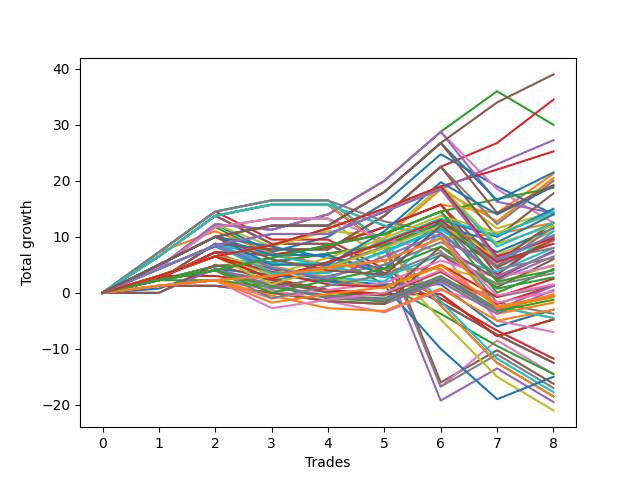

# Long Pointer Eight (0317 1230) 
- Symbol: ES
- Date Range: 03/18/2022 - 07/15/2022
- Trading Period: 7:20-12:30
- Number of Trades: 8



| Name | Win Percent | Profit | Avg Profit / Trade | Avg Time / Trade |      | Name | Win Percent | Profit | Avg Profit / Trade | Avg Time / Trade |
| ---- | ----------- | ------ | ------------------ | ---------------- | ---- | ---- | ----------- | ------ | ------------------ | ---------------- |
| Sorted By <br> Profit | | | | | | Sorted By <br> Win Percentage ||||
| Eighty-Five | 100.00 | 19500.00 | 2437.50 | 13:50 |     | Eighty-Five | 100.00 | 19500.00 | 2437.50 | 13:50 |
| Three | 87.50 | 17250.00 | 2156.25 | 12:56 |     | Eighty-Four | 100.00 | 13625.00 | 1703.12 | 12:21 |
| Two | 75.00 | 15000.00 | 1875.00 | 14:45 |     | Eighty-Three | 100.00 | 12625.00 | 1578.12 | 09:38 |
| Eighty-Four | 100.00 | 13625.00 | 1703.12 | 12:21 |     | Eighty-Two | 100.00 | 9375.00 | 1171.88 | 07:11 |
| Eighty-Three | 100.00 | 12625.00 | 1578.12 | 09:38 |     | Eighty-One | 100.00 | 6250.00 | 781.25 | 06:47 |
| One Hundred Twenty-Five | 87.50 | 10750.00 | 1343.75 | 12:25 |     | Three | 87.50 | 17250.00 | 2156.25 | 12:56 |
| One | 75.00 | 10625.00 | 1328.12 | 08:34 |     | One Hundred Twenty-Five | 87.50 | 10750.00 | 1343.75 | 12:25 |
| Forty-Three | 75.00 | 10250.00 | 1281.25 | 09:06 |     | One Hundred Thirty | 87.50 | 9625.00 | 1203.12 | 12:38 |
| Fifty-Nine | 75.00 | 10000.00 | 1250.00 | 11:36 |     | One Hundred Twenty-Four | 87.50 | 6250.00 | 781.25 | 11:03 |
| One Hundred Thirty | 87.50 | 9625.00 | 1203.12 | 12:38 |     | One Hundred Twenty-Three | 87.50 | 6000.00 | 750.00 | 08:29 |
| One Hundred Fifteen | 75.00 | 9500.00 | 1187.50 | 09:25 |     | Zero | 87.50 | 5750.00 | 718.75 | 03:56 |
| Eighty-Two | 100.00 | 9375.00 | 1171.88 | 07:11 |     | Forty | 87.50 | 5500.00 | 687.50 | 02:06 |
| Sixty-Seven | 75.00 | 8875.00 | 1109.38 | 11:50 |     | One Hundred Twenty-Nine | 87.50 | 5125.00 | 640.62 | 11:17 |
| Ninety-Five | 50.00 | 7500.00 | 937.50 | 03:57 |     | One Hundred Twenty-Eight | 87.50 | 4875.00 | 609.38 | 08:43 |
| One Hundred Four | 75.00 | 7250.00 | 906.25 | 06:58 |     | Forty-Eight | 87.50 | 4625.00 | 578.12 | 02:15 |
| Fifty | 62.50 | 7250.00 | 906.25 | 07:15 |     | Fifty-Six | 87.50 | 3250.00 | 406.25 | 03:01 |
| Sixty-Six | 62.50 | 7125.00 | 890.62 | 12:10 |     | One Hundred Twenty-Two | 87.50 | 3125.00 | 390.62 | 06:05 |
| One Hundred Three | 75.00 | 7000.00 | 875.00 | 04:24 |     | Sixty-Four | 87.50 | 2125.00 | 265.62 | 03:15 |
| One Hundred Five | 62.50 | 7000.00 | 875.00 | 07:51 |     | One Hundred Twenty-Seven | 87.50 | 2000.00 | 250.00 | 06:19 |
| Forty-Two | 62.50 | 7000.00 | 875.00 | 09:28 |     | One Hundred Twenty-One | 87.50 | 750.00 | 93.75 | 05:41 |
| Eighty-One | 100.00 | 6250.00 | 781.25 | 06:47 |     | One Hundred Twenty-Six | 87.50 | -375.00 | -46.88 | 05:55 |
| One Hundred Twenty-Four | 87.50 | 6250.00 | 781.25 | 11:03 |     | Two | 75.00 | 15000.00 | 1875.00 | 14:45 |
| Fifty-Seven | 75.00 | 6250.00 | 781.25 | 07:38 |     | One | 75.00 | 10625.00 | 1328.12 | 08:34 |
| Forty-One | 75.00 | 6250.00 | 781.25 | 06:10 |     | Forty-Three | 75.00 | 10250.00 | 1281.25 | 09:06 |
| Fifty-Eight | 62.50 | 6250.00 | 781.25 | 13:20 |     | Fifty-Nine | 75.00 | 10000.00 | 1250.00 | 11:36 |
| One Hundred Twenty-Three | 87.50 | 6000.00 | 750.00 | 08:29 |     | One Hundred Fifteen | 75.00 | 9500.00 | 1187.50 | 09:25 |
| Forty-Nine | 75.00 | 5875.00 | 734.38 | 05:53 |     | Sixty-Seven | 75.00 | 8875.00 | 1109.38 | 11:50 |
| Zero | 87.50 | 5750.00 | 718.75 | 03:56 |     | One Hundred Four | 75.00 | 7250.00 | 906.25 | 06:58 |
| Forty | 87.50 | 5500.00 | 687.50 | 02:06 |     | One Hundred Three | 75.00 | 7000.00 | 875.00 | 04:24 |
| Fifty-One | 50.00 | 5500.00 | 687.50 | 07:09 |     | Fifty-Seven | 75.00 | 6250.00 | 781.25 | 07:38 |
| One Hundred Twenty-Nine | 87.50 | 5125.00 | 640.62 | 11:17 |     | Forty-One | 75.00 | 6250.00 | 781.25 | 06:10 |
| Sixty-Five | 75.00 | 5125.00 | 640.62 | 07:51 |     | Forty-Nine | 75.00 | 5875.00 | 734.38 | 05:53 |
| One Hundred Fourteen | 75.00 | 5000.00 | 625.00 | 08:03 |     | Sixty-Five | 75.00 | 5125.00 | 640.62 | 07:51 |
| One Hundred Twenty-Eight | 87.50 | 4875.00 | 609.38 | 08:43 |     | One Hundred Fourteen | 75.00 | 5000.00 | 625.00 | 08:03 |
| One Hundred Thirteen | 75.00 | 4750.00 | 593.75 | 05:29 |     | One Hundred Thirteen | 75.00 | 4750.00 | 593.75 | 05:29 |
| One Hundred Twenty | 50.00 | 4750.00 | 593.75 | 07:28 |     | One Hundred Eighteen | 75.00 | 4375.00 | 546.88 | 05:12 |
| Forty-Eight | 87.50 | 4625.00 | 578.12 | 02:15 |     | One Hundred Two | 75.00 | 4000.00 | 500.00 | 02:05 |
| One Hundred Eighteen | 75.00 | 4375.00 | 546.88 | 05:12 |     | One Hundred One | 75.00 | 2375.00 | 296.88 | 01:53 |
| One Hundred Two | 75.00 | 4000.00 | 500.00 | 02:05 |     | One Hundred Twelve | 75.00 | 1750.00 | 218.75 | 03:10 |
| Ninety-Four | 50.00 | 4000.00 | 500.00 | 03:47 |     | One Hundred Seventeen | 75.00 | 1375.00 | 171.88 | 02:53 |
| One Hundred Ten | 50.00 | 3750.00 | 468.75 | 03:25 |     | One Hundred Eleven | 75.00 | 125.00 | 15.62 | 02:58 |
| One Hundred Ninteen | 62.50 | 3625.00 | 453.12 | 06:59 |     | One Hundred Sixteen | 75.00 | -250.00 | -31.25 | 02:41 |
| Fifty-Six | 87.50 | 3250.00 | 406.25 | 03:01 |     | Fifty | 62.50 | 7250.00 | 906.25 | 07:15 |
| One Hundred Twenty-Two | 87.50 | 3125.00 | 390.62 | 06:05 |     | Sixty-Six | 62.50 | 7125.00 | 890.62 | 12:10 |
| One Hundred | 50.00 | 3000.00 | 375.00 | 01:57 |     | One Hundred Five | 62.50 | 7000.00 | 875.00 | 07:51 |
| Ninety-Three | 50.00 | 2500.00 | 312.50 | 02:43 |     | Forty-Two | 62.50 | 7000.00 | 875.00 | 09:28 |
| One Hundred One | 75.00 | 2375.00 | 296.88 | 01:53 |     | Fifty-Eight | 62.50 | 6250.00 | 781.25 | 13:20 |
| Sixty-Four | 87.50 | 2125.00 | 265.62 | 03:15 |     | One Hundred Ninteen | 62.50 | 3625.00 | 453.12 | 06:59 |
| One Hundred Twenty-Seven | 87.50 | 2000.00 | 250.00 | 06:19 |     | Six | 62.50 | -7250.00 | -906.25 | 27:09 |
| One Hundred Twelve | 75.00 | 1750.00 | 218.75 | 03:10 |     | Five | 62.50 | -8125.00 | -1015.62 | 26:19 |
| One Hundred Seventeen | 75.00 | 1375.00 | 171.88 | 02:53 |     | Seven | 62.50 | -8500.00 | -1062.50 | 28:26 |
| One Hundred Eight | 50.00 | 1250.00 | 156.25 | 02:46 |     | Four | 62.50 | -9750.00 | -1218.75 | 25:41 |
| One Hundred Twenty-One | 87.50 | 750.00 | 93.75 | 05:41 |     | Ninety-Five | 50.00 | 7500.00 | 937.50 | 03:57 |
| One Hundred Nine | 50.00 | 625.00 | 78.12 | 03:22 |     | Fifty-One | 50.00 | 5500.00 | 687.50 | 07:09 |
| Ninety-Eight | 50.00 | 625.00 | 78.12 | 01:32 |     | One Hundred Twenty | 50.00 | 4750.00 | 593.75 | 07:28 |
| Ninety-Two | 50.00 | 625.00 | 78.12 | 01:47 |     | Ninety-Four | 50.00 | 4000.00 | 500.00 | 03:47 |
| Ninety-Nine | 50.00 | 250.00 | 31.25 | 01:55 |     | One Hundred Ten | 50.00 | 3750.00 | 468.75 | 03:25 |
| One Hundred Eleven | 75.00 | 125.00 | 15.62 | 02:58 |     | One Hundred | 50.00 | 3000.00 | 375.00 | 01:57 |
| Fifty-Three | 50.00 | -125.00 | -15.62 | 09:29 |     | Ninety-Three | 50.00 | 2500.00 | 312.50 | 02:43 |
| One Hundred Sixteen | 75.00 | -250.00 | -31.25 | 02:41 |     | One Hundred Eight | 50.00 | 1250.00 | 156.25 | 02:46 |
| Ninety-One | 50.00 | -250.00 | -31.25 | 01:38 |     | One Hundred Nine | 50.00 | 625.00 | 78.12 | 03:22 |
| One Hundred Twenty-Six | 87.50 | -375.00 | -46.88 | 05:55 |     | Ninety-Eight | 50.00 | 625.00 | 78.12 | 01:32 |
| Ninety-Seven | 50.00 | -375.00 | -46.88 | 01:03 |     | Ninety-Two | 50.00 | 625.00 | 78.12 | 01:47 |
| One Hundred Seven | 50.00 | -625.00 | -78.12 | 01:51 |     | Ninety-Nine | 50.00 | 250.00 | 31.25 | 01:55 |
| Ninety-Six | 50.00 | -875.00 | -109.38 | 00:58 |     | Fifty-Three | 50.00 | -125.00 | -15.62 | 09:29 |
| One Hundred Six | 50.00 | -1500.00 | -187.50 | 01:42 |     | Ninety-One | 50.00 | -250.00 | -31.25 | 01:38 |
| Fifty-Two | 50.00 | -1500.00 | -187.50 | 09:06 |     | Ninety-Seven | 50.00 | -375.00 | -46.88 | 01:03 |
| Sixty-Nine | 50.00 | -1875.00 | -234.38 | 18:34 |     | One Hundred Seven | 50.00 | -625.00 | -78.12 | 01:51 |
| Seventy-One | 50.00 | -2250.00 | -281.25 | 20:41 |     | Ninety-Six | 50.00 | -875.00 | -109.38 | 00:58 |
| Seventy | 50.00 | -2250.00 | -281.25 | 20:41 |     | One Hundred Six | 50.00 | -1500.00 | -187.50 | 01:42 |
| Fifty-Five | 50.00 | -2375.00 | -296.88 | 10:04 |     | Fifty-Two | 50.00 | -1500.00 | -187.50 | 09:06 |
| Fifty-Four | 50.00 | -2375.00 | -296.88 | 10:04 |     | Sixty-Nine | 50.00 | -1875.00 | -234.38 | 18:34 |
| Sixty-Eight | 50.00 | -3500.00 | -437.50 | 17:56 |     | Seventy-One | 50.00 | -2250.00 | -281.25 | 20:41 |
| Forty-Five | 37.50 | -5875.00 | -734.38 | 15:26 |     | Seventy | 50.00 | -2250.00 | -281.25 | 20:41 |
| Forty-Seven | 37.50 | -6250.00 | -781.25 | 17:33 |     | Fifty-Five | 50.00 | -2375.00 | -296.88 | 10:04 |
| Forty-Six | 37.50 | -6250.00 | -781.25 | 17:33 |     | Fifty-Four | 50.00 | -2375.00 | -296.88 | 10:04 |
| Six | 62.50 | -7250.00 | -906.25 | 27:09 |     | Sixty-Eight | 50.00 | -3500.00 | -437.50 | 17:56 |
| Forty-Four | 37.50 | -7250.00 | -906.25 | 15:03 |     | Sixty-One | 50.00 | -8875.00 | -1109.38 | 20:13 |
| Seventy-Three | 37.50 | -7500.00 | -937.50 | 06:05 |     | Sixty-Three | 50.00 | -9250.00 | -1156.25 | 22:20 |
| Five | 62.50 | -8125.00 | -1015.62 | 26:19 |     | Sixty-Two | 50.00 | -9250.00 | -1156.25 | 22:20 |
| Seven | 62.50 | -8500.00 | -1062.50 | 28:26 |     | Sixty | 50.00 | -10500.00 | -1312.50 | 19:35 |
| Sixty-One | 50.00 | -8875.00 | -1109.38 | 20:13 |     | Forty-Five | 37.50 | -5875.00 | -734.38 | 15:26 |
| Sixty-Three | 50.00 | -9250.00 | -1156.25 | 22:20 |     | Forty-Seven | 37.50 | -6250.00 | -781.25 | 17:33 |
| Sixty-Two | 50.00 | -9250.00 | -1156.25 | 22:20 |     | Forty-Six | 37.50 | -6250.00 | -781.25 | 17:33 |
| Four | 62.50 | -9750.00 | -1218.75 | 25:41 |     | Forty-Four | 37.50 | -7250.00 | -906.25 | 15:03 |
| Sixty | 50.00 | -10500.00 | -1312.50 | 19:35 |     | Seventy-Three | 37.50 | -7500.00 | -937.50 | 06:05 |

## NO STOPLOSS

### Test Zero
* Sell when price hits the middle line of the 20p bollinger
* No Stoploss
* Results:
```
Total Trades: 8
Percent Up: 87.50
Percent Down: 12.50
Total Points Moved Up: 11.50
Potential Profit: 5750.00
Total Points Ups: 16.75 Count Ups: 7
Total Points Downs: -5.25 Count Downs: 1
```

<details><summary>Trades</summary>

<code>In: 2022-03-23 11:17:00		Out: 2022-03-23 11:18:00		Total Position Time: 01:00		Total Move Up: 2.25		Total to Date: 2.25</code> <br />
<code>In: 2022-03-30 12:27:00		Out: 2022-03-30 12:28:15		Total Position Time: 01:15		Total Move Up: 2.50		Total to Date: 4.75</code> <br />
<code>In: 2022-03-31 10:02:00		Out: 2022-03-31 10:04:00		Total Position Time: 02:00		Total Move Up: 0.75		Total to Date: 5.50</code> <br />
<code>In: 2022-04-06 09:23:00		Out: 2022-04-06 09:31:15		Total Position Time: 08:15		Total Move Up: 1.50		Total to Date: 7.00</code> <br />
<code>In: 2022-04-12 11:35:00		Out: 2022-04-12 11:35:50		Total Position Time: 00:50		Total Move Up: 1.50		Total to Date: 8.50</code> <br />
<code>In: 2022-06-13 12:17:00		Out: 2022-06-13 12:17:10		Total Position Time: 00:10		Total Move Up: 4.00		Total to Date: 12.50</code> <br />
<code>In: 2022-06-14 07:32:00		Out: 2022-06-14 07:47:00		Total Position Time: 15:00		Total Move Up: -5.25		Total to Date: 7.25</code> <br />
<code>In: 2022-07-06 08:12:00		Out: 2022-07-06 08:15:05		Total Position Time: 03:05		Total Move Up: 4.25		Total to Date: 11.50</code> <br />


</details>

### Test One
* Sell when the price hits the upper line of the 20p 1std bollinger
* No Stoploss
* Results:
```
Total Trades: 8
Percent Up: 75.00
Percent Down: 25.00
Total Points Moved Up: 21.25
Potential Profit: 10625.00
Total Points Ups: 23.25 Count Ups: 6
Total Points Downs: -2.00 Count Downs: 2
```

<details><summary>Trades</summary>

<code>In: 2022-03-23 11:17:00		Out: 2022-03-23 11:26:45		Total Position Time: 09:45		Total Move Up: 2.50		Total to Date: 2.50</code> <br />
<code>In: 2022-03-30 12:27:00		Out: 2022-03-30 12:32:20		Total Position Time: 05:20		Total Move Up: 4.75		Total to Date: 7.25</code> <br />
<code>In: 2022-03-31 10:02:00		Out: 2022-03-31 10:19:40		Total Position Time: 17:40		Total Move Up: -0.50		Total to Date: 6.75</code> <br />
<code>In: 2022-04-06 09:23:00		Out: 2022-04-06 09:34:05		Total Position Time: 11:05		Total Move Up: 1.50		Total to Date: 8.25</code> <br />
<code>In: 2022-04-12 11:35:00		Out: 2022-04-12 11:37:20		Total Position Time: 02:20		Total Move Up: 3.50		Total to Date: 11.75</code> <br />
<code>In: 2022-06-13 12:17:00		Out: 2022-06-13 12:17:10		Total Position Time: 00:10		Total Move Up: 4.00		Total to Date: 15.75</code> <br />
<code>In: 2022-06-14 07:32:00		Out: 2022-06-14 07:47:10		Total Position Time: 15:10		Total Move Up: -1.50		Total to Date: 14.25</code> <br />
<code>In: 2022-07-06 08:12:00		Out: 2022-07-06 08:19:05		Total Position Time: 07:05		Total Move Up: 7.00		Total to Date: 21.25</code> <br />


</details>

### Test Two
* Sell when the price hits the upper line of the 20p 2std bollinger
* No Stoploss
* Results:
```
Total Trades: 8
Percent Up: 75.00
Percent Down: 25.00
Total Points Moved Up: 30.00
Potential Profit: 15000.00
Total Points Ups: 37.00 Count Ups: 6
Total Points Downs: -7.00 Count Downs: 2
```

<details><summary>Trades</summary>

<code>In: 2022-03-23 11:17:00		Out: 2022-03-23 11:27:00		Total Position Time: 10:00		Total Move Up: 4.50		Total to Date: 4.50</code> <br />
<code>In: 2022-03-30 12:27:00		Out: 2022-03-30 12:36:25		Total Position Time: 09:25		Total Move Up: 7.75		Total to Date: 12.25</code> <br />
<code>In: 2022-03-31 10:02:00		Out: 2022-03-31 10:28:00		Total Position Time: 26:00		Total Move Up: -1.00		Total to Date: 11.25</code> <br />
<code>In: 2022-04-06 09:23:00		Out: 2022-04-06 09:34:25		Total Position Time: 11:25		Total Move Up: 2.75		Total to Date: 14.00</code> <br />
<code>In: 2022-04-12 11:35:00		Out: 2022-04-12 11:47:05		Total Position Time: 12:05		Total Move Up: 6.00		Total to Date: 20.00</code> <br />
<code>In: 2022-06-13 12:17:00		Out: 2022-06-13 12:17:15		Total Position Time: 00:15		Total Move Up: 8.75		Total to Date: 28.75</code> <br />
<code>In: 2022-06-14 07:32:00		Out: 2022-06-14 07:51:00		Total Position Time: 19:00		Total Move Up: 7.25		Total to Date: 36.00</code> <br />
<code>In: 2022-07-06 08:12:00		Out: 2022-07-06 08:41:55		Total Position Time: 29:55		Total Move Up: -6.00		Total to Date: 30.00</code> <br />


</details>

### Test Three
* Sell when price hits the middle line of the 50p bollinger
* No Stoploss
* Results:
```
Total Trades: 8
Percent Up: 87.50
Percent Down: 12.50
Total Points Moved Up: 34.50
Potential Profit: 17250.00
Total Points Ups: 35.50 Count Ups: 7
Total Points Downs: -1.00 Count Downs: 1
```

<details><summary>Trades</summary>

<code>In: 2022-03-23 11:17:00		Out: 2022-03-23 11:18:00		Total Position Time: 01:00		Total Move Up: 2.25		Total to Date: 2.25</code> <br />
<code>In: 2022-03-30 12:27:00		Out: 2022-03-30 12:33:25		Total Position Time: 06:25		Total Move Up: 6.50		Total to Date: 8.75</code> <br />
<code>In: 2022-03-31 10:02:00		Out: 2022-03-31 10:28:00		Total Position Time: 26:00		Total Move Up: -1.00		Total to Date: 7.75</code> <br />
<code>In: 2022-04-06 09:23:00		Out: 2022-04-06 09:52:55		Total Position Time: 29:55		Total Move Up: 0.00		Total to Date: 7.75</code> <br />
<code>In: 2022-04-12 11:35:00		Out: 2022-04-12 11:47:05		Total Position Time: 12:05		Total Move Up: 6.00		Total to Date: 13.75</code> <br />
<code>In: 2022-06-13 12:17:00		Out: 2022-06-13 12:17:15		Total Position Time: 00:15		Total Move Up: 8.75		Total to Date: 22.50</code> <br />
<code>In: 2022-06-14 07:32:00		Out: 2022-06-14 07:50:15		Total Position Time: 18:15		Total Move Up: 4.25		Total to Date: 26.75</code> <br />
<code>In: 2022-07-06 08:12:00		Out: 2022-07-06 08:21:35		Total Position Time: 09:35		Total Move Up: 7.75		Total to Date: 34.50</code> <br />


</details>

### Test Four
* Sell when the price hits the upper line of the 50p 1std bollinger
* No Stoploss
* Results:
```
Total Trades: 8
Percent Up: 62.50
Percent Down: 37.50
Total Points Moved Up: -19.50
Potential Profit: -9750.00
Total Points Ups: 19.00 Count Ups: 5
Total Points Downs: -38.50 Count Downs: 3
```

<details><summary>Trades</summary>

<code>In: 2022-03-23 11:17:00		Out: 2022-03-23 11:27:00		Total Position Time: 10:00		Total Move Up: 4.50		Total to Date: 4.50</code> <br />
<code>In: 2022-03-30 12:27:00		Out: 2022-03-30 12:46:00		Total Position Time: 19:00		Total Move Up: 7.25		Total to Date: 11.75</code> <br />
<code>In: 2022-03-31 10:02:00		Out: 2022-03-31 10:29:50		Total Position Time: 27:50		Total Move Up: 1.50		Total to Date: 13.25</code> <br />
<code>In: 2022-04-06 09:23:00		Out: 2022-04-06 09:52:55		Total Position Time: 29:55		Total Move Up: 0.00		Total to Date: 13.25</code> <br />
<code>In: 2022-04-12 11:35:00		Out: 2022-04-12 12:04:55		Total Position Time: 29:55		Total Move Up: -7.50		Total to Date: 5.75</code> <br />
<code>In: 2022-06-13 12:17:00		Out: 2022-06-13 12:46:00		Total Position Time: 29:00		Total Move Up: -25.00		Total to Date: -19.25</code> <br />
<code>In: 2022-06-14 07:32:00		Out: 2022-06-14 08:01:55		Total Position Time: 29:55		Total Move Up: 5.75		Total to Date: -13.50</code> <br />
<code>In: 2022-07-06 08:12:00		Out: 2022-07-06 08:41:55		Total Position Time: 29:55		Total Move Up: -6.00		Total to Date: -19.50</code> <br />


</details>

### Test Five
* Sell when the price hits the upper line of the 50p 2std bollinger
* No Stoploss
* Results:
```
Total Trades: 8
Percent Up: 62.50
Percent Down: 37.50
Total Points Moved Up: -16.25
Potential Profit: -8125.00
Total Points Ups: 22.25 Count Ups: 5
Total Points Downs: -38.50 Count Downs: 3
```

<details><summary>Trades</summary>

<code>In: 2022-03-23 11:17:00		Out: 2022-03-23 11:30:00		Total Position Time: 13:00		Total Move Up: 7.25		Total to Date: 7.25</code> <br />
<code>In: 2022-03-30 12:27:00		Out: 2022-03-30 12:46:00		Total Position Time: 19:00		Total Move Up: 7.25		Total to Date: 14.50</code> <br />
<code>In: 2022-03-31 10:02:00		Out: 2022-03-31 10:31:55		Total Position Time: 29:55		Total Move Up: 2.00		Total to Date: 16.50</code> <br />
<code>In: 2022-04-06 09:23:00		Out: 2022-04-06 09:52:55		Total Position Time: 29:55		Total Move Up: 0.00		Total to Date: 16.50</code> <br />
<code>In: 2022-04-12 11:35:00		Out: 2022-04-12 12:04:55		Total Position Time: 29:55		Total Move Up: -7.50		Total to Date: 9.00</code> <br />
<code>In: 2022-06-13 12:17:00		Out: 2022-06-13 12:46:00		Total Position Time: 29:00		Total Move Up: -25.00		Total to Date: -16.00</code> <br />
<code>In: 2022-06-14 07:32:00		Out: 2022-06-14 08:01:55		Total Position Time: 29:55		Total Move Up: 5.75		Total to Date: -10.25</code> <br />
<code>In: 2022-07-06 08:12:00		Out: 2022-07-06 08:41:55		Total Position Time: 29:55		Total Move Up: -6.00		Total to Date: -16.25</code> <br />


</details>

### Test Six
* Sell when the price hits the middle line of the 1std VWAP
* No Stoploss
* Results:
```
Total Trades: 8
Percent Up: 62.50
Percent Down: 37.50
Total Points Moved Up: -14.50
Potential Profit: -7250.00
Total Points Ups: 24.00 Count Ups: 5
Total Points Downs: -38.50 Count Downs: 3
```

<details><summary>Trades</summary>

<code>In: 2022-03-23 11:17:00		Out: 2022-03-23 11:46:55		Total Position Time: 29:55		Total Move Up: 6.50		Total to Date: 6.50</code> <br />
<code>In: 2022-03-30 12:27:00		Out: 2022-03-30 12:46:00		Total Position Time: 19:00		Total Move Up: 7.25		Total to Date: 13.75</code> <br />
<code>In: 2022-03-31 10:02:00		Out: 2022-03-31 10:31:55		Total Position Time: 29:55		Total Move Up: 2.00		Total to Date: 15.75</code> <br />
<code>In: 2022-04-06 09:23:00		Out: 2022-04-06 09:52:55		Total Position Time: 29:55		Total Move Up: 0.00		Total to Date: 15.75</code> <br />
<code>In: 2022-04-12 11:35:00		Out: 2022-04-12 12:04:55		Total Position Time: 29:55		Total Move Up: -7.50		Total to Date: 8.25</code> <br />
<code>In: 2022-06-13 12:17:00		Out: 2022-06-13 12:46:00		Total Position Time: 29:00		Total Move Up: -25.00		Total to Date: -16.75</code> <br />
<code>In: 2022-06-14 07:32:00		Out: 2022-06-14 07:51:40		Total Position Time: 19:40		Total Move Up: 8.25		Total to Date: -8.50</code> <br />
<code>In: 2022-07-06 08:12:00		Out: 2022-07-06 08:41:55		Total Position Time: 29:55		Total Move Up: -6.00		Total to Date: -14.50</code> <br />


</details>

### Test Seven
* Sell when the price hits the upper line of the 1std VWAP
* No Stoploss
* Results:
```
Total Trades: 8
Percent Up: 62.50
Percent Down: 37.50
Total Points Moved Up: -17.00
Potential Profit: -8500.00
Total Points Ups: 21.50 Count Ups: 5
Total Points Downs: -38.50 Count Downs: 3
```

<details><summary>Trades</summary>

<code>In: 2022-03-23 11:17:00		Out: 2022-03-23 11:46:55		Total Position Time: 29:55		Total Move Up: 6.50		Total to Date: 6.50</code> <br />
<code>In: 2022-03-30 12:27:00		Out: 2022-03-30 12:46:00		Total Position Time: 19:00		Total Move Up: 7.25		Total to Date: 13.75</code> <br />
<code>In: 2022-03-31 10:02:00		Out: 2022-03-31 10:31:55		Total Position Time: 29:55		Total Move Up: 2.00		Total to Date: 15.75</code> <br />
<code>In: 2022-04-06 09:23:00		Out: 2022-04-06 09:52:55		Total Position Time: 29:55		Total Move Up: 0.00		Total to Date: 15.75</code> <br />
<code>In: 2022-04-12 11:35:00		Out: 2022-04-12 12:04:55		Total Position Time: 29:55		Total Move Up: -7.50		Total to Date: 8.25</code> <br />
<code>In: 2022-06-13 12:17:00		Out: 2022-06-13 12:46:00		Total Position Time: 29:00		Total Move Up: -25.00		Total to Date: -16.75</code> <br />
<code>In: 2022-06-14 07:32:00		Out: 2022-06-14 08:01:55		Total Position Time: 29:55		Total Move Up: 5.75		Total to Date: -11.00</code> <br />
<code>In: 2022-07-06 08:12:00		Out: 2022-07-06 08:41:55		Total Position Time: 29:55		Total Move Up: -6.00		Total to Date: -17.00</code> <br />


</details>

## STOPLOSS OF 5

### Test Forty
* Sell when price hits the middle line of the 20p bollinger
* Stoploss is 5 points
* Results:
```
Total Trades: 8
Percent Up: 87.50
Percent Down: 12.50
Total Points Moved Up: 11.00
Potential Profit: 5500.00
Total Points Ups: 16.75 Count Ups: 7
Total Points Downs: -5.75 Count Downs: 1
```

<details><summary>Trades</summary>

<code>In: 2022-03-23 11:17:00		Out: 2022-03-23 11:18:00		Total Position Time: 01:00		Total Move Up: 2.25		Total to Date: 2.25</code> <br />
<code>In: 2022-03-30 12:27:00		Out: 2022-03-30 12:28:15		Total Position Time: 01:15		Total Move Up: 2.50		Total to Date: 4.75</code> <br />
<code>In: 2022-03-31 10:02:00		Out: 2022-03-31 10:04:00		Total Position Time: 02:00		Total Move Up: 0.75		Total to Date: 5.50</code> <br />
<code>In: 2022-04-06 09:23:00		Out: 2022-04-06 09:31:15		Total Position Time: 08:15		Total Move Up: 1.50		Total to Date: 7.00</code> <br />
<code>In: 2022-04-12 11:35:00		Out: 2022-04-12 11:35:50		Total Position Time: 00:50		Total Move Up: 1.50		Total to Date: 8.50</code> <br />
<code>In: 2022-06-13 12:17:00		Out: 2022-06-13 12:17:10		Total Position Time: 00:10		Total Move Up: 4.00		Total to Date: 12.50</code> <br />
<code>In: 2022-06-14 07:32:00		Out: 2022-06-14 07:32:20		Total Position Time: 00:20		Total Move Up: -5.75		Total to Date: 6.75</code> <br />
<code>In: 2022-07-06 08:12:00		Out: 2022-07-06 08:15:05		Total Position Time: 03:05		Total Move Up: 4.25		Total to Date: 11.00</code> <br />


</details>

### Test Forty-One
* Sell when the price hits the upper line of the 20p 1std bollinger
* Stoploss is 5 points
* Results:
```
Total Trades: 8
Percent Up: 75.00
Percent Down: 25.00
Total Points Moved Up: 12.50
Potential Profit: 6250.00
Total Points Ups: 23.25 Count Ups: 6
Total Points Downs: -10.75 Count Downs: 2
```

<details><summary>Trades</summary>

<code>In: 2022-03-23 11:17:00		Out: 2022-03-23 11:26:45		Total Position Time: 09:45		Total Move Up: 2.50		Total to Date: 2.50</code> <br />
<code>In: 2022-03-30 12:27:00		Out: 2022-03-30 12:32:20		Total Position Time: 05:20		Total Move Up: 4.75		Total to Date: 7.25</code> <br />
<code>In: 2022-03-31 10:02:00		Out: 2022-03-31 10:15:15		Total Position Time: 13:15		Total Move Up: -5.00		Total to Date: 2.25</code> <br />
<code>In: 2022-04-06 09:23:00		Out: 2022-04-06 09:34:05		Total Position Time: 11:05		Total Move Up: 1.50		Total to Date: 3.75</code> <br />
<code>In: 2022-04-12 11:35:00		Out: 2022-04-12 11:37:20		Total Position Time: 02:20		Total Move Up: 3.50		Total to Date: 7.25</code> <br />
<code>In: 2022-06-13 12:17:00		Out: 2022-06-13 12:17:10		Total Position Time: 00:10		Total Move Up: 4.00		Total to Date: 11.25</code> <br />
<code>In: 2022-06-14 07:32:00		Out: 2022-06-14 07:32:20		Total Position Time: 00:20		Total Move Up: -5.75		Total to Date: 5.50</code> <br />
<code>In: 2022-07-06 08:12:00		Out: 2022-07-06 08:19:05		Total Position Time: 07:05		Total Move Up: 7.00		Total to Date: 12.50</code> <br />


</details>

### Test Forty-Two
* Sell when the price hits the upper line of the 20p 2std bollinger
* Stoploss is 5 points
* Results:
```
Total Trades: 8
Percent Up: 62.50
Percent Down: 37.50
Total Points Moved Up: 14.00
Potential Profit: 7000.00
Total Points Ups: 29.75 Count Ups: 5
Total Points Downs: -15.75 Count Downs: 3
```

<details><summary>Trades</summary>

<code>In: 2022-03-23 11:17:00		Out: 2022-03-23 11:27:00		Total Position Time: 10:00		Total Move Up: 4.50		Total to Date: 4.50</code> <br />
<code>In: 2022-03-30 12:27:00		Out: 2022-03-30 12:36:25		Total Position Time: 09:25		Total Move Up: 7.75		Total to Date: 12.25</code> <br />
<code>In: 2022-03-31 10:02:00		Out: 2022-03-31 10:15:15		Total Position Time: 13:15		Total Move Up: -5.00		Total to Date: 7.25</code> <br />
<code>In: 2022-04-06 09:23:00		Out: 2022-04-06 09:34:25		Total Position Time: 11:25		Total Move Up: 2.75		Total to Date: 10.00</code> <br />
<code>In: 2022-04-12 11:35:00		Out: 2022-04-12 11:47:05		Total Position Time: 12:05		Total Move Up: 6.00		Total to Date: 16.00</code> <br />
<code>In: 2022-06-13 12:17:00		Out: 2022-06-13 12:17:15		Total Position Time: 00:15		Total Move Up: 8.75		Total to Date: 24.75</code> <br />
<code>In: 2022-06-14 07:32:00		Out: 2022-06-14 07:32:20		Total Position Time: 00:20		Total Move Up: -5.75		Total to Date: 19.00</code> <br />
<code>In: 2022-07-06 08:12:00		Out: 2022-07-06 08:31:00		Total Position Time: 19:00		Total Move Up: -5.00		Total to Date: 14.00</code> <br />


</details>

### Test Forty-Three
* Sell when price hits the middle line of the 50p bollinger
* Stoploss is 5 points
* Results:
```
Total Trades: 8
Percent Up: 75.00
Percent Down: 25.00
Total Points Moved Up: 20.50
Potential Profit: 10250.00
Total Points Ups: 31.25 Count Ups: 6
Total Points Downs: -10.75 Count Downs: 2
```

<details><summary>Trades</summary>

<code>In: 2022-03-23 11:17:00		Out: 2022-03-23 11:18:00		Total Position Time: 01:00		Total Move Up: 2.25		Total to Date: 2.25</code> <br />
<code>In: 2022-03-30 12:27:00		Out: 2022-03-30 12:33:25		Total Position Time: 06:25		Total Move Up: 6.50		Total to Date: 8.75</code> <br />
<code>In: 2022-03-31 10:02:00		Out: 2022-03-31 10:15:15		Total Position Time: 13:15		Total Move Up: -5.00		Total to Date: 3.75</code> <br />
<code>In: 2022-04-06 09:23:00		Out: 2022-04-06 09:52:55		Total Position Time: 29:55		Total Move Up: 0.00		Total to Date: 3.75</code> <br />
<code>In: 2022-04-12 11:35:00		Out: 2022-04-12 11:47:05		Total Position Time: 12:05		Total Move Up: 6.00		Total to Date: 9.75</code> <br />
<code>In: 2022-06-13 12:17:00		Out: 2022-06-13 12:17:15		Total Position Time: 00:15		Total Move Up: 8.75		Total to Date: 18.50</code> <br />
<code>In: 2022-06-14 07:32:00		Out: 2022-06-14 07:32:20		Total Position Time: 00:20		Total Move Up: -5.75		Total to Date: 12.75</code> <br />
<code>In: 2022-07-06 08:12:00		Out: 2022-07-06 08:21:35		Total Position Time: 09:35		Total Move Up: 7.75		Total to Date: 20.50</code> <br />


</details>

### Test Forty-Four
* Sell when the price hits the upper line of the 50p 1std bollinger
* Stoploss is 5 points
* Results:
```
Total Trades: 8
Percent Up: 37.50
Percent Down: 62.50
Total Points Moved Up: -14.50
Potential Profit: -7250.00
Total Points Ups: 11.75 Count Ups: 3
Total Points Downs: -26.25 Count Downs: 5
```

<details><summary>Trades</summary>

<code>In: 2022-03-23 11:17:00		Out: 2022-03-23 11:27:00		Total Position Time: 10:00		Total Move Up: 4.50		Total to Date: 4.50</code> <br />
<code>In: 2022-03-30 12:27:00		Out: 2022-03-30 12:46:00		Total Position Time: 19:00		Total Move Up: 7.25		Total to Date: 11.75</code> <br />
<code>In: 2022-03-31 10:02:00		Out: 2022-03-31 10:15:15		Total Position Time: 13:15		Total Move Up: -5.00		Total to Date: 6.75</code> <br />
<code>In: 2022-04-06 09:23:00		Out: 2022-04-06 09:52:55		Total Position Time: 29:55		Total Move Up: 0.00		Total to Date: 6.75</code> <br />
<code>In: 2022-04-12 11:35:00		Out: 2022-04-12 12:03:05		Total Position Time: 28:05		Total Move Up: -5.25		Total to Date: 1.50</code> <br />
<code>In: 2022-06-13 12:17:00		Out: 2022-06-13 12:17:55		Total Position Time: 00:55		Total Move Up: -5.25		Total to Date: -3.75</code> <br />
<code>In: 2022-06-14 07:32:00		Out: 2022-06-14 07:32:20		Total Position Time: 00:20		Total Move Up: -5.75		Total to Date: -9.50</code> <br />
<code>In: 2022-07-06 08:12:00		Out: 2022-07-06 08:31:00		Total Position Time: 19:00		Total Move Up: -5.00		Total to Date: -14.50</code> <br />


</details>

### Test Forty-Five
* Sell when the price hits the upper line of the 50p 2std bollinger
* Stoploss is 5 points
* Results:
```
Total Trades: 8
Percent Up: 37.50
Percent Down: 62.50
Total Points Moved Up: -11.75
Potential Profit: -5875.00
Total Points Ups: 14.50 Count Ups: 3
Total Points Downs: -26.25 Count Downs: 5
```

<details><summary>Trades</summary>

<code>In: 2022-03-23 11:17:00		Out: 2022-03-23 11:30:00		Total Position Time: 13:00		Total Move Up: 7.25		Total to Date: 7.25</code> <br />
<code>In: 2022-03-30 12:27:00		Out: 2022-03-30 12:46:00		Total Position Time: 19:00		Total Move Up: 7.25		Total to Date: 14.50</code> <br />
<code>In: 2022-03-31 10:02:00		Out: 2022-03-31 10:15:15		Total Position Time: 13:15		Total Move Up: -5.00		Total to Date: 9.50</code> <br />
<code>In: 2022-04-06 09:23:00		Out: 2022-04-06 09:52:55		Total Position Time: 29:55		Total Move Up: 0.00		Total to Date: 9.50</code> <br />
<code>In: 2022-04-12 11:35:00		Out: 2022-04-12 12:03:05		Total Position Time: 28:05		Total Move Up: -5.25		Total to Date: 4.25</code> <br />
<code>In: 2022-06-13 12:17:00		Out: 2022-06-13 12:17:55		Total Position Time: 00:55		Total Move Up: -5.25		Total to Date: -1.00</code> <br />
<code>In: 2022-06-14 07:32:00		Out: 2022-06-14 07:32:20		Total Position Time: 00:20		Total Move Up: -5.75		Total to Date: -6.75</code> <br />
<code>In: 2022-07-06 08:12:00		Out: 2022-07-06 08:31:00		Total Position Time: 19:00		Total Move Up: -5.00		Total to Date: -11.75</code> <br />


</details>

### Test Forty-Six
* Sell when the price hits the middle line of the 1std VWAP
* Stoploss is 5 points
* Results:
```
Total Trades: 8
Percent Up: 37.50
Percent Down: 62.50
Total Points Moved Up: -12.50
Potential Profit: -6250.00
Total Points Ups: 13.75 Count Ups: 3
Total Points Downs: -26.25 Count Downs: 5
```

<details><summary>Trades</summary>

<code>In: 2022-03-23 11:17:00		Out: 2022-03-23 11:46:55		Total Position Time: 29:55		Total Move Up: 6.50		Total to Date: 6.50</code> <br />
<code>In: 2022-03-30 12:27:00		Out: 2022-03-30 12:46:00		Total Position Time: 19:00		Total Move Up: 7.25		Total to Date: 13.75</code> <br />
<code>In: 2022-03-31 10:02:00		Out: 2022-03-31 10:15:15		Total Position Time: 13:15		Total Move Up: -5.00		Total to Date: 8.75</code> <br />
<code>In: 2022-04-06 09:23:00		Out: 2022-04-06 09:52:55		Total Position Time: 29:55		Total Move Up: 0.00		Total to Date: 8.75</code> <br />
<code>In: 2022-04-12 11:35:00		Out: 2022-04-12 12:03:05		Total Position Time: 28:05		Total Move Up: -5.25		Total to Date: 3.50</code> <br />
<code>In: 2022-06-13 12:17:00		Out: 2022-06-13 12:17:55		Total Position Time: 00:55		Total Move Up: -5.25		Total to Date: -1.75</code> <br />
<code>In: 2022-06-14 07:32:00		Out: 2022-06-14 07:32:20		Total Position Time: 00:20		Total Move Up: -5.75		Total to Date: -7.50</code> <br />
<code>In: 2022-07-06 08:12:00		Out: 2022-07-06 08:31:00		Total Position Time: 19:00		Total Move Up: -5.00		Total to Date: -12.50</code> <br />


</details>

### Test Forty-Seven
* Sell when the price hits the upper line of the 1std VWAP
* Stoploss is 5 points
* Results:
```
Total Trades: 8
Percent Up: 37.50
Percent Down: 62.50
Total Points Moved Up: -12.50
Potential Profit: -6250.00
Total Points Ups: 13.75 Count Ups: 3
Total Points Downs: -26.25 Count Downs: 5
```

<details><summary>Trades</summary>

<code>In: 2022-03-23 11:17:00		Out: 2022-03-23 11:46:55		Total Position Time: 29:55		Total Move Up: 6.50		Total to Date: 6.50</code> <br />
<code>In: 2022-03-30 12:27:00		Out: 2022-03-30 12:46:00		Total Position Time: 19:00		Total Move Up: 7.25		Total to Date: 13.75</code> <br />
<code>In: 2022-03-31 10:02:00		Out: 2022-03-31 10:15:15		Total Position Time: 13:15		Total Move Up: -5.00		Total to Date: 8.75</code> <br />
<code>In: 2022-04-06 09:23:00		Out: 2022-04-06 09:52:55		Total Position Time: 29:55		Total Move Up: 0.00		Total to Date: 8.75</code> <br />
<code>In: 2022-04-12 11:35:00		Out: 2022-04-12 12:03:05		Total Position Time: 28:05		Total Move Up: -5.25		Total to Date: 3.50</code> <br />
<code>In: 2022-06-13 12:17:00		Out: 2022-06-13 12:17:55		Total Position Time: 00:55		Total Move Up: -5.25		Total to Date: -1.75</code> <br />
<code>In: 2022-06-14 07:32:00		Out: 2022-06-14 07:32:20		Total Position Time: 00:20		Total Move Up: -5.75		Total to Date: -7.50</code> <br />
<code>In: 2022-07-06 08:12:00		Out: 2022-07-06 08:31:00		Total Position Time: 19:00		Total Move Up: -5.00		Total to Date: -12.50</code> <br />


</details>

## TRAIL STOP OF 5

### Test Forty-Eight
* Sell when price hits the middle line of the 20p bollinger
* Trailing Stop is 5 points
* Results:
```
Total Trades: 8
Percent Up: 87.50
Percent Down: 12.50
Total Points Moved Up: 9.25
Potential Profit: 4625.00
Total Points Ups: 16.75 Count Ups: 7
Total Points Downs: -7.50 Count Downs: 1
```

<details><summary>Trades</summary>

<code>In: 2022-03-23 11:17:00		Out: 2022-03-23 11:18:00		Total Position Time: 01:00		Total Move Up: 2.25		Total to Date: 2.25</code> <br />
<code>In: 2022-03-30 12:27:00		Out: 2022-03-30 12:28:15		Total Position Time: 01:15		Total Move Up: 2.50		Total to Date: 4.75</code> <br />
<code>In: 2022-03-31 10:02:00		Out: 2022-03-31 10:04:00		Total Position Time: 02:00		Total Move Up: 0.75		Total to Date: 5.50</code> <br />
<code>In: 2022-04-06 09:23:00		Out: 2022-04-06 09:31:15		Total Position Time: 08:15		Total Move Up: 1.50		Total to Date: 7.00</code> <br />
<code>In: 2022-04-12 11:35:00		Out: 2022-04-12 11:35:50		Total Position Time: 00:50		Total Move Up: 1.50		Total to Date: 8.50</code> <br />
<code>In: 2022-06-13 12:17:00		Out: 2022-06-13 12:17:10		Total Position Time: 00:10		Total Move Up: 4.00		Total to Date: 12.50</code> <br />
<code>In: 2022-06-14 07:32:00		Out: 2022-06-14 07:33:25		Total Position Time: 01:25		Total Move Up: -7.50		Total to Date: 5.00</code> <br />
<code>In: 2022-07-06 08:12:00		Out: 2022-07-06 08:15:05		Total Position Time: 03:05		Total Move Up: 4.25		Total to Date: 9.25</code> <br />


</details>

### Test Forty-Nine
* Sell when the price hits the upper line of the 20p 1std bollinger
* Trailing Stop is 5 points
* Results:
```
Total Trades: 8
Percent Up: 75.00
Percent Down: 25.00
Total Points Moved Up: 11.75
Potential Profit: 5875.00
Total Points Ups: 23.25 Count Ups: 6
Total Points Downs: -11.50 Count Downs: 2
```

<details><summary>Trades</summary>

<code>In: 2022-03-23 11:17:00		Out: 2022-03-23 11:26:45		Total Position Time: 09:45		Total Move Up: 2.50		Total to Date: 2.50</code> <br />
<code>In: 2022-03-30 12:27:00		Out: 2022-03-30 12:32:20		Total Position Time: 05:20		Total Move Up: 4.75		Total to Date: 7.25</code> <br />
<code>In: 2022-03-31 10:02:00		Out: 2022-03-31 10:11:55		Total Position Time: 09:55		Total Move Up: -4.00		Total to Date: 3.25</code> <br />
<code>In: 2022-04-06 09:23:00		Out: 2022-04-06 09:34:05		Total Position Time: 11:05		Total Move Up: 1.50		Total to Date: 4.75</code> <br />
<code>In: 2022-04-12 11:35:00		Out: 2022-04-12 11:37:20		Total Position Time: 02:20		Total Move Up: 3.50		Total to Date: 8.25</code> <br />
<code>In: 2022-06-13 12:17:00		Out: 2022-06-13 12:17:10		Total Position Time: 00:10		Total Move Up: 4.00		Total to Date: 12.25</code> <br />
<code>In: 2022-06-14 07:32:00		Out: 2022-06-14 07:33:25		Total Position Time: 01:25		Total Move Up: -7.50		Total to Date: 4.75</code> <br />
<code>In: 2022-07-06 08:12:00		Out: 2022-07-06 08:19:05		Total Position Time: 07:05		Total Move Up: 7.00		Total to Date: 11.75</code> <br />


</details>

### Test Fifty
* Sell when the price hits the upper line of the 20p 2std bollinger
* Trailing Stop is 5 points
* Results:
```
Total Trades: 8
Percent Up: 62.50
Percent Down: 37.50
Total Points Moved Up: 14.50
Potential Profit: 7250.00
Total Points Ups: 26.75 Count Ups: 5
Total Points Downs: -12.25 Count Downs: 3
```

<details><summary>Trades</summary>

<code>In: 2022-03-23 11:17:00		Out: 2022-03-23 11:27:00		Total Position Time: 10:00		Total Move Up: 4.50		Total to Date: 4.50</code> <br />
<code>In: 2022-03-30 12:27:00		Out: 2022-03-30 12:36:25		Total Position Time: 09:25		Total Move Up: 7.75		Total to Date: 12.25</code> <br />
<code>In: 2022-03-31 10:02:00		Out: 2022-03-31 10:11:55		Total Position Time: 09:55		Total Move Up: -4.00		Total to Date: 8.25</code> <br />
<code>In: 2022-04-06 09:23:00		Out: 2022-04-06 09:34:25		Total Position Time: 11:25		Total Move Up: 2.75		Total to Date: 11.00</code> <br />
<code>In: 2022-04-12 11:35:00		Out: 2022-04-12 11:40:05		Total Position Time: 05:05		Total Move Up: -0.75		Total to Date: 10.25</code> <br />
<code>In: 2022-06-13 12:17:00		Out: 2022-06-13 12:17:15		Total Position Time: 00:15		Total Move Up: 8.75		Total to Date: 19.00</code> <br />
<code>In: 2022-06-14 07:32:00		Out: 2022-06-14 07:33:25		Total Position Time: 01:25		Total Move Up: -7.50		Total to Date: 11.50</code> <br />
<code>In: 2022-07-06 08:12:00		Out: 2022-07-06 08:22:35		Total Position Time: 10:35		Total Move Up: 3.00		Total to Date: 14.50</code> <br />


</details>

### Test Fifty-One
* Sell when price hits the middle line of the 50p bollinger
* Trailing Stop is 5 points
* Results:
```
Total Trades: 8
Percent Up: 50.00
Percent Down: 50.00
Total Points Moved Up: 11.00
Potential Profit: 5500.00
Total Points Ups: 25.25 Count Ups: 4
Total Points Downs: -14.25 Count Downs: 4
```

<details><summary>Trades</summary>

<code>In: 2022-03-23 11:17:00		Out: 2022-03-23 11:18:00		Total Position Time: 01:00		Total Move Up: 2.25		Total to Date: 2.25</code> <br />
<code>In: 2022-03-30 12:27:00		Out: 2022-03-30 12:33:25		Total Position Time: 06:25		Total Move Up: 6.50		Total to Date: 8.75</code> <br />
<code>In: 2022-03-31 10:02:00		Out: 2022-03-31 10:11:55		Total Position Time: 09:55		Total Move Up: -4.00		Total to Date: 4.75</code> <br />
<code>In: 2022-04-06 09:23:00		Out: 2022-04-06 09:46:35		Total Position Time: 23:35		Total Move Up: -2.00		Total to Date: 2.75</code> <br />
<code>In: 2022-04-12 11:35:00		Out: 2022-04-12 11:40:05		Total Position Time: 05:05		Total Move Up: -0.75		Total to Date: 2.00</code> <br />
<code>In: 2022-06-13 12:17:00		Out: 2022-06-13 12:17:15		Total Position Time: 00:15		Total Move Up: 8.75		Total to Date: 10.75</code> <br />
<code>In: 2022-06-14 07:32:00		Out: 2022-06-14 07:33:25		Total Position Time: 01:25		Total Move Up: -7.50		Total to Date: 3.25</code> <br />
<code>In: 2022-07-06 08:12:00		Out: 2022-07-06 08:21:35		Total Position Time: 09:35		Total Move Up: 7.75		Total to Date: 11.00</code> <br />


</details>

### Test Fifty-Two
* Sell when the price hits the upper line of the 50p 1std bollinger
* Trailing Stop is 5 points
* Results:
```
Total Trades: 8
Percent Up: 50.00
Percent Down: 50.00
Total Points Moved Up: -3.00
Potential Profit: -1500.00
Total Points Ups: 11.25 Count Ups: 4
Total Points Downs: -14.25 Count Downs: 4
```

<details><summary>Trades</summary>

<code>In: 2022-03-23 11:17:00		Out: 2022-03-23 11:27:00		Total Position Time: 10:00		Total Move Up: 4.50		Total to Date: 4.50</code> <br />
<code>In: 2022-03-30 12:27:00		Out: 2022-03-30 12:38:50		Total Position Time: 11:50		Total Move Up: 3.75		Total to Date: 8.25</code> <br />
<code>In: 2022-03-31 10:02:00		Out: 2022-03-31 10:11:55		Total Position Time: 09:55		Total Move Up: -4.00		Total to Date: 4.25</code> <br />
<code>In: 2022-04-06 09:23:00		Out: 2022-04-06 09:46:35		Total Position Time: 23:35		Total Move Up: -2.00		Total to Date: 2.25</code> <br />
<code>In: 2022-04-12 11:35:00		Out: 2022-04-12 11:40:05		Total Position Time: 05:05		Total Move Up: -0.75		Total to Date: 1.50</code> <br />
<code>In: 2022-06-13 12:17:00		Out: 2022-06-13 12:17:30		Total Position Time: 00:30		Total Move Up: 0.00		Total to Date: 1.50</code> <br />
<code>In: 2022-06-14 07:32:00		Out: 2022-06-14 07:33:25		Total Position Time: 01:25		Total Move Up: -7.50		Total to Date: -6.00</code> <br />
<code>In: 2022-07-06 08:12:00		Out: 2022-07-06 08:22:35		Total Position Time: 10:35		Total Move Up: 3.00		Total to Date: -3.00</code> <br />


</details>

### Test Fifty-Three
* Sell when the price hits the upper line of the 50p 2std bollinger
* Trailing Stop is 5 points
* Results:
```
Total Trades: 8
Percent Up: 50.00
Percent Down: 50.00
Total Points Moved Up: -0.25
Potential Profit: -125.00
Total Points Ups: 14.00 Count Ups: 4
Total Points Downs: -14.25 Count Downs: 4
```

<details><summary>Trades</summary>

<code>In: 2022-03-23 11:17:00		Out: 2022-03-23 11:30:00		Total Position Time: 13:00		Total Move Up: 7.25		Total to Date: 7.25</code> <br />
<code>In: 2022-03-30 12:27:00		Out: 2022-03-30 12:38:50		Total Position Time: 11:50		Total Move Up: 3.75		Total to Date: 11.00</code> <br />
<code>In: 2022-03-31 10:02:00		Out: 2022-03-31 10:11:55		Total Position Time: 09:55		Total Move Up: -4.00		Total to Date: 7.00</code> <br />
<code>In: 2022-04-06 09:23:00		Out: 2022-04-06 09:46:35		Total Position Time: 23:35		Total Move Up: -2.00		Total to Date: 5.00</code> <br />
<code>In: 2022-04-12 11:35:00		Out: 2022-04-12 11:40:05		Total Position Time: 05:05		Total Move Up: -0.75		Total to Date: 4.25</code> <br />
<code>In: 2022-06-13 12:17:00		Out: 2022-06-13 12:17:30		Total Position Time: 00:30		Total Move Up: 0.00		Total to Date: 4.25</code> <br />
<code>In: 2022-06-14 07:32:00		Out: 2022-06-14 07:33:25		Total Position Time: 01:25		Total Move Up: -7.50		Total to Date: -3.25</code> <br />
<code>In: 2022-07-06 08:12:00		Out: 2022-07-06 08:22:35		Total Position Time: 10:35		Total Move Up: 3.00		Total to Date: -0.25</code> <br />


</details>

### Test Fifty-Four
* Sell when the price hits the middle line of the 1std VWAP
* Trailing Stop is 5 points
* Results:
```
Total Trades: 8
Percent Up: 50.00
Percent Down: 50.00
Total Points Moved Up: -4.75
Potential Profit: -2375.00
Total Points Ups: 9.50 Count Ups: 4
Total Points Downs: -14.25 Count Downs: 4
```

<details><summary>Trades</summary>

<code>In: 2022-03-23 11:17:00		Out: 2022-03-23 11:34:40		Total Position Time: 17:40		Total Move Up: 2.75		Total to Date: 2.75</code> <br />
<code>In: 2022-03-30 12:27:00		Out: 2022-03-30 12:38:50		Total Position Time: 11:50		Total Move Up: 3.75		Total to Date: 6.50</code> <br />
<code>In: 2022-03-31 10:02:00		Out: 2022-03-31 10:11:55		Total Position Time: 09:55		Total Move Up: -4.00		Total to Date: 2.50</code> <br />
<code>In: 2022-04-06 09:23:00		Out: 2022-04-06 09:46:35		Total Position Time: 23:35		Total Move Up: -2.00		Total to Date: 0.50</code> <br />
<code>In: 2022-04-12 11:35:00		Out: 2022-04-12 11:40:05		Total Position Time: 05:05		Total Move Up: -0.75		Total to Date: -0.25</code> <br />
<code>In: 2022-06-13 12:17:00		Out: 2022-06-13 12:17:30		Total Position Time: 00:30		Total Move Up: 0.00		Total to Date: -0.25</code> <br />
<code>In: 2022-06-14 07:32:00		Out: 2022-06-14 07:33:25		Total Position Time: 01:25		Total Move Up: -7.50		Total to Date: -7.75</code> <br />
<code>In: 2022-07-06 08:12:00		Out: 2022-07-06 08:22:35		Total Position Time: 10:35		Total Move Up: 3.00		Total to Date: -4.75</code> <br />


</details>

### Test Fifty-Five
* Sell when the price hits the upper line of the 1std VWAP
* Trailing Stop is 5 points
* Results:
```
Total Trades: 8
Percent Up: 50.00
Percent Down: 50.00
Total Points Moved Up: -4.75
Potential Profit: -2375.00
Total Points Ups: 9.50 Count Ups: 4
Total Points Downs: -14.25 Count Downs: 4
```

<details><summary>Trades</summary>

<code>In: 2022-03-23 11:17:00		Out: 2022-03-23 11:34:40		Total Position Time: 17:40		Total Move Up: 2.75		Total to Date: 2.75</code> <br />
<code>In: 2022-03-30 12:27:00		Out: 2022-03-30 12:38:50		Total Position Time: 11:50		Total Move Up: 3.75		Total to Date: 6.50</code> <br />
<code>In: 2022-03-31 10:02:00		Out: 2022-03-31 10:11:55		Total Position Time: 09:55		Total Move Up: -4.00		Total to Date: 2.50</code> <br />
<code>In: 2022-04-06 09:23:00		Out: 2022-04-06 09:46:35		Total Position Time: 23:35		Total Move Up: -2.00		Total to Date: 0.50</code> <br />
<code>In: 2022-04-12 11:35:00		Out: 2022-04-12 11:40:05		Total Position Time: 05:05		Total Move Up: -0.75		Total to Date: -0.25</code> <br />
<code>In: 2022-06-13 12:17:00		Out: 2022-06-13 12:17:30		Total Position Time: 00:30		Total Move Up: 0.00		Total to Date: -0.25</code> <br />
<code>In: 2022-06-14 07:32:00		Out: 2022-06-14 07:33:25		Total Position Time: 01:25		Total Move Up: -7.50		Total to Date: -7.75</code> <br />
<code>In: 2022-07-06 08:12:00		Out: 2022-07-06 08:22:35		Total Position Time: 10:35		Total Move Up: 3.00		Total to Date: -4.75</code> <br />


</details>

## STOPLOSS OF 10

### Test Fifty-Six
* Sell when price hits the middle line of the 20p bollinger
* Stoploss is 10 points
* Results:
```
Total Trades: 8
Percent Up: 87.50
Percent Down: 12.50
Total Points Moved Up: 6.50
Potential Profit: 3250.00
Total Points Ups: 16.75 Count Ups: 7
Total Points Downs: -10.25 Count Downs: 1
```

<details><summary>Trades</summary>

<code>In: 2022-03-23 11:17:00		Out: 2022-03-23 11:18:00		Total Position Time: 01:00		Total Move Up: 2.25		Total to Date: 2.25</code> <br />
<code>In: 2022-03-30 12:27:00		Out: 2022-03-30 12:28:15		Total Position Time: 01:15		Total Move Up: 2.50		Total to Date: 4.75</code> <br />
<code>In: 2022-03-31 10:02:00		Out: 2022-03-31 10:04:00		Total Position Time: 02:00		Total Move Up: 0.75		Total to Date: 5.50</code> <br />
<code>In: 2022-04-06 09:23:00		Out: 2022-04-06 09:31:15		Total Position Time: 08:15		Total Move Up: 1.50		Total to Date: 7.00</code> <br />
<code>In: 2022-04-12 11:35:00		Out: 2022-04-12 11:35:50		Total Position Time: 00:50		Total Move Up: 1.50		Total to Date: 8.50</code> <br />
<code>In: 2022-06-13 12:17:00		Out: 2022-06-13 12:17:10		Total Position Time: 00:10		Total Move Up: 4.00		Total to Date: 12.50</code> <br />
<code>In: 2022-06-14 07:32:00		Out: 2022-06-14 07:39:40		Total Position Time: 07:40		Total Move Up: -10.25		Total to Date: 2.25</code> <br />
<code>In: 2022-07-06 08:12:00		Out: 2022-07-06 08:15:05		Total Position Time: 03:05		Total Move Up: 4.25		Total to Date: 6.50</code> <br />


</details>

### Test Fifty-Seven
* Sell when the price hits the upper line of the 20p 1std bollinger
* Stoploss is 10 points
* Results:
```
Total Trades: 8
Percent Up: 75.00
Percent Down: 25.00
Total Points Moved Up: 12.50
Potential Profit: 6250.00
Total Points Ups: 23.25 Count Ups: 6
Total Points Downs: -10.75 Count Downs: 2
```

<details><summary>Trades</summary>

<code>In: 2022-03-23 11:17:00		Out: 2022-03-23 11:26:45		Total Position Time: 09:45		Total Move Up: 2.50		Total to Date: 2.50</code> <br />
<code>In: 2022-03-30 12:27:00		Out: 2022-03-30 12:32:20		Total Position Time: 05:20		Total Move Up: 4.75		Total to Date: 7.25</code> <br />
<code>In: 2022-03-31 10:02:00		Out: 2022-03-31 10:19:40		Total Position Time: 17:40		Total Move Up: -0.50		Total to Date: 6.75</code> <br />
<code>In: 2022-04-06 09:23:00		Out: 2022-04-06 09:34:05		Total Position Time: 11:05		Total Move Up: 1.50		Total to Date: 8.25</code> <br />
<code>In: 2022-04-12 11:35:00		Out: 2022-04-12 11:37:20		Total Position Time: 02:20		Total Move Up: 3.50		Total to Date: 11.75</code> <br />
<code>In: 2022-06-13 12:17:00		Out: 2022-06-13 12:17:10		Total Position Time: 00:10		Total Move Up: 4.00		Total to Date: 15.75</code> <br />
<code>In: 2022-06-14 07:32:00		Out: 2022-06-14 07:39:40		Total Position Time: 07:40		Total Move Up: -10.25		Total to Date: 5.50</code> <br />
<code>In: 2022-07-06 08:12:00		Out: 2022-07-06 08:19:05		Total Position Time: 07:05		Total Move Up: 7.00		Total to Date: 12.50</code> <br />


</details>

### Test Fifty-Eight
* Sell when the price hits the upper line of the 20p 2std bollinger
* Stoploss is 10 points
* Results:
```
Total Trades: 8
Percent Up: 62.50
Percent Down: 37.50
Total Points Moved Up: 12.50
Potential Profit: 6250.00
Total Points Ups: 29.75 Count Ups: 5
Total Points Downs: -17.25 Count Downs: 3
```

<details><summary>Trades</summary>

<code>In: 2022-03-23 11:17:00		Out: 2022-03-23 11:27:00		Total Position Time: 10:00		Total Move Up: 4.50		Total to Date: 4.50</code> <br />
<code>In: 2022-03-30 12:27:00		Out: 2022-03-30 12:36:25		Total Position Time: 09:25		Total Move Up: 7.75		Total to Date: 12.25</code> <br />
<code>In: 2022-03-31 10:02:00		Out: 2022-03-31 10:28:00		Total Position Time: 26:00		Total Move Up: -1.00		Total to Date: 11.25</code> <br />
<code>In: 2022-04-06 09:23:00		Out: 2022-04-06 09:34:25		Total Position Time: 11:25		Total Move Up: 2.75		Total to Date: 14.00</code> <br />
<code>In: 2022-04-12 11:35:00		Out: 2022-04-12 11:47:05		Total Position Time: 12:05		Total Move Up: 6.00		Total to Date: 20.00</code> <br />
<code>In: 2022-06-13 12:17:00		Out: 2022-06-13 12:17:15		Total Position Time: 00:15		Total Move Up: 8.75		Total to Date: 28.75</code> <br />
<code>In: 2022-06-14 07:32:00		Out: 2022-06-14 07:39:40		Total Position Time: 07:40		Total Move Up: -10.25		Total to Date: 18.50</code> <br />
<code>In: 2022-07-06 08:12:00		Out: 2022-07-06 08:41:55		Total Position Time: 29:55		Total Move Up: -6.00		Total to Date: 12.50</code> <br />


</details>

### Test Fifty-Nine
* Sell when price hits the middle line of the 50p bollinger
* Stoploss is 10 points
* Results:
```
Total Trades: 8
Percent Up: 75.00
Percent Down: 25.00
Total Points Moved Up: 20.00
Potential Profit: 10000.00
Total Points Ups: 31.25 Count Ups: 6
Total Points Downs: -11.25 Count Downs: 2
```

<details><summary>Trades</summary>

<code>In: 2022-03-23 11:17:00		Out: 2022-03-23 11:18:00		Total Position Time: 01:00		Total Move Up: 2.25		Total to Date: 2.25</code> <br />
<code>In: 2022-03-30 12:27:00		Out: 2022-03-30 12:33:25		Total Position Time: 06:25		Total Move Up: 6.50		Total to Date: 8.75</code> <br />
<code>In: 2022-03-31 10:02:00		Out: 2022-03-31 10:28:00		Total Position Time: 26:00		Total Move Up: -1.00		Total to Date: 7.75</code> <br />
<code>In: 2022-04-06 09:23:00		Out: 2022-04-06 09:52:55		Total Position Time: 29:55		Total Move Up: 0.00		Total to Date: 7.75</code> <br />
<code>In: 2022-04-12 11:35:00		Out: 2022-04-12 11:47:05		Total Position Time: 12:05		Total Move Up: 6.00		Total to Date: 13.75</code> <br />
<code>In: 2022-06-13 12:17:00		Out: 2022-06-13 12:17:15		Total Position Time: 00:15		Total Move Up: 8.75		Total to Date: 22.50</code> <br />
<code>In: 2022-06-14 07:32:00		Out: 2022-06-14 07:39:40		Total Position Time: 07:40		Total Move Up: -10.25		Total to Date: 12.25</code> <br />
<code>In: 2022-07-06 08:12:00		Out: 2022-07-06 08:21:35		Total Position Time: 09:35		Total Move Up: 7.75		Total to Date: 20.00</code> <br />


</details>

### Test Sixty
* Sell when the price hits the upper line of the 50p 1std bollinger
* Stoploss is 10 points
* Results:
```
Total Trades: 8
Percent Up: 50.00
Percent Down: 50.00
Total Points Moved Up: -21.00
Potential Profit: -10500.00
Total Points Ups: 13.25 Count Ups: 4
Total Points Downs: -34.25 Count Downs: 4
```

<details><summary>Trades</summary>

<code>In: 2022-03-23 11:17:00		Out: 2022-03-23 11:27:00		Total Position Time: 10:00		Total Move Up: 4.50		Total to Date: 4.50</code> <br />
<code>In: 2022-03-30 12:27:00		Out: 2022-03-30 12:46:00		Total Position Time: 19:00		Total Move Up: 7.25		Total to Date: 11.75</code> <br />
<code>In: 2022-03-31 10:02:00		Out: 2022-03-31 10:29:50		Total Position Time: 27:50		Total Move Up: 1.50		Total to Date: 13.25</code> <br />
<code>In: 2022-04-06 09:23:00		Out: 2022-04-06 09:52:55		Total Position Time: 29:55		Total Move Up: 0.00		Total to Date: 13.25</code> <br />
<code>In: 2022-04-12 11:35:00		Out: 2022-04-12 12:04:55		Total Position Time: 29:55		Total Move Up: -7.50		Total to Date: 5.75</code> <br />
<code>In: 2022-06-13 12:17:00		Out: 2022-06-13 12:19:25		Total Position Time: 02:25		Total Move Up: -10.50		Total to Date: -4.75</code> <br />
<code>In: 2022-06-14 07:32:00		Out: 2022-06-14 07:39:40		Total Position Time: 07:40		Total Move Up: -10.25		Total to Date: -15.00</code> <br />
<code>In: 2022-07-06 08:12:00		Out: 2022-07-06 08:41:55		Total Position Time: 29:55		Total Move Up: -6.00		Total to Date: -21.00</code> <br />


</details>

### Test Sixty-One
* Sell when the price hits the upper line of the 50p 2std bollinger
* Stoploss is 10 points
* Results:
```
Total Trades: 8
Percent Up: 50.00
Percent Down: 50.00
Total Points Moved Up: -17.75
Potential Profit: -8875.00
Total Points Ups: 16.50 Count Ups: 4
Total Points Downs: -34.25 Count Downs: 4
```

<details><summary>Trades</summary>

<code>In: 2022-03-23 11:17:00		Out: 2022-03-23 11:30:00		Total Position Time: 13:00		Total Move Up: 7.25		Total to Date: 7.25</code> <br />
<code>In: 2022-03-30 12:27:00		Out: 2022-03-30 12:46:00		Total Position Time: 19:00		Total Move Up: 7.25		Total to Date: 14.50</code> <br />
<code>In: 2022-03-31 10:02:00		Out: 2022-03-31 10:31:55		Total Position Time: 29:55		Total Move Up: 2.00		Total to Date: 16.50</code> <br />
<code>In: 2022-04-06 09:23:00		Out: 2022-04-06 09:52:55		Total Position Time: 29:55		Total Move Up: 0.00		Total to Date: 16.50</code> <br />
<code>In: 2022-04-12 11:35:00		Out: 2022-04-12 12:04:55		Total Position Time: 29:55		Total Move Up: -7.50		Total to Date: 9.00</code> <br />
<code>In: 2022-06-13 12:17:00		Out: 2022-06-13 12:19:25		Total Position Time: 02:25		Total Move Up: -10.50		Total to Date: -1.50</code> <br />
<code>In: 2022-06-14 07:32:00		Out: 2022-06-14 07:39:40		Total Position Time: 07:40		Total Move Up: -10.25		Total to Date: -11.75</code> <br />
<code>In: 2022-07-06 08:12:00		Out: 2022-07-06 08:41:55		Total Position Time: 29:55		Total Move Up: -6.00		Total to Date: -17.75</code> <br />


</details>

### Test Sixty-Two
* Sell when the price hits the middle line of the 1std VWAP
* Stoploss is 10 points
* Results:
```
Total Trades: 8
Percent Up: 50.00
Percent Down: 50.00
Total Points Moved Up: -18.50
Potential Profit: -9250.00
Total Points Ups: 15.75 Count Ups: 4
Total Points Downs: -34.25 Count Downs: 4
```

<details><summary>Trades</summary>

<code>In: 2022-03-23 11:17:00		Out: 2022-03-23 11:46:55		Total Position Time: 29:55		Total Move Up: 6.50		Total to Date: 6.50</code> <br />
<code>In: 2022-03-30 12:27:00		Out: 2022-03-30 12:46:00		Total Position Time: 19:00		Total Move Up: 7.25		Total to Date: 13.75</code> <br />
<code>In: 2022-03-31 10:02:00		Out: 2022-03-31 10:31:55		Total Position Time: 29:55		Total Move Up: 2.00		Total to Date: 15.75</code> <br />
<code>In: 2022-04-06 09:23:00		Out: 2022-04-06 09:52:55		Total Position Time: 29:55		Total Move Up: 0.00		Total to Date: 15.75</code> <br />
<code>In: 2022-04-12 11:35:00		Out: 2022-04-12 12:04:55		Total Position Time: 29:55		Total Move Up: -7.50		Total to Date: 8.25</code> <br />
<code>In: 2022-06-13 12:17:00		Out: 2022-06-13 12:19:25		Total Position Time: 02:25		Total Move Up: -10.50		Total to Date: -2.25</code> <br />
<code>In: 2022-06-14 07:32:00		Out: 2022-06-14 07:39:40		Total Position Time: 07:40		Total Move Up: -10.25		Total to Date: -12.50</code> <br />
<code>In: 2022-07-06 08:12:00		Out: 2022-07-06 08:41:55		Total Position Time: 29:55		Total Move Up: -6.00		Total to Date: -18.50</code> <br />


</details>

### Test Sixty-Three
* Sell when the price hits the upper line of the 1std VWAP
* Stoploss is 10 points
* Results:
```
Total Trades: 8
Percent Up: 50.00
Percent Down: 50.00
Total Points Moved Up: -18.50
Potential Profit: -9250.00
Total Points Ups: 15.75 Count Ups: 4
Total Points Downs: -34.25 Count Downs: 4
```

<details><summary>Trades</summary>

<code>In: 2022-03-23 11:17:00		Out: 2022-03-23 11:46:55		Total Position Time: 29:55		Total Move Up: 6.50		Total to Date: 6.50</code> <br />
<code>In: 2022-03-30 12:27:00		Out: 2022-03-30 12:46:00		Total Position Time: 19:00		Total Move Up: 7.25		Total to Date: 13.75</code> <br />
<code>In: 2022-03-31 10:02:00		Out: 2022-03-31 10:31:55		Total Position Time: 29:55		Total Move Up: 2.00		Total to Date: 15.75</code> <br />
<code>In: 2022-04-06 09:23:00		Out: 2022-04-06 09:52:55		Total Position Time: 29:55		Total Move Up: 0.00		Total to Date: 15.75</code> <br />
<code>In: 2022-04-12 11:35:00		Out: 2022-04-12 12:04:55		Total Position Time: 29:55		Total Move Up: -7.50		Total to Date: 8.25</code> <br />
<code>In: 2022-06-13 12:17:00		Out: 2022-06-13 12:19:25		Total Position Time: 02:25		Total Move Up: -10.50		Total to Date: -2.25</code> <br />
<code>In: 2022-06-14 07:32:00		Out: 2022-06-14 07:39:40		Total Position Time: 07:40		Total Move Up: -10.25		Total to Date: -12.50</code> <br />
<code>In: 2022-07-06 08:12:00		Out: 2022-07-06 08:41:55		Total Position Time: 29:55		Total Move Up: -6.00		Total to Date: -18.50</code> <br />


</details>

## TRAIL STOP OF 10

### Test Sixty-Four
* Sell when price hits the middle line of the 20p bollinger
* Trailing Stop is 10 points
* Results:
```
Total Trades: 8
Percent Up: 87.50
Percent Down: 12.50
Total Points Moved Up: 4.25
Potential Profit: 2125.00
Total Points Ups: 16.75 Count Ups: 7
Total Points Downs: -12.50 Count Downs: 1
```

<details><summary>Trades</summary>

<code>In: 2022-03-23 11:17:00		Out: 2022-03-23 11:18:00		Total Position Time: 01:00		Total Move Up: 2.25		Total to Date: 2.25</code> <br />
<code>In: 2022-03-30 12:27:00		Out: 2022-03-30 12:28:15		Total Position Time: 01:15		Total Move Up: 2.50		Total to Date: 4.75</code> <br />
<code>In: 2022-03-31 10:02:00		Out: 2022-03-31 10:04:00		Total Position Time: 02:00		Total Move Up: 0.75		Total to Date: 5.50</code> <br />
<code>In: 2022-04-06 09:23:00		Out: 2022-04-06 09:31:15		Total Position Time: 08:15		Total Move Up: 1.50		Total to Date: 7.00</code> <br />
<code>In: 2022-04-12 11:35:00		Out: 2022-04-12 11:35:50		Total Position Time: 00:50		Total Move Up: 1.50		Total to Date: 8.50</code> <br />
<code>In: 2022-06-13 12:17:00		Out: 2022-06-13 12:17:10		Total Position Time: 00:10		Total Move Up: 4.00		Total to Date: 12.50</code> <br />
<code>In: 2022-06-14 07:32:00		Out: 2022-06-14 07:41:30		Total Position Time: 09:30		Total Move Up: -12.50		Total to Date: 0.00</code> <br />
<code>In: 2022-07-06 08:12:00		Out: 2022-07-06 08:15:05		Total Position Time: 03:05		Total Move Up: 4.25		Total to Date: 4.25</code> <br />


</details>

### Test Sixty-Five
* Sell when the price hits the upper line of the 20p 1std bollinger
* Trailing Stop is 10 points
* Results:
```
Total Trades: 8
Percent Up: 75.00
Percent Down: 25.00
Total Points Moved Up: 10.25
Potential Profit: 5125.00
Total Points Ups: 23.25 Count Ups: 6
Total Points Downs: -13.00 Count Downs: 2
```

<details><summary>Trades</summary>

<code>In: 2022-03-23 11:17:00		Out: 2022-03-23 11:26:45		Total Position Time: 09:45		Total Move Up: 2.50		Total to Date: 2.50</code> <br />
<code>In: 2022-03-30 12:27:00		Out: 2022-03-30 12:32:20		Total Position Time: 05:20		Total Move Up: 4.75		Total to Date: 7.25</code> <br />
<code>In: 2022-03-31 10:02:00		Out: 2022-03-31 10:19:40		Total Position Time: 17:40		Total Move Up: -0.50		Total to Date: 6.75</code> <br />
<code>In: 2022-04-06 09:23:00		Out: 2022-04-06 09:34:05		Total Position Time: 11:05		Total Move Up: 1.50		Total to Date: 8.25</code> <br />
<code>In: 2022-04-12 11:35:00		Out: 2022-04-12 11:37:20		Total Position Time: 02:20		Total Move Up: 3.50		Total to Date: 11.75</code> <br />
<code>In: 2022-06-13 12:17:00		Out: 2022-06-13 12:17:10		Total Position Time: 00:10		Total Move Up: 4.00		Total to Date: 15.75</code> <br />
<code>In: 2022-06-14 07:32:00		Out: 2022-06-14 07:41:30		Total Position Time: 09:30		Total Move Up: -12.50		Total to Date: 3.25</code> <br />
<code>In: 2022-07-06 08:12:00		Out: 2022-07-06 08:19:05		Total Position Time: 07:05		Total Move Up: 7.00		Total to Date: 10.25</code> <br />


</details>

### Test Sixty-Six
* Sell when the price hits the upper line of the 20p 2std bollinger
* Trailing Stop is 10 points
* Results:
```
Total Trades: 8
Percent Up: 62.50
Percent Down: 37.50
Total Points Moved Up: 14.25
Potential Profit: 7125.00
Total Points Ups: 29.75 Count Ups: 5
Total Points Downs: -15.50 Count Downs: 3
```

<details><summary>Trades</summary>

<code>In: 2022-03-23 11:17:00		Out: 2022-03-23 11:27:00		Total Position Time: 10:00		Total Move Up: 4.50		Total to Date: 4.50</code> <br />
<code>In: 2022-03-30 12:27:00		Out: 2022-03-30 12:36:25		Total Position Time: 09:25		Total Move Up: 7.75		Total to Date: 12.25</code> <br />
<code>In: 2022-03-31 10:02:00		Out: 2022-03-31 10:28:00		Total Position Time: 26:00		Total Move Up: -1.00		Total to Date: 11.25</code> <br />
<code>In: 2022-04-06 09:23:00		Out: 2022-04-06 09:34:25		Total Position Time: 11:25		Total Move Up: 2.75		Total to Date: 14.00</code> <br />
<code>In: 2022-04-12 11:35:00		Out: 2022-04-12 11:47:05		Total Position Time: 12:05		Total Move Up: 6.00		Total to Date: 20.00</code> <br />
<code>In: 2022-06-13 12:17:00		Out: 2022-06-13 12:17:15		Total Position Time: 00:15		Total Move Up: 8.75		Total to Date: 28.75</code> <br />
<code>In: 2022-06-14 07:32:00		Out: 2022-06-14 07:41:30		Total Position Time: 09:30		Total Move Up: -12.50		Total to Date: 16.25</code> <br />
<code>In: 2022-07-06 08:12:00		Out: 2022-07-06 08:30:45		Total Position Time: 18:45		Total Move Up: -2.00		Total to Date: 14.25</code> <br />


</details>

### Test Sixty-Seven
* Sell when price hits the middle line of the 50p bollinger
* Trailing Stop is 10 points
* Results:
```
Total Trades: 8
Percent Up: 75.00
Percent Down: 25.00
Total Points Moved Up: 17.75
Potential Profit: 8875.00
Total Points Ups: 31.25 Count Ups: 6
Total Points Downs: -13.50 Count Downs: 2
```

<details><summary>Trades</summary>

<code>In: 2022-03-23 11:17:00		Out: 2022-03-23 11:18:00		Total Position Time: 01:00		Total Move Up: 2.25		Total to Date: 2.25</code> <br />
<code>In: 2022-03-30 12:27:00		Out: 2022-03-30 12:33:25		Total Position Time: 06:25		Total Move Up: 6.50		Total to Date: 8.75</code> <br />
<code>In: 2022-03-31 10:02:00		Out: 2022-03-31 10:28:00		Total Position Time: 26:00		Total Move Up: -1.00		Total to Date: 7.75</code> <br />
<code>In: 2022-04-06 09:23:00		Out: 2022-04-06 09:52:55		Total Position Time: 29:55		Total Move Up: 0.00		Total to Date: 7.75</code> <br />
<code>In: 2022-04-12 11:35:00		Out: 2022-04-12 11:47:05		Total Position Time: 12:05		Total Move Up: 6.00		Total to Date: 13.75</code> <br />
<code>In: 2022-06-13 12:17:00		Out: 2022-06-13 12:17:15		Total Position Time: 00:15		Total Move Up: 8.75		Total to Date: 22.50</code> <br />
<code>In: 2022-06-14 07:32:00		Out: 2022-06-14 07:41:30		Total Position Time: 09:30		Total Move Up: -12.50		Total to Date: 10.00</code> <br />
<code>In: 2022-07-06 08:12:00		Out: 2022-07-06 08:21:35		Total Position Time: 09:35		Total Move Up: 7.75		Total to Date: 17.75</code> <br />


</details>

### Test Sixty-Eight
* Sell when the price hits the upper line of the 50p 1std bollinger
* Trailing Stop is 10 points
* Results:
```
Total Trades: 8
Percent Up: 50.00
Percent Down: 50.00
Total Points Moved Up: -7.00
Potential Profit: -3500.00
Total Points Ups: 13.25 Count Ups: 4
Total Points Downs: -20.25 Count Downs: 4
```

<details><summary>Trades</summary>

<code>In: 2022-03-23 11:17:00		Out: 2022-03-23 11:27:00		Total Position Time: 10:00		Total Move Up: 4.50		Total to Date: 4.50</code> <br />
<code>In: 2022-03-30 12:27:00		Out: 2022-03-30 12:46:00		Total Position Time: 19:00		Total Move Up: 7.25		Total to Date: 11.75</code> <br />
<code>In: 2022-03-31 10:02:00		Out: 2022-03-31 10:29:50		Total Position Time: 27:50		Total Move Up: 1.50		Total to Date: 13.25</code> <br />
<code>In: 2022-04-06 09:23:00		Out: 2022-04-06 09:52:55		Total Position Time: 29:55		Total Move Up: 0.00		Total to Date: 13.25</code> <br />
<code>In: 2022-04-12 11:35:00		Out: 2022-04-12 12:02:50		Total Position Time: 27:50		Total Move Up: -3.75		Total to Date: 9.50</code> <br />
<code>In: 2022-06-13 12:17:00		Out: 2022-06-13 12:17:40		Total Position Time: 00:40		Total Move Up: -2.00		Total to Date: 7.50</code> <br />
<code>In: 2022-06-14 07:32:00		Out: 2022-06-14 07:41:30		Total Position Time: 09:30		Total Move Up: -12.50		Total to Date: -5.00</code> <br />
<code>In: 2022-07-06 08:12:00		Out: 2022-07-06 08:30:45		Total Position Time: 18:45		Total Move Up: -2.00		Total to Date: -7.00</code> <br />


</details>

### Test Sixty-Nine
* Sell when the price hits the upper line of the 50p 2std bollinger
* Trailing Stop is 10 points
* Results:
```
Total Trades: 8
Percent Up: 50.00
Percent Down: 50.00
Total Points Moved Up: -3.75
Potential Profit: -1875.00
Total Points Ups: 16.50 Count Ups: 4
Total Points Downs: -20.25 Count Downs: 4
```

<details><summary>Trades</summary>

<code>In: 2022-03-23 11:17:00		Out: 2022-03-23 11:30:00		Total Position Time: 13:00		Total Move Up: 7.25		Total to Date: 7.25</code> <br />
<code>In: 2022-03-30 12:27:00		Out: 2022-03-30 12:46:00		Total Position Time: 19:00		Total Move Up: 7.25		Total to Date: 14.50</code> <br />
<code>In: 2022-03-31 10:02:00		Out: 2022-03-31 10:31:55		Total Position Time: 29:55		Total Move Up: 2.00		Total to Date: 16.50</code> <br />
<code>In: 2022-04-06 09:23:00		Out: 2022-04-06 09:52:55		Total Position Time: 29:55		Total Move Up: 0.00		Total to Date: 16.50</code> <br />
<code>In: 2022-04-12 11:35:00		Out: 2022-04-12 12:02:50		Total Position Time: 27:50		Total Move Up: -3.75		Total to Date: 12.75</code> <br />
<code>In: 2022-06-13 12:17:00		Out: 2022-06-13 12:17:40		Total Position Time: 00:40		Total Move Up: -2.00		Total to Date: 10.75</code> <br />
<code>In: 2022-06-14 07:32:00		Out: 2022-06-14 07:41:30		Total Position Time: 09:30		Total Move Up: -12.50		Total to Date: -1.75</code> <br />
<code>In: 2022-07-06 08:12:00		Out: 2022-07-06 08:30:45		Total Position Time: 18:45		Total Move Up: -2.00		Total to Date: -3.75</code> <br />


</details>

### Test Seventy
* Sell when the price hits the middle line of the 1std VWAP
* Trailing Stop is 10 points
* Results:
```
Total Trades: 8
Percent Up: 50.00
Percent Down: 50.00
Total Points Moved Up: -4.50
Potential Profit: -2250.00
Total Points Ups: 15.75 Count Ups: 4
Total Points Downs: -20.25 Count Downs: 4
```

<details><summary>Trades</summary>

<code>In: 2022-03-23 11:17:00		Out: 2022-03-23 11:46:55		Total Position Time: 29:55		Total Move Up: 6.50		Total to Date: 6.50</code> <br />
<code>In: 2022-03-30 12:27:00		Out: 2022-03-30 12:46:00		Total Position Time: 19:00		Total Move Up: 7.25		Total to Date: 13.75</code> <br />
<code>In: 2022-03-31 10:02:00		Out: 2022-03-31 10:31:55		Total Position Time: 29:55		Total Move Up: 2.00		Total to Date: 15.75</code> <br />
<code>In: 2022-04-06 09:23:00		Out: 2022-04-06 09:52:55		Total Position Time: 29:55		Total Move Up: 0.00		Total to Date: 15.75</code> <br />
<code>In: 2022-04-12 11:35:00		Out: 2022-04-12 12:02:50		Total Position Time: 27:50		Total Move Up: -3.75		Total to Date: 12.00</code> <br />
<code>In: 2022-06-13 12:17:00		Out: 2022-06-13 12:17:40		Total Position Time: 00:40		Total Move Up: -2.00		Total to Date: 10.00</code> <br />
<code>In: 2022-06-14 07:32:00		Out: 2022-06-14 07:41:30		Total Position Time: 09:30		Total Move Up: -12.50		Total to Date: -2.50</code> <br />
<code>In: 2022-07-06 08:12:00		Out: 2022-07-06 08:30:45		Total Position Time: 18:45		Total Move Up: -2.00		Total to Date: -4.50</code> <br />


</details>

### Test Seventy-One
* Sell when the price hits the upper line of the 1std VWAP
* Trailing Stop is 10 points
* Results:
```
Total Trades: 8
Percent Up: 50.00
Percent Down: 50.00
Total Points Moved Up: -4.50
Potential Profit: -2250.00
Total Points Ups: 15.75 Count Ups: 4
Total Points Downs: -20.25 Count Downs: 4
```

<details><summary>Trades</summary>

<code>In: 2022-03-23 11:17:00		Out: 2022-03-23 11:46:55		Total Position Time: 29:55		Total Move Up: 6.50		Total to Date: 6.50</code> <br />
<code>In: 2022-03-30 12:27:00		Out: 2022-03-30 12:46:00		Total Position Time: 19:00		Total Move Up: 7.25		Total to Date: 13.75</code> <br />
<code>In: 2022-03-31 10:02:00		Out: 2022-03-31 10:31:55		Total Position Time: 29:55		Total Move Up: 2.00		Total to Date: 15.75</code> <br />
<code>In: 2022-04-06 09:23:00		Out: 2022-04-06 09:52:55		Total Position Time: 29:55		Total Move Up: 0.00		Total to Date: 15.75</code> <br />
<code>In: 2022-04-12 11:35:00		Out: 2022-04-12 12:02:50		Total Position Time: 27:50		Total Move Up: -3.75		Total to Date: 12.00</code> <br />
<code>In: 2022-06-13 12:17:00		Out: 2022-06-13 12:17:40		Total Position Time: 00:40		Total Move Up: -2.00		Total to Date: 10.00</code> <br />
<code>In: 2022-06-14 07:32:00		Out: 2022-06-14 07:41:30		Total Position Time: 09:30		Total Move Up: -12.50		Total to Date: -2.50</code> <br />
<code>In: 2022-07-06 08:12:00		Out: 2022-07-06 08:30:45		Total Position Time: 18:45		Total Move Up: -2.00		Total to Date: -4.50</code> <br />


</details>

## SPECIAL EXIT CONDITIONS 

### Test Seventy-Three
* Sell when the linear regression slope changes to negative
* No Stoploss
* Results:
```
Total Trades: 8
Percent Up: 37.50
Percent Down: 62.50
Total Points Moved Up: -15.00
Potential Profit: -7500.00
Total Points Ups: 8.25 Count Ups: 3
Total Points Downs: -23.25 Count Downs: 5
```

<details><summary>Trades</summary>

<code>In: 2022-03-23 11:17:00		Out: 2022-03-23 11:25:05		Total Position Time: 08:05		Total Move Up: 0.75		Total to Date: 0.75</code> <br />
<code>In: 2022-03-30 12:27:00		Out: 2022-03-30 12:39:05		Total Position Time: 12:05		Total Move Up: 3.50		Total to Date: 4.25</code> <br />
<code>In: 2022-03-31 10:02:00		Out: 2022-03-31 10:05:05		Total Position Time: 03:05		Total Move Up: -1.00		Total to Date: 3.25</code> <br />
<code>In: 2022-04-06 09:23:00		Out: 2022-04-06 09:24:05		Total Position Time: 01:05		Total Move Up: -1.25		Total to Date: 2.00</code> <br />
<code>In: 2022-04-12 11:35:00		Out: 2022-04-12 11:40:05		Total Position Time: 05:05		Total Move Up: -0.75		Total to Date: 1.25</code> <br />
<code>In: 2022-06-13 12:17:00		Out: 2022-06-13 12:23:05		Total Position Time: 06:05		Total Move Up: -11.25		Total to Date: -10.00</code> <br />
<code>In: 2022-06-14 07:32:00		Out: 2022-06-14 07:34:05		Total Position Time: 02:05		Total Move Up: -9.00		Total to Date: -19.00</code> <br />
<code>In: 2022-07-06 08:12:00		Out: 2022-07-06 08:23:05		Total Position Time: 11:05		Total Move Up: 4.00		Total to Date: -15.00</code> <br />


</details>

## TAKE PROFIT

### Test Eighty-One
* Take Profit of 1 Point
* No Stoploss
* Results:
```
Total Trades: 8
Percent Up: 100.00
Percent Down: 0.00
Total Points Moved Up: 12.50
Potential Profit: 6250.00
Total Points Ups: 12.50 Count Ups: 8
Total Points Downs: 0.00 Count Downs: 0
```

<details><summary>Trades</summary>

<code>In: 2022-03-23 11:17:00		Out: 2022-03-23 11:17:15		Total Position Time: 00:15		Total Move Up: 1.25		Total to Date: 1.25</code> <br />
<code>In: 2022-03-30 12:27:00		Out: 2022-03-30 12:27:35		Total Position Time: 00:35		Total Move Up: 1.00		Total to Date: 2.25</code> <br />
<code>In: 2022-03-31 10:02:00		Out: 2022-03-31 10:29:40		Total Position Time: 27:40		Total Move Up: 0.75		Total to Date: 3.00</code> <br />
<code>In: 2022-04-06 09:23:00		Out: 2022-04-06 09:31:15		Total Position Time: 08:15		Total Move Up: 1.50		Total to Date: 4.50</code> <br />
<code>In: 2022-04-12 11:35:00		Out: 2022-04-12 11:35:45		Total Position Time: 00:45		Total Move Up: 1.25		Total to Date: 5.75</code> <br />
<code>In: 2022-06-13 12:17:00		Out: 2022-06-13 12:17:10		Total Position Time: 00:10		Total Move Up: 4.00		Total to Date: 9.75</code> <br />
<code>In: 2022-06-14 07:32:00		Out: 2022-06-14 07:48:25		Total Position Time: 16:25		Total Move Up: 0.75		Total to Date: 10.50</code> <br />
<code>In: 2022-07-06 08:12:00		Out: 2022-07-06 08:12:15		Total Position Time: 00:15		Total Move Up: 2.00		Total to Date: 12.50</code> <br />


</details>

### Test Eighty-Two
* Take Profit of 2 Point
* No Stoploss
* Results:
```
Total Trades: 8
Percent Up: 100.00
Percent Down: 0.00
Total Points Moved Up: 18.75
Potential Profit: 9375.00
Total Points Ups: 18.75 Count Ups: 8
Total Points Downs: 0.00 Count Downs: 0
```

<details><summary>Trades</summary>

<code>In: 2022-03-23 11:17:00		Out: 2022-03-23 11:18:00		Total Position Time: 01:00		Total Move Up: 2.25		Total to Date: 2.25</code> <br />
<code>In: 2022-03-30 12:27:00		Out: 2022-03-30 12:28:00		Total Position Time: 01:00		Total Move Up: 1.75		Total to Date: 4.00</code> <br />
<code>In: 2022-03-31 10:02:00		Out: 2022-03-31 10:31:20		Total Position Time: 29:20		Total Move Up: 2.25		Total to Date: 6.25</code> <br />
<code>In: 2022-04-06 09:23:00		Out: 2022-04-06 09:31:25		Total Position Time: 08:25		Total Move Up: 2.25		Total to Date: 8.50</code> <br />
<code>In: 2022-04-12 11:35:00		Out: 2022-04-12 11:35:55		Total Position Time: 00:55		Total Move Up: 2.00		Total to Date: 10.50</code> <br />
<code>In: 2022-06-13 12:17:00		Out: 2022-06-13 12:17:10		Total Position Time: 00:10		Total Move Up: 4.00		Total to Date: 14.50</code> <br />
<code>In: 2022-06-14 07:32:00		Out: 2022-06-14 07:48:30		Total Position Time: 16:30		Total Move Up: 2.25		Total to Date: 16.75</code> <br />
<code>In: 2022-07-06 08:12:00		Out: 2022-07-06 08:12:15		Total Position Time: 00:15		Total Move Up: 2.00		Total to Date: 18.75</code> <br />


</details>

### Test Eighty-Three
* Take Profit of 3 Point
* No Stoploss
* Results:
```
Total Trades: 8
Percent Up: 100.00
Percent Down: 0.00
Total Points Moved Up: 25.25
Potential Profit: 12625.00
Total Points Ups: 25.25 Count Ups: 8
Total Points Downs: 0.00 Count Downs: 0
```

<details><summary>Trades</summary>

<code>In: 2022-03-23 11:17:00		Out: 2022-03-23 11:20:50		Total Position Time: 03:50		Total Move Up: 3.00		Total to Date: 3.00</code> <br />
<code>In: 2022-03-30 12:27:00		Out: 2022-03-30 12:31:35		Total Position Time: 04:35		Total Move Up: 3.50		Total to Date: 6.50</code> <br />
<code>In: 2022-03-31 10:02:00		Out: 2022-03-31 10:31:55		Total Position Time: 29:55		Total Move Up: 2.00		Total to Date: 8.50</code> <br />
<code>In: 2022-04-06 09:23:00		Out: 2022-04-06 09:41:10		Total Position Time: 18:10		Total Move Up: 3.00		Total to Date: 11.50</code> <br />
<code>In: 2022-04-12 11:35:00		Out: 2022-04-12 11:37:20		Total Position Time: 02:20		Total Move Up: 3.50		Total to Date: 15.00</code> <br />
<code>In: 2022-06-13 12:17:00		Out: 2022-06-13 12:17:10		Total Position Time: 00:10		Total Move Up: 4.00		Total to Date: 19.00</code> <br />
<code>In: 2022-06-14 07:32:00		Out: 2022-06-14 07:48:50		Total Position Time: 16:50		Total Move Up: 3.00		Total to Date: 22.00</code> <br />
<code>In: 2022-07-06 08:12:00		Out: 2022-07-06 08:13:15		Total Position Time: 01:15		Total Move Up: 3.25		Total to Date: 25.25</code> <br />


</details>

### Test Eighty-Four
* Take Profit of 4 Point
* No Stoploss
* Results:
```
Total Trades: 8
Percent Up: 100.00
Percent Down: 0.00
Total Points Moved Up: 27.25
Potential Profit: 13625.00
Total Points Ups: 27.25 Count Ups: 8
Total Points Downs: 0.00 Count Downs: 0
```

<details><summary>Trades</summary>

<code>In: 2022-03-23 11:17:00		Out: 2022-03-23 11:26:55		Total Position Time: 09:55		Total Move Up: 4.25		Total to Date: 4.25</code> <br />
<code>In: 2022-03-30 12:27:00		Out: 2022-03-30 12:32:15		Total Position Time: 05:15		Total Move Up: 4.25		Total to Date: 8.50</code> <br />
<code>In: 2022-03-31 10:02:00		Out: 2022-03-31 10:31:55		Total Position Time: 29:55		Total Move Up: 2.00		Total to Date: 10.50</code> <br />
<code>In: 2022-04-06 09:23:00		Out: 2022-04-06 09:52:55		Total Position Time: 29:55		Total Move Up: 0.00		Total to Date: 10.50</code> <br />
<code>In: 2022-04-12 11:35:00		Out: 2022-04-12 11:37:35		Total Position Time: 02:35		Total Move Up: 4.00		Total to Date: 14.50</code> <br />
<code>In: 2022-06-13 12:17:00		Out: 2022-06-13 12:17:10		Total Position Time: 00:10		Total Move Up: 4.00		Total to Date: 18.50</code> <br />
<code>In: 2022-06-14 07:32:00		Out: 2022-06-14 07:50:00		Total Position Time: 18:00		Total Move Up: 4.50		Total to Date: 23.00</code> <br />
<code>In: 2022-07-06 08:12:00		Out: 2022-07-06 08:15:05		Total Position Time: 03:05		Total Move Up: 4.25		Total to Date: 27.25</code> <br />


</details>

### Test Eighty-Five
* Take Profit of 5 Point
* No Stoploss
* Results:
```
Total Trades: 8
Percent Up: 100.00
Percent Down: 0.00
Total Points Moved Up: 39.00
Potential Profit: 19500.00
Total Points Ups: 39.00 Count Ups: 8
Total Points Downs: 0.00 Count Downs: 0
```

<details><summary>Trades</summary>

<code>In: 2022-03-23 11:17:00		Out: 2022-03-23 11:27:50		Total Position Time: 10:50		Total Move Up: 5.00		Total to Date: 5.00</code> <br />
<code>In: 2022-03-30 12:27:00		Out: 2022-03-30 12:32:25		Total Position Time: 05:25		Total Move Up: 5.00		Total to Date: 10.00</code> <br />
<code>In: 2022-03-31 10:02:00		Out: 2022-03-31 10:31:55		Total Position Time: 29:55		Total Move Up: 2.00		Total to Date: 12.00</code> <br />
<code>In: 2022-04-06 09:23:00		Out: 2022-04-06 09:52:55		Total Position Time: 29:55		Total Move Up: 0.00		Total to Date: 12.00</code> <br />
<code>In: 2022-04-12 11:35:00		Out: 2022-04-12 11:47:05		Total Position Time: 12:05		Total Move Up: 6.00		Total to Date: 18.00</code> <br />
<code>In: 2022-06-13 12:17:00		Out: 2022-06-13 12:17:15		Total Position Time: 00:15		Total Move Up: 8.75		Total to Date: 26.75</code> <br />
<code>In: 2022-06-14 07:32:00		Out: 2022-06-14 07:51:00		Total Position Time: 19:00		Total Move Up: 7.25		Total to Date: 34.00</code> <br />
<code>In: 2022-07-06 08:12:00		Out: 2022-07-06 08:15:15		Total Position Time: 03:15		Total Move Up: 5.00		Total to Date: 39.00</code> <br />


</details>

## TAKE PROFIT Stoploss of Two

### Test Ninety-One
* Take Profit of 1 Point
* Stoploss is 2 points
* Results:
```
Total Trades: 8
Percent Up: 50.00
Percent Down: 50.00
Total Points Moved Up: -0.50
Potential Profit: -250.00
Total Points Ups: 8.25 Count Ups: 4
Total Points Downs: -8.75 Count Downs: 4
```

<details><summary>Trades</summary>

<code>In: 2022-03-23 11:17:00		Out: 2022-03-23 11:17:15		Total Position Time: 00:15		Total Move Up: 1.25		Total to Date: 1.25</code> <br />
<code>In: 2022-03-30 12:27:00		Out: 2022-03-30 12:27:35		Total Position Time: 00:35		Total Move Up: 1.00		Total to Date: 2.25</code> <br />
<code>In: 2022-03-31 10:02:00		Out: 2022-03-31 10:06:10		Total Position Time: 04:10		Total Move Up: -1.75		Total to Date: 0.50</code> <br />
<code>In: 2022-04-06 09:23:00		Out: 2022-04-06 09:30:15		Total Position Time: 07:15		Total Move Up: -2.00		Total to Date: -1.50</code> <br />
<code>In: 2022-04-12 11:35:00		Out: 2022-04-12 11:35:20		Total Position Time: 00:20		Total Move Up: -2.00		Total to Date: -3.50</code> <br />
<code>In: 2022-06-13 12:17:00		Out: 2022-06-13 12:17:10		Total Position Time: 00:10		Total Move Up: 4.00		Total to Date: 0.50</code> <br />
<code>In: 2022-06-14 07:32:00		Out: 2022-06-14 07:32:10		Total Position Time: 00:10		Total Move Up: -3.00		Total to Date: -2.50</code> <br />
<code>In: 2022-07-06 08:12:00		Out: 2022-07-06 08:12:15		Total Position Time: 00:15		Total Move Up: 2.00		Total to Date: -0.50</code> <br />


</details>

### Test Ninety-Two
* Take Profit of 2 Point
* Stoploss is 2 points
* Results:
```
Total Trades: 8
Percent Up: 50.00
Percent Down: 50.00
Total Points Moved Up: 1.25
Potential Profit: 625.00
Total Points Ups: 10.00 Count Ups: 4
Total Points Downs: -8.75 Count Downs: 4
```

<details><summary>Trades</summary>

<code>In: 2022-03-23 11:17:00		Out: 2022-03-23 11:18:00		Total Position Time: 01:00		Total Move Up: 2.25		Total to Date: 2.25</code> <br />
<code>In: 2022-03-30 12:27:00		Out: 2022-03-30 12:28:00		Total Position Time: 01:00		Total Move Up: 1.75		Total to Date: 4.00</code> <br />
<code>In: 2022-03-31 10:02:00		Out: 2022-03-31 10:06:10		Total Position Time: 04:10		Total Move Up: -1.75		Total to Date: 2.25</code> <br />
<code>In: 2022-04-06 09:23:00		Out: 2022-04-06 09:30:15		Total Position Time: 07:15		Total Move Up: -2.00		Total to Date: 0.25</code> <br />
<code>In: 2022-04-12 11:35:00		Out: 2022-04-12 11:35:20		Total Position Time: 00:20		Total Move Up: -2.00		Total to Date: -1.75</code> <br />
<code>In: 2022-06-13 12:17:00		Out: 2022-06-13 12:17:10		Total Position Time: 00:10		Total Move Up: 4.00		Total to Date: 2.25</code> <br />
<code>In: 2022-06-14 07:32:00		Out: 2022-06-14 07:32:10		Total Position Time: 00:10		Total Move Up: -3.00		Total to Date: -0.75</code> <br />
<code>In: 2022-07-06 08:12:00		Out: 2022-07-06 08:12:15		Total Position Time: 00:15		Total Move Up: 2.00		Total to Date: 1.25</code> <br />


</details>

### Test Ninety-Three
* Take Profit of 3 Point
* Stoploss is 2 points
* Results:
```
Total Trades: 8
Percent Up: 50.00
Percent Down: 50.00
Total Points Moved Up: 5.00
Potential Profit: 2500.00
Total Points Ups: 13.75 Count Ups: 4
Total Points Downs: -8.75 Count Downs: 4
```

<details><summary>Trades</summary>

<code>In: 2022-03-23 11:17:00		Out: 2022-03-23 11:20:50		Total Position Time: 03:50		Total Move Up: 3.00		Total to Date: 3.00</code> <br />
<code>In: 2022-03-30 12:27:00		Out: 2022-03-30 12:31:35		Total Position Time: 04:35		Total Move Up: 3.50		Total to Date: 6.50</code> <br />
<code>In: 2022-03-31 10:02:00		Out: 2022-03-31 10:06:10		Total Position Time: 04:10		Total Move Up: -1.75		Total to Date: 4.75</code> <br />
<code>In: 2022-04-06 09:23:00		Out: 2022-04-06 09:30:15		Total Position Time: 07:15		Total Move Up: -2.00		Total to Date: 2.75</code> <br />
<code>In: 2022-04-12 11:35:00		Out: 2022-04-12 11:35:20		Total Position Time: 00:20		Total Move Up: -2.00		Total to Date: 0.75</code> <br />
<code>In: 2022-06-13 12:17:00		Out: 2022-06-13 12:17:10		Total Position Time: 00:10		Total Move Up: 4.00		Total to Date: 4.75</code> <br />
<code>In: 2022-06-14 07:32:00		Out: 2022-06-14 07:32:10		Total Position Time: 00:10		Total Move Up: -3.00		Total to Date: 1.75</code> <br />
<code>In: 2022-07-06 08:12:00		Out: 2022-07-06 08:13:15		Total Position Time: 01:15		Total Move Up: 3.25		Total to Date: 5.00</code> <br />


</details>

### Test Ninety-Four
* Take Profit of 4 Point
* Stoploss is 2 points
* Results:
```
Total Trades: 8
Percent Up: 50.00
Percent Down: 50.00
Total Points Moved Up: 8.00
Potential Profit: 4000.00
Total Points Ups: 16.75 Count Ups: 4
Total Points Downs: -8.75 Count Downs: 4
```

<details><summary>Trades</summary>

<code>In: 2022-03-23 11:17:00		Out: 2022-03-23 11:26:55		Total Position Time: 09:55		Total Move Up: 4.25		Total to Date: 4.25</code> <br />
<code>In: 2022-03-30 12:27:00		Out: 2022-03-30 12:32:15		Total Position Time: 05:15		Total Move Up: 4.25		Total to Date: 8.50</code> <br />
<code>In: 2022-03-31 10:02:00		Out: 2022-03-31 10:06:10		Total Position Time: 04:10		Total Move Up: -1.75		Total to Date: 6.75</code> <br />
<code>In: 2022-04-06 09:23:00		Out: 2022-04-06 09:30:15		Total Position Time: 07:15		Total Move Up: -2.00		Total to Date: 4.75</code> <br />
<code>In: 2022-04-12 11:35:00		Out: 2022-04-12 11:35:20		Total Position Time: 00:20		Total Move Up: -2.00		Total to Date: 2.75</code> <br />
<code>In: 2022-06-13 12:17:00		Out: 2022-06-13 12:17:10		Total Position Time: 00:10		Total Move Up: 4.00		Total to Date: 6.75</code> <br />
<code>In: 2022-06-14 07:32:00		Out: 2022-06-14 07:32:10		Total Position Time: 00:10		Total Move Up: -3.00		Total to Date: 3.75</code> <br />
<code>In: 2022-07-06 08:12:00		Out: 2022-07-06 08:15:05		Total Position Time: 03:05		Total Move Up: 4.25		Total to Date: 8.00</code> <br />


</details>

### Test Ninety-Five
* Take Profit of 5 Point
* Stoploss is 2 points
* Results:
```
Total Trades: 8
Percent Up: 50.00
Percent Down: 50.00
Total Points Moved Up: 15.00
Potential Profit: 7500.00
Total Points Ups: 23.75 Count Ups: 4
Total Points Downs: -8.75 Count Downs: 4
```

<details><summary>Trades</summary>

<code>In: 2022-03-23 11:17:00		Out: 2022-03-23 11:27:50		Total Position Time: 10:50		Total Move Up: 5.00		Total to Date: 5.00</code> <br />
<code>In: 2022-03-30 12:27:00		Out: 2022-03-30 12:32:25		Total Position Time: 05:25		Total Move Up: 5.00		Total to Date: 10.00</code> <br />
<code>In: 2022-03-31 10:02:00		Out: 2022-03-31 10:06:10		Total Position Time: 04:10		Total Move Up: -1.75		Total to Date: 8.25</code> <br />
<code>In: 2022-04-06 09:23:00		Out: 2022-04-06 09:30:15		Total Position Time: 07:15		Total Move Up: -2.00		Total to Date: 6.25</code> <br />
<code>In: 2022-04-12 11:35:00		Out: 2022-04-12 11:35:20		Total Position Time: 00:20		Total Move Up: -2.00		Total to Date: 4.25</code> <br />
<code>In: 2022-06-13 12:17:00		Out: 2022-06-13 12:17:15		Total Position Time: 00:15		Total Move Up: 8.75		Total to Date: 13.00</code> <br />
<code>In: 2022-06-14 07:32:00		Out: 2022-06-14 07:32:10		Total Position Time: 00:10		Total Move Up: -3.00		Total to Date: 10.00</code> <br />
<code>In: 2022-07-06 08:12:00		Out: 2022-07-06 08:15:15		Total Position Time: 03:15		Total Move Up: 5.00		Total to Date: 15.00</code> <br />


</details>

## TAKE PROFIT Trailstop of Two

### Test Ninety-Six
* Take Profit of 1 Point
* Trailing stop is 2 points
* Results:
```
Total Trades: 8
Percent Up: 50.00
Percent Down: 50.00
Total Points Moved Up: -1.75
Potential Profit: -875.00
Total Points Ups: 7.25 Count Ups: 4
Total Points Downs: -9.00 Count Downs: 4
```

<details><summary>Trades</summary>

<code>In: 2022-03-23 11:17:00		Out: 2022-03-23 11:17:15		Total Position Time: 00:15		Total Move Up: 1.25		Total to Date: 1.25</code> <br />
<code>In: 2022-03-30 12:27:00		Out: 2022-03-30 12:27:10		Total Position Time: 00:10		Total Move Up: 0.00		Total to Date: 1.25</code> <br />
<code>In: 2022-03-31 10:02:00		Out: 2022-03-31 10:04:35		Total Position Time: 02:35		Total Move Up: -1.25		Total to Date: 0.00</code> <br />
<code>In: 2022-04-06 09:23:00		Out: 2022-04-06 09:26:50		Total Position Time: 03:50		Total Move Up: -1.50		Total to Date: -1.50</code> <br />
<code>In: 2022-04-12 11:35:00		Out: 2022-04-12 11:35:10		Total Position Time: 00:10		Total Move Up: -0.50		Total to Date: -2.00</code> <br />
<code>In: 2022-06-13 12:17:00		Out: 2022-06-13 12:17:10		Total Position Time: 00:10		Total Move Up: 4.00		Total to Date: 2.00</code> <br />
<code>In: 2022-06-14 07:32:00		Out: 2022-06-14 07:32:20		Total Position Time: 00:20		Total Move Up: -5.75		Total to Date: -3.75</code> <br />
<code>In: 2022-07-06 08:12:00		Out: 2022-07-06 08:12:15		Total Position Time: 00:15		Total Move Up: 2.00		Total to Date: -1.75</code> <br />


</details>

### Test Ninety-Seven
* Take Profit of 2 Point
* Trailing stop is 2 points
* Results:
```
Total Trades: 8
Percent Up: 50.00
Percent Down: 50.00
Total Points Moved Up: -0.75
Potential Profit: -375.00
Total Points Ups: 8.25 Count Ups: 4
Total Points Downs: -9.00 Count Downs: 4
```

<details><summary>Trades</summary>

<code>In: 2022-03-23 11:17:00		Out: 2022-03-23 11:18:00		Total Position Time: 01:00		Total Move Up: 2.25		Total to Date: 2.25</code> <br />
<code>In: 2022-03-30 12:27:00		Out: 2022-03-30 12:27:10		Total Position Time: 00:10		Total Move Up: 0.00		Total to Date: 2.25</code> <br />
<code>In: 2022-03-31 10:02:00		Out: 2022-03-31 10:04:35		Total Position Time: 02:35		Total Move Up: -1.25		Total to Date: 1.00</code> <br />
<code>In: 2022-04-06 09:23:00		Out: 2022-04-06 09:26:50		Total Position Time: 03:50		Total Move Up: -1.50		Total to Date: -0.50</code> <br />
<code>In: 2022-04-12 11:35:00		Out: 2022-04-12 11:35:10		Total Position Time: 00:10		Total Move Up: -0.50		Total to Date: -1.00</code> <br />
<code>In: 2022-06-13 12:17:00		Out: 2022-06-13 12:17:10		Total Position Time: 00:10		Total Move Up: 4.00		Total to Date: 3.00</code> <br />
<code>In: 2022-06-14 07:32:00		Out: 2022-06-14 07:32:20		Total Position Time: 00:20		Total Move Up: -5.75		Total to Date: -2.75</code> <br />
<code>In: 2022-07-06 08:12:00		Out: 2022-07-06 08:12:15		Total Position Time: 00:15		Total Move Up: 2.00		Total to Date: -0.75</code> <br />


</details>

### Test Ninety-Eight
* Take Profit of 3 Point
* Trailing stop is 2 points
* Results:
```
Total Trades: 8
Percent Up: 50.00
Percent Down: 50.00
Total Points Moved Up: 1.25
Potential Profit: 625.00
Total Points Ups: 10.25 Count Ups: 4
Total Points Downs: -9.00 Count Downs: 4
```

<details><summary>Trades</summary>

<code>In: 2022-03-23 11:17:00		Out: 2022-03-23 11:20:50		Total Position Time: 03:50		Total Move Up: 3.00		Total to Date: 3.00</code> <br />
<code>In: 2022-03-30 12:27:00		Out: 2022-03-30 12:27:10		Total Position Time: 00:10		Total Move Up: 0.00		Total to Date: 3.00</code> <br />
<code>In: 2022-03-31 10:02:00		Out: 2022-03-31 10:04:35		Total Position Time: 02:35		Total Move Up: -1.25		Total to Date: 1.75</code> <br />
<code>In: 2022-04-06 09:23:00		Out: 2022-04-06 09:26:50		Total Position Time: 03:50		Total Move Up: -1.50		Total to Date: 0.25</code> <br />
<code>In: 2022-04-12 11:35:00		Out: 2022-04-12 11:35:10		Total Position Time: 00:10		Total Move Up: -0.50		Total to Date: -0.25</code> <br />
<code>In: 2022-06-13 12:17:00		Out: 2022-06-13 12:17:10		Total Position Time: 00:10		Total Move Up: 4.00		Total to Date: 3.75</code> <br />
<code>In: 2022-06-14 07:32:00		Out: 2022-06-14 07:32:20		Total Position Time: 00:20		Total Move Up: -5.75		Total to Date: -2.00</code> <br />
<code>In: 2022-07-06 08:12:00		Out: 2022-07-06 08:13:15		Total Position Time: 01:15		Total Move Up: 3.25		Total to Date: 1.25</code> <br />


</details>

### Test Ninety-Nine
* Take Profit of 4 Point
* Trailing stop is 2 points
* Results:
```
Total Trades: 8
Percent Up: 50.00
Percent Down: 50.00
Total Points Moved Up: 0.50
Potential Profit: 250.00
Total Points Ups: 9.50 Count Ups: 4
Total Points Downs: -9.00 Count Downs: 4
```

<details><summary>Trades</summary>

<code>In: 2022-03-23 11:17:00		Out: 2022-03-23 11:22:05		Total Position Time: 05:05		Total Move Up: 1.25		Total to Date: 1.25</code> <br />
<code>In: 2022-03-30 12:27:00		Out: 2022-03-30 12:27:10		Total Position Time: 00:10		Total Move Up: 0.00		Total to Date: 1.25</code> <br />
<code>In: 2022-03-31 10:02:00		Out: 2022-03-31 10:04:35		Total Position Time: 02:35		Total Move Up: -1.25		Total to Date: 0.00</code> <br />
<code>In: 2022-04-06 09:23:00		Out: 2022-04-06 09:26:50		Total Position Time: 03:50		Total Move Up: -1.50		Total to Date: -1.50</code> <br />
<code>In: 2022-04-12 11:35:00		Out: 2022-04-12 11:35:10		Total Position Time: 00:10		Total Move Up: -0.50		Total to Date: -2.00</code> <br />
<code>In: 2022-06-13 12:17:00		Out: 2022-06-13 12:17:10		Total Position Time: 00:10		Total Move Up: 4.00		Total to Date: 2.00</code> <br />
<code>In: 2022-06-14 07:32:00		Out: 2022-06-14 07:32:20		Total Position Time: 00:20		Total Move Up: -5.75		Total to Date: -3.75</code> <br />
<code>In: 2022-07-06 08:12:00		Out: 2022-07-06 08:15:05		Total Position Time: 03:05		Total Move Up: 4.25		Total to Date: 0.50</code> <br />


</details>

### Test One Hundred
* Take Profit of 5 Point
* Trailing stop is 2 points
* Results:
```
Total Trades: 8
Percent Up: 50.00
Percent Down: 50.00
Total Points Moved Up: 6.00
Potential Profit: 3000.00
Total Points Ups: 15.00 Count Ups: 4
Total Points Downs: -9.00 Count Downs: 4
```

<details><summary>Trades</summary>

<code>In: 2022-03-23 11:17:00		Out: 2022-03-23 11:22:05		Total Position Time: 05:05		Total Move Up: 1.25		Total to Date: 1.25</code> <br />
<code>In: 2022-03-30 12:27:00		Out: 2022-03-30 12:27:10		Total Position Time: 00:10		Total Move Up: 0.00		Total to Date: 1.25</code> <br />
<code>In: 2022-03-31 10:02:00		Out: 2022-03-31 10:04:35		Total Position Time: 02:35		Total Move Up: -1.25		Total to Date: 0.00</code> <br />
<code>In: 2022-04-06 09:23:00		Out: 2022-04-06 09:26:50		Total Position Time: 03:50		Total Move Up: -1.50		Total to Date: -1.50</code> <br />
<code>In: 2022-04-12 11:35:00		Out: 2022-04-12 11:35:10		Total Position Time: 00:10		Total Move Up: -0.50		Total to Date: -2.00</code> <br />
<code>In: 2022-06-13 12:17:00		Out: 2022-06-13 12:17:15		Total Position Time: 00:15		Total Move Up: 8.75		Total to Date: 6.75</code> <br />
<code>In: 2022-06-14 07:32:00		Out: 2022-06-14 07:32:20		Total Position Time: 00:20		Total Move Up: -5.75		Total to Date: 1.00</code> <br />
<code>In: 2022-07-06 08:12:00		Out: 2022-07-06 08:15:15		Total Position Time: 03:15		Total Move Up: 5.00		Total to Date: 6.00</code> <br />


</details>

## TAKE PROFIT Stoploss of Three

### Test One Hundred One
* Take Profit of 1 Point
* Stoploss is 3 points
* Results:
```
Total Trades: 8
Percent Up: 75.00
Percent Down: 25.00
Total Points Moved Up: 4.75
Potential Profit: 2375.00
Total Points Ups: 11.00 Count Ups: 6
Total Points Downs: -6.25 Count Downs: 2
```

<details><summary>Trades</summary>

<code>In: 2022-03-23 11:17:00		Out: 2022-03-23 11:17:15		Total Position Time: 00:15		Total Move Up: 1.25		Total to Date: 1.25</code> <br />
<code>In: 2022-03-30 12:27:00		Out: 2022-03-30 12:27:35		Total Position Time: 00:35		Total Move Up: 1.00		Total to Date: 2.25</code> <br />
<code>In: 2022-03-31 10:02:00		Out: 2022-03-31 10:06:45		Total Position Time: 04:45		Total Move Up: -3.25		Total to Date: -1.00</code> <br />
<code>In: 2022-04-06 09:23:00		Out: 2022-04-06 09:31:15		Total Position Time: 08:15		Total Move Up: 1.50		Total to Date: 0.50</code> <br />
<code>In: 2022-04-12 11:35:00		Out: 2022-04-12 11:35:45		Total Position Time: 00:45		Total Move Up: 1.25		Total to Date: 1.75</code> <br />
<code>In: 2022-06-13 12:17:00		Out: 2022-06-13 12:17:10		Total Position Time: 00:10		Total Move Up: 4.00		Total to Date: 5.75</code> <br />
<code>In: 2022-06-14 07:32:00		Out: 2022-06-14 07:32:10		Total Position Time: 00:10		Total Move Up: -3.00		Total to Date: 2.75</code> <br />
<code>In: 2022-07-06 08:12:00		Out: 2022-07-06 08:12:15		Total Position Time: 00:15		Total Move Up: 2.00		Total to Date: 4.75</code> <br />


</details>

### Test One Hundred Two
* Take Profit of 2 Point
* Stoploss is 3 points
* Results:
```
Total Trades: 8
Percent Up: 75.00
Percent Down: 25.00
Total Points Moved Up: 8.00
Potential Profit: 4000.00
Total Points Ups: 14.25 Count Ups: 6
Total Points Downs: -6.25 Count Downs: 2
```

<details><summary>Trades</summary>

<code>In: 2022-03-23 11:17:00		Out: 2022-03-23 11:18:00		Total Position Time: 01:00		Total Move Up: 2.25		Total to Date: 2.25</code> <br />
<code>In: 2022-03-30 12:27:00		Out: 2022-03-30 12:28:00		Total Position Time: 01:00		Total Move Up: 1.75		Total to Date: 4.00</code> <br />
<code>In: 2022-03-31 10:02:00		Out: 2022-03-31 10:06:45		Total Position Time: 04:45		Total Move Up: -3.25		Total to Date: 0.75</code> <br />
<code>In: 2022-04-06 09:23:00		Out: 2022-04-06 09:31:25		Total Position Time: 08:25		Total Move Up: 2.25		Total to Date: 3.00</code> <br />
<code>In: 2022-04-12 11:35:00		Out: 2022-04-12 11:35:55		Total Position Time: 00:55		Total Move Up: 2.00		Total to Date: 5.00</code> <br />
<code>In: 2022-06-13 12:17:00		Out: 2022-06-13 12:17:10		Total Position Time: 00:10		Total Move Up: 4.00		Total to Date: 9.00</code> <br />
<code>In: 2022-06-14 07:32:00		Out: 2022-06-14 07:32:10		Total Position Time: 00:10		Total Move Up: -3.00		Total to Date: 6.00</code> <br />
<code>In: 2022-07-06 08:12:00		Out: 2022-07-06 08:12:15		Total Position Time: 00:15		Total Move Up: 2.00		Total to Date: 8.00</code> <br />


</details>

### Test One Hundred Three
* Take Profit of 3 Point
* Stoploss is 3 points
* Results:
```
Total Trades: 8
Percent Up: 75.00
Percent Down: 25.00
Total Points Moved Up: 14.00
Potential Profit: 7000.00
Total Points Ups: 20.25 Count Ups: 6
Total Points Downs: -6.25 Count Downs: 2
```

<details><summary>Trades</summary>

<code>In: 2022-03-23 11:17:00		Out: 2022-03-23 11:20:50		Total Position Time: 03:50		Total Move Up: 3.00		Total to Date: 3.00</code> <br />
<code>In: 2022-03-30 12:27:00		Out: 2022-03-30 12:31:35		Total Position Time: 04:35		Total Move Up: 3.50		Total to Date: 6.50</code> <br />
<code>In: 2022-03-31 10:02:00		Out: 2022-03-31 10:06:45		Total Position Time: 04:45		Total Move Up: -3.25		Total to Date: 3.25</code> <br />
<code>In: 2022-04-06 09:23:00		Out: 2022-04-06 09:41:10		Total Position Time: 18:10		Total Move Up: 3.00		Total to Date: 6.25</code> <br />
<code>In: 2022-04-12 11:35:00		Out: 2022-04-12 11:37:20		Total Position Time: 02:20		Total Move Up: 3.50		Total to Date: 9.75</code> <br />
<code>In: 2022-06-13 12:17:00		Out: 2022-06-13 12:17:10		Total Position Time: 00:10		Total Move Up: 4.00		Total to Date: 13.75</code> <br />
<code>In: 2022-06-14 07:32:00		Out: 2022-06-14 07:32:10		Total Position Time: 00:10		Total Move Up: -3.00		Total to Date: 10.75</code> <br />
<code>In: 2022-07-06 08:12:00		Out: 2022-07-06 08:13:15		Total Position Time: 01:15		Total Move Up: 3.25		Total to Date: 14.00</code> <br />


</details>

### Test One Hundred Four
* Take Profit of 4 Point
* Stoploss is 3 points
* Results:
```
Total Trades: 8
Percent Up: 75.00
Percent Down: 25.00
Total Points Moved Up: 14.50
Potential Profit: 7250.00
Total Points Ups: 20.75 Count Ups: 6
Total Points Downs: -6.25 Count Downs: 2
```

<details><summary>Trades</summary>

<code>In: 2022-03-23 11:17:00		Out: 2022-03-23 11:26:55		Total Position Time: 09:55		Total Move Up: 4.25		Total to Date: 4.25</code> <br />
<code>In: 2022-03-30 12:27:00		Out: 2022-03-30 12:32:15		Total Position Time: 05:15		Total Move Up: 4.25		Total to Date: 8.50</code> <br />
<code>In: 2022-03-31 10:02:00		Out: 2022-03-31 10:06:45		Total Position Time: 04:45		Total Move Up: -3.25		Total to Date: 5.25</code> <br />
<code>In: 2022-04-06 09:23:00		Out: 2022-04-06 09:52:55		Total Position Time: 29:55		Total Move Up: 0.00		Total to Date: 5.25</code> <br />
<code>In: 2022-04-12 11:35:00		Out: 2022-04-12 11:37:35		Total Position Time: 02:35		Total Move Up: 4.00		Total to Date: 9.25</code> <br />
<code>In: 2022-06-13 12:17:00		Out: 2022-06-13 12:17:10		Total Position Time: 00:10		Total Move Up: 4.00		Total to Date: 13.25</code> <br />
<code>In: 2022-06-14 07:32:00		Out: 2022-06-14 07:32:10		Total Position Time: 00:10		Total Move Up: -3.00		Total to Date: 10.25</code> <br />
<code>In: 2022-07-06 08:12:00		Out: 2022-07-06 08:15:05		Total Position Time: 03:05		Total Move Up: 4.25		Total to Date: 14.50</code> <br />


</details>

### Test One Hundred Five
* Take Profit of 5 Point
* Stoploss is 3 points
* Results:
```
Total Trades: 8
Percent Up: 62.50
Percent Down: 37.50
Total Points Moved Up: 14.00
Potential Profit: 7000.00
Total Points Ups: 23.75 Count Ups: 5
Total Points Downs: -9.75 Count Downs: 3
```

<details><summary>Trades</summary>

<code>In: 2022-03-23 11:17:00		Out: 2022-03-23 11:27:50		Total Position Time: 10:50		Total Move Up: 5.00		Total to Date: 5.00</code> <br />
<code>In: 2022-03-30 12:27:00		Out: 2022-03-30 12:32:25		Total Position Time: 05:25		Total Move Up: 5.00		Total to Date: 10.00</code> <br />
<code>In: 2022-03-31 10:02:00		Out: 2022-03-31 10:06:45		Total Position Time: 04:45		Total Move Up: -3.25		Total to Date: 6.75</code> <br />
<code>In: 2022-04-06 09:23:00		Out: 2022-04-06 09:52:55		Total Position Time: 29:55		Total Move Up: 0.00		Total to Date: 6.75</code> <br />
<code>In: 2022-04-12 11:35:00		Out: 2022-04-12 11:43:20		Total Position Time: 08:20		Total Move Up: -3.50		Total to Date: 3.25</code> <br />
<code>In: 2022-06-13 12:17:00		Out: 2022-06-13 12:17:15		Total Position Time: 00:15		Total Move Up: 8.75		Total to Date: 12.00</code> <br />
<code>In: 2022-06-14 07:32:00		Out: 2022-06-14 07:32:10		Total Position Time: 00:10		Total Move Up: -3.00		Total to Date: 9.00</code> <br />
<code>In: 2022-07-06 08:12:00		Out: 2022-07-06 08:15:15		Total Position Time: 03:15		Total Move Up: 5.00		Total to Date: 14.00</code> <br />


</details>

## TAKE PROFIT Trailstop of Three

### Test One Hundred Six
* Take Profit of 1 Point
* Trailing stop is 3 points
* Results:
```
Total Trades: 8
Percent Up: 50.00
Percent Down: 50.00
Total Points Moved Up: -3.00
Potential Profit: -1500.00
Total Points Ups: 8.25 Count Ups: 4
Total Points Downs: -11.25 Count Downs: 4
```

<details><summary>Trades</summary>

<code>In: 2022-03-23 11:17:00		Out: 2022-03-23 11:17:15		Total Position Time: 00:15		Total Move Up: 1.25		Total to Date: 1.25</code> <br />
<code>In: 2022-03-30 12:27:00		Out: 2022-03-30 12:27:35		Total Position Time: 00:35		Total Move Up: 1.00		Total to Date: 2.25</code> <br />
<code>In: 2022-03-31 10:02:00		Out: 2022-03-31 10:06:35		Total Position Time: 04:35		Total Move Up: -2.75		Total to Date: -0.50</code> <br />
<code>In: 2022-04-06 09:23:00		Out: 2022-04-06 09:30:20		Total Position Time: 07:20		Total Move Up: -2.25		Total to Date: -2.75</code> <br />
<code>In: 2022-04-12 11:35:00		Out: 2022-04-12 11:35:10		Total Position Time: 00:10		Total Move Up: -0.50		Total to Date: -3.25</code> <br />
<code>In: 2022-06-13 12:17:00		Out: 2022-06-13 12:17:10		Total Position Time: 00:10		Total Move Up: 4.00		Total to Date: 0.75</code> <br />
<code>In: 2022-06-14 07:32:00		Out: 2022-06-14 07:32:20		Total Position Time: 00:20		Total Move Up: -5.75		Total to Date: -5.00</code> <br />
<code>In: 2022-07-06 08:12:00		Out: 2022-07-06 08:12:15		Total Position Time: 00:15		Total Move Up: 2.00		Total to Date: -3.00</code> <br />


</details>

### Test One Hundred Seven
* Take Profit of 2 Point
* Trailing stop is 3 points
* Results:
```
Total Trades: 8
Percent Up: 50.00
Percent Down: 50.00
Total Points Moved Up: -1.25
Potential Profit: -625.00
Total Points Ups: 10.00 Count Ups: 4
Total Points Downs: -11.25 Count Downs: 4
```

<details><summary>Trades</summary>

<code>In: 2022-03-23 11:17:00		Out: 2022-03-23 11:18:00		Total Position Time: 01:00		Total Move Up: 2.25		Total to Date: 2.25</code> <br />
<code>In: 2022-03-30 12:27:00		Out: 2022-03-30 12:28:00		Total Position Time: 01:00		Total Move Up: 1.75		Total to Date: 4.00</code> <br />
<code>In: 2022-03-31 10:02:00		Out: 2022-03-31 10:06:35		Total Position Time: 04:35		Total Move Up: -2.75		Total to Date: 1.25</code> <br />
<code>In: 2022-04-06 09:23:00		Out: 2022-04-06 09:30:20		Total Position Time: 07:20		Total Move Up: -2.25		Total to Date: -1.00</code> <br />
<code>In: 2022-04-12 11:35:00		Out: 2022-04-12 11:35:10		Total Position Time: 00:10		Total Move Up: -0.50		Total to Date: -1.50</code> <br />
<code>In: 2022-06-13 12:17:00		Out: 2022-06-13 12:17:10		Total Position Time: 00:10		Total Move Up: 4.00		Total to Date: 2.50</code> <br />
<code>In: 2022-06-14 07:32:00		Out: 2022-06-14 07:32:20		Total Position Time: 00:20		Total Move Up: -5.75		Total to Date: -3.25</code> <br />
<code>In: 2022-07-06 08:12:00		Out: 2022-07-06 08:12:15		Total Position Time: 00:15		Total Move Up: 2.00		Total to Date: -1.25</code> <br />


</details>

### Test One Hundred Eight
* Take Profit of 3 Point
* Trailing stop is 3 points
* Results:
```
Total Trades: 8
Percent Up: 50.00
Percent Down: 50.00
Total Points Moved Up: 2.50
Potential Profit: 1250.00
Total Points Ups: 13.75 Count Ups: 4
Total Points Downs: -11.25 Count Downs: 4
```

<details><summary>Trades</summary>

<code>In: 2022-03-23 11:17:00		Out: 2022-03-23 11:20:50		Total Position Time: 03:50		Total Move Up: 3.00		Total to Date: 3.00</code> <br />
<code>In: 2022-03-30 12:27:00		Out: 2022-03-30 12:31:35		Total Position Time: 04:35		Total Move Up: 3.50		Total to Date: 6.50</code> <br />
<code>In: 2022-03-31 10:02:00		Out: 2022-03-31 10:06:35		Total Position Time: 04:35		Total Move Up: -2.75		Total to Date: 3.75</code> <br />
<code>In: 2022-04-06 09:23:00		Out: 2022-04-06 09:30:20		Total Position Time: 07:20		Total Move Up: -2.25		Total to Date: 1.50</code> <br />
<code>In: 2022-04-12 11:35:00		Out: 2022-04-12 11:35:10		Total Position Time: 00:10		Total Move Up: -0.50		Total to Date: 1.00</code> <br />
<code>In: 2022-06-13 12:17:00		Out: 2022-06-13 12:17:10		Total Position Time: 00:10		Total Move Up: 4.00		Total to Date: 5.00</code> <br />
<code>In: 2022-06-14 07:32:00		Out: 2022-06-14 07:32:20		Total Position Time: 00:20		Total Move Up: -5.75		Total to Date: -0.75</code> <br />
<code>In: 2022-07-06 08:12:00		Out: 2022-07-06 08:13:15		Total Position Time: 01:15		Total Move Up: 3.25		Total to Date: 2.50</code> <br />


</details>

### Test One Hundred Nine
* Take Profit of 4 Point
* Trailing stop is 3 points
* Results:
```
Total Trades: 8
Percent Up: 50.00
Percent Down: 50.00
Total Points Moved Up: 1.25
Potential Profit: 625.00
Total Points Ups: 12.50 Count Ups: 4
Total Points Downs: -11.25 Count Downs: 4
```

<details><summary>Trades</summary>

<code>In: 2022-03-23 11:17:00		Out: 2022-03-23 11:23:05		Total Position Time: 06:05		Total Move Up: 0.00		Total to Date: 0.00</code> <br />
<code>In: 2022-03-30 12:27:00		Out: 2022-03-30 12:32:15		Total Position Time: 05:15		Total Move Up: 4.25		Total to Date: 4.25</code> <br />
<code>In: 2022-03-31 10:02:00		Out: 2022-03-31 10:06:35		Total Position Time: 04:35		Total Move Up: -2.75		Total to Date: 1.50</code> <br />
<code>In: 2022-04-06 09:23:00		Out: 2022-04-06 09:30:20		Total Position Time: 07:20		Total Move Up: -2.25		Total to Date: -0.75</code> <br />
<code>In: 2022-04-12 11:35:00		Out: 2022-04-12 11:35:10		Total Position Time: 00:10		Total Move Up: -0.50		Total to Date: -1.25</code> <br />
<code>In: 2022-06-13 12:17:00		Out: 2022-06-13 12:17:10		Total Position Time: 00:10		Total Move Up: 4.00		Total to Date: 2.75</code> <br />
<code>In: 2022-06-14 07:32:00		Out: 2022-06-14 07:32:20		Total Position Time: 00:20		Total Move Up: -5.75		Total to Date: -3.00</code> <br />
<code>In: 2022-07-06 08:12:00		Out: 2022-07-06 08:15:05		Total Position Time: 03:05		Total Move Up: 4.25		Total to Date: 1.25</code> <br />


</details>

### Test One Hundred Ten
* Take Profit of 5 Point
* Trailing stop is 3 points
* Results:
```
Total Trades: 8
Percent Up: 50.00
Percent Down: 50.00
Total Points Moved Up: 7.50
Potential Profit: 3750.00
Total Points Ups: 18.75 Count Ups: 4
Total Points Downs: -11.25 Count Downs: 4
```

<details><summary>Trades</summary>

<code>In: 2022-03-23 11:17:00		Out: 2022-03-23 11:23:05		Total Position Time: 06:05		Total Move Up: 0.00		Total to Date: 0.00</code> <br />
<code>In: 2022-03-30 12:27:00		Out: 2022-03-30 12:32:25		Total Position Time: 05:25		Total Move Up: 5.00		Total to Date: 5.00</code> <br />
<code>In: 2022-03-31 10:02:00		Out: 2022-03-31 10:06:35		Total Position Time: 04:35		Total Move Up: -2.75		Total to Date: 2.25</code> <br />
<code>In: 2022-04-06 09:23:00		Out: 2022-04-06 09:30:20		Total Position Time: 07:20		Total Move Up: -2.25		Total to Date: 0.00</code> <br />
<code>In: 2022-04-12 11:35:00		Out: 2022-04-12 11:35:10		Total Position Time: 00:10		Total Move Up: -0.50		Total to Date: -0.50</code> <br />
<code>In: 2022-06-13 12:17:00		Out: 2022-06-13 12:17:15		Total Position Time: 00:15		Total Move Up: 8.75		Total to Date: 8.25</code> <br />
<code>In: 2022-06-14 07:32:00		Out: 2022-06-14 07:32:20		Total Position Time: 00:20		Total Move Up: -5.75		Total to Date: 2.50</code> <br />
<code>In: 2022-07-06 08:12:00		Out: 2022-07-06 08:15:15		Total Position Time: 03:15		Total Move Up: 5.00		Total to Date: 7.50</code> <br />


</details>

## TAKE PROFIT Stoploss of Five

### Test One Hundred Eleven
* Take Profit of 1 Point
* Stoploss is 5 points
* Results:
```
Total Trades: 8
Percent Up: 75.00
Percent Down: 25.00
Total Points Moved Up: 0.25
Potential Profit: 125.00
Total Points Ups: 11.00 Count Ups: 6
Total Points Downs: -10.75 Count Downs: 2
```

<details><summary>Trades</summary>

<code>In: 2022-03-23 11:17:00		Out: 2022-03-23 11:17:15		Total Position Time: 00:15		Total Move Up: 1.25		Total to Date: 1.25</code> <br />
<code>In: 2022-03-30 12:27:00		Out: 2022-03-30 12:27:35		Total Position Time: 00:35		Total Move Up: 1.00		Total to Date: 2.25</code> <br />
<code>In: 2022-03-31 10:02:00		Out: 2022-03-31 10:15:15		Total Position Time: 13:15		Total Move Up: -5.00		Total to Date: -2.75</code> <br />
<code>In: 2022-04-06 09:23:00		Out: 2022-04-06 09:31:15		Total Position Time: 08:15		Total Move Up: 1.50		Total to Date: -1.25</code> <br />
<code>In: 2022-04-12 11:35:00		Out: 2022-04-12 11:35:45		Total Position Time: 00:45		Total Move Up: 1.25		Total to Date: 0.00</code> <br />
<code>In: 2022-06-13 12:17:00		Out: 2022-06-13 12:17:10		Total Position Time: 00:10		Total Move Up: 4.00		Total to Date: 4.00</code> <br />
<code>In: 2022-06-14 07:32:00		Out: 2022-06-14 07:32:20		Total Position Time: 00:20		Total Move Up: -5.75		Total to Date: -1.75</code> <br />
<code>In: 2022-07-06 08:12:00		Out: 2022-07-06 08:12:15		Total Position Time: 00:15		Total Move Up: 2.00		Total to Date: 0.25</code> <br />


</details>

### Test One Hundred Twelve
* Take Profit of 2 Point
* Stoploss is 5 points
* Results:
```
Total Trades: 8
Percent Up: 75.00
Percent Down: 25.00
Total Points Moved Up: 3.50
Potential Profit: 1750.00
Total Points Ups: 14.25 Count Ups: 6
Total Points Downs: -10.75 Count Downs: 2
```

<details><summary>Trades</summary>

<code>In: 2022-03-23 11:17:00		Out: 2022-03-23 11:18:00		Total Position Time: 01:00		Total Move Up: 2.25		Total to Date: 2.25</code> <br />
<code>In: 2022-03-30 12:27:00		Out: 2022-03-30 12:28:00		Total Position Time: 01:00		Total Move Up: 1.75		Total to Date: 4.00</code> <br />
<code>In: 2022-03-31 10:02:00		Out: 2022-03-31 10:15:15		Total Position Time: 13:15		Total Move Up: -5.00		Total to Date: -1.00</code> <br />
<code>In: 2022-04-06 09:23:00		Out: 2022-04-06 09:31:25		Total Position Time: 08:25		Total Move Up: 2.25		Total to Date: 1.25</code> <br />
<code>In: 2022-04-12 11:35:00		Out: 2022-04-12 11:35:55		Total Position Time: 00:55		Total Move Up: 2.00		Total to Date: 3.25</code> <br />
<code>In: 2022-06-13 12:17:00		Out: 2022-06-13 12:17:10		Total Position Time: 00:10		Total Move Up: 4.00		Total to Date: 7.25</code> <br />
<code>In: 2022-06-14 07:32:00		Out: 2022-06-14 07:32:20		Total Position Time: 00:20		Total Move Up: -5.75		Total to Date: 1.50</code> <br />
<code>In: 2022-07-06 08:12:00		Out: 2022-07-06 08:12:15		Total Position Time: 00:15		Total Move Up: 2.00		Total to Date: 3.50</code> <br />


</details>

### Test One Hundred Thirteen
* Take Profit of 3 Point
* Stoploss is 5 points
* Results:
```
Total Trades: 8
Percent Up: 75.00
Percent Down: 25.00
Total Points Moved Up: 9.50
Potential Profit: 4750.00
Total Points Ups: 20.25 Count Ups: 6
Total Points Downs: -10.75 Count Downs: 2
```

<details><summary>Trades</summary>

<code>In: 2022-03-23 11:17:00		Out: 2022-03-23 11:20:50		Total Position Time: 03:50		Total Move Up: 3.00		Total to Date: 3.00</code> <br />
<code>In: 2022-03-30 12:27:00		Out: 2022-03-30 12:31:35		Total Position Time: 04:35		Total Move Up: 3.50		Total to Date: 6.50</code> <br />
<code>In: 2022-03-31 10:02:00		Out: 2022-03-31 10:15:15		Total Position Time: 13:15		Total Move Up: -5.00		Total to Date: 1.50</code> <br />
<code>In: 2022-04-06 09:23:00		Out: 2022-04-06 09:41:10		Total Position Time: 18:10		Total Move Up: 3.00		Total to Date: 4.50</code> <br />
<code>In: 2022-04-12 11:35:00		Out: 2022-04-12 11:37:20		Total Position Time: 02:20		Total Move Up: 3.50		Total to Date: 8.00</code> <br />
<code>In: 2022-06-13 12:17:00		Out: 2022-06-13 12:17:10		Total Position Time: 00:10		Total Move Up: 4.00		Total to Date: 12.00</code> <br />
<code>In: 2022-06-14 07:32:00		Out: 2022-06-14 07:32:20		Total Position Time: 00:20		Total Move Up: -5.75		Total to Date: 6.25</code> <br />
<code>In: 2022-07-06 08:12:00		Out: 2022-07-06 08:13:15		Total Position Time: 01:15		Total Move Up: 3.25		Total to Date: 9.50</code> <br />


</details>

### Test One Hundred Fourteen
* Take Profit of 4 Point
* Stoploss is 5 points
* Results:
```
Total Trades: 8
Percent Up: 75.00
Percent Down: 25.00
Total Points Moved Up: 10.00
Potential Profit: 5000.00
Total Points Ups: 20.75 Count Ups: 6
Total Points Downs: -10.75 Count Downs: 2
```

<details><summary>Trades</summary>

<code>In: 2022-03-23 11:17:00		Out: 2022-03-23 11:26:55		Total Position Time: 09:55		Total Move Up: 4.25		Total to Date: 4.25</code> <br />
<code>In: 2022-03-30 12:27:00		Out: 2022-03-30 12:32:15		Total Position Time: 05:15		Total Move Up: 4.25		Total to Date: 8.50</code> <br />
<code>In: 2022-03-31 10:02:00		Out: 2022-03-31 10:15:15		Total Position Time: 13:15		Total Move Up: -5.00		Total to Date: 3.50</code> <br />
<code>In: 2022-04-06 09:23:00		Out: 2022-04-06 09:52:55		Total Position Time: 29:55		Total Move Up: 0.00		Total to Date: 3.50</code> <br />
<code>In: 2022-04-12 11:35:00		Out: 2022-04-12 11:37:35		Total Position Time: 02:35		Total Move Up: 4.00		Total to Date: 7.50</code> <br />
<code>In: 2022-06-13 12:17:00		Out: 2022-06-13 12:17:10		Total Position Time: 00:10		Total Move Up: 4.00		Total to Date: 11.50</code> <br />
<code>In: 2022-06-14 07:32:00		Out: 2022-06-14 07:32:20		Total Position Time: 00:20		Total Move Up: -5.75		Total to Date: 5.75</code> <br />
<code>In: 2022-07-06 08:12:00		Out: 2022-07-06 08:15:05		Total Position Time: 03:05		Total Move Up: 4.25		Total to Date: 10.00</code> <br />


</details>

### Test One Hundred Fifteen
* Take Profit of 5 Point
* Stoploss is 5 points
* Results:
```
Total Trades: 8
Percent Up: 75.00
Percent Down: 25.00
Total Points Moved Up: 19.00
Potential Profit: 9500.00
Total Points Ups: 29.75 Count Ups: 6
Total Points Downs: -10.75 Count Downs: 2
```

<details><summary>Trades</summary>

<code>In: 2022-03-23 11:17:00		Out: 2022-03-23 11:27:50		Total Position Time: 10:50		Total Move Up: 5.00		Total to Date: 5.00</code> <br />
<code>In: 2022-03-30 12:27:00		Out: 2022-03-30 12:32:25		Total Position Time: 05:25		Total Move Up: 5.00		Total to Date: 10.00</code> <br />
<code>In: 2022-03-31 10:02:00		Out: 2022-03-31 10:15:15		Total Position Time: 13:15		Total Move Up: -5.00		Total to Date: 5.00</code> <br />
<code>In: 2022-04-06 09:23:00		Out: 2022-04-06 09:52:55		Total Position Time: 29:55		Total Move Up: 0.00		Total to Date: 5.00</code> <br />
<code>In: 2022-04-12 11:35:00		Out: 2022-04-12 11:47:05		Total Position Time: 12:05		Total Move Up: 6.00		Total to Date: 11.00</code> <br />
<code>In: 2022-06-13 12:17:00		Out: 2022-06-13 12:17:15		Total Position Time: 00:15		Total Move Up: 8.75		Total to Date: 19.75</code> <br />
<code>In: 2022-06-14 07:32:00		Out: 2022-06-14 07:32:20		Total Position Time: 00:20		Total Move Up: -5.75		Total to Date: 14.00</code> <br />
<code>In: 2022-07-06 08:12:00		Out: 2022-07-06 08:15:15		Total Position Time: 03:15		Total Move Up: 5.00		Total to Date: 19.00</code> <br />


</details>

## TAKE PROFIT Trailstop of Five

### Test One Hundred Sixteen
* Take Profit of 1 Point
* Trailing stop is 5 points
* Results:
```
Total Trades: 8
Percent Up: 75.00
Percent Down: 25.00
Total Points Moved Up: -0.50
Potential Profit: -250.00
Total Points Ups: 11.00 Count Ups: 6
Total Points Downs: -11.50 Count Downs: 2
```

<details><summary>Trades</summary>

<code>In: 2022-03-23 11:17:00		Out: 2022-03-23 11:17:15		Total Position Time: 00:15		Total Move Up: 1.25		Total to Date: 1.25</code> <br />
<code>In: 2022-03-30 12:27:00		Out: 2022-03-30 12:27:35		Total Position Time: 00:35		Total Move Up: 1.00		Total to Date: 2.25</code> <br />
<code>In: 2022-03-31 10:02:00		Out: 2022-03-31 10:11:55		Total Position Time: 09:55		Total Move Up: -4.00		Total to Date: -1.75</code> <br />
<code>In: 2022-04-06 09:23:00		Out: 2022-04-06 09:31:15		Total Position Time: 08:15		Total Move Up: 1.50		Total to Date: -0.25</code> <br />
<code>In: 2022-04-12 11:35:00		Out: 2022-04-12 11:35:45		Total Position Time: 00:45		Total Move Up: 1.25		Total to Date: 1.00</code> <br />
<code>In: 2022-06-13 12:17:00		Out: 2022-06-13 12:17:10		Total Position Time: 00:10		Total Move Up: 4.00		Total to Date: 5.00</code> <br />
<code>In: 2022-06-14 07:32:00		Out: 2022-06-14 07:33:25		Total Position Time: 01:25		Total Move Up: -7.50		Total to Date: -2.50</code> <br />
<code>In: 2022-07-06 08:12:00		Out: 2022-07-06 08:12:15		Total Position Time: 00:15		Total Move Up: 2.00		Total to Date: -0.50</code> <br />


</details>

### Test One Hundred Seventeen
* Take Profit of 2 Point
* Trailing stop is 5 points
* Results:
```
Total Trades: 8
Percent Up: 75.00
Percent Down: 25.00
Total Points Moved Up: 2.75
Potential Profit: 1375.00
Total Points Ups: 14.25 Count Ups: 6
Total Points Downs: -11.50 Count Downs: 2
```

<details><summary>Trades</summary>

<code>In: 2022-03-23 11:17:00		Out: 2022-03-23 11:18:00		Total Position Time: 01:00		Total Move Up: 2.25		Total to Date: 2.25</code> <br />
<code>In: 2022-03-30 12:27:00		Out: 2022-03-30 12:28:00		Total Position Time: 01:00		Total Move Up: 1.75		Total to Date: 4.00</code> <br />
<code>In: 2022-03-31 10:02:00		Out: 2022-03-31 10:11:55		Total Position Time: 09:55		Total Move Up: -4.00		Total to Date: 0.00</code> <br />
<code>In: 2022-04-06 09:23:00		Out: 2022-04-06 09:31:25		Total Position Time: 08:25		Total Move Up: 2.25		Total to Date: 2.25</code> <br />
<code>In: 2022-04-12 11:35:00		Out: 2022-04-12 11:35:55		Total Position Time: 00:55		Total Move Up: 2.00		Total to Date: 4.25</code> <br />
<code>In: 2022-06-13 12:17:00		Out: 2022-06-13 12:17:10		Total Position Time: 00:10		Total Move Up: 4.00		Total to Date: 8.25</code> <br />
<code>In: 2022-06-14 07:32:00		Out: 2022-06-14 07:33:25		Total Position Time: 01:25		Total Move Up: -7.50		Total to Date: 0.75</code> <br />
<code>In: 2022-07-06 08:12:00		Out: 2022-07-06 08:12:15		Total Position Time: 00:15		Total Move Up: 2.00		Total to Date: 2.75</code> <br />


</details>

### Test One Hundred Eighteen
* Take Profit of 3 Point
* Trailing stop is 5 points
* Results:
```
Total Trades: 8
Percent Up: 75.00
Percent Down: 25.00
Total Points Moved Up: 8.75
Potential Profit: 4375.00
Total Points Ups: 20.25 Count Ups: 6
Total Points Downs: -11.50 Count Downs: 2
```

<details><summary>Trades</summary>

<code>In: 2022-03-23 11:17:00		Out: 2022-03-23 11:20:50		Total Position Time: 03:50		Total Move Up: 3.00		Total to Date: 3.00</code> <br />
<code>In: 2022-03-30 12:27:00		Out: 2022-03-30 12:31:35		Total Position Time: 04:35		Total Move Up: 3.50		Total to Date: 6.50</code> <br />
<code>In: 2022-03-31 10:02:00		Out: 2022-03-31 10:11:55		Total Position Time: 09:55		Total Move Up: -4.00		Total to Date: 2.50</code> <br />
<code>In: 2022-04-06 09:23:00		Out: 2022-04-06 09:41:10		Total Position Time: 18:10		Total Move Up: 3.00		Total to Date: 5.50</code> <br />
<code>In: 2022-04-12 11:35:00		Out: 2022-04-12 11:37:20		Total Position Time: 02:20		Total Move Up: 3.50		Total to Date: 9.00</code> <br />
<code>In: 2022-06-13 12:17:00		Out: 2022-06-13 12:17:10		Total Position Time: 00:10		Total Move Up: 4.00		Total to Date: 13.00</code> <br />
<code>In: 2022-06-14 07:32:00		Out: 2022-06-14 07:33:25		Total Position Time: 01:25		Total Move Up: -7.50		Total to Date: 5.50</code> <br />
<code>In: 2022-07-06 08:12:00		Out: 2022-07-06 08:13:15		Total Position Time: 01:15		Total Move Up: 3.25		Total to Date: 8.75</code> <br />


</details>

### Test One Hundred Ninteen
* Take Profit of 4 Point
* Trailing stop is 5 points
* Results:
```
Total Trades: 8
Percent Up: 62.50
Percent Down: 37.50
Total Points Moved Up: 7.25
Potential Profit: 3625.00
Total Points Ups: 20.75 Count Ups: 5
Total Points Downs: -13.50 Count Downs: 3
```

<details><summary>Trades</summary>

<code>In: 2022-03-23 11:17:00		Out: 2022-03-23 11:26:55		Total Position Time: 09:55		Total Move Up: 4.25		Total to Date: 4.25</code> <br />
<code>In: 2022-03-30 12:27:00		Out: 2022-03-30 12:32:15		Total Position Time: 05:15		Total Move Up: 4.25		Total to Date: 8.50</code> <br />
<code>In: 2022-03-31 10:02:00		Out: 2022-03-31 10:11:55		Total Position Time: 09:55		Total Move Up: -4.00		Total to Date: 4.50</code> <br />
<code>In: 2022-04-06 09:23:00		Out: 2022-04-06 09:46:35		Total Position Time: 23:35		Total Move Up: -2.00		Total to Date: 2.50</code> <br />
<code>In: 2022-04-12 11:35:00		Out: 2022-04-12 11:37:35		Total Position Time: 02:35		Total Move Up: 4.00		Total to Date: 6.50</code> <br />
<code>In: 2022-06-13 12:17:00		Out: 2022-06-13 12:17:10		Total Position Time: 00:10		Total Move Up: 4.00		Total to Date: 10.50</code> <br />
<code>In: 2022-06-14 07:32:00		Out: 2022-06-14 07:33:25		Total Position Time: 01:25		Total Move Up: -7.50		Total to Date: 3.00</code> <br />
<code>In: 2022-07-06 08:12:00		Out: 2022-07-06 08:15:05		Total Position Time: 03:05		Total Move Up: 4.25		Total to Date: 7.25</code> <br />


</details>

### Test One Hundred Twenty
* Take Profit of 5 Point
* Trailing stop is 5 points
* Results:
```
Total Trades: 8
Percent Up: 50.00
Percent Down: 50.00
Total Points Moved Up: 9.50
Potential Profit: 4750.00
Total Points Ups: 23.75 Count Ups: 4
Total Points Downs: -14.25 Count Downs: 4
```

<details><summary>Trades</summary>

<code>In: 2022-03-23 11:17:00		Out: 2022-03-23 11:27:50		Total Position Time: 10:50		Total Move Up: 5.00		Total to Date: 5.00</code> <br />
<code>In: 2022-03-30 12:27:00		Out: 2022-03-30 12:32:25		Total Position Time: 05:25		Total Move Up: 5.00		Total to Date: 10.00</code> <br />
<code>In: 2022-03-31 10:02:00		Out: 2022-03-31 10:11:55		Total Position Time: 09:55		Total Move Up: -4.00		Total to Date: 6.00</code> <br />
<code>In: 2022-04-06 09:23:00		Out: 2022-04-06 09:46:35		Total Position Time: 23:35		Total Move Up: -2.00		Total to Date: 4.00</code> <br />
<code>In: 2022-04-12 11:35:00		Out: 2022-04-12 11:40:05		Total Position Time: 05:05		Total Move Up: -0.75		Total to Date: 3.25</code> <br />
<code>In: 2022-06-13 12:17:00		Out: 2022-06-13 12:17:15		Total Position Time: 00:15		Total Move Up: 8.75		Total to Date: 12.00</code> <br />
<code>In: 2022-06-14 07:32:00		Out: 2022-06-14 07:33:25		Total Position Time: 01:25		Total Move Up: -7.50		Total to Date: 4.50</code> <br />
<code>In: 2022-07-06 08:12:00		Out: 2022-07-06 08:15:15		Total Position Time: 03:15		Total Move Up: 5.00		Total to Date: 9.50</code> <br />


</details>

## TAKE PROFIT Stoploss of Ten

### Test One Hundred Twenty-One
* Take Profit of 1 Point
* Stoploss is 10 points
* Results:
```
Total Trades: 8
Percent Up: 87.50
Percent Down: 12.50
Total Points Moved Up: 1.50
Potential Profit: 750.00
Total Points Ups: 11.75 Count Ups: 7
Total Points Downs: -10.25 Count Downs: 1
```

<details><summary>Trades</summary>

<code>In: 2022-03-23 11:17:00		Out: 2022-03-23 11:17:15		Total Position Time: 00:15		Total Move Up: 1.25		Total to Date: 1.25</code> <br />
<code>In: 2022-03-30 12:27:00		Out: 2022-03-30 12:27:35		Total Position Time: 00:35		Total Move Up: 1.00		Total to Date: 2.25</code> <br />
<code>In: 2022-03-31 10:02:00		Out: 2022-03-31 10:29:40		Total Position Time: 27:40		Total Move Up: 0.75		Total to Date: 3.00</code> <br />
<code>In: 2022-04-06 09:23:00		Out: 2022-04-06 09:31:15		Total Position Time: 08:15		Total Move Up: 1.50		Total to Date: 4.50</code> <br />
<code>In: 2022-04-12 11:35:00		Out: 2022-04-12 11:35:45		Total Position Time: 00:45		Total Move Up: 1.25		Total to Date: 5.75</code> <br />
<code>In: 2022-06-13 12:17:00		Out: 2022-06-13 12:17:10		Total Position Time: 00:10		Total Move Up: 4.00		Total to Date: 9.75</code> <br />
<code>In: 2022-06-14 07:32:00		Out: 2022-06-14 07:39:40		Total Position Time: 07:40		Total Move Up: -10.25		Total to Date: -0.50</code> <br />
<code>In: 2022-07-06 08:12:00		Out: 2022-07-06 08:12:15		Total Position Time: 00:15		Total Move Up: 2.00		Total to Date: 1.50</code> <br />


</details>

### Test One Hundred Twenty-Two
* Take Profit of 2 Point
* Stoploss is 10 points
* Results:
```
Total Trades: 8
Percent Up: 87.50
Percent Down: 12.50
Total Points Moved Up: 6.25
Potential Profit: 3125.00
Total Points Ups: 16.50 Count Ups: 7
Total Points Downs: -10.25 Count Downs: 1
```

<details><summary>Trades</summary>

<code>In: 2022-03-23 11:17:00		Out: 2022-03-23 11:18:00		Total Position Time: 01:00		Total Move Up: 2.25		Total to Date: 2.25</code> <br />
<code>In: 2022-03-30 12:27:00		Out: 2022-03-30 12:28:00		Total Position Time: 01:00		Total Move Up: 1.75		Total to Date: 4.00</code> <br />
<code>In: 2022-03-31 10:02:00		Out: 2022-03-31 10:31:20		Total Position Time: 29:20		Total Move Up: 2.25		Total to Date: 6.25</code> <br />
<code>In: 2022-04-06 09:23:00		Out: 2022-04-06 09:31:25		Total Position Time: 08:25		Total Move Up: 2.25		Total to Date: 8.50</code> <br />
<code>In: 2022-04-12 11:35:00		Out: 2022-04-12 11:35:55		Total Position Time: 00:55		Total Move Up: 2.00		Total to Date: 10.50</code> <br />
<code>In: 2022-06-13 12:17:00		Out: 2022-06-13 12:17:10		Total Position Time: 00:10		Total Move Up: 4.00		Total to Date: 14.50</code> <br />
<code>In: 2022-06-14 07:32:00		Out: 2022-06-14 07:39:40		Total Position Time: 07:40		Total Move Up: -10.25		Total to Date: 4.25</code> <br />
<code>In: 2022-07-06 08:12:00		Out: 2022-07-06 08:12:15		Total Position Time: 00:15		Total Move Up: 2.00		Total to Date: 6.25</code> <br />


</details>

### Test One Hundred Twenty-Three
* Take Profit of 3 Point
* Stoploss is 10 points
* Results:
```
Total Trades: 8
Percent Up: 87.50
Percent Down: 12.50
Total Points Moved Up: 12.00
Potential Profit: 6000.00
Total Points Ups: 22.25 Count Ups: 7
Total Points Downs: -10.25 Count Downs: 1
```

<details><summary>Trades</summary>

<code>In: 2022-03-23 11:17:00		Out: 2022-03-23 11:20:50		Total Position Time: 03:50		Total Move Up: 3.00		Total to Date: 3.00</code> <br />
<code>In: 2022-03-30 12:27:00		Out: 2022-03-30 12:31:35		Total Position Time: 04:35		Total Move Up: 3.50		Total to Date: 6.50</code> <br />
<code>In: 2022-03-31 10:02:00		Out: 2022-03-31 10:31:55		Total Position Time: 29:55		Total Move Up: 2.00		Total to Date: 8.50</code> <br />
<code>In: 2022-04-06 09:23:00		Out: 2022-04-06 09:41:10		Total Position Time: 18:10		Total Move Up: 3.00		Total to Date: 11.50</code> <br />
<code>In: 2022-04-12 11:35:00		Out: 2022-04-12 11:37:20		Total Position Time: 02:20		Total Move Up: 3.50		Total to Date: 15.00</code> <br />
<code>In: 2022-06-13 12:17:00		Out: 2022-06-13 12:17:10		Total Position Time: 00:10		Total Move Up: 4.00		Total to Date: 19.00</code> <br />
<code>In: 2022-06-14 07:32:00		Out: 2022-06-14 07:39:40		Total Position Time: 07:40		Total Move Up: -10.25		Total to Date: 8.75</code> <br />
<code>In: 2022-07-06 08:12:00		Out: 2022-07-06 08:13:15		Total Position Time: 01:15		Total Move Up: 3.25		Total to Date: 12.00</code> <br />


</details>

### Test One Hundred Twenty-Four
* Take Profit of 4 Point
* Stoploss is 10 points
* Results:
```
Total Trades: 8
Percent Up: 87.50
Percent Down: 12.50
Total Points Moved Up: 12.50
Potential Profit: 6250.00
Total Points Ups: 22.75 Count Ups: 7
Total Points Downs: -10.25 Count Downs: 1
```

<details><summary>Trades</summary>

<code>In: 2022-03-23 11:17:00		Out: 2022-03-23 11:26:55		Total Position Time: 09:55		Total Move Up: 4.25		Total to Date: 4.25</code> <br />
<code>In: 2022-03-30 12:27:00		Out: 2022-03-30 12:32:15		Total Position Time: 05:15		Total Move Up: 4.25		Total to Date: 8.50</code> <br />
<code>In: 2022-03-31 10:02:00		Out: 2022-03-31 10:31:55		Total Position Time: 29:55		Total Move Up: 2.00		Total to Date: 10.50</code> <br />
<code>In: 2022-04-06 09:23:00		Out: 2022-04-06 09:52:55		Total Position Time: 29:55		Total Move Up: 0.00		Total to Date: 10.50</code> <br />
<code>In: 2022-04-12 11:35:00		Out: 2022-04-12 11:37:35		Total Position Time: 02:35		Total Move Up: 4.00		Total to Date: 14.50</code> <br />
<code>In: 2022-06-13 12:17:00		Out: 2022-06-13 12:17:10		Total Position Time: 00:10		Total Move Up: 4.00		Total to Date: 18.50</code> <br />
<code>In: 2022-06-14 07:32:00		Out: 2022-06-14 07:39:40		Total Position Time: 07:40		Total Move Up: -10.25		Total to Date: 8.25</code> <br />
<code>In: 2022-07-06 08:12:00		Out: 2022-07-06 08:15:05		Total Position Time: 03:05		Total Move Up: 4.25		Total to Date: 12.50</code> <br />


</details>

### Test One Hundred Twenty-Five
* Take Profit of 5 Point
* Stoploss is 10 points
* Results:
```
Total Trades: 8
Percent Up: 87.50
Percent Down: 12.50
Total Points Moved Up: 21.50
Potential Profit: 10750.00
Total Points Ups: 31.75 Count Ups: 7
Total Points Downs: -10.25 Count Downs: 1
```

<details><summary>Trades</summary>

<code>In: 2022-03-23 11:17:00		Out: 2022-03-23 11:27:50		Total Position Time: 10:50		Total Move Up: 5.00		Total to Date: 5.00</code> <br />
<code>In: 2022-03-30 12:27:00		Out: 2022-03-30 12:32:25		Total Position Time: 05:25		Total Move Up: 5.00		Total to Date: 10.00</code> <br />
<code>In: 2022-03-31 10:02:00		Out: 2022-03-31 10:31:55		Total Position Time: 29:55		Total Move Up: 2.00		Total to Date: 12.00</code> <br />
<code>In: 2022-04-06 09:23:00		Out: 2022-04-06 09:52:55		Total Position Time: 29:55		Total Move Up: 0.00		Total to Date: 12.00</code> <br />
<code>In: 2022-04-12 11:35:00		Out: 2022-04-12 11:47:05		Total Position Time: 12:05		Total Move Up: 6.00		Total to Date: 18.00</code> <br />
<code>In: 2022-06-13 12:17:00		Out: 2022-06-13 12:17:15		Total Position Time: 00:15		Total Move Up: 8.75		Total to Date: 26.75</code> <br />
<code>In: 2022-06-14 07:32:00		Out: 2022-06-14 07:39:40		Total Position Time: 07:40		Total Move Up: -10.25		Total to Date: 16.50</code> <br />
<code>In: 2022-07-06 08:12:00		Out: 2022-07-06 08:15:15		Total Position Time: 03:15		Total Move Up: 5.00		Total to Date: 21.50</code> <br />


</details>

## TAKE PROFIT Trailstop of Ten

### Test One Hundred Twenty-Six
* Take Profit of 1 Point
* Trailing stop is 10 points
* Results:
```
Total Trades: 8
Percent Up: 87.50
Percent Down: 12.50
Total Points Moved Up: -0.75
Potential Profit: -375.00
Total Points Ups: 11.75 Count Ups: 7
Total Points Downs: -12.50 Count Downs: 1
```

<details><summary>Trades</summary>

<code>In: 2022-03-23 11:17:00		Out: 2022-03-23 11:17:15		Total Position Time: 00:15		Total Move Up: 1.25		Total to Date: 1.25</code> <br />
<code>In: 2022-03-30 12:27:00		Out: 2022-03-30 12:27:35		Total Position Time: 00:35		Total Move Up: 1.00		Total to Date: 2.25</code> <br />
<code>In: 2022-03-31 10:02:00		Out: 2022-03-31 10:29:40		Total Position Time: 27:40		Total Move Up: 0.75		Total to Date: 3.00</code> <br />
<code>In: 2022-04-06 09:23:00		Out: 2022-04-06 09:31:15		Total Position Time: 08:15		Total Move Up: 1.50		Total to Date: 4.50</code> <br />
<code>In: 2022-04-12 11:35:00		Out: 2022-04-12 11:35:45		Total Position Time: 00:45		Total Move Up: 1.25		Total to Date: 5.75</code> <br />
<code>In: 2022-06-13 12:17:00		Out: 2022-06-13 12:17:10		Total Position Time: 00:10		Total Move Up: 4.00		Total to Date: 9.75</code> <br />
<code>In: 2022-06-14 07:32:00		Out: 2022-06-14 07:41:30		Total Position Time: 09:30		Total Move Up: -12.50		Total to Date: -2.75</code> <br />
<code>In: 2022-07-06 08:12:00		Out: 2022-07-06 08:12:15		Total Position Time: 00:15		Total Move Up: 2.00		Total to Date: -0.75</code> <br />


</details>

### Test One Hundred Twenty-Seven
* Take Profit of 2 Point
* Trailing stop is 10 points
* Results:
```
Total Trades: 8
Percent Up: 87.50
Percent Down: 12.50
Total Points Moved Up: 4.00
Potential Profit: 2000.00
Total Points Ups: 16.50 Count Ups: 7
Total Points Downs: -12.50 Count Downs: 1
```

<details><summary>Trades</summary>

<code>In: 2022-03-23 11:17:00		Out: 2022-03-23 11:18:00		Total Position Time: 01:00		Total Move Up: 2.25		Total to Date: 2.25</code> <br />
<code>In: 2022-03-30 12:27:00		Out: 2022-03-30 12:28:00		Total Position Time: 01:00		Total Move Up: 1.75		Total to Date: 4.00</code> <br />
<code>In: 2022-03-31 10:02:00		Out: 2022-03-31 10:31:20		Total Position Time: 29:20		Total Move Up: 2.25		Total to Date: 6.25</code> <br />
<code>In: 2022-04-06 09:23:00		Out: 2022-04-06 09:31:25		Total Position Time: 08:25		Total Move Up: 2.25		Total to Date: 8.50</code> <br />
<code>In: 2022-04-12 11:35:00		Out: 2022-04-12 11:35:55		Total Position Time: 00:55		Total Move Up: 2.00		Total to Date: 10.50</code> <br />
<code>In: 2022-06-13 12:17:00		Out: 2022-06-13 12:17:10		Total Position Time: 00:10		Total Move Up: 4.00		Total to Date: 14.50</code> <br />
<code>In: 2022-06-14 07:32:00		Out: 2022-06-14 07:41:30		Total Position Time: 09:30		Total Move Up: -12.50		Total to Date: 2.00</code> <br />
<code>In: 2022-07-06 08:12:00		Out: 2022-07-06 08:12:15		Total Position Time: 00:15		Total Move Up: 2.00		Total to Date: 4.00</code> <br />


</details>

### Test One Hundred Twenty-Eight
* Take Profit of 3 Point
* Trailing stop is 10 points
* Results:
```
Total Trades: 8
Percent Up: 87.50
Percent Down: 12.50
Total Points Moved Up: 9.75
Potential Profit: 4875.00
Total Points Ups: 22.25 Count Ups: 7
Total Points Downs: -12.50 Count Downs: 1
```

<details><summary>Trades</summary>

<code>In: 2022-03-23 11:17:00		Out: 2022-03-23 11:20:50		Total Position Time: 03:50		Total Move Up: 3.00		Total to Date: 3.00</code> <br />
<code>In: 2022-03-30 12:27:00		Out: 2022-03-30 12:31:35		Total Position Time: 04:35		Total Move Up: 3.50		Total to Date: 6.50</code> <br />
<code>In: 2022-03-31 10:02:00		Out: 2022-03-31 10:31:55		Total Position Time: 29:55		Total Move Up: 2.00		Total to Date: 8.50</code> <br />
<code>In: 2022-04-06 09:23:00		Out: 2022-04-06 09:41:10		Total Position Time: 18:10		Total Move Up: 3.00		Total to Date: 11.50</code> <br />
<code>In: 2022-04-12 11:35:00		Out: 2022-04-12 11:37:20		Total Position Time: 02:20		Total Move Up: 3.50		Total to Date: 15.00</code> <br />
<code>In: 2022-06-13 12:17:00		Out: 2022-06-13 12:17:10		Total Position Time: 00:10		Total Move Up: 4.00		Total to Date: 19.00</code> <br />
<code>In: 2022-06-14 07:32:00		Out: 2022-06-14 07:41:30		Total Position Time: 09:30		Total Move Up: -12.50		Total to Date: 6.50</code> <br />
<code>In: 2022-07-06 08:12:00		Out: 2022-07-06 08:13:15		Total Position Time: 01:15		Total Move Up: 3.25		Total to Date: 9.75</code> <br />


</details>

### Test One Hundred Twenty-Nine
* Take Profit of 4 Point
* Trailing stop is 10 points
* Results:
```
Total Trades: 8
Percent Up: 87.50
Percent Down: 12.50
Total Points Moved Up: 10.25
Potential Profit: 5125.00
Total Points Ups: 22.75 Count Ups: 7
Total Points Downs: -12.50 Count Downs: 1
```

<details><summary>Trades</summary>

<code>In: 2022-03-23 11:17:00		Out: 2022-03-23 11:26:55		Total Position Time: 09:55		Total Move Up: 4.25		Total to Date: 4.25</code> <br />
<code>In: 2022-03-30 12:27:00		Out: 2022-03-30 12:32:15		Total Position Time: 05:15		Total Move Up: 4.25		Total to Date: 8.50</code> <br />
<code>In: 2022-03-31 10:02:00		Out: 2022-03-31 10:31:55		Total Position Time: 29:55		Total Move Up: 2.00		Total to Date: 10.50</code> <br />
<code>In: 2022-04-06 09:23:00		Out: 2022-04-06 09:52:55		Total Position Time: 29:55		Total Move Up: 0.00		Total to Date: 10.50</code> <br />
<code>In: 2022-04-12 11:35:00		Out: 2022-04-12 11:37:35		Total Position Time: 02:35		Total Move Up: 4.00		Total to Date: 14.50</code> <br />
<code>In: 2022-06-13 12:17:00		Out: 2022-06-13 12:17:10		Total Position Time: 00:10		Total Move Up: 4.00		Total to Date: 18.50</code> <br />
<code>In: 2022-06-14 07:32:00		Out: 2022-06-14 07:41:30		Total Position Time: 09:30		Total Move Up: -12.50		Total to Date: 6.00</code> <br />
<code>In: 2022-07-06 08:12:00		Out: 2022-07-06 08:15:05		Total Position Time: 03:05		Total Move Up: 4.25		Total to Date: 10.25</code> <br />


</details>

### Test One Hundred Thirty
* Take Profit of 5 Point
* Trailing stop is 10 points
* Results:
```
Total Trades: 8
Percent Up: 87.50
Percent Down: 12.50
Total Points Moved Up: 19.25
Potential Profit: 9625.00
Total Points Ups: 31.75 Count Ups: 7
Total Points Downs: -12.50 Count Downs: 1
```

<details><summary>Trades</summary>

<code>In: 2022-03-23 11:17:00		Out: 2022-03-23 11:27:50		Total Position Time: 10:50		Total Move Up: 5.00		Total to Date: 5.00</code> <br />
<code>In: 2022-03-30 12:27:00		Out: 2022-03-30 12:32:25		Total Position Time: 05:25		Total Move Up: 5.00		Total to Date: 10.00</code> <br />
<code>In: 2022-03-31 10:02:00		Out: 2022-03-31 10:31:55		Total Position Time: 29:55		Total Move Up: 2.00		Total to Date: 12.00</code> <br />
<code>In: 2022-04-06 09:23:00		Out: 2022-04-06 09:52:55		Total Position Time: 29:55		Total Move Up: 0.00		Total to Date: 12.00</code> <br />
<code>In: 2022-04-12 11:35:00		Out: 2022-04-12 11:47:05		Total Position Time: 12:05		Total Move Up: 6.00		Total to Date: 18.00</code> <br />
<code>In: 2022-06-13 12:17:00		Out: 2022-06-13 12:17:15		Total Position Time: 00:15		Total Move Up: 8.75		Total to Date: 26.75</code> <br />
<code>In: 2022-06-14 07:32:00		Out: 2022-06-14 07:41:30		Total Position Time: 09:30		Total Move Up: -12.50		Total to Date: 14.25</code> <br />
<code>In: 2022-07-06 08:12:00		Out: 2022-07-06 08:15:15		Total Position Time: 03:15		Total Move Up: 5.00		Total to Date: 19.25</code> <br />


</details>