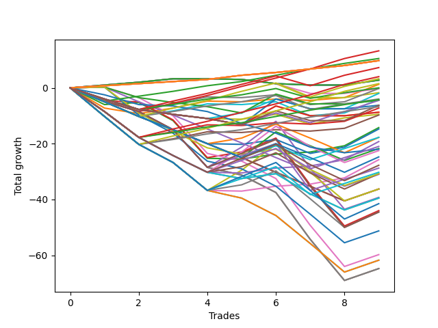

# Long Shepard 001 
- Symbol: ES
- Date Range: 03/18/2022 - 07/15/2022
- Trading Period: 7:20-12:30
- Number of Trades: 9



| Name | Win Percent | Profit | Avg Profit / Trade | Avg Time / Trade |      | Name | Win Percent | Profit | Avg Profit / Trade | Avg Time / Trade |
| ---- | ----------- | ------ | ------------------ | ---------------- | ---- | ---- | ----------- | ------ | ------------------ | ---------------- |
| Sorted By <br> Profit | | | | | | Sorted By <br> Win Percentage ||||
| Eighty-Three | 77.78 | 6625.00 | 736.11 | 10:54 |     | One Hundred Twenty-Six | 100.00 | 4875.00 | 541.67 | 01:46 |
| Eighty-Two | 88.89 | 5250.00 | 583.33 | 09:31 |     | One Hundred Twenty-One | 100.00 | 4875.00 | 541.67 | 01:46 |
| One Hundred Twenty-Six | 100.00 | 4875.00 | 541.67 | 01:46 |     | One Hundred Sixteen | 100.00 | 4875.00 | 541.67 | 01:46 |
| One Hundred Twenty-One | 100.00 | 4875.00 | 541.67 | 01:46 |     | One Hundred Eleven | 100.00 | 4875.00 | 541.67 | 01:46 |
| One Hundred Sixteen | 100.00 | 4875.00 | 541.67 | 01:46 |     | Eighty-One | 100.00 | 4875.00 | 541.67 | 01:46 |
| One Hundred Eleven | 100.00 | 4875.00 | 541.67 | 01:46 |     | Eighty-Two | 88.89 | 5250.00 | 583.33 | 09:31 |
| Eighty-One | 100.00 | 4875.00 | 541.67 | 01:46 |     | Eighty-Three | 77.78 | 6625.00 | 736.11 | 10:54 |
| One Hundred Eighteen | 66.67 | 3625.00 | 402.78 | 04:02 |     | One Hundred Twenty-Eight | 77.78 | 2000.00 | 222.22 | 06:15 |
| One Hundred Twenty-Eight | 77.78 | 2000.00 | 222.22 | 06:15 |     | One Hundred Twenty-Three | 77.78 | 750.00 | 83.33 | 06:25 |
| One Hundred Thirteen | 66.67 | 1625.00 | 180.56 | 04:30 |     | One Hundred Twenty-Seven | 77.78 | -2125.00 | -236.11 | 05:45 |
| Sixty-Four | 66.67 | 1375.00 | 152.78 | 02:26 |     | One Hundred Twenty-Two | 77.78 | -3375.00 | -375.00 | 05:56 |
| Fifty-Six | 66.67 | 1375.00 | 152.78 | 02:26 |     | One Hundred Eighteen | 66.67 | 3625.00 | 402.78 | 04:02 |
| Zero | 66.67 | 1375.00 | 152.78 | 02:26 |     | One Hundred Thirteen | 66.67 | 1625.00 | 180.56 | 04:30 |
| One Hundred Twenty-Three | 77.78 | 750.00 | 83.33 | 06:25 |     | Sixty-Four | 66.67 | 1375.00 | 152.78 | 02:26 |
| One | 55.56 | 625.00 | 69.44 | 09:01 |     | Fifty-Six | 66.67 | 1375.00 | 152.78 | 02:26 |
| One Hundred Seventeen | 66.67 | 0.00 | 0.00 | 03:33 |     | Zero | 66.67 | 1375.00 | 152.78 | 02:26 |
| Forty-Eight | 66.67 | -125.00 | -13.89 | 02:07 |     | One Hundred Seventeen | 66.67 | 0.00 | 0.00 | 03:33 |
| Forty-Nine | 55.56 | -125.00 | -13.89 | 04:21 |     | Forty-Eight | 66.67 | -125.00 | -13.89 | 02:07 |
| Forty | 66.67 | -875.00 | -97.22 | 02:10 |     | Forty | 66.67 | -875.00 | -97.22 | 02:10 |
| Fifty-One | 44.44 | -1000.00 | -111.11 | 06:30 |     | One Hundred Twelve | 66.67 | -2000.00 | -222.22 | 04:02 |
| One Hundred Twelve | 66.67 | -2000.00 | -222.22 | 04:02 |     | One | 55.56 | 625.00 | 69.44 | 09:01 |
| One Hundred Twenty-Seven | 77.78 | -2125.00 | -236.11 | 05:45 |     | Forty-Nine | 55.56 | -125.00 | -13.89 | 04:21 |
| Forty-One | 55.56 | -2125.00 | -236.11 | 04:50 |     | Forty-One | 55.56 | -2125.00 | -236.11 | 04:50 |
| Fifty-Four | 44.44 | -2250.00 | -250.00 | 07:13 |     | Sixty-Five | 55.56 | -3625.00 | -402.78 | 06:07 |
| One Hundred Ninteen | 33.33 | -2250.00 | -250.00 | 05:55 |     | Fifty-Seven | 55.56 | -4875.00 | -541.67 | 06:18 |
| One Hundred Twenty | 33.33 | -3125.00 | -347.22 | 06:46 |     | Two | 55.56 | -7125.00 | -791.67 | 18:02 |
| Fifty-Two | 33.33 | -3125.00 | -347.22 | 07:32 |     | Fifty-One | 44.44 | -1000.00 | -111.11 | 06:30 |
| One Hundred Twenty-Two | 77.78 | -3375.00 | -375.00 | 05:56 |     | Fifty-Four | 44.44 | -2250.00 | -250.00 | 07:13 |
| Sixty-Five | 55.56 | -3625.00 | -402.78 | 06:07 |     | Sixty-Six | 44.44 | -9625.00 | -1069.44 | 10:44 |
| Fifty-Five | 33.33 | -4375.00 | -486.11 | 07:47 |     | One Hundred Twenty-Nine | 44.44 | -10500.00 | -1166.67 | 10:26 |
| Fifty-Three | 33.33 | -4375.00 | -486.11 | 07:47 |     | Fifty-Eight | 44.44 | -12875.00 | -1430.56 | 12:26 |
| Fifty | 33.33 | -4750.00 | -527.78 | 06:16 |     | Eighty-Four | 44.44 | -14375.00 | -1597.22 | 19:41 |
| Fifty-Seven | 55.56 | -4875.00 | -541.67 | 06:18 |     | One Hundred Twenty-Four | 44.44 | -15125.00 | -1680.56 | 12:13 |
| Two | 55.56 | -7125.00 | -791.67 | 18:02 |     | One Hundred Ninteen | 33.33 | -2250.00 | -250.00 | 05:55 |
| Forty-Two | 33.33 | -7375.00 | -819.44 | 08:41 |     | One Hundred Twenty | 33.33 | -3125.00 | -347.22 | 06:46 |
| One Hundred Fourteen | 33.33 | -8875.00 | -986.11 | 07:17 |     | Fifty-Two | 33.33 | -3125.00 | -347.22 | 07:32 |
| Forty-Three | 33.33 | -8875.00 | -986.11 | 07:50 |     | Fifty-Five | 33.33 | -4375.00 | -486.11 | 07:47 |
| Sixty-Six | 44.44 | -9625.00 | -1069.44 | 10:44 |     | Fifty-Three | 33.33 | -4375.00 | -486.11 | 07:47 |
| One Hundred Twenty-Nine | 44.44 | -10500.00 | -1166.67 | 10:26 |     | Fifty | 33.33 | -4750.00 | -527.78 | 06:16 |
| Forty-Four | 22.22 | -10875.00 | -1208.33 | 11:20 |     | Forty-Two | 33.33 | -7375.00 | -819.44 | 08:41 |
| Seventy-Three | 11.11 | -11000.00 | -1222.22 | 05:11 |     | One Hundred Fourteen | 33.33 | -8875.00 | -986.11 | 07:17 |
| Sixty-Eight | 33.33 | -11250.00 | -1250.00 | 14:44 |     | Forty-Three | 33.33 | -8875.00 | -986.11 | 07:50 |
| One Hundred Fifteen | 22.22 | -12375.00 | -1375.00 | 08:22 |     | Sixty-Eight | 33.33 | -11250.00 | -1250.00 | 14:44 |
| Fifty-Eight | 44.44 | -12875.00 | -1430.56 | 12:26 |     | One Hundred Thirty | 33.33 | -13875.00 | -1541.67 | 11:33 |
| One Hundred Thirty | 33.33 | -13875.00 | -1541.67 | 11:33 |     | Seventy | 33.33 | -15375.00 | -1708.33 | 15:05 |
| Eighty-Four | 44.44 | -14375.00 | -1597.22 | 19:41 |     | Sixty-Seven | 33.33 | -15375.00 | -1708.33 | 10:48 |
| One Hundred Twenty-Four | 44.44 | -15125.00 | -1680.56 | 12:13 |     | Sixty | 33.33 | -18125.00 | -2013.89 | 16:55 |
| Seventy | 33.33 | -15375.00 | -1708.33 | 15:05 |     | Four | 33.33 | -19625.00 | -2180.56 | 25:43 |
| Sixty-Seven | 33.33 | -15375.00 | -1708.33 | 10:48 |     | One Hundred Twenty-Five | 33.33 | -20750.00 | -2305.56 | 13:45 |
| Forty-Six | 22.22 | -15500.00 | -1722.22 | 12:04 |     | Three | 33.33 | -22000.00 | -2444.44 | 20:31 |
| Sixty | 33.33 | -18125.00 | -2013.89 | 16:55 |     | Eighty-Five | 33.33 | -22250.00 | -2472.22 | 22:32 |
| Forty-Seven | 11.11 | -18125.00 | -2013.89 | 12:59 |     | Fifty-Nine | 33.33 | -22250.00 | -2472.22 | 13:00 |
| Forty-Five | 11.11 | -18125.00 | -2013.89 | 12:59 |     | Forty-Four | 22.22 | -10875.00 | -1208.33 | 11:20 |
| Four | 33.33 | -19625.00 | -2180.56 | 25:43 |     | One Hundred Fifteen | 22.22 | -12375.00 | -1375.00 | 08:22 |
| Seventy-One | 22.22 | -19750.00 | -2194.44 | 16:09 |     | Forty-Six | 22.22 | -15500.00 | -1722.22 | 12:04 |
| Sixty-Nine | 22.22 | -19750.00 | -2194.44 | 16:09 |     | Seventy-One | 22.22 | -19750.00 | -2194.44 | 16:09 |
| One Hundred Twenty-Five | 33.33 | -20750.00 | -2305.56 | 13:45 |     | Sixty-Nine | 22.22 | -19750.00 | -2194.44 | 16:09 |
| Three | 33.33 | -22000.00 | -2444.44 | 20:31 |     | Sixty-Two | 22.22 | -25625.00 | -2847.22 | 19:53 |
| Eighty-Five | 33.33 | -22250.00 | -2472.22 | 22:32 |     | Six | 22.22 | -29875.00 | -3319.44 | 26:36 |
| Fifty-Nine | 33.33 | -22250.00 | -2472.22 | 13:00 |     | Seventy-Three | 11.11 | -11000.00 | -1222.22 | 05:11 |
| Sixty-Two | 22.22 | -25625.00 | -2847.22 | 19:53 |     | Forty-Seven | 11.11 | -18125.00 | -2013.89 | 12:59 |
| Six | 22.22 | -29875.00 | -3319.44 | 26:36 |     | Forty-Five | 11.11 | -18125.00 | -2013.89 | 12:59 |
| Sixty-Three | 11.11 | -30875.00 | -3430.56 | 21:07 |     | Sixty-Three | 11.11 | -30875.00 | -3430.56 | 21:07 |
| Sixty-One | 11.11 | -30875.00 | -3430.56 | 21:07 |     | Sixty-One | 11.11 | -30875.00 | -3430.56 | 21:07 |
| Seven | 11.11 | -32375.00 | -3597.22 | 29:55 |     | Seven | 11.11 | -32375.00 | -3597.22 | 29:55 |
| Five | 11.11 | -32375.00 | -3597.22 | 29:55 |     | Five | 11.11 | -32375.00 | -3597.22 | 29:55 |

## NO STOPLOSS

### Test Zero
* Sell when price hits the middle line of the 20p bollinger
* No Stoploss
* Results:
```
Total Trades: 9
Percent Up: 66.67
Percent Down: 33.33
Total Points Moved Up: 2.75
Potential Profit: 1375.00
Total Points Ups: 5.00 Count Ups: 6
Total Points Downs: -2.25 Count Downs: 3
```

<details><summary>Trades</summary>

<code>In: 2022-03-25 12:12:00		Out: 2022-03-25 12:15:00		Total Position Time: 03:00		Total Move Up: 1.00		Total to Date: 1.00</code> <br />
<code>In: 2022-03-30 12:15:00		Out: 2022-03-30 12:15:25		Total Position Time: 00:25		Total Move Up: 1.00		Total to Date: 2.00</code> <br />
<code>In: 2022-04-05 09:05:00		Out: 2022-04-05 09:06:05		Total Position Time: 01:05		Total Move Up: 1.25		Total to Date: 3.25</code> <br />
<code>In: 2022-04-12 11:05:00		Out: 2022-04-12 11:05:10		Total Position Time: 00:10		Total Move Up: 0.00		Total to Date: 3.25</code> <br />
<code>In: 2022-04-21 10:22:00		Out: 2022-04-21 10:22:10		Total Position Time: 00:10		Total Move Up: -0.25		Total to Date: 3.00</code> <br />
<code>In: 2022-04-22 11:07:00		Out: 2022-04-22 11:17:10		Total Position Time: 10:10		Total Move Up: -1.50		Total to Date: 1.50</code> <br />
<code>In: 2022-05-18 10:22:00		Out: 2022-05-18 10:28:30		Total Position Time: 06:30		Total Move Up: -0.50		Total to Date: 1.00</code> <br />
<code>In: 2022-05-18 10:29:00		Out: 2022-05-18 10:29:10		Total Position Time: 00:10		Total Move Up: 0.00		Total to Date: 1.00</code> <br />
<code>In: 2022-06-08 10:42:00		Out: 2022-06-08 10:42:15		Total Position Time: 00:15		Total Move Up: 1.75		Total to Date: 2.75</code> <br />


</details>

### Test One
* Sell when the price hits the upper line of the 20p 1std bollinger
* No Stoploss
* Results:
```
Total Trades: 9
Percent Up: 55.56
Percent Down: 44.44
Total Points Moved Up: 1.25
Potential Profit: 625.00
Total Points Ups: 11.25 Count Ups: 5
Total Points Downs: -10.00 Count Downs: 4
```

<details><summary>Trades</summary>

<code>In: 2022-03-25 12:12:00		Out: 2022-03-25 12:38:35		Total Position Time: 26:35		Total Move Up: -7.25		Total to Date: -7.25</code> <br />
<code>In: 2022-03-30 12:15:00		Out: 2022-03-30 12:32:20		Total Position Time: 17:20		Total Move Up: -2.00		Total to Date: -9.25</code> <br />
<code>In: 2022-04-05 09:05:00		Out: 2022-04-05 09:13:35		Total Position Time: 08:35		Total Move Up: 2.00		Total to Date: -7.25</code> <br />
<code>In: 2022-04-12 11:05:00		Out: 2022-04-12 11:06:10		Total Position Time: 01:10		Total Move Up: 2.50		Total to Date: -4.75</code> <br />
<code>In: 2022-04-21 10:22:00		Out: 2022-04-21 10:22:10		Total Position Time: 00:10		Total Move Up: -0.25		Total to Date: -5.00</code> <br />
<code>In: 2022-04-22 11:07:00		Out: 2022-04-22 11:17:15		Total Position Time: 10:15		Total Move Up: 1.00		Total to Date: -4.00</code> <br />
<code>In: 2022-05-18 10:22:00		Out: 2022-05-18 10:31:30		Total Position Time: 09:30		Total Move Up: -0.50		Total to Date: -4.50</code> <br />
<code>In: 2022-05-18 10:29:00		Out: 2022-05-18 10:31:30		Total Position Time: 02:30		Total Move Up: 1.00		Total to Date: -3.50</code> <br />
<code>In: 2022-06-08 10:42:00		Out: 2022-06-08 10:47:05		Total Position Time: 05:05		Total Move Up: 4.75		Total to Date: 1.25</code> <br />


</details>

### Test Two
* Sell when the price hits the upper line of the 20p 2std bollinger
* No Stoploss
* Results:
```
Total Trades: 9
Percent Up: 55.56
Percent Down: 44.44
Total Points Moved Up: -14.25
Potential Profit: -7125.00
Total Points Ups: 12.00 Count Ups: 5
Total Points Downs: -26.25 Count Downs: 4
```

<details><summary>Trades</summary>

<code>In: 2022-03-25 12:12:00		Out: 2022-03-25 12:41:35		Total Position Time: 29:35		Total Move Up: -6.00		Total to Date: -6.00</code> <br />
<code>In: 2022-03-30 12:15:00		Out: 2022-03-30 12:36:20		Total Position Time: 21:20		Total Move Up: 0.75		Total to Date: -5.25</code> <br />
<code>In: 2022-04-05 09:05:00		Out: 2022-04-05 09:34:55		Total Position Time: 29:55		Total Move Up: -6.50		Total to Date: -11.75</code> <br />
<code>In: 2022-04-12 11:05:00		Out: 2022-04-12 11:34:55		Total Position Time: 29:55		Total Move Up: -13.50		Total to Date: -25.25</code> <br />
<code>In: 2022-04-21 10:22:00		Out: 2022-04-21 10:22:10		Total Position Time: 00:10		Total Move Up: -0.25		Total to Date: -25.50</code> <br />
<code>In: 2022-04-22 11:07:00		Out: 2022-04-22 11:17:35		Total Position Time: 10:35		Total Move Up: 1.75		Total to Date: -23.75</code> <br />
<code>In: 2022-05-18 10:22:00		Out: 2022-05-18 10:35:05		Total Position Time: 13:05		Total Move Up: 0.75		Total to Date: -23.00</code> <br />
<code>In: 2022-05-18 10:29:00		Out: 2022-05-18 10:35:05		Total Position Time: 06:05		Total Move Up: 2.25		Total to Date: -20.75</code> <br />
<code>In: 2022-06-08 10:42:00		Out: 2022-06-08 11:03:45		Total Position Time: 21:45		Total Move Up: 6.50		Total to Date: -14.25</code> <br />


</details>

### Test Three
* Sell when price hits the middle line of the 50p bollinger
* No Stoploss
* Results:
```
Total Trades: 9
Percent Up: 33.33
Percent Down: 66.67
Total Points Moved Up: -44.00
Potential Profit: -22000.00
Total Points Ups: 12.50 Count Ups: 3
Total Points Downs: -56.50 Count Downs: 6
```

<details><summary>Trades</summary>

<code>In: 2022-03-25 12:12:00		Out: 2022-03-25 12:41:55		Total Position Time: 29:55		Total Move Up: -4.75		Total to Date: -4.75</code> <br />
<code>In: 2022-03-30 12:15:00		Out: 2022-03-30 12:33:25		Total Position Time: 18:25		Total Move Up: -0.25		Total to Date: -5.00</code> <br />
<code>In: 2022-04-05 09:05:00		Out: 2022-04-05 09:34:55		Total Position Time: 29:55		Total Move Up: -6.50		Total to Date: -11.50</code> <br />
<code>In: 2022-04-12 11:05:00		Out: 2022-04-12 11:34:55		Total Position Time: 29:55		Total Move Up: -13.50		Total to Date: -25.00</code> <br />
<code>In: 2022-04-21 10:22:00		Out: 2022-04-21 10:22:25		Total Position Time: 00:25		Total Move Up: 2.00		Total to Date: -23.00</code> <br />
<code>In: 2022-04-22 11:07:00		Out: 2022-04-22 11:17:55		Total Position Time: 10:55		Total Move Up: 5.00		Total to Date: -18.00</code> <br />
<code>In: 2022-05-18 10:22:00		Out: 2022-05-18 10:51:55		Total Position Time: 29:55		Total Move Up: -16.75		Total to Date: -34.75</code> <br />
<code>In: 2022-05-18 10:29:00		Out: 2022-05-18 10:58:55		Total Position Time: 29:55		Total Move Up: -14.75		Total to Date: -49.50</code> <br />
<code>In: 2022-06-08 10:42:00		Out: 2022-06-08 10:47:20		Total Position Time: 05:20		Total Move Up: 5.50		Total to Date: -44.00</code> <br />


</details>

### Test Four
* Sell when the price hits the upper line of the 50p 1std bollinger
* No Stoploss
* Results:
```
Total Trades: 9
Percent Up: 33.33
Percent Down: 66.67
Total Points Moved Up: -39.25
Potential Profit: -19625.00
Total Points Ups: 20.75 Count Ups: 3
Total Points Downs: -60.00 Count Downs: 6
```

<details><summary>Trades</summary>

<code>In: 2022-03-25 12:12:00		Out: 2022-03-25 12:41:55		Total Position Time: 29:55		Total Move Up: -4.75		Total to Date: -4.75</code> <br />
<code>In: 2022-03-30 12:15:00		Out: 2022-03-30 12:44:55		Total Position Time: 29:55		Total Move Up: -3.75		Total to Date: -8.50</code> <br />
<code>In: 2022-04-05 09:05:00		Out: 2022-04-05 09:34:55		Total Position Time: 29:55		Total Move Up: -6.50		Total to Date: -15.00</code> <br />
<code>In: 2022-04-12 11:05:00		Out: 2022-04-12 11:34:55		Total Position Time: 29:55		Total Move Up: -13.50		Total to Date: -28.50</code> <br />
<code>In: 2022-04-21 10:22:00		Out: 2022-04-21 10:31:15		Total Position Time: 09:15		Total Move Up: 7.25		Total to Date: -21.25</code> <br />
<code>In: 2022-04-22 11:07:00		Out: 2022-04-22 11:19:50		Total Position Time: 12:50		Total Move Up: 9.25		Total to Date: -12.00</code> <br />
<code>In: 2022-05-18 10:22:00		Out: 2022-05-18 10:51:55		Total Position Time: 29:55		Total Move Up: -16.75		Total to Date: -28.75</code> <br />
<code>In: 2022-05-18 10:29:00		Out: 2022-05-18 10:58:55		Total Position Time: 29:55		Total Move Up: -14.75		Total to Date: -43.50</code> <br />
<code>In: 2022-06-08 10:42:00		Out: 2022-06-08 11:11:55		Total Position Time: 29:55		Total Move Up: 4.25		Total to Date: -39.25</code> <br />


</details>

### Test Five
* Sell when the price hits the upper line of the 50p 2std bollinger
* No Stoploss
* Results:
```
Total Trades: 9
Percent Up: 11.11
Percent Down: 88.89
Total Points Moved Up: -64.75
Potential Profit: -32375.00
Total Points Ups: 4.25 Count Ups: 1
Total Points Downs: -69.00 Count Downs: 8
```

<details><summary>Trades</summary>

<code>In: 2022-03-25 12:12:00		Out: 2022-03-25 12:41:55		Total Position Time: 29:55		Total Move Up: -4.75		Total to Date: -4.75</code> <br />
<code>In: 2022-03-30 12:15:00		Out: 2022-03-30 12:44:55		Total Position Time: 29:55		Total Move Up: -3.75		Total to Date: -8.50</code> <br />
<code>In: 2022-04-05 09:05:00		Out: 2022-04-05 09:34:55		Total Position Time: 29:55		Total Move Up: -6.50		Total to Date: -15.00</code> <br />
<code>In: 2022-04-12 11:05:00		Out: 2022-04-12 11:34:55		Total Position Time: 29:55		Total Move Up: -13.50		Total to Date: -28.50</code> <br />
<code>In: 2022-04-21 10:22:00		Out: 2022-04-21 10:51:55		Total Position Time: 29:55		Total Move Up: -2.75		Total to Date: -31.25</code> <br />
<code>In: 2022-04-22 11:07:00		Out: 2022-04-22 11:36:55		Total Position Time: 29:55		Total Move Up: -6.25		Total to Date: -37.50</code> <br />
<code>In: 2022-05-18 10:22:00		Out: 2022-05-18 10:51:55		Total Position Time: 29:55		Total Move Up: -16.75		Total to Date: -54.25</code> <br />
<code>In: 2022-05-18 10:29:00		Out: 2022-05-18 10:58:55		Total Position Time: 29:55		Total Move Up: -14.75		Total to Date: -69.00</code> <br />
<code>In: 2022-06-08 10:42:00		Out: 2022-06-08 11:11:55		Total Position Time: 29:55		Total Move Up: 4.25		Total to Date: -64.75</code> <br />


</details>

### Test Six
* Sell when the price hits the middle line of the 1std VWAP
* No Stoploss
* Results:
```
Total Trades: 9
Percent Up: 22.22
Percent Down: 77.78
Total Points Moved Up: -59.75
Potential Profit: -29875.00
Total Points Ups: 4.50 Count Ups: 2
Total Points Downs: -64.25 Count Downs: 7
```

<details><summary>Trades</summary>

<code>In: 2022-03-25 12:12:00		Out: 2022-03-25 12:12:10		Total Position Time: 00:10		Total Move Up: 0.25		Total to Date: 0.25</code> <br />
<code>In: 2022-03-30 12:15:00		Out: 2022-03-30 12:44:55		Total Position Time: 29:55		Total Move Up: -3.75		Total to Date: -3.50</code> <br />
<code>In: 2022-04-05 09:05:00		Out: 2022-04-05 09:34:55		Total Position Time: 29:55		Total Move Up: -6.50		Total to Date: -10.00</code> <br />
<code>In: 2022-04-12 11:05:00		Out: 2022-04-12 11:34:55		Total Position Time: 29:55		Total Move Up: -13.50		Total to Date: -23.50</code> <br />
<code>In: 2022-04-21 10:22:00		Out: 2022-04-21 10:51:55		Total Position Time: 29:55		Total Move Up: -2.75		Total to Date: -26.25</code> <br />
<code>In: 2022-04-22 11:07:00		Out: 2022-04-22 11:36:55		Total Position Time: 29:55		Total Move Up: -6.25		Total to Date: -32.50</code> <br />
<code>In: 2022-05-18 10:22:00		Out: 2022-05-18 10:51:55		Total Position Time: 29:55		Total Move Up: -16.75		Total to Date: -49.25</code> <br />
<code>In: 2022-05-18 10:29:00		Out: 2022-05-18 10:58:55		Total Position Time: 29:55		Total Move Up: -14.75		Total to Date: -64.00</code> <br />
<code>In: 2022-06-08 10:42:00		Out: 2022-06-08 11:11:55		Total Position Time: 29:55		Total Move Up: 4.25		Total to Date: -59.75</code> <br />


</details>

### Test Seven
* Sell when the price hits the upper line of the 1std VWAP
* No Stoploss
* Results:
```
Total Trades: 9
Percent Up: 11.11
Percent Down: 88.89
Total Points Moved Up: -64.75
Potential Profit: -32375.00
Total Points Ups: 4.25 Count Ups: 1
Total Points Downs: -69.00 Count Downs: 8
```

<details><summary>Trades</summary>

<code>In: 2022-03-25 12:12:00		Out: 2022-03-25 12:41:55		Total Position Time: 29:55		Total Move Up: -4.75		Total to Date: -4.75</code> <br />
<code>In: 2022-03-30 12:15:00		Out: 2022-03-30 12:44:55		Total Position Time: 29:55		Total Move Up: -3.75		Total to Date: -8.50</code> <br />
<code>In: 2022-04-05 09:05:00		Out: 2022-04-05 09:34:55		Total Position Time: 29:55		Total Move Up: -6.50		Total to Date: -15.00</code> <br />
<code>In: 2022-04-12 11:05:00		Out: 2022-04-12 11:34:55		Total Position Time: 29:55		Total Move Up: -13.50		Total to Date: -28.50</code> <br />
<code>In: 2022-04-21 10:22:00		Out: 2022-04-21 10:51:55		Total Position Time: 29:55		Total Move Up: -2.75		Total to Date: -31.25</code> <br />
<code>In: 2022-04-22 11:07:00		Out: 2022-04-22 11:36:55		Total Position Time: 29:55		Total Move Up: -6.25		Total to Date: -37.50</code> <br />
<code>In: 2022-05-18 10:22:00		Out: 2022-05-18 10:51:55		Total Position Time: 29:55		Total Move Up: -16.75		Total to Date: -54.25</code> <br />
<code>In: 2022-05-18 10:29:00		Out: 2022-05-18 10:58:55		Total Position Time: 29:55		Total Move Up: -14.75		Total to Date: -69.00</code> <br />
<code>In: 2022-06-08 10:42:00		Out: 2022-06-08 11:11:55		Total Position Time: 29:55		Total Move Up: 4.25		Total to Date: -64.75</code> <br />


</details>

## STOPLOSS OF 5

### Test Forty
* Sell when price hits the middle line of the 20p bollinger
* Stoploss is 5 points
* Results:
```
Total Trades: 9
Percent Up: 66.67
Percent Down: 33.33
Total Points Moved Up: -1.75
Potential Profit: -875.00
Total Points Ups: 5.00 Count Ups: 6
Total Points Downs: -6.75 Count Downs: 3
```

<details><summary>Trades</summary>

<code>In: 2022-03-25 12:12:00		Out: 2022-03-25 12:15:00		Total Position Time: 03:00		Total Move Up: 1.00		Total to Date: 1.00</code> <br />
<code>In: 2022-03-30 12:15:00		Out: 2022-03-30 12:15:25		Total Position Time: 00:25		Total Move Up: 1.00		Total to Date: 2.00</code> <br />
<code>In: 2022-04-05 09:05:00		Out: 2022-04-05 09:06:05		Total Position Time: 01:05		Total Move Up: 1.25		Total to Date: 3.25</code> <br />
<code>In: 2022-04-12 11:05:00		Out: 2022-04-12 11:05:10		Total Position Time: 00:10		Total Move Up: 0.00		Total to Date: 3.25</code> <br />
<code>In: 2022-04-21 10:22:00		Out: 2022-04-21 10:22:10		Total Position Time: 00:10		Total Move Up: -0.25		Total to Date: 3.00</code> <br />
<code>In: 2022-04-22 11:07:00		Out: 2022-04-22 11:17:10		Total Position Time: 10:10		Total Move Up: -1.50		Total to Date: 1.50</code> <br />
<code>In: 2022-05-18 10:22:00		Out: 2022-05-18 10:26:05		Total Position Time: 04:05		Total Move Up: -5.00		Total to Date: -3.50</code> <br />
<code>In: 2022-05-18 10:29:00		Out: 2022-05-18 10:29:10		Total Position Time: 00:10		Total Move Up: 0.00		Total to Date: -3.50</code> <br />
<code>In: 2022-06-08 10:42:00		Out: 2022-06-08 10:42:15		Total Position Time: 00:15		Total Move Up: 1.75		Total to Date: -1.75</code> <br />


</details>

### Test Forty-One
* Sell when the price hits the upper line of the 20p 1std bollinger
* Stoploss is 5 points
* Results:
```
Total Trades: 9
Percent Up: 55.56
Percent Down: 44.44
Total Points Moved Up: -4.25
Potential Profit: -2125.00
Total Points Ups: 11.25 Count Ups: 5
Total Points Downs: -15.50 Count Downs: 4
```

<details><summary>Trades</summary>

<code>In: 2022-03-25 12:12:00		Out: 2022-03-25 12:20:25		Total Position Time: 08:25		Total Move Up: -5.00		Total to Date: -5.00</code> <br />
<code>In: 2022-03-30 12:15:00		Out: 2022-03-30 12:18:15		Total Position Time: 03:15		Total Move Up: -5.25		Total to Date: -10.25</code> <br />
<code>In: 2022-04-05 09:05:00		Out: 2022-04-05 09:13:35		Total Position Time: 08:35		Total Move Up: 2.00		Total to Date: -8.25</code> <br />
<code>In: 2022-04-12 11:05:00		Out: 2022-04-12 11:06:10		Total Position Time: 01:10		Total Move Up: 2.50		Total to Date: -5.75</code> <br />
<code>In: 2022-04-21 10:22:00		Out: 2022-04-21 10:22:10		Total Position Time: 00:10		Total Move Up: -0.25		Total to Date: -6.00</code> <br />
<code>In: 2022-04-22 11:07:00		Out: 2022-04-22 11:17:15		Total Position Time: 10:15		Total Move Up: 1.00		Total to Date: -5.00</code> <br />
<code>In: 2022-05-18 10:22:00		Out: 2022-05-18 10:26:05		Total Position Time: 04:05		Total Move Up: -5.00		Total to Date: -10.00</code> <br />
<code>In: 2022-05-18 10:29:00		Out: 2022-05-18 10:31:30		Total Position Time: 02:30		Total Move Up: 1.00		Total to Date: -9.00</code> <br />
<code>In: 2022-06-08 10:42:00		Out: 2022-06-08 10:47:05		Total Position Time: 05:05		Total Move Up: 4.75		Total to Date: -4.25</code> <br />


</details>

### Test Forty-Two
* Sell when the price hits the upper line of the 20p 2std bollinger
* Stoploss is 5 points
* Results:
```
Total Trades: 9
Percent Up: 33.33
Percent Down: 66.67
Total Points Moved Up: -14.75
Potential Profit: -7375.00
Total Points Ups: 10.50 Count Ups: 3
Total Points Downs: -25.25 Count Downs: 6
```

<details><summary>Trades</summary>

<code>In: 2022-03-25 12:12:00		Out: 2022-03-25 12:20:25		Total Position Time: 08:25		Total Move Up: -5.00		Total to Date: -5.00</code> <br />
<code>In: 2022-03-30 12:15:00		Out: 2022-03-30 12:18:15		Total Position Time: 03:15		Total Move Up: -5.25		Total to Date: -10.25</code> <br />
<code>In: 2022-04-05 09:05:00		Out: 2022-04-05 09:19:50		Total Position Time: 14:50		Total Move Up: -4.75		Total to Date: -15.00</code> <br />
<code>In: 2022-04-12 11:05:00		Out: 2022-04-12 11:14:05		Total Position Time: 09:05		Total Move Up: -5.00		Total to Date: -20.00</code> <br />
<code>In: 2022-04-21 10:22:00		Out: 2022-04-21 10:22:10		Total Position Time: 00:10		Total Move Up: -0.25		Total to Date: -20.25</code> <br />
<code>In: 2022-04-22 11:07:00		Out: 2022-04-22 11:17:35		Total Position Time: 10:35		Total Move Up: 1.75		Total to Date: -18.50</code> <br />
<code>In: 2022-05-18 10:22:00		Out: 2022-05-18 10:26:05		Total Position Time: 04:05		Total Move Up: -5.00		Total to Date: -23.50</code> <br />
<code>In: 2022-05-18 10:29:00		Out: 2022-05-18 10:35:05		Total Position Time: 06:05		Total Move Up: 2.25		Total to Date: -21.25</code> <br />
<code>In: 2022-06-08 10:42:00		Out: 2022-06-08 11:03:45		Total Position Time: 21:45		Total Move Up: 6.50		Total to Date: -14.75</code> <br />


</details>

### Test Forty-Three
* Sell when price hits the middle line of the 50p bollinger
* Stoploss is 5 points
* Results:
```
Total Trades: 9
Percent Up: 33.33
Percent Down: 66.67
Total Points Moved Up: -17.75
Potential Profit: -8875.00
Total Points Ups: 12.50 Count Ups: 3
Total Points Downs: -30.25 Count Downs: 6
```

<details><summary>Trades</summary>

<code>In: 2022-03-25 12:12:00		Out: 2022-03-25 12:20:25		Total Position Time: 08:25		Total Move Up: -5.00		Total to Date: -5.00</code> <br />
<code>In: 2022-03-30 12:15:00		Out: 2022-03-30 12:18:15		Total Position Time: 03:15		Total Move Up: -5.25		Total to Date: -10.25</code> <br />
<code>In: 2022-04-05 09:05:00		Out: 2022-04-05 09:19:50		Total Position Time: 14:50		Total Move Up: -4.75		Total to Date: -15.00</code> <br />
<code>In: 2022-04-12 11:05:00		Out: 2022-04-12 11:14:05		Total Position Time: 09:05		Total Move Up: -5.00		Total to Date: -20.00</code> <br />
<code>In: 2022-04-21 10:22:00		Out: 2022-04-21 10:22:25		Total Position Time: 00:25		Total Move Up: 2.00		Total to Date: -18.00</code> <br />
<code>In: 2022-04-22 11:07:00		Out: 2022-04-22 11:17:55		Total Position Time: 10:55		Total Move Up: 5.00		Total to Date: -13.00</code> <br />
<code>In: 2022-05-18 10:22:00		Out: 2022-05-18 10:26:05		Total Position Time: 04:05		Total Move Up: -5.00		Total to Date: -18.00</code> <br />
<code>In: 2022-05-18 10:29:00		Out: 2022-05-18 10:43:15		Total Position Time: 14:15		Total Move Up: -5.25		Total to Date: -23.25</code> <br />
<code>In: 2022-06-08 10:42:00		Out: 2022-06-08 10:47:20		Total Position Time: 05:20		Total Move Up: 5.50		Total to Date: -17.75</code> <br />


</details>

### Test Forty-Four
* Sell when the price hits the upper line of the 50p 1std bollinger
* Stoploss is 5 points
* Results:
```
Total Trades: 9
Percent Up: 22.22
Percent Down: 77.78
Total Points Moved Up: -21.75
Potential Profit: -10875.00
Total Points Ups: 13.50 Count Ups: 2
Total Points Downs: -35.25 Count Downs: 7
```

<details><summary>Trades</summary>

<code>In: 2022-03-25 12:12:00		Out: 2022-03-25 12:20:25		Total Position Time: 08:25		Total Move Up: -5.00		Total to Date: -5.00</code> <br />
<code>In: 2022-03-30 12:15:00		Out: 2022-03-30 12:18:15		Total Position Time: 03:15		Total Move Up: -5.25		Total to Date: -10.25</code> <br />
<code>In: 2022-04-05 09:05:00		Out: 2022-04-05 09:19:50		Total Position Time: 14:50		Total Move Up: -4.75		Total to Date: -15.00</code> <br />
<code>In: 2022-04-12 11:05:00		Out: 2022-04-12 11:14:05		Total Position Time: 09:05		Total Move Up: -5.00		Total to Date: -20.00</code> <br />
<code>In: 2022-04-21 10:22:00		Out: 2022-04-21 10:27:20		Total Position Time: 05:20		Total Move Up: -5.00		Total to Date: -25.00</code> <br />
<code>In: 2022-04-22 11:07:00		Out: 2022-04-22 11:19:50		Total Position Time: 12:50		Total Move Up: 9.25		Total to Date: -15.75</code> <br />
<code>In: 2022-05-18 10:22:00		Out: 2022-05-18 10:26:05		Total Position Time: 04:05		Total Move Up: -5.00		Total to Date: -20.75</code> <br />
<code>In: 2022-05-18 10:29:00		Out: 2022-05-18 10:43:15		Total Position Time: 14:15		Total Move Up: -5.25		Total to Date: -26.00</code> <br />
<code>In: 2022-06-08 10:42:00		Out: 2022-06-08 11:11:55		Total Position Time: 29:55		Total Move Up: 4.25		Total to Date: -21.75</code> <br />


</details>

### Test Forty-Five
* Sell when the price hits the upper line of the 50p 2std bollinger
* Stoploss is 5 points
* Results:
```
Total Trades: 9
Percent Up: 11.11
Percent Down: 88.89
Total Points Moved Up: -36.25
Potential Profit: -18125.00
Total Points Ups: 4.25 Count Ups: 1
Total Points Downs: -40.50 Count Downs: 8
```

<details><summary>Trades</summary>

<code>In: 2022-03-25 12:12:00		Out: 2022-03-25 12:20:25		Total Position Time: 08:25		Total Move Up: -5.00		Total to Date: -5.00</code> <br />
<code>In: 2022-03-30 12:15:00		Out: 2022-03-30 12:18:15		Total Position Time: 03:15		Total Move Up: -5.25		Total to Date: -10.25</code> <br />
<code>In: 2022-04-05 09:05:00		Out: 2022-04-05 09:19:50		Total Position Time: 14:50		Total Move Up: -4.75		Total to Date: -15.00</code> <br />
<code>In: 2022-04-12 11:05:00		Out: 2022-04-12 11:14:05		Total Position Time: 09:05		Total Move Up: -5.00		Total to Date: -20.00</code> <br />
<code>In: 2022-04-21 10:22:00		Out: 2022-04-21 10:27:20		Total Position Time: 05:20		Total Move Up: -5.00		Total to Date: -25.00</code> <br />
<code>In: 2022-04-22 11:07:00		Out: 2022-04-22 11:34:45		Total Position Time: 27:45		Total Move Up: -5.25		Total to Date: -30.25</code> <br />
<code>In: 2022-05-18 10:22:00		Out: 2022-05-18 10:26:05		Total Position Time: 04:05		Total Move Up: -5.00		Total to Date: -35.25</code> <br />
<code>In: 2022-05-18 10:29:00		Out: 2022-05-18 10:43:15		Total Position Time: 14:15		Total Move Up: -5.25		Total to Date: -40.50</code> <br />
<code>In: 2022-06-08 10:42:00		Out: 2022-06-08 11:11:55		Total Position Time: 29:55		Total Move Up: 4.25		Total to Date: -36.25</code> <br />


</details>

### Test Forty-Six
* Sell when the price hits the middle line of the 1std VWAP
* Stoploss is 5 points
* Results:
```
Total Trades: 9
Percent Up: 22.22
Percent Down: 77.78
Total Points Moved Up: -31.00
Potential Profit: -15500.00
Total Points Ups: 4.50 Count Ups: 2
Total Points Downs: -35.50 Count Downs: 7
```

<details><summary>Trades</summary>

<code>In: 2022-03-25 12:12:00		Out: 2022-03-25 12:12:10		Total Position Time: 00:10		Total Move Up: 0.25		Total to Date: 0.25</code> <br />
<code>In: 2022-03-30 12:15:00		Out: 2022-03-30 12:18:15		Total Position Time: 03:15		Total Move Up: -5.25		Total to Date: -5.00</code> <br />
<code>In: 2022-04-05 09:05:00		Out: 2022-04-05 09:19:50		Total Position Time: 14:50		Total Move Up: -4.75		Total to Date: -9.75</code> <br />
<code>In: 2022-04-12 11:05:00		Out: 2022-04-12 11:14:05		Total Position Time: 09:05		Total Move Up: -5.00		Total to Date: -14.75</code> <br />
<code>In: 2022-04-21 10:22:00		Out: 2022-04-21 10:27:20		Total Position Time: 05:20		Total Move Up: -5.00		Total to Date: -19.75</code> <br />
<code>In: 2022-04-22 11:07:00		Out: 2022-04-22 11:34:45		Total Position Time: 27:45		Total Move Up: -5.25		Total to Date: -25.00</code> <br />
<code>In: 2022-05-18 10:22:00		Out: 2022-05-18 10:26:05		Total Position Time: 04:05		Total Move Up: -5.00		Total to Date: -30.00</code> <br />
<code>In: 2022-05-18 10:29:00		Out: 2022-05-18 10:43:15		Total Position Time: 14:15		Total Move Up: -5.25		Total to Date: -35.25</code> <br />
<code>In: 2022-06-08 10:42:00		Out: 2022-06-08 11:11:55		Total Position Time: 29:55		Total Move Up: 4.25		Total to Date: -31.00</code> <br />


</details>

### Test Forty-Seven
* Sell when the price hits the upper line of the 1std VWAP
* Stoploss is 5 points
* Results:
```
Total Trades: 9
Percent Up: 11.11
Percent Down: 88.89
Total Points Moved Up: -36.25
Potential Profit: -18125.00
Total Points Ups: 4.25 Count Ups: 1
Total Points Downs: -40.50 Count Downs: 8
```

<details><summary>Trades</summary>

<code>In: 2022-03-25 12:12:00		Out: 2022-03-25 12:20:25		Total Position Time: 08:25		Total Move Up: -5.00		Total to Date: -5.00</code> <br />
<code>In: 2022-03-30 12:15:00		Out: 2022-03-30 12:18:15		Total Position Time: 03:15		Total Move Up: -5.25		Total to Date: -10.25</code> <br />
<code>In: 2022-04-05 09:05:00		Out: 2022-04-05 09:19:50		Total Position Time: 14:50		Total Move Up: -4.75		Total to Date: -15.00</code> <br />
<code>In: 2022-04-12 11:05:00		Out: 2022-04-12 11:14:05		Total Position Time: 09:05		Total Move Up: -5.00		Total to Date: -20.00</code> <br />
<code>In: 2022-04-21 10:22:00		Out: 2022-04-21 10:27:20		Total Position Time: 05:20		Total Move Up: -5.00		Total to Date: -25.00</code> <br />
<code>In: 2022-04-22 11:07:00		Out: 2022-04-22 11:34:45		Total Position Time: 27:45		Total Move Up: -5.25		Total to Date: -30.25</code> <br />
<code>In: 2022-05-18 10:22:00		Out: 2022-05-18 10:26:05		Total Position Time: 04:05		Total Move Up: -5.00		Total to Date: -35.25</code> <br />
<code>In: 2022-05-18 10:29:00		Out: 2022-05-18 10:43:15		Total Position Time: 14:15		Total Move Up: -5.25		Total to Date: -40.50</code> <br />
<code>In: 2022-06-08 10:42:00		Out: 2022-06-08 11:11:55		Total Position Time: 29:55		Total Move Up: 4.25		Total to Date: -36.25</code> <br />


</details>

## TRAIL STOP OF 5

### Test Forty-Eight
* Sell when price hits the middle line of the 20p bollinger
* Trailing Stop is 5 points
* Results:
```
Total Trades: 9
Percent Up: 66.67
Percent Down: 33.33
Total Points Moved Up: -0.25
Potential Profit: -125.00
Total Points Ups: 5.00 Count Ups: 6
Total Points Downs: -5.25 Count Downs: 3
```

<details><summary>Trades</summary>

<code>In: 2022-03-25 12:12:00		Out: 2022-03-25 12:15:00		Total Position Time: 03:00		Total Move Up: 1.00		Total to Date: 1.00</code> <br />
<code>In: 2022-03-30 12:15:00		Out: 2022-03-30 12:15:25		Total Position Time: 00:25		Total Move Up: 1.00		Total to Date: 2.00</code> <br />
<code>In: 2022-04-05 09:05:00		Out: 2022-04-05 09:06:05		Total Position Time: 01:05		Total Move Up: 1.25		Total to Date: 3.25</code> <br />
<code>In: 2022-04-12 11:05:00		Out: 2022-04-12 11:05:10		Total Position Time: 00:10		Total Move Up: 0.00		Total to Date: 3.25</code> <br />
<code>In: 2022-04-21 10:22:00		Out: 2022-04-21 10:22:10		Total Position Time: 00:10		Total Move Up: -0.25		Total to Date: 3.00</code> <br />
<code>In: 2022-04-22 11:07:00		Out: 2022-04-22 11:17:10		Total Position Time: 10:10		Total Move Up: -1.50		Total to Date: 1.50</code> <br />
<code>In: 2022-05-18 10:22:00		Out: 2022-05-18 10:25:40		Total Position Time: 03:40		Total Move Up: -3.50		Total to Date: -2.00</code> <br />
<code>In: 2022-05-18 10:29:00		Out: 2022-05-18 10:29:10		Total Position Time: 00:10		Total Move Up: 0.00		Total to Date: -2.00</code> <br />
<code>In: 2022-06-08 10:42:00		Out: 2022-06-08 10:42:15		Total Position Time: 00:15		Total Move Up: 1.75		Total to Date: -0.25</code> <br />


</details>

### Test Forty-Nine
* Sell when the price hits the upper line of the 20p 1std bollinger
* Trailing Stop is 5 points
* Results:
```
Total Trades: 9
Percent Up: 55.56
Percent Down: 44.44
Total Points Moved Up: -0.25
Potential Profit: -125.00
Total Points Ups: 11.25 Count Ups: 5
Total Points Downs: -11.50 Count Downs: 4
```

<details><summary>Trades</summary>

<code>In: 2022-03-25 12:12:00		Out: 2022-03-25 12:17:10		Total Position Time: 05:10		Total Move Up: -4.00		Total to Date: -4.00</code> <br />
<code>In: 2022-03-30 12:15:00		Out: 2022-03-30 12:17:40		Total Position Time: 02:40		Total Move Up: -3.75		Total to Date: -7.75</code> <br />
<code>In: 2022-04-05 09:05:00		Out: 2022-04-05 09:13:35		Total Position Time: 08:35		Total Move Up: 2.00		Total to Date: -5.75</code> <br />
<code>In: 2022-04-12 11:05:00		Out: 2022-04-12 11:06:10		Total Position Time: 01:10		Total Move Up: 2.50		Total to Date: -3.25</code> <br />
<code>In: 2022-04-21 10:22:00		Out: 2022-04-21 10:22:10		Total Position Time: 00:10		Total Move Up: -0.25		Total to Date: -3.50</code> <br />
<code>In: 2022-04-22 11:07:00		Out: 2022-04-22 11:17:15		Total Position Time: 10:15		Total Move Up: 1.00		Total to Date: -2.50</code> <br />
<code>In: 2022-05-18 10:22:00		Out: 2022-05-18 10:25:40		Total Position Time: 03:40		Total Move Up: -3.50		Total to Date: -6.00</code> <br />
<code>In: 2022-05-18 10:29:00		Out: 2022-05-18 10:31:30		Total Position Time: 02:30		Total Move Up: 1.00		Total to Date: -5.00</code> <br />
<code>In: 2022-06-08 10:42:00		Out: 2022-06-08 10:47:05		Total Position Time: 05:05		Total Move Up: 4.75		Total to Date: -0.25</code> <br />


</details>

### Test Fifty
* Sell when the price hits the upper line of the 20p 2std bollinger
* Trailing Stop is 5 points
* Results:
```
Total Trades: 9
Percent Up: 33.33
Percent Down: 66.67
Total Points Moved Up: -9.50
Potential Profit: -4750.00
Total Points Ups: 5.25 Count Ups: 3
Total Points Downs: -14.75 Count Downs: 6
```

<details><summary>Trades</summary>

<code>In: 2022-03-25 12:12:00		Out: 2022-03-25 12:17:10		Total Position Time: 05:10		Total Move Up: -4.00		Total to Date: -4.00</code> <br />
<code>In: 2022-03-30 12:15:00		Out: 2022-03-30 12:17:40		Total Position Time: 02:40		Total Move Up: -3.75		Total to Date: -7.75</code> <br />
<code>In: 2022-04-05 09:05:00		Out: 2022-04-05 09:17:20		Total Position Time: 12:20		Total Move Up: -1.75		Total to Date: -9.50</code> <br />
<code>In: 2022-04-12 11:05:00		Out: 2022-04-12 11:10:45		Total Position Time: 05:45		Total Move Up: -1.50		Total to Date: -11.00</code> <br />
<code>In: 2022-04-21 10:22:00		Out: 2022-04-21 10:22:10		Total Position Time: 00:10		Total Move Up: -0.25		Total to Date: -11.25</code> <br />
<code>In: 2022-04-22 11:07:00		Out: 2022-04-22 11:17:35		Total Position Time: 10:35		Total Move Up: 1.75		Total to Date: -9.50</code> <br />
<code>In: 2022-05-18 10:22:00		Out: 2022-05-18 10:25:40		Total Position Time: 03:40		Total Move Up: -3.50		Total to Date: -13.00</code> <br />
<code>In: 2022-05-18 10:29:00		Out: 2022-05-18 10:35:05		Total Position Time: 06:05		Total Move Up: 2.25		Total to Date: -10.75</code> <br />
<code>In: 2022-06-08 10:42:00		Out: 2022-06-08 10:52:05		Total Position Time: 10:05		Total Move Up: 1.25		Total to Date: -9.50</code> <br />


</details>

### Test Fifty-One
* Sell when price hits the middle line of the 50p bollinger
* Trailing Stop is 5 points
* Results:
```
Total Trades: 9
Percent Up: 44.44
Percent Down: 55.56
Total Points Moved Up: -2.00
Potential Profit: -1000.00
Total Points Ups: 12.50 Count Ups: 4
Total Points Downs: -14.50 Count Downs: 5
```

<details><summary>Trades</summary>

<code>In: 2022-03-25 12:12:00		Out: 2022-03-25 12:17:10		Total Position Time: 05:10		Total Move Up: -4.00		Total to Date: -4.00</code> <br />
<code>In: 2022-03-30 12:15:00		Out: 2022-03-30 12:17:40		Total Position Time: 02:40		Total Move Up: -3.75		Total to Date: -7.75</code> <br />
<code>In: 2022-04-05 09:05:00		Out: 2022-04-05 09:17:20		Total Position Time: 12:20		Total Move Up: -1.75		Total to Date: -9.50</code> <br />
<code>In: 2022-04-12 11:05:00		Out: 2022-04-12 11:10:45		Total Position Time: 05:45		Total Move Up: -1.50		Total to Date: -11.00</code> <br />
<code>In: 2022-04-21 10:22:00		Out: 2022-04-21 10:22:25		Total Position Time: 00:25		Total Move Up: 2.00		Total to Date: -9.00</code> <br />
<code>In: 2022-04-22 11:07:00		Out: 2022-04-22 11:17:55		Total Position Time: 10:55		Total Move Up: 5.00		Total to Date: -4.00</code> <br />
<code>In: 2022-05-18 10:22:00		Out: 2022-05-18 10:25:40		Total Position Time: 03:40		Total Move Up: -3.50		Total to Date: -7.50</code> <br />
<code>In: 2022-05-18 10:29:00		Out: 2022-05-18 10:41:15		Total Position Time: 12:15		Total Move Up: 0.00		Total to Date: -7.50</code> <br />
<code>In: 2022-06-08 10:42:00		Out: 2022-06-08 10:47:20		Total Position Time: 05:20		Total Move Up: 5.50		Total to Date: -2.00</code> <br />


</details>

### Test Fifty-Two
* Sell when the price hits the upper line of the 50p 1std bollinger
* Trailing Stop is 5 points
* Results:
```
Total Trades: 9
Percent Up: 33.33
Percent Down: 66.67
Total Points Moved Up: -6.25
Potential Profit: -3125.00
Total Points Ups: 10.50 Count Ups: 3
Total Points Downs: -16.75 Count Downs: 6
```

<details><summary>Trades</summary>

<code>In: 2022-03-25 12:12:00		Out: 2022-03-25 12:17:10		Total Position Time: 05:10		Total Move Up: -4.00		Total to Date: -4.00</code> <br />
<code>In: 2022-03-30 12:15:00		Out: 2022-03-30 12:17:40		Total Position Time: 02:40		Total Move Up: -3.75		Total to Date: -7.75</code> <br />
<code>In: 2022-04-05 09:05:00		Out: 2022-04-05 09:17:20		Total Position Time: 12:20		Total Move Up: -1.75		Total to Date: -9.50</code> <br />
<code>In: 2022-04-12 11:05:00		Out: 2022-04-12 11:10:45		Total Position Time: 05:45		Total Move Up: -1.50		Total to Date: -11.00</code> <br />
<code>In: 2022-04-21 10:22:00		Out: 2022-04-21 10:25:05		Total Position Time: 03:05		Total Move Up: -2.25		Total to Date: -13.25</code> <br />
<code>In: 2022-04-22 11:07:00		Out: 2022-04-22 11:19:50		Total Position Time: 12:50		Total Move Up: 9.25		Total to Date: -4.00</code> <br />
<code>In: 2022-05-18 10:22:00		Out: 2022-05-18 10:25:40		Total Position Time: 03:40		Total Move Up: -3.50		Total to Date: -7.50</code> <br />
<code>In: 2022-05-18 10:29:00		Out: 2022-05-18 10:41:15		Total Position Time: 12:15		Total Move Up: 0.00		Total to Date: -7.50</code> <br />
<code>In: 2022-06-08 10:42:00		Out: 2022-06-08 10:52:05		Total Position Time: 10:05		Total Move Up: 1.25		Total to Date: -6.25</code> <br />


</details>

### Test Fifty-Three
* Sell when the price hits the upper line of the 50p 2std bollinger
* Trailing Stop is 5 points
* Results:
```
Total Trades: 9
Percent Up: 33.33
Percent Down: 66.67
Total Points Moved Up: -8.75
Potential Profit: -4375.00
Total Points Ups: 8.00 Count Ups: 3
Total Points Downs: -16.75 Count Downs: 6
```

<details><summary>Trades</summary>

<code>In: 2022-03-25 12:12:00		Out: 2022-03-25 12:17:10		Total Position Time: 05:10		Total Move Up: -4.00		Total to Date: -4.00</code> <br />
<code>In: 2022-03-30 12:15:00		Out: 2022-03-30 12:17:40		Total Position Time: 02:40		Total Move Up: -3.75		Total to Date: -7.75</code> <br />
<code>In: 2022-04-05 09:05:00		Out: 2022-04-05 09:17:20		Total Position Time: 12:20		Total Move Up: -1.75		Total to Date: -9.50</code> <br />
<code>In: 2022-04-12 11:05:00		Out: 2022-04-12 11:10:45		Total Position Time: 05:45		Total Move Up: -1.50		Total to Date: -11.00</code> <br />
<code>In: 2022-04-21 10:22:00		Out: 2022-04-21 10:25:05		Total Position Time: 03:05		Total Move Up: -2.25		Total to Date: -13.25</code> <br />
<code>In: 2022-04-22 11:07:00		Out: 2022-04-22 11:22:05		Total Position Time: 15:05		Total Move Up: 6.75		Total to Date: -6.50</code> <br />
<code>In: 2022-05-18 10:22:00		Out: 2022-05-18 10:25:40		Total Position Time: 03:40		Total Move Up: -3.50		Total to Date: -10.00</code> <br />
<code>In: 2022-05-18 10:29:00		Out: 2022-05-18 10:41:15		Total Position Time: 12:15		Total Move Up: 0.00		Total to Date: -10.00</code> <br />
<code>In: 2022-06-08 10:42:00		Out: 2022-06-08 10:52:05		Total Position Time: 10:05		Total Move Up: 1.25		Total to Date: -8.75</code> <br />


</details>

### Test Fifty-Four
* Sell when the price hits the middle line of the 1std VWAP
* Trailing Stop is 5 points
* Results:
```
Total Trades: 9
Percent Up: 44.44
Percent Down: 55.56
Total Points Moved Up: -4.50
Potential Profit: -2250.00
Total Points Ups: 8.25 Count Ups: 4
Total Points Downs: -12.75 Count Downs: 5
```

<details><summary>Trades</summary>

<code>In: 2022-03-25 12:12:00		Out: 2022-03-25 12:12:10		Total Position Time: 00:10		Total Move Up: 0.25		Total to Date: 0.25</code> <br />
<code>In: 2022-03-30 12:15:00		Out: 2022-03-30 12:17:40		Total Position Time: 02:40		Total Move Up: -3.75		Total to Date: -3.50</code> <br />
<code>In: 2022-04-05 09:05:00		Out: 2022-04-05 09:17:20		Total Position Time: 12:20		Total Move Up: -1.75		Total to Date: -5.25</code> <br />
<code>In: 2022-04-12 11:05:00		Out: 2022-04-12 11:10:45		Total Position Time: 05:45		Total Move Up: -1.50		Total to Date: -6.75</code> <br />
<code>In: 2022-04-21 10:22:00		Out: 2022-04-21 10:25:05		Total Position Time: 03:05		Total Move Up: -2.25		Total to Date: -9.00</code> <br />
<code>In: 2022-04-22 11:07:00		Out: 2022-04-22 11:22:05		Total Position Time: 15:05		Total Move Up: 6.75		Total to Date: -2.25</code> <br />
<code>In: 2022-05-18 10:22:00		Out: 2022-05-18 10:25:40		Total Position Time: 03:40		Total Move Up: -3.50		Total to Date: -5.75</code> <br />
<code>In: 2022-05-18 10:29:00		Out: 2022-05-18 10:41:15		Total Position Time: 12:15		Total Move Up: 0.00		Total to Date: -5.75</code> <br />
<code>In: 2022-06-08 10:42:00		Out: 2022-06-08 10:52:05		Total Position Time: 10:05		Total Move Up: 1.25		Total to Date: -4.50</code> <br />


</details>

### Test Fifty-Five
* Sell when the price hits the upper line of the 1std VWAP
* Trailing Stop is 5 points
* Results:
```
Total Trades: 9
Percent Up: 33.33
Percent Down: 66.67
Total Points Moved Up: -8.75
Potential Profit: -4375.00
Total Points Ups: 8.00 Count Ups: 3
Total Points Downs: -16.75 Count Downs: 6
```

<details><summary>Trades</summary>

<code>In: 2022-03-25 12:12:00		Out: 2022-03-25 12:17:10		Total Position Time: 05:10		Total Move Up: -4.00		Total to Date: -4.00</code> <br />
<code>In: 2022-03-30 12:15:00		Out: 2022-03-30 12:17:40		Total Position Time: 02:40		Total Move Up: -3.75		Total to Date: -7.75</code> <br />
<code>In: 2022-04-05 09:05:00		Out: 2022-04-05 09:17:20		Total Position Time: 12:20		Total Move Up: -1.75		Total to Date: -9.50</code> <br />
<code>In: 2022-04-12 11:05:00		Out: 2022-04-12 11:10:45		Total Position Time: 05:45		Total Move Up: -1.50		Total to Date: -11.00</code> <br />
<code>In: 2022-04-21 10:22:00		Out: 2022-04-21 10:25:05		Total Position Time: 03:05		Total Move Up: -2.25		Total to Date: -13.25</code> <br />
<code>In: 2022-04-22 11:07:00		Out: 2022-04-22 11:22:05		Total Position Time: 15:05		Total Move Up: 6.75		Total to Date: -6.50</code> <br />
<code>In: 2022-05-18 10:22:00		Out: 2022-05-18 10:25:40		Total Position Time: 03:40		Total Move Up: -3.50		Total to Date: -10.00</code> <br />
<code>In: 2022-05-18 10:29:00		Out: 2022-05-18 10:41:15		Total Position Time: 12:15		Total Move Up: 0.00		Total to Date: -10.00</code> <br />
<code>In: 2022-06-08 10:42:00		Out: 2022-06-08 10:52:05		Total Position Time: 10:05		Total Move Up: 1.25		Total to Date: -8.75</code> <br />


</details>

## STOPLOSS OF 10

### Test Fifty-Six
* Sell when price hits the middle line of the 20p bollinger
* Stoploss is 10 points
* Results:
```
Total Trades: 9
Percent Up: 66.67
Percent Down: 33.33
Total Points Moved Up: 2.75
Potential Profit: 1375.00
Total Points Ups: 5.00 Count Ups: 6
Total Points Downs: -2.25 Count Downs: 3
```

<details><summary>Trades</summary>

<code>In: 2022-03-25 12:12:00		Out: 2022-03-25 12:15:00		Total Position Time: 03:00		Total Move Up: 1.00		Total to Date: 1.00</code> <br />
<code>In: 2022-03-30 12:15:00		Out: 2022-03-30 12:15:25		Total Position Time: 00:25		Total Move Up: 1.00		Total to Date: 2.00</code> <br />
<code>In: 2022-04-05 09:05:00		Out: 2022-04-05 09:06:05		Total Position Time: 01:05		Total Move Up: 1.25		Total to Date: 3.25</code> <br />
<code>In: 2022-04-12 11:05:00		Out: 2022-04-12 11:05:10		Total Position Time: 00:10		Total Move Up: 0.00		Total to Date: 3.25</code> <br />
<code>In: 2022-04-21 10:22:00		Out: 2022-04-21 10:22:10		Total Position Time: 00:10		Total Move Up: -0.25		Total to Date: 3.00</code> <br />
<code>In: 2022-04-22 11:07:00		Out: 2022-04-22 11:17:10		Total Position Time: 10:10		Total Move Up: -1.50		Total to Date: 1.50</code> <br />
<code>In: 2022-05-18 10:22:00		Out: 2022-05-18 10:28:30		Total Position Time: 06:30		Total Move Up: -0.50		Total to Date: 1.00</code> <br />
<code>In: 2022-05-18 10:29:00		Out: 2022-05-18 10:29:10		Total Position Time: 00:10		Total Move Up: 0.00		Total to Date: 1.00</code> <br />
<code>In: 2022-06-08 10:42:00		Out: 2022-06-08 10:42:15		Total Position Time: 00:15		Total Move Up: 1.75		Total to Date: 2.75</code> <br />


</details>

### Test Fifty-Seven
* Sell when the price hits the upper line of the 20p 1std bollinger
* Stoploss is 10 points
* Results:
```
Total Trades: 9
Percent Up: 55.56
Percent Down: 44.44
Total Points Moved Up: -9.75
Potential Profit: -4875.00
Total Points Ups: 11.25 Count Ups: 5
Total Points Downs: -21.00 Count Downs: 4
```

<details><summary>Trades</summary>

<code>In: 2022-03-25 12:12:00		Out: 2022-03-25 12:23:15		Total Position Time: 11:15		Total Move Up: -10.25		Total to Date: -10.25</code> <br />
<code>In: 2022-03-30 12:15:00		Out: 2022-03-30 12:23:15		Total Position Time: 08:15		Total Move Up: -10.00		Total to Date: -20.25</code> <br />
<code>In: 2022-04-05 09:05:00		Out: 2022-04-05 09:13:35		Total Position Time: 08:35		Total Move Up: 2.00		Total to Date: -18.25</code> <br />
<code>In: 2022-04-12 11:05:00		Out: 2022-04-12 11:06:10		Total Position Time: 01:10		Total Move Up: 2.50		Total to Date: -15.75</code> <br />
<code>In: 2022-04-21 10:22:00		Out: 2022-04-21 10:22:10		Total Position Time: 00:10		Total Move Up: -0.25		Total to Date: -16.00</code> <br />
<code>In: 2022-04-22 11:07:00		Out: 2022-04-22 11:17:15		Total Position Time: 10:15		Total Move Up: 1.00		Total to Date: -15.00</code> <br />
<code>In: 2022-05-18 10:22:00		Out: 2022-05-18 10:31:30		Total Position Time: 09:30		Total Move Up: -0.50		Total to Date: -15.50</code> <br />
<code>In: 2022-05-18 10:29:00		Out: 2022-05-18 10:31:30		Total Position Time: 02:30		Total Move Up: 1.00		Total to Date: -14.50</code> <br />
<code>In: 2022-06-08 10:42:00		Out: 2022-06-08 10:47:05		Total Position Time: 05:05		Total Move Up: 4.75		Total to Date: -9.75</code> <br />


</details>

### Test Fifty-Eight
* Sell when the price hits the upper line of the 20p 2std bollinger
* Stoploss is 10 points
* Results:
```
Total Trades: 9
Percent Up: 44.44
Percent Down: 55.56
Total Points Moved Up: -25.75
Potential Profit: -12875.00
Total Points Ups: 11.25 Count Ups: 4
Total Points Downs: -37.00 Count Downs: 5
```

<details><summary>Trades</summary>

<code>In: 2022-03-25 12:12:00		Out: 2022-03-25 12:23:15		Total Position Time: 11:15		Total Move Up: -10.25		Total to Date: -10.25</code> <br />
<code>In: 2022-03-30 12:15:00		Out: 2022-03-30 12:23:15		Total Position Time: 08:15		Total Move Up: -10.00		Total to Date: -20.25</code> <br />
<code>In: 2022-04-05 09:05:00		Out: 2022-04-05 09:34:55		Total Position Time: 29:55		Total Move Up: -6.50		Total to Date: -26.75</code> <br />
<code>In: 2022-04-12 11:05:00		Out: 2022-04-12 11:15:55		Total Position Time: 10:55		Total Move Up: -10.00		Total to Date: -36.75</code> <br />
<code>In: 2022-04-21 10:22:00		Out: 2022-04-21 10:22:10		Total Position Time: 00:10		Total Move Up: -0.25		Total to Date: -37.00</code> <br />
<code>In: 2022-04-22 11:07:00		Out: 2022-04-22 11:17:35		Total Position Time: 10:35		Total Move Up: 1.75		Total to Date: -35.25</code> <br />
<code>In: 2022-05-18 10:22:00		Out: 2022-05-18 10:35:05		Total Position Time: 13:05		Total Move Up: 0.75		Total to Date: -34.50</code> <br />
<code>In: 2022-05-18 10:29:00		Out: 2022-05-18 10:35:05		Total Position Time: 06:05		Total Move Up: 2.25		Total to Date: -32.25</code> <br />
<code>In: 2022-06-08 10:42:00		Out: 2022-06-08 11:03:45		Total Position Time: 21:45		Total Move Up: 6.50		Total to Date: -25.75</code> <br />


</details>

### Test Fifty-Nine
* Sell when price hits the middle line of the 50p bollinger
* Stoploss is 10 points
* Results:
```
Total Trades: 9
Percent Up: 33.33
Percent Down: 66.67
Total Points Moved Up: -44.50
Potential Profit: -22250.00
Total Points Ups: 12.50 Count Ups: 3
Total Points Downs: -57.00 Count Downs: 6
```

<details><summary>Trades</summary>

<code>In: 2022-03-25 12:12:00		Out: 2022-03-25 12:23:15		Total Position Time: 11:15		Total Move Up: -10.25		Total to Date: -10.25</code> <br />
<code>In: 2022-03-30 12:15:00		Out: 2022-03-30 12:23:15		Total Position Time: 08:15		Total Move Up: -10.00		Total to Date: -20.25</code> <br />
<code>In: 2022-04-05 09:05:00		Out: 2022-04-05 09:34:55		Total Position Time: 29:55		Total Move Up: -6.50		Total to Date: -26.75</code> <br />
<code>In: 2022-04-12 11:05:00		Out: 2022-04-12 11:15:55		Total Position Time: 10:55		Total Move Up: -10.00		Total to Date: -36.75</code> <br />
<code>In: 2022-04-21 10:22:00		Out: 2022-04-21 10:22:25		Total Position Time: 00:25		Total Move Up: 2.00		Total to Date: -34.75</code> <br />
<code>In: 2022-04-22 11:07:00		Out: 2022-04-22 11:17:55		Total Position Time: 10:55		Total Move Up: 5.00		Total to Date: -29.75</code> <br />
<code>In: 2022-05-18 10:22:00		Out: 2022-05-18 10:44:05		Total Position Time: 22:05		Total Move Up: -10.00		Total to Date: -39.75</code> <br />
<code>In: 2022-05-18 10:29:00		Out: 2022-05-18 10:46:55		Total Position Time: 17:55		Total Move Up: -10.25		Total to Date: -50.00</code> <br />
<code>In: 2022-06-08 10:42:00		Out: 2022-06-08 10:47:20		Total Position Time: 05:20		Total Move Up: 5.50		Total to Date: -44.50</code> <br />


</details>

### Test Sixty
* Sell when the price hits the upper line of the 50p 1std bollinger
* Stoploss is 10 points
* Results:
```
Total Trades: 9
Percent Up: 33.33
Percent Down: 66.67
Total Points Moved Up: -36.25
Potential Profit: -18125.00
Total Points Ups: 20.75 Count Ups: 3
Total Points Downs: -57.00 Count Downs: 6
```

<details><summary>Trades</summary>

<code>In: 2022-03-25 12:12:00		Out: 2022-03-25 12:23:15		Total Position Time: 11:15		Total Move Up: -10.25		Total to Date: -10.25</code> <br />
<code>In: 2022-03-30 12:15:00		Out: 2022-03-30 12:23:15		Total Position Time: 08:15		Total Move Up: -10.00		Total to Date: -20.25</code> <br />
<code>In: 2022-04-05 09:05:00		Out: 2022-04-05 09:34:55		Total Position Time: 29:55		Total Move Up: -6.50		Total to Date: -26.75</code> <br />
<code>In: 2022-04-12 11:05:00		Out: 2022-04-12 11:15:55		Total Position Time: 10:55		Total Move Up: -10.00		Total to Date: -36.75</code> <br />
<code>In: 2022-04-21 10:22:00		Out: 2022-04-21 10:31:15		Total Position Time: 09:15		Total Move Up: 7.25		Total to Date: -29.50</code> <br />
<code>In: 2022-04-22 11:07:00		Out: 2022-04-22 11:19:50		Total Position Time: 12:50		Total Move Up: 9.25		Total to Date: -20.25</code> <br />
<code>In: 2022-05-18 10:22:00		Out: 2022-05-18 10:44:05		Total Position Time: 22:05		Total Move Up: -10.00		Total to Date: -30.25</code> <br />
<code>In: 2022-05-18 10:29:00		Out: 2022-05-18 10:46:55		Total Position Time: 17:55		Total Move Up: -10.25		Total to Date: -40.50</code> <br />
<code>In: 2022-06-08 10:42:00		Out: 2022-06-08 11:11:55		Total Position Time: 29:55		Total Move Up: 4.25		Total to Date: -36.25</code> <br />


</details>

### Test Sixty-One
* Sell when the price hits the upper line of the 50p 2std bollinger
* Stoploss is 10 points
* Results:
```
Total Trades: 9
Percent Up: 11.11
Percent Down: 88.89
Total Points Moved Up: -61.75
Potential Profit: -30875.00
Total Points Ups: 4.25 Count Ups: 1
Total Points Downs: -66.00 Count Downs: 8
```

<details><summary>Trades</summary>

<code>In: 2022-03-25 12:12:00		Out: 2022-03-25 12:23:15		Total Position Time: 11:15		Total Move Up: -10.25		Total to Date: -10.25</code> <br />
<code>In: 2022-03-30 12:15:00		Out: 2022-03-30 12:23:15		Total Position Time: 08:15		Total Move Up: -10.00		Total to Date: -20.25</code> <br />
<code>In: 2022-04-05 09:05:00		Out: 2022-04-05 09:34:55		Total Position Time: 29:55		Total Move Up: -6.50		Total to Date: -26.75</code> <br />
<code>In: 2022-04-12 11:05:00		Out: 2022-04-12 11:15:55		Total Position Time: 10:55		Total Move Up: -10.00		Total to Date: -36.75</code> <br />
<code>In: 2022-04-21 10:22:00		Out: 2022-04-21 10:51:55		Total Position Time: 29:55		Total Move Up: -2.75		Total to Date: -39.50</code> <br />
<code>In: 2022-04-22 11:07:00		Out: 2022-04-22 11:36:55		Total Position Time: 29:55		Total Move Up: -6.25		Total to Date: -45.75</code> <br />
<code>In: 2022-05-18 10:22:00		Out: 2022-05-18 10:44:05		Total Position Time: 22:05		Total Move Up: -10.00		Total to Date: -55.75</code> <br />
<code>In: 2022-05-18 10:29:00		Out: 2022-05-18 10:46:55		Total Position Time: 17:55		Total Move Up: -10.25		Total to Date: -66.00</code> <br />
<code>In: 2022-06-08 10:42:00		Out: 2022-06-08 11:11:55		Total Position Time: 29:55		Total Move Up: 4.25		Total to Date: -61.75</code> <br />


</details>

### Test Sixty-Two
* Sell when the price hits the middle line of the 1std VWAP
* Stoploss is 10 points
* Results:
```
Total Trades: 9
Percent Up: 22.22
Percent Down: 77.78
Total Points Moved Up: -51.25
Potential Profit: -25625.00
Total Points Ups: 4.50 Count Ups: 2
Total Points Downs: -55.75 Count Downs: 7
```

<details><summary>Trades</summary>

<code>In: 2022-03-25 12:12:00		Out: 2022-03-25 12:12:10		Total Position Time: 00:10		Total Move Up: 0.25		Total to Date: 0.25</code> <br />
<code>In: 2022-03-30 12:15:00		Out: 2022-03-30 12:23:15		Total Position Time: 08:15		Total Move Up: -10.00		Total to Date: -9.75</code> <br />
<code>In: 2022-04-05 09:05:00		Out: 2022-04-05 09:34:55		Total Position Time: 29:55		Total Move Up: -6.50		Total to Date: -16.25</code> <br />
<code>In: 2022-04-12 11:05:00		Out: 2022-04-12 11:15:55		Total Position Time: 10:55		Total Move Up: -10.00		Total to Date: -26.25</code> <br />
<code>In: 2022-04-21 10:22:00		Out: 2022-04-21 10:51:55		Total Position Time: 29:55		Total Move Up: -2.75		Total to Date: -29.00</code> <br />
<code>In: 2022-04-22 11:07:00		Out: 2022-04-22 11:36:55		Total Position Time: 29:55		Total Move Up: -6.25		Total to Date: -35.25</code> <br />
<code>In: 2022-05-18 10:22:00		Out: 2022-05-18 10:44:05		Total Position Time: 22:05		Total Move Up: -10.00		Total to Date: -45.25</code> <br />
<code>In: 2022-05-18 10:29:00		Out: 2022-05-18 10:46:55		Total Position Time: 17:55		Total Move Up: -10.25		Total to Date: -55.50</code> <br />
<code>In: 2022-06-08 10:42:00		Out: 2022-06-08 11:11:55		Total Position Time: 29:55		Total Move Up: 4.25		Total to Date: -51.25</code> <br />


</details>

### Test Sixty-Three
* Sell when the price hits the upper line of the 1std VWAP
* Stoploss is 10 points
* Results:
```
Total Trades: 9
Percent Up: 11.11
Percent Down: 88.89
Total Points Moved Up: -61.75
Potential Profit: -30875.00
Total Points Ups: 4.25 Count Ups: 1
Total Points Downs: -66.00 Count Downs: 8
```

<details><summary>Trades</summary>

<code>In: 2022-03-25 12:12:00		Out: 2022-03-25 12:23:15		Total Position Time: 11:15		Total Move Up: -10.25		Total to Date: -10.25</code> <br />
<code>In: 2022-03-30 12:15:00		Out: 2022-03-30 12:23:15		Total Position Time: 08:15		Total Move Up: -10.00		Total to Date: -20.25</code> <br />
<code>In: 2022-04-05 09:05:00		Out: 2022-04-05 09:34:55		Total Position Time: 29:55		Total Move Up: -6.50		Total to Date: -26.75</code> <br />
<code>In: 2022-04-12 11:05:00		Out: 2022-04-12 11:15:55		Total Position Time: 10:55		Total Move Up: -10.00		Total to Date: -36.75</code> <br />
<code>In: 2022-04-21 10:22:00		Out: 2022-04-21 10:51:55		Total Position Time: 29:55		Total Move Up: -2.75		Total to Date: -39.50</code> <br />
<code>In: 2022-04-22 11:07:00		Out: 2022-04-22 11:36:55		Total Position Time: 29:55		Total Move Up: -6.25		Total to Date: -45.75</code> <br />
<code>In: 2022-05-18 10:22:00		Out: 2022-05-18 10:44:05		Total Position Time: 22:05		Total Move Up: -10.00		Total to Date: -55.75</code> <br />
<code>In: 2022-05-18 10:29:00		Out: 2022-05-18 10:46:55		Total Position Time: 17:55		Total Move Up: -10.25		Total to Date: -66.00</code> <br />
<code>In: 2022-06-08 10:42:00		Out: 2022-06-08 11:11:55		Total Position Time: 29:55		Total Move Up: 4.25		Total to Date: -61.75</code> <br />


</details>

## TRAIL STOP OF 10

### Test Sixty-Four
* Sell when price hits the middle line of the 20p bollinger
* Trailing Stop is 10 points
* Results:
```
Total Trades: 9
Percent Up: 66.67
Percent Down: 33.33
Total Points Moved Up: 2.75
Potential Profit: 1375.00
Total Points Ups: 5.00 Count Ups: 6
Total Points Downs: -2.25 Count Downs: 3
```

<details><summary>Trades</summary>

<code>In: 2022-03-25 12:12:00		Out: 2022-03-25 12:15:00		Total Position Time: 03:00		Total Move Up: 1.00		Total to Date: 1.00</code> <br />
<code>In: 2022-03-30 12:15:00		Out: 2022-03-30 12:15:25		Total Position Time: 00:25		Total Move Up: 1.00		Total to Date: 2.00</code> <br />
<code>In: 2022-04-05 09:05:00		Out: 2022-04-05 09:06:05		Total Position Time: 01:05		Total Move Up: 1.25		Total to Date: 3.25</code> <br />
<code>In: 2022-04-12 11:05:00		Out: 2022-04-12 11:05:10		Total Position Time: 00:10		Total Move Up: 0.00		Total to Date: 3.25</code> <br />
<code>In: 2022-04-21 10:22:00		Out: 2022-04-21 10:22:10		Total Position Time: 00:10		Total Move Up: -0.25		Total to Date: 3.00</code> <br />
<code>In: 2022-04-22 11:07:00		Out: 2022-04-22 11:17:10		Total Position Time: 10:10		Total Move Up: -1.50		Total to Date: 1.50</code> <br />
<code>In: 2022-05-18 10:22:00		Out: 2022-05-18 10:28:30		Total Position Time: 06:30		Total Move Up: -0.50		Total to Date: 1.00</code> <br />
<code>In: 2022-05-18 10:29:00		Out: 2022-05-18 10:29:10		Total Position Time: 00:10		Total Move Up: 0.00		Total to Date: 1.00</code> <br />
<code>In: 2022-06-08 10:42:00		Out: 2022-06-08 10:42:15		Total Position Time: 00:15		Total Move Up: 1.75		Total to Date: 2.75</code> <br />


</details>

### Test Sixty-Five
* Sell when the price hits the upper line of the 20p 1std bollinger
* Trailing Stop is 10 points
* Results:
```
Total Trades: 9
Percent Up: 55.56
Percent Down: 44.44
Total Points Moved Up: -7.25
Potential Profit: -3625.00
Total Points Ups: 11.25 Count Ups: 5
Total Points Downs: -18.50 Count Downs: 4
```

<details><summary>Trades</summary>

<code>In: 2022-03-25 12:12:00		Out: 2022-03-25 12:21:45		Total Position Time: 09:45		Total Move Up: -8.50		Total to Date: -8.50</code> <br />
<code>In: 2022-03-30 12:15:00		Out: 2022-03-30 12:23:10		Total Position Time: 08:10		Total Move Up: -9.25		Total to Date: -17.75</code> <br />
<code>In: 2022-04-05 09:05:00		Out: 2022-04-05 09:13:35		Total Position Time: 08:35		Total Move Up: 2.00		Total to Date: -15.75</code> <br />
<code>In: 2022-04-12 11:05:00		Out: 2022-04-12 11:06:10		Total Position Time: 01:10		Total Move Up: 2.50		Total to Date: -13.25</code> <br />
<code>In: 2022-04-21 10:22:00		Out: 2022-04-21 10:22:10		Total Position Time: 00:10		Total Move Up: -0.25		Total to Date: -13.50</code> <br />
<code>In: 2022-04-22 11:07:00		Out: 2022-04-22 11:17:15		Total Position Time: 10:15		Total Move Up: 1.00		Total to Date: -12.50</code> <br />
<code>In: 2022-05-18 10:22:00		Out: 2022-05-18 10:31:30		Total Position Time: 09:30		Total Move Up: -0.50		Total to Date: -13.00</code> <br />
<code>In: 2022-05-18 10:29:00		Out: 2022-05-18 10:31:30		Total Position Time: 02:30		Total Move Up: 1.00		Total to Date: -12.00</code> <br />
<code>In: 2022-06-08 10:42:00		Out: 2022-06-08 10:47:05		Total Position Time: 05:05		Total Move Up: 4.75		Total to Date: -7.25</code> <br />


</details>

### Test Sixty-Six
* Sell when the price hits the upper line of the 20p 2std bollinger
* Trailing Stop is 10 points
* Results:
```
Total Trades: 9
Percent Up: 44.44
Percent Down: 55.56
Total Points Moved Up: -19.25
Potential Profit: -9625.00
Total Points Ups: 11.25 Count Ups: 4
Total Points Downs: -30.50 Count Downs: 5
```

<details><summary>Trades</summary>

<code>In: 2022-03-25 12:12:00		Out: 2022-03-25 12:21:45		Total Position Time: 09:45		Total Move Up: -8.50		Total to Date: -8.50</code> <br />
<code>In: 2022-03-30 12:15:00		Out: 2022-03-30 12:23:10		Total Position Time: 08:10		Total Move Up: -9.25		Total to Date: -17.75</code> <br />
<code>In: 2022-04-05 09:05:00		Out: 2022-04-05 09:22:25		Total Position Time: 17:25		Total Move Up: -6.50		Total to Date: -24.25</code> <br />
<code>In: 2022-04-12 11:05:00		Out: 2022-04-12 11:14:40		Total Position Time: 09:40		Total Move Up: -6.00		Total to Date: -30.25</code> <br />
<code>In: 2022-04-21 10:22:00		Out: 2022-04-21 10:22:10		Total Position Time: 00:10		Total Move Up: -0.25		Total to Date: -30.50</code> <br />
<code>In: 2022-04-22 11:07:00		Out: 2022-04-22 11:17:35		Total Position Time: 10:35		Total Move Up: 1.75		Total to Date: -28.75</code> <br />
<code>In: 2022-05-18 10:22:00		Out: 2022-05-18 10:35:05		Total Position Time: 13:05		Total Move Up: 0.75		Total to Date: -28.00</code> <br />
<code>In: 2022-05-18 10:29:00		Out: 2022-05-18 10:35:05		Total Position Time: 06:05		Total Move Up: 2.25		Total to Date: -25.75</code> <br />
<code>In: 2022-06-08 10:42:00		Out: 2022-06-08 11:03:45		Total Position Time: 21:45		Total Move Up: 6.50		Total to Date: -19.25</code> <br />


</details>

### Test Sixty-Seven
* Sell when price hits the middle line of the 50p bollinger
* Trailing Stop is 10 points
* Results:
```
Total Trades: 9
Percent Up: 33.33
Percent Down: 66.67
Total Points Moved Up: -30.75
Potential Profit: -15375.00
Total Points Ups: 12.50 Count Ups: 3
Total Points Downs: -43.25 Count Downs: 6
```

<details><summary>Trades</summary>

<code>In: 2022-03-25 12:12:00		Out: 2022-03-25 12:21:45		Total Position Time: 09:45		Total Move Up: -8.50		Total to Date: -8.50</code> <br />
<code>In: 2022-03-30 12:15:00		Out: 2022-03-30 12:23:10		Total Position Time: 08:10		Total Move Up: -9.25		Total to Date: -17.75</code> <br />
<code>In: 2022-04-05 09:05:00		Out: 2022-04-05 09:22:25		Total Position Time: 17:25		Total Move Up: -6.50		Total to Date: -24.25</code> <br />
<code>In: 2022-04-12 11:05:00		Out: 2022-04-12 11:14:40		Total Position Time: 09:40		Total Move Up: -6.00		Total to Date: -30.25</code> <br />
<code>In: 2022-04-21 10:22:00		Out: 2022-04-21 10:22:25		Total Position Time: 00:25		Total Move Up: 2.00		Total to Date: -28.25</code> <br />
<code>In: 2022-04-22 11:07:00		Out: 2022-04-22 11:17:55		Total Position Time: 10:55		Total Move Up: 5.00		Total to Date: -23.25</code> <br />
<code>In: 2022-05-18 10:22:00		Out: 2022-05-18 10:43:20		Total Position Time: 21:20		Total Move Up: -7.25		Total to Date: -30.50</code> <br />
<code>In: 2022-05-18 10:29:00		Out: 2022-05-18 10:43:20		Total Position Time: 14:20		Total Move Up: -5.75		Total to Date: -36.25</code> <br />
<code>In: 2022-06-08 10:42:00		Out: 2022-06-08 10:47:20		Total Position Time: 05:20		Total Move Up: 5.50		Total to Date: -30.75</code> <br />


</details>

### Test Sixty-Eight
* Sell when the price hits the upper line of the 50p 1std bollinger
* Trailing Stop is 10 points
* Results:
```
Total Trades: 9
Percent Up: 33.33
Percent Down: 66.67
Total Points Moved Up: -22.50
Potential Profit: -11250.00
Total Points Ups: 20.75 Count Ups: 3
Total Points Downs: -43.25 Count Downs: 6
```

<details><summary>Trades</summary>

<code>In: 2022-03-25 12:12:00		Out: 2022-03-25 12:21:45		Total Position Time: 09:45		Total Move Up: -8.50		Total to Date: -8.50</code> <br />
<code>In: 2022-03-30 12:15:00		Out: 2022-03-30 12:23:10		Total Position Time: 08:10		Total Move Up: -9.25		Total to Date: -17.75</code> <br />
<code>In: 2022-04-05 09:05:00		Out: 2022-04-05 09:22:25		Total Position Time: 17:25		Total Move Up: -6.50		Total to Date: -24.25</code> <br />
<code>In: 2022-04-12 11:05:00		Out: 2022-04-12 11:14:40		Total Position Time: 09:40		Total Move Up: -6.00		Total to Date: -30.25</code> <br />
<code>In: 2022-04-21 10:22:00		Out: 2022-04-21 10:31:15		Total Position Time: 09:15		Total Move Up: 7.25		Total to Date: -23.00</code> <br />
<code>In: 2022-04-22 11:07:00		Out: 2022-04-22 11:19:50		Total Position Time: 12:50		Total Move Up: 9.25		Total to Date: -13.75</code> <br />
<code>In: 2022-05-18 10:22:00		Out: 2022-05-18 10:43:20		Total Position Time: 21:20		Total Move Up: -7.25		Total to Date: -21.00</code> <br />
<code>In: 2022-05-18 10:29:00		Out: 2022-05-18 10:43:20		Total Position Time: 14:20		Total Move Up: -5.75		Total to Date: -26.75</code> <br />
<code>In: 2022-06-08 10:42:00		Out: 2022-06-08 11:11:55		Total Position Time: 29:55		Total Move Up: 4.25		Total to Date: -22.50</code> <br />


</details>

### Test Sixty-Nine
* Sell when the price hits the upper line of the 50p 2std bollinger
* Trailing Stop is 10 points
* Results:
```
Total Trades: 9
Percent Up: 22.22
Percent Down: 77.78
Total Points Moved Up: -39.50
Potential Profit: -19750.00
Total Points Ups: 6.00 Count Ups: 2
Total Points Downs: -45.50 Count Downs: 7
```

<details><summary>Trades</summary>

<code>In: 2022-03-25 12:12:00		Out: 2022-03-25 12:21:45		Total Position Time: 09:45		Total Move Up: -8.50		Total to Date: -8.50</code> <br />
<code>In: 2022-03-30 12:15:00		Out: 2022-03-30 12:23:10		Total Position Time: 08:10		Total Move Up: -9.25		Total to Date: -17.75</code> <br />
<code>In: 2022-04-05 09:05:00		Out: 2022-04-05 09:22:25		Total Position Time: 17:25		Total Move Up: -6.50		Total to Date: -24.25</code> <br />
<code>In: 2022-04-12 11:05:00		Out: 2022-04-12 11:14:40		Total Position Time: 09:40		Total Move Up: -6.00		Total to Date: -30.25</code> <br />
<code>In: 2022-04-21 10:22:00		Out: 2022-04-21 10:36:45		Total Position Time: 14:45		Total Move Up: -2.25		Total to Date: -32.50</code> <br />
<code>In: 2022-04-22 11:07:00		Out: 2022-04-22 11:27:05		Total Position Time: 20:05		Total Move Up: 1.75		Total to Date: -30.75</code> <br />
<code>In: 2022-05-18 10:22:00		Out: 2022-05-18 10:43:20		Total Position Time: 21:20		Total Move Up: -7.25		Total to Date: -38.00</code> <br />
<code>In: 2022-05-18 10:29:00		Out: 2022-05-18 10:43:20		Total Position Time: 14:20		Total Move Up: -5.75		Total to Date: -43.75</code> <br />
<code>In: 2022-06-08 10:42:00		Out: 2022-06-08 11:11:55		Total Position Time: 29:55		Total Move Up: 4.25		Total to Date: -39.50</code> <br />


</details>

### Test Seventy
* Sell when the price hits the middle line of the 1std VWAP
* Trailing Stop is 10 points
* Results:
```
Total Trades: 9
Percent Up: 33.33
Percent Down: 66.67
Total Points Moved Up: -30.75
Potential Profit: -15375.00
Total Points Ups: 6.25 Count Ups: 3
Total Points Downs: -37.00 Count Downs: 6
```

<details><summary>Trades</summary>

<code>In: 2022-03-25 12:12:00		Out: 2022-03-25 12:12:10		Total Position Time: 00:10		Total Move Up: 0.25		Total to Date: 0.25</code> <br />
<code>In: 2022-03-30 12:15:00		Out: 2022-03-30 12:23:10		Total Position Time: 08:10		Total Move Up: -9.25		Total to Date: -9.00</code> <br />
<code>In: 2022-04-05 09:05:00		Out: 2022-04-05 09:22:25		Total Position Time: 17:25		Total Move Up: -6.50		Total to Date: -15.50</code> <br />
<code>In: 2022-04-12 11:05:00		Out: 2022-04-12 11:14:40		Total Position Time: 09:40		Total Move Up: -6.00		Total to Date: -21.50</code> <br />
<code>In: 2022-04-21 10:22:00		Out: 2022-04-21 10:36:45		Total Position Time: 14:45		Total Move Up: -2.25		Total to Date: -23.75</code> <br />
<code>In: 2022-04-22 11:07:00		Out: 2022-04-22 11:27:05		Total Position Time: 20:05		Total Move Up: 1.75		Total to Date: -22.00</code> <br />
<code>In: 2022-05-18 10:22:00		Out: 2022-05-18 10:43:20		Total Position Time: 21:20		Total Move Up: -7.25		Total to Date: -29.25</code> <br />
<code>In: 2022-05-18 10:29:00		Out: 2022-05-18 10:43:20		Total Position Time: 14:20		Total Move Up: -5.75		Total to Date: -35.00</code> <br />
<code>In: 2022-06-08 10:42:00		Out: 2022-06-08 11:11:55		Total Position Time: 29:55		Total Move Up: 4.25		Total to Date: -30.75</code> <br />


</details>

### Test Seventy-One
* Sell when the price hits the upper line of the 1std VWAP
* Trailing Stop is 10 points
* Results:
```
Total Trades: 9
Percent Up: 22.22
Percent Down: 77.78
Total Points Moved Up: -39.50
Potential Profit: -19750.00
Total Points Ups: 6.00 Count Ups: 2
Total Points Downs: -45.50 Count Downs: 7
```

<details><summary>Trades</summary>

<code>In: 2022-03-25 12:12:00		Out: 2022-03-25 12:21:45		Total Position Time: 09:45		Total Move Up: -8.50		Total to Date: -8.50</code> <br />
<code>In: 2022-03-30 12:15:00		Out: 2022-03-30 12:23:10		Total Position Time: 08:10		Total Move Up: -9.25		Total to Date: -17.75</code> <br />
<code>In: 2022-04-05 09:05:00		Out: 2022-04-05 09:22:25		Total Position Time: 17:25		Total Move Up: -6.50		Total to Date: -24.25</code> <br />
<code>In: 2022-04-12 11:05:00		Out: 2022-04-12 11:14:40		Total Position Time: 09:40		Total Move Up: -6.00		Total to Date: -30.25</code> <br />
<code>In: 2022-04-21 10:22:00		Out: 2022-04-21 10:36:45		Total Position Time: 14:45		Total Move Up: -2.25		Total to Date: -32.50</code> <br />
<code>In: 2022-04-22 11:07:00		Out: 2022-04-22 11:27:05		Total Position Time: 20:05		Total Move Up: 1.75		Total to Date: -30.75</code> <br />
<code>In: 2022-05-18 10:22:00		Out: 2022-05-18 10:43:20		Total Position Time: 21:20		Total Move Up: -7.25		Total to Date: -38.00</code> <br />
<code>In: 2022-05-18 10:29:00		Out: 2022-05-18 10:43:20		Total Position Time: 14:20		Total Move Up: -5.75		Total to Date: -43.75</code> <br />
<code>In: 2022-06-08 10:42:00		Out: 2022-06-08 11:11:55		Total Position Time: 29:55		Total Move Up: 4.25		Total to Date: -39.50</code> <br />


</details>

## SPECIAL EXIT CONDITIONS 

### Test Seventy-Three
* Sell when the linear regression slope changes to negative
* No Stoploss
* Results:
```
Total Trades: 9
Percent Up: 11.11
Percent Down: 88.89
Total Points Moved Up: -22.00
Potential Profit: -11000.00
Total Points Ups: 1.25 Count Ups: 1
Total Points Downs: -23.25 Count Downs: 8
```

<details><summary>Trades</summary>

<code>In: 2022-03-25 12:12:00		Out: 2022-03-25 12:17:05		Total Position Time: 05:05		Total Move Up: -2.50		Total to Date: -2.50</code> <br />
<code>In: 2022-03-30 12:15:00		Out: 2022-03-30 12:17:05		Total Position Time: 02:05		Total Move Up: -3.50		Total to Date: -6.00</code> <br />
<code>In: 2022-04-05 09:05:00		Out: 2022-04-05 09:16:05		Total Position Time: 11:05		Total Move Up: -0.50		Total to Date: -6.50</code> <br />
<code>In: 2022-04-12 11:05:00		Out: 2022-04-12 11:11:05		Total Position Time: 06:05		Total Move Up: -2.00		Total to Date: -8.50</code> <br />
<code>In: 2022-04-21 10:22:00		Out: 2022-04-21 10:26:05		Total Position Time: 04:05		Total Move Up: -4.25		Total to Date: -12.75</code> <br />
<code>In: 2022-04-22 11:07:00		Out: 2022-04-22 11:09:05		Total Position Time: 02:05		Total Move Up: -3.50		Total to Date: -16.25</code> <br />
<code>In: 2022-05-18 10:22:00		Out: 2022-05-18 10:26:05		Total Position Time: 04:05		Total Move Up: -5.00		Total to Date: -21.25</code> <br />
<code>In: 2022-05-18 10:29:00		Out: 2022-05-18 10:31:05		Total Position Time: 02:05		Total Move Up: -2.00		Total to Date: -23.25</code> <br />
<code>In: 2022-06-08 10:42:00		Out: 2022-06-08 10:52:05		Total Position Time: 10:05		Total Move Up: 1.25		Total to Date: -22.00</code> <br />


</details>

## TAKE PROFIT

### Test Eighty-One
* Take Profit of 1 Point
* No Stoploss
* Results:
```
Total Trades: 9
Percent Up: 100.00
Percent Down: 0.00
Total Points Moved Up: 9.75
Potential Profit: 4875.00
Total Points Ups: 9.75 Count Ups: 9
Total Points Downs: 0.00 Count Downs: 0
```

<details><summary>Trades</summary>

<code>In: 2022-03-25 12:12:00		Out: 2022-03-25 12:12:30		Total Position Time: 00:30		Total Move Up: 0.75		Total to Date: 0.75</code> <br />
<code>In: 2022-03-30 12:15:00		Out: 2022-03-30 12:15:20		Total Position Time: 00:20		Total Move Up: 0.75		Total to Date: 1.50</code> <br />
<code>In: 2022-04-05 09:05:00		Out: 2022-04-05 09:05:20		Total Position Time: 00:20		Total Move Up: 0.75		Total to Date: 2.25</code> <br />
<code>In: 2022-04-12 11:05:00		Out: 2022-04-12 11:05:45		Total Position Time: 00:45		Total Move Up: 0.75		Total to Date: 3.00</code> <br />
<code>In: 2022-04-21 10:22:00		Out: 2022-04-21 10:22:20		Total Position Time: 00:20		Total Move Up: 1.50		Total to Date: 4.50</code> <br />
<code>In: 2022-04-22 11:07:00		Out: 2022-04-22 11:17:15		Total Position Time: 10:15		Total Move Up: 1.00		Total to Date: 5.50</code> <br />
<code>In: 2022-05-18 10:22:00		Out: 2022-05-18 10:22:50		Total Position Time: 00:50		Total Move Up: 1.25		Total to Date: 6.75</code> <br />
<code>In: 2022-05-18 10:29:00		Out: 2022-05-18 10:31:25		Total Position Time: 02:25		Total Move Up: 1.25		Total to Date: 8.00</code> <br />
<code>In: 2022-06-08 10:42:00		Out: 2022-06-08 10:42:15		Total Position Time: 00:15		Total Move Up: 1.75		Total to Date: 9.75</code> <br />


</details>

### Test Eighty-Two
* Take Profit of 2 Point
* No Stoploss
* Results:
```
Total Trades: 9
Percent Up: 88.89
Percent Down: 11.11
Total Points Moved Up: 10.50
Potential Profit: 5250.00
Total Points Ups: 15.25 Count Ups: 8
Total Points Downs: -4.75 Count Downs: 1
```

<details><summary>Trades</summary>

<code>In: 2022-03-25 12:12:00		Out: 2022-03-25 12:41:55		Total Position Time: 29:55		Total Move Up: -4.75		Total to Date: -4.75</code> <br />
<code>In: 2022-03-30 12:15:00		Out: 2022-03-30 12:36:55		Total Position Time: 21:55		Total Move Up: 1.75		Total to Date: -3.00</code> <br />
<code>In: 2022-04-05 09:05:00		Out: 2022-04-05 09:06:10		Total Position Time: 01:10		Total Move Up: 1.75		Total to Date: -1.25</code> <br />
<code>In: 2022-04-12 11:05:00		Out: 2022-04-12 11:05:50		Total Position Time: 00:50		Total Move Up: 2.00		Total to Date: 0.75</code> <br />
<code>In: 2022-04-21 10:22:00		Out: 2022-04-21 10:22:20		Total Position Time: 00:20		Total Move Up: 1.50		Total to Date: 2.25</code> <br />
<code>In: 2022-04-22 11:07:00		Out: 2022-04-22 11:17:40		Total Position Time: 10:40		Total Move Up: 2.25		Total to Date: 4.50</code> <br />
<code>In: 2022-05-18 10:22:00		Out: 2022-05-18 10:35:20		Total Position Time: 13:20		Total Move Up: 2.25		Total to Date: 6.75</code> <br />
<code>In: 2022-05-18 10:29:00		Out: 2022-05-18 10:34:35		Total Position Time: 05:35		Total Move Up: 2.00		Total to Date: 8.75</code> <br />
<code>In: 2022-06-08 10:42:00		Out: 2022-06-08 10:44:00		Total Position Time: 02:00		Total Move Up: 1.75		Total to Date: 10.50</code> <br />


</details>

### Test Eighty-Three
* Take Profit of 3 Point
* No Stoploss
* Results:
```
Total Trades: 9
Percent Up: 77.78
Percent Down: 22.22
Total Points Moved Up: 13.25
Potential Profit: 6625.00
Total Points Ups: 21.75 Count Ups: 7
Total Points Downs: -8.50 Count Downs: 2
```

<details><summary>Trades</summary>

<code>In: 2022-03-25 12:12:00		Out: 2022-03-25 12:41:55		Total Position Time: 29:55		Total Move Up: -4.75		Total to Date: -4.75</code> <br />
<code>In: 2022-03-30 12:15:00		Out: 2022-03-30 12:44:55		Total Position Time: 29:55		Total Move Up: -3.75		Total to Date: -8.50</code> <br />
<code>In: 2022-04-05 09:05:00		Out: 2022-04-05 09:08:05		Total Position Time: 03:05		Total Move Up: 3.00		Total to Date: -5.50</code> <br />
<code>In: 2022-04-12 11:05:00		Out: 2022-04-12 11:07:00		Total Position Time: 02:00		Total Move Up: 2.75		Total to Date: -2.75</code> <br />
<code>In: 2022-04-21 10:22:00		Out: 2022-04-21 10:22:35		Total Position Time: 00:35		Total Move Up: 3.25		Total to Date: 0.50</code> <br />
<code>In: 2022-04-22 11:07:00		Out: 2022-04-22 11:17:45		Total Position Time: 10:45		Total Move Up: 3.00		Total to Date: 3.50</code> <br />
<code>In: 2022-05-18 10:22:00		Out: 2022-05-18 10:35:30		Total Position Time: 13:30		Total Move Up: 3.25		Total to Date: 6.75</code> <br />
<code>In: 2022-05-18 10:29:00		Out: 2022-05-18 10:35:20		Total Position Time: 06:20		Total Move Up: 3.75		Total to Date: 10.50</code> <br />
<code>In: 2022-06-08 10:42:00		Out: 2022-06-08 10:44:05		Total Position Time: 02:05		Total Move Up: 2.75		Total to Date: 13.25</code> <br />


</details>

### Test Eighty-Four
* Take Profit of 4 Point
* No Stoploss
* Results:
```
Total Trades: 9
Percent Up: 44.44
Percent Down: 55.56
Total Points Moved Up: -28.75
Potential Profit: -14375.00
Total Points Ups: 16.50 Count Ups: 4
Total Points Downs: -45.25 Count Downs: 5
```

<details><summary>Trades</summary>

<code>In: 2022-03-25 12:12:00		Out: 2022-03-25 12:41:55		Total Position Time: 29:55		Total Move Up: -4.75		Total to Date: -4.75</code> <br />
<code>In: 2022-03-30 12:15:00		Out: 2022-03-30 12:44:55		Total Position Time: 29:55		Total Move Up: -3.75		Total to Date: -8.50</code> <br />
<code>In: 2022-04-05 09:05:00		Out: 2022-04-05 09:34:55		Total Position Time: 29:55		Total Move Up: -6.50		Total to Date: -15.00</code> <br />
<code>In: 2022-04-12 11:05:00		Out: 2022-04-12 11:34:55		Total Position Time: 29:55		Total Move Up: -13.50		Total to Date: -28.50</code> <br />
<code>In: 2022-04-21 10:22:00		Out: 2022-04-21 10:29:05		Total Position Time: 07:05		Total Move Up: 4.25		Total to Date: -24.25</code> <br />
<code>In: 2022-04-22 11:07:00		Out: 2022-04-22 11:17:50		Total Position Time: 10:50		Total Move Up: 4.25		Total to Date: -20.00</code> <br />
<code>In: 2022-05-18 10:22:00		Out: 2022-05-18 10:51:55		Total Position Time: 29:55		Total Move Up: -16.75		Total to Date: -36.75</code> <br />
<code>In: 2022-05-18 10:29:00		Out: 2022-05-18 10:35:25		Total Position Time: 06:25		Total Move Up: 4.00		Total to Date: -32.75</code> <br />
<code>In: 2022-06-08 10:42:00		Out: 2022-06-08 10:45:20		Total Position Time: 03:20		Total Move Up: 4.00		Total to Date: -28.75</code> <br />


</details>

### Test Eighty-Five
* Take Profit of 5 Point
* No Stoploss
* Results:
```
Total Trades: 9
Percent Up: 33.33
Percent Down: 66.67
Total Points Moved Up: -44.50
Potential Profit: -22250.00
Total Points Ups: 15.50 Count Ups: 3
Total Points Downs: -60.00 Count Downs: 6
```

<details><summary>Trades</summary>

<code>In: 2022-03-25 12:12:00		Out: 2022-03-25 12:41:55		Total Position Time: 29:55		Total Move Up: -4.75		Total to Date: -4.75</code> <br />
<code>In: 2022-03-30 12:15:00		Out: 2022-03-30 12:44:55		Total Position Time: 29:55		Total Move Up: -3.75		Total to Date: -8.50</code> <br />
<code>In: 2022-04-05 09:05:00		Out: 2022-04-05 09:34:55		Total Position Time: 29:55		Total Move Up: -6.50		Total to Date: -15.00</code> <br />
<code>In: 2022-04-12 11:05:00		Out: 2022-04-12 11:34:55		Total Position Time: 29:55		Total Move Up: -13.50		Total to Date: -28.50</code> <br />
<code>In: 2022-04-21 10:22:00		Out: 2022-04-21 10:29:20		Total Position Time: 07:20		Total Move Up: 5.00		Total to Date: -23.50</code> <br />
<code>In: 2022-04-22 11:07:00		Out: 2022-04-22 11:17:55		Total Position Time: 10:55		Total Move Up: 5.00		Total to Date: -18.50</code> <br />
<code>In: 2022-05-18 10:22:00		Out: 2022-05-18 10:51:55		Total Position Time: 29:55		Total Move Up: -16.75		Total to Date: -35.25</code> <br />
<code>In: 2022-05-18 10:29:00		Out: 2022-05-18 10:58:55		Total Position Time: 29:55		Total Move Up: -14.75		Total to Date: -50.00</code> <br />
<code>In: 2022-06-08 10:42:00		Out: 2022-06-08 10:47:10		Total Position Time: 05:10		Total Move Up: 5.50		Total to Date: -44.50</code> <br />


</details>

## TAKE PROFIT Stoploss of Five

### Test One Hundred Eleven
* Take Profit of 1 Point
* Stoploss is 5 points
* Results:
```
Total Trades: 9
Percent Up: 100.00
Percent Down: 0.00
Total Points Moved Up: 9.75
Potential Profit: 4875.00
Total Points Ups: 9.75 Count Ups: 9
Total Points Downs: 0.00 Count Downs: 0
```

<details><summary>Trades</summary>

<code>In: 2022-03-25 12:12:00		Out: 2022-03-25 12:12:30		Total Position Time: 00:30		Total Move Up: 0.75		Total to Date: 0.75</code> <br />
<code>In: 2022-03-30 12:15:00		Out: 2022-03-30 12:15:20		Total Position Time: 00:20		Total Move Up: 0.75		Total to Date: 1.50</code> <br />
<code>In: 2022-04-05 09:05:00		Out: 2022-04-05 09:05:20		Total Position Time: 00:20		Total Move Up: 0.75		Total to Date: 2.25</code> <br />
<code>In: 2022-04-12 11:05:00		Out: 2022-04-12 11:05:45		Total Position Time: 00:45		Total Move Up: 0.75		Total to Date: 3.00</code> <br />
<code>In: 2022-04-21 10:22:00		Out: 2022-04-21 10:22:20		Total Position Time: 00:20		Total Move Up: 1.50		Total to Date: 4.50</code> <br />
<code>In: 2022-04-22 11:07:00		Out: 2022-04-22 11:17:15		Total Position Time: 10:15		Total Move Up: 1.00		Total to Date: 5.50</code> <br />
<code>In: 2022-05-18 10:22:00		Out: 2022-05-18 10:22:50		Total Position Time: 00:50		Total Move Up: 1.25		Total to Date: 6.75</code> <br />
<code>In: 2022-05-18 10:29:00		Out: 2022-05-18 10:31:25		Total Position Time: 02:25		Total Move Up: 1.25		Total to Date: 8.00</code> <br />
<code>In: 2022-06-08 10:42:00		Out: 2022-06-08 10:42:15		Total Position Time: 00:15		Total Move Up: 1.75		Total to Date: 9.75</code> <br />


</details>

### Test One Hundred Twelve
* Take Profit of 2 Point
* Stoploss is 5 points
* Results:
```
Total Trades: 9
Percent Up: 66.67
Percent Down: 33.33
Total Points Moved Up: -4.00
Potential Profit: -2000.00
Total Points Ups: 11.25 Count Ups: 6
Total Points Downs: -15.25 Count Downs: 3
```

<details><summary>Trades</summary>

<code>In: 2022-03-25 12:12:00		Out: 2022-03-25 12:20:25		Total Position Time: 08:25		Total Move Up: -5.00		Total to Date: -5.00</code> <br />
<code>In: 2022-03-30 12:15:00		Out: 2022-03-30 12:18:15		Total Position Time: 03:15		Total Move Up: -5.25		Total to Date: -10.25</code> <br />
<code>In: 2022-04-05 09:05:00		Out: 2022-04-05 09:06:10		Total Position Time: 01:10		Total Move Up: 1.75		Total to Date: -8.50</code> <br />
<code>In: 2022-04-12 11:05:00		Out: 2022-04-12 11:05:50		Total Position Time: 00:50		Total Move Up: 2.00		Total to Date: -6.50</code> <br />
<code>In: 2022-04-21 10:22:00		Out: 2022-04-21 10:22:20		Total Position Time: 00:20		Total Move Up: 1.50		Total to Date: -5.00</code> <br />
<code>In: 2022-04-22 11:07:00		Out: 2022-04-22 11:17:40		Total Position Time: 10:40		Total Move Up: 2.25		Total to Date: -2.75</code> <br />
<code>In: 2022-05-18 10:22:00		Out: 2022-05-18 10:26:05		Total Position Time: 04:05		Total Move Up: -5.00		Total to Date: -7.75</code> <br />
<code>In: 2022-05-18 10:29:00		Out: 2022-05-18 10:34:35		Total Position Time: 05:35		Total Move Up: 2.00		Total to Date: -5.75</code> <br />
<code>In: 2022-06-08 10:42:00		Out: 2022-06-08 10:44:00		Total Position Time: 02:00		Total Move Up: 1.75		Total to Date: -4.00</code> <br />


</details>

### Test One Hundred Thirteen
* Take Profit of 3 Point
* Stoploss is 5 points
* Results:
```
Total Trades: 9
Percent Up: 66.67
Percent Down: 33.33
Total Points Moved Up: 3.25
Potential Profit: 1625.00
Total Points Ups: 18.50 Count Ups: 6
Total Points Downs: -15.25 Count Downs: 3
```

<details><summary>Trades</summary>

<code>In: 2022-03-25 12:12:00		Out: 2022-03-25 12:20:25		Total Position Time: 08:25		Total Move Up: -5.00		Total to Date: -5.00</code> <br />
<code>In: 2022-03-30 12:15:00		Out: 2022-03-30 12:18:15		Total Position Time: 03:15		Total Move Up: -5.25		Total to Date: -10.25</code> <br />
<code>In: 2022-04-05 09:05:00		Out: 2022-04-05 09:08:05		Total Position Time: 03:05		Total Move Up: 3.00		Total to Date: -7.25</code> <br />
<code>In: 2022-04-12 11:05:00		Out: 2022-04-12 11:07:00		Total Position Time: 02:00		Total Move Up: 2.75		Total to Date: -4.50</code> <br />
<code>In: 2022-04-21 10:22:00		Out: 2022-04-21 10:22:35		Total Position Time: 00:35		Total Move Up: 3.25		Total to Date: -1.25</code> <br />
<code>In: 2022-04-22 11:07:00		Out: 2022-04-22 11:17:45		Total Position Time: 10:45		Total Move Up: 3.00		Total to Date: 1.75</code> <br />
<code>In: 2022-05-18 10:22:00		Out: 2022-05-18 10:26:05		Total Position Time: 04:05		Total Move Up: -5.00		Total to Date: -3.25</code> <br />
<code>In: 2022-05-18 10:29:00		Out: 2022-05-18 10:35:20		Total Position Time: 06:20		Total Move Up: 3.75		Total to Date: 0.50</code> <br />
<code>In: 2022-06-08 10:42:00		Out: 2022-06-08 10:44:05		Total Position Time: 02:05		Total Move Up: 2.75		Total to Date: 3.25</code> <br />


</details>

### Test One Hundred Fourteen
* Take Profit of 4 Point
* Stoploss is 5 points
* Results:
```
Total Trades: 9
Percent Up: 33.33
Percent Down: 66.67
Total Points Moved Up: -17.75
Potential Profit: -8875.00
Total Points Ups: 12.25 Count Ups: 3
Total Points Downs: -30.00 Count Downs: 6
```

<details><summary>Trades</summary>

<code>In: 2022-03-25 12:12:00		Out: 2022-03-25 12:20:25		Total Position Time: 08:25		Total Move Up: -5.00		Total to Date: -5.00</code> <br />
<code>In: 2022-03-30 12:15:00		Out: 2022-03-30 12:18:15		Total Position Time: 03:15		Total Move Up: -5.25		Total to Date: -10.25</code> <br />
<code>In: 2022-04-05 09:05:00		Out: 2022-04-05 09:19:50		Total Position Time: 14:50		Total Move Up: -4.75		Total to Date: -15.00</code> <br />
<code>In: 2022-04-12 11:05:00		Out: 2022-04-12 11:14:05		Total Position Time: 09:05		Total Move Up: -5.00		Total to Date: -20.00</code> <br />
<code>In: 2022-04-21 10:22:00		Out: 2022-04-21 10:27:20		Total Position Time: 05:20		Total Move Up: -5.00		Total to Date: -25.00</code> <br />
<code>In: 2022-04-22 11:07:00		Out: 2022-04-22 11:17:50		Total Position Time: 10:50		Total Move Up: 4.25		Total to Date: -20.75</code> <br />
<code>In: 2022-05-18 10:22:00		Out: 2022-05-18 10:26:05		Total Position Time: 04:05		Total Move Up: -5.00		Total to Date: -25.75</code> <br />
<code>In: 2022-05-18 10:29:00		Out: 2022-05-18 10:35:25		Total Position Time: 06:25		Total Move Up: 4.00		Total to Date: -21.75</code> <br />
<code>In: 2022-06-08 10:42:00		Out: 2022-06-08 10:45:20		Total Position Time: 03:20		Total Move Up: 4.00		Total to Date: -17.75</code> <br />


</details>

### Test One Hundred Fifteen
* Take Profit of 5 Point
* Stoploss is 5 points
* Results:
```
Total Trades: 9
Percent Up: 22.22
Percent Down: 77.78
Total Points Moved Up: -24.75
Potential Profit: -12375.00
Total Points Ups: 10.50 Count Ups: 2
Total Points Downs: -35.25 Count Downs: 7
```

<details><summary>Trades</summary>

<code>In: 2022-03-25 12:12:00		Out: 2022-03-25 12:20:25		Total Position Time: 08:25		Total Move Up: -5.00		Total to Date: -5.00</code> <br />
<code>In: 2022-03-30 12:15:00		Out: 2022-03-30 12:18:15		Total Position Time: 03:15		Total Move Up: -5.25		Total to Date: -10.25</code> <br />
<code>In: 2022-04-05 09:05:00		Out: 2022-04-05 09:19:50		Total Position Time: 14:50		Total Move Up: -4.75		Total to Date: -15.00</code> <br />
<code>In: 2022-04-12 11:05:00		Out: 2022-04-12 11:14:05		Total Position Time: 09:05		Total Move Up: -5.00		Total to Date: -20.00</code> <br />
<code>In: 2022-04-21 10:22:00		Out: 2022-04-21 10:27:20		Total Position Time: 05:20		Total Move Up: -5.00		Total to Date: -25.00</code> <br />
<code>In: 2022-04-22 11:07:00		Out: 2022-04-22 11:17:55		Total Position Time: 10:55		Total Move Up: 5.00		Total to Date: -20.00</code> <br />
<code>In: 2022-05-18 10:22:00		Out: 2022-05-18 10:26:05		Total Position Time: 04:05		Total Move Up: -5.00		Total to Date: -25.00</code> <br />
<code>In: 2022-05-18 10:29:00		Out: 2022-05-18 10:43:15		Total Position Time: 14:15		Total Move Up: -5.25		Total to Date: -30.25</code> <br />
<code>In: 2022-06-08 10:42:00		Out: 2022-06-08 10:47:10		Total Position Time: 05:10		Total Move Up: 5.50		Total to Date: -24.75</code> <br />


</details>

## TAKE PROFIT Trailstop of Five

### Test One Hundred Sixteen
* Take Profit of 1 Point
* Trailing stop is 5 points
* Results:
```
Total Trades: 9
Percent Up: 100.00
Percent Down: 0.00
Total Points Moved Up: 9.75
Potential Profit: 4875.00
Total Points Ups: 9.75 Count Ups: 9
Total Points Downs: 0.00 Count Downs: 0
```

<details><summary>Trades</summary>

<code>In: 2022-03-25 12:12:00		Out: 2022-03-25 12:12:30		Total Position Time: 00:30		Total Move Up: 0.75		Total to Date: 0.75</code> <br />
<code>In: 2022-03-30 12:15:00		Out: 2022-03-30 12:15:20		Total Position Time: 00:20		Total Move Up: 0.75		Total to Date: 1.50</code> <br />
<code>In: 2022-04-05 09:05:00		Out: 2022-04-05 09:05:20		Total Position Time: 00:20		Total Move Up: 0.75		Total to Date: 2.25</code> <br />
<code>In: 2022-04-12 11:05:00		Out: 2022-04-12 11:05:45		Total Position Time: 00:45		Total Move Up: 0.75		Total to Date: 3.00</code> <br />
<code>In: 2022-04-21 10:22:00		Out: 2022-04-21 10:22:20		Total Position Time: 00:20		Total Move Up: 1.50		Total to Date: 4.50</code> <br />
<code>In: 2022-04-22 11:07:00		Out: 2022-04-22 11:17:15		Total Position Time: 10:15		Total Move Up: 1.00		Total to Date: 5.50</code> <br />
<code>In: 2022-05-18 10:22:00		Out: 2022-05-18 10:22:50		Total Position Time: 00:50		Total Move Up: 1.25		Total to Date: 6.75</code> <br />
<code>In: 2022-05-18 10:29:00		Out: 2022-05-18 10:31:25		Total Position Time: 02:25		Total Move Up: 1.25		Total to Date: 8.00</code> <br />
<code>In: 2022-06-08 10:42:00		Out: 2022-06-08 10:42:15		Total Position Time: 00:15		Total Move Up: 1.75		Total to Date: 9.75</code> <br />


</details>

### Test One Hundred Seventeen
* Take Profit of 2 Point
* Trailing stop is 5 points
* Results:
```
Total Trades: 9
Percent Up: 66.67
Percent Down: 33.33
Total Points Moved Up: 0.00
Potential Profit: 0.00
Total Points Ups: 11.25 Count Ups: 6
Total Points Downs: -11.25 Count Downs: 3
```

<details><summary>Trades</summary>

<code>In: 2022-03-25 12:12:00		Out: 2022-03-25 12:17:10		Total Position Time: 05:10		Total Move Up: -4.00		Total to Date: -4.00</code> <br />
<code>In: 2022-03-30 12:15:00		Out: 2022-03-30 12:17:40		Total Position Time: 02:40		Total Move Up: -3.75		Total to Date: -7.75</code> <br />
<code>In: 2022-04-05 09:05:00		Out: 2022-04-05 09:06:10		Total Position Time: 01:10		Total Move Up: 1.75		Total to Date: -6.00</code> <br />
<code>In: 2022-04-12 11:05:00		Out: 2022-04-12 11:05:50		Total Position Time: 00:50		Total Move Up: 2.00		Total to Date: -4.00</code> <br />
<code>In: 2022-04-21 10:22:00		Out: 2022-04-21 10:22:20		Total Position Time: 00:20		Total Move Up: 1.50		Total to Date: -2.50</code> <br />
<code>In: 2022-04-22 11:07:00		Out: 2022-04-22 11:17:40		Total Position Time: 10:40		Total Move Up: 2.25		Total to Date: -0.25</code> <br />
<code>In: 2022-05-18 10:22:00		Out: 2022-05-18 10:25:40		Total Position Time: 03:40		Total Move Up: -3.50		Total to Date: -3.75</code> <br />
<code>In: 2022-05-18 10:29:00		Out: 2022-05-18 10:34:35		Total Position Time: 05:35		Total Move Up: 2.00		Total to Date: -1.75</code> <br />
<code>In: 2022-06-08 10:42:00		Out: 2022-06-08 10:44:00		Total Position Time: 02:00		Total Move Up: 1.75		Total to Date: 0.00</code> <br />


</details>

### Test One Hundred Eighteen
* Take Profit of 3 Point
* Trailing stop is 5 points
* Results:
```
Total Trades: 9
Percent Up: 66.67
Percent Down: 33.33
Total Points Moved Up: 7.25
Potential Profit: 3625.00
Total Points Ups: 18.50 Count Ups: 6
Total Points Downs: -11.25 Count Downs: 3
```

<details><summary>Trades</summary>

<code>In: 2022-03-25 12:12:00		Out: 2022-03-25 12:17:10		Total Position Time: 05:10		Total Move Up: -4.00		Total to Date: -4.00</code> <br />
<code>In: 2022-03-30 12:15:00		Out: 2022-03-30 12:17:40		Total Position Time: 02:40		Total Move Up: -3.75		Total to Date: -7.75</code> <br />
<code>In: 2022-04-05 09:05:00		Out: 2022-04-05 09:08:05		Total Position Time: 03:05		Total Move Up: 3.00		Total to Date: -4.75</code> <br />
<code>In: 2022-04-12 11:05:00		Out: 2022-04-12 11:07:00		Total Position Time: 02:00		Total Move Up: 2.75		Total to Date: -2.00</code> <br />
<code>In: 2022-04-21 10:22:00		Out: 2022-04-21 10:22:35		Total Position Time: 00:35		Total Move Up: 3.25		Total to Date: 1.25</code> <br />
<code>In: 2022-04-22 11:07:00		Out: 2022-04-22 11:17:45		Total Position Time: 10:45		Total Move Up: 3.00		Total to Date: 4.25</code> <br />
<code>In: 2022-05-18 10:22:00		Out: 2022-05-18 10:25:40		Total Position Time: 03:40		Total Move Up: -3.50		Total to Date: 0.75</code> <br />
<code>In: 2022-05-18 10:29:00		Out: 2022-05-18 10:35:20		Total Position Time: 06:20		Total Move Up: 3.75		Total to Date: 4.50</code> <br />
<code>In: 2022-06-08 10:42:00		Out: 2022-06-08 10:44:05		Total Position Time: 02:05		Total Move Up: 2.75		Total to Date: 7.25</code> <br />


</details>

### Test One Hundred Ninteen
* Take Profit of 4 Point
* Trailing stop is 5 points
* Results:
```
Total Trades: 9
Percent Up: 33.33
Percent Down: 66.67
Total Points Moved Up: -4.50
Potential Profit: -2250.00
Total Points Ups: 12.25 Count Ups: 3
Total Points Downs: -16.75 Count Downs: 6
```

<details><summary>Trades</summary>

<code>In: 2022-03-25 12:12:00		Out: 2022-03-25 12:17:10		Total Position Time: 05:10		Total Move Up: -4.00		Total to Date: -4.00</code> <br />
<code>In: 2022-03-30 12:15:00		Out: 2022-03-30 12:17:40		Total Position Time: 02:40		Total Move Up: -3.75		Total to Date: -7.75</code> <br />
<code>In: 2022-04-05 09:05:00		Out: 2022-04-05 09:17:20		Total Position Time: 12:20		Total Move Up: -1.75		Total to Date: -9.50</code> <br />
<code>In: 2022-04-12 11:05:00		Out: 2022-04-12 11:10:45		Total Position Time: 05:45		Total Move Up: -1.50		Total to Date: -11.00</code> <br />
<code>In: 2022-04-21 10:22:00		Out: 2022-04-21 10:25:05		Total Position Time: 03:05		Total Move Up: -2.25		Total to Date: -13.25</code> <br />
<code>In: 2022-04-22 11:07:00		Out: 2022-04-22 11:17:50		Total Position Time: 10:50		Total Move Up: 4.25		Total to Date: -9.00</code> <br />
<code>In: 2022-05-18 10:22:00		Out: 2022-05-18 10:25:40		Total Position Time: 03:40		Total Move Up: -3.50		Total to Date: -12.50</code> <br />
<code>In: 2022-05-18 10:29:00		Out: 2022-05-18 10:35:25		Total Position Time: 06:25		Total Move Up: 4.00		Total to Date: -8.50</code> <br />
<code>In: 2022-06-08 10:42:00		Out: 2022-06-08 10:45:20		Total Position Time: 03:20		Total Move Up: 4.00		Total to Date: -4.50</code> <br />


</details>

### Test One Hundred Twenty
* Take Profit of 5 Point
* Trailing stop is 5 points
* Results:
```
Total Trades: 9
Percent Up: 33.33
Percent Down: 66.67
Total Points Moved Up: -6.25
Potential Profit: -3125.00
Total Points Ups: 10.50 Count Ups: 3
Total Points Downs: -16.75 Count Downs: 6
```

<details><summary>Trades</summary>

<code>In: 2022-03-25 12:12:00		Out: 2022-03-25 12:17:10		Total Position Time: 05:10		Total Move Up: -4.00		Total to Date: -4.00</code> <br />
<code>In: 2022-03-30 12:15:00		Out: 2022-03-30 12:17:40		Total Position Time: 02:40		Total Move Up: -3.75		Total to Date: -7.75</code> <br />
<code>In: 2022-04-05 09:05:00		Out: 2022-04-05 09:17:20		Total Position Time: 12:20		Total Move Up: -1.75		Total to Date: -9.50</code> <br />
<code>In: 2022-04-12 11:05:00		Out: 2022-04-12 11:10:45		Total Position Time: 05:45		Total Move Up: -1.50		Total to Date: -11.00</code> <br />
<code>In: 2022-04-21 10:22:00		Out: 2022-04-21 10:25:05		Total Position Time: 03:05		Total Move Up: -2.25		Total to Date: -13.25</code> <br />
<code>In: 2022-04-22 11:07:00		Out: 2022-04-22 11:17:55		Total Position Time: 10:55		Total Move Up: 5.00		Total to Date: -8.25</code> <br />
<code>In: 2022-05-18 10:22:00		Out: 2022-05-18 10:25:40		Total Position Time: 03:40		Total Move Up: -3.50		Total to Date: -11.75</code> <br />
<code>In: 2022-05-18 10:29:00		Out: 2022-05-18 10:41:15		Total Position Time: 12:15		Total Move Up: 0.00		Total to Date: -11.75</code> <br />
<code>In: 2022-06-08 10:42:00		Out: 2022-06-08 10:47:10		Total Position Time: 05:10		Total Move Up: 5.50		Total to Date: -6.25</code> <br />


</details>

## TAKE PROFIT Stoploss of Ten

### Test One Hundred Twenty-One
* Take Profit of 1 Point
* Stoploss is 10 points
* Results:
```
Total Trades: 9
Percent Up: 100.00
Percent Down: 0.00
Total Points Moved Up: 9.75
Potential Profit: 4875.00
Total Points Ups: 9.75 Count Ups: 9
Total Points Downs: 0.00 Count Downs: 0
```

<details><summary>Trades</summary>

<code>In: 2022-03-25 12:12:00		Out: 2022-03-25 12:12:30		Total Position Time: 00:30		Total Move Up: 0.75		Total to Date: 0.75</code> <br />
<code>In: 2022-03-30 12:15:00		Out: 2022-03-30 12:15:20		Total Position Time: 00:20		Total Move Up: 0.75		Total to Date: 1.50</code> <br />
<code>In: 2022-04-05 09:05:00		Out: 2022-04-05 09:05:20		Total Position Time: 00:20		Total Move Up: 0.75		Total to Date: 2.25</code> <br />
<code>In: 2022-04-12 11:05:00		Out: 2022-04-12 11:05:45		Total Position Time: 00:45		Total Move Up: 0.75		Total to Date: 3.00</code> <br />
<code>In: 2022-04-21 10:22:00		Out: 2022-04-21 10:22:20		Total Position Time: 00:20		Total Move Up: 1.50		Total to Date: 4.50</code> <br />
<code>In: 2022-04-22 11:07:00		Out: 2022-04-22 11:17:15		Total Position Time: 10:15		Total Move Up: 1.00		Total to Date: 5.50</code> <br />
<code>In: 2022-05-18 10:22:00		Out: 2022-05-18 10:22:50		Total Position Time: 00:50		Total Move Up: 1.25		Total to Date: 6.75</code> <br />
<code>In: 2022-05-18 10:29:00		Out: 2022-05-18 10:31:25		Total Position Time: 02:25		Total Move Up: 1.25		Total to Date: 8.00</code> <br />
<code>In: 2022-06-08 10:42:00		Out: 2022-06-08 10:42:15		Total Position Time: 00:15		Total Move Up: 1.75		Total to Date: 9.75</code> <br />


</details>

### Test One Hundred Twenty-Two
* Take Profit of 2 Point
* Stoploss is 10 points
* Results:
```
Total Trades: 9
Percent Up: 77.78
Percent Down: 22.22
Total Points Moved Up: -6.75
Potential Profit: -3375.00
Total Points Ups: 13.50 Count Ups: 7
Total Points Downs: -20.25 Count Downs: 2
```

<details><summary>Trades</summary>

<code>In: 2022-03-25 12:12:00		Out: 2022-03-25 12:23:15		Total Position Time: 11:15		Total Move Up: -10.25		Total to Date: -10.25</code> <br />
<code>In: 2022-03-30 12:15:00		Out: 2022-03-30 12:23:15		Total Position Time: 08:15		Total Move Up: -10.00		Total to Date: -20.25</code> <br />
<code>In: 2022-04-05 09:05:00		Out: 2022-04-05 09:06:10		Total Position Time: 01:10		Total Move Up: 1.75		Total to Date: -18.50</code> <br />
<code>In: 2022-04-12 11:05:00		Out: 2022-04-12 11:05:50		Total Position Time: 00:50		Total Move Up: 2.00		Total to Date: -16.50</code> <br />
<code>In: 2022-04-21 10:22:00		Out: 2022-04-21 10:22:20		Total Position Time: 00:20		Total Move Up: 1.50		Total to Date: -15.00</code> <br />
<code>In: 2022-04-22 11:07:00		Out: 2022-04-22 11:17:40		Total Position Time: 10:40		Total Move Up: 2.25		Total to Date: -12.75</code> <br />
<code>In: 2022-05-18 10:22:00		Out: 2022-05-18 10:35:20		Total Position Time: 13:20		Total Move Up: 2.25		Total to Date: -10.50</code> <br />
<code>In: 2022-05-18 10:29:00		Out: 2022-05-18 10:34:35		Total Position Time: 05:35		Total Move Up: 2.00		Total to Date: -8.50</code> <br />
<code>In: 2022-06-08 10:42:00		Out: 2022-06-08 10:44:00		Total Position Time: 02:00		Total Move Up: 1.75		Total to Date: -6.75</code> <br />


</details>

### Test One Hundred Twenty-Three
* Take Profit of 3 Point
* Stoploss is 10 points
* Results:
```
Total Trades: 9
Percent Up: 77.78
Percent Down: 22.22
Total Points Moved Up: 1.50
Potential Profit: 750.00
Total Points Ups: 21.75 Count Ups: 7
Total Points Downs: -20.25 Count Downs: 2
```

<details><summary>Trades</summary>

<code>In: 2022-03-25 12:12:00		Out: 2022-03-25 12:23:15		Total Position Time: 11:15		Total Move Up: -10.25		Total to Date: -10.25</code> <br />
<code>In: 2022-03-30 12:15:00		Out: 2022-03-30 12:23:15		Total Position Time: 08:15		Total Move Up: -10.00		Total to Date: -20.25</code> <br />
<code>In: 2022-04-05 09:05:00		Out: 2022-04-05 09:08:05		Total Position Time: 03:05		Total Move Up: 3.00		Total to Date: -17.25</code> <br />
<code>In: 2022-04-12 11:05:00		Out: 2022-04-12 11:07:00		Total Position Time: 02:00		Total Move Up: 2.75		Total to Date: -14.50</code> <br />
<code>In: 2022-04-21 10:22:00		Out: 2022-04-21 10:22:35		Total Position Time: 00:35		Total Move Up: 3.25		Total to Date: -11.25</code> <br />
<code>In: 2022-04-22 11:07:00		Out: 2022-04-22 11:17:45		Total Position Time: 10:45		Total Move Up: 3.00		Total to Date: -8.25</code> <br />
<code>In: 2022-05-18 10:22:00		Out: 2022-05-18 10:35:30		Total Position Time: 13:30		Total Move Up: 3.25		Total to Date: -5.00</code> <br />
<code>In: 2022-05-18 10:29:00		Out: 2022-05-18 10:35:20		Total Position Time: 06:20		Total Move Up: 3.75		Total to Date: -1.25</code> <br />
<code>In: 2022-06-08 10:42:00		Out: 2022-06-08 10:44:05		Total Position Time: 02:05		Total Move Up: 2.75		Total to Date: 1.50</code> <br />


</details>

### Test One Hundred Twenty-Four
* Take Profit of 4 Point
* Stoploss is 10 points
* Results:
```
Total Trades: 9
Percent Up: 44.44
Percent Down: 55.56
Total Points Moved Up: -30.25
Potential Profit: -15125.00
Total Points Ups: 16.50 Count Ups: 4
Total Points Downs: -46.75 Count Downs: 5
```

<details><summary>Trades</summary>

<code>In: 2022-03-25 12:12:00		Out: 2022-03-25 12:23:15		Total Position Time: 11:15		Total Move Up: -10.25		Total to Date: -10.25</code> <br />
<code>In: 2022-03-30 12:15:00		Out: 2022-03-30 12:23:15		Total Position Time: 08:15		Total Move Up: -10.00		Total to Date: -20.25</code> <br />
<code>In: 2022-04-05 09:05:00		Out: 2022-04-05 09:34:55		Total Position Time: 29:55		Total Move Up: -6.50		Total to Date: -26.75</code> <br />
<code>In: 2022-04-12 11:05:00		Out: 2022-04-12 11:15:55		Total Position Time: 10:55		Total Move Up: -10.00		Total to Date: -36.75</code> <br />
<code>In: 2022-04-21 10:22:00		Out: 2022-04-21 10:29:05		Total Position Time: 07:05		Total Move Up: 4.25		Total to Date: -32.50</code> <br />
<code>In: 2022-04-22 11:07:00		Out: 2022-04-22 11:17:50		Total Position Time: 10:50		Total Move Up: 4.25		Total to Date: -28.25</code> <br />
<code>In: 2022-05-18 10:22:00		Out: 2022-05-18 10:44:05		Total Position Time: 22:05		Total Move Up: -10.00		Total to Date: -38.25</code> <br />
<code>In: 2022-05-18 10:29:00		Out: 2022-05-18 10:35:25		Total Position Time: 06:25		Total Move Up: 4.00		Total to Date: -34.25</code> <br />
<code>In: 2022-06-08 10:42:00		Out: 2022-06-08 10:45:20		Total Position Time: 03:20		Total Move Up: 4.00		Total to Date: -30.25</code> <br />


</details>

### Test One Hundred Twenty-Five
* Take Profit of 5 Point
* Stoploss is 10 points
* Results:
```
Total Trades: 9
Percent Up: 33.33
Percent Down: 66.67
Total Points Moved Up: -41.50
Potential Profit: -20750.00
Total Points Ups: 15.50 Count Ups: 3
Total Points Downs: -57.00 Count Downs: 6
```

<details><summary>Trades</summary>

<code>In: 2022-03-25 12:12:00		Out: 2022-03-25 12:23:15		Total Position Time: 11:15		Total Move Up: -10.25		Total to Date: -10.25</code> <br />
<code>In: 2022-03-30 12:15:00		Out: 2022-03-30 12:23:15		Total Position Time: 08:15		Total Move Up: -10.00		Total to Date: -20.25</code> <br />
<code>In: 2022-04-05 09:05:00		Out: 2022-04-05 09:34:55		Total Position Time: 29:55		Total Move Up: -6.50		Total to Date: -26.75</code> <br />
<code>In: 2022-04-12 11:05:00		Out: 2022-04-12 11:15:55		Total Position Time: 10:55		Total Move Up: -10.00		Total to Date: -36.75</code> <br />
<code>In: 2022-04-21 10:22:00		Out: 2022-04-21 10:29:20		Total Position Time: 07:20		Total Move Up: 5.00		Total to Date: -31.75</code> <br />
<code>In: 2022-04-22 11:07:00		Out: 2022-04-22 11:17:55		Total Position Time: 10:55		Total Move Up: 5.00		Total to Date: -26.75</code> <br />
<code>In: 2022-05-18 10:22:00		Out: 2022-05-18 10:44:05		Total Position Time: 22:05		Total Move Up: -10.00		Total to Date: -36.75</code> <br />
<code>In: 2022-05-18 10:29:00		Out: 2022-05-18 10:46:55		Total Position Time: 17:55		Total Move Up: -10.25		Total to Date: -47.00</code> <br />
<code>In: 2022-06-08 10:42:00		Out: 2022-06-08 10:47:10		Total Position Time: 05:10		Total Move Up: 5.50		Total to Date: -41.50</code> <br />


</details>

## TAKE PROFIT Trailstop of Ten

### Test One Hundred Twenty-Six
* Take Profit of 1 Point
* Trailing stop is 10 points
* Results:
```
Total Trades: 9
Percent Up: 100.00
Percent Down: 0.00
Total Points Moved Up: 9.75
Potential Profit: 4875.00
Total Points Ups: 9.75 Count Ups: 9
Total Points Downs: 0.00 Count Downs: 0
```

<details><summary>Trades</summary>

<code>In: 2022-03-25 12:12:00		Out: 2022-03-25 12:12:30		Total Position Time: 00:30		Total Move Up: 0.75		Total to Date: 0.75</code> <br />
<code>In: 2022-03-30 12:15:00		Out: 2022-03-30 12:15:20		Total Position Time: 00:20		Total Move Up: 0.75		Total to Date: 1.50</code> <br />
<code>In: 2022-04-05 09:05:00		Out: 2022-04-05 09:05:20		Total Position Time: 00:20		Total Move Up: 0.75		Total to Date: 2.25</code> <br />
<code>In: 2022-04-12 11:05:00		Out: 2022-04-12 11:05:45		Total Position Time: 00:45		Total Move Up: 0.75		Total to Date: 3.00</code> <br />
<code>In: 2022-04-21 10:22:00		Out: 2022-04-21 10:22:20		Total Position Time: 00:20		Total Move Up: 1.50		Total to Date: 4.50</code> <br />
<code>In: 2022-04-22 11:07:00		Out: 2022-04-22 11:17:15		Total Position Time: 10:15		Total Move Up: 1.00		Total to Date: 5.50</code> <br />
<code>In: 2022-05-18 10:22:00		Out: 2022-05-18 10:22:50		Total Position Time: 00:50		Total Move Up: 1.25		Total to Date: 6.75</code> <br />
<code>In: 2022-05-18 10:29:00		Out: 2022-05-18 10:31:25		Total Position Time: 02:25		Total Move Up: 1.25		Total to Date: 8.00</code> <br />
<code>In: 2022-06-08 10:42:00		Out: 2022-06-08 10:42:15		Total Position Time: 00:15		Total Move Up: 1.75		Total to Date: 9.75</code> <br />


</details>

### Test One Hundred Twenty-Seven
* Take Profit of 2 Point
* Trailing stop is 10 points
* Results:
```
Total Trades: 9
Percent Up: 77.78
Percent Down: 22.22
Total Points Moved Up: -4.25
Potential Profit: -2125.00
Total Points Ups: 13.50 Count Ups: 7
Total Points Downs: -17.75 Count Downs: 2
```

<details><summary>Trades</summary>

<code>In: 2022-03-25 12:12:00		Out: 2022-03-25 12:21:45		Total Position Time: 09:45		Total Move Up: -8.50		Total to Date: -8.50</code> <br />
<code>In: 2022-03-30 12:15:00		Out: 2022-03-30 12:23:10		Total Position Time: 08:10		Total Move Up: -9.25		Total to Date: -17.75</code> <br />
<code>In: 2022-04-05 09:05:00		Out: 2022-04-05 09:06:10		Total Position Time: 01:10		Total Move Up: 1.75		Total to Date: -16.00</code> <br />
<code>In: 2022-04-12 11:05:00		Out: 2022-04-12 11:05:50		Total Position Time: 00:50		Total Move Up: 2.00		Total to Date: -14.00</code> <br />
<code>In: 2022-04-21 10:22:00		Out: 2022-04-21 10:22:20		Total Position Time: 00:20		Total Move Up: 1.50		Total to Date: -12.50</code> <br />
<code>In: 2022-04-22 11:07:00		Out: 2022-04-22 11:17:40		Total Position Time: 10:40		Total Move Up: 2.25		Total to Date: -10.25</code> <br />
<code>In: 2022-05-18 10:22:00		Out: 2022-05-18 10:35:20		Total Position Time: 13:20		Total Move Up: 2.25		Total to Date: -8.00</code> <br />
<code>In: 2022-05-18 10:29:00		Out: 2022-05-18 10:34:35		Total Position Time: 05:35		Total Move Up: 2.00		Total to Date: -6.00</code> <br />
<code>In: 2022-06-08 10:42:00		Out: 2022-06-08 10:44:00		Total Position Time: 02:00		Total Move Up: 1.75		Total to Date: -4.25</code> <br />


</details>

### Test One Hundred Twenty-Eight
* Take Profit of 3 Point
* Trailing stop is 10 points
* Results:
```
Total Trades: 9
Percent Up: 77.78
Percent Down: 22.22
Total Points Moved Up: 4.00
Potential Profit: 2000.00
Total Points Ups: 21.75 Count Ups: 7
Total Points Downs: -17.75 Count Downs: 2
```

<details><summary>Trades</summary>

<code>In: 2022-03-25 12:12:00		Out: 2022-03-25 12:21:45		Total Position Time: 09:45		Total Move Up: -8.50		Total to Date: -8.50</code> <br />
<code>In: 2022-03-30 12:15:00		Out: 2022-03-30 12:23:10		Total Position Time: 08:10		Total Move Up: -9.25		Total to Date: -17.75</code> <br />
<code>In: 2022-04-05 09:05:00		Out: 2022-04-05 09:08:05		Total Position Time: 03:05		Total Move Up: 3.00		Total to Date: -14.75</code> <br />
<code>In: 2022-04-12 11:05:00		Out: 2022-04-12 11:07:00		Total Position Time: 02:00		Total Move Up: 2.75		Total to Date: -12.00</code> <br />
<code>In: 2022-04-21 10:22:00		Out: 2022-04-21 10:22:35		Total Position Time: 00:35		Total Move Up: 3.25		Total to Date: -8.75</code> <br />
<code>In: 2022-04-22 11:07:00		Out: 2022-04-22 11:17:45		Total Position Time: 10:45		Total Move Up: 3.00		Total to Date: -5.75</code> <br />
<code>In: 2022-05-18 10:22:00		Out: 2022-05-18 10:35:30		Total Position Time: 13:30		Total Move Up: 3.25		Total to Date: -2.50</code> <br />
<code>In: 2022-05-18 10:29:00		Out: 2022-05-18 10:35:20		Total Position Time: 06:20		Total Move Up: 3.75		Total to Date: 1.25</code> <br />
<code>In: 2022-06-08 10:42:00		Out: 2022-06-08 10:44:05		Total Position Time: 02:05		Total Move Up: 2.75		Total to Date: 4.00</code> <br />


</details>

### Test One Hundred Twenty-Nine
* Take Profit of 4 Point
* Trailing stop is 10 points
* Results:
```
Total Trades: 9
Percent Up: 44.44
Percent Down: 55.56
Total Points Moved Up: -21.00
Potential Profit: -10500.00
Total Points Ups: 16.50 Count Ups: 4
Total Points Downs: -37.50 Count Downs: 5
```

<details><summary>Trades</summary>

<code>In: 2022-03-25 12:12:00		Out: 2022-03-25 12:21:45		Total Position Time: 09:45		Total Move Up: -8.50		Total to Date: -8.50</code> <br />
<code>In: 2022-03-30 12:15:00		Out: 2022-03-30 12:23:10		Total Position Time: 08:10		Total Move Up: -9.25		Total to Date: -17.75</code> <br />
<code>In: 2022-04-05 09:05:00		Out: 2022-04-05 09:22:25		Total Position Time: 17:25		Total Move Up: -6.50		Total to Date: -24.25</code> <br />
<code>In: 2022-04-12 11:05:00		Out: 2022-04-12 11:14:40		Total Position Time: 09:40		Total Move Up: -6.00		Total to Date: -30.25</code> <br />
<code>In: 2022-04-21 10:22:00		Out: 2022-04-21 10:29:05		Total Position Time: 07:05		Total Move Up: 4.25		Total to Date: -26.00</code> <br />
<code>In: 2022-04-22 11:07:00		Out: 2022-04-22 11:17:50		Total Position Time: 10:50		Total Move Up: 4.25		Total to Date: -21.75</code> <br />
<code>In: 2022-05-18 10:22:00		Out: 2022-05-18 10:43:20		Total Position Time: 21:20		Total Move Up: -7.25		Total to Date: -29.00</code> <br />
<code>In: 2022-05-18 10:29:00		Out: 2022-05-18 10:35:25		Total Position Time: 06:25		Total Move Up: 4.00		Total to Date: -25.00</code> <br />
<code>In: 2022-06-08 10:42:00		Out: 2022-06-08 10:45:20		Total Position Time: 03:20		Total Move Up: 4.00		Total to Date: -21.00</code> <br />


</details>

### Test One Hundred Thirty
* Take Profit of 5 Point
* Trailing stop is 10 points
* Results:
```
Total Trades: 9
Percent Up: 33.33
Percent Down: 66.67
Total Points Moved Up: -27.75
Potential Profit: -13875.00
Total Points Ups: 15.50 Count Ups: 3
Total Points Downs: -43.25 Count Downs: 6
```

<details><summary>Trades</summary>

<code>In: 2022-03-25 12:12:00		Out: 2022-03-25 12:21:45		Total Position Time: 09:45		Total Move Up: -8.50		Total to Date: -8.50</code> <br />
<code>In: 2022-03-30 12:15:00		Out: 2022-03-30 12:23:10		Total Position Time: 08:10		Total Move Up: -9.25		Total to Date: -17.75</code> <br />
<code>In: 2022-04-05 09:05:00		Out: 2022-04-05 09:22:25		Total Position Time: 17:25		Total Move Up: -6.50		Total to Date: -24.25</code> <br />
<code>In: 2022-04-12 11:05:00		Out: 2022-04-12 11:14:40		Total Position Time: 09:40		Total Move Up: -6.00		Total to Date: -30.25</code> <br />
<code>In: 2022-04-21 10:22:00		Out: 2022-04-21 10:29:20		Total Position Time: 07:20		Total Move Up: 5.00		Total to Date: -25.25</code> <br />
<code>In: 2022-04-22 11:07:00		Out: 2022-04-22 11:17:55		Total Position Time: 10:55		Total Move Up: 5.00		Total to Date: -20.25</code> <br />
<code>In: 2022-05-18 10:22:00		Out: 2022-05-18 10:43:20		Total Position Time: 21:20		Total Move Up: -7.25		Total to Date: -27.50</code> <br />
<code>In: 2022-05-18 10:29:00		Out: 2022-05-18 10:43:20		Total Position Time: 14:20		Total Move Up: -5.75		Total to Date: -33.25</code> <br />
<code>In: 2022-06-08 10:42:00		Out: 2022-06-08 10:47:10		Total Position Time: 05:10		Total Move Up: 5.50		Total to Date: -27.75</code> <br />


</details>