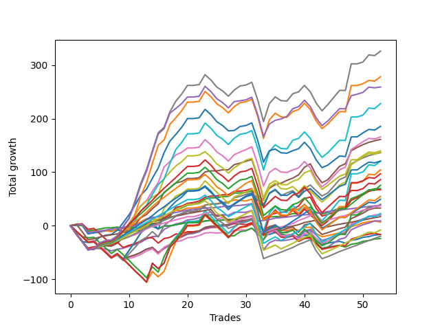

# Long Shepard 003 DB 
- Symbol: ES
- Date Range: 03/18/2022 - 12/30/2022
- Trading Period: 8:30-12:30
- Number of Trades: 7



| Name | Win Percent | Profit | Avg Profit / Trade | Avg Time / Trade |      | Name | Win Percent | Profit | Avg Profit / Trade | Avg Time / Trade |
| ---- | ----------- | ------ | ------------------ | ---------------- | ---- | ---- | ----------- | ------ | ------------------ | ---------------- |
| Sorted By <br> Profit | | | | | | Sorted By <br> Win Percentage ||||
| TP-1 | 100.00 | 3875.00 | 553.57 | 09:32 |     | TP-1 | 100.00 | 3875.00 | 553.57 | 09:32 |
| BB-20 U/L 1SD | 71.43 | 2875.00 | 410.71 | 10:30 |     | BB-50 U/L 1SD | 85.71 | 1375.00 | 196.43 | 36:10 |
| BB-20 Mid | 57.14 | 2000.00 | 285.71 | 04:40 |     | BB-20 U/L 2SD C | 85.71 | 750.00 | 107.14 | 23:45 |
| BB-50 U/L 1SD | 85.71 | 1375.00 | 196.43 | 36:10 |     | BB-20 U/L 2SD | 85.71 | 500.00 | 71.43 | 23:41 |
| BB-20 U/L 2SD C | 85.71 | 750.00 | 107.14 | 23:45 |     | BB-20 U/L 1SD | 71.43 | 2875.00 | 410.71 | 10:30 |
| BB-20 U/L 2SD | 85.71 | 500.00 | 71.43 | 23:41 |     | BB-100 Mid | 71.43 | 125.00 | 17.86 | 40:54 |
| BB-100 Mid | 71.43 | 125.00 | 17.86 | 40:54 |     | TP-6 | 71.43 | 0.00 | 0.00 | 43:12 |
| TP-6 | 71.43 | 0.00 | 0.00 | 43:12 |     | BB-50 U/L 2SD | 71.43 | -750.00 | -107.14 | 42:47 |
| BB-50 U/L 2SD | 71.43 | -750.00 | -107.14 | 42:47 |     | TP-5 | 71.43 | -1250.00 | -178.57 | 36:43 |
| TP-5 | 71.43 | -1250.00 | -178.57 | 36:43 |     | TP-4 | 71.43 | -1375.00 | -196.43 | 27:27 |
| TP-4 | 71.43 | -1375.00 | -196.43 | 27:27 |     | TP-3 | 71.43 | -3125.00 | -446.43 | 26:55 |
| TP-8 | 57.14 | -1375.00 | -196.43 | 46:27 |     | V Mid | 71.43 | -4000.00 | -571.43 | 43:10 |
| TP-7 | 57.14 | -2375.00 | -339.29 | 46:12 |     | TP-2 | 71.43 | -7000.00 | -1000.00 | 26:20 |
| TP-3 | 71.43 | -3125.00 | -446.43 | 26:55 |     | BB-20 Mid | 57.14 | 2000.00 | 285.71 | 04:40 |
| BB-50 Mid | 42.86 | -3125.00 | -446.43 | 30:45 |     | TP-8 | 57.14 | -1375.00 | -196.43 | 46:27 |
| V Mid | 71.43 | -4000.00 | -571.43 | 43:10 |     | TP-7 | 57.14 | -2375.00 | -339.29 | 46:12 |
| TP-9 | 57.14 | -4125.00 | -589.29 | 49:10 |     | TP-9 | 57.14 | -4125.00 | -589.29 | 49:10 |
| NEWFI 0000 | 42.86 | -4375.00 | -625.00 | 12:13 |     | BB-200 Mid | 57.14 | -5125.00 | -732.14 | 40:16 |
| BB-200 Mid | 57.14 | -5125.00 | -732.14 | 40:16 |     | NEWFI 000 | 57.14 | -6750.00 | -964.29 | 51:47 |
| NEWFI 000 | 57.14 | -6750.00 | -964.29 | 51:47 |     | TP-10 | 57.14 | -6750.00 | -964.29 | 51:47 |
| TP-10 | 57.14 | -6750.00 | -964.29 | 51:47 |     | BB-200 U/L 2SD | 57.14 | -6750.00 | -964.29 | 51:47 |
| BB-200 U/L 2SD | 57.14 | -6750.00 | -964.29 | 51:47 |     | BB-100 U/L 2SD | 57.14 | -6750.00 | -964.29 | 51:47 |
| BB-100 U/L 2SD | 57.14 | -6750.00 | -964.29 | 51:47 |     | V U/L 1SD | 57.14 | -6750.00 | -964.29 | 51:47 |
| V U/L 1SD | 57.14 | -6750.00 | -964.29 | 51:47 |     | BB-50 Mid | 42.86 | -3125.00 | -446.43 | 30:45 |
| TP-2 | 71.43 | -7000.00 | -1000.00 | 26:20 |     | NEWFI 0000 | 42.86 | -4375.00 | -625.00 | 12:13 |

## NO STOPLOSS

### Test BB-20 Mid
* Sell when price hits the middle line of the 20p bollinger
* No Stoploss
* Results:
```
Total Trades: 7
Percent Up: 57.14
Percent Down: 42.86
Total Points Moved Up: 4.00
Potential Profit: 2000.00
Total Points Ups: 8.00 Count Ups: 4
Total Points Downs: -4.00 Count Downs: 3
```

<details><summary>Trades</summary>

<code>In: 2022-03-23 09:53:00		Out: 2022-03-23 09:55:30		Total Position Time: 02:30		Total Move Up: -0.50		Total to Date: -0.50</code> <br />
<code>In: 2022-04-27 12:11:00		Out: 2022-04-27 12:14:00		Total Position Time: 03:00		Total Move Up: 2.25		Total to Date: 1.75</code> <br />
<code>In: 2022-07-11 12:25:00		Out: 2022-07-11 12:26:50		Total Position Time: 01:50		Total Move Up: -0.25		Total to Date: 1.50</code> <br />
<code>In: 2022-07-25 11:11:00		Out: 2022-07-25 11:12:10		Total Position Time: 01:10		Total Move Up: 0.75		Total to Date: 2.25</code> <br />
<code>In: 2022-08-05 08:33:00		Out: 2022-08-05 08:37:00		Total Position Time: 04:00		Total Move Up: 1.25		Total to Date: 3.50</code> <br />
<code>In: 2022-11-07 08:50:00		Out: 2022-11-07 09:07:00		Total Position Time: 17:00		Total Move Up: -3.25		Total to Date: 0.25</code> <br />
<code>In: 2022-12-08 11:14:00		Out: 2022-12-08 11:17:10		Total Position Time: 03:10		Total Move Up: 3.75		Total to Date: 4.00</code> <br />


</details>

### Test BB-20 U/L 1SD
* Sell when the price hits the upper line of the 20p 1std bollinger
* No Stoploss
* Results:
```
Total Trades: 7
Percent Up: 71.43
Percent Down: 28.57
Total Points Moved Up: 5.75
Potential Profit: 2875.00
Total Points Ups: 7.50 Count Ups: 5
Total Points Downs: -1.75 Count Downs: 2
```

<details><summary>Trades</summary>

<code>In: 2022-03-23 09:53:00		Out: 2022-03-23 09:59:45		Total Position Time: 06:45		Total Move Up: 1.00		Total to Date: 1.00</code> <br />
<code>In: 2022-04-27 12:11:00		Out: 2022-04-27 12:27:15		Total Position Time: 16:15		Total Move Up: 0.50		Total to Date: 1.50</code> <br />
<code>In: 2022-07-11 12:25:00		Out: 2022-07-11 12:29:20		Total Position Time: 04:20		Total Move Up: 1.50		Total to Date: 3.00</code> <br />
<code>In: 2022-07-25 11:11:00		Out: 2022-07-25 11:12:10		Total Position Time: 01:10		Total Move Up: 0.75		Total to Date: 3.75</code> <br />
<code>In: 2022-08-05 08:33:00		Out: 2022-08-05 08:51:30		Total Position Time: 18:30		Total Move Up: -1.00		Total to Date: 2.75</code> <br />
<code>In: 2022-11-07 08:50:00		Out: 2022-11-07 09:07:20		Total Position Time: 17:20		Total Move Up: -0.75		Total to Date: 2.00</code> <br />
<code>In: 2022-12-08 11:14:00		Out: 2022-12-08 11:23:10		Total Position Time: 09:10		Total Move Up: 3.75		Total to Date: 5.75</code> <br />


</details>

### Test BB-20 U/L 2SD
* Sell when the price hits the upper line of the 20p 2std bollinger
* No Stoploss
* Results:
```
Total Trades: 7
Percent Up: 85.71
Percent Down: 14.29
Total Points Moved Up: 1.00
Potential Profit: 500.00
Total Points Ups: 14.75 Count Ups: 6
Total Points Downs: -13.75 Count Downs: 1
```

<details><summary>Trades</summary>

<code>In: 2022-03-23 09:53:00		Out: 2022-03-23 10:53:55		Total Position Time: 60:55		Total Move Up: -13.75		Total to Date: -13.75</code> <br />
<code>In: 2022-04-27 12:11:00		Out: 2022-04-27 12:31:20		Total Position Time: 20:20		Total Move Up: 2.50		Total to Date: -11.25</code> <br />
<code>In: 2022-07-11 12:25:00		Out: 2022-07-11 12:29:40		Total Position Time: 04:40		Total Move Up: 3.00		Total to Date: -8.25</code> <br />
<code>In: 2022-07-25 11:11:00		Out: 2022-07-25 11:35:50		Total Position Time: 24:50		Total Move Up: 0.25		Total to Date: -8.00</code> <br />
<code>In: 2022-08-05 08:33:00		Out: 2022-08-05 08:53:30		Total Position Time: 20:30		Total Move Up: 1.00		Total to Date: -7.00</code> <br />
<code>In: 2022-11-07 08:50:00		Out: 2022-11-07 09:13:00		Total Position Time: 23:00		Total Move Up: 2.75		Total to Date: -4.25</code> <br />
<code>In: 2022-12-08 11:14:00		Out: 2022-12-08 11:25:35		Total Position Time: 11:35		Total Move Up: 5.25		Total to Date: 1.00</code> <br />


</details>

### Test BB-20 U/L 2SD C
* Sell when the price hits the upper line of the 20p 2std bollinger
* No Stoploss
* Results:
```
Total Trades: 7
Percent Up: 85.71
Percent Down: 14.29
Total Points Moved Up: 1.50
Potential Profit: 750.00
Total Points Ups: 15.25 Count Ups: 6
Total Points Downs: -13.75 Count Downs: 1
```

<details><summary>Trades</summary>

<code>In: 2022-03-23 09:53:00		Out: 2022-03-23 10:53:55		Total Position Time: 60:55		Total Move Up: -13.75		Total to Date: -13.75</code> <br />
<code>In: 2022-04-27 12:11:00		Out: 2022-04-27 12:31:20		Total Position Time: 20:20		Total Move Up: 2.50		Total to Date: -11.25</code> <br />
<code>In: 2022-07-11 12:25:00		Out: 2022-07-11 12:29:40		Total Position Time: 04:40		Total Move Up: 3.00		Total to Date: -8.25</code> <br />
<code>In: 2022-07-25 11:11:00		Out: 2022-07-25 11:35:50		Total Position Time: 24:50		Total Move Up: 0.25		Total to Date: -8.00</code> <br />
<code>In: 2022-08-05 08:33:00		Out: 2022-08-05 08:53:50		Total Position Time: 20:50		Total Move Up: 1.50		Total to Date: -6.50</code> <br />
<code>In: 2022-11-07 08:50:00		Out: 2022-11-07 09:13:05		Total Position Time: 23:05		Total Move Up: 2.75		Total to Date: -3.75</code> <br />
<code>In: 2022-12-08 11:14:00		Out: 2022-12-08 11:25:35		Total Position Time: 11:35		Total Move Up: 5.25		Total to Date: 1.50</code> <br />


</details>

### Test BB-50 Mid
* Sell when price hits the middle line of the 50p bollinger
* No Stoploss
* Results:
```
Total Trades: 7
Percent Up: 42.86
Percent Down: 57.14
Total Points Moved Up: -6.25
Potential Profit: -3125.00
Total Points Ups: 9.75 Count Ups: 3
Total Points Downs: -16.00 Count Downs: 4
```

<details><summary>Trades</summary>

<code>In: 2022-03-23 09:53:00		Out: 2022-03-23 10:53:55		Total Position Time: 60:55		Total Move Up: -13.75		Total to Date: -13.75</code> <br />
<code>In: 2022-04-27 12:11:00		Out: 2022-04-27 12:44:20		Total Position Time: 33:20		Total Move Up: -1.00		Total to Date: -14.75</code> <br />
<code>In: 2022-07-11 12:25:00		Out: 2022-07-11 12:40:35		Total Position Time: 15:35		Total Move Up: 2.75		Total to Date: -12.00</code> <br />
<code>In: 2022-07-25 11:11:00		Out: 2022-07-25 11:35:45		Total Position Time: 24:45		Total Move Up: -1.00		Total to Date: -13.00</code> <br />
<code>In: 2022-08-05 08:33:00		Out: 2022-08-05 09:03:40		Total Position Time: 30:40		Total Move Up: -0.25		Total to Date: -13.25</code> <br />
<code>In: 2022-11-07 08:50:00		Out: 2022-11-07 09:13:00		Total Position Time: 23:00		Total Move Up: 2.75		Total to Date: -10.50</code> <br />
<code>In: 2022-12-08 11:14:00		Out: 2022-12-08 11:41:05		Total Position Time: 27:05		Total Move Up: 4.25		Total to Date: -6.25</code> <br />


</details>

### Test BB-50 U/L 1SD
* Sell when the price hits the upper line of the 50p 1std bollinger
* No Stoploss
* Results:
```
Total Trades: 7
Percent Up: 85.71
Percent Down: 14.29
Total Points Moved Up: 2.75
Potential Profit: 1375.00
Total Points Ups: 16.50 Count Ups: 6
Total Points Downs: -13.75 Count Downs: 1
```

<details><summary>Trades</summary>

<code>In: 2022-03-23 09:53:00		Out: 2022-03-23 10:53:55		Total Position Time: 60:55		Total Move Up: -13.75		Total to Date: -13.75</code> <br />
<code>In: 2022-04-27 12:11:00		Out: 2022-04-27 12:46:05		Total Position Time: 35:05		Total Move Up: 1.50		Total to Date: -12.25</code> <br />
<code>In: 2022-07-11 12:25:00		Out: 2022-07-11 12:47:00		Total Position Time: 22:00		Total Move Up: 1.50		Total to Date: -10.75</code> <br />
<code>In: 2022-07-25 11:11:00		Out: 2022-07-25 11:41:00		Total Position Time: 30:00		Total Move Up: 0.00		Total to Date: -10.75</code> <br />
<code>In: 2022-08-05 08:33:00		Out: 2022-08-05 09:05:15		Total Position Time: 32:15		Total Move Up: 3.50		Total to Date: -7.25</code> <br />
<code>In: 2022-11-07 08:50:00		Out: 2022-11-07 09:24:55		Total Position Time: 34:55		Total Move Up: 4.75		Total to Date: -2.50</code> <br />
<code>In: 2022-12-08 11:14:00		Out: 2022-12-08 11:52:05		Total Position Time: 38:05		Total Move Up: 5.25		Total to Date: 2.75</code> <br />


</details>

### Test BB-50 U/L 2SD
* Sell when the price hits the upper line of the 50p 2std bollinger
* No Stoploss
* Results:
```
Total Trades: 7
Percent Up: 71.43
Percent Down: 28.57
Total Points Moved Up: -1.50
Potential Profit: -750.00
Total Points Ups: 22.25 Count Ups: 5
Total Points Downs: -23.75 Count Downs: 2
```

<details><summary>Trades</summary>

<code>In: 2022-03-23 09:53:00		Out: 2022-03-23 10:53:55		Total Position Time: 60:55		Total Move Up: -13.75		Total to Date: -13.75</code> <br />
<code>In: 2022-04-27 12:11:00		Out: 2022-04-27 12:47:00		Total Position Time: 36:00		Total Move Up: 3.75		Total to Date: -10.00</code> <br />
<code>In: 2022-07-11 12:25:00		Out: 2022-07-11 12:47:00		Total Position Time: 22:00		Total Move Up: 1.50		Total to Date: -8.50</code> <br />
<code>In: 2022-07-25 11:11:00		Out: 2022-07-25 12:11:55		Total Position Time: 60:55		Total Move Up: -10.00		Total to Date: -18.50</code> <br />
<code>In: 2022-08-05 08:33:00		Out: 2022-08-05 09:11:25		Total Position Time: 38:25		Total Move Up: 4.50		Total to Date: -14.00</code> <br />
<code>In: 2022-11-07 08:50:00		Out: 2022-11-07 09:31:20		Total Position Time: 41:20		Total Move Up: 5.25		Total to Date: -8.75</code> <br />
<code>In: 2022-12-08 11:14:00		Out: 2022-12-08 11:53:55		Total Position Time: 39:55		Total Move Up: 7.25		Total to Date: -1.50</code> <br />


</details>

### Test V Mid
* Sell when the price hits the middle line of the 1std VWAP
* No Stoploss
* Results:
```
Total Trades: 7
Percent Up: 71.43
Percent Down: 28.57
Total Points Moved Up: -8.00
Potential Profit: -4000.00
Total Points Ups: 15.75 Count Ups: 5
Total Points Downs: -23.75 Count Downs: 2
```

<details><summary>Trades</summary>

<code>In: 2022-03-23 09:53:00		Out: 2022-03-23 10:53:55		Total Position Time: 60:55		Total Move Up: -13.75		Total to Date: -13.75</code> <br />
<code>In: 2022-04-27 12:11:00		Out: 2022-04-27 12:47:00		Total Position Time: 36:00		Total Move Up: 3.75		Total to Date: -10.00</code> <br />
<code>In: 2022-07-11 12:25:00		Out: 2022-07-11 12:47:00		Total Position Time: 22:00		Total Move Up: 1.50		Total to Date: -8.50</code> <br />
<code>In: 2022-07-25 11:11:00		Out: 2022-07-25 12:11:55		Total Position Time: 60:55		Total Move Up: -10.00		Total to Date: -18.50</code> <br />
<code>In: 2022-08-05 08:33:00		Out: 2022-08-05 09:33:55		Total Position Time: 60:55		Total Move Up: 1.75		Total to Date: -16.75</code> <br />
<code>In: 2022-11-07 08:50:00		Out: 2022-11-07 09:13:00		Total Position Time: 23:00		Total Move Up: 2.75		Total to Date: -14.00</code> <br />
<code>In: 2022-12-08 11:14:00		Out: 2022-12-08 11:52:25		Total Position Time: 38:25		Total Move Up: 6.00		Total to Date: -8.00</code> <br />


</details>

### Test V U/L 1SD
* Sell when the price hits the upper line of the 1std VWAP
* No Stoploss
* Results:
```
Total Trades: 7
Percent Up: 57.14
Percent Down: 42.86
Total Points Moved Up: -13.50
Potential Profit: -6750.00
Total Points Ups: 10.50 Count Ups: 4
Total Points Downs: -24.00 Count Downs: 3
```

<details><summary>Trades</summary>

<code>In: 2022-03-23 09:53:00		Out: 2022-03-23 10:53:55		Total Position Time: 60:55		Total Move Up: -13.75		Total to Date: -13.75</code> <br />
<code>In: 2022-04-27 12:11:00		Out: 2022-04-27 12:47:00		Total Position Time: 36:00		Total Move Up: 3.75		Total to Date: -10.00</code> <br />
<code>In: 2022-07-11 12:25:00		Out: 2022-07-11 12:47:00		Total Position Time: 22:00		Total Move Up: 1.50		Total to Date: -8.50</code> <br />
<code>In: 2022-07-25 11:11:00		Out: 2022-07-25 12:11:55		Total Position Time: 60:55		Total Move Up: -10.00		Total to Date: -18.50</code> <br />
<code>In: 2022-08-05 08:33:00		Out: 2022-08-05 09:33:55		Total Position Time: 60:55		Total Move Up: 1.75		Total to Date: -16.75</code> <br />
<code>In: 2022-11-07 08:50:00		Out: 2022-11-07 09:50:55		Total Position Time: 60:55		Total Move Up: -0.25		Total to Date: -17.00</code> <br />
<code>In: 2022-12-08 11:14:00		Out: 2022-12-08 12:14:55		Total Position Time: 60:55		Total Move Up: 3.50		Total to Date: -13.50</code> <br />


</details>

### Test BB-100 Mid
* Move to BB100 Mid
* No Stoploss
* Results:
```
Total Trades: 7
Percent Up: 71.43
Percent Down: 28.57
Total Points Moved Up: 0.25
Potential Profit: 125.00
Total Points Ups: 24.00 Count Ups: 5
Total Points Downs: -23.75 Count Downs: 2
```

<details><summary>Trades</summary>

<code>In: 2022-03-23 09:53:00		Out: 2022-03-23 10:53:55		Total Position Time: 60:55		Total Move Up: -13.75		Total to Date: -13.75</code> <br />
<code>In: 2022-04-27 12:11:00		Out: 2022-04-27 12:47:00		Total Position Time: 36:00		Total Move Up: 3.75		Total to Date: -10.00</code> <br />
<code>In: 2022-07-11 12:25:00		Out: 2022-07-11 12:47:00		Total Position Time: 22:00		Total Move Up: 1.50		Total to Date: -8.50</code> <br />
<code>In: 2022-07-25 11:11:00		Out: 2022-07-25 12:11:55		Total Position Time: 60:55		Total Move Up: -10.00		Total to Date: -18.50</code> <br />
<code>In: 2022-08-05 08:33:00		Out: 2022-08-05 09:15:55		Total Position Time: 42:55		Total Move Up: 7.00		Total to Date: -11.50</code> <br />
<code>In: 2022-11-07 08:50:00		Out: 2022-11-07 09:13:15		Total Position Time: 23:15		Total Move Up: 4.00		Total to Date: -7.50</code> <br />
<code>In: 2022-12-08 11:14:00		Out: 2022-12-08 11:54:20		Total Position Time: 40:20		Total Move Up: 7.75		Total to Date: 0.25</code> <br />


</details>

### Test BB-100 U/L 2SD
* Move to BB100 Upper Band
* No Stoploss
* Results:
```
Total Trades: 7
Percent Up: 57.14
Percent Down: 42.86
Total Points Moved Up: -13.50
Potential Profit: -6750.00
Total Points Ups: 10.50 Count Ups: 4
Total Points Downs: -24.00 Count Downs: 3
```

<details><summary>Trades</summary>

<code>In: 2022-03-23 09:53:00		Out: 2022-03-23 10:53:55		Total Position Time: 60:55		Total Move Up: -13.75		Total to Date: -13.75</code> <br />
<code>In: 2022-04-27 12:11:00		Out: 2022-04-27 12:47:00		Total Position Time: 36:00		Total Move Up: 3.75		Total to Date: -10.00</code> <br />
<code>In: 2022-07-11 12:25:00		Out: 2022-07-11 12:47:00		Total Position Time: 22:00		Total Move Up: 1.50		Total to Date: -8.50</code> <br />
<code>In: 2022-07-25 11:11:00		Out: 2022-07-25 12:11:55		Total Position Time: 60:55		Total Move Up: -10.00		Total to Date: -18.50</code> <br />
<code>In: 2022-08-05 08:33:00		Out: 2022-08-05 09:33:55		Total Position Time: 60:55		Total Move Up: 1.75		Total to Date: -16.75</code> <br />
<code>In: 2022-11-07 08:50:00		Out: 2022-11-07 09:50:55		Total Position Time: 60:55		Total Move Up: -0.25		Total to Date: -17.00</code> <br />
<code>In: 2022-12-08 11:14:00		Out: 2022-12-08 12:14:55		Total Position Time: 60:55		Total Move Up: 3.50		Total to Date: -13.50</code> <br />


</details>

### Test BB-200 Mid
* Move to BB200 Mid
* No Stoploss
* Results:
```
Total Trades: 7
Percent Up: 57.14
Percent Down: 42.86
Total Points Moved Up: -10.25
Potential Profit: -5125.00
Total Points Ups: 14.50 Count Ups: 4
Total Points Downs: -24.75 Count Downs: 3
```

<details><summary>Trades</summary>

<code>In: 2022-03-23 09:53:00		Out: 2022-03-23 10:53:55		Total Position Time: 60:55		Total Move Up: -13.75		Total to Date: -13.75</code> <br />
<code>In: 2022-04-27 12:11:00		Out: 2022-04-27 12:47:00		Total Position Time: 36:00		Total Move Up: 3.75		Total to Date: -10.00</code> <br />
<code>In: 2022-07-11 12:25:00		Out: 2022-07-11 12:47:00		Total Position Time: 22:00		Total Move Up: 1.50		Total to Date: -8.50</code> <br />
<code>In: 2022-07-25 11:11:00		Out: 2022-07-25 12:11:55		Total Position Time: 60:55		Total Move Up: -10.00		Total to Date: -18.50</code> <br />
<code>In: 2022-08-05 08:33:00		Out: 2022-08-05 09:33:55		Total Position Time: 60:55		Total Move Up: 1.75		Total to Date: -16.75</code> <br />
<code>In: 2022-11-07 08:50:00		Out: 2022-11-07 08:51:10		Total Position Time: 01:10		Total Move Up: -1.00		Total to Date: -17.75</code> <br />
<code>In: 2022-12-08 11:14:00		Out: 2022-12-08 11:54:00		Total Position Time: 40:00		Total Move Up: 7.50		Total to Date: -10.25</code> <br />


</details>

### Test BB-200 U/L 2SD
* Move to BB200 Upper Band
* No Stoploss
* Results:
```
Total Trades: 7
Percent Up: 57.14
Percent Down: 42.86
Total Points Moved Up: -13.50
Potential Profit: -6750.00
Total Points Ups: 10.50 Count Ups: 4
Total Points Downs: -24.00 Count Downs: 3
```

<details><summary>Trades</summary>

<code>In: 2022-03-23 09:53:00		Out: 2022-03-23 10:53:55		Total Position Time: 60:55		Total Move Up: -13.75		Total to Date: -13.75</code> <br />
<code>In: 2022-04-27 12:11:00		Out: 2022-04-27 12:47:00		Total Position Time: 36:00		Total Move Up: 3.75		Total to Date: -10.00</code> <br />
<code>In: 2022-07-11 12:25:00		Out: 2022-07-11 12:47:00		Total Position Time: 22:00		Total Move Up: 1.50		Total to Date: -8.50</code> <br />
<code>In: 2022-07-25 11:11:00		Out: 2022-07-25 12:11:55		Total Position Time: 60:55		Total Move Up: -10.00		Total to Date: -18.50</code> <br />
<code>In: 2022-08-05 08:33:00		Out: 2022-08-05 09:33:55		Total Position Time: 60:55		Total Move Up: 1.75		Total to Date: -16.75</code> <br />
<code>In: 2022-11-07 08:50:00		Out: 2022-11-07 09:50:55		Total Position Time: 60:55		Total Move Up: -0.25		Total to Date: -17.00</code> <br />
<code>In: 2022-12-08 11:14:00		Out: 2022-12-08 12:14:55		Total Position Time: 60:55		Total Move Up: 3.50		Total to Date: -13.50</code> <br />


</details>

## TAKE PROFIT

### Test TP-1
* Take Profit of 1 Point
* No Stoploss
* Results:
```
Total Trades: 7
Percent Up: 100.00
Percent Down: 0.00
Total Points Moved Up: 7.75
Potential Profit: 3875.00
Total Points Ups: 7.75 Count Ups: 7
Total Points Downs: 0.00 Count Downs: 0
```

<details><summary>Trades</summary>

<code>In: 2022-03-23 09:53:00		Out: 2022-03-23 09:59:10		Total Position Time: 06:10		Total Move Up: 1.00		Total to Date: 1.00</code> <br />
<code>In: 2022-04-27 12:11:00		Out: 2022-04-27 12:13:55		Total Position Time: 02:55		Total Move Up: 1.50		Total to Date: 2.50</code> <br />
<code>In: 2022-07-11 12:25:00		Out: 2022-07-11 12:27:35		Total Position Time: 02:35		Total Move Up: 0.75		Total to Date: 3.25</code> <br />
<code>In: 2022-07-25 11:11:00		Out: 2022-07-25 11:41:30		Total Position Time: 30:30		Total Move Up: 0.75		Total to Date: 4.00</code> <br />
<code>In: 2022-08-05 08:33:00		Out: 2022-08-05 08:37:00		Total Position Time: 04:00		Total Move Up: 1.25		Total to Date: 5.25</code> <br />
<code>In: 2022-11-07 08:50:00		Out: 2022-11-07 09:08:05		Total Position Time: 18:05		Total Move Up: 1.25		Total to Date: 6.50</code> <br />
<code>In: 2022-12-08 11:14:00		Out: 2022-12-08 11:16:35		Total Position Time: 02:35		Total Move Up: 1.25		Total to Date: 7.75</code> <br />


</details>

### Test TP-2
* Take Profit of 2 Point
* No Stoploss
* Results:
```
Total Trades: 7
Percent Up: 71.43
Percent Down: 28.57
Total Points Moved Up: -14.00
Potential Profit: -7000.00
Total Points Ups: 9.75 Count Ups: 5
Total Points Downs: -23.75 Count Downs: 2
```

<details><summary>Trades</summary>

<code>In: 2022-03-23 09:53:00		Out: 2022-03-23 10:53:55		Total Position Time: 60:55		Total Move Up: -13.75		Total to Date: -13.75</code> <br />
<code>In: 2022-04-27 12:11:00		Out: 2022-04-27 12:14:00		Total Position Time: 03:00		Total Move Up: 2.25		Total to Date: -11.50</code> <br />
<code>In: 2022-07-11 12:25:00		Out: 2022-07-11 12:29:25		Total Position Time: 04:25		Total Move Up: 1.75		Total to Date: -9.75</code> <br />
<code>In: 2022-07-25 11:11:00		Out: 2022-07-25 12:11:55		Total Position Time: 60:55		Total Move Up: -10.00		Total to Date: -19.75</code> <br />
<code>In: 2022-08-05 08:33:00		Out: 2022-08-05 09:04:00		Total Position Time: 31:00		Total Move Up: 2.00		Total to Date: -17.75</code> <br />
<code>In: 2022-11-07 08:50:00		Out: 2022-11-07 09:11:05		Total Position Time: 21:05		Total Move Up: 2.00		Total to Date: -15.75</code> <br />
<code>In: 2022-12-08 11:14:00		Out: 2022-12-08 11:17:00		Total Position Time: 03:00		Total Move Up: 1.75		Total to Date: -14.00</code> <br />


</details>

### Test TP-3
* Take Profit of 3 Point
* No Stoploss
* Results:
```
Total Trades: 7
Percent Up: 71.43
Percent Down: 28.57
Total Points Moved Up: -6.25
Potential Profit: -3125.00
Total Points Ups: 17.50 Count Ups: 5
Total Points Downs: -23.75 Count Downs: 2
```

<details><summary>Trades</summary>

<code>In: 2022-03-23 09:53:00		Out: 2022-03-23 10:53:55		Total Position Time: 60:55		Total Move Up: -13.75		Total to Date: -13.75</code> <br />
<code>In: 2022-04-27 12:11:00		Out: 2022-04-27 12:15:20		Total Position Time: 04:20		Total Move Up: 4.25		Total to Date: -9.50</code> <br />
<code>In: 2022-07-11 12:25:00		Out: 2022-07-11 12:29:40		Total Position Time: 04:40		Total Move Up: 3.00		Total to Date: -6.50</code> <br />
<code>In: 2022-07-25 11:11:00		Out: 2022-07-25 12:11:55		Total Position Time: 60:55		Total Move Up: -10.00		Total to Date: -16.50</code> <br />
<code>In: 2022-08-05 08:33:00		Out: 2022-08-05 09:04:25		Total Position Time: 31:25		Total Move Up: 3.75		Total to Date: -12.75</code> <br />
<code>In: 2022-11-07 08:50:00		Out: 2022-11-07 09:13:05		Total Position Time: 23:05		Total Move Up: 2.75		Total to Date: -10.00</code> <br />
<code>In: 2022-12-08 11:14:00		Out: 2022-12-08 11:17:10		Total Position Time: 03:10		Total Move Up: 3.75		Total to Date: -6.25</code> <br />


</details>

### Test TP-4
* Take Profit of 4 Point
* No Stoploss
* Results:
```
Total Trades: 7
Percent Up: 71.43
Percent Down: 28.57
Total Points Moved Up: -2.75
Potential Profit: -1375.00
Total Points Ups: 21.00 Count Ups: 5
Total Points Downs: -23.75 Count Downs: 2
```

<details><summary>Trades</summary>

<code>In: 2022-03-23 09:53:00		Out: 2022-03-23 10:53:55		Total Position Time: 60:55		Total Move Up: -13.75		Total to Date: -13.75</code> <br />
<code>In: 2022-04-27 12:11:00		Out: 2022-04-27 12:15:20		Total Position Time: 04:20		Total Move Up: 4.25		Total to Date: -9.50</code> <br />
<code>In: 2022-07-11 12:25:00		Out: 2022-07-11 12:31:50		Total Position Time: 06:50		Total Move Up: 4.00		Total to Date: -5.50</code> <br />
<code>In: 2022-07-25 11:11:00		Out: 2022-07-25 12:11:55		Total Position Time: 60:55		Total Move Up: -10.00		Total to Date: -15.50</code> <br />
<code>In: 2022-08-05 08:33:00		Out: 2022-08-05 09:05:20		Total Position Time: 32:20		Total Move Up: 4.25		Total to Date: -11.25</code> <br />
<code>In: 2022-11-07 08:50:00		Out: 2022-11-07 09:13:15		Total Position Time: 23:15		Total Move Up: 4.00		Total to Date: -7.25</code> <br />
<code>In: 2022-12-08 11:14:00		Out: 2022-12-08 11:17:35		Total Position Time: 03:35		Total Move Up: 4.50		Total to Date: -2.75</code> <br />


</details>

### Test TP-5
* Take Profit of 5 Point
* No Stoploss
* Results:
```
Total Trades: 7
Percent Up: 71.43
Percent Down: 28.57
Total Points Moved Up: -2.50
Potential Profit: -1250.00
Total Points Ups: 21.25 Count Ups: 5
Total Points Downs: -23.75 Count Downs: 2
```

<details><summary>Trades</summary>

<code>In: 2022-03-23 09:53:00		Out: 2022-03-23 10:53:55		Total Position Time: 60:55		Total Move Up: -13.75		Total to Date: -13.75</code> <br />
<code>In: 2022-04-27 12:11:00		Out: 2022-04-27 12:47:00		Total Position Time: 36:00		Total Move Up: 3.75		Total to Date: -10.00</code> <br />
<code>In: 2022-07-11 12:25:00		Out: 2022-07-11 12:47:00		Total Position Time: 22:00		Total Move Up: 1.50		Total to Date: -8.50</code> <br />
<code>In: 2022-07-25 11:11:00		Out: 2022-07-25 12:11:55		Total Position Time: 60:55		Total Move Up: -10.00		Total to Date: -18.50</code> <br />
<code>In: 2022-08-05 08:33:00		Out: 2022-08-05 09:05:45		Total Position Time: 32:45		Total Move Up: 5.50		Total to Date: -13.00</code> <br />
<code>In: 2022-11-07 08:50:00		Out: 2022-11-07 09:25:00		Total Position Time: 35:00		Total Move Up: 5.25		Total to Date: -7.75</code> <br />
<code>In: 2022-12-08 11:14:00		Out: 2022-12-08 11:23:30		Total Position Time: 09:30		Total Move Up: 5.25		Total to Date: -2.50</code> <br />


</details>

### Test TP-6
* Take Profit of 6 Point
* No Stoploss
* Results:
```
Total Trades: 7
Percent Up: 71.43
Percent Down: 28.57
Total Points Moved Up: 0.00
Potential Profit: 0.00
Total Points Ups: 23.75 Count Ups: 5
Total Points Downs: -23.75 Count Downs: 2
```

<details><summary>Trades</summary>

<code>In: 2022-03-23 09:53:00		Out: 2022-03-23 10:53:55		Total Position Time: 60:55		Total Move Up: -13.75		Total to Date: -13.75</code> <br />
<code>In: 2022-04-27 12:11:00		Out: 2022-04-27 12:47:00		Total Position Time: 36:00		Total Move Up: 3.75		Total to Date: -10.00</code> <br />
<code>In: 2022-07-11 12:25:00		Out: 2022-07-11 12:47:00		Total Position Time: 22:00		Total Move Up: 1.50		Total to Date: -8.50</code> <br />
<code>In: 2022-07-25 11:11:00		Out: 2022-07-25 12:11:55		Total Position Time: 60:55		Total Move Up: -10.00		Total to Date: -18.50</code> <br />
<code>In: 2022-08-05 08:33:00		Out: 2022-08-05 09:15:50		Total Position Time: 42:50		Total Move Up: 6.25		Total to Date: -12.25</code> <br />
<code>In: 2022-11-07 08:50:00		Out: 2022-11-07 09:31:25		Total Position Time: 41:25		Total Move Up: 6.25		Total to Date: -6.00</code> <br />
<code>In: 2022-12-08 11:14:00		Out: 2022-12-08 11:52:25		Total Position Time: 38:25		Total Move Up: 6.00		Total to Date: 0.00</code> <br />


</details>

### Test TP-7
* Take Profit of 7 Point
* No Stoploss
* Results:
```
Total Trades: 7
Percent Up: 57.14
Percent Down: 42.86
Total Points Moved Up: -4.75
Potential Profit: -2375.00
Total Points Ups: 19.25 Count Ups: 4
Total Points Downs: -24.00 Count Downs: 3
```

<details><summary>Trades</summary>

<code>In: 2022-03-23 09:53:00		Out: 2022-03-23 10:53:55		Total Position Time: 60:55		Total Move Up: -13.75		Total to Date: -13.75</code> <br />
<code>In: 2022-04-27 12:11:00		Out: 2022-04-27 12:47:00		Total Position Time: 36:00		Total Move Up: 3.75		Total to Date: -10.00</code> <br />
<code>In: 2022-07-11 12:25:00		Out: 2022-07-11 12:47:00		Total Position Time: 22:00		Total Move Up: 1.50		Total to Date: -8.50</code> <br />
<code>In: 2022-07-25 11:11:00		Out: 2022-07-25 12:11:55		Total Position Time: 60:55		Total Move Up: -10.00		Total to Date: -18.50</code> <br />
<code>In: 2022-08-05 08:33:00		Out: 2022-08-05 09:15:55		Total Position Time: 42:55		Total Move Up: 7.00		Total to Date: -11.50</code> <br />
<code>In: 2022-11-07 08:50:00		Out: 2022-11-07 09:50:55		Total Position Time: 60:55		Total Move Up: -0.25		Total to Date: -11.75</code> <br />
<code>In: 2022-12-08 11:14:00		Out: 2022-12-08 11:53:50		Total Position Time: 39:50		Total Move Up: 7.00		Total to Date: -4.75</code> <br />


</details>

### Test TP-8
* Take Profit of 8 Point
* No Stoploss
* Results:
```
Total Trades: 7
Percent Up: 57.14
Percent Down: 42.86
Total Points Moved Up: -2.75
Potential Profit: -1375.00
Total Points Ups: 21.25 Count Ups: 4
Total Points Downs: -24.00 Count Downs: 3
```

<details><summary>Trades</summary>

<code>In: 2022-03-23 09:53:00		Out: 2022-03-23 10:53:55		Total Position Time: 60:55		Total Move Up: -13.75		Total to Date: -13.75</code> <br />
<code>In: 2022-04-27 12:11:00		Out: 2022-04-27 12:47:00		Total Position Time: 36:00		Total Move Up: 3.75		Total to Date: -10.00</code> <br />
<code>In: 2022-07-11 12:25:00		Out: 2022-07-11 12:47:00		Total Position Time: 22:00		Total Move Up: 1.50		Total to Date: -8.50</code> <br />
<code>In: 2022-07-25 11:11:00		Out: 2022-07-25 12:11:55		Total Position Time: 60:55		Total Move Up: -10.00		Total to Date: -18.50</code> <br />
<code>In: 2022-08-05 08:33:00		Out: 2022-08-05 09:17:05		Total Position Time: 44:05		Total Move Up: 8.00		Total to Date: -10.50</code> <br />
<code>In: 2022-11-07 08:50:00		Out: 2022-11-07 09:50:55		Total Position Time: 60:55		Total Move Up: -0.25		Total to Date: -10.75</code> <br />
<code>In: 2022-12-08 11:14:00		Out: 2022-12-08 11:54:25		Total Position Time: 40:25		Total Move Up: 8.00		Total to Date: -2.75</code> <br />


</details>

### Test TP-9
* Take Profit of 9 Point
* No Stoploss
* Results:
```
Total Trades: 7
Percent Up: 57.14
Percent Down: 42.86
Total Points Moved Up: -8.25
Potential Profit: -4125.00
Total Points Ups: 15.75 Count Ups: 4
Total Points Downs: -24.00 Count Downs: 3
```

<details><summary>Trades</summary>

<code>In: 2022-03-23 09:53:00		Out: 2022-03-23 10:53:55		Total Position Time: 60:55		Total Move Up: -13.75		Total to Date: -13.75</code> <br />
<code>In: 2022-04-27 12:11:00		Out: 2022-04-27 12:47:00		Total Position Time: 36:00		Total Move Up: 3.75		Total to Date: -10.00</code> <br />
<code>In: 2022-07-11 12:25:00		Out: 2022-07-11 12:47:00		Total Position Time: 22:00		Total Move Up: 1.50		Total to Date: -8.50</code> <br />
<code>In: 2022-07-25 11:11:00		Out: 2022-07-25 12:11:55		Total Position Time: 60:55		Total Move Up: -10.00		Total to Date: -18.50</code> <br />
<code>In: 2022-08-05 08:33:00		Out: 2022-08-05 09:33:55		Total Position Time: 60:55		Total Move Up: 1.75		Total to Date: -16.75</code> <br />
<code>In: 2022-11-07 08:50:00		Out: 2022-11-07 09:50:55		Total Position Time: 60:55		Total Move Up: -0.25		Total to Date: -17.00</code> <br />
<code>In: 2022-12-08 11:14:00		Out: 2022-12-08 11:56:35		Total Position Time: 42:35		Total Move Up: 8.75		Total to Date: -8.25</code> <br />


</details>

### Test TP-10
* Take Profit of 10 Point
* No Stoploss
* Results:
```
Total Trades: 7
Percent Up: 57.14
Percent Down: 42.86
Total Points Moved Up: -13.50
Potential Profit: -6750.00
Total Points Ups: 10.50 Count Ups: 4
Total Points Downs: -24.00 Count Downs: 3
```

<details><summary>Trades</summary>

<code>In: 2022-03-23 09:53:00		Out: 2022-03-23 10:53:55		Total Position Time: 60:55		Total Move Up: -13.75		Total to Date: -13.75</code> <br />
<code>In: 2022-04-27 12:11:00		Out: 2022-04-27 12:47:00		Total Position Time: 36:00		Total Move Up: 3.75		Total to Date: -10.00</code> <br />
<code>In: 2022-07-11 12:25:00		Out: 2022-07-11 12:47:00		Total Position Time: 22:00		Total Move Up: 1.50		Total to Date: -8.50</code> <br />
<code>In: 2022-07-25 11:11:00		Out: 2022-07-25 12:11:55		Total Position Time: 60:55		Total Move Up: -10.00		Total to Date: -18.50</code> <br />
<code>In: 2022-08-05 08:33:00		Out: 2022-08-05 09:33:55		Total Position Time: 60:55		Total Move Up: 1.75		Total to Date: -16.75</code> <br />
<code>In: 2022-11-07 08:50:00		Out: 2022-11-07 09:50:55		Total Position Time: 60:55		Total Move Up: -0.25		Total to Date: -17.00</code> <br />
<code>In: 2022-12-08 11:14:00		Out: 2022-12-08 12:14:55		Total Position Time: 60:55		Total Move Up: 3.50		Total to Date: -13.50</code> <br />


</details>

## Indicator Exits

### Test NEWFI 000
* Newfi 0000
* No Stoploss
* Results:
```
Total Trades: 7
Percent Up: 57.14
Percent Down: 42.86
Total Points Moved Up: -13.50
Potential Profit: -6750.00
Total Points Ups: 10.50 Count Ups: 4
Total Points Downs: -24.00 Count Downs: 3
```

<details><summary>Trades</summary>

<code>In: 2022-03-23 09:53:00		Out: 2022-03-23 10:53:55		Total Position Time: 60:55		Total Move Up: -13.75		Total to Date: -13.75</code> <br />
<code>In: 2022-04-27 12:11:00		Out: 2022-04-27 12:47:00		Total Position Time: 36:00		Total Move Up: 3.75		Total to Date: -10.00</code> <br />
<code>In: 2022-07-11 12:25:00		Out: 2022-07-11 12:47:00		Total Position Time: 22:00		Total Move Up: 1.50		Total to Date: -8.50</code> <br />
<code>In: 2022-07-25 11:11:00		Out: 2022-07-25 12:11:55		Total Position Time: 60:55		Total Move Up: -10.00		Total to Date: -18.50</code> <br />
<code>In: 2022-08-05 08:33:00		Out: 2022-08-05 09:33:55		Total Position Time: 60:55		Total Move Up: 1.75		Total to Date: -16.75</code> <br />
<code>In: 2022-11-07 08:50:00		Out: 2022-11-07 09:50:55		Total Position Time: 60:55		Total Move Up: -0.25		Total to Date: -17.00</code> <br />
<code>In: 2022-12-08 11:14:00		Out: 2022-12-08 12:14:55		Total Position Time: 60:55		Total Move Up: 3.50		Total to Date: -13.50</code> <br />


</details>

### Test NEWFI 0000
* Newfi 0000
* No Stoploss
* Results:
```
Total Trades: 7
Percent Up: 42.86
Percent Down: 57.14
Total Points Moved Up: -8.75
Potential Profit: -4375.00
Total Points Ups: 2.00 Count Ups: 3
Total Points Downs: -10.75 Count Downs: 4
```

<details><summary>Trades</summary>

<code>In: 2022-03-23 09:53:00		Out: 2022-03-23 10:08:05		Total Position Time: 15:05		Total Move Up: -2.00		Total to Date: -2.00</code> <br />
<code>In: 2022-04-27 12:11:00		Out: 2022-04-27 12:15:05		Total Position Time: 04:05		Total Move Up: 2.00		Total to Date: 0.00</code> <br />
<code>In: 2022-07-11 12:25:00		Out: 2022-07-11 12:26:05		Total Position Time: 01:05		Total Move Up: 0.00		Total to Date: 0.00</code> <br />
<code>In: 2022-07-25 11:11:00		Out: 2022-07-25 11:24:05		Total Position Time: 13:05		Total Move Up: -2.50		Total to Date: -2.50</code> <br />
<code>In: 2022-08-05 08:33:00		Out: 2022-08-05 08:51:05		Total Position Time: 18:05		Total Move Up: -1.50		Total to Date: -4.00</code> <br />
<code>In: 2022-11-07 08:50:00		Out: 2022-11-07 09:04:05		Total Position Time: 14:05		Total Move Up: -4.75		Total to Date: -8.75</code> <br />
<code>In: 2022-12-08 11:14:00		Out: 2022-12-08 11:34:05		Total Position Time: 20:05		Total Move Up: 0.00		Total to Date: -8.75</code> <br />


</details>