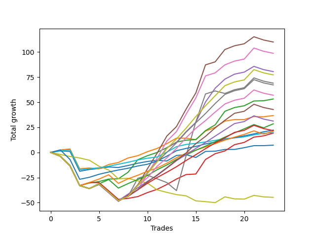

# Long Shepard 003 DB 
- Symbol: ES
- Date Range: 03/18/2022 - 07/15/2022
- Trading Period: 8:30-12:30
- Number of Trades: 23



| Name | Win Percent | Profit | Avg Profit / Trade | Avg Time / Trade |      | Name | Win Percent | Profit | Avg Profit / Trade | Avg Time / Trade |
| ---- | ----------- | ------ | ------------------ | ---------------- | ---- | ---- | ----------- | ------ | ------------------ | ---------------- |
| Sorted By <br> Profit | | | | | | Sorted By <br> Win Percentage ||||
| Five | 65.22 | 55000.00 | 2391.30 | 22:18 |     | Eighty-One | 95.65 | 9875.00 | 429.35 | 03:34 |
| Six | 65.22 | 49375.00 | 2146.74 | 21:41 |     | Eighty-Two | 91.30 | 11125.00 | 483.70 | 06:46 |
| Four | 65.22 | 40250.00 | 1750.00 | 20:24 |     | Two | 86.96 | 26625.00 | 1157.61 | 14:46 |
| Ninety | 65.22 | 38625.00 | 1679.35 | 20:49 |     | One | 82.61 | 18375.00 | 798.91 | 08:27 |
| Seven | 47.83 | 34500.00 | 1500.00 | 28:01 |     | Eighty-Three | 78.26 | 10625.00 | 461.96 | 11:51 |
| Eighty-Nine | 65.22 | 33625.00 | 1461.96 | 20:01 |     | Three | 78.26 | 9625.00 | 418.48 | 15:47 |
| Eighty-Eight | 65.22 | 28500.00 | 1239.13 | 19:51 |     | Zero | 78.26 | 3625.00 | 157.61 | 03:26 |
| Two | 86.96 | 26625.00 | 1157.61 | 14:46 |     | Eighty-Four | 73.91 | 14250.00 | 619.57 | 13:11 |
| Eighty-Seven | 65.22 | 21375.00 | 929.35 | 18:14 |     | Five | 65.22 | 55000.00 | 2391.30 | 22:18 |
| One | 82.61 | 18375.00 | 798.91 | 08:27 |     | Six | 65.22 | 49375.00 | 2146.74 | 21:41 |
| Eighty-Six | 65.22 | 15625.00 | 679.35 | 17:25 |     | Four | 65.22 | 40250.00 | 1750.00 | 20:24 |
| Eighty-Four | 73.91 | 14250.00 | 619.57 | 13:11 |     | Ninety | 65.22 | 38625.00 | 1679.35 | 20:49 |
| Eighty-Two | 91.30 | 11125.00 | 483.70 | 06:46 |     | Eighty-Nine | 65.22 | 33625.00 | 1461.96 | 20:01 |
| Eighty-Five | 65.22 | 10875.00 | 472.83 | 16:57 |     | Eighty-Eight | 65.22 | 28500.00 | 1239.13 | 19:51 |
| Eighty-Three | 78.26 | 10625.00 | 461.96 | 11:51 |     | Eighty-Seven | 65.22 | 21375.00 | 929.35 | 18:14 |
| Eighty-One | 95.65 | 9875.00 | 429.35 | 03:34 |     | Eighty-Six | 65.22 | 15625.00 | 679.35 | 17:25 |
| Three | 78.26 | 9625.00 | 418.48 | 15:47 |     | Eighty-Five | 65.22 | 10875.00 | 472.83 | 16:57 |
| Zero | 78.26 | 3625.00 | 157.61 | 03:26 |     | Seven | 47.83 | 34500.00 | 1500.00 | 28:01 |
| Seventy-Three | 13.04 | -22375.00 | -972.83 | 04:18 |     | Seventy-Three | 13.04 | -22375.00 | -972.83 | 04:18 |

## NO STOPLOSS

### Test Zero
* Sell when price hits the middle line of the 20p bollinger
* No Stoploss
* Results:
```
Total Trades: 23
Percent Up: 78.26
Percent Down: 21.74
Total Points Moved Up: 7.25
Potential Profit: 3625.00
Total Points Ups: 31.50 Count Ups: 18
Total Points Downs: -24.25 Count Downs: 5
```

<details><summary>Trades</summary>

<code>In: 2022-03-23 09:49:00		Out: 2022-03-23 09:53:00		Total Position Time: 04:00		Total Move Up: 1.50		Total to Date: 1.50</code> <br />
<code>In: 2022-03-23 09:53:00		Out: 2022-03-23 09:54:00		Total Position Time: 01:00		Total Move Up: -0.50		Total to Date: 1.00</code> <br />
<code>In: 2022-03-28 08:30:00		Out: 2022-03-28 08:59:55		Total Position Time: 29:55		Total Move Up: -19.75		Total to Date: -18.75</code> <br />
<code>In: 2022-03-31 09:30:00		Out: 2022-03-31 09:32:35		Total Position Time: 02:35		Total Move Up: 1.75		Total to Date: -17.00</code> <br />
<code>In: 2022-04-20 11:48:00		Out: 2022-04-20 11:48:15		Total Position Time: 00:15		Total Move Up: 1.00		Total to Date: -16.00</code> <br />
<code>In: 2022-04-27 12:11:00		Out: 2022-04-27 12:13:55		Total Position Time: 02:55		Total Move Up: 1.50		Total to Date: -14.50</code> <br />
<code>In: 2022-04-27 12:14:00		Out: 2022-04-27 12:14:35		Total Position Time: 00:35		Total Move Up: -0.50		Total to Date: -15.00</code> <br />
<code>In: 2022-04-27 12:24:00		Out: 2022-04-27 12:24:15		Total Position Time: 00:15		Total Move Up: 2.00		Total to Date: -13.00</code> <br />
<code>In: 2022-05-03 11:45:00		Out: 2022-05-03 11:45:10		Total Position Time: 00:10		Total Move Up: 2.25		Total to Date: -10.75</code> <br />
<code>In: 2022-05-06 11:36:00		Out: 2022-05-06 11:40:25		Total Position Time: 04:25		Total Move Up: 1.75		Total to Date: -9.00</code> <br />
<code>In: 2022-05-06 11:41:00		Out: 2022-05-06 11:41:10		Total Position Time: 00:10		Total Move Up: 1.25		Total to Date: -7.75</code> <br />
<code>In: 2022-05-06 11:47:00		Out: 2022-05-06 11:48:15		Total Position Time: 01:15		Total Move Up: -0.75		Total to Date: -8.50</code> <br />
<code>In: 2022-05-06 11:50:00		Out: 2022-05-06 11:50:10		Total Position Time: 00:10		Total Move Up: 5.50		Total to Date: -3.00</code> <br />
<code>In: 2022-05-06 12:12:00		Out: 2022-05-06 12:19:10		Total Position Time: 07:10		Total Move Up: 0.75		Total to Date: -2.25</code> <br />
<code>In: 2022-05-06 12:20:00		Out: 2022-05-06 12:20:10		Total Position Time: 00:10		Total Move Up: -2.75		Total to Date: -5.00</code> <br />
<code>In: 2022-05-12 09:04:00		Out: 2022-05-12 09:07:35		Total Position Time: 03:35		Total Move Up: 6.00		Total to Date: 1.00</code> <br />
<code>In: 2022-05-13 11:10:00		Out: 2022-05-13 11:19:15		Total Position Time: 09:15		Total Move Up: 0.25		Total to Date: 1.25</code> <br />
<code>In: 2022-05-19 10:19:00		Out: 2022-05-19 10:19:20		Total Position Time: 00:20		Total Move Up: 1.75		Total to Date: 3.00</code> <br />
<code>In: 2022-05-25 09:39:00		Out: 2022-05-25 09:41:25		Total Position Time: 02:25		Total Move Up: 0.00		Total to Date: 3.00</code> <br />
<code>In: 2022-07-08 09:48:00		Out: 2022-07-08 09:48:40		Total Position Time: 00:40		Total Move Up: 1.75		Total to Date: 4.75</code> <br />
<code>In: 2022-07-08 10:06:00		Out: 2022-07-08 10:06:10		Total Position Time: 00:10		Total Move Up: 2.00		Total to Date: 6.75</code> <br />
<code>In: 2022-07-11 12:15:00		Out: 2022-07-11 12:22:10		Total Position Time: 07:10		Total Move Up: 0.00		Total to Date: 6.75</code> <br />
<code>In: 2022-07-11 12:25:00		Out: 2022-07-11 12:25:30		Total Position Time: 00:30		Total Move Up: 0.50		Total to Date: 7.25</code> <br />


</details>

### Test One
* Sell when the price hits the upper line of the 20p 1std bollinger
* No Stoploss
* Results:
```
Total Trades: 23
Percent Up: 82.61
Percent Down: 17.39
Total Points Moved Up: 36.75
Potential Profit: 18375.00
Total Points Ups: 59.00 Count Ups: 19
Total Points Downs: -22.25 Count Downs: 4
```

<details><summary>Trades</summary>

<code>In: 2022-03-23 09:49:00		Out: 2022-03-23 09:59:10		Total Position Time: 10:10		Total Move Up: 2.50		Total to Date: 2.50</code> <br />
<code>In: 2022-03-23 09:53:00		Out: 2022-03-23 09:59:10		Total Position Time: 06:10		Total Move Up: 1.00		Total to Date: 3.50</code> <br />
<code>In: 2022-03-28 08:30:00		Out: 2022-03-28 08:59:55		Total Position Time: 29:55		Total Move Up: -19.75		Total to Date: -16.25</code> <br />
<code>In: 2022-03-31 09:30:00		Out: 2022-03-31 09:40:25		Total Position Time: 10:25		Total Move Up: 0.75		Total to Date: -15.50</code> <br />
<code>In: 2022-04-20 11:48:00		Out: 2022-04-20 12:04:20		Total Position Time: 16:20		Total Move Up: -0.75		Total to Date: -16.25</code> <br />
<code>In: 2022-04-27 12:11:00		Out: 2022-04-27 12:15:20		Total Position Time: 04:20		Total Move Up: 4.25		Total to Date: -12.00</code> <br />
<code>In: 2022-04-27 12:14:00		Out: 2022-04-27 12:15:20		Total Position Time: 01:20		Total Move Up: 2.00		Total to Date: -10.00</code> <br />
<code>In: 2022-04-27 12:24:00		Out: 2022-04-27 12:27:15		Total Position Time: 03:15		Total Move Up: 4.50		Total to Date: -5.50</code> <br />
<code>In: 2022-05-03 11:45:00		Out: 2022-05-03 11:45:10		Total Position Time: 00:10		Total Move Up: 2.25		Total to Date: -3.25</code> <br />
<code>In: 2022-05-06 11:36:00		Out: 2022-05-06 11:49:10		Total Position Time: 13:10		Total Move Up: 4.00		Total to Date: 0.75</code> <br />
<code>In: 2022-05-06 11:41:00		Out: 2022-05-06 11:49:10		Total Position Time: 08:10		Total Move Up: 3.25		Total to Date: 4.00</code> <br />
<code>In: 2022-05-06 11:47:00		Out: 2022-05-06 11:49:10		Total Position Time: 02:10		Total Move Up: 4.75		Total to Date: 8.75</code> <br />
<code>In: 2022-05-06 11:50:00		Out: 2022-05-06 11:50:10		Total Position Time: 00:10		Total Move Up: 5.50		Total to Date: 14.25</code> <br />
<code>In: 2022-05-06 12:12:00		Out: 2022-05-06 12:28:05		Total Position Time: 16:05		Total Move Up: 0.00		Total to Date: 14.25</code> <br />
<code>In: 2022-05-06 12:20:00		Out: 2022-05-06 12:28:05		Total Position Time: 08:05		Total Move Up: -1.50		Total to Date: 12.75</code> <br />
<code>In: 2022-05-12 09:04:00		Out: 2022-05-12 09:11:10		Total Position Time: 07:10		Total Move Up: 8.50		Total to Date: 21.25</code> <br />
<code>In: 2022-05-13 11:10:00		Out: 2022-05-13 11:20:00		Total Position Time: 10:00		Total Move Up: 3.75		Total to Date: 25.00</code> <br />
<code>In: 2022-05-19 10:19:00		Out: 2022-05-19 10:22:45		Total Position Time: 03:45		Total Move Up: 6.25		Total to Date: 31.25</code> <br />
<code>In: 2022-05-25 09:39:00		Out: 2022-05-25 09:44:25		Total Position Time: 05:25		Total Move Up: 1.50		Total to Date: 32.75</code> <br />
<code>In: 2022-07-08 09:48:00		Out: 2022-07-08 10:06:55		Total Position Time: 18:55		Total Move Up: 0.00		Total to Date: 32.75</code> <br />
<code>In: 2022-07-08 10:06:00		Out: 2022-07-08 10:06:55		Total Position Time: 00:55		Total Move Up: 3.00		Total to Date: 35.75</code> <br />
<code>In: 2022-07-11 12:15:00		Out: 2022-07-11 12:29:15		Total Position Time: 14:15		Total Move Up: -0.25		Total to Date: 35.50</code> <br />
<code>In: 2022-07-11 12:25:00		Out: 2022-07-11 12:29:15		Total Position Time: 04:15		Total Move Up: 1.25		Total to Date: 36.75</code> <br />


</details>

### Test Two
* Sell when the price hits the upper line of the 20p 2std bollinger
* No Stoploss
* Results:
```
Total Trades: 23
Percent Up: 86.96
Percent Down: 13.04
Total Points Moved Up: 53.25
Potential Profit: 26625.00
Total Points Ups: 86.25 Count Ups: 20
Total Points Downs: -33.00 Count Downs: 3
```

<details><summary>Trades</summary>

<code>In: 2022-03-23 09:49:00		Out: 2022-03-23 10:18:55		Total Position Time: 29:55		Total Move Up: -3.75		Total to Date: -3.75</code> <br />
<code>In: 2022-03-23 09:53:00		Out: 2022-03-23 10:22:55		Total Position Time: 29:55		Total Move Up: -9.50		Total to Date: -13.25</code> <br />
<code>In: 2022-03-28 08:30:00		Out: 2022-03-28 08:59:55		Total Position Time: 29:55		Total Move Up: -19.75		Total to Date: -33.00</code> <br />
<code>In: 2022-03-31 09:30:00		Out: 2022-03-31 09:44:20		Total Position Time: 14:20		Total Move Up: 2.50		Total to Date: -30.50</code> <br />
<code>In: 2022-04-20 11:48:00		Out: 2022-04-20 12:12:35		Total Position Time: 24:35		Total Move Up: 1.50		Total to Date: -29.00</code> <br />
<code>In: 2022-04-27 12:11:00		Out: 2022-04-27 12:31:20		Total Position Time: 20:20		Total Move Up: 2.50		Total to Date: -26.50</code> <br />
<code>In: 2022-04-27 12:14:00		Out: 2022-04-27 12:31:20		Total Position Time: 17:20		Total Move Up: 0.25		Total to Date: -26.25</code> <br />
<code>In: 2022-04-27 12:24:00		Out: 2022-04-27 12:31:20		Total Position Time: 07:20		Total Move Up: 6.50		Total to Date: -19.75</code> <br />
<code>In: 2022-05-03 11:45:00		Out: 2022-05-03 11:52:15		Total Position Time: 07:15		Total Move Up: 12.50		Total to Date: -7.25</code> <br />
<code>In: 2022-05-06 11:36:00		Out: 2022-05-06 11:49:10		Total Position Time: 13:10		Total Move Up: 4.00		Total to Date: -3.25</code> <br />
<code>In: 2022-05-06 11:41:00		Out: 2022-05-06 11:49:10		Total Position Time: 08:10		Total Move Up: 3.25		Total to Date: 0.00</code> <br />
<code>In: 2022-05-06 11:47:00		Out: 2022-05-06 11:49:10		Total Position Time: 02:10		Total Move Up: 4.75		Total to Date: 4.75</code> <br />
<code>In: 2022-05-06 11:50:00		Out: 2022-05-06 11:50:10		Total Position Time: 00:10		Total Move Up: 5.50		Total to Date: 10.25</code> <br />
<code>In: 2022-05-06 12:12:00		Out: 2022-05-06 12:28:10		Total Position Time: 16:10		Total Move Up: 2.00		Total to Date: 12.25</code> <br />
<code>In: 2022-05-06 12:20:00		Out: 2022-05-06 12:28:10		Total Position Time: 08:10		Total Move Up: 0.50		Total to Date: 12.75</code> <br />
<code>In: 2022-05-12 09:04:00		Out: 2022-05-12 09:16:10		Total Position Time: 12:10		Total Move Up: 9.00		Total to Date: 21.75</code> <br />
<code>In: 2022-05-13 11:10:00		Out: 2022-05-13 11:31:20		Total Position Time: 21:20		Total Move Up: 5.75		Total to Date: 27.50</code> <br />
<code>In: 2022-05-19 10:19:00		Out: 2022-05-19 10:44:05		Total Position Time: 25:05		Total Move Up: 13.50		Total to Date: 41.00</code> <br />
<code>In: 2022-05-25 09:39:00		Out: 2022-05-25 09:45:20		Total Position Time: 06:20		Total Move Up: 3.75		Total to Date: 44.75</code> <br />
<code>In: 2022-07-08 09:48:00		Out: 2022-07-08 10:10:30		Total Position Time: 22:30		Total Move Up: 1.75		Total to Date: 46.50</code> <br />
<code>In: 2022-07-08 10:06:00		Out: 2022-07-08 10:10:30		Total Position Time: 04:30		Total Move Up: 4.75		Total to Date: 51.25</code> <br />
<code>In: 2022-07-11 12:15:00		Out: 2022-07-11 12:29:25		Total Position Time: 14:25		Total Move Up: 0.25		Total to Date: 51.50</code> <br />
<code>In: 2022-07-11 12:25:00		Out: 2022-07-11 12:29:25		Total Position Time: 04:25		Total Move Up: 1.75		Total to Date: 53.25</code> <br />


</details>

### Test Three
* Sell when price hits the middle line of the 50p bollinger
* No Stoploss
* Results:
```
Total Trades: 23
Percent Up: 78.26
Percent Down: 21.74
Total Points Moved Up: 19.25
Potential Profit: 9625.00
Total Points Ups: 69.00 Count Ups: 18
Total Points Downs: -49.75 Count Downs: 5
```

<details><summary>Trades</summary>

<code>In: 2022-03-23 09:49:00		Out: 2022-03-23 10:18:55		Total Position Time: 29:55		Total Move Up: -3.75		Total to Date: -3.75</code> <br />
<code>In: 2022-03-23 09:53:00		Out: 2022-03-23 10:22:55		Total Position Time: 29:55		Total Move Up: -9.50		Total to Date: -13.25</code> <br />
<code>In: 2022-03-28 08:30:00		Out: 2022-03-28 08:59:55		Total Position Time: 29:55		Total Move Up: -19.75		Total to Date: -33.00</code> <br />
<code>In: 2022-03-31 09:30:00		Out: 2022-03-31 09:45:45		Total Position Time: 15:45		Total Move Up: 3.00		Total to Date: -30.00</code> <br />
<code>In: 2022-04-20 11:48:00		Out: 2022-04-20 12:10:10		Total Position Time: 22:10		Total Move Up: 0.00		Total to Date: -30.00</code> <br />
<code>In: 2022-04-27 12:11:00		Out: 2022-04-27 12:40:55		Total Position Time: 29:55		Total Move Up: -8.25		Total to Date: -38.25</code> <br />
<code>In: 2022-04-27 12:14:00		Out: 2022-04-27 12:43:55		Total Position Time: 29:55		Total Move Up: -8.50		Total to Date: -46.75</code> <br />
<code>In: 2022-04-27 12:24:00		Out: 2022-04-27 12:44:15		Total Position Time: 20:15		Total Move Up: 1.00		Total to Date: -45.75</code> <br />
<code>In: 2022-05-03 11:45:00		Out: 2022-05-03 11:48:05		Total Position Time: 03:05		Total Move Up: 1.75		Total to Date: -44.00</code> <br />
<code>In: 2022-05-06 11:36:00		Out: 2022-05-06 11:49:10		Total Position Time: 13:10		Total Move Up: 4.00		Total to Date: -40.00</code> <br />
<code>In: 2022-05-06 11:41:00		Out: 2022-05-06 11:49:10		Total Position Time: 08:10		Total Move Up: 3.25		Total to Date: -36.75</code> <br />
<code>In: 2022-05-06 11:47:00		Out: 2022-05-06 11:49:10		Total Position Time: 02:10		Total Move Up: 4.75		Total to Date: -32.00</code> <br />
<code>In: 2022-05-06 11:50:00		Out: 2022-05-06 11:50:10		Total Position Time: 00:10		Total Move Up: 5.50		Total to Date: -26.50</code> <br />
<code>In: 2022-05-06 12:12:00		Out: 2022-05-06 12:13:10		Total Position Time: 01:10		Total Move Up: 4.50		Total to Date: -22.00</code> <br />
<code>In: 2022-05-06 12:20:00		Out: 2022-05-06 12:28:10		Total Position Time: 08:10		Total Move Up: 0.50		Total to Date: -21.50</code> <br />
<code>In: 2022-05-12 09:04:00		Out: 2022-05-12 09:21:35		Total Position Time: 17:35		Total Move Up: 14.50		Total to Date: -7.00</code> <br />
<code>In: 2022-05-13 11:10:00		Out: 2022-05-13 11:31:20		Total Position Time: 21:20		Total Move Up: 5.75		Total to Date: -1.25</code> <br />
<code>In: 2022-05-19 10:19:00		Out: 2022-05-19 10:20:05		Total Position Time: 01:05		Total Move Up: 2.75		Total to Date: 1.50</code> <br />
<code>In: 2022-05-25 09:39:00		Out: 2022-05-25 09:49:05		Total Position Time: 10:05		Total Move Up: 6.25		Total to Date: 7.75</code> <br />
<code>In: 2022-07-08 09:48:00		Out: 2022-07-08 10:11:05		Total Position Time: 23:05		Total Move Up: 2.25		Total to Date: 10.00</code> <br />
<code>In: 2022-07-08 10:06:00		Out: 2022-07-08 10:11:05		Total Position Time: 05:05		Total Move Up: 5.25		Total to Date: 15.25</code> <br />
<code>In: 2022-07-11 12:15:00		Out: 2022-07-11 12:40:35		Total Position Time: 25:35		Total Move Up: 1.25		Total to Date: 16.50</code> <br />
<code>In: 2022-07-11 12:25:00		Out: 2022-07-11 12:40:35		Total Position Time: 15:35		Total Move Up: 2.75		Total to Date: 19.25</code> <br />


</details>

### Test Four
* Sell when the price hits the upper line of the 50p 1std bollinger
* No Stoploss
* Results:
```
Total Trades: 23
Percent Up: 65.22
Percent Down: 34.78
Total Points Moved Up: 80.50
Potential Profit: 40250.00
Total Points Ups: 138.50 Count Ups: 15
Total Points Downs: -58.00 Count Downs: 8
```

<details><summary>Trades</summary>

<code>In: 2022-03-23 09:49:00		Out: 2022-03-23 10:18:55		Total Position Time: 29:55		Total Move Up: -3.75		Total to Date: -3.75</code> <br />
<code>In: 2022-03-23 09:53:00		Out: 2022-03-23 10:22:55		Total Position Time: 29:55		Total Move Up: -9.50		Total to Date: -13.25</code> <br />
<code>In: 2022-03-28 08:30:00		Out: 2022-03-28 08:59:55		Total Position Time: 29:55		Total Move Up: -19.75		Total to Date: -33.00</code> <br />
<code>In: 2022-03-31 09:30:00		Out: 2022-03-31 09:59:55		Total Position Time: 29:55		Total Move Up: -3.00		Total to Date: -36.00</code> <br />
<code>In: 2022-04-20 11:48:00		Out: 2022-04-20 12:13:30		Total Position Time: 25:30		Total Move Up: 4.00		Total to Date: -32.00</code> <br />
<code>In: 2022-04-27 12:11:00		Out: 2022-04-27 12:40:55		Total Position Time: 29:55		Total Move Up: -8.25		Total to Date: -40.25</code> <br />
<code>In: 2022-04-27 12:14:00		Out: 2022-04-27 12:43:55		Total Position Time: 29:55		Total Move Up: -8.50		Total to Date: -48.75</code> <br />
<code>In: 2022-04-27 12:24:00		Out: 2022-04-27 12:44:35		Total Position Time: 20:35		Total Move Up: 5.75		Total to Date: -43.00</code> <br />
<code>In: 2022-05-03 11:45:00		Out: 2022-05-03 11:52:05		Total Position Time: 07:05		Total Move Up: 10.75		Total to Date: -32.25</code> <br />
<code>In: 2022-05-06 11:36:00		Out: 2022-05-06 11:50:10		Total Position Time: 14:10		Total Move Up: 12.25		Total to Date: -20.00</code> <br />
<code>In: 2022-05-06 11:41:00		Out: 2022-05-06 11:50:10		Total Position Time: 09:10		Total Move Up: 11.50		Total to Date: -8.50</code> <br />
<code>In: 2022-05-06 11:47:00		Out: 2022-05-06 11:50:10		Total Position Time: 03:10		Total Move Up: 13.00		Total to Date: 4.50</code> <br />
<code>In: 2022-05-06 11:50:00		Out: 2022-05-06 11:50:10		Total Position Time: 00:10		Total Move Up: 5.50		Total to Date: 10.00</code> <br />
<code>In: 2022-05-06 12:12:00		Out: 2022-05-06 12:30:30		Total Position Time: 18:30		Total Move Up: 10.75		Total to Date: 20.75</code> <br />
<code>In: 2022-05-06 12:20:00		Out: 2022-05-06 12:30:30		Total Position Time: 10:30		Total Move Up: 9.25		Total to Date: 30.00</code> <br />
<code>In: 2022-05-12 09:04:00		Out: 2022-05-12 09:30:10		Total Position Time: 26:10		Total Move Up: 20.25		Total to Date: 50.25</code> <br />
<code>In: 2022-05-13 11:10:00		Out: 2022-05-13 11:32:00		Total Position Time: 22:00		Total Move Up: 13.75		Total to Date: 64.00</code> <br />
<code>In: 2022-05-19 10:19:00		Out: 2022-05-19 10:23:25		Total Position Time: 04:25		Total Move Up: 9.00		Total to Date: 73.00</code> <br />
<code>In: 2022-05-25 09:39:00		Out: 2022-05-25 10:06:15		Total Position Time: 27:15		Total Move Up: 5.00		Total to Date: 78.00</code> <br />
<code>In: 2022-07-08 09:48:00		Out: 2022-07-08 10:17:55		Total Position Time: 29:55		Total Move Up: 2.00		Total to Date: 80.00</code> <br />
<code>In: 2022-07-08 10:06:00		Out: 2022-07-08 10:26:30		Total Position Time: 20:30		Total Move Up: 5.75		Total to Date: 85.75</code> <br />
<code>In: 2022-07-11 12:15:00		Out: 2022-07-11 12:44:55		Total Position Time: 29:55		Total Move Up: -3.25		Total to Date: 82.50</code> <br />
<code>In: 2022-07-11 12:25:00		Out: 2022-07-11 12:46:00		Total Position Time: 21:00		Total Move Up: -2.00		Total to Date: 80.50</code> <br />


</details>

### Test Five
* Sell when the price hits the upper line of the 50p 2std bollinger
* No Stoploss
* Results:
```
Total Trades: 23
Percent Up: 65.22
Percent Down: 34.78
Total Points Moved Up: 110.00
Potential Profit: 55000.00
Total Points Ups: 168.00 Count Ups: 15
Total Points Downs: -58.00 Count Downs: 8
```

<details><summary>Trades</summary>

<code>In: 2022-03-23 09:49:00		Out: 2022-03-23 10:18:55		Total Position Time: 29:55		Total Move Up: -3.75		Total to Date: -3.75</code> <br />
<code>In: 2022-03-23 09:53:00		Out: 2022-03-23 10:22:55		Total Position Time: 29:55		Total Move Up: -9.50		Total to Date: -13.25</code> <br />
<code>In: 2022-03-28 08:30:00		Out: 2022-03-28 08:59:55		Total Position Time: 29:55		Total Move Up: -19.75		Total to Date: -33.00</code> <br />
<code>In: 2022-03-31 09:30:00		Out: 2022-03-31 09:59:55		Total Position Time: 29:55		Total Move Up: -3.00		Total to Date: -36.00</code> <br />
<code>In: 2022-04-20 11:48:00		Out: 2022-04-20 12:17:55		Total Position Time: 29:55		Total Move Up: 4.75		Total to Date: -31.25</code> <br />
<code>In: 2022-04-27 12:11:00		Out: 2022-04-27 12:40:55		Total Position Time: 29:55		Total Move Up: -8.25		Total to Date: -39.50</code> <br />
<code>In: 2022-04-27 12:14:00		Out: 2022-04-27 12:43:55		Total Position Time: 29:55		Total Move Up: -8.50		Total to Date: -48.00</code> <br />
<code>In: 2022-04-27 12:24:00		Out: 2022-04-27 12:46:00		Total Position Time: 22:00		Total Move Up: 4.25		Total to Date: -43.75</code> <br />
<code>In: 2022-05-03 11:45:00		Out: 2022-05-03 11:56:15		Total Position Time: 11:15		Total Move Up: 11.25		Total to Date: -32.50</code> <br />
<code>In: 2022-05-06 11:36:00		Out: 2022-05-06 11:50:35		Total Position Time: 14:35		Total Move Up: 16.25		Total to Date: -16.25</code> <br />
<code>In: 2022-05-06 11:41:00		Out: 2022-05-06 11:50:35		Total Position Time: 09:35		Total Move Up: 15.50		Total to Date: -0.75</code> <br />
<code>In: 2022-05-06 11:47:00		Out: 2022-05-06 11:50:35		Total Position Time: 03:35		Total Move Up: 17.00		Total to Date: 16.25</code> <br />
<code>In: 2022-05-06 11:50:00		Out: 2022-05-06 11:50:35		Total Position Time: 00:35		Total Move Up: 9.50		Total to Date: 25.75</code> <br />
<code>In: 2022-05-06 12:12:00		Out: 2022-05-06 12:35:40		Total Position Time: 23:40		Total Move Up: 17.50		Total to Date: 43.25</code> <br />
<code>In: 2022-05-06 12:20:00		Out: 2022-05-06 12:35:40		Total Position Time: 15:40		Total Move Up: 16.00		Total to Date: 59.25</code> <br />
<code>In: 2022-05-12 09:04:00		Out: 2022-05-12 09:32:30		Total Position Time: 28:30		Total Move Up: 28.00		Total to Date: 87.25</code> <br />
<code>In: 2022-05-13 11:10:00		Out: 2022-05-13 11:39:55		Total Position Time: 29:55		Total Move Up: 3.00		Total to Date: 90.25</code> <br />
<code>In: 2022-05-19 10:19:00		Out: 2022-05-19 10:31:30		Total Position Time: 12:30		Total Move Up: 12.25		Total to Date: 102.50</code> <br />
<code>In: 2022-05-25 09:39:00		Out: 2022-05-25 10:08:55		Total Position Time: 29:55		Total Move Up: 3.75		Total to Date: 106.25</code> <br />
<code>In: 2022-07-08 09:48:00		Out: 2022-07-08 10:17:55		Total Position Time: 29:55		Total Move Up: 2.00		Total to Date: 108.25</code> <br />
<code>In: 2022-07-08 10:06:00		Out: 2022-07-08 10:26:55		Total Position Time: 20:55		Total Move Up: 7.00		Total to Date: 115.25</code> <br />
<code>In: 2022-07-11 12:15:00		Out: 2022-07-11 12:44:55		Total Position Time: 29:55		Total Move Up: -3.25		Total to Date: 112.00</code> <br />
<code>In: 2022-07-11 12:25:00		Out: 2022-07-11 12:46:00		Total Position Time: 21:00		Total Move Up: -2.00		Total to Date: 110.00</code> <br />


</details>

### Test Six
* Sell when the price hits the middle line of the 1std VWAP
* No Stoploss
* Results:
```
Total Trades: 23
Percent Up: 65.22
Percent Down: 34.78
Total Points Moved Up: 98.75
Potential Profit: 49375.00
Total Points Ups: 156.75 Count Ups: 15
Total Points Downs: -58.00 Count Downs: 8
```

<details><summary>Trades</summary>

<code>In: 2022-03-23 09:49:00		Out: 2022-03-23 10:18:55		Total Position Time: 29:55		Total Move Up: -3.75		Total to Date: -3.75</code> <br />
<code>In: 2022-03-23 09:53:00		Out: 2022-03-23 10:22:55		Total Position Time: 29:55		Total Move Up: -9.50		Total to Date: -13.25</code> <br />
<code>In: 2022-03-28 08:30:00		Out: 2022-03-28 08:59:55		Total Position Time: 29:55		Total Move Up: -19.75		Total to Date: -33.00</code> <br />
<code>In: 2022-03-31 09:30:00		Out: 2022-03-31 09:59:55		Total Position Time: 29:55		Total Move Up: -3.00		Total to Date: -36.00</code> <br />
<code>In: 2022-04-20 11:48:00		Out: 2022-04-20 12:17:55		Total Position Time: 29:55		Total Move Up: 4.75		Total to Date: -31.25</code> <br />
<code>In: 2022-04-27 12:11:00		Out: 2022-04-27 12:40:55		Total Position Time: 29:55		Total Move Up: -8.25		Total to Date: -39.50</code> <br />
<code>In: 2022-04-27 12:14:00		Out: 2022-04-27 12:43:55		Total Position Time: 29:55		Total Move Up: -8.50		Total to Date: -48.00</code> <br />
<code>In: 2022-04-27 12:24:00		Out: 2022-04-27 12:46:00		Total Position Time: 22:00		Total Move Up: 4.25		Total to Date: -43.75</code> <br />
<code>In: 2022-05-03 11:45:00		Out: 2022-05-03 11:50:50		Total Position Time: 05:50		Total Move Up: 6.25		Total to Date: -37.50</code> <br />
<code>In: 2022-05-06 11:36:00		Out: 2022-05-06 11:50:20		Total Position Time: 14:20		Total Move Up: 16.25		Total to Date: -21.25</code> <br />
<code>In: 2022-05-06 11:41:00		Out: 2022-05-06 11:50:20		Total Position Time: 09:20		Total Move Up: 15.50		Total to Date: -5.75</code> <br />
<code>In: 2022-05-06 11:47:00		Out: 2022-05-06 11:50:20		Total Position Time: 03:20		Total Move Up: 17.00		Total to Date: 11.25</code> <br />
<code>In: 2022-05-06 11:50:00		Out: 2022-05-06 11:50:20		Total Position Time: 00:20		Total Move Up: 9.50		Total to Date: 20.75</code> <br />
<code>In: 2022-05-06 12:12:00		Out: 2022-05-06 12:35:40		Total Position Time: 23:40		Total Move Up: 17.50		Total to Date: 38.25</code> <br />
<code>In: 2022-05-06 12:20:00		Out: 2022-05-06 12:35:40		Total Position Time: 15:40		Total Move Up: 16.00		Total to Date: 54.25</code> <br />
<code>In: 2022-05-12 09:04:00		Out: 2022-05-12 09:31:05		Total Position Time: 27:05		Total Move Up: 22.00		Total to Date: 76.25</code> <br />
<code>In: 2022-05-13 11:10:00		Out: 2022-05-13 11:39:55		Total Position Time: 29:55		Total Move Up: 3.00		Total to Date: 79.25</code> <br />
<code>In: 2022-05-19 10:19:00		Out: 2022-05-19 10:22:55		Total Position Time: 03:55		Total Move Up: 8.00		Total to Date: 87.25</code> <br />
<code>In: 2022-05-25 09:39:00		Out: 2022-05-25 10:08:55		Total Position Time: 29:55		Total Move Up: 3.75		Total to Date: 91.00</code> <br />
<code>In: 2022-07-08 09:48:00		Out: 2022-07-08 10:17:55		Total Position Time: 29:55		Total Move Up: 2.00		Total to Date: 93.00</code> <br />
<code>In: 2022-07-08 10:06:00		Out: 2022-07-08 10:29:10		Total Position Time: 23:10		Total Move Up: 11.00		Total to Date: 104.00</code> <br />
<code>In: 2022-07-11 12:15:00		Out: 2022-07-11 12:44:55		Total Position Time: 29:55		Total Move Up: -3.25		Total to Date: 100.75</code> <br />
<code>In: 2022-07-11 12:25:00		Out: 2022-07-11 12:46:00		Total Position Time: 21:00		Total Move Up: -2.00		Total to Date: 98.75</code> <br />


</details>

### Test Seven
* Sell when the price hits the upper line of the 1std VWAP
* No Stoploss
* Results:
```
Total Trades: 23
Percent Up: 47.83
Percent Down: 52.17
Total Points Moved Up: 69.00
Potential Profit: 34500.00
Total Points Ups: 144.75 Count Ups: 11
Total Points Downs: -75.75 Count Downs: 12
```

<details><summary>Trades</summary>

<code>In: 2022-03-23 09:49:00		Out: 2022-03-23 10:18:55		Total Position Time: 29:55		Total Move Up: -3.75		Total to Date: -3.75</code> <br />
<code>In: 2022-03-23 09:53:00		Out: 2022-03-23 10:22:55		Total Position Time: 29:55		Total Move Up: -9.50		Total to Date: -13.25</code> <br />
<code>In: 2022-03-28 08:30:00		Out: 2022-03-28 08:59:55		Total Position Time: 29:55		Total Move Up: -19.75		Total to Date: -33.00</code> <br />
<code>In: 2022-03-31 09:30:00		Out: 2022-03-31 09:59:55		Total Position Time: 29:55		Total Move Up: -3.00		Total to Date: -36.00</code> <br />
<code>In: 2022-04-20 11:48:00		Out: 2022-04-20 12:17:55		Total Position Time: 29:55		Total Move Up: 4.75		Total to Date: -31.25</code> <br />
<code>In: 2022-04-27 12:11:00		Out: 2022-04-27 12:40:55		Total Position Time: 29:55		Total Move Up: -8.25		Total to Date: -39.50</code> <br />
<code>In: 2022-04-27 12:14:00		Out: 2022-04-27 12:43:55		Total Position Time: 29:55		Total Move Up: -8.50		Total to Date: -48.00</code> <br />
<code>In: 2022-04-27 12:24:00		Out: 2022-04-27 12:46:00		Total Position Time: 22:00		Total Move Up: 4.25		Total to Date: -43.75</code> <br />
<code>In: 2022-05-03 11:45:00		Out: 2022-05-03 12:00:05		Total Position Time: 15:05		Total Move Up: 18.00		Total to Date: -25.75</code> <br />
<code>In: 2022-05-06 11:36:00		Out: 2022-05-06 12:05:55		Total Position Time: 29:55		Total Move Up: 3.00		Total to Date: -22.75</code> <br />
<code>In: 2022-05-06 11:41:00		Out: 2022-05-06 12:10:55		Total Position Time: 29:55		Total Move Up: -3.50		Total to Date: -26.25</code> <br />
<code>In: 2022-05-06 11:47:00		Out: 2022-05-06 12:16:55		Total Position Time: 29:55		Total Move Up: -3.75		Total to Date: -30.00</code> <br />
<code>In: 2022-05-06 11:50:00		Out: 2022-05-06 12:19:55		Total Position Time: 29:55		Total Move Up: -8.00		Total to Date: -38.00</code> <br />
<code>In: 2022-05-06 12:12:00		Out: 2022-05-06 12:40:00		Total Position Time: 28:00		Total Move Up: 35.00		Total to Date: -3.00</code> <br />
<code>In: 2022-05-06 12:20:00		Out: 2022-05-06 12:40:00		Total Position Time: 20:00		Total Move Up: 33.50		Total to Date: 30.50</code> <br />
<code>In: 2022-05-12 09:04:00		Out: 2022-05-12 09:33:55		Total Position Time: 29:55		Total Move Up: 27.75		Total to Date: 58.25</code> <br />
<code>In: 2022-05-13 11:10:00		Out: 2022-05-13 11:39:55		Total Position Time: 29:55		Total Move Up: 3.00		Total to Date: 61.25</code> <br />
<code>In: 2022-05-19 10:19:00		Out: 2022-05-19 10:48:55		Total Position Time: 29:55		Total Move Up: -2.50		Total to Date: 58.75</code> <br />
<code>In: 2022-05-25 09:39:00		Out: 2022-05-25 10:08:55		Total Position Time: 29:55		Total Move Up: 3.75		Total to Date: 62.50</code> <br />
<code>In: 2022-07-08 09:48:00		Out: 2022-07-08 10:17:55		Total Position Time: 29:55		Total Move Up: 2.00		Total to Date: 64.50</code> <br />
<code>In: 2022-07-08 10:06:00		Out: 2022-07-08 10:35:55		Total Position Time: 29:55		Total Move Up: 9.75		Total to Date: 74.25</code> <br />
<code>In: 2022-07-11 12:15:00		Out: 2022-07-11 12:44:55		Total Position Time: 29:55		Total Move Up: -3.25		Total to Date: 71.00</code> <br />
<code>In: 2022-07-11 12:25:00		Out: 2022-07-11 12:46:00		Total Position Time: 21:00		Total Move Up: -2.00		Total to Date: 69.00</code> <br />


</details>

## SPECIAL EXIT CONDITIONS 

### Test Seventy-Three
* Sell when the linear regression slope changes to negative
* No Stoploss
* Results:
```
Total Trades: 23
Percent Up: 13.04
Percent Down: 86.96
Total Points Moved Up: -44.75
Potential Profit: -22375.00
Total Points Ups: 10.00 Count Ups: 3
Total Points Downs: -54.75 Count Downs: 20
```

<details><summary>Trades</summary>

<code>In: 2022-03-23 09:49:00		Out: 2022-03-23 09:50:05		Total Position Time: 01:05		Total Move Up: -2.00		Total to Date: -2.00</code> <br />
<code>In: 2022-03-23 09:53:00		Out: 2022-03-23 10:02:05		Total Position Time: 09:05		Total Move Up: -2.00		Total to Date: -4.00</code> <br />
<code>In: 2022-03-28 08:30:00		Out: 2022-03-28 08:31:05		Total Position Time: 01:05		Total Move Up: -1.50		Total to Date: -5.50</code> <br />
<code>In: 2022-03-31 09:30:00		Out: 2022-03-31 09:35:05		Total Position Time: 05:05		Total Move Up: -2.25		Total to Date: -7.75</code> <br />
<code>In: 2022-04-20 11:48:00		Out: 2022-04-20 11:52:05		Total Position Time: 04:05		Total Move Up: -6.00		Total to Date: -13.75</code> <br />
<code>In: 2022-04-27 12:11:00		Out: 2022-04-27 12:12:05		Total Position Time: 01:05		Total Move Up: -3.75		Total to Date: -17.50</code> <br />
<code>In: 2022-04-27 12:14:00		Out: 2022-04-27 12:17:05		Total Position Time: 03:05		Total Move Up: -8.75		Total to Date: -26.25</code> <br />
<code>In: 2022-04-27 12:24:00		Out: 2022-04-27 12:34:05		Total Position Time: 10:05		Total Move Up: 0.50		Total to Date: -25.75</code> <br />
<code>In: 2022-05-03 11:45:00		Out: 2022-05-03 11:46:05		Total Position Time: 01:05		Total Move Up: -2.50		Total to Date: -28.25</code> <br />
<code>In: 2022-05-06 11:36:00		Out: 2022-05-06 11:37:05		Total Position Time: 01:05		Total Move Up: -2.25		Total to Date: -30.50</code> <br />
<code>In: 2022-05-06 11:41:00		Out: 2022-05-06 11:45:05		Total Position Time: 04:05		Total Move Up: -6.75		Total to Date: -37.25</code> <br />
<code>In: 2022-05-06 11:47:00		Out: 2022-05-06 11:48:05		Total Position Time: 01:05		Total Move Up: -2.50		Total to Date: -39.75</code> <br />
<code>In: 2022-05-06 11:50:00		Out: 2022-05-06 12:00:05		Total Position Time: 10:05		Total Move Up: -2.25		Total to Date: -42.00</code> <br />
<code>In: 2022-05-06 12:12:00		Out: 2022-05-06 12:15:05		Total Position Time: 03:05		Total Move Up: -1.25		Total to Date: -43.25</code> <br />
<code>In: 2022-05-06 12:20:00		Out: 2022-05-06 12:21:05		Total Position Time: 01:05		Total Move Up: -5.00		Total to Date: -48.25</code> <br />
<code>In: 2022-05-12 09:04:00		Out: 2022-05-12 09:06:05		Total Position Time: 02:05		Total Move Up: -0.75		Total to Date: -49.00</code> <br />
<code>In: 2022-05-13 11:10:00		Out: 2022-05-13 11:18:05		Total Position Time: 08:05		Total Move Up: -1.00		Total to Date: -50.00</code> <br />
<code>In: 2022-05-19 10:19:00		Out: 2022-05-19 10:29:05		Total Position Time: 10:05		Total Move Up: 5.75		Total to Date: -44.25</code> <br />
<code>In: 2022-05-25 09:39:00		Out: 2022-05-25 09:40:05		Total Position Time: 01:05		Total Move Up: -2.00		Total to Date: -46.25</code> <br />
<code>In: 2022-07-08 09:48:00		Out: 2022-07-08 09:53:05		Total Position Time: 05:05		Total Move Up: -0.25		Total to Date: -46.50</code> <br />
<code>In: 2022-07-08 10:06:00		Out: 2022-07-08 10:18:05		Total Position Time: 12:05		Total Move Up: 3.75		Total to Date: -42.75</code> <br />
<code>In: 2022-07-11 12:15:00		Out: 2022-07-11 12:17:05		Total Position Time: 02:05		Total Move Up: -1.50		Total to Date: -44.25</code> <br />
<code>In: 2022-07-11 12:25:00		Out: 2022-07-11 12:27:05		Total Position Time: 02:05		Total Move Up: -0.50		Total to Date: -44.75</code> <br />


</details>

## TAKE PROFIT

### Test Eighty-One
* Take Profit of 1 Point
* No Stoploss
* Results:
```
Total Trades: 23
Percent Up: 95.65
Percent Down: 4.35
Total Points Moved Up: 19.75
Potential Profit: 9875.00
Total Points Ups: 39.50 Count Ups: 22
Total Points Downs: -19.75 Count Downs: 1
```

<details><summary>Trades</summary>

<code>In: 2022-03-23 09:49:00		Out: 2022-03-23 09:52:50		Total Position Time: 03:50		Total Move Up: 1.50		Total to Date: 1.50</code> <br />
<code>In: 2022-03-23 09:53:00		Out: 2022-03-23 09:59:10		Total Position Time: 06:10		Total Move Up: 1.00		Total to Date: 2.50</code> <br />
<code>In: 2022-03-28 08:30:00		Out: 2022-03-28 08:59:55		Total Position Time: 29:55		Total Move Up: -19.75		Total to Date: -17.25</code> <br />
<code>In: 2022-03-31 09:30:00		Out: 2022-03-31 09:30:30		Total Position Time: 00:30		Total Move Up: 1.00		Total to Date: -16.25</code> <br />
<code>In: 2022-04-20 11:48:00		Out: 2022-04-20 11:48:15		Total Position Time: 00:15		Total Move Up: 1.00		Total to Date: -15.25</code> <br />
<code>In: 2022-04-27 12:11:00		Out: 2022-04-27 12:13:55		Total Position Time: 02:55		Total Move Up: 1.50		Total to Date: -13.75</code> <br />
<code>In: 2022-04-27 12:14:00		Out: 2022-04-27 12:15:20		Total Position Time: 01:20		Total Move Up: 2.00		Total to Date: -11.75</code> <br />
<code>In: 2022-04-27 12:24:00		Out: 2022-04-27 12:24:15		Total Position Time: 00:15		Total Move Up: 2.00		Total to Date: -9.75</code> <br />
<code>In: 2022-05-03 11:45:00		Out: 2022-05-03 11:45:10		Total Position Time: 00:10		Total Move Up: 2.25		Total to Date: -7.50</code> <br />
<code>In: 2022-05-06 11:36:00		Out: 2022-05-06 11:40:25		Total Position Time: 04:25		Total Move Up: 1.75		Total to Date: -5.75</code> <br />
<code>In: 2022-05-06 11:41:00		Out: 2022-05-06 11:41:10		Total Position Time: 00:10		Total Move Up: 1.25		Total to Date: -4.50</code> <br />
<code>In: 2022-05-06 11:47:00		Out: 2022-05-06 11:49:10		Total Position Time: 02:10		Total Move Up: 4.75		Total to Date: 0.25</code> <br />
<code>In: 2022-05-06 11:50:00		Out: 2022-05-06 11:50:10		Total Position Time: 00:10		Total Move Up: 5.50		Total to Date: 5.75</code> <br />
<code>In: 2022-05-06 12:12:00		Out: 2022-05-06 12:12:10		Total Position Time: 00:10		Total Move Up: 2.25		Total to Date: 8.00</code> <br />
<code>In: 2022-05-06 12:20:00		Out: 2022-05-06 12:28:25		Total Position Time: 08:25		Total Move Up: 1.00		Total to Date: 9.00</code> <br />
<code>In: 2022-05-12 09:04:00		Out: 2022-05-12 09:04:10		Total Position Time: 00:10		Total Move Up: 1.50		Total to Date: 10.50</code> <br />
<code>In: 2022-05-13 11:10:00		Out: 2022-05-13 11:10:15		Total Position Time: 00:15		Total Move Up: 1.50		Total to Date: 12.00</code> <br />
<code>In: 2022-05-19 10:19:00		Out: 2022-05-19 10:19:20		Total Position Time: 00:20		Total Move Up: 1.75		Total to Date: 13.75</code> <br />
<code>In: 2022-05-25 09:39:00		Out: 2022-05-25 09:42:00		Total Position Time: 03:00		Total Move Up: 0.75		Total to Date: 14.50</code> <br />
<code>In: 2022-07-08 09:48:00		Out: 2022-07-08 09:48:20		Total Position Time: 00:20		Total Move Up: 1.00		Total to Date: 15.50</code> <br />
<code>In: 2022-07-08 10:06:00		Out: 2022-07-08 10:06:10		Total Position Time: 00:10		Total Move Up: 2.00		Total to Date: 17.50</code> <br />
<code>In: 2022-07-11 12:15:00		Out: 2022-07-11 12:29:40		Total Position Time: 14:40		Total Move Up: 1.50		Total to Date: 19.00</code> <br />
<code>In: 2022-07-11 12:25:00		Out: 2022-07-11 12:27:35		Total Position Time: 02:35		Total Move Up: 0.75		Total to Date: 19.75</code> <br />


</details>

### Test Eighty-Two
* Take Profit of 2 Point
* No Stoploss
* Results:
```
Total Trades: 23
Percent Up: 91.30
Percent Down: 8.70
Total Points Moved Up: 22.25
Potential Profit: 11125.00
Total Points Ups: 51.50 Count Ups: 21
Total Points Downs: -29.25 Count Downs: 2
```

<details><summary>Trades</summary>

<code>In: 2022-03-23 09:49:00		Out: 2022-03-23 09:59:10		Total Position Time: 10:10		Total Move Up: 2.50		Total to Date: 2.50</code> <br />
<code>In: 2022-03-23 09:53:00		Out: 2022-03-23 10:22:55		Total Position Time: 29:55		Total Move Up: -9.50		Total to Date: -7.00</code> <br />
<code>In: 2022-03-28 08:30:00		Out: 2022-03-28 08:59:55		Total Position Time: 29:55		Total Move Up: -19.75		Total to Date: -26.75</code> <br />
<code>In: 2022-03-31 09:30:00		Out: 2022-03-31 09:32:50		Total Position Time: 02:50		Total Move Up: 2.00		Total to Date: -24.75</code> <br />
<code>In: 2022-04-20 11:48:00		Out: 2022-04-20 12:12:50		Total Position Time: 24:50		Total Move Up: 3.00		Total to Date: -21.75</code> <br />
<code>In: 2022-04-27 12:11:00		Out: 2022-04-27 12:14:00		Total Position Time: 03:00		Total Move Up: 2.25		Total to Date: -19.50</code> <br />
<code>In: 2022-04-27 12:14:00		Out: 2022-04-27 12:15:20		Total Position Time: 01:20		Total Move Up: 2.00		Total to Date: -17.50</code> <br />
<code>In: 2022-04-27 12:24:00		Out: 2022-04-27 12:25:15		Total Position Time: 01:15		Total Move Up: 1.75		Total to Date: -15.75</code> <br />
<code>In: 2022-05-03 11:45:00		Out: 2022-05-03 11:45:10		Total Position Time: 00:10		Total Move Up: 2.25		Total to Date: -13.50</code> <br />
<code>In: 2022-05-06 11:36:00		Out: 2022-05-06 11:40:25		Total Position Time: 04:25		Total Move Up: 1.75		Total to Date: -11.75</code> <br />
<code>In: 2022-05-06 11:41:00		Out: 2022-05-06 11:49:10		Total Position Time: 08:10		Total Move Up: 3.25		Total to Date: -8.50</code> <br />
<code>In: 2022-05-06 11:47:00		Out: 2022-05-06 11:49:10		Total Position Time: 02:10		Total Move Up: 4.75		Total to Date: -3.75</code> <br />
<code>In: 2022-05-06 11:50:00		Out: 2022-05-06 11:50:10		Total Position Time: 00:10		Total Move Up: 5.50		Total to Date: 1.75</code> <br />
<code>In: 2022-05-06 12:12:00		Out: 2022-05-06 12:12:10		Total Position Time: 00:10		Total Move Up: 2.25		Total to Date: 4.00</code> <br />
<code>In: 2022-05-06 12:20:00		Out: 2022-05-06 12:28:50		Total Position Time: 08:50		Total Move Up: 2.00		Total to Date: 6.00</code> <br />
<code>In: 2022-05-12 09:04:00		Out: 2022-05-12 09:04:35		Total Position Time: 00:35		Total Move Up: 2.50		Total to Date: 8.50</code> <br />
<code>In: 2022-05-13 11:10:00		Out: 2022-05-13 11:10:20		Total Position Time: 00:20		Total Move Up: 1.75		Total to Date: 10.25</code> <br />
<code>In: 2022-05-19 10:19:00		Out: 2022-05-19 10:19:30		Total Position Time: 00:30		Total Move Up: 2.50		Total to Date: 12.75</code> <br />
<code>In: 2022-05-25 09:39:00		Out: 2022-05-25 09:44:30		Total Position Time: 05:30		Total Move Up: 2.00		Total to Date: 14.75</code> <br />
<code>In: 2022-07-08 09:48:00		Out: 2022-07-08 09:49:00		Total Position Time: 01:00		Total Move Up: 1.75		Total to Date: 16.50</code> <br />
<code>In: 2022-07-08 10:06:00		Out: 2022-07-08 10:06:10		Total Position Time: 00:10		Total Move Up: 2.00		Total to Date: 18.50</code> <br />
<code>In: 2022-07-11 12:15:00		Out: 2022-07-11 12:31:10		Total Position Time: 16:10		Total Move Up: 2.00		Total to Date: 20.50</code> <br />
<code>In: 2022-07-11 12:25:00		Out: 2022-07-11 12:29:25		Total Position Time: 04:25		Total Move Up: 1.75		Total to Date: 22.25</code> <br />


</details>

### Test Eighty-Three
* Take Profit of 3 Point
* No Stoploss
* Results:
```
Total Trades: 23
Percent Up: 78.26
Percent Down: 21.74
Total Points Moved Up: 21.25
Potential Profit: 10625.00
Total Points Ups: 66.00 Count Ups: 18
Total Points Downs: -44.75 Count Downs: 5
```

<details><summary>Trades</summary>

<code>In: 2022-03-23 09:49:00		Out: 2022-03-23 10:18:55		Total Position Time: 29:55		Total Move Up: -3.75		Total to Date: -3.75</code> <br />
<code>In: 2022-03-23 09:53:00		Out: 2022-03-23 10:22:55		Total Position Time: 29:55		Total Move Up: -9.50		Total to Date: -13.25</code> <br />
<code>In: 2022-03-28 08:30:00		Out: 2022-03-28 08:59:55		Total Position Time: 29:55		Total Move Up: -19.75		Total to Date: -33.00</code> <br />
<code>In: 2022-03-31 09:30:00		Out: 2022-03-31 09:44:50		Total Position Time: 14:50		Total Move Up: 3.00		Total to Date: -30.00</code> <br />
<code>In: 2022-04-20 11:48:00		Out: 2022-04-20 12:12:55		Total Position Time: 24:55		Total Move Up: 3.50		Total to Date: -26.50</code> <br />
<code>In: 2022-04-27 12:11:00		Out: 2022-04-27 12:15:20		Total Position Time: 04:20		Total Move Up: 4.25		Total to Date: -22.25</code> <br />
<code>In: 2022-04-27 12:14:00		Out: 2022-04-27 12:43:55		Total Position Time: 29:55		Total Move Up: -8.50		Total to Date: -30.75</code> <br />
<code>In: 2022-04-27 12:24:00		Out: 2022-04-27 12:27:15		Total Position Time: 03:15		Total Move Up: 4.50		Total to Date: -26.25</code> <br />
<code>In: 2022-05-03 11:45:00		Out: 2022-05-03 11:49:20		Total Position Time: 04:20		Total Move Up: 3.50		Total to Date: -22.75</code> <br />
<code>In: 2022-05-06 11:36:00		Out: 2022-05-06 11:49:10		Total Position Time: 13:10		Total Move Up: 4.00		Total to Date: -18.75</code> <br />
<code>In: 2022-05-06 11:41:00		Out: 2022-05-06 11:49:10		Total Position Time: 08:10		Total Move Up: 3.25		Total to Date: -15.50</code> <br />
<code>In: 2022-05-06 11:47:00		Out: 2022-05-06 11:49:10		Total Position Time: 02:10		Total Move Up: 4.75		Total to Date: -10.75</code> <br />
<code>In: 2022-05-06 11:50:00		Out: 2022-05-06 11:50:10		Total Position Time: 00:10		Total Move Up: 5.50		Total to Date: -5.25</code> <br />
<code>In: 2022-05-06 12:12:00		Out: 2022-05-06 12:13:10		Total Position Time: 01:10		Total Move Up: 4.50		Total to Date: -0.75</code> <br />
<code>In: 2022-05-06 12:20:00		Out: 2022-05-06 12:28:55		Total Position Time: 08:55		Total Move Up: 3.00		Total to Date: 2.25</code> <br />
<code>In: 2022-05-12 09:04:00		Out: 2022-05-12 09:05:00		Total Position Time: 01:00		Total Move Up: 3.25		Total to Date: 5.50</code> <br />
<code>In: 2022-05-13 11:10:00		Out: 2022-05-13 11:10:50		Total Position Time: 00:50		Total Move Up: 3.25		Total to Date: 8.75</code> <br />
<code>In: 2022-05-19 10:19:00		Out: 2022-05-19 10:20:00		Total Position Time: 01:00		Total Move Up: 3.50		Total to Date: 12.25</code> <br />
<code>In: 2022-05-25 09:39:00		Out: 2022-05-25 09:45:15		Total Position Time: 06:15		Total Move Up: 3.00		Total to Date: 15.25</code> <br />
<code>In: 2022-07-08 09:48:00		Out: 2022-07-08 10:11:20		Total Position Time: 23:20		Total Move Up: 2.75		Total to Date: 18.00</code> <br />
<code>In: 2022-07-08 10:06:00		Out: 2022-07-08 10:06:50		Total Position Time: 00:50		Total Move Up: 3.50		Total to Date: 21.50</code> <br />
<code>In: 2022-07-11 12:15:00		Out: 2022-07-11 12:44:55		Total Position Time: 29:55		Total Move Up: -3.25		Total to Date: 18.25</code> <br />
<code>In: 2022-07-11 12:25:00		Out: 2022-07-11 12:29:40		Total Position Time: 04:40		Total Move Up: 3.00		Total to Date: 21.25</code> <br />


</details>

### Test Eighty-Four
* Take Profit of 4 Point
* No Stoploss
* Results:
```
Total Trades: 23
Percent Up: 73.91
Percent Down: 26.09
Total Points Moved Up: 28.50
Potential Profit: 14250.00
Total Points Ups: 76.25 Count Ups: 17
Total Points Downs: -47.75 Count Downs: 6
```

<details><summary>Trades</summary>

<code>In: 2022-03-23 09:49:00		Out: 2022-03-23 10:18:55		Total Position Time: 29:55		Total Move Up: -3.75		Total to Date: -3.75</code> <br />
<code>In: 2022-03-23 09:53:00		Out: 2022-03-23 10:22:55		Total Position Time: 29:55		Total Move Up: -9.50		Total to Date: -13.25</code> <br />
<code>In: 2022-03-28 08:30:00		Out: 2022-03-28 08:59:55		Total Position Time: 29:55		Total Move Up: -19.75		Total to Date: -33.00</code> <br />
<code>In: 2022-03-31 09:30:00		Out: 2022-03-31 09:59:55		Total Position Time: 29:55		Total Move Up: -3.00		Total to Date: -36.00</code> <br />
<code>In: 2022-04-20 11:48:00		Out: 2022-04-20 12:13:35		Total Position Time: 25:35		Total Move Up: 4.75		Total to Date: -31.25</code> <br />
<code>In: 2022-04-27 12:11:00		Out: 2022-04-27 12:15:20		Total Position Time: 04:20		Total Move Up: 4.25		Total to Date: -27.00</code> <br />
<code>In: 2022-04-27 12:14:00		Out: 2022-04-27 12:43:55		Total Position Time: 29:55		Total Move Up: -8.50		Total to Date: -35.50</code> <br />
<code>In: 2022-04-27 12:24:00		Out: 2022-04-27 12:27:15		Total Position Time: 03:15		Total Move Up: 4.50		Total to Date: -31.00</code> <br />
<code>In: 2022-05-03 11:45:00		Out: 2022-05-03 11:50:40		Total Position Time: 05:40		Total Move Up: 4.00		Total to Date: -27.00</code> <br />
<code>In: 2022-05-06 11:36:00		Out: 2022-05-06 11:49:10		Total Position Time: 13:10		Total Move Up: 4.00		Total to Date: -23.00</code> <br />
<code>In: 2022-05-06 11:41:00		Out: 2022-05-06 11:49:25		Total Position Time: 08:25		Total Move Up: 5.75		Total to Date: -17.25</code> <br />
<code>In: 2022-05-06 11:47:00		Out: 2022-05-06 11:49:10		Total Position Time: 02:10		Total Move Up: 4.75		Total to Date: -12.50</code> <br />
<code>In: 2022-05-06 11:50:00		Out: 2022-05-06 11:50:10		Total Position Time: 00:10		Total Move Up: 5.50		Total to Date: -7.00</code> <br />
<code>In: 2022-05-06 12:12:00		Out: 2022-05-06 12:13:10		Total Position Time: 01:10		Total Move Up: 4.50		Total to Date: -2.50</code> <br />
<code>In: 2022-05-06 12:20:00		Out: 2022-05-06 12:30:15		Total Position Time: 10:15		Total Move Up: 4.75		Total to Date: 2.25</code> <br />
<code>In: 2022-05-12 09:04:00		Out: 2022-05-12 09:05:05		Total Position Time: 01:05		Total Move Up: 4.00		Total to Date: 6.25</code> <br />
<code>In: 2022-05-13 11:10:00		Out: 2022-05-13 11:12:25		Total Position Time: 02:25		Total Move Up: 4.50		Total to Date: 10.75</code> <br />
<code>In: 2022-05-19 10:19:00		Out: 2022-05-19 10:21:15		Total Position Time: 02:15		Total Move Up: 4.50		Total to Date: 15.25</code> <br />
<code>In: 2022-05-25 09:39:00		Out: 2022-05-25 09:48:10		Total Position Time: 09:10		Total Move Up: 4.25		Total to Date: 19.50</code> <br />
<code>In: 2022-07-08 09:48:00		Out: 2022-07-08 10:12:25		Total Position Time: 24:25		Total Move Up: 4.00		Total to Date: 23.50</code> <br />
<code>In: 2022-07-08 10:06:00		Out: 2022-07-08 10:09:40		Total Position Time: 03:40		Total Move Up: 4.25		Total to Date: 27.75</code> <br />
<code>In: 2022-07-11 12:15:00		Out: 2022-07-11 12:44:55		Total Position Time: 29:55		Total Move Up: -3.25		Total to Date: 24.50</code> <br />
<code>In: 2022-07-11 12:25:00		Out: 2022-07-11 12:31:50		Total Position Time: 06:50		Total Move Up: 4.00		Total to Date: 28.50</code> <br />


</details>

### Test Eighty-Five
* Take Profit of 5 Point
* No Stoploss
* Results:
```
Total Trades: 23
Percent Up: 65.22
Percent Down: 34.78
Total Points Moved Up: 21.75
Potential Profit: 10875.00
Total Points Ups: 79.75 Count Ups: 15
Total Points Downs: -58.00 Count Downs: 8
```

<details><summary>Trades</summary>

<code>In: 2022-03-23 09:49:00		Out: 2022-03-23 10:18:55		Total Position Time: 29:55		Total Move Up: -3.75		Total to Date: -3.75</code> <br />
<code>In: 2022-03-23 09:53:00		Out: 2022-03-23 10:22:55		Total Position Time: 29:55		Total Move Up: -9.50		Total to Date: -13.25</code> <br />
<code>In: 2022-03-28 08:30:00		Out: 2022-03-28 08:59:55		Total Position Time: 29:55		Total Move Up: -19.75		Total to Date: -33.00</code> <br />
<code>In: 2022-03-31 09:30:00		Out: 2022-03-31 09:59:55		Total Position Time: 29:55		Total Move Up: -3.00		Total to Date: -36.00</code> <br />
<code>In: 2022-04-20 11:48:00		Out: 2022-04-20 12:13:40		Total Position Time: 25:40		Total Move Up: 5.00		Total to Date: -31.00</code> <br />
<code>In: 2022-04-27 12:11:00		Out: 2022-04-27 12:40:55		Total Position Time: 29:55		Total Move Up: -8.25		Total to Date: -39.25</code> <br />
<code>In: 2022-04-27 12:14:00		Out: 2022-04-27 12:43:55		Total Position Time: 29:55		Total Move Up: -8.50		Total to Date: -47.75</code> <br />
<code>In: 2022-04-27 12:24:00		Out: 2022-04-27 12:27:35		Total Position Time: 03:35		Total Move Up: 5.25		Total to Date: -42.50</code> <br />
<code>In: 2022-05-03 11:45:00		Out: 2022-05-03 11:50:45		Total Position Time: 05:45		Total Move Up: 5.25		Total to Date: -37.25</code> <br />
<code>In: 2022-05-06 11:36:00		Out: 2022-05-06 11:49:25		Total Position Time: 13:25		Total Move Up: 6.50		Total to Date: -30.75</code> <br />
<code>In: 2022-05-06 11:41:00		Out: 2022-05-06 11:49:25		Total Position Time: 08:25		Total Move Up: 5.75		Total to Date: -25.00</code> <br />
<code>In: 2022-05-06 11:47:00		Out: 2022-05-06 11:49:20		Total Position Time: 02:20		Total Move Up: 5.25		Total to Date: -19.75</code> <br />
<code>In: 2022-05-06 11:50:00		Out: 2022-05-06 11:50:10		Total Position Time: 00:10		Total Move Up: 5.50		Total to Date: -14.25</code> <br />
<code>In: 2022-05-06 12:12:00		Out: 2022-05-06 12:30:15		Total Position Time: 18:15		Total Move Up: 6.25		Total to Date: -8.00</code> <br />
<code>In: 2022-05-06 12:20:00		Out: 2022-05-06 12:30:20		Total Position Time: 10:20		Total Move Up: 5.75		Total to Date: -2.25</code> <br />
<code>In: 2022-05-12 09:04:00		Out: 2022-05-12 09:07:35		Total Position Time: 03:35		Total Move Up: 6.00		Total to Date: 3.75</code> <br />
<code>In: 2022-05-13 11:10:00		Out: 2022-05-13 11:31:20		Total Position Time: 21:20		Total Move Up: 5.75		Total to Date: 9.50</code> <br />
<code>In: 2022-05-19 10:19:00		Out: 2022-05-19 10:21:35		Total Position Time: 02:35		Total Move Up: 5.00		Total to Date: 14.50</code> <br />
<code>In: 2022-05-25 09:39:00		Out: 2022-05-25 09:48:50		Total Position Time: 09:50		Total Move Up: 5.50		Total to Date: 20.00</code> <br />
<code>In: 2022-07-08 09:48:00		Out: 2022-07-08 10:17:55		Total Position Time: 29:55		Total Move Up: 2.00		Total to Date: 22.00</code> <br />
<code>In: 2022-07-08 10:06:00		Out: 2022-07-08 10:10:20		Total Position Time: 04:20		Total Move Up: 5.00		Total to Date: 27.00</code> <br />
<code>In: 2022-07-11 12:15:00		Out: 2022-07-11 12:44:55		Total Position Time: 29:55		Total Move Up: -3.25		Total to Date: 23.75</code> <br />
<code>In: 2022-07-11 12:25:00		Out: 2022-07-11 12:46:00		Total Position Time: 21:00		Total Move Up: -2.00		Total to Date: 21.75</code> <br />


</details>

### Test Eighty-Six
* Take Profit of 6 Point
* No Stoploss
* Results:
```
Total Trades: 23
Percent Up: 65.22
Percent Down: 34.78
Total Points Moved Up: 31.25
Potential Profit: 15625.00
Total Points Ups: 89.25 Count Ups: 15
Total Points Downs: -58.00 Count Downs: 8
```

<details><summary>Trades</summary>

<code>In: 2022-03-23 09:49:00		Out: 2022-03-23 10:18:55		Total Position Time: 29:55		Total Move Up: -3.75		Total to Date: -3.75</code> <br />
<code>In: 2022-03-23 09:53:00		Out: 2022-03-23 10:22:55		Total Position Time: 29:55		Total Move Up: -9.50		Total to Date: -13.25</code> <br />
<code>In: 2022-03-28 08:30:00		Out: 2022-03-28 08:59:55		Total Position Time: 29:55		Total Move Up: -19.75		Total to Date: -33.00</code> <br />
<code>In: 2022-03-31 09:30:00		Out: 2022-03-31 09:59:55		Total Position Time: 29:55		Total Move Up: -3.00		Total to Date: -36.00</code> <br />
<code>In: 2022-04-20 11:48:00		Out: 2022-04-20 12:17:55		Total Position Time: 29:55		Total Move Up: 4.75		Total to Date: -31.25</code> <br />
<code>In: 2022-04-27 12:11:00		Out: 2022-04-27 12:40:55		Total Position Time: 29:55		Total Move Up: -8.25		Total to Date: -39.50</code> <br />
<code>In: 2022-04-27 12:14:00		Out: 2022-04-27 12:43:55		Total Position Time: 29:55		Total Move Up: -8.50		Total to Date: -48.00</code> <br />
<code>In: 2022-04-27 12:24:00		Out: 2022-04-27 12:31:20		Total Position Time: 07:20		Total Move Up: 6.50		Total to Date: -41.50</code> <br />
<code>In: 2022-05-03 11:45:00		Out: 2022-05-03 11:50:50		Total Position Time: 05:50		Total Move Up: 6.25		Total to Date: -35.25</code> <br />
<code>In: 2022-05-06 11:36:00		Out: 2022-05-06 11:49:25		Total Position Time: 13:25		Total Move Up: 6.50		Total to Date: -28.75</code> <br />
<code>In: 2022-05-06 11:41:00		Out: 2022-05-06 11:49:25		Total Position Time: 08:25		Total Move Up: 5.75		Total to Date: -23.00</code> <br />
<code>In: 2022-05-06 11:47:00		Out: 2022-05-06 11:49:25		Total Position Time: 02:25		Total Move Up: 7.25		Total to Date: -15.75</code> <br />
<code>In: 2022-05-06 11:50:00		Out: 2022-05-06 11:50:15		Total Position Time: 00:15		Total Move Up: 7.50		Total to Date: -8.25</code> <br />
<code>In: 2022-05-06 12:12:00		Out: 2022-05-06 12:30:15		Total Position Time: 18:15		Total Move Up: 6.25		Total to Date: -2.00</code> <br />
<code>In: 2022-05-06 12:20:00		Out: 2022-05-06 12:30:25		Total Position Time: 10:25		Total Move Up: 6.00		Total to Date: 4.00</code> <br />
<code>In: 2022-05-12 09:04:00		Out: 2022-05-12 09:07:35		Total Position Time: 03:35		Total Move Up: 6.00		Total to Date: 10.00</code> <br />
<code>In: 2022-05-13 11:10:00		Out: 2022-05-13 11:31:25		Total Position Time: 21:25		Total Move Up: 6.25		Total to Date: 16.25</code> <br />
<code>In: 2022-05-19 10:19:00		Out: 2022-05-19 10:22:45		Total Position Time: 03:45		Total Move Up: 6.25		Total to Date: 22.50</code> <br />
<code>In: 2022-05-25 09:39:00		Out: 2022-05-25 09:49:05		Total Position Time: 10:05		Total Move Up: 6.25		Total to Date: 28.75</code> <br />
<code>In: 2022-07-08 09:48:00		Out: 2022-07-08 10:17:55		Total Position Time: 29:55		Total Move Up: 2.00		Total to Date: 30.75</code> <br />
<code>In: 2022-07-08 10:06:00		Out: 2022-07-08 10:11:20		Total Position Time: 05:20		Total Move Up: 5.75		Total to Date: 36.50</code> <br />
<code>In: 2022-07-11 12:15:00		Out: 2022-07-11 12:44:55		Total Position Time: 29:55		Total Move Up: -3.25		Total to Date: 33.25</code> <br />
<code>In: 2022-07-11 12:25:00		Out: 2022-07-11 12:46:00		Total Position Time: 21:00		Total Move Up: -2.00		Total to Date: 31.25</code> <br />


</details>

### Test Eighty-Seven
* Take Profit of 7 Point
* No Stoploss
* Results:
```
Total Trades: 23
Percent Up: 65.22
Percent Down: 34.78
Total Points Moved Up: 42.75
Potential Profit: 21375.00
Total Points Ups: 100.75 Count Ups: 15
Total Points Downs: -58.00 Count Downs: 8
```

<details><summary>Trades</summary>

<code>In: 2022-03-23 09:49:00		Out: 2022-03-23 10:18:55		Total Position Time: 29:55		Total Move Up: -3.75		Total to Date: -3.75</code> <br />
<code>In: 2022-03-23 09:53:00		Out: 2022-03-23 10:22:55		Total Position Time: 29:55		Total Move Up: -9.50		Total to Date: -13.25</code> <br />
<code>In: 2022-03-28 08:30:00		Out: 2022-03-28 08:59:55		Total Position Time: 29:55		Total Move Up: -19.75		Total to Date: -33.00</code> <br />
<code>In: 2022-03-31 09:30:00		Out: 2022-03-31 09:59:55		Total Position Time: 29:55		Total Move Up: -3.00		Total to Date: -36.00</code> <br />
<code>In: 2022-04-20 11:48:00		Out: 2022-04-20 12:17:55		Total Position Time: 29:55		Total Move Up: 4.75		Total to Date: -31.25</code> <br />
<code>In: 2022-04-27 12:11:00		Out: 2022-04-27 12:40:55		Total Position Time: 29:55		Total Move Up: -8.25		Total to Date: -39.50</code> <br />
<code>In: 2022-04-27 12:14:00		Out: 2022-04-27 12:43:55		Total Position Time: 29:55		Total Move Up: -8.50		Total to Date: -48.00</code> <br />
<code>In: 2022-04-27 12:24:00		Out: 2022-04-27 12:46:00		Total Position Time: 22:00		Total Move Up: 4.25		Total to Date: -43.75</code> <br />
<code>In: 2022-05-03 11:45:00		Out: 2022-05-03 11:51:15		Total Position Time: 06:15		Total Move Up: 6.75		Total to Date: -37.00</code> <br />
<code>In: 2022-05-06 11:36:00		Out: 2022-05-06 11:49:30		Total Position Time: 13:30		Total Move Up: 7.50		Total to Date: -29.50</code> <br />
<code>In: 2022-05-06 11:41:00		Out: 2022-05-06 11:49:35		Total Position Time: 08:35		Total Move Up: 7.00		Total to Date: -22.50</code> <br />
<code>In: 2022-05-06 11:47:00		Out: 2022-05-06 11:49:25		Total Position Time: 02:25		Total Move Up: 7.25		Total to Date: -15.25</code> <br />
<code>In: 2022-05-06 11:50:00		Out: 2022-05-06 11:50:15		Total Position Time: 00:15		Total Move Up: 7.50		Total to Date: -7.75</code> <br />
<code>In: 2022-05-06 12:12:00		Out: 2022-05-06 12:30:20		Total Position Time: 18:20		Total Move Up: 7.25		Total to Date: -0.50</code> <br />
<code>In: 2022-05-06 12:20:00		Out: 2022-05-06 12:30:30		Total Position Time: 10:30		Total Move Up: 9.25		Total to Date: 8.75</code> <br />
<code>In: 2022-05-12 09:04:00		Out: 2022-05-12 09:09:10		Total Position Time: 05:10		Total Move Up: 7.25		Total to Date: 16.00</code> <br />
<code>In: 2022-05-13 11:10:00		Out: 2022-05-13 11:31:30		Total Position Time: 21:30		Total Move Up: 8.50		Total to Date: 24.50</code> <br />
<code>In: 2022-05-19 10:19:00		Out: 2022-05-19 10:22:50		Total Position Time: 03:50		Total Move Up: 7.50		Total to Date: 32.00</code> <br />
<code>In: 2022-05-25 09:39:00		Out: 2022-05-25 09:49:25		Total Position Time: 10:25		Total Move Up: 7.00		Total to Date: 39.00</code> <br />
<code>In: 2022-07-08 09:48:00		Out: 2022-07-08 10:17:55		Total Position Time: 29:55		Total Move Up: 2.00		Total to Date: 41.00</code> <br />
<code>In: 2022-07-08 10:06:00		Out: 2022-07-08 10:12:25		Total Position Time: 06:25		Total Move Up: 7.00		Total to Date: 48.00</code> <br />
<code>In: 2022-07-11 12:15:00		Out: 2022-07-11 12:44:55		Total Position Time: 29:55		Total Move Up: -3.25		Total to Date: 44.75</code> <br />
<code>In: 2022-07-11 12:25:00		Out: 2022-07-11 12:46:00		Total Position Time: 21:00		Total Move Up: -2.00		Total to Date: 42.75</code> <br />


</details>

### Test Eighty-Eight
* Take Profit of 8 Point
* No Stoploss
* Results:
```
Total Trades: 23
Percent Up: 65.22
Percent Down: 34.78
Total Points Moved Up: 57.00
Potential Profit: 28500.00
Total Points Ups: 115.00 Count Ups: 15
Total Points Downs: -58.00 Count Downs: 8
```

<details><summary>Trades</summary>

<code>In: 2022-03-23 09:49:00		Out: 2022-03-23 10:18:55		Total Position Time: 29:55		Total Move Up: -3.75		Total to Date: -3.75</code> <br />
<code>In: 2022-03-23 09:53:00		Out: 2022-03-23 10:22:55		Total Position Time: 29:55		Total Move Up: -9.50		Total to Date: -13.25</code> <br />
<code>In: 2022-03-28 08:30:00		Out: 2022-03-28 08:59:55		Total Position Time: 29:55		Total Move Up: -19.75		Total to Date: -33.00</code> <br />
<code>In: 2022-03-31 09:30:00		Out: 2022-03-31 09:59:55		Total Position Time: 29:55		Total Move Up: -3.00		Total to Date: -36.00</code> <br />
<code>In: 2022-04-20 11:48:00		Out: 2022-04-20 12:17:55		Total Position Time: 29:55		Total Move Up: 4.75		Total to Date: -31.25</code> <br />
<code>In: 2022-04-27 12:11:00		Out: 2022-04-27 12:40:55		Total Position Time: 29:55		Total Move Up: -8.25		Total to Date: -39.50</code> <br />
<code>In: 2022-04-27 12:14:00		Out: 2022-04-27 12:43:55		Total Position Time: 29:55		Total Move Up: -8.50		Total to Date: -48.00</code> <br />
<code>In: 2022-04-27 12:24:00		Out: 2022-04-27 12:46:00		Total Position Time: 22:00		Total Move Up: 4.25		Total to Date: -43.75</code> <br />
<code>In: 2022-05-03 11:45:00		Out: 2022-05-03 11:52:05		Total Position Time: 07:05		Total Move Up: 10.75		Total to Date: -33.00</code> <br />
<code>In: 2022-05-06 11:36:00		Out: 2022-05-06 11:49:35		Total Position Time: 13:35		Total Move Up: 7.75		Total to Date: -25.25</code> <br />
<code>In: 2022-05-06 11:41:00		Out: 2022-05-06 11:50:10		Total Position Time: 09:10		Total Move Up: 11.50		Total to Date: -13.75</code> <br />
<code>In: 2022-05-06 11:47:00		Out: 2022-05-06 11:49:30		Total Position Time: 02:30		Total Move Up: 8.25		Total to Date: -5.50</code> <br />
<code>In: 2022-05-06 11:50:00		Out: 2022-05-06 11:50:20		Total Position Time: 00:20		Total Move Up: 9.50		Total to Date: 4.00</code> <br />
<code>In: 2022-05-06 12:12:00		Out: 2022-05-06 12:30:30		Total Position Time: 18:30		Total Move Up: 10.75		Total to Date: 14.75</code> <br />
<code>In: 2022-05-06 12:20:00		Out: 2022-05-06 12:30:30		Total Position Time: 10:30		Total Move Up: 9.25		Total to Date: 24.00</code> <br />
<code>In: 2022-05-12 09:04:00		Out: 2022-05-12 09:09:35		Total Position Time: 05:35		Total Move Up: 7.75		Total to Date: 31.75</code> <br />
<code>In: 2022-05-13 11:10:00		Out: 2022-05-13 11:31:30		Total Position Time: 21:30		Total Move Up: 8.50		Total to Date: 40.25</code> <br />
<code>In: 2022-05-19 10:19:00		Out: 2022-05-19 10:22:55		Total Position Time: 03:55		Total Move Up: 8.00		Total to Date: 48.25</code> <br />
<code>In: 2022-05-25 09:39:00		Out: 2022-05-25 10:08:55		Total Position Time: 29:55		Total Move Up: 3.75		Total to Date: 52.00</code> <br />
<code>In: 2022-07-08 09:48:00		Out: 2022-07-08 10:17:55		Total Position Time: 29:55		Total Move Up: 2.00		Total to Date: 54.00</code> <br />
<code>In: 2022-07-08 10:06:00		Out: 2022-07-08 10:28:05		Total Position Time: 22:05		Total Move Up: 8.25		Total to Date: 62.25</code> <br />
<code>In: 2022-07-11 12:15:00		Out: 2022-07-11 12:44:55		Total Position Time: 29:55		Total Move Up: -3.25		Total to Date: 59.00</code> <br />
<code>In: 2022-07-11 12:25:00		Out: 2022-07-11 12:46:00		Total Position Time: 21:00		Total Move Up: -2.00		Total to Date: 57.00</code> <br />


</details>

### Test Eighty-Nine
* Take Profit of 9 Point
* No Stoploss
* Results:
```
Total Trades: 23
Percent Up: 65.22
Percent Down: 34.78
Total Points Moved Up: 67.25
Potential Profit: 33625.00
Total Points Ups: 125.25 Count Ups: 15
Total Points Downs: -58.00 Count Downs: 8
```

<details><summary>Trades</summary>

<code>In: 2022-03-23 09:49:00		Out: 2022-03-23 10:18:55		Total Position Time: 29:55		Total Move Up: -3.75		Total to Date: -3.75</code> <br />
<code>In: 2022-03-23 09:53:00		Out: 2022-03-23 10:22:55		Total Position Time: 29:55		Total Move Up: -9.50		Total to Date: -13.25</code> <br />
<code>In: 2022-03-28 08:30:00		Out: 2022-03-28 08:59:55		Total Position Time: 29:55		Total Move Up: -19.75		Total to Date: -33.00</code> <br />
<code>In: 2022-03-31 09:30:00		Out: 2022-03-31 09:59:55		Total Position Time: 29:55		Total Move Up: -3.00		Total to Date: -36.00</code> <br />
<code>In: 2022-04-20 11:48:00		Out: 2022-04-20 12:17:55		Total Position Time: 29:55		Total Move Up: 4.75		Total to Date: -31.25</code> <br />
<code>In: 2022-04-27 12:11:00		Out: 2022-04-27 12:40:55		Total Position Time: 29:55		Total Move Up: -8.25		Total to Date: -39.50</code> <br />
<code>In: 2022-04-27 12:14:00		Out: 2022-04-27 12:43:55		Total Position Time: 29:55		Total Move Up: -8.50		Total to Date: -48.00</code> <br />
<code>In: 2022-04-27 12:24:00		Out: 2022-04-27 12:46:00		Total Position Time: 22:00		Total Move Up: 4.25		Total to Date: -43.75</code> <br />
<code>In: 2022-05-03 11:45:00		Out: 2022-05-03 11:52:05		Total Position Time: 07:05		Total Move Up: 10.75		Total to Date: -33.00</code> <br />
<code>In: 2022-05-06 11:36:00		Out: 2022-05-06 11:50:10		Total Position Time: 14:10		Total Move Up: 12.25		Total to Date: -20.75</code> <br />
<code>In: 2022-05-06 11:41:00		Out: 2022-05-06 11:50:10		Total Position Time: 09:10		Total Move Up: 11.50		Total to Date: -9.25</code> <br />
<code>In: 2022-05-06 11:47:00		Out: 2022-05-06 11:50:05		Total Position Time: 03:05		Total Move Up: 9.25		Total to Date: 0.00</code> <br />
<code>In: 2022-05-06 11:50:00		Out: 2022-05-06 11:50:20		Total Position Time: 00:20		Total Move Up: 9.50		Total to Date: 9.50</code> <br />
<code>In: 2022-05-06 12:12:00		Out: 2022-05-06 12:30:30		Total Position Time: 18:30		Total Move Up: 10.75		Total to Date: 20.25</code> <br />
<code>In: 2022-05-06 12:20:00		Out: 2022-05-06 12:30:30		Total Position Time: 10:30		Total Move Up: 9.25		Total to Date: 29.50</code> <br />
<code>In: 2022-05-12 09:04:00		Out: 2022-05-12 09:11:20		Total Position Time: 07:20		Total Move Up: 9.25		Total to Date: 38.75</code> <br />
<code>In: 2022-05-13 11:10:00		Out: 2022-05-13 11:31:40		Total Position Time: 21:40		Total Move Up: 10.00		Total to Date: 48.75</code> <br />
<code>In: 2022-05-19 10:19:00		Out: 2022-05-19 10:23:20		Total Position Time: 04:20		Total Move Up: 9.00		Total to Date: 57.75</code> <br />
<code>In: 2022-05-25 09:39:00		Out: 2022-05-25 10:08:55		Total Position Time: 29:55		Total Move Up: 3.75		Total to Date: 61.50</code> <br />
<code>In: 2022-07-08 09:48:00		Out: 2022-07-08 10:17:55		Total Position Time: 29:55		Total Move Up: 2.00		Total to Date: 63.50</code> <br />
<code>In: 2022-07-08 10:06:00		Out: 2022-07-08 10:28:15		Total Position Time: 22:15		Total Move Up: 9.00		Total to Date: 72.50</code> <br />
<code>In: 2022-07-11 12:15:00		Out: 2022-07-11 12:44:55		Total Position Time: 29:55		Total Move Up: -3.25		Total to Date: 69.25</code> <br />
<code>In: 2022-07-11 12:25:00		Out: 2022-07-11 12:46:00		Total Position Time: 21:00		Total Move Up: -2.00		Total to Date: 67.25</code> <br />


</details>

### Test Ninety
* Take Profit of 10 Point
* No Stoploss
* Results:
```
Total Trades: 23
Percent Up: 65.22
Percent Down: 34.78
Total Points Moved Up: 77.25
Potential Profit: 38625.00
Total Points Ups: 135.25 Count Ups: 15
Total Points Downs: -58.00 Count Downs: 8
```

<details><summary>Trades</summary>

<code>In: 2022-03-23 09:49:00		Out: 2022-03-23 10:18:55		Total Position Time: 29:55		Total Move Up: -3.75		Total to Date: -3.75</code> <br />
<code>In: 2022-03-23 09:53:00		Out: 2022-03-23 10:22:55		Total Position Time: 29:55		Total Move Up: -9.50		Total to Date: -13.25</code> <br />
<code>In: 2022-03-28 08:30:00		Out: 2022-03-28 08:59:55		Total Position Time: 29:55		Total Move Up: -19.75		Total to Date: -33.00</code> <br />
<code>In: 2022-03-31 09:30:00		Out: 2022-03-31 09:59:55		Total Position Time: 29:55		Total Move Up: -3.00		Total to Date: -36.00</code> <br />
<code>In: 2022-04-20 11:48:00		Out: 2022-04-20 12:17:55		Total Position Time: 29:55		Total Move Up: 4.75		Total to Date: -31.25</code> <br />
<code>In: 2022-04-27 12:11:00		Out: 2022-04-27 12:40:55		Total Position Time: 29:55		Total Move Up: -8.25		Total to Date: -39.50</code> <br />
<code>In: 2022-04-27 12:14:00		Out: 2022-04-27 12:43:55		Total Position Time: 29:55		Total Move Up: -8.50		Total to Date: -48.00</code> <br />
<code>In: 2022-04-27 12:24:00		Out: 2022-04-27 12:46:00		Total Position Time: 22:00		Total Move Up: 4.25		Total to Date: -43.75</code> <br />
<code>In: 2022-05-03 11:45:00		Out: 2022-05-03 11:52:05		Total Position Time: 07:05		Total Move Up: 10.75		Total to Date: -33.00</code> <br />
<code>In: 2022-05-06 11:36:00		Out: 2022-05-06 11:50:10		Total Position Time: 14:10		Total Move Up: 12.25		Total to Date: -20.75</code> <br />
<code>In: 2022-05-06 11:41:00		Out: 2022-05-06 11:50:10		Total Position Time: 09:10		Total Move Up: 11.50		Total to Date: -9.25</code> <br />
<code>In: 2022-05-06 11:47:00		Out: 2022-05-06 11:50:10		Total Position Time: 03:10		Total Move Up: 13.00		Total to Date: 3.75</code> <br />
<code>In: 2022-05-06 11:50:00		Out: 2022-05-06 11:54:15		Total Position Time: 04:15		Total Move Up: 9.75		Total to Date: 13.50</code> <br />
<code>In: 2022-05-06 12:12:00		Out: 2022-05-06 12:30:30		Total Position Time: 18:30		Total Move Up: 10.75		Total to Date: 24.25</code> <br />
<code>In: 2022-05-06 12:20:00		Out: 2022-05-06 12:31:25		Total Position Time: 11:25		Total Move Up: 11.50		Total to Date: 35.75</code> <br />
<code>In: 2022-05-12 09:04:00		Out: 2022-05-12 09:21:20		Total Position Time: 17:20		Total Move Up: 10.75		Total to Date: 46.50</code> <br />
<code>In: 2022-05-13 11:10:00		Out: 2022-05-13 11:31:40		Total Position Time: 21:40		Total Move Up: 10.00		Total to Date: 56.50</code> <br />
<code>In: 2022-05-19 10:19:00		Out: 2022-05-19 10:26:00		Total Position Time: 07:00		Total Move Up: 10.00		Total to Date: 66.50</code> <br />
<code>In: 2022-05-25 09:39:00		Out: 2022-05-25 10:08:55		Total Position Time: 29:55		Total Move Up: 3.75		Total to Date: 70.25</code> <br />
<code>In: 2022-07-08 09:48:00		Out: 2022-07-08 10:17:55		Total Position Time: 29:55		Total Move Up: 2.00		Total to Date: 72.25</code> <br />
<code>In: 2022-07-08 10:06:00		Out: 2022-07-08 10:28:55		Total Position Time: 22:55		Total Move Up: 10.25		Total to Date: 82.50</code> <br />
<code>In: 2022-07-11 12:15:00		Out: 2022-07-11 12:44:55		Total Position Time: 29:55		Total Move Up: -3.25		Total to Date: 79.25</code> <br />
<code>In: 2022-07-11 12:25:00		Out: 2022-07-11 12:46:00		Total Position Time: 21:00		Total Move Up: -2.00		Total to Date: 77.25</code> <br />


</details>