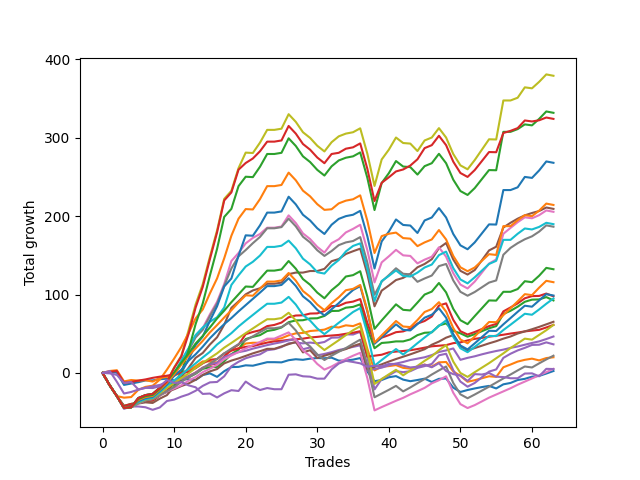

# Long Shepard 003 SD 
- Symbol: ES
- Date Range: 03/18/2022 - 12/30/2022
- Trading Period: 8:30-12:30
- Number of Trades: 13



| Name | Win Percent | Profit | Avg Profit / Trade | Avg Time / Trade |      | Name | Win Percent | Profit | Avg Profit / Trade | Avg Time / Trade |
| ---- | ----------- | ------ | ------------------ | ---------------- | ---- | ---- | ----------- | ------ | ------------------ | ---------------- |
| Sorted By <br> Profit | | | | | | Sorted By <br> Win Percentage ||||
| TP-1 | 92.31 | 7250.00 | 557.69 | 10:46 |     | TP-1 | 92.31 | 7250.00 | 557.69 | 10:46 |
| BB-200 U/L 2SD | 53.85 | 6500.00 | 500.00 | 55:18 |     | BB-200 Mid | 69.23 | 2500.00 | 192.31 | 28:41 |
| BB-200 Mid | 69.23 | 2500.00 | 192.31 | 28:41 |     | BB-50 U/L 1SD | 69.23 | 1000.00 | 76.92 | 38:43 |
| BB-100 U/L 2SD | 53.85 | 1500.00 | 115.38 | 55:05 |     | TP-3 | 69.23 | -2250.00 | -173.08 | 26:12 |
| BB-50 U/L 2SD | 61.54 | 1375.00 | 105.77 | 47:36 |     | BB-20 U/L 2SD C | 69.23 | -3625.00 | -278.85 | 28:28 |
| BB-50 U/L 1SD | 69.23 | 1000.00 | 76.92 | 38:43 |     | BB-20 U/L 2SD | 69.23 | -3750.00 | -288.46 | 28:00 |
| TP-6 | 61.54 | 625.00 | 48.08 | 42:33 |     | TP-2 | 69.23 | -8125.00 | -625.00 | 24:27 |
| BB-20 U/L 1SD | 61.54 | 250.00 | 19.23 | 13:11 |     | BB-50 U/L 2SD | 61.54 | 1375.00 | 105.77 | 47:36 |
| V U/L 1SD | 53.85 | -625.00 | -48.08 | 50:43 |     | TP-6 | 61.54 | 625.00 | 48.08 | 42:33 |
| TP-7 | 53.85 | -750.00 | -57.69 | 44:13 |     | BB-20 U/L 1SD | 61.54 | 250.00 | 19.23 | 13:11 |
| TP-8 | 53.85 | -1750.00 | -134.62 | 46:38 |     | TP-5 | 61.54 | -2000.00 | -153.85 | 38:11 |
| TP-5 | 61.54 | -2000.00 | -153.85 | 38:11 |     | BB-100 Mid | 61.54 | -4625.00 | -355.77 | 36:55 |
| TP-3 | 69.23 | -2250.00 | -173.08 | 26:12 |     | TP-4 | 61.54 | -5375.00 | -413.46 | 31:05 |
| BB-50 Mid | 46.15 | -2625.00 | -201.92 | 30:22 |     | V Mid | 61.54 | -8250.00 | -634.62 | 41:29 |
| TP-9 | 53.85 | -3500.00 | -269.23 | 49:34 |     | BB-200 U/L 2SD | 53.85 | 6500.00 | 500.00 | 55:18 |
| BB-20 U/L 2SD C | 69.23 | -3625.00 | -278.85 | 28:28 |     | BB-100 U/L 2SD | 53.85 | 1500.00 | 115.38 | 55:05 |
| BB-20 U/L 2SD | 69.23 | -3750.00 | -288.46 | 28:00 |     | V U/L 1SD | 53.85 | -625.00 | -48.08 | 50:43 |
| BB-20 Mid | 46.15 | -3750.00 | -288.46 | 06:30 |     | TP-7 | 53.85 | -750.00 | -57.69 | 44:13 |
| BB-100 Mid | 61.54 | -4625.00 | -355.77 | 36:55 |     | TP-8 | 53.85 | -1750.00 | -134.62 | 46:38 |
| TP-10 | 53.85 | -5125.00 | -394.23 | 51:08 |     | TP-9 | 53.85 | -3500.00 | -269.23 | 49:34 |
| TP-4 | 61.54 | -5375.00 | -413.46 | 31:05 |     | TP-10 | 53.85 | -5125.00 | -394.23 | 51:08 |
| NEWFI 000 | 53.85 | -7875.00 | -605.77 | 52:39 |     | NEWFI 000 | 53.85 | -7875.00 | -605.77 | 52:39 |
| TP-2 | 69.23 | -8125.00 | -625.00 | 24:27 |     | BB-50 Mid | 46.15 | -2625.00 | -201.92 | 30:22 |
| V Mid | 61.54 | -8250.00 | -634.62 | 41:29 |     | BB-20 Mid | 46.15 | -3750.00 | -288.46 | 06:30 |
| NEWFI 0000 | 23.08 | -20125.00 | -1548.08 | 10:41 |     | NEWFI 0000 | 23.08 | -20125.00 | -1548.08 | 10:41 |

## NO STOPLOSS

### Test BB-20 Mid
* Sell when price hits the middle line of the 20p bollinger
* No Stoploss
* Results:
```
Total Trades: 13
Percent Up: 46.15
Percent Down: 53.85
Total Points Moved Up: -7.50
Potential Profit: -3750.00
Total Points Ups: 13.50 Count Ups: 6
Total Points Downs: -21.00 Count Downs: 7
```

<details><summary>Trades</summary>

<code>In: 2022-03-23 09:53:00		Out: 2022-03-23 09:55:30		Total Position Time: 02:30		Total Move Up: -0.50		Total to Date: -0.50</code> <br />
<code>In: 2022-03-25 08:18:00		Out: 2022-03-25 08:36:45		Total Position Time: 18:45		Total Move Up: -10.00		Total to Date: -10.50</code> <br />
<code>In: 2022-04-27 12:11:00		Out: 2022-04-27 12:14:00		Total Position Time: 03:00		Total Move Up: 2.25		Total to Date: -8.25</code> <br />
<code>In: 2022-05-19 07:47:00		Out: 2022-05-19 07:53:45		Total Position Time: 06:45		Total Move Up: -2.25		Total to Date: -10.50</code> <br />
<code>In: 2022-07-11 12:25:00		Out: 2022-07-11 12:26:50		Total Position Time: 01:50		Total Move Up: -0.25		Total to Date: -10.75</code> <br />
<code>In: 2022-07-25 07:25:00		Out: 2022-07-25 07:26:15		Total Position Time: 01:15		Total Move Up: 1.50		Total to Date: -9.25</code> <br />
<code>In: 2022-07-25 11:11:00		Out: 2022-07-25 11:12:10		Total Position Time: 01:10		Total Move Up: 0.75		Total to Date: -8.50</code> <br />
<code>In: 2022-08-05 08:33:00		Out: 2022-08-05 08:37:00		Total Position Time: 04:00		Total Move Up: 1.25		Total to Date: -7.25</code> <br />
<code>In: 2022-08-11 08:15:00		Out: 2022-08-11 08:27:10		Total Position Time: 12:10		Total Move Up: -1.50		Total to Date: -8.75</code> <br />
<code>In: 2022-08-11 08:16:00		Out: 2022-08-11 08:27:10		Total Position Time: 11:10		Total Move Up: -3.25		Total to Date: -12.00</code> <br />
<code>In: 2022-10-17 08:01:00		Out: 2022-10-17 08:02:55		Total Position Time: 01:55		Total Move Up: 4.00		Total to Date: -8.00</code> <br />
<code>In: 2022-11-07 08:50:00		Out: 2022-11-07 09:07:00		Total Position Time: 17:00		Total Move Up: -3.25		Total to Date: -11.25</code> <br />
<code>In: 2022-12-08 11:14:00		Out: 2022-12-08 11:17:10		Total Position Time: 03:10		Total Move Up: 3.75		Total to Date: -7.50</code> <br />


</details>

### Test BB-20 U/L 1SD
* Sell when the price hits the upper line of the 20p 1std bollinger
* No Stoploss
* Results:
```
Total Trades: 13
Percent Up: 61.54
Percent Down: 38.46
Total Points Moved Up: 0.50
Potential Profit: 250.00
Total Points Ups: 12.50 Count Ups: 8
Total Points Downs: -12.00 Count Downs: 5
```

<details><summary>Trades</summary>

<code>In: 2022-03-23 09:53:00		Out: 2022-03-23 09:59:45		Total Position Time: 06:45		Total Move Up: 1.00		Total to Date: 1.00</code> <br />
<code>In: 2022-03-25 08:18:00		Out: 2022-03-25 08:41:05		Total Position Time: 23:05		Total Move Up: -7.50		Total to Date: -6.50</code> <br />
<code>In: 2022-04-27 12:11:00		Out: 2022-04-27 12:27:15		Total Position Time: 16:15		Total Move Up: 0.50		Total to Date: -6.00</code> <br />
<code>In: 2022-05-19 07:47:00		Out: 2022-05-19 07:55:05		Total Position Time: 08:05		Total Move Up: 4.00		Total to Date: -2.00</code> <br />
<code>In: 2022-07-11 12:25:00		Out: 2022-07-11 12:29:20		Total Position Time: 04:20		Total Move Up: 1.50		Total to Date: -0.50</code> <br />
<code>In: 2022-07-25 07:25:00		Out: 2022-07-25 07:43:20		Total Position Time: 18:20		Total Move Up: -1.50		Total to Date: -2.00</code> <br />
<code>In: 2022-07-25 11:11:00		Out: 2022-07-25 11:12:10		Total Position Time: 01:10		Total Move Up: 0.75		Total to Date: -1.25</code> <br />
<code>In: 2022-08-05 08:33:00		Out: 2022-08-05 08:51:30		Total Position Time: 18:30		Total Move Up: -1.00		Total to Date: -2.25</code> <br />
<code>In: 2022-08-11 08:15:00		Out: 2022-08-11 08:28:10		Total Position Time: 13:10		Total Move Up: 0.50		Total to Date: -1.75</code> <br />
<code>In: 2022-08-11 08:16:00		Out: 2022-08-11 08:28:10		Total Position Time: 12:10		Total Move Up: -1.25		Total to Date: -3.00</code> <br />
<code>In: 2022-10-17 08:01:00		Out: 2022-10-17 08:24:05		Total Position Time: 23:05		Total Move Up: 0.50		Total to Date: -2.50</code> <br />
<code>In: 2022-11-07 08:50:00		Out: 2022-11-07 09:07:20		Total Position Time: 17:20		Total Move Up: -0.75		Total to Date: -3.25</code> <br />
<code>In: 2022-12-08 11:14:00		Out: 2022-12-08 11:23:10		Total Position Time: 09:10		Total Move Up: 3.75		Total to Date: 0.50</code> <br />


</details>

### Test BB-20 U/L 2SD
* Sell when the price hits the upper line of the 20p 2std bollinger
* No Stoploss
* Results:
```
Total Trades: 13
Percent Up: 69.23
Percent Down: 30.77
Total Points Moved Up: -7.50
Potential Profit: -3750.00
Total Points Ups: 27.75 Count Ups: 9
Total Points Downs: -35.25 Count Downs: 4
```

<details><summary>Trades</summary>

<code>In: 2022-03-23 09:53:00		Out: 2022-03-23 10:53:55		Total Position Time: 60:55		Total Move Up: -13.75		Total to Date: -13.75</code> <br />
<code>In: 2022-03-25 08:18:00		Out: 2022-03-25 08:41:55		Total Position Time: 23:55		Total Move Up: -3.25		Total to Date: -17.00</code> <br />
<code>In: 2022-04-27 12:11:00		Out: 2022-04-27 12:31:20		Total Position Time: 20:20		Total Move Up: 2.50		Total to Date: -14.50</code> <br />
<code>In: 2022-05-19 07:47:00		Out: 2022-05-19 07:56:00		Total Position Time: 09:00		Total Move Up: 8.00		Total to Date: -6.50</code> <br />
<code>In: 2022-07-11 12:25:00		Out: 2022-07-11 12:29:40		Total Position Time: 04:40		Total Move Up: 3.00		Total to Date: -3.50</code> <br />
<code>In: 2022-07-25 07:25:00		Out: 2022-07-25 07:43:50		Total Position Time: 18:50		Total Move Up: 2.50		Total to Date: -1.00</code> <br />
<code>In: 2022-07-25 11:11:00		Out: 2022-07-25 11:35:50		Total Position Time: 24:50		Total Move Up: 0.25		Total to Date: -0.75</code> <br />
<code>In: 2022-08-05 08:33:00		Out: 2022-08-05 08:53:30		Total Position Time: 20:30		Total Move Up: 1.00		Total to Date: 0.25</code> <br />
<code>In: 2022-08-11 08:15:00		Out: 2022-08-11 09:15:55		Total Position Time: 60:55		Total Move Up: -9.25		Total to Date: -9.00</code> <br />
<code>In: 2022-08-11 08:16:00		Out: 2022-08-11 09:16:55		Total Position Time: 60:55		Total Move Up: -9.00		Total to Date: -18.00</code> <br />
<code>In: 2022-10-17 08:01:00		Out: 2022-10-17 08:25:45		Total Position Time: 24:45		Total Move Up: 2.50		Total to Date: -15.50</code> <br />
<code>In: 2022-11-07 08:50:00		Out: 2022-11-07 09:13:00		Total Position Time: 23:00		Total Move Up: 2.75		Total to Date: -12.75</code> <br />
<code>In: 2022-12-08 11:14:00		Out: 2022-12-08 11:25:35		Total Position Time: 11:35		Total Move Up: 5.25		Total to Date: -7.50</code> <br />


</details>

### Test BB-20 U/L 2SD C
* Sell when the price hits the upper line of the 20p 2std bollinger
* No Stoploss
* Results:
```
Total Trades: 13
Percent Up: 69.23
Percent Down: 30.77
Total Points Moved Up: -7.25
Potential Profit: -3625.00
Total Points Ups: 28.00 Count Ups: 9
Total Points Downs: -35.25 Count Downs: 4
```

<details><summary>Trades</summary>

<code>In: 2022-03-23 09:53:00		Out: 2022-03-23 10:53:55		Total Position Time: 60:55		Total Move Up: -13.75		Total to Date: -13.75</code> <br />
<code>In: 2022-03-25 08:18:00		Out: 2022-03-25 08:41:55		Total Position Time: 23:55		Total Move Up: -3.25		Total to Date: -17.00</code> <br />
<code>In: 2022-04-27 12:11:00		Out: 2022-04-27 12:31:20		Total Position Time: 20:20		Total Move Up: 2.50		Total to Date: -14.50</code> <br />
<code>In: 2022-05-19 07:47:00		Out: 2022-05-19 08:01:35		Total Position Time: 14:35		Total Move Up: 7.75		Total to Date: -6.75</code> <br />
<code>In: 2022-07-11 12:25:00		Out: 2022-07-11 12:29:40		Total Position Time: 04:40		Total Move Up: 3.00		Total to Date: -3.75</code> <br />
<code>In: 2022-07-25 07:25:00		Out: 2022-07-25 07:43:50		Total Position Time: 18:50		Total Move Up: 2.50		Total to Date: -1.25</code> <br />
<code>In: 2022-07-25 11:11:00		Out: 2022-07-25 11:35:50		Total Position Time: 24:50		Total Move Up: 0.25		Total to Date: -1.00</code> <br />
<code>In: 2022-08-05 08:33:00		Out: 2022-08-05 08:53:50		Total Position Time: 20:50		Total Move Up: 1.50		Total to Date: 0.50</code> <br />
<code>In: 2022-08-11 08:15:00		Out: 2022-08-11 09:15:55		Total Position Time: 60:55		Total Move Up: -9.25		Total to Date: -8.75</code> <br />
<code>In: 2022-08-11 08:16:00		Out: 2022-08-11 09:16:55		Total Position Time: 60:55		Total Move Up: -9.00		Total to Date: -17.75</code> <br />
<code>In: 2022-10-17 08:01:00		Out: 2022-10-17 08:25:45		Total Position Time: 24:45		Total Move Up: 2.50		Total to Date: -15.25</code> <br />
<code>In: 2022-11-07 08:50:00		Out: 2022-11-07 09:13:05		Total Position Time: 23:05		Total Move Up: 2.75		Total to Date: -12.50</code> <br />
<code>In: 2022-12-08 11:14:00		Out: 2022-12-08 11:25:35		Total Position Time: 11:35		Total Move Up: 5.25		Total to Date: -7.25</code> <br />


</details>

### Test BB-50 Mid
* Sell when price hits the middle line of the 50p bollinger
* No Stoploss
* Results:
```
Total Trades: 13
Percent Up: 46.15
Percent Down: 53.85
Total Points Moved Up: -5.25
Potential Profit: -2625.00
Total Points Ups: 22.00 Count Ups: 6
Total Points Downs: -27.25 Count Downs: 7
```

<details><summary>Trades</summary>

<code>In: 2022-03-23 09:53:00		Out: 2022-03-23 10:53:55		Total Position Time: 60:55		Total Move Up: -13.75		Total to Date: -13.75</code> <br />
<code>In: 2022-03-25 08:18:00		Out: 2022-03-25 08:53:00		Total Position Time: 35:00		Total Move Up: -4.00		Total to Date: -17.75</code> <br />
<code>In: 2022-04-27 12:11:00		Out: 2022-04-27 12:44:20		Total Position Time: 33:20		Total Move Up: -1.00		Total to Date: -18.75</code> <br />
<code>In: 2022-05-19 07:47:00		Out: 2022-05-19 07:55:40		Total Position Time: 08:40		Total Move Up: 7.50		Total to Date: -11.25</code> <br />
<code>In: 2022-07-11 12:25:00		Out: 2022-07-11 12:40:35		Total Position Time: 15:35		Total Move Up: 2.75		Total to Date: -8.50</code> <br />
<code>In: 2022-07-25 07:25:00		Out: 2022-07-25 07:43:50		Total Position Time: 18:50		Total Move Up: 2.50		Total to Date: -6.00</code> <br />
<code>In: 2022-07-25 11:11:00		Out: 2022-07-25 11:35:45		Total Position Time: 24:45		Total Move Up: -1.00		Total to Date: -7.00</code> <br />
<code>In: 2022-08-05 08:33:00		Out: 2022-08-05 09:03:40		Total Position Time: 30:40		Total Move Up: -0.25		Total to Date: -7.25</code> <br />
<code>In: 2022-08-11 08:15:00		Out: 2022-08-11 09:02:00		Total Position Time: 47:00		Total Move Up: -2.75		Total to Date: -10.00</code> <br />
<code>In: 2022-08-11 08:16:00		Out: 2022-08-11 09:02:00		Total Position Time: 46:00		Total Move Up: -4.50		Total to Date: -14.50</code> <br />
<code>In: 2022-10-17 08:01:00		Out: 2022-10-17 08:25:00		Total Position Time: 24:00		Total Move Up: 2.25		Total to Date: -12.25</code> <br />
<code>In: 2022-11-07 08:50:00		Out: 2022-11-07 09:13:00		Total Position Time: 23:00		Total Move Up: 2.75		Total to Date: -9.50</code> <br />
<code>In: 2022-12-08 11:14:00		Out: 2022-12-08 11:41:05		Total Position Time: 27:05		Total Move Up: 4.25		Total to Date: -5.25</code> <br />


</details>

### Test BB-50 U/L 1SD
* Sell when the price hits the upper line of the 50p 1std bollinger
* No Stoploss
* Results:
```
Total Trades: 13
Percent Up: 69.23
Percent Down: 30.77
Total Points Moved Up: 2.00
Potential Profit: 1000.00
Total Points Ups: 39.00 Count Ups: 9
Total Points Downs: -37.00 Count Downs: 4
```

<details><summary>Trades</summary>

<code>In: 2022-03-23 09:53:00		Out: 2022-03-23 10:53:55		Total Position Time: 60:55		Total Move Up: -13.75		Total to Date: -13.75</code> <br />
<code>In: 2022-03-25 08:18:00		Out: 2022-03-25 09:07:15		Total Position Time: 49:15		Total Move Up: -5.00		Total to Date: -18.75</code> <br />
<code>In: 2022-04-27 12:11:00		Out: 2022-04-27 12:46:05		Total Position Time: 35:05		Total Move Up: 1.50		Total to Date: -17.25</code> <br />
<code>In: 2022-05-19 07:47:00		Out: 2022-05-19 08:12:05		Total Position Time: 25:05		Total Move Up: 8.75		Total to Date: -8.50</code> <br />
<code>In: 2022-07-11 12:25:00		Out: 2022-07-11 12:47:00		Total Position Time: 22:00		Total Move Up: 1.50		Total to Date: -7.00</code> <br />
<code>In: 2022-07-25 07:25:00		Out: 2022-07-25 07:50:20		Total Position Time: 25:20		Total Move Up: 5.75		Total to Date: -1.25</code> <br />
<code>In: 2022-07-25 11:11:00		Out: 2022-07-25 11:41:00		Total Position Time: 30:00		Total Move Up: 0.00		Total to Date: -1.25</code> <br />
<code>In: 2022-08-05 08:33:00		Out: 2022-08-05 09:05:15		Total Position Time: 32:15		Total Move Up: 3.50		Total to Date: 2.25</code> <br />
<code>In: 2022-08-11 08:15:00		Out: 2022-08-11 09:15:55		Total Position Time: 60:55		Total Move Up: -9.25		Total to Date: -7.00</code> <br />
<code>In: 2022-08-11 08:16:00		Out: 2022-08-11 09:16:55		Total Position Time: 60:55		Total Move Up: -9.00		Total to Date: -16.00</code> <br />
<code>In: 2022-10-17 08:01:00		Out: 2022-10-17 08:29:35		Total Position Time: 28:35		Total Move Up: 8.00		Total to Date: -8.00</code> <br />
<code>In: 2022-11-07 08:50:00		Out: 2022-11-07 09:24:55		Total Position Time: 34:55		Total Move Up: 4.75		Total to Date: -3.25</code> <br />
<code>In: 2022-12-08 11:14:00		Out: 2022-12-08 11:52:05		Total Position Time: 38:05		Total Move Up: 5.25		Total to Date: 2.00</code> <br />


</details>

### Test BB-50 U/L 2SD
* Sell when the price hits the upper line of the 50p 2std bollinger
* No Stoploss
* Results:
```
Total Trades: 13
Percent Up: 61.54
Percent Down: 38.46
Total Points Moved Up: 2.75
Potential Profit: 1375.00
Total Points Ups: 46.50 Count Ups: 8
Total Points Downs: -43.75 Count Downs: 5
```

<details><summary>Trades</summary>

<code>In: 2022-03-23 09:53:00		Out: 2022-03-23 10:53:55		Total Position Time: 60:55		Total Move Up: -13.75		Total to Date: -13.75</code> <br />
<code>In: 2022-03-25 08:18:00		Out: 2022-03-25 09:11:40		Total Position Time: 53:40		Total Move Up: -1.75		Total to Date: -15.50</code> <br />
<code>In: 2022-04-27 12:11:00		Out: 2022-04-27 12:47:00		Total Position Time: 36:00		Total Move Up: 3.75		Total to Date: -11.75</code> <br />
<code>In: 2022-05-19 07:47:00		Out: 2022-05-19 08:31:35		Total Position Time: 44:35		Total Move Up: 11.75		Total to Date: 0.00</code> <br />
<code>In: 2022-07-11 12:25:00		Out: 2022-07-11 12:47:00		Total Position Time: 22:00		Total Move Up: 1.50		Total to Date: 1.50</code> <br />
<code>In: 2022-07-25 07:25:00		Out: 2022-07-25 08:25:55		Total Position Time: 60:55		Total Move Up: 2.50		Total to Date: 4.00</code> <br />
<code>In: 2022-07-25 11:11:00		Out: 2022-07-25 12:11:55		Total Position Time: 60:55		Total Move Up: -10.00		Total to Date: -6.00</code> <br />
<code>In: 2022-08-05 08:33:00		Out: 2022-08-05 09:11:25		Total Position Time: 38:25		Total Move Up: 4.50		Total to Date: -1.50</code> <br />
<code>In: 2022-08-11 08:15:00		Out: 2022-08-11 09:15:55		Total Position Time: 60:55		Total Move Up: -9.25		Total to Date: -10.75</code> <br />
<code>In: 2022-08-11 08:16:00		Out: 2022-08-11 09:16:55		Total Position Time: 60:55		Total Move Up: -9.00		Total to Date: -19.75</code> <br />
<code>In: 2022-10-17 08:01:00		Out: 2022-10-17 08:39:20		Total Position Time: 38:20		Total Move Up: 10.00		Total to Date: -9.75</code> <br />
<code>In: 2022-11-07 08:50:00		Out: 2022-11-07 09:31:20		Total Position Time: 41:20		Total Move Up: 5.25		Total to Date: -4.50</code> <br />
<code>In: 2022-12-08 11:14:00		Out: 2022-12-08 11:53:55		Total Position Time: 39:55		Total Move Up: 7.25		Total to Date: 2.75</code> <br />


</details>

### Test V Mid
* Sell when the price hits the middle line of the 1std VWAP
* No Stoploss
* Results:
```
Total Trades: 13
Percent Up: 61.54
Percent Down: 38.46
Total Points Moved Up: -16.50
Potential Profit: -8250.00
Total Points Ups: 27.00 Count Ups: 8
Total Points Downs: -43.50 Count Downs: 5
```

<details><summary>Trades</summary>

<code>In: 2022-03-23 09:53:00		Out: 2022-03-23 10:53:55		Total Position Time: 60:55		Total Move Up: -13.75		Total to Date: -13.75</code> <br />
<code>In: 2022-03-25 08:18:00		Out: 2022-03-25 09:18:55		Total Position Time: 60:55		Total Move Up: -1.50		Total to Date: -15.25</code> <br />
<code>In: 2022-04-27 12:11:00		Out: 2022-04-27 12:47:00		Total Position Time: 36:00		Total Move Up: 3.75		Total to Date: -11.50</code> <br />
<code>In: 2022-05-19 07:47:00		Out: 2022-05-19 07:54:55		Total Position Time: 07:55		Total Move Up: 3.25		Total to Date: -8.25</code> <br />
<code>In: 2022-07-11 12:25:00		Out: 2022-07-11 12:47:00		Total Position Time: 22:00		Total Move Up: 1.50		Total to Date: -6.75</code> <br />
<code>In: 2022-07-25 07:25:00		Out: 2022-07-25 07:43:50		Total Position Time: 18:50		Total Move Up: 2.50		Total to Date: -4.25</code> <br />
<code>In: 2022-07-25 11:11:00		Out: 2022-07-25 12:11:55		Total Position Time: 60:55		Total Move Up: -10.00		Total to Date: -14.25</code> <br />
<code>In: 2022-08-05 08:33:00		Out: 2022-08-05 09:33:55		Total Position Time: 60:55		Total Move Up: 1.75		Total to Date: -12.50</code> <br />
<code>In: 2022-08-11 08:15:00		Out: 2022-08-11 09:15:55		Total Position Time: 60:55		Total Move Up: -9.25		Total to Date: -21.75</code> <br />
<code>In: 2022-08-11 08:16:00		Out: 2022-08-11 09:16:55		Total Position Time: 60:55		Total Move Up: -9.00		Total to Date: -30.75</code> <br />
<code>In: 2022-10-17 08:01:00		Out: 2022-10-17 08:28:45		Total Position Time: 27:45		Total Move Up: 5.50		Total to Date: -25.25</code> <br />
<code>In: 2022-11-07 08:50:00		Out: 2022-11-07 09:13:00		Total Position Time: 23:00		Total Move Up: 2.75		Total to Date: -22.50</code> <br />
<code>In: 2022-12-08 11:14:00		Out: 2022-12-08 11:52:25		Total Position Time: 38:25		Total Move Up: 6.00		Total to Date: -16.50</code> <br />


</details>

### Test V U/L 1SD
* Sell when the price hits the upper line of the 1std VWAP
* No Stoploss
* Results:
```
Total Trades: 13
Percent Up: 53.85
Percent Down: 46.15
Total Points Moved Up: -1.25
Potential Profit: -625.00
Total Points Ups: 42.50 Count Ups: 7
Total Points Downs: -43.75 Count Downs: 6
```

<details><summary>Trades</summary>

<code>In: 2022-03-23 09:53:00		Out: 2022-03-23 10:53:55		Total Position Time: 60:55		Total Move Up: -13.75		Total to Date: -13.75</code> <br />
<code>In: 2022-03-25 08:18:00		Out: 2022-03-25 09:18:55		Total Position Time: 60:55		Total Move Up: -1.50		Total to Date: -15.25</code> <br />
<code>In: 2022-04-27 12:11:00		Out: 2022-04-27 12:47:00		Total Position Time: 36:00		Total Move Up: 3.75		Total to Date: -11.50</code> <br />
<code>In: 2022-05-19 07:47:00		Out: 2022-05-19 08:31:40		Total Position Time: 44:40		Total Move Up: 12.25		Total to Date: 0.75</code> <br />
<code>In: 2022-07-11 12:25:00		Out: 2022-07-11 12:47:00		Total Position Time: 22:00		Total Move Up: 1.50		Total to Date: 2.25</code> <br />
<code>In: 2022-07-25 07:25:00		Out: 2022-07-25 07:53:50		Total Position Time: 28:50		Total Move Up: 5.75		Total to Date: 8.00</code> <br />
<code>In: 2022-07-25 11:11:00		Out: 2022-07-25 12:11:55		Total Position Time: 60:55		Total Move Up: -10.00		Total to Date: -2.00</code> <br />
<code>In: 2022-08-05 08:33:00		Out: 2022-08-05 09:33:55		Total Position Time: 60:55		Total Move Up: 1.75		Total to Date: -0.25</code> <br />
<code>In: 2022-08-11 08:15:00		Out: 2022-08-11 09:15:55		Total Position Time: 60:55		Total Move Up: -9.25		Total to Date: -9.50</code> <br />
<code>In: 2022-08-11 08:16:00		Out: 2022-08-11 09:16:55		Total Position Time: 60:55		Total Move Up: -9.00		Total to Date: -18.50</code> <br />
<code>In: 2022-10-17 08:01:00		Out: 2022-10-17 08:41:30		Total Position Time: 40:30		Total Move Up: 14.00		Total to Date: -4.50</code> <br />
<code>In: 2022-11-07 08:50:00		Out: 2022-11-07 09:50:55		Total Position Time: 60:55		Total Move Up: -0.25		Total to Date: -4.75</code> <br />
<code>In: 2022-12-08 11:14:00		Out: 2022-12-08 12:14:55		Total Position Time: 60:55		Total Move Up: 3.50		Total to Date: -1.25</code> <br />


</details>

### Test BB-100 Mid
* Move to BB100 Mid
* No Stoploss
* Results:
```
Total Trades: 13
Percent Up: 61.54
Percent Down: 38.46
Total Points Moved Up: -9.25
Potential Profit: -4625.00
Total Points Ups: 34.25 Count Ups: 8
Total Points Downs: -43.50 Count Downs: 5
```

<details><summary>Trades</summary>

<code>In: 2022-03-23 09:53:00		Out: 2022-03-23 10:53:55		Total Position Time: 60:55		Total Move Up: -13.75		Total to Date: -13.75</code> <br />
<code>In: 2022-03-25 08:18:00		Out: 2022-03-25 09:18:55		Total Position Time: 60:55		Total Move Up: -1.50		Total to Date: -15.25</code> <br />
<code>In: 2022-04-27 12:11:00		Out: 2022-04-27 12:47:00		Total Position Time: 36:00		Total Move Up: 3.75		Total to Date: -11.50</code> <br />
<code>In: 2022-05-19 07:47:00		Out: 2022-05-19 07:55:40		Total Position Time: 08:40		Total Move Up: 7.50		Total to Date: -4.00</code> <br />
<code>In: 2022-07-11 12:25:00		Out: 2022-07-11 12:47:00		Total Position Time: 22:00		Total Move Up: 1.50		Total to Date: -2.50</code> <br />
<code>In: 2022-07-25 07:25:00		Out: 2022-07-25 07:26:10		Total Position Time: 01:10		Total Move Up: 1.50		Total to Date: -1.00</code> <br />
<code>In: 2022-07-25 11:11:00		Out: 2022-07-25 12:11:55		Total Position Time: 60:55		Total Move Up: -10.00		Total to Date: -11.00</code> <br />
<code>In: 2022-08-05 08:33:00		Out: 2022-08-05 09:15:55		Total Position Time: 42:55		Total Move Up: 7.00		Total to Date: -4.00</code> <br />
<code>In: 2022-08-11 08:15:00		Out: 2022-08-11 09:15:55		Total Position Time: 60:55		Total Move Up: -9.25		Total to Date: -13.25</code> <br />
<code>In: 2022-08-11 08:16:00		Out: 2022-08-11 09:16:55		Total Position Time: 60:55		Total Move Up: -9.00		Total to Date: -22.25</code> <br />
<code>In: 2022-10-17 08:01:00		Out: 2022-10-17 08:02:10		Total Position Time: 01:10		Total Move Up: 1.25		Total to Date: -21.00</code> <br />
<code>In: 2022-11-07 08:50:00		Out: 2022-11-07 09:13:15		Total Position Time: 23:15		Total Move Up: 4.00		Total to Date: -17.00</code> <br />
<code>In: 2022-12-08 11:14:00		Out: 2022-12-08 11:54:20		Total Position Time: 40:20		Total Move Up: 7.75		Total to Date: -9.25</code> <br />


</details>

### Test BB-100 U/L 2SD
* Move to BB100 Upper Band
* No Stoploss
* Results:
```
Total Trades: 13
Percent Up: 53.85
Percent Down: 46.15
Total Points Moved Up: 3.00
Potential Profit: 1500.00
Total Points Ups: 46.75 Count Ups: 7
Total Points Downs: -43.75 Count Downs: 6
```

<details><summary>Trades</summary>

<code>In: 2022-03-23 09:53:00		Out: 2022-03-23 10:53:55		Total Position Time: 60:55		Total Move Up: -13.75		Total to Date: -13.75</code> <br />
<code>In: 2022-03-25 08:18:00		Out: 2022-03-25 09:18:55		Total Position Time: 60:55		Total Move Up: -1.50		Total to Date: -15.25</code> <br />
<code>In: 2022-04-27 12:11:00		Out: 2022-04-27 12:47:00		Total Position Time: 36:00		Total Move Up: 3.75		Total to Date: -11.50</code> <br />
<code>In: 2022-05-19 07:47:00		Out: 2022-05-19 08:36:05		Total Position Time: 49:05		Total Move Up: 18.75		Total to Date: 7.25</code> <br />
<code>In: 2022-07-11 12:25:00		Out: 2022-07-11 12:47:00		Total Position Time: 22:00		Total Move Up: 1.50		Total to Date: 8.75</code> <br />
<code>In: 2022-07-25 07:25:00		Out: 2022-07-25 08:25:55		Total Position Time: 60:55		Total Move Up: 2.50		Total to Date: 11.25</code> <br />
<code>In: 2022-07-25 11:11:00		Out: 2022-07-25 12:11:55		Total Position Time: 60:55		Total Move Up: -10.00		Total to Date: 1.25</code> <br />
<code>In: 2022-08-05 08:33:00		Out: 2022-08-05 09:33:55		Total Position Time: 60:55		Total Move Up: 1.75		Total to Date: 3.00</code> <br />
<code>In: 2022-08-11 08:15:00		Out: 2022-08-11 09:15:55		Total Position Time: 60:55		Total Move Up: -9.25		Total to Date: -6.25</code> <br />
<code>In: 2022-08-11 08:16:00		Out: 2022-08-11 09:16:55		Total Position Time: 60:55		Total Move Up: -9.00		Total to Date: -15.25</code> <br />
<code>In: 2022-10-17 08:01:00		Out: 2022-10-17 09:01:55		Total Position Time: 60:55		Total Move Up: 15.00		Total to Date: -0.25</code> <br />
<code>In: 2022-11-07 08:50:00		Out: 2022-11-07 09:50:55		Total Position Time: 60:55		Total Move Up: -0.25		Total to Date: -0.50</code> <br />
<code>In: 2022-12-08 11:14:00		Out: 2022-12-08 12:14:55		Total Position Time: 60:55		Total Move Up: 3.50		Total to Date: 3.00</code> <br />


</details>

### Test BB-200 Mid
* Move to BB200 Mid
* No Stoploss
* Results:
```
Total Trades: 13
Percent Up: 69.23
Percent Down: 30.77
Total Points Moved Up: 5.00
Potential Profit: 2500.00
Total Points Ups: 31.25 Count Ups: 9
Total Points Downs: -26.25 Count Downs: 4
```

<details><summary>Trades</summary>

<code>In: 2022-03-23 09:53:00		Out: 2022-03-23 10:53:55		Total Position Time: 60:55		Total Move Up: -13.75		Total to Date: -13.75</code> <br />
<code>In: 2022-03-25 08:18:00		Out: 2022-03-25 09:18:55		Total Position Time: 60:55		Total Move Up: -1.50		Total to Date: -15.25</code> <br />
<code>In: 2022-04-27 12:11:00		Out: 2022-04-27 12:47:00		Total Position Time: 36:00		Total Move Up: 3.75		Total to Date: -11.50</code> <br />
<code>In: 2022-05-19 07:47:00		Out: 2022-05-19 08:12:25		Total Position Time: 25:25		Total Move Up: 10.75		Total to Date: -0.75</code> <br />
<code>In: 2022-07-11 12:25:00		Out: 2022-07-11 12:47:00		Total Position Time: 22:00		Total Move Up: 1.50		Total to Date: 0.75</code> <br />
<code>In: 2022-07-25 07:25:00		Out: 2022-07-25 07:26:10		Total Position Time: 01:10		Total Move Up: 1.50		Total to Date: 2.25</code> <br />
<code>In: 2022-07-25 11:11:00		Out: 2022-07-25 12:11:55		Total Position Time: 60:55		Total Move Up: -10.00		Total to Date: -7.75</code> <br />
<code>In: 2022-08-05 08:33:00		Out: 2022-08-05 09:33:55		Total Position Time: 60:55		Total Move Up: 1.75		Total to Date: -6.00</code> <br />
<code>In: 2022-08-11 08:15:00		Out: 2022-08-11 08:16:10		Total Position Time: 01:10		Total Move Up: 2.25		Total to Date: -3.75</code> <br />
<code>In: 2022-08-11 08:16:00		Out: 2022-08-11 08:17:10		Total Position Time: 01:10		Total Move Up: 1.00		Total to Date: -2.75</code> <br />
<code>In: 2022-10-17 08:01:00		Out: 2022-10-17 08:02:10		Total Position Time: 01:10		Total Move Up: 1.25		Total to Date: -1.50</code> <br />
<code>In: 2022-11-07 08:50:00		Out: 2022-11-07 08:51:10		Total Position Time: 01:10		Total Move Up: -1.00		Total to Date: -2.50</code> <br />
<code>In: 2022-12-08 11:14:00		Out: 2022-12-08 11:54:00		Total Position Time: 40:00		Total Move Up: 7.50		Total to Date: 5.00</code> <br />


</details>

### Test BB-200 U/L 2SD
* Move to BB200 Upper Band
* No Stoploss
* Results:
```
Total Trades: 13
Percent Up: 53.85
Percent Down: 46.15
Total Points Moved Up: 13.00
Potential Profit: 6500.00
Total Points Ups: 56.75 Count Ups: 7
Total Points Downs: -43.75 Count Downs: 6
```

<details><summary>Trades</summary>

<code>In: 2022-03-23 09:53:00		Out: 2022-03-23 10:53:55		Total Position Time: 60:55		Total Move Up: -13.75		Total to Date: -13.75</code> <br />
<code>In: 2022-03-25 08:18:00		Out: 2022-03-25 09:18:55		Total Position Time: 60:55		Total Move Up: -1.50		Total to Date: -15.25</code> <br />
<code>In: 2022-04-27 12:11:00		Out: 2022-04-27 12:47:00		Total Position Time: 36:00		Total Move Up: 3.75		Total to Date: -11.50</code> <br />
<code>In: 2022-05-19 07:47:00		Out: 2022-05-19 08:38:55		Total Position Time: 51:55		Total Move Up: 28.75		Total to Date: 17.25</code> <br />
<code>In: 2022-07-11 12:25:00		Out: 2022-07-11 12:47:00		Total Position Time: 22:00		Total Move Up: 1.50		Total to Date: 18.75</code> <br />
<code>In: 2022-07-25 07:25:00		Out: 2022-07-25 08:25:55		Total Position Time: 60:55		Total Move Up: 2.50		Total to Date: 21.25</code> <br />
<code>In: 2022-07-25 11:11:00		Out: 2022-07-25 12:11:55		Total Position Time: 60:55		Total Move Up: -10.00		Total to Date: 11.25</code> <br />
<code>In: 2022-08-05 08:33:00		Out: 2022-08-05 09:33:55		Total Position Time: 60:55		Total Move Up: 1.75		Total to Date: 13.00</code> <br />
<code>In: 2022-08-11 08:15:00		Out: 2022-08-11 09:15:55		Total Position Time: 60:55		Total Move Up: -9.25		Total to Date: 3.75</code> <br />
<code>In: 2022-08-11 08:16:00		Out: 2022-08-11 09:16:55		Total Position Time: 60:55		Total Move Up: -9.00		Total to Date: -5.25</code> <br />
<code>In: 2022-10-17 08:01:00		Out: 2022-10-17 09:01:55		Total Position Time: 60:55		Total Move Up: 15.00		Total to Date: 9.75</code> <br />
<code>In: 2022-11-07 08:50:00		Out: 2022-11-07 09:50:55		Total Position Time: 60:55		Total Move Up: -0.25		Total to Date: 9.50</code> <br />
<code>In: 2022-12-08 11:14:00		Out: 2022-12-08 12:14:55		Total Position Time: 60:55		Total Move Up: 3.50		Total to Date: 13.00</code> <br />


</details>

## TAKE PROFIT

### Test TP-1
* Take Profit of 1 Point
* No Stoploss
* Results:
```
Total Trades: 13
Percent Up: 92.31
Percent Down: 7.69
Total Points Moved Up: 14.50
Potential Profit: 7250.00
Total Points Ups: 16.00 Count Ups: 12
Total Points Downs: -1.50 Count Downs: 1
```

<details><summary>Trades</summary>

<code>In: 2022-03-23 09:53:00		Out: 2022-03-23 09:59:10		Total Position Time: 06:10		Total Move Up: 1.00		Total to Date: 1.00</code> <br />
<code>In: 2022-03-25 08:18:00		Out: 2022-03-25 09:18:55		Total Position Time: 60:55		Total Move Up: -1.50		Total to Date: -0.50</code> <br />
<code>In: 2022-04-27 12:11:00		Out: 2022-04-27 12:13:55		Total Position Time: 02:55		Total Move Up: 1.50		Total to Date: 1.00</code> <br />
<code>In: 2022-05-19 07:47:00		Out: 2022-05-19 07:54:45		Total Position Time: 07:45		Total Move Up: 2.25		Total to Date: 3.25</code> <br />
<code>In: 2022-07-11 12:25:00		Out: 2022-07-11 12:27:35		Total Position Time: 02:35		Total Move Up: 0.75		Total to Date: 4.00</code> <br />
<code>In: 2022-07-25 07:25:00		Out: 2022-07-25 07:26:10		Total Position Time: 01:10		Total Move Up: 1.50		Total to Date: 5.50</code> <br />
<code>In: 2022-07-25 11:11:00		Out: 2022-07-25 11:41:30		Total Position Time: 30:30		Total Move Up: 0.75		Total to Date: 6.25</code> <br />
<code>In: 2022-08-05 08:33:00		Out: 2022-08-05 08:37:00		Total Position Time: 04:00		Total Move Up: 1.25		Total to Date: 7.50</code> <br />
<code>In: 2022-08-11 08:15:00		Out: 2022-08-11 08:16:10		Total Position Time: 01:10		Total Move Up: 2.25		Total to Date: 9.75</code> <br />
<code>In: 2022-08-11 08:16:00		Out: 2022-08-11 08:17:10		Total Position Time: 01:10		Total Move Up: 1.00		Total to Date: 10.75</code> <br />
<code>In: 2022-10-17 08:01:00		Out: 2022-10-17 08:02:10		Total Position Time: 01:10		Total Move Up: 1.25		Total to Date: 12.00</code> <br />
<code>In: 2022-11-07 08:50:00		Out: 2022-11-07 09:08:05		Total Position Time: 18:05		Total Move Up: 1.25		Total to Date: 13.25</code> <br />
<code>In: 2022-12-08 11:14:00		Out: 2022-12-08 11:16:35		Total Position Time: 02:35		Total Move Up: 1.25		Total to Date: 14.50</code> <br />


</details>

### Test TP-2
* Take Profit of 2 Point
* No Stoploss
* Results:
```
Total Trades: 13
Percent Up: 69.23
Percent Down: 30.77
Total Points Moved Up: -16.25
Potential Profit: -8125.00
Total Points Ups: 18.00 Count Ups: 9
Total Points Downs: -34.25 Count Downs: 4
```

<details><summary>Trades</summary>

<code>In: 2022-03-23 09:53:00		Out: 2022-03-23 10:53:55		Total Position Time: 60:55		Total Move Up: -13.75		Total to Date: -13.75</code> <br />
<code>In: 2022-03-25 08:18:00		Out: 2022-03-25 09:18:55		Total Position Time: 60:55		Total Move Up: -1.50		Total to Date: -15.25</code> <br />
<code>In: 2022-04-27 12:11:00		Out: 2022-04-27 12:14:00		Total Position Time: 03:00		Total Move Up: 2.25		Total to Date: -13.00</code> <br />
<code>In: 2022-05-19 07:47:00		Out: 2022-05-19 07:54:45		Total Position Time: 07:45		Total Move Up: 2.25		Total to Date: -10.75</code> <br />
<code>In: 2022-07-11 12:25:00		Out: 2022-07-11 12:29:25		Total Position Time: 04:25		Total Move Up: 1.75		Total to Date: -9.00</code> <br />
<code>In: 2022-07-25 07:25:00		Out: 2022-07-25 07:26:30		Total Position Time: 01:30		Total Move Up: 2.00		Total to Date: -7.00</code> <br />
<code>In: 2022-07-25 11:11:00		Out: 2022-07-25 12:11:55		Total Position Time: 60:55		Total Move Up: -10.00		Total to Date: -17.00</code> <br />
<code>In: 2022-08-05 08:33:00		Out: 2022-08-05 09:04:00		Total Position Time: 31:00		Total Move Up: 2.00		Total to Date: -15.00</code> <br />
<code>In: 2022-08-11 08:15:00		Out: 2022-08-11 08:16:10		Total Position Time: 01:10		Total Move Up: 2.25		Total to Date: -12.75</code> <br />
<code>In: 2022-08-11 08:16:00		Out: 2022-08-11 09:16:55		Total Position Time: 60:55		Total Move Up: -9.00		Total to Date: -21.75</code> <br />
<code>In: 2022-10-17 08:01:00		Out: 2022-10-17 08:02:25		Total Position Time: 01:25		Total Move Up: 1.75		Total to Date: -20.00</code> <br />
<code>In: 2022-11-07 08:50:00		Out: 2022-11-07 09:11:05		Total Position Time: 21:05		Total Move Up: 2.00		Total to Date: -18.00</code> <br />
<code>In: 2022-12-08 11:14:00		Out: 2022-12-08 11:17:00		Total Position Time: 03:00		Total Move Up: 1.75		Total to Date: -16.25</code> <br />


</details>

### Test TP-3
* Take Profit of 3 Point
* No Stoploss
* Results:
```
Total Trades: 13
Percent Up: 69.23
Percent Down: 30.77
Total Points Moved Up: -4.50
Potential Profit: -2250.00
Total Points Ups: 29.75 Count Ups: 9
Total Points Downs: -34.25 Count Downs: 4
```

<details><summary>Trades</summary>

<code>In: 2022-03-23 09:53:00		Out: 2022-03-23 10:53:55		Total Position Time: 60:55		Total Move Up: -13.75		Total to Date: -13.75</code> <br />
<code>In: 2022-03-25 08:18:00		Out: 2022-03-25 09:18:55		Total Position Time: 60:55		Total Move Up: -1.50		Total to Date: -15.25</code> <br />
<code>In: 2022-04-27 12:11:00		Out: 2022-04-27 12:15:20		Total Position Time: 04:20		Total Move Up: 4.25		Total to Date: -11.00</code> <br />
<code>In: 2022-05-19 07:47:00		Out: 2022-05-19 07:54:50		Total Position Time: 07:50		Total Move Up: 3.25		Total to Date: -7.75</code> <br />
<code>In: 2022-07-11 12:25:00		Out: 2022-07-11 12:29:40		Total Position Time: 04:40		Total Move Up: 3.00		Total to Date: -4.75</code> <br />
<code>In: 2022-07-25 07:25:00		Out: 2022-07-25 07:44:15		Total Position Time: 19:15		Total Move Up: 3.00		Total to Date: -1.75</code> <br />
<code>In: 2022-07-25 11:11:00		Out: 2022-07-25 12:11:55		Total Position Time: 60:55		Total Move Up: -10.00		Total to Date: -11.75</code> <br />
<code>In: 2022-08-05 08:33:00		Out: 2022-08-05 09:04:25		Total Position Time: 31:25		Total Move Up: 3.75		Total to Date: -8.00</code> <br />
<code>In: 2022-08-11 08:15:00		Out: 2022-08-11 08:16:30		Total Position Time: 01:30		Total Move Up: 3.25		Total to Date: -4.75</code> <br />
<code>In: 2022-08-11 08:16:00		Out: 2022-08-11 09:16:55		Total Position Time: 60:55		Total Move Up: -9.00		Total to Date: -13.75</code> <br />
<code>In: 2022-10-17 08:01:00		Out: 2022-10-17 08:02:50		Total Position Time: 01:50		Total Move Up: 2.75		Total to Date: -11.00</code> <br />
<code>In: 2022-11-07 08:50:00		Out: 2022-11-07 09:13:05		Total Position Time: 23:05		Total Move Up: 2.75		Total to Date: -8.25</code> <br />
<code>In: 2022-12-08 11:14:00		Out: 2022-12-08 11:17:10		Total Position Time: 03:10		Total Move Up: 3.75		Total to Date: -4.50</code> <br />


</details>

### Test TP-4
* Take Profit of 4 Point
* No Stoploss
* Results:
```
Total Trades: 13
Percent Up: 61.54
Percent Down: 38.46
Total Points Moved Up: -10.75
Potential Profit: -5375.00
Total Points Ups: 32.75 Count Ups: 8
Total Points Downs: -43.50 Count Downs: 5
```

<details><summary>Trades</summary>

<code>In: 2022-03-23 09:53:00		Out: 2022-03-23 10:53:55		Total Position Time: 60:55		Total Move Up: -13.75		Total to Date: -13.75</code> <br />
<code>In: 2022-03-25 08:18:00		Out: 2022-03-25 09:18:55		Total Position Time: 60:55		Total Move Up: -1.50		Total to Date: -15.25</code> <br />
<code>In: 2022-04-27 12:11:00		Out: 2022-04-27 12:15:20		Total Position Time: 04:20		Total Move Up: 4.25		Total to Date: -11.00</code> <br />
<code>In: 2022-05-19 07:47:00		Out: 2022-05-19 07:55:05		Total Position Time: 08:05		Total Move Up: 4.00		Total to Date: -7.00</code> <br />
<code>In: 2022-07-11 12:25:00		Out: 2022-07-11 12:31:50		Total Position Time: 06:50		Total Move Up: 4.00		Total to Date: -3.00</code> <br />
<code>In: 2022-07-25 07:25:00		Out: 2022-07-25 07:44:20		Total Position Time: 19:20		Total Move Up: 3.75		Total to Date: 0.75</code> <br />
<code>In: 2022-07-25 11:11:00		Out: 2022-07-25 12:11:55		Total Position Time: 60:55		Total Move Up: -10.00		Total to Date: -9.25</code> <br />
<code>In: 2022-08-05 08:33:00		Out: 2022-08-05 09:05:20		Total Position Time: 32:20		Total Move Up: 4.25		Total to Date: -5.00</code> <br />
<code>In: 2022-08-11 08:15:00		Out: 2022-08-11 09:15:55		Total Position Time: 60:55		Total Move Up: -9.25		Total to Date: -14.25</code> <br />
<code>In: 2022-08-11 08:16:00		Out: 2022-08-11 09:16:55		Total Position Time: 60:55		Total Move Up: -9.00		Total to Date: -23.25</code> <br />
<code>In: 2022-10-17 08:01:00		Out: 2022-10-17 08:02:55		Total Position Time: 01:55		Total Move Up: 4.00		Total to Date: -19.25</code> <br />
<code>In: 2022-11-07 08:50:00		Out: 2022-11-07 09:13:15		Total Position Time: 23:15		Total Move Up: 4.00		Total to Date: -15.25</code> <br />
<code>In: 2022-12-08 11:14:00		Out: 2022-12-08 11:17:35		Total Position Time: 03:35		Total Move Up: 4.50		Total to Date: -10.75</code> <br />


</details>

### Test TP-5
* Take Profit of 5 Point
* No Stoploss
* Results:
```
Total Trades: 13
Percent Up: 61.54
Percent Down: 38.46
Total Points Moved Up: -4.00
Potential Profit: -2000.00
Total Points Ups: 39.50 Count Ups: 8
Total Points Downs: -43.50 Count Downs: 5
```

<details><summary>Trades</summary>

<code>In: 2022-03-23 09:53:00		Out: 2022-03-23 10:53:55		Total Position Time: 60:55		Total Move Up: -13.75		Total to Date: -13.75</code> <br />
<code>In: 2022-03-25 08:18:00		Out: 2022-03-25 09:18:55		Total Position Time: 60:55		Total Move Up: -1.50		Total to Date: -15.25</code> <br />
<code>In: 2022-04-27 12:11:00		Out: 2022-04-27 12:47:00		Total Position Time: 36:00		Total Move Up: 3.75		Total to Date: -11.50</code> <br />
<code>In: 2022-05-19 07:47:00		Out: 2022-05-19 07:55:40		Total Position Time: 08:40		Total Move Up: 7.50		Total to Date: -4.00</code> <br />
<code>In: 2022-07-11 12:25:00		Out: 2022-07-11 12:47:00		Total Position Time: 22:00		Total Move Up: 1.50		Total to Date: -2.50</code> <br />
<code>In: 2022-07-25 07:25:00		Out: 2022-07-25 07:45:25		Total Position Time: 20:25		Total Move Up: 5.50		Total to Date: 3.00</code> <br />
<code>In: 2022-07-25 11:11:00		Out: 2022-07-25 12:11:55		Total Position Time: 60:55		Total Move Up: -10.00		Total to Date: -7.00</code> <br />
<code>In: 2022-08-05 08:33:00		Out: 2022-08-05 09:05:45		Total Position Time: 32:45		Total Move Up: 5.50		Total to Date: -1.50</code> <br />
<code>In: 2022-08-11 08:15:00		Out: 2022-08-11 09:15:55		Total Position Time: 60:55		Total Move Up: -9.25		Total to Date: -10.75</code> <br />
<code>In: 2022-08-11 08:16:00		Out: 2022-08-11 09:16:55		Total Position Time: 60:55		Total Move Up: -9.00		Total to Date: -19.75</code> <br />
<code>In: 2022-10-17 08:01:00		Out: 2022-10-17 08:28:40		Total Position Time: 27:40		Total Move Up: 5.25		Total to Date: -14.50</code> <br />
<code>In: 2022-11-07 08:50:00		Out: 2022-11-07 09:25:00		Total Position Time: 35:00		Total Move Up: 5.25		Total to Date: -9.25</code> <br />
<code>In: 2022-12-08 11:14:00		Out: 2022-12-08 11:23:30		Total Position Time: 09:30		Total Move Up: 5.25		Total to Date: -4.00</code> <br />


</details>

### Test TP-6
* Take Profit of 6 Point
* No Stoploss
* Results:
```
Total Trades: 13
Percent Up: 61.54
Percent Down: 38.46
Total Points Moved Up: 1.25
Potential Profit: 625.00
Total Points Ups: 44.75 Count Ups: 8
Total Points Downs: -43.50 Count Downs: 5
```

<details><summary>Trades</summary>

<code>In: 2022-03-23 09:53:00		Out: 2022-03-23 10:53:55		Total Position Time: 60:55		Total Move Up: -13.75		Total to Date: -13.75</code> <br />
<code>In: 2022-03-25 08:18:00		Out: 2022-03-25 09:18:55		Total Position Time: 60:55		Total Move Up: -1.50		Total to Date: -15.25</code> <br />
<code>In: 2022-04-27 12:11:00		Out: 2022-04-27 12:47:00		Total Position Time: 36:00		Total Move Up: 3.75		Total to Date: -11.50</code> <br />
<code>In: 2022-05-19 07:47:00		Out: 2022-05-19 07:55:40		Total Position Time: 08:40		Total Move Up: 7.50		Total to Date: -4.00</code> <br />
<code>In: 2022-07-11 12:25:00		Out: 2022-07-11 12:47:00		Total Position Time: 22:00		Total Move Up: 1.50		Total to Date: -2.50</code> <br />
<code>In: 2022-07-25 07:25:00		Out: 2022-07-25 07:56:20		Total Position Time: 31:20		Total Move Up: 7.50		Total to Date: 5.00</code> <br />
<code>In: 2022-07-25 11:11:00		Out: 2022-07-25 12:11:55		Total Position Time: 60:55		Total Move Up: -10.00		Total to Date: -5.00</code> <br />
<code>In: 2022-08-05 08:33:00		Out: 2022-08-05 09:15:50		Total Position Time: 42:50		Total Move Up: 6.25		Total to Date: 1.25</code> <br />
<code>In: 2022-08-11 08:15:00		Out: 2022-08-11 09:15:55		Total Position Time: 60:55		Total Move Up: -9.25		Total to Date: -8.00</code> <br />
<code>In: 2022-08-11 08:16:00		Out: 2022-08-11 09:16:55		Total Position Time: 60:55		Total Move Up: -9.00		Total to Date: -17.00</code> <br />
<code>In: 2022-10-17 08:01:00		Out: 2022-10-17 08:29:05		Total Position Time: 28:05		Total Move Up: 6.00		Total to Date: -11.00</code> <br />
<code>In: 2022-11-07 08:50:00		Out: 2022-11-07 09:31:25		Total Position Time: 41:25		Total Move Up: 6.25		Total to Date: -4.75</code> <br />
<code>In: 2022-12-08 11:14:00		Out: 2022-12-08 11:52:25		Total Position Time: 38:25		Total Move Up: 6.00		Total to Date: 1.25</code> <br />


</details>

### Test TP-7
* Take Profit of 7 Point
* No Stoploss
* Results:
```
Total Trades: 13
Percent Up: 53.85
Percent Down: 46.15
Total Points Moved Up: -1.50
Potential Profit: -750.00
Total Points Ups: 42.25 Count Ups: 7
Total Points Downs: -43.75 Count Downs: 6
```

<details><summary>Trades</summary>

<code>In: 2022-03-23 09:53:00		Out: 2022-03-23 10:53:55		Total Position Time: 60:55		Total Move Up: -13.75		Total to Date: -13.75</code> <br />
<code>In: 2022-03-25 08:18:00		Out: 2022-03-25 09:18:55		Total Position Time: 60:55		Total Move Up: -1.50		Total to Date: -15.25</code> <br />
<code>In: 2022-04-27 12:11:00		Out: 2022-04-27 12:47:00		Total Position Time: 36:00		Total Move Up: 3.75		Total to Date: -11.50</code> <br />
<code>In: 2022-05-19 07:47:00		Out: 2022-05-19 07:55:40		Total Position Time: 08:40		Total Move Up: 7.50		Total to Date: -4.00</code> <br />
<code>In: 2022-07-11 12:25:00		Out: 2022-07-11 12:47:00		Total Position Time: 22:00		Total Move Up: 1.50		Total to Date: -2.50</code> <br />
<code>In: 2022-07-25 07:25:00		Out: 2022-07-25 07:56:20		Total Position Time: 31:20		Total Move Up: 7.50		Total to Date: 5.00</code> <br />
<code>In: 2022-07-25 11:11:00		Out: 2022-07-25 12:11:55		Total Position Time: 60:55		Total Move Up: -10.00		Total to Date: -5.00</code> <br />
<code>In: 2022-08-05 08:33:00		Out: 2022-08-05 09:15:55		Total Position Time: 42:55		Total Move Up: 7.00		Total to Date: 2.00</code> <br />
<code>In: 2022-08-11 08:15:00		Out: 2022-08-11 09:15:55		Total Position Time: 60:55		Total Move Up: -9.25		Total to Date: -7.25</code> <br />
<code>In: 2022-08-11 08:16:00		Out: 2022-08-11 09:16:55		Total Position Time: 60:55		Total Move Up: -9.00		Total to Date: -16.25</code> <br />
<code>In: 2022-10-17 08:01:00		Out: 2022-10-17 08:29:35		Total Position Time: 28:35		Total Move Up: 8.00		Total to Date: -8.25</code> <br />
<code>In: 2022-11-07 08:50:00		Out: 2022-11-07 09:50:55		Total Position Time: 60:55		Total Move Up: -0.25		Total to Date: -8.50</code> <br />
<code>In: 2022-12-08 11:14:00		Out: 2022-12-08 11:53:50		Total Position Time: 39:50		Total Move Up: 7.00		Total to Date: -1.50</code> <br />


</details>

### Test TP-8
* Take Profit of 8 Point
* No Stoploss
* Results:
```
Total Trades: 13
Percent Up: 53.85
Percent Down: 46.15
Total Points Moved Up: -3.50
Potential Profit: -1750.00
Total Points Ups: 40.25 Count Ups: 7
Total Points Downs: -43.75 Count Downs: 6
```

<details><summary>Trades</summary>

<code>In: 2022-03-23 09:53:00		Out: 2022-03-23 10:53:55		Total Position Time: 60:55		Total Move Up: -13.75		Total to Date: -13.75</code> <br />
<code>In: 2022-03-25 08:18:00		Out: 2022-03-25 09:18:55		Total Position Time: 60:55		Total Move Up: -1.50		Total to Date: -15.25</code> <br />
<code>In: 2022-04-27 12:11:00		Out: 2022-04-27 12:47:00		Total Position Time: 36:00		Total Move Up: 3.75		Total to Date: -11.50</code> <br />
<code>In: 2022-05-19 07:47:00		Out: 2022-05-19 07:55:55		Total Position Time: 08:55		Total Move Up: 8.50		Total to Date: -3.00</code> <br />
<code>In: 2022-07-11 12:25:00		Out: 2022-07-11 12:47:00		Total Position Time: 22:00		Total Move Up: 1.50		Total to Date: -1.50</code> <br />
<code>In: 2022-07-25 07:25:00		Out: 2022-07-25 08:25:55		Total Position Time: 60:55		Total Move Up: 2.50		Total to Date: 1.00</code> <br />
<code>In: 2022-07-25 11:11:00		Out: 2022-07-25 12:11:55		Total Position Time: 60:55		Total Move Up: -10.00		Total to Date: -9.00</code> <br />
<code>In: 2022-08-05 08:33:00		Out: 2022-08-05 09:17:05		Total Position Time: 44:05		Total Move Up: 8.00		Total to Date: -1.00</code> <br />
<code>In: 2022-08-11 08:15:00		Out: 2022-08-11 09:15:55		Total Position Time: 60:55		Total Move Up: -9.25		Total to Date: -10.25</code> <br />
<code>In: 2022-08-11 08:16:00		Out: 2022-08-11 09:16:55		Total Position Time: 60:55		Total Move Up: -9.00		Total to Date: -19.25</code> <br />
<code>In: 2022-10-17 08:01:00		Out: 2022-10-17 08:29:35		Total Position Time: 28:35		Total Move Up: 8.00		Total to Date: -11.25</code> <br />
<code>In: 2022-11-07 08:50:00		Out: 2022-11-07 09:50:55		Total Position Time: 60:55		Total Move Up: -0.25		Total to Date: -11.50</code> <br />
<code>In: 2022-12-08 11:14:00		Out: 2022-12-08 11:54:25		Total Position Time: 40:25		Total Move Up: 8.00		Total to Date: -3.50</code> <br />


</details>

### Test TP-9
* Take Profit of 9 Point
* No Stoploss
* Results:
```
Total Trades: 13
Percent Up: 53.85
Percent Down: 46.15
Total Points Moved Up: -7.00
Potential Profit: -3500.00
Total Points Ups: 36.75 Count Ups: 7
Total Points Downs: -43.75 Count Downs: 6
```

<details><summary>Trades</summary>

<code>In: 2022-03-23 09:53:00		Out: 2022-03-23 10:53:55		Total Position Time: 60:55		Total Move Up: -13.75		Total to Date: -13.75</code> <br />
<code>In: 2022-03-25 08:18:00		Out: 2022-03-25 09:18:55		Total Position Time: 60:55		Total Move Up: -1.50		Total to Date: -15.25</code> <br />
<code>In: 2022-04-27 12:11:00		Out: 2022-04-27 12:47:00		Total Position Time: 36:00		Total Move Up: 3.75		Total to Date: -11.50</code> <br />
<code>In: 2022-05-19 07:47:00		Out: 2022-05-19 08:10:45		Total Position Time: 23:45		Total Move Up: 9.00		Total to Date: -2.50</code> <br />
<code>In: 2022-07-11 12:25:00		Out: 2022-07-11 12:47:00		Total Position Time: 22:00		Total Move Up: 1.50		Total to Date: -1.00</code> <br />
<code>In: 2022-07-25 07:25:00		Out: 2022-07-25 08:25:55		Total Position Time: 60:55		Total Move Up: 2.50		Total to Date: 1.50</code> <br />
<code>In: 2022-07-25 11:11:00		Out: 2022-07-25 12:11:55		Total Position Time: 60:55		Total Move Up: -10.00		Total to Date: -8.50</code> <br />
<code>In: 2022-08-05 08:33:00		Out: 2022-08-05 09:33:55		Total Position Time: 60:55		Total Move Up: 1.75		Total to Date: -6.75</code> <br />
<code>In: 2022-08-11 08:15:00		Out: 2022-08-11 09:15:55		Total Position Time: 60:55		Total Move Up: -9.25		Total to Date: -16.00</code> <br />
<code>In: 2022-08-11 08:16:00		Out: 2022-08-11 09:16:55		Total Position Time: 60:55		Total Move Up: -9.00		Total to Date: -25.00</code> <br />
<code>In: 2022-10-17 08:01:00		Out: 2022-10-17 08:33:50		Total Position Time: 32:50		Total Move Up: 9.50		Total to Date: -15.50</code> <br />
<code>In: 2022-11-07 08:50:00		Out: 2022-11-07 09:50:55		Total Position Time: 60:55		Total Move Up: -0.25		Total to Date: -15.75</code> <br />
<code>In: 2022-12-08 11:14:00		Out: 2022-12-08 11:56:35		Total Position Time: 42:35		Total Move Up: 8.75		Total to Date: -7.00</code> <br />


</details>

### Test TP-10
* Take Profit of 10 Point
* No Stoploss
* Results:
```
Total Trades: 13
Percent Up: 53.85
Percent Down: 46.15
Total Points Moved Up: -10.25
Potential Profit: -5125.00
Total Points Ups: 33.50 Count Ups: 7
Total Points Downs: -43.75 Count Downs: 6
```

<details><summary>Trades</summary>

<code>In: 2022-03-23 09:53:00		Out: 2022-03-23 10:53:55		Total Position Time: 60:55		Total Move Up: -13.75		Total to Date: -13.75</code> <br />
<code>In: 2022-03-25 08:18:00		Out: 2022-03-25 09:18:55		Total Position Time: 60:55		Total Move Up: -1.50		Total to Date: -15.25</code> <br />
<code>In: 2022-04-27 12:11:00		Out: 2022-04-27 12:47:00		Total Position Time: 36:00		Total Move Up: 3.75		Total to Date: -11.50</code> <br />
<code>In: 2022-05-19 07:47:00		Out: 2022-05-19 08:12:25		Total Position Time: 25:25		Total Move Up: 10.75		Total to Date: -0.75</code> <br />
<code>In: 2022-07-11 12:25:00		Out: 2022-07-11 12:47:00		Total Position Time: 22:00		Total Move Up: 1.50		Total to Date: 0.75</code> <br />
<code>In: 2022-07-25 07:25:00		Out: 2022-07-25 08:25:55		Total Position Time: 60:55		Total Move Up: 2.50		Total to Date: 3.25</code> <br />
<code>In: 2022-07-25 11:11:00		Out: 2022-07-25 12:11:55		Total Position Time: 60:55		Total Move Up: -10.00		Total to Date: -6.75</code> <br />
<code>In: 2022-08-05 08:33:00		Out: 2022-08-05 09:33:55		Total Position Time: 60:55		Total Move Up: 1.75		Total to Date: -5.00</code> <br />
<code>In: 2022-08-11 08:15:00		Out: 2022-08-11 09:15:55		Total Position Time: 60:55		Total Move Up: -9.25		Total to Date: -14.25</code> <br />
<code>In: 2022-08-11 08:16:00		Out: 2022-08-11 09:16:55		Total Position Time: 60:55		Total Move Up: -9.00		Total to Date: -23.25</code> <br />
<code>In: 2022-10-17 08:01:00		Out: 2022-10-17 08:34:05		Total Position Time: 33:05		Total Move Up: 9.75		Total to Date: -13.50</code> <br />
<code>In: 2022-11-07 08:50:00		Out: 2022-11-07 09:50:55		Total Position Time: 60:55		Total Move Up: -0.25		Total to Date: -13.75</code> <br />
<code>In: 2022-12-08 11:14:00		Out: 2022-12-08 12:14:55		Total Position Time: 60:55		Total Move Up: 3.50		Total to Date: -10.25</code> <br />


</details>

## Indicator Exits

### Test NEWFI 000
* Newfi 0000
* No Stoploss
* Results:
```
Total Trades: 13
Percent Up: 53.85
Percent Down: 46.15
Total Points Moved Up: -15.75
Potential Profit: -7875.00
Total Points Ups: 28.25 Count Ups: 7
Total Points Downs: -44.00 Count Downs: 6
```

<details><summary>Trades</summary>

<code>In: 2022-03-23 09:53:00		Out: 2022-03-23 10:53:55		Total Position Time: 60:55		Total Move Up: -13.75		Total to Date: -13.75</code> <br />
<code>In: 2022-03-25 08:18:00		Out: 2022-03-25 09:12:05		Total Position Time: 54:05		Total Move Up: -1.75		Total to Date: -15.50</code> <br />
<code>In: 2022-04-27 12:11:00		Out: 2022-04-27 12:47:00		Total Position Time: 36:00		Total Move Up: 3.75		Total to Date: -11.75</code> <br />
<code>In: 2022-05-19 07:47:00		Out: 2022-05-19 08:28:05		Total Position Time: 41:05		Total Move Up: 3.50		Total to Date: -8.25</code> <br />
<code>In: 2022-07-11 12:25:00		Out: 2022-07-11 12:47:00		Total Position Time: 22:00		Total Move Up: 1.50		Total to Date: -6.75</code> <br />
<code>In: 2022-07-25 07:25:00		Out: 2022-07-25 08:25:55		Total Position Time: 60:55		Total Move Up: 2.50		Total to Date: -4.25</code> <br />
<code>In: 2022-07-25 11:11:00		Out: 2022-07-25 12:11:55		Total Position Time: 60:55		Total Move Up: -10.00		Total to Date: -14.25</code> <br />
<code>In: 2022-08-05 08:33:00		Out: 2022-08-05 09:33:55		Total Position Time: 60:55		Total Move Up: 1.75		Total to Date: -12.50</code> <br />
<code>In: 2022-08-11 08:15:00		Out: 2022-08-11 09:15:55		Total Position Time: 60:55		Total Move Up: -9.25		Total to Date: -21.75</code> <br />
<code>In: 2022-08-11 08:16:00		Out: 2022-08-11 09:16:55		Total Position Time: 60:55		Total Move Up: -9.00		Total to Date: -30.75</code> <br />
<code>In: 2022-10-17 08:01:00		Out: 2022-10-17 08:45:05		Total Position Time: 44:05		Total Move Up: 11.75		Total to Date: -19.00</code> <br />
<code>In: 2022-11-07 08:50:00		Out: 2022-11-07 09:50:55		Total Position Time: 60:55		Total Move Up: -0.25		Total to Date: -19.25</code> <br />
<code>In: 2022-12-08 11:14:00		Out: 2022-12-08 12:14:55		Total Position Time: 60:55		Total Move Up: 3.50		Total to Date: -15.75</code> <br />


</details>

### Test NEWFI 0000
* Newfi 0000
* No Stoploss
* Results:
```
Total Trades: 13
Percent Up: 23.08
Percent Down: 76.92
Total Points Moved Up: -40.25
Potential Profit: -20125.00
Total Points Ups: 2.00 Count Ups: 3
Total Points Downs: -42.25 Count Downs: 10
```

<details><summary>Trades</summary>

<code>In: 2022-03-23 09:53:00		Out: 2022-03-23 10:08:05		Total Position Time: 15:05		Total Move Up: -2.00		Total to Date: -2.00</code> <br />
<code>In: 2022-03-25 08:18:00		Out: 2022-03-25 08:25:05		Total Position Time: 07:05		Total Move Up: -9.25		Total to Date: -11.25</code> <br />
<code>In: 2022-04-27 12:11:00		Out: 2022-04-27 12:15:05		Total Position Time: 04:05		Total Move Up: 2.00		Total to Date: -9.25</code> <br />
<code>In: 2022-05-19 07:47:00		Out: 2022-05-19 07:54:05		Total Position Time: 07:05		Total Move Up: -3.50		Total to Date: -12.75</code> <br />
<code>In: 2022-07-11 12:25:00		Out: 2022-07-11 12:26:05		Total Position Time: 01:05		Total Move Up: 0.00		Total to Date: -12.75</code> <br />
<code>In: 2022-07-25 07:25:00		Out: 2022-07-25 07:30:05		Total Position Time: 05:05		Total Move Up: -3.75		Total to Date: -16.50</code> <br />
<code>In: 2022-07-25 11:11:00		Out: 2022-07-25 11:24:05		Total Position Time: 13:05		Total Move Up: -2.50		Total to Date: -19.00</code> <br />
<code>In: 2022-08-05 08:33:00		Out: 2022-08-05 08:51:05		Total Position Time: 18:05		Total Move Up: -1.50		Total to Date: -20.50</code> <br />
<code>In: 2022-08-11 08:15:00		Out: 2022-08-11 08:22:05		Total Position Time: 07:05		Total Move Up: -4.00		Total to Date: -24.50</code> <br />
<code>In: 2022-08-11 08:16:00		Out: 2022-08-11 08:22:05		Total Position Time: 06:05		Total Move Up: -5.75		Total to Date: -30.25</code> <br />
<code>In: 2022-10-17 08:01:00		Out: 2022-10-17 08:22:05		Total Position Time: 21:05		Total Move Up: -5.25		Total to Date: -35.50</code> <br />
<code>In: 2022-11-07 08:50:00		Out: 2022-11-07 09:04:05		Total Position Time: 14:05		Total Move Up: -4.75		Total to Date: -40.25</code> <br />
<code>In: 2022-12-08 11:14:00		Out: 2022-12-08 11:34:05		Total Position Time: 20:05		Total Move Up: 0.00		Total to Date: -40.25</code> <br />


</details>