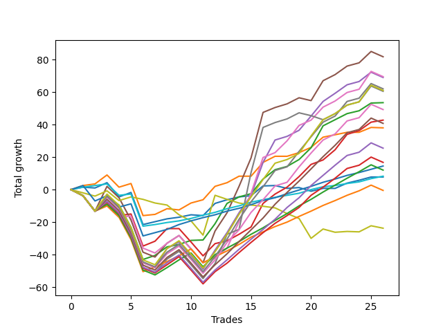

# Long Shepard 003 v2 
- Symbol: ES
- Date Range: 03/18/2022 - 07/15/2022
- Trading Period: 7:20-12:30
- Number of Trades: 26



| Name | Win Percent | Profit | Avg Profit / Trade | Avg Time / Trade |      | Name | Win Percent | Profit | Avg Profit / Trade | Avg Time / Trade |
| ---- | ----------- | ------ | ------------------ | ---------------- | ---- | ---- | ----------- | ------ | ------------------ | ---------------- |
| Sorted By <br> Profit | | | | | | Sorted By <br> Win Percentage ||||
| Five | 61.54 | 40875.00 | 1572.12 | 26:39 |     | Eighty-One | 92.31 | 4125.00 | 158.65 | 05:03 |
| Six | 69.23 | 34750.00 | 1336.54 | 20:39 |     | Eighty-Two | 88.46 | 7250.00 | 278.85 | 07:36 |
| Four | 65.38 | 34500.00 | 1326.92 | 23:30 |     | One | 84.62 | 19000.00 | 730.77 | 09:43 |
| Eighty-Nine | 65.38 | 31000.00 | 1192.31 | 21:45 |     | Two | 80.77 | 26750.00 | 1028.85 | 16:28 |
| Ninety | 65.38 | 30500.00 | 1173.08 | 23:27 |     | Three | 76.92 | 21375.00 | 822.12 | 15:59 |
| Seven | 57.69 | 30250.00 | 1163.46 | 27:18 |     | Zero | 76.92 | 3875.00 | 149.04 | 04:53 |
| Two | 80.77 | 26750.00 | 1028.85 | 16:28 |     | Eighty-Three | 73.08 | -250.00 | -9.62 | 13:21 |
| Eighty-Eight | 65.38 | 24625.00 | 947.12 | 21:01 |     | Six | 69.23 | 34750.00 | 1336.54 | 20:39 |
| Three | 76.92 | 21375.00 | 822.12 | 15:59 |     | Eighty-Four | 69.23 | 6000.00 | 230.77 | 15:13 |
| Eighty-Seven | 65.38 | 20375.00 | 783.65 | 18:57 |     | Four | 65.38 | 34500.00 | 1326.92 | 23:30 |
| One | 84.62 | 19000.00 | 730.77 | 09:43 |     | Eighty-Nine | 65.38 | 31000.00 | 1192.31 | 21:45 |
| Eighty-Six | 65.38 | 12750.00 | 490.38 | 18:34 |     | Ninety | 65.38 | 30500.00 | 1173.08 | 23:27 |
| Eighty-Five | 65.38 | 8375.00 | 322.12 | 18:03 |     | Eighty-Eight | 65.38 | 24625.00 | 947.12 | 21:01 |
| Eighty-Two | 88.46 | 7250.00 | 278.85 | 07:36 |     | Eighty-Seven | 65.38 | 20375.00 | 783.65 | 18:57 |
| Eighty-Four | 69.23 | 6000.00 | 230.77 | 15:13 |     | Eighty-Six | 65.38 | 12750.00 | 490.38 | 18:34 |
| Eighty-One | 92.31 | 4125.00 | 158.65 | 05:03 |     | Eighty-Five | 65.38 | 8375.00 | 322.12 | 18:03 |
| Zero | 76.92 | 3875.00 | 149.04 | 04:53 |     | Five | 61.54 | 40875.00 | 1572.12 | 26:39 |
| Eighty-Three | 73.08 | -250.00 | -9.62 | 13:21 |     | Seven | 57.69 | 30250.00 | 1163.46 | 27:18 |
| Seventy-Three | 23.08 | -11875.00 | -456.73 | 05:14 |     | Seventy-Three | 23.08 | -11875.00 | -456.73 | 05:14 |

## NO STOPLOSS

### Test Zero
* Sell when price hits the middle line of the 20p bollinger
* No Stoploss
* Results:
```
Total Trades: 26
Percent Up: 76.92
Percent Down: 23.08
Total Points Moved Up: 7.75
Potential Profit: 3875.00
Total Points Ups: 41.25 Count Ups: 20
Total Points Downs: -33.50 Count Downs: 6
```

<details><summary>Trades</summary>

<code>In: 2022-03-23 09:49:00		Out: 2022-03-23 09:53:00		Total Position Time: 04:00		Total Move Up: 1.50		Total to Date: 1.50</code> <br />
<code>In: 2022-03-23 09:53:00		Out: 2022-03-23 09:54:00		Total Position Time: 01:00		Total Move Up: -0.50		Total to Date: 1.00</code> <br />
<code>In: 2022-03-24 07:32:00		Out: 2022-03-24 07:32:40		Total Position Time: 00:40		Total Move Up: 3.25		Total to Date: 4.25</code> <br />
<code>In: 2022-03-25 08:18:00		Out: 2022-03-25 08:36:40		Total Position Time: 18:40		Total Move Up: -8.75		Total to Date: -4.50</code> <br />
<code>In: 2022-03-28 08:11:00		Out: 2022-03-28 08:11:45		Total Position Time: 00:45		Total Move Up: 2.75		Total to Date: -1.75</code> <br />
<code>In: 2022-03-28 08:30:00		Out: 2022-03-28 08:59:55		Total Position Time: 29:55		Total Move Up: -19.75		Total to Date: -21.50</code> <br />
<code>In: 2022-03-31 09:30:00		Out: 2022-03-31 09:32:35		Total Position Time: 02:35		Total Move Up: 1.75		Total to Date: -19.75</code> <br />
<code>In: 2022-04-20 08:27:00		Out: 2022-04-20 08:28:55		Total Position Time: 01:55		Total Move Up: 1.75		Total to Date: -18.00</code> <br />
<code>In: 2022-04-20 11:48:00		Out: 2022-04-20 11:48:15		Total Position Time: 00:15		Total Move Up: 1.00		Total to Date: -17.00</code> <br />
<code>In: 2022-04-27 12:11:00		Out: 2022-04-27 12:13:55		Total Position Time: 02:55		Total Move Up: 1.50		Total to Date: -15.50</code> <br />
<code>In: 2022-04-27 12:14:00		Out: 2022-04-27 12:14:35		Total Position Time: 00:35		Total Move Up: -0.50		Total to Date: -16.00</code> <br />
<code>In: 2022-05-03 07:51:00		Out: 2022-05-03 07:54:05		Total Position Time: 03:05		Total Move Up: 7.50		Total to Date: -8.50</code> <br />
<code>In: 2022-05-03 11:45:00		Out: 2022-05-03 11:45:10		Total Position Time: 00:10		Total Move Up: 2.25		Total to Date: -6.25</code> <br />
<code>In: 2022-05-06 11:36:00		Out: 2022-05-06 11:40:25		Total Position Time: 04:25		Total Move Up: 1.75		Total to Date: -4.50</code> <br />
<code>In: 2022-05-06 12:12:00		Out: 2022-05-06 12:19:10		Total Position Time: 07:10		Total Move Up: 0.75		Total to Date: -3.75</code> <br />
<code>In: 2022-05-12 09:04:00		Out: 2022-05-12 09:07:35		Total Position Time: 03:35		Total Move Up: 6.00		Total to Date: 2.25</code> <br />
<code>In: 2022-05-13 11:10:00		Out: 2022-05-13 11:19:15		Total Position Time: 09:15		Total Move Up: 0.25		Total to Date: 2.50</code> <br />
<code>In: 2022-05-16 07:58:00		Out: 2022-05-16 08:05:30		Total Position Time: 07:30		Total Move Up: -1.75		Total to Date: 0.75</code> <br />
<code>In: 2022-05-16 08:02:00		Out: 2022-05-16 08:05:30		Total Position Time: 03:30		Total Move Up: 0.50		Total to Date: 1.25</code> <br />
<code>In: 2022-05-19 07:47:00		Out: 2022-05-19 07:53:45		Total Position Time: 06:45		Total Move Up: -2.25		Total to Date: -1.00</code> <br />
<code>In: 2022-05-19 10:19:00		Out: 2022-05-19 10:19:20		Total Position Time: 00:20		Total Move Up: 1.75		Total to Date: 0.75</code> <br />
<code>In: 2022-05-25 09:39:00		Out: 2022-05-25 09:41:25		Total Position Time: 02:25		Total Move Up: 0.00		Total to Date: 0.75</code> <br />
<code>In: 2022-06-06 08:24:00		Out: 2022-06-06 08:31:35		Total Position Time: 07:35		Total Move Up: 3.25		Total to Date: 4.00</code> <br />
<code>In: 2022-07-08 09:48:00		Out: 2022-07-08 09:48:40		Total Position Time: 00:40		Total Move Up: 1.75		Total to Date: 5.75</code> <br />
<code>In: 2022-07-08 10:06:00		Out: 2022-07-08 10:06:10		Total Position Time: 00:10		Total Move Up: 2.00		Total to Date: 7.75</code> <br />
<code>In: 2022-07-11 12:15:00		Out: 2022-07-11 12:22:10		Total Position Time: 07:10		Total Move Up: 0.00		Total to Date: 7.75</code> <br />


</details>

### Test One
* Sell when the price hits the upper line of the 20p 1std bollinger
* No Stoploss
* Results:
```
Total Trades: 26
Percent Up: 84.62
Percent Down: 15.38
Total Points Moved Up: 38.00
Potential Profit: 19000.00
Total Points Ups: 66.25 Count Ups: 22
Total Points Downs: -28.25 Count Downs: 4
```

<details><summary>Trades</summary>

<code>In: 2022-03-23 09:49:00		Out: 2022-03-23 09:59:10		Total Position Time: 10:10		Total Move Up: 2.50		Total to Date: 2.50</code> <br />
<code>In: 2022-03-23 09:53:00		Out: 2022-03-23 09:59:10		Total Position Time: 06:10		Total Move Up: 1.00		Total to Date: 3.50</code> <br />
<code>In: 2022-03-24 07:32:00		Out: 2022-03-24 07:32:50		Total Position Time: 00:50		Total Move Up: 5.50		Total to Date: 9.00</code> <br />
<code>In: 2022-03-25 08:18:00		Out: 2022-03-25 08:41:05		Total Position Time: 23:05		Total Move Up: -7.50		Total to Date: 1.50</code> <br />
<code>In: 2022-03-28 08:11:00		Out: 2022-03-28 08:20:05		Total Position Time: 09:05		Total Move Up: 2.25		Total to Date: 3.75</code> <br />
<code>In: 2022-03-28 08:30:00		Out: 2022-03-28 08:59:55		Total Position Time: 29:55		Total Move Up: -19.75		Total to Date: -16.00</code> <br />
<code>In: 2022-03-31 09:30:00		Out: 2022-03-31 09:40:25		Total Position Time: 10:25		Total Move Up: 0.75		Total to Date: -15.25</code> <br />
<code>In: 2022-04-20 08:27:00		Out: 2022-04-20 08:29:35		Total Position Time: 02:35		Total Move Up: 3.50		Total to Date: -11.75</code> <br />
<code>In: 2022-04-20 11:48:00		Out: 2022-04-20 12:04:20		Total Position Time: 16:20		Total Move Up: -0.75		Total to Date: -12.50</code> <br />
<code>In: 2022-04-27 12:11:00		Out: 2022-04-27 12:15:20		Total Position Time: 04:20		Total Move Up: 4.25		Total to Date: -8.25</code> <br />
<code>In: 2022-04-27 12:14:00		Out: 2022-04-27 12:15:20		Total Position Time: 01:20		Total Move Up: 2.00		Total to Date: -6.25</code> <br />
<code>In: 2022-05-03 07:51:00		Out: 2022-05-03 07:57:05		Total Position Time: 06:05		Total Move Up: 8.25		Total to Date: 2.00</code> <br />
<code>In: 2022-05-03 11:45:00		Out: 2022-05-03 11:45:10		Total Position Time: 00:10		Total Move Up: 2.25		Total to Date: 4.25</code> <br />
<code>In: 2022-05-06 11:36:00		Out: 2022-05-06 11:49:10		Total Position Time: 13:10		Total Move Up: 4.00		Total to Date: 8.25</code> <br />
<code>In: 2022-05-06 12:12:00		Out: 2022-05-06 12:28:05		Total Position Time: 16:05		Total Move Up: 0.00		Total to Date: 8.25</code> <br />
<code>In: 2022-05-12 09:04:00		Out: 2022-05-12 09:11:10		Total Position Time: 07:10		Total Move Up: 8.50		Total to Date: 16.75</code> <br />
<code>In: 2022-05-13 11:10:00		Out: 2022-05-13 11:20:00		Total Position Time: 10:00		Total Move Up: 3.75		Total to Date: 20.50</code> <br />
<code>In: 2022-05-16 07:58:00		Out: 2022-05-16 08:09:50		Total Position Time: 11:50		Total Move Up: 0.00		Total to Date: 20.50</code> <br />
<code>In: 2022-05-16 08:02:00		Out: 2022-05-16 08:09:50		Total Position Time: 07:50		Total Move Up: 2.25		Total to Date: 22.75</code> <br />
<code>In: 2022-05-19 07:47:00		Out: 2022-05-19 07:54:50		Total Position Time: 07:50		Total Move Up: 3.25		Total to Date: 26.00</code> <br />
<code>In: 2022-05-19 10:19:00		Out: 2022-05-19 10:22:45		Total Position Time: 03:45		Total Move Up: 6.25		Total to Date: 32.25</code> <br />
<code>In: 2022-05-25 09:39:00		Out: 2022-05-25 09:44:25		Total Position Time: 05:25		Total Move Up: 1.50		Total to Date: 33.75</code> <br />
<code>In: 2022-06-06 08:24:00		Out: 2022-06-06 08:39:15		Total Position Time: 15:15		Total Move Up: 1.50		Total to Date: 35.25</code> <br />
<code>In: 2022-07-08 09:48:00		Out: 2022-07-08 10:06:55		Total Position Time: 18:55		Total Move Up: 0.00		Total to Date: 35.25</code> <br />
<code>In: 2022-07-08 10:06:00		Out: 2022-07-08 10:06:55		Total Position Time: 00:55		Total Move Up: 3.00		Total to Date: 38.25</code> <br />
<code>In: 2022-07-11 12:15:00		Out: 2022-07-11 12:29:15		Total Position Time: 14:15		Total Move Up: -0.25		Total to Date: 38.00</code> <br />


</details>

### Test Two
* Sell when the price hits the upper line of the 20p 2std bollinger
* No Stoploss
* Results:
```
Total Trades: 26
Percent Up: 80.77
Percent Down: 19.23
Total Points Moved Up: 53.50
Potential Profit: 26750.00
Total Points Ups: 105.25 Count Ups: 21
Total Points Downs: -51.75 Count Downs: 5
```

<details><summary>Trades</summary>

<code>In: 2022-03-23 09:49:00		Out: 2022-03-23 10:18:55		Total Position Time: 29:55		Total Move Up: -3.75		Total to Date: -3.75</code> <br />
<code>In: 2022-03-23 09:53:00		Out: 2022-03-23 10:22:55		Total Position Time: 29:55		Total Move Up: -9.50		Total to Date: -13.25</code> <br />
<code>In: 2022-03-24 07:32:00		Out: 2022-03-24 07:34:15		Total Position Time: 02:15		Total Move Up: 8.75		Total to Date: -4.50</code> <br />
<code>In: 2022-03-25 08:18:00		Out: 2022-03-25 08:41:45		Total Position Time: 23:45		Total Move Up: -5.00		Total to Date: -9.50</code> <br />
<code>In: 2022-03-28 08:11:00		Out: 2022-03-28 08:40:55		Total Position Time: 29:55		Total Move Up: -13.75		Total to Date: -23.25</code> <br />
<code>In: 2022-03-28 08:30:00		Out: 2022-03-28 08:59:55		Total Position Time: 29:55		Total Move Up: -19.75		Total to Date: -43.00</code> <br />
<code>In: 2022-03-31 09:30:00		Out: 2022-03-31 09:44:20		Total Position Time: 14:20		Total Move Up: 2.50		Total to Date: -40.50</code> <br />
<code>In: 2022-04-20 08:27:00		Out: 2022-04-20 08:31:15		Total Position Time: 04:15		Total Move Up: 5.25		Total to Date: -35.25</code> <br />
<code>In: 2022-04-20 11:48:00		Out: 2022-04-20 12:12:35		Total Position Time: 24:35		Total Move Up: 1.50		Total to Date: -33.75</code> <br />
<code>In: 2022-04-27 12:11:00		Out: 2022-04-27 12:31:20		Total Position Time: 20:20		Total Move Up: 2.50		Total to Date: -31.25</code> <br />
<code>In: 2022-04-27 12:14:00		Out: 2022-04-27 12:31:20		Total Position Time: 17:20		Total Move Up: 0.25		Total to Date: -31.00</code> <br />
<code>In: 2022-05-03 07:51:00		Out: 2022-05-03 07:59:10		Total Position Time: 08:10		Total Move Up: 10.00		Total to Date: -21.00</code> <br />
<code>In: 2022-05-03 11:45:00		Out: 2022-05-03 11:52:15		Total Position Time: 07:15		Total Move Up: 12.50		Total to Date: -8.50</code> <br />
<code>In: 2022-05-06 11:36:00		Out: 2022-05-06 11:49:10		Total Position Time: 13:10		Total Move Up: 4.00		Total to Date: -4.50</code> <br />
<code>In: 2022-05-06 12:12:00		Out: 2022-05-06 12:28:10		Total Position Time: 16:10		Total Move Up: 2.00		Total to Date: -2.50</code> <br />
<code>In: 2022-05-12 09:04:00		Out: 2022-05-12 09:16:10		Total Position Time: 12:10		Total Move Up: 9.00		Total to Date: 6.50</code> <br />
<code>In: 2022-05-13 11:10:00		Out: 2022-05-13 11:31:20		Total Position Time: 21:20		Total Move Up: 5.75		Total to Date: 12.25</code> <br />
<code>In: 2022-05-16 07:58:00		Out: 2022-05-16 08:11:30		Total Position Time: 13:30		Total Move Up: 2.00		Total to Date: 14.25</code> <br />
<code>In: 2022-05-16 08:02:00		Out: 2022-05-16 08:11:30		Total Position Time: 09:30		Total Move Up: 4.25		Total to Date: 18.50</code> <br />
<code>In: 2022-05-19 07:47:00		Out: 2022-05-19 07:55:50		Total Position Time: 08:50		Total Move Up: 7.25		Total to Date: 25.75</code> <br />
<code>In: 2022-05-19 10:19:00		Out: 2022-05-19 10:44:05		Total Position Time: 25:05		Total Move Up: 13.50		Total to Date: 39.25</code> <br />
<code>In: 2022-05-25 09:39:00		Out: 2022-05-25 09:45:20		Total Position Time: 06:20		Total Move Up: 3.75		Total to Date: 43.00</code> <br />
<code>In: 2022-06-06 08:24:00		Out: 2022-06-06 08:43:00		Total Position Time: 19:00		Total Move Up: 3.75		Total to Date: 46.75</code> <br />
<code>In: 2022-07-08 09:48:00		Out: 2022-07-08 10:10:30		Total Position Time: 22:30		Total Move Up: 1.75		Total to Date: 48.50</code> <br />
<code>In: 2022-07-08 10:06:00		Out: 2022-07-08 10:10:30		Total Position Time: 04:30		Total Move Up: 4.75		Total to Date: 53.25</code> <br />
<code>In: 2022-07-11 12:15:00		Out: 2022-07-11 12:29:25		Total Position Time: 14:25		Total Move Up: 0.25		Total to Date: 53.50</code> <br />


</details>

### Test Three
* Sell when price hits the middle line of the 50p bollinger
* No Stoploss
* Results:
```
Total Trades: 26
Percent Up: 76.92
Percent Down: 23.08
Total Points Moved Up: 42.75
Potential Profit: 21375.00
Total Points Ups: 99.50 Count Ups: 20
Total Points Downs: -56.75 Count Downs: 6
```

<details><summary>Trades</summary>

<code>In: 2022-03-23 09:49:00		Out: 2022-03-23 10:18:55		Total Position Time: 29:55		Total Move Up: -3.75		Total to Date: -3.75</code> <br />
<code>In: 2022-03-23 09:53:00		Out: 2022-03-23 10:22:55		Total Position Time: 29:55		Total Move Up: -9.50		Total to Date: -13.25</code> <br />
<code>In: 2022-03-24 07:32:00		Out: 2022-03-24 07:32:45		Total Position Time: 00:45		Total Move Up: 4.25		Total to Date: -9.00</code> <br />
<code>In: 2022-03-25 08:18:00		Out: 2022-03-25 08:47:55		Total Position Time: 29:55		Total Move Up: -7.00		Total to Date: -16.00</code> <br />
<code>In: 2022-03-28 08:11:00		Out: 2022-03-28 08:11:20		Total Position Time: 00:20		Total Move Up: 1.00		Total to Date: -15.00</code> <br />
<code>In: 2022-03-28 08:30:00		Out: 2022-03-28 08:59:55		Total Position Time: 29:55		Total Move Up: -19.75		Total to Date: -34.75</code> <br />
<code>In: 2022-03-31 09:30:00		Out: 2022-03-31 09:45:45		Total Position Time: 15:45		Total Move Up: 3.00		Total to Date: -31.75</code> <br />
<code>In: 2022-04-20 08:27:00		Out: 2022-04-20 08:36:10		Total Position Time: 09:10		Total Move Up: 7.75		Total to Date: -24.00</code> <br />
<code>In: 2022-04-20 11:48:00		Out: 2022-04-20 12:10:10		Total Position Time: 22:10		Total Move Up: 0.00		Total to Date: -24.00</code> <br />
<code>In: 2022-04-27 12:11:00		Out: 2022-04-27 12:40:55		Total Position Time: 29:55		Total Move Up: -8.25		Total to Date: -32.25</code> <br />
<code>In: 2022-04-27 12:14:00		Out: 2022-04-27 12:43:55		Total Position Time: 29:55		Total Move Up: -8.50		Total to Date: -40.75</code> <br />
<code>In: 2022-05-03 07:51:00		Out: 2022-05-03 07:54:05		Total Position Time: 03:05		Total Move Up: 7.50		Total to Date: -33.25</code> <br />
<code>In: 2022-05-03 11:45:00		Out: 2022-05-03 11:48:05		Total Position Time: 03:05		Total Move Up: 1.75		Total to Date: -31.50</code> <br />
<code>In: 2022-05-06 11:36:00		Out: 2022-05-06 11:49:10		Total Position Time: 13:10		Total Move Up: 4.00		Total to Date: -27.50</code> <br />
<code>In: 2022-05-06 12:12:00		Out: 2022-05-06 12:13:10		Total Position Time: 01:10		Total Move Up: 4.50		Total to Date: -23.00</code> <br />
<code>In: 2022-05-12 09:04:00		Out: 2022-05-12 09:21:35		Total Position Time: 17:35		Total Move Up: 14.50		Total to Date: -8.50</code> <br />
<code>In: 2022-05-13 11:10:00		Out: 2022-05-13 11:31:20		Total Position Time: 21:20		Total Move Up: 5.75		Total to Date: -2.75</code> <br />
<code>In: 2022-05-16 07:58:00		Out: 2022-05-16 08:16:30		Total Position Time: 18:30		Total Move Up: 4.25		Total to Date: 1.50</code> <br />
<code>In: 2022-05-16 08:02:00		Out: 2022-05-16 08:16:30		Total Position Time: 14:30		Total Move Up: 6.50		Total to Date: 8.00</code> <br />
<code>In: 2022-05-19 07:47:00		Out: 2022-05-19 07:55:40		Total Position Time: 08:40		Total Move Up: 7.50		Total to Date: 15.50</code> <br />
<code>In: 2022-05-19 10:19:00		Out: 2022-05-19 10:20:05		Total Position Time: 01:05		Total Move Up: 2.75		Total to Date: 18.25</code> <br />
<code>In: 2022-05-25 09:39:00		Out: 2022-05-25 09:49:05		Total Position Time: 10:05		Total Move Up: 6.25		Total to Date: 24.50</code> <br />
<code>In: 2022-06-06 08:24:00		Out: 2022-06-06 08:46:10		Total Position Time: 22:10		Total Move Up: 9.50		Total to Date: 34.00</code> <br />
<code>In: 2022-07-08 09:48:00		Out: 2022-07-08 10:11:05		Total Position Time: 23:05		Total Move Up: 2.25		Total to Date: 36.25</code> <br />
<code>In: 2022-07-08 10:06:00		Out: 2022-07-08 10:11:05		Total Position Time: 05:05		Total Move Up: 5.25		Total to Date: 41.50</code> <br />
<code>In: 2022-07-11 12:15:00		Out: 2022-07-11 12:40:35		Total Position Time: 25:35		Total Move Up: 1.25		Total to Date: 42.75</code> <br />


</details>

### Test Four
* Sell when the price hits the upper line of the 50p 1std bollinger
* No Stoploss
* Results:
```
Total Trades: 26
Percent Up: 65.38
Percent Down: 34.62
Total Points Moved Up: 69.00
Potential Profit: 34500.00
Total Points Ups: 145.75 Count Ups: 17
Total Points Downs: -76.75 Count Downs: 9
```

<details><summary>Trades</summary>

<code>In: 2022-03-23 09:49:00		Out: 2022-03-23 10:18:55		Total Position Time: 29:55		Total Move Up: -3.75		Total to Date: -3.75</code> <br />
<code>In: 2022-03-23 09:53:00		Out: 2022-03-23 10:22:55		Total Position Time: 29:55		Total Move Up: -9.50		Total to Date: -13.25</code> <br />
<code>In: 2022-03-24 07:32:00		Out: 2022-03-24 07:34:15		Total Position Time: 02:15		Total Move Up: 8.75		Total to Date: -4.50</code> <br />
<code>In: 2022-03-25 08:18:00		Out: 2022-03-25 08:47:55		Total Position Time: 29:55		Total Move Up: -7.00		Total to Date: -11.50</code> <br />
<code>In: 2022-03-28 08:11:00		Out: 2022-03-28 08:40:55		Total Position Time: 29:55		Total Move Up: -13.75		Total to Date: -25.25</code> <br />
<code>In: 2022-03-28 08:30:00		Out: 2022-03-28 08:59:55		Total Position Time: 29:55		Total Move Up: -19.75		Total to Date: -45.00</code> <br />
<code>In: 2022-03-31 09:30:00		Out: 2022-03-31 09:59:55		Total Position Time: 29:55		Total Move Up: -3.00		Total to Date: -48.00</code> <br />
<code>In: 2022-04-20 08:27:00		Out: 2022-04-20 08:45:05		Total Position Time: 18:05		Total Move Up: 11.75		Total to Date: -36.25</code> <br />
<code>In: 2022-04-20 11:48:00		Out: 2022-04-20 12:13:30		Total Position Time: 25:30		Total Move Up: 4.00		Total to Date: -32.25</code> <br />
<code>In: 2022-04-27 12:11:00		Out: 2022-04-27 12:40:55		Total Position Time: 29:55		Total Move Up: -8.25		Total to Date: -40.50</code> <br />
<code>In: 2022-04-27 12:14:00		Out: 2022-04-27 12:43:55		Total Position Time: 29:55		Total Move Up: -8.50		Total to Date: -49.00</code> <br />
<code>In: 2022-05-03 07:51:00		Out: 2022-05-03 08:02:20		Total Position Time: 11:20		Total Move Up: 11.75		Total to Date: -37.25</code> <br />
<code>In: 2022-05-03 11:45:00		Out: 2022-05-03 11:52:05		Total Position Time: 07:05		Total Move Up: 10.75		Total to Date: -26.50</code> <br />
<code>In: 2022-05-06 11:36:00		Out: 2022-05-06 11:50:10		Total Position Time: 14:10		Total Move Up: 12.25		Total to Date: -14.25</code> <br />
<code>In: 2022-05-06 12:12:00		Out: 2022-05-06 12:30:30		Total Position Time: 18:30		Total Move Up: 10.75		Total to Date: -3.50</code> <br />
<code>In: 2022-05-12 09:04:00		Out: 2022-05-12 09:30:10		Total Position Time: 26:10		Total Move Up: 20.25		Total to Date: 16.75</code> <br />
<code>In: 2022-05-13 11:10:00		Out: 2022-05-13 11:32:00		Total Position Time: 22:00		Total Move Up: 13.75		Total to Date: 30.50</code> <br />
<code>In: 2022-05-16 07:58:00		Out: 2022-05-16 08:27:55		Total Position Time: 29:55		Total Move Up: 2.25		Total to Date: 32.75</code> <br />
<code>In: 2022-05-16 08:02:00		Out: 2022-05-16 08:31:55		Total Position Time: 29:55		Total Move Up: 3.75		Total to Date: 36.50</code> <br />
<code>In: 2022-05-19 07:47:00		Out: 2022-05-19 08:12:05		Total Position Time: 25:05		Total Move Up: 8.75		Total to Date: 45.25</code> <br />
<code>In: 2022-05-19 10:19:00		Out: 2022-05-19 10:23:25		Total Position Time: 04:25		Total Move Up: 9.00		Total to Date: 54.25</code> <br />
<code>In: 2022-05-25 09:39:00		Out: 2022-05-25 10:06:15		Total Position Time: 27:15		Total Move Up: 5.00		Total to Date: 59.25</code> <br />
<code>In: 2022-06-06 08:24:00		Out: 2022-06-06 08:53:55		Total Position Time: 29:55		Total Move Up: 5.25		Total to Date: 64.50</code> <br />
<code>In: 2022-07-08 09:48:00		Out: 2022-07-08 10:17:55		Total Position Time: 29:55		Total Move Up: 2.00		Total to Date: 66.50</code> <br />
<code>In: 2022-07-08 10:06:00		Out: 2022-07-08 10:26:30		Total Position Time: 20:30		Total Move Up: 5.75		Total to Date: 72.25</code> <br />
<code>In: 2022-07-11 12:15:00		Out: 2022-07-11 12:44:55		Total Position Time: 29:55		Total Move Up: -3.25		Total to Date: 69.00</code> <br />


</details>

### Test Five
* Sell when the price hits the upper line of the 50p 2std bollinger
* No Stoploss
* Results:
```
Total Trades: 26
Percent Up: 61.54
Percent Down: 38.46
Total Points Moved Up: 81.75
Potential Profit: 40875.00
Total Points Ups: 160.25 Count Ups: 16
Total Points Downs: -78.50 Count Downs: 10
```

<details><summary>Trades</summary>

<code>In: 2022-03-23 09:49:00		Out: 2022-03-23 10:18:55		Total Position Time: 29:55		Total Move Up: -3.75		Total to Date: -3.75</code> <br />
<code>In: 2022-03-23 09:53:00		Out: 2022-03-23 10:22:55		Total Position Time: 29:55		Total Move Up: -9.50		Total to Date: -13.25</code> <br />
<code>In: 2022-03-24 07:32:00		Out: 2022-03-24 08:01:10		Total Position Time: 29:10		Total Move Up: 15.25		Total to Date: 2.00</code> <br />
<code>In: 2022-03-25 08:18:00		Out: 2022-03-25 08:47:55		Total Position Time: 29:55		Total Move Up: -7.00		Total to Date: -5.00</code> <br />
<code>In: 2022-03-28 08:11:00		Out: 2022-03-28 08:40:55		Total Position Time: 29:55		Total Move Up: -13.75		Total to Date: -18.75</code> <br />
<code>In: 2022-03-28 08:30:00		Out: 2022-03-28 08:59:55		Total Position Time: 29:55		Total Move Up: -19.75		Total to Date: -38.50</code> <br />
<code>In: 2022-03-31 09:30:00		Out: 2022-03-31 09:59:55		Total Position Time: 29:55		Total Move Up: -3.00		Total to Date: -41.50</code> <br />
<code>In: 2022-04-20 08:27:00		Out: 2022-04-20 08:56:55		Total Position Time: 29:55		Total Move Up: 8.50		Total to Date: -33.00</code> <br />
<code>In: 2022-04-20 11:48:00		Out: 2022-04-20 12:17:55		Total Position Time: 29:55		Total Move Up: 4.75		Total to Date: -28.25</code> <br />
<code>In: 2022-04-27 12:11:00		Out: 2022-04-27 12:40:55		Total Position Time: 29:55		Total Move Up: -8.25		Total to Date: -36.50</code> <br />
<code>In: 2022-04-27 12:14:00		Out: 2022-04-27 12:43:55		Total Position Time: 29:55		Total Move Up: -8.50		Total to Date: -45.00</code> <br />
<code>In: 2022-05-03 07:51:00		Out: 2022-05-03 08:05:00		Total Position Time: 14:00		Total Move Up: 19.50		Total to Date: -25.50</code> <br />
<code>In: 2022-05-03 11:45:00		Out: 2022-05-03 11:56:15		Total Position Time: 11:15		Total Move Up: 11.25		Total to Date: -14.25</code> <br />
<code>In: 2022-05-06 11:36:00		Out: 2022-05-06 11:50:35		Total Position Time: 14:35		Total Move Up: 16.25		Total to Date: 2.00</code> <br />
<code>In: 2022-05-06 12:12:00		Out: 2022-05-06 12:35:40		Total Position Time: 23:40		Total Move Up: 17.50		Total to Date: 19.50</code> <br />
<code>In: 2022-05-12 09:04:00		Out: 2022-05-12 09:32:30		Total Position Time: 28:30		Total Move Up: 28.00		Total to Date: 47.50</code> <br />
<code>In: 2022-05-13 11:10:00		Out: 2022-05-13 11:39:55		Total Position Time: 29:55		Total Move Up: 3.00		Total to Date: 50.50</code> <br />
<code>In: 2022-05-16 07:58:00		Out: 2022-05-16 08:27:55		Total Position Time: 29:55		Total Move Up: 2.25		Total to Date: 52.75</code> <br />
<code>In: 2022-05-16 08:02:00		Out: 2022-05-16 08:31:55		Total Position Time: 29:55		Total Move Up: 3.75		Total to Date: 56.50</code> <br />
<code>In: 2022-05-19 07:47:00		Out: 2022-05-19 08:16:55		Total Position Time: 29:55		Total Move Up: -1.75		Total to Date: 54.75</code> <br />
<code>In: 2022-05-19 10:19:00		Out: 2022-05-19 10:31:30		Total Position Time: 12:30		Total Move Up: 12.25		Total to Date: 67.00</code> <br />
<code>In: 2022-05-25 09:39:00		Out: 2022-05-25 10:08:55		Total Position Time: 29:55		Total Move Up: 3.75		Total to Date: 70.75</code> <br />
<code>In: 2022-06-06 08:24:00		Out: 2022-06-06 08:53:55		Total Position Time: 29:55		Total Move Up: 5.25		Total to Date: 76.00</code> <br />
<code>In: 2022-07-08 09:48:00		Out: 2022-07-08 10:17:55		Total Position Time: 29:55		Total Move Up: 2.00		Total to Date: 78.00</code> <br />
<code>In: 2022-07-08 10:06:00		Out: 2022-07-08 10:26:55		Total Position Time: 20:55		Total Move Up: 7.00		Total to Date: 85.00</code> <br />
<code>In: 2022-07-11 12:15:00		Out: 2022-07-11 12:44:55		Total Position Time: 29:55		Total Move Up: -3.25		Total to Date: 81.75</code> <br />


</details>

### Test Six
* Sell when the price hits the middle line of the 1std VWAP
* No Stoploss
* Results:
```
Total Trades: 26
Percent Up: 69.23
Percent Down: 30.77
Total Points Moved Up: 69.50
Potential Profit: 34750.00
Total Points Ups: 132.50 Count Ups: 18
Total Points Downs: -63.00 Count Downs: 8
```

<details><summary>Trades</summary>

<code>In: 2022-03-23 09:49:00		Out: 2022-03-23 10:18:55		Total Position Time: 29:55		Total Move Up: -3.75		Total to Date: -3.75</code> <br />
<code>In: 2022-03-23 09:53:00		Out: 2022-03-23 10:22:55		Total Position Time: 29:55		Total Move Up: -9.50		Total to Date: -13.25</code> <br />
<code>In: 2022-03-24 07:32:00		Out: 2022-03-24 07:32:40		Total Position Time: 00:40		Total Move Up: 3.25		Total to Date: -10.00</code> <br />
<code>In: 2022-03-25 08:18:00		Out: 2022-03-25 08:47:55		Total Position Time: 29:55		Total Move Up: -7.00		Total to Date: -17.00</code> <br />
<code>In: 2022-03-28 08:11:00		Out: 2022-03-28 08:11:10		Total Position Time: 00:10		Total Move Up: 0.75		Total to Date: -16.25</code> <br />
<code>In: 2022-03-28 08:30:00		Out: 2022-03-28 08:59:55		Total Position Time: 29:55		Total Move Up: -19.75		Total to Date: -36.00</code> <br />
<code>In: 2022-03-31 09:30:00		Out: 2022-03-31 09:59:55		Total Position Time: 29:55		Total Move Up: -3.00		Total to Date: -39.00</code> <br />
<code>In: 2022-04-20 08:27:00		Out: 2022-04-20 08:31:25		Total Position Time: 04:25		Total Move Up: 6.00		Total to Date: -33.00</code> <br />
<code>In: 2022-04-20 11:48:00		Out: 2022-04-20 12:17:55		Total Position Time: 29:55		Total Move Up: 4.75		Total to Date: -28.25</code> <br />
<code>In: 2022-04-27 12:11:00		Out: 2022-04-27 12:40:55		Total Position Time: 29:55		Total Move Up: -8.25		Total to Date: -36.50</code> <br />
<code>In: 2022-04-27 12:14:00		Out: 2022-04-27 12:43:55		Total Position Time: 29:55		Total Move Up: -8.50		Total to Date: -45.00</code> <br />
<code>In: 2022-05-03 07:51:00		Out: 2022-05-03 07:52:30		Total Position Time: 01:30		Total Move Up: 2.75		Total to Date: -42.25</code> <br />
<code>In: 2022-05-03 11:45:00		Out: 2022-05-03 11:50:50		Total Position Time: 05:50		Total Move Up: 6.25		Total to Date: -36.00</code> <br />
<code>In: 2022-05-06 11:36:00		Out: 2022-05-06 11:50:20		Total Position Time: 14:20		Total Move Up: 16.25		Total to Date: -19.75</code> <br />
<code>In: 2022-05-06 12:12:00		Out: 2022-05-06 12:35:40		Total Position Time: 23:40		Total Move Up: 17.50		Total to Date: -2.25</code> <br />
<code>In: 2022-05-12 09:04:00		Out: 2022-05-12 09:31:05		Total Position Time: 27:05		Total Move Up: 22.00		Total to Date: 19.75</code> <br />
<code>In: 2022-05-13 11:10:00		Out: 2022-05-13 11:39:55		Total Position Time: 29:55		Total Move Up: 3.00		Total to Date: 22.75</code> <br />
<code>In: 2022-05-16 07:58:00		Out: 2022-05-16 08:17:40		Total Position Time: 19:40		Total Move Up: 7.25		Total to Date: 30.00</code> <br />
<code>In: 2022-05-16 08:02:00		Out: 2022-05-16 08:17:40		Total Position Time: 15:40		Total Move Up: 9.50		Total to Date: 39.50</code> <br />
<code>In: 2022-05-19 07:47:00		Out: 2022-05-19 07:54:55		Total Position Time: 07:55		Total Move Up: 3.25		Total to Date: 42.75</code> <br />
<code>In: 2022-05-19 10:19:00		Out: 2022-05-19 10:22:55		Total Position Time: 03:55		Total Move Up: 8.00		Total to Date: 50.75</code> <br />
<code>In: 2022-05-25 09:39:00		Out: 2022-05-25 10:08:55		Total Position Time: 29:55		Total Move Up: 3.75		Total to Date: 54.50</code> <br />
<code>In: 2022-06-06 08:24:00		Out: 2022-06-06 08:53:55		Total Position Time: 29:55		Total Move Up: 5.25		Total to Date: 59.75</code> <br />
<code>In: 2022-07-08 09:48:00		Out: 2022-07-08 10:17:55		Total Position Time: 29:55		Total Move Up: 2.00		Total to Date: 61.75</code> <br />
<code>In: 2022-07-08 10:06:00		Out: 2022-07-08 10:29:10		Total Position Time: 23:10		Total Move Up: 11.00		Total to Date: 72.75</code> <br />
<code>In: 2022-07-11 12:15:00		Out: 2022-07-11 12:44:55		Total Position Time: 29:55		Total Move Up: -3.25		Total to Date: 69.50</code> <br />


</details>

### Test Seven
* Sell when the price hits the upper line of the 1std VWAP
* No Stoploss
* Results:
```
Total Trades: 26
Percent Up: 57.69
Percent Down: 42.31
Total Points Moved Up: 60.50
Potential Profit: 30250.00
Total Points Ups: 141.50 Count Ups: 15
Total Points Downs: -81.00 Count Downs: 11
```

<details><summary>Trades</summary>

<code>In: 2022-03-23 09:49:00		Out: 2022-03-23 10:18:55		Total Position Time: 29:55		Total Move Up: -3.75		Total to Date: -3.75</code> <br />
<code>In: 2022-03-23 09:53:00		Out: 2022-03-23 10:22:55		Total Position Time: 29:55		Total Move Up: -9.50		Total to Date: -13.25</code> <br />
<code>In: 2022-03-24 07:32:00		Out: 2022-03-24 07:33:05		Total Position Time: 01:05		Total Move Up: 5.50		Total to Date: -7.75</code> <br />
<code>In: 2022-03-25 08:18:00		Out: 2022-03-25 08:47:55		Total Position Time: 29:55		Total Move Up: -7.00		Total to Date: -14.75</code> <br />
<code>In: 2022-03-28 08:11:00		Out: 2022-03-28 08:40:55		Total Position Time: 29:55		Total Move Up: -13.75		Total to Date: -28.50</code> <br />
<code>In: 2022-03-28 08:30:00		Out: 2022-03-28 08:59:55		Total Position Time: 29:55		Total Move Up: -19.75		Total to Date: -48.25</code> <br />
<code>In: 2022-03-31 09:30:00		Out: 2022-03-31 09:59:55		Total Position Time: 29:55		Total Move Up: -3.00		Total to Date: -51.25</code> <br />
<code>In: 2022-04-20 08:27:00		Out: 2022-04-20 08:56:55		Total Position Time: 29:55		Total Move Up: 8.50		Total to Date: -42.75</code> <br />
<code>In: 2022-04-20 11:48:00		Out: 2022-04-20 12:17:55		Total Position Time: 29:55		Total Move Up: 4.75		Total to Date: -38.00</code> <br />
<code>In: 2022-04-27 12:11:00		Out: 2022-04-27 12:40:55		Total Position Time: 29:55		Total Move Up: -8.25		Total to Date: -46.25</code> <br />
<code>In: 2022-04-27 12:14:00		Out: 2022-04-27 12:43:55		Total Position Time: 29:55		Total Move Up: -8.50		Total to Date: -54.75</code> <br />
<code>In: 2022-05-03 07:51:00		Out: 2022-05-03 07:58:50		Total Position Time: 07:50		Total Move Up: 9.25		Total to Date: -45.50</code> <br />
<code>In: 2022-05-03 11:45:00		Out: 2022-05-03 12:00:05		Total Position Time: 15:05		Total Move Up: 18.00		Total to Date: -27.50</code> <br />
<code>In: 2022-05-06 11:36:00		Out: 2022-05-06 12:05:55		Total Position Time: 29:55		Total Move Up: 3.00		Total to Date: -24.50</code> <br />
<code>In: 2022-05-06 12:12:00		Out: 2022-05-06 12:40:00		Total Position Time: 28:00		Total Move Up: 35.00		Total to Date: 10.50</code> <br />
<code>In: 2022-05-12 09:04:00		Out: 2022-05-12 09:33:55		Total Position Time: 29:55		Total Move Up: 27.75		Total to Date: 38.25</code> <br />
<code>In: 2022-05-13 11:10:00		Out: 2022-05-13 11:39:55		Total Position Time: 29:55		Total Move Up: 3.00		Total to Date: 41.25</code> <br />
<code>In: 2022-05-16 07:58:00		Out: 2022-05-16 08:27:55		Total Position Time: 29:55		Total Move Up: 2.25		Total to Date: 43.50</code> <br />
<code>In: 2022-05-16 08:02:00		Out: 2022-05-16 08:31:55		Total Position Time: 29:55		Total Move Up: 3.75		Total to Date: 47.25</code> <br />
<code>In: 2022-05-19 07:47:00		Out: 2022-05-19 08:16:55		Total Position Time: 29:55		Total Move Up: -1.75		Total to Date: 45.50</code> <br />
<code>In: 2022-05-19 10:19:00		Out: 2022-05-19 10:48:55		Total Position Time: 29:55		Total Move Up: -2.50		Total to Date: 43.00</code> <br />
<code>In: 2022-05-25 09:39:00		Out: 2022-05-25 10:08:55		Total Position Time: 29:55		Total Move Up: 3.75		Total to Date: 46.75</code> <br />
<code>In: 2022-06-06 08:24:00		Out: 2022-06-06 08:53:55		Total Position Time: 29:55		Total Move Up: 5.25		Total to Date: 52.00</code> <br />
<code>In: 2022-07-08 09:48:00		Out: 2022-07-08 10:17:55		Total Position Time: 29:55		Total Move Up: 2.00		Total to Date: 54.00</code> <br />
<code>In: 2022-07-08 10:06:00		Out: 2022-07-08 10:35:55		Total Position Time: 29:55		Total Move Up: 9.75		Total to Date: 63.75</code> <br />
<code>In: 2022-07-11 12:15:00		Out: 2022-07-11 12:44:55		Total Position Time: 29:55		Total Move Up: -3.25		Total to Date: 60.50</code> <br />


</details>

## SPECIAL EXIT CONDITIONS 

### Test Seventy-Three
* Sell when the linear regression slope changes to negative
* No Stoploss
* Results:
```
Total Trades: 26
Percent Up: 23.08
Percent Down: 76.92
Total Points Moved Up: -23.75
Potential Profit: -11875.00
Total Points Ups: 40.00 Count Ups: 6
Total Points Downs: -63.75 Count Downs: 20
```

<details><summary>Trades</summary>

<code>In: 2022-03-23 09:49:00		Out: 2022-03-23 09:50:05		Total Position Time: 01:05		Total Move Up: -2.00		Total to Date: -2.00</code> <br />
<code>In: 2022-03-23 09:53:00		Out: 2022-03-23 10:02:05		Total Position Time: 09:05		Total Move Up: -2.00		Total to Date: -4.00</code> <br />
<code>In: 2022-03-24 07:32:00		Out: 2022-03-24 07:41:05		Total Position Time: 09:05		Total Move Up: 3.25		Total to Date: -0.75</code> <br />
<code>In: 2022-03-25 08:18:00		Out: 2022-03-25 08:24:05		Total Position Time: 06:05		Total Move Up: -6.00		Total to Date: -6.75</code> <br />
<code>In: 2022-03-28 08:11:00		Out: 2022-03-28 08:20:05		Total Position Time: 09:05		Total Move Up: 2.25		Total to Date: -4.50</code> <br />
<code>In: 2022-03-28 08:30:00		Out: 2022-03-28 08:31:05		Total Position Time: 01:05		Total Move Up: -1.50		Total to Date: -6.00</code> <br />
<code>In: 2022-03-31 09:30:00		Out: 2022-03-31 09:35:05		Total Position Time: 05:05		Total Move Up: -2.25		Total to Date: -8.25</code> <br />
<code>In: 2022-04-20 08:27:00		Out: 2022-04-20 08:28:05		Total Position Time: 01:05		Total Move Up: -1.25		Total to Date: -9.50</code> <br />
<code>In: 2022-04-20 11:48:00		Out: 2022-04-20 11:52:05		Total Position Time: 04:05		Total Move Up: -6.00		Total to Date: -15.50</code> <br />
<code>In: 2022-04-27 12:11:00		Out: 2022-04-27 12:12:05		Total Position Time: 01:05		Total Move Up: -3.75		Total to Date: -19.25</code> <br />
<code>In: 2022-04-27 12:14:00		Out: 2022-04-27 12:17:05		Total Position Time: 03:05		Total Move Up: -8.75		Total to Date: -28.00</code> <br />
<code>In: 2022-05-03 07:51:00		Out: 2022-05-03 08:14:05		Total Position Time: 23:05		Total Move Up: 24.50		Total to Date: -3.50</code> <br />
<code>In: 2022-05-03 11:45:00		Out: 2022-05-03 11:46:05		Total Position Time: 01:05		Total Move Up: -2.50		Total to Date: -6.00</code> <br />
<code>In: 2022-05-06 11:36:00		Out: 2022-05-06 11:37:05		Total Position Time: 01:05		Total Move Up: -2.25		Total to Date: -8.25</code> <br />
<code>In: 2022-05-06 12:12:00		Out: 2022-05-06 12:15:05		Total Position Time: 03:05		Total Move Up: -1.25		Total to Date: -9.50</code> <br />
<code>In: 2022-05-12 09:04:00		Out: 2022-05-12 09:06:05		Total Position Time: 02:05		Total Move Up: -0.75		Total to Date: -10.25</code> <br />
<code>In: 2022-05-13 11:10:00		Out: 2022-05-13 11:18:05		Total Position Time: 08:05		Total Move Up: -1.00		Total to Date: -11.25</code> <br />
<code>In: 2022-05-16 07:58:00		Out: 2022-05-16 07:59:05		Total Position Time: 01:05		Total Move Up: -3.50		Total to Date: -14.75</code> <br />
<code>In: 2022-05-16 08:02:00		Out: 2022-05-16 08:03:05		Total Position Time: 01:05		Total Move Up: -3.00		Total to Date: -17.75</code> <br />
<code>In: 2022-05-19 07:47:00		Out: 2022-05-19 07:52:05		Total Position Time: 05:05		Total Move Up: -12.25		Total to Date: -30.00</code> <br />
<code>In: 2022-05-19 10:19:00		Out: 2022-05-19 10:29:05		Total Position Time: 10:05		Total Move Up: 5.75		Total to Date: -24.25</code> <br />
<code>In: 2022-05-25 09:39:00		Out: 2022-05-25 09:40:05		Total Position Time: 01:05		Total Move Up: -2.00		Total to Date: -26.25</code> <br />
<code>In: 2022-06-06 08:24:00		Out: 2022-06-06 08:34:05		Total Position Time: 10:05		Total Move Up: 0.50		Total to Date: -25.75</code> <br />
<code>In: 2022-07-08 09:48:00		Out: 2022-07-08 09:53:05		Total Position Time: 05:05		Total Move Up: -0.25		Total to Date: -26.00</code> <br />
<code>In: 2022-07-08 10:06:00		Out: 2022-07-08 10:18:05		Total Position Time: 12:05		Total Move Up: 3.75		Total to Date: -22.25</code> <br />
<code>In: 2022-07-11 12:15:00		Out: 2022-07-11 12:17:05		Total Position Time: 02:05		Total Move Up: -1.50		Total to Date: -23.75</code> <br />


</details>

## TAKE PROFIT

### Test Eighty-One
* Take Profit of 1 Point
* No Stoploss
* Results:
```
Total Trades: 26
Percent Up: 92.31
Percent Down: 7.69
Total Points Moved Up: 8.25
Potential Profit: 4125.00
Total Points Ups: 35.00 Count Ups: 24
Total Points Downs: -26.75 Count Downs: 2
```

<details><summary>Trades</summary>

<code>In: 2022-03-23 09:49:00		Out: 2022-03-23 09:52:50		Total Position Time: 03:50		Total Move Up: 1.50		Total to Date: 1.50</code> <br />
<code>In: 2022-03-23 09:53:00		Out: 2022-03-23 09:59:10		Total Position Time: 06:10		Total Move Up: 1.00		Total to Date: 2.50</code> <br />
<code>In: 2022-03-24 07:32:00		Out: 2022-03-24 07:32:20		Total Position Time: 00:20		Total Move Up: 1.00		Total to Date: 3.50</code> <br />
<code>In: 2022-03-25 08:18:00		Out: 2022-03-25 08:47:55		Total Position Time: 29:55		Total Move Up: -7.00		Total to Date: -3.50</code> <br />
<code>In: 2022-03-28 08:11:00		Out: 2022-03-28 08:11:10		Total Position Time: 00:10		Total Move Up: 0.75		Total to Date: -2.75</code> <br />
<code>In: 2022-03-28 08:30:00		Out: 2022-03-28 08:59:55		Total Position Time: 29:55		Total Move Up: -19.75		Total to Date: -22.50</code> <br />
<code>In: 2022-03-31 09:30:00		Out: 2022-03-31 09:30:30		Total Position Time: 00:30		Total Move Up: 1.00		Total to Date: -21.50</code> <br />
<code>In: 2022-04-20 08:27:00		Out: 2022-04-20 08:28:50		Total Position Time: 01:50		Total Move Up: 1.25		Total to Date: -20.25</code> <br />
<code>In: 2022-04-20 11:48:00		Out: 2022-04-20 11:48:15		Total Position Time: 00:15		Total Move Up: 1.00		Total to Date: -19.25</code> <br />
<code>In: 2022-04-27 12:11:00		Out: 2022-04-27 12:13:55		Total Position Time: 02:55		Total Move Up: 1.50		Total to Date: -17.75</code> <br />
<code>In: 2022-04-27 12:14:00		Out: 2022-04-27 12:15:20		Total Position Time: 01:20		Total Move Up: 2.00		Total to Date: -15.75</code> <br />
<code>In: 2022-05-03 07:51:00		Out: 2022-05-03 07:51:35		Total Position Time: 00:35		Total Move Up: 1.75		Total to Date: -14.00</code> <br />
<code>In: 2022-05-03 11:45:00		Out: 2022-05-03 11:45:10		Total Position Time: 00:10		Total Move Up: 2.25		Total to Date: -11.75</code> <br />
<code>In: 2022-05-06 11:36:00		Out: 2022-05-06 11:40:25		Total Position Time: 04:25		Total Move Up: 1.75		Total to Date: -10.00</code> <br />
<code>In: 2022-05-06 12:12:00		Out: 2022-05-06 12:12:10		Total Position Time: 00:10		Total Move Up: 2.25		Total to Date: -7.75</code> <br />
<code>In: 2022-05-12 09:04:00		Out: 2022-05-12 09:04:10		Total Position Time: 00:10		Total Move Up: 1.50		Total to Date: -6.25</code> <br />
<code>In: 2022-05-13 11:10:00		Out: 2022-05-13 11:10:15		Total Position Time: 00:15		Total Move Up: 1.50		Total to Date: -4.75</code> <br />
<code>In: 2022-05-16 07:58:00		Out: 2022-05-16 08:09:55		Total Position Time: 11:55		Total Move Up: 1.25		Total to Date: -3.50</code> <br />
<code>In: 2022-05-16 08:02:00		Out: 2022-05-16 08:09:40		Total Position Time: 07:40		Total Move Up: 1.25		Total to Date: -2.25</code> <br />
<code>In: 2022-05-19 07:47:00		Out: 2022-05-19 07:54:45		Total Position Time: 07:45		Total Move Up: 2.25		Total to Date: 0.00</code> <br />
<code>In: 2022-05-19 10:19:00		Out: 2022-05-19 10:19:20		Total Position Time: 00:20		Total Move Up: 1.75		Total to Date: 1.75</code> <br />
<code>In: 2022-05-25 09:39:00		Out: 2022-05-25 09:42:00		Total Position Time: 03:00		Total Move Up: 0.75		Total to Date: 2.50</code> <br />
<code>In: 2022-06-06 08:24:00		Out: 2022-06-06 08:26:35		Total Position Time: 02:35		Total Move Up: 1.25		Total to Date: 3.75</code> <br />
<code>In: 2022-07-08 09:48:00		Out: 2022-07-08 09:48:20		Total Position Time: 00:20		Total Move Up: 1.00		Total to Date: 4.75</code> <br />
<code>In: 2022-07-08 10:06:00		Out: 2022-07-08 10:06:10		Total Position Time: 00:10		Total Move Up: 2.00		Total to Date: 6.75</code> <br />
<code>In: 2022-07-11 12:15:00		Out: 2022-07-11 12:29:40		Total Position Time: 14:40		Total Move Up: 1.50		Total to Date: 8.25</code> <br />


</details>

### Test Eighty-Two
* Take Profit of 2 Point
* No Stoploss
* Results:
```
Total Trades: 26
Percent Up: 88.46
Percent Down: 11.54
Total Points Moved Up: 14.50
Potential Profit: 7250.00
Total Points Ups: 50.75 Count Ups: 23
Total Points Downs: -36.25 Count Downs: 3
```

<details><summary>Trades</summary>

<code>In: 2022-03-23 09:49:00		Out: 2022-03-23 09:59:10		Total Position Time: 10:10		Total Move Up: 2.50		Total to Date: 2.50</code> <br />
<code>In: 2022-03-23 09:53:00		Out: 2022-03-23 10:22:55		Total Position Time: 29:55		Total Move Up: -9.50		Total to Date: -7.00</code> <br />
<code>In: 2022-03-24 07:32:00		Out: 2022-03-24 07:32:40		Total Position Time: 00:40		Total Move Up: 3.25		Total to Date: -3.75</code> <br />
<code>In: 2022-03-25 08:18:00		Out: 2022-03-25 08:47:55		Total Position Time: 29:55		Total Move Up: -7.00		Total to Date: -10.75</code> <br />
<code>In: 2022-03-28 08:11:00		Out: 2022-03-28 08:11:40		Total Position Time: 00:40		Total Move Up: 2.00		Total to Date: -8.75</code> <br />
<code>In: 2022-03-28 08:30:00		Out: 2022-03-28 08:59:55		Total Position Time: 29:55		Total Move Up: -19.75		Total to Date: -28.50</code> <br />
<code>In: 2022-03-31 09:30:00		Out: 2022-03-31 09:32:50		Total Position Time: 02:50		Total Move Up: 2.00		Total to Date: -26.50</code> <br />
<code>In: 2022-04-20 08:27:00		Out: 2022-04-20 08:29:05		Total Position Time: 02:05		Total Move Up: 2.00		Total to Date: -24.50</code> <br />
<code>In: 2022-04-20 11:48:00		Out: 2022-04-20 12:12:50		Total Position Time: 24:50		Total Move Up: 3.00		Total to Date: -21.50</code> <br />
<code>In: 2022-04-27 12:11:00		Out: 2022-04-27 12:14:00		Total Position Time: 03:00		Total Move Up: 2.25		Total to Date: -19.25</code> <br />
<code>In: 2022-04-27 12:14:00		Out: 2022-04-27 12:15:20		Total Position Time: 01:20		Total Move Up: 2.00		Total to Date: -17.25</code> <br />
<code>In: 2022-05-03 07:51:00		Out: 2022-05-03 07:51:55		Total Position Time: 00:55		Total Move Up: 1.75		Total to Date: -15.50</code> <br />
<code>In: 2022-05-03 11:45:00		Out: 2022-05-03 11:45:10		Total Position Time: 00:10		Total Move Up: 2.25		Total to Date: -13.25</code> <br />
<code>In: 2022-05-06 11:36:00		Out: 2022-05-06 11:40:25		Total Position Time: 04:25		Total Move Up: 1.75		Total to Date: -11.50</code> <br />
<code>In: 2022-05-06 12:12:00		Out: 2022-05-06 12:12:10		Total Position Time: 00:10		Total Move Up: 2.25		Total to Date: -9.25</code> <br />
<code>In: 2022-05-12 09:04:00		Out: 2022-05-12 09:04:35		Total Position Time: 00:35		Total Move Up: 2.50		Total to Date: -6.75</code> <br />
<code>In: 2022-05-13 11:10:00		Out: 2022-05-13 11:10:20		Total Position Time: 00:20		Total Move Up: 1.75		Total to Date: -5.00</code> <br />
<code>In: 2022-05-16 07:58:00		Out: 2022-05-16 08:11:15		Total Position Time: 13:15		Total Move Up: 2.50		Total to Date: -2.50</code> <br />
<code>In: 2022-05-16 08:02:00		Out: 2022-05-16 08:09:50		Total Position Time: 07:50		Total Move Up: 2.25		Total to Date: -0.25</code> <br />
<code>In: 2022-05-19 07:47:00		Out: 2022-05-19 07:54:45		Total Position Time: 07:45		Total Move Up: 2.25		Total to Date: 2.00</code> <br />
<code>In: 2022-05-19 10:19:00		Out: 2022-05-19 10:19:30		Total Position Time: 00:30		Total Move Up: 2.50		Total to Date: 4.50</code> <br />
<code>In: 2022-05-25 09:39:00		Out: 2022-05-25 09:44:30		Total Position Time: 05:30		Total Move Up: 2.00		Total to Date: 6.50</code> <br />
<code>In: 2022-06-06 08:24:00		Out: 2022-06-06 08:27:45		Total Position Time: 03:45		Total Move Up: 2.25		Total to Date: 8.75</code> <br />
<code>In: 2022-07-08 09:48:00		Out: 2022-07-08 09:49:00		Total Position Time: 01:00		Total Move Up: 1.75		Total to Date: 10.50</code> <br />
<code>In: 2022-07-08 10:06:00		Out: 2022-07-08 10:06:10		Total Position Time: 00:10		Total Move Up: 2.00		Total to Date: 12.50</code> <br />
<code>In: 2022-07-11 12:15:00		Out: 2022-07-11 12:31:10		Total Position Time: 16:10		Total Move Up: 2.00		Total to Date: 14.50</code> <br />


</details>

### Test Eighty-Three
* Take Profit of 3 Point
* No Stoploss
* Results:
```
Total Trades: 26
Percent Up: 73.08
Percent Down: 26.92
Total Points Moved Up: -0.50
Potential Profit: -250.00
Total Points Ups: 65.00 Count Ups: 19
Total Points Downs: -65.50 Count Downs: 7
```

<details><summary>Trades</summary>

<code>In: 2022-03-23 09:49:00		Out: 2022-03-23 10:18:55		Total Position Time: 29:55		Total Move Up: -3.75		Total to Date: -3.75</code> <br />
<code>In: 2022-03-23 09:53:00		Out: 2022-03-23 10:22:55		Total Position Time: 29:55		Total Move Up: -9.50		Total to Date: -13.25</code> <br />
<code>In: 2022-03-24 07:32:00		Out: 2022-03-24 07:32:40		Total Position Time: 00:40		Total Move Up: 3.25		Total to Date: -10.00</code> <br />
<code>In: 2022-03-25 08:18:00		Out: 2022-03-25 08:47:55		Total Position Time: 29:55		Total Move Up: -7.00		Total to Date: -17.00</code> <br />
<code>In: 2022-03-28 08:11:00		Out: 2022-03-28 08:40:55		Total Position Time: 29:55		Total Move Up: -13.75		Total to Date: -30.75</code> <br />
<code>In: 2022-03-28 08:30:00		Out: 2022-03-28 08:59:55		Total Position Time: 29:55		Total Move Up: -19.75		Total to Date: -50.50</code> <br />
<code>In: 2022-03-31 09:30:00		Out: 2022-03-31 09:44:50		Total Position Time: 14:50		Total Move Up: 3.00		Total to Date: -47.50</code> <br />
<code>In: 2022-04-20 08:27:00		Out: 2022-04-20 08:29:30		Total Position Time: 02:30		Total Move Up: 3.25		Total to Date: -44.25</code> <br />
<code>In: 2022-04-20 11:48:00		Out: 2022-04-20 12:12:55		Total Position Time: 24:55		Total Move Up: 3.50		Total to Date: -40.75</code> <br />
<code>In: 2022-04-27 12:11:00		Out: 2022-04-27 12:15:20		Total Position Time: 04:20		Total Move Up: 4.25		Total to Date: -36.50</code> <br />
<code>In: 2022-04-27 12:14:00		Out: 2022-04-27 12:43:55		Total Position Time: 29:55		Total Move Up: -8.50		Total to Date: -45.00</code> <br />
<code>In: 2022-05-03 07:51:00		Out: 2022-05-03 07:52:25		Total Position Time: 01:25		Total Move Up: 3.75		Total to Date: -41.25</code> <br />
<code>In: 2022-05-03 11:45:00		Out: 2022-05-03 11:49:20		Total Position Time: 04:20		Total Move Up: 3.50		Total to Date: -37.75</code> <br />
<code>In: 2022-05-06 11:36:00		Out: 2022-05-06 11:49:10		Total Position Time: 13:10		Total Move Up: 4.00		Total to Date: -33.75</code> <br />
<code>In: 2022-05-06 12:12:00		Out: 2022-05-06 12:13:10		Total Position Time: 01:10		Total Move Up: 4.50		Total to Date: -29.25</code> <br />
<code>In: 2022-05-12 09:04:00		Out: 2022-05-12 09:05:00		Total Position Time: 01:00		Total Move Up: 3.25		Total to Date: -26.00</code> <br />
<code>In: 2022-05-13 11:10:00		Out: 2022-05-13 11:10:50		Total Position Time: 00:50		Total Move Up: 3.25		Total to Date: -22.75</code> <br />
<code>In: 2022-05-16 07:58:00		Out: 2022-05-16 08:12:00		Total Position Time: 14:00		Total Move Up: 2.75		Total to Date: -20.00</code> <br />
<code>In: 2022-05-16 08:02:00		Out: 2022-05-16 08:09:55		Total Position Time: 07:55		Total Move Up: 3.50		Total to Date: -16.50</code> <br />
<code>In: 2022-05-19 07:47:00		Out: 2022-05-19 07:54:50		Total Position Time: 07:50		Total Move Up: 3.25		Total to Date: -13.25</code> <br />
<code>In: 2022-05-19 10:19:00		Out: 2022-05-19 10:20:00		Total Position Time: 01:00		Total Move Up: 3.50		Total to Date: -9.75</code> <br />
<code>In: 2022-05-25 09:39:00		Out: 2022-05-25 09:45:15		Total Position Time: 06:15		Total Move Up: 3.00		Total to Date: -6.75</code> <br />
<code>In: 2022-06-06 08:24:00		Out: 2022-06-06 08:31:35		Total Position Time: 07:35		Total Move Up: 3.25		Total to Date: -3.50</code> <br />
<code>In: 2022-07-08 09:48:00		Out: 2022-07-08 10:11:20		Total Position Time: 23:20		Total Move Up: 2.75		Total to Date: -0.75</code> <br />
<code>In: 2022-07-08 10:06:00		Out: 2022-07-08 10:06:50		Total Position Time: 00:50		Total Move Up: 3.50		Total to Date: 2.75</code> <br />
<code>In: 2022-07-11 12:15:00		Out: 2022-07-11 12:44:55		Total Position Time: 29:55		Total Move Up: -3.25		Total to Date: -0.50</code> <br />


</details>

### Test Eighty-Four
* Take Profit of 4 Point
* No Stoploss
* Results:
```
Total Trades: 26
Percent Up: 69.23
Percent Down: 30.77
Total Points Moved Up: 12.00
Potential Profit: 6000.00
Total Points Ups: 80.50 Count Ups: 18
Total Points Downs: -68.50 Count Downs: 8
```

<details><summary>Trades</summary>

<code>In: 2022-03-23 09:49:00		Out: 2022-03-23 10:18:55		Total Position Time: 29:55		Total Move Up: -3.75		Total to Date: -3.75</code> <br />
<code>In: 2022-03-23 09:53:00		Out: 2022-03-23 10:22:55		Total Position Time: 29:55		Total Move Up: -9.50		Total to Date: -13.25</code> <br />
<code>In: 2022-03-24 07:32:00		Out: 2022-03-24 07:32:45		Total Position Time: 00:45		Total Move Up: 4.25		Total to Date: -9.00</code> <br />
<code>In: 2022-03-25 08:18:00		Out: 2022-03-25 08:47:55		Total Position Time: 29:55		Total Move Up: -7.00		Total to Date: -16.00</code> <br />
<code>In: 2022-03-28 08:11:00		Out: 2022-03-28 08:40:55		Total Position Time: 29:55		Total Move Up: -13.75		Total to Date: -29.75</code> <br />
<code>In: 2022-03-28 08:30:00		Out: 2022-03-28 08:59:55		Total Position Time: 29:55		Total Move Up: -19.75		Total to Date: -49.50</code> <br />
<code>In: 2022-03-31 09:30:00		Out: 2022-03-31 09:59:55		Total Position Time: 29:55		Total Move Up: -3.00		Total to Date: -52.50</code> <br />
<code>In: 2022-04-20 08:27:00		Out: 2022-04-20 08:30:50		Total Position Time: 03:50		Total Move Up: 4.50		Total to Date: -48.00</code> <br />
<code>In: 2022-04-20 11:48:00		Out: 2022-04-20 12:13:35		Total Position Time: 25:35		Total Move Up: 4.75		Total to Date: -43.25</code> <br />
<code>In: 2022-04-27 12:11:00		Out: 2022-04-27 12:15:20		Total Position Time: 04:20		Total Move Up: 4.25		Total to Date: -39.00</code> <br />
<code>In: 2022-04-27 12:14:00		Out: 2022-04-27 12:43:55		Total Position Time: 29:55		Total Move Up: -8.50		Total to Date: -47.50</code> <br />
<code>In: 2022-05-03 07:51:00		Out: 2022-05-03 07:54:05		Total Position Time: 03:05		Total Move Up: 7.50		Total to Date: -40.00</code> <br />
<code>In: 2022-05-03 11:45:00		Out: 2022-05-03 11:50:40		Total Position Time: 05:40		Total Move Up: 4.00		Total to Date: -36.00</code> <br />
<code>In: 2022-05-06 11:36:00		Out: 2022-05-06 11:49:10		Total Position Time: 13:10		Total Move Up: 4.00		Total to Date: -32.00</code> <br />
<code>In: 2022-05-06 12:12:00		Out: 2022-05-06 12:13:10		Total Position Time: 01:10		Total Move Up: 4.50		Total to Date: -27.50</code> <br />
<code>In: 2022-05-12 09:04:00		Out: 2022-05-12 09:05:05		Total Position Time: 01:05		Total Move Up: 4.00		Total to Date: -23.50</code> <br />
<code>In: 2022-05-13 11:10:00		Out: 2022-05-13 11:12:25		Total Position Time: 02:25		Total Move Up: 4.50		Total to Date: -19.00</code> <br />
<code>In: 2022-05-16 07:58:00		Out: 2022-05-16 08:16:25		Total Position Time: 18:25		Total Move Up: 4.25		Total to Date: -14.75</code> <br />
<code>In: 2022-05-16 08:02:00		Out: 2022-05-16 08:11:15		Total Position Time: 09:15		Total Move Up: 4.75		Total to Date: -10.00</code> <br />
<code>In: 2022-05-19 07:47:00		Out: 2022-05-19 07:55:05		Total Position Time: 08:05		Total Move Up: 4.00		Total to Date: -6.00</code> <br />
<code>In: 2022-05-19 10:19:00		Out: 2022-05-19 10:21:15		Total Position Time: 02:15		Total Move Up: 4.50		Total to Date: -1.50</code> <br />
<code>In: 2022-05-25 09:39:00		Out: 2022-05-25 09:48:10		Total Position Time: 09:10		Total Move Up: 4.25		Total to Date: 2.75</code> <br />
<code>In: 2022-06-06 08:24:00		Out: 2022-06-06 08:44:10		Total Position Time: 20:10		Total Move Up: 4.25		Total to Date: 7.00</code> <br />
<code>In: 2022-07-08 09:48:00		Out: 2022-07-08 10:12:25		Total Position Time: 24:25		Total Move Up: 4.00		Total to Date: 11.00</code> <br />
<code>In: 2022-07-08 10:06:00		Out: 2022-07-08 10:09:40		Total Position Time: 03:40		Total Move Up: 4.25		Total to Date: 15.25</code> <br />
<code>In: 2022-07-11 12:15:00		Out: 2022-07-11 12:44:55		Total Position Time: 29:55		Total Move Up: -3.25		Total to Date: 12.00</code> <br />


</details>

### Test Eighty-Five
* Take Profit of 5 Point
* No Stoploss
* Results:
```
Total Trades: 26
Percent Up: 65.38
Percent Down: 34.62
Total Points Moved Up: 16.75
Potential Profit: 8375.00
Total Points Ups: 93.50 Count Ups: 17
Total Points Downs: -76.75 Count Downs: 9
```

<details><summary>Trades</summary>

<code>In: 2022-03-23 09:49:00		Out: 2022-03-23 10:18:55		Total Position Time: 29:55		Total Move Up: -3.75		Total to Date: -3.75</code> <br />
<code>In: 2022-03-23 09:53:00		Out: 2022-03-23 10:22:55		Total Position Time: 29:55		Total Move Up: -9.50		Total to Date: -13.25</code> <br />
<code>In: 2022-03-24 07:32:00		Out: 2022-03-24 07:32:50		Total Position Time: 00:50		Total Move Up: 5.50		Total to Date: -7.75</code> <br />
<code>In: 2022-03-25 08:18:00		Out: 2022-03-25 08:47:55		Total Position Time: 29:55		Total Move Up: -7.00		Total to Date: -14.75</code> <br />
<code>In: 2022-03-28 08:11:00		Out: 2022-03-28 08:40:55		Total Position Time: 29:55		Total Move Up: -13.75		Total to Date: -28.50</code> <br />
<code>In: 2022-03-28 08:30:00		Out: 2022-03-28 08:59:55		Total Position Time: 29:55		Total Move Up: -19.75		Total to Date: -48.25</code> <br />
<code>In: 2022-03-31 09:30:00		Out: 2022-03-31 09:59:55		Total Position Time: 29:55		Total Move Up: -3.00		Total to Date: -51.25</code> <br />
<code>In: 2022-04-20 08:27:00		Out: 2022-04-20 08:30:55		Total Position Time: 03:55		Total Move Up: 5.00		Total to Date: -46.25</code> <br />
<code>In: 2022-04-20 11:48:00		Out: 2022-04-20 12:13:40		Total Position Time: 25:40		Total Move Up: 5.00		Total to Date: -41.25</code> <br />
<code>In: 2022-04-27 12:11:00		Out: 2022-04-27 12:40:55		Total Position Time: 29:55		Total Move Up: -8.25		Total to Date: -49.50</code> <br />
<code>In: 2022-04-27 12:14:00		Out: 2022-04-27 12:43:55		Total Position Time: 29:55		Total Move Up: -8.50		Total to Date: -58.00</code> <br />
<code>In: 2022-05-03 07:51:00		Out: 2022-05-03 07:54:05		Total Position Time: 03:05		Total Move Up: 7.50		Total to Date: -50.50</code> <br />
<code>In: 2022-05-03 11:45:00		Out: 2022-05-03 11:50:45		Total Position Time: 05:45		Total Move Up: 5.25		Total to Date: -45.25</code> <br />
<code>In: 2022-05-06 11:36:00		Out: 2022-05-06 11:49:25		Total Position Time: 13:25		Total Move Up: 6.50		Total to Date: -38.75</code> <br />
<code>In: 2022-05-06 12:12:00		Out: 2022-05-06 12:30:15		Total Position Time: 18:15		Total Move Up: 6.25		Total to Date: -32.50</code> <br />
<code>In: 2022-05-12 09:04:00		Out: 2022-05-12 09:07:35		Total Position Time: 03:35		Total Move Up: 6.00		Total to Date: -26.50</code> <br />
<code>In: 2022-05-13 11:10:00		Out: 2022-05-13 11:31:20		Total Position Time: 21:20		Total Move Up: 5.75		Total to Date: -20.75</code> <br />
<code>In: 2022-05-16 07:58:00		Out: 2022-05-16 08:17:00		Total Position Time: 19:00		Total Move Up: 4.75		Total to Date: -16.00</code> <br />
<code>In: 2022-05-16 08:02:00		Out: 2022-05-16 08:11:35		Total Position Time: 09:35		Total Move Up: 5.00		Total to Date: -11.00</code> <br />
<code>In: 2022-05-19 07:47:00		Out: 2022-05-19 07:55:40		Total Position Time: 08:40		Total Move Up: 7.50		Total to Date: -3.50</code> <br />
<code>In: 2022-05-19 10:19:00		Out: 2022-05-19 10:21:35		Total Position Time: 02:35		Total Move Up: 5.00		Total to Date: 1.50</code> <br />
<code>In: 2022-05-25 09:39:00		Out: 2022-05-25 09:48:50		Total Position Time: 09:50		Total Move Up: 5.50		Total to Date: 7.00</code> <br />
<code>In: 2022-06-06 08:24:00		Out: 2022-06-06 08:44:30		Total Position Time: 20:30		Total Move Up: 6.00		Total to Date: 13.00</code> <br />
<code>In: 2022-07-08 09:48:00		Out: 2022-07-08 10:17:55		Total Position Time: 29:55		Total Move Up: 2.00		Total to Date: 15.00</code> <br />
<code>In: 2022-07-08 10:06:00		Out: 2022-07-08 10:10:20		Total Position Time: 04:20		Total Move Up: 5.00		Total to Date: 20.00</code> <br />
<code>In: 2022-07-11 12:15:00		Out: 2022-07-11 12:44:55		Total Position Time: 29:55		Total Move Up: -3.25		Total to Date: 16.75</code> <br />


</details>

### Test Eighty-Six
* Take Profit of 6 Point
* No Stoploss
* Results:
```
Total Trades: 26
Percent Up: 65.38
Percent Down: 34.62
Total Points Moved Up: 25.50
Potential Profit: 12750.00
Total Points Ups: 102.25 Count Ups: 17
Total Points Downs: -76.75 Count Downs: 9
```

<details><summary>Trades</summary>

<code>In: 2022-03-23 09:49:00		Out: 2022-03-23 10:18:55		Total Position Time: 29:55		Total Move Up: -3.75		Total to Date: -3.75</code> <br />
<code>In: 2022-03-23 09:53:00		Out: 2022-03-23 10:22:55		Total Position Time: 29:55		Total Move Up: -9.50		Total to Date: -13.25</code> <br />
<code>In: 2022-03-24 07:32:00		Out: 2022-03-24 07:32:55		Total Position Time: 00:55		Total Move Up: 6.00		Total to Date: -7.25</code> <br />
<code>In: 2022-03-25 08:18:00		Out: 2022-03-25 08:47:55		Total Position Time: 29:55		Total Move Up: -7.00		Total to Date: -14.25</code> <br />
<code>In: 2022-03-28 08:11:00		Out: 2022-03-28 08:40:55		Total Position Time: 29:55		Total Move Up: -13.75		Total to Date: -28.00</code> <br />
<code>In: 2022-03-28 08:30:00		Out: 2022-03-28 08:59:55		Total Position Time: 29:55		Total Move Up: -19.75		Total to Date: -47.75</code> <br />
<code>In: 2022-03-31 09:30:00		Out: 2022-03-31 09:59:55		Total Position Time: 29:55		Total Move Up: -3.00		Total to Date: -50.75</code> <br />
<code>In: 2022-04-20 08:27:00		Out: 2022-04-20 08:31:55		Total Position Time: 04:55		Total Move Up: 5.75		Total to Date: -45.00</code> <br />
<code>In: 2022-04-20 11:48:00		Out: 2022-04-20 12:17:55		Total Position Time: 29:55		Total Move Up: 4.75		Total to Date: -40.25</code> <br />
<code>In: 2022-04-27 12:11:00		Out: 2022-04-27 12:40:55		Total Position Time: 29:55		Total Move Up: -8.25		Total to Date: -48.50</code> <br />
<code>In: 2022-04-27 12:14:00		Out: 2022-04-27 12:43:55		Total Position Time: 29:55		Total Move Up: -8.50		Total to Date: -57.00</code> <br />
<code>In: 2022-05-03 07:51:00		Out: 2022-05-03 07:54:05		Total Position Time: 03:05		Total Move Up: 7.50		Total to Date: -49.50</code> <br />
<code>In: 2022-05-03 11:45:00		Out: 2022-05-03 11:50:50		Total Position Time: 05:50		Total Move Up: 6.25		Total to Date: -43.25</code> <br />
<code>In: 2022-05-06 11:36:00		Out: 2022-05-06 11:49:25		Total Position Time: 13:25		Total Move Up: 6.50		Total to Date: -36.75</code> <br />
<code>In: 2022-05-06 12:12:00		Out: 2022-05-06 12:30:15		Total Position Time: 18:15		Total Move Up: 6.25		Total to Date: -30.50</code> <br />
<code>In: 2022-05-12 09:04:00		Out: 2022-05-12 09:07:35		Total Position Time: 03:35		Total Move Up: 6.00		Total to Date: -24.50</code> <br />
<code>In: 2022-05-13 11:10:00		Out: 2022-05-13 11:31:25		Total Position Time: 21:25		Total Move Up: 6.25		Total to Date: -18.25</code> <br />
<code>In: 2022-05-16 07:58:00		Out: 2022-05-16 08:17:40		Total Position Time: 19:40		Total Move Up: 7.25		Total to Date: -11.00</code> <br />
<code>In: 2022-05-16 08:02:00		Out: 2022-05-16 08:16:20		Total Position Time: 14:20		Total Move Up: 6.00		Total to Date: -5.00</code> <br />
<code>In: 2022-05-19 07:47:00		Out: 2022-05-19 07:55:40		Total Position Time: 08:40		Total Move Up: 7.50		Total to Date: 2.50</code> <br />
<code>In: 2022-05-19 10:19:00		Out: 2022-05-19 10:22:45		Total Position Time: 03:45		Total Move Up: 6.25		Total to Date: 8.75</code> <br />
<code>In: 2022-05-25 09:39:00		Out: 2022-05-25 09:49:05		Total Position Time: 10:05		Total Move Up: 6.25		Total to Date: 15.00</code> <br />
<code>In: 2022-06-06 08:24:00		Out: 2022-06-06 08:44:30		Total Position Time: 20:30		Total Move Up: 6.00		Total to Date: 21.00</code> <br />
<code>In: 2022-07-08 09:48:00		Out: 2022-07-08 10:17:55		Total Position Time: 29:55		Total Move Up: 2.00		Total to Date: 23.00</code> <br />
<code>In: 2022-07-08 10:06:00		Out: 2022-07-08 10:11:20		Total Position Time: 05:20		Total Move Up: 5.75		Total to Date: 28.75</code> <br />
<code>In: 2022-07-11 12:15:00		Out: 2022-07-11 12:44:55		Total Position Time: 29:55		Total Move Up: -3.25		Total to Date: 25.50</code> <br />


</details>

### Test Eighty-Seven
* Take Profit of 7 Point
* No Stoploss
* Results:
```
Total Trades: 26
Percent Up: 65.38
Percent Down: 34.62
Total Points Moved Up: 40.75
Potential Profit: 20375.00
Total Points Ups: 117.50 Count Ups: 17
Total Points Downs: -76.75 Count Downs: 9
```

<details><summary>Trades</summary>

<code>In: 2022-03-23 09:49:00		Out: 2022-03-23 10:18:55		Total Position Time: 29:55		Total Move Up: -3.75		Total to Date: -3.75</code> <br />
<code>In: 2022-03-23 09:53:00		Out: 2022-03-23 10:22:55		Total Position Time: 29:55		Total Move Up: -9.50		Total to Date: -13.25</code> <br />
<code>In: 2022-03-24 07:32:00		Out: 2022-03-24 07:33:25		Total Position Time: 01:25		Total Move Up: 7.25		Total to Date: -6.00</code> <br />
<code>In: 2022-03-25 08:18:00		Out: 2022-03-25 08:47:55		Total Position Time: 29:55		Total Move Up: -7.00		Total to Date: -13.00</code> <br />
<code>In: 2022-03-28 08:11:00		Out: 2022-03-28 08:40:55		Total Position Time: 29:55		Total Move Up: -13.75		Total to Date: -26.75</code> <br />
<code>In: 2022-03-28 08:30:00		Out: 2022-03-28 08:59:55		Total Position Time: 29:55		Total Move Up: -19.75		Total to Date: -46.50</code> <br />
<code>In: 2022-03-31 09:30:00		Out: 2022-03-31 09:59:55		Total Position Time: 29:55		Total Move Up: -3.00		Total to Date: -49.50</code> <br />
<code>In: 2022-04-20 08:27:00		Out: 2022-04-20 08:36:10		Total Position Time: 09:10		Total Move Up: 7.75		Total to Date: -41.75</code> <br />
<code>In: 2022-04-20 11:48:00		Out: 2022-04-20 12:17:55		Total Position Time: 29:55		Total Move Up: 4.75		Total to Date: -37.00</code> <br />
<code>In: 2022-04-27 12:11:00		Out: 2022-04-27 12:40:55		Total Position Time: 29:55		Total Move Up: -8.25		Total to Date: -45.25</code> <br />
<code>In: 2022-04-27 12:14:00		Out: 2022-04-27 12:43:55		Total Position Time: 29:55		Total Move Up: -8.50		Total to Date: -53.75</code> <br />
<code>In: 2022-05-03 07:51:00		Out: 2022-05-03 07:54:05		Total Position Time: 03:05		Total Move Up: 7.50		Total to Date: -46.25</code> <br />
<code>In: 2022-05-03 11:45:00		Out: 2022-05-03 11:51:15		Total Position Time: 06:15		Total Move Up: 6.75		Total to Date: -39.50</code> <br />
<code>In: 2022-05-06 11:36:00		Out: 2022-05-06 11:49:30		Total Position Time: 13:30		Total Move Up: 7.50		Total to Date: -32.00</code> <br />
<code>In: 2022-05-06 12:12:00		Out: 2022-05-06 12:30:20		Total Position Time: 18:20		Total Move Up: 7.25		Total to Date: -24.75</code> <br />
<code>In: 2022-05-12 09:04:00		Out: 2022-05-12 09:09:10		Total Position Time: 05:10		Total Move Up: 7.25		Total to Date: -17.50</code> <br />
<code>In: 2022-05-13 11:10:00		Out: 2022-05-13 11:31:30		Total Position Time: 21:30		Total Move Up: 8.50		Total to Date: -9.00</code> <br />
<code>In: 2022-05-16 07:58:00		Out: 2022-05-16 08:17:40		Total Position Time: 19:40		Total Move Up: 7.25		Total to Date: -1.75</code> <br />
<code>In: 2022-05-16 08:02:00		Out: 2022-05-16 08:17:00		Total Position Time: 15:00		Total Move Up: 7.00		Total to Date: 5.25</code> <br />
<code>In: 2022-05-19 07:47:00		Out: 2022-05-19 07:55:40		Total Position Time: 08:40		Total Move Up: 7.50		Total to Date: 12.75</code> <br />
<code>In: 2022-05-19 10:19:00		Out: 2022-05-19 10:22:50		Total Position Time: 03:50		Total Move Up: 7.50		Total to Date: 20.25</code> <br />
<code>In: 2022-05-25 09:39:00		Out: 2022-05-25 09:49:25		Total Position Time: 10:25		Total Move Up: 7.00		Total to Date: 27.25</code> <br />
<code>In: 2022-06-06 08:24:00		Out: 2022-06-06 08:45:20		Total Position Time: 21:20		Total Move Up: 7.75		Total to Date: 35.00</code> <br />
<code>In: 2022-07-08 09:48:00		Out: 2022-07-08 10:17:55		Total Position Time: 29:55		Total Move Up: 2.00		Total to Date: 37.00</code> <br />
<code>In: 2022-07-08 10:06:00		Out: 2022-07-08 10:12:25		Total Position Time: 06:25		Total Move Up: 7.00		Total to Date: 44.00</code> <br />
<code>In: 2022-07-11 12:15:00		Out: 2022-07-11 12:44:55		Total Position Time: 29:55		Total Move Up: -3.25		Total to Date: 40.75</code> <br />


</details>

### Test Eighty-Eight
* Take Profit of 8 Point
* No Stoploss
* Results:
```
Total Trades: 26
Percent Up: 65.38
Percent Down: 34.62
Total Points Moved Up: 49.25
Potential Profit: 24625.00
Total Points Ups: 126.00 Count Ups: 17
Total Points Downs: -76.75 Count Downs: 9
```

<details><summary>Trades</summary>

<code>In: 2022-03-23 09:49:00		Out: 2022-03-23 10:18:55		Total Position Time: 29:55		Total Move Up: -3.75		Total to Date: -3.75</code> <br />
<code>In: 2022-03-23 09:53:00		Out: 2022-03-23 10:22:55		Total Position Time: 29:55		Total Move Up: -9.50		Total to Date: -13.25</code> <br />
<code>In: 2022-03-24 07:32:00		Out: 2022-03-24 07:34:15		Total Position Time: 02:15		Total Move Up: 8.75		Total to Date: -4.50</code> <br />
<code>In: 2022-03-25 08:18:00		Out: 2022-03-25 08:47:55		Total Position Time: 29:55		Total Move Up: -7.00		Total to Date: -11.50</code> <br />
<code>In: 2022-03-28 08:11:00		Out: 2022-03-28 08:40:55		Total Position Time: 29:55		Total Move Up: -13.75		Total to Date: -25.25</code> <br />
<code>In: 2022-03-28 08:30:00		Out: 2022-03-28 08:59:55		Total Position Time: 29:55		Total Move Up: -19.75		Total to Date: -45.00</code> <br />
<code>In: 2022-03-31 09:30:00		Out: 2022-03-31 09:59:55		Total Position Time: 29:55		Total Move Up: -3.00		Total to Date: -48.00</code> <br />
<code>In: 2022-04-20 08:27:00		Out: 2022-04-20 08:38:10		Total Position Time: 11:10		Total Move Up: 8.50		Total to Date: -39.50</code> <br />
<code>In: 2022-04-20 11:48:00		Out: 2022-04-20 12:17:55		Total Position Time: 29:55		Total Move Up: 4.75		Total to Date: -34.75</code> <br />
<code>In: 2022-04-27 12:11:00		Out: 2022-04-27 12:40:55		Total Position Time: 29:55		Total Move Up: -8.25		Total to Date: -43.00</code> <br />
<code>In: 2022-04-27 12:14:00		Out: 2022-04-27 12:43:55		Total Position Time: 29:55		Total Move Up: -8.50		Total to Date: -51.50</code> <br />
<code>In: 2022-05-03 07:51:00		Out: 2022-05-03 07:56:45		Total Position Time: 05:45		Total Move Up: 8.25		Total to Date: -43.25</code> <br />
<code>In: 2022-05-03 11:45:00		Out: 2022-05-03 11:52:05		Total Position Time: 07:05		Total Move Up: 10.75		Total to Date: -32.50</code> <br />
<code>In: 2022-05-06 11:36:00		Out: 2022-05-06 11:49:35		Total Position Time: 13:35		Total Move Up: 7.75		Total to Date: -24.75</code> <br />
<code>In: 2022-05-06 12:12:00		Out: 2022-05-06 12:30:30		Total Position Time: 18:30		Total Move Up: 10.75		Total to Date: -14.00</code> <br />
<code>In: 2022-05-12 09:04:00		Out: 2022-05-12 09:09:35		Total Position Time: 05:35		Total Move Up: 7.75		Total to Date: -6.25</code> <br />
<code>In: 2022-05-13 11:10:00		Out: 2022-05-13 11:31:30		Total Position Time: 21:30		Total Move Up: 8.50		Total to Date: 2.25</code> <br />
<code>In: 2022-05-16 07:58:00		Out: 2022-05-16 08:27:55		Total Position Time: 29:55		Total Move Up: 2.25		Total to Date: 4.50</code> <br />
<code>In: 2022-05-16 08:02:00		Out: 2022-05-16 08:17:40		Total Position Time: 15:40		Total Move Up: 9.50		Total to Date: 14.00</code> <br />
<code>In: 2022-05-19 07:47:00		Out: 2022-05-19 07:55:55		Total Position Time: 08:55		Total Move Up: 8.50		Total to Date: 22.50</code> <br />
<code>In: 2022-05-19 10:19:00		Out: 2022-05-19 10:22:55		Total Position Time: 03:55		Total Move Up: 8.00		Total to Date: 30.50</code> <br />
<code>In: 2022-05-25 09:39:00		Out: 2022-05-25 10:08:55		Total Position Time: 29:55		Total Move Up: 3.75		Total to Date: 34.25</code> <br />
<code>In: 2022-06-06 08:24:00		Out: 2022-06-06 08:45:35		Total Position Time: 21:35		Total Move Up: 8.00		Total to Date: 42.25</code> <br />
<code>In: 2022-07-08 09:48:00		Out: 2022-07-08 10:17:55		Total Position Time: 29:55		Total Move Up: 2.00		Total to Date: 44.25</code> <br />
<code>In: 2022-07-08 10:06:00		Out: 2022-07-08 10:28:05		Total Position Time: 22:05		Total Move Up: 8.25		Total to Date: 52.50</code> <br />
<code>In: 2022-07-11 12:15:00		Out: 2022-07-11 12:44:55		Total Position Time: 29:55		Total Move Up: -3.25		Total to Date: 49.25</code> <br />


</details>

### Test Eighty-Nine
* Take Profit of 9 Point
* No Stoploss
* Results:
```
Total Trades: 26
Percent Up: 65.38
Percent Down: 34.62
Total Points Moved Up: 62.00
Potential Profit: 31000.00
Total Points Ups: 138.75 Count Ups: 17
Total Points Downs: -76.75 Count Downs: 9
```

<details><summary>Trades</summary>

<code>In: 2022-03-23 09:49:00		Out: 2022-03-23 10:18:55		Total Position Time: 29:55		Total Move Up: -3.75		Total to Date: -3.75</code> <br />
<code>In: 2022-03-23 09:53:00		Out: 2022-03-23 10:22:55		Total Position Time: 29:55		Total Move Up: -9.50		Total to Date: -13.25</code> <br />
<code>In: 2022-03-24 07:32:00		Out: 2022-03-24 07:34:20		Total Position Time: 02:20		Total Move Up: 9.25		Total to Date: -4.00</code> <br />
<code>In: 2022-03-25 08:18:00		Out: 2022-03-25 08:47:55		Total Position Time: 29:55		Total Move Up: -7.00		Total to Date: -11.00</code> <br />
<code>In: 2022-03-28 08:11:00		Out: 2022-03-28 08:40:55		Total Position Time: 29:55		Total Move Up: -13.75		Total to Date: -24.75</code> <br />
<code>In: 2022-03-28 08:30:00		Out: 2022-03-28 08:59:55		Total Position Time: 29:55		Total Move Up: -19.75		Total to Date: -44.50</code> <br />
<code>In: 2022-03-31 09:30:00		Out: 2022-03-31 09:59:55		Total Position Time: 29:55		Total Move Up: -3.00		Total to Date: -47.50</code> <br />
<code>In: 2022-04-20 08:27:00		Out: 2022-04-20 08:38:20		Total Position Time: 11:20		Total Move Up: 9.00		Total to Date: -38.50</code> <br />
<code>In: 2022-04-20 11:48:00		Out: 2022-04-20 12:17:55		Total Position Time: 29:55		Total Move Up: 4.75		Total to Date: -33.75</code> <br />
<code>In: 2022-04-27 12:11:00		Out: 2022-04-27 12:40:55		Total Position Time: 29:55		Total Move Up: -8.25		Total to Date: -42.00</code> <br />
<code>In: 2022-04-27 12:14:00		Out: 2022-04-27 12:43:55		Total Position Time: 29:55		Total Move Up: -8.50		Total to Date: -50.50</code> <br />
<code>In: 2022-05-03 07:51:00		Out: 2022-05-03 07:57:20		Total Position Time: 06:20		Total Move Up: 9.25		Total to Date: -41.25</code> <br />
<code>In: 2022-05-03 11:45:00		Out: 2022-05-03 11:52:05		Total Position Time: 07:05		Total Move Up: 10.75		Total to Date: -30.50</code> <br />
<code>In: 2022-05-06 11:36:00		Out: 2022-05-06 11:50:10		Total Position Time: 14:10		Total Move Up: 12.25		Total to Date: -18.25</code> <br />
<code>In: 2022-05-06 12:12:00		Out: 2022-05-06 12:30:30		Total Position Time: 18:30		Total Move Up: 10.75		Total to Date: -7.50</code> <br />
<code>In: 2022-05-12 09:04:00		Out: 2022-05-12 09:11:20		Total Position Time: 07:20		Total Move Up: 9.25		Total to Date: 1.75</code> <br />
<code>In: 2022-05-13 11:10:00		Out: 2022-05-13 11:31:40		Total Position Time: 21:40		Total Move Up: 10.00		Total to Date: 11.75</code> <br />
<code>In: 2022-05-16 07:58:00		Out: 2022-05-16 08:27:55		Total Position Time: 29:55		Total Move Up: 2.25		Total to Date: 14.00</code> <br />
<code>In: 2022-05-16 08:02:00		Out: 2022-05-16 08:17:40		Total Position Time: 15:40		Total Move Up: 9.50		Total to Date: 23.50</code> <br />
<code>In: 2022-05-19 07:47:00		Out: 2022-05-19 08:10:45		Total Position Time: 23:45		Total Move Up: 9.00		Total to Date: 32.50</code> <br />
<code>In: 2022-05-19 10:19:00		Out: 2022-05-19 10:23:20		Total Position Time: 04:20		Total Move Up: 9.00		Total to Date: 41.50</code> <br />
<code>In: 2022-05-25 09:39:00		Out: 2022-05-25 10:08:55		Total Position Time: 29:55		Total Move Up: 3.75		Total to Date: 45.25</code> <br />
<code>In: 2022-06-06 08:24:00		Out: 2022-06-06 08:45:55		Total Position Time: 21:55		Total Move Up: 9.00		Total to Date: 54.25</code> <br />
<code>In: 2022-07-08 09:48:00		Out: 2022-07-08 10:17:55		Total Position Time: 29:55		Total Move Up: 2.00		Total to Date: 56.25</code> <br />
<code>In: 2022-07-08 10:06:00		Out: 2022-07-08 10:28:15		Total Position Time: 22:15		Total Move Up: 9.00		Total to Date: 65.25</code> <br />
<code>In: 2022-07-11 12:15:00		Out: 2022-07-11 12:44:55		Total Position Time: 29:55		Total Move Up: -3.25		Total to Date: 62.00</code> <br />


</details>

### Test Ninety
* Take Profit of 10 Point
* No Stoploss
* Results:
```
Total Trades: 26
Percent Up: 65.38
Percent Down: 34.62
Total Points Moved Up: 61.00
Potential Profit: 30500.00
Total Points Ups: 137.75 Count Ups: 17
Total Points Downs: -76.75 Count Downs: 9
```

<details><summary>Trades</summary>

<code>In: 2022-03-23 09:49:00		Out: 2022-03-23 10:18:55		Total Position Time: 29:55		Total Move Up: -3.75		Total to Date: -3.75</code> <br />
<code>In: 2022-03-23 09:53:00		Out: 2022-03-23 10:22:55		Total Position Time: 29:55		Total Move Up: -9.50		Total to Date: -13.25</code> <br />
<code>In: 2022-03-24 07:32:00		Out: 2022-03-24 07:35:45		Total Position Time: 03:45		Total Move Up: 10.50		Total to Date: -2.75</code> <br />
<code>In: 2022-03-25 08:18:00		Out: 2022-03-25 08:47:55		Total Position Time: 29:55		Total Move Up: -7.00		Total to Date: -9.75</code> <br />
<code>In: 2022-03-28 08:11:00		Out: 2022-03-28 08:40:55		Total Position Time: 29:55		Total Move Up: -13.75		Total to Date: -23.50</code> <br />
<code>In: 2022-03-28 08:30:00		Out: 2022-03-28 08:59:55		Total Position Time: 29:55		Total Move Up: -19.75		Total to Date: -43.25</code> <br />
<code>In: 2022-03-31 09:30:00		Out: 2022-03-31 09:59:55		Total Position Time: 29:55		Total Move Up: -3.00		Total to Date: -46.25</code> <br />
<code>In: 2022-04-20 08:27:00		Out: 2022-04-20 08:42:05		Total Position Time: 15:05		Total Move Up: 10.00		Total to Date: -36.25</code> <br />
<code>In: 2022-04-20 11:48:00		Out: 2022-04-20 12:17:55		Total Position Time: 29:55		Total Move Up: 4.75		Total to Date: -31.50</code> <br />
<code>In: 2022-04-27 12:11:00		Out: 2022-04-27 12:40:55		Total Position Time: 29:55		Total Move Up: -8.25		Total to Date: -39.75</code> <br />
<code>In: 2022-04-27 12:14:00		Out: 2022-04-27 12:43:55		Total Position Time: 29:55		Total Move Up: -8.50		Total to Date: -48.25</code> <br />
<code>In: 2022-05-03 07:51:00		Out: 2022-05-03 07:59:10		Total Position Time: 08:10		Total Move Up: 10.00		Total to Date: -38.25</code> <br />
<code>In: 2022-05-03 11:45:00		Out: 2022-05-03 11:52:05		Total Position Time: 07:05		Total Move Up: 10.75		Total to Date: -27.50</code> <br />
<code>In: 2022-05-06 11:36:00		Out: 2022-05-06 11:50:10		Total Position Time: 14:10		Total Move Up: 12.25		Total to Date: -15.25</code> <br />
<code>In: 2022-05-06 12:12:00		Out: 2022-05-06 12:30:30		Total Position Time: 18:30		Total Move Up: 10.75		Total to Date: -4.50</code> <br />
<code>In: 2022-05-12 09:04:00		Out: 2022-05-12 09:21:20		Total Position Time: 17:20		Total Move Up: 10.75		Total to Date: 6.25</code> <br />
<code>In: 2022-05-13 11:10:00		Out: 2022-05-13 11:31:40		Total Position Time: 21:40		Total Move Up: 10.00		Total to Date: 16.25</code> <br />
<code>In: 2022-05-16 07:58:00		Out: 2022-05-16 08:27:55		Total Position Time: 29:55		Total Move Up: 2.25		Total to Date: 18.50</code> <br />
<code>In: 2022-05-16 08:02:00		Out: 2022-05-16 08:31:55		Total Position Time: 29:55		Total Move Up: 3.75		Total to Date: 22.25</code> <br />
<code>In: 2022-05-19 07:47:00		Out: 2022-05-19 08:12:25		Total Position Time: 25:25		Total Move Up: 10.75		Total to Date: 33.00</code> <br />
<code>In: 2022-05-19 10:19:00		Out: 2022-05-19 10:26:00		Total Position Time: 07:00		Total Move Up: 10.00		Total to Date: 43.00</code> <br />
<code>In: 2022-05-25 09:39:00		Out: 2022-05-25 10:08:55		Total Position Time: 29:55		Total Move Up: 3.75		Total to Date: 46.75</code> <br />
<code>In: 2022-06-06 08:24:00		Out: 2022-06-06 08:53:55		Total Position Time: 29:55		Total Move Up: 5.25		Total to Date: 52.00</code> <br />
<code>In: 2022-07-08 09:48:00		Out: 2022-07-08 10:17:55		Total Position Time: 29:55		Total Move Up: 2.00		Total to Date: 54.00</code> <br />
<code>In: 2022-07-08 10:06:00		Out: 2022-07-08 10:28:55		Total Position Time: 22:55		Total Move Up: 10.25		Total to Date: 64.25</code> <br />
<code>In: 2022-07-11 12:15:00		Out: 2022-07-11 12:44:55		Total Position Time: 29:55		Total Move Up: -3.25		Total to Date: 61.00</code> <br />


</details>