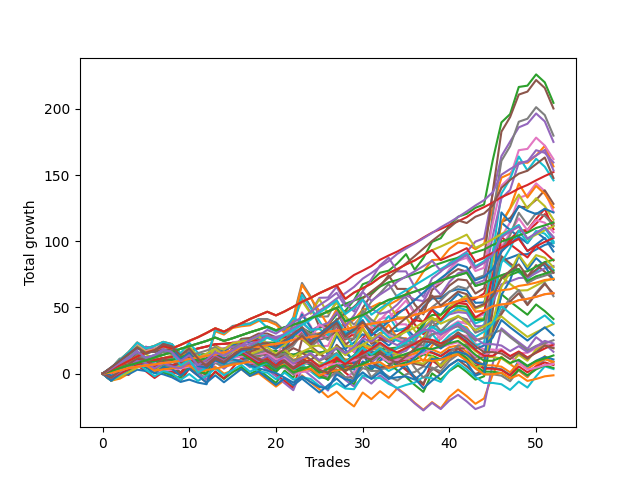

# Long Shepard 004 AB 
- Symbol: ES
- Date Range: 03/18/2022 - 07/15/2022
- Trading Period: 7:20-12:30
- Number of Trades: 52



| Name | Win Percent | Profit | Avg Profit / Trade | Avg Time / Trade |      | Name | Win Percent | Profit | Avg Profit / Trade | Avg Time / Trade |
| ---- | ----------- | ------ | ------------------ | ---------------- | ---- | ---- | ----------- | ------ | ------------------ | ---------------- |
| Sorted By <br> Profit | | | | | | Sorted By <br> Win Percentage ||||
| Two | 86.54 | 102250.00 | 1966.35 | 14:28 |     | Eighty-One | 100.00 | 35750.00 | 687.50 | 03:52 |
| Five | 63.46 | 100125.00 | 1925.48 | 25:36 |     | One Hundred Twenty-Six | 98.08 | 30375.00 | 584.13 | 03:27 |
| Seven | 65.38 | 89875.00 | 1728.37 | 28:06 |     | One Hundred Twenty-One | 98.08 | 30375.00 | 584.13 | 03:27 |
| Four | 71.15 | 87500.00 | 1682.69 | 22:32 |     | Eighty-Two | 96.15 | 57125.00 | 1098.56 | 06:41 |
| Fifty-Eight | 80.77 | 81000.00 | 1557.69 | 12:47 |     | Eighty-Three | 94.23 | 76125.00 | 1463.94 | 09:20 |
| Sixty-Six | 75.00 | 79750.00 | 1533.65 | 11:17 |     | One Hundred Twenty-Seven | 90.38 | 38875.00 | 747.60 | 06:00 |
| One | 78.85 | 78250.00 | 1504.81 | 09:38 |     | One Hundred Twenty-Two | 90.38 | 38125.00 | 733.17 | 06:03 |
| Eighty-Four | 86.54 | 76750.00 | 1475.96 | 12:23 |     | One Hundred Twenty-Three | 88.46 | 55625.00 | 1069.71 | 08:36 |
| Eighty-Three | 94.23 | 76125.00 | 1463.94 | 09:20 |     | Two | 86.54 | 102250.00 | 1966.35 | 14:28 |
| Eighty-Five | 80.77 | 73875.00 | 1420.67 | 15:27 |     | Eighty-Four | 86.54 | 76750.00 | 1475.96 | 12:23 |
| Sixty-One | 55.77 | 73000.00 | 1403.85 | 22:07 |     | One Hundred Twenty-Eight | 86.54 | 51250.00 | 985.58 | 08:20 |
| Fifty-Seven | 76.92 | 64125.00 | 1233.17 | 08:39 |     | Zero | 82.69 | 49500.00 | 951.92 | 04:10 |
| Sixty-Three | 57.69 | 62750.00 | 1206.73 | 24:38 |     | Sixty-Four | 82.69 | 43000.00 | 826.92 | 03:41 |
| Six | 65.38 | 61125.00 | 1175.48 | 26:56 |     | Fifty-Six | 82.69 | 40625.00 | 781.25 | 03:44 |
| Seventy-Three | 34.62 | 60875.00 | 1170.67 | 07:00 |     | Fifty-Eight | 80.77 | 81000.00 | 1557.69 | 12:47 |
| Sixty | 63.46 | 58125.00 | 1117.79 | 19:21 |     | Eighty-Five | 80.77 | 73875.00 | 1420.67 | 15:27 |
| Eighty-Two | 96.15 | 57125.00 | 1098.56 | 06:41 |     | One Hundred Eleven | 80.77 | 3625.00 | 69.71 | 02:21 |
| Sixty-Five | 71.15 | 56625.00 | 1088.94 | 08:07 |     | One | 78.85 | 78250.00 | 1504.81 | 09:38 |
| Sixty-Nine | 50.00 | 56000.00 | 1076.92 | 17:50 |     | Three | 78.85 | 54500.00 | 1048.08 | 15:55 |
| One Hundred Twenty-Three | 88.46 | 55625.00 | 1069.71 | 08:36 |     | One Hundred Twenty-Four | 78.85 | 50000.00 | 961.54 | 10:54 |
| Three | 78.85 | 54500.00 | 1048.08 | 15:55 |     | Fifty-Seven | 76.92 | 64125.00 | 1233.17 | 08:39 |
| Sixty-Eight | 53.85 | 53375.00 | 1026.44 | 16:00 |     | One Hundred Twenty-Nine | 76.92 | 51625.00 | 992.79 | 10:07 |
| One Hundred Twenty-Nine | 76.92 | 51625.00 | 992.79 | 10:07 |     | Forty | 76.92 | 35875.00 | 689.90 | 03:15 |
| One Hundred Twenty-Eight | 86.54 | 51250.00 | 985.58 | 08:20 |     | One Hundred Sixteen | 76.92 | -625.00 | -12.02 | 02:01 |
| One Hundred Twenty-Four | 78.85 | 50000.00 | 961.54 | 10:54 |     | Sixty-Six | 75.00 | 79750.00 | 1533.65 | 11:17 |
| Zero | 82.69 | 49500.00 | 951.92 | 04:10 |     | One Hundred Twelve | 75.00 | 12625.00 | 242.79 | 04:09 |
| Seventy-One | 51.92 | 49250.00 | 947.12 | 19:53 |     | One Hundred Twenty-Five | 73.08 | 46125.00 | 887.02 | 13:32 |
| Forty-Two | 59.62 | 48000.00 | 923.08 | 09:27 |     | Four | 71.15 | 87500.00 | 1682.69 | 22:32 |
| One Hundred Twenty-Five | 73.08 | 46125.00 | 887.02 | 13:32 |     | Sixty-Five | 71.15 | 56625.00 | 1088.94 | 08:07 |
| Sixty-Four | 82.69 | 43000.00 | 826.92 | 03:41 |     | Fifty-Nine | 71.15 | 29250.00 | 562.50 | 13:25 |
| Forty-Five | 36.54 | 42750.00 | 822.12 | 15:45 |     | One Hundred Thirteen | 69.23 | 18750.00 | 360.58 | 06:02 |
| Fifty-Six | 82.69 | 40625.00 | 781.25 | 03:44 |     | One Hundred Seventeen | 69.23 | 6875.00 | 132.21 | 03:41 |
| Seventy | 51.92 | 40125.00 | 771.63 | 19:00 |     | One Hundred Thirty | 67.31 | 38125.00 | 733.17 | 12:10 |
| Forty-One | 63.46 | 39125.00 | 752.40 | 06:34 |     | Seven | 65.38 | 89875.00 | 1728.37 | 28:06 |
| One Hundred Twenty-Seven | 90.38 | 38875.00 | 747.60 | 06:00 |     | Six | 65.38 | 61125.00 | 1175.48 | 26:56 |
| One Hundred Twenty-Two | 90.38 | 38125.00 | 733.17 | 06:03 |     | Five | 63.46 | 100125.00 | 1925.48 | 25:36 |
| One Hundred Thirty | 67.31 | 38125.00 | 733.17 | 12:10 |     | Sixty | 63.46 | 58125.00 | 1117.79 | 19:21 |
| Forty | 76.92 | 35875.00 | 689.90 | 03:15 |     | Forty-One | 63.46 | 39125.00 | 752.40 | 06:34 |
| Eighty-One | 100.00 | 35750.00 | 687.50 | 03:52 |     | Sixty-Seven | 63.46 | 30250.00 | 581.73 | 11:21 |
| Sixty-Two | 57.69 | 35500.00 | 682.69 | 23:30 |     | Forty-Eight | 63.46 | 10375.00 | 199.52 | 02:48 |
| Forty-Seven | 38.46 | 35500.00 | 682.69 | 17:40 |     | One Hundred Eighteen | 61.54 | 11000.00 | 211.54 | 05:10 |
| One Hundred Twenty-Six | 98.08 | 30375.00 | 584.13 | 03:27 |     | Forty-Two | 59.62 | 48000.00 | 923.08 | 09:27 |
| One Hundred Twenty-One | 98.08 | 30375.00 | 584.13 | 03:27 |     | One Hundred Fourteen | 59.62 | 19000.00 | 365.38 | 07:40 |
| Sixty-Seven | 63.46 | 30250.00 | 581.73 | 11:21 |     | Sixty-Three | 57.69 | 62750.00 | 1206.73 | 24:38 |
| Fifty-Nine | 71.15 | 29250.00 | 562.50 | 13:25 |     | Sixty-Two | 57.69 | 35500.00 | 682.69 | 23:30 |
| Forty-Four | 40.38 | 20625.00 | 396.63 | 13:54 |     | Sixty-One | 55.77 | 73000.00 | 1403.85 | 22:07 |
| One Hundred Fourteen | 59.62 | 19000.00 | 365.38 | 07:40 |     | Sixty-Eight | 53.85 | 53375.00 | 1026.44 | 16:00 |
| One Hundred Thirteen | 69.23 | 18750.00 | 360.58 | 06:02 |     | One Hundred Fifteen | 53.85 | 14500.00 | 278.85 | 09:01 |
| One Hundred Fifteen | 53.85 | 14500.00 | 278.85 | 09:01 |     | Seventy-One | 51.92 | 49250.00 | 947.12 | 19:53 |
| One Hundred Twelve | 75.00 | 12625.00 | 242.79 | 04:09 |     | Seventy | 51.92 | 40125.00 | 771.63 | 19:00 |
| One Hundred Ninteen | 51.92 | 11375.00 | 218.75 | 06:03 |     | One Hundred Ninteen | 51.92 | 11375.00 | 218.75 | 06:03 |
| One Hundred Eighteen | 61.54 | 11000.00 | 211.54 | 05:10 |     | Fifty | 51.92 | 9625.00 | 185.10 | 06:17 |
| Forty-Eight | 63.46 | 10375.00 | 199.52 | 02:48 |     | Forty-Nine | 51.92 | 4500.00 | 86.54 | 05:04 |
| Fifty | 51.92 | 9625.00 | 185.10 | 06:17 |     | Sixty-Nine | 50.00 | 56000.00 | 1076.92 | 17:50 |
| One Hundred Twenty | 44.23 | 9625.00 | 185.10 | 06:29 |     | Forty-Three | 50.00 | 3625.00 | 69.71 | 09:29 |
| Forty-Six | 38.46 | 8250.00 | 158.65 | 16:32 |     | Fifty-One | 46.15 | 1750.00 | 33.65 | 06:23 |
| One Hundred Seventeen | 69.23 | 6875.00 | 132.21 | 03:41 |     | One Hundred Twenty | 44.23 | 9625.00 | 185.10 | 06:29 |
| Fifty-Two | 42.31 | 5375.00 | 103.37 | 07:48 |     | Fifty-Two | 42.31 | 5375.00 | 103.37 | 07:48 |
| Forty-Nine | 51.92 | 4500.00 | 86.54 | 05:04 |     | Fifty-Three | 42.31 | 4500.00 | 86.54 | 08:25 |
| Fifty-Three | 42.31 | 4500.00 | 86.54 | 08:25 |     | Fifty-Five | 42.31 | 3250.00 | 62.50 | 09:14 |
| One Hundred Eleven | 80.77 | 3625.00 | 69.71 | 02:21 |     | Fifty-Four | 42.31 | 2125.00 | 40.87 | 08:53 |
| Forty-Three | 50.00 | 3625.00 | 69.71 | 09:29 |     | Forty-Four | 40.38 | 20625.00 | 396.63 | 13:54 |
| Fifty-Five | 42.31 | 3250.00 | 62.50 | 09:14 |     | Forty-Seven | 38.46 | 35500.00 | 682.69 | 17:40 |
| Fifty-Four | 42.31 | 2125.00 | 40.87 | 08:53 |     | Forty-Six | 38.46 | 8250.00 | 158.65 | 16:32 |
| Fifty-One | 46.15 | 1750.00 | 33.65 | 06:23 |     | Forty-Five | 36.54 | 42750.00 | 822.12 | 15:45 |
| One Hundred Sixteen | 76.92 | -625.00 | -12.02 | 02:01 |     | Seventy-Three | 34.62 | 60875.00 | 1170.67 | 07:00 |

## NO STOPLOSS

### Test Zero
* Sell when price hits the middle line of the 20p bollinger
* No Stoploss
* Results:
```
Total Trades: 52
Percent Up: 82.69
Percent Down: 17.31
Total Points Moved Up: 99.00
Potential Profit: 49500.00
Total Points Ups: 119.75 Count Ups: 43
Total Points Downs: -20.75 Count Downs: 9
```

<details><summary>Trades</summary>

<code>In: 2022-03-23 10:32:00		Out: 2022-03-23 10:38:15		Total Position Time: 06:15		Total Move Up: 1.50		Total to Date: 1.50</code> <br />
<code>In: 2022-03-23 11:17:00		Out: 2022-03-23 11:18:00		Total Position Time: 01:00		Total Move Up: 2.25		Total to Date: 3.75</code> <br />
<code>In: 2022-03-30 07:35:00		Out: 2022-03-30 07:36:25		Total Position Time: 01:25		Total Move Up: 2.00		Total to Date: 5.75</code> <br />
<code>In: 2022-03-30 12:27:00		Out: 2022-03-30 12:28:15		Total Position Time: 01:15		Total Move Up: 2.50		Total to Date: 8.25</code> <br />
<code>In: 2022-03-31 09:37:00		Out: 2022-03-31 09:37:10		Total Position Time: 00:10		Total Move Up: 0.50		Total to Date: 8.75</code> <br />
<code>In: 2022-03-31 10:02:00		Out: 2022-03-31 10:04:00		Total Position Time: 02:00		Total Move Up: 0.75		Total to Date: 9.50</code> <br />
<code>In: 2022-03-31 10:19:00		Out: 2022-03-31 10:19:10		Total Position Time: 00:10		Total Move Up: 0.50		Total to Date: 10.00</code> <br />
<code>In: 2022-03-31 11:21:00		Out: 2022-03-31 11:22:10		Total Position Time: 01:10		Total Move Up: 0.75		Total to Date: 10.75</code> <br />
<code>In: 2022-04-01 08:48:00		Out: 2022-04-01 08:53:05		Total Position Time: 05:05		Total Move Up: 0.00		Total to Date: 10.75</code> <br />
<code>In: 2022-04-01 10:23:00		Out: 2022-04-01 10:23:20		Total Position Time: 00:20		Total Move Up: 2.00		Total to Date: 12.75</code> <br />
<code>In: 2022-04-05 12:17:00		Out: 2022-04-05 12:23:40		Total Position Time: 06:40		Total Move Up: 1.25		Total to Date: 14.00</code> <br />
<code>In: 2022-04-07 08:36:00		Out: 2022-04-07 08:36:10		Total Position Time: 00:10		Total Move Up: 0.75		Total to Date: 14.75</code> <br />
<code>In: 2022-04-07 09:52:00		Out: 2022-04-07 09:52:55		Total Position Time: 00:55		Total Move Up: 1.00		Total to Date: 15.75</code> <br />
<code>In: 2022-04-11 07:39:00		Out: 2022-04-11 07:51:10		Total Position Time: 12:10		Total Move Up: -1.00		Total to Date: 14.75</code> <br />
<code>In: 2022-04-11 08:18:00		Out: 2022-04-11 08:26:20		Total Position Time: 08:20		Total Move Up: 0.00		Total to Date: 14.75</code> <br />
<code>In: 2022-04-11 08:27:00		Out: 2022-04-11 08:27:10		Total Position Time: 00:10		Total Move Up: -0.75		Total to Date: 14.00</code> <br />
<code>In: 2022-04-12 09:32:00		Out: 2022-04-12 09:41:30		Total Position Time: 09:30		Total Move Up: 0.25		Total to Date: 14.25</code> <br />
<code>In: 2022-04-18 09:21:00		Out: 2022-04-18 09:32:05		Total Position Time: 11:05		Total Move Up: 0.00		Total to Date: 14.25</code> <br />
<code>In: 2022-04-21 07:58:00		Out: 2022-04-21 08:01:10		Total Position Time: 03:10		Total Move Up: 2.75		Total to Date: 17.00</code> <br />
<code>In: 2022-04-21 09:12:00		Out: 2022-04-21 09:19:05		Total Position Time: 07:05		Total Move Up: 0.25		Total to Date: 17.25</code> <br />
<code>In: 2022-04-22 11:07:00		Out: 2022-04-22 11:17:10		Total Position Time: 10:10		Total Move Up: -1.50		Total to Date: 15.75</code> <br />
<code>In: 2022-04-22 12:00:00		Out: 2022-04-22 12:07:25		Total Position Time: 07:25		Total Move Up: -1.50		Total to Date: 14.25</code> <br />
<code>In: 2022-04-28 07:43:00		Out: 2022-04-28 07:44:10		Total Position Time: 01:10		Total Move Up: 2.00		Total to Date: 16.25</code> <br />
<code>In: 2022-04-29 11:58:00		Out: 2022-04-29 11:58:10		Total Position Time: 00:10		Total Move Up: 0.75		Total to Date: 17.00</code> <br />
<code>In: 2022-05-02 10:56:00		Out: 2022-05-02 10:59:15		Total Position Time: 03:15		Total Move Up: -1.25		Total to Date: 15.75</code> <br />
<code>In: 2022-05-02 11:22:00		Out: 2022-05-02 11:28:05		Total Position Time: 06:05		Total Move Up: 1.50		Total to Date: 17.25</code> <br />
<code>In: 2022-05-04 08:37:00		Out: 2022-05-04 08:39:20		Total Position Time: 02:20		Total Move Up: 2.00		Total to Date: 19.25</code> <br />
<code>In: 2022-05-09 07:35:00		Out: 2022-05-09 07:42:30		Total Position Time: 07:30		Total Move Up: -0.50		Total to Date: 18.75</code> <br />
<code>In: 2022-05-09 07:42:00		Out: 2022-05-09 07:42:30		Total Position Time: 00:30		Total Move Up: 4.75		Total to Date: 23.50</code> <br />
<code>In: 2022-05-09 08:34:00		Out: 2022-05-09 08:35:10		Total Position Time: 01:10		Total Move Up: 6.25		Total to Date: 29.75</code> <br />
<code>In: 2022-05-11 10:50:00		Out: 2022-05-11 11:00:40		Total Position Time: 10:40		Total Move Up: -4.00		Total to Date: 25.75</code> <br />
<code>In: 2022-05-12 11:45:00		Out: 2022-05-12 11:45:20		Total Position Time: 00:20		Total Move Up: 5.00		Total to Date: 30.75</code> <br />
<code>In: 2022-05-12 11:46:00		Out: 2022-05-12 11:46:10		Total Position Time: 00:10		Total Move Up: 0.75		Total to Date: 31.50</code> <br />
<code>In: 2022-05-18 07:40:00		Out: 2022-05-18 07:46:05		Total Position Time: 06:05		Total Move Up: 0.75		Total to Date: 32.25</code> <br />
<code>In: 2022-05-18 09:12:00		Out: 2022-05-18 09:14:45		Total Position Time: 02:45		Total Move Up: 2.25		Total to Date: 34.50</code> <br />
<code>In: 2022-05-20 09:48:00		Out: 2022-05-20 09:50:00		Total Position Time: 02:00		Total Move Up: 7.00		Total to Date: 41.50</code> <br />
<code>In: 2022-05-24 07:21:00		Out: 2022-05-24 07:23:15		Total Position Time: 02:15		Total Move Up: 9.00		Total to Date: 50.50</code> <br />
<code>In: 2022-06-02 07:30:00		Out: 2022-06-02 07:34:10		Total Position Time: 04:10		Total Move Up: 6.25		Total to Date: 56.75</code> <br />
<code>In: 2022-06-06 09:17:00		Out: 2022-06-06 09:26:35		Total Position Time: 09:35		Total Move Up: 0.25		Total to Date: 57.00</code> <br />
<code>In: 2022-06-08 10:41:00		Out: 2022-06-08 10:42:15		Total Position Time: 01:15		Total Move Up: 5.00		Total to Date: 62.00</code> <br />
<code>In: 2022-06-08 10:42:00		Out: 2022-06-08 10:42:15		Total Position Time: 00:15		Total Move Up: 1.75		Total to Date: 63.75</code> <br />
<code>In: 2022-06-08 11:31:00		Out: 2022-06-08 11:31:10		Total Position Time: 00:10		Total Move Up: -0.75		Total to Date: 63.00</code> <br />
<code>In: 2022-06-14 07:23:00		Out: 2022-06-14 07:46:40		Total Position Time: 23:40		Total Move Up: -9.50		Total to Date: 53.50</code> <br />
<code>In: 2022-06-15 08:23:00		Out: 2022-06-15 08:32:00		Total Position Time: 09:00		Total Move Up: 0.25		Total to Date: 53.75</code> <br />
<code>In: 2022-06-15 11:36:00		Out: 2022-06-15 11:38:05		Total Position Time: 02:05		Total Move Up: 18.25		Total to Date: 72.00</code> <br />
<code>In: 2022-06-15 11:37:00		Out: 2022-06-15 11:38:05		Total Position Time: 01:05		Total Move Up: 13.25		Total to Date: 85.25</code> <br />
<code>In: 2022-06-16 07:55:00		Out: 2022-06-16 08:01:50		Total Position Time: 06:50		Total Move Up: 2.25		Total to Date: 87.50</code> <br />
<code>In: 2022-06-16 11:57:00		Out: 2022-06-16 12:00:25		Total Position Time: 03:25		Total Move Up: 2.50		Total to Date: 90.00</code> <br />
<code>In: 2022-06-23 09:49:00		Out: 2022-06-23 09:49:10		Total Position Time: 00:10		Total Move Up: 0.25		Total to Date: 90.25</code> <br />
<code>In: 2022-06-29 09:32:00		Out: 2022-06-29 09:36:40		Total Position Time: 04:40		Total Move Up: 3.50		Total to Date: 93.75</code> <br />
<code>In: 2022-07-06 08:12:00		Out: 2022-07-06 08:14:30		Total Position Time: 02:30		Total Move Up: 3.50		Total to Date: 97.25</code> <br />
<code>In: 2022-07-12 12:14:00		Out: 2022-07-12 12:20:15		Total Position Time: 06:15		Total Move Up: 1.75		Total to Date: 99.00</code> <br />


</details>

### Test One
* Sell when the price hits the upper line of the 20p 1std bollinger
* No Stoploss
* Results:
```
Total Trades: 52
Percent Up: 78.85
Percent Down: 21.15
Total Points Moved Up: 156.50
Potential Profit: 78250.00
Total Points Ups: 187.75 Count Ups: 41
Total Points Downs: -31.25 Count Downs: 11
```

<details><summary>Trades</summary>

<code>In: 2022-03-23 10:32:00		Out: 2022-03-23 10:51:45		Total Position Time: 19:45		Total Move Up: 0.50		Total to Date: 0.50</code> <br />
<code>In: 2022-03-23 11:17:00		Out: 2022-03-23 11:26:15		Total Position Time: 09:15		Total Move Up: 2.50		Total to Date: 3.00</code> <br />
<code>In: 2022-03-30 07:35:00		Out: 2022-03-30 07:38:35		Total Position Time: 03:35		Total Move Up: 3.25		Total to Date: 6.25</code> <br />
<code>In: 2022-03-30 12:27:00		Out: 2022-03-30 12:32:20		Total Position Time: 05:20		Total Move Up: 4.75		Total to Date: 11.00</code> <br />
<code>In: 2022-03-31 09:37:00		Out: 2022-03-31 09:40:25		Total Position Time: 03:25		Total Move Up: 0.25		Total to Date: 11.25</code> <br />
<code>In: 2022-03-31 10:02:00		Out: 2022-03-31 10:19:20		Total Position Time: 17:20		Total Move Up: -1.00		Total to Date: 10.25</code> <br />
<code>In: 2022-03-31 10:19:00		Out: 2022-03-31 10:19:20		Total Position Time: 00:20		Total Move Up: 1.50		Total to Date: 11.75</code> <br />
<code>In: 2022-03-31 11:21:00		Out: 2022-03-31 11:29:15		Total Position Time: 08:15		Total Move Up: 1.00		Total to Date: 12.75</code> <br />
<code>In: 2022-04-01 08:48:00		Out: 2022-04-01 08:54:05		Total Position Time: 06:05		Total Move Up: 2.50		Total to Date: 15.25</code> <br />
<code>In: 2022-04-01 10:23:00		Out: 2022-04-01 10:29:05		Total Position Time: 06:05		Total Move Up: 2.00		Total to Date: 17.25</code> <br />
<code>In: 2022-04-05 12:17:00		Out: 2022-04-05 12:25:05		Total Position Time: 08:05		Total Move Up: 1.75		Total to Date: 19.00</code> <br />
<code>In: 2022-04-07 08:36:00		Out: 2022-04-07 08:47:05		Total Position Time: 11:05		Total Move Up: 1.50		Total to Date: 20.50</code> <br />
<code>In: 2022-04-07 09:52:00		Out: 2022-04-07 09:59:05		Total Position Time: 07:05		Total Move Up: 1.75		Total to Date: 22.25</code> <br />
<code>In: 2022-04-11 07:39:00		Out: 2022-04-11 07:52:00		Total Position Time: 13:00		Total Move Up: 0.25		Total to Date: 22.50</code> <br />
<code>In: 2022-04-11 08:18:00		Out: 2022-04-11 08:29:55		Total Position Time: 11:55		Total Move Up: 0.75		Total to Date: 23.25</code> <br />
<code>In: 2022-04-11 08:27:00		Out: 2022-04-11 08:29:55		Total Position Time: 02:55		Total Move Up: -0.25		Total to Date: 23.00</code> <br />
<code>In: 2022-04-12 09:32:00		Out: 2022-04-12 09:50:15		Total Position Time: 18:15		Total Move Up: 2.25		Total to Date: 25.25</code> <br />
<code>In: 2022-04-18 09:21:00		Out: 2022-04-18 09:35:10		Total Position Time: 14:10		Total Move Up: -0.25		Total to Date: 25.00</code> <br />
<code>In: 2022-04-21 07:58:00		Out: 2022-04-21 08:05:05		Total Position Time: 07:05		Total Move Up: 3.25		Total to Date: 28.25</code> <br />
<code>In: 2022-04-21 09:12:00		Out: 2022-04-21 09:34:10		Total Position Time: 22:10		Total Move Up: -1.75		Total to Date: 26.50</code> <br />
<code>In: 2022-04-22 11:07:00		Out: 2022-04-22 11:17:15		Total Position Time: 10:15		Total Move Up: 1.00		Total to Date: 27.50</code> <br />
<code>In: 2022-04-22 12:00:00		Out: 2022-04-22 12:11:50		Total Position Time: 11:50		Total Move Up: 2.00		Total to Date: 29.50</code> <br />
<code>In: 2022-04-28 07:43:00		Out: 2022-04-28 07:46:35		Total Position Time: 03:35		Total Move Up: 5.25		Total to Date: 34.75</code> <br />
<code>In: 2022-04-29 11:58:00		Out: 2022-04-29 12:24:15		Total Position Time: 26:15		Total Move Up: -5.00		Total to Date: 29.75</code> <br />
<code>In: 2022-05-02 10:56:00		Out: 2022-05-02 11:02:25		Total Position Time: 06:25		Total Move Up: 0.75		Total to Date: 30.50</code> <br />
<code>In: 2022-05-02 11:22:00		Out: 2022-05-02 11:32:10		Total Position Time: 10:10		Total Move Up: 1.50		Total to Date: 32.00</code> <br />
<code>In: 2022-05-04 08:37:00		Out: 2022-05-04 08:40:55		Total Position Time: 03:55		Total Move Up: 5.00		Total to Date: 37.00</code> <br />
<code>In: 2022-05-09 07:35:00		Out: 2022-05-09 07:45:10		Total Position Time: 10:10		Total Move Up: -0.75		Total to Date: 36.25</code> <br />
<code>In: 2022-05-09 07:42:00		Out: 2022-05-09 07:45:10		Total Position Time: 03:10		Total Move Up: 4.50		Total to Date: 40.75</code> <br />
<code>In: 2022-05-09 08:34:00		Out: 2022-05-09 08:38:35		Total Position Time: 04:35		Total Move Up: 7.50		Total to Date: 48.25</code> <br />
<code>In: 2022-05-11 10:50:00		Out: 2022-05-11 11:01:20		Total Position Time: 11:20		Total Move Up: 2.00		Total to Date: 50.25</code> <br />
<code>In: 2022-05-12 11:45:00		Out: 2022-05-12 11:52:05		Total Position Time: 07:05		Total Move Up: 3.25		Total to Date: 53.50</code> <br />
<code>In: 2022-05-12 11:46:00		Out: 2022-05-12 11:52:05		Total Position Time: 06:05		Total Move Up: -1.50		Total to Date: 52.00</code> <br />
<code>In: 2022-05-18 07:40:00		Out: 2022-05-18 07:46:45		Total Position Time: 06:45		Total Move Up: 3.50		Total to Date: 55.50</code> <br />
<code>In: 2022-05-18 09:12:00		Out: 2022-05-18 09:16:25		Total Position Time: 04:25		Total Move Up: 4.75		Total to Date: 60.25</code> <br />
<code>In: 2022-05-20 09:48:00		Out: 2022-05-20 09:56:10		Total Position Time: 08:10		Total Move Up: 6.75		Total to Date: 67.00</code> <br />
<code>In: 2022-05-24 07:21:00		Out: 2022-05-24 07:29:45		Total Position Time: 08:45		Total Move Up: 10.00		Total to Date: 77.00</code> <br />
<code>In: 2022-06-02 07:30:00		Out: 2022-06-02 07:38:35		Total Position Time: 08:35		Total Move Up: 8.75		Total to Date: 85.75</code> <br />
<code>In: 2022-06-06 09:17:00		Out: 2022-06-06 09:37:35		Total Position Time: 20:35		Total Move Up: 0.50		Total to Date: 86.25</code> <br />
<code>In: 2022-06-08 10:41:00		Out: 2022-06-08 10:47:05		Total Position Time: 06:05		Total Move Up: 8.00		Total to Date: 94.25</code> <br />
<code>In: 2022-06-08 10:42:00		Out: 2022-06-08 10:47:05		Total Position Time: 05:05		Total Move Up: 4.75		Total to Date: 99.00</code> <br />
<code>In: 2022-06-08 11:31:00		Out: 2022-06-08 11:43:05		Total Position Time: 12:05		Total Move Up: -0.75		Total to Date: 98.25</code> <br />
<code>In: 2022-06-14 07:23:00		Out: 2022-06-14 07:47:10		Total Position Time: 24:10		Total Move Up: -4.25		Total to Date: 94.00</code> <br />
<code>In: 2022-06-15 08:23:00		Out: 2022-06-15 08:38:55		Total Position Time: 15:55		Total Move Up: 4.00		Total to Date: 98.00</code> <br />
<code>In: 2022-06-15 11:36:00		Out: 2022-06-15 11:38:10		Total Position Time: 02:10		Total Move Up: 27.50		Total to Date: 125.50</code> <br />
<code>In: 2022-06-15 11:37:00		Out: 2022-06-15 11:38:10		Total Position Time: 01:10		Total Move Up: 22.50		Total to Date: 148.00</code> <br />
<code>In: 2022-06-16 07:55:00		Out: 2022-06-16 08:11:25		Total Position Time: 16:25		Total Move Up: 3.00		Total to Date: 151.00</code> <br />
<code>In: 2022-06-16 11:57:00		Out: 2022-06-16 12:01:45		Total Position Time: 04:45		Total Move Up: 8.50		Total to Date: 159.50</code> <br />
<code>In: 2022-06-23 09:49:00		Out: 2022-06-23 09:54:10		Total Position Time: 05:10		Total Move Up: -0.25		Total to Date: 159.25</code> <br />
<code>In: 2022-06-29 09:32:00		Out: 2022-06-29 09:37:15		Total Position Time: 05:15		Total Move Up: 5.50		Total to Date: 164.75</code> <br />
<code>In: 2022-07-06 08:12:00		Out: 2022-07-06 08:17:50		Total Position Time: 05:50		Total Move Up: 7.25		Total to Date: 172.00</code> <br />
<code>In: 2022-07-12 12:14:00		Out: 2022-07-12 12:43:55		Total Position Time: 29:55		Total Move Up: -15.50		Total to Date: 156.50</code> <br />


</details>

### Test Two
* Sell when the price hits the upper line of the 20p 2std bollinger
* No Stoploss
* Results:
```
Total Trades: 52
Percent Up: 86.54
Percent Down: 13.46
Total Points Moved Up: 204.50
Potential Profit: 102250.00
Total Points Ups: 261.00 Count Ups: 45
Total Points Downs: -56.50 Count Downs: 7
```

<details><summary>Trades</summary>

<code>In: 2022-03-23 10:32:00		Out: 2022-03-23 10:54:25		Total Position Time: 22:25		Total Move Up: 2.50		Total to Date: 2.50</code> <br />
<code>In: 2022-03-23 11:17:00		Out: 2022-03-23 11:27:00		Total Position Time: 10:00		Total Move Up: 4.50		Total to Date: 7.00</code> <br />
<code>In: 2022-03-30 07:35:00		Out: 2022-03-30 07:46:00		Total Position Time: 11:00		Total Move Up: 3.75		Total to Date: 10.75</code> <br />
<code>In: 2022-03-30 12:27:00		Out: 2022-03-30 12:36:20		Total Position Time: 09:20		Total Move Up: 7.50		Total to Date: 18.25</code> <br />
<code>In: 2022-03-31 09:37:00		Out: 2022-03-31 09:44:20		Total Position Time: 07:20		Total Move Up: 2.00		Total to Date: 20.25</code> <br />
<code>In: 2022-03-31 10:02:00		Out: 2022-03-31 10:27:00		Total Position Time: 25:00		Total Move Up: -1.50		Total to Date: 18.75</code> <br />
<code>In: 2022-03-31 10:19:00		Out: 2022-03-31 10:27:00		Total Position Time: 08:00		Total Move Up: 1.00		Total to Date: 19.75</code> <br />
<code>In: 2022-03-31 11:21:00		Out: 2022-03-31 11:29:25		Total Position Time: 08:25		Total Move Up: 2.00		Total to Date: 21.75</code> <br />
<code>In: 2022-04-01 08:48:00		Out: 2022-04-01 09:17:55		Total Position Time: 29:55		Total Move Up: -10.00		Total to Date: 11.75</code> <br />
<code>In: 2022-04-01 10:23:00		Out: 2022-04-01 10:30:25		Total Position Time: 07:25		Total Move Up: 3.00		Total to Date: 14.75</code> <br />
<code>In: 2022-04-05 12:17:00		Out: 2022-04-05 12:46:00		Total Position Time: 29:00		Total Move Up: -8.50		Total to Date: 6.25</code> <br />
<code>In: 2022-04-07 08:36:00		Out: 2022-04-07 08:47:35		Total Position Time: 11:35		Total Move Up: 3.50		Total to Date: 9.75</code> <br />
<code>In: 2022-04-07 09:52:00		Out: 2022-04-07 10:01:25		Total Position Time: 09:25		Total Move Up: 3.50		Total to Date: 13.25</code> <br />
<code>In: 2022-04-11 07:39:00		Out: 2022-04-11 07:54:25		Total Position Time: 15:25		Total Move Up: 1.50		Total to Date: 14.75</code> <br />
<code>In: 2022-04-11 08:18:00		Out: 2022-04-11 08:30:15		Total Position Time: 12:15		Total Move Up: 1.25		Total to Date: 16.00</code> <br />
<code>In: 2022-04-11 08:27:00		Out: 2022-04-11 08:30:15		Total Position Time: 03:15		Total Move Up: 0.25		Total to Date: 16.25</code> <br />
<code>In: 2022-04-12 09:32:00		Out: 2022-04-12 09:50:15		Total Position Time: 18:15		Total Move Up: 2.25		Total to Date: 18.50</code> <br />
<code>In: 2022-04-18 09:21:00		Out: 2022-04-18 09:35:25		Total Position Time: 14:25		Total Move Up: 1.00		Total to Date: 19.50</code> <br />
<code>In: 2022-04-21 07:58:00		Out: 2022-04-21 08:11:45		Total Position Time: 13:45		Total Move Up: 4.00		Total to Date: 23.50</code> <br />
<code>In: 2022-04-21 09:12:00		Out: 2022-04-21 09:35:40		Total Position Time: 23:40		Total Move Up: 0.00		Total to Date: 23.50</code> <br />
<code>In: 2022-04-22 11:07:00		Out: 2022-04-22 11:17:35		Total Position Time: 10:35		Total Move Up: 1.75		Total to Date: 25.25</code> <br />
<code>In: 2022-04-22 12:00:00		Out: 2022-04-22 12:11:50		Total Position Time: 11:50		Total Move Up: 2.00		Total to Date: 27.25</code> <br />
<code>In: 2022-04-28 07:43:00		Out: 2022-04-28 07:47:25		Total Position Time: 04:25		Total Move Up: 7.00		Total to Date: 34.25</code> <br />
<code>In: 2022-04-29 11:58:00		Out: 2022-04-29 12:25:35		Total Position Time: 27:35		Total Move Up: -3.25		Total to Date: 31.00</code> <br />
<code>In: 2022-05-02 10:56:00		Out: 2022-05-02 11:03:45		Total Position Time: 07:45		Total Move Up: 3.50		Total to Date: 34.50</code> <br />
<code>In: 2022-05-02 11:22:00		Out: 2022-05-02 11:32:45		Total Position Time: 10:45		Total Move Up: 2.25		Total to Date: 36.75</code> <br />
<code>In: 2022-05-04 08:37:00		Out: 2022-05-04 08:47:05		Total Position Time: 10:05		Total Move Up: 8.00		Total to Date: 44.75</code> <br />
<code>In: 2022-05-09 07:35:00		Out: 2022-05-09 07:48:05		Total Position Time: 13:05		Total Move Up: 2.75		Total to Date: 47.50</code> <br />
<code>In: 2022-05-09 07:42:00		Out: 2022-05-09 07:48:05		Total Position Time: 06:05		Total Move Up: 8.00		Total to Date: 55.50</code> <br />
<code>In: 2022-05-09 08:34:00		Out: 2022-05-09 08:39:15		Total Position Time: 05:15		Total Move Up: 12.00		Total to Date: 67.50</code> <br />
<code>In: 2022-05-11 10:50:00		Out: 2022-05-11 11:02:35		Total Position Time: 12:35		Total Move Up: 2.50		Total to Date: 70.00</code> <br />
<code>In: 2022-05-12 11:45:00		Out: 2022-05-12 11:53:00		Total Position Time: 08:00		Total Move Up: 6.25		Total to Date: 76.25</code> <br />
<code>In: 2022-05-12 11:46:00		Out: 2022-05-12 11:53:00		Total Position Time: 07:00		Total Move Up: 1.50		Total to Date: 77.75</code> <br />
<code>In: 2022-05-18 07:40:00		Out: 2022-05-18 07:48:35		Total Position Time: 08:35		Total Move Up: 5.50		Total to Date: 83.25</code> <br />
<code>In: 2022-05-18 09:12:00		Out: 2022-05-18 09:17:50		Total Position Time: 05:50		Total Move Up: 7.00		Total to Date: 90.25</code> <br />
<code>In: 2022-05-20 09:48:00		Out: 2022-05-20 10:17:55		Total Position Time: 29:55		Total Move Up: -11.75		Total to Date: 78.50</code> <br />
<code>In: 2022-05-24 07:21:00		Out: 2022-05-24 07:43:15		Total Position Time: 22:15		Total Move Up: 8.75		Total to Date: 87.25</code> <br />
<code>In: 2022-06-02 07:30:00		Out: 2022-06-02 07:42:40		Total Position Time: 12:40		Total Move Up: 12.25		Total to Date: 99.50</code> <br />
<code>In: 2022-06-06 09:17:00		Out: 2022-06-06 09:41:45		Total Position Time: 24:45		Total Move Up: 2.75		Total to Date: 102.25</code> <br />
<code>In: 2022-06-08 10:41:00		Out: 2022-06-08 11:03:45		Total Position Time: 22:45		Total Move Up: 9.75		Total to Date: 112.00</code> <br />
<code>In: 2022-06-08 10:42:00		Out: 2022-06-08 11:03:45		Total Position Time: 21:45		Total Move Up: 6.50		Total to Date: 118.50</code> <br />
<code>In: 2022-06-08 11:31:00		Out: 2022-06-08 11:43:35		Total Position Time: 12:35		Total Move Up: 2.25		Total to Date: 120.75</code> <br />
<code>In: 2022-06-14 07:23:00		Out: 2022-06-14 07:51:00		Total Position Time: 28:00		Total Move Up: 4.50		Total to Date: 125.25</code> <br />
<code>In: 2022-06-15 08:23:00		Out: 2022-06-15 08:52:55		Total Position Time: 29:55		Total Move Up: 2.50		Total to Date: 127.75</code> <br />
<code>In: 2022-06-15 11:36:00		Out: 2022-06-15 11:38:50		Total Position Time: 02:50		Total Move Up: 33.50		Total to Date: 161.25</code> <br />
<code>In: 2022-06-15 11:37:00		Out: 2022-06-15 11:38:50		Total Position Time: 01:50		Total Move Up: 28.50		Total to Date: 189.75</code> <br />
<code>In: 2022-06-16 07:55:00		Out: 2022-06-16 08:11:45		Total Position Time: 16:45		Total Move Up: 6.25		Total to Date: 196.00</code> <br />
<code>In: 2022-06-16 11:57:00		Out: 2022-06-16 12:10:15		Total Position Time: 13:15		Total Move Up: 20.50		Total to Date: 216.50</code> <br />
<code>In: 2022-06-23 09:49:00		Out: 2022-06-23 09:56:50		Total Position Time: 07:50		Total Move Up: 1.00		Total to Date: 217.50</code> <br />
<code>In: 2022-06-29 09:32:00		Out: 2022-06-29 09:38:30		Total Position Time: 06:30		Total Move Up: 8.50		Total to Date: 226.00</code> <br />
<code>In: 2022-07-06 08:12:00		Out: 2022-07-06 08:41:55		Total Position Time: 29:55		Total Move Up: -6.00		Total to Date: 220.00</code> <br />
<code>In: 2022-07-12 12:14:00		Out: 2022-07-12 12:43:55		Total Position Time: 29:55		Total Move Up: -15.50		Total to Date: 204.50</code> <br />


</details>

### Test Three
* Sell when price hits the middle line of the 50p bollinger
* No Stoploss
* Results:
```
Total Trades: 52
Percent Up: 78.85
Percent Down: 21.15
Total Points Moved Up: 109.00
Potential Profit: 54500.00
Total Points Ups: 197.25 Count Ups: 41
Total Points Downs: -88.25 Count Downs: 11
```

<details><summary>Trades</summary>

<code>In: 2022-03-23 10:32:00		Out: 2022-03-23 10:54:30		Total Position Time: 22:30		Total Move Up: 3.25		Total to Date: 3.25</code> <br />
<code>In: 2022-03-23 11:17:00		Out: 2022-03-23 11:17:20		Total Position Time: 00:20		Total Move Up: 1.50		Total to Date: 4.75</code> <br />
<code>In: 2022-03-30 07:35:00		Out: 2022-03-30 07:46:00		Total Position Time: 11:00		Total Move Up: 3.75		Total to Date: 8.50</code> <br />
<code>In: 2022-03-30 12:27:00		Out: 2022-03-30 12:33:25		Total Position Time: 06:25		Total Move Up: 6.50		Total to Date: 15.00</code> <br />
<code>In: 2022-03-31 09:37:00		Out: 2022-03-31 09:45:45		Total Position Time: 08:45		Total Move Up: 2.50		Total to Date: 17.50</code> <br />
<code>In: 2022-03-31 10:02:00		Out: 2022-03-31 10:27:25		Total Position Time: 25:25		Total Move Up: -1.00		Total to Date: 16.50</code> <br />
<code>In: 2022-03-31 10:19:00		Out: 2022-03-31 10:27:25		Total Position Time: 08:25		Total Move Up: 1.50		Total to Date: 18.00</code> <br />
<code>In: 2022-03-31 11:21:00		Out: 2022-03-31 11:49:05		Total Position Time: 28:05		Total Move Up: 0.25		Total to Date: 18.25</code> <br />
<code>In: 2022-04-01 08:48:00		Out: 2022-04-01 09:17:55		Total Position Time: 29:55		Total Move Up: -10.00		Total to Date: 8.25</code> <br />
<code>In: 2022-04-01 10:23:00		Out: 2022-04-01 10:30:40		Total Position Time: 07:40		Total Move Up: 3.75		Total to Date: 12.00</code> <br />
<code>In: 2022-04-05 12:17:00		Out: 2022-04-05 12:46:00		Total Position Time: 29:00		Total Move Up: -8.50		Total to Date: 3.50</code> <br />
<code>In: 2022-04-07 08:36:00		Out: 2022-04-07 08:47:35		Total Position Time: 11:35		Total Move Up: 3.50		Total to Date: 7.00</code> <br />
<code>In: 2022-04-07 09:52:00		Out: 2022-04-07 09:59:10		Total Position Time: 07:10		Total Move Up: 2.50		Total to Date: 9.50</code> <br />
<code>In: 2022-04-11 07:39:00		Out: 2022-04-11 08:08:55		Total Position Time: 29:55		Total Move Up: -2.50		Total to Date: 7.00</code> <br />
<code>In: 2022-04-11 08:18:00		Out: 2022-04-11 08:30:55		Total Position Time: 12:55		Total Move Up: 2.25		Total to Date: 9.25</code> <br />
<code>In: 2022-04-11 08:27:00		Out: 2022-04-11 08:30:55		Total Position Time: 03:55		Total Move Up: 1.25		Total to Date: 10.50</code> <br />
<code>In: 2022-04-12 09:32:00		Out: 2022-04-12 09:59:05		Total Position Time: 27:05		Total Move Up: 2.00		Total to Date: 12.50</code> <br />
<code>In: 2022-04-18 09:21:00		Out: 2022-04-18 09:45:10		Total Position Time: 24:10		Total Move Up: 2.00		Total to Date: 14.50</code> <br />
<code>In: 2022-04-21 07:58:00		Out: 2022-04-21 08:27:15		Total Position Time: 29:15		Total Move Up: 1.75		Total to Date: 16.25</code> <br />
<code>In: 2022-04-21 09:12:00		Out: 2022-04-21 09:41:55		Total Position Time: 29:55		Total Move Up: -2.75		Total to Date: 13.50</code> <br />
<code>In: 2022-04-22 11:07:00		Out: 2022-04-22 11:17:55		Total Position Time: 10:55		Total Move Up: 5.00		Total to Date: 18.50</code> <br />
<code>In: 2022-04-22 12:00:00		Out: 2022-04-22 12:12:55		Total Position Time: 12:55		Total Move Up: 4.25		Total to Date: 22.75</code> <br />
<code>In: 2022-04-28 07:43:00		Out: 2022-04-28 07:56:00		Total Position Time: 13:00		Total Move Up: 8.75		Total to Date: 31.50</code> <br />
<code>In: 2022-04-29 11:58:00		Out: 2022-04-29 12:27:55		Total Position Time: 29:55		Total Move Up: -10.25		Total to Date: 21.25</code> <br />
<code>In: 2022-05-02 10:56:00		Out: 2022-05-02 11:04:00		Total Position Time: 08:00		Total Move Up: 5.25		Total to Date: 26.50</code> <br />
<code>In: 2022-05-02 11:22:00		Out: 2022-05-02 11:45:55		Total Position Time: 23:55		Total Move Up: 4.25		Total to Date: 30.75</code> <br />
<code>In: 2022-05-04 08:37:00		Out: 2022-05-04 08:41:00		Total Position Time: 04:00		Total Move Up: 4.25		Total to Date: 35.00</code> <br />
<code>In: 2022-05-09 07:35:00		Out: 2022-05-09 08:04:55		Total Position Time: 29:55		Total Move Up: -12.50		Total to Date: 22.50</code> <br />
<code>In: 2022-05-09 07:42:00		Out: 2022-05-09 08:11:55		Total Position Time: 29:55		Total Move Up: -6.00		Total to Date: 16.50</code> <br />
<code>In: 2022-05-09 08:34:00		Out: 2022-05-09 08:39:00		Total Position Time: 05:00		Total Move Up: 10.50		Total to Date: 27.00</code> <br />
<code>In: 2022-05-11 10:50:00		Out: 2022-05-11 11:04:45		Total Position Time: 14:45		Total Move Up: 4.75		Total to Date: 31.75</code> <br />
<code>In: 2022-05-12 11:45:00		Out: 2022-05-12 11:53:05		Total Position Time: 08:05		Total Move Up: 6.00		Total to Date: 37.75</code> <br />
<code>In: 2022-05-12 11:46:00		Out: 2022-05-12 11:53:05		Total Position Time: 07:05		Total Move Up: 1.25		Total to Date: 39.00</code> <br />
<code>In: 2022-05-18 07:40:00		Out: 2022-05-18 07:48:45		Total Position Time: 08:45		Total Move Up: 7.25		Total to Date: 46.25</code> <br />
<code>In: 2022-05-18 09:12:00		Out: 2022-05-18 09:36:05		Total Position Time: 24:05		Total Move Up: 2.75		Total to Date: 49.00</code> <br />
<code>In: 2022-05-20 09:48:00		Out: 2022-05-20 10:17:55		Total Position Time: 29:55		Total Move Up: -11.75		Total to Date: 37.25</code> <br />
<code>In: 2022-05-24 07:21:00		Out: 2022-05-24 07:50:55		Total Position Time: 29:55		Total Move Up: -7.50		Total to Date: 29.75</code> <br />
<code>In: 2022-06-02 07:30:00		Out: 2022-06-02 07:31:30		Total Position Time: 01:30		Total Move Up: 5.75		Total to Date: 35.50</code> <br />
<code>In: 2022-06-06 09:17:00		Out: 2022-06-06 09:43:15		Total Position Time: 26:15		Total Move Up: 4.25		Total to Date: 39.75</code> <br />
<code>In: 2022-06-08 10:41:00		Out: 2022-06-08 10:47:20		Total Position Time: 06:20		Total Move Up: 8.75		Total to Date: 48.50</code> <br />
<code>In: 2022-06-08 10:42:00		Out: 2022-06-08 10:47:20		Total Position Time: 05:20		Total Move Up: 5.50		Total to Date: 54.00</code> <br />
<code>In: 2022-06-08 11:31:00		Out: 2022-06-08 11:43:20		Total Position Time: 12:20		Total Move Up: 0.75		Total to Date: 54.75</code> <br />
<code>In: 2022-06-14 07:23:00		Out: 2022-06-14 07:50:00		Total Position Time: 27:00		Total Move Up: 1.75		Total to Date: 56.50</code> <br />
<code>In: 2022-06-15 08:23:00		Out: 2022-06-15 08:38:55		Total Position Time: 15:55		Total Move Up: 4.00		Total to Date: 60.50</code> <br />
<code>In: 2022-06-15 11:36:00		Out: 2022-06-15 11:38:05		Total Position Time: 02:05		Total Move Up: 18.25		Total to Date: 78.75</code> <br />
<code>In: 2022-06-15 11:37:00		Out: 2022-06-15 11:38:05		Total Position Time: 01:05		Total Move Up: 13.25		Total to Date: 92.00</code> <br />
<code>In: 2022-06-16 07:55:00		Out: 2022-06-16 08:12:35		Total Position Time: 17:35		Total Move Up: 9.50		Total to Date: 101.50</code> <br />
<code>In: 2022-06-16 11:57:00		Out: 2022-06-16 12:01:35		Total Position Time: 04:35		Total Move Up: 6.25		Total to Date: 107.75</code> <br />
<code>In: 2022-06-23 09:49:00		Out: 2022-06-23 10:07:35		Total Position Time: 18:35		Total Move Up: 0.75		Total to Date: 108.50</code> <br />
<code>In: 2022-06-29 09:32:00		Out: 2022-06-29 09:38:30		Total Position Time: 06:30		Total Move Up: 8.50		Total to Date: 117.00</code> <br />
<code>In: 2022-07-06 08:12:00		Out: 2022-07-06 08:21:30		Total Position Time: 09:30		Total Move Up: 7.50		Total to Date: 124.50</code> <br />
<code>In: 2022-07-12 12:14:00		Out: 2022-07-12 12:43:55		Total Position Time: 29:55		Total Move Up: -15.50		Total to Date: 109.00</code> <br />


</details>

### Test Four
* Sell when the price hits the upper line of the 50p 1std bollinger
* No Stoploss
* Results:
```
Total Trades: 52
Percent Up: 71.15
Percent Down: 28.85
Total Points Moved Up: 175.00
Potential Profit: 87500.00
Total Points Ups: 286.00 Count Ups: 37
Total Points Downs: -111.00 Count Downs: 15
```

<details><summary>Trades</summary>

<code>In: 2022-03-23 10:32:00		Out: 2022-03-23 11:01:55		Total Position Time: 29:55		Total Move Up: 4.00		Total to Date: 4.00</code> <br />
<code>In: 2022-03-23 11:17:00		Out: 2022-03-23 11:27:00		Total Position Time: 10:00		Total Move Up: 4.50		Total to Date: 8.50</code> <br />
<code>In: 2022-03-30 07:35:00		Out: 2022-03-30 07:51:05		Total Position Time: 16:05		Total Move Up: 5.75		Total to Date: 14.25</code> <br />
<code>In: 2022-03-30 12:27:00		Out: 2022-03-30 12:46:00		Total Position Time: 19:00		Total Move Up: 7.25		Total to Date: 21.50</code> <br />
<code>In: 2022-03-31 09:37:00		Out: 2022-03-31 10:06:55		Total Position Time: 29:55		Total Move Up: -4.50		Total to Date: 17.00</code> <br />
<code>In: 2022-03-31 10:02:00		Out: 2022-03-31 10:29:50		Total Position Time: 27:50		Total Move Up: 1.50		Total to Date: 18.50</code> <br />
<code>In: 2022-03-31 10:19:00		Out: 2022-03-31 10:29:50		Total Position Time: 10:50		Total Move Up: 4.00		Total to Date: 22.50</code> <br />
<code>In: 2022-03-31 11:21:00		Out: 2022-03-31 11:50:55		Total Position Time: 29:55		Total Move Up: -1.75		Total to Date: 20.75</code> <br />
<code>In: 2022-04-01 08:48:00		Out: 2022-04-01 09:17:55		Total Position Time: 29:55		Total Move Up: -10.00		Total to Date: 10.75</code> <br />
<code>In: 2022-04-01 10:23:00		Out: 2022-04-01 10:36:50		Total Position Time: 13:50		Total Move Up: 6.25		Total to Date: 17.00</code> <br />
<code>In: 2022-04-05 12:17:00		Out: 2022-04-05 12:46:00		Total Position Time: 29:00		Total Move Up: -8.50		Total to Date: 8.50</code> <br />
<code>In: 2022-04-07 08:36:00		Out: 2022-04-07 09:05:55		Total Position Time: 29:55		Total Move Up: -1.25		Total to Date: 7.25</code> <br />
<code>In: 2022-04-07 09:52:00		Out: 2022-04-07 10:02:15		Total Position Time: 10:15		Total Move Up: 5.50		Total to Date: 12.75</code> <br />
<code>In: 2022-04-11 07:39:00		Out: 2022-04-11 08:08:55		Total Position Time: 29:55		Total Move Up: -2.50		Total to Date: 10.25</code> <br />
<code>In: 2022-04-11 08:18:00		Out: 2022-04-11 08:33:00		Total Position Time: 15:00		Total Move Up: 5.00		Total to Date: 15.25</code> <br />
<code>In: 2022-04-11 08:27:00		Out: 2022-04-11 08:33:00		Total Position Time: 06:00		Total Move Up: 4.00		Total to Date: 19.25</code> <br />
<code>In: 2022-04-12 09:32:00		Out: 2022-04-12 10:01:55		Total Position Time: 29:55		Total Move Up: 0.75		Total to Date: 20.00</code> <br />
<code>In: 2022-04-18 09:21:00		Out: 2022-04-18 09:50:55		Total Position Time: 29:55		Total Move Up: 3.25		Total to Date: 23.25</code> <br />
<code>In: 2022-04-21 07:58:00		Out: 2022-04-21 08:27:55		Total Position Time: 29:55		Total Move Up: 0.00		Total to Date: 23.25</code> <br />
<code>In: 2022-04-21 09:12:00		Out: 2022-04-21 09:41:55		Total Position Time: 29:55		Total Move Up: -2.75		Total to Date: 20.50</code> <br />
<code>In: 2022-04-22 11:07:00		Out: 2022-04-22 11:19:50		Total Position Time: 12:50		Total Move Up: 9.25		Total to Date: 29.75</code> <br />
<code>In: 2022-04-22 12:00:00		Out: 2022-04-22 12:14:10		Total Position Time: 14:10		Total Move Up: 12.00		Total to Date: 41.75</code> <br />
<code>In: 2022-04-28 07:43:00		Out: 2022-04-28 08:03:00		Total Position Time: 20:00		Total Move Up: 14.75		Total to Date: 56.50</code> <br />
<code>In: 2022-04-29 11:58:00		Out: 2022-04-29 12:27:55		Total Position Time: 29:55		Total Move Up: -10.25		Total to Date: 46.25</code> <br />
<code>In: 2022-05-02 10:56:00		Out: 2022-05-02 11:07:10		Total Position Time: 11:10		Total Move Up: 11.00		Total to Date: 57.25</code> <br />
<code>In: 2022-05-02 11:22:00		Out: 2022-05-02 11:51:55		Total Position Time: 29:55		Total Move Up: 0.25		Total to Date: 57.50</code> <br />
<code>In: 2022-05-04 08:37:00		Out: 2022-05-04 08:47:05		Total Position Time: 10:05		Total Move Up: 8.00		Total to Date: 65.50</code> <br />
<code>In: 2022-05-09 07:35:00		Out: 2022-05-09 08:04:55		Total Position Time: 29:55		Total Move Up: -12.50		Total to Date: 53.00</code> <br />
<code>In: 2022-05-09 07:42:00		Out: 2022-05-09 08:11:55		Total Position Time: 29:55		Total Move Up: -6.00		Total to Date: 47.00</code> <br />
<code>In: 2022-05-09 08:34:00		Out: 2022-05-09 08:40:00		Total Position Time: 06:00		Total Move Up: 15.25		Total to Date: 62.25</code> <br />
<code>In: 2022-05-11 10:50:00		Out: 2022-05-11 11:18:15		Total Position Time: 28:15		Total Move Up: 9.00		Total to Date: 71.25</code> <br />
<code>In: 2022-05-12 11:45:00		Out: 2022-05-12 12:03:55		Total Position Time: 18:55		Total Move Up: 10.50		Total to Date: 81.75</code> <br />
<code>In: 2022-05-12 11:46:00		Out: 2022-05-12 12:03:55		Total Position Time: 17:55		Total Move Up: 5.75		Total to Date: 87.50</code> <br />
<code>In: 2022-05-18 07:40:00		Out: 2022-05-18 08:09:55		Total Position Time: 29:55		Total Move Up: -10.25		Total to Date: 77.25</code> <br />
<code>In: 2022-05-18 09:12:00		Out: 2022-05-18 09:41:55		Total Position Time: 29:55		Total Move Up: 0.00		Total to Date: 77.25</code> <br />
<code>In: 2022-05-20 09:48:00		Out: 2022-05-20 10:17:55		Total Position Time: 29:55		Total Move Up: -11.75		Total to Date: 65.50</code> <br />
<code>In: 2022-05-24 07:21:00		Out: 2022-05-24 07:50:55		Total Position Time: 29:55		Total Move Up: -7.50		Total to Date: 58.00</code> <br />
<code>In: 2022-06-02 07:30:00		Out: 2022-06-02 07:47:05		Total Position Time: 17:05		Total Move Up: 14.00		Total to Date: 72.00</code> <br />
<code>In: 2022-06-06 09:17:00		Out: 2022-06-06 09:46:55		Total Position Time: 29:55		Total Move Up: 5.00		Total to Date: 77.00</code> <br />
<code>In: 2022-06-08 10:41:00		Out: 2022-06-08 11:10:55		Total Position Time: 29:55		Total Move Up: 6.50		Total to Date: 83.50</code> <br />
<code>In: 2022-06-08 10:42:00		Out: 2022-06-08 11:11:55		Total Position Time: 29:55		Total Move Up: 4.25		Total to Date: 87.75</code> <br />
<code>In: 2022-06-08 11:31:00		Out: 2022-06-08 11:45:30		Total Position Time: 14:30		Total Move Up: 4.25		Total to Date: 92.00</code> <br />
<code>In: 2022-06-14 07:23:00		Out: 2022-06-14 07:52:55		Total Position Time: 29:55		Total Move Up: 7.75		Total to Date: 99.75</code> <br />
<code>In: 2022-06-15 08:23:00		Out: 2022-06-15 08:52:55		Total Position Time: 29:55		Total Move Up: 2.50		Total to Date: 102.25</code> <br />
<code>In: 2022-06-15 11:36:00		Out: 2022-06-15 11:38:50		Total Position Time: 02:50		Total Move Up: 33.50		Total to Date: 135.75</code> <br />
<code>In: 2022-06-15 11:37:00		Out: 2022-06-15 11:38:50		Total Position Time: 01:50		Total Move Up: 28.50		Total to Date: 164.25</code> <br />
<code>In: 2022-06-16 07:55:00		Out: 2022-06-16 08:24:55		Total Position Time: 29:55		Total Move Up: 11.00		Total to Date: 175.25</code> <br />
<code>In: 2022-06-16 11:57:00		Out: 2022-06-16 12:02:00		Total Position Time: 05:00		Total Move Up: 10.75		Total to Date: 186.00</code> <br />
<code>In: 2022-06-23 09:49:00		Out: 2022-06-23 10:17:40		Total Position Time: 28:40		Total Move Up: 2.75		Total to Date: 188.75</code> <br />
<code>In: 2022-06-29 09:32:00		Out: 2022-06-29 09:59:10		Total Position Time: 27:10		Total Move Up: 7.75		Total to Date: 196.50</code> <br />
<code>In: 2022-07-06 08:12:00		Out: 2022-07-06 08:41:55		Total Position Time: 29:55		Total Move Up: -6.00		Total to Date: 190.50</code> <br />
<code>In: 2022-07-12 12:14:00		Out: 2022-07-12 12:43:55		Total Position Time: 29:55		Total Move Up: -15.50		Total to Date: 175.00</code> <br />


</details>

### Test Five
* Sell when the price hits the upper line of the 50p 2std bollinger
* No Stoploss
* Results:
```
Total Trades: 52
Percent Up: 63.46
Percent Down: 36.54
Total Points Moved Up: 200.25
Potential Profit: 100125.00
Total Points Ups: 337.75 Count Ups: 33
Total Points Downs: -137.50 Count Downs: 19
```

<details><summary>Trades</summary>

<code>In: 2022-03-23 10:32:00		Out: 2022-03-23 11:01:55		Total Position Time: 29:55		Total Move Up: 4.00		Total to Date: 4.00</code> <br />
<code>In: 2022-03-23 11:17:00		Out: 2022-03-23 11:30:00		Total Position Time: 13:00		Total Move Up: 7.25		Total to Date: 11.25</code> <br />
<code>In: 2022-03-30 07:35:00		Out: 2022-03-30 08:04:55		Total Position Time: 29:55		Total Move Up: -3.00		Total to Date: 8.25</code> <br />
<code>In: 2022-03-30 12:27:00		Out: 2022-03-30 12:46:00		Total Position Time: 19:00		Total Move Up: 7.25		Total to Date: 15.50</code> <br />
<code>In: 2022-03-31 09:37:00		Out: 2022-03-31 10:06:55		Total Position Time: 29:55		Total Move Up: -4.50		Total to Date: 11.00</code> <br />
<code>In: 2022-03-31 10:02:00		Out: 2022-03-31 10:31:55		Total Position Time: 29:55		Total Move Up: 2.00		Total to Date: 13.00</code> <br />
<code>In: 2022-03-31 10:19:00		Out: 2022-03-31 10:45:55		Total Position Time: 26:55		Total Move Up: 4.50		Total to Date: 17.50</code> <br />
<code>In: 2022-03-31 11:21:00		Out: 2022-03-31 11:50:55		Total Position Time: 29:55		Total Move Up: -1.75		Total to Date: 15.75</code> <br />
<code>In: 2022-04-01 08:48:00		Out: 2022-04-01 09:17:55		Total Position Time: 29:55		Total Move Up: -10.00		Total to Date: 5.75</code> <br />
<code>In: 2022-04-01 10:23:00		Out: 2022-04-01 10:37:40		Total Position Time: 14:40		Total Move Up: 9.25		Total to Date: 15.00</code> <br />
<code>In: 2022-04-05 12:17:00		Out: 2022-04-05 12:46:00		Total Position Time: 29:00		Total Move Up: -8.50		Total to Date: 6.50</code> <br />
<code>In: 2022-04-07 08:36:00		Out: 2022-04-07 09:05:55		Total Position Time: 29:55		Total Move Up: -1.25		Total to Date: 5.25</code> <br />
<code>In: 2022-04-07 09:52:00		Out: 2022-04-07 10:03:20		Total Position Time: 11:20		Total Move Up: 8.50		Total to Date: 13.75</code> <br />
<code>In: 2022-04-11 07:39:00		Out: 2022-04-11 08:08:55		Total Position Time: 29:55		Total Move Up: -2.50		Total to Date: 11.25</code> <br />
<code>In: 2022-04-11 08:18:00		Out: 2022-04-11 08:36:10		Total Position Time: 18:10		Total Move Up: 8.00		Total to Date: 19.25</code> <br />
<code>In: 2022-04-11 08:27:00		Out: 2022-04-11 08:36:10		Total Position Time: 09:10		Total Move Up: 7.00		Total to Date: 26.25</code> <br />
<code>In: 2022-04-12 09:32:00		Out: 2022-04-12 10:01:55		Total Position Time: 29:55		Total Move Up: 0.75		Total to Date: 27.00</code> <br />
<code>In: 2022-04-18 09:21:00		Out: 2022-04-18 09:50:55		Total Position Time: 29:55		Total Move Up: 3.25		Total to Date: 30.25</code> <br />
<code>In: 2022-04-21 07:58:00		Out: 2022-04-21 08:27:55		Total Position Time: 29:55		Total Move Up: 0.00		Total to Date: 30.25</code> <br />
<code>In: 2022-04-21 09:12:00		Out: 2022-04-21 09:41:55		Total Position Time: 29:55		Total Move Up: -2.75		Total to Date: 27.50</code> <br />
<code>In: 2022-04-22 11:07:00		Out: 2022-04-22 11:36:55		Total Position Time: 29:55		Total Move Up: -6.25		Total to Date: 21.25</code> <br />
<code>In: 2022-04-22 12:00:00		Out: 2022-04-22 12:16:45		Total Position Time: 16:45		Total Move Up: 16.50		Total to Date: 37.75</code> <br />
<code>In: 2022-04-28 07:43:00		Out: 2022-04-28 08:07:15		Total Position Time: 24:15		Total Move Up: 23.25		Total to Date: 61.00</code> <br />
<code>In: 2022-04-29 11:58:00		Out: 2022-04-29 12:27:55		Total Position Time: 29:55		Total Move Up: -10.25		Total to Date: 50.75</code> <br />
<code>In: 2022-05-02 10:56:00		Out: 2022-05-02 11:25:55		Total Position Time: 29:55		Total Move Up: -15.25		Total to Date: 35.50</code> <br />
<code>In: 2022-05-02 11:22:00		Out: 2022-05-02 11:51:55		Total Position Time: 29:55		Total Move Up: 0.25		Total to Date: 35.75</code> <br />
<code>In: 2022-05-04 08:37:00		Out: 2022-05-04 08:48:35		Total Position Time: 11:35		Total Move Up: 11.25		Total to Date: 47.00</code> <br />
<code>In: 2022-05-09 07:35:00		Out: 2022-05-09 08:04:55		Total Position Time: 29:55		Total Move Up: -12.50		Total to Date: 34.50</code> <br />
<code>In: 2022-05-09 07:42:00		Out: 2022-05-09 08:11:55		Total Position Time: 29:55		Total Move Up: -6.00		Total to Date: 28.50</code> <br />
<code>In: 2022-05-09 08:34:00		Out: 2022-05-09 08:43:15		Total Position Time: 09:15		Total Move Up: 21.00		Total to Date: 49.50</code> <br />
<code>In: 2022-05-11 10:50:00		Out: 2022-05-11 11:19:55		Total Position Time: 29:55		Total Move Up: 10.25		Total to Date: 59.75</code> <br />
<code>In: 2022-05-12 11:45:00		Out: 2022-05-12 12:14:55		Total Position Time: 29:55		Total Move Up: 6.25		Total to Date: 66.00</code> <br />
<code>In: 2022-05-12 11:46:00		Out: 2022-05-12 12:15:35		Total Position Time: 29:35		Total Move Up: 8.25		Total to Date: 74.25</code> <br />
<code>In: 2022-05-18 07:40:00		Out: 2022-05-18 08:09:55		Total Position Time: 29:55		Total Move Up: -10.25		Total to Date: 64.00</code> <br />
<code>In: 2022-05-18 09:12:00		Out: 2022-05-18 09:41:55		Total Position Time: 29:55		Total Move Up: 0.00		Total to Date: 64.00</code> <br />
<code>In: 2022-05-20 09:48:00		Out: 2022-05-20 10:17:55		Total Position Time: 29:55		Total Move Up: -11.75		Total to Date: 52.25</code> <br />
<code>In: 2022-05-24 07:21:00		Out: 2022-05-24 07:50:55		Total Position Time: 29:55		Total Move Up: -7.50		Total to Date: 44.75</code> <br />
<code>In: 2022-06-02 07:30:00		Out: 2022-06-02 07:59:55		Total Position Time: 29:55		Total Move Up: 18.50		Total to Date: 63.25</code> <br />
<code>In: 2022-06-06 09:17:00		Out: 2022-06-06 09:46:55		Total Position Time: 29:55		Total Move Up: 5.00		Total to Date: 68.25</code> <br />
<code>In: 2022-06-08 10:41:00		Out: 2022-06-08 11:10:55		Total Position Time: 29:55		Total Move Up: 6.50		Total to Date: 74.75</code> <br />
<code>In: 2022-06-08 10:42:00		Out: 2022-06-08 11:11:55		Total Position Time: 29:55		Total Move Up: 4.25		Total to Date: 79.00</code> <br />
<code>In: 2022-06-08 11:31:00		Out: 2022-06-08 12:00:55		Total Position Time: 29:55		Total Move Up: -2.00		Total to Date: 77.00</code> <br />
<code>In: 2022-06-14 07:23:00		Out: 2022-06-14 07:52:55		Total Position Time: 29:55		Total Move Up: 7.75		Total to Date: 84.75</code> <br />
<code>In: 2022-06-15 08:23:00		Out: 2022-06-15 08:52:55		Total Position Time: 29:55		Total Move Up: 2.50		Total to Date: 87.25</code> <br />
<code>In: 2022-06-15 11:36:00		Out: 2022-06-15 11:41:00		Total Position Time: 05:00		Total Move Up: 50.25		Total to Date: 137.50</code> <br />
<code>In: 2022-06-15 11:37:00		Out: 2022-06-15 11:41:00		Total Position Time: 04:00		Total Move Up: 45.25		Total to Date: 182.75</code> <br />
<code>In: 2022-06-16 07:55:00		Out: 2022-06-16 08:24:55		Total Position Time: 29:55		Total Move Up: 11.00		Total to Date: 193.75</code> <br />
<code>In: 2022-06-16 11:57:00		Out: 2022-06-16 12:09:55		Total Position Time: 12:55		Total Move Up: 17.00		Total to Date: 210.75</code> <br />
<code>In: 2022-06-23 09:49:00		Out: 2022-06-23 10:18:55		Total Position Time: 29:55		Total Move Up: 2.25		Total to Date: 213.00</code> <br />
<code>In: 2022-06-29 09:32:00		Out: 2022-06-29 10:01:55		Total Position Time: 29:55		Total Move Up: 8.75		Total to Date: 221.75</code> <br />
<code>In: 2022-07-06 08:12:00		Out: 2022-07-06 08:41:55		Total Position Time: 29:55		Total Move Up: -6.00		Total to Date: 215.75</code> <br />
<code>In: 2022-07-12 12:14:00		Out: 2022-07-12 12:43:55		Total Position Time: 29:55		Total Move Up: -15.50		Total to Date: 200.25</code> <br />


</details>

### Test Six
* Sell when the price hits the middle line of the 1std VWAP
* No Stoploss
* Results:
```
Total Trades: 52
Percent Up: 65.38
Percent Down: 34.62
Total Points Moved Up: 122.25
Potential Profit: 61125.00
Total Points Ups: 256.75 Count Ups: 34
Total Points Downs: -134.50 Count Downs: 18
```

<details><summary>Trades</summary>

<code>In: 2022-03-23 10:32:00		Out: 2022-03-23 11:01:55		Total Position Time: 29:55		Total Move Up: 4.00		Total to Date: 4.00</code> <br />
<code>In: 2022-03-23 11:17:00		Out: 2022-03-23 11:46:55		Total Position Time: 29:55		Total Move Up: 6.50		Total to Date: 10.50</code> <br />
<code>In: 2022-03-30 07:35:00		Out: 2022-03-30 07:40:25		Total Position Time: 05:25		Total Move Up: 3.00		Total to Date: 13.50</code> <br />
<code>In: 2022-03-30 12:27:00		Out: 2022-03-30 12:46:00		Total Position Time: 19:00		Total Move Up: 7.25		Total to Date: 20.75</code> <br />
<code>In: 2022-03-31 09:37:00		Out: 2022-03-31 10:06:55		Total Position Time: 29:55		Total Move Up: -4.50		Total to Date: 16.25</code> <br />
<code>In: 2022-03-31 10:02:00		Out: 2022-03-31 10:31:55		Total Position Time: 29:55		Total Move Up: 2.00		Total to Date: 18.25</code> <br />
<code>In: 2022-03-31 10:19:00		Out: 2022-03-31 10:48:55		Total Position Time: 29:55		Total Move Up: 3.00		Total to Date: 21.25</code> <br />
<code>In: 2022-03-31 11:21:00		Out: 2022-03-31 11:50:55		Total Position Time: 29:55		Total Move Up: -1.75		Total to Date: 19.50</code> <br />
<code>In: 2022-04-01 08:48:00		Out: 2022-04-01 09:17:55		Total Position Time: 29:55		Total Move Up: -10.00		Total to Date: 9.50</code> <br />
<code>In: 2022-04-01 10:23:00		Out: 2022-04-01 10:52:55		Total Position Time: 29:55		Total Move Up: 7.75		Total to Date: 17.25</code> <br />
<code>In: 2022-04-05 12:17:00		Out: 2022-04-05 12:46:00		Total Position Time: 29:00		Total Move Up: -8.50		Total to Date: 8.75</code> <br />
<code>In: 2022-04-07 08:36:00		Out: 2022-04-07 09:05:55		Total Position Time: 29:55		Total Move Up: -1.25		Total to Date: 7.50</code> <br />
<code>In: 2022-04-07 09:52:00		Out: 2022-04-07 10:11:50		Total Position Time: 19:50		Total Move Up: 13.50		Total to Date: 21.00</code> <br />
<code>In: 2022-04-11 07:39:00		Out: 2022-04-11 08:08:55		Total Position Time: 29:55		Total Move Up: -2.50		Total to Date: 18.50</code> <br />
<code>In: 2022-04-11 08:18:00		Out: 2022-04-11 08:47:55		Total Position Time: 29:55		Total Move Up: 5.00		Total to Date: 23.50</code> <br />
<code>In: 2022-04-11 08:27:00		Out: 2022-04-11 08:56:55		Total Position Time: 29:55		Total Move Up: 1.25		Total to Date: 24.75</code> <br />
<code>In: 2022-04-12 09:32:00		Out: 2022-04-12 10:01:55		Total Position Time: 29:55		Total Move Up: 0.75		Total to Date: 25.50</code> <br />
<code>In: 2022-04-18 09:21:00		Out: 2022-04-18 09:50:55		Total Position Time: 29:55		Total Move Up: 3.25		Total to Date: 28.75</code> <br />
<code>In: 2022-04-21 07:58:00		Out: 2022-04-21 08:27:55		Total Position Time: 29:55		Total Move Up: 0.00		Total to Date: 28.75</code> <br />
<code>In: 2022-04-21 09:12:00		Out: 2022-04-21 09:41:55		Total Position Time: 29:55		Total Move Up: -2.75		Total to Date: 26.00</code> <br />
<code>In: 2022-04-22 11:07:00		Out: 2022-04-22 11:36:55		Total Position Time: 29:55		Total Move Up: -6.25		Total to Date: 19.75</code> <br />
<code>In: 2022-04-22 12:00:00		Out: 2022-04-22 12:29:55		Total Position Time: 29:55		Total Move Up: 10.25		Total to Date: 30.00</code> <br />
<code>In: 2022-04-28 07:43:00		Out: 2022-04-28 08:03:05		Total Position Time: 20:05		Total Move Up: 16.25		Total to Date: 46.25</code> <br />
<code>In: 2022-04-29 11:58:00		Out: 2022-04-29 12:27:55		Total Position Time: 29:55		Total Move Up: -10.25		Total to Date: 36.00</code> <br />
<code>In: 2022-05-02 10:56:00		Out: 2022-05-02 11:25:55		Total Position Time: 29:55		Total Move Up: -15.25		Total to Date: 20.75</code> <br />
<code>In: 2022-05-02 11:22:00		Out: 2022-05-02 11:51:55		Total Position Time: 29:55		Total Move Up: 0.25		Total to Date: 21.00</code> <br />
<code>In: 2022-05-04 08:37:00		Out: 2022-05-04 08:54:15		Total Position Time: 17:15		Total Move Up: 14.25		Total to Date: 35.25</code> <br />
<code>In: 2022-05-09 07:35:00		Out: 2022-05-09 08:04:55		Total Position Time: 29:55		Total Move Up: -12.50		Total to Date: 22.75</code> <br />
<code>In: 2022-05-09 07:42:00		Out: 2022-05-09 08:11:55		Total Position Time: 29:55		Total Move Up: -6.00		Total to Date: 16.75</code> <br />
<code>In: 2022-05-09 08:34:00		Out: 2022-05-09 09:03:55		Total Position Time: 29:55		Total Move Up: 7.25		Total to Date: 24.00</code> <br />
<code>In: 2022-05-11 10:50:00		Out: 2022-05-11 11:19:55		Total Position Time: 29:55		Total Move Up: 10.25		Total to Date: 34.25</code> <br />
<code>In: 2022-05-12 11:45:00		Out: 2022-05-12 12:14:55		Total Position Time: 29:55		Total Move Up: 6.25		Total to Date: 40.50</code> <br />
<code>In: 2022-05-12 11:46:00		Out: 2022-05-12 12:15:55		Total Position Time: 29:55		Total Move Up: 7.00		Total to Date: 47.50</code> <br />
<code>In: 2022-05-18 07:40:00		Out: 2022-05-18 08:09:55		Total Position Time: 29:55		Total Move Up: -10.25		Total to Date: 37.25</code> <br />
<code>In: 2022-05-18 09:12:00		Out: 2022-05-18 09:41:55		Total Position Time: 29:55		Total Move Up: 0.00		Total to Date: 37.25</code> <br />
<code>In: 2022-05-20 09:48:00		Out: 2022-05-20 10:17:55		Total Position Time: 29:55		Total Move Up: -11.75		Total to Date: 25.50</code> <br />
<code>In: 2022-05-24 07:21:00		Out: 2022-05-24 07:50:55		Total Position Time: 29:55		Total Move Up: -7.50		Total to Date: 18.00</code> <br />
<code>In: 2022-06-02 07:30:00		Out: 2022-06-02 07:31:30		Total Position Time: 01:30		Total Move Up: 5.75		Total to Date: 23.75</code> <br />
<code>In: 2022-06-06 09:17:00		Out: 2022-06-06 09:46:55		Total Position Time: 29:55		Total Move Up: 5.00		Total to Date: 28.75</code> <br />
<code>In: 2022-06-08 10:41:00		Out: 2022-06-08 11:10:55		Total Position Time: 29:55		Total Move Up: 6.50		Total to Date: 35.25</code> <br />
<code>In: 2022-06-08 10:42:00		Out: 2022-06-08 11:11:55		Total Position Time: 29:55		Total Move Up: 4.25		Total to Date: 39.50</code> <br />
<code>In: 2022-06-08 11:31:00		Out: 2022-06-08 12:00:55		Total Position Time: 29:55		Total Move Up: -2.00		Total to Date: 37.50</code> <br />
<code>In: 2022-06-14 07:23:00		Out: 2022-06-14 07:51:05		Total Position Time: 28:05		Total Move Up: 4.75		Total to Date: 42.25</code> <br />
<code>In: 2022-06-15 08:23:00		Out: 2022-06-15 08:52:55		Total Position Time: 29:55		Total Move Up: 2.50		Total to Date: 44.75</code> <br />
<code>In: 2022-06-15 11:36:00		Out: 2022-06-15 11:38:45		Total Position Time: 02:45		Total Move Up: 31.75		Total to Date: 76.50</code> <br />
<code>In: 2022-06-15 11:37:00		Out: 2022-06-15 11:38:45		Total Position Time: 01:45		Total Move Up: 26.75		Total to Date: 103.25</code> <br />
<code>In: 2022-06-16 07:55:00		Out: 2022-06-16 08:24:55		Total Position Time: 29:55		Total Move Up: 11.00		Total to Date: 114.25</code> <br />
<code>In: 2022-06-16 11:57:00		Out: 2022-06-16 12:26:55		Total Position Time: 29:55		Total Move Up: 18.50		Total to Date: 132.75</code> <br />
<code>In: 2022-06-23 09:49:00		Out: 2022-06-23 10:18:55		Total Position Time: 29:55		Total Move Up: 2.25		Total to Date: 135.00</code> <br />
<code>In: 2022-06-29 09:32:00		Out: 2022-06-29 10:01:55		Total Position Time: 29:55		Total Move Up: 8.75		Total to Date: 143.75</code> <br />
<code>In: 2022-07-06 08:12:00		Out: 2022-07-06 08:41:55		Total Position Time: 29:55		Total Move Up: -6.00		Total to Date: 137.75</code> <br />
<code>In: 2022-07-12 12:14:00		Out: 2022-07-12 12:43:55		Total Position Time: 29:55		Total Move Up: -15.50		Total to Date: 122.25</code> <br />


</details>

### Test Seven
* Sell when the price hits the upper line of the 1std VWAP
* No Stoploss
* Results:
```
Total Trades: 52
Percent Up: 65.38
Percent Down: 34.62
Total Points Moved Up: 179.75
Potential Profit: 89875.00
Total Points Ups: 314.25 Count Ups: 34
Total Points Downs: -134.50 Count Downs: 18
```

<details><summary>Trades</summary>

<code>In: 2022-03-23 10:32:00		Out: 2022-03-23 11:01:55		Total Position Time: 29:55		Total Move Up: 4.00		Total to Date: 4.00</code> <br />
<code>In: 2022-03-23 11:17:00		Out: 2022-03-23 11:46:55		Total Position Time: 29:55		Total Move Up: 6.50		Total to Date: 10.50</code> <br />
<code>In: 2022-03-30 07:35:00		Out: 2022-03-30 07:51:05		Total Position Time: 16:05		Total Move Up: 5.75		Total to Date: 16.25</code> <br />
<code>In: 2022-03-30 12:27:00		Out: 2022-03-30 12:46:00		Total Position Time: 19:00		Total Move Up: 7.25		Total to Date: 23.50</code> <br />
<code>In: 2022-03-31 09:37:00		Out: 2022-03-31 10:06:55		Total Position Time: 29:55		Total Move Up: -4.50		Total to Date: 19.00</code> <br />
<code>In: 2022-03-31 10:02:00		Out: 2022-03-31 10:31:55		Total Position Time: 29:55		Total Move Up: 2.00		Total to Date: 21.00</code> <br />
<code>In: 2022-03-31 10:19:00		Out: 2022-03-31 10:48:55		Total Position Time: 29:55		Total Move Up: 3.00		Total to Date: 24.00</code> <br />
<code>In: 2022-03-31 11:21:00		Out: 2022-03-31 11:50:55		Total Position Time: 29:55		Total Move Up: -1.75		Total to Date: 22.25</code> <br />
<code>In: 2022-04-01 08:48:00		Out: 2022-04-01 09:17:55		Total Position Time: 29:55		Total Move Up: -10.00		Total to Date: 12.25</code> <br />
<code>In: 2022-04-01 10:23:00		Out: 2022-04-01 10:52:55		Total Position Time: 29:55		Total Move Up: 7.75		Total to Date: 20.00</code> <br />
<code>In: 2022-04-05 12:17:00		Out: 2022-04-05 12:46:00		Total Position Time: 29:00		Total Move Up: -8.50		Total to Date: 11.50</code> <br />
<code>In: 2022-04-07 08:36:00		Out: 2022-04-07 09:05:55		Total Position Time: 29:55		Total Move Up: -1.25		Total to Date: 10.25</code> <br />
<code>In: 2022-04-07 09:52:00		Out: 2022-04-07 10:20:20		Total Position Time: 28:20		Total Move Up: 23.25		Total to Date: 33.50</code> <br />
<code>In: 2022-04-11 07:39:00		Out: 2022-04-11 08:08:55		Total Position Time: 29:55		Total Move Up: -2.50		Total to Date: 31.00</code> <br />
<code>In: 2022-04-11 08:18:00		Out: 2022-04-11 08:47:55		Total Position Time: 29:55		Total Move Up: 5.00		Total to Date: 36.00</code> <br />
<code>In: 2022-04-11 08:27:00		Out: 2022-04-11 08:56:55		Total Position Time: 29:55		Total Move Up: 1.25		Total to Date: 37.25</code> <br />
<code>In: 2022-04-12 09:32:00		Out: 2022-04-12 10:01:55		Total Position Time: 29:55		Total Move Up: 0.75		Total to Date: 38.00</code> <br />
<code>In: 2022-04-18 09:21:00		Out: 2022-04-18 09:50:55		Total Position Time: 29:55		Total Move Up: 3.25		Total to Date: 41.25</code> <br />
<code>In: 2022-04-21 07:58:00		Out: 2022-04-21 08:27:55		Total Position Time: 29:55		Total Move Up: 0.00		Total to Date: 41.25</code> <br />
<code>In: 2022-04-21 09:12:00		Out: 2022-04-21 09:41:55		Total Position Time: 29:55		Total Move Up: -2.75		Total to Date: 38.50</code> <br />
<code>In: 2022-04-22 11:07:00		Out: 2022-04-22 11:36:55		Total Position Time: 29:55		Total Move Up: -6.25		Total to Date: 32.25</code> <br />
<code>In: 2022-04-22 12:00:00		Out: 2022-04-22 12:29:55		Total Position Time: 29:55		Total Move Up: 10.25		Total to Date: 42.50</code> <br />
<code>In: 2022-04-28 07:43:00		Out: 2022-04-28 08:12:55		Total Position Time: 29:55		Total Move Up: 26.00		Total to Date: 68.50</code> <br />
<code>In: 2022-04-29 11:58:00		Out: 2022-04-29 12:27:55		Total Position Time: 29:55		Total Move Up: -10.25		Total to Date: 58.25</code> <br />
<code>In: 2022-05-02 10:56:00		Out: 2022-05-02 11:25:55		Total Position Time: 29:55		Total Move Up: -15.25		Total to Date: 43.00</code> <br />
<code>In: 2022-05-02 11:22:00		Out: 2022-05-02 11:51:55		Total Position Time: 29:55		Total Move Up: 0.25		Total to Date: 43.25</code> <br />
<code>In: 2022-05-04 08:37:00		Out: 2022-05-04 09:06:55		Total Position Time: 29:55		Total Move Up: 12.25		Total to Date: 55.50</code> <br />
<code>In: 2022-05-09 07:35:00		Out: 2022-05-09 08:04:55		Total Position Time: 29:55		Total Move Up: -12.50		Total to Date: 43.00</code> <br />
<code>In: 2022-05-09 07:42:00		Out: 2022-05-09 08:11:55		Total Position Time: 29:55		Total Move Up: -6.00		Total to Date: 37.00</code> <br />
<code>In: 2022-05-09 08:34:00		Out: 2022-05-09 09:03:55		Total Position Time: 29:55		Total Move Up: 7.25		Total to Date: 44.25</code> <br />
<code>In: 2022-05-11 10:50:00		Out: 2022-05-11 11:19:55		Total Position Time: 29:55		Total Move Up: 10.25		Total to Date: 54.50</code> <br />
<code>In: 2022-05-12 11:45:00		Out: 2022-05-12 12:14:55		Total Position Time: 29:55		Total Move Up: 6.25		Total to Date: 60.75</code> <br />
<code>In: 2022-05-12 11:46:00		Out: 2022-05-12 12:15:55		Total Position Time: 29:55		Total Move Up: 7.00		Total to Date: 67.75</code> <br />
<code>In: 2022-05-18 07:40:00		Out: 2022-05-18 08:09:55		Total Position Time: 29:55		Total Move Up: -10.25		Total to Date: 57.50</code> <br />
<code>In: 2022-05-18 09:12:00		Out: 2022-05-18 09:41:55		Total Position Time: 29:55		Total Move Up: 0.00		Total to Date: 57.50</code> <br />
<code>In: 2022-05-20 09:48:00		Out: 2022-05-20 10:17:55		Total Position Time: 29:55		Total Move Up: -11.75		Total to Date: 45.75</code> <br />
<code>In: 2022-05-24 07:21:00		Out: 2022-05-24 07:50:55		Total Position Time: 29:55		Total Move Up: -7.50		Total to Date: 38.25</code> <br />
<code>In: 2022-06-02 07:30:00		Out: 2022-06-02 07:44:30		Total Position Time: 14:30		Total Move Up: 12.00		Total to Date: 50.25</code> <br />
<code>In: 2022-06-06 09:17:00		Out: 2022-06-06 09:46:55		Total Position Time: 29:55		Total Move Up: 5.00		Total to Date: 55.25</code> <br />
<code>In: 2022-06-08 10:41:00		Out: 2022-06-08 11:10:55		Total Position Time: 29:55		Total Move Up: 6.50		Total to Date: 61.75</code> <br />
<code>In: 2022-06-08 10:42:00		Out: 2022-06-08 11:11:55		Total Position Time: 29:55		Total Move Up: 4.25		Total to Date: 66.00</code> <br />
<code>In: 2022-06-08 11:31:00		Out: 2022-06-08 12:00:55		Total Position Time: 29:55		Total Move Up: -2.00		Total to Date: 64.00</code> <br />
<code>In: 2022-06-14 07:23:00		Out: 2022-06-14 07:52:55		Total Position Time: 29:55		Total Move Up: 7.75		Total to Date: 71.75</code> <br />
<code>In: 2022-06-15 08:23:00		Out: 2022-06-15 08:52:55		Total Position Time: 29:55		Total Move Up: 2.50		Total to Date: 74.25</code> <br />
<code>In: 2022-06-15 11:36:00		Out: 2022-06-15 11:40:55		Total Position Time: 04:55		Total Move Up: 45.75		Total to Date: 120.00</code> <br />
<code>In: 2022-06-15 11:37:00		Out: 2022-06-15 11:40:55		Total Position Time: 03:55		Total Move Up: 40.75		Total to Date: 160.75</code> <br />
<code>In: 2022-06-16 07:55:00		Out: 2022-06-16 08:24:55		Total Position Time: 29:55		Total Move Up: 11.00		Total to Date: 171.75</code> <br />
<code>In: 2022-06-16 11:57:00		Out: 2022-06-16 12:26:55		Total Position Time: 29:55		Total Move Up: 18.50		Total to Date: 190.25</code> <br />
<code>In: 2022-06-23 09:49:00		Out: 2022-06-23 10:18:55		Total Position Time: 29:55		Total Move Up: 2.25		Total to Date: 192.50</code> <br />
<code>In: 2022-06-29 09:32:00		Out: 2022-06-29 10:01:55		Total Position Time: 29:55		Total Move Up: 8.75		Total to Date: 201.25</code> <br />
<code>In: 2022-07-06 08:12:00		Out: 2022-07-06 08:41:55		Total Position Time: 29:55		Total Move Up: -6.00		Total to Date: 195.25</code> <br />
<code>In: 2022-07-12 12:14:00		Out: 2022-07-12 12:43:55		Total Position Time: 29:55		Total Move Up: -15.50		Total to Date: 179.75</code> <br />


</details>

## STOPLOSS OF 5

### Test Forty
* Sell when price hits the middle line of the 20p bollinger
* Stoploss is 5 points
* Results:
```
Total Trades: 52
Percent Up: 76.92
Percent Down: 23.08
Total Points Moved Up: 71.75
Potential Profit: 35875.00
Total Points Ups: 114.75 Count Ups: 40
Total Points Downs: -43.00 Count Downs: 12
```

<details><summary>Trades</summary>

<code>In: 2022-03-23 10:32:00		Out: 2022-03-23 10:38:15		Total Position Time: 06:15		Total Move Up: 1.50		Total to Date: 1.50</code> <br />
<code>In: 2022-03-23 11:17:00		Out: 2022-03-23 11:18:00		Total Position Time: 01:00		Total Move Up: 2.25		Total to Date: 3.75</code> <br />
<code>In: 2022-03-30 07:35:00		Out: 2022-03-30 07:36:25		Total Position Time: 01:25		Total Move Up: 2.00		Total to Date: 5.75</code> <br />
<code>In: 2022-03-30 12:27:00		Out: 2022-03-30 12:28:15		Total Position Time: 01:15		Total Move Up: 2.50		Total to Date: 8.25</code> <br />
<code>In: 2022-03-31 09:37:00		Out: 2022-03-31 09:37:10		Total Position Time: 00:10		Total Move Up: 0.50		Total to Date: 8.75</code> <br />
<code>In: 2022-03-31 10:02:00		Out: 2022-03-31 10:04:00		Total Position Time: 02:00		Total Move Up: 0.75		Total to Date: 9.50</code> <br />
<code>In: 2022-03-31 10:19:00		Out: 2022-03-31 10:19:10		Total Position Time: 00:10		Total Move Up: 0.50		Total to Date: 10.00</code> <br />
<code>In: 2022-03-31 11:21:00		Out: 2022-03-31 11:22:10		Total Position Time: 01:10		Total Move Up: 0.75		Total to Date: 10.75</code> <br />
<code>In: 2022-04-01 08:48:00		Out: 2022-04-01 08:53:05		Total Position Time: 05:05		Total Move Up: 0.00		Total to Date: 10.75</code> <br />
<code>In: 2022-04-01 10:23:00		Out: 2022-04-01 10:23:20		Total Position Time: 00:20		Total Move Up: 2.00		Total to Date: 12.75</code> <br />
<code>In: 2022-04-05 12:17:00		Out: 2022-04-05 12:23:40		Total Position Time: 06:40		Total Move Up: 1.25		Total to Date: 14.00</code> <br />
<code>In: 2022-04-07 08:36:00		Out: 2022-04-07 08:36:10		Total Position Time: 00:10		Total Move Up: 0.75		Total to Date: 14.75</code> <br />
<code>In: 2022-04-07 09:52:00		Out: 2022-04-07 09:52:55		Total Position Time: 00:55		Total Move Up: 1.00		Total to Date: 15.75</code> <br />
<code>In: 2022-04-11 07:39:00		Out: 2022-04-11 07:51:10		Total Position Time: 12:10		Total Move Up: -1.00		Total to Date: 14.75</code> <br />
<code>In: 2022-04-11 08:18:00		Out: 2022-04-11 08:26:20		Total Position Time: 08:20		Total Move Up: 0.00		Total to Date: 14.75</code> <br />
<code>In: 2022-04-11 08:27:00		Out: 2022-04-11 08:27:10		Total Position Time: 00:10		Total Move Up: -0.75		Total to Date: 14.00</code> <br />
<code>In: 2022-04-12 09:32:00		Out: 2022-04-12 09:41:30		Total Position Time: 09:30		Total Move Up: 0.25		Total to Date: 14.25</code> <br />
<code>In: 2022-04-18 09:21:00		Out: 2022-04-18 09:32:05		Total Position Time: 11:05		Total Move Up: 0.00		Total to Date: 14.25</code> <br />
<code>In: 2022-04-21 07:58:00		Out: 2022-04-21 08:01:10		Total Position Time: 03:10		Total Move Up: 2.75		Total to Date: 17.00</code> <br />
<code>In: 2022-04-21 09:12:00		Out: 2022-04-21 09:13:45		Total Position Time: 01:45		Total Move Up: -5.00		Total to Date: 12.00</code> <br />
<code>In: 2022-04-22 11:07:00		Out: 2022-04-22 11:17:10		Total Position Time: 10:10		Total Move Up: -1.50		Total to Date: 10.50</code> <br />
<code>In: 2022-04-22 12:00:00		Out: 2022-04-22 12:03:10		Total Position Time: 03:10		Total Move Up: -5.25		Total to Date: 5.25</code> <br />
<code>In: 2022-04-28 07:43:00		Out: 2022-04-28 07:44:10		Total Position Time: 01:10		Total Move Up: 2.00		Total to Date: 7.25</code> <br />
<code>In: 2022-04-29 11:58:00		Out: 2022-04-29 11:58:10		Total Position Time: 00:10		Total Move Up: 0.75		Total to Date: 8.00</code> <br />
<code>In: 2022-05-02 10:56:00		Out: 2022-05-02 10:59:15		Total Position Time: 03:15		Total Move Up: -1.25		Total to Date: 6.75</code> <br />
<code>In: 2022-05-02 11:22:00		Out: 2022-05-02 11:28:05		Total Position Time: 06:05		Total Move Up: 1.50		Total to Date: 8.25</code> <br />
<code>In: 2022-05-04 08:37:00		Out: 2022-05-04 08:39:20		Total Position Time: 02:20		Total Move Up: 2.00		Total to Date: 10.25</code> <br />
<code>In: 2022-05-09 07:35:00		Out: 2022-05-09 07:37:30		Total Position Time: 02:30		Total Move Up: -6.25		Total to Date: 4.00</code> <br />
<code>In: 2022-05-09 07:42:00		Out: 2022-05-09 07:42:30		Total Position Time: 00:30		Total Move Up: 4.75		Total to Date: 8.75</code> <br />
<code>In: 2022-05-09 08:34:00		Out: 2022-05-09 08:35:10		Total Position Time: 01:10		Total Move Up: 6.25		Total to Date: 15.00</code> <br />
<code>In: 2022-05-11 10:50:00		Out: 2022-05-11 10:54:25		Total Position Time: 04:25		Total Move Up: -5.00		Total to Date: 10.00</code> <br />
<code>In: 2022-05-12 11:45:00		Out: 2022-05-12 11:45:20		Total Position Time: 00:20		Total Move Up: 5.00		Total to Date: 15.00</code> <br />
<code>In: 2022-05-12 11:46:00		Out: 2022-05-12 11:46:10		Total Position Time: 00:10		Total Move Up: 0.75		Total to Date: 15.75</code> <br />
<code>In: 2022-05-18 07:40:00		Out: 2022-05-18 07:46:05		Total Position Time: 06:05		Total Move Up: 0.75		Total to Date: 16.50</code> <br />
<code>In: 2022-05-18 09:12:00		Out: 2022-05-18 09:14:45		Total Position Time: 02:45		Total Move Up: 2.25		Total to Date: 18.75</code> <br />
<code>In: 2022-05-20 09:48:00		Out: 2022-05-20 09:50:00		Total Position Time: 02:00		Total Move Up: 7.00		Total to Date: 25.75</code> <br />
<code>In: 2022-05-24 07:21:00		Out: 2022-05-24 07:23:15		Total Position Time: 02:15		Total Move Up: 9.00		Total to Date: 34.75</code> <br />
<code>In: 2022-06-02 07:30:00		Out: 2022-06-02 07:34:10		Total Position Time: 04:10		Total Move Up: 6.25		Total to Date: 41.00</code> <br />
<code>In: 2022-06-06 09:17:00		Out: 2022-06-06 09:26:35		Total Position Time: 09:35		Total Move Up: 0.25		Total to Date: 41.25</code> <br />
<code>In: 2022-06-08 10:41:00		Out: 2022-06-08 10:42:15		Total Position Time: 01:15		Total Move Up: 5.00		Total to Date: 46.25</code> <br />
<code>In: 2022-06-08 10:42:00		Out: 2022-06-08 10:42:15		Total Position Time: 00:15		Total Move Up: 1.75		Total to Date: 48.00</code> <br />
<code>In: 2022-06-08 11:31:00		Out: 2022-06-08 11:31:10		Total Position Time: 00:10		Total Move Up: -0.75		Total to Date: 47.25</code> <br />
<code>In: 2022-06-14 07:23:00		Out: 2022-06-14 07:25:05		Total Position Time: 02:05		Total Move Up: -5.75		Total to Date: 41.50</code> <br />
<code>In: 2022-06-15 08:23:00		Out: 2022-06-15 08:32:00		Total Position Time: 09:00		Total Move Up: 0.25		Total to Date: 41.75</code> <br />
<code>In: 2022-06-15 11:36:00		Out: 2022-06-15 11:38:05		Total Position Time: 02:05		Total Move Up: 18.25		Total to Date: 60.00</code> <br />
<code>In: 2022-06-15 11:37:00		Out: 2022-06-15 11:38:05		Total Position Time: 01:05		Total Move Up: 13.25		Total to Date: 73.25</code> <br />
<code>In: 2022-06-16 07:55:00		Out: 2022-06-16 07:59:20		Total Position Time: 04:20		Total Move Up: -5.50		Total to Date: 67.75</code> <br />
<code>In: 2022-06-16 11:57:00		Out: 2022-06-16 11:57:15		Total Position Time: 00:15		Total Move Up: -5.00		Total to Date: 62.75</code> <br />
<code>In: 2022-06-23 09:49:00		Out: 2022-06-23 09:49:10		Total Position Time: 00:10		Total Move Up: 0.25		Total to Date: 63.00</code> <br />
<code>In: 2022-06-29 09:32:00		Out: 2022-06-29 09:36:40		Total Position Time: 04:40		Total Move Up: 3.50		Total to Date: 66.50</code> <br />
<code>In: 2022-07-06 08:12:00		Out: 2022-07-06 08:14:30		Total Position Time: 02:30		Total Move Up: 3.50		Total to Date: 70.00</code> <br />
<code>In: 2022-07-12 12:14:00		Out: 2022-07-12 12:20:15		Total Position Time: 06:15		Total Move Up: 1.75		Total to Date: 71.75</code> <br />


</details>

### Test Forty-One
* Sell when the price hits the upper line of the 20p 1std bollinger
* Stoploss is 5 points
* Results:
```
Total Trades: 52
Percent Up: 63.46
Percent Down: 36.54
Total Points Moved Up: 78.25
Potential Profit: 39125.00
Total Points Ups: 168.25 Count Ups: 33
Total Points Downs: -90.00 Count Downs: 19
```

<details><summary>Trades</summary>

<code>In: 2022-03-23 10:32:00		Out: 2022-03-23 10:47:40		Total Position Time: 15:40		Total Move Up: -5.25		Total to Date: -5.25</code> <br />
<code>In: 2022-03-23 11:17:00		Out: 2022-03-23 11:26:15		Total Position Time: 09:15		Total Move Up: 2.50		Total to Date: -2.75</code> <br />
<code>In: 2022-03-30 07:35:00		Out: 2022-03-30 07:38:35		Total Position Time: 03:35		Total Move Up: 3.25		Total to Date: 0.50</code> <br />
<code>In: 2022-03-30 12:27:00		Out: 2022-03-30 12:32:20		Total Position Time: 05:20		Total Move Up: 4.75		Total to Date: 5.25</code> <br />
<code>In: 2022-03-31 09:37:00		Out: 2022-03-31 09:40:25		Total Position Time: 03:25		Total Move Up: 0.25		Total to Date: 5.50</code> <br />
<code>In: 2022-03-31 10:02:00		Out: 2022-03-31 10:15:15		Total Position Time: 13:15		Total Move Up: -5.00		Total to Date: 0.50</code> <br />
<code>In: 2022-03-31 10:19:00		Out: 2022-03-31 10:19:20		Total Position Time: 00:20		Total Move Up: 1.50		Total to Date: 2.00</code> <br />
<code>In: 2022-03-31 11:21:00		Out: 2022-03-31 11:29:15		Total Position Time: 08:15		Total Move Up: 1.00		Total to Date: 3.00</code> <br />
<code>In: 2022-04-01 08:48:00		Out: 2022-04-01 08:54:05		Total Position Time: 06:05		Total Move Up: 2.50		Total to Date: 5.50</code> <br />
<code>In: 2022-04-01 10:23:00		Out: 2022-04-01 10:29:05		Total Position Time: 06:05		Total Move Up: 2.00		Total to Date: 7.50</code> <br />
<code>In: 2022-04-05 12:17:00		Out: 2022-04-05 12:25:05		Total Position Time: 08:05		Total Move Up: 1.75		Total to Date: 9.25</code> <br />
<code>In: 2022-04-07 08:36:00		Out: 2022-04-07 08:47:05		Total Position Time: 11:05		Total Move Up: 1.50		Total to Date: 10.75</code> <br />
<code>In: 2022-04-07 09:52:00		Out: 2022-04-07 09:59:05		Total Position Time: 07:05		Total Move Up: 1.75		Total to Date: 12.50</code> <br />
<code>In: 2022-04-11 07:39:00		Out: 2022-04-11 07:52:00		Total Position Time: 13:00		Total Move Up: 0.25		Total to Date: 12.75</code> <br />
<code>In: 2022-04-11 08:18:00		Out: 2022-04-11 08:29:55		Total Position Time: 11:55		Total Move Up: 0.75		Total to Date: 13.50</code> <br />
<code>In: 2022-04-11 08:27:00		Out: 2022-04-11 08:29:55		Total Position Time: 02:55		Total Move Up: -0.25		Total to Date: 13.25</code> <br />
<code>In: 2022-04-12 09:32:00		Out: 2022-04-12 09:43:05		Total Position Time: 11:05		Total Move Up: -5.25		Total to Date: 8.00</code> <br />
<code>In: 2022-04-18 09:21:00		Out: 2022-04-18 09:35:10		Total Position Time: 14:10		Total Move Up: -0.25		Total to Date: 7.75</code> <br />
<code>In: 2022-04-21 07:58:00		Out: 2022-04-21 08:05:05		Total Position Time: 07:05		Total Move Up: 3.25		Total to Date: 11.00</code> <br />
<code>In: 2022-04-21 09:12:00		Out: 2022-04-21 09:13:45		Total Position Time: 01:45		Total Move Up: -5.00		Total to Date: 6.00</code> <br />
<code>In: 2022-04-22 11:07:00		Out: 2022-04-22 11:17:15		Total Position Time: 10:15		Total Move Up: 1.00		Total to Date: 7.00</code> <br />
<code>In: 2022-04-22 12:00:00		Out: 2022-04-22 12:03:10		Total Position Time: 03:10		Total Move Up: -5.25		Total to Date: 1.75</code> <br />
<code>In: 2022-04-28 07:43:00		Out: 2022-04-28 07:46:35		Total Position Time: 03:35		Total Move Up: 5.25		Total to Date: 7.00</code> <br />
<code>In: 2022-04-29 11:58:00		Out: 2022-04-29 12:06:35		Total Position Time: 08:35		Total Move Up: -5.25		Total to Date: 1.75</code> <br />
<code>In: 2022-05-02 10:56:00		Out: 2022-05-02 11:00:30		Total Position Time: 04:30		Total Move Up: -5.25		Total to Date: -3.50</code> <br />
<code>In: 2022-05-02 11:22:00		Out: 2022-05-02 11:32:10		Total Position Time: 10:10		Total Move Up: 1.50		Total to Date: -2.00</code> <br />
<code>In: 2022-05-04 08:37:00		Out: 2022-05-04 08:40:55		Total Position Time: 03:55		Total Move Up: 5.00		Total to Date: 3.00</code> <br />
<code>In: 2022-05-09 07:35:00		Out: 2022-05-09 07:37:30		Total Position Time: 02:30		Total Move Up: -6.25		Total to Date: -3.25</code> <br />
<code>In: 2022-05-09 07:42:00		Out: 2022-05-09 07:45:10		Total Position Time: 03:10		Total Move Up: 4.50		Total to Date: 1.25</code> <br />
<code>In: 2022-05-09 08:34:00		Out: 2022-05-09 08:38:35		Total Position Time: 04:35		Total Move Up: 7.50		Total to Date: 8.75</code> <br />
<code>In: 2022-05-11 10:50:00		Out: 2022-05-11 10:54:25		Total Position Time: 04:25		Total Move Up: -5.00		Total to Date: 3.75</code> <br />
<code>In: 2022-05-12 11:45:00		Out: 2022-05-12 11:52:05		Total Position Time: 07:05		Total Move Up: 3.25		Total to Date: 7.00</code> <br />
<code>In: 2022-05-12 11:46:00		Out: 2022-05-12 11:50:00		Total Position Time: 04:00		Total Move Up: -5.00		Total to Date: 2.00</code> <br />
<code>In: 2022-05-18 07:40:00		Out: 2022-05-18 07:46:45		Total Position Time: 06:45		Total Move Up: 3.50		Total to Date: 5.50</code> <br />
<code>In: 2022-05-18 09:12:00		Out: 2022-05-18 09:16:25		Total Position Time: 04:25		Total Move Up: 4.75		Total to Date: 10.25</code> <br />
<code>In: 2022-05-20 09:48:00		Out: 2022-05-20 09:56:10		Total Position Time: 08:10		Total Move Up: 6.75		Total to Date: 17.00</code> <br />
<code>In: 2022-05-24 07:21:00		Out: 2022-05-24 07:29:45		Total Position Time: 08:45		Total Move Up: 10.00		Total to Date: 27.00</code> <br />
<code>In: 2022-06-02 07:30:00		Out: 2022-06-02 07:38:35		Total Position Time: 08:35		Total Move Up: 8.75		Total to Date: 35.75</code> <br />
<code>In: 2022-06-06 09:17:00		Out: 2022-06-06 09:28:30		Total Position Time: 11:30		Total Move Up: -4.75		Total to Date: 31.00</code> <br />
<code>In: 2022-06-08 10:41:00		Out: 2022-06-08 10:47:05		Total Position Time: 06:05		Total Move Up: 8.00		Total to Date: 39.00</code> <br />
<code>In: 2022-06-08 10:42:00		Out: 2022-06-08 10:47:05		Total Position Time: 05:05		Total Move Up: 4.75		Total to Date: 43.75</code> <br />
<code>In: 2022-06-08 11:31:00		Out: 2022-06-08 11:34:35		Total Position Time: 03:35		Total Move Up: -5.00		Total to Date: 38.75</code> <br />
<code>In: 2022-06-14 07:23:00		Out: 2022-06-14 07:25:05		Total Position Time: 02:05		Total Move Up: -5.75		Total to Date: 33.00</code> <br />
<code>In: 2022-06-15 08:23:00		Out: 2022-06-15 08:38:55		Total Position Time: 15:55		Total Move Up: 4.00		Total to Date: 37.00</code> <br />
<code>In: 2022-06-15 11:36:00		Out: 2022-06-15 11:38:10		Total Position Time: 02:10		Total Move Up: 27.50		Total to Date: 64.50</code> <br />
<code>In: 2022-06-15 11:37:00		Out: 2022-06-15 11:38:10		Total Position Time: 01:10		Total Move Up: 22.50		Total to Date: 87.00</code> <br />
<code>In: 2022-06-16 07:55:00		Out: 2022-06-16 07:59:20		Total Position Time: 04:20		Total Move Up: -5.50		Total to Date: 81.50</code> <br />
<code>In: 2022-06-16 11:57:00		Out: 2022-06-16 11:57:15		Total Position Time: 00:15		Total Move Up: -5.00		Total to Date: 76.50</code> <br />
<code>In: 2022-06-23 09:49:00		Out: 2022-06-23 09:51:40		Total Position Time: 02:40		Total Move Up: -5.00		Total to Date: 71.50</code> <br />
<code>In: 2022-06-29 09:32:00		Out: 2022-06-29 09:37:15		Total Position Time: 05:15		Total Move Up: 5.50		Total to Date: 77.00</code> <br />
<code>In: 2022-07-06 08:12:00		Out: 2022-07-06 08:17:50		Total Position Time: 05:50		Total Move Up: 7.25		Total to Date: 84.25</code> <br />
<code>In: 2022-07-12 12:14:00		Out: 2022-07-12 12:23:55		Total Position Time: 09:55		Total Move Up: -6.00		Total to Date: 78.25</code> <br />


</details>

### Test Forty-Two
* Sell when the price hits the upper line of the 20p 2std bollinger
* Stoploss is 5 points
* Results:
```
Total Trades: 52
Percent Up: 59.62
Percent Down: 40.38
Total Points Moved Up: 96.00
Potential Profit: 48000.00
Total Points Ups: 206.75 Count Ups: 31
Total Points Downs: -110.75 Count Downs: 21
```

<details><summary>Trades</summary>

<code>In: 2022-03-23 10:32:00		Out: 2022-03-23 10:47:40		Total Position Time: 15:40		Total Move Up: -5.25		Total to Date: -5.25</code> <br />
<code>In: 2022-03-23 11:17:00		Out: 2022-03-23 11:27:00		Total Position Time: 10:00		Total Move Up: 4.50		Total to Date: -0.75</code> <br />
<code>In: 2022-03-30 07:35:00		Out: 2022-03-30 07:46:00		Total Position Time: 11:00		Total Move Up: 3.75		Total to Date: 3.00</code> <br />
<code>In: 2022-03-30 12:27:00		Out: 2022-03-30 12:36:20		Total Position Time: 09:20		Total Move Up: 7.50		Total to Date: 10.50</code> <br />
<code>In: 2022-03-31 09:37:00		Out: 2022-03-31 09:44:20		Total Position Time: 07:20		Total Move Up: 2.00		Total to Date: 12.50</code> <br />
<code>In: 2022-03-31 10:02:00		Out: 2022-03-31 10:15:15		Total Position Time: 13:15		Total Move Up: -5.00		Total to Date: 7.50</code> <br />
<code>In: 2022-03-31 10:19:00		Out: 2022-03-31 10:27:00		Total Position Time: 08:00		Total Move Up: 1.00		Total to Date: 8.50</code> <br />
<code>In: 2022-03-31 11:21:00		Out: 2022-03-31 11:29:25		Total Position Time: 08:25		Total Move Up: 2.00		Total to Date: 10.50</code> <br />
<code>In: 2022-04-01 08:48:00		Out: 2022-04-01 08:57:10		Total Position Time: 09:10		Total Move Up: -5.00		Total to Date: 5.50</code> <br />
<code>In: 2022-04-01 10:23:00		Out: 2022-04-01 10:30:25		Total Position Time: 07:25		Total Move Up: 3.00		Total to Date: 8.50</code> <br />
<code>In: 2022-04-05 12:17:00		Out: 2022-04-05 12:31:20		Total Position Time: 14:20		Total Move Up: -5.25		Total to Date: 3.25</code> <br />
<code>In: 2022-04-07 08:36:00		Out: 2022-04-07 08:47:35		Total Position Time: 11:35		Total Move Up: 3.50		Total to Date: 6.75</code> <br />
<code>In: 2022-04-07 09:52:00		Out: 2022-04-07 10:01:25		Total Position Time: 09:25		Total Move Up: 3.50		Total to Date: 10.25</code> <br />
<code>In: 2022-04-11 07:39:00		Out: 2022-04-11 07:54:25		Total Position Time: 15:25		Total Move Up: 1.50		Total to Date: 11.75</code> <br />
<code>In: 2022-04-11 08:18:00		Out: 2022-04-11 08:30:15		Total Position Time: 12:15		Total Move Up: 1.25		Total to Date: 13.00</code> <br />
<code>In: 2022-04-11 08:27:00		Out: 2022-04-11 08:30:15		Total Position Time: 03:15		Total Move Up: 0.25		Total to Date: 13.25</code> <br />
<code>In: 2022-04-12 09:32:00		Out: 2022-04-12 09:43:05		Total Position Time: 11:05		Total Move Up: -5.25		Total to Date: 8.00</code> <br />
<code>In: 2022-04-18 09:21:00		Out: 2022-04-18 09:35:25		Total Position Time: 14:25		Total Move Up: 1.00		Total to Date: 9.00</code> <br />
<code>In: 2022-04-21 07:58:00		Out: 2022-04-21 08:11:45		Total Position Time: 13:45		Total Move Up: 4.00		Total to Date: 13.00</code> <br />
<code>In: 2022-04-21 09:12:00		Out: 2022-04-21 09:13:45		Total Position Time: 01:45		Total Move Up: -5.00		Total to Date: 8.00</code> <br />
<code>In: 2022-04-22 11:07:00		Out: 2022-04-22 11:17:35		Total Position Time: 10:35		Total Move Up: 1.75		Total to Date: 9.75</code> <br />
<code>In: 2022-04-22 12:00:00		Out: 2022-04-22 12:03:10		Total Position Time: 03:10		Total Move Up: -5.25		Total to Date: 4.50</code> <br />
<code>In: 2022-04-28 07:43:00		Out: 2022-04-28 07:47:25		Total Position Time: 04:25		Total Move Up: 7.00		Total to Date: 11.50</code> <br />
<code>In: 2022-04-29 11:58:00		Out: 2022-04-29 12:06:35		Total Position Time: 08:35		Total Move Up: -5.25		Total to Date: 6.25</code> <br />
<code>In: 2022-05-02 10:56:00		Out: 2022-05-02 11:00:30		Total Position Time: 04:30		Total Move Up: -5.25		Total to Date: 1.00</code> <br />
<code>In: 2022-05-02 11:22:00		Out: 2022-05-02 11:32:45		Total Position Time: 10:45		Total Move Up: 2.25		Total to Date: 3.25</code> <br />
<code>In: 2022-05-04 08:37:00		Out: 2022-05-04 08:47:05		Total Position Time: 10:05		Total Move Up: 8.00		Total to Date: 11.25</code> <br />
<code>In: 2022-05-09 07:35:00		Out: 2022-05-09 07:37:30		Total Position Time: 02:30		Total Move Up: -6.25		Total to Date: 5.00</code> <br />
<code>In: 2022-05-09 07:42:00		Out: 2022-05-09 07:48:05		Total Position Time: 06:05		Total Move Up: 8.00		Total to Date: 13.00</code> <br />
<code>In: 2022-05-09 08:34:00		Out: 2022-05-09 08:39:15		Total Position Time: 05:15		Total Move Up: 12.00		Total to Date: 25.00</code> <br />
<code>In: 2022-05-11 10:50:00		Out: 2022-05-11 10:54:25		Total Position Time: 04:25		Total Move Up: -5.00		Total to Date: 20.00</code> <br />
<code>In: 2022-05-12 11:45:00		Out: 2022-05-12 11:53:00		Total Position Time: 08:00		Total Move Up: 6.25		Total to Date: 26.25</code> <br />
<code>In: 2022-05-12 11:46:00		Out: 2022-05-12 11:50:00		Total Position Time: 04:00		Total Move Up: -5.00		Total to Date: 21.25</code> <br />
<code>In: 2022-05-18 07:40:00		Out: 2022-05-18 07:48:35		Total Position Time: 08:35		Total Move Up: 5.50		Total to Date: 26.75</code> <br />
<code>In: 2022-05-18 09:12:00		Out: 2022-05-18 09:17:50		Total Position Time: 05:50		Total Move Up: 7.00		Total to Date: 33.75</code> <br />
<code>In: 2022-05-20 09:48:00		Out: 2022-05-20 10:02:15		Total Position Time: 14:15		Total Move Up: -6.00		Total to Date: 27.75</code> <br />
<code>In: 2022-05-24 07:21:00		Out: 2022-05-24 07:43:15		Total Position Time: 22:15		Total Move Up: 8.75		Total to Date: 36.50</code> <br />
<code>In: 2022-06-02 07:30:00		Out: 2022-06-02 07:42:40		Total Position Time: 12:40		Total Move Up: 12.25		Total to Date: 48.75</code> <br />
<code>In: 2022-06-06 09:17:00		Out: 2022-06-06 09:28:30		Total Position Time: 11:30		Total Move Up: -4.75		Total to Date: 44.00</code> <br />
<code>In: 2022-06-08 10:41:00		Out: 2022-06-08 11:03:45		Total Position Time: 22:45		Total Move Up: 9.75		Total to Date: 53.75</code> <br />
<code>In: 2022-06-08 10:42:00		Out: 2022-06-08 11:03:45		Total Position Time: 21:45		Total Move Up: 6.50		Total to Date: 60.25</code> <br />
<code>In: 2022-06-08 11:31:00		Out: 2022-06-08 11:34:35		Total Position Time: 03:35		Total Move Up: -5.00		Total to Date: 55.25</code> <br />
<code>In: 2022-06-14 07:23:00		Out: 2022-06-14 07:25:05		Total Position Time: 02:05		Total Move Up: -5.75		Total to Date: 49.50</code> <br />
<code>In: 2022-06-15 08:23:00		Out: 2022-06-15 08:52:55		Total Position Time: 29:55		Total Move Up: 2.50		Total to Date: 52.00</code> <br />
<code>In: 2022-06-15 11:36:00		Out: 2022-06-15 11:38:50		Total Position Time: 02:50		Total Move Up: 33.50		Total to Date: 85.50</code> <br />
<code>In: 2022-06-15 11:37:00		Out: 2022-06-15 11:38:50		Total Position Time: 01:50		Total Move Up: 28.50		Total to Date: 114.00</code> <br />
<code>In: 2022-06-16 07:55:00		Out: 2022-06-16 07:59:20		Total Position Time: 04:20		Total Move Up: -5.50		Total to Date: 108.50</code> <br />
<code>In: 2022-06-16 11:57:00		Out: 2022-06-16 11:57:15		Total Position Time: 00:15		Total Move Up: -5.00		Total to Date: 103.50</code> <br />
<code>In: 2022-06-23 09:49:00		Out: 2022-06-23 09:51:40		Total Position Time: 02:40		Total Move Up: -5.00		Total to Date: 98.50</code> <br />
<code>In: 2022-06-29 09:32:00		Out: 2022-06-29 09:38:30		Total Position Time: 06:30		Total Move Up: 8.50		Total to Date: 107.00</code> <br />
<code>In: 2022-07-06 08:12:00		Out: 2022-07-06 08:31:00		Total Position Time: 19:00		Total Move Up: -5.00		Total to Date: 102.00</code> <br />
<code>In: 2022-07-12 12:14:00		Out: 2022-07-12 12:23:55		Total Position Time: 09:55		Total Move Up: -6.00		Total to Date: 96.00</code> <br />


</details>

### Test Forty-Three
* Sell when price hits the middle line of the 50p bollinger
* Stoploss is 5 points
* Results:
```
Total Trades: 52
Percent Up: 50.00
Percent Down: 50.00
Total Points Moved Up: 7.25
Potential Profit: 3625.00
Total Points Ups: 144.50 Count Ups: 26
Total Points Downs: -137.25 Count Downs: 26
```

<details><summary>Trades</summary>

<code>In: 2022-03-23 10:32:00		Out: 2022-03-23 10:47:40		Total Position Time: 15:40		Total Move Up: -5.25		Total to Date: -5.25</code> <br />
<code>In: 2022-03-23 11:17:00		Out: 2022-03-23 11:17:20		Total Position Time: 00:20		Total Move Up: 1.50		Total to Date: -3.75</code> <br />
<code>In: 2022-03-30 07:35:00		Out: 2022-03-30 07:46:00		Total Position Time: 11:00		Total Move Up: 3.75		Total to Date: 0.00</code> <br />
<code>In: 2022-03-30 12:27:00		Out: 2022-03-30 12:33:25		Total Position Time: 06:25		Total Move Up: 6.50		Total to Date: 6.50</code> <br />
<code>In: 2022-03-31 09:37:00		Out: 2022-03-31 09:45:45		Total Position Time: 08:45		Total Move Up: 2.50		Total to Date: 9.00</code> <br />
<code>In: 2022-03-31 10:02:00		Out: 2022-03-31 10:15:15		Total Position Time: 13:15		Total Move Up: -5.00		Total to Date: 4.00</code> <br />
<code>In: 2022-03-31 10:19:00		Out: 2022-03-31 10:27:25		Total Position Time: 08:25		Total Move Up: 1.50		Total to Date: 5.50</code> <br />
<code>In: 2022-03-31 11:21:00		Out: 2022-03-31 11:49:05		Total Position Time: 28:05		Total Move Up: 0.25		Total to Date: 5.75</code> <br />
<code>In: 2022-04-01 08:48:00		Out: 2022-04-01 08:57:10		Total Position Time: 09:10		Total Move Up: -5.00		Total to Date: 0.75</code> <br />
<code>In: 2022-04-01 10:23:00		Out: 2022-04-01 10:30:40		Total Position Time: 07:40		Total Move Up: 3.75		Total to Date: 4.50</code> <br />
<code>In: 2022-04-05 12:17:00		Out: 2022-04-05 12:31:20		Total Position Time: 14:20		Total Move Up: -5.25		Total to Date: -0.75</code> <br />
<code>In: 2022-04-07 08:36:00		Out: 2022-04-07 08:47:35		Total Position Time: 11:35		Total Move Up: 3.50		Total to Date: 2.75</code> <br />
<code>In: 2022-04-07 09:52:00		Out: 2022-04-07 09:59:10		Total Position Time: 07:10		Total Move Up: 2.50		Total to Date: 5.25</code> <br />
<code>In: 2022-04-11 07:39:00		Out: 2022-04-11 08:07:55		Total Position Time: 28:55		Total Move Up: -5.25		Total to Date: 0.00</code> <br />
<code>In: 2022-04-11 08:18:00		Out: 2022-04-11 08:30:55		Total Position Time: 12:55		Total Move Up: 2.25		Total to Date: 2.25</code> <br />
<code>In: 2022-04-11 08:27:00		Out: 2022-04-11 08:30:55		Total Position Time: 03:55		Total Move Up: 1.25		Total to Date: 3.50</code> <br />
<code>In: 2022-04-12 09:32:00		Out: 2022-04-12 09:43:05		Total Position Time: 11:05		Total Move Up: -5.25		Total to Date: -1.75</code> <br />
<code>In: 2022-04-18 09:21:00		Out: 2022-04-18 09:45:10		Total Position Time: 24:10		Total Move Up: 2.00		Total to Date: 0.25</code> <br />
<code>In: 2022-04-21 07:58:00		Out: 2022-04-21 08:21:05		Total Position Time: 23:05		Total Move Up: -5.00		Total to Date: -4.75</code> <br />
<code>In: 2022-04-21 09:12:00		Out: 2022-04-21 09:13:45		Total Position Time: 01:45		Total Move Up: -5.00		Total to Date: -9.75</code> <br />
<code>In: 2022-04-22 11:07:00		Out: 2022-04-22 11:17:55		Total Position Time: 10:55		Total Move Up: 5.00		Total to Date: -4.75</code> <br />
<code>In: 2022-04-22 12:00:00		Out: 2022-04-22 12:03:10		Total Position Time: 03:10		Total Move Up: -5.25		Total to Date: -10.00</code> <br />
<code>In: 2022-04-28 07:43:00		Out: 2022-04-28 07:56:00		Total Position Time: 13:00		Total Move Up: 8.75		Total to Date: -1.25</code> <br />
<code>In: 2022-04-29 11:58:00		Out: 2022-04-29 12:06:35		Total Position Time: 08:35		Total Move Up: -5.25		Total to Date: -6.50</code> <br />
<code>In: 2022-05-02 10:56:00		Out: 2022-05-02 11:00:30		Total Position Time: 04:30		Total Move Up: -5.25		Total to Date: -11.75</code> <br />
<code>In: 2022-05-02 11:22:00		Out: 2022-05-02 11:42:50		Total Position Time: 20:50		Total Move Up: -6.00		Total to Date: -17.75</code> <br />
<code>In: 2022-05-04 08:37:00		Out: 2022-05-04 08:41:00		Total Position Time: 04:00		Total Move Up: 4.25		Total to Date: -13.50</code> <br />
<code>In: 2022-05-09 07:35:00		Out: 2022-05-09 07:37:30		Total Position Time: 02:30		Total Move Up: -6.25		Total to Date: -19.75</code> <br />
<code>In: 2022-05-09 07:42:00		Out: 2022-05-09 07:54:10		Total Position Time: 12:10		Total Move Up: -5.00		Total to Date: -24.75</code> <br />
<code>In: 2022-05-09 08:34:00		Out: 2022-05-09 08:39:00		Total Position Time: 05:00		Total Move Up: 10.50		Total to Date: -14.25</code> <br />
<code>In: 2022-05-11 10:50:00		Out: 2022-05-11 10:54:25		Total Position Time: 04:25		Total Move Up: -5.00		Total to Date: -19.25</code> <br />
<code>In: 2022-05-12 11:45:00		Out: 2022-05-12 11:53:05		Total Position Time: 08:05		Total Move Up: 6.00		Total to Date: -13.25</code> <br />
<code>In: 2022-05-12 11:46:00		Out: 2022-05-12 11:50:00		Total Position Time: 04:00		Total Move Up: -5.00		Total to Date: -18.25</code> <br />
<code>In: 2022-05-18 07:40:00		Out: 2022-05-18 07:48:45		Total Position Time: 08:45		Total Move Up: 7.25		Total to Date: -11.00</code> <br />
<code>In: 2022-05-18 09:12:00		Out: 2022-05-18 09:23:25		Total Position Time: 11:25		Total Move Up: -5.00		Total to Date: -16.00</code> <br />
<code>In: 2022-05-20 09:48:00		Out: 2022-05-20 10:02:15		Total Position Time: 14:15		Total Move Up: -6.00		Total to Date: -22.00</code> <br />
<code>In: 2022-05-24 07:21:00		Out: 2022-05-24 07:48:55		Total Position Time: 27:55		Total Move Up: -5.25		Total to Date: -27.25</code> <br />
<code>In: 2022-06-02 07:30:00		Out: 2022-06-02 07:31:30		Total Position Time: 01:30		Total Move Up: 5.75		Total to Date: -21.50</code> <br />
<code>In: 2022-06-06 09:17:00		Out: 2022-06-06 09:28:30		Total Position Time: 11:30		Total Move Up: -4.75		Total to Date: -26.25</code> <br />
<code>In: 2022-06-08 10:41:00		Out: 2022-06-08 10:47:20		Total Position Time: 06:20		Total Move Up: 8.75		Total to Date: -17.50</code> <br />
<code>In: 2022-06-08 10:42:00		Out: 2022-06-08 10:47:20		Total Position Time: 05:20		Total Move Up: 5.50		Total to Date: -12.00</code> <br />
<code>In: 2022-06-08 11:31:00		Out: 2022-06-08 11:34:35		Total Position Time: 03:35		Total Move Up: -5.00		Total to Date: -17.00</code> <br />
<code>In: 2022-06-14 07:23:00		Out: 2022-06-14 07:25:05		Total Position Time: 02:05		Total Move Up: -5.75		Total to Date: -22.75</code> <br />
<code>In: 2022-06-15 08:23:00		Out: 2022-06-15 08:38:55		Total Position Time: 15:55		Total Move Up: 4.00		Total to Date: -18.75</code> <br />
<code>In: 2022-06-15 11:36:00		Out: 2022-06-15 11:38:05		Total Position Time: 02:05		Total Move Up: 18.25		Total to Date: -0.50</code> <br />
<code>In: 2022-06-15 11:37:00		Out: 2022-06-15 11:38:05		Total Position Time: 01:05		Total Move Up: 13.25		Total to Date: 12.75</code> <br />
<code>In: 2022-06-16 07:55:00		Out: 2022-06-16 07:59:20		Total Position Time: 04:20		Total Move Up: -5.50		Total to Date: 7.25</code> <br />
<code>In: 2022-06-16 11:57:00		Out: 2022-06-16 11:57:15		Total Position Time: 00:15		Total Move Up: -5.00		Total to Date: 2.25</code> <br />
<code>In: 2022-06-23 09:49:00		Out: 2022-06-23 09:51:40		Total Position Time: 02:40		Total Move Up: -5.00		Total to Date: -2.75</code> <br />
<code>In: 2022-06-29 09:32:00		Out: 2022-06-29 09:38:30		Total Position Time: 06:30		Total Move Up: 8.50		Total to Date: 5.75</code> <br />
<code>In: 2022-07-06 08:12:00		Out: 2022-07-06 08:21:30		Total Position Time: 09:30		Total Move Up: 7.50		Total to Date: 13.25</code> <br />
<code>In: 2022-07-12 12:14:00		Out: 2022-07-12 12:23:55		Total Position Time: 09:55		Total Move Up: -6.00		Total to Date: 7.25</code> <br />


</details>

### Test Forty-Four
* Sell when the price hits the upper line of the 50p 1std bollinger
* Stoploss is 5 points
* Results:
```
Total Trades: 52
Percent Up: 40.38
Percent Down: 59.62
Total Points Moved Up: 41.25
Potential Profit: 20625.00
Total Points Ups: 200.25 Count Ups: 21
Total Points Downs: -159.00 Count Downs: 31
```

<details><summary>Trades</summary>

<code>In: 2022-03-23 10:32:00		Out: 2022-03-23 10:47:40		Total Position Time: 15:40		Total Move Up: -5.25		Total to Date: -5.25</code> <br />
<code>In: 2022-03-23 11:17:00		Out: 2022-03-23 11:27:00		Total Position Time: 10:00		Total Move Up: 4.50		Total to Date: -0.75</code> <br />
<code>In: 2022-03-30 07:35:00		Out: 2022-03-30 07:51:05		Total Position Time: 16:05		Total Move Up: 5.75		Total to Date: 5.00</code> <br />
<code>In: 2022-03-30 12:27:00		Out: 2022-03-30 12:46:00		Total Position Time: 19:00		Total Move Up: 7.25		Total to Date: 12.25</code> <br />
<code>In: 2022-03-31 09:37:00		Out: 2022-03-31 10:06:55		Total Position Time: 29:55		Total Move Up: -4.50		Total to Date: 7.75</code> <br />
<code>In: 2022-03-31 10:02:00		Out: 2022-03-31 10:15:15		Total Position Time: 13:15		Total Move Up: -5.00		Total to Date: 2.75</code> <br />
<code>In: 2022-03-31 10:19:00		Out: 2022-03-31 10:29:50		Total Position Time: 10:50		Total Move Up: 4.00		Total to Date: 6.75</code> <br />
<code>In: 2022-03-31 11:21:00		Out: 2022-03-31 11:50:55		Total Position Time: 29:55		Total Move Up: -1.75		Total to Date: 5.00</code> <br />
<code>In: 2022-04-01 08:48:00		Out: 2022-04-01 08:57:10		Total Position Time: 09:10		Total Move Up: -5.00		Total to Date: 0.00</code> <br />
<code>In: 2022-04-01 10:23:00		Out: 2022-04-01 10:36:50		Total Position Time: 13:50		Total Move Up: 6.25		Total to Date: 6.25</code> <br />
<code>In: 2022-04-05 12:17:00		Out: 2022-04-05 12:31:20		Total Position Time: 14:20		Total Move Up: -5.25		Total to Date: 1.00</code> <br />
<code>In: 2022-04-07 08:36:00		Out: 2022-04-07 08:54:25		Total Position Time: 18:25		Total Move Up: -5.25		Total to Date: -4.25</code> <br />
<code>In: 2022-04-07 09:52:00		Out: 2022-04-07 10:02:15		Total Position Time: 10:15		Total Move Up: 5.50		Total to Date: 1.25</code> <br />
<code>In: 2022-04-11 07:39:00		Out: 2022-04-11 08:07:55		Total Position Time: 28:55		Total Move Up: -5.25		Total to Date: -4.00</code> <br />
<code>In: 2022-04-11 08:18:00		Out: 2022-04-11 08:33:00		Total Position Time: 15:00		Total Move Up: 5.00		Total to Date: 1.00</code> <br />
<code>In: 2022-04-11 08:27:00		Out: 2022-04-11 08:33:00		Total Position Time: 06:00		Total Move Up: 4.00		Total to Date: 5.00</code> <br />
<code>In: 2022-04-12 09:32:00		Out: 2022-04-12 09:43:05		Total Position Time: 11:05		Total Move Up: -5.25		Total to Date: -0.25</code> <br />
<code>In: 2022-04-18 09:21:00		Out: 2022-04-18 09:50:55		Total Position Time: 29:55		Total Move Up: 3.25		Total to Date: 3.00</code> <br />
<code>In: 2022-04-21 07:58:00		Out: 2022-04-21 08:21:05		Total Position Time: 23:05		Total Move Up: -5.00		Total to Date: -2.00</code> <br />
<code>In: 2022-04-21 09:12:00		Out: 2022-04-21 09:13:45		Total Position Time: 01:45		Total Move Up: -5.00		Total to Date: -7.00</code> <br />
<code>In: 2022-04-22 11:07:00		Out: 2022-04-22 11:19:50		Total Position Time: 12:50		Total Move Up: 9.25		Total to Date: 2.25</code> <br />
<code>In: 2022-04-22 12:00:00		Out: 2022-04-22 12:03:10		Total Position Time: 03:10		Total Move Up: -5.25		Total to Date: -3.00</code> <br />
<code>In: 2022-04-28 07:43:00		Out: 2022-04-28 08:03:00		Total Position Time: 20:00		Total Move Up: 14.75		Total to Date: 11.75</code> <br />
<code>In: 2022-04-29 11:58:00		Out: 2022-04-29 12:06:35		Total Position Time: 08:35		Total Move Up: -5.25		Total to Date: 6.50</code> <br />
<code>In: 2022-05-02 10:56:00		Out: 2022-05-02 11:00:30		Total Position Time: 04:30		Total Move Up: -5.25		Total to Date: 1.25</code> <br />
<code>In: 2022-05-02 11:22:00		Out: 2022-05-02 11:42:50		Total Position Time: 20:50		Total Move Up: -6.00		Total to Date: -4.75</code> <br />
<code>In: 2022-05-04 08:37:00		Out: 2022-05-04 08:47:05		Total Position Time: 10:05		Total Move Up: 8.00		Total to Date: 3.25</code> <br />
<code>In: 2022-05-09 07:35:00		Out: 2022-05-09 07:37:30		Total Position Time: 02:30		Total Move Up: -6.25		Total to Date: -3.00</code> <br />
<code>In: 2022-05-09 07:42:00		Out: 2022-05-09 07:54:10		Total Position Time: 12:10		Total Move Up: -5.00		Total to Date: -8.00</code> <br />
<code>In: 2022-05-09 08:34:00		Out: 2022-05-09 08:40:00		Total Position Time: 06:00		Total Move Up: 15.25		Total to Date: 7.25</code> <br />
<code>In: 2022-05-11 10:50:00		Out: 2022-05-11 10:54:25		Total Position Time: 04:25		Total Move Up: -5.00		Total to Date: 2.25</code> <br />
<code>In: 2022-05-12 11:45:00		Out: 2022-05-12 12:03:55		Total Position Time: 18:55		Total Move Up: 10.50		Total to Date: 12.75</code> <br />
<code>In: 2022-05-12 11:46:00		Out: 2022-05-12 11:50:00		Total Position Time: 04:00		Total Move Up: -5.00		Total to Date: 7.75</code> <br />
<code>In: 2022-05-18 07:40:00		Out: 2022-05-18 08:03:00		Total Position Time: 23:00		Total Move Up: -5.25		Total to Date: 2.50</code> <br />
<code>In: 2022-05-18 09:12:00		Out: 2022-05-18 09:23:25		Total Position Time: 11:25		Total Move Up: -5.00		Total to Date: -2.50</code> <br />
<code>In: 2022-05-20 09:48:00		Out: 2022-05-20 10:02:15		Total Position Time: 14:15		Total Move Up: -6.00		Total to Date: -8.50</code> <br />
<code>In: 2022-05-24 07:21:00		Out: 2022-05-24 07:48:55		Total Position Time: 27:55		Total Move Up: -5.25		Total to Date: -13.75</code> <br />
<code>In: 2022-06-02 07:30:00		Out: 2022-06-02 07:47:05		Total Position Time: 17:05		Total Move Up: 14.00		Total to Date: 0.25</code> <br />
<code>In: 2022-06-06 09:17:00		Out: 2022-06-06 09:28:30		Total Position Time: 11:30		Total Move Up: -4.75		Total to Date: -4.50</code> <br />
<code>In: 2022-06-08 10:41:00		Out: 2022-06-08 11:10:55		Total Position Time: 29:55		Total Move Up: 6.50		Total to Date: 2.00</code> <br />
<code>In: 2022-06-08 10:42:00		Out: 2022-06-08 11:11:55		Total Position Time: 29:55		Total Move Up: 4.25		Total to Date: 6.25</code> <br />
<code>In: 2022-06-08 11:31:00		Out: 2022-06-08 11:34:35		Total Position Time: 03:35		Total Move Up: -5.00		Total to Date: 1.25</code> <br />
<code>In: 2022-06-14 07:23:00		Out: 2022-06-14 07:25:05		Total Position Time: 02:05		Total Move Up: -5.75		Total to Date: -4.50</code> <br />
<code>In: 2022-06-15 08:23:00		Out: 2022-06-15 08:52:55		Total Position Time: 29:55		Total Move Up: 2.50		Total to Date: -2.00</code> <br />
<code>In: 2022-06-15 11:36:00		Out: 2022-06-15 11:38:50		Total Position Time: 02:50		Total Move Up: 33.50		Total to Date: 31.50</code> <br />
<code>In: 2022-06-15 11:37:00		Out: 2022-06-15 11:38:50		Total Position Time: 01:50		Total Move Up: 28.50		Total to Date: 60.00</code> <br />
<code>In: 2022-06-16 07:55:00		Out: 2022-06-16 07:59:20		Total Position Time: 04:20		Total Move Up: -5.50		Total to Date: 54.50</code> <br />
<code>In: 2022-06-16 11:57:00		Out: 2022-06-16 11:57:15		Total Position Time: 00:15		Total Move Up: -5.00		Total to Date: 49.50</code> <br />
<code>In: 2022-06-23 09:49:00		Out: 2022-06-23 09:51:40		Total Position Time: 02:40		Total Move Up: -5.00		Total to Date: 44.50</code> <br />
<code>In: 2022-06-29 09:32:00		Out: 2022-06-29 09:59:10		Total Position Time: 27:10		Total Move Up: 7.75		Total to Date: 52.25</code> <br />
<code>In: 2022-07-06 08:12:00		Out: 2022-07-06 08:31:00		Total Position Time: 19:00		Total Move Up: -5.00		Total to Date: 47.25</code> <br />
<code>In: 2022-07-12 12:14:00		Out: 2022-07-12 12:23:55		Total Position Time: 09:55		Total Move Up: -6.00		Total to Date: 41.25</code> <br />


</details>

### Test Forty-Five
* Sell when the price hits the upper line of the 50p 2std bollinger
* Stoploss is 5 points
* Results:
```
Total Trades: 52
Percent Up: 36.54
Percent Down: 63.46
Total Points Moved Up: 85.50
Potential Profit: 42750.00
Total Points Ups: 252.75 Count Ups: 19
Total Points Downs: -167.25 Count Downs: 33
```

<details><summary>Trades</summary>

<code>In: 2022-03-23 10:32:00		Out: 2022-03-23 10:47:40		Total Position Time: 15:40		Total Move Up: -5.25		Total to Date: -5.25</code> <br />
<code>In: 2022-03-23 11:17:00		Out: 2022-03-23 11:30:00		Total Position Time: 13:00		Total Move Up: 7.25		Total to Date: 2.00</code> <br />
<code>In: 2022-03-30 07:35:00		Out: 2022-03-30 08:04:55		Total Position Time: 29:55		Total Move Up: -3.00		Total to Date: -1.00</code> <br />
<code>In: 2022-03-30 12:27:00		Out: 2022-03-30 12:46:00		Total Position Time: 19:00		Total Move Up: 7.25		Total to Date: 6.25</code> <br />
<code>In: 2022-03-31 09:37:00		Out: 2022-03-31 10:06:55		Total Position Time: 29:55		Total Move Up: -4.50		Total to Date: 1.75</code> <br />
<code>In: 2022-03-31 10:02:00		Out: 2022-03-31 10:15:15		Total Position Time: 13:15		Total Move Up: -5.00		Total to Date: -3.25</code> <br />
<code>In: 2022-03-31 10:19:00		Out: 2022-03-31 10:45:55		Total Position Time: 26:55		Total Move Up: 4.50		Total to Date: 1.25</code> <br />
<code>In: 2022-03-31 11:21:00		Out: 2022-03-31 11:50:55		Total Position Time: 29:55		Total Move Up: -1.75		Total to Date: -0.50</code> <br />
<code>In: 2022-04-01 08:48:00		Out: 2022-04-01 08:57:10		Total Position Time: 09:10		Total Move Up: -5.00		Total to Date: -5.50</code> <br />
<code>In: 2022-04-01 10:23:00		Out: 2022-04-01 10:37:40		Total Position Time: 14:40		Total Move Up: 9.25		Total to Date: 3.75</code> <br />
<code>In: 2022-04-05 12:17:00		Out: 2022-04-05 12:31:20		Total Position Time: 14:20		Total Move Up: -5.25		Total to Date: -1.50</code> <br />
<code>In: 2022-04-07 08:36:00		Out: 2022-04-07 08:54:25		Total Position Time: 18:25		Total Move Up: -5.25		Total to Date: -6.75</code> <br />
<code>In: 2022-04-07 09:52:00		Out: 2022-04-07 10:03:20		Total Position Time: 11:20		Total Move Up: 8.50		Total to Date: 1.75</code> <br />
<code>In: 2022-04-11 07:39:00		Out: 2022-04-11 08:07:55		Total Position Time: 28:55		Total Move Up: -5.25		Total to Date: -3.50</code> <br />
<code>In: 2022-04-11 08:18:00		Out: 2022-04-11 08:36:10		Total Position Time: 18:10		Total Move Up: 8.00		Total to Date: 4.50</code> <br />
<code>In: 2022-04-11 08:27:00		Out: 2022-04-11 08:36:10		Total Position Time: 09:10		Total Move Up: 7.00		Total to Date: 11.50</code> <br />
<code>In: 2022-04-12 09:32:00		Out: 2022-04-12 09:43:05		Total Position Time: 11:05		Total Move Up: -5.25		Total to Date: 6.25</code> <br />
<code>In: 2022-04-18 09:21:00		Out: 2022-04-18 09:50:55		Total Position Time: 29:55		Total Move Up: 3.25		Total to Date: 9.50</code> <br />
<code>In: 2022-04-21 07:58:00		Out: 2022-04-21 08:21:05		Total Position Time: 23:05		Total Move Up: -5.00		Total to Date: 4.50</code> <br />
<code>In: 2022-04-21 09:12:00		Out: 2022-04-21 09:13:45		Total Position Time: 01:45		Total Move Up: -5.00		Total to Date: -0.50</code> <br />
<code>In: 2022-04-22 11:07:00		Out: 2022-04-22 11:34:45		Total Position Time: 27:45		Total Move Up: -5.25		Total to Date: -5.75</code> <br />
<code>In: 2022-04-22 12:00:00		Out: 2022-04-22 12:03:10		Total Position Time: 03:10		Total Move Up: -5.25		Total to Date: -11.00</code> <br />
<code>In: 2022-04-28 07:43:00		Out: 2022-04-28 08:07:15		Total Position Time: 24:15		Total Move Up: 23.25		Total to Date: 12.25</code> <br />
<code>In: 2022-04-29 11:58:00		Out: 2022-04-29 12:06:35		Total Position Time: 08:35		Total Move Up: -5.25		Total to Date: 7.00</code> <br />
<code>In: 2022-05-02 10:56:00		Out: 2022-05-02 11:00:30		Total Position Time: 04:30		Total Move Up: -5.25		Total to Date: 1.75</code> <br />
<code>In: 2022-05-02 11:22:00		Out: 2022-05-02 11:42:50		Total Position Time: 20:50		Total Move Up: -6.00		Total to Date: -4.25</code> <br />
<code>In: 2022-05-04 08:37:00		Out: 2022-05-04 08:48:35		Total Position Time: 11:35		Total Move Up: 11.25		Total to Date: 7.00</code> <br />
<code>In: 2022-05-09 07:35:00		Out: 2022-05-09 07:37:30		Total Position Time: 02:30		Total Move Up: -6.25		Total to Date: 0.75</code> <br />
<code>In: 2022-05-09 07:42:00		Out: 2022-05-09 07:54:10		Total Position Time: 12:10		Total Move Up: -5.00		Total to Date: -4.25</code> <br />
<code>In: 2022-05-09 08:34:00		Out: 2022-05-09 08:43:15		Total Position Time: 09:15		Total Move Up: 21.00		Total to Date: 16.75</code> <br />
<code>In: 2022-05-11 10:50:00		Out: 2022-05-11 10:54:25		Total Position Time: 04:25		Total Move Up: -5.00		Total to Date: 11.75</code> <br />
<code>In: 2022-05-12 11:45:00		Out: 2022-05-12 12:14:55		Total Position Time: 29:55		Total Move Up: 6.25		Total to Date: 18.00</code> <br />
<code>In: 2022-05-12 11:46:00		Out: 2022-05-12 11:50:00		Total Position Time: 04:00		Total Move Up: -5.00		Total to Date: 13.00</code> <br />
<code>In: 2022-05-18 07:40:00		Out: 2022-05-18 08:03:00		Total Position Time: 23:00		Total Move Up: -5.25		Total to Date: 7.75</code> <br />
<code>In: 2022-05-18 09:12:00		Out: 2022-05-18 09:23:25		Total Position Time: 11:25		Total Move Up: -5.00		Total to Date: 2.75</code> <br />
<code>In: 2022-05-20 09:48:00		Out: 2022-05-20 10:02:15		Total Position Time: 14:15		Total Move Up: -6.00		Total to Date: -3.25</code> <br />
<code>In: 2022-05-24 07:21:00		Out: 2022-05-24 07:48:55		Total Position Time: 27:55		Total Move Up: -5.25		Total to Date: -8.50</code> <br />
<code>In: 2022-06-02 07:30:00		Out: 2022-06-02 07:59:55		Total Position Time: 29:55		Total Move Up: 18.50		Total to Date: 10.00</code> <br />
<code>In: 2022-06-06 09:17:00		Out: 2022-06-06 09:28:30		Total Position Time: 11:30		Total Move Up: -4.75		Total to Date: 5.25</code> <br />
<code>In: 2022-06-08 10:41:00		Out: 2022-06-08 11:10:55		Total Position Time: 29:55		Total Move Up: 6.50		Total to Date: 11.75</code> <br />
<code>In: 2022-06-08 10:42:00		Out: 2022-06-08 11:11:55		Total Position Time: 29:55		Total Move Up: 4.25		Total to Date: 16.00</code> <br />
<code>In: 2022-06-08 11:31:00		Out: 2022-06-08 11:34:35		Total Position Time: 03:35		Total Move Up: -5.00		Total to Date: 11.00</code> <br />
<code>In: 2022-06-14 07:23:00		Out: 2022-06-14 07:25:05		Total Position Time: 02:05		Total Move Up: -5.75		Total to Date: 5.25</code> <br />
<code>In: 2022-06-15 08:23:00		Out: 2022-06-15 08:52:55		Total Position Time: 29:55		Total Move Up: 2.50		Total to Date: 7.75</code> <br />
<code>In: 2022-06-15 11:36:00		Out: 2022-06-15 11:41:00		Total Position Time: 05:00		Total Move Up: 50.25		Total to Date: 58.00</code> <br />
<code>In: 2022-06-15 11:37:00		Out: 2022-06-15 11:41:00		Total Position Time: 04:00		Total Move Up: 45.25		Total to Date: 103.25</code> <br />
<code>In: 2022-06-16 07:55:00		Out: 2022-06-16 07:59:20		Total Position Time: 04:20		Total Move Up: -5.50		Total to Date: 97.75</code> <br />
<code>In: 2022-06-16 11:57:00		Out: 2022-06-16 11:57:15		Total Position Time: 00:15		Total Move Up: -5.00		Total to Date: 92.75</code> <br />
<code>In: 2022-06-23 09:49:00		Out: 2022-06-23 09:51:40		Total Position Time: 02:40		Total Move Up: -5.00		Total to Date: 87.75</code> <br />
<code>In: 2022-06-29 09:32:00		Out: 2022-06-29 10:01:55		Total Position Time: 29:55		Total Move Up: 8.75		Total to Date: 96.50</code> <br />
<code>In: 2022-07-06 08:12:00		Out: 2022-07-06 08:31:00		Total Position Time: 19:00		Total Move Up: -5.00		Total to Date: 91.50</code> <br />
<code>In: 2022-07-12 12:14:00		Out: 2022-07-12 12:23:55		Total Position Time: 09:55		Total Move Up: -6.00		Total to Date: 85.50</code> <br />


</details>

### Test Forty-Six
* Sell when the price hits the middle line of the 1std VWAP
* Stoploss is 5 points
* Results:
```
Total Trades: 52
Percent Up: 38.46
Percent Down: 61.54
Total Points Moved Up: 16.50
Potential Profit: 8250.00
Total Points Ups: 180.75 Count Ups: 20
Total Points Downs: -164.25 Count Downs: 32
```

<details><summary>Trades</summary>

<code>In: 2022-03-23 10:32:00		Out: 2022-03-23 10:47:40		Total Position Time: 15:40		Total Move Up: -5.25		Total to Date: -5.25</code> <br />
<code>In: 2022-03-23 11:17:00		Out: 2022-03-23 11:46:55		Total Position Time: 29:55		Total Move Up: 6.50		Total to Date: 1.25</code> <br />
<code>In: 2022-03-30 07:35:00		Out: 2022-03-30 07:40:25		Total Position Time: 05:25		Total Move Up: 3.00		Total to Date: 4.25</code> <br />
<code>In: 2022-03-30 12:27:00		Out: 2022-03-30 12:46:00		Total Position Time: 19:00		Total Move Up: 7.25		Total to Date: 11.50</code> <br />
<code>In: 2022-03-31 09:37:00		Out: 2022-03-31 10:06:55		Total Position Time: 29:55		Total Move Up: -4.50		Total to Date: 7.00</code> <br />
<code>In: 2022-03-31 10:02:00		Out: 2022-03-31 10:15:15		Total Position Time: 13:15		Total Move Up: -5.00		Total to Date: 2.00</code> <br />
<code>In: 2022-03-31 10:19:00		Out: 2022-03-31 10:48:55		Total Position Time: 29:55		Total Move Up: 3.00		Total to Date: 5.00</code> <br />
<code>In: 2022-03-31 11:21:00		Out: 2022-03-31 11:50:55		Total Position Time: 29:55		Total Move Up: -1.75		Total to Date: 3.25</code> <br />
<code>In: 2022-04-01 08:48:00		Out: 2022-04-01 08:57:10		Total Position Time: 09:10		Total Move Up: -5.00		Total to Date: -1.75</code> <br />
<code>In: 2022-04-01 10:23:00		Out: 2022-04-01 10:52:55		Total Position Time: 29:55		Total Move Up: 7.75		Total to Date: 6.00</code> <br />
<code>In: 2022-04-05 12:17:00		Out: 2022-04-05 12:31:20		Total Position Time: 14:20		Total Move Up: -5.25		Total to Date: 0.75</code> <br />
<code>In: 2022-04-07 08:36:00		Out: 2022-04-07 08:54:25		Total Position Time: 18:25		Total Move Up: -5.25		Total to Date: -4.50</code> <br />
<code>In: 2022-04-07 09:52:00		Out: 2022-04-07 10:11:50		Total Position Time: 19:50		Total Move Up: 13.50		Total to Date: 9.00</code> <br />
<code>In: 2022-04-11 07:39:00		Out: 2022-04-11 08:07:55		Total Position Time: 28:55		Total Move Up: -5.25		Total to Date: 3.75</code> <br />
<code>In: 2022-04-11 08:18:00		Out: 2022-04-11 08:47:55		Total Position Time: 29:55		Total Move Up: 5.00		Total to Date: 8.75</code> <br />
<code>In: 2022-04-11 08:27:00		Out: 2022-04-11 08:56:55		Total Position Time: 29:55		Total Move Up: 1.25		Total to Date: 10.00</code> <br />
<code>In: 2022-04-12 09:32:00		Out: 2022-04-12 09:43:05		Total Position Time: 11:05		Total Move Up: -5.25		Total to Date: 4.75</code> <br />
<code>In: 2022-04-18 09:21:00		Out: 2022-04-18 09:50:55		Total Position Time: 29:55		Total Move Up: 3.25		Total to Date: 8.00</code> <br />
<code>In: 2022-04-21 07:58:00		Out: 2022-04-21 08:21:05		Total Position Time: 23:05		Total Move Up: -5.00		Total to Date: 3.00</code> <br />
<code>In: 2022-04-21 09:12:00		Out: 2022-04-21 09:13:45		Total Position Time: 01:45		Total Move Up: -5.00		Total to Date: -2.00</code> <br />
<code>In: 2022-04-22 11:07:00		Out: 2022-04-22 11:34:45		Total Position Time: 27:45		Total Move Up: -5.25		Total to Date: -7.25</code> <br />
<code>In: 2022-04-22 12:00:00		Out: 2022-04-22 12:03:10		Total Position Time: 03:10		Total Move Up: -5.25		Total to Date: -12.50</code> <br />
<code>In: 2022-04-28 07:43:00		Out: 2022-04-28 08:03:05		Total Position Time: 20:05		Total Move Up: 16.25		Total to Date: 3.75</code> <br />
<code>In: 2022-04-29 11:58:00		Out: 2022-04-29 12:06:35		Total Position Time: 08:35		Total Move Up: -5.25		Total to Date: -1.50</code> <br />
<code>In: 2022-05-02 10:56:00		Out: 2022-05-02 11:00:30		Total Position Time: 04:30		Total Move Up: -5.25		Total to Date: -6.75</code> <br />
<code>In: 2022-05-02 11:22:00		Out: 2022-05-02 11:42:50		Total Position Time: 20:50		Total Move Up: -6.00		Total to Date: -12.75</code> <br />
<code>In: 2022-05-04 08:37:00		Out: 2022-05-04 08:54:15		Total Position Time: 17:15		Total Move Up: 14.25		Total to Date: 1.50</code> <br />
<code>In: 2022-05-09 07:35:00		Out: 2022-05-09 07:37:30		Total Position Time: 02:30		Total Move Up: -6.25		Total to Date: -4.75</code> <br />
<code>In: 2022-05-09 07:42:00		Out: 2022-05-09 07:54:10		Total Position Time: 12:10		Total Move Up: -5.00		Total to Date: -9.75</code> <br />
<code>In: 2022-05-09 08:34:00		Out: 2022-05-09 09:03:55		Total Position Time: 29:55		Total Move Up: 7.25		Total to Date: -2.50</code> <br />
<code>In: 2022-05-11 10:50:00		Out: 2022-05-11 10:54:25		Total Position Time: 04:25		Total Move Up: -5.00		Total to Date: -7.50</code> <br />
<code>In: 2022-05-12 11:45:00		Out: 2022-05-12 12:14:55		Total Position Time: 29:55		Total Move Up: 6.25		Total to Date: -1.25</code> <br />
<code>In: 2022-05-12 11:46:00		Out: 2022-05-12 11:50:00		Total Position Time: 04:00		Total Move Up: -5.00		Total to Date: -6.25</code> <br />
<code>In: 2022-05-18 07:40:00		Out: 2022-05-18 08:03:00		Total Position Time: 23:00		Total Move Up: -5.25		Total to Date: -11.50</code> <br />
<code>In: 2022-05-18 09:12:00		Out: 2022-05-18 09:23:25		Total Position Time: 11:25		Total Move Up: -5.00		Total to Date: -16.50</code> <br />
<code>In: 2022-05-20 09:48:00		Out: 2022-05-20 10:02:15		Total Position Time: 14:15		Total Move Up: -6.00		Total to Date: -22.50</code> <br />
<code>In: 2022-05-24 07:21:00		Out: 2022-05-24 07:48:55		Total Position Time: 27:55		Total Move Up: -5.25		Total to Date: -27.75</code> <br />
<code>In: 2022-06-02 07:30:00		Out: 2022-06-02 07:31:30		Total Position Time: 01:30		Total Move Up: 5.75		Total to Date: -22.00</code> <br />
<code>In: 2022-06-06 09:17:00		Out: 2022-06-06 09:28:30		Total Position Time: 11:30		Total Move Up: -4.75		Total to Date: -26.75</code> <br />
<code>In: 2022-06-08 10:41:00		Out: 2022-06-08 11:10:55		Total Position Time: 29:55		Total Move Up: 6.50		Total to Date: -20.25</code> <br />
<code>In: 2022-06-08 10:42:00		Out: 2022-06-08 11:11:55		Total Position Time: 29:55		Total Move Up: 4.25		Total to Date: -16.00</code> <br />
<code>In: 2022-06-08 11:31:00		Out: 2022-06-08 11:34:35		Total Position Time: 03:35		Total Move Up: -5.00		Total to Date: -21.00</code> <br />
<code>In: 2022-06-14 07:23:00		Out: 2022-06-14 07:25:05		Total Position Time: 02:05		Total Move Up: -5.75		Total to Date: -26.75</code> <br />
<code>In: 2022-06-15 08:23:00		Out: 2022-06-15 08:52:55		Total Position Time: 29:55		Total Move Up: 2.50		Total to Date: -24.25</code> <br />
<code>In: 2022-06-15 11:36:00		Out: 2022-06-15 11:38:45		Total Position Time: 02:45		Total Move Up: 31.75		Total to Date: 7.50</code> <br />
<code>In: 2022-06-15 11:37:00		Out: 2022-06-15 11:38:45		Total Position Time: 01:45		Total Move Up: 26.75		Total to Date: 34.25</code> <br />
<code>In: 2022-06-16 07:55:00		Out: 2022-06-16 07:59:20		Total Position Time: 04:20		Total Move Up: -5.50		Total to Date: 28.75</code> <br />
<code>In: 2022-06-16 11:57:00		Out: 2022-06-16 11:57:15		Total Position Time: 00:15		Total Move Up: -5.00		Total to Date: 23.75</code> <br />
<code>In: 2022-06-23 09:49:00		Out: 2022-06-23 09:51:40		Total Position Time: 02:40		Total Move Up: -5.00		Total to Date: 18.75</code> <br />
<code>In: 2022-06-29 09:32:00		Out: 2022-06-29 10:01:55		Total Position Time: 29:55		Total Move Up: 8.75		Total to Date: 27.50</code> <br />
<code>In: 2022-07-06 08:12:00		Out: 2022-07-06 08:31:00		Total Position Time: 19:00		Total Move Up: -5.00		Total to Date: 22.50</code> <br />
<code>In: 2022-07-12 12:14:00		Out: 2022-07-12 12:23:55		Total Position Time: 09:55		Total Move Up: -6.00		Total to Date: 16.50</code> <br />


</details>

### Test Forty-Seven
* Sell when the price hits the upper line of the 1std VWAP
* Stoploss is 5 points
* Results:
```
Total Trades: 52
Percent Up: 38.46
Percent Down: 61.54
Total Points Moved Up: 71.00
Potential Profit: 35500.00
Total Points Ups: 235.25 Count Ups: 20
Total Points Downs: -164.25 Count Downs: 32
```

<details><summary>Trades</summary>

<code>In: 2022-03-23 10:32:00		Out: 2022-03-23 10:47:40		Total Position Time: 15:40		Total Move Up: -5.25		Total to Date: -5.25</code> <br />
<code>In: 2022-03-23 11:17:00		Out: 2022-03-23 11:46:55		Total Position Time: 29:55		Total Move Up: 6.50		Total to Date: 1.25</code> <br />
<code>In: 2022-03-30 07:35:00		Out: 2022-03-30 07:51:05		Total Position Time: 16:05		Total Move Up: 5.75		Total to Date: 7.00</code> <br />
<code>In: 2022-03-30 12:27:00		Out: 2022-03-30 12:46:00		Total Position Time: 19:00		Total Move Up: 7.25		Total to Date: 14.25</code> <br />
<code>In: 2022-03-31 09:37:00		Out: 2022-03-31 10:06:55		Total Position Time: 29:55		Total Move Up: -4.50		Total to Date: 9.75</code> <br />
<code>In: 2022-03-31 10:02:00		Out: 2022-03-31 10:15:15		Total Position Time: 13:15		Total Move Up: -5.00		Total to Date: 4.75</code> <br />
<code>In: 2022-03-31 10:19:00		Out: 2022-03-31 10:48:55		Total Position Time: 29:55		Total Move Up: 3.00		Total to Date: 7.75</code> <br />
<code>In: 2022-03-31 11:21:00		Out: 2022-03-31 11:50:55		Total Position Time: 29:55		Total Move Up: -1.75		Total to Date: 6.00</code> <br />
<code>In: 2022-04-01 08:48:00		Out: 2022-04-01 08:57:10		Total Position Time: 09:10		Total Move Up: -5.00		Total to Date: 1.00</code> <br />
<code>In: 2022-04-01 10:23:00		Out: 2022-04-01 10:52:55		Total Position Time: 29:55		Total Move Up: 7.75		Total to Date: 8.75</code> <br />
<code>In: 2022-04-05 12:17:00		Out: 2022-04-05 12:31:20		Total Position Time: 14:20		Total Move Up: -5.25		Total to Date: 3.50</code> <br />
<code>In: 2022-04-07 08:36:00		Out: 2022-04-07 08:54:25		Total Position Time: 18:25		Total Move Up: -5.25		Total to Date: -1.75</code> <br />
<code>In: 2022-04-07 09:52:00		Out: 2022-04-07 10:20:20		Total Position Time: 28:20		Total Move Up: 23.25		Total to Date: 21.50</code> <br />
<code>In: 2022-04-11 07:39:00		Out: 2022-04-11 08:07:55		Total Position Time: 28:55		Total Move Up: -5.25		Total to Date: 16.25</code> <br />
<code>In: 2022-04-11 08:18:00		Out: 2022-04-11 08:47:55		Total Position Time: 29:55		Total Move Up: 5.00		Total to Date: 21.25</code> <br />
<code>In: 2022-04-11 08:27:00		Out: 2022-04-11 08:56:55		Total Position Time: 29:55		Total Move Up: 1.25		Total to Date: 22.50</code> <br />
<code>In: 2022-04-12 09:32:00		Out: 2022-04-12 09:43:05		Total Position Time: 11:05		Total Move Up: -5.25		Total to Date: 17.25</code> <br />
<code>In: 2022-04-18 09:21:00		Out: 2022-04-18 09:50:55		Total Position Time: 29:55		Total Move Up: 3.25		Total to Date: 20.50</code> <br />
<code>In: 2022-04-21 07:58:00		Out: 2022-04-21 08:21:05		Total Position Time: 23:05		Total Move Up: -5.00		Total to Date: 15.50</code> <br />
<code>In: 2022-04-21 09:12:00		Out: 2022-04-21 09:13:45		Total Position Time: 01:45		Total Move Up: -5.00		Total to Date: 10.50</code> <br />
<code>In: 2022-04-22 11:07:00		Out: 2022-04-22 11:34:45		Total Position Time: 27:45		Total Move Up: -5.25		Total to Date: 5.25</code> <br />
<code>In: 2022-04-22 12:00:00		Out: 2022-04-22 12:03:10		Total Position Time: 03:10		Total Move Up: -5.25		Total to Date: 0.00</code> <br />
<code>In: 2022-04-28 07:43:00		Out: 2022-04-28 08:12:55		Total Position Time: 29:55		Total Move Up: 26.00		Total to Date: 26.00</code> <br />
<code>In: 2022-04-29 11:58:00		Out: 2022-04-29 12:06:35		Total Position Time: 08:35		Total Move Up: -5.25		Total to Date: 20.75</code> <br />
<code>In: 2022-05-02 10:56:00		Out: 2022-05-02 11:00:30		Total Position Time: 04:30		Total Move Up: -5.25		Total to Date: 15.50</code> <br />
<code>In: 2022-05-02 11:22:00		Out: 2022-05-02 11:42:50		Total Position Time: 20:50		Total Move Up: -6.00		Total to Date: 9.50</code> <br />
<code>In: 2022-05-04 08:37:00		Out: 2022-05-04 09:06:55		Total Position Time: 29:55		Total Move Up: 12.25		Total to Date: 21.75</code> <br />
<code>In: 2022-05-09 07:35:00		Out: 2022-05-09 07:37:30		Total Position Time: 02:30		Total Move Up: -6.25		Total to Date: 15.50</code> <br />
<code>In: 2022-05-09 07:42:00		Out: 2022-05-09 07:54:10		Total Position Time: 12:10		Total Move Up: -5.00		Total to Date: 10.50</code> <br />
<code>In: 2022-05-09 08:34:00		Out: 2022-05-09 09:03:55		Total Position Time: 29:55		Total Move Up: 7.25		Total to Date: 17.75</code> <br />
<code>In: 2022-05-11 10:50:00		Out: 2022-05-11 10:54:25		Total Position Time: 04:25		Total Move Up: -5.00		Total to Date: 12.75</code> <br />
<code>In: 2022-05-12 11:45:00		Out: 2022-05-12 12:14:55		Total Position Time: 29:55		Total Move Up: 6.25		Total to Date: 19.00</code> <br />
<code>In: 2022-05-12 11:46:00		Out: 2022-05-12 11:50:00		Total Position Time: 04:00		Total Move Up: -5.00		Total to Date: 14.00</code> <br />
<code>In: 2022-05-18 07:40:00		Out: 2022-05-18 08:03:00		Total Position Time: 23:00		Total Move Up: -5.25		Total to Date: 8.75</code> <br />
<code>In: 2022-05-18 09:12:00		Out: 2022-05-18 09:23:25		Total Position Time: 11:25		Total Move Up: -5.00		Total to Date: 3.75</code> <br />
<code>In: 2022-05-20 09:48:00		Out: 2022-05-20 10:02:15		Total Position Time: 14:15		Total Move Up: -6.00		Total to Date: -2.25</code> <br />
<code>In: 2022-05-24 07:21:00		Out: 2022-05-24 07:48:55		Total Position Time: 27:55		Total Move Up: -5.25		Total to Date: -7.50</code> <br />
<code>In: 2022-06-02 07:30:00		Out: 2022-06-02 07:44:30		Total Position Time: 14:30		Total Move Up: 12.00		Total to Date: 4.50</code> <br />
<code>In: 2022-06-06 09:17:00		Out: 2022-06-06 09:28:30		Total Position Time: 11:30		Total Move Up: -4.75		Total to Date: -0.25</code> <br />
<code>In: 2022-06-08 10:41:00		Out: 2022-06-08 11:10:55		Total Position Time: 29:55		Total Move Up: 6.50		Total to Date: 6.25</code> <br />
<code>In: 2022-06-08 10:42:00		Out: 2022-06-08 11:11:55		Total Position Time: 29:55		Total Move Up: 4.25		Total to Date: 10.50</code> <br />
<code>In: 2022-06-08 11:31:00		Out: 2022-06-08 11:34:35		Total Position Time: 03:35		Total Move Up: -5.00		Total to Date: 5.50</code> <br />
<code>In: 2022-06-14 07:23:00		Out: 2022-06-14 07:25:05		Total Position Time: 02:05		Total Move Up: -5.75		Total to Date: -0.25</code> <br />
<code>In: 2022-06-15 08:23:00		Out: 2022-06-15 08:52:55		Total Position Time: 29:55		Total Move Up: 2.50		Total to Date: 2.25</code> <br />
<code>In: 2022-06-15 11:36:00		Out: 2022-06-15 11:40:55		Total Position Time: 04:55		Total Move Up: 45.75		Total to Date: 48.00</code> <br />
<code>In: 2022-06-15 11:37:00		Out: 2022-06-15 11:40:55		Total Position Time: 03:55		Total Move Up: 40.75		Total to Date: 88.75</code> <br />
<code>In: 2022-06-16 07:55:00		Out: 2022-06-16 07:59:20		Total Position Time: 04:20		Total Move Up: -5.50		Total to Date: 83.25</code> <br />
<code>In: 2022-06-16 11:57:00		Out: 2022-06-16 11:57:15		Total Position Time: 00:15		Total Move Up: -5.00		Total to Date: 78.25</code> <br />
<code>In: 2022-06-23 09:49:00		Out: 2022-06-23 09:51:40		Total Position Time: 02:40		Total Move Up: -5.00		Total to Date: 73.25</code> <br />
<code>In: 2022-06-29 09:32:00		Out: 2022-06-29 10:01:55		Total Position Time: 29:55		Total Move Up: 8.75		Total to Date: 82.00</code> <br />
<code>In: 2022-07-06 08:12:00		Out: 2022-07-06 08:31:00		Total Position Time: 19:00		Total Move Up: -5.00		Total to Date: 77.00</code> <br />
<code>In: 2022-07-12 12:14:00		Out: 2022-07-12 12:23:55		Total Position Time: 09:55		Total Move Up: -6.00		Total to Date: 71.00</code> <br />


</details>

## TRAIL STOP OF 5

### Test Forty-Eight
* Sell when price hits the middle line of the 20p bollinger
* Trailing Stop is 5 points
* Results:
```
Total Trades: 52
Percent Up: 63.46
Percent Down: 36.54
Total Points Moved Up: 20.75
Potential Profit: 10375.00
Total Points Ups: 73.75 Count Ups: 33
Total Points Downs: -53.00 Count Downs: 19
```

<details><summary>Trades</summary>

<code>In: 2022-03-23 10:32:00		Out: 2022-03-23 10:38:15		Total Position Time: 06:15		Total Move Up: 1.50		Total to Date: 1.50</code> <br />
<code>In: 2022-03-23 11:17:00		Out: 2022-03-23 11:18:00		Total Position Time: 01:00		Total Move Up: 2.25		Total to Date: 3.75</code> <br />
<code>In: 2022-03-30 07:35:00		Out: 2022-03-30 07:36:25		Total Position Time: 01:25		Total Move Up: 2.00		Total to Date: 5.75</code> <br />
<code>In: 2022-03-30 12:27:00		Out: 2022-03-30 12:28:15		Total Position Time: 01:15		Total Move Up: 2.50		Total to Date: 8.25</code> <br />
<code>In: 2022-03-31 09:37:00		Out: 2022-03-31 09:37:10		Total Position Time: 00:10		Total Move Up: 0.50		Total to Date: 8.75</code> <br />
<code>In: 2022-03-31 10:02:00		Out: 2022-03-31 10:04:00		Total Position Time: 02:00		Total Move Up: 0.75		Total to Date: 9.50</code> <br />
<code>In: 2022-03-31 10:19:00		Out: 2022-03-31 10:19:10		Total Position Time: 00:10		Total Move Up: 0.50		Total to Date: 10.00</code> <br />
<code>In: 2022-03-31 11:21:00		Out: 2022-03-31 11:22:10		Total Position Time: 01:10		Total Move Up: 0.75		Total to Date: 10.75</code> <br />
<code>In: 2022-04-01 08:48:00		Out: 2022-04-01 08:53:05		Total Position Time: 05:05		Total Move Up: 0.00		Total to Date: 10.75</code> <br />
<code>In: 2022-04-01 10:23:00		Out: 2022-04-01 10:23:20		Total Position Time: 00:20		Total Move Up: 2.00		Total to Date: 12.75</code> <br />
<code>In: 2022-04-05 12:17:00		Out: 2022-04-05 12:23:05		Total Position Time: 06:05		Total Move Up: -4.75		Total to Date: 8.00</code> <br />
<code>In: 2022-04-07 08:36:00		Out: 2022-04-07 08:36:10		Total Position Time: 00:10		Total Move Up: 0.75		Total to Date: 8.75</code> <br />
<code>In: 2022-04-07 09:52:00		Out: 2022-04-07 09:52:55		Total Position Time: 00:55		Total Move Up: 1.00		Total to Date: 9.75</code> <br />
<code>In: 2022-04-11 07:39:00		Out: 2022-04-11 07:51:10		Total Position Time: 12:10		Total Move Up: -1.00		Total to Date: 8.75</code> <br />
<code>In: 2022-04-11 08:18:00		Out: 2022-04-11 08:26:20		Total Position Time: 08:20		Total Move Up: 0.00		Total to Date: 8.75</code> <br />
<code>In: 2022-04-11 08:27:00		Out: 2022-04-11 08:27:10		Total Position Time: 00:10		Total Move Up: -0.75		Total to Date: 8.00</code> <br />
<code>In: 2022-04-12 09:32:00		Out: 2022-04-12 09:41:30		Total Position Time: 09:30		Total Move Up: 0.25		Total to Date: 8.25</code> <br />
<code>In: 2022-04-18 09:21:00		Out: 2022-04-18 09:32:05		Total Position Time: 11:05		Total Move Up: 0.00		Total to Date: 8.25</code> <br />
<code>In: 2022-04-21 07:58:00		Out: 2022-04-21 08:01:10		Total Position Time: 03:10		Total Move Up: 2.75		Total to Date: 11.00</code> <br />
<code>In: 2022-04-21 09:12:00		Out: 2022-04-21 09:13:45		Total Position Time: 01:45		Total Move Up: -5.00		Total to Date: 6.00</code> <br />
<code>In: 2022-04-22 11:07:00		Out: 2022-04-22 11:17:10		Total Position Time: 10:10		Total Move Up: -1.50		Total to Date: 4.50</code> <br />
<code>In: 2022-04-22 12:00:00		Out: 2022-04-22 12:03:10		Total Position Time: 03:10		Total Move Up: -5.25		Total to Date: -0.75</code> <br />
<code>In: 2022-04-28 07:43:00		Out: 2022-04-28 07:44:10		Total Position Time: 01:10		Total Move Up: 2.00		Total to Date: 1.25</code> <br />
<code>In: 2022-04-29 11:58:00		Out: 2022-04-29 11:58:10		Total Position Time: 00:10		Total Move Up: 0.75		Total to Date: 2.00</code> <br />
<code>In: 2022-05-02 10:56:00		Out: 2022-05-02 10:59:15		Total Position Time: 03:15		Total Move Up: -1.25		Total to Date: 0.75</code> <br />
<code>In: 2022-05-02 11:22:00		Out: 2022-05-02 11:25:25		Total Position Time: 03:25		Total Move Up: -2.25		Total to Date: -1.50</code> <br />
<code>In: 2022-05-04 08:37:00		Out: 2022-05-04 08:39:20		Total Position Time: 02:20		Total Move Up: 2.00		Total to Date: 0.50</code> <br />
<code>In: 2022-05-09 07:35:00		Out: 2022-05-09 07:37:20		Total Position Time: 02:20		Total Move Up: -4.00		Total to Date: -3.50</code> <br />
<code>In: 2022-05-09 07:42:00		Out: 2022-05-09 07:42:30		Total Position Time: 00:30		Total Move Up: 4.75		Total to Date: 1.25</code> <br />
<code>In: 2022-05-09 08:34:00		Out: 2022-05-09 08:35:10		Total Position Time: 01:10		Total Move Up: 6.25		Total to Date: 7.50</code> <br />
<code>In: 2022-05-11 10:50:00		Out: 2022-05-11 10:53:40		Total Position Time: 03:40		Total Move Up: -2.25		Total to Date: 5.25</code> <br />
<code>In: 2022-05-12 11:45:00		Out: 2022-05-12 11:45:20		Total Position Time: 00:20		Total Move Up: 5.00		Total to Date: 10.25</code> <br />
<code>In: 2022-05-12 11:46:00		Out: 2022-05-12 11:46:10		Total Position Time: 00:10		Total Move Up: 0.75		Total to Date: 11.00</code> <br />
<code>In: 2022-05-18 07:40:00		Out: 2022-05-18 07:45:50		Total Position Time: 05:50		Total Move Up: -3.00		Total to Date: 8.00</code> <br />
<code>In: 2022-05-18 09:12:00		Out: 2022-05-18 09:14:45		Total Position Time: 02:45		Total Move Up: 2.25		Total to Date: 10.25</code> <br />
<code>In: 2022-05-20 09:48:00		Out: 2022-05-20 09:50:00		Total Position Time: 02:00		Total Move Up: 7.00		Total to Date: 17.25</code> <br />
<code>In: 2022-05-24 07:21:00		Out: 2022-05-24 07:23:15		Total Position Time: 02:15		Total Move Up: 9.00		Total to Date: 26.25</code> <br />
<code>In: 2022-06-02 07:30:00		Out: 2022-06-02 07:30:15		Total Position Time: 00:15		Total Move Up: -1.00		Total to Date: 25.25</code> <br />
<code>In: 2022-06-06 09:17:00		Out: 2022-06-06 09:24:50		Total Position Time: 07:50		Total Move Up: -2.75		Total to Date: 22.50</code> <br />
<code>In: 2022-06-08 10:41:00		Out: 2022-06-08 10:42:15		Total Position Time: 01:15		Total Move Up: 5.00		Total to Date: 27.50</code> <br />
<code>In: 2022-06-08 10:42:00		Out: 2022-06-08 10:42:15		Total Position Time: 00:15		Total Move Up: 1.75		Total to Date: 29.25</code> <br />
<code>In: 2022-06-08 11:31:00		Out: 2022-06-08 11:31:10		Total Position Time: 00:10		Total Move Up: -0.75		Total to Date: 28.50</code> <br />
<code>In: 2022-06-14 07:23:00		Out: 2022-06-14 07:25:05		Total Position Time: 02:05		Total Move Up: -5.75		Total to Date: 22.75</code> <br />
<code>In: 2022-06-15 08:23:00		Out: 2022-06-15 08:23:30		Total Position Time: 00:30		Total Move Up: -4.50		Total to Date: 18.25</code> <br />
<code>In: 2022-06-15 11:36:00		Out: 2022-06-15 11:36:10		Total Position Time: 00:10		Total Move Up: 0.00		Total to Date: 18.25</code> <br />
<code>In: 2022-06-15 11:37:00		Out: 2022-06-15 11:37:40		Total Position Time: 00:40		Total Move Up: -1.00		Total to Date: 17.25</code> <br />
<code>In: 2022-06-16 07:55:00		Out: 2022-06-16 07:57:55		Total Position Time: 02:55		Total Move Up: -4.25		Total to Date: 13.00</code> <br />
<code>In: 2022-06-16 11:57:00		Out: 2022-06-16 12:00:25		Total Position Time: 03:25		Total Move Up: 2.50		Total to Date: 15.50</code> <br />
<code>In: 2022-06-23 09:49:00		Out: 2022-06-23 09:49:10		Total Position Time: 00:10		Total Move Up: 0.25		Total to Date: 15.75</code> <br />
<code>In: 2022-06-29 09:32:00		Out: 2022-06-29 09:36:40		Total Position Time: 04:40		Total Move Up: 3.50		Total to Date: 19.25</code> <br />
<code>In: 2022-07-06 08:12:00		Out: 2022-07-06 08:14:30		Total Position Time: 02:30		Total Move Up: 3.50		Total to Date: 22.75</code> <br />
<code>In: 2022-07-12 12:14:00		Out: 2022-07-12 12:16:20		Total Position Time: 02:20		Total Move Up: -2.00		Total to Date: 20.75</code> <br />


</details>

### Test Forty-Nine
* Sell when the price hits the upper line of the 20p 1std bollinger
* Trailing Stop is 5 points
* Results:
```
Total Trades: 52
Percent Up: 51.92
Percent Down: 48.08
Total Points Moved Up: 9.00
Potential Profit: 4500.00
Total Points Ups: 89.00 Count Ups: 27
Total Points Downs: -80.00 Count Downs: 25
```

<details><summary>Trades</summary>

<code>In: 2022-03-23 10:32:00		Out: 2022-03-23 10:44:25		Total Position Time: 12:25		Total Move Up: -3.00		Total to Date: -3.00</code> <br />
<code>In: 2022-03-23 11:17:00		Out: 2022-03-23 11:26:15		Total Position Time: 09:15		Total Move Up: 2.50		Total to Date: -0.50</code> <br />
<code>In: 2022-03-30 07:35:00		Out: 2022-03-30 07:38:35		Total Position Time: 03:35		Total Move Up: 3.25		Total to Date: 2.75</code> <br />
<code>In: 2022-03-30 12:27:00		Out: 2022-03-30 12:32:20		Total Position Time: 05:20		Total Move Up: 4.75		Total to Date: 7.50</code> <br />
<code>In: 2022-03-31 09:37:00		Out: 2022-03-31 09:40:25		Total Position Time: 03:25		Total Move Up: 0.25		Total to Date: 7.75</code> <br />
<code>In: 2022-03-31 10:02:00		Out: 2022-03-31 10:11:55		Total Position Time: 09:55		Total Move Up: -4.00		Total to Date: 3.75</code> <br />
<code>In: 2022-03-31 10:19:00		Out: 2022-03-31 10:19:20		Total Position Time: 00:20		Total Move Up: 1.50		Total to Date: 5.25</code> <br />
<code>In: 2022-03-31 11:21:00		Out: 2022-03-31 11:29:15		Total Position Time: 08:15		Total Move Up: 1.00		Total to Date: 6.25</code> <br />
<code>In: 2022-04-01 08:48:00		Out: 2022-04-01 08:54:05		Total Position Time: 06:05		Total Move Up: 2.50		Total to Date: 8.75</code> <br />
<code>In: 2022-04-01 10:23:00		Out: 2022-04-01 10:29:05		Total Position Time: 06:05		Total Move Up: 2.00		Total to Date: 10.75</code> <br />
<code>In: 2022-04-05 12:17:00		Out: 2022-04-05 12:23:05		Total Position Time: 06:05		Total Move Up: -4.75		Total to Date: 6.00</code> <br />
<code>In: 2022-04-07 08:36:00		Out: 2022-04-07 08:47:05		Total Position Time: 11:05		Total Move Up: 1.50		Total to Date: 7.50</code> <br />
<code>In: 2022-04-07 09:52:00		Out: 2022-04-07 09:59:05		Total Position Time: 07:05		Total Move Up: 1.75		Total to Date: 9.25</code> <br />
<code>In: 2022-04-11 07:39:00		Out: 2022-04-11 07:52:00		Total Position Time: 13:00		Total Move Up: 0.25		Total to Date: 9.50</code> <br />
<code>In: 2022-04-11 08:18:00		Out: 2022-04-11 08:29:55		Total Position Time: 11:55		Total Move Up: 0.75		Total to Date: 10.25</code> <br />
<code>In: 2022-04-11 08:27:00		Out: 2022-04-11 08:29:55		Total Position Time: 02:55		Total Move Up: -0.25		Total to Date: 10.00</code> <br />
<code>In: 2022-04-12 09:32:00		Out: 2022-04-12 09:43:00		Total Position Time: 11:00		Total Move Up: -4.00		Total to Date: 6.00</code> <br />
<code>In: 2022-04-18 09:21:00		Out: 2022-04-18 09:35:10		Total Position Time: 14:10		Total Move Up: -0.25		Total to Date: 5.75</code> <br />
<code>In: 2022-04-21 07:58:00		Out: 2022-04-21 08:05:05		Total Position Time: 07:05		Total Move Up: 3.25		Total to Date: 9.00</code> <br />
<code>In: 2022-04-21 09:12:00		Out: 2022-04-21 09:13:45		Total Position Time: 01:45		Total Move Up: -5.00		Total to Date: 4.00</code> <br />
<code>In: 2022-04-22 11:07:00		Out: 2022-04-22 11:17:15		Total Position Time: 10:15		Total Move Up: 1.00		Total to Date: 5.00</code> <br />
<code>In: 2022-04-22 12:00:00		Out: 2022-04-22 12:03:10		Total Position Time: 03:10		Total Move Up: -5.25		Total to Date: -0.25</code> <br />
<code>In: 2022-04-28 07:43:00		Out: 2022-04-28 07:46:35		Total Position Time: 03:35		Total Move Up: 5.25		Total to Date: 5.00</code> <br />
<code>In: 2022-04-29 11:58:00		Out: 2022-04-29 12:00:30		Total Position Time: 02:30		Total Move Up: -1.25		Total to Date: 3.75</code> <br />
<code>In: 2022-05-02 10:56:00		Out: 2022-05-02 11:00:30		Total Position Time: 04:30		Total Move Up: -5.25		Total to Date: -1.50</code> <br />
<code>In: 2022-05-02 11:22:00		Out: 2022-05-02 11:25:25		Total Position Time: 03:25		Total Move Up: -2.25		Total to Date: -3.75</code> <br />
<code>In: 2022-05-04 08:37:00		Out: 2022-05-04 08:40:55		Total Position Time: 03:55		Total Move Up: 5.00		Total to Date: 1.25</code> <br />
<code>In: 2022-05-09 07:35:00		Out: 2022-05-09 07:37:20		Total Position Time: 02:20		Total Move Up: -4.00		Total to Date: -2.75</code> <br />
<code>In: 2022-05-09 07:42:00		Out: 2022-05-09 07:44:05		Total Position Time: 02:05		Total Move Up: -0.50		Total to Date: -3.25</code> <br />
<code>In: 2022-05-09 08:34:00		Out: 2022-05-09 08:38:35		Total Position Time: 04:35		Total Move Up: 7.50		Total to Date: 4.25</code> <br />
<code>In: 2022-05-11 10:50:00		Out: 2022-05-11 10:53:40		Total Position Time: 03:40		Total Move Up: -2.25		Total to Date: 2.00</code> <br />
<code>In: 2022-05-12 11:45:00		Out: 2022-05-12 11:46:45		Total Position Time: 01:45		Total Move Up: 0.25		Total to Date: 2.25</code> <br />
<code>In: 2022-05-12 11:46:00		Out: 2022-05-12 11:46:45		Total Position Time: 00:45		Total Move Up: -4.50		Total to Date: -2.25</code> <br />
<code>In: 2022-05-18 07:40:00		Out: 2022-05-18 07:45:50		Total Position Time: 05:50		Total Move Up: -3.00		Total to Date: -5.25</code> <br />
<code>In: 2022-05-18 09:12:00		Out: 2022-05-18 09:16:25		Total Position Time: 04:25		Total Move Up: 4.75		Total to Date: -0.50</code> <br />
<code>In: 2022-05-20 09:48:00		Out: 2022-05-20 09:52:05		Total Position Time: 04:05		Total Move Up: 1.75		Total to Date: 1.25</code> <br />
<code>In: 2022-05-24 07:21:00		Out: 2022-05-24 07:23:50		Total Position Time: 02:50		Total Move Up: 4.25		Total to Date: 5.50</code> <br />
<code>In: 2022-06-02 07:30:00		Out: 2022-06-02 07:30:15		Total Position Time: 00:15		Total Move Up: -1.00		Total to Date: 4.50</code> <br />
<code>In: 2022-06-06 09:17:00		Out: 2022-06-06 09:24:50		Total Position Time: 07:50		Total Move Up: -2.75		Total to Date: 1.75</code> <br />
<code>In: 2022-06-08 10:41:00		Out: 2022-06-08 10:47:05		Total Position Time: 06:05		Total Move Up: 8.00		Total to Date: 9.75</code> <br />
<code>In: 2022-06-08 10:42:00		Out: 2022-06-08 10:47:05		Total Position Time: 05:05		Total Move Up: 4.75		Total to Date: 14.50</code> <br />
<code>In: 2022-06-08 11:31:00		Out: 2022-06-08 11:34:30		Total Position Time: 03:30		Total Move Up: -4.75		Total to Date: 9.75</code> <br />
<code>In: 2022-06-14 07:23:00		Out: 2022-06-14 07:25:05		Total Position Time: 02:05		Total Move Up: -5.75		Total to Date: 4.00</code> <br />
<code>In: 2022-06-15 08:23:00		Out: 2022-06-15 08:23:30		Total Position Time: 00:30		Total Move Up: -4.50		Total to Date: -0.50</code> <br />
<code>In: 2022-06-15 11:36:00		Out: 2022-06-15 11:36:10		Total Position Time: 00:10		Total Move Up: 0.00		Total to Date: -0.50</code> <br />
<code>In: 2022-06-15 11:37:00		Out: 2022-06-15 11:37:40		Total Position Time: 00:40		Total Move Up: -1.00		Total to Date: -1.50</code> <br />
<code>In: 2022-06-16 07:55:00		Out: 2022-06-16 07:57:55		Total Position Time: 02:55		Total Move Up: -4.25		Total to Date: -5.75</code> <br />
<code>In: 2022-06-16 11:57:00		Out: 2022-06-16 12:01:45		Total Position Time: 04:45		Total Move Up: 8.50		Total to Date: 2.75</code> <br />
<code>In: 2022-06-23 09:49:00		Out: 2022-06-23 09:51:35		Total Position Time: 02:35		Total Move Up: -4.50		Total to Date: -1.75</code> <br />
<code>In: 2022-06-29 09:32:00		Out: 2022-06-29 09:37:15		Total Position Time: 05:15		Total Move Up: 5.50		Total to Date: 3.75</code> <br />
<code>In: 2022-07-06 08:12:00		Out: 2022-07-06 08:17:50		Total Position Time: 05:50		Total Move Up: 7.25		Total to Date: 11.00</code> <br />
<code>In: 2022-07-12 12:14:00		Out: 2022-07-12 12:16:20		Total Position Time: 02:20		Total Move Up: -2.00		Total to Date: 9.00</code> <br />


</details>

### Test Fifty
* Sell when the price hits the upper line of the 20p 2std bollinger
* Trailing Stop is 5 points
* Results:
```
Total Trades: 52
Percent Up: 51.92
Percent Down: 48.08
Total Points Moved Up: 19.25
Potential Profit: 9625.00
Total Points Ups: 101.00 Count Ups: 27
Total Points Downs: -81.75 Count Downs: 25
```

<details><summary>Trades</summary>

<code>In: 2022-03-23 10:32:00		Out: 2022-03-23 10:44:25		Total Position Time: 12:25		Total Move Up: -3.00		Total to Date: -3.00</code> <br />
<code>In: 2022-03-23 11:17:00		Out: 2022-03-23 11:27:00		Total Position Time: 10:00		Total Move Up: 4.50		Total to Date: 1.50</code> <br />
<code>In: 2022-03-30 07:35:00		Out: 2022-03-30 07:46:00		Total Position Time: 11:00		Total Move Up: 3.75		Total to Date: 5.25</code> <br />
<code>In: 2022-03-30 12:27:00		Out: 2022-03-30 12:36:20		Total Position Time: 09:20		Total Move Up: 7.50		Total to Date: 12.75</code> <br />
<code>In: 2022-03-31 09:37:00		Out: 2022-03-31 09:44:20		Total Position Time: 07:20		Total Move Up: 2.00		Total to Date: 14.75</code> <br />
<code>In: 2022-03-31 10:02:00		Out: 2022-03-31 10:11:55		Total Position Time: 09:55		Total Move Up: -4.00		Total to Date: 10.75</code> <br />
<code>In: 2022-03-31 10:19:00		Out: 2022-03-31 10:27:00		Total Position Time: 08:00		Total Move Up: 1.00		Total to Date: 11.75</code> <br />
<code>In: 2022-03-31 11:21:00		Out: 2022-03-31 11:29:25		Total Position Time: 08:25		Total Move Up: 2.00		Total to Date: 13.75</code> <br />
<code>In: 2022-04-01 08:48:00		Out: 2022-04-01 08:56:10		Total Position Time: 08:10		Total Move Up: -1.50		Total to Date: 12.25</code> <br />
<code>In: 2022-04-01 10:23:00		Out: 2022-04-01 10:30:25		Total Position Time: 07:25		Total Move Up: 3.00		Total to Date: 15.25</code> <br />
<code>In: 2022-04-05 12:17:00		Out: 2022-04-05 12:23:05		Total Position Time: 06:05		Total Move Up: -4.75		Total to Date: 10.50</code> <br />
<code>In: 2022-04-07 08:36:00		Out: 2022-04-07 08:47:35		Total Position Time: 11:35		Total Move Up: 3.50		Total to Date: 14.00</code> <br />
<code>In: 2022-04-07 09:52:00		Out: 2022-04-07 10:01:25		Total Position Time: 09:25		Total Move Up: 3.50		Total to Date: 17.50</code> <br />
<code>In: 2022-04-11 07:39:00		Out: 2022-04-11 07:54:25		Total Position Time: 15:25		Total Move Up: 1.50		Total to Date: 19.00</code> <br />
<code>In: 2022-04-11 08:18:00		Out: 2022-04-11 08:30:15		Total Position Time: 12:15		Total Move Up: 1.25		Total to Date: 20.25</code> <br />
<code>In: 2022-04-11 08:27:00		Out: 2022-04-11 08:30:15		Total Position Time: 03:15		Total Move Up: 0.25		Total to Date: 20.50</code> <br />
<code>In: 2022-04-12 09:32:00		Out: 2022-04-12 09:43:00		Total Position Time: 11:00		Total Move Up: -4.00		Total to Date: 16.50</code> <br />
<code>In: 2022-04-18 09:21:00		Out: 2022-04-18 09:35:25		Total Position Time: 14:25		Total Move Up: 1.00		Total to Date: 17.50</code> <br />
<code>In: 2022-04-21 07:58:00		Out: 2022-04-21 08:06:00		Total Position Time: 08:00		Total Move Up: -0.75		Total to Date: 16.75</code> <br />
<code>In: 2022-04-21 09:12:00		Out: 2022-04-21 09:13:45		Total Position Time: 01:45		Total Move Up: -5.00		Total to Date: 11.75</code> <br />
<code>In: 2022-04-22 11:07:00		Out: 2022-04-22 11:17:35		Total Position Time: 10:35		Total Move Up: 1.75		Total to Date: 13.50</code> <br />
<code>In: 2022-04-22 12:00:00		Out: 2022-04-22 12:03:10		Total Position Time: 03:10		Total Move Up: -5.25		Total to Date: 8.25</code> <br />
<code>In: 2022-04-28 07:43:00		Out: 2022-04-28 07:47:25		Total Position Time: 04:25		Total Move Up: 7.00		Total to Date: 15.25</code> <br />
<code>In: 2022-04-29 11:58:00		Out: 2022-04-29 12:00:30		Total Position Time: 02:30		Total Move Up: -1.25		Total to Date: 14.00</code> <br />
<code>In: 2022-05-02 10:56:00		Out: 2022-05-02 11:00:30		Total Position Time: 04:30		Total Move Up: -5.25		Total to Date: 8.75</code> <br />
<code>In: 2022-05-02 11:22:00		Out: 2022-05-02 11:25:25		Total Position Time: 03:25		Total Move Up: -2.25		Total to Date: 6.50</code> <br />
<code>In: 2022-05-04 08:37:00		Out: 2022-05-04 08:47:05		Total Position Time: 10:05		Total Move Up: 8.00		Total to Date: 14.50</code> <br />
<code>In: 2022-05-09 07:35:00		Out: 2022-05-09 07:37:20		Total Position Time: 02:20		Total Move Up: -4.00		Total to Date: 10.50</code> <br />
<code>In: 2022-05-09 07:42:00		Out: 2022-05-09 07:44:05		Total Position Time: 02:05		Total Move Up: -0.50		Total to Date: 10.00</code> <br />
<code>In: 2022-05-09 08:34:00		Out: 2022-05-09 08:39:15		Total Position Time: 05:15		Total Move Up: 12.00		Total to Date: 22.00</code> <br />
<code>In: 2022-05-11 10:50:00		Out: 2022-05-11 10:53:40		Total Position Time: 03:40		Total Move Up: -2.25		Total to Date: 19.75</code> <br />
<code>In: 2022-05-12 11:45:00		Out: 2022-05-12 11:46:45		Total Position Time: 01:45		Total Move Up: 0.25		Total to Date: 20.00</code> <br />
<code>In: 2022-05-12 11:46:00		Out: 2022-05-12 11:46:45		Total Position Time: 00:45		Total Move Up: -4.50		Total to Date: 15.50</code> <br />
<code>In: 2022-05-18 07:40:00		Out: 2022-05-18 07:45:50		Total Position Time: 05:50		Total Move Up: -3.00		Total to Date: 12.50</code> <br />
<code>In: 2022-05-18 09:12:00		Out: 2022-05-18 09:17:50		Total Position Time: 05:50		Total Move Up: 7.00		Total to Date: 19.50</code> <br />
<code>In: 2022-05-20 09:48:00		Out: 2022-05-20 09:52:05		Total Position Time: 04:05		Total Move Up: 1.75		Total to Date: 21.25</code> <br />
<code>In: 2022-05-24 07:21:00		Out: 2022-05-24 07:23:50		Total Position Time: 02:50		Total Move Up: 4.25		Total to Date: 25.50</code> <br />
<code>In: 2022-06-02 07:30:00		Out: 2022-06-02 07:30:15		Total Position Time: 00:15		Total Move Up: -1.00		Total to Date: 24.50</code> <br />
<code>In: 2022-06-06 09:17:00		Out: 2022-06-06 09:24:50		Total Position Time: 07:50		Total Move Up: -2.75		Total to Date: 21.75</code> <br />
<code>In: 2022-06-08 10:41:00		Out: 2022-06-08 10:52:05		Total Position Time: 11:05		Total Move Up: 4.50		Total to Date: 26.25</code> <br />
<code>In: 2022-06-08 10:42:00		Out: 2022-06-08 10:52:05		Total Position Time: 10:05		Total Move Up: 1.25		Total to Date: 27.50</code> <br />
<code>In: 2022-06-08 11:31:00		Out: 2022-06-08 11:34:30		Total Position Time: 03:30		Total Move Up: -4.75		Total to Date: 22.75</code> <br />
<code>In: 2022-06-14 07:23:00		Out: 2022-06-14 07:25:05		Total Position Time: 02:05		Total Move Up: -5.75		Total to Date: 17.00</code> <br />
<code>In: 2022-06-15 08:23:00		Out: 2022-06-15 08:23:30		Total Position Time: 00:30		Total Move Up: -4.50		Total to Date: 12.50</code> <br />
<code>In: 2022-06-15 11:36:00		Out: 2022-06-15 11:36:10		Total Position Time: 00:10		Total Move Up: 0.00		Total to Date: 12.50</code> <br />
<code>In: 2022-06-15 11:37:00		Out: 2022-06-15 11:37:40		Total Position Time: 00:40		Total Move Up: -1.00		Total to Date: 11.50</code> <br />
<code>In: 2022-06-16 07:55:00		Out: 2022-06-16 07:57:55		Total Position Time: 02:55		Total Move Up: -4.25		Total to Date: 7.25</code> <br />
<code>In: 2022-06-16 11:57:00		Out: 2022-06-16 12:05:05		Total Position Time: 08:05		Total Move Up: 7.00		Total to Date: 14.25</code> <br />
<code>In: 2022-06-23 09:49:00		Out: 2022-06-23 09:51:35		Total Position Time: 02:35		Total Move Up: -4.50		Total to Date: 9.75</code> <br />
<code>In: 2022-06-29 09:32:00		Out: 2022-06-29 09:38:30		Total Position Time: 06:30		Total Move Up: 8.50		Total to Date: 18.25</code> <br />
<code>In: 2022-07-06 08:12:00		Out: 2022-07-06 08:22:35		Total Position Time: 10:35		Total Move Up: 3.00		Total to Date: 21.25</code> <br />
<code>In: 2022-07-12 12:14:00		Out: 2022-07-12 12:16:20		Total Position Time: 02:20		Total Move Up: -2.00		Total to Date: 19.25</code> <br />


</details>

### Test Fifty-One
* Sell when price hits the middle line of the 50p bollinger
* Trailing Stop is 5 points
* Results:
```
Total Trades: 52
Percent Up: 46.15
Percent Down: 53.85
Total Points Moved Up: 3.50
Potential Profit: 1750.00
Total Points Ups: 95.50 Count Ups: 24
Total Points Downs: -92.00 Count Downs: 28
```

<details><summary>Trades</summary>

<code>In: 2022-03-23 10:32:00		Out: 2022-03-23 10:44:25		Total Position Time: 12:25		Total Move Up: -3.00		Total to Date: -3.00</code> <br />
<code>In: 2022-03-23 11:17:00		Out: 2022-03-23 11:17:20		Total Position Time: 00:20		Total Move Up: 1.50		Total to Date: -1.50</code> <br />
<code>In: 2022-03-30 07:35:00		Out: 2022-03-30 07:46:00		Total Position Time: 11:00		Total Move Up: 3.75		Total to Date: 2.25</code> <br />
<code>In: 2022-03-30 12:27:00		Out: 2022-03-30 12:33:25		Total Position Time: 06:25		Total Move Up: 6.50		Total to Date: 8.75</code> <br />
<code>In: 2022-03-31 09:37:00		Out: 2022-03-31 09:45:45		Total Position Time: 08:45		Total Move Up: 2.50		Total to Date: 11.25</code> <br />
<code>In: 2022-03-31 10:02:00		Out: 2022-03-31 10:11:55		Total Position Time: 09:55		Total Move Up: -4.00		Total to Date: 7.25</code> <br />
<code>In: 2022-03-31 10:19:00		Out: 2022-03-31 10:27:25		Total Position Time: 08:25		Total Move Up: 1.50		Total to Date: 8.75</code> <br />
<code>In: 2022-03-31 11:21:00		Out: 2022-03-31 11:42:40		Total Position Time: 21:40		Total Move Up: -2.50		Total to Date: 6.25</code> <br />
<code>In: 2022-04-01 08:48:00		Out: 2022-04-01 08:56:10		Total Position Time: 08:10		Total Move Up: -1.50		Total to Date: 4.75</code> <br />
<code>In: 2022-04-01 10:23:00		Out: 2022-04-01 10:30:40		Total Position Time: 07:40		Total Move Up: 3.75		Total to Date: 8.50</code> <br />
<code>In: 2022-04-05 12:17:00		Out: 2022-04-05 12:23:05		Total Position Time: 06:05		Total Move Up: -4.75		Total to Date: 3.75</code> <br />
<code>In: 2022-04-07 08:36:00		Out: 2022-04-07 08:47:35		Total Position Time: 11:35		Total Move Up: 3.50		Total to Date: 7.25</code> <br />
<code>In: 2022-04-07 09:52:00		Out: 2022-04-07 09:59:10		Total Position Time: 07:10		Total Move Up: 2.50		Total to Date: 9.75</code> <br />
<code>In: 2022-04-11 07:39:00		Out: 2022-04-11 08:06:30		Total Position Time: 27:30		Total Move Up: -3.50		Total to Date: 6.25</code> <br />
<code>In: 2022-04-11 08:18:00		Out: 2022-04-11 08:30:55		Total Position Time: 12:55		Total Move Up: 2.25		Total to Date: 8.50</code> <br />
<code>In: 2022-04-11 08:27:00		Out: 2022-04-11 08:30:55		Total Position Time: 03:55		Total Move Up: 1.25		Total to Date: 9.75</code> <br />
<code>In: 2022-04-12 09:32:00		Out: 2022-04-12 09:43:00		Total Position Time: 11:00		Total Move Up: -4.00		Total to Date: 5.75</code> <br />
<code>In: 2022-04-18 09:21:00		Out: 2022-04-18 09:41:05		Total Position Time: 20:05		Total Move Up: -4.25		Total to Date: 1.50</code> <br />
<code>In: 2022-04-21 07:58:00		Out: 2022-04-21 08:06:00		Total Position Time: 08:00		Total Move Up: -0.75		Total to Date: 0.75</code> <br />
<code>In: 2022-04-21 09:12:00		Out: 2022-04-21 09:13:45		Total Position Time: 01:45		Total Move Up: -5.00		Total to Date: -4.25</code> <br />
<code>In: 2022-04-22 11:07:00		Out: 2022-04-22 11:17:55		Total Position Time: 10:55		Total Move Up: 5.00		Total to Date: 0.75</code> <br />
<code>In: 2022-04-22 12:00:00		Out: 2022-04-22 12:03:10		Total Position Time: 03:10		Total Move Up: -5.25		Total to Date: -4.50</code> <br />
<code>In: 2022-04-28 07:43:00		Out: 2022-04-28 07:49:55		Total Position Time: 06:55		Total Move Up: 1.75		Total to Date: -2.75</code> <br />
<code>In: 2022-04-29 11:58:00		Out: 2022-04-29 12:00:30		Total Position Time: 02:30		Total Move Up: -1.25		Total to Date: -4.00</code> <br />
<code>In: 2022-05-02 10:56:00		Out: 2022-05-02 11:00:30		Total Position Time: 04:30		Total Move Up: -5.25		Total to Date: -9.25</code> <br />
<code>In: 2022-05-02 11:22:00		Out: 2022-05-02 11:25:25		Total Position Time: 03:25		Total Move Up: -2.25		Total to Date: -11.50</code> <br />
<code>In: 2022-05-04 08:37:00		Out: 2022-05-04 08:41:00		Total Position Time: 04:00		Total Move Up: 4.25		Total to Date: -7.25</code> <br />
<code>In: 2022-05-09 07:35:00		Out: 2022-05-09 07:37:20		Total Position Time: 02:20		Total Move Up: -4.00		Total to Date: -11.25</code> <br />
<code>In: 2022-05-09 07:42:00		Out: 2022-05-09 07:44:05		Total Position Time: 02:05		Total Move Up: -0.50		Total to Date: -11.75</code> <br />
<code>In: 2022-05-09 08:34:00		Out: 2022-05-09 08:39:00		Total Position Time: 05:00		Total Move Up: 10.50		Total to Date: -1.25</code> <br />
<code>In: 2022-05-11 10:50:00		Out: 2022-05-11 10:53:40		Total Position Time: 03:40		Total Move Up: -2.25		Total to Date: -3.50</code> <br />
<code>In: 2022-05-12 11:45:00		Out: 2022-05-12 11:46:45		Total Position Time: 01:45		Total Move Up: 0.25		Total to Date: -3.25</code> <br />
<code>In: 2022-05-12 11:46:00		Out: 2022-05-12 11:46:45		Total Position Time: 00:45		Total Move Up: -4.50		Total to Date: -7.75</code> <br />
<code>In: 2022-05-18 07:40:00		Out: 2022-05-18 07:45:50		Total Position Time: 05:50		Total Move Up: -3.00		Total to Date: -10.75</code> <br />
<code>In: 2022-05-18 09:12:00		Out: 2022-05-18 09:20:55		Total Position Time: 08:55		Total Move Up: 2.25		Total to Date: -8.50</code> <br />
<code>In: 2022-05-20 09:48:00		Out: 2022-05-20 09:52:05		Total Position Time: 04:05		Total Move Up: 1.75		Total to Date: -6.75</code> <br />
<code>In: 2022-05-24 07:21:00		Out: 2022-05-24 07:23:50		Total Position Time: 02:50		Total Move Up: 4.25		Total to Date: -2.50</code> <br />
<code>In: 2022-06-02 07:30:00		Out: 2022-06-02 07:30:15		Total Position Time: 00:15		Total Move Up: -1.00		Total to Date: -3.50</code> <br />
<code>In: 2022-06-06 09:17:00		Out: 2022-06-06 09:24:50		Total Position Time: 07:50		Total Move Up: -2.75		Total to Date: -6.25</code> <br />
<code>In: 2022-06-08 10:41:00		Out: 2022-06-08 10:47:20		Total Position Time: 06:20		Total Move Up: 8.75		Total to Date: 2.50</code> <br />
<code>In: 2022-06-08 10:42:00		Out: 2022-06-08 10:47:20		Total Position Time: 05:20		Total Move Up: 5.50		Total to Date: 8.00</code> <br />
<code>In: 2022-06-08 11:31:00		Out: 2022-06-08 11:34:30		Total Position Time: 03:30		Total Move Up: -4.75		Total to Date: 3.25</code> <br />
<code>In: 2022-06-14 07:23:00		Out: 2022-06-14 07:25:05		Total Position Time: 02:05		Total Move Up: -5.75		Total to Date: -2.50</code> <br />
<code>In: 2022-06-15 08:23:00		Out: 2022-06-15 08:23:30		Total Position Time: 00:30		Total Move Up: -4.50		Total to Date: -7.00</code> <br />
<code>In: 2022-06-15 11:36:00		Out: 2022-06-15 11:36:10		Total Position Time: 00:10		Total Move Up: 0.00		Total to Date: -7.00</code> <br />
<code>In: 2022-06-15 11:37:00		Out: 2022-06-15 11:37:40		Total Position Time: 00:40		Total Move Up: -1.00		Total to Date: -8.00</code> <br />
<code>In: 2022-06-16 07:55:00		Out: 2022-06-16 07:57:55		Total Position Time: 02:55		Total Move Up: -4.25		Total to Date: -12.25</code> <br />
<code>In: 2022-06-16 11:57:00		Out: 2022-06-16 12:01:35		Total Position Time: 04:35		Total Move Up: 6.25		Total to Date: -6.00</code> <br />
<code>In: 2022-06-23 09:49:00		Out: 2022-06-23 09:51:35		Total Position Time: 02:35		Total Move Up: -4.50		Total to Date: -10.50</code> <br />
<code>In: 2022-06-29 09:32:00		Out: 2022-06-29 09:38:30		Total Position Time: 06:30		Total Move Up: 8.50		Total to Date: -2.00</code> <br />
<code>In: 2022-07-06 08:12:00		Out: 2022-07-06 08:21:30		Total Position Time: 09:30		Total Move Up: 7.50		Total to Date: 5.50</code> <br />
<code>In: 2022-07-12 12:14:00		Out: 2022-07-12 12:16:20		Total Position Time: 02:20		Total Move Up: -2.00		Total to Date: 3.50</code> <br />


</details>

### Test Fifty-Two
* Sell when the price hits the upper line of the 50p 1std bollinger
* Trailing Stop is 5 points
* Results:
```
Total Trades: 52
Percent Up: 42.31
Percent Down: 57.69
Total Points Moved Up: 10.75
Potential Profit: 5375.00
Total Points Ups: 105.50 Count Ups: 22
Total Points Downs: -94.75 Count Downs: 30
```

<details><summary>Trades</summary>

<code>In: 2022-03-23 10:32:00		Out: 2022-03-23 10:44:25		Total Position Time: 12:25		Total Move Up: -3.00		Total to Date: -3.00</code> <br />
<code>In: 2022-03-23 11:17:00		Out: 2022-03-23 11:27:00		Total Position Time: 10:00		Total Move Up: 4.50		Total to Date: 1.50</code> <br />
<code>In: 2022-03-30 07:35:00		Out: 2022-03-30 07:51:05		Total Position Time: 16:05		Total Move Up: 5.75		Total to Date: 7.25</code> <br />
<code>In: 2022-03-30 12:27:00		Out: 2022-03-30 12:38:50		Total Position Time: 11:50		Total Move Up: 3.75		Total to Date: 11.00</code> <br />
<code>In: 2022-03-31 09:37:00		Out: 2022-03-31 09:52:45		Total Position Time: 15:45		Total Move Up: -1.75		Total to Date: 9.25</code> <br />
<code>In: 2022-03-31 10:02:00		Out: 2022-03-31 10:11:55		Total Position Time: 09:55		Total Move Up: -4.00		Total to Date: 5.25</code> <br />
<code>In: 2022-03-31 10:19:00		Out: 2022-03-31 10:29:50		Total Position Time: 10:50		Total Move Up: 4.00		Total to Date: 9.25</code> <br />
<code>In: 2022-03-31 11:21:00		Out: 2022-03-31 11:42:40		Total Position Time: 21:40		Total Move Up: -2.50		Total to Date: 6.75</code> <br />
<code>In: 2022-04-01 08:48:00		Out: 2022-04-01 08:56:10		Total Position Time: 08:10		Total Move Up: -1.50		Total to Date: 5.25</code> <br />
<code>In: 2022-04-01 10:23:00		Out: 2022-04-01 10:36:50		Total Position Time: 13:50		Total Move Up: 6.25		Total to Date: 11.50</code> <br />
<code>In: 2022-04-05 12:17:00		Out: 2022-04-05 12:23:05		Total Position Time: 06:05		Total Move Up: -4.75		Total to Date: 6.75</code> <br />
<code>In: 2022-04-07 08:36:00		Out: 2022-04-07 08:49:20		Total Position Time: 13:20		Total Move Up: -1.00		Total to Date: 5.75</code> <br />
<code>In: 2022-04-07 09:52:00		Out: 2022-04-07 10:02:15		Total Position Time: 10:15		Total Move Up: 5.50		Total to Date: 11.25</code> <br />
<code>In: 2022-04-11 07:39:00		Out: 2022-04-11 08:06:30		Total Position Time: 27:30		Total Move Up: -3.50		Total to Date: 7.75</code> <br />
<code>In: 2022-04-11 08:18:00		Out: 2022-04-11 08:33:00		Total Position Time: 15:00		Total Move Up: 5.00		Total to Date: 12.75</code> <br />
<code>In: 2022-04-11 08:27:00		Out: 2022-04-11 08:33:00		Total Position Time: 06:00		Total Move Up: 4.00		Total to Date: 16.75</code> <br />
<code>In: 2022-04-12 09:32:00		Out: 2022-04-12 09:43:00		Total Position Time: 11:00		Total Move Up: -4.00		Total to Date: 12.75</code> <br />
<code>In: 2022-04-18 09:21:00		Out: 2022-04-18 09:41:05		Total Position Time: 20:05		Total Move Up: -4.25		Total to Date: 8.50</code> <br />
<code>In: 2022-04-21 07:58:00		Out: 2022-04-21 08:06:00		Total Position Time: 08:00		Total Move Up: -0.75		Total to Date: 7.75</code> <br />
<code>In: 2022-04-21 09:12:00		Out: 2022-04-21 09:13:45		Total Position Time: 01:45		Total Move Up: -5.00		Total to Date: 2.75</code> <br />
<code>In: 2022-04-22 11:07:00		Out: 2022-04-22 11:19:50		Total Position Time: 12:50		Total Move Up: 9.25		Total to Date: 12.00</code> <br />
<code>In: 2022-04-22 12:00:00		Out: 2022-04-22 12:03:10		Total Position Time: 03:10		Total Move Up: -5.25		Total to Date: 6.75</code> <br />
<code>In: 2022-04-28 07:43:00		Out: 2022-04-28 07:49:55		Total Position Time: 06:55		Total Move Up: 1.75		Total to Date: 8.50</code> <br />
<code>In: 2022-04-29 11:58:00		Out: 2022-04-29 12:00:30		Total Position Time: 02:30		Total Move Up: -1.25		Total to Date: 7.25</code> <br />
<code>In: 2022-05-02 10:56:00		Out: 2022-05-02 11:00:30		Total Position Time: 04:30		Total Move Up: -5.25		Total to Date: 2.00</code> <br />
<code>In: 2022-05-02 11:22:00		Out: 2022-05-02 11:25:25		Total Position Time: 03:25		Total Move Up: -2.25		Total to Date: -0.25</code> <br />
<code>In: 2022-05-04 08:37:00		Out: 2022-05-04 08:47:05		Total Position Time: 10:05		Total Move Up: 8.00		Total to Date: 7.75</code> <br />
<code>In: 2022-05-09 07:35:00		Out: 2022-05-09 07:37:20		Total Position Time: 02:20		Total Move Up: -4.00		Total to Date: 3.75</code> <br />
<code>In: 2022-05-09 07:42:00		Out: 2022-05-09 07:44:05		Total Position Time: 02:05		Total Move Up: -0.50		Total to Date: 3.25</code> <br />
<code>In: 2022-05-09 08:34:00		Out: 2022-05-09 08:40:00		Total Position Time: 06:00		Total Move Up: 15.25		Total to Date: 18.50</code> <br />
<code>In: 2022-05-11 10:50:00		Out: 2022-05-11 10:53:40		Total Position Time: 03:40		Total Move Up: -2.25		Total to Date: 16.25</code> <br />
<code>In: 2022-05-12 11:45:00		Out: 2022-05-12 11:46:45		Total Position Time: 01:45		Total Move Up: 0.25		Total to Date: 16.50</code> <br />
<code>In: 2022-05-12 11:46:00		Out: 2022-05-12 11:46:45		Total Position Time: 00:45		Total Move Up: -4.50		Total to Date: 12.00</code> <br />
<code>In: 2022-05-18 07:40:00		Out: 2022-05-18 07:45:50		Total Position Time: 05:50		Total Move Up: -3.00		Total to Date: 9.00</code> <br />
<code>In: 2022-05-18 09:12:00		Out: 2022-05-18 09:20:55		Total Position Time: 08:55		Total Move Up: 2.25		Total to Date: 11.25</code> <br />
<code>In: 2022-05-20 09:48:00		Out: 2022-05-20 09:52:05		Total Position Time: 04:05		Total Move Up: 1.75		Total to Date: 13.00</code> <br />
<code>In: 2022-05-24 07:21:00		Out: 2022-05-24 07:23:50		Total Position Time: 02:50		Total Move Up: 4.25		Total to Date: 17.25</code> <br />
<code>In: 2022-06-02 07:30:00		Out: 2022-06-02 07:30:15		Total Position Time: 00:15		Total Move Up: -1.00		Total to Date: 16.25</code> <br />
<code>In: 2022-06-06 09:17:00		Out: 2022-06-06 09:24:50		Total Position Time: 07:50		Total Move Up: -2.75		Total to Date: 13.50</code> <br />
<code>In: 2022-06-08 10:41:00		Out: 2022-06-08 10:52:05		Total Position Time: 11:05		Total Move Up: 4.50		Total to Date: 18.00</code> <br />
<code>In: 2022-06-08 10:42:00		Out: 2022-06-08 10:52:05		Total Position Time: 10:05		Total Move Up: 1.25		Total to Date: 19.25</code> <br />
<code>In: 2022-06-08 11:31:00		Out: 2022-06-08 11:34:30		Total Position Time: 03:30		Total Move Up: -4.75		Total to Date: 14.50</code> <br />
<code>In: 2022-06-14 07:23:00		Out: 2022-06-14 07:25:05		Total Position Time: 02:05		Total Move Up: -5.75		Total to Date: 8.75</code> <br />
<code>In: 2022-06-15 08:23:00		Out: 2022-06-15 08:23:30		Total Position Time: 00:30		Total Move Up: -4.50		Total to Date: 4.25</code> <br />
<code>In: 2022-06-15 11:36:00		Out: 2022-06-15 11:36:10		Total Position Time: 00:10		Total Move Up: 0.00		Total to Date: 4.25</code> <br />
<code>In: 2022-06-15 11:37:00		Out: 2022-06-15 11:37:40		Total Position Time: 00:40		Total Move Up: -1.00		Total to Date: 3.25</code> <br />
<code>In: 2022-06-16 07:55:00		Out: 2022-06-16 07:57:55		Total Position Time: 02:55		Total Move Up: -4.25		Total to Date: -1.00</code> <br />
<code>In: 2022-06-16 11:57:00		Out: 2022-06-16 12:02:00		Total Position Time: 05:00		Total Move Up: 10.75		Total to Date: 9.75</code> <br />
<code>In: 2022-06-23 09:49:00		Out: 2022-06-23 09:51:35		Total Position Time: 02:35		Total Move Up: -4.50		Total to Date: 5.25</code> <br />
<code>In: 2022-06-29 09:32:00		Out: 2022-06-29 09:47:30		Total Position Time: 15:30		Total Move Up: 4.50		Total to Date: 9.75</code> <br />
<code>In: 2022-07-06 08:12:00		Out: 2022-07-06 08:22:35		Total Position Time: 10:35		Total Move Up: 3.00		Total to Date: 12.75</code> <br />
<code>In: 2022-07-12 12:14:00		Out: 2022-07-12 12:16:20		Total Position Time: 02:20		Total Move Up: -2.00		Total to Date: 10.75</code> <br />


</details>

### Test Fifty-Three
* Sell when the price hits the upper line of the 50p 2std bollinger
* Trailing Stop is 5 points
* Results:
```
Total Trades: 52
Percent Up: 42.31
Percent Down: 57.69
Total Points Moved Up: 9.00
Potential Profit: 4500.00
Total Points Ups: 103.75 Count Ups: 22
Total Points Downs: -94.75 Count Downs: 30
```

<details><summary>Trades</summary>

<code>In: 2022-03-23 10:32:00		Out: 2022-03-23 10:44:25		Total Position Time: 12:25		Total Move Up: -3.00		Total to Date: -3.00</code> <br />
<code>In: 2022-03-23 11:17:00		Out: 2022-03-23 11:30:00		Total Position Time: 13:00		Total Move Up: 7.25		Total to Date: 4.25</code> <br />
<code>In: 2022-03-30 07:35:00		Out: 2022-03-30 07:54:30		Total Position Time: 19:30		Total Move Up: 1.00		Total to Date: 5.25</code> <br />
<code>In: 2022-03-30 12:27:00		Out: 2022-03-30 12:38:50		Total Position Time: 11:50		Total Move Up: 3.75		Total to Date: 9.00</code> <br />
<code>In: 2022-03-31 09:37:00		Out: 2022-03-31 09:52:45		Total Position Time: 15:45		Total Move Up: -1.75		Total to Date: 7.25</code> <br />
<code>In: 2022-03-31 10:02:00		Out: 2022-03-31 10:11:55		Total Position Time: 09:55		Total Move Up: -4.00		Total to Date: 3.25</code> <br />
<code>In: 2022-03-31 10:19:00		Out: 2022-03-31 10:39:20		Total Position Time: 20:20		Total Move Up: 0.25		Total to Date: 3.50</code> <br />
<code>In: 2022-03-31 11:21:00		Out: 2022-03-31 11:42:40		Total Position Time: 21:40		Total Move Up: -2.50		Total to Date: 1.00</code> <br />
<code>In: 2022-04-01 08:48:00		Out: 2022-04-01 08:56:10		Total Position Time: 08:10		Total Move Up: -1.50		Total to Date: -0.50</code> <br />
<code>In: 2022-04-01 10:23:00		Out: 2022-04-01 10:37:40		Total Position Time: 14:40		Total Move Up: 9.25		Total to Date: 8.75</code> <br />
<code>In: 2022-04-05 12:17:00		Out: 2022-04-05 12:23:05		Total Position Time: 06:05		Total Move Up: -4.75		Total to Date: 4.00</code> <br />
<code>In: 2022-04-07 08:36:00		Out: 2022-04-07 08:49:20		Total Position Time: 13:20		Total Move Up: -1.00		Total to Date: 3.00</code> <br />
<code>In: 2022-04-07 09:52:00		Out: 2022-04-07 10:03:20		Total Position Time: 11:20		Total Move Up: 8.50		Total to Date: 11.50</code> <br />
<code>In: 2022-04-11 07:39:00		Out: 2022-04-11 08:06:30		Total Position Time: 27:30		Total Move Up: -3.50		Total to Date: 8.00</code> <br />
<code>In: 2022-04-11 08:18:00		Out: 2022-04-11 08:36:10		Total Position Time: 18:10		Total Move Up: 8.00		Total to Date: 16.00</code> <br />
<code>In: 2022-04-11 08:27:00		Out: 2022-04-11 08:36:10		Total Position Time: 09:10		Total Move Up: 7.00		Total to Date: 23.00</code> <br />
<code>In: 2022-04-12 09:32:00		Out: 2022-04-12 09:43:00		Total Position Time: 11:00		Total Move Up: -4.00		Total to Date: 19.00</code> <br />
<code>In: 2022-04-18 09:21:00		Out: 2022-04-18 09:41:05		Total Position Time: 20:05		Total Move Up: -4.25		Total to Date: 14.75</code> <br />
<code>In: 2022-04-21 07:58:00		Out: 2022-04-21 08:06:00		Total Position Time: 08:00		Total Move Up: -0.75		Total to Date: 14.00</code> <br />
<code>In: 2022-04-21 09:12:00		Out: 2022-04-21 09:13:45		Total Position Time: 01:45		Total Move Up: -5.00		Total to Date: 9.00</code> <br />
<code>In: 2022-04-22 11:07:00		Out: 2022-04-22 11:22:05		Total Position Time: 15:05		Total Move Up: 6.75		Total to Date: 15.75</code> <br />
<code>In: 2022-04-22 12:00:00		Out: 2022-04-22 12:03:10		Total Position Time: 03:10		Total Move Up: -5.25		Total to Date: 10.50</code> <br />
<code>In: 2022-04-28 07:43:00		Out: 2022-04-28 07:49:55		Total Position Time: 06:55		Total Move Up: 1.75		Total to Date: 12.25</code> <br />
<code>In: 2022-04-29 11:58:00		Out: 2022-04-29 12:00:30		Total Position Time: 02:30		Total Move Up: -1.25		Total to Date: 11.00</code> <br />
<code>In: 2022-05-02 10:56:00		Out: 2022-05-02 11:00:30		Total Position Time: 04:30		Total Move Up: -5.25		Total to Date: 5.75</code> <br />
<code>In: 2022-05-02 11:22:00		Out: 2022-05-02 11:25:25		Total Position Time: 03:25		Total Move Up: -2.25		Total to Date: 3.50</code> <br />
<code>In: 2022-05-04 08:37:00		Out: 2022-05-04 08:48:35		Total Position Time: 11:35		Total Move Up: 11.25		Total to Date: 14.75</code> <br />
<code>In: 2022-05-09 07:35:00		Out: 2022-05-09 07:37:20		Total Position Time: 02:20		Total Move Up: -4.00		Total to Date: 10.75</code> <br />
<code>In: 2022-05-09 07:42:00		Out: 2022-05-09 07:44:05		Total Position Time: 02:05		Total Move Up: -0.50		Total to Date: 10.25</code> <br />
<code>In: 2022-05-09 08:34:00		Out: 2022-05-09 08:40:55		Total Position Time: 06:55		Total Move Up: 10.25		Total to Date: 20.50</code> <br />
<code>In: 2022-05-11 10:50:00		Out: 2022-05-11 10:53:40		Total Position Time: 03:40		Total Move Up: -2.25		Total to Date: 18.25</code> <br />
<code>In: 2022-05-12 11:45:00		Out: 2022-05-12 11:46:45		Total Position Time: 01:45		Total Move Up: 0.25		Total to Date: 18.50</code> <br />
<code>In: 2022-05-12 11:46:00		Out: 2022-05-12 11:46:45		Total Position Time: 00:45		Total Move Up: -4.50		Total to Date: 14.00</code> <br />
<code>In: 2022-05-18 07:40:00		Out: 2022-05-18 07:45:50		Total Position Time: 05:50		Total Move Up: -3.00		Total to Date: 11.00</code> <br />
<code>In: 2022-05-18 09:12:00		Out: 2022-05-18 09:20:55		Total Position Time: 08:55		Total Move Up: 2.25		Total to Date: 13.25</code> <br />
<code>In: 2022-05-20 09:48:00		Out: 2022-05-20 09:52:05		Total Position Time: 04:05		Total Move Up: 1.75		Total to Date: 15.00</code> <br />
<code>In: 2022-05-24 07:21:00		Out: 2022-05-24 07:23:50		Total Position Time: 02:50		Total Move Up: 4.25		Total to Date: 19.25</code> <br />
<code>In: 2022-06-02 07:30:00		Out: 2022-06-02 07:30:15		Total Position Time: 00:15		Total Move Up: -1.00		Total to Date: 18.25</code> <br />
<code>In: 2022-06-06 09:17:00		Out: 2022-06-06 09:24:50		Total Position Time: 07:50		Total Move Up: -2.75		Total to Date: 15.50</code> <br />
<code>In: 2022-06-08 10:41:00		Out: 2022-06-08 10:52:05		Total Position Time: 11:05		Total Move Up: 4.50		Total to Date: 20.00</code> <br />
<code>In: 2022-06-08 10:42:00		Out: 2022-06-08 10:52:05		Total Position Time: 10:05		Total Move Up: 1.25		Total to Date: 21.25</code> <br />
<code>In: 2022-06-08 11:31:00		Out: 2022-06-08 11:34:30		Total Position Time: 03:30		Total Move Up: -4.75		Total to Date: 16.50</code> <br />
<code>In: 2022-06-14 07:23:00		Out: 2022-06-14 07:25:05		Total Position Time: 02:05		Total Move Up: -5.75		Total to Date: 10.75</code> <br />
<code>In: 2022-06-15 08:23:00		Out: 2022-06-15 08:23:30		Total Position Time: 00:30		Total Move Up: -4.50		Total to Date: 6.25</code> <br />
<code>In: 2022-06-15 11:36:00		Out: 2022-06-15 11:36:10		Total Position Time: 00:10		Total Move Up: 0.00		Total to Date: 6.25</code> <br />
<code>In: 2022-06-15 11:37:00		Out: 2022-06-15 11:37:40		Total Position Time: 00:40		Total Move Up: -1.00		Total to Date: 5.25</code> <br />
<code>In: 2022-06-16 07:55:00		Out: 2022-06-16 07:57:55		Total Position Time: 02:55		Total Move Up: -4.25		Total to Date: 1.00</code> <br />
<code>In: 2022-06-16 11:57:00		Out: 2022-06-16 12:05:05		Total Position Time: 08:05		Total Move Up: 7.00		Total to Date: 8.00</code> <br />
<code>In: 2022-06-23 09:49:00		Out: 2022-06-23 09:51:35		Total Position Time: 02:35		Total Move Up: -4.50		Total to Date: 3.50</code> <br />
<code>In: 2022-06-29 09:32:00		Out: 2022-06-29 09:47:30		Total Position Time: 15:30		Total Move Up: 4.50		Total to Date: 8.00</code> <br />
<code>In: 2022-07-06 08:12:00		Out: 2022-07-06 08:22:35		Total Position Time: 10:35		Total Move Up: 3.00		Total to Date: 11.00</code> <br />
<code>In: 2022-07-12 12:14:00		Out: 2022-07-12 12:16:20		Total Position Time: 02:20		Total Move Up: -2.00		Total to Date: 9.00</code> <br />


</details>

### Test Fifty-Four
* Sell when the price hits the middle line of the 1std VWAP
* Trailing Stop is 5 points
* Results:
```
Total Trades: 52
Percent Up: 42.31
Percent Down: 57.69
Total Points Moved Up: 4.25
Potential Profit: 2125.00
Total Points Ups: 99.00 Count Ups: 22
Total Points Downs: -94.75 Count Downs: 30
```

<details><summary>Trades</summary>

<code>In: 2022-03-23 10:32:00		Out: 2022-03-23 10:44:25		Total Position Time: 12:25		Total Move Up: -3.00		Total to Date: -3.00</code> <br />
<code>In: 2022-03-23 11:17:00		Out: 2022-03-23 11:34:40		Total Position Time: 17:40		Total Move Up: 2.75		Total to Date: -0.25</code> <br />
<code>In: 2022-03-30 07:35:00		Out: 2022-03-30 07:40:25		Total Position Time: 05:25		Total Move Up: 3.00		Total to Date: 2.75</code> <br />
<code>In: 2022-03-30 12:27:00		Out: 2022-03-30 12:38:50		Total Position Time: 11:50		Total Move Up: 3.75		Total to Date: 6.50</code> <br />
<code>In: 2022-03-31 09:37:00		Out: 2022-03-31 09:52:45		Total Position Time: 15:45		Total Move Up: -1.75		Total to Date: 4.75</code> <br />
<code>In: 2022-03-31 10:02:00		Out: 2022-03-31 10:11:55		Total Position Time: 09:55		Total Move Up: -4.00		Total to Date: 0.75</code> <br />
<code>In: 2022-03-31 10:19:00		Out: 2022-03-31 10:39:20		Total Position Time: 20:20		Total Move Up: 0.25		Total to Date: 1.00</code> <br />
<code>In: 2022-03-31 11:21:00		Out: 2022-03-31 11:42:40		Total Position Time: 21:40		Total Move Up: -2.50		Total to Date: -1.50</code> <br />
<code>In: 2022-04-01 08:48:00		Out: 2022-04-01 08:56:10		Total Position Time: 08:10		Total Move Up: -1.50		Total to Date: -3.00</code> <br />
<code>In: 2022-04-01 10:23:00		Out: 2022-04-01 10:49:05		Total Position Time: 26:05		Total Move Up: 9.00		Total to Date: 6.00</code> <br />
<code>In: 2022-04-05 12:17:00		Out: 2022-04-05 12:23:05		Total Position Time: 06:05		Total Move Up: -4.75		Total to Date: 1.25</code> <br />
<code>In: 2022-04-07 08:36:00		Out: 2022-04-07 08:49:20		Total Position Time: 13:20		Total Move Up: -1.00		Total to Date: 0.25</code> <br />
<code>In: 2022-04-07 09:52:00		Out: 2022-04-07 10:11:50		Total Position Time: 19:50		Total Move Up: 13.50		Total to Date: 13.75</code> <br />
<code>In: 2022-04-11 07:39:00		Out: 2022-04-11 08:06:30		Total Position Time: 27:30		Total Move Up: -3.50		Total to Date: 10.25</code> <br />
<code>In: 2022-04-11 08:18:00		Out: 2022-04-11 08:40:05		Total Position Time: 22:05		Total Move Up: 3.00		Total to Date: 13.25</code> <br />
<code>In: 2022-04-11 08:27:00		Out: 2022-04-11 08:40:05		Total Position Time: 13:05		Total Move Up: 2.00		Total to Date: 15.25</code> <br />
<code>In: 2022-04-12 09:32:00		Out: 2022-04-12 09:43:00		Total Position Time: 11:00		Total Move Up: -4.00		Total to Date: 11.25</code> <br />
<code>In: 2022-04-18 09:21:00		Out: 2022-04-18 09:41:05		Total Position Time: 20:05		Total Move Up: -4.25		Total to Date: 7.00</code> <br />
<code>In: 2022-04-21 07:58:00		Out: 2022-04-21 08:06:00		Total Position Time: 08:00		Total Move Up: -0.75		Total to Date: 6.25</code> <br />
<code>In: 2022-04-21 09:12:00		Out: 2022-04-21 09:13:45		Total Position Time: 01:45		Total Move Up: -5.00		Total to Date: 1.25</code> <br />
<code>In: 2022-04-22 11:07:00		Out: 2022-04-22 11:22:05		Total Position Time: 15:05		Total Move Up: 6.75		Total to Date: 8.00</code> <br />
<code>In: 2022-04-22 12:00:00		Out: 2022-04-22 12:03:10		Total Position Time: 03:10		Total Move Up: -5.25		Total to Date: 2.75</code> <br />
<code>In: 2022-04-28 07:43:00		Out: 2022-04-28 07:49:55		Total Position Time: 06:55		Total Move Up: 1.75		Total to Date: 4.50</code> <br />
<code>In: 2022-04-29 11:58:00		Out: 2022-04-29 12:00:30		Total Position Time: 02:30		Total Move Up: -1.25		Total to Date: 3.25</code> <br />
<code>In: 2022-05-02 10:56:00		Out: 2022-05-02 11:00:30		Total Position Time: 04:30		Total Move Up: -5.25		Total to Date: -2.00</code> <br />
<code>In: 2022-05-02 11:22:00		Out: 2022-05-02 11:25:25		Total Position Time: 03:25		Total Move Up: -2.25		Total to Date: -4.25</code> <br />
<code>In: 2022-05-04 08:37:00		Out: 2022-05-04 08:54:15		Total Position Time: 17:15		Total Move Up: 14.25		Total to Date: 10.00</code> <br />
<code>In: 2022-05-09 07:35:00		Out: 2022-05-09 07:37:20		Total Position Time: 02:20		Total Move Up: -4.00		Total to Date: 6.00</code> <br />
<code>In: 2022-05-09 07:42:00		Out: 2022-05-09 07:44:05		Total Position Time: 02:05		Total Move Up: -0.50		Total to Date: 5.50</code> <br />
<code>In: 2022-05-09 08:34:00		Out: 2022-05-09 08:40:55		Total Position Time: 06:55		Total Move Up: 10.25		Total to Date: 15.75</code> <br />
<code>In: 2022-05-11 10:50:00		Out: 2022-05-11 10:53:40		Total Position Time: 03:40		Total Move Up: -2.25		Total to Date: 13.50</code> <br />
<code>In: 2022-05-12 11:45:00		Out: 2022-05-12 11:46:45		Total Position Time: 01:45		Total Move Up: 0.25		Total to Date: 13.75</code> <br />
<code>In: 2022-05-12 11:46:00		Out: 2022-05-12 11:46:45		Total Position Time: 00:45		Total Move Up: -4.50		Total to Date: 9.25</code> <br />
<code>In: 2022-05-18 07:40:00		Out: 2022-05-18 07:45:50		Total Position Time: 05:50		Total Move Up: -3.00		Total to Date: 6.25</code> <br />
<code>In: 2022-05-18 09:12:00		Out: 2022-05-18 09:20:55		Total Position Time: 08:55		Total Move Up: 2.25		Total to Date: 8.50</code> <br />
<code>In: 2022-05-20 09:48:00		Out: 2022-05-20 09:52:05		Total Position Time: 04:05		Total Move Up: 1.75		Total to Date: 10.25</code> <br />
<code>In: 2022-05-24 07:21:00		Out: 2022-05-24 07:23:50		Total Position Time: 02:50		Total Move Up: 4.25		Total to Date: 14.50</code> <br />
<code>In: 2022-06-02 07:30:00		Out: 2022-06-02 07:30:15		Total Position Time: 00:15		Total Move Up: -1.00		Total to Date: 13.50</code> <br />
<code>In: 2022-06-06 09:17:00		Out: 2022-06-06 09:24:50		Total Position Time: 07:50		Total Move Up: -2.75		Total to Date: 10.75</code> <br />
<code>In: 2022-06-08 10:41:00		Out: 2022-06-08 10:52:05		Total Position Time: 11:05		Total Move Up: 4.50		Total to Date: 15.25</code> <br />
<code>In: 2022-06-08 10:42:00		Out: 2022-06-08 10:52:05		Total Position Time: 10:05		Total Move Up: 1.25		Total to Date: 16.50</code> <br />
<code>In: 2022-06-08 11:31:00		Out: 2022-06-08 11:34:30		Total Position Time: 03:30		Total Move Up: -4.75		Total to Date: 11.75</code> <br />
<code>In: 2022-06-14 07:23:00		Out: 2022-06-14 07:25:05		Total Position Time: 02:05		Total Move Up: -5.75		Total to Date: 6.00</code> <br />
<code>In: 2022-06-15 08:23:00		Out: 2022-06-15 08:23:30		Total Position Time: 00:30		Total Move Up: -4.50		Total to Date: 1.50</code> <br />
<code>In: 2022-06-15 11:36:00		Out: 2022-06-15 11:36:10		Total Position Time: 00:10		Total Move Up: 0.00		Total to Date: 1.50</code> <br />
<code>In: 2022-06-15 11:37:00		Out: 2022-06-15 11:37:40		Total Position Time: 00:40		Total Move Up: -1.00		Total to Date: 0.50</code> <br />
<code>In: 2022-06-16 07:55:00		Out: 2022-06-16 07:57:55		Total Position Time: 02:55		Total Move Up: -4.25		Total to Date: -3.75</code> <br />
<code>In: 2022-06-16 11:57:00		Out: 2022-06-16 12:05:05		Total Position Time: 08:05		Total Move Up: 7.00		Total to Date: 3.25</code> <br />
<code>In: 2022-06-23 09:49:00		Out: 2022-06-23 09:51:35		Total Position Time: 02:35		Total Move Up: -4.50		Total to Date: -1.25</code> <br />
<code>In: 2022-06-29 09:32:00		Out: 2022-06-29 09:47:30		Total Position Time: 15:30		Total Move Up: 4.50		Total to Date: 3.25</code> <br />
<code>In: 2022-07-06 08:12:00		Out: 2022-07-06 08:22:35		Total Position Time: 10:35		Total Move Up: 3.00		Total to Date: 6.25</code> <br />
<code>In: 2022-07-12 12:14:00		Out: 2022-07-12 12:16:20		Total Position Time: 02:20		Total Move Up: -2.00		Total to Date: 4.25</code> <br />


</details>

### Test Fifty-Five
* Sell when the price hits the upper line of the 1std VWAP
* Trailing Stop is 5 points
* Results:
```
Total Trades: 52
Percent Up: 42.31
Percent Down: 57.69
Total Points Moved Up: 6.50
Potential Profit: 3250.00
Total Points Ups: 101.25 Count Ups: 22
Total Points Downs: -94.75 Count Downs: 30
```

<details><summary>Trades</summary>

<code>In: 2022-03-23 10:32:00		Out: 2022-03-23 10:44:25		Total Position Time: 12:25		Total Move Up: -3.00		Total to Date: -3.00</code> <br />
<code>In: 2022-03-23 11:17:00		Out: 2022-03-23 11:34:40		Total Position Time: 17:40		Total Move Up: 2.75		Total to Date: -0.25</code> <br />
<code>In: 2022-03-30 07:35:00		Out: 2022-03-30 07:51:05		Total Position Time: 16:05		Total Move Up: 5.75		Total to Date: 5.50</code> <br />
<code>In: 2022-03-30 12:27:00		Out: 2022-03-30 12:38:50		Total Position Time: 11:50		Total Move Up: 3.75		Total to Date: 9.25</code> <br />
<code>In: 2022-03-31 09:37:00		Out: 2022-03-31 09:52:45		Total Position Time: 15:45		Total Move Up: -1.75		Total to Date: 7.50</code> <br />
<code>In: 2022-03-31 10:02:00		Out: 2022-03-31 10:11:55		Total Position Time: 09:55		Total Move Up: -4.00		Total to Date: 3.50</code> <br />
<code>In: 2022-03-31 10:19:00		Out: 2022-03-31 10:39:20		Total Position Time: 20:20		Total Move Up: 0.25		Total to Date: 3.75</code> <br />
<code>In: 2022-03-31 11:21:00		Out: 2022-03-31 11:42:40		Total Position Time: 21:40		Total Move Up: -2.50		Total to Date: 1.25</code> <br />
<code>In: 2022-04-01 08:48:00		Out: 2022-04-01 08:56:10		Total Position Time: 08:10		Total Move Up: -1.50		Total to Date: -0.25</code> <br />
<code>In: 2022-04-01 10:23:00		Out: 2022-04-01 10:49:05		Total Position Time: 26:05		Total Move Up: 9.00		Total to Date: 8.75</code> <br />
<code>In: 2022-04-05 12:17:00		Out: 2022-04-05 12:23:05		Total Position Time: 06:05		Total Move Up: -4.75		Total to Date: 4.00</code> <br />
<code>In: 2022-04-07 08:36:00		Out: 2022-04-07 08:49:20		Total Position Time: 13:20		Total Move Up: -1.00		Total to Date: 3.00</code> <br />
<code>In: 2022-04-07 09:52:00		Out: 2022-04-07 10:16:25		Total Position Time: 24:25		Total Move Up: 15.25		Total to Date: 18.25</code> <br />
<code>In: 2022-04-11 07:39:00		Out: 2022-04-11 08:06:30		Total Position Time: 27:30		Total Move Up: -3.50		Total to Date: 14.75</code> <br />
<code>In: 2022-04-11 08:18:00		Out: 2022-04-11 08:40:05		Total Position Time: 22:05		Total Move Up: 3.00		Total to Date: 17.75</code> <br />
<code>In: 2022-04-11 08:27:00		Out: 2022-04-11 08:40:05		Total Position Time: 13:05		Total Move Up: 2.00		Total to Date: 19.75</code> <br />
<code>In: 2022-04-12 09:32:00		Out: 2022-04-12 09:43:00		Total Position Time: 11:00		Total Move Up: -4.00		Total to Date: 15.75</code> <br />
<code>In: 2022-04-18 09:21:00		Out: 2022-04-18 09:41:05		Total Position Time: 20:05		Total Move Up: -4.25		Total to Date: 11.50</code> <br />
<code>In: 2022-04-21 07:58:00		Out: 2022-04-21 08:06:00		Total Position Time: 08:00		Total Move Up: -0.75		Total to Date: 10.75</code> <br />
<code>In: 2022-04-21 09:12:00		Out: 2022-04-21 09:13:45		Total Position Time: 01:45		Total Move Up: -5.00		Total to Date: 5.75</code> <br />
<code>In: 2022-04-22 11:07:00		Out: 2022-04-22 11:22:05		Total Position Time: 15:05		Total Move Up: 6.75		Total to Date: 12.50</code> <br />
<code>In: 2022-04-22 12:00:00		Out: 2022-04-22 12:03:10		Total Position Time: 03:10		Total Move Up: -5.25		Total to Date: 7.25</code> <br />
<code>In: 2022-04-28 07:43:00		Out: 2022-04-28 07:49:55		Total Position Time: 06:55		Total Move Up: 1.75		Total to Date: 9.00</code> <br />
<code>In: 2022-04-29 11:58:00		Out: 2022-04-29 12:00:30		Total Position Time: 02:30		Total Move Up: -1.25		Total to Date: 7.75</code> <br />
<code>In: 2022-05-02 10:56:00		Out: 2022-05-02 11:00:30		Total Position Time: 04:30		Total Move Up: -5.25		Total to Date: 2.50</code> <br />
<code>In: 2022-05-02 11:22:00		Out: 2022-05-02 11:25:25		Total Position Time: 03:25		Total Move Up: -2.25		Total to Date: 0.25</code> <br />
<code>In: 2022-05-04 08:37:00		Out: 2022-05-04 08:57:30		Total Position Time: 20:30		Total Move Up: 12.00		Total to Date: 12.25</code> <br />
<code>In: 2022-05-09 07:35:00		Out: 2022-05-09 07:37:20		Total Position Time: 02:20		Total Move Up: -4.00		Total to Date: 8.25</code> <br />
<code>In: 2022-05-09 07:42:00		Out: 2022-05-09 07:44:05		Total Position Time: 02:05		Total Move Up: -0.50		Total to Date: 7.75</code> <br />
<code>In: 2022-05-09 08:34:00		Out: 2022-05-09 08:40:55		Total Position Time: 06:55		Total Move Up: 10.25		Total to Date: 18.00</code> <br />
<code>In: 2022-05-11 10:50:00		Out: 2022-05-11 10:53:40		Total Position Time: 03:40		Total Move Up: -2.25		Total to Date: 15.75</code> <br />
<code>In: 2022-05-12 11:45:00		Out: 2022-05-12 11:46:45		Total Position Time: 01:45		Total Move Up: 0.25		Total to Date: 16.00</code> <br />
<code>In: 2022-05-12 11:46:00		Out: 2022-05-12 11:46:45		Total Position Time: 00:45		Total Move Up: -4.50		Total to Date: 11.50</code> <br />
<code>In: 2022-05-18 07:40:00		Out: 2022-05-18 07:45:50		Total Position Time: 05:50		Total Move Up: -3.00		Total to Date: 8.50</code> <br />
<code>In: 2022-05-18 09:12:00		Out: 2022-05-18 09:20:55		Total Position Time: 08:55		Total Move Up: 2.25		Total to Date: 10.75</code> <br />
<code>In: 2022-05-20 09:48:00		Out: 2022-05-20 09:52:05		Total Position Time: 04:05		Total Move Up: 1.75		Total to Date: 12.50</code> <br />
<code>In: 2022-05-24 07:21:00		Out: 2022-05-24 07:23:50		Total Position Time: 02:50		Total Move Up: 4.25		Total to Date: 16.75</code> <br />
<code>In: 2022-06-02 07:30:00		Out: 2022-06-02 07:30:15		Total Position Time: 00:15		Total Move Up: -1.00		Total to Date: 15.75</code> <br />
<code>In: 2022-06-06 09:17:00		Out: 2022-06-06 09:24:50		Total Position Time: 07:50		Total Move Up: -2.75		Total to Date: 13.00</code> <br />
<code>In: 2022-06-08 10:41:00		Out: 2022-06-08 10:52:05		Total Position Time: 11:05		Total Move Up: 4.50		Total to Date: 17.50</code> <br />
<code>In: 2022-06-08 10:42:00		Out: 2022-06-08 10:52:05		Total Position Time: 10:05		Total Move Up: 1.25		Total to Date: 18.75</code> <br />
<code>In: 2022-06-08 11:31:00		Out: 2022-06-08 11:34:30		Total Position Time: 03:30		Total Move Up: -4.75		Total to Date: 14.00</code> <br />
<code>In: 2022-06-14 07:23:00		Out: 2022-06-14 07:25:05		Total Position Time: 02:05		Total Move Up: -5.75		Total to Date: 8.25</code> <br />
<code>In: 2022-06-15 08:23:00		Out: 2022-06-15 08:23:30		Total Position Time: 00:30		Total Move Up: -4.50		Total to Date: 3.75</code> <br />
<code>In: 2022-06-15 11:36:00		Out: 2022-06-15 11:36:10		Total Position Time: 00:10		Total Move Up: 0.00		Total to Date: 3.75</code> <br />
<code>In: 2022-06-15 11:37:00		Out: 2022-06-15 11:37:40		Total Position Time: 00:40		Total Move Up: -1.00		Total to Date: 2.75</code> <br />
<code>In: 2022-06-16 07:55:00		Out: 2022-06-16 07:57:55		Total Position Time: 02:55		Total Move Up: -4.25		Total to Date: -1.50</code> <br />
<code>In: 2022-06-16 11:57:00		Out: 2022-06-16 12:05:05		Total Position Time: 08:05		Total Move Up: 7.00		Total to Date: 5.50</code> <br />
<code>In: 2022-06-23 09:49:00		Out: 2022-06-23 09:51:35		Total Position Time: 02:35		Total Move Up: -4.50		Total to Date: 1.00</code> <br />
<code>In: 2022-06-29 09:32:00		Out: 2022-06-29 09:47:30		Total Position Time: 15:30		Total Move Up: 4.50		Total to Date: 5.50</code> <br />
<code>In: 2022-07-06 08:12:00		Out: 2022-07-06 08:22:35		Total Position Time: 10:35		Total Move Up: 3.00		Total to Date: 8.50</code> <br />
<code>In: 2022-07-12 12:14:00		Out: 2022-07-12 12:16:20		Total Position Time: 02:20		Total Move Up: -2.00		Total to Date: 6.50</code> <br />


</details>

## STOPLOSS OF 10

### Test Fifty-Six
* Sell when price hits the middle line of the 20p bollinger
* Stoploss is 10 points
* Results:
```
Total Trades: 52
Percent Up: 82.69
Percent Down: 17.31
Total Points Moved Up: 81.25
Potential Profit: 40625.00
Total Points Ups: 119.75 Count Ups: 43
Total Points Downs: -38.50 Count Downs: 9
```

<details><summary>Trades</summary>

<code>In: 2022-03-23 10:32:00		Out: 2022-03-23 10:38:15		Total Position Time: 06:15		Total Move Up: 1.50		Total to Date: 1.50</code> <br />
<code>In: 2022-03-23 11:17:00		Out: 2022-03-23 11:18:00		Total Position Time: 01:00		Total Move Up: 2.25		Total to Date: 3.75</code> <br />
<code>In: 2022-03-30 07:35:00		Out: 2022-03-30 07:36:25		Total Position Time: 01:25		Total Move Up: 2.00		Total to Date: 5.75</code> <br />
<code>In: 2022-03-30 12:27:00		Out: 2022-03-30 12:28:15		Total Position Time: 01:15		Total Move Up: 2.50		Total to Date: 8.25</code> <br />
<code>In: 2022-03-31 09:37:00		Out: 2022-03-31 09:37:10		Total Position Time: 00:10		Total Move Up: 0.50		Total to Date: 8.75</code> <br />
<code>In: 2022-03-31 10:02:00		Out: 2022-03-31 10:04:00		Total Position Time: 02:00		Total Move Up: 0.75		Total to Date: 9.50</code> <br />
<code>In: 2022-03-31 10:19:00		Out: 2022-03-31 10:19:10		Total Position Time: 00:10		Total Move Up: 0.50		Total to Date: 10.00</code> <br />
<code>In: 2022-03-31 11:21:00		Out: 2022-03-31 11:22:10		Total Position Time: 01:10		Total Move Up: 0.75		Total to Date: 10.75</code> <br />
<code>In: 2022-04-01 08:48:00		Out: 2022-04-01 08:53:05		Total Position Time: 05:05		Total Move Up: 0.00		Total to Date: 10.75</code> <br />
<code>In: 2022-04-01 10:23:00		Out: 2022-04-01 10:23:20		Total Position Time: 00:20		Total Move Up: 2.00		Total to Date: 12.75</code> <br />
<code>In: 2022-04-05 12:17:00		Out: 2022-04-05 12:23:40		Total Position Time: 06:40		Total Move Up: 1.25		Total to Date: 14.00</code> <br />
<code>In: 2022-04-07 08:36:00		Out: 2022-04-07 08:36:10		Total Position Time: 00:10		Total Move Up: 0.75		Total to Date: 14.75</code> <br />
<code>In: 2022-04-07 09:52:00		Out: 2022-04-07 09:52:55		Total Position Time: 00:55		Total Move Up: 1.00		Total to Date: 15.75</code> <br />
<code>In: 2022-04-11 07:39:00		Out: 2022-04-11 07:51:10		Total Position Time: 12:10		Total Move Up: -1.00		Total to Date: 14.75</code> <br />
<code>In: 2022-04-11 08:18:00		Out: 2022-04-11 08:26:20		Total Position Time: 08:20		Total Move Up: 0.00		Total to Date: 14.75</code> <br />
<code>In: 2022-04-11 08:27:00		Out: 2022-04-11 08:27:10		Total Position Time: 00:10		Total Move Up: -0.75		Total to Date: 14.00</code> <br />
<code>In: 2022-04-12 09:32:00		Out: 2022-04-12 09:41:30		Total Position Time: 09:30		Total Move Up: 0.25		Total to Date: 14.25</code> <br />
<code>In: 2022-04-18 09:21:00		Out: 2022-04-18 09:32:05		Total Position Time: 11:05		Total Move Up: 0.00		Total to Date: 14.25</code> <br />
<code>In: 2022-04-21 07:58:00		Out: 2022-04-21 08:01:10		Total Position Time: 03:10		Total Move Up: 2.75		Total to Date: 17.00</code> <br />
<code>In: 2022-04-21 09:12:00		Out: 2022-04-21 09:19:05		Total Position Time: 07:05		Total Move Up: 0.25		Total to Date: 17.25</code> <br />
<code>In: 2022-04-22 11:07:00		Out: 2022-04-22 11:17:10		Total Position Time: 10:10		Total Move Up: -1.50		Total to Date: 15.75</code> <br />
<code>In: 2022-04-22 12:00:00		Out: 2022-04-22 12:07:25		Total Position Time: 07:25		Total Move Up: -1.50		Total to Date: 14.25</code> <br />
<code>In: 2022-04-28 07:43:00		Out: 2022-04-28 07:44:10		Total Position Time: 01:10		Total Move Up: 2.00		Total to Date: 16.25</code> <br />
<code>In: 2022-04-29 11:58:00		Out: 2022-04-29 11:58:10		Total Position Time: 00:10		Total Move Up: 0.75		Total to Date: 17.00</code> <br />
<code>In: 2022-05-02 10:56:00		Out: 2022-05-02 10:59:15		Total Position Time: 03:15		Total Move Up: -1.25		Total to Date: 15.75</code> <br />
<code>In: 2022-05-02 11:22:00		Out: 2022-05-02 11:28:05		Total Position Time: 06:05		Total Move Up: 1.50		Total to Date: 17.25</code> <br />
<code>In: 2022-05-04 08:37:00		Out: 2022-05-04 08:39:20		Total Position Time: 02:20		Total Move Up: 2.00		Total to Date: 19.25</code> <br />
<code>In: 2022-05-09 07:35:00		Out: 2022-05-09 07:39:15		Total Position Time: 04:15		Total Move Up: -10.25		Total to Date: 9.00</code> <br />
<code>In: 2022-05-09 07:42:00		Out: 2022-05-09 07:42:30		Total Position Time: 00:30		Total Move Up: 4.75		Total to Date: 13.75</code> <br />
<code>In: 2022-05-09 08:34:00		Out: 2022-05-09 08:35:10		Total Position Time: 01:10		Total Move Up: 6.25		Total to Date: 20.00</code> <br />
<code>In: 2022-05-11 10:50:00		Out: 2022-05-11 10:58:40		Total Position Time: 08:40		Total Move Up: -11.50		Total to Date: 8.50</code> <br />
<code>In: 2022-05-12 11:45:00		Out: 2022-05-12 11:45:20		Total Position Time: 00:20		Total Move Up: 5.00		Total to Date: 13.50</code> <br />
<code>In: 2022-05-12 11:46:00		Out: 2022-05-12 11:46:10		Total Position Time: 00:10		Total Move Up: 0.75		Total to Date: 14.25</code> <br />
<code>In: 2022-05-18 07:40:00		Out: 2022-05-18 07:46:05		Total Position Time: 06:05		Total Move Up: 0.75		Total to Date: 15.00</code> <br />
<code>In: 2022-05-18 09:12:00		Out: 2022-05-18 09:14:45		Total Position Time: 02:45		Total Move Up: 2.25		Total to Date: 17.25</code> <br />
<code>In: 2022-05-20 09:48:00		Out: 2022-05-20 09:50:00		Total Position Time: 02:00		Total Move Up: 7.00		Total to Date: 24.25</code> <br />
<code>In: 2022-05-24 07:21:00		Out: 2022-05-24 07:23:15		Total Position Time: 02:15		Total Move Up: 9.00		Total to Date: 33.25</code> <br />
<code>In: 2022-06-02 07:30:00		Out: 2022-06-02 07:34:10		Total Position Time: 04:10		Total Move Up: 6.25		Total to Date: 39.50</code> <br />
<code>In: 2022-06-06 09:17:00		Out: 2022-06-06 09:26:35		Total Position Time: 09:35		Total Move Up: 0.25		Total to Date: 39.75</code> <br />
<code>In: 2022-06-08 10:41:00		Out: 2022-06-08 10:42:15		Total Position Time: 01:15		Total Move Up: 5.00		Total to Date: 44.75</code> <br />
<code>In: 2022-06-08 10:42:00		Out: 2022-06-08 10:42:15		Total Position Time: 00:15		Total Move Up: 1.75		Total to Date: 46.50</code> <br />
<code>In: 2022-06-08 11:31:00		Out: 2022-06-08 11:31:10		Total Position Time: 00:10		Total Move Up: -0.75		Total to Date: 45.75</code> <br />
<code>In: 2022-06-14 07:23:00		Out: 2022-06-14 07:28:55		Total Position Time: 05:55		Total Move Up: -10.00		Total to Date: 35.75</code> <br />
<code>In: 2022-06-15 08:23:00		Out: 2022-06-15 08:32:00		Total Position Time: 09:00		Total Move Up: 0.25		Total to Date: 36.00</code> <br />
<code>In: 2022-06-15 11:36:00		Out: 2022-06-15 11:38:05		Total Position Time: 02:05		Total Move Up: 18.25		Total to Date: 54.25</code> <br />
<code>In: 2022-06-15 11:37:00		Out: 2022-06-15 11:38:05		Total Position Time: 01:05		Total Move Up: 13.25		Total to Date: 67.50</code> <br />
<code>In: 2022-06-16 07:55:00		Out: 2022-06-16 08:01:50		Total Position Time: 06:50		Total Move Up: 2.25		Total to Date: 69.75</code> <br />
<code>In: 2022-06-16 11:57:00		Out: 2022-06-16 12:00:25		Total Position Time: 03:25		Total Move Up: 2.50		Total to Date: 72.25</code> <br />
<code>In: 2022-06-23 09:49:00		Out: 2022-06-23 09:49:10		Total Position Time: 00:10		Total Move Up: 0.25		Total to Date: 72.50</code> <br />
<code>In: 2022-06-29 09:32:00		Out: 2022-06-29 09:36:40		Total Position Time: 04:40		Total Move Up: 3.50		Total to Date: 76.00</code> <br />
<code>In: 2022-07-06 08:12:00		Out: 2022-07-06 08:14:30		Total Position Time: 02:30		Total Move Up: 3.50		Total to Date: 79.50</code> <br />
<code>In: 2022-07-12 12:14:00		Out: 2022-07-12 12:20:15		Total Position Time: 06:15		Total Move Up: 1.75		Total to Date: 81.25</code> <br />


</details>

### Test Fifty-Seven
* Sell when the price hits the upper line of the 20p 1std bollinger
* Stoploss is 10 points
* Results:
```
Total Trades: 52
Percent Up: 76.92
Percent Down: 23.08
Total Points Moved Up: 128.25
Potential Profit: 64125.00
Total Points Ups: 185.75 Count Ups: 40
Total Points Downs: -57.50 Count Downs: 12
```

<details><summary>Trades</summary>

<code>In: 2022-03-23 10:32:00		Out: 2022-03-23 10:51:45		Total Position Time: 19:45		Total Move Up: 0.50		Total to Date: 0.50</code> <br />
<code>In: 2022-03-23 11:17:00		Out: 2022-03-23 11:26:15		Total Position Time: 09:15		Total Move Up: 2.50		Total to Date: 3.00</code> <br />
<code>In: 2022-03-30 07:35:00		Out: 2022-03-30 07:38:35		Total Position Time: 03:35		Total Move Up: 3.25		Total to Date: 6.25</code> <br />
<code>In: 2022-03-30 12:27:00		Out: 2022-03-30 12:32:20		Total Position Time: 05:20		Total Move Up: 4.75		Total to Date: 11.00</code> <br />
<code>In: 2022-03-31 09:37:00		Out: 2022-03-31 09:40:25		Total Position Time: 03:25		Total Move Up: 0.25		Total to Date: 11.25</code> <br />
<code>In: 2022-03-31 10:02:00		Out: 2022-03-31 10:19:20		Total Position Time: 17:20		Total Move Up: -1.00		Total to Date: 10.25</code> <br />
<code>In: 2022-03-31 10:19:00		Out: 2022-03-31 10:19:20		Total Position Time: 00:20		Total Move Up: 1.50		Total to Date: 11.75</code> <br />
<code>In: 2022-03-31 11:21:00		Out: 2022-03-31 11:29:15		Total Position Time: 08:15		Total Move Up: 1.00		Total to Date: 12.75</code> <br />
<code>In: 2022-04-01 08:48:00		Out: 2022-04-01 08:54:05		Total Position Time: 06:05		Total Move Up: 2.50		Total to Date: 15.25</code> <br />
<code>In: 2022-04-01 10:23:00		Out: 2022-04-01 10:29:05		Total Position Time: 06:05		Total Move Up: 2.00		Total to Date: 17.25</code> <br />
<code>In: 2022-04-05 12:17:00		Out: 2022-04-05 12:25:05		Total Position Time: 08:05		Total Move Up: 1.75		Total to Date: 19.00</code> <br />
<code>In: 2022-04-07 08:36:00		Out: 2022-04-07 08:47:05		Total Position Time: 11:05		Total Move Up: 1.50		Total to Date: 20.50</code> <br />
<code>In: 2022-04-07 09:52:00		Out: 2022-04-07 09:59:05		Total Position Time: 07:05		Total Move Up: 1.75		Total to Date: 22.25</code> <br />
<code>In: 2022-04-11 07:39:00		Out: 2022-04-11 07:52:00		Total Position Time: 13:00		Total Move Up: 0.25		Total to Date: 22.50</code> <br />
<code>In: 2022-04-11 08:18:00		Out: 2022-04-11 08:29:55		Total Position Time: 11:55		Total Move Up: 0.75		Total to Date: 23.25</code> <br />
<code>In: 2022-04-11 08:27:00		Out: 2022-04-11 08:29:55		Total Position Time: 02:55		Total Move Up: -0.25		Total to Date: 23.00</code> <br />
<code>In: 2022-04-12 09:32:00		Out: 2022-04-12 09:50:15		Total Position Time: 18:15		Total Move Up: 2.25		Total to Date: 25.25</code> <br />
<code>In: 2022-04-18 09:21:00		Out: 2022-04-18 09:35:10		Total Position Time: 14:10		Total Move Up: -0.25		Total to Date: 25.00</code> <br />
<code>In: 2022-04-21 07:58:00		Out: 2022-04-21 08:05:05		Total Position Time: 07:05		Total Move Up: 3.25		Total to Date: 28.25</code> <br />
<code>In: 2022-04-21 09:12:00		Out: 2022-04-21 09:34:10		Total Position Time: 22:10		Total Move Up: -1.75		Total to Date: 26.50</code> <br />
<code>In: 2022-04-22 11:07:00		Out: 2022-04-22 11:17:15		Total Position Time: 10:15		Total Move Up: 1.00		Total to Date: 27.50</code> <br />
<code>In: 2022-04-22 12:00:00		Out: 2022-04-22 12:11:50		Total Position Time: 11:50		Total Move Up: 2.00		Total to Date: 29.50</code> <br />
<code>In: 2022-04-28 07:43:00		Out: 2022-04-28 07:46:35		Total Position Time: 03:35		Total Move Up: 5.25		Total to Date: 34.75</code> <br />
<code>In: 2022-04-29 11:58:00		Out: 2022-04-29 12:10:40		Total Position Time: 12:40		Total Move Up: -9.75		Total to Date: 25.00</code> <br />
<code>In: 2022-05-02 10:56:00		Out: 2022-05-02 11:02:25		Total Position Time: 06:25		Total Move Up: 0.75		Total to Date: 25.75</code> <br />
<code>In: 2022-05-02 11:22:00		Out: 2022-05-02 11:32:10		Total Position Time: 10:10		Total Move Up: 1.50		Total to Date: 27.25</code> <br />
<code>In: 2022-05-04 08:37:00		Out: 2022-05-04 08:40:55		Total Position Time: 03:55		Total Move Up: 5.00		Total to Date: 32.25</code> <br />
<code>In: 2022-05-09 07:35:00		Out: 2022-05-09 07:39:15		Total Position Time: 04:15		Total Move Up: -10.25		Total to Date: 22.00</code> <br />
<code>In: 2022-05-09 07:42:00		Out: 2022-05-09 07:45:10		Total Position Time: 03:10		Total Move Up: 4.50		Total to Date: 26.50</code> <br />
<code>In: 2022-05-09 08:34:00		Out: 2022-05-09 08:38:35		Total Position Time: 04:35		Total Move Up: 7.50		Total to Date: 34.00</code> <br />
<code>In: 2022-05-11 10:50:00		Out: 2022-05-11 10:58:40		Total Position Time: 08:40		Total Move Up: -11.50		Total to Date: 22.50</code> <br />
<code>In: 2022-05-12 11:45:00		Out: 2022-05-12 11:52:05		Total Position Time: 07:05		Total Move Up: 3.25		Total to Date: 25.75</code> <br />
<code>In: 2022-05-12 11:46:00		Out: 2022-05-12 11:52:05		Total Position Time: 06:05		Total Move Up: -1.50		Total to Date: 24.25</code> <br />
<code>In: 2022-05-18 07:40:00		Out: 2022-05-18 07:46:45		Total Position Time: 06:45		Total Move Up: 3.50		Total to Date: 27.75</code> <br />
<code>In: 2022-05-18 09:12:00		Out: 2022-05-18 09:16:25		Total Position Time: 04:25		Total Move Up: 4.75		Total to Date: 32.50</code> <br />
<code>In: 2022-05-20 09:48:00		Out: 2022-05-20 09:56:10		Total Position Time: 08:10		Total Move Up: 6.75		Total to Date: 39.25</code> <br />
<code>In: 2022-05-24 07:21:00		Out: 2022-05-24 07:29:45		Total Position Time: 08:45		Total Move Up: 10.00		Total to Date: 49.25</code> <br />
<code>In: 2022-06-02 07:30:00		Out: 2022-06-02 07:38:35		Total Position Time: 08:35		Total Move Up: 8.75		Total to Date: 58.00</code> <br />
<code>In: 2022-06-06 09:17:00		Out: 2022-06-06 09:37:35		Total Position Time: 20:35		Total Move Up: 0.50		Total to Date: 58.50</code> <br />
<code>In: 2022-06-08 10:41:00		Out: 2022-06-08 10:47:05		Total Position Time: 06:05		Total Move Up: 8.00		Total to Date: 66.50</code> <br />
<code>In: 2022-06-08 10:42:00		Out: 2022-06-08 10:47:05		Total Position Time: 05:05		Total Move Up: 4.75		Total to Date: 71.25</code> <br />
<code>In: 2022-06-08 11:31:00		Out: 2022-06-08 11:43:05		Total Position Time: 12:05		Total Move Up: -0.75		Total to Date: 70.50</code> <br />
<code>In: 2022-06-14 07:23:00		Out: 2022-06-14 07:28:55		Total Position Time: 05:55		Total Move Up: -10.00		Total to Date: 60.50</code> <br />
<code>In: 2022-06-15 08:23:00		Out: 2022-06-15 08:38:55		Total Position Time: 15:55		Total Move Up: 4.00		Total to Date: 64.50</code> <br />
<code>In: 2022-06-15 11:36:00		Out: 2022-06-15 11:38:10		Total Position Time: 02:10		Total Move Up: 27.50		Total to Date: 92.00</code> <br />
<code>In: 2022-06-15 11:37:00		Out: 2022-06-15 11:38:10		Total Position Time: 01:10		Total Move Up: 22.50		Total to Date: 114.50</code> <br />
<code>In: 2022-06-16 07:55:00		Out: 2022-06-16 08:11:25		Total Position Time: 16:25		Total Move Up: 3.00		Total to Date: 117.50</code> <br />
<code>In: 2022-06-16 11:57:00		Out: 2022-06-16 12:01:45		Total Position Time: 04:45		Total Move Up: 8.50		Total to Date: 126.00</code> <br />
<code>In: 2022-06-23 09:49:00		Out: 2022-06-23 09:54:10		Total Position Time: 05:10		Total Move Up: -0.25		Total to Date: 125.75</code> <br />
<code>In: 2022-06-29 09:32:00		Out: 2022-06-29 09:37:15		Total Position Time: 05:15		Total Move Up: 5.50		Total to Date: 131.25</code> <br />
<code>In: 2022-07-06 08:12:00		Out: 2022-07-06 08:17:50		Total Position Time: 05:50		Total Move Up: 7.25		Total to Date: 138.50</code> <br />
<code>In: 2022-07-12 12:14:00		Out: 2022-07-12 12:33:00		Total Position Time: 19:00		Total Move Up: -10.25		Total to Date: 128.25</code> <br />


</details>

### Test Fifty-Eight
* Sell when the price hits the upper line of the 20p 2std bollinger
* Stoploss is 10 points
* Results:
```
Total Trades: 52
Percent Up: 80.77
Percent Down: 19.23
Total Points Moved Up: 162.00
Potential Profit: 81000.00
Total Points Ups: 251.25 Count Ups: 42
Total Points Downs: -89.25 Count Downs: 10
```

<details><summary>Trades</summary>

<code>In: 2022-03-23 10:32:00		Out: 2022-03-23 10:54:25		Total Position Time: 22:25		Total Move Up: 2.50		Total to Date: 2.50</code> <br />
<code>In: 2022-03-23 11:17:00		Out: 2022-03-23 11:27:00		Total Position Time: 10:00		Total Move Up: 4.50		Total to Date: 7.00</code> <br />
<code>In: 2022-03-30 07:35:00		Out: 2022-03-30 07:46:00		Total Position Time: 11:00		Total Move Up: 3.75		Total to Date: 10.75</code> <br />
<code>In: 2022-03-30 12:27:00		Out: 2022-03-30 12:36:20		Total Position Time: 09:20		Total Move Up: 7.50		Total to Date: 18.25</code> <br />
<code>In: 2022-03-31 09:37:00		Out: 2022-03-31 09:44:20		Total Position Time: 07:20		Total Move Up: 2.00		Total to Date: 20.25</code> <br />
<code>In: 2022-03-31 10:02:00		Out: 2022-03-31 10:27:00		Total Position Time: 25:00		Total Move Up: -1.50		Total to Date: 18.75</code> <br />
<code>In: 2022-03-31 10:19:00		Out: 2022-03-31 10:27:00		Total Position Time: 08:00		Total Move Up: 1.00		Total to Date: 19.75</code> <br />
<code>In: 2022-03-31 11:21:00		Out: 2022-03-31 11:29:25		Total Position Time: 08:25		Total Move Up: 2.00		Total to Date: 21.75</code> <br />
<code>In: 2022-04-01 08:48:00		Out: 2022-04-01 09:06:50		Total Position Time: 18:50		Total Move Up: -10.00		Total to Date: 11.75</code> <br />
<code>In: 2022-04-01 10:23:00		Out: 2022-04-01 10:30:25		Total Position Time: 07:25		Total Move Up: 3.00		Total to Date: 14.75</code> <br />
<code>In: 2022-04-05 12:17:00		Out: 2022-04-05 12:39:25		Total Position Time: 22:25		Total Move Up: -10.00		Total to Date: 4.75</code> <br />
<code>In: 2022-04-07 08:36:00		Out: 2022-04-07 08:47:35		Total Position Time: 11:35		Total Move Up: 3.50		Total to Date: 8.25</code> <br />
<code>In: 2022-04-07 09:52:00		Out: 2022-04-07 10:01:25		Total Position Time: 09:25		Total Move Up: 3.50		Total to Date: 11.75</code> <br />
<code>In: 2022-04-11 07:39:00		Out: 2022-04-11 07:54:25		Total Position Time: 15:25		Total Move Up: 1.50		Total to Date: 13.25</code> <br />
<code>In: 2022-04-11 08:18:00		Out: 2022-04-11 08:30:15		Total Position Time: 12:15		Total Move Up: 1.25		Total to Date: 14.50</code> <br />
<code>In: 2022-04-11 08:27:00		Out: 2022-04-11 08:30:15		Total Position Time: 03:15		Total Move Up: 0.25		Total to Date: 14.75</code> <br />
<code>In: 2022-04-12 09:32:00		Out: 2022-04-12 09:50:15		Total Position Time: 18:15		Total Move Up: 2.25		Total to Date: 17.00</code> <br />
<code>In: 2022-04-18 09:21:00		Out: 2022-04-18 09:35:25		Total Position Time: 14:25		Total Move Up: 1.00		Total to Date: 18.00</code> <br />
<code>In: 2022-04-21 07:58:00		Out: 2022-04-21 08:11:45		Total Position Time: 13:45		Total Move Up: 4.00		Total to Date: 22.00</code> <br />
<code>In: 2022-04-21 09:12:00		Out: 2022-04-21 09:35:40		Total Position Time: 23:40		Total Move Up: 0.00		Total to Date: 22.00</code> <br />
<code>In: 2022-04-22 11:07:00		Out: 2022-04-22 11:17:35		Total Position Time: 10:35		Total Move Up: 1.75		Total to Date: 23.75</code> <br />
<code>In: 2022-04-22 12:00:00		Out: 2022-04-22 12:11:50		Total Position Time: 11:50		Total Move Up: 2.00		Total to Date: 25.75</code> <br />
<code>In: 2022-04-28 07:43:00		Out: 2022-04-28 07:47:25		Total Position Time: 04:25		Total Move Up: 7.00		Total to Date: 32.75</code> <br />
<code>In: 2022-04-29 11:58:00		Out: 2022-04-29 12:10:40		Total Position Time: 12:40		Total Move Up: -9.75		Total to Date: 23.00</code> <br />
<code>In: 2022-05-02 10:56:00		Out: 2022-05-02 11:03:45		Total Position Time: 07:45		Total Move Up: 3.50		Total to Date: 26.50</code> <br />
<code>In: 2022-05-02 11:22:00		Out: 2022-05-02 11:32:45		Total Position Time: 10:45		Total Move Up: 2.25		Total to Date: 28.75</code> <br />
<code>In: 2022-05-04 08:37:00		Out: 2022-05-04 08:47:05		Total Position Time: 10:05		Total Move Up: 8.00		Total to Date: 36.75</code> <br />
<code>In: 2022-05-09 07:35:00		Out: 2022-05-09 07:39:15		Total Position Time: 04:15		Total Move Up: -10.25		Total to Date: 26.50</code> <br />
<code>In: 2022-05-09 07:42:00		Out: 2022-05-09 07:48:05		Total Position Time: 06:05		Total Move Up: 8.00		Total to Date: 34.50</code> <br />
<code>In: 2022-05-09 08:34:00		Out: 2022-05-09 08:39:15		Total Position Time: 05:15		Total Move Up: 12.00		Total to Date: 46.50</code> <br />
<code>In: 2022-05-11 10:50:00		Out: 2022-05-11 10:58:40		Total Position Time: 08:40		Total Move Up: -11.50		Total to Date: 35.00</code> <br />
<code>In: 2022-05-12 11:45:00		Out: 2022-05-12 11:53:00		Total Position Time: 08:00		Total Move Up: 6.25		Total to Date: 41.25</code> <br />
<code>In: 2022-05-12 11:46:00		Out: 2022-05-12 11:53:00		Total Position Time: 07:00		Total Move Up: 1.50		Total to Date: 42.75</code> <br />
<code>In: 2022-05-18 07:40:00		Out: 2022-05-18 07:48:35		Total Position Time: 08:35		Total Move Up: 5.50		Total to Date: 48.25</code> <br />
<code>In: 2022-05-18 09:12:00		Out: 2022-05-18 09:17:50		Total Position Time: 05:50		Total Move Up: 7.00		Total to Date: 55.25</code> <br />
<code>In: 2022-05-20 09:48:00		Out: 2022-05-20 10:08:40		Total Position Time: 20:40		Total Move Up: -10.00		Total to Date: 45.25</code> <br />
<code>In: 2022-05-24 07:21:00		Out: 2022-05-24 07:43:15		Total Position Time: 22:15		Total Move Up: 8.75		Total to Date: 54.00</code> <br />
<code>In: 2022-06-02 07:30:00		Out: 2022-06-02 07:42:40		Total Position Time: 12:40		Total Move Up: 12.25		Total to Date: 66.25</code> <br />
<code>In: 2022-06-06 09:17:00		Out: 2022-06-06 09:41:45		Total Position Time: 24:45		Total Move Up: 2.75		Total to Date: 69.00</code> <br />
<code>In: 2022-06-08 10:41:00		Out: 2022-06-08 11:03:45		Total Position Time: 22:45		Total Move Up: 9.75		Total to Date: 78.75</code> <br />
<code>In: 2022-06-08 10:42:00		Out: 2022-06-08 11:03:45		Total Position Time: 21:45		Total Move Up: 6.50		Total to Date: 85.25</code> <br />
<code>In: 2022-06-08 11:31:00		Out: 2022-06-08 11:43:35		Total Position Time: 12:35		Total Move Up: 2.25		Total to Date: 87.50</code> <br />
<code>In: 2022-06-14 07:23:00		Out: 2022-06-14 07:28:55		Total Position Time: 05:55		Total Move Up: -10.00		Total to Date: 77.50</code> <br />
<code>In: 2022-06-15 08:23:00		Out: 2022-06-15 08:52:55		Total Position Time: 29:55		Total Move Up: 2.50		Total to Date: 80.00</code> <br />
<code>In: 2022-06-15 11:36:00		Out: 2022-06-15 11:38:50		Total Position Time: 02:50		Total Move Up: 33.50		Total to Date: 113.50</code> <br />
<code>In: 2022-06-15 11:37:00		Out: 2022-06-15 11:38:50		Total Position Time: 01:50		Total Move Up: 28.50		Total to Date: 142.00</code> <br />
<code>In: 2022-06-16 07:55:00		Out: 2022-06-16 08:11:45		Total Position Time: 16:45		Total Move Up: 6.25		Total to Date: 148.25</code> <br />
<code>In: 2022-06-16 11:57:00		Out: 2022-06-16 12:10:15		Total Position Time: 13:15		Total Move Up: 20.50		Total to Date: 168.75</code> <br />
<code>In: 2022-06-23 09:49:00		Out: 2022-06-23 09:56:50		Total Position Time: 07:50		Total Move Up: 1.00		Total to Date: 169.75</code> <br />
<code>In: 2022-06-29 09:32:00		Out: 2022-06-29 09:38:30		Total Position Time: 06:30		Total Move Up: 8.50		Total to Date: 178.25</code> <br />
<code>In: 2022-07-06 08:12:00		Out: 2022-07-06 08:41:55		Total Position Time: 29:55		Total Move Up: -6.00		Total to Date: 172.25</code> <br />
<code>In: 2022-07-12 12:14:00		Out: 2022-07-12 12:33:00		Total Position Time: 19:00		Total Move Up: -10.25		Total to Date: 162.00</code> <br />


</details>

### Test Fifty-Nine
* Sell when price hits the middle line of the 50p bollinger
* Stoploss is 10 points
* Results:
```
Total Trades: 52
Percent Up: 71.15
Percent Down: 28.85
Total Points Moved Up: 58.50
Potential Profit: 29250.00
Total Points Ups: 185.75 Count Ups: 37
Total Points Downs: -127.25 Count Downs: 15
```

<details><summary>Trades</summary>

<code>In: 2022-03-23 10:32:00		Out: 2022-03-23 10:54:30		Total Position Time: 22:30		Total Move Up: 3.25		Total to Date: 3.25</code> <br />
<code>In: 2022-03-23 11:17:00		Out: 2022-03-23 11:17:20		Total Position Time: 00:20		Total Move Up: 1.50		Total to Date: 4.75</code> <br />
<code>In: 2022-03-30 07:35:00		Out: 2022-03-30 07:46:00		Total Position Time: 11:00		Total Move Up: 3.75		Total to Date: 8.50</code> <br />
<code>In: 2022-03-30 12:27:00		Out: 2022-03-30 12:33:25		Total Position Time: 06:25		Total Move Up: 6.50		Total to Date: 15.00</code> <br />
<code>In: 2022-03-31 09:37:00		Out: 2022-03-31 09:45:45		Total Position Time: 08:45		Total Move Up: 2.50		Total to Date: 17.50</code> <br />
<code>In: 2022-03-31 10:02:00		Out: 2022-03-31 10:27:25		Total Position Time: 25:25		Total Move Up: -1.00		Total to Date: 16.50</code> <br />
<code>In: 2022-03-31 10:19:00		Out: 2022-03-31 10:27:25		Total Position Time: 08:25		Total Move Up: 1.50		Total to Date: 18.00</code> <br />
<code>In: 2022-03-31 11:21:00		Out: 2022-03-31 11:49:05		Total Position Time: 28:05		Total Move Up: 0.25		Total to Date: 18.25</code> <br />
<code>In: 2022-04-01 08:48:00		Out: 2022-04-01 09:06:50		Total Position Time: 18:50		Total Move Up: -10.00		Total to Date: 8.25</code> <br />
<code>In: 2022-04-01 10:23:00		Out: 2022-04-01 10:30:40		Total Position Time: 07:40		Total Move Up: 3.75		Total to Date: 12.00</code> <br />
<code>In: 2022-04-05 12:17:00		Out: 2022-04-05 12:39:25		Total Position Time: 22:25		Total Move Up: -10.00		Total to Date: 2.00</code> <br />
<code>In: 2022-04-07 08:36:00		Out: 2022-04-07 08:47:35		Total Position Time: 11:35		Total Move Up: 3.50		Total to Date: 5.50</code> <br />
<code>In: 2022-04-07 09:52:00		Out: 2022-04-07 09:59:10		Total Position Time: 07:10		Total Move Up: 2.50		Total to Date: 8.00</code> <br />
<code>In: 2022-04-11 07:39:00		Out: 2022-04-11 08:08:55		Total Position Time: 29:55		Total Move Up: -2.50		Total to Date: 5.50</code> <br />
<code>In: 2022-04-11 08:18:00		Out: 2022-04-11 08:30:55		Total Position Time: 12:55		Total Move Up: 2.25		Total to Date: 7.75</code> <br />
<code>In: 2022-04-11 08:27:00		Out: 2022-04-11 08:30:55		Total Position Time: 03:55		Total Move Up: 1.25		Total to Date: 9.00</code> <br />
<code>In: 2022-04-12 09:32:00		Out: 2022-04-12 09:59:05		Total Position Time: 27:05		Total Move Up: 2.00		Total to Date: 11.00</code> <br />
<code>In: 2022-04-18 09:21:00		Out: 2022-04-18 09:45:10		Total Position Time: 24:10		Total Move Up: 2.00		Total to Date: 13.00</code> <br />
<code>In: 2022-04-21 07:58:00		Out: 2022-04-21 08:27:15		Total Position Time: 29:15		Total Move Up: 1.75		Total to Date: 14.75</code> <br />
<code>In: 2022-04-21 09:12:00		Out: 2022-04-21 09:41:55		Total Position Time: 29:55		Total Move Up: -2.75		Total to Date: 12.00</code> <br />
<code>In: 2022-04-22 11:07:00		Out: 2022-04-22 11:17:55		Total Position Time: 10:55		Total Move Up: 5.00		Total to Date: 17.00</code> <br />
<code>In: 2022-04-22 12:00:00		Out: 2022-04-22 12:12:55		Total Position Time: 12:55		Total Move Up: 4.25		Total to Date: 21.25</code> <br />
<code>In: 2022-04-28 07:43:00		Out: 2022-04-28 07:56:00		Total Position Time: 13:00		Total Move Up: 8.75		Total to Date: 30.00</code> <br />
<code>In: 2022-04-29 11:58:00		Out: 2022-04-29 12:10:40		Total Position Time: 12:40		Total Move Up: -9.75		Total to Date: 20.25</code> <br />
<code>In: 2022-05-02 10:56:00		Out: 2022-05-02 11:04:00		Total Position Time: 08:00		Total Move Up: 5.25		Total to Date: 25.50</code> <br />
<code>In: 2022-05-02 11:22:00		Out: 2022-05-02 11:43:25		Total Position Time: 21:25		Total Move Up: -10.75		Total to Date: 14.75</code> <br />
<code>In: 2022-05-04 08:37:00		Out: 2022-05-04 08:41:00		Total Position Time: 04:00		Total Move Up: 4.25		Total to Date: 19.00</code> <br />
<code>In: 2022-05-09 07:35:00		Out: 2022-05-09 07:39:15		Total Position Time: 04:15		Total Move Up: -10.25		Total to Date: 8.75</code> <br />
<code>In: 2022-05-09 07:42:00		Out: 2022-05-09 07:56:20		Total Position Time: 14:20		Total Move Up: -10.50		Total to Date: -1.75</code> <br />
<code>In: 2022-05-09 08:34:00		Out: 2022-05-09 08:39:00		Total Position Time: 05:00		Total Move Up: 10.50		Total to Date: 8.75</code> <br />
<code>In: 2022-05-11 10:50:00		Out: 2022-05-11 10:58:40		Total Position Time: 08:40		Total Move Up: -11.50		Total to Date: -2.75</code> <br />
<code>In: 2022-05-12 11:45:00		Out: 2022-05-12 11:53:05		Total Position Time: 08:05		Total Move Up: 6.00		Total to Date: 3.25</code> <br />
<code>In: 2022-05-12 11:46:00		Out: 2022-05-12 11:53:05		Total Position Time: 07:05		Total Move Up: 1.25		Total to Date: 4.50</code> <br />
<code>In: 2022-05-18 07:40:00		Out: 2022-05-18 07:48:45		Total Position Time: 08:45		Total Move Up: 7.25		Total to Date: 11.75</code> <br />
<code>In: 2022-05-18 09:12:00		Out: 2022-05-18 09:36:05		Total Position Time: 24:05		Total Move Up: 2.75		Total to Date: 14.50</code> <br />
<code>In: 2022-05-20 09:48:00		Out: 2022-05-20 10:08:40		Total Position Time: 20:40		Total Move Up: -10.00		Total to Date: 4.50</code> <br />
<code>In: 2022-05-24 07:21:00		Out: 2022-05-24 07:50:55		Total Position Time: 29:55		Total Move Up: -7.50		Total to Date: -3.00</code> <br />
<code>In: 2022-06-02 07:30:00		Out: 2022-06-02 07:31:30		Total Position Time: 01:30		Total Move Up: 5.75		Total to Date: 2.75</code> <br />
<code>In: 2022-06-06 09:17:00		Out: 2022-06-06 09:43:15		Total Position Time: 26:15		Total Move Up: 4.25		Total to Date: 7.00</code> <br />
<code>In: 2022-06-08 10:41:00		Out: 2022-06-08 10:47:20		Total Position Time: 06:20		Total Move Up: 8.75		Total to Date: 15.75</code> <br />
<code>In: 2022-06-08 10:42:00		Out: 2022-06-08 10:47:20		Total Position Time: 05:20		Total Move Up: 5.50		Total to Date: 21.25</code> <br />
<code>In: 2022-06-08 11:31:00		Out: 2022-06-08 11:43:20		Total Position Time: 12:20		Total Move Up: 0.75		Total to Date: 22.00</code> <br />
<code>In: 2022-06-14 07:23:00		Out: 2022-06-14 07:28:55		Total Position Time: 05:55		Total Move Up: -10.00		Total to Date: 12.00</code> <br />
<code>In: 2022-06-15 08:23:00		Out: 2022-06-15 08:38:55		Total Position Time: 15:55		Total Move Up: 4.00		Total to Date: 16.00</code> <br />
<code>In: 2022-06-15 11:36:00		Out: 2022-06-15 11:38:05		Total Position Time: 02:05		Total Move Up: 18.25		Total to Date: 34.25</code> <br />
<code>In: 2022-06-15 11:37:00		Out: 2022-06-15 11:38:05		Total Position Time: 01:05		Total Move Up: 13.25		Total to Date: 47.50</code> <br />
<code>In: 2022-06-16 07:55:00		Out: 2022-06-16 08:12:35		Total Position Time: 17:35		Total Move Up: 9.50		Total to Date: 57.00</code> <br />
<code>In: 2022-06-16 11:57:00		Out: 2022-06-16 12:01:35		Total Position Time: 04:35		Total Move Up: 6.25		Total to Date: 63.25</code> <br />
<code>In: 2022-06-23 09:49:00		Out: 2022-06-23 10:03:50		Total Position Time: 14:50		Total Move Up: -10.50		Total to Date: 52.75</code> <br />
<code>In: 2022-06-29 09:32:00		Out: 2022-06-29 09:38:30		Total Position Time: 06:30		Total Move Up: 8.50		Total to Date: 61.25</code> <br />
<code>In: 2022-07-06 08:12:00		Out: 2022-07-06 08:21:30		Total Position Time: 09:30		Total Move Up: 7.50		Total to Date: 68.75</code> <br />
<code>In: 2022-07-12 12:14:00		Out: 2022-07-12 12:33:00		Total Position Time: 19:00		Total Move Up: -10.25		Total to Date: 58.50</code> <br />


</details>

### Test Sixty
* Sell when the price hits the upper line of the 50p 1std bollinger
* Stoploss is 10 points
* Results:
```
Total Trades: 52
Percent Up: 63.46
Percent Down: 36.54
Total Points Moved Up: 116.25
Potential Profit: 58125.00
Total Points Ups: 266.25 Count Ups: 33
Total Points Downs: -150.00 Count Downs: 19
```

<details><summary>Trades</summary>

<code>In: 2022-03-23 10:32:00		Out: 2022-03-23 11:01:55		Total Position Time: 29:55		Total Move Up: 4.00		Total to Date: 4.00</code> <br />
<code>In: 2022-03-23 11:17:00		Out: 2022-03-23 11:27:00		Total Position Time: 10:00		Total Move Up: 4.50		Total to Date: 8.50</code> <br />
<code>In: 2022-03-30 07:35:00		Out: 2022-03-30 07:51:05		Total Position Time: 16:05		Total Move Up: 5.75		Total to Date: 14.25</code> <br />
<code>In: 2022-03-30 12:27:00		Out: 2022-03-30 12:46:00		Total Position Time: 19:00		Total Move Up: 7.25		Total to Date: 21.50</code> <br />
<code>In: 2022-03-31 09:37:00		Out: 2022-03-31 10:06:55		Total Position Time: 29:55		Total Move Up: -4.50		Total to Date: 17.00</code> <br />
<code>In: 2022-03-31 10:02:00		Out: 2022-03-31 10:29:50		Total Position Time: 27:50		Total Move Up: 1.50		Total to Date: 18.50</code> <br />
<code>In: 2022-03-31 10:19:00		Out: 2022-03-31 10:29:50		Total Position Time: 10:50		Total Move Up: 4.00		Total to Date: 22.50</code> <br />
<code>In: 2022-03-31 11:21:00		Out: 2022-03-31 11:50:55		Total Position Time: 29:55		Total Move Up: -1.75		Total to Date: 20.75</code> <br />
<code>In: 2022-04-01 08:48:00		Out: 2022-04-01 09:06:50		Total Position Time: 18:50		Total Move Up: -10.00		Total to Date: 10.75</code> <br />
<code>In: 2022-04-01 10:23:00		Out: 2022-04-01 10:36:50		Total Position Time: 13:50		Total Move Up: 6.25		Total to Date: 17.00</code> <br />
<code>In: 2022-04-05 12:17:00		Out: 2022-04-05 12:39:25		Total Position Time: 22:25		Total Move Up: -10.00		Total to Date: 7.00</code> <br />
<code>In: 2022-04-07 08:36:00		Out: 2022-04-07 09:05:55		Total Position Time: 29:55		Total Move Up: -1.25		Total to Date: 5.75</code> <br />
<code>In: 2022-04-07 09:52:00		Out: 2022-04-07 10:02:15		Total Position Time: 10:15		Total Move Up: 5.50		Total to Date: 11.25</code> <br />
<code>In: 2022-04-11 07:39:00		Out: 2022-04-11 08:08:55		Total Position Time: 29:55		Total Move Up: -2.50		Total to Date: 8.75</code> <br />
<code>In: 2022-04-11 08:18:00		Out: 2022-04-11 08:33:00		Total Position Time: 15:00		Total Move Up: 5.00		Total to Date: 13.75</code> <br />
<code>In: 2022-04-11 08:27:00		Out: 2022-04-11 08:33:00		Total Position Time: 06:00		Total Move Up: 4.00		Total to Date: 17.75</code> <br />
<code>In: 2022-04-12 09:32:00		Out: 2022-04-12 10:01:55		Total Position Time: 29:55		Total Move Up: 0.75		Total to Date: 18.50</code> <br />
<code>In: 2022-04-18 09:21:00		Out: 2022-04-18 09:50:55		Total Position Time: 29:55		Total Move Up: 3.25		Total to Date: 21.75</code> <br />
<code>In: 2022-04-21 07:58:00		Out: 2022-04-21 08:27:55		Total Position Time: 29:55		Total Move Up: 0.00		Total to Date: 21.75</code> <br />
<code>In: 2022-04-21 09:12:00		Out: 2022-04-21 09:41:55		Total Position Time: 29:55		Total Move Up: -2.75		Total to Date: 19.00</code> <br />
<code>In: 2022-04-22 11:07:00		Out: 2022-04-22 11:19:50		Total Position Time: 12:50		Total Move Up: 9.25		Total to Date: 28.25</code> <br />
<code>In: 2022-04-22 12:00:00		Out: 2022-04-22 12:14:10		Total Position Time: 14:10		Total Move Up: 12.00		Total to Date: 40.25</code> <br />
<code>In: 2022-04-28 07:43:00		Out: 2022-04-28 08:03:00		Total Position Time: 20:00		Total Move Up: 14.75		Total to Date: 55.00</code> <br />
<code>In: 2022-04-29 11:58:00		Out: 2022-04-29 12:10:40		Total Position Time: 12:40		Total Move Up: -9.75		Total to Date: 45.25</code> <br />
<code>In: 2022-05-02 10:56:00		Out: 2022-05-02 11:07:10		Total Position Time: 11:10		Total Move Up: 11.00		Total to Date: 56.25</code> <br />
<code>In: 2022-05-02 11:22:00		Out: 2022-05-02 11:43:25		Total Position Time: 21:25		Total Move Up: -10.75		Total to Date: 45.50</code> <br />
<code>In: 2022-05-04 08:37:00		Out: 2022-05-04 08:47:05		Total Position Time: 10:05		Total Move Up: 8.00		Total to Date: 53.50</code> <br />
<code>In: 2022-05-09 07:35:00		Out: 2022-05-09 07:39:15		Total Position Time: 04:15		Total Move Up: -10.25		Total to Date: 43.25</code> <br />
<code>In: 2022-05-09 07:42:00		Out: 2022-05-09 07:56:20		Total Position Time: 14:20		Total Move Up: -10.50		Total to Date: 32.75</code> <br />
<code>In: 2022-05-09 08:34:00		Out: 2022-05-09 08:40:00		Total Position Time: 06:00		Total Move Up: 15.25		Total to Date: 48.00</code> <br />
<code>In: 2022-05-11 10:50:00		Out: 2022-05-11 10:58:40		Total Position Time: 08:40		Total Move Up: -11.50		Total to Date: 36.50</code> <br />
<code>In: 2022-05-12 11:45:00		Out: 2022-05-12 12:03:55		Total Position Time: 18:55		Total Move Up: 10.50		Total to Date: 47.00</code> <br />
<code>In: 2022-05-12 11:46:00		Out: 2022-05-12 12:03:55		Total Position Time: 17:55		Total Move Up: 5.75		Total to Date: 52.75</code> <br />
<code>In: 2022-05-18 07:40:00		Out: 2022-05-18 08:07:00		Total Position Time: 27:00		Total Move Up: -10.25		Total to Date: 42.50</code> <br />
<code>In: 2022-05-18 09:12:00		Out: 2022-05-18 09:41:55		Total Position Time: 29:55		Total Move Up: 0.00		Total to Date: 42.50</code> <br />
<code>In: 2022-05-20 09:48:00		Out: 2022-05-20 10:08:40		Total Position Time: 20:40		Total Move Up: -10.00		Total to Date: 32.50</code> <br />
<code>In: 2022-05-24 07:21:00		Out: 2022-05-24 07:50:55		Total Position Time: 29:55		Total Move Up: -7.50		Total to Date: 25.00</code> <br />
<code>In: 2022-06-02 07:30:00		Out: 2022-06-02 07:47:05		Total Position Time: 17:05		Total Move Up: 14.00		Total to Date: 39.00</code> <br />
<code>In: 2022-06-06 09:17:00		Out: 2022-06-06 09:46:55		Total Position Time: 29:55		Total Move Up: 5.00		Total to Date: 44.00</code> <br />
<code>In: 2022-06-08 10:41:00		Out: 2022-06-08 11:10:55		Total Position Time: 29:55		Total Move Up: 6.50		Total to Date: 50.50</code> <br />
<code>In: 2022-06-08 10:42:00		Out: 2022-06-08 11:11:55		Total Position Time: 29:55		Total Move Up: 4.25		Total to Date: 54.75</code> <br />
<code>In: 2022-06-08 11:31:00		Out: 2022-06-08 11:45:30		Total Position Time: 14:30		Total Move Up: 4.25		Total to Date: 59.00</code> <br />
<code>In: 2022-06-14 07:23:00		Out: 2022-06-14 07:28:55		Total Position Time: 05:55		Total Move Up: -10.00		Total to Date: 49.00</code> <br />
<code>In: 2022-06-15 08:23:00		Out: 2022-06-15 08:52:55		Total Position Time: 29:55		Total Move Up: 2.50		Total to Date: 51.50</code> <br />
<code>In: 2022-06-15 11:36:00		Out: 2022-06-15 11:38:50		Total Position Time: 02:50		Total Move Up: 33.50		Total to Date: 85.00</code> <br />
<code>In: 2022-06-15 11:37:00		Out: 2022-06-15 11:38:50		Total Position Time: 01:50		Total Move Up: 28.50		Total to Date: 113.50</code> <br />
<code>In: 2022-06-16 07:55:00		Out: 2022-06-16 08:24:55		Total Position Time: 29:55		Total Move Up: 11.00		Total to Date: 124.50</code> <br />
<code>In: 2022-06-16 11:57:00		Out: 2022-06-16 12:02:00		Total Position Time: 05:00		Total Move Up: 10.75		Total to Date: 135.25</code> <br />
<code>In: 2022-06-23 09:49:00		Out: 2022-06-23 10:03:50		Total Position Time: 14:50		Total Move Up: -10.50		Total to Date: 124.75</code> <br />
<code>In: 2022-06-29 09:32:00		Out: 2022-06-29 09:59:10		Total Position Time: 27:10		Total Move Up: 7.75		Total to Date: 132.50</code> <br />
<code>In: 2022-07-06 08:12:00		Out: 2022-07-06 08:41:55		Total Position Time: 29:55		Total Move Up: -6.00		Total to Date: 126.50</code> <br />
<code>In: 2022-07-12 12:14:00		Out: 2022-07-12 12:33:00		Total Position Time: 19:00		Total Move Up: -10.25		Total to Date: 116.25</code> <br />


</details>

### Test Sixty-One
* Sell when the price hits the upper line of the 50p 2std bollinger
* Stoploss is 10 points
* Results:
```
Total Trades: 52
Percent Up: 55.77
Percent Down: 44.23
Total Points Moved Up: 146.00
Potential Profit: 73000.00
Total Points Ups: 317.25 Count Ups: 29
Total Points Downs: -171.25 Count Downs: 23
```

<details><summary>Trades</summary>

<code>In: 2022-03-23 10:32:00		Out: 2022-03-23 11:01:55		Total Position Time: 29:55		Total Move Up: 4.00		Total to Date: 4.00</code> <br />
<code>In: 2022-03-23 11:17:00		Out: 2022-03-23 11:30:00		Total Position Time: 13:00		Total Move Up: 7.25		Total to Date: 11.25</code> <br />
<code>In: 2022-03-30 07:35:00		Out: 2022-03-30 08:04:55		Total Position Time: 29:55		Total Move Up: -3.00		Total to Date: 8.25</code> <br />
<code>In: 2022-03-30 12:27:00		Out: 2022-03-30 12:46:00		Total Position Time: 19:00		Total Move Up: 7.25		Total to Date: 15.50</code> <br />
<code>In: 2022-03-31 09:37:00		Out: 2022-03-31 10:06:55		Total Position Time: 29:55		Total Move Up: -4.50		Total to Date: 11.00</code> <br />
<code>In: 2022-03-31 10:02:00		Out: 2022-03-31 10:31:55		Total Position Time: 29:55		Total Move Up: 2.00		Total to Date: 13.00</code> <br />
<code>In: 2022-03-31 10:19:00		Out: 2022-03-31 10:45:55		Total Position Time: 26:55		Total Move Up: 4.50		Total to Date: 17.50</code> <br />
<code>In: 2022-03-31 11:21:00		Out: 2022-03-31 11:50:55		Total Position Time: 29:55		Total Move Up: -1.75		Total to Date: 15.75</code> <br />
<code>In: 2022-04-01 08:48:00		Out: 2022-04-01 09:06:50		Total Position Time: 18:50		Total Move Up: -10.00		Total to Date: 5.75</code> <br />
<code>In: 2022-04-01 10:23:00		Out: 2022-04-01 10:37:40		Total Position Time: 14:40		Total Move Up: 9.25		Total to Date: 15.00</code> <br />
<code>In: 2022-04-05 12:17:00		Out: 2022-04-05 12:39:25		Total Position Time: 22:25		Total Move Up: -10.00		Total to Date: 5.00</code> <br />
<code>In: 2022-04-07 08:36:00		Out: 2022-04-07 09:05:55		Total Position Time: 29:55		Total Move Up: -1.25		Total to Date: 3.75</code> <br />
<code>In: 2022-04-07 09:52:00		Out: 2022-04-07 10:03:20		Total Position Time: 11:20		Total Move Up: 8.50		Total to Date: 12.25</code> <br />
<code>In: 2022-04-11 07:39:00		Out: 2022-04-11 08:08:55		Total Position Time: 29:55		Total Move Up: -2.50		Total to Date: 9.75</code> <br />
<code>In: 2022-04-11 08:18:00		Out: 2022-04-11 08:36:10		Total Position Time: 18:10		Total Move Up: 8.00		Total to Date: 17.75</code> <br />
<code>In: 2022-04-11 08:27:00		Out: 2022-04-11 08:36:10		Total Position Time: 09:10		Total Move Up: 7.00		Total to Date: 24.75</code> <br />
<code>In: 2022-04-12 09:32:00		Out: 2022-04-12 10:01:55		Total Position Time: 29:55		Total Move Up: 0.75		Total to Date: 25.50</code> <br />
<code>In: 2022-04-18 09:21:00		Out: 2022-04-18 09:50:55		Total Position Time: 29:55		Total Move Up: 3.25		Total to Date: 28.75</code> <br />
<code>In: 2022-04-21 07:58:00		Out: 2022-04-21 08:27:55		Total Position Time: 29:55		Total Move Up: 0.00		Total to Date: 28.75</code> <br />
<code>In: 2022-04-21 09:12:00		Out: 2022-04-21 09:41:55		Total Position Time: 29:55		Total Move Up: -2.75		Total to Date: 26.00</code> <br />
<code>In: 2022-04-22 11:07:00		Out: 2022-04-22 11:36:55		Total Position Time: 29:55		Total Move Up: -6.25		Total to Date: 19.75</code> <br />
<code>In: 2022-04-22 12:00:00		Out: 2022-04-22 12:16:45		Total Position Time: 16:45		Total Move Up: 16.50		Total to Date: 36.25</code> <br />
<code>In: 2022-04-28 07:43:00		Out: 2022-04-28 08:07:15		Total Position Time: 24:15		Total Move Up: 23.25		Total to Date: 59.50</code> <br />
<code>In: 2022-04-29 11:58:00		Out: 2022-04-29 12:10:40		Total Position Time: 12:40		Total Move Up: -9.75		Total to Date: 49.75</code> <br />
<code>In: 2022-05-02 10:56:00		Out: 2022-05-02 11:13:10		Total Position Time: 17:10		Total Move Up: -10.00		Total to Date: 39.75</code> <br />
<code>In: 2022-05-02 11:22:00		Out: 2022-05-02 11:43:25		Total Position Time: 21:25		Total Move Up: -10.75		Total to Date: 29.00</code> <br />
<code>In: 2022-05-04 08:37:00		Out: 2022-05-04 08:48:35		Total Position Time: 11:35		Total Move Up: 11.25		Total to Date: 40.25</code> <br />
<code>In: 2022-05-09 07:35:00		Out: 2022-05-09 07:39:15		Total Position Time: 04:15		Total Move Up: -10.25		Total to Date: 30.00</code> <br />
<code>In: 2022-05-09 07:42:00		Out: 2022-05-09 07:56:20		Total Position Time: 14:20		Total Move Up: -10.50		Total to Date: 19.50</code> <br />
<code>In: 2022-05-09 08:34:00		Out: 2022-05-09 08:43:15		Total Position Time: 09:15		Total Move Up: 21.00		Total to Date: 40.50</code> <br />
<code>In: 2022-05-11 10:50:00		Out: 2022-05-11 10:58:40		Total Position Time: 08:40		Total Move Up: -11.50		Total to Date: 29.00</code> <br />
<code>In: 2022-05-12 11:45:00		Out: 2022-05-12 12:14:55		Total Position Time: 29:55		Total Move Up: 6.25		Total to Date: 35.25</code> <br />
<code>In: 2022-05-12 11:46:00		Out: 2022-05-12 12:15:35		Total Position Time: 29:35		Total Move Up: 8.25		Total to Date: 43.50</code> <br />
<code>In: 2022-05-18 07:40:00		Out: 2022-05-18 08:07:00		Total Position Time: 27:00		Total Move Up: -10.25		Total to Date: 33.25</code> <br />
<code>In: 2022-05-18 09:12:00		Out: 2022-05-18 09:41:55		Total Position Time: 29:55		Total Move Up: 0.00		Total to Date: 33.25</code> <br />
<code>In: 2022-05-20 09:48:00		Out: 2022-05-20 10:08:40		Total Position Time: 20:40		Total Move Up: -10.00		Total to Date: 23.25</code> <br />
<code>In: 2022-05-24 07:21:00		Out: 2022-05-24 07:50:55		Total Position Time: 29:55		Total Move Up: -7.50		Total to Date: 15.75</code> <br />
<code>In: 2022-06-02 07:30:00		Out: 2022-06-02 07:59:55		Total Position Time: 29:55		Total Move Up: 18.50		Total to Date: 34.25</code> <br />
<code>In: 2022-06-06 09:17:00		Out: 2022-06-06 09:46:55		Total Position Time: 29:55		Total Move Up: 5.00		Total to Date: 39.25</code> <br />
<code>In: 2022-06-08 10:41:00		Out: 2022-06-08 11:10:55		Total Position Time: 29:55		Total Move Up: 6.50		Total to Date: 45.75</code> <br />
<code>In: 2022-06-08 10:42:00		Out: 2022-06-08 11:11:55		Total Position Time: 29:55		Total Move Up: 4.25		Total to Date: 50.00</code> <br />
<code>In: 2022-06-08 11:31:00		Out: 2022-06-08 12:00:55		Total Position Time: 29:55		Total Move Up: -2.00		Total to Date: 48.00</code> <br />
<code>In: 2022-06-14 07:23:00		Out: 2022-06-14 07:28:55		Total Position Time: 05:55		Total Move Up: -10.00		Total to Date: 38.00</code> <br />
<code>In: 2022-06-15 08:23:00		Out: 2022-06-15 08:52:55		Total Position Time: 29:55		Total Move Up: 2.50		Total to Date: 40.50</code> <br />
<code>In: 2022-06-15 11:36:00		Out: 2022-06-15 11:41:00		Total Position Time: 05:00		Total Move Up: 50.25		Total to Date: 90.75</code> <br />
<code>In: 2022-06-15 11:37:00		Out: 2022-06-15 11:41:00		Total Position Time: 04:00		Total Move Up: 45.25		Total to Date: 136.00</code> <br />
<code>In: 2022-06-16 07:55:00		Out: 2022-06-16 08:24:55		Total Position Time: 29:55		Total Move Up: 11.00		Total to Date: 147.00</code> <br />
<code>In: 2022-06-16 11:57:00		Out: 2022-06-16 12:09:55		Total Position Time: 12:55		Total Move Up: 17.00		Total to Date: 164.00</code> <br />
<code>In: 2022-06-23 09:49:00		Out: 2022-06-23 10:03:50		Total Position Time: 14:50		Total Move Up: -10.50		Total to Date: 153.50</code> <br />
<code>In: 2022-06-29 09:32:00		Out: 2022-06-29 10:01:55		Total Position Time: 29:55		Total Move Up: 8.75		Total to Date: 162.25</code> <br />
<code>In: 2022-07-06 08:12:00		Out: 2022-07-06 08:41:55		Total Position Time: 29:55		Total Move Up: -6.00		Total to Date: 156.25</code> <br />
<code>In: 2022-07-12 12:14:00		Out: 2022-07-12 12:33:00		Total Position Time: 19:00		Total Move Up: -10.25		Total to Date: 146.00</code> <br />


</details>

### Test Sixty-Two
* Sell when the price hits the middle line of the 1std VWAP
* Stoploss is 10 points
* Results:
```
Total Trades: 52
Percent Up: 57.69
Percent Down: 42.31
Total Points Moved Up: 71.00
Potential Profit: 35500.00
Total Points Ups: 239.25 Count Ups: 30
Total Points Downs: -168.25 Count Downs: 22
```

<details><summary>Trades</summary>

<code>In: 2022-03-23 10:32:00		Out: 2022-03-23 11:01:55		Total Position Time: 29:55		Total Move Up: 4.00		Total to Date: 4.00</code> <br />
<code>In: 2022-03-23 11:17:00		Out: 2022-03-23 11:46:55		Total Position Time: 29:55		Total Move Up: 6.50		Total to Date: 10.50</code> <br />
<code>In: 2022-03-30 07:35:00		Out: 2022-03-30 07:40:25		Total Position Time: 05:25		Total Move Up: 3.00		Total to Date: 13.50</code> <br />
<code>In: 2022-03-30 12:27:00		Out: 2022-03-30 12:46:00		Total Position Time: 19:00		Total Move Up: 7.25		Total to Date: 20.75</code> <br />
<code>In: 2022-03-31 09:37:00		Out: 2022-03-31 10:06:55		Total Position Time: 29:55		Total Move Up: -4.50		Total to Date: 16.25</code> <br />
<code>In: 2022-03-31 10:02:00		Out: 2022-03-31 10:31:55		Total Position Time: 29:55		Total Move Up: 2.00		Total to Date: 18.25</code> <br />
<code>In: 2022-03-31 10:19:00		Out: 2022-03-31 10:48:55		Total Position Time: 29:55		Total Move Up: 3.00		Total to Date: 21.25</code> <br />
<code>In: 2022-03-31 11:21:00		Out: 2022-03-31 11:50:55		Total Position Time: 29:55		Total Move Up: -1.75		Total to Date: 19.50</code> <br />
<code>In: 2022-04-01 08:48:00		Out: 2022-04-01 09:06:50		Total Position Time: 18:50		Total Move Up: -10.00		Total to Date: 9.50</code> <br />
<code>In: 2022-04-01 10:23:00		Out: 2022-04-01 10:52:55		Total Position Time: 29:55		Total Move Up: 7.75		Total to Date: 17.25</code> <br />
<code>In: 2022-04-05 12:17:00		Out: 2022-04-05 12:39:25		Total Position Time: 22:25		Total Move Up: -10.00		Total to Date: 7.25</code> <br />
<code>In: 2022-04-07 08:36:00		Out: 2022-04-07 09:05:55		Total Position Time: 29:55		Total Move Up: -1.25		Total to Date: 6.00</code> <br />
<code>In: 2022-04-07 09:52:00		Out: 2022-04-07 10:11:50		Total Position Time: 19:50		Total Move Up: 13.50		Total to Date: 19.50</code> <br />
<code>In: 2022-04-11 07:39:00		Out: 2022-04-11 08:08:55		Total Position Time: 29:55		Total Move Up: -2.50		Total to Date: 17.00</code> <br />
<code>In: 2022-04-11 08:18:00		Out: 2022-04-11 08:47:55		Total Position Time: 29:55		Total Move Up: 5.00		Total to Date: 22.00</code> <br />
<code>In: 2022-04-11 08:27:00		Out: 2022-04-11 08:56:55		Total Position Time: 29:55		Total Move Up: 1.25		Total to Date: 23.25</code> <br />
<code>In: 2022-04-12 09:32:00		Out: 2022-04-12 10:01:55		Total Position Time: 29:55		Total Move Up: 0.75		Total to Date: 24.00</code> <br />
<code>In: 2022-04-18 09:21:00		Out: 2022-04-18 09:50:55		Total Position Time: 29:55		Total Move Up: 3.25		Total to Date: 27.25</code> <br />
<code>In: 2022-04-21 07:58:00		Out: 2022-04-21 08:27:55		Total Position Time: 29:55		Total Move Up: 0.00		Total to Date: 27.25</code> <br />
<code>In: 2022-04-21 09:12:00		Out: 2022-04-21 09:41:55		Total Position Time: 29:55		Total Move Up: -2.75		Total to Date: 24.50</code> <br />
<code>In: 2022-04-22 11:07:00		Out: 2022-04-22 11:36:55		Total Position Time: 29:55		Total Move Up: -6.25		Total to Date: 18.25</code> <br />
<code>In: 2022-04-22 12:00:00		Out: 2022-04-22 12:29:55		Total Position Time: 29:55		Total Move Up: 10.25		Total to Date: 28.50</code> <br />
<code>In: 2022-04-28 07:43:00		Out: 2022-04-28 08:03:05		Total Position Time: 20:05		Total Move Up: 16.25		Total to Date: 44.75</code> <br />
<code>In: 2022-04-29 11:58:00		Out: 2022-04-29 12:10:40		Total Position Time: 12:40		Total Move Up: -9.75		Total to Date: 35.00</code> <br />
<code>In: 2022-05-02 10:56:00		Out: 2022-05-02 11:13:10		Total Position Time: 17:10		Total Move Up: -10.00		Total to Date: 25.00</code> <br />
<code>In: 2022-05-02 11:22:00		Out: 2022-05-02 11:43:25		Total Position Time: 21:25		Total Move Up: -10.75		Total to Date: 14.25</code> <br />
<code>In: 2022-05-04 08:37:00		Out: 2022-05-04 08:54:15		Total Position Time: 17:15		Total Move Up: 14.25		Total to Date: 28.50</code> <br />
<code>In: 2022-05-09 07:35:00		Out: 2022-05-09 07:39:15		Total Position Time: 04:15		Total Move Up: -10.25		Total to Date: 18.25</code> <br />
<code>In: 2022-05-09 07:42:00		Out: 2022-05-09 07:56:20		Total Position Time: 14:20		Total Move Up: -10.50		Total to Date: 7.75</code> <br />
<code>In: 2022-05-09 08:34:00		Out: 2022-05-09 09:03:55		Total Position Time: 29:55		Total Move Up: 7.25		Total to Date: 15.00</code> <br />
<code>In: 2022-05-11 10:50:00		Out: 2022-05-11 10:58:40		Total Position Time: 08:40		Total Move Up: -11.50		Total to Date: 3.50</code> <br />
<code>In: 2022-05-12 11:45:00		Out: 2022-05-12 12:14:55		Total Position Time: 29:55		Total Move Up: 6.25		Total to Date: 9.75</code> <br />
<code>In: 2022-05-12 11:46:00		Out: 2022-05-12 12:15:55		Total Position Time: 29:55		Total Move Up: 7.00		Total to Date: 16.75</code> <br />
<code>In: 2022-05-18 07:40:00		Out: 2022-05-18 08:07:00		Total Position Time: 27:00		Total Move Up: -10.25		Total to Date: 6.50</code> <br />
<code>In: 2022-05-18 09:12:00		Out: 2022-05-18 09:41:55		Total Position Time: 29:55		Total Move Up: 0.00		Total to Date: 6.50</code> <br />
<code>In: 2022-05-20 09:48:00		Out: 2022-05-20 10:08:40		Total Position Time: 20:40		Total Move Up: -10.00		Total to Date: -3.50</code> <br />
<code>In: 2022-05-24 07:21:00		Out: 2022-05-24 07:50:55		Total Position Time: 29:55		Total Move Up: -7.50		Total to Date: -11.00</code> <br />
<code>In: 2022-06-02 07:30:00		Out: 2022-06-02 07:31:30		Total Position Time: 01:30		Total Move Up: 5.75		Total to Date: -5.25</code> <br />
<code>In: 2022-06-06 09:17:00		Out: 2022-06-06 09:46:55		Total Position Time: 29:55		Total Move Up: 5.00		Total to Date: -0.25</code> <br />
<code>In: 2022-06-08 10:41:00		Out: 2022-06-08 11:10:55		Total Position Time: 29:55		Total Move Up: 6.50		Total to Date: 6.25</code> <br />
<code>In: 2022-06-08 10:42:00		Out: 2022-06-08 11:11:55		Total Position Time: 29:55		Total Move Up: 4.25		Total to Date: 10.50</code> <br />
<code>In: 2022-06-08 11:31:00		Out: 2022-06-08 12:00:55		Total Position Time: 29:55		Total Move Up: -2.00		Total to Date: 8.50</code> <br />
<code>In: 2022-06-14 07:23:00		Out: 2022-06-14 07:28:55		Total Position Time: 05:55		Total Move Up: -10.00		Total to Date: -1.50</code> <br />
<code>In: 2022-06-15 08:23:00		Out: 2022-06-15 08:52:55		Total Position Time: 29:55		Total Move Up: 2.50		Total to Date: 1.00</code> <br />
<code>In: 2022-06-15 11:36:00		Out: 2022-06-15 11:38:45		Total Position Time: 02:45		Total Move Up: 31.75		Total to Date: 32.75</code> <br />
<code>In: 2022-06-15 11:37:00		Out: 2022-06-15 11:38:45		Total Position Time: 01:45		Total Move Up: 26.75		Total to Date: 59.50</code> <br />
<code>In: 2022-06-16 07:55:00		Out: 2022-06-16 08:24:55		Total Position Time: 29:55		Total Move Up: 11.00		Total to Date: 70.50</code> <br />
<code>In: 2022-06-16 11:57:00		Out: 2022-06-16 12:26:55		Total Position Time: 29:55		Total Move Up: 18.50		Total to Date: 89.00</code> <br />
<code>In: 2022-06-23 09:49:00		Out: 2022-06-23 10:03:50		Total Position Time: 14:50		Total Move Up: -10.50		Total to Date: 78.50</code> <br />
<code>In: 2022-06-29 09:32:00		Out: 2022-06-29 10:01:55		Total Position Time: 29:55		Total Move Up: 8.75		Total to Date: 87.25</code> <br />
<code>In: 2022-07-06 08:12:00		Out: 2022-07-06 08:41:55		Total Position Time: 29:55		Total Move Up: -6.00		Total to Date: 81.25</code> <br />
<code>In: 2022-07-12 12:14:00		Out: 2022-07-12 12:33:00		Total Position Time: 19:00		Total Move Up: -10.25		Total to Date: 71.00</code> <br />


</details>

### Test Sixty-Three
* Sell when the price hits the upper line of the 1std VWAP
* Stoploss is 10 points
* Results:
```
Total Trades: 52
Percent Up: 57.69
Percent Down: 42.31
Total Points Moved Up: 125.50
Potential Profit: 62750.00
Total Points Ups: 293.75 Count Ups: 30
Total Points Downs: -168.25 Count Downs: 22
```

<details><summary>Trades</summary>

<code>In: 2022-03-23 10:32:00		Out: 2022-03-23 11:01:55		Total Position Time: 29:55		Total Move Up: 4.00		Total to Date: 4.00</code> <br />
<code>In: 2022-03-23 11:17:00		Out: 2022-03-23 11:46:55		Total Position Time: 29:55		Total Move Up: 6.50		Total to Date: 10.50</code> <br />
<code>In: 2022-03-30 07:35:00		Out: 2022-03-30 07:51:05		Total Position Time: 16:05		Total Move Up: 5.75		Total to Date: 16.25</code> <br />
<code>In: 2022-03-30 12:27:00		Out: 2022-03-30 12:46:00		Total Position Time: 19:00		Total Move Up: 7.25		Total to Date: 23.50</code> <br />
<code>In: 2022-03-31 09:37:00		Out: 2022-03-31 10:06:55		Total Position Time: 29:55		Total Move Up: -4.50		Total to Date: 19.00</code> <br />
<code>In: 2022-03-31 10:02:00		Out: 2022-03-31 10:31:55		Total Position Time: 29:55		Total Move Up: 2.00		Total to Date: 21.00</code> <br />
<code>In: 2022-03-31 10:19:00		Out: 2022-03-31 10:48:55		Total Position Time: 29:55		Total Move Up: 3.00		Total to Date: 24.00</code> <br />
<code>In: 2022-03-31 11:21:00		Out: 2022-03-31 11:50:55		Total Position Time: 29:55		Total Move Up: -1.75		Total to Date: 22.25</code> <br />
<code>In: 2022-04-01 08:48:00		Out: 2022-04-01 09:06:50		Total Position Time: 18:50		Total Move Up: -10.00		Total to Date: 12.25</code> <br />
<code>In: 2022-04-01 10:23:00		Out: 2022-04-01 10:52:55		Total Position Time: 29:55		Total Move Up: 7.75		Total to Date: 20.00</code> <br />
<code>In: 2022-04-05 12:17:00		Out: 2022-04-05 12:39:25		Total Position Time: 22:25		Total Move Up: -10.00		Total to Date: 10.00</code> <br />
<code>In: 2022-04-07 08:36:00		Out: 2022-04-07 09:05:55		Total Position Time: 29:55		Total Move Up: -1.25		Total to Date: 8.75</code> <br />
<code>In: 2022-04-07 09:52:00		Out: 2022-04-07 10:20:20		Total Position Time: 28:20		Total Move Up: 23.25		Total to Date: 32.00</code> <br />
<code>In: 2022-04-11 07:39:00		Out: 2022-04-11 08:08:55		Total Position Time: 29:55		Total Move Up: -2.50		Total to Date: 29.50</code> <br />
<code>In: 2022-04-11 08:18:00		Out: 2022-04-11 08:47:55		Total Position Time: 29:55		Total Move Up: 5.00		Total to Date: 34.50</code> <br />
<code>In: 2022-04-11 08:27:00		Out: 2022-04-11 08:56:55		Total Position Time: 29:55		Total Move Up: 1.25		Total to Date: 35.75</code> <br />
<code>In: 2022-04-12 09:32:00		Out: 2022-04-12 10:01:55		Total Position Time: 29:55		Total Move Up: 0.75		Total to Date: 36.50</code> <br />
<code>In: 2022-04-18 09:21:00		Out: 2022-04-18 09:50:55		Total Position Time: 29:55		Total Move Up: 3.25		Total to Date: 39.75</code> <br />
<code>In: 2022-04-21 07:58:00		Out: 2022-04-21 08:27:55		Total Position Time: 29:55		Total Move Up: 0.00		Total to Date: 39.75</code> <br />
<code>In: 2022-04-21 09:12:00		Out: 2022-04-21 09:41:55		Total Position Time: 29:55		Total Move Up: -2.75		Total to Date: 37.00</code> <br />
<code>In: 2022-04-22 11:07:00		Out: 2022-04-22 11:36:55		Total Position Time: 29:55		Total Move Up: -6.25		Total to Date: 30.75</code> <br />
<code>In: 2022-04-22 12:00:00		Out: 2022-04-22 12:29:55		Total Position Time: 29:55		Total Move Up: 10.25		Total to Date: 41.00</code> <br />
<code>In: 2022-04-28 07:43:00		Out: 2022-04-28 08:12:55		Total Position Time: 29:55		Total Move Up: 26.00		Total to Date: 67.00</code> <br />
<code>In: 2022-04-29 11:58:00		Out: 2022-04-29 12:10:40		Total Position Time: 12:40		Total Move Up: -9.75		Total to Date: 57.25</code> <br />
<code>In: 2022-05-02 10:56:00		Out: 2022-05-02 11:13:10		Total Position Time: 17:10		Total Move Up: -10.00		Total to Date: 47.25</code> <br />
<code>In: 2022-05-02 11:22:00		Out: 2022-05-02 11:43:25		Total Position Time: 21:25		Total Move Up: -10.75		Total to Date: 36.50</code> <br />
<code>In: 2022-05-04 08:37:00		Out: 2022-05-04 09:06:55		Total Position Time: 29:55		Total Move Up: 12.25		Total to Date: 48.75</code> <br />
<code>In: 2022-05-09 07:35:00		Out: 2022-05-09 07:39:15		Total Position Time: 04:15		Total Move Up: -10.25		Total to Date: 38.50</code> <br />
<code>In: 2022-05-09 07:42:00		Out: 2022-05-09 07:56:20		Total Position Time: 14:20		Total Move Up: -10.50		Total to Date: 28.00</code> <br />
<code>In: 2022-05-09 08:34:00		Out: 2022-05-09 09:03:55		Total Position Time: 29:55		Total Move Up: 7.25		Total to Date: 35.25</code> <br />
<code>In: 2022-05-11 10:50:00		Out: 2022-05-11 10:58:40		Total Position Time: 08:40		Total Move Up: -11.50		Total to Date: 23.75</code> <br />
<code>In: 2022-05-12 11:45:00		Out: 2022-05-12 12:14:55		Total Position Time: 29:55		Total Move Up: 6.25		Total to Date: 30.00</code> <br />
<code>In: 2022-05-12 11:46:00		Out: 2022-05-12 12:15:55		Total Position Time: 29:55		Total Move Up: 7.00		Total to Date: 37.00</code> <br />
<code>In: 2022-05-18 07:40:00		Out: 2022-05-18 08:07:00		Total Position Time: 27:00		Total Move Up: -10.25		Total to Date: 26.75</code> <br />
<code>In: 2022-05-18 09:12:00		Out: 2022-05-18 09:41:55		Total Position Time: 29:55		Total Move Up: 0.00		Total to Date: 26.75</code> <br />
<code>In: 2022-05-20 09:48:00		Out: 2022-05-20 10:08:40		Total Position Time: 20:40		Total Move Up: -10.00		Total to Date: 16.75</code> <br />
<code>In: 2022-05-24 07:21:00		Out: 2022-05-24 07:50:55		Total Position Time: 29:55		Total Move Up: -7.50		Total to Date: 9.25</code> <br />
<code>In: 2022-06-02 07:30:00		Out: 2022-06-02 07:44:30		Total Position Time: 14:30		Total Move Up: 12.00		Total to Date: 21.25</code> <br />
<code>In: 2022-06-06 09:17:00		Out: 2022-06-06 09:46:55		Total Position Time: 29:55		Total Move Up: 5.00		Total to Date: 26.25</code> <br />
<code>In: 2022-06-08 10:41:00		Out: 2022-06-08 11:10:55		Total Position Time: 29:55		Total Move Up: 6.50		Total to Date: 32.75</code> <br />
<code>In: 2022-06-08 10:42:00		Out: 2022-06-08 11:11:55		Total Position Time: 29:55		Total Move Up: 4.25		Total to Date: 37.00</code> <br />
<code>In: 2022-06-08 11:31:00		Out: 2022-06-08 12:00:55		Total Position Time: 29:55		Total Move Up: -2.00		Total to Date: 35.00</code> <br />
<code>In: 2022-06-14 07:23:00		Out: 2022-06-14 07:28:55		Total Position Time: 05:55		Total Move Up: -10.00		Total to Date: 25.00</code> <br />
<code>In: 2022-06-15 08:23:00		Out: 2022-06-15 08:52:55		Total Position Time: 29:55		Total Move Up: 2.50		Total to Date: 27.50</code> <br />
<code>In: 2022-06-15 11:36:00		Out: 2022-06-15 11:40:55		Total Position Time: 04:55		Total Move Up: 45.75		Total to Date: 73.25</code> <br />
<code>In: 2022-06-15 11:37:00		Out: 2022-06-15 11:40:55		Total Position Time: 03:55		Total Move Up: 40.75		Total to Date: 114.00</code> <br />
<code>In: 2022-06-16 07:55:00		Out: 2022-06-16 08:24:55		Total Position Time: 29:55		Total Move Up: 11.00		Total to Date: 125.00</code> <br />
<code>In: 2022-06-16 11:57:00		Out: 2022-06-16 12:26:55		Total Position Time: 29:55		Total Move Up: 18.50		Total to Date: 143.50</code> <br />
<code>In: 2022-06-23 09:49:00		Out: 2022-06-23 10:03:50		Total Position Time: 14:50		Total Move Up: -10.50		Total to Date: 133.00</code> <br />
<code>In: 2022-06-29 09:32:00		Out: 2022-06-29 10:01:55		Total Position Time: 29:55		Total Move Up: 8.75		Total to Date: 141.75</code> <br />
<code>In: 2022-07-06 08:12:00		Out: 2022-07-06 08:41:55		Total Position Time: 29:55		Total Move Up: -6.00		Total to Date: 135.75</code> <br />
<code>In: 2022-07-12 12:14:00		Out: 2022-07-12 12:33:00		Total Position Time: 19:00		Total Move Up: -10.25		Total to Date: 125.50</code> <br />


</details>

## TRAIL STOP OF 10

### Test Sixty-Four
* Sell when price hits the middle line of the 20p bollinger
* Trailing Stop is 10 points
* Results:
```
Total Trades: 52
Percent Up: 82.69
Percent Down: 17.31
Total Points Moved Up: 86.00
Potential Profit: 43000.00
Total Points Ups: 119.75 Count Ups: 43
Total Points Downs: -33.75 Count Downs: 9
```

<details><summary>Trades</summary>

<code>In: 2022-03-23 10:32:00		Out: 2022-03-23 10:38:15		Total Position Time: 06:15		Total Move Up: 1.50		Total to Date: 1.50</code> <br />
<code>In: 2022-03-23 11:17:00		Out: 2022-03-23 11:18:00		Total Position Time: 01:00		Total Move Up: 2.25		Total to Date: 3.75</code> <br />
<code>In: 2022-03-30 07:35:00		Out: 2022-03-30 07:36:25		Total Position Time: 01:25		Total Move Up: 2.00		Total to Date: 5.75</code> <br />
<code>In: 2022-03-30 12:27:00		Out: 2022-03-30 12:28:15		Total Position Time: 01:15		Total Move Up: 2.50		Total to Date: 8.25</code> <br />
<code>In: 2022-03-31 09:37:00		Out: 2022-03-31 09:37:10		Total Position Time: 00:10		Total Move Up: 0.50		Total to Date: 8.75</code> <br />
<code>In: 2022-03-31 10:02:00		Out: 2022-03-31 10:04:00		Total Position Time: 02:00		Total Move Up: 0.75		Total to Date: 9.50</code> <br />
<code>In: 2022-03-31 10:19:00		Out: 2022-03-31 10:19:10		Total Position Time: 00:10		Total Move Up: 0.50		Total to Date: 10.00</code> <br />
<code>In: 2022-03-31 11:21:00		Out: 2022-03-31 11:22:10		Total Position Time: 01:10		Total Move Up: 0.75		Total to Date: 10.75</code> <br />
<code>In: 2022-04-01 08:48:00		Out: 2022-04-01 08:53:05		Total Position Time: 05:05		Total Move Up: 0.00		Total to Date: 10.75</code> <br />
<code>In: 2022-04-01 10:23:00		Out: 2022-04-01 10:23:20		Total Position Time: 00:20		Total Move Up: 2.00		Total to Date: 12.75</code> <br />
<code>In: 2022-04-05 12:17:00		Out: 2022-04-05 12:23:40		Total Position Time: 06:40		Total Move Up: 1.25		Total to Date: 14.00</code> <br />
<code>In: 2022-04-07 08:36:00		Out: 2022-04-07 08:36:10		Total Position Time: 00:10		Total Move Up: 0.75		Total to Date: 14.75</code> <br />
<code>In: 2022-04-07 09:52:00		Out: 2022-04-07 09:52:55		Total Position Time: 00:55		Total Move Up: 1.00		Total to Date: 15.75</code> <br />
<code>In: 2022-04-11 07:39:00		Out: 2022-04-11 07:51:10		Total Position Time: 12:10		Total Move Up: -1.00		Total to Date: 14.75</code> <br />
<code>In: 2022-04-11 08:18:00		Out: 2022-04-11 08:26:20		Total Position Time: 08:20		Total Move Up: 0.00		Total to Date: 14.75</code> <br />
<code>In: 2022-04-11 08:27:00		Out: 2022-04-11 08:27:10		Total Position Time: 00:10		Total Move Up: -0.75		Total to Date: 14.00</code> <br />
<code>In: 2022-04-12 09:32:00		Out: 2022-04-12 09:41:30		Total Position Time: 09:30		Total Move Up: 0.25		Total to Date: 14.25</code> <br />
<code>In: 2022-04-18 09:21:00		Out: 2022-04-18 09:32:05		Total Position Time: 11:05		Total Move Up: 0.00		Total to Date: 14.25</code> <br />
<code>In: 2022-04-21 07:58:00		Out: 2022-04-21 08:01:10		Total Position Time: 03:10		Total Move Up: 2.75		Total to Date: 17.00</code> <br />
<code>In: 2022-04-21 09:12:00		Out: 2022-04-21 09:19:05		Total Position Time: 07:05		Total Move Up: 0.25		Total to Date: 17.25</code> <br />
<code>In: 2022-04-22 11:07:00		Out: 2022-04-22 11:17:10		Total Position Time: 10:10		Total Move Up: -1.50		Total to Date: 15.75</code> <br />
<code>In: 2022-04-22 12:00:00		Out: 2022-04-22 12:07:25		Total Position Time: 07:25		Total Move Up: -1.50		Total to Date: 14.25</code> <br />
<code>In: 2022-04-28 07:43:00		Out: 2022-04-28 07:44:10		Total Position Time: 01:10		Total Move Up: 2.00		Total to Date: 16.25</code> <br />
<code>In: 2022-04-29 11:58:00		Out: 2022-04-29 11:58:10		Total Position Time: 00:10		Total Move Up: 0.75		Total to Date: 17.00</code> <br />
<code>In: 2022-05-02 10:56:00		Out: 2022-05-02 10:59:15		Total Position Time: 03:15		Total Move Up: -1.25		Total to Date: 15.75</code> <br />
<code>In: 2022-05-02 11:22:00		Out: 2022-05-02 11:28:05		Total Position Time: 06:05		Total Move Up: 1.50		Total to Date: 17.25</code> <br />
<code>In: 2022-05-04 08:37:00		Out: 2022-05-04 08:39:20		Total Position Time: 02:20		Total Move Up: 2.00		Total to Date: 19.25</code> <br />
<code>In: 2022-05-09 07:35:00		Out: 2022-05-09 07:39:15		Total Position Time: 04:15		Total Move Up: -10.25		Total to Date: 9.00</code> <br />
<code>In: 2022-05-09 07:42:00		Out: 2022-05-09 07:42:30		Total Position Time: 00:30		Total Move Up: 4.75		Total to Date: 13.75</code> <br />
<code>In: 2022-05-09 08:34:00		Out: 2022-05-09 08:35:10		Total Position Time: 01:10		Total Move Up: 6.25		Total to Date: 20.00</code> <br />
<code>In: 2022-05-11 10:50:00		Out: 2022-05-11 10:56:20		Total Position Time: 06:20		Total Move Up: -6.75		Total to Date: 13.25</code> <br />
<code>In: 2022-05-12 11:45:00		Out: 2022-05-12 11:45:20		Total Position Time: 00:20		Total Move Up: 5.00		Total to Date: 18.25</code> <br />
<code>In: 2022-05-12 11:46:00		Out: 2022-05-12 11:46:10		Total Position Time: 00:10		Total Move Up: 0.75		Total to Date: 19.00</code> <br />
<code>In: 2022-05-18 07:40:00		Out: 2022-05-18 07:46:05		Total Position Time: 06:05		Total Move Up: 0.75		Total to Date: 19.75</code> <br />
<code>In: 2022-05-18 09:12:00		Out: 2022-05-18 09:14:45		Total Position Time: 02:45		Total Move Up: 2.25		Total to Date: 22.00</code> <br />
<code>In: 2022-05-20 09:48:00		Out: 2022-05-20 09:50:00		Total Position Time: 02:00		Total Move Up: 7.00		Total to Date: 29.00</code> <br />
<code>In: 2022-05-24 07:21:00		Out: 2022-05-24 07:23:15		Total Position Time: 02:15		Total Move Up: 9.00		Total to Date: 38.00</code> <br />
<code>In: 2022-06-02 07:30:00		Out: 2022-06-02 07:34:10		Total Position Time: 04:10		Total Move Up: 6.25		Total to Date: 44.25</code> <br />
<code>In: 2022-06-06 09:17:00		Out: 2022-06-06 09:26:35		Total Position Time: 09:35		Total Move Up: 0.25		Total to Date: 44.50</code> <br />
<code>In: 2022-06-08 10:41:00		Out: 2022-06-08 10:42:15		Total Position Time: 01:15		Total Move Up: 5.00		Total to Date: 49.50</code> <br />
<code>In: 2022-06-08 10:42:00		Out: 2022-06-08 10:42:15		Total Position Time: 00:15		Total Move Up: 1.75		Total to Date: 51.25</code> <br />
<code>In: 2022-06-08 11:31:00		Out: 2022-06-08 11:31:10		Total Position Time: 00:10		Total Move Up: -0.75		Total to Date: 50.50</code> <br />
<code>In: 2022-06-14 07:23:00		Out: 2022-06-14 07:28:55		Total Position Time: 05:55		Total Move Up: -10.00		Total to Date: 40.50</code> <br />
<code>In: 2022-06-15 08:23:00		Out: 2022-06-15 08:32:00		Total Position Time: 09:00		Total Move Up: 0.25		Total to Date: 40.75</code> <br />
<code>In: 2022-06-15 11:36:00		Out: 2022-06-15 11:38:05		Total Position Time: 02:05		Total Move Up: 18.25		Total to Date: 59.00</code> <br />
<code>In: 2022-06-15 11:37:00		Out: 2022-06-15 11:38:05		Total Position Time: 01:05		Total Move Up: 13.25		Total to Date: 72.25</code> <br />
<code>In: 2022-06-16 07:55:00		Out: 2022-06-16 08:01:50		Total Position Time: 06:50		Total Move Up: 2.25		Total to Date: 74.50</code> <br />
<code>In: 2022-06-16 11:57:00		Out: 2022-06-16 12:00:25		Total Position Time: 03:25		Total Move Up: 2.50		Total to Date: 77.00</code> <br />
<code>In: 2022-06-23 09:49:00		Out: 2022-06-23 09:49:10		Total Position Time: 00:10		Total Move Up: 0.25		Total to Date: 77.25</code> <br />
<code>In: 2022-06-29 09:32:00		Out: 2022-06-29 09:36:40		Total Position Time: 04:40		Total Move Up: 3.50		Total to Date: 80.75</code> <br />
<code>In: 2022-07-06 08:12:00		Out: 2022-07-06 08:14:30		Total Position Time: 02:30		Total Move Up: 3.50		Total to Date: 84.25</code> <br />
<code>In: 2022-07-12 12:14:00		Out: 2022-07-12 12:20:15		Total Position Time: 06:15		Total Move Up: 1.75		Total to Date: 86.00</code> <br />


</details>

### Test Sixty-Five
* Sell when the price hits the upper line of the 20p 1std bollinger
* Trailing Stop is 10 points
* Results:
```
Total Trades: 52
Percent Up: 71.15
Percent Down: 28.85
Total Points Moved Up: 113.25
Potential Profit: 56625.00
Total Points Ups: 172.00 Count Ups: 37
Total Points Downs: -58.75 Count Downs: 15
```

<details><summary>Trades</summary>

<code>In: 2022-03-23 10:32:00		Out: 2022-03-23 10:51:45		Total Position Time: 19:45		Total Move Up: 0.50		Total to Date: 0.50</code> <br />
<code>In: 2022-03-23 11:17:00		Out: 2022-03-23 11:26:15		Total Position Time: 09:15		Total Move Up: 2.50		Total to Date: 3.00</code> <br />
<code>In: 2022-03-30 07:35:00		Out: 2022-03-30 07:38:35		Total Position Time: 03:35		Total Move Up: 3.25		Total to Date: 6.25</code> <br />
<code>In: 2022-03-30 12:27:00		Out: 2022-03-30 12:32:20		Total Position Time: 05:20		Total Move Up: 4.75		Total to Date: 11.00</code> <br />
<code>In: 2022-03-31 09:37:00		Out: 2022-03-31 09:40:25		Total Position Time: 03:25		Total Move Up: 0.25		Total to Date: 11.25</code> <br />
<code>In: 2022-03-31 10:02:00		Out: 2022-03-31 10:19:20		Total Position Time: 17:20		Total Move Up: -1.00		Total to Date: 10.25</code> <br />
<code>In: 2022-03-31 10:19:00		Out: 2022-03-31 10:19:20		Total Position Time: 00:20		Total Move Up: 1.50		Total to Date: 11.75</code> <br />
<code>In: 2022-03-31 11:21:00		Out: 2022-03-31 11:29:15		Total Position Time: 08:15		Total Move Up: 1.00		Total to Date: 12.75</code> <br />
<code>In: 2022-04-01 08:48:00		Out: 2022-04-01 08:54:05		Total Position Time: 06:05		Total Move Up: 2.50		Total to Date: 15.25</code> <br />
<code>In: 2022-04-01 10:23:00		Out: 2022-04-01 10:29:05		Total Position Time: 06:05		Total Move Up: 2.00		Total to Date: 17.25</code> <br />
<code>In: 2022-04-05 12:17:00		Out: 2022-04-05 12:25:05		Total Position Time: 08:05		Total Move Up: 1.75		Total to Date: 19.00</code> <br />
<code>In: 2022-04-07 08:36:00		Out: 2022-04-07 08:47:05		Total Position Time: 11:05		Total Move Up: 1.50		Total to Date: 20.50</code> <br />
<code>In: 2022-04-07 09:52:00		Out: 2022-04-07 09:59:05		Total Position Time: 07:05		Total Move Up: 1.75		Total to Date: 22.25</code> <br />
<code>In: 2022-04-11 07:39:00		Out: 2022-04-11 07:52:00		Total Position Time: 13:00		Total Move Up: 0.25		Total to Date: 22.50</code> <br />
<code>In: 2022-04-11 08:18:00		Out: 2022-04-11 08:29:55		Total Position Time: 11:55		Total Move Up: 0.75		Total to Date: 23.25</code> <br />
<code>In: 2022-04-11 08:27:00		Out: 2022-04-11 08:29:55		Total Position Time: 02:55		Total Move Up: -0.25		Total to Date: 23.00</code> <br />
<code>In: 2022-04-12 09:32:00		Out: 2022-04-12 09:50:15		Total Position Time: 18:15		Total Move Up: 2.25		Total to Date: 25.25</code> <br />
<code>In: 2022-04-18 09:21:00		Out: 2022-04-18 09:35:10		Total Position Time: 14:10		Total Move Up: -0.25		Total to Date: 25.00</code> <br />
<code>In: 2022-04-21 07:58:00		Out: 2022-04-21 08:05:05		Total Position Time: 07:05		Total Move Up: 3.25		Total to Date: 28.25</code> <br />
<code>In: 2022-04-21 09:12:00		Out: 2022-04-21 09:34:10		Total Position Time: 22:10		Total Move Up: -1.75		Total to Date: 26.50</code> <br />
<code>In: 2022-04-22 11:07:00		Out: 2022-04-22 11:17:15		Total Position Time: 10:15		Total Move Up: 1.00		Total to Date: 27.50</code> <br />
<code>In: 2022-04-22 12:00:00		Out: 2022-04-22 12:11:50		Total Position Time: 11:50		Total Move Up: 2.00		Total to Date: 29.50</code> <br />
<code>In: 2022-04-28 07:43:00		Out: 2022-04-28 07:46:35		Total Position Time: 03:35		Total Move Up: 5.25		Total to Date: 34.75</code> <br />
<code>In: 2022-04-29 11:58:00		Out: 2022-04-29 12:07:25		Total Position Time: 09:25		Total Move Up: -6.00		Total to Date: 28.75</code> <br />
<code>In: 2022-05-02 10:56:00		Out: 2022-05-02 11:02:25		Total Position Time: 06:25		Total Move Up: 0.75		Total to Date: 29.50</code> <br />
<code>In: 2022-05-02 11:22:00		Out: 2022-05-02 11:32:10		Total Position Time: 10:10		Total Move Up: 1.50		Total to Date: 31.00</code> <br />
<code>In: 2022-05-04 08:37:00		Out: 2022-05-04 08:40:55		Total Position Time: 03:55		Total Move Up: 5.00		Total to Date: 36.00</code> <br />
<code>In: 2022-05-09 07:35:00		Out: 2022-05-09 07:39:15		Total Position Time: 04:15		Total Move Up: -10.25		Total to Date: 25.75</code> <br />
<code>In: 2022-05-09 07:42:00		Out: 2022-05-09 07:45:10		Total Position Time: 03:10		Total Move Up: 4.50		Total to Date: 30.25</code> <br />
<code>In: 2022-05-09 08:34:00		Out: 2022-05-09 08:38:35		Total Position Time: 04:35		Total Move Up: 7.50		Total to Date: 37.75</code> <br />
<code>In: 2022-05-11 10:50:00		Out: 2022-05-11 10:56:20		Total Position Time: 06:20		Total Move Up: -6.75		Total to Date: 31.00</code> <br />
<code>In: 2022-05-12 11:45:00		Out: 2022-05-12 11:50:15		Total Position Time: 05:15		Total Move Up: -4.00		Total to Date: 27.00</code> <br />
<code>In: 2022-05-12 11:46:00		Out: 2022-05-12 11:52:05		Total Position Time: 06:05		Total Move Up: -1.50		Total to Date: 25.50</code> <br />
<code>In: 2022-05-18 07:40:00		Out: 2022-05-18 07:46:45		Total Position Time: 06:45		Total Move Up: 3.50		Total to Date: 29.00</code> <br />
<code>In: 2022-05-18 09:12:00		Out: 2022-05-18 09:16:25		Total Position Time: 04:25		Total Move Up: 4.75		Total to Date: 33.75</code> <br />
<code>In: 2022-05-20 09:48:00		Out: 2022-05-20 09:56:10		Total Position Time: 08:10		Total Move Up: 6.75		Total to Date: 40.50</code> <br />
<code>In: 2022-05-24 07:21:00		Out: 2022-05-24 07:26:00		Total Position Time: 05:00		Total Move Up: -1.25		Total to Date: 39.25</code> <br />
<code>In: 2022-06-02 07:30:00		Out: 2022-06-02 07:38:35		Total Position Time: 08:35		Total Move Up: 8.75		Total to Date: 48.00</code> <br />
<code>In: 2022-06-06 09:17:00		Out: 2022-06-06 09:30:25		Total Position Time: 13:25		Total Move Up: -7.50		Total to Date: 40.50</code> <br />
<code>In: 2022-06-08 10:41:00		Out: 2022-06-08 10:47:05		Total Position Time: 06:05		Total Move Up: 8.00		Total to Date: 48.50</code> <br />
<code>In: 2022-06-08 10:42:00		Out: 2022-06-08 10:47:05		Total Position Time: 05:05		Total Move Up: 4.75		Total to Date: 53.25</code> <br />
<code>In: 2022-06-08 11:31:00		Out: 2022-06-08 11:43:05		Total Position Time: 12:05		Total Move Up: -0.75		Total to Date: 52.50</code> <br />
<code>In: 2022-06-14 07:23:00		Out: 2022-06-14 07:28:55		Total Position Time: 05:55		Total Move Up: -10.00		Total to Date: 42.50</code> <br />
<code>In: 2022-06-15 08:23:00		Out: 2022-06-15 08:38:55		Total Position Time: 15:55		Total Move Up: 4.00		Total to Date: 46.50</code> <br />
<code>In: 2022-06-15 11:36:00		Out: 2022-06-15 11:38:10		Total Position Time: 02:10		Total Move Up: 27.50		Total to Date: 74.00</code> <br />
<code>In: 2022-06-15 11:37:00		Out: 2022-06-15 11:38:10		Total Position Time: 01:10		Total Move Up: 22.50		Total to Date: 96.50</code> <br />
<code>In: 2022-06-16 07:55:00		Out: 2022-06-16 08:11:25		Total Position Time: 16:25		Total Move Up: 3.00		Total to Date: 99.50</code> <br />
<code>In: 2022-06-16 11:57:00		Out: 2022-06-16 12:01:45		Total Position Time: 04:45		Total Move Up: 8.50		Total to Date: 108.00</code> <br />
<code>In: 2022-06-23 09:49:00		Out: 2022-06-23 09:54:10		Total Position Time: 05:10		Total Move Up: -0.25		Total to Date: 107.75</code> <br />
<code>In: 2022-06-29 09:32:00		Out: 2022-06-29 09:37:15		Total Position Time: 05:15		Total Move Up: 5.50		Total to Date: 113.25</code> <br />
<code>In: 2022-07-06 08:12:00		Out: 2022-07-06 08:17:50		Total Position Time: 05:50		Total Move Up: 7.25		Total to Date: 120.50</code> <br />
<code>In: 2022-07-12 12:14:00		Out: 2022-07-12 12:24:00		Total Position Time: 10:00		Total Move Up: -7.25		Total to Date: 113.25</code> <br />


</details>

### Test Sixty-Six
* Sell when the price hits the upper line of the 20p 2std bollinger
* Trailing Stop is 10 points
* Results:
```
Total Trades: 52
Percent Up: 75.00
Percent Down: 25.00
Total Points Moved Up: 159.50
Potential Profit: 79750.00
Total Points Ups: 233.50 Count Ups: 39
Total Points Downs: -74.00 Count Downs: 13
```

<details><summary>Trades</summary>

<code>In: 2022-03-23 10:32:00		Out: 2022-03-23 10:54:25		Total Position Time: 22:25		Total Move Up: 2.50		Total to Date: 2.50</code> <br />
<code>In: 2022-03-23 11:17:00		Out: 2022-03-23 11:27:00		Total Position Time: 10:00		Total Move Up: 4.50		Total to Date: 7.00</code> <br />
<code>In: 2022-03-30 07:35:00		Out: 2022-03-30 07:46:00		Total Position Time: 11:00		Total Move Up: 3.75		Total to Date: 10.75</code> <br />
<code>In: 2022-03-30 12:27:00		Out: 2022-03-30 12:36:20		Total Position Time: 09:20		Total Move Up: 7.50		Total to Date: 18.25</code> <br />
<code>In: 2022-03-31 09:37:00		Out: 2022-03-31 09:44:20		Total Position Time: 07:20		Total Move Up: 2.00		Total to Date: 20.25</code> <br />
<code>In: 2022-03-31 10:02:00		Out: 2022-03-31 10:27:00		Total Position Time: 25:00		Total Move Up: -1.50		Total to Date: 18.75</code> <br />
<code>In: 2022-03-31 10:19:00		Out: 2022-03-31 10:27:00		Total Position Time: 08:00		Total Move Up: 1.00		Total to Date: 19.75</code> <br />
<code>In: 2022-03-31 11:21:00		Out: 2022-03-31 11:29:25		Total Position Time: 08:25		Total Move Up: 2.00		Total to Date: 21.75</code> <br />
<code>In: 2022-04-01 08:48:00		Out: 2022-04-01 09:01:00		Total Position Time: 13:00		Total Move Up: -6.75		Total to Date: 15.00</code> <br />
<code>In: 2022-04-01 10:23:00		Out: 2022-04-01 10:30:25		Total Position Time: 07:25		Total Move Up: 3.00		Total to Date: 18.00</code> <br />
<code>In: 2022-04-05 12:17:00		Out: 2022-04-05 12:31:45		Total Position Time: 14:45		Total Move Up: -7.50		Total to Date: 10.50</code> <br />
<code>In: 2022-04-07 08:36:00		Out: 2022-04-07 08:47:35		Total Position Time: 11:35		Total Move Up: 3.50		Total to Date: 14.00</code> <br />
<code>In: 2022-04-07 09:52:00		Out: 2022-04-07 10:01:25		Total Position Time: 09:25		Total Move Up: 3.50		Total to Date: 17.50</code> <br />
<code>In: 2022-04-11 07:39:00		Out: 2022-04-11 07:54:25		Total Position Time: 15:25		Total Move Up: 1.50		Total to Date: 19.00</code> <br />
<code>In: 2022-04-11 08:18:00		Out: 2022-04-11 08:30:15		Total Position Time: 12:15		Total Move Up: 1.25		Total to Date: 20.25</code> <br />
<code>In: 2022-04-11 08:27:00		Out: 2022-04-11 08:30:15		Total Position Time: 03:15		Total Move Up: 0.25		Total to Date: 20.50</code> <br />
<code>In: 2022-04-12 09:32:00		Out: 2022-04-12 09:50:15		Total Position Time: 18:15		Total Move Up: 2.25		Total to Date: 22.75</code> <br />
<code>In: 2022-04-18 09:21:00		Out: 2022-04-18 09:35:25		Total Position Time: 14:25		Total Move Up: 1.00		Total to Date: 23.75</code> <br />
<code>In: 2022-04-21 07:58:00		Out: 2022-04-21 08:11:45		Total Position Time: 13:45		Total Move Up: 4.00		Total to Date: 27.75</code> <br />
<code>In: 2022-04-21 09:12:00		Out: 2022-04-21 09:35:40		Total Position Time: 23:40		Total Move Up: 0.00		Total to Date: 27.75</code> <br />
<code>In: 2022-04-22 11:07:00		Out: 2022-04-22 11:17:35		Total Position Time: 10:35		Total Move Up: 1.75		Total to Date: 29.50</code> <br />
<code>In: 2022-04-22 12:00:00		Out: 2022-04-22 12:11:50		Total Position Time: 11:50		Total Move Up: 2.00		Total to Date: 31.50</code> <br />
<code>In: 2022-04-28 07:43:00		Out: 2022-04-28 07:47:25		Total Position Time: 04:25		Total Move Up: 7.00		Total to Date: 38.50</code> <br />
<code>In: 2022-04-29 11:58:00		Out: 2022-04-29 12:07:25		Total Position Time: 09:25		Total Move Up: -6.00		Total to Date: 32.50</code> <br />
<code>In: 2022-05-02 10:56:00		Out: 2022-05-02 11:03:45		Total Position Time: 07:45		Total Move Up: 3.50		Total to Date: 36.00</code> <br />
<code>In: 2022-05-02 11:22:00		Out: 2022-05-02 11:32:45		Total Position Time: 10:45		Total Move Up: 2.25		Total to Date: 38.25</code> <br />
<code>In: 2022-05-04 08:37:00		Out: 2022-05-04 08:47:05		Total Position Time: 10:05		Total Move Up: 8.00		Total to Date: 46.25</code> <br />
<code>In: 2022-05-09 07:35:00		Out: 2022-05-09 07:39:15		Total Position Time: 04:15		Total Move Up: -10.25		Total to Date: 36.00</code> <br />
<code>In: 2022-05-09 07:42:00		Out: 2022-05-09 07:48:05		Total Position Time: 06:05		Total Move Up: 8.00		Total to Date: 44.00</code> <br />
<code>In: 2022-05-09 08:34:00		Out: 2022-05-09 08:39:15		Total Position Time: 05:15		Total Move Up: 12.00		Total to Date: 56.00</code> <br />
<code>In: 2022-05-11 10:50:00		Out: 2022-05-11 10:56:20		Total Position Time: 06:20		Total Move Up: -6.75		Total to Date: 49.25</code> <br />
<code>In: 2022-05-12 11:45:00		Out: 2022-05-12 11:50:15		Total Position Time: 05:15		Total Move Up: -4.00		Total to Date: 45.25</code> <br />
<code>In: 2022-05-12 11:46:00		Out: 2022-05-12 11:53:00		Total Position Time: 07:00		Total Move Up: 1.50		Total to Date: 46.75</code> <br />
<code>In: 2022-05-18 07:40:00		Out: 2022-05-18 07:48:35		Total Position Time: 08:35		Total Move Up: 5.50		Total to Date: 52.25</code> <br />
<code>In: 2022-05-18 09:12:00		Out: 2022-05-18 09:17:50		Total Position Time: 05:50		Total Move Up: 7.00		Total to Date: 59.25</code> <br />
<code>In: 2022-05-20 09:48:00		Out: 2022-05-20 10:01:40		Total Position Time: 13:40		Total Move Up: -3.25		Total to Date: 56.00</code> <br />
<code>In: 2022-05-24 07:21:00		Out: 2022-05-24 07:26:00		Total Position Time: 05:00		Total Move Up: -1.25		Total to Date: 54.75</code> <br />
<code>In: 2022-06-02 07:30:00		Out: 2022-06-02 07:42:40		Total Position Time: 12:40		Total Move Up: 12.25		Total to Date: 67.00</code> <br />
<code>In: 2022-06-06 09:17:00		Out: 2022-06-06 09:30:25		Total Position Time: 13:25		Total Move Up: -7.50		Total to Date: 59.50</code> <br />
<code>In: 2022-06-08 10:41:00		Out: 2022-06-08 11:03:45		Total Position Time: 22:45		Total Move Up: 9.75		Total to Date: 69.25</code> <br />
<code>In: 2022-06-08 10:42:00		Out: 2022-06-08 11:03:45		Total Position Time: 21:45		Total Move Up: 6.50		Total to Date: 75.75</code> <br />
<code>In: 2022-06-08 11:31:00		Out: 2022-06-08 11:43:35		Total Position Time: 12:35		Total Move Up: 2.25		Total to Date: 78.00</code> <br />
<code>In: 2022-06-14 07:23:00		Out: 2022-06-14 07:28:55		Total Position Time: 05:55		Total Move Up: -10.00		Total to Date: 68.00</code> <br />
<code>In: 2022-06-15 08:23:00		Out: 2022-06-15 08:52:55		Total Position Time: 29:55		Total Move Up: 2.50		Total to Date: 70.50</code> <br />
<code>In: 2022-06-15 11:36:00		Out: 2022-06-15 11:38:50		Total Position Time: 02:50		Total Move Up: 33.50		Total to Date: 104.00</code> <br />
<code>In: 2022-06-15 11:37:00		Out: 2022-06-15 11:38:50		Total Position Time: 01:50		Total Move Up: 28.50		Total to Date: 132.50</code> <br />
<code>In: 2022-06-16 07:55:00		Out: 2022-06-16 08:11:45		Total Position Time: 16:45		Total Move Up: 6.25		Total to Date: 138.75</code> <br />
<code>In: 2022-06-16 11:57:00		Out: 2022-06-16 12:10:15		Total Position Time: 13:15		Total Move Up: 20.50		Total to Date: 159.25</code> <br />
<code>In: 2022-06-23 09:49:00		Out: 2022-06-23 09:56:50		Total Position Time: 07:50		Total Move Up: 1.00		Total to Date: 160.25</code> <br />
<code>In: 2022-06-29 09:32:00		Out: 2022-06-29 09:38:30		Total Position Time: 06:30		Total Move Up: 8.50		Total to Date: 168.75</code> <br />
<code>In: 2022-07-06 08:12:00		Out: 2022-07-06 08:30:45		Total Position Time: 18:45		Total Move Up: -2.00		Total to Date: 166.75</code> <br />
<code>In: 2022-07-12 12:14:00		Out: 2022-07-12 12:24:00		Total Position Time: 10:00		Total Move Up: -7.25		Total to Date: 159.50</code> <br />


</details>

### Test Sixty-Seven
* Sell when price hits the middle line of the 50p bollinger
* Trailing Stop is 10 points
* Results:
```
Total Trades: 52
Percent Up: 63.46
Percent Down: 36.54
Total Points Moved Up: 60.50
Potential Profit: 30250.00
Total Points Ups: 162.25 Count Ups: 33
Total Points Downs: -101.75 Count Downs: 19
```

<details><summary>Trades</summary>

<code>In: 2022-03-23 10:32:00		Out: 2022-03-23 10:54:30		Total Position Time: 22:30		Total Move Up: 3.25		Total to Date: 3.25</code> <br />
<code>In: 2022-03-23 11:17:00		Out: 2022-03-23 11:17:20		Total Position Time: 00:20		Total Move Up: 1.50		Total to Date: 4.75</code> <br />
<code>In: 2022-03-30 07:35:00		Out: 2022-03-30 07:46:00		Total Position Time: 11:00		Total Move Up: 3.75		Total to Date: 8.50</code> <br />
<code>In: 2022-03-30 12:27:00		Out: 2022-03-30 12:33:25		Total Position Time: 06:25		Total Move Up: 6.50		Total to Date: 15.00</code> <br />
<code>In: 2022-03-31 09:37:00		Out: 2022-03-31 09:45:45		Total Position Time: 08:45		Total Move Up: 2.50		Total to Date: 17.50</code> <br />
<code>In: 2022-03-31 10:02:00		Out: 2022-03-31 10:27:25		Total Position Time: 25:25		Total Move Up: -1.00		Total to Date: 16.50</code> <br />
<code>In: 2022-03-31 10:19:00		Out: 2022-03-31 10:27:25		Total Position Time: 08:25		Total Move Up: 1.50		Total to Date: 18.00</code> <br />
<code>In: 2022-03-31 11:21:00		Out: 2022-03-31 11:49:05		Total Position Time: 28:05		Total Move Up: 0.25		Total to Date: 18.25</code> <br />
<code>In: 2022-04-01 08:48:00		Out: 2022-04-01 09:01:00		Total Position Time: 13:00		Total Move Up: -6.75		Total to Date: 11.50</code> <br />
<code>In: 2022-04-01 10:23:00		Out: 2022-04-01 10:30:40		Total Position Time: 07:40		Total Move Up: 3.75		Total to Date: 15.25</code> <br />
<code>In: 2022-04-05 12:17:00		Out: 2022-04-05 12:31:45		Total Position Time: 14:45		Total Move Up: -7.50		Total to Date: 7.75</code> <br />
<code>In: 2022-04-07 08:36:00		Out: 2022-04-07 08:47:35		Total Position Time: 11:35		Total Move Up: 3.50		Total to Date: 11.25</code> <br />
<code>In: 2022-04-07 09:52:00		Out: 2022-04-07 09:59:10		Total Position Time: 07:10		Total Move Up: 2.50		Total to Date: 13.75</code> <br />
<code>In: 2022-04-11 07:39:00		Out: 2022-04-11 08:08:55		Total Position Time: 29:55		Total Move Up: -2.50		Total to Date: 11.25</code> <br />
<code>In: 2022-04-11 08:18:00		Out: 2022-04-11 08:30:55		Total Position Time: 12:55		Total Move Up: 2.25		Total to Date: 13.50</code> <br />
<code>In: 2022-04-11 08:27:00		Out: 2022-04-11 08:30:55		Total Position Time: 03:55		Total Move Up: 1.25		Total to Date: 14.75</code> <br />
<code>In: 2022-04-12 09:32:00		Out: 2022-04-12 09:59:05		Total Position Time: 27:05		Total Move Up: 2.00		Total to Date: 16.75</code> <br />
<code>In: 2022-04-18 09:21:00		Out: 2022-04-18 09:45:10		Total Position Time: 24:10		Total Move Up: 2.00		Total to Date: 18.75</code> <br />
<code>In: 2022-04-21 07:58:00		Out: 2022-04-21 08:21:15		Total Position Time: 23:15		Total Move Up: -6.00		Total to Date: 12.75</code> <br />
<code>In: 2022-04-21 09:12:00		Out: 2022-04-21 09:41:55		Total Position Time: 29:55		Total Move Up: -2.75		Total to Date: 10.00</code> <br />
<code>In: 2022-04-22 11:07:00		Out: 2022-04-22 11:17:55		Total Position Time: 10:55		Total Move Up: 5.00		Total to Date: 15.00</code> <br />
<code>In: 2022-04-22 12:00:00		Out: 2022-04-22 12:12:55		Total Position Time: 12:55		Total Move Up: 4.25		Total to Date: 19.25</code> <br />
<code>In: 2022-04-28 07:43:00		Out: 2022-04-28 07:52:20		Total Position Time: 09:20		Total Move Up: -3.00		Total to Date: 16.25</code> <br />
<code>In: 2022-04-29 11:58:00		Out: 2022-04-29 12:07:25		Total Position Time: 09:25		Total Move Up: -6.00		Total to Date: 10.25</code> <br />
<code>In: 2022-05-02 10:56:00		Out: 2022-05-02 11:04:00		Total Position Time: 08:00		Total Move Up: 5.25		Total to Date: 15.50</code> <br />
<code>In: 2022-05-02 11:22:00		Out: 2022-05-02 11:42:40		Total Position Time: 20:40		Total Move Up: -4.50		Total to Date: 11.00</code> <br />
<code>In: 2022-05-04 08:37:00		Out: 2022-05-04 08:41:00		Total Position Time: 04:00		Total Move Up: 4.25		Total to Date: 15.25</code> <br />
<code>In: 2022-05-09 07:35:00		Out: 2022-05-09 07:39:15		Total Position Time: 04:15		Total Move Up: -10.25		Total to Date: 5.00</code> <br />
<code>In: 2022-05-09 07:42:00		Out: 2022-05-09 07:51:30		Total Position Time: 09:30		Total Move Up: 0.00		Total to Date: 5.00</code> <br />
<code>In: 2022-05-09 08:34:00		Out: 2022-05-09 08:39:00		Total Position Time: 05:00		Total Move Up: 10.50		Total to Date: 15.50</code> <br />
<code>In: 2022-05-11 10:50:00		Out: 2022-05-11 10:56:20		Total Position Time: 06:20		Total Move Up: -6.75		Total to Date: 8.75</code> <br />
<code>In: 2022-05-12 11:45:00		Out: 2022-05-12 11:50:15		Total Position Time: 05:15		Total Move Up: -4.00		Total to Date: 4.75</code> <br />
<code>In: 2022-05-12 11:46:00		Out: 2022-05-12 11:53:05		Total Position Time: 07:05		Total Move Up: 1.25		Total to Date: 6.00</code> <br />
<code>In: 2022-05-18 07:40:00		Out: 2022-05-18 07:48:45		Total Position Time: 08:45		Total Move Up: 7.25		Total to Date: 13.25</code> <br />
<code>In: 2022-05-18 09:12:00		Out: 2022-05-18 09:22:00		Total Position Time: 10:00		Total Move Up: -2.50		Total to Date: 10.75</code> <br />
<code>In: 2022-05-20 09:48:00		Out: 2022-05-20 10:01:40		Total Position Time: 13:40		Total Move Up: -3.25		Total to Date: 7.50</code> <br />
<code>In: 2022-05-24 07:21:00		Out: 2022-05-24 07:26:00		Total Position Time: 05:00		Total Move Up: -1.25		Total to Date: 6.25</code> <br />
<code>In: 2022-06-02 07:30:00		Out: 2022-06-02 07:31:30		Total Position Time: 01:30		Total Move Up: 5.75		Total to Date: 12.00</code> <br />
<code>In: 2022-06-06 09:17:00		Out: 2022-06-06 09:30:25		Total Position Time: 13:25		Total Move Up: -7.50		Total to Date: 4.50</code> <br />
<code>In: 2022-06-08 10:41:00		Out: 2022-06-08 10:47:20		Total Position Time: 06:20		Total Move Up: 8.75		Total to Date: 13.25</code> <br />
<code>In: 2022-06-08 10:42:00		Out: 2022-06-08 10:47:20		Total Position Time: 05:20		Total Move Up: 5.50		Total to Date: 18.75</code> <br />
<code>In: 2022-06-08 11:31:00		Out: 2022-06-08 11:43:20		Total Position Time: 12:20		Total Move Up: 0.75		Total to Date: 19.50</code> <br />
<code>In: 2022-06-14 07:23:00		Out: 2022-06-14 07:28:55		Total Position Time: 05:55		Total Move Up: -10.00		Total to Date: 9.50</code> <br />
<code>In: 2022-06-15 08:23:00		Out: 2022-06-15 08:38:55		Total Position Time: 15:55		Total Move Up: 4.00		Total to Date: 13.50</code> <br />
<code>In: 2022-06-15 11:36:00		Out: 2022-06-15 11:38:05		Total Position Time: 02:05		Total Move Up: 18.25		Total to Date: 31.75</code> <br />
<code>In: 2022-06-15 11:37:00		Out: 2022-06-15 11:38:05		Total Position Time: 01:05		Total Move Up: 13.25		Total to Date: 45.00</code> <br />
<code>In: 2022-06-16 07:55:00		Out: 2022-06-16 08:12:35		Total Position Time: 17:35		Total Move Up: 9.50		Total to Date: 54.50</code> <br />
<code>In: 2022-06-16 11:57:00		Out: 2022-06-16 12:01:35		Total Position Time: 04:35		Total Move Up: 6.25		Total to Date: 60.75</code> <br />
<code>In: 2022-06-23 09:49:00		Out: 2022-06-23 10:01:15		Total Position Time: 12:15		Total Move Up: -9.00		Total to Date: 51.75</code> <br />
<code>In: 2022-06-29 09:32:00		Out: 2022-06-29 09:38:30		Total Position Time: 06:30		Total Move Up: 8.50		Total to Date: 60.25</code> <br />
<code>In: 2022-07-06 08:12:00		Out: 2022-07-06 08:21:30		Total Position Time: 09:30		Total Move Up: 7.50		Total to Date: 67.75</code> <br />
<code>In: 2022-07-12 12:14:00		Out: 2022-07-12 12:24:00		Total Position Time: 10:00		Total Move Up: -7.25		Total to Date: 60.50</code> <br />


</details>

### Test Sixty-Eight
* Sell when the price hits the upper line of the 50p 1std bollinger
* Trailing Stop is 10 points
* Results:
```
Total Trades: 52
Percent Up: 53.85
Percent Down: 46.15
Total Points Moved Up: 106.75
Potential Profit: 53375.00
Total Points Ups: 230.25 Count Ups: 28
Total Points Downs: -123.50 Count Downs: 24
```

<details><summary>Trades</summary>

<code>In: 2022-03-23 10:32:00		Out: 2022-03-23 11:01:55		Total Position Time: 29:55		Total Move Up: 4.00		Total to Date: 4.00</code> <br />
<code>In: 2022-03-23 11:17:00		Out: 2022-03-23 11:27:00		Total Position Time: 10:00		Total Move Up: 4.50		Total to Date: 8.50</code> <br />
<code>In: 2022-03-30 07:35:00		Out: 2022-03-30 07:51:05		Total Position Time: 16:05		Total Move Up: 5.75		Total to Date: 14.25</code> <br />
<code>In: 2022-03-30 12:27:00		Out: 2022-03-30 12:46:00		Total Position Time: 19:00		Total Move Up: 7.25		Total to Date: 21.50</code> <br />
<code>In: 2022-03-31 09:37:00		Out: 2022-03-31 10:06:55		Total Position Time: 29:55		Total Move Up: -4.50		Total to Date: 17.00</code> <br />
<code>In: 2022-03-31 10:02:00		Out: 2022-03-31 10:29:50		Total Position Time: 27:50		Total Move Up: 1.50		Total to Date: 18.50</code> <br />
<code>In: 2022-03-31 10:19:00		Out: 2022-03-31 10:29:50		Total Position Time: 10:50		Total Move Up: 4.00		Total to Date: 22.50</code> <br />
<code>In: 2022-03-31 11:21:00		Out: 2022-03-31 11:50:55		Total Position Time: 29:55		Total Move Up: -1.75		Total to Date: 20.75</code> <br />
<code>In: 2022-04-01 08:48:00		Out: 2022-04-01 09:01:00		Total Position Time: 13:00		Total Move Up: -6.75		Total to Date: 14.00</code> <br />
<code>In: 2022-04-01 10:23:00		Out: 2022-04-01 10:36:50		Total Position Time: 13:50		Total Move Up: 6.25		Total to Date: 20.25</code> <br />
<code>In: 2022-04-05 12:17:00		Out: 2022-04-05 12:31:45		Total Position Time: 14:45		Total Move Up: -7.50		Total to Date: 12.75</code> <br />
<code>In: 2022-04-07 08:36:00		Out: 2022-04-07 08:54:45		Total Position Time: 18:45		Total Move Up: -6.00		Total to Date: 6.75</code> <br />
<code>In: 2022-04-07 09:52:00		Out: 2022-04-07 10:02:15		Total Position Time: 10:15		Total Move Up: 5.50		Total to Date: 12.25</code> <br />
<code>In: 2022-04-11 07:39:00		Out: 2022-04-11 08:08:55		Total Position Time: 29:55		Total Move Up: -2.50		Total to Date: 9.75</code> <br />
<code>In: 2022-04-11 08:18:00		Out: 2022-04-11 08:33:00		Total Position Time: 15:00		Total Move Up: 5.00		Total to Date: 14.75</code> <br />
<code>In: 2022-04-11 08:27:00		Out: 2022-04-11 08:33:00		Total Position Time: 06:00		Total Move Up: 4.00		Total to Date: 18.75</code> <br />
<code>In: 2022-04-12 09:32:00		Out: 2022-04-12 10:01:55		Total Position Time: 29:55		Total Move Up: 0.75		Total to Date: 19.50</code> <br />
<code>In: 2022-04-18 09:21:00		Out: 2022-04-18 09:50:55		Total Position Time: 29:55		Total Move Up: 3.25		Total to Date: 22.75</code> <br />
<code>In: 2022-04-21 07:58:00		Out: 2022-04-21 08:21:15		Total Position Time: 23:15		Total Move Up: -6.00		Total to Date: 16.75</code> <br />
<code>In: 2022-04-21 09:12:00		Out: 2022-04-21 09:41:55		Total Position Time: 29:55		Total Move Up: -2.75		Total to Date: 14.00</code> <br />
<code>In: 2022-04-22 11:07:00		Out: 2022-04-22 11:19:50		Total Position Time: 12:50		Total Move Up: 9.25		Total to Date: 23.25</code> <br />
<code>In: 2022-04-22 12:00:00		Out: 2022-04-22 12:14:10		Total Position Time: 14:10		Total Move Up: 12.00		Total to Date: 35.25</code> <br />
<code>In: 2022-04-28 07:43:00		Out: 2022-04-28 07:52:20		Total Position Time: 09:20		Total Move Up: -3.00		Total to Date: 32.25</code> <br />
<code>In: 2022-04-29 11:58:00		Out: 2022-04-29 12:07:25		Total Position Time: 09:25		Total Move Up: -6.00		Total to Date: 26.25</code> <br />
<code>In: 2022-05-02 10:56:00		Out: 2022-05-02 11:07:10		Total Position Time: 11:10		Total Move Up: 11.00		Total to Date: 37.25</code> <br />
<code>In: 2022-05-02 11:22:00		Out: 2022-05-02 11:42:40		Total Position Time: 20:40		Total Move Up: -4.50		Total to Date: 32.75</code> <br />
<code>In: 2022-05-04 08:37:00		Out: 2022-05-04 08:47:05		Total Position Time: 10:05		Total Move Up: 8.00		Total to Date: 40.75</code> <br />
<code>In: 2022-05-09 07:35:00		Out: 2022-05-09 07:39:15		Total Position Time: 04:15		Total Move Up: -10.25		Total to Date: 30.50</code> <br />
<code>In: 2022-05-09 07:42:00		Out: 2022-05-09 07:51:30		Total Position Time: 09:30		Total Move Up: 0.00		Total to Date: 30.50</code> <br />
<code>In: 2022-05-09 08:34:00		Out: 2022-05-09 08:40:00		Total Position Time: 06:00		Total Move Up: 15.25		Total to Date: 45.75</code> <br />
<code>In: 2022-05-11 10:50:00		Out: 2022-05-11 10:56:20		Total Position Time: 06:20		Total Move Up: -6.75		Total to Date: 39.00</code> <br />
<code>In: 2022-05-12 11:45:00		Out: 2022-05-12 11:50:15		Total Position Time: 05:15		Total Move Up: -4.00		Total to Date: 35.00</code> <br />
<code>In: 2022-05-12 11:46:00		Out: 2022-05-12 11:58:00		Total Position Time: 12:00		Total Move Up: -6.00		Total to Date: 29.00</code> <br />
<code>In: 2022-05-18 07:40:00		Out: 2022-05-18 07:56:15		Total Position Time: 16:15		Total Move Up: -2.50		Total to Date: 26.50</code> <br />
<code>In: 2022-05-18 09:12:00		Out: 2022-05-18 09:22:00		Total Position Time: 10:00		Total Move Up: -2.50		Total to Date: 24.00</code> <br />
<code>In: 2022-05-20 09:48:00		Out: 2022-05-20 10:01:40		Total Position Time: 13:40		Total Move Up: -3.25		Total to Date: 20.75</code> <br />
<code>In: 2022-05-24 07:21:00		Out: 2022-05-24 07:26:00		Total Position Time: 05:00		Total Move Up: -1.25		Total to Date: 19.50</code> <br />
<code>In: 2022-06-02 07:30:00		Out: 2022-06-02 07:47:05		Total Position Time: 17:05		Total Move Up: 14.00		Total to Date: 33.50</code> <br />
<code>In: 2022-06-06 09:17:00		Out: 2022-06-06 09:30:25		Total Position Time: 13:25		Total Move Up: -7.50		Total to Date: 26.00</code> <br />
<code>In: 2022-06-08 10:41:00		Out: 2022-06-08 11:10:55		Total Position Time: 29:55		Total Move Up: 6.50		Total to Date: 32.50</code> <br />
<code>In: 2022-06-08 10:42:00		Out: 2022-06-08 11:11:55		Total Position Time: 29:55		Total Move Up: 4.25		Total to Date: 36.75</code> <br />
<code>In: 2022-06-08 11:31:00		Out: 2022-06-08 11:45:30		Total Position Time: 14:30		Total Move Up: 4.25		Total to Date: 41.00</code> <br />
<code>In: 2022-06-14 07:23:00		Out: 2022-06-14 07:28:55		Total Position Time: 05:55		Total Move Up: -10.00		Total to Date: 31.00</code> <br />
<code>In: 2022-06-15 08:23:00		Out: 2022-06-15 08:52:55		Total Position Time: 29:55		Total Move Up: 2.50		Total to Date: 33.50</code> <br />
<code>In: 2022-06-15 11:36:00		Out: 2022-06-15 11:38:50		Total Position Time: 02:50		Total Move Up: 33.50		Total to Date: 67.00</code> <br />
<code>In: 2022-06-15 11:37:00		Out: 2022-06-15 11:38:50		Total Position Time: 01:50		Total Move Up: 28.50		Total to Date: 95.50</code> <br />
<code>In: 2022-06-16 07:55:00		Out: 2022-06-16 08:24:55		Total Position Time: 29:55		Total Move Up: 11.00		Total to Date: 106.50</code> <br />
<code>In: 2022-06-16 11:57:00		Out: 2022-06-16 12:02:00		Total Position Time: 05:00		Total Move Up: 10.75		Total to Date: 117.25</code> <br />
<code>In: 2022-06-23 09:49:00		Out: 2022-06-23 10:01:15		Total Position Time: 12:15		Total Move Up: -9.00		Total to Date: 108.25</code> <br />
<code>In: 2022-06-29 09:32:00		Out: 2022-06-29 09:59:10		Total Position Time: 27:10		Total Move Up: 7.75		Total to Date: 116.00</code> <br />
<code>In: 2022-07-06 08:12:00		Out: 2022-07-06 08:30:45		Total Position Time: 18:45		Total Move Up: -2.00		Total to Date: 114.00</code> <br />
<code>In: 2022-07-12 12:14:00		Out: 2022-07-12 12:24:00		Total Position Time: 10:00		Total Move Up: -7.25		Total to Date: 106.75</code> <br />


</details>

### Test Sixty-Nine
* Sell when the price hits the upper line of the 50p 2std bollinger
* Trailing Stop is 10 points
* Results:
```
Total Trades: 52
Percent Up: 50.00
Percent Down: 50.00
Total Points Moved Up: 112.00
Potential Profit: 56000.00
Total Points Ups: 241.50 Count Ups: 26
Total Points Downs: -129.50 Count Downs: 26
```

<details><summary>Trades</summary>

<code>In: 2022-03-23 10:32:00		Out: 2022-03-23 11:01:55		Total Position Time: 29:55		Total Move Up: 4.00		Total to Date: 4.00</code> <br />
<code>In: 2022-03-23 11:17:00		Out: 2022-03-23 11:30:00		Total Position Time: 13:00		Total Move Up: 7.25		Total to Date: 11.25</code> <br />
<code>In: 2022-03-30 07:35:00		Out: 2022-03-30 08:00:10		Total Position Time: 25:10		Total Move Up: -4.00		Total to Date: 7.25</code> <br />
<code>In: 2022-03-30 12:27:00		Out: 2022-03-30 12:46:00		Total Position Time: 19:00		Total Move Up: 7.25		Total to Date: 14.50</code> <br />
<code>In: 2022-03-31 09:37:00		Out: 2022-03-31 10:06:55		Total Position Time: 29:55		Total Move Up: -4.50		Total to Date: 10.00</code> <br />
<code>In: 2022-03-31 10:02:00		Out: 2022-03-31 10:31:55		Total Position Time: 29:55		Total Move Up: 2.00		Total to Date: 12.00</code> <br />
<code>In: 2022-03-31 10:19:00		Out: 2022-03-31 10:45:55		Total Position Time: 26:55		Total Move Up: 4.50		Total to Date: 16.50</code> <br />
<code>In: 2022-03-31 11:21:00		Out: 2022-03-31 11:50:55		Total Position Time: 29:55		Total Move Up: -1.75		Total to Date: 14.75</code> <br />
<code>In: 2022-04-01 08:48:00		Out: 2022-04-01 09:01:00		Total Position Time: 13:00		Total Move Up: -6.75		Total to Date: 8.00</code> <br />
<code>In: 2022-04-01 10:23:00		Out: 2022-04-01 10:37:40		Total Position Time: 14:40		Total Move Up: 9.25		Total to Date: 17.25</code> <br />
<code>In: 2022-04-05 12:17:00		Out: 2022-04-05 12:31:45		Total Position Time: 14:45		Total Move Up: -7.50		Total to Date: 9.75</code> <br />
<code>In: 2022-04-07 08:36:00		Out: 2022-04-07 08:54:45		Total Position Time: 18:45		Total Move Up: -6.00		Total to Date: 3.75</code> <br />
<code>In: 2022-04-07 09:52:00		Out: 2022-04-07 10:03:20		Total Position Time: 11:20		Total Move Up: 8.50		Total to Date: 12.25</code> <br />
<code>In: 2022-04-11 07:39:00		Out: 2022-04-11 08:08:55		Total Position Time: 29:55		Total Move Up: -2.50		Total to Date: 9.75</code> <br />
<code>In: 2022-04-11 08:18:00		Out: 2022-04-11 08:36:10		Total Position Time: 18:10		Total Move Up: 8.00		Total to Date: 17.75</code> <br />
<code>In: 2022-04-11 08:27:00		Out: 2022-04-11 08:36:10		Total Position Time: 09:10		Total Move Up: 7.00		Total to Date: 24.75</code> <br />
<code>In: 2022-04-12 09:32:00		Out: 2022-04-12 10:01:55		Total Position Time: 29:55		Total Move Up: 0.75		Total to Date: 25.50</code> <br />
<code>In: 2022-04-18 09:21:00		Out: 2022-04-18 09:50:55		Total Position Time: 29:55		Total Move Up: 3.25		Total to Date: 28.75</code> <br />
<code>In: 2022-04-21 07:58:00		Out: 2022-04-21 08:21:15		Total Position Time: 23:15		Total Move Up: -6.00		Total to Date: 22.75</code> <br />
<code>In: 2022-04-21 09:12:00		Out: 2022-04-21 09:41:55		Total Position Time: 29:55		Total Move Up: -2.75		Total to Date: 20.00</code> <br />
<code>In: 2022-04-22 11:07:00		Out: 2022-04-22 11:27:05		Total Position Time: 20:05		Total Move Up: 1.75		Total to Date: 21.75</code> <br />
<code>In: 2022-04-22 12:00:00		Out: 2022-04-22 12:16:45		Total Position Time: 16:45		Total Move Up: 16.50		Total to Date: 38.25</code> <br />
<code>In: 2022-04-28 07:43:00		Out: 2022-04-28 07:52:20		Total Position Time: 09:20		Total Move Up: -3.00		Total to Date: 35.25</code> <br />
<code>In: 2022-04-29 11:58:00		Out: 2022-04-29 12:07:25		Total Position Time: 09:25		Total Move Up: -6.00		Total to Date: 29.25</code> <br />
<code>In: 2022-05-02 10:56:00		Out: 2022-05-02 11:09:25		Total Position Time: 13:25		Total Move Up: 0.75		Total to Date: 30.00</code> <br />
<code>In: 2022-05-02 11:22:00		Out: 2022-05-02 11:42:40		Total Position Time: 20:40		Total Move Up: -4.50		Total to Date: 25.50</code> <br />
<code>In: 2022-05-04 08:37:00		Out: 2022-05-04 08:48:35		Total Position Time: 11:35		Total Move Up: 11.25		Total to Date: 36.75</code> <br />
<code>In: 2022-05-09 07:35:00		Out: 2022-05-09 07:39:15		Total Position Time: 04:15		Total Move Up: -10.25		Total to Date: 26.50</code> <br />
<code>In: 2022-05-09 07:42:00		Out: 2022-05-09 07:51:30		Total Position Time: 09:30		Total Move Up: 0.00		Total to Date: 26.50</code> <br />
<code>In: 2022-05-09 08:34:00		Out: 2022-05-09 08:43:15		Total Position Time: 09:15		Total Move Up: 21.00		Total to Date: 47.50</code> <br />
<code>In: 2022-05-11 10:50:00		Out: 2022-05-11 10:56:20		Total Position Time: 06:20		Total Move Up: -6.75		Total to Date: 40.75</code> <br />
<code>In: 2022-05-12 11:45:00		Out: 2022-05-12 11:50:15		Total Position Time: 05:15		Total Move Up: -4.00		Total to Date: 36.75</code> <br />
<code>In: 2022-05-12 11:46:00		Out: 2022-05-12 11:58:00		Total Position Time: 12:00		Total Move Up: -6.00		Total to Date: 30.75</code> <br />
<code>In: 2022-05-18 07:40:00		Out: 2022-05-18 07:56:15		Total Position Time: 16:15		Total Move Up: -2.50		Total to Date: 28.25</code> <br />
<code>In: 2022-05-18 09:12:00		Out: 2022-05-18 09:22:00		Total Position Time: 10:00		Total Move Up: -2.50		Total to Date: 25.75</code> <br />
<code>In: 2022-05-20 09:48:00		Out: 2022-05-20 10:01:40		Total Position Time: 13:40		Total Move Up: -3.25		Total to Date: 22.50</code> <br />
<code>In: 2022-05-24 07:21:00		Out: 2022-05-24 07:26:00		Total Position Time: 05:00		Total Move Up: -1.25		Total to Date: 21.25</code> <br />
<code>In: 2022-06-02 07:30:00		Out: 2022-06-02 07:59:55		Total Position Time: 29:55		Total Move Up: 18.50		Total to Date: 39.75</code> <br />
<code>In: 2022-06-06 09:17:00		Out: 2022-06-06 09:30:25		Total Position Time: 13:25		Total Move Up: -7.50		Total to Date: 32.25</code> <br />
<code>In: 2022-06-08 10:41:00		Out: 2022-06-08 11:10:55		Total Position Time: 29:55		Total Move Up: 6.50		Total to Date: 38.75</code> <br />
<code>In: 2022-06-08 10:42:00		Out: 2022-06-08 11:11:55		Total Position Time: 29:55		Total Move Up: 4.25		Total to Date: 43.00</code> <br />
<code>In: 2022-06-08 11:31:00		Out: 2022-06-08 12:00:55		Total Position Time: 29:55		Total Move Up: -2.00		Total to Date: 41.00</code> <br />
<code>In: 2022-06-14 07:23:00		Out: 2022-06-14 07:28:55		Total Position Time: 05:55		Total Move Up: -10.00		Total to Date: 31.00</code> <br />
<code>In: 2022-06-15 08:23:00		Out: 2022-06-15 08:52:55		Total Position Time: 29:55		Total Move Up: 2.50		Total to Date: 33.50</code> <br />
<code>In: 2022-06-15 11:36:00		Out: 2022-06-15 11:39:20		Total Position Time: 03:20		Total Move Up: 32.50		Total to Date: 66.00</code> <br />
<code>In: 2022-06-15 11:37:00		Out: 2022-06-15 11:39:20		Total Position Time: 02:20		Total Move Up: 27.50		Total to Date: 93.50</code> <br />
<code>In: 2022-06-16 07:55:00		Out: 2022-06-16 08:24:55		Total Position Time: 29:55		Total Move Up: 11.00		Total to Date: 104.50</code> <br />
<code>In: 2022-06-16 11:57:00		Out: 2022-06-16 12:09:55		Total Position Time: 12:55		Total Move Up: 17.00		Total to Date: 121.50</code> <br />
<code>In: 2022-06-23 09:49:00		Out: 2022-06-23 10:01:15		Total Position Time: 12:15		Total Move Up: -9.00		Total to Date: 112.50</code> <br />
<code>In: 2022-06-29 09:32:00		Out: 2022-06-29 10:01:55		Total Position Time: 29:55		Total Move Up: 8.75		Total to Date: 121.25</code> <br />
<code>In: 2022-07-06 08:12:00		Out: 2022-07-06 08:30:45		Total Position Time: 18:45		Total Move Up: -2.00		Total to Date: 119.25</code> <br />
<code>In: 2022-07-12 12:14:00		Out: 2022-07-12 12:24:00		Total Position Time: 10:00		Total Move Up: -7.25		Total to Date: 112.00</code> <br />


</details>

### Test Seventy
* Sell when the price hits the middle line of the 1std VWAP
* Trailing Stop is 10 points
* Results:
```
Total Trades: 52
Percent Up: 51.92
Percent Down: 48.08
Total Points Moved Up: 80.25
Potential Profit: 40125.00
Total Points Ups: 205.75 Count Ups: 27
Total Points Downs: -125.50 Count Downs: 25
```

<details><summary>Trades</summary>

<code>In: 2022-03-23 10:32:00		Out: 2022-03-23 11:01:55		Total Position Time: 29:55		Total Move Up: 4.00		Total to Date: 4.00</code> <br />
<code>In: 2022-03-23 11:17:00		Out: 2022-03-23 11:46:55		Total Position Time: 29:55		Total Move Up: 6.50		Total to Date: 10.50</code> <br />
<code>In: 2022-03-30 07:35:00		Out: 2022-03-30 07:40:25		Total Position Time: 05:25		Total Move Up: 3.00		Total to Date: 13.50</code> <br />
<code>In: 2022-03-30 12:27:00		Out: 2022-03-30 12:46:00		Total Position Time: 19:00		Total Move Up: 7.25		Total to Date: 20.75</code> <br />
<code>In: 2022-03-31 09:37:00		Out: 2022-03-31 10:06:55		Total Position Time: 29:55		Total Move Up: -4.50		Total to Date: 16.25</code> <br />
<code>In: 2022-03-31 10:02:00		Out: 2022-03-31 10:31:55		Total Position Time: 29:55		Total Move Up: 2.00		Total to Date: 18.25</code> <br />
<code>In: 2022-03-31 10:19:00		Out: 2022-03-31 10:48:55		Total Position Time: 29:55		Total Move Up: 3.00		Total to Date: 21.25</code> <br />
<code>In: 2022-03-31 11:21:00		Out: 2022-03-31 11:50:55		Total Position Time: 29:55		Total Move Up: -1.75		Total to Date: 19.50</code> <br />
<code>In: 2022-04-01 08:48:00		Out: 2022-04-01 09:01:00		Total Position Time: 13:00		Total Move Up: -6.75		Total to Date: 12.75</code> <br />
<code>In: 2022-04-01 10:23:00		Out: 2022-04-01 10:52:55		Total Position Time: 29:55		Total Move Up: 7.75		Total to Date: 20.50</code> <br />
<code>In: 2022-04-05 12:17:00		Out: 2022-04-05 12:31:45		Total Position Time: 14:45		Total Move Up: -7.50		Total to Date: 13.00</code> <br />
<code>In: 2022-04-07 08:36:00		Out: 2022-04-07 08:54:45		Total Position Time: 18:45		Total Move Up: -6.00		Total to Date: 7.00</code> <br />
<code>In: 2022-04-07 09:52:00		Out: 2022-04-07 10:11:50		Total Position Time: 19:50		Total Move Up: 13.50		Total to Date: 20.50</code> <br />
<code>In: 2022-04-11 07:39:00		Out: 2022-04-11 08:08:55		Total Position Time: 29:55		Total Move Up: -2.50		Total to Date: 18.00</code> <br />
<code>In: 2022-04-11 08:18:00		Out: 2022-04-11 08:47:55		Total Position Time: 29:55		Total Move Up: 5.00		Total to Date: 23.00</code> <br />
<code>In: 2022-04-11 08:27:00		Out: 2022-04-11 08:56:55		Total Position Time: 29:55		Total Move Up: 1.25		Total to Date: 24.25</code> <br />
<code>In: 2022-04-12 09:32:00		Out: 2022-04-12 10:01:55		Total Position Time: 29:55		Total Move Up: 0.75		Total to Date: 25.00</code> <br />
<code>In: 2022-04-18 09:21:00		Out: 2022-04-18 09:50:55		Total Position Time: 29:55		Total Move Up: 3.25		Total to Date: 28.25</code> <br />
<code>In: 2022-04-21 07:58:00		Out: 2022-04-21 08:21:15		Total Position Time: 23:15		Total Move Up: -6.00		Total to Date: 22.25</code> <br />
<code>In: 2022-04-21 09:12:00		Out: 2022-04-21 09:41:55		Total Position Time: 29:55		Total Move Up: -2.75		Total to Date: 19.50</code> <br />
<code>In: 2022-04-22 11:07:00		Out: 2022-04-22 11:27:05		Total Position Time: 20:05		Total Move Up: 1.75		Total to Date: 21.25</code> <br />
<code>In: 2022-04-22 12:00:00		Out: 2022-04-22 12:24:15		Total Position Time: 24:15		Total Move Up: 8.25		Total to Date: 29.50</code> <br />
<code>In: 2022-04-28 07:43:00		Out: 2022-04-28 07:52:20		Total Position Time: 09:20		Total Move Up: -3.00		Total to Date: 26.50</code> <br />
<code>In: 2022-04-29 11:58:00		Out: 2022-04-29 12:07:25		Total Position Time: 09:25		Total Move Up: -6.00		Total to Date: 20.50</code> <br />
<code>In: 2022-05-02 10:56:00		Out: 2022-05-02 11:09:25		Total Position Time: 13:25		Total Move Up: 0.75		Total to Date: 21.25</code> <br />
<code>In: 2022-05-02 11:22:00		Out: 2022-05-02 11:42:40		Total Position Time: 20:40		Total Move Up: -4.50		Total to Date: 16.75</code> <br />
<code>In: 2022-05-04 08:37:00		Out: 2022-05-04 08:54:15		Total Position Time: 17:15		Total Move Up: 14.25		Total to Date: 31.00</code> <br />
<code>In: 2022-05-09 07:35:00		Out: 2022-05-09 07:39:15		Total Position Time: 04:15		Total Move Up: -10.25		Total to Date: 20.75</code> <br />
<code>In: 2022-05-09 07:42:00		Out: 2022-05-09 07:51:30		Total Position Time: 09:30		Total Move Up: 0.00		Total to Date: 20.75</code> <br />
<code>In: 2022-05-09 08:34:00		Out: 2022-05-09 09:01:00		Total Position Time: 27:00		Total Move Up: 13.00		Total to Date: 33.75</code> <br />
<code>In: 2022-05-11 10:50:00		Out: 2022-05-11 10:56:20		Total Position Time: 06:20		Total Move Up: -6.75		Total to Date: 27.00</code> <br />
<code>In: 2022-05-12 11:45:00		Out: 2022-05-12 11:50:15		Total Position Time: 05:15		Total Move Up: -4.00		Total to Date: 23.00</code> <br />
<code>In: 2022-05-12 11:46:00		Out: 2022-05-12 11:58:00		Total Position Time: 12:00		Total Move Up: -6.00		Total to Date: 17.00</code> <br />
<code>In: 2022-05-18 07:40:00		Out: 2022-05-18 07:56:15		Total Position Time: 16:15		Total Move Up: -2.50		Total to Date: 14.50</code> <br />
<code>In: 2022-05-18 09:12:00		Out: 2022-05-18 09:22:00		Total Position Time: 10:00		Total Move Up: -2.50		Total to Date: 12.00</code> <br />
<code>In: 2022-05-20 09:48:00		Out: 2022-05-20 10:01:40		Total Position Time: 13:40		Total Move Up: -3.25		Total to Date: 8.75</code> <br />
<code>In: 2022-05-24 07:21:00		Out: 2022-05-24 07:26:00		Total Position Time: 05:00		Total Move Up: -1.25		Total to Date: 7.50</code> <br />
<code>In: 2022-06-02 07:30:00		Out: 2022-06-02 07:31:30		Total Position Time: 01:30		Total Move Up: 5.75		Total to Date: 13.25</code> <br />
<code>In: 2022-06-06 09:17:00		Out: 2022-06-06 09:30:25		Total Position Time: 13:25		Total Move Up: -7.50		Total to Date: 5.75</code> <br />
<code>In: 2022-06-08 10:41:00		Out: 2022-06-08 11:10:55		Total Position Time: 29:55		Total Move Up: 6.50		Total to Date: 12.25</code> <br />
<code>In: 2022-06-08 10:42:00		Out: 2022-06-08 11:11:55		Total Position Time: 29:55		Total Move Up: 4.25		Total to Date: 16.50</code> <br />
<code>In: 2022-06-08 11:31:00		Out: 2022-06-08 12:00:55		Total Position Time: 29:55		Total Move Up: -2.00		Total to Date: 14.50</code> <br />
<code>In: 2022-06-14 07:23:00		Out: 2022-06-14 07:28:55		Total Position Time: 05:55		Total Move Up: -10.00		Total to Date: 4.50</code> <br />
<code>In: 2022-06-15 08:23:00		Out: 2022-06-15 08:52:55		Total Position Time: 29:55		Total Move Up: 2.50		Total to Date: 7.00</code> <br />
<code>In: 2022-06-15 11:36:00		Out: 2022-06-15 11:38:45		Total Position Time: 02:45		Total Move Up: 31.75		Total to Date: 38.75</code> <br />
<code>In: 2022-06-15 11:37:00		Out: 2022-06-15 11:38:45		Total Position Time: 01:45		Total Move Up: 26.75		Total to Date: 65.50</code> <br />
<code>In: 2022-06-16 07:55:00		Out: 2022-06-16 08:24:55		Total Position Time: 29:55		Total Move Up: 11.00		Total to Date: 76.50</code> <br />
<code>In: 2022-06-16 11:57:00		Out: 2022-06-16 12:12:55		Total Position Time: 15:55		Total Move Up: 13.25		Total to Date: 89.75</code> <br />
<code>In: 2022-06-23 09:49:00		Out: 2022-06-23 10:01:15		Total Position Time: 12:15		Total Move Up: -9.00		Total to Date: 80.75</code> <br />
<code>In: 2022-06-29 09:32:00		Out: 2022-06-29 10:01:55		Total Position Time: 29:55		Total Move Up: 8.75		Total to Date: 89.50</code> <br />
<code>In: 2022-07-06 08:12:00		Out: 2022-07-06 08:30:45		Total Position Time: 18:45		Total Move Up: -2.00		Total to Date: 87.50</code> <br />
<code>In: 2022-07-12 12:14:00		Out: 2022-07-12 12:24:00		Total Position Time: 10:00		Total Move Up: -7.25		Total to Date: 80.25</code> <br />


</details>

### Test Seventy-One
* Sell when the price hits the upper line of the 1std VWAP
* Trailing Stop is 10 points
* Results:
```
Total Trades: 52
Percent Up: 51.92
Percent Down: 48.08
Total Points Moved Up: 98.50
Potential Profit: 49250.00
Total Points Ups: 224.00 Count Ups: 27
Total Points Downs: -125.50 Count Downs: 25
```

<details><summary>Trades</summary>

<code>In: 2022-03-23 10:32:00		Out: 2022-03-23 11:01:55		Total Position Time: 29:55		Total Move Up: 4.00		Total to Date: 4.00</code> <br />
<code>In: 2022-03-23 11:17:00		Out: 2022-03-23 11:46:55		Total Position Time: 29:55		Total Move Up: 6.50		Total to Date: 10.50</code> <br />
<code>In: 2022-03-30 07:35:00		Out: 2022-03-30 07:51:05		Total Position Time: 16:05		Total Move Up: 5.75		Total to Date: 16.25</code> <br />
<code>In: 2022-03-30 12:27:00		Out: 2022-03-30 12:46:00		Total Position Time: 19:00		Total Move Up: 7.25		Total to Date: 23.50</code> <br />
<code>In: 2022-03-31 09:37:00		Out: 2022-03-31 10:06:55		Total Position Time: 29:55		Total Move Up: -4.50		Total to Date: 19.00</code> <br />
<code>In: 2022-03-31 10:02:00		Out: 2022-03-31 10:31:55		Total Position Time: 29:55		Total Move Up: 2.00		Total to Date: 21.00</code> <br />
<code>In: 2022-03-31 10:19:00		Out: 2022-03-31 10:48:55		Total Position Time: 29:55		Total Move Up: 3.00		Total to Date: 24.00</code> <br />
<code>In: 2022-03-31 11:21:00		Out: 2022-03-31 11:50:55		Total Position Time: 29:55		Total Move Up: -1.75		Total to Date: 22.25</code> <br />
<code>In: 2022-04-01 08:48:00		Out: 2022-04-01 09:01:00		Total Position Time: 13:00		Total Move Up: -6.75		Total to Date: 15.50</code> <br />
<code>In: 2022-04-01 10:23:00		Out: 2022-04-01 10:52:55		Total Position Time: 29:55		Total Move Up: 7.75		Total to Date: 23.25</code> <br />
<code>In: 2022-04-05 12:17:00		Out: 2022-04-05 12:31:45		Total Position Time: 14:45		Total Move Up: -7.50		Total to Date: 15.75</code> <br />
<code>In: 2022-04-07 08:36:00		Out: 2022-04-07 08:54:45		Total Position Time: 18:45		Total Move Up: -6.00		Total to Date: 9.75</code> <br />
<code>In: 2022-04-07 09:52:00		Out: 2022-04-07 10:20:20		Total Position Time: 28:20		Total Move Up: 23.25		Total to Date: 33.00</code> <br />
<code>In: 2022-04-11 07:39:00		Out: 2022-04-11 08:08:55		Total Position Time: 29:55		Total Move Up: -2.50		Total to Date: 30.50</code> <br />
<code>In: 2022-04-11 08:18:00		Out: 2022-04-11 08:47:55		Total Position Time: 29:55		Total Move Up: 5.00		Total to Date: 35.50</code> <br />
<code>In: 2022-04-11 08:27:00		Out: 2022-04-11 08:56:55		Total Position Time: 29:55		Total Move Up: 1.25		Total to Date: 36.75</code> <br />
<code>In: 2022-04-12 09:32:00		Out: 2022-04-12 10:01:55		Total Position Time: 29:55		Total Move Up: 0.75		Total to Date: 37.50</code> <br />
<code>In: 2022-04-18 09:21:00		Out: 2022-04-18 09:50:55		Total Position Time: 29:55		Total Move Up: 3.25		Total to Date: 40.75</code> <br />
<code>In: 2022-04-21 07:58:00		Out: 2022-04-21 08:21:15		Total Position Time: 23:15		Total Move Up: -6.00		Total to Date: 34.75</code> <br />
<code>In: 2022-04-21 09:12:00		Out: 2022-04-21 09:41:55		Total Position Time: 29:55		Total Move Up: -2.75		Total to Date: 32.00</code> <br />
<code>In: 2022-04-22 11:07:00		Out: 2022-04-22 11:27:05		Total Position Time: 20:05		Total Move Up: 1.75		Total to Date: 33.75</code> <br />
<code>In: 2022-04-22 12:00:00		Out: 2022-04-22 12:24:15		Total Position Time: 24:15		Total Move Up: 8.25		Total to Date: 42.00</code> <br />
<code>In: 2022-04-28 07:43:00		Out: 2022-04-28 07:52:20		Total Position Time: 09:20		Total Move Up: -3.00		Total to Date: 39.00</code> <br />
<code>In: 2022-04-29 11:58:00		Out: 2022-04-29 12:07:25		Total Position Time: 09:25		Total Move Up: -6.00		Total to Date: 33.00</code> <br />
<code>In: 2022-05-02 10:56:00		Out: 2022-05-02 11:09:25		Total Position Time: 13:25		Total Move Up: 0.75		Total to Date: 33.75</code> <br />
<code>In: 2022-05-02 11:22:00		Out: 2022-05-02 11:42:40		Total Position Time: 20:40		Total Move Up: -4.50		Total to Date: 29.25</code> <br />
<code>In: 2022-05-04 08:37:00		Out: 2022-05-04 09:06:55		Total Position Time: 29:55		Total Move Up: 12.25		Total to Date: 41.50</code> <br />
<code>In: 2022-05-09 07:35:00		Out: 2022-05-09 07:39:15		Total Position Time: 04:15		Total Move Up: -10.25		Total to Date: 31.25</code> <br />
<code>In: 2022-05-09 07:42:00		Out: 2022-05-09 07:51:30		Total Position Time: 09:30		Total Move Up: 0.00		Total to Date: 31.25</code> <br />
<code>In: 2022-05-09 08:34:00		Out: 2022-05-09 09:01:00		Total Position Time: 27:00		Total Move Up: 13.00		Total to Date: 44.25</code> <br />
<code>In: 2022-05-11 10:50:00		Out: 2022-05-11 10:56:20		Total Position Time: 06:20		Total Move Up: -6.75		Total to Date: 37.50</code> <br />
<code>In: 2022-05-12 11:45:00		Out: 2022-05-12 11:50:15		Total Position Time: 05:15		Total Move Up: -4.00		Total to Date: 33.50</code> <br />
<code>In: 2022-05-12 11:46:00		Out: 2022-05-12 11:58:00		Total Position Time: 12:00		Total Move Up: -6.00		Total to Date: 27.50</code> <br />
<code>In: 2022-05-18 07:40:00		Out: 2022-05-18 07:56:15		Total Position Time: 16:15		Total Move Up: -2.50		Total to Date: 25.00</code> <br />
<code>In: 2022-05-18 09:12:00		Out: 2022-05-18 09:22:00		Total Position Time: 10:00		Total Move Up: -2.50		Total to Date: 22.50</code> <br />
<code>In: 2022-05-20 09:48:00		Out: 2022-05-20 10:01:40		Total Position Time: 13:40		Total Move Up: -3.25		Total to Date: 19.25</code> <br />
<code>In: 2022-05-24 07:21:00		Out: 2022-05-24 07:26:00		Total Position Time: 05:00		Total Move Up: -1.25		Total to Date: 18.00</code> <br />
<code>In: 2022-06-02 07:30:00		Out: 2022-06-02 07:44:30		Total Position Time: 14:30		Total Move Up: 12.00		Total to Date: 30.00</code> <br />
<code>In: 2022-06-06 09:17:00		Out: 2022-06-06 09:30:25		Total Position Time: 13:25		Total Move Up: -7.50		Total to Date: 22.50</code> <br />
<code>In: 2022-06-08 10:41:00		Out: 2022-06-08 11:10:55		Total Position Time: 29:55		Total Move Up: 6.50		Total to Date: 29.00</code> <br />
<code>In: 2022-06-08 10:42:00		Out: 2022-06-08 11:11:55		Total Position Time: 29:55		Total Move Up: 4.25		Total to Date: 33.25</code> <br />
<code>In: 2022-06-08 11:31:00		Out: 2022-06-08 12:00:55		Total Position Time: 29:55		Total Move Up: -2.00		Total to Date: 31.25</code> <br />
<code>In: 2022-06-14 07:23:00		Out: 2022-06-14 07:28:55		Total Position Time: 05:55		Total Move Up: -10.00		Total to Date: 21.25</code> <br />
<code>In: 2022-06-15 08:23:00		Out: 2022-06-15 08:52:55		Total Position Time: 29:55		Total Move Up: 2.50		Total to Date: 23.75</code> <br />
<code>In: 2022-06-15 11:36:00		Out: 2022-06-15 11:39:20		Total Position Time: 03:20		Total Move Up: 32.50		Total to Date: 56.25</code> <br />
<code>In: 2022-06-15 11:37:00		Out: 2022-06-15 11:39:20		Total Position Time: 02:20		Total Move Up: 27.50		Total to Date: 83.75</code> <br />
<code>In: 2022-06-16 07:55:00		Out: 2022-06-16 08:24:55		Total Position Time: 29:55		Total Move Up: 11.00		Total to Date: 94.75</code> <br />
<code>In: 2022-06-16 11:57:00		Out: 2022-06-16 12:12:55		Total Position Time: 15:55		Total Move Up: 13.25		Total to Date: 108.00</code> <br />
<code>In: 2022-06-23 09:49:00		Out: 2022-06-23 10:01:15		Total Position Time: 12:15		Total Move Up: -9.00		Total to Date: 99.00</code> <br />
<code>In: 2022-06-29 09:32:00		Out: 2022-06-29 10:01:55		Total Position Time: 29:55		Total Move Up: 8.75		Total to Date: 107.75</code> <br />
<code>In: 2022-07-06 08:12:00		Out: 2022-07-06 08:30:45		Total Position Time: 18:45		Total Move Up: -2.00		Total to Date: 105.75</code> <br />
<code>In: 2022-07-12 12:14:00		Out: 2022-07-12 12:24:00		Total Position Time: 10:00		Total Move Up: -7.25		Total to Date: 98.50</code> <br />


</details>

## SPECIAL EXIT CONDITIONS 

### Test Seventy-Three
* Sell when the linear regression slope changes to negative
* No Stoploss
* Results:
```
Total Trades: 52
Percent Up: 34.62
Percent Down: 65.38
Total Points Moved Up: 121.75
Potential Profit: 60875.00
Total Points Ups: 212.50 Count Ups: 18
Total Points Downs: -90.75 Count Downs: 34
```

<details><summary>Trades</summary>

<code>In: 2022-03-23 10:32:00		Out: 2022-03-23 10:41:05		Total Position Time: 09:05		Total Move Up: -1.25		Total to Date: -1.25</code> <br />
<code>In: 2022-03-23 11:17:00		Out: 2022-03-23 11:25:05		Total Position Time: 08:05		Total Move Up: 0.75		Total to Date: -0.50</code> <br />
<code>In: 2022-03-30 07:35:00		Out: 2022-03-30 07:36:05		Total Position Time: 01:05		Total Move Up: 0.00		Total to Date: -0.50</code> <br />
<code>In: 2022-03-30 12:27:00		Out: 2022-03-30 12:39:05		Total Position Time: 12:05		Total Move Up: 3.50		Total to Date: 3.00</code> <br />
<code>In: 2022-03-31 09:37:00		Out: 2022-03-31 09:39:05		Total Position Time: 02:05		Total Move Up: -1.00		Total to Date: 2.00</code> <br />
<code>In: 2022-03-31 10:02:00		Out: 2022-03-31 10:05:05		Total Position Time: 03:05		Total Move Up: -1.00		Total to Date: 1.00</code> <br />
<code>In: 2022-03-31 10:19:00		Out: 2022-03-31 10:24:05		Total Position Time: 05:05		Total Move Up: -1.50		Total to Date: -0.50</code> <br />
<code>In: 2022-03-31 11:21:00		Out: 2022-03-31 11:28:05		Total Position Time: 07:05		Total Move Up: -2.25		Total to Date: -2.75</code> <br />
<code>In: 2022-04-01 08:48:00		Out: 2022-04-01 08:51:05		Total Position Time: 03:05		Total Move Up: -3.50		Total to Date: -6.25</code> <br />
<code>In: 2022-04-01 10:23:00		Out: 2022-04-01 10:35:05		Total Position Time: 12:05		Total Move Up: 1.75		Total to Date: -4.50</code> <br />
<code>In: 2022-04-05 12:17:00		Out: 2022-04-05 12:19:05		Total Position Time: 02:05		Total Move Up: -2.25		Total to Date: -6.75</code> <br />
<code>In: 2022-04-07 08:36:00		Out: 2022-04-07 08:45:05		Total Position Time: 09:05		Total Move Up: -1.25		Total to Date: -8.00</code> <br />
<code>In: 2022-04-07 09:52:00		Out: 2022-04-07 10:21:55		Total Position Time: 29:55		Total Move Up: 22.25		Total to Date: 14.25</code> <br />
<code>In: 2022-04-11 07:39:00		Out: 2022-04-11 07:41:05		Total Position Time: 02:05		Total Move Up: -2.50		Total to Date: 11.75</code> <br />
<code>In: 2022-04-11 08:18:00		Out: 2022-04-11 08:21:05		Total Position Time: 03:05		Total Move Up: -0.75		Total to Date: 11.00</code> <br />
<code>In: 2022-04-11 08:27:00		Out: 2022-04-11 08:29:05		Total Position Time: 02:05		Total Move Up: -2.25		Total to Date: 8.75</code> <br />
<code>In: 2022-04-12 09:32:00		Out: 2022-04-12 09:35:05		Total Position Time: 03:05		Total Move Up: -2.50		Total to Date: 6.25</code> <br />
<code>In: 2022-04-18 09:21:00		Out: 2022-04-18 09:26:05		Total Position Time: 05:05		Total Move Up: -2.25		Total to Date: 4.00</code> <br />
<code>In: 2022-04-21 07:58:00		Out: 2022-04-21 08:06:05		Total Position Time: 08:05		Total Move Up: -1.75		Total to Date: 2.25</code> <br />
<code>In: 2022-04-21 09:12:00		Out: 2022-04-21 09:13:05		Total Position Time: 01:05		Total Move Up: -1.75		Total to Date: 0.50</code> <br />
<code>In: 2022-04-22 11:07:00		Out: 2022-04-22 11:09:05		Total Position Time: 02:05		Total Move Up: -3.50		Total to Date: -3.00</code> <br />
<code>In: 2022-04-22 12:00:00		Out: 2022-04-22 12:01:05		Total Position Time: 01:05		Total Move Up: -3.75		Total to Date: -6.75</code> <br />
<code>In: 2022-04-28 07:43:00		Out: 2022-04-28 07:49:05		Total Position Time: 06:05		Total Move Up: 4.75		Total to Date: -2.00</code> <br />
<code>In: 2022-04-29 11:58:00		Out: 2022-04-29 12:06:05		Total Position Time: 08:05		Total Move Up: -4.25		Total to Date: -6.25</code> <br />
<code>In: 2022-05-02 10:56:00		Out: 2022-05-02 11:01:05		Total Position Time: 05:05		Total Move Up: -3.75		Total to Date: -10.00</code> <br />
<code>In: 2022-05-02 11:22:00		Out: 2022-05-02 11:30:05		Total Position Time: 08:05		Total Move Up: -1.25		Total to Date: -11.25</code> <br />
<code>In: 2022-05-04 08:37:00		Out: 2022-05-04 08:58:05		Total Position Time: 21:05		Total Move Up: 10.75		Total to Date: -0.50</code> <br />
<code>In: 2022-05-09 07:35:00		Out: 2022-05-09 07:37:05		Total Position Time: 02:05		Total Move Up: -3.75		Total to Date: -4.25</code> <br />
<code>In: 2022-05-09 07:42:00		Out: 2022-05-09 07:52:05		Total Position Time: 10:05		Total Move Up: -1.00		Total to Date: -5.25</code> <br />
<code>In: 2022-05-09 08:34:00		Out: 2022-05-09 08:48:05		Total Position Time: 14:05		Total Move Up: 14.50		Total to Date: 9.25</code> <br />
<code>In: 2022-05-11 10:50:00		Out: 2022-05-11 10:54:05		Total Position Time: 04:05		Total Move Up: -3.25		Total to Date: 6.00</code> <br />
<code>In: 2022-05-12 11:45:00		Out: 2022-05-12 11:50:05		Total Position Time: 05:05		Total Move Up: -2.50		Total to Date: 3.50</code> <br />
<code>In: 2022-05-12 11:46:00		Out: 2022-05-12 11:50:05		Total Position Time: 04:05		Total Move Up: -7.25		Total to Date: -3.75</code> <br />
<code>In: 2022-05-18 07:40:00		Out: 2022-05-18 07:51:05		Total Position Time: 11:05		Total Move Up: 1.00		Total to Date: -2.75</code> <br />
<code>In: 2022-05-18 09:12:00		Out: 2022-05-18 09:13:05		Total Position Time: 01:05		Total Move Up: 0.75		Total to Date: -2.00</code> <br />
<code>In: 2022-05-20 09:48:00		Out: 2022-05-20 09:54:05		Total Position Time: 06:05		Total Move Up: -2.50		Total to Date: -4.50</code> <br />
<code>In: 2022-05-24 07:21:00		Out: 2022-05-24 07:33:05		Total Position Time: 12:05		Total Move Up: 5.50		Total to Date: 1.00</code> <br />
<code>In: 2022-06-02 07:30:00		Out: 2022-06-02 07:42:05		Total Position Time: 12:05		Total Move Up: 10.00		Total to Date: 11.00</code> <br />
<code>In: 2022-06-06 09:17:00		Out: 2022-06-06 09:18:05		Total Position Time: 01:05		Total Move Up: -0.25		Total to Date: 10.75</code> <br />
<code>In: 2022-06-08 10:41:00		Out: 2022-06-08 10:52:05		Total Position Time: 11:05		Total Move Up: 4.50		Total to Date: 15.25</code> <br />
<code>In: 2022-06-08 10:42:00		Out: 2022-06-08 10:52:05		Total Position Time: 10:05		Total Move Up: 1.25		Total to Date: 16.50</code> <br />
<code>In: 2022-06-08 11:31:00		Out: 2022-06-08 11:33:05		Total Position Time: 02:05		Total Move Up: -2.00		Total to Date: 14.50</code> <br />
<code>In: 2022-06-14 07:23:00		Out: 2022-06-14 07:25:05		Total Position Time: 02:05		Total Move Up: -5.75		Total to Date: 8.75</code> <br />
<code>In: 2022-06-15 08:23:00		Out: 2022-06-15 08:31:05		Total Position Time: 08:05		Total Move Up: -2.00		Total to Date: 6.75</code> <br />
<code>In: 2022-06-15 11:36:00		Out: 2022-06-15 11:48:05		Total Position Time: 12:05		Total Move Up: 60.00		Total to Date: 66.75</code> <br />
<code>In: 2022-06-15 11:37:00		Out: 2022-06-15 11:48:05		Total Position Time: 11:05		Total Move Up: 55.00		Total to Date: 121.75</code> <br />
<code>In: 2022-06-16 07:55:00		Out: 2022-06-16 08:00:05		Total Position Time: 05:05		Total Move Up: -7.25		Total to Date: 114.50</code> <br />
<code>In: 2022-06-16 11:57:00		Out: 2022-06-16 12:13:05		Total Position Time: 16:05		Total Move Up: 12.25		Total to Date: 126.75</code> <br />
<code>In: 2022-06-23 09:49:00		Out: 2022-06-23 09:51:05		Total Position Time: 02:05		Total Move Up: -3.75		Total to Date: 123.00</code> <br />
<code>In: 2022-06-29 09:32:00		Out: 2022-06-29 09:34:05		Total Position Time: 02:05		Total Move Up: -2.50		Total to Date: 120.50</code> <br />
<code>In: 2022-07-06 08:12:00		Out: 2022-07-06 08:23:05		Total Position Time: 11:05		Total Move Up: 4.00		Total to Date: 124.50</code> <br />
<code>In: 2022-07-12 12:14:00		Out: 2022-07-12 12:22:05		Total Position Time: 08:05		Total Move Up: -2.75		Total to Date: 121.75</code> <br />


</details>

## TAKE PROFIT

### Test Eighty-One
* Take Profit of 1 Point
* No Stoploss
* Results:
```
Total Trades: 52
Percent Up: 100.00
Percent Down: 0.00
Total Points Moved Up: 71.50
Potential Profit: 35750.00
Total Points Ups: 71.50 Count Ups: 52
Total Points Downs: 0.00 Count Downs: 0
```

<details><summary>Trades</summary>

<code>In: 2022-03-23 10:32:00		Out: 2022-03-23 10:32:45		Total Position Time: 00:45		Total Move Up: 1.00		Total to Date: 1.00</code> <br />
<code>In: 2022-03-23 11:17:00		Out: 2022-03-23 11:17:15		Total Position Time: 00:15		Total Move Up: 1.25		Total to Date: 2.25</code> <br />
<code>In: 2022-03-30 07:35:00		Out: 2022-03-30 07:36:25		Total Position Time: 01:25		Total Move Up: 2.00		Total to Date: 4.25</code> <br />
<code>In: 2022-03-30 12:27:00		Out: 2022-03-30 12:27:35		Total Position Time: 00:35		Total Move Up: 1.00		Total to Date: 5.25</code> <br />
<code>In: 2022-03-31 09:37:00		Out: 2022-03-31 09:40:45		Total Position Time: 03:45		Total Move Up: 1.00		Total to Date: 6.25</code> <br />
<code>In: 2022-03-31 10:02:00		Out: 2022-03-31 10:29:40		Total Position Time: 27:40		Total Move Up: 0.75		Total to Date: 7.00</code> <br />
<code>In: 2022-03-31 10:19:00		Out: 2022-03-31 10:19:15		Total Position Time: 00:15		Total Move Up: 1.00		Total to Date: 8.00</code> <br />
<code>In: 2022-03-31 11:21:00		Out: 2022-03-31 11:23:30		Total Position Time: 02:30		Total Move Up: 0.75		Total to Date: 8.75</code> <br />
<code>In: 2022-04-01 08:48:00		Out: 2022-04-01 08:53:15		Total Position Time: 05:15		Total Move Up: 1.00		Total to Date: 9.75</code> <br />
<code>In: 2022-04-01 10:23:00		Out: 2022-04-01 10:23:10		Total Position Time: 00:10		Total Move Up: 1.25		Total to Date: 11.00</code> <br />
<code>In: 2022-04-05 12:17:00		Out: 2022-04-05 12:23:40		Total Position Time: 06:40		Total Move Up: 1.25		Total to Date: 12.25</code> <br />
<code>In: 2022-04-07 08:36:00		Out: 2022-04-07 08:36:20		Total Position Time: 00:20		Total Move Up: 1.25		Total to Date: 13.50</code> <br />
<code>In: 2022-04-07 09:52:00		Out: 2022-04-07 09:52:55		Total Position Time: 00:55		Total Move Up: 1.00		Total to Date: 14.50</code> <br />
<code>In: 2022-04-11 07:39:00		Out: 2022-04-11 07:54:25		Total Position Time: 15:25		Total Move Up: 1.50		Total to Date: 16.00</code> <br />
<code>In: 2022-04-11 08:18:00		Out: 2022-04-11 08:18:10		Total Position Time: 00:10		Total Move Up: 1.50		Total to Date: 17.50</code> <br />
<code>In: 2022-04-11 08:27:00		Out: 2022-04-11 08:30:50		Total Position Time: 03:50		Total Move Up: 1.00		Total to Date: 18.50</code> <br />
<code>In: 2022-04-12 09:32:00		Out: 2022-04-12 09:33:30		Total Position Time: 01:30		Total Move Up: 1.25		Total to Date: 19.75</code> <br />
<code>In: 2022-04-18 09:21:00		Out: 2022-04-18 09:25:00		Total Position Time: 04:00		Total Move Up: 0.75		Total to Date: 20.50</code> <br />
<code>In: 2022-04-21 07:58:00		Out: 2022-04-21 07:58:55		Total Position Time: 00:55		Total Move Up: 1.00		Total to Date: 21.50</code> <br />
<code>In: 2022-04-21 09:12:00		Out: 2022-04-21 09:20:35		Total Position Time: 08:35		Total Move Up: 1.00		Total to Date: 22.50</code> <br />
<code>In: 2022-04-22 11:07:00		Out: 2022-04-22 11:17:15		Total Position Time: 10:15		Total Move Up: 1.00		Total to Date: 23.50</code> <br />
<code>In: 2022-04-22 12:00:00		Out: 2022-04-22 12:11:50		Total Position Time: 11:50		Total Move Up: 2.00		Total to Date: 25.50</code> <br />
<code>In: 2022-04-28 07:43:00		Out: 2022-04-28 07:43:50		Total Position Time: 00:50		Total Move Up: 1.00		Total to Date: 26.50</code> <br />
<code>In: 2022-04-29 11:58:00		Out: 2022-04-29 11:58:20		Total Position Time: 00:20		Total Move Up: 1.25		Total to Date: 27.75</code> <br />
<code>In: 2022-05-02 10:56:00		Out: 2022-05-02 11:02:25		Total Position Time: 06:25		Total Move Up: 0.75		Total to Date: 28.50</code> <br />
<code>In: 2022-05-02 11:22:00		Out: 2022-05-02 11:22:10		Total Position Time: 00:10		Total Move Up: 3.00		Total to Date: 31.50</code> <br />
<code>In: 2022-05-04 08:37:00		Out: 2022-05-04 08:38:10		Total Position Time: 01:10		Total Move Up: 1.00		Total to Date: 32.50</code> <br />
<code>In: 2022-05-09 07:35:00		Out: 2022-05-09 07:35:25		Total Position Time: 00:25		Total Move Up: 1.00		Total to Date: 33.50</code> <br />
<code>In: 2022-05-09 07:42:00		Out: 2022-05-09 07:42:20		Total Position Time: 00:20		Total Move Up: 1.50		Total to Date: 35.00</code> <br />
<code>In: 2022-05-09 08:34:00		Out: 2022-05-09 08:34:10		Total Position Time: 00:10		Total Move Up: 1.50		Total to Date: 36.50</code> <br />
<code>In: 2022-05-11 10:50:00		Out: 2022-05-11 10:50:35		Total Position Time: 00:35		Total Move Up: 1.25		Total to Date: 37.75</code> <br />
<code>In: 2022-05-12 11:45:00		Out: 2022-05-12 11:45:10		Total Position Time: 00:10		Total Move Up: 1.00		Total to Date: 38.75</code> <br />
<code>In: 2022-05-12 11:46:00		Out: 2022-05-12 11:52:55		Total Position Time: 06:55		Total Move Up: 1.00		Total to Date: 39.75</code> <br />
<code>In: 2022-05-18 07:40:00		Out: 2022-05-18 07:42:00		Total Position Time: 02:00		Total Move Up: 1.75		Total to Date: 41.50</code> <br />
<code>In: 2022-05-18 09:12:00		Out: 2022-05-18 09:13:05		Total Position Time: 01:05		Total Move Up: 0.75		Total to Date: 42.25</code> <br />
<code>In: 2022-05-20 09:48:00		Out: 2022-05-20 09:48:25		Total Position Time: 00:25		Total Move Up: 2.25		Total to Date: 44.50</code> <br />
<code>In: 2022-05-24 07:21:00		Out: 2022-05-24 07:21:15		Total Position Time: 00:15		Total Move Up: 1.50		Total to Date: 46.00</code> <br />
<code>In: 2022-06-02 07:30:00		Out: 2022-06-02 07:30:35		Total Position Time: 00:35		Total Move Up: 3.75		Total to Date: 49.75</code> <br />
<code>In: 2022-06-06 09:17:00		Out: 2022-06-06 09:18:40		Total Position Time: 01:40		Total Move Up: 1.00		Total to Date: 50.75</code> <br />
<code>In: 2022-06-08 10:41:00		Out: 2022-06-08 10:41:10		Total Position Time: 00:10		Total Move Up: 2.25		Total to Date: 53.00</code> <br />
<code>In: 2022-06-08 10:42:00		Out: 2022-06-08 10:42:15		Total Position Time: 00:15		Total Move Up: 1.75		Total to Date: 54.75</code> <br />
<code>In: 2022-06-08 11:31:00		Out: 2022-06-08 11:43:30		Total Position Time: 12:30		Total Move Up: 2.00		Total to Date: 56.75</code> <br />
<code>In: 2022-06-14 07:23:00		Out: 2022-06-14 07:49:55		Total Position Time: 26:55		Total Move Up: 0.75		Total to Date: 57.50</code> <br />
<code>In: 2022-06-15 08:23:00		Out: 2022-06-15 08:34:30		Total Position Time: 11:30		Total Move Up: 0.75		Total to Date: 58.25</code> <br />
<code>In: 2022-06-15 11:36:00		Out: 2022-06-15 11:36:20		Total Position Time: 00:20		Total Move Up: 3.50		Total to Date: 61.75</code> <br />
<code>In: 2022-06-15 11:37:00		Out: 2022-06-15 11:37:10		Total Position Time: 00:10		Total Move Up: 1.25		Total to Date: 63.00</code> <br />
<code>In: 2022-06-16 07:55:00		Out: 2022-06-16 08:01:20		Total Position Time: 06:20		Total Move Up: 0.75		Total to Date: 63.75</code> <br />
<code>In: 2022-06-16 11:57:00		Out: 2022-06-16 12:00:25		Total Position Time: 03:25		Total Move Up: 2.50		Total to Date: 66.25</code> <br />
<code>In: 2022-06-23 09:49:00		Out: 2022-06-23 09:56:50		Total Position Time: 07:50		Total Move Up: 1.00		Total to Date: 67.25</code> <br />
<code>In: 2022-06-29 09:32:00		Out: 2022-06-29 09:32:45		Total Position Time: 00:45		Total Move Up: 1.50		Total to Date: 68.75</code> <br />
<code>In: 2022-07-06 08:12:00		Out: 2022-07-06 08:12:15		Total Position Time: 00:15		Total Move Up: 2.00		Total to Date: 70.75</code> <br />
<code>In: 2022-07-12 12:14:00		Out: 2022-07-12 12:14:10		Total Position Time: 00:10		Total Move Up: 0.75		Total to Date: 71.50</code> <br />


</details>

### Test Eighty-Two
* Take Profit of 2 Point
* No Stoploss
* Results:
```
Total Trades: 52
Percent Up: 96.15
Percent Down: 3.85
Total Points Moved Up: 114.25
Potential Profit: 57125.00
Total Points Ups: 119.50 Count Ups: 50
Total Points Downs: -5.25 Count Downs: 2
```

<details><summary>Trades</summary>

<code>In: 2022-03-23 10:32:00		Out: 2022-03-23 10:34:40		Total Position Time: 02:40		Total Move Up: 2.00		Total to Date: 2.00</code> <br />
<code>In: 2022-03-23 11:17:00		Out: 2022-03-23 11:18:00		Total Position Time: 01:00		Total Move Up: 2.25		Total to Date: 4.25</code> <br />
<code>In: 2022-03-30 07:35:00		Out: 2022-03-30 07:36:25		Total Position Time: 01:25		Total Move Up: 2.00		Total to Date: 6.25</code> <br />
<code>In: 2022-03-30 12:27:00		Out: 2022-03-30 12:28:00		Total Position Time: 01:00		Total Move Up: 1.75		Total to Date: 8.00</code> <br />
<code>In: 2022-03-31 09:37:00		Out: 2022-03-31 09:44:20		Total Position Time: 07:20		Total Move Up: 2.00		Total to Date: 10.00</code> <br />
<code>In: 2022-03-31 10:02:00		Out: 2022-03-31 10:31:20		Total Position Time: 29:20		Total Move Up: 2.25		Total to Date: 12.25</code> <br />
<code>In: 2022-03-31 10:19:00		Out: 2022-03-31 10:19:40		Total Position Time: 00:40		Total Move Up: 2.00		Total to Date: 14.25</code> <br />
<code>In: 2022-03-31 11:21:00		Out: 2022-03-31 11:29:25		Total Position Time: 08:25		Total Move Up: 2.00		Total to Date: 16.25</code> <br />
<code>In: 2022-04-01 08:48:00		Out: 2022-04-01 08:53:40		Total Position Time: 05:40		Total Move Up: 2.50		Total to Date: 18.75</code> <br />
<code>In: 2022-04-01 10:23:00		Out: 2022-04-01 10:23:20		Total Position Time: 00:20		Total Move Up: 2.00		Total to Date: 20.75</code> <br />
<code>In: 2022-04-05 12:17:00		Out: 2022-04-05 12:24:35		Total Position Time: 07:35		Total Move Up: 2.00		Total to Date: 22.75</code> <br />
<code>In: 2022-04-07 08:36:00		Out: 2022-04-07 08:36:30		Total Position Time: 00:30		Total Move Up: 2.00		Total to Date: 24.75</code> <br />
<code>In: 2022-04-07 09:52:00		Out: 2022-04-07 09:59:10		Total Position Time: 07:10		Total Move Up: 2.50		Total to Date: 27.25</code> <br />
<code>In: 2022-04-11 07:39:00		Out: 2022-04-11 08:08:55		Total Position Time: 29:55		Total Move Up: -2.50		Total to Date: 24.75</code> <br />
<code>In: 2022-04-11 08:18:00		Out: 2022-04-11 08:30:50		Total Position Time: 12:50		Total Move Up: 2.00		Total to Date: 26.75</code> <br />
<code>In: 2022-04-11 08:27:00		Out: 2022-04-11 08:32:20		Total Position Time: 05:20		Total Move Up: 2.25		Total to Date: 29.00</code> <br />
<code>In: 2022-04-12 09:32:00		Out: 2022-04-12 09:50:15		Total Position Time: 18:15		Total Move Up: 2.25		Total to Date: 31.25</code> <br />
<code>In: 2022-04-18 09:21:00		Out: 2022-04-18 09:44:35		Total Position Time: 23:35		Total Move Up: 2.00		Total to Date: 33.25</code> <br />
<code>In: 2022-04-21 07:58:00		Out: 2022-04-21 07:59:10		Total Position Time: 01:10		Total Move Up: 2.25		Total to Date: 35.50</code> <br />
<code>In: 2022-04-21 09:12:00		Out: 2022-04-21 09:41:55		Total Position Time: 29:55		Total Move Up: -2.75		Total to Date: 32.75</code> <br />
<code>In: 2022-04-22 11:07:00		Out: 2022-04-22 11:17:40		Total Position Time: 10:40		Total Move Up: 2.25		Total to Date: 35.00</code> <br />
<code>In: 2022-04-22 12:00:00		Out: 2022-04-22 12:11:50		Total Position Time: 11:50		Total Move Up: 2.00		Total to Date: 37.00</code> <br />
<code>In: 2022-04-28 07:43:00		Out: 2022-04-28 07:44:00		Total Position Time: 01:00		Total Move Up: 2.00		Total to Date: 39.00</code> <br />
<code>In: 2022-04-29 11:58:00		Out: 2022-04-29 11:59:10		Total Position Time: 01:10		Total Move Up: 3.00		Total to Date: 42.00</code> <br />
<code>In: 2022-05-02 10:56:00		Out: 2022-05-02 11:02:45		Total Position Time: 06:45		Total Move Up: 2.00		Total to Date: 44.00</code> <br />
<code>In: 2022-05-02 11:22:00		Out: 2022-05-02 11:22:10		Total Position Time: 00:10		Total Move Up: 3.00		Total to Date: 47.00</code> <br />
<code>In: 2022-05-04 08:37:00		Out: 2022-05-04 08:39:25		Total Position Time: 02:25		Total Move Up: 2.75		Total to Date: 49.75</code> <br />
<code>In: 2022-05-09 07:35:00		Out: 2022-05-09 07:46:10		Total Position Time: 11:10		Total Move Up: 3.00		Total to Date: 52.75</code> <br />
<code>In: 2022-05-09 07:42:00		Out: 2022-05-09 07:42:25		Total Position Time: 00:25		Total Move Up: 2.50		Total to Date: 55.25</code> <br />
<code>In: 2022-05-09 08:34:00		Out: 2022-05-09 08:34:15		Total Position Time: 00:15		Total Move Up: 2.25		Total to Date: 57.50</code> <br />
<code>In: 2022-05-11 10:50:00		Out: 2022-05-11 10:50:45		Total Position Time: 00:45		Total Move Up: 3.50		Total to Date: 61.00</code> <br />
<code>In: 2022-05-12 11:45:00		Out: 2022-05-12 11:45:15		Total Position Time: 00:15		Total Move Up: 4.75		Total to Date: 65.75</code> <br />
<code>In: 2022-05-12 11:46:00		Out: 2022-05-12 11:53:25		Total Position Time: 07:25		Total Move Up: 3.25		Total to Date: 69.00</code> <br />
<code>In: 2022-05-18 07:40:00		Out: 2022-05-18 07:42:00		Total Position Time: 02:00		Total Move Up: 1.75		Total to Date: 70.75</code> <br />
<code>In: 2022-05-18 09:12:00		Out: 2022-05-18 09:14:45		Total Position Time: 02:45		Total Move Up: 2.25		Total to Date: 73.00</code> <br />
<code>In: 2022-05-20 09:48:00		Out: 2022-05-20 09:48:25		Total Position Time: 00:25		Total Move Up: 2.25		Total to Date: 75.25</code> <br />
<code>In: 2022-05-24 07:21:00		Out: 2022-05-24 07:21:25		Total Position Time: 00:25		Total Move Up: 2.25		Total to Date: 77.50</code> <br />
<code>In: 2022-06-02 07:30:00		Out: 2022-06-02 07:30:35		Total Position Time: 00:35		Total Move Up: 3.75		Total to Date: 81.25</code> <br />
<code>In: 2022-06-06 09:17:00		Out: 2022-06-06 09:19:45		Total Position Time: 02:45		Total Move Up: 2.25		Total to Date: 83.50</code> <br />
<code>In: 2022-06-08 10:41:00		Out: 2022-06-08 10:41:10		Total Position Time: 00:10		Total Move Up: 2.25		Total to Date: 85.75</code> <br />
<code>In: 2022-06-08 10:42:00		Out: 2022-06-08 10:44:00		Total Position Time: 02:00		Total Move Up: 1.75		Total to Date: 87.50</code> <br />
<code>In: 2022-06-08 11:31:00		Out: 2022-06-08 11:43:30		Total Position Time: 12:30		Total Move Up: 2.00		Total to Date: 89.50</code> <br />
<code>In: 2022-06-14 07:23:00		Out: 2022-06-14 07:50:55		Total Position Time: 27:55		Total Move Up: 2.25		Total to Date: 91.75</code> <br />
<code>In: 2022-06-15 08:23:00		Out: 2022-06-15 08:36:00		Total Position Time: 13:00		Total Move Up: 2.00		Total to Date: 93.75</code> <br />
<code>In: 2022-06-15 11:36:00		Out: 2022-06-15 11:36:20		Total Position Time: 00:20		Total Move Up: 3.50		Total to Date: 97.25</code> <br />
<code>In: 2022-06-15 11:37:00		Out: 2022-06-15 11:37:20		Total Position Time: 00:20		Total Move Up: 2.50		Total to Date: 99.75</code> <br />
<code>In: 2022-06-16 07:55:00		Out: 2022-06-16 08:01:50		Total Position Time: 06:50		Total Move Up: 2.25		Total to Date: 102.00</code> <br />
<code>In: 2022-06-16 11:57:00		Out: 2022-06-16 12:00:25		Total Position Time: 03:25		Total Move Up: 2.50		Total to Date: 104.50</code> <br />
<code>In: 2022-06-23 09:49:00		Out: 2022-06-23 10:07:45		Total Position Time: 18:45		Total Move Up: 2.00		Total to Date: 106.50</code> <br />
<code>In: 2022-06-29 09:32:00		Out: 2022-06-29 09:36:40		Total Position Time: 04:40		Total Move Up: 3.50		Total to Date: 110.00</code> <br />
<code>In: 2022-07-06 08:12:00		Out: 2022-07-06 08:12:15		Total Position Time: 00:15		Total Move Up: 2.00		Total to Date: 112.00</code> <br />
<code>In: 2022-07-12 12:14:00		Out: 2022-07-12 12:14:50		Total Position Time: 00:50		Total Move Up: 2.25		Total to Date: 114.25</code> <br />


</details>

### Test Eighty-Three
* Take Profit of 3 Point
* No Stoploss
* Results:
```
Total Trades: 52
Percent Up: 94.23
Percent Down: 5.77
Total Points Moved Up: 152.25
Potential Profit: 76125.00
Total Points Ups: 159.25 Count Ups: 49
Total Points Downs: -7.00 Count Downs: 3
```

<details><summary>Trades</summary>

<code>In: 2022-03-23 10:32:00		Out: 2022-03-23 10:54:30		Total Position Time: 22:30		Total Move Up: 3.25		Total to Date: 3.25</code> <br />
<code>In: 2022-03-23 11:17:00		Out: 2022-03-23 11:20:50		Total Position Time: 03:50		Total Move Up: 3.00		Total to Date: 6.25</code> <br />
<code>In: 2022-03-30 07:35:00		Out: 2022-03-30 07:38:35		Total Position Time: 03:35		Total Move Up: 3.25		Total to Date: 9.50</code> <br />
<code>In: 2022-03-30 12:27:00		Out: 2022-03-30 12:31:35		Total Position Time: 04:35		Total Move Up: 3.50		Total to Date: 13.00</code> <br />
<code>In: 2022-03-31 09:37:00		Out: 2022-03-31 09:46:15		Total Position Time: 09:15		Total Move Up: 2.75		Total to Date: 15.75</code> <br />
<code>In: 2022-03-31 10:02:00		Out: 2022-03-31 10:31:55		Total Position Time: 29:55		Total Move Up: 2.00		Total to Date: 17.75</code> <br />
<code>In: 2022-03-31 10:19:00		Out: 2022-03-31 10:29:20		Total Position Time: 10:20		Total Move Up: 3.00		Total to Date: 20.75</code> <br />
<code>In: 2022-03-31 11:21:00		Out: 2022-03-31 11:50:55		Total Position Time: 29:55		Total Move Up: -1.75		Total to Date: 19.00</code> <br />
<code>In: 2022-04-01 08:48:00		Out: 2022-04-01 08:54:15		Total Position Time: 06:15		Total Move Up: 2.75		Total to Date: 21.75</code> <br />
<code>In: 2022-04-01 10:23:00		Out: 2022-04-01 10:24:15		Total Position Time: 01:15		Total Move Up: 3.00		Total to Date: 24.75</code> <br />
<code>In: 2022-04-05 12:17:00		Out: 2022-04-05 12:25:00		Total Position Time: 08:00		Total Move Up: 2.75		Total to Date: 27.50</code> <br />
<code>In: 2022-04-07 08:36:00		Out: 2022-04-07 08:47:30		Total Position Time: 11:30		Total Move Up: 3.25		Total to Date: 30.75</code> <br />
<code>In: 2022-04-07 09:52:00		Out: 2022-04-07 10:01:25		Total Position Time: 09:25		Total Move Up: 3.50		Total to Date: 34.25</code> <br />
<code>In: 2022-04-11 07:39:00		Out: 2022-04-11 08:08:55		Total Position Time: 29:55		Total Move Up: -2.50		Total to Date: 31.75</code> <br />
<code>In: 2022-04-11 08:18:00		Out: 2022-04-11 08:32:20		Total Position Time: 14:20		Total Move Up: 3.25		Total to Date: 35.00</code> <br />
<code>In: 2022-04-11 08:27:00		Out: 2022-04-11 08:32:50		Total Position Time: 05:50		Total Move Up: 3.00		Total to Date: 38.00</code> <br />
<code>In: 2022-04-12 09:32:00		Out: 2022-04-12 09:50:35		Total Position Time: 18:35		Total Move Up: 3.25		Total to Date: 41.25</code> <br />
<code>In: 2022-04-18 09:21:00		Out: 2022-04-18 09:46:00		Total Position Time: 25:00		Total Move Up: 2.75		Total to Date: 44.00</code> <br />
<code>In: 2022-04-21 07:58:00		Out: 2022-04-21 08:01:15		Total Position Time: 03:15		Total Move Up: 2.75		Total to Date: 46.75</code> <br />
<code>In: 2022-04-21 09:12:00		Out: 2022-04-21 09:41:55		Total Position Time: 29:55		Total Move Up: -2.75		Total to Date: 44.00</code> <br />
<code>In: 2022-04-22 11:07:00		Out: 2022-04-22 11:17:45		Total Position Time: 10:45		Total Move Up: 3.00		Total to Date: 47.00</code> <br />
<code>In: 2022-04-22 12:00:00		Out: 2022-04-22 12:12:50		Total Position Time: 12:50		Total Move Up: 3.50		Total to Date: 50.50</code> <br />
<code>In: 2022-04-28 07:43:00		Out: 2022-04-28 07:45:30		Total Position Time: 02:30		Total Move Up: 3.75		Total to Date: 54.25</code> <br />
<code>In: 2022-04-29 11:58:00		Out: 2022-04-29 11:59:15		Total Position Time: 01:15		Total Move Up: 3.00		Total to Date: 57.25</code> <br />
<code>In: 2022-05-02 10:56:00		Out: 2022-05-02 11:03:45		Total Position Time: 07:45		Total Move Up: 3.50		Total to Date: 60.75</code> <br />
<code>In: 2022-05-02 11:22:00		Out: 2022-05-02 11:22:10		Total Position Time: 00:10		Total Move Up: 3.00		Total to Date: 63.75</code> <br />
<code>In: 2022-05-04 08:37:00		Out: 2022-05-04 08:39:30		Total Position Time: 02:30		Total Move Up: 3.00		Total to Date: 66.75</code> <br />
<code>In: 2022-05-09 07:35:00		Out: 2022-05-09 07:46:10		Total Position Time: 11:10		Total Move Up: 3.00		Total to Date: 69.75</code> <br />
<code>In: 2022-05-09 07:42:00		Out: 2022-05-09 07:42:30		Total Position Time: 00:30		Total Move Up: 4.75		Total to Date: 74.50</code> <br />
<code>In: 2022-05-09 08:34:00		Out: 2022-05-09 08:34:40		Total Position Time: 00:40		Total Move Up: 3.25		Total to Date: 77.75</code> <br />
<code>In: 2022-05-11 10:50:00		Out: 2022-05-11 10:50:45		Total Position Time: 00:45		Total Move Up: 3.50		Total to Date: 81.25</code> <br />
<code>In: 2022-05-12 11:45:00		Out: 2022-05-12 11:45:15		Total Position Time: 00:15		Total Move Up: 4.75		Total to Date: 86.00</code> <br />
<code>In: 2022-05-12 11:46:00		Out: 2022-05-12 11:53:25		Total Position Time: 07:25		Total Move Up: 3.25		Total to Date: 89.25</code> <br />
<code>In: 2022-05-18 07:40:00		Out: 2022-05-18 07:46:35		Total Position Time: 06:35		Total Move Up: 3.00		Total to Date: 92.25</code> <br />
<code>In: 2022-05-18 09:12:00		Out: 2022-05-18 09:15:20		Total Position Time: 03:20		Total Move Up: 3.50		Total to Date: 95.75</code> <br />
<code>In: 2022-05-20 09:48:00		Out: 2022-05-20 09:49:10		Total Position Time: 01:10		Total Move Up: 3.00		Total to Date: 98.75</code> <br />
<code>In: 2022-05-24 07:21:00		Out: 2022-05-24 07:22:20		Total Position Time: 01:20		Total Move Up: 4.00		Total to Date: 102.75</code> <br />
<code>In: 2022-06-02 07:30:00		Out: 2022-06-02 07:30:35		Total Position Time: 00:35		Total Move Up: 3.75		Total to Date: 106.50</code> <br />
<code>In: 2022-06-06 09:17:00		Out: 2022-06-06 09:41:45		Total Position Time: 24:45		Total Move Up: 2.75		Total to Date: 109.25</code> <br />
<code>In: 2022-06-08 10:41:00		Out: 2022-06-08 10:41:30		Total Position Time: 00:30		Total Move Up: 3.00		Total to Date: 112.25</code> <br />
<code>In: 2022-06-08 10:42:00		Out: 2022-06-08 10:44:05		Total Position Time: 02:05		Total Move Up: 2.75		Total to Date: 115.00</code> <br />
<code>In: 2022-06-08 11:31:00		Out: 2022-06-08 11:45:20		Total Position Time: 14:20		Total Move Up: 3.25		Total to Date: 118.25</code> <br />
<code>In: 2022-06-14 07:23:00		Out: 2022-06-14 07:51:00		Total Position Time: 28:00		Total Move Up: 4.50		Total to Date: 122.75</code> <br />
<code>In: 2022-06-15 08:23:00		Out: 2022-06-15 08:38:50		Total Position Time: 15:50		Total Move Up: 3.00		Total to Date: 125.75</code> <br />
<code>In: 2022-06-15 11:36:00		Out: 2022-06-15 11:36:20		Total Position Time: 00:20		Total Move Up: 3.50		Total to Date: 129.25</code> <br />
<code>In: 2022-06-15 11:37:00		Out: 2022-06-15 11:37:30		Total Position Time: 00:30		Total Move Up: 4.00		Total to Date: 133.25</code> <br />
<code>In: 2022-06-16 07:55:00		Out: 2022-06-16 08:11:25		Total Position Time: 16:25		Total Move Up: 3.00		Total to Date: 136.25</code> <br />
<code>In: 2022-06-16 11:57:00		Out: 2022-06-16 12:00:35		Total Position Time: 03:35		Total Move Up: 3.50		Total to Date: 139.75</code> <br />
<code>In: 2022-06-23 09:49:00		Out: 2022-06-23 10:13:00		Total Position Time: 24:00		Total Move Up: 2.75		Total to Date: 142.50</code> <br />
<code>In: 2022-06-29 09:32:00		Out: 2022-06-29 09:36:40		Total Position Time: 04:40		Total Move Up: 3.50		Total to Date: 146.00</code> <br />
<code>In: 2022-07-06 08:12:00		Out: 2022-07-06 08:13:15		Total Position Time: 01:15		Total Move Up: 3.25		Total to Date: 149.25</code> <br />
<code>In: 2022-07-12 12:14:00		Out: 2022-07-12 12:14:55		Total Position Time: 00:55		Total Move Up: 3.00		Total to Date: 152.25</code> <br />


</details>

### Test Eighty-Four
* Take Profit of 4 Point
* No Stoploss
* Results:
```
Total Trades: 52
Percent Up: 86.54
Percent Down: 13.46
Total Points Moved Up: 153.50
Potential Profit: 76750.00
Total Points Ups: 199.00 Count Ups: 45
Total Points Downs: -45.50 Count Downs: 7
```

<details><summary>Trades</summary>

<code>In: 2022-03-23 10:32:00		Out: 2022-03-23 10:55:00		Total Position Time: 23:00		Total Move Up: 3.75		Total to Date: 3.75</code> <br />
<code>In: 2022-03-23 11:17:00		Out: 2022-03-23 11:26:55		Total Position Time: 09:55		Total Move Up: 4.25		Total to Date: 8.00</code> <br />
<code>In: 2022-03-30 07:35:00		Out: 2022-03-30 07:46:25		Total Position Time: 11:25		Total Move Up: 4.25		Total to Date: 12.25</code> <br />
<code>In: 2022-03-30 12:27:00		Out: 2022-03-30 12:32:15		Total Position Time: 05:15		Total Move Up: 4.25		Total to Date: 16.50</code> <br />
<code>In: 2022-03-31 09:37:00		Out: 2022-03-31 10:06:55		Total Position Time: 29:55		Total Move Up: -4.50		Total to Date: 12.00</code> <br />
<code>In: 2022-03-31 10:02:00		Out: 2022-03-31 10:31:55		Total Position Time: 29:55		Total Move Up: 2.00		Total to Date: 14.00</code> <br />
<code>In: 2022-03-31 10:19:00		Out: 2022-03-31 10:29:50		Total Position Time: 10:50		Total Move Up: 4.00		Total to Date: 18.00</code> <br />
<code>In: 2022-03-31 11:21:00		Out: 2022-03-31 11:50:55		Total Position Time: 29:55		Total Move Up: -1.75		Total to Date: 16.25</code> <br />
<code>In: 2022-04-01 08:48:00		Out: 2022-04-01 09:17:55		Total Position Time: 29:55		Total Move Up: -10.00		Total to Date: 6.25</code> <br />
<code>In: 2022-04-01 10:23:00		Out: 2022-04-01 10:31:50		Total Position Time: 08:50		Total Move Up: 4.50		Total to Date: 10.75</code> <br />
<code>In: 2022-04-05 12:17:00		Out: 2022-04-05 12:46:00		Total Position Time: 29:00		Total Move Up: -8.50		Total to Date: 2.25</code> <br />
<code>In: 2022-04-07 08:36:00		Out: 2022-04-07 08:48:15		Total Position Time: 12:15		Total Move Up: 4.00		Total to Date: 6.25</code> <br />
<code>In: 2022-04-07 09:52:00		Out: 2022-04-07 10:02:15		Total Position Time: 10:15		Total Move Up: 5.50		Total to Date: 11.75</code> <br />
<code>In: 2022-04-11 07:39:00		Out: 2022-04-11 08:08:55		Total Position Time: 29:55		Total Move Up: -2.50		Total to Date: 9.25</code> <br />
<code>In: 2022-04-11 08:18:00		Out: 2022-04-11 08:32:50		Total Position Time: 14:50		Total Move Up: 4.00		Total to Date: 13.25</code> <br />
<code>In: 2022-04-11 08:27:00		Out: 2022-04-11 08:33:00		Total Position Time: 06:00		Total Move Up: 4.00		Total to Date: 17.25</code> <br />
<code>In: 2022-04-12 09:32:00		Out: 2022-04-12 09:50:40		Total Position Time: 18:40		Total Move Up: 4.00		Total to Date: 21.25</code> <br />
<code>In: 2022-04-18 09:21:00		Out: 2022-04-18 09:50:55		Total Position Time: 29:55		Total Move Up: 3.25		Total to Date: 24.50</code> <br />
<code>In: 2022-04-21 07:58:00		Out: 2022-04-21 08:02:00		Total Position Time: 04:00		Total Move Up: 4.25		Total to Date: 28.75</code> <br />
<code>In: 2022-04-21 09:12:00		Out: 2022-04-21 09:41:55		Total Position Time: 29:55		Total Move Up: -2.75		Total to Date: 26.00</code> <br />
<code>In: 2022-04-22 11:07:00		Out: 2022-04-22 11:17:50		Total Position Time: 10:50		Total Move Up: 4.25		Total to Date: 30.25</code> <br />
<code>In: 2022-04-22 12:00:00		Out: 2022-04-22 12:12:55		Total Position Time: 12:55		Total Move Up: 4.25		Total to Date: 34.50</code> <br />
<code>In: 2022-04-28 07:43:00		Out: 2022-04-28 07:45:30		Total Position Time: 02:30		Total Move Up: 3.75		Total to Date: 38.25</code> <br />
<code>In: 2022-04-29 11:58:00		Out: 2022-04-29 11:59:40		Total Position Time: 01:40		Total Move Up: 4.00		Total to Date: 42.25</code> <br />
<code>In: 2022-05-02 10:56:00		Out: 2022-05-02 11:03:55		Total Position Time: 07:55		Total Move Up: 5.25		Total to Date: 47.50</code> <br />
<code>In: 2022-05-02 11:22:00		Out: 2022-05-02 11:23:45		Total Position Time: 01:45		Total Move Up: 4.25		Total to Date: 51.75</code> <br />
<code>In: 2022-05-04 08:37:00		Out: 2022-05-04 08:40:55		Total Position Time: 03:55		Total Move Up: 5.00		Total to Date: 56.75</code> <br />
<code>In: 2022-05-09 07:35:00		Out: 2022-05-09 07:48:00		Total Position Time: 13:00		Total Move Up: 4.00		Total to Date: 60.75</code> <br />
<code>In: 2022-05-09 07:42:00		Out: 2022-05-09 07:42:30		Total Position Time: 00:30		Total Move Up: 4.75		Total to Date: 65.50</code> <br />
<code>In: 2022-05-09 08:34:00		Out: 2022-05-09 08:35:10		Total Position Time: 01:10		Total Move Up: 6.25		Total to Date: 71.75</code> <br />
<code>In: 2022-05-11 10:50:00		Out: 2022-05-11 11:01:40		Total Position Time: 11:40		Total Move Up: 4.25		Total to Date: 76.00</code> <br />
<code>In: 2022-05-12 11:45:00		Out: 2022-05-12 11:45:15		Total Position Time: 00:15		Total Move Up: 4.75		Total to Date: 80.75</code> <br />
<code>In: 2022-05-12 11:46:00		Out: 2022-05-12 11:54:20		Total Position Time: 08:20		Total Move Up: 4.25		Total to Date: 85.00</code> <br />
<code>In: 2022-05-18 07:40:00		Out: 2022-05-18 07:48:35		Total Position Time: 08:35		Total Move Up: 5.50		Total to Date: 90.50</code> <br />
<code>In: 2022-05-18 09:12:00		Out: 2022-05-18 09:15:25		Total Position Time: 03:25		Total Move Up: 4.00		Total to Date: 94.50</code> <br />
<code>In: 2022-05-20 09:48:00		Out: 2022-05-20 09:49:20		Total Position Time: 01:20		Total Move Up: 3.75		Total to Date: 98.25</code> <br />
<code>In: 2022-05-24 07:21:00		Out: 2022-05-24 07:22:20		Total Position Time: 01:20		Total Move Up: 4.00		Total to Date: 102.25</code> <br />
<code>In: 2022-06-02 07:30:00		Out: 2022-06-02 07:31:00		Total Position Time: 01:00		Total Move Up: 4.00		Total to Date: 106.25</code> <br />
<code>In: 2022-06-06 09:17:00		Out: 2022-06-06 09:43:15		Total Position Time: 26:15		Total Move Up: 4.25		Total to Date: 110.50</code> <br />
<code>In: 2022-06-08 10:41:00		Out: 2022-06-08 10:41:55		Total Position Time: 00:55		Total Move Up: 3.75		Total to Date: 114.25</code> <br />
<code>In: 2022-06-08 10:42:00		Out: 2022-06-08 10:45:20		Total Position Time: 03:20		Total Move Up: 4.00		Total to Date: 118.25</code> <br />
<code>In: 2022-06-08 11:31:00		Out: 2022-06-08 11:45:30		Total Position Time: 14:30		Total Move Up: 4.25		Total to Date: 122.50</code> <br />
<code>In: 2022-06-14 07:23:00		Out: 2022-06-14 07:51:00		Total Position Time: 28:00		Total Move Up: 4.50		Total to Date: 127.00</code> <br />
<code>In: 2022-06-15 08:23:00		Out: 2022-06-15 08:38:55		Total Position Time: 15:55		Total Move Up: 4.00		Total to Date: 131.00</code> <br />
<code>In: 2022-06-15 11:36:00		Out: 2022-06-15 11:37:05		Total Position Time: 01:05		Total Move Up: 6.00		Total to Date: 137.00</code> <br />
<code>In: 2022-06-15 11:37:00		Out: 2022-06-15 11:38:05		Total Position Time: 01:05		Total Move Up: 13.25		Total to Date: 150.25</code> <br />
<code>In: 2022-06-16 07:55:00		Out: 2022-06-16 08:11:30		Total Position Time: 16:30		Total Move Up: 4.25		Total to Date: 154.50</code> <br />
<code>In: 2022-06-16 11:57:00		Out: 2022-06-16 12:00:40		Total Position Time: 03:40		Total Move Up: 3.75		Total to Date: 158.25</code> <br />
<code>In: 2022-06-23 09:49:00		Out: 2022-06-23 10:18:55		Total Position Time: 29:55		Total Move Up: 2.25		Total to Date: 160.50</code> <br />
<code>In: 2022-06-29 09:32:00		Out: 2022-06-29 09:36:45		Total Position Time: 04:45		Total Move Up: 4.25		Total to Date: 164.75</code> <br />
<code>In: 2022-07-06 08:12:00		Out: 2022-07-06 08:15:05		Total Position Time: 03:05		Total Move Up: 4.25		Total to Date: 169.00</code> <br />
<code>In: 2022-07-12 12:14:00		Out: 2022-07-12 12:43:55		Total Position Time: 29:55		Total Move Up: -15.50		Total to Date: 153.50</code> <br />


</details>

### Test Eighty-Five
* Take Profit of 5 Point
* No Stoploss
* Results:
```
Total Trades: 52
Percent Up: 80.77
Percent Down: 19.23
Total Points Moved Up: 147.75
Potential Profit: 73875.00
Total Points Ups: 206.75 Count Ups: 42
Total Points Downs: -59.00 Count Downs: 10
```

<details><summary>Trades</summary>

<code>In: 2022-03-23 10:32:00		Out: 2022-03-23 10:58:45		Total Position Time: 26:45		Total Move Up: 4.75		Total to Date: 4.75</code> <br />
<code>In: 2022-03-23 11:17:00		Out: 2022-03-23 11:27:50		Total Position Time: 10:50		Total Move Up: 5.00		Total to Date: 9.75</code> <br />
<code>In: 2022-03-30 07:35:00		Out: 2022-03-30 07:47:55		Total Position Time: 12:55		Total Move Up: 5.00		Total to Date: 14.75</code> <br />
<code>In: 2022-03-30 12:27:00		Out: 2022-03-30 12:32:25		Total Position Time: 05:25		Total Move Up: 5.00		Total to Date: 19.75</code> <br />
<code>In: 2022-03-31 09:37:00		Out: 2022-03-31 10:06:55		Total Position Time: 29:55		Total Move Up: -4.50		Total to Date: 15.25</code> <br />
<code>In: 2022-03-31 10:02:00		Out: 2022-03-31 10:31:55		Total Position Time: 29:55		Total Move Up: 2.00		Total to Date: 17.25</code> <br />
<code>In: 2022-03-31 10:19:00		Out: 2022-03-31 10:31:40		Total Position Time: 12:40		Total Move Up: 5.00		Total to Date: 22.25</code> <br />
<code>In: 2022-03-31 11:21:00		Out: 2022-03-31 11:50:55		Total Position Time: 29:55		Total Move Up: -1.75		Total to Date: 20.50</code> <br />
<code>In: 2022-04-01 08:48:00		Out: 2022-04-01 09:17:55		Total Position Time: 29:55		Total Move Up: -10.00		Total to Date: 10.50</code> <br />
<code>In: 2022-04-01 10:23:00		Out: 2022-04-01 10:36:15		Total Position Time: 13:15		Total Move Up: 5.25		Total to Date: 15.75</code> <br />
<code>In: 2022-04-05 12:17:00		Out: 2022-04-05 12:46:00		Total Position Time: 29:00		Total Move Up: -8.50		Total to Date: 7.25</code> <br />
<code>In: 2022-04-07 08:36:00		Out: 2022-04-07 09:05:55		Total Position Time: 29:55		Total Move Up: -1.25		Total to Date: 6.00</code> <br />
<code>In: 2022-04-07 09:52:00		Out: 2022-04-07 10:02:15		Total Position Time: 10:15		Total Move Up: 5.50		Total to Date: 11.50</code> <br />
<code>In: 2022-04-11 07:39:00		Out: 2022-04-11 08:08:55		Total Position Time: 29:55		Total Move Up: -2.50		Total to Date: 9.00</code> <br />
<code>In: 2022-04-11 08:18:00		Out: 2022-04-11 08:33:00		Total Position Time: 15:00		Total Move Up: 5.00		Total to Date: 14.00</code> <br />
<code>In: 2022-04-11 08:27:00		Out: 2022-04-11 08:33:15		Total Position Time: 06:15		Total Move Up: 5.00		Total to Date: 19.00</code> <br />
<code>In: 2022-04-12 09:32:00		Out: 2022-04-12 10:01:55		Total Position Time: 29:55		Total Move Up: 0.75		Total to Date: 19.75</code> <br />
<code>In: 2022-04-18 09:21:00		Out: 2022-04-18 09:50:55		Total Position Time: 29:55		Total Move Up: 3.25		Total to Date: 23.00</code> <br />
<code>In: 2022-04-21 07:58:00		Out: 2022-04-21 08:27:55		Total Position Time: 29:55		Total Move Up: 0.00		Total to Date: 23.00</code> <br />
<code>In: 2022-04-21 09:12:00		Out: 2022-04-21 09:41:55		Total Position Time: 29:55		Total Move Up: -2.75		Total to Date: 20.25</code> <br />
<code>In: 2022-04-22 11:07:00		Out: 2022-04-22 11:17:55		Total Position Time: 10:55		Total Move Up: 5.00		Total to Date: 25.25</code> <br />
<code>In: 2022-04-22 12:00:00		Out: 2022-04-22 12:13:00		Total Position Time: 13:00		Total Move Up: 4.75		Total to Date: 30.00</code> <br />
<code>In: 2022-04-28 07:43:00		Out: 2022-04-28 07:45:35		Total Position Time: 02:35		Total Move Up: 5.00		Total to Date: 35.00</code> <br />
<code>In: 2022-04-29 11:58:00		Out: 2022-04-29 12:27:55		Total Position Time: 29:55		Total Move Up: -10.25		Total to Date: 24.75</code> <br />
<code>In: 2022-05-02 10:56:00		Out: 2022-05-02 11:03:55		Total Position Time: 07:55		Total Move Up: 5.25		Total to Date: 30.00</code> <br />
<code>In: 2022-05-02 11:22:00		Out: 2022-05-02 11:33:45		Total Position Time: 11:45		Total Move Up: 5.50		Total to Date: 35.50</code> <br />
<code>In: 2022-05-04 08:37:00		Out: 2022-05-04 08:40:55		Total Position Time: 03:55		Total Move Up: 5.00		Total to Date: 40.50</code> <br />
<code>In: 2022-05-09 07:35:00		Out: 2022-05-09 07:49:10		Total Position Time: 14:10		Total Move Up: 5.25		Total to Date: 45.75</code> <br />
<code>In: 2022-05-09 07:42:00		Out: 2022-05-09 07:42:30		Total Position Time: 00:30		Total Move Up: 4.75		Total to Date: 50.50</code> <br />
<code>In: 2022-05-09 08:34:00		Out: 2022-05-09 08:35:10		Total Position Time: 01:10		Total Move Up: 6.25		Total to Date: 56.75</code> <br />
<code>In: 2022-05-11 10:50:00		Out: 2022-05-11 11:04:50		Total Position Time: 14:50		Total Move Up: 5.25		Total to Date: 62.00</code> <br />
<code>In: 2022-05-12 11:45:00		Out: 2022-05-12 11:45:20		Total Position Time: 00:20		Total Move Up: 5.00		Total to Date: 67.00</code> <br />
<code>In: 2022-05-12 11:46:00		Out: 2022-05-12 12:03:45		Total Position Time: 17:45		Total Move Up: 5.50		Total to Date: 72.50</code> <br />
<code>In: 2022-05-18 07:40:00		Out: 2022-05-18 07:48:35		Total Position Time: 08:35		Total Move Up: 5.50		Total to Date: 78.00</code> <br />
<code>In: 2022-05-18 09:12:00		Out: 2022-05-18 09:16:30		Total Position Time: 04:30		Total Move Up: 5.25		Total to Date: 83.25</code> <br />
<code>In: 2022-05-20 09:48:00		Out: 2022-05-20 09:49:30		Total Position Time: 01:30		Total Move Up: 5.50		Total to Date: 88.75</code> <br />
<code>In: 2022-05-24 07:21:00		Out: 2022-05-24 07:22:50		Total Position Time: 01:50		Total Move Up: 5.75		Total to Date: 94.50</code> <br />
<code>In: 2022-06-02 07:30:00		Out: 2022-06-02 07:31:30		Total Position Time: 01:30		Total Move Up: 5.75		Total to Date: 100.25</code> <br />
<code>In: 2022-06-06 09:17:00		Out: 2022-06-06 09:46:55		Total Position Time: 29:55		Total Move Up: 5.00		Total to Date: 105.25</code> <br />
<code>In: 2022-06-08 10:41:00		Out: 2022-06-08 10:42:15		Total Position Time: 01:15		Total Move Up: 5.00		Total to Date: 110.25</code> <br />
<code>In: 2022-06-08 10:42:00		Out: 2022-06-08 10:47:10		Total Position Time: 05:10		Total Move Up: 5.50		Total to Date: 115.75</code> <br />
<code>In: 2022-06-08 11:31:00		Out: 2022-06-08 12:00:55		Total Position Time: 29:55		Total Move Up: -2.00		Total to Date: 113.75</code> <br />
<code>In: 2022-06-14 07:23:00		Out: 2022-06-14 07:51:05		Total Position Time: 28:05		Total Move Up: 4.75		Total to Date: 118.50</code> <br />
<code>In: 2022-06-15 08:23:00		Out: 2022-06-15 08:52:55		Total Position Time: 29:55		Total Move Up: 2.50		Total to Date: 121.00</code> <br />
<code>In: 2022-06-15 11:36:00		Out: 2022-06-15 11:37:05		Total Position Time: 01:05		Total Move Up: 6.00		Total to Date: 127.00</code> <br />
<code>In: 2022-06-15 11:37:00		Out: 2022-06-15 11:38:05		Total Position Time: 01:05		Total Move Up: 13.25		Total to Date: 140.25</code> <br />
<code>In: 2022-06-16 07:55:00		Out: 2022-06-16 08:11:40		Total Position Time: 16:40		Total Move Up: 6.00		Total to Date: 146.25</code> <br />
<code>In: 2022-06-16 11:57:00		Out: 2022-06-16 12:01:00		Total Position Time: 04:00		Total Move Up: 4.75		Total to Date: 151.00</code> <br />
<code>In: 2022-06-23 09:49:00		Out: 2022-06-23 10:18:55		Total Position Time: 29:55		Total Move Up: 2.25		Total to Date: 153.25</code> <br />
<code>In: 2022-06-29 09:32:00		Out: 2022-06-29 09:37:05		Total Position Time: 05:05		Total Move Up: 5.00		Total to Date: 158.25</code> <br />
<code>In: 2022-07-06 08:12:00		Out: 2022-07-06 08:15:15		Total Position Time: 03:15		Total Move Up: 5.00		Total to Date: 163.25</code> <br />
<code>In: 2022-07-12 12:14:00		Out: 2022-07-12 12:43:55		Total Position Time: 29:55		Total Move Up: -15.50		Total to Date: 147.75</code> <br />


</details>

## TAKE PROFIT Stoploss of Five

### Test One Hundred Eleven
* Take Profit of 1 Point
* Stoploss is 5 points
* Results:
```
Total Trades: 52
Percent Up: 80.77
Percent Down: 19.23
Total Points Moved Up: 7.25
Potential Profit: 3625.00
Total Points Ups: 59.00 Count Ups: 42
Total Points Downs: -51.75 Count Downs: 10
```

<details><summary>Trades</summary>

<code>In: 2022-03-23 10:32:00		Out: 2022-03-23 10:32:45		Total Position Time: 00:45		Total Move Up: 1.00		Total to Date: 1.00</code> <br />
<code>In: 2022-03-23 11:17:00		Out: 2022-03-23 11:17:15		Total Position Time: 00:15		Total Move Up: 1.25		Total to Date: 2.25</code> <br />
<code>In: 2022-03-30 07:35:00		Out: 2022-03-30 07:36:25		Total Position Time: 01:25		Total Move Up: 2.00		Total to Date: 4.25</code> <br />
<code>In: 2022-03-30 12:27:00		Out: 2022-03-30 12:27:35		Total Position Time: 00:35		Total Move Up: 1.00		Total to Date: 5.25</code> <br />
<code>In: 2022-03-31 09:37:00		Out: 2022-03-31 09:40:45		Total Position Time: 03:45		Total Move Up: 1.00		Total to Date: 6.25</code> <br />
<code>In: 2022-03-31 10:02:00		Out: 2022-03-31 10:15:15		Total Position Time: 13:15		Total Move Up: -5.00		Total to Date: 1.25</code> <br />
<code>In: 2022-03-31 10:19:00		Out: 2022-03-31 10:19:15		Total Position Time: 00:15		Total Move Up: 1.00		Total to Date: 2.25</code> <br />
<code>In: 2022-03-31 11:21:00		Out: 2022-03-31 11:23:30		Total Position Time: 02:30		Total Move Up: 0.75		Total to Date: 3.00</code> <br />
<code>In: 2022-04-01 08:48:00		Out: 2022-04-01 08:53:15		Total Position Time: 05:15		Total Move Up: 1.00		Total to Date: 4.00</code> <br />
<code>In: 2022-04-01 10:23:00		Out: 2022-04-01 10:23:10		Total Position Time: 00:10		Total Move Up: 1.25		Total to Date: 5.25</code> <br />
<code>In: 2022-04-05 12:17:00		Out: 2022-04-05 12:23:40		Total Position Time: 06:40		Total Move Up: 1.25		Total to Date: 6.50</code> <br />
<code>In: 2022-04-07 08:36:00		Out: 2022-04-07 08:36:20		Total Position Time: 00:20		Total Move Up: 1.25		Total to Date: 7.75</code> <br />
<code>In: 2022-04-07 09:52:00		Out: 2022-04-07 09:52:55		Total Position Time: 00:55		Total Move Up: 1.00		Total to Date: 8.75</code> <br />
<code>In: 2022-04-11 07:39:00		Out: 2022-04-11 07:54:25		Total Position Time: 15:25		Total Move Up: 1.50		Total to Date: 10.25</code> <br />
<code>In: 2022-04-11 08:18:00		Out: 2022-04-11 08:18:10		Total Position Time: 00:10		Total Move Up: 1.50		Total to Date: 11.75</code> <br />
<code>In: 2022-04-11 08:27:00		Out: 2022-04-11 08:30:50		Total Position Time: 03:50		Total Move Up: 1.00		Total to Date: 12.75</code> <br />
<code>In: 2022-04-12 09:32:00		Out: 2022-04-12 09:33:30		Total Position Time: 01:30		Total Move Up: 1.25		Total to Date: 14.00</code> <br />
<code>In: 2022-04-18 09:21:00		Out: 2022-04-18 09:25:00		Total Position Time: 04:00		Total Move Up: 0.75		Total to Date: 14.75</code> <br />
<code>In: 2022-04-21 07:58:00		Out: 2022-04-21 07:58:55		Total Position Time: 00:55		Total Move Up: 1.00		Total to Date: 15.75</code> <br />
<code>In: 2022-04-21 09:12:00		Out: 2022-04-21 09:13:45		Total Position Time: 01:45		Total Move Up: -5.00		Total to Date: 10.75</code> <br />
<code>In: 2022-04-22 11:07:00		Out: 2022-04-22 11:17:15		Total Position Time: 10:15		Total Move Up: 1.00		Total to Date: 11.75</code> <br />
<code>In: 2022-04-22 12:00:00		Out: 2022-04-22 12:03:10		Total Position Time: 03:10		Total Move Up: -5.25		Total to Date: 6.50</code> <br />
<code>In: 2022-04-28 07:43:00		Out: 2022-04-28 07:43:50		Total Position Time: 00:50		Total Move Up: 1.00		Total to Date: 7.50</code> <br />
<code>In: 2022-04-29 11:58:00		Out: 2022-04-29 11:58:20		Total Position Time: 00:20		Total Move Up: 1.25		Total to Date: 8.75</code> <br />
<code>In: 2022-05-02 10:56:00		Out: 2022-05-02 11:00:30		Total Position Time: 04:30		Total Move Up: -5.25		Total to Date: 3.50</code> <br />
<code>In: 2022-05-02 11:22:00		Out: 2022-05-02 11:22:10		Total Position Time: 00:10		Total Move Up: 3.00		Total to Date: 6.50</code> <br />
<code>In: 2022-05-04 08:37:00		Out: 2022-05-04 08:38:10		Total Position Time: 01:10		Total Move Up: 1.00		Total to Date: 7.50</code> <br />
<code>In: 2022-05-09 07:35:00		Out: 2022-05-09 07:35:25		Total Position Time: 00:25		Total Move Up: 1.00		Total to Date: 8.50</code> <br />
<code>In: 2022-05-09 07:42:00		Out: 2022-05-09 07:42:20		Total Position Time: 00:20		Total Move Up: 1.50		Total to Date: 10.00</code> <br />
<code>In: 2022-05-09 08:34:00		Out: 2022-05-09 08:34:10		Total Position Time: 00:10		Total Move Up: 1.50		Total to Date: 11.50</code> <br />
<code>In: 2022-05-11 10:50:00		Out: 2022-05-11 10:50:35		Total Position Time: 00:35		Total Move Up: 1.25		Total to Date: 12.75</code> <br />
<code>In: 2022-05-12 11:45:00		Out: 2022-05-12 11:45:10		Total Position Time: 00:10		Total Move Up: 1.00		Total to Date: 13.75</code> <br />
<code>In: 2022-05-12 11:46:00		Out: 2022-05-12 11:50:00		Total Position Time: 04:00		Total Move Up: -5.00		Total to Date: 8.75</code> <br />
<code>In: 2022-05-18 07:40:00		Out: 2022-05-18 07:42:00		Total Position Time: 02:00		Total Move Up: 1.75		Total to Date: 10.50</code> <br />
<code>In: 2022-05-18 09:12:00		Out: 2022-05-18 09:13:05		Total Position Time: 01:05		Total Move Up: 0.75		Total to Date: 11.25</code> <br />
<code>In: 2022-05-20 09:48:00		Out: 2022-05-20 09:48:25		Total Position Time: 00:25		Total Move Up: 2.25		Total to Date: 13.50</code> <br />
<code>In: 2022-05-24 07:21:00		Out: 2022-05-24 07:21:15		Total Position Time: 00:15		Total Move Up: 1.50		Total to Date: 15.00</code> <br />
<code>In: 2022-06-02 07:30:00		Out: 2022-06-02 07:30:35		Total Position Time: 00:35		Total Move Up: 3.75		Total to Date: 18.75</code> <br />
<code>In: 2022-06-06 09:17:00		Out: 2022-06-06 09:18:40		Total Position Time: 01:40		Total Move Up: 1.00		Total to Date: 19.75</code> <br />
<code>In: 2022-06-08 10:41:00		Out: 2022-06-08 10:41:10		Total Position Time: 00:10		Total Move Up: 2.25		Total to Date: 22.00</code> <br />
<code>In: 2022-06-08 10:42:00		Out: 2022-06-08 10:42:15		Total Position Time: 00:15		Total Move Up: 1.75		Total to Date: 23.75</code> <br />
<code>In: 2022-06-08 11:31:00		Out: 2022-06-08 11:34:35		Total Position Time: 03:35		Total Move Up: -5.00		Total to Date: 18.75</code> <br />
<code>In: 2022-06-14 07:23:00		Out: 2022-06-14 07:25:05		Total Position Time: 02:05		Total Move Up: -5.75		Total to Date: 13.00</code> <br />
<code>In: 2022-06-15 08:23:00		Out: 2022-06-15 08:34:30		Total Position Time: 11:30		Total Move Up: 0.75		Total to Date: 13.75</code> <br />
<code>In: 2022-06-15 11:36:00		Out: 2022-06-15 11:36:20		Total Position Time: 00:20		Total Move Up: 3.50		Total to Date: 17.25</code> <br />
<code>In: 2022-06-15 11:37:00		Out: 2022-06-15 11:37:10		Total Position Time: 00:10		Total Move Up: 1.25		Total to Date: 18.50</code> <br />
<code>In: 2022-06-16 07:55:00		Out: 2022-06-16 07:59:20		Total Position Time: 04:20		Total Move Up: -5.50		Total to Date: 13.00</code> <br />
<code>In: 2022-06-16 11:57:00		Out: 2022-06-16 11:57:15		Total Position Time: 00:15		Total Move Up: -5.00		Total to Date: 8.00</code> <br />
<code>In: 2022-06-23 09:49:00		Out: 2022-06-23 09:51:40		Total Position Time: 02:40		Total Move Up: -5.00		Total to Date: 3.00</code> <br />
<code>In: 2022-06-29 09:32:00		Out: 2022-06-29 09:32:45		Total Position Time: 00:45		Total Move Up: 1.50		Total to Date: 4.50</code> <br />
<code>In: 2022-07-06 08:12:00		Out: 2022-07-06 08:12:15		Total Position Time: 00:15		Total Move Up: 2.00		Total to Date: 6.50</code> <br />
<code>In: 2022-07-12 12:14:00		Out: 2022-07-12 12:14:10		Total Position Time: 00:10		Total Move Up: 0.75		Total to Date: 7.25</code> <br />


</details>

### Test One Hundred Twelve
* Take Profit of 2 Point
* Stoploss is 5 points
* Results:
```
Total Trades: 52
Percent Up: 75.00
Percent Down: 25.00
Total Points Moved Up: 25.25
Potential Profit: 12625.00
Total Points Ups: 93.75 Count Ups: 39
Total Points Downs: -68.50 Count Downs: 13
```

<details><summary>Trades</summary>

<code>In: 2022-03-23 10:32:00		Out: 2022-03-23 10:34:40		Total Position Time: 02:40		Total Move Up: 2.00		Total to Date: 2.00</code> <br />
<code>In: 2022-03-23 11:17:00		Out: 2022-03-23 11:18:00		Total Position Time: 01:00		Total Move Up: 2.25		Total to Date: 4.25</code> <br />
<code>In: 2022-03-30 07:35:00		Out: 2022-03-30 07:36:25		Total Position Time: 01:25		Total Move Up: 2.00		Total to Date: 6.25</code> <br />
<code>In: 2022-03-30 12:27:00		Out: 2022-03-30 12:28:00		Total Position Time: 01:00		Total Move Up: 1.75		Total to Date: 8.00</code> <br />
<code>In: 2022-03-31 09:37:00		Out: 2022-03-31 09:44:20		Total Position Time: 07:20		Total Move Up: 2.00		Total to Date: 10.00</code> <br />
<code>In: 2022-03-31 10:02:00		Out: 2022-03-31 10:15:15		Total Position Time: 13:15		Total Move Up: -5.00		Total to Date: 5.00</code> <br />
<code>In: 2022-03-31 10:19:00		Out: 2022-03-31 10:19:40		Total Position Time: 00:40		Total Move Up: 2.00		Total to Date: 7.00</code> <br />
<code>In: 2022-03-31 11:21:00		Out: 2022-03-31 11:29:25		Total Position Time: 08:25		Total Move Up: 2.00		Total to Date: 9.00</code> <br />
<code>In: 2022-04-01 08:48:00		Out: 2022-04-01 08:53:40		Total Position Time: 05:40		Total Move Up: 2.50		Total to Date: 11.50</code> <br />
<code>In: 2022-04-01 10:23:00		Out: 2022-04-01 10:23:20		Total Position Time: 00:20		Total Move Up: 2.00		Total to Date: 13.50</code> <br />
<code>In: 2022-04-05 12:17:00		Out: 2022-04-05 12:24:35		Total Position Time: 07:35		Total Move Up: 2.00		Total to Date: 15.50</code> <br />
<code>In: 2022-04-07 08:36:00		Out: 2022-04-07 08:36:30		Total Position Time: 00:30		Total Move Up: 2.00		Total to Date: 17.50</code> <br />
<code>In: 2022-04-07 09:52:00		Out: 2022-04-07 09:59:10		Total Position Time: 07:10		Total Move Up: 2.50		Total to Date: 20.00</code> <br />
<code>In: 2022-04-11 07:39:00		Out: 2022-04-11 08:07:55		Total Position Time: 28:55		Total Move Up: -5.25		Total to Date: 14.75</code> <br />
<code>In: 2022-04-11 08:18:00		Out: 2022-04-11 08:30:50		Total Position Time: 12:50		Total Move Up: 2.00		Total to Date: 16.75</code> <br />
<code>In: 2022-04-11 08:27:00		Out: 2022-04-11 08:32:20		Total Position Time: 05:20		Total Move Up: 2.25		Total to Date: 19.00</code> <br />
<code>In: 2022-04-12 09:32:00		Out: 2022-04-12 09:43:05		Total Position Time: 11:05		Total Move Up: -5.25		Total to Date: 13.75</code> <br />
<code>In: 2022-04-18 09:21:00		Out: 2022-04-18 09:44:35		Total Position Time: 23:35		Total Move Up: 2.00		Total to Date: 15.75</code> <br />
<code>In: 2022-04-21 07:58:00		Out: 2022-04-21 07:59:10		Total Position Time: 01:10		Total Move Up: 2.25		Total to Date: 18.00</code> <br />
<code>In: 2022-04-21 09:12:00		Out: 2022-04-21 09:13:45		Total Position Time: 01:45		Total Move Up: -5.00		Total to Date: 13.00</code> <br />
<code>In: 2022-04-22 11:07:00		Out: 2022-04-22 11:17:40		Total Position Time: 10:40		Total Move Up: 2.25		Total to Date: 15.25</code> <br />
<code>In: 2022-04-22 12:00:00		Out: 2022-04-22 12:03:10		Total Position Time: 03:10		Total Move Up: -5.25		Total to Date: 10.00</code> <br />
<code>In: 2022-04-28 07:43:00		Out: 2022-04-28 07:44:00		Total Position Time: 01:00		Total Move Up: 2.00		Total to Date: 12.00</code> <br />
<code>In: 2022-04-29 11:58:00		Out: 2022-04-29 11:59:10		Total Position Time: 01:10		Total Move Up: 3.00		Total to Date: 15.00</code> <br />
<code>In: 2022-05-02 10:56:00		Out: 2022-05-02 11:00:30		Total Position Time: 04:30		Total Move Up: -5.25		Total to Date: 9.75</code> <br />
<code>In: 2022-05-02 11:22:00		Out: 2022-05-02 11:22:10		Total Position Time: 00:10		Total Move Up: 3.00		Total to Date: 12.75</code> <br />
<code>In: 2022-05-04 08:37:00		Out: 2022-05-04 08:39:25		Total Position Time: 02:25		Total Move Up: 2.75		Total to Date: 15.50</code> <br />
<code>In: 2022-05-09 07:35:00		Out: 2022-05-09 07:37:30		Total Position Time: 02:30		Total Move Up: -6.25		Total to Date: 9.25</code> <br />
<code>In: 2022-05-09 07:42:00		Out: 2022-05-09 07:42:25		Total Position Time: 00:25		Total Move Up: 2.50		Total to Date: 11.75</code> <br />
<code>In: 2022-05-09 08:34:00		Out: 2022-05-09 08:34:15		Total Position Time: 00:15		Total Move Up: 2.25		Total to Date: 14.00</code> <br />
<code>In: 2022-05-11 10:50:00		Out: 2022-05-11 10:50:45		Total Position Time: 00:45		Total Move Up: 3.50		Total to Date: 17.50</code> <br />
<code>In: 2022-05-12 11:45:00		Out: 2022-05-12 11:45:15		Total Position Time: 00:15		Total Move Up: 4.75		Total to Date: 22.25</code> <br />
<code>In: 2022-05-12 11:46:00		Out: 2022-05-12 11:50:00		Total Position Time: 04:00		Total Move Up: -5.00		Total to Date: 17.25</code> <br />
<code>In: 2022-05-18 07:40:00		Out: 2022-05-18 07:42:00		Total Position Time: 02:00		Total Move Up: 1.75		Total to Date: 19.00</code> <br />
<code>In: 2022-05-18 09:12:00		Out: 2022-05-18 09:14:45		Total Position Time: 02:45		Total Move Up: 2.25		Total to Date: 21.25</code> <br />
<code>In: 2022-05-20 09:48:00		Out: 2022-05-20 09:48:25		Total Position Time: 00:25		Total Move Up: 2.25		Total to Date: 23.50</code> <br />
<code>In: 2022-05-24 07:21:00		Out: 2022-05-24 07:21:25		Total Position Time: 00:25		Total Move Up: 2.25		Total to Date: 25.75</code> <br />
<code>In: 2022-06-02 07:30:00		Out: 2022-06-02 07:30:35		Total Position Time: 00:35		Total Move Up: 3.75		Total to Date: 29.50</code> <br />
<code>In: 2022-06-06 09:17:00		Out: 2022-06-06 09:19:45		Total Position Time: 02:45		Total Move Up: 2.25		Total to Date: 31.75</code> <br />
<code>In: 2022-06-08 10:41:00		Out: 2022-06-08 10:41:10		Total Position Time: 00:10		Total Move Up: 2.25		Total to Date: 34.00</code> <br />
<code>In: 2022-06-08 10:42:00		Out: 2022-06-08 10:44:00		Total Position Time: 02:00		Total Move Up: 1.75		Total to Date: 35.75</code> <br />
<code>In: 2022-06-08 11:31:00		Out: 2022-06-08 11:34:35		Total Position Time: 03:35		Total Move Up: -5.00		Total to Date: 30.75</code> <br />
<code>In: 2022-06-14 07:23:00		Out: 2022-06-14 07:25:05		Total Position Time: 02:05		Total Move Up: -5.75		Total to Date: 25.00</code> <br />
<code>In: 2022-06-15 08:23:00		Out: 2022-06-15 08:36:00		Total Position Time: 13:00		Total Move Up: 2.00		Total to Date: 27.00</code> <br />
<code>In: 2022-06-15 11:36:00		Out: 2022-06-15 11:36:20		Total Position Time: 00:20		Total Move Up: 3.50		Total to Date: 30.50</code> <br />
<code>In: 2022-06-15 11:37:00		Out: 2022-06-15 11:37:20		Total Position Time: 00:20		Total Move Up: 2.50		Total to Date: 33.00</code> <br />
<code>In: 2022-06-16 07:55:00		Out: 2022-06-16 07:59:20		Total Position Time: 04:20		Total Move Up: -5.50		Total to Date: 27.50</code> <br />
<code>In: 2022-06-16 11:57:00		Out: 2022-06-16 11:57:15		Total Position Time: 00:15		Total Move Up: -5.00		Total to Date: 22.50</code> <br />
<code>In: 2022-06-23 09:49:00		Out: 2022-06-23 09:51:40		Total Position Time: 02:40		Total Move Up: -5.00		Total to Date: 17.50</code> <br />
<code>In: 2022-06-29 09:32:00		Out: 2022-06-29 09:36:40		Total Position Time: 04:40		Total Move Up: 3.50		Total to Date: 21.00</code> <br />
<code>In: 2022-07-06 08:12:00		Out: 2022-07-06 08:12:15		Total Position Time: 00:15		Total Move Up: 2.00		Total to Date: 23.00</code> <br />
<code>In: 2022-07-12 12:14:00		Out: 2022-07-12 12:14:50		Total Position Time: 00:50		Total Move Up: 2.25		Total to Date: 25.25</code> <br />


</details>

### Test One Hundred Thirteen
* Take Profit of 3 Point
* Stoploss is 5 points
* Results:
```
Total Trades: 52
Percent Up: 69.23
Percent Down: 30.77
Total Points Moved Up: 37.50
Potential Profit: 18750.00
Total Points Ups: 117.75 Count Ups: 36
Total Points Downs: -80.25 Count Downs: 16
```

<details><summary>Trades</summary>

<code>In: 2022-03-23 10:32:00		Out: 2022-03-23 10:47:40		Total Position Time: 15:40		Total Move Up: -5.25		Total to Date: -5.25</code> <br />
<code>In: 2022-03-23 11:17:00		Out: 2022-03-23 11:20:50		Total Position Time: 03:50		Total Move Up: 3.00		Total to Date: -2.25</code> <br />
<code>In: 2022-03-30 07:35:00		Out: 2022-03-30 07:38:35		Total Position Time: 03:35		Total Move Up: 3.25		Total to Date: 1.00</code> <br />
<code>In: 2022-03-30 12:27:00		Out: 2022-03-30 12:31:35		Total Position Time: 04:35		Total Move Up: 3.50		Total to Date: 4.50</code> <br />
<code>In: 2022-03-31 09:37:00		Out: 2022-03-31 09:46:15		Total Position Time: 09:15		Total Move Up: 2.75		Total to Date: 7.25</code> <br />
<code>In: 2022-03-31 10:02:00		Out: 2022-03-31 10:15:15		Total Position Time: 13:15		Total Move Up: -5.00		Total to Date: 2.25</code> <br />
<code>In: 2022-03-31 10:19:00		Out: 2022-03-31 10:29:20		Total Position Time: 10:20		Total Move Up: 3.00		Total to Date: 5.25</code> <br />
<code>In: 2022-03-31 11:21:00		Out: 2022-03-31 11:50:55		Total Position Time: 29:55		Total Move Up: -1.75		Total to Date: 3.50</code> <br />
<code>In: 2022-04-01 08:48:00		Out: 2022-04-01 08:54:15		Total Position Time: 06:15		Total Move Up: 2.75		Total to Date: 6.25</code> <br />
<code>In: 2022-04-01 10:23:00		Out: 2022-04-01 10:24:15		Total Position Time: 01:15		Total Move Up: 3.00		Total to Date: 9.25</code> <br />
<code>In: 2022-04-05 12:17:00		Out: 2022-04-05 12:25:00		Total Position Time: 08:00		Total Move Up: 2.75		Total to Date: 12.00</code> <br />
<code>In: 2022-04-07 08:36:00		Out: 2022-04-07 08:47:30		Total Position Time: 11:30		Total Move Up: 3.25		Total to Date: 15.25</code> <br />
<code>In: 2022-04-07 09:52:00		Out: 2022-04-07 10:01:25		Total Position Time: 09:25		Total Move Up: 3.50		Total to Date: 18.75</code> <br />
<code>In: 2022-04-11 07:39:00		Out: 2022-04-11 08:07:55		Total Position Time: 28:55		Total Move Up: -5.25		Total to Date: 13.50</code> <br />
<code>In: 2022-04-11 08:18:00		Out: 2022-04-11 08:32:20		Total Position Time: 14:20		Total Move Up: 3.25		Total to Date: 16.75</code> <br />
<code>In: 2022-04-11 08:27:00		Out: 2022-04-11 08:32:50		Total Position Time: 05:50		Total Move Up: 3.00		Total to Date: 19.75</code> <br />
<code>In: 2022-04-12 09:32:00		Out: 2022-04-12 09:43:05		Total Position Time: 11:05		Total Move Up: -5.25		Total to Date: 14.50</code> <br />
<code>In: 2022-04-18 09:21:00		Out: 2022-04-18 09:46:00		Total Position Time: 25:00		Total Move Up: 2.75		Total to Date: 17.25</code> <br />
<code>In: 2022-04-21 07:58:00		Out: 2022-04-21 08:01:15		Total Position Time: 03:15		Total Move Up: 2.75		Total to Date: 20.00</code> <br />
<code>In: 2022-04-21 09:12:00		Out: 2022-04-21 09:13:45		Total Position Time: 01:45		Total Move Up: -5.00		Total to Date: 15.00</code> <br />
<code>In: 2022-04-22 11:07:00		Out: 2022-04-22 11:17:45		Total Position Time: 10:45		Total Move Up: 3.00		Total to Date: 18.00</code> <br />
<code>In: 2022-04-22 12:00:00		Out: 2022-04-22 12:03:10		Total Position Time: 03:10		Total Move Up: -5.25		Total to Date: 12.75</code> <br />
<code>In: 2022-04-28 07:43:00		Out: 2022-04-28 07:45:30		Total Position Time: 02:30		Total Move Up: 3.75		Total to Date: 16.50</code> <br />
<code>In: 2022-04-29 11:58:00		Out: 2022-04-29 11:59:15		Total Position Time: 01:15		Total Move Up: 3.00		Total to Date: 19.50</code> <br />
<code>In: 2022-05-02 10:56:00		Out: 2022-05-02 11:00:30		Total Position Time: 04:30		Total Move Up: -5.25		Total to Date: 14.25</code> <br />
<code>In: 2022-05-02 11:22:00		Out: 2022-05-02 11:22:10		Total Position Time: 00:10		Total Move Up: 3.00		Total to Date: 17.25</code> <br />
<code>In: 2022-05-04 08:37:00		Out: 2022-05-04 08:39:30		Total Position Time: 02:30		Total Move Up: 3.00		Total to Date: 20.25</code> <br />
<code>In: 2022-05-09 07:35:00		Out: 2022-05-09 07:37:30		Total Position Time: 02:30		Total Move Up: -6.25		Total to Date: 14.00</code> <br />
<code>In: 2022-05-09 07:42:00		Out: 2022-05-09 07:42:30		Total Position Time: 00:30		Total Move Up: 4.75		Total to Date: 18.75</code> <br />
<code>In: 2022-05-09 08:34:00		Out: 2022-05-09 08:34:40		Total Position Time: 00:40		Total Move Up: 3.25		Total to Date: 22.00</code> <br />
<code>In: 2022-05-11 10:50:00		Out: 2022-05-11 10:50:45		Total Position Time: 00:45		Total Move Up: 3.50		Total to Date: 25.50</code> <br />
<code>In: 2022-05-12 11:45:00		Out: 2022-05-12 11:45:15		Total Position Time: 00:15		Total Move Up: 4.75		Total to Date: 30.25</code> <br />
<code>In: 2022-05-12 11:46:00		Out: 2022-05-12 11:50:00		Total Position Time: 04:00		Total Move Up: -5.00		Total to Date: 25.25</code> <br />
<code>In: 2022-05-18 07:40:00		Out: 2022-05-18 07:46:35		Total Position Time: 06:35		Total Move Up: 3.00		Total to Date: 28.25</code> <br />
<code>In: 2022-05-18 09:12:00		Out: 2022-05-18 09:15:20		Total Position Time: 03:20		Total Move Up: 3.50		Total to Date: 31.75</code> <br />
<code>In: 2022-05-20 09:48:00		Out: 2022-05-20 09:49:10		Total Position Time: 01:10		Total Move Up: 3.00		Total to Date: 34.75</code> <br />
<code>In: 2022-05-24 07:21:00		Out: 2022-05-24 07:22:20		Total Position Time: 01:20		Total Move Up: 4.00		Total to Date: 38.75</code> <br />
<code>In: 2022-06-02 07:30:00		Out: 2022-06-02 07:30:35		Total Position Time: 00:35		Total Move Up: 3.75		Total to Date: 42.50</code> <br />
<code>In: 2022-06-06 09:17:00		Out: 2022-06-06 09:28:30		Total Position Time: 11:30		Total Move Up: -4.75		Total to Date: 37.75</code> <br />
<code>In: 2022-06-08 10:41:00		Out: 2022-06-08 10:41:30		Total Position Time: 00:30		Total Move Up: 3.00		Total to Date: 40.75</code> <br />
<code>In: 2022-06-08 10:42:00		Out: 2022-06-08 10:44:05		Total Position Time: 02:05		Total Move Up: 2.75		Total to Date: 43.50</code> <br />
<code>In: 2022-06-08 11:31:00		Out: 2022-06-08 11:34:35		Total Position Time: 03:35		Total Move Up: -5.00		Total to Date: 38.50</code> <br />
<code>In: 2022-06-14 07:23:00		Out: 2022-06-14 07:25:05		Total Position Time: 02:05		Total Move Up: -5.75		Total to Date: 32.75</code> <br />
<code>In: 2022-06-15 08:23:00		Out: 2022-06-15 08:38:50		Total Position Time: 15:50		Total Move Up: 3.00		Total to Date: 35.75</code> <br />
<code>In: 2022-06-15 11:36:00		Out: 2022-06-15 11:36:20		Total Position Time: 00:20		Total Move Up: 3.50		Total to Date: 39.25</code> <br />
<code>In: 2022-06-15 11:37:00		Out: 2022-06-15 11:37:30		Total Position Time: 00:30		Total Move Up: 4.00		Total to Date: 43.25</code> <br />
<code>In: 2022-06-16 07:55:00		Out: 2022-06-16 07:59:20		Total Position Time: 04:20		Total Move Up: -5.50		Total to Date: 37.75</code> <br />
<code>In: 2022-06-16 11:57:00		Out: 2022-06-16 11:57:15		Total Position Time: 00:15		Total Move Up: -5.00		Total to Date: 32.75</code> <br />
<code>In: 2022-06-23 09:49:00		Out: 2022-06-23 09:51:40		Total Position Time: 02:40		Total Move Up: -5.00		Total to Date: 27.75</code> <br />
<code>In: 2022-06-29 09:32:00		Out: 2022-06-29 09:36:40		Total Position Time: 04:40		Total Move Up: 3.50		Total to Date: 31.25</code> <br />
<code>In: 2022-07-06 08:12:00		Out: 2022-07-06 08:13:15		Total Position Time: 01:15		Total Move Up: 3.25		Total to Date: 34.50</code> <br />
<code>In: 2022-07-12 12:14:00		Out: 2022-07-12 12:14:55		Total Position Time: 00:55		Total Move Up: 3.00		Total to Date: 37.50</code> <br />


</details>

### Test One Hundred Fourteen
* Take Profit of 4 Point
* Stoploss is 5 points
* Results:
```
Total Trades: 52
Percent Up: 59.62
Percent Down: 40.38
Total Points Moved Up: 38.00
Potential Profit: 19000.00
Total Points Ups: 144.00 Count Ups: 31
Total Points Downs: -106.00 Count Downs: 21
```

<details><summary>Trades</summary>

<code>In: 2022-03-23 10:32:00		Out: 2022-03-23 10:47:40		Total Position Time: 15:40		Total Move Up: -5.25		Total to Date: -5.25</code> <br />
<code>In: 2022-03-23 11:17:00		Out: 2022-03-23 11:26:55		Total Position Time: 09:55		Total Move Up: 4.25		Total to Date: -1.00</code> <br />
<code>In: 2022-03-30 07:35:00		Out: 2022-03-30 07:46:25		Total Position Time: 11:25		Total Move Up: 4.25		Total to Date: 3.25</code> <br />
<code>In: 2022-03-30 12:27:00		Out: 2022-03-30 12:32:15		Total Position Time: 05:15		Total Move Up: 4.25		Total to Date: 7.50</code> <br />
<code>In: 2022-03-31 09:37:00		Out: 2022-03-31 10:06:55		Total Position Time: 29:55		Total Move Up: -4.50		Total to Date: 3.00</code> <br />
<code>In: 2022-03-31 10:02:00		Out: 2022-03-31 10:15:15		Total Position Time: 13:15		Total Move Up: -5.00		Total to Date: -2.00</code> <br />
<code>In: 2022-03-31 10:19:00		Out: 2022-03-31 10:29:50		Total Position Time: 10:50		Total Move Up: 4.00		Total to Date: 2.00</code> <br />
<code>In: 2022-03-31 11:21:00		Out: 2022-03-31 11:50:55		Total Position Time: 29:55		Total Move Up: -1.75		Total to Date: 0.25</code> <br />
<code>In: 2022-04-01 08:48:00		Out: 2022-04-01 08:57:10		Total Position Time: 09:10		Total Move Up: -5.00		Total to Date: -4.75</code> <br />
<code>In: 2022-04-01 10:23:00		Out: 2022-04-01 10:31:50		Total Position Time: 08:50		Total Move Up: 4.50		Total to Date: -0.25</code> <br />
<code>In: 2022-04-05 12:17:00		Out: 2022-04-05 12:31:20		Total Position Time: 14:20		Total Move Up: -5.25		Total to Date: -5.50</code> <br />
<code>In: 2022-04-07 08:36:00		Out: 2022-04-07 08:48:15		Total Position Time: 12:15		Total Move Up: 4.00		Total to Date: -1.50</code> <br />
<code>In: 2022-04-07 09:52:00		Out: 2022-04-07 10:02:15		Total Position Time: 10:15		Total Move Up: 5.50		Total to Date: 4.00</code> <br />
<code>In: 2022-04-11 07:39:00		Out: 2022-04-11 08:07:55		Total Position Time: 28:55		Total Move Up: -5.25		Total to Date: -1.25</code> <br />
<code>In: 2022-04-11 08:18:00		Out: 2022-04-11 08:32:50		Total Position Time: 14:50		Total Move Up: 4.00		Total to Date: 2.75</code> <br />
<code>In: 2022-04-11 08:27:00		Out: 2022-04-11 08:33:00		Total Position Time: 06:00		Total Move Up: 4.00		Total to Date: 6.75</code> <br />
<code>In: 2022-04-12 09:32:00		Out: 2022-04-12 09:43:05		Total Position Time: 11:05		Total Move Up: -5.25		Total to Date: 1.50</code> <br />
<code>In: 2022-04-18 09:21:00		Out: 2022-04-18 09:50:55		Total Position Time: 29:55		Total Move Up: 3.25		Total to Date: 4.75</code> <br />
<code>In: 2022-04-21 07:58:00		Out: 2022-04-21 08:02:00		Total Position Time: 04:00		Total Move Up: 4.25		Total to Date: 9.00</code> <br />
<code>In: 2022-04-21 09:12:00		Out: 2022-04-21 09:13:45		Total Position Time: 01:45		Total Move Up: -5.00		Total to Date: 4.00</code> <br />
<code>In: 2022-04-22 11:07:00		Out: 2022-04-22 11:17:50		Total Position Time: 10:50		Total Move Up: 4.25		Total to Date: 8.25</code> <br />
<code>In: 2022-04-22 12:00:00		Out: 2022-04-22 12:03:10		Total Position Time: 03:10		Total Move Up: -5.25		Total to Date: 3.00</code> <br />
<code>In: 2022-04-28 07:43:00		Out: 2022-04-28 07:45:30		Total Position Time: 02:30		Total Move Up: 3.75		Total to Date: 6.75</code> <br />
<code>In: 2022-04-29 11:58:00		Out: 2022-04-29 11:59:40		Total Position Time: 01:40		Total Move Up: 4.00		Total to Date: 10.75</code> <br />
<code>In: 2022-05-02 10:56:00		Out: 2022-05-02 11:00:30		Total Position Time: 04:30		Total Move Up: -5.25		Total to Date: 5.50</code> <br />
<code>In: 2022-05-02 11:22:00		Out: 2022-05-02 11:23:45		Total Position Time: 01:45		Total Move Up: 4.25		Total to Date: 9.75</code> <br />
<code>In: 2022-05-04 08:37:00		Out: 2022-05-04 08:40:55		Total Position Time: 03:55		Total Move Up: 5.00		Total to Date: 14.75</code> <br />
<code>In: 2022-05-09 07:35:00		Out: 2022-05-09 07:37:30		Total Position Time: 02:30		Total Move Up: -6.25		Total to Date: 8.50</code> <br />
<code>In: 2022-05-09 07:42:00		Out: 2022-05-09 07:42:30		Total Position Time: 00:30		Total Move Up: 4.75		Total to Date: 13.25</code> <br />
<code>In: 2022-05-09 08:34:00		Out: 2022-05-09 08:35:10		Total Position Time: 01:10		Total Move Up: 6.25		Total to Date: 19.50</code> <br />
<code>In: 2022-05-11 10:50:00		Out: 2022-05-11 10:54:25		Total Position Time: 04:25		Total Move Up: -5.00		Total to Date: 14.50</code> <br />
<code>In: 2022-05-12 11:45:00		Out: 2022-05-12 11:45:15		Total Position Time: 00:15		Total Move Up: 4.75		Total to Date: 19.25</code> <br />
<code>In: 2022-05-12 11:46:00		Out: 2022-05-12 11:50:00		Total Position Time: 04:00		Total Move Up: -5.00		Total to Date: 14.25</code> <br />
<code>In: 2022-05-18 07:40:00		Out: 2022-05-18 07:48:35		Total Position Time: 08:35		Total Move Up: 5.50		Total to Date: 19.75</code> <br />
<code>In: 2022-05-18 09:12:00		Out: 2022-05-18 09:15:25		Total Position Time: 03:25		Total Move Up: 4.00		Total to Date: 23.75</code> <br />
<code>In: 2022-05-20 09:48:00		Out: 2022-05-20 09:49:20		Total Position Time: 01:20		Total Move Up: 3.75		Total to Date: 27.50</code> <br />
<code>In: 2022-05-24 07:21:00		Out: 2022-05-24 07:22:20		Total Position Time: 01:20		Total Move Up: 4.00		Total to Date: 31.50</code> <br />
<code>In: 2022-06-02 07:30:00		Out: 2022-06-02 07:31:00		Total Position Time: 01:00		Total Move Up: 4.00		Total to Date: 35.50</code> <br />
<code>In: 2022-06-06 09:17:00		Out: 2022-06-06 09:28:30		Total Position Time: 11:30		Total Move Up: -4.75		Total to Date: 30.75</code> <br />
<code>In: 2022-06-08 10:41:00		Out: 2022-06-08 10:41:55		Total Position Time: 00:55		Total Move Up: 3.75		Total to Date: 34.50</code> <br />
<code>In: 2022-06-08 10:42:00		Out: 2022-06-08 10:45:20		Total Position Time: 03:20		Total Move Up: 4.00		Total to Date: 38.50</code> <br />
<code>In: 2022-06-08 11:31:00		Out: 2022-06-08 11:34:35		Total Position Time: 03:35		Total Move Up: -5.00		Total to Date: 33.50</code> <br />
<code>In: 2022-06-14 07:23:00		Out: 2022-06-14 07:25:05		Total Position Time: 02:05		Total Move Up: -5.75		Total to Date: 27.75</code> <br />
<code>In: 2022-06-15 08:23:00		Out: 2022-06-15 08:38:55		Total Position Time: 15:55		Total Move Up: 4.00		Total to Date: 31.75</code> <br />
<code>In: 2022-06-15 11:36:00		Out: 2022-06-15 11:37:05		Total Position Time: 01:05		Total Move Up: 6.00		Total to Date: 37.75</code> <br />
<code>In: 2022-06-15 11:37:00		Out: 2022-06-15 11:38:05		Total Position Time: 01:05		Total Move Up: 13.25		Total to Date: 51.00</code> <br />
<code>In: 2022-06-16 07:55:00		Out: 2022-06-16 07:59:20		Total Position Time: 04:20		Total Move Up: -5.50		Total to Date: 45.50</code> <br />
<code>In: 2022-06-16 11:57:00		Out: 2022-06-16 11:57:15		Total Position Time: 00:15		Total Move Up: -5.00		Total to Date: 40.50</code> <br />
<code>In: 2022-06-23 09:49:00		Out: 2022-06-23 09:51:40		Total Position Time: 02:40		Total Move Up: -5.00		Total to Date: 35.50</code> <br />
<code>In: 2022-06-29 09:32:00		Out: 2022-06-29 09:36:45		Total Position Time: 04:45		Total Move Up: 4.25		Total to Date: 39.75</code> <br />
<code>In: 2022-07-06 08:12:00		Out: 2022-07-06 08:15:05		Total Position Time: 03:05		Total Move Up: 4.25		Total to Date: 44.00</code> <br />
<code>In: 2022-07-12 12:14:00		Out: 2022-07-12 12:23:55		Total Position Time: 09:55		Total Move Up: -6.00		Total to Date: 38.00</code> <br />


</details>

### Test One Hundred Fifteen
* Take Profit of 5 Point
* Stoploss is 5 points
* Results:
```
Total Trades: 52
Percent Up: 53.85
Percent Down: 46.15
Total Points Moved Up: 29.00
Potential Profit: 14500.00
Total Points Ups: 150.50 Count Ups: 28
Total Points Downs: -121.50 Count Downs: 24
```

<details><summary>Trades</summary>

<code>In: 2022-03-23 10:32:00		Out: 2022-03-23 10:47:40		Total Position Time: 15:40		Total Move Up: -5.25		Total to Date: -5.25</code> <br />
<code>In: 2022-03-23 11:17:00		Out: 2022-03-23 11:27:50		Total Position Time: 10:50		Total Move Up: 5.00		Total to Date: -0.25</code> <br />
<code>In: 2022-03-30 07:35:00		Out: 2022-03-30 07:47:55		Total Position Time: 12:55		Total Move Up: 5.00		Total to Date: 4.75</code> <br />
<code>In: 2022-03-30 12:27:00		Out: 2022-03-30 12:32:25		Total Position Time: 05:25		Total Move Up: 5.00		Total to Date: 9.75</code> <br />
<code>In: 2022-03-31 09:37:00		Out: 2022-03-31 10:06:55		Total Position Time: 29:55		Total Move Up: -4.50		Total to Date: 5.25</code> <br />
<code>In: 2022-03-31 10:02:00		Out: 2022-03-31 10:15:15		Total Position Time: 13:15		Total Move Up: -5.00		Total to Date: 0.25</code> <br />
<code>In: 2022-03-31 10:19:00		Out: 2022-03-31 10:31:40		Total Position Time: 12:40		Total Move Up: 5.00		Total to Date: 5.25</code> <br />
<code>In: 2022-03-31 11:21:00		Out: 2022-03-31 11:50:55		Total Position Time: 29:55		Total Move Up: -1.75		Total to Date: 3.50</code> <br />
<code>In: 2022-04-01 08:48:00		Out: 2022-04-01 08:57:10		Total Position Time: 09:10		Total Move Up: -5.00		Total to Date: -1.50</code> <br />
<code>In: 2022-04-01 10:23:00		Out: 2022-04-01 10:36:15		Total Position Time: 13:15		Total Move Up: 5.25		Total to Date: 3.75</code> <br />
<code>In: 2022-04-05 12:17:00		Out: 2022-04-05 12:31:20		Total Position Time: 14:20		Total Move Up: -5.25		Total to Date: -1.50</code> <br />
<code>In: 2022-04-07 08:36:00		Out: 2022-04-07 08:54:25		Total Position Time: 18:25		Total Move Up: -5.25		Total to Date: -6.75</code> <br />
<code>In: 2022-04-07 09:52:00		Out: 2022-04-07 10:02:15		Total Position Time: 10:15		Total Move Up: 5.50		Total to Date: -1.25</code> <br />
<code>In: 2022-04-11 07:39:00		Out: 2022-04-11 08:07:55		Total Position Time: 28:55		Total Move Up: -5.25		Total to Date: -6.50</code> <br />
<code>In: 2022-04-11 08:18:00		Out: 2022-04-11 08:33:00		Total Position Time: 15:00		Total Move Up: 5.00		Total to Date: -1.50</code> <br />
<code>In: 2022-04-11 08:27:00		Out: 2022-04-11 08:33:15		Total Position Time: 06:15		Total Move Up: 5.00		Total to Date: 3.50</code> <br />
<code>In: 2022-04-12 09:32:00		Out: 2022-04-12 09:43:05		Total Position Time: 11:05		Total Move Up: -5.25		Total to Date: -1.75</code> <br />
<code>In: 2022-04-18 09:21:00		Out: 2022-04-18 09:50:55		Total Position Time: 29:55		Total Move Up: 3.25		Total to Date: 1.50</code> <br />
<code>In: 2022-04-21 07:58:00		Out: 2022-04-21 08:21:05		Total Position Time: 23:05		Total Move Up: -5.00		Total to Date: -3.50</code> <br />
<code>In: 2022-04-21 09:12:00		Out: 2022-04-21 09:13:45		Total Position Time: 01:45		Total Move Up: -5.00		Total to Date: -8.50</code> <br />
<code>In: 2022-04-22 11:07:00		Out: 2022-04-22 11:17:55		Total Position Time: 10:55		Total Move Up: 5.00		Total to Date: -3.50</code> <br />
<code>In: 2022-04-22 12:00:00		Out: 2022-04-22 12:03:10		Total Position Time: 03:10		Total Move Up: -5.25		Total to Date: -8.75</code> <br />
<code>In: 2022-04-28 07:43:00		Out: 2022-04-28 07:45:35		Total Position Time: 02:35		Total Move Up: 5.00		Total to Date: -3.75</code> <br />
<code>In: 2022-04-29 11:58:00		Out: 2022-04-29 12:06:35		Total Position Time: 08:35		Total Move Up: -5.25		Total to Date: -9.00</code> <br />
<code>In: 2022-05-02 10:56:00		Out: 2022-05-02 11:00:30		Total Position Time: 04:30		Total Move Up: -5.25		Total to Date: -14.25</code> <br />
<code>In: 2022-05-02 11:22:00		Out: 2022-05-02 11:33:45		Total Position Time: 11:45		Total Move Up: 5.50		Total to Date: -8.75</code> <br />
<code>In: 2022-05-04 08:37:00		Out: 2022-05-04 08:40:55		Total Position Time: 03:55		Total Move Up: 5.00		Total to Date: -3.75</code> <br />
<code>In: 2022-05-09 07:35:00		Out: 2022-05-09 07:37:30		Total Position Time: 02:30		Total Move Up: -6.25		Total to Date: -10.00</code> <br />
<code>In: 2022-05-09 07:42:00		Out: 2022-05-09 07:42:30		Total Position Time: 00:30		Total Move Up: 4.75		Total to Date: -5.25</code> <br />
<code>In: 2022-05-09 08:34:00		Out: 2022-05-09 08:35:10		Total Position Time: 01:10		Total Move Up: 6.25		Total to Date: 1.00</code> <br />
<code>In: 2022-05-11 10:50:00		Out: 2022-05-11 10:54:25		Total Position Time: 04:25		Total Move Up: -5.00		Total to Date: -4.00</code> <br />
<code>In: 2022-05-12 11:45:00		Out: 2022-05-12 11:45:20		Total Position Time: 00:20		Total Move Up: 5.00		Total to Date: 1.00</code> <br />
<code>In: 2022-05-12 11:46:00		Out: 2022-05-12 11:50:00		Total Position Time: 04:00		Total Move Up: -5.00		Total to Date: -4.00</code> <br />
<code>In: 2022-05-18 07:40:00		Out: 2022-05-18 07:48:35		Total Position Time: 08:35		Total Move Up: 5.50		Total to Date: 1.50</code> <br />
<code>In: 2022-05-18 09:12:00		Out: 2022-05-18 09:16:30		Total Position Time: 04:30		Total Move Up: 5.25		Total to Date: 6.75</code> <br />
<code>In: 2022-05-20 09:48:00		Out: 2022-05-20 09:49:30		Total Position Time: 01:30		Total Move Up: 5.50		Total to Date: 12.25</code> <br />
<code>In: 2022-05-24 07:21:00		Out: 2022-05-24 07:22:50		Total Position Time: 01:50		Total Move Up: 5.75		Total to Date: 18.00</code> <br />
<code>In: 2022-06-02 07:30:00		Out: 2022-06-02 07:31:30		Total Position Time: 01:30		Total Move Up: 5.75		Total to Date: 23.75</code> <br />
<code>In: 2022-06-06 09:17:00		Out: 2022-06-06 09:28:30		Total Position Time: 11:30		Total Move Up: -4.75		Total to Date: 19.00</code> <br />
<code>In: 2022-06-08 10:41:00		Out: 2022-06-08 10:42:15		Total Position Time: 01:15		Total Move Up: 5.00		Total to Date: 24.00</code> <br />
<code>In: 2022-06-08 10:42:00		Out: 2022-06-08 10:47:10		Total Position Time: 05:10		Total Move Up: 5.50		Total to Date: 29.50</code> <br />
<code>In: 2022-06-08 11:31:00		Out: 2022-06-08 11:34:35		Total Position Time: 03:35		Total Move Up: -5.00		Total to Date: 24.50</code> <br />
<code>In: 2022-06-14 07:23:00		Out: 2022-06-14 07:25:05		Total Position Time: 02:05		Total Move Up: -5.75		Total to Date: 18.75</code> <br />
<code>In: 2022-06-15 08:23:00		Out: 2022-06-15 08:52:55		Total Position Time: 29:55		Total Move Up: 2.50		Total to Date: 21.25</code> <br />
<code>In: 2022-06-15 11:36:00		Out: 2022-06-15 11:37:05		Total Position Time: 01:05		Total Move Up: 6.00		Total to Date: 27.25</code> <br />
<code>In: 2022-06-15 11:37:00		Out: 2022-06-15 11:38:05		Total Position Time: 01:05		Total Move Up: 13.25		Total to Date: 40.50</code> <br />
<code>In: 2022-06-16 07:55:00		Out: 2022-06-16 07:59:20		Total Position Time: 04:20		Total Move Up: -5.50		Total to Date: 35.00</code> <br />
<code>In: 2022-06-16 11:57:00		Out: 2022-06-16 11:57:15		Total Position Time: 00:15		Total Move Up: -5.00		Total to Date: 30.00</code> <br />
<code>In: 2022-06-23 09:49:00		Out: 2022-06-23 09:51:40		Total Position Time: 02:40		Total Move Up: -5.00		Total to Date: 25.00</code> <br />
<code>In: 2022-06-29 09:32:00		Out: 2022-06-29 09:37:05		Total Position Time: 05:05		Total Move Up: 5.00		Total to Date: 30.00</code> <br />
<code>In: 2022-07-06 08:12:00		Out: 2022-07-06 08:15:15		Total Position Time: 03:15		Total Move Up: 5.00		Total to Date: 35.00</code> <br />
<code>In: 2022-07-12 12:14:00		Out: 2022-07-12 12:23:55		Total Position Time: 09:55		Total Move Up: -6.00		Total to Date: 29.00</code> <br />


</details>

## TAKE PROFIT Trailstop of Five

### Test One Hundred Sixteen
* Take Profit of 1 Point
* Trailing stop is 5 points
* Results:
```
Total Trades: 52
Percent Up: 76.92
Percent Down: 23.08
Total Points Moved Up: -1.25
Potential Profit: -625.00
Total Points Ups: 52.25 Count Ups: 40
Total Points Downs: -53.50 Count Downs: 12
```

<details><summary>Trades</summary>

<code>In: 2022-03-23 10:32:00		Out: 2022-03-23 10:32:45		Total Position Time: 00:45		Total Move Up: 1.00		Total to Date: 1.00</code> <br />
<code>In: 2022-03-23 11:17:00		Out: 2022-03-23 11:17:15		Total Position Time: 00:15		Total Move Up: 1.25		Total to Date: 2.25</code> <br />
<code>In: 2022-03-30 07:35:00		Out: 2022-03-30 07:36:25		Total Position Time: 01:25		Total Move Up: 2.00		Total to Date: 4.25</code> <br />
<code>In: 2022-03-30 12:27:00		Out: 2022-03-30 12:27:35		Total Position Time: 00:35		Total Move Up: 1.00		Total to Date: 5.25</code> <br />
<code>In: 2022-03-31 09:37:00		Out: 2022-03-31 09:40:45		Total Position Time: 03:45		Total Move Up: 1.00		Total to Date: 6.25</code> <br />
<code>In: 2022-03-31 10:02:00		Out: 2022-03-31 10:11:55		Total Position Time: 09:55		Total Move Up: -4.00		Total to Date: 2.25</code> <br />
<code>In: 2022-03-31 10:19:00		Out: 2022-03-31 10:19:15		Total Position Time: 00:15		Total Move Up: 1.00		Total to Date: 3.25</code> <br />
<code>In: 2022-03-31 11:21:00		Out: 2022-03-31 11:23:30		Total Position Time: 02:30		Total Move Up: 0.75		Total to Date: 4.00</code> <br />
<code>In: 2022-04-01 08:48:00		Out: 2022-04-01 08:53:15		Total Position Time: 05:15		Total Move Up: 1.00		Total to Date: 5.00</code> <br />
<code>In: 2022-04-01 10:23:00		Out: 2022-04-01 10:23:10		Total Position Time: 00:10		Total Move Up: 1.25		Total to Date: 6.25</code> <br />
<code>In: 2022-04-05 12:17:00		Out: 2022-04-05 12:23:05		Total Position Time: 06:05		Total Move Up: -4.75		Total to Date: 1.50</code> <br />
<code>In: 2022-04-07 08:36:00		Out: 2022-04-07 08:36:20		Total Position Time: 00:20		Total Move Up: 1.25		Total to Date: 2.75</code> <br />
<code>In: 2022-04-07 09:52:00		Out: 2022-04-07 09:52:55		Total Position Time: 00:55		Total Move Up: 1.00		Total to Date: 3.75</code> <br />
<code>In: 2022-04-11 07:39:00		Out: 2022-04-11 07:54:25		Total Position Time: 15:25		Total Move Up: 1.50		Total to Date: 5.25</code> <br />
<code>In: 2022-04-11 08:18:00		Out: 2022-04-11 08:18:10		Total Position Time: 00:10		Total Move Up: 1.50		Total to Date: 6.75</code> <br />
<code>In: 2022-04-11 08:27:00		Out: 2022-04-11 08:30:50		Total Position Time: 03:50		Total Move Up: 1.00		Total to Date: 7.75</code> <br />
<code>In: 2022-04-12 09:32:00		Out: 2022-04-12 09:33:30		Total Position Time: 01:30		Total Move Up: 1.25		Total to Date: 9.00</code> <br />
<code>In: 2022-04-18 09:21:00		Out: 2022-04-18 09:25:00		Total Position Time: 04:00		Total Move Up: 0.75		Total to Date: 9.75</code> <br />
<code>In: 2022-04-21 07:58:00		Out: 2022-04-21 07:58:55		Total Position Time: 00:55		Total Move Up: 1.00		Total to Date: 10.75</code> <br />
<code>In: 2022-04-21 09:12:00		Out: 2022-04-21 09:13:45		Total Position Time: 01:45		Total Move Up: -5.00		Total to Date: 5.75</code> <br />
<code>In: 2022-04-22 11:07:00		Out: 2022-04-22 11:17:15		Total Position Time: 10:15		Total Move Up: 1.00		Total to Date: 6.75</code> <br />
<code>In: 2022-04-22 12:00:00		Out: 2022-04-22 12:03:10		Total Position Time: 03:10		Total Move Up: -5.25		Total to Date: 1.50</code> <br />
<code>In: 2022-04-28 07:43:00		Out: 2022-04-28 07:43:50		Total Position Time: 00:50		Total Move Up: 1.00		Total to Date: 2.50</code> <br />
<code>In: 2022-04-29 11:58:00		Out: 2022-04-29 11:58:20		Total Position Time: 00:20		Total Move Up: 1.25		Total to Date: 3.75</code> <br />
<code>In: 2022-05-02 10:56:00		Out: 2022-05-02 11:00:30		Total Position Time: 04:30		Total Move Up: -5.25		Total to Date: -1.50</code> <br />
<code>In: 2022-05-02 11:22:00		Out: 2022-05-02 11:22:10		Total Position Time: 00:10		Total Move Up: 3.00		Total to Date: 1.50</code> <br />
<code>In: 2022-05-04 08:37:00		Out: 2022-05-04 08:38:10		Total Position Time: 01:10		Total Move Up: 1.00		Total to Date: 2.50</code> <br />
<code>In: 2022-05-09 07:35:00		Out: 2022-05-09 07:35:25		Total Position Time: 00:25		Total Move Up: 1.00		Total to Date: 3.50</code> <br />
<code>In: 2022-05-09 07:42:00		Out: 2022-05-09 07:42:20		Total Position Time: 00:20		Total Move Up: 1.50		Total to Date: 5.00</code> <br />
<code>In: 2022-05-09 08:34:00		Out: 2022-05-09 08:34:10		Total Position Time: 00:10		Total Move Up: 1.50		Total to Date: 6.50</code> <br />
<code>In: 2022-05-11 10:50:00		Out: 2022-05-11 10:50:35		Total Position Time: 00:35		Total Move Up: 1.25		Total to Date: 7.75</code> <br />
<code>In: 2022-05-12 11:45:00		Out: 2022-05-12 11:45:10		Total Position Time: 00:10		Total Move Up: 1.00		Total to Date: 8.75</code> <br />
<code>In: 2022-05-12 11:46:00		Out: 2022-05-12 11:46:45		Total Position Time: 00:45		Total Move Up: -4.50		Total to Date: 4.25</code> <br />
<code>In: 2022-05-18 07:40:00		Out: 2022-05-18 07:42:00		Total Position Time: 02:00		Total Move Up: 1.75		Total to Date: 6.00</code> <br />
<code>In: 2022-05-18 09:12:00		Out: 2022-05-18 09:13:05		Total Position Time: 01:05		Total Move Up: 0.75		Total to Date: 6.75</code> <br />
<code>In: 2022-05-20 09:48:00		Out: 2022-05-20 09:48:25		Total Position Time: 00:25		Total Move Up: 2.25		Total to Date: 9.00</code> <br />
<code>In: 2022-05-24 07:21:00		Out: 2022-05-24 07:21:15		Total Position Time: 00:15		Total Move Up: 1.50		Total to Date: 10.50</code> <br />
<code>In: 2022-06-02 07:30:00		Out: 2022-06-02 07:30:15		Total Position Time: 00:15		Total Move Up: -1.00		Total to Date: 9.50</code> <br />
<code>In: 2022-06-06 09:17:00		Out: 2022-06-06 09:18:40		Total Position Time: 01:40		Total Move Up: 1.00		Total to Date: 10.50</code> <br />
<code>In: 2022-06-08 10:41:00		Out: 2022-06-08 10:41:10		Total Position Time: 00:10		Total Move Up: 2.25		Total to Date: 12.75</code> <br />
<code>In: 2022-06-08 10:42:00		Out: 2022-06-08 10:42:15		Total Position Time: 00:15		Total Move Up: 1.75		Total to Date: 14.50</code> <br />
<code>In: 2022-06-08 11:31:00		Out: 2022-06-08 11:34:30		Total Position Time: 03:30		Total Move Up: -4.75		Total to Date: 9.75</code> <br />
<code>In: 2022-06-14 07:23:00		Out: 2022-06-14 07:25:05		Total Position Time: 02:05		Total Move Up: -5.75		Total to Date: 4.00</code> <br />
<code>In: 2022-06-15 08:23:00		Out: 2022-06-15 08:23:30		Total Position Time: 00:30		Total Move Up: -4.50		Total to Date: -0.50</code> <br />
<code>In: 2022-06-15 11:36:00		Out: 2022-06-15 11:36:10		Total Position Time: 00:10		Total Move Up: 0.00		Total to Date: -0.50</code> <br />
<code>In: 2022-06-15 11:37:00		Out: 2022-06-15 11:37:10		Total Position Time: 00:10		Total Move Up: 1.25		Total to Date: 0.75</code> <br />
<code>In: 2022-06-16 07:55:00		Out: 2022-06-16 07:57:55		Total Position Time: 02:55		Total Move Up: -4.25		Total to Date: -3.50</code> <br />
<code>In: 2022-06-16 11:57:00		Out: 2022-06-16 12:00:25		Total Position Time: 03:25		Total Move Up: 2.50		Total to Date: -1.00</code> <br />
<code>In: 2022-06-23 09:49:00		Out: 2022-06-23 09:51:35		Total Position Time: 02:35		Total Move Up: -4.50		Total to Date: -5.50</code> <br />
<code>In: 2022-06-29 09:32:00		Out: 2022-06-29 09:32:45		Total Position Time: 00:45		Total Move Up: 1.50		Total to Date: -4.00</code> <br />
<code>In: 2022-07-06 08:12:00		Out: 2022-07-06 08:12:15		Total Position Time: 00:15		Total Move Up: 2.00		Total to Date: -2.00</code> <br />
<code>In: 2022-07-12 12:14:00		Out: 2022-07-12 12:14:10		Total Position Time: 00:10		Total Move Up: 0.75		Total to Date: -1.25</code> <br />


</details>

### Test One Hundred Seventeen
* Take Profit of 2 Point
* Trailing stop is 5 points
* Results:
```
Total Trades: 52
Percent Up: 69.23
Percent Down: 30.77
Total Points Moved Up: 13.75
Potential Profit: 6875.00
Total Points Ups: 83.00 Count Ups: 36
Total Points Downs: -69.25 Count Downs: 16
```

<details><summary>Trades</summary>

<code>In: 2022-03-23 10:32:00		Out: 2022-03-23 10:34:40		Total Position Time: 02:40		Total Move Up: 2.00		Total to Date: 2.00</code> <br />
<code>In: 2022-03-23 11:17:00		Out: 2022-03-23 11:18:00		Total Position Time: 01:00		Total Move Up: 2.25		Total to Date: 4.25</code> <br />
<code>In: 2022-03-30 07:35:00		Out: 2022-03-30 07:36:25		Total Position Time: 01:25		Total Move Up: 2.00		Total to Date: 6.25</code> <br />
<code>In: 2022-03-30 12:27:00		Out: 2022-03-30 12:28:00		Total Position Time: 01:00		Total Move Up: 1.75		Total to Date: 8.00</code> <br />
<code>In: 2022-03-31 09:37:00		Out: 2022-03-31 09:44:20		Total Position Time: 07:20		Total Move Up: 2.00		Total to Date: 10.00</code> <br />
<code>In: 2022-03-31 10:02:00		Out: 2022-03-31 10:11:55		Total Position Time: 09:55		Total Move Up: -4.00		Total to Date: 6.00</code> <br />
<code>In: 2022-03-31 10:19:00		Out: 2022-03-31 10:19:40		Total Position Time: 00:40		Total Move Up: 2.00		Total to Date: 8.00</code> <br />
<code>In: 2022-03-31 11:21:00		Out: 2022-03-31 11:29:25		Total Position Time: 08:25		Total Move Up: 2.00		Total to Date: 10.00</code> <br />
<code>In: 2022-04-01 08:48:00		Out: 2022-04-01 08:53:40		Total Position Time: 05:40		Total Move Up: 2.50		Total to Date: 12.50</code> <br />
<code>In: 2022-04-01 10:23:00		Out: 2022-04-01 10:23:20		Total Position Time: 00:20		Total Move Up: 2.00		Total to Date: 14.50</code> <br />
<code>In: 2022-04-05 12:17:00		Out: 2022-04-05 12:23:05		Total Position Time: 06:05		Total Move Up: -4.75		Total to Date: 9.75</code> <br />
<code>In: 2022-04-07 08:36:00		Out: 2022-04-07 08:36:30		Total Position Time: 00:30		Total Move Up: 2.00		Total to Date: 11.75</code> <br />
<code>In: 2022-04-07 09:52:00		Out: 2022-04-07 09:59:10		Total Position Time: 07:10		Total Move Up: 2.50		Total to Date: 14.25</code> <br />
<code>In: 2022-04-11 07:39:00		Out: 2022-04-11 08:06:30		Total Position Time: 27:30		Total Move Up: -3.50		Total to Date: 10.75</code> <br />
<code>In: 2022-04-11 08:18:00		Out: 2022-04-11 08:30:50		Total Position Time: 12:50		Total Move Up: 2.00		Total to Date: 12.75</code> <br />
<code>In: 2022-04-11 08:27:00		Out: 2022-04-11 08:32:20		Total Position Time: 05:20		Total Move Up: 2.25		Total to Date: 15.00</code> <br />
<code>In: 2022-04-12 09:32:00		Out: 2022-04-12 09:43:00		Total Position Time: 11:00		Total Move Up: -4.00		Total to Date: 11.00</code> <br />
<code>In: 2022-04-18 09:21:00		Out: 2022-04-18 09:41:05		Total Position Time: 20:05		Total Move Up: -4.25		Total to Date: 6.75</code> <br />
<code>In: 2022-04-21 07:58:00		Out: 2022-04-21 07:59:10		Total Position Time: 01:10		Total Move Up: 2.25		Total to Date: 9.00</code> <br />
<code>In: 2022-04-21 09:12:00		Out: 2022-04-21 09:13:45		Total Position Time: 01:45		Total Move Up: -5.00		Total to Date: 4.00</code> <br />
<code>In: 2022-04-22 11:07:00		Out: 2022-04-22 11:17:40		Total Position Time: 10:40		Total Move Up: 2.25		Total to Date: 6.25</code> <br />
<code>In: 2022-04-22 12:00:00		Out: 2022-04-22 12:03:10		Total Position Time: 03:10		Total Move Up: -5.25		Total to Date: 1.00</code> <br />
<code>In: 2022-04-28 07:43:00		Out: 2022-04-28 07:44:00		Total Position Time: 01:00		Total Move Up: 2.00		Total to Date: 3.00</code> <br />
<code>In: 2022-04-29 11:58:00		Out: 2022-04-29 11:59:10		Total Position Time: 01:10		Total Move Up: 3.00		Total to Date: 6.00</code> <br />
<code>In: 2022-05-02 10:56:00		Out: 2022-05-02 11:00:30		Total Position Time: 04:30		Total Move Up: -5.25		Total to Date: 0.75</code> <br />
<code>In: 2022-05-02 11:22:00		Out: 2022-05-02 11:22:10		Total Position Time: 00:10		Total Move Up: 3.00		Total to Date: 3.75</code> <br />
<code>In: 2022-05-04 08:37:00		Out: 2022-05-04 08:39:25		Total Position Time: 02:25		Total Move Up: 2.75		Total to Date: 6.50</code> <br />
<code>In: 2022-05-09 07:35:00		Out: 2022-05-09 07:37:20		Total Position Time: 02:20		Total Move Up: -4.00		Total to Date: 2.50</code> <br />
<code>In: 2022-05-09 07:42:00		Out: 2022-05-09 07:42:25		Total Position Time: 00:25		Total Move Up: 2.50		Total to Date: 5.00</code> <br />
<code>In: 2022-05-09 08:34:00		Out: 2022-05-09 08:34:15		Total Position Time: 00:15		Total Move Up: 2.25		Total to Date: 7.25</code> <br />
<code>In: 2022-05-11 10:50:00		Out: 2022-05-11 10:50:45		Total Position Time: 00:45		Total Move Up: 3.50		Total to Date: 10.75</code> <br />
<code>In: 2022-05-12 11:45:00		Out: 2022-05-12 11:45:15		Total Position Time: 00:15		Total Move Up: 4.75		Total to Date: 15.50</code> <br />
<code>In: 2022-05-12 11:46:00		Out: 2022-05-12 11:46:45		Total Position Time: 00:45		Total Move Up: -4.50		Total to Date: 11.00</code> <br />
<code>In: 2022-05-18 07:40:00		Out: 2022-05-18 07:42:00		Total Position Time: 02:00		Total Move Up: 1.75		Total to Date: 12.75</code> <br />
<code>In: 2022-05-18 09:12:00		Out: 2022-05-18 09:14:45		Total Position Time: 02:45		Total Move Up: 2.25		Total to Date: 15.00</code> <br />
<code>In: 2022-05-20 09:48:00		Out: 2022-05-20 09:48:25		Total Position Time: 00:25		Total Move Up: 2.25		Total to Date: 17.25</code> <br />
<code>In: 2022-05-24 07:21:00		Out: 2022-05-24 07:21:25		Total Position Time: 00:25		Total Move Up: 2.25		Total to Date: 19.50</code> <br />
<code>In: 2022-06-02 07:30:00		Out: 2022-06-02 07:30:15		Total Position Time: 00:15		Total Move Up: -1.00		Total to Date: 18.50</code> <br />
<code>In: 2022-06-06 09:17:00		Out: 2022-06-06 09:19:45		Total Position Time: 02:45		Total Move Up: 2.25		Total to Date: 20.75</code> <br />
<code>In: 2022-06-08 10:41:00		Out: 2022-06-08 10:41:10		Total Position Time: 00:10		Total Move Up: 2.25		Total to Date: 23.00</code> <br />
<code>In: 2022-06-08 10:42:00		Out: 2022-06-08 10:44:00		Total Position Time: 02:00		Total Move Up: 1.75		Total to Date: 24.75</code> <br />
<code>In: 2022-06-08 11:31:00		Out: 2022-06-08 11:34:30		Total Position Time: 03:30		Total Move Up: -4.75		Total to Date: 20.00</code> <br />
<code>In: 2022-06-14 07:23:00		Out: 2022-06-14 07:25:05		Total Position Time: 02:05		Total Move Up: -5.75		Total to Date: 14.25</code> <br />
<code>In: 2022-06-15 08:23:00		Out: 2022-06-15 08:23:30		Total Position Time: 00:30		Total Move Up: -4.50		Total to Date: 9.75</code> <br />
<code>In: 2022-06-15 11:36:00		Out: 2022-06-15 11:36:10		Total Position Time: 00:10		Total Move Up: 0.00		Total to Date: 9.75</code> <br />
<code>In: 2022-06-15 11:37:00		Out: 2022-06-15 11:37:20		Total Position Time: 00:20		Total Move Up: 2.50		Total to Date: 12.25</code> <br />
<code>In: 2022-06-16 07:55:00		Out: 2022-06-16 07:57:55		Total Position Time: 02:55		Total Move Up: -4.25		Total to Date: 8.00</code> <br />
<code>In: 2022-06-16 11:57:00		Out: 2022-06-16 12:00:25		Total Position Time: 03:25		Total Move Up: 2.50		Total to Date: 10.50</code> <br />
<code>In: 2022-06-23 09:49:00		Out: 2022-06-23 09:51:35		Total Position Time: 02:35		Total Move Up: -4.50		Total to Date: 6.00</code> <br />
<code>In: 2022-06-29 09:32:00		Out: 2022-06-29 09:36:40		Total Position Time: 04:40		Total Move Up: 3.50		Total to Date: 9.50</code> <br />
<code>In: 2022-07-06 08:12:00		Out: 2022-07-06 08:12:15		Total Position Time: 00:15		Total Move Up: 2.00		Total to Date: 11.50</code> <br />
<code>In: 2022-07-12 12:14:00		Out: 2022-07-12 12:14:50		Total Position Time: 00:50		Total Move Up: 2.25		Total to Date: 13.75</code> <br />


</details>

### Test One Hundred Eighteen
* Take Profit of 3 Point
* Trailing stop is 5 points
* Results:
```
Total Trades: 52
Percent Up: 61.54
Percent Down: 38.46
Total Points Moved Up: 22.00
Potential Profit: 11000.00
Total Points Ups: 102.50 Count Ups: 32
Total Points Downs: -80.50 Count Downs: 20
```

<details><summary>Trades</summary>

<code>In: 2022-03-23 10:32:00		Out: 2022-03-23 10:44:25		Total Position Time: 12:25		Total Move Up: -3.00		Total to Date: -3.00</code> <br />
<code>In: 2022-03-23 11:17:00		Out: 2022-03-23 11:20:50		Total Position Time: 03:50		Total Move Up: 3.00		Total to Date: 0.00</code> <br />
<code>In: 2022-03-30 07:35:00		Out: 2022-03-30 07:38:35		Total Position Time: 03:35		Total Move Up: 3.25		Total to Date: 3.25</code> <br />
<code>In: 2022-03-30 12:27:00		Out: 2022-03-30 12:31:35		Total Position Time: 04:35		Total Move Up: 3.50		Total to Date: 6.75</code> <br />
<code>In: 2022-03-31 09:37:00		Out: 2022-03-31 09:46:15		Total Position Time: 09:15		Total Move Up: 2.75		Total to Date: 9.50</code> <br />
<code>In: 2022-03-31 10:02:00		Out: 2022-03-31 10:11:55		Total Position Time: 09:55		Total Move Up: -4.00		Total to Date: 5.50</code> <br />
<code>In: 2022-03-31 10:19:00		Out: 2022-03-31 10:29:20		Total Position Time: 10:20		Total Move Up: 3.00		Total to Date: 8.50</code> <br />
<code>In: 2022-03-31 11:21:00		Out: 2022-03-31 11:42:40		Total Position Time: 21:40		Total Move Up: -2.50		Total to Date: 6.00</code> <br />
<code>In: 2022-04-01 08:48:00		Out: 2022-04-01 08:54:15		Total Position Time: 06:15		Total Move Up: 2.75		Total to Date: 8.75</code> <br />
<code>In: 2022-04-01 10:23:00		Out: 2022-04-01 10:24:15		Total Position Time: 01:15		Total Move Up: 3.00		Total to Date: 11.75</code> <br />
<code>In: 2022-04-05 12:17:00		Out: 2022-04-05 12:23:05		Total Position Time: 06:05		Total Move Up: -4.75		Total to Date: 7.00</code> <br />
<code>In: 2022-04-07 08:36:00		Out: 2022-04-07 08:47:30		Total Position Time: 11:30		Total Move Up: 3.25		Total to Date: 10.25</code> <br />
<code>In: 2022-04-07 09:52:00		Out: 2022-04-07 10:01:25		Total Position Time: 09:25		Total Move Up: 3.50		Total to Date: 13.75</code> <br />
<code>In: 2022-04-11 07:39:00		Out: 2022-04-11 08:06:30		Total Position Time: 27:30		Total Move Up: -3.50		Total to Date: 10.25</code> <br />
<code>In: 2022-04-11 08:18:00		Out: 2022-04-11 08:32:20		Total Position Time: 14:20		Total Move Up: 3.25		Total to Date: 13.50</code> <br />
<code>In: 2022-04-11 08:27:00		Out: 2022-04-11 08:32:50		Total Position Time: 05:50		Total Move Up: 3.00		Total to Date: 16.50</code> <br />
<code>In: 2022-04-12 09:32:00		Out: 2022-04-12 09:43:00		Total Position Time: 11:00		Total Move Up: -4.00		Total to Date: 12.50</code> <br />
<code>In: 2022-04-18 09:21:00		Out: 2022-04-18 09:41:05		Total Position Time: 20:05		Total Move Up: -4.25		Total to Date: 8.25</code> <br />
<code>In: 2022-04-21 07:58:00		Out: 2022-04-21 08:01:15		Total Position Time: 03:15		Total Move Up: 2.75		Total to Date: 11.00</code> <br />
<code>In: 2022-04-21 09:12:00		Out: 2022-04-21 09:13:45		Total Position Time: 01:45		Total Move Up: -5.00		Total to Date: 6.00</code> <br />
<code>In: 2022-04-22 11:07:00		Out: 2022-04-22 11:17:45		Total Position Time: 10:45		Total Move Up: 3.00		Total to Date: 9.00</code> <br />
<code>In: 2022-04-22 12:00:00		Out: 2022-04-22 12:03:10		Total Position Time: 03:10		Total Move Up: -5.25		Total to Date: 3.75</code> <br />
<code>In: 2022-04-28 07:43:00		Out: 2022-04-28 07:45:30		Total Position Time: 02:30		Total Move Up: 3.75		Total to Date: 7.50</code> <br />
<code>In: 2022-04-29 11:58:00		Out: 2022-04-29 11:59:15		Total Position Time: 01:15		Total Move Up: 3.00		Total to Date: 10.50</code> <br />
<code>In: 2022-05-02 10:56:00		Out: 2022-05-02 11:00:30		Total Position Time: 04:30		Total Move Up: -5.25		Total to Date: 5.25</code> <br />
<code>In: 2022-05-02 11:22:00		Out: 2022-05-02 11:22:10		Total Position Time: 00:10		Total Move Up: 3.00		Total to Date: 8.25</code> <br />
<code>In: 2022-05-04 08:37:00		Out: 2022-05-04 08:39:30		Total Position Time: 02:30		Total Move Up: 3.00		Total to Date: 11.25</code> <br />
<code>In: 2022-05-09 07:35:00		Out: 2022-05-09 07:37:20		Total Position Time: 02:20		Total Move Up: -4.00		Total to Date: 7.25</code> <br />
<code>In: 2022-05-09 07:42:00		Out: 2022-05-09 07:42:30		Total Position Time: 00:30		Total Move Up: 4.75		Total to Date: 12.00</code> <br />
<code>In: 2022-05-09 08:34:00		Out: 2022-05-09 08:34:40		Total Position Time: 00:40		Total Move Up: 3.25		Total to Date: 15.25</code> <br />
<code>In: 2022-05-11 10:50:00		Out: 2022-05-11 10:50:45		Total Position Time: 00:45		Total Move Up: 3.50		Total to Date: 18.75</code> <br />
<code>In: 2022-05-12 11:45:00		Out: 2022-05-12 11:45:15		Total Position Time: 00:15		Total Move Up: 4.75		Total to Date: 23.50</code> <br />
<code>In: 2022-05-12 11:46:00		Out: 2022-05-12 11:46:45		Total Position Time: 00:45		Total Move Up: -4.50		Total to Date: 19.00</code> <br />
<code>In: 2022-05-18 07:40:00		Out: 2022-05-18 07:45:50		Total Position Time: 05:50		Total Move Up: -3.00		Total to Date: 16.00</code> <br />
<code>In: 2022-05-18 09:12:00		Out: 2022-05-18 09:15:20		Total Position Time: 03:20		Total Move Up: 3.50		Total to Date: 19.50</code> <br />
<code>In: 2022-05-20 09:48:00		Out: 2022-05-20 09:49:10		Total Position Time: 01:10		Total Move Up: 3.00		Total to Date: 22.50</code> <br />
<code>In: 2022-05-24 07:21:00		Out: 2022-05-24 07:22:20		Total Position Time: 01:20		Total Move Up: 4.00		Total to Date: 26.50</code> <br />
<code>In: 2022-06-02 07:30:00		Out: 2022-06-02 07:30:15		Total Position Time: 00:15		Total Move Up: -1.00		Total to Date: 25.50</code> <br />
<code>In: 2022-06-06 09:17:00		Out: 2022-06-06 09:24:50		Total Position Time: 07:50		Total Move Up: -2.75		Total to Date: 22.75</code> <br />
<code>In: 2022-06-08 10:41:00		Out: 2022-06-08 10:41:30		Total Position Time: 00:30		Total Move Up: 3.00		Total to Date: 25.75</code> <br />
<code>In: 2022-06-08 10:42:00		Out: 2022-06-08 10:44:05		Total Position Time: 02:05		Total Move Up: 2.75		Total to Date: 28.50</code> <br />
<code>In: 2022-06-08 11:31:00		Out: 2022-06-08 11:34:30		Total Position Time: 03:30		Total Move Up: -4.75		Total to Date: 23.75</code> <br />
<code>In: 2022-06-14 07:23:00		Out: 2022-06-14 07:25:05		Total Position Time: 02:05		Total Move Up: -5.75		Total to Date: 18.00</code> <br />
<code>In: 2022-06-15 08:23:00		Out: 2022-06-15 08:23:30		Total Position Time: 00:30		Total Move Up: -4.50		Total to Date: 13.50</code> <br />
<code>In: 2022-06-15 11:36:00		Out: 2022-06-15 11:36:10		Total Position Time: 00:10		Total Move Up: 0.00		Total to Date: 13.50</code> <br />
<code>In: 2022-06-15 11:37:00		Out: 2022-06-15 11:37:30		Total Position Time: 00:30		Total Move Up: 4.00		Total to Date: 17.50</code> <br />
<code>In: 2022-06-16 07:55:00		Out: 2022-06-16 07:57:55		Total Position Time: 02:55		Total Move Up: -4.25		Total to Date: 13.25</code> <br />
<code>In: 2022-06-16 11:57:00		Out: 2022-06-16 12:00:35		Total Position Time: 03:35		Total Move Up: 3.50		Total to Date: 16.75</code> <br />
<code>In: 2022-06-23 09:49:00		Out: 2022-06-23 09:51:35		Total Position Time: 02:35		Total Move Up: -4.50		Total to Date: 12.25</code> <br />
<code>In: 2022-06-29 09:32:00		Out: 2022-06-29 09:36:40		Total Position Time: 04:40		Total Move Up: 3.50		Total to Date: 15.75</code> <br />
<code>In: 2022-07-06 08:12:00		Out: 2022-07-06 08:13:15		Total Position Time: 01:15		Total Move Up: 3.25		Total to Date: 19.00</code> <br />
<code>In: 2022-07-12 12:14:00		Out: 2022-07-12 12:14:55		Total Position Time: 00:55		Total Move Up: 3.00		Total to Date: 22.00</code> <br />


</details>

### Test One Hundred Ninteen
* Take Profit of 4 Point
* Trailing stop is 5 points
* Results:
```
Total Trades: 52
Percent Up: 51.92
Percent Down: 48.08
Total Points Moved Up: 22.75
Potential Profit: 11375.00
Total Points Ups: 111.75 Count Ups: 27
Total Points Downs: -89.00 Count Downs: 25
```

<details><summary>Trades</summary>

<code>In: 2022-03-23 10:32:00		Out: 2022-03-23 10:44:25		Total Position Time: 12:25		Total Move Up: -3.00		Total to Date: -3.00</code> <br />
<code>In: 2022-03-23 11:17:00		Out: 2022-03-23 11:26:55		Total Position Time: 09:55		Total Move Up: 4.25		Total to Date: 1.25</code> <br />
<code>In: 2022-03-30 07:35:00		Out: 2022-03-30 07:46:25		Total Position Time: 11:25		Total Move Up: 4.25		Total to Date: 5.50</code> <br />
<code>In: 2022-03-30 12:27:00		Out: 2022-03-30 12:32:15		Total Position Time: 05:15		Total Move Up: 4.25		Total to Date: 9.75</code> <br />
<code>In: 2022-03-31 09:37:00		Out: 2022-03-31 09:52:45		Total Position Time: 15:45		Total Move Up: -1.75		Total to Date: 8.00</code> <br />
<code>In: 2022-03-31 10:02:00		Out: 2022-03-31 10:11:55		Total Position Time: 09:55		Total Move Up: -4.00		Total to Date: 4.00</code> <br />
<code>In: 2022-03-31 10:19:00		Out: 2022-03-31 10:29:50		Total Position Time: 10:50		Total Move Up: 4.00		Total to Date: 8.00</code> <br />
<code>In: 2022-03-31 11:21:00		Out: 2022-03-31 11:42:40		Total Position Time: 21:40		Total Move Up: -2.50		Total to Date: 5.50</code> <br />
<code>In: 2022-04-01 08:48:00		Out: 2022-04-01 08:56:10		Total Position Time: 08:10		Total Move Up: -1.50		Total to Date: 4.00</code> <br />
<code>In: 2022-04-01 10:23:00		Out: 2022-04-01 10:31:50		Total Position Time: 08:50		Total Move Up: 4.50		Total to Date: 8.50</code> <br />
<code>In: 2022-04-05 12:17:00		Out: 2022-04-05 12:23:05		Total Position Time: 06:05		Total Move Up: -4.75		Total to Date: 3.75</code> <br />
<code>In: 2022-04-07 08:36:00		Out: 2022-04-07 08:48:15		Total Position Time: 12:15		Total Move Up: 4.00		Total to Date: 7.75</code> <br />
<code>In: 2022-04-07 09:52:00		Out: 2022-04-07 10:02:15		Total Position Time: 10:15		Total Move Up: 5.50		Total to Date: 13.25</code> <br />
<code>In: 2022-04-11 07:39:00		Out: 2022-04-11 08:06:30		Total Position Time: 27:30		Total Move Up: -3.50		Total to Date: 9.75</code> <br />
<code>In: 2022-04-11 08:18:00		Out: 2022-04-11 08:32:50		Total Position Time: 14:50		Total Move Up: 4.00		Total to Date: 13.75</code> <br />
<code>In: 2022-04-11 08:27:00		Out: 2022-04-11 08:33:00		Total Position Time: 06:00		Total Move Up: 4.00		Total to Date: 17.75</code> <br />
<code>In: 2022-04-12 09:32:00		Out: 2022-04-12 09:43:00		Total Position Time: 11:00		Total Move Up: -4.00		Total to Date: 13.75</code> <br />
<code>In: 2022-04-18 09:21:00		Out: 2022-04-18 09:41:05		Total Position Time: 20:05		Total Move Up: -4.25		Total to Date: 9.50</code> <br />
<code>In: 2022-04-21 07:58:00		Out: 2022-04-21 08:02:00		Total Position Time: 04:00		Total Move Up: 4.25		Total to Date: 13.75</code> <br />
<code>In: 2022-04-21 09:12:00		Out: 2022-04-21 09:13:45		Total Position Time: 01:45		Total Move Up: -5.00		Total to Date: 8.75</code> <br />
<code>In: 2022-04-22 11:07:00		Out: 2022-04-22 11:17:50		Total Position Time: 10:50		Total Move Up: 4.25		Total to Date: 13.00</code> <br />
<code>In: 2022-04-22 12:00:00		Out: 2022-04-22 12:03:10		Total Position Time: 03:10		Total Move Up: -5.25		Total to Date: 7.75</code> <br />
<code>In: 2022-04-28 07:43:00		Out: 2022-04-28 07:45:30		Total Position Time: 02:30		Total Move Up: 3.75		Total to Date: 11.50</code> <br />
<code>In: 2022-04-29 11:58:00		Out: 2022-04-29 11:59:40		Total Position Time: 01:40		Total Move Up: 4.00		Total to Date: 15.50</code> <br />
<code>In: 2022-05-02 10:56:00		Out: 2022-05-02 11:00:30		Total Position Time: 04:30		Total Move Up: -5.25		Total to Date: 10.25</code> <br />
<code>In: 2022-05-02 11:22:00		Out: 2022-05-02 11:23:45		Total Position Time: 01:45		Total Move Up: 4.25		Total to Date: 14.50</code> <br />
<code>In: 2022-05-04 08:37:00		Out: 2022-05-04 08:40:55		Total Position Time: 03:55		Total Move Up: 5.00		Total to Date: 19.50</code> <br />
<code>In: 2022-05-09 07:35:00		Out: 2022-05-09 07:37:20		Total Position Time: 02:20		Total Move Up: -4.00		Total to Date: 15.50</code> <br />
<code>In: 2022-05-09 07:42:00		Out: 2022-05-09 07:42:30		Total Position Time: 00:30		Total Move Up: 4.75		Total to Date: 20.25</code> <br />
<code>In: 2022-05-09 08:34:00		Out: 2022-05-09 08:35:10		Total Position Time: 01:10		Total Move Up: 6.25		Total to Date: 26.50</code> <br />
<code>In: 2022-05-11 10:50:00		Out: 2022-05-11 10:53:40		Total Position Time: 03:40		Total Move Up: -2.25		Total to Date: 24.25</code> <br />
<code>In: 2022-05-12 11:45:00		Out: 2022-05-12 11:45:15		Total Position Time: 00:15		Total Move Up: 4.75		Total to Date: 29.00</code> <br />
<code>In: 2022-05-12 11:46:00		Out: 2022-05-12 11:46:45		Total Position Time: 00:45		Total Move Up: -4.50		Total to Date: 24.50</code> <br />
<code>In: 2022-05-18 07:40:00		Out: 2022-05-18 07:45:50		Total Position Time: 05:50		Total Move Up: -3.00		Total to Date: 21.50</code> <br />
<code>In: 2022-05-18 09:12:00		Out: 2022-05-18 09:15:25		Total Position Time: 03:25		Total Move Up: 4.00		Total to Date: 25.50</code> <br />
<code>In: 2022-05-20 09:48:00		Out: 2022-05-20 09:49:20		Total Position Time: 01:20		Total Move Up: 3.75		Total to Date: 29.25</code> <br />
<code>In: 2022-05-24 07:21:00		Out: 2022-05-24 07:22:20		Total Position Time: 01:20		Total Move Up: 4.00		Total to Date: 33.25</code> <br />
<code>In: 2022-06-02 07:30:00		Out: 2022-06-02 07:30:15		Total Position Time: 00:15		Total Move Up: -1.00		Total to Date: 32.25</code> <br />
<code>In: 2022-06-06 09:17:00		Out: 2022-06-06 09:24:50		Total Position Time: 07:50		Total Move Up: -2.75		Total to Date: 29.50</code> <br />
<code>In: 2022-06-08 10:41:00		Out: 2022-06-08 10:41:55		Total Position Time: 00:55		Total Move Up: 3.75		Total to Date: 33.25</code> <br />
<code>In: 2022-06-08 10:42:00		Out: 2022-06-08 10:45:20		Total Position Time: 03:20		Total Move Up: 4.00		Total to Date: 37.25</code> <br />
<code>In: 2022-06-08 11:31:00		Out: 2022-06-08 11:34:30		Total Position Time: 03:30		Total Move Up: -4.75		Total to Date: 32.50</code> <br />
<code>In: 2022-06-14 07:23:00		Out: 2022-06-14 07:25:05		Total Position Time: 02:05		Total Move Up: -5.75		Total to Date: 26.75</code> <br />
<code>In: 2022-06-15 08:23:00		Out: 2022-06-15 08:23:30		Total Position Time: 00:30		Total Move Up: -4.50		Total to Date: 22.25</code> <br />
<code>In: 2022-06-15 11:36:00		Out: 2022-06-15 11:36:10		Total Position Time: 00:10		Total Move Up: 0.00		Total to Date: 22.25</code> <br />
<code>In: 2022-06-15 11:37:00		Out: 2022-06-15 11:37:40		Total Position Time: 00:40		Total Move Up: -1.00		Total to Date: 21.25</code> <br />
<code>In: 2022-06-16 07:55:00		Out: 2022-06-16 07:57:55		Total Position Time: 02:55		Total Move Up: -4.25		Total to Date: 17.00</code> <br />
<code>In: 2022-06-16 11:57:00		Out: 2022-06-16 12:00:40		Total Position Time: 03:40		Total Move Up: 3.75		Total to Date: 20.75</code> <br />
<code>In: 2022-06-23 09:49:00		Out: 2022-06-23 09:51:35		Total Position Time: 02:35		Total Move Up: -4.50		Total to Date: 16.25</code> <br />
<code>In: 2022-06-29 09:32:00		Out: 2022-06-29 09:36:45		Total Position Time: 04:45		Total Move Up: 4.25		Total to Date: 20.50</code> <br />
<code>In: 2022-07-06 08:12:00		Out: 2022-07-06 08:15:05		Total Position Time: 03:05		Total Move Up: 4.25		Total to Date: 24.75</code> <br />
<code>In: 2022-07-12 12:14:00		Out: 2022-07-12 12:16:20		Total Position Time: 02:20		Total Move Up: -2.00		Total to Date: 22.75</code> <br />


</details>

### Test One Hundred Twenty
* Take Profit of 5 Point
* Trailing stop is 5 points
* Results:
```
Total Trades: 52
Percent Up: 44.23
Percent Down: 55.77
Total Points Moved Up: 19.25
Potential Profit: 9625.00
Total Points Ups: 113.50 Count Ups: 23
Total Points Downs: -94.25 Count Downs: 29
```

<details><summary>Trades</summary>

<code>In: 2022-03-23 10:32:00		Out: 2022-03-23 10:44:25		Total Position Time: 12:25		Total Move Up: -3.00		Total to Date: -3.00</code> <br />
<code>In: 2022-03-23 11:17:00		Out: 2022-03-23 11:27:50		Total Position Time: 10:50		Total Move Up: 5.00		Total to Date: 2.00</code> <br />
<code>In: 2022-03-30 07:35:00		Out: 2022-03-30 07:47:55		Total Position Time: 12:55		Total Move Up: 5.00		Total to Date: 7.00</code> <br />
<code>In: 2022-03-30 12:27:00		Out: 2022-03-30 12:32:25		Total Position Time: 05:25		Total Move Up: 5.00		Total to Date: 12.00</code> <br />
<code>In: 2022-03-31 09:37:00		Out: 2022-03-31 09:52:45		Total Position Time: 15:45		Total Move Up: -1.75		Total to Date: 10.25</code> <br />
<code>In: 2022-03-31 10:02:00		Out: 2022-03-31 10:11:55		Total Position Time: 09:55		Total Move Up: -4.00		Total to Date: 6.25</code> <br />
<code>In: 2022-03-31 10:19:00		Out: 2022-03-31 10:31:40		Total Position Time: 12:40		Total Move Up: 5.00		Total to Date: 11.25</code> <br />
<code>In: 2022-03-31 11:21:00		Out: 2022-03-31 11:42:40		Total Position Time: 21:40		Total Move Up: -2.50		Total to Date: 8.75</code> <br />
<code>In: 2022-04-01 08:48:00		Out: 2022-04-01 08:56:10		Total Position Time: 08:10		Total Move Up: -1.50		Total to Date: 7.25</code> <br />
<code>In: 2022-04-01 10:23:00		Out: 2022-04-01 10:36:15		Total Position Time: 13:15		Total Move Up: 5.25		Total to Date: 12.50</code> <br />
<code>In: 2022-04-05 12:17:00		Out: 2022-04-05 12:23:05		Total Position Time: 06:05		Total Move Up: -4.75		Total to Date: 7.75</code> <br />
<code>In: 2022-04-07 08:36:00		Out: 2022-04-07 08:49:20		Total Position Time: 13:20		Total Move Up: -1.00		Total to Date: 6.75</code> <br />
<code>In: 2022-04-07 09:52:00		Out: 2022-04-07 10:02:15		Total Position Time: 10:15		Total Move Up: 5.50		Total to Date: 12.25</code> <br />
<code>In: 2022-04-11 07:39:00		Out: 2022-04-11 08:06:30		Total Position Time: 27:30		Total Move Up: -3.50		Total to Date: 8.75</code> <br />
<code>In: 2022-04-11 08:18:00		Out: 2022-04-11 08:33:00		Total Position Time: 15:00		Total Move Up: 5.00		Total to Date: 13.75</code> <br />
<code>In: 2022-04-11 08:27:00		Out: 2022-04-11 08:33:15		Total Position Time: 06:15		Total Move Up: 5.00		Total to Date: 18.75</code> <br />
<code>In: 2022-04-12 09:32:00		Out: 2022-04-12 09:43:00		Total Position Time: 11:00		Total Move Up: -4.00		Total to Date: 14.75</code> <br />
<code>In: 2022-04-18 09:21:00		Out: 2022-04-18 09:41:05		Total Position Time: 20:05		Total Move Up: -4.25		Total to Date: 10.50</code> <br />
<code>In: 2022-04-21 07:58:00		Out: 2022-04-21 08:06:00		Total Position Time: 08:00		Total Move Up: -0.75		Total to Date: 9.75</code> <br />
<code>In: 2022-04-21 09:12:00		Out: 2022-04-21 09:13:45		Total Position Time: 01:45		Total Move Up: -5.00		Total to Date: 4.75</code> <br />
<code>In: 2022-04-22 11:07:00		Out: 2022-04-22 11:17:55		Total Position Time: 10:55		Total Move Up: 5.00		Total to Date: 9.75</code> <br />
<code>In: 2022-04-22 12:00:00		Out: 2022-04-22 12:03:10		Total Position Time: 03:10		Total Move Up: -5.25		Total to Date: 4.50</code> <br />
<code>In: 2022-04-28 07:43:00		Out: 2022-04-28 07:45:35		Total Position Time: 02:35		Total Move Up: 5.00		Total to Date: 9.50</code> <br />
<code>In: 2022-04-29 11:58:00		Out: 2022-04-29 12:00:30		Total Position Time: 02:30		Total Move Up: -1.25		Total to Date: 8.25</code> <br />
<code>In: 2022-05-02 10:56:00		Out: 2022-05-02 11:00:30		Total Position Time: 04:30		Total Move Up: -5.25		Total to Date: 3.00</code> <br />
<code>In: 2022-05-02 11:22:00		Out: 2022-05-02 11:25:25		Total Position Time: 03:25		Total Move Up: -2.25		Total to Date: 0.75</code> <br />
<code>In: 2022-05-04 08:37:00		Out: 2022-05-04 08:40:55		Total Position Time: 03:55		Total Move Up: 5.00		Total to Date: 5.75</code> <br />
<code>In: 2022-05-09 07:35:00		Out: 2022-05-09 07:37:20		Total Position Time: 02:20		Total Move Up: -4.00		Total to Date: 1.75</code> <br />
<code>In: 2022-05-09 07:42:00		Out: 2022-05-09 07:42:30		Total Position Time: 00:30		Total Move Up: 4.75		Total to Date: 6.50</code> <br />
<code>In: 2022-05-09 08:34:00		Out: 2022-05-09 08:35:10		Total Position Time: 01:10		Total Move Up: 6.25		Total to Date: 12.75</code> <br />
<code>In: 2022-05-11 10:50:00		Out: 2022-05-11 10:53:40		Total Position Time: 03:40		Total Move Up: -2.25		Total to Date: 10.50</code> <br />
<code>In: 2022-05-12 11:45:00		Out: 2022-05-12 11:45:20		Total Position Time: 00:20		Total Move Up: 5.00		Total to Date: 15.50</code> <br />
<code>In: 2022-05-12 11:46:00		Out: 2022-05-12 11:46:45		Total Position Time: 00:45		Total Move Up: -4.50		Total to Date: 11.00</code> <br />
<code>In: 2022-05-18 07:40:00		Out: 2022-05-18 07:45:50		Total Position Time: 05:50		Total Move Up: -3.00		Total to Date: 8.00</code> <br />
<code>In: 2022-05-18 09:12:00		Out: 2022-05-18 09:16:30		Total Position Time: 04:30		Total Move Up: 5.25		Total to Date: 13.25</code> <br />
<code>In: 2022-05-20 09:48:00		Out: 2022-05-20 09:49:30		Total Position Time: 01:30		Total Move Up: 5.50		Total to Date: 18.75</code> <br />
<code>In: 2022-05-24 07:21:00		Out: 2022-05-24 07:22:50		Total Position Time: 01:50		Total Move Up: 5.75		Total to Date: 24.50</code> <br />
<code>In: 2022-06-02 07:30:00		Out: 2022-06-02 07:30:15		Total Position Time: 00:15		Total Move Up: -1.00		Total to Date: 23.50</code> <br />
<code>In: 2022-06-06 09:17:00		Out: 2022-06-06 09:24:50		Total Position Time: 07:50		Total Move Up: -2.75		Total to Date: 20.75</code> <br />
<code>In: 2022-06-08 10:41:00		Out: 2022-06-08 10:42:15		Total Position Time: 01:15		Total Move Up: 5.00		Total to Date: 25.75</code> <br />
<code>In: 2022-06-08 10:42:00		Out: 2022-06-08 10:47:10		Total Position Time: 05:10		Total Move Up: 5.50		Total to Date: 31.25</code> <br />
<code>In: 2022-06-08 11:31:00		Out: 2022-06-08 11:34:30		Total Position Time: 03:30		Total Move Up: -4.75		Total to Date: 26.50</code> <br />
<code>In: 2022-06-14 07:23:00		Out: 2022-06-14 07:25:05		Total Position Time: 02:05		Total Move Up: -5.75		Total to Date: 20.75</code> <br />
<code>In: 2022-06-15 08:23:00		Out: 2022-06-15 08:23:30		Total Position Time: 00:30		Total Move Up: -4.50		Total to Date: 16.25</code> <br />
<code>In: 2022-06-15 11:36:00		Out: 2022-06-15 11:36:10		Total Position Time: 00:10		Total Move Up: 0.00		Total to Date: 16.25</code> <br />
<code>In: 2022-06-15 11:37:00		Out: 2022-06-15 11:37:40		Total Position Time: 00:40		Total Move Up: -1.00		Total to Date: 15.25</code> <br />
<code>In: 2022-06-16 07:55:00		Out: 2022-06-16 07:57:55		Total Position Time: 02:55		Total Move Up: -4.25		Total to Date: 11.00</code> <br />
<code>In: 2022-06-16 11:57:00		Out: 2022-06-16 12:01:00		Total Position Time: 04:00		Total Move Up: 4.75		Total to Date: 15.75</code> <br />
<code>In: 2022-06-23 09:49:00		Out: 2022-06-23 09:51:35		Total Position Time: 02:35		Total Move Up: -4.50		Total to Date: 11.25</code> <br />
<code>In: 2022-06-29 09:32:00		Out: 2022-06-29 09:37:05		Total Position Time: 05:05		Total Move Up: 5.00		Total to Date: 16.25</code> <br />
<code>In: 2022-07-06 08:12:00		Out: 2022-07-06 08:15:15		Total Position Time: 03:15		Total Move Up: 5.00		Total to Date: 21.25</code> <br />
<code>In: 2022-07-12 12:14:00		Out: 2022-07-12 12:16:20		Total Position Time: 02:20		Total Move Up: -2.00		Total to Date: 19.25</code> <br />


</details>

## TAKE PROFIT Stoploss of Ten

### Test One Hundred Twenty-One
* Take Profit of 1 Point
* Stoploss is 10 points
* Results:
```
Total Trades: 52
Percent Up: 98.08
Percent Down: 1.92
Total Points Moved Up: 60.75
Potential Profit: 30375.00
Total Points Ups: 70.75 Count Ups: 51
Total Points Downs: -10.00 Count Downs: 1
```

<details><summary>Trades</summary>

<code>In: 2022-03-23 10:32:00		Out: 2022-03-23 10:32:45		Total Position Time: 00:45		Total Move Up: 1.00		Total to Date: 1.00</code> <br />
<code>In: 2022-03-23 11:17:00		Out: 2022-03-23 11:17:15		Total Position Time: 00:15		Total Move Up: 1.25		Total to Date: 2.25</code> <br />
<code>In: 2022-03-30 07:35:00		Out: 2022-03-30 07:36:25		Total Position Time: 01:25		Total Move Up: 2.00		Total to Date: 4.25</code> <br />
<code>In: 2022-03-30 12:27:00		Out: 2022-03-30 12:27:35		Total Position Time: 00:35		Total Move Up: 1.00		Total to Date: 5.25</code> <br />
<code>In: 2022-03-31 09:37:00		Out: 2022-03-31 09:40:45		Total Position Time: 03:45		Total Move Up: 1.00		Total to Date: 6.25</code> <br />
<code>In: 2022-03-31 10:02:00		Out: 2022-03-31 10:29:40		Total Position Time: 27:40		Total Move Up: 0.75		Total to Date: 7.00</code> <br />
<code>In: 2022-03-31 10:19:00		Out: 2022-03-31 10:19:15		Total Position Time: 00:15		Total Move Up: 1.00		Total to Date: 8.00</code> <br />
<code>In: 2022-03-31 11:21:00		Out: 2022-03-31 11:23:30		Total Position Time: 02:30		Total Move Up: 0.75		Total to Date: 8.75</code> <br />
<code>In: 2022-04-01 08:48:00		Out: 2022-04-01 08:53:15		Total Position Time: 05:15		Total Move Up: 1.00		Total to Date: 9.75</code> <br />
<code>In: 2022-04-01 10:23:00		Out: 2022-04-01 10:23:10		Total Position Time: 00:10		Total Move Up: 1.25		Total to Date: 11.00</code> <br />
<code>In: 2022-04-05 12:17:00		Out: 2022-04-05 12:23:40		Total Position Time: 06:40		Total Move Up: 1.25		Total to Date: 12.25</code> <br />
<code>In: 2022-04-07 08:36:00		Out: 2022-04-07 08:36:20		Total Position Time: 00:20		Total Move Up: 1.25		Total to Date: 13.50</code> <br />
<code>In: 2022-04-07 09:52:00		Out: 2022-04-07 09:52:55		Total Position Time: 00:55		Total Move Up: 1.00		Total to Date: 14.50</code> <br />
<code>In: 2022-04-11 07:39:00		Out: 2022-04-11 07:54:25		Total Position Time: 15:25		Total Move Up: 1.50		Total to Date: 16.00</code> <br />
<code>In: 2022-04-11 08:18:00		Out: 2022-04-11 08:18:10		Total Position Time: 00:10		Total Move Up: 1.50		Total to Date: 17.50</code> <br />
<code>In: 2022-04-11 08:27:00		Out: 2022-04-11 08:30:50		Total Position Time: 03:50		Total Move Up: 1.00		Total to Date: 18.50</code> <br />
<code>In: 2022-04-12 09:32:00		Out: 2022-04-12 09:33:30		Total Position Time: 01:30		Total Move Up: 1.25		Total to Date: 19.75</code> <br />
<code>In: 2022-04-18 09:21:00		Out: 2022-04-18 09:25:00		Total Position Time: 04:00		Total Move Up: 0.75		Total to Date: 20.50</code> <br />
<code>In: 2022-04-21 07:58:00		Out: 2022-04-21 07:58:55		Total Position Time: 00:55		Total Move Up: 1.00		Total to Date: 21.50</code> <br />
<code>In: 2022-04-21 09:12:00		Out: 2022-04-21 09:20:35		Total Position Time: 08:35		Total Move Up: 1.00		Total to Date: 22.50</code> <br />
<code>In: 2022-04-22 11:07:00		Out: 2022-04-22 11:17:15		Total Position Time: 10:15		Total Move Up: 1.00		Total to Date: 23.50</code> <br />
<code>In: 2022-04-22 12:00:00		Out: 2022-04-22 12:11:50		Total Position Time: 11:50		Total Move Up: 2.00		Total to Date: 25.50</code> <br />
<code>In: 2022-04-28 07:43:00		Out: 2022-04-28 07:43:50		Total Position Time: 00:50		Total Move Up: 1.00		Total to Date: 26.50</code> <br />
<code>In: 2022-04-29 11:58:00		Out: 2022-04-29 11:58:20		Total Position Time: 00:20		Total Move Up: 1.25		Total to Date: 27.75</code> <br />
<code>In: 2022-05-02 10:56:00		Out: 2022-05-02 11:02:25		Total Position Time: 06:25		Total Move Up: 0.75		Total to Date: 28.50</code> <br />
<code>In: 2022-05-02 11:22:00		Out: 2022-05-02 11:22:10		Total Position Time: 00:10		Total Move Up: 3.00		Total to Date: 31.50</code> <br />
<code>In: 2022-05-04 08:37:00		Out: 2022-05-04 08:38:10		Total Position Time: 01:10		Total Move Up: 1.00		Total to Date: 32.50</code> <br />
<code>In: 2022-05-09 07:35:00		Out: 2022-05-09 07:35:25		Total Position Time: 00:25		Total Move Up: 1.00		Total to Date: 33.50</code> <br />
<code>In: 2022-05-09 07:42:00		Out: 2022-05-09 07:42:20		Total Position Time: 00:20		Total Move Up: 1.50		Total to Date: 35.00</code> <br />
<code>In: 2022-05-09 08:34:00		Out: 2022-05-09 08:34:10		Total Position Time: 00:10		Total Move Up: 1.50		Total to Date: 36.50</code> <br />
<code>In: 2022-05-11 10:50:00		Out: 2022-05-11 10:50:35		Total Position Time: 00:35		Total Move Up: 1.25		Total to Date: 37.75</code> <br />
<code>In: 2022-05-12 11:45:00		Out: 2022-05-12 11:45:10		Total Position Time: 00:10		Total Move Up: 1.00		Total to Date: 38.75</code> <br />
<code>In: 2022-05-12 11:46:00		Out: 2022-05-12 11:52:55		Total Position Time: 06:55		Total Move Up: 1.00		Total to Date: 39.75</code> <br />
<code>In: 2022-05-18 07:40:00		Out: 2022-05-18 07:42:00		Total Position Time: 02:00		Total Move Up: 1.75		Total to Date: 41.50</code> <br />
<code>In: 2022-05-18 09:12:00		Out: 2022-05-18 09:13:05		Total Position Time: 01:05		Total Move Up: 0.75		Total to Date: 42.25</code> <br />
<code>In: 2022-05-20 09:48:00		Out: 2022-05-20 09:48:25		Total Position Time: 00:25		Total Move Up: 2.25		Total to Date: 44.50</code> <br />
<code>In: 2022-05-24 07:21:00		Out: 2022-05-24 07:21:15		Total Position Time: 00:15		Total Move Up: 1.50		Total to Date: 46.00</code> <br />
<code>In: 2022-06-02 07:30:00		Out: 2022-06-02 07:30:35		Total Position Time: 00:35		Total Move Up: 3.75		Total to Date: 49.75</code> <br />
<code>In: 2022-06-06 09:17:00		Out: 2022-06-06 09:18:40		Total Position Time: 01:40		Total Move Up: 1.00		Total to Date: 50.75</code> <br />
<code>In: 2022-06-08 10:41:00		Out: 2022-06-08 10:41:10		Total Position Time: 00:10		Total Move Up: 2.25		Total to Date: 53.00</code> <br />
<code>In: 2022-06-08 10:42:00		Out: 2022-06-08 10:42:15		Total Position Time: 00:15		Total Move Up: 1.75		Total to Date: 54.75</code> <br />
<code>In: 2022-06-08 11:31:00		Out: 2022-06-08 11:43:30		Total Position Time: 12:30		Total Move Up: 2.00		Total to Date: 56.75</code> <br />
<code>In: 2022-06-14 07:23:00		Out: 2022-06-14 07:28:55		Total Position Time: 05:55		Total Move Up: -10.00		Total to Date: 46.75</code> <br />
<code>In: 2022-06-15 08:23:00		Out: 2022-06-15 08:34:30		Total Position Time: 11:30		Total Move Up: 0.75		Total to Date: 47.50</code> <br />
<code>In: 2022-06-15 11:36:00		Out: 2022-06-15 11:36:20		Total Position Time: 00:20		Total Move Up: 3.50		Total to Date: 51.00</code> <br />
<code>In: 2022-06-15 11:37:00		Out: 2022-06-15 11:37:10		Total Position Time: 00:10		Total Move Up: 1.25		Total to Date: 52.25</code> <br />
<code>In: 2022-06-16 07:55:00		Out: 2022-06-16 08:01:20		Total Position Time: 06:20		Total Move Up: 0.75		Total to Date: 53.00</code> <br />
<code>In: 2022-06-16 11:57:00		Out: 2022-06-16 12:00:25		Total Position Time: 03:25		Total Move Up: 2.50		Total to Date: 55.50</code> <br />
<code>In: 2022-06-23 09:49:00		Out: 2022-06-23 09:56:50		Total Position Time: 07:50		Total Move Up: 1.00		Total to Date: 56.50</code> <br />
<code>In: 2022-06-29 09:32:00		Out: 2022-06-29 09:32:45		Total Position Time: 00:45		Total Move Up: 1.50		Total to Date: 58.00</code> <br />
<code>In: 2022-07-06 08:12:00		Out: 2022-07-06 08:12:15		Total Position Time: 00:15		Total Move Up: 2.00		Total to Date: 60.00</code> <br />
<code>In: 2022-07-12 12:14:00		Out: 2022-07-12 12:14:10		Total Position Time: 00:10		Total Move Up: 0.75		Total to Date: 60.75</code> <br />


</details>

### Test One Hundred Twenty-Two
* Take Profit of 2 Point
* Stoploss is 10 points
* Results:
```
Total Trades: 52
Percent Up: 90.38
Percent Down: 9.62
Total Points Moved Up: 76.25
Potential Profit: 38125.00
Total Points Ups: 112.25 Count Ups: 47
Total Points Downs: -36.00 Count Downs: 5
```

<details><summary>Trades</summary>

<code>In: 2022-03-23 10:32:00		Out: 2022-03-23 10:34:40		Total Position Time: 02:40		Total Move Up: 2.00		Total to Date: 2.00</code> <br />
<code>In: 2022-03-23 11:17:00		Out: 2022-03-23 11:18:00		Total Position Time: 01:00		Total Move Up: 2.25		Total to Date: 4.25</code> <br />
<code>In: 2022-03-30 07:35:00		Out: 2022-03-30 07:36:25		Total Position Time: 01:25		Total Move Up: 2.00		Total to Date: 6.25</code> <br />
<code>In: 2022-03-30 12:27:00		Out: 2022-03-30 12:28:00		Total Position Time: 01:00		Total Move Up: 1.75		Total to Date: 8.00</code> <br />
<code>In: 2022-03-31 09:37:00		Out: 2022-03-31 09:44:20		Total Position Time: 07:20		Total Move Up: 2.00		Total to Date: 10.00</code> <br />
<code>In: 2022-03-31 10:02:00		Out: 2022-03-31 10:31:20		Total Position Time: 29:20		Total Move Up: 2.25		Total to Date: 12.25</code> <br />
<code>In: 2022-03-31 10:19:00		Out: 2022-03-31 10:19:40		Total Position Time: 00:40		Total Move Up: 2.00		Total to Date: 14.25</code> <br />
<code>In: 2022-03-31 11:21:00		Out: 2022-03-31 11:29:25		Total Position Time: 08:25		Total Move Up: 2.00		Total to Date: 16.25</code> <br />
<code>In: 2022-04-01 08:48:00		Out: 2022-04-01 08:53:40		Total Position Time: 05:40		Total Move Up: 2.50		Total to Date: 18.75</code> <br />
<code>In: 2022-04-01 10:23:00		Out: 2022-04-01 10:23:20		Total Position Time: 00:20		Total Move Up: 2.00		Total to Date: 20.75</code> <br />
<code>In: 2022-04-05 12:17:00		Out: 2022-04-05 12:24:35		Total Position Time: 07:35		Total Move Up: 2.00		Total to Date: 22.75</code> <br />
<code>In: 2022-04-07 08:36:00		Out: 2022-04-07 08:36:30		Total Position Time: 00:30		Total Move Up: 2.00		Total to Date: 24.75</code> <br />
<code>In: 2022-04-07 09:52:00		Out: 2022-04-07 09:59:10		Total Position Time: 07:10		Total Move Up: 2.50		Total to Date: 27.25</code> <br />
<code>In: 2022-04-11 07:39:00		Out: 2022-04-11 08:08:55		Total Position Time: 29:55		Total Move Up: -2.50		Total to Date: 24.75</code> <br />
<code>In: 2022-04-11 08:18:00		Out: 2022-04-11 08:30:50		Total Position Time: 12:50		Total Move Up: 2.00		Total to Date: 26.75</code> <br />
<code>In: 2022-04-11 08:27:00		Out: 2022-04-11 08:32:20		Total Position Time: 05:20		Total Move Up: 2.25		Total to Date: 29.00</code> <br />
<code>In: 2022-04-12 09:32:00		Out: 2022-04-12 09:50:15		Total Position Time: 18:15		Total Move Up: 2.25		Total to Date: 31.25</code> <br />
<code>In: 2022-04-18 09:21:00		Out: 2022-04-18 09:44:35		Total Position Time: 23:35		Total Move Up: 2.00		Total to Date: 33.25</code> <br />
<code>In: 2022-04-21 07:58:00		Out: 2022-04-21 07:59:10		Total Position Time: 01:10		Total Move Up: 2.25		Total to Date: 35.50</code> <br />
<code>In: 2022-04-21 09:12:00		Out: 2022-04-21 09:41:55		Total Position Time: 29:55		Total Move Up: -2.75		Total to Date: 32.75</code> <br />
<code>In: 2022-04-22 11:07:00		Out: 2022-04-22 11:17:40		Total Position Time: 10:40		Total Move Up: 2.25		Total to Date: 35.00</code> <br />
<code>In: 2022-04-22 12:00:00		Out: 2022-04-22 12:11:50		Total Position Time: 11:50		Total Move Up: 2.00		Total to Date: 37.00</code> <br />
<code>In: 2022-04-28 07:43:00		Out: 2022-04-28 07:44:00		Total Position Time: 01:00		Total Move Up: 2.00		Total to Date: 39.00</code> <br />
<code>In: 2022-04-29 11:58:00		Out: 2022-04-29 11:59:10		Total Position Time: 01:10		Total Move Up: 3.00		Total to Date: 42.00</code> <br />
<code>In: 2022-05-02 10:56:00		Out: 2022-05-02 11:02:45		Total Position Time: 06:45		Total Move Up: 2.00		Total to Date: 44.00</code> <br />
<code>In: 2022-05-02 11:22:00		Out: 2022-05-02 11:22:10		Total Position Time: 00:10		Total Move Up: 3.00		Total to Date: 47.00</code> <br />
<code>In: 2022-05-04 08:37:00		Out: 2022-05-04 08:39:25		Total Position Time: 02:25		Total Move Up: 2.75		Total to Date: 49.75</code> <br />
<code>In: 2022-05-09 07:35:00		Out: 2022-05-09 07:39:15		Total Position Time: 04:15		Total Move Up: -10.25		Total to Date: 39.50</code> <br />
<code>In: 2022-05-09 07:42:00		Out: 2022-05-09 07:42:25		Total Position Time: 00:25		Total Move Up: 2.50		Total to Date: 42.00</code> <br />
<code>In: 2022-05-09 08:34:00		Out: 2022-05-09 08:34:15		Total Position Time: 00:15		Total Move Up: 2.25		Total to Date: 44.25</code> <br />
<code>In: 2022-05-11 10:50:00		Out: 2022-05-11 10:50:45		Total Position Time: 00:45		Total Move Up: 3.50		Total to Date: 47.75</code> <br />
<code>In: 2022-05-12 11:45:00		Out: 2022-05-12 11:45:15		Total Position Time: 00:15		Total Move Up: 4.75		Total to Date: 52.50</code> <br />
<code>In: 2022-05-12 11:46:00		Out: 2022-05-12 11:53:25		Total Position Time: 07:25		Total Move Up: 3.25		Total to Date: 55.75</code> <br />
<code>In: 2022-05-18 07:40:00		Out: 2022-05-18 07:42:00		Total Position Time: 02:00		Total Move Up: 1.75		Total to Date: 57.50</code> <br />
<code>In: 2022-05-18 09:12:00		Out: 2022-05-18 09:14:45		Total Position Time: 02:45		Total Move Up: 2.25		Total to Date: 59.75</code> <br />
<code>In: 2022-05-20 09:48:00		Out: 2022-05-20 09:48:25		Total Position Time: 00:25		Total Move Up: 2.25		Total to Date: 62.00</code> <br />
<code>In: 2022-05-24 07:21:00		Out: 2022-05-24 07:21:25		Total Position Time: 00:25		Total Move Up: 2.25		Total to Date: 64.25</code> <br />
<code>In: 2022-06-02 07:30:00		Out: 2022-06-02 07:30:35		Total Position Time: 00:35		Total Move Up: 3.75		Total to Date: 68.00</code> <br />
<code>In: 2022-06-06 09:17:00		Out: 2022-06-06 09:19:45		Total Position Time: 02:45		Total Move Up: 2.25		Total to Date: 70.25</code> <br />
<code>In: 2022-06-08 10:41:00		Out: 2022-06-08 10:41:10		Total Position Time: 00:10		Total Move Up: 2.25		Total to Date: 72.50</code> <br />
<code>In: 2022-06-08 10:42:00		Out: 2022-06-08 10:44:00		Total Position Time: 02:00		Total Move Up: 1.75		Total to Date: 74.25</code> <br />
<code>In: 2022-06-08 11:31:00		Out: 2022-06-08 11:43:30		Total Position Time: 12:30		Total Move Up: 2.00		Total to Date: 76.25</code> <br />
<code>In: 2022-06-14 07:23:00		Out: 2022-06-14 07:28:55		Total Position Time: 05:55		Total Move Up: -10.00		Total to Date: 66.25</code> <br />
<code>In: 2022-06-15 08:23:00		Out: 2022-06-15 08:36:00		Total Position Time: 13:00		Total Move Up: 2.00		Total to Date: 68.25</code> <br />
<code>In: 2022-06-15 11:36:00		Out: 2022-06-15 11:36:20		Total Position Time: 00:20		Total Move Up: 3.50		Total to Date: 71.75</code> <br />
<code>In: 2022-06-15 11:37:00		Out: 2022-06-15 11:37:20		Total Position Time: 00:20		Total Move Up: 2.50		Total to Date: 74.25</code> <br />
<code>In: 2022-06-16 07:55:00		Out: 2022-06-16 08:01:50		Total Position Time: 06:50		Total Move Up: 2.25		Total to Date: 76.50</code> <br />
<code>In: 2022-06-16 11:57:00		Out: 2022-06-16 12:00:25		Total Position Time: 03:25		Total Move Up: 2.50		Total to Date: 79.00</code> <br />
<code>In: 2022-06-23 09:49:00		Out: 2022-06-23 10:03:50		Total Position Time: 14:50		Total Move Up: -10.50		Total to Date: 68.50</code> <br />
<code>In: 2022-06-29 09:32:00		Out: 2022-06-29 09:36:40		Total Position Time: 04:40		Total Move Up: 3.50		Total to Date: 72.00</code> <br />
<code>In: 2022-07-06 08:12:00		Out: 2022-07-06 08:12:15		Total Position Time: 00:15		Total Move Up: 2.00		Total to Date: 74.00</code> <br />
<code>In: 2022-07-12 12:14:00		Out: 2022-07-12 12:14:50		Total Position Time: 00:50		Total Move Up: 2.25		Total to Date: 76.25</code> <br />


</details>

### Test One Hundred Twenty-Three
* Take Profit of 3 Point
* Stoploss is 10 points
* Results:
```
Total Trades: 52
Percent Up: 88.46
Percent Down: 11.54
Total Points Moved Up: 111.25
Potential Profit: 55625.00
Total Points Ups: 149.00 Count Ups: 46
Total Points Downs: -37.75 Count Downs: 6
```

<details><summary>Trades</summary>

<code>In: 2022-03-23 10:32:00		Out: 2022-03-23 10:54:30		Total Position Time: 22:30		Total Move Up: 3.25		Total to Date: 3.25</code> <br />
<code>In: 2022-03-23 11:17:00		Out: 2022-03-23 11:20:50		Total Position Time: 03:50		Total Move Up: 3.00		Total to Date: 6.25</code> <br />
<code>In: 2022-03-30 07:35:00		Out: 2022-03-30 07:38:35		Total Position Time: 03:35		Total Move Up: 3.25		Total to Date: 9.50</code> <br />
<code>In: 2022-03-30 12:27:00		Out: 2022-03-30 12:31:35		Total Position Time: 04:35		Total Move Up: 3.50		Total to Date: 13.00</code> <br />
<code>In: 2022-03-31 09:37:00		Out: 2022-03-31 09:46:15		Total Position Time: 09:15		Total Move Up: 2.75		Total to Date: 15.75</code> <br />
<code>In: 2022-03-31 10:02:00		Out: 2022-03-31 10:31:55		Total Position Time: 29:55		Total Move Up: 2.00		Total to Date: 17.75</code> <br />
<code>In: 2022-03-31 10:19:00		Out: 2022-03-31 10:29:20		Total Position Time: 10:20		Total Move Up: 3.00		Total to Date: 20.75</code> <br />
<code>In: 2022-03-31 11:21:00		Out: 2022-03-31 11:50:55		Total Position Time: 29:55		Total Move Up: -1.75		Total to Date: 19.00</code> <br />
<code>In: 2022-04-01 08:48:00		Out: 2022-04-01 08:54:15		Total Position Time: 06:15		Total Move Up: 2.75		Total to Date: 21.75</code> <br />
<code>In: 2022-04-01 10:23:00		Out: 2022-04-01 10:24:15		Total Position Time: 01:15		Total Move Up: 3.00		Total to Date: 24.75</code> <br />
<code>In: 2022-04-05 12:17:00		Out: 2022-04-05 12:25:00		Total Position Time: 08:00		Total Move Up: 2.75		Total to Date: 27.50</code> <br />
<code>In: 2022-04-07 08:36:00		Out: 2022-04-07 08:47:30		Total Position Time: 11:30		Total Move Up: 3.25		Total to Date: 30.75</code> <br />
<code>In: 2022-04-07 09:52:00		Out: 2022-04-07 10:01:25		Total Position Time: 09:25		Total Move Up: 3.50		Total to Date: 34.25</code> <br />
<code>In: 2022-04-11 07:39:00		Out: 2022-04-11 08:08:55		Total Position Time: 29:55		Total Move Up: -2.50		Total to Date: 31.75</code> <br />
<code>In: 2022-04-11 08:18:00		Out: 2022-04-11 08:32:20		Total Position Time: 14:20		Total Move Up: 3.25		Total to Date: 35.00</code> <br />
<code>In: 2022-04-11 08:27:00		Out: 2022-04-11 08:32:50		Total Position Time: 05:50		Total Move Up: 3.00		Total to Date: 38.00</code> <br />
<code>In: 2022-04-12 09:32:00		Out: 2022-04-12 09:50:35		Total Position Time: 18:35		Total Move Up: 3.25		Total to Date: 41.25</code> <br />
<code>In: 2022-04-18 09:21:00		Out: 2022-04-18 09:46:00		Total Position Time: 25:00		Total Move Up: 2.75		Total to Date: 44.00</code> <br />
<code>In: 2022-04-21 07:58:00		Out: 2022-04-21 08:01:15		Total Position Time: 03:15		Total Move Up: 2.75		Total to Date: 46.75</code> <br />
<code>In: 2022-04-21 09:12:00		Out: 2022-04-21 09:41:55		Total Position Time: 29:55		Total Move Up: -2.75		Total to Date: 44.00</code> <br />
<code>In: 2022-04-22 11:07:00		Out: 2022-04-22 11:17:45		Total Position Time: 10:45		Total Move Up: 3.00		Total to Date: 47.00</code> <br />
<code>In: 2022-04-22 12:00:00		Out: 2022-04-22 12:12:50		Total Position Time: 12:50		Total Move Up: 3.50		Total to Date: 50.50</code> <br />
<code>In: 2022-04-28 07:43:00		Out: 2022-04-28 07:45:30		Total Position Time: 02:30		Total Move Up: 3.75		Total to Date: 54.25</code> <br />
<code>In: 2022-04-29 11:58:00		Out: 2022-04-29 11:59:15		Total Position Time: 01:15		Total Move Up: 3.00		Total to Date: 57.25</code> <br />
<code>In: 2022-05-02 10:56:00		Out: 2022-05-02 11:03:45		Total Position Time: 07:45		Total Move Up: 3.50		Total to Date: 60.75</code> <br />
<code>In: 2022-05-02 11:22:00		Out: 2022-05-02 11:22:10		Total Position Time: 00:10		Total Move Up: 3.00		Total to Date: 63.75</code> <br />
<code>In: 2022-05-04 08:37:00		Out: 2022-05-04 08:39:30		Total Position Time: 02:30		Total Move Up: 3.00		Total to Date: 66.75</code> <br />
<code>In: 2022-05-09 07:35:00		Out: 2022-05-09 07:39:15		Total Position Time: 04:15		Total Move Up: -10.25		Total to Date: 56.50</code> <br />
<code>In: 2022-05-09 07:42:00		Out: 2022-05-09 07:42:30		Total Position Time: 00:30		Total Move Up: 4.75		Total to Date: 61.25</code> <br />
<code>In: 2022-05-09 08:34:00		Out: 2022-05-09 08:34:40		Total Position Time: 00:40		Total Move Up: 3.25		Total to Date: 64.50</code> <br />
<code>In: 2022-05-11 10:50:00		Out: 2022-05-11 10:50:45		Total Position Time: 00:45		Total Move Up: 3.50		Total to Date: 68.00</code> <br />
<code>In: 2022-05-12 11:45:00		Out: 2022-05-12 11:45:15		Total Position Time: 00:15		Total Move Up: 4.75		Total to Date: 72.75</code> <br />
<code>In: 2022-05-12 11:46:00		Out: 2022-05-12 11:53:25		Total Position Time: 07:25		Total Move Up: 3.25		Total to Date: 76.00</code> <br />
<code>In: 2022-05-18 07:40:00		Out: 2022-05-18 07:46:35		Total Position Time: 06:35		Total Move Up: 3.00		Total to Date: 79.00</code> <br />
<code>In: 2022-05-18 09:12:00		Out: 2022-05-18 09:15:20		Total Position Time: 03:20		Total Move Up: 3.50		Total to Date: 82.50</code> <br />
<code>In: 2022-05-20 09:48:00		Out: 2022-05-20 09:49:10		Total Position Time: 01:10		Total Move Up: 3.00		Total to Date: 85.50</code> <br />
<code>In: 2022-05-24 07:21:00		Out: 2022-05-24 07:22:20		Total Position Time: 01:20		Total Move Up: 4.00		Total to Date: 89.50</code> <br />
<code>In: 2022-06-02 07:30:00		Out: 2022-06-02 07:30:35		Total Position Time: 00:35		Total Move Up: 3.75		Total to Date: 93.25</code> <br />
<code>In: 2022-06-06 09:17:00		Out: 2022-06-06 09:41:45		Total Position Time: 24:45		Total Move Up: 2.75		Total to Date: 96.00</code> <br />
<code>In: 2022-06-08 10:41:00		Out: 2022-06-08 10:41:30		Total Position Time: 00:30		Total Move Up: 3.00		Total to Date: 99.00</code> <br />
<code>In: 2022-06-08 10:42:00		Out: 2022-06-08 10:44:05		Total Position Time: 02:05		Total Move Up: 2.75		Total to Date: 101.75</code> <br />
<code>In: 2022-06-08 11:31:00		Out: 2022-06-08 11:45:20		Total Position Time: 14:20		Total Move Up: 3.25		Total to Date: 105.00</code> <br />
<code>In: 2022-06-14 07:23:00		Out: 2022-06-14 07:28:55		Total Position Time: 05:55		Total Move Up: -10.00		Total to Date: 95.00</code> <br />
<code>In: 2022-06-15 08:23:00		Out: 2022-06-15 08:38:50		Total Position Time: 15:50		Total Move Up: 3.00		Total to Date: 98.00</code> <br />
<code>In: 2022-06-15 11:36:00		Out: 2022-06-15 11:36:20		Total Position Time: 00:20		Total Move Up: 3.50		Total to Date: 101.50</code> <br />
<code>In: 2022-06-15 11:37:00		Out: 2022-06-15 11:37:30		Total Position Time: 00:30		Total Move Up: 4.00		Total to Date: 105.50</code> <br />
<code>In: 2022-06-16 07:55:00		Out: 2022-06-16 08:11:25		Total Position Time: 16:25		Total Move Up: 3.00		Total to Date: 108.50</code> <br />
<code>In: 2022-06-16 11:57:00		Out: 2022-06-16 12:00:35		Total Position Time: 03:35		Total Move Up: 3.50		Total to Date: 112.00</code> <br />
<code>In: 2022-06-23 09:49:00		Out: 2022-06-23 10:03:50		Total Position Time: 14:50		Total Move Up: -10.50		Total to Date: 101.50</code> <br />
<code>In: 2022-06-29 09:32:00		Out: 2022-06-29 09:36:40		Total Position Time: 04:40		Total Move Up: 3.50		Total to Date: 105.00</code> <br />
<code>In: 2022-07-06 08:12:00		Out: 2022-07-06 08:13:15		Total Position Time: 01:15		Total Move Up: 3.25		Total to Date: 108.25</code> <br />
<code>In: 2022-07-12 12:14:00		Out: 2022-07-12 12:14:55		Total Position Time: 00:55		Total Move Up: 3.00		Total to Date: 111.25</code> <br />


</details>

### Test One Hundred Twenty-Four
* Take Profit of 4 Point
* Stoploss is 10 points
* Results:
```
Total Trades: 52
Percent Up: 78.85
Percent Down: 21.15
Total Points Moved Up: 100.00
Potential Profit: 50000.00
Total Points Ups: 184.00 Count Ups: 41
Total Points Downs: -84.00 Count Downs: 11
```

<details><summary>Trades</summary>

<code>In: 2022-03-23 10:32:00		Out: 2022-03-23 10:55:00		Total Position Time: 23:00		Total Move Up: 3.75		Total to Date: 3.75</code> <br />
<code>In: 2022-03-23 11:17:00		Out: 2022-03-23 11:26:55		Total Position Time: 09:55		Total Move Up: 4.25		Total to Date: 8.00</code> <br />
<code>In: 2022-03-30 07:35:00		Out: 2022-03-30 07:46:25		Total Position Time: 11:25		Total Move Up: 4.25		Total to Date: 12.25</code> <br />
<code>In: 2022-03-30 12:27:00		Out: 2022-03-30 12:32:15		Total Position Time: 05:15		Total Move Up: 4.25		Total to Date: 16.50</code> <br />
<code>In: 2022-03-31 09:37:00		Out: 2022-03-31 10:06:55		Total Position Time: 29:55		Total Move Up: -4.50		Total to Date: 12.00</code> <br />
<code>In: 2022-03-31 10:02:00		Out: 2022-03-31 10:31:55		Total Position Time: 29:55		Total Move Up: 2.00		Total to Date: 14.00</code> <br />
<code>In: 2022-03-31 10:19:00		Out: 2022-03-31 10:29:50		Total Position Time: 10:50		Total Move Up: 4.00		Total to Date: 18.00</code> <br />
<code>In: 2022-03-31 11:21:00		Out: 2022-03-31 11:50:55		Total Position Time: 29:55		Total Move Up: -1.75		Total to Date: 16.25</code> <br />
<code>In: 2022-04-01 08:48:00		Out: 2022-04-01 09:06:50		Total Position Time: 18:50		Total Move Up: -10.00		Total to Date: 6.25</code> <br />
<code>In: 2022-04-01 10:23:00		Out: 2022-04-01 10:31:50		Total Position Time: 08:50		Total Move Up: 4.50		Total to Date: 10.75</code> <br />
<code>In: 2022-04-05 12:17:00		Out: 2022-04-05 12:39:25		Total Position Time: 22:25		Total Move Up: -10.00		Total to Date: 0.75</code> <br />
<code>In: 2022-04-07 08:36:00		Out: 2022-04-07 08:48:15		Total Position Time: 12:15		Total Move Up: 4.00		Total to Date: 4.75</code> <br />
<code>In: 2022-04-07 09:52:00		Out: 2022-04-07 10:02:15		Total Position Time: 10:15		Total Move Up: 5.50		Total to Date: 10.25</code> <br />
<code>In: 2022-04-11 07:39:00		Out: 2022-04-11 08:08:55		Total Position Time: 29:55		Total Move Up: -2.50		Total to Date: 7.75</code> <br />
<code>In: 2022-04-11 08:18:00		Out: 2022-04-11 08:32:50		Total Position Time: 14:50		Total Move Up: 4.00		Total to Date: 11.75</code> <br />
<code>In: 2022-04-11 08:27:00		Out: 2022-04-11 08:33:00		Total Position Time: 06:00		Total Move Up: 4.00		Total to Date: 15.75</code> <br />
<code>In: 2022-04-12 09:32:00		Out: 2022-04-12 09:50:40		Total Position Time: 18:40		Total Move Up: 4.00		Total to Date: 19.75</code> <br />
<code>In: 2022-04-18 09:21:00		Out: 2022-04-18 09:50:55		Total Position Time: 29:55		Total Move Up: 3.25		Total to Date: 23.00</code> <br />
<code>In: 2022-04-21 07:58:00		Out: 2022-04-21 08:02:00		Total Position Time: 04:00		Total Move Up: 4.25		Total to Date: 27.25</code> <br />
<code>In: 2022-04-21 09:12:00		Out: 2022-04-21 09:41:55		Total Position Time: 29:55		Total Move Up: -2.75		Total to Date: 24.50</code> <br />
<code>In: 2022-04-22 11:07:00		Out: 2022-04-22 11:17:50		Total Position Time: 10:50		Total Move Up: 4.25		Total to Date: 28.75</code> <br />
<code>In: 2022-04-22 12:00:00		Out: 2022-04-22 12:12:55		Total Position Time: 12:55		Total Move Up: 4.25		Total to Date: 33.00</code> <br />
<code>In: 2022-04-28 07:43:00		Out: 2022-04-28 07:45:30		Total Position Time: 02:30		Total Move Up: 3.75		Total to Date: 36.75</code> <br />
<code>In: 2022-04-29 11:58:00		Out: 2022-04-29 11:59:40		Total Position Time: 01:40		Total Move Up: 4.00		Total to Date: 40.75</code> <br />
<code>In: 2022-05-02 10:56:00		Out: 2022-05-02 11:03:55		Total Position Time: 07:55		Total Move Up: 5.25		Total to Date: 46.00</code> <br />
<code>In: 2022-05-02 11:22:00		Out: 2022-05-02 11:23:45		Total Position Time: 01:45		Total Move Up: 4.25		Total to Date: 50.25</code> <br />
<code>In: 2022-05-04 08:37:00		Out: 2022-05-04 08:40:55		Total Position Time: 03:55		Total Move Up: 5.00		Total to Date: 55.25</code> <br />
<code>In: 2022-05-09 07:35:00		Out: 2022-05-09 07:39:15		Total Position Time: 04:15		Total Move Up: -10.25		Total to Date: 45.00</code> <br />
<code>In: 2022-05-09 07:42:00		Out: 2022-05-09 07:42:30		Total Position Time: 00:30		Total Move Up: 4.75		Total to Date: 49.75</code> <br />
<code>In: 2022-05-09 08:34:00		Out: 2022-05-09 08:35:10		Total Position Time: 01:10		Total Move Up: 6.25		Total to Date: 56.00</code> <br />
<code>In: 2022-05-11 10:50:00		Out: 2022-05-11 10:58:40		Total Position Time: 08:40		Total Move Up: -11.50		Total to Date: 44.50</code> <br />
<code>In: 2022-05-12 11:45:00		Out: 2022-05-12 11:45:15		Total Position Time: 00:15		Total Move Up: 4.75		Total to Date: 49.25</code> <br />
<code>In: 2022-05-12 11:46:00		Out: 2022-05-12 11:54:20		Total Position Time: 08:20		Total Move Up: 4.25		Total to Date: 53.50</code> <br />
<code>In: 2022-05-18 07:40:00		Out: 2022-05-18 07:48:35		Total Position Time: 08:35		Total Move Up: 5.50		Total to Date: 59.00</code> <br />
<code>In: 2022-05-18 09:12:00		Out: 2022-05-18 09:15:25		Total Position Time: 03:25		Total Move Up: 4.00		Total to Date: 63.00</code> <br />
<code>In: 2022-05-20 09:48:00		Out: 2022-05-20 09:49:20		Total Position Time: 01:20		Total Move Up: 3.75		Total to Date: 66.75</code> <br />
<code>In: 2022-05-24 07:21:00		Out: 2022-05-24 07:22:20		Total Position Time: 01:20		Total Move Up: 4.00		Total to Date: 70.75</code> <br />
<code>In: 2022-06-02 07:30:00		Out: 2022-06-02 07:31:00		Total Position Time: 01:00		Total Move Up: 4.00		Total to Date: 74.75</code> <br />
<code>In: 2022-06-06 09:17:00		Out: 2022-06-06 09:43:15		Total Position Time: 26:15		Total Move Up: 4.25		Total to Date: 79.00</code> <br />
<code>In: 2022-06-08 10:41:00		Out: 2022-06-08 10:41:55		Total Position Time: 00:55		Total Move Up: 3.75		Total to Date: 82.75</code> <br />
<code>In: 2022-06-08 10:42:00		Out: 2022-06-08 10:45:20		Total Position Time: 03:20		Total Move Up: 4.00		Total to Date: 86.75</code> <br />
<code>In: 2022-06-08 11:31:00		Out: 2022-06-08 11:45:30		Total Position Time: 14:30		Total Move Up: 4.25		Total to Date: 91.00</code> <br />
<code>In: 2022-06-14 07:23:00		Out: 2022-06-14 07:28:55		Total Position Time: 05:55		Total Move Up: -10.00		Total to Date: 81.00</code> <br />
<code>In: 2022-06-15 08:23:00		Out: 2022-06-15 08:38:55		Total Position Time: 15:55		Total Move Up: 4.00		Total to Date: 85.00</code> <br />
<code>In: 2022-06-15 11:36:00		Out: 2022-06-15 11:37:05		Total Position Time: 01:05		Total Move Up: 6.00		Total to Date: 91.00</code> <br />
<code>In: 2022-06-15 11:37:00		Out: 2022-06-15 11:38:05		Total Position Time: 01:05		Total Move Up: 13.25		Total to Date: 104.25</code> <br />
<code>In: 2022-06-16 07:55:00		Out: 2022-06-16 08:11:30		Total Position Time: 16:30		Total Move Up: 4.25		Total to Date: 108.50</code> <br />
<code>In: 2022-06-16 11:57:00		Out: 2022-06-16 12:00:40		Total Position Time: 03:40		Total Move Up: 3.75		Total to Date: 112.25</code> <br />
<code>In: 2022-06-23 09:49:00		Out: 2022-06-23 10:03:50		Total Position Time: 14:50		Total Move Up: -10.50		Total to Date: 101.75</code> <br />
<code>In: 2022-06-29 09:32:00		Out: 2022-06-29 09:36:45		Total Position Time: 04:45		Total Move Up: 4.25		Total to Date: 106.00</code> <br />
<code>In: 2022-07-06 08:12:00		Out: 2022-07-06 08:15:05		Total Position Time: 03:05		Total Move Up: 4.25		Total to Date: 110.25</code> <br />
<code>In: 2022-07-12 12:14:00		Out: 2022-07-12 12:33:00		Total Position Time: 19:00		Total Move Up: -10.25		Total to Date: 100.00</code> <br />


</details>

### Test One Hundred Twenty-Five
* Take Profit of 5 Point
* Stoploss is 10 points
* Results:
```
Total Trades: 52
Percent Up: 73.08
Percent Down: 26.92
Total Points Moved Up: 92.25
Potential Profit: 46125.00
Total Points Ups: 189.25 Count Ups: 38
Total Points Downs: -97.00 Count Downs: 14
```

<details><summary>Trades</summary>

<code>In: 2022-03-23 10:32:00		Out: 2022-03-23 10:58:45		Total Position Time: 26:45		Total Move Up: 4.75		Total to Date: 4.75</code> <br />
<code>In: 2022-03-23 11:17:00		Out: 2022-03-23 11:27:50		Total Position Time: 10:50		Total Move Up: 5.00		Total to Date: 9.75</code> <br />
<code>In: 2022-03-30 07:35:00		Out: 2022-03-30 07:47:55		Total Position Time: 12:55		Total Move Up: 5.00		Total to Date: 14.75</code> <br />
<code>In: 2022-03-30 12:27:00		Out: 2022-03-30 12:32:25		Total Position Time: 05:25		Total Move Up: 5.00		Total to Date: 19.75</code> <br />
<code>In: 2022-03-31 09:37:00		Out: 2022-03-31 10:06:55		Total Position Time: 29:55		Total Move Up: -4.50		Total to Date: 15.25</code> <br />
<code>In: 2022-03-31 10:02:00		Out: 2022-03-31 10:31:55		Total Position Time: 29:55		Total Move Up: 2.00		Total to Date: 17.25</code> <br />
<code>In: 2022-03-31 10:19:00		Out: 2022-03-31 10:31:40		Total Position Time: 12:40		Total Move Up: 5.00		Total to Date: 22.25</code> <br />
<code>In: 2022-03-31 11:21:00		Out: 2022-03-31 11:50:55		Total Position Time: 29:55		Total Move Up: -1.75		Total to Date: 20.50</code> <br />
<code>In: 2022-04-01 08:48:00		Out: 2022-04-01 09:06:50		Total Position Time: 18:50		Total Move Up: -10.00		Total to Date: 10.50</code> <br />
<code>In: 2022-04-01 10:23:00		Out: 2022-04-01 10:36:15		Total Position Time: 13:15		Total Move Up: 5.25		Total to Date: 15.75</code> <br />
<code>In: 2022-04-05 12:17:00		Out: 2022-04-05 12:39:25		Total Position Time: 22:25		Total Move Up: -10.00		Total to Date: 5.75</code> <br />
<code>In: 2022-04-07 08:36:00		Out: 2022-04-07 09:05:55		Total Position Time: 29:55		Total Move Up: -1.25		Total to Date: 4.50</code> <br />
<code>In: 2022-04-07 09:52:00		Out: 2022-04-07 10:02:15		Total Position Time: 10:15		Total Move Up: 5.50		Total to Date: 10.00</code> <br />
<code>In: 2022-04-11 07:39:00		Out: 2022-04-11 08:08:55		Total Position Time: 29:55		Total Move Up: -2.50		Total to Date: 7.50</code> <br />
<code>In: 2022-04-11 08:18:00		Out: 2022-04-11 08:33:00		Total Position Time: 15:00		Total Move Up: 5.00		Total to Date: 12.50</code> <br />
<code>In: 2022-04-11 08:27:00		Out: 2022-04-11 08:33:15		Total Position Time: 06:15		Total Move Up: 5.00		Total to Date: 17.50</code> <br />
<code>In: 2022-04-12 09:32:00		Out: 2022-04-12 10:01:55		Total Position Time: 29:55		Total Move Up: 0.75		Total to Date: 18.25</code> <br />
<code>In: 2022-04-18 09:21:00		Out: 2022-04-18 09:50:55		Total Position Time: 29:55		Total Move Up: 3.25		Total to Date: 21.50</code> <br />
<code>In: 2022-04-21 07:58:00		Out: 2022-04-21 08:27:55		Total Position Time: 29:55		Total Move Up: 0.00		Total to Date: 21.50</code> <br />
<code>In: 2022-04-21 09:12:00		Out: 2022-04-21 09:41:55		Total Position Time: 29:55		Total Move Up: -2.75		Total to Date: 18.75</code> <br />
<code>In: 2022-04-22 11:07:00		Out: 2022-04-22 11:17:55		Total Position Time: 10:55		Total Move Up: 5.00		Total to Date: 23.75</code> <br />
<code>In: 2022-04-22 12:00:00		Out: 2022-04-22 12:13:00		Total Position Time: 13:00		Total Move Up: 4.75		Total to Date: 28.50</code> <br />
<code>In: 2022-04-28 07:43:00		Out: 2022-04-28 07:45:35		Total Position Time: 02:35		Total Move Up: 5.00		Total to Date: 33.50</code> <br />
<code>In: 2022-04-29 11:58:00		Out: 2022-04-29 12:10:40		Total Position Time: 12:40		Total Move Up: -9.75		Total to Date: 23.75</code> <br />
<code>In: 2022-05-02 10:56:00		Out: 2022-05-02 11:03:55		Total Position Time: 07:55		Total Move Up: 5.25		Total to Date: 29.00</code> <br />
<code>In: 2022-05-02 11:22:00		Out: 2022-05-02 11:33:45		Total Position Time: 11:45		Total Move Up: 5.50		Total to Date: 34.50</code> <br />
<code>In: 2022-05-04 08:37:00		Out: 2022-05-04 08:40:55		Total Position Time: 03:55		Total Move Up: 5.00		Total to Date: 39.50</code> <br />
<code>In: 2022-05-09 07:35:00		Out: 2022-05-09 07:39:15		Total Position Time: 04:15		Total Move Up: -10.25		Total to Date: 29.25</code> <br />
<code>In: 2022-05-09 07:42:00		Out: 2022-05-09 07:42:30		Total Position Time: 00:30		Total Move Up: 4.75		Total to Date: 34.00</code> <br />
<code>In: 2022-05-09 08:34:00		Out: 2022-05-09 08:35:10		Total Position Time: 01:10		Total Move Up: 6.25		Total to Date: 40.25</code> <br />
<code>In: 2022-05-11 10:50:00		Out: 2022-05-11 10:58:40		Total Position Time: 08:40		Total Move Up: -11.50		Total to Date: 28.75</code> <br />
<code>In: 2022-05-12 11:45:00		Out: 2022-05-12 11:45:20		Total Position Time: 00:20		Total Move Up: 5.00		Total to Date: 33.75</code> <br />
<code>In: 2022-05-12 11:46:00		Out: 2022-05-12 12:03:45		Total Position Time: 17:45		Total Move Up: 5.50		Total to Date: 39.25</code> <br />
<code>In: 2022-05-18 07:40:00		Out: 2022-05-18 07:48:35		Total Position Time: 08:35		Total Move Up: 5.50		Total to Date: 44.75</code> <br />
<code>In: 2022-05-18 09:12:00		Out: 2022-05-18 09:16:30		Total Position Time: 04:30		Total Move Up: 5.25		Total to Date: 50.00</code> <br />
<code>In: 2022-05-20 09:48:00		Out: 2022-05-20 09:49:30		Total Position Time: 01:30		Total Move Up: 5.50		Total to Date: 55.50</code> <br />
<code>In: 2022-05-24 07:21:00		Out: 2022-05-24 07:22:50		Total Position Time: 01:50		Total Move Up: 5.75		Total to Date: 61.25</code> <br />
<code>In: 2022-06-02 07:30:00		Out: 2022-06-02 07:31:30		Total Position Time: 01:30		Total Move Up: 5.75		Total to Date: 67.00</code> <br />
<code>In: 2022-06-06 09:17:00		Out: 2022-06-06 09:46:55		Total Position Time: 29:55		Total Move Up: 5.00		Total to Date: 72.00</code> <br />
<code>In: 2022-06-08 10:41:00		Out: 2022-06-08 10:42:15		Total Position Time: 01:15		Total Move Up: 5.00		Total to Date: 77.00</code> <br />
<code>In: 2022-06-08 10:42:00		Out: 2022-06-08 10:47:10		Total Position Time: 05:10		Total Move Up: 5.50		Total to Date: 82.50</code> <br />
<code>In: 2022-06-08 11:31:00		Out: 2022-06-08 12:00:55		Total Position Time: 29:55		Total Move Up: -2.00		Total to Date: 80.50</code> <br />
<code>In: 2022-06-14 07:23:00		Out: 2022-06-14 07:28:55		Total Position Time: 05:55		Total Move Up: -10.00		Total to Date: 70.50</code> <br />
<code>In: 2022-06-15 08:23:00		Out: 2022-06-15 08:52:55		Total Position Time: 29:55		Total Move Up: 2.50		Total to Date: 73.00</code> <br />
<code>In: 2022-06-15 11:36:00		Out: 2022-06-15 11:37:05		Total Position Time: 01:05		Total Move Up: 6.00		Total to Date: 79.00</code> <br />
<code>In: 2022-06-15 11:37:00		Out: 2022-06-15 11:38:05		Total Position Time: 01:05		Total Move Up: 13.25		Total to Date: 92.25</code> <br />
<code>In: 2022-06-16 07:55:00		Out: 2022-06-16 08:11:40		Total Position Time: 16:40		Total Move Up: 6.00		Total to Date: 98.25</code> <br />
<code>In: 2022-06-16 11:57:00		Out: 2022-06-16 12:01:00		Total Position Time: 04:00		Total Move Up: 4.75		Total to Date: 103.00</code> <br />
<code>In: 2022-06-23 09:49:00		Out: 2022-06-23 10:03:50		Total Position Time: 14:50		Total Move Up: -10.50		Total to Date: 92.50</code> <br />
<code>In: 2022-06-29 09:32:00		Out: 2022-06-29 09:37:05		Total Position Time: 05:05		Total Move Up: 5.00		Total to Date: 97.50</code> <br />
<code>In: 2022-07-06 08:12:00		Out: 2022-07-06 08:15:15		Total Position Time: 03:15		Total Move Up: 5.00		Total to Date: 102.50</code> <br />
<code>In: 2022-07-12 12:14:00		Out: 2022-07-12 12:33:00		Total Position Time: 19:00		Total Move Up: -10.25		Total to Date: 92.25</code> <br />


</details>

## TAKE PROFIT Trailstop of Ten

### Test One Hundred Twenty-Six
* Take Profit of 1 Point
* Trailing stop is 10 points
* Results:
```
Total Trades: 52
Percent Up: 98.08
Percent Down: 1.92
Total Points Moved Up: 60.75
Potential Profit: 30375.00
Total Points Ups: 70.75 Count Ups: 51
Total Points Downs: -10.00 Count Downs: 1
```

<details><summary>Trades</summary>

<code>In: 2022-03-23 10:32:00		Out: 2022-03-23 10:32:45		Total Position Time: 00:45		Total Move Up: 1.00		Total to Date: 1.00</code> <br />
<code>In: 2022-03-23 11:17:00		Out: 2022-03-23 11:17:15		Total Position Time: 00:15		Total Move Up: 1.25		Total to Date: 2.25</code> <br />
<code>In: 2022-03-30 07:35:00		Out: 2022-03-30 07:36:25		Total Position Time: 01:25		Total Move Up: 2.00		Total to Date: 4.25</code> <br />
<code>In: 2022-03-30 12:27:00		Out: 2022-03-30 12:27:35		Total Position Time: 00:35		Total Move Up: 1.00		Total to Date: 5.25</code> <br />
<code>In: 2022-03-31 09:37:00		Out: 2022-03-31 09:40:45		Total Position Time: 03:45		Total Move Up: 1.00		Total to Date: 6.25</code> <br />
<code>In: 2022-03-31 10:02:00		Out: 2022-03-31 10:29:40		Total Position Time: 27:40		Total Move Up: 0.75		Total to Date: 7.00</code> <br />
<code>In: 2022-03-31 10:19:00		Out: 2022-03-31 10:19:15		Total Position Time: 00:15		Total Move Up: 1.00		Total to Date: 8.00</code> <br />
<code>In: 2022-03-31 11:21:00		Out: 2022-03-31 11:23:30		Total Position Time: 02:30		Total Move Up: 0.75		Total to Date: 8.75</code> <br />
<code>In: 2022-04-01 08:48:00		Out: 2022-04-01 08:53:15		Total Position Time: 05:15		Total Move Up: 1.00		Total to Date: 9.75</code> <br />
<code>In: 2022-04-01 10:23:00		Out: 2022-04-01 10:23:10		Total Position Time: 00:10		Total Move Up: 1.25		Total to Date: 11.00</code> <br />
<code>In: 2022-04-05 12:17:00		Out: 2022-04-05 12:23:40		Total Position Time: 06:40		Total Move Up: 1.25		Total to Date: 12.25</code> <br />
<code>In: 2022-04-07 08:36:00		Out: 2022-04-07 08:36:20		Total Position Time: 00:20		Total Move Up: 1.25		Total to Date: 13.50</code> <br />
<code>In: 2022-04-07 09:52:00		Out: 2022-04-07 09:52:55		Total Position Time: 00:55		Total Move Up: 1.00		Total to Date: 14.50</code> <br />
<code>In: 2022-04-11 07:39:00		Out: 2022-04-11 07:54:25		Total Position Time: 15:25		Total Move Up: 1.50		Total to Date: 16.00</code> <br />
<code>In: 2022-04-11 08:18:00		Out: 2022-04-11 08:18:10		Total Position Time: 00:10		Total Move Up: 1.50		Total to Date: 17.50</code> <br />
<code>In: 2022-04-11 08:27:00		Out: 2022-04-11 08:30:50		Total Position Time: 03:50		Total Move Up: 1.00		Total to Date: 18.50</code> <br />
<code>In: 2022-04-12 09:32:00		Out: 2022-04-12 09:33:30		Total Position Time: 01:30		Total Move Up: 1.25		Total to Date: 19.75</code> <br />
<code>In: 2022-04-18 09:21:00		Out: 2022-04-18 09:25:00		Total Position Time: 04:00		Total Move Up: 0.75		Total to Date: 20.50</code> <br />
<code>In: 2022-04-21 07:58:00		Out: 2022-04-21 07:58:55		Total Position Time: 00:55		Total Move Up: 1.00		Total to Date: 21.50</code> <br />
<code>In: 2022-04-21 09:12:00		Out: 2022-04-21 09:20:35		Total Position Time: 08:35		Total Move Up: 1.00		Total to Date: 22.50</code> <br />
<code>In: 2022-04-22 11:07:00		Out: 2022-04-22 11:17:15		Total Position Time: 10:15		Total Move Up: 1.00		Total to Date: 23.50</code> <br />
<code>In: 2022-04-22 12:00:00		Out: 2022-04-22 12:11:50		Total Position Time: 11:50		Total Move Up: 2.00		Total to Date: 25.50</code> <br />
<code>In: 2022-04-28 07:43:00		Out: 2022-04-28 07:43:50		Total Position Time: 00:50		Total Move Up: 1.00		Total to Date: 26.50</code> <br />
<code>In: 2022-04-29 11:58:00		Out: 2022-04-29 11:58:20		Total Position Time: 00:20		Total Move Up: 1.25		Total to Date: 27.75</code> <br />
<code>In: 2022-05-02 10:56:00		Out: 2022-05-02 11:02:25		Total Position Time: 06:25		Total Move Up: 0.75		Total to Date: 28.50</code> <br />
<code>In: 2022-05-02 11:22:00		Out: 2022-05-02 11:22:10		Total Position Time: 00:10		Total Move Up: 3.00		Total to Date: 31.50</code> <br />
<code>In: 2022-05-04 08:37:00		Out: 2022-05-04 08:38:10		Total Position Time: 01:10		Total Move Up: 1.00		Total to Date: 32.50</code> <br />
<code>In: 2022-05-09 07:35:00		Out: 2022-05-09 07:35:25		Total Position Time: 00:25		Total Move Up: 1.00		Total to Date: 33.50</code> <br />
<code>In: 2022-05-09 07:42:00		Out: 2022-05-09 07:42:20		Total Position Time: 00:20		Total Move Up: 1.50		Total to Date: 35.00</code> <br />
<code>In: 2022-05-09 08:34:00		Out: 2022-05-09 08:34:10		Total Position Time: 00:10		Total Move Up: 1.50		Total to Date: 36.50</code> <br />
<code>In: 2022-05-11 10:50:00		Out: 2022-05-11 10:50:35		Total Position Time: 00:35		Total Move Up: 1.25		Total to Date: 37.75</code> <br />
<code>In: 2022-05-12 11:45:00		Out: 2022-05-12 11:45:10		Total Position Time: 00:10		Total Move Up: 1.00		Total to Date: 38.75</code> <br />
<code>In: 2022-05-12 11:46:00		Out: 2022-05-12 11:52:55		Total Position Time: 06:55		Total Move Up: 1.00		Total to Date: 39.75</code> <br />
<code>In: 2022-05-18 07:40:00		Out: 2022-05-18 07:42:00		Total Position Time: 02:00		Total Move Up: 1.75		Total to Date: 41.50</code> <br />
<code>In: 2022-05-18 09:12:00		Out: 2022-05-18 09:13:05		Total Position Time: 01:05		Total Move Up: 0.75		Total to Date: 42.25</code> <br />
<code>In: 2022-05-20 09:48:00		Out: 2022-05-20 09:48:25		Total Position Time: 00:25		Total Move Up: 2.25		Total to Date: 44.50</code> <br />
<code>In: 2022-05-24 07:21:00		Out: 2022-05-24 07:21:15		Total Position Time: 00:15		Total Move Up: 1.50		Total to Date: 46.00</code> <br />
<code>In: 2022-06-02 07:30:00		Out: 2022-06-02 07:30:35		Total Position Time: 00:35		Total Move Up: 3.75		Total to Date: 49.75</code> <br />
<code>In: 2022-06-06 09:17:00		Out: 2022-06-06 09:18:40		Total Position Time: 01:40		Total Move Up: 1.00		Total to Date: 50.75</code> <br />
<code>In: 2022-06-08 10:41:00		Out: 2022-06-08 10:41:10		Total Position Time: 00:10		Total Move Up: 2.25		Total to Date: 53.00</code> <br />
<code>In: 2022-06-08 10:42:00		Out: 2022-06-08 10:42:15		Total Position Time: 00:15		Total Move Up: 1.75		Total to Date: 54.75</code> <br />
<code>In: 2022-06-08 11:31:00		Out: 2022-06-08 11:43:30		Total Position Time: 12:30		Total Move Up: 2.00		Total to Date: 56.75</code> <br />
<code>In: 2022-06-14 07:23:00		Out: 2022-06-14 07:28:55		Total Position Time: 05:55		Total Move Up: -10.00		Total to Date: 46.75</code> <br />
<code>In: 2022-06-15 08:23:00		Out: 2022-06-15 08:34:30		Total Position Time: 11:30		Total Move Up: 0.75		Total to Date: 47.50</code> <br />
<code>In: 2022-06-15 11:36:00		Out: 2022-06-15 11:36:20		Total Position Time: 00:20		Total Move Up: 3.50		Total to Date: 51.00</code> <br />
<code>In: 2022-06-15 11:37:00		Out: 2022-06-15 11:37:10		Total Position Time: 00:10		Total Move Up: 1.25		Total to Date: 52.25</code> <br />
<code>In: 2022-06-16 07:55:00		Out: 2022-06-16 08:01:20		Total Position Time: 06:20		Total Move Up: 0.75		Total to Date: 53.00</code> <br />
<code>In: 2022-06-16 11:57:00		Out: 2022-06-16 12:00:25		Total Position Time: 03:25		Total Move Up: 2.50		Total to Date: 55.50</code> <br />
<code>In: 2022-06-23 09:49:00		Out: 2022-06-23 09:56:50		Total Position Time: 07:50		Total Move Up: 1.00		Total to Date: 56.50</code> <br />
<code>In: 2022-06-29 09:32:00		Out: 2022-06-29 09:32:45		Total Position Time: 00:45		Total Move Up: 1.50		Total to Date: 58.00</code> <br />
<code>In: 2022-07-06 08:12:00		Out: 2022-07-06 08:12:15		Total Position Time: 00:15		Total Move Up: 2.00		Total to Date: 60.00</code> <br />
<code>In: 2022-07-12 12:14:00		Out: 2022-07-12 12:14:10		Total Position Time: 00:10		Total Move Up: 0.75		Total to Date: 60.75</code> <br />


</details>

### Test One Hundred Twenty-Seven
* Take Profit of 2 Point
* Trailing stop is 10 points
* Results:
```
Total Trades: 52
Percent Up: 90.38
Percent Down: 9.62
Total Points Moved Up: 77.75
Potential Profit: 38875.00
Total Points Ups: 112.25 Count Ups: 47
Total Points Downs: -34.50 Count Downs: 5
```

<details><summary>Trades</summary>

<code>In: 2022-03-23 10:32:00		Out: 2022-03-23 10:34:40		Total Position Time: 02:40		Total Move Up: 2.00		Total to Date: 2.00</code> <br />
<code>In: 2022-03-23 11:17:00		Out: 2022-03-23 11:18:00		Total Position Time: 01:00		Total Move Up: 2.25		Total to Date: 4.25</code> <br />
<code>In: 2022-03-30 07:35:00		Out: 2022-03-30 07:36:25		Total Position Time: 01:25		Total Move Up: 2.00		Total to Date: 6.25</code> <br />
<code>In: 2022-03-30 12:27:00		Out: 2022-03-30 12:28:00		Total Position Time: 01:00		Total Move Up: 1.75		Total to Date: 8.00</code> <br />
<code>In: 2022-03-31 09:37:00		Out: 2022-03-31 09:44:20		Total Position Time: 07:20		Total Move Up: 2.00		Total to Date: 10.00</code> <br />
<code>In: 2022-03-31 10:02:00		Out: 2022-03-31 10:31:20		Total Position Time: 29:20		Total Move Up: 2.25		Total to Date: 12.25</code> <br />
<code>In: 2022-03-31 10:19:00		Out: 2022-03-31 10:19:40		Total Position Time: 00:40		Total Move Up: 2.00		Total to Date: 14.25</code> <br />
<code>In: 2022-03-31 11:21:00		Out: 2022-03-31 11:29:25		Total Position Time: 08:25		Total Move Up: 2.00		Total to Date: 16.25</code> <br />
<code>In: 2022-04-01 08:48:00		Out: 2022-04-01 08:53:40		Total Position Time: 05:40		Total Move Up: 2.50		Total to Date: 18.75</code> <br />
<code>In: 2022-04-01 10:23:00		Out: 2022-04-01 10:23:20		Total Position Time: 00:20		Total Move Up: 2.00		Total to Date: 20.75</code> <br />
<code>In: 2022-04-05 12:17:00		Out: 2022-04-05 12:24:35		Total Position Time: 07:35		Total Move Up: 2.00		Total to Date: 22.75</code> <br />
<code>In: 2022-04-07 08:36:00		Out: 2022-04-07 08:36:30		Total Position Time: 00:30		Total Move Up: 2.00		Total to Date: 24.75</code> <br />
<code>In: 2022-04-07 09:52:00		Out: 2022-04-07 09:59:10		Total Position Time: 07:10		Total Move Up: 2.50		Total to Date: 27.25</code> <br />
<code>In: 2022-04-11 07:39:00		Out: 2022-04-11 08:08:55		Total Position Time: 29:55		Total Move Up: -2.50		Total to Date: 24.75</code> <br />
<code>In: 2022-04-11 08:18:00		Out: 2022-04-11 08:30:50		Total Position Time: 12:50		Total Move Up: 2.00		Total to Date: 26.75</code> <br />
<code>In: 2022-04-11 08:27:00		Out: 2022-04-11 08:32:20		Total Position Time: 05:20		Total Move Up: 2.25		Total to Date: 29.00</code> <br />
<code>In: 2022-04-12 09:32:00		Out: 2022-04-12 09:50:15		Total Position Time: 18:15		Total Move Up: 2.25		Total to Date: 31.25</code> <br />
<code>In: 2022-04-18 09:21:00		Out: 2022-04-18 09:44:35		Total Position Time: 23:35		Total Move Up: 2.00		Total to Date: 33.25</code> <br />
<code>In: 2022-04-21 07:58:00		Out: 2022-04-21 07:59:10		Total Position Time: 01:10		Total Move Up: 2.25		Total to Date: 35.50</code> <br />
<code>In: 2022-04-21 09:12:00		Out: 2022-04-21 09:41:55		Total Position Time: 29:55		Total Move Up: -2.75		Total to Date: 32.75</code> <br />
<code>In: 2022-04-22 11:07:00		Out: 2022-04-22 11:17:40		Total Position Time: 10:40		Total Move Up: 2.25		Total to Date: 35.00</code> <br />
<code>In: 2022-04-22 12:00:00		Out: 2022-04-22 12:11:50		Total Position Time: 11:50		Total Move Up: 2.00		Total to Date: 37.00</code> <br />
<code>In: 2022-04-28 07:43:00		Out: 2022-04-28 07:44:00		Total Position Time: 01:00		Total Move Up: 2.00		Total to Date: 39.00</code> <br />
<code>In: 2022-04-29 11:58:00		Out: 2022-04-29 11:59:10		Total Position Time: 01:10		Total Move Up: 3.00		Total to Date: 42.00</code> <br />
<code>In: 2022-05-02 10:56:00		Out: 2022-05-02 11:02:45		Total Position Time: 06:45		Total Move Up: 2.00		Total to Date: 44.00</code> <br />
<code>In: 2022-05-02 11:22:00		Out: 2022-05-02 11:22:10		Total Position Time: 00:10		Total Move Up: 3.00		Total to Date: 47.00</code> <br />
<code>In: 2022-05-04 08:37:00		Out: 2022-05-04 08:39:25		Total Position Time: 02:25		Total Move Up: 2.75		Total to Date: 49.75</code> <br />
<code>In: 2022-05-09 07:35:00		Out: 2022-05-09 07:39:15		Total Position Time: 04:15		Total Move Up: -10.25		Total to Date: 39.50</code> <br />
<code>In: 2022-05-09 07:42:00		Out: 2022-05-09 07:42:25		Total Position Time: 00:25		Total Move Up: 2.50		Total to Date: 42.00</code> <br />
<code>In: 2022-05-09 08:34:00		Out: 2022-05-09 08:34:15		Total Position Time: 00:15		Total Move Up: 2.25		Total to Date: 44.25</code> <br />
<code>In: 2022-05-11 10:50:00		Out: 2022-05-11 10:50:45		Total Position Time: 00:45		Total Move Up: 3.50		Total to Date: 47.75</code> <br />
<code>In: 2022-05-12 11:45:00		Out: 2022-05-12 11:45:15		Total Position Time: 00:15		Total Move Up: 4.75		Total to Date: 52.50</code> <br />
<code>In: 2022-05-12 11:46:00		Out: 2022-05-12 11:53:25		Total Position Time: 07:25		Total Move Up: 3.25		Total to Date: 55.75</code> <br />
<code>In: 2022-05-18 07:40:00		Out: 2022-05-18 07:42:00		Total Position Time: 02:00		Total Move Up: 1.75		Total to Date: 57.50</code> <br />
<code>In: 2022-05-18 09:12:00		Out: 2022-05-18 09:14:45		Total Position Time: 02:45		Total Move Up: 2.25		Total to Date: 59.75</code> <br />
<code>In: 2022-05-20 09:48:00		Out: 2022-05-20 09:48:25		Total Position Time: 00:25		Total Move Up: 2.25		Total to Date: 62.00</code> <br />
<code>In: 2022-05-24 07:21:00		Out: 2022-05-24 07:21:25		Total Position Time: 00:25		Total Move Up: 2.25		Total to Date: 64.25</code> <br />
<code>In: 2022-06-02 07:30:00		Out: 2022-06-02 07:30:35		Total Position Time: 00:35		Total Move Up: 3.75		Total to Date: 68.00</code> <br />
<code>In: 2022-06-06 09:17:00		Out: 2022-06-06 09:19:45		Total Position Time: 02:45		Total Move Up: 2.25		Total to Date: 70.25</code> <br />
<code>In: 2022-06-08 10:41:00		Out: 2022-06-08 10:41:10		Total Position Time: 00:10		Total Move Up: 2.25		Total to Date: 72.50</code> <br />
<code>In: 2022-06-08 10:42:00		Out: 2022-06-08 10:44:00		Total Position Time: 02:00		Total Move Up: 1.75		Total to Date: 74.25</code> <br />
<code>In: 2022-06-08 11:31:00		Out: 2022-06-08 11:43:30		Total Position Time: 12:30		Total Move Up: 2.00		Total to Date: 76.25</code> <br />
<code>In: 2022-06-14 07:23:00		Out: 2022-06-14 07:28:55		Total Position Time: 05:55		Total Move Up: -10.00		Total to Date: 66.25</code> <br />
<code>In: 2022-06-15 08:23:00		Out: 2022-06-15 08:36:00		Total Position Time: 13:00		Total Move Up: 2.00		Total to Date: 68.25</code> <br />
<code>In: 2022-06-15 11:36:00		Out: 2022-06-15 11:36:20		Total Position Time: 00:20		Total Move Up: 3.50		Total to Date: 71.75</code> <br />
<code>In: 2022-06-15 11:37:00		Out: 2022-06-15 11:37:20		Total Position Time: 00:20		Total Move Up: 2.50		Total to Date: 74.25</code> <br />
<code>In: 2022-06-16 07:55:00		Out: 2022-06-16 08:01:50		Total Position Time: 06:50		Total Move Up: 2.25		Total to Date: 76.50</code> <br />
<code>In: 2022-06-16 11:57:00		Out: 2022-06-16 12:00:25		Total Position Time: 03:25		Total Move Up: 2.50		Total to Date: 79.00</code> <br />
<code>In: 2022-06-23 09:49:00		Out: 2022-06-23 10:01:15		Total Position Time: 12:15		Total Move Up: -9.00		Total to Date: 70.00</code> <br />
<code>In: 2022-06-29 09:32:00		Out: 2022-06-29 09:36:40		Total Position Time: 04:40		Total Move Up: 3.50		Total to Date: 73.50</code> <br />
<code>In: 2022-07-06 08:12:00		Out: 2022-07-06 08:12:15		Total Position Time: 00:15		Total Move Up: 2.00		Total to Date: 75.50</code> <br />
<code>In: 2022-07-12 12:14:00		Out: 2022-07-12 12:14:50		Total Position Time: 00:50		Total Move Up: 2.25		Total to Date: 77.75</code> <br />


</details>

### Test One Hundred Twenty-Eight
* Take Profit of 3 Point
* Trailing stop is 10 points
* Results:
```
Total Trades: 52
Percent Up: 86.54
Percent Down: 13.46
Total Points Moved Up: 102.50
Potential Profit: 51250.00
Total Points Ups: 146.25 Count Ups: 45
Total Points Downs: -43.75 Count Downs: 7
```

<details><summary>Trades</summary>

<code>In: 2022-03-23 10:32:00		Out: 2022-03-23 10:54:30		Total Position Time: 22:30		Total Move Up: 3.25		Total to Date: 3.25</code> <br />
<code>In: 2022-03-23 11:17:00		Out: 2022-03-23 11:20:50		Total Position Time: 03:50		Total Move Up: 3.00		Total to Date: 6.25</code> <br />
<code>In: 2022-03-30 07:35:00		Out: 2022-03-30 07:38:35		Total Position Time: 03:35		Total Move Up: 3.25		Total to Date: 9.50</code> <br />
<code>In: 2022-03-30 12:27:00		Out: 2022-03-30 12:31:35		Total Position Time: 04:35		Total Move Up: 3.50		Total to Date: 13.00</code> <br />
<code>In: 2022-03-31 09:37:00		Out: 2022-03-31 09:46:15		Total Position Time: 09:15		Total Move Up: 2.75		Total to Date: 15.75</code> <br />
<code>In: 2022-03-31 10:02:00		Out: 2022-03-31 10:31:55		Total Position Time: 29:55		Total Move Up: 2.00		Total to Date: 17.75</code> <br />
<code>In: 2022-03-31 10:19:00		Out: 2022-03-31 10:29:20		Total Position Time: 10:20		Total Move Up: 3.00		Total to Date: 20.75</code> <br />
<code>In: 2022-03-31 11:21:00		Out: 2022-03-31 11:50:55		Total Position Time: 29:55		Total Move Up: -1.75		Total to Date: 19.00</code> <br />
<code>In: 2022-04-01 08:48:00		Out: 2022-04-01 08:54:15		Total Position Time: 06:15		Total Move Up: 2.75		Total to Date: 21.75</code> <br />
<code>In: 2022-04-01 10:23:00		Out: 2022-04-01 10:24:15		Total Position Time: 01:15		Total Move Up: 3.00		Total to Date: 24.75</code> <br />
<code>In: 2022-04-05 12:17:00		Out: 2022-04-05 12:25:00		Total Position Time: 08:00		Total Move Up: 2.75		Total to Date: 27.50</code> <br />
<code>In: 2022-04-07 08:36:00		Out: 2022-04-07 08:47:30		Total Position Time: 11:30		Total Move Up: 3.25		Total to Date: 30.75</code> <br />
<code>In: 2022-04-07 09:52:00		Out: 2022-04-07 10:01:25		Total Position Time: 09:25		Total Move Up: 3.50		Total to Date: 34.25</code> <br />
<code>In: 2022-04-11 07:39:00		Out: 2022-04-11 08:08:55		Total Position Time: 29:55		Total Move Up: -2.50		Total to Date: 31.75</code> <br />
<code>In: 2022-04-11 08:18:00		Out: 2022-04-11 08:32:20		Total Position Time: 14:20		Total Move Up: 3.25		Total to Date: 35.00</code> <br />
<code>In: 2022-04-11 08:27:00		Out: 2022-04-11 08:32:50		Total Position Time: 05:50		Total Move Up: 3.00		Total to Date: 38.00</code> <br />
<code>In: 2022-04-12 09:32:00		Out: 2022-04-12 09:50:35		Total Position Time: 18:35		Total Move Up: 3.25		Total to Date: 41.25</code> <br />
<code>In: 2022-04-18 09:21:00		Out: 2022-04-18 09:46:00		Total Position Time: 25:00		Total Move Up: 2.75		Total to Date: 44.00</code> <br />
<code>In: 2022-04-21 07:58:00		Out: 2022-04-21 08:01:15		Total Position Time: 03:15		Total Move Up: 2.75		Total to Date: 46.75</code> <br />
<code>In: 2022-04-21 09:12:00		Out: 2022-04-21 09:41:55		Total Position Time: 29:55		Total Move Up: -2.75		Total to Date: 44.00</code> <br />
<code>In: 2022-04-22 11:07:00		Out: 2022-04-22 11:17:45		Total Position Time: 10:45		Total Move Up: 3.00		Total to Date: 47.00</code> <br />
<code>In: 2022-04-22 12:00:00		Out: 2022-04-22 12:12:50		Total Position Time: 12:50		Total Move Up: 3.50		Total to Date: 50.50</code> <br />
<code>In: 2022-04-28 07:43:00		Out: 2022-04-28 07:45:30		Total Position Time: 02:30		Total Move Up: 3.75		Total to Date: 54.25</code> <br />
<code>In: 2022-04-29 11:58:00		Out: 2022-04-29 11:59:15		Total Position Time: 01:15		Total Move Up: 3.00		Total to Date: 57.25</code> <br />
<code>In: 2022-05-02 10:56:00		Out: 2022-05-02 11:03:45		Total Position Time: 07:45		Total Move Up: 3.50		Total to Date: 60.75</code> <br />
<code>In: 2022-05-02 11:22:00		Out: 2022-05-02 11:22:10		Total Position Time: 00:10		Total Move Up: 3.00		Total to Date: 63.75</code> <br />
<code>In: 2022-05-04 08:37:00		Out: 2022-05-04 08:39:30		Total Position Time: 02:30		Total Move Up: 3.00		Total to Date: 66.75</code> <br />
<code>In: 2022-05-09 07:35:00		Out: 2022-05-09 07:39:15		Total Position Time: 04:15		Total Move Up: -10.25		Total to Date: 56.50</code> <br />
<code>In: 2022-05-09 07:42:00		Out: 2022-05-09 07:42:30		Total Position Time: 00:30		Total Move Up: 4.75		Total to Date: 61.25</code> <br />
<code>In: 2022-05-09 08:34:00		Out: 2022-05-09 08:34:40		Total Position Time: 00:40		Total Move Up: 3.25		Total to Date: 64.50</code> <br />
<code>In: 2022-05-11 10:50:00		Out: 2022-05-11 10:50:45		Total Position Time: 00:45		Total Move Up: 3.50		Total to Date: 68.00</code> <br />
<code>In: 2022-05-12 11:45:00		Out: 2022-05-12 11:45:15		Total Position Time: 00:15		Total Move Up: 4.75		Total to Date: 72.75</code> <br />
<code>In: 2022-05-12 11:46:00		Out: 2022-05-12 11:53:25		Total Position Time: 07:25		Total Move Up: 3.25		Total to Date: 76.00</code> <br />
<code>In: 2022-05-18 07:40:00		Out: 2022-05-18 07:46:35		Total Position Time: 06:35		Total Move Up: 3.00		Total to Date: 79.00</code> <br />
<code>In: 2022-05-18 09:12:00		Out: 2022-05-18 09:15:20		Total Position Time: 03:20		Total Move Up: 3.50		Total to Date: 82.50</code> <br />
<code>In: 2022-05-20 09:48:00		Out: 2022-05-20 09:49:10		Total Position Time: 01:10		Total Move Up: 3.00		Total to Date: 85.50</code> <br />
<code>In: 2022-05-24 07:21:00		Out: 2022-05-24 07:22:20		Total Position Time: 01:20		Total Move Up: 4.00		Total to Date: 89.50</code> <br />
<code>In: 2022-06-02 07:30:00		Out: 2022-06-02 07:30:35		Total Position Time: 00:35		Total Move Up: 3.75		Total to Date: 93.25</code> <br />
<code>In: 2022-06-06 09:17:00		Out: 2022-06-06 09:30:25		Total Position Time: 13:25		Total Move Up: -7.50		Total to Date: 85.75</code> <br />
<code>In: 2022-06-08 10:41:00		Out: 2022-06-08 10:41:30		Total Position Time: 00:30		Total Move Up: 3.00		Total to Date: 88.75</code> <br />
<code>In: 2022-06-08 10:42:00		Out: 2022-06-08 10:44:05		Total Position Time: 02:05		Total Move Up: 2.75		Total to Date: 91.50</code> <br />
<code>In: 2022-06-08 11:31:00		Out: 2022-06-08 11:45:20		Total Position Time: 14:20		Total Move Up: 3.25		Total to Date: 94.75</code> <br />
<code>In: 2022-06-14 07:23:00		Out: 2022-06-14 07:28:55		Total Position Time: 05:55		Total Move Up: -10.00		Total to Date: 84.75</code> <br />
<code>In: 2022-06-15 08:23:00		Out: 2022-06-15 08:38:50		Total Position Time: 15:50		Total Move Up: 3.00		Total to Date: 87.75</code> <br />
<code>In: 2022-06-15 11:36:00		Out: 2022-06-15 11:36:20		Total Position Time: 00:20		Total Move Up: 3.50		Total to Date: 91.25</code> <br />
<code>In: 2022-06-15 11:37:00		Out: 2022-06-15 11:37:30		Total Position Time: 00:30		Total Move Up: 4.00		Total to Date: 95.25</code> <br />
<code>In: 2022-06-16 07:55:00		Out: 2022-06-16 08:11:25		Total Position Time: 16:25		Total Move Up: 3.00		Total to Date: 98.25</code> <br />
<code>In: 2022-06-16 11:57:00		Out: 2022-06-16 12:00:35		Total Position Time: 03:35		Total Move Up: 3.50		Total to Date: 101.75</code> <br />
<code>In: 2022-06-23 09:49:00		Out: 2022-06-23 10:01:15		Total Position Time: 12:15		Total Move Up: -9.00		Total to Date: 92.75</code> <br />
<code>In: 2022-06-29 09:32:00		Out: 2022-06-29 09:36:40		Total Position Time: 04:40		Total Move Up: 3.50		Total to Date: 96.25</code> <br />
<code>In: 2022-07-06 08:12:00		Out: 2022-07-06 08:13:15		Total Position Time: 01:15		Total Move Up: 3.25		Total to Date: 99.50</code> <br />
<code>In: 2022-07-12 12:14:00		Out: 2022-07-12 12:14:55		Total Position Time: 00:55		Total Move Up: 3.00		Total to Date: 102.50</code> <br />


</details>

### Test One Hundred Twenty-Nine
* Take Profit of 4 Point
* Trailing stop is 10 points
* Results:
```
Total Trades: 52
Percent Up: 76.92
Percent Down: 23.08
Total Points Moved Up: 103.25
Potential Profit: 51625.00
Total Points Ups: 179.75 Count Ups: 40
Total Points Downs: -76.50 Count Downs: 12
```

<details><summary>Trades</summary>

<code>In: 2022-03-23 10:32:00		Out: 2022-03-23 10:55:00		Total Position Time: 23:00		Total Move Up: 3.75		Total to Date: 3.75</code> <br />
<code>In: 2022-03-23 11:17:00		Out: 2022-03-23 11:26:55		Total Position Time: 09:55		Total Move Up: 4.25		Total to Date: 8.00</code> <br />
<code>In: 2022-03-30 07:35:00		Out: 2022-03-30 07:46:25		Total Position Time: 11:25		Total Move Up: 4.25		Total to Date: 12.25</code> <br />
<code>In: 2022-03-30 12:27:00		Out: 2022-03-30 12:32:15		Total Position Time: 05:15		Total Move Up: 4.25		Total to Date: 16.50</code> <br />
<code>In: 2022-03-31 09:37:00		Out: 2022-03-31 10:06:55		Total Position Time: 29:55		Total Move Up: -4.50		Total to Date: 12.00</code> <br />
<code>In: 2022-03-31 10:02:00		Out: 2022-03-31 10:31:55		Total Position Time: 29:55		Total Move Up: 2.00		Total to Date: 14.00</code> <br />
<code>In: 2022-03-31 10:19:00		Out: 2022-03-31 10:29:50		Total Position Time: 10:50		Total Move Up: 4.00		Total to Date: 18.00</code> <br />
<code>In: 2022-03-31 11:21:00		Out: 2022-03-31 11:50:55		Total Position Time: 29:55		Total Move Up: -1.75		Total to Date: 16.25</code> <br />
<code>In: 2022-04-01 08:48:00		Out: 2022-04-01 09:01:00		Total Position Time: 13:00		Total Move Up: -6.75		Total to Date: 9.50</code> <br />
<code>In: 2022-04-01 10:23:00		Out: 2022-04-01 10:31:50		Total Position Time: 08:50		Total Move Up: 4.50		Total to Date: 14.00</code> <br />
<code>In: 2022-04-05 12:17:00		Out: 2022-04-05 12:31:45		Total Position Time: 14:45		Total Move Up: -7.50		Total to Date: 6.50</code> <br />
<code>In: 2022-04-07 08:36:00		Out: 2022-04-07 08:48:15		Total Position Time: 12:15		Total Move Up: 4.00		Total to Date: 10.50</code> <br />
<code>In: 2022-04-07 09:52:00		Out: 2022-04-07 10:02:15		Total Position Time: 10:15		Total Move Up: 5.50		Total to Date: 16.00</code> <br />
<code>In: 2022-04-11 07:39:00		Out: 2022-04-11 08:08:55		Total Position Time: 29:55		Total Move Up: -2.50		Total to Date: 13.50</code> <br />
<code>In: 2022-04-11 08:18:00		Out: 2022-04-11 08:32:50		Total Position Time: 14:50		Total Move Up: 4.00		Total to Date: 17.50</code> <br />
<code>In: 2022-04-11 08:27:00		Out: 2022-04-11 08:33:00		Total Position Time: 06:00		Total Move Up: 4.00		Total to Date: 21.50</code> <br />
<code>In: 2022-04-12 09:32:00		Out: 2022-04-12 09:50:40		Total Position Time: 18:40		Total Move Up: 4.00		Total to Date: 25.50</code> <br />
<code>In: 2022-04-18 09:21:00		Out: 2022-04-18 09:50:55		Total Position Time: 29:55		Total Move Up: 3.25		Total to Date: 28.75</code> <br />
<code>In: 2022-04-21 07:58:00		Out: 2022-04-21 08:02:00		Total Position Time: 04:00		Total Move Up: 4.25		Total to Date: 33.00</code> <br />
<code>In: 2022-04-21 09:12:00		Out: 2022-04-21 09:41:55		Total Position Time: 29:55		Total Move Up: -2.75		Total to Date: 30.25</code> <br />
<code>In: 2022-04-22 11:07:00		Out: 2022-04-22 11:17:50		Total Position Time: 10:50		Total Move Up: 4.25		Total to Date: 34.50</code> <br />
<code>In: 2022-04-22 12:00:00		Out: 2022-04-22 12:12:55		Total Position Time: 12:55		Total Move Up: 4.25		Total to Date: 38.75</code> <br />
<code>In: 2022-04-28 07:43:00		Out: 2022-04-28 07:45:30		Total Position Time: 02:30		Total Move Up: 3.75		Total to Date: 42.50</code> <br />
<code>In: 2022-04-29 11:58:00		Out: 2022-04-29 11:59:40		Total Position Time: 01:40		Total Move Up: 4.00		Total to Date: 46.50</code> <br />
<code>In: 2022-05-02 10:56:00		Out: 2022-05-02 11:03:55		Total Position Time: 07:55		Total Move Up: 5.25		Total to Date: 51.75</code> <br />
<code>In: 2022-05-02 11:22:00		Out: 2022-05-02 11:23:45		Total Position Time: 01:45		Total Move Up: 4.25		Total to Date: 56.00</code> <br />
<code>In: 2022-05-04 08:37:00		Out: 2022-05-04 08:40:55		Total Position Time: 03:55		Total Move Up: 5.00		Total to Date: 61.00</code> <br />
<code>In: 2022-05-09 07:35:00		Out: 2022-05-09 07:39:15		Total Position Time: 04:15		Total Move Up: -10.25		Total to Date: 50.75</code> <br />
<code>In: 2022-05-09 07:42:00		Out: 2022-05-09 07:42:30		Total Position Time: 00:30		Total Move Up: 4.75		Total to Date: 55.50</code> <br />
<code>In: 2022-05-09 08:34:00		Out: 2022-05-09 08:35:10		Total Position Time: 01:10		Total Move Up: 6.25		Total to Date: 61.75</code> <br />
<code>In: 2022-05-11 10:50:00		Out: 2022-05-11 10:56:20		Total Position Time: 06:20		Total Move Up: -6.75		Total to Date: 55.00</code> <br />
<code>In: 2022-05-12 11:45:00		Out: 2022-05-12 11:45:15		Total Position Time: 00:15		Total Move Up: 4.75		Total to Date: 59.75</code> <br />
<code>In: 2022-05-12 11:46:00		Out: 2022-05-12 11:54:20		Total Position Time: 08:20		Total Move Up: 4.25		Total to Date: 64.00</code> <br />
<code>In: 2022-05-18 07:40:00		Out: 2022-05-18 07:48:35		Total Position Time: 08:35		Total Move Up: 5.50		Total to Date: 69.50</code> <br />
<code>In: 2022-05-18 09:12:00		Out: 2022-05-18 09:15:25		Total Position Time: 03:25		Total Move Up: 4.00		Total to Date: 73.50</code> <br />
<code>In: 2022-05-20 09:48:00		Out: 2022-05-20 09:49:20		Total Position Time: 01:20		Total Move Up: 3.75		Total to Date: 77.25</code> <br />
<code>In: 2022-05-24 07:21:00		Out: 2022-05-24 07:22:20		Total Position Time: 01:20		Total Move Up: 4.00		Total to Date: 81.25</code> <br />
<code>In: 2022-06-02 07:30:00		Out: 2022-06-02 07:31:00		Total Position Time: 01:00		Total Move Up: 4.00		Total to Date: 85.25</code> <br />
<code>In: 2022-06-06 09:17:00		Out: 2022-06-06 09:30:25		Total Position Time: 13:25		Total Move Up: -7.50		Total to Date: 77.75</code> <br />
<code>In: 2022-06-08 10:41:00		Out: 2022-06-08 10:41:55		Total Position Time: 00:55		Total Move Up: 3.75		Total to Date: 81.50</code> <br />
<code>In: 2022-06-08 10:42:00		Out: 2022-06-08 10:45:20		Total Position Time: 03:20		Total Move Up: 4.00		Total to Date: 85.50</code> <br />
<code>In: 2022-06-08 11:31:00		Out: 2022-06-08 11:45:30		Total Position Time: 14:30		Total Move Up: 4.25		Total to Date: 89.75</code> <br />
<code>In: 2022-06-14 07:23:00		Out: 2022-06-14 07:28:55		Total Position Time: 05:55		Total Move Up: -10.00		Total to Date: 79.75</code> <br />
<code>In: 2022-06-15 08:23:00		Out: 2022-06-15 08:38:55		Total Position Time: 15:55		Total Move Up: 4.00		Total to Date: 83.75</code> <br />
<code>In: 2022-06-15 11:36:00		Out: 2022-06-15 11:37:05		Total Position Time: 01:05		Total Move Up: 6.00		Total to Date: 89.75</code> <br />
<code>In: 2022-06-15 11:37:00		Out: 2022-06-15 11:38:05		Total Position Time: 01:05		Total Move Up: 13.25		Total to Date: 103.00</code> <br />
<code>In: 2022-06-16 07:55:00		Out: 2022-06-16 08:11:30		Total Position Time: 16:30		Total Move Up: 4.25		Total to Date: 107.25</code> <br />
<code>In: 2022-06-16 11:57:00		Out: 2022-06-16 12:00:40		Total Position Time: 03:40		Total Move Up: 3.75		Total to Date: 111.00</code> <br />
<code>In: 2022-06-23 09:49:00		Out: 2022-06-23 10:01:15		Total Position Time: 12:15		Total Move Up: -9.00		Total to Date: 102.00</code> <br />
<code>In: 2022-06-29 09:32:00		Out: 2022-06-29 09:36:45		Total Position Time: 04:45		Total Move Up: 4.25		Total to Date: 106.25</code> <br />
<code>In: 2022-07-06 08:12:00		Out: 2022-07-06 08:15:05		Total Position Time: 03:05		Total Move Up: 4.25		Total to Date: 110.50</code> <br />
<code>In: 2022-07-12 12:14:00		Out: 2022-07-12 12:24:00		Total Position Time: 10:00		Total Move Up: -7.25		Total to Date: 103.25</code> <br />


</details>

### Test One Hundred Thirty
* Take Profit of 5 Point
* Trailing stop is 10 points
* Results:
```
Total Trades: 52
Percent Up: 67.31
Percent Down: 32.69
Total Points Moved Up: 76.25
Potential Profit: 38125.00
Total Points Ups: 178.75 Count Ups: 35
Total Points Downs: -102.50 Count Downs: 17
```

<details><summary>Trades</summary>

<code>In: 2022-03-23 10:32:00		Out: 2022-03-23 10:58:45		Total Position Time: 26:45		Total Move Up: 4.75		Total to Date: 4.75</code> <br />
<code>In: 2022-03-23 11:17:00		Out: 2022-03-23 11:27:50		Total Position Time: 10:50		Total Move Up: 5.00		Total to Date: 9.75</code> <br />
<code>In: 2022-03-30 07:35:00		Out: 2022-03-30 07:47:55		Total Position Time: 12:55		Total Move Up: 5.00		Total to Date: 14.75</code> <br />
<code>In: 2022-03-30 12:27:00		Out: 2022-03-30 12:32:25		Total Position Time: 05:25		Total Move Up: 5.00		Total to Date: 19.75</code> <br />
<code>In: 2022-03-31 09:37:00		Out: 2022-03-31 10:06:55		Total Position Time: 29:55		Total Move Up: -4.50		Total to Date: 15.25</code> <br />
<code>In: 2022-03-31 10:02:00		Out: 2022-03-31 10:31:55		Total Position Time: 29:55		Total Move Up: 2.00		Total to Date: 17.25</code> <br />
<code>In: 2022-03-31 10:19:00		Out: 2022-03-31 10:31:40		Total Position Time: 12:40		Total Move Up: 5.00		Total to Date: 22.25</code> <br />
<code>In: 2022-03-31 11:21:00		Out: 2022-03-31 11:50:55		Total Position Time: 29:55		Total Move Up: -1.75		Total to Date: 20.50</code> <br />
<code>In: 2022-04-01 08:48:00		Out: 2022-04-01 09:01:00		Total Position Time: 13:00		Total Move Up: -6.75		Total to Date: 13.75</code> <br />
<code>In: 2022-04-01 10:23:00		Out: 2022-04-01 10:36:15		Total Position Time: 13:15		Total Move Up: 5.25		Total to Date: 19.00</code> <br />
<code>In: 2022-04-05 12:17:00		Out: 2022-04-05 12:31:45		Total Position Time: 14:45		Total Move Up: -7.50		Total to Date: 11.50</code> <br />
<code>In: 2022-04-07 08:36:00		Out: 2022-04-07 08:54:45		Total Position Time: 18:45		Total Move Up: -6.00		Total to Date: 5.50</code> <br />
<code>In: 2022-04-07 09:52:00		Out: 2022-04-07 10:02:15		Total Position Time: 10:15		Total Move Up: 5.50		Total to Date: 11.00</code> <br />
<code>In: 2022-04-11 07:39:00		Out: 2022-04-11 08:08:55		Total Position Time: 29:55		Total Move Up: -2.50		Total to Date: 8.50</code> <br />
<code>In: 2022-04-11 08:18:00		Out: 2022-04-11 08:33:00		Total Position Time: 15:00		Total Move Up: 5.00		Total to Date: 13.50</code> <br />
<code>In: 2022-04-11 08:27:00		Out: 2022-04-11 08:33:15		Total Position Time: 06:15		Total Move Up: 5.00		Total to Date: 18.50</code> <br />
<code>In: 2022-04-12 09:32:00		Out: 2022-04-12 10:01:55		Total Position Time: 29:55		Total Move Up: 0.75		Total to Date: 19.25</code> <br />
<code>In: 2022-04-18 09:21:00		Out: 2022-04-18 09:50:55		Total Position Time: 29:55		Total Move Up: 3.25		Total to Date: 22.50</code> <br />
<code>In: 2022-04-21 07:58:00		Out: 2022-04-21 08:21:15		Total Position Time: 23:15		Total Move Up: -6.00		Total to Date: 16.50</code> <br />
<code>In: 2022-04-21 09:12:00		Out: 2022-04-21 09:41:55		Total Position Time: 29:55		Total Move Up: -2.75		Total to Date: 13.75</code> <br />
<code>In: 2022-04-22 11:07:00		Out: 2022-04-22 11:17:55		Total Position Time: 10:55		Total Move Up: 5.00		Total to Date: 18.75</code> <br />
<code>In: 2022-04-22 12:00:00		Out: 2022-04-22 12:13:00		Total Position Time: 13:00		Total Move Up: 4.75		Total to Date: 23.50</code> <br />
<code>In: 2022-04-28 07:43:00		Out: 2022-04-28 07:45:35		Total Position Time: 02:35		Total Move Up: 5.00		Total to Date: 28.50</code> <br />
<code>In: 2022-04-29 11:58:00		Out: 2022-04-29 12:07:25		Total Position Time: 09:25		Total Move Up: -6.00		Total to Date: 22.50</code> <br />
<code>In: 2022-05-02 10:56:00		Out: 2022-05-02 11:03:55		Total Position Time: 07:55		Total Move Up: 5.25		Total to Date: 27.75</code> <br />
<code>In: 2022-05-02 11:22:00		Out: 2022-05-02 11:33:45		Total Position Time: 11:45		Total Move Up: 5.50		Total to Date: 33.25</code> <br />
<code>In: 2022-05-04 08:37:00		Out: 2022-05-04 08:40:55		Total Position Time: 03:55		Total Move Up: 5.00		Total to Date: 38.25</code> <br />
<code>In: 2022-05-09 07:35:00		Out: 2022-05-09 07:39:15		Total Position Time: 04:15		Total Move Up: -10.25		Total to Date: 28.00</code> <br />
<code>In: 2022-05-09 07:42:00		Out: 2022-05-09 07:42:30		Total Position Time: 00:30		Total Move Up: 4.75		Total to Date: 32.75</code> <br />
<code>In: 2022-05-09 08:34:00		Out: 2022-05-09 08:35:10		Total Position Time: 01:10		Total Move Up: 6.25		Total to Date: 39.00</code> <br />
<code>In: 2022-05-11 10:50:00		Out: 2022-05-11 10:56:20		Total Position Time: 06:20		Total Move Up: -6.75		Total to Date: 32.25</code> <br />
<code>In: 2022-05-12 11:45:00		Out: 2022-05-12 11:45:20		Total Position Time: 00:20		Total Move Up: 5.00		Total to Date: 37.25</code> <br />
<code>In: 2022-05-12 11:46:00		Out: 2022-05-12 11:58:00		Total Position Time: 12:00		Total Move Up: -6.00		Total to Date: 31.25</code> <br />
<code>In: 2022-05-18 07:40:00		Out: 2022-05-18 07:48:35		Total Position Time: 08:35		Total Move Up: 5.50		Total to Date: 36.75</code> <br />
<code>In: 2022-05-18 09:12:00		Out: 2022-05-18 09:16:30		Total Position Time: 04:30		Total Move Up: 5.25		Total to Date: 42.00</code> <br />
<code>In: 2022-05-20 09:48:00		Out: 2022-05-20 09:49:30		Total Position Time: 01:30		Total Move Up: 5.50		Total to Date: 47.50</code> <br />
<code>In: 2022-05-24 07:21:00		Out: 2022-05-24 07:22:50		Total Position Time: 01:50		Total Move Up: 5.75		Total to Date: 53.25</code> <br />
<code>In: 2022-06-02 07:30:00		Out: 2022-06-02 07:31:30		Total Position Time: 01:30		Total Move Up: 5.75		Total to Date: 59.00</code> <br />
<code>In: 2022-06-06 09:17:00		Out: 2022-06-06 09:30:25		Total Position Time: 13:25		Total Move Up: -7.50		Total to Date: 51.50</code> <br />
<code>In: 2022-06-08 10:41:00		Out: 2022-06-08 10:42:15		Total Position Time: 01:15		Total Move Up: 5.00		Total to Date: 56.50</code> <br />
<code>In: 2022-06-08 10:42:00		Out: 2022-06-08 10:47:10		Total Position Time: 05:10		Total Move Up: 5.50		Total to Date: 62.00</code> <br />
<code>In: 2022-06-08 11:31:00		Out: 2022-06-08 12:00:55		Total Position Time: 29:55		Total Move Up: -2.00		Total to Date: 60.00</code> <br />
<code>In: 2022-06-14 07:23:00		Out: 2022-06-14 07:28:55		Total Position Time: 05:55		Total Move Up: -10.00		Total to Date: 50.00</code> <br />
<code>In: 2022-06-15 08:23:00		Out: 2022-06-15 08:52:55		Total Position Time: 29:55		Total Move Up: 2.50		Total to Date: 52.50</code> <br />
<code>In: 2022-06-15 11:36:00		Out: 2022-06-15 11:37:05		Total Position Time: 01:05		Total Move Up: 6.00		Total to Date: 58.50</code> <br />
<code>In: 2022-06-15 11:37:00		Out: 2022-06-15 11:38:05		Total Position Time: 01:05		Total Move Up: 13.25		Total to Date: 71.75</code> <br />
<code>In: 2022-06-16 07:55:00		Out: 2022-06-16 08:11:40		Total Position Time: 16:40		Total Move Up: 6.00		Total to Date: 77.75</code> <br />
<code>In: 2022-06-16 11:57:00		Out: 2022-06-16 12:01:00		Total Position Time: 04:00		Total Move Up: 4.75		Total to Date: 82.50</code> <br />
<code>In: 2022-06-23 09:49:00		Out: 2022-06-23 10:01:15		Total Position Time: 12:15		Total Move Up: -9.00		Total to Date: 73.50</code> <br />
<code>In: 2022-06-29 09:32:00		Out: 2022-06-29 09:37:05		Total Position Time: 05:05		Total Move Up: 5.00		Total to Date: 78.50</code> <br />
<code>In: 2022-07-06 08:12:00		Out: 2022-07-06 08:15:15		Total Position Time: 03:15		Total Move Up: 5.00		Total to Date: 83.50</code> <br />
<code>In: 2022-07-12 12:14:00		Out: 2022-07-12 12:24:00		Total Position Time: 10:00		Total Move Up: -7.25		Total to Date: 76.25</code> <br />


</details>