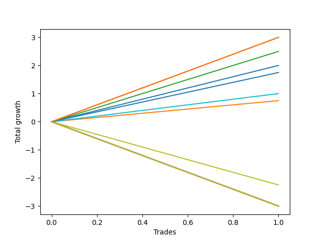

# Long Shepard 004 DB 
- Symbol: ES
- Date Range: 03/18/2022 - 07/15/2022
- Trading Period: 7:20-12:30
- Number of Trades: 1



| Name | Win Percent | Profit | Avg Profit / Trade | Avg Time / Trade |      | Name | Win Percent | Profit | Avg Profit / Trade | Avg Time / Trade |
| ---- | ----------- | ------ | ------------------ | ---------------- | ---- | ---- | ----------- | ------ | ------------------ | ---------------- |
| Sorted By <br> Profit | | | | | | Sorted By <br> Win Percentage ||||
| Eighty-Three | 100.00 | 1500.00 | 1500.00 | 14:50 |     | Eighty-Three | 100.00 | 1500.00 | 1500.00 | 14:50 |
| Three | 100.00 | 1500.00 | 1500.00 | 15:45 |     | Three | 100.00 | 1500.00 | 1500.00 | 15:45 |
| Two | 100.00 | 1250.00 | 1250.00 | 14:20 |     | Two | 100.00 | 1250.00 | 1250.00 | 14:20 |
| Eighty-Two | 100.00 | 1000.00 | 1000.00 | 02:50 |     | Eighty-Two | 100.00 | 1000.00 | 1000.00 | 02:50 |
| Zero | 100.00 | 875.00 | 875.00 | 02:35 |     | Zero | 100.00 | 875.00 | 875.00 | 02:35 |
| Eighty-One | 100.00 | 500.00 | 500.00 | 00:30 |     | Eighty-One | 100.00 | 500.00 | 500.00 | 00:30 |
| One | 100.00 | 375.00 | 375.00 | 10:25 |     | One | 100.00 | 375.00 | 375.00 | 10:25 |
| Seventy-Three | 0.00 | -1125.00 | -1125.00 | 05:05 |     | Seventy-Three | 0.00 | -1125.00 | -1125.00 | 05:05 |
| Ninety | 0.00 | -1500.00 | -1500.00 | 29:55 |     | Ninety | 0.00 | -1500.00 | -1500.00 | 29:55 |
| Eighty-Nine | 0.00 | -1500.00 | -1500.00 | 29:55 |     | Eighty-Nine | 0.00 | -1500.00 | -1500.00 | 29:55 |
| Eighty-Eight | 0.00 | -1500.00 | -1500.00 | 29:55 |     | Eighty-Eight | 0.00 | -1500.00 | -1500.00 | 29:55 |
| Eighty-Seven | 0.00 | -1500.00 | -1500.00 | 29:55 |     | Eighty-Seven | 0.00 | -1500.00 | -1500.00 | 29:55 |
| Eighty-Six | 0.00 | -1500.00 | -1500.00 | 29:55 |     | Eighty-Six | 0.00 | -1500.00 | -1500.00 | 29:55 |
| Eighty-Five | 0.00 | -1500.00 | -1500.00 | 29:55 |     | Eighty-Five | 0.00 | -1500.00 | -1500.00 | 29:55 |
| Eighty-Four | 0.00 | -1500.00 | -1500.00 | 29:55 |     | Eighty-Four | 0.00 | -1500.00 | -1500.00 | 29:55 |
| Seven | 0.00 | -1500.00 | -1500.00 | 29:55 |     | Seven | 0.00 | -1500.00 | -1500.00 | 29:55 |
| Six | 0.00 | -1500.00 | -1500.00 | 29:55 |     | Six | 0.00 | -1500.00 | -1500.00 | 29:55 |
| Five | 0.00 | -1500.00 | -1500.00 | 29:55 |     | Five | 0.00 | -1500.00 | -1500.00 | 29:55 |
| Four | 0.00 | -1500.00 | -1500.00 | 29:55 |     | Four | 0.00 | -1500.00 | -1500.00 | 29:55 |

## NO STOPLOSS

### Test Zero
* Sell when price hits the middle line of the 20p bollinger
* No Stoploss
* Results:
```
Total Trades: 1
Percent Up: 100.00
Percent Down: 0.00
Total Points Moved Up: 1.75
Potential Profit: 875.00
Total Points Ups: 1.75 Count Ups: 1
Total Points Downs: 0.00 Count Downs: 0
```

<details><summary>Trades</summary>

<code>In: 2022-03-31 09:30:00		Out: 2022-03-31 09:32:35		Total Position Time: 02:35		Total Move Up: 1.75		Total to Date: 1.75</code> <br />


</details>

### Test One
* Sell when the price hits the upper line of the 20p 1std bollinger
* No Stoploss
* Results:
```
Total Trades: 1
Percent Up: 100.00
Percent Down: 0.00
Total Points Moved Up: 0.75
Potential Profit: 375.00
Total Points Ups: 0.75 Count Ups: 1
Total Points Downs: 0.00 Count Downs: 0
```

<details><summary>Trades</summary>

<code>In: 2022-03-31 09:30:00		Out: 2022-03-31 09:40:25		Total Position Time: 10:25		Total Move Up: 0.75		Total to Date: 0.75</code> <br />


</details>

### Test Two
* Sell when the price hits the upper line of the 20p 2std bollinger
* No Stoploss
* Results:
```
Total Trades: 1
Percent Up: 100.00
Percent Down: 0.00
Total Points Moved Up: 2.50
Potential Profit: 1250.00
Total Points Ups: 2.50 Count Ups: 1
Total Points Downs: 0.00 Count Downs: 0
```

<details><summary>Trades</summary>

<code>In: 2022-03-31 09:30:00		Out: 2022-03-31 09:44:20		Total Position Time: 14:20		Total Move Up: 2.50		Total to Date: 2.50</code> <br />


</details>

### Test Three
* Sell when price hits the middle line of the 50p bollinger
* No Stoploss
* Results:
```
Total Trades: 1
Percent Up: 100.00
Percent Down: 0.00
Total Points Moved Up: 3.00
Potential Profit: 1500.00
Total Points Ups: 3.00 Count Ups: 1
Total Points Downs: 0.00 Count Downs: 0
```

<details><summary>Trades</summary>

<code>In: 2022-03-31 09:30:00		Out: 2022-03-31 09:45:45		Total Position Time: 15:45		Total Move Up: 3.00		Total to Date: 3.00</code> <br />


</details>

### Test Four
* Sell when the price hits the upper line of the 50p 1std bollinger
* No Stoploss
* Results:
```
Total Trades: 1
Percent Up: 0.00
Percent Down: 100.00
Total Points Moved Up: -3.00
Potential Profit: -1500.00
Total Points Ups: 0.00 Count Ups: 0
Total Points Downs: -3.00 Count Downs: 1
```

<details><summary>Trades</summary>

<code>In: 2022-03-31 09:30:00		Out: 2022-03-31 09:59:55		Total Position Time: 29:55		Total Move Up: -3.00		Total to Date: -3.00</code> <br />


</details>

### Test Five
* Sell when the price hits the upper line of the 50p 2std bollinger
* No Stoploss
* Results:
```
Total Trades: 1
Percent Up: 0.00
Percent Down: 100.00
Total Points Moved Up: -3.00
Potential Profit: -1500.00
Total Points Ups: 0.00 Count Ups: 0
Total Points Downs: -3.00 Count Downs: 1
```

<details><summary>Trades</summary>

<code>In: 2022-03-31 09:30:00		Out: 2022-03-31 09:59:55		Total Position Time: 29:55		Total Move Up: -3.00		Total to Date: -3.00</code> <br />


</details>

### Test Six
* Sell when the price hits the middle line of the 1std VWAP
* No Stoploss
* Results:
```
Total Trades: 1
Percent Up: 0.00
Percent Down: 100.00
Total Points Moved Up: -3.00
Potential Profit: -1500.00
Total Points Ups: 0.00 Count Ups: 0
Total Points Downs: -3.00 Count Downs: 1
```

<details><summary>Trades</summary>

<code>In: 2022-03-31 09:30:00		Out: 2022-03-31 09:59:55		Total Position Time: 29:55		Total Move Up: -3.00		Total to Date: -3.00</code> <br />


</details>

### Test Seven
* Sell when the price hits the upper line of the 1std VWAP
* No Stoploss
* Results:
```
Total Trades: 1
Percent Up: 0.00
Percent Down: 100.00
Total Points Moved Up: -3.00
Potential Profit: -1500.00
Total Points Ups: 0.00 Count Ups: 0
Total Points Downs: -3.00 Count Downs: 1
```

<details><summary>Trades</summary>

<code>In: 2022-03-31 09:30:00		Out: 2022-03-31 09:59:55		Total Position Time: 29:55		Total Move Up: -3.00		Total to Date: -3.00</code> <br />


</details>

## SPECIAL EXIT CONDITIONS 

### Test Seventy-Three
* Sell when the linear regression slope changes to negative
* No Stoploss
* Results:
```
Total Trades: 1
Percent Up: 0.00
Percent Down: 100.00
Total Points Moved Up: -2.25
Potential Profit: -1125.00
Total Points Ups: 0.00 Count Ups: 0
Total Points Downs: -2.25 Count Downs: 1
```

<details><summary>Trades</summary>

<code>In: 2022-03-31 09:30:00		Out: 2022-03-31 09:35:05		Total Position Time: 05:05		Total Move Up: -2.25		Total to Date: -2.25</code> <br />


</details>

## TAKE PROFIT

### Test Eighty-One
* Take Profit of 1 Point
* No Stoploss
* Results:
```
Total Trades: 1
Percent Up: 100.00
Percent Down: 0.00
Total Points Moved Up: 1.00
Potential Profit: 500.00
Total Points Ups: 1.00 Count Ups: 1
Total Points Downs: 0.00 Count Downs: 0
```

<details><summary>Trades</summary>

<code>In: 2022-03-31 09:30:00		Out: 2022-03-31 09:30:30		Total Position Time: 00:30		Total Move Up: 1.00		Total to Date: 1.00</code> <br />


</details>

### Test Eighty-Two
* Take Profit of 2 Point
* No Stoploss
* Results:
```
Total Trades: 1
Percent Up: 100.00
Percent Down: 0.00
Total Points Moved Up: 2.00
Potential Profit: 1000.00
Total Points Ups: 2.00 Count Ups: 1
Total Points Downs: 0.00 Count Downs: 0
```

<details><summary>Trades</summary>

<code>In: 2022-03-31 09:30:00		Out: 2022-03-31 09:32:50		Total Position Time: 02:50		Total Move Up: 2.00		Total to Date: 2.00</code> <br />


</details>

### Test Eighty-Three
* Take Profit of 3 Point
* No Stoploss
* Results:
```
Total Trades: 1
Percent Up: 100.00
Percent Down: 0.00
Total Points Moved Up: 3.00
Potential Profit: 1500.00
Total Points Ups: 3.00 Count Ups: 1
Total Points Downs: 0.00 Count Downs: 0
```

<details><summary>Trades</summary>

<code>In: 2022-03-31 09:30:00		Out: 2022-03-31 09:44:50		Total Position Time: 14:50		Total Move Up: 3.00		Total to Date: 3.00</code> <br />


</details>

### Test Eighty-Four
* Take Profit of 4 Point
* No Stoploss
* Results:
```
Total Trades: 1
Percent Up: 0.00
Percent Down: 100.00
Total Points Moved Up: -3.00
Potential Profit: -1500.00
Total Points Ups: 0.00 Count Ups: 0
Total Points Downs: -3.00 Count Downs: 1
```

<details><summary>Trades</summary>

<code>In: 2022-03-31 09:30:00		Out: 2022-03-31 09:59:55		Total Position Time: 29:55		Total Move Up: -3.00		Total to Date: -3.00</code> <br />


</details>

### Test Eighty-Five
* Take Profit of 5 Point
* No Stoploss
* Results:
```
Total Trades: 1
Percent Up: 0.00
Percent Down: 100.00
Total Points Moved Up: -3.00
Potential Profit: -1500.00
Total Points Ups: 0.00 Count Ups: 0
Total Points Downs: -3.00 Count Downs: 1
```

<details><summary>Trades</summary>

<code>In: 2022-03-31 09:30:00		Out: 2022-03-31 09:59:55		Total Position Time: 29:55		Total Move Up: -3.00		Total to Date: -3.00</code> <br />


</details>

### Test Eighty-Six
* Take Profit of 6 Point
* No Stoploss
* Results:
```
Total Trades: 1
Percent Up: 0.00
Percent Down: 100.00
Total Points Moved Up: -3.00
Potential Profit: -1500.00
Total Points Ups: 0.00 Count Ups: 0
Total Points Downs: -3.00 Count Downs: 1
```

<details><summary>Trades</summary>

<code>In: 2022-03-31 09:30:00		Out: 2022-03-31 09:59:55		Total Position Time: 29:55		Total Move Up: -3.00		Total to Date: -3.00</code> <br />


</details>

### Test Eighty-Seven
* Take Profit of 7 Point
* No Stoploss
* Results:
```
Total Trades: 1
Percent Up: 0.00
Percent Down: 100.00
Total Points Moved Up: -3.00
Potential Profit: -1500.00
Total Points Ups: 0.00 Count Ups: 0
Total Points Downs: -3.00 Count Downs: 1
```

<details><summary>Trades</summary>

<code>In: 2022-03-31 09:30:00		Out: 2022-03-31 09:59:55		Total Position Time: 29:55		Total Move Up: -3.00		Total to Date: -3.00</code> <br />


</details>

### Test Eighty-Eight
* Take Profit of 8 Point
* No Stoploss
* Results:
```
Total Trades: 1
Percent Up: 0.00
Percent Down: 100.00
Total Points Moved Up: -3.00
Potential Profit: -1500.00
Total Points Ups: 0.00 Count Ups: 0
Total Points Downs: -3.00 Count Downs: 1
```

<details><summary>Trades</summary>

<code>In: 2022-03-31 09:30:00		Out: 2022-03-31 09:59:55		Total Position Time: 29:55		Total Move Up: -3.00		Total to Date: -3.00</code> <br />


</details>

### Test Eighty-Nine
* Take Profit of 9 Point
* No Stoploss
* Results:
```
Total Trades: 1
Percent Up: 0.00
Percent Down: 100.00
Total Points Moved Up: -3.00
Potential Profit: -1500.00
Total Points Ups: 0.00 Count Ups: 0
Total Points Downs: -3.00 Count Downs: 1
```

<details><summary>Trades</summary>

<code>In: 2022-03-31 09:30:00		Out: 2022-03-31 09:59:55		Total Position Time: 29:55		Total Move Up: -3.00		Total to Date: -3.00</code> <br />


</details>

### Test Ninety
* Take Profit of 10 Point
* No Stoploss
* Results:
```
Total Trades: 1
Percent Up: 0.00
Percent Down: 100.00
Total Points Moved Up: -3.00
Potential Profit: -1500.00
Total Points Ups: 0.00 Count Ups: 0
Total Points Downs: -3.00 Count Downs: 1
```

<details><summary>Trades</summary>

<code>In: 2022-03-31 09:30:00		Out: 2022-03-31 09:59:55		Total Position Time: 29:55		Total Move Up: -3.00		Total to Date: -3.00</code> <br />


</details>