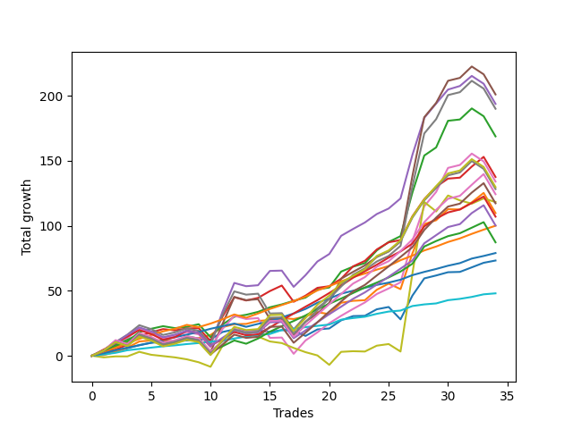

# Long Shepard 004 SD 
- Symbol: ES
- Date Range: 03/18/2022 - 07/15/2022
- Trading Period: 7:20-12:30
- Number of Trades: 34



| Name | Win Percent | Profit | Avg Profit / Trade | Avg Time / Trade |      | Name | Win Percent | Profit | Avg Profit / Trade | Avg Time / Trade |
| ---- | ----------- | ------ | ------------------ | ---------------- | ---- | ---- | ----------- | ------ | ------------------ | ---------------- |
| Sorted By <br> Profit | | | | | | Sorted By <br> Win Percentage ||||
| Five | 70.59 | 100500.00 | 2955.88 | 27:00 |     | Eighty-One | 100.00 | 24000.00 | 705.88 | 03:48 |
| Four | 76.47 | 96875.00 | 2849.26 | 22:51 |     | Eighty-Two | 97.06 | 39500.00 | 1161.76 | 06:12 |
| Seven | 73.53 | 95000.00 | 2794.12 | 26:08 |     | Eighty-Three | 94.12 | 50000.00 | 1470.59 | 09:42 |
| Two | 88.24 | 84375.00 | 2481.62 | 14:37 |     | Two | 88.24 | 84375.00 | 2481.62 | 14:37 |
| Three | 85.29 | 68750.00 | 2022.06 | 14:53 |     | Three | 85.29 | 68750.00 | 2022.06 | 14:53 |
| Six | 73.53 | 67000.00 | 1970.59 | 25:14 |     | Zero | 85.29 | 36625.00 | 1077.21 | 04:28 |
| Ninety | 73.53 | 64875.00 | 1908.09 | 24:03 |     | One | 82.35 | 54875.00 | 1613.97 | 09:50 |
| Eighty-Nine | 73.53 | 64125.00 | 1886.03 | 21:21 |     | Eighty-Five | 82.35 | 53500.00 | 1573.53 | 15:36 |
| Eighty-Eight | 76.47 | 62125.00 | 1827.21 | 20:34 |     | Eighty-Four | 82.35 | 43625.00 | 1283.09 | 13:59 |
| Seventy-Three | 38.24 | 59125.00 | 1738.97 | 06:57 |     | Eighty-Six | 79.41 | 50125.00 | 1474.26 | 17:48 |
| Eighty-Seven | 76.47 | 58625.00 | 1724.26 | 19:15 |     | Four | 76.47 | 96875.00 | 2849.26 | 22:51 |
| One | 82.35 | 54875.00 | 1613.97 | 09:50 |     | Eighty-Eight | 76.47 | 62125.00 | 1827.21 | 20:34 |
| Eighty-Five | 82.35 | 53500.00 | 1573.53 | 15:36 |     | Eighty-Seven | 76.47 | 58625.00 | 1724.26 | 19:15 |
| Eighty-Six | 79.41 | 50125.00 | 1474.26 | 17:48 |     | Seven | 73.53 | 95000.00 | 2794.12 | 26:08 |
| Eighty-Three | 94.12 | 50000.00 | 1470.59 | 09:42 |     | Six | 73.53 | 67000.00 | 1970.59 | 25:14 |
| Eighty-Four | 82.35 | 43625.00 | 1283.09 | 13:59 |     | Ninety | 73.53 | 64875.00 | 1908.09 | 24:03 |
| Eighty-Two | 97.06 | 39500.00 | 1161.76 | 06:12 |     | Eighty-Nine | 73.53 | 64125.00 | 1886.03 | 21:21 |
| Zero | 85.29 | 36625.00 | 1077.21 | 04:28 |     | Five | 70.59 | 100500.00 | 2955.88 | 27:00 |
| Eighty-One | 100.00 | 24000.00 | 705.88 | 03:48 |     | Seventy-Three | 38.24 | 59125.00 | 1738.97 | 06:57 |

## NO STOPLOSS

### Test Zero
* Sell when price hits the middle line of the 20p bollinger
* No Stoploss
* Results:
```
Total Trades: 34
Percent Up: 85.29
Percent Down: 14.71
Total Points Moved Up: 73.25
Potential Profit: 36625.00
Total Points Ups: 89.50 Count Ups: 29
Total Points Downs: -16.25 Count Downs: 5
```

<details><summary>Trades</summary>

<code>In: 2022-03-23 10:32:00		Out: 2022-03-23 10:38:15		Total Position Time: 06:15		Total Move Up: 1.50		Total to Date: 1.50</code> <br />
<code>In: 2022-03-23 11:17:00		Out: 2022-03-23 11:18:00		Total Position Time: 01:00		Total Move Up: 2.25		Total to Date: 3.75</code> <br />
<code>In: 2022-03-30 07:35:00		Out: 2022-03-30 07:36:25		Total Position Time: 01:25		Total Move Up: 2.00		Total to Date: 5.75</code> <br />
<code>In: 2022-03-30 12:27:00		Out: 2022-03-30 12:28:15		Total Position Time: 01:15		Total Move Up: 2.50		Total to Date: 8.25</code> <br />
<code>In: 2022-03-31 09:30:00		Out: 2022-03-31 09:32:35		Total Position Time: 02:35		Total Move Up: 1.75		Total to Date: 10.00</code> <br />
<code>In: 2022-03-31 09:37:00		Out: 2022-03-31 09:37:10		Total Position Time: 00:10		Total Move Up: 0.50		Total to Date: 10.50</code> <br />
<code>In: 2022-03-31 10:02:00		Out: 2022-03-31 10:04:00		Total Position Time: 02:00		Total Move Up: 0.75		Total to Date: 11.25</code> <br />
<code>In: 2022-03-31 10:19:00		Out: 2022-03-31 10:19:10		Total Position Time: 00:10		Total Move Up: 0.50		Total to Date: 11.75</code> <br />
<code>In: 2022-03-31 11:21:00		Out: 2022-03-31 11:22:10		Total Position Time: 01:10		Total Move Up: 0.75		Total to Date: 12.50</code> <br />
<code>In: 2022-04-01 08:48:00		Out: 2022-04-01 08:53:05		Total Position Time: 05:05		Total Move Up: 0.00		Total to Date: 12.50</code> <br />
<code>In: 2022-04-06 11:21:00		Out: 2022-04-06 11:25:30		Total Position Time: 04:30		Total Move Up: 5.75		Total to Date: 18.25</code> <br />
<code>In: 2022-04-06 11:22:00		Out: 2022-04-06 11:25:30		Total Position Time: 03:30		Total Move Up: 2.00		Total to Date: 20.25</code> <br />
<code>In: 2022-04-11 07:39:00		Out: 2022-04-11 07:51:10		Total Position Time: 12:10		Total Move Up: -1.00		Total to Date: 19.25</code> <br />
<code>In: 2022-04-12 09:32:00		Out: 2022-04-12 09:41:30		Total Position Time: 09:30		Total Move Up: 0.25		Total to Date: 19.50</code> <br />
<code>In: 2022-05-02 10:56:00		Out: 2022-05-02 10:59:15		Total Position Time: 03:15		Total Move Up: -1.25		Total to Date: 18.25</code> <br />
<code>In: 2022-05-02 11:22:00		Out: 2022-05-02 11:28:05		Total Position Time: 06:05		Total Move Up: 1.50		Total to Date: 19.75</code> <br />
<code>In: 2022-05-09 07:35:00		Out: 2022-05-09 07:42:30		Total Position Time: 07:30		Total Move Up: -0.50		Total to Date: 19.25</code> <br />
<code>In: 2022-05-11 10:50:00		Out: 2022-05-11 11:00:40		Total Position Time: 10:40		Total Move Up: -4.00		Total to Date: 15.25</code> <br />
<code>In: 2022-05-12 11:45:00		Out: 2022-05-12 11:45:20		Total Position Time: 00:20		Total Move Up: 5.00		Total to Date: 20.25</code> <br />
<code>In: 2022-05-12 11:46:00		Out: 2022-05-12 11:46:10		Total Position Time: 00:10		Total Move Up: 0.75		Total to Date: 21.00</code> <br />
<code>In: 2022-06-02 07:30:00		Out: 2022-06-02 07:34:10		Total Position Time: 04:10		Total Move Up: 6.25		Total to Date: 27.25</code> <br />
<code>In: 2022-06-06 08:24:00		Out: 2022-06-06 08:31:35		Total Position Time: 07:35		Total Move Up: 3.25		Total to Date: 30.50</code> <br />
<code>In: 2022-06-06 09:17:00		Out: 2022-06-06 09:26:35		Total Position Time: 09:35		Total Move Up: 0.25		Total to Date: 30.75</code> <br />
<code>In: 2022-06-08 10:41:00		Out: 2022-06-08 10:42:15		Total Position Time: 01:15		Total Move Up: 5.00		Total to Date: 35.75</code> <br />
<code>In: 2022-06-08 10:42:00		Out: 2022-06-08 10:42:15		Total Position Time: 00:15		Total Move Up: 1.75		Total to Date: 37.50</code> <br />
<code>In: 2022-06-14 07:23:00		Out: 2022-06-14 07:46:40		Total Position Time: 23:40		Total Move Up: -9.50		Total to Date: 28.00</code> <br />
<code>In: 2022-06-15 11:36:00		Out: 2022-06-15 11:38:05		Total Position Time: 02:05		Total Move Up: 18.25		Total to Date: 46.25</code> <br />
<code>In: 2022-06-15 11:37:00		Out: 2022-06-15 11:38:05		Total Position Time: 01:05		Total Move Up: 13.25		Total to Date: 59.50</code> <br />
<code>In: 2022-06-16 07:55:00		Out: 2022-06-16 08:01:50		Total Position Time: 06:50		Total Move Up: 2.25		Total to Date: 61.75</code> <br />
<code>In: 2022-06-16 11:57:00		Out: 2022-06-16 12:00:25		Total Position Time: 03:25		Total Move Up: 2.50		Total to Date: 64.25</code> <br />
<code>In: 2022-06-23 09:49:00		Out: 2022-06-23 09:49:10		Total Position Time: 00:10		Total Move Up: 0.25		Total to Date: 64.50</code> <br />
<code>In: 2022-06-29 09:32:00		Out: 2022-06-29 09:36:40		Total Position Time: 04:40		Total Move Up: 3.50		Total to Date: 68.00</code> <br />
<code>In: 2022-07-06 08:12:00		Out: 2022-07-06 08:14:30		Total Position Time: 02:30		Total Move Up: 3.50		Total to Date: 71.50</code> <br />
<code>In: 2022-07-12 12:14:00		Out: 2022-07-12 12:20:15		Total Position Time: 06:15		Total Move Up: 1.75		Total to Date: 73.25</code> <br />


</details>

### Test One
* Sell when the price hits the upper line of the 20p 1std bollinger
* No Stoploss
* Results:
```
Total Trades: 34
Percent Up: 82.35
Percent Down: 17.65
Total Points Moved Up: 109.75
Potential Profit: 54875.00
Total Points Ups: 133.00 Count Ups: 28
Total Points Downs: -23.25 Count Downs: 6
```

<details><summary>Trades</summary>

<code>In: 2022-03-23 10:32:00		Out: 2022-03-23 10:51:45		Total Position Time: 19:45		Total Move Up: 0.50		Total to Date: 0.50</code> <br />
<code>In: 2022-03-23 11:17:00		Out: 2022-03-23 11:26:15		Total Position Time: 09:15		Total Move Up: 2.50		Total to Date: 3.00</code> <br />
<code>In: 2022-03-30 07:35:00		Out: 2022-03-30 07:38:35		Total Position Time: 03:35		Total Move Up: 3.25		Total to Date: 6.25</code> <br />
<code>In: 2022-03-30 12:27:00		Out: 2022-03-30 12:32:20		Total Position Time: 05:20		Total Move Up: 4.75		Total to Date: 11.00</code> <br />
<code>In: 2022-03-31 09:30:00		Out: 2022-03-31 09:40:25		Total Position Time: 10:25		Total Move Up: 0.75		Total to Date: 11.75</code> <br />
<code>In: 2022-03-31 09:37:00		Out: 2022-03-31 09:40:25		Total Position Time: 03:25		Total Move Up: 0.25		Total to Date: 12.00</code> <br />
<code>In: 2022-03-31 10:02:00		Out: 2022-03-31 10:19:20		Total Position Time: 17:20		Total Move Up: -1.00		Total to Date: 11.00</code> <br />
<code>In: 2022-03-31 10:19:00		Out: 2022-03-31 10:19:20		Total Position Time: 00:20		Total Move Up: 1.50		Total to Date: 12.50</code> <br />
<code>In: 2022-03-31 11:21:00		Out: 2022-03-31 11:29:15		Total Position Time: 08:15		Total Move Up: 1.00		Total to Date: 13.50</code> <br />
<code>In: 2022-04-01 08:48:00		Out: 2022-04-01 08:54:05		Total Position Time: 06:05		Total Move Up: 2.50		Total to Date: 16.00</code> <br />
<code>In: 2022-04-06 11:21:00		Out: 2022-04-06 11:30:30		Total Position Time: 09:30		Total Move Up: 6.00		Total to Date: 22.00</code> <br />
<code>In: 2022-04-06 11:22:00		Out: 2022-04-06 11:30:30		Total Position Time: 08:30		Total Move Up: 2.25		Total to Date: 24.25</code> <br />
<code>In: 2022-04-11 07:39:00		Out: 2022-04-11 07:52:00		Total Position Time: 13:00		Total Move Up: 0.25		Total to Date: 24.50</code> <br />
<code>In: 2022-04-12 09:32:00		Out: 2022-04-12 09:50:15		Total Position Time: 18:15		Total Move Up: 2.25		Total to Date: 26.75</code> <br />
<code>In: 2022-05-02 10:56:00		Out: 2022-05-02 11:02:25		Total Position Time: 06:25		Total Move Up: 0.75		Total to Date: 27.50</code> <br />
<code>In: 2022-05-02 11:22:00		Out: 2022-05-02 11:32:10		Total Position Time: 10:10		Total Move Up: 1.50		Total to Date: 29.00</code> <br />
<code>In: 2022-05-09 07:35:00		Out: 2022-05-09 07:45:10		Total Position Time: 10:10		Total Move Up: -0.75		Total to Date: 28.25</code> <br />
<code>In: 2022-05-11 10:50:00		Out: 2022-05-11 11:01:20		Total Position Time: 11:20		Total Move Up: 2.00		Total to Date: 30.25</code> <br />
<code>In: 2022-05-12 11:45:00		Out: 2022-05-12 11:52:05		Total Position Time: 07:05		Total Move Up: 3.25		Total to Date: 33.50</code> <br />
<code>In: 2022-05-12 11:46:00		Out: 2022-05-12 11:52:05		Total Position Time: 06:05		Total Move Up: -1.50		Total to Date: 32.00</code> <br />
<code>In: 2022-06-02 07:30:00		Out: 2022-06-02 07:38:35		Total Position Time: 08:35		Total Move Up: 8.75		Total to Date: 40.75</code> <br />
<code>In: 2022-06-06 08:24:00		Out: 2022-06-06 08:39:15		Total Position Time: 15:15		Total Move Up: 1.50		Total to Date: 42.25</code> <br />
<code>In: 2022-06-06 09:17:00		Out: 2022-06-06 09:37:35		Total Position Time: 20:35		Total Move Up: 0.50		Total to Date: 42.75</code> <br />
<code>In: 2022-06-08 10:41:00		Out: 2022-06-08 10:47:05		Total Position Time: 06:05		Total Move Up: 8.00		Total to Date: 50.75</code> <br />
<code>In: 2022-06-08 10:42:00		Out: 2022-06-08 10:47:05		Total Position Time: 05:05		Total Move Up: 4.75		Total to Date: 55.50</code> <br />
<code>In: 2022-06-14 07:23:00		Out: 2022-06-14 07:47:10		Total Position Time: 24:10		Total Move Up: -4.25		Total to Date: 51.25</code> <br />
<code>In: 2022-06-15 11:36:00		Out: 2022-06-15 11:38:10		Total Position Time: 02:10		Total Move Up: 27.50		Total to Date: 78.75</code> <br />
<code>In: 2022-06-15 11:37:00		Out: 2022-06-15 11:38:10		Total Position Time: 01:10		Total Move Up: 22.50		Total to Date: 101.25</code> <br />
<code>In: 2022-06-16 07:55:00		Out: 2022-06-16 08:11:25		Total Position Time: 16:25		Total Move Up: 3.00		Total to Date: 104.25</code> <br />
<code>In: 2022-06-16 11:57:00		Out: 2022-06-16 12:01:45		Total Position Time: 04:45		Total Move Up: 8.50		Total to Date: 112.75</code> <br />
<code>In: 2022-06-23 09:49:00		Out: 2022-06-23 09:54:10		Total Position Time: 05:10		Total Move Up: -0.25		Total to Date: 112.50</code> <br />
<code>In: 2022-06-29 09:32:00		Out: 2022-06-29 09:37:15		Total Position Time: 05:15		Total Move Up: 5.50		Total to Date: 118.00</code> <br />
<code>In: 2022-07-06 08:12:00		Out: 2022-07-06 08:17:50		Total Position Time: 05:50		Total Move Up: 7.25		Total to Date: 125.25</code> <br />
<code>In: 2022-07-12 12:14:00		Out: 2022-07-12 12:43:55		Total Position Time: 29:55		Total Move Up: -15.50		Total to Date: 109.75</code> <br />


</details>

### Test Two
* Sell when the price hits the upper line of the 20p 2std bollinger
* No Stoploss
* Results:
```
Total Trades: 34
Percent Up: 88.24
Percent Down: 11.76
Total Points Moved Up: 168.75
Potential Profit: 84375.00
Total Points Ups: 201.75 Count Ups: 30
Total Points Downs: -33.00 Count Downs: 4
```

<details><summary>Trades</summary>

<code>In: 2022-03-23 10:32:00		Out: 2022-03-23 10:54:25		Total Position Time: 22:25		Total Move Up: 2.50		Total to Date: 2.50</code> <br />
<code>In: 2022-03-23 11:17:00		Out: 2022-03-23 11:27:00		Total Position Time: 10:00		Total Move Up: 4.50		Total to Date: 7.00</code> <br />
<code>In: 2022-03-30 07:35:00		Out: 2022-03-30 07:46:00		Total Position Time: 11:00		Total Move Up: 3.75		Total to Date: 10.75</code> <br />
<code>In: 2022-03-30 12:27:00		Out: 2022-03-30 12:36:20		Total Position Time: 09:20		Total Move Up: 7.50		Total to Date: 18.25</code> <br />
<code>In: 2022-03-31 09:30:00		Out: 2022-03-31 09:44:20		Total Position Time: 14:20		Total Move Up: 2.50		Total to Date: 20.75</code> <br />
<code>In: 2022-03-31 09:37:00		Out: 2022-03-31 09:44:20		Total Position Time: 07:20		Total Move Up: 2.00		Total to Date: 22.75</code> <br />
<code>In: 2022-03-31 10:02:00		Out: 2022-03-31 10:27:00		Total Position Time: 25:00		Total Move Up: -1.50		Total to Date: 21.25</code> <br />
<code>In: 2022-03-31 10:19:00		Out: 2022-03-31 10:27:00		Total Position Time: 08:00		Total Move Up: 1.00		Total to Date: 22.25</code> <br />
<code>In: 2022-03-31 11:21:00		Out: 2022-03-31 11:29:25		Total Position Time: 08:25		Total Move Up: 2.00		Total to Date: 24.25</code> <br />
<code>In: 2022-04-01 08:48:00		Out: 2022-04-01 09:17:55		Total Position Time: 29:55		Total Move Up: -10.00		Total to Date: 14.25</code> <br />
<code>In: 2022-04-06 11:21:00		Out: 2022-04-06 11:31:55		Total Position Time: 10:55		Total Move Up: 9.75		Total to Date: 24.00</code> <br />
<code>In: 2022-04-06 11:22:00		Out: 2022-04-06 11:31:55		Total Position Time: 09:55		Total Move Up: 6.00		Total to Date: 30.00</code> <br />
<code>In: 2022-04-11 07:39:00		Out: 2022-04-11 07:54:25		Total Position Time: 15:25		Total Move Up: 1.50		Total to Date: 31.50</code> <br />
<code>In: 2022-04-12 09:32:00		Out: 2022-04-12 09:50:15		Total Position Time: 18:15		Total Move Up: 2.25		Total to Date: 33.75</code> <br />
<code>In: 2022-05-02 10:56:00		Out: 2022-05-02 11:03:45		Total Position Time: 07:45		Total Move Up: 3.50		Total to Date: 37.25</code> <br />
<code>In: 2022-05-02 11:22:00		Out: 2022-05-02 11:32:45		Total Position Time: 10:45		Total Move Up: 2.25		Total to Date: 39.50</code> <br />
<code>In: 2022-05-09 07:35:00		Out: 2022-05-09 07:48:05		Total Position Time: 13:05		Total Move Up: 2.75		Total to Date: 42.25</code> <br />
<code>In: 2022-05-11 10:50:00		Out: 2022-05-11 11:02:35		Total Position Time: 12:35		Total Move Up: 2.50		Total to Date: 44.75</code> <br />
<code>In: 2022-05-12 11:45:00		Out: 2022-05-12 11:53:00		Total Position Time: 08:00		Total Move Up: 6.25		Total to Date: 51.00</code> <br />
<code>In: 2022-05-12 11:46:00		Out: 2022-05-12 11:53:00		Total Position Time: 07:00		Total Move Up: 1.50		Total to Date: 52.50</code> <br />
<code>In: 2022-06-02 07:30:00		Out: 2022-06-02 07:42:40		Total Position Time: 12:40		Total Move Up: 12.25		Total to Date: 64.75</code> <br />
<code>In: 2022-06-06 08:24:00		Out: 2022-06-06 08:43:00		Total Position Time: 19:00		Total Move Up: 3.75		Total to Date: 68.50</code> <br />
<code>In: 2022-06-06 09:17:00		Out: 2022-06-06 09:41:45		Total Position Time: 24:45		Total Move Up: 2.75		Total to Date: 71.25</code> <br />
<code>In: 2022-06-08 10:41:00		Out: 2022-06-08 11:03:45		Total Position Time: 22:45		Total Move Up: 9.75		Total to Date: 81.00</code> <br />
<code>In: 2022-06-08 10:42:00		Out: 2022-06-08 11:03:45		Total Position Time: 21:45		Total Move Up: 6.50		Total to Date: 87.50</code> <br />
<code>In: 2022-06-14 07:23:00		Out: 2022-06-14 07:51:00		Total Position Time: 28:00		Total Move Up: 4.50		Total to Date: 92.00</code> <br />
<code>In: 2022-06-15 11:36:00		Out: 2022-06-15 11:38:50		Total Position Time: 02:50		Total Move Up: 33.50		Total to Date: 125.50</code> <br />
<code>In: 2022-06-15 11:37:00		Out: 2022-06-15 11:38:50		Total Position Time: 01:50		Total Move Up: 28.50		Total to Date: 154.00</code> <br />
<code>In: 2022-06-16 07:55:00		Out: 2022-06-16 08:11:45		Total Position Time: 16:45		Total Move Up: 6.25		Total to Date: 160.25</code> <br />
<code>In: 2022-06-16 11:57:00		Out: 2022-06-16 12:10:15		Total Position Time: 13:15		Total Move Up: 20.50		Total to Date: 180.75</code> <br />
<code>In: 2022-06-23 09:49:00		Out: 2022-06-23 09:56:50		Total Position Time: 07:50		Total Move Up: 1.00		Total to Date: 181.75</code> <br />
<code>In: 2022-06-29 09:32:00		Out: 2022-06-29 09:38:30		Total Position Time: 06:30		Total Move Up: 8.50		Total to Date: 190.25</code> <br />
<code>In: 2022-07-06 08:12:00		Out: 2022-07-06 08:41:55		Total Position Time: 29:55		Total Move Up: -6.00		Total to Date: 184.25</code> <br />
<code>In: 2022-07-12 12:14:00		Out: 2022-07-12 12:43:55		Total Position Time: 29:55		Total Move Up: -15.50		Total to Date: 168.75</code> <br />


</details>

### Test Three
* Sell when price hits the middle line of the 50p bollinger
* No Stoploss
* Results:
```
Total Trades: 34
Percent Up: 85.29
Percent Down: 14.71
Total Points Moved Up: 137.50
Potential Profit: 68750.00
Total Points Ups: 179.00 Count Ups: 29
Total Points Downs: -41.50 Count Downs: 5
```

<details><summary>Trades</summary>

<code>In: 2022-03-23 10:32:00		Out: 2022-03-23 10:54:30		Total Position Time: 22:30		Total Move Up: 3.25		Total to Date: 3.25</code> <br />
<code>In: 2022-03-23 11:17:00		Out: 2022-03-23 11:17:20		Total Position Time: 00:20		Total Move Up: 1.50		Total to Date: 4.75</code> <br />
<code>In: 2022-03-30 07:35:00		Out: 2022-03-30 07:46:00		Total Position Time: 11:00		Total Move Up: 3.75		Total to Date: 8.50</code> <br />
<code>In: 2022-03-30 12:27:00		Out: 2022-03-30 12:33:25		Total Position Time: 06:25		Total Move Up: 6.50		Total to Date: 15.00</code> <br />
<code>In: 2022-03-31 09:30:00		Out: 2022-03-31 09:45:45		Total Position Time: 15:45		Total Move Up: 3.00		Total to Date: 18.00</code> <br />
<code>In: 2022-03-31 09:37:00		Out: 2022-03-31 09:45:45		Total Position Time: 08:45		Total Move Up: 2.50		Total to Date: 20.50</code> <br />
<code>In: 2022-03-31 10:02:00		Out: 2022-03-31 10:27:25		Total Position Time: 25:25		Total Move Up: -1.00		Total to Date: 19.50</code> <br />
<code>In: 2022-03-31 10:19:00		Out: 2022-03-31 10:27:25		Total Position Time: 08:25		Total Move Up: 1.50		Total to Date: 21.00</code> <br />
<code>In: 2022-03-31 11:21:00		Out: 2022-03-31 11:49:05		Total Position Time: 28:05		Total Move Up: 0.25		Total to Date: 21.25</code> <br />
<code>In: 2022-04-01 08:48:00		Out: 2022-04-01 09:17:55		Total Position Time: 29:55		Total Move Up: -10.00		Total to Date: 11.25</code> <br />
<code>In: 2022-04-06 11:21:00		Out: 2022-04-06 11:32:40		Total Position Time: 11:40		Total Move Up: 18.75		Total to Date: 30.00</code> <br />
<code>In: 2022-04-06 11:22:00		Out: 2022-04-06 11:32:40		Total Position Time: 10:40		Total Move Up: 15.00		Total to Date: 45.00</code> <br />
<code>In: 2022-04-11 07:39:00		Out: 2022-04-11 08:08:55		Total Position Time: 29:55		Total Move Up: -2.50		Total to Date: 42.50</code> <br />
<code>In: 2022-04-12 09:32:00		Out: 2022-04-12 09:59:05		Total Position Time: 27:05		Total Move Up: 2.00		Total to Date: 44.50</code> <br />
<code>In: 2022-05-02 10:56:00		Out: 2022-05-02 11:04:00		Total Position Time: 08:00		Total Move Up: 5.25		Total to Date: 49.75</code> <br />
<code>In: 2022-05-02 11:22:00		Out: 2022-05-02 11:45:55		Total Position Time: 23:55		Total Move Up: 4.25		Total to Date: 54.00</code> <br />
<code>In: 2022-05-09 07:35:00		Out: 2022-05-09 08:04:55		Total Position Time: 29:55		Total Move Up: -12.50		Total to Date: 41.50</code> <br />
<code>In: 2022-05-11 10:50:00		Out: 2022-05-11 11:04:45		Total Position Time: 14:45		Total Move Up: 4.75		Total to Date: 46.25</code> <br />
<code>In: 2022-05-12 11:45:00		Out: 2022-05-12 11:53:05		Total Position Time: 08:05		Total Move Up: 6.00		Total to Date: 52.25</code> <br />
<code>In: 2022-05-12 11:46:00		Out: 2022-05-12 11:53:05		Total Position Time: 07:05		Total Move Up: 1.25		Total to Date: 53.50</code> <br />
<code>In: 2022-06-02 07:30:00		Out: 2022-06-02 07:31:30		Total Position Time: 01:30		Total Move Up: 5.75		Total to Date: 59.25</code> <br />
<code>In: 2022-06-06 08:24:00		Out: 2022-06-06 08:46:10		Total Position Time: 22:10		Total Move Up: 9.50		Total to Date: 68.75</code> <br />
<code>In: 2022-06-06 09:17:00		Out: 2022-06-06 09:43:15		Total Position Time: 26:15		Total Move Up: 4.25		Total to Date: 73.00</code> <br />
<code>In: 2022-06-08 10:41:00		Out: 2022-06-08 10:47:20		Total Position Time: 06:20		Total Move Up: 8.75		Total to Date: 81.75</code> <br />
<code>In: 2022-06-08 10:42:00		Out: 2022-06-08 10:47:20		Total Position Time: 05:20		Total Move Up: 5.50		Total to Date: 87.25</code> <br />
<code>In: 2022-06-14 07:23:00		Out: 2022-06-14 07:50:00		Total Position Time: 27:00		Total Move Up: 1.75		Total to Date: 89.00</code> <br />
<code>In: 2022-06-15 11:36:00		Out: 2022-06-15 11:38:05		Total Position Time: 02:05		Total Move Up: 18.25		Total to Date: 107.25</code> <br />
<code>In: 2022-06-15 11:37:00		Out: 2022-06-15 11:38:05		Total Position Time: 01:05		Total Move Up: 13.25		Total to Date: 120.50</code> <br />
<code>In: 2022-06-16 07:55:00		Out: 2022-06-16 08:12:35		Total Position Time: 17:35		Total Move Up: 9.50		Total to Date: 130.00</code> <br />
<code>In: 2022-06-16 11:57:00		Out: 2022-06-16 12:01:35		Total Position Time: 04:35		Total Move Up: 6.25		Total to Date: 136.25</code> <br />
<code>In: 2022-06-23 09:49:00		Out: 2022-06-23 10:07:35		Total Position Time: 18:35		Total Move Up: 0.75		Total to Date: 137.00</code> <br />
<code>In: 2022-06-29 09:32:00		Out: 2022-06-29 09:38:30		Total Position Time: 06:30		Total Move Up: 8.50		Total to Date: 145.50</code> <br />
<code>In: 2022-07-06 08:12:00		Out: 2022-07-06 08:21:30		Total Position Time: 09:30		Total Move Up: 7.50		Total to Date: 153.00</code> <br />
<code>In: 2022-07-12 12:14:00		Out: 2022-07-12 12:43:55		Total Position Time: 29:55		Total Move Up: -15.50		Total to Date: 137.50</code> <br />


</details>

### Test Four
* Sell when the price hits the upper line of the 50p 1std bollinger
* No Stoploss
* Results:
```
Total Trades: 34
Percent Up: 76.47
Percent Down: 23.53
Total Points Moved Up: 193.75
Potential Profit: 96875.00
Total Points Ups: 249.50 Count Ups: 26
Total Points Downs: -55.75 Count Downs: 8
```

<details><summary>Trades</summary>

<code>In: 2022-03-23 10:32:00		Out: 2022-03-23 11:01:55		Total Position Time: 29:55		Total Move Up: 4.00		Total to Date: 4.00</code> <br />
<code>In: 2022-03-23 11:17:00		Out: 2022-03-23 11:27:00		Total Position Time: 10:00		Total Move Up: 4.50		Total to Date: 8.50</code> <br />
<code>In: 2022-03-30 07:35:00		Out: 2022-03-30 07:51:05		Total Position Time: 16:05		Total Move Up: 5.75		Total to Date: 14.25</code> <br />
<code>In: 2022-03-30 12:27:00		Out: 2022-03-30 12:46:00		Total Position Time: 19:00		Total Move Up: 7.25		Total to Date: 21.50</code> <br />
<code>In: 2022-03-31 09:30:00		Out: 2022-03-31 09:59:55		Total Position Time: 29:55		Total Move Up: -3.00		Total to Date: 18.50</code> <br />
<code>In: 2022-03-31 09:37:00		Out: 2022-03-31 10:06:55		Total Position Time: 29:55		Total Move Up: -4.50		Total to Date: 14.00</code> <br />
<code>In: 2022-03-31 10:02:00		Out: 2022-03-31 10:29:50		Total Position Time: 27:50		Total Move Up: 1.50		Total to Date: 15.50</code> <br />
<code>In: 2022-03-31 10:19:00		Out: 2022-03-31 10:29:50		Total Position Time: 10:50		Total Move Up: 4.00		Total to Date: 19.50</code> <br />
<code>In: 2022-03-31 11:21:00		Out: 2022-03-31 11:50:55		Total Position Time: 29:55		Total Move Up: -1.75		Total to Date: 17.75</code> <br />
<code>In: 2022-04-01 08:48:00		Out: 2022-04-01 09:17:55		Total Position Time: 29:55		Total Move Up: -10.00		Total to Date: 7.75</code> <br />
<code>In: 2022-04-06 11:21:00		Out: 2022-04-06 11:34:25		Total Position Time: 13:25		Total Move Up: 26.00		Total to Date: 33.75</code> <br />
<code>In: 2022-04-06 11:22:00		Out: 2022-04-06 11:34:25		Total Position Time: 12:25		Total Move Up: 22.25		Total to Date: 56.00</code> <br />
<code>In: 2022-04-11 07:39:00		Out: 2022-04-11 08:08:55		Total Position Time: 29:55		Total Move Up: -2.50		Total to Date: 53.50</code> <br />
<code>In: 2022-04-12 09:32:00		Out: 2022-04-12 10:01:55		Total Position Time: 29:55		Total Move Up: 0.75		Total to Date: 54.25</code> <br />
<code>In: 2022-05-02 10:56:00		Out: 2022-05-02 11:07:10		Total Position Time: 11:10		Total Move Up: 11.00		Total to Date: 65.25</code> <br />
<code>In: 2022-05-02 11:22:00		Out: 2022-05-02 11:51:55		Total Position Time: 29:55		Total Move Up: 0.25		Total to Date: 65.50</code> <br />
<code>In: 2022-05-09 07:35:00		Out: 2022-05-09 08:04:55		Total Position Time: 29:55		Total Move Up: -12.50		Total to Date: 53.00</code> <br />
<code>In: 2022-05-11 10:50:00		Out: 2022-05-11 11:18:15		Total Position Time: 28:15		Total Move Up: 9.00		Total to Date: 62.00</code> <br />
<code>In: 2022-05-12 11:45:00		Out: 2022-05-12 12:03:55		Total Position Time: 18:55		Total Move Up: 10.50		Total to Date: 72.50</code> <br />
<code>In: 2022-05-12 11:46:00		Out: 2022-05-12 12:03:55		Total Position Time: 17:55		Total Move Up: 5.75		Total to Date: 78.25</code> <br />
<code>In: 2022-06-02 07:30:00		Out: 2022-06-02 07:47:05		Total Position Time: 17:05		Total Move Up: 14.00		Total to Date: 92.25</code> <br />
<code>In: 2022-06-06 08:24:00		Out: 2022-06-06 08:53:55		Total Position Time: 29:55		Total Move Up: 5.25		Total to Date: 97.50</code> <br />
<code>In: 2022-06-06 09:17:00		Out: 2022-06-06 09:46:55		Total Position Time: 29:55		Total Move Up: 5.00		Total to Date: 102.50</code> <br />
<code>In: 2022-06-08 10:41:00		Out: 2022-06-08 11:10:55		Total Position Time: 29:55		Total Move Up: 6.50		Total to Date: 109.00</code> <br />
<code>In: 2022-06-08 10:42:00		Out: 2022-06-08 11:11:55		Total Position Time: 29:55		Total Move Up: 4.25		Total to Date: 113.25</code> <br />
<code>In: 2022-06-14 07:23:00		Out: 2022-06-14 07:52:55		Total Position Time: 29:55		Total Move Up: 7.75		Total to Date: 121.00</code> <br />
<code>In: 2022-06-15 11:36:00		Out: 2022-06-15 11:38:50		Total Position Time: 02:50		Total Move Up: 33.50		Total to Date: 154.50</code> <br />
<code>In: 2022-06-15 11:37:00		Out: 2022-06-15 11:38:50		Total Position Time: 01:50		Total Move Up: 28.50		Total to Date: 183.00</code> <br />
<code>In: 2022-06-16 07:55:00		Out: 2022-06-16 08:24:55		Total Position Time: 29:55		Total Move Up: 11.00		Total to Date: 194.00</code> <br />
<code>In: 2022-06-16 11:57:00		Out: 2022-06-16 12:02:00		Total Position Time: 05:00		Total Move Up: 10.75		Total to Date: 204.75</code> <br />
<code>In: 2022-06-23 09:49:00		Out: 2022-06-23 10:17:40		Total Position Time: 28:40		Total Move Up: 2.75		Total to Date: 207.50</code> <br />
<code>In: 2022-06-29 09:32:00		Out: 2022-06-29 09:59:10		Total Position Time: 27:10		Total Move Up: 7.75		Total to Date: 215.25</code> <br />
<code>In: 2022-07-06 08:12:00		Out: 2022-07-06 08:41:55		Total Position Time: 29:55		Total Move Up: -6.00		Total to Date: 209.25</code> <br />
<code>In: 2022-07-12 12:14:00		Out: 2022-07-12 12:43:55		Total Position Time: 29:55		Total Move Up: -15.50		Total to Date: 193.75</code> <br />


</details>

### Test Five
* Sell when the price hits the upper line of the 50p 2std bollinger
* No Stoploss
* Results:
```
Total Trades: 34
Percent Up: 70.59
Percent Down: 29.41
Total Points Moved Up: 201.00
Potential Profit: 100500.00
Total Points Ups: 275.00 Count Ups: 24
Total Points Downs: -74.00 Count Downs: 10
```

<details><summary>Trades</summary>

<code>In: 2022-03-23 10:32:00		Out: 2022-03-23 11:01:55		Total Position Time: 29:55		Total Move Up: 4.00		Total to Date: 4.00</code> <br />
<code>In: 2022-03-23 11:17:00		Out: 2022-03-23 11:30:00		Total Position Time: 13:00		Total Move Up: 7.25		Total to Date: 11.25</code> <br />
<code>In: 2022-03-30 07:35:00		Out: 2022-03-30 08:04:55		Total Position Time: 29:55		Total Move Up: -3.00		Total to Date: 8.25</code> <br />
<code>In: 2022-03-30 12:27:00		Out: 2022-03-30 12:46:00		Total Position Time: 19:00		Total Move Up: 7.25		Total to Date: 15.50</code> <br />
<code>In: 2022-03-31 09:30:00		Out: 2022-03-31 09:59:55		Total Position Time: 29:55		Total Move Up: -3.00		Total to Date: 12.50</code> <br />
<code>In: 2022-03-31 09:37:00		Out: 2022-03-31 10:06:55		Total Position Time: 29:55		Total Move Up: -4.50		Total to Date: 8.00</code> <br />
<code>In: 2022-03-31 10:02:00		Out: 2022-03-31 10:31:55		Total Position Time: 29:55		Total Move Up: 2.00		Total to Date: 10.00</code> <br />
<code>In: 2022-03-31 10:19:00		Out: 2022-03-31 10:45:55		Total Position Time: 26:55		Total Move Up: 4.50		Total to Date: 14.50</code> <br />
<code>In: 2022-03-31 11:21:00		Out: 2022-03-31 11:50:55		Total Position Time: 29:55		Total Move Up: -1.75		Total to Date: 12.75</code> <br />
<code>In: 2022-04-01 08:48:00		Out: 2022-04-01 09:17:55		Total Position Time: 29:55		Total Move Up: -10.00		Total to Date: 2.75</code> <br />
<code>In: 2022-04-06 11:21:00		Out: 2022-04-06 11:50:55		Total Position Time: 29:55		Total Move Up: 21.50		Total to Date: 24.25</code> <br />
<code>In: 2022-04-06 11:22:00		Out: 2022-04-06 11:51:55		Total Position Time: 29:55		Total Move Up: 21.00		Total to Date: 45.25</code> <br />
<code>In: 2022-04-11 07:39:00		Out: 2022-04-11 08:08:55		Total Position Time: 29:55		Total Move Up: -2.50		Total to Date: 42.75</code> <br />
<code>In: 2022-04-12 09:32:00		Out: 2022-04-12 10:01:55		Total Position Time: 29:55		Total Move Up: 0.75		Total to Date: 43.50</code> <br />
<code>In: 2022-05-02 10:56:00		Out: 2022-05-02 11:25:55		Total Position Time: 29:55		Total Move Up: -15.25		Total to Date: 28.25</code> <br />
<code>In: 2022-05-02 11:22:00		Out: 2022-05-02 11:51:55		Total Position Time: 29:55		Total Move Up: 0.25		Total to Date: 28.50</code> <br />
<code>In: 2022-05-09 07:35:00		Out: 2022-05-09 08:04:55		Total Position Time: 29:55		Total Move Up: -12.50		Total to Date: 16.00</code> <br />
<code>In: 2022-05-11 10:50:00		Out: 2022-05-11 11:19:55		Total Position Time: 29:55		Total Move Up: 10.25		Total to Date: 26.25</code> <br />
<code>In: 2022-05-12 11:45:00		Out: 2022-05-12 12:14:55		Total Position Time: 29:55		Total Move Up: 6.25		Total to Date: 32.50</code> <br />
<code>In: 2022-05-12 11:46:00		Out: 2022-05-12 12:15:35		Total Position Time: 29:35		Total Move Up: 8.25		Total to Date: 40.75</code> <br />
<code>In: 2022-06-02 07:30:00		Out: 2022-06-02 07:59:55		Total Position Time: 29:55		Total Move Up: 18.50		Total to Date: 59.25</code> <br />
<code>In: 2022-06-06 08:24:00		Out: 2022-06-06 08:53:55		Total Position Time: 29:55		Total Move Up: 5.25		Total to Date: 64.50</code> <br />
<code>In: 2022-06-06 09:17:00		Out: 2022-06-06 09:46:55		Total Position Time: 29:55		Total Move Up: 5.00		Total to Date: 69.50</code> <br />
<code>In: 2022-06-08 10:41:00		Out: 2022-06-08 11:10:55		Total Position Time: 29:55		Total Move Up: 6.50		Total to Date: 76.00</code> <br />
<code>In: 2022-06-08 10:42:00		Out: 2022-06-08 11:11:55		Total Position Time: 29:55		Total Move Up: 4.25		Total to Date: 80.25</code> <br />
<code>In: 2022-06-14 07:23:00		Out: 2022-06-14 07:52:55		Total Position Time: 29:55		Total Move Up: 7.75		Total to Date: 88.00</code> <br />
<code>In: 2022-06-15 11:36:00		Out: 2022-06-15 11:41:00		Total Position Time: 05:00		Total Move Up: 50.25		Total to Date: 138.25</code> <br />
<code>In: 2022-06-15 11:37:00		Out: 2022-06-15 11:41:00		Total Position Time: 04:00		Total Move Up: 45.25		Total to Date: 183.50</code> <br />
<code>In: 2022-06-16 07:55:00		Out: 2022-06-16 08:24:55		Total Position Time: 29:55		Total Move Up: 11.00		Total to Date: 194.50</code> <br />
<code>In: 2022-06-16 11:57:00		Out: 2022-06-16 12:09:55		Total Position Time: 12:55		Total Move Up: 17.00		Total to Date: 211.50</code> <br />
<code>In: 2022-06-23 09:49:00		Out: 2022-06-23 10:18:55		Total Position Time: 29:55		Total Move Up: 2.25		Total to Date: 213.75</code> <br />
<code>In: 2022-06-29 09:32:00		Out: 2022-06-29 10:01:55		Total Position Time: 29:55		Total Move Up: 8.75		Total to Date: 222.50</code> <br />
<code>In: 2022-07-06 08:12:00		Out: 2022-07-06 08:41:55		Total Position Time: 29:55		Total Move Up: -6.00		Total to Date: 216.50</code> <br />
<code>In: 2022-07-12 12:14:00		Out: 2022-07-12 12:43:55		Total Position Time: 29:55		Total Move Up: -15.50		Total to Date: 201.00</code> <br />


</details>

### Test Six
* Sell when the price hits the middle line of the 1std VWAP
* No Stoploss
* Results:
```
Total Trades: 34
Percent Up: 73.53
Percent Down: 26.47
Total Points Moved Up: 134.00
Potential Profit: 67000.00
Total Points Ups: 205.00 Count Ups: 25
Total Points Downs: -71.00 Count Downs: 9
```

<details><summary>Trades</summary>

<code>In: 2022-03-23 10:32:00		Out: 2022-03-23 11:01:55		Total Position Time: 29:55		Total Move Up: 4.00		Total to Date: 4.00</code> <br />
<code>In: 2022-03-23 11:17:00		Out: 2022-03-23 11:46:55		Total Position Time: 29:55		Total Move Up: 6.50		Total to Date: 10.50</code> <br />
<code>In: 2022-03-30 07:35:00		Out: 2022-03-30 07:40:25		Total Position Time: 05:25		Total Move Up: 3.00		Total to Date: 13.50</code> <br />
<code>In: 2022-03-30 12:27:00		Out: 2022-03-30 12:46:00		Total Position Time: 19:00		Total Move Up: 7.25		Total to Date: 20.75</code> <br />
<code>In: 2022-03-31 09:30:00		Out: 2022-03-31 09:59:55		Total Position Time: 29:55		Total Move Up: -3.00		Total to Date: 17.75</code> <br />
<code>In: 2022-03-31 09:37:00		Out: 2022-03-31 10:06:55		Total Position Time: 29:55		Total Move Up: -4.50		Total to Date: 13.25</code> <br />
<code>In: 2022-03-31 10:02:00		Out: 2022-03-31 10:31:55		Total Position Time: 29:55		Total Move Up: 2.00		Total to Date: 15.25</code> <br />
<code>In: 2022-03-31 10:19:00		Out: 2022-03-31 10:48:55		Total Position Time: 29:55		Total Move Up: 3.00		Total to Date: 18.25</code> <br />
<code>In: 2022-03-31 11:21:00		Out: 2022-03-31 11:50:55		Total Position Time: 29:55		Total Move Up: -1.75		Total to Date: 16.50</code> <br />
<code>In: 2022-04-01 08:48:00		Out: 2022-04-01 09:17:55		Total Position Time: 29:55		Total Move Up: -10.00		Total to Date: 6.50</code> <br />
<code>In: 2022-04-06 11:21:00		Out: 2022-04-06 11:32:25		Total Position Time: 11:25		Total Move Up: 14.00		Total to Date: 20.50</code> <br />
<code>In: 2022-04-06 11:22:00		Out: 2022-04-06 11:32:25		Total Position Time: 10:25		Total Move Up: 10.25		Total to Date: 30.75</code> <br />
<code>In: 2022-04-11 07:39:00		Out: 2022-04-11 08:08:55		Total Position Time: 29:55		Total Move Up: -2.50		Total to Date: 28.25</code> <br />
<code>In: 2022-04-12 09:32:00		Out: 2022-04-12 10:01:55		Total Position Time: 29:55		Total Move Up: 0.75		Total to Date: 29.00</code> <br />
<code>In: 2022-05-02 10:56:00		Out: 2022-05-02 11:25:55		Total Position Time: 29:55		Total Move Up: -15.25		Total to Date: 13.75</code> <br />
<code>In: 2022-05-02 11:22:00		Out: 2022-05-02 11:51:55		Total Position Time: 29:55		Total Move Up: 0.25		Total to Date: 14.00</code> <br />
<code>In: 2022-05-09 07:35:00		Out: 2022-05-09 08:04:55		Total Position Time: 29:55		Total Move Up: -12.50		Total to Date: 1.50</code> <br />
<code>In: 2022-05-11 10:50:00		Out: 2022-05-11 11:19:55		Total Position Time: 29:55		Total Move Up: 10.25		Total to Date: 11.75</code> <br />
<code>In: 2022-05-12 11:45:00		Out: 2022-05-12 12:14:55		Total Position Time: 29:55		Total Move Up: 6.25		Total to Date: 18.00</code> <br />
<code>In: 2022-05-12 11:46:00		Out: 2022-05-12 12:15:55		Total Position Time: 29:55		Total Move Up: 7.00		Total to Date: 25.00</code> <br />
<code>In: 2022-06-02 07:30:00		Out: 2022-06-02 07:31:30		Total Position Time: 01:30		Total Move Up: 5.75		Total to Date: 30.75</code> <br />
<code>In: 2022-06-06 08:24:00		Out: 2022-06-06 08:53:55		Total Position Time: 29:55		Total Move Up: 5.25		Total to Date: 36.00</code> <br />
<code>In: 2022-06-06 09:17:00		Out: 2022-06-06 09:46:55		Total Position Time: 29:55		Total Move Up: 5.00		Total to Date: 41.00</code> <br />
<code>In: 2022-06-08 10:41:00		Out: 2022-06-08 11:10:55		Total Position Time: 29:55		Total Move Up: 6.50		Total to Date: 47.50</code> <br />
<code>In: 2022-06-08 10:42:00		Out: 2022-06-08 11:11:55		Total Position Time: 29:55		Total Move Up: 4.25		Total to Date: 51.75</code> <br />
<code>In: 2022-06-14 07:23:00		Out: 2022-06-14 07:51:05		Total Position Time: 28:05		Total Move Up: 4.75		Total to Date: 56.50</code> <br />
<code>In: 2022-06-15 11:36:00		Out: 2022-06-15 11:38:45		Total Position Time: 02:45		Total Move Up: 31.75		Total to Date: 88.25</code> <br />
<code>In: 2022-06-15 11:37:00		Out: 2022-06-15 11:38:45		Total Position Time: 01:45		Total Move Up: 26.75		Total to Date: 115.00</code> <br />
<code>In: 2022-06-16 07:55:00		Out: 2022-06-16 08:24:55		Total Position Time: 29:55		Total Move Up: 11.00		Total to Date: 126.00</code> <br />
<code>In: 2022-06-16 11:57:00		Out: 2022-06-16 12:26:55		Total Position Time: 29:55		Total Move Up: 18.50		Total to Date: 144.50</code> <br />
<code>In: 2022-06-23 09:49:00		Out: 2022-06-23 10:18:55		Total Position Time: 29:55		Total Move Up: 2.25		Total to Date: 146.75</code> <br />
<code>In: 2022-06-29 09:32:00		Out: 2022-06-29 10:01:55		Total Position Time: 29:55		Total Move Up: 8.75		Total to Date: 155.50</code> <br />
<code>In: 2022-07-06 08:12:00		Out: 2022-07-06 08:41:55		Total Position Time: 29:55		Total Move Up: -6.00		Total to Date: 149.50</code> <br />
<code>In: 2022-07-12 12:14:00		Out: 2022-07-12 12:43:55		Total Position Time: 29:55		Total Move Up: -15.50		Total to Date: 134.00</code> <br />


</details>

### Test Seven
* Sell when the price hits the upper line of the 1std VWAP
* No Stoploss
* Results:
```
Total Trades: 34
Percent Up: 73.53
Percent Down: 26.47
Total Points Moved Up: 190.00
Potential Profit: 95000.00
Total Points Ups: 261.00 Count Ups: 25
Total Points Downs: -71.00 Count Downs: 9
```

<details><summary>Trades</summary>

<code>In: 2022-03-23 10:32:00		Out: 2022-03-23 11:01:55		Total Position Time: 29:55		Total Move Up: 4.00		Total to Date: 4.00</code> <br />
<code>In: 2022-03-23 11:17:00		Out: 2022-03-23 11:46:55		Total Position Time: 29:55		Total Move Up: 6.50		Total to Date: 10.50</code> <br />
<code>In: 2022-03-30 07:35:00		Out: 2022-03-30 07:51:05		Total Position Time: 16:05		Total Move Up: 5.75		Total to Date: 16.25</code> <br />
<code>In: 2022-03-30 12:27:00		Out: 2022-03-30 12:46:00		Total Position Time: 19:00		Total Move Up: 7.25		Total to Date: 23.50</code> <br />
<code>In: 2022-03-31 09:30:00		Out: 2022-03-31 09:59:55		Total Position Time: 29:55		Total Move Up: -3.00		Total to Date: 20.50</code> <br />
<code>In: 2022-03-31 09:37:00		Out: 2022-03-31 10:06:55		Total Position Time: 29:55		Total Move Up: -4.50		Total to Date: 16.00</code> <br />
<code>In: 2022-03-31 10:02:00		Out: 2022-03-31 10:31:55		Total Position Time: 29:55		Total Move Up: 2.00		Total to Date: 18.00</code> <br />
<code>In: 2022-03-31 10:19:00		Out: 2022-03-31 10:48:55		Total Position Time: 29:55		Total Move Up: 3.00		Total to Date: 21.00</code> <br />
<code>In: 2022-03-31 11:21:00		Out: 2022-03-31 11:50:55		Total Position Time: 29:55		Total Move Up: -1.75		Total to Date: 19.25</code> <br />
<code>In: 2022-04-01 08:48:00		Out: 2022-04-01 09:17:55		Total Position Time: 29:55		Total Move Up: -10.00		Total to Date: 9.25</code> <br />
<code>In: 2022-04-06 11:21:00		Out: 2022-04-06 11:32:55		Total Position Time: 11:55		Total Move Up: 22.00		Total to Date: 31.25</code> <br />
<code>In: 2022-04-06 11:22:00		Out: 2022-04-06 11:32:55		Total Position Time: 10:55		Total Move Up: 18.25		Total to Date: 49.50</code> <br />
<code>In: 2022-04-11 07:39:00		Out: 2022-04-11 08:08:55		Total Position Time: 29:55		Total Move Up: -2.50		Total to Date: 47.00</code> <br />
<code>In: 2022-04-12 09:32:00		Out: 2022-04-12 10:01:55		Total Position Time: 29:55		Total Move Up: 0.75		Total to Date: 47.75</code> <br />
<code>In: 2022-05-02 10:56:00		Out: 2022-05-02 11:25:55		Total Position Time: 29:55		Total Move Up: -15.25		Total to Date: 32.50</code> <br />
<code>In: 2022-05-02 11:22:00		Out: 2022-05-02 11:51:55		Total Position Time: 29:55		Total Move Up: 0.25		Total to Date: 32.75</code> <br />
<code>In: 2022-05-09 07:35:00		Out: 2022-05-09 08:04:55		Total Position Time: 29:55		Total Move Up: -12.50		Total to Date: 20.25</code> <br />
<code>In: 2022-05-11 10:50:00		Out: 2022-05-11 11:19:55		Total Position Time: 29:55		Total Move Up: 10.25		Total to Date: 30.50</code> <br />
<code>In: 2022-05-12 11:45:00		Out: 2022-05-12 12:14:55		Total Position Time: 29:55		Total Move Up: 6.25		Total to Date: 36.75</code> <br />
<code>In: 2022-05-12 11:46:00		Out: 2022-05-12 12:15:55		Total Position Time: 29:55		Total Move Up: 7.00		Total to Date: 43.75</code> <br />
<code>In: 2022-06-02 07:30:00		Out: 2022-06-02 07:44:30		Total Position Time: 14:30		Total Move Up: 12.00		Total to Date: 55.75</code> <br />
<code>In: 2022-06-06 08:24:00		Out: 2022-06-06 08:53:55		Total Position Time: 29:55		Total Move Up: 5.25		Total to Date: 61.00</code> <br />
<code>In: 2022-06-06 09:17:00		Out: 2022-06-06 09:46:55		Total Position Time: 29:55		Total Move Up: 5.00		Total to Date: 66.00</code> <br />
<code>In: 2022-06-08 10:41:00		Out: 2022-06-08 11:10:55		Total Position Time: 29:55		Total Move Up: 6.50		Total to Date: 72.50</code> <br />
<code>In: 2022-06-08 10:42:00		Out: 2022-06-08 11:11:55		Total Position Time: 29:55		Total Move Up: 4.25		Total to Date: 76.75</code> <br />
<code>In: 2022-06-14 07:23:00		Out: 2022-06-14 07:52:55		Total Position Time: 29:55		Total Move Up: 7.75		Total to Date: 84.50</code> <br />
<code>In: 2022-06-15 11:36:00		Out: 2022-06-15 11:40:55		Total Position Time: 04:55		Total Move Up: 45.75		Total to Date: 130.25</code> <br />
<code>In: 2022-06-15 11:37:00		Out: 2022-06-15 11:40:55		Total Position Time: 03:55		Total Move Up: 40.75		Total to Date: 171.00</code> <br />
<code>In: 2022-06-16 07:55:00		Out: 2022-06-16 08:24:55		Total Position Time: 29:55		Total Move Up: 11.00		Total to Date: 182.00</code> <br />
<code>In: 2022-06-16 11:57:00		Out: 2022-06-16 12:26:55		Total Position Time: 29:55		Total Move Up: 18.50		Total to Date: 200.50</code> <br />
<code>In: 2022-06-23 09:49:00		Out: 2022-06-23 10:18:55		Total Position Time: 29:55		Total Move Up: 2.25		Total to Date: 202.75</code> <br />
<code>In: 2022-06-29 09:32:00		Out: 2022-06-29 10:01:55		Total Position Time: 29:55		Total Move Up: 8.75		Total to Date: 211.50</code> <br />
<code>In: 2022-07-06 08:12:00		Out: 2022-07-06 08:41:55		Total Position Time: 29:55		Total Move Up: -6.00		Total to Date: 205.50</code> <br />
<code>In: 2022-07-12 12:14:00		Out: 2022-07-12 12:43:55		Total Position Time: 29:55		Total Move Up: -15.50		Total to Date: 190.00</code> <br />


</details>

## SPECIAL EXIT CONDITIONS 

### Test Seventy-Three
* Sell when the linear regression slope changes to negative
* No Stoploss
* Results:
```
Total Trades: 34
Percent Up: 38.24
Percent Down: 61.76
Total Points Moved Up: 118.25
Potential Profit: 59125.00
Total Points Ups: 180.00 Count Ups: 13
Total Points Downs: -61.75 Count Downs: 21
```

<details><summary>Trades</summary>

<code>In: 2022-03-23 10:32:00		Out: 2022-03-23 10:41:05		Total Position Time: 09:05		Total Move Up: -1.25		Total to Date: -1.25</code> <br />
<code>In: 2022-03-23 11:17:00		Out: 2022-03-23 11:25:05		Total Position Time: 08:05		Total Move Up: 0.75		Total to Date: -0.50</code> <br />
<code>In: 2022-03-30 07:35:00		Out: 2022-03-30 07:36:05		Total Position Time: 01:05		Total Move Up: 0.00		Total to Date: -0.50</code> <br />
<code>In: 2022-03-30 12:27:00		Out: 2022-03-30 12:39:05		Total Position Time: 12:05		Total Move Up: 3.50		Total to Date: 3.00</code> <br />
<code>In: 2022-03-31 09:30:00		Out: 2022-03-31 09:35:05		Total Position Time: 05:05		Total Move Up: -2.25		Total to Date: 0.75</code> <br />
<code>In: 2022-03-31 09:37:00		Out: 2022-03-31 09:39:05		Total Position Time: 02:05		Total Move Up: -1.00		Total to Date: -0.25</code> <br />
<code>In: 2022-03-31 10:02:00		Out: 2022-03-31 10:05:05		Total Position Time: 03:05		Total Move Up: -1.00		Total to Date: -1.25</code> <br />
<code>In: 2022-03-31 10:19:00		Out: 2022-03-31 10:24:05		Total Position Time: 05:05		Total Move Up: -1.50		Total to Date: -2.75</code> <br />
<code>In: 2022-03-31 11:21:00		Out: 2022-03-31 11:28:05		Total Position Time: 07:05		Total Move Up: -2.25		Total to Date: -5.00</code> <br />
<code>In: 2022-04-01 08:48:00		Out: 2022-04-01 08:51:05		Total Position Time: 03:05		Total Move Up: -3.50		Total to Date: -8.50</code> <br />
<code>In: 2022-04-06 11:21:00		Out: 2022-04-06 11:38:05		Total Position Time: 17:05		Total Move Up: 16.00		Total to Date: 7.50</code> <br />
<code>In: 2022-04-06 11:22:00		Out: 2022-04-06 11:38:05		Total Position Time: 16:05		Total Move Up: 12.25		Total to Date: 19.75</code> <br />
<code>In: 2022-04-11 07:39:00		Out: 2022-04-11 07:41:05		Total Position Time: 02:05		Total Move Up: -2.50		Total to Date: 17.25</code> <br />
<code>In: 2022-04-12 09:32:00		Out: 2022-04-12 09:35:05		Total Position Time: 03:05		Total Move Up: -2.50		Total to Date: 14.75</code> <br />
<code>In: 2022-05-02 10:56:00		Out: 2022-05-02 11:01:05		Total Position Time: 05:05		Total Move Up: -3.75		Total to Date: 11.00</code> <br />
<code>In: 2022-05-02 11:22:00		Out: 2022-05-02 11:30:05		Total Position Time: 08:05		Total Move Up: -1.25		Total to Date: 9.75</code> <br />
<code>In: 2022-05-09 07:35:00		Out: 2022-05-09 07:37:05		Total Position Time: 02:05		Total Move Up: -3.75		Total to Date: 6.00</code> <br />
<code>In: 2022-05-11 10:50:00		Out: 2022-05-11 10:54:05		Total Position Time: 04:05		Total Move Up: -3.25		Total to Date: 2.75</code> <br />
<code>In: 2022-05-12 11:45:00		Out: 2022-05-12 11:50:05		Total Position Time: 05:05		Total Move Up: -2.50		Total to Date: 0.25</code> <br />
<code>In: 2022-05-12 11:46:00		Out: 2022-05-12 11:50:05		Total Position Time: 04:05		Total Move Up: -7.25		Total to Date: -7.00</code> <br />
<code>In: 2022-06-02 07:30:00		Out: 2022-06-02 07:42:05		Total Position Time: 12:05		Total Move Up: 10.00		Total to Date: 3.00</code> <br />
<code>In: 2022-06-06 08:24:00		Out: 2022-06-06 08:34:05		Total Position Time: 10:05		Total Move Up: 0.50		Total to Date: 3.50</code> <br />
<code>In: 2022-06-06 09:17:00		Out: 2022-06-06 09:18:05		Total Position Time: 01:05		Total Move Up: -0.25		Total to Date: 3.25</code> <br />
<code>In: 2022-06-08 10:41:00		Out: 2022-06-08 10:52:05		Total Position Time: 11:05		Total Move Up: 4.50		Total to Date: 7.75</code> <br />
<code>In: 2022-06-08 10:42:00		Out: 2022-06-08 10:52:05		Total Position Time: 10:05		Total Move Up: 1.25		Total to Date: 9.00</code> <br />
<code>In: 2022-06-14 07:23:00		Out: 2022-06-14 07:25:05		Total Position Time: 02:05		Total Move Up: -5.75		Total to Date: 3.25</code> <br />
<code>In: 2022-06-15 11:36:00		Out: 2022-06-15 11:48:05		Total Position Time: 12:05		Total Move Up: 60.00		Total to Date: 63.25</code> <br />
<code>In: 2022-06-15 11:37:00		Out: 2022-06-15 11:48:05		Total Position Time: 11:05		Total Move Up: 55.00		Total to Date: 118.25</code> <br />
<code>In: 2022-06-16 07:55:00		Out: 2022-06-16 08:00:05		Total Position Time: 05:05		Total Move Up: -7.25		Total to Date: 111.00</code> <br />
<code>In: 2022-06-16 11:57:00		Out: 2022-06-16 12:13:05		Total Position Time: 16:05		Total Move Up: 12.25		Total to Date: 123.25</code> <br />
<code>In: 2022-06-23 09:49:00		Out: 2022-06-23 09:51:05		Total Position Time: 02:05		Total Move Up: -3.75		Total to Date: 119.50</code> <br />
<code>In: 2022-06-29 09:32:00		Out: 2022-06-29 09:34:05		Total Position Time: 02:05		Total Move Up: -2.50		Total to Date: 117.00</code> <br />
<code>In: 2022-07-06 08:12:00		Out: 2022-07-06 08:23:05		Total Position Time: 11:05		Total Move Up: 4.00		Total to Date: 121.00</code> <br />
<code>In: 2022-07-12 12:14:00		Out: 2022-07-12 12:22:05		Total Position Time: 08:05		Total Move Up: -2.75		Total to Date: 118.25</code> <br />


</details>

## TAKE PROFIT

### Test Eighty-One
* Take Profit of 1 Point
* No Stoploss
* Results:
```
Total Trades: 34
Percent Up: 100.00
Percent Down: 0.00
Total Points Moved Up: 48.00
Potential Profit: 24000.00
Total Points Ups: 48.00 Count Ups: 34
Total Points Downs: 0.00 Count Downs: 0
```

<details><summary>Trades</summary>

<code>In: 2022-03-23 10:32:00		Out: 2022-03-23 10:32:45		Total Position Time: 00:45		Total Move Up: 1.00		Total to Date: 1.00</code> <br />
<code>In: 2022-03-23 11:17:00		Out: 2022-03-23 11:17:15		Total Position Time: 00:15		Total Move Up: 1.25		Total to Date: 2.25</code> <br />
<code>In: 2022-03-30 07:35:00		Out: 2022-03-30 07:36:25		Total Position Time: 01:25		Total Move Up: 2.00		Total to Date: 4.25</code> <br />
<code>In: 2022-03-30 12:27:00		Out: 2022-03-30 12:27:35		Total Position Time: 00:35		Total Move Up: 1.00		Total to Date: 5.25</code> <br />
<code>In: 2022-03-31 09:30:00		Out: 2022-03-31 09:30:30		Total Position Time: 00:30		Total Move Up: 1.00		Total to Date: 6.25</code> <br />
<code>In: 2022-03-31 09:37:00		Out: 2022-03-31 09:40:45		Total Position Time: 03:45		Total Move Up: 1.00		Total to Date: 7.25</code> <br />
<code>In: 2022-03-31 10:02:00		Out: 2022-03-31 10:29:40		Total Position Time: 27:40		Total Move Up: 0.75		Total to Date: 8.00</code> <br />
<code>In: 2022-03-31 10:19:00		Out: 2022-03-31 10:19:15		Total Position Time: 00:15		Total Move Up: 1.00		Total to Date: 9.00</code> <br />
<code>In: 2022-03-31 11:21:00		Out: 2022-03-31 11:23:30		Total Position Time: 02:30		Total Move Up: 0.75		Total to Date: 9.75</code> <br />
<code>In: 2022-04-01 08:48:00		Out: 2022-04-01 08:53:15		Total Position Time: 05:15		Total Move Up: 1.00		Total to Date: 10.75</code> <br />
<code>In: 2022-04-06 11:21:00		Out: 2022-04-06 11:21:10		Total Position Time: 00:10		Total Move Up: 0.75		Total to Date: 11.50</code> <br />
<code>In: 2022-04-06 11:22:00		Out: 2022-04-06 11:25:25		Total Position Time: 03:25		Total Move Up: 1.75		Total to Date: 13.25</code> <br />
<code>In: 2022-04-11 07:39:00		Out: 2022-04-11 07:54:25		Total Position Time: 15:25		Total Move Up: 1.50		Total to Date: 14.75</code> <br />
<code>In: 2022-04-12 09:32:00		Out: 2022-04-12 09:33:30		Total Position Time: 01:30		Total Move Up: 1.25		Total to Date: 16.00</code> <br />
<code>In: 2022-05-02 10:56:00		Out: 2022-05-02 11:02:25		Total Position Time: 06:25		Total Move Up: 0.75		Total to Date: 16.75</code> <br />
<code>In: 2022-05-02 11:22:00		Out: 2022-05-02 11:22:10		Total Position Time: 00:10		Total Move Up: 3.00		Total to Date: 19.75</code> <br />
<code>In: 2022-05-09 07:35:00		Out: 2022-05-09 07:35:25		Total Position Time: 00:25		Total Move Up: 1.00		Total to Date: 20.75</code> <br />
<code>In: 2022-05-11 10:50:00		Out: 2022-05-11 10:50:35		Total Position Time: 00:35		Total Move Up: 1.25		Total to Date: 22.00</code> <br />
<code>In: 2022-05-12 11:45:00		Out: 2022-05-12 11:45:10		Total Position Time: 00:10		Total Move Up: 1.00		Total to Date: 23.00</code> <br />
<code>In: 2022-05-12 11:46:00		Out: 2022-05-12 11:52:55		Total Position Time: 06:55		Total Move Up: 1.00		Total to Date: 24.00</code> <br />
<code>In: 2022-06-02 07:30:00		Out: 2022-06-02 07:30:35		Total Position Time: 00:35		Total Move Up: 3.75		Total to Date: 27.75</code> <br />
<code>In: 2022-06-06 08:24:00		Out: 2022-06-06 08:26:35		Total Position Time: 02:35		Total Move Up: 1.25		Total to Date: 29.00</code> <br />
<code>In: 2022-06-06 09:17:00		Out: 2022-06-06 09:18:40		Total Position Time: 01:40		Total Move Up: 1.00		Total to Date: 30.00</code> <br />
<code>In: 2022-06-08 10:41:00		Out: 2022-06-08 10:41:10		Total Position Time: 00:10		Total Move Up: 2.25		Total to Date: 32.25</code> <br />
<code>In: 2022-06-08 10:42:00		Out: 2022-06-08 10:42:15		Total Position Time: 00:15		Total Move Up: 1.75		Total to Date: 34.00</code> <br />
<code>In: 2022-06-14 07:23:00		Out: 2022-06-14 07:49:55		Total Position Time: 26:55		Total Move Up: 0.75		Total to Date: 34.75</code> <br />
<code>In: 2022-06-15 11:36:00		Out: 2022-06-15 11:36:20		Total Position Time: 00:20		Total Move Up: 3.50		Total to Date: 38.25</code> <br />
<code>In: 2022-06-15 11:37:00		Out: 2022-06-15 11:37:10		Total Position Time: 00:10		Total Move Up: 1.25		Total to Date: 39.50</code> <br />
<code>In: 2022-06-16 07:55:00		Out: 2022-06-16 08:01:20		Total Position Time: 06:20		Total Move Up: 0.75		Total to Date: 40.25</code> <br />
<code>In: 2022-06-16 11:57:00		Out: 2022-06-16 12:00:25		Total Position Time: 03:25		Total Move Up: 2.50		Total to Date: 42.75</code> <br />
<code>In: 2022-06-23 09:49:00		Out: 2022-06-23 09:56:50		Total Position Time: 07:50		Total Move Up: 1.00		Total to Date: 43.75</code> <br />
<code>In: 2022-06-29 09:32:00		Out: 2022-06-29 09:32:45		Total Position Time: 00:45		Total Move Up: 1.50		Total to Date: 45.25</code> <br />
<code>In: 2022-07-06 08:12:00		Out: 2022-07-06 08:12:15		Total Position Time: 00:15		Total Move Up: 2.00		Total to Date: 47.25</code> <br />
<code>In: 2022-07-12 12:14:00		Out: 2022-07-12 12:14:10		Total Position Time: 00:10		Total Move Up: 0.75		Total to Date: 48.00</code> <br />


</details>

### Test Eighty-Two
* Take Profit of 2 Point
* No Stoploss
* Results:
```
Total Trades: 34
Percent Up: 97.06
Percent Down: 2.94
Total Points Moved Up: 79.00
Potential Profit: 39500.00
Total Points Ups: 81.50 Count Ups: 33
Total Points Downs: -2.50 Count Downs: 1
```

<details><summary>Trades</summary>

<code>In: 2022-03-23 10:32:00		Out: 2022-03-23 10:34:40		Total Position Time: 02:40		Total Move Up: 2.00		Total to Date: 2.00</code> <br />
<code>In: 2022-03-23 11:17:00		Out: 2022-03-23 11:18:00		Total Position Time: 01:00		Total Move Up: 2.25		Total to Date: 4.25</code> <br />
<code>In: 2022-03-30 07:35:00		Out: 2022-03-30 07:36:25		Total Position Time: 01:25		Total Move Up: 2.00		Total to Date: 6.25</code> <br />
<code>In: 2022-03-30 12:27:00		Out: 2022-03-30 12:28:00		Total Position Time: 01:00		Total Move Up: 1.75		Total to Date: 8.00</code> <br />
<code>In: 2022-03-31 09:30:00		Out: 2022-03-31 09:32:50		Total Position Time: 02:50		Total Move Up: 2.00		Total to Date: 10.00</code> <br />
<code>In: 2022-03-31 09:37:00		Out: 2022-03-31 09:44:20		Total Position Time: 07:20		Total Move Up: 2.00		Total to Date: 12.00</code> <br />
<code>In: 2022-03-31 10:02:00		Out: 2022-03-31 10:31:20		Total Position Time: 29:20		Total Move Up: 2.25		Total to Date: 14.25</code> <br />
<code>In: 2022-03-31 10:19:00		Out: 2022-03-31 10:19:40		Total Position Time: 00:40		Total Move Up: 2.00		Total to Date: 16.25</code> <br />
<code>In: 2022-03-31 11:21:00		Out: 2022-03-31 11:29:25		Total Position Time: 08:25		Total Move Up: 2.00		Total to Date: 18.25</code> <br />
<code>In: 2022-04-01 08:48:00		Out: 2022-04-01 08:53:40		Total Position Time: 05:40		Total Move Up: 2.50		Total to Date: 20.75</code> <br />
<code>In: 2022-04-06 11:21:00		Out: 2022-04-06 11:21:15		Total Position Time: 00:15		Total Move Up: 2.00		Total to Date: 22.75</code> <br />
<code>In: 2022-04-06 11:22:00		Out: 2022-04-06 11:25:30		Total Position Time: 03:30		Total Move Up: 2.00		Total to Date: 24.75</code> <br />
<code>In: 2022-04-11 07:39:00		Out: 2022-04-11 08:08:55		Total Position Time: 29:55		Total Move Up: -2.50		Total to Date: 22.25</code> <br />
<code>In: 2022-04-12 09:32:00		Out: 2022-04-12 09:50:15		Total Position Time: 18:15		Total Move Up: 2.25		Total to Date: 24.50</code> <br />
<code>In: 2022-05-02 10:56:00		Out: 2022-05-02 11:02:45		Total Position Time: 06:45		Total Move Up: 2.00		Total to Date: 26.50</code> <br />
<code>In: 2022-05-02 11:22:00		Out: 2022-05-02 11:22:10		Total Position Time: 00:10		Total Move Up: 3.00		Total to Date: 29.50</code> <br />
<code>In: 2022-05-09 07:35:00		Out: 2022-05-09 07:46:10		Total Position Time: 11:10		Total Move Up: 3.00		Total to Date: 32.50</code> <br />
<code>In: 2022-05-11 10:50:00		Out: 2022-05-11 10:50:45		Total Position Time: 00:45		Total Move Up: 3.50		Total to Date: 36.00</code> <br />
<code>In: 2022-05-12 11:45:00		Out: 2022-05-12 11:45:15		Total Position Time: 00:15		Total Move Up: 4.75		Total to Date: 40.75</code> <br />
<code>In: 2022-05-12 11:46:00		Out: 2022-05-12 11:53:25		Total Position Time: 07:25		Total Move Up: 3.25		Total to Date: 44.00</code> <br />
<code>In: 2022-06-02 07:30:00		Out: 2022-06-02 07:30:35		Total Position Time: 00:35		Total Move Up: 3.75		Total to Date: 47.75</code> <br />
<code>In: 2022-06-06 08:24:00		Out: 2022-06-06 08:27:45		Total Position Time: 03:45		Total Move Up: 2.25		Total to Date: 50.00</code> <br />
<code>In: 2022-06-06 09:17:00		Out: 2022-06-06 09:19:45		Total Position Time: 02:45		Total Move Up: 2.25		Total to Date: 52.25</code> <br />
<code>In: 2022-06-08 10:41:00		Out: 2022-06-08 10:41:10		Total Position Time: 00:10		Total Move Up: 2.25		Total to Date: 54.50</code> <br />
<code>In: 2022-06-08 10:42:00		Out: 2022-06-08 10:44:00		Total Position Time: 02:00		Total Move Up: 1.75		Total to Date: 56.25</code> <br />
<code>In: 2022-06-14 07:23:00		Out: 2022-06-14 07:50:55		Total Position Time: 27:55		Total Move Up: 2.25		Total to Date: 58.50</code> <br />
<code>In: 2022-06-15 11:36:00		Out: 2022-06-15 11:36:20		Total Position Time: 00:20		Total Move Up: 3.50		Total to Date: 62.00</code> <br />
<code>In: 2022-06-15 11:37:00		Out: 2022-06-15 11:37:20		Total Position Time: 00:20		Total Move Up: 2.50		Total to Date: 64.50</code> <br />
<code>In: 2022-06-16 07:55:00		Out: 2022-06-16 08:01:50		Total Position Time: 06:50		Total Move Up: 2.25		Total to Date: 66.75</code> <br />
<code>In: 2022-06-16 11:57:00		Out: 2022-06-16 12:00:25		Total Position Time: 03:25		Total Move Up: 2.50		Total to Date: 69.25</code> <br />
<code>In: 2022-06-23 09:49:00		Out: 2022-06-23 10:07:45		Total Position Time: 18:45		Total Move Up: 2.00		Total to Date: 71.25</code> <br />
<code>In: 2022-06-29 09:32:00		Out: 2022-06-29 09:36:40		Total Position Time: 04:40		Total Move Up: 3.50		Total to Date: 74.75</code> <br />
<code>In: 2022-07-06 08:12:00		Out: 2022-07-06 08:12:15		Total Position Time: 00:15		Total Move Up: 2.00		Total to Date: 76.75</code> <br />
<code>In: 2022-07-12 12:14:00		Out: 2022-07-12 12:14:50		Total Position Time: 00:50		Total Move Up: 2.25		Total to Date: 79.00</code> <br />


</details>

### Test Eighty-Three
* Take Profit of 3 Point
* No Stoploss
* Results:
```
Total Trades: 34
Percent Up: 94.12
Percent Down: 5.88
Total Points Moved Up: 100.00
Potential Profit: 50000.00
Total Points Ups: 104.25 Count Ups: 32
Total Points Downs: -4.25 Count Downs: 2
```

<details><summary>Trades</summary>

<code>In: 2022-03-23 10:32:00		Out: 2022-03-23 10:54:30		Total Position Time: 22:30		Total Move Up: 3.25		Total to Date: 3.25</code> <br />
<code>In: 2022-03-23 11:17:00		Out: 2022-03-23 11:20:50		Total Position Time: 03:50		Total Move Up: 3.00		Total to Date: 6.25</code> <br />
<code>In: 2022-03-30 07:35:00		Out: 2022-03-30 07:38:35		Total Position Time: 03:35		Total Move Up: 3.25		Total to Date: 9.50</code> <br />
<code>In: 2022-03-30 12:27:00		Out: 2022-03-30 12:31:35		Total Position Time: 04:35		Total Move Up: 3.50		Total to Date: 13.00</code> <br />
<code>In: 2022-03-31 09:30:00		Out: 2022-03-31 09:44:50		Total Position Time: 14:50		Total Move Up: 3.00		Total to Date: 16.00</code> <br />
<code>In: 2022-03-31 09:37:00		Out: 2022-03-31 09:46:15		Total Position Time: 09:15		Total Move Up: 2.75		Total to Date: 18.75</code> <br />
<code>In: 2022-03-31 10:02:00		Out: 2022-03-31 10:31:55		Total Position Time: 29:55		Total Move Up: 2.00		Total to Date: 20.75</code> <br />
<code>In: 2022-03-31 10:19:00		Out: 2022-03-31 10:29:20		Total Position Time: 10:20		Total Move Up: 3.00		Total to Date: 23.75</code> <br />
<code>In: 2022-03-31 11:21:00		Out: 2022-03-31 11:50:55		Total Position Time: 29:55		Total Move Up: -1.75		Total to Date: 22.00</code> <br />
<code>In: 2022-04-01 08:48:00		Out: 2022-04-01 08:54:15		Total Position Time: 06:15		Total Move Up: 2.75		Total to Date: 24.75</code> <br />
<code>In: 2022-04-06 11:21:00		Out: 2022-04-06 11:21:20		Total Position Time: 00:20		Total Move Up: 3.25		Total to Date: 28.00</code> <br />
<code>In: 2022-04-06 11:22:00		Out: 2022-04-06 11:25:40		Total Position Time: 03:40		Total Move Up: 3.75		Total to Date: 31.75</code> <br />
<code>In: 2022-04-11 07:39:00		Out: 2022-04-11 08:08:55		Total Position Time: 29:55		Total Move Up: -2.50		Total to Date: 29.25</code> <br />
<code>In: 2022-04-12 09:32:00		Out: 2022-04-12 09:50:35		Total Position Time: 18:35		Total Move Up: 3.25		Total to Date: 32.50</code> <br />
<code>In: 2022-05-02 10:56:00		Out: 2022-05-02 11:03:45		Total Position Time: 07:45		Total Move Up: 3.50		Total to Date: 36.00</code> <br />
<code>In: 2022-05-02 11:22:00		Out: 2022-05-02 11:22:10		Total Position Time: 00:10		Total Move Up: 3.00		Total to Date: 39.00</code> <br />
<code>In: 2022-05-09 07:35:00		Out: 2022-05-09 07:46:10		Total Position Time: 11:10		Total Move Up: 3.00		Total to Date: 42.00</code> <br />
<code>In: 2022-05-11 10:50:00		Out: 2022-05-11 10:50:45		Total Position Time: 00:45		Total Move Up: 3.50		Total to Date: 45.50</code> <br />
<code>In: 2022-05-12 11:45:00		Out: 2022-05-12 11:45:15		Total Position Time: 00:15		Total Move Up: 4.75		Total to Date: 50.25</code> <br />
<code>In: 2022-05-12 11:46:00		Out: 2022-05-12 11:53:25		Total Position Time: 07:25		Total Move Up: 3.25		Total to Date: 53.50</code> <br />
<code>In: 2022-06-02 07:30:00		Out: 2022-06-02 07:30:35		Total Position Time: 00:35		Total Move Up: 3.75		Total to Date: 57.25</code> <br />
<code>In: 2022-06-06 08:24:00		Out: 2022-06-06 08:31:35		Total Position Time: 07:35		Total Move Up: 3.25		Total to Date: 60.50</code> <br />
<code>In: 2022-06-06 09:17:00		Out: 2022-06-06 09:41:45		Total Position Time: 24:45		Total Move Up: 2.75		Total to Date: 63.25</code> <br />
<code>In: 2022-06-08 10:41:00		Out: 2022-06-08 10:41:30		Total Position Time: 00:30		Total Move Up: 3.00		Total to Date: 66.25</code> <br />
<code>In: 2022-06-08 10:42:00		Out: 2022-06-08 10:44:05		Total Position Time: 02:05		Total Move Up: 2.75		Total to Date: 69.00</code> <br />
<code>In: 2022-06-14 07:23:00		Out: 2022-06-14 07:51:00		Total Position Time: 28:00		Total Move Up: 4.50		Total to Date: 73.50</code> <br />
<code>In: 2022-06-15 11:36:00		Out: 2022-06-15 11:36:20		Total Position Time: 00:20		Total Move Up: 3.50		Total to Date: 77.00</code> <br />
<code>In: 2022-06-15 11:37:00		Out: 2022-06-15 11:37:30		Total Position Time: 00:30		Total Move Up: 4.00		Total to Date: 81.00</code> <br />
<code>In: 2022-06-16 07:55:00		Out: 2022-06-16 08:11:25		Total Position Time: 16:25		Total Move Up: 3.00		Total to Date: 84.00</code> <br />
<code>In: 2022-06-16 11:57:00		Out: 2022-06-16 12:00:35		Total Position Time: 03:35		Total Move Up: 3.50		Total to Date: 87.50</code> <br />
<code>In: 2022-06-23 09:49:00		Out: 2022-06-23 10:13:00		Total Position Time: 24:00		Total Move Up: 2.75		Total to Date: 90.25</code> <br />
<code>In: 2022-06-29 09:32:00		Out: 2022-06-29 09:36:40		Total Position Time: 04:40		Total Move Up: 3.50		Total to Date: 93.75</code> <br />
<code>In: 2022-07-06 08:12:00		Out: 2022-07-06 08:13:15		Total Position Time: 01:15		Total Move Up: 3.25		Total to Date: 97.00</code> <br />
<code>In: 2022-07-12 12:14:00		Out: 2022-07-12 12:14:55		Total Position Time: 00:55		Total Move Up: 3.00		Total to Date: 100.00</code> <br />


</details>

### Test Eighty-Four
* Take Profit of 4 Point
* No Stoploss
* Results:
```
Total Trades: 34
Percent Up: 82.35
Percent Down: 17.65
Total Points Moved Up: 87.25
Potential Profit: 43625.00
Total Points Ups: 124.50 Count Ups: 28
Total Points Downs: -37.25 Count Downs: 6
```

<details><summary>Trades</summary>

<code>In: 2022-03-23 10:32:00		Out: 2022-03-23 10:55:00		Total Position Time: 23:00		Total Move Up: 3.75		Total to Date: 3.75</code> <br />
<code>In: 2022-03-23 11:17:00		Out: 2022-03-23 11:26:55		Total Position Time: 09:55		Total Move Up: 4.25		Total to Date: 8.00</code> <br />
<code>In: 2022-03-30 07:35:00		Out: 2022-03-30 07:46:25		Total Position Time: 11:25		Total Move Up: 4.25		Total to Date: 12.25</code> <br />
<code>In: 2022-03-30 12:27:00		Out: 2022-03-30 12:32:15		Total Position Time: 05:15		Total Move Up: 4.25		Total to Date: 16.50</code> <br />
<code>In: 2022-03-31 09:30:00		Out: 2022-03-31 09:59:55		Total Position Time: 29:55		Total Move Up: -3.00		Total to Date: 13.50</code> <br />
<code>In: 2022-03-31 09:37:00		Out: 2022-03-31 10:06:55		Total Position Time: 29:55		Total Move Up: -4.50		Total to Date: 9.00</code> <br />
<code>In: 2022-03-31 10:02:00		Out: 2022-03-31 10:31:55		Total Position Time: 29:55		Total Move Up: 2.00		Total to Date: 11.00</code> <br />
<code>In: 2022-03-31 10:19:00		Out: 2022-03-31 10:29:50		Total Position Time: 10:50		Total Move Up: 4.00		Total to Date: 15.00</code> <br />
<code>In: 2022-03-31 11:21:00		Out: 2022-03-31 11:50:55		Total Position Time: 29:55		Total Move Up: -1.75		Total to Date: 13.25</code> <br />
<code>In: 2022-04-01 08:48:00		Out: 2022-04-01 09:17:55		Total Position Time: 29:55		Total Move Up: -10.00		Total to Date: 3.25</code> <br />
<code>In: 2022-04-06 11:21:00		Out: 2022-04-06 11:21:35		Total Position Time: 00:35		Total Move Up: 4.00		Total to Date: 7.25</code> <br />
<code>In: 2022-04-06 11:22:00		Out: 2022-04-06 11:25:45		Total Position Time: 03:45		Total Move Up: 4.50		Total to Date: 11.75</code> <br />
<code>In: 2022-04-11 07:39:00		Out: 2022-04-11 08:08:55		Total Position Time: 29:55		Total Move Up: -2.50		Total to Date: 9.25</code> <br />
<code>In: 2022-04-12 09:32:00		Out: 2022-04-12 09:50:40		Total Position Time: 18:40		Total Move Up: 4.00		Total to Date: 13.25</code> <br />
<code>In: 2022-05-02 10:56:00		Out: 2022-05-02 11:03:55		Total Position Time: 07:55		Total Move Up: 5.25		Total to Date: 18.50</code> <br />
<code>In: 2022-05-02 11:22:00		Out: 2022-05-02 11:23:45		Total Position Time: 01:45		Total Move Up: 4.25		Total to Date: 22.75</code> <br />
<code>In: 2022-05-09 07:35:00		Out: 2022-05-09 07:48:00		Total Position Time: 13:00		Total Move Up: 4.00		Total to Date: 26.75</code> <br />
<code>In: 2022-05-11 10:50:00		Out: 2022-05-11 11:01:40		Total Position Time: 11:40		Total Move Up: 4.25		Total to Date: 31.00</code> <br />
<code>In: 2022-05-12 11:45:00		Out: 2022-05-12 11:45:15		Total Position Time: 00:15		Total Move Up: 4.75		Total to Date: 35.75</code> <br />
<code>In: 2022-05-12 11:46:00		Out: 2022-05-12 11:54:20		Total Position Time: 08:20		Total Move Up: 4.25		Total to Date: 40.00</code> <br />
<code>In: 2022-06-02 07:30:00		Out: 2022-06-02 07:31:00		Total Position Time: 01:00		Total Move Up: 4.00		Total to Date: 44.00</code> <br />
<code>In: 2022-06-06 08:24:00		Out: 2022-06-06 08:44:10		Total Position Time: 20:10		Total Move Up: 4.25		Total to Date: 48.25</code> <br />
<code>In: 2022-06-06 09:17:00		Out: 2022-06-06 09:43:15		Total Position Time: 26:15		Total Move Up: 4.25		Total to Date: 52.50</code> <br />
<code>In: 2022-06-08 10:41:00		Out: 2022-06-08 10:41:55		Total Position Time: 00:55		Total Move Up: 3.75		Total to Date: 56.25</code> <br />
<code>In: 2022-06-08 10:42:00		Out: 2022-06-08 10:45:20		Total Position Time: 03:20		Total Move Up: 4.00		Total to Date: 60.25</code> <br />
<code>In: 2022-06-14 07:23:00		Out: 2022-06-14 07:51:00		Total Position Time: 28:00		Total Move Up: 4.50		Total to Date: 64.75</code> <br />
<code>In: 2022-06-15 11:36:00		Out: 2022-06-15 11:37:05		Total Position Time: 01:05		Total Move Up: 6.00		Total to Date: 70.75</code> <br />
<code>In: 2022-06-15 11:37:00		Out: 2022-06-15 11:38:05		Total Position Time: 01:05		Total Move Up: 13.25		Total to Date: 84.00</code> <br />
<code>In: 2022-06-16 07:55:00		Out: 2022-06-16 08:11:30		Total Position Time: 16:30		Total Move Up: 4.25		Total to Date: 88.25</code> <br />
<code>In: 2022-06-16 11:57:00		Out: 2022-06-16 12:00:40		Total Position Time: 03:40		Total Move Up: 3.75		Total to Date: 92.00</code> <br />
<code>In: 2022-06-23 09:49:00		Out: 2022-06-23 10:18:55		Total Position Time: 29:55		Total Move Up: 2.25		Total to Date: 94.25</code> <br />
<code>In: 2022-06-29 09:32:00		Out: 2022-06-29 09:36:45		Total Position Time: 04:45		Total Move Up: 4.25		Total to Date: 98.50</code> <br />
<code>In: 2022-07-06 08:12:00		Out: 2022-07-06 08:15:05		Total Position Time: 03:05		Total Move Up: 4.25		Total to Date: 102.75</code> <br />
<code>In: 2022-07-12 12:14:00		Out: 2022-07-12 12:43:55		Total Position Time: 29:55		Total Move Up: -15.50		Total to Date: 87.25</code> <br />


</details>

### Test Eighty-Five
* Take Profit of 5 Point
* No Stoploss
* Results:
```
Total Trades: 34
Percent Up: 82.35
Percent Down: 17.65
Total Points Moved Up: 107.00
Potential Profit: 53500.00
Total Points Ups: 144.25 Count Ups: 28
Total Points Downs: -37.25 Count Downs: 6
```

<details><summary>Trades</summary>

<code>In: 2022-03-23 10:32:00		Out: 2022-03-23 10:58:45		Total Position Time: 26:45		Total Move Up: 4.75		Total to Date: 4.75</code> <br />
<code>In: 2022-03-23 11:17:00		Out: 2022-03-23 11:27:50		Total Position Time: 10:50		Total Move Up: 5.00		Total to Date: 9.75</code> <br />
<code>In: 2022-03-30 07:35:00		Out: 2022-03-30 07:47:55		Total Position Time: 12:55		Total Move Up: 5.00		Total to Date: 14.75</code> <br />
<code>In: 2022-03-30 12:27:00		Out: 2022-03-30 12:32:25		Total Position Time: 05:25		Total Move Up: 5.00		Total to Date: 19.75</code> <br />
<code>In: 2022-03-31 09:30:00		Out: 2022-03-31 09:59:55		Total Position Time: 29:55		Total Move Up: -3.00		Total to Date: 16.75</code> <br />
<code>In: 2022-03-31 09:37:00		Out: 2022-03-31 10:06:55		Total Position Time: 29:55		Total Move Up: -4.50		Total to Date: 12.25</code> <br />
<code>In: 2022-03-31 10:02:00		Out: 2022-03-31 10:31:55		Total Position Time: 29:55		Total Move Up: 2.00		Total to Date: 14.25</code> <br />
<code>In: 2022-03-31 10:19:00		Out: 2022-03-31 10:31:40		Total Position Time: 12:40		Total Move Up: 5.00		Total to Date: 19.25</code> <br />
<code>In: 2022-03-31 11:21:00		Out: 2022-03-31 11:50:55		Total Position Time: 29:55		Total Move Up: -1.75		Total to Date: 17.50</code> <br />
<code>In: 2022-04-01 08:48:00		Out: 2022-04-01 09:17:55		Total Position Time: 29:55		Total Move Up: -10.00		Total to Date: 7.50</code> <br />
<code>In: 2022-04-06 11:21:00		Out: 2022-04-06 11:25:25		Total Position Time: 04:25		Total Move Up: 5.50		Total to Date: 13.00</code> <br />
<code>In: 2022-04-06 11:22:00		Out: 2022-04-06 11:25:50		Total Position Time: 03:50		Total Move Up: 5.25		Total to Date: 18.25</code> <br />
<code>In: 2022-04-11 07:39:00		Out: 2022-04-11 08:08:55		Total Position Time: 29:55		Total Move Up: -2.50		Total to Date: 15.75</code> <br />
<code>In: 2022-04-12 09:32:00		Out: 2022-04-12 10:01:55		Total Position Time: 29:55		Total Move Up: 0.75		Total to Date: 16.50</code> <br />
<code>In: 2022-05-02 10:56:00		Out: 2022-05-02 11:03:55		Total Position Time: 07:55		Total Move Up: 5.25		Total to Date: 21.75</code> <br />
<code>In: 2022-05-02 11:22:00		Out: 2022-05-02 11:33:45		Total Position Time: 11:45		Total Move Up: 5.50		Total to Date: 27.25</code> <br />
<code>In: 2022-05-09 07:35:00		Out: 2022-05-09 07:49:10		Total Position Time: 14:10		Total Move Up: 5.25		Total to Date: 32.50</code> <br />
<code>In: 2022-05-11 10:50:00		Out: 2022-05-11 11:04:50		Total Position Time: 14:50		Total Move Up: 5.25		Total to Date: 37.75</code> <br />
<code>In: 2022-05-12 11:45:00		Out: 2022-05-12 11:45:20		Total Position Time: 00:20		Total Move Up: 5.00		Total to Date: 42.75</code> <br />
<code>In: 2022-05-12 11:46:00		Out: 2022-05-12 12:03:45		Total Position Time: 17:45		Total Move Up: 5.50		Total to Date: 48.25</code> <br />
<code>In: 2022-06-02 07:30:00		Out: 2022-06-02 07:31:30		Total Position Time: 01:30		Total Move Up: 5.75		Total to Date: 54.00</code> <br />
<code>In: 2022-06-06 08:24:00		Out: 2022-06-06 08:44:30		Total Position Time: 20:30		Total Move Up: 6.00		Total to Date: 60.00</code> <br />
<code>In: 2022-06-06 09:17:00		Out: 2022-06-06 09:46:55		Total Position Time: 29:55		Total Move Up: 5.00		Total to Date: 65.00</code> <br />
<code>In: 2022-06-08 10:41:00		Out: 2022-06-08 10:42:15		Total Position Time: 01:15		Total Move Up: 5.00		Total to Date: 70.00</code> <br />
<code>In: 2022-06-08 10:42:00		Out: 2022-06-08 10:47:10		Total Position Time: 05:10		Total Move Up: 5.50		Total to Date: 75.50</code> <br />
<code>In: 2022-06-14 07:23:00		Out: 2022-06-14 07:51:05		Total Position Time: 28:05		Total Move Up: 4.75		Total to Date: 80.25</code> <br />
<code>In: 2022-06-15 11:36:00		Out: 2022-06-15 11:37:05		Total Position Time: 01:05		Total Move Up: 6.00		Total to Date: 86.25</code> <br />
<code>In: 2022-06-15 11:37:00		Out: 2022-06-15 11:38:05		Total Position Time: 01:05		Total Move Up: 13.25		Total to Date: 99.50</code> <br />
<code>In: 2022-06-16 07:55:00		Out: 2022-06-16 08:11:40		Total Position Time: 16:40		Total Move Up: 6.00		Total to Date: 105.50</code> <br />
<code>In: 2022-06-16 11:57:00		Out: 2022-06-16 12:01:00		Total Position Time: 04:00		Total Move Up: 4.75		Total to Date: 110.25</code> <br />
<code>In: 2022-06-23 09:49:00		Out: 2022-06-23 10:18:55		Total Position Time: 29:55		Total Move Up: 2.25		Total to Date: 112.50</code> <br />
<code>In: 2022-06-29 09:32:00		Out: 2022-06-29 09:37:05		Total Position Time: 05:05		Total Move Up: 5.00		Total to Date: 117.50</code> <br />
<code>In: 2022-07-06 08:12:00		Out: 2022-07-06 08:15:15		Total Position Time: 03:15		Total Move Up: 5.00		Total to Date: 122.50</code> <br />
<code>In: 2022-07-12 12:14:00		Out: 2022-07-12 12:43:55		Total Position Time: 29:55		Total Move Up: -15.50		Total to Date: 107.00</code> <br />


</details>

### Test Eighty-Six
* Take Profit of 6 Point
* No Stoploss
* Results:
```
Total Trades: 34
Percent Up: 79.41
Percent Down: 20.59
Total Points Moved Up: 100.25
Potential Profit: 50125.00
Total Points Ups: 150.00 Count Ups: 27
Total Points Downs: -49.75 Count Downs: 7
```

<details><summary>Trades</summary>

<code>In: 2022-03-23 10:32:00		Out: 2022-03-23 11:01:55		Total Position Time: 29:55		Total Move Up: 4.00		Total to Date: 4.00</code> <br />
<code>In: 2022-03-23 11:17:00		Out: 2022-03-23 11:28:15		Total Position Time: 11:15		Total Move Up: 6.00		Total to Date: 10.00</code> <br />
<code>In: 2022-03-30 07:35:00		Out: 2022-03-30 07:51:20		Total Position Time: 16:20		Total Move Up: 6.00		Total to Date: 16.00</code> <br />
<code>In: 2022-03-30 12:27:00		Out: 2022-03-30 12:32:40		Total Position Time: 05:40		Total Move Up: 5.75		Total to Date: 21.75</code> <br />
<code>In: 2022-03-31 09:30:00		Out: 2022-03-31 09:59:55		Total Position Time: 29:55		Total Move Up: -3.00		Total to Date: 18.75</code> <br />
<code>In: 2022-03-31 09:37:00		Out: 2022-03-31 10:06:55		Total Position Time: 29:55		Total Move Up: -4.50		Total to Date: 14.25</code> <br />
<code>In: 2022-03-31 10:02:00		Out: 2022-03-31 10:31:55		Total Position Time: 29:55		Total Move Up: 2.00		Total to Date: 16.25</code> <br />
<code>In: 2022-03-31 10:19:00		Out: 2022-03-31 10:48:55		Total Position Time: 29:55		Total Move Up: 3.00		Total to Date: 19.25</code> <br />
<code>In: 2022-03-31 11:21:00		Out: 2022-03-31 11:50:55		Total Position Time: 29:55		Total Move Up: -1.75		Total to Date: 17.50</code> <br />
<code>In: 2022-04-01 08:48:00		Out: 2022-04-01 09:17:55		Total Position Time: 29:55		Total Move Up: -10.00		Total to Date: 7.50</code> <br />
<code>In: 2022-04-06 11:21:00		Out: 2022-04-06 11:25:35		Total Position Time: 04:35		Total Move Up: 6.25		Total to Date: 13.75</code> <br />
<code>In: 2022-04-06 11:22:00		Out: 2022-04-06 11:32:05		Total Position Time: 10:05		Total Move Up: 6.00		Total to Date: 19.75</code> <br />
<code>In: 2022-04-11 07:39:00		Out: 2022-04-11 08:08:55		Total Position Time: 29:55		Total Move Up: -2.50		Total to Date: 17.25</code> <br />
<code>In: 2022-04-12 09:32:00		Out: 2022-04-12 10:01:55		Total Position Time: 29:55		Total Move Up: 0.75		Total to Date: 18.00</code> <br />
<code>In: 2022-05-02 10:56:00		Out: 2022-05-02 11:05:00		Total Position Time: 09:00		Total Move Up: 7.75		Total to Date: 25.75</code> <br />
<code>In: 2022-05-02 11:22:00		Out: 2022-05-02 11:51:55		Total Position Time: 29:55		Total Move Up: 0.25		Total to Date: 26.00</code> <br />
<code>In: 2022-05-09 07:35:00		Out: 2022-05-09 08:04:55		Total Position Time: 29:55		Total Move Up: -12.50		Total to Date: 13.50</code> <br />
<code>In: 2022-05-11 10:50:00		Out: 2022-05-11 11:04:55		Total Position Time: 14:55		Total Move Up: 6.00		Total to Date: 19.50</code> <br />
<code>In: 2022-05-12 11:45:00		Out: 2022-05-12 11:45:25		Total Position Time: 00:25		Total Move Up: 6.25		Total to Date: 25.75</code> <br />
<code>In: 2022-05-12 11:46:00		Out: 2022-05-12 12:04:05		Total Position Time: 18:05		Total Move Up: 6.25		Total to Date: 32.00</code> <br />
<code>In: 2022-06-02 07:30:00		Out: 2022-06-02 07:31:30		Total Position Time: 01:30		Total Move Up: 5.75		Total to Date: 37.75</code> <br />
<code>In: 2022-06-06 08:24:00		Out: 2022-06-06 08:44:30		Total Position Time: 20:30		Total Move Up: 6.00		Total to Date: 43.75</code> <br />
<code>In: 2022-06-06 09:17:00		Out: 2022-06-06 09:46:55		Total Position Time: 29:55		Total Move Up: 5.00		Total to Date: 48.75</code> <br />
<code>In: 2022-06-08 10:41:00		Out: 2022-06-08 10:44:05		Total Position Time: 03:05		Total Move Up: 6.00		Total to Date: 54.75</code> <br />
<code>In: 2022-06-08 10:42:00		Out: 2022-06-08 10:48:35		Total Position Time: 06:35		Total Move Up: 6.00		Total to Date: 60.75</code> <br />
<code>In: 2022-06-14 07:23:00		Out: 2022-06-14 07:52:40		Total Position Time: 29:40		Total Move Up: 6.25		Total to Date: 67.00</code> <br />
<code>In: 2022-06-15 11:36:00		Out: 2022-06-15 11:37:10		Total Position Time: 01:10		Total Move Up: 6.25		Total to Date: 73.25</code> <br />
<code>In: 2022-06-15 11:37:00		Out: 2022-06-15 11:38:05		Total Position Time: 01:05		Total Move Up: 13.25		Total to Date: 86.50</code> <br />
<code>In: 2022-06-16 07:55:00		Out: 2022-06-16 08:11:45		Total Position Time: 16:45		Total Move Up: 6.25		Total to Date: 92.75</code> <br />
<code>In: 2022-06-16 11:57:00		Out: 2022-06-16 12:01:35		Total Position Time: 04:35		Total Move Up: 6.25		Total to Date: 99.00</code> <br />
<code>In: 2022-06-23 09:49:00		Out: 2022-06-23 10:18:55		Total Position Time: 29:55		Total Move Up: 2.25		Total to Date: 101.25</code> <br />
<code>In: 2022-06-29 09:32:00		Out: 2022-06-29 09:38:30		Total Position Time: 06:30		Total Move Up: 8.50		Total to Date: 109.75</code> <br />
<code>In: 2022-07-06 08:12:00		Out: 2022-07-06 08:17:00		Total Position Time: 05:00		Total Move Up: 6.00		Total to Date: 115.75</code> <br />
<code>In: 2022-07-12 12:14:00		Out: 2022-07-12 12:43:55		Total Position Time: 29:55		Total Move Up: -15.50		Total to Date: 100.25</code> <br />


</details>

### Test Eighty-Seven
* Take Profit of 7 Point
* No Stoploss
* Results:
```
Total Trades: 34
Percent Up: 76.47
Percent Down: 23.53
Total Points Moved Up: 117.25
Potential Profit: 58625.00
Total Points Ups: 170.00 Count Ups: 26
Total Points Downs: -52.75 Count Downs: 8
```

<details><summary>Trades</summary>

<code>In: 2022-03-23 10:32:00		Out: 2022-03-23 11:01:55		Total Position Time: 29:55		Total Move Up: 4.00		Total to Date: 4.00</code> <br />
<code>In: 2022-03-23 11:17:00		Out: 2022-03-23 11:30:00		Total Position Time: 13:00		Total Move Up: 7.25		Total to Date: 11.25</code> <br />
<code>In: 2022-03-30 07:35:00		Out: 2022-03-30 08:04:55		Total Position Time: 29:55		Total Move Up: -3.00		Total to Date: 8.25</code> <br />
<code>In: 2022-03-30 12:27:00		Out: 2022-03-30 12:35:55		Total Position Time: 08:55		Total Move Up: 7.00		Total to Date: 15.25</code> <br />
<code>In: 2022-03-31 09:30:00		Out: 2022-03-31 09:59:55		Total Position Time: 29:55		Total Move Up: -3.00		Total to Date: 12.25</code> <br />
<code>In: 2022-03-31 09:37:00		Out: 2022-03-31 10:06:55		Total Position Time: 29:55		Total Move Up: -4.50		Total to Date: 7.75</code> <br />
<code>In: 2022-03-31 10:02:00		Out: 2022-03-31 10:31:55		Total Position Time: 29:55		Total Move Up: 2.00		Total to Date: 9.75</code> <br />
<code>In: 2022-03-31 10:19:00		Out: 2022-03-31 10:48:55		Total Position Time: 29:55		Total Move Up: 3.00		Total to Date: 12.75</code> <br />
<code>In: 2022-03-31 11:21:00		Out: 2022-03-31 11:50:55		Total Position Time: 29:55		Total Move Up: -1.75		Total to Date: 11.00</code> <br />
<code>In: 2022-04-01 08:48:00		Out: 2022-04-01 09:17:55		Total Position Time: 29:55		Total Move Up: -10.00		Total to Date: 1.00</code> <br />
<code>In: 2022-04-06 11:21:00		Out: 2022-04-06 11:25:40		Total Position Time: 04:40		Total Move Up: 7.50		Total to Date: 8.50</code> <br />
<code>In: 2022-04-06 11:22:00		Out: 2022-04-06 11:32:10		Total Position Time: 10:10		Total Move Up: 7.75		Total to Date: 16.25</code> <br />
<code>In: 2022-04-11 07:39:00		Out: 2022-04-11 08:08:55		Total Position Time: 29:55		Total Move Up: -2.50		Total to Date: 13.75</code> <br />
<code>In: 2022-04-12 09:32:00		Out: 2022-04-12 10:01:55		Total Position Time: 29:55		Total Move Up: 0.75		Total to Date: 14.50</code> <br />
<code>In: 2022-05-02 10:56:00		Out: 2022-05-02 11:05:00		Total Position Time: 09:00		Total Move Up: 7.75		Total to Date: 22.25</code> <br />
<code>In: 2022-05-02 11:22:00		Out: 2022-05-02 11:51:55		Total Position Time: 29:55		Total Move Up: 0.25		Total to Date: 22.50</code> <br />
<code>In: 2022-05-09 07:35:00		Out: 2022-05-09 08:04:55		Total Position Time: 29:55		Total Move Up: -12.50		Total to Date: 10.00</code> <br />
<code>In: 2022-05-11 10:50:00		Out: 2022-05-11 11:05:00		Total Position Time: 15:00		Total Move Up: 7.75		Total to Date: 17.75</code> <br />
<code>In: 2022-05-12 11:45:00		Out: 2022-05-12 11:53:25		Total Position Time: 08:25		Total Move Up: 8.00		Total to Date: 25.75</code> <br />
<code>In: 2022-05-12 11:46:00		Out: 2022-05-12 12:04:10		Total Position Time: 18:10		Total Move Up: 8.25		Total to Date: 34.00</code> <br />
<code>In: 2022-06-02 07:30:00		Out: 2022-06-02 07:34:25		Total Position Time: 04:25		Total Move Up: 7.75		Total to Date: 41.75</code> <br />
<code>In: 2022-06-06 08:24:00		Out: 2022-06-06 08:45:20		Total Position Time: 21:20		Total Move Up: 7.75		Total to Date: 49.50</code> <br />
<code>In: 2022-06-06 09:17:00		Out: 2022-06-06 09:46:55		Total Position Time: 29:55		Total Move Up: 5.00		Total to Date: 54.50</code> <br />
<code>In: 2022-06-08 10:41:00		Out: 2022-06-08 10:45:20		Total Position Time: 04:20		Total Move Up: 7.25		Total to Date: 61.75</code> <br />
<code>In: 2022-06-08 10:42:00		Out: 2022-06-08 11:03:50		Total Position Time: 21:50		Total Move Up: 7.00		Total to Date: 68.75</code> <br />
<code>In: 2022-06-14 07:23:00		Out: 2022-06-14 07:52:45		Total Position Time: 29:45		Total Move Up: 7.25		Total to Date: 76.00</code> <br />
<code>In: 2022-06-15 11:36:00		Out: 2022-06-15 11:37:20		Total Position Time: 01:20		Total Move Up: 7.50		Total to Date: 83.50</code> <br />
<code>In: 2022-06-15 11:37:00		Out: 2022-06-15 11:38:05		Total Position Time: 01:05		Total Move Up: 13.25		Total to Date: 96.75</code> <br />
<code>In: 2022-06-16 07:55:00		Out: 2022-06-16 08:12:35		Total Position Time: 17:35		Total Move Up: 9.50		Total to Date: 106.25</code> <br />
<code>In: 2022-06-16 11:57:00		Out: 2022-06-16 12:01:45		Total Position Time: 04:45		Total Move Up: 8.50		Total to Date: 114.75</code> <br />
<code>In: 2022-06-23 09:49:00		Out: 2022-06-23 10:18:55		Total Position Time: 29:55		Total Move Up: 2.25		Total to Date: 117.00</code> <br />
<code>In: 2022-06-29 09:32:00		Out: 2022-06-29 09:38:30		Total Position Time: 06:30		Total Move Up: 8.50		Total to Date: 125.50</code> <br />
<code>In: 2022-07-06 08:12:00		Out: 2022-07-06 08:17:50		Total Position Time: 05:50		Total Move Up: 7.25		Total to Date: 132.75</code> <br />
<code>In: 2022-07-12 12:14:00		Out: 2022-07-12 12:43:55		Total Position Time: 29:55		Total Move Up: -15.50		Total to Date: 117.25</code> <br />


</details>

### Test Eighty-Eight
* Take Profit of 8 Point
* No Stoploss
* Results:
```
Total Trades: 34
Percent Up: 76.47
Percent Down: 23.53
Total Points Moved Up: 124.25
Potential Profit: 62125.00
Total Points Ups: 177.00 Count Ups: 26
Total Points Downs: -52.75 Count Downs: 8
```

<details><summary>Trades</summary>

<code>In: 2022-03-23 10:32:00		Out: 2022-03-23 11:01:55		Total Position Time: 29:55		Total Move Up: 4.00		Total to Date: 4.00</code> <br />
<code>In: 2022-03-23 11:17:00		Out: 2022-03-23 11:46:05		Total Position Time: 29:05		Total Move Up: 8.00		Total to Date: 12.00</code> <br />
<code>In: 2022-03-30 07:35:00		Out: 2022-03-30 08:04:55		Total Position Time: 29:55		Total Move Up: -3.00		Total to Date: 9.00</code> <br />
<code>In: 2022-03-30 12:27:00		Out: 2022-03-30 12:36:55		Total Position Time: 09:55		Total Move Up: 8.50		Total to Date: 17.50</code> <br />
<code>In: 2022-03-31 09:30:00		Out: 2022-03-31 09:59:55		Total Position Time: 29:55		Total Move Up: -3.00		Total to Date: 14.50</code> <br />
<code>In: 2022-03-31 09:37:00		Out: 2022-03-31 10:06:55		Total Position Time: 29:55		Total Move Up: -4.50		Total to Date: 10.00</code> <br />
<code>In: 2022-03-31 10:02:00		Out: 2022-03-31 10:31:55		Total Position Time: 29:55		Total Move Up: 2.00		Total to Date: 12.00</code> <br />
<code>In: 2022-03-31 10:19:00		Out: 2022-03-31 10:48:55		Total Position Time: 29:55		Total Move Up: 3.00		Total to Date: 15.00</code> <br />
<code>In: 2022-03-31 11:21:00		Out: 2022-03-31 11:50:55		Total Position Time: 29:55		Total Move Up: -1.75		Total to Date: 13.25</code> <br />
<code>In: 2022-04-01 08:48:00		Out: 2022-04-01 09:17:55		Total Position Time: 29:55		Total Move Up: -10.00		Total to Date: 3.25</code> <br />
<code>In: 2022-04-06 11:21:00		Out: 2022-04-06 11:25:45		Total Position Time: 04:45		Total Move Up: 8.25		Total to Date: 11.50</code> <br />
<code>In: 2022-04-06 11:22:00		Out: 2022-04-06 11:32:15		Total Position Time: 10:15		Total Move Up: 9.25		Total to Date: 20.75</code> <br />
<code>In: 2022-04-11 07:39:00		Out: 2022-04-11 08:08:55		Total Position Time: 29:55		Total Move Up: -2.50		Total to Date: 18.25</code> <br />
<code>In: 2022-04-12 09:32:00		Out: 2022-04-12 10:01:55		Total Position Time: 29:55		Total Move Up: 0.75		Total to Date: 19.00</code> <br />
<code>In: 2022-05-02 10:56:00		Out: 2022-05-02 11:05:00		Total Position Time: 09:00		Total Move Up: 7.75		Total to Date: 26.75</code> <br />
<code>In: 2022-05-02 11:22:00		Out: 2022-05-02 11:51:55		Total Position Time: 29:55		Total Move Up: 0.25		Total to Date: 27.00</code> <br />
<code>In: 2022-05-09 07:35:00		Out: 2022-05-09 08:04:55		Total Position Time: 29:55		Total Move Up: -12.50		Total to Date: 14.50</code> <br />
<code>In: 2022-05-11 10:50:00		Out: 2022-05-11 11:18:15		Total Position Time: 28:15		Total Move Up: 9.00		Total to Date: 23.50</code> <br />
<code>In: 2022-05-12 11:45:00		Out: 2022-05-12 11:53:25		Total Position Time: 08:25		Total Move Up: 8.00		Total to Date: 31.50</code> <br />
<code>In: 2022-05-12 11:46:00		Out: 2022-05-12 12:04:10		Total Position Time: 18:10		Total Move Up: 8.25		Total to Date: 39.75</code> <br />
<code>In: 2022-06-02 07:30:00		Out: 2022-06-02 07:34:25		Total Position Time: 04:25		Total Move Up: 7.75		Total to Date: 47.50</code> <br />
<code>In: 2022-06-06 08:24:00		Out: 2022-06-06 08:45:35		Total Position Time: 21:35		Total Move Up: 8.00		Total to Date: 55.50</code> <br />
<code>In: 2022-06-06 09:17:00		Out: 2022-06-06 09:46:55		Total Position Time: 29:55		Total Move Up: 5.00		Total to Date: 60.50</code> <br />
<code>In: 2022-06-08 10:41:00		Out: 2022-06-08 10:47:05		Total Position Time: 06:05		Total Move Up: 8.00		Total to Date: 68.50</code> <br />
<code>In: 2022-06-08 10:42:00		Out: 2022-06-08 11:11:55		Total Position Time: 29:55		Total Move Up: 4.25		Total to Date: 72.75</code> <br />
<code>In: 2022-06-14 07:23:00		Out: 2022-06-14 07:52:55		Total Position Time: 29:55		Total Move Up: 7.75		Total to Date: 80.50</code> <br />
<code>In: 2022-06-15 11:36:00		Out: 2022-06-15 11:37:30		Total Position Time: 01:30		Total Move Up: 9.00		Total to Date: 89.50</code> <br />
<code>In: 2022-06-15 11:37:00		Out: 2022-06-15 11:38:05		Total Position Time: 01:05		Total Move Up: 13.25		Total to Date: 102.75</code> <br />
<code>In: 2022-06-16 07:55:00		Out: 2022-06-16 08:12:35		Total Position Time: 17:35		Total Move Up: 9.50		Total to Date: 112.25</code> <br />
<code>In: 2022-06-16 11:57:00		Out: 2022-06-16 12:01:45		Total Position Time: 04:45		Total Move Up: 8.50		Total to Date: 120.75</code> <br />
<code>In: 2022-06-23 09:49:00		Out: 2022-06-23 10:18:55		Total Position Time: 29:55		Total Move Up: 2.25		Total to Date: 123.00</code> <br />
<code>In: 2022-06-29 09:32:00		Out: 2022-06-29 09:38:30		Total Position Time: 06:30		Total Move Up: 8.50		Total to Date: 131.50</code> <br />
<code>In: 2022-07-06 08:12:00		Out: 2022-07-06 08:21:40		Total Position Time: 09:40		Total Move Up: 8.25		Total to Date: 139.75</code> <br />
<code>In: 2022-07-12 12:14:00		Out: 2022-07-12 12:43:55		Total Position Time: 29:55		Total Move Up: -15.50		Total to Date: 124.25</code> <br />


</details>

### Test Eighty-Nine
* Take Profit of 9 Point
* No Stoploss
* Results:
```
Total Trades: 34
Percent Up: 73.53
Percent Down: 26.47
Total Points Moved Up: 128.25
Potential Profit: 64125.00
Total Points Ups: 187.00 Count Ups: 25
Total Points Downs: -58.75 Count Downs: 9
```

<details><summary>Trades</summary>

<code>In: 2022-03-23 10:32:00		Out: 2022-03-23 11:01:55		Total Position Time: 29:55		Total Move Up: 4.00		Total to Date: 4.00</code> <br />
<code>In: 2022-03-23 11:17:00		Out: 2022-03-23 11:46:55		Total Position Time: 29:55		Total Move Up: 6.50		Total to Date: 10.50</code> <br />
<code>In: 2022-03-30 07:35:00		Out: 2022-03-30 08:04:55		Total Position Time: 29:55		Total Move Up: -3.00		Total to Date: 7.50</code> <br />
<code>In: 2022-03-30 12:27:00		Out: 2022-03-30 12:37:05		Total Position Time: 10:05		Total Move Up: 8.75		Total to Date: 16.25</code> <br />
<code>In: 2022-03-31 09:30:00		Out: 2022-03-31 09:59:55		Total Position Time: 29:55		Total Move Up: -3.00		Total to Date: 13.25</code> <br />
<code>In: 2022-03-31 09:37:00		Out: 2022-03-31 10:06:55		Total Position Time: 29:55		Total Move Up: -4.50		Total to Date: 8.75</code> <br />
<code>In: 2022-03-31 10:02:00		Out: 2022-03-31 10:31:55		Total Position Time: 29:55		Total Move Up: 2.00		Total to Date: 10.75</code> <br />
<code>In: 2022-03-31 10:19:00		Out: 2022-03-31 10:48:55		Total Position Time: 29:55		Total Move Up: 3.00		Total to Date: 13.75</code> <br />
<code>In: 2022-03-31 11:21:00		Out: 2022-03-31 11:50:55		Total Position Time: 29:55		Total Move Up: -1.75		Total to Date: 12.00</code> <br />
<code>In: 2022-04-01 08:48:00		Out: 2022-04-01 09:17:55		Total Position Time: 29:55		Total Move Up: -10.00		Total to Date: 2.00</code> <br />
<code>In: 2022-04-06 11:21:00		Out: 2022-04-06 11:25:50		Total Position Time: 04:50		Total Move Up: 9.00		Total to Date: 11.00</code> <br />
<code>In: 2022-04-06 11:22:00		Out: 2022-04-06 11:32:15		Total Position Time: 10:15		Total Move Up: 9.25		Total to Date: 20.25</code> <br />
<code>In: 2022-04-11 07:39:00		Out: 2022-04-11 08:08:55		Total Position Time: 29:55		Total Move Up: -2.50		Total to Date: 17.75</code> <br />
<code>In: 2022-04-12 09:32:00		Out: 2022-04-12 10:01:55		Total Position Time: 29:55		Total Move Up: 0.75		Total to Date: 18.50</code> <br />
<code>In: 2022-05-02 10:56:00		Out: 2022-05-02 11:07:05		Total Position Time: 11:05		Total Move Up: 10.75		Total to Date: 29.25</code> <br />
<code>In: 2022-05-02 11:22:00		Out: 2022-05-02 11:51:55		Total Position Time: 29:55		Total Move Up: 0.25		Total to Date: 29.50</code> <br />
<code>In: 2022-05-09 07:35:00		Out: 2022-05-09 08:04:55		Total Position Time: 29:55		Total Move Up: -12.50		Total to Date: 17.00</code> <br />
<code>In: 2022-05-11 10:50:00		Out: 2022-05-11 11:18:15		Total Position Time: 28:15		Total Move Up: 9.00		Total to Date: 26.00</code> <br />
<code>In: 2022-05-12 11:45:00		Out: 2022-05-12 11:54:20		Total Position Time: 09:20		Total Move Up: 9.00		Total to Date: 35.00</code> <br />
<code>In: 2022-05-12 11:46:00		Out: 2022-05-12 12:04:55		Total Position Time: 18:55		Total Move Up: 9.00		Total to Date: 44.00</code> <br />
<code>In: 2022-06-02 07:30:00		Out: 2022-06-02 07:34:40		Total Position Time: 04:40		Total Move Up: 9.25		Total to Date: 53.25</code> <br />
<code>In: 2022-06-06 08:24:00		Out: 2022-06-06 08:45:55		Total Position Time: 21:55		Total Move Up: 9.00		Total to Date: 62.25</code> <br />
<code>In: 2022-06-06 09:17:00		Out: 2022-06-06 09:46:55		Total Position Time: 29:55		Total Move Up: 5.00		Total to Date: 67.25</code> <br />
<code>In: 2022-06-08 10:41:00		Out: 2022-06-08 10:47:20		Total Position Time: 06:20		Total Move Up: 8.75		Total to Date: 76.00</code> <br />
<code>In: 2022-06-08 10:42:00		Out: 2022-06-08 11:11:55		Total Position Time: 29:55		Total Move Up: 4.25		Total to Date: 80.25</code> <br />
<code>In: 2022-06-14 07:23:00		Out: 2022-06-14 07:52:55		Total Position Time: 29:55		Total Move Up: 7.75		Total to Date: 88.00</code> <br />
<code>In: 2022-06-15 11:36:00		Out: 2022-06-15 11:38:05		Total Position Time: 02:05		Total Move Up: 18.25		Total to Date: 106.25</code> <br />
<code>In: 2022-06-15 11:37:00		Out: 2022-06-15 11:38:05		Total Position Time: 01:05		Total Move Up: 13.25		Total to Date: 119.50</code> <br />
<code>In: 2022-06-16 07:55:00		Out: 2022-06-16 08:12:35		Total Position Time: 17:35		Total Move Up: 9.50		Total to Date: 129.00</code> <br />
<code>In: 2022-06-16 11:57:00		Out: 2022-06-16 12:01:55		Total Position Time: 04:55		Total Move Up: 9.75		Total to Date: 138.75</code> <br />
<code>In: 2022-06-23 09:49:00		Out: 2022-06-23 10:18:55		Total Position Time: 29:55		Total Move Up: 2.25		Total to Date: 141.00</code> <br />
<code>In: 2022-06-29 09:32:00		Out: 2022-06-29 09:38:35		Total Position Time: 06:35		Total Move Up: 8.75		Total to Date: 149.75</code> <br />
<code>In: 2022-07-06 08:12:00		Out: 2022-07-06 08:41:55		Total Position Time: 29:55		Total Move Up: -6.00		Total to Date: 143.75</code> <br />
<code>In: 2022-07-12 12:14:00		Out: 2022-07-12 12:43:55		Total Position Time: 29:55		Total Move Up: -15.50		Total to Date: 128.25</code> <br />


</details>

### Test Ninety
* Take Profit of 10 Point
* No Stoploss
* Results:
```
Total Trades: 34
Percent Up: 73.53
Percent Down: 26.47
Total Points Moved Up: 129.75
Potential Profit: 64875.00
Total Points Ups: 188.50 Count Ups: 25
Total Points Downs: -58.75 Count Downs: 9
```

<details><summary>Trades</summary>

<code>In: 2022-03-23 10:32:00		Out: 2022-03-23 11:01:55		Total Position Time: 29:55		Total Move Up: 4.00		Total to Date: 4.00</code> <br />
<code>In: 2022-03-23 11:17:00		Out: 2022-03-23 11:46:55		Total Position Time: 29:55		Total Move Up: 6.50		Total to Date: 10.50</code> <br />
<code>In: 2022-03-30 07:35:00		Out: 2022-03-30 08:04:55		Total Position Time: 29:55		Total Move Up: -3.00		Total to Date: 7.50</code> <br />
<code>In: 2022-03-30 12:27:00		Out: 2022-03-30 12:46:00		Total Position Time: 19:00		Total Move Up: 7.25		Total to Date: 14.75</code> <br />
<code>In: 2022-03-31 09:30:00		Out: 2022-03-31 09:59:55		Total Position Time: 29:55		Total Move Up: -3.00		Total to Date: 11.75</code> <br />
<code>In: 2022-03-31 09:37:00		Out: 2022-03-31 10:06:55		Total Position Time: 29:55		Total Move Up: -4.50		Total to Date: 7.25</code> <br />
<code>In: 2022-03-31 10:02:00		Out: 2022-03-31 10:31:55		Total Position Time: 29:55		Total Move Up: 2.00		Total to Date: 9.25</code> <br />
<code>In: 2022-03-31 10:19:00		Out: 2022-03-31 10:48:55		Total Position Time: 29:55		Total Move Up: 3.00		Total to Date: 12.25</code> <br />
<code>In: 2022-03-31 11:21:00		Out: 2022-03-31 11:50:55		Total Position Time: 29:55		Total Move Up: -1.75		Total to Date: 10.50</code> <br />
<code>In: 2022-04-01 08:48:00		Out: 2022-04-01 09:17:55		Total Position Time: 29:55		Total Move Up: -10.00		Total to Date: 0.50</code> <br />
<code>In: 2022-04-06 11:21:00		Out: 2022-04-06 11:32:10		Total Position Time: 11:10		Total Move Up: 11.50		Total to Date: 12.00</code> <br />
<code>In: 2022-04-06 11:22:00		Out: 2022-04-06 11:32:25		Total Position Time: 10:25		Total Move Up: 10.25		Total to Date: 22.25</code> <br />
<code>In: 2022-04-11 07:39:00		Out: 2022-04-11 08:08:55		Total Position Time: 29:55		Total Move Up: -2.50		Total to Date: 19.75</code> <br />
<code>In: 2022-04-12 09:32:00		Out: 2022-04-12 10:01:55		Total Position Time: 29:55		Total Move Up: 0.75		Total to Date: 20.50</code> <br />
<code>In: 2022-05-02 10:56:00		Out: 2022-05-02 11:07:05		Total Position Time: 11:05		Total Move Up: 10.75		Total to Date: 31.25</code> <br />
<code>In: 2022-05-02 11:22:00		Out: 2022-05-02 11:51:55		Total Position Time: 29:55		Total Move Up: 0.25		Total to Date: 31.50</code> <br />
<code>In: 2022-05-09 07:35:00		Out: 2022-05-09 08:04:55		Total Position Time: 29:55		Total Move Up: -12.50		Total to Date: 19.00</code> <br />
<code>In: 2022-05-11 10:50:00		Out: 2022-05-11 11:18:20		Total Position Time: 28:20		Total Move Up: 10.00		Total to Date: 29.00</code> <br />
<code>In: 2022-05-12 11:45:00		Out: 2022-05-12 12:03:45		Total Position Time: 18:45		Total Move Up: 10.25		Total to Date: 39.25</code> <br />
<code>In: 2022-05-12 11:46:00		Out: 2022-05-12 12:15:55		Total Position Time: 29:55		Total Move Up: 7.00		Total to Date: 46.25</code> <br />
<code>In: 2022-06-02 07:30:00		Out: 2022-06-02 07:40:05		Total Position Time: 10:05		Total Move Up: 10.00		Total to Date: 56.25</code> <br />
<code>In: 2022-06-06 08:24:00		Out: 2022-06-06 08:53:55		Total Position Time: 29:55		Total Move Up: 5.25		Total to Date: 61.50</code> <br />
<code>In: 2022-06-06 09:17:00		Out: 2022-06-06 09:46:55		Total Position Time: 29:55		Total Move Up: 5.00		Total to Date: 66.50</code> <br />
<code>In: 2022-06-08 10:41:00		Out: 2022-06-08 11:03:50		Total Position Time: 22:50		Total Move Up: 10.25		Total to Date: 76.75</code> <br />
<code>In: 2022-06-08 10:42:00		Out: 2022-06-08 11:11:55		Total Position Time: 29:55		Total Move Up: 4.25		Total to Date: 81.00</code> <br />
<code>In: 2022-06-14 07:23:00		Out: 2022-06-14 07:52:55		Total Position Time: 29:55		Total Move Up: 7.75		Total to Date: 88.75</code> <br />
<code>In: 2022-06-15 11:36:00		Out: 2022-06-15 11:38:05		Total Position Time: 02:05		Total Move Up: 18.25		Total to Date: 107.00</code> <br />
<code>In: 2022-06-15 11:37:00		Out: 2022-06-15 11:38:05		Total Position Time: 01:05		Total Move Up: 13.25		Total to Date: 120.25</code> <br />
<code>In: 2022-06-16 07:55:00		Out: 2022-06-16 08:14:55		Total Position Time: 19:55		Total Move Up: 10.25		Total to Date: 130.50</code> <br />
<code>In: 2022-06-16 11:57:00		Out: 2022-06-16 12:01:55		Total Position Time: 04:55		Total Move Up: 9.75		Total to Date: 140.25</code> <br />
<code>In: 2022-06-23 09:49:00		Out: 2022-06-23 10:18:55		Total Position Time: 29:55		Total Move Up: 2.25		Total to Date: 142.50</code> <br />
<code>In: 2022-06-29 09:32:00		Out: 2022-06-29 10:01:55		Total Position Time: 29:55		Total Move Up: 8.75		Total to Date: 151.25</code> <br />
<code>In: 2022-07-06 08:12:00		Out: 2022-07-06 08:41:55		Total Position Time: 29:55		Total Move Up: -6.00		Total to Date: 145.25</code> <br />
<code>In: 2022-07-12 12:14:00		Out: 2022-07-12 12:43:55		Total Position Time: 29:55		Total Move Up: -15.50		Total to Date: 129.75</code> <br />


</details>