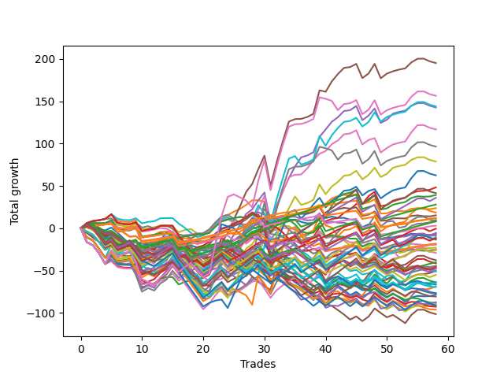

# Long Shepard 006 DB 
- Symbol: ES
- Date Range: 03/18/2022 - 07/15/2022
- Trading Period: 7:20-12:30
- Number of Trades: 58



| Name | Win Percent | Profit | Avg Profit / Trade | Avg Time / Trade |      | Name | Win Percent | Profit | Avg Profit / Trade | Avg Time / Trade |
| ---- | ----------- | ------ | ------------------ | ---------------- | ---- | ---- | ----------- | ------ | ------------------ | ---------------- |
| Sorted By <br> Profit | | | | | | Sorted By <br> Win Percentage ||||
| Five | 68.97 | 97625.00 | 1683.19 | 24:51 |     | Eighty-One | 91.38 | 6000.00 | 103.45 | 05:34 |
| TEST | 60.34 | 78250.00 | 1349.14 | 29:33 |     | One Hundred Twenty-Six | 89.66 | 5875.00 | 101.29 | 03:45 |
| Sixty-One | 60.34 | 72000.00 | 1241.38 | 19:21 |     | Eighty-Two | 87.93 | 14000.00 | 241.38 | 09:11 |
| Four | 72.41 | 71375.00 | 1230.60 | 21:38 |     | One Hundred Twenty-One | 87.93 | 1500.00 | 25.86 | 03:35 |
| Six | 70.69 | 58375.00 | 1006.47 | 19:13 |     | One Hundred Twenty-Seven | 82.76 | 4000.00 | 68.97 | 06:30 |
| Seven | 62.07 | 48250.00 | 831.90 | 26:26 |     | One Hundred Twenty-Two | 81.03 | -3125.00 | -53.88 | 06:34 |
| Sixty | 62.07 | 39375.00 | 678.88 | 16:41 |     | Two | 79.31 | 19625.00 | 338.36 | 15:30 |
| Sixty-Two | 60.34 | 31250.00 | 538.79 | 14:18 |     | Eighty-Three | 79.31 | -250.00 | -4.31 | 12:42 |
| Three | 77.59 | 24125.00 | 415.95 | 14:58 |     | Three | 77.59 | 24125.00 | 415.95 | 14:58 |
| Eighty-Five | 72.41 | 20750.00 | 357.76 | 17:26 |     | Eighty-Four | 77.59 | 18000.00 | 310.34 | 14:57 |
| Two | 79.31 | 19625.00 | 338.36 | 15:30 |     | One | 75.86 | 11875.00 | 204.74 | 09:43 |
| Eighty-Four | 77.59 | 18000.00 | 310.34 | 14:57 |     | One Hundred Sixteen | 75.86 | -9125.00 | -157.33 | 02:11 |
| Eighty-Two | 87.93 | 14000.00 | 241.38 | 09:11 |     | One Hundred Eleven | 74.14 | -9625.00 | -165.95 | 02:05 |
| One | 75.86 | 11875.00 | 204.74 | 09:43 |     | Four | 72.41 | 71375.00 | 1230.60 | 21:38 |
| Sixty-Three | 53.45 | 9250.00 | 159.48 | 20:34 |     | Eighty-Five | 72.41 | 20750.00 | 357.76 | 17:26 |
| Fifty-Seven | 72.41 | 7625.00 | 131.47 | 07:14 |     | Fifty-Seven | 72.41 | 7625.00 | 131.47 | 07:14 |
| Eighty-One | 91.38 | 6000.00 | 103.45 | 05:34 |     | Six | 70.69 | 58375.00 | 1006.47 | 19:13 |
| One Hundred Twenty-Six | 89.66 | 5875.00 | 101.29 | 03:45 |     | One Hundred Twenty-Eight | 70.69 | -5875.00 | -101.29 | 08:51 |
| Fifty-Nine | 67.24 | 4875.00 | 84.05 | 11:04 |     | One Hundred Twenty-Three | 70.69 | -12625.00 | -217.67 | 09:04 |
| Sixty-Nine | 46.55 | 4125.00 | 71.12 | 16:18 |     | Five | 68.97 | 97625.00 | 1683.19 | 24:51 |
| One Hundred Twenty-Seven | 82.76 | 4000.00 | 68.97 | 06:30 |     | Fifty-Nine | 67.24 | 4875.00 | 84.05 | 11:04 |
| One Hundred Twenty-One | 87.93 | 1500.00 | 25.86 | 03:35 |     | One Hundred Twenty-Four | 67.24 | -5250.00 | -90.52 | 10:58 |
| Eighty-Three | 79.31 | -250.00 | -4.31 | 12:42 |     | One Hundred Twenty-Nine | 65.52 | -2750.00 | -47.41 | 10:43 |
| One Hundred Twenty-Nine | 65.52 | -2750.00 | -47.41 | 10:43 |     | Fifty-Eight | 65.52 | -12375.00 | -213.36 | 11:23 |
| One Hundred Twenty-Two | 81.03 | -3125.00 | -53.88 | 06:34 |     | Seven | 62.07 | 48250.00 | 831.90 | 26:26 |
| Zero | 62.07 | -3625.00 | -62.50 | 04:48 |     | Sixty | 62.07 | 39375.00 | 678.88 | 16:41 |
| Fifty-Six | 62.07 | -4250.00 | -73.28 | 03:30 |     | Zero | 62.07 | -3625.00 | -62.50 | 04:48 |
| One Hundred Twenty-Four | 67.24 | -5250.00 | -90.52 | 10:58 |     | Fifty-Six | 62.07 | -4250.00 | -73.28 | 03:30 |
| One Hundred Twenty-Eight | 70.69 | -5875.00 | -101.29 | 08:51 |     | One Hundred Twenty-Five | 62.07 | -6625.00 | -114.22 | 13:05 |
| One Hundred Twenty-Five | 62.07 | -6625.00 | -114.22 | 13:05 |     | TEST | 60.34 | 78250.00 | 1349.14 | 29:33 |
| Seventy | 50.00 | -6750.00 | -116.38 | 12:03 |     | Sixty-One | 60.34 | 72000.00 | 1241.38 | 19:21 |
| One Hundred Sixteen | 75.86 | -9125.00 | -157.33 | 02:11 |     | Sixty-Two | 60.34 | 31250.00 | 538.79 | 14:18 |
| One Hundred Eleven | 74.14 | -9625.00 | -165.95 | 02:05 |     | One Hundred Seventeen | 60.34 | -20125.00 | -346.98 | 03:32 |
| Forty-Eight | 53.45 | -9625.00 | -165.95 | 02:10 |     | One Hundred Twelve | 60.34 | -22375.00 | -385.78 | 03:40 |
| Forty | 53.45 | -11500.00 | -198.28 | 02:22 |     | Sixty-Four | 58.62 | -12875.00 | -221.98 | 03:25 |
| Fifty-Eight | 65.52 | -12375.00 | -213.36 | 11:23 |     | Sixty-Five | 58.62 | -23625.00 | -407.33 | 06:55 |
| One Hundred Twenty-Three | 70.69 | -12625.00 | -217.67 | 09:04 |     | Sixty-Seven | 56.90 | -25125.00 | -433.19 | 09:39 |
| Sixty-Four | 58.62 | -12875.00 | -221.98 | 03:25 |     | One Hundred Thirty | 55.17 | -18875.00 | -325.43 | 12:00 |
| Sixty-Eight | 50.00 | -14625.00 | -252.16 | 14:16 |     | Sixty-Three | 53.45 | 9250.00 | 159.48 | 20:34 |
| One Hundred Thirty | 55.17 | -18875.00 | -325.43 | 12:00 |     | Forty-Eight | 53.45 | -9625.00 | -165.95 | 02:10 |
| One Hundred Seventeen | 60.34 | -20125.00 | -346.98 | 03:32 |     | Forty | 53.45 | -11500.00 | -198.28 | 02:22 |
| Forty-Five | 29.31 | -20750.00 | -357.76 | 12:02 |     | Sixty-Six | 53.45 | -43750.00 | -754.31 | 09:59 |
| Forty-Nine | 43.10 | -22250.00 | -383.62 | 04:13 |     | Seventy | 50.00 | -6750.00 | -116.38 | 12:03 |
| One Hundred Twelve | 60.34 | -22375.00 | -385.78 | 03:40 |     | Sixty-Eight | 50.00 | -14625.00 | -252.16 | 14:16 |
| One Hundred Eighteen | 46.55 | -23000.00 | -396.55 | 04:36 |     | One Hundred Thirteen | 50.00 | -27500.00 | -474.14 | 05:31 |
| Sixty-Five | 58.62 | -23625.00 | -407.33 | 06:55 |     | Sixty-Nine | 46.55 | 4125.00 | 71.12 | 16:18 |
| One Hundred Ninteen | 39.66 | -23750.00 | -409.48 | 05:11 |     | One Hundred Eighteen | 46.55 | -23000.00 | -396.55 | 04:36 |
| Sixty-Seven | 56.90 | -25125.00 | -433.19 | 09:39 |     | Seventy-One | 46.55 | -25625.00 | -441.81 | 16:23 |
| Seventy-One | 46.55 | -25625.00 | -441.81 | 16:23 |     | Forty-One | 46.55 | -31750.00 | -547.41 | 05:00 |
| One Hundred Thirteen | 50.00 | -27500.00 | -474.14 | 05:31 |     | Forty-Nine | 43.10 | -22250.00 | -383.62 | 04:13 |
| Forty-One | 46.55 | -31750.00 | -547.41 | 05:00 |     | One Hundred Fourteen | 43.10 | -32000.00 | -551.72 | 06:36 |
| One Hundred Fourteen | 43.10 | -32000.00 | -551.72 | 06:36 |     | Forty-Three | 41.38 | -34375.00 | -592.67 | 06:52 |
| Forty-Four | 32.76 | -32000.00 | -551.72 | 10:06 |     | One Hundred Ninteen | 39.66 | -23750.00 | -409.48 | 05:11 |
| Seventy-Three | 24.14 | -33250.00 | -573.28 | 05:59 |     | Forty-Two | 37.93 | -39250.00 | -676.72 | 07:13 |
| Forty-Three | 41.38 | -34375.00 | -592.67 | 06:52 |     | Fifty-One | 34.48 | -34750.00 | -599.14 | 05:09 |
| Fifty-One | 34.48 | -34750.00 | -599.14 | 05:09 |     | Forty-Six | 34.48 | -38500.00 | -663.79 | 08:23 |
| Fifty-Two | 29.31 | -38375.00 | -661.64 | 06:40 |     | Fifty | 34.48 | -45125.00 | -778.02 | 05:08 |
| Forty-Six | 34.48 | -38500.00 | -663.79 | 08:23 |     | One Hundred Fifteen | 34.48 | -45625.00 | -786.64 | 07:35 |
| Forty-Two | 37.93 | -39250.00 | -676.72 | 07:13 |     | Forty-Four | 32.76 | -32000.00 | -551.72 | 10:06 |
| One Hundred Twenty | 25.86 | -40375.00 | -696.12 | 05:39 |     | Forty-Five | 29.31 | -20750.00 | -357.76 | 12:02 |
| Sixty-Six | 53.45 | -43750.00 | -754.31 | 09:59 |     | Fifty-Two | 29.31 | -38375.00 | -661.64 | 06:40 |
| Fifty-Four | 29.31 | -44125.00 | -760.78 | 05:17 |     | Fifty-Four | 29.31 | -44125.00 | -760.78 | 05:17 |
| Fifty | 34.48 | -45125.00 | -778.02 | 05:08 |     | Fifty-Five | 29.31 | -46375.00 | -799.57 | 06:51 |
| One Hundred Fifteen | 34.48 | -45625.00 | -786.64 | 07:35 |     | Forty-Seven | 27.59 | -50750.00 | -875.00 | 12:15 |
| Fifty-Five | 29.31 | -46375.00 | -799.57 | 06:51 |     | One Hundred Twenty | 25.86 | -40375.00 | -696.12 | 05:39 |
| Fifty-Three | 25.86 | -48125.00 | -829.74 | 06:57 |     | Fifty-Three | 25.86 | -48125.00 | -829.74 | 06:57 |
| Forty-Seven | 27.59 | -50750.00 | -875.00 | 12:15 |     | Seventy-Three | 24.14 | -33250.00 | -573.28 | 05:59 |

## NO STOPLOSS

### Test Zero
* Sell when price hits the middle line of the 20p bollinger
* No Stoploss
* Results:
```
Total Trades: 58
Percent Up: 62.07
Percent Down: 37.93
Total Points Moved Up: -7.25
Potential Profit: -3625.00
Total Points Ups: 77.75 Count Ups: 36
Total Points Downs: -85.00 Count Downs: 22
```

<details><summary>Trades</summary>

<code>In: 2022-03-21 09:41:00		Out: 2022-03-21 09:45:00		Total Position Time: 04:00		Total Move Up: 4.75		Total to Date: 4.75</code> <br />
<code>In: 2022-03-23 09:49:00		Out: 2022-03-23 09:53:00		Total Position Time: 04:00		Total Move Up: 1.50		Total to Date: 6.25</code> <br />
<code>In: 2022-03-23 09:53:00		Out: 2022-03-23 09:54:00		Total Position Time: 01:00		Total Move Up: -0.50		Total to Date: 5.75</code> <br />
<code>In: 2022-03-23 10:07:00		Out: 2022-03-23 10:07:10		Total Position Time: 00:10		Total Move Up: 0.25		Total to Date: 6.00</code> <br />
<code>In: 2022-03-24 07:32:00		Out: 2022-03-24 07:32:40		Total Position Time: 00:40		Total Move Up: 3.25		Total to Date: 9.25</code> <br />
<code>In: 2022-03-25 08:18:00		Out: 2022-03-25 08:36:40		Total Position Time: 18:40		Total Move Up: -8.75		Total to Date: 0.50</code> <br />
<code>In: 2022-03-28 07:30:00		Out: 2022-03-28 07:30:10		Total Position Time: 00:10		Total Move Up: -1.50		Total to Date: -1.00</code> <br />
<code>In: 2022-03-28 07:31:00		Out: 2022-03-28 07:31:10		Total Position Time: 00:10		Total Move Up: -0.25		Total to Date: -1.25</code> <br />
<code>In: 2022-03-28 08:11:00		Out: 2022-03-28 08:11:45		Total Position Time: 00:45		Total Move Up: 2.75		Total to Date: 1.50</code> <br />
<code>In: 2022-03-28 08:30:00		Out: 2022-03-28 08:59:55		Total Position Time: 29:55		Total Move Up: -19.75		Total to Date: -18.25</code> <br />
<code>In: 2022-03-30 07:29:00		Out: 2022-03-30 07:36:25		Total Position Time: 07:25		Total Move Up: 0.50		Total to Date: -17.75</code> <br />
<code>In: 2022-03-31 09:30:00		Out: 2022-03-31 09:32:35		Total Position Time: 02:35		Total Move Up: 1.75		Total to Date: -16.00</code> <br />
<code>In: 2022-04-20 08:27:00		Out: 2022-04-20 08:28:55		Total Position Time: 01:55		Total Move Up: 1.75		Total to Date: -14.25</code> <br />
<code>In: 2022-04-20 08:30:00		Out: 2022-04-20 08:30:10		Total Position Time: 00:10		Total Move Up: -0.75		Total to Date: -15.00</code> <br />
<code>In: 2022-04-20 09:19:00		Out: 2022-04-20 09:30:50		Total Position Time: 11:50		Total Move Up: -0.50		Total to Date: -15.50</code> <br />
<code>In: 2022-04-20 11:32:00		Out: 2022-04-20 11:48:15		Total Position Time: 16:15		Total Move Up: -5.00		Total to Date: -20.50</code> <br />
<code>In: 2022-04-20 11:47:00		Out: 2022-04-20 11:48:15		Total Position Time: 01:15		Total Move Up: 2.75		Total to Date: -17.75</code> <br />
<code>In: 2022-04-20 11:48:00		Out: 2022-04-20 11:48:15		Total Position Time: 00:15		Total Move Up: 1.00		Total to Date: -16.75</code> <br />
<code>In: 2022-04-27 12:11:00		Out: 2022-04-27 12:13:55		Total Position Time: 02:55		Total Move Up: 1.50		Total to Date: -15.25</code> <br />
<code>In: 2022-04-27 12:14:00		Out: 2022-04-27 12:14:35		Total Position Time: 00:35		Total Move Up: -0.50		Total to Date: -15.75</code> <br />
<code>In: 2022-04-27 12:24:00		Out: 2022-04-27 12:24:15		Total Position Time: 00:15		Total Move Up: 2.00		Total to Date: -13.75</code> <br />
<code>In: 2022-05-03 07:51:00		Out: 2022-05-03 07:54:05		Total Position Time: 03:05		Total Move Up: 7.50		Total to Date: -6.25</code> <br />
<code>In: 2022-05-03 07:52:00		Out: 2022-05-03 07:54:05		Total Position Time: 02:05		Total Move Up: 6.00		Total to Date: -0.25</code> <br />
<code>In: 2022-05-03 11:45:00		Out: 2022-05-03 11:45:10		Total Position Time: 00:10		Total Move Up: 2.25		Total to Date: 2.00</code> <br />
<code>In: 2022-05-06 11:36:00		Out: 2022-05-06 11:40:25		Total Position Time: 04:25		Total Move Up: 1.75		Total to Date: 3.75</code> <br />
<code>In: 2022-05-06 11:41:00		Out: 2022-05-06 11:41:10		Total Position Time: 00:10		Total Move Up: 1.25		Total to Date: 5.00</code> <br />
<code>In: 2022-05-06 11:47:00		Out: 2022-05-06 11:48:15		Total Position Time: 01:15		Total Move Up: -0.75		Total to Date: 4.25</code> <br />
<code>In: 2022-05-06 11:50:00		Out: 2022-05-06 11:50:10		Total Position Time: 00:10		Total Move Up: 5.50		Total to Date: 9.75</code> <br />
<code>In: 2022-05-06 12:12:00		Out: 2022-05-06 12:19:10		Total Position Time: 07:10		Total Move Up: 0.75		Total to Date: 10.50</code> <br />
<code>In: 2022-05-06 12:20:00		Out: 2022-05-06 12:20:10		Total Position Time: 00:10		Total Move Up: -2.75		Total to Date: 7.75</code> <br />
<code>In: 2022-05-11 09:37:00		Out: 2022-05-11 09:49:15		Total Position Time: 12:15		Total Move Up: -6.25		Total to Date: 1.50</code> <br />
<code>In: 2022-05-12 09:04:00		Out: 2022-05-12 09:07:35		Total Position Time: 03:35		Total Move Up: 6.00		Total to Date: 7.50</code> <br />
<code>In: 2022-05-12 09:05:00		Out: 2022-05-12 09:07:35		Total Position Time: 02:35		Total Move Up: 2.75		Total to Date: 10.25</code> <br />
<code>In: 2022-05-12 09:08:00		Out: 2022-05-12 09:08:30		Total Position Time: 00:30		Total Move Up: -0.25		Total to Date: 10.00</code> <br />
<code>In: 2022-05-13 11:10:00		Out: 2022-05-13 11:19:15		Total Position Time: 09:15		Total Move Up: 0.25		Total to Date: 10.25</code> <br />
<code>In: 2022-05-13 11:11:00		Out: 2022-05-13 11:19:15		Total Position Time: 08:15		Total Move Up: -2.75		Total to Date: 7.50</code> <br />
<code>In: 2022-05-16 07:58:00		Out: 2022-05-16 08:05:30		Total Position Time: 07:30		Total Move Up: -1.75		Total to Date: 5.75</code> <br />
<code>In: 2022-05-16 08:02:00		Out: 2022-05-16 08:05:30		Total Position Time: 03:30		Total Move Up: 0.50		Total to Date: 6.25</code> <br />
<code>In: 2022-05-17 11:25:00		Out: 2022-05-17 11:27:30		Total Position Time: 02:30		Total Move Up: 8.00		Total to Date: 14.25</code> <br />
<code>In: 2022-05-19 07:47:00		Out: 2022-05-19 07:53:45		Total Position Time: 06:45		Total Move Up: -2.25		Total to Date: 12.00</code> <br />
<code>In: 2022-05-19 10:19:00		Out: 2022-05-19 10:19:20		Total Position Time: 00:20		Total Move Up: 1.75		Total to Date: 13.75</code> <br />
<code>In: 2022-05-19 10:20:00		Out: 2022-05-19 10:20:10		Total Position Time: 00:10		Total Move Up: -1.50		Total to Date: 12.25</code> <br />
<code>In: 2022-05-25 09:30:00		Out: 2022-05-25 09:41:25		Total Position Time: 11:25		Total Move Up: 0.00		Total to Date: 12.25</code> <br />
<code>In: 2022-05-25 09:31:00		Out: 2022-05-25 09:41:25		Total Position Time: 10:25		Total Move Up: -2.25		Total to Date: 10.00</code> <br />
<code>In: 2022-05-25 09:39:00		Out: 2022-05-25 09:41:25		Total Position Time: 02:25		Total Move Up: 0.00		Total to Date: 10.00</code> <br />
<code>In: 2022-06-03 07:33:00		Out: 2022-06-03 07:46:30		Total Position Time: 13:30		Total Move Up: -8.75		Total to Date: 1.25</code> <br />
<code>In: 2022-06-06 08:24:00		Out: 2022-06-06 08:31:35		Total Position Time: 07:35		Total Move Up: 3.25		Total to Date: 4.50</code> <br />
<code>In: 2022-06-08 08:06:00		Out: 2022-06-08 08:09:35		Total Position Time: 03:35		Total Move Up: 0.25		Total to Date: 4.75</code> <br />
<code>In: 2022-06-15 07:43:00		Out: 2022-06-15 08:12:55		Total Position Time: 29:55		Total Move Up: -17.00		Total to Date: -12.25</code> <br />
<code>In: 2022-06-27 10:51:00		Out: 2022-06-27 10:51:15		Total Position Time: 00:15		Total Move Up: 0.75		Total to Date: -11.50</code> <br />
<code>In: 2022-06-29 08:29:00		Out: 2022-06-29 08:29:10		Total Position Time: 00:10		Total Move Up: 0.75		Total to Date: -10.75</code> <br />
<code>In: 2022-07-08 09:48:00		Out: 2022-07-08 09:48:40		Total Position Time: 00:40		Total Move Up: 1.75		Total to Date: -9.00</code> <br />
<code>In: 2022-07-08 09:56:00		Out: 2022-07-08 09:56:10		Total Position Time: 00:10		Total Move Up: 0.50		Total to Date: -8.50</code> <br />
<code>In: 2022-07-08 10:06:00		Out: 2022-07-08 10:06:10		Total Position Time: 00:10		Total Move Up: 2.00		Total to Date: -6.50</code> <br />
<code>In: 2022-07-08 10:07:00		Out: 2022-07-08 10:07:10		Total Position Time: 00:10		Total Move Up: -0.50		Total to Date: -7.00</code> <br />
<code>In: 2022-07-11 12:12:00		Out: 2022-07-11 12:22:10		Total Position Time: 10:10		Total Move Up: -0.75		Total to Date: -7.75</code> <br />
<code>In: 2022-07-11 12:15:00		Out: 2022-07-11 12:22:10		Total Position Time: 07:10		Total Move Up: 0.00		Total to Date: -7.75</code> <br />
<code>In: 2022-07-11 12:25:00		Out: 2022-07-11 12:25:30		Total Position Time: 00:30		Total Move Up: 0.50		Total to Date: -7.25</code> <br />


</details>

### Test One
* Sell when the price hits the upper line of the 20p 1std bollinger
* No Stoploss
* Results:
```
Total Trades: 58
Percent Up: 75.86
Percent Down: 24.14
Total Points Moved Up: 23.75
Potential Profit: 11875.00
Total Points Ups: 130.00 Count Ups: 44
Total Points Downs: -106.25 Count Downs: 14
```

<details><summary>Trades</summary>

<code>In: 2022-03-21 09:41:00		Out: 2022-03-21 09:49:45		Total Position Time: 08:45		Total Move Up: 6.00		Total to Date: 6.00</code> <br />
<code>In: 2022-03-23 09:49:00		Out: 2022-03-23 09:59:10		Total Position Time: 10:10		Total Move Up: 2.50		Total to Date: 8.50</code> <br />
<code>In: 2022-03-23 09:53:00		Out: 2022-03-23 09:59:10		Total Position Time: 06:10		Total Move Up: 1.00		Total to Date: 9.50</code> <br />
<code>In: 2022-03-23 10:07:00		Out: 2022-03-23 10:11:05		Total Position Time: 04:05		Total Move Up: 1.50		Total to Date: 11.00</code> <br />
<code>In: 2022-03-24 07:32:00		Out: 2022-03-24 07:32:50		Total Position Time: 00:50		Total Move Up: 5.50		Total to Date: 16.50</code> <br />
<code>In: 2022-03-25 08:18:00		Out: 2022-03-25 08:41:05		Total Position Time: 23:05		Total Move Up: -7.50		Total to Date: 9.00</code> <br />
<code>In: 2022-03-28 07:30:00		Out: 2022-03-28 07:30:10		Total Position Time: 00:10		Total Move Up: -1.50		Total to Date: 7.50</code> <br />
<code>In: 2022-03-28 07:31:00		Out: 2022-03-28 07:31:10		Total Position Time: 00:10		Total Move Up: -0.25		Total to Date: 7.25</code> <br />
<code>In: 2022-03-28 08:11:00		Out: 2022-03-28 08:20:05		Total Position Time: 09:05		Total Move Up: 2.25		Total to Date: 9.50</code> <br />
<code>In: 2022-03-28 08:30:00		Out: 2022-03-28 08:59:55		Total Position Time: 29:55		Total Move Up: -19.75		Total to Date: -10.25</code> <br />
<code>In: 2022-03-30 07:29:00		Out: 2022-03-30 07:38:35		Total Position Time: 09:35		Total Move Up: 1.75		Total to Date: -8.50</code> <br />
<code>In: 2022-03-31 09:30:00		Out: 2022-03-31 09:40:25		Total Position Time: 10:25		Total Move Up: 0.75		Total to Date: -7.75</code> <br />
<code>In: 2022-04-20 08:27:00		Out: 2022-04-20 08:29:35		Total Position Time: 02:35		Total Move Up: 3.50		Total to Date: -4.25</code> <br />
<code>In: 2022-04-20 08:30:00		Out: 2022-04-20 08:30:35		Total Position Time: 00:35		Total Move Up: 0.25		Total to Date: -4.00</code> <br />
<code>In: 2022-04-20 09:19:00		Out: 2022-04-20 09:30:55		Total Position Time: 11:55		Total Move Up: 0.00		Total to Date: -4.00</code> <br />
<code>In: 2022-04-20 11:32:00		Out: 2022-04-20 12:01:55		Total Position Time: 29:55		Total Move Up: -8.75		Total to Date: -12.75</code> <br />
<code>In: 2022-04-20 11:47:00		Out: 2022-04-20 12:04:20		Total Position Time: 17:20		Total Move Up: 1.00		Total to Date: -11.75</code> <br />
<code>In: 2022-04-20 11:48:00		Out: 2022-04-20 12:04:20		Total Position Time: 16:20		Total Move Up: -0.75		Total to Date: -12.50</code> <br />
<code>In: 2022-04-27 12:11:00		Out: 2022-04-27 12:15:20		Total Position Time: 04:20		Total Move Up: 4.25		Total to Date: -8.25</code> <br />
<code>In: 2022-04-27 12:14:00		Out: 2022-04-27 12:15:20		Total Position Time: 01:20		Total Move Up: 2.00		Total to Date: -6.25</code> <br />
<code>In: 2022-04-27 12:24:00		Out: 2022-04-27 12:27:15		Total Position Time: 03:15		Total Move Up: 4.50		Total to Date: -1.75</code> <br />
<code>In: 2022-05-03 07:51:00		Out: 2022-05-03 07:57:05		Total Position Time: 06:05		Total Move Up: 8.25		Total to Date: 6.50</code> <br />
<code>In: 2022-05-03 07:52:00		Out: 2022-05-03 07:57:05		Total Position Time: 05:05		Total Move Up: 6.75		Total to Date: 13.25</code> <br />
<code>In: 2022-05-03 11:45:00		Out: 2022-05-03 11:45:10		Total Position Time: 00:10		Total Move Up: 2.25		Total to Date: 15.50</code> <br />
<code>In: 2022-05-06 11:36:00		Out: 2022-05-06 11:49:10		Total Position Time: 13:10		Total Move Up: 4.00		Total to Date: 19.50</code> <br />
<code>In: 2022-05-06 11:41:00		Out: 2022-05-06 11:49:10		Total Position Time: 08:10		Total Move Up: 3.25		Total to Date: 22.75</code> <br />
<code>In: 2022-05-06 11:47:00		Out: 2022-05-06 11:49:10		Total Position Time: 02:10		Total Move Up: 4.75		Total to Date: 27.50</code> <br />
<code>In: 2022-05-06 11:50:00		Out: 2022-05-06 11:50:10		Total Position Time: 00:10		Total Move Up: 5.50		Total to Date: 33.00</code> <br />
<code>In: 2022-05-06 12:12:00		Out: 2022-05-06 12:28:05		Total Position Time: 16:05		Total Move Up: 0.00		Total to Date: 33.00</code> <br />
<code>In: 2022-05-06 12:20:00		Out: 2022-05-06 12:28:05		Total Position Time: 08:05		Total Move Up: -1.50		Total to Date: 31.50</code> <br />
<code>In: 2022-05-11 09:37:00		Out: 2022-05-11 10:06:55		Total Position Time: 29:55		Total Move Up: -35.75		Total to Date: -4.25</code> <br />
<code>In: 2022-05-12 09:04:00		Out: 2022-05-12 09:11:10		Total Position Time: 07:10		Total Move Up: 8.50		Total to Date: 4.25</code> <br />
<code>In: 2022-05-12 09:05:00		Out: 2022-05-12 09:11:10		Total Position Time: 06:10		Total Move Up: 5.25		Total to Date: 9.50</code> <br />
<code>In: 2022-05-12 09:08:00		Out: 2022-05-12 09:11:10		Total Position Time: 03:10		Total Move Up: 3.75		Total to Date: 13.25</code> <br />
<code>In: 2022-05-13 11:10:00		Out: 2022-05-13 11:20:00		Total Position Time: 10:00		Total Move Up: 3.75		Total to Date: 17.00</code> <br />
<code>In: 2022-05-13 11:11:00		Out: 2022-05-13 11:20:00		Total Position Time: 09:00		Total Move Up: 0.75		Total to Date: 17.75</code> <br />
<code>In: 2022-05-16 07:58:00		Out: 2022-05-16 08:09:50		Total Position Time: 11:50		Total Move Up: 0.00		Total to Date: 17.75</code> <br />
<code>In: 2022-05-16 08:02:00		Out: 2022-05-16 08:09:50		Total Position Time: 07:50		Total Move Up: 2.25		Total to Date: 20.00</code> <br />
<code>In: 2022-05-17 11:25:00		Out: 2022-05-17 11:37:35		Total Position Time: 12:35		Total Move Up: 5.75		Total to Date: 25.75</code> <br />
<code>In: 2022-05-19 07:47:00		Out: 2022-05-19 07:54:50		Total Position Time: 07:50		Total Move Up: 3.25		Total to Date: 29.00</code> <br />
<code>In: 2022-05-19 10:19:00		Out: 2022-05-19 10:22:45		Total Position Time: 03:45		Total Move Up: 6.25		Total to Date: 35.25</code> <br />
<code>In: 2022-05-19 10:20:00		Out: 2022-05-19 10:22:45		Total Position Time: 02:45		Total Move Up: 2.75		Total to Date: 38.00</code> <br />
<code>In: 2022-05-25 09:30:00		Out: 2022-05-25 09:44:25		Total Position Time: 14:25		Total Move Up: 1.50		Total to Date: 39.50</code> <br />
<code>In: 2022-05-25 09:31:00		Out: 2022-05-25 09:44:25		Total Position Time: 13:25		Total Move Up: -0.75		Total to Date: 38.75</code> <br />
<code>In: 2022-05-25 09:39:00		Out: 2022-05-25 09:44:25		Total Position Time: 05:25		Total Move Up: 1.50		Total to Date: 40.25</code> <br />
<code>In: 2022-06-03 07:33:00		Out: 2022-06-03 07:57:55		Total Position Time: 24:55		Total Move Up: -11.25		Total to Date: 29.00</code> <br />
<code>In: 2022-06-06 08:24:00		Out: 2022-06-06 08:39:15		Total Position Time: 15:15		Total Move Up: 1.50		Total to Date: 30.50</code> <br />
<code>In: 2022-06-08 08:06:00		Out: 2022-06-08 08:11:10		Total Position Time: 05:10		Total Move Up: 3.75		Total to Date: 34.25</code> <br />
<code>In: 2022-06-15 07:43:00		Out: 2022-06-15 08:12:55		Total Position Time: 29:55		Total Move Up: -17.00		Total to Date: 17.25</code> <br />
<code>In: 2022-06-27 10:51:00		Out: 2022-06-27 11:03:15		Total Position Time: 12:15		Total Move Up: 0.50		Total to Date: 17.75</code> <br />
<code>In: 2022-06-29 08:29:00		Out: 2022-06-29 08:32:20		Total Position Time: 03:20		Total Move Up: 2.50		Total to Date: 20.25</code> <br />
<code>In: 2022-07-08 09:48:00		Out: 2022-07-08 10:06:55		Total Position Time: 18:55		Total Move Up: 0.00		Total to Date: 20.25</code> <br />
<code>In: 2022-07-08 09:56:00		Out: 2022-07-08 10:06:55		Total Position Time: 10:55		Total Move Up: -0.25		Total to Date: 20.00</code> <br />
<code>In: 2022-07-08 10:06:00		Out: 2022-07-08 10:06:55		Total Position Time: 00:55		Total Move Up: 3.00		Total to Date: 23.00</code> <br />
<code>In: 2022-07-08 10:07:00		Out: 2022-07-08 10:09:35		Total Position Time: 02:35		Total Move Up: 0.75		Total to Date: 23.75</code> <br />
<code>In: 2022-07-11 12:12:00		Out: 2022-07-11 12:29:15		Total Position Time: 17:15		Total Move Up: -1.00		Total to Date: 22.75</code> <br />
<code>In: 2022-07-11 12:15:00		Out: 2022-07-11 12:29:15		Total Position Time: 14:15		Total Move Up: -0.25		Total to Date: 22.50</code> <br />
<code>In: 2022-07-11 12:25:00		Out: 2022-07-11 12:29:15		Total Position Time: 04:15		Total Move Up: 1.25		Total to Date: 23.75</code> <br />


</details>

### Test Two
* Sell when the price hits the upper line of the 20p 2std bollinger
* No Stoploss
* Results:
```
Total Trades: 58
Percent Up: 79.31
Percent Down: 20.69
Total Points Moved Up: 39.25
Potential Profit: 19625.00
Total Points Ups: 198.75 Count Ups: 46
Total Points Downs: -159.50 Count Downs: 12
```

<details><summary>Trades</summary>

<code>In: 2022-03-21 09:41:00		Out: 2022-03-21 10:10:55		Total Position Time: 29:55		Total Move Up: -16.50		Total to Date: -16.50</code> <br />
<code>In: 2022-03-23 09:49:00		Out: 2022-03-23 10:18:55		Total Position Time: 29:55		Total Move Up: -3.75		Total to Date: -20.25</code> <br />
<code>In: 2022-03-23 09:53:00		Out: 2022-03-23 10:22:55		Total Position Time: 29:55		Total Move Up: -9.50		Total to Date: -29.75</code> <br />
<code>In: 2022-03-23 10:07:00		Out: 2022-03-23 10:36:55		Total Position Time: 29:55		Total Move Up: -12.50		Total to Date: -42.25</code> <br />
<code>In: 2022-03-24 07:32:00		Out: 2022-03-24 07:34:15		Total Position Time: 02:15		Total Move Up: 8.75		Total to Date: -33.50</code> <br />
<code>In: 2022-03-25 08:18:00		Out: 2022-03-25 08:41:45		Total Position Time: 23:45		Total Move Up: -5.00		Total to Date: -38.50</code> <br />
<code>In: 2022-03-28 07:30:00		Out: 2022-03-28 07:30:25		Total Position Time: 00:25		Total Move Up: 0.75		Total to Date: -37.75</code> <br />
<code>In: 2022-03-28 07:31:00		Out: 2022-03-28 07:48:05		Total Position Time: 17:05		Total Move Up: 1.50		Total to Date: -36.25</code> <br />
<code>In: 2022-03-28 08:11:00		Out: 2022-03-28 08:40:55		Total Position Time: 29:55		Total Move Up: -13.75		Total to Date: -50.00</code> <br />
<code>In: 2022-03-28 08:30:00		Out: 2022-03-28 08:59:55		Total Position Time: 29:55		Total Move Up: -19.75		Total to Date: -69.75</code> <br />
<code>In: 2022-03-30 07:29:00		Out: 2022-03-30 07:46:00		Total Position Time: 17:00		Total Move Up: 2.25		Total to Date: -67.50</code> <br />
<code>In: 2022-03-31 09:30:00		Out: 2022-03-31 09:44:20		Total Position Time: 14:20		Total Move Up: 2.50		Total to Date: -65.00</code> <br />
<code>In: 2022-04-20 08:27:00		Out: 2022-04-20 08:31:15		Total Position Time: 04:15		Total Move Up: 5.25		Total to Date: -59.75</code> <br />
<code>In: 2022-04-20 08:30:00		Out: 2022-04-20 08:31:15		Total Position Time: 01:15		Total Move Up: 2.00		Total to Date: -57.75</code> <br />
<code>In: 2022-04-20 09:19:00		Out: 2022-04-20 09:31:05		Total Position Time: 12:05		Total Move Up: 0.00		Total to Date: -57.75</code> <br />
<code>In: 2022-04-20 11:32:00		Out: 2022-04-20 12:01:55		Total Position Time: 29:55		Total Move Up: -8.75		Total to Date: -66.50</code> <br />
<code>In: 2022-04-20 11:47:00		Out: 2022-04-20 12:12:35		Total Position Time: 25:35		Total Move Up: 3.25		Total to Date: -63.25</code> <br />
<code>In: 2022-04-20 11:48:00		Out: 2022-04-20 12:12:35		Total Position Time: 24:35		Total Move Up: 1.50		Total to Date: -61.75</code> <br />
<code>In: 2022-04-27 12:11:00		Out: 2022-04-27 12:31:20		Total Position Time: 20:20		Total Move Up: 2.50		Total to Date: -59.25</code> <br />
<code>In: 2022-04-27 12:14:00		Out: 2022-04-27 12:31:20		Total Position Time: 17:20		Total Move Up: 0.25		Total to Date: -59.00</code> <br />
<code>In: 2022-04-27 12:24:00		Out: 2022-04-27 12:31:20		Total Position Time: 07:20		Total Move Up: 6.50		Total to Date: -52.50</code> <br />
<code>In: 2022-05-03 07:51:00		Out: 2022-05-03 07:59:10		Total Position Time: 08:10		Total Move Up: 10.00		Total to Date: -42.50</code> <br />
<code>In: 2022-05-03 07:52:00		Out: 2022-05-03 07:59:10		Total Position Time: 07:10		Total Move Up: 8.50		Total to Date: -34.00</code> <br />
<code>In: 2022-05-03 11:45:00		Out: 2022-05-03 11:52:15		Total Position Time: 07:15		Total Move Up: 12.50		Total to Date: -21.50</code> <br />
<code>In: 2022-05-06 11:36:00		Out: 2022-05-06 11:49:10		Total Position Time: 13:10		Total Move Up: 4.00		Total to Date: -17.50</code> <br />
<code>In: 2022-05-06 11:41:00		Out: 2022-05-06 11:49:10		Total Position Time: 08:10		Total Move Up: 3.25		Total to Date: -14.25</code> <br />
<code>In: 2022-05-06 11:47:00		Out: 2022-05-06 11:49:10		Total Position Time: 02:10		Total Move Up: 4.75		Total to Date: -9.50</code> <br />
<code>In: 2022-05-06 11:50:00		Out: 2022-05-06 11:50:10		Total Position Time: 00:10		Total Move Up: 5.50		Total to Date: -4.00</code> <br />
<code>In: 2022-05-06 12:12:00		Out: 2022-05-06 12:28:10		Total Position Time: 16:10		Total Move Up: 2.00		Total to Date: -2.00</code> <br />
<code>In: 2022-05-06 12:20:00		Out: 2022-05-06 12:28:10		Total Position Time: 08:10		Total Move Up: 0.50		Total to Date: -1.50</code> <br />
<code>In: 2022-05-11 09:37:00		Out: 2022-05-11 10:06:55		Total Position Time: 29:55		Total Move Up: -35.75		Total to Date: -37.25</code> <br />
<code>In: 2022-05-12 09:04:00		Out: 2022-05-12 09:16:10		Total Position Time: 12:10		Total Move Up: 9.00		Total to Date: -28.25</code> <br />
<code>In: 2022-05-12 09:05:00		Out: 2022-05-12 09:16:10		Total Position Time: 11:10		Total Move Up: 5.75		Total to Date: -22.50</code> <br />
<code>In: 2022-05-12 09:08:00		Out: 2022-05-12 09:16:10		Total Position Time: 08:10		Total Move Up: 4.25		Total to Date: -18.25</code> <br />
<code>In: 2022-05-13 11:10:00		Out: 2022-05-13 11:31:20		Total Position Time: 21:20		Total Move Up: 5.75		Total to Date: -12.50</code> <br />
<code>In: 2022-05-13 11:11:00		Out: 2022-05-13 11:31:20		Total Position Time: 20:20		Total Move Up: 2.75		Total to Date: -9.75</code> <br />
<code>In: 2022-05-16 07:58:00		Out: 2022-05-16 08:11:30		Total Position Time: 13:30		Total Move Up: 2.00		Total to Date: -7.75</code> <br />
<code>In: 2022-05-16 08:02:00		Out: 2022-05-16 08:11:30		Total Position Time: 09:30		Total Move Up: 4.25		Total to Date: -3.50</code> <br />
<code>In: 2022-05-17 11:25:00		Out: 2022-05-17 11:40:00		Total Position Time: 15:00		Total Move Up: 9.50		Total to Date: 6.00</code> <br />
<code>In: 2022-05-19 07:47:00		Out: 2022-05-19 07:55:50		Total Position Time: 08:50		Total Move Up: 7.25		Total to Date: 13.25</code> <br />
<code>In: 2022-05-19 10:19:00		Out: 2022-05-19 10:44:05		Total Position Time: 25:05		Total Move Up: 13.50		Total to Date: 26.75</code> <br />
<code>In: 2022-05-19 10:20:00		Out: 2022-05-19 10:44:05		Total Position Time: 24:05		Total Move Up: 10.00		Total to Date: 36.75</code> <br />
<code>In: 2022-05-25 09:30:00		Out: 2022-05-25 09:45:20		Total Position Time: 15:20		Total Move Up: 3.75		Total to Date: 40.50</code> <br />
<code>In: 2022-05-25 09:31:00		Out: 2022-05-25 09:45:20		Total Position Time: 14:20		Total Move Up: 1.50		Total to Date: 42.00</code> <br />
<code>In: 2022-05-25 09:39:00		Out: 2022-05-25 09:45:20		Total Position Time: 06:20		Total Move Up: 3.75		Total to Date: 45.75</code> <br />
<code>In: 2022-06-03 07:33:00		Out: 2022-06-03 08:02:55		Total Position Time: 29:55		Total Move Up: -16.75		Total to Date: 29.00</code> <br />
<code>In: 2022-06-06 08:24:00		Out: 2022-06-06 08:43:00		Total Position Time: 19:00		Total Move Up: 3.75		Total to Date: 32.75</code> <br />
<code>In: 2022-06-08 08:06:00		Out: 2022-06-08 08:14:00		Total Position Time: 08:00		Total Move Up: 6.25		Total to Date: 39.00</code> <br />
<code>In: 2022-06-15 07:43:00		Out: 2022-06-15 08:12:55		Total Position Time: 29:55		Total Move Up: -17.00		Total to Date: 22.00</code> <br />
<code>In: 2022-06-27 10:51:00		Out: 2022-06-27 11:13:35		Total Position Time: 22:35		Total Move Up: 1.50		Total to Date: 23.50</code> <br />
<code>In: 2022-06-29 08:29:00		Out: 2022-06-29 08:34:40		Total Position Time: 05:40		Total Move Up: 4.25		Total to Date: 27.75</code> <br />
<code>In: 2022-07-08 09:48:00		Out: 2022-07-08 10:10:30		Total Position Time: 22:30		Total Move Up: 1.75		Total to Date: 29.50</code> <br />
<code>In: 2022-07-08 09:56:00		Out: 2022-07-08 10:10:30		Total Position Time: 14:30		Total Move Up: 1.50		Total to Date: 31.00</code> <br />
<code>In: 2022-07-08 10:06:00		Out: 2022-07-08 10:10:30		Total Position Time: 04:30		Total Move Up: 4.75		Total to Date: 35.75</code> <br />
<code>In: 2022-07-08 10:07:00		Out: 2022-07-08 10:10:30		Total Position Time: 03:30		Total Move Up: 2.00		Total to Date: 37.75</code> <br />
<code>In: 2022-07-11 12:12:00		Out: 2022-07-11 12:29:25		Total Position Time: 17:25		Total Move Up: -0.50		Total to Date: 37.25</code> <br />
<code>In: 2022-07-11 12:15:00		Out: 2022-07-11 12:29:25		Total Position Time: 14:25		Total Move Up: 0.25		Total to Date: 37.50</code> <br />
<code>In: 2022-07-11 12:25:00		Out: 2022-07-11 12:29:25		Total Position Time: 04:25		Total Move Up: 1.75		Total to Date: 39.25</code> <br />


</details>

### Test Three
* Sell when price hits the middle line of the 50p bollinger
* No Stoploss
* Results:
```
Total Trades: 58
Percent Up: 77.59
Percent Down: 22.41
Total Points Moved Up: 48.25
Potential Profit: 24125.00
Total Points Ups: 197.25 Count Ups: 45
Total Points Downs: -149.00 Count Downs: 13
```

<details><summary>Trades</summary>

<code>In: 2022-03-21 09:41:00		Out: 2022-03-21 10:10:55		Total Position Time: 29:55		Total Move Up: -16.50		Total to Date: -16.50</code> <br />
<code>In: 2022-03-23 09:49:00		Out: 2022-03-23 10:18:55		Total Position Time: 29:55		Total Move Up: -3.75		Total to Date: -20.25</code> <br />
<code>In: 2022-03-23 09:53:00		Out: 2022-03-23 10:22:55		Total Position Time: 29:55		Total Move Up: -9.50		Total to Date: -29.75</code> <br />
<code>In: 2022-03-23 10:07:00		Out: 2022-03-23 10:36:55		Total Position Time: 29:55		Total Move Up: -12.50		Total to Date: -42.25</code> <br />
<code>In: 2022-03-24 07:32:00		Out: 2022-03-24 07:32:45		Total Position Time: 00:45		Total Move Up: 4.25		Total to Date: -38.00</code> <br />
<code>In: 2022-03-25 08:18:00		Out: 2022-03-25 08:47:55		Total Position Time: 29:55		Total Move Up: -7.00		Total to Date: -45.00</code> <br />
<code>In: 2022-03-28 07:30:00		Out: 2022-03-28 07:30:10		Total Position Time: 00:10		Total Move Up: -1.50		Total to Date: -46.50</code> <br />
<code>In: 2022-03-28 07:31:00		Out: 2022-03-28 07:31:10		Total Position Time: 00:10		Total Move Up: -0.25		Total to Date: -46.75</code> <br />
<code>In: 2022-03-28 08:11:00		Out: 2022-03-28 08:11:20		Total Position Time: 00:20		Total Move Up: 1.00		Total to Date: -45.75</code> <br />
<code>In: 2022-03-28 08:30:00		Out: 2022-03-28 08:59:55		Total Position Time: 29:55		Total Move Up: -19.75		Total to Date: -65.50</code> <br />
<code>In: 2022-03-30 07:29:00		Out: 2022-03-30 07:46:00		Total Position Time: 17:00		Total Move Up: 2.25		Total to Date: -63.25</code> <br />
<code>In: 2022-03-31 09:30:00		Out: 2022-03-31 09:45:45		Total Position Time: 15:45		Total Move Up: 3.00		Total to Date: -60.25</code> <br />
<code>In: 2022-04-20 08:27:00		Out: 2022-04-20 08:36:10		Total Position Time: 09:10		Total Move Up: 7.75		Total to Date: -52.50</code> <br />
<code>In: 2022-04-20 08:30:00		Out: 2022-04-20 08:36:10		Total Position Time: 06:10		Total Move Up: 4.50		Total to Date: -48.00</code> <br />
<code>In: 2022-04-20 09:19:00		Out: 2022-04-20 09:32:40		Total Position Time: 13:40		Total Move Up: 3.75		Total to Date: -44.25</code> <br />
<code>In: 2022-04-20 11:32:00		Out: 2022-04-20 12:01:55		Total Position Time: 29:55		Total Move Up: -8.75		Total to Date: -53.00</code> <br />
<code>In: 2022-04-20 11:47:00		Out: 2022-04-20 12:10:10		Total Position Time: 23:10		Total Move Up: 1.75		Total to Date: -51.25</code> <br />
<code>In: 2022-04-20 11:48:00		Out: 2022-04-20 12:10:10		Total Position Time: 22:10		Total Move Up: 0.00		Total to Date: -51.25</code> <br />
<code>In: 2022-04-27 12:11:00		Out: 2022-04-27 12:40:55		Total Position Time: 29:55		Total Move Up: -8.25		Total to Date: -59.50</code> <br />
<code>In: 2022-04-27 12:14:00		Out: 2022-04-27 12:43:55		Total Position Time: 29:55		Total Move Up: -8.50		Total to Date: -68.00</code> <br />
<code>In: 2022-04-27 12:24:00		Out: 2022-04-27 12:44:15		Total Position Time: 20:15		Total Move Up: 1.00		Total to Date: -67.00</code> <br />
<code>In: 2022-05-03 07:51:00		Out: 2022-05-03 07:54:05		Total Position Time: 03:05		Total Move Up: 7.50		Total to Date: -59.50</code> <br />
<code>In: 2022-05-03 07:52:00		Out: 2022-05-03 07:54:05		Total Position Time: 02:05		Total Move Up: 6.00		Total to Date: -53.50</code> <br />
<code>In: 2022-05-03 11:45:00		Out: 2022-05-03 11:48:05		Total Position Time: 03:05		Total Move Up: 1.75		Total to Date: -51.75</code> <br />
<code>In: 2022-05-06 11:36:00		Out: 2022-05-06 11:49:10		Total Position Time: 13:10		Total Move Up: 4.00		Total to Date: -47.75</code> <br />
<code>In: 2022-05-06 11:41:00		Out: 2022-05-06 11:49:10		Total Position Time: 08:10		Total Move Up: 3.25		Total to Date: -44.50</code> <br />
<code>In: 2022-05-06 11:47:00		Out: 2022-05-06 11:49:10		Total Position Time: 02:10		Total Move Up: 4.75		Total to Date: -39.75</code> <br />
<code>In: 2022-05-06 11:50:00		Out: 2022-05-06 11:50:10		Total Position Time: 00:10		Total Move Up: 5.50		Total to Date: -34.25</code> <br />
<code>In: 2022-05-06 12:12:00		Out: 2022-05-06 12:13:10		Total Position Time: 01:10		Total Move Up: 4.50		Total to Date: -29.75</code> <br />
<code>In: 2022-05-06 12:20:00		Out: 2022-05-06 12:28:10		Total Position Time: 08:10		Total Move Up: 0.50		Total to Date: -29.25</code> <br />
<code>In: 2022-05-11 09:37:00		Out: 2022-05-11 10:06:55		Total Position Time: 29:55		Total Move Up: -35.75		Total to Date: -65.00</code> <br />
<code>In: 2022-05-12 09:04:00		Out: 2022-05-12 09:21:35		Total Position Time: 17:35		Total Move Up: 14.50		Total to Date: -50.50</code> <br />
<code>In: 2022-05-12 09:05:00		Out: 2022-05-12 09:21:35		Total Position Time: 16:35		Total Move Up: 11.25		Total to Date: -39.25</code> <br />
<code>In: 2022-05-12 09:08:00		Out: 2022-05-12 09:21:35		Total Position Time: 13:35		Total Move Up: 9.75		Total to Date: -29.50</code> <br />
<code>In: 2022-05-13 11:10:00		Out: 2022-05-13 11:31:20		Total Position Time: 21:20		Total Move Up: 5.75		Total to Date: -23.75</code> <br />
<code>In: 2022-05-13 11:11:00		Out: 2022-05-13 11:31:20		Total Position Time: 20:20		Total Move Up: 2.75		Total to Date: -21.00</code> <br />
<code>In: 2022-05-16 07:58:00		Out: 2022-05-16 08:16:30		Total Position Time: 18:30		Total Move Up: 4.25		Total to Date: -16.75</code> <br />
<code>In: 2022-05-16 08:02:00		Out: 2022-05-16 08:16:30		Total Position Time: 14:30		Total Move Up: 6.50		Total to Date: -10.25</code> <br />
<code>In: 2022-05-17 11:25:00		Out: 2022-05-17 11:40:05		Total Position Time: 15:05		Total Move Up: 11.00		Total to Date: 0.75</code> <br />
<code>In: 2022-05-19 07:47:00		Out: 2022-05-19 07:55:40		Total Position Time: 08:40		Total Move Up: 7.50		Total to Date: 8.25</code> <br />
<code>In: 2022-05-19 10:19:00		Out: 2022-05-19 10:20:05		Total Position Time: 01:05		Total Move Up: 2.75		Total to Date: 11.00</code> <br />
<code>In: 2022-05-19 10:20:00		Out: 2022-05-19 10:21:15		Total Position Time: 01:15		Total Move Up: 1.00		Total to Date: 12.00</code> <br />
<code>In: 2022-05-25 09:30:00		Out: 2022-05-25 09:49:05		Total Position Time: 19:05		Total Move Up: 6.25		Total to Date: 18.25</code> <br />
<code>In: 2022-05-25 09:31:00		Out: 2022-05-25 09:49:05		Total Position Time: 18:05		Total Move Up: 4.00		Total to Date: 22.25</code> <br />
<code>In: 2022-05-25 09:39:00		Out: 2022-05-25 09:49:05		Total Position Time: 10:05		Total Move Up: 6.25		Total to Date: 28.50</code> <br />
<code>In: 2022-06-03 07:33:00		Out: 2022-06-03 07:33:30		Total Position Time: 00:30		Total Move Up: 0.00		Total to Date: 28.50</code> <br />
<code>In: 2022-06-06 08:24:00		Out: 2022-06-06 08:46:10		Total Position Time: 22:10		Total Move Up: 9.50		Total to Date: 38.00</code> <br />
<code>In: 2022-06-08 08:06:00		Out: 2022-06-08 08:11:20		Total Position Time: 05:20		Total Move Up: 5.00		Total to Date: 43.00</code> <br />
<code>In: 2022-06-15 07:43:00		Out: 2022-06-15 08:12:55		Total Position Time: 29:55		Total Move Up: -17.00		Total to Date: 26.00</code> <br />
<code>In: 2022-06-27 10:51:00		Out: 2022-06-27 11:13:35		Total Position Time: 22:35		Total Move Up: 1.50		Total to Date: 27.50</code> <br />
<code>In: 2022-06-29 08:29:00		Out: 2022-06-29 08:34:40		Total Position Time: 05:40		Total Move Up: 4.25		Total to Date: 31.75</code> <br />
<code>In: 2022-07-08 09:48:00		Out: 2022-07-08 10:11:05		Total Position Time: 23:05		Total Move Up: 2.25		Total to Date: 34.00</code> <br />
<code>In: 2022-07-08 09:56:00		Out: 2022-07-08 10:11:05		Total Position Time: 15:05		Total Move Up: 2.00		Total to Date: 36.00</code> <br />
<code>In: 2022-07-08 10:06:00		Out: 2022-07-08 10:11:05		Total Position Time: 05:05		Total Move Up: 5.25		Total to Date: 41.25</code> <br />
<code>In: 2022-07-08 10:07:00		Out: 2022-07-08 10:11:05		Total Position Time: 04:05		Total Move Up: 2.50		Total to Date: 43.75</code> <br />
<code>In: 2022-07-11 12:12:00		Out: 2022-07-11 12:40:35		Total Position Time: 28:35		Total Move Up: 0.50		Total to Date: 44.25</code> <br />
<code>In: 2022-07-11 12:15:00		Out: 2022-07-11 12:40:35		Total Position Time: 25:35		Total Move Up: 1.25		Total to Date: 45.50</code> <br />
<code>In: 2022-07-11 12:25:00		Out: 2022-07-11 12:40:35		Total Position Time: 15:35		Total Move Up: 2.75		Total to Date: 48.25</code> <br />


</details>

### Test Four
* Sell when the price hits the upper line of the 50p 1std bollinger
* No Stoploss
* Results:
```
Total Trades: 58
Percent Up: 72.41
Percent Down: 27.59
Total Points Moved Up: 142.75
Potential Profit: 71375.00
Total Points Ups: 328.75 Count Ups: 42
Total Points Downs: -186.00 Count Downs: 16
```

<details><summary>Trades</summary>

<code>In: 2022-03-21 09:41:00		Out: 2022-03-21 10:10:55		Total Position Time: 29:55		Total Move Up: -16.50		Total to Date: -16.50</code> <br />
<code>In: 2022-03-23 09:49:00		Out: 2022-03-23 10:18:55		Total Position Time: 29:55		Total Move Up: -3.75		Total to Date: -20.25</code> <br />
<code>In: 2022-03-23 09:53:00		Out: 2022-03-23 10:22:55		Total Position Time: 29:55		Total Move Up: -9.50		Total to Date: -29.75</code> <br />
<code>In: 2022-03-23 10:07:00		Out: 2022-03-23 10:36:55		Total Position Time: 29:55		Total Move Up: -12.50		Total to Date: -42.25</code> <br />
<code>In: 2022-03-24 07:32:00		Out: 2022-03-24 07:34:15		Total Position Time: 02:15		Total Move Up: 8.75		Total to Date: -33.50</code> <br />
<code>In: 2022-03-25 08:18:00		Out: 2022-03-25 08:47:55		Total Position Time: 29:55		Total Move Up: -7.00		Total to Date: -40.50</code> <br />
<code>In: 2022-03-28 07:30:00		Out: 2022-03-28 07:30:25		Total Position Time: 00:25		Total Move Up: 0.75		Total to Date: -39.75</code> <br />
<code>In: 2022-03-28 07:31:00		Out: 2022-03-28 07:48:05		Total Position Time: 17:05		Total Move Up: 1.50		Total to Date: -38.25</code> <br />
<code>In: 2022-03-28 08:11:00		Out: 2022-03-28 08:40:55		Total Position Time: 29:55		Total Move Up: -13.75		Total to Date: -52.00</code> <br />
<code>In: 2022-03-28 08:30:00		Out: 2022-03-28 08:59:55		Total Position Time: 29:55		Total Move Up: -19.75		Total to Date: -71.75</code> <br />
<code>In: 2022-03-30 07:29:00		Out: 2022-03-30 07:51:05		Total Position Time: 22:05		Total Move Up: 4.25		Total to Date: -67.50</code> <br />
<code>In: 2022-03-31 09:30:00		Out: 2022-03-31 09:59:55		Total Position Time: 29:55		Total Move Up: -3.00		Total to Date: -70.50</code> <br />
<code>In: 2022-04-20 08:27:00		Out: 2022-04-20 08:45:05		Total Position Time: 18:05		Total Move Up: 11.75		Total to Date: -58.75</code> <br />
<code>In: 2022-04-20 08:30:00		Out: 2022-04-20 08:45:05		Total Position Time: 15:05		Total Move Up: 8.50		Total to Date: -50.25</code> <br />
<code>In: 2022-04-20 09:19:00		Out: 2022-04-20 09:36:45		Total Position Time: 17:45		Total Move Up: 7.50		Total to Date: -42.75</code> <br />
<code>In: 2022-04-20 11:32:00		Out: 2022-04-20 12:01:55		Total Position Time: 29:55		Total Move Up: -8.75		Total to Date: -51.50</code> <br />
<code>In: 2022-04-20 11:47:00		Out: 2022-04-20 12:13:30		Total Position Time: 26:30		Total Move Up: 5.75		Total to Date: -45.75</code> <br />
<code>In: 2022-04-20 11:48:00		Out: 2022-04-20 12:13:30		Total Position Time: 25:30		Total Move Up: 4.00		Total to Date: -41.75</code> <br />
<code>In: 2022-04-27 12:11:00		Out: 2022-04-27 12:40:55		Total Position Time: 29:55		Total Move Up: -8.25		Total to Date: -50.00</code> <br />
<code>In: 2022-04-27 12:14:00		Out: 2022-04-27 12:43:55		Total Position Time: 29:55		Total Move Up: -8.50		Total to Date: -58.50</code> <br />
<code>In: 2022-04-27 12:24:00		Out: 2022-04-27 12:44:35		Total Position Time: 20:35		Total Move Up: 5.75		Total to Date: -52.75</code> <br />
<code>In: 2022-05-03 07:51:00		Out: 2022-05-03 08:02:20		Total Position Time: 11:20		Total Move Up: 11.75		Total to Date: -41.00</code> <br />
<code>In: 2022-05-03 07:52:00		Out: 2022-05-03 08:02:20		Total Position Time: 10:20		Total Move Up: 10.25		Total to Date: -30.75</code> <br />
<code>In: 2022-05-03 11:45:00		Out: 2022-05-03 11:52:05		Total Position Time: 07:05		Total Move Up: 10.75		Total to Date: -20.00</code> <br />
<code>In: 2022-05-06 11:36:00		Out: 2022-05-06 11:50:10		Total Position Time: 14:10		Total Move Up: 12.25		Total to Date: -7.75</code> <br />
<code>In: 2022-05-06 11:41:00		Out: 2022-05-06 11:50:10		Total Position Time: 09:10		Total Move Up: 11.50		Total to Date: 3.75</code> <br />
<code>In: 2022-05-06 11:47:00		Out: 2022-05-06 11:50:10		Total Position Time: 03:10		Total Move Up: 13.00		Total to Date: 16.75</code> <br />
<code>In: 2022-05-06 11:50:00		Out: 2022-05-06 11:50:10		Total Position Time: 00:10		Total Move Up: 5.50		Total to Date: 22.25</code> <br />
<code>In: 2022-05-06 12:12:00		Out: 2022-05-06 12:30:30		Total Position Time: 18:30		Total Move Up: 10.75		Total to Date: 33.00</code> <br />
<code>In: 2022-05-06 12:20:00		Out: 2022-05-06 12:30:30		Total Position Time: 10:30		Total Move Up: 9.25		Total to Date: 42.25</code> <br />
<code>In: 2022-05-11 09:37:00		Out: 2022-05-11 10:06:55		Total Position Time: 29:55		Total Move Up: -35.75		Total to Date: 6.50</code> <br />
<code>In: 2022-05-12 09:04:00		Out: 2022-05-12 09:30:10		Total Position Time: 26:10		Total Move Up: 20.25		Total to Date: 26.75</code> <br />
<code>In: 2022-05-12 09:05:00		Out: 2022-05-12 09:30:10		Total Position Time: 25:10		Total Move Up: 17.00		Total to Date: 43.75</code> <br />
<code>In: 2022-05-12 09:08:00		Out: 2022-05-12 09:30:10		Total Position Time: 22:10		Total Move Up: 15.50		Total to Date: 59.25</code> <br />
<code>In: 2022-05-13 11:10:00		Out: 2022-05-13 11:32:00		Total Position Time: 22:00		Total Move Up: 13.75		Total to Date: 73.00</code> <br />
<code>In: 2022-05-13 11:11:00		Out: 2022-05-13 11:32:00		Total Position Time: 21:00		Total Move Up: 10.75		Total to Date: 83.75</code> <br />
<code>In: 2022-05-16 07:58:00		Out: 2022-05-16 08:27:55		Total Position Time: 29:55		Total Move Up: 2.25		Total to Date: 86.00</code> <br />
<code>In: 2022-05-16 08:02:00		Out: 2022-05-16 08:31:55		Total Position Time: 29:55		Total Move Up: 3.75		Total to Date: 89.75</code> <br />
<code>In: 2022-05-17 11:25:00		Out: 2022-05-17 11:44:30		Total Position Time: 19:30		Total Move Up: 18.25		Total to Date: 108.00</code> <br />
<code>In: 2022-05-19 07:47:00		Out: 2022-05-19 08:12:05		Total Position Time: 25:05		Total Move Up: 8.75		Total to Date: 116.75</code> <br />
<code>In: 2022-05-19 10:19:00		Out: 2022-05-19 10:23:25		Total Position Time: 04:25		Total Move Up: 9.00		Total to Date: 125.75</code> <br />
<code>In: 2022-05-19 10:20:00		Out: 2022-05-19 10:23:25		Total Position Time: 03:25		Total Move Up: 5.50		Total to Date: 131.25</code> <br />
<code>In: 2022-05-25 09:30:00		Out: 2022-05-25 09:59:55		Total Position Time: 29:55		Total Move Up: 7.25		Total to Date: 138.50</code> <br />
<code>In: 2022-05-25 09:31:00		Out: 2022-05-25 10:00:55		Total Position Time: 29:55		Total Move Up: 1.00		Total to Date: 139.50</code> <br />
<code>In: 2022-05-25 09:39:00		Out: 2022-05-25 10:06:15		Total Position Time: 27:15		Total Move Up: 5.00		Total to Date: 144.50</code> <br />
<code>In: 2022-06-03 07:33:00		Out: 2022-06-03 08:02:55		Total Position Time: 29:55		Total Move Up: -16.75		Total to Date: 127.75</code> <br />
<code>In: 2022-06-06 08:24:00		Out: 2022-06-06 08:53:55		Total Position Time: 29:55		Total Move Up: 5.25		Total to Date: 133.00</code> <br />
<code>In: 2022-06-08 08:06:00		Out: 2022-06-08 08:15:05		Total Position Time: 09:05		Total Move Up: 8.50		Total to Date: 141.50</code> <br />
<code>In: 2022-06-15 07:43:00		Out: 2022-06-15 08:12:55		Total Position Time: 29:55		Total Move Up: -17.00		Total to Date: 124.50</code> <br />
<code>In: 2022-06-27 10:51:00		Out: 2022-06-27 11:18:25		Total Position Time: 27:25		Total Move Up: 3.75		Total to Date: 128.25</code> <br />
<code>In: 2022-06-29 08:29:00		Out: 2022-06-29 08:53:10		Total Position Time: 24:10		Total Move Up: 7.25		Total to Date: 135.50</code> <br />
<code>In: 2022-07-08 09:48:00		Out: 2022-07-08 10:17:55		Total Position Time: 29:55		Total Move Up: 2.00		Total to Date: 137.50</code> <br />
<code>In: 2022-07-08 09:56:00		Out: 2022-07-08 10:25:55		Total Position Time: 29:55		Total Move Up: 1.50		Total to Date: 139.00</code> <br />
<code>In: 2022-07-08 10:06:00		Out: 2022-07-08 10:26:30		Total Position Time: 20:30		Total Move Up: 5.75		Total to Date: 144.75</code> <br />
<code>In: 2022-07-08 10:07:00		Out: 2022-07-08 10:26:30		Total Position Time: 19:30		Total Move Up: 3.00		Total to Date: 147.75</code> <br />
<code>In: 2022-07-11 12:12:00		Out: 2022-07-11 12:41:55		Total Position Time: 29:55		Total Move Up: 0.25		Total to Date: 148.00</code> <br />
<code>In: 2022-07-11 12:15:00		Out: 2022-07-11 12:44:55		Total Position Time: 29:55		Total Move Up: -3.25		Total to Date: 144.75</code> <br />
<code>In: 2022-07-11 12:25:00		Out: 2022-07-11 12:46:00		Total Position Time: 21:00		Total Move Up: -2.00		Total to Date: 142.75</code> <br />


</details>

### Test Five
* Sell when the price hits the upper line of the 50p 2std bollinger
* No Stoploss
* Results:
```
Total Trades: 58
Percent Up: 68.97
Percent Down: 31.03
Total Points Moved Up: 195.25
Potential Profit: 97625.00
Total Points Ups: 386.25 Count Ups: 40
Total Points Downs: -191.00 Count Downs: 18
```

<details><summary>Trades</summary>

<code>In: 2022-03-21 09:41:00		Out: 2022-03-21 10:10:55		Total Position Time: 29:55		Total Move Up: -16.50		Total to Date: -16.50</code> <br />
<code>In: 2022-03-23 09:49:00		Out: 2022-03-23 10:18:55		Total Position Time: 29:55		Total Move Up: -3.75		Total to Date: -20.25</code> <br />
<code>In: 2022-03-23 09:53:00		Out: 2022-03-23 10:22:55		Total Position Time: 29:55		Total Move Up: -9.50		Total to Date: -29.75</code> <br />
<code>In: 2022-03-23 10:07:00		Out: 2022-03-23 10:36:55		Total Position Time: 29:55		Total Move Up: -12.50		Total to Date: -42.25</code> <br />
<code>In: 2022-03-24 07:32:00		Out: 2022-03-24 08:01:10		Total Position Time: 29:10		Total Move Up: 15.25		Total to Date: -27.00</code> <br />
<code>In: 2022-03-25 08:18:00		Out: 2022-03-25 08:47:55		Total Position Time: 29:55		Total Move Up: -7.00		Total to Date: -34.00</code> <br />
<code>In: 2022-03-28 07:30:00		Out: 2022-03-28 07:48:50		Total Position Time: 18:50		Total Move Up: 3.00		Total to Date: -31.00</code> <br />
<code>In: 2022-03-28 07:31:00		Out: 2022-03-28 07:48:50		Total Position Time: 17:50		Total Move Up: 3.00		Total to Date: -28.00</code> <br />
<code>In: 2022-03-28 08:11:00		Out: 2022-03-28 08:40:55		Total Position Time: 29:55		Total Move Up: -13.75		Total to Date: -41.75</code> <br />
<code>In: 2022-03-28 08:30:00		Out: 2022-03-28 08:59:55		Total Position Time: 29:55		Total Move Up: -19.75		Total to Date: -61.50</code> <br />
<code>In: 2022-03-30 07:29:00		Out: 2022-03-30 07:58:55		Total Position Time: 29:55		Total Move Up: -3.25		Total to Date: -64.75</code> <br />
<code>In: 2022-03-31 09:30:00		Out: 2022-03-31 09:59:55		Total Position Time: 29:55		Total Move Up: -3.00		Total to Date: -67.75</code> <br />
<code>In: 2022-04-20 08:27:00		Out: 2022-04-20 08:56:55		Total Position Time: 29:55		Total Move Up: 8.50		Total to Date: -59.25</code> <br />
<code>In: 2022-04-20 08:30:00		Out: 2022-04-20 08:59:55		Total Position Time: 29:55		Total Move Up: 4.50		Total to Date: -54.75</code> <br />
<code>In: 2022-04-20 09:19:00		Out: 2022-04-20 09:48:55		Total Position Time: 29:55		Total Move Up: 10.50		Total to Date: -44.25</code> <br />
<code>In: 2022-04-20 11:32:00		Out: 2022-04-20 12:01:55		Total Position Time: 29:55		Total Move Up: -8.75		Total to Date: -53.00</code> <br />
<code>In: 2022-04-20 11:47:00		Out: 2022-04-20 12:16:55		Total Position Time: 29:55		Total Move Up: 6.00		Total to Date: -47.00</code> <br />
<code>In: 2022-04-20 11:48:00		Out: 2022-04-20 12:17:55		Total Position Time: 29:55		Total Move Up: 4.75		Total to Date: -42.25</code> <br />
<code>In: 2022-04-27 12:11:00		Out: 2022-04-27 12:40:55		Total Position Time: 29:55		Total Move Up: -8.25		Total to Date: -50.50</code> <br />
<code>In: 2022-04-27 12:14:00		Out: 2022-04-27 12:43:55		Total Position Time: 29:55		Total Move Up: -8.50		Total to Date: -59.00</code> <br />
<code>In: 2022-04-27 12:24:00		Out: 2022-04-27 12:46:00		Total Position Time: 22:00		Total Move Up: 4.25		Total to Date: -54.75</code> <br />
<code>In: 2022-05-03 07:51:00		Out: 2022-05-03 08:05:00		Total Position Time: 14:00		Total Move Up: 19.50		Total to Date: -35.25</code> <br />
<code>In: 2022-05-03 07:52:00		Out: 2022-05-03 08:05:00		Total Position Time: 13:00		Total Move Up: 18.00		Total to Date: -17.25</code> <br />
<code>In: 2022-05-03 11:45:00		Out: 2022-05-03 11:56:15		Total Position Time: 11:15		Total Move Up: 11.25		Total to Date: -6.00</code> <br />
<code>In: 2022-05-06 11:36:00		Out: 2022-05-06 11:50:35		Total Position Time: 14:35		Total Move Up: 16.25		Total to Date: 10.25</code> <br />
<code>In: 2022-05-06 11:41:00		Out: 2022-05-06 11:50:35		Total Position Time: 09:35		Total Move Up: 15.50		Total to Date: 25.75</code> <br />
<code>In: 2022-05-06 11:47:00		Out: 2022-05-06 11:50:35		Total Position Time: 03:35		Total Move Up: 17.00		Total to Date: 42.75</code> <br />
<code>In: 2022-05-06 11:50:00		Out: 2022-05-06 11:50:35		Total Position Time: 00:35		Total Move Up: 9.50		Total to Date: 52.25</code> <br />
<code>In: 2022-05-06 12:12:00		Out: 2022-05-06 12:35:40		Total Position Time: 23:40		Total Move Up: 17.50		Total to Date: 69.75</code> <br />
<code>In: 2022-05-06 12:20:00		Out: 2022-05-06 12:35:40		Total Position Time: 15:40		Total Move Up: 16.00		Total to Date: 85.75</code> <br />
<code>In: 2022-05-11 09:37:00		Out: 2022-05-11 10:06:55		Total Position Time: 29:55		Total Move Up: -35.75		Total to Date: 50.00</code> <br />
<code>In: 2022-05-12 09:04:00		Out: 2022-05-12 09:32:30		Total Position Time: 28:30		Total Move Up: 28.00		Total to Date: 78.00</code> <br />
<code>In: 2022-05-12 09:05:00		Out: 2022-05-12 09:32:30		Total Position Time: 27:30		Total Move Up: 24.75		Total to Date: 102.75</code> <br />
<code>In: 2022-05-12 09:08:00		Out: 2022-05-12 09:32:30		Total Position Time: 24:30		Total Move Up: 23.25		Total to Date: 126.00</code> <br />
<code>In: 2022-05-13 11:10:00		Out: 2022-05-13 11:39:55		Total Position Time: 29:55		Total Move Up: 3.00		Total to Date: 129.00</code> <br />
<code>In: 2022-05-13 11:11:00		Out: 2022-05-13 11:40:55		Total Position Time: 29:55		Total Move Up: 0.25		Total to Date: 129.25</code> <br />
<code>In: 2022-05-16 07:58:00		Out: 2022-05-16 08:27:55		Total Position Time: 29:55		Total Move Up: 2.25		Total to Date: 131.50</code> <br />
<code>In: 2022-05-16 08:02:00		Out: 2022-05-16 08:31:55		Total Position Time: 29:55		Total Move Up: 3.75		Total to Date: 135.25</code> <br />
<code>In: 2022-05-17 11:25:00		Out: 2022-05-17 11:48:45		Total Position Time: 23:45		Total Move Up: 27.75		Total to Date: 163.00</code> <br />
<code>In: 2022-05-19 07:47:00		Out: 2022-05-19 08:16:55		Total Position Time: 29:55		Total Move Up: -1.75		Total to Date: 161.25</code> <br />
<code>In: 2022-05-19 10:19:00		Out: 2022-05-19 10:31:30		Total Position Time: 12:30		Total Move Up: 12.25		Total to Date: 173.50</code> <br />
<code>In: 2022-05-19 10:20:00		Out: 2022-05-19 10:31:30		Total Position Time: 11:30		Total Move Up: 8.75		Total to Date: 182.25</code> <br />
<code>In: 2022-05-25 09:30:00		Out: 2022-05-25 09:59:55		Total Position Time: 29:55		Total Move Up: 7.25		Total to Date: 189.50</code> <br />
<code>In: 2022-05-25 09:31:00		Out: 2022-05-25 10:00:55		Total Position Time: 29:55		Total Move Up: 1.00		Total to Date: 190.50</code> <br />
<code>In: 2022-05-25 09:39:00		Out: 2022-05-25 10:08:55		Total Position Time: 29:55		Total Move Up: 3.75		Total to Date: 194.25</code> <br />
<code>In: 2022-06-03 07:33:00		Out: 2022-06-03 08:02:55		Total Position Time: 29:55		Total Move Up: -16.75		Total to Date: 177.50</code> <br />
<code>In: 2022-06-06 08:24:00		Out: 2022-06-06 08:53:55		Total Position Time: 29:55		Total Move Up: 5.25		Total to Date: 182.75</code> <br />
<code>In: 2022-06-08 08:06:00		Out: 2022-06-08 08:17:25		Total Position Time: 11:25		Total Move Up: 11.50		Total to Date: 194.25</code> <br />
<code>In: 2022-06-15 07:43:00		Out: 2022-06-15 08:12:55		Total Position Time: 29:55		Total Move Up: -17.00		Total to Date: 177.25</code> <br />
<code>In: 2022-06-27 10:51:00		Out: 2022-06-27 11:19:55		Total Position Time: 28:55		Total Move Up: 5.50		Total to Date: 182.75</code> <br />
<code>In: 2022-06-29 08:29:00		Out: 2022-06-29 08:58:55		Total Position Time: 29:55		Total Move Up: 2.75		Total to Date: 185.50</code> <br />
<code>In: 2022-07-08 09:48:00		Out: 2022-07-08 10:17:55		Total Position Time: 29:55		Total Move Up: 2.00		Total to Date: 187.50</code> <br />
<code>In: 2022-07-08 09:56:00		Out: 2022-07-08 10:25:55		Total Position Time: 29:55		Total Move Up: 1.50		Total to Date: 189.00</code> <br />
<code>In: 2022-07-08 10:06:00		Out: 2022-07-08 10:26:55		Total Position Time: 20:55		Total Move Up: 7.00		Total to Date: 196.00</code> <br />
<code>In: 2022-07-08 10:07:00		Out: 2022-07-08 10:26:55		Total Position Time: 19:55		Total Move Up: 4.25		Total to Date: 200.25</code> <br />
<code>In: 2022-07-11 12:12:00		Out: 2022-07-11 12:41:55		Total Position Time: 29:55		Total Move Up: 0.25		Total to Date: 200.50</code> <br />
<code>In: 2022-07-11 12:15:00		Out: 2022-07-11 12:44:55		Total Position Time: 29:55		Total Move Up: -3.25		Total to Date: 197.25</code> <br />
<code>In: 2022-07-11 12:25:00		Out: 2022-07-11 12:46:00		Total Position Time: 21:00		Total Move Up: -2.00		Total to Date: 195.25</code> <br />


</details>

### Test Six
* Sell when the price hits the middle line of the 1std VWAP
* No Stoploss
* Results:
```
Total Trades: 58
Percent Up: 70.69
Percent Down: 29.31
Total Points Moved Up: 116.75
Potential Profit: 58375.00
Total Points Ups: 290.75 Count Ups: 41
Total Points Downs: -174.00 Count Downs: 17
```

<details><summary>Trades</summary>

<code>In: 2022-03-21 09:41:00		Out: 2022-03-21 10:10:55		Total Position Time: 29:55		Total Move Up: -16.50		Total to Date: -16.50</code> <br />
<code>In: 2022-03-23 09:49:00		Out: 2022-03-23 10:18:55		Total Position Time: 29:55		Total Move Up: -3.75		Total to Date: -20.25</code> <br />
<code>In: 2022-03-23 09:53:00		Out: 2022-03-23 10:22:55		Total Position Time: 29:55		Total Move Up: -9.50		Total to Date: -29.75</code> <br />
<code>In: 2022-03-23 10:07:00		Out: 2022-03-23 10:36:55		Total Position Time: 29:55		Total Move Up: -12.50		Total to Date: -42.25</code> <br />
<code>In: 2022-03-24 07:32:00		Out: 2022-03-24 07:32:40		Total Position Time: 00:40		Total Move Up: 3.25		Total to Date: -39.00</code> <br />
<code>In: 2022-03-25 08:18:00		Out: 2022-03-25 08:47:55		Total Position Time: 29:55		Total Move Up: -7.00		Total to Date: -46.00</code> <br />
<code>In: 2022-03-28 07:30:00		Out: 2022-03-28 07:30:10		Total Position Time: 00:10		Total Move Up: -1.50		Total to Date: -47.50</code> <br />
<code>In: 2022-03-28 07:31:00		Out: 2022-03-28 07:31:10		Total Position Time: 00:10		Total Move Up: -0.25		Total to Date: -47.75</code> <br />
<code>In: 2022-03-28 08:11:00		Out: 2022-03-28 08:11:10		Total Position Time: 00:10		Total Move Up: 0.75		Total to Date: -47.00</code> <br />
<code>In: 2022-03-28 08:30:00		Out: 2022-03-28 08:59:55		Total Position Time: 29:55		Total Move Up: -19.75		Total to Date: -66.75</code> <br />
<code>In: 2022-03-30 07:29:00		Out: 2022-03-30 07:40:25		Total Position Time: 11:25		Total Move Up: 1.50		Total to Date: -65.25</code> <br />
<code>In: 2022-03-31 09:30:00		Out: 2022-03-31 09:59:55		Total Position Time: 29:55		Total Move Up: -3.00		Total to Date: -68.25</code> <br />
<code>In: 2022-04-20 08:27:00		Out: 2022-04-20 08:31:25		Total Position Time: 04:25		Total Move Up: 6.00		Total to Date: -62.25</code> <br />
<code>In: 2022-04-20 08:30:00		Out: 2022-04-20 08:31:25		Total Position Time: 01:25		Total Move Up: 2.75		Total to Date: -59.50</code> <br />
<code>In: 2022-04-20 09:19:00		Out: 2022-04-20 09:35:50		Total Position Time: 16:50		Total Move Up: 6.00		Total to Date: -53.50</code> <br />
<code>In: 2022-04-20 11:32:00		Out: 2022-04-20 12:01:55		Total Position Time: 29:55		Total Move Up: -8.75		Total to Date: -62.25</code> <br />
<code>In: 2022-04-20 11:47:00		Out: 2022-04-20 12:16:55		Total Position Time: 29:55		Total Move Up: 6.00		Total to Date: -56.25</code> <br />
<code>In: 2022-04-20 11:48:00		Out: 2022-04-20 12:17:55		Total Position Time: 29:55		Total Move Up: 4.75		Total to Date: -51.50</code> <br />
<code>In: 2022-04-27 12:11:00		Out: 2022-04-27 12:40:55		Total Position Time: 29:55		Total Move Up: -8.25		Total to Date: -59.75</code> <br />
<code>In: 2022-04-27 12:14:00		Out: 2022-04-27 12:43:55		Total Position Time: 29:55		Total Move Up: -8.50		Total to Date: -68.25</code> <br />
<code>In: 2022-04-27 12:24:00		Out: 2022-04-27 12:46:00		Total Position Time: 22:00		Total Move Up: 4.25		Total to Date: -64.00</code> <br />
<code>In: 2022-05-03 07:51:00		Out: 2022-05-03 07:52:30		Total Position Time: 01:30		Total Move Up: 2.75		Total to Date: -61.25</code> <br />
<code>In: 2022-05-03 07:52:00		Out: 2022-05-03 07:52:30		Total Position Time: 00:30		Total Move Up: 1.25		Total to Date: -60.00</code> <br />
<code>In: 2022-05-03 11:45:00		Out: 2022-05-03 11:50:50		Total Position Time: 05:50		Total Move Up: 6.25		Total to Date: -53.75</code> <br />
<code>In: 2022-05-06 11:36:00		Out: 2022-05-06 11:50:20		Total Position Time: 14:20		Total Move Up: 16.25		Total to Date: -37.50</code> <br />
<code>In: 2022-05-06 11:41:00		Out: 2022-05-06 11:50:20		Total Position Time: 09:20		Total Move Up: 15.50		Total to Date: -22.00</code> <br />
<code>In: 2022-05-06 11:47:00		Out: 2022-05-06 11:50:20		Total Position Time: 03:20		Total Move Up: 17.00		Total to Date: -5.00</code> <br />
<code>In: 2022-05-06 11:50:00		Out: 2022-05-06 11:50:20		Total Position Time: 00:20		Total Move Up: 9.50		Total to Date: 4.50</code> <br />
<code>In: 2022-05-06 12:12:00		Out: 2022-05-06 12:35:40		Total Position Time: 23:40		Total Move Up: 17.50		Total to Date: 22.00</code> <br />
<code>In: 2022-05-06 12:20:00		Out: 2022-05-06 12:35:40		Total Position Time: 15:40		Total Move Up: 16.00		Total to Date: 38.00</code> <br />
<code>In: 2022-05-11 09:37:00		Out: 2022-05-11 10:06:55		Total Position Time: 29:55		Total Move Up: -35.75		Total to Date: 2.25</code> <br />
<code>In: 2022-05-12 09:04:00		Out: 2022-05-12 09:31:05		Total Position Time: 27:05		Total Move Up: 22.00		Total to Date: 24.25</code> <br />
<code>In: 2022-05-12 09:05:00		Out: 2022-05-12 09:31:05		Total Position Time: 26:05		Total Move Up: 18.75		Total to Date: 43.00</code> <br />
<code>In: 2022-05-12 09:08:00		Out: 2022-05-12 09:31:05		Total Position Time: 23:05		Total Move Up: 17.25		Total to Date: 60.25</code> <br />
<code>In: 2022-05-13 11:10:00		Out: 2022-05-13 11:39:55		Total Position Time: 29:55		Total Move Up: 3.00		Total to Date: 63.25</code> <br />
<code>In: 2022-05-13 11:11:00		Out: 2022-05-13 11:40:55		Total Position Time: 29:55		Total Move Up: 0.25		Total to Date: 63.50</code> <br />
<code>In: 2022-05-16 07:58:00		Out: 2022-05-16 08:17:40		Total Position Time: 19:40		Total Move Up: 7.25		Total to Date: 70.75</code> <br />
<code>In: 2022-05-16 08:02:00		Out: 2022-05-16 08:17:40		Total Position Time: 15:40		Total Move Up: 9.50		Total to Date: 80.25</code> <br />
<code>In: 2022-05-17 11:25:00		Out: 2022-05-17 11:27:25		Total Position Time: 02:25		Total Move Up: 7.75		Total to Date: 88.00</code> <br />
<code>In: 2022-05-19 07:47:00		Out: 2022-05-19 07:54:55		Total Position Time: 07:55		Total Move Up: 3.25		Total to Date: 91.25</code> <br />
<code>In: 2022-05-19 10:19:00		Out: 2022-05-19 10:22:55		Total Position Time: 03:55		Total Move Up: 8.00		Total to Date: 99.25</code> <br />
<code>In: 2022-05-19 10:20:00		Out: 2022-05-19 10:22:55		Total Position Time: 02:55		Total Move Up: 4.50		Total to Date: 103.75</code> <br />
<code>In: 2022-05-25 09:30:00		Out: 2022-05-25 09:59:55		Total Position Time: 29:55		Total Move Up: 7.25		Total to Date: 111.00</code> <br />
<code>In: 2022-05-25 09:31:00		Out: 2022-05-25 10:00:55		Total Position Time: 29:55		Total Move Up: 1.00		Total to Date: 112.00</code> <br />
<code>In: 2022-05-25 09:39:00		Out: 2022-05-25 10:08:55		Total Position Time: 29:55		Total Move Up: 3.75		Total to Date: 115.75</code> <br />
<code>In: 2022-06-03 07:33:00		Out: 2022-06-03 08:02:55		Total Position Time: 29:55		Total Move Up: -16.75		Total to Date: 99.00</code> <br />
<code>In: 2022-06-06 08:24:00		Out: 2022-06-06 08:53:55		Total Position Time: 29:55		Total Move Up: 5.25		Total to Date: 104.25</code> <br />
<code>In: 2022-06-08 08:06:00		Out: 2022-06-08 08:10:50		Total Position Time: 04:50		Total Move Up: 2.25		Total to Date: 106.50</code> <br />
<code>In: 2022-06-15 07:43:00		Out: 2022-06-15 08:12:55		Total Position Time: 29:55		Total Move Up: -17.00		Total to Date: 89.50</code> <br />
<code>In: 2022-06-27 10:51:00		Out: 2022-06-27 11:20:55		Total Position Time: 29:55		Total Move Up: 5.25		Total to Date: 94.75</code> <br />
<code>In: 2022-06-29 08:29:00		Out: 2022-06-29 08:34:40		Total Position Time: 05:40		Total Move Up: 4.25		Total to Date: 99.00</code> <br />
<code>In: 2022-07-08 09:48:00		Out: 2022-07-08 10:17:55		Total Position Time: 29:55		Total Move Up: 2.00		Total to Date: 101.00</code> <br />
<code>In: 2022-07-08 09:56:00		Out: 2022-07-08 10:25:55		Total Position Time: 29:55		Total Move Up: 1.50		Total to Date: 102.50</code> <br />
<code>In: 2022-07-08 10:06:00		Out: 2022-07-08 10:29:10		Total Position Time: 23:10		Total Move Up: 11.00		Total to Date: 113.50</code> <br />
<code>In: 2022-07-08 10:07:00		Out: 2022-07-08 10:29:10		Total Position Time: 22:10		Total Move Up: 8.25		Total to Date: 121.75</code> <br />
<code>In: 2022-07-11 12:12:00		Out: 2022-07-11 12:41:55		Total Position Time: 29:55		Total Move Up: 0.25		Total to Date: 122.00</code> <br />
<code>In: 2022-07-11 12:15:00		Out: 2022-07-11 12:44:55		Total Position Time: 29:55		Total Move Up: -3.25		Total to Date: 118.75</code> <br />
<code>In: 2022-07-11 12:25:00		Out: 2022-07-11 12:46:00		Total Position Time: 21:00		Total Move Up: -2.00		Total to Date: 116.75</code> <br />


</details>

### Test Seven
* Sell when the price hits the upper line of the 1std VWAP
* No Stoploss
* Results:
```
Total Trades: 58
Percent Up: 62.07
Percent Down: 37.93
Total Points Moved Up: 96.50
Potential Profit: 48250.00
Total Points Ups: 313.00 Count Ups: 36
Total Points Downs: -216.50 Count Downs: 22
```

<details><summary>Trades</summary>

<code>In: 2022-03-21 09:41:00		Out: 2022-03-21 10:10:55		Total Position Time: 29:55		Total Move Up: -16.50		Total to Date: -16.50</code> <br />
<code>In: 2022-03-23 09:49:00		Out: 2022-03-23 10:18:55		Total Position Time: 29:55		Total Move Up: -3.75		Total to Date: -20.25</code> <br />
<code>In: 2022-03-23 09:53:00		Out: 2022-03-23 10:22:55		Total Position Time: 29:55		Total Move Up: -9.50		Total to Date: -29.75</code> <br />
<code>In: 2022-03-23 10:07:00		Out: 2022-03-23 10:36:55		Total Position Time: 29:55		Total Move Up: -12.50		Total to Date: -42.25</code> <br />
<code>In: 2022-03-24 07:32:00		Out: 2022-03-24 07:33:05		Total Position Time: 01:05		Total Move Up: 5.50		Total to Date: -36.75</code> <br />
<code>In: 2022-03-25 08:18:00		Out: 2022-03-25 08:47:55		Total Position Time: 29:55		Total Move Up: -7.00		Total to Date: -43.75</code> <br />
<code>In: 2022-03-28 07:30:00		Out: 2022-03-28 07:30:25		Total Position Time: 00:25		Total Move Up: 0.75		Total to Date: -43.00</code> <br />
<code>In: 2022-03-28 07:31:00		Out: 2022-03-28 07:48:05		Total Position Time: 17:05		Total Move Up: 1.50		Total to Date: -41.50</code> <br />
<code>In: 2022-03-28 08:11:00		Out: 2022-03-28 08:40:55		Total Position Time: 29:55		Total Move Up: -13.75		Total to Date: -55.25</code> <br />
<code>In: 2022-03-28 08:30:00		Out: 2022-03-28 08:59:55		Total Position Time: 29:55		Total Move Up: -19.75		Total to Date: -75.00</code> <br />
<code>In: 2022-03-30 07:29:00		Out: 2022-03-30 07:51:05		Total Position Time: 22:05		Total Move Up: 4.25		Total to Date: -70.75</code> <br />
<code>In: 2022-03-31 09:30:00		Out: 2022-03-31 09:59:55		Total Position Time: 29:55		Total Move Up: -3.00		Total to Date: -73.75</code> <br />
<code>In: 2022-04-20 08:27:00		Out: 2022-04-20 08:56:55		Total Position Time: 29:55		Total Move Up: 8.50		Total to Date: -65.25</code> <br />
<code>In: 2022-04-20 08:30:00		Out: 2022-04-20 08:59:55		Total Position Time: 29:55		Total Move Up: 4.50		Total to Date: -60.75</code> <br />
<code>In: 2022-04-20 09:19:00		Out: 2022-04-20 09:48:55		Total Position Time: 29:55		Total Move Up: 10.50		Total to Date: -50.25</code> <br />
<code>In: 2022-04-20 11:32:00		Out: 2022-04-20 12:01:55		Total Position Time: 29:55		Total Move Up: -8.75		Total to Date: -59.00</code> <br />
<code>In: 2022-04-20 11:47:00		Out: 2022-04-20 12:16:55		Total Position Time: 29:55		Total Move Up: 6.00		Total to Date: -53.00</code> <br />
<code>In: 2022-04-20 11:48:00		Out: 2022-04-20 12:17:55		Total Position Time: 29:55		Total Move Up: 4.75		Total to Date: -48.25</code> <br />
<code>In: 2022-04-27 12:11:00		Out: 2022-04-27 12:40:55		Total Position Time: 29:55		Total Move Up: -8.25		Total to Date: -56.50</code> <br />
<code>In: 2022-04-27 12:14:00		Out: 2022-04-27 12:43:55		Total Position Time: 29:55		Total Move Up: -8.50		Total to Date: -65.00</code> <br />
<code>In: 2022-04-27 12:24:00		Out: 2022-04-27 12:46:00		Total Position Time: 22:00		Total Move Up: 4.25		Total to Date: -60.75</code> <br />
<code>In: 2022-05-03 07:51:00		Out: 2022-05-03 07:58:50		Total Position Time: 07:50		Total Move Up: 9.25		Total to Date: -51.50</code> <br />
<code>In: 2022-05-03 07:52:00		Out: 2022-05-03 07:58:50		Total Position Time: 06:50		Total Move Up: 7.75		Total to Date: -43.75</code> <br />
<code>In: 2022-05-03 11:45:00		Out: 2022-05-03 12:00:05		Total Position Time: 15:05		Total Move Up: 18.00		Total to Date: -25.75</code> <br />
<code>In: 2022-05-06 11:36:00		Out: 2022-05-06 12:05:55		Total Position Time: 29:55		Total Move Up: 3.00		Total to Date: -22.75</code> <br />
<code>In: 2022-05-06 11:41:00		Out: 2022-05-06 12:10:55		Total Position Time: 29:55		Total Move Up: -3.50		Total to Date: -26.25</code> <br />
<code>In: 2022-05-06 11:47:00		Out: 2022-05-06 12:16:55		Total Position Time: 29:55		Total Move Up: -3.75		Total to Date: -30.00</code> <br />
<code>In: 2022-05-06 11:50:00		Out: 2022-05-06 12:19:55		Total Position Time: 29:55		Total Move Up: -8.00		Total to Date: -38.00</code> <br />
<code>In: 2022-05-06 12:12:00		Out: 2022-05-06 12:40:00		Total Position Time: 28:00		Total Move Up: 35.00		Total to Date: -3.00</code> <br />
<code>In: 2022-05-06 12:20:00		Out: 2022-05-06 12:40:00		Total Position Time: 20:00		Total Move Up: 33.50		Total to Date: 30.50</code> <br />
<code>In: 2022-05-11 09:37:00		Out: 2022-05-11 10:06:55		Total Position Time: 29:55		Total Move Up: -35.75		Total to Date: -5.25</code> <br />
<code>In: 2022-05-12 09:04:00		Out: 2022-05-12 09:33:55		Total Position Time: 29:55		Total Move Up: 27.75		Total to Date: 22.50</code> <br />
<code>In: 2022-05-12 09:05:00		Out: 2022-05-12 09:34:55		Total Position Time: 29:55		Total Move Up: 25.75		Total to Date: 48.25</code> <br />
<code>In: 2022-05-12 09:08:00		Out: 2022-05-12 09:37:55		Total Position Time: 29:55		Total Move Up: 21.50		Total to Date: 69.75</code> <br />
<code>In: 2022-05-13 11:10:00		Out: 2022-05-13 11:39:55		Total Position Time: 29:55		Total Move Up: 3.00		Total to Date: 72.75</code> <br />
<code>In: 2022-05-13 11:11:00		Out: 2022-05-13 11:40:55		Total Position Time: 29:55		Total Move Up: 0.25		Total to Date: 73.00</code> <br />
<code>In: 2022-05-16 07:58:00		Out: 2022-05-16 08:27:55		Total Position Time: 29:55		Total Move Up: 2.25		Total to Date: 75.25</code> <br />
<code>In: 2022-05-16 08:02:00		Out: 2022-05-16 08:31:55		Total Position Time: 29:55		Total Move Up: 3.75		Total to Date: 79.00</code> <br />
<code>In: 2022-05-17 11:25:00		Out: 2022-05-17 11:40:20		Total Position Time: 15:20		Total Move Up: 17.25		Total to Date: 96.25</code> <br />
<code>In: 2022-05-19 07:47:00		Out: 2022-05-19 08:16:55		Total Position Time: 29:55		Total Move Up: -1.75		Total to Date: 94.50</code> <br />
<code>In: 2022-05-19 10:19:00		Out: 2022-05-19 10:48:55		Total Position Time: 29:55		Total Move Up: -2.50		Total to Date: 92.00</code> <br />
<code>In: 2022-05-19 10:20:00		Out: 2022-05-19 10:49:55		Total Position Time: 29:55		Total Move Up: -11.00		Total to Date: 81.00</code> <br />
<code>In: 2022-05-25 09:30:00		Out: 2022-05-25 09:59:55		Total Position Time: 29:55		Total Move Up: 7.25		Total to Date: 88.25</code> <br />
<code>In: 2022-05-25 09:31:00		Out: 2022-05-25 10:00:55		Total Position Time: 29:55		Total Move Up: 1.00		Total to Date: 89.25</code> <br />
<code>In: 2022-05-25 09:39:00		Out: 2022-05-25 10:08:55		Total Position Time: 29:55		Total Move Up: 3.75		Total to Date: 93.00</code> <br />
<code>In: 2022-06-03 07:33:00		Out: 2022-06-03 08:02:55		Total Position Time: 29:55		Total Move Up: -16.75		Total to Date: 76.25</code> <br />
<code>In: 2022-06-06 08:24:00		Out: 2022-06-06 08:53:55		Total Position Time: 29:55		Total Move Up: 5.25		Total to Date: 81.50</code> <br />
<code>In: 2022-06-08 08:06:00		Out: 2022-06-08 08:16:30		Total Position Time: 10:30		Total Move Up: 9.75		Total to Date: 91.25</code> <br />
<code>In: 2022-06-15 07:43:00		Out: 2022-06-15 08:12:55		Total Position Time: 29:55		Total Move Up: -17.00		Total to Date: 74.25</code> <br />
<code>In: 2022-06-27 10:51:00		Out: 2022-06-27 11:20:55		Total Position Time: 29:55		Total Move Up: 5.25		Total to Date: 79.50</code> <br />
<code>In: 2022-06-29 08:29:00		Out: 2022-06-29 08:58:55		Total Position Time: 29:55		Total Move Up: 2.75		Total to Date: 82.25</code> <br />
<code>In: 2022-07-08 09:48:00		Out: 2022-07-08 10:17:55		Total Position Time: 29:55		Total Move Up: 2.00		Total to Date: 84.25</code> <br />
<code>In: 2022-07-08 09:56:00		Out: 2022-07-08 10:25:55		Total Position Time: 29:55		Total Move Up: 1.50		Total to Date: 85.75</code> <br />
<code>In: 2022-07-08 10:06:00		Out: 2022-07-08 10:35:55		Total Position Time: 29:55		Total Move Up: 9.75		Total to Date: 95.50</code> <br />
<code>In: 2022-07-08 10:07:00		Out: 2022-07-08 10:36:55		Total Position Time: 29:55		Total Move Up: 6.00		Total to Date: 101.50</code> <br />
<code>In: 2022-07-11 12:12:00		Out: 2022-07-11 12:41:55		Total Position Time: 29:55		Total Move Up: 0.25		Total to Date: 101.75</code> <br />
<code>In: 2022-07-11 12:15:00		Out: 2022-07-11 12:44:55		Total Position Time: 29:55		Total Move Up: -3.25		Total to Date: 98.50</code> <br />
<code>In: 2022-07-11 12:25:00		Out: 2022-07-11 12:46:00		Total Position Time: 21:00		Total Move Up: -2.00		Total to Date: 96.50</code> <br />


</details>

## STOPLOSS OF 5

### Test Forty
* Sell when price hits the middle line of the 20p bollinger
* Stoploss is 5 points
* Results:
```
Total Trades: 58
Percent Up: 53.45
Percent Down: 46.55
Total Points Moved Up: -23.00
Potential Profit: -11500.00
Total Points Ups: 73.50 Count Ups: 31
Total Points Downs: -96.50 Count Downs: 27
```

<details><summary>Trades</summary>

<code>In: 2022-03-21 09:41:00		Out: 2022-03-21 09:45:00		Total Position Time: 04:00		Total Move Up: 4.75		Total to Date: 4.75</code> <br />
<code>In: 2022-03-23 09:49:00		Out: 2022-03-23 09:53:00		Total Position Time: 04:00		Total Move Up: 1.50		Total to Date: 6.25</code> <br />
<code>In: 2022-03-23 09:53:00		Out: 2022-03-23 09:54:00		Total Position Time: 01:00		Total Move Up: -0.50		Total to Date: 5.75</code> <br />
<code>In: 2022-03-23 10:07:00		Out: 2022-03-23 10:07:10		Total Position Time: 00:10		Total Move Up: 0.25		Total to Date: 6.00</code> <br />
<code>In: 2022-03-24 07:32:00		Out: 2022-03-24 07:32:40		Total Position Time: 00:40		Total Move Up: 3.25		Total to Date: 9.25</code> <br />
<code>In: 2022-03-25 08:18:00		Out: 2022-03-25 08:20:40		Total Position Time: 02:40		Total Move Up: -5.25		Total to Date: 4.00</code> <br />
<code>In: 2022-03-28 07:30:00		Out: 2022-03-28 07:30:10		Total Position Time: 00:10		Total Move Up: -1.50		Total to Date: 2.50</code> <br />
<code>In: 2022-03-28 07:31:00		Out: 2022-03-28 07:31:10		Total Position Time: 00:10		Total Move Up: -0.25		Total to Date: 2.25</code> <br />
<code>In: 2022-03-28 08:11:00		Out: 2022-03-28 08:11:45		Total Position Time: 00:45		Total Move Up: 2.75		Total to Date: 5.00</code> <br />
<code>In: 2022-03-28 08:30:00		Out: 2022-03-28 08:32:10		Total Position Time: 02:10		Total Move Up: -6.00		Total to Date: -1.00</code> <br />
<code>In: 2022-03-30 07:29:00		Out: 2022-03-30 07:36:25		Total Position Time: 07:25		Total Move Up: 0.50		Total to Date: -0.50</code> <br />
<code>In: 2022-03-31 09:30:00		Out: 2022-03-31 09:32:35		Total Position Time: 02:35		Total Move Up: 1.75		Total to Date: 1.25</code> <br />
<code>In: 2022-04-20 08:27:00		Out: 2022-04-20 08:28:55		Total Position Time: 01:55		Total Move Up: 1.75		Total to Date: 3.00</code> <br />
<code>In: 2022-04-20 08:30:00		Out: 2022-04-20 08:30:10		Total Position Time: 00:10		Total Move Up: -0.75		Total to Date: 2.25</code> <br />
<code>In: 2022-04-20 09:19:00		Out: 2022-04-20 09:30:50		Total Position Time: 11:50		Total Move Up: -0.50		Total to Date: 1.75</code> <br />
<code>In: 2022-04-20 11:32:00		Out: 2022-04-20 11:36:05		Total Position Time: 04:05		Total Move Up: -6.50		Total to Date: -4.75</code> <br />
<code>In: 2022-04-20 11:47:00		Out: 2022-04-20 11:48:15		Total Position Time: 01:15		Total Move Up: 2.75		Total to Date: -2.00</code> <br />
<code>In: 2022-04-20 11:48:00		Out: 2022-04-20 11:48:15		Total Position Time: 00:15		Total Move Up: 1.00		Total to Date: -1.00</code> <br />
<code>In: 2022-04-27 12:11:00		Out: 2022-04-27 12:12:30		Total Position Time: 01:30		Total Move Up: -5.00		Total to Date: -6.00</code> <br />
<code>In: 2022-04-27 12:14:00		Out: 2022-04-27 12:14:35		Total Position Time: 00:35		Total Move Up: -0.50		Total to Date: -6.50</code> <br />
<code>In: 2022-04-27 12:24:00		Out: 2022-04-27 12:24:15		Total Position Time: 00:15		Total Move Up: 2.00		Total to Date: -4.50</code> <br />
<code>In: 2022-05-03 07:51:00		Out: 2022-05-03 07:54:05		Total Position Time: 03:05		Total Move Up: 7.50		Total to Date: 3.00</code> <br />
<code>In: 2022-05-03 07:52:00		Out: 2022-05-03 07:54:05		Total Position Time: 02:05		Total Move Up: 6.00		Total to Date: 9.00</code> <br />
<code>In: 2022-05-03 11:45:00		Out: 2022-05-03 11:45:10		Total Position Time: 00:10		Total Move Up: 2.25		Total to Date: 11.25</code> <br />
<code>In: 2022-05-06 11:36:00		Out: 2022-05-06 11:38:55		Total Position Time: 02:55		Total Move Up: -5.25		Total to Date: 6.00</code> <br />
<code>In: 2022-05-06 11:41:00		Out: 2022-05-06 11:41:10		Total Position Time: 00:10		Total Move Up: 1.25		Total to Date: 7.25</code> <br />
<code>In: 2022-05-06 11:47:00		Out: 2022-05-06 11:47:25		Total Position Time: 00:25		Total Move Up: -5.50		Total to Date: 1.75</code> <br />
<code>In: 2022-05-06 11:50:00		Out: 2022-05-06 11:50:10		Total Position Time: 00:10		Total Move Up: 5.50		Total to Date: 7.25</code> <br />
<code>In: 2022-05-06 12:12:00		Out: 2022-05-06 12:18:40		Total Position Time: 06:40		Total Move Up: -5.75		Total to Date: 1.50</code> <br />
<code>In: 2022-05-06 12:20:00		Out: 2022-05-06 12:20:10		Total Position Time: 00:10		Total Move Up: -2.75		Total to Date: -1.25</code> <br />
<code>In: 2022-05-11 09:37:00		Out: 2022-05-11 09:39:55		Total Position Time: 02:55		Total Move Up: -4.75		Total to Date: -6.00</code> <br />
<code>In: 2022-05-12 09:04:00		Out: 2022-05-12 09:07:35		Total Position Time: 03:35		Total Move Up: 6.00		Total to Date: 0.00</code> <br />
<code>In: 2022-05-12 09:05:00		Out: 2022-05-12 09:07:35		Total Position Time: 02:35		Total Move Up: 2.75		Total to Date: 2.75</code> <br />
<code>In: 2022-05-12 09:08:00		Out: 2022-05-12 09:08:30		Total Position Time: 00:30		Total Move Up: -0.25		Total to Date: 2.50</code> <br />
<code>In: 2022-05-13 11:10:00		Out: 2022-05-13 11:15:50		Total Position Time: 05:50		Total Move Up: -5.00		Total to Date: -2.50</code> <br />
<code>In: 2022-05-13 11:11:00		Out: 2022-05-13 11:14:00		Total Position Time: 03:00		Total Move Up: -5.25		Total to Date: -7.75</code> <br />
<code>In: 2022-05-16 07:58:00		Out: 2022-05-16 07:58:40		Total Position Time: 00:40		Total Move Up: -5.25		Total to Date: -13.00</code> <br />
<code>In: 2022-05-16 08:02:00		Out: 2022-05-16 08:05:30		Total Position Time: 03:30		Total Move Up: 0.50		Total to Date: -12.50</code> <br />
<code>In: 2022-05-17 11:25:00		Out: 2022-05-17 11:27:30		Total Position Time: 02:30		Total Move Up: 8.00		Total to Date: -4.50</code> <br />
<code>In: 2022-05-19 07:47:00		Out: 2022-05-19 07:47:45		Total Position Time: 00:45		Total Move Up: -5.00		Total to Date: -9.50</code> <br />
<code>In: 2022-05-19 10:19:00		Out: 2022-05-19 10:19:20		Total Position Time: 00:20		Total Move Up: 1.75		Total to Date: -7.75</code> <br />
<code>In: 2022-05-19 10:20:00		Out: 2022-05-19 10:20:10		Total Position Time: 00:10		Total Move Up: -1.50		Total to Date: -9.25</code> <br />
<code>In: 2022-05-25 09:30:00		Out: 2022-05-25 09:36:15		Total Position Time: 06:15		Total Move Up: -5.25		Total to Date: -14.50</code> <br />
<code>In: 2022-05-25 09:31:00		Out: 2022-05-25 09:36:05		Total Position Time: 05:05		Total Move Up: -6.00		Total to Date: -20.50</code> <br />
<code>In: 2022-05-25 09:39:00		Out: 2022-05-25 09:41:25		Total Position Time: 02:25		Total Move Up: 0.00		Total to Date: -20.50</code> <br />
<code>In: 2022-06-03 07:33:00		Out: 2022-06-03 07:36:15		Total Position Time: 03:15		Total Move Up: -5.50		Total to Date: -26.00</code> <br />
<code>In: 2022-06-06 08:24:00		Out: 2022-06-06 08:31:35		Total Position Time: 07:35		Total Move Up: 3.25		Total to Date: -22.75</code> <br />
<code>In: 2022-06-08 08:06:00		Out: 2022-06-08 08:09:35		Total Position Time: 03:35		Total Move Up: 0.25		Total to Date: -22.50</code> <br />
<code>In: 2022-06-15 07:43:00		Out: 2022-06-15 07:43:20		Total Position Time: 00:20		Total Move Up: -5.50		Total to Date: -28.00</code> <br />
<code>In: 2022-06-27 10:51:00		Out: 2022-06-27 10:51:15		Total Position Time: 00:15		Total Move Up: 0.75		Total to Date: -27.25</code> <br />
<code>In: 2022-06-29 08:29:00		Out: 2022-06-29 08:29:10		Total Position Time: 00:10		Total Move Up: 0.75		Total to Date: -26.50</code> <br />
<code>In: 2022-07-08 09:48:00		Out: 2022-07-08 09:48:40		Total Position Time: 00:40		Total Move Up: 1.75		Total to Date: -24.75</code> <br />
<code>In: 2022-07-08 09:56:00		Out: 2022-07-08 09:56:10		Total Position Time: 00:10		Total Move Up: 0.50		Total to Date: -24.25</code> <br />
<code>In: 2022-07-08 10:06:00		Out: 2022-07-08 10:06:10		Total Position Time: 00:10		Total Move Up: 2.00		Total to Date: -22.25</code> <br />
<code>In: 2022-07-08 10:07:00		Out: 2022-07-08 10:07:10		Total Position Time: 00:10		Total Move Up: -0.50		Total to Date: -22.75</code> <br />
<code>In: 2022-07-11 12:12:00		Out: 2022-07-11 12:22:10		Total Position Time: 10:10		Total Move Up: -0.75		Total to Date: -23.50</code> <br />
<code>In: 2022-07-11 12:15:00		Out: 2022-07-11 12:22:10		Total Position Time: 07:10		Total Move Up: 0.00		Total to Date: -23.50</code> <br />
<code>In: 2022-07-11 12:25:00		Out: 2022-07-11 12:25:30		Total Position Time: 00:30		Total Move Up: 0.50		Total to Date: -23.00</code> <br />


</details>

### Test Forty-One
* Sell when the price hits the upper line of the 20p 1std bollinger
* Stoploss is 5 points
* Results:
```
Total Trades: 58
Percent Up: 46.55
Percent Down: 53.45
Total Points Moved Up: -63.50
Potential Profit: -31750.00
Total Points Ups: 86.00 Count Ups: 27
Total Points Downs: -149.50 Count Downs: 31
```

<details><summary>Trades</summary>

<code>In: 2022-03-21 09:41:00		Out: 2022-03-21 09:49:45		Total Position Time: 08:45		Total Move Up: 6.00		Total to Date: 6.00</code> <br />
<code>In: 2022-03-23 09:49:00		Out: 2022-03-23 09:59:10		Total Position Time: 10:10		Total Move Up: 2.50		Total to Date: 8.50</code> <br />
<code>In: 2022-03-23 09:53:00		Out: 2022-03-23 09:59:10		Total Position Time: 06:10		Total Move Up: 1.00		Total to Date: 9.50</code> <br />
<code>In: 2022-03-23 10:07:00		Out: 2022-03-23 10:11:05		Total Position Time: 04:05		Total Move Up: 1.50		Total to Date: 11.00</code> <br />
<code>In: 2022-03-24 07:32:00		Out: 2022-03-24 07:32:50		Total Position Time: 00:50		Total Move Up: 5.50		Total to Date: 16.50</code> <br />
<code>In: 2022-03-25 08:18:00		Out: 2022-03-25 08:20:40		Total Position Time: 02:40		Total Move Up: -5.25		Total to Date: 11.25</code> <br />
<code>In: 2022-03-28 07:30:00		Out: 2022-03-28 07:30:10		Total Position Time: 00:10		Total Move Up: -1.50		Total to Date: 9.75</code> <br />
<code>In: 2022-03-28 07:31:00		Out: 2022-03-28 07:31:10		Total Position Time: 00:10		Total Move Up: -0.25		Total to Date: 9.50</code> <br />
<code>In: 2022-03-28 08:11:00		Out: 2022-03-28 08:20:05		Total Position Time: 09:05		Total Move Up: 2.25		Total to Date: 11.75</code> <br />
<code>In: 2022-03-28 08:30:00		Out: 2022-03-28 08:32:10		Total Position Time: 02:10		Total Move Up: -6.00		Total to Date: 5.75</code> <br />
<code>In: 2022-03-30 07:29:00		Out: 2022-03-30 07:38:35		Total Position Time: 09:35		Total Move Up: 1.75		Total to Date: 7.50</code> <br />
<code>In: 2022-03-31 09:30:00		Out: 2022-03-31 09:40:25		Total Position Time: 10:25		Total Move Up: 0.75		Total to Date: 8.25</code> <br />
<code>In: 2022-04-20 08:27:00		Out: 2022-04-20 08:29:35		Total Position Time: 02:35		Total Move Up: 3.50		Total to Date: 11.75</code> <br />
<code>In: 2022-04-20 08:30:00		Out: 2022-04-20 08:30:35		Total Position Time: 00:35		Total Move Up: 0.25		Total to Date: 12.00</code> <br />
<code>In: 2022-04-20 09:19:00		Out: 2022-04-20 09:30:55		Total Position Time: 11:55		Total Move Up: 0.00		Total to Date: 12.00</code> <br />
<code>In: 2022-04-20 11:32:00		Out: 2022-04-20 11:36:05		Total Position Time: 04:05		Total Move Up: -6.50		Total to Date: 5.50</code> <br />
<code>In: 2022-04-20 11:47:00		Out: 2022-04-20 11:53:35		Total Position Time: 06:35		Total Move Up: -5.00		Total to Date: 0.50</code> <br />
<code>In: 2022-04-20 11:48:00		Out: 2022-04-20 11:52:05		Total Position Time: 04:05		Total Move Up: -6.00		Total to Date: -5.50</code> <br />
<code>In: 2022-04-27 12:11:00		Out: 2022-04-27 12:12:30		Total Position Time: 01:30		Total Move Up: -5.00		Total to Date: -10.50</code> <br />
<code>In: 2022-04-27 12:14:00		Out: 2022-04-27 12:15:20		Total Position Time: 01:20		Total Move Up: 2.00		Total to Date: -8.50</code> <br />
<code>In: 2022-04-27 12:24:00		Out: 2022-04-27 12:27:15		Total Position Time: 03:15		Total Move Up: 4.50		Total to Date: -4.00</code> <br />
<code>In: 2022-05-03 07:51:00		Out: 2022-05-03 07:57:05		Total Position Time: 06:05		Total Move Up: 8.25		Total to Date: 4.25</code> <br />
<code>In: 2022-05-03 07:52:00		Out: 2022-05-03 07:57:05		Total Position Time: 05:05		Total Move Up: 6.75		Total to Date: 11.00</code> <br />
<code>In: 2022-05-03 11:45:00		Out: 2022-05-03 11:45:10		Total Position Time: 00:10		Total Move Up: 2.25		Total to Date: 13.25</code> <br />
<code>In: 2022-05-06 11:36:00		Out: 2022-05-06 11:38:55		Total Position Time: 02:55		Total Move Up: -5.25		Total to Date: 8.00</code> <br />
<code>In: 2022-05-06 11:41:00		Out: 2022-05-06 11:44:25		Total Position Time: 03:25		Total Move Up: -5.00		Total to Date: 3.00</code> <br />
<code>In: 2022-05-06 11:47:00		Out: 2022-05-06 11:47:25		Total Position Time: 00:25		Total Move Up: -5.50		Total to Date: -2.50</code> <br />
<code>In: 2022-05-06 11:50:00		Out: 2022-05-06 11:50:10		Total Position Time: 00:10		Total Move Up: 5.50		Total to Date: 3.00</code> <br />
<code>In: 2022-05-06 12:12:00		Out: 2022-05-06 12:18:40		Total Position Time: 06:40		Total Move Up: -5.75		Total to Date: -2.75</code> <br />
<code>In: 2022-05-06 12:20:00		Out: 2022-05-06 12:20:50		Total Position Time: 00:50		Total Move Up: -5.50		Total to Date: -8.25</code> <br />
<code>In: 2022-05-11 09:37:00		Out: 2022-05-11 09:39:55		Total Position Time: 02:55		Total Move Up: -4.75		Total to Date: -13.00</code> <br />
<code>In: 2022-05-12 09:04:00		Out: 2022-05-12 09:11:10		Total Position Time: 07:10		Total Move Up: 8.50		Total to Date: -4.50</code> <br />
<code>In: 2022-05-12 09:05:00		Out: 2022-05-12 09:10:30		Total Position Time: 05:30		Total Move Up: -6.00		Total to Date: -10.50</code> <br />
<code>In: 2022-05-12 09:08:00		Out: 2022-05-12 09:10:25		Total Position Time: 02:25		Total Move Up: -5.50		Total to Date: -16.00</code> <br />
<code>In: 2022-05-13 11:10:00		Out: 2022-05-13 11:15:50		Total Position Time: 05:50		Total Move Up: -5.00		Total to Date: -21.00</code> <br />
<code>In: 2022-05-13 11:11:00		Out: 2022-05-13 11:14:00		Total Position Time: 03:00		Total Move Up: -5.25		Total to Date: -26.25</code> <br />
<code>In: 2022-05-16 07:58:00		Out: 2022-05-16 07:58:40		Total Position Time: 00:40		Total Move Up: -5.25		Total to Date: -31.50</code> <br />
<code>In: 2022-05-16 08:02:00		Out: 2022-05-16 08:06:15		Total Position Time: 04:15		Total Move Up: -6.25		Total to Date: -37.75</code> <br />
<code>In: 2022-05-17 11:25:00		Out: 2022-05-17 11:35:05		Total Position Time: 10:05		Total Move Up: -5.75		Total to Date: -43.50</code> <br />
<code>In: 2022-05-19 07:47:00		Out: 2022-05-19 07:47:45		Total Position Time: 00:45		Total Move Up: -5.00		Total to Date: -48.50</code> <br />
<code>In: 2022-05-19 10:19:00		Out: 2022-05-19 10:22:45		Total Position Time: 03:45		Total Move Up: 6.25		Total to Date: -42.25</code> <br />
<code>In: 2022-05-19 10:20:00		Out: 2022-05-19 10:22:45		Total Position Time: 02:45		Total Move Up: 2.75		Total to Date: -39.50</code> <br />
<code>In: 2022-05-25 09:30:00		Out: 2022-05-25 09:36:15		Total Position Time: 06:15		Total Move Up: -5.25		Total to Date: -44.75</code> <br />
<code>In: 2022-05-25 09:31:00		Out: 2022-05-25 09:36:05		Total Position Time: 05:05		Total Move Up: -6.00		Total to Date: -50.75</code> <br />
<code>In: 2022-05-25 09:39:00		Out: 2022-05-25 09:44:25		Total Position Time: 05:25		Total Move Up: 1.50		Total to Date: -49.25</code> <br />
<code>In: 2022-06-03 07:33:00		Out: 2022-06-03 07:36:15		Total Position Time: 03:15		Total Move Up: -5.50		Total to Date: -54.75</code> <br />
<code>In: 2022-06-06 08:24:00		Out: 2022-06-06 08:39:15		Total Position Time: 15:15		Total Move Up: 1.50		Total to Date: -53.25</code> <br />
<code>In: 2022-06-08 08:06:00		Out: 2022-06-08 08:11:10		Total Position Time: 05:10		Total Move Up: 3.75		Total to Date: -49.50</code> <br />
<code>In: 2022-06-15 07:43:00		Out: 2022-06-15 07:43:20		Total Position Time: 00:20		Total Move Up: -5.50		Total to Date: -55.00</code> <br />
<code>In: 2022-06-27 10:51:00		Out: 2022-06-27 11:01:00		Total Position Time: 10:00		Total Move Up: -5.00		Total to Date: -60.00</code> <br />
<code>In: 2022-06-29 08:29:00		Out: 2022-06-29 08:32:20		Total Position Time: 03:20		Total Move Up: 2.50		Total to Date: -57.50</code> <br />
<code>In: 2022-07-08 09:48:00		Out: 2022-07-08 10:04:00		Total Position Time: 16:00		Total Move Up: -4.75		Total to Date: -62.25</code> <br />
<code>In: 2022-07-08 09:56:00		Out: 2022-07-08 10:02:10		Total Position Time: 06:10		Total Move Up: -5.00		Total to Date: -67.25</code> <br />
<code>In: 2022-07-08 10:06:00		Out: 2022-07-08 10:06:55		Total Position Time: 00:55		Total Move Up: 3.00		Total to Date: -64.25</code> <br />
<code>In: 2022-07-08 10:07:00		Out: 2022-07-08 10:09:35		Total Position Time: 02:35		Total Move Up: 0.75		Total to Date: -63.50</code> <br />
<code>In: 2022-07-11 12:12:00		Out: 2022-07-11 12:29:15		Total Position Time: 17:15		Total Move Up: -1.00		Total to Date: -64.50</code> <br />
<code>In: 2022-07-11 12:15:00		Out: 2022-07-11 12:29:15		Total Position Time: 14:15		Total Move Up: -0.25		Total to Date: -64.75</code> <br />
<code>In: 2022-07-11 12:25:00		Out: 2022-07-11 12:29:15		Total Position Time: 04:15		Total Move Up: 1.25		Total to Date: -63.50</code> <br />


</details>

### Test Forty-Two
* Sell when the price hits the upper line of the 20p 2std bollinger
* Stoploss is 5 points
* Results:
```
Total Trades: 58
Percent Up: 37.93
Percent Down: 62.07
Total Points Moved Up: -78.50
Potential Profit: -39250.00
Total Points Ups: 111.25 Count Ups: 22
Total Points Downs: -189.75 Count Downs: 36
```

<details><summary>Trades</summary>

<code>In: 2022-03-21 09:41:00		Out: 2022-03-21 09:52:35		Total Position Time: 11:35		Total Move Up: -5.25		Total to Date: -5.25</code> <br />
<code>In: 2022-03-23 09:49:00		Out: 2022-03-23 10:17:20		Total Position Time: 28:20		Total Move Up: -5.50		Total to Date: -10.75</code> <br />
<code>In: 2022-03-23 09:53:00		Out: 2022-03-23 10:04:50		Total Position Time: 11:50		Total Move Up: -5.25		Total to Date: -16.00</code> <br />
<code>In: 2022-03-23 10:07:00		Out: 2022-03-23 10:17:20		Total Position Time: 10:20		Total Move Up: -5.50		Total to Date: -21.50</code> <br />
<code>In: 2022-03-24 07:32:00		Out: 2022-03-24 07:34:15		Total Position Time: 02:15		Total Move Up: 8.75		Total to Date: -12.75</code> <br />
<code>In: 2022-03-25 08:18:00		Out: 2022-03-25 08:20:40		Total Position Time: 02:40		Total Move Up: -5.25		Total to Date: -18.00</code> <br />
<code>In: 2022-03-28 07:30:00		Out: 2022-03-28 07:30:25		Total Position Time: 00:25		Total Move Up: 0.75		Total to Date: -17.25</code> <br />
<code>In: 2022-03-28 07:31:00		Out: 2022-03-28 07:33:10		Total Position Time: 02:10		Total Move Up: -5.00		Total to Date: -22.25</code> <br />
<code>In: 2022-03-28 08:11:00		Out: 2022-03-28 08:25:50		Total Position Time: 14:50		Total Move Up: -5.75		Total to Date: -28.00</code> <br />
<code>In: 2022-03-28 08:30:00		Out: 2022-03-28 08:32:10		Total Position Time: 02:10		Total Move Up: -6.00		Total to Date: -34.00</code> <br />
<code>In: 2022-03-30 07:29:00		Out: 2022-03-30 07:46:00		Total Position Time: 17:00		Total Move Up: 2.25		Total to Date: -31.75</code> <br />
<code>In: 2022-03-31 09:30:00		Out: 2022-03-31 09:44:20		Total Position Time: 14:20		Total Move Up: 2.50		Total to Date: -29.25</code> <br />
<code>In: 2022-04-20 08:27:00		Out: 2022-04-20 08:31:15		Total Position Time: 04:15		Total Move Up: 5.25		Total to Date: -24.00</code> <br />
<code>In: 2022-04-20 08:30:00		Out: 2022-04-20 08:31:15		Total Position Time: 01:15		Total Move Up: 2.00		Total to Date: -22.00</code> <br />
<code>In: 2022-04-20 09:19:00		Out: 2022-04-20 09:31:05		Total Position Time: 12:05		Total Move Up: 0.00		Total to Date: -22.00</code> <br />
<code>In: 2022-04-20 11:32:00		Out: 2022-04-20 11:36:05		Total Position Time: 04:05		Total Move Up: -6.50		Total to Date: -28.50</code> <br />
<code>In: 2022-04-20 11:47:00		Out: 2022-04-20 11:53:35		Total Position Time: 06:35		Total Move Up: -5.00		Total to Date: -33.50</code> <br />
<code>In: 2022-04-20 11:48:00		Out: 2022-04-20 11:52:05		Total Position Time: 04:05		Total Move Up: -6.00		Total to Date: -39.50</code> <br />
<code>In: 2022-04-27 12:11:00		Out: 2022-04-27 12:12:30		Total Position Time: 01:30		Total Move Up: -5.00		Total to Date: -44.50</code> <br />
<code>In: 2022-04-27 12:14:00		Out: 2022-04-27 12:15:55		Total Position Time: 01:55		Total Move Up: -5.25		Total to Date: -49.75</code> <br />
<code>In: 2022-04-27 12:24:00		Out: 2022-04-27 12:31:20		Total Position Time: 07:20		Total Move Up: 6.50		Total to Date: -43.25</code> <br />
<code>In: 2022-05-03 07:51:00		Out: 2022-05-03 07:59:10		Total Position Time: 08:10		Total Move Up: 10.00		Total to Date: -33.25</code> <br />
<code>In: 2022-05-03 07:52:00		Out: 2022-05-03 07:59:10		Total Position Time: 07:10		Total Move Up: 8.50		Total to Date: -24.75</code> <br />
<code>In: 2022-05-03 11:45:00		Out: 2022-05-03 11:46:20		Total Position Time: 01:20		Total Move Up: -5.25		Total to Date: -30.00</code> <br />
<code>In: 2022-05-06 11:36:00		Out: 2022-05-06 11:38:55		Total Position Time: 02:55		Total Move Up: -5.25		Total to Date: -35.25</code> <br />
<code>In: 2022-05-06 11:41:00		Out: 2022-05-06 11:44:25		Total Position Time: 03:25		Total Move Up: -5.00		Total to Date: -40.25</code> <br />
<code>In: 2022-05-06 11:47:00		Out: 2022-05-06 11:47:25		Total Position Time: 00:25		Total Move Up: -5.50		Total to Date: -45.75</code> <br />
<code>In: 2022-05-06 11:50:00		Out: 2022-05-06 11:50:10		Total Position Time: 00:10		Total Move Up: 5.50		Total to Date: -40.25</code> <br />
<code>In: 2022-05-06 12:12:00		Out: 2022-05-06 12:18:40		Total Position Time: 06:40		Total Move Up: -5.75		Total to Date: -46.00</code> <br />
<code>In: 2022-05-06 12:20:00		Out: 2022-05-06 12:20:50		Total Position Time: 00:50		Total Move Up: -5.50		Total to Date: -51.50</code> <br />
<code>In: 2022-05-11 09:37:00		Out: 2022-05-11 09:39:55		Total Position Time: 02:55		Total Move Up: -4.75		Total to Date: -56.25</code> <br />
<code>In: 2022-05-12 09:04:00		Out: 2022-05-12 09:16:10		Total Position Time: 12:10		Total Move Up: 9.00		Total to Date: -47.25</code> <br />
<code>In: 2022-05-12 09:05:00		Out: 2022-05-12 09:10:30		Total Position Time: 05:30		Total Move Up: -6.00		Total to Date: -53.25</code> <br />
<code>In: 2022-05-12 09:08:00		Out: 2022-05-12 09:10:25		Total Position Time: 02:25		Total Move Up: -5.50		Total to Date: -58.75</code> <br />
<code>In: 2022-05-13 11:10:00		Out: 2022-05-13 11:15:50		Total Position Time: 05:50		Total Move Up: -5.00		Total to Date: -63.75</code> <br />
<code>In: 2022-05-13 11:11:00		Out: 2022-05-13 11:14:00		Total Position Time: 03:00		Total Move Up: -5.25		Total to Date: -69.00</code> <br />
<code>In: 2022-05-16 07:58:00		Out: 2022-05-16 07:58:40		Total Position Time: 00:40		Total Move Up: -5.25		Total to Date: -74.25</code> <br />
<code>In: 2022-05-16 08:02:00		Out: 2022-05-16 08:06:15		Total Position Time: 04:15		Total Move Up: -6.25		Total to Date: -80.50</code> <br />
<code>In: 2022-05-17 11:25:00		Out: 2022-05-17 11:35:05		Total Position Time: 10:05		Total Move Up: -5.75		Total to Date: -86.25</code> <br />
<code>In: 2022-05-19 07:47:00		Out: 2022-05-19 07:47:45		Total Position Time: 00:45		Total Move Up: -5.00		Total to Date: -91.25</code> <br />
<code>In: 2022-05-19 10:19:00		Out: 2022-05-19 10:44:05		Total Position Time: 25:05		Total Move Up: 13.50		Total to Date: -77.75</code> <br />
<code>In: 2022-05-19 10:20:00		Out: 2022-05-19 10:44:05		Total Position Time: 24:05		Total Move Up: 10.00		Total to Date: -67.75</code> <br />
<code>In: 2022-05-25 09:30:00		Out: 2022-05-25 09:36:15		Total Position Time: 06:15		Total Move Up: -5.25		Total to Date: -73.00</code> <br />
<code>In: 2022-05-25 09:31:00		Out: 2022-05-25 09:36:05		Total Position Time: 05:05		Total Move Up: -6.00		Total to Date: -79.00</code> <br />
<code>In: 2022-05-25 09:39:00		Out: 2022-05-25 09:45:20		Total Position Time: 06:20		Total Move Up: 3.75		Total to Date: -75.25</code> <br />
<code>In: 2022-06-03 07:33:00		Out: 2022-06-03 07:36:15		Total Position Time: 03:15		Total Move Up: -5.50		Total to Date: -80.75</code> <br />
<code>In: 2022-06-06 08:24:00		Out: 2022-06-06 08:43:00		Total Position Time: 19:00		Total Move Up: 3.75		Total to Date: -77.00</code> <br />
<code>In: 2022-06-08 08:06:00		Out: 2022-06-08 08:14:00		Total Position Time: 08:00		Total Move Up: 6.25		Total to Date: -70.75</code> <br />
<code>In: 2022-06-15 07:43:00		Out: 2022-06-15 07:43:20		Total Position Time: 00:20		Total Move Up: -5.50		Total to Date: -76.25</code> <br />
<code>In: 2022-06-27 10:51:00		Out: 2022-06-27 11:01:00		Total Position Time: 10:00		Total Move Up: -5.00		Total to Date: -81.25</code> <br />
<code>In: 2022-06-29 08:29:00		Out: 2022-06-29 08:34:40		Total Position Time: 05:40		Total Move Up: 4.25		Total to Date: -77.00</code> <br />
<code>In: 2022-07-08 09:48:00		Out: 2022-07-08 10:04:00		Total Position Time: 16:00		Total Move Up: -4.75		Total to Date: -81.75</code> <br />
<code>In: 2022-07-08 09:56:00		Out: 2022-07-08 10:02:10		Total Position Time: 06:10		Total Move Up: -5.00		Total to Date: -86.75</code> <br />
<code>In: 2022-07-08 10:06:00		Out: 2022-07-08 10:10:30		Total Position Time: 04:30		Total Move Up: 4.75		Total to Date: -82.00</code> <br />
<code>In: 2022-07-08 10:07:00		Out: 2022-07-08 10:10:30		Total Position Time: 03:30		Total Move Up: 2.00		Total to Date: -80.00</code> <br />
<code>In: 2022-07-11 12:12:00		Out: 2022-07-11 12:29:25		Total Position Time: 17:25		Total Move Up: -0.50		Total to Date: -80.50</code> <br />
<code>In: 2022-07-11 12:15:00		Out: 2022-07-11 12:29:25		Total Position Time: 14:25		Total Move Up: 0.25		Total to Date: -80.25</code> <br />
<code>In: 2022-07-11 12:25:00		Out: 2022-07-11 12:29:25		Total Position Time: 04:25		Total Move Up: 1.75		Total to Date: -78.50</code> <br />


</details>

### Test Forty-Three
* Sell when price hits the middle line of the 50p bollinger
* Stoploss is 5 points
* Results:
```
Total Trades: 58
Percent Up: 41.38
Percent Down: 58.62
Total Points Moved Up: -68.75
Potential Profit: -34375.00
Total Points Ups: 105.50 Count Ups: 24
Total Points Downs: -174.25 Count Downs: 34
```

<details><summary>Trades</summary>

<code>In: 2022-03-21 09:41:00		Out: 2022-03-21 09:52:35		Total Position Time: 11:35		Total Move Up: -5.25		Total to Date: -5.25</code> <br />
<code>In: 2022-03-23 09:49:00		Out: 2022-03-23 10:17:20		Total Position Time: 28:20		Total Move Up: -5.50		Total to Date: -10.75</code> <br />
<code>In: 2022-03-23 09:53:00		Out: 2022-03-23 10:04:50		Total Position Time: 11:50		Total Move Up: -5.25		Total to Date: -16.00</code> <br />
<code>In: 2022-03-23 10:07:00		Out: 2022-03-23 10:17:20		Total Position Time: 10:20		Total Move Up: -5.50		Total to Date: -21.50</code> <br />
<code>In: 2022-03-24 07:32:00		Out: 2022-03-24 07:32:45		Total Position Time: 00:45		Total Move Up: 4.25		Total to Date: -17.25</code> <br />
<code>In: 2022-03-25 08:18:00		Out: 2022-03-25 08:20:40		Total Position Time: 02:40		Total Move Up: -5.25		Total to Date: -22.50</code> <br />
<code>In: 2022-03-28 07:30:00		Out: 2022-03-28 07:30:10		Total Position Time: 00:10		Total Move Up: -1.50		Total to Date: -24.00</code> <br />
<code>In: 2022-03-28 07:31:00		Out: 2022-03-28 07:31:10		Total Position Time: 00:10		Total Move Up: -0.25		Total to Date: -24.25</code> <br />
<code>In: 2022-03-28 08:11:00		Out: 2022-03-28 08:11:20		Total Position Time: 00:20		Total Move Up: 1.00		Total to Date: -23.25</code> <br />
<code>In: 2022-03-28 08:30:00		Out: 2022-03-28 08:32:10		Total Position Time: 02:10		Total Move Up: -6.00		Total to Date: -29.25</code> <br />
<code>In: 2022-03-30 07:29:00		Out: 2022-03-30 07:46:00		Total Position Time: 17:00		Total Move Up: 2.25		Total to Date: -27.00</code> <br />
<code>In: 2022-03-31 09:30:00		Out: 2022-03-31 09:45:45		Total Position Time: 15:45		Total Move Up: 3.00		Total to Date: -24.00</code> <br />
<code>In: 2022-04-20 08:27:00		Out: 2022-04-20 08:36:10		Total Position Time: 09:10		Total Move Up: 7.75		Total to Date: -16.25</code> <br />
<code>In: 2022-04-20 08:30:00		Out: 2022-04-20 08:36:10		Total Position Time: 06:10		Total Move Up: 4.50		Total to Date: -11.75</code> <br />
<code>In: 2022-04-20 09:19:00		Out: 2022-04-20 09:32:40		Total Position Time: 13:40		Total Move Up: 3.75		Total to Date: -8.00</code> <br />
<code>In: 2022-04-20 11:32:00		Out: 2022-04-20 11:36:05		Total Position Time: 04:05		Total Move Up: -6.50		Total to Date: -14.50</code> <br />
<code>In: 2022-04-20 11:47:00		Out: 2022-04-20 11:53:35		Total Position Time: 06:35		Total Move Up: -5.00		Total to Date: -19.50</code> <br />
<code>In: 2022-04-20 11:48:00		Out: 2022-04-20 11:52:05		Total Position Time: 04:05		Total Move Up: -6.00		Total to Date: -25.50</code> <br />
<code>In: 2022-04-27 12:11:00		Out: 2022-04-27 12:12:30		Total Position Time: 01:30		Total Move Up: -5.00		Total to Date: -30.50</code> <br />
<code>In: 2022-04-27 12:14:00		Out: 2022-04-27 12:15:55		Total Position Time: 01:55		Total Move Up: -5.25		Total to Date: -35.75</code> <br />
<code>In: 2022-04-27 12:24:00		Out: 2022-04-27 12:37:30		Total Position Time: 13:30		Total Move Up: -5.25		Total to Date: -41.00</code> <br />
<code>In: 2022-05-03 07:51:00		Out: 2022-05-03 07:54:05		Total Position Time: 03:05		Total Move Up: 7.50		Total to Date: -33.50</code> <br />
<code>In: 2022-05-03 07:52:00		Out: 2022-05-03 07:54:05		Total Position Time: 02:05		Total Move Up: 6.00		Total to Date: -27.50</code> <br />
<code>In: 2022-05-03 11:45:00		Out: 2022-05-03 11:46:20		Total Position Time: 01:20		Total Move Up: -5.25		Total to Date: -32.75</code> <br />
<code>In: 2022-05-06 11:36:00		Out: 2022-05-06 11:38:55		Total Position Time: 02:55		Total Move Up: -5.25		Total to Date: -38.00</code> <br />
<code>In: 2022-05-06 11:41:00		Out: 2022-05-06 11:44:25		Total Position Time: 03:25		Total Move Up: -5.00		Total to Date: -43.00</code> <br />
<code>In: 2022-05-06 11:47:00		Out: 2022-05-06 11:47:25		Total Position Time: 00:25		Total Move Up: -5.50		Total to Date: -48.50</code> <br />
<code>In: 2022-05-06 11:50:00		Out: 2022-05-06 11:50:10		Total Position Time: 00:10		Total Move Up: 5.50		Total to Date: -43.00</code> <br />
<code>In: 2022-05-06 12:12:00		Out: 2022-05-06 12:13:10		Total Position Time: 01:10		Total Move Up: 4.50		Total to Date: -38.50</code> <br />
<code>In: 2022-05-06 12:20:00		Out: 2022-05-06 12:20:50		Total Position Time: 00:50		Total Move Up: -5.50		Total to Date: -44.00</code> <br />
<code>In: 2022-05-11 09:37:00		Out: 2022-05-11 09:39:55		Total Position Time: 02:55		Total Move Up: -4.75		Total to Date: -48.75</code> <br />
<code>In: 2022-05-12 09:04:00		Out: 2022-05-12 09:21:35		Total Position Time: 17:35		Total Move Up: 14.50		Total to Date: -34.25</code> <br />
<code>In: 2022-05-12 09:05:00		Out: 2022-05-12 09:10:30		Total Position Time: 05:30		Total Move Up: -6.00		Total to Date: -40.25</code> <br />
<code>In: 2022-05-12 09:08:00		Out: 2022-05-12 09:10:25		Total Position Time: 02:25		Total Move Up: -5.50		Total to Date: -45.75</code> <br />
<code>In: 2022-05-13 11:10:00		Out: 2022-05-13 11:15:50		Total Position Time: 05:50		Total Move Up: -5.00		Total to Date: -50.75</code> <br />
<code>In: 2022-05-13 11:11:00		Out: 2022-05-13 11:14:00		Total Position Time: 03:00		Total Move Up: -5.25		Total to Date: -56.00</code> <br />
<code>In: 2022-05-16 07:58:00		Out: 2022-05-16 07:58:40		Total Position Time: 00:40		Total Move Up: -5.25		Total to Date: -61.25</code> <br />
<code>In: 2022-05-16 08:02:00		Out: 2022-05-16 08:06:15		Total Position Time: 04:15		Total Move Up: -6.25		Total to Date: -67.50</code> <br />
<code>In: 2022-05-17 11:25:00		Out: 2022-05-17 11:35:05		Total Position Time: 10:05		Total Move Up: -5.75		Total to Date: -73.25</code> <br />
<code>In: 2022-05-19 07:47:00		Out: 2022-05-19 07:47:45		Total Position Time: 00:45		Total Move Up: -5.00		Total to Date: -78.25</code> <br />
<code>In: 2022-05-19 10:19:00		Out: 2022-05-19 10:20:05		Total Position Time: 01:05		Total Move Up: 2.75		Total to Date: -75.50</code> <br />
<code>In: 2022-05-19 10:20:00		Out: 2022-05-19 10:21:15		Total Position Time: 01:15		Total Move Up: 1.00		Total to Date: -74.50</code> <br />
<code>In: 2022-05-25 09:30:00		Out: 2022-05-25 09:36:15		Total Position Time: 06:15		Total Move Up: -5.25		Total to Date: -79.75</code> <br />
<code>In: 2022-05-25 09:31:00		Out: 2022-05-25 09:36:05		Total Position Time: 05:05		Total Move Up: -6.00		Total to Date: -85.75</code> <br />
<code>In: 2022-05-25 09:39:00		Out: 2022-05-25 09:49:05		Total Position Time: 10:05		Total Move Up: 6.25		Total to Date: -79.50</code> <br />
<code>In: 2022-06-03 07:33:00		Out: 2022-06-03 07:33:30		Total Position Time: 00:30		Total Move Up: 0.00		Total to Date: -79.50</code> <br />
<code>In: 2022-06-06 08:24:00		Out: 2022-06-06 08:46:10		Total Position Time: 22:10		Total Move Up: 9.50		Total to Date: -70.00</code> <br />
<code>In: 2022-06-08 08:06:00		Out: 2022-06-08 08:11:20		Total Position Time: 05:20		Total Move Up: 5.00		Total to Date: -65.00</code> <br />
<code>In: 2022-06-15 07:43:00		Out: 2022-06-15 07:43:20		Total Position Time: 00:20		Total Move Up: -5.50		Total to Date: -70.50</code> <br />
<code>In: 2022-06-27 10:51:00		Out: 2022-06-27 11:01:00		Total Position Time: 10:00		Total Move Up: -5.00		Total to Date: -75.50</code> <br />
<code>In: 2022-06-29 08:29:00		Out: 2022-06-29 08:34:40		Total Position Time: 05:40		Total Move Up: 4.25		Total to Date: -71.25</code> <br />
<code>In: 2022-07-08 09:48:00		Out: 2022-07-08 10:04:00		Total Position Time: 16:00		Total Move Up: -4.75		Total to Date: -76.00</code> <br />
<code>In: 2022-07-08 09:56:00		Out: 2022-07-08 10:02:10		Total Position Time: 06:10		Total Move Up: -5.00		Total to Date: -81.00</code> <br />
<code>In: 2022-07-08 10:06:00		Out: 2022-07-08 10:11:05		Total Position Time: 05:05		Total Move Up: 5.25		Total to Date: -75.75</code> <br />
<code>In: 2022-07-08 10:07:00		Out: 2022-07-08 10:11:05		Total Position Time: 04:05		Total Move Up: 2.50		Total to Date: -73.25</code> <br />
<code>In: 2022-07-11 12:12:00		Out: 2022-07-11 12:40:35		Total Position Time: 28:35		Total Move Up: 0.50		Total to Date: -72.75</code> <br />
<code>In: 2022-07-11 12:15:00		Out: 2022-07-11 12:40:35		Total Position Time: 25:35		Total Move Up: 1.25		Total to Date: -71.50</code> <br />
<code>In: 2022-07-11 12:25:00		Out: 2022-07-11 12:40:35		Total Position Time: 15:35		Total Move Up: 2.75		Total to Date: -68.75</code> <br />


</details>

### Test Forty-Four
* Sell when the price hits the upper line of the 50p 1std bollinger
* Stoploss is 5 points
* Results:
```
Total Trades: 58
Percent Up: 32.76
Percent Down: 67.24
Total Points Moved Up: -64.00
Potential Profit: -32000.00
Total Points Ups: 138.75 Count Ups: 19
Total Points Downs: -202.75 Count Downs: 39
```

<details><summary>Trades</summary>

<code>In: 2022-03-21 09:41:00		Out: 2022-03-21 09:52:35		Total Position Time: 11:35		Total Move Up: -5.25		Total to Date: -5.25</code> <br />
<code>In: 2022-03-23 09:49:00		Out: 2022-03-23 10:17:20		Total Position Time: 28:20		Total Move Up: -5.50		Total to Date: -10.75</code> <br />
<code>In: 2022-03-23 09:53:00		Out: 2022-03-23 10:04:50		Total Position Time: 11:50		Total Move Up: -5.25		Total to Date: -16.00</code> <br />
<code>In: 2022-03-23 10:07:00		Out: 2022-03-23 10:17:20		Total Position Time: 10:20		Total Move Up: -5.50		Total to Date: -21.50</code> <br />
<code>In: 2022-03-24 07:32:00		Out: 2022-03-24 07:34:15		Total Position Time: 02:15		Total Move Up: 8.75		Total to Date: -12.75</code> <br />
<code>In: 2022-03-25 08:18:00		Out: 2022-03-25 08:20:40		Total Position Time: 02:40		Total Move Up: -5.25		Total to Date: -18.00</code> <br />
<code>In: 2022-03-28 07:30:00		Out: 2022-03-28 07:30:25		Total Position Time: 00:25		Total Move Up: 0.75		Total to Date: -17.25</code> <br />
<code>In: 2022-03-28 07:31:00		Out: 2022-03-28 07:33:10		Total Position Time: 02:10		Total Move Up: -5.00		Total to Date: -22.25</code> <br />
<code>In: 2022-03-28 08:11:00		Out: 2022-03-28 08:25:50		Total Position Time: 14:50		Total Move Up: -5.75		Total to Date: -28.00</code> <br />
<code>In: 2022-03-28 08:30:00		Out: 2022-03-28 08:32:10		Total Position Time: 02:10		Total Move Up: -6.00		Total to Date: -34.00</code> <br />
<code>In: 2022-03-30 07:29:00		Out: 2022-03-30 07:51:05		Total Position Time: 22:05		Total Move Up: 4.25		Total to Date: -29.75</code> <br />
<code>In: 2022-03-31 09:30:00		Out: 2022-03-31 09:59:55		Total Position Time: 29:55		Total Move Up: -3.00		Total to Date: -32.75</code> <br />
<code>In: 2022-04-20 08:27:00		Out: 2022-04-20 08:45:05		Total Position Time: 18:05		Total Move Up: 11.75		Total to Date: -21.00</code> <br />
<code>In: 2022-04-20 08:30:00		Out: 2022-04-20 08:45:05		Total Position Time: 15:05		Total Move Up: 8.50		Total to Date: -12.50</code> <br />
<code>In: 2022-04-20 09:19:00		Out: 2022-04-20 09:36:45		Total Position Time: 17:45		Total Move Up: 7.50		Total to Date: -5.00</code> <br />
<code>In: 2022-04-20 11:32:00		Out: 2022-04-20 11:36:05		Total Position Time: 04:05		Total Move Up: -6.50		Total to Date: -11.50</code> <br />
<code>In: 2022-04-20 11:47:00		Out: 2022-04-20 11:53:35		Total Position Time: 06:35		Total Move Up: -5.00		Total to Date: -16.50</code> <br />
<code>In: 2022-04-20 11:48:00		Out: 2022-04-20 11:52:05		Total Position Time: 04:05		Total Move Up: -6.00		Total to Date: -22.50</code> <br />
<code>In: 2022-04-27 12:11:00		Out: 2022-04-27 12:12:30		Total Position Time: 01:30		Total Move Up: -5.00		Total to Date: -27.50</code> <br />
<code>In: 2022-04-27 12:14:00		Out: 2022-04-27 12:15:55		Total Position Time: 01:55		Total Move Up: -5.25		Total to Date: -32.75</code> <br />
<code>In: 2022-04-27 12:24:00		Out: 2022-04-27 12:37:30		Total Position Time: 13:30		Total Move Up: -5.25		Total to Date: -38.00</code> <br />
<code>In: 2022-05-03 07:51:00		Out: 2022-05-03 08:02:20		Total Position Time: 11:20		Total Move Up: 11.75		Total to Date: -26.25</code> <br />
<code>In: 2022-05-03 07:52:00		Out: 2022-05-03 08:02:20		Total Position Time: 10:20		Total Move Up: 10.25		Total to Date: -16.00</code> <br />
<code>In: 2022-05-03 11:45:00		Out: 2022-05-03 11:46:20		Total Position Time: 01:20		Total Move Up: -5.25		Total to Date: -21.25</code> <br />
<code>In: 2022-05-06 11:36:00		Out: 2022-05-06 11:38:55		Total Position Time: 02:55		Total Move Up: -5.25		Total to Date: -26.50</code> <br />
<code>In: 2022-05-06 11:41:00		Out: 2022-05-06 11:44:25		Total Position Time: 03:25		Total Move Up: -5.00		Total to Date: -31.50</code> <br />
<code>In: 2022-05-06 11:47:00		Out: 2022-05-06 11:47:25		Total Position Time: 00:25		Total Move Up: -5.50		Total to Date: -37.00</code> <br />
<code>In: 2022-05-06 11:50:00		Out: 2022-05-06 11:50:10		Total Position Time: 00:10		Total Move Up: 5.50		Total to Date: -31.50</code> <br />
<code>In: 2022-05-06 12:12:00		Out: 2022-05-06 12:18:40		Total Position Time: 06:40		Total Move Up: -5.75		Total to Date: -37.25</code> <br />
<code>In: 2022-05-06 12:20:00		Out: 2022-05-06 12:20:50		Total Position Time: 00:50		Total Move Up: -5.50		Total to Date: -42.75</code> <br />
<code>In: 2022-05-11 09:37:00		Out: 2022-05-11 09:39:55		Total Position Time: 02:55		Total Move Up: -4.75		Total to Date: -47.50</code> <br />
<code>In: 2022-05-12 09:04:00		Out: 2022-05-12 09:30:10		Total Position Time: 26:10		Total Move Up: 20.25		Total to Date: -27.25</code> <br />
<code>In: 2022-05-12 09:05:00		Out: 2022-05-12 09:10:30		Total Position Time: 05:30		Total Move Up: -6.00		Total to Date: -33.25</code> <br />
<code>In: 2022-05-12 09:08:00		Out: 2022-05-12 09:10:25		Total Position Time: 02:25		Total Move Up: -5.50		Total to Date: -38.75</code> <br />
<code>In: 2022-05-13 11:10:00		Out: 2022-05-13 11:15:50		Total Position Time: 05:50		Total Move Up: -5.00		Total to Date: -43.75</code> <br />
<code>In: 2022-05-13 11:11:00		Out: 2022-05-13 11:14:00		Total Position Time: 03:00		Total Move Up: -5.25		Total to Date: -49.00</code> <br />
<code>In: 2022-05-16 07:58:00		Out: 2022-05-16 07:58:40		Total Position Time: 00:40		Total Move Up: -5.25		Total to Date: -54.25</code> <br />
<code>In: 2022-05-16 08:02:00		Out: 2022-05-16 08:06:15		Total Position Time: 04:15		Total Move Up: -6.25		Total to Date: -60.50</code> <br />
<code>In: 2022-05-17 11:25:00		Out: 2022-05-17 11:35:05		Total Position Time: 10:05		Total Move Up: -5.75		Total to Date: -66.25</code> <br />
<code>In: 2022-05-19 07:47:00		Out: 2022-05-19 07:47:45		Total Position Time: 00:45		Total Move Up: -5.00		Total to Date: -71.25</code> <br />
<code>In: 2022-05-19 10:19:00		Out: 2022-05-19 10:23:25		Total Position Time: 04:25		Total Move Up: 9.00		Total to Date: -62.25</code> <br />
<code>In: 2022-05-19 10:20:00		Out: 2022-05-19 10:23:25		Total Position Time: 03:25		Total Move Up: 5.50		Total to Date: -56.75</code> <br />
<code>In: 2022-05-25 09:30:00		Out: 2022-05-25 09:36:15		Total Position Time: 06:15		Total Move Up: -5.25		Total to Date: -62.00</code> <br />
<code>In: 2022-05-25 09:31:00		Out: 2022-05-25 09:36:05		Total Position Time: 05:05		Total Move Up: -6.00		Total to Date: -68.00</code> <br />
<code>In: 2022-05-25 09:39:00		Out: 2022-05-25 10:06:15		Total Position Time: 27:15		Total Move Up: 5.00		Total to Date: -63.00</code> <br />
<code>In: 2022-06-03 07:33:00		Out: 2022-06-03 07:36:15		Total Position Time: 03:15		Total Move Up: -5.50		Total to Date: -68.50</code> <br />
<code>In: 2022-06-06 08:24:00		Out: 2022-06-06 08:53:55		Total Position Time: 29:55		Total Move Up: 5.25		Total to Date: -63.25</code> <br />
<code>In: 2022-06-08 08:06:00		Out: 2022-06-08 08:15:05		Total Position Time: 09:05		Total Move Up: 8.50		Total to Date: -54.75</code> <br />
<code>In: 2022-06-15 07:43:00		Out: 2022-06-15 07:43:20		Total Position Time: 00:20		Total Move Up: -5.50		Total to Date: -60.25</code> <br />
<code>In: 2022-06-27 10:51:00		Out: 2022-06-27 11:01:00		Total Position Time: 10:00		Total Move Up: -5.00		Total to Date: -65.25</code> <br />
<code>In: 2022-06-29 08:29:00		Out: 2022-06-29 08:53:10		Total Position Time: 24:10		Total Move Up: 7.25		Total to Date: -58.00</code> <br />
<code>In: 2022-07-08 09:48:00		Out: 2022-07-08 10:04:00		Total Position Time: 16:00		Total Move Up: -4.75		Total to Date: -62.75</code> <br />
<code>In: 2022-07-08 09:56:00		Out: 2022-07-08 10:02:10		Total Position Time: 06:10		Total Move Up: -5.00		Total to Date: -67.75</code> <br />
<code>In: 2022-07-08 10:06:00		Out: 2022-07-08 10:26:30		Total Position Time: 20:30		Total Move Up: 5.75		Total to Date: -62.00</code> <br />
<code>In: 2022-07-08 10:07:00		Out: 2022-07-08 10:26:30		Total Position Time: 19:30		Total Move Up: 3.00		Total to Date: -59.00</code> <br />
<code>In: 2022-07-11 12:12:00		Out: 2022-07-11 12:41:55		Total Position Time: 29:55		Total Move Up: 0.25		Total to Date: -58.75</code> <br />
<code>In: 2022-07-11 12:15:00		Out: 2022-07-11 12:44:55		Total Position Time: 29:55		Total Move Up: -3.25		Total to Date: -62.00</code> <br />
<code>In: 2022-07-11 12:25:00		Out: 2022-07-11 12:46:00		Total Position Time: 21:00		Total Move Up: -2.00		Total to Date: -64.00</code> <br />


</details>

### Test Forty-Five
* Sell when the price hits the upper line of the 50p 2std bollinger
* Stoploss is 5 points
* Results:
```
Total Trades: 58
Percent Up: 29.31
Percent Down: 70.69
Total Points Moved Up: -41.50
Potential Profit: -20750.00
Total Points Ups: 169.50 Count Ups: 17
Total Points Downs: -211.00 Count Downs: 41
```

<details><summary>Trades</summary>

<code>In: 2022-03-21 09:41:00		Out: 2022-03-21 09:52:35		Total Position Time: 11:35		Total Move Up: -5.25		Total to Date: -5.25</code> <br />
<code>In: 2022-03-23 09:49:00		Out: 2022-03-23 10:17:20		Total Position Time: 28:20		Total Move Up: -5.50		Total to Date: -10.75</code> <br />
<code>In: 2022-03-23 09:53:00		Out: 2022-03-23 10:04:50		Total Position Time: 11:50		Total Move Up: -5.25		Total to Date: -16.00</code> <br />
<code>In: 2022-03-23 10:07:00		Out: 2022-03-23 10:17:20		Total Position Time: 10:20		Total Move Up: -5.50		Total to Date: -21.50</code> <br />
<code>In: 2022-03-24 07:32:00		Out: 2022-03-24 08:01:10		Total Position Time: 29:10		Total Move Up: 15.25		Total to Date: -6.25</code> <br />
<code>In: 2022-03-25 08:18:00		Out: 2022-03-25 08:20:40		Total Position Time: 02:40		Total Move Up: -5.25		Total to Date: -11.50</code> <br />
<code>In: 2022-03-28 07:30:00		Out: 2022-03-28 07:33:10		Total Position Time: 03:10		Total Move Up: -5.00		Total to Date: -16.50</code> <br />
<code>In: 2022-03-28 07:31:00		Out: 2022-03-28 07:33:10		Total Position Time: 02:10		Total Move Up: -5.00		Total to Date: -21.50</code> <br />
<code>In: 2022-03-28 08:11:00		Out: 2022-03-28 08:25:50		Total Position Time: 14:50		Total Move Up: -5.75		Total to Date: -27.25</code> <br />
<code>In: 2022-03-28 08:30:00		Out: 2022-03-28 08:32:10		Total Position Time: 02:10		Total Move Up: -6.00		Total to Date: -33.25</code> <br />
<code>In: 2022-03-30 07:29:00		Out: 2022-03-30 07:58:55		Total Position Time: 29:55		Total Move Up: -3.25		Total to Date: -36.50</code> <br />
<code>In: 2022-03-31 09:30:00		Out: 2022-03-31 09:59:55		Total Position Time: 29:55		Total Move Up: -3.00		Total to Date: -39.50</code> <br />
<code>In: 2022-04-20 08:27:00		Out: 2022-04-20 08:56:55		Total Position Time: 29:55		Total Move Up: 8.50		Total to Date: -31.00</code> <br />
<code>In: 2022-04-20 08:30:00		Out: 2022-04-20 08:59:55		Total Position Time: 29:55		Total Move Up: 4.50		Total to Date: -26.50</code> <br />
<code>In: 2022-04-20 09:19:00		Out: 2022-04-20 09:48:55		Total Position Time: 29:55		Total Move Up: 10.50		Total to Date: -16.00</code> <br />
<code>In: 2022-04-20 11:32:00		Out: 2022-04-20 11:36:05		Total Position Time: 04:05		Total Move Up: -6.50		Total to Date: -22.50</code> <br />
<code>In: 2022-04-20 11:47:00		Out: 2022-04-20 11:53:35		Total Position Time: 06:35		Total Move Up: -5.00		Total to Date: -27.50</code> <br />
<code>In: 2022-04-20 11:48:00		Out: 2022-04-20 11:52:05		Total Position Time: 04:05		Total Move Up: -6.00		Total to Date: -33.50</code> <br />
<code>In: 2022-04-27 12:11:00		Out: 2022-04-27 12:12:30		Total Position Time: 01:30		Total Move Up: -5.00		Total to Date: -38.50</code> <br />
<code>In: 2022-04-27 12:14:00		Out: 2022-04-27 12:15:55		Total Position Time: 01:55		Total Move Up: -5.25		Total to Date: -43.75</code> <br />
<code>In: 2022-04-27 12:24:00		Out: 2022-04-27 12:37:30		Total Position Time: 13:30		Total Move Up: -5.25		Total to Date: -49.00</code> <br />
<code>In: 2022-05-03 07:51:00		Out: 2022-05-03 08:05:00		Total Position Time: 14:00		Total Move Up: 19.50		Total to Date: -29.50</code> <br />
<code>In: 2022-05-03 07:52:00		Out: 2022-05-03 08:05:00		Total Position Time: 13:00		Total Move Up: 18.00		Total to Date: -11.50</code> <br />
<code>In: 2022-05-03 11:45:00		Out: 2022-05-03 11:46:20		Total Position Time: 01:20		Total Move Up: -5.25		Total to Date: -16.75</code> <br />
<code>In: 2022-05-06 11:36:00		Out: 2022-05-06 11:38:55		Total Position Time: 02:55		Total Move Up: -5.25		Total to Date: -22.00</code> <br />
<code>In: 2022-05-06 11:41:00		Out: 2022-05-06 11:44:25		Total Position Time: 03:25		Total Move Up: -5.00		Total to Date: -27.00</code> <br />
<code>In: 2022-05-06 11:47:00		Out: 2022-05-06 11:47:25		Total Position Time: 00:25		Total Move Up: -5.50		Total to Date: -32.50</code> <br />
<code>In: 2022-05-06 11:50:00		Out: 2022-05-06 11:50:35		Total Position Time: 00:35		Total Move Up: 9.50		Total to Date: -23.00</code> <br />
<code>In: 2022-05-06 12:12:00		Out: 2022-05-06 12:18:40		Total Position Time: 06:40		Total Move Up: -5.75		Total to Date: -28.75</code> <br />
<code>In: 2022-05-06 12:20:00		Out: 2022-05-06 12:20:50		Total Position Time: 00:50		Total Move Up: -5.50		Total to Date: -34.25</code> <br />
<code>In: 2022-05-11 09:37:00		Out: 2022-05-11 09:39:55		Total Position Time: 02:55		Total Move Up: -4.75		Total to Date: -39.00</code> <br />
<code>In: 2022-05-12 09:04:00		Out: 2022-05-12 09:32:30		Total Position Time: 28:30		Total Move Up: 28.00		Total to Date: -11.00</code> <br />
<code>In: 2022-05-12 09:05:00		Out: 2022-05-12 09:10:30		Total Position Time: 05:30		Total Move Up: -6.00		Total to Date: -17.00</code> <br />
<code>In: 2022-05-12 09:08:00		Out: 2022-05-12 09:10:25		Total Position Time: 02:25		Total Move Up: -5.50		Total to Date: -22.50</code> <br />
<code>In: 2022-05-13 11:10:00		Out: 2022-05-13 11:15:50		Total Position Time: 05:50		Total Move Up: -5.00		Total to Date: -27.50</code> <br />
<code>In: 2022-05-13 11:11:00		Out: 2022-05-13 11:14:00		Total Position Time: 03:00		Total Move Up: -5.25		Total to Date: -32.75</code> <br />
<code>In: 2022-05-16 07:58:00		Out: 2022-05-16 07:58:40		Total Position Time: 00:40		Total Move Up: -5.25		Total to Date: -38.00</code> <br />
<code>In: 2022-05-16 08:02:00		Out: 2022-05-16 08:06:15		Total Position Time: 04:15		Total Move Up: -6.25		Total to Date: -44.25</code> <br />
<code>In: 2022-05-17 11:25:00		Out: 2022-05-17 11:35:05		Total Position Time: 10:05		Total Move Up: -5.75		Total to Date: -50.00</code> <br />
<code>In: 2022-05-19 07:47:00		Out: 2022-05-19 07:47:45		Total Position Time: 00:45		Total Move Up: -5.00		Total to Date: -55.00</code> <br />
<code>In: 2022-05-19 10:19:00		Out: 2022-05-19 10:31:30		Total Position Time: 12:30		Total Move Up: 12.25		Total to Date: -42.75</code> <br />
<code>In: 2022-05-19 10:20:00		Out: 2022-05-19 10:31:30		Total Position Time: 11:30		Total Move Up: 8.75		Total to Date: -34.00</code> <br />
<code>In: 2022-05-25 09:30:00		Out: 2022-05-25 09:36:15		Total Position Time: 06:15		Total Move Up: -5.25		Total to Date: -39.25</code> <br />
<code>In: 2022-05-25 09:31:00		Out: 2022-05-25 09:36:05		Total Position Time: 05:05		Total Move Up: -6.00		Total to Date: -45.25</code> <br />
<code>In: 2022-05-25 09:39:00		Out: 2022-05-25 10:08:55		Total Position Time: 29:55		Total Move Up: 3.75		Total to Date: -41.50</code> <br />
<code>In: 2022-06-03 07:33:00		Out: 2022-06-03 07:36:15		Total Position Time: 03:15		Total Move Up: -5.50		Total to Date: -47.00</code> <br />
<code>In: 2022-06-06 08:24:00		Out: 2022-06-06 08:53:55		Total Position Time: 29:55		Total Move Up: 5.25		Total to Date: -41.75</code> <br />
<code>In: 2022-06-08 08:06:00		Out: 2022-06-08 08:17:25		Total Position Time: 11:25		Total Move Up: 11.50		Total to Date: -30.25</code> <br />
<code>In: 2022-06-15 07:43:00		Out: 2022-06-15 07:43:20		Total Position Time: 00:20		Total Move Up: -5.50		Total to Date: -35.75</code> <br />
<code>In: 2022-06-27 10:51:00		Out: 2022-06-27 11:01:00		Total Position Time: 10:00		Total Move Up: -5.00		Total to Date: -40.75</code> <br />
<code>In: 2022-06-29 08:29:00		Out: 2022-06-29 08:58:55		Total Position Time: 29:55		Total Move Up: 2.75		Total to Date: -38.00</code> <br />
<code>In: 2022-07-08 09:48:00		Out: 2022-07-08 10:04:00		Total Position Time: 16:00		Total Move Up: -4.75		Total to Date: -42.75</code> <br />
<code>In: 2022-07-08 09:56:00		Out: 2022-07-08 10:02:10		Total Position Time: 06:10		Total Move Up: -5.00		Total to Date: -47.75</code> <br />
<code>In: 2022-07-08 10:06:00		Out: 2022-07-08 10:26:55		Total Position Time: 20:55		Total Move Up: 7.00		Total to Date: -40.75</code> <br />
<code>In: 2022-07-08 10:07:00		Out: 2022-07-08 10:26:55		Total Position Time: 19:55		Total Move Up: 4.25		Total to Date: -36.50</code> <br />
<code>In: 2022-07-11 12:12:00		Out: 2022-07-11 12:41:55		Total Position Time: 29:55		Total Move Up: 0.25		Total to Date: -36.25</code> <br />
<code>In: 2022-07-11 12:15:00		Out: 2022-07-11 12:44:55		Total Position Time: 29:55		Total Move Up: -3.25		Total to Date: -39.50</code> <br />
<code>In: 2022-07-11 12:25:00		Out: 2022-07-11 12:46:00		Total Position Time: 21:00		Total Move Up: -2.00		Total to Date: -41.50</code> <br />


</details>

### Test Forty-Six
* Sell when the price hits the middle line of the 1std VWAP
* Stoploss is 5 points
* Results:
```
Total Trades: 58
Percent Up: 34.48
Percent Down: 65.52
Total Points Moved Up: -77.00
Potential Profit: -38500.00
Total Points Ups: 111.00 Count Ups: 20
Total Points Downs: -188.00 Count Downs: 38
```

<details><summary>Trades</summary>

<code>In: 2022-03-21 09:41:00		Out: 2022-03-21 09:52:35		Total Position Time: 11:35		Total Move Up: -5.25		Total to Date: -5.25</code> <br />
<code>In: 2022-03-23 09:49:00		Out: 2022-03-23 10:17:20		Total Position Time: 28:20		Total Move Up: -5.50		Total to Date: -10.75</code> <br />
<code>In: 2022-03-23 09:53:00		Out: 2022-03-23 10:04:50		Total Position Time: 11:50		Total Move Up: -5.25		Total to Date: -16.00</code> <br />
<code>In: 2022-03-23 10:07:00		Out: 2022-03-23 10:17:20		Total Position Time: 10:20		Total Move Up: -5.50		Total to Date: -21.50</code> <br />
<code>In: 2022-03-24 07:32:00		Out: 2022-03-24 07:32:40		Total Position Time: 00:40		Total Move Up: 3.25		Total to Date: -18.25</code> <br />
<code>In: 2022-03-25 08:18:00		Out: 2022-03-25 08:20:40		Total Position Time: 02:40		Total Move Up: -5.25		Total to Date: -23.50</code> <br />
<code>In: 2022-03-28 07:30:00		Out: 2022-03-28 07:30:10		Total Position Time: 00:10		Total Move Up: -1.50		Total to Date: -25.00</code> <br />
<code>In: 2022-03-28 07:31:00		Out: 2022-03-28 07:31:10		Total Position Time: 00:10		Total Move Up: -0.25		Total to Date: -25.25</code> <br />
<code>In: 2022-03-28 08:11:00		Out: 2022-03-28 08:11:10		Total Position Time: 00:10		Total Move Up: 0.75		Total to Date: -24.50</code> <br />
<code>In: 2022-03-28 08:30:00		Out: 2022-03-28 08:32:10		Total Position Time: 02:10		Total Move Up: -6.00		Total to Date: -30.50</code> <br />
<code>In: 2022-03-30 07:29:00		Out: 2022-03-30 07:40:25		Total Position Time: 11:25		Total Move Up: 1.50		Total to Date: -29.00</code> <br />
<code>In: 2022-03-31 09:30:00		Out: 2022-03-31 09:59:55		Total Position Time: 29:55		Total Move Up: -3.00		Total to Date: -32.00</code> <br />
<code>In: 2022-04-20 08:27:00		Out: 2022-04-20 08:31:25		Total Position Time: 04:25		Total Move Up: 6.00		Total to Date: -26.00</code> <br />
<code>In: 2022-04-20 08:30:00		Out: 2022-04-20 08:31:25		Total Position Time: 01:25		Total Move Up: 2.75		Total to Date: -23.25</code> <br />
<code>In: 2022-04-20 09:19:00		Out: 2022-04-20 09:35:50		Total Position Time: 16:50		Total Move Up: 6.00		Total to Date: -17.25</code> <br />
<code>In: 2022-04-20 11:32:00		Out: 2022-04-20 11:36:05		Total Position Time: 04:05		Total Move Up: -6.50		Total to Date: -23.75</code> <br />
<code>In: 2022-04-20 11:47:00		Out: 2022-04-20 11:53:35		Total Position Time: 06:35		Total Move Up: -5.00		Total to Date: -28.75</code> <br />
<code>In: 2022-04-20 11:48:00		Out: 2022-04-20 11:52:05		Total Position Time: 04:05		Total Move Up: -6.00		Total to Date: -34.75</code> <br />
<code>In: 2022-04-27 12:11:00		Out: 2022-04-27 12:12:30		Total Position Time: 01:30		Total Move Up: -5.00		Total to Date: -39.75</code> <br />
<code>In: 2022-04-27 12:14:00		Out: 2022-04-27 12:15:55		Total Position Time: 01:55		Total Move Up: -5.25		Total to Date: -45.00</code> <br />
<code>In: 2022-04-27 12:24:00		Out: 2022-04-27 12:37:30		Total Position Time: 13:30		Total Move Up: -5.25		Total to Date: -50.25</code> <br />
<code>In: 2022-05-03 07:51:00		Out: 2022-05-03 07:52:30		Total Position Time: 01:30		Total Move Up: 2.75		Total to Date: -47.50</code> <br />
<code>In: 2022-05-03 07:52:00		Out: 2022-05-03 07:52:30		Total Position Time: 00:30		Total Move Up: 1.25		Total to Date: -46.25</code> <br />
<code>In: 2022-05-03 11:45:00		Out: 2022-05-03 11:46:20		Total Position Time: 01:20		Total Move Up: -5.25		Total to Date: -51.50</code> <br />
<code>In: 2022-05-06 11:36:00		Out: 2022-05-06 11:38:55		Total Position Time: 02:55		Total Move Up: -5.25		Total to Date: -56.75</code> <br />
<code>In: 2022-05-06 11:41:00		Out: 2022-05-06 11:44:25		Total Position Time: 03:25		Total Move Up: -5.00		Total to Date: -61.75</code> <br />
<code>In: 2022-05-06 11:47:00		Out: 2022-05-06 11:47:25		Total Position Time: 00:25		Total Move Up: -5.50		Total to Date: -67.25</code> <br />
<code>In: 2022-05-06 11:50:00		Out: 2022-05-06 11:50:20		Total Position Time: 00:20		Total Move Up: 9.50		Total to Date: -57.75</code> <br />
<code>In: 2022-05-06 12:12:00		Out: 2022-05-06 12:18:40		Total Position Time: 06:40		Total Move Up: -5.75		Total to Date: -63.50</code> <br />
<code>In: 2022-05-06 12:20:00		Out: 2022-05-06 12:20:50		Total Position Time: 00:50		Total Move Up: -5.50		Total to Date: -69.00</code> <br />
<code>In: 2022-05-11 09:37:00		Out: 2022-05-11 09:39:55		Total Position Time: 02:55		Total Move Up: -4.75		Total to Date: -73.75</code> <br />
<code>In: 2022-05-12 09:04:00		Out: 2022-05-12 09:31:05		Total Position Time: 27:05		Total Move Up: 22.00		Total to Date: -51.75</code> <br />
<code>In: 2022-05-12 09:05:00		Out: 2022-05-12 09:10:30		Total Position Time: 05:30		Total Move Up: -6.00		Total to Date: -57.75</code> <br />
<code>In: 2022-05-12 09:08:00		Out: 2022-05-12 09:10:25		Total Position Time: 02:25		Total Move Up: -5.50		Total to Date: -63.25</code> <br />
<code>In: 2022-05-13 11:10:00		Out: 2022-05-13 11:15:50		Total Position Time: 05:50		Total Move Up: -5.00		Total to Date: -68.25</code> <br />
<code>In: 2022-05-13 11:11:00		Out: 2022-05-13 11:14:00		Total Position Time: 03:00		Total Move Up: -5.25		Total to Date: -73.50</code> <br />
<code>In: 2022-05-16 07:58:00		Out: 2022-05-16 07:58:40		Total Position Time: 00:40		Total Move Up: -5.25		Total to Date: -78.75</code> <br />
<code>In: 2022-05-16 08:02:00		Out: 2022-05-16 08:06:15		Total Position Time: 04:15		Total Move Up: -6.25		Total to Date: -85.00</code> <br />
<code>In: 2022-05-17 11:25:00		Out: 2022-05-17 11:27:25		Total Position Time: 02:25		Total Move Up: 7.75		Total to Date: -77.25</code> <br />
<code>In: 2022-05-19 07:47:00		Out: 2022-05-19 07:47:45		Total Position Time: 00:45		Total Move Up: -5.00		Total to Date: -82.25</code> <br />
<code>In: 2022-05-19 10:19:00		Out: 2022-05-19 10:22:55		Total Position Time: 03:55		Total Move Up: 8.00		Total to Date: -74.25</code> <br />
<code>In: 2022-05-19 10:20:00		Out: 2022-05-19 10:22:55		Total Position Time: 02:55		Total Move Up: 4.50		Total to Date: -69.75</code> <br />
<code>In: 2022-05-25 09:30:00		Out: 2022-05-25 09:36:15		Total Position Time: 06:15		Total Move Up: -5.25		Total to Date: -75.00</code> <br />
<code>In: 2022-05-25 09:31:00		Out: 2022-05-25 09:36:05		Total Position Time: 05:05		Total Move Up: -6.00		Total to Date: -81.00</code> <br />
<code>In: 2022-05-25 09:39:00		Out: 2022-05-25 10:08:55		Total Position Time: 29:55		Total Move Up: 3.75		Total to Date: -77.25</code> <br />
<code>In: 2022-06-03 07:33:00		Out: 2022-06-03 07:36:15		Total Position Time: 03:15		Total Move Up: -5.50		Total to Date: -82.75</code> <br />
<code>In: 2022-06-06 08:24:00		Out: 2022-06-06 08:53:55		Total Position Time: 29:55		Total Move Up: 5.25		Total to Date: -77.50</code> <br />
<code>In: 2022-06-08 08:06:00		Out: 2022-06-08 08:10:50		Total Position Time: 04:50		Total Move Up: 2.25		Total to Date: -75.25</code> <br />
<code>In: 2022-06-15 07:43:00		Out: 2022-06-15 07:43:20		Total Position Time: 00:20		Total Move Up: -5.50		Total to Date: -80.75</code> <br />
<code>In: 2022-06-27 10:51:00		Out: 2022-06-27 11:01:00		Total Position Time: 10:00		Total Move Up: -5.00		Total to Date: -85.75</code> <br />
<code>In: 2022-06-29 08:29:00		Out: 2022-06-29 08:34:40		Total Position Time: 05:40		Total Move Up: 4.25		Total to Date: -81.50</code> <br />
<code>In: 2022-07-08 09:48:00		Out: 2022-07-08 10:04:00		Total Position Time: 16:00		Total Move Up: -4.75		Total to Date: -86.25</code> <br />
<code>In: 2022-07-08 09:56:00		Out: 2022-07-08 10:02:10		Total Position Time: 06:10		Total Move Up: -5.00		Total to Date: -91.25</code> <br />
<code>In: 2022-07-08 10:06:00		Out: 2022-07-08 10:29:10		Total Position Time: 23:10		Total Move Up: 11.00		Total to Date: -80.25</code> <br />
<code>In: 2022-07-08 10:07:00		Out: 2022-07-08 10:29:10		Total Position Time: 22:10		Total Move Up: 8.25		Total to Date: -72.00</code> <br />
<code>In: 2022-07-11 12:12:00		Out: 2022-07-11 12:41:55		Total Position Time: 29:55		Total Move Up: 0.25		Total to Date: -71.75</code> <br />
<code>In: 2022-07-11 12:15:00		Out: 2022-07-11 12:44:55		Total Position Time: 29:55		Total Move Up: -3.25		Total to Date: -75.00</code> <br />
<code>In: 2022-07-11 12:25:00		Out: 2022-07-11 12:46:00		Total Position Time: 21:00		Total Move Up: -2.00		Total to Date: -77.00</code> <br />


</details>

### Test Forty-Seven
* Sell when the price hits the upper line of the 1std VWAP
* Stoploss is 5 points
* Results:
```
Total Trades: 58
Percent Up: 27.59
Percent Down: 72.41
Total Points Moved Up: -101.50
Potential Profit: -50750.00
Total Points Ups: 116.25 Count Ups: 16
Total Points Downs: -217.75 Count Downs: 42
```

<details><summary>Trades</summary>

<code>In: 2022-03-21 09:41:00		Out: 2022-03-21 09:52:35		Total Position Time: 11:35		Total Move Up: -5.25		Total to Date: -5.25</code> <br />
<code>In: 2022-03-23 09:49:00		Out: 2022-03-23 10:17:20		Total Position Time: 28:20		Total Move Up: -5.50		Total to Date: -10.75</code> <br />
<code>In: 2022-03-23 09:53:00		Out: 2022-03-23 10:04:50		Total Position Time: 11:50		Total Move Up: -5.25		Total to Date: -16.00</code> <br />
<code>In: 2022-03-23 10:07:00		Out: 2022-03-23 10:17:20		Total Position Time: 10:20		Total Move Up: -5.50		Total to Date: -21.50</code> <br />
<code>In: 2022-03-24 07:32:00		Out: 2022-03-24 07:33:05		Total Position Time: 01:05		Total Move Up: 5.50		Total to Date: -16.00</code> <br />
<code>In: 2022-03-25 08:18:00		Out: 2022-03-25 08:20:40		Total Position Time: 02:40		Total Move Up: -5.25		Total to Date: -21.25</code> <br />
<code>In: 2022-03-28 07:30:00		Out: 2022-03-28 07:30:25		Total Position Time: 00:25		Total Move Up: 0.75		Total to Date: -20.50</code> <br />
<code>In: 2022-03-28 07:31:00		Out: 2022-03-28 07:33:10		Total Position Time: 02:10		Total Move Up: -5.00		Total to Date: -25.50</code> <br />
<code>In: 2022-03-28 08:11:00		Out: 2022-03-28 08:25:50		Total Position Time: 14:50		Total Move Up: -5.75		Total to Date: -31.25</code> <br />
<code>In: 2022-03-28 08:30:00		Out: 2022-03-28 08:32:10		Total Position Time: 02:10		Total Move Up: -6.00		Total to Date: -37.25</code> <br />
<code>In: 2022-03-30 07:29:00		Out: 2022-03-30 07:51:05		Total Position Time: 22:05		Total Move Up: 4.25		Total to Date: -33.00</code> <br />
<code>In: 2022-03-31 09:30:00		Out: 2022-03-31 09:59:55		Total Position Time: 29:55		Total Move Up: -3.00		Total to Date: -36.00</code> <br />
<code>In: 2022-04-20 08:27:00		Out: 2022-04-20 08:56:55		Total Position Time: 29:55		Total Move Up: 8.50		Total to Date: -27.50</code> <br />
<code>In: 2022-04-20 08:30:00		Out: 2022-04-20 08:59:55		Total Position Time: 29:55		Total Move Up: 4.50		Total to Date: -23.00</code> <br />
<code>In: 2022-04-20 09:19:00		Out: 2022-04-20 09:48:55		Total Position Time: 29:55		Total Move Up: 10.50		Total to Date: -12.50</code> <br />
<code>In: 2022-04-20 11:32:00		Out: 2022-04-20 11:36:05		Total Position Time: 04:05		Total Move Up: -6.50		Total to Date: -19.00</code> <br />
<code>In: 2022-04-20 11:47:00		Out: 2022-04-20 11:53:35		Total Position Time: 06:35		Total Move Up: -5.00		Total to Date: -24.00</code> <br />
<code>In: 2022-04-20 11:48:00		Out: 2022-04-20 11:52:05		Total Position Time: 04:05		Total Move Up: -6.00		Total to Date: -30.00</code> <br />
<code>In: 2022-04-27 12:11:00		Out: 2022-04-27 12:12:30		Total Position Time: 01:30		Total Move Up: -5.00		Total to Date: -35.00</code> <br />
<code>In: 2022-04-27 12:14:00		Out: 2022-04-27 12:15:55		Total Position Time: 01:55		Total Move Up: -5.25		Total to Date: -40.25</code> <br />
<code>In: 2022-04-27 12:24:00		Out: 2022-04-27 12:37:30		Total Position Time: 13:30		Total Move Up: -5.25		Total to Date: -45.50</code> <br />
<code>In: 2022-05-03 07:51:00		Out: 2022-05-03 07:58:50		Total Position Time: 07:50		Total Move Up: 9.25		Total to Date: -36.25</code> <br />
<code>In: 2022-05-03 07:52:00		Out: 2022-05-03 07:58:50		Total Position Time: 06:50		Total Move Up: 7.75		Total to Date: -28.50</code> <br />
<code>In: 2022-05-03 11:45:00		Out: 2022-05-03 11:46:20		Total Position Time: 01:20		Total Move Up: -5.25		Total to Date: -33.75</code> <br />
<code>In: 2022-05-06 11:36:00		Out: 2022-05-06 11:38:55		Total Position Time: 02:55		Total Move Up: -5.25		Total to Date: -39.00</code> <br />
<code>In: 2022-05-06 11:41:00		Out: 2022-05-06 11:44:25		Total Position Time: 03:25		Total Move Up: -5.00		Total to Date: -44.00</code> <br />
<code>In: 2022-05-06 11:47:00		Out: 2022-05-06 11:47:25		Total Position Time: 00:25		Total Move Up: -5.50		Total to Date: -49.50</code> <br />
<code>In: 2022-05-06 11:50:00		Out: 2022-05-06 12:00:15		Total Position Time: 10:15		Total Move Up: -7.50		Total to Date: -57.00</code> <br />
<code>In: 2022-05-06 12:12:00		Out: 2022-05-06 12:18:40		Total Position Time: 06:40		Total Move Up: -5.75		Total to Date: -62.75</code> <br />
<code>In: 2022-05-06 12:20:00		Out: 2022-05-06 12:20:50		Total Position Time: 00:50		Total Move Up: -5.50		Total to Date: -68.25</code> <br />
<code>In: 2022-05-11 09:37:00		Out: 2022-05-11 09:39:55		Total Position Time: 02:55		Total Move Up: -4.75		Total to Date: -73.00</code> <br />
<code>In: 2022-05-12 09:04:00		Out: 2022-05-12 09:33:55		Total Position Time: 29:55		Total Move Up: 27.75		Total to Date: -45.25</code> <br />
<code>In: 2022-05-12 09:05:00		Out: 2022-05-12 09:10:30		Total Position Time: 05:30		Total Move Up: -6.00		Total to Date: -51.25</code> <br />
<code>In: 2022-05-12 09:08:00		Out: 2022-05-12 09:10:25		Total Position Time: 02:25		Total Move Up: -5.50		Total to Date: -56.75</code> <br />
<code>In: 2022-05-13 11:10:00		Out: 2022-05-13 11:15:50		Total Position Time: 05:50		Total Move Up: -5.00		Total to Date: -61.75</code> <br />
<code>In: 2022-05-13 11:11:00		Out: 2022-05-13 11:14:00		Total Position Time: 03:00		Total Move Up: -5.25		Total to Date: -67.00</code> <br />
<code>In: 2022-05-16 07:58:00		Out: 2022-05-16 07:58:40		Total Position Time: 00:40		Total Move Up: -5.25		Total to Date: -72.25</code> <br />
<code>In: 2022-05-16 08:02:00		Out: 2022-05-16 08:06:15		Total Position Time: 04:15		Total Move Up: -6.25		Total to Date: -78.50</code> <br />
<code>In: 2022-05-17 11:25:00		Out: 2022-05-17 11:35:05		Total Position Time: 10:05		Total Move Up: -5.75		Total to Date: -84.25</code> <br />
<code>In: 2022-05-19 07:47:00		Out: 2022-05-19 07:47:45		Total Position Time: 00:45		Total Move Up: -5.00		Total to Date: -89.25</code> <br />
<code>In: 2022-05-19 10:19:00		Out: 2022-05-19 10:48:55		Total Position Time: 29:55		Total Move Up: -2.50		Total to Date: -91.75</code> <br />
<code>In: 2022-05-19 10:20:00		Out: 2022-05-19 10:48:20		Total Position Time: 28:20		Total Move Up: -5.00		Total to Date: -96.75</code> <br />
<code>In: 2022-05-25 09:30:00		Out: 2022-05-25 09:36:15		Total Position Time: 06:15		Total Move Up: -5.25		Total to Date: -102.00</code> <br />
<code>In: 2022-05-25 09:31:00		Out: 2022-05-25 09:36:05		Total Position Time: 05:05		Total Move Up: -6.00		Total to Date: -108.00</code> <br />
<code>In: 2022-05-25 09:39:00		Out: 2022-05-25 10:08:55		Total Position Time: 29:55		Total Move Up: 3.75		Total to Date: -104.25</code> <br />
<code>In: 2022-06-03 07:33:00		Out: 2022-06-03 07:36:15		Total Position Time: 03:15		Total Move Up: -5.50		Total to Date: -109.75</code> <br />
<code>In: 2022-06-06 08:24:00		Out: 2022-06-06 08:53:55		Total Position Time: 29:55		Total Move Up: 5.25		Total to Date: -104.50</code> <br />
<code>In: 2022-06-08 08:06:00		Out: 2022-06-08 08:16:30		Total Position Time: 10:30		Total Move Up: 9.75		Total to Date: -94.75</code> <br />
<code>In: 2022-06-15 07:43:00		Out: 2022-06-15 07:43:20		Total Position Time: 00:20		Total Move Up: -5.50		Total to Date: -100.25</code> <br />
<code>In: 2022-06-27 10:51:00		Out: 2022-06-27 11:01:00		Total Position Time: 10:00		Total Move Up: -5.00		Total to Date: -105.25</code> <br />
<code>In: 2022-06-29 08:29:00		Out: 2022-06-29 08:58:55		Total Position Time: 29:55		Total Move Up: 2.75		Total to Date: -102.50</code> <br />
<code>In: 2022-07-08 09:48:00		Out: 2022-07-08 10:04:00		Total Position Time: 16:00		Total Move Up: -4.75		Total to Date: -107.25</code> <br />
<code>In: 2022-07-08 09:56:00		Out: 2022-07-08 10:02:10		Total Position Time: 06:10		Total Move Up: -5.00		Total to Date: -112.25</code> <br />
<code>In: 2022-07-08 10:06:00		Out: 2022-07-08 10:35:55		Total Position Time: 29:55		Total Move Up: 9.75		Total to Date: -102.50</code> <br />
<code>In: 2022-07-08 10:07:00		Out: 2022-07-08 10:36:55		Total Position Time: 29:55		Total Move Up: 6.00		Total to Date: -96.50</code> <br />
<code>In: 2022-07-11 12:12:00		Out: 2022-07-11 12:41:55		Total Position Time: 29:55		Total Move Up: 0.25		Total to Date: -96.25</code> <br />
<code>In: 2022-07-11 12:15:00		Out: 2022-07-11 12:44:55		Total Position Time: 29:55		Total Move Up: -3.25		Total to Date: -99.50</code> <br />
<code>In: 2022-07-11 12:25:00		Out: 2022-07-11 12:46:00		Total Position Time: 21:00		Total Move Up: -2.00		Total to Date: -101.50</code> <br />


</details>

## TRAIL STOP OF 5

### Test Forty-Eight
* Sell when price hits the middle line of the 20p bollinger
* Trailing Stop is 5 points
* Results:
```
Total Trades: 58
Percent Up: 53.45
Percent Down: 46.55
Total Points Moved Up: -19.25
Potential Profit: -9625.00
Total Points Ups: 66.25 Count Ups: 31
Total Points Downs: -85.50 Count Downs: 27
```

<details><summary>Trades</summary>

<code>In: 2022-03-21 09:41:00		Out: 2022-03-21 09:45:00		Total Position Time: 04:00		Total Move Up: 4.75		Total to Date: 4.75</code> <br />
<code>In: 2022-03-23 09:49:00		Out: 2022-03-23 09:53:00		Total Position Time: 04:00		Total Move Up: 1.50		Total to Date: 6.25</code> <br />
<code>In: 2022-03-23 09:53:00		Out: 2022-03-23 09:54:00		Total Position Time: 01:00		Total Move Up: -0.50		Total to Date: 5.75</code> <br />
<code>In: 2022-03-23 10:07:00		Out: 2022-03-23 10:07:10		Total Position Time: 00:10		Total Move Up: 0.25		Total to Date: 6.00</code> <br />
<code>In: 2022-03-24 07:32:00		Out: 2022-03-24 07:32:10		Total Position Time: 00:10		Total Move Up: 0.50		Total to Date: 6.50</code> <br />
<code>In: 2022-03-25 08:18:00		Out: 2022-03-25 08:20:40		Total Position Time: 02:40		Total Move Up: -5.25		Total to Date: 1.25</code> <br />
<code>In: 2022-03-28 07:30:00		Out: 2022-03-28 07:30:10		Total Position Time: 00:10		Total Move Up: -1.50		Total to Date: -0.25</code> <br />
<code>In: 2022-03-28 07:31:00		Out: 2022-03-28 07:31:10		Total Position Time: 00:10		Total Move Up: -0.25		Total to Date: -0.50</code> <br />
<code>In: 2022-03-28 08:11:00		Out: 2022-03-28 08:11:45		Total Position Time: 00:45		Total Move Up: 2.75		Total to Date: 2.25</code> <br />
<code>In: 2022-03-28 08:30:00		Out: 2022-03-28 08:32:10		Total Position Time: 02:10		Total Move Up: -6.00		Total to Date: -3.75</code> <br />
<code>In: 2022-03-30 07:29:00		Out: 2022-03-30 07:36:25		Total Position Time: 07:25		Total Move Up: 0.50		Total to Date: -3.25</code> <br />
<code>In: 2022-03-31 09:30:00		Out: 2022-03-31 09:32:35		Total Position Time: 02:35		Total Move Up: 1.75		Total to Date: -1.50</code> <br />
<code>In: 2022-04-20 08:27:00		Out: 2022-04-20 08:28:55		Total Position Time: 01:55		Total Move Up: 1.75		Total to Date: 0.25</code> <br />
<code>In: 2022-04-20 08:30:00		Out: 2022-04-20 08:30:10		Total Position Time: 00:10		Total Move Up: -0.75		Total to Date: -0.50</code> <br />
<code>In: 2022-04-20 09:19:00		Out: 2022-04-20 09:28:10		Total Position Time: 09:10		Total Move Up: -4.00		Total to Date: -4.50</code> <br />
<code>In: 2022-04-20 11:32:00		Out: 2022-04-20 11:36:05		Total Position Time: 04:05		Total Move Up: -6.50		Total to Date: -11.00</code> <br />
<code>In: 2022-04-20 11:47:00		Out: 2022-04-20 11:48:15		Total Position Time: 01:15		Total Move Up: 2.75		Total to Date: -8.25</code> <br />
<code>In: 2022-04-20 11:48:00		Out: 2022-04-20 11:48:15		Total Position Time: 00:15		Total Move Up: 1.00		Total to Date: -7.25</code> <br />
<code>In: 2022-04-27 12:11:00		Out: 2022-04-27 12:13:55		Total Position Time: 02:55		Total Move Up: 1.50		Total to Date: -5.75</code> <br />
<code>In: 2022-04-27 12:14:00		Out: 2022-04-27 12:14:35		Total Position Time: 00:35		Total Move Up: -0.50		Total to Date: -6.25</code> <br />
<code>In: 2022-04-27 12:24:00		Out: 2022-04-27 12:24:15		Total Position Time: 00:15		Total Move Up: 2.00		Total to Date: -4.25</code> <br />
<code>In: 2022-05-03 07:51:00		Out: 2022-05-03 07:54:05		Total Position Time: 03:05		Total Move Up: 7.50		Total to Date: 3.25</code> <br />
<code>In: 2022-05-03 07:52:00		Out: 2022-05-03 07:54:05		Total Position Time: 02:05		Total Move Up: 6.00		Total to Date: 9.25</code> <br />
<code>In: 2022-05-03 11:45:00		Out: 2022-05-03 11:45:10		Total Position Time: 00:10		Total Move Up: 2.25		Total to Date: 11.50</code> <br />
<code>In: 2022-05-06 11:36:00		Out: 2022-05-06 11:38:45		Total Position Time: 02:45		Total Move Up: -4.75		Total to Date: 6.75</code> <br />
<code>In: 2022-05-06 11:41:00		Out: 2022-05-06 11:41:10		Total Position Time: 00:10		Total Move Up: 1.25		Total to Date: 8.00</code> <br />
<code>In: 2022-05-06 11:47:00		Out: 2022-05-06 11:48:00		Total Position Time: 01:00		Total Move Up: -6.50		Total to Date: 1.50</code> <br />
<code>In: 2022-05-06 11:50:00		Out: 2022-05-06 11:50:10		Total Position Time: 00:10		Total Move Up: 5.50		Total to Date: 7.00</code> <br />
<code>In: 2022-05-06 12:12:00		Out: 2022-05-06 12:14:40		Total Position Time: 02:40		Total Move Up: -0.75		Total to Date: 6.25</code> <br />
<code>In: 2022-05-06 12:20:00		Out: 2022-05-06 12:20:10		Total Position Time: 00:10		Total Move Up: -2.75		Total to Date: 3.50</code> <br />
<code>In: 2022-05-11 09:37:00		Out: 2022-05-11 09:39:55		Total Position Time: 02:55		Total Move Up: -4.75		Total to Date: -1.25</code> <br />
<code>In: 2022-05-12 09:04:00		Out: 2022-05-12 09:05:25		Total Position Time: 01:25		Total Move Up: -1.25		Total to Date: -2.50</code> <br />
<code>In: 2022-05-12 09:05:00		Out: 2022-05-12 09:07:35		Total Position Time: 02:35		Total Move Up: 2.75		Total to Date: 0.25</code> <br />
<code>In: 2022-05-12 09:08:00		Out: 2022-05-12 09:08:30		Total Position Time: 00:30		Total Move Up: -0.25		Total to Date: 0.00</code> <br />
<code>In: 2022-05-13 11:10:00		Out: 2022-05-13 11:13:40		Total Position Time: 03:40		Total Move Up: -1.00		Total to Date: -1.00</code> <br />
<code>In: 2022-05-13 11:11:00		Out: 2022-05-13 11:13:40		Total Position Time: 02:40		Total Move Up: -4.00		Total to Date: -5.00</code> <br />
<code>In: 2022-05-16 07:58:00		Out: 2022-05-16 08:00:20		Total Position Time: 02:20		Total Move Up: -6.75		Total to Date: -11.75</code> <br />
<code>In: 2022-05-16 08:02:00		Out: 2022-05-16 08:05:30		Total Position Time: 03:30		Total Move Up: 0.50		Total to Date: -11.25</code> <br />
<code>In: 2022-05-17 11:25:00		Out: 2022-05-17 11:27:30		Total Position Time: 02:30		Total Move Up: 8.00		Total to Date: -3.25</code> <br />
<code>In: 2022-05-19 07:47:00		Out: 2022-05-19 07:48:35		Total Position Time: 01:35		Total Move Up: -8.50		Total to Date: -11.75</code> <br />
<code>In: 2022-05-19 10:19:00		Out: 2022-05-19 10:19:20		Total Position Time: 00:20		Total Move Up: 1.75		Total to Date: -10.00</code> <br />
<code>In: 2022-05-19 10:20:00		Out: 2022-05-19 10:20:10		Total Position Time: 00:10		Total Move Up: -1.50		Total to Date: -11.50</code> <br />
<code>In: 2022-05-25 09:30:00		Out: 2022-05-25 09:33:30		Total Position Time: 03:30		Total Move Up: -1.50		Total to Date: -13.00</code> <br />
<code>In: 2022-05-25 09:31:00		Out: 2022-05-25 09:33:30		Total Position Time: 02:30		Total Move Up: -3.75		Total to Date: -16.75</code> <br />
<code>In: 2022-05-25 09:39:00		Out: 2022-05-25 09:41:25		Total Position Time: 02:25		Total Move Up: 0.00		Total to Date: -16.75</code> <br />
<code>In: 2022-06-03 07:33:00		Out: 2022-06-03 07:36:00		Total Position Time: 03:00		Total Move Up: -4.50		Total to Date: -21.25</code> <br />
<code>In: 2022-06-06 08:24:00		Out: 2022-06-06 08:31:35		Total Position Time: 07:35		Total Move Up: 3.25		Total to Date: -18.00</code> <br />
<code>In: 2022-06-08 08:06:00		Out: 2022-06-08 08:09:35		Total Position Time: 03:35		Total Move Up: 0.25		Total to Date: -17.75</code> <br />
<code>In: 2022-06-15 07:43:00		Out: 2022-06-15 07:44:35		Total Position Time: 01:35		Total Move Up: -6.50		Total to Date: -24.25</code> <br />
<code>In: 2022-06-27 10:51:00		Out: 2022-06-27 10:51:15		Total Position Time: 00:15		Total Move Up: 0.75		Total to Date: -23.50</code> <br />
<code>In: 2022-06-29 08:29:00		Out: 2022-06-29 08:29:10		Total Position Time: 00:10		Total Move Up: 0.75		Total to Date: -22.75</code> <br />
<code>In: 2022-07-08 09:48:00		Out: 2022-07-08 09:48:40		Total Position Time: 00:40		Total Move Up: 1.75		Total to Date: -21.00</code> <br />
<code>In: 2022-07-08 09:56:00		Out: 2022-07-08 09:56:10		Total Position Time: 00:10		Total Move Up: 0.50		Total to Date: -20.50</code> <br />
<code>In: 2022-07-08 10:06:00		Out: 2022-07-08 10:06:10		Total Position Time: 00:10		Total Move Up: 2.00		Total to Date: -18.50</code> <br />
<code>In: 2022-07-08 10:07:00		Out: 2022-07-08 10:07:10		Total Position Time: 00:10		Total Move Up: -0.50		Total to Date: -19.00</code> <br />
<code>In: 2022-07-11 12:12:00		Out: 2022-07-11 12:22:10		Total Position Time: 10:10		Total Move Up: -0.75		Total to Date: -19.75</code> <br />
<code>In: 2022-07-11 12:15:00		Out: 2022-07-11 12:22:10		Total Position Time: 07:10		Total Move Up: 0.00		Total to Date: -19.75</code> <br />
<code>In: 2022-07-11 12:25:00		Out: 2022-07-11 12:25:30		Total Position Time: 00:30		Total Move Up: 0.50		Total to Date: -19.25</code> <br />


</details>

### Test Forty-Nine
* Sell when the price hits the upper line of the 20p 1std bollinger
* Trailing Stop is 5 points
* Results:
```
Total Trades: 58
Percent Up: 43.10
Percent Down: 56.90
Total Points Moved Up: -44.50
Potential Profit: -22250.00
Total Points Ups: 77.50 Count Ups: 25
Total Points Downs: -122.00 Count Downs: 33
```

<details><summary>Trades</summary>

<code>In: 2022-03-21 09:41:00		Out: 2022-03-21 09:49:45		Total Position Time: 08:45		Total Move Up: 6.00		Total to Date: 6.00</code> <br />
<code>In: 2022-03-23 09:49:00		Out: 2022-03-23 09:59:10		Total Position Time: 10:10		Total Move Up: 2.50		Total to Date: 8.50</code> <br />
<code>In: 2022-03-23 09:53:00		Out: 2022-03-23 09:59:10		Total Position Time: 06:10		Total Move Up: 1.00		Total to Date: 9.50</code> <br />
<code>In: 2022-03-23 10:07:00		Out: 2022-03-23 10:11:05		Total Position Time: 04:05		Total Move Up: 1.50		Total to Date: 11.00</code> <br />
<code>In: 2022-03-24 07:32:00		Out: 2022-03-24 07:32:10		Total Position Time: 00:10		Total Move Up: 0.50		Total to Date: 11.50</code> <br />
<code>In: 2022-03-25 08:18:00		Out: 2022-03-25 08:20:40		Total Position Time: 02:40		Total Move Up: -5.25		Total to Date: 6.25</code> <br />
<code>In: 2022-03-28 07:30:00		Out: 2022-03-28 07:30:10		Total Position Time: 00:10		Total Move Up: -1.50		Total to Date: 4.75</code> <br />
<code>In: 2022-03-28 07:31:00		Out: 2022-03-28 07:31:10		Total Position Time: 00:10		Total Move Up: -0.25		Total to Date: 4.50</code> <br />
<code>In: 2022-03-28 08:11:00		Out: 2022-03-28 08:20:05		Total Position Time: 09:05		Total Move Up: 2.25		Total to Date: 6.75</code> <br />
<code>In: 2022-03-28 08:30:00		Out: 2022-03-28 08:32:10		Total Position Time: 02:10		Total Move Up: -6.00		Total to Date: 0.75</code> <br />
<code>In: 2022-03-30 07:29:00		Out: 2022-03-30 07:38:35		Total Position Time: 09:35		Total Move Up: 1.75		Total to Date: 2.50</code> <br />
<code>In: 2022-03-31 09:30:00		Out: 2022-03-31 09:35:20		Total Position Time: 05:20		Total Move Up: -3.00		Total to Date: -0.50</code> <br />
<code>In: 2022-04-20 08:27:00		Out: 2022-04-20 08:29:35		Total Position Time: 02:35		Total Move Up: 3.50		Total to Date: 3.00</code> <br />
<code>In: 2022-04-20 08:30:00		Out: 2022-04-20 08:30:35		Total Position Time: 00:35		Total Move Up: 0.25		Total to Date: 3.25</code> <br />
<code>In: 2022-04-20 09:19:00		Out: 2022-04-20 09:28:10		Total Position Time: 09:10		Total Move Up: -4.00		Total to Date: -0.75</code> <br />
<code>In: 2022-04-20 11:32:00		Out: 2022-04-20 11:36:05		Total Position Time: 04:05		Total Move Up: -6.50		Total to Date: -7.25</code> <br />
<code>In: 2022-04-20 11:47:00		Out: 2022-04-20 11:51:45		Total Position Time: 04:45		Total Move Up: -1.50		Total to Date: -8.75</code> <br />
<code>In: 2022-04-20 11:48:00		Out: 2022-04-20 11:51:45		Total Position Time: 03:45		Total Move Up: -3.25		Total to Date: -12.00</code> <br />
<code>In: 2022-04-27 12:11:00		Out: 2022-04-27 12:15:20		Total Position Time: 04:20		Total Move Up: 4.25		Total to Date: -7.75</code> <br />
<code>In: 2022-04-27 12:14:00		Out: 2022-04-27 12:15:20		Total Position Time: 01:20		Total Move Up: 2.00		Total to Date: -5.75</code> <br />
<code>In: 2022-04-27 12:24:00		Out: 2022-04-27 12:27:15		Total Position Time: 03:15		Total Move Up: 4.50		Total to Date: -1.25</code> <br />
<code>In: 2022-05-03 07:51:00		Out: 2022-05-03 07:57:05		Total Position Time: 06:05		Total Move Up: 8.25		Total to Date: 7.00</code> <br />
<code>In: 2022-05-03 07:52:00		Out: 2022-05-03 07:57:05		Total Position Time: 05:05		Total Move Up: 6.75		Total to Date: 13.75</code> <br />
<code>In: 2022-05-03 11:45:00		Out: 2022-05-03 11:45:10		Total Position Time: 00:10		Total Move Up: 2.25		Total to Date: 16.00</code> <br />
<code>In: 2022-05-06 11:36:00		Out: 2022-05-06 11:38:45		Total Position Time: 02:45		Total Move Up: -4.75		Total to Date: 11.25</code> <br />
<code>In: 2022-05-06 11:41:00		Out: 2022-05-06 11:44:25		Total Position Time: 03:25		Total Move Up: -5.00		Total to Date: 6.25</code> <br />
<code>In: 2022-05-06 11:47:00		Out: 2022-05-06 11:48:00		Total Position Time: 01:00		Total Move Up: -6.50		Total to Date: -0.25</code> <br />
<code>In: 2022-05-06 11:50:00		Out: 2022-05-06 11:50:10		Total Position Time: 00:10		Total Move Up: 5.50		Total to Date: 5.25</code> <br />
<code>In: 2022-05-06 12:12:00		Out: 2022-05-06 12:14:40		Total Position Time: 02:40		Total Move Up: -0.75		Total to Date: 4.50</code> <br />
<code>In: 2022-05-06 12:20:00		Out: 2022-05-06 12:20:55		Total Position Time: 00:55		Total Move Up: -6.50		Total to Date: -2.00</code> <br />
<code>In: 2022-05-11 09:37:00		Out: 2022-05-11 09:39:55		Total Position Time: 02:55		Total Move Up: -4.75		Total to Date: -6.75</code> <br />
<code>In: 2022-05-12 09:04:00		Out: 2022-05-12 09:05:25		Total Position Time: 01:25		Total Move Up: -1.25		Total to Date: -8.00</code> <br />
<code>In: 2022-05-12 09:05:00		Out: 2022-05-12 09:10:10		Total Position Time: 05:10		Total Move Up: -2.00		Total to Date: -10.00</code> <br />
<code>In: 2022-05-12 09:08:00		Out: 2022-05-12 09:10:10		Total Position Time: 02:10		Total Move Up: -3.50		Total to Date: -13.50</code> <br />
<code>In: 2022-05-13 11:10:00		Out: 2022-05-13 11:13:40		Total Position Time: 03:40		Total Move Up: -1.00		Total to Date: -14.50</code> <br />
<code>In: 2022-05-13 11:11:00		Out: 2022-05-13 11:13:40		Total Position Time: 02:40		Total Move Up: -4.00		Total to Date: -18.50</code> <br />
<code>In: 2022-05-16 07:58:00		Out: 2022-05-16 08:00:20		Total Position Time: 02:20		Total Move Up: -6.75		Total to Date: -25.25</code> <br />
<code>In: 2022-05-16 08:02:00		Out: 2022-05-16 08:06:10		Total Position Time: 04:10		Total Move Up: -4.75		Total to Date: -30.00</code> <br />
<code>In: 2022-05-17 11:25:00		Out: 2022-05-17 11:29:15		Total Position Time: 04:15		Total Move Up: 3.00		Total to Date: -27.00</code> <br />
<code>In: 2022-05-19 07:47:00		Out: 2022-05-19 07:48:35		Total Position Time: 01:35		Total Move Up: -8.50		Total to Date: -35.50</code> <br />
<code>In: 2022-05-19 10:19:00		Out: 2022-05-19 10:22:45		Total Position Time: 03:45		Total Move Up: 6.25		Total to Date: -29.25</code> <br />
<code>In: 2022-05-19 10:20:00		Out: 2022-05-19 10:22:45		Total Position Time: 02:45		Total Move Up: 2.75		Total to Date: -26.50</code> <br />
<code>In: 2022-05-25 09:30:00		Out: 2022-05-25 09:33:30		Total Position Time: 03:30		Total Move Up: -1.50		Total to Date: -28.00</code> <br />
<code>In: 2022-05-25 09:31:00		Out: 2022-05-25 09:33:30		Total Position Time: 02:30		Total Move Up: -3.75		Total to Date: -31.75</code> <br />
<code>In: 2022-05-25 09:39:00		Out: 2022-05-25 09:44:25		Total Position Time: 05:25		Total Move Up: 1.50		Total to Date: -30.25</code> <br />
<code>In: 2022-06-03 07:33:00		Out: 2022-06-03 07:36:00		Total Position Time: 03:00		Total Move Up: -4.50		Total to Date: -34.75</code> <br />
<code>In: 2022-06-06 08:24:00		Out: 2022-06-06 08:35:15		Total Position Time: 11:15		Total Move Up: -2.25		Total to Date: -37.00</code> <br />
<code>In: 2022-06-08 08:06:00		Out: 2022-06-08 08:11:10		Total Position Time: 05:10		Total Move Up: 3.75		Total to Date: -33.25</code> <br />
<code>In: 2022-06-15 07:43:00		Out: 2022-06-15 07:44:35		Total Position Time: 01:35		Total Move Up: -6.50		Total to Date: -39.75</code> <br />
<code>In: 2022-06-27 10:51:00		Out: 2022-06-27 11:00:25		Total Position Time: 09:25		Total Move Up: -4.00		Total to Date: -43.75</code> <br />
<code>In: 2022-06-29 08:29:00		Out: 2022-06-29 08:32:20		Total Position Time: 03:20		Total Move Up: 2.50		Total to Date: -41.25</code> <br />
<code>In: 2022-07-08 09:48:00		Out: 2022-07-08 09:54:00		Total Position Time: 06:00		Total Move Up: -3.25		Total to Date: -44.50</code> <br />
<code>In: 2022-07-08 09:56:00		Out: 2022-07-08 09:59:20		Total Position Time: 03:20		Total Move Up: -3.75		Total to Date: -48.25</code> <br />
<code>In: 2022-07-08 10:06:00		Out: 2022-07-08 10:06:55		Total Position Time: 00:55		Total Move Up: 3.00		Total to Date: -45.25</code> <br />
<code>In: 2022-07-08 10:07:00		Out: 2022-07-08 10:09:35		Total Position Time: 02:35		Total Move Up: 0.75		Total to Date: -44.50</code> <br />
<code>In: 2022-07-11 12:12:00		Out: 2022-07-11 12:29:15		Total Position Time: 17:15		Total Move Up: -1.00		Total to Date: -45.50</code> <br />
<code>In: 2022-07-11 12:15:00		Out: 2022-07-11 12:29:15		Total Position Time: 14:15		Total Move Up: -0.25		Total to Date: -45.75</code> <br />
<code>In: 2022-07-11 12:25:00		Out: 2022-07-11 12:29:15		Total Position Time: 04:15		Total Move Up: 1.25		Total to Date: -44.50</code> <br />


</details>

### Test Fifty
* Sell when the price hits the upper line of the 20p 2std bollinger
* Trailing Stop is 5 points
* Results:
```
Total Trades: 58
Percent Up: 34.48
Percent Down: 65.52
Total Points Moved Up: -90.25
Potential Profit: -45125.00
Total Points Ups: 55.75 Count Ups: 20
Total Points Downs: -146.00 Count Downs: 38
```

<details><summary>Trades</summary>

<code>In: 2022-03-21 09:41:00		Out: 2022-03-21 09:50:35		Total Position Time: 09:35		Total Move Up: 1.00		Total to Date: 1.00</code> <br />
<code>In: 2022-03-23 09:49:00		Out: 2022-03-23 10:03:15		Total Position Time: 14:15		Total Move Up: -2.25		Total to Date: -1.25</code> <br />
<code>In: 2022-03-23 09:53:00		Out: 2022-03-23 10:03:15		Total Position Time: 10:15		Total Move Up: -3.75		Total to Date: -5.00</code> <br />
<code>In: 2022-03-23 10:07:00		Out: 2022-03-23 10:17:10		Total Position Time: 10:10		Total Move Up: -4.50		Total to Date: -9.50</code> <br />
<code>In: 2022-03-24 07:32:00		Out: 2022-03-24 07:32:10		Total Position Time: 00:10		Total Move Up: 0.50		Total to Date: -9.00</code> <br />
<code>In: 2022-03-25 08:18:00		Out: 2022-03-25 08:20:40		Total Position Time: 02:40		Total Move Up: -5.25		Total to Date: -14.25</code> <br />
<code>In: 2022-03-28 07:30:00		Out: 2022-03-28 07:30:25		Total Position Time: 00:25		Total Move Up: 0.75		Total to Date: -13.50</code> <br />
<code>In: 2022-03-28 07:31:00		Out: 2022-03-28 07:33:10		Total Position Time: 02:10		Total Move Up: -5.00		Total to Date: -18.50</code> <br />
<code>In: 2022-03-28 08:11:00		Out: 2022-03-28 08:24:45		Total Position Time: 13:45		Total Move Up: -2.25		Total to Date: -20.75</code> <br />
<code>In: 2022-03-28 08:30:00		Out: 2022-03-28 08:32:10		Total Position Time: 02:10		Total Move Up: -6.00		Total to Date: -26.75</code> <br />
<code>In: 2022-03-30 07:29:00		Out: 2022-03-30 07:46:00		Total Position Time: 17:00		Total Move Up: 2.25		Total to Date: -24.50</code> <br />
<code>In: 2022-03-31 09:30:00		Out: 2022-03-31 09:35:20		Total Position Time: 05:20		Total Move Up: -3.00		Total to Date: -27.50</code> <br />
<code>In: 2022-04-20 08:27:00		Out: 2022-04-20 08:31:15		Total Position Time: 04:15		Total Move Up: 5.25		Total to Date: -22.25</code> <br />
<code>In: 2022-04-20 08:30:00		Out: 2022-04-20 08:31:15		Total Position Time: 01:15		Total Move Up: 2.00		Total to Date: -20.25</code> <br />
<code>In: 2022-04-20 09:19:00		Out: 2022-04-20 09:28:10		Total Position Time: 09:10		Total Move Up: -4.00		Total to Date: -24.25</code> <br />
<code>In: 2022-04-20 11:32:00		Out: 2022-04-20 11:36:05		Total Position Time: 04:05		Total Move Up: -6.50		Total to Date: -30.75</code> <br />
<code>In: 2022-04-20 11:47:00		Out: 2022-04-20 11:51:45		Total Position Time: 04:45		Total Move Up: -1.50		Total to Date: -32.25</code> <br />
<code>In: 2022-04-20 11:48:00		Out: 2022-04-20 11:51:45		Total Position Time: 03:45		Total Move Up: -3.25		Total to Date: -35.50</code> <br />
<code>In: 2022-04-27 12:11:00		Out: 2022-04-27 12:15:45		Total Position Time: 04:45		Total Move Up: -2.00		Total to Date: -37.50</code> <br />
<code>In: 2022-04-27 12:14:00		Out: 2022-04-27 12:15:45		Total Position Time: 01:45		Total Move Up: -4.25		Total to Date: -41.75</code> <br />
<code>In: 2022-04-27 12:24:00		Out: 2022-04-27 12:29:25		Total Position Time: 05:25		Total Move Up: 0.00		Total to Date: -41.75</code> <br />
<code>In: 2022-05-03 07:51:00		Out: 2022-05-03 07:58:05		Total Position Time: 07:05		Total Move Up: 4.00		Total to Date: -37.75</code> <br />
<code>In: 2022-05-03 07:52:00		Out: 2022-05-03 07:58:05		Total Position Time: 06:05		Total Move Up: 2.50		Total to Date: -35.25</code> <br />
<code>In: 2022-05-03 11:45:00		Out: 2022-05-03 11:46:05		Total Position Time: 01:05		Total Move Up: -2.50		Total to Date: -37.75</code> <br />
<code>In: 2022-05-06 11:36:00		Out: 2022-05-06 11:38:45		Total Position Time: 02:45		Total Move Up: -4.75		Total to Date: -42.50</code> <br />
<code>In: 2022-05-06 11:41:00		Out: 2022-05-06 11:44:25		Total Position Time: 03:25		Total Move Up: -5.00		Total to Date: -47.50</code> <br />
<code>In: 2022-05-06 11:47:00		Out: 2022-05-06 11:48:00		Total Position Time: 01:00		Total Move Up: -6.50		Total to Date: -54.00</code> <br />
<code>In: 2022-05-06 11:50:00		Out: 2022-05-06 11:50:10		Total Position Time: 00:10		Total Move Up: 5.50		Total to Date: -48.50</code> <br />
<code>In: 2022-05-06 12:12:00		Out: 2022-05-06 12:14:40		Total Position Time: 02:40		Total Move Up: -0.75		Total to Date: -49.25</code> <br />
<code>In: 2022-05-06 12:20:00		Out: 2022-05-06 12:20:55		Total Position Time: 00:55		Total Move Up: -6.50		Total to Date: -55.75</code> <br />
<code>In: 2022-05-11 09:37:00		Out: 2022-05-11 09:39:55		Total Position Time: 02:55		Total Move Up: -4.75		Total to Date: -60.50</code> <br />
<code>In: 2022-05-12 09:04:00		Out: 2022-05-12 09:05:25		Total Position Time: 01:25		Total Move Up: -1.25		Total to Date: -61.75</code> <br />
<code>In: 2022-05-12 09:05:00		Out: 2022-05-12 09:10:10		Total Position Time: 05:10		Total Move Up: -2.00		Total to Date: -63.75</code> <br />
<code>In: 2022-05-12 09:08:00		Out: 2022-05-12 09:10:10		Total Position Time: 02:10		Total Move Up: -3.50		Total to Date: -67.25</code> <br />
<code>In: 2022-05-13 11:10:00		Out: 2022-05-13 11:13:40		Total Position Time: 03:40		Total Move Up: -1.00		Total to Date: -68.25</code> <br />
<code>In: 2022-05-13 11:11:00		Out: 2022-05-13 11:13:40		Total Position Time: 02:40		Total Move Up: -4.00		Total to Date: -72.25</code> <br />
<code>In: 2022-05-16 07:58:00		Out: 2022-05-16 08:00:20		Total Position Time: 02:20		Total Move Up: -6.75		Total to Date: -79.00</code> <br />
<code>In: 2022-05-16 08:02:00		Out: 2022-05-16 08:06:10		Total Position Time: 04:10		Total Move Up: -4.75		Total to Date: -83.75</code> <br />
<code>In: 2022-05-17 11:25:00		Out: 2022-05-17 11:29:15		Total Position Time: 04:15		Total Move Up: 3.00		Total to Date: -80.75</code> <br />
<code>In: 2022-05-19 07:47:00		Out: 2022-05-19 07:48:35		Total Position Time: 01:35		Total Move Up: -8.50		Total to Date: -89.25</code> <br />
<code>In: 2022-05-19 10:19:00		Out: 2022-05-19 10:24:40		Total Position Time: 05:40		Total Move Up: 4.75		Total to Date: -84.50</code> <br />
<code>In: 2022-05-19 10:20:00		Out: 2022-05-19 10:24:40		Total Position Time: 04:40		Total Move Up: 1.25		Total to Date: -83.25</code> <br />
<code>In: 2022-05-25 09:30:00		Out: 2022-05-25 09:33:30		Total Position Time: 03:30		Total Move Up: -1.50		Total to Date: -84.75</code> <br />
<code>In: 2022-05-25 09:31:00		Out: 2022-05-25 09:33:30		Total Position Time: 02:30		Total Move Up: -3.75		Total to Date: -88.50</code> <br />
<code>In: 2022-05-25 09:39:00		Out: 2022-05-25 09:45:20		Total Position Time: 06:20		Total Move Up: 3.75		Total to Date: -84.75</code> <br />
<code>In: 2022-06-03 07:33:00		Out: 2022-06-03 07:36:00		Total Position Time: 03:00		Total Move Up: -4.50		Total to Date: -89.25</code> <br />
<code>In: 2022-06-06 08:24:00		Out: 2022-06-06 08:35:15		Total Position Time: 11:15		Total Move Up: -2.25		Total to Date: -91.50</code> <br />
<code>In: 2022-06-08 08:06:00		Out: 2022-06-08 08:14:00		Total Position Time: 08:00		Total Move Up: 6.25		Total to Date: -85.25</code> <br />
<code>In: 2022-06-15 07:43:00		Out: 2022-06-15 07:44:35		Total Position Time: 01:35		Total Move Up: -6.50		Total to Date: -91.75</code> <br />
<code>In: 2022-06-27 10:51:00		Out: 2022-06-27 11:00:25		Total Position Time: 09:25		Total Move Up: -4.00		Total to Date: -95.75</code> <br />
<code>In: 2022-06-29 08:29:00		Out: 2022-06-29 08:34:40		Total Position Time: 05:40		Total Move Up: 4.25		Total to Date: -91.50</code> <br />
<code>In: 2022-07-08 09:48:00		Out: 2022-07-08 09:54:00		Total Position Time: 06:00		Total Move Up: -3.25		Total to Date: -94.75</code> <br />
<code>In: 2022-07-08 09:56:00		Out: 2022-07-08 09:59:20		Total Position Time: 03:20		Total Move Up: -3.75		Total to Date: -98.50</code> <br />
<code>In: 2022-07-08 10:06:00		Out: 2022-07-08 10:10:30		Total Position Time: 04:30		Total Move Up: 4.75		Total to Date: -93.75</code> <br />
<code>In: 2022-07-08 10:07:00		Out: 2022-07-08 10:10:30		Total Position Time: 03:30		Total Move Up: 2.00		Total to Date: -91.75</code> <br />
<code>In: 2022-07-11 12:12:00		Out: 2022-07-11 12:29:25		Total Position Time: 17:25		Total Move Up: -0.50		Total to Date: -92.25</code> <br />
<code>In: 2022-07-11 12:15:00		Out: 2022-07-11 12:29:25		Total Position Time: 14:25		Total Move Up: 0.25		Total to Date: -92.00</code> <br />
<code>In: 2022-07-11 12:25:00		Out: 2022-07-11 12:29:25		Total Position Time: 04:25		Total Move Up: 1.75		Total to Date: -90.25</code> <br />


</details>

### Test Fifty-One
* Sell when price hits the middle line of the 50p bollinger
* Trailing Stop is 5 points
* Results:
```
Total Trades: 58
Percent Up: 34.48
Percent Down: 65.52
Total Points Moved Up: -69.50
Potential Profit: -34750.00
Total Points Ups: 70.50 Count Ups: 20
Total Points Downs: -140.00 Count Downs: 38
```

<details><summary>Trades</summary>

<code>In: 2022-03-21 09:41:00		Out: 2022-03-21 09:50:35		Total Position Time: 09:35		Total Move Up: 1.00		Total to Date: 1.00</code> <br />
<code>In: 2022-03-23 09:49:00		Out: 2022-03-23 10:03:15		Total Position Time: 14:15		Total Move Up: -2.25		Total to Date: -1.25</code> <br />
<code>In: 2022-03-23 09:53:00		Out: 2022-03-23 10:03:15		Total Position Time: 10:15		Total Move Up: -3.75		Total to Date: -5.00</code> <br />
<code>In: 2022-03-23 10:07:00		Out: 2022-03-23 10:17:10		Total Position Time: 10:10		Total Move Up: -4.50		Total to Date: -9.50</code> <br />
<code>In: 2022-03-24 07:32:00		Out: 2022-03-24 07:32:10		Total Position Time: 00:10		Total Move Up: 0.50		Total to Date: -9.00</code> <br />
<code>In: 2022-03-25 08:18:00		Out: 2022-03-25 08:20:40		Total Position Time: 02:40		Total Move Up: -5.25		Total to Date: -14.25</code> <br />
<code>In: 2022-03-28 07:30:00		Out: 2022-03-28 07:30:10		Total Position Time: 00:10		Total Move Up: -1.50		Total to Date: -15.75</code> <br />
<code>In: 2022-03-28 07:31:00		Out: 2022-03-28 07:31:10		Total Position Time: 00:10		Total Move Up: -0.25		Total to Date: -16.00</code> <br />
<code>In: 2022-03-28 08:11:00		Out: 2022-03-28 08:11:20		Total Position Time: 00:20		Total Move Up: 1.00		Total to Date: -15.00</code> <br />
<code>In: 2022-03-28 08:30:00		Out: 2022-03-28 08:32:10		Total Position Time: 02:10		Total Move Up: -6.00		Total to Date: -21.00</code> <br />
<code>In: 2022-03-30 07:29:00		Out: 2022-03-30 07:46:00		Total Position Time: 17:00		Total Move Up: 2.25		Total to Date: -18.75</code> <br />
<code>In: 2022-03-31 09:30:00		Out: 2022-03-31 09:35:20		Total Position Time: 05:20		Total Move Up: -3.00		Total to Date: -21.75</code> <br />
<code>In: 2022-04-20 08:27:00		Out: 2022-04-20 08:36:10		Total Position Time: 09:10		Total Move Up: 7.75		Total to Date: -14.00</code> <br />
<code>In: 2022-04-20 08:30:00		Out: 2022-04-20 08:36:10		Total Position Time: 06:10		Total Move Up: 4.50		Total to Date: -9.50</code> <br />
<code>In: 2022-04-20 09:19:00		Out: 2022-04-20 09:28:10		Total Position Time: 09:10		Total Move Up: -4.00		Total to Date: -13.50</code> <br />
<code>In: 2022-04-20 11:32:00		Out: 2022-04-20 11:36:05		Total Position Time: 04:05		Total Move Up: -6.50		Total to Date: -20.00</code> <br />
<code>In: 2022-04-20 11:47:00		Out: 2022-04-20 11:51:45		Total Position Time: 04:45		Total Move Up: -1.50		Total to Date: -21.50</code> <br />
<code>In: 2022-04-20 11:48:00		Out: 2022-04-20 11:51:45		Total Position Time: 03:45		Total Move Up: -3.25		Total to Date: -24.75</code> <br />
<code>In: 2022-04-27 12:11:00		Out: 2022-04-27 12:15:45		Total Position Time: 04:45		Total Move Up: -2.00		Total to Date: -26.75</code> <br />
<code>In: 2022-04-27 12:14:00		Out: 2022-04-27 12:15:45		Total Position Time: 01:45		Total Move Up: -4.25		Total to Date: -31.00</code> <br />
<code>In: 2022-04-27 12:24:00		Out: 2022-04-27 12:29:25		Total Position Time: 05:25		Total Move Up: 0.00		Total to Date: -31.00</code> <br />
<code>In: 2022-05-03 07:51:00		Out: 2022-05-03 07:54:05		Total Position Time: 03:05		Total Move Up: 7.50		Total to Date: -23.50</code> <br />
<code>In: 2022-05-03 07:52:00		Out: 2022-05-03 07:54:05		Total Position Time: 02:05		Total Move Up: 6.00		Total to Date: -17.50</code> <br />
<code>In: 2022-05-03 11:45:00		Out: 2022-05-03 11:46:05		Total Position Time: 01:05		Total Move Up: -2.50		Total to Date: -20.00</code> <br />
<code>In: 2022-05-06 11:36:00		Out: 2022-05-06 11:38:45		Total Position Time: 02:45		Total Move Up: -4.75		Total to Date: -24.75</code> <br />
<code>In: 2022-05-06 11:41:00		Out: 2022-05-06 11:44:25		Total Position Time: 03:25		Total Move Up: -5.00		Total to Date: -29.75</code> <br />
<code>In: 2022-05-06 11:47:00		Out: 2022-05-06 11:48:00		Total Position Time: 01:00		Total Move Up: -6.50		Total to Date: -36.25</code> <br />
<code>In: 2022-05-06 11:50:00		Out: 2022-05-06 11:50:10		Total Position Time: 00:10		Total Move Up: 5.50		Total to Date: -30.75</code> <br />
<code>In: 2022-05-06 12:12:00		Out: 2022-05-06 12:13:10		Total Position Time: 01:10		Total Move Up: 4.50		Total to Date: -26.25</code> <br />
<code>In: 2022-05-06 12:20:00		Out: 2022-05-06 12:20:55		Total Position Time: 00:55		Total Move Up: -6.50		Total to Date: -32.75</code> <br />
<code>In: 2022-05-11 09:37:00		Out: 2022-05-11 09:39:55		Total Position Time: 02:55		Total Move Up: -4.75		Total to Date: -37.50</code> <br />
<code>In: 2022-05-12 09:04:00		Out: 2022-05-12 09:05:25		Total Position Time: 01:25		Total Move Up: -1.25		Total to Date: -38.75</code> <br />
<code>In: 2022-05-12 09:05:00		Out: 2022-05-12 09:10:10		Total Position Time: 05:10		Total Move Up: -2.00		Total to Date: -40.75</code> <br />
<code>In: 2022-05-12 09:08:00		Out: 2022-05-12 09:10:10		Total Position Time: 02:10		Total Move Up: -3.50		Total to Date: -44.25</code> <br />
<code>In: 2022-05-13 11:10:00		Out: 2022-05-13 11:13:40		Total Position Time: 03:40		Total Move Up: -1.00		Total to Date: -45.25</code> <br />
<code>In: 2022-05-13 11:11:00		Out: 2022-05-13 11:13:40		Total Position Time: 02:40		Total Move Up: -4.00		Total to Date: -49.25</code> <br />
<code>In: 2022-05-16 07:58:00		Out: 2022-05-16 08:00:20		Total Position Time: 02:20		Total Move Up: -6.75		Total to Date: -56.00</code> <br />
<code>In: 2022-05-16 08:02:00		Out: 2022-05-16 08:06:10		Total Position Time: 04:10		Total Move Up: -4.75		Total to Date: -60.75</code> <br />
<code>In: 2022-05-17 11:25:00		Out: 2022-05-17 11:29:15		Total Position Time: 04:15		Total Move Up: 3.00		Total to Date: -57.75</code> <br />
<code>In: 2022-05-19 07:47:00		Out: 2022-05-19 07:48:35		Total Position Time: 01:35		Total Move Up: -8.50		Total to Date: -66.25</code> <br />
<code>In: 2022-05-19 10:19:00		Out: 2022-05-19 10:20:05		Total Position Time: 01:05		Total Move Up: 2.75		Total to Date: -63.50</code> <br />
<code>In: 2022-05-19 10:20:00		Out: 2022-05-19 10:21:15		Total Position Time: 01:15		Total Move Up: 1.00		Total to Date: -62.50</code> <br />
<code>In: 2022-05-25 09:30:00		Out: 2022-05-25 09:33:30		Total Position Time: 03:30		Total Move Up: -1.50		Total to Date: -64.00</code> <br />
<code>In: 2022-05-25 09:31:00		Out: 2022-05-25 09:33:30		Total Position Time: 02:30		Total Move Up: -3.75		Total to Date: -67.75</code> <br />
<code>In: 2022-05-25 09:39:00		Out: 2022-05-25 09:49:05		Total Position Time: 10:05		Total Move Up: 6.25		Total to Date: -61.50</code> <br />
<code>In: 2022-06-03 07:33:00		Out: 2022-06-03 07:33:30		Total Position Time: 00:30		Total Move Up: 0.00		Total to Date: -61.50</code> <br />
<code>In: 2022-06-06 08:24:00		Out: 2022-06-06 08:35:15		Total Position Time: 11:15		Total Move Up: -2.25		Total to Date: -63.75</code> <br />
<code>In: 2022-06-08 08:06:00		Out: 2022-06-08 08:11:20		Total Position Time: 05:20		Total Move Up: 5.00		Total to Date: -58.75</code> <br />
<code>In: 2022-06-15 07:43:00		Out: 2022-06-15 07:44:35		Total Position Time: 01:35		Total Move Up: -6.50		Total to Date: -65.25</code> <br />
<code>In: 2022-06-27 10:51:00		Out: 2022-06-27 11:00:25		Total Position Time: 09:25		Total Move Up: -4.00		Total to Date: -69.25</code> <br />
<code>In: 2022-06-29 08:29:00		Out: 2022-06-29 08:34:40		Total Position Time: 05:40		Total Move Up: 4.25		Total to Date: -65.00</code> <br />
<code>In: 2022-07-08 09:48:00		Out: 2022-07-08 09:54:00		Total Position Time: 06:00		Total Move Up: -3.25		Total to Date: -68.25</code> <br />
<code>In: 2022-07-08 09:56:00		Out: 2022-07-08 09:59:20		Total Position Time: 03:20		Total Move Up: -3.75		Total to Date: -72.00</code> <br />
<code>In: 2022-07-08 10:06:00		Out: 2022-07-08 10:11:05		Total Position Time: 05:05		Total Move Up: 5.25		Total to Date: -66.75</code> <br />
<code>In: 2022-07-08 10:07:00		Out: 2022-07-08 10:11:05		Total Position Time: 04:05		Total Move Up: 2.50		Total to Date: -64.25</code> <br />
<code>In: 2022-07-11 12:12:00		Out: 2022-07-11 12:37:40		Total Position Time: 25:40		Total Move Up: -2.75		Total to Date: -67.00</code> <br />
<code>In: 2022-07-11 12:15:00		Out: 2022-07-11 12:37:40		Total Position Time: 22:40		Total Move Up: -2.00		Total to Date: -69.00</code> <br />
<code>In: 2022-07-11 12:25:00		Out: 2022-07-11 12:37:40		Total Position Time: 12:40		Total Move Up: -0.50		Total to Date: -69.50</code> <br />


</details>

### Test Fifty-Two
* Sell when the price hits the upper line of the 50p 1std bollinger
* Trailing Stop is 5 points
* Results:
```
Total Trades: 58
Percent Up: 29.31
Percent Down: 70.69
Total Points Moved Up: -76.75
Potential Profit: -38375.00
Total Points Ups: 74.50 Count Ups: 17
Total Points Downs: -151.25 Count Downs: 41
```

<details><summary>Trades</summary>

<code>In: 2022-03-21 09:41:00		Out: 2022-03-21 09:50:35		Total Position Time: 09:35		Total Move Up: 1.00		Total to Date: 1.00</code> <br />
<code>In: 2022-03-23 09:49:00		Out: 2022-03-23 10:03:15		Total Position Time: 14:15		Total Move Up: -2.25		Total to Date: -1.25</code> <br />
<code>In: 2022-03-23 09:53:00		Out: 2022-03-23 10:03:15		Total Position Time: 10:15		Total Move Up: -3.75		Total to Date: -5.00</code> <br />
<code>In: 2022-03-23 10:07:00		Out: 2022-03-23 10:17:10		Total Position Time: 10:10		Total Move Up: -4.50		Total to Date: -9.50</code> <br />
<code>In: 2022-03-24 07:32:00		Out: 2022-03-24 07:32:10		Total Position Time: 00:10		Total Move Up: 0.50		Total to Date: -9.00</code> <br />
<code>In: 2022-03-25 08:18:00		Out: 2022-03-25 08:20:40		Total Position Time: 02:40		Total Move Up: -5.25		Total to Date: -14.25</code> <br />
<code>In: 2022-03-28 07:30:00		Out: 2022-03-28 07:30:25		Total Position Time: 00:25		Total Move Up: 0.75		Total to Date: -13.50</code> <br />
<code>In: 2022-03-28 07:31:00		Out: 2022-03-28 07:33:10		Total Position Time: 02:10		Total Move Up: -5.00		Total to Date: -18.50</code> <br />
<code>In: 2022-03-28 08:11:00		Out: 2022-03-28 08:24:45		Total Position Time: 13:45		Total Move Up: -2.25		Total to Date: -20.75</code> <br />
<code>In: 2022-03-28 08:30:00		Out: 2022-03-28 08:32:10		Total Position Time: 02:10		Total Move Up: -6.00		Total to Date: -26.75</code> <br />
<code>In: 2022-03-30 07:29:00		Out: 2022-03-30 07:51:05		Total Position Time: 22:05		Total Move Up: 4.25		Total to Date: -22.50</code> <br />
<code>In: 2022-03-31 09:30:00		Out: 2022-03-31 09:35:20		Total Position Time: 05:20		Total Move Up: -3.00		Total to Date: -25.50</code> <br />
<code>In: 2022-04-20 08:27:00		Out: 2022-04-20 08:45:05		Total Position Time: 18:05		Total Move Up: 11.75		Total to Date: -13.75</code> <br />
<code>In: 2022-04-20 08:30:00		Out: 2022-04-20 08:45:05		Total Position Time: 15:05		Total Move Up: 8.50		Total to Date: -5.25</code> <br />
<code>In: 2022-04-20 09:19:00		Out: 2022-04-20 09:28:10		Total Position Time: 09:10		Total Move Up: -4.00		Total to Date: -9.25</code> <br />
<code>In: 2022-04-20 11:32:00		Out: 2022-04-20 11:36:05		Total Position Time: 04:05		Total Move Up: -6.50		Total to Date: -15.75</code> <br />
<code>In: 2022-04-20 11:47:00		Out: 2022-04-20 11:51:45		Total Position Time: 04:45		Total Move Up: -1.50		Total to Date: -17.25</code> <br />
<code>In: 2022-04-20 11:48:00		Out: 2022-04-20 11:51:45		Total Position Time: 03:45		Total Move Up: -3.25		Total to Date: -20.50</code> <br />
<code>In: 2022-04-27 12:11:00		Out: 2022-04-27 12:15:45		Total Position Time: 04:45		Total Move Up: -2.00		Total to Date: -22.50</code> <br />
<code>In: 2022-04-27 12:14:00		Out: 2022-04-27 12:15:45		Total Position Time: 01:45		Total Move Up: -4.25		Total to Date: -26.75</code> <br />
<code>In: 2022-04-27 12:24:00		Out: 2022-04-27 12:29:25		Total Position Time: 05:25		Total Move Up: 0.00		Total to Date: -26.75</code> <br />
<code>In: 2022-05-03 07:51:00		Out: 2022-05-03 07:58:05		Total Position Time: 07:05		Total Move Up: 4.00		Total to Date: -22.75</code> <br />
<code>In: 2022-05-03 07:52:00		Out: 2022-05-03 07:58:05		Total Position Time: 06:05		Total Move Up: 2.50		Total to Date: -20.25</code> <br />
<code>In: 2022-05-03 11:45:00		Out: 2022-05-03 11:46:05		Total Position Time: 01:05		Total Move Up: -2.50		Total to Date: -22.75</code> <br />
<code>In: 2022-05-06 11:36:00		Out: 2022-05-06 11:38:45		Total Position Time: 02:45		Total Move Up: -4.75		Total to Date: -27.50</code> <br />
<code>In: 2022-05-06 11:41:00		Out: 2022-05-06 11:44:25		Total Position Time: 03:25		Total Move Up: -5.00		Total to Date: -32.50</code> <br />
<code>In: 2022-05-06 11:47:00		Out: 2022-05-06 11:48:00		Total Position Time: 01:00		Total Move Up: -6.50		Total to Date: -39.00</code> <br />
<code>In: 2022-05-06 11:50:00		Out: 2022-05-06 11:50:10		Total Position Time: 00:10		Total Move Up: 5.50		Total to Date: -33.50</code> <br />
<code>In: 2022-05-06 12:12:00		Out: 2022-05-06 12:14:40		Total Position Time: 02:40		Total Move Up: -0.75		Total to Date: -34.25</code> <br />
<code>In: 2022-05-06 12:20:00		Out: 2022-05-06 12:20:55		Total Position Time: 00:55		Total Move Up: -6.50		Total to Date: -40.75</code> <br />
<code>In: 2022-05-11 09:37:00		Out: 2022-05-11 09:39:55		Total Position Time: 02:55		Total Move Up: -4.75		Total to Date: -45.50</code> <br />
<code>In: 2022-05-12 09:04:00		Out: 2022-05-12 09:05:25		Total Position Time: 01:25		Total Move Up: -1.25		Total to Date: -46.75</code> <br />
<code>In: 2022-05-12 09:05:00		Out: 2022-05-12 09:10:10		Total Position Time: 05:10		Total Move Up: -2.00		Total to Date: -48.75</code> <br />
<code>In: 2022-05-12 09:08:00		Out: 2022-05-12 09:10:10		Total Position Time: 02:10		Total Move Up: -3.50		Total to Date: -52.25</code> <br />
<code>In: 2022-05-13 11:10:00		Out: 2022-05-13 11:13:40		Total Position Time: 03:40		Total Move Up: -1.00		Total to Date: -53.25</code> <br />
<code>In: 2022-05-13 11:11:00		Out: 2022-05-13 11:13:40		Total Position Time: 02:40		Total Move Up: -4.00		Total to Date: -57.25</code> <br />
<code>In: 2022-05-16 07:58:00		Out: 2022-05-16 08:00:20		Total Position Time: 02:20		Total Move Up: -6.75		Total to Date: -64.00</code> <br />
<code>In: 2022-05-16 08:02:00		Out: 2022-05-16 08:06:10		Total Position Time: 04:10		Total Move Up: -4.75		Total to Date: -68.75</code> <br />
<code>In: 2022-05-17 11:25:00		Out: 2022-05-17 11:29:15		Total Position Time: 04:15		Total Move Up: 3.00		Total to Date: -65.75</code> <br />
<code>In: 2022-05-19 07:47:00		Out: 2022-05-19 07:48:35		Total Position Time: 01:35		Total Move Up: -8.50		Total to Date: -74.25</code> <br />
<code>In: 2022-05-19 10:19:00		Out: 2022-05-19 10:23:25		Total Position Time: 04:25		Total Move Up: 9.00		Total to Date: -65.25</code> <br />
<code>In: 2022-05-19 10:20:00		Out: 2022-05-19 10:23:25		Total Position Time: 03:25		Total Move Up: 5.50		Total to Date: -59.75</code> <br />
<code>In: 2022-05-25 09:30:00		Out: 2022-05-25 09:33:30		Total Position Time: 03:30		Total Move Up: -1.50		Total to Date: -61.25</code> <br />
<code>In: 2022-05-25 09:31:00		Out: 2022-05-25 09:33:30		Total Position Time: 02:30		Total Move Up: -3.75		Total to Date: -65.00</code> <br />
<code>In: 2022-05-25 09:39:00		Out: 2022-05-25 09:53:15		Total Position Time: 14:15		Total Move Up: 2.50		Total to Date: -62.50</code> <br />
<code>In: 2022-06-03 07:33:00		Out: 2022-06-03 07:36:00		Total Position Time: 03:00		Total Move Up: -4.50		Total to Date: -67.00</code> <br />
<code>In: 2022-06-06 08:24:00		Out: 2022-06-06 08:35:15		Total Position Time: 11:15		Total Move Up: -2.25		Total to Date: -69.25</code> <br />
<code>In: 2022-06-08 08:06:00		Out: 2022-06-08 08:15:05		Total Position Time: 09:05		Total Move Up: 8.50		Total to Date: -60.75</code> <br />
<code>In: 2022-06-15 07:43:00		Out: 2022-06-15 07:44:35		Total Position Time: 01:35		Total Move Up: -6.50		Total to Date: -67.25</code> <br />
<code>In: 2022-06-27 10:51:00		Out: 2022-06-27 11:00:25		Total Position Time: 09:25		Total Move Up: -4.00		Total to Date: -71.25</code> <br />
<code>In: 2022-06-29 08:29:00		Out: 2022-06-29 08:42:30		Total Position Time: 13:30		Total Move Up: 5.00		Total to Date: -66.25</code> <br />
<code>In: 2022-07-08 09:48:00		Out: 2022-07-08 09:54:00		Total Position Time: 06:00		Total Move Up: -3.25		Total to Date: -69.50</code> <br />
<code>In: 2022-07-08 09:56:00		Out: 2022-07-08 09:59:20		Total Position Time: 03:20		Total Move Up: -3.75		Total to Date: -73.25</code> <br />
<code>In: 2022-07-08 10:06:00		Out: 2022-07-08 10:19:15		Total Position Time: 13:15		Total Move Up: 2.25		Total to Date: -71.00</code> <br />
<code>In: 2022-07-08 10:07:00		Out: 2022-07-08 10:19:15		Total Position Time: 12:15		Total Move Up: -0.50		Total to Date: -71.50</code> <br />
<code>In: 2022-07-11 12:12:00		Out: 2022-07-11 12:37:40		Total Position Time: 25:40		Total Move Up: -2.75		Total to Date: -74.25</code> <br />
<code>In: 2022-07-11 12:15:00		Out: 2022-07-11 12:37:40		Total Position Time: 22:40		Total Move Up: -2.00		Total to Date: -76.25</code> <br />
<code>In: 2022-07-11 12:25:00		Out: 2022-07-11 12:37:40		Total Position Time: 12:40		Total Move Up: -0.50		Total to Date: -76.75</code> <br />


</details>

### Test Fifty-Three
* Sell when the price hits the upper line of the 50p 2std bollinger
* Trailing Stop is 5 points
* Results:
```
Total Trades: 58
Percent Up: 25.86
Percent Down: 74.14
Total Points Moved Up: -96.25
Potential Profit: -48125.00
Total Points Ups: 60.50 Count Ups: 15
Total Points Downs: -156.75 Count Downs: 43
```

<details><summary>Trades</summary>

<code>In: 2022-03-21 09:41:00		Out: 2022-03-21 09:50:35		Total Position Time: 09:35		Total Move Up: 1.00		Total to Date: 1.00</code> <br />
<code>In: 2022-03-23 09:49:00		Out: 2022-03-23 10:03:15		Total Position Time: 14:15		Total Move Up: -2.25		Total to Date: -1.25</code> <br />
<code>In: 2022-03-23 09:53:00		Out: 2022-03-23 10:03:15		Total Position Time: 10:15		Total Move Up: -3.75		Total to Date: -5.00</code> <br />
<code>In: 2022-03-23 10:07:00		Out: 2022-03-23 10:17:10		Total Position Time: 10:10		Total Move Up: -4.50		Total to Date: -9.50</code> <br />
<code>In: 2022-03-24 07:32:00		Out: 2022-03-24 07:32:10		Total Position Time: 00:10		Total Move Up: 0.50		Total to Date: -9.00</code> <br />
<code>In: 2022-03-25 08:18:00		Out: 2022-03-25 08:20:40		Total Position Time: 02:40		Total Move Up: -5.25		Total to Date: -14.25</code> <br />
<code>In: 2022-03-28 07:30:00		Out: 2022-03-28 07:33:10		Total Position Time: 03:10		Total Move Up: -5.00		Total to Date: -19.25</code> <br />
<code>In: 2022-03-28 07:31:00		Out: 2022-03-28 07:33:10		Total Position Time: 02:10		Total Move Up: -5.00		Total to Date: -24.25</code> <br />
<code>In: 2022-03-28 08:11:00		Out: 2022-03-28 08:24:45		Total Position Time: 13:45		Total Move Up: -2.25		Total to Date: -26.50</code> <br />
<code>In: 2022-03-28 08:30:00		Out: 2022-03-28 08:32:10		Total Position Time: 02:10		Total Move Up: -6.00		Total to Date: -32.50</code> <br />
<code>In: 2022-03-30 07:29:00		Out: 2022-03-30 07:54:30		Total Position Time: 25:30		Total Move Up: -0.50		Total to Date: -33.00</code> <br />
<code>In: 2022-03-31 09:30:00		Out: 2022-03-31 09:35:20		Total Position Time: 05:20		Total Move Up: -3.00		Total to Date: -36.00</code> <br />
<code>In: 2022-04-20 08:27:00		Out: 2022-04-20 08:47:50		Total Position Time: 20:50		Total Move Up: 8.00		Total to Date: -28.00</code> <br />
<code>In: 2022-04-20 08:30:00		Out: 2022-04-20 08:47:50		Total Position Time: 17:50		Total Move Up: 4.75		Total to Date: -23.25</code> <br />
<code>In: 2022-04-20 09:19:00		Out: 2022-04-20 09:28:10		Total Position Time: 09:10		Total Move Up: -4.00		Total to Date: -27.25</code> <br />
<code>In: 2022-04-20 11:32:00		Out: 2022-04-20 11:36:05		Total Position Time: 04:05		Total Move Up: -6.50		Total to Date: -33.75</code> <br />
<code>In: 2022-04-20 11:47:00		Out: 2022-04-20 11:51:45		Total Position Time: 04:45		Total Move Up: -1.50		Total to Date: -35.25</code> <br />
<code>In: 2022-04-20 11:48:00		Out: 2022-04-20 11:51:45		Total Position Time: 03:45		Total Move Up: -3.25		Total to Date: -38.50</code> <br />
<code>In: 2022-04-27 12:11:00		Out: 2022-04-27 12:15:45		Total Position Time: 04:45		Total Move Up: -2.00		Total to Date: -40.50</code> <br />
<code>In: 2022-04-27 12:14:00		Out: 2022-04-27 12:15:45		Total Position Time: 01:45		Total Move Up: -4.25		Total to Date: -44.75</code> <br />
<code>In: 2022-04-27 12:24:00		Out: 2022-04-27 12:29:25		Total Position Time: 05:25		Total Move Up: 0.00		Total to Date: -44.75</code> <br />
<code>In: 2022-05-03 07:51:00		Out: 2022-05-03 07:58:05		Total Position Time: 07:05		Total Move Up: 4.00		Total to Date: -40.75</code> <br />
<code>In: 2022-05-03 07:52:00		Out: 2022-05-03 07:58:05		Total Position Time: 06:05		Total Move Up: 2.50		Total to Date: -38.25</code> <br />
<code>In: 2022-05-03 11:45:00		Out: 2022-05-03 11:46:05		Total Position Time: 01:05		Total Move Up: -2.50		Total to Date: -40.75</code> <br />
<code>In: 2022-05-06 11:36:00		Out: 2022-05-06 11:38:45		Total Position Time: 02:45		Total Move Up: -4.75		Total to Date: -45.50</code> <br />
<code>In: 2022-05-06 11:41:00		Out: 2022-05-06 11:44:25		Total Position Time: 03:25		Total Move Up: -5.00		Total to Date: -50.50</code> <br />
<code>In: 2022-05-06 11:47:00		Out: 2022-05-06 11:48:00		Total Position Time: 01:00		Total Move Up: -6.50		Total to Date: -57.00</code> <br />
<code>In: 2022-05-06 11:50:00		Out: 2022-05-06 11:50:35		Total Position Time: 00:35		Total Move Up: 9.50		Total to Date: -47.50</code> <br />
<code>In: 2022-05-06 12:12:00		Out: 2022-05-06 12:14:40		Total Position Time: 02:40		Total Move Up: -0.75		Total to Date: -48.25</code> <br />
<code>In: 2022-05-06 12:20:00		Out: 2022-05-06 12:20:55		Total Position Time: 00:55		Total Move Up: -6.50		Total to Date: -54.75</code> <br />
<code>In: 2022-05-11 09:37:00		Out: 2022-05-11 09:39:55		Total Position Time: 02:55		Total Move Up: -4.75		Total to Date: -59.50</code> <br />
<code>In: 2022-05-12 09:04:00		Out: 2022-05-12 09:05:25		Total Position Time: 01:25		Total Move Up: -1.25		Total to Date: -60.75</code> <br />
<code>In: 2022-05-12 09:05:00		Out: 2022-05-12 09:10:10		Total Position Time: 05:10		Total Move Up: -2.00		Total to Date: -62.75</code> <br />
<code>In: 2022-05-12 09:08:00		Out: 2022-05-12 09:10:10		Total Position Time: 02:10		Total Move Up: -3.50		Total to Date: -66.25</code> <br />
<code>In: 2022-05-13 11:10:00		Out: 2022-05-13 11:13:40		Total Position Time: 03:40		Total Move Up: -1.00		Total to Date: -67.25</code> <br />
<code>In: 2022-05-13 11:11:00		Out: 2022-05-13 11:13:40		Total Position Time: 02:40		Total Move Up: -4.00		Total to Date: -71.25</code> <br />
<code>In: 2022-05-16 07:58:00		Out: 2022-05-16 08:00:20		Total Position Time: 02:20		Total Move Up: -6.75		Total to Date: -78.00</code> <br />
<code>In: 2022-05-16 08:02:00		Out: 2022-05-16 08:06:10		Total Position Time: 04:10		Total Move Up: -4.75		Total to Date: -82.75</code> <br />
<code>In: 2022-05-17 11:25:00		Out: 2022-05-17 11:29:15		Total Position Time: 04:15		Total Move Up: 3.00		Total to Date: -79.75</code> <br />
<code>In: 2022-05-19 07:47:00		Out: 2022-05-19 07:48:35		Total Position Time: 01:35		Total Move Up: -8.50		Total to Date: -88.25</code> <br />
<code>In: 2022-05-19 10:19:00		Out: 2022-05-19 10:24:40		Total Position Time: 05:40		Total Move Up: 4.75		Total to Date: -83.50</code> <br />
<code>In: 2022-05-19 10:20:00		Out: 2022-05-19 10:24:40		Total Position Time: 04:40		Total Move Up: 1.25		Total to Date: -82.25</code> <br />
<code>In: 2022-05-25 09:30:00		Out: 2022-05-25 09:33:30		Total Position Time: 03:30		Total Move Up: -1.50		Total to Date: -83.75</code> <br />
<code>In: 2022-05-25 09:31:00		Out: 2022-05-25 09:33:30		Total Position Time: 02:30		Total Move Up: -3.75		Total to Date: -87.50</code> <br />
<code>In: 2022-05-25 09:39:00		Out: 2022-05-25 09:53:15		Total Position Time: 14:15		Total Move Up: 2.50		Total to Date: -85.00</code> <br />
<code>In: 2022-06-03 07:33:00		Out: 2022-06-03 07:36:00		Total Position Time: 03:00		Total Move Up: -4.50		Total to Date: -89.50</code> <br />
<code>In: 2022-06-06 08:24:00		Out: 2022-06-06 08:35:15		Total Position Time: 11:15		Total Move Up: -2.25		Total to Date: -91.75</code> <br />
<code>In: 2022-06-08 08:06:00		Out: 2022-06-08 08:17:25		Total Position Time: 11:25		Total Move Up: 11.50		Total to Date: -80.25</code> <br />
<code>In: 2022-06-15 07:43:00		Out: 2022-06-15 07:44:35		Total Position Time: 01:35		Total Move Up: -6.50		Total to Date: -86.75</code> <br />
<code>In: 2022-06-27 10:51:00		Out: 2022-06-27 11:00:25		Total Position Time: 09:25		Total Move Up: -4.00		Total to Date: -90.75</code> <br />
<code>In: 2022-06-29 08:29:00		Out: 2022-06-29 08:42:30		Total Position Time: 13:30		Total Move Up: 5.00		Total to Date: -85.75</code> <br />
<code>In: 2022-07-08 09:48:00		Out: 2022-07-08 09:54:00		Total Position Time: 06:00		Total Move Up: -3.25		Total to Date: -89.00</code> <br />
<code>In: 2022-07-08 09:56:00		Out: 2022-07-08 09:59:20		Total Position Time: 03:20		Total Move Up: -3.75		Total to Date: -92.75</code> <br />
<code>In: 2022-07-08 10:06:00		Out: 2022-07-08 10:19:15		Total Position Time: 13:15		Total Move Up: 2.25		Total to Date: -90.50</code> <br />
<code>In: 2022-07-08 10:07:00		Out: 2022-07-08 10:19:15		Total Position Time: 12:15		Total Move Up: -0.50		Total to Date: -91.00</code> <br />
<code>In: 2022-07-11 12:12:00		Out: 2022-07-11 12:37:40		Total Position Time: 25:40		Total Move Up: -2.75		Total to Date: -93.75</code> <br />
<code>In: 2022-07-11 12:15:00		Out: 2022-07-11 12:37:40		Total Position Time: 22:40		Total Move Up: -2.00		Total to Date: -95.75</code> <br />
<code>In: 2022-07-11 12:25:00		Out: 2022-07-11 12:37:40		Total Position Time: 12:40		Total Move Up: -0.50		Total to Date: -96.25</code> <br />


</details>

### Test Fifty-Four
* Sell when the price hits the middle line of the 1std VWAP
* Trailing Stop is 5 points
* Results:
```
Total Trades: 58
Percent Up: 29.31
Percent Down: 70.69
Total Points Moved Up: -88.25
Potential Profit: -44125.00
Total Points Ups: 57.50 Count Ups: 17
Total Points Downs: -145.75 Count Downs: 41
```

<details><summary>Trades</summary>

<code>In: 2022-03-21 09:41:00		Out: 2022-03-21 09:50:35		Total Position Time: 09:35		Total Move Up: 1.00		Total to Date: 1.00</code> <br />
<code>In: 2022-03-23 09:49:00		Out: 2022-03-23 10:03:15		Total Position Time: 14:15		Total Move Up: -2.25		Total to Date: -1.25</code> <br />
<code>In: 2022-03-23 09:53:00		Out: 2022-03-23 10:03:15		Total Position Time: 10:15		Total Move Up: -3.75		Total to Date: -5.00</code> <br />
<code>In: 2022-03-23 10:07:00		Out: 2022-03-23 10:17:10		Total Position Time: 10:10		Total Move Up: -4.50		Total to Date: -9.50</code> <br />
<code>In: 2022-03-24 07:32:00		Out: 2022-03-24 07:32:10		Total Position Time: 00:10		Total Move Up: 0.50		Total to Date: -9.00</code> <br />
<code>In: 2022-03-25 08:18:00		Out: 2022-03-25 08:20:40		Total Position Time: 02:40		Total Move Up: -5.25		Total to Date: -14.25</code> <br />
<code>In: 2022-03-28 07:30:00		Out: 2022-03-28 07:30:10		Total Position Time: 00:10		Total Move Up: -1.50		Total to Date: -15.75</code> <br />
<code>In: 2022-03-28 07:31:00		Out: 2022-03-28 07:31:10		Total Position Time: 00:10		Total Move Up: -0.25		Total to Date: -16.00</code> <br />
<code>In: 2022-03-28 08:11:00		Out: 2022-03-28 08:11:10		Total Position Time: 00:10		Total Move Up: 0.75		Total to Date: -15.25</code> <br />
<code>In: 2022-03-28 08:30:00		Out: 2022-03-28 08:32:10		Total Position Time: 02:10		Total Move Up: -6.00		Total to Date: -21.25</code> <br />
<code>In: 2022-03-30 07:29:00		Out: 2022-03-30 07:40:25		Total Position Time: 11:25		Total Move Up: 1.50		Total to Date: -19.75</code> <br />
<code>In: 2022-03-31 09:30:00		Out: 2022-03-31 09:35:20		Total Position Time: 05:20		Total Move Up: -3.00		Total to Date: -22.75</code> <br />
<code>In: 2022-04-20 08:27:00		Out: 2022-04-20 08:31:25		Total Position Time: 04:25		Total Move Up: 6.00		Total to Date: -16.75</code> <br />
<code>In: 2022-04-20 08:30:00		Out: 2022-04-20 08:31:25		Total Position Time: 01:25		Total Move Up: 2.75		Total to Date: -14.00</code> <br />
<code>In: 2022-04-20 09:19:00		Out: 2022-04-20 09:28:10		Total Position Time: 09:10		Total Move Up: -4.00		Total to Date: -18.00</code> <br />
<code>In: 2022-04-20 11:32:00		Out: 2022-04-20 11:36:05		Total Position Time: 04:05		Total Move Up: -6.50		Total to Date: -24.50</code> <br />
<code>In: 2022-04-20 11:47:00		Out: 2022-04-20 11:51:45		Total Position Time: 04:45		Total Move Up: -1.50		Total to Date: -26.00</code> <br />
<code>In: 2022-04-20 11:48:00		Out: 2022-04-20 11:51:45		Total Position Time: 03:45		Total Move Up: -3.25		Total to Date: -29.25</code> <br />
<code>In: 2022-04-27 12:11:00		Out: 2022-04-27 12:15:45		Total Position Time: 04:45		Total Move Up: -2.00		Total to Date: -31.25</code> <br />
<code>In: 2022-04-27 12:14:00		Out: 2022-04-27 12:15:45		Total Position Time: 01:45		Total Move Up: -4.25		Total to Date: -35.50</code> <br />
<code>In: 2022-04-27 12:24:00		Out: 2022-04-27 12:29:25		Total Position Time: 05:25		Total Move Up: 0.00		Total to Date: -35.50</code> <br />
<code>In: 2022-05-03 07:51:00		Out: 2022-05-03 07:52:30		Total Position Time: 01:30		Total Move Up: 2.75		Total to Date: -32.75</code> <br />
<code>In: 2022-05-03 07:52:00		Out: 2022-05-03 07:52:30		Total Position Time: 00:30		Total Move Up: 1.25		Total to Date: -31.50</code> <br />
<code>In: 2022-05-03 11:45:00		Out: 2022-05-03 11:46:05		Total Position Time: 01:05		Total Move Up: -2.50		Total to Date: -34.00</code> <br />
<code>In: 2022-05-06 11:36:00		Out: 2022-05-06 11:38:45		Total Position Time: 02:45		Total Move Up: -4.75		Total to Date: -38.75</code> <br />
<code>In: 2022-05-06 11:41:00		Out: 2022-05-06 11:44:25		Total Position Time: 03:25		Total Move Up: -5.00		Total to Date: -43.75</code> <br />
<code>In: 2022-05-06 11:47:00		Out: 2022-05-06 11:48:00		Total Position Time: 01:00		Total Move Up: -6.50		Total to Date: -50.25</code> <br />
<code>In: 2022-05-06 11:50:00		Out: 2022-05-06 11:50:20		Total Position Time: 00:20		Total Move Up: 9.50		Total to Date: -40.75</code> <br />
<code>In: 2022-05-06 12:12:00		Out: 2022-05-06 12:14:40		Total Position Time: 02:40		Total Move Up: -0.75		Total to Date: -41.50</code> <br />
<code>In: 2022-05-06 12:20:00		Out: 2022-05-06 12:20:55		Total Position Time: 00:55		Total Move Up: -6.50		Total to Date: -48.00</code> <br />
<code>In: 2022-05-11 09:37:00		Out: 2022-05-11 09:39:55		Total Position Time: 02:55		Total Move Up: -4.75		Total to Date: -52.75</code> <br />
<code>In: 2022-05-12 09:04:00		Out: 2022-05-12 09:05:25		Total Position Time: 01:25		Total Move Up: -1.25		Total to Date: -54.00</code> <br />
<code>In: 2022-05-12 09:05:00		Out: 2022-05-12 09:10:10		Total Position Time: 05:10		Total Move Up: -2.00		Total to Date: -56.00</code> <br />
<code>In: 2022-05-12 09:08:00		Out: 2022-05-12 09:10:10		Total Position Time: 02:10		Total Move Up: -3.50		Total to Date: -59.50</code> <br />
<code>In: 2022-05-13 11:10:00		Out: 2022-05-13 11:13:40		Total Position Time: 03:40		Total Move Up: -1.00		Total to Date: -60.50</code> <br />
<code>In: 2022-05-13 11:11:00		Out: 2022-05-13 11:13:40		Total Position Time: 02:40		Total Move Up: -4.00		Total to Date: -64.50</code> <br />
<code>In: 2022-05-16 07:58:00		Out: 2022-05-16 08:00:20		Total Position Time: 02:20		Total Move Up: -6.75		Total to Date: -71.25</code> <br />
<code>In: 2022-05-16 08:02:00		Out: 2022-05-16 08:06:10		Total Position Time: 04:10		Total Move Up: -4.75		Total to Date: -76.00</code> <br />
<code>In: 2022-05-17 11:25:00		Out: 2022-05-17 11:27:25		Total Position Time: 02:25		Total Move Up: 7.75		Total to Date: -68.25</code> <br />
<code>In: 2022-05-19 07:47:00		Out: 2022-05-19 07:48:35		Total Position Time: 01:35		Total Move Up: -8.50		Total to Date: -76.75</code> <br />
<code>In: 2022-05-19 10:19:00		Out: 2022-05-19 10:22:55		Total Position Time: 03:55		Total Move Up: 8.00		Total to Date: -68.75</code> <br />
<code>In: 2022-05-19 10:20:00		Out: 2022-05-19 10:22:55		Total Position Time: 02:55		Total Move Up: 4.50		Total to Date: -64.25</code> <br />
<code>In: 2022-05-25 09:30:00		Out: 2022-05-25 09:33:30		Total Position Time: 03:30		Total Move Up: -1.50		Total to Date: -65.75</code> <br />
<code>In: 2022-05-25 09:31:00		Out: 2022-05-25 09:33:30		Total Position Time: 02:30		Total Move Up: -3.75		Total to Date: -69.50</code> <br />
<code>In: 2022-05-25 09:39:00		Out: 2022-05-25 09:53:15		Total Position Time: 14:15		Total Move Up: 2.50		Total to Date: -67.00</code> <br />
<code>In: 2022-06-03 07:33:00		Out: 2022-06-03 07:36:00		Total Position Time: 03:00		Total Move Up: -4.50		Total to Date: -71.50</code> <br />
<code>In: 2022-06-06 08:24:00		Out: 2022-06-06 08:35:15		Total Position Time: 11:15		Total Move Up: -2.25		Total to Date: -73.75</code> <br />
<code>In: 2022-06-08 08:06:00		Out: 2022-06-08 08:10:50		Total Position Time: 04:50		Total Move Up: 2.25		Total to Date: -71.50</code> <br />
<code>In: 2022-06-15 07:43:00		Out: 2022-06-15 07:44:35		Total Position Time: 01:35		Total Move Up: -6.50		Total to Date: -78.00</code> <br />
<code>In: 2022-06-27 10:51:00		Out: 2022-06-27 11:00:25		Total Position Time: 09:25		Total Move Up: -4.00		Total to Date: -82.00</code> <br />
<code>In: 2022-06-29 08:29:00		Out: 2022-06-29 08:34:40		Total Position Time: 05:40		Total Move Up: 4.25		Total to Date: -77.75</code> <br />
<code>In: 2022-07-08 09:48:00		Out: 2022-07-08 09:54:00		Total Position Time: 06:00		Total Move Up: -3.25		Total to Date: -81.00</code> <br />
<code>In: 2022-07-08 09:56:00		Out: 2022-07-08 09:59:20		Total Position Time: 03:20		Total Move Up: -3.75		Total to Date: -84.75</code> <br />
<code>In: 2022-07-08 10:06:00		Out: 2022-07-08 10:19:15		Total Position Time: 13:15		Total Move Up: 2.25		Total to Date: -82.50</code> <br />
<code>In: 2022-07-08 10:07:00		Out: 2022-07-08 10:19:15		Total Position Time: 12:15		Total Move Up: -0.50		Total to Date: -83.00</code> <br />
<code>In: 2022-07-11 12:12:00		Out: 2022-07-11 12:37:40		Total Position Time: 25:40		Total Move Up: -2.75		Total to Date: -85.75</code> <br />
<code>In: 2022-07-11 12:15:00		Out: 2022-07-11 12:37:40		Total Position Time: 22:40		Total Move Up: -2.00		Total to Date: -87.75</code> <br />
<code>In: 2022-07-11 12:25:00		Out: 2022-07-11 12:37:40		Total Position Time: 12:40		Total Move Up: -0.50		Total to Date: -88.25</code> <br />


</details>

### Test Fifty-Five
* Sell when the price hits the upper line of the 1std VWAP
* Trailing Stop is 5 points
* Results:
```
Total Trades: 58
Percent Up: 29.31
Percent Down: 70.69
Total Points Moved Up: -92.75
Potential Profit: -46375.00
Total Points Ups: 58.50 Count Ups: 17
Total Points Downs: -151.25 Count Downs: 41
```

<details><summary>Trades</summary>

<code>In: 2022-03-21 09:41:00		Out: 2022-03-21 09:50:35		Total Position Time: 09:35		Total Move Up: 1.00		Total to Date: 1.00</code> <br />
<code>In: 2022-03-23 09:49:00		Out: 2022-03-23 10:03:15		Total Position Time: 14:15		Total Move Up: -2.25		Total to Date: -1.25</code> <br />
<code>In: 2022-03-23 09:53:00		Out: 2022-03-23 10:03:15		Total Position Time: 10:15		Total Move Up: -3.75		Total to Date: -5.00</code> <br />
<code>In: 2022-03-23 10:07:00		Out: 2022-03-23 10:17:10		Total Position Time: 10:10		Total Move Up: -4.50		Total to Date: -9.50</code> <br />
<code>In: 2022-03-24 07:32:00		Out: 2022-03-24 07:32:10		Total Position Time: 00:10		Total Move Up: 0.50		Total to Date: -9.00</code> <br />
<code>In: 2022-03-25 08:18:00		Out: 2022-03-25 08:20:40		Total Position Time: 02:40		Total Move Up: -5.25		Total to Date: -14.25</code> <br />
<code>In: 2022-03-28 07:30:00		Out: 2022-03-28 07:30:25		Total Position Time: 00:25		Total Move Up: 0.75		Total to Date: -13.50</code> <br />
<code>In: 2022-03-28 07:31:00		Out: 2022-03-28 07:33:10		Total Position Time: 02:10		Total Move Up: -5.00		Total to Date: -18.50</code> <br />
<code>In: 2022-03-28 08:11:00		Out: 2022-03-28 08:24:45		Total Position Time: 13:45		Total Move Up: -2.25		Total to Date: -20.75</code> <br />
<code>In: 2022-03-28 08:30:00		Out: 2022-03-28 08:32:10		Total Position Time: 02:10		Total Move Up: -6.00		Total to Date: -26.75</code> <br />
<code>In: 2022-03-30 07:29:00		Out: 2022-03-30 07:51:05		Total Position Time: 22:05		Total Move Up: 4.25		Total to Date: -22.50</code> <br />
<code>In: 2022-03-31 09:30:00		Out: 2022-03-31 09:35:20		Total Position Time: 05:20		Total Move Up: -3.00		Total to Date: -25.50</code> <br />
<code>In: 2022-04-20 08:27:00		Out: 2022-04-20 08:47:50		Total Position Time: 20:50		Total Move Up: 8.00		Total to Date: -17.50</code> <br />
<code>In: 2022-04-20 08:30:00		Out: 2022-04-20 08:47:50		Total Position Time: 17:50		Total Move Up: 4.75		Total to Date: -12.75</code> <br />
<code>In: 2022-04-20 09:19:00		Out: 2022-04-20 09:28:10		Total Position Time: 09:10		Total Move Up: -4.00		Total to Date: -16.75</code> <br />
<code>In: 2022-04-20 11:32:00		Out: 2022-04-20 11:36:05		Total Position Time: 04:05		Total Move Up: -6.50		Total to Date: -23.25</code> <br />
<code>In: 2022-04-20 11:47:00		Out: 2022-04-20 11:51:45		Total Position Time: 04:45		Total Move Up: -1.50		Total to Date: -24.75</code> <br />
<code>In: 2022-04-20 11:48:00		Out: 2022-04-20 11:51:45		Total Position Time: 03:45		Total Move Up: -3.25		Total to Date: -28.00</code> <br />
<code>In: 2022-04-27 12:11:00		Out: 2022-04-27 12:15:45		Total Position Time: 04:45		Total Move Up: -2.00		Total to Date: -30.00</code> <br />
<code>In: 2022-04-27 12:14:00		Out: 2022-04-27 12:15:45		Total Position Time: 01:45		Total Move Up: -4.25		Total to Date: -34.25</code> <br />
<code>In: 2022-04-27 12:24:00		Out: 2022-04-27 12:29:25		Total Position Time: 05:25		Total Move Up: 0.00		Total to Date: -34.25</code> <br />
<code>In: 2022-05-03 07:51:00		Out: 2022-05-03 07:58:05		Total Position Time: 07:05		Total Move Up: 4.00		Total to Date: -30.25</code> <br />
<code>In: 2022-05-03 07:52:00		Out: 2022-05-03 07:58:05		Total Position Time: 06:05		Total Move Up: 2.50		Total to Date: -27.75</code> <br />
<code>In: 2022-05-03 11:45:00		Out: 2022-05-03 11:46:05		Total Position Time: 01:05		Total Move Up: -2.50		Total to Date: -30.25</code> <br />
<code>In: 2022-05-06 11:36:00		Out: 2022-05-06 11:38:45		Total Position Time: 02:45		Total Move Up: -4.75		Total to Date: -35.00</code> <br />
<code>In: 2022-05-06 11:41:00		Out: 2022-05-06 11:44:25		Total Position Time: 03:25		Total Move Up: -5.00		Total to Date: -40.00</code> <br />
<code>In: 2022-05-06 11:47:00		Out: 2022-05-06 11:48:00		Total Position Time: 01:00		Total Move Up: -6.50		Total to Date: -46.50</code> <br />
<code>In: 2022-05-06 11:50:00		Out: 2022-05-06 11:51:15		Total Position Time: 01:15		Total Move Up: 4.25		Total to Date: -42.25</code> <br />
<code>In: 2022-05-06 12:12:00		Out: 2022-05-06 12:14:40		Total Position Time: 02:40		Total Move Up: -0.75		Total to Date: -43.00</code> <br />
<code>In: 2022-05-06 12:20:00		Out: 2022-05-06 12:20:55		Total Position Time: 00:55		Total Move Up: -6.50		Total to Date: -49.50</code> <br />
<code>In: 2022-05-11 09:37:00		Out: 2022-05-11 09:39:55		Total Position Time: 02:55		Total Move Up: -4.75		Total to Date: -54.25</code> <br />
<code>In: 2022-05-12 09:04:00		Out: 2022-05-12 09:05:25		Total Position Time: 01:25		Total Move Up: -1.25		Total to Date: -55.50</code> <br />
<code>In: 2022-05-12 09:05:00		Out: 2022-05-12 09:10:10		Total Position Time: 05:10		Total Move Up: -2.00		Total to Date: -57.50</code> <br />
<code>In: 2022-05-12 09:08:00		Out: 2022-05-12 09:10:10		Total Position Time: 02:10		Total Move Up: -3.50		Total to Date: -61.00</code> <br />
<code>In: 2022-05-13 11:10:00		Out: 2022-05-13 11:13:40		Total Position Time: 03:40		Total Move Up: -1.00		Total to Date: -62.00</code> <br />
<code>In: 2022-05-13 11:11:00		Out: 2022-05-13 11:13:40		Total Position Time: 02:40		Total Move Up: -4.00		Total to Date: -66.00</code> <br />
<code>In: 2022-05-16 07:58:00		Out: 2022-05-16 08:00:20		Total Position Time: 02:20		Total Move Up: -6.75		Total to Date: -72.75</code> <br />
<code>In: 2022-05-16 08:02:00		Out: 2022-05-16 08:06:10		Total Position Time: 04:10		Total Move Up: -4.75		Total to Date: -77.50</code> <br />
<code>In: 2022-05-17 11:25:00		Out: 2022-05-17 11:29:15		Total Position Time: 04:15		Total Move Up: 3.00		Total to Date: -74.50</code> <br />
<code>In: 2022-05-19 07:47:00		Out: 2022-05-19 07:48:35		Total Position Time: 01:35		Total Move Up: -8.50		Total to Date: -83.00</code> <br />
<code>In: 2022-05-19 10:19:00		Out: 2022-05-19 10:24:40		Total Position Time: 05:40		Total Move Up: 4.75		Total to Date: -78.25</code> <br />
<code>In: 2022-05-19 10:20:00		Out: 2022-05-19 10:24:40		Total Position Time: 04:40		Total Move Up: 1.25		Total to Date: -77.00</code> <br />
<code>In: 2022-05-25 09:30:00		Out: 2022-05-25 09:33:30		Total Position Time: 03:30		Total Move Up: -1.50		Total to Date: -78.50</code> <br />
<code>In: 2022-05-25 09:31:00		Out: 2022-05-25 09:33:30		Total Position Time: 02:30		Total Move Up: -3.75		Total to Date: -82.25</code> <br />
<code>In: 2022-05-25 09:39:00		Out: 2022-05-25 09:53:15		Total Position Time: 14:15		Total Move Up: 2.50		Total to Date: -79.75</code> <br />
<code>In: 2022-06-03 07:33:00		Out: 2022-06-03 07:36:00		Total Position Time: 03:00		Total Move Up: -4.50		Total to Date: -84.25</code> <br />
<code>In: 2022-06-06 08:24:00		Out: 2022-06-06 08:35:15		Total Position Time: 11:15		Total Move Up: -2.25		Total to Date: -86.50</code> <br />
<code>In: 2022-06-08 08:06:00		Out: 2022-06-08 08:16:30		Total Position Time: 10:30		Total Move Up: 9.75		Total to Date: -76.75</code> <br />
<code>In: 2022-06-15 07:43:00		Out: 2022-06-15 07:44:35		Total Position Time: 01:35		Total Move Up: -6.50		Total to Date: -83.25</code> <br />
<code>In: 2022-06-27 10:51:00		Out: 2022-06-27 11:00:25		Total Position Time: 09:25		Total Move Up: -4.00		Total to Date: -87.25</code> <br />
<code>In: 2022-06-29 08:29:00		Out: 2022-06-29 08:42:30		Total Position Time: 13:30		Total Move Up: 5.00		Total to Date: -82.25</code> <br />
<code>In: 2022-07-08 09:48:00		Out: 2022-07-08 09:54:00		Total Position Time: 06:00		Total Move Up: -3.25		Total to Date: -85.50</code> <br />
<code>In: 2022-07-08 09:56:00		Out: 2022-07-08 09:59:20		Total Position Time: 03:20		Total Move Up: -3.75		Total to Date: -89.25</code> <br />
<code>In: 2022-07-08 10:06:00		Out: 2022-07-08 10:19:15		Total Position Time: 13:15		Total Move Up: 2.25		Total to Date: -87.00</code> <br />
<code>In: 2022-07-08 10:07:00		Out: 2022-07-08 10:19:15		Total Position Time: 12:15		Total Move Up: -0.50		Total to Date: -87.50</code> <br />
<code>In: 2022-07-11 12:12:00		Out: 2022-07-11 12:37:40		Total Position Time: 25:40		Total Move Up: -2.75		Total to Date: -90.25</code> <br />
<code>In: 2022-07-11 12:15:00		Out: 2022-07-11 12:37:40		Total Position Time: 22:40		Total Move Up: -2.00		Total to Date: -92.25</code> <br />
<code>In: 2022-07-11 12:25:00		Out: 2022-07-11 12:37:40		Total Position Time: 12:40		Total Move Up: -0.50		Total to Date: -92.75</code> <br />


</details>

## STOPLOSS OF 10

### Test Fifty-Six
* Sell when price hits the middle line of the 20p bollinger
* Stoploss is 10 points
* Results:
```
Total Trades: 58
Percent Up: 62.07
Percent Down: 37.93
Total Points Moved Up: -8.50
Potential Profit: -4250.00
Total Points Ups: 77.75 Count Ups: 36
Total Points Downs: -86.25 Count Downs: 22
```

<details><summary>Trades</summary>

<code>In: 2022-03-21 09:41:00		Out: 2022-03-21 09:45:00		Total Position Time: 04:00		Total Move Up: 4.75		Total to Date: 4.75</code> <br />
<code>In: 2022-03-23 09:49:00		Out: 2022-03-23 09:53:00		Total Position Time: 04:00		Total Move Up: 1.50		Total to Date: 6.25</code> <br />
<code>In: 2022-03-23 09:53:00		Out: 2022-03-23 09:54:00		Total Position Time: 01:00		Total Move Up: -0.50		Total to Date: 5.75</code> <br />
<code>In: 2022-03-23 10:07:00		Out: 2022-03-23 10:07:10		Total Position Time: 00:10		Total Move Up: 0.25		Total to Date: 6.00</code> <br />
<code>In: 2022-03-24 07:32:00		Out: 2022-03-24 07:32:40		Total Position Time: 00:40		Total Move Up: 3.25		Total to Date: 9.25</code> <br />
<code>In: 2022-03-25 08:18:00		Out: 2022-03-25 08:25:00		Total Position Time: 07:00		Total Move Up: -10.00		Total to Date: -0.75</code> <br />
<code>In: 2022-03-28 07:30:00		Out: 2022-03-28 07:30:10		Total Position Time: 00:10		Total Move Up: -1.50		Total to Date: -2.25</code> <br />
<code>In: 2022-03-28 07:31:00		Out: 2022-03-28 07:31:10		Total Position Time: 00:10		Total Move Up: -0.25		Total to Date: -2.50</code> <br />
<code>In: 2022-03-28 08:11:00		Out: 2022-03-28 08:11:45		Total Position Time: 00:45		Total Move Up: 2.75		Total to Date: 0.25</code> <br />
<code>In: 2022-03-28 08:30:00		Out: 2022-03-28 08:35:45		Total Position Time: 05:45		Total Move Up: -10.25		Total to Date: -10.00</code> <br />
<code>In: 2022-03-30 07:29:00		Out: 2022-03-30 07:36:25		Total Position Time: 07:25		Total Move Up: 0.50		Total to Date: -9.50</code> <br />
<code>In: 2022-03-31 09:30:00		Out: 2022-03-31 09:32:35		Total Position Time: 02:35		Total Move Up: 1.75		Total to Date: -7.75</code> <br />
<code>In: 2022-04-20 08:27:00		Out: 2022-04-20 08:28:55		Total Position Time: 01:55		Total Move Up: 1.75		Total to Date: -6.00</code> <br />
<code>In: 2022-04-20 08:30:00		Out: 2022-04-20 08:30:10		Total Position Time: 00:10		Total Move Up: -0.75		Total to Date: -6.75</code> <br />
<code>In: 2022-04-20 09:19:00		Out: 2022-04-20 09:30:50		Total Position Time: 11:50		Total Move Up: -0.50		Total to Date: -7.25</code> <br />
<code>In: 2022-04-20 11:32:00		Out: 2022-04-20 11:48:15		Total Position Time: 16:15		Total Move Up: -5.00		Total to Date: -12.25</code> <br />
<code>In: 2022-04-20 11:47:00		Out: 2022-04-20 11:48:15		Total Position Time: 01:15		Total Move Up: 2.75		Total to Date: -9.50</code> <br />
<code>In: 2022-04-20 11:48:00		Out: 2022-04-20 11:48:15		Total Position Time: 00:15		Total Move Up: 1.00		Total to Date: -8.50</code> <br />
<code>In: 2022-04-27 12:11:00		Out: 2022-04-27 12:13:55		Total Position Time: 02:55		Total Move Up: 1.50		Total to Date: -7.00</code> <br />
<code>In: 2022-04-27 12:14:00		Out: 2022-04-27 12:14:35		Total Position Time: 00:35		Total Move Up: -0.50		Total to Date: -7.50</code> <br />
<code>In: 2022-04-27 12:24:00		Out: 2022-04-27 12:24:15		Total Position Time: 00:15		Total Move Up: 2.00		Total to Date: -5.50</code> <br />
<code>In: 2022-05-03 07:51:00		Out: 2022-05-03 07:54:05		Total Position Time: 03:05		Total Move Up: 7.50		Total to Date: 2.00</code> <br />
<code>In: 2022-05-03 07:52:00		Out: 2022-05-03 07:54:05		Total Position Time: 02:05		Total Move Up: 6.00		Total to Date: 8.00</code> <br />
<code>In: 2022-05-03 11:45:00		Out: 2022-05-03 11:45:10		Total Position Time: 00:10		Total Move Up: 2.25		Total to Date: 10.25</code> <br />
<code>In: 2022-05-06 11:36:00		Out: 2022-05-06 11:40:25		Total Position Time: 04:25		Total Move Up: 1.75		Total to Date: 12.00</code> <br />
<code>In: 2022-05-06 11:41:00		Out: 2022-05-06 11:41:10		Total Position Time: 00:10		Total Move Up: 1.25		Total to Date: 13.25</code> <br />
<code>In: 2022-05-06 11:47:00		Out: 2022-05-06 11:48:15		Total Position Time: 01:15		Total Move Up: -0.75		Total to Date: 12.50</code> <br />
<code>In: 2022-05-06 11:50:00		Out: 2022-05-06 11:50:10		Total Position Time: 00:10		Total Move Up: 5.50		Total to Date: 18.00</code> <br />
<code>In: 2022-05-06 12:12:00		Out: 2022-05-06 12:19:10		Total Position Time: 07:10		Total Move Up: 0.75		Total to Date: 18.75</code> <br />
<code>In: 2022-05-06 12:20:00		Out: 2022-05-06 12:20:10		Total Position Time: 00:10		Total Move Up: -2.75		Total to Date: 16.00</code> <br />
<code>In: 2022-05-11 09:37:00		Out: 2022-05-11 09:43:45		Total Position Time: 06:45		Total Move Up: -11.00		Total to Date: 5.00</code> <br />
<code>In: 2022-05-12 09:04:00		Out: 2022-05-12 09:07:35		Total Position Time: 03:35		Total Move Up: 6.00		Total to Date: 11.00</code> <br />
<code>In: 2022-05-12 09:05:00		Out: 2022-05-12 09:07:35		Total Position Time: 02:35		Total Move Up: 2.75		Total to Date: 13.75</code> <br />
<code>In: 2022-05-12 09:08:00		Out: 2022-05-12 09:08:30		Total Position Time: 00:30		Total Move Up: -0.25		Total to Date: 13.50</code> <br />
<code>In: 2022-05-13 11:10:00		Out: 2022-05-13 11:19:15		Total Position Time: 09:15		Total Move Up: 0.25		Total to Date: 13.75</code> <br />
<code>In: 2022-05-13 11:11:00		Out: 2022-05-13 11:19:15		Total Position Time: 08:15		Total Move Up: -2.75		Total to Date: 11.00</code> <br />
<code>In: 2022-05-16 07:58:00		Out: 2022-05-16 08:05:30		Total Position Time: 07:30		Total Move Up: -1.75		Total to Date: 9.25</code> <br />
<code>In: 2022-05-16 08:02:00		Out: 2022-05-16 08:05:30		Total Position Time: 03:30		Total Move Up: 0.50		Total to Date: 9.75</code> <br />
<code>In: 2022-05-17 11:25:00		Out: 2022-05-17 11:27:30		Total Position Time: 02:30		Total Move Up: 8.00		Total to Date: 17.75</code> <br />
<code>In: 2022-05-19 07:47:00		Out: 2022-05-19 07:49:20		Total Position Time: 02:20		Total Move Up: -11.50		Total to Date: 6.25</code> <br />
<code>In: 2022-05-19 10:19:00		Out: 2022-05-19 10:19:20		Total Position Time: 00:20		Total Move Up: 1.75		Total to Date: 8.00</code> <br />
<code>In: 2022-05-19 10:20:00		Out: 2022-05-19 10:20:10		Total Position Time: 00:10		Total Move Up: -1.50		Total to Date: 6.50</code> <br />
<code>In: 2022-05-25 09:30:00		Out: 2022-05-25 09:41:25		Total Position Time: 11:25		Total Move Up: 0.00		Total to Date: 6.50</code> <br />
<code>In: 2022-05-25 09:31:00		Out: 2022-05-25 09:41:25		Total Position Time: 10:25		Total Move Up: -2.25		Total to Date: 4.25</code> <br />
<code>In: 2022-05-25 09:39:00		Out: 2022-05-25 09:41:25		Total Position Time: 02:25		Total Move Up: 0.00		Total to Date: 4.25</code> <br />
<code>In: 2022-06-03 07:33:00		Out: 2022-06-03 07:37:00		Total Position Time: 04:00		Total Move Up: -10.25		Total to Date: -6.00</code> <br />
<code>In: 2022-06-06 08:24:00		Out: 2022-06-06 08:31:35		Total Position Time: 07:35		Total Move Up: 3.25		Total to Date: -2.75</code> <br />
<code>In: 2022-06-08 08:06:00		Out: 2022-06-08 08:09:35		Total Position Time: 03:35		Total Move Up: 0.25		Total to Date: -2.50</code> <br />
<code>In: 2022-06-15 07:43:00		Out: 2022-06-15 07:53:05		Total Position Time: 10:05		Total Move Up: -11.00		Total to Date: -13.50</code> <br />
<code>In: 2022-06-27 10:51:00		Out: 2022-06-27 10:51:15		Total Position Time: 00:15		Total Move Up: 0.75		Total to Date: -12.75</code> <br />
<code>In: 2022-06-29 08:29:00		Out: 2022-06-29 08:29:10		Total Position Time: 00:10		Total Move Up: 0.75		Total to Date: -12.00</code> <br />
<code>In: 2022-07-08 09:48:00		Out: 2022-07-08 09:48:40		Total Position Time: 00:40		Total Move Up: 1.75		Total to Date: -10.25</code> <br />
<code>In: 2022-07-08 09:56:00		Out: 2022-07-08 09:56:10		Total Position Time: 00:10		Total Move Up: 0.50		Total to Date: -9.75</code> <br />
<code>In: 2022-07-08 10:06:00		Out: 2022-07-08 10:06:10		Total Position Time: 00:10		Total Move Up: 2.00		Total to Date: -7.75</code> <br />
<code>In: 2022-07-08 10:07:00		Out: 2022-07-08 10:07:10		Total Position Time: 00:10		Total Move Up: -0.50		Total to Date: -8.25</code> <br />
<code>In: 2022-07-11 12:12:00		Out: 2022-07-11 12:22:10		Total Position Time: 10:10		Total Move Up: -0.75		Total to Date: -9.00</code> <br />
<code>In: 2022-07-11 12:15:00		Out: 2022-07-11 12:22:10		Total Position Time: 07:10		Total Move Up: 0.00		Total to Date: -9.00</code> <br />
<code>In: 2022-07-11 12:25:00		Out: 2022-07-11 12:25:30		Total Position Time: 00:30		Total Move Up: 0.50		Total to Date: -8.50</code> <br />


</details>

### Test Fifty-Seven
* Sell when the price hits the upper line of the 20p 1std bollinger
* Stoploss is 10 points
* Results:
```
Total Trades: 58
Percent Up: 72.41
Percent Down: 27.59
Total Points Moved Up: 15.25
Potential Profit: 7625.00
Total Points Ups: 125.75 Count Ups: 42
Total Points Downs: -110.50 Count Downs: 16
```

<details><summary>Trades</summary>

<code>In: 2022-03-21 09:41:00		Out: 2022-03-21 09:49:45		Total Position Time: 08:45		Total Move Up: 6.00		Total to Date: 6.00</code> <br />
<code>In: 2022-03-23 09:49:00		Out: 2022-03-23 09:59:10		Total Position Time: 10:10		Total Move Up: 2.50		Total to Date: 8.50</code> <br />
<code>In: 2022-03-23 09:53:00		Out: 2022-03-23 09:59:10		Total Position Time: 06:10		Total Move Up: 1.00		Total to Date: 9.50</code> <br />
<code>In: 2022-03-23 10:07:00		Out: 2022-03-23 10:11:05		Total Position Time: 04:05		Total Move Up: 1.50		Total to Date: 11.00</code> <br />
<code>In: 2022-03-24 07:32:00		Out: 2022-03-24 07:32:50		Total Position Time: 00:50		Total Move Up: 5.50		Total to Date: 16.50</code> <br />
<code>In: 2022-03-25 08:18:00		Out: 2022-03-25 08:25:00		Total Position Time: 07:00		Total Move Up: -10.00		Total to Date: 6.50</code> <br />
<code>In: 2022-03-28 07:30:00		Out: 2022-03-28 07:30:10		Total Position Time: 00:10		Total Move Up: -1.50		Total to Date: 5.00</code> <br />
<code>In: 2022-03-28 07:31:00		Out: 2022-03-28 07:31:10		Total Position Time: 00:10		Total Move Up: -0.25		Total to Date: 4.75</code> <br />
<code>In: 2022-03-28 08:11:00		Out: 2022-03-28 08:20:05		Total Position Time: 09:05		Total Move Up: 2.25		Total to Date: 7.00</code> <br />
<code>In: 2022-03-28 08:30:00		Out: 2022-03-28 08:35:45		Total Position Time: 05:45		Total Move Up: -10.25		Total to Date: -3.25</code> <br />
<code>In: 2022-03-30 07:29:00		Out: 2022-03-30 07:38:35		Total Position Time: 09:35		Total Move Up: 1.75		Total to Date: -1.50</code> <br />
<code>In: 2022-03-31 09:30:00		Out: 2022-03-31 09:40:25		Total Position Time: 10:25		Total Move Up: 0.75		Total to Date: -0.75</code> <br />
<code>In: 2022-04-20 08:27:00		Out: 2022-04-20 08:29:35		Total Position Time: 02:35		Total Move Up: 3.50		Total to Date: 2.75</code> <br />
<code>In: 2022-04-20 08:30:00		Out: 2022-04-20 08:30:35		Total Position Time: 00:35		Total Move Up: 0.25		Total to Date: 3.00</code> <br />
<code>In: 2022-04-20 09:19:00		Out: 2022-04-20 09:30:55		Total Position Time: 11:55		Total Move Up: 0.00		Total to Date: 3.00</code> <br />
<code>In: 2022-04-20 11:32:00		Out: 2022-04-20 11:52:05		Total Position Time: 20:05		Total Move Up: -12.00		Total to Date: -9.00</code> <br />
<code>In: 2022-04-20 11:47:00		Out: 2022-04-20 11:55:15		Total Position Time: 08:15		Total Move Up: -10.50		Total to Date: -19.50</code> <br />
<code>In: 2022-04-20 11:48:00		Out: 2022-04-20 11:54:40		Total Position Time: 06:40		Total Move Up: -10.00		Total to Date: -29.50</code> <br />
<code>In: 2022-04-27 12:11:00		Out: 2022-04-27 12:15:20		Total Position Time: 04:20		Total Move Up: 4.25		Total to Date: -25.25</code> <br />
<code>In: 2022-04-27 12:14:00		Out: 2022-04-27 12:15:20		Total Position Time: 01:20		Total Move Up: 2.00		Total to Date: -23.25</code> <br />
<code>In: 2022-04-27 12:24:00		Out: 2022-04-27 12:27:15		Total Position Time: 03:15		Total Move Up: 4.50		Total to Date: -18.75</code> <br />
<code>In: 2022-05-03 07:51:00		Out: 2022-05-03 07:57:05		Total Position Time: 06:05		Total Move Up: 8.25		Total to Date: -10.50</code> <br />
<code>In: 2022-05-03 07:52:00		Out: 2022-05-03 07:57:05		Total Position Time: 05:05		Total Move Up: 6.75		Total to Date: -3.75</code> <br />
<code>In: 2022-05-03 11:45:00		Out: 2022-05-03 11:45:10		Total Position Time: 00:10		Total Move Up: 2.25		Total to Date: -1.50</code> <br />
<code>In: 2022-05-06 11:36:00		Out: 2022-05-06 11:49:10		Total Position Time: 13:10		Total Move Up: 4.00		Total to Date: 2.50</code> <br />
<code>In: 2022-05-06 11:41:00		Out: 2022-05-06 11:49:10		Total Position Time: 08:10		Total Move Up: 3.25		Total to Date: 5.75</code> <br />
<code>In: 2022-05-06 11:47:00		Out: 2022-05-06 11:49:10		Total Position Time: 02:10		Total Move Up: 4.75		Total to Date: 10.50</code> <br />
<code>In: 2022-05-06 11:50:00		Out: 2022-05-06 11:50:10		Total Position Time: 00:10		Total Move Up: 5.50		Total to Date: 16.00</code> <br />
<code>In: 2022-05-06 12:12:00		Out: 2022-05-06 12:28:05		Total Position Time: 16:05		Total Move Up: 0.00		Total to Date: 16.00</code> <br />
<code>In: 2022-05-06 12:20:00		Out: 2022-05-06 12:21:40		Total Position Time: 01:40		Total Move Up: -10.00		Total to Date: 6.00</code> <br />
<code>In: 2022-05-11 09:37:00		Out: 2022-05-11 09:43:45		Total Position Time: 06:45		Total Move Up: -11.00		Total to Date: -5.00</code> <br />
<code>In: 2022-05-12 09:04:00		Out: 2022-05-12 09:11:10		Total Position Time: 07:10		Total Move Up: 8.50		Total to Date: 3.50</code> <br />
<code>In: 2022-05-12 09:05:00		Out: 2022-05-12 09:11:10		Total Position Time: 06:10		Total Move Up: 5.25		Total to Date: 8.75</code> <br />
<code>In: 2022-05-12 09:08:00		Out: 2022-05-12 09:11:10		Total Position Time: 03:10		Total Move Up: 3.75		Total to Date: 12.50</code> <br />
<code>In: 2022-05-13 11:10:00		Out: 2022-05-13 11:20:00		Total Position Time: 10:00		Total Move Up: 3.75		Total to Date: 16.25</code> <br />
<code>In: 2022-05-13 11:11:00		Out: 2022-05-13 11:20:00		Total Position Time: 09:00		Total Move Up: 0.75		Total to Date: 17.00</code> <br />
<code>In: 2022-05-16 07:58:00		Out: 2022-05-16 08:09:50		Total Position Time: 11:50		Total Move Up: 0.00		Total to Date: 17.00</code> <br />
<code>In: 2022-05-16 08:02:00		Out: 2022-05-16 08:09:50		Total Position Time: 07:50		Total Move Up: 2.25		Total to Date: 19.25</code> <br />
<code>In: 2022-05-17 11:25:00		Out: 2022-05-17 11:37:35		Total Position Time: 12:35		Total Move Up: 5.75		Total to Date: 25.00</code> <br />
<code>In: 2022-05-19 07:47:00		Out: 2022-05-19 07:49:20		Total Position Time: 02:20		Total Move Up: -11.50		Total to Date: 13.50</code> <br />
<code>In: 2022-05-19 10:19:00		Out: 2022-05-19 10:22:45		Total Position Time: 03:45		Total Move Up: 6.25		Total to Date: 19.75</code> <br />
<code>In: 2022-05-19 10:20:00		Out: 2022-05-19 10:22:45		Total Position Time: 02:45		Total Move Up: 2.75		Total to Date: 22.50</code> <br />
<code>In: 2022-05-25 09:30:00		Out: 2022-05-25 09:44:25		Total Position Time: 14:25		Total Move Up: 1.50		Total to Date: 24.00</code> <br />
<code>In: 2022-05-25 09:31:00		Out: 2022-05-25 09:44:25		Total Position Time: 13:25		Total Move Up: -0.75		Total to Date: 23.25</code> <br />
<code>In: 2022-05-25 09:39:00		Out: 2022-05-25 09:44:25		Total Position Time: 05:25		Total Move Up: 1.50		Total to Date: 24.75</code> <br />
<code>In: 2022-06-03 07:33:00		Out: 2022-06-03 07:37:00		Total Position Time: 04:00		Total Move Up: -10.25		Total to Date: 14.50</code> <br />
<code>In: 2022-06-06 08:24:00		Out: 2022-06-06 08:39:15		Total Position Time: 15:15		Total Move Up: 1.50		Total to Date: 16.00</code> <br />
<code>In: 2022-06-08 08:06:00		Out: 2022-06-08 08:11:10		Total Position Time: 05:10		Total Move Up: 3.75		Total to Date: 19.75</code> <br />
<code>In: 2022-06-15 07:43:00		Out: 2022-06-15 07:53:05		Total Position Time: 10:05		Total Move Up: -11.00		Total to Date: 8.75</code> <br />
<code>In: 2022-06-27 10:51:00		Out: 2022-06-27 11:03:15		Total Position Time: 12:15		Total Move Up: 0.50		Total to Date: 9.25</code> <br />
<code>In: 2022-06-29 08:29:00		Out: 2022-06-29 08:32:20		Total Position Time: 03:20		Total Move Up: 2.50		Total to Date: 11.75</code> <br />
<code>In: 2022-07-08 09:48:00		Out: 2022-07-08 10:06:55		Total Position Time: 18:55		Total Move Up: 0.00		Total to Date: 11.75</code> <br />
<code>In: 2022-07-08 09:56:00		Out: 2022-07-08 10:06:55		Total Position Time: 10:55		Total Move Up: -0.25		Total to Date: 11.50</code> <br />
<code>In: 2022-07-08 10:06:00		Out: 2022-07-08 10:06:55		Total Position Time: 00:55		Total Move Up: 3.00		Total to Date: 14.50</code> <br />
<code>In: 2022-07-08 10:07:00		Out: 2022-07-08 10:09:35		Total Position Time: 02:35		Total Move Up: 0.75		Total to Date: 15.25</code> <br />
<code>In: 2022-07-11 12:12:00		Out: 2022-07-11 12:29:15		Total Position Time: 17:15		Total Move Up: -1.00		Total to Date: 14.25</code> <br />
<code>In: 2022-07-11 12:15:00		Out: 2022-07-11 12:29:15		Total Position Time: 14:15		Total Move Up: -0.25		Total to Date: 14.00</code> <br />
<code>In: 2022-07-11 12:25:00		Out: 2022-07-11 12:29:15		Total Position Time: 04:15		Total Move Up: 1.25		Total to Date: 15.25</code> <br />


</details>

### Test Fifty-Eight
* Sell when the price hits the upper line of the 20p 2std bollinger
* Stoploss is 10 points
* Results:
```
Total Trades: 58
Percent Up: 65.52
Percent Down: 34.48
Total Points Moved Up: -24.75
Potential Profit: -12375.00
Total Points Ups: 168.25 Count Ups: 38
Total Points Downs: -193.00 Count Downs: 20
```

<details><summary>Trades</summary>

<code>In: 2022-03-21 09:41:00		Out: 2022-03-21 09:54:30		Total Position Time: 13:30		Total Move Up: -10.75		Total to Date: -10.75</code> <br />
<code>In: 2022-03-23 09:49:00		Out: 2022-03-23 10:18:55		Total Position Time: 29:55		Total Move Up: -3.75		Total to Date: -14.50</code> <br />
<code>In: 2022-03-23 09:53:00		Out: 2022-03-23 10:22:00		Total Position Time: 29:00		Total Move Up: -10.00		Total to Date: -24.50</code> <br />
<code>In: 2022-03-23 10:07:00		Out: 2022-03-23 10:24:05		Total Position Time: 17:05		Total Move Up: -10.50		Total to Date: -35.00</code> <br />
<code>In: 2022-03-24 07:32:00		Out: 2022-03-24 07:34:15		Total Position Time: 02:15		Total Move Up: 8.75		Total to Date: -26.25</code> <br />
<code>In: 2022-03-25 08:18:00		Out: 2022-03-25 08:25:00		Total Position Time: 07:00		Total Move Up: -10.00		Total to Date: -36.25</code> <br />
<code>In: 2022-03-28 07:30:00		Out: 2022-03-28 07:30:25		Total Position Time: 00:25		Total Move Up: 0.75		Total to Date: -35.50</code> <br />
<code>In: 2022-03-28 07:31:00		Out: 2022-03-28 07:48:05		Total Position Time: 17:05		Total Move Up: 1.50		Total to Date: -34.00</code> <br />
<code>In: 2022-03-28 08:11:00		Out: 2022-03-28 08:35:05		Total Position Time: 24:05		Total Move Up: -10.75		Total to Date: -44.75</code> <br />
<code>In: 2022-03-28 08:30:00		Out: 2022-03-28 08:35:45		Total Position Time: 05:45		Total Move Up: -10.25		Total to Date: -55.00</code> <br />
<code>In: 2022-03-30 07:29:00		Out: 2022-03-30 07:46:00		Total Position Time: 17:00		Total Move Up: 2.25		Total to Date: -52.75</code> <br />
<code>In: 2022-03-31 09:30:00		Out: 2022-03-31 09:44:20		Total Position Time: 14:20		Total Move Up: 2.50		Total to Date: -50.25</code> <br />
<code>In: 2022-04-20 08:27:00		Out: 2022-04-20 08:31:15		Total Position Time: 04:15		Total Move Up: 5.25		Total to Date: -45.00</code> <br />
<code>In: 2022-04-20 08:30:00		Out: 2022-04-20 08:31:15		Total Position Time: 01:15		Total Move Up: 2.00		Total to Date: -43.00</code> <br />
<code>In: 2022-04-20 09:19:00		Out: 2022-04-20 09:31:05		Total Position Time: 12:05		Total Move Up: 0.00		Total to Date: -43.00</code> <br />
<code>In: 2022-04-20 11:32:00		Out: 2022-04-20 11:52:05		Total Position Time: 20:05		Total Move Up: -12.00		Total to Date: -55.00</code> <br />
<code>In: 2022-04-20 11:47:00		Out: 2022-04-20 11:55:15		Total Position Time: 08:15		Total Move Up: -10.50		Total to Date: -65.50</code> <br />
<code>In: 2022-04-20 11:48:00		Out: 2022-04-20 11:54:40		Total Position Time: 06:40		Total Move Up: -10.00		Total to Date: -75.50</code> <br />
<code>In: 2022-04-27 12:11:00		Out: 2022-04-27 12:21:25		Total Position Time: 10:25		Total Move Up: -10.00		Total to Date: -85.50</code> <br />
<code>In: 2022-04-27 12:14:00		Out: 2022-04-27 12:17:00		Total Position Time: 03:00		Total Move Up: -10.25		Total to Date: -95.75</code> <br />
<code>In: 2022-04-27 12:24:00		Out: 2022-04-27 12:31:20		Total Position Time: 07:20		Total Move Up: 6.50		Total to Date: -89.25</code> <br />
<code>In: 2022-05-03 07:51:00		Out: 2022-05-03 07:59:10		Total Position Time: 08:10		Total Move Up: 10.00		Total to Date: -79.25</code> <br />
<code>In: 2022-05-03 07:52:00		Out: 2022-05-03 07:59:10		Total Position Time: 07:10		Total Move Up: 8.50		Total to Date: -70.75</code> <br />
<code>In: 2022-05-03 11:45:00		Out: 2022-05-03 11:46:50		Total Position Time: 01:50		Total Move Up: -10.00		Total to Date: -80.75</code> <br />
<code>In: 2022-05-06 11:36:00		Out: 2022-05-06 11:49:10		Total Position Time: 13:10		Total Move Up: 4.00		Total to Date: -76.75</code> <br />
<code>In: 2022-05-06 11:41:00		Out: 2022-05-06 11:49:10		Total Position Time: 08:10		Total Move Up: 3.25		Total to Date: -73.50</code> <br />
<code>In: 2022-05-06 11:47:00		Out: 2022-05-06 11:49:10		Total Position Time: 02:10		Total Move Up: 4.75		Total to Date: -68.75</code> <br />
<code>In: 2022-05-06 11:50:00		Out: 2022-05-06 11:50:10		Total Position Time: 00:10		Total Move Up: 5.50		Total to Date: -63.25</code> <br />
<code>In: 2022-05-06 12:12:00		Out: 2022-05-06 12:28:10		Total Position Time: 16:10		Total Move Up: 2.00		Total to Date: -61.25</code> <br />
<code>In: 2022-05-06 12:20:00		Out: 2022-05-06 12:21:40		Total Position Time: 01:40		Total Move Up: -10.00		Total to Date: -71.25</code> <br />
<code>In: 2022-05-11 09:37:00		Out: 2022-05-11 09:43:45		Total Position Time: 06:45		Total Move Up: -11.00		Total to Date: -82.25</code> <br />
<code>In: 2022-05-12 09:04:00		Out: 2022-05-12 09:16:10		Total Position Time: 12:10		Total Move Up: 9.00		Total to Date: -73.25</code> <br />
<code>In: 2022-05-12 09:05:00		Out: 2022-05-12 09:16:10		Total Position Time: 11:10		Total Move Up: 5.75		Total to Date: -67.50</code> <br />
<code>In: 2022-05-12 09:08:00		Out: 2022-05-12 09:16:10		Total Position Time: 08:10		Total Move Up: 4.25		Total to Date: -63.25</code> <br />
<code>In: 2022-05-13 11:10:00		Out: 2022-05-13 11:31:20		Total Position Time: 21:20		Total Move Up: 5.75		Total to Date: -57.50</code> <br />
<code>In: 2022-05-13 11:11:00		Out: 2022-05-13 11:26:55		Total Position Time: 15:55		Total Move Up: -10.00		Total to Date: -67.50</code> <br />
<code>In: 2022-05-16 07:58:00		Out: 2022-05-16 08:11:30		Total Position Time: 13:30		Total Move Up: 2.00		Total to Date: -65.50</code> <br />
<code>In: 2022-05-16 08:02:00		Out: 2022-05-16 08:11:30		Total Position Time: 09:30		Total Move Up: 4.25		Total to Date: -61.25</code> <br />
<code>In: 2022-05-17 11:25:00		Out: 2022-05-17 11:40:00		Total Position Time: 15:00		Total Move Up: 9.50		Total to Date: -51.75</code> <br />
<code>In: 2022-05-19 07:47:00		Out: 2022-05-19 07:49:20		Total Position Time: 02:20		Total Move Up: -11.50		Total to Date: -63.25</code> <br />
<code>In: 2022-05-19 10:19:00		Out: 2022-05-19 10:44:05		Total Position Time: 25:05		Total Move Up: 13.50		Total to Date: -49.75</code> <br />
<code>In: 2022-05-19 10:20:00		Out: 2022-05-19 10:44:05		Total Position Time: 24:05		Total Move Up: 10.00		Total to Date: -39.75</code> <br />
<code>In: 2022-05-25 09:30:00		Out: 2022-05-25 09:45:20		Total Position Time: 15:20		Total Move Up: 3.75		Total to Date: -36.00</code> <br />
<code>In: 2022-05-25 09:31:00		Out: 2022-05-25 09:45:20		Total Position Time: 14:20		Total Move Up: 1.50		Total to Date: -34.50</code> <br />
<code>In: 2022-05-25 09:39:00		Out: 2022-05-25 09:45:20		Total Position Time: 06:20		Total Move Up: 3.75		Total to Date: -30.75</code> <br />
<code>In: 2022-06-03 07:33:00		Out: 2022-06-03 07:37:00		Total Position Time: 04:00		Total Move Up: -10.25		Total to Date: -41.00</code> <br />
<code>In: 2022-06-06 08:24:00		Out: 2022-06-06 08:43:00		Total Position Time: 19:00		Total Move Up: 3.75		Total to Date: -37.25</code> <br />
<code>In: 2022-06-08 08:06:00		Out: 2022-06-08 08:14:00		Total Position Time: 08:00		Total Move Up: 6.25		Total to Date: -31.00</code> <br />
<code>In: 2022-06-15 07:43:00		Out: 2022-06-15 07:53:05		Total Position Time: 10:05		Total Move Up: -11.00		Total to Date: -42.00</code> <br />
<code>In: 2022-06-27 10:51:00		Out: 2022-06-27 11:13:35		Total Position Time: 22:35		Total Move Up: 1.50		Total to Date: -40.50</code> <br />
<code>In: 2022-06-29 08:29:00		Out: 2022-06-29 08:34:40		Total Position Time: 05:40		Total Move Up: 4.25		Total to Date: -36.25</code> <br />
<code>In: 2022-07-08 09:48:00		Out: 2022-07-08 10:10:30		Total Position Time: 22:30		Total Move Up: 1.75		Total to Date: -34.50</code> <br />
<code>In: 2022-07-08 09:56:00		Out: 2022-07-08 10:10:30		Total Position Time: 14:30		Total Move Up: 1.50		Total to Date: -33.00</code> <br />
<code>In: 2022-07-08 10:06:00		Out: 2022-07-08 10:10:30		Total Position Time: 04:30		Total Move Up: 4.75		Total to Date: -28.25</code> <br />
<code>In: 2022-07-08 10:07:00		Out: 2022-07-08 10:10:30		Total Position Time: 03:30		Total Move Up: 2.00		Total to Date: -26.25</code> <br />
<code>In: 2022-07-11 12:12:00		Out: 2022-07-11 12:29:25		Total Position Time: 17:25		Total Move Up: -0.50		Total to Date: -26.75</code> <br />
<code>In: 2022-07-11 12:15:00		Out: 2022-07-11 12:29:25		Total Position Time: 14:25		Total Move Up: 0.25		Total to Date: -26.50</code> <br />
<code>In: 2022-07-11 12:25:00		Out: 2022-07-11 12:29:25		Total Position Time: 04:25		Total Move Up: 1.75		Total to Date: -24.75</code> <br />


</details>

### Test Fifty-Nine
* Sell when price hits the middle line of the 50p bollinger
* Stoploss is 10 points
* Results:
```
Total Trades: 58
Percent Up: 67.24
Percent Down: 32.76
Total Points Moved Up: 9.75
Potential Profit: 4875.00
Total Points Ups: 183.00 Count Ups: 39
Total Points Downs: -173.25 Count Downs: 19
```

<details><summary>Trades</summary>

<code>In: 2022-03-21 09:41:00		Out: 2022-03-21 09:54:30		Total Position Time: 13:30		Total Move Up: -10.75		Total to Date: -10.75</code> <br />
<code>In: 2022-03-23 09:49:00		Out: 2022-03-23 10:18:55		Total Position Time: 29:55		Total Move Up: -3.75		Total to Date: -14.50</code> <br />
<code>In: 2022-03-23 09:53:00		Out: 2022-03-23 10:22:00		Total Position Time: 29:00		Total Move Up: -10.00		Total to Date: -24.50</code> <br />
<code>In: 2022-03-23 10:07:00		Out: 2022-03-23 10:24:05		Total Position Time: 17:05		Total Move Up: -10.50		Total to Date: -35.00</code> <br />
<code>In: 2022-03-24 07:32:00		Out: 2022-03-24 07:32:45		Total Position Time: 00:45		Total Move Up: 4.25		Total to Date: -30.75</code> <br />
<code>In: 2022-03-25 08:18:00		Out: 2022-03-25 08:25:00		Total Position Time: 07:00		Total Move Up: -10.00		Total to Date: -40.75</code> <br />
<code>In: 2022-03-28 07:30:00		Out: 2022-03-28 07:30:10		Total Position Time: 00:10		Total Move Up: -1.50		Total to Date: -42.25</code> <br />
<code>In: 2022-03-28 07:31:00		Out: 2022-03-28 07:31:10		Total Position Time: 00:10		Total Move Up: -0.25		Total to Date: -42.50</code> <br />
<code>In: 2022-03-28 08:11:00		Out: 2022-03-28 08:11:20		Total Position Time: 00:20		Total Move Up: 1.00		Total to Date: -41.50</code> <br />
<code>In: 2022-03-28 08:30:00		Out: 2022-03-28 08:35:45		Total Position Time: 05:45		Total Move Up: -10.25		Total to Date: -51.75</code> <br />
<code>In: 2022-03-30 07:29:00		Out: 2022-03-30 07:46:00		Total Position Time: 17:00		Total Move Up: 2.25		Total to Date: -49.50</code> <br />
<code>In: 2022-03-31 09:30:00		Out: 2022-03-31 09:45:45		Total Position Time: 15:45		Total Move Up: 3.00		Total to Date: -46.50</code> <br />
<code>In: 2022-04-20 08:27:00		Out: 2022-04-20 08:36:10		Total Position Time: 09:10		Total Move Up: 7.75		Total to Date: -38.75</code> <br />
<code>In: 2022-04-20 08:30:00		Out: 2022-04-20 08:36:10		Total Position Time: 06:10		Total Move Up: 4.50		Total to Date: -34.25</code> <br />
<code>In: 2022-04-20 09:19:00		Out: 2022-04-20 09:32:40		Total Position Time: 13:40		Total Move Up: 3.75		Total to Date: -30.50</code> <br />
<code>In: 2022-04-20 11:32:00		Out: 2022-04-20 11:52:05		Total Position Time: 20:05		Total Move Up: -12.00		Total to Date: -42.50</code> <br />
<code>In: 2022-04-20 11:47:00		Out: 2022-04-20 11:55:15		Total Position Time: 08:15		Total Move Up: -10.50		Total to Date: -53.00</code> <br />
<code>In: 2022-04-20 11:48:00		Out: 2022-04-20 11:54:40		Total Position Time: 06:40		Total Move Up: -10.00		Total to Date: -63.00</code> <br />
<code>In: 2022-04-27 12:11:00		Out: 2022-04-27 12:21:25		Total Position Time: 10:25		Total Move Up: -10.00		Total to Date: -73.00</code> <br />
<code>In: 2022-04-27 12:14:00		Out: 2022-04-27 12:17:00		Total Position Time: 03:00		Total Move Up: -10.25		Total to Date: -83.25</code> <br />
<code>In: 2022-04-27 12:24:00		Out: 2022-04-27 12:44:15		Total Position Time: 20:15		Total Move Up: 1.00		Total to Date: -82.25</code> <br />
<code>In: 2022-05-03 07:51:00		Out: 2022-05-03 07:54:05		Total Position Time: 03:05		Total Move Up: 7.50		Total to Date: -74.75</code> <br />
<code>In: 2022-05-03 07:52:00		Out: 2022-05-03 07:54:05		Total Position Time: 02:05		Total Move Up: 6.00		Total to Date: -68.75</code> <br />
<code>In: 2022-05-03 11:45:00		Out: 2022-05-03 11:46:50		Total Position Time: 01:50		Total Move Up: -10.00		Total to Date: -78.75</code> <br />
<code>In: 2022-05-06 11:36:00		Out: 2022-05-06 11:49:10		Total Position Time: 13:10		Total Move Up: 4.00		Total to Date: -74.75</code> <br />
<code>In: 2022-05-06 11:41:00		Out: 2022-05-06 11:49:10		Total Position Time: 08:10		Total Move Up: 3.25		Total to Date: -71.50</code> <br />
<code>In: 2022-05-06 11:47:00		Out: 2022-05-06 11:49:10		Total Position Time: 02:10		Total Move Up: 4.75		Total to Date: -66.75</code> <br />
<code>In: 2022-05-06 11:50:00		Out: 2022-05-06 11:50:10		Total Position Time: 00:10		Total Move Up: 5.50		Total to Date: -61.25</code> <br />
<code>In: 2022-05-06 12:12:00		Out: 2022-05-06 12:13:10		Total Position Time: 01:10		Total Move Up: 4.50		Total to Date: -56.75</code> <br />
<code>In: 2022-05-06 12:20:00		Out: 2022-05-06 12:21:40		Total Position Time: 01:40		Total Move Up: -10.00		Total to Date: -66.75</code> <br />
<code>In: 2022-05-11 09:37:00		Out: 2022-05-11 09:43:45		Total Position Time: 06:45		Total Move Up: -11.00		Total to Date: -77.75</code> <br />
<code>In: 2022-05-12 09:04:00		Out: 2022-05-12 09:21:35		Total Position Time: 17:35		Total Move Up: 14.50		Total to Date: -63.25</code> <br />
<code>In: 2022-05-12 09:05:00		Out: 2022-05-12 09:21:35		Total Position Time: 16:35		Total Move Up: 11.25		Total to Date: -52.00</code> <br />
<code>In: 2022-05-12 09:08:00		Out: 2022-05-12 09:21:35		Total Position Time: 13:35		Total Move Up: 9.75		Total to Date: -42.25</code> <br />
<code>In: 2022-05-13 11:10:00		Out: 2022-05-13 11:31:20		Total Position Time: 21:20		Total Move Up: 5.75		Total to Date: -36.50</code> <br />
<code>In: 2022-05-13 11:11:00		Out: 2022-05-13 11:26:55		Total Position Time: 15:55		Total Move Up: -10.00		Total to Date: -46.50</code> <br />
<code>In: 2022-05-16 07:58:00		Out: 2022-05-16 08:16:30		Total Position Time: 18:30		Total Move Up: 4.25		Total to Date: -42.25</code> <br />
<code>In: 2022-05-16 08:02:00		Out: 2022-05-16 08:16:30		Total Position Time: 14:30		Total Move Up: 6.50		Total to Date: -35.75</code> <br />
<code>In: 2022-05-17 11:25:00		Out: 2022-05-17 11:40:05		Total Position Time: 15:05		Total Move Up: 11.00		Total to Date: -24.75</code> <br />
<code>In: 2022-05-19 07:47:00		Out: 2022-05-19 07:49:20		Total Position Time: 02:20		Total Move Up: -11.50		Total to Date: -36.25</code> <br />
<code>In: 2022-05-19 10:19:00		Out: 2022-05-19 10:20:05		Total Position Time: 01:05		Total Move Up: 2.75		Total to Date: -33.50</code> <br />
<code>In: 2022-05-19 10:20:00		Out: 2022-05-19 10:21:15		Total Position Time: 01:15		Total Move Up: 1.00		Total to Date: -32.50</code> <br />
<code>In: 2022-05-25 09:30:00		Out: 2022-05-25 09:49:05		Total Position Time: 19:05		Total Move Up: 6.25		Total to Date: -26.25</code> <br />
<code>In: 2022-05-25 09:31:00		Out: 2022-05-25 09:49:05		Total Position Time: 18:05		Total Move Up: 4.00		Total to Date: -22.25</code> <br />
<code>In: 2022-05-25 09:39:00		Out: 2022-05-25 09:49:05		Total Position Time: 10:05		Total Move Up: 6.25		Total to Date: -16.00</code> <br />
<code>In: 2022-06-03 07:33:00		Out: 2022-06-03 07:33:30		Total Position Time: 00:30		Total Move Up: 0.00		Total to Date: -16.00</code> <br />
<code>In: 2022-06-06 08:24:00		Out: 2022-06-06 08:46:10		Total Position Time: 22:10		Total Move Up: 9.50		Total to Date: -6.50</code> <br />
<code>In: 2022-06-08 08:06:00		Out: 2022-06-08 08:11:20		Total Position Time: 05:20		Total Move Up: 5.00		Total to Date: -1.50</code> <br />
<code>In: 2022-06-15 07:43:00		Out: 2022-06-15 07:53:05		Total Position Time: 10:05		Total Move Up: -11.00		Total to Date: -12.50</code> <br />
<code>In: 2022-06-27 10:51:00		Out: 2022-06-27 11:13:35		Total Position Time: 22:35		Total Move Up: 1.50		Total to Date: -11.00</code> <br />
<code>In: 2022-06-29 08:29:00		Out: 2022-06-29 08:34:40		Total Position Time: 05:40		Total Move Up: 4.25		Total to Date: -6.75</code> <br />
<code>In: 2022-07-08 09:48:00		Out: 2022-07-08 10:11:05		Total Position Time: 23:05		Total Move Up: 2.25		Total to Date: -4.50</code> <br />
<code>In: 2022-07-08 09:56:00		Out: 2022-07-08 10:11:05		Total Position Time: 15:05		Total Move Up: 2.00		Total to Date: -2.50</code> <br />
<code>In: 2022-07-08 10:06:00		Out: 2022-07-08 10:11:05		Total Position Time: 05:05		Total Move Up: 5.25		Total to Date: 2.75</code> <br />
<code>In: 2022-07-08 10:07:00		Out: 2022-07-08 10:11:05		Total Position Time: 04:05		Total Move Up: 2.50		Total to Date: 5.25</code> <br />
<code>In: 2022-07-11 12:12:00		Out: 2022-07-11 12:40:35		Total Position Time: 28:35		Total Move Up: 0.50		Total to Date: 5.75</code> <br />
<code>In: 2022-07-11 12:15:00		Out: 2022-07-11 12:40:35		Total Position Time: 25:35		Total Move Up: 1.25		Total to Date: 7.00</code> <br />
<code>In: 2022-07-11 12:25:00		Out: 2022-07-11 12:40:35		Total Position Time: 15:35		Total Move Up: 2.75		Total to Date: 9.75</code> <br />


</details>

### Test Sixty
* Sell when the price hits the upper line of the 50p 1std bollinger
* Stoploss is 10 points
* Results:
```
Total Trades: 58
Percent Up: 62.07
Percent Down: 37.93
Total Points Moved Up: 78.75
Potential Profit: 39375.00
Total Points Ups: 279.50 Count Ups: 36
Total Points Downs: -200.75 Count Downs: 22
```

<details><summary>Trades</summary>

<code>In: 2022-03-21 09:41:00		Out: 2022-03-21 09:54:30		Total Position Time: 13:30		Total Move Up: -10.75		Total to Date: -10.75</code> <br />
<code>In: 2022-03-23 09:49:00		Out: 2022-03-23 10:18:55		Total Position Time: 29:55		Total Move Up: -3.75		Total to Date: -14.50</code> <br />
<code>In: 2022-03-23 09:53:00		Out: 2022-03-23 10:22:00		Total Position Time: 29:00		Total Move Up: -10.00		Total to Date: -24.50</code> <br />
<code>In: 2022-03-23 10:07:00		Out: 2022-03-23 10:24:05		Total Position Time: 17:05		Total Move Up: -10.50		Total to Date: -35.00</code> <br />
<code>In: 2022-03-24 07:32:00		Out: 2022-03-24 07:34:15		Total Position Time: 02:15		Total Move Up: 8.75		Total to Date: -26.25</code> <br />
<code>In: 2022-03-25 08:18:00		Out: 2022-03-25 08:25:00		Total Position Time: 07:00		Total Move Up: -10.00		Total to Date: -36.25</code> <br />
<code>In: 2022-03-28 07:30:00		Out: 2022-03-28 07:30:25		Total Position Time: 00:25		Total Move Up: 0.75		Total to Date: -35.50</code> <br />
<code>In: 2022-03-28 07:31:00		Out: 2022-03-28 07:48:05		Total Position Time: 17:05		Total Move Up: 1.50		Total to Date: -34.00</code> <br />
<code>In: 2022-03-28 08:11:00		Out: 2022-03-28 08:35:05		Total Position Time: 24:05		Total Move Up: -10.75		Total to Date: -44.75</code> <br />
<code>In: 2022-03-28 08:30:00		Out: 2022-03-28 08:35:45		Total Position Time: 05:45		Total Move Up: -10.25		Total to Date: -55.00</code> <br />
<code>In: 2022-03-30 07:29:00		Out: 2022-03-30 07:51:05		Total Position Time: 22:05		Total Move Up: 4.25		Total to Date: -50.75</code> <br />
<code>In: 2022-03-31 09:30:00		Out: 2022-03-31 09:59:55		Total Position Time: 29:55		Total Move Up: -3.00		Total to Date: -53.75</code> <br />
<code>In: 2022-04-20 08:27:00		Out: 2022-04-20 08:45:05		Total Position Time: 18:05		Total Move Up: 11.75		Total to Date: -42.00</code> <br />
<code>In: 2022-04-20 08:30:00		Out: 2022-04-20 08:45:05		Total Position Time: 15:05		Total Move Up: 8.50		Total to Date: -33.50</code> <br />
<code>In: 2022-04-20 09:19:00		Out: 2022-04-20 09:36:45		Total Position Time: 17:45		Total Move Up: 7.50		Total to Date: -26.00</code> <br />
<code>In: 2022-04-20 11:32:00		Out: 2022-04-20 11:52:05		Total Position Time: 20:05		Total Move Up: -12.00		Total to Date: -38.00</code> <br />
<code>In: 2022-04-20 11:47:00		Out: 2022-04-20 11:55:15		Total Position Time: 08:15		Total Move Up: -10.50		Total to Date: -48.50</code> <br />
<code>In: 2022-04-20 11:48:00		Out: 2022-04-20 11:54:40		Total Position Time: 06:40		Total Move Up: -10.00		Total to Date: -58.50</code> <br />
<code>In: 2022-04-27 12:11:00		Out: 2022-04-27 12:21:25		Total Position Time: 10:25		Total Move Up: -10.00		Total to Date: -68.50</code> <br />
<code>In: 2022-04-27 12:14:00		Out: 2022-04-27 12:17:00		Total Position Time: 03:00		Total Move Up: -10.25		Total to Date: -78.75</code> <br />
<code>In: 2022-04-27 12:24:00		Out: 2022-04-27 12:44:35		Total Position Time: 20:35		Total Move Up: 5.75		Total to Date: -73.00</code> <br />
<code>In: 2022-05-03 07:51:00		Out: 2022-05-03 08:02:20		Total Position Time: 11:20		Total Move Up: 11.75		Total to Date: -61.25</code> <br />
<code>In: 2022-05-03 07:52:00		Out: 2022-05-03 08:02:20		Total Position Time: 10:20		Total Move Up: 10.25		Total to Date: -51.00</code> <br />
<code>In: 2022-05-03 11:45:00		Out: 2022-05-03 11:46:50		Total Position Time: 01:50		Total Move Up: -10.00		Total to Date: -61.00</code> <br />
<code>In: 2022-05-06 11:36:00		Out: 2022-05-06 11:50:10		Total Position Time: 14:10		Total Move Up: 12.25		Total to Date: -48.75</code> <br />
<code>In: 2022-05-06 11:41:00		Out: 2022-05-06 11:50:10		Total Position Time: 09:10		Total Move Up: 11.50		Total to Date: -37.25</code> <br />
<code>In: 2022-05-06 11:47:00		Out: 2022-05-06 11:50:10		Total Position Time: 03:10		Total Move Up: 13.00		Total to Date: -24.25</code> <br />
<code>In: 2022-05-06 11:50:00		Out: 2022-05-06 11:50:10		Total Position Time: 00:10		Total Move Up: 5.50		Total to Date: -18.75</code> <br />
<code>In: 2022-05-06 12:12:00		Out: 2022-05-06 12:30:30		Total Position Time: 18:30		Total Move Up: 10.75		Total to Date: -8.00</code> <br />
<code>In: 2022-05-06 12:20:00		Out: 2022-05-06 12:21:40		Total Position Time: 01:40		Total Move Up: -10.00		Total to Date: -18.00</code> <br />
<code>In: 2022-05-11 09:37:00		Out: 2022-05-11 09:43:45		Total Position Time: 06:45		Total Move Up: -11.00		Total to Date: -29.00</code> <br />
<code>In: 2022-05-12 09:04:00		Out: 2022-05-12 09:30:10		Total Position Time: 26:10		Total Move Up: 20.25		Total to Date: -8.75</code> <br />
<code>In: 2022-05-12 09:05:00		Out: 2022-05-12 09:30:10		Total Position Time: 25:10		Total Move Up: 17.00		Total to Date: 8.25</code> <br />
<code>In: 2022-05-12 09:08:00		Out: 2022-05-12 09:30:10		Total Position Time: 22:10		Total Move Up: 15.50		Total to Date: 23.75</code> <br />
<code>In: 2022-05-13 11:10:00		Out: 2022-05-13 11:32:00		Total Position Time: 22:00		Total Move Up: 13.75		Total to Date: 37.50</code> <br />
<code>In: 2022-05-13 11:11:00		Out: 2022-05-13 11:26:55		Total Position Time: 15:55		Total Move Up: -10.00		Total to Date: 27.50</code> <br />
<code>In: 2022-05-16 07:58:00		Out: 2022-05-16 08:27:55		Total Position Time: 29:55		Total Move Up: 2.25		Total to Date: 29.75</code> <br />
<code>In: 2022-05-16 08:02:00		Out: 2022-05-16 08:31:55		Total Position Time: 29:55		Total Move Up: 3.75		Total to Date: 33.50</code> <br />
<code>In: 2022-05-17 11:25:00		Out: 2022-05-17 11:44:30		Total Position Time: 19:30		Total Move Up: 18.25		Total to Date: 51.75</code> <br />
<code>In: 2022-05-19 07:47:00		Out: 2022-05-19 07:49:20		Total Position Time: 02:20		Total Move Up: -11.50		Total to Date: 40.25</code> <br />
<code>In: 2022-05-19 10:19:00		Out: 2022-05-19 10:23:25		Total Position Time: 04:25		Total Move Up: 9.00		Total to Date: 49.25</code> <br />
<code>In: 2022-05-19 10:20:00		Out: 2022-05-19 10:23:25		Total Position Time: 03:25		Total Move Up: 5.50		Total to Date: 54.75</code> <br />
<code>In: 2022-05-25 09:30:00		Out: 2022-05-25 09:59:55		Total Position Time: 29:55		Total Move Up: 7.25		Total to Date: 62.00</code> <br />
<code>In: 2022-05-25 09:31:00		Out: 2022-05-25 10:00:55		Total Position Time: 29:55		Total Move Up: 1.00		Total to Date: 63.00</code> <br />
<code>In: 2022-05-25 09:39:00		Out: 2022-05-25 10:06:15		Total Position Time: 27:15		Total Move Up: 5.00		Total to Date: 68.00</code> <br />
<code>In: 2022-06-03 07:33:00		Out: 2022-06-03 07:37:00		Total Position Time: 04:00		Total Move Up: -10.25		Total to Date: 57.75</code> <br />
<code>In: 2022-06-06 08:24:00		Out: 2022-06-06 08:53:55		Total Position Time: 29:55		Total Move Up: 5.25		Total to Date: 63.00</code> <br />
<code>In: 2022-06-08 08:06:00		Out: 2022-06-08 08:15:05		Total Position Time: 09:05		Total Move Up: 8.50		Total to Date: 71.50</code> <br />
<code>In: 2022-06-15 07:43:00		Out: 2022-06-15 07:53:05		Total Position Time: 10:05		Total Move Up: -11.00		Total to Date: 60.50</code> <br />
<code>In: 2022-06-27 10:51:00		Out: 2022-06-27 11:18:25		Total Position Time: 27:25		Total Move Up: 3.75		Total to Date: 64.25</code> <br />
<code>In: 2022-06-29 08:29:00		Out: 2022-06-29 08:53:10		Total Position Time: 24:10		Total Move Up: 7.25		Total to Date: 71.50</code> <br />
<code>In: 2022-07-08 09:48:00		Out: 2022-07-08 10:17:55		Total Position Time: 29:55		Total Move Up: 2.00		Total to Date: 73.50</code> <br />
<code>In: 2022-07-08 09:56:00		Out: 2022-07-08 10:25:55		Total Position Time: 29:55		Total Move Up: 1.50		Total to Date: 75.00</code> <br />
<code>In: 2022-07-08 10:06:00		Out: 2022-07-08 10:26:30		Total Position Time: 20:30		Total Move Up: 5.75		Total to Date: 80.75</code> <br />
<code>In: 2022-07-08 10:07:00		Out: 2022-07-08 10:26:30		Total Position Time: 19:30		Total Move Up: 3.00		Total to Date: 83.75</code> <br />
<code>In: 2022-07-11 12:12:00		Out: 2022-07-11 12:41:55		Total Position Time: 29:55		Total Move Up: 0.25		Total to Date: 84.00</code> <br />
<code>In: 2022-07-11 12:15:00		Out: 2022-07-11 12:44:55		Total Position Time: 29:55		Total Move Up: -3.25		Total to Date: 80.75</code> <br />
<code>In: 2022-07-11 12:25:00		Out: 2022-07-11 12:46:00		Total Position Time: 21:00		Total Move Up: -2.00		Total to Date: 78.75</code> <br />


</details>

### Test Sixty-One
* Sell when the price hits the upper line of the 50p 2std bollinger
* Stoploss is 10 points
* Results:
```
Total Trades: 58
Percent Up: 60.34
Percent Down: 39.66
Total Points Moved Up: 144.00
Potential Profit: 72000.00
Total Points Ups: 348.00 Count Ups: 35
Total Points Downs: -204.00 Count Downs: 23
```

<details><summary>Trades</summary>

<code>In: 2022-03-21 09:41:00		Out: 2022-03-21 09:54:30		Total Position Time: 13:30		Total Move Up: -10.75		Total to Date: -10.75</code> <br />
<code>In: 2022-03-23 09:49:00		Out: 2022-03-23 10:18:55		Total Position Time: 29:55		Total Move Up: -3.75		Total to Date: -14.50</code> <br />
<code>In: 2022-03-23 09:53:00		Out: 2022-03-23 10:22:00		Total Position Time: 29:00		Total Move Up: -10.00		Total to Date: -24.50</code> <br />
<code>In: 2022-03-23 10:07:00		Out: 2022-03-23 10:24:05		Total Position Time: 17:05		Total Move Up: -10.50		Total to Date: -35.00</code> <br />
<code>In: 2022-03-24 07:32:00		Out: 2022-03-24 08:01:10		Total Position Time: 29:10		Total Move Up: 15.25		Total to Date: -19.75</code> <br />
<code>In: 2022-03-25 08:18:00		Out: 2022-03-25 08:25:00		Total Position Time: 07:00		Total Move Up: -10.00		Total to Date: -29.75</code> <br />
<code>In: 2022-03-28 07:30:00		Out: 2022-03-28 07:48:50		Total Position Time: 18:50		Total Move Up: 3.00		Total to Date: -26.75</code> <br />
<code>In: 2022-03-28 07:31:00		Out: 2022-03-28 07:48:50		Total Position Time: 17:50		Total Move Up: 3.00		Total to Date: -23.75</code> <br />
<code>In: 2022-03-28 08:11:00		Out: 2022-03-28 08:35:05		Total Position Time: 24:05		Total Move Up: -10.75		Total to Date: -34.50</code> <br />
<code>In: 2022-03-28 08:30:00		Out: 2022-03-28 08:35:45		Total Position Time: 05:45		Total Move Up: -10.25		Total to Date: -44.75</code> <br />
<code>In: 2022-03-30 07:29:00		Out: 2022-03-30 07:58:55		Total Position Time: 29:55		Total Move Up: -3.25		Total to Date: -48.00</code> <br />
<code>In: 2022-03-31 09:30:00		Out: 2022-03-31 09:59:55		Total Position Time: 29:55		Total Move Up: -3.00		Total to Date: -51.00</code> <br />
<code>In: 2022-04-20 08:27:00		Out: 2022-04-20 08:56:55		Total Position Time: 29:55		Total Move Up: 8.50		Total to Date: -42.50</code> <br />
<code>In: 2022-04-20 08:30:00		Out: 2022-04-20 08:59:55		Total Position Time: 29:55		Total Move Up: 4.50		Total to Date: -38.00</code> <br />
<code>In: 2022-04-20 09:19:00		Out: 2022-04-20 09:48:55		Total Position Time: 29:55		Total Move Up: 10.50		Total to Date: -27.50</code> <br />
<code>In: 2022-04-20 11:32:00		Out: 2022-04-20 11:52:05		Total Position Time: 20:05		Total Move Up: -12.00		Total to Date: -39.50</code> <br />
<code>In: 2022-04-20 11:47:00		Out: 2022-04-20 11:55:15		Total Position Time: 08:15		Total Move Up: -10.50		Total to Date: -50.00</code> <br />
<code>In: 2022-04-20 11:48:00		Out: 2022-04-20 11:54:40		Total Position Time: 06:40		Total Move Up: -10.00		Total to Date: -60.00</code> <br />
<code>In: 2022-04-27 12:11:00		Out: 2022-04-27 12:21:25		Total Position Time: 10:25		Total Move Up: -10.00		Total to Date: -70.00</code> <br />
<code>In: 2022-04-27 12:14:00		Out: 2022-04-27 12:17:00		Total Position Time: 03:00		Total Move Up: -10.25		Total to Date: -80.25</code> <br />
<code>In: 2022-04-27 12:24:00		Out: 2022-04-27 12:46:00		Total Position Time: 22:00		Total Move Up: 4.25		Total to Date: -76.00</code> <br />
<code>In: 2022-05-03 07:51:00		Out: 2022-05-03 08:05:00		Total Position Time: 14:00		Total Move Up: 19.50		Total to Date: -56.50</code> <br />
<code>In: 2022-05-03 07:52:00		Out: 2022-05-03 08:05:00		Total Position Time: 13:00		Total Move Up: 18.00		Total to Date: -38.50</code> <br />
<code>In: 2022-05-03 11:45:00		Out: 2022-05-03 11:46:50		Total Position Time: 01:50		Total Move Up: -10.00		Total to Date: -48.50</code> <br />
<code>In: 2022-05-06 11:36:00		Out: 2022-05-06 11:50:35		Total Position Time: 14:35		Total Move Up: 16.25		Total to Date: -32.25</code> <br />
<code>In: 2022-05-06 11:41:00		Out: 2022-05-06 11:50:35		Total Position Time: 09:35		Total Move Up: 15.50		Total to Date: -16.75</code> <br />
<code>In: 2022-05-06 11:47:00		Out: 2022-05-06 11:50:35		Total Position Time: 03:35		Total Move Up: 17.00		Total to Date: 0.25</code> <br />
<code>In: 2022-05-06 11:50:00		Out: 2022-05-06 11:50:35		Total Position Time: 00:35		Total Move Up: 9.50		Total to Date: 9.75</code> <br />
<code>In: 2022-05-06 12:12:00		Out: 2022-05-06 12:35:40		Total Position Time: 23:40		Total Move Up: 17.50		Total to Date: 27.25</code> <br />
<code>In: 2022-05-06 12:20:00		Out: 2022-05-06 12:21:40		Total Position Time: 01:40		Total Move Up: -10.00		Total to Date: 17.25</code> <br />
<code>In: 2022-05-11 09:37:00		Out: 2022-05-11 09:43:45		Total Position Time: 06:45		Total Move Up: -11.00		Total to Date: 6.25</code> <br />
<code>In: 2022-05-12 09:04:00		Out: 2022-05-12 09:32:30		Total Position Time: 28:30		Total Move Up: 28.00		Total to Date: 34.25</code> <br />
<code>In: 2022-05-12 09:05:00		Out: 2022-05-12 09:32:30		Total Position Time: 27:30		Total Move Up: 24.75		Total to Date: 59.00</code> <br />
<code>In: 2022-05-12 09:08:00		Out: 2022-05-12 09:32:30		Total Position Time: 24:30		Total Move Up: 23.25		Total to Date: 82.25</code> <br />
<code>In: 2022-05-13 11:10:00		Out: 2022-05-13 11:39:55		Total Position Time: 29:55		Total Move Up: 3.00		Total to Date: 85.25</code> <br />
<code>In: 2022-05-13 11:11:00		Out: 2022-05-13 11:26:55		Total Position Time: 15:55		Total Move Up: -10.00		Total to Date: 75.25</code> <br />
<code>In: 2022-05-16 07:58:00		Out: 2022-05-16 08:27:55		Total Position Time: 29:55		Total Move Up: 2.25		Total to Date: 77.50</code> <br />
<code>In: 2022-05-16 08:02:00		Out: 2022-05-16 08:31:55		Total Position Time: 29:55		Total Move Up: 3.75		Total to Date: 81.25</code> <br />
<code>In: 2022-05-17 11:25:00		Out: 2022-05-17 11:48:45		Total Position Time: 23:45		Total Move Up: 27.75		Total to Date: 109.00</code> <br />
<code>In: 2022-05-19 07:47:00		Out: 2022-05-19 07:49:20		Total Position Time: 02:20		Total Move Up: -11.50		Total to Date: 97.50</code> <br />
<code>In: 2022-05-19 10:19:00		Out: 2022-05-19 10:31:30		Total Position Time: 12:30		Total Move Up: 12.25		Total to Date: 109.75</code> <br />
<code>In: 2022-05-19 10:20:00		Out: 2022-05-19 10:31:30		Total Position Time: 11:30		Total Move Up: 8.75		Total to Date: 118.50</code> <br />
<code>In: 2022-05-25 09:30:00		Out: 2022-05-25 09:59:55		Total Position Time: 29:55		Total Move Up: 7.25		Total to Date: 125.75</code> <br />
<code>In: 2022-05-25 09:31:00		Out: 2022-05-25 10:00:55		Total Position Time: 29:55		Total Move Up: 1.00		Total to Date: 126.75</code> <br />
<code>In: 2022-05-25 09:39:00		Out: 2022-05-25 10:08:55		Total Position Time: 29:55		Total Move Up: 3.75		Total to Date: 130.50</code> <br />
<code>In: 2022-06-03 07:33:00		Out: 2022-06-03 07:37:00		Total Position Time: 04:00		Total Move Up: -10.25		Total to Date: 120.25</code> <br />
<code>In: 2022-06-06 08:24:00		Out: 2022-06-06 08:53:55		Total Position Time: 29:55		Total Move Up: 5.25		Total to Date: 125.50</code> <br />
<code>In: 2022-06-08 08:06:00		Out: 2022-06-08 08:17:25		Total Position Time: 11:25		Total Move Up: 11.50		Total to Date: 137.00</code> <br />
<code>In: 2022-06-15 07:43:00		Out: 2022-06-15 07:53:05		Total Position Time: 10:05		Total Move Up: -11.00		Total to Date: 126.00</code> <br />
<code>In: 2022-06-27 10:51:00		Out: 2022-06-27 11:19:55		Total Position Time: 28:55		Total Move Up: 5.50		Total to Date: 131.50</code> <br />
<code>In: 2022-06-29 08:29:00		Out: 2022-06-29 08:58:55		Total Position Time: 29:55		Total Move Up: 2.75		Total to Date: 134.25</code> <br />
<code>In: 2022-07-08 09:48:00		Out: 2022-07-08 10:17:55		Total Position Time: 29:55		Total Move Up: 2.00		Total to Date: 136.25</code> <br />
<code>In: 2022-07-08 09:56:00		Out: 2022-07-08 10:25:55		Total Position Time: 29:55		Total Move Up: 1.50		Total to Date: 137.75</code> <br />
<code>In: 2022-07-08 10:06:00		Out: 2022-07-08 10:26:55		Total Position Time: 20:55		Total Move Up: 7.00		Total to Date: 144.75</code> <br />
<code>In: 2022-07-08 10:07:00		Out: 2022-07-08 10:26:55		Total Position Time: 19:55		Total Move Up: 4.25		Total to Date: 149.00</code> <br />
<code>In: 2022-07-11 12:12:00		Out: 2022-07-11 12:41:55		Total Position Time: 29:55		Total Move Up: 0.25		Total to Date: 149.25</code> <br />
<code>In: 2022-07-11 12:15:00		Out: 2022-07-11 12:44:55		Total Position Time: 29:55		Total Move Up: -3.25		Total to Date: 146.00</code> <br />
<code>In: 2022-07-11 12:25:00		Out: 2022-07-11 12:46:00		Total Position Time: 21:00		Total Move Up: -2.00		Total to Date: 144.00</code> <br />


</details>

### Test Sixty-Two
* Sell when the price hits the middle line of the 1std VWAP
* Stoploss is 10 points
* Results:
```
Total Trades: 58
Percent Up: 60.34
Percent Down: 39.66
Total Points Moved Up: 62.50
Potential Profit: 31250.00
Total Points Ups: 254.25 Count Ups: 35
Total Points Downs: -191.75 Count Downs: 23
```

<details><summary>Trades</summary>

<code>In: 2022-03-21 09:41:00		Out: 2022-03-21 09:54:30		Total Position Time: 13:30		Total Move Up: -10.75		Total to Date: -10.75</code> <br />
<code>In: 2022-03-23 09:49:00		Out: 2022-03-23 10:18:55		Total Position Time: 29:55		Total Move Up: -3.75		Total to Date: -14.50</code> <br />
<code>In: 2022-03-23 09:53:00		Out: 2022-03-23 10:22:00		Total Position Time: 29:00		Total Move Up: -10.00		Total to Date: -24.50</code> <br />
<code>In: 2022-03-23 10:07:00		Out: 2022-03-23 10:24:05		Total Position Time: 17:05		Total Move Up: -10.50		Total to Date: -35.00</code> <br />
<code>In: 2022-03-24 07:32:00		Out: 2022-03-24 07:32:40		Total Position Time: 00:40		Total Move Up: 3.25		Total to Date: -31.75</code> <br />
<code>In: 2022-03-25 08:18:00		Out: 2022-03-25 08:25:00		Total Position Time: 07:00		Total Move Up: -10.00		Total to Date: -41.75</code> <br />
<code>In: 2022-03-28 07:30:00		Out: 2022-03-28 07:30:10		Total Position Time: 00:10		Total Move Up: -1.50		Total to Date: -43.25</code> <br />
<code>In: 2022-03-28 07:31:00		Out: 2022-03-28 07:31:10		Total Position Time: 00:10		Total Move Up: -0.25		Total to Date: -43.50</code> <br />
<code>In: 2022-03-28 08:11:00		Out: 2022-03-28 08:11:10		Total Position Time: 00:10		Total Move Up: 0.75		Total to Date: -42.75</code> <br />
<code>In: 2022-03-28 08:30:00		Out: 2022-03-28 08:35:45		Total Position Time: 05:45		Total Move Up: -10.25		Total to Date: -53.00</code> <br />
<code>In: 2022-03-30 07:29:00		Out: 2022-03-30 07:40:25		Total Position Time: 11:25		Total Move Up: 1.50		Total to Date: -51.50</code> <br />
<code>In: 2022-03-31 09:30:00		Out: 2022-03-31 09:59:55		Total Position Time: 29:55		Total Move Up: -3.00		Total to Date: -54.50</code> <br />
<code>In: 2022-04-20 08:27:00		Out: 2022-04-20 08:31:25		Total Position Time: 04:25		Total Move Up: 6.00		Total to Date: -48.50</code> <br />
<code>In: 2022-04-20 08:30:00		Out: 2022-04-20 08:31:25		Total Position Time: 01:25		Total Move Up: 2.75		Total to Date: -45.75</code> <br />
<code>In: 2022-04-20 09:19:00		Out: 2022-04-20 09:35:50		Total Position Time: 16:50		Total Move Up: 6.00		Total to Date: -39.75</code> <br />
<code>In: 2022-04-20 11:32:00		Out: 2022-04-20 11:52:05		Total Position Time: 20:05		Total Move Up: -12.00		Total to Date: -51.75</code> <br />
<code>In: 2022-04-20 11:47:00		Out: 2022-04-20 11:55:15		Total Position Time: 08:15		Total Move Up: -10.50		Total to Date: -62.25</code> <br />
<code>In: 2022-04-20 11:48:00		Out: 2022-04-20 11:54:40		Total Position Time: 06:40		Total Move Up: -10.00		Total to Date: -72.25</code> <br />
<code>In: 2022-04-27 12:11:00		Out: 2022-04-27 12:21:25		Total Position Time: 10:25		Total Move Up: -10.00		Total to Date: -82.25</code> <br />
<code>In: 2022-04-27 12:14:00		Out: 2022-04-27 12:17:00		Total Position Time: 03:00		Total Move Up: -10.25		Total to Date: -92.50</code> <br />
<code>In: 2022-04-27 12:24:00		Out: 2022-04-27 12:46:00		Total Position Time: 22:00		Total Move Up: 4.25		Total to Date: -88.25</code> <br />
<code>In: 2022-05-03 07:51:00		Out: 2022-05-03 07:52:30		Total Position Time: 01:30		Total Move Up: 2.75		Total to Date: -85.50</code> <br />
<code>In: 2022-05-03 07:52:00		Out: 2022-05-03 07:52:30		Total Position Time: 00:30		Total Move Up: 1.25		Total to Date: -84.25</code> <br />
<code>In: 2022-05-03 11:45:00		Out: 2022-05-03 11:46:50		Total Position Time: 01:50		Total Move Up: -10.00		Total to Date: -94.25</code> <br />
<code>In: 2022-05-06 11:36:00		Out: 2022-05-06 11:50:20		Total Position Time: 14:20		Total Move Up: 16.25		Total to Date: -78.00</code> <br />
<code>In: 2022-05-06 11:41:00		Out: 2022-05-06 11:50:20		Total Position Time: 09:20		Total Move Up: 15.50		Total to Date: -62.50</code> <br />
<code>In: 2022-05-06 11:47:00		Out: 2022-05-06 11:50:20		Total Position Time: 03:20		Total Move Up: 17.00		Total to Date: -45.50</code> <br />
<code>In: 2022-05-06 11:50:00		Out: 2022-05-06 11:50:20		Total Position Time: 00:20		Total Move Up: 9.50		Total to Date: -36.00</code> <br />
<code>In: 2022-05-06 12:12:00		Out: 2022-05-06 12:35:40		Total Position Time: 23:40		Total Move Up: 17.50		Total to Date: -18.50</code> <br />
<code>In: 2022-05-06 12:20:00		Out: 2022-05-06 12:21:40		Total Position Time: 01:40		Total Move Up: -10.00		Total to Date: -28.50</code> <br />
<code>In: 2022-05-11 09:37:00		Out: 2022-05-11 09:43:45		Total Position Time: 06:45		Total Move Up: -11.00		Total to Date: -39.50</code> <br />
<code>In: 2022-05-12 09:04:00		Out: 2022-05-12 09:31:05		Total Position Time: 27:05		Total Move Up: 22.00		Total to Date: -17.50</code> <br />
<code>In: 2022-05-12 09:05:00		Out: 2022-05-12 09:31:05		Total Position Time: 26:05		Total Move Up: 18.75		Total to Date: 1.25</code> <br />
<code>In: 2022-05-12 09:08:00		Out: 2022-05-12 09:31:05		Total Position Time: 23:05		Total Move Up: 17.25		Total to Date: 18.50</code> <br />
<code>In: 2022-05-13 11:10:00		Out: 2022-05-13 11:39:55		Total Position Time: 29:55		Total Move Up: 3.00		Total to Date: 21.50</code> <br />
<code>In: 2022-05-13 11:11:00		Out: 2022-05-13 11:26:55		Total Position Time: 15:55		Total Move Up: -10.00		Total to Date: 11.50</code> <br />
<code>In: 2022-05-16 07:58:00		Out: 2022-05-16 08:17:40		Total Position Time: 19:40		Total Move Up: 7.25		Total to Date: 18.75</code> <br />
<code>In: 2022-05-16 08:02:00		Out: 2022-05-16 08:17:40		Total Position Time: 15:40		Total Move Up: 9.50		Total to Date: 28.25</code> <br />
<code>In: 2022-05-17 11:25:00		Out: 2022-05-17 11:27:25		Total Position Time: 02:25		Total Move Up: 7.75		Total to Date: 36.00</code> <br />
<code>In: 2022-05-19 07:47:00		Out: 2022-05-19 07:49:20		Total Position Time: 02:20		Total Move Up: -11.50		Total to Date: 24.50</code> <br />
<code>In: 2022-05-19 10:19:00		Out: 2022-05-19 10:22:55		Total Position Time: 03:55		Total Move Up: 8.00		Total to Date: 32.50</code> <br />
<code>In: 2022-05-19 10:20:00		Out: 2022-05-19 10:22:55		Total Position Time: 02:55		Total Move Up: 4.50		Total to Date: 37.00</code> <br />
<code>In: 2022-05-25 09:30:00		Out: 2022-05-25 09:59:55		Total Position Time: 29:55		Total Move Up: 7.25		Total to Date: 44.25</code> <br />
<code>In: 2022-05-25 09:31:00		Out: 2022-05-25 10:00:55		Total Position Time: 29:55		Total Move Up: 1.00		Total to Date: 45.25</code> <br />
<code>In: 2022-05-25 09:39:00		Out: 2022-05-25 10:08:55		Total Position Time: 29:55		Total Move Up: 3.75		Total to Date: 49.00</code> <br />
<code>In: 2022-06-03 07:33:00		Out: 2022-06-03 07:37:00		Total Position Time: 04:00		Total Move Up: -10.25		Total to Date: 38.75</code> <br />
<code>In: 2022-06-06 08:24:00		Out: 2022-06-06 08:53:55		Total Position Time: 29:55		Total Move Up: 5.25		Total to Date: 44.00</code> <br />
<code>In: 2022-06-08 08:06:00		Out: 2022-06-08 08:10:50		Total Position Time: 04:50		Total Move Up: 2.25		Total to Date: 46.25</code> <br />
<code>In: 2022-06-15 07:43:00		Out: 2022-06-15 07:53:05		Total Position Time: 10:05		Total Move Up: -11.00		Total to Date: 35.25</code> <br />
<code>In: 2022-06-27 10:51:00		Out: 2022-06-27 11:20:55		Total Position Time: 29:55		Total Move Up: 5.25		Total to Date: 40.50</code> <br />
<code>In: 2022-06-29 08:29:00		Out: 2022-06-29 08:34:40		Total Position Time: 05:40		Total Move Up: 4.25		Total to Date: 44.75</code> <br />
<code>In: 2022-07-08 09:48:00		Out: 2022-07-08 10:17:55		Total Position Time: 29:55		Total Move Up: 2.00		Total to Date: 46.75</code> <br />
<code>In: 2022-07-08 09:56:00		Out: 2022-07-08 10:25:55		Total Position Time: 29:55		Total Move Up: 1.50		Total to Date: 48.25</code> <br />
<code>In: 2022-07-08 10:06:00		Out: 2022-07-08 10:29:10		Total Position Time: 23:10		Total Move Up: 11.00		Total to Date: 59.25</code> <br />
<code>In: 2022-07-08 10:07:00		Out: 2022-07-08 10:29:10		Total Position Time: 22:10		Total Move Up: 8.25		Total to Date: 67.50</code> <br />
<code>In: 2022-07-11 12:12:00		Out: 2022-07-11 12:41:55		Total Position Time: 29:55		Total Move Up: 0.25		Total to Date: 67.75</code> <br />
<code>In: 2022-07-11 12:15:00		Out: 2022-07-11 12:44:55		Total Position Time: 29:55		Total Move Up: -3.25		Total to Date: 64.50</code> <br />
<code>In: 2022-07-11 12:25:00		Out: 2022-07-11 12:46:00		Total Position Time: 21:00		Total Move Up: -2.00		Total to Date: 62.50</code> <br />


</details>

### Test Sixty-Three
* Sell when the price hits the upper line of the 1std VWAP
* Stoploss is 10 points
* Results:
```
Total Trades: 58
Percent Up: 53.45
Percent Down: 46.55
Total Points Moved Up: 18.50
Potential Profit: 9250.00
Total Points Ups: 250.50 Count Ups: 31
Total Points Downs: -232.00 Count Downs: 27
```

<details><summary>Trades</summary>

<code>In: 2022-03-21 09:41:00		Out: 2022-03-21 09:54:30		Total Position Time: 13:30		Total Move Up: -10.75		Total to Date: -10.75</code> <br />
<code>In: 2022-03-23 09:49:00		Out: 2022-03-23 10:18:55		Total Position Time: 29:55		Total Move Up: -3.75		Total to Date: -14.50</code> <br />
<code>In: 2022-03-23 09:53:00		Out: 2022-03-23 10:22:00		Total Position Time: 29:00		Total Move Up: -10.00		Total to Date: -24.50</code> <br />
<code>In: 2022-03-23 10:07:00		Out: 2022-03-23 10:24:05		Total Position Time: 17:05		Total Move Up: -10.50		Total to Date: -35.00</code> <br />
<code>In: 2022-03-24 07:32:00		Out: 2022-03-24 07:33:05		Total Position Time: 01:05		Total Move Up: 5.50		Total to Date: -29.50</code> <br />
<code>In: 2022-03-25 08:18:00		Out: 2022-03-25 08:25:00		Total Position Time: 07:00		Total Move Up: -10.00		Total to Date: -39.50</code> <br />
<code>In: 2022-03-28 07:30:00		Out: 2022-03-28 07:30:25		Total Position Time: 00:25		Total Move Up: 0.75		Total to Date: -38.75</code> <br />
<code>In: 2022-03-28 07:31:00		Out: 2022-03-28 07:48:05		Total Position Time: 17:05		Total Move Up: 1.50		Total to Date: -37.25</code> <br />
<code>In: 2022-03-28 08:11:00		Out: 2022-03-28 08:35:05		Total Position Time: 24:05		Total Move Up: -10.75		Total to Date: -48.00</code> <br />
<code>In: 2022-03-28 08:30:00		Out: 2022-03-28 08:35:45		Total Position Time: 05:45		Total Move Up: -10.25		Total to Date: -58.25</code> <br />
<code>In: 2022-03-30 07:29:00		Out: 2022-03-30 07:51:05		Total Position Time: 22:05		Total Move Up: 4.25		Total to Date: -54.00</code> <br />
<code>In: 2022-03-31 09:30:00		Out: 2022-03-31 09:59:55		Total Position Time: 29:55		Total Move Up: -3.00		Total to Date: -57.00</code> <br />
<code>In: 2022-04-20 08:27:00		Out: 2022-04-20 08:56:55		Total Position Time: 29:55		Total Move Up: 8.50		Total to Date: -48.50</code> <br />
<code>In: 2022-04-20 08:30:00		Out: 2022-04-20 08:59:55		Total Position Time: 29:55		Total Move Up: 4.50		Total to Date: -44.00</code> <br />
<code>In: 2022-04-20 09:19:00		Out: 2022-04-20 09:48:55		Total Position Time: 29:55		Total Move Up: 10.50		Total to Date: -33.50</code> <br />
<code>In: 2022-04-20 11:32:00		Out: 2022-04-20 11:52:05		Total Position Time: 20:05		Total Move Up: -12.00		Total to Date: -45.50</code> <br />
<code>In: 2022-04-20 11:47:00		Out: 2022-04-20 11:55:15		Total Position Time: 08:15		Total Move Up: -10.50		Total to Date: -56.00</code> <br />
<code>In: 2022-04-20 11:48:00		Out: 2022-04-20 11:54:40		Total Position Time: 06:40		Total Move Up: -10.00		Total to Date: -66.00</code> <br />
<code>In: 2022-04-27 12:11:00		Out: 2022-04-27 12:21:25		Total Position Time: 10:25		Total Move Up: -10.00		Total to Date: -76.00</code> <br />
<code>In: 2022-04-27 12:14:00		Out: 2022-04-27 12:17:00		Total Position Time: 03:00		Total Move Up: -10.25		Total to Date: -86.25</code> <br />
<code>In: 2022-04-27 12:24:00		Out: 2022-04-27 12:46:00		Total Position Time: 22:00		Total Move Up: 4.25		Total to Date: -82.00</code> <br />
<code>In: 2022-05-03 07:51:00		Out: 2022-05-03 07:58:50		Total Position Time: 07:50		Total Move Up: 9.25		Total to Date: -72.75</code> <br />
<code>In: 2022-05-03 07:52:00		Out: 2022-05-03 07:58:50		Total Position Time: 06:50		Total Move Up: 7.75		Total to Date: -65.00</code> <br />
<code>In: 2022-05-03 11:45:00		Out: 2022-05-03 11:46:50		Total Position Time: 01:50		Total Move Up: -10.00		Total to Date: -75.00</code> <br />
<code>In: 2022-05-06 11:36:00		Out: 2022-05-06 12:05:55		Total Position Time: 29:55		Total Move Up: 3.00		Total to Date: -72.00</code> <br />
<code>In: 2022-05-06 11:41:00		Out: 2022-05-06 12:10:55		Total Position Time: 29:55		Total Move Up: -3.50		Total to Date: -75.50</code> <br />
<code>In: 2022-05-06 11:47:00		Out: 2022-05-06 12:16:55		Total Position Time: 29:55		Total Move Up: -3.75		Total to Date: -79.25</code> <br />
<code>In: 2022-05-06 11:50:00		Out: 2022-05-06 12:06:35		Total Position Time: 16:35		Total Move Up: -11.25		Total to Date: -90.50</code> <br />
<code>In: 2022-05-06 12:12:00		Out: 2022-05-06 12:40:00		Total Position Time: 28:00		Total Move Up: 35.00		Total to Date: -55.50</code> <br />
<code>In: 2022-05-06 12:20:00		Out: 2022-05-06 12:21:40		Total Position Time: 01:40		Total Move Up: -10.00		Total to Date: -65.50</code> <br />
<code>In: 2022-05-11 09:37:00		Out: 2022-05-11 09:43:45		Total Position Time: 06:45		Total Move Up: -11.00		Total to Date: -76.50</code> <br />
<code>In: 2022-05-12 09:04:00		Out: 2022-05-12 09:33:55		Total Position Time: 29:55		Total Move Up: 27.75		Total to Date: -48.75</code> <br />
<code>In: 2022-05-12 09:05:00		Out: 2022-05-12 09:34:55		Total Position Time: 29:55		Total Move Up: 25.75		Total to Date: -23.00</code> <br />
<code>In: 2022-05-12 09:08:00		Out: 2022-05-12 09:37:55		Total Position Time: 29:55		Total Move Up: 21.50		Total to Date: -1.50</code> <br />
<code>In: 2022-05-13 11:10:00		Out: 2022-05-13 11:39:55		Total Position Time: 29:55		Total Move Up: 3.00		Total to Date: 1.50</code> <br />
<code>In: 2022-05-13 11:11:00		Out: 2022-05-13 11:26:55		Total Position Time: 15:55		Total Move Up: -10.00		Total to Date: -8.50</code> <br />
<code>In: 2022-05-16 07:58:00		Out: 2022-05-16 08:27:55		Total Position Time: 29:55		Total Move Up: 2.25		Total to Date: -6.25</code> <br />
<code>In: 2022-05-16 08:02:00		Out: 2022-05-16 08:31:55		Total Position Time: 29:55		Total Move Up: 3.75		Total to Date: -2.50</code> <br />
<code>In: 2022-05-17 11:25:00		Out: 2022-05-17 11:40:20		Total Position Time: 15:20		Total Move Up: 17.25		Total to Date: 14.75</code> <br />
<code>In: 2022-05-19 07:47:00		Out: 2022-05-19 07:49:20		Total Position Time: 02:20		Total Move Up: -11.50		Total to Date: 3.25</code> <br />
<code>In: 2022-05-19 10:19:00		Out: 2022-05-19 10:48:55		Total Position Time: 29:55		Total Move Up: -2.50		Total to Date: 0.75</code> <br />
<code>In: 2022-05-19 10:20:00		Out: 2022-05-19 10:49:45		Total Position Time: 29:45		Total Move Up: -10.25		Total to Date: -9.50</code> <br />
<code>In: 2022-05-25 09:30:00		Out: 2022-05-25 09:59:55		Total Position Time: 29:55		Total Move Up: 7.25		Total to Date: -2.25</code> <br />
<code>In: 2022-05-25 09:31:00		Out: 2022-05-25 10:00:55		Total Position Time: 29:55		Total Move Up: 1.00		Total to Date: -1.25</code> <br />
<code>In: 2022-05-25 09:39:00		Out: 2022-05-25 10:08:55		Total Position Time: 29:55		Total Move Up: 3.75		Total to Date: 2.50</code> <br />
<code>In: 2022-06-03 07:33:00		Out: 2022-06-03 07:37:00		Total Position Time: 04:00		Total Move Up: -10.25		Total to Date: -7.75</code> <br />
<code>In: 2022-06-06 08:24:00		Out: 2022-06-06 08:53:55		Total Position Time: 29:55		Total Move Up: 5.25		Total to Date: -2.50</code> <br />
<code>In: 2022-06-08 08:06:00		Out: 2022-06-08 08:16:30		Total Position Time: 10:30		Total Move Up: 9.75		Total to Date: 7.25</code> <br />
<code>In: 2022-06-15 07:43:00		Out: 2022-06-15 07:53:05		Total Position Time: 10:05		Total Move Up: -11.00		Total to Date: -3.75</code> <br />
<code>In: 2022-06-27 10:51:00		Out: 2022-06-27 11:20:55		Total Position Time: 29:55		Total Move Up: 5.25		Total to Date: 1.50</code> <br />
<code>In: 2022-06-29 08:29:00		Out: 2022-06-29 08:58:55		Total Position Time: 29:55		Total Move Up: 2.75		Total to Date: 4.25</code> <br />
<code>In: 2022-07-08 09:48:00		Out: 2022-07-08 10:17:55		Total Position Time: 29:55		Total Move Up: 2.00		Total to Date: 6.25</code> <br />
<code>In: 2022-07-08 09:56:00		Out: 2022-07-08 10:25:55		Total Position Time: 29:55		Total Move Up: 1.50		Total to Date: 7.75</code> <br />
<code>In: 2022-07-08 10:06:00		Out: 2022-07-08 10:35:55		Total Position Time: 29:55		Total Move Up: 9.75		Total to Date: 17.50</code> <br />
<code>In: 2022-07-08 10:07:00		Out: 2022-07-08 10:36:55		Total Position Time: 29:55		Total Move Up: 6.00		Total to Date: 23.50</code> <br />
<code>In: 2022-07-11 12:12:00		Out: 2022-07-11 12:41:55		Total Position Time: 29:55		Total Move Up: 0.25		Total to Date: 23.75</code> <br />
<code>In: 2022-07-11 12:15:00		Out: 2022-07-11 12:44:55		Total Position Time: 29:55		Total Move Up: -3.25		Total to Date: 20.50</code> <br />
<code>In: 2022-07-11 12:25:00		Out: 2022-07-11 12:46:00		Total Position Time: 21:00		Total Move Up: -2.00		Total to Date: 18.50</code> <br />


</details>

## TRAIL STOP OF 10

### Test Sixty-Four
* Sell when price hits the middle line of the 20p bollinger
* Trailing Stop is 10 points
* Results:
```
Total Trades: 58
Percent Up: 58.62
Percent Down: 41.38
Total Points Moved Up: -25.75
Potential Profit: -12875.00
Total Points Ups: 76.75 Count Ups: 34
Total Points Downs: -102.50 Count Downs: 24
```

<details><summary>Trades</summary>

<code>In: 2022-03-21 09:41:00		Out: 2022-03-21 09:45:00		Total Position Time: 04:00		Total Move Up: 4.75		Total to Date: 4.75</code> <br />
<code>In: 2022-03-23 09:49:00		Out: 2022-03-23 09:53:00		Total Position Time: 04:00		Total Move Up: 1.50		Total to Date: 6.25</code> <br />
<code>In: 2022-03-23 09:53:00		Out: 2022-03-23 09:54:00		Total Position Time: 01:00		Total Move Up: -0.50		Total to Date: 5.75</code> <br />
<code>In: 2022-03-23 10:07:00		Out: 2022-03-23 10:07:10		Total Position Time: 00:10		Total Move Up: 0.25		Total to Date: 6.00</code> <br />
<code>In: 2022-03-24 07:32:00		Out: 2022-03-24 07:32:40		Total Position Time: 00:40		Total Move Up: 3.25		Total to Date: 9.25</code> <br />
<code>In: 2022-03-25 08:18:00		Out: 2022-03-25 08:25:00		Total Position Time: 07:00		Total Move Up: -10.00		Total to Date: -0.75</code> <br />
<code>In: 2022-03-28 07:30:00		Out: 2022-03-28 07:30:10		Total Position Time: 00:10		Total Move Up: -1.50		Total to Date: -2.25</code> <br />
<code>In: 2022-03-28 07:31:00		Out: 2022-03-28 07:31:10		Total Position Time: 00:10		Total Move Up: -0.25		Total to Date: -2.50</code> <br />
<code>In: 2022-03-28 08:11:00		Out: 2022-03-28 08:11:45		Total Position Time: 00:45		Total Move Up: 2.75		Total to Date: 0.25</code> <br />
<code>In: 2022-03-28 08:30:00		Out: 2022-03-28 08:35:45		Total Position Time: 05:45		Total Move Up: -10.25		Total to Date: -10.00</code> <br />
<code>In: 2022-03-30 07:29:00		Out: 2022-03-30 07:36:25		Total Position Time: 07:25		Total Move Up: 0.50		Total to Date: -9.50</code> <br />
<code>In: 2022-03-31 09:30:00		Out: 2022-03-31 09:32:35		Total Position Time: 02:35		Total Move Up: 1.75		Total to Date: -7.75</code> <br />
<code>In: 2022-04-20 08:27:00		Out: 2022-04-20 08:28:55		Total Position Time: 01:55		Total Move Up: 1.75		Total to Date: -6.00</code> <br />
<code>In: 2022-04-20 08:30:00		Out: 2022-04-20 08:30:10		Total Position Time: 00:10		Total Move Up: -0.75		Total to Date: -6.75</code> <br />
<code>In: 2022-04-20 09:19:00		Out: 2022-04-20 09:30:50		Total Position Time: 11:50		Total Move Up: -0.50		Total to Date: -7.25</code> <br />
<code>In: 2022-04-20 11:32:00		Out: 2022-04-20 11:48:15		Total Position Time: 16:15		Total Move Up: -5.00		Total to Date: -12.25</code> <br />
<code>In: 2022-04-20 11:47:00		Out: 2022-04-20 11:48:15		Total Position Time: 01:15		Total Move Up: 2.75		Total to Date: -9.50</code> <br />
<code>In: 2022-04-20 11:48:00		Out: 2022-04-20 11:48:15		Total Position Time: 00:15		Total Move Up: 1.00		Total to Date: -8.50</code> <br />
<code>In: 2022-04-27 12:11:00		Out: 2022-04-27 12:13:55		Total Position Time: 02:55		Total Move Up: 1.50		Total to Date: -7.00</code> <br />
<code>In: 2022-04-27 12:14:00		Out: 2022-04-27 12:14:35		Total Position Time: 00:35		Total Move Up: -0.50		Total to Date: -7.50</code> <br />
<code>In: 2022-04-27 12:24:00		Out: 2022-04-27 12:24:15		Total Position Time: 00:15		Total Move Up: 2.00		Total to Date: -5.50</code> <br />
<code>In: 2022-05-03 07:51:00		Out: 2022-05-03 07:54:05		Total Position Time: 03:05		Total Move Up: 7.50		Total to Date: 2.00</code> <br />
<code>In: 2022-05-03 07:52:00		Out: 2022-05-03 07:54:05		Total Position Time: 02:05		Total Move Up: 6.00		Total to Date: 8.00</code> <br />
<code>In: 2022-05-03 11:45:00		Out: 2022-05-03 11:45:10		Total Position Time: 00:10		Total Move Up: 2.25		Total to Date: 10.25</code> <br />
<code>In: 2022-05-06 11:36:00		Out: 2022-05-06 11:40:25		Total Position Time: 04:25		Total Move Up: 1.75		Total to Date: 12.00</code> <br />
<code>In: 2022-05-06 11:41:00		Out: 2022-05-06 11:41:10		Total Position Time: 00:10		Total Move Up: 1.25		Total to Date: 13.25</code> <br />
<code>In: 2022-05-06 11:47:00		Out: 2022-05-06 11:48:15		Total Position Time: 01:15		Total Move Up: -0.75		Total to Date: 12.50</code> <br />
<code>In: 2022-05-06 11:50:00		Out: 2022-05-06 11:50:10		Total Position Time: 00:10		Total Move Up: 5.50		Total to Date: 18.00</code> <br />
<code>In: 2022-05-06 12:12:00		Out: 2022-05-06 12:18:40		Total Position Time: 06:40		Total Move Up: -5.75		Total to Date: 12.25</code> <br />
<code>In: 2022-05-06 12:20:00		Out: 2022-05-06 12:20:10		Total Position Time: 00:10		Total Move Up: -2.75		Total to Date: 9.50</code> <br />
<code>In: 2022-05-11 09:37:00		Out: 2022-05-11 09:43:10		Total Position Time: 06:10		Total Move Up: -8.00		Total to Date: 1.50</code> <br />
<code>In: 2022-05-12 09:04:00		Out: 2022-05-12 09:07:35		Total Position Time: 03:35		Total Move Up: 6.00		Total to Date: 7.50</code> <br />
<code>In: 2022-05-12 09:05:00		Out: 2022-05-12 09:07:35		Total Position Time: 02:35		Total Move Up: 2.75		Total to Date: 10.25</code> <br />
<code>In: 2022-05-12 09:08:00		Out: 2022-05-12 09:08:30		Total Position Time: 00:30		Total Move Up: -0.25		Total to Date: 10.00</code> <br />
<code>In: 2022-05-13 11:10:00		Out: 2022-05-13 11:16:05		Total Position Time: 06:05		Total Move Up: -5.50		Total to Date: 4.50</code> <br />
<code>In: 2022-05-13 11:11:00		Out: 2022-05-13 11:16:05		Total Position Time: 05:05		Total Move Up: -8.50		Total to Date: -4.00</code> <br />
<code>In: 2022-05-16 07:58:00		Out: 2022-05-16 08:05:30		Total Position Time: 07:30		Total Move Up: -1.75		Total to Date: -5.75</code> <br />
<code>In: 2022-05-16 08:02:00		Out: 2022-05-16 08:05:30		Total Position Time: 03:30		Total Move Up: 0.50		Total to Date: -5.25</code> <br />
<code>In: 2022-05-17 11:25:00		Out: 2022-05-17 11:27:30		Total Position Time: 02:30		Total Move Up: 8.00		Total to Date: 2.75</code> <br />
<code>In: 2022-05-19 07:47:00		Out: 2022-05-19 07:51:55		Total Position Time: 04:55		Total Move Up: -13.00		Total to Date: -10.25</code> <br />
<code>In: 2022-05-19 10:19:00		Out: 2022-05-19 10:19:20		Total Position Time: 00:20		Total Move Up: 1.75		Total to Date: -8.50</code> <br />
<code>In: 2022-05-19 10:20:00		Out: 2022-05-19 10:20:10		Total Position Time: 00:10		Total Move Up: -1.50		Total to Date: -10.00</code> <br />
<code>In: 2022-05-25 09:30:00		Out: 2022-05-25 09:41:25		Total Position Time: 11:25		Total Move Up: 0.00		Total to Date: -10.00</code> <br />
<code>In: 2022-05-25 09:31:00		Out: 2022-05-25 09:41:25		Total Position Time: 10:25		Total Move Up: -2.25		Total to Date: -12.25</code> <br />
<code>In: 2022-05-25 09:39:00		Out: 2022-05-25 09:41:25		Total Position Time: 02:25		Total Move Up: 0.00		Total to Date: -12.25</code> <br />
<code>In: 2022-06-03 07:33:00		Out: 2022-06-03 07:36:55		Total Position Time: 03:55		Total Move Up: -9.50		Total to Date: -21.75</code> <br />
<code>In: 2022-06-06 08:24:00		Out: 2022-06-06 08:31:35		Total Position Time: 07:35		Total Move Up: 3.25		Total to Date: -18.50</code> <br />
<code>In: 2022-06-08 08:06:00		Out: 2022-06-08 08:09:35		Total Position Time: 03:35		Total Move Up: 0.25		Total to Date: -18.25</code> <br />
<code>In: 2022-06-15 07:43:00		Out: 2022-06-15 07:53:10		Total Position Time: 10:10		Total Move Up: -12.50		Total to Date: -30.75</code> <br />
<code>In: 2022-06-27 10:51:00		Out: 2022-06-27 10:51:15		Total Position Time: 00:15		Total Move Up: 0.75		Total to Date: -30.00</code> <br />
<code>In: 2022-06-29 08:29:00		Out: 2022-06-29 08:29:10		Total Position Time: 00:10		Total Move Up: 0.75		Total to Date: -29.25</code> <br />
<code>In: 2022-07-08 09:48:00		Out: 2022-07-08 09:48:40		Total Position Time: 00:40		Total Move Up: 1.75		Total to Date: -27.50</code> <br />
<code>In: 2022-07-08 09:56:00		Out: 2022-07-08 09:56:10		Total Position Time: 00:10		Total Move Up: 0.50		Total to Date: -27.00</code> <br />
<code>In: 2022-07-08 10:06:00		Out: 2022-07-08 10:06:10		Total Position Time: 00:10		Total Move Up: 2.00		Total to Date: -25.00</code> <br />
<code>In: 2022-07-08 10:07:00		Out: 2022-07-08 10:07:10		Total Position Time: 00:10		Total Move Up: -0.50		Total to Date: -25.50</code> <br />
<code>In: 2022-07-11 12:12:00		Out: 2022-07-11 12:22:10		Total Position Time: 10:10		Total Move Up: -0.75		Total to Date: -26.25</code> <br />
<code>In: 2022-07-11 12:15:00		Out: 2022-07-11 12:22:10		Total Position Time: 07:10		Total Move Up: 0.00		Total to Date: -26.25</code> <br />
<code>In: 2022-07-11 12:25:00		Out: 2022-07-11 12:25:30		Total Position Time: 00:30		Total Move Up: 0.50		Total to Date: -25.75</code> <br />


</details>

### Test Sixty-Five
* Sell when the price hits the upper line of the 20p 1std bollinger
* Trailing Stop is 10 points
* Results:
```
Total Trades: 58
Percent Up: 58.62
Percent Down: 41.38
Total Points Moved Up: -47.25
Potential Profit: -23625.00
Total Points Ups: 98.00 Count Ups: 34
Total Points Downs: -145.25 Count Downs: 24
```

<details><summary>Trades</summary>

<code>In: 2022-03-21 09:41:00		Out: 2022-03-21 09:49:45		Total Position Time: 08:45		Total Move Up: 6.00		Total to Date: 6.00</code> <br />
<code>In: 2022-03-23 09:49:00		Out: 2022-03-23 09:59:10		Total Position Time: 10:10		Total Move Up: 2.50		Total to Date: 8.50</code> <br />
<code>In: 2022-03-23 09:53:00		Out: 2022-03-23 09:59:10		Total Position Time: 06:10		Total Move Up: 1.00		Total to Date: 9.50</code> <br />
<code>In: 2022-03-23 10:07:00		Out: 2022-03-23 10:11:05		Total Position Time: 04:05		Total Move Up: 1.50		Total to Date: 11.00</code> <br />
<code>In: 2022-03-24 07:32:00		Out: 2022-03-24 07:32:50		Total Position Time: 00:50		Total Move Up: 5.50		Total to Date: 16.50</code> <br />
<code>In: 2022-03-25 08:18:00		Out: 2022-03-25 08:25:00		Total Position Time: 07:00		Total Move Up: -10.00		Total to Date: 6.50</code> <br />
<code>In: 2022-03-28 07:30:00		Out: 2022-03-28 07:30:10		Total Position Time: 00:10		Total Move Up: -1.50		Total to Date: 5.00</code> <br />
<code>In: 2022-03-28 07:31:00		Out: 2022-03-28 07:31:10		Total Position Time: 00:10		Total Move Up: -0.25		Total to Date: 4.75</code> <br />
<code>In: 2022-03-28 08:11:00		Out: 2022-03-28 08:20:05		Total Position Time: 09:05		Total Move Up: 2.25		Total to Date: 7.00</code> <br />
<code>In: 2022-03-28 08:30:00		Out: 2022-03-28 08:35:45		Total Position Time: 05:45		Total Move Up: -10.25		Total to Date: -3.25</code> <br />
<code>In: 2022-03-30 07:29:00		Out: 2022-03-30 07:38:35		Total Position Time: 09:35		Total Move Up: 1.75		Total to Date: -1.50</code> <br />
<code>In: 2022-03-31 09:30:00		Out: 2022-03-31 09:40:25		Total Position Time: 10:25		Total Move Up: 0.75		Total to Date: -0.75</code> <br />
<code>In: 2022-04-20 08:27:00		Out: 2022-04-20 08:29:35		Total Position Time: 02:35		Total Move Up: 3.50		Total to Date: 2.75</code> <br />
<code>In: 2022-04-20 08:30:00		Out: 2022-04-20 08:30:35		Total Position Time: 00:35		Total Move Up: 0.25		Total to Date: 3.00</code> <br />
<code>In: 2022-04-20 09:19:00		Out: 2022-04-20 09:30:55		Total Position Time: 11:55		Total Move Up: 0.00		Total to Date: 3.00</code> <br />
<code>In: 2022-04-20 11:32:00		Out: 2022-04-20 11:52:05		Total Position Time: 20:05		Total Move Up: -12.00		Total to Date: -9.00</code> <br />
<code>In: 2022-04-20 11:47:00		Out: 2022-04-20 11:54:35		Total Position Time: 07:35		Total Move Up: -8.00		Total to Date: -17.00</code> <br />
<code>In: 2022-04-20 11:48:00		Out: 2022-04-20 11:54:35		Total Position Time: 06:35		Total Move Up: -9.75		Total to Date: -26.75</code> <br />
<code>In: 2022-04-27 12:11:00		Out: 2022-04-27 12:15:20		Total Position Time: 04:20		Total Move Up: 4.25		Total to Date: -22.50</code> <br />
<code>In: 2022-04-27 12:14:00		Out: 2022-04-27 12:15:20		Total Position Time: 01:20		Total Move Up: 2.00		Total to Date: -20.50</code> <br />
<code>In: 2022-04-27 12:24:00		Out: 2022-04-27 12:27:15		Total Position Time: 03:15		Total Move Up: 4.50		Total to Date: -16.00</code> <br />
<code>In: 2022-05-03 07:51:00		Out: 2022-05-03 07:57:05		Total Position Time: 06:05		Total Move Up: 8.25		Total to Date: -7.75</code> <br />
<code>In: 2022-05-03 07:52:00		Out: 2022-05-03 07:57:05		Total Position Time: 05:05		Total Move Up: 6.75		Total to Date: -1.00</code> <br />
<code>In: 2022-05-03 11:45:00		Out: 2022-05-03 11:45:10		Total Position Time: 00:10		Total Move Up: 2.25		Total to Date: 1.25</code> <br />
<code>In: 2022-05-06 11:36:00		Out: 2022-05-06 11:49:10		Total Position Time: 13:10		Total Move Up: 4.00		Total to Date: 5.25</code> <br />
<code>In: 2022-05-06 11:41:00		Out: 2022-05-06 11:49:10		Total Position Time: 08:10		Total Move Up: 3.25		Total to Date: 8.50</code> <br />
<code>In: 2022-05-06 11:47:00		Out: 2022-05-06 11:49:10		Total Position Time: 02:10		Total Move Up: 4.75		Total to Date: 13.25</code> <br />
<code>In: 2022-05-06 11:50:00		Out: 2022-05-06 11:50:10		Total Position Time: 00:10		Total Move Up: 5.50		Total to Date: 18.75</code> <br />
<code>In: 2022-05-06 12:12:00		Out: 2022-05-06 12:18:40		Total Position Time: 06:40		Total Move Up: -5.75		Total to Date: 13.00</code> <br />
<code>In: 2022-05-06 12:20:00		Out: 2022-05-06 12:28:05		Total Position Time: 08:05		Total Move Up: -1.50		Total to Date: 11.50</code> <br />
<code>In: 2022-05-11 09:37:00		Out: 2022-05-11 09:43:10		Total Position Time: 06:10		Total Move Up: -8.00		Total to Date: 3.50</code> <br />
<code>In: 2022-05-12 09:04:00		Out: 2022-05-12 09:10:30		Total Position Time: 06:30		Total Move Up: -2.75		Total to Date: 0.75</code> <br />
<code>In: 2022-05-12 09:05:00		Out: 2022-05-12 09:10:30		Total Position Time: 05:30		Total Move Up: -6.00		Total to Date: -5.25</code> <br />
<code>In: 2022-05-12 09:08:00		Out: 2022-05-12 09:10:30		Total Position Time: 02:30		Total Move Up: -7.50		Total to Date: -12.75</code> <br />
<code>In: 2022-05-13 11:10:00		Out: 2022-05-13 11:16:05		Total Position Time: 06:05		Total Move Up: -5.50		Total to Date: -18.25</code> <br />
<code>In: 2022-05-13 11:11:00		Out: 2022-05-13 11:16:05		Total Position Time: 05:05		Total Move Up: -8.50		Total to Date: -26.75</code> <br />
<code>In: 2022-05-16 07:58:00		Out: 2022-05-16 08:09:50		Total Position Time: 11:50		Total Move Up: 0.00		Total to Date: -26.75</code> <br />
<code>In: 2022-05-16 08:02:00		Out: 2022-05-16 08:09:50		Total Position Time: 07:50		Total Move Up: 2.25		Total to Date: -24.50</code> <br />
<code>In: 2022-05-17 11:25:00		Out: 2022-05-17 11:33:15		Total Position Time: 08:15		Total Move Up: -2.75		Total to Date: -27.25</code> <br />
<code>In: 2022-05-19 07:47:00		Out: 2022-05-19 07:51:55		Total Position Time: 04:55		Total Move Up: -13.00		Total to Date: -40.25</code> <br />
<code>In: 2022-05-19 10:19:00		Out: 2022-05-19 10:22:45		Total Position Time: 03:45		Total Move Up: 6.25		Total to Date: -34.00</code> <br />
<code>In: 2022-05-19 10:20:00		Out: 2022-05-19 10:22:45		Total Position Time: 02:45		Total Move Up: 2.75		Total to Date: -31.25</code> <br />
<code>In: 2022-05-25 09:30:00		Out: 2022-05-25 09:44:25		Total Position Time: 14:25		Total Move Up: 1.50		Total to Date: -29.75</code> <br />
<code>In: 2022-05-25 09:31:00		Out: 2022-05-25 09:44:25		Total Position Time: 13:25		Total Move Up: -0.75		Total to Date: -30.50</code> <br />
<code>In: 2022-05-25 09:39:00		Out: 2022-05-25 09:44:25		Total Position Time: 05:25		Total Move Up: 1.50		Total to Date: -29.00</code> <br />
<code>In: 2022-06-03 07:33:00		Out: 2022-06-03 07:36:55		Total Position Time: 03:55		Total Move Up: -9.50		Total to Date: -38.50</code> <br />
<code>In: 2022-06-06 08:24:00		Out: 2022-06-06 08:39:15		Total Position Time: 15:15		Total Move Up: 1.50		Total to Date: -37.00</code> <br />
<code>In: 2022-06-08 08:06:00		Out: 2022-06-08 08:11:10		Total Position Time: 05:10		Total Move Up: 3.75		Total to Date: -33.25</code> <br />
<code>In: 2022-06-15 07:43:00		Out: 2022-06-15 07:53:10		Total Position Time: 10:10		Total Move Up: -12.50		Total to Date: -45.75</code> <br />
<code>In: 2022-06-27 10:51:00		Out: 2022-06-27 11:03:15		Total Position Time: 12:15		Total Move Up: 0.50		Total to Date: -45.25</code> <br />
<code>In: 2022-06-29 08:29:00		Out: 2022-06-29 08:32:20		Total Position Time: 03:20		Total Move Up: 2.50		Total to Date: -42.75</code> <br />
<code>In: 2022-07-08 09:48:00		Out: 2022-07-08 10:04:30		Total Position Time: 16:30		Total Move Up: -8.00		Total to Date: -50.75</code> <br />
<code>In: 2022-07-08 09:56:00		Out: 2022-07-08 10:06:55		Total Position Time: 10:55		Total Move Up: -0.25		Total to Date: -51.00</code> <br />
<code>In: 2022-07-08 10:06:00		Out: 2022-07-08 10:06:55		Total Position Time: 00:55		Total Move Up: 3.00		Total to Date: -48.00</code> <br />
<code>In: 2022-07-08 10:07:00		Out: 2022-07-08 10:09:35		Total Position Time: 02:35		Total Move Up: 0.75		Total to Date: -47.25</code> <br />
<code>In: 2022-07-11 12:12:00		Out: 2022-07-11 12:29:15		Total Position Time: 17:15		Total Move Up: -1.00		Total to Date: -48.25</code> <br />
<code>In: 2022-07-11 12:15:00		Out: 2022-07-11 12:29:15		Total Position Time: 14:15		Total Move Up: -0.25		Total to Date: -48.50</code> <br />
<code>In: 2022-07-11 12:25:00		Out: 2022-07-11 12:29:15		Total Position Time: 04:15		Total Move Up: 1.25		Total to Date: -47.25</code> <br />


</details>

### Test Sixty-Six
* Sell when the price hits the upper line of the 20p 2std bollinger
* Trailing Stop is 10 points
* Results:
```
Total Trades: 58
Percent Up: 53.45
Percent Down: 46.55
Total Points Moved Up: -87.50
Potential Profit: -43750.00
Total Points Ups: 110.00 Count Ups: 31
Total Points Downs: -197.50 Count Downs: 27
```

<details><summary>Trades</summary>

<code>In: 2022-03-21 09:41:00		Out: 2022-03-21 09:51:50		Total Position Time: 10:50		Total Move Up: -4.00		Total to Date: -4.00</code> <br />
<code>In: 2022-03-23 09:49:00		Out: 2022-03-23 10:18:55		Total Position Time: 29:55		Total Move Up: -3.75		Total to Date: -7.75</code> <br />
<code>In: 2022-03-23 09:53:00		Out: 2022-03-23 10:21:30		Total Position Time: 28:30		Total Move Up: -8.75		Total to Date: -16.50</code> <br />
<code>In: 2022-03-23 10:07:00		Out: 2022-03-23 10:22:10		Total Position Time: 15:10		Total Move Up: -9.00		Total to Date: -25.50</code> <br />
<code>In: 2022-03-24 07:32:00		Out: 2022-03-24 07:34:15		Total Position Time: 02:15		Total Move Up: 8.75		Total to Date: -16.75</code> <br />
<code>In: 2022-03-25 08:18:00		Out: 2022-03-25 08:25:00		Total Position Time: 07:00		Total Move Up: -10.00		Total to Date: -26.75</code> <br />
<code>In: 2022-03-28 07:30:00		Out: 2022-03-28 07:30:25		Total Position Time: 00:25		Total Move Up: 0.75		Total to Date: -26.00</code> <br />
<code>In: 2022-03-28 07:31:00		Out: 2022-03-28 07:48:05		Total Position Time: 17:05		Total Move Up: 1.50		Total to Date: -24.50</code> <br />
<code>In: 2022-03-28 08:11:00		Out: 2022-03-28 08:33:25		Total Position Time: 22:25		Total Move Up: -8.25		Total to Date: -32.75</code> <br />
<code>In: 2022-03-28 08:30:00		Out: 2022-03-28 08:35:45		Total Position Time: 05:45		Total Move Up: -10.25		Total to Date: -43.00</code> <br />
<code>In: 2022-03-30 07:29:00		Out: 2022-03-30 07:46:00		Total Position Time: 17:00		Total Move Up: 2.25		Total to Date: -40.75</code> <br />
<code>In: 2022-03-31 09:30:00		Out: 2022-03-31 09:44:20		Total Position Time: 14:20		Total Move Up: 2.50		Total to Date: -38.25</code> <br />
<code>In: 2022-04-20 08:27:00		Out: 2022-04-20 08:31:15		Total Position Time: 04:15		Total Move Up: 5.25		Total to Date: -33.00</code> <br />
<code>In: 2022-04-20 08:30:00		Out: 2022-04-20 08:31:15		Total Position Time: 01:15		Total Move Up: 2.00		Total to Date: -31.00</code> <br />
<code>In: 2022-04-20 09:19:00		Out: 2022-04-20 09:31:05		Total Position Time: 12:05		Total Move Up: 0.00		Total to Date: -31.00</code> <br />
<code>In: 2022-04-20 11:32:00		Out: 2022-04-20 11:52:05		Total Position Time: 20:05		Total Move Up: -12.00		Total to Date: -43.00</code> <br />
<code>In: 2022-04-20 11:47:00		Out: 2022-04-20 11:54:35		Total Position Time: 07:35		Total Move Up: -8.00		Total to Date: -51.00</code> <br />
<code>In: 2022-04-20 11:48:00		Out: 2022-04-20 11:54:35		Total Position Time: 06:35		Total Move Up: -9.75		Total to Date: -60.75</code> <br />
<code>In: 2022-04-27 12:11:00		Out: 2022-04-27 12:16:30		Total Position Time: 05:30		Total Move Up: -6.00		Total to Date: -66.75</code> <br />
<code>In: 2022-04-27 12:14:00		Out: 2022-04-27 12:16:30		Total Position Time: 02:30		Total Move Up: -8.25		Total to Date: -75.00</code> <br />
<code>In: 2022-04-27 12:24:00		Out: 2022-04-27 12:31:20		Total Position Time: 07:20		Total Move Up: 6.50		Total to Date: -68.50</code> <br />
<code>In: 2022-05-03 07:51:00		Out: 2022-05-03 07:59:10		Total Position Time: 08:10		Total Move Up: 10.00		Total to Date: -58.50</code> <br />
<code>In: 2022-05-03 07:52:00		Out: 2022-05-03 07:59:10		Total Position Time: 07:10		Total Move Up: 8.50		Total to Date: -50.00</code> <br />
<code>In: 2022-05-03 11:45:00		Out: 2022-05-03 11:46:45		Total Position Time: 01:45		Total Move Up: -8.50		Total to Date: -58.50</code> <br />
<code>In: 2022-05-06 11:36:00		Out: 2022-05-06 11:49:10		Total Position Time: 13:10		Total Move Up: 4.00		Total to Date: -54.50</code> <br />
<code>In: 2022-05-06 11:41:00		Out: 2022-05-06 11:49:10		Total Position Time: 08:10		Total Move Up: 3.25		Total to Date: -51.25</code> <br />
<code>In: 2022-05-06 11:47:00		Out: 2022-05-06 11:49:10		Total Position Time: 02:10		Total Move Up: 4.75		Total to Date: -46.50</code> <br />
<code>In: 2022-05-06 11:50:00		Out: 2022-05-06 11:50:10		Total Position Time: 00:10		Total Move Up: 5.50		Total to Date: -41.00</code> <br />
<code>In: 2022-05-06 12:12:00		Out: 2022-05-06 12:18:40		Total Position Time: 06:40		Total Move Up: -5.75		Total to Date: -46.75</code> <br />
<code>In: 2022-05-06 12:20:00		Out: 2022-05-06 12:28:10		Total Position Time: 08:10		Total Move Up: 0.50		Total to Date: -46.25</code> <br />
<code>In: 2022-05-11 09:37:00		Out: 2022-05-11 09:43:10		Total Position Time: 06:10		Total Move Up: -8.00		Total to Date: -54.25</code> <br />
<code>In: 2022-05-12 09:04:00		Out: 2022-05-12 09:10:30		Total Position Time: 06:30		Total Move Up: -2.75		Total to Date: -57.00</code> <br />
<code>In: 2022-05-12 09:05:00		Out: 2022-05-12 09:10:30		Total Position Time: 05:30		Total Move Up: -6.00		Total to Date: -63.00</code> <br />
<code>In: 2022-05-12 09:08:00		Out: 2022-05-12 09:10:30		Total Position Time: 02:30		Total Move Up: -7.50		Total to Date: -70.50</code> <br />
<code>In: 2022-05-13 11:10:00		Out: 2022-05-13 11:16:05		Total Position Time: 06:05		Total Move Up: -5.50		Total to Date: -76.00</code> <br />
<code>In: 2022-05-13 11:11:00		Out: 2022-05-13 11:16:05		Total Position Time: 05:05		Total Move Up: -8.50		Total to Date: -84.50</code> <br />
<code>In: 2022-05-16 07:58:00		Out: 2022-05-16 08:11:30		Total Position Time: 13:30		Total Move Up: 2.00		Total to Date: -82.50</code> <br />
<code>In: 2022-05-16 08:02:00		Out: 2022-05-16 08:11:30		Total Position Time: 09:30		Total Move Up: 4.25		Total to Date: -78.25</code> <br />
<code>In: 2022-05-17 11:25:00		Out: 2022-05-17 11:33:15		Total Position Time: 08:15		Total Move Up: -2.75		Total to Date: -81.00</code> <br />
<code>In: 2022-05-19 07:47:00		Out: 2022-05-19 07:51:55		Total Position Time: 04:55		Total Move Up: -13.00		Total to Date: -94.00</code> <br />
<code>In: 2022-05-19 10:19:00		Out: 2022-05-19 10:38:20		Total Position Time: 19:20		Total Move Up: 2.75		Total to Date: -91.25</code> <br />
<code>In: 2022-05-19 10:20:00		Out: 2022-05-19 10:38:20		Total Position Time: 18:20		Total Move Up: -0.75		Total to Date: -92.00</code> <br />
<code>In: 2022-05-25 09:30:00		Out: 2022-05-25 09:45:20		Total Position Time: 15:20		Total Move Up: 3.75		Total to Date: -88.25</code> <br />
<code>In: 2022-05-25 09:31:00		Out: 2022-05-25 09:45:20		Total Position Time: 14:20		Total Move Up: 1.50		Total to Date: -86.75</code> <br />
<code>In: 2022-05-25 09:39:00		Out: 2022-05-25 09:45:20		Total Position Time: 06:20		Total Move Up: 3.75		Total to Date: -83.00</code> <br />
<code>In: 2022-06-03 07:33:00		Out: 2022-06-03 07:36:55		Total Position Time: 03:55		Total Move Up: -9.50		Total to Date: -92.50</code> <br />
<code>In: 2022-06-06 08:24:00		Out: 2022-06-06 08:43:00		Total Position Time: 19:00		Total Move Up: 3.75		Total to Date: -88.75</code> <br />
<code>In: 2022-06-08 08:06:00		Out: 2022-06-08 08:14:00		Total Position Time: 08:00		Total Move Up: 6.25		Total to Date: -82.50</code> <br />
<code>In: 2022-06-15 07:43:00		Out: 2022-06-15 07:53:10		Total Position Time: 10:10		Total Move Up: -12.50		Total to Date: -95.00</code> <br />
<code>In: 2022-06-27 10:51:00		Out: 2022-06-27 11:13:35		Total Position Time: 22:35		Total Move Up: 1.50		Total to Date: -93.50</code> <br />
<code>In: 2022-06-29 08:29:00		Out: 2022-06-29 08:34:40		Total Position Time: 05:40		Total Move Up: 4.25		Total to Date: -89.25</code> <br />
<code>In: 2022-07-08 09:48:00		Out: 2022-07-08 10:04:30		Total Position Time: 16:30		Total Move Up: -8.00		Total to Date: -97.25</code> <br />
<code>In: 2022-07-08 09:56:00		Out: 2022-07-08 10:10:30		Total Position Time: 14:30		Total Move Up: 1.50		Total to Date: -95.75</code> <br />
<code>In: 2022-07-08 10:06:00		Out: 2022-07-08 10:10:30		Total Position Time: 04:30		Total Move Up: 4.75		Total to Date: -91.00</code> <br />
<code>In: 2022-07-08 10:07:00		Out: 2022-07-08 10:10:30		Total Position Time: 03:30		Total Move Up: 2.00		Total to Date: -89.00</code> <br />
<code>In: 2022-07-11 12:12:00		Out: 2022-07-11 12:29:25		Total Position Time: 17:25		Total Move Up: -0.50		Total to Date: -89.50</code> <br />
<code>In: 2022-07-11 12:15:00		Out: 2022-07-11 12:29:25		Total Position Time: 14:25		Total Move Up: 0.25		Total to Date: -89.25</code> <br />
<code>In: 2022-07-11 12:25:00		Out: 2022-07-11 12:29:25		Total Position Time: 04:25		Total Move Up: 1.75		Total to Date: -87.50</code> <br />


</details>

### Test Sixty-Seven
* Sell when price hits the middle line of the 50p bollinger
* Trailing Stop is 10 points
* Results:
```
Total Trades: 58
Percent Up: 56.90
Percent Down: 43.10
Total Points Moved Up: -50.25
Potential Profit: -25125.00
Total Points Ups: 128.00 Count Ups: 33
Total Points Downs: -178.25 Count Downs: 25
```

<details><summary>Trades</summary>

<code>In: 2022-03-21 09:41:00		Out: 2022-03-21 09:51:50		Total Position Time: 10:50		Total Move Up: -4.00		Total to Date: -4.00</code> <br />
<code>In: 2022-03-23 09:49:00		Out: 2022-03-23 10:18:55		Total Position Time: 29:55		Total Move Up: -3.75		Total to Date: -7.75</code> <br />
<code>In: 2022-03-23 09:53:00		Out: 2022-03-23 10:21:30		Total Position Time: 28:30		Total Move Up: -8.75		Total to Date: -16.50</code> <br />
<code>In: 2022-03-23 10:07:00		Out: 2022-03-23 10:22:10		Total Position Time: 15:10		Total Move Up: -9.00		Total to Date: -25.50</code> <br />
<code>In: 2022-03-24 07:32:00		Out: 2022-03-24 07:32:45		Total Position Time: 00:45		Total Move Up: 4.25		Total to Date: -21.25</code> <br />
<code>In: 2022-03-25 08:18:00		Out: 2022-03-25 08:25:00		Total Position Time: 07:00		Total Move Up: -10.00		Total to Date: -31.25</code> <br />
<code>In: 2022-03-28 07:30:00		Out: 2022-03-28 07:30:10		Total Position Time: 00:10		Total Move Up: -1.50		Total to Date: -32.75</code> <br />
<code>In: 2022-03-28 07:31:00		Out: 2022-03-28 07:31:10		Total Position Time: 00:10		Total Move Up: -0.25		Total to Date: -33.00</code> <br />
<code>In: 2022-03-28 08:11:00		Out: 2022-03-28 08:11:20		Total Position Time: 00:20		Total Move Up: 1.00		Total to Date: -32.00</code> <br />
<code>In: 2022-03-28 08:30:00		Out: 2022-03-28 08:35:45		Total Position Time: 05:45		Total Move Up: -10.25		Total to Date: -42.25</code> <br />
<code>In: 2022-03-30 07:29:00		Out: 2022-03-30 07:46:00		Total Position Time: 17:00		Total Move Up: 2.25		Total to Date: -40.00</code> <br />
<code>In: 2022-03-31 09:30:00		Out: 2022-03-31 09:45:45		Total Position Time: 15:45		Total Move Up: 3.00		Total to Date: -37.00</code> <br />
<code>In: 2022-04-20 08:27:00		Out: 2022-04-20 08:36:10		Total Position Time: 09:10		Total Move Up: 7.75		Total to Date: -29.25</code> <br />
<code>In: 2022-04-20 08:30:00		Out: 2022-04-20 08:36:10		Total Position Time: 06:10		Total Move Up: 4.50		Total to Date: -24.75</code> <br />
<code>In: 2022-04-20 09:19:00		Out: 2022-04-20 09:32:40		Total Position Time: 13:40		Total Move Up: 3.75		Total to Date: -21.00</code> <br />
<code>In: 2022-04-20 11:32:00		Out: 2022-04-20 11:52:05		Total Position Time: 20:05		Total Move Up: -12.00		Total to Date: -33.00</code> <br />
<code>In: 2022-04-20 11:47:00		Out: 2022-04-20 11:54:35		Total Position Time: 07:35		Total Move Up: -8.00		Total to Date: -41.00</code> <br />
<code>In: 2022-04-20 11:48:00		Out: 2022-04-20 11:54:35		Total Position Time: 06:35		Total Move Up: -9.75		Total to Date: -50.75</code> <br />
<code>In: 2022-04-27 12:11:00		Out: 2022-04-27 12:16:30		Total Position Time: 05:30		Total Move Up: -6.00		Total to Date: -56.75</code> <br />
<code>In: 2022-04-27 12:14:00		Out: 2022-04-27 12:16:30		Total Position Time: 02:30		Total Move Up: -8.25		Total to Date: -65.00</code> <br />
<code>In: 2022-04-27 12:24:00		Out: 2022-04-27 12:37:05		Total Position Time: 13:05		Total Move Up: -3.75		Total to Date: -68.75</code> <br />
<code>In: 2022-05-03 07:51:00		Out: 2022-05-03 07:54:05		Total Position Time: 03:05		Total Move Up: 7.50		Total to Date: -61.25</code> <br />
<code>In: 2022-05-03 07:52:00		Out: 2022-05-03 07:54:05		Total Position Time: 02:05		Total Move Up: 6.00		Total to Date: -55.25</code> <br />
<code>In: 2022-05-03 11:45:00		Out: 2022-05-03 11:46:45		Total Position Time: 01:45		Total Move Up: -8.50		Total to Date: -63.75</code> <br />
<code>In: 2022-05-06 11:36:00		Out: 2022-05-06 11:49:10		Total Position Time: 13:10		Total Move Up: 4.00		Total to Date: -59.75</code> <br />
<code>In: 2022-05-06 11:41:00		Out: 2022-05-06 11:49:10		Total Position Time: 08:10		Total Move Up: 3.25		Total to Date: -56.50</code> <br />
<code>In: 2022-05-06 11:47:00		Out: 2022-05-06 11:49:10		Total Position Time: 02:10		Total Move Up: 4.75		Total to Date: -51.75</code> <br />
<code>In: 2022-05-06 11:50:00		Out: 2022-05-06 11:50:10		Total Position Time: 00:10		Total Move Up: 5.50		Total to Date: -46.25</code> <br />
<code>In: 2022-05-06 12:12:00		Out: 2022-05-06 12:13:10		Total Position Time: 01:10		Total Move Up: 4.50		Total to Date: -41.75</code> <br />
<code>In: 2022-05-06 12:20:00		Out: 2022-05-06 12:28:10		Total Position Time: 08:10		Total Move Up: 0.50		Total to Date: -41.25</code> <br />
<code>In: 2022-05-11 09:37:00		Out: 2022-05-11 09:43:10		Total Position Time: 06:10		Total Move Up: -8.00		Total to Date: -49.25</code> <br />
<code>In: 2022-05-12 09:04:00		Out: 2022-05-12 09:10:30		Total Position Time: 06:30		Total Move Up: -2.75		Total to Date: -52.00</code> <br />
<code>In: 2022-05-12 09:05:00		Out: 2022-05-12 09:10:30		Total Position Time: 05:30		Total Move Up: -6.00		Total to Date: -58.00</code> <br />
<code>In: 2022-05-12 09:08:00		Out: 2022-05-12 09:10:30		Total Position Time: 02:30		Total Move Up: -7.50		Total to Date: -65.50</code> <br />
<code>In: 2022-05-13 11:10:00		Out: 2022-05-13 11:16:05		Total Position Time: 06:05		Total Move Up: -5.50		Total to Date: -71.00</code> <br />
<code>In: 2022-05-13 11:11:00		Out: 2022-05-13 11:16:05		Total Position Time: 05:05		Total Move Up: -8.50		Total to Date: -79.50</code> <br />
<code>In: 2022-05-16 07:58:00		Out: 2022-05-16 08:16:30		Total Position Time: 18:30		Total Move Up: 4.25		Total to Date: -75.25</code> <br />
<code>In: 2022-05-16 08:02:00		Out: 2022-05-16 08:16:30		Total Position Time: 14:30		Total Move Up: 6.50		Total to Date: -68.75</code> <br />
<code>In: 2022-05-17 11:25:00		Out: 2022-05-17 11:33:15		Total Position Time: 08:15		Total Move Up: -2.75		Total to Date: -71.50</code> <br />
<code>In: 2022-05-19 07:47:00		Out: 2022-05-19 07:51:55		Total Position Time: 04:55		Total Move Up: -13.00		Total to Date: -84.50</code> <br />
<code>In: 2022-05-19 10:19:00		Out: 2022-05-19 10:20:05		Total Position Time: 01:05		Total Move Up: 2.75		Total to Date: -81.75</code> <br />
<code>In: 2022-05-19 10:20:00		Out: 2022-05-19 10:21:15		Total Position Time: 01:15		Total Move Up: 1.00		Total to Date: -80.75</code> <br />
<code>In: 2022-05-25 09:30:00		Out: 2022-05-25 09:49:05		Total Position Time: 19:05		Total Move Up: 6.25		Total to Date: -74.50</code> <br />
<code>In: 2022-05-25 09:31:00		Out: 2022-05-25 09:49:05		Total Position Time: 18:05		Total Move Up: 4.00		Total to Date: -70.50</code> <br />
<code>In: 2022-05-25 09:39:00		Out: 2022-05-25 09:49:05		Total Position Time: 10:05		Total Move Up: 6.25		Total to Date: -64.25</code> <br />
<code>In: 2022-06-03 07:33:00		Out: 2022-06-03 07:33:30		Total Position Time: 00:30		Total Move Up: 0.00		Total to Date: -64.25</code> <br />
<code>In: 2022-06-06 08:24:00		Out: 2022-06-06 08:46:10		Total Position Time: 22:10		Total Move Up: 9.50		Total to Date: -54.75</code> <br />
<code>In: 2022-06-08 08:06:00		Out: 2022-06-08 08:11:20		Total Position Time: 05:20		Total Move Up: 5.00		Total to Date: -49.75</code> <br />
<code>In: 2022-06-15 07:43:00		Out: 2022-06-15 07:53:10		Total Position Time: 10:10		Total Move Up: -12.50		Total to Date: -62.25</code> <br />
<code>In: 2022-06-27 10:51:00		Out: 2022-06-27 11:13:35		Total Position Time: 22:35		Total Move Up: 1.50		Total to Date: -60.75</code> <br />
<code>In: 2022-06-29 08:29:00		Out: 2022-06-29 08:34:40		Total Position Time: 05:40		Total Move Up: 4.25		Total to Date: -56.50</code> <br />
<code>In: 2022-07-08 09:48:00		Out: 2022-07-08 10:04:30		Total Position Time: 16:30		Total Move Up: -8.00		Total to Date: -64.50</code> <br />
<code>In: 2022-07-08 09:56:00		Out: 2022-07-08 10:11:05		Total Position Time: 15:05		Total Move Up: 2.00		Total to Date: -62.50</code> <br />
<code>In: 2022-07-08 10:06:00		Out: 2022-07-08 10:11:05		Total Position Time: 05:05		Total Move Up: 5.25		Total to Date: -57.25</code> <br />
<code>In: 2022-07-08 10:07:00		Out: 2022-07-08 10:11:05		Total Position Time: 04:05		Total Move Up: 2.50		Total to Date: -54.75</code> <br />
<code>In: 2022-07-11 12:12:00		Out: 2022-07-11 12:40:35		Total Position Time: 28:35		Total Move Up: 0.50		Total to Date: -54.25</code> <br />
<code>In: 2022-07-11 12:15:00		Out: 2022-07-11 12:40:35		Total Position Time: 25:35		Total Move Up: 1.25		Total to Date: -53.00</code> <br />
<code>In: 2022-07-11 12:25:00		Out: 2022-07-11 12:40:35		Total Position Time: 15:35		Total Move Up: 2.75		Total to Date: -50.25</code> <br />


</details>

### Test Sixty-Eight
* Sell when the price hits the upper line of the 50p 1std bollinger
* Trailing Stop is 10 points
* Results:
```
Total Trades: 58
Percent Up: 50.00
Percent Down: 50.00
Total Points Moved Up: -29.25
Potential Profit: -14625.00
Total Points Ups: 179.00 Count Ups: 29
Total Points Downs: -208.25 Count Downs: 29
```

<details><summary>Trades</summary>

<code>In: 2022-03-21 09:41:00		Out: 2022-03-21 09:51:50		Total Position Time: 10:50		Total Move Up: -4.00		Total to Date: -4.00</code> <br />
<code>In: 2022-03-23 09:49:00		Out: 2022-03-23 10:18:55		Total Position Time: 29:55		Total Move Up: -3.75		Total to Date: -7.75</code> <br />
<code>In: 2022-03-23 09:53:00		Out: 2022-03-23 10:21:30		Total Position Time: 28:30		Total Move Up: -8.75		Total to Date: -16.50</code> <br />
<code>In: 2022-03-23 10:07:00		Out: 2022-03-23 10:22:10		Total Position Time: 15:10		Total Move Up: -9.00		Total to Date: -25.50</code> <br />
<code>In: 2022-03-24 07:32:00		Out: 2022-03-24 07:34:15		Total Position Time: 02:15		Total Move Up: 8.75		Total to Date: -16.75</code> <br />
<code>In: 2022-03-25 08:18:00		Out: 2022-03-25 08:25:00		Total Position Time: 07:00		Total Move Up: -10.00		Total to Date: -26.75</code> <br />
<code>In: 2022-03-28 07:30:00		Out: 2022-03-28 07:30:25		Total Position Time: 00:25		Total Move Up: 0.75		Total to Date: -26.00</code> <br />
<code>In: 2022-03-28 07:31:00		Out: 2022-03-28 07:48:05		Total Position Time: 17:05		Total Move Up: 1.50		Total to Date: -24.50</code> <br />
<code>In: 2022-03-28 08:11:00		Out: 2022-03-28 08:33:25		Total Position Time: 22:25		Total Move Up: -8.25		Total to Date: -32.75</code> <br />
<code>In: 2022-03-28 08:30:00		Out: 2022-03-28 08:35:45		Total Position Time: 05:45		Total Move Up: -10.25		Total to Date: -43.00</code> <br />
<code>In: 2022-03-30 07:29:00		Out: 2022-03-30 07:51:05		Total Position Time: 22:05		Total Move Up: 4.25		Total to Date: -38.75</code> <br />
<code>In: 2022-03-31 09:30:00		Out: 2022-03-31 09:59:55		Total Position Time: 29:55		Total Move Up: -3.00		Total to Date: -41.75</code> <br />
<code>In: 2022-04-20 08:27:00		Out: 2022-04-20 08:45:05		Total Position Time: 18:05		Total Move Up: 11.75		Total to Date: -30.00</code> <br />
<code>In: 2022-04-20 08:30:00		Out: 2022-04-20 08:45:05		Total Position Time: 15:05		Total Move Up: 8.50		Total to Date: -21.50</code> <br />
<code>In: 2022-04-20 09:19:00		Out: 2022-04-20 09:36:45		Total Position Time: 17:45		Total Move Up: 7.50		Total to Date: -14.00</code> <br />
<code>In: 2022-04-20 11:32:00		Out: 2022-04-20 11:52:05		Total Position Time: 20:05		Total Move Up: -12.00		Total to Date: -26.00</code> <br />
<code>In: 2022-04-20 11:47:00		Out: 2022-04-20 11:54:35		Total Position Time: 07:35		Total Move Up: -8.00		Total to Date: -34.00</code> <br />
<code>In: 2022-04-20 11:48:00		Out: 2022-04-20 11:54:35		Total Position Time: 06:35		Total Move Up: -9.75		Total to Date: -43.75</code> <br />
<code>In: 2022-04-27 12:11:00		Out: 2022-04-27 12:16:30		Total Position Time: 05:30		Total Move Up: -6.00		Total to Date: -49.75</code> <br />
<code>In: 2022-04-27 12:14:00		Out: 2022-04-27 12:16:30		Total Position Time: 02:30		Total Move Up: -8.25		Total to Date: -58.00</code> <br />
<code>In: 2022-04-27 12:24:00		Out: 2022-04-27 12:37:05		Total Position Time: 13:05		Total Move Up: -3.75		Total to Date: -61.75</code> <br />
<code>In: 2022-05-03 07:51:00		Out: 2022-05-03 08:02:20		Total Position Time: 11:20		Total Move Up: 11.75		Total to Date: -50.00</code> <br />
<code>In: 2022-05-03 07:52:00		Out: 2022-05-03 08:02:20		Total Position Time: 10:20		Total Move Up: 10.25		Total to Date: -39.75</code> <br />
<code>In: 2022-05-03 11:45:00		Out: 2022-05-03 11:46:45		Total Position Time: 01:45		Total Move Up: -8.50		Total to Date: -48.25</code> <br />
<code>In: 2022-05-06 11:36:00		Out: 2022-05-06 11:50:10		Total Position Time: 14:10		Total Move Up: 12.25		Total to Date: -36.00</code> <br />
<code>In: 2022-05-06 11:41:00		Out: 2022-05-06 11:50:10		Total Position Time: 09:10		Total Move Up: 11.50		Total to Date: -24.50</code> <br />
<code>In: 2022-05-06 11:47:00		Out: 2022-05-06 11:50:10		Total Position Time: 03:10		Total Move Up: 13.00		Total to Date: -11.50</code> <br />
<code>In: 2022-05-06 11:50:00		Out: 2022-05-06 11:50:10		Total Position Time: 00:10		Total Move Up: 5.50		Total to Date: -6.00</code> <br />
<code>In: 2022-05-06 12:12:00		Out: 2022-05-06 12:18:40		Total Position Time: 06:40		Total Move Up: -5.75		Total to Date: -11.75</code> <br />
<code>In: 2022-05-06 12:20:00		Out: 2022-05-06 12:30:30		Total Position Time: 10:30		Total Move Up: 9.25		Total to Date: -2.50</code> <br />
<code>In: 2022-05-11 09:37:00		Out: 2022-05-11 09:43:10		Total Position Time: 06:10		Total Move Up: -8.00		Total to Date: -10.50</code> <br />
<code>In: 2022-05-12 09:04:00		Out: 2022-05-12 09:10:30		Total Position Time: 06:30		Total Move Up: -2.75		Total to Date: -13.25</code> <br />
<code>In: 2022-05-12 09:05:00		Out: 2022-05-12 09:10:30		Total Position Time: 05:30		Total Move Up: -6.00		Total to Date: -19.25</code> <br />
<code>In: 2022-05-12 09:08:00		Out: 2022-05-12 09:10:30		Total Position Time: 02:30		Total Move Up: -7.50		Total to Date: -26.75</code> <br />
<code>In: 2022-05-13 11:10:00		Out: 2022-05-13 11:16:05		Total Position Time: 06:05		Total Move Up: -5.50		Total to Date: -32.25</code> <br />
<code>In: 2022-05-13 11:11:00		Out: 2022-05-13 11:16:05		Total Position Time: 05:05		Total Move Up: -8.50		Total to Date: -40.75</code> <br />
<code>In: 2022-05-16 07:58:00		Out: 2022-05-16 08:27:55		Total Position Time: 29:55		Total Move Up: 2.25		Total to Date: -38.50</code> <br />
<code>In: 2022-05-16 08:02:00		Out: 2022-05-16 08:31:55		Total Position Time: 29:55		Total Move Up: 3.75		Total to Date: -34.75</code> <br />
<code>In: 2022-05-17 11:25:00		Out: 2022-05-17 11:33:15		Total Position Time: 08:15		Total Move Up: -2.75		Total to Date: -37.50</code> <br />
<code>In: 2022-05-19 07:47:00		Out: 2022-05-19 07:51:55		Total Position Time: 04:55		Total Move Up: -13.00		Total to Date: -50.50</code> <br />
<code>In: 2022-05-19 10:19:00		Out: 2022-05-19 10:23:25		Total Position Time: 04:25		Total Move Up: 9.00		Total to Date: -41.50</code> <br />
<code>In: 2022-05-19 10:20:00		Out: 2022-05-19 10:23:25		Total Position Time: 03:25		Total Move Up: 5.50		Total to Date: -36.00</code> <br />
<code>In: 2022-05-25 09:30:00		Out: 2022-05-25 09:59:55		Total Position Time: 29:55		Total Move Up: 7.25		Total to Date: -28.75</code> <br />
<code>In: 2022-05-25 09:31:00		Out: 2022-05-25 10:00:55		Total Position Time: 29:55		Total Move Up: 1.00		Total to Date: -27.75</code> <br />
<code>In: 2022-05-25 09:39:00		Out: 2022-05-25 10:06:15		Total Position Time: 27:15		Total Move Up: 5.00		Total to Date: -22.75</code> <br />
<code>In: 2022-06-03 07:33:00		Out: 2022-06-03 07:36:55		Total Position Time: 03:55		Total Move Up: -9.50		Total to Date: -32.25</code> <br />
<code>In: 2022-06-06 08:24:00		Out: 2022-06-06 08:53:55		Total Position Time: 29:55		Total Move Up: 5.25		Total to Date: -27.00</code> <br />
<code>In: 2022-06-08 08:06:00		Out: 2022-06-08 08:15:05		Total Position Time: 09:05		Total Move Up: 8.50		Total to Date: -18.50</code> <br />
<code>In: 2022-06-15 07:43:00		Out: 2022-06-15 07:53:10		Total Position Time: 10:10		Total Move Up: -12.50		Total to Date: -31.00</code> <br />
<code>In: 2022-06-27 10:51:00		Out: 2022-06-27 11:18:25		Total Position Time: 27:25		Total Move Up: 3.75		Total to Date: -27.25</code> <br />
<code>In: 2022-06-29 08:29:00		Out: 2022-06-29 08:44:20		Total Position Time: 15:20		Total Move Up: 0.75		Total to Date: -26.50</code> <br />
<code>In: 2022-07-08 09:48:00		Out: 2022-07-08 10:04:30		Total Position Time: 16:30		Total Move Up: -8.00		Total to Date: -34.50</code> <br />
<code>In: 2022-07-08 09:56:00		Out: 2022-07-08 10:25:55		Total Position Time: 29:55		Total Move Up: 1.50		Total to Date: -33.00</code> <br />
<code>In: 2022-07-08 10:06:00		Out: 2022-07-08 10:26:30		Total Position Time: 20:30		Total Move Up: 5.75		Total to Date: -27.25</code> <br />
<code>In: 2022-07-08 10:07:00		Out: 2022-07-08 10:26:30		Total Position Time: 19:30		Total Move Up: 3.00		Total to Date: -24.25</code> <br />
<code>In: 2022-07-11 12:12:00		Out: 2022-07-11 12:41:55		Total Position Time: 29:55		Total Move Up: 0.25		Total to Date: -24.00</code> <br />
<code>In: 2022-07-11 12:15:00		Out: 2022-07-11 12:44:55		Total Position Time: 29:55		Total Move Up: -3.25		Total to Date: -27.25</code> <br />
<code>In: 2022-07-11 12:25:00		Out: 2022-07-11 12:46:00		Total Position Time: 21:00		Total Move Up: -2.00		Total to Date: -29.25</code> <br />


</details>

### Test Sixty-Nine
* Sell when the price hits the upper line of the 50p 2std bollinger
* Trailing Stop is 10 points
* Results:
```
Total Trades: 58
Percent Up: 46.55
Percent Down: 53.45
Total Points Moved Up: 8.25
Potential Profit: 4125.00
Total Points Ups: 220.75 Count Ups: 27
Total Points Downs: -212.50 Count Downs: 31
```

<details><summary>Trades</summary>

<code>In: 2022-03-21 09:41:00		Out: 2022-03-21 09:51:50		Total Position Time: 10:50		Total Move Up: -4.00		Total to Date: -4.00</code> <br />
<code>In: 2022-03-23 09:49:00		Out: 2022-03-23 10:18:55		Total Position Time: 29:55		Total Move Up: -3.75		Total to Date: -7.75</code> <br />
<code>In: 2022-03-23 09:53:00		Out: 2022-03-23 10:21:30		Total Position Time: 28:30		Total Move Up: -8.75		Total to Date: -16.50</code> <br />
<code>In: 2022-03-23 10:07:00		Out: 2022-03-23 10:22:10		Total Position Time: 15:10		Total Move Up: -9.00		Total to Date: -25.50</code> <br />
<code>In: 2022-03-24 07:32:00		Out: 2022-03-24 08:01:10		Total Position Time: 29:10		Total Move Up: 15.25		Total to Date: -10.25</code> <br />
<code>In: 2022-03-25 08:18:00		Out: 2022-03-25 08:25:00		Total Position Time: 07:00		Total Move Up: -10.00		Total to Date: -20.25</code> <br />
<code>In: 2022-03-28 07:30:00		Out: 2022-03-28 07:48:50		Total Position Time: 18:50		Total Move Up: 3.00		Total to Date: -17.25</code> <br />
<code>In: 2022-03-28 07:31:00		Out: 2022-03-28 07:48:50		Total Position Time: 17:50		Total Move Up: 3.00		Total to Date: -14.25</code> <br />
<code>In: 2022-03-28 08:11:00		Out: 2022-03-28 08:33:25		Total Position Time: 22:25		Total Move Up: -8.25		Total to Date: -22.50</code> <br />
<code>In: 2022-03-28 08:30:00		Out: 2022-03-28 08:35:45		Total Position Time: 05:45		Total Move Up: -10.25		Total to Date: -32.75</code> <br />
<code>In: 2022-03-30 07:29:00		Out: 2022-03-30 07:58:55		Total Position Time: 29:55		Total Move Up: -3.25		Total to Date: -36.00</code> <br />
<code>In: 2022-03-31 09:30:00		Out: 2022-03-31 09:59:55		Total Position Time: 29:55		Total Move Up: -3.00		Total to Date: -39.00</code> <br />
<code>In: 2022-04-20 08:27:00		Out: 2022-04-20 08:53:05		Total Position Time: 26:05		Total Move Up: 2.25		Total to Date: -36.75</code> <br />
<code>In: 2022-04-20 08:30:00		Out: 2022-04-20 08:53:05		Total Position Time: 23:05		Total Move Up: -1.00		Total to Date: -37.75</code> <br />
<code>In: 2022-04-20 09:19:00		Out: 2022-04-20 09:48:55		Total Position Time: 29:55		Total Move Up: 10.50		Total to Date: -27.25</code> <br />
<code>In: 2022-04-20 11:32:00		Out: 2022-04-20 11:52:05		Total Position Time: 20:05		Total Move Up: -12.00		Total to Date: -39.25</code> <br />
<code>In: 2022-04-20 11:47:00		Out: 2022-04-20 11:54:35		Total Position Time: 07:35		Total Move Up: -8.00		Total to Date: -47.25</code> <br />
<code>In: 2022-04-20 11:48:00		Out: 2022-04-20 11:54:35		Total Position Time: 06:35		Total Move Up: -9.75		Total to Date: -57.00</code> <br />
<code>In: 2022-04-27 12:11:00		Out: 2022-04-27 12:16:30		Total Position Time: 05:30		Total Move Up: -6.00		Total to Date: -63.00</code> <br />
<code>In: 2022-04-27 12:14:00		Out: 2022-04-27 12:16:30		Total Position Time: 02:30		Total Move Up: -8.25		Total to Date: -71.25</code> <br />
<code>In: 2022-04-27 12:24:00		Out: 2022-04-27 12:37:05		Total Position Time: 13:05		Total Move Up: -3.75		Total to Date: -75.00</code> <br />
<code>In: 2022-05-03 07:51:00		Out: 2022-05-03 08:05:00		Total Position Time: 14:00		Total Move Up: 19.50		Total to Date: -55.50</code> <br />
<code>In: 2022-05-03 07:52:00		Out: 2022-05-03 08:05:00		Total Position Time: 13:00		Total Move Up: 18.00		Total to Date: -37.50</code> <br />
<code>In: 2022-05-03 11:45:00		Out: 2022-05-03 11:46:45		Total Position Time: 01:45		Total Move Up: -8.50		Total to Date: -46.00</code> <br />
<code>In: 2022-05-06 11:36:00		Out: 2022-05-06 11:50:35		Total Position Time: 14:35		Total Move Up: 16.25		Total to Date: -29.75</code> <br />
<code>In: 2022-05-06 11:41:00		Out: 2022-05-06 11:50:35		Total Position Time: 09:35		Total Move Up: 15.50		Total to Date: -14.25</code> <br />
<code>In: 2022-05-06 11:47:00		Out: 2022-05-06 11:50:35		Total Position Time: 03:35		Total Move Up: 17.00		Total to Date: 2.75</code> <br />
<code>In: 2022-05-06 11:50:00		Out: 2022-05-06 11:50:35		Total Position Time: 00:35		Total Move Up: 9.50		Total to Date: 12.25</code> <br />
<code>In: 2022-05-06 12:12:00		Out: 2022-05-06 12:18:40		Total Position Time: 06:40		Total Move Up: -5.75		Total to Date: 6.50</code> <br />
<code>In: 2022-05-06 12:20:00		Out: 2022-05-06 12:35:40		Total Position Time: 15:40		Total Move Up: 16.00		Total to Date: 22.50</code> <br />
<code>In: 2022-05-11 09:37:00		Out: 2022-05-11 09:43:10		Total Position Time: 06:10		Total Move Up: -8.00		Total to Date: 14.50</code> <br />
<code>In: 2022-05-12 09:04:00		Out: 2022-05-12 09:10:30		Total Position Time: 06:30		Total Move Up: -2.75		Total to Date: 11.75</code> <br />
<code>In: 2022-05-12 09:05:00		Out: 2022-05-12 09:10:30		Total Position Time: 05:30		Total Move Up: -6.00		Total to Date: 5.75</code> <br />
<code>In: 2022-05-12 09:08:00		Out: 2022-05-12 09:10:30		Total Position Time: 02:30		Total Move Up: -7.50		Total to Date: -1.75</code> <br />
<code>In: 2022-05-13 11:10:00		Out: 2022-05-13 11:16:05		Total Position Time: 06:05		Total Move Up: -5.50		Total to Date: -7.25</code> <br />
<code>In: 2022-05-13 11:11:00		Out: 2022-05-13 11:16:05		Total Position Time: 05:05		Total Move Up: -8.50		Total to Date: -15.75</code> <br />
<code>In: 2022-05-16 07:58:00		Out: 2022-05-16 08:27:55		Total Position Time: 29:55		Total Move Up: 2.25		Total to Date: -13.50</code> <br />
<code>In: 2022-05-16 08:02:00		Out: 2022-05-16 08:31:55		Total Position Time: 29:55		Total Move Up: 3.75		Total to Date: -9.75</code> <br />
<code>In: 2022-05-17 11:25:00		Out: 2022-05-17 11:33:15		Total Position Time: 08:15		Total Move Up: -2.75		Total to Date: -12.50</code> <br />
<code>In: 2022-05-19 07:47:00		Out: 2022-05-19 07:51:55		Total Position Time: 04:55		Total Move Up: -13.00		Total to Date: -25.50</code> <br />
<code>In: 2022-05-19 10:19:00		Out: 2022-05-19 10:31:30		Total Position Time: 12:30		Total Move Up: 12.25		Total to Date: -13.25</code> <br />
<code>In: 2022-05-19 10:20:00		Out: 2022-05-19 10:31:30		Total Position Time: 11:30		Total Move Up: 8.75		Total to Date: -4.50</code> <br />
<code>In: 2022-05-25 09:30:00		Out: 2022-05-25 09:59:55		Total Position Time: 29:55		Total Move Up: 7.25		Total to Date: 2.75</code> <br />
<code>In: 2022-05-25 09:31:00		Out: 2022-05-25 10:00:55		Total Position Time: 29:55		Total Move Up: 1.00		Total to Date: 3.75</code> <br />
<code>In: 2022-05-25 09:39:00		Out: 2022-05-25 10:08:55		Total Position Time: 29:55		Total Move Up: 3.75		Total to Date: 7.50</code> <br />
<code>In: 2022-06-03 07:33:00		Out: 2022-06-03 07:36:55		Total Position Time: 03:55		Total Move Up: -9.50		Total to Date: -2.00</code> <br />
<code>In: 2022-06-06 08:24:00		Out: 2022-06-06 08:53:55		Total Position Time: 29:55		Total Move Up: 5.25		Total to Date: 3.25</code> <br />
<code>In: 2022-06-08 08:06:00		Out: 2022-06-08 08:17:25		Total Position Time: 11:25		Total Move Up: 11.50		Total to Date: 14.75</code> <br />
<code>In: 2022-06-15 07:43:00		Out: 2022-06-15 07:53:10		Total Position Time: 10:10		Total Move Up: -12.50		Total to Date: 2.25</code> <br />
<code>In: 2022-06-27 10:51:00		Out: 2022-06-27 11:19:55		Total Position Time: 28:55		Total Move Up: 5.50		Total to Date: 7.75</code> <br />
<code>In: 2022-06-29 08:29:00		Out: 2022-06-29 08:44:20		Total Position Time: 15:20		Total Move Up: 0.75		Total to Date: 8.50</code> <br />
<code>In: 2022-07-08 09:48:00		Out: 2022-07-08 10:04:30		Total Position Time: 16:30		Total Move Up: -8.00		Total to Date: 0.50</code> <br />
<code>In: 2022-07-08 09:56:00		Out: 2022-07-08 10:25:55		Total Position Time: 29:55		Total Move Up: 1.50		Total to Date: 2.00</code> <br />
<code>In: 2022-07-08 10:06:00		Out: 2022-07-08 10:26:55		Total Position Time: 20:55		Total Move Up: 7.00		Total to Date: 9.00</code> <br />
<code>In: 2022-07-08 10:07:00		Out: 2022-07-08 10:26:55		Total Position Time: 19:55		Total Move Up: 4.25		Total to Date: 13.25</code> <br />
<code>In: 2022-07-11 12:12:00		Out: 2022-07-11 12:41:55		Total Position Time: 29:55		Total Move Up: 0.25		Total to Date: 13.50</code> <br />
<code>In: 2022-07-11 12:15:00		Out: 2022-07-11 12:44:55		Total Position Time: 29:55		Total Move Up: -3.25		Total to Date: 10.25</code> <br />
<code>In: 2022-07-11 12:25:00		Out: 2022-07-11 12:46:00		Total Position Time: 21:00		Total Move Up: -2.00		Total to Date: 8.25</code> <br />


</details>

### Test Seventy
* Sell when the price hits the middle line of the 1std VWAP
* Trailing Stop is 10 points
* Results:
```
Total Trades: 58
Percent Up: 50.00
Percent Down: 50.00
Total Points Moved Up: -13.50
Potential Profit: -6750.00
Total Points Ups: 185.50 Count Ups: 29
Total Points Downs: -199.00 Count Downs: 29
```

<details><summary>Trades</summary>

<code>In: 2022-03-21 09:41:00		Out: 2022-03-21 09:51:50		Total Position Time: 10:50		Total Move Up: -4.00		Total to Date: -4.00</code> <br />
<code>In: 2022-03-23 09:49:00		Out: 2022-03-23 10:18:55		Total Position Time: 29:55		Total Move Up: -3.75		Total to Date: -7.75</code> <br />
<code>In: 2022-03-23 09:53:00		Out: 2022-03-23 10:21:30		Total Position Time: 28:30		Total Move Up: -8.75		Total to Date: -16.50</code> <br />
<code>In: 2022-03-23 10:07:00		Out: 2022-03-23 10:22:10		Total Position Time: 15:10		Total Move Up: -9.00		Total to Date: -25.50</code> <br />
<code>In: 2022-03-24 07:32:00		Out: 2022-03-24 07:32:40		Total Position Time: 00:40		Total Move Up: 3.25		Total to Date: -22.25</code> <br />
<code>In: 2022-03-25 08:18:00		Out: 2022-03-25 08:25:00		Total Position Time: 07:00		Total Move Up: -10.00		Total to Date: -32.25</code> <br />
<code>In: 2022-03-28 07:30:00		Out: 2022-03-28 07:30:10		Total Position Time: 00:10		Total Move Up: -1.50		Total to Date: -33.75</code> <br />
<code>In: 2022-03-28 07:31:00		Out: 2022-03-28 07:31:10		Total Position Time: 00:10		Total Move Up: -0.25		Total to Date: -34.00</code> <br />
<code>In: 2022-03-28 08:11:00		Out: 2022-03-28 08:11:10		Total Position Time: 00:10		Total Move Up: 0.75		Total to Date: -33.25</code> <br />
<code>In: 2022-03-28 08:30:00		Out: 2022-03-28 08:35:45		Total Position Time: 05:45		Total Move Up: -10.25		Total to Date: -43.50</code> <br />
<code>In: 2022-03-30 07:29:00		Out: 2022-03-30 07:40:25		Total Position Time: 11:25		Total Move Up: 1.50		Total to Date: -42.00</code> <br />
<code>In: 2022-03-31 09:30:00		Out: 2022-03-31 09:59:55		Total Position Time: 29:55		Total Move Up: -3.00		Total to Date: -45.00</code> <br />
<code>In: 2022-04-20 08:27:00		Out: 2022-04-20 08:31:25		Total Position Time: 04:25		Total Move Up: 6.00		Total to Date: -39.00</code> <br />
<code>In: 2022-04-20 08:30:00		Out: 2022-04-20 08:31:25		Total Position Time: 01:25		Total Move Up: 2.75		Total to Date: -36.25</code> <br />
<code>In: 2022-04-20 09:19:00		Out: 2022-04-20 09:35:50		Total Position Time: 16:50		Total Move Up: 6.00		Total to Date: -30.25</code> <br />
<code>In: 2022-04-20 11:32:00		Out: 2022-04-20 11:52:05		Total Position Time: 20:05		Total Move Up: -12.00		Total to Date: -42.25</code> <br />
<code>In: 2022-04-20 11:47:00		Out: 2022-04-20 11:54:35		Total Position Time: 07:35		Total Move Up: -8.00		Total to Date: -50.25</code> <br />
<code>In: 2022-04-20 11:48:00		Out: 2022-04-20 11:54:35		Total Position Time: 06:35		Total Move Up: -9.75		Total to Date: -60.00</code> <br />
<code>In: 2022-04-27 12:11:00		Out: 2022-04-27 12:16:30		Total Position Time: 05:30		Total Move Up: -6.00		Total to Date: -66.00</code> <br />
<code>In: 2022-04-27 12:14:00		Out: 2022-04-27 12:16:30		Total Position Time: 02:30		Total Move Up: -8.25		Total to Date: -74.25</code> <br />
<code>In: 2022-04-27 12:24:00		Out: 2022-04-27 12:37:05		Total Position Time: 13:05		Total Move Up: -3.75		Total to Date: -78.00</code> <br />
<code>In: 2022-05-03 07:51:00		Out: 2022-05-03 07:52:30		Total Position Time: 01:30		Total Move Up: 2.75		Total to Date: -75.25</code> <br />
<code>In: 2022-05-03 07:52:00		Out: 2022-05-03 07:52:30		Total Position Time: 00:30		Total Move Up: 1.25		Total to Date: -74.00</code> <br />
<code>In: 2022-05-03 11:45:00		Out: 2022-05-03 11:46:45		Total Position Time: 01:45		Total Move Up: -8.50		Total to Date: -82.50</code> <br />
<code>In: 2022-05-06 11:36:00		Out: 2022-05-06 11:50:20		Total Position Time: 14:20		Total Move Up: 16.25		Total to Date: -66.25</code> <br />
<code>In: 2022-05-06 11:41:00		Out: 2022-05-06 11:50:20		Total Position Time: 09:20		Total Move Up: 15.50		Total to Date: -50.75</code> <br />
<code>In: 2022-05-06 11:47:00		Out: 2022-05-06 11:50:20		Total Position Time: 03:20		Total Move Up: 17.00		Total to Date: -33.75</code> <br />
<code>In: 2022-05-06 11:50:00		Out: 2022-05-06 11:50:20		Total Position Time: 00:20		Total Move Up: 9.50		Total to Date: -24.25</code> <br />
<code>In: 2022-05-06 12:12:00		Out: 2022-05-06 12:18:40		Total Position Time: 06:40		Total Move Up: -5.75		Total to Date: -30.00</code> <br />
<code>In: 2022-05-06 12:20:00		Out: 2022-05-06 12:35:40		Total Position Time: 15:40		Total Move Up: 16.00		Total to Date: -14.00</code> <br />
<code>In: 2022-05-11 09:37:00		Out: 2022-05-11 09:43:10		Total Position Time: 06:10		Total Move Up: -8.00		Total to Date: -22.00</code> <br />
<code>In: 2022-05-12 09:04:00		Out: 2022-05-12 09:10:30		Total Position Time: 06:30		Total Move Up: -2.75		Total to Date: -24.75</code> <br />
<code>In: 2022-05-12 09:05:00		Out: 2022-05-12 09:10:30		Total Position Time: 05:30		Total Move Up: -6.00		Total to Date: -30.75</code> <br />
<code>In: 2022-05-12 09:08:00		Out: 2022-05-12 09:10:30		Total Position Time: 02:30		Total Move Up: -7.50		Total to Date: -38.25</code> <br />
<code>In: 2022-05-13 11:10:00		Out: 2022-05-13 11:16:05		Total Position Time: 06:05		Total Move Up: -5.50		Total to Date: -43.75</code> <br />
<code>In: 2022-05-13 11:11:00		Out: 2022-05-13 11:16:05		Total Position Time: 05:05		Total Move Up: -8.50		Total to Date: -52.25</code> <br />
<code>In: 2022-05-16 07:58:00		Out: 2022-05-16 08:17:40		Total Position Time: 19:40		Total Move Up: 7.25		Total to Date: -45.00</code> <br />
<code>In: 2022-05-16 08:02:00		Out: 2022-05-16 08:17:40		Total Position Time: 15:40		Total Move Up: 9.50		Total to Date: -35.50</code> <br />
<code>In: 2022-05-17 11:25:00		Out: 2022-05-17 11:27:25		Total Position Time: 02:25		Total Move Up: 7.75		Total to Date: -27.75</code> <br />
<code>In: 2022-05-19 07:47:00		Out: 2022-05-19 07:51:55		Total Position Time: 04:55		Total Move Up: -13.00		Total to Date: -40.75</code> <br />
<code>In: 2022-05-19 10:19:00		Out: 2022-05-19 10:22:55		Total Position Time: 03:55		Total Move Up: 8.00		Total to Date: -32.75</code> <br />
<code>In: 2022-05-19 10:20:00		Out: 2022-05-19 10:22:55		Total Position Time: 02:55		Total Move Up: 4.50		Total to Date: -28.25</code> <br />
<code>In: 2022-05-25 09:30:00		Out: 2022-05-25 09:59:55		Total Position Time: 29:55		Total Move Up: 7.25		Total to Date: -21.00</code> <br />
<code>In: 2022-05-25 09:31:00		Out: 2022-05-25 10:00:55		Total Position Time: 29:55		Total Move Up: 1.00		Total to Date: -20.00</code> <br />
<code>In: 2022-05-25 09:39:00		Out: 2022-05-25 10:08:55		Total Position Time: 29:55		Total Move Up: 3.75		Total to Date: -16.25</code> <br />
<code>In: 2022-06-03 07:33:00		Out: 2022-06-03 07:36:55		Total Position Time: 03:55		Total Move Up: -9.50		Total to Date: -25.75</code> <br />
<code>In: 2022-06-06 08:24:00		Out: 2022-06-06 08:53:55		Total Position Time: 29:55		Total Move Up: 5.25		Total to Date: -20.50</code> <br />
<code>In: 2022-06-08 08:06:00		Out: 2022-06-08 08:10:50		Total Position Time: 04:50		Total Move Up: 2.25		Total to Date: -18.25</code> <br />
<code>In: 2022-06-15 07:43:00		Out: 2022-06-15 07:53:10		Total Position Time: 10:10		Total Move Up: -12.50		Total to Date: -30.75</code> <br />
<code>In: 2022-06-27 10:51:00		Out: 2022-06-27 11:20:55		Total Position Time: 29:55		Total Move Up: 5.25		Total to Date: -25.50</code> <br />
<code>In: 2022-06-29 08:29:00		Out: 2022-06-29 08:34:40		Total Position Time: 05:40		Total Move Up: 4.25		Total to Date: -21.25</code> <br />
<code>In: 2022-07-08 09:48:00		Out: 2022-07-08 10:04:30		Total Position Time: 16:30		Total Move Up: -8.00		Total to Date: -29.25</code> <br />
<code>In: 2022-07-08 09:56:00		Out: 2022-07-08 10:25:55		Total Position Time: 29:55		Total Move Up: 1.50		Total to Date: -27.75</code> <br />
<code>In: 2022-07-08 10:06:00		Out: 2022-07-08 10:29:10		Total Position Time: 23:10		Total Move Up: 11.00		Total to Date: -16.75</code> <br />
<code>In: 2022-07-08 10:07:00		Out: 2022-07-08 10:29:10		Total Position Time: 22:10		Total Move Up: 8.25		Total to Date: -8.50</code> <br />
<code>In: 2022-07-11 12:12:00		Out: 2022-07-11 12:41:55		Total Position Time: 29:55		Total Move Up: 0.25		Total to Date: -8.25</code> <br />
<code>In: 2022-07-11 12:15:00		Out: 2022-07-11 12:44:55		Total Position Time: 29:55		Total Move Up: -3.25		Total to Date: -11.50</code> <br />
<code>In: 2022-07-11 12:25:00		Out: 2022-07-11 12:46:00		Total Position Time: 21:00		Total Move Up: -2.00		Total to Date: -13.50</code> <br />


</details>

### Test Seventy-One
* Sell when the price hits the upper line of the 1std VWAP
* Trailing Stop is 10 points
* Results:
```
Total Trades: 58
Percent Up: 46.55
Percent Down: 53.45
Total Points Moved Up: -51.25
Potential Profit: -25625.00
Total Points Ups: 158.75 Count Ups: 27
Total Points Downs: -210.00 Count Downs: 31
```

<details><summary>Trades</summary>

<code>In: 2022-03-21 09:41:00		Out: 2022-03-21 09:51:50		Total Position Time: 10:50		Total Move Up: -4.00		Total to Date: -4.00</code> <br />
<code>In: 2022-03-23 09:49:00		Out: 2022-03-23 10:18:55		Total Position Time: 29:55		Total Move Up: -3.75		Total to Date: -7.75</code> <br />
<code>In: 2022-03-23 09:53:00		Out: 2022-03-23 10:21:30		Total Position Time: 28:30		Total Move Up: -8.75		Total to Date: -16.50</code> <br />
<code>In: 2022-03-23 10:07:00		Out: 2022-03-23 10:22:10		Total Position Time: 15:10		Total Move Up: -9.00		Total to Date: -25.50</code> <br />
<code>In: 2022-03-24 07:32:00		Out: 2022-03-24 07:33:05		Total Position Time: 01:05		Total Move Up: 5.50		Total to Date: -20.00</code> <br />
<code>In: 2022-03-25 08:18:00		Out: 2022-03-25 08:25:00		Total Position Time: 07:00		Total Move Up: -10.00		Total to Date: -30.00</code> <br />
<code>In: 2022-03-28 07:30:00		Out: 2022-03-28 07:30:25		Total Position Time: 00:25		Total Move Up: 0.75		Total to Date: -29.25</code> <br />
<code>In: 2022-03-28 07:31:00		Out: 2022-03-28 07:48:05		Total Position Time: 17:05		Total Move Up: 1.50		Total to Date: -27.75</code> <br />
<code>In: 2022-03-28 08:11:00		Out: 2022-03-28 08:33:25		Total Position Time: 22:25		Total Move Up: -8.25		Total to Date: -36.00</code> <br />
<code>In: 2022-03-28 08:30:00		Out: 2022-03-28 08:35:45		Total Position Time: 05:45		Total Move Up: -10.25		Total to Date: -46.25</code> <br />
<code>In: 2022-03-30 07:29:00		Out: 2022-03-30 07:51:05		Total Position Time: 22:05		Total Move Up: 4.25		Total to Date: -42.00</code> <br />
<code>In: 2022-03-31 09:30:00		Out: 2022-03-31 09:59:55		Total Position Time: 29:55		Total Move Up: -3.00		Total to Date: -45.00</code> <br />
<code>In: 2022-04-20 08:27:00		Out: 2022-04-20 08:53:05		Total Position Time: 26:05		Total Move Up: 2.25		Total to Date: -42.75</code> <br />
<code>In: 2022-04-20 08:30:00		Out: 2022-04-20 08:53:05		Total Position Time: 23:05		Total Move Up: -1.00		Total to Date: -43.75</code> <br />
<code>In: 2022-04-20 09:19:00		Out: 2022-04-20 09:48:55		Total Position Time: 29:55		Total Move Up: 10.50		Total to Date: -33.25</code> <br />
<code>In: 2022-04-20 11:32:00		Out: 2022-04-20 11:52:05		Total Position Time: 20:05		Total Move Up: -12.00		Total to Date: -45.25</code> <br />
<code>In: 2022-04-20 11:47:00		Out: 2022-04-20 11:54:35		Total Position Time: 07:35		Total Move Up: -8.00		Total to Date: -53.25</code> <br />
<code>In: 2022-04-20 11:48:00		Out: 2022-04-20 11:54:35		Total Position Time: 06:35		Total Move Up: -9.75		Total to Date: -63.00</code> <br />
<code>In: 2022-04-27 12:11:00		Out: 2022-04-27 12:16:30		Total Position Time: 05:30		Total Move Up: -6.00		Total to Date: -69.00</code> <br />
<code>In: 2022-04-27 12:14:00		Out: 2022-04-27 12:16:30		Total Position Time: 02:30		Total Move Up: -8.25		Total to Date: -77.25</code> <br />
<code>In: 2022-04-27 12:24:00		Out: 2022-04-27 12:37:05		Total Position Time: 13:05		Total Move Up: -3.75		Total to Date: -81.00</code> <br />
<code>In: 2022-05-03 07:51:00		Out: 2022-05-03 07:58:50		Total Position Time: 07:50		Total Move Up: 9.25		Total to Date: -71.75</code> <br />
<code>In: 2022-05-03 07:52:00		Out: 2022-05-03 07:58:50		Total Position Time: 06:50		Total Move Up: 7.75		Total to Date: -64.00</code> <br />
<code>In: 2022-05-03 11:45:00		Out: 2022-05-03 11:46:45		Total Position Time: 01:45		Total Move Up: -8.50		Total to Date: -72.50</code> <br />
<code>In: 2022-05-06 11:36:00		Out: 2022-05-06 11:59:35		Total Position Time: 23:35		Total Move Up: 7.75		Total to Date: -64.75</code> <br />
<code>In: 2022-05-06 11:41:00		Out: 2022-05-06 11:59:35		Total Position Time: 18:35		Total Move Up: 7.00		Total to Date: -57.75</code> <br />
<code>In: 2022-05-06 11:47:00		Out: 2022-05-06 11:59:35		Total Position Time: 12:35		Total Move Up: 8.50		Total to Date: -49.25</code> <br />
<code>In: 2022-05-06 11:50:00		Out: 2022-05-06 11:59:35		Total Position Time: 09:35		Total Move Up: 1.00		Total to Date: -48.25</code> <br />
<code>In: 2022-05-06 12:12:00		Out: 2022-05-06 12:18:40		Total Position Time: 06:40		Total Move Up: -5.75		Total to Date: -54.00</code> <br />
<code>In: 2022-05-06 12:20:00		Out: 2022-05-06 12:40:00		Total Position Time: 20:00		Total Move Up: 33.50		Total to Date: -20.50</code> <br />
<code>In: 2022-05-11 09:37:00		Out: 2022-05-11 09:43:10		Total Position Time: 06:10		Total Move Up: -8.00		Total to Date: -28.50</code> <br />
<code>In: 2022-05-12 09:04:00		Out: 2022-05-12 09:10:30		Total Position Time: 06:30		Total Move Up: -2.75		Total to Date: -31.25</code> <br />
<code>In: 2022-05-12 09:05:00		Out: 2022-05-12 09:10:30		Total Position Time: 05:30		Total Move Up: -6.00		Total to Date: -37.25</code> <br />
<code>In: 2022-05-12 09:08:00		Out: 2022-05-12 09:10:30		Total Position Time: 02:30		Total Move Up: -7.50		Total to Date: -44.75</code> <br />
<code>In: 2022-05-13 11:10:00		Out: 2022-05-13 11:16:05		Total Position Time: 06:05		Total Move Up: -5.50		Total to Date: -50.25</code> <br />
<code>In: 2022-05-13 11:11:00		Out: 2022-05-13 11:16:05		Total Position Time: 05:05		Total Move Up: -8.50		Total to Date: -58.75</code> <br />
<code>In: 2022-05-16 07:58:00		Out: 2022-05-16 08:27:55		Total Position Time: 29:55		Total Move Up: 2.25		Total to Date: -56.50</code> <br />
<code>In: 2022-05-16 08:02:00		Out: 2022-05-16 08:31:55		Total Position Time: 29:55		Total Move Up: 3.75		Total to Date: -52.75</code> <br />
<code>In: 2022-05-17 11:25:00		Out: 2022-05-17 11:33:15		Total Position Time: 08:15		Total Move Up: -2.75		Total to Date: -55.50</code> <br />
<code>In: 2022-05-19 07:47:00		Out: 2022-05-19 07:51:55		Total Position Time: 04:55		Total Move Up: -13.00		Total to Date: -68.50</code> <br />
<code>In: 2022-05-19 10:19:00		Out: 2022-05-19 10:38:20		Total Position Time: 19:20		Total Move Up: 2.75		Total to Date: -65.75</code> <br />
<code>In: 2022-05-19 10:20:00		Out: 2022-05-19 10:38:20		Total Position Time: 18:20		Total Move Up: -0.75		Total to Date: -66.50</code> <br />
<code>In: 2022-05-25 09:30:00		Out: 2022-05-25 09:59:55		Total Position Time: 29:55		Total Move Up: 7.25		Total to Date: -59.25</code> <br />
<code>In: 2022-05-25 09:31:00		Out: 2022-05-25 10:00:55		Total Position Time: 29:55		Total Move Up: 1.00		Total to Date: -58.25</code> <br />
<code>In: 2022-05-25 09:39:00		Out: 2022-05-25 10:08:55		Total Position Time: 29:55		Total Move Up: 3.75		Total to Date: -54.50</code> <br />
<code>In: 2022-06-03 07:33:00		Out: 2022-06-03 07:36:55		Total Position Time: 03:55		Total Move Up: -9.50		Total to Date: -64.00</code> <br />
<code>In: 2022-06-06 08:24:00		Out: 2022-06-06 08:53:55		Total Position Time: 29:55		Total Move Up: 5.25		Total to Date: -58.75</code> <br />
<code>In: 2022-06-08 08:06:00		Out: 2022-06-08 08:16:30		Total Position Time: 10:30		Total Move Up: 9.75		Total to Date: -49.00</code> <br />
<code>In: 2022-06-15 07:43:00		Out: 2022-06-15 07:53:10		Total Position Time: 10:10		Total Move Up: -12.50		Total to Date: -61.50</code> <br />
<code>In: 2022-06-27 10:51:00		Out: 2022-06-27 11:20:55		Total Position Time: 29:55		Total Move Up: 5.25		Total to Date: -56.25</code> <br />
<code>In: 2022-06-29 08:29:00		Out: 2022-06-29 08:44:20		Total Position Time: 15:20		Total Move Up: 0.75		Total to Date: -55.50</code> <br />
<code>In: 2022-07-08 09:48:00		Out: 2022-07-08 10:04:30		Total Position Time: 16:30		Total Move Up: -8.00		Total to Date: -63.50</code> <br />
<code>In: 2022-07-08 09:56:00		Out: 2022-07-08 10:25:55		Total Position Time: 29:55		Total Move Up: 1.50		Total to Date: -62.00</code> <br />
<code>In: 2022-07-08 10:06:00		Out: 2022-07-08 10:35:55		Total Position Time: 29:55		Total Move Up: 9.75		Total to Date: -52.25</code> <br />
<code>In: 2022-07-08 10:07:00		Out: 2022-07-08 10:36:55		Total Position Time: 29:55		Total Move Up: 6.00		Total to Date: -46.25</code> <br />
<code>In: 2022-07-11 12:12:00		Out: 2022-07-11 12:41:55		Total Position Time: 29:55		Total Move Up: 0.25		Total to Date: -46.00</code> <br />
<code>In: 2022-07-11 12:15:00		Out: 2022-07-11 12:44:55		Total Position Time: 29:55		Total Move Up: -3.25		Total to Date: -49.25</code> <br />
<code>In: 2022-07-11 12:25:00		Out: 2022-07-11 12:46:00		Total Position Time: 21:00		Total Move Up: -2.00		Total to Date: -51.25</code> <br />


</details>

## SPECIAL EXIT CONDITIONS 

### Test Seventy-Three
* Sell when the linear regression slope changes to negative
* No Stoploss
* Results:
```
Total Trades: 58
Percent Up: 24.14
Percent Down: 75.86
Total Points Moved Up: -66.50
Potential Profit: -33250.00
Total Points Ups: 88.00 Count Ups: 14
Total Points Downs: -154.50 Count Downs: 44
```

<details><summary>Trades</summary>

<code>In: 2022-03-21 09:41:00		Out: 2022-03-21 09:51:05		Total Position Time: 10:05		Total Move Up: 2.00		Total to Date: 2.00</code> <br />
<code>In: 2022-03-23 09:49:00		Out: 2022-03-23 09:50:05		Total Position Time: 01:05		Total Move Up: -2.00		Total to Date: 0.00</code> <br />
<code>In: 2022-03-23 09:53:00		Out: 2022-03-23 10:02:05		Total Position Time: 09:05		Total Move Up: -2.00		Total to Date: -2.00</code> <br />
<code>In: 2022-03-23 10:07:00		Out: 2022-03-23 10:08:05		Total Position Time: 01:05		Total Move Up: -0.50		Total to Date: -2.50</code> <br />
<code>In: 2022-03-24 07:32:00		Out: 2022-03-24 07:41:05		Total Position Time: 09:05		Total Move Up: 3.25		Total to Date: 0.75</code> <br />
<code>In: 2022-03-25 08:18:00		Out: 2022-03-25 08:24:05		Total Position Time: 06:05		Total Move Up: -6.00		Total to Date: -5.25</code> <br />
<code>In: 2022-03-28 07:30:00		Out: 2022-03-28 07:34:05		Total Position Time: 04:05		Total Move Up: -6.75		Total to Date: -12.00</code> <br />
<code>In: 2022-03-28 07:31:00		Out: 2022-03-28 07:34:05		Total Position Time: 03:05		Total Move Up: -6.75		Total to Date: -18.75</code> <br />
<code>In: 2022-03-28 08:11:00		Out: 2022-03-28 08:20:05		Total Position Time: 09:05		Total Move Up: 2.25		Total to Date: -16.50</code> <br />
<code>In: 2022-03-28 08:30:00		Out: 2022-03-28 08:31:05		Total Position Time: 01:05		Total Move Up: -1.50		Total to Date: -18.00</code> <br />
<code>In: 2022-03-30 07:29:00		Out: 2022-03-30 07:30:05		Total Position Time: 01:05		Total Move Up: -1.25		Total to Date: -19.25</code> <br />
<code>In: 2022-03-31 09:30:00		Out: 2022-03-31 09:35:05		Total Position Time: 05:05		Total Move Up: -2.25		Total to Date: -21.50</code> <br />
<code>In: 2022-04-20 08:27:00		Out: 2022-04-20 08:28:05		Total Position Time: 01:05		Total Move Up: -1.25		Total to Date: -22.75</code> <br />
<code>In: 2022-04-20 08:30:00		Out: 2022-04-20 08:48:05		Total Position Time: 18:05		Total Move Up: 5.25		Total to Date: -17.50</code> <br />
<code>In: 2022-04-20 09:19:00		Out: 2022-04-20 09:26:05		Total Position Time: 07:05		Total Move Up: -1.25		Total to Date: -18.75</code> <br />
<code>In: 2022-04-20 11:32:00		Out: 2022-04-20 11:33:05		Total Position Time: 01:05		Total Move Up: -1.75		Total to Date: -20.50</code> <br />
<code>In: 2022-04-20 11:47:00		Out: 2022-04-20 11:52:05		Total Position Time: 05:05		Total Move Up: -4.25		Total to Date: -24.75</code> <br />
<code>In: 2022-04-20 11:48:00		Out: 2022-04-20 11:52:05		Total Position Time: 04:05		Total Move Up: -6.00		Total to Date: -30.75</code> <br />
<code>In: 2022-04-27 12:11:00		Out: 2022-04-27 12:12:05		Total Position Time: 01:05		Total Move Up: -3.75		Total to Date: -34.50</code> <br />
<code>In: 2022-04-27 12:14:00		Out: 2022-04-27 12:17:05		Total Position Time: 03:05		Total Move Up: -8.75		Total to Date: -43.25</code> <br />
<code>In: 2022-04-27 12:24:00		Out: 2022-04-27 12:34:05		Total Position Time: 10:05		Total Move Up: 0.50		Total to Date: -42.75</code> <br />
<code>In: 2022-05-03 07:51:00		Out: 2022-05-03 08:14:05		Total Position Time: 23:05		Total Move Up: 24.50		Total to Date: -18.25</code> <br />
<code>In: 2022-05-03 07:52:00		Out: 2022-05-03 08:14:05		Total Position Time: 22:05		Total Move Up: 23.00		Total to Date: 4.75</code> <br />
<code>In: 2022-05-03 11:45:00		Out: 2022-05-03 11:46:05		Total Position Time: 01:05		Total Move Up: -2.50		Total to Date: 2.25</code> <br />
<code>In: 2022-05-06 11:36:00		Out: 2022-05-06 11:37:05		Total Position Time: 01:05		Total Move Up: -2.25		Total to Date: 0.00</code> <br />
<code>In: 2022-05-06 11:41:00		Out: 2022-05-06 11:45:05		Total Position Time: 04:05		Total Move Up: -6.75		Total to Date: -6.75</code> <br />
<code>In: 2022-05-06 11:47:00		Out: 2022-05-06 11:48:05		Total Position Time: 01:05		Total Move Up: -2.50		Total to Date: -9.25</code> <br />
<code>In: 2022-05-06 11:50:00		Out: 2022-05-06 12:00:05		Total Position Time: 10:05		Total Move Up: -2.25		Total to Date: -11.50</code> <br />
<code>In: 2022-05-06 12:12:00		Out: 2022-05-06 12:15:05		Total Position Time: 03:05		Total Move Up: -1.25		Total to Date: -12.75</code> <br />
<code>In: 2022-05-06 12:20:00		Out: 2022-05-06 12:21:05		Total Position Time: 01:05		Total Move Up: -5.00		Total to Date: -17.75</code> <br />
<code>In: 2022-05-11 09:37:00		Out: 2022-05-11 09:44:05		Total Position Time: 07:05		Total Move Up: -11.00		Total to Date: -28.75</code> <br />
<code>In: 2022-05-12 09:04:00		Out: 2022-05-12 09:06:05		Total Position Time: 02:05		Total Move Up: -0.75		Total to Date: -29.50</code> <br />
<code>In: 2022-05-12 09:05:00		Out: 2022-05-12 09:06:05		Total Position Time: 01:05		Total Move Up: -4.00		Total to Date: -33.50</code> <br />
<code>In: 2022-05-12 09:08:00		Out: 2022-05-12 09:13:05		Total Position Time: 05:05		Total Move Up: -2.00		Total to Date: -35.50</code> <br />
<code>In: 2022-05-13 11:10:00		Out: 2022-05-13 11:18:05		Total Position Time: 08:05		Total Move Up: -1.00		Total to Date: -36.50</code> <br />
<code>In: 2022-05-13 11:11:00		Out: 2022-05-13 11:18:05		Total Position Time: 07:05		Total Move Up: -4.00		Total to Date: -40.50</code> <br />
<code>In: 2022-05-16 07:58:00		Out: 2022-05-16 07:59:05		Total Position Time: 01:05		Total Move Up: -3.50		Total to Date: -44.00</code> <br />
<code>In: 2022-05-16 08:02:00		Out: 2022-05-16 08:03:05		Total Position Time: 01:05		Total Move Up: -3.00		Total to Date: -47.00</code> <br />
<code>In: 2022-05-17 11:25:00		Out: 2022-05-17 11:35:05		Total Position Time: 10:05		Total Move Up: -5.75		Total to Date: -52.75</code> <br />
<code>In: 2022-05-19 07:47:00		Out: 2022-05-19 07:52:05		Total Position Time: 05:05		Total Move Up: -12.25		Total to Date: -65.00</code> <br />
<code>In: 2022-05-19 10:19:00		Out: 2022-05-19 10:29:05		Total Position Time: 10:05		Total Move Up: 5.75		Total to Date: -59.25</code> <br />
<code>In: 2022-05-19 10:20:00		Out: 2022-05-19 10:29:05		Total Position Time: 09:05		Total Move Up: 2.25		Total to Date: -57.00</code> <br />
<code>In: 2022-05-25 09:30:00		Out: 2022-05-25 09:36:05		Total Position Time: 06:05		Total Move Up: -3.75		Total to Date: -60.75</code> <br />
<code>In: 2022-05-25 09:31:00		Out: 2022-05-25 09:36:05		Total Position Time: 05:05		Total Move Up: -6.00		Total to Date: -66.75</code> <br />
<code>In: 2022-05-25 09:39:00		Out: 2022-05-25 09:40:05		Total Position Time: 01:05		Total Move Up: -2.00		Total to Date: -68.75</code> <br />
<code>In: 2022-06-03 07:33:00		Out: 2022-06-03 07:36:05		Total Position Time: 03:05		Total Move Up: -4.50		Total to Date: -73.25</code> <br />
<code>In: 2022-06-06 08:24:00		Out: 2022-06-06 08:34:05		Total Position Time: 10:05		Total Move Up: 0.50		Total to Date: -72.75</code> <br />
<code>In: 2022-06-08 08:06:00		Out: 2022-06-08 08:23:05		Total Position Time: 17:05		Total Move Up: 11.50		Total to Date: -61.25</code> <br />
<code>In: 2022-06-15 07:43:00		Out: 2022-06-15 07:45:05		Total Position Time: 02:05		Total Move Up: -6.25		Total to Date: -67.50</code> <br />
<code>In: 2022-06-27 10:51:00		Out: 2022-06-27 11:00:05		Total Position Time: 09:05		Total Move Up: -1.25		Total to Date: -68.75</code> <br />
<code>In: 2022-06-29 08:29:00		Out: 2022-06-29 08:43:05		Total Position Time: 14:05		Total Move Up: 2.50		Total to Date: -66.25</code> <br />
<code>In: 2022-07-08 09:48:00		Out: 2022-07-08 09:53:05		Total Position Time: 05:05		Total Move Up: -0.25		Total to Date: -66.50</code> <br />
<code>In: 2022-07-08 09:56:00		Out: 2022-07-08 09:57:05		Total Position Time: 01:05		Total Move Up: -0.50		Total to Date: -67.00</code> <br />
<code>In: 2022-07-08 10:06:00		Out: 2022-07-08 10:18:05		Total Position Time: 12:05		Total Move Up: 3.75		Total to Date: -63.25</code> <br />
<code>In: 2022-07-08 10:07:00		Out: 2022-07-08 10:18:05		Total Position Time: 11:05		Total Move Up: 1.00		Total to Date: -62.25</code> <br />
<code>In: 2022-07-11 12:12:00		Out: 2022-07-11 12:14:05		Total Position Time: 02:05		Total Move Up: -2.25		Total to Date: -64.50</code> <br />
<code>In: 2022-07-11 12:15:00		Out: 2022-07-11 12:17:05		Total Position Time: 02:05		Total Move Up: -1.50		Total to Date: -66.00</code> <br />
<code>In: 2022-07-11 12:25:00		Out: 2022-07-11 12:27:05		Total Position Time: 02:05		Total Move Up: -0.50		Total to Date: -66.50</code> <br />


</details>

## TAKE PROFIT

### Test Eighty-One
* Take Profit of 1 Point
* No Stoploss
* Results:
```
Total Trades: 58
Percent Up: 91.38
Percent Down: 8.62
Total Points Moved Up: 12.00
Potential Profit: 6000.00
Total Points Ups: 81.25 Count Ups: 53
Total Points Downs: -69.25 Count Downs: 5
```

<details><summary>Trades</summary>

<code>In: 2022-03-21 09:41:00		Out: 2022-03-21 09:42:10		Total Position Time: 01:10		Total Move Up: 1.00		Total to Date: 1.00</code> <br />
<code>In: 2022-03-23 09:49:00		Out: 2022-03-23 09:52:50		Total Position Time: 03:50		Total Move Up: 1.50		Total to Date: 2.50</code> <br />
<code>In: 2022-03-23 09:53:00		Out: 2022-03-23 09:59:10		Total Position Time: 06:10		Total Move Up: 1.00		Total to Date: 3.50</code> <br />
<code>In: 2022-03-23 10:07:00		Out: 2022-03-23 10:09:40		Total Position Time: 02:40		Total Move Up: 1.00		Total to Date: 4.50</code> <br />
<code>In: 2022-03-24 07:32:00		Out: 2022-03-24 07:32:20		Total Position Time: 00:20		Total Move Up: 1.00		Total to Date: 5.50</code> <br />
<code>In: 2022-03-25 08:18:00		Out: 2022-03-25 08:47:55		Total Position Time: 29:55		Total Move Up: -7.00		Total to Date: -1.50</code> <br />
<code>In: 2022-03-28 07:30:00		Out: 2022-03-28 07:48:05		Total Position Time: 18:05		Total Move Up: 1.50		Total to Date: 0.00</code> <br />
<code>In: 2022-03-28 07:31:00		Out: 2022-03-28 07:48:05		Total Position Time: 17:05		Total Move Up: 1.50		Total to Date: 1.50</code> <br />
<code>In: 2022-03-28 08:11:00		Out: 2022-03-28 08:11:10		Total Position Time: 00:10		Total Move Up: 0.75		Total to Date: 2.25</code> <br />
<code>In: 2022-03-28 08:30:00		Out: 2022-03-28 08:59:55		Total Position Time: 29:55		Total Move Up: -19.75		Total to Date: -17.50</code> <br />
<code>In: 2022-03-30 07:29:00		Out: 2022-03-30 07:36:55		Total Position Time: 07:55		Total Move Up: 1.00		Total to Date: -16.50</code> <br />
<code>In: 2022-03-31 09:30:00		Out: 2022-03-31 09:30:30		Total Position Time: 00:30		Total Move Up: 1.00		Total to Date: -15.50</code> <br />
<code>In: 2022-04-20 08:27:00		Out: 2022-04-20 08:28:50		Total Position Time: 01:50		Total Move Up: 1.25		Total to Date: -14.25</code> <br />
<code>In: 2022-04-20 08:30:00		Out: 2022-04-20 08:30:50		Total Position Time: 00:50		Total Move Up: 1.25		Total to Date: -13.00</code> <br />
<code>In: 2022-04-20 09:19:00		Out: 2022-04-20 09:19:35		Total Position Time: 00:35		Total Move Up: 0.75		Total to Date: -12.25</code> <br />
<code>In: 2022-04-20 11:32:00		Out: 2022-04-20 12:01:55		Total Position Time: 29:55		Total Move Up: -8.75		Total to Date: -21.00</code> <br />
<code>In: 2022-04-20 11:47:00		Out: 2022-04-20 11:47:20		Total Position Time: 00:20		Total Move Up: 1.25		Total to Date: -19.75</code> <br />
<code>In: 2022-04-20 11:48:00		Out: 2022-04-20 11:48:15		Total Position Time: 00:15		Total Move Up: 1.00		Total to Date: -18.75</code> <br />
<code>In: 2022-04-27 12:11:00		Out: 2022-04-27 12:13:55		Total Position Time: 02:55		Total Move Up: 1.50		Total to Date: -17.25</code> <br />
<code>In: 2022-04-27 12:14:00		Out: 2022-04-27 12:15:20		Total Position Time: 01:20		Total Move Up: 2.00		Total to Date: -15.25</code> <br />
<code>In: 2022-04-27 12:24:00		Out: 2022-04-27 12:24:15		Total Position Time: 00:15		Total Move Up: 2.00		Total to Date: -13.25</code> <br />
<code>In: 2022-05-03 07:51:00		Out: 2022-05-03 07:51:35		Total Position Time: 00:35		Total Move Up: 1.75		Total to Date: -11.50</code> <br />
<code>In: 2022-05-03 07:52:00		Out: 2022-05-03 07:52:25		Total Position Time: 00:25		Total Move Up: 2.25		Total to Date: -9.25</code> <br />
<code>In: 2022-05-03 11:45:00		Out: 2022-05-03 11:45:10		Total Position Time: 00:10		Total Move Up: 2.25		Total to Date: -7.00</code> <br />
<code>In: 2022-05-06 11:36:00		Out: 2022-05-06 11:40:25		Total Position Time: 04:25		Total Move Up: 1.75		Total to Date: -5.25</code> <br />
<code>In: 2022-05-06 11:41:00		Out: 2022-05-06 11:41:10		Total Position Time: 00:10		Total Move Up: 1.25		Total to Date: -4.00</code> <br />
<code>In: 2022-05-06 11:47:00		Out: 2022-05-06 11:49:10		Total Position Time: 02:10		Total Move Up: 4.75		Total to Date: 0.75</code> <br />
<code>In: 2022-05-06 11:50:00		Out: 2022-05-06 11:50:10		Total Position Time: 00:10		Total Move Up: 5.50		Total to Date: 6.25</code> <br />
<code>In: 2022-05-06 12:12:00		Out: 2022-05-06 12:12:10		Total Position Time: 00:10		Total Move Up: 2.25		Total to Date: 8.50</code> <br />
<code>In: 2022-05-06 12:20:00		Out: 2022-05-06 12:28:25		Total Position Time: 08:25		Total Move Up: 1.00		Total to Date: 9.50</code> <br />
<code>In: 2022-05-11 09:37:00		Out: 2022-05-11 09:40:45		Total Position Time: 03:45		Total Move Up: 2.50		Total to Date: 12.00</code> <br />
<code>In: 2022-05-12 09:04:00		Out: 2022-05-12 09:04:10		Total Position Time: 00:10		Total Move Up: 1.50		Total to Date: 13.50</code> <br />
<code>In: 2022-05-12 09:05:00		Out: 2022-05-12 09:06:20		Total Position Time: 01:20		Total Move Up: 1.50		Total to Date: 15.00</code> <br />
<code>In: 2022-05-12 09:08:00		Out: 2022-05-12 09:08:50		Total Position Time: 00:50		Total Move Up: 0.75		Total to Date: 15.75</code> <br />
<code>In: 2022-05-13 11:10:00		Out: 2022-05-13 11:10:15		Total Position Time: 00:15		Total Move Up: 1.50		Total to Date: 17.25</code> <br />
<code>In: 2022-05-13 11:11:00		Out: 2022-05-13 11:12:25		Total Position Time: 01:25		Total Move Up: 1.50		Total to Date: 18.75</code> <br />
<code>In: 2022-05-16 07:58:00		Out: 2022-05-16 08:09:55		Total Position Time: 11:55		Total Move Up: 1.25		Total to Date: 20.00</code> <br />
<code>In: 2022-05-16 08:02:00		Out: 2022-05-16 08:09:40		Total Position Time: 07:40		Total Move Up: 1.25		Total to Date: 21.25</code> <br />
<code>In: 2022-05-17 11:25:00		Out: 2022-05-17 11:26:40		Total Position Time: 01:40		Total Move Up: 3.00		Total to Date: 24.25</code> <br />
<code>In: 2022-05-19 07:47:00		Out: 2022-05-19 07:54:45		Total Position Time: 07:45		Total Move Up: 2.25		Total to Date: 26.50</code> <br />
<code>In: 2022-05-19 10:19:00		Out: 2022-05-19 10:19:20		Total Position Time: 00:20		Total Move Up: 1.75		Total to Date: 28.25</code> <br />
<code>In: 2022-05-19 10:20:00		Out: 2022-05-19 10:21:15		Total Position Time: 01:15		Total Move Up: 1.00		Total to Date: 29.25</code> <br />
<code>In: 2022-05-25 09:30:00		Out: 2022-05-25 09:30:15		Total Position Time: 00:15		Total Move Up: 1.25		Total to Date: 30.50</code> <br />
<code>In: 2022-05-25 09:31:00		Out: 2022-05-25 09:32:10		Total Position Time: 01:10		Total Move Up: 1.25		Total to Date: 31.75</code> <br />
<code>In: 2022-05-25 09:39:00		Out: 2022-05-25 09:42:00		Total Position Time: 03:00		Total Move Up: 0.75		Total to Date: 32.50</code> <br />
<code>In: 2022-06-03 07:33:00		Out: 2022-06-03 08:02:55		Total Position Time: 29:55		Total Move Up: -16.75		Total to Date: 15.75</code> <br />
<code>In: 2022-06-06 08:24:00		Out: 2022-06-06 08:26:35		Total Position Time: 02:35		Total Move Up: 1.25		Total to Date: 17.00</code> <br />
<code>In: 2022-06-08 08:06:00		Out: 2022-06-08 08:06:10		Total Position Time: 00:10		Total Move Up: 1.50		Total to Date: 18.50</code> <br />
<code>In: 2022-06-15 07:43:00		Out: 2022-06-15 08:12:55		Total Position Time: 29:55		Total Move Up: -17.00		Total to Date: 1.50</code> <br />
<code>In: 2022-06-27 10:51:00		Out: 2022-06-27 10:53:30		Total Position Time: 02:30		Total Move Up: 0.75		Total to Date: 2.25</code> <br />
<code>In: 2022-06-29 08:29:00		Out: 2022-06-29 08:32:15		Total Position Time: 03:15		Total Move Up: 1.50		Total to Date: 3.75</code> <br />
<code>In: 2022-07-08 09:48:00		Out: 2022-07-08 09:48:20		Total Position Time: 00:20		Total Move Up: 1.00		Total to Date: 4.75</code> <br />
<code>In: 2022-07-08 09:56:00		Out: 2022-07-08 09:56:20		Total Position Time: 00:20		Total Move Up: 0.75		Total to Date: 5.50</code> <br />
<code>In: 2022-07-08 10:06:00		Out: 2022-07-08 10:06:10		Total Position Time: 00:10		Total Move Up: 2.00		Total to Date: 7.50</code> <br />
<code>In: 2022-07-08 10:07:00		Out: 2022-07-08 10:09:40		Total Position Time: 02:40		Total Move Up: 1.50		Total to Date: 9.00</code> <br />
<code>In: 2022-07-11 12:12:00		Out: 2022-07-11 12:30:55		Total Position Time: 18:55		Total Move Up: 0.75		Total to Date: 9.75</code> <br />
<code>In: 2022-07-11 12:15:00		Out: 2022-07-11 12:29:40		Total Position Time: 14:40		Total Move Up: 1.50		Total to Date: 11.25</code> <br />
<code>In: 2022-07-11 12:25:00		Out: 2022-07-11 12:27:35		Total Position Time: 02:35		Total Move Up: 0.75		Total to Date: 12.00</code> <br />


</details>

### Test Eighty-Two
* Take Profit of 2 Point
* No Stoploss
* Results:
```
Total Trades: 58
Percent Up: 87.93
Percent Down: 12.07
Total Points Moved Up: 28.00
Potential Profit: 14000.00
Total Points Ups: 119.25 Count Ups: 51
Total Points Downs: -91.25 Count Downs: 7
```

<details><summary>Trades</summary>

<code>In: 2022-03-21 09:41:00		Out: 2022-03-21 09:42:50		Total Position Time: 01:50		Total Move Up: 2.00		Total to Date: 2.00</code> <br />
<code>In: 2022-03-23 09:49:00		Out: 2022-03-23 09:59:10		Total Position Time: 10:10		Total Move Up: 2.50		Total to Date: 4.50</code> <br />
<code>In: 2022-03-23 09:53:00		Out: 2022-03-23 10:22:55		Total Position Time: 29:55		Total Move Up: -9.50		Total to Date: -5.00</code> <br />
<code>In: 2022-03-23 10:07:00		Out: 2022-03-23 10:36:55		Total Position Time: 29:55		Total Move Up: -12.50		Total to Date: -17.50</code> <br />
<code>In: 2022-03-24 07:32:00		Out: 2022-03-24 07:32:40		Total Position Time: 00:40		Total Move Up: 3.25		Total to Date: -14.25</code> <br />
<code>In: 2022-03-25 08:18:00		Out: 2022-03-25 08:47:55		Total Position Time: 29:55		Total Move Up: -7.00		Total to Date: -21.25</code> <br />
<code>In: 2022-03-28 07:30:00		Out: 2022-03-28 07:48:15		Total Position Time: 18:15		Total Move Up: 2.25		Total to Date: -19.00</code> <br />
<code>In: 2022-03-28 07:31:00		Out: 2022-03-28 07:48:15		Total Position Time: 17:15		Total Move Up: 2.25		Total to Date: -16.75</code> <br />
<code>In: 2022-03-28 08:11:00		Out: 2022-03-28 08:11:40		Total Position Time: 00:40		Total Move Up: 2.00		Total to Date: -14.75</code> <br />
<code>In: 2022-03-28 08:30:00		Out: 2022-03-28 08:59:55		Total Position Time: 29:55		Total Move Up: -19.75		Total to Date: -34.50</code> <br />
<code>In: 2022-03-30 07:29:00		Out: 2022-03-30 07:46:00		Total Position Time: 17:00		Total Move Up: 2.25		Total to Date: -32.25</code> <br />
<code>In: 2022-03-31 09:30:00		Out: 2022-03-31 09:32:50		Total Position Time: 02:50		Total Move Up: 2.00		Total to Date: -30.25</code> <br />
<code>In: 2022-04-20 08:27:00		Out: 2022-04-20 08:29:05		Total Position Time: 02:05		Total Move Up: 2.00		Total to Date: -28.25</code> <br />
<code>In: 2022-04-20 08:30:00		Out: 2022-04-20 08:30:55		Total Position Time: 00:55		Total Move Up: 1.75		Total to Date: -26.50</code> <br />
<code>In: 2022-04-20 09:19:00		Out: 2022-04-20 09:32:30		Total Position Time: 13:30		Total Move Up: 2.00		Total to Date: -24.50</code> <br />
<code>In: 2022-04-20 11:32:00		Out: 2022-04-20 12:01:55		Total Position Time: 29:55		Total Move Up: -8.75		Total to Date: -33.25</code> <br />
<code>In: 2022-04-20 11:47:00		Out: 2022-04-20 11:48:05		Total Position Time: 01:05		Total Move Up: 2.00		Total to Date: -31.25</code> <br />
<code>In: 2022-04-20 11:48:00		Out: 2022-04-20 12:12:50		Total Position Time: 24:50		Total Move Up: 3.00		Total to Date: -28.25</code> <br />
<code>In: 2022-04-27 12:11:00		Out: 2022-04-27 12:14:00		Total Position Time: 03:00		Total Move Up: 2.25		Total to Date: -26.00</code> <br />
<code>In: 2022-04-27 12:14:00		Out: 2022-04-27 12:15:20		Total Position Time: 01:20		Total Move Up: 2.00		Total to Date: -24.00</code> <br />
<code>In: 2022-04-27 12:24:00		Out: 2022-04-27 12:25:15		Total Position Time: 01:15		Total Move Up: 1.75		Total to Date: -22.25</code> <br />
<code>In: 2022-05-03 07:51:00		Out: 2022-05-03 07:51:55		Total Position Time: 00:55		Total Move Up: 1.75		Total to Date: -20.50</code> <br />
<code>In: 2022-05-03 07:52:00		Out: 2022-05-03 07:52:25		Total Position Time: 00:25		Total Move Up: 2.25		Total to Date: -18.25</code> <br />
<code>In: 2022-05-03 11:45:00		Out: 2022-05-03 11:45:10		Total Position Time: 00:10		Total Move Up: 2.25		Total to Date: -16.00</code> <br />
<code>In: 2022-05-06 11:36:00		Out: 2022-05-06 11:40:25		Total Position Time: 04:25		Total Move Up: 1.75		Total to Date: -14.25</code> <br />
<code>In: 2022-05-06 11:41:00		Out: 2022-05-06 11:49:10		Total Position Time: 08:10		Total Move Up: 3.25		Total to Date: -11.00</code> <br />
<code>In: 2022-05-06 11:47:00		Out: 2022-05-06 11:49:10		Total Position Time: 02:10		Total Move Up: 4.75		Total to Date: -6.25</code> <br />
<code>In: 2022-05-06 11:50:00		Out: 2022-05-06 11:50:10		Total Position Time: 00:10		Total Move Up: 5.50		Total to Date: -0.75</code> <br />
<code>In: 2022-05-06 12:12:00		Out: 2022-05-06 12:12:10		Total Position Time: 00:10		Total Move Up: 2.25		Total to Date: 1.50</code> <br />
<code>In: 2022-05-06 12:20:00		Out: 2022-05-06 12:28:50		Total Position Time: 08:50		Total Move Up: 2.00		Total to Date: 3.50</code> <br />
<code>In: 2022-05-11 09:37:00		Out: 2022-05-11 09:40:45		Total Position Time: 03:45		Total Move Up: 2.50		Total to Date: 6.00</code> <br />
<code>In: 2022-05-12 09:04:00		Out: 2022-05-12 09:04:35		Total Position Time: 00:35		Total Move Up: 2.50		Total to Date: 8.50</code> <br />
<code>In: 2022-05-12 09:05:00		Out: 2022-05-12 09:07:35		Total Position Time: 02:35		Total Move Up: 2.75		Total to Date: 11.25</code> <br />
<code>In: 2022-05-12 09:08:00		Out: 2022-05-12 09:09:10		Total Position Time: 01:10		Total Move Up: 2.50		Total to Date: 13.75</code> <br />
<code>In: 2022-05-13 11:10:00		Out: 2022-05-13 11:10:20		Total Position Time: 00:20		Total Move Up: 1.75		Total to Date: 15.50</code> <br />
<code>In: 2022-05-13 11:11:00		Out: 2022-05-13 11:31:20		Total Position Time: 20:20		Total Move Up: 2.75		Total to Date: 18.25</code> <br />
<code>In: 2022-05-16 07:58:00		Out: 2022-05-16 08:11:15		Total Position Time: 13:15		Total Move Up: 2.50		Total to Date: 20.75</code> <br />
<code>In: 2022-05-16 08:02:00		Out: 2022-05-16 08:09:50		Total Position Time: 07:50		Total Move Up: 2.25		Total to Date: 23.00</code> <br />
<code>In: 2022-05-17 11:25:00		Out: 2022-05-17 11:26:40		Total Position Time: 01:40		Total Move Up: 3.00		Total to Date: 26.00</code> <br />
<code>In: 2022-05-19 07:47:00		Out: 2022-05-19 07:54:45		Total Position Time: 07:45		Total Move Up: 2.25		Total to Date: 28.25</code> <br />
<code>In: 2022-05-19 10:19:00		Out: 2022-05-19 10:19:30		Total Position Time: 00:30		Total Move Up: 2.50		Total to Date: 30.75</code> <br />
<code>In: 2022-05-19 10:20:00		Out: 2022-05-19 10:22:45		Total Position Time: 02:45		Total Move Up: 2.75		Total to Date: 33.50</code> <br />
<code>In: 2022-05-25 09:30:00		Out: 2022-05-25 09:30:25		Total Position Time: 00:25		Total Move Up: 2.00		Total to Date: 35.50</code> <br />
<code>In: 2022-05-25 09:31:00		Out: 2022-05-25 09:48:25		Total Position Time: 17:25		Total Move Up: 2.00		Total to Date: 37.50</code> <br />
<code>In: 2022-05-25 09:39:00		Out: 2022-05-25 09:44:30		Total Position Time: 05:30		Total Move Up: 2.00		Total to Date: 39.50</code> <br />
<code>In: 2022-06-03 07:33:00		Out: 2022-06-03 08:02:55		Total Position Time: 29:55		Total Move Up: -16.75		Total to Date: 22.75</code> <br />
<code>In: 2022-06-06 08:24:00		Out: 2022-06-06 08:27:45		Total Position Time: 03:45		Total Move Up: 2.25		Total to Date: 25.00</code> <br />
<code>In: 2022-06-08 08:06:00		Out: 2022-06-08 08:10:45		Total Position Time: 04:45		Total Move Up: 2.25		Total to Date: 27.25</code> <br />
<code>In: 2022-06-15 07:43:00		Out: 2022-06-15 08:12:55		Total Position Time: 29:55		Total Move Up: -17.00		Total to Date: 10.25</code> <br />
<code>In: 2022-06-27 10:51:00		Out: 2022-06-27 11:14:45		Total Position Time: 23:45		Total Move Up: 2.00		Total to Date: 12.25</code> <br />
<code>In: 2022-06-29 08:29:00		Out: 2022-06-29 08:32:20		Total Position Time: 03:20		Total Move Up: 2.50		Total to Date: 14.75</code> <br />
<code>In: 2022-07-08 09:48:00		Out: 2022-07-08 09:49:00		Total Position Time: 01:00		Total Move Up: 1.75		Total to Date: 16.50</code> <br />
<code>In: 2022-07-08 09:56:00		Out: 2022-07-08 10:11:05		Total Position Time: 15:05		Total Move Up: 2.00		Total to Date: 18.50</code> <br />
<code>In: 2022-07-08 10:06:00		Out: 2022-07-08 10:06:10		Total Position Time: 00:10		Total Move Up: 2.00		Total to Date: 20.50</code> <br />
<code>In: 2022-07-08 10:07:00		Out: 2022-07-08 10:10:05		Total Position Time: 03:05		Total Move Up: 2.00		Total to Date: 22.50</code> <br />
<code>In: 2022-07-11 12:12:00		Out: 2022-07-11 12:31:55		Total Position Time: 19:55		Total Move Up: 1.75		Total to Date: 24.25</code> <br />
<code>In: 2022-07-11 12:15:00		Out: 2022-07-11 12:31:10		Total Position Time: 16:10		Total Move Up: 2.00		Total to Date: 26.25</code> <br />
<code>In: 2022-07-11 12:25:00		Out: 2022-07-11 12:29:25		Total Position Time: 04:25		Total Move Up: 1.75		Total to Date: 28.00</code> <br />


</details>

### Test Eighty-Three
* Take Profit of 3 Point
* No Stoploss
* Results:
```
Total Trades: 58
Percent Up: 79.31
Percent Down: 20.69
Total Points Moved Up: -0.50
Potential Profit: -250.00
Total Points Ups: 155.75 Count Ups: 46
Total Points Downs: -156.25 Count Downs: 12
```

<details><summary>Trades</summary>

<code>In: 2022-03-21 09:41:00		Out: 2022-03-21 09:44:45		Total Position Time: 03:45		Total Move Up: 2.75		Total to Date: 2.75</code> <br />
<code>In: 2022-03-23 09:49:00		Out: 2022-03-23 10:18:55		Total Position Time: 29:55		Total Move Up: -3.75		Total to Date: -1.00</code> <br />
<code>In: 2022-03-23 09:53:00		Out: 2022-03-23 10:22:55		Total Position Time: 29:55		Total Move Up: -9.50		Total to Date: -10.50</code> <br />
<code>In: 2022-03-23 10:07:00		Out: 2022-03-23 10:36:55		Total Position Time: 29:55		Total Move Up: -12.50		Total to Date: -23.00</code> <br />
<code>In: 2022-03-24 07:32:00		Out: 2022-03-24 07:32:40		Total Position Time: 00:40		Total Move Up: 3.25		Total to Date: -19.75</code> <br />
<code>In: 2022-03-25 08:18:00		Out: 2022-03-25 08:47:55		Total Position Time: 29:55		Total Move Up: -7.00		Total to Date: -26.75</code> <br />
<code>In: 2022-03-28 07:30:00		Out: 2022-03-28 07:48:35		Total Position Time: 18:35		Total Move Up: 2.75		Total to Date: -24.00</code> <br />
<code>In: 2022-03-28 07:31:00		Out: 2022-03-28 07:48:35		Total Position Time: 17:35		Total Move Up: 2.75		Total to Date: -21.25</code> <br />
<code>In: 2022-03-28 08:11:00		Out: 2022-03-28 08:40:55		Total Position Time: 29:55		Total Move Up: -13.75		Total to Date: -35.00</code> <br />
<code>In: 2022-03-28 08:30:00		Out: 2022-03-28 08:59:55		Total Position Time: 29:55		Total Move Up: -19.75		Total to Date: -54.75</code> <br />
<code>In: 2022-03-30 07:29:00		Out: 2022-03-30 07:47:20		Total Position Time: 18:20		Total Move Up: 2.75		Total to Date: -52.00</code> <br />
<code>In: 2022-03-31 09:30:00		Out: 2022-03-31 09:44:50		Total Position Time: 14:50		Total Move Up: 3.00		Total to Date: -49.00</code> <br />
<code>In: 2022-04-20 08:27:00		Out: 2022-04-20 08:29:30		Total Position Time: 02:30		Total Move Up: 3.25		Total to Date: -45.75</code> <br />
<code>In: 2022-04-20 08:30:00		Out: 2022-04-20 08:32:10		Total Position Time: 02:10		Total Move Up: 3.25		Total to Date: -42.50</code> <br />
<code>In: 2022-04-20 09:19:00		Out: 2022-04-20 09:32:40		Total Position Time: 13:40		Total Move Up: 3.75		Total to Date: -38.75</code> <br />
<code>In: 2022-04-20 11:32:00		Out: 2022-04-20 12:01:55		Total Position Time: 29:55		Total Move Up: -8.75		Total to Date: -47.50</code> <br />
<code>In: 2022-04-20 11:47:00		Out: 2022-04-20 11:48:20		Total Position Time: 01:20		Total Move Up: 3.00		Total to Date: -44.50</code> <br />
<code>In: 2022-04-20 11:48:00		Out: 2022-04-20 12:12:55		Total Position Time: 24:55		Total Move Up: 3.50		Total to Date: -41.00</code> <br />
<code>In: 2022-04-27 12:11:00		Out: 2022-04-27 12:15:20		Total Position Time: 04:20		Total Move Up: 4.25		Total to Date: -36.75</code> <br />
<code>In: 2022-04-27 12:14:00		Out: 2022-04-27 12:43:55		Total Position Time: 29:55		Total Move Up: -8.50		Total to Date: -45.25</code> <br />
<code>In: 2022-04-27 12:24:00		Out: 2022-04-27 12:27:15		Total Position Time: 03:15		Total Move Up: 4.50		Total to Date: -40.75</code> <br />
<code>In: 2022-05-03 07:51:00		Out: 2022-05-03 07:52:25		Total Position Time: 01:25		Total Move Up: 3.75		Total to Date: -37.00</code> <br />
<code>In: 2022-05-03 07:52:00		Out: 2022-05-03 07:54:05		Total Position Time: 02:05		Total Move Up: 6.00		Total to Date: -31.00</code> <br />
<code>In: 2022-05-03 11:45:00		Out: 2022-05-03 11:49:20		Total Position Time: 04:20		Total Move Up: 3.50		Total to Date: -27.50</code> <br />
<code>In: 2022-05-06 11:36:00		Out: 2022-05-06 11:49:10		Total Position Time: 13:10		Total Move Up: 4.00		Total to Date: -23.50</code> <br />
<code>In: 2022-05-06 11:41:00		Out: 2022-05-06 11:49:10		Total Position Time: 08:10		Total Move Up: 3.25		Total to Date: -20.25</code> <br />
<code>In: 2022-05-06 11:47:00		Out: 2022-05-06 11:49:10		Total Position Time: 02:10		Total Move Up: 4.75		Total to Date: -15.50</code> <br />
<code>In: 2022-05-06 11:50:00		Out: 2022-05-06 11:50:10		Total Position Time: 00:10		Total Move Up: 5.50		Total to Date: -10.00</code> <br />
<code>In: 2022-05-06 12:12:00		Out: 2022-05-06 12:13:10		Total Position Time: 01:10		Total Move Up: 4.50		Total to Date: -5.50</code> <br />
<code>In: 2022-05-06 12:20:00		Out: 2022-05-06 12:28:55		Total Position Time: 08:55		Total Move Up: 3.00		Total to Date: -2.50</code> <br />
<code>In: 2022-05-11 09:37:00		Out: 2022-05-11 10:06:55		Total Position Time: 29:55		Total Move Up: -35.75		Total to Date: -38.25</code> <br />
<code>In: 2022-05-12 09:04:00		Out: 2022-05-12 09:05:00		Total Position Time: 01:00		Total Move Up: 3.25		Total to Date: -35.00</code> <br />
<code>In: 2022-05-12 09:05:00		Out: 2022-05-12 09:09:10		Total Position Time: 04:10		Total Move Up: 4.00		Total to Date: -31.00</code> <br />
<code>In: 2022-05-12 09:08:00		Out: 2022-05-12 09:09:15		Total Position Time: 01:15		Total Move Up: 2.75		Total to Date: -28.25</code> <br />
<code>In: 2022-05-13 11:10:00		Out: 2022-05-13 11:10:50		Total Position Time: 00:50		Total Move Up: 3.25		Total to Date: -25.00</code> <br />
<code>In: 2022-05-13 11:11:00		Out: 2022-05-13 11:31:25		Total Position Time: 20:25		Total Move Up: 3.25		Total to Date: -21.75</code> <br />
<code>In: 2022-05-16 07:58:00		Out: 2022-05-16 08:12:00		Total Position Time: 14:00		Total Move Up: 2.75		Total to Date: -19.00</code> <br />
<code>In: 2022-05-16 08:02:00		Out: 2022-05-16 08:09:55		Total Position Time: 07:55		Total Move Up: 3.50		Total to Date: -15.50</code> <br />
<code>In: 2022-05-17 11:25:00		Out: 2022-05-17 11:26:40		Total Position Time: 01:40		Total Move Up: 3.00		Total to Date: -12.50</code> <br />
<code>In: 2022-05-19 07:47:00		Out: 2022-05-19 07:54:50		Total Position Time: 07:50		Total Move Up: 3.25		Total to Date: -9.25</code> <br />
<code>In: 2022-05-19 10:19:00		Out: 2022-05-19 10:20:00		Total Position Time: 01:00		Total Move Up: 3.50		Total to Date: -5.75</code> <br />
<code>In: 2022-05-19 10:20:00		Out: 2022-05-19 10:22:50		Total Position Time: 02:50		Total Move Up: 4.00		Total to Date: -1.75</code> <br />
<code>In: 2022-05-25 09:30:00		Out: 2022-05-25 09:31:45		Total Position Time: 01:45		Total Move Up: 3.00		Total to Date: 1.25</code> <br />
<code>In: 2022-05-25 09:31:00		Out: 2022-05-25 09:48:50		Total Position Time: 17:50		Total Move Up: 3.25		Total to Date: 4.50</code> <br />
<code>In: 2022-05-25 09:39:00		Out: 2022-05-25 09:45:15		Total Position Time: 06:15		Total Move Up: 3.00		Total to Date: 7.50</code> <br />
<code>In: 2022-06-03 07:33:00		Out: 2022-06-03 08:02:55		Total Position Time: 29:55		Total Move Up: -16.75		Total to Date: -9.25</code> <br />
<code>In: 2022-06-06 08:24:00		Out: 2022-06-06 08:31:35		Total Position Time: 07:35		Total Move Up: 3.25		Total to Date: -6.00</code> <br />
<code>In: 2022-06-08 08:06:00		Out: 2022-06-08 08:11:05		Total Position Time: 05:05		Total Move Up: 3.50		Total to Date: -2.50</code> <br />
<code>In: 2022-06-15 07:43:00		Out: 2022-06-15 08:12:55		Total Position Time: 29:55		Total Move Up: -17.00		Total to Date: -19.50</code> <br />
<code>In: 2022-06-27 10:51:00		Out: 2022-06-27 11:16:55		Total Position Time: 25:55		Total Move Up: 3.00		Total to Date: -16.50</code> <br />
<code>In: 2022-06-29 08:29:00		Out: 2022-06-29 08:33:05		Total Position Time: 04:05		Total Move Up: 3.50		Total to Date: -13.00</code> <br />
<code>In: 2022-07-08 09:48:00		Out: 2022-07-08 10:11:20		Total Position Time: 23:20		Total Move Up: 2.75		Total to Date: -10.25</code> <br />
<code>In: 2022-07-08 09:56:00		Out: 2022-07-08 10:12:00		Total Position Time: 16:00		Total Move Up: 3.25		Total to Date: -7.00</code> <br />
<code>In: 2022-07-08 10:06:00		Out: 2022-07-08 10:06:50		Total Position Time: 00:50		Total Move Up: 3.50		Total to Date: -3.50</code> <br />
<code>In: 2022-07-08 10:07:00		Out: 2022-07-08 10:11:15		Total Position Time: 04:15		Total Move Up: 3.00		Total to Date: -0.50</code> <br />
<code>In: 2022-07-11 12:12:00		Out: 2022-07-11 12:41:55		Total Position Time: 29:55		Total Move Up: 0.25		Total to Date: -0.25</code> <br />
<code>In: 2022-07-11 12:15:00		Out: 2022-07-11 12:44:55		Total Position Time: 29:55		Total Move Up: -3.25		Total to Date: -3.50</code> <br />
<code>In: 2022-07-11 12:25:00		Out: 2022-07-11 12:29:40		Total Position Time: 04:40		Total Move Up: 3.00		Total to Date: -0.50</code> <br />


</details>

### Test Eighty-Four
* Take Profit of 4 Point
* No Stoploss
* Results:
```
Total Trades: 58
Percent Up: 77.59
Percent Down: 22.41
Total Points Moved Up: 36.00
Potential Profit: 18000.00
Total Points Ups: 195.25 Count Ups: 45
Total Points Downs: -159.25 Count Downs: 13
```

<details><summary>Trades</summary>

<code>In: 2022-03-21 09:41:00		Out: 2022-03-21 09:44:55		Total Position Time: 03:55		Total Move Up: 4.00		Total to Date: 4.00</code> <br />
<code>In: 2022-03-23 09:49:00		Out: 2022-03-23 10:18:55		Total Position Time: 29:55		Total Move Up: -3.75		Total to Date: 0.25</code> <br />
<code>In: 2022-03-23 09:53:00		Out: 2022-03-23 10:22:55		Total Position Time: 29:55		Total Move Up: -9.50		Total to Date: -9.25</code> <br />
<code>In: 2022-03-23 10:07:00		Out: 2022-03-23 10:36:55		Total Position Time: 29:55		Total Move Up: -12.50		Total to Date: -21.75</code> <br />
<code>In: 2022-03-24 07:32:00		Out: 2022-03-24 07:32:45		Total Position Time: 00:45		Total Move Up: 4.25		Total to Date: -17.50</code> <br />
<code>In: 2022-03-25 08:18:00		Out: 2022-03-25 08:47:55		Total Position Time: 29:55		Total Move Up: -7.00		Total to Date: -24.50</code> <br />
<code>In: 2022-03-28 07:30:00		Out: 2022-03-28 07:59:55		Total Position Time: 29:55		Total Move Up: 2.75		Total to Date: -21.75</code> <br />
<code>In: 2022-03-28 07:31:00		Out: 2022-03-28 08:00:05		Total Position Time: 29:05		Total Move Up: 4.00		Total to Date: -17.75</code> <br />
<code>In: 2022-03-28 08:11:00		Out: 2022-03-28 08:40:55		Total Position Time: 29:55		Total Move Up: -13.75		Total to Date: -31.50</code> <br />
<code>In: 2022-03-28 08:30:00		Out: 2022-03-28 08:59:55		Total Position Time: 29:55		Total Move Up: -19.75		Total to Date: -51.25</code> <br />
<code>In: 2022-03-30 07:29:00		Out: 2022-03-30 07:51:05		Total Position Time: 22:05		Total Move Up: 4.25		Total to Date: -47.00</code> <br />
<code>In: 2022-03-31 09:30:00		Out: 2022-03-31 09:59:55		Total Position Time: 29:55		Total Move Up: -3.00		Total to Date: -50.00</code> <br />
<code>In: 2022-04-20 08:27:00		Out: 2022-04-20 08:30:50		Total Position Time: 03:50		Total Move Up: 4.50		Total to Date: -45.50</code> <br />
<code>In: 2022-04-20 08:30:00		Out: 2022-04-20 08:36:10		Total Position Time: 06:10		Total Move Up: 4.50		Total to Date: -41.00</code> <br />
<code>In: 2022-04-20 09:19:00		Out: 2022-04-20 09:32:50		Total Position Time: 13:50		Total Move Up: 4.00		Total to Date: -37.00</code> <br />
<code>In: 2022-04-20 11:32:00		Out: 2022-04-20 12:01:55		Total Position Time: 29:55		Total Move Up: -8.75		Total to Date: -45.75</code> <br />
<code>In: 2022-04-20 11:47:00		Out: 2022-04-20 12:12:50		Total Position Time: 25:50		Total Move Up: 4.75		Total to Date: -41.00</code> <br />
<code>In: 2022-04-20 11:48:00		Out: 2022-04-20 12:13:35		Total Position Time: 25:35		Total Move Up: 4.75		Total to Date: -36.25</code> <br />
<code>In: 2022-04-27 12:11:00		Out: 2022-04-27 12:15:20		Total Position Time: 04:20		Total Move Up: 4.25		Total to Date: -32.00</code> <br />
<code>In: 2022-04-27 12:14:00		Out: 2022-04-27 12:43:55		Total Position Time: 29:55		Total Move Up: -8.50		Total to Date: -40.50</code> <br />
<code>In: 2022-04-27 12:24:00		Out: 2022-04-27 12:27:15		Total Position Time: 03:15		Total Move Up: 4.50		Total to Date: -36.00</code> <br />
<code>In: 2022-05-03 07:51:00		Out: 2022-05-03 07:54:05		Total Position Time: 03:05		Total Move Up: 7.50		Total to Date: -28.50</code> <br />
<code>In: 2022-05-03 07:52:00		Out: 2022-05-03 07:54:05		Total Position Time: 02:05		Total Move Up: 6.00		Total to Date: -22.50</code> <br />
<code>In: 2022-05-03 11:45:00		Out: 2022-05-03 11:50:40		Total Position Time: 05:40		Total Move Up: 4.00		Total to Date: -18.50</code> <br />
<code>In: 2022-05-06 11:36:00		Out: 2022-05-06 11:49:10		Total Position Time: 13:10		Total Move Up: 4.00		Total to Date: -14.50</code> <br />
<code>In: 2022-05-06 11:41:00		Out: 2022-05-06 11:49:25		Total Position Time: 08:25		Total Move Up: 5.75		Total to Date: -8.75</code> <br />
<code>In: 2022-05-06 11:47:00		Out: 2022-05-06 11:49:10		Total Position Time: 02:10		Total Move Up: 4.75		Total to Date: -4.00</code> <br />
<code>In: 2022-05-06 11:50:00		Out: 2022-05-06 11:50:10		Total Position Time: 00:10		Total Move Up: 5.50		Total to Date: 1.50</code> <br />
<code>In: 2022-05-06 12:12:00		Out: 2022-05-06 12:13:10		Total Position Time: 01:10		Total Move Up: 4.50		Total to Date: 6.00</code> <br />
<code>In: 2022-05-06 12:20:00		Out: 2022-05-06 12:30:15		Total Position Time: 10:15		Total Move Up: 4.75		Total to Date: 10.75</code> <br />
<code>In: 2022-05-11 09:37:00		Out: 2022-05-11 10:06:55		Total Position Time: 29:55		Total Move Up: -35.75		Total to Date: -25.00</code> <br />
<code>In: 2022-05-12 09:04:00		Out: 2022-05-12 09:05:05		Total Position Time: 01:05		Total Move Up: 4.00		Total to Date: -21.00</code> <br />
<code>In: 2022-05-12 09:05:00		Out: 2022-05-12 09:09:10		Total Position Time: 04:10		Total Move Up: 4.00		Total to Date: -17.00</code> <br />
<code>In: 2022-05-12 09:08:00		Out: 2022-05-12 09:11:15		Total Position Time: 03:15		Total Move Up: 4.00		Total to Date: -13.00</code> <br />
<code>In: 2022-05-13 11:10:00		Out: 2022-05-13 11:12:25		Total Position Time: 02:25		Total Move Up: 4.50		Total to Date: -8.50</code> <br />
<code>In: 2022-05-13 11:11:00		Out: 2022-05-13 11:31:30		Total Position Time: 20:30		Total Move Up: 5.50		Total to Date: -3.00</code> <br />
<code>In: 2022-05-16 07:58:00		Out: 2022-05-16 08:16:25		Total Position Time: 18:25		Total Move Up: 4.25		Total to Date: 1.25</code> <br />
<code>In: 2022-05-16 08:02:00		Out: 2022-05-16 08:11:15		Total Position Time: 09:15		Total Move Up: 4.75		Total to Date: 6.00</code> <br />
<code>In: 2022-05-17 11:25:00		Out: 2022-05-17 11:27:05		Total Position Time: 02:05		Total Move Up: 5.25		Total to Date: 11.25</code> <br />
<code>In: 2022-05-19 07:47:00		Out: 2022-05-19 07:55:05		Total Position Time: 08:05		Total Move Up: 4.00		Total to Date: 15.25</code> <br />
<code>In: 2022-05-19 10:19:00		Out: 2022-05-19 10:21:15		Total Position Time: 02:15		Total Move Up: 4.50		Total to Date: 19.75</code> <br />
<code>In: 2022-05-19 10:20:00		Out: 2022-05-19 10:22:50		Total Position Time: 02:50		Total Move Up: 4.00		Total to Date: 23.75</code> <br />
<code>In: 2022-05-25 09:30:00		Out: 2022-05-25 09:48:10		Total Position Time: 18:10		Total Move Up: 4.25		Total to Date: 28.00</code> <br />
<code>In: 2022-05-25 09:31:00		Out: 2022-05-25 09:49:05		Total Position Time: 18:05		Total Move Up: 4.00		Total to Date: 32.00</code> <br />
<code>In: 2022-05-25 09:39:00		Out: 2022-05-25 09:48:10		Total Position Time: 09:10		Total Move Up: 4.25		Total to Date: 36.25</code> <br />
<code>In: 2022-06-03 07:33:00		Out: 2022-06-03 08:02:55		Total Position Time: 29:55		Total Move Up: -16.75		Total to Date: 19.50</code> <br />
<code>In: 2022-06-06 08:24:00		Out: 2022-06-06 08:44:10		Total Position Time: 20:10		Total Move Up: 4.25		Total to Date: 23.75</code> <br />
<code>In: 2022-06-08 08:06:00		Out: 2022-06-08 08:11:15		Total Position Time: 05:15		Total Move Up: 4.00		Total to Date: 27.75</code> <br />
<code>In: 2022-06-15 07:43:00		Out: 2022-06-15 08:12:55		Total Position Time: 29:55		Total Move Up: -17.00		Total to Date: 10.75</code> <br />
<code>In: 2022-06-27 10:51:00		Out: 2022-06-27 11:18:55		Total Position Time: 27:55		Total Move Up: 4.00		Total to Date: 14.75</code> <br />
<code>In: 2022-06-29 08:29:00		Out: 2022-06-29 08:33:10		Total Position Time: 04:10		Total Move Up: 3.75		Total to Date: 18.50</code> <br />
<code>In: 2022-07-08 09:48:00		Out: 2022-07-08 10:12:25		Total Position Time: 24:25		Total Move Up: 4.00		Total to Date: 22.50</code> <br />
<code>In: 2022-07-08 09:56:00		Out: 2022-07-08 10:12:45		Total Position Time: 16:45		Total Move Up: 4.00		Total to Date: 26.50</code> <br />
<code>In: 2022-07-08 10:06:00		Out: 2022-07-08 10:09:40		Total Position Time: 03:40		Total Move Up: 4.25		Total to Date: 30.75</code> <br />
<code>In: 2022-07-08 10:07:00		Out: 2022-07-08 10:12:25		Total Position Time: 05:25		Total Move Up: 4.25		Total to Date: 35.00</code> <br />
<code>In: 2022-07-11 12:12:00		Out: 2022-07-11 12:41:55		Total Position Time: 29:55		Total Move Up: 0.25		Total to Date: 35.25</code> <br />
<code>In: 2022-07-11 12:15:00		Out: 2022-07-11 12:44:55		Total Position Time: 29:55		Total Move Up: -3.25		Total to Date: 32.00</code> <br />
<code>In: 2022-07-11 12:25:00		Out: 2022-07-11 12:31:50		Total Position Time: 06:50		Total Move Up: 4.00		Total to Date: 36.00</code> <br />


</details>

### Test Eighty-Five
* Take Profit of 5 Point
* No Stoploss
* Results:
```
Total Trades: 58
Percent Up: 72.41
Percent Down: 27.59
Total Points Moved Up: 41.50
Potential Profit: 20750.00
Total Points Ups: 214.25 Count Ups: 42
Total Points Downs: -172.75 Count Downs: 16
```

<details><summary>Trades</summary>

<code>In: 2022-03-21 09:41:00		Out: 2022-03-21 09:45:00		Total Position Time: 04:00		Total Move Up: 4.75		Total to Date: 4.75</code> <br />
<code>In: 2022-03-23 09:49:00		Out: 2022-03-23 10:18:55		Total Position Time: 29:55		Total Move Up: -3.75		Total to Date: 1.00</code> <br />
<code>In: 2022-03-23 09:53:00		Out: 2022-03-23 10:22:55		Total Position Time: 29:55		Total Move Up: -9.50		Total to Date: -8.50</code> <br />
<code>In: 2022-03-23 10:07:00		Out: 2022-03-23 10:36:55		Total Position Time: 29:55		Total Move Up: -12.50		Total to Date: -21.00</code> <br />
<code>In: 2022-03-24 07:32:00		Out: 2022-03-24 07:32:50		Total Position Time: 00:50		Total Move Up: 5.50		Total to Date: -15.50</code> <br />
<code>In: 2022-03-25 08:18:00		Out: 2022-03-25 08:47:55		Total Position Time: 29:55		Total Move Up: -7.00		Total to Date: -22.50</code> <br />
<code>In: 2022-03-28 07:30:00		Out: 2022-03-28 07:59:55		Total Position Time: 29:55		Total Move Up: 2.75		Total to Date: -19.75</code> <br />
<code>In: 2022-03-28 07:31:00		Out: 2022-03-28 08:00:55		Total Position Time: 29:55		Total Move Up: 3.75		Total to Date: -16.00</code> <br />
<code>In: 2022-03-28 08:11:00		Out: 2022-03-28 08:40:55		Total Position Time: 29:55		Total Move Up: -13.75		Total to Date: -29.75</code> <br />
<code>In: 2022-03-28 08:30:00		Out: 2022-03-28 08:59:55		Total Position Time: 29:55		Total Move Up: -19.75		Total to Date: -49.50</code> <br />
<code>In: 2022-03-30 07:29:00		Out: 2022-03-30 07:58:55		Total Position Time: 29:55		Total Move Up: -3.25		Total to Date: -52.75</code> <br />
<code>In: 2022-03-31 09:30:00		Out: 2022-03-31 09:59:55		Total Position Time: 29:55		Total Move Up: -3.00		Total to Date: -55.75</code> <br />
<code>In: 2022-04-20 08:27:00		Out: 2022-04-20 08:30:55		Total Position Time: 03:55		Total Move Up: 5.00		Total to Date: -50.75</code> <br />
<code>In: 2022-04-20 08:30:00		Out: 2022-04-20 08:38:10		Total Position Time: 08:10		Total Move Up: 5.25		Total to Date: -45.50</code> <br />
<code>In: 2022-04-20 09:19:00		Out: 2022-04-20 09:33:05		Total Position Time: 14:05		Total Move Up: 5.00		Total to Date: -40.50</code> <br />
<code>In: 2022-04-20 11:32:00		Out: 2022-04-20 12:01:55		Total Position Time: 29:55		Total Move Up: -8.75		Total to Date: -49.25</code> <br />
<code>In: 2022-04-20 11:47:00		Out: 2022-04-20 12:12:55		Total Position Time: 25:55		Total Move Up: 5.25		Total to Date: -44.00</code> <br />
<code>In: 2022-04-20 11:48:00		Out: 2022-04-20 12:13:40		Total Position Time: 25:40		Total Move Up: 5.00		Total to Date: -39.00</code> <br />
<code>In: 2022-04-27 12:11:00		Out: 2022-04-27 12:40:55		Total Position Time: 29:55		Total Move Up: -8.25		Total to Date: -47.25</code> <br />
<code>In: 2022-04-27 12:14:00		Out: 2022-04-27 12:43:55		Total Position Time: 29:55		Total Move Up: -8.50		Total to Date: -55.75</code> <br />
<code>In: 2022-04-27 12:24:00		Out: 2022-04-27 12:27:35		Total Position Time: 03:35		Total Move Up: 5.25		Total to Date: -50.50</code> <br />
<code>In: 2022-05-03 07:51:00		Out: 2022-05-03 07:54:05		Total Position Time: 03:05		Total Move Up: 7.50		Total to Date: -43.00</code> <br />
<code>In: 2022-05-03 07:52:00		Out: 2022-05-03 07:54:05		Total Position Time: 02:05		Total Move Up: 6.00		Total to Date: -37.00</code> <br />
<code>In: 2022-05-03 11:45:00		Out: 2022-05-03 11:50:45		Total Position Time: 05:45		Total Move Up: 5.25		Total to Date: -31.75</code> <br />
<code>In: 2022-05-06 11:36:00		Out: 2022-05-06 11:49:25		Total Position Time: 13:25		Total Move Up: 6.50		Total to Date: -25.25</code> <br />
<code>In: 2022-05-06 11:41:00		Out: 2022-05-06 11:49:25		Total Position Time: 08:25		Total Move Up: 5.75		Total to Date: -19.50</code> <br />
<code>In: 2022-05-06 11:47:00		Out: 2022-05-06 11:49:20		Total Position Time: 02:20		Total Move Up: 5.25		Total to Date: -14.25</code> <br />
<code>In: 2022-05-06 11:50:00		Out: 2022-05-06 11:50:10		Total Position Time: 00:10		Total Move Up: 5.50		Total to Date: -8.75</code> <br />
<code>In: 2022-05-06 12:12:00		Out: 2022-05-06 12:30:15		Total Position Time: 18:15		Total Move Up: 6.25		Total to Date: -2.50</code> <br />
<code>In: 2022-05-06 12:20:00		Out: 2022-05-06 12:30:20		Total Position Time: 10:20		Total Move Up: 5.75		Total to Date: 3.25</code> <br />
<code>In: 2022-05-11 09:37:00		Out: 2022-05-11 10:06:55		Total Position Time: 29:55		Total Move Up: -35.75		Total to Date: -32.50</code> <br />
<code>In: 2022-05-12 09:04:00		Out: 2022-05-12 09:07:35		Total Position Time: 03:35		Total Move Up: 6.00		Total to Date: -26.50</code> <br />
<code>In: 2022-05-12 09:05:00		Out: 2022-05-12 09:11:10		Total Position Time: 06:10		Total Move Up: 5.25		Total to Date: -21.25</code> <br />
<code>In: 2022-05-12 09:08:00		Out: 2022-05-12 09:21:20		Total Position Time: 13:20		Total Move Up: 6.00		Total to Date: -15.25</code> <br />
<code>In: 2022-05-13 11:10:00		Out: 2022-05-13 11:31:20		Total Position Time: 21:20		Total Move Up: 5.75		Total to Date: -9.50</code> <br />
<code>In: 2022-05-13 11:11:00		Out: 2022-05-13 11:31:30		Total Position Time: 20:30		Total Move Up: 5.50		Total to Date: -4.00</code> <br />
<code>In: 2022-05-16 07:58:00		Out: 2022-05-16 08:17:00		Total Position Time: 19:00		Total Move Up: 4.75		Total to Date: 0.75</code> <br />
<code>In: 2022-05-16 08:02:00		Out: 2022-05-16 08:11:35		Total Position Time: 09:35		Total Move Up: 5.00		Total to Date: 5.75</code> <br />
<code>In: 2022-05-17 11:25:00		Out: 2022-05-17 11:27:05		Total Position Time: 02:05		Total Move Up: 5.25		Total to Date: 11.00</code> <br />
<code>In: 2022-05-19 07:47:00		Out: 2022-05-19 07:55:40		Total Position Time: 08:40		Total Move Up: 7.50		Total to Date: 18.50</code> <br />
<code>In: 2022-05-19 10:19:00		Out: 2022-05-19 10:21:35		Total Position Time: 02:35		Total Move Up: 5.00		Total to Date: 23.50</code> <br />
<code>In: 2022-05-19 10:20:00		Out: 2022-05-19 10:23:20		Total Position Time: 03:20		Total Move Up: 5.50		Total to Date: 29.00</code> <br />
<code>In: 2022-05-25 09:30:00		Out: 2022-05-25 09:48:50		Total Position Time: 18:50		Total Move Up: 5.50		Total to Date: 34.50</code> <br />
<code>In: 2022-05-25 09:31:00		Out: 2022-05-25 09:49:30		Total Position Time: 18:30		Total Move Up: 5.25		Total to Date: 39.75</code> <br />
<code>In: 2022-05-25 09:39:00		Out: 2022-05-25 09:48:50		Total Position Time: 09:50		Total Move Up: 5.50		Total to Date: 45.25</code> <br />
<code>In: 2022-06-03 07:33:00		Out: 2022-06-03 08:02:55		Total Position Time: 29:55		Total Move Up: -16.75		Total to Date: 28.50</code> <br />
<code>In: 2022-06-06 08:24:00		Out: 2022-06-06 08:44:30		Total Position Time: 20:30		Total Move Up: 6.00		Total to Date: 34.50</code> <br />
<code>In: 2022-06-08 08:06:00		Out: 2022-06-08 08:11:30		Total Position Time: 05:30		Total Move Up: 5.00		Total to Date: 39.50</code> <br />
<code>In: 2022-06-15 07:43:00		Out: 2022-06-15 08:12:55		Total Position Time: 29:55		Total Move Up: -17.00		Total to Date: 22.50</code> <br />
<code>In: 2022-06-27 10:51:00		Out: 2022-06-27 11:19:05		Total Position Time: 28:05		Total Move Up: 5.25		Total to Date: 27.75</code> <br />
<code>In: 2022-06-29 08:29:00		Out: 2022-06-29 08:35:05		Total Position Time: 06:05		Total Move Up: 5.00		Total to Date: 32.75</code> <br />
<code>In: 2022-07-08 09:48:00		Out: 2022-07-08 10:17:55		Total Position Time: 29:55		Total Move Up: 2.00		Total to Date: 34.75</code> <br />
<code>In: 2022-07-08 09:56:00		Out: 2022-07-08 10:25:55		Total Position Time: 29:55		Total Move Up: 1.50		Total to Date: 36.25</code> <br />
<code>In: 2022-07-08 10:06:00		Out: 2022-07-08 10:10:20		Total Position Time: 04:20		Total Move Up: 5.00		Total to Date: 41.25</code> <br />
<code>In: 2022-07-08 10:07:00		Out: 2022-07-08 10:27:00		Total Position Time: 20:00		Total Move Up: 5.25		Total to Date: 46.50</code> <br />
<code>In: 2022-07-11 12:12:00		Out: 2022-07-11 12:41:55		Total Position Time: 29:55		Total Move Up: 0.25		Total to Date: 46.75</code> <br />
<code>In: 2022-07-11 12:15:00		Out: 2022-07-11 12:44:55		Total Position Time: 29:55		Total Move Up: -3.25		Total to Date: 43.50</code> <br />
<code>In: 2022-07-11 12:25:00		Out: 2022-07-11 12:46:00		Total Position Time: 21:00		Total Move Up: -2.00		Total to Date: 41.50</code> <br />


</details>

## TAKE PROFIT Stoploss of Five

### Test One Hundred Eleven
* Take Profit of 1 Point
* Stoploss is 5 points
* Results:
```
Total Trades: 58
Percent Up: 74.14
Percent Down: 25.86
Total Points Moved Up: -19.25
Potential Profit: -9625.00
Total Points Ups: 62.00 Count Ups: 43
Total Points Downs: -81.25 Count Downs: 15
```

<details><summary>Trades</summary>

<code>In: 2022-03-21 09:41:00		Out: 2022-03-21 09:42:10		Total Position Time: 01:10		Total Move Up: 1.00		Total to Date: 1.00</code> <br />
<code>In: 2022-03-23 09:49:00		Out: 2022-03-23 09:52:50		Total Position Time: 03:50		Total Move Up: 1.50		Total to Date: 2.50</code> <br />
<code>In: 2022-03-23 09:53:00		Out: 2022-03-23 09:59:10		Total Position Time: 06:10		Total Move Up: 1.00		Total to Date: 3.50</code> <br />
<code>In: 2022-03-23 10:07:00		Out: 2022-03-23 10:09:40		Total Position Time: 02:40		Total Move Up: 1.00		Total to Date: 4.50</code> <br />
<code>In: 2022-03-24 07:32:00		Out: 2022-03-24 07:32:20		Total Position Time: 00:20		Total Move Up: 1.00		Total to Date: 5.50</code> <br />
<code>In: 2022-03-25 08:18:00		Out: 2022-03-25 08:20:40		Total Position Time: 02:40		Total Move Up: -5.25		Total to Date: 0.25</code> <br />
<code>In: 2022-03-28 07:30:00		Out: 2022-03-28 07:33:10		Total Position Time: 03:10		Total Move Up: -5.00		Total to Date: -4.75</code> <br />
<code>In: 2022-03-28 07:31:00		Out: 2022-03-28 07:33:10		Total Position Time: 02:10		Total Move Up: -5.00		Total to Date: -9.75</code> <br />
<code>In: 2022-03-28 08:11:00		Out: 2022-03-28 08:11:10		Total Position Time: 00:10		Total Move Up: 0.75		Total to Date: -9.00</code> <br />
<code>In: 2022-03-28 08:30:00		Out: 2022-03-28 08:32:10		Total Position Time: 02:10		Total Move Up: -6.00		Total to Date: -15.00</code> <br />
<code>In: 2022-03-30 07:29:00		Out: 2022-03-30 07:36:55		Total Position Time: 07:55		Total Move Up: 1.00		Total to Date: -14.00</code> <br />
<code>In: 2022-03-31 09:30:00		Out: 2022-03-31 09:30:30		Total Position Time: 00:30		Total Move Up: 1.00		Total to Date: -13.00</code> <br />
<code>In: 2022-04-20 08:27:00		Out: 2022-04-20 08:28:50		Total Position Time: 01:50		Total Move Up: 1.25		Total to Date: -11.75</code> <br />
<code>In: 2022-04-20 08:30:00		Out: 2022-04-20 08:30:50		Total Position Time: 00:50		Total Move Up: 1.25		Total to Date: -10.50</code> <br />
<code>In: 2022-04-20 09:19:00		Out: 2022-04-20 09:19:35		Total Position Time: 00:35		Total Move Up: 0.75		Total to Date: -9.75</code> <br />
<code>In: 2022-04-20 11:32:00		Out: 2022-04-20 11:36:05		Total Position Time: 04:05		Total Move Up: -6.50		Total to Date: -16.25</code> <br />
<code>In: 2022-04-20 11:47:00		Out: 2022-04-20 11:47:20		Total Position Time: 00:20		Total Move Up: 1.25		Total to Date: -15.00</code> <br />
<code>In: 2022-04-20 11:48:00		Out: 2022-04-20 11:48:15		Total Position Time: 00:15		Total Move Up: 1.00		Total to Date: -14.00</code> <br />
<code>In: 2022-04-27 12:11:00		Out: 2022-04-27 12:12:30		Total Position Time: 01:30		Total Move Up: -5.00		Total to Date: -19.00</code> <br />
<code>In: 2022-04-27 12:14:00		Out: 2022-04-27 12:15:20		Total Position Time: 01:20		Total Move Up: 2.00		Total to Date: -17.00</code> <br />
<code>In: 2022-04-27 12:24:00		Out: 2022-04-27 12:24:15		Total Position Time: 00:15		Total Move Up: 2.00		Total to Date: -15.00</code> <br />
<code>In: 2022-05-03 07:51:00		Out: 2022-05-03 07:51:35		Total Position Time: 00:35		Total Move Up: 1.75		Total to Date: -13.25</code> <br />
<code>In: 2022-05-03 07:52:00		Out: 2022-05-03 07:52:25		Total Position Time: 00:25		Total Move Up: 2.25		Total to Date: -11.00</code> <br />
<code>In: 2022-05-03 11:45:00		Out: 2022-05-03 11:45:10		Total Position Time: 00:10		Total Move Up: 2.25		Total to Date: -8.75</code> <br />
<code>In: 2022-05-06 11:36:00		Out: 2022-05-06 11:38:55		Total Position Time: 02:55		Total Move Up: -5.25		Total to Date: -14.00</code> <br />
<code>In: 2022-05-06 11:41:00		Out: 2022-05-06 11:41:10		Total Position Time: 00:10		Total Move Up: 1.25		Total to Date: -12.75</code> <br />
<code>In: 2022-05-06 11:47:00		Out: 2022-05-06 11:47:25		Total Position Time: 00:25		Total Move Up: -5.50		Total to Date: -18.25</code> <br />
<code>In: 2022-05-06 11:50:00		Out: 2022-05-06 11:50:10		Total Position Time: 00:10		Total Move Up: 5.50		Total to Date: -12.75</code> <br />
<code>In: 2022-05-06 12:12:00		Out: 2022-05-06 12:12:10		Total Position Time: 00:10		Total Move Up: 2.25		Total to Date: -10.50</code> <br />
<code>In: 2022-05-06 12:20:00		Out: 2022-05-06 12:20:50		Total Position Time: 00:50		Total Move Up: -5.50		Total to Date: -16.00</code> <br />
<code>In: 2022-05-11 09:37:00		Out: 2022-05-11 09:39:55		Total Position Time: 02:55		Total Move Up: -4.75		Total to Date: -20.75</code> <br />
<code>In: 2022-05-12 09:04:00		Out: 2022-05-12 09:04:10		Total Position Time: 00:10		Total Move Up: 1.50		Total to Date: -19.25</code> <br />
<code>In: 2022-05-12 09:05:00		Out: 2022-05-12 09:06:20		Total Position Time: 01:20		Total Move Up: 1.50		Total to Date: -17.75</code> <br />
<code>In: 2022-05-12 09:08:00		Out: 2022-05-12 09:08:50		Total Position Time: 00:50		Total Move Up: 0.75		Total to Date: -17.00</code> <br />
<code>In: 2022-05-13 11:10:00		Out: 2022-05-13 11:10:15		Total Position Time: 00:15		Total Move Up: 1.50		Total to Date: -15.50</code> <br />
<code>In: 2022-05-13 11:11:00		Out: 2022-05-13 11:12:25		Total Position Time: 01:25		Total Move Up: 1.50		Total to Date: -14.00</code> <br />
<code>In: 2022-05-16 07:58:00		Out: 2022-05-16 07:58:40		Total Position Time: 00:40		Total Move Up: -5.25		Total to Date: -19.25</code> <br />
<code>In: 2022-05-16 08:02:00		Out: 2022-05-16 08:06:15		Total Position Time: 04:15		Total Move Up: -6.25		Total to Date: -25.50</code> <br />
<code>In: 2022-05-17 11:25:00		Out: 2022-05-17 11:26:40		Total Position Time: 01:40		Total Move Up: 3.00		Total to Date: -22.50</code> <br />
<code>In: 2022-05-19 07:47:00		Out: 2022-05-19 07:47:45		Total Position Time: 00:45		Total Move Up: -5.00		Total to Date: -27.50</code> <br />
<code>In: 2022-05-19 10:19:00		Out: 2022-05-19 10:19:20		Total Position Time: 00:20		Total Move Up: 1.75		Total to Date: -25.75</code> <br />
<code>In: 2022-05-19 10:20:00		Out: 2022-05-19 10:21:15		Total Position Time: 01:15		Total Move Up: 1.00		Total to Date: -24.75</code> <br />
<code>In: 2022-05-25 09:30:00		Out: 2022-05-25 09:30:15		Total Position Time: 00:15		Total Move Up: 1.25		Total to Date: -23.50</code> <br />
<code>In: 2022-05-25 09:31:00		Out: 2022-05-25 09:32:10		Total Position Time: 01:10		Total Move Up: 1.25		Total to Date: -22.25</code> <br />
<code>In: 2022-05-25 09:39:00		Out: 2022-05-25 09:42:00		Total Position Time: 03:00		Total Move Up: 0.75		Total to Date: -21.50</code> <br />
<code>In: 2022-06-03 07:33:00		Out: 2022-06-03 07:36:15		Total Position Time: 03:15		Total Move Up: -5.50		Total to Date: -27.00</code> <br />
<code>In: 2022-06-06 08:24:00		Out: 2022-06-06 08:26:35		Total Position Time: 02:35		Total Move Up: 1.25		Total to Date: -25.75</code> <br />
<code>In: 2022-06-08 08:06:00		Out: 2022-06-08 08:06:10		Total Position Time: 00:10		Total Move Up: 1.50		Total to Date: -24.25</code> <br />
<code>In: 2022-06-15 07:43:00		Out: 2022-06-15 07:43:20		Total Position Time: 00:20		Total Move Up: -5.50		Total to Date: -29.75</code> <br />
<code>In: 2022-06-27 10:51:00		Out: 2022-06-27 10:53:30		Total Position Time: 02:30		Total Move Up: 0.75		Total to Date: -29.00</code> <br />
<code>In: 2022-06-29 08:29:00		Out: 2022-06-29 08:32:15		Total Position Time: 03:15		Total Move Up: 1.50		Total to Date: -27.50</code> <br />
<code>In: 2022-07-08 09:48:00		Out: 2022-07-08 09:48:20		Total Position Time: 00:20		Total Move Up: 1.00		Total to Date: -26.50</code> <br />
<code>In: 2022-07-08 09:56:00		Out: 2022-07-08 09:56:20		Total Position Time: 00:20		Total Move Up: 0.75		Total to Date: -25.75</code> <br />
<code>In: 2022-07-08 10:06:00		Out: 2022-07-08 10:06:10		Total Position Time: 00:10		Total Move Up: 2.00		Total to Date: -23.75</code> <br />
<code>In: 2022-07-08 10:07:00		Out: 2022-07-08 10:09:40		Total Position Time: 02:40		Total Move Up: 1.50		Total to Date: -22.25</code> <br />
<code>In: 2022-07-11 12:12:00		Out: 2022-07-11 12:30:55		Total Position Time: 18:55		Total Move Up: 0.75		Total to Date: -21.50</code> <br />
<code>In: 2022-07-11 12:15:00		Out: 2022-07-11 12:29:40		Total Position Time: 14:40		Total Move Up: 1.50		Total to Date: -20.00</code> <br />
<code>In: 2022-07-11 12:25:00		Out: 2022-07-11 12:27:35		Total Position Time: 02:35		Total Move Up: 0.75		Total to Date: -19.25</code> <br />


</details>

### Test One Hundred Twelve
* Take Profit of 2 Point
* Stoploss is 5 points
* Results:
```
Total Trades: 58
Percent Up: 60.34
Percent Down: 39.66
Total Points Moved Up: -44.75
Potential Profit: -22375.00
Total Points Ups: 79.50 Count Ups: 35
Total Points Downs: -124.25 Count Downs: 23
```

<details><summary>Trades</summary>

<code>In: 2022-03-21 09:41:00		Out: 2022-03-21 09:42:50		Total Position Time: 01:50		Total Move Up: 2.00		Total to Date: 2.00</code> <br />
<code>In: 2022-03-23 09:49:00		Out: 2022-03-23 09:59:10		Total Position Time: 10:10		Total Move Up: 2.50		Total to Date: 4.50</code> <br />
<code>In: 2022-03-23 09:53:00		Out: 2022-03-23 10:04:50		Total Position Time: 11:50		Total Move Up: -5.25		Total to Date: -0.75</code> <br />
<code>In: 2022-03-23 10:07:00		Out: 2022-03-23 10:17:20		Total Position Time: 10:20		Total Move Up: -5.50		Total to Date: -6.25</code> <br />
<code>In: 2022-03-24 07:32:00		Out: 2022-03-24 07:32:40		Total Position Time: 00:40		Total Move Up: 3.25		Total to Date: -3.00</code> <br />
<code>In: 2022-03-25 08:18:00		Out: 2022-03-25 08:20:40		Total Position Time: 02:40		Total Move Up: -5.25		Total to Date: -8.25</code> <br />
<code>In: 2022-03-28 07:30:00		Out: 2022-03-28 07:33:10		Total Position Time: 03:10		Total Move Up: -5.00		Total to Date: -13.25</code> <br />
<code>In: 2022-03-28 07:31:00		Out: 2022-03-28 07:33:10		Total Position Time: 02:10		Total Move Up: -5.00		Total to Date: -18.25</code> <br />
<code>In: 2022-03-28 08:11:00		Out: 2022-03-28 08:11:40		Total Position Time: 00:40		Total Move Up: 2.00		Total to Date: -16.25</code> <br />
<code>In: 2022-03-28 08:30:00		Out: 2022-03-28 08:32:10		Total Position Time: 02:10		Total Move Up: -6.00		Total to Date: -22.25</code> <br />
<code>In: 2022-03-30 07:29:00		Out: 2022-03-30 07:46:00		Total Position Time: 17:00		Total Move Up: 2.25		Total to Date: -20.00</code> <br />
<code>In: 2022-03-31 09:30:00		Out: 2022-03-31 09:32:50		Total Position Time: 02:50		Total Move Up: 2.00		Total to Date: -18.00</code> <br />
<code>In: 2022-04-20 08:27:00		Out: 2022-04-20 08:29:05		Total Position Time: 02:05		Total Move Up: 2.00		Total to Date: -16.00</code> <br />
<code>In: 2022-04-20 08:30:00		Out: 2022-04-20 08:30:55		Total Position Time: 00:55		Total Move Up: 1.75		Total to Date: -14.25</code> <br />
<code>In: 2022-04-20 09:19:00		Out: 2022-04-20 09:32:30		Total Position Time: 13:30		Total Move Up: 2.00		Total to Date: -12.25</code> <br />
<code>In: 2022-04-20 11:32:00		Out: 2022-04-20 11:36:05		Total Position Time: 04:05		Total Move Up: -6.50		Total to Date: -18.75</code> <br />
<code>In: 2022-04-20 11:47:00		Out: 2022-04-20 11:48:05		Total Position Time: 01:05		Total Move Up: 2.00		Total to Date: -16.75</code> <br />
<code>In: 2022-04-20 11:48:00		Out: 2022-04-20 11:52:05		Total Position Time: 04:05		Total Move Up: -6.00		Total to Date: -22.75</code> <br />
<code>In: 2022-04-27 12:11:00		Out: 2022-04-27 12:12:30		Total Position Time: 01:30		Total Move Up: -5.00		Total to Date: -27.75</code> <br />
<code>In: 2022-04-27 12:14:00		Out: 2022-04-27 12:15:20		Total Position Time: 01:20		Total Move Up: 2.00		Total to Date: -25.75</code> <br />
<code>In: 2022-04-27 12:24:00		Out: 2022-04-27 12:25:15		Total Position Time: 01:15		Total Move Up: 1.75		Total to Date: -24.00</code> <br />
<code>In: 2022-05-03 07:51:00		Out: 2022-05-03 07:51:55		Total Position Time: 00:55		Total Move Up: 1.75		Total to Date: -22.25</code> <br />
<code>In: 2022-05-03 07:52:00		Out: 2022-05-03 07:52:25		Total Position Time: 00:25		Total Move Up: 2.25		Total to Date: -20.00</code> <br />
<code>In: 2022-05-03 11:45:00		Out: 2022-05-03 11:45:10		Total Position Time: 00:10		Total Move Up: 2.25		Total to Date: -17.75</code> <br />
<code>In: 2022-05-06 11:36:00		Out: 2022-05-06 11:38:55		Total Position Time: 02:55		Total Move Up: -5.25		Total to Date: -23.00</code> <br />
<code>In: 2022-05-06 11:41:00		Out: 2022-05-06 11:44:25		Total Position Time: 03:25		Total Move Up: -5.00		Total to Date: -28.00</code> <br />
<code>In: 2022-05-06 11:47:00		Out: 2022-05-06 11:47:25		Total Position Time: 00:25		Total Move Up: -5.50		Total to Date: -33.50</code> <br />
<code>In: 2022-05-06 11:50:00		Out: 2022-05-06 11:50:10		Total Position Time: 00:10		Total Move Up: 5.50		Total to Date: -28.00</code> <br />
<code>In: 2022-05-06 12:12:00		Out: 2022-05-06 12:12:10		Total Position Time: 00:10		Total Move Up: 2.25		Total to Date: -25.75</code> <br />
<code>In: 2022-05-06 12:20:00		Out: 2022-05-06 12:20:50		Total Position Time: 00:50		Total Move Up: -5.50		Total to Date: -31.25</code> <br />
<code>In: 2022-05-11 09:37:00		Out: 2022-05-11 09:39:55		Total Position Time: 02:55		Total Move Up: -4.75		Total to Date: -36.00</code> <br />
<code>In: 2022-05-12 09:04:00		Out: 2022-05-12 09:04:35		Total Position Time: 00:35		Total Move Up: 2.50		Total to Date: -33.50</code> <br />
<code>In: 2022-05-12 09:05:00		Out: 2022-05-12 09:07:35		Total Position Time: 02:35		Total Move Up: 2.75		Total to Date: -30.75</code> <br />
<code>In: 2022-05-12 09:08:00		Out: 2022-05-12 09:09:10		Total Position Time: 01:10		Total Move Up: 2.50		Total to Date: -28.25</code> <br />
<code>In: 2022-05-13 11:10:00		Out: 2022-05-13 11:10:20		Total Position Time: 00:20		Total Move Up: 1.75		Total to Date: -26.50</code> <br />
<code>In: 2022-05-13 11:11:00		Out: 2022-05-13 11:14:00		Total Position Time: 03:00		Total Move Up: -5.25		Total to Date: -31.75</code> <br />
<code>In: 2022-05-16 07:58:00		Out: 2022-05-16 07:58:40		Total Position Time: 00:40		Total Move Up: -5.25		Total to Date: -37.00</code> <br />
<code>In: 2022-05-16 08:02:00		Out: 2022-05-16 08:06:15		Total Position Time: 04:15		Total Move Up: -6.25		Total to Date: -43.25</code> <br />
<code>In: 2022-05-17 11:25:00		Out: 2022-05-17 11:26:40		Total Position Time: 01:40		Total Move Up: 3.00		Total to Date: -40.25</code> <br />
<code>In: 2022-05-19 07:47:00		Out: 2022-05-19 07:47:45		Total Position Time: 00:45		Total Move Up: -5.00		Total to Date: -45.25</code> <br />
<code>In: 2022-05-19 10:19:00		Out: 2022-05-19 10:19:30		Total Position Time: 00:30		Total Move Up: 2.50		Total to Date: -42.75</code> <br />
<code>In: 2022-05-19 10:20:00		Out: 2022-05-19 10:22:45		Total Position Time: 02:45		Total Move Up: 2.75		Total to Date: -40.00</code> <br />
<code>In: 2022-05-25 09:30:00		Out: 2022-05-25 09:30:25		Total Position Time: 00:25		Total Move Up: 2.00		Total to Date: -38.00</code> <br />
<code>In: 2022-05-25 09:31:00		Out: 2022-05-25 09:36:05		Total Position Time: 05:05		Total Move Up: -6.00		Total to Date: -44.00</code> <br />
<code>In: 2022-05-25 09:39:00		Out: 2022-05-25 09:44:30		Total Position Time: 05:30		Total Move Up: 2.00		Total to Date: -42.00</code> <br />
<code>In: 2022-06-03 07:33:00		Out: 2022-06-03 07:36:15		Total Position Time: 03:15		Total Move Up: -5.50		Total to Date: -47.50</code> <br />
<code>In: 2022-06-06 08:24:00		Out: 2022-06-06 08:27:45		Total Position Time: 03:45		Total Move Up: 2.25		Total to Date: -45.25</code> <br />
<code>In: 2022-06-08 08:06:00		Out: 2022-06-08 08:10:45		Total Position Time: 04:45		Total Move Up: 2.25		Total to Date: -43.00</code> <br />
<code>In: 2022-06-15 07:43:00		Out: 2022-06-15 07:43:20		Total Position Time: 00:20		Total Move Up: -5.50		Total to Date: -48.50</code> <br />
<code>In: 2022-06-27 10:51:00		Out: 2022-06-27 11:01:00		Total Position Time: 10:00		Total Move Up: -5.00		Total to Date: -53.50</code> <br />
<code>In: 2022-06-29 08:29:00		Out: 2022-06-29 08:32:20		Total Position Time: 03:20		Total Move Up: 2.50		Total to Date: -51.00</code> <br />
<code>In: 2022-07-08 09:48:00		Out: 2022-07-08 09:49:00		Total Position Time: 01:00		Total Move Up: 1.75		Total to Date: -49.25</code> <br />
<code>In: 2022-07-08 09:56:00		Out: 2022-07-08 10:02:10		Total Position Time: 06:10		Total Move Up: -5.00		Total to Date: -54.25</code> <br />
<code>In: 2022-07-08 10:06:00		Out: 2022-07-08 10:06:10		Total Position Time: 00:10		Total Move Up: 2.00		Total to Date: -52.25</code> <br />
<code>In: 2022-07-08 10:07:00		Out: 2022-07-08 10:10:05		Total Position Time: 03:05		Total Move Up: 2.00		Total to Date: -50.25</code> <br />
<code>In: 2022-07-11 12:12:00		Out: 2022-07-11 12:31:55		Total Position Time: 19:55		Total Move Up: 1.75		Total to Date: -48.50</code> <br />
<code>In: 2022-07-11 12:15:00		Out: 2022-07-11 12:31:10		Total Position Time: 16:10		Total Move Up: 2.00		Total to Date: -46.50</code> <br />
<code>In: 2022-07-11 12:25:00		Out: 2022-07-11 12:29:25		Total Position Time: 04:25		Total Move Up: 1.75		Total to Date: -44.75</code> <br />


</details>

### Test One Hundred Thirteen
* Take Profit of 3 Point
* Stoploss is 5 points
* Results:
```
Total Trades: 58
Percent Up: 50.00
Percent Down: 50.00
Total Points Moved Up: -55.00
Potential Profit: -27500.00
Total Points Ups: 99.00 Count Ups: 29
Total Points Downs: -154.00 Count Downs: 29
```

<details><summary>Trades</summary>

<code>In: 2022-03-21 09:41:00		Out: 2022-03-21 09:44:45		Total Position Time: 03:45		Total Move Up: 2.75		Total to Date: 2.75</code> <br />
<code>In: 2022-03-23 09:49:00		Out: 2022-03-23 10:17:20		Total Position Time: 28:20		Total Move Up: -5.50		Total to Date: -2.75</code> <br />
<code>In: 2022-03-23 09:53:00		Out: 2022-03-23 10:04:50		Total Position Time: 11:50		Total Move Up: -5.25		Total to Date: -8.00</code> <br />
<code>In: 2022-03-23 10:07:00		Out: 2022-03-23 10:17:20		Total Position Time: 10:20		Total Move Up: -5.50		Total to Date: -13.50</code> <br />
<code>In: 2022-03-24 07:32:00		Out: 2022-03-24 07:32:40		Total Position Time: 00:40		Total Move Up: 3.25		Total to Date: -10.25</code> <br />
<code>In: 2022-03-25 08:18:00		Out: 2022-03-25 08:20:40		Total Position Time: 02:40		Total Move Up: -5.25		Total to Date: -15.50</code> <br />
<code>In: 2022-03-28 07:30:00		Out: 2022-03-28 07:33:10		Total Position Time: 03:10		Total Move Up: -5.00		Total to Date: -20.50</code> <br />
<code>In: 2022-03-28 07:31:00		Out: 2022-03-28 07:33:10		Total Position Time: 02:10		Total Move Up: -5.00		Total to Date: -25.50</code> <br />
<code>In: 2022-03-28 08:11:00		Out: 2022-03-28 08:25:50		Total Position Time: 14:50		Total Move Up: -5.75		Total to Date: -31.25</code> <br />
<code>In: 2022-03-28 08:30:00		Out: 2022-03-28 08:32:10		Total Position Time: 02:10		Total Move Up: -6.00		Total to Date: -37.25</code> <br />
<code>In: 2022-03-30 07:29:00		Out: 2022-03-30 07:47:20		Total Position Time: 18:20		Total Move Up: 2.75		Total to Date: -34.50</code> <br />
<code>In: 2022-03-31 09:30:00		Out: 2022-03-31 09:44:50		Total Position Time: 14:50		Total Move Up: 3.00		Total to Date: -31.50</code> <br />
<code>In: 2022-04-20 08:27:00		Out: 2022-04-20 08:29:30		Total Position Time: 02:30		Total Move Up: 3.25		Total to Date: -28.25</code> <br />
<code>In: 2022-04-20 08:30:00		Out: 2022-04-20 08:32:10		Total Position Time: 02:10		Total Move Up: 3.25		Total to Date: -25.00</code> <br />
<code>In: 2022-04-20 09:19:00		Out: 2022-04-20 09:32:40		Total Position Time: 13:40		Total Move Up: 3.75		Total to Date: -21.25</code> <br />
<code>In: 2022-04-20 11:32:00		Out: 2022-04-20 11:36:05		Total Position Time: 04:05		Total Move Up: -6.50		Total to Date: -27.75</code> <br />
<code>In: 2022-04-20 11:47:00		Out: 2022-04-20 11:48:20		Total Position Time: 01:20		Total Move Up: 3.00		Total to Date: -24.75</code> <br />
<code>In: 2022-04-20 11:48:00		Out: 2022-04-20 11:52:05		Total Position Time: 04:05		Total Move Up: -6.00		Total to Date: -30.75</code> <br />
<code>In: 2022-04-27 12:11:00		Out: 2022-04-27 12:12:30		Total Position Time: 01:30		Total Move Up: -5.00		Total to Date: -35.75</code> <br />
<code>In: 2022-04-27 12:14:00		Out: 2022-04-27 12:15:55		Total Position Time: 01:55		Total Move Up: -5.25		Total to Date: -41.00</code> <br />
<code>In: 2022-04-27 12:24:00		Out: 2022-04-27 12:27:15		Total Position Time: 03:15		Total Move Up: 4.50		Total to Date: -36.50</code> <br />
<code>In: 2022-05-03 07:51:00		Out: 2022-05-03 07:52:25		Total Position Time: 01:25		Total Move Up: 3.75		Total to Date: -32.75</code> <br />
<code>In: 2022-05-03 07:52:00		Out: 2022-05-03 07:54:05		Total Position Time: 02:05		Total Move Up: 6.00		Total to Date: -26.75</code> <br />
<code>In: 2022-05-03 11:45:00		Out: 2022-05-03 11:46:20		Total Position Time: 01:20		Total Move Up: -5.25		Total to Date: -32.00</code> <br />
<code>In: 2022-05-06 11:36:00		Out: 2022-05-06 11:38:55		Total Position Time: 02:55		Total Move Up: -5.25		Total to Date: -37.25</code> <br />
<code>In: 2022-05-06 11:41:00		Out: 2022-05-06 11:44:25		Total Position Time: 03:25		Total Move Up: -5.00		Total to Date: -42.25</code> <br />
<code>In: 2022-05-06 11:47:00		Out: 2022-05-06 11:47:25		Total Position Time: 00:25		Total Move Up: -5.50		Total to Date: -47.75</code> <br />
<code>In: 2022-05-06 11:50:00		Out: 2022-05-06 11:50:10		Total Position Time: 00:10		Total Move Up: 5.50		Total to Date: -42.25</code> <br />
<code>In: 2022-05-06 12:12:00		Out: 2022-05-06 12:13:10		Total Position Time: 01:10		Total Move Up: 4.50		Total to Date: -37.75</code> <br />
<code>In: 2022-05-06 12:20:00		Out: 2022-05-06 12:20:50		Total Position Time: 00:50		Total Move Up: -5.50		Total to Date: -43.25</code> <br />
<code>In: 2022-05-11 09:37:00		Out: 2022-05-11 09:39:55		Total Position Time: 02:55		Total Move Up: -4.75		Total to Date: -48.00</code> <br />
<code>In: 2022-05-12 09:04:00		Out: 2022-05-12 09:05:00		Total Position Time: 01:00		Total Move Up: 3.25		Total to Date: -44.75</code> <br />
<code>In: 2022-05-12 09:05:00		Out: 2022-05-12 09:09:10		Total Position Time: 04:10		Total Move Up: 4.00		Total to Date: -40.75</code> <br />
<code>In: 2022-05-12 09:08:00		Out: 2022-05-12 09:09:15		Total Position Time: 01:15		Total Move Up: 2.75		Total to Date: -38.00</code> <br />
<code>In: 2022-05-13 11:10:00		Out: 2022-05-13 11:10:50		Total Position Time: 00:50		Total Move Up: 3.25		Total to Date: -34.75</code> <br />
<code>In: 2022-05-13 11:11:00		Out: 2022-05-13 11:14:00		Total Position Time: 03:00		Total Move Up: -5.25		Total to Date: -40.00</code> <br />
<code>In: 2022-05-16 07:58:00		Out: 2022-05-16 07:58:40		Total Position Time: 00:40		Total Move Up: -5.25		Total to Date: -45.25</code> <br />
<code>In: 2022-05-16 08:02:00		Out: 2022-05-16 08:06:15		Total Position Time: 04:15		Total Move Up: -6.25		Total to Date: -51.50</code> <br />
<code>In: 2022-05-17 11:25:00		Out: 2022-05-17 11:26:40		Total Position Time: 01:40		Total Move Up: 3.00		Total to Date: -48.50</code> <br />
<code>In: 2022-05-19 07:47:00		Out: 2022-05-19 07:47:45		Total Position Time: 00:45		Total Move Up: -5.00		Total to Date: -53.50</code> <br />
<code>In: 2022-05-19 10:19:00		Out: 2022-05-19 10:20:00		Total Position Time: 01:00		Total Move Up: 3.50		Total to Date: -50.00</code> <br />
<code>In: 2022-05-19 10:20:00		Out: 2022-05-19 10:22:50		Total Position Time: 02:50		Total Move Up: 4.00		Total to Date: -46.00</code> <br />
<code>In: 2022-05-25 09:30:00		Out: 2022-05-25 09:31:45		Total Position Time: 01:45		Total Move Up: 3.00		Total to Date: -43.00</code> <br />
<code>In: 2022-05-25 09:31:00		Out: 2022-05-25 09:36:05		Total Position Time: 05:05		Total Move Up: -6.00		Total to Date: -49.00</code> <br />
<code>In: 2022-05-25 09:39:00		Out: 2022-05-25 09:45:15		Total Position Time: 06:15		Total Move Up: 3.00		Total to Date: -46.00</code> <br />
<code>In: 2022-06-03 07:33:00		Out: 2022-06-03 07:36:15		Total Position Time: 03:15		Total Move Up: -5.50		Total to Date: -51.50</code> <br />
<code>In: 2022-06-06 08:24:00		Out: 2022-06-06 08:31:35		Total Position Time: 07:35		Total Move Up: 3.25		Total to Date: -48.25</code> <br />
<code>In: 2022-06-08 08:06:00		Out: 2022-06-08 08:11:05		Total Position Time: 05:05		Total Move Up: 3.50		Total to Date: -44.75</code> <br />
<code>In: 2022-06-15 07:43:00		Out: 2022-06-15 07:43:20		Total Position Time: 00:20		Total Move Up: -5.50		Total to Date: -50.25</code> <br />
<code>In: 2022-06-27 10:51:00		Out: 2022-06-27 11:01:00		Total Position Time: 10:00		Total Move Up: -5.00		Total to Date: -55.25</code> <br />
<code>In: 2022-06-29 08:29:00		Out: 2022-06-29 08:33:05		Total Position Time: 04:05		Total Move Up: 3.50		Total to Date: -51.75</code> <br />
<code>In: 2022-07-08 09:48:00		Out: 2022-07-08 10:04:00		Total Position Time: 16:00		Total Move Up: -4.75		Total to Date: -56.50</code> <br />
<code>In: 2022-07-08 09:56:00		Out: 2022-07-08 10:02:10		Total Position Time: 06:10		Total Move Up: -5.00		Total to Date: -61.50</code> <br />
<code>In: 2022-07-08 10:06:00		Out: 2022-07-08 10:06:50		Total Position Time: 00:50		Total Move Up: 3.50		Total to Date: -58.00</code> <br />
<code>In: 2022-07-08 10:07:00		Out: 2022-07-08 10:11:15		Total Position Time: 04:15		Total Move Up: 3.00		Total to Date: -55.00</code> <br />
<code>In: 2022-07-11 12:12:00		Out: 2022-07-11 12:41:55		Total Position Time: 29:55		Total Move Up: 0.25		Total to Date: -54.75</code> <br />
<code>In: 2022-07-11 12:15:00		Out: 2022-07-11 12:44:55		Total Position Time: 29:55		Total Move Up: -3.25		Total to Date: -58.00</code> <br />
<code>In: 2022-07-11 12:25:00		Out: 2022-07-11 12:29:40		Total Position Time: 04:40		Total Move Up: 3.00		Total to Date: -55.00</code> <br />


</details>

### Test One Hundred Fourteen
* Take Profit of 4 Point
* Stoploss is 5 points
* Results:
```
Total Trades: 58
Percent Up: 43.10
Percent Down: 56.90
Total Points Moved Up: -64.00
Potential Profit: -32000.00
Total Points Ups: 108.75 Count Ups: 25
Total Points Downs: -172.75 Count Downs: 33
```

<details><summary>Trades</summary>

<code>In: 2022-03-21 09:41:00		Out: 2022-03-21 09:44:55		Total Position Time: 03:55		Total Move Up: 4.00		Total to Date: 4.00</code> <br />
<code>In: 2022-03-23 09:49:00		Out: 2022-03-23 10:17:20		Total Position Time: 28:20		Total Move Up: -5.50		Total to Date: -1.50</code> <br />
<code>In: 2022-03-23 09:53:00		Out: 2022-03-23 10:04:50		Total Position Time: 11:50		Total Move Up: -5.25		Total to Date: -6.75</code> <br />
<code>In: 2022-03-23 10:07:00		Out: 2022-03-23 10:17:20		Total Position Time: 10:20		Total Move Up: -5.50		Total to Date: -12.25</code> <br />
<code>In: 2022-03-24 07:32:00		Out: 2022-03-24 07:32:45		Total Position Time: 00:45		Total Move Up: 4.25		Total to Date: -8.00</code> <br />
<code>In: 2022-03-25 08:18:00		Out: 2022-03-25 08:20:40		Total Position Time: 02:40		Total Move Up: -5.25		Total to Date: -13.25</code> <br />
<code>In: 2022-03-28 07:30:00		Out: 2022-03-28 07:33:10		Total Position Time: 03:10		Total Move Up: -5.00		Total to Date: -18.25</code> <br />
<code>In: 2022-03-28 07:31:00		Out: 2022-03-28 07:33:10		Total Position Time: 02:10		Total Move Up: -5.00		Total to Date: -23.25</code> <br />
<code>In: 2022-03-28 08:11:00		Out: 2022-03-28 08:25:50		Total Position Time: 14:50		Total Move Up: -5.75		Total to Date: -29.00</code> <br />
<code>In: 2022-03-28 08:30:00		Out: 2022-03-28 08:32:10		Total Position Time: 02:10		Total Move Up: -6.00		Total to Date: -35.00</code> <br />
<code>In: 2022-03-30 07:29:00		Out: 2022-03-30 07:51:05		Total Position Time: 22:05		Total Move Up: 4.25		Total to Date: -30.75</code> <br />
<code>In: 2022-03-31 09:30:00		Out: 2022-03-31 09:59:55		Total Position Time: 29:55		Total Move Up: -3.00		Total to Date: -33.75</code> <br />
<code>In: 2022-04-20 08:27:00		Out: 2022-04-20 08:30:50		Total Position Time: 03:50		Total Move Up: 4.50		Total to Date: -29.25</code> <br />
<code>In: 2022-04-20 08:30:00		Out: 2022-04-20 08:36:10		Total Position Time: 06:10		Total Move Up: 4.50		Total to Date: -24.75</code> <br />
<code>In: 2022-04-20 09:19:00		Out: 2022-04-20 09:32:50		Total Position Time: 13:50		Total Move Up: 4.00		Total to Date: -20.75</code> <br />
<code>In: 2022-04-20 11:32:00		Out: 2022-04-20 11:36:05		Total Position Time: 04:05		Total Move Up: -6.50		Total to Date: -27.25</code> <br />
<code>In: 2022-04-20 11:47:00		Out: 2022-04-20 11:53:35		Total Position Time: 06:35		Total Move Up: -5.00		Total to Date: -32.25</code> <br />
<code>In: 2022-04-20 11:48:00		Out: 2022-04-20 11:52:05		Total Position Time: 04:05		Total Move Up: -6.00		Total to Date: -38.25</code> <br />
<code>In: 2022-04-27 12:11:00		Out: 2022-04-27 12:12:30		Total Position Time: 01:30		Total Move Up: -5.00		Total to Date: -43.25</code> <br />
<code>In: 2022-04-27 12:14:00		Out: 2022-04-27 12:15:55		Total Position Time: 01:55		Total Move Up: -5.25		Total to Date: -48.50</code> <br />
<code>In: 2022-04-27 12:24:00		Out: 2022-04-27 12:27:15		Total Position Time: 03:15		Total Move Up: 4.50		Total to Date: -44.00</code> <br />
<code>In: 2022-05-03 07:51:00		Out: 2022-05-03 07:54:05		Total Position Time: 03:05		Total Move Up: 7.50		Total to Date: -36.50</code> <br />
<code>In: 2022-05-03 07:52:00		Out: 2022-05-03 07:54:05		Total Position Time: 02:05		Total Move Up: 6.00		Total to Date: -30.50</code> <br />
<code>In: 2022-05-03 11:45:00		Out: 2022-05-03 11:46:20		Total Position Time: 01:20		Total Move Up: -5.25		Total to Date: -35.75</code> <br />
<code>In: 2022-05-06 11:36:00		Out: 2022-05-06 11:38:55		Total Position Time: 02:55		Total Move Up: -5.25		Total to Date: -41.00</code> <br />
<code>In: 2022-05-06 11:41:00		Out: 2022-05-06 11:44:25		Total Position Time: 03:25		Total Move Up: -5.00		Total to Date: -46.00</code> <br />
<code>In: 2022-05-06 11:47:00		Out: 2022-05-06 11:47:25		Total Position Time: 00:25		Total Move Up: -5.50		Total to Date: -51.50</code> <br />
<code>In: 2022-05-06 11:50:00		Out: 2022-05-06 11:50:10		Total Position Time: 00:10		Total Move Up: 5.50		Total to Date: -46.00</code> <br />
<code>In: 2022-05-06 12:12:00		Out: 2022-05-06 12:13:10		Total Position Time: 01:10		Total Move Up: 4.50		Total to Date: -41.50</code> <br />
<code>In: 2022-05-06 12:20:00		Out: 2022-05-06 12:20:50		Total Position Time: 00:50		Total Move Up: -5.50		Total to Date: -47.00</code> <br />
<code>In: 2022-05-11 09:37:00		Out: 2022-05-11 09:39:55		Total Position Time: 02:55		Total Move Up: -4.75		Total to Date: -51.75</code> <br />
<code>In: 2022-05-12 09:04:00		Out: 2022-05-12 09:05:05		Total Position Time: 01:05		Total Move Up: 4.00		Total to Date: -47.75</code> <br />
<code>In: 2022-05-12 09:05:00		Out: 2022-05-12 09:09:10		Total Position Time: 04:10		Total Move Up: 4.00		Total to Date: -43.75</code> <br />
<code>In: 2022-05-12 09:08:00		Out: 2022-05-12 09:10:25		Total Position Time: 02:25		Total Move Up: -5.50		Total to Date: -49.25</code> <br />
<code>In: 2022-05-13 11:10:00		Out: 2022-05-13 11:12:25		Total Position Time: 02:25		Total Move Up: 4.50		Total to Date: -44.75</code> <br />
<code>In: 2022-05-13 11:11:00		Out: 2022-05-13 11:14:00		Total Position Time: 03:00		Total Move Up: -5.25		Total to Date: -50.00</code> <br />
<code>In: 2022-05-16 07:58:00		Out: 2022-05-16 07:58:40		Total Position Time: 00:40		Total Move Up: -5.25		Total to Date: -55.25</code> <br />
<code>In: 2022-05-16 08:02:00		Out: 2022-05-16 08:06:15		Total Position Time: 04:15		Total Move Up: -6.25		Total to Date: -61.50</code> <br />
<code>In: 2022-05-17 11:25:00		Out: 2022-05-17 11:27:05		Total Position Time: 02:05		Total Move Up: 5.25		Total to Date: -56.25</code> <br />
<code>In: 2022-05-19 07:47:00		Out: 2022-05-19 07:47:45		Total Position Time: 00:45		Total Move Up: -5.00		Total to Date: -61.25</code> <br />
<code>In: 2022-05-19 10:19:00		Out: 2022-05-19 10:21:15		Total Position Time: 02:15		Total Move Up: 4.50		Total to Date: -56.75</code> <br />
<code>In: 2022-05-19 10:20:00		Out: 2022-05-19 10:22:50		Total Position Time: 02:50		Total Move Up: 4.00		Total to Date: -52.75</code> <br />
<code>In: 2022-05-25 09:30:00		Out: 2022-05-25 09:36:15		Total Position Time: 06:15		Total Move Up: -5.25		Total to Date: -58.00</code> <br />
<code>In: 2022-05-25 09:31:00		Out: 2022-05-25 09:36:05		Total Position Time: 05:05		Total Move Up: -6.00		Total to Date: -64.00</code> <br />
<code>In: 2022-05-25 09:39:00		Out: 2022-05-25 09:48:10		Total Position Time: 09:10		Total Move Up: 4.25		Total to Date: -59.75</code> <br />
<code>In: 2022-06-03 07:33:00		Out: 2022-06-03 07:36:15		Total Position Time: 03:15		Total Move Up: -5.50		Total to Date: -65.25</code> <br />
<code>In: 2022-06-06 08:24:00		Out: 2022-06-06 08:44:10		Total Position Time: 20:10		Total Move Up: 4.25		Total to Date: -61.00</code> <br />
<code>In: 2022-06-08 08:06:00		Out: 2022-06-08 08:11:15		Total Position Time: 05:15		Total Move Up: 4.00		Total to Date: -57.00</code> <br />
<code>In: 2022-06-15 07:43:00		Out: 2022-06-15 07:43:20		Total Position Time: 00:20		Total Move Up: -5.50		Total to Date: -62.50</code> <br />
<code>In: 2022-06-27 10:51:00		Out: 2022-06-27 11:01:00		Total Position Time: 10:00		Total Move Up: -5.00		Total to Date: -67.50</code> <br />
<code>In: 2022-06-29 08:29:00		Out: 2022-06-29 08:33:10		Total Position Time: 04:10		Total Move Up: 3.75		Total to Date: -63.75</code> <br />
<code>In: 2022-07-08 09:48:00		Out: 2022-07-08 10:04:00		Total Position Time: 16:00		Total Move Up: -4.75		Total to Date: -68.50</code> <br />
<code>In: 2022-07-08 09:56:00		Out: 2022-07-08 10:02:10		Total Position Time: 06:10		Total Move Up: -5.00		Total to Date: -73.50</code> <br />
<code>In: 2022-07-08 10:06:00		Out: 2022-07-08 10:09:40		Total Position Time: 03:40		Total Move Up: 4.25		Total to Date: -69.25</code> <br />
<code>In: 2022-07-08 10:07:00		Out: 2022-07-08 10:12:25		Total Position Time: 05:25		Total Move Up: 4.25		Total to Date: -65.00</code> <br />
<code>In: 2022-07-11 12:12:00		Out: 2022-07-11 12:41:55		Total Position Time: 29:55		Total Move Up: 0.25		Total to Date: -64.75</code> <br />
<code>In: 2022-07-11 12:15:00		Out: 2022-07-11 12:44:55		Total Position Time: 29:55		Total Move Up: -3.25		Total to Date: -68.00</code> <br />
<code>In: 2022-07-11 12:25:00		Out: 2022-07-11 12:31:50		Total Position Time: 06:50		Total Move Up: 4.00		Total to Date: -64.00</code> <br />


</details>

### Test One Hundred Fifteen
* Take Profit of 5 Point
* Stoploss is 5 points
* Results:
```
Total Trades: 58
Percent Up: 34.48
Percent Down: 65.52
Total Points Moved Up: -91.25
Potential Profit: -45625.00
Total Points Ups: 103.50 Count Ups: 20
Total Points Downs: -194.75 Count Downs: 38
```

<details><summary>Trades</summary>

<code>In: 2022-03-21 09:41:00		Out: 2022-03-21 09:45:00		Total Position Time: 04:00		Total Move Up: 4.75		Total to Date: 4.75</code> <br />
<code>In: 2022-03-23 09:49:00		Out: 2022-03-23 10:17:20		Total Position Time: 28:20		Total Move Up: -5.50		Total to Date: -0.75</code> <br />
<code>In: 2022-03-23 09:53:00		Out: 2022-03-23 10:04:50		Total Position Time: 11:50		Total Move Up: -5.25		Total to Date: -6.00</code> <br />
<code>In: 2022-03-23 10:07:00		Out: 2022-03-23 10:17:20		Total Position Time: 10:20		Total Move Up: -5.50		Total to Date: -11.50</code> <br />
<code>In: 2022-03-24 07:32:00		Out: 2022-03-24 07:32:50		Total Position Time: 00:50		Total Move Up: 5.50		Total to Date: -6.00</code> <br />
<code>In: 2022-03-25 08:18:00		Out: 2022-03-25 08:20:40		Total Position Time: 02:40		Total Move Up: -5.25		Total to Date: -11.25</code> <br />
<code>In: 2022-03-28 07:30:00		Out: 2022-03-28 07:33:10		Total Position Time: 03:10		Total Move Up: -5.00		Total to Date: -16.25</code> <br />
<code>In: 2022-03-28 07:31:00		Out: 2022-03-28 07:33:10		Total Position Time: 02:10		Total Move Up: -5.00		Total to Date: -21.25</code> <br />
<code>In: 2022-03-28 08:11:00		Out: 2022-03-28 08:25:50		Total Position Time: 14:50		Total Move Up: -5.75		Total to Date: -27.00</code> <br />
<code>In: 2022-03-28 08:30:00		Out: 2022-03-28 08:32:10		Total Position Time: 02:10		Total Move Up: -6.00		Total to Date: -33.00</code> <br />
<code>In: 2022-03-30 07:29:00		Out: 2022-03-30 07:58:55		Total Position Time: 29:55		Total Move Up: -3.25		Total to Date: -36.25</code> <br />
<code>In: 2022-03-31 09:30:00		Out: 2022-03-31 09:59:55		Total Position Time: 29:55		Total Move Up: -3.00		Total to Date: -39.25</code> <br />
<code>In: 2022-04-20 08:27:00		Out: 2022-04-20 08:30:55		Total Position Time: 03:55		Total Move Up: 5.00		Total to Date: -34.25</code> <br />
<code>In: 2022-04-20 08:30:00		Out: 2022-04-20 08:38:10		Total Position Time: 08:10		Total Move Up: 5.25		Total to Date: -29.00</code> <br />
<code>In: 2022-04-20 09:19:00		Out: 2022-04-20 09:33:05		Total Position Time: 14:05		Total Move Up: 5.00		Total to Date: -24.00</code> <br />
<code>In: 2022-04-20 11:32:00		Out: 2022-04-20 11:36:05		Total Position Time: 04:05		Total Move Up: -6.50		Total to Date: -30.50</code> <br />
<code>In: 2022-04-20 11:47:00		Out: 2022-04-20 11:53:35		Total Position Time: 06:35		Total Move Up: -5.00		Total to Date: -35.50</code> <br />
<code>In: 2022-04-20 11:48:00		Out: 2022-04-20 11:52:05		Total Position Time: 04:05		Total Move Up: -6.00		Total to Date: -41.50</code> <br />
<code>In: 2022-04-27 12:11:00		Out: 2022-04-27 12:12:30		Total Position Time: 01:30		Total Move Up: -5.00		Total to Date: -46.50</code> <br />
<code>In: 2022-04-27 12:14:00		Out: 2022-04-27 12:15:55		Total Position Time: 01:55		Total Move Up: -5.25		Total to Date: -51.75</code> <br />
<code>In: 2022-04-27 12:24:00		Out: 2022-04-27 12:27:35		Total Position Time: 03:35		Total Move Up: 5.25		Total to Date: -46.50</code> <br />
<code>In: 2022-05-03 07:51:00		Out: 2022-05-03 07:54:05		Total Position Time: 03:05		Total Move Up: 7.50		Total to Date: -39.00</code> <br />
<code>In: 2022-05-03 07:52:00		Out: 2022-05-03 07:54:05		Total Position Time: 02:05		Total Move Up: 6.00		Total to Date: -33.00</code> <br />
<code>In: 2022-05-03 11:45:00		Out: 2022-05-03 11:46:20		Total Position Time: 01:20		Total Move Up: -5.25		Total to Date: -38.25</code> <br />
<code>In: 2022-05-06 11:36:00		Out: 2022-05-06 11:38:55		Total Position Time: 02:55		Total Move Up: -5.25		Total to Date: -43.50</code> <br />
<code>In: 2022-05-06 11:41:00		Out: 2022-05-06 11:44:25		Total Position Time: 03:25		Total Move Up: -5.00		Total to Date: -48.50</code> <br />
<code>In: 2022-05-06 11:47:00		Out: 2022-05-06 11:47:25		Total Position Time: 00:25		Total Move Up: -5.50		Total to Date: -54.00</code> <br />
<code>In: 2022-05-06 11:50:00		Out: 2022-05-06 11:50:10		Total Position Time: 00:10		Total Move Up: 5.50		Total to Date: -48.50</code> <br />
<code>In: 2022-05-06 12:12:00		Out: 2022-05-06 12:18:40		Total Position Time: 06:40		Total Move Up: -5.75		Total to Date: -54.25</code> <br />
<code>In: 2022-05-06 12:20:00		Out: 2022-05-06 12:20:50		Total Position Time: 00:50		Total Move Up: -5.50		Total to Date: -59.75</code> <br />
<code>In: 2022-05-11 09:37:00		Out: 2022-05-11 09:39:55		Total Position Time: 02:55		Total Move Up: -4.75		Total to Date: -64.50</code> <br />
<code>In: 2022-05-12 09:04:00		Out: 2022-05-12 09:07:35		Total Position Time: 03:35		Total Move Up: 6.00		Total to Date: -58.50</code> <br />
<code>In: 2022-05-12 09:05:00		Out: 2022-05-12 09:10:30		Total Position Time: 05:30		Total Move Up: -6.00		Total to Date: -64.50</code> <br />
<code>In: 2022-05-12 09:08:00		Out: 2022-05-12 09:10:25		Total Position Time: 02:25		Total Move Up: -5.50		Total to Date: -70.00</code> <br />
<code>In: 2022-05-13 11:10:00		Out: 2022-05-13 11:15:50		Total Position Time: 05:50		Total Move Up: -5.00		Total to Date: -75.00</code> <br />
<code>In: 2022-05-13 11:11:00		Out: 2022-05-13 11:14:00		Total Position Time: 03:00		Total Move Up: -5.25		Total to Date: -80.25</code> <br />
<code>In: 2022-05-16 07:58:00		Out: 2022-05-16 07:58:40		Total Position Time: 00:40		Total Move Up: -5.25		Total to Date: -85.50</code> <br />
<code>In: 2022-05-16 08:02:00		Out: 2022-05-16 08:06:15		Total Position Time: 04:15		Total Move Up: -6.25		Total to Date: -91.75</code> <br />
<code>In: 2022-05-17 11:25:00		Out: 2022-05-17 11:27:05		Total Position Time: 02:05		Total Move Up: 5.25		Total to Date: -86.50</code> <br />
<code>In: 2022-05-19 07:47:00		Out: 2022-05-19 07:47:45		Total Position Time: 00:45		Total Move Up: -5.00		Total to Date: -91.50</code> <br />
<code>In: 2022-05-19 10:19:00		Out: 2022-05-19 10:21:35		Total Position Time: 02:35		Total Move Up: 5.00		Total to Date: -86.50</code> <br />
<code>In: 2022-05-19 10:20:00		Out: 2022-05-19 10:23:20		Total Position Time: 03:20		Total Move Up: 5.50		Total to Date: -81.00</code> <br />
<code>In: 2022-05-25 09:30:00		Out: 2022-05-25 09:36:15		Total Position Time: 06:15		Total Move Up: -5.25		Total to Date: -86.25</code> <br />
<code>In: 2022-05-25 09:31:00		Out: 2022-05-25 09:36:05		Total Position Time: 05:05		Total Move Up: -6.00		Total to Date: -92.25</code> <br />
<code>In: 2022-05-25 09:39:00		Out: 2022-05-25 09:48:50		Total Position Time: 09:50		Total Move Up: 5.50		Total to Date: -86.75</code> <br />
<code>In: 2022-06-03 07:33:00		Out: 2022-06-03 07:36:15		Total Position Time: 03:15		Total Move Up: -5.50		Total to Date: -92.25</code> <br />
<code>In: 2022-06-06 08:24:00		Out: 2022-06-06 08:44:30		Total Position Time: 20:30		Total Move Up: 6.00		Total to Date: -86.25</code> <br />
<code>In: 2022-06-08 08:06:00		Out: 2022-06-08 08:11:30		Total Position Time: 05:30		Total Move Up: 5.00		Total to Date: -81.25</code> <br />
<code>In: 2022-06-15 07:43:00		Out: 2022-06-15 07:43:20		Total Position Time: 00:20		Total Move Up: -5.50		Total to Date: -86.75</code> <br />
<code>In: 2022-06-27 10:51:00		Out: 2022-06-27 11:01:00		Total Position Time: 10:00		Total Move Up: -5.00		Total to Date: -91.75</code> <br />
<code>In: 2022-06-29 08:29:00		Out: 2022-06-29 08:35:05		Total Position Time: 06:05		Total Move Up: 5.00		Total to Date: -86.75</code> <br />
<code>In: 2022-07-08 09:48:00		Out: 2022-07-08 10:04:00		Total Position Time: 16:00		Total Move Up: -4.75		Total to Date: -91.50</code> <br />
<code>In: 2022-07-08 09:56:00		Out: 2022-07-08 10:02:10		Total Position Time: 06:10		Total Move Up: -5.00		Total to Date: -96.50</code> <br />
<code>In: 2022-07-08 10:06:00		Out: 2022-07-08 10:10:20		Total Position Time: 04:20		Total Move Up: 5.00		Total to Date: -91.50</code> <br />
<code>In: 2022-07-08 10:07:00		Out: 2022-07-08 10:27:00		Total Position Time: 20:00		Total Move Up: 5.25		Total to Date: -86.25</code> <br />
<code>In: 2022-07-11 12:12:00		Out: 2022-07-11 12:41:55		Total Position Time: 29:55		Total Move Up: 0.25		Total to Date: -86.00</code> <br />
<code>In: 2022-07-11 12:15:00		Out: 2022-07-11 12:44:55		Total Position Time: 29:55		Total Move Up: -3.25		Total to Date: -89.25</code> <br />
<code>In: 2022-07-11 12:25:00		Out: 2022-07-11 12:46:00		Total Position Time: 21:00		Total Move Up: -2.00		Total to Date: -91.25</code> <br />


</details>

## TAKE PROFIT Trailstop of Five

### Test One Hundred Sixteen
* Take Profit of 1 Point
* Trailing stop is 5 points
* Results:
```
Total Trades: 58
Percent Up: 75.86
Percent Down: 24.14
Total Points Moved Up: -18.25
Potential Profit: -9125.00
Total Points Ups: 63.00 Count Ups: 44
Total Points Downs: -81.25 Count Downs: 14
```

<details><summary>Trades</summary>

<code>In: 2022-03-21 09:41:00		Out: 2022-03-21 09:42:10		Total Position Time: 01:10		Total Move Up: 1.00		Total to Date: 1.00</code> <br />
<code>In: 2022-03-23 09:49:00		Out: 2022-03-23 09:52:50		Total Position Time: 03:50		Total Move Up: 1.50		Total to Date: 2.50</code> <br />
<code>In: 2022-03-23 09:53:00		Out: 2022-03-23 09:59:10		Total Position Time: 06:10		Total Move Up: 1.00		Total to Date: 3.50</code> <br />
<code>In: 2022-03-23 10:07:00		Out: 2022-03-23 10:09:40		Total Position Time: 02:40		Total Move Up: 1.00		Total to Date: 4.50</code> <br />
<code>In: 2022-03-24 07:32:00		Out: 2022-03-24 07:32:10		Total Position Time: 00:10		Total Move Up: 0.50		Total to Date: 5.00</code> <br />
<code>In: 2022-03-25 08:18:00		Out: 2022-03-25 08:20:40		Total Position Time: 02:40		Total Move Up: -5.25		Total to Date: -0.25</code> <br />
<code>In: 2022-03-28 07:30:00		Out: 2022-03-28 07:33:10		Total Position Time: 03:10		Total Move Up: -5.00		Total to Date: -5.25</code> <br />
<code>In: 2022-03-28 07:31:00		Out: 2022-03-28 07:33:10		Total Position Time: 02:10		Total Move Up: -5.00		Total to Date: -10.25</code> <br />
<code>In: 2022-03-28 08:11:00		Out: 2022-03-28 08:11:10		Total Position Time: 00:10		Total Move Up: 0.75		Total to Date: -9.50</code> <br />
<code>In: 2022-03-28 08:30:00		Out: 2022-03-28 08:32:10		Total Position Time: 02:10		Total Move Up: -6.00		Total to Date: -15.50</code> <br />
<code>In: 2022-03-30 07:29:00		Out: 2022-03-30 07:36:55		Total Position Time: 07:55		Total Move Up: 1.00		Total to Date: -14.50</code> <br />
<code>In: 2022-03-31 09:30:00		Out: 2022-03-31 09:30:30		Total Position Time: 00:30		Total Move Up: 1.00		Total to Date: -13.50</code> <br />
<code>In: 2022-04-20 08:27:00		Out: 2022-04-20 08:28:50		Total Position Time: 01:50		Total Move Up: 1.25		Total to Date: -12.25</code> <br />
<code>In: 2022-04-20 08:30:00		Out: 2022-04-20 08:30:50		Total Position Time: 00:50		Total Move Up: 1.25		Total to Date: -11.00</code> <br />
<code>In: 2022-04-20 09:19:00		Out: 2022-04-20 09:19:35		Total Position Time: 00:35		Total Move Up: 0.75		Total to Date: -10.25</code> <br />
<code>In: 2022-04-20 11:32:00		Out: 2022-04-20 11:36:05		Total Position Time: 04:05		Total Move Up: -6.50		Total to Date: -16.75</code> <br />
<code>In: 2022-04-20 11:47:00		Out: 2022-04-20 11:47:20		Total Position Time: 00:20		Total Move Up: 1.25		Total to Date: -15.50</code> <br />
<code>In: 2022-04-20 11:48:00		Out: 2022-04-20 11:48:15		Total Position Time: 00:15		Total Move Up: 1.00		Total to Date: -14.50</code> <br />
<code>In: 2022-04-27 12:11:00		Out: 2022-04-27 12:13:55		Total Position Time: 02:55		Total Move Up: 1.50		Total to Date: -13.00</code> <br />
<code>In: 2022-04-27 12:14:00		Out: 2022-04-27 12:15:20		Total Position Time: 01:20		Total Move Up: 2.00		Total to Date: -11.00</code> <br />
<code>In: 2022-04-27 12:24:00		Out: 2022-04-27 12:24:15		Total Position Time: 00:15		Total Move Up: 2.00		Total to Date: -9.00</code> <br />
<code>In: 2022-05-03 07:51:00		Out: 2022-05-03 07:51:35		Total Position Time: 00:35		Total Move Up: 1.75		Total to Date: -7.25</code> <br />
<code>In: 2022-05-03 07:52:00		Out: 2022-05-03 07:52:25		Total Position Time: 00:25		Total Move Up: 2.25		Total to Date: -5.00</code> <br />
<code>In: 2022-05-03 11:45:00		Out: 2022-05-03 11:45:10		Total Position Time: 00:10		Total Move Up: 2.25		Total to Date: -2.75</code> <br />
<code>In: 2022-05-06 11:36:00		Out: 2022-05-06 11:38:45		Total Position Time: 02:45		Total Move Up: -4.75		Total to Date: -7.50</code> <br />
<code>In: 2022-05-06 11:41:00		Out: 2022-05-06 11:41:10		Total Position Time: 00:10		Total Move Up: 1.25		Total to Date: -6.25</code> <br />
<code>In: 2022-05-06 11:47:00		Out: 2022-05-06 11:48:00		Total Position Time: 01:00		Total Move Up: -6.50		Total to Date: -12.75</code> <br />
<code>In: 2022-05-06 11:50:00		Out: 2022-05-06 11:50:10		Total Position Time: 00:10		Total Move Up: 5.50		Total to Date: -7.25</code> <br />
<code>In: 2022-05-06 12:12:00		Out: 2022-05-06 12:12:10		Total Position Time: 00:10		Total Move Up: 2.25		Total to Date: -5.00</code> <br />
<code>In: 2022-05-06 12:20:00		Out: 2022-05-06 12:20:55		Total Position Time: 00:55		Total Move Up: -6.50		Total to Date: -11.50</code> <br />
<code>In: 2022-05-11 09:37:00		Out: 2022-05-11 09:39:55		Total Position Time: 02:55		Total Move Up: -4.75		Total to Date: -16.25</code> <br />
<code>In: 2022-05-12 09:04:00		Out: 2022-05-12 09:04:10		Total Position Time: 00:10		Total Move Up: 1.50		Total to Date: -14.75</code> <br />
<code>In: 2022-05-12 09:05:00		Out: 2022-05-12 09:06:20		Total Position Time: 01:20		Total Move Up: 1.50		Total to Date: -13.25</code> <br />
<code>In: 2022-05-12 09:08:00		Out: 2022-05-12 09:08:50		Total Position Time: 00:50		Total Move Up: 0.75		Total to Date: -12.50</code> <br />
<code>In: 2022-05-13 11:10:00		Out: 2022-05-13 11:10:15		Total Position Time: 00:15		Total Move Up: 1.50		Total to Date: -11.00</code> <br />
<code>In: 2022-05-13 11:11:00		Out: 2022-05-13 11:12:25		Total Position Time: 01:25		Total Move Up: 1.50		Total to Date: -9.50</code> <br />
<code>In: 2022-05-16 07:58:00		Out: 2022-05-16 08:00:20		Total Position Time: 02:20		Total Move Up: -6.75		Total to Date: -16.25</code> <br />
<code>In: 2022-05-16 08:02:00		Out: 2022-05-16 08:06:10		Total Position Time: 04:10		Total Move Up: -4.75		Total to Date: -21.00</code> <br />
<code>In: 2022-05-17 11:25:00		Out: 2022-05-17 11:26:40		Total Position Time: 01:40		Total Move Up: 3.00		Total to Date: -18.00</code> <br />
<code>In: 2022-05-19 07:47:00		Out: 2022-05-19 07:48:35		Total Position Time: 01:35		Total Move Up: -8.50		Total to Date: -26.50</code> <br />
<code>In: 2022-05-19 10:19:00		Out: 2022-05-19 10:19:20		Total Position Time: 00:20		Total Move Up: 1.75		Total to Date: -24.75</code> <br />
<code>In: 2022-05-19 10:20:00		Out: 2022-05-19 10:21:15		Total Position Time: 01:15		Total Move Up: 1.00		Total to Date: -23.75</code> <br />
<code>In: 2022-05-25 09:30:00		Out: 2022-05-25 09:30:15		Total Position Time: 00:15		Total Move Up: 1.25		Total to Date: -22.50</code> <br />
<code>In: 2022-05-25 09:31:00		Out: 2022-05-25 09:32:10		Total Position Time: 01:10		Total Move Up: 1.25		Total to Date: -21.25</code> <br />
<code>In: 2022-05-25 09:39:00		Out: 2022-05-25 09:42:00		Total Position Time: 03:00		Total Move Up: 0.75		Total to Date: -20.50</code> <br />
<code>In: 2022-06-03 07:33:00		Out: 2022-06-03 07:36:00		Total Position Time: 03:00		Total Move Up: -4.50		Total to Date: -25.00</code> <br />
<code>In: 2022-06-06 08:24:00		Out: 2022-06-06 08:26:35		Total Position Time: 02:35		Total Move Up: 1.25		Total to Date: -23.75</code> <br />
<code>In: 2022-06-08 08:06:00		Out: 2022-06-08 08:06:10		Total Position Time: 00:10		Total Move Up: 1.50		Total to Date: -22.25</code> <br />
<code>In: 2022-06-15 07:43:00		Out: 2022-06-15 07:44:35		Total Position Time: 01:35		Total Move Up: -6.50		Total to Date: -28.75</code> <br />
<code>In: 2022-06-27 10:51:00		Out: 2022-06-27 10:53:30		Total Position Time: 02:30		Total Move Up: 0.75		Total to Date: -28.00</code> <br />
<code>In: 2022-06-29 08:29:00		Out: 2022-06-29 08:32:15		Total Position Time: 03:15		Total Move Up: 1.50		Total to Date: -26.50</code> <br />
<code>In: 2022-07-08 09:48:00		Out: 2022-07-08 09:48:20		Total Position Time: 00:20		Total Move Up: 1.00		Total to Date: -25.50</code> <br />
<code>In: 2022-07-08 09:56:00		Out: 2022-07-08 09:56:20		Total Position Time: 00:20		Total Move Up: 0.75		Total to Date: -24.75</code> <br />
<code>In: 2022-07-08 10:06:00		Out: 2022-07-08 10:06:10		Total Position Time: 00:10		Total Move Up: 2.00		Total to Date: -22.75</code> <br />
<code>In: 2022-07-08 10:07:00		Out: 2022-07-08 10:09:40		Total Position Time: 02:40		Total Move Up: 1.50		Total to Date: -21.25</code> <br />
<code>In: 2022-07-11 12:12:00		Out: 2022-07-11 12:30:55		Total Position Time: 18:55		Total Move Up: 0.75		Total to Date: -20.50</code> <br />
<code>In: 2022-07-11 12:15:00		Out: 2022-07-11 12:29:40		Total Position Time: 14:40		Total Move Up: 1.50		Total to Date: -19.00</code> <br />
<code>In: 2022-07-11 12:25:00		Out: 2022-07-11 12:27:35		Total Position Time: 02:35		Total Move Up: 0.75		Total to Date: -18.25</code> <br />


</details>

### Test One Hundred Seventeen
* Take Profit of 2 Point
* Trailing stop is 5 points
* Results:
```
Total Trades: 58
Percent Up: 60.34
Percent Down: 39.66
Total Points Moved Up: -40.25
Potential Profit: -20125.00
Total Points Ups: 77.00 Count Ups: 35
Total Points Downs: -117.25 Count Downs: 23
```

<details><summary>Trades</summary>

<code>In: 2022-03-21 09:41:00		Out: 2022-03-21 09:42:50		Total Position Time: 01:50		Total Move Up: 2.00		Total to Date: 2.00</code> <br />
<code>In: 2022-03-23 09:49:00		Out: 2022-03-23 09:59:10		Total Position Time: 10:10		Total Move Up: 2.50		Total to Date: 4.50</code> <br />
<code>In: 2022-03-23 09:53:00		Out: 2022-03-23 10:03:15		Total Position Time: 10:15		Total Move Up: -3.75		Total to Date: 0.75</code> <br />
<code>In: 2022-03-23 10:07:00		Out: 2022-03-23 10:17:10		Total Position Time: 10:10		Total Move Up: -4.50		Total to Date: -3.75</code> <br />
<code>In: 2022-03-24 07:32:00		Out: 2022-03-24 07:32:10		Total Position Time: 00:10		Total Move Up: 0.50		Total to Date: -3.25</code> <br />
<code>In: 2022-03-25 08:18:00		Out: 2022-03-25 08:20:40		Total Position Time: 02:40		Total Move Up: -5.25		Total to Date: -8.50</code> <br />
<code>In: 2022-03-28 07:30:00		Out: 2022-03-28 07:33:10		Total Position Time: 03:10		Total Move Up: -5.00		Total to Date: -13.50</code> <br />
<code>In: 2022-03-28 07:31:00		Out: 2022-03-28 07:33:10		Total Position Time: 02:10		Total Move Up: -5.00		Total to Date: -18.50</code> <br />
<code>In: 2022-03-28 08:11:00		Out: 2022-03-28 08:11:40		Total Position Time: 00:40		Total Move Up: 2.00		Total to Date: -16.50</code> <br />
<code>In: 2022-03-28 08:30:00		Out: 2022-03-28 08:32:10		Total Position Time: 02:10		Total Move Up: -6.00		Total to Date: -22.50</code> <br />
<code>In: 2022-03-30 07:29:00		Out: 2022-03-30 07:46:00		Total Position Time: 17:00		Total Move Up: 2.25		Total to Date: -20.25</code> <br />
<code>In: 2022-03-31 09:30:00		Out: 2022-03-31 09:32:50		Total Position Time: 02:50		Total Move Up: 2.00		Total to Date: -18.25</code> <br />
<code>In: 2022-04-20 08:27:00		Out: 2022-04-20 08:29:05		Total Position Time: 02:05		Total Move Up: 2.00		Total to Date: -16.25</code> <br />
<code>In: 2022-04-20 08:30:00		Out: 2022-04-20 08:30:55		Total Position Time: 00:55		Total Move Up: 1.75		Total to Date: -14.50</code> <br />
<code>In: 2022-04-20 09:19:00		Out: 2022-04-20 09:28:10		Total Position Time: 09:10		Total Move Up: -4.00		Total to Date: -18.50</code> <br />
<code>In: 2022-04-20 11:32:00		Out: 2022-04-20 11:36:05		Total Position Time: 04:05		Total Move Up: -6.50		Total to Date: -25.00</code> <br />
<code>In: 2022-04-20 11:47:00		Out: 2022-04-20 11:48:05		Total Position Time: 01:05		Total Move Up: 2.00		Total to Date: -23.00</code> <br />
<code>In: 2022-04-20 11:48:00		Out: 2022-04-20 11:51:45		Total Position Time: 03:45		Total Move Up: -3.25		Total to Date: -26.25</code> <br />
<code>In: 2022-04-27 12:11:00		Out: 2022-04-27 12:14:00		Total Position Time: 03:00		Total Move Up: 2.25		Total to Date: -24.00</code> <br />
<code>In: 2022-04-27 12:14:00		Out: 2022-04-27 12:15:20		Total Position Time: 01:20		Total Move Up: 2.00		Total to Date: -22.00</code> <br />
<code>In: 2022-04-27 12:24:00		Out: 2022-04-27 12:25:15		Total Position Time: 01:15		Total Move Up: 1.75		Total to Date: -20.25</code> <br />
<code>In: 2022-05-03 07:51:00		Out: 2022-05-03 07:51:55		Total Position Time: 00:55		Total Move Up: 1.75		Total to Date: -18.50</code> <br />
<code>In: 2022-05-03 07:52:00		Out: 2022-05-03 07:52:25		Total Position Time: 00:25		Total Move Up: 2.25		Total to Date: -16.25</code> <br />
<code>In: 2022-05-03 11:45:00		Out: 2022-05-03 11:45:10		Total Position Time: 00:10		Total Move Up: 2.25		Total to Date: -14.00</code> <br />
<code>In: 2022-05-06 11:36:00		Out: 2022-05-06 11:38:45		Total Position Time: 02:45		Total Move Up: -4.75		Total to Date: -18.75</code> <br />
<code>In: 2022-05-06 11:41:00		Out: 2022-05-06 11:44:25		Total Position Time: 03:25		Total Move Up: -5.00		Total to Date: -23.75</code> <br />
<code>In: 2022-05-06 11:47:00		Out: 2022-05-06 11:48:00		Total Position Time: 01:00		Total Move Up: -6.50		Total to Date: -30.25</code> <br />
<code>In: 2022-05-06 11:50:00		Out: 2022-05-06 11:50:10		Total Position Time: 00:10		Total Move Up: 5.50		Total to Date: -24.75</code> <br />
<code>In: 2022-05-06 12:12:00		Out: 2022-05-06 12:12:10		Total Position Time: 00:10		Total Move Up: 2.25		Total to Date: -22.50</code> <br />
<code>In: 2022-05-06 12:20:00		Out: 2022-05-06 12:20:55		Total Position Time: 00:55		Total Move Up: -6.50		Total to Date: -29.00</code> <br />
<code>In: 2022-05-11 09:37:00		Out: 2022-05-11 09:39:55		Total Position Time: 02:55		Total Move Up: -4.75		Total to Date: -33.75</code> <br />
<code>In: 2022-05-12 09:04:00		Out: 2022-05-12 09:04:35		Total Position Time: 00:35		Total Move Up: 2.50		Total to Date: -31.25</code> <br />
<code>In: 2022-05-12 09:05:00		Out: 2022-05-12 09:07:35		Total Position Time: 02:35		Total Move Up: 2.75		Total to Date: -28.50</code> <br />
<code>In: 2022-05-12 09:08:00		Out: 2022-05-12 09:09:10		Total Position Time: 01:10		Total Move Up: 2.50		Total to Date: -26.00</code> <br />
<code>In: 2022-05-13 11:10:00		Out: 2022-05-13 11:10:20		Total Position Time: 00:20		Total Move Up: 1.75		Total to Date: -24.25</code> <br />
<code>In: 2022-05-13 11:11:00		Out: 2022-05-13 11:13:40		Total Position Time: 02:40		Total Move Up: -4.00		Total to Date: -28.25</code> <br />
<code>In: 2022-05-16 07:58:00		Out: 2022-05-16 08:00:20		Total Position Time: 02:20		Total Move Up: -6.75		Total to Date: -35.00</code> <br />
<code>In: 2022-05-16 08:02:00		Out: 2022-05-16 08:06:10		Total Position Time: 04:10		Total Move Up: -4.75		Total to Date: -39.75</code> <br />
<code>In: 2022-05-17 11:25:00		Out: 2022-05-17 11:26:40		Total Position Time: 01:40		Total Move Up: 3.00		Total to Date: -36.75</code> <br />
<code>In: 2022-05-19 07:47:00		Out: 2022-05-19 07:48:35		Total Position Time: 01:35		Total Move Up: -8.50		Total to Date: -45.25</code> <br />
<code>In: 2022-05-19 10:19:00		Out: 2022-05-19 10:19:30		Total Position Time: 00:30		Total Move Up: 2.50		Total to Date: -42.75</code> <br />
<code>In: 2022-05-19 10:20:00		Out: 2022-05-19 10:22:45		Total Position Time: 02:45		Total Move Up: 2.75		Total to Date: -40.00</code> <br />
<code>In: 2022-05-25 09:30:00		Out: 2022-05-25 09:30:25		Total Position Time: 00:25		Total Move Up: 2.00		Total to Date: -38.00</code> <br />
<code>In: 2022-05-25 09:31:00		Out: 2022-05-25 09:33:30		Total Position Time: 02:30		Total Move Up: -3.75		Total to Date: -41.75</code> <br />
<code>In: 2022-05-25 09:39:00		Out: 2022-05-25 09:44:30		Total Position Time: 05:30		Total Move Up: 2.00		Total to Date: -39.75</code> <br />
<code>In: 2022-06-03 07:33:00		Out: 2022-06-03 07:36:00		Total Position Time: 03:00		Total Move Up: -4.50		Total to Date: -44.25</code> <br />
<code>In: 2022-06-06 08:24:00		Out: 2022-06-06 08:27:45		Total Position Time: 03:45		Total Move Up: 2.25		Total to Date: -42.00</code> <br />
<code>In: 2022-06-08 08:06:00		Out: 2022-06-08 08:10:45		Total Position Time: 04:45		Total Move Up: 2.25		Total to Date: -39.75</code> <br />
<code>In: 2022-06-15 07:43:00		Out: 2022-06-15 07:44:35		Total Position Time: 01:35		Total Move Up: -6.50		Total to Date: -46.25</code> <br />
<code>In: 2022-06-27 10:51:00		Out: 2022-06-27 11:00:25		Total Position Time: 09:25		Total Move Up: -4.00		Total to Date: -50.25</code> <br />
<code>In: 2022-06-29 08:29:00		Out: 2022-06-29 08:32:20		Total Position Time: 03:20		Total Move Up: 2.50		Total to Date: -47.75</code> <br />
<code>In: 2022-07-08 09:48:00		Out: 2022-07-08 09:49:00		Total Position Time: 01:00		Total Move Up: 1.75		Total to Date: -46.00</code> <br />
<code>In: 2022-07-08 09:56:00		Out: 2022-07-08 09:59:20		Total Position Time: 03:20		Total Move Up: -3.75		Total to Date: -49.75</code> <br />
<code>In: 2022-07-08 10:06:00		Out: 2022-07-08 10:06:10		Total Position Time: 00:10		Total Move Up: 2.00		Total to Date: -47.75</code> <br />
<code>In: 2022-07-08 10:07:00		Out: 2022-07-08 10:10:05		Total Position Time: 03:05		Total Move Up: 2.00		Total to Date: -45.75</code> <br />
<code>In: 2022-07-11 12:12:00		Out: 2022-07-11 12:31:55		Total Position Time: 19:55		Total Move Up: 1.75		Total to Date: -44.00</code> <br />
<code>In: 2022-07-11 12:15:00		Out: 2022-07-11 12:31:10		Total Position Time: 16:10		Total Move Up: 2.00		Total to Date: -42.00</code> <br />
<code>In: 2022-07-11 12:25:00		Out: 2022-07-11 12:29:25		Total Position Time: 04:25		Total Move Up: 1.75		Total to Date: -40.25</code> <br />


</details>

### Test One Hundred Eighteen
* Take Profit of 3 Point
* Trailing stop is 5 points
* Results:
```
Total Trades: 58
Percent Up: 46.55
Percent Down: 53.45
Total Points Moved Up: -46.00
Potential Profit: -23000.00
Total Points Ups: 93.50 Count Ups: 27
Total Points Downs: -139.50 Count Downs: 31
```

<details><summary>Trades</summary>

<code>In: 2022-03-21 09:41:00		Out: 2022-03-21 09:44:45		Total Position Time: 03:45		Total Move Up: 2.75		Total to Date: 2.75</code> <br />
<code>In: 2022-03-23 09:49:00		Out: 2022-03-23 10:03:15		Total Position Time: 14:15		Total Move Up: -2.25		Total to Date: 0.50</code> <br />
<code>In: 2022-03-23 09:53:00		Out: 2022-03-23 10:03:15		Total Position Time: 10:15		Total Move Up: -3.75		Total to Date: -3.25</code> <br />
<code>In: 2022-03-23 10:07:00		Out: 2022-03-23 10:17:10		Total Position Time: 10:10		Total Move Up: -4.50		Total to Date: -7.75</code> <br />
<code>In: 2022-03-24 07:32:00		Out: 2022-03-24 07:32:10		Total Position Time: 00:10		Total Move Up: 0.50		Total to Date: -7.25</code> <br />
<code>In: 2022-03-25 08:18:00		Out: 2022-03-25 08:20:40		Total Position Time: 02:40		Total Move Up: -5.25		Total to Date: -12.50</code> <br />
<code>In: 2022-03-28 07:30:00		Out: 2022-03-28 07:33:10		Total Position Time: 03:10		Total Move Up: -5.00		Total to Date: -17.50</code> <br />
<code>In: 2022-03-28 07:31:00		Out: 2022-03-28 07:33:10		Total Position Time: 02:10		Total Move Up: -5.00		Total to Date: -22.50</code> <br />
<code>In: 2022-03-28 08:11:00		Out: 2022-03-28 08:24:45		Total Position Time: 13:45		Total Move Up: -2.25		Total to Date: -24.75</code> <br />
<code>In: 2022-03-28 08:30:00		Out: 2022-03-28 08:32:10		Total Position Time: 02:10		Total Move Up: -6.00		Total to Date: -30.75</code> <br />
<code>In: 2022-03-30 07:29:00		Out: 2022-03-30 07:47:20		Total Position Time: 18:20		Total Move Up: 2.75		Total to Date: -28.00</code> <br />
<code>In: 2022-03-31 09:30:00		Out: 2022-03-31 09:35:20		Total Position Time: 05:20		Total Move Up: -3.00		Total to Date: -31.00</code> <br />
<code>In: 2022-04-20 08:27:00		Out: 2022-04-20 08:29:30		Total Position Time: 02:30		Total Move Up: 3.25		Total to Date: -27.75</code> <br />
<code>In: 2022-04-20 08:30:00		Out: 2022-04-20 08:32:10		Total Position Time: 02:10		Total Move Up: 3.25		Total to Date: -24.50</code> <br />
<code>In: 2022-04-20 09:19:00		Out: 2022-04-20 09:28:10		Total Position Time: 09:10		Total Move Up: -4.00		Total to Date: -28.50</code> <br />
<code>In: 2022-04-20 11:32:00		Out: 2022-04-20 11:36:05		Total Position Time: 04:05		Total Move Up: -6.50		Total to Date: -35.00</code> <br />
<code>In: 2022-04-20 11:47:00		Out: 2022-04-20 11:48:20		Total Position Time: 01:20		Total Move Up: 3.00		Total to Date: -32.00</code> <br />
<code>In: 2022-04-20 11:48:00		Out: 2022-04-20 11:51:45		Total Position Time: 03:45		Total Move Up: -3.25		Total to Date: -35.25</code> <br />
<code>In: 2022-04-27 12:11:00		Out: 2022-04-27 12:15:20		Total Position Time: 04:20		Total Move Up: 4.25		Total to Date: -31.00</code> <br />
<code>In: 2022-04-27 12:14:00		Out: 2022-04-27 12:15:45		Total Position Time: 01:45		Total Move Up: -4.25		Total to Date: -35.25</code> <br />
<code>In: 2022-04-27 12:24:00		Out: 2022-04-27 12:27:15		Total Position Time: 03:15		Total Move Up: 4.50		Total to Date: -30.75</code> <br />
<code>In: 2022-05-03 07:51:00		Out: 2022-05-03 07:52:25		Total Position Time: 01:25		Total Move Up: 3.75		Total to Date: -27.00</code> <br />
<code>In: 2022-05-03 07:52:00		Out: 2022-05-03 07:54:05		Total Position Time: 02:05		Total Move Up: 6.00		Total to Date: -21.00</code> <br />
<code>In: 2022-05-03 11:45:00		Out: 2022-05-03 11:46:05		Total Position Time: 01:05		Total Move Up: -2.50		Total to Date: -23.50</code> <br />
<code>In: 2022-05-06 11:36:00		Out: 2022-05-06 11:38:45		Total Position Time: 02:45		Total Move Up: -4.75		Total to Date: -28.25</code> <br />
<code>In: 2022-05-06 11:41:00		Out: 2022-05-06 11:44:25		Total Position Time: 03:25		Total Move Up: -5.00		Total to Date: -33.25</code> <br />
<code>In: 2022-05-06 11:47:00		Out: 2022-05-06 11:48:00		Total Position Time: 01:00		Total Move Up: -6.50		Total to Date: -39.75</code> <br />
<code>In: 2022-05-06 11:50:00		Out: 2022-05-06 11:50:10		Total Position Time: 00:10		Total Move Up: 5.50		Total to Date: -34.25</code> <br />
<code>In: 2022-05-06 12:12:00		Out: 2022-05-06 12:13:10		Total Position Time: 01:10		Total Move Up: 4.50		Total to Date: -29.75</code> <br />
<code>In: 2022-05-06 12:20:00		Out: 2022-05-06 12:20:55		Total Position Time: 00:55		Total Move Up: -6.50		Total to Date: -36.25</code> <br />
<code>In: 2022-05-11 09:37:00		Out: 2022-05-11 09:39:55		Total Position Time: 02:55		Total Move Up: -4.75		Total to Date: -41.00</code> <br />
<code>In: 2022-05-12 09:04:00		Out: 2022-05-12 09:05:00		Total Position Time: 01:00		Total Move Up: 3.25		Total to Date: -37.75</code> <br />
<code>In: 2022-05-12 09:05:00		Out: 2022-05-12 09:09:10		Total Position Time: 04:10		Total Move Up: 4.00		Total to Date: -33.75</code> <br />
<code>In: 2022-05-12 09:08:00		Out: 2022-05-12 09:09:15		Total Position Time: 01:15		Total Move Up: 2.75		Total to Date: -31.00</code> <br />
<code>In: 2022-05-13 11:10:00		Out: 2022-05-13 11:10:50		Total Position Time: 00:50		Total Move Up: 3.25		Total to Date: -27.75</code> <br />
<code>In: 2022-05-13 11:11:00		Out: 2022-05-13 11:13:40		Total Position Time: 02:40		Total Move Up: -4.00		Total to Date: -31.75</code> <br />
<code>In: 2022-05-16 07:58:00		Out: 2022-05-16 08:00:20		Total Position Time: 02:20		Total Move Up: -6.75		Total to Date: -38.50</code> <br />
<code>In: 2022-05-16 08:02:00		Out: 2022-05-16 08:06:10		Total Position Time: 04:10		Total Move Up: -4.75		Total to Date: -43.25</code> <br />
<code>In: 2022-05-17 11:25:00		Out: 2022-05-17 11:26:40		Total Position Time: 01:40		Total Move Up: 3.00		Total to Date: -40.25</code> <br />
<code>In: 2022-05-19 07:47:00		Out: 2022-05-19 07:48:35		Total Position Time: 01:35		Total Move Up: -8.50		Total to Date: -48.75</code> <br />
<code>In: 2022-05-19 10:19:00		Out: 2022-05-19 10:20:00		Total Position Time: 01:00		Total Move Up: 3.50		Total to Date: -45.25</code> <br />
<code>In: 2022-05-19 10:20:00		Out: 2022-05-19 10:22:50		Total Position Time: 02:50		Total Move Up: 4.00		Total to Date: -41.25</code> <br />
<code>In: 2022-05-25 09:30:00		Out: 2022-05-25 09:31:45		Total Position Time: 01:45		Total Move Up: 3.00		Total to Date: -38.25</code> <br />
<code>In: 2022-05-25 09:31:00		Out: 2022-05-25 09:33:30		Total Position Time: 02:30		Total Move Up: -3.75		Total to Date: -42.00</code> <br />
<code>In: 2022-05-25 09:39:00		Out: 2022-05-25 09:45:15		Total Position Time: 06:15		Total Move Up: 3.00		Total to Date: -39.00</code> <br />
<code>In: 2022-06-03 07:33:00		Out: 2022-06-03 07:36:00		Total Position Time: 03:00		Total Move Up: -4.50		Total to Date: -43.50</code> <br />
<code>In: 2022-06-06 08:24:00		Out: 2022-06-06 08:31:35		Total Position Time: 07:35		Total Move Up: 3.25		Total to Date: -40.25</code> <br />
<code>In: 2022-06-08 08:06:00		Out: 2022-06-08 08:11:05		Total Position Time: 05:05		Total Move Up: 3.50		Total to Date: -36.75</code> <br />
<code>In: 2022-06-15 07:43:00		Out: 2022-06-15 07:44:35		Total Position Time: 01:35		Total Move Up: -6.50		Total to Date: -43.25</code> <br />
<code>In: 2022-06-27 10:51:00		Out: 2022-06-27 11:00:25		Total Position Time: 09:25		Total Move Up: -4.00		Total to Date: -47.25</code> <br />
<code>In: 2022-06-29 08:29:00		Out: 2022-06-29 08:33:05		Total Position Time: 04:05		Total Move Up: 3.50		Total to Date: -43.75</code> <br />
<code>In: 2022-07-08 09:48:00		Out: 2022-07-08 09:54:00		Total Position Time: 06:00		Total Move Up: -3.25		Total to Date: -47.00</code> <br />
<code>In: 2022-07-08 09:56:00		Out: 2022-07-08 09:59:20		Total Position Time: 03:20		Total Move Up: -3.75		Total to Date: -50.75</code> <br />
<code>In: 2022-07-08 10:06:00		Out: 2022-07-08 10:06:50		Total Position Time: 00:50		Total Move Up: 3.50		Total to Date: -47.25</code> <br />
<code>In: 2022-07-08 10:07:00		Out: 2022-07-08 10:11:15		Total Position Time: 04:15		Total Move Up: 3.00		Total to Date: -44.25</code> <br />
<code>In: 2022-07-11 12:12:00		Out: 2022-07-11 12:37:40		Total Position Time: 25:40		Total Move Up: -2.75		Total to Date: -47.00</code> <br />
<code>In: 2022-07-11 12:15:00		Out: 2022-07-11 12:37:40		Total Position Time: 22:40		Total Move Up: -2.00		Total to Date: -49.00</code> <br />
<code>In: 2022-07-11 12:25:00		Out: 2022-07-11 12:29:40		Total Position Time: 04:40		Total Move Up: 3.00		Total to Date: -46.00</code> <br />


</details>

### Test One Hundred Ninteen
* Take Profit of 4 Point
* Trailing stop is 5 points
* Results:
```
Total Trades: 58
Percent Up: 39.66
Percent Down: 60.34
Total Points Moved Up: -47.50
Potential Profit: -23750.00
Total Points Ups: 100.75 Count Ups: 23
Total Points Downs: -148.25 Count Downs: 35
```

<details><summary>Trades</summary>

<code>In: 2022-03-21 09:41:00		Out: 2022-03-21 09:44:55		Total Position Time: 03:55		Total Move Up: 4.00		Total to Date: 4.00</code> <br />
<code>In: 2022-03-23 09:49:00		Out: 2022-03-23 10:03:15		Total Position Time: 14:15		Total Move Up: -2.25		Total to Date: 1.75</code> <br />
<code>In: 2022-03-23 09:53:00		Out: 2022-03-23 10:03:15		Total Position Time: 10:15		Total Move Up: -3.75		Total to Date: -2.00</code> <br />
<code>In: 2022-03-23 10:07:00		Out: 2022-03-23 10:17:10		Total Position Time: 10:10		Total Move Up: -4.50		Total to Date: -6.50</code> <br />
<code>In: 2022-03-24 07:32:00		Out: 2022-03-24 07:32:10		Total Position Time: 00:10		Total Move Up: 0.50		Total to Date: -6.00</code> <br />
<code>In: 2022-03-25 08:18:00		Out: 2022-03-25 08:20:40		Total Position Time: 02:40		Total Move Up: -5.25		Total to Date: -11.25</code> <br />
<code>In: 2022-03-28 07:30:00		Out: 2022-03-28 07:33:10		Total Position Time: 03:10		Total Move Up: -5.00		Total to Date: -16.25</code> <br />
<code>In: 2022-03-28 07:31:00		Out: 2022-03-28 07:33:10		Total Position Time: 02:10		Total Move Up: -5.00		Total to Date: -21.25</code> <br />
<code>In: 2022-03-28 08:11:00		Out: 2022-03-28 08:24:45		Total Position Time: 13:45		Total Move Up: -2.25		Total to Date: -23.50</code> <br />
<code>In: 2022-03-28 08:30:00		Out: 2022-03-28 08:32:10		Total Position Time: 02:10		Total Move Up: -6.00		Total to Date: -29.50</code> <br />
<code>In: 2022-03-30 07:29:00		Out: 2022-03-30 07:51:05		Total Position Time: 22:05		Total Move Up: 4.25		Total to Date: -25.25</code> <br />
<code>In: 2022-03-31 09:30:00		Out: 2022-03-31 09:35:20		Total Position Time: 05:20		Total Move Up: -3.00		Total to Date: -28.25</code> <br />
<code>In: 2022-04-20 08:27:00		Out: 2022-04-20 08:30:50		Total Position Time: 03:50		Total Move Up: 4.50		Total to Date: -23.75</code> <br />
<code>In: 2022-04-20 08:30:00		Out: 2022-04-20 08:36:10		Total Position Time: 06:10		Total Move Up: 4.50		Total to Date: -19.25</code> <br />
<code>In: 2022-04-20 09:19:00		Out: 2022-04-20 09:28:10		Total Position Time: 09:10		Total Move Up: -4.00		Total to Date: -23.25</code> <br />
<code>In: 2022-04-20 11:32:00		Out: 2022-04-20 11:36:05		Total Position Time: 04:05		Total Move Up: -6.50		Total to Date: -29.75</code> <br />
<code>In: 2022-04-20 11:47:00		Out: 2022-04-20 11:51:45		Total Position Time: 04:45		Total Move Up: -1.50		Total to Date: -31.25</code> <br />
<code>In: 2022-04-20 11:48:00		Out: 2022-04-20 11:51:45		Total Position Time: 03:45		Total Move Up: -3.25		Total to Date: -34.50</code> <br />
<code>In: 2022-04-27 12:11:00		Out: 2022-04-27 12:15:20		Total Position Time: 04:20		Total Move Up: 4.25		Total to Date: -30.25</code> <br />
<code>In: 2022-04-27 12:14:00		Out: 2022-04-27 12:15:45		Total Position Time: 01:45		Total Move Up: -4.25		Total to Date: -34.50</code> <br />
<code>In: 2022-04-27 12:24:00		Out: 2022-04-27 12:27:15		Total Position Time: 03:15		Total Move Up: 4.50		Total to Date: -30.00</code> <br />
<code>In: 2022-05-03 07:51:00		Out: 2022-05-03 07:54:05		Total Position Time: 03:05		Total Move Up: 7.50		Total to Date: -22.50</code> <br />
<code>In: 2022-05-03 07:52:00		Out: 2022-05-03 07:54:05		Total Position Time: 02:05		Total Move Up: 6.00		Total to Date: -16.50</code> <br />
<code>In: 2022-05-03 11:45:00		Out: 2022-05-03 11:46:05		Total Position Time: 01:05		Total Move Up: -2.50		Total to Date: -19.00</code> <br />
<code>In: 2022-05-06 11:36:00		Out: 2022-05-06 11:38:45		Total Position Time: 02:45		Total Move Up: -4.75		Total to Date: -23.75</code> <br />
<code>In: 2022-05-06 11:41:00		Out: 2022-05-06 11:44:25		Total Position Time: 03:25		Total Move Up: -5.00		Total to Date: -28.75</code> <br />
<code>In: 2022-05-06 11:47:00		Out: 2022-05-06 11:48:00		Total Position Time: 01:00		Total Move Up: -6.50		Total to Date: -35.25</code> <br />
<code>In: 2022-05-06 11:50:00		Out: 2022-05-06 11:50:10		Total Position Time: 00:10		Total Move Up: 5.50		Total to Date: -29.75</code> <br />
<code>In: 2022-05-06 12:12:00		Out: 2022-05-06 12:13:10		Total Position Time: 01:10		Total Move Up: 4.50		Total to Date: -25.25</code> <br />
<code>In: 2022-05-06 12:20:00		Out: 2022-05-06 12:20:55		Total Position Time: 00:55		Total Move Up: -6.50		Total to Date: -31.75</code> <br />
<code>In: 2022-05-11 09:37:00		Out: 2022-05-11 09:39:55		Total Position Time: 02:55		Total Move Up: -4.75		Total to Date: -36.50</code> <br />
<code>In: 2022-05-12 09:04:00		Out: 2022-05-12 09:05:05		Total Position Time: 01:05		Total Move Up: 4.00		Total to Date: -32.50</code> <br />
<code>In: 2022-05-12 09:05:00		Out: 2022-05-12 09:09:10		Total Position Time: 04:10		Total Move Up: 4.00		Total to Date: -28.50</code> <br />
<code>In: 2022-05-12 09:08:00		Out: 2022-05-12 09:10:10		Total Position Time: 02:10		Total Move Up: -3.50		Total to Date: -32.00</code> <br />
<code>In: 2022-05-13 11:10:00		Out: 2022-05-13 11:12:25		Total Position Time: 02:25		Total Move Up: 4.50		Total to Date: -27.50</code> <br />
<code>In: 2022-05-13 11:11:00		Out: 2022-05-13 11:13:40		Total Position Time: 02:40		Total Move Up: -4.00		Total to Date: -31.50</code> <br />
<code>In: 2022-05-16 07:58:00		Out: 2022-05-16 08:00:20		Total Position Time: 02:20		Total Move Up: -6.75		Total to Date: -38.25</code> <br />
<code>In: 2022-05-16 08:02:00		Out: 2022-05-16 08:06:10		Total Position Time: 04:10		Total Move Up: -4.75		Total to Date: -43.00</code> <br />
<code>In: 2022-05-17 11:25:00		Out: 2022-05-17 11:27:05		Total Position Time: 02:05		Total Move Up: 5.25		Total to Date: -37.75</code> <br />
<code>In: 2022-05-19 07:47:00		Out: 2022-05-19 07:48:35		Total Position Time: 01:35		Total Move Up: -8.50		Total to Date: -46.25</code> <br />
<code>In: 2022-05-19 10:19:00		Out: 2022-05-19 10:21:15		Total Position Time: 02:15		Total Move Up: 4.50		Total to Date: -41.75</code> <br />
<code>In: 2022-05-19 10:20:00		Out: 2022-05-19 10:22:50		Total Position Time: 02:50		Total Move Up: 4.00		Total to Date: -37.75</code> <br />
<code>In: 2022-05-25 09:30:00		Out: 2022-05-25 09:33:30		Total Position Time: 03:30		Total Move Up: -1.50		Total to Date: -39.25</code> <br />
<code>In: 2022-05-25 09:31:00		Out: 2022-05-25 09:33:30		Total Position Time: 02:30		Total Move Up: -3.75		Total to Date: -43.00</code> <br />
<code>In: 2022-05-25 09:39:00		Out: 2022-05-25 09:48:10		Total Position Time: 09:10		Total Move Up: 4.25		Total to Date: -38.75</code> <br />
<code>In: 2022-06-03 07:33:00		Out: 2022-06-03 07:36:00		Total Position Time: 03:00		Total Move Up: -4.50		Total to Date: -43.25</code> <br />
<code>In: 2022-06-06 08:24:00		Out: 2022-06-06 08:35:15		Total Position Time: 11:15		Total Move Up: -2.25		Total to Date: -45.50</code> <br />
<code>In: 2022-06-08 08:06:00		Out: 2022-06-08 08:11:15		Total Position Time: 05:15		Total Move Up: 4.00		Total to Date: -41.50</code> <br />
<code>In: 2022-06-15 07:43:00		Out: 2022-06-15 07:44:35		Total Position Time: 01:35		Total Move Up: -6.50		Total to Date: -48.00</code> <br />
<code>In: 2022-06-27 10:51:00		Out: 2022-06-27 11:00:25		Total Position Time: 09:25		Total Move Up: -4.00		Total to Date: -52.00</code> <br />
<code>In: 2022-06-29 08:29:00		Out: 2022-06-29 08:33:10		Total Position Time: 04:10		Total Move Up: 3.75		Total to Date: -48.25</code> <br />
<code>In: 2022-07-08 09:48:00		Out: 2022-07-08 09:54:00		Total Position Time: 06:00		Total Move Up: -3.25		Total to Date: -51.50</code> <br />
<code>In: 2022-07-08 09:56:00		Out: 2022-07-08 09:59:20		Total Position Time: 03:20		Total Move Up: -3.75		Total to Date: -55.25</code> <br />
<code>In: 2022-07-08 10:06:00		Out: 2022-07-08 10:09:40		Total Position Time: 03:40		Total Move Up: 4.25		Total to Date: -51.00</code> <br />
<code>In: 2022-07-08 10:07:00		Out: 2022-07-08 10:12:25		Total Position Time: 05:25		Total Move Up: 4.25		Total to Date: -46.75</code> <br />
<code>In: 2022-07-11 12:12:00		Out: 2022-07-11 12:37:40		Total Position Time: 25:40		Total Move Up: -2.75		Total to Date: -49.50</code> <br />
<code>In: 2022-07-11 12:15:00		Out: 2022-07-11 12:37:40		Total Position Time: 22:40		Total Move Up: -2.00		Total to Date: -51.50</code> <br />
<code>In: 2022-07-11 12:25:00		Out: 2022-07-11 12:31:50		Total Position Time: 06:50		Total Move Up: 4.00		Total to Date: -47.50</code> <br />


</details>

### Test One Hundred Twenty
* Take Profit of 5 Point
* Trailing stop is 5 points
* Results:
```
Total Trades: 58
Percent Up: 25.86
Percent Down: 74.14
Total Points Moved Up: -80.75
Potential Profit: -40375.00
Total Points Ups: 76.00 Count Ups: 15
Total Points Downs: -156.75 Count Downs: 43
```

<details><summary>Trades</summary>

<code>In: 2022-03-21 09:41:00		Out: 2022-03-21 09:45:00		Total Position Time: 04:00		Total Move Up: 4.75		Total to Date: 4.75</code> <br />
<code>In: 2022-03-23 09:49:00		Out: 2022-03-23 10:03:15		Total Position Time: 14:15		Total Move Up: -2.25		Total to Date: 2.50</code> <br />
<code>In: 2022-03-23 09:53:00		Out: 2022-03-23 10:03:15		Total Position Time: 10:15		Total Move Up: -3.75		Total to Date: -1.25</code> <br />
<code>In: 2022-03-23 10:07:00		Out: 2022-03-23 10:17:10		Total Position Time: 10:10		Total Move Up: -4.50		Total to Date: -5.75</code> <br />
<code>In: 2022-03-24 07:32:00		Out: 2022-03-24 07:32:10		Total Position Time: 00:10		Total Move Up: 0.50		Total to Date: -5.25</code> <br />
<code>In: 2022-03-25 08:18:00		Out: 2022-03-25 08:20:40		Total Position Time: 02:40		Total Move Up: -5.25		Total to Date: -10.50</code> <br />
<code>In: 2022-03-28 07:30:00		Out: 2022-03-28 07:33:10		Total Position Time: 03:10		Total Move Up: -5.00		Total to Date: -15.50</code> <br />
<code>In: 2022-03-28 07:31:00		Out: 2022-03-28 07:33:10		Total Position Time: 02:10		Total Move Up: -5.00		Total to Date: -20.50</code> <br />
<code>In: 2022-03-28 08:11:00		Out: 2022-03-28 08:24:45		Total Position Time: 13:45		Total Move Up: -2.25		Total to Date: -22.75</code> <br />
<code>In: 2022-03-28 08:30:00		Out: 2022-03-28 08:32:10		Total Position Time: 02:10		Total Move Up: -6.00		Total to Date: -28.75</code> <br />
<code>In: 2022-03-30 07:29:00		Out: 2022-03-30 07:54:30		Total Position Time: 25:30		Total Move Up: -0.50		Total to Date: -29.25</code> <br />
<code>In: 2022-03-31 09:30:00		Out: 2022-03-31 09:35:20		Total Position Time: 05:20		Total Move Up: -3.00		Total to Date: -32.25</code> <br />
<code>In: 2022-04-20 08:27:00		Out: 2022-04-20 08:30:55		Total Position Time: 03:55		Total Move Up: 5.00		Total to Date: -27.25</code> <br />
<code>In: 2022-04-20 08:30:00		Out: 2022-04-20 08:38:10		Total Position Time: 08:10		Total Move Up: 5.25		Total to Date: -22.00</code> <br />
<code>In: 2022-04-20 09:19:00		Out: 2022-04-20 09:28:10		Total Position Time: 09:10		Total Move Up: -4.00		Total to Date: -26.00</code> <br />
<code>In: 2022-04-20 11:32:00		Out: 2022-04-20 11:36:05		Total Position Time: 04:05		Total Move Up: -6.50		Total to Date: -32.50</code> <br />
<code>In: 2022-04-20 11:47:00		Out: 2022-04-20 11:51:45		Total Position Time: 04:45		Total Move Up: -1.50		Total to Date: -34.00</code> <br />
<code>In: 2022-04-20 11:48:00		Out: 2022-04-20 11:51:45		Total Position Time: 03:45		Total Move Up: -3.25		Total to Date: -37.25</code> <br />
<code>In: 2022-04-27 12:11:00		Out: 2022-04-27 12:15:45		Total Position Time: 04:45		Total Move Up: -2.00		Total to Date: -39.25</code> <br />
<code>In: 2022-04-27 12:14:00		Out: 2022-04-27 12:15:45		Total Position Time: 01:45		Total Move Up: -4.25		Total to Date: -43.50</code> <br />
<code>In: 2022-04-27 12:24:00		Out: 2022-04-27 12:27:35		Total Position Time: 03:35		Total Move Up: 5.25		Total to Date: -38.25</code> <br />
<code>In: 2022-05-03 07:51:00		Out: 2022-05-03 07:54:05		Total Position Time: 03:05		Total Move Up: 7.50		Total to Date: -30.75</code> <br />
<code>In: 2022-05-03 07:52:00		Out: 2022-05-03 07:54:05		Total Position Time: 02:05		Total Move Up: 6.00		Total to Date: -24.75</code> <br />
<code>In: 2022-05-03 11:45:00		Out: 2022-05-03 11:46:05		Total Position Time: 01:05		Total Move Up: -2.50		Total to Date: -27.25</code> <br />
<code>In: 2022-05-06 11:36:00		Out: 2022-05-06 11:38:45		Total Position Time: 02:45		Total Move Up: -4.75		Total to Date: -32.00</code> <br />
<code>In: 2022-05-06 11:41:00		Out: 2022-05-06 11:44:25		Total Position Time: 03:25		Total Move Up: -5.00		Total to Date: -37.00</code> <br />
<code>In: 2022-05-06 11:47:00		Out: 2022-05-06 11:48:00		Total Position Time: 01:00		Total Move Up: -6.50		Total to Date: -43.50</code> <br />
<code>In: 2022-05-06 11:50:00		Out: 2022-05-06 11:50:10		Total Position Time: 00:10		Total Move Up: 5.50		Total to Date: -38.00</code> <br />
<code>In: 2022-05-06 12:12:00		Out: 2022-05-06 12:14:40		Total Position Time: 02:40		Total Move Up: -0.75		Total to Date: -38.75</code> <br />
<code>In: 2022-05-06 12:20:00		Out: 2022-05-06 12:20:55		Total Position Time: 00:55		Total Move Up: -6.50		Total to Date: -45.25</code> <br />
<code>In: 2022-05-11 09:37:00		Out: 2022-05-11 09:39:55		Total Position Time: 02:55		Total Move Up: -4.75		Total to Date: -50.00</code> <br />
<code>In: 2022-05-12 09:04:00		Out: 2022-05-12 09:05:25		Total Position Time: 01:25		Total Move Up: -1.25		Total to Date: -51.25</code> <br />
<code>In: 2022-05-12 09:05:00		Out: 2022-05-12 09:10:10		Total Position Time: 05:10		Total Move Up: -2.00		Total to Date: -53.25</code> <br />
<code>In: 2022-05-12 09:08:00		Out: 2022-05-12 09:10:10		Total Position Time: 02:10		Total Move Up: -3.50		Total to Date: -56.75</code> <br />
<code>In: 2022-05-13 11:10:00		Out: 2022-05-13 11:13:40		Total Position Time: 03:40		Total Move Up: -1.00		Total to Date: -57.75</code> <br />
<code>In: 2022-05-13 11:11:00		Out: 2022-05-13 11:13:40		Total Position Time: 02:40		Total Move Up: -4.00		Total to Date: -61.75</code> <br />
<code>In: 2022-05-16 07:58:00		Out: 2022-05-16 08:00:20		Total Position Time: 02:20		Total Move Up: -6.75		Total to Date: -68.50</code> <br />
<code>In: 2022-05-16 08:02:00		Out: 2022-05-16 08:06:10		Total Position Time: 04:10		Total Move Up: -4.75		Total to Date: -73.25</code> <br />
<code>In: 2022-05-17 11:25:00		Out: 2022-05-17 11:27:05		Total Position Time: 02:05		Total Move Up: 5.25		Total to Date: -68.00</code> <br />
<code>In: 2022-05-19 07:47:00		Out: 2022-05-19 07:48:35		Total Position Time: 01:35		Total Move Up: -8.50		Total to Date: -76.50</code> <br />
<code>In: 2022-05-19 10:19:00		Out: 2022-05-19 10:21:35		Total Position Time: 02:35		Total Move Up: 5.00		Total to Date: -71.50</code> <br />
<code>In: 2022-05-19 10:20:00		Out: 2022-05-19 10:23:20		Total Position Time: 03:20		Total Move Up: 5.50		Total to Date: -66.00</code> <br />
<code>In: 2022-05-25 09:30:00		Out: 2022-05-25 09:33:30		Total Position Time: 03:30		Total Move Up: -1.50		Total to Date: -67.50</code> <br />
<code>In: 2022-05-25 09:31:00		Out: 2022-05-25 09:33:30		Total Position Time: 02:30		Total Move Up: -3.75		Total to Date: -71.25</code> <br />
<code>In: 2022-05-25 09:39:00		Out: 2022-05-25 09:48:50		Total Position Time: 09:50		Total Move Up: 5.50		Total to Date: -65.75</code> <br />
<code>In: 2022-06-03 07:33:00		Out: 2022-06-03 07:36:00		Total Position Time: 03:00		Total Move Up: -4.50		Total to Date: -70.25</code> <br />
<code>In: 2022-06-06 08:24:00		Out: 2022-06-06 08:35:15		Total Position Time: 11:15		Total Move Up: -2.25		Total to Date: -72.50</code> <br />
<code>In: 2022-06-08 08:06:00		Out: 2022-06-08 08:11:30		Total Position Time: 05:30		Total Move Up: 5.00		Total to Date: -67.50</code> <br />
<code>In: 2022-06-15 07:43:00		Out: 2022-06-15 07:44:35		Total Position Time: 01:35		Total Move Up: -6.50		Total to Date: -74.00</code> <br />
<code>In: 2022-06-27 10:51:00		Out: 2022-06-27 11:00:25		Total Position Time: 09:25		Total Move Up: -4.00		Total to Date: -78.00</code> <br />
<code>In: 2022-06-29 08:29:00		Out: 2022-06-29 08:35:05		Total Position Time: 06:05		Total Move Up: 5.00		Total to Date: -73.00</code> <br />
<code>In: 2022-07-08 09:48:00		Out: 2022-07-08 09:54:00		Total Position Time: 06:00		Total Move Up: -3.25		Total to Date: -76.25</code> <br />
<code>In: 2022-07-08 09:56:00		Out: 2022-07-08 09:59:20		Total Position Time: 03:20		Total Move Up: -3.75		Total to Date: -80.00</code> <br />
<code>In: 2022-07-08 10:06:00		Out: 2022-07-08 10:10:20		Total Position Time: 04:20		Total Move Up: 5.00		Total to Date: -75.00</code> <br />
<code>In: 2022-07-08 10:07:00		Out: 2022-07-08 10:19:15		Total Position Time: 12:15		Total Move Up: -0.50		Total to Date: -75.50</code> <br />
<code>In: 2022-07-11 12:12:00		Out: 2022-07-11 12:37:40		Total Position Time: 25:40		Total Move Up: -2.75		Total to Date: -78.25</code> <br />
<code>In: 2022-07-11 12:15:00		Out: 2022-07-11 12:37:40		Total Position Time: 22:40		Total Move Up: -2.00		Total to Date: -80.25</code> <br />
<code>In: 2022-07-11 12:25:00		Out: 2022-07-11 12:37:40		Total Position Time: 12:40		Total Move Up: -0.50		Total to Date: -80.75</code> <br />


</details>

## TAKE PROFIT Stoploss of Ten

### Test One Hundred Twenty-One
* Take Profit of 1 Point
* Stoploss is 10 points
* Results:
```
Total Trades: 58
Percent Up: 87.93
Percent Down: 12.07
Total Points Moved Up: 3.00
Potential Profit: 1500.00
Total Points Ups: 78.00 Count Ups: 51
Total Points Downs: -75.00 Count Downs: 7
```

<details><summary>Trades</summary>

<code>In: 2022-03-21 09:41:00		Out: 2022-03-21 09:42:10		Total Position Time: 01:10		Total Move Up: 1.00		Total to Date: 1.00</code> <br />
<code>In: 2022-03-23 09:49:00		Out: 2022-03-23 09:52:50		Total Position Time: 03:50		Total Move Up: 1.50		Total to Date: 2.50</code> <br />
<code>In: 2022-03-23 09:53:00		Out: 2022-03-23 09:59:10		Total Position Time: 06:10		Total Move Up: 1.00		Total to Date: 3.50</code> <br />
<code>In: 2022-03-23 10:07:00		Out: 2022-03-23 10:09:40		Total Position Time: 02:40		Total Move Up: 1.00		Total to Date: 4.50</code> <br />
<code>In: 2022-03-24 07:32:00		Out: 2022-03-24 07:32:20		Total Position Time: 00:20		Total Move Up: 1.00		Total to Date: 5.50</code> <br />
<code>In: 2022-03-25 08:18:00		Out: 2022-03-25 08:25:00		Total Position Time: 07:00		Total Move Up: -10.00		Total to Date: -4.50</code> <br />
<code>In: 2022-03-28 07:30:00		Out: 2022-03-28 07:48:05		Total Position Time: 18:05		Total Move Up: 1.50		Total to Date: -3.00</code> <br />
<code>In: 2022-03-28 07:31:00		Out: 2022-03-28 07:48:05		Total Position Time: 17:05		Total Move Up: 1.50		Total to Date: -1.50</code> <br />
<code>In: 2022-03-28 08:11:00		Out: 2022-03-28 08:11:10		Total Position Time: 00:10		Total Move Up: 0.75		Total to Date: -0.75</code> <br />
<code>In: 2022-03-28 08:30:00		Out: 2022-03-28 08:35:45		Total Position Time: 05:45		Total Move Up: -10.25		Total to Date: -11.00</code> <br />
<code>In: 2022-03-30 07:29:00		Out: 2022-03-30 07:36:55		Total Position Time: 07:55		Total Move Up: 1.00		Total to Date: -10.00</code> <br />
<code>In: 2022-03-31 09:30:00		Out: 2022-03-31 09:30:30		Total Position Time: 00:30		Total Move Up: 1.00		Total to Date: -9.00</code> <br />
<code>In: 2022-04-20 08:27:00		Out: 2022-04-20 08:28:50		Total Position Time: 01:50		Total Move Up: 1.25		Total to Date: -7.75</code> <br />
<code>In: 2022-04-20 08:30:00		Out: 2022-04-20 08:30:50		Total Position Time: 00:50		Total Move Up: 1.25		Total to Date: -6.50</code> <br />
<code>In: 2022-04-20 09:19:00		Out: 2022-04-20 09:19:35		Total Position Time: 00:35		Total Move Up: 0.75		Total to Date: -5.75</code> <br />
<code>In: 2022-04-20 11:32:00		Out: 2022-04-20 11:52:05		Total Position Time: 20:05		Total Move Up: -12.00		Total to Date: -17.75</code> <br />
<code>In: 2022-04-20 11:47:00		Out: 2022-04-20 11:47:20		Total Position Time: 00:20		Total Move Up: 1.25		Total to Date: -16.50</code> <br />
<code>In: 2022-04-20 11:48:00		Out: 2022-04-20 11:48:15		Total Position Time: 00:15		Total Move Up: 1.00		Total to Date: -15.50</code> <br />
<code>In: 2022-04-27 12:11:00		Out: 2022-04-27 12:13:55		Total Position Time: 02:55		Total Move Up: 1.50		Total to Date: -14.00</code> <br />
<code>In: 2022-04-27 12:14:00		Out: 2022-04-27 12:15:20		Total Position Time: 01:20		Total Move Up: 2.00		Total to Date: -12.00</code> <br />
<code>In: 2022-04-27 12:24:00		Out: 2022-04-27 12:24:15		Total Position Time: 00:15		Total Move Up: 2.00		Total to Date: -10.00</code> <br />
<code>In: 2022-05-03 07:51:00		Out: 2022-05-03 07:51:35		Total Position Time: 00:35		Total Move Up: 1.75		Total to Date: -8.25</code> <br />
<code>In: 2022-05-03 07:52:00		Out: 2022-05-03 07:52:25		Total Position Time: 00:25		Total Move Up: 2.25		Total to Date: -6.00</code> <br />
<code>In: 2022-05-03 11:45:00		Out: 2022-05-03 11:45:10		Total Position Time: 00:10		Total Move Up: 2.25		Total to Date: -3.75</code> <br />
<code>In: 2022-05-06 11:36:00		Out: 2022-05-06 11:40:25		Total Position Time: 04:25		Total Move Up: 1.75		Total to Date: -2.00</code> <br />
<code>In: 2022-05-06 11:41:00		Out: 2022-05-06 11:41:10		Total Position Time: 00:10		Total Move Up: 1.25		Total to Date: -0.75</code> <br />
<code>In: 2022-05-06 11:47:00		Out: 2022-05-06 11:49:10		Total Position Time: 02:10		Total Move Up: 4.75		Total to Date: 4.00</code> <br />
<code>In: 2022-05-06 11:50:00		Out: 2022-05-06 11:50:10		Total Position Time: 00:10		Total Move Up: 5.50		Total to Date: 9.50</code> <br />
<code>In: 2022-05-06 12:12:00		Out: 2022-05-06 12:12:10		Total Position Time: 00:10		Total Move Up: 2.25		Total to Date: 11.75</code> <br />
<code>In: 2022-05-06 12:20:00		Out: 2022-05-06 12:21:40		Total Position Time: 01:40		Total Move Up: -10.00		Total to Date: 1.75</code> <br />
<code>In: 2022-05-11 09:37:00		Out: 2022-05-11 09:40:45		Total Position Time: 03:45		Total Move Up: 2.50		Total to Date: 4.25</code> <br />
<code>In: 2022-05-12 09:04:00		Out: 2022-05-12 09:04:10		Total Position Time: 00:10		Total Move Up: 1.50		Total to Date: 5.75</code> <br />
<code>In: 2022-05-12 09:05:00		Out: 2022-05-12 09:06:20		Total Position Time: 01:20		Total Move Up: 1.50		Total to Date: 7.25</code> <br />
<code>In: 2022-05-12 09:08:00		Out: 2022-05-12 09:08:50		Total Position Time: 00:50		Total Move Up: 0.75		Total to Date: 8.00</code> <br />
<code>In: 2022-05-13 11:10:00		Out: 2022-05-13 11:10:15		Total Position Time: 00:15		Total Move Up: 1.50		Total to Date: 9.50</code> <br />
<code>In: 2022-05-13 11:11:00		Out: 2022-05-13 11:12:25		Total Position Time: 01:25		Total Move Up: 1.50		Total to Date: 11.00</code> <br />
<code>In: 2022-05-16 07:58:00		Out: 2022-05-16 08:09:55		Total Position Time: 11:55		Total Move Up: 1.25		Total to Date: 12.25</code> <br />
<code>In: 2022-05-16 08:02:00		Out: 2022-05-16 08:09:40		Total Position Time: 07:40		Total Move Up: 1.25		Total to Date: 13.50</code> <br />
<code>In: 2022-05-17 11:25:00		Out: 2022-05-17 11:26:40		Total Position Time: 01:40		Total Move Up: 3.00		Total to Date: 16.50</code> <br />
<code>In: 2022-05-19 07:47:00		Out: 2022-05-19 07:49:20		Total Position Time: 02:20		Total Move Up: -11.50		Total to Date: 5.00</code> <br />
<code>In: 2022-05-19 10:19:00		Out: 2022-05-19 10:19:20		Total Position Time: 00:20		Total Move Up: 1.75		Total to Date: 6.75</code> <br />
<code>In: 2022-05-19 10:20:00		Out: 2022-05-19 10:21:15		Total Position Time: 01:15		Total Move Up: 1.00		Total to Date: 7.75</code> <br />
<code>In: 2022-05-25 09:30:00		Out: 2022-05-25 09:30:15		Total Position Time: 00:15		Total Move Up: 1.25		Total to Date: 9.00</code> <br />
<code>In: 2022-05-25 09:31:00		Out: 2022-05-25 09:32:10		Total Position Time: 01:10		Total Move Up: 1.25		Total to Date: 10.25</code> <br />
<code>In: 2022-05-25 09:39:00		Out: 2022-05-25 09:42:00		Total Position Time: 03:00		Total Move Up: 0.75		Total to Date: 11.00</code> <br />
<code>In: 2022-06-03 07:33:00		Out: 2022-06-03 07:37:00		Total Position Time: 04:00		Total Move Up: -10.25		Total to Date: 0.75</code> <br />
<code>In: 2022-06-06 08:24:00		Out: 2022-06-06 08:26:35		Total Position Time: 02:35		Total Move Up: 1.25		Total to Date: 2.00</code> <br />
<code>In: 2022-06-08 08:06:00		Out: 2022-06-08 08:06:10		Total Position Time: 00:10		Total Move Up: 1.50		Total to Date: 3.50</code> <br />
<code>In: 2022-06-15 07:43:00		Out: 2022-06-15 07:53:05		Total Position Time: 10:05		Total Move Up: -11.00		Total to Date: -7.50</code> <br />
<code>In: 2022-06-27 10:51:00		Out: 2022-06-27 10:53:30		Total Position Time: 02:30		Total Move Up: 0.75		Total to Date: -6.75</code> <br />
<code>In: 2022-06-29 08:29:00		Out: 2022-06-29 08:32:15		Total Position Time: 03:15		Total Move Up: 1.50		Total to Date: -5.25</code> <br />
<code>In: 2022-07-08 09:48:00		Out: 2022-07-08 09:48:20		Total Position Time: 00:20		Total Move Up: 1.00		Total to Date: -4.25</code> <br />
<code>In: 2022-07-08 09:56:00		Out: 2022-07-08 09:56:20		Total Position Time: 00:20		Total Move Up: 0.75		Total to Date: -3.50</code> <br />
<code>In: 2022-07-08 10:06:00		Out: 2022-07-08 10:06:10		Total Position Time: 00:10		Total Move Up: 2.00		Total to Date: -1.50</code> <br />
<code>In: 2022-07-08 10:07:00		Out: 2022-07-08 10:09:40		Total Position Time: 02:40		Total Move Up: 1.50		Total to Date: 0.00</code> <br />
<code>In: 2022-07-11 12:12:00		Out: 2022-07-11 12:30:55		Total Position Time: 18:55		Total Move Up: 0.75		Total to Date: 0.75</code> <br />
<code>In: 2022-07-11 12:15:00		Out: 2022-07-11 12:29:40		Total Position Time: 14:40		Total Move Up: 1.50		Total to Date: 2.25</code> <br />
<code>In: 2022-07-11 12:25:00		Out: 2022-07-11 12:27:35		Total Position Time: 02:35		Total Move Up: 0.75		Total to Date: 3.00</code> <br />


</details>

### Test One Hundred Twenty-Two
* Take Profit of 2 Point
* Stoploss is 10 points
* Results:
```
Total Trades: 58
Percent Up: 81.03
Percent Down: 18.97
Total Points Moved Up: -6.25
Potential Profit: -3125.00
Total Points Ups: 109.25 Count Ups: 47
Total Points Downs: -115.50 Count Downs: 11
```

<details><summary>Trades</summary>

<code>In: 2022-03-21 09:41:00		Out: 2022-03-21 09:42:50		Total Position Time: 01:50		Total Move Up: 2.00		Total to Date: 2.00</code> <br />
<code>In: 2022-03-23 09:49:00		Out: 2022-03-23 09:59:10		Total Position Time: 10:10		Total Move Up: 2.50		Total to Date: 4.50</code> <br />
<code>In: 2022-03-23 09:53:00		Out: 2022-03-23 10:22:00		Total Position Time: 29:00		Total Move Up: -10.00		Total to Date: -5.50</code> <br />
<code>In: 2022-03-23 10:07:00		Out: 2022-03-23 10:24:05		Total Position Time: 17:05		Total Move Up: -10.50		Total to Date: -16.00</code> <br />
<code>In: 2022-03-24 07:32:00		Out: 2022-03-24 07:32:40		Total Position Time: 00:40		Total Move Up: 3.25		Total to Date: -12.75</code> <br />
<code>In: 2022-03-25 08:18:00		Out: 2022-03-25 08:25:00		Total Position Time: 07:00		Total Move Up: -10.00		Total to Date: -22.75</code> <br />
<code>In: 2022-03-28 07:30:00		Out: 2022-03-28 07:48:15		Total Position Time: 18:15		Total Move Up: 2.25		Total to Date: -20.50</code> <br />
<code>In: 2022-03-28 07:31:00		Out: 2022-03-28 07:48:15		Total Position Time: 17:15		Total Move Up: 2.25		Total to Date: -18.25</code> <br />
<code>In: 2022-03-28 08:11:00		Out: 2022-03-28 08:11:40		Total Position Time: 00:40		Total Move Up: 2.00		Total to Date: -16.25</code> <br />
<code>In: 2022-03-28 08:30:00		Out: 2022-03-28 08:35:45		Total Position Time: 05:45		Total Move Up: -10.25		Total to Date: -26.50</code> <br />
<code>In: 2022-03-30 07:29:00		Out: 2022-03-30 07:46:00		Total Position Time: 17:00		Total Move Up: 2.25		Total to Date: -24.25</code> <br />
<code>In: 2022-03-31 09:30:00		Out: 2022-03-31 09:32:50		Total Position Time: 02:50		Total Move Up: 2.00		Total to Date: -22.25</code> <br />
<code>In: 2022-04-20 08:27:00		Out: 2022-04-20 08:29:05		Total Position Time: 02:05		Total Move Up: 2.00		Total to Date: -20.25</code> <br />
<code>In: 2022-04-20 08:30:00		Out: 2022-04-20 08:30:55		Total Position Time: 00:55		Total Move Up: 1.75		Total to Date: -18.50</code> <br />
<code>In: 2022-04-20 09:19:00		Out: 2022-04-20 09:32:30		Total Position Time: 13:30		Total Move Up: 2.00		Total to Date: -16.50</code> <br />
<code>In: 2022-04-20 11:32:00		Out: 2022-04-20 11:52:05		Total Position Time: 20:05		Total Move Up: -12.00		Total to Date: -28.50</code> <br />
<code>In: 2022-04-20 11:47:00		Out: 2022-04-20 11:48:05		Total Position Time: 01:05		Total Move Up: 2.00		Total to Date: -26.50</code> <br />
<code>In: 2022-04-20 11:48:00		Out: 2022-04-20 11:54:40		Total Position Time: 06:40		Total Move Up: -10.00		Total to Date: -36.50</code> <br />
<code>In: 2022-04-27 12:11:00		Out: 2022-04-27 12:14:00		Total Position Time: 03:00		Total Move Up: 2.25		Total to Date: -34.25</code> <br />
<code>In: 2022-04-27 12:14:00		Out: 2022-04-27 12:15:20		Total Position Time: 01:20		Total Move Up: 2.00		Total to Date: -32.25</code> <br />
<code>In: 2022-04-27 12:24:00		Out: 2022-04-27 12:25:15		Total Position Time: 01:15		Total Move Up: 1.75		Total to Date: -30.50</code> <br />
<code>In: 2022-05-03 07:51:00		Out: 2022-05-03 07:51:55		Total Position Time: 00:55		Total Move Up: 1.75		Total to Date: -28.75</code> <br />
<code>In: 2022-05-03 07:52:00		Out: 2022-05-03 07:52:25		Total Position Time: 00:25		Total Move Up: 2.25		Total to Date: -26.50</code> <br />
<code>In: 2022-05-03 11:45:00		Out: 2022-05-03 11:45:10		Total Position Time: 00:10		Total Move Up: 2.25		Total to Date: -24.25</code> <br />
<code>In: 2022-05-06 11:36:00		Out: 2022-05-06 11:40:25		Total Position Time: 04:25		Total Move Up: 1.75		Total to Date: -22.50</code> <br />
<code>In: 2022-05-06 11:41:00		Out: 2022-05-06 11:49:10		Total Position Time: 08:10		Total Move Up: 3.25		Total to Date: -19.25</code> <br />
<code>In: 2022-05-06 11:47:00		Out: 2022-05-06 11:49:10		Total Position Time: 02:10		Total Move Up: 4.75		Total to Date: -14.50</code> <br />
<code>In: 2022-05-06 11:50:00		Out: 2022-05-06 11:50:10		Total Position Time: 00:10		Total Move Up: 5.50		Total to Date: -9.00</code> <br />
<code>In: 2022-05-06 12:12:00		Out: 2022-05-06 12:12:10		Total Position Time: 00:10		Total Move Up: 2.25		Total to Date: -6.75</code> <br />
<code>In: 2022-05-06 12:20:00		Out: 2022-05-06 12:21:40		Total Position Time: 01:40		Total Move Up: -10.00		Total to Date: -16.75</code> <br />
<code>In: 2022-05-11 09:37:00		Out: 2022-05-11 09:40:45		Total Position Time: 03:45		Total Move Up: 2.50		Total to Date: -14.25</code> <br />
<code>In: 2022-05-12 09:04:00		Out: 2022-05-12 09:04:35		Total Position Time: 00:35		Total Move Up: 2.50		Total to Date: -11.75</code> <br />
<code>In: 2022-05-12 09:05:00		Out: 2022-05-12 09:07:35		Total Position Time: 02:35		Total Move Up: 2.75		Total to Date: -9.00</code> <br />
<code>In: 2022-05-12 09:08:00		Out: 2022-05-12 09:09:10		Total Position Time: 01:10		Total Move Up: 2.50		Total to Date: -6.50</code> <br />
<code>In: 2022-05-13 11:10:00		Out: 2022-05-13 11:10:20		Total Position Time: 00:20		Total Move Up: 1.75		Total to Date: -4.75</code> <br />
<code>In: 2022-05-13 11:11:00		Out: 2022-05-13 11:26:55		Total Position Time: 15:55		Total Move Up: -10.00		Total to Date: -14.75</code> <br />
<code>In: 2022-05-16 07:58:00		Out: 2022-05-16 08:11:15		Total Position Time: 13:15		Total Move Up: 2.50		Total to Date: -12.25</code> <br />
<code>In: 2022-05-16 08:02:00		Out: 2022-05-16 08:09:50		Total Position Time: 07:50		Total Move Up: 2.25		Total to Date: -10.00</code> <br />
<code>In: 2022-05-17 11:25:00		Out: 2022-05-17 11:26:40		Total Position Time: 01:40		Total Move Up: 3.00		Total to Date: -7.00</code> <br />
<code>In: 2022-05-19 07:47:00		Out: 2022-05-19 07:49:20		Total Position Time: 02:20		Total Move Up: -11.50		Total to Date: -18.50</code> <br />
<code>In: 2022-05-19 10:19:00		Out: 2022-05-19 10:19:30		Total Position Time: 00:30		Total Move Up: 2.50		Total to Date: -16.00</code> <br />
<code>In: 2022-05-19 10:20:00		Out: 2022-05-19 10:22:45		Total Position Time: 02:45		Total Move Up: 2.75		Total to Date: -13.25</code> <br />
<code>In: 2022-05-25 09:30:00		Out: 2022-05-25 09:30:25		Total Position Time: 00:25		Total Move Up: 2.00		Total to Date: -11.25</code> <br />
<code>In: 2022-05-25 09:31:00		Out: 2022-05-25 09:48:25		Total Position Time: 17:25		Total Move Up: 2.00		Total to Date: -9.25</code> <br />
<code>In: 2022-05-25 09:39:00		Out: 2022-05-25 09:44:30		Total Position Time: 05:30		Total Move Up: 2.00		Total to Date: -7.25</code> <br />
<code>In: 2022-06-03 07:33:00		Out: 2022-06-03 07:37:00		Total Position Time: 04:00		Total Move Up: -10.25		Total to Date: -17.50</code> <br />
<code>In: 2022-06-06 08:24:00		Out: 2022-06-06 08:27:45		Total Position Time: 03:45		Total Move Up: 2.25		Total to Date: -15.25</code> <br />
<code>In: 2022-06-08 08:06:00		Out: 2022-06-08 08:10:45		Total Position Time: 04:45		Total Move Up: 2.25		Total to Date: -13.00</code> <br />
<code>In: 2022-06-15 07:43:00		Out: 2022-06-15 07:53:05		Total Position Time: 10:05		Total Move Up: -11.00		Total to Date: -24.00</code> <br />
<code>In: 2022-06-27 10:51:00		Out: 2022-06-27 11:14:45		Total Position Time: 23:45		Total Move Up: 2.00		Total to Date: -22.00</code> <br />
<code>In: 2022-06-29 08:29:00		Out: 2022-06-29 08:32:20		Total Position Time: 03:20		Total Move Up: 2.50		Total to Date: -19.50</code> <br />
<code>In: 2022-07-08 09:48:00		Out: 2022-07-08 09:49:00		Total Position Time: 01:00		Total Move Up: 1.75		Total to Date: -17.75</code> <br />
<code>In: 2022-07-08 09:56:00		Out: 2022-07-08 10:11:05		Total Position Time: 15:05		Total Move Up: 2.00		Total to Date: -15.75</code> <br />
<code>In: 2022-07-08 10:06:00		Out: 2022-07-08 10:06:10		Total Position Time: 00:10		Total Move Up: 2.00		Total to Date: -13.75</code> <br />
<code>In: 2022-07-08 10:07:00		Out: 2022-07-08 10:10:05		Total Position Time: 03:05		Total Move Up: 2.00		Total to Date: -11.75</code> <br />
<code>In: 2022-07-11 12:12:00		Out: 2022-07-11 12:31:55		Total Position Time: 19:55		Total Move Up: 1.75		Total to Date: -10.00</code> <br />
<code>In: 2022-07-11 12:15:00		Out: 2022-07-11 12:31:10		Total Position Time: 16:10		Total Move Up: 2.00		Total to Date: -8.00</code> <br />
<code>In: 2022-07-11 12:25:00		Out: 2022-07-11 12:29:25		Total Position Time: 04:25		Total Move Up: 1.75		Total to Date: -6.25</code> <br />


</details>

### Test One Hundred Twenty-Three
* Take Profit of 3 Point
* Stoploss is 10 points
* Results:
```
Total Trades: 58
Percent Up: 70.69
Percent Down: 29.31
Total Points Moved Up: -25.25
Potential Profit: -12625.00
Total Points Ups: 139.25 Count Ups: 41
Total Points Downs: -164.50 Count Downs: 17
```

<details><summary>Trades</summary>

<code>In: 2022-03-21 09:41:00		Out: 2022-03-21 09:44:45		Total Position Time: 03:45		Total Move Up: 2.75		Total to Date: 2.75</code> <br />
<code>In: 2022-03-23 09:49:00		Out: 2022-03-23 10:18:55		Total Position Time: 29:55		Total Move Up: -3.75		Total to Date: -1.00</code> <br />
<code>In: 2022-03-23 09:53:00		Out: 2022-03-23 10:22:00		Total Position Time: 29:00		Total Move Up: -10.00		Total to Date: -11.00</code> <br />
<code>In: 2022-03-23 10:07:00		Out: 2022-03-23 10:24:05		Total Position Time: 17:05		Total Move Up: -10.50		Total to Date: -21.50</code> <br />
<code>In: 2022-03-24 07:32:00		Out: 2022-03-24 07:32:40		Total Position Time: 00:40		Total Move Up: 3.25		Total to Date: -18.25</code> <br />
<code>In: 2022-03-25 08:18:00		Out: 2022-03-25 08:25:00		Total Position Time: 07:00		Total Move Up: -10.00		Total to Date: -28.25</code> <br />
<code>In: 2022-03-28 07:30:00		Out: 2022-03-28 07:48:35		Total Position Time: 18:35		Total Move Up: 2.75		Total to Date: -25.50</code> <br />
<code>In: 2022-03-28 07:31:00		Out: 2022-03-28 07:48:35		Total Position Time: 17:35		Total Move Up: 2.75		Total to Date: -22.75</code> <br />
<code>In: 2022-03-28 08:11:00		Out: 2022-03-28 08:35:05		Total Position Time: 24:05		Total Move Up: -10.75		Total to Date: -33.50</code> <br />
<code>In: 2022-03-28 08:30:00		Out: 2022-03-28 08:35:45		Total Position Time: 05:45		Total Move Up: -10.25		Total to Date: -43.75</code> <br />
<code>In: 2022-03-30 07:29:00		Out: 2022-03-30 07:47:20		Total Position Time: 18:20		Total Move Up: 2.75		Total to Date: -41.00</code> <br />
<code>In: 2022-03-31 09:30:00		Out: 2022-03-31 09:44:50		Total Position Time: 14:50		Total Move Up: 3.00		Total to Date: -38.00</code> <br />
<code>In: 2022-04-20 08:27:00		Out: 2022-04-20 08:29:30		Total Position Time: 02:30		Total Move Up: 3.25		Total to Date: -34.75</code> <br />
<code>In: 2022-04-20 08:30:00		Out: 2022-04-20 08:32:10		Total Position Time: 02:10		Total Move Up: 3.25		Total to Date: -31.50</code> <br />
<code>In: 2022-04-20 09:19:00		Out: 2022-04-20 09:32:40		Total Position Time: 13:40		Total Move Up: 3.75		Total to Date: -27.75</code> <br />
<code>In: 2022-04-20 11:32:00		Out: 2022-04-20 11:52:05		Total Position Time: 20:05		Total Move Up: -12.00		Total to Date: -39.75</code> <br />
<code>In: 2022-04-20 11:47:00		Out: 2022-04-20 11:48:20		Total Position Time: 01:20		Total Move Up: 3.00		Total to Date: -36.75</code> <br />
<code>In: 2022-04-20 11:48:00		Out: 2022-04-20 11:54:40		Total Position Time: 06:40		Total Move Up: -10.00		Total to Date: -46.75</code> <br />
<code>In: 2022-04-27 12:11:00		Out: 2022-04-27 12:15:20		Total Position Time: 04:20		Total Move Up: 4.25		Total to Date: -42.50</code> <br />
<code>In: 2022-04-27 12:14:00		Out: 2022-04-27 12:17:00		Total Position Time: 03:00		Total Move Up: -10.25		Total to Date: -52.75</code> <br />
<code>In: 2022-04-27 12:24:00		Out: 2022-04-27 12:27:15		Total Position Time: 03:15		Total Move Up: 4.50		Total to Date: -48.25</code> <br />
<code>In: 2022-05-03 07:51:00		Out: 2022-05-03 07:52:25		Total Position Time: 01:25		Total Move Up: 3.75		Total to Date: -44.50</code> <br />
<code>In: 2022-05-03 07:52:00		Out: 2022-05-03 07:54:05		Total Position Time: 02:05		Total Move Up: 6.00		Total to Date: -38.50</code> <br />
<code>In: 2022-05-03 11:45:00		Out: 2022-05-03 11:46:50		Total Position Time: 01:50		Total Move Up: -10.00		Total to Date: -48.50</code> <br />
<code>In: 2022-05-06 11:36:00		Out: 2022-05-06 11:49:10		Total Position Time: 13:10		Total Move Up: 4.00		Total to Date: -44.50</code> <br />
<code>In: 2022-05-06 11:41:00		Out: 2022-05-06 11:49:10		Total Position Time: 08:10		Total Move Up: 3.25		Total to Date: -41.25</code> <br />
<code>In: 2022-05-06 11:47:00		Out: 2022-05-06 11:49:10		Total Position Time: 02:10		Total Move Up: 4.75		Total to Date: -36.50</code> <br />
<code>In: 2022-05-06 11:50:00		Out: 2022-05-06 11:50:10		Total Position Time: 00:10		Total Move Up: 5.50		Total to Date: -31.00</code> <br />
<code>In: 2022-05-06 12:12:00		Out: 2022-05-06 12:13:10		Total Position Time: 01:10		Total Move Up: 4.50		Total to Date: -26.50</code> <br />
<code>In: 2022-05-06 12:20:00		Out: 2022-05-06 12:21:40		Total Position Time: 01:40		Total Move Up: -10.00		Total to Date: -36.50</code> <br />
<code>In: 2022-05-11 09:37:00		Out: 2022-05-11 09:43:45		Total Position Time: 06:45		Total Move Up: -11.00		Total to Date: -47.50</code> <br />
<code>In: 2022-05-12 09:04:00		Out: 2022-05-12 09:05:00		Total Position Time: 01:00		Total Move Up: 3.25		Total to Date: -44.25</code> <br />
<code>In: 2022-05-12 09:05:00		Out: 2022-05-12 09:09:10		Total Position Time: 04:10		Total Move Up: 4.00		Total to Date: -40.25</code> <br />
<code>In: 2022-05-12 09:08:00		Out: 2022-05-12 09:09:15		Total Position Time: 01:15		Total Move Up: 2.75		Total to Date: -37.50</code> <br />
<code>In: 2022-05-13 11:10:00		Out: 2022-05-13 11:10:50		Total Position Time: 00:50		Total Move Up: 3.25		Total to Date: -34.25</code> <br />
<code>In: 2022-05-13 11:11:00		Out: 2022-05-13 11:26:55		Total Position Time: 15:55		Total Move Up: -10.00		Total to Date: -44.25</code> <br />
<code>In: 2022-05-16 07:58:00		Out: 2022-05-16 08:12:00		Total Position Time: 14:00		Total Move Up: 2.75		Total to Date: -41.50</code> <br />
<code>In: 2022-05-16 08:02:00		Out: 2022-05-16 08:09:55		Total Position Time: 07:55		Total Move Up: 3.50		Total to Date: -38.00</code> <br />
<code>In: 2022-05-17 11:25:00		Out: 2022-05-17 11:26:40		Total Position Time: 01:40		Total Move Up: 3.00		Total to Date: -35.00</code> <br />
<code>In: 2022-05-19 07:47:00		Out: 2022-05-19 07:49:20		Total Position Time: 02:20		Total Move Up: -11.50		Total to Date: -46.50</code> <br />
<code>In: 2022-05-19 10:19:00		Out: 2022-05-19 10:20:00		Total Position Time: 01:00		Total Move Up: 3.50		Total to Date: -43.00</code> <br />
<code>In: 2022-05-19 10:20:00		Out: 2022-05-19 10:22:50		Total Position Time: 02:50		Total Move Up: 4.00		Total to Date: -39.00</code> <br />
<code>In: 2022-05-25 09:30:00		Out: 2022-05-25 09:31:45		Total Position Time: 01:45		Total Move Up: 3.00		Total to Date: -36.00</code> <br />
<code>In: 2022-05-25 09:31:00		Out: 2022-05-25 09:48:50		Total Position Time: 17:50		Total Move Up: 3.25		Total to Date: -32.75</code> <br />
<code>In: 2022-05-25 09:39:00		Out: 2022-05-25 09:45:15		Total Position Time: 06:15		Total Move Up: 3.00		Total to Date: -29.75</code> <br />
<code>In: 2022-06-03 07:33:00		Out: 2022-06-03 07:37:00		Total Position Time: 04:00		Total Move Up: -10.25		Total to Date: -40.00</code> <br />
<code>In: 2022-06-06 08:24:00		Out: 2022-06-06 08:31:35		Total Position Time: 07:35		Total Move Up: 3.25		Total to Date: -36.75</code> <br />
<code>In: 2022-06-08 08:06:00		Out: 2022-06-08 08:11:05		Total Position Time: 05:05		Total Move Up: 3.50		Total to Date: -33.25</code> <br />
<code>In: 2022-06-15 07:43:00		Out: 2022-06-15 07:53:05		Total Position Time: 10:05		Total Move Up: -11.00		Total to Date: -44.25</code> <br />
<code>In: 2022-06-27 10:51:00		Out: 2022-06-27 11:16:55		Total Position Time: 25:55		Total Move Up: 3.00		Total to Date: -41.25</code> <br />
<code>In: 2022-06-29 08:29:00		Out: 2022-06-29 08:33:05		Total Position Time: 04:05		Total Move Up: 3.50		Total to Date: -37.75</code> <br />
<code>In: 2022-07-08 09:48:00		Out: 2022-07-08 10:11:20		Total Position Time: 23:20		Total Move Up: 2.75		Total to Date: -35.00</code> <br />
<code>In: 2022-07-08 09:56:00		Out: 2022-07-08 10:12:00		Total Position Time: 16:00		Total Move Up: 3.25		Total to Date: -31.75</code> <br />
<code>In: 2022-07-08 10:06:00		Out: 2022-07-08 10:06:50		Total Position Time: 00:50		Total Move Up: 3.50		Total to Date: -28.25</code> <br />
<code>In: 2022-07-08 10:07:00		Out: 2022-07-08 10:11:15		Total Position Time: 04:15		Total Move Up: 3.00		Total to Date: -25.25</code> <br />
<code>In: 2022-07-11 12:12:00		Out: 2022-07-11 12:41:55		Total Position Time: 29:55		Total Move Up: 0.25		Total to Date: -25.00</code> <br />
<code>In: 2022-07-11 12:15:00		Out: 2022-07-11 12:44:55		Total Position Time: 29:55		Total Move Up: -3.25		Total to Date: -28.25</code> <br />
<code>In: 2022-07-11 12:25:00		Out: 2022-07-11 12:29:40		Total Position Time: 04:40		Total Move Up: 3.00		Total to Date: -25.25</code> <br />


</details>

### Test One Hundred Twenty-Four
* Take Profit of 4 Point
* Stoploss is 10 points
* Results:
```
Total Trades: 58
Percent Up: 67.24
Percent Down: 32.76
Total Points Moved Up: -10.50
Potential Profit: -5250.00
Total Points Ups: 167.50 Count Ups: 39
Total Points Downs: -178.00 Count Downs: 19
```

<details><summary>Trades</summary>

<code>In: 2022-03-21 09:41:00		Out: 2022-03-21 09:44:55		Total Position Time: 03:55		Total Move Up: 4.00		Total to Date: 4.00</code> <br />
<code>In: 2022-03-23 09:49:00		Out: 2022-03-23 10:18:55		Total Position Time: 29:55		Total Move Up: -3.75		Total to Date: 0.25</code> <br />
<code>In: 2022-03-23 09:53:00		Out: 2022-03-23 10:22:00		Total Position Time: 29:00		Total Move Up: -10.00		Total to Date: -9.75</code> <br />
<code>In: 2022-03-23 10:07:00		Out: 2022-03-23 10:24:05		Total Position Time: 17:05		Total Move Up: -10.50		Total to Date: -20.25</code> <br />
<code>In: 2022-03-24 07:32:00		Out: 2022-03-24 07:32:45		Total Position Time: 00:45		Total Move Up: 4.25		Total to Date: -16.00</code> <br />
<code>In: 2022-03-25 08:18:00		Out: 2022-03-25 08:25:00		Total Position Time: 07:00		Total Move Up: -10.00		Total to Date: -26.00</code> <br />
<code>In: 2022-03-28 07:30:00		Out: 2022-03-28 07:59:55		Total Position Time: 29:55		Total Move Up: 2.75		Total to Date: -23.25</code> <br />
<code>In: 2022-03-28 07:31:00		Out: 2022-03-28 08:00:05		Total Position Time: 29:05		Total Move Up: 4.00		Total to Date: -19.25</code> <br />
<code>In: 2022-03-28 08:11:00		Out: 2022-03-28 08:35:05		Total Position Time: 24:05		Total Move Up: -10.75		Total to Date: -30.00</code> <br />
<code>In: 2022-03-28 08:30:00		Out: 2022-03-28 08:35:45		Total Position Time: 05:45		Total Move Up: -10.25		Total to Date: -40.25</code> <br />
<code>In: 2022-03-30 07:29:00		Out: 2022-03-30 07:51:05		Total Position Time: 22:05		Total Move Up: 4.25		Total to Date: -36.00</code> <br />
<code>In: 2022-03-31 09:30:00		Out: 2022-03-31 09:59:55		Total Position Time: 29:55		Total Move Up: -3.00		Total to Date: -39.00</code> <br />
<code>In: 2022-04-20 08:27:00		Out: 2022-04-20 08:30:50		Total Position Time: 03:50		Total Move Up: 4.50		Total to Date: -34.50</code> <br />
<code>In: 2022-04-20 08:30:00		Out: 2022-04-20 08:36:10		Total Position Time: 06:10		Total Move Up: 4.50		Total to Date: -30.00</code> <br />
<code>In: 2022-04-20 09:19:00		Out: 2022-04-20 09:32:50		Total Position Time: 13:50		Total Move Up: 4.00		Total to Date: -26.00</code> <br />
<code>In: 2022-04-20 11:32:00		Out: 2022-04-20 11:52:05		Total Position Time: 20:05		Total Move Up: -12.00		Total to Date: -38.00</code> <br />
<code>In: 2022-04-20 11:47:00		Out: 2022-04-20 11:55:15		Total Position Time: 08:15		Total Move Up: -10.50		Total to Date: -48.50</code> <br />
<code>In: 2022-04-20 11:48:00		Out: 2022-04-20 11:54:40		Total Position Time: 06:40		Total Move Up: -10.00		Total to Date: -58.50</code> <br />
<code>In: 2022-04-27 12:11:00		Out: 2022-04-27 12:15:20		Total Position Time: 04:20		Total Move Up: 4.25		Total to Date: -54.25</code> <br />
<code>In: 2022-04-27 12:14:00		Out: 2022-04-27 12:17:00		Total Position Time: 03:00		Total Move Up: -10.25		Total to Date: -64.50</code> <br />
<code>In: 2022-04-27 12:24:00		Out: 2022-04-27 12:27:15		Total Position Time: 03:15		Total Move Up: 4.50		Total to Date: -60.00</code> <br />
<code>In: 2022-05-03 07:51:00		Out: 2022-05-03 07:54:05		Total Position Time: 03:05		Total Move Up: 7.50		Total to Date: -52.50</code> <br />
<code>In: 2022-05-03 07:52:00		Out: 2022-05-03 07:54:05		Total Position Time: 02:05		Total Move Up: 6.00		Total to Date: -46.50</code> <br />
<code>In: 2022-05-03 11:45:00		Out: 2022-05-03 11:46:50		Total Position Time: 01:50		Total Move Up: -10.00		Total to Date: -56.50</code> <br />
<code>In: 2022-05-06 11:36:00		Out: 2022-05-06 11:49:10		Total Position Time: 13:10		Total Move Up: 4.00		Total to Date: -52.50</code> <br />
<code>In: 2022-05-06 11:41:00		Out: 2022-05-06 11:49:25		Total Position Time: 08:25		Total Move Up: 5.75		Total to Date: -46.75</code> <br />
<code>In: 2022-05-06 11:47:00		Out: 2022-05-06 11:49:10		Total Position Time: 02:10		Total Move Up: 4.75		Total to Date: -42.00</code> <br />
<code>In: 2022-05-06 11:50:00		Out: 2022-05-06 11:50:10		Total Position Time: 00:10		Total Move Up: 5.50		Total to Date: -36.50</code> <br />
<code>In: 2022-05-06 12:12:00		Out: 2022-05-06 12:13:10		Total Position Time: 01:10		Total Move Up: 4.50		Total to Date: -32.00</code> <br />
<code>In: 2022-05-06 12:20:00		Out: 2022-05-06 12:21:40		Total Position Time: 01:40		Total Move Up: -10.00		Total to Date: -42.00</code> <br />
<code>In: 2022-05-11 09:37:00		Out: 2022-05-11 09:43:45		Total Position Time: 06:45		Total Move Up: -11.00		Total to Date: -53.00</code> <br />
<code>In: 2022-05-12 09:04:00		Out: 2022-05-12 09:05:05		Total Position Time: 01:05		Total Move Up: 4.00		Total to Date: -49.00</code> <br />
<code>In: 2022-05-12 09:05:00		Out: 2022-05-12 09:09:10		Total Position Time: 04:10		Total Move Up: 4.00		Total to Date: -45.00</code> <br />
<code>In: 2022-05-12 09:08:00		Out: 2022-05-12 09:11:15		Total Position Time: 03:15		Total Move Up: 4.00		Total to Date: -41.00</code> <br />
<code>In: 2022-05-13 11:10:00		Out: 2022-05-13 11:12:25		Total Position Time: 02:25		Total Move Up: 4.50		Total to Date: -36.50</code> <br />
<code>In: 2022-05-13 11:11:00		Out: 2022-05-13 11:26:55		Total Position Time: 15:55		Total Move Up: -10.00		Total to Date: -46.50</code> <br />
<code>In: 2022-05-16 07:58:00		Out: 2022-05-16 08:16:25		Total Position Time: 18:25		Total Move Up: 4.25		Total to Date: -42.25</code> <br />
<code>In: 2022-05-16 08:02:00		Out: 2022-05-16 08:11:15		Total Position Time: 09:15		Total Move Up: 4.75		Total to Date: -37.50</code> <br />
<code>In: 2022-05-17 11:25:00		Out: 2022-05-17 11:27:05		Total Position Time: 02:05		Total Move Up: 5.25		Total to Date: -32.25</code> <br />
<code>In: 2022-05-19 07:47:00		Out: 2022-05-19 07:49:20		Total Position Time: 02:20		Total Move Up: -11.50		Total to Date: -43.75</code> <br />
<code>In: 2022-05-19 10:19:00		Out: 2022-05-19 10:21:15		Total Position Time: 02:15		Total Move Up: 4.50		Total to Date: -39.25</code> <br />
<code>In: 2022-05-19 10:20:00		Out: 2022-05-19 10:22:50		Total Position Time: 02:50		Total Move Up: 4.00		Total to Date: -35.25</code> <br />
<code>In: 2022-05-25 09:30:00		Out: 2022-05-25 09:48:10		Total Position Time: 18:10		Total Move Up: 4.25		Total to Date: -31.00</code> <br />
<code>In: 2022-05-25 09:31:00		Out: 2022-05-25 09:49:05		Total Position Time: 18:05		Total Move Up: 4.00		Total to Date: -27.00</code> <br />
<code>In: 2022-05-25 09:39:00		Out: 2022-05-25 09:48:10		Total Position Time: 09:10		Total Move Up: 4.25		Total to Date: -22.75</code> <br />
<code>In: 2022-06-03 07:33:00		Out: 2022-06-03 07:37:00		Total Position Time: 04:00		Total Move Up: -10.25		Total to Date: -33.00</code> <br />
<code>In: 2022-06-06 08:24:00		Out: 2022-06-06 08:44:10		Total Position Time: 20:10		Total Move Up: 4.25		Total to Date: -28.75</code> <br />
<code>In: 2022-06-08 08:06:00		Out: 2022-06-08 08:11:15		Total Position Time: 05:15		Total Move Up: 4.00		Total to Date: -24.75</code> <br />
<code>In: 2022-06-15 07:43:00		Out: 2022-06-15 07:53:05		Total Position Time: 10:05		Total Move Up: -11.00		Total to Date: -35.75</code> <br />
<code>In: 2022-06-27 10:51:00		Out: 2022-06-27 11:18:55		Total Position Time: 27:55		Total Move Up: 4.00		Total to Date: -31.75</code> <br />
<code>In: 2022-06-29 08:29:00		Out: 2022-06-29 08:33:10		Total Position Time: 04:10		Total Move Up: 3.75		Total to Date: -28.00</code> <br />
<code>In: 2022-07-08 09:48:00		Out: 2022-07-08 10:12:25		Total Position Time: 24:25		Total Move Up: 4.00		Total to Date: -24.00</code> <br />
<code>In: 2022-07-08 09:56:00		Out: 2022-07-08 10:12:45		Total Position Time: 16:45		Total Move Up: 4.00		Total to Date: -20.00</code> <br />
<code>In: 2022-07-08 10:06:00		Out: 2022-07-08 10:09:40		Total Position Time: 03:40		Total Move Up: 4.25		Total to Date: -15.75</code> <br />
<code>In: 2022-07-08 10:07:00		Out: 2022-07-08 10:12:25		Total Position Time: 05:25		Total Move Up: 4.25		Total to Date: -11.50</code> <br />
<code>In: 2022-07-11 12:12:00		Out: 2022-07-11 12:41:55		Total Position Time: 29:55		Total Move Up: 0.25		Total to Date: -11.25</code> <br />
<code>In: 2022-07-11 12:15:00		Out: 2022-07-11 12:44:55		Total Position Time: 29:55		Total Move Up: -3.25		Total to Date: -14.50</code> <br />
<code>In: 2022-07-11 12:25:00		Out: 2022-07-11 12:31:50		Total Position Time: 06:50		Total Move Up: 4.00		Total to Date: -10.50</code> <br />


</details>

### Test One Hundred Twenty-Five
* Take Profit of 5 Point
* Stoploss is 10 points
* Results:
```
Total Trades: 58
Percent Up: 62.07
Percent Down: 37.93
Total Points Moved Up: -13.25
Potential Profit: -6625.00
Total Points Ups: 180.00 Count Ups: 36
Total Points Downs: -193.25 Count Downs: 22
```

<details><summary>Trades</summary>

<code>In: 2022-03-21 09:41:00		Out: 2022-03-21 09:45:00		Total Position Time: 04:00		Total Move Up: 4.75		Total to Date: 4.75</code> <br />
<code>In: 2022-03-23 09:49:00		Out: 2022-03-23 10:18:55		Total Position Time: 29:55		Total Move Up: -3.75		Total to Date: 1.00</code> <br />
<code>In: 2022-03-23 09:53:00		Out: 2022-03-23 10:22:00		Total Position Time: 29:00		Total Move Up: -10.00		Total to Date: -9.00</code> <br />
<code>In: 2022-03-23 10:07:00		Out: 2022-03-23 10:24:05		Total Position Time: 17:05		Total Move Up: -10.50		Total to Date: -19.50</code> <br />
<code>In: 2022-03-24 07:32:00		Out: 2022-03-24 07:32:50		Total Position Time: 00:50		Total Move Up: 5.50		Total to Date: -14.00</code> <br />
<code>In: 2022-03-25 08:18:00		Out: 2022-03-25 08:25:00		Total Position Time: 07:00		Total Move Up: -10.00		Total to Date: -24.00</code> <br />
<code>In: 2022-03-28 07:30:00		Out: 2022-03-28 07:59:55		Total Position Time: 29:55		Total Move Up: 2.75		Total to Date: -21.25</code> <br />
<code>In: 2022-03-28 07:31:00		Out: 2022-03-28 08:00:55		Total Position Time: 29:55		Total Move Up: 3.75		Total to Date: -17.50</code> <br />
<code>In: 2022-03-28 08:11:00		Out: 2022-03-28 08:35:05		Total Position Time: 24:05		Total Move Up: -10.75		Total to Date: -28.25</code> <br />
<code>In: 2022-03-28 08:30:00		Out: 2022-03-28 08:35:45		Total Position Time: 05:45		Total Move Up: -10.25		Total to Date: -38.50</code> <br />
<code>In: 2022-03-30 07:29:00		Out: 2022-03-30 07:58:55		Total Position Time: 29:55		Total Move Up: -3.25		Total to Date: -41.75</code> <br />
<code>In: 2022-03-31 09:30:00		Out: 2022-03-31 09:59:55		Total Position Time: 29:55		Total Move Up: -3.00		Total to Date: -44.75</code> <br />
<code>In: 2022-04-20 08:27:00		Out: 2022-04-20 08:30:55		Total Position Time: 03:55		Total Move Up: 5.00		Total to Date: -39.75</code> <br />
<code>In: 2022-04-20 08:30:00		Out: 2022-04-20 08:38:10		Total Position Time: 08:10		Total Move Up: 5.25		Total to Date: -34.50</code> <br />
<code>In: 2022-04-20 09:19:00		Out: 2022-04-20 09:33:05		Total Position Time: 14:05		Total Move Up: 5.00		Total to Date: -29.50</code> <br />
<code>In: 2022-04-20 11:32:00		Out: 2022-04-20 11:52:05		Total Position Time: 20:05		Total Move Up: -12.00		Total to Date: -41.50</code> <br />
<code>In: 2022-04-20 11:47:00		Out: 2022-04-20 11:55:15		Total Position Time: 08:15		Total Move Up: -10.50		Total to Date: -52.00</code> <br />
<code>In: 2022-04-20 11:48:00		Out: 2022-04-20 11:54:40		Total Position Time: 06:40		Total Move Up: -10.00		Total to Date: -62.00</code> <br />
<code>In: 2022-04-27 12:11:00		Out: 2022-04-27 12:21:25		Total Position Time: 10:25		Total Move Up: -10.00		Total to Date: -72.00</code> <br />
<code>In: 2022-04-27 12:14:00		Out: 2022-04-27 12:17:00		Total Position Time: 03:00		Total Move Up: -10.25		Total to Date: -82.25</code> <br />
<code>In: 2022-04-27 12:24:00		Out: 2022-04-27 12:27:35		Total Position Time: 03:35		Total Move Up: 5.25		Total to Date: -77.00</code> <br />
<code>In: 2022-05-03 07:51:00		Out: 2022-05-03 07:54:05		Total Position Time: 03:05		Total Move Up: 7.50		Total to Date: -69.50</code> <br />
<code>In: 2022-05-03 07:52:00		Out: 2022-05-03 07:54:05		Total Position Time: 02:05		Total Move Up: 6.00		Total to Date: -63.50</code> <br />
<code>In: 2022-05-03 11:45:00		Out: 2022-05-03 11:46:50		Total Position Time: 01:50		Total Move Up: -10.00		Total to Date: -73.50</code> <br />
<code>In: 2022-05-06 11:36:00		Out: 2022-05-06 11:49:25		Total Position Time: 13:25		Total Move Up: 6.50		Total to Date: -67.00</code> <br />
<code>In: 2022-05-06 11:41:00		Out: 2022-05-06 11:49:25		Total Position Time: 08:25		Total Move Up: 5.75		Total to Date: -61.25</code> <br />
<code>In: 2022-05-06 11:47:00		Out: 2022-05-06 11:49:20		Total Position Time: 02:20		Total Move Up: 5.25		Total to Date: -56.00</code> <br />
<code>In: 2022-05-06 11:50:00		Out: 2022-05-06 11:50:10		Total Position Time: 00:10		Total Move Up: 5.50		Total to Date: -50.50</code> <br />
<code>In: 2022-05-06 12:12:00		Out: 2022-05-06 12:30:15		Total Position Time: 18:15		Total Move Up: 6.25		Total to Date: -44.25</code> <br />
<code>In: 2022-05-06 12:20:00		Out: 2022-05-06 12:21:40		Total Position Time: 01:40		Total Move Up: -10.00		Total to Date: -54.25</code> <br />
<code>In: 2022-05-11 09:37:00		Out: 2022-05-11 09:43:45		Total Position Time: 06:45		Total Move Up: -11.00		Total to Date: -65.25</code> <br />
<code>In: 2022-05-12 09:04:00		Out: 2022-05-12 09:07:35		Total Position Time: 03:35		Total Move Up: 6.00		Total to Date: -59.25</code> <br />
<code>In: 2022-05-12 09:05:00		Out: 2022-05-12 09:11:10		Total Position Time: 06:10		Total Move Up: 5.25		Total to Date: -54.00</code> <br />
<code>In: 2022-05-12 09:08:00		Out: 2022-05-12 09:21:20		Total Position Time: 13:20		Total Move Up: 6.00		Total to Date: -48.00</code> <br />
<code>In: 2022-05-13 11:10:00		Out: 2022-05-13 11:31:20		Total Position Time: 21:20		Total Move Up: 5.75		Total to Date: -42.25</code> <br />
<code>In: 2022-05-13 11:11:00		Out: 2022-05-13 11:26:55		Total Position Time: 15:55		Total Move Up: -10.00		Total to Date: -52.25</code> <br />
<code>In: 2022-05-16 07:58:00		Out: 2022-05-16 08:17:00		Total Position Time: 19:00		Total Move Up: 4.75		Total to Date: -47.50</code> <br />
<code>In: 2022-05-16 08:02:00		Out: 2022-05-16 08:11:35		Total Position Time: 09:35		Total Move Up: 5.00		Total to Date: -42.50</code> <br />
<code>In: 2022-05-17 11:25:00		Out: 2022-05-17 11:27:05		Total Position Time: 02:05		Total Move Up: 5.25		Total to Date: -37.25</code> <br />
<code>In: 2022-05-19 07:47:00		Out: 2022-05-19 07:49:20		Total Position Time: 02:20		Total Move Up: -11.50		Total to Date: -48.75</code> <br />
<code>In: 2022-05-19 10:19:00		Out: 2022-05-19 10:21:35		Total Position Time: 02:35		Total Move Up: 5.00		Total to Date: -43.75</code> <br />
<code>In: 2022-05-19 10:20:00		Out: 2022-05-19 10:23:20		Total Position Time: 03:20		Total Move Up: 5.50		Total to Date: -38.25</code> <br />
<code>In: 2022-05-25 09:30:00		Out: 2022-05-25 09:48:50		Total Position Time: 18:50		Total Move Up: 5.50		Total to Date: -32.75</code> <br />
<code>In: 2022-05-25 09:31:00		Out: 2022-05-25 09:49:30		Total Position Time: 18:30		Total Move Up: 5.25		Total to Date: -27.50</code> <br />
<code>In: 2022-05-25 09:39:00		Out: 2022-05-25 09:48:50		Total Position Time: 09:50		Total Move Up: 5.50		Total to Date: -22.00</code> <br />
<code>In: 2022-06-03 07:33:00		Out: 2022-06-03 07:37:00		Total Position Time: 04:00		Total Move Up: -10.25		Total to Date: -32.25</code> <br />
<code>In: 2022-06-06 08:24:00		Out: 2022-06-06 08:44:30		Total Position Time: 20:30		Total Move Up: 6.00		Total to Date: -26.25</code> <br />
<code>In: 2022-06-08 08:06:00		Out: 2022-06-08 08:11:30		Total Position Time: 05:30		Total Move Up: 5.00		Total to Date: -21.25</code> <br />
<code>In: 2022-06-15 07:43:00		Out: 2022-06-15 07:53:05		Total Position Time: 10:05		Total Move Up: -11.00		Total to Date: -32.25</code> <br />
<code>In: 2022-06-27 10:51:00		Out: 2022-06-27 11:19:05		Total Position Time: 28:05		Total Move Up: 5.25		Total to Date: -27.00</code> <br />
<code>In: 2022-06-29 08:29:00		Out: 2022-06-29 08:35:05		Total Position Time: 06:05		Total Move Up: 5.00		Total to Date: -22.00</code> <br />
<code>In: 2022-07-08 09:48:00		Out: 2022-07-08 10:17:55		Total Position Time: 29:55		Total Move Up: 2.00		Total to Date: -20.00</code> <br />
<code>In: 2022-07-08 09:56:00		Out: 2022-07-08 10:25:55		Total Position Time: 29:55		Total Move Up: 1.50		Total to Date: -18.50</code> <br />
<code>In: 2022-07-08 10:06:00		Out: 2022-07-08 10:10:20		Total Position Time: 04:20		Total Move Up: 5.00		Total to Date: -13.50</code> <br />
<code>In: 2022-07-08 10:07:00		Out: 2022-07-08 10:27:00		Total Position Time: 20:00		Total Move Up: 5.25		Total to Date: -8.25</code> <br />
<code>In: 2022-07-11 12:12:00		Out: 2022-07-11 12:41:55		Total Position Time: 29:55		Total Move Up: 0.25		Total to Date: -8.00</code> <br />
<code>In: 2022-07-11 12:15:00		Out: 2022-07-11 12:44:55		Total Position Time: 29:55		Total Move Up: -3.25		Total to Date: -11.25</code> <br />
<code>In: 2022-07-11 12:25:00		Out: 2022-07-11 12:46:00		Total Position Time: 21:00		Total Move Up: -2.00		Total to Date: -13.25</code> <br />


</details>

## TAKE PROFIT Trailstop of Ten

### Test One Hundred Twenty-Six
* Take Profit of 1 Point
* Trailing stop is 10 points
* Results:
```
Total Trades: 58
Percent Up: 89.66
Percent Down: 10.34
Total Points Moved Up: 11.75
Potential Profit: 5875.00
Total Points Ups: 79.00 Count Ups: 52
Total Points Downs: -67.25 Count Downs: 6
```

<details><summary>Trades</summary>

<code>In: 2022-03-21 09:41:00		Out: 2022-03-21 09:42:10		Total Position Time: 01:10		Total Move Up: 1.00		Total to Date: 1.00</code> <br />
<code>In: 2022-03-23 09:49:00		Out: 2022-03-23 09:52:50		Total Position Time: 03:50		Total Move Up: 1.50		Total to Date: 2.50</code> <br />
<code>In: 2022-03-23 09:53:00		Out: 2022-03-23 09:59:10		Total Position Time: 06:10		Total Move Up: 1.00		Total to Date: 3.50</code> <br />
<code>In: 2022-03-23 10:07:00		Out: 2022-03-23 10:09:40		Total Position Time: 02:40		Total Move Up: 1.00		Total to Date: 4.50</code> <br />
<code>In: 2022-03-24 07:32:00		Out: 2022-03-24 07:32:20		Total Position Time: 00:20		Total Move Up: 1.00		Total to Date: 5.50</code> <br />
<code>In: 2022-03-25 08:18:00		Out: 2022-03-25 08:25:00		Total Position Time: 07:00		Total Move Up: -10.00		Total to Date: -4.50</code> <br />
<code>In: 2022-03-28 07:30:00		Out: 2022-03-28 07:48:05		Total Position Time: 18:05		Total Move Up: 1.50		Total to Date: -3.00</code> <br />
<code>In: 2022-03-28 07:31:00		Out: 2022-03-28 07:48:05		Total Position Time: 17:05		Total Move Up: 1.50		Total to Date: -1.50</code> <br />
<code>In: 2022-03-28 08:11:00		Out: 2022-03-28 08:11:10		Total Position Time: 00:10		Total Move Up: 0.75		Total to Date: -0.75</code> <br />
<code>In: 2022-03-28 08:30:00		Out: 2022-03-28 08:35:45		Total Position Time: 05:45		Total Move Up: -10.25		Total to Date: -11.00</code> <br />
<code>In: 2022-03-30 07:29:00		Out: 2022-03-30 07:36:55		Total Position Time: 07:55		Total Move Up: 1.00		Total to Date: -10.00</code> <br />
<code>In: 2022-03-31 09:30:00		Out: 2022-03-31 09:30:30		Total Position Time: 00:30		Total Move Up: 1.00		Total to Date: -9.00</code> <br />
<code>In: 2022-04-20 08:27:00		Out: 2022-04-20 08:28:50		Total Position Time: 01:50		Total Move Up: 1.25		Total to Date: -7.75</code> <br />
<code>In: 2022-04-20 08:30:00		Out: 2022-04-20 08:30:50		Total Position Time: 00:50		Total Move Up: 1.25		Total to Date: -6.50</code> <br />
<code>In: 2022-04-20 09:19:00		Out: 2022-04-20 09:19:35		Total Position Time: 00:35		Total Move Up: 0.75		Total to Date: -5.75</code> <br />
<code>In: 2022-04-20 11:32:00		Out: 2022-04-20 11:52:05		Total Position Time: 20:05		Total Move Up: -12.00		Total to Date: -17.75</code> <br />
<code>In: 2022-04-20 11:47:00		Out: 2022-04-20 11:47:20		Total Position Time: 00:20		Total Move Up: 1.25		Total to Date: -16.50</code> <br />
<code>In: 2022-04-20 11:48:00		Out: 2022-04-20 11:48:15		Total Position Time: 00:15		Total Move Up: 1.00		Total to Date: -15.50</code> <br />
<code>In: 2022-04-27 12:11:00		Out: 2022-04-27 12:13:55		Total Position Time: 02:55		Total Move Up: 1.50		Total to Date: -14.00</code> <br />
<code>In: 2022-04-27 12:14:00		Out: 2022-04-27 12:15:20		Total Position Time: 01:20		Total Move Up: 2.00		Total to Date: -12.00</code> <br />
<code>In: 2022-04-27 12:24:00		Out: 2022-04-27 12:24:15		Total Position Time: 00:15		Total Move Up: 2.00		Total to Date: -10.00</code> <br />
<code>In: 2022-05-03 07:51:00		Out: 2022-05-03 07:51:35		Total Position Time: 00:35		Total Move Up: 1.75		Total to Date: -8.25</code> <br />
<code>In: 2022-05-03 07:52:00		Out: 2022-05-03 07:52:25		Total Position Time: 00:25		Total Move Up: 2.25		Total to Date: -6.00</code> <br />
<code>In: 2022-05-03 11:45:00		Out: 2022-05-03 11:45:10		Total Position Time: 00:10		Total Move Up: 2.25		Total to Date: -3.75</code> <br />
<code>In: 2022-05-06 11:36:00		Out: 2022-05-06 11:40:25		Total Position Time: 04:25		Total Move Up: 1.75		Total to Date: -2.00</code> <br />
<code>In: 2022-05-06 11:41:00		Out: 2022-05-06 11:41:10		Total Position Time: 00:10		Total Move Up: 1.25		Total to Date: -0.75</code> <br />
<code>In: 2022-05-06 11:47:00		Out: 2022-05-06 11:49:10		Total Position Time: 02:10		Total Move Up: 4.75		Total to Date: 4.00</code> <br />
<code>In: 2022-05-06 11:50:00		Out: 2022-05-06 11:50:10		Total Position Time: 00:10		Total Move Up: 5.50		Total to Date: 9.50</code> <br />
<code>In: 2022-05-06 12:12:00		Out: 2022-05-06 12:12:10		Total Position Time: 00:10		Total Move Up: 2.25		Total to Date: 11.75</code> <br />
<code>In: 2022-05-06 12:20:00		Out: 2022-05-06 12:28:25		Total Position Time: 08:25		Total Move Up: 1.00		Total to Date: 12.75</code> <br />
<code>In: 2022-05-11 09:37:00		Out: 2022-05-11 09:40:45		Total Position Time: 03:45		Total Move Up: 2.50		Total to Date: 15.25</code> <br />
<code>In: 2022-05-12 09:04:00		Out: 2022-05-12 09:04:10		Total Position Time: 00:10		Total Move Up: 1.50		Total to Date: 16.75</code> <br />
<code>In: 2022-05-12 09:05:00		Out: 2022-05-12 09:06:20		Total Position Time: 01:20		Total Move Up: 1.50		Total to Date: 18.25</code> <br />
<code>In: 2022-05-12 09:08:00		Out: 2022-05-12 09:08:50		Total Position Time: 00:50		Total Move Up: 0.75		Total to Date: 19.00</code> <br />
<code>In: 2022-05-13 11:10:00		Out: 2022-05-13 11:10:15		Total Position Time: 00:15		Total Move Up: 1.50		Total to Date: 20.50</code> <br />
<code>In: 2022-05-13 11:11:00		Out: 2022-05-13 11:12:25		Total Position Time: 01:25		Total Move Up: 1.50		Total to Date: 22.00</code> <br />
<code>In: 2022-05-16 07:58:00		Out: 2022-05-16 08:09:55		Total Position Time: 11:55		Total Move Up: 1.25		Total to Date: 23.25</code> <br />
<code>In: 2022-05-16 08:02:00		Out: 2022-05-16 08:09:40		Total Position Time: 07:40		Total Move Up: 1.25		Total to Date: 24.50</code> <br />
<code>In: 2022-05-17 11:25:00		Out: 2022-05-17 11:26:40		Total Position Time: 01:40		Total Move Up: 3.00		Total to Date: 27.50</code> <br />
<code>In: 2022-05-19 07:47:00		Out: 2022-05-19 07:51:55		Total Position Time: 04:55		Total Move Up: -13.00		Total to Date: 14.50</code> <br />
<code>In: 2022-05-19 10:19:00		Out: 2022-05-19 10:19:20		Total Position Time: 00:20		Total Move Up: 1.75		Total to Date: 16.25</code> <br />
<code>In: 2022-05-19 10:20:00		Out: 2022-05-19 10:21:15		Total Position Time: 01:15		Total Move Up: 1.00		Total to Date: 17.25</code> <br />
<code>In: 2022-05-25 09:30:00		Out: 2022-05-25 09:30:15		Total Position Time: 00:15		Total Move Up: 1.25		Total to Date: 18.50</code> <br />
<code>In: 2022-05-25 09:31:00		Out: 2022-05-25 09:32:10		Total Position Time: 01:10		Total Move Up: 1.25		Total to Date: 19.75</code> <br />
<code>In: 2022-05-25 09:39:00		Out: 2022-05-25 09:42:00		Total Position Time: 03:00		Total Move Up: 0.75		Total to Date: 20.50</code> <br />
<code>In: 2022-06-03 07:33:00		Out: 2022-06-03 07:36:55		Total Position Time: 03:55		Total Move Up: -9.50		Total to Date: 11.00</code> <br />
<code>In: 2022-06-06 08:24:00		Out: 2022-06-06 08:26:35		Total Position Time: 02:35		Total Move Up: 1.25		Total to Date: 12.25</code> <br />
<code>In: 2022-06-08 08:06:00		Out: 2022-06-08 08:06:10		Total Position Time: 00:10		Total Move Up: 1.50		Total to Date: 13.75</code> <br />
<code>In: 2022-06-15 07:43:00		Out: 2022-06-15 07:53:10		Total Position Time: 10:10		Total Move Up: -12.50		Total to Date: 1.25</code> <br />
<code>In: 2022-06-27 10:51:00		Out: 2022-06-27 10:53:30		Total Position Time: 02:30		Total Move Up: 0.75		Total to Date: 2.00</code> <br />
<code>In: 2022-06-29 08:29:00		Out: 2022-06-29 08:32:15		Total Position Time: 03:15		Total Move Up: 1.50		Total to Date: 3.50</code> <br />
<code>In: 2022-07-08 09:48:00		Out: 2022-07-08 09:48:20		Total Position Time: 00:20		Total Move Up: 1.00		Total to Date: 4.50</code> <br />
<code>In: 2022-07-08 09:56:00		Out: 2022-07-08 09:56:20		Total Position Time: 00:20		Total Move Up: 0.75		Total to Date: 5.25</code> <br />
<code>In: 2022-07-08 10:06:00		Out: 2022-07-08 10:06:10		Total Position Time: 00:10		Total Move Up: 2.00		Total to Date: 7.25</code> <br />
<code>In: 2022-07-08 10:07:00		Out: 2022-07-08 10:09:40		Total Position Time: 02:40		Total Move Up: 1.50		Total to Date: 8.75</code> <br />
<code>In: 2022-07-11 12:12:00		Out: 2022-07-11 12:30:55		Total Position Time: 18:55		Total Move Up: 0.75		Total to Date: 9.50</code> <br />
<code>In: 2022-07-11 12:15:00		Out: 2022-07-11 12:29:40		Total Position Time: 14:40		Total Move Up: 1.50		Total to Date: 11.00</code> <br />
<code>In: 2022-07-11 12:25:00		Out: 2022-07-11 12:27:35		Total Position Time: 02:35		Total Move Up: 0.75		Total to Date: 11.75</code> <br />


</details>

### Test One Hundred Twenty-Seven
* Take Profit of 2 Point
* Trailing stop is 10 points
* Results:
```
Total Trades: 58
Percent Up: 82.76
Percent Down: 17.24
Total Points Moved Up: 8.00
Potential Profit: 4000.00
Total Points Ups: 111.25 Count Ups: 48
Total Points Downs: -103.25 Count Downs: 10
```

<details><summary>Trades</summary>

<code>In: 2022-03-21 09:41:00		Out: 2022-03-21 09:42:50		Total Position Time: 01:50		Total Move Up: 2.00		Total to Date: 2.00</code> <br />
<code>In: 2022-03-23 09:49:00		Out: 2022-03-23 09:59:10		Total Position Time: 10:10		Total Move Up: 2.50		Total to Date: 4.50</code> <br />
<code>In: 2022-03-23 09:53:00		Out: 2022-03-23 10:21:30		Total Position Time: 28:30		Total Move Up: -8.75		Total to Date: -4.25</code> <br />
<code>In: 2022-03-23 10:07:00		Out: 2022-03-23 10:22:10		Total Position Time: 15:10		Total Move Up: -9.00		Total to Date: -13.25</code> <br />
<code>In: 2022-03-24 07:32:00		Out: 2022-03-24 07:32:40		Total Position Time: 00:40		Total Move Up: 3.25		Total to Date: -10.00</code> <br />
<code>In: 2022-03-25 08:18:00		Out: 2022-03-25 08:25:00		Total Position Time: 07:00		Total Move Up: -10.00		Total to Date: -20.00</code> <br />
<code>In: 2022-03-28 07:30:00		Out: 2022-03-28 07:48:15		Total Position Time: 18:15		Total Move Up: 2.25		Total to Date: -17.75</code> <br />
<code>In: 2022-03-28 07:31:00		Out: 2022-03-28 07:48:15		Total Position Time: 17:15		Total Move Up: 2.25		Total to Date: -15.50</code> <br />
<code>In: 2022-03-28 08:11:00		Out: 2022-03-28 08:11:40		Total Position Time: 00:40		Total Move Up: 2.00		Total to Date: -13.50</code> <br />
<code>In: 2022-03-28 08:30:00		Out: 2022-03-28 08:35:45		Total Position Time: 05:45		Total Move Up: -10.25		Total to Date: -23.75</code> <br />
<code>In: 2022-03-30 07:29:00		Out: 2022-03-30 07:46:00		Total Position Time: 17:00		Total Move Up: 2.25		Total to Date: -21.50</code> <br />
<code>In: 2022-03-31 09:30:00		Out: 2022-03-31 09:32:50		Total Position Time: 02:50		Total Move Up: 2.00		Total to Date: -19.50</code> <br />
<code>In: 2022-04-20 08:27:00		Out: 2022-04-20 08:29:05		Total Position Time: 02:05		Total Move Up: 2.00		Total to Date: -17.50</code> <br />
<code>In: 2022-04-20 08:30:00		Out: 2022-04-20 08:30:55		Total Position Time: 00:55		Total Move Up: 1.75		Total to Date: -15.75</code> <br />
<code>In: 2022-04-20 09:19:00		Out: 2022-04-20 09:32:30		Total Position Time: 13:30		Total Move Up: 2.00		Total to Date: -13.75</code> <br />
<code>In: 2022-04-20 11:32:00		Out: 2022-04-20 11:52:05		Total Position Time: 20:05		Total Move Up: -12.00		Total to Date: -25.75</code> <br />
<code>In: 2022-04-20 11:47:00		Out: 2022-04-20 11:48:05		Total Position Time: 01:05		Total Move Up: 2.00		Total to Date: -23.75</code> <br />
<code>In: 2022-04-20 11:48:00		Out: 2022-04-20 11:54:35		Total Position Time: 06:35		Total Move Up: -9.75		Total to Date: -33.50</code> <br />
<code>In: 2022-04-27 12:11:00		Out: 2022-04-27 12:14:00		Total Position Time: 03:00		Total Move Up: 2.25		Total to Date: -31.25</code> <br />
<code>In: 2022-04-27 12:14:00		Out: 2022-04-27 12:15:20		Total Position Time: 01:20		Total Move Up: 2.00		Total to Date: -29.25</code> <br />
<code>In: 2022-04-27 12:24:00		Out: 2022-04-27 12:25:15		Total Position Time: 01:15		Total Move Up: 1.75		Total to Date: -27.50</code> <br />
<code>In: 2022-05-03 07:51:00		Out: 2022-05-03 07:51:55		Total Position Time: 00:55		Total Move Up: 1.75		Total to Date: -25.75</code> <br />
<code>In: 2022-05-03 07:52:00		Out: 2022-05-03 07:52:25		Total Position Time: 00:25		Total Move Up: 2.25		Total to Date: -23.50</code> <br />
<code>In: 2022-05-03 11:45:00		Out: 2022-05-03 11:45:10		Total Position Time: 00:10		Total Move Up: 2.25		Total to Date: -21.25</code> <br />
<code>In: 2022-05-06 11:36:00		Out: 2022-05-06 11:40:25		Total Position Time: 04:25		Total Move Up: 1.75		Total to Date: -19.50</code> <br />
<code>In: 2022-05-06 11:41:00		Out: 2022-05-06 11:49:10		Total Position Time: 08:10		Total Move Up: 3.25		Total to Date: -16.25</code> <br />
<code>In: 2022-05-06 11:47:00		Out: 2022-05-06 11:49:10		Total Position Time: 02:10		Total Move Up: 4.75		Total to Date: -11.50</code> <br />
<code>In: 2022-05-06 11:50:00		Out: 2022-05-06 11:50:10		Total Position Time: 00:10		Total Move Up: 5.50		Total to Date: -6.00</code> <br />
<code>In: 2022-05-06 12:12:00		Out: 2022-05-06 12:12:10		Total Position Time: 00:10		Total Move Up: 2.25		Total to Date: -3.75</code> <br />
<code>In: 2022-05-06 12:20:00		Out: 2022-05-06 12:28:50		Total Position Time: 08:50		Total Move Up: 2.00		Total to Date: -1.75</code> <br />
<code>In: 2022-05-11 09:37:00		Out: 2022-05-11 09:40:45		Total Position Time: 03:45		Total Move Up: 2.50		Total to Date: 0.75</code> <br />
<code>In: 2022-05-12 09:04:00		Out: 2022-05-12 09:04:35		Total Position Time: 00:35		Total Move Up: 2.50		Total to Date: 3.25</code> <br />
<code>In: 2022-05-12 09:05:00		Out: 2022-05-12 09:07:35		Total Position Time: 02:35		Total Move Up: 2.75		Total to Date: 6.00</code> <br />
<code>In: 2022-05-12 09:08:00		Out: 2022-05-12 09:09:10		Total Position Time: 01:10		Total Move Up: 2.50		Total to Date: 8.50</code> <br />
<code>In: 2022-05-13 11:10:00		Out: 2022-05-13 11:10:20		Total Position Time: 00:20		Total Move Up: 1.75		Total to Date: 10.25</code> <br />
<code>In: 2022-05-13 11:11:00		Out: 2022-05-13 11:16:05		Total Position Time: 05:05		Total Move Up: -8.50		Total to Date: 1.75</code> <br />
<code>In: 2022-05-16 07:58:00		Out: 2022-05-16 08:11:15		Total Position Time: 13:15		Total Move Up: 2.50		Total to Date: 4.25</code> <br />
<code>In: 2022-05-16 08:02:00		Out: 2022-05-16 08:09:50		Total Position Time: 07:50		Total Move Up: 2.25		Total to Date: 6.50</code> <br />
<code>In: 2022-05-17 11:25:00		Out: 2022-05-17 11:26:40		Total Position Time: 01:40		Total Move Up: 3.00		Total to Date: 9.50</code> <br />
<code>In: 2022-05-19 07:47:00		Out: 2022-05-19 07:51:55		Total Position Time: 04:55		Total Move Up: -13.00		Total to Date: -3.50</code> <br />
<code>In: 2022-05-19 10:19:00		Out: 2022-05-19 10:19:30		Total Position Time: 00:30		Total Move Up: 2.50		Total to Date: -1.00</code> <br />
<code>In: 2022-05-19 10:20:00		Out: 2022-05-19 10:22:45		Total Position Time: 02:45		Total Move Up: 2.75		Total to Date: 1.75</code> <br />
<code>In: 2022-05-25 09:30:00		Out: 2022-05-25 09:30:25		Total Position Time: 00:25		Total Move Up: 2.00		Total to Date: 3.75</code> <br />
<code>In: 2022-05-25 09:31:00		Out: 2022-05-25 09:48:25		Total Position Time: 17:25		Total Move Up: 2.00		Total to Date: 5.75</code> <br />
<code>In: 2022-05-25 09:39:00		Out: 2022-05-25 09:44:30		Total Position Time: 05:30		Total Move Up: 2.00		Total to Date: 7.75</code> <br />
<code>In: 2022-06-03 07:33:00		Out: 2022-06-03 07:36:55		Total Position Time: 03:55		Total Move Up: -9.50		Total to Date: -1.75</code> <br />
<code>In: 2022-06-06 08:24:00		Out: 2022-06-06 08:27:45		Total Position Time: 03:45		Total Move Up: 2.25		Total to Date: 0.50</code> <br />
<code>In: 2022-06-08 08:06:00		Out: 2022-06-08 08:10:45		Total Position Time: 04:45		Total Move Up: 2.25		Total to Date: 2.75</code> <br />
<code>In: 2022-06-15 07:43:00		Out: 2022-06-15 07:53:10		Total Position Time: 10:10		Total Move Up: -12.50		Total to Date: -9.75</code> <br />
<code>In: 2022-06-27 10:51:00		Out: 2022-06-27 11:14:45		Total Position Time: 23:45		Total Move Up: 2.00		Total to Date: -7.75</code> <br />
<code>In: 2022-06-29 08:29:00		Out: 2022-06-29 08:32:20		Total Position Time: 03:20		Total Move Up: 2.50		Total to Date: -5.25</code> <br />
<code>In: 2022-07-08 09:48:00		Out: 2022-07-08 09:49:00		Total Position Time: 01:00		Total Move Up: 1.75		Total to Date: -3.50</code> <br />
<code>In: 2022-07-08 09:56:00		Out: 2022-07-08 10:11:05		Total Position Time: 15:05		Total Move Up: 2.00		Total to Date: -1.50</code> <br />
<code>In: 2022-07-08 10:06:00		Out: 2022-07-08 10:06:10		Total Position Time: 00:10		Total Move Up: 2.00		Total to Date: 0.50</code> <br />
<code>In: 2022-07-08 10:07:00		Out: 2022-07-08 10:10:05		Total Position Time: 03:05		Total Move Up: 2.00		Total to Date: 2.50</code> <br />
<code>In: 2022-07-11 12:12:00		Out: 2022-07-11 12:31:55		Total Position Time: 19:55		Total Move Up: 1.75		Total to Date: 4.25</code> <br />
<code>In: 2022-07-11 12:15:00		Out: 2022-07-11 12:31:10		Total Position Time: 16:10		Total Move Up: 2.00		Total to Date: 6.25</code> <br />
<code>In: 2022-07-11 12:25:00		Out: 2022-07-11 12:29:25		Total Position Time: 04:25		Total Move Up: 1.75		Total to Date: 8.00</code> <br />


</details>

### Test One Hundred Twenty-Eight
* Take Profit of 3 Point
* Trailing stop is 10 points
* Results:
```
Total Trades: 58
Percent Up: 70.69
Percent Down: 29.31
Total Points Moved Up: -11.75
Potential Profit: -5875.00
Total Points Ups: 139.50 Count Ups: 41
Total Points Downs: -151.25 Count Downs: 17
```

<details><summary>Trades</summary>

<code>In: 2022-03-21 09:41:00		Out: 2022-03-21 09:44:45		Total Position Time: 03:45		Total Move Up: 2.75		Total to Date: 2.75</code> <br />
<code>In: 2022-03-23 09:49:00		Out: 2022-03-23 10:18:55		Total Position Time: 29:55		Total Move Up: -3.75		Total to Date: -1.00</code> <br />
<code>In: 2022-03-23 09:53:00		Out: 2022-03-23 10:21:30		Total Position Time: 28:30		Total Move Up: -8.75		Total to Date: -9.75</code> <br />
<code>In: 2022-03-23 10:07:00		Out: 2022-03-23 10:22:10		Total Position Time: 15:10		Total Move Up: -9.00		Total to Date: -18.75</code> <br />
<code>In: 2022-03-24 07:32:00		Out: 2022-03-24 07:32:40		Total Position Time: 00:40		Total Move Up: 3.25		Total to Date: -15.50</code> <br />
<code>In: 2022-03-25 08:18:00		Out: 2022-03-25 08:25:00		Total Position Time: 07:00		Total Move Up: -10.00		Total to Date: -25.50</code> <br />
<code>In: 2022-03-28 07:30:00		Out: 2022-03-28 07:48:35		Total Position Time: 18:35		Total Move Up: 2.75		Total to Date: -22.75</code> <br />
<code>In: 2022-03-28 07:31:00		Out: 2022-03-28 07:48:35		Total Position Time: 17:35		Total Move Up: 2.75		Total to Date: -20.00</code> <br />
<code>In: 2022-03-28 08:11:00		Out: 2022-03-28 08:33:25		Total Position Time: 22:25		Total Move Up: -8.25		Total to Date: -28.25</code> <br />
<code>In: 2022-03-28 08:30:00		Out: 2022-03-28 08:35:45		Total Position Time: 05:45		Total Move Up: -10.25		Total to Date: -38.50</code> <br />
<code>In: 2022-03-30 07:29:00		Out: 2022-03-30 07:47:20		Total Position Time: 18:20		Total Move Up: 2.75		Total to Date: -35.75</code> <br />
<code>In: 2022-03-31 09:30:00		Out: 2022-03-31 09:44:50		Total Position Time: 14:50		Total Move Up: 3.00		Total to Date: -32.75</code> <br />
<code>In: 2022-04-20 08:27:00		Out: 2022-04-20 08:29:30		Total Position Time: 02:30		Total Move Up: 3.25		Total to Date: -29.50</code> <br />
<code>In: 2022-04-20 08:30:00		Out: 2022-04-20 08:32:10		Total Position Time: 02:10		Total Move Up: 3.25		Total to Date: -26.25</code> <br />
<code>In: 2022-04-20 09:19:00		Out: 2022-04-20 09:32:40		Total Position Time: 13:40		Total Move Up: 3.75		Total to Date: -22.50</code> <br />
<code>In: 2022-04-20 11:32:00		Out: 2022-04-20 11:52:05		Total Position Time: 20:05		Total Move Up: -12.00		Total to Date: -34.50</code> <br />
<code>In: 2022-04-20 11:47:00		Out: 2022-04-20 11:48:20		Total Position Time: 01:20		Total Move Up: 3.00		Total to Date: -31.50</code> <br />
<code>In: 2022-04-20 11:48:00		Out: 2022-04-20 11:54:35		Total Position Time: 06:35		Total Move Up: -9.75		Total to Date: -41.25</code> <br />
<code>In: 2022-04-27 12:11:00		Out: 2022-04-27 12:15:20		Total Position Time: 04:20		Total Move Up: 4.25		Total to Date: -37.00</code> <br />
<code>In: 2022-04-27 12:14:00		Out: 2022-04-27 12:16:30		Total Position Time: 02:30		Total Move Up: -8.25		Total to Date: -45.25</code> <br />
<code>In: 2022-04-27 12:24:00		Out: 2022-04-27 12:27:15		Total Position Time: 03:15		Total Move Up: 4.50		Total to Date: -40.75</code> <br />
<code>In: 2022-05-03 07:51:00		Out: 2022-05-03 07:52:25		Total Position Time: 01:25		Total Move Up: 3.75		Total to Date: -37.00</code> <br />
<code>In: 2022-05-03 07:52:00		Out: 2022-05-03 07:54:05		Total Position Time: 02:05		Total Move Up: 6.00		Total to Date: -31.00</code> <br />
<code>In: 2022-05-03 11:45:00		Out: 2022-05-03 11:46:45		Total Position Time: 01:45		Total Move Up: -8.50		Total to Date: -39.50</code> <br />
<code>In: 2022-05-06 11:36:00		Out: 2022-05-06 11:49:10		Total Position Time: 13:10		Total Move Up: 4.00		Total to Date: -35.50</code> <br />
<code>In: 2022-05-06 11:41:00		Out: 2022-05-06 11:49:10		Total Position Time: 08:10		Total Move Up: 3.25		Total to Date: -32.25</code> <br />
<code>In: 2022-05-06 11:47:00		Out: 2022-05-06 11:49:10		Total Position Time: 02:10		Total Move Up: 4.75		Total to Date: -27.50</code> <br />
<code>In: 2022-05-06 11:50:00		Out: 2022-05-06 11:50:10		Total Position Time: 00:10		Total Move Up: 5.50		Total to Date: -22.00</code> <br />
<code>In: 2022-05-06 12:12:00		Out: 2022-05-06 12:13:10		Total Position Time: 01:10		Total Move Up: 4.50		Total to Date: -17.50</code> <br />
<code>In: 2022-05-06 12:20:00		Out: 2022-05-06 12:28:55		Total Position Time: 08:55		Total Move Up: 3.00		Total to Date: -14.50</code> <br />
<code>In: 2022-05-11 09:37:00		Out: 2022-05-11 09:43:10		Total Position Time: 06:10		Total Move Up: -8.00		Total to Date: -22.50</code> <br />
<code>In: 2022-05-12 09:04:00		Out: 2022-05-12 09:05:00		Total Position Time: 01:00		Total Move Up: 3.25		Total to Date: -19.25</code> <br />
<code>In: 2022-05-12 09:05:00		Out: 2022-05-12 09:09:10		Total Position Time: 04:10		Total Move Up: 4.00		Total to Date: -15.25</code> <br />
<code>In: 2022-05-12 09:08:00		Out: 2022-05-12 09:09:15		Total Position Time: 01:15		Total Move Up: 2.75		Total to Date: -12.50</code> <br />
<code>In: 2022-05-13 11:10:00		Out: 2022-05-13 11:10:50		Total Position Time: 00:50		Total Move Up: 3.25		Total to Date: -9.25</code> <br />
<code>In: 2022-05-13 11:11:00		Out: 2022-05-13 11:16:05		Total Position Time: 05:05		Total Move Up: -8.50		Total to Date: -17.75</code> <br />
<code>In: 2022-05-16 07:58:00		Out: 2022-05-16 08:12:00		Total Position Time: 14:00		Total Move Up: 2.75		Total to Date: -15.00</code> <br />
<code>In: 2022-05-16 08:02:00		Out: 2022-05-16 08:09:55		Total Position Time: 07:55		Total Move Up: 3.50		Total to Date: -11.50</code> <br />
<code>In: 2022-05-17 11:25:00		Out: 2022-05-17 11:26:40		Total Position Time: 01:40		Total Move Up: 3.00		Total to Date: -8.50</code> <br />
<code>In: 2022-05-19 07:47:00		Out: 2022-05-19 07:51:55		Total Position Time: 04:55		Total Move Up: -13.00		Total to Date: -21.50</code> <br />
<code>In: 2022-05-19 10:19:00		Out: 2022-05-19 10:20:00		Total Position Time: 01:00		Total Move Up: 3.50		Total to Date: -18.00</code> <br />
<code>In: 2022-05-19 10:20:00		Out: 2022-05-19 10:22:50		Total Position Time: 02:50		Total Move Up: 4.00		Total to Date: -14.00</code> <br />
<code>In: 2022-05-25 09:30:00		Out: 2022-05-25 09:31:45		Total Position Time: 01:45		Total Move Up: 3.00		Total to Date: -11.00</code> <br />
<code>In: 2022-05-25 09:31:00		Out: 2022-05-25 09:48:50		Total Position Time: 17:50		Total Move Up: 3.25		Total to Date: -7.75</code> <br />
<code>In: 2022-05-25 09:39:00		Out: 2022-05-25 09:45:15		Total Position Time: 06:15		Total Move Up: 3.00		Total to Date: -4.75</code> <br />
<code>In: 2022-06-03 07:33:00		Out: 2022-06-03 07:36:55		Total Position Time: 03:55		Total Move Up: -9.50		Total to Date: -14.25</code> <br />
<code>In: 2022-06-06 08:24:00		Out: 2022-06-06 08:31:35		Total Position Time: 07:35		Total Move Up: 3.25		Total to Date: -11.00</code> <br />
<code>In: 2022-06-08 08:06:00		Out: 2022-06-08 08:11:05		Total Position Time: 05:05		Total Move Up: 3.50		Total to Date: -7.50</code> <br />
<code>In: 2022-06-15 07:43:00		Out: 2022-06-15 07:53:10		Total Position Time: 10:10		Total Move Up: -12.50		Total to Date: -20.00</code> <br />
<code>In: 2022-06-27 10:51:00		Out: 2022-06-27 11:16:55		Total Position Time: 25:55		Total Move Up: 3.00		Total to Date: -17.00</code> <br />
<code>In: 2022-06-29 08:29:00		Out: 2022-06-29 08:33:05		Total Position Time: 04:05		Total Move Up: 3.50		Total to Date: -13.50</code> <br />
<code>In: 2022-07-08 09:48:00		Out: 2022-07-08 10:04:30		Total Position Time: 16:30		Total Move Up: -8.00		Total to Date: -21.50</code> <br />
<code>In: 2022-07-08 09:56:00		Out: 2022-07-08 10:12:00		Total Position Time: 16:00		Total Move Up: 3.25		Total to Date: -18.25</code> <br />
<code>In: 2022-07-08 10:06:00		Out: 2022-07-08 10:06:50		Total Position Time: 00:50		Total Move Up: 3.50		Total to Date: -14.75</code> <br />
<code>In: 2022-07-08 10:07:00		Out: 2022-07-08 10:11:15		Total Position Time: 04:15		Total Move Up: 3.00		Total to Date: -11.75</code> <br />
<code>In: 2022-07-11 12:12:00		Out: 2022-07-11 12:41:55		Total Position Time: 29:55		Total Move Up: 0.25		Total to Date: -11.50</code> <br />
<code>In: 2022-07-11 12:15:00		Out: 2022-07-11 12:44:55		Total Position Time: 29:55		Total Move Up: -3.25		Total to Date: -14.75</code> <br />
<code>In: 2022-07-11 12:25:00		Out: 2022-07-11 12:29:40		Total Position Time: 04:40		Total Move Up: 3.00		Total to Date: -11.75</code> <br />


</details>

### Test One Hundred Twenty-Nine
* Take Profit of 4 Point
* Trailing stop is 10 points
* Results:
```
Total Trades: 58
Percent Up: 65.52
Percent Down: 34.48
Total Points Moved Up: -5.50
Potential Profit: -2750.00
Total Points Ups: 164.25 Count Ups: 38
Total Points Downs: -169.75 Count Downs: 20
```

<details><summary>Trades</summary>

<code>In: 2022-03-21 09:41:00		Out: 2022-03-21 09:44:55		Total Position Time: 03:55		Total Move Up: 4.00		Total to Date: 4.00</code> <br />
<code>In: 2022-03-23 09:49:00		Out: 2022-03-23 10:18:55		Total Position Time: 29:55		Total Move Up: -3.75		Total to Date: 0.25</code> <br />
<code>In: 2022-03-23 09:53:00		Out: 2022-03-23 10:21:30		Total Position Time: 28:30		Total Move Up: -8.75		Total to Date: -8.50</code> <br />
<code>In: 2022-03-23 10:07:00		Out: 2022-03-23 10:22:10		Total Position Time: 15:10		Total Move Up: -9.00		Total to Date: -17.50</code> <br />
<code>In: 2022-03-24 07:32:00		Out: 2022-03-24 07:32:45		Total Position Time: 00:45		Total Move Up: 4.25		Total to Date: -13.25</code> <br />
<code>In: 2022-03-25 08:18:00		Out: 2022-03-25 08:25:00		Total Position Time: 07:00		Total Move Up: -10.00		Total to Date: -23.25</code> <br />
<code>In: 2022-03-28 07:30:00		Out: 2022-03-28 07:59:55		Total Position Time: 29:55		Total Move Up: 2.75		Total to Date: -20.50</code> <br />
<code>In: 2022-03-28 07:31:00		Out: 2022-03-28 08:00:05		Total Position Time: 29:05		Total Move Up: 4.00		Total to Date: -16.50</code> <br />
<code>In: 2022-03-28 08:11:00		Out: 2022-03-28 08:33:25		Total Position Time: 22:25		Total Move Up: -8.25		Total to Date: -24.75</code> <br />
<code>In: 2022-03-28 08:30:00		Out: 2022-03-28 08:35:45		Total Position Time: 05:45		Total Move Up: -10.25		Total to Date: -35.00</code> <br />
<code>In: 2022-03-30 07:29:00		Out: 2022-03-30 07:51:05		Total Position Time: 22:05		Total Move Up: 4.25		Total to Date: -30.75</code> <br />
<code>In: 2022-03-31 09:30:00		Out: 2022-03-31 09:59:55		Total Position Time: 29:55		Total Move Up: -3.00		Total to Date: -33.75</code> <br />
<code>In: 2022-04-20 08:27:00		Out: 2022-04-20 08:30:50		Total Position Time: 03:50		Total Move Up: 4.50		Total to Date: -29.25</code> <br />
<code>In: 2022-04-20 08:30:00		Out: 2022-04-20 08:36:10		Total Position Time: 06:10		Total Move Up: 4.50		Total to Date: -24.75</code> <br />
<code>In: 2022-04-20 09:19:00		Out: 2022-04-20 09:32:50		Total Position Time: 13:50		Total Move Up: 4.00		Total to Date: -20.75</code> <br />
<code>In: 2022-04-20 11:32:00		Out: 2022-04-20 11:52:05		Total Position Time: 20:05		Total Move Up: -12.00		Total to Date: -32.75</code> <br />
<code>In: 2022-04-20 11:47:00		Out: 2022-04-20 11:54:35		Total Position Time: 07:35		Total Move Up: -8.00		Total to Date: -40.75</code> <br />
<code>In: 2022-04-20 11:48:00		Out: 2022-04-20 11:54:35		Total Position Time: 06:35		Total Move Up: -9.75		Total to Date: -50.50</code> <br />
<code>In: 2022-04-27 12:11:00		Out: 2022-04-27 12:15:20		Total Position Time: 04:20		Total Move Up: 4.25		Total to Date: -46.25</code> <br />
<code>In: 2022-04-27 12:14:00		Out: 2022-04-27 12:16:30		Total Position Time: 02:30		Total Move Up: -8.25		Total to Date: -54.50</code> <br />
<code>In: 2022-04-27 12:24:00		Out: 2022-04-27 12:27:15		Total Position Time: 03:15		Total Move Up: 4.50		Total to Date: -50.00</code> <br />
<code>In: 2022-05-03 07:51:00		Out: 2022-05-03 07:54:05		Total Position Time: 03:05		Total Move Up: 7.50		Total to Date: -42.50</code> <br />
<code>In: 2022-05-03 07:52:00		Out: 2022-05-03 07:54:05		Total Position Time: 02:05		Total Move Up: 6.00		Total to Date: -36.50</code> <br />
<code>In: 2022-05-03 11:45:00		Out: 2022-05-03 11:46:45		Total Position Time: 01:45		Total Move Up: -8.50		Total to Date: -45.00</code> <br />
<code>In: 2022-05-06 11:36:00		Out: 2022-05-06 11:49:10		Total Position Time: 13:10		Total Move Up: 4.00		Total to Date: -41.00</code> <br />
<code>In: 2022-05-06 11:41:00		Out: 2022-05-06 11:49:25		Total Position Time: 08:25		Total Move Up: 5.75		Total to Date: -35.25</code> <br />
<code>In: 2022-05-06 11:47:00		Out: 2022-05-06 11:49:10		Total Position Time: 02:10		Total Move Up: 4.75		Total to Date: -30.50</code> <br />
<code>In: 2022-05-06 11:50:00		Out: 2022-05-06 11:50:10		Total Position Time: 00:10		Total Move Up: 5.50		Total to Date: -25.00</code> <br />
<code>In: 2022-05-06 12:12:00		Out: 2022-05-06 12:13:10		Total Position Time: 01:10		Total Move Up: 4.50		Total to Date: -20.50</code> <br />
<code>In: 2022-05-06 12:20:00		Out: 2022-05-06 12:30:15		Total Position Time: 10:15		Total Move Up: 4.75		Total to Date: -15.75</code> <br />
<code>In: 2022-05-11 09:37:00		Out: 2022-05-11 09:43:10		Total Position Time: 06:10		Total Move Up: -8.00		Total to Date: -23.75</code> <br />
<code>In: 2022-05-12 09:04:00		Out: 2022-05-12 09:05:05		Total Position Time: 01:05		Total Move Up: 4.00		Total to Date: -19.75</code> <br />
<code>In: 2022-05-12 09:05:00		Out: 2022-05-12 09:09:10		Total Position Time: 04:10		Total Move Up: 4.00		Total to Date: -15.75</code> <br />
<code>In: 2022-05-12 09:08:00		Out: 2022-05-12 09:10:30		Total Position Time: 02:30		Total Move Up: -7.50		Total to Date: -23.25</code> <br />
<code>In: 2022-05-13 11:10:00		Out: 2022-05-13 11:12:25		Total Position Time: 02:25		Total Move Up: 4.50		Total to Date: -18.75</code> <br />
<code>In: 2022-05-13 11:11:00		Out: 2022-05-13 11:16:05		Total Position Time: 05:05		Total Move Up: -8.50		Total to Date: -27.25</code> <br />
<code>In: 2022-05-16 07:58:00		Out: 2022-05-16 08:16:25		Total Position Time: 18:25		Total Move Up: 4.25		Total to Date: -23.00</code> <br />
<code>In: 2022-05-16 08:02:00		Out: 2022-05-16 08:11:15		Total Position Time: 09:15		Total Move Up: 4.75		Total to Date: -18.25</code> <br />
<code>In: 2022-05-17 11:25:00		Out: 2022-05-17 11:27:05		Total Position Time: 02:05		Total Move Up: 5.25		Total to Date: -13.00</code> <br />
<code>In: 2022-05-19 07:47:00		Out: 2022-05-19 07:51:55		Total Position Time: 04:55		Total Move Up: -13.00		Total to Date: -26.00</code> <br />
<code>In: 2022-05-19 10:19:00		Out: 2022-05-19 10:21:15		Total Position Time: 02:15		Total Move Up: 4.50		Total to Date: -21.50</code> <br />
<code>In: 2022-05-19 10:20:00		Out: 2022-05-19 10:22:50		Total Position Time: 02:50		Total Move Up: 4.00		Total to Date: -17.50</code> <br />
<code>In: 2022-05-25 09:30:00		Out: 2022-05-25 09:48:10		Total Position Time: 18:10		Total Move Up: 4.25		Total to Date: -13.25</code> <br />
<code>In: 2022-05-25 09:31:00		Out: 2022-05-25 09:49:05		Total Position Time: 18:05		Total Move Up: 4.00		Total to Date: -9.25</code> <br />
<code>In: 2022-05-25 09:39:00		Out: 2022-05-25 09:48:10		Total Position Time: 09:10		Total Move Up: 4.25		Total to Date: -5.00</code> <br />
<code>In: 2022-06-03 07:33:00		Out: 2022-06-03 07:36:55		Total Position Time: 03:55		Total Move Up: -9.50		Total to Date: -14.50</code> <br />
<code>In: 2022-06-06 08:24:00		Out: 2022-06-06 08:44:10		Total Position Time: 20:10		Total Move Up: 4.25		Total to Date: -10.25</code> <br />
<code>In: 2022-06-08 08:06:00		Out: 2022-06-08 08:11:15		Total Position Time: 05:15		Total Move Up: 4.00		Total to Date: -6.25</code> <br />
<code>In: 2022-06-15 07:43:00		Out: 2022-06-15 07:53:10		Total Position Time: 10:10		Total Move Up: -12.50		Total to Date: -18.75</code> <br />
<code>In: 2022-06-27 10:51:00		Out: 2022-06-27 11:18:55		Total Position Time: 27:55		Total Move Up: 4.00		Total to Date: -14.75</code> <br />
<code>In: 2022-06-29 08:29:00		Out: 2022-06-29 08:33:10		Total Position Time: 04:10		Total Move Up: 3.75		Total to Date: -11.00</code> <br />
<code>In: 2022-07-08 09:48:00		Out: 2022-07-08 10:04:30		Total Position Time: 16:30		Total Move Up: -8.00		Total to Date: -19.00</code> <br />
<code>In: 2022-07-08 09:56:00		Out: 2022-07-08 10:12:45		Total Position Time: 16:45		Total Move Up: 4.00		Total to Date: -15.00</code> <br />
<code>In: 2022-07-08 10:06:00		Out: 2022-07-08 10:09:40		Total Position Time: 03:40		Total Move Up: 4.25		Total to Date: -10.75</code> <br />
<code>In: 2022-07-08 10:07:00		Out: 2022-07-08 10:12:25		Total Position Time: 05:25		Total Move Up: 4.25		Total to Date: -6.50</code> <br />
<code>In: 2022-07-11 12:12:00		Out: 2022-07-11 12:41:55		Total Position Time: 29:55		Total Move Up: 0.25		Total to Date: -6.25</code> <br />
<code>In: 2022-07-11 12:15:00		Out: 2022-07-11 12:44:55		Total Position Time: 29:55		Total Move Up: -3.25		Total to Date: -9.50</code> <br />
<code>In: 2022-07-11 12:25:00		Out: 2022-07-11 12:31:50		Total Position Time: 06:50		Total Move Up: 4.00		Total to Date: -5.50</code> <br />


</details>

### Test One Hundred Thirty
* Take Profit of 5 Point
* Trailing stop is 10 points
* Results:
```
Total Trades: 58
Percent Up: 55.17
Percent Down: 44.83
Total Points Moved Up: -37.75
Potential Profit: -18875.00
Total Points Ups: 160.50 Count Ups: 32
Total Points Downs: -198.25 Count Downs: 26
```

<details><summary>Trades</summary>

<code>In: 2022-03-21 09:41:00		Out: 2022-03-21 09:45:00		Total Position Time: 04:00		Total Move Up: 4.75		Total to Date: 4.75</code> <br />
<code>In: 2022-03-23 09:49:00		Out: 2022-03-23 10:18:55		Total Position Time: 29:55		Total Move Up: -3.75		Total to Date: 1.00</code> <br />
<code>In: 2022-03-23 09:53:00		Out: 2022-03-23 10:21:30		Total Position Time: 28:30		Total Move Up: -8.75		Total to Date: -7.75</code> <br />
<code>In: 2022-03-23 10:07:00		Out: 2022-03-23 10:22:10		Total Position Time: 15:10		Total Move Up: -9.00		Total to Date: -16.75</code> <br />
<code>In: 2022-03-24 07:32:00		Out: 2022-03-24 07:32:50		Total Position Time: 00:50		Total Move Up: 5.50		Total to Date: -11.25</code> <br />
<code>In: 2022-03-25 08:18:00		Out: 2022-03-25 08:25:00		Total Position Time: 07:00		Total Move Up: -10.00		Total to Date: -21.25</code> <br />
<code>In: 2022-03-28 07:30:00		Out: 2022-03-28 07:59:55		Total Position Time: 29:55		Total Move Up: 2.75		Total to Date: -18.50</code> <br />
<code>In: 2022-03-28 07:31:00		Out: 2022-03-28 08:00:55		Total Position Time: 29:55		Total Move Up: 3.75		Total to Date: -14.75</code> <br />
<code>In: 2022-03-28 08:11:00		Out: 2022-03-28 08:33:25		Total Position Time: 22:25		Total Move Up: -8.25		Total to Date: -23.00</code> <br />
<code>In: 2022-03-28 08:30:00		Out: 2022-03-28 08:35:45		Total Position Time: 05:45		Total Move Up: -10.25		Total to Date: -33.25</code> <br />
<code>In: 2022-03-30 07:29:00		Out: 2022-03-30 07:58:55		Total Position Time: 29:55		Total Move Up: -3.25		Total to Date: -36.50</code> <br />
<code>In: 2022-03-31 09:30:00		Out: 2022-03-31 09:59:55		Total Position Time: 29:55		Total Move Up: -3.00		Total to Date: -39.50</code> <br />
<code>In: 2022-04-20 08:27:00		Out: 2022-04-20 08:30:55		Total Position Time: 03:55		Total Move Up: 5.00		Total to Date: -34.50</code> <br />
<code>In: 2022-04-20 08:30:00		Out: 2022-04-20 08:38:10		Total Position Time: 08:10		Total Move Up: 5.25		Total to Date: -29.25</code> <br />
<code>In: 2022-04-20 09:19:00		Out: 2022-04-20 09:33:05		Total Position Time: 14:05		Total Move Up: 5.00		Total to Date: -24.25</code> <br />
<code>In: 2022-04-20 11:32:00		Out: 2022-04-20 11:52:05		Total Position Time: 20:05		Total Move Up: -12.00		Total to Date: -36.25</code> <br />
<code>In: 2022-04-20 11:47:00		Out: 2022-04-20 11:54:35		Total Position Time: 07:35		Total Move Up: -8.00		Total to Date: -44.25</code> <br />
<code>In: 2022-04-20 11:48:00		Out: 2022-04-20 11:54:35		Total Position Time: 06:35		Total Move Up: -9.75		Total to Date: -54.00</code> <br />
<code>In: 2022-04-27 12:11:00		Out: 2022-04-27 12:16:30		Total Position Time: 05:30		Total Move Up: -6.00		Total to Date: -60.00</code> <br />
<code>In: 2022-04-27 12:14:00		Out: 2022-04-27 12:16:30		Total Position Time: 02:30		Total Move Up: -8.25		Total to Date: -68.25</code> <br />
<code>In: 2022-04-27 12:24:00		Out: 2022-04-27 12:27:35		Total Position Time: 03:35		Total Move Up: 5.25		Total to Date: -63.00</code> <br />
<code>In: 2022-05-03 07:51:00		Out: 2022-05-03 07:54:05		Total Position Time: 03:05		Total Move Up: 7.50		Total to Date: -55.50</code> <br />
<code>In: 2022-05-03 07:52:00		Out: 2022-05-03 07:54:05		Total Position Time: 02:05		Total Move Up: 6.00		Total to Date: -49.50</code> <br />
<code>In: 2022-05-03 11:45:00		Out: 2022-05-03 11:46:45		Total Position Time: 01:45		Total Move Up: -8.50		Total to Date: -58.00</code> <br />
<code>In: 2022-05-06 11:36:00		Out: 2022-05-06 11:49:25		Total Position Time: 13:25		Total Move Up: 6.50		Total to Date: -51.50</code> <br />
<code>In: 2022-05-06 11:41:00		Out: 2022-05-06 11:49:25		Total Position Time: 08:25		Total Move Up: 5.75		Total to Date: -45.75</code> <br />
<code>In: 2022-05-06 11:47:00		Out: 2022-05-06 11:49:20		Total Position Time: 02:20		Total Move Up: 5.25		Total to Date: -40.50</code> <br />
<code>In: 2022-05-06 11:50:00		Out: 2022-05-06 11:50:10		Total Position Time: 00:10		Total Move Up: 5.50		Total to Date: -35.00</code> <br />
<code>In: 2022-05-06 12:12:00		Out: 2022-05-06 12:18:40		Total Position Time: 06:40		Total Move Up: -5.75		Total to Date: -40.75</code> <br />
<code>In: 2022-05-06 12:20:00		Out: 2022-05-06 12:30:20		Total Position Time: 10:20		Total Move Up: 5.75		Total to Date: -35.00</code> <br />
<code>In: 2022-05-11 09:37:00		Out: 2022-05-11 09:43:10		Total Position Time: 06:10		Total Move Up: -8.00		Total to Date: -43.00</code> <br />
<code>In: 2022-05-12 09:04:00		Out: 2022-05-12 09:07:35		Total Position Time: 03:35		Total Move Up: 6.00		Total to Date: -37.00</code> <br />
<code>In: 2022-05-12 09:05:00		Out: 2022-05-12 09:10:30		Total Position Time: 05:30		Total Move Up: -6.00		Total to Date: -43.00</code> <br />
<code>In: 2022-05-12 09:08:00		Out: 2022-05-12 09:10:30		Total Position Time: 02:30		Total Move Up: -7.50		Total to Date: -50.50</code> <br />
<code>In: 2022-05-13 11:10:00		Out: 2022-05-13 11:16:05		Total Position Time: 06:05		Total Move Up: -5.50		Total to Date: -56.00</code> <br />
<code>In: 2022-05-13 11:11:00		Out: 2022-05-13 11:16:05		Total Position Time: 05:05		Total Move Up: -8.50		Total to Date: -64.50</code> <br />
<code>In: 2022-05-16 07:58:00		Out: 2022-05-16 08:17:00		Total Position Time: 19:00		Total Move Up: 4.75		Total to Date: -59.75</code> <br />
<code>In: 2022-05-16 08:02:00		Out: 2022-05-16 08:11:35		Total Position Time: 09:35		Total Move Up: 5.00		Total to Date: -54.75</code> <br />
<code>In: 2022-05-17 11:25:00		Out: 2022-05-17 11:27:05		Total Position Time: 02:05		Total Move Up: 5.25		Total to Date: -49.50</code> <br />
<code>In: 2022-05-19 07:47:00		Out: 2022-05-19 07:51:55		Total Position Time: 04:55		Total Move Up: -13.00		Total to Date: -62.50</code> <br />
<code>In: 2022-05-19 10:19:00		Out: 2022-05-19 10:21:35		Total Position Time: 02:35		Total Move Up: 5.00		Total to Date: -57.50</code> <br />
<code>In: 2022-05-19 10:20:00		Out: 2022-05-19 10:23:20		Total Position Time: 03:20		Total Move Up: 5.50		Total to Date: -52.00</code> <br />
<code>In: 2022-05-25 09:30:00		Out: 2022-05-25 09:48:50		Total Position Time: 18:50		Total Move Up: 5.50		Total to Date: -46.50</code> <br />
<code>In: 2022-05-25 09:31:00		Out: 2022-05-25 09:49:30		Total Position Time: 18:30		Total Move Up: 5.25		Total to Date: -41.25</code> <br />
<code>In: 2022-05-25 09:39:00		Out: 2022-05-25 09:48:50		Total Position Time: 09:50		Total Move Up: 5.50		Total to Date: -35.75</code> <br />
<code>In: 2022-06-03 07:33:00		Out: 2022-06-03 07:36:55		Total Position Time: 03:55		Total Move Up: -9.50		Total to Date: -45.25</code> <br />
<code>In: 2022-06-06 08:24:00		Out: 2022-06-06 08:44:30		Total Position Time: 20:30		Total Move Up: 6.00		Total to Date: -39.25</code> <br />
<code>In: 2022-06-08 08:06:00		Out: 2022-06-08 08:11:30		Total Position Time: 05:30		Total Move Up: 5.00		Total to Date: -34.25</code> <br />
<code>In: 2022-06-15 07:43:00		Out: 2022-06-15 07:53:10		Total Position Time: 10:10		Total Move Up: -12.50		Total to Date: -46.75</code> <br />
<code>In: 2022-06-27 10:51:00		Out: 2022-06-27 11:19:05		Total Position Time: 28:05		Total Move Up: 5.25		Total to Date: -41.50</code> <br />
<code>In: 2022-06-29 08:29:00		Out: 2022-06-29 08:35:05		Total Position Time: 06:05		Total Move Up: 5.00		Total to Date: -36.50</code> <br />
<code>In: 2022-07-08 09:48:00		Out: 2022-07-08 10:04:30		Total Position Time: 16:30		Total Move Up: -8.00		Total to Date: -44.50</code> <br />
<code>In: 2022-07-08 09:56:00		Out: 2022-07-08 10:25:55		Total Position Time: 29:55		Total Move Up: 1.50		Total to Date: -43.00</code> <br />
<code>In: 2022-07-08 10:06:00		Out: 2022-07-08 10:10:20		Total Position Time: 04:20		Total Move Up: 5.00		Total to Date: -38.00</code> <br />
<code>In: 2022-07-08 10:07:00		Out: 2022-07-08 10:27:00		Total Position Time: 20:00		Total Move Up: 5.25		Total to Date: -32.75</code> <br />
<code>In: 2022-07-11 12:12:00		Out: 2022-07-11 12:41:55		Total Position Time: 29:55		Total Move Up: 0.25		Total to Date: -32.50</code> <br />
<code>In: 2022-07-11 12:15:00		Out: 2022-07-11 12:44:55		Total Position Time: 29:55		Total Move Up: -3.25		Total to Date: -35.75</code> <br />
<code>In: 2022-07-11 12:25:00		Out: 2022-07-11 12:46:00		Total Position Time: 21:00		Total Move Up: -2.00		Total to Date: -37.75</code> <br />


</details>

### Test TEST
* Move to Upper/Lower with bias, move to midline against bias
* No stop
* Results:
```
Total Trades: 58
Percent Up: 60.34
Percent Down: 39.66
Total Points Moved Up: 156.50
Potential Profit: 78250.00
Total Points Ups: 376.25 Count Ups: 35
Total Points Downs: -219.75 Count Downs: 23
```

<details><summary>Trades</summary>

<code>In: 2022-03-21 09:41:00		Out: 2022-03-21 10:10:55		Total Position Time: 29:55		Total Move Up: -16.50		Total to Date: -16.50</code> <br />
<code>In: 2022-03-23 09:49:00		Out: 2022-03-23 10:18:55		Total Position Time: 29:55		Total Move Up: -3.75		Total to Date: -20.25</code> <br />
<code>In: 2022-03-23 09:53:00		Out: 2022-03-23 10:22:55		Total Position Time: 29:55		Total Move Up: -9.50		Total to Date: -29.75</code> <br />
<code>In: 2022-03-23 10:07:00		Out: 2022-03-23 10:36:55		Total Position Time: 29:55		Total Move Up: -12.50		Total to Date: -42.25</code> <br />
<code>In: 2022-03-24 07:32:00		Out: 2022-03-24 08:01:55		Total Position Time: 29:55		Total Move Up: 16.00		Total to Date: -26.25</code> <br />
<code>In: 2022-03-25 08:18:00		Out: 2022-03-25 08:47:55		Total Position Time: 29:55		Total Move Up: -7.00		Total to Date: -33.25</code> <br />
<code>In: 2022-03-28 07:30:00		Out: 2022-03-28 07:59:55		Total Position Time: 29:55		Total Move Up: 2.75		Total to Date: -30.50</code> <br />
<code>In: 2022-03-28 07:31:00		Out: 2022-03-28 08:00:55		Total Position Time: 29:55		Total Move Up: 3.75		Total to Date: -26.75</code> <br />
<code>In: 2022-03-28 08:11:00		Out: 2022-03-28 08:40:55		Total Position Time: 29:55		Total Move Up: -13.75		Total to Date: -40.50</code> <br />
<code>In: 2022-03-28 08:30:00		Out: 2022-03-28 08:59:55		Total Position Time: 29:55		Total Move Up: -19.75		Total to Date: -60.25</code> <br />
<code>In: 2022-03-30 07:29:00		Out: 2022-03-30 07:58:55		Total Position Time: 29:55		Total Move Up: -3.25		Total to Date: -63.50</code> <br />
<code>In: 2022-03-31 09:30:00		Out: 2022-03-31 09:59:55		Total Position Time: 29:55		Total Move Up: -3.00		Total to Date: -66.50</code> <br />
<code>In: 2022-04-20 08:27:00		Out: 2022-04-20 08:56:55		Total Position Time: 29:55		Total Move Up: 8.50		Total to Date: -58.00</code> <br />
<code>In: 2022-04-20 08:30:00		Out: 2022-04-20 08:59:55		Total Position Time: 29:55		Total Move Up: 4.50		Total to Date: -53.50</code> <br />
<code>In: 2022-04-20 09:19:00		Out: 2022-04-20 09:48:55		Total Position Time: 29:55		Total Move Up: 10.50		Total to Date: -43.00</code> <br />
<code>In: 2022-04-20 11:32:00		Out: 2022-04-20 12:01:55		Total Position Time: 29:55		Total Move Up: -8.75		Total to Date: -51.75</code> <br />
<code>In: 2022-04-20 11:47:00		Out: 2022-04-20 12:16:55		Total Position Time: 29:55		Total Move Up: 6.00		Total to Date: -45.75</code> <br />
<code>In: 2022-04-20 11:48:00		Out: 2022-04-20 12:17:55		Total Position Time: 29:55		Total Move Up: 4.75		Total to Date: -41.00</code> <br />
<code>In: 2022-04-27 12:11:00		Out: 2022-04-27 12:40:55		Total Position Time: 29:55		Total Move Up: -8.25		Total to Date: -49.25</code> <br />
<code>In: 2022-04-27 12:14:00		Out: 2022-04-27 12:43:55		Total Position Time: 29:55		Total Move Up: -8.50		Total to Date: -57.75</code> <br />
<code>In: 2022-04-27 12:24:00		Out: 2022-04-27 12:46:00		Total Position Time: 22:00		Total Move Up: 4.25		Total to Date: -53.50</code> <br />
<code>In: 2022-05-03 07:51:00		Out: 2022-05-03 08:20:55		Total Position Time: 29:55		Total Move Up: 34.75		Total to Date: -18.75</code> <br />
<code>In: 2022-05-03 07:52:00		Out: 2022-05-03 08:21:55		Total Position Time: 29:55		Total Move Up: 33.00		Total to Date: 14.25</code> <br />
<code>In: 2022-05-03 11:45:00		Out: 2022-05-03 12:14:55		Total Position Time: 29:55		Total Move Up: 22.75		Total to Date: 37.00</code> <br />
<code>In: 2022-05-06 11:36:00		Out: 2022-05-06 12:05:55		Total Position Time: 29:55		Total Move Up: 3.00		Total to Date: 40.00</code> <br />
<code>In: 2022-05-06 11:41:00		Out: 2022-05-06 12:10:55		Total Position Time: 29:55		Total Move Up: -3.50		Total to Date: 36.50</code> <br />
<code>In: 2022-05-06 11:47:00		Out: 2022-05-06 12:16:55		Total Position Time: 29:55		Total Move Up: -3.75		Total to Date: 32.75</code> <br />
<code>In: 2022-05-06 11:50:00		Out: 2022-05-06 12:19:55		Total Position Time: 29:55		Total Move Up: -8.00		Total to Date: 24.75</code> <br />
<code>In: 2022-05-06 12:12:00		Out: 2022-05-06 12:41:55		Total Position Time: 29:55		Total Move Up: 31.25		Total to Date: 56.00</code> <br />
<code>In: 2022-05-06 12:20:00		Out: 2022-05-06 12:46:00		Total Position Time: 26:00		Total Move Up: 24.75		Total to Date: 80.75</code> <br />
<code>In: 2022-05-11 09:37:00		Out: 2022-05-11 10:06:55		Total Position Time: 29:55		Total Move Up: -35.75		Total to Date: 45.00</code> <br />
<code>In: 2022-05-12 09:04:00		Out: 2022-05-12 09:33:55		Total Position Time: 29:55		Total Move Up: 27.75		Total to Date: 72.75</code> <br />
<code>In: 2022-05-12 09:05:00		Out: 2022-05-12 09:34:55		Total Position Time: 29:55		Total Move Up: 25.75		Total to Date: 98.50</code> <br />
<code>In: 2022-05-12 09:08:00		Out: 2022-05-12 09:37:55		Total Position Time: 29:55		Total Move Up: 21.50		Total to Date: 120.00</code> <br />
<code>In: 2022-05-13 11:10:00		Out: 2022-05-13 11:39:55		Total Position Time: 29:55		Total Move Up: 3.00		Total to Date: 123.00</code> <br />
<code>In: 2022-05-13 11:11:00		Out: 2022-05-13 11:40:55		Total Position Time: 29:55		Total Move Up: 0.25		Total to Date: 123.25</code> <br />
<code>In: 2022-05-16 07:58:00		Out: 2022-05-16 08:27:55		Total Position Time: 29:55		Total Move Up: 2.25		Total to Date: 125.50</code> <br />
<code>In: 2022-05-16 08:02:00		Out: 2022-05-16 08:31:55		Total Position Time: 29:55		Total Move Up: 3.75		Total to Date: 129.25</code> <br />
<code>In: 2022-05-17 11:25:00		Out: 2022-05-17 11:54:55		Total Position Time: 29:55		Total Move Up: 25.50		Total to Date: 154.75</code> <br />
<code>In: 2022-05-19 07:47:00		Out: 2022-05-19 08:16:55		Total Position Time: 29:55		Total Move Up: -1.75		Total to Date: 153.00</code> <br />
<code>In: 2022-05-19 10:19:00		Out: 2022-05-19 10:48:55		Total Position Time: 29:55		Total Move Up: -2.50		Total to Date: 150.50</code> <br />
<code>In: 2022-05-19 10:20:00		Out: 2022-05-19 10:49:55		Total Position Time: 29:55		Total Move Up: -11.00		Total to Date: 139.50</code> <br />
<code>In: 2022-05-25 09:30:00		Out: 2022-05-25 09:59:55		Total Position Time: 29:55		Total Move Up: 7.25		Total to Date: 146.75</code> <br />
<code>In: 2022-05-25 09:31:00		Out: 2022-05-25 10:00:55		Total Position Time: 29:55		Total Move Up: 1.00		Total to Date: 147.75</code> <br />
<code>In: 2022-05-25 09:39:00		Out: 2022-05-25 10:08:55		Total Position Time: 29:55		Total Move Up: 3.75		Total to Date: 151.50</code> <br />
<code>In: 2022-06-03 07:33:00		Out: 2022-06-03 08:02:55		Total Position Time: 29:55		Total Move Up: -16.75		Total to Date: 134.75</code> <br />
<code>In: 2022-06-06 08:24:00		Out: 2022-06-06 08:53:55		Total Position Time: 29:55		Total Move Up: 5.25		Total to Date: 140.00</code> <br />
<code>In: 2022-06-08 08:06:00		Out: 2022-06-08 08:35:55		Total Position Time: 29:55		Total Move Up: 11.25		Total to Date: 151.25</code> <br />
<code>In: 2022-06-15 07:43:00		Out: 2022-06-15 08:12:55		Total Position Time: 29:55		Total Move Up: -17.00		Total to Date: 134.25</code> <br />
<code>In: 2022-06-27 10:51:00		Out: 2022-06-27 11:20:55		Total Position Time: 29:55		Total Move Up: 5.25		Total to Date: 139.50</code> <br />
<code>In: 2022-06-29 08:29:00		Out: 2022-06-29 08:58:55		Total Position Time: 29:55		Total Move Up: 2.75		Total to Date: 142.25</code> <br />
<code>In: 2022-07-08 09:48:00		Out: 2022-07-08 10:17:55		Total Position Time: 29:55		Total Move Up: 2.00		Total to Date: 144.25</code> <br />
<code>In: 2022-07-08 09:56:00		Out: 2022-07-08 10:25:55		Total Position Time: 29:55		Total Move Up: 1.50		Total to Date: 145.75</code> <br />
<code>In: 2022-07-08 10:06:00		Out: 2022-07-08 10:35:55		Total Position Time: 29:55		Total Move Up: 9.75		Total to Date: 155.50</code> <br />
<code>In: 2022-07-08 10:07:00		Out: 2022-07-08 10:36:55		Total Position Time: 29:55		Total Move Up: 6.00		Total to Date: 161.50</code> <br />
<code>In: 2022-07-11 12:12:00		Out: 2022-07-11 12:41:55		Total Position Time: 29:55		Total Move Up: 0.25		Total to Date: 161.75</code> <br />
<code>In: 2022-07-11 12:15:00		Out: 2022-07-11 12:44:55		Total Position Time: 29:55		Total Move Up: -3.25		Total to Date: 158.50</code> <br />
<code>In: 2022-07-11 12:25:00		Out: 2022-07-11 12:46:00		Total Position Time: 21:00		Total Move Up: -2.00		Total to Date: 156.50</code> <br />


</details>