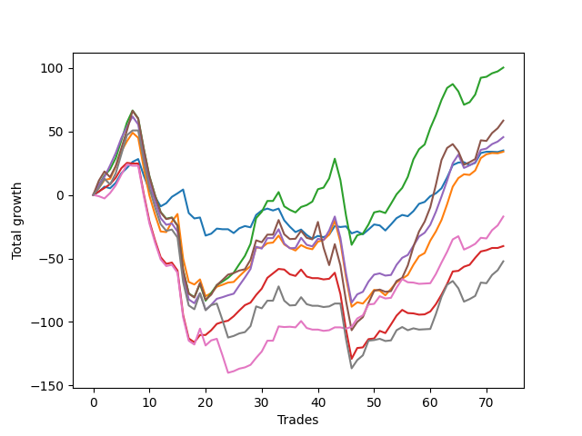

# Long Terrier 001 
- Symbol: ES
- Date Range: 06/24/2022 - 07/07/2022
- Trading Period: 7:20-12:30
- Number of Trades: 73



| Name | Win Percent | Profit | Avg Profit / Trade |     | Name | Win Percent | Profit | Avg Profit / Trade |
| ---- | ----------- | ------ | ------------------ | --- | ---- | ----------- | ------ | ------------------ |
| Sorted By <br> Profit | | | | | Sorted By <br> Win Percentage ||||
| Two | 72.60 | 50125.00 | 686.64 |     | Two | 72.60 | 50125.00 | 686.64 |
| Five | 64.38 | 29250.00 | 400.68 |     | Four | 69.86 | 22750.00 | 311.64 |
| Four | 69.86 | 22750.00 | 311.64 |     | One | 68.49 | 17000.00 | 232.88 |
| Zero | 64.38 | 17500.00 | 239.73 |     | Three | 68.49 | -20125.00 | -275.68 |
| One | 68.49 | 17000.00 | 232.88 |     | Five | 64.38 | 29250.00 | 400.68 |
| Six | 63.01 | -8500.00 | -116.44 |     | Zero | 64.38 | 17500.00 | 239.73 |
| Three | 68.49 | -20125.00 | -275.68 |     | Six | 63.01 | -8500.00 | -116.44 |
| Seven | 63.01 | -26125.00 | -357.88 |     | Seven | 63.01 | -26125.00 | -357.88 |

### Test Zero
* Sell when price hits the middle line of the 20p bollinger
* No Stoploss
* Results:
```
Total Trades: 73
Percent Up: 64.38
Percent Down: 35.62
Total Points Moved Up: 35.00
Potential Profit: 17500.00
Total Points Ups: 160.00 Count Ups: 47
Total Points Downs: -125.00 Count Downs: 26
```

<details><summary>Trades</summary>

<code>In: 2022-06-24 07:45:00		Out: 2022-06-24 07:47:10		Total Position Time: 02:10		Total Move Up: 2.50		Total to Date: 2.50</code> <br />
<code>In: 2022-06-24 08:17:00		Out: 2022-06-24 08:25:45		Total Position Time: 08:45		Total Move Up: 4.00		Total to Date: 6.50</code> <br />
<code>In: 2022-06-27 06:57:00		Out: 2022-06-27 06:57:10		Total Position Time: 00:10		Total Move Up: -1.25		Total to Date: 5.25</code> <br />
<code>In: 2022-06-27 07:14:00		Out: 2022-06-27 07:16:35		Total Position Time: 02:35		Total Move Up: 4.25		Total to Date: 9.50</code> <br />
<code>In: 2022-06-27 07:19:00		Out: 2022-06-27 07:20:10		Total Position Time: 01:10		Total Move Up: 7.50		Total to Date: 17.00</code> <br />
<code>In: 2022-06-27 07:26:00		Out: 2022-06-27 07:28:20		Total Position Time: 02:20		Total Move Up: 4.25		Total to Date: 21.25</code> <br />
<code>In: 2022-06-27 08:10:00		Out: 2022-06-27 08:16:20		Total Position Time: 06:20		Total Move Up: 4.75		Total to Date: 26.00</code> <br />
<code>In: 2022-06-27 08:54:00		Out: 2022-06-27 08:58:45		Total Position Time: 04:45		Total Move Up: 2.25		Total to Date: 28.25</code> <br />
<code>In: 2022-06-28 07:17:00		Out: 2022-06-28 07:44:45		Total Position Time: 27:45		Total Move Up: -13.00		Total to Date: 15.25</code> <br />
<code>In: 2022-06-28 07:19:00		Out: 2022-06-28 07:44:45		Total Position Time: 25:45		Total Move Up: -11.75		Total to Date: 3.50</code> <br />
<code>In: 2022-06-28 07:23:00		Out: 2022-06-28 07:44:45		Total Position Time: 21:45		Total Move Up: -5.00		Total to Date: -1.50</code> <br />
<code>In: 2022-06-28 07:27:00		Out: 2022-06-28 07:44:45		Total Position Time: 17:45		Total Move Up: -7.50		Total to Date: -9.00</code> <br />
<code>In: 2022-06-28 07:41:00		Out: 2022-06-28 07:44:45		Total Position Time: 03:45		Total Move Up: 2.50		Total to Date: -6.50</code> <br />
<code>In: 2022-06-28 07:47:00		Out: 2022-06-28 07:56:35		Total Position Time: 09:35		Total Move Up: 5.00		Total to Date: -1.50</code> <br />
<code>In: 2022-06-28 07:50:00		Out: 2022-06-28 07:56:35		Total Position Time: 06:35		Total Move Up: 2.75		Total to Date: 1.25</code> <br />
<code>In: 2022-06-28 08:11:00		Out: 2022-06-28 08:11:25		Total Position Time: 00:25		Total Move Up: 3.00		Total to Date: 4.25</code> <br />
<code>In: 2022-06-28 08:38:00		Out: 2022-06-28 09:07:55		Total Position Time: 29:55		Total Move Up: -18.50		Total to Date: -14.25</code> <br />
<code>In: 2022-06-28 08:54:00		Out: 2022-06-28 09:09:30		Total Position Time: 15:30		Total Move Up: -4.25		Total to Date: -18.50</code> <br />
<code>In: 2022-06-28 09:17:00		Out: 2022-06-28 09:17:15		Total Position Time: 00:15		Total Move Up: 0.75		Total to Date: -17.75</code> <br />
<code>In: 2022-06-28 09:57:00		Out: 2022-06-28 10:24:25		Total Position Time: 27:25		Total Move Up: -14.25		Total to Date: -32.00</code> <br />
<code>In: 2022-06-28 10:21:00		Out: 2022-06-28 10:24:25		Total Position Time: 03:25		Total Move Up: 1.50		Total to Date: -30.50</code> <br />
<code>In: 2022-06-28 10:37:00		Out: 2022-06-28 10:41:45		Total Position Time: 04:45		Total Move Up: 4.00		Total to Date: -26.50</code> <br />
<code>In: 2022-06-28 10:47:00		Out: 2022-06-28 10:47:10		Total Position Time: 00:10		Total Move Up: -0.50		Total to Date: -27.00</code> <br />
<code>In: 2022-06-28 10:49:00		Out: 2022-06-28 10:49:15		Total Position Time: 00:15		Total Move Up: 0.00		Total to Date: -27.00</code> <br />
<code>In: 2022-06-28 11:31:00		Out: 2022-06-28 11:46:00		Total Position Time: 15:00		Total Move Up: -3.00		Total to Date: -30.00</code> <br />
<code>In: 2022-06-28 12:04:00		Out: 2022-06-28 12:11:10		Total Position Time: 07:10		Total Move Up: 3.75		Total to Date: -26.25</code> <br />
<code>In: 2022-06-28 12:16:00		Out: 2022-06-28 12:16:15		Total Position Time: 00:15		Total Move Up: 1.75		Total to Date: -24.50</code> <br />
<code>In: 2022-06-29 07:15:00		Out: 2022-06-29 07:25:20		Total Position Time: 10:20		Total Move Up: -1.00		Total to Date: -25.50</code> <br />
<code>In: 2022-06-29 07:17:00		Out: 2022-06-29 07:25:20		Total Position Time: 08:20		Total Move Up: 9.75		Total to Date: -15.75</code> <br />
<code>In: 2022-06-29 08:15:00		Out: 2022-06-29 08:16:45		Total Position Time: 01:45		Total Move Up: 3.50		Total to Date: -12.25</code> <br />
<code>In: 2022-06-29 08:30:00		Out: 2022-06-29 08:32:10		Total Position Time: 02:10		Total Move Up: 1.50		Total to Date: -10.75</code> <br />
<code>In: 2022-06-29 09:23:00		Out: 2022-06-29 09:36:40		Total Position Time: 13:40		Total Move Up: -1.50		Total to Date: -12.25</code> <br />
<code>In: 2022-06-29 10:15:00		Out: 2022-06-29 10:29:00		Total Position Time: 14:00		Total Move Up: 1.50		Total to Date: -10.75</code> <br />
<code>In: 2022-06-29 11:32:00		Out: 2022-06-29 11:55:05		Total Position Time: 23:05		Total Move Up: -9.25		Total to Date: -20.00</code> <br />
<code>In: 2022-06-29 11:38:00		Out: 2022-06-29 11:55:05		Total Position Time: 17:05		Total Move Up: -5.00		Total to Date: -25.00</code> <br />
<code>In: 2022-06-29 11:40:00		Out: 2022-06-29 11:55:05		Total Position Time: 15:05		Total Move Up: -4.25		Total to Date: -29.25</code> <br />
<code>In: 2022-06-29 11:53:00		Out: 2022-06-29 11:55:05		Total Position Time: 02:05		Total Move Up: 2.00		Total to Date: -27.25</code> <br />
<code>In: 2022-06-30 06:53:00		Out: 2022-06-30 07:10:15		Total Position Time: 17:15		Total Move Up: -4.25		Total to Date: -31.50</code> <br />
<code>In: 2022-06-30 06:55:00		Out: 2022-06-30 07:10:15		Total Position Time: 15:15		Total Move Up: -3.00		Total to Date: -34.50</code> <br />
<code>In: 2022-06-30 09:07:00		Out: 2022-06-30 09:18:15		Total Position Time: 11:15		Total Move Up: 2.25		Total to Date: -32.25</code> <br />
<code>In: 2022-06-30 09:46:00		Out: 2022-06-30 09:46:10		Total Position Time: 00:10		Total Move Up: -1.00		Total to Date: -33.25</code> <br />
<code>In: 2022-06-30 09:50:00		Out: 2022-06-30 09:52:40		Total Position Time: 02:40		Total Move Up: 2.00		Total to Date: -31.25</code> <br />
<code>In: 2022-06-30 10:45:00		Out: 2022-06-30 10:48:30		Total Position Time: 03:30		Total Move Up: 6.75		Total to Date: -24.50</code> <br />
<code>In: 2022-06-30 11:33:00		Out: 2022-06-30 11:38:25		Total Position Time: 05:25		Total Move Up: -0.75		Total to Date: -25.25</code> <br />
<code>In: 2022-06-30 11:39:00		Out: 2022-06-30 11:39:30		Total Position Time: 00:30		Total Move Up: 0.50		Total to Date: -24.75</code> <br />
<code>In: 2022-06-30 11:42:00		Out: 2022-06-30 12:00:35		Total Position Time: 18:35		Total Move Up: -5.50		Total to Date: -30.25</code> <br />
<code>In: 2022-07-01 07:32:00		Out: 2022-07-01 07:42:25		Total Position Time: 10:25		Total Move Up: 1.50		Total to Date: -28.75</code> <br />
<code>In: 2022-07-01 09:58:00		Out: 2022-07-01 10:11:00		Total Position Time: 13:00		Total Move Up: -2.25		Total to Date: -31.00</code> <br />
<code>In: 2022-07-01 10:00:00		Out: 2022-07-01 10:11:00		Total Position Time: 11:00		Total Move Up: 3.75		Total to Date: -27.25</code> <br />
<code>In: 2022-07-01 11:56:00		Out: 2022-07-01 11:56:45		Total Position Time: 00:45		Total Move Up: 4.00		Total to Date: -23.25</code> <br />
<code>In: 2022-07-05 07:48:00		Out: 2022-07-05 08:08:15		Total Position Time: 20:15		Total Move Up: -0.75		Total to Date: -24.00</code> <br />
<code>In: 2022-07-05 07:51:00		Out: 2022-07-05 08:08:15		Total Position Time: 17:15		Total Move Up: -4.00		Total to Date: -28.00</code> <br />
<code>In: 2022-07-05 08:01:00		Out: 2022-07-05 08:08:15		Total Position Time: 07:15		Total Move Up: 4.75		Total to Date: -23.25</code> <br />
<code>In: 2022-07-05 08:03:00		Out: 2022-07-05 08:08:15		Total Position Time: 05:15		Total Move Up: 5.00		Total to Date: -18.25</code> <br />
<code>In: 2022-07-05 08:05:00		Out: 2022-07-05 08:08:15		Total Position Time: 03:15		Total Move Up: 2.50		Total to Date: -15.75</code> <br />
<code>In: 2022-07-05 09:15:00		Out: 2022-07-05 09:18:05		Total Position Time: 03:05		Total Move Up: -1.00		Total to Date: -16.75</code> <br />
<code>In: 2022-07-05 09:17:00		Out: 2022-07-05 09:18:05		Total Position Time: 01:05		Total Move Up: 4.00		Total to Date: -12.75</code> <br />
<code>In: 2022-07-05 10:48:00		Out: 2022-07-05 10:57:20		Total Position Time: 09:20		Total Move Up: 5.75		Total to Date: -7.00</code> <br />
<code>In: 2022-07-05 10:56:00		Out: 2022-07-05 10:57:20		Total Position Time: 01:20		Total Move Up: 1.50		Total to Date: -5.50</code> <br />
<code>In: 2022-07-05 12:20:00		Out: 2022-07-05 12:20:50		Total Position Time: 00:50		Total Move Up: 4.50		Total to Date: -1.00</code> <br />
<code>In: 2022-07-06 06:46:00		Out: 2022-07-06 06:56:35		Total Position Time: 10:35		Total Move Up: 2.25		Total to Date: 1.25</code> <br />
<code>In: 2022-07-06 06:50:00		Out: 2022-07-06 06:56:35		Total Position Time: 06:35		Total Move Up: 4.00		Total to Date: 5.25</code> <br />
<code>In: 2022-07-06 07:15:00		Out: 2022-07-06 07:24:00		Total Position Time: 09:00		Total Move Up: 8.50		Total to Date: 13.75</code> <br />
<code>In: 2022-07-06 07:22:00		Out: 2022-07-06 07:24:00		Total Position Time: 02:00		Total Move Up: 9.75		Total to Date: 23.50</code> <br />
<code>In: 2022-07-06 07:26:00		Out: 2022-07-06 07:26:45		Total Position Time: 00:45		Total Move Up: 2.00		Total to Date: 25.50</code> <br />
<code>In: 2022-07-06 08:16:00		Out: 2022-07-06 08:16:10		Total Position Time: 00:10		Total Move Up: 0.25		Total to Date: 25.75</code> <br />
<code>In: 2022-07-06 08:28:00		Out: 2022-07-06 08:46:30		Total Position Time: 18:30		Total Move Up: -2.25		Total to Date: 23.50</code> <br />
<code>In: 2022-07-06 08:41:00		Out: 2022-07-06 08:46:30		Total Position Time: 05:30		Total Move Up: 1.75		Total to Date: 25.25</code> <br />
<code>In: 2022-07-06 11:13:00		Out: 2022-07-06 11:13:45		Total Position Time: 00:45		Total Move Up: 7.75		Total to Date: 33.00</code> <br />
<code>In: 2022-07-07 08:15:00		Out: 2022-07-07 08:15:10		Total Position Time: 00:10		Total Move Up: 1.00		Total to Date: 34.00</code> <br />
<code>In: 2022-07-07 10:25:00		Out: 2022-07-07 10:30:55		Total Position Time: 05:55		Total Move Up: 0.00		Total to Date: 34.00</code> <br />
<code>In: 2022-07-07 11:35:00		Out: 2022-07-07 11:47:25		Total Position Time: 12:25		Total Move Up: -0.25		Total to Date: 33.75</code> <br />
<code>In: 2022-07-07 11:41:00		Out: 2022-07-07 11:47:25		Total Position Time: 06:25		Total Move Up: 1.25		Total to Date: 35.00</code> <br />


</details>

### Test One
* Sell when the price hits the upper line of the 20p 1std bollinger
* No Stoploss
* Results:
```
Total Trades: 73
Percent Up: 68.49
Percent Down: 31.51
Total Points Moved Up: 34.00
Potential Profit: 17000.00
Total Points Ups: 269.75 Count Ups: 50
Total Points Downs: -235.75 Count Downs: 23
```

<details><summary>Trades</summary>

<code>In: 2022-06-24 07:45:00		Out: 2022-06-24 07:49:25		Total Position Time: 04:25		Total Move Up: 5.50		Total to Date: 5.50</code> <br />
<code>In: 2022-06-24 08:17:00		Out: 2022-06-24 08:29:00		Total Position Time: 12:00		Total Move Up: 6.25		Total to Date: 11.75</code> <br />
<code>In: 2022-06-27 06:57:00		Out: 2022-06-27 07:00:10		Total Position Time: 03:10		Total Move Up: 1.00		Total to Date: 12.75</code> <br />
<code>In: 2022-06-27 07:14:00		Out: 2022-06-27 07:21:10		Total Position Time: 07:10		Total Move Up: 9.75		Total to Date: 22.50</code> <br />
<code>In: 2022-06-27 07:19:00		Out: 2022-06-27 07:21:10		Total Position Time: 02:10		Total Move Up: 11.75		Total to Date: 34.25</code> <br />
<code>In: 2022-06-27 07:26:00		Out: 2022-06-27 07:32:05		Total Position Time: 06:05		Total Move Up: 8.00		Total to Date: 42.25</code> <br />
<code>In: 2022-06-27 08:10:00		Out: 2022-06-27 08:19:50		Total Position Time: 09:50		Total Move Up: 6.75		Total to Date: 49.00</code> <br />
<code>In: 2022-06-27 08:54:00		Out: 2022-06-27 09:19:55		Total Position Time: 25:55		Total Move Up: -4.00		Total to Date: 45.00</code> <br />
<code>In: 2022-06-28 07:17:00		Out: 2022-06-28 07:46:55		Total Position Time: 29:55		Total Move Up: -24.00		Total to Date: 21.00</code> <br />
<code>In: 2022-06-28 07:19:00		Out: 2022-06-28 07:48:55		Total Position Time: 29:55		Total Move Up: -21.50		Total to Date: -0.50</code> <br />
<code>In: 2022-06-28 07:23:00		Out: 2022-06-28 07:52:55		Total Position Time: 29:55		Total Move Up: -15.00		Total to Date: -15.50</code> <br />
<code>In: 2022-06-28 07:27:00		Out: 2022-06-28 07:56:55		Total Position Time: 29:55		Total Move Up: -13.25		Total to Date: -28.75</code> <br />
<code>In: 2022-06-28 07:41:00		Out: 2022-06-28 08:01:10		Total Position Time: 20:10		Total Move Up: -0.50		Total to Date: -29.25</code> <br />
<code>In: 2022-06-28 07:47:00		Out: 2022-06-28 08:01:10		Total Position Time: 14:10		Total Move Up: 8.25		Total to Date: -21.00</code> <br />
<code>In: 2022-06-28 07:50:00		Out: 2022-06-28 08:01:10		Total Position Time: 11:10		Total Move Up: 6.00		Total to Date: -15.00</code> <br />
<code>In: 2022-06-28 08:11:00		Out: 2022-06-28 08:40:55		Total Position Time: 29:55		Total Move Up: -35.00		Total to Date: -50.00</code> <br />
<code>In: 2022-06-28 08:38:00		Out: 2022-06-28 09:07:55		Total Position Time: 29:55		Total Move Up: -18.50		Total to Date: -68.50</code> <br />
<code>In: 2022-06-28 08:54:00		Out: 2022-06-28 09:12:05		Total Position Time: 18:05		Total Move Up: -2.00		Total to Date: -70.50</code> <br />
<code>In: 2022-06-28 09:17:00		Out: 2022-06-28 09:20:40		Total Position Time: 03:40		Total Move Up: 4.00		Total to Date: -66.50</code> <br />
<code>In: 2022-06-28 09:57:00		Out: 2022-06-28 10:26:45		Total Position Time: 29:45		Total Move Up: -13.25		Total to Date: -79.75</code> <br />
<code>In: 2022-06-28 10:21:00		Out: 2022-06-28 10:26:45		Total Position Time: 05:45		Total Move Up: 2.50		Total to Date: -77.25</code> <br />
<code>In: 2022-06-28 10:37:00		Out: 2022-06-28 10:50:50		Total Position Time: 13:50		Total Move Up: 5.00		Total to Date: -72.25</code> <br />
<code>In: 2022-06-28 10:47:00		Out: 2022-06-28 10:50:50		Total Position Time: 03:50		Total Move Up: 1.50		Total to Date: -70.75</code> <br />
<code>In: 2022-06-28 10:49:00		Out: 2022-06-28 10:50:50		Total Position Time: 01:50		Total Move Up: 1.75		Total to Date: -69.00</code> <br />
<code>In: 2022-06-28 11:31:00		Out: 2022-06-28 11:47:50		Total Position Time: 16:50		Total Move Up: 0.50		Total to Date: -68.50</code> <br />
<code>In: 2022-06-28 12:04:00		Out: 2022-06-28 12:18:50		Total Position Time: 14:50		Total Move Up: 4.50		Total to Date: -64.00</code> <br />
<code>In: 2022-06-28 12:16:00		Out: 2022-06-28 12:18:50		Total Position Time: 02:50		Total Move Up: 4.25		Total to Date: -59.75</code> <br />
<code>In: 2022-06-29 07:15:00		Out: 2022-06-29 07:31:05		Total Position Time: 16:05		Total Move Up: 3.75		Total to Date: -56.00</code> <br />
<code>In: 2022-06-29 07:17:00		Out: 2022-06-29 07:31:05		Total Position Time: 14:05		Total Move Up: 14.50		Total to Date: -41.50</code> <br />
<code>In: 2022-06-29 08:15:00		Out: 2022-06-29 08:32:20		Total Position Time: 17:20		Total Move Up: 0.00		Total to Date: -41.50</code> <br />
<code>In: 2022-06-29 08:30:00		Out: 2022-06-29 08:32:20		Total Position Time: 02:20		Total Move Up: 3.50		Total to Date: -38.00</code> <br />
<code>In: 2022-06-29 09:23:00		Out: 2022-06-29 09:37:10		Total Position Time: 14:10		Total Move Up: 0.50		Total to Date: -37.50</code> <br />
<code>In: 2022-06-29 10:15:00		Out: 2022-06-29 10:29:40		Total Position Time: 14:40		Total Move Up: 5.50		Total to Date: -32.00</code> <br />
<code>In: 2022-06-29 11:32:00		Out: 2022-06-29 11:58:00		Total Position Time: 26:00		Total Move Up: -7.00		Total to Date: -39.00</code> <br />
<code>In: 2022-06-29 11:38:00		Out: 2022-06-29 11:58:00		Total Position Time: 20:00		Total Move Up: -2.75		Total to Date: -41.75</code> <br />
<code>In: 2022-06-29 11:40:00		Out: 2022-06-29 11:58:00		Total Position Time: 18:00		Total Move Up: -2.00		Total to Date: -43.75</code> <br />
<code>In: 2022-06-29 11:53:00		Out: 2022-06-29 11:58:00		Total Position Time: 05:00		Total Move Up: 4.25		Total to Date: -39.50</code> <br />
<code>In: 2022-06-30 06:53:00		Out: 2022-06-30 07:14:40		Total Position Time: 21:40		Total Move Up: -2.25		Total to Date: -41.75</code> <br />
<code>In: 2022-06-30 06:55:00		Out: 2022-06-30 07:14:40		Total Position Time: 19:40		Total Move Up: -1.00		Total to Date: -42.75</code> <br />
<code>In: 2022-06-30 09:07:00		Out: 2022-06-30 09:19:05		Total Position Time: 12:05		Total Move Up: 6.00		Total to Date: -36.75</code> <br />
<code>In: 2022-06-30 09:46:00		Out: 2022-06-30 09:47:55		Total Position Time: 01:55		Total Move Up: 1.25		Total to Date: -35.50</code> <br />
<code>In: 2022-06-30 09:50:00		Out: 2022-06-30 09:55:20		Total Position Time: 05:20		Total Move Up: 4.25		Total to Date: -31.25</code> <br />
<code>In: 2022-06-30 10:45:00		Out: 2022-06-30 10:49:50		Total Position Time: 04:50		Total Move Up: 11.00		Total to Date: -20.25</code> <br />
<code>In: 2022-06-30 11:33:00		Out: 2022-06-30 12:02:55		Total Position Time: 29:55		Total Move Up: -16.75		Total to Date: -37.00</code> <br />
<code>In: 2022-06-30 11:39:00		Out: 2022-06-30 12:08:55		Total Position Time: 29:55		Total Move Up: -28.00		Total to Date: -65.00</code> <br />
<code>In: 2022-06-30 11:42:00		Out: 2022-06-30 12:11:55		Total Position Time: 29:55		Total Move Up: -23.00		Total to Date: -88.00</code> <br />
<code>In: 2022-07-01 07:32:00		Out: 2022-07-01 07:46:55		Total Position Time: 14:55		Total Move Up: 3.50		Total to Date: -84.50</code> <br />
<code>In: 2022-07-01 09:58:00		Out: 2022-07-01 10:15:05		Total Position Time: 17:05		Total Move Up: -1.00		Total to Date: -85.50</code> <br />
<code>In: 2022-07-01 10:00:00		Out: 2022-07-01 10:15:05		Total Position Time: 15:05		Total Move Up: 5.00		Total to Date: -80.50</code> <br />
<code>In: 2022-07-01 11:56:00		Out: 2022-07-01 11:57:25		Total Position Time: 01:25		Total Move Up: 5.75		Total to Date: -74.75</code> <br />
<code>In: 2022-07-05 07:48:00		Out: 2022-07-05 08:16:40		Total Position Time: 28:40		Total Move Up: -0.50		Total to Date: -75.25</code> <br />
<code>In: 2022-07-05 07:51:00		Out: 2022-07-05 08:16:40		Total Position Time: 25:40		Total Move Up: -3.75		Total to Date: -79.00</code> <br />
<code>In: 2022-07-05 08:01:00		Out: 2022-07-05 08:16:40		Total Position Time: 15:40		Total Move Up: 5.00		Total to Date: -74.00</code> <br />
<code>In: 2022-07-05 08:03:00		Out: 2022-07-05 08:16:40		Total Position Time: 13:40		Total Move Up: 5.25		Total to Date: -68.75</code> <br />
<code>In: 2022-07-05 08:05:00		Out: 2022-07-05 08:16:40		Total Position Time: 11:40		Total Move Up: 2.75		Total to Date: -66.00</code> <br />
<code>In: 2022-07-05 09:15:00		Out: 2022-07-05 09:19:20		Total Position Time: 04:20		Total Move Up: 3.00		Total to Date: -63.00</code> <br />
<code>In: 2022-07-05 09:17:00		Out: 2022-07-05 09:19:20		Total Position Time: 02:20		Total Move Up: 8.00		Total to Date: -55.00</code> <br />
<code>In: 2022-07-05 10:48:00		Out: 2022-07-05 11:02:05		Total Position Time: 14:05		Total Move Up: 6.75		Total to Date: -48.25</code> <br />
<code>In: 2022-07-05 10:56:00		Out: 2022-07-05 11:02:05		Total Position Time: 06:05		Total Move Up: 2.50		Total to Date: -45.75</code> <br />
<code>In: 2022-07-05 12:20:00		Out: 2022-07-05 12:23:05		Total Position Time: 03:05		Total Move Up: 9.75		Total to Date: -36.00</code> <br />
<code>In: 2022-07-06 06:46:00		Out: 2022-07-06 06:57:25		Total Position Time: 11:25		Total Move Up: 7.25		Total to Date: -28.75</code> <br />
<code>In: 2022-07-06 06:50:00		Out: 2022-07-06 06:57:25		Total Position Time: 07:25		Total Move Up: 9.00		Total to Date: -19.75</code> <br />
<code>In: 2022-07-06 07:15:00		Out: 2022-07-06 07:29:25		Total Position Time: 14:25		Total Move Up: 12.50		Total to Date: -7.25</code> <br />
<code>In: 2022-07-06 07:22:00		Out: 2022-07-06 07:29:25		Total Position Time: 07:25		Total Move Up: 13.75		Total to Date: 6.50</code> <br />
<code>In: 2022-07-06 07:26:00		Out: 2022-07-06 07:29:25		Total Position Time: 03:25		Total Move Up: 6.75		Total to Date: 13.25</code> <br />
<code>In: 2022-07-06 08:16:00		Out: 2022-07-06 08:17:50		Total Position Time: 01:50		Total Move Up: 3.00		Total to Date: 16.25</code> <br />
<code>In: 2022-07-06 08:28:00		Out: 2022-07-06 08:48:05		Total Position Time: 20:05		Total Move Up: -0.50		Total to Date: 15.75</code> <br />
<code>In: 2022-07-06 08:41:00		Out: 2022-07-06 08:48:05		Total Position Time: 07:05		Total Move Up: 3.50		Total to Date: 19.25</code> <br />
<code>In: 2022-07-06 11:13:00		Out: 2022-07-06 11:27:50		Total Position Time: 14:50		Total Move Up: 9.75		Total to Date: 29.00</code> <br />
<code>In: 2022-07-07 08:15:00		Out: 2022-07-07 08:18:20		Total Position Time: 03:20		Total Move Up: 3.00		Total to Date: 32.00</code> <br />
<code>In: 2022-07-07 10:25:00		Out: 2022-07-07 10:31:35		Total Position Time: 06:35		Total Move Up: 1.00		Total to Date: 33.00</code> <br />
<code>In: 2022-07-07 11:35:00		Out: 2022-07-07 11:56:00		Total Position Time: 21:00		Total Move Up: -0.25		Total to Date: 32.75</code> <br />
<code>In: 2022-07-07 11:41:00		Out: 2022-07-07 11:56:00		Total Position Time: 15:00		Total Move Up: 1.25		Total to Date: 34.00</code> <br />


</details>

### Test Two
* Sell when the price hits the upper line of the 20p 2std bollinger
* No Stoploss
* Results:
```
Total Trades: 73
Percent Up: 72.60
Percent Down: 27.40
Total Points Moved Up: 100.25
Potential Profit: 50125.00
Total Points Ups: 363.00 Count Ups: 53
Total Points Downs: -262.75 Count Downs: 20
```

<details><summary>Trades</summary>

<code>In: 2022-06-24 07:45:00		Out: 2022-06-24 07:57:50		Total Position Time: 12:50		Total Move Up: 8.00		Total to Date: 8.00</code> <br />
<code>In: 2022-06-24 08:17:00		Out: 2022-06-24 08:46:55		Total Position Time: 29:55		Total Move Up: 7.25		Total to Date: 15.25</code> <br />
<code>In: 2022-06-27 06:57:00		Out: 2022-06-27 07:03:00		Total Position Time: 06:00		Total Move Up: 5.00		Total to Date: 20.25</code> <br />
<code>In: 2022-06-27 07:14:00		Out: 2022-06-27 07:43:55		Total Position Time: 29:55		Total Move Up: 8.75		Total to Date: 29.00</code> <br />
<code>In: 2022-06-27 07:19:00		Out: 2022-06-27 07:44:20		Total Position Time: 25:20		Total Move Up: 14.00		Total to Date: 43.00</code> <br />
<code>In: 2022-06-27 07:26:00		Out: 2022-06-27 07:44:20		Total Position Time: 18:20		Total Move Up: 14.00		Total to Date: 57.00</code> <br />
<code>In: 2022-06-27 08:10:00		Out: 2022-06-27 08:21:40		Total Position Time: 11:40		Total Move Up: 9.50		Total to Date: 66.50</code> <br />
<code>In: 2022-06-27 08:54:00		Out: 2022-06-27 09:23:55		Total Position Time: 29:55		Total Move Up: -6.25		Total to Date: 60.25</code> <br />
<code>In: 2022-06-28 07:17:00		Out: 2022-06-28 07:46:55		Total Position Time: 29:55		Total Move Up: -24.00		Total to Date: 36.25</code> <br />
<code>In: 2022-06-28 07:19:00		Out: 2022-06-28 07:48:55		Total Position Time: 29:55		Total Move Up: -21.50		Total to Date: 14.75</code> <br />
<code>In: 2022-06-28 07:23:00		Out: 2022-06-28 07:52:55		Total Position Time: 29:55		Total Move Up: -15.00		Total to Date: -0.25</code> <br />
<code>In: 2022-06-28 07:27:00		Out: 2022-06-28 07:56:55		Total Position Time: 29:55		Total Move Up: -13.25		Total to Date: -13.50</code> <br />
<code>In: 2022-06-28 07:41:00		Out: 2022-06-28 08:10:55		Total Position Time: 29:55		Total Move Up: -5.25		Total to Date: -18.75</code> <br />
<code>In: 2022-06-28 07:47:00		Out: 2022-06-28 08:16:55		Total Position Time: 29:55		Total Move Up: 1.00		Total to Date: -17.75</code> <br />
<code>In: 2022-06-28 07:50:00		Out: 2022-06-28 08:19:55		Total Position Time: 29:55		Total Move Up: -6.25		Total to Date: -24.00</code> <br />
<code>In: 2022-06-28 08:11:00		Out: 2022-06-28 08:40:55		Total Position Time: 29:55		Total Move Up: -35.00		Total to Date: -59.00</code> <br />
<code>In: 2022-06-28 08:38:00		Out: 2022-06-28 09:07:55		Total Position Time: 29:55		Total Move Up: -18.50		Total to Date: -77.50</code> <br />
<code>In: 2022-06-28 08:54:00		Out: 2022-06-28 09:23:55		Total Position Time: 29:55		Total Move Up: -3.00		Total to Date: -80.50</code> <br />
<code>In: 2022-06-28 09:17:00		Out: 2022-06-28 09:41:00		Total Position Time: 24:00		Total Move Up: 10.50		Total to Date: -70.00</code> <br />
<code>In: 2022-06-28 09:57:00		Out: 2022-06-28 10:26:55		Total Position Time: 29:55		Total Move Up: -13.25		Total to Date: -83.25</code> <br />
<code>In: 2022-06-28 10:21:00		Out: 2022-06-28 10:29:10		Total Position Time: 08:10		Total Move Up: 6.00		Total to Date: -77.25</code> <br />
<code>In: 2022-06-28 10:37:00		Out: 2022-06-28 11:01:50		Total Position Time: 24:50		Total Move Up: 6.25		Total to Date: -71.00</code> <br />
<code>In: 2022-06-28 10:47:00		Out: 2022-06-28 11:01:50		Total Position Time: 14:50		Total Move Up: 2.75		Total to Date: -68.25</code> <br />
<code>In: 2022-06-28 10:49:00		Out: 2022-06-28 11:01:50		Total Position Time: 12:50		Total Move Up: 3.00		Total to Date: -65.25</code> <br />
<code>In: 2022-06-28 11:31:00		Out: 2022-06-28 11:49:25		Total Position Time: 18:25		Total Move Up: 4.00		Total to Date: -61.25</code> <br />
<code>In: 2022-06-28 12:04:00		Out: 2022-06-28 12:23:55		Total Position Time: 19:55		Total Move Up: 6.75		Total to Date: -54.50</code> <br />
<code>In: 2022-06-28 12:16:00		Out: 2022-06-28 12:23:55		Total Position Time: 07:55		Total Move Up: 6.50		Total to Date: -48.00</code> <br />
<code>In: 2022-06-29 07:15:00		Out: 2022-06-29 07:33:15		Total Position Time: 18:15		Total Move Up: 9.50		Total to Date: -38.50</code> <br />
<code>In: 2022-06-29 07:17:00		Out: 2022-06-29 07:33:15		Total Position Time: 16:15		Total Move Up: 20.25		Total to Date: -18.25</code> <br />
<code>In: 2022-06-29 08:15:00		Out: 2022-06-29 08:35:35		Total Position Time: 20:35		Total Move Up: 5.00		Total to Date: -13.25</code> <br />
<code>In: 2022-06-29 08:30:00		Out: 2022-06-29 08:35:35		Total Position Time: 05:35		Total Move Up: 8.50		Total to Date: -4.75</code> <br />
<code>In: 2022-06-29 09:23:00		Out: 2022-06-29 09:52:55		Total Position Time: 29:55		Total Move Up: 0.00		Total to Date: -4.75</code> <br />
<code>In: 2022-06-29 10:15:00		Out: 2022-06-29 10:36:55		Total Position Time: 21:55		Total Move Up: 7.00		Total to Date: 2.25</code> <br />
<code>In: 2022-06-29 11:32:00		Out: 2022-06-29 12:01:55		Total Position Time: 29:55		Total Move Up: -11.25		Total to Date: -9.00</code> <br />
<code>In: 2022-06-29 11:38:00		Out: 2022-06-29 12:06:35		Total Position Time: 28:35		Total Move Up: -2.75		Total to Date: -11.75</code> <br />
<code>In: 2022-06-29 11:40:00		Out: 2022-06-29 12:06:35		Total Position Time: 26:35		Total Move Up: -2.00		Total to Date: -13.75</code> <br />
<code>In: 2022-06-29 11:53:00		Out: 2022-06-29 12:06:35		Total Position Time: 13:35		Total Move Up: 4.25		Total to Date: -9.50</code> <br />
<code>In: 2022-06-30 06:53:00		Out: 2022-06-30 07:14:45		Total Position Time: 21:45		Total Move Up: 1.50		Total to Date: -8.00</code> <br />
<code>In: 2022-06-30 06:55:00		Out: 2022-06-30 07:14:45		Total Position Time: 19:45		Total Move Up: 2.75		Total to Date: -5.25</code> <br />
<code>In: 2022-06-30 09:07:00		Out: 2022-06-30 09:21:15		Total Position Time: 14:15		Total Move Up: 9.75		Total to Date: 4.50</code> <br />
<code>In: 2022-06-30 09:46:00		Out: 2022-06-30 10:02:35		Total Position Time: 16:35		Total Move Up: 1.25		Total to Date: 5.75</code> <br />
<code>In: 2022-06-30 09:50:00		Out: 2022-06-30 10:02:35		Total Position Time: 12:35		Total Move Up: 7.25		Total to Date: 13.00</code> <br />
<code>In: 2022-06-30 10:45:00		Out: 2022-06-30 10:52:50		Total Position Time: 07:50		Total Move Up: 15.50		Total to Date: 28.50</code> <br />
<code>In: 2022-06-30 11:33:00		Out: 2022-06-30 12:02:55		Total Position Time: 29:55		Total Move Up: -16.75		Total to Date: 11.75</code> <br />
<code>In: 2022-06-30 11:39:00		Out: 2022-06-30 12:08:55		Total Position Time: 29:55		Total Move Up: -28.00		Total to Date: -16.25</code> <br />
<code>In: 2022-06-30 11:42:00		Out: 2022-06-30 12:11:55		Total Position Time: 29:55		Total Move Up: -23.00		Total to Date: -39.25</code> <br />
<code>In: 2022-07-01 07:32:00		Out: 2022-07-01 07:47:55		Total Position Time: 15:55		Total Move Up: 7.50		Total to Date: -31.75</code> <br />
<code>In: 2022-07-01 09:58:00		Out: 2022-07-01 10:15:40		Total Position Time: 17:40		Total Move Up: 1.25		Total to Date: -30.50</code> <br />
<code>In: 2022-07-01 10:00:00		Out: 2022-07-01 10:15:40		Total Position Time: 15:40		Total Move Up: 7.25		Total to Date: -23.25</code> <br />
<code>In: 2022-07-01 11:56:00		Out: 2022-07-01 12:10:40		Total Position Time: 14:40		Total Move Up: 9.50		Total to Date: -13.75</code> <br />
<code>In: 2022-07-05 07:48:00		Out: 2022-07-05 08:17:55		Total Position Time: 29:55		Total Move Up: 1.00		Total to Date: -12.75</code> <br />
<code>In: 2022-07-05 07:51:00		Out: 2022-07-05 08:20:35		Total Position Time: 29:35		Total Move Up: -1.50		Total to Date: -14.25</code> <br />
<code>In: 2022-07-05 08:01:00		Out: 2022-07-05 08:20:35		Total Position Time: 19:35		Total Move Up: 7.25		Total to Date: -7.00</code> <br />
<code>In: 2022-07-05 08:03:00		Out: 2022-07-05 08:20:35		Total Position Time: 17:35		Total Move Up: 7.50		Total to Date: 0.50</code> <br />
<code>In: 2022-07-05 08:05:00		Out: 2022-07-05 08:20:35		Total Position Time: 15:35		Total Move Up: 5.00		Total to Date: 5.50</code> <br />
<code>In: 2022-07-05 09:15:00		Out: 2022-07-05 09:23:25		Total Position Time: 08:25		Total Move Up: 8.75		Total to Date: 14.25</code> <br />
<code>In: 2022-07-05 09:17:00		Out: 2022-07-05 09:23:25		Total Position Time: 06:25		Total Move Up: 13.75		Total to Date: 28.00</code> <br />
<code>In: 2022-07-05 10:48:00		Out: 2022-07-05 11:02:55		Total Position Time: 14:55		Total Move Up: 8.00		Total to Date: 36.00</code> <br />
<code>In: 2022-07-05 10:56:00		Out: 2022-07-05 11:02:55		Total Position Time: 06:55		Total Move Up: 3.75		Total to Date: 39.75</code> <br />
<code>In: 2022-07-05 12:20:00		Out: 2022-07-05 12:25:20		Total Position Time: 05:20		Total Move Up: 12.75		Total to Date: 52.50</code> <br />
<code>In: 2022-07-06 06:46:00		Out: 2022-07-06 07:06:15		Total Position Time: 20:15		Total Move Up: 10.25		Total to Date: 62.75</code> <br />
<code>In: 2022-07-06 06:50:00		Out: 2022-07-06 07:06:15		Total Position Time: 16:15		Total Move Up: 12.00		Total to Date: 74.75</code> <br />
<code>In: 2022-07-06 07:15:00		Out: 2022-07-06 07:44:55		Total Position Time: 29:55		Total Move Up: 9.50		Total to Date: 84.25</code> <br />
<code>In: 2022-07-06 07:22:00		Out: 2022-07-06 07:51:55		Total Position Time: 29:55		Total Move Up: 3.00		Total to Date: 87.25</code> <br />
<code>In: 2022-07-06 07:26:00		Out: 2022-07-06 07:55:55		Total Position Time: 29:55		Total Move Up: -5.75		Total to Date: 81.50</code> <br />
<code>In: 2022-07-06 08:16:00		Out: 2022-07-06 08:45:55		Total Position Time: 29:55		Total Move Up: -10.50		Total to Date: 71.00</code> <br />
<code>In: 2022-07-06 08:28:00		Out: 2022-07-06 08:51:20		Total Position Time: 23:20		Total Move Up: 2.00		Total to Date: 73.00</code> <br />
<code>In: 2022-07-06 08:41:00		Out: 2022-07-06 08:51:20		Total Position Time: 10:20		Total Move Up: 6.00		Total to Date: 79.00</code> <br />
<code>In: 2022-07-06 11:13:00		Out: 2022-07-06 11:28:20		Total Position Time: 15:20		Total Move Up: 13.25		Total to Date: 92.25</code> <br />
<code>In: 2022-07-07 08:15:00		Out: 2022-07-07 08:44:00		Total Position Time: 29:00		Total Move Up: 0.75		Total to Date: 93.00</code> <br />
<code>In: 2022-07-07 10:25:00		Out: 2022-07-07 10:36:45		Total Position Time: 11:45		Total Move Up: 2.75		Total to Date: 95.75</code> <br />
<code>In: 2022-07-07 11:35:00		Out: 2022-07-07 11:58:50		Total Position Time: 23:50		Total Move Up: 1.50		Total to Date: 97.25</code> <br />
<code>In: 2022-07-07 11:41:00		Out: 2022-07-07 11:58:50		Total Position Time: 17:50		Total Move Up: 3.00		Total to Date: 100.25</code> <br />


</details>

### Test Three
* Sell when price hits the middle line of the 50p bollinger
* No Stoploss
* Results:
```
Total Trades: 73
Percent Up: 68.49
Percent Down: 31.51
Total Points Moved Up: -40.25
Potential Profit: -20125.00
Total Points Ups: 188.50 Count Ups: 50
Total Points Downs: -228.75 Count Downs: 23
```

<details><summary>Trades</summary>

<code>In: 2022-06-24 07:45:00		Out: 2022-06-24 07:47:25		Total Position Time: 02:25		Total Move Up: 2.75		Total to Date: 2.75</code> <br />
<code>In: 2022-06-24 08:17:00		Out: 2022-06-24 08:23:20		Total Position Time: 06:20		Total Move Up: 2.75		Total to Date: 5.50</code> <br />
<code>In: 2022-06-27 06:57:00		Out: 2022-06-27 07:02:35		Total Position Time: 05:35		Total Move Up: 3.00		Total to Date: 8.50</code> <br />
<code>In: 2022-06-27 07:14:00		Out: 2022-06-27 07:16:40		Total Position Time: 02:40		Total Move Up: 5.00		Total to Date: 13.50</code> <br />
<code>In: 2022-06-27 07:19:00		Out: 2022-06-27 07:20:10		Total Position Time: 01:10		Total Move Up: 7.50		Total to Date: 21.00</code> <br />
<code>In: 2022-06-27 07:26:00		Out: 2022-06-27 07:28:20		Total Position Time: 02:20		Total Move Up: 4.25		Total to Date: 25.25</code> <br />
<code>In: 2022-06-27 08:10:00		Out: 2022-06-27 08:10:15		Total Position Time: 00:15		Total Move Up: -0.50		Total to Date: 24.75</code> <br />
<code>In: 2022-06-27 08:54:00		Out: 2022-06-27 08:54:10		Total Position Time: 00:10		Total Move Up: 0.00		Total to Date: 24.75</code> <br />
<code>In: 2022-06-28 07:17:00		Out: 2022-06-28 07:46:55		Total Position Time: 29:55		Total Move Up: -24.00		Total to Date: 0.75</code> <br />
<code>In: 2022-06-28 07:19:00		Out: 2022-06-28 07:48:55		Total Position Time: 29:55		Total Move Up: -21.50		Total to Date: -20.75</code> <br />
<code>In: 2022-06-28 07:23:00		Out: 2022-06-28 07:52:55		Total Position Time: 29:55		Total Move Up: -15.00		Total to Date: -35.75</code> <br />
<code>In: 2022-06-28 07:27:00		Out: 2022-06-28 07:56:55		Total Position Time: 29:55		Total Move Up: -13.25		Total to Date: -49.00</code> <br />
<code>In: 2022-06-28 07:41:00		Out: 2022-06-28 08:10:55		Total Position Time: 29:55		Total Move Up: -5.25		Total to Date: -54.25</code> <br />
<code>In: 2022-06-28 07:47:00		Out: 2022-06-28 08:16:55		Total Position Time: 29:55		Total Move Up: 1.00		Total to Date: -53.25</code> <br />
<code>In: 2022-06-28 07:50:00		Out: 2022-06-28 08:19:55		Total Position Time: 29:55		Total Move Up: -6.25		Total to Date: -59.50</code> <br />
<code>In: 2022-06-28 08:11:00		Out: 2022-06-28 08:40:55		Total Position Time: 29:55		Total Move Up: -35.00		Total to Date: -94.50</code> <br />
<code>In: 2022-06-28 08:38:00		Out: 2022-06-28 09:07:55		Total Position Time: 29:55		Total Move Up: -18.50		Total to Date: -113.00</code> <br />
<code>In: 2022-06-28 08:54:00		Out: 2022-06-28 09:23:55		Total Position Time: 29:55		Total Move Up: -3.00		Total to Date: -116.00</code> <br />
<code>In: 2022-06-28 09:17:00		Out: 2022-06-28 09:24:35		Total Position Time: 07:35		Total Move Up: 5.75		Total to Date: -110.25</code> <br />
<code>In: 2022-06-28 09:57:00		Out: 2022-06-28 09:57:20		Total Position Time: 00:20		Total Move Up: 0.00		Total to Date: -110.25</code> <br />
<code>In: 2022-06-28 10:21:00		Out: 2022-06-28 10:47:25		Total Position Time: 26:25		Total Move Up: 3.75		Total to Date: -106.50</code> <br />
<code>In: 2022-06-28 10:37:00		Out: 2022-06-28 10:47:25		Total Position Time: 10:25		Total Move Up: 5.00		Total to Date: -101.50</code> <br />
<code>In: 2022-06-28 10:47:00		Out: 2022-06-28 10:47:25		Total Position Time: 00:25		Total Move Up: 1.50		Total to Date: -100.00</code> <br />
<code>In: 2022-06-28 10:49:00		Out: 2022-06-28 10:50:05		Total Position Time: 01:05		Total Move Up: 1.00		Total to Date: -99.00</code> <br />
<code>In: 2022-06-28 11:31:00		Out: 2022-06-28 11:49:05		Total Position Time: 18:05		Total Move Up: 3.50		Total to Date: -95.50</code> <br />
<code>In: 2022-06-28 12:04:00		Out: 2022-06-28 12:18:50		Total Position Time: 14:50		Total Move Up: 4.50		Total to Date: -91.00</code> <br />
<code>In: 2022-06-28 12:16:00		Out: 2022-06-28 12:18:50		Total Position Time: 02:50		Total Move Up: 4.25		Total to Date: -86.75</code> <br />
<code>In: 2022-06-29 07:15:00		Out: 2022-06-29 07:15:10		Total Position Time: 00:10		Total Move Up: 2.00		Total to Date: -84.75</code> <br />
<code>In: 2022-06-29 07:17:00		Out: 2022-06-29 07:25:10		Total Position Time: 08:10		Total Move Up: 6.00		Total to Date: -78.75</code> <br />
<code>In: 2022-06-29 08:15:00		Out: 2022-06-29 08:35:35		Total Position Time: 20:35		Total Move Up: 5.00		Total to Date: -73.75</code> <br />
<code>In: 2022-06-29 08:30:00		Out: 2022-06-29 08:35:35		Total Position Time: 05:35		Total Move Up: 8.50		Total to Date: -65.25</code> <br />
<code>In: 2022-06-29 09:23:00		Out: 2022-06-29 09:38:30		Total Position Time: 15:30		Total Move Up: 3.50		Total to Date: -61.75</code> <br />
<code>In: 2022-06-29 10:15:00		Out: 2022-06-29 10:29:25		Total Position Time: 14:25		Total Move Up: 3.50		Total to Date: -58.25</code> <br />
<code>In: 2022-06-29 11:32:00		Out: 2022-06-29 11:32:10		Total Position Time: 00:10		Total Move Up: -0.50		Total to Date: -58.75</code> <br />
<code>In: 2022-06-29 11:38:00		Out: 2022-06-29 12:07:55		Total Position Time: 29:55		Total Move Up: -3.75		Total to Date: -62.50</code> <br />
<code>In: 2022-06-29 11:40:00		Out: 2022-06-29 12:09:35		Total Position Time: 29:35		Total Move Up: -1.25		Total to Date: -63.75</code> <br />
<code>In: 2022-06-29 11:53:00		Out: 2022-06-29 12:09:35		Total Position Time: 16:35		Total Move Up: 5.00		Total to Date: -58.75</code> <br />
<code>In: 2022-06-30 06:53:00		Out: 2022-06-30 07:22:55		Total Position Time: 29:55		Total Move Up: -5.50		Total to Date: -64.25</code> <br />
<code>In: 2022-06-30 06:55:00		Out: 2022-06-30 07:24:55		Total Position Time: 29:55		Total Move Up: -1.25		Total to Date: -65.50</code> <br />
<code>In: 2022-06-30 09:07:00		Out: 2022-06-30 09:07:10		Total Position Time: 00:10		Total Move Up: 0.00		Total to Date: -65.50</code> <br />
<code>In: 2022-06-30 09:46:00		Out: 2022-06-30 09:46:10		Total Position Time: 00:10		Total Move Up: -1.00		Total to Date: -66.50</code> <br />
<code>In: 2022-06-30 09:50:00		Out: 2022-06-30 09:50:10		Total Position Time: 00:10		Total Move Up: 0.50		Total to Date: -66.00</code> <br />
<code>In: 2022-06-30 10:45:00		Out: 2022-06-30 10:46:15		Total Position Time: 01:15		Total Move Up: 4.75		Total to Date: -61.25</code> <br />
<code>In: 2022-06-30 11:33:00		Out: 2022-06-30 12:02:55		Total Position Time: 29:55		Total Move Up: -16.75		Total to Date: -78.00</code> <br />
<code>In: 2022-06-30 11:39:00		Out: 2022-06-30 12:08:55		Total Position Time: 29:55		Total Move Up: -28.00		Total to Date: -106.00</code> <br />
<code>In: 2022-06-30 11:42:00		Out: 2022-06-30 12:11:55		Total Position Time: 29:55		Total Move Up: -23.00		Total to Date: -129.00</code> <br />
<code>In: 2022-07-01 07:32:00		Out: 2022-07-01 07:56:40		Total Position Time: 24:40		Total Move Up: 8.50		Total to Date: -120.50</code> <br />
<code>In: 2022-07-01 09:58:00		Out: 2022-07-01 10:15:35		Total Position Time: 17:35		Total Move Up: 0.50		Total to Date: -120.00</code> <br />
<code>In: 2022-07-01 10:00:00		Out: 2022-07-01 10:15:35		Total Position Time: 15:35		Total Move Up: 6.50		Total to Date: -113.50</code> <br />
<code>In: 2022-07-01 11:56:00		Out: 2022-07-01 11:56:10		Total Position Time: 00:10		Total Move Up: 0.50		Total to Date: -113.00</code> <br />
<code>In: 2022-07-05 07:48:00		Out: 2022-07-05 07:49:45		Total Position Time: 01:45		Total Move Up: 6.00		Total to Date: -107.00</code> <br />
<code>In: 2022-07-05 07:51:00		Out: 2022-07-05 08:20:55		Total Position Time: 29:55		Total Move Up: -1.75		Total to Date: -108.75</code> <br />
<code>In: 2022-07-05 08:01:00		Out: 2022-07-05 08:27:20		Total Position Time: 26:20		Total Move Up: 6.75		Total to Date: -102.00</code> <br />
<code>In: 2022-07-05 08:03:00		Out: 2022-07-05 08:27:20		Total Position Time: 24:20		Total Move Up: 7.00		Total to Date: -95.00</code> <br />
<code>In: 2022-07-05 08:05:00		Out: 2022-07-05 08:27:20		Total Position Time: 22:20		Total Move Up: 4.50		Total to Date: -90.50</code> <br />
<code>In: 2022-07-05 09:15:00		Out: 2022-07-05 09:15:10		Total Position Time: 00:10		Total Move Up: -2.50		Total to Date: -93.00</code> <br />
<code>In: 2022-07-05 09:17:00		Out: 2022-07-05 09:17:10		Total Position Time: 00:10		Total Move Up: -0.25		Total to Date: -93.25</code> <br />
<code>In: 2022-07-05 10:48:00		Out: 2022-07-05 10:48:10		Total Position Time: 00:10		Total Move Up: -1.00		Total to Date: -94.25</code> <br />
<code>In: 2022-07-05 10:56:00		Out: 2022-07-05 10:56:10		Total Position Time: 00:10		Total Move Up: 0.25		Total to Date: -94.00</code> <br />
<code>In: 2022-07-05 12:20:00		Out: 2022-07-05 12:20:30		Total Position Time: 00:30		Total Move Up: 2.25		Total to Date: -91.75</code> <br />
<code>In: 2022-07-06 06:46:00		Out: 2022-07-06 06:57:05		Total Position Time: 11:05		Total Move Up: 5.75		Total to Date: -86.00</code> <br />
<code>In: 2022-07-06 06:50:00		Out: 2022-07-06 06:57:05		Total Position Time: 07:05		Total Move Up: 7.50		Total to Date: -78.50</code> <br />
<code>In: 2022-07-06 07:15:00		Out: 2022-07-06 07:24:00		Total Position Time: 09:00		Total Move Up: 8.50		Total to Date: -70.00</code> <br />
<code>In: 2022-07-06 07:22:00		Out: 2022-07-06 07:24:00		Total Position Time: 02:00		Total Move Up: 9.75		Total to Date: -60.25</code> <br />
<code>In: 2022-07-06 07:26:00		Out: 2022-07-06 07:26:15		Total Position Time: 00:15		Total Move Up: 0.50		Total to Date: -59.75</code> <br />
<code>In: 2022-07-06 08:16:00		Out: 2022-07-06 08:21:30		Total Position Time: 05:30		Total Move Up: 3.25		Total to Date: -56.50</code> <br />
<code>In: 2022-07-06 08:28:00		Out: 2022-07-06 08:51:15		Total Position Time: 23:15		Total Move Up: 1.50		Total to Date: -55.00</code> <br />
<code>In: 2022-07-06 08:41:00		Out: 2022-07-06 08:51:15		Total Position Time: 10:15		Total Move Up: 5.50		Total to Date: -49.50</code> <br />
<code>In: 2022-07-06 11:13:00		Out: 2022-07-06 11:13:25		Total Position Time: 00:25		Total Move Up: 5.00		Total to Date: -44.50</code> <br />
<code>In: 2022-07-07 08:15:00		Out: 2022-07-07 08:15:10		Total Position Time: 00:10		Total Move Up: 1.00		Total to Date: -43.50</code> <br />
<code>In: 2022-07-07 10:25:00		Out: 2022-07-07 10:35:00		Total Position Time: 10:00		Total Move Up: 1.75		Total to Date: -41.75</code> <br />
<code>In: 2022-07-07 11:35:00		Out: 2022-07-07 11:38:50		Total Position Time: 03:50		Total Move Up: 0.00		Total to Date: -41.75</code> <br />
<code>In: 2022-07-07 11:41:00		Out: 2022-07-07 11:49:10		Total Position Time: 08:10		Total Move Up: 1.50		Total to Date: -40.25</code> <br />


</details>

### Test Four
* Sell when the price hits the upper line of the 50p 1std bollinger
* No Stoploss
* Results:
```
Total Trades: 73
Percent Up: 69.86
Percent Down: 30.14
Total Points Moved Up: 45.50
Potential Profit: 22750.00
Total Points Ups: 311.00 Count Ups: 51
Total Points Downs: -265.50 Count Downs: 22
```

<details><summary>Trades</summary>

<code>In: 2022-06-24 07:45:00		Out: 2022-06-24 07:57:50		Total Position Time: 12:50		Total Move Up: 8.00		Total to Date: 8.00</code> <br />
<code>In: 2022-06-24 08:17:00		Out: 2022-06-24 08:29:00		Total Position Time: 12:00		Total Move Up: 6.25		Total to Date: 14.25</code> <br />
<code>In: 2022-06-27 06:57:00		Out: 2022-06-27 07:03:55		Total Position Time: 06:55		Total Move Up: 9.00		Total to Date: 23.25</code> <br />
<code>In: 2022-06-27 07:14:00		Out: 2022-06-27 07:21:10		Total Position Time: 07:10		Total Move Up: 9.75		Total to Date: 33.00</code> <br />
<code>In: 2022-06-27 07:19:00		Out: 2022-06-27 07:21:10		Total Position Time: 02:10		Total Move Up: 11.75		Total to Date: 44.75</code> <br />
<code>In: 2022-06-27 07:26:00		Out: 2022-06-27 07:32:15		Total Position Time: 06:15		Total Move Up: 9.00		Total to Date: 53.75</code> <br />
<code>In: 2022-06-27 08:10:00		Out: 2022-06-27 08:21:15		Total Position Time: 11:15		Total Move Up: 8.00		Total to Date: 61.75</code> <br />
<code>In: 2022-06-27 08:54:00		Out: 2022-06-27 09:23:55		Total Position Time: 29:55		Total Move Up: -6.25		Total to Date: 55.50</code> <br />
<code>In: 2022-06-28 07:17:00		Out: 2022-06-28 07:46:55		Total Position Time: 29:55		Total Move Up: -24.00		Total to Date: 31.50</code> <br />
<code>In: 2022-06-28 07:19:00		Out: 2022-06-28 07:48:55		Total Position Time: 29:55		Total Move Up: -21.50		Total to Date: 10.00</code> <br />
<code>In: 2022-06-28 07:23:00		Out: 2022-06-28 07:52:55		Total Position Time: 29:55		Total Move Up: -15.00		Total to Date: -5.00</code> <br />
<code>In: 2022-06-28 07:27:00		Out: 2022-06-28 07:56:55		Total Position Time: 29:55		Total Move Up: -13.25		Total to Date: -18.25</code> <br />
<code>In: 2022-06-28 07:41:00		Out: 2022-06-28 08:10:55		Total Position Time: 29:55		Total Move Up: -5.25		Total to Date: -23.50</code> <br />
<code>In: 2022-06-28 07:47:00		Out: 2022-06-28 08:16:55		Total Position Time: 29:55		Total Move Up: 1.00		Total to Date: -22.50</code> <br />
<code>In: 2022-06-28 07:50:00		Out: 2022-06-28 08:19:55		Total Position Time: 29:55		Total Move Up: -6.25		Total to Date: -28.75</code> <br />
<code>In: 2022-06-28 08:11:00		Out: 2022-06-28 08:40:55		Total Position Time: 29:55		Total Move Up: -35.00		Total to Date: -63.75</code> <br />
<code>In: 2022-06-28 08:38:00		Out: 2022-06-28 09:07:55		Total Position Time: 29:55		Total Move Up: -18.50		Total to Date: -82.25</code> <br />
<code>In: 2022-06-28 08:54:00		Out: 2022-06-28 09:23:55		Total Position Time: 29:55		Total Move Up: -3.00		Total to Date: -85.25</code> <br />
<code>In: 2022-06-28 09:17:00		Out: 2022-06-28 09:29:25		Total Position Time: 12:25		Total Move Up: 8.00		Total to Date: -77.25</code> <br />
<code>In: 2022-06-28 09:57:00		Out: 2022-06-28 10:26:55		Total Position Time: 29:55		Total Move Up: -13.25		Total to Date: -90.50</code> <br />
<code>In: 2022-06-28 10:21:00		Out: 2022-06-28 10:50:55		Total Position Time: 29:55		Total Move Up: 4.00		Total to Date: -86.50</code> <br />
<code>In: 2022-06-28 10:37:00		Out: 2022-06-28 11:00:45		Total Position Time: 23:45		Total Move Up: 4.75		Total to Date: -81.75</code> <br />
<code>In: 2022-06-28 10:47:00		Out: 2022-06-28 11:00:45		Total Position Time: 13:45		Total Move Up: 1.25		Total to Date: -80.50</code> <br />
<code>In: 2022-06-28 10:49:00		Out: 2022-06-28 11:00:45		Total Position Time: 11:45		Total Move Up: 1.50		Total to Date: -79.00</code> <br />
<code>In: 2022-06-28 11:31:00		Out: 2022-06-28 12:00:55		Total Position Time: 29:55		Total Move Up: 1.25		Total to Date: -77.75</code> <br />
<code>In: 2022-06-28 12:04:00		Out: 2022-06-28 12:23:50		Total Position Time: 19:50		Total Move Up: 6.50		Total to Date: -71.25</code> <br />
<code>In: 2022-06-28 12:16:00		Out: 2022-06-28 12:23:50		Total Position Time: 07:50		Total Move Up: 6.25		Total to Date: -65.00</code> <br />
<code>In: 2022-06-29 07:15:00		Out: 2022-06-29 07:33:05		Total Position Time: 18:05		Total Move Up: 6.75		Total to Date: -58.25</code> <br />
<code>In: 2022-06-29 07:17:00		Out: 2022-06-29 07:33:05		Total Position Time: 16:05		Total Move Up: 17.50		Total to Date: -40.75</code> <br />
<code>In: 2022-06-29 08:15:00		Out: 2022-06-29 08:44:55		Total Position Time: 29:55		Total Move Up: -1.50		Total to Date: -42.25</code> <br />
<code>In: 2022-06-29 08:30:00		Out: 2022-06-29 08:53:10		Total Position Time: 23:10		Total Move Up: 8.25		Total to Date: -34.00</code> <br />
<code>In: 2022-06-29 09:23:00		Out: 2022-06-29 09:52:55		Total Position Time: 29:55		Total Move Up: 0.00		Total to Date: -34.00</code> <br />
<code>In: 2022-06-29 10:15:00		Out: 2022-06-29 10:29:45		Total Position Time: 14:45		Total Move Up: 7.00		Total to Date: -27.00</code> <br />
<code>In: 2022-06-29 11:32:00		Out: 2022-06-29 12:01:55		Total Position Time: 29:55		Total Move Up: -11.25		Total to Date: -38.25</code> <br />
<code>In: 2022-06-29 11:38:00		Out: 2022-06-29 12:07:55		Total Position Time: 29:55		Total Move Up: -3.75		Total to Date: -42.00</code> <br />
<code>In: 2022-06-29 11:40:00		Out: 2022-06-29 12:09:55		Total Position Time: 29:55		Total Move Up: 0.25		Total to Date: -41.75</code> <br />
<code>In: 2022-06-29 11:53:00		Out: 2022-06-29 12:17:40		Total Position Time: 24:40		Total Move Up: 8.00		Total to Date: -33.75</code> <br />
<code>In: 2022-06-30 06:53:00		Out: 2022-06-30 07:22:55		Total Position Time: 29:55		Total Move Up: -5.50		Total to Date: -39.25</code> <br />
<code>In: 2022-06-30 06:55:00		Out: 2022-06-30 07:24:55		Total Position Time: 29:55		Total Move Up: -1.25		Total to Date: -40.50</code> <br />
<code>In: 2022-06-30 09:07:00		Out: 2022-06-30 09:19:05		Total Position Time: 12:05		Total Move Up: 6.00		Total to Date: -34.50</code> <br />
<code>In: 2022-06-30 09:46:00		Out: 2022-06-30 09:46:10		Total Position Time: 00:10		Total Move Up: -1.00		Total to Date: -35.50</code> <br />
<code>In: 2022-06-30 09:50:00		Out: 2022-06-30 10:02:45		Total Position Time: 12:45		Total Move Up: 7.50		Total to Date: -28.00</code> <br />
<code>In: 2022-06-30 10:45:00		Out: 2022-06-30 10:49:50		Total Position Time: 04:50		Total Move Up: 11.00		Total to Date: -17.00</code> <br />
<code>In: 2022-06-30 11:33:00		Out: 2022-06-30 12:02:55		Total Position Time: 29:55		Total Move Up: -16.75		Total to Date: -33.75</code> <br />
<code>In: 2022-06-30 11:39:00		Out: 2022-06-30 12:08:55		Total Position Time: 29:55		Total Move Up: -28.00		Total to Date: -61.75</code> <br />
<code>In: 2022-06-30 11:42:00		Out: 2022-06-30 12:11:55		Total Position Time: 29:55		Total Move Up: -23.00		Total to Date: -84.75</code> <br />
<code>In: 2022-07-01 07:32:00		Out: 2022-07-01 08:01:55		Total Position Time: 29:55		Total Move Up: 6.50		Total to Date: -78.25</code> <br />
<code>In: 2022-07-01 09:58:00		Out: 2022-07-01 10:25:50		Total Position Time: 27:50		Total Move Up: 2.00		Total to Date: -76.25</code> <br />
<code>In: 2022-07-01 10:00:00		Out: 2022-07-01 10:25:50		Total Position Time: 25:50		Total Move Up: 8.00		Total to Date: -68.25</code> <br />
<code>In: 2022-07-01 11:56:00		Out: 2022-07-01 11:57:20		Total Position Time: 01:20		Total Move Up: 5.50		Total to Date: -62.75</code> <br />
<code>In: 2022-07-05 07:48:00		Out: 2022-07-05 08:17:55		Total Position Time: 29:55		Total Move Up: 1.00		Total to Date: -61.75</code> <br />
<code>In: 2022-07-05 07:51:00		Out: 2022-07-05 08:20:55		Total Position Time: 29:55		Total Move Up: -1.75		Total to Date: -63.50</code> <br />
<code>In: 2022-07-05 08:01:00		Out: 2022-07-05 08:30:55		Total Position Time: 29:55		Total Move Up: 0.50		Total to Date: -63.00</code> <br />
<code>In: 2022-07-05 08:03:00		Out: 2022-07-05 08:32:55		Total Position Time: 29:55		Total Move Up: 8.00		Total to Date: -55.00</code> <br />
<code>In: 2022-07-05 08:05:00		Out: 2022-07-05 08:33:05		Total Position Time: 28:05		Total Move Up: 5.50		Total to Date: -49.50</code> <br />
<code>In: 2022-07-05 09:15:00		Out: 2022-07-05 09:19:15		Total Position Time: 04:15		Total Move Up: 2.25		Total to Date: -47.25</code> <br />
<code>In: 2022-07-05 09:17:00		Out: 2022-07-05 09:19:15		Total Position Time: 02:15		Total Move Up: 7.25		Total to Date: -40.00</code> <br />
<code>In: 2022-07-05 10:48:00		Out: 2022-07-05 11:02:40		Total Position Time: 14:40		Total Move Up: 7.25		Total to Date: -32.75</code> <br />
<code>In: 2022-07-05 10:56:00		Out: 2022-07-05 11:02:40		Total Position Time: 06:40		Total Move Up: 3.00		Total to Date: -29.75</code> <br />
<code>In: 2022-07-05 12:20:00		Out: 2022-07-05 12:21:15		Total Position Time: 01:15		Total Move Up: 6.25		Total to Date: -23.50</code> <br />
<code>In: 2022-07-06 06:46:00		Out: 2022-07-06 06:58:35		Total Position Time: 12:35		Total Move Up: 10.25		Total to Date: -13.25</code> <br />
<code>In: 2022-07-06 06:50:00		Out: 2022-07-06 06:58:35		Total Position Time: 08:35		Total Move Up: 12.00		Total to Date: -1.25</code> <br />
<code>In: 2022-07-06 07:15:00		Out: 2022-07-06 07:29:25		Total Position Time: 14:25		Total Move Up: 12.50		Total to Date: 11.25</code> <br />
<code>In: 2022-07-06 07:22:00		Out: 2022-07-06 07:29:25		Total Position Time: 07:25		Total Move Up: 13.75		Total to Date: 25.00</code> <br />
<code>In: 2022-07-06 07:26:00		Out: 2022-07-06 07:29:25		Total Position Time: 03:25		Total Move Up: 6.75		Total to Date: 31.75</code> <br />
<code>In: 2022-07-06 08:16:00		Out: 2022-07-06 08:45:55		Total Position Time: 29:55		Total Move Up: -10.50		Total to Date: 21.25</code> <br />
<code>In: 2022-07-06 08:28:00		Out: 2022-07-06 08:57:55		Total Position Time: 29:55		Total Move Up: 2.00		Total to Date: 23.25</code> <br />
<code>In: 2022-07-06 08:41:00		Out: 2022-07-06 09:10:55		Total Position Time: 29:55		Total Move Up: 2.50		Total to Date: 25.75</code> <br />
<code>In: 2022-07-06 11:13:00		Out: 2022-07-06 11:27:50		Total Position Time: 14:50		Total Move Up: 9.75		Total to Date: 35.50</code> <br />
<code>In: 2022-07-07 08:15:00		Out: 2022-07-07 08:15:55		Total Position Time: 00:55		Total Move Up: 1.00		Total to Date: 36.50</code> <br />
<code>In: 2022-07-07 10:25:00		Out: 2022-07-07 10:40:15		Total Position Time: 15:15		Total Move Up: 3.50		Total to Date: 40.00</code> <br />
<code>In: 2022-07-07 11:35:00		Out: 2022-07-07 11:59:15		Total Position Time: 24:15		Total Move Up: 2.00		Total to Date: 42.00</code> <br />
<code>In: 2022-07-07 11:41:00		Out: 2022-07-07 11:59:15		Total Position Time: 18:15		Total Move Up: 3.50		Total to Date: 45.50</code> <br />


</details>

### Test Five
* Sell when the price hits the upper line of the 50p 2std bollinger
* No Stoploss
* Results:
```
Total Trades: 73
Percent Up: 64.38
Percent Down: 35.62
Total Points Moved Up: 58.50
Potential Profit: 29250.00
Total Points Ups: 367.75 Count Ups: 47
Total Points Downs: -309.25 Count Downs: 26
```

<details><summary>Trades</summary>

<code>In: 2022-06-24 07:45:00		Out: 2022-06-24 08:04:35		Total Position Time: 19:35		Total Move Up: 11.25		Total to Date: 11.25</code> <br />
<code>In: 2022-06-24 08:17:00		Out: 2022-06-24 08:46:55		Total Position Time: 29:55		Total Move Up: 7.25		Total to Date: 18.50</code> <br />
<code>In: 2022-06-27 06:57:00		Out: 2022-06-27 07:26:55		Total Position Time: 29:55		Total Move Up: -4.50		Total to Date: 14.00</code> <br />
<code>In: 2022-06-27 07:14:00		Out: 2022-06-27 07:43:55		Total Position Time: 29:55		Total Move Up: 8.75		Total to Date: 22.75</code> <br />
<code>In: 2022-06-27 07:19:00		Out: 2022-06-27 07:44:20		Total Position Time: 25:20		Total Move Up: 14.00		Total to Date: 36.75</code> <br />
<code>In: 2022-06-27 07:26:00		Out: 2022-06-27 07:44:20		Total Position Time: 18:20		Total Move Up: 14.00		Total to Date: 50.75</code> <br />
<code>In: 2022-06-27 08:10:00		Out: 2022-06-27 08:25:35		Total Position Time: 15:35		Total Move Up: 15.50		Total to Date: 66.25</code> <br />
<code>In: 2022-06-27 08:54:00		Out: 2022-06-27 09:23:55		Total Position Time: 29:55		Total Move Up: -6.25		Total to Date: 60.00</code> <br />
<code>In: 2022-06-28 07:17:00		Out: 2022-06-28 07:46:55		Total Position Time: 29:55		Total Move Up: -24.00		Total to Date: 36.00</code> <br />
<code>In: 2022-06-28 07:19:00		Out: 2022-06-28 07:48:55		Total Position Time: 29:55		Total Move Up: -21.50		Total to Date: 14.50</code> <br />
<code>In: 2022-06-28 07:23:00		Out: 2022-06-28 07:52:55		Total Position Time: 29:55		Total Move Up: -15.00		Total to Date: -0.50</code> <br />
<code>In: 2022-06-28 07:27:00		Out: 2022-06-28 07:56:55		Total Position Time: 29:55		Total Move Up: -13.25		Total to Date: -13.75</code> <br />
<code>In: 2022-06-28 07:41:00		Out: 2022-06-28 08:10:55		Total Position Time: 29:55		Total Move Up: -5.25		Total to Date: -19.00</code> <br />
<code>In: 2022-06-28 07:47:00		Out: 2022-06-28 08:16:55		Total Position Time: 29:55		Total Move Up: 1.00		Total to Date: -18.00</code> <br />
<code>In: 2022-06-28 07:50:00		Out: 2022-06-28 08:19:55		Total Position Time: 29:55		Total Move Up: -6.25		Total to Date: -24.25</code> <br />
<code>In: 2022-06-28 08:11:00		Out: 2022-06-28 08:40:55		Total Position Time: 29:55		Total Move Up: -35.00		Total to Date: -59.25</code> <br />
<code>In: 2022-06-28 08:38:00		Out: 2022-06-28 09:07:55		Total Position Time: 29:55		Total Move Up: -18.50		Total to Date: -77.75</code> <br />
<code>In: 2022-06-28 08:54:00		Out: 2022-06-28 09:23:55		Total Position Time: 29:55		Total Move Up: -3.00		Total to Date: -80.75</code> <br />
<code>In: 2022-06-28 09:17:00		Out: 2022-06-28 09:42:05		Total Position Time: 25:05		Total Move Up: 11.50		Total to Date: -69.25</code> <br />
<code>In: 2022-06-28 09:57:00		Out: 2022-06-28 10:26:55		Total Position Time: 29:55		Total Move Up: -13.25		Total to Date: -82.50</code> <br />
<code>In: 2022-06-28 10:21:00		Out: 2022-06-28 10:50:55		Total Position Time: 29:55		Total Move Up: 4.00		Total to Date: -78.50</code> <br />
<code>In: 2022-06-28 10:37:00		Out: 2022-06-28 11:02:00		Total Position Time: 25:00		Total Move Up: 7.50		Total to Date: -71.00</code> <br />
<code>In: 2022-06-28 10:47:00		Out: 2022-06-28 11:02:00		Total Position Time: 15:00		Total Move Up: 4.00		Total to Date: -67.00</code> <br />
<code>In: 2022-06-28 10:49:00		Out: 2022-06-28 11:02:00		Total Position Time: 13:00		Total Move Up: 4.25		Total to Date: -62.75</code> <br />
<code>In: 2022-06-28 11:31:00		Out: 2022-06-28 12:00:55		Total Position Time: 29:55		Total Move Up: 1.25		Total to Date: -61.50</code> <br />
<code>In: 2022-06-28 12:04:00		Out: 2022-06-28 12:33:55		Total Position Time: 29:55		Total Move Up: 2.00		Total to Date: -59.50</code> <br />
<code>In: 2022-06-28 12:16:00		Out: 2022-06-28 12:45:55		Total Position Time: 29:55		Total Move Up: 1.00		Total to Date: -58.50</code> <br />
<code>In: 2022-06-29 07:15:00		Out: 2022-06-29 07:44:55		Total Position Time: 29:55		Total Move Up: 7.50		Total to Date: -51.00</code> <br />
<code>In: 2022-06-29 07:17:00		Out: 2022-06-29 07:46:55		Total Position Time: 29:55		Total Move Up: 15.25		Total to Date: -35.75</code> <br />
<code>In: 2022-06-29 08:15:00		Out: 2022-06-29 08:44:55		Total Position Time: 29:55		Total Move Up: -1.50		Total to Date: -37.25</code> <br />
<code>In: 2022-06-29 08:30:00		Out: 2022-06-29 08:59:55		Total Position Time: 29:55		Total Move Up: 6.00		Total to Date: -31.25</code> <br />
<code>In: 2022-06-29 09:23:00		Out: 2022-06-29 09:52:55		Total Position Time: 29:55		Total Move Up: 0.00		Total to Date: -31.25</code> <br />
<code>In: 2022-06-29 10:15:00		Out: 2022-06-29 10:43:00		Total Position Time: 28:00		Total Move Up: 11.50		Total to Date: -19.75</code> <br />
<code>In: 2022-06-29 11:32:00		Out: 2022-06-29 12:01:55		Total Position Time: 29:55		Total Move Up: -11.25		Total to Date: -31.00</code> <br />
<code>In: 2022-06-29 11:38:00		Out: 2022-06-29 12:07:55		Total Position Time: 29:55		Total Move Up: -3.75		Total to Date: -34.75</code> <br />
<code>In: 2022-06-29 11:40:00		Out: 2022-06-29 12:09:55		Total Position Time: 29:55		Total Move Up: 0.25		Total to Date: -34.50</code> <br />
<code>In: 2022-06-29 11:53:00		Out: 2022-06-29 12:22:55		Total Position Time: 29:55		Total Move Up: 6.25		Total to Date: -28.25</code> <br />
<code>In: 2022-06-30 06:53:00		Out: 2022-06-30 07:22:55		Total Position Time: 29:55		Total Move Up: -5.50		Total to Date: -33.75</code> <br />
<code>In: 2022-06-30 06:55:00		Out: 2022-06-30 07:24:55		Total Position Time: 29:55		Total Move Up: -1.25		Total to Date: -35.00</code> <br />
<code>In: 2022-06-30 09:07:00		Out: 2022-06-30 09:24:30		Total Position Time: 17:30		Total Move Up: 13.75		Total to Date: -21.25</code> <br />
<code>In: 2022-06-30 09:46:00		Out: 2022-06-30 10:15:55		Total Position Time: 29:55		Total Move Up: -20.25		Total to Date: -41.50</code> <br />
<code>In: 2022-06-30 09:50:00		Out: 2022-06-30 10:19:55		Total Position Time: 29:55		Total Move Up: -13.75		Total to Date: -55.25</code> <br />
<code>In: 2022-06-30 10:45:00		Out: 2022-06-30 10:53:25		Total Position Time: 08:25		Total Move Up: 16.50		Total to Date: -38.75</code> <br />
<code>In: 2022-06-30 11:33:00		Out: 2022-06-30 12:02:55		Total Position Time: 29:55		Total Move Up: -16.75		Total to Date: -55.50</code> <br />
<code>In: 2022-06-30 11:39:00		Out: 2022-06-30 12:08:55		Total Position Time: 29:55		Total Move Up: -28.00		Total to Date: -83.50</code> <br />
<code>In: 2022-06-30 11:42:00		Out: 2022-06-30 12:11:55		Total Position Time: 29:55		Total Move Up: -23.00		Total to Date: -106.50</code> <br />
<code>In: 2022-07-01 07:32:00		Out: 2022-07-01 08:01:55		Total Position Time: 29:55		Total Move Up: 6.50		Total to Date: -100.00</code> <br />
<code>In: 2022-07-01 09:58:00		Out: 2022-07-01 10:27:55		Total Position Time: 29:55		Total Move Up: 3.75		Total to Date: -96.25</code> <br />
<code>In: 2022-07-01 10:00:00		Out: 2022-07-01 10:28:15		Total Position Time: 28:15		Total Move Up: 11.25		Total to Date: -85.00</code> <br />
<code>In: 2022-07-01 11:56:00		Out: 2022-07-01 12:10:40		Total Position Time: 14:40		Total Move Up: 9.50		Total to Date: -75.50</code> <br />
<code>In: 2022-07-05 07:48:00		Out: 2022-07-05 08:17:55		Total Position Time: 29:55		Total Move Up: 1.00		Total to Date: -74.50</code> <br />
<code>In: 2022-07-05 07:51:00		Out: 2022-07-05 08:20:55		Total Position Time: 29:55		Total Move Up: -1.75		Total to Date: -76.25</code> <br />
<code>In: 2022-07-05 08:01:00		Out: 2022-07-05 08:30:55		Total Position Time: 29:55		Total Move Up: 0.50		Total to Date: -75.75</code> <br />
<code>In: 2022-07-05 08:03:00		Out: 2022-07-05 08:32:55		Total Position Time: 29:55		Total Move Up: 8.00		Total to Date: -67.75</code> <br />
<code>In: 2022-07-05 08:05:00		Out: 2022-07-05 08:34:55		Total Position Time: 29:55		Total Move Up: 2.50		Total to Date: -65.25</code> <br />
<code>In: 2022-07-05 09:15:00		Out: 2022-07-05 09:23:35		Total Position Time: 08:35		Total Move Up: 9.75		Total to Date: -55.50</code> <br />
<code>In: 2022-07-05 09:17:00		Out: 2022-07-05 09:23:35		Total Position Time: 06:35		Total Move Up: 14.75		Total to Date: -40.75</code> <br />
<code>In: 2022-07-05 10:48:00		Out: 2022-07-05 11:04:35		Total Position Time: 16:35		Total Move Up: 12.00		Total to Date: -28.75</code> <br />
<code>In: 2022-07-05 10:56:00		Out: 2022-07-05 11:04:35		Total Position Time: 08:35		Total Move Up: 7.75		Total to Date: -21.00</code> <br />
<code>In: 2022-07-05 12:20:00		Out: 2022-07-05 12:24:10		Total Position Time: 04:10		Total Move Up: 11.25		Total to Date: -9.75</code> <br />
<code>In: 2022-07-06 06:46:00		Out: 2022-07-06 07:07:40		Total Position Time: 21:40		Total Move Up: 17.75		Total to Date: 8.00</code> <br />
<code>In: 2022-07-06 06:50:00		Out: 2022-07-06 07:07:40		Total Position Time: 17:40		Total Move Up: 19.50		Total to Date: 27.50</code> <br />
<code>In: 2022-07-06 07:15:00		Out: 2022-07-06 07:44:55		Total Position Time: 29:55		Total Move Up: 9.50		Total to Date: 37.00</code> <br />
<code>In: 2022-07-06 07:22:00		Out: 2022-07-06 07:51:55		Total Position Time: 29:55		Total Move Up: 3.00		Total to Date: 40.00</code> <br />
<code>In: 2022-07-06 07:26:00		Out: 2022-07-06 07:55:55		Total Position Time: 29:55		Total Move Up: -5.75		Total to Date: 34.25</code> <br />
<code>In: 2022-07-06 08:16:00		Out: 2022-07-06 08:45:55		Total Position Time: 29:55		Total Move Up: -10.50		Total to Date: 23.75</code> <br />
<code>In: 2022-07-06 08:28:00		Out: 2022-07-06 08:57:55		Total Position Time: 29:55		Total Move Up: 2.00		Total to Date: 25.75</code> <br />
<code>In: 2022-07-06 08:41:00		Out: 2022-07-06 09:10:55		Total Position Time: 29:55		Total Move Up: 2.50		Total to Date: 28.25</code> <br />
<code>In: 2022-07-06 11:13:00		Out: 2022-07-06 11:28:25		Total Position Time: 15:25		Total Move Up: 14.75		Total to Date: 43.00</code> <br />
<code>In: 2022-07-07 08:15:00		Out: 2022-07-07 08:44:55		Total Position Time: 29:55		Total Move Up: -0.50		Total to Date: 42.50</code> <br />
<code>In: 2022-07-07 10:25:00		Out: 2022-07-07 10:45:35		Total Position Time: 20:35		Total Move Up: 6.25		Total to Date: 48.75</code> <br />
<code>In: 2022-07-07 11:35:00		Out: 2022-07-07 12:04:55		Total Position Time: 29:55		Total Move Up: 3.75		Total to Date: 52.50</code> <br />
<code>In: 2022-07-07 11:41:00		Out: 2022-07-07 12:05:30		Total Position Time: 24:30		Total Move Up: 6.00		Total to Date: 58.50</code> <br />


</details>

### Test Six
* Sell when the price hits the middle line of the 1std VWAP
* No Stoploss
* Results:
```
Total Trades: 73
Percent Up: 63.01
Percent Down: 36.99
Total Points Moved Up: -17.00
Potential Profit: -8500.00
Total Points Ups: 194.75 Count Ups: 46
Total Points Downs: -211.75 Count Downs: 27
```

<details><summary>Trades</summary>

<code>In: 2022-06-24 07:45:00		Out: 2022-06-24 07:45:10		Total Position Time: 00:10		Total Move Up: -1.00		Total to Date: -1.00</code> <br />
<code>In: 2022-06-24 08:17:00		Out: 2022-06-24 08:17:10		Total Position Time: 00:10		Total Move Up: -1.75		Total to Date: -2.75</code> <br />
<code>In: 2022-06-27 06:57:00		Out: 2022-06-27 07:02:45		Total Position Time: 05:45		Total Move Up: 4.25		Total to Date: 1.50</code> <br />
<code>In: 2022-06-27 07:14:00		Out: 2022-06-27 07:17:05		Total Position Time: 03:05		Total Move Up: 6.00		Total to Date: 7.50</code> <br />
<code>In: 2022-06-27 07:19:00		Out: 2022-06-27 07:20:25		Total Position Time: 01:25		Total Move Up: 8.50		Total to Date: 16.00</code> <br />
<code>In: 2022-06-27 07:26:00		Out: 2022-06-27 07:32:05		Total Position Time: 06:05		Total Move Up: 8.00		Total to Date: 24.00</code> <br />
<code>In: 2022-06-27 08:10:00		Out: 2022-06-27 08:10:10		Total Position Time: 00:10		Total Move Up: -1.00		Total to Date: 23.00</code> <br />
<code>In: 2022-06-27 08:54:00		Out: 2022-06-27 08:54:10		Total Position Time: 00:10		Total Move Up: 0.00		Total to Date: 23.00</code> <br />
<code>In: 2022-06-28 07:17:00		Out: 2022-06-28 07:46:55		Total Position Time: 29:55		Total Move Up: -24.00		Total to Date: -1.00</code> <br />
<code>In: 2022-06-28 07:19:00		Out: 2022-06-28 07:48:55		Total Position Time: 29:55		Total Move Up: -21.50		Total to Date: -22.50</code> <br />
<code>In: 2022-06-28 07:23:00		Out: 2022-06-28 07:52:55		Total Position Time: 29:55		Total Move Up: -15.00		Total to Date: -37.50</code> <br />
<code>In: 2022-06-28 07:27:00		Out: 2022-06-28 07:56:55		Total Position Time: 29:55		Total Move Up: -13.25		Total to Date: -50.75</code> <br />
<code>In: 2022-06-28 07:41:00		Out: 2022-06-28 08:10:55		Total Position Time: 29:55		Total Move Up: -5.25		Total to Date: -56.00</code> <br />
<code>In: 2022-06-28 07:47:00		Out: 2022-06-28 08:16:55		Total Position Time: 29:55		Total Move Up: 1.00		Total to Date: -55.00</code> <br />
<code>In: 2022-06-28 07:50:00		Out: 2022-06-28 08:19:55		Total Position Time: 29:55		Total Move Up: -6.25		Total to Date: -61.25</code> <br />
<code>In: 2022-06-28 08:11:00		Out: 2022-06-28 08:40:55		Total Position Time: 29:55		Total Move Up: -35.00		Total to Date: -96.25</code> <br />
<code>In: 2022-06-28 08:38:00		Out: 2022-06-28 09:07:55		Total Position Time: 29:55		Total Move Up: -18.50		Total to Date: -114.75</code> <br />
<code>In: 2022-06-28 08:54:00		Out: 2022-06-28 09:23:55		Total Position Time: 29:55		Total Move Up: -3.00		Total to Date: -117.75</code> <br />
<code>In: 2022-06-28 09:17:00		Out: 2022-06-28 09:46:55		Total Position Time: 29:55		Total Move Up: 12.50		Total to Date: -105.25</code> <br />
<code>In: 2022-06-28 09:57:00		Out: 2022-06-28 10:26:55		Total Position Time: 29:55		Total Move Up: -13.25		Total to Date: -118.50</code> <br />
<code>In: 2022-06-28 10:21:00		Out: 2022-06-28 10:50:55		Total Position Time: 29:55		Total Move Up: 4.00		Total to Date: -114.50</code> <br />
<code>In: 2022-06-28 10:37:00		Out: 2022-06-28 11:06:55		Total Position Time: 29:55		Total Move Up: 1.25		Total to Date: -113.25</code> <br />
<code>In: 2022-06-28 10:47:00		Out: 2022-06-28 11:16:55		Total Position Time: 29:55		Total Move Up: -13.00		Total to Date: -126.25</code> <br />
<code>In: 2022-06-28 10:49:00		Out: 2022-06-28 11:18:55		Total Position Time: 29:55		Total Move Up: -13.75		Total to Date: -140.00</code> <br />
<code>In: 2022-06-28 11:31:00		Out: 2022-06-28 12:00:55		Total Position Time: 29:55		Total Move Up: 1.25		Total to Date: -138.75</code> <br />
<code>In: 2022-06-28 12:04:00		Out: 2022-06-28 12:33:55		Total Position Time: 29:55		Total Move Up: 2.00		Total to Date: -136.75</code> <br />
<code>In: 2022-06-28 12:16:00		Out: 2022-06-28 12:45:55		Total Position Time: 29:55		Total Move Up: 1.00		Total to Date: -135.75</code> <br />
<code>In: 2022-06-29 07:15:00		Out: 2022-06-29 07:15:10		Total Position Time: 00:10		Total Move Up: 2.00		Total to Date: -133.75</code> <br />
<code>In: 2022-06-29 07:17:00		Out: 2022-06-29 07:25:05		Total Position Time: 08:05		Total Move Up: 5.50		Total to Date: -128.25</code> <br />
<code>In: 2022-06-29 08:15:00		Out: 2022-06-29 08:35:35		Total Position Time: 20:35		Total Move Up: 5.00		Total to Date: -123.25</code> <br />
<code>In: 2022-06-29 08:30:00		Out: 2022-06-29 08:35:35		Total Position Time: 05:35		Total Move Up: 8.50		Total to Date: -114.75</code> <br />
<code>In: 2022-06-29 09:23:00		Out: 2022-06-29 09:52:55		Total Position Time: 29:55		Total Move Up: 0.00		Total to Date: -114.75</code> <br />
<code>In: 2022-06-29 10:15:00		Out: 2022-06-29 10:44:55		Total Position Time: 29:55		Total Move Up: 11.25		Total to Date: -103.50</code> <br />
<code>In: 2022-06-29 11:32:00		Out: 2022-06-29 11:32:10		Total Position Time: 00:10		Total Move Up: -0.50		Total to Date: -104.00</code> <br />
<code>In: 2022-06-29 11:38:00		Out: 2022-06-29 11:38:10		Total Position Time: 00:10		Total Move Up: 0.25		Total to Date: -103.75</code> <br />
<code>In: 2022-06-29 11:40:00		Out: 2022-06-29 11:40:10		Total Position Time: 00:10		Total Move Up: -0.50		Total to Date: -104.25</code> <br />
<code>In: 2022-06-29 11:53:00		Out: 2022-06-29 11:58:10		Total Position Time: 05:10		Total Move Up: 5.00		Total to Date: -99.25</code> <br />
<code>In: 2022-06-30 06:53:00		Out: 2022-06-30 07:22:55		Total Position Time: 29:55		Total Move Up: -5.50		Total to Date: -104.75</code> <br />
<code>In: 2022-06-30 06:55:00		Out: 2022-06-30 07:24:55		Total Position Time: 29:55		Total Move Up: -1.25		Total to Date: -106.00</code> <br />
<code>In: 2022-06-30 09:07:00		Out: 2022-06-30 09:07:10		Total Position Time: 00:10		Total Move Up: 0.00		Total to Date: -106.00</code> <br />
<code>In: 2022-06-30 09:46:00		Out: 2022-06-30 09:46:10		Total Position Time: 00:10		Total Move Up: -1.00		Total to Date: -107.00</code> <br />
<code>In: 2022-06-30 09:50:00		Out: 2022-06-30 09:50:10		Total Position Time: 00:10		Total Move Up: 0.50		Total to Date: -106.50</code> <br />
<code>In: 2022-06-30 10:45:00		Out: 2022-06-30 10:45:10		Total Position Time: 00:10		Total Move Up: 2.25		Total to Date: -104.25</code> <br />
<code>In: 2022-06-30 11:33:00		Out: 2022-06-30 11:33:10		Total Position Time: 00:10		Total Move Up: 0.00		Total to Date: -104.25</code> <br />
<code>In: 2022-06-30 11:39:00		Out: 2022-06-30 11:39:10		Total Position Time: 00:10		Total Move Up: -1.00		Total to Date: -105.25</code> <br />
<code>In: 2022-06-30 11:42:00		Out: 2022-06-30 11:42:10		Total Position Time: 00:10		Total Move Up: 1.50		Total to Date: -103.75</code> <br />
<code>In: 2022-07-01 07:32:00		Out: 2022-07-01 08:01:55		Total Position Time: 29:55		Total Move Up: 6.50		Total to Date: -97.25</code> <br />
<code>In: 2022-07-01 09:58:00		Out: 2022-07-01 10:27:15		Total Position Time: 29:15		Total Move Up: 2.50		Total to Date: -94.75</code> <br />
<code>In: 2022-07-01 10:00:00		Out: 2022-07-01 10:27:15		Total Position Time: 27:15		Total Move Up: 8.50		Total to Date: -86.25</code> <br />
<code>In: 2022-07-01 11:56:00		Out: 2022-07-01 11:56:10		Total Position Time: 00:10		Total Move Up: 0.50		Total to Date: -85.75</code> <br />
<code>In: 2022-07-05 07:48:00		Out: 2022-07-05 07:49:45		Total Position Time: 01:45		Total Move Up: 6.00		Total to Date: -79.75</code> <br />
<code>In: 2022-07-05 07:51:00		Out: 2022-07-05 08:20:55		Total Position Time: 29:55		Total Move Up: -1.75		Total to Date: -81.50</code> <br />
<code>In: 2022-07-05 08:01:00		Out: 2022-07-05 08:30:55		Total Position Time: 29:55		Total Move Up: 0.50		Total to Date: -81.00</code> <br />
<code>In: 2022-07-05 08:03:00		Out: 2022-07-05 08:32:55		Total Position Time: 29:55		Total Move Up: 8.00		Total to Date: -73.00</code> <br />
<code>In: 2022-07-05 08:05:00		Out: 2022-07-05 08:33:10		Total Position Time: 28:10		Total Move Up: 6.75		Total to Date: -66.25</code> <br />
<code>In: 2022-07-05 09:15:00		Out: 2022-07-05 09:15:10		Total Position Time: 00:10		Total Move Up: -2.50		Total to Date: -68.75</code> <br />
<code>In: 2022-07-05 09:17:00		Out: 2022-07-05 09:17:10		Total Position Time: 00:10		Total Move Up: -0.25		Total to Date: -69.00</code> <br />
<code>In: 2022-07-05 10:48:00		Out: 2022-07-05 10:48:10		Total Position Time: 00:10		Total Move Up: -1.00		Total to Date: -70.00</code> <br />
<code>In: 2022-07-05 10:56:00		Out: 2022-07-05 10:56:10		Total Position Time: 00:10		Total Move Up: 0.25		Total to Date: -69.75</code> <br />
<code>In: 2022-07-05 12:20:00		Out: 2022-07-05 12:20:10		Total Position Time: 00:10		Total Move Up: 0.25		Total to Date: -69.50</code> <br />
<code>In: 2022-07-06 06:46:00		Out: 2022-07-06 06:57:25		Total Position Time: 11:25		Total Move Up: 7.25		Total to Date: -62.25</code> <br />
<code>In: 2022-07-06 06:50:00		Out: 2022-07-06 06:57:25		Total Position Time: 07:25		Total Move Up: 9.00		Total to Date: -53.25</code> <br />
<code>In: 2022-07-06 07:15:00		Out: 2022-07-06 07:24:00		Total Position Time: 09:00		Total Move Up: 8.50		Total to Date: -44.75</code> <br />
<code>In: 2022-07-06 07:22:00		Out: 2022-07-06 07:24:00		Total Position Time: 02:00		Total Move Up: 9.75		Total to Date: -35.00</code> <br />
<code>In: 2022-07-06 07:26:00		Out: 2022-07-06 07:26:55		Total Position Time: 00:55		Total Move Up: 2.50		Total to Date: -32.50</code> <br />
<code>In: 2022-07-06 08:16:00		Out: 2022-07-06 08:45:55		Total Position Time: 29:55		Total Move Up: -10.50		Total to Date: -43.00</code> <br />
<code>In: 2022-07-06 08:28:00		Out: 2022-07-06 08:57:55		Total Position Time: 29:55		Total Move Up: 2.00		Total to Date: -41.00</code> <br />
<code>In: 2022-07-06 08:41:00		Out: 2022-07-06 09:10:55		Total Position Time: 29:55		Total Move Up: 2.50		Total to Date: -38.50</code> <br />
<code>In: 2022-07-06 11:13:00		Out: 2022-07-06 11:13:20		Total Position Time: 00:20		Total Move Up: 4.75		Total to Date: -33.75</code> <br />
<code>In: 2022-07-07 08:15:00		Out: 2022-07-07 08:44:55		Total Position Time: 29:55		Total Move Up: -0.50		Total to Date: -34.25</code> <br />
<code>In: 2022-07-07 10:25:00		Out: 2022-07-07 10:54:55		Total Position Time: 29:55		Total Move Up: 6.50		Total to Date: -27.75</code> <br />
<code>In: 2022-07-07 11:35:00		Out: 2022-07-07 12:04:55		Total Position Time: 29:55		Total Move Up: 3.75		Total to Date: -24.00</code> <br />
<code>In: 2022-07-07 11:41:00		Out: 2022-07-07 12:10:55		Total Position Time: 29:55		Total Move Up: 7.00		Total to Date: -17.00</code> <br />


</details>

### Test Seven
* Sell when the price hits the upper line of the 1std VWAP
* No Stoploss
* Results:
```
Total Trades: 73
Percent Up: 63.01
Percent Down: 36.99
Total Points Moved Up: -52.25
Potential Profit: -26125.00
Total Points Ups: 231.25 Count Ups: 46
Total Points Downs: -283.50 Count Downs: 27
```

<details><summary>Trades</summary>

<code>In: 2022-06-24 07:45:00		Out: 2022-06-24 07:49:25		Total Position Time: 04:25		Total Move Up: 5.50		Total to Date: 5.50</code> <br />
<code>In: 2022-06-24 08:17:00		Out: 2022-06-24 08:29:20		Total Position Time: 12:20		Total Move Up: 7.25		Total to Date: 12.75</code> <br />
<code>In: 2022-06-27 06:57:00		Out: 2022-06-27 07:26:55		Total Position Time: 29:55		Total Move Up: -4.50		Total to Date: 8.25</code> <br />
<code>In: 2022-06-27 07:14:00		Out: 2022-06-27 07:43:55		Total Position Time: 29:55		Total Move Up: 8.75		Total to Date: 17.00</code> <br />
<code>In: 2022-06-27 07:19:00		Out: 2022-06-27 07:47:10		Total Position Time: 28:10		Total Move Up: 15.00		Total to Date: 32.00</code> <br />
<code>In: 2022-06-27 07:26:00		Out: 2022-06-27 07:47:10		Total Position Time: 21:10		Total Move Up: 15.00		Total to Date: 47.00</code> <br />
<code>In: 2022-06-27 08:10:00		Out: 2022-06-27 08:15:50		Total Position Time: 05:50		Total Move Up: 3.75		Total to Date: 50.75</code> <br />
<code>In: 2022-06-27 08:54:00		Out: 2022-06-27 08:54:10		Total Position Time: 00:10		Total Move Up: 0.00		Total to Date: 50.75</code> <br />
<code>In: 2022-06-28 07:17:00		Out: 2022-06-28 07:46:55		Total Position Time: 29:55		Total Move Up: -24.00		Total to Date: 26.75</code> <br />
<code>In: 2022-06-28 07:19:00		Out: 2022-06-28 07:48:55		Total Position Time: 29:55		Total Move Up: -21.50		Total to Date: 5.25</code> <br />
<code>In: 2022-06-28 07:23:00		Out: 2022-06-28 07:52:55		Total Position Time: 29:55		Total Move Up: -15.00		Total to Date: -9.75</code> <br />
<code>In: 2022-06-28 07:27:00		Out: 2022-06-28 07:56:55		Total Position Time: 29:55		Total Move Up: -13.25		Total to Date: -23.00</code> <br />
<code>In: 2022-06-28 07:41:00		Out: 2022-06-28 08:10:55		Total Position Time: 29:55		Total Move Up: -5.25		Total to Date: -28.25</code> <br />
<code>In: 2022-06-28 07:47:00		Out: 2022-06-28 08:16:55		Total Position Time: 29:55		Total Move Up: 1.00		Total to Date: -27.25</code> <br />
<code>In: 2022-06-28 07:50:00		Out: 2022-06-28 08:19:55		Total Position Time: 29:55		Total Move Up: -6.25		Total to Date: -33.50</code> <br />
<code>In: 2022-06-28 08:11:00		Out: 2022-06-28 08:40:55		Total Position Time: 29:55		Total Move Up: -35.00		Total to Date: -68.50</code> <br />
<code>In: 2022-06-28 08:38:00		Out: 2022-06-28 09:07:55		Total Position Time: 29:55		Total Move Up: -18.50		Total to Date: -87.00</code> <br />
<code>In: 2022-06-28 08:54:00		Out: 2022-06-28 09:23:55		Total Position Time: 29:55		Total Move Up: -3.00		Total to Date: -90.00</code> <br />
<code>In: 2022-06-28 09:17:00		Out: 2022-06-28 09:46:55		Total Position Time: 29:55		Total Move Up: 12.50		Total to Date: -77.50</code> <br />
<code>In: 2022-06-28 09:57:00		Out: 2022-06-28 10:26:55		Total Position Time: 29:55		Total Move Up: -13.25		Total to Date: -90.75</code> <br />
<code>In: 2022-06-28 10:21:00		Out: 2022-06-28 10:50:55		Total Position Time: 29:55		Total Move Up: 4.00		Total to Date: -86.75</code> <br />
<code>In: 2022-06-28 10:37:00		Out: 2022-06-28 11:06:55		Total Position Time: 29:55		Total Move Up: 1.25		Total to Date: -85.50</code> <br />
<code>In: 2022-06-28 10:47:00		Out: 2022-06-28 11:16:55		Total Position Time: 29:55		Total Move Up: -13.00		Total to Date: -98.50</code> <br />
<code>In: 2022-06-28 10:49:00		Out: 2022-06-28 11:18:55		Total Position Time: 29:55		Total Move Up: -13.75		Total to Date: -112.25</code> <br />
<code>In: 2022-06-28 11:31:00		Out: 2022-06-28 12:00:55		Total Position Time: 29:55		Total Move Up: 1.25		Total to Date: -111.00</code> <br />
<code>In: 2022-06-28 12:04:00		Out: 2022-06-28 12:33:55		Total Position Time: 29:55		Total Move Up: 2.00		Total to Date: -109.00</code> <br />
<code>In: 2022-06-28 12:16:00		Out: 2022-06-28 12:45:55		Total Position Time: 29:55		Total Move Up: 1.00		Total to Date: -108.00</code> <br />
<code>In: 2022-06-29 07:15:00		Out: 2022-06-29 07:25:55		Total Position Time: 10:55		Total Move Up: 4.75		Total to Date: -103.25</code> <br />
<code>In: 2022-06-29 07:17:00		Out: 2022-06-29 07:25:55		Total Position Time: 08:55		Total Move Up: 15.50		Total to Date: -87.75</code> <br />
<code>In: 2022-06-29 08:15:00		Out: 2022-06-29 08:44:55		Total Position Time: 29:55		Total Move Up: -1.50		Total to Date: -89.25</code> <br />
<code>In: 2022-06-29 08:30:00		Out: 2022-06-29 08:59:55		Total Position Time: 29:55		Total Move Up: 6.00		Total to Date: -83.25</code> <br />
<code>In: 2022-06-29 09:23:00		Out: 2022-06-29 09:52:55		Total Position Time: 29:55		Total Move Up: 0.00		Total to Date: -83.25</code> <br />
<code>In: 2022-06-29 10:15:00		Out: 2022-06-29 10:44:55		Total Position Time: 29:55		Total Move Up: 11.25		Total to Date: -72.00</code> <br />
<code>In: 2022-06-29 11:32:00		Out: 2022-06-29 12:01:55		Total Position Time: 29:55		Total Move Up: -11.25		Total to Date: -83.25</code> <br />
<code>In: 2022-06-29 11:38:00		Out: 2022-06-29 12:07:55		Total Position Time: 29:55		Total Move Up: -3.75		Total to Date: -87.00</code> <br />
<code>In: 2022-06-29 11:40:00		Out: 2022-06-29 12:09:55		Total Position Time: 29:55		Total Move Up: 0.25		Total to Date: -86.75</code> <br />
<code>In: 2022-06-29 11:53:00		Out: 2022-06-29 12:22:55		Total Position Time: 29:55		Total Move Up: 6.25		Total to Date: -80.50</code> <br />
<code>In: 2022-06-30 06:53:00		Out: 2022-06-30 07:22:55		Total Position Time: 29:55		Total Move Up: -5.50		Total to Date: -86.00</code> <br />
<code>In: 2022-06-30 06:55:00		Out: 2022-06-30 07:24:55		Total Position Time: 29:55		Total Move Up: -1.25		Total to Date: -87.25</code> <br />
<code>In: 2022-06-30 09:07:00		Out: 2022-06-30 09:07:10		Total Position Time: 00:10		Total Move Up: 0.00		Total to Date: -87.25</code> <br />
<code>In: 2022-06-30 09:46:00		Out: 2022-06-30 09:46:10		Total Position Time: 00:10		Total Move Up: -1.00		Total to Date: -88.25</code> <br />
<code>In: 2022-06-30 09:50:00		Out: 2022-06-30 09:50:10		Total Position Time: 00:10		Total Move Up: 0.50		Total to Date: -87.75</code> <br />
<code>In: 2022-06-30 10:45:00		Out: 2022-06-30 10:45:10		Total Position Time: 00:10		Total Move Up: 2.25		Total to Date: -85.50</code> <br />
<code>In: 2022-06-30 11:33:00		Out: 2022-06-30 11:33:10		Total Position Time: 00:10		Total Move Up: 0.00		Total to Date: -85.50</code> <br />
<code>In: 2022-06-30 11:39:00		Out: 2022-06-30 12:08:55		Total Position Time: 29:55		Total Move Up: -28.00		Total to Date: -113.50</code> <br />
<code>In: 2022-06-30 11:42:00		Out: 2022-06-30 12:11:55		Total Position Time: 29:55		Total Move Up: -23.00		Total to Date: -136.50</code> <br />
<code>In: 2022-07-01 07:32:00		Out: 2022-07-01 08:01:55		Total Position Time: 29:55		Total Move Up: 6.50		Total to Date: -130.00</code> <br />
<code>In: 2022-07-01 09:58:00		Out: 2022-07-01 10:27:55		Total Position Time: 29:55		Total Move Up: 3.75		Total to Date: -126.25</code> <br />
<code>In: 2022-07-01 10:00:00		Out: 2022-07-01 10:29:55		Total Position Time: 29:55		Total Move Up: 11.50		Total to Date: -114.75</code> <br />
<code>In: 2022-07-01 11:56:00		Out: 2022-07-01 11:56:10		Total Position Time: 00:10		Total Move Up: 0.50		Total to Date: -114.25</code> <br />
<code>In: 2022-07-05 07:48:00		Out: 2022-07-05 08:17:55		Total Position Time: 29:55		Total Move Up: 1.00		Total to Date: -113.25</code> <br />
<code>In: 2022-07-05 07:51:00		Out: 2022-07-05 08:20:55		Total Position Time: 29:55		Total Move Up: -1.75		Total to Date: -115.00</code> <br />
<code>In: 2022-07-05 08:01:00		Out: 2022-07-05 08:30:55		Total Position Time: 29:55		Total Move Up: 0.50		Total to Date: -114.50</code> <br />
<code>In: 2022-07-05 08:03:00		Out: 2022-07-05 08:32:55		Total Position Time: 29:55		Total Move Up: 8.00		Total to Date: -106.50</code> <br />
<code>In: 2022-07-05 08:05:00		Out: 2022-07-05 08:34:55		Total Position Time: 29:55		Total Move Up: 2.50		Total to Date: -104.00</code> <br />
<code>In: 2022-07-05 09:15:00		Out: 2022-07-05 09:15:10		Total Position Time: 00:10		Total Move Up: -2.50		Total to Date: -106.50</code> <br />
<code>In: 2022-07-05 09:17:00		Out: 2022-07-05 09:17:15		Total Position Time: 00:15		Total Move Up: 1.50		Total to Date: -105.00</code> <br />
<code>In: 2022-07-05 10:48:00		Out: 2022-07-05 10:48:10		Total Position Time: 00:10		Total Move Up: -1.00		Total to Date: -106.00</code> <br />
<code>In: 2022-07-05 10:56:00		Out: 2022-07-05 10:56:10		Total Position Time: 00:10		Total Move Up: 0.25		Total to Date: -105.75</code> <br />
<code>In: 2022-07-05 12:20:00		Out: 2022-07-05 12:20:10		Total Position Time: 00:10		Total Move Up: 0.25		Total to Date: -105.50</code> <br />
<code>In: 2022-07-06 06:46:00		Out: 2022-07-06 07:06:40		Total Position Time: 20:40		Total Move Up: 11.75		Total to Date: -93.75</code> <br />
<code>In: 2022-07-06 06:50:00		Out: 2022-07-06 07:06:40		Total Position Time: 16:40		Total Move Up: 13.50		Total to Date: -80.25</code> <br />
<code>In: 2022-07-06 07:15:00		Out: 2022-07-06 07:44:55		Total Position Time: 29:55		Total Move Up: 9.50		Total to Date: -70.75</code> <br />
<code>In: 2022-07-06 07:22:00		Out: 2022-07-06 07:51:55		Total Position Time: 29:55		Total Move Up: 3.00		Total to Date: -67.75</code> <br />
<code>In: 2022-07-06 07:26:00		Out: 2022-07-06 07:55:55		Total Position Time: 29:55		Total Move Up: -5.75		Total to Date: -73.50</code> <br />
<code>In: 2022-07-06 08:16:00		Out: 2022-07-06 08:45:55		Total Position Time: 29:55		Total Move Up: -10.50		Total to Date: -84.00</code> <br />
<code>In: 2022-07-06 08:28:00		Out: 2022-07-06 08:57:55		Total Position Time: 29:55		Total Move Up: 2.00		Total to Date: -82.00</code> <br />
<code>In: 2022-07-06 08:41:00		Out: 2022-07-06 09:10:55		Total Position Time: 29:55		Total Move Up: 2.50		Total to Date: -79.50</code> <br />
<code>In: 2022-07-06 11:13:00		Out: 2022-07-06 11:28:05		Total Position Time: 15:05		Total Move Up: 10.50		Total to Date: -69.00</code> <br />
<code>In: 2022-07-07 08:15:00		Out: 2022-07-07 08:44:55		Total Position Time: 29:55		Total Move Up: -0.50		Total to Date: -69.50</code> <br />
<code>In: 2022-07-07 10:25:00		Out: 2022-07-07 10:54:55		Total Position Time: 29:55		Total Move Up: 6.50		Total to Date: -63.00</code> <br />
<code>In: 2022-07-07 11:35:00		Out: 2022-07-07 12:04:55		Total Position Time: 29:55		Total Move Up: 3.75		Total to Date: -59.25</code> <br />
<code>In: 2022-07-07 11:41:00		Out: 2022-07-07 12:10:55		Total Position Time: 29:55		Total Move Up: 7.00		Total to Date: -52.25</code> <br />


</details>