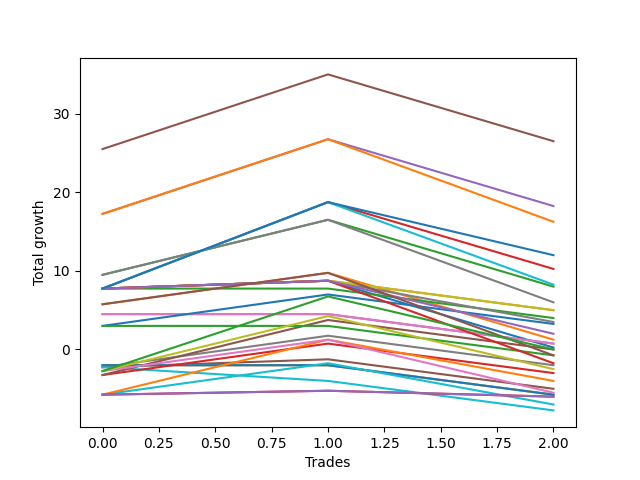

# Long Wallace 001 
- Symbol: ES
- Date Range: 03/18/2022 - 07/15/2022
- Trading Period: 7:20-12:30
- Number of Trades: 3



| Name | Win Percent | Profit | Avg Profit / Trade | Avg Time / Trade |      | Name | Win Percent | Profit | Avg Profit / Trade | Avg Time / Trade |
| ---- | ----------- | ------ | ------------------ | ---------------- | ---- | ---- | ----------- | ------ | ------------------ | ---------------- |
| Sorted By <br> Profit | | | | | | Sorted By <br> Win Percentage ||||
| Five | 66.67 | 12625.00 | 4208.33 | 22:45 |     | One Hundred Twenty-Six | 100.00 | 2375.00 | 791.67 | 01:26 |
| Sixty-One | 66.67 | 11625.00 | 3875.00 | 17:48 |     | One Hundred Twenty-One | 100.00 | 2375.00 | 791.67 | 01:26 |
| Seven | 66.67 | 9125.00 | 3041.67 | 25:03 |     | One Hundred Eleven | 100.00 | 2375.00 | 791.67 | 01:26 |
| Sixty-Three | 66.67 | 8125.00 | 2708.33 | 20:06 |     | Eighty-One | 100.00 | 2375.00 | 791.67 | 01:26 |
| Thirty | 66.67 | 7500.00 | 2500.00 | 08:13 |     | Five | 66.67 | 12625.00 | 4208.33 | 22:45 |
| Forty-Six | 66.67 | 6750.00 | 2250.00 | 12:11 |     | Sixty-One | 66.67 | 11625.00 | 3875.00 | 17:48 |
| Four | 66.67 | 6750.00 | 2250.00 | 17:03 |     | Seven | 66.67 | 9125.00 | 3041.67 | 25:03 |
| Seventy | 66.67 | 6000.00 | 2000.00 | 12:35 |     | Sixty-Three | 66.67 | 8125.00 | 2708.33 | 20:06 |
| Sixty | 66.67 | 5750.00 | 1916.67 | 12:06 |     | Thirty | 66.67 | 7500.00 | 2500.00 | 08:13 |
| Six | 66.67 | 5125.00 | 1708.33 | 18:08 |     | Forty-Six | 66.67 | 6750.00 | 2250.00 | 12:11 |
| Sixty-Two | 66.67 | 4125.00 | 1375.00 | 13:11 |     | Four | 66.67 | 6750.00 | 2250.00 | 17:03 |
| Two | 66.67 | 4000.00 | 1333.33 | 19:53 |     | Seventy | 66.67 | 6000.00 | 2000.00 | 12:35 |
| One Hundred Twenty | 66.67 | 3250.00 | 1083.33 | 01:13 |     | Sixty | 66.67 | 5750.00 | 1916.67 | 12:06 |
| One Hundred Five | 66.67 | 3250.00 | 1083.33 | 01:13 |     | Six | 66.67 | 5125.00 | 1708.33 | 18:08 |
| Fifty-Eight | 66.67 | 3000.00 | 1000.00 | 14:56 |     | Sixty-Two | 66.67 | 4125.00 | 1375.00 | 13:11 |
| One Hundred Ninteen | 66.67 | 2750.00 | 916.67 | 01:03 |     | Two | 66.67 | 4000.00 | 1333.33 | 19:53 |
| One Hundred Four | 66.67 | 2750.00 | 916.67 | 01:03 |     | One Hundred Twenty | 66.67 | 3250.00 | 1083.33 | 01:13 |
| One Hundred Fifteen | 66.67 | 2500.00 | 833.33 | 05:11 |     | One Hundred Five | 66.67 | 3250.00 | 1083.33 | 01:13 |
| One Hundred Twenty-Six | 100.00 | 2375.00 | 791.67 | 01:26 |     | Fifty-Eight | 66.67 | 3000.00 | 1000.00 | 14:56 |
| One Hundred Twenty-One | 100.00 | 2375.00 | 791.67 | 01:26 |     | One Hundred Ninteen | 66.67 | 2750.00 | 916.67 | 01:03 |
| One Hundred Eleven | 100.00 | 2375.00 | 791.67 | 01:26 |     | One Hundred Four | 66.67 | 2750.00 | 916.67 | 01:03 |
| Eighty-One | 100.00 | 2375.00 | 791.67 | 01:26 |     | One Hundred Fifteen | 66.67 | 2500.00 | 833.33 | 05:11 |
| One Hundred Fourteen | 66.67 | 2000.00 | 666.67 | 05:01 |     | One Hundred Fourteen | 66.67 | 2000.00 | 666.67 | 05:01 |
| Fifty-Four | 66.67 | 2000.00 | 666.67 | 02:43 |     | Fifty-Four | 66.67 | 2000.00 | 666.67 | 02:43 |
| Thirty-Eight | 66.67 | 2000.00 | 666.67 | 00:55 |     | Thirty-Eight | 66.67 | 2000.00 | 666.67 | 00:55 |
| One Hundred Thirty | 66.67 | 1750.00 | 583.33 | 05:35 |     | One Hundred Thirty | 66.67 | 1750.00 | 583.33 | 05:35 |
| Forty-Nine | 66.67 | 1625.00 | 541.67 | 01:46 |     | Forty-Nine | 66.67 | 1625.00 | 541.67 | 01:46 |
| One Hundred Twenty-Nine | 66.67 | 1250.00 | 416.67 | 05:25 |     | One Hundred Twenty-Nine | 66.67 | 1250.00 | 416.67 | 05:25 |
| One Hundred Eighteen | 66.67 | 1250.00 | 416.67 | 00:46 |     | One Hundred Eighteen | 66.67 | 1250.00 | 416.67 | 00:46 |
| One Hundred Three | 66.67 | 1250.00 | 416.67 | 00:46 |     | One Hundred Three | 66.67 | 1250.00 | 416.67 | 00:46 |
| Fifty-Two | 66.67 | 1250.00 | 416.67 | 01:38 |     | Fifty-Two | 66.67 | 1250.00 | 416.67 | 01:38 |
| Three | 66.67 | 1250.00 | 416.67 | 15:03 |     | Three | 66.67 | 1250.00 | 416.67 | 15:03 |
| Thirty-One | 33.33 | 1250.00 | 416.67 | 13:13 |     | One Hundred Seventeen | 66.67 | 875.00 | 291.67 | 00:45 |
| One Hundred Seventeen | 66.67 | 875.00 | 291.67 | 00:45 |     | One Hundred Two | 66.67 | 875.00 | 291.67 | 00:45 |
| One Hundred Two | 66.67 | 875.00 | 291.67 | 00:45 |     | Eighty-Five | 66.67 | 875.00 | 291.67 | 11:08 |
| Eighty-Five | 66.67 | 875.00 | 291.67 | 11:08 |     | One Hundred Ten | 66.67 | 750.00 | 250.00 | 00:48 |
| One Hundred Ten | 66.67 | 750.00 | 250.00 | 00:48 |     | One Hundred Nine | 66.67 | 750.00 | 250.00 | 00:48 |
| One Hundred Nine | 66.67 | 750.00 | 250.00 | 00:48 |     | Twenty-Four | 66.67 | 750.00 | 250.00 | 02:20 |
| Twenty-Four | 66.67 | 750.00 | 250.00 | 02:20 |     | One | 66.67 | 625.00 | 208.33 | 14:28 |
| One | 66.67 | 625.00 | 208.33 | 14:28 |     | One Hundred Thirteen | 66.67 | 500.00 | 166.67 | 04:45 |
| One Hundred Thirteen | 66.67 | 500.00 | 166.67 | 04:45 |     | Eighty-Four | 66.67 | 375.00 | 125.00 | 10:58 |
| Eighty-Four | 66.67 | 375.00 | 125.00 | 10:58 |     | Thirty-Nine | 66.67 | 375.00 | 125.00 | 01:11 |
| Thirty-Nine | 66.67 | 375.00 | 125.00 | 01:11 |     | Thirty-Seven | 66.67 | 375.00 | 125.00 | 01:11 |
| Thirty-Seven | 66.67 | 375.00 | 125.00 | 01:11 |     | Thirty-Six | 66.67 | 375.00 | 125.00 | 01:11 |
| Thirty-Six | 66.67 | 375.00 | 125.00 | 01:11 |     | Thirty-Five | 66.67 | 375.00 | 125.00 | 01:11 |
| Thirty-Five | 66.67 | 375.00 | 125.00 | 01:11 |     | Thirty-Four | 66.67 | 375.00 | 125.00 | 01:11 |
| Thirty-Four | 66.67 | 375.00 | 125.00 | 01:11 |     | Thirty-Three | 66.67 | 375.00 | 125.00 | 01:11 |
| Thirty-Three | 66.67 | 375.00 | 125.00 | 01:11 |     | Thirty-Two | 66.67 | 375.00 | 125.00 | 01:11 |
| Thirty-Two | 66.67 | 375.00 | 125.00 | 01:11 |     | Fifty-Nine | 66.67 | 250.00 | 83.33 | 10:06 |
| Fifty-Nine | 66.67 | 250.00 | 83.33 | 10:06 |     | One Hundred Sixteen | 66.67 | 125.00 | 41.67 | 00:43 |
| One Hundred Sixteen | 66.67 | 125.00 | 41.67 | 00:43 |     | One Hundred Twelve | 66.67 | 125.00 | 41.67 | 04:43 |
| One Hundred Twelve | 66.67 | 125.00 | 41.67 | 04:43 |     | One Hundred One | 66.67 | 125.00 | 41.67 | 00:43 |
| One Hundred One | 66.67 | 125.00 | 41.67 | 00:43 |     | Forty-Eight | 66.67 | 125.00 | 41.67 | 01:35 |
| Forty-Eight | 66.67 | 125.00 | 41.67 | 01:35 |     | Forty | 66.67 | 0.00 | 0.00 | 06:18 |
| Forty | 66.67 | 0.00 | 0.00 | 06:18 |     | One Hundred Twenty-Five | 66.67 | -125.00 | -41.67 | 06:11 |
| Seventy-One | 33.33 | 0.00 | 0.00 | 17:08 |     | One Hundred Twenty-Eight | 66.67 | -250.00 | -83.33 | 05:08 |
| Twenty-Six | 33.33 | 0.00 | 0.00 | 08:10 |     | One Hundred Eight | 66.67 | -375.00 | -125.00 | 00:40 |
| One Hundred Twenty-Five | 66.67 | -125.00 | -41.67 | 06:11 |     | One Hundred Seven | 66.67 | -375.00 | -125.00 | 00:40 |
| One Hundred Twenty-Eight | 66.67 | -250.00 | -83.33 | 05:08 |     | One Hundred Six | 66.67 | -375.00 | -125.00 | 00:40 |
| One Hundred Eight | 66.67 | -375.00 | -125.00 | 00:40 |     | Fifty-Seven | 66.67 | -375.00 | -125.00 | 09:31 |
| One Hundred Seven | 66.67 | -375.00 | -125.00 | 00:40 |     | Fifty-Five | 66.67 | -375.00 | -125.00 | 03:20 |
| One Hundred Six | 66.67 | -375.00 | -125.00 | 00:40 |     | Fifty-Three | 66.67 | -375.00 | -125.00 | 03:20 |
| Fifty-Seven | 66.67 | -375.00 | -125.00 | 09:31 |     | Fifty-One | 66.67 | -375.00 | -125.00 | 01:31 |
| Fifty-Five | 66.67 | -375.00 | -125.00 | 03:20 |     | Fifty | 66.67 | -375.00 | -125.00 | 03:20 |
| Fifty-Three | 66.67 | -375.00 | -125.00 | 03:20 |     | One Hundred Twenty-Seven | 66.67 | -625.00 | -208.33 | 05:06 |
| Fifty-One | 66.67 | -375.00 | -125.00 | 01:31 |     | One Hundred Twenty-Four | 66.67 | -625.00 | -208.33 | 06:01 |
| Fifty | 66.67 | -375.00 | -125.00 | 03:20 |     | Sixty-Four | 66.67 | -750.00 | -250.00 | 06:41 |
| Ninety-Five | 33.33 | -500.00 | -166.67 | 00:43 |     | Eighty-Three | 66.67 | -1125.00 | -375.00 | 10:41 |
| Twenty-Nine | 33.33 | -500.00 | -166.67 | 08:06 |     | Eighty-Two | 66.67 | -1500.00 | -500.00 | 10:40 |
| One Hundred Twenty-Seven | 66.67 | -625.00 | -208.33 | 05:06 |     | Zero | 66.67 | -1625.00 | -541.67 | 12:15 |
| One Hundred Twenty-Four | 66.67 | -625.00 | -208.33 | 06:01 |     | One Hundred Twenty-Three | 66.67 | -2125.00 | -708.33 | 05:45 |
| Sixty-Four | 66.67 | -750.00 | -250.00 | 06:41 |     | One Hundred Twenty-Two | 66.67 | -2500.00 | -833.33 | 05:43 |
| Forty-Seven | 33.33 | -750.00 | -250.00 | 17:21 |     | Fifty-Six | 66.67 | -2625.00 | -875.00 | 07:18 |
| Ninety-Four | 33.33 | -1000.00 | -333.33 | 00:33 |     | Thirty-One | 33.33 | 1250.00 | 416.67 | 13:13 |
| Nine | 33.33 | -1000.00 | -333.33 | 00:33 |     | Seventy-One | 33.33 | 0.00 | 0.00 | 17:08 |
| Eighty-Three | 66.67 | -1125.00 | -375.00 | 10:41 |     | Twenty-Six | 33.33 | 0.00 | 0.00 | 08:10 |
| Sixty-Six | 33.33 | -1250.00 | -416.67 | 12:05 |     | Ninety-Five | 33.33 | -500.00 | -166.67 | 00:43 |
| Ninety-Three | 33.33 | -1375.00 | -458.33 | 00:25 |     | Twenty-Nine | 33.33 | -500.00 | -166.67 | 08:06 |
| Twelve | 33.33 | -1375.00 | -458.33 | 00:25 |     | Forty-Seven | 33.33 | -750.00 | -250.00 | 17:21 |
| Eighty-Two | 66.67 | -1500.00 | -500.00 | 10:40 |     | Ninety-Four | 33.33 | -1000.00 | -333.33 | 00:33 |
| Twenty-Five | 33.33 | -1500.00 | -500.00 | 03:33 |     | Nine | 33.33 | -1000.00 | -333.33 | 00:33 |
| Zero | 66.67 | -1625.00 | -541.67 | 12:15 |     | Sixty-Six | 33.33 | -1250.00 | -416.67 | 12:05 |
| Ninety-Two | 33.33 | -1750.00 | -583.33 | 00:23 |     | Ninety-Three | 33.33 | -1375.00 | -458.33 | 00:25 |
| Sixty-Nine | 33.33 | -1750.00 | -583.33 | 12:01 |     | Twelve | 33.33 | -1375.00 | -458.33 | 00:25 |
| Twenty-Eight | 33.33 | -1875.00 | -625.00 | 03:25 |     | Twenty-Five | 33.33 | -1500.00 | -500.00 | 03:33 |
| Forty-Two | 33.33 | -2000.00 | -666.67 | 12:18 |     | Ninety-Two | 33.33 | -1750.00 | -583.33 | 00:23 |
| One Hundred Twenty-Three | 66.67 | -2125.00 | -708.33 | 05:45 |     | Sixty-Nine | 33.33 | -1750.00 | -583.33 | 12:01 |
| One Hundred Twenty-Two | 66.67 | -2500.00 | -833.33 | 05:43 |     | Twenty-Eight | 33.33 | -1875.00 | -625.00 | 03:25 |
| Ninety-One | 33.33 | -2500.00 | -833.33 | 00:21 |     | Forty-Two | 33.33 | -2000.00 | -666.67 | 12:18 |
| Forty-Five | 33.33 | -2500.00 | -833.33 | 12:15 |     | Ninety-One | 33.33 | -2500.00 | -833.33 | 00:21 |
| Eight | 33.33 | -2500.00 | -833.33 | 00:21 |     | Forty-Five | 33.33 | -2500.00 | -833.33 | 12:15 |
| Fifty-Six | 66.67 | -2625.00 | -875.00 | 07:18 |     | Eight | 33.33 | -2500.00 | -833.33 | 00:21 |
| Sixty-Five | 33.33 | -2750.00 | -916.67 | 07:28 |     | Sixty-Five | 33.33 | -2750.00 | -916.67 | 07:28 |
| One Hundred | 33.33 | -2875.00 | -958.33 | 00:16 |     | One Hundred | 33.33 | -2875.00 | -958.33 | 00:16 |
| Ninety-Nine | 33.33 | -2875.00 | -958.33 | 00:16 |     | Ninety-Nine | 33.33 | -2875.00 | -958.33 | 00:16 |
| Ninety-Eight | 33.33 | -2875.00 | -958.33 | 00:16 |     | Ninety-Eight | 33.33 | -2875.00 | -958.33 | 00:16 |
| Ninety-Seven | 33.33 | -2875.00 | -958.33 | 00:16 |     | Ninety-Seven | 33.33 | -2875.00 | -958.33 | 00:16 |
| Ninety-Six | 33.33 | -2875.00 | -958.33 | 00:16 |     | Ninety-Six | 33.33 | -2875.00 | -958.33 | 00:16 |
| Twenty-Three | 33.33 | -2875.00 | -958.33 | 00:16 |     | Twenty-Three | 33.33 | -2875.00 | -958.33 | 00:16 |
| Twenty-Two | 33.33 | -2875.00 | -958.33 | 00:16 |     | Twenty-Two | 33.33 | -2875.00 | -958.33 | 00:16 |
| Twenty-One | 33.33 | -2875.00 | -958.33 | 00:16 |     | Twenty-One | 33.33 | -2875.00 | -958.33 | 00:16 |
| Twenty | 33.33 | -2875.00 | -958.33 | 00:16 |     | Twenty | 33.33 | -2875.00 | -958.33 | 00:16 |
| Nineteen | 33.33 | -2875.00 | -958.33 | 00:16 |     | Nineteen | 33.33 | -2875.00 | -958.33 | 00:16 |
| Eighteen | 33.33 | -2875.00 | -958.33 | 00:16 |     | Eighteen | 33.33 | -2875.00 | -958.33 | 00:16 |
| Seventeen | 33.33 | -2875.00 | -958.33 | 00:16 |     | Seventeen | 33.33 | -2875.00 | -958.33 | 00:16 |
| Sixten | 33.33 | -2875.00 | -958.33 | 00:16 |     | Sixten | 33.33 | -2875.00 | -958.33 | 00:16 |
| Seventy-Three | 33.33 | -3000.00 | -1000.00 | 08:45 |     | Seventy-Three | 33.33 | -3000.00 | -1000.00 | 08:45 |
| Eleven | 33.33 | -3000.00 | -1000.00 | 00:18 |     | Eleven | 33.33 | -3000.00 | -1000.00 | 00:18 |
| Sixty-Eight | 33.33 | -3125.00 | -1041.67 | 07:20 |     | Sixty-Eight | 33.33 | -3125.00 | -1041.67 | 07:20 |
| Forty-One | 33.33 | -3500.00 | -1166.67 | 07:41 |     | Forty-One | 33.33 | -3500.00 | -1166.67 | 07:41 |
| twenty-Seven | 33.33 | -3500.00 | -1166.67 | 03:18 |     | twenty-Seven | 33.33 | -3500.00 | -1166.67 | 03:18 |
| Forty-Four | 33.33 | -3875.00 | -1291.67 | 07:33 |     | Forty-Four | 33.33 | -3875.00 | -1291.67 | 07:33 |
| Fifteen | 0.00 | -3875.00 | -1291.67 | 03:18 |     | Sixty-Seven | 33.33 | -4750.00 | -1583.33 | 07:13 |
| Fourteen | 0.00 | -3875.00 | -1291.67 | 03:18 |     | Forty-Three | 33.33 | -5500.00 | -1833.33 | 07:26 |
| Thirteen | 0.00 | -3875.00 | -1291.67 | 03:18 |     | Fifteen | 0.00 | -3875.00 | -1291.67 | 03:18 |
| Ten | 0.00 | -3875.00 | -1291.67 | 03:18 |     | Fourteen | 0.00 | -3875.00 | -1291.67 | 03:18 |
| Sixty-Seven | 33.33 | -4750.00 | -1583.33 | 07:13 |     | Thirteen | 0.00 | -3875.00 | -1291.67 | 03:18 |
| Forty-Three | 33.33 | -5500.00 | -1833.33 | 07:26 |     | Ten | 0.00 | -3875.00 | -1291.67 | 03:18 |

## NO STOPLOSS

### Test Zero
* Sell when price hits the middle line of the 20p bollinger
* No Stoploss
* Results:
```
Total Trades: 3
Percent Up: 66.67
Percent Down: 33.33
Total Points Moved Up: -3.25
Potential Profit: -1625.00
Total Points Ups: 5.25 Count Ups: 2
Total Points Downs: -8.50 Count Downs: 1
```

<details><summary>Trades</summary>

<code>In: 2022-05-17 11:25:00		Out: 2022-05-17 11:31:30		Total Position Time: 06:30		Total Move Up: 4.25		Total to Date: 4.25</code> <br />
<code>In: 2022-05-25 10:15:00		Out: 2022-05-25 10:15:20		Total Position Time: 00:20		Total Move Up: 1.00		Total to Date: 5.25</code> <br />
<code>In: 2022-06-15 07:58:00		Out: 2022-06-15 08:27:55		Total Position Time: 29:55		Total Move Up: -8.50		Total to Date: -3.25</code> <br />


</details>

### Test One
* Sell when the price hits the upper line of the 20p 1std bollinger
* No Stoploss
* Results:
```
Total Trades: 3
Percent Up: 66.67
Percent Down: 33.33
Total Points Moved Up: 1.25
Potential Profit: 625.00
Total Points Ups: 9.75 Count Ups: 2
Total Points Downs: -8.50 Count Downs: 1
```

<details><summary>Trades</summary>

<code>In: 2022-05-17 11:25:00		Out: 2022-05-17 11:37:35		Total Position Time: 12:35		Total Move Up: 5.75		Total to Date: 5.75</code> <br />
<code>In: 2022-05-25 10:15:00		Out: 2022-05-25 10:15:55		Total Position Time: 00:55		Total Move Up: 4.00		Total to Date: 9.75</code> <br />
<code>In: 2022-06-15 07:58:00		Out: 2022-06-15 08:27:55		Total Position Time: 29:55		Total Move Up: -8.50		Total to Date: 1.25</code> <br />


</details>

### Test Two
* Sell when the price hits the upper line of the 20p 2std bollinger
* No Stoploss
* Results:
```
Total Trades: 3
Percent Up: 66.67
Percent Down: 33.33
Total Points Moved Up: 8.00
Potential Profit: 4000.00
Total Points Ups: 16.50 Count Ups: 2
Total Points Downs: -8.50 Count Downs: 1
```

<details><summary>Trades</summary>

<code>In: 2022-05-17 11:25:00		Out: 2022-05-17 11:40:00		Total Position Time: 15:00		Total Move Up: 9.50		Total to Date: 9.50</code> <br />
<code>In: 2022-05-25 10:15:00		Out: 2022-05-25 10:29:45		Total Position Time: 14:45		Total Move Up: 7.00		Total to Date: 16.50</code> <br />
<code>In: 2022-06-15 07:58:00		Out: 2022-06-15 08:27:55		Total Position Time: 29:55		Total Move Up: -8.50		Total to Date: 8.00</code> <br />


</details>

### Test Three
* Sell when price hits the middle line of the 50p bollinger
* No Stoploss
* Results:
```
Total Trades: 3
Percent Up: 66.67
Percent Down: 33.33
Total Points Moved Up: 2.50
Potential Profit: 1250.00
Total Points Ups: 11.00 Count Ups: 2
Total Points Downs: -8.50 Count Downs: 1
```

<details><summary>Trades</summary>

<code>In: 2022-05-17 11:25:00		Out: 2022-05-17 11:40:05		Total Position Time: 15:05		Total Move Up: 11.00		Total to Date: 11.00</code> <br />
<code>In: 2022-05-25 10:15:00		Out: 2022-05-25 10:15:10		Total Position Time: 00:10		Total Move Up: 0.00		Total to Date: 11.00</code> <br />
<code>In: 2022-06-15 07:58:00		Out: 2022-06-15 08:27:55		Total Position Time: 29:55		Total Move Up: -8.50		Total to Date: 2.50</code> <br />


</details>

### Test Four
* Sell when the price hits the upper line of the 50p 1std bollinger
* No Stoploss
* Results:
```
Total Trades: 3
Percent Up: 66.67
Percent Down: 33.33
Total Points Moved Up: 13.50
Potential Profit: 6750.00
Total Points Ups: 22.00 Count Ups: 2
Total Points Downs: -8.50 Count Downs: 1
```

<details><summary>Trades</summary>

<code>In: 2022-05-17 11:25:00		Out: 2022-05-17 11:45:45		Total Position Time: 20:45		Total Move Up: 18.75		Total to Date: 18.75</code> <br />
<code>In: 2022-05-25 10:15:00		Out: 2022-05-25 10:15:30		Total Position Time: 00:30		Total Move Up: 3.25		Total to Date: 22.00</code> <br />
<code>In: 2022-06-15 07:58:00		Out: 2022-06-15 08:27:55		Total Position Time: 29:55		Total Move Up: -8.50		Total to Date: 13.50</code> <br />


</details>

### Test Five
* Sell when the price hits the upper line of the 50p 2std bollinger
* No Stoploss
* Results:
```
Total Trades: 3
Percent Up: 66.67
Percent Down: 33.33
Total Points Moved Up: 25.25
Potential Profit: 12625.00
Total Points Ups: 33.75 Count Ups: 2
Total Points Downs: -8.50 Count Downs: 1
```

<details><summary>Trades</summary>

<code>In: 2022-05-17 11:25:00		Out: 2022-05-17 11:48:45		Total Position Time: 23:45		Total Move Up: 27.75		Total to Date: 27.75</code> <br />
<code>In: 2022-05-25 10:15:00		Out: 2022-05-25 10:29:35		Total Position Time: 14:35		Total Move Up: 6.00		Total to Date: 33.75</code> <br />
<code>In: 2022-06-15 07:58:00		Out: 2022-06-15 08:27:55		Total Position Time: 29:55		Total Move Up: -8.50		Total to Date: 25.25</code> <br />


</details>

### Test Six
* Sell when the price hits the middle line of the 1std VWAP
* No Stoploss
* Results:
```
Total Trades: 3
Percent Up: 66.67
Percent Down: 33.33
Total Points Moved Up: 10.25
Potential Profit: 5125.00
Total Points Ups: 18.75 Count Ups: 2
Total Points Downs: -8.50 Count Downs: 1
```

<details><summary>Trades</summary>

<code>In: 2022-05-17 11:25:00		Out: 2022-05-17 11:27:25		Total Position Time: 02:25		Total Move Up: 7.75		Total to Date: 7.75</code> <br />
<code>In: 2022-05-25 10:15:00		Out: 2022-05-25 10:37:05		Total Position Time: 22:05		Total Move Up: 11.00		Total to Date: 18.75</code> <br />
<code>In: 2022-06-15 07:58:00		Out: 2022-06-15 08:27:55		Total Position Time: 29:55		Total Move Up: -8.50		Total to Date: 10.25</code> <br />


</details>

### Test Seven
* Sell when the price hits the upper line of the 1std VWAP
* No Stoploss
* Results:
```
Total Trades: 3
Percent Up: 66.67
Percent Down: 33.33
Total Points Moved Up: 18.25
Potential Profit: 9125.00
Total Points Ups: 26.75 Count Ups: 2
Total Points Downs: -8.50 Count Downs: 1
```

<details><summary>Trades</summary>

<code>In: 2022-05-17 11:25:00		Out: 2022-05-17 11:40:20		Total Position Time: 15:20		Total Move Up: 17.25		Total to Date: 17.25</code> <br />
<code>In: 2022-05-25 10:15:00		Out: 2022-05-25 10:44:55		Total Position Time: 29:55		Total Move Up: 9.50		Total to Date: 26.75</code> <br />
<code>In: 2022-06-15 07:58:00		Out: 2022-06-15 08:27:55		Total Position Time: 29:55		Total Move Up: -8.50		Total to Date: 18.25</code> <br />


</details>

## STOPLOSS OF 2

### Test Eight
* Sell when price hits the middle line of the 20p bollinger
* Stoploss is 2 points
* Results:
```
Total Trades: 3
Percent Up: 33.33
Percent Down: 66.67
Total Points Moved Up: -5.00
Potential Profit: -2500.00
Total Points Ups: 1.00 Count Ups: 1
Total Points Downs: -6.00 Count Downs: 2
```

<details><summary>Trades</summary>

<code>In: 2022-05-17 11:25:00		Out: 2022-05-17 11:25:35		Total Position Time: 00:35		Total Move Up: -2.25		Total to Date: -2.25</code> <br />
<code>In: 2022-05-25 10:15:00		Out: 2022-05-25 10:15:20		Total Position Time: 00:20		Total Move Up: 1.00		Total to Date: -1.25</code> <br />
<code>In: 2022-06-15 07:58:00		Out: 2022-06-15 07:58:10		Total Position Time: 00:10		Total Move Up: -3.75		Total to Date: -5.00</code> <br />


</details>

### Test Nine
* Sell when the price hits the upper line of the 20p 1std bollinger
* Stoploss is 2 points
* Results:
```
Total Trades: 3
Percent Up: 33.33
Percent Down: 66.67
Total Points Moved Up: -2.00
Potential Profit: -1000.00
Total Points Ups: 4.00 Count Ups: 1
Total Points Downs: -6.00 Count Downs: 2
```

<details><summary>Trades</summary>

<code>In: 2022-05-17 11:25:00		Out: 2022-05-17 11:25:35		Total Position Time: 00:35		Total Move Up: -2.25		Total to Date: -2.25</code> <br />
<code>In: 2022-05-25 10:15:00		Out: 2022-05-25 10:15:55		Total Position Time: 00:55		Total Move Up: 4.00		Total to Date: 1.75</code> <br />
<code>In: 2022-06-15 07:58:00		Out: 2022-06-15 07:58:10		Total Position Time: 00:10		Total Move Up: -3.75		Total to Date: -2.00</code> <br />


</details>

### Test Ten
* Sell when the price hits the upper line of the 20p 2std bollinger
* Stoploss is 2 points
* Results:
```
Total Trades: 3
Percent Up: 0.00
Percent Down: 100.00
Total Points Moved Up: -7.75
Potential Profit: -3875.00
Total Points Ups: 0.00 Count Ups: 0
Total Points Downs: -7.75 Count Downs: 3
```

<details><summary>Trades</summary>

<code>In: 2022-05-17 11:25:00		Out: 2022-05-17 11:25:35		Total Position Time: 00:35		Total Move Up: -2.25		Total to Date: -2.25</code> <br />
<code>In: 2022-05-25 10:15:00		Out: 2022-05-25 10:24:10		Total Position Time: 09:10		Total Move Up: -1.75		Total to Date: -4.00</code> <br />
<code>In: 2022-06-15 07:58:00		Out: 2022-06-15 07:58:10		Total Position Time: 00:10		Total Move Up: -3.75		Total to Date: -7.75</code> <br />


</details>

### Test Eleven
* Sell when price hits the middle line of the 50p bollinger
* Stoploss is 2 points
* Results:
```
Total Trades: 3
Percent Up: 33.33
Percent Down: 66.67
Total Points Moved Up: -6.00
Potential Profit: -3000.00
Total Points Ups: 0.00 Count Ups: 1
Total Points Downs: -6.00 Count Downs: 2
```

<details><summary>Trades</summary>

<code>In: 2022-05-17 11:25:00		Out: 2022-05-17 11:25:35		Total Position Time: 00:35		Total Move Up: -2.25		Total to Date: -2.25</code> <br />
<code>In: 2022-05-25 10:15:00		Out: 2022-05-25 10:15:10		Total Position Time: 00:10		Total Move Up: 0.00		Total to Date: -2.25</code> <br />
<code>In: 2022-06-15 07:58:00		Out: 2022-06-15 07:58:10		Total Position Time: 00:10		Total Move Up: -3.75		Total to Date: -6.00</code> <br />


</details>

### Test Twelve
* Sell when the price hits the upper line of the 50p 1std bollinger
* Stoploss is 2 points
* Results:
```
Total Trades: 3
Percent Up: 33.33
Percent Down: 66.67
Total Points Moved Up: -2.75
Potential Profit: -1375.00
Total Points Ups: 3.25 Count Ups: 1
Total Points Downs: -6.00 Count Downs: 2
```

<details><summary>Trades</summary>

<code>In: 2022-05-17 11:25:00		Out: 2022-05-17 11:25:35		Total Position Time: 00:35		Total Move Up: -2.25		Total to Date: -2.25</code> <br />
<code>In: 2022-05-25 10:15:00		Out: 2022-05-25 10:15:30		Total Position Time: 00:30		Total Move Up: 3.25		Total to Date: 1.00</code> <br />
<code>In: 2022-06-15 07:58:00		Out: 2022-06-15 07:58:10		Total Position Time: 00:10		Total Move Up: -3.75		Total to Date: -2.75</code> <br />


</details>

### Test Thirteen
* Sell when the price hits the upper line of the 50p 2std bollinger
* Stoploss is 2 points
* Results:
```
Total Trades: 3
Percent Up: 0.00
Percent Down: 100.00
Total Points Moved Up: -7.75
Potential Profit: -3875.00
Total Points Ups: 0.00 Count Ups: 0
Total Points Downs: -7.75 Count Downs: 3
```

<details><summary>Trades</summary>

<code>In: 2022-05-17 11:25:00		Out: 2022-05-17 11:25:35		Total Position Time: 00:35		Total Move Up: -2.25		Total to Date: -2.25</code> <br />
<code>In: 2022-05-25 10:15:00		Out: 2022-05-25 10:24:10		Total Position Time: 09:10		Total Move Up: -1.75		Total to Date: -4.00</code> <br />
<code>In: 2022-06-15 07:58:00		Out: 2022-06-15 07:58:10		Total Position Time: 00:10		Total Move Up: -3.75		Total to Date: -7.75</code> <br />


</details>

### Test Fourteen
* Sell when the price hits the middle line of the 1std VWAP
* Stoploss is 2 points
* Results:
```
Total Trades: 3
Percent Up: 0.00
Percent Down: 100.00
Total Points Moved Up: -7.75
Potential Profit: -3875.00
Total Points Ups: 0.00 Count Ups: 0
Total Points Downs: -7.75 Count Downs: 3
```

<details><summary>Trades</summary>

<code>In: 2022-05-17 11:25:00		Out: 2022-05-17 11:25:35		Total Position Time: 00:35		Total Move Up: -2.25		Total to Date: -2.25</code> <br />
<code>In: 2022-05-25 10:15:00		Out: 2022-05-25 10:24:10		Total Position Time: 09:10		Total Move Up: -1.75		Total to Date: -4.00</code> <br />
<code>In: 2022-06-15 07:58:00		Out: 2022-06-15 07:58:10		Total Position Time: 00:10		Total Move Up: -3.75		Total to Date: -7.75</code> <br />


</details>

### Test Fifteen
* Sell when the price hits the upper line of the 1std VWAP
* Stoploss is 2 points
* Results:
```
Total Trades: 3
Percent Up: 0.00
Percent Down: 100.00
Total Points Moved Up: -7.75
Potential Profit: -3875.00
Total Points Ups: 0.00 Count Ups: 0
Total Points Downs: -7.75 Count Downs: 3
```

<details><summary>Trades</summary>

<code>In: 2022-05-17 11:25:00		Out: 2022-05-17 11:25:35		Total Position Time: 00:35		Total Move Up: -2.25		Total to Date: -2.25</code> <br />
<code>In: 2022-05-25 10:15:00		Out: 2022-05-25 10:24:10		Total Position Time: 09:10		Total Move Up: -1.75		Total to Date: -4.00</code> <br />
<code>In: 2022-06-15 07:58:00		Out: 2022-06-15 07:58:10		Total Position Time: 00:10		Total Move Up: -3.75		Total to Date: -7.75</code> <br />


</details>

## TRAIL STOP OF 2

### Test Sixten
* Sell when price hits the middle line of the 20p bollinger
* Trailing Stop is 2 points
* Results:
```
Total Trades: 3
Percent Up: 33.33
Percent Down: 66.67
Total Points Moved Up: -5.75
Potential Profit: -2875.00
Total Points Ups: 0.00 Count Ups: 1
Total Points Downs: -5.75 Count Downs: 2
```

<details><summary>Trades</summary>

<code>In: 2022-05-17 11:25:00		Out: 2022-05-17 11:25:30		Total Position Time: 00:30		Total Move Up: -2.00		Total to Date: -2.00</code> <br />
<code>In: 2022-05-25 10:15:00		Out: 2022-05-25 10:15:10		Total Position Time: 00:10		Total Move Up: 0.00		Total to Date: -2.00</code> <br />
<code>In: 2022-06-15 07:58:00		Out: 2022-06-15 07:58:10		Total Position Time: 00:10		Total Move Up: -3.75		Total to Date: -5.75</code> <br />


</details>

### Test Seventeen
* Sell when the price hits the upper line of the 20p 1std bollinger
* Trailing Stop is 2 points
* Results:
```
Total Trades: 3
Percent Up: 33.33
Percent Down: 66.67
Total Points Moved Up: -5.75
Potential Profit: -2875.00
Total Points Ups: 0.00 Count Ups: 1
Total Points Downs: -5.75 Count Downs: 2
```

<details><summary>Trades</summary>

<code>In: 2022-05-17 11:25:00		Out: 2022-05-17 11:25:30		Total Position Time: 00:30		Total Move Up: -2.00		Total to Date: -2.00</code> <br />
<code>In: 2022-05-25 10:15:00		Out: 2022-05-25 10:15:10		Total Position Time: 00:10		Total Move Up: 0.00		Total to Date: -2.00</code> <br />
<code>In: 2022-06-15 07:58:00		Out: 2022-06-15 07:58:10		Total Position Time: 00:10		Total Move Up: -3.75		Total to Date: -5.75</code> <br />


</details>

### Test Eighteen
* Sell when the price hits the upper line of the 20p 2std bollinger
* Trailing Stop is 2 points
* Results:
```
Total Trades: 3
Percent Up: 33.33
Percent Down: 66.67
Total Points Moved Up: -5.75
Potential Profit: -2875.00
Total Points Ups: 0.00 Count Ups: 1
Total Points Downs: -5.75 Count Downs: 2
```

<details><summary>Trades</summary>

<code>In: 2022-05-17 11:25:00		Out: 2022-05-17 11:25:30		Total Position Time: 00:30		Total Move Up: -2.00		Total to Date: -2.00</code> <br />
<code>In: 2022-05-25 10:15:00		Out: 2022-05-25 10:15:10		Total Position Time: 00:10		Total Move Up: 0.00		Total to Date: -2.00</code> <br />
<code>In: 2022-06-15 07:58:00		Out: 2022-06-15 07:58:10		Total Position Time: 00:10		Total Move Up: -3.75		Total to Date: -5.75</code> <br />


</details>

### Test Nineteen
* Sell when price hits the middle line of the 50p bollinger
* Trailing Stop is 2 points
* Results:
```
Total Trades: 3
Percent Up: 33.33
Percent Down: 66.67
Total Points Moved Up: -5.75
Potential Profit: -2875.00
Total Points Ups: 0.00 Count Ups: 1
Total Points Downs: -5.75 Count Downs: 2
```

<details><summary>Trades</summary>

<code>In: 2022-05-17 11:25:00		Out: 2022-05-17 11:25:30		Total Position Time: 00:30		Total Move Up: -2.00		Total to Date: -2.00</code> <br />
<code>In: 2022-05-25 10:15:00		Out: 2022-05-25 10:15:10		Total Position Time: 00:10		Total Move Up: 0.00		Total to Date: -2.00</code> <br />
<code>In: 2022-06-15 07:58:00		Out: 2022-06-15 07:58:10		Total Position Time: 00:10		Total Move Up: -3.75		Total to Date: -5.75</code> <br />


</details>

### Test Twenty
* Sell when the price hits the upper line of the 50p 1std bollinger
* Trailing Stop is 2 points
* Results:
```
Total Trades: 3
Percent Up: 33.33
Percent Down: 66.67
Total Points Moved Up: -5.75
Potential Profit: -2875.00
Total Points Ups: 0.00 Count Ups: 1
Total Points Downs: -5.75 Count Downs: 2
```

<details><summary>Trades</summary>

<code>In: 2022-05-17 11:25:00		Out: 2022-05-17 11:25:30		Total Position Time: 00:30		Total Move Up: -2.00		Total to Date: -2.00</code> <br />
<code>In: 2022-05-25 10:15:00		Out: 2022-05-25 10:15:10		Total Position Time: 00:10		Total Move Up: 0.00		Total to Date: -2.00</code> <br />
<code>In: 2022-06-15 07:58:00		Out: 2022-06-15 07:58:10		Total Position Time: 00:10		Total Move Up: -3.75		Total to Date: -5.75</code> <br />


</details>

### Test Twenty-One
* Sell when the price hits the upper line of the 50p 2std bollinger
* Trailing Stop is 2 points
* Results:
```
Total Trades: 3
Percent Up: 33.33
Percent Down: 66.67
Total Points Moved Up: -5.75
Potential Profit: -2875.00
Total Points Ups: 0.00 Count Ups: 1
Total Points Downs: -5.75 Count Downs: 2
```

<details><summary>Trades</summary>

<code>In: 2022-05-17 11:25:00		Out: 2022-05-17 11:25:30		Total Position Time: 00:30		Total Move Up: -2.00		Total to Date: -2.00</code> <br />
<code>In: 2022-05-25 10:15:00		Out: 2022-05-25 10:15:10		Total Position Time: 00:10		Total Move Up: 0.00		Total to Date: -2.00</code> <br />
<code>In: 2022-06-15 07:58:00		Out: 2022-06-15 07:58:10		Total Position Time: 00:10		Total Move Up: -3.75		Total to Date: -5.75</code> <br />


</details>

### Test Twenty-Two
* Sell when the price hits the middle line of the 1std VWAP
* Trailing Stop is 2 points
* Results:
```
Total Trades: 3
Percent Up: 33.33
Percent Down: 66.67
Total Points Moved Up: -5.75
Potential Profit: -2875.00
Total Points Ups: 0.00 Count Ups: 1
Total Points Downs: -5.75 Count Downs: 2
```

<details><summary>Trades</summary>

<code>In: 2022-05-17 11:25:00		Out: 2022-05-17 11:25:30		Total Position Time: 00:30		Total Move Up: -2.00		Total to Date: -2.00</code> <br />
<code>In: 2022-05-25 10:15:00		Out: 2022-05-25 10:15:10		Total Position Time: 00:10		Total Move Up: 0.00		Total to Date: -2.00</code> <br />
<code>In: 2022-06-15 07:58:00		Out: 2022-06-15 07:58:10		Total Position Time: 00:10		Total Move Up: -3.75		Total to Date: -5.75</code> <br />


</details>

### Test Twenty-Three
* Sell when the price hits the upper line of the 1std VWAP
* Trailing Stop is 2 points
* Results:
```
Total Trades: 3
Percent Up: 33.33
Percent Down: 66.67
Total Points Moved Up: -5.75
Potential Profit: -2875.00
Total Points Ups: 0.00 Count Ups: 1
Total Points Downs: -5.75 Count Downs: 2
```

<details><summary>Trades</summary>

<code>In: 2022-05-17 11:25:00		Out: 2022-05-17 11:25:30		Total Position Time: 00:30		Total Move Up: -2.00		Total to Date: -2.00</code> <br />
<code>In: 2022-05-25 10:15:00		Out: 2022-05-25 10:15:10		Total Position Time: 00:10		Total Move Up: 0.00		Total to Date: -2.00</code> <br />
<code>In: 2022-06-15 07:58:00		Out: 2022-06-15 07:58:10		Total Position Time: 00:10		Total Move Up: -3.75		Total to Date: -5.75</code> <br />


</details>

## STOPLOSS OF 3

### Test Twenty-Four
* Sell when price hits the middle line of the 20p bollinger
* Stoploss is 3 points
* Results:
```
Total Trades: 3
Percent Up: 66.67
Percent Down: 33.33
Total Points Moved Up: 1.50
Potential Profit: 750.00
Total Points Ups: 5.25 Count Ups: 2
Total Points Downs: -3.75 Count Downs: 1
```

<details><summary>Trades</summary>

<code>In: 2022-05-17 11:25:00		Out: 2022-05-17 11:31:30		Total Position Time: 06:30		Total Move Up: 4.25		Total to Date: 4.25</code> <br />
<code>In: 2022-05-25 10:15:00		Out: 2022-05-25 10:15:20		Total Position Time: 00:20		Total Move Up: 1.00		Total to Date: 5.25</code> <br />
<code>In: 2022-06-15 07:58:00		Out: 2022-06-15 07:58:10		Total Position Time: 00:10		Total Move Up: -3.75		Total to Date: 1.50</code> <br />


</details>

### Test Twenty-Five
* Sell when the price hits the upper line of the 20p 1std bollinger
* Stoploss is 3 points
* Results:
```
Total Trades: 3
Percent Up: 33.33
Percent Down: 66.67
Total Points Moved Up: -3.00
Potential Profit: -1500.00
Total Points Ups: 4.00 Count Ups: 1
Total Points Downs: -7.00 Count Downs: 2
```

<details><summary>Trades</summary>

<code>In: 2022-05-17 11:25:00		Out: 2022-05-17 11:34:35		Total Position Time: 09:35		Total Move Up: -3.25		Total to Date: -3.25</code> <br />
<code>In: 2022-05-25 10:15:00		Out: 2022-05-25 10:15:55		Total Position Time: 00:55		Total Move Up: 4.00		Total to Date: 0.75</code> <br />
<code>In: 2022-06-15 07:58:00		Out: 2022-06-15 07:58:10		Total Position Time: 00:10		Total Move Up: -3.75		Total to Date: -3.00</code> <br />


</details>

### Test Twenty-Six
* Sell when the price hits the upper line of the 20p 2std bollinger
* Stoploss is 3 points
* Results:
```
Total Trades: 3
Percent Up: 33.33
Percent Down: 66.67
Total Points Moved Up: 0.00
Potential Profit: 0.00
Total Points Ups: 7.00 Count Ups: 1
Total Points Downs: -7.00 Count Downs: 2
```

<details><summary>Trades</summary>

<code>In: 2022-05-17 11:25:00		Out: 2022-05-17 11:34:35		Total Position Time: 09:35		Total Move Up: -3.25		Total to Date: -3.25</code> <br />
<code>In: 2022-05-25 10:15:00		Out: 2022-05-25 10:29:45		Total Position Time: 14:45		Total Move Up: 7.00		Total to Date: 3.75</code> <br />
<code>In: 2022-06-15 07:58:00		Out: 2022-06-15 07:58:10		Total Position Time: 00:10		Total Move Up: -3.75		Total to Date: 0.00</code> <br />


</details>

### Test twenty-Seven
* Sell when price hits the middle line of the 50p bollinger
* Stoploss is 3 points
* Results:
```
Total Trades: 3
Percent Up: 33.33
Percent Down: 66.67
Total Points Moved Up: -7.00
Potential Profit: -3500.00
Total Points Ups: 0.00 Count Ups: 1
Total Points Downs: -7.00 Count Downs: 2
```

<details><summary>Trades</summary>

<code>In: 2022-05-17 11:25:00		Out: 2022-05-17 11:34:35		Total Position Time: 09:35		Total Move Up: -3.25		Total to Date: -3.25</code> <br />
<code>In: 2022-05-25 10:15:00		Out: 2022-05-25 10:15:10		Total Position Time: 00:10		Total Move Up: 0.00		Total to Date: -3.25</code> <br />
<code>In: 2022-06-15 07:58:00		Out: 2022-06-15 07:58:10		Total Position Time: 00:10		Total Move Up: -3.75		Total to Date: -7.00</code> <br />


</details>

### Test Twenty-Eight
* Sell when the price hits the upper line of the 50p 1std bollinger
* Stoploss is 3 points
* Results:
```
Total Trades: 3
Percent Up: 33.33
Percent Down: 66.67
Total Points Moved Up: -3.75
Potential Profit: -1875.00
Total Points Ups: 3.25 Count Ups: 1
Total Points Downs: -7.00 Count Downs: 2
```

<details><summary>Trades</summary>

<code>In: 2022-05-17 11:25:00		Out: 2022-05-17 11:34:35		Total Position Time: 09:35		Total Move Up: -3.25		Total to Date: -3.25</code> <br />
<code>In: 2022-05-25 10:15:00		Out: 2022-05-25 10:15:30		Total Position Time: 00:30		Total Move Up: 3.25		Total to Date: 0.00</code> <br />
<code>In: 2022-06-15 07:58:00		Out: 2022-06-15 07:58:10		Total Position Time: 00:10		Total Move Up: -3.75		Total to Date: -3.75</code> <br />


</details>

### Test Twenty-Nine
* Sell when the price hits the upper line of the 50p 2std bollinger
* Stoploss is 3 points
* Results:
```
Total Trades: 3
Percent Up: 33.33
Percent Down: 66.67
Total Points Moved Up: -1.00
Potential Profit: -500.00
Total Points Ups: 6.00 Count Ups: 1
Total Points Downs: -7.00 Count Downs: 2
```

<details><summary>Trades</summary>

<code>In: 2022-05-17 11:25:00		Out: 2022-05-17 11:34:35		Total Position Time: 09:35		Total Move Up: -3.25		Total to Date: -3.25</code> <br />
<code>In: 2022-05-25 10:15:00		Out: 2022-05-25 10:29:35		Total Position Time: 14:35		Total Move Up: 6.00		Total to Date: 2.75</code> <br />
<code>In: 2022-06-15 07:58:00		Out: 2022-06-15 07:58:10		Total Position Time: 00:10		Total Move Up: -3.75		Total to Date: -1.00</code> <br />


</details>

### Test Thirty
* Sell when the price hits the middle line of the 1std VWAP
* Stoploss is 3 points
* Results:
```
Total Trades: 3
Percent Up: 66.67
Percent Down: 33.33
Total Points Moved Up: 15.00
Potential Profit: 7500.00
Total Points Ups: 18.75 Count Ups: 2
Total Points Downs: -3.75 Count Downs: 1
```

<details><summary>Trades</summary>

<code>In: 2022-05-17 11:25:00		Out: 2022-05-17 11:27:25		Total Position Time: 02:25		Total Move Up: 7.75		Total to Date: 7.75</code> <br />
<code>In: 2022-05-25 10:15:00		Out: 2022-05-25 10:37:05		Total Position Time: 22:05		Total Move Up: 11.00		Total to Date: 18.75</code> <br />
<code>In: 2022-06-15 07:58:00		Out: 2022-06-15 07:58:10		Total Position Time: 00:10		Total Move Up: -3.75		Total to Date: 15.00</code> <br />


</details>

### Test Thirty-One
* Sell when the price hits the upper line of the 1std VWAP
* Stoploss is 3 points
* Results:
```
Total Trades: 3
Percent Up: 33.33
Percent Down: 66.67
Total Points Moved Up: 2.50
Potential Profit: 1250.00
Total Points Ups: 9.50 Count Ups: 1
Total Points Downs: -7.00 Count Downs: 2
```

<details><summary>Trades</summary>

<code>In: 2022-05-17 11:25:00		Out: 2022-05-17 11:34:35		Total Position Time: 09:35		Total Move Up: -3.25		Total to Date: -3.25</code> <br />
<code>In: 2022-05-25 10:15:00		Out: 2022-05-25 10:44:55		Total Position Time: 29:55		Total Move Up: 9.50		Total to Date: 6.25</code> <br />
<code>In: 2022-06-15 07:58:00		Out: 2022-06-15 07:58:10		Total Position Time: 00:10		Total Move Up: -3.75		Total to Date: 2.50</code> <br />


</details>

## TRAIL STOP OF 3

### Test Thirty-Two
* Sell when price hits the middle line of the 20p bollinger
* Trailing Stop is 3 points
* Results:
```
Total Trades: 3
Percent Up: 66.67
Percent Down: 33.33
Total Points Moved Up: 0.75
Potential Profit: 375.00
Total Points Ups: 4.50 Count Ups: 2
Total Points Downs: -3.75 Count Downs: 1
```

<details><summary>Trades</summary>

<code>In: 2022-05-17 11:25:00		Out: 2022-05-17 11:28:15		Total Position Time: 03:15		Total Move Up: 4.50		Total to Date: 4.50</code> <br />
<code>In: 2022-05-25 10:15:00		Out: 2022-05-25 10:15:10		Total Position Time: 00:10		Total Move Up: 0.00		Total to Date: 4.50</code> <br />
<code>In: 2022-06-15 07:58:00		Out: 2022-06-15 07:58:10		Total Position Time: 00:10		Total Move Up: -3.75		Total to Date: 0.75</code> <br />


</details>

### Test Thirty-Three
* Sell when the price hits the upper line of the 20p 1std bollinger
* Trailing Stop is 3 points
* Results:
```
Total Trades: 3
Percent Up: 66.67
Percent Down: 33.33
Total Points Moved Up: 0.75
Potential Profit: 375.00
Total Points Ups: 4.50 Count Ups: 2
Total Points Downs: -3.75 Count Downs: 1
```

<details><summary>Trades</summary>

<code>In: 2022-05-17 11:25:00		Out: 2022-05-17 11:28:15		Total Position Time: 03:15		Total Move Up: 4.50		Total to Date: 4.50</code> <br />
<code>In: 2022-05-25 10:15:00		Out: 2022-05-25 10:15:10		Total Position Time: 00:10		Total Move Up: 0.00		Total to Date: 4.50</code> <br />
<code>In: 2022-06-15 07:58:00		Out: 2022-06-15 07:58:10		Total Position Time: 00:10		Total Move Up: -3.75		Total to Date: 0.75</code> <br />


</details>

### Test Thirty-Four
* Sell when the price hits the upper line of the 20p 2std bollinger
* Trailing Stop is 3 points
* Results:
```
Total Trades: 3
Percent Up: 66.67
Percent Down: 33.33
Total Points Moved Up: 0.75
Potential Profit: 375.00
Total Points Ups: 4.50 Count Ups: 2
Total Points Downs: -3.75 Count Downs: 1
```

<details><summary>Trades</summary>

<code>In: 2022-05-17 11:25:00		Out: 2022-05-17 11:28:15		Total Position Time: 03:15		Total Move Up: 4.50		Total to Date: 4.50</code> <br />
<code>In: 2022-05-25 10:15:00		Out: 2022-05-25 10:15:10		Total Position Time: 00:10		Total Move Up: 0.00		Total to Date: 4.50</code> <br />
<code>In: 2022-06-15 07:58:00		Out: 2022-06-15 07:58:10		Total Position Time: 00:10		Total Move Up: -3.75		Total to Date: 0.75</code> <br />


</details>

### Test Thirty-Five
* Sell when price hits the middle line of the 50p bollinger
* Trailing Stop is 3 points
* Results:
```
Total Trades: 3
Percent Up: 66.67
Percent Down: 33.33
Total Points Moved Up: 0.75
Potential Profit: 375.00
Total Points Ups: 4.50 Count Ups: 2
Total Points Downs: -3.75 Count Downs: 1
```

<details><summary>Trades</summary>

<code>In: 2022-05-17 11:25:00		Out: 2022-05-17 11:28:15		Total Position Time: 03:15		Total Move Up: 4.50		Total to Date: 4.50</code> <br />
<code>In: 2022-05-25 10:15:00		Out: 2022-05-25 10:15:10		Total Position Time: 00:10		Total Move Up: 0.00		Total to Date: 4.50</code> <br />
<code>In: 2022-06-15 07:58:00		Out: 2022-06-15 07:58:10		Total Position Time: 00:10		Total Move Up: -3.75		Total to Date: 0.75</code> <br />


</details>

### Test Thirty-Six
* Sell when the price hits the upper line of the 50p 1std bollinger
* Trailing Stop is 3 points
* Results:
```
Total Trades: 3
Percent Up: 66.67
Percent Down: 33.33
Total Points Moved Up: 0.75
Potential Profit: 375.00
Total Points Ups: 4.50 Count Ups: 2
Total Points Downs: -3.75 Count Downs: 1
```

<details><summary>Trades</summary>

<code>In: 2022-05-17 11:25:00		Out: 2022-05-17 11:28:15		Total Position Time: 03:15		Total Move Up: 4.50		Total to Date: 4.50</code> <br />
<code>In: 2022-05-25 10:15:00		Out: 2022-05-25 10:15:10		Total Position Time: 00:10		Total Move Up: 0.00		Total to Date: 4.50</code> <br />
<code>In: 2022-06-15 07:58:00		Out: 2022-06-15 07:58:10		Total Position Time: 00:10		Total Move Up: -3.75		Total to Date: 0.75</code> <br />


</details>

### Test Thirty-Seven
* Sell when the price hits the upper line of the 50p 2std bollinger
* Trailing Stop is 3 points
* Results:
```
Total Trades: 3
Percent Up: 66.67
Percent Down: 33.33
Total Points Moved Up: 0.75
Potential Profit: 375.00
Total Points Ups: 4.50 Count Ups: 2
Total Points Downs: -3.75 Count Downs: 1
```

<details><summary>Trades</summary>

<code>In: 2022-05-17 11:25:00		Out: 2022-05-17 11:28:15		Total Position Time: 03:15		Total Move Up: 4.50		Total to Date: 4.50</code> <br />
<code>In: 2022-05-25 10:15:00		Out: 2022-05-25 10:15:10		Total Position Time: 00:10		Total Move Up: 0.00		Total to Date: 4.50</code> <br />
<code>In: 2022-06-15 07:58:00		Out: 2022-06-15 07:58:10		Total Position Time: 00:10		Total Move Up: -3.75		Total to Date: 0.75</code> <br />


</details>

### Test Thirty-Eight
* Sell when the price hits the middle line of the 1std VWAP
* Trailing Stop is 3 points
* Results:
```
Total Trades: 3
Percent Up: 66.67
Percent Down: 33.33
Total Points Moved Up: 4.00
Potential Profit: 2000.00
Total Points Ups: 7.75 Count Ups: 2
Total Points Downs: -3.75 Count Downs: 1
```

<details><summary>Trades</summary>

<code>In: 2022-05-17 11:25:00		Out: 2022-05-17 11:27:25		Total Position Time: 02:25		Total Move Up: 7.75		Total to Date: 7.75</code> <br />
<code>In: 2022-05-25 10:15:00		Out: 2022-05-25 10:15:10		Total Position Time: 00:10		Total Move Up: 0.00		Total to Date: 7.75</code> <br />
<code>In: 2022-06-15 07:58:00		Out: 2022-06-15 07:58:10		Total Position Time: 00:10		Total Move Up: -3.75		Total to Date: 4.00</code> <br />


</details>

### Test Thirty-Nine
* Sell when the price hits the upper line of the 1std VWAP
* Trailing Stop is 3 points
* Results:
```
Total Trades: 3
Percent Up: 66.67
Percent Down: 33.33
Total Points Moved Up: 0.75
Potential Profit: 375.00
Total Points Ups: 4.50 Count Ups: 2
Total Points Downs: -3.75 Count Downs: 1
```

<details><summary>Trades</summary>

<code>In: 2022-05-17 11:25:00		Out: 2022-05-17 11:28:15		Total Position Time: 03:15		Total Move Up: 4.50		Total to Date: 4.50</code> <br />
<code>In: 2022-05-25 10:15:00		Out: 2022-05-25 10:15:10		Total Position Time: 00:10		Total Move Up: 0.00		Total to Date: 4.50</code> <br />
<code>In: 2022-06-15 07:58:00		Out: 2022-06-15 07:58:10		Total Position Time: 00:10		Total Move Up: -3.75		Total to Date: 0.75</code> <br />


</details>

## STOPLOSS OF 5

### Test Forty
* Sell when price hits the middle line of the 20p bollinger
* Stoploss is 5 points
* Results:
```
Total Trades: 3
Percent Up: 66.67
Percent Down: 33.33
Total Points Moved Up: 0.00
Potential Profit: 0.00
Total Points Ups: 5.25 Count Ups: 2
Total Points Downs: -5.25 Count Downs: 1
```

<details><summary>Trades</summary>

<code>In: 2022-05-17 11:25:00		Out: 2022-05-17 11:31:30		Total Position Time: 06:30		Total Move Up: 4.25		Total to Date: 4.25</code> <br />
<code>In: 2022-05-25 10:15:00		Out: 2022-05-25 10:15:20		Total Position Time: 00:20		Total Move Up: 1.00		Total to Date: 5.25</code> <br />
<code>In: 2022-06-15 07:58:00		Out: 2022-06-15 08:10:05		Total Position Time: 12:05		Total Move Up: -5.25		Total to Date: 0.00</code> <br />


</details>

### Test Forty-One
* Sell when the price hits the upper line of the 20p 1std bollinger
* Stoploss is 5 points
* Results:
```
Total Trades: 3
Percent Up: 33.33
Percent Down: 66.67
Total Points Moved Up: -7.00
Potential Profit: -3500.00
Total Points Ups: 4.00 Count Ups: 1
Total Points Downs: -11.00 Count Downs: 2
```

<details><summary>Trades</summary>

<code>In: 2022-05-17 11:25:00		Out: 2022-05-17 11:35:05		Total Position Time: 10:05		Total Move Up: -5.75		Total to Date: -5.75</code> <br />
<code>In: 2022-05-25 10:15:00		Out: 2022-05-25 10:15:55		Total Position Time: 00:55		Total Move Up: 4.00		Total to Date: -1.75</code> <br />
<code>In: 2022-06-15 07:58:00		Out: 2022-06-15 08:10:05		Total Position Time: 12:05		Total Move Up: -5.25		Total to Date: -7.00</code> <br />


</details>

### Test Forty-Two
* Sell when the price hits the upper line of the 20p 2std bollinger
* Stoploss is 5 points
* Results:
```
Total Trades: 3
Percent Up: 33.33
Percent Down: 66.67
Total Points Moved Up: -4.00
Potential Profit: -2000.00
Total Points Ups: 7.00 Count Ups: 1
Total Points Downs: -11.00 Count Downs: 2
```

<details><summary>Trades</summary>

<code>In: 2022-05-17 11:25:00		Out: 2022-05-17 11:35:05		Total Position Time: 10:05		Total Move Up: -5.75		Total to Date: -5.75</code> <br />
<code>In: 2022-05-25 10:15:00		Out: 2022-05-25 10:29:45		Total Position Time: 14:45		Total Move Up: 7.00		Total to Date: 1.25</code> <br />
<code>In: 2022-06-15 07:58:00		Out: 2022-06-15 08:10:05		Total Position Time: 12:05		Total Move Up: -5.25		Total to Date: -4.00</code> <br />


</details>

### Test Forty-Three
* Sell when price hits the middle line of the 50p bollinger
* Stoploss is 5 points
* Results:
```
Total Trades: 3
Percent Up: 33.33
Percent Down: 66.67
Total Points Moved Up: -11.00
Potential Profit: -5500.00
Total Points Ups: 0.00 Count Ups: 1
Total Points Downs: -11.00 Count Downs: 2
```

<details><summary>Trades</summary>

<code>In: 2022-05-17 11:25:00		Out: 2022-05-17 11:35:05		Total Position Time: 10:05		Total Move Up: -5.75		Total to Date: -5.75</code> <br />
<code>In: 2022-05-25 10:15:00		Out: 2022-05-25 10:15:10		Total Position Time: 00:10		Total Move Up: 0.00		Total to Date: -5.75</code> <br />
<code>In: 2022-06-15 07:58:00		Out: 2022-06-15 08:10:05		Total Position Time: 12:05		Total Move Up: -5.25		Total to Date: -11.00</code> <br />


</details>

### Test Forty-Four
* Sell when the price hits the upper line of the 50p 1std bollinger
* Stoploss is 5 points
* Results:
```
Total Trades: 3
Percent Up: 33.33
Percent Down: 66.67
Total Points Moved Up: -7.75
Potential Profit: -3875.00
Total Points Ups: 3.25 Count Ups: 1
Total Points Downs: -11.00 Count Downs: 2
```

<details><summary>Trades</summary>

<code>In: 2022-05-17 11:25:00		Out: 2022-05-17 11:35:05		Total Position Time: 10:05		Total Move Up: -5.75		Total to Date: -5.75</code> <br />
<code>In: 2022-05-25 10:15:00		Out: 2022-05-25 10:15:30		Total Position Time: 00:30		Total Move Up: 3.25		Total to Date: -2.50</code> <br />
<code>In: 2022-06-15 07:58:00		Out: 2022-06-15 08:10:05		Total Position Time: 12:05		Total Move Up: -5.25		Total to Date: -7.75</code> <br />


</details>

### Test Forty-Five
* Sell when the price hits the upper line of the 50p 2std bollinger
* Stoploss is 5 points
* Results:
```
Total Trades: 3
Percent Up: 33.33
Percent Down: 66.67
Total Points Moved Up: -5.00
Potential Profit: -2500.00
Total Points Ups: 6.00 Count Ups: 1
Total Points Downs: -11.00 Count Downs: 2
```

<details><summary>Trades</summary>

<code>In: 2022-05-17 11:25:00		Out: 2022-05-17 11:35:05		Total Position Time: 10:05		Total Move Up: -5.75		Total to Date: -5.75</code> <br />
<code>In: 2022-05-25 10:15:00		Out: 2022-05-25 10:29:35		Total Position Time: 14:35		Total Move Up: 6.00		Total to Date: 0.25</code> <br />
<code>In: 2022-06-15 07:58:00		Out: 2022-06-15 08:10:05		Total Position Time: 12:05		Total Move Up: -5.25		Total to Date: -5.00</code> <br />


</details>

### Test Forty-Six
* Sell when the price hits the middle line of the 1std VWAP
* Stoploss is 5 points
* Results:
```
Total Trades: 3
Percent Up: 66.67
Percent Down: 33.33
Total Points Moved Up: 13.50
Potential Profit: 6750.00
Total Points Ups: 18.75 Count Ups: 2
Total Points Downs: -5.25 Count Downs: 1
```

<details><summary>Trades</summary>

<code>In: 2022-05-17 11:25:00		Out: 2022-05-17 11:27:25		Total Position Time: 02:25		Total Move Up: 7.75		Total to Date: 7.75</code> <br />
<code>In: 2022-05-25 10:15:00		Out: 2022-05-25 10:37:05		Total Position Time: 22:05		Total Move Up: 11.00		Total to Date: 18.75</code> <br />
<code>In: 2022-06-15 07:58:00		Out: 2022-06-15 08:10:05		Total Position Time: 12:05		Total Move Up: -5.25		Total to Date: 13.50</code> <br />


</details>

### Test Forty-Seven
* Sell when the price hits the upper line of the 1std VWAP
* Stoploss is 5 points
* Results:
```
Total Trades: 3
Percent Up: 33.33
Percent Down: 66.67
Total Points Moved Up: -1.50
Potential Profit: -750.00
Total Points Ups: 9.50 Count Ups: 1
Total Points Downs: -11.00 Count Downs: 2
```

<details><summary>Trades</summary>

<code>In: 2022-05-17 11:25:00		Out: 2022-05-17 11:35:05		Total Position Time: 10:05		Total Move Up: -5.75		Total to Date: -5.75</code> <br />
<code>In: 2022-05-25 10:15:00		Out: 2022-05-25 10:44:55		Total Position Time: 29:55		Total Move Up: 9.50		Total to Date: 3.75</code> <br />
<code>In: 2022-06-15 07:58:00		Out: 2022-06-15 08:10:05		Total Position Time: 12:05		Total Move Up: -5.25		Total to Date: -1.50</code> <br />


</details>

## TRAIL STOP OF 5

### Test Forty-Eight
* Sell when price hits the middle line of the 20p bollinger
* Trailing Stop is 5 points
* Results:
```
Total Trades: 3
Percent Up: 66.67
Percent Down: 33.33
Total Points Moved Up: 0.25
Potential Profit: 125.00
Total Points Ups: 4.00 Count Ups: 2
Total Points Downs: -3.75 Count Downs: 1
```

<details><summary>Trades</summary>

<code>In: 2022-05-17 11:25:00		Out: 2022-05-17 11:29:15		Total Position Time: 04:15		Total Move Up: 3.00		Total to Date: 3.00</code> <br />
<code>In: 2022-05-25 10:15:00		Out: 2022-05-25 10:15:20		Total Position Time: 00:20		Total Move Up: 1.00		Total to Date: 4.00</code> <br />
<code>In: 2022-06-15 07:58:00		Out: 2022-06-15 07:58:10		Total Position Time: 00:10		Total Move Up: -3.75		Total to Date: 0.25</code> <br />


</details>

### Test Forty-Nine
* Sell when the price hits the upper line of the 20p 1std bollinger
* Trailing Stop is 5 points
* Results:
```
Total Trades: 3
Percent Up: 66.67
Percent Down: 33.33
Total Points Moved Up: 3.25
Potential Profit: 1625.00
Total Points Ups: 7.00 Count Ups: 2
Total Points Downs: -3.75 Count Downs: 1
```

<details><summary>Trades</summary>

<code>In: 2022-05-17 11:25:00		Out: 2022-05-17 11:29:15		Total Position Time: 04:15		Total Move Up: 3.00		Total to Date: 3.00</code> <br />
<code>In: 2022-05-25 10:15:00		Out: 2022-05-25 10:15:55		Total Position Time: 00:55		Total Move Up: 4.00		Total to Date: 7.00</code> <br />
<code>In: 2022-06-15 07:58:00		Out: 2022-06-15 07:58:10		Total Position Time: 00:10		Total Move Up: -3.75		Total to Date: 3.25</code> <br />


</details>

### Test Fifty
* Sell when the price hits the upper line of the 20p 2std bollinger
* Trailing Stop is 5 points
* Results:
```
Total Trades: 3
Percent Up: 66.67
Percent Down: 33.33
Total Points Moved Up: -0.75
Potential Profit: -375.00
Total Points Ups: 3.00 Count Ups: 2
Total Points Downs: -3.75 Count Downs: 1
```

<details><summary>Trades</summary>

<code>In: 2022-05-17 11:25:00		Out: 2022-05-17 11:29:15		Total Position Time: 04:15		Total Move Up: 3.00		Total to Date: 3.00</code> <br />
<code>In: 2022-05-25 10:15:00		Out: 2022-05-25 10:20:35		Total Position Time: 05:35		Total Move Up: 0.00		Total to Date: 3.00</code> <br />
<code>In: 2022-06-15 07:58:00		Out: 2022-06-15 07:58:10		Total Position Time: 00:10		Total Move Up: -3.75		Total to Date: -0.75</code> <br />


</details>

### Test Fifty-One
* Sell when price hits the middle line of the 50p bollinger
* Trailing Stop is 5 points
* Results:
```
Total Trades: 3
Percent Up: 66.67
Percent Down: 33.33
Total Points Moved Up: -0.75
Potential Profit: -375.00
Total Points Ups: 3.00 Count Ups: 2
Total Points Downs: -3.75 Count Downs: 1
```

<details><summary>Trades</summary>

<code>In: 2022-05-17 11:25:00		Out: 2022-05-17 11:29:15		Total Position Time: 04:15		Total Move Up: 3.00		Total to Date: 3.00</code> <br />
<code>In: 2022-05-25 10:15:00		Out: 2022-05-25 10:15:10		Total Position Time: 00:10		Total Move Up: 0.00		Total to Date: 3.00</code> <br />
<code>In: 2022-06-15 07:58:00		Out: 2022-06-15 07:58:10		Total Position Time: 00:10		Total Move Up: -3.75		Total to Date: -0.75</code> <br />


</details>

### Test Fifty-Two
* Sell when the price hits the upper line of the 50p 1std bollinger
* Trailing Stop is 5 points
* Results:
```
Total Trades: 3
Percent Up: 66.67
Percent Down: 33.33
Total Points Moved Up: 2.50
Potential Profit: 1250.00
Total Points Ups: 6.25 Count Ups: 2
Total Points Downs: -3.75 Count Downs: 1
```

<details><summary>Trades</summary>

<code>In: 2022-05-17 11:25:00		Out: 2022-05-17 11:29:15		Total Position Time: 04:15		Total Move Up: 3.00		Total to Date: 3.00</code> <br />
<code>In: 2022-05-25 10:15:00		Out: 2022-05-25 10:15:30		Total Position Time: 00:30		Total Move Up: 3.25		Total to Date: 6.25</code> <br />
<code>In: 2022-06-15 07:58:00		Out: 2022-06-15 07:58:10		Total Position Time: 00:10		Total Move Up: -3.75		Total to Date: 2.50</code> <br />


</details>

### Test Fifty-Three
* Sell when the price hits the upper line of the 50p 2std bollinger
* Trailing Stop is 5 points
* Results:
```
Total Trades: 3
Percent Up: 66.67
Percent Down: 33.33
Total Points Moved Up: -0.75
Potential Profit: -375.00
Total Points Ups: 3.00 Count Ups: 2
Total Points Downs: -3.75 Count Downs: 1
```

<details><summary>Trades</summary>

<code>In: 2022-05-17 11:25:00		Out: 2022-05-17 11:29:15		Total Position Time: 04:15		Total Move Up: 3.00		Total to Date: 3.00</code> <br />
<code>In: 2022-05-25 10:15:00		Out: 2022-05-25 10:20:35		Total Position Time: 05:35		Total Move Up: 0.00		Total to Date: 3.00</code> <br />
<code>In: 2022-06-15 07:58:00		Out: 2022-06-15 07:58:10		Total Position Time: 00:10		Total Move Up: -3.75		Total to Date: -0.75</code> <br />


</details>

### Test Fifty-Four
* Sell when the price hits the middle line of the 1std VWAP
* Trailing Stop is 5 points
* Results:
```
Total Trades: 3
Percent Up: 66.67
Percent Down: 33.33
Total Points Moved Up: 4.00
Potential Profit: 2000.00
Total Points Ups: 7.75 Count Ups: 2
Total Points Downs: -3.75 Count Downs: 1
```

<details><summary>Trades</summary>

<code>In: 2022-05-17 11:25:00		Out: 2022-05-17 11:27:25		Total Position Time: 02:25		Total Move Up: 7.75		Total to Date: 7.75</code> <br />
<code>In: 2022-05-25 10:15:00		Out: 2022-05-25 10:20:35		Total Position Time: 05:35		Total Move Up: 0.00		Total to Date: 7.75</code> <br />
<code>In: 2022-06-15 07:58:00		Out: 2022-06-15 07:58:10		Total Position Time: 00:10		Total Move Up: -3.75		Total to Date: 4.00</code> <br />


</details>

### Test Fifty-Five
* Sell when the price hits the upper line of the 1std VWAP
* Trailing Stop is 5 points
* Results:
```
Total Trades: 3
Percent Up: 66.67
Percent Down: 33.33
Total Points Moved Up: -0.75
Potential Profit: -375.00
Total Points Ups: 3.00 Count Ups: 2
Total Points Downs: -3.75 Count Downs: 1
```

<details><summary>Trades</summary>

<code>In: 2022-05-17 11:25:00		Out: 2022-05-17 11:29:15		Total Position Time: 04:15		Total Move Up: 3.00		Total to Date: 3.00</code> <br />
<code>In: 2022-05-25 10:15:00		Out: 2022-05-25 10:20:35		Total Position Time: 05:35		Total Move Up: 0.00		Total to Date: 3.00</code> <br />
<code>In: 2022-06-15 07:58:00		Out: 2022-06-15 07:58:10		Total Position Time: 00:10		Total Move Up: -3.75		Total to Date: -0.75</code> <br />


</details>

## STOPLOSS OF 10

### Test Fifty-Six
* Sell when price hits the middle line of the 20p bollinger
* Stoploss is 10 points
* Results:
```
Total Trades: 3
Percent Up: 66.67
Percent Down: 33.33
Total Points Moved Up: -5.25
Potential Profit: -2625.00
Total Points Ups: 5.25 Count Ups: 2
Total Points Downs: -10.50 Count Downs: 1
```

<details><summary>Trades</summary>

<code>In: 2022-05-17 11:25:00		Out: 2022-05-17 11:31:30		Total Position Time: 06:30		Total Move Up: 4.25		Total to Date: 4.25</code> <br />
<code>In: 2022-05-25 10:15:00		Out: 2022-05-25 10:15:20		Total Position Time: 00:20		Total Move Up: 1.00		Total to Date: 5.25</code> <br />
<code>In: 2022-06-15 07:58:00		Out: 2022-06-15 08:13:05		Total Position Time: 15:05		Total Move Up: -10.50		Total to Date: -5.25</code> <br />


</details>

### Test Fifty-Seven
* Sell when the price hits the upper line of the 20p 1std bollinger
* Stoploss is 10 points
* Results:
```
Total Trades: 3
Percent Up: 66.67
Percent Down: 33.33
Total Points Moved Up: -0.75
Potential Profit: -375.00
Total Points Ups: 9.75 Count Ups: 2
Total Points Downs: -10.50 Count Downs: 1
```

<details><summary>Trades</summary>

<code>In: 2022-05-17 11:25:00		Out: 2022-05-17 11:37:35		Total Position Time: 12:35		Total Move Up: 5.75		Total to Date: 5.75</code> <br />
<code>In: 2022-05-25 10:15:00		Out: 2022-05-25 10:15:55		Total Position Time: 00:55		Total Move Up: 4.00		Total to Date: 9.75</code> <br />
<code>In: 2022-06-15 07:58:00		Out: 2022-06-15 08:13:05		Total Position Time: 15:05		Total Move Up: -10.50		Total to Date: -0.75</code> <br />


</details>

### Test Fifty-Eight
* Sell when the price hits the upper line of the 20p 2std bollinger
* Stoploss is 10 points
* Results:
```
Total Trades: 3
Percent Up: 66.67
Percent Down: 33.33
Total Points Moved Up: 6.00
Potential Profit: 3000.00
Total Points Ups: 16.50 Count Ups: 2
Total Points Downs: -10.50 Count Downs: 1
```

<details><summary>Trades</summary>

<code>In: 2022-05-17 11:25:00		Out: 2022-05-17 11:40:00		Total Position Time: 15:00		Total Move Up: 9.50		Total to Date: 9.50</code> <br />
<code>In: 2022-05-25 10:15:00		Out: 2022-05-25 10:29:45		Total Position Time: 14:45		Total Move Up: 7.00		Total to Date: 16.50</code> <br />
<code>In: 2022-06-15 07:58:00		Out: 2022-06-15 08:13:05		Total Position Time: 15:05		Total Move Up: -10.50		Total to Date: 6.00</code> <br />


</details>

### Test Fifty-Nine
* Sell when price hits the middle line of the 50p bollinger
* Stoploss is 10 points
* Results:
```
Total Trades: 3
Percent Up: 66.67
Percent Down: 33.33
Total Points Moved Up: 0.50
Potential Profit: 250.00
Total Points Ups: 11.00 Count Ups: 2
Total Points Downs: -10.50 Count Downs: 1
```

<details><summary>Trades</summary>

<code>In: 2022-05-17 11:25:00		Out: 2022-05-17 11:40:05		Total Position Time: 15:05		Total Move Up: 11.00		Total to Date: 11.00</code> <br />
<code>In: 2022-05-25 10:15:00		Out: 2022-05-25 10:15:10		Total Position Time: 00:10		Total Move Up: 0.00		Total to Date: 11.00</code> <br />
<code>In: 2022-06-15 07:58:00		Out: 2022-06-15 08:13:05		Total Position Time: 15:05		Total Move Up: -10.50		Total to Date: 0.50</code> <br />


</details>

### Test Sixty
* Sell when the price hits the upper line of the 50p 1std bollinger
* Stoploss is 10 points
* Results:
```
Total Trades: 3
Percent Up: 66.67
Percent Down: 33.33
Total Points Moved Up: 11.50
Potential Profit: 5750.00
Total Points Ups: 22.00 Count Ups: 2
Total Points Downs: -10.50 Count Downs: 1
```

<details><summary>Trades</summary>

<code>In: 2022-05-17 11:25:00		Out: 2022-05-17 11:45:45		Total Position Time: 20:45		Total Move Up: 18.75		Total to Date: 18.75</code> <br />
<code>In: 2022-05-25 10:15:00		Out: 2022-05-25 10:15:30		Total Position Time: 00:30		Total Move Up: 3.25		Total to Date: 22.00</code> <br />
<code>In: 2022-06-15 07:58:00		Out: 2022-06-15 08:13:05		Total Position Time: 15:05		Total Move Up: -10.50		Total to Date: 11.50</code> <br />


</details>

### Test Sixty-One
* Sell when the price hits the upper line of the 50p 2std bollinger
* Stoploss is 10 points
* Results:
```
Total Trades: 3
Percent Up: 66.67
Percent Down: 33.33
Total Points Moved Up: 23.25
Potential Profit: 11625.00
Total Points Ups: 33.75 Count Ups: 2
Total Points Downs: -10.50 Count Downs: 1
```

<details><summary>Trades</summary>

<code>In: 2022-05-17 11:25:00		Out: 2022-05-17 11:48:45		Total Position Time: 23:45		Total Move Up: 27.75		Total to Date: 27.75</code> <br />
<code>In: 2022-05-25 10:15:00		Out: 2022-05-25 10:29:35		Total Position Time: 14:35		Total Move Up: 6.00		Total to Date: 33.75</code> <br />
<code>In: 2022-06-15 07:58:00		Out: 2022-06-15 08:13:05		Total Position Time: 15:05		Total Move Up: -10.50		Total to Date: 23.25</code> <br />


</details>

### Test Sixty-Two
* Sell when the price hits the middle line of the 1std VWAP
* Stoploss is 10 points
* Results:
```
Total Trades: 3
Percent Up: 66.67
Percent Down: 33.33
Total Points Moved Up: 8.25
Potential Profit: 4125.00
Total Points Ups: 18.75 Count Ups: 2
Total Points Downs: -10.50 Count Downs: 1
```

<details><summary>Trades</summary>

<code>In: 2022-05-17 11:25:00		Out: 2022-05-17 11:27:25		Total Position Time: 02:25		Total Move Up: 7.75		Total to Date: 7.75</code> <br />
<code>In: 2022-05-25 10:15:00		Out: 2022-05-25 10:37:05		Total Position Time: 22:05		Total Move Up: 11.00		Total to Date: 18.75</code> <br />
<code>In: 2022-06-15 07:58:00		Out: 2022-06-15 08:13:05		Total Position Time: 15:05		Total Move Up: -10.50		Total to Date: 8.25</code> <br />


</details>

### Test Sixty-Three
* Sell when the price hits the upper line of the 1std VWAP
* Stoploss is 10 points
* Results:
```
Total Trades: 3
Percent Up: 66.67
Percent Down: 33.33
Total Points Moved Up: 16.25
Potential Profit: 8125.00
Total Points Ups: 26.75 Count Ups: 2
Total Points Downs: -10.50 Count Downs: 1
```

<details><summary>Trades</summary>

<code>In: 2022-05-17 11:25:00		Out: 2022-05-17 11:40:20		Total Position Time: 15:20		Total Move Up: 17.25		Total to Date: 17.25</code> <br />
<code>In: 2022-05-25 10:15:00		Out: 2022-05-25 10:44:55		Total Position Time: 29:55		Total Move Up: 9.50		Total to Date: 26.75</code> <br />
<code>In: 2022-06-15 07:58:00		Out: 2022-06-15 08:13:05		Total Position Time: 15:05		Total Move Up: -10.50		Total to Date: 16.25</code> <br />


</details>

## TRAIL STOP OF 10

### Test Sixty-Four
* Sell when price hits the middle line of the 20p bollinger
* Trailing Stop is 10 points
* Results:
```
Total Trades: 3
Percent Up: 66.67
Percent Down: 33.33
Total Points Moved Up: -1.50
Potential Profit: -750.00
Total Points Ups: 5.25 Count Ups: 2
Total Points Downs: -6.75 Count Downs: 1
```

<details><summary>Trades</summary>

<code>In: 2022-05-17 11:25:00		Out: 2022-05-17 11:31:30		Total Position Time: 06:30		Total Move Up: 4.25		Total to Date: 4.25</code> <br />
<code>In: 2022-05-25 10:15:00		Out: 2022-05-25 10:15:20		Total Position Time: 00:20		Total Move Up: 1.00		Total to Date: 5.25</code> <br />
<code>In: 2022-06-15 07:58:00		Out: 2022-06-15 08:11:15		Total Position Time: 13:15		Total Move Up: -6.75		Total to Date: -1.50</code> <br />


</details>

### Test Sixty-Five
* Sell when the price hits the upper line of the 20p 1std bollinger
* Trailing Stop is 10 points
* Results:
```
Total Trades: 3
Percent Up: 33.33
Percent Down: 66.67
Total Points Moved Up: -5.50
Potential Profit: -2750.00
Total Points Ups: 4.00 Count Ups: 1
Total Points Downs: -9.50 Count Downs: 2
```

<details><summary>Trades</summary>

<code>In: 2022-05-17 11:25:00		Out: 2022-05-17 11:33:15		Total Position Time: 08:15		Total Move Up: -2.75		Total to Date: -2.75</code> <br />
<code>In: 2022-05-25 10:15:00		Out: 2022-05-25 10:15:55		Total Position Time: 00:55		Total Move Up: 4.00		Total to Date: 1.25</code> <br />
<code>In: 2022-06-15 07:58:00		Out: 2022-06-15 08:11:15		Total Position Time: 13:15		Total Move Up: -6.75		Total to Date: -5.50</code> <br />


</details>

### Test Sixty-Six
* Sell when the price hits the upper line of the 20p 2std bollinger
* Trailing Stop is 10 points
* Results:
```
Total Trades: 3
Percent Up: 33.33
Percent Down: 66.67
Total Points Moved Up: -2.50
Potential Profit: -1250.00
Total Points Ups: 7.00 Count Ups: 1
Total Points Downs: -9.50 Count Downs: 2
```

<details><summary>Trades</summary>

<code>In: 2022-05-17 11:25:00		Out: 2022-05-17 11:33:15		Total Position Time: 08:15		Total Move Up: -2.75		Total to Date: -2.75</code> <br />
<code>In: 2022-05-25 10:15:00		Out: 2022-05-25 10:29:45		Total Position Time: 14:45		Total Move Up: 7.00		Total to Date: 4.25</code> <br />
<code>In: 2022-06-15 07:58:00		Out: 2022-06-15 08:11:15		Total Position Time: 13:15		Total Move Up: -6.75		Total to Date: -2.50</code> <br />


</details>

### Test Sixty-Seven
* Sell when price hits the middle line of the 50p bollinger
* Trailing Stop is 10 points
* Results:
```
Total Trades: 3
Percent Up: 33.33
Percent Down: 66.67
Total Points Moved Up: -9.50
Potential Profit: -4750.00
Total Points Ups: 0.00 Count Ups: 1
Total Points Downs: -9.50 Count Downs: 2
```

<details><summary>Trades</summary>

<code>In: 2022-05-17 11:25:00		Out: 2022-05-17 11:33:15		Total Position Time: 08:15		Total Move Up: -2.75		Total to Date: -2.75</code> <br />
<code>In: 2022-05-25 10:15:00		Out: 2022-05-25 10:15:10		Total Position Time: 00:10		Total Move Up: 0.00		Total to Date: -2.75</code> <br />
<code>In: 2022-06-15 07:58:00		Out: 2022-06-15 08:11:15		Total Position Time: 13:15		Total Move Up: -6.75		Total to Date: -9.50</code> <br />


</details>

### Test Sixty-Eight
* Sell when the price hits the upper line of the 50p 1std bollinger
* Trailing Stop is 10 points
* Results:
```
Total Trades: 3
Percent Up: 33.33
Percent Down: 66.67
Total Points Moved Up: -6.25
Potential Profit: -3125.00
Total Points Ups: 3.25 Count Ups: 1
Total Points Downs: -9.50 Count Downs: 2
```

<details><summary>Trades</summary>

<code>In: 2022-05-17 11:25:00		Out: 2022-05-17 11:33:15		Total Position Time: 08:15		Total Move Up: -2.75		Total to Date: -2.75</code> <br />
<code>In: 2022-05-25 10:15:00		Out: 2022-05-25 10:15:30		Total Position Time: 00:30		Total Move Up: 3.25		Total to Date: 0.50</code> <br />
<code>In: 2022-06-15 07:58:00		Out: 2022-06-15 08:11:15		Total Position Time: 13:15		Total Move Up: -6.75		Total to Date: -6.25</code> <br />


</details>

### Test Sixty-Nine
* Sell when the price hits the upper line of the 50p 2std bollinger
* Trailing Stop is 10 points
* Results:
```
Total Trades: 3
Percent Up: 33.33
Percent Down: 66.67
Total Points Moved Up: -3.50
Potential Profit: -1750.00
Total Points Ups: 6.00 Count Ups: 1
Total Points Downs: -9.50 Count Downs: 2
```

<details><summary>Trades</summary>

<code>In: 2022-05-17 11:25:00		Out: 2022-05-17 11:33:15		Total Position Time: 08:15		Total Move Up: -2.75		Total to Date: -2.75</code> <br />
<code>In: 2022-05-25 10:15:00		Out: 2022-05-25 10:29:35		Total Position Time: 14:35		Total Move Up: 6.00		Total to Date: 3.25</code> <br />
<code>In: 2022-06-15 07:58:00		Out: 2022-06-15 08:11:15		Total Position Time: 13:15		Total Move Up: -6.75		Total to Date: -3.50</code> <br />


</details>

### Test Seventy
* Sell when the price hits the middle line of the 1std VWAP
* Trailing Stop is 10 points
* Results:
```
Total Trades: 3
Percent Up: 66.67
Percent Down: 33.33
Total Points Moved Up: 12.00
Potential Profit: 6000.00
Total Points Ups: 18.75 Count Ups: 2
Total Points Downs: -6.75 Count Downs: 1
```

<details><summary>Trades</summary>

<code>In: 2022-05-17 11:25:00		Out: 2022-05-17 11:27:25		Total Position Time: 02:25		Total Move Up: 7.75		Total to Date: 7.75</code> <br />
<code>In: 2022-05-25 10:15:00		Out: 2022-05-25 10:37:05		Total Position Time: 22:05		Total Move Up: 11.00		Total to Date: 18.75</code> <br />
<code>In: 2022-06-15 07:58:00		Out: 2022-06-15 08:11:15		Total Position Time: 13:15		Total Move Up: -6.75		Total to Date: 12.00</code> <br />


</details>

### Test Seventy-One
* Sell when the price hits the upper line of the 1std VWAP
* Trailing Stop is 10 points
* Results:
```
Total Trades: 3
Percent Up: 33.33
Percent Down: 66.67
Total Points Moved Up: 0.00
Potential Profit: 0.00
Total Points Ups: 9.50 Count Ups: 1
Total Points Downs: -9.50 Count Downs: 2
```

<details><summary>Trades</summary>

<code>In: 2022-05-17 11:25:00		Out: 2022-05-17 11:33:15		Total Position Time: 08:15		Total Move Up: -2.75		Total to Date: -2.75</code> <br />
<code>In: 2022-05-25 10:15:00		Out: 2022-05-25 10:44:55		Total Position Time: 29:55		Total Move Up: 9.50		Total to Date: 6.75</code> <br />
<code>In: 2022-06-15 07:58:00		Out: 2022-06-15 08:11:15		Total Position Time: 13:15		Total Move Up: -6.75		Total to Date: 0.00</code> <br />


</details>

## SPECIAL EXIT CONDITIONS 

### Test Seventy-Three
* Sell when the linear regression slope changes to negative
* No Stoploss
* Results:
```
Total Trades: 3
Percent Up: 33.33
Percent Down: 66.67
Total Points Moved Up: -6.00
Potential Profit: -3000.00
Total Points Ups: 0.50 Count Ups: 1
Total Points Downs: -6.50 Count Downs: 2
```

<details><summary>Trades</summary>

<code>In: 2022-05-17 11:25:00		Out: 2022-05-17 11:35:05		Total Position Time: 10:05		Total Move Up: -5.75		Total to Date: -5.75</code> <br />
<code>In: 2022-05-25 10:15:00		Out: 2022-05-25 10:21:05		Total Position Time: 06:05		Total Move Up: 0.50		Total to Date: -5.25</code> <br />
<code>In: 2022-06-15 07:58:00		Out: 2022-06-15 08:08:05		Total Position Time: 10:05		Total Move Up: -0.75		Total to Date: -6.00</code> <br />


</details>

## TAKE PROFIT

### Test Eighty-One
* Take Profit of 1 Point
* No Stoploss
* Results:
```
Total Trades: 3
Percent Up: 100.00
Percent Down: 0.00
Total Points Moved Up: 4.75
Potential Profit: 2375.00
Total Points Ups: 4.75 Count Ups: 3
Total Points Downs: 0.00 Count Downs: 0
```

<details><summary>Trades</summary>

<code>In: 2022-05-17 11:25:00		Out: 2022-05-17 11:26:40		Total Position Time: 01:40		Total Move Up: 3.00		Total to Date: 3.00</code> <br />
<code>In: 2022-05-25 10:15:00		Out: 2022-05-25 10:15:20		Total Position Time: 00:20		Total Move Up: 1.00		Total to Date: 4.00</code> <br />
<code>In: 2022-06-15 07:58:00		Out: 2022-06-15 08:00:20		Total Position Time: 02:20		Total Move Up: 0.75		Total to Date: 4.75</code> <br />


</details>

### Test Eighty-Two
* Take Profit of 2 Point
* No Stoploss
* Results:
```
Total Trades: 3
Percent Up: 66.67
Percent Down: 33.33
Total Points Moved Up: -3.00
Potential Profit: -1500.00
Total Points Ups: 5.50 Count Ups: 2
Total Points Downs: -8.50 Count Downs: 1
```

<details><summary>Trades</summary>

<code>In: 2022-05-17 11:25:00		Out: 2022-05-17 11:26:40		Total Position Time: 01:40		Total Move Up: 3.00		Total to Date: 3.00</code> <br />
<code>In: 2022-05-25 10:15:00		Out: 2022-05-25 10:15:25		Total Position Time: 00:25		Total Move Up: 2.50		Total to Date: 5.50</code> <br />
<code>In: 2022-06-15 07:58:00		Out: 2022-06-15 08:27:55		Total Position Time: 29:55		Total Move Up: -8.50		Total to Date: -3.00</code> <br />


</details>

### Test Eighty-Three
* Take Profit of 3 Point
* No Stoploss
* Results:
```
Total Trades: 3
Percent Up: 66.67
Percent Down: 33.33
Total Points Moved Up: -2.25
Potential Profit: -1125.00
Total Points Ups: 6.25 Count Ups: 2
Total Points Downs: -8.50 Count Downs: 1
```

<details><summary>Trades</summary>

<code>In: 2022-05-17 11:25:00		Out: 2022-05-17 11:26:40		Total Position Time: 01:40		Total Move Up: 3.00		Total to Date: 3.00</code> <br />
<code>In: 2022-05-25 10:15:00		Out: 2022-05-25 10:15:30		Total Position Time: 00:30		Total Move Up: 3.25		Total to Date: 6.25</code> <br />
<code>In: 2022-06-15 07:58:00		Out: 2022-06-15 08:27:55		Total Position Time: 29:55		Total Move Up: -8.50		Total to Date: -2.25</code> <br />


</details>

### Test Eighty-Four
* Take Profit of 4 Point
* No Stoploss
* Results:
```
Total Trades: 3
Percent Up: 66.67
Percent Down: 33.33
Total Points Moved Up: 0.75
Potential Profit: 375.00
Total Points Ups: 9.25 Count Ups: 2
Total Points Downs: -8.50 Count Downs: 1
```

<details><summary>Trades</summary>

<code>In: 2022-05-17 11:25:00		Out: 2022-05-17 11:27:05		Total Position Time: 02:05		Total Move Up: 5.25		Total to Date: 5.25</code> <br />
<code>In: 2022-05-25 10:15:00		Out: 2022-05-25 10:15:55		Total Position Time: 00:55		Total Move Up: 4.00		Total to Date: 9.25</code> <br />
<code>In: 2022-06-15 07:58:00		Out: 2022-06-15 08:27:55		Total Position Time: 29:55		Total Move Up: -8.50		Total to Date: 0.75</code> <br />


</details>

### Test Eighty-Five
* Take Profit of 5 Point
* No Stoploss
* Results:
```
Total Trades: 3
Percent Up: 66.67
Percent Down: 33.33
Total Points Moved Up: 1.75
Potential Profit: 875.00
Total Points Ups: 10.25 Count Ups: 2
Total Points Downs: -8.50 Count Downs: 1
```

<details><summary>Trades</summary>

<code>In: 2022-05-17 11:25:00		Out: 2022-05-17 11:27:05		Total Position Time: 02:05		Total Move Up: 5.25		Total to Date: 5.25</code> <br />
<code>In: 2022-05-25 10:15:00		Out: 2022-05-25 10:16:25		Total Position Time: 01:25		Total Move Up: 5.00		Total to Date: 10.25</code> <br />
<code>In: 2022-06-15 07:58:00		Out: 2022-06-15 08:27:55		Total Position Time: 29:55		Total Move Up: -8.50		Total to Date: 1.75</code> <br />


</details>

## TAKE PROFIT Stoploss of Two

### Test Ninety-One
* Take Profit of 1 Point
* Stoploss is 2 points
* Results:
```
Total Trades: 3
Percent Up: 33.33
Percent Down: 66.67
Total Points Moved Up: -5.00
Potential Profit: -2500.00
Total Points Ups: 1.00 Count Ups: 1
Total Points Downs: -6.00 Count Downs: 2
```

<details><summary>Trades</summary>

<code>In: 2022-05-17 11:25:00		Out: 2022-05-17 11:25:35		Total Position Time: 00:35		Total Move Up: -2.25		Total to Date: -2.25</code> <br />
<code>In: 2022-05-25 10:15:00		Out: 2022-05-25 10:15:20		Total Position Time: 00:20		Total Move Up: 1.00		Total to Date: -1.25</code> <br />
<code>In: 2022-06-15 07:58:00		Out: 2022-06-15 07:58:10		Total Position Time: 00:10		Total Move Up: -3.75		Total to Date: -5.00</code> <br />


</details>

### Test Ninety-Two
* Take Profit of 2 Point
* Stoploss is 2 points
* Results:
```
Total Trades: 3
Percent Up: 33.33
Percent Down: 66.67
Total Points Moved Up: -3.50
Potential Profit: -1750.00
Total Points Ups: 2.50 Count Ups: 1
Total Points Downs: -6.00 Count Downs: 2
```

<details><summary>Trades</summary>

<code>In: 2022-05-17 11:25:00		Out: 2022-05-17 11:25:35		Total Position Time: 00:35		Total Move Up: -2.25		Total to Date: -2.25</code> <br />
<code>In: 2022-05-25 10:15:00		Out: 2022-05-25 10:15:25		Total Position Time: 00:25		Total Move Up: 2.50		Total to Date: 0.25</code> <br />
<code>In: 2022-06-15 07:58:00		Out: 2022-06-15 07:58:10		Total Position Time: 00:10		Total Move Up: -3.75		Total to Date: -3.50</code> <br />


</details>

### Test Ninety-Three
* Take Profit of 3 Point
* Stoploss is 2 points
* Results:
```
Total Trades: 3
Percent Up: 33.33
Percent Down: 66.67
Total Points Moved Up: -2.75
Potential Profit: -1375.00
Total Points Ups: 3.25 Count Ups: 1
Total Points Downs: -6.00 Count Downs: 2
```

<details><summary>Trades</summary>

<code>In: 2022-05-17 11:25:00		Out: 2022-05-17 11:25:35		Total Position Time: 00:35		Total Move Up: -2.25		Total to Date: -2.25</code> <br />
<code>In: 2022-05-25 10:15:00		Out: 2022-05-25 10:15:30		Total Position Time: 00:30		Total Move Up: 3.25		Total to Date: 1.00</code> <br />
<code>In: 2022-06-15 07:58:00		Out: 2022-06-15 07:58:10		Total Position Time: 00:10		Total Move Up: -3.75		Total to Date: -2.75</code> <br />


</details>

### Test Ninety-Four
* Take Profit of 4 Point
* Stoploss is 2 points
* Results:
```
Total Trades: 3
Percent Up: 33.33
Percent Down: 66.67
Total Points Moved Up: -2.00
Potential Profit: -1000.00
Total Points Ups: 4.00 Count Ups: 1
Total Points Downs: -6.00 Count Downs: 2
```

<details><summary>Trades</summary>

<code>In: 2022-05-17 11:25:00		Out: 2022-05-17 11:25:35		Total Position Time: 00:35		Total Move Up: -2.25		Total to Date: -2.25</code> <br />
<code>In: 2022-05-25 10:15:00		Out: 2022-05-25 10:15:55		Total Position Time: 00:55		Total Move Up: 4.00		Total to Date: 1.75</code> <br />
<code>In: 2022-06-15 07:58:00		Out: 2022-06-15 07:58:10		Total Position Time: 00:10		Total Move Up: -3.75		Total to Date: -2.00</code> <br />


</details>

### Test Ninety-Five
* Take Profit of 5 Point
* Stoploss is 2 points
* Results:
```
Total Trades: 3
Percent Up: 33.33
Percent Down: 66.67
Total Points Moved Up: -1.00
Potential Profit: -500.00
Total Points Ups: 5.00 Count Ups: 1
Total Points Downs: -6.00 Count Downs: 2
```

<details><summary>Trades</summary>

<code>In: 2022-05-17 11:25:00		Out: 2022-05-17 11:25:35		Total Position Time: 00:35		Total Move Up: -2.25		Total to Date: -2.25</code> <br />
<code>In: 2022-05-25 10:15:00		Out: 2022-05-25 10:16:25		Total Position Time: 01:25		Total Move Up: 5.00		Total to Date: 2.75</code> <br />
<code>In: 2022-06-15 07:58:00		Out: 2022-06-15 07:58:10		Total Position Time: 00:10		Total Move Up: -3.75		Total to Date: -1.00</code> <br />


</details>

## TAKE PROFIT Trailstop of Two

### Test Ninety-Six
* Take Profit of 1 Point
* Trailing stop is 2 points
* Results:
```
Total Trades: 3
Percent Up: 33.33
Percent Down: 66.67
Total Points Moved Up: -5.75
Potential Profit: -2875.00
Total Points Ups: 0.00 Count Ups: 1
Total Points Downs: -5.75 Count Downs: 2
```

<details><summary>Trades</summary>

<code>In: 2022-05-17 11:25:00		Out: 2022-05-17 11:25:30		Total Position Time: 00:30		Total Move Up: -2.00		Total to Date: -2.00</code> <br />
<code>In: 2022-05-25 10:15:00		Out: 2022-05-25 10:15:10		Total Position Time: 00:10		Total Move Up: 0.00		Total to Date: -2.00</code> <br />
<code>In: 2022-06-15 07:58:00		Out: 2022-06-15 07:58:10		Total Position Time: 00:10		Total Move Up: -3.75		Total to Date: -5.75</code> <br />


</details>

### Test Ninety-Seven
* Take Profit of 2 Point
* Trailing stop is 2 points
* Results:
```
Total Trades: 3
Percent Up: 33.33
Percent Down: 66.67
Total Points Moved Up: -5.75
Potential Profit: -2875.00
Total Points Ups: 0.00 Count Ups: 1
Total Points Downs: -5.75 Count Downs: 2
```

<details><summary>Trades</summary>

<code>In: 2022-05-17 11:25:00		Out: 2022-05-17 11:25:30		Total Position Time: 00:30		Total Move Up: -2.00		Total to Date: -2.00</code> <br />
<code>In: 2022-05-25 10:15:00		Out: 2022-05-25 10:15:10		Total Position Time: 00:10		Total Move Up: 0.00		Total to Date: -2.00</code> <br />
<code>In: 2022-06-15 07:58:00		Out: 2022-06-15 07:58:10		Total Position Time: 00:10		Total Move Up: -3.75		Total to Date: -5.75</code> <br />


</details>

### Test Ninety-Eight
* Take Profit of 3 Point
* Trailing stop is 2 points
* Results:
```
Total Trades: 3
Percent Up: 33.33
Percent Down: 66.67
Total Points Moved Up: -5.75
Potential Profit: -2875.00
Total Points Ups: 0.00 Count Ups: 1
Total Points Downs: -5.75 Count Downs: 2
```

<details><summary>Trades</summary>

<code>In: 2022-05-17 11:25:00		Out: 2022-05-17 11:25:30		Total Position Time: 00:30		Total Move Up: -2.00		Total to Date: -2.00</code> <br />
<code>In: 2022-05-25 10:15:00		Out: 2022-05-25 10:15:10		Total Position Time: 00:10		Total Move Up: 0.00		Total to Date: -2.00</code> <br />
<code>In: 2022-06-15 07:58:00		Out: 2022-06-15 07:58:10		Total Position Time: 00:10		Total Move Up: -3.75		Total to Date: -5.75</code> <br />


</details>

### Test Ninety-Nine
* Take Profit of 4 Point
* Trailing stop is 2 points
* Results:
```
Total Trades: 3
Percent Up: 33.33
Percent Down: 66.67
Total Points Moved Up: -5.75
Potential Profit: -2875.00
Total Points Ups: 0.00 Count Ups: 1
Total Points Downs: -5.75 Count Downs: 2
```

<details><summary>Trades</summary>

<code>In: 2022-05-17 11:25:00		Out: 2022-05-17 11:25:30		Total Position Time: 00:30		Total Move Up: -2.00		Total to Date: -2.00</code> <br />
<code>In: 2022-05-25 10:15:00		Out: 2022-05-25 10:15:10		Total Position Time: 00:10		Total Move Up: 0.00		Total to Date: -2.00</code> <br />
<code>In: 2022-06-15 07:58:00		Out: 2022-06-15 07:58:10		Total Position Time: 00:10		Total Move Up: -3.75		Total to Date: -5.75</code> <br />


</details>

### Test One Hundred
* Take Profit of 5 Point
* Trailing stop is 2 points
* Results:
```
Total Trades: 3
Percent Up: 33.33
Percent Down: 66.67
Total Points Moved Up: -5.75
Potential Profit: -2875.00
Total Points Ups: 0.00 Count Ups: 1
Total Points Downs: -5.75 Count Downs: 2
```

<details><summary>Trades</summary>

<code>In: 2022-05-17 11:25:00		Out: 2022-05-17 11:25:30		Total Position Time: 00:30		Total Move Up: -2.00		Total to Date: -2.00</code> <br />
<code>In: 2022-05-25 10:15:00		Out: 2022-05-25 10:15:10		Total Position Time: 00:10		Total Move Up: 0.00		Total to Date: -2.00</code> <br />
<code>In: 2022-06-15 07:58:00		Out: 2022-06-15 07:58:10		Total Position Time: 00:10		Total Move Up: -3.75		Total to Date: -5.75</code> <br />


</details>

## TAKE PROFIT Stoploss of Three

### Test One Hundred One
* Take Profit of 1 Point
* Stoploss is 3 points
* Results:
```
Total Trades: 3
Percent Up: 66.67
Percent Down: 33.33
Total Points Moved Up: 0.25
Potential Profit: 125.00
Total Points Ups: 4.00 Count Ups: 2
Total Points Downs: -3.75 Count Downs: 1
```

<details><summary>Trades</summary>

<code>In: 2022-05-17 11:25:00		Out: 2022-05-17 11:26:40		Total Position Time: 01:40		Total Move Up: 3.00		Total to Date: 3.00</code> <br />
<code>In: 2022-05-25 10:15:00		Out: 2022-05-25 10:15:20		Total Position Time: 00:20		Total Move Up: 1.00		Total to Date: 4.00</code> <br />
<code>In: 2022-06-15 07:58:00		Out: 2022-06-15 07:58:10		Total Position Time: 00:10		Total Move Up: -3.75		Total to Date: 0.25</code> <br />


</details>

### Test One Hundred Two
* Take Profit of 2 Point
* Stoploss is 3 points
* Results:
```
Total Trades: 3
Percent Up: 66.67
Percent Down: 33.33
Total Points Moved Up: 1.75
Potential Profit: 875.00
Total Points Ups: 5.50 Count Ups: 2
Total Points Downs: -3.75 Count Downs: 1
```

<details><summary>Trades</summary>

<code>In: 2022-05-17 11:25:00		Out: 2022-05-17 11:26:40		Total Position Time: 01:40		Total Move Up: 3.00		Total to Date: 3.00</code> <br />
<code>In: 2022-05-25 10:15:00		Out: 2022-05-25 10:15:25		Total Position Time: 00:25		Total Move Up: 2.50		Total to Date: 5.50</code> <br />
<code>In: 2022-06-15 07:58:00		Out: 2022-06-15 07:58:10		Total Position Time: 00:10		Total Move Up: -3.75		Total to Date: 1.75</code> <br />


</details>

### Test One Hundred Three
* Take Profit of 3 Point
* Stoploss is 3 points
* Results:
```
Total Trades: 3
Percent Up: 66.67
Percent Down: 33.33
Total Points Moved Up: 2.50
Potential Profit: 1250.00
Total Points Ups: 6.25 Count Ups: 2
Total Points Downs: -3.75 Count Downs: 1
```

<details><summary>Trades</summary>

<code>In: 2022-05-17 11:25:00		Out: 2022-05-17 11:26:40		Total Position Time: 01:40		Total Move Up: 3.00		Total to Date: 3.00</code> <br />
<code>In: 2022-05-25 10:15:00		Out: 2022-05-25 10:15:30		Total Position Time: 00:30		Total Move Up: 3.25		Total to Date: 6.25</code> <br />
<code>In: 2022-06-15 07:58:00		Out: 2022-06-15 07:58:10		Total Position Time: 00:10		Total Move Up: -3.75		Total to Date: 2.50</code> <br />


</details>

### Test One Hundred Four
* Take Profit of 4 Point
* Stoploss is 3 points
* Results:
```
Total Trades: 3
Percent Up: 66.67
Percent Down: 33.33
Total Points Moved Up: 5.50
Potential Profit: 2750.00
Total Points Ups: 9.25 Count Ups: 2
Total Points Downs: -3.75 Count Downs: 1
```

<details><summary>Trades</summary>

<code>In: 2022-05-17 11:25:00		Out: 2022-05-17 11:27:05		Total Position Time: 02:05		Total Move Up: 5.25		Total to Date: 5.25</code> <br />
<code>In: 2022-05-25 10:15:00		Out: 2022-05-25 10:15:55		Total Position Time: 00:55		Total Move Up: 4.00		Total to Date: 9.25</code> <br />
<code>In: 2022-06-15 07:58:00		Out: 2022-06-15 07:58:10		Total Position Time: 00:10		Total Move Up: -3.75		Total to Date: 5.50</code> <br />


</details>

### Test One Hundred Five
* Take Profit of 5 Point
* Stoploss is 3 points
* Results:
```
Total Trades: 3
Percent Up: 66.67
Percent Down: 33.33
Total Points Moved Up: 6.50
Potential Profit: 3250.00
Total Points Ups: 10.25 Count Ups: 2
Total Points Downs: -3.75 Count Downs: 1
```

<details><summary>Trades</summary>

<code>In: 2022-05-17 11:25:00		Out: 2022-05-17 11:27:05		Total Position Time: 02:05		Total Move Up: 5.25		Total to Date: 5.25</code> <br />
<code>In: 2022-05-25 10:15:00		Out: 2022-05-25 10:16:25		Total Position Time: 01:25		Total Move Up: 5.00		Total to Date: 10.25</code> <br />
<code>In: 2022-06-15 07:58:00		Out: 2022-06-15 07:58:10		Total Position Time: 00:10		Total Move Up: -3.75		Total to Date: 6.50</code> <br />


</details>

## TAKE PROFIT Trailstop of Three

### Test One Hundred Six
* Take Profit of 1 Point
* Trailing stop is 3 points
* Results:
```
Total Trades: 3
Percent Up: 66.67
Percent Down: 33.33
Total Points Moved Up: -0.75
Potential Profit: -375.00
Total Points Ups: 3.00 Count Ups: 2
Total Points Downs: -3.75 Count Downs: 1
```

<details><summary>Trades</summary>

<code>In: 2022-05-17 11:25:00		Out: 2022-05-17 11:26:40		Total Position Time: 01:40		Total Move Up: 3.00		Total to Date: 3.00</code> <br />
<code>In: 2022-05-25 10:15:00		Out: 2022-05-25 10:15:10		Total Position Time: 00:10		Total Move Up: 0.00		Total to Date: 3.00</code> <br />
<code>In: 2022-06-15 07:58:00		Out: 2022-06-15 07:58:10		Total Position Time: 00:10		Total Move Up: -3.75		Total to Date: -0.75</code> <br />


</details>

### Test One Hundred Seven
* Take Profit of 2 Point
* Trailing stop is 3 points
* Results:
```
Total Trades: 3
Percent Up: 66.67
Percent Down: 33.33
Total Points Moved Up: -0.75
Potential Profit: -375.00
Total Points Ups: 3.00 Count Ups: 2
Total Points Downs: -3.75 Count Downs: 1
```

<details><summary>Trades</summary>

<code>In: 2022-05-17 11:25:00		Out: 2022-05-17 11:26:40		Total Position Time: 01:40		Total Move Up: 3.00		Total to Date: 3.00</code> <br />
<code>In: 2022-05-25 10:15:00		Out: 2022-05-25 10:15:10		Total Position Time: 00:10		Total Move Up: 0.00		Total to Date: 3.00</code> <br />
<code>In: 2022-06-15 07:58:00		Out: 2022-06-15 07:58:10		Total Position Time: 00:10		Total Move Up: -3.75		Total to Date: -0.75</code> <br />


</details>

### Test One Hundred Eight
* Take Profit of 3 Point
* Trailing stop is 3 points
* Results:
```
Total Trades: 3
Percent Up: 66.67
Percent Down: 33.33
Total Points Moved Up: -0.75
Potential Profit: -375.00
Total Points Ups: 3.00 Count Ups: 2
Total Points Downs: -3.75 Count Downs: 1
```

<details><summary>Trades</summary>

<code>In: 2022-05-17 11:25:00		Out: 2022-05-17 11:26:40		Total Position Time: 01:40		Total Move Up: 3.00		Total to Date: 3.00</code> <br />
<code>In: 2022-05-25 10:15:00		Out: 2022-05-25 10:15:10		Total Position Time: 00:10		Total Move Up: 0.00		Total to Date: 3.00</code> <br />
<code>In: 2022-06-15 07:58:00		Out: 2022-06-15 07:58:10		Total Position Time: 00:10		Total Move Up: -3.75		Total to Date: -0.75</code> <br />


</details>

### Test One Hundred Nine
* Take Profit of 4 Point
* Trailing stop is 3 points
* Results:
```
Total Trades: 3
Percent Up: 66.67
Percent Down: 33.33
Total Points Moved Up: 1.50
Potential Profit: 750.00
Total Points Ups: 5.25 Count Ups: 2
Total Points Downs: -3.75 Count Downs: 1
```

<details><summary>Trades</summary>

<code>In: 2022-05-17 11:25:00		Out: 2022-05-17 11:27:05		Total Position Time: 02:05		Total Move Up: 5.25		Total to Date: 5.25</code> <br />
<code>In: 2022-05-25 10:15:00		Out: 2022-05-25 10:15:10		Total Position Time: 00:10		Total Move Up: 0.00		Total to Date: 5.25</code> <br />
<code>In: 2022-06-15 07:58:00		Out: 2022-06-15 07:58:10		Total Position Time: 00:10		Total Move Up: -3.75		Total to Date: 1.50</code> <br />


</details>

### Test One Hundred Ten
* Take Profit of 5 Point
* Trailing stop is 3 points
* Results:
```
Total Trades: 3
Percent Up: 66.67
Percent Down: 33.33
Total Points Moved Up: 1.50
Potential Profit: 750.00
Total Points Ups: 5.25 Count Ups: 2
Total Points Downs: -3.75 Count Downs: 1
```

<details><summary>Trades</summary>

<code>In: 2022-05-17 11:25:00		Out: 2022-05-17 11:27:05		Total Position Time: 02:05		Total Move Up: 5.25		Total to Date: 5.25</code> <br />
<code>In: 2022-05-25 10:15:00		Out: 2022-05-25 10:15:10		Total Position Time: 00:10		Total Move Up: 0.00		Total to Date: 5.25</code> <br />
<code>In: 2022-06-15 07:58:00		Out: 2022-06-15 07:58:10		Total Position Time: 00:10		Total Move Up: -3.75		Total to Date: 1.50</code> <br />


</details>

## TAKE PROFIT Stoploss of Five

### Test One Hundred Eleven
* Take Profit of 1 Point
* Stoploss is 5 points
* Results:
```
Total Trades: 3
Percent Up: 100.00
Percent Down: 0.00
Total Points Moved Up: 4.75
Potential Profit: 2375.00
Total Points Ups: 4.75 Count Ups: 3
Total Points Downs: 0.00 Count Downs: 0
```

<details><summary>Trades</summary>

<code>In: 2022-05-17 11:25:00		Out: 2022-05-17 11:26:40		Total Position Time: 01:40		Total Move Up: 3.00		Total to Date: 3.00</code> <br />
<code>In: 2022-05-25 10:15:00		Out: 2022-05-25 10:15:20		Total Position Time: 00:20		Total Move Up: 1.00		Total to Date: 4.00</code> <br />
<code>In: 2022-06-15 07:58:00		Out: 2022-06-15 08:00:20		Total Position Time: 02:20		Total Move Up: 0.75		Total to Date: 4.75</code> <br />


</details>

### Test One Hundred Twelve
* Take Profit of 2 Point
* Stoploss is 5 points
* Results:
```
Total Trades: 3
Percent Up: 66.67
Percent Down: 33.33
Total Points Moved Up: 0.25
Potential Profit: 125.00
Total Points Ups: 5.50 Count Ups: 2
Total Points Downs: -5.25 Count Downs: 1
```

<details><summary>Trades</summary>

<code>In: 2022-05-17 11:25:00		Out: 2022-05-17 11:26:40		Total Position Time: 01:40		Total Move Up: 3.00		Total to Date: 3.00</code> <br />
<code>In: 2022-05-25 10:15:00		Out: 2022-05-25 10:15:25		Total Position Time: 00:25		Total Move Up: 2.50		Total to Date: 5.50</code> <br />
<code>In: 2022-06-15 07:58:00		Out: 2022-06-15 08:10:05		Total Position Time: 12:05		Total Move Up: -5.25		Total to Date: 0.25</code> <br />


</details>

### Test One Hundred Thirteen
* Take Profit of 3 Point
* Stoploss is 5 points
* Results:
```
Total Trades: 3
Percent Up: 66.67
Percent Down: 33.33
Total Points Moved Up: 1.00
Potential Profit: 500.00
Total Points Ups: 6.25 Count Ups: 2
Total Points Downs: -5.25 Count Downs: 1
```

<details><summary>Trades</summary>

<code>In: 2022-05-17 11:25:00		Out: 2022-05-17 11:26:40		Total Position Time: 01:40		Total Move Up: 3.00		Total to Date: 3.00</code> <br />
<code>In: 2022-05-25 10:15:00		Out: 2022-05-25 10:15:30		Total Position Time: 00:30		Total Move Up: 3.25		Total to Date: 6.25</code> <br />
<code>In: 2022-06-15 07:58:00		Out: 2022-06-15 08:10:05		Total Position Time: 12:05		Total Move Up: -5.25		Total to Date: 1.00</code> <br />


</details>

### Test One Hundred Fourteen
* Take Profit of 4 Point
* Stoploss is 5 points
* Results:
```
Total Trades: 3
Percent Up: 66.67
Percent Down: 33.33
Total Points Moved Up: 4.00
Potential Profit: 2000.00
Total Points Ups: 9.25 Count Ups: 2
Total Points Downs: -5.25 Count Downs: 1
```

<details><summary>Trades</summary>

<code>In: 2022-05-17 11:25:00		Out: 2022-05-17 11:27:05		Total Position Time: 02:05		Total Move Up: 5.25		Total to Date: 5.25</code> <br />
<code>In: 2022-05-25 10:15:00		Out: 2022-05-25 10:15:55		Total Position Time: 00:55		Total Move Up: 4.00		Total to Date: 9.25</code> <br />
<code>In: 2022-06-15 07:58:00		Out: 2022-06-15 08:10:05		Total Position Time: 12:05		Total Move Up: -5.25		Total to Date: 4.00</code> <br />


</details>

### Test One Hundred Fifteen
* Take Profit of 5 Point
* Stoploss is 5 points
* Results:
```
Total Trades: 3
Percent Up: 66.67
Percent Down: 33.33
Total Points Moved Up: 5.00
Potential Profit: 2500.00
Total Points Ups: 10.25 Count Ups: 2
Total Points Downs: -5.25 Count Downs: 1
```

<details><summary>Trades</summary>

<code>In: 2022-05-17 11:25:00		Out: 2022-05-17 11:27:05		Total Position Time: 02:05		Total Move Up: 5.25		Total to Date: 5.25</code> <br />
<code>In: 2022-05-25 10:15:00		Out: 2022-05-25 10:16:25		Total Position Time: 01:25		Total Move Up: 5.00		Total to Date: 10.25</code> <br />
<code>In: 2022-06-15 07:58:00		Out: 2022-06-15 08:10:05		Total Position Time: 12:05		Total Move Up: -5.25		Total to Date: 5.00</code> <br />


</details>

## TAKE PROFIT Trailstop of Five

### Test One Hundred Sixteen
* Take Profit of 1 Point
* Trailing stop is 5 points
* Results:
```
Total Trades: 3
Percent Up: 66.67
Percent Down: 33.33
Total Points Moved Up: 0.25
Potential Profit: 125.00
Total Points Ups: 4.00 Count Ups: 2
Total Points Downs: -3.75 Count Downs: 1
```

<details><summary>Trades</summary>

<code>In: 2022-05-17 11:25:00		Out: 2022-05-17 11:26:40		Total Position Time: 01:40		Total Move Up: 3.00		Total to Date: 3.00</code> <br />
<code>In: 2022-05-25 10:15:00		Out: 2022-05-25 10:15:20		Total Position Time: 00:20		Total Move Up: 1.00		Total to Date: 4.00</code> <br />
<code>In: 2022-06-15 07:58:00		Out: 2022-06-15 07:58:10		Total Position Time: 00:10		Total Move Up: -3.75		Total to Date: 0.25</code> <br />


</details>

### Test One Hundred Seventeen
* Take Profit of 2 Point
* Trailing stop is 5 points
* Results:
```
Total Trades: 3
Percent Up: 66.67
Percent Down: 33.33
Total Points Moved Up: 1.75
Potential Profit: 875.00
Total Points Ups: 5.50 Count Ups: 2
Total Points Downs: -3.75 Count Downs: 1
```

<details><summary>Trades</summary>

<code>In: 2022-05-17 11:25:00		Out: 2022-05-17 11:26:40		Total Position Time: 01:40		Total Move Up: 3.00		Total to Date: 3.00</code> <br />
<code>In: 2022-05-25 10:15:00		Out: 2022-05-25 10:15:25		Total Position Time: 00:25		Total Move Up: 2.50		Total to Date: 5.50</code> <br />
<code>In: 2022-06-15 07:58:00		Out: 2022-06-15 07:58:10		Total Position Time: 00:10		Total Move Up: -3.75		Total to Date: 1.75</code> <br />


</details>

### Test One Hundred Eighteen
* Take Profit of 3 Point
* Trailing stop is 5 points
* Results:
```
Total Trades: 3
Percent Up: 66.67
Percent Down: 33.33
Total Points Moved Up: 2.50
Potential Profit: 1250.00
Total Points Ups: 6.25 Count Ups: 2
Total Points Downs: -3.75 Count Downs: 1
```

<details><summary>Trades</summary>

<code>In: 2022-05-17 11:25:00		Out: 2022-05-17 11:26:40		Total Position Time: 01:40		Total Move Up: 3.00		Total to Date: 3.00</code> <br />
<code>In: 2022-05-25 10:15:00		Out: 2022-05-25 10:15:30		Total Position Time: 00:30		Total Move Up: 3.25		Total to Date: 6.25</code> <br />
<code>In: 2022-06-15 07:58:00		Out: 2022-06-15 07:58:10		Total Position Time: 00:10		Total Move Up: -3.75		Total to Date: 2.50</code> <br />


</details>

### Test One Hundred Ninteen
* Take Profit of 4 Point
* Trailing stop is 5 points
* Results:
```
Total Trades: 3
Percent Up: 66.67
Percent Down: 33.33
Total Points Moved Up: 5.50
Potential Profit: 2750.00
Total Points Ups: 9.25 Count Ups: 2
Total Points Downs: -3.75 Count Downs: 1
```

<details><summary>Trades</summary>

<code>In: 2022-05-17 11:25:00		Out: 2022-05-17 11:27:05		Total Position Time: 02:05		Total Move Up: 5.25		Total to Date: 5.25</code> <br />
<code>In: 2022-05-25 10:15:00		Out: 2022-05-25 10:15:55		Total Position Time: 00:55		Total Move Up: 4.00		Total to Date: 9.25</code> <br />
<code>In: 2022-06-15 07:58:00		Out: 2022-06-15 07:58:10		Total Position Time: 00:10		Total Move Up: -3.75		Total to Date: 5.50</code> <br />


</details>

### Test One Hundred Twenty
* Take Profit of 5 Point
* Trailing stop is 5 points
* Results:
```
Total Trades: 3
Percent Up: 66.67
Percent Down: 33.33
Total Points Moved Up: 6.50
Potential Profit: 3250.00
Total Points Ups: 10.25 Count Ups: 2
Total Points Downs: -3.75 Count Downs: 1
```

<details><summary>Trades</summary>

<code>In: 2022-05-17 11:25:00		Out: 2022-05-17 11:27:05		Total Position Time: 02:05		Total Move Up: 5.25		Total to Date: 5.25</code> <br />
<code>In: 2022-05-25 10:15:00		Out: 2022-05-25 10:16:25		Total Position Time: 01:25		Total Move Up: 5.00		Total to Date: 10.25</code> <br />
<code>In: 2022-06-15 07:58:00		Out: 2022-06-15 07:58:10		Total Position Time: 00:10		Total Move Up: -3.75		Total to Date: 6.50</code> <br />


</details>

## TAKE PROFIT Stoploss of Ten

### Test One Hundred Twenty-One
* Take Profit of 1 Point
* Stoploss is 10 points
* Results:
```
Total Trades: 3
Percent Up: 100.00
Percent Down: 0.00
Total Points Moved Up: 4.75
Potential Profit: 2375.00
Total Points Ups: 4.75 Count Ups: 3
Total Points Downs: 0.00 Count Downs: 0
```

<details><summary>Trades</summary>

<code>In: 2022-05-17 11:25:00		Out: 2022-05-17 11:26:40		Total Position Time: 01:40		Total Move Up: 3.00		Total to Date: 3.00</code> <br />
<code>In: 2022-05-25 10:15:00		Out: 2022-05-25 10:15:20		Total Position Time: 00:20		Total Move Up: 1.00		Total to Date: 4.00</code> <br />
<code>In: 2022-06-15 07:58:00		Out: 2022-06-15 08:00:20		Total Position Time: 02:20		Total Move Up: 0.75		Total to Date: 4.75</code> <br />


</details>

### Test One Hundred Twenty-Two
* Take Profit of 2 Point
* Stoploss is 10 points
* Results:
```
Total Trades: 3
Percent Up: 66.67
Percent Down: 33.33
Total Points Moved Up: -5.00
Potential Profit: -2500.00
Total Points Ups: 5.50 Count Ups: 2
Total Points Downs: -10.50 Count Downs: 1
```

<details><summary>Trades</summary>

<code>In: 2022-05-17 11:25:00		Out: 2022-05-17 11:26:40		Total Position Time: 01:40		Total Move Up: 3.00		Total to Date: 3.00</code> <br />
<code>In: 2022-05-25 10:15:00		Out: 2022-05-25 10:15:25		Total Position Time: 00:25		Total Move Up: 2.50		Total to Date: 5.50</code> <br />
<code>In: 2022-06-15 07:58:00		Out: 2022-06-15 08:13:05		Total Position Time: 15:05		Total Move Up: -10.50		Total to Date: -5.00</code> <br />


</details>

### Test One Hundred Twenty-Three
* Take Profit of 3 Point
* Stoploss is 10 points
* Results:
```
Total Trades: 3
Percent Up: 66.67
Percent Down: 33.33
Total Points Moved Up: -4.25
Potential Profit: -2125.00
Total Points Ups: 6.25 Count Ups: 2
Total Points Downs: -10.50 Count Downs: 1
```

<details><summary>Trades</summary>

<code>In: 2022-05-17 11:25:00		Out: 2022-05-17 11:26:40		Total Position Time: 01:40		Total Move Up: 3.00		Total to Date: 3.00</code> <br />
<code>In: 2022-05-25 10:15:00		Out: 2022-05-25 10:15:30		Total Position Time: 00:30		Total Move Up: 3.25		Total to Date: 6.25</code> <br />
<code>In: 2022-06-15 07:58:00		Out: 2022-06-15 08:13:05		Total Position Time: 15:05		Total Move Up: -10.50		Total to Date: -4.25</code> <br />


</details>

### Test One Hundred Twenty-Four
* Take Profit of 4 Point
* Stoploss is 10 points
* Results:
```
Total Trades: 3
Percent Up: 66.67
Percent Down: 33.33
Total Points Moved Up: -1.25
Potential Profit: -625.00
Total Points Ups: 9.25 Count Ups: 2
Total Points Downs: -10.50 Count Downs: 1
```

<details><summary>Trades</summary>

<code>In: 2022-05-17 11:25:00		Out: 2022-05-17 11:27:05		Total Position Time: 02:05		Total Move Up: 5.25		Total to Date: 5.25</code> <br />
<code>In: 2022-05-25 10:15:00		Out: 2022-05-25 10:15:55		Total Position Time: 00:55		Total Move Up: 4.00		Total to Date: 9.25</code> <br />
<code>In: 2022-06-15 07:58:00		Out: 2022-06-15 08:13:05		Total Position Time: 15:05		Total Move Up: -10.50		Total to Date: -1.25</code> <br />


</details>

### Test One Hundred Twenty-Five
* Take Profit of 5 Point
* Stoploss is 10 points
* Results:
```
Total Trades: 3
Percent Up: 66.67
Percent Down: 33.33
Total Points Moved Up: -0.25
Potential Profit: -125.00
Total Points Ups: 10.25 Count Ups: 2
Total Points Downs: -10.50 Count Downs: 1
```

<details><summary>Trades</summary>

<code>In: 2022-05-17 11:25:00		Out: 2022-05-17 11:27:05		Total Position Time: 02:05		Total Move Up: 5.25		Total to Date: 5.25</code> <br />
<code>In: 2022-05-25 10:15:00		Out: 2022-05-25 10:16:25		Total Position Time: 01:25		Total Move Up: 5.00		Total to Date: 10.25</code> <br />
<code>In: 2022-06-15 07:58:00		Out: 2022-06-15 08:13:05		Total Position Time: 15:05		Total Move Up: -10.50		Total to Date: -0.25</code> <br />


</details>

## TAKE PROFIT Trailstop of Ten

### Test One Hundred Twenty-Six
* Take Profit of 1 Point
* Trailing stop is 10 points
* Results:
```
Total Trades: 3
Percent Up: 100.00
Percent Down: 0.00
Total Points Moved Up: 4.75
Potential Profit: 2375.00
Total Points Ups: 4.75 Count Ups: 3
Total Points Downs: 0.00 Count Downs: 0
```

<details><summary>Trades</summary>

<code>In: 2022-05-17 11:25:00		Out: 2022-05-17 11:26:40		Total Position Time: 01:40		Total Move Up: 3.00		Total to Date: 3.00</code> <br />
<code>In: 2022-05-25 10:15:00		Out: 2022-05-25 10:15:20		Total Position Time: 00:20		Total Move Up: 1.00		Total to Date: 4.00</code> <br />
<code>In: 2022-06-15 07:58:00		Out: 2022-06-15 08:00:20		Total Position Time: 02:20		Total Move Up: 0.75		Total to Date: 4.75</code> <br />


</details>

### Test One Hundred Twenty-Seven
* Take Profit of 2 Point
* Trailing stop is 10 points
* Results:
```
Total Trades: 3
Percent Up: 66.67
Percent Down: 33.33
Total Points Moved Up: -1.25
Potential Profit: -625.00
Total Points Ups: 5.50 Count Ups: 2
Total Points Downs: -6.75 Count Downs: 1
```

<details><summary>Trades</summary>

<code>In: 2022-05-17 11:25:00		Out: 2022-05-17 11:26:40		Total Position Time: 01:40		Total Move Up: 3.00		Total to Date: 3.00</code> <br />
<code>In: 2022-05-25 10:15:00		Out: 2022-05-25 10:15:25		Total Position Time: 00:25		Total Move Up: 2.50		Total to Date: 5.50</code> <br />
<code>In: 2022-06-15 07:58:00		Out: 2022-06-15 08:11:15		Total Position Time: 13:15		Total Move Up: -6.75		Total to Date: -1.25</code> <br />


</details>

### Test One Hundred Twenty-Eight
* Take Profit of 3 Point
* Trailing stop is 10 points
* Results:
```
Total Trades: 3
Percent Up: 66.67
Percent Down: 33.33
Total Points Moved Up: -0.50
Potential Profit: -250.00
Total Points Ups: 6.25 Count Ups: 2
Total Points Downs: -6.75 Count Downs: 1
```

<details><summary>Trades</summary>

<code>In: 2022-05-17 11:25:00		Out: 2022-05-17 11:26:40		Total Position Time: 01:40		Total Move Up: 3.00		Total to Date: 3.00</code> <br />
<code>In: 2022-05-25 10:15:00		Out: 2022-05-25 10:15:30		Total Position Time: 00:30		Total Move Up: 3.25		Total to Date: 6.25</code> <br />
<code>In: 2022-06-15 07:58:00		Out: 2022-06-15 08:11:15		Total Position Time: 13:15		Total Move Up: -6.75		Total to Date: -0.50</code> <br />


</details>

### Test One Hundred Twenty-Nine
* Take Profit of 4 Point
* Trailing stop is 10 points
* Results:
```
Total Trades: 3
Percent Up: 66.67
Percent Down: 33.33
Total Points Moved Up: 2.50
Potential Profit: 1250.00
Total Points Ups: 9.25 Count Ups: 2
Total Points Downs: -6.75 Count Downs: 1
```

<details><summary>Trades</summary>

<code>In: 2022-05-17 11:25:00		Out: 2022-05-17 11:27:05		Total Position Time: 02:05		Total Move Up: 5.25		Total to Date: 5.25</code> <br />
<code>In: 2022-05-25 10:15:00		Out: 2022-05-25 10:15:55		Total Position Time: 00:55		Total Move Up: 4.00		Total to Date: 9.25</code> <br />
<code>In: 2022-06-15 07:58:00		Out: 2022-06-15 08:11:15		Total Position Time: 13:15		Total Move Up: -6.75		Total to Date: 2.50</code> <br />


</details>

### Test One Hundred Thirty
* Take Profit of 5 Point
* Trailing stop is 10 points
* Results:
```
Total Trades: 3
Percent Up: 66.67
Percent Down: 33.33
Total Points Moved Up: 3.50
Potential Profit: 1750.00
Total Points Ups: 10.25 Count Ups: 2
Total Points Downs: -6.75 Count Downs: 1
```

<details><summary>Trades</summary>

<code>In: 2022-05-17 11:25:00		Out: 2022-05-17 11:27:05		Total Position Time: 02:05		Total Move Up: 5.25		Total to Date: 5.25</code> <br />
<code>In: 2022-05-25 10:15:00		Out: 2022-05-25 10:16:25		Total Position Time: 01:25		Total Move Up: 5.00		Total to Date: 10.25</code> <br />
<code>In: 2022-06-15 07:58:00		Out: 2022-06-15 08:11:15		Total Position Time: 13:15		Total Move Up: -6.75		Total to Date: 3.50</code> <br />


</details>