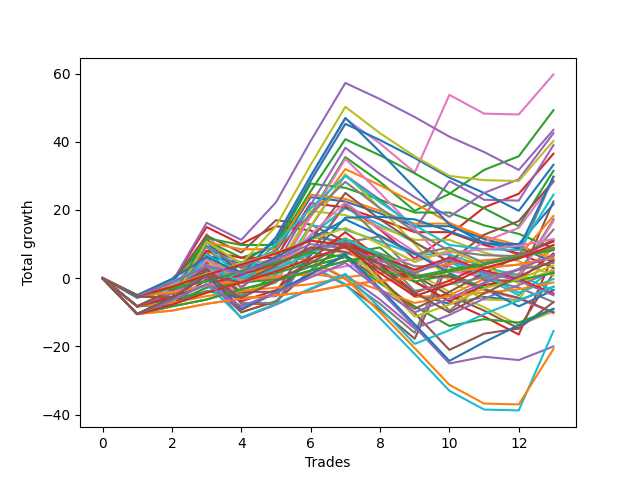

# Long Wallace 003 AB 
- Symbol: ES
- Date Range: 03/18/2022 - 07/15/2022
- Trading Period: 7:20-12:30
- Number of Trades: 13



| Name | Win Percent | Profit | Avg Profit / Trade | Avg Time / Trade |      | Name | Win Percent | Profit | Avg Profit / Trade | Avg Time / Trade |
| ---- | ----------- | ------ | ------------------ | ---------------- | ---- | ---- | ----------- | ------ | ------------------ | ---------------- |
| Sorted By <br> Profit | | | | | | Sorted By <br> Win Percentage ||||
| Six | 53.85 | 29875.00 | 2298.08 | 23:40 |     | One Hundred Eleven | 92.31 | 5750.00 | 442.31 | 01:20 |
| Two | 69.23 | 24625.00 | 1894.23 | 18:32 |     | Eighty-One | 92.31 | 4125.00 | 317.31 | 03:19 |
| Forty-Six | 46.15 | 21750.00 | 1673.08 | 11:58 |     | One Hundred Twenty-Six | 92.31 | 3000.00 | 230.77 | 01:39 |
| Sixty-Six | 61.54 | 21250.00 | 1634.62 | 11:25 |     | One Hundred Twenty-One | 92.31 | 3000.00 | 230.77 | 01:39 |
| Seventy | 46.15 | 20125.00 | 1548.08 | 15:43 |     | Eighty-Two | 84.62 | 4375.00 | 336.54 | 06:12 |
| Four | 53.85 | 19500.00 | 1500.00 | 22:23 |     | One Hundred Twenty-Seven | 84.62 | 4125.00 | 317.31 | 03:15 |
| Three | 69.23 | 18250.00 | 1403.85 | 17:16 |     | One Hundred Twenty-Two | 84.62 | 2250.00 | 173.08 | 03:23 |
| Forty-Two | 46.15 | 16625.00 | 1278.85 | 09:43 |     | Eighty-Three | 76.92 | 5375.00 | 413.46 | 10:06 |
| Forty-Four | 46.15 | 15750.00 | 1211.54 | 10:57 |     | One Hundred Twenty-Eight | 76.92 | 4875.00 | 375.00 | 05:58 |
| Seventy-Three | 53.85 | 14875.00 | 1144.23 | 09:41 |     | One Hundred Twelve | 76.92 | 4375.00 | 336.54 | 02:27 |
| Sixty-Nine | 46.15 | 14875.00 | 1144.23 | 15:52 |     | One Hundred Twenty-Three | 76.92 | 1875.00 | 144.23 | 06:24 |
| Sixty-Seven | 61.54 | 14250.00 | 1096.15 | 10:07 |     | Two | 69.23 | 24625.00 | 1894.23 | 18:32 |
| Fifty-Eight | 61.54 | 14125.00 | 1086.54 | 12:02 |     | Three | 69.23 | 18250.00 | 1403.85 | 17:16 |
| Seventy-One | 46.15 | 12250.00 | 942.31 | 17:13 |     | Eighty-Five | 69.23 | 5625.00 | 432.69 | 16:11 |
| Five | 38.46 | 11250.00 | 865.38 | 26:56 |     | One | 69.23 | 4500.00 | 346.15 | 15:12 |
| Sixty-Two | 46.15 | 10875.00 | 836.54 | 16:43 |     | One Hundred Twenty-Nine | 69.23 | 3375.00 | 259.62 | 06:30 |
| Forty-Three | 46.15 | 9125.00 | 701.92 | 08:15 |     | Eighty-Four | 69.23 | 1000.00 | 76.92 | 12:30 |
| Seven | 38.46 | 8625.00 | 663.46 | 28:16 |     | One Hundred Sixteen | 69.23 | -625.00 | -48.08 | 01:04 |
| Sixty-Eight | 46.15 | 8375.00 | 644.23 | 13:46 |     | One Hundred Twenty-Four | 69.23 | -1250.00 | -96.15 | 07:01 |
| Fifty-Nine | 61.54 | 7125.00 | 548.08 | 10:43 |     | Sixty-Six | 61.54 | 21250.00 | 1634.62 | 11:25 |
| One Hundred Eleven | 92.31 | 5750.00 | 442.31 | 01:20 |     | Sixty-Seven | 61.54 | 14250.00 | 1096.15 | 10:07 |
| Eighty-Five | 69.23 | 5625.00 | 432.69 | 16:11 |     | Fifty-Eight | 61.54 | 14125.00 | 1086.54 | 12:02 |
| Eighty-Three | 76.92 | 5375.00 | 413.46 | 10:06 |     | Fifty-Nine | 61.54 | 7125.00 | 548.08 | 10:43 |
| One Hundred Twenty-Eight | 76.92 | 4875.00 | 375.00 | 05:58 |     | Sixty-Five | 61.54 | 3625.00 | 278.85 | 08:40 |
| Sixty | 46.15 | 4875.00 | 375.00 | 15:41 |     | One Hundred Thirty | 61.54 | 2625.00 | 201.92 | 09:02 |
| One | 69.23 | 4500.00 | 346.15 | 15:12 |     | One Hundred Thirteen | 61.54 | 1250.00 | 96.15 | 04:28 |
| Eighty-Two | 84.62 | 4375.00 | 336.54 | 06:12 |     | One Hundred Seventeen | 61.54 | 750.00 | 57.69 | 01:17 |
| One Hundred Twelve | 76.92 | 4375.00 | 336.54 | 02:27 |     | Zero | 61.54 | -1250.00 | -96.15 | 09:45 |
| Fifty-Four | 30.77 | 4375.00 | 336.54 | 05:34 |     | Fifty-Seven | 61.54 | -3500.00 | -269.23 | 09:16 |
| Eighty-One | 92.31 | 4125.00 | 317.31 | 03:19 |     | One Hundred Twenty-Five | 61.54 | -4500.00 | -346.15 | 09:39 |
| One Hundred Twenty-Seven | 84.62 | 4125.00 | 317.31 | 03:15 |     | Sixty-Four | 61.54 | -4500.00 | -346.15 | 06:05 |
| Sixty-Five | 61.54 | 3625.00 | 278.85 | 08:40 |     | Fifty-Six | 61.54 | -10000.00 | -769.23 | 06:36 |
| One Hundred Twenty-Nine | 69.23 | 3375.00 | 259.62 | 06:30 |     | Six | 53.85 | 29875.00 | 2298.08 | 23:40 |
| Forty-Five | 30.77 | 3375.00 | 259.62 | 15:14 |     | Four | 53.85 | 19500.00 | 1500.00 | 22:23 |
| One Hundred Twenty-Six | 92.31 | 3000.00 | 230.77 | 01:39 |     | Seventy-Three | 53.85 | 14875.00 | 1144.23 | 09:41 |
| One Hundred Twenty-One | 92.31 | 3000.00 | 230.77 | 01:39 |     | One Hundred Fourteen | 53.85 | -125.00 | -9.62 | 04:50 |
| Fifty-Three | 30.77 | 2750.00 | 211.54 | 05:48 |     | Forty | 53.85 | -4875.00 | -375.00 | 05:08 |
| One Hundred Thirty | 61.54 | 2625.00 | 201.92 | 09:02 |     | Forty-Six | 46.15 | 21750.00 | 1673.08 | 11:58 |
| Fifty-Two | 30.77 | 2375.00 | 182.69 | 04:28 |     | Seventy | 46.15 | 20125.00 | 1548.08 | 15:43 |
| One Hundred Twenty-Two | 84.62 | 2250.00 | 173.08 | 03:23 |     | Forty-Two | 46.15 | 16625.00 | 1278.85 | 09:43 |
| One Hundred Twenty-Three | 76.92 | 1875.00 | 144.23 | 06:24 |     | Forty-Four | 46.15 | 15750.00 | 1211.54 | 10:57 |
| Fifty-Five | 30.77 | 1500.00 | 115.38 | 06:00 |     | Sixty-Nine | 46.15 | 14875.00 | 1144.23 | 15:52 |
| Forty-One | 46.15 | 1375.00 | 105.77 | 07:15 |     | Seventy-One | 46.15 | 12250.00 | 942.31 | 17:13 |
| One Hundred Thirteen | 61.54 | 1250.00 | 96.15 | 04:28 |     | Sixty-Two | 46.15 | 10875.00 | 836.54 | 16:43 |
| Eighty-Four | 69.23 | 1000.00 | 76.92 | 12:30 |     | Forty-Three | 46.15 | 9125.00 | 701.92 | 08:15 |
| One Hundred Seventeen | 61.54 | 750.00 | 57.69 | 01:17 |     | Sixty-Eight | 46.15 | 8375.00 | 644.23 | 13:46 |
| Forty-Seven | 30.77 | 750.00 | 57.69 | 16:34 |     | Sixty | 46.15 | 4875.00 | 375.00 | 15:41 |
| Fifty | 30.77 | 375.00 | 28.85 | 04:33 |     | Forty-One | 46.15 | 1375.00 | 105.77 | 07:15 |
| One Hundred Fourteen | 53.85 | -125.00 | -9.62 | 04:50 |     | One Hundred Fifteen | 46.15 | -1750.00 | -134.62 | 06:50 |
| One Hundred Sixteen | 69.23 | -625.00 | -48.08 | 01:04 |     | One Hundred Eighteen | 46.15 | -2250.00 | -173.08 | 02:06 |
| One Hundred Twenty-Four | 69.23 | -1250.00 | -96.15 | 07:01 |     | Forty-Eight | 46.15 | -5125.00 | -394.23 | 02:13 |
| Zero | 61.54 | -1250.00 | -96.15 | 09:45 |     | Five | 38.46 | 11250.00 | 865.38 | 26:56 |
| One Hundred Fifteen | 46.15 | -1750.00 | -134.62 | 06:50 |     | Seven | 38.46 | 8625.00 | 663.46 | 28:16 |
| Fifty-One | 30.77 | -1750.00 | -134.62 | 03:52 |     | One Hundred Ninteen | 38.46 | -2500.00 | -192.31 | 02:17 |
| One Hundred Eighteen | 46.15 | -2250.00 | -173.08 | 02:06 |     | Fifty-Four | 30.77 | 4375.00 | 336.54 | 05:34 |
| One Hundred Ninteen | 38.46 | -2500.00 | -192.31 | 02:17 |     | Forty-Five | 30.77 | 3375.00 | 259.62 | 15:14 |
| Fifty-Seven | 61.54 | -3500.00 | -269.23 | 09:16 |     | Fifty-Three | 30.77 | 2750.00 | 211.54 | 05:48 |
| Forty-Nine | 30.77 | -3500.00 | -269.23 | 03:13 |     | Fifty-Two | 30.77 | 2375.00 | 182.69 | 04:28 |
| One Hundred Twenty-Five | 61.54 | -4500.00 | -346.15 | 09:39 |     | Fifty-Five | 30.77 | 1500.00 | 115.38 | 06:00 |
| Sixty-Four | 61.54 | -4500.00 | -346.15 | 06:05 |     | Forty-Seven | 30.77 | 750.00 | 57.69 | 16:34 |
| Forty | 53.85 | -4875.00 | -375.00 | 05:08 |     | Fifty | 30.77 | 375.00 | 28.85 | 04:33 |
| One Hundred Twenty | 30.77 | -5000.00 | -384.62 | 03:03 |     | Fifty-One | 30.77 | -1750.00 | -134.62 | 03:52 |
| Forty-Eight | 46.15 | -5125.00 | -394.23 | 02:13 |     | Forty-Nine | 30.77 | -3500.00 | -269.23 | 03:13 |
| Sixty-One | 30.77 | -7750.00 | -596.15 | 19:58 |     | One Hundred Twenty | 30.77 | -5000.00 | -384.62 | 03:03 |
| Fifty-Six | 61.54 | -10000.00 | -769.23 | 06:36 |     | Sixty-One | 30.77 | -7750.00 | -596.15 | 19:58 |
| Sixty-Three | 30.77 | -10375.00 | -798.08 | 21:19 |     | Sixty-Three | 30.77 | -10375.00 | -798.08 | 21:19 |

## NO STOPLOSS

### Test Zero
* Sell when price hits the middle line of the 20p bollinger
* No Stoploss
* Results:
```
Total Trades: 13
Percent Up: 61.54
Percent Down: 38.46
Total Points Moved Up: -2.50
Potential Profit: -1250.00
Total Points Ups: 22.75 Count Ups: 8
Total Points Downs: -25.25 Count Downs: 5
```

<details><summary>Trades</summary>

<code>In: 2022-03-30 08:03:00		Out: 2022-03-30 08:19:20		Total Position Time: 16:20		Total Move Up: -5.75		Total to Date: -5.75</code> <br />
<code>In: 2022-03-30 08:14:00		Out: 2022-03-30 08:19:20		Total Position Time: 05:20		Total Move Up: 3.00		Total to Date: -2.75</code> <br />
<code>In: 2022-04-20 11:59:00		Out: 2022-04-20 12:01:15		Total Position Time: 02:15		Total Move Up: 4.75		Total to Date: 2.00</code> <br />
<code>In: 2022-05-11 10:33:00		Out: 2022-05-11 10:34:30		Total Position Time: 01:30		Total Move Up: 1.50		Total to Date: 3.50</code> <br />
<code>In: 2022-05-25 10:15:00		Out: 2022-05-25 10:15:20		Total Position Time: 00:20		Total Move Up: 1.00		Total to Date: 4.50</code> <br />
<code>In: 2022-06-14 07:45:00		Out: 2022-06-14 07:46:40		Total Position Time: 01:40		Total Move Up: 3.75		Total to Date: 8.25</code> <br />
<code>In: 2022-06-14 07:46:00		Out: 2022-06-14 07:46:40		Total Position Time: 00:40		Total Move Up: 2.75		Total to Date: 11.00</code> <br />
<code>In: 2022-06-15 07:57:00		Out: 2022-06-15 08:26:55		Total Position Time: 29:55		Total Move Up: -7.25		Total to Date: 3.75</code> <br />
<code>In: 2022-06-15 07:58:00		Out: 2022-06-15 08:27:55		Total Position Time: 29:55		Total Move Up: -8.50		Total to Date: -4.75</code> <br />
<code>In: 2022-06-17 07:38:00		Out: 2022-06-17 07:55:05		Total Position Time: 17:05		Total Move Up: -2.75		Total to Date: -7.50</code> <br />
<code>In: 2022-06-23 09:07:00		Out: 2022-06-23 09:14:30		Total Position Time: 07:30		Total Move Up: 2.00		Total to Date: -5.50</code> <br />
<code>In: 2022-07-06 08:35:00		Out: 2022-07-06 08:46:05		Total Position Time: 11:05		Total Move Up: -1.00		Total to Date: -6.50</code> <br />
<code>In: 2022-07-13 07:23:00		Out: 2022-07-13 07:26:20		Total Position Time: 03:20		Total Move Up: 4.00		Total to Date: -2.50</code> <br />


</details>

### Test One
* Sell when the price hits the upper line of the 20p 1std bollinger
* No Stoploss
* Results:
```
Total Trades: 13
Percent Up: 69.23
Percent Down: 30.77
Total Points Moved Up: 9.00
Potential Profit: 4500.00
Total Points Ups: 45.00 Count Ups: 9
Total Points Downs: -36.00 Count Downs: 4
```

<details><summary>Trades</summary>

<code>In: 2022-03-30 08:03:00		Out: 2022-03-30 08:32:55		Total Position Time: 29:55		Total Move Up: -8.25		Total to Date: -8.25</code> <br />
<code>In: 2022-03-30 08:14:00		Out: 2022-03-30 08:34:40		Total Position Time: 20:40		Total Move Up: 2.75		Total to Date: -5.50</code> <br />
<code>In: 2022-04-20 11:59:00		Out: 2022-04-20 12:04:20		Total Position Time: 05:20		Total Move Up: 7.50		Total to Date: 2.00</code> <br />
<code>In: 2022-05-11 10:33:00		Out: 2022-05-11 11:01:20		Total Position Time: 28:20		Total Move Up: -12.00		Total to Date: -10.00</code> <br />
<code>In: 2022-05-25 10:15:00		Out: 2022-05-25 10:15:30		Total Position Time: 00:30		Total Move Up: 3.25		Total to Date: -6.75</code> <br />
<code>In: 2022-06-14 07:45:00		Out: 2022-06-14 07:47:10		Total Position Time: 02:10		Total Move Up: 9.00		Total to Date: 2.25</code> <br />
<code>In: 2022-06-14 07:46:00		Out: 2022-06-14 07:47:10		Total Position Time: 01:10		Total Move Up: 8.00		Total to Date: 10.25</code> <br />
<code>In: 2022-06-15 07:57:00		Out: 2022-06-15 08:26:55		Total Position Time: 29:55		Total Move Up: -7.25		Total to Date: 3.00</code> <br />
<code>In: 2022-06-15 07:58:00		Out: 2022-06-15 08:27:55		Total Position Time: 29:55		Total Move Up: -8.50		Total to Date: -5.50</code> <br />
<code>In: 2022-06-17 07:38:00		Out: 2022-06-17 07:56:15		Total Position Time: 18:15		Total Move Up: 0.50		Total to Date: -5.00</code> <br />
<code>In: 2022-06-23 09:07:00		Out: 2022-06-23 09:18:25		Total Position Time: 11:25		Total Move Up: 4.75		Total to Date: -0.25</code> <br />
<code>In: 2022-07-06 08:35:00		Out: 2022-07-06 08:48:10		Total Position Time: 13:10		Total Move Up: 1.50		Total to Date: 1.25</code> <br />
<code>In: 2022-07-13 07:23:00		Out: 2022-07-13 07:30:00		Total Position Time: 07:00		Total Move Up: 7.75		Total to Date: 9.00</code> <br />


</details>

### Test Two
* Sell when the price hits the upper line of the 20p 2std bollinger
* No Stoploss
* Results:
```
Total Trades: 13
Percent Up: 69.23
Percent Down: 30.77
Total Points Moved Up: 49.25
Potential Profit: 24625.00
Total Points Ups: 84.75 Count Ups: 9
Total Points Downs: -35.50 Count Downs: 4
```

<details><summary>Trades</summary>

<code>In: 2022-03-30 08:03:00		Out: 2022-03-30 08:32:55		Total Position Time: 29:55		Total Move Up: -8.25		Total to Date: -8.25</code> <br />
<code>In: 2022-03-30 08:14:00		Out: 2022-03-30 08:35:15		Total Position Time: 21:15		Total Move Up: 4.75		Total to Date: -3.50</code> <br />
<code>In: 2022-04-20 11:59:00		Out: 2022-04-20 12:12:35		Total Position Time: 13:35		Total Move Up: 9.75		Total to Date: 6.25</code> <br />
<code>In: 2022-05-11 10:33:00		Out: 2022-05-11 11:02:35		Total Position Time: 29:35		Total Move Up: -11.50		Total to Date: -5.25</code> <br />
<code>In: 2022-05-25 10:15:00		Out: 2022-05-25 10:29:40		Total Position Time: 14:40		Total Move Up: 6.25		Total to Date: 1.00</code> <br />
<code>In: 2022-06-14 07:45:00		Out: 2022-06-14 07:51:00		Total Position Time: 06:00		Total Move Up: 17.75		Total to Date: 18.75</code> <br />
<code>In: 2022-06-14 07:46:00		Out: 2022-06-14 07:51:00		Total Position Time: 05:00		Total Move Up: 16.75		Total to Date: 35.50</code> <br />
<code>In: 2022-06-15 07:57:00		Out: 2022-06-15 08:26:55		Total Position Time: 29:55		Total Move Up: -7.25		Total to Date: 28.25</code> <br />
<code>In: 2022-06-15 07:58:00		Out: 2022-06-15 08:27:55		Total Position Time: 29:55		Total Move Up: -8.50		Total to Date: 19.75</code> <br />
<code>In: 2022-06-17 07:38:00		Out: 2022-06-17 08:02:25		Total Position Time: 24:25		Total Move Up: 5.00		Total to Date: 24.75</code> <br />
<code>In: 2022-06-23 09:07:00		Out: 2022-06-23 09:19:05		Total Position Time: 12:05		Total Move Up: 7.00		Total to Date: 31.75</code> <br />
<code>In: 2022-07-06 08:35:00		Out: 2022-07-06 08:51:15		Total Position Time: 16:15		Total Move Up: 4.00		Total to Date: 35.75</code> <br />
<code>In: 2022-07-13 07:23:00		Out: 2022-07-13 07:31:30		Total Position Time: 08:30		Total Move Up: 13.50		Total to Date: 49.25</code> <br />


</details>

### Test Three
* Sell when price hits the middle line of the 50p bollinger
* No Stoploss
* Results:
```
Total Trades: 13
Percent Up: 69.23
Percent Down: 30.77
Total Points Moved Up: 36.50
Potential Profit: 18250.00
Total Points Ups: 72.75 Count Ups: 9
Total Points Downs: -36.25 Count Downs: 4
```

<details><summary>Trades</summary>

<code>In: 2022-03-30 08:03:00		Out: 2022-03-30 08:32:55		Total Position Time: 29:55		Total Move Up: -8.25		Total to Date: -8.25</code> <br />
<code>In: 2022-03-30 08:14:00		Out: 2022-03-30 08:35:15		Total Position Time: 21:15		Total Move Up: 4.75		Total to Date: -3.50</code> <br />
<code>In: 2022-04-20 11:59:00		Out: 2022-04-20 12:10:10		Total Position Time: 11:10		Total Move Up: 8.25		Total to Date: 4.75</code> <br />
<code>In: 2022-05-11 10:33:00		Out: 2022-05-11 11:02:55		Total Position Time: 29:55		Total Move Up: -12.25		Total to Date: -7.50</code> <br />
<code>In: 2022-05-25 10:15:00		Out: 2022-05-25 10:15:10		Total Position Time: 00:10		Total Move Up: 0.00		Total to Date: -7.50</code> <br />
<code>In: 2022-06-14 07:45:00		Out: 2022-06-14 07:50:00		Total Position Time: 05:00		Total Move Up: 15.00		Total to Date: 7.50</code> <br />
<code>In: 2022-06-14 07:46:00		Out: 2022-06-14 07:50:00		Total Position Time: 04:00		Total Move Up: 14.00		Total to Date: 21.50</code> <br />
<code>In: 2022-06-15 07:57:00		Out: 2022-06-15 08:26:55		Total Position Time: 29:55		Total Move Up: -7.25		Total to Date: 14.25</code> <br />
<code>In: 2022-06-15 07:58:00		Out: 2022-06-15 08:27:55		Total Position Time: 29:55		Total Move Up: -8.50		Total to Date: 5.75</code> <br />
<code>In: 2022-06-17 07:38:00		Out: 2022-06-17 08:02:30		Total Position Time: 24:30		Total Move Up: 7.00		Total to Date: 12.75</code> <br />
<code>In: 2022-06-23 09:07:00		Out: 2022-06-23 09:21:10		Total Position Time: 14:10		Total Move Up: 8.00		Total to Date: 20.75</code> <br />
<code>In: 2022-07-06 08:35:00		Out: 2022-07-06 08:51:15		Total Position Time: 16:15		Total Move Up: 4.00		Total to Date: 24.75</code> <br />
<code>In: 2022-07-13 07:23:00		Out: 2022-07-13 07:31:20		Total Position Time: 08:20		Total Move Up: 11.75		Total to Date: 36.50</code> <br />


</details>

### Test Four
* Sell when the price hits the upper line of the 50p 1std bollinger
* No Stoploss
* Results:
```
Total Trades: 13
Percent Up: 53.85
Percent Down: 46.15
Total Points Moved Up: 39.00
Potential Profit: 19500.00
Total Points Ups: 81.00 Count Ups: 7
Total Points Downs: -42.00 Count Downs: 6
```

<details><summary>Trades</summary>

<code>In: 2022-03-30 08:03:00		Out: 2022-03-30 08:32:55		Total Position Time: 29:55		Total Move Up: -8.25		Total to Date: -8.25</code> <br />
<code>In: 2022-03-30 08:14:00		Out: 2022-03-30 08:43:55		Total Position Time: 29:55		Total Move Up: 3.75		Total to Date: -4.50</code> <br />
<code>In: 2022-04-20 11:59:00		Out: 2022-04-20 12:13:30		Total Position Time: 14:30		Total Move Up: 12.25		Total to Date: 7.75</code> <br />
<code>In: 2022-05-11 10:33:00		Out: 2022-05-11 11:02:55		Total Position Time: 29:55		Total Move Up: -12.25		Total to Date: -4.50</code> <br />
<code>In: 2022-05-25 10:15:00		Out: 2022-05-25 10:15:30		Total Position Time: 00:30		Total Move Up: 3.25		Total to Date: -1.25</code> <br />
<code>In: 2022-06-14 07:45:00		Out: 2022-06-14 08:01:15		Total Position Time: 16:15		Total Move Up: 16.25		Total to Date: 15.00</code> <br />
<code>In: 2022-06-14 07:46:00		Out: 2022-06-14 08:01:15		Total Position Time: 15:15		Total Move Up: 15.25		Total to Date: 30.25</code> <br />
<code>In: 2022-06-15 07:57:00		Out: 2022-06-15 08:26:55		Total Position Time: 29:55		Total Move Up: -7.25		Total to Date: 23.00</code> <br />
<code>In: 2022-06-15 07:58:00		Out: 2022-06-15 08:27:55		Total Position Time: 29:55		Total Move Up: -8.50		Total to Date: 14.50</code> <br />
<code>In: 2022-06-17 07:38:00		Out: 2022-06-17 08:04:40		Total Position Time: 26:40		Total Move Up: 14.00		Total to Date: 28.50</code> <br />
<code>In: 2022-06-23 09:07:00		Out: 2022-06-23 09:36:55		Total Position Time: 29:55		Total Move Up: -5.50		Total to Date: 23.00</code> <br />
<code>In: 2022-07-06 08:35:00		Out: 2022-07-06 09:04:55		Total Position Time: 29:55		Total Move Up: -0.25		Total to Date: 22.75</code> <br />
<code>In: 2022-07-13 07:23:00		Out: 2022-07-13 07:31:35		Total Position Time: 08:35		Total Move Up: 16.25		Total to Date: 39.00</code> <br />


</details>

### Test Five
* Sell when the price hits the upper line of the 50p 2std bollinger
* No Stoploss
* Results:
```
Total Trades: 13
Percent Up: 38.46
Percent Down: 61.54
Total Points Moved Up: 22.50
Potential Profit: 11250.00
Total Points Ups: 71.25 Count Ups: 5
Total Points Downs: -48.75 Count Downs: 8
```

<details><summary>Trades</summary>

<code>In: 2022-03-30 08:03:00		Out: 2022-03-30 08:32:55		Total Position Time: 29:55		Total Move Up: -8.25		Total to Date: -8.25</code> <br />
<code>In: 2022-03-30 08:14:00		Out: 2022-03-30 08:43:55		Total Position Time: 29:55		Total Move Up: 3.75		Total to Date: -4.50</code> <br />
<code>In: 2022-04-20 11:59:00		Out: 2022-04-20 12:25:45		Total Position Time: 26:45		Total Move Up: 16.25		Total to Date: 11.75</code> <br />
<code>In: 2022-05-11 10:33:00		Out: 2022-05-11 11:02:55		Total Position Time: 29:55		Total Move Up: -12.25		Total to Date: -0.50</code> <br />
<code>In: 2022-05-25 10:15:00		Out: 2022-05-25 10:29:25		Total Position Time: 14:25		Total Move Up: 5.25		Total to Date: 4.75</code> <br />
<code>In: 2022-06-14 07:45:00		Out: 2022-06-14 08:14:55		Total Position Time: 29:55		Total Move Up: -1.25		Total to Date: 3.50</code> <br />
<code>In: 2022-06-14 07:46:00		Out: 2022-06-14 08:15:55		Total Position Time: 29:55		Total Move Up: -5.50		Total to Date: -2.00</code> <br />
<code>In: 2022-06-15 07:57:00		Out: 2022-06-15 08:26:55		Total Position Time: 29:55		Total Move Up: -7.25		Total to Date: -9.25</code> <br />
<code>In: 2022-06-15 07:58:00		Out: 2022-06-15 08:27:55		Total Position Time: 29:55		Total Move Up: -8.50		Total to Date: -17.75</code> <br />
<code>In: 2022-06-17 07:38:00		Out: 2022-06-17 08:07:55		Total Position Time: 29:55		Total Move Up: 22.75		Total to Date: 5.00</code> <br />
<code>In: 2022-06-23 09:07:00		Out: 2022-06-23 09:36:55		Total Position Time: 29:55		Total Move Up: -5.50		Total to Date: -0.50</code> <br />
<code>In: 2022-07-06 08:35:00		Out: 2022-07-06 09:04:55		Total Position Time: 29:55		Total Move Up: -0.25		Total to Date: -0.75</code> <br />
<code>In: 2022-07-13 07:23:00		Out: 2022-07-13 07:32:50		Total Position Time: 09:50		Total Move Up: 23.25		Total to Date: 22.50</code> <br />


</details>

### Test Six
* Sell when the price hits the middle line of the 1std VWAP
* No Stoploss
* Results:
```
Total Trades: 13
Percent Up: 53.85
Percent Down: 46.15
Total Points Moved Up: 59.75
Potential Profit: 29875.00
Total Points Ups: 101.75 Count Ups: 7
Total Points Downs: -42.00 Count Downs: 6
```

<details><summary>Trades</summary>

<code>In: 2022-03-30 08:03:00		Out: 2022-03-30 08:32:55		Total Position Time: 29:55		Total Move Up: -8.25		Total to Date: -8.25</code> <br />
<code>In: 2022-03-30 08:14:00		Out: 2022-03-30 08:43:55		Total Position Time: 29:55		Total Move Up: 3.75		Total to Date: -4.50</code> <br />
<code>In: 2022-04-20 11:59:00		Out: 2022-04-20 12:25:50		Total Position Time: 26:50		Total Move Up: 17.50		Total to Date: 13.00</code> <br />
<code>In: 2022-05-11 10:33:00		Out: 2022-05-11 11:02:55		Total Position Time: 29:55		Total Move Up: -12.25		Total to Date: 0.75</code> <br />
<code>In: 2022-05-25 10:15:00		Out: 2022-05-25 10:37:05		Total Position Time: 22:05		Total Move Up: 11.00		Total to Date: 11.75</code> <br />
<code>In: 2022-06-14 07:45:00		Out: 2022-06-14 07:51:05		Total Position Time: 06:05		Total Move Up: 18.00		Total to Date: 29.75</code> <br />
<code>In: 2022-06-14 07:46:00		Out: 2022-06-14 07:51:05		Total Position Time: 05:05		Total Move Up: 17.00		Total to Date: 46.75</code> <br />
<code>In: 2022-06-15 07:57:00		Out: 2022-06-15 08:26:55		Total Position Time: 29:55		Total Move Up: -7.25		Total to Date: 39.50</code> <br />
<code>In: 2022-06-15 07:58:00		Out: 2022-06-15 08:27:55		Total Position Time: 29:55		Total Move Up: -8.50		Total to Date: 31.00</code> <br />
<code>In: 2022-06-17 07:38:00		Out: 2022-06-17 08:07:55		Total Position Time: 29:55		Total Move Up: 22.75		Total to Date: 53.75</code> <br />
<code>In: 2022-06-23 09:07:00		Out: 2022-06-23 09:36:55		Total Position Time: 29:55		Total Move Up: -5.50		Total to Date: 48.25</code> <br />
<code>In: 2022-07-06 08:35:00		Out: 2022-07-06 09:04:55		Total Position Time: 29:55		Total Move Up: -0.25		Total to Date: 48.00</code> <br />
<code>In: 2022-07-13 07:23:00		Out: 2022-07-13 07:31:20		Total Position Time: 08:20		Total Move Up: 11.75		Total to Date: 59.75</code> <br />


</details>

### Test Seven
* Sell when the price hits the upper line of the 1std VWAP
* No Stoploss
* Results:
```
Total Trades: 13
Percent Up: 38.46
Percent Down: 61.54
Total Points Moved Up: 17.25
Potential Profit: 8625.00
Total Points Ups: 66.00 Count Ups: 5
Total Points Downs: -48.75 Count Downs: 8
```

<details><summary>Trades</summary>

<code>In: 2022-03-30 08:03:00		Out: 2022-03-30 08:32:55		Total Position Time: 29:55		Total Move Up: -8.25		Total to Date: -8.25</code> <br />
<code>In: 2022-03-30 08:14:00		Out: 2022-03-30 08:43:55		Total Position Time: 29:55		Total Move Up: 3.75		Total to Date: -4.50</code> <br />
<code>In: 2022-04-20 11:59:00		Out: 2022-04-20 12:28:55		Total Position Time: 29:55		Total Move Up: 13.75		Total to Date: 9.25</code> <br />
<code>In: 2022-05-11 10:33:00		Out: 2022-05-11 11:02:55		Total Position Time: 29:55		Total Move Up: -12.25		Total to Date: -3.00</code> <br />
<code>In: 2022-05-25 10:15:00		Out: 2022-05-25 10:44:55		Total Position Time: 29:55		Total Move Up: 9.50		Total to Date: 6.50</code> <br />
<code>In: 2022-06-14 07:45:00		Out: 2022-06-14 08:14:55		Total Position Time: 29:55		Total Move Up: -1.25		Total to Date: 5.25</code> <br />
<code>In: 2022-06-14 07:46:00		Out: 2022-06-14 08:15:55		Total Position Time: 29:55		Total Move Up: -5.50		Total to Date: -0.25</code> <br />
<code>In: 2022-06-15 07:57:00		Out: 2022-06-15 08:26:55		Total Position Time: 29:55		Total Move Up: -7.25		Total to Date: -7.50</code> <br />
<code>In: 2022-06-15 07:58:00		Out: 2022-06-15 08:27:55		Total Position Time: 29:55		Total Move Up: -8.50		Total to Date: -16.00</code> <br />
<code>In: 2022-06-17 07:38:00		Out: 2022-06-17 08:07:55		Total Position Time: 29:55		Total Move Up: 22.75		Total to Date: 6.75</code> <br />
<code>In: 2022-06-23 09:07:00		Out: 2022-06-23 09:36:55		Total Position Time: 29:55		Total Move Up: -5.50		Total to Date: 1.25</code> <br />
<code>In: 2022-07-06 08:35:00		Out: 2022-07-06 09:04:55		Total Position Time: 29:55		Total Move Up: -0.25		Total to Date: 1.00</code> <br />
<code>In: 2022-07-13 07:23:00		Out: 2022-07-13 07:31:35		Total Position Time: 08:35		Total Move Up: 16.25		Total to Date: 17.25</code> <br />


</details>

## STOPLOSS OF 5

### Test Forty
* Sell when price hits the middle line of the 20p bollinger
* Stoploss is 5 points
* Results:
```
Total Trades: 13
Percent Up: 53.85
Percent Down: 46.15
Total Points Moved Up: -9.75
Potential Profit: -4875.00
Total Points Ups: 20.75 Count Ups: 7
Total Points Downs: -30.50 Count Downs: 6
```

<details><summary>Trades</summary>

<code>In: 2022-03-30 08:03:00		Out: 2022-03-30 08:07:05		Total Position Time: 04:05		Total Move Up: -5.00		Total to Date: -5.00</code> <br />
<code>In: 2022-03-30 08:14:00		Out: 2022-03-30 08:19:20		Total Position Time: 05:20		Total Move Up: 3.00		Total to Date: -2.00</code> <br />
<code>In: 2022-04-20 11:59:00		Out: 2022-04-20 12:01:15		Total Position Time: 02:15		Total Move Up: 4.75		Total to Date: 2.75</code> <br />
<code>In: 2022-05-11 10:33:00		Out: 2022-05-11 10:34:30		Total Position Time: 01:30		Total Move Up: 1.50		Total to Date: 4.25</code> <br />
<code>In: 2022-05-25 10:15:00		Out: 2022-05-25 10:15:20		Total Position Time: 00:20		Total Move Up: 1.00		Total to Date: 5.25</code> <br />
<code>In: 2022-06-14 07:45:00		Out: 2022-06-14 07:46:40		Total Position Time: 01:40		Total Move Up: 3.75		Total to Date: 9.00</code> <br />
<code>In: 2022-06-14 07:46:00		Out: 2022-06-14 07:46:40		Total Position Time: 00:40		Total Move Up: 2.75		Total to Date: 11.75</code> <br />
<code>In: 2022-06-15 07:57:00		Out: 2022-06-15 08:10:15		Total Position Time: 13:15		Total Move Up: -4.75		Total to Date: 7.00</code> <br />
<code>In: 2022-06-15 07:58:00		Out: 2022-06-15 08:10:05		Total Position Time: 12:05		Total Move Up: -5.25		Total to Date: 1.75</code> <br />
<code>In: 2022-06-17 07:38:00		Out: 2022-06-17 07:47:40		Total Position Time: 09:40		Total Move Up: -5.75		Total to Date: -4.00</code> <br />
<code>In: 2022-06-23 09:07:00		Out: 2022-06-23 09:09:30		Total Position Time: 02:30		Total Move Up: -4.50		Total to Date: -8.50</code> <br />
<code>In: 2022-07-06 08:35:00		Out: 2022-07-06 08:45:15		Total Position Time: 10:15		Total Move Up: -5.25		Total to Date: -13.75</code> <br />
<code>In: 2022-07-13 07:23:00		Out: 2022-07-13 07:26:20		Total Position Time: 03:20		Total Move Up: 4.00		Total to Date: -9.75</code> <br />


</details>

### Test Forty-One
* Sell when the price hits the upper line of the 20p 1std bollinger
* Stoploss is 5 points
* Results:
```
Total Trades: 13
Percent Up: 46.15
Percent Down: 53.85
Total Points Moved Up: 2.75
Potential Profit: 1375.00
Total Points Ups: 38.25 Count Ups: 6
Total Points Downs: -35.50 Count Downs: 7
```

<details><summary>Trades</summary>

<code>In: 2022-03-30 08:03:00		Out: 2022-03-30 08:07:05		Total Position Time: 04:05		Total Move Up: -5.00		Total to Date: -5.00</code> <br />
<code>In: 2022-03-30 08:14:00		Out: 2022-03-30 08:34:40		Total Position Time: 20:40		Total Move Up: 2.75		Total to Date: -2.25</code> <br />
<code>In: 2022-04-20 11:59:00		Out: 2022-04-20 12:04:20		Total Position Time: 05:20		Total Move Up: 7.50		Total to Date: 5.25</code> <br />
<code>In: 2022-05-11 10:33:00		Out: 2022-05-11 10:38:35		Total Position Time: 05:35		Total Move Up: -5.00		Total to Date: 0.25</code> <br />
<code>In: 2022-05-25 10:15:00		Out: 2022-05-25 10:15:30		Total Position Time: 00:30		Total Move Up: 3.25		Total to Date: 3.50</code> <br />
<code>In: 2022-06-14 07:45:00		Out: 2022-06-14 07:47:10		Total Position Time: 02:10		Total Move Up: 9.00		Total to Date: 12.50</code> <br />
<code>In: 2022-06-14 07:46:00		Out: 2022-06-14 07:47:10		Total Position Time: 01:10		Total Move Up: 8.00		Total to Date: 20.50</code> <br />
<code>In: 2022-06-15 07:57:00		Out: 2022-06-15 08:10:15		Total Position Time: 13:15		Total Move Up: -4.75		Total to Date: 15.75</code> <br />
<code>In: 2022-06-15 07:58:00		Out: 2022-06-15 08:10:05		Total Position Time: 12:05		Total Move Up: -5.25		Total to Date: 10.50</code> <br />
<code>In: 2022-06-17 07:38:00		Out: 2022-06-17 07:47:40		Total Position Time: 09:40		Total Move Up: -5.75		Total to Date: 4.75</code> <br />
<code>In: 2022-06-23 09:07:00		Out: 2022-06-23 09:09:30		Total Position Time: 02:30		Total Move Up: -4.50		Total to Date: 0.25</code> <br />
<code>In: 2022-07-06 08:35:00		Out: 2022-07-06 08:45:15		Total Position Time: 10:15		Total Move Up: -5.25		Total to Date: -5.00</code> <br />
<code>In: 2022-07-13 07:23:00		Out: 2022-07-13 07:30:00		Total Position Time: 07:00		Total Move Up: 7.75		Total to Date: 2.75</code> <br />


</details>

### Test Forty-Two
* Sell when the price hits the upper line of the 20p 2std bollinger
* Stoploss is 5 points
* Results:
```
Total Trades: 13
Percent Up: 46.15
Percent Down: 53.85
Total Points Moved Up: 33.25
Potential Profit: 16625.00
Total Points Ups: 68.75 Count Ups: 6
Total Points Downs: -35.50 Count Downs: 7
```

<details><summary>Trades</summary>

<code>In: 2022-03-30 08:03:00		Out: 2022-03-30 08:07:05		Total Position Time: 04:05		Total Move Up: -5.00		Total to Date: -5.00</code> <br />
<code>In: 2022-03-30 08:14:00		Out: 2022-03-30 08:35:15		Total Position Time: 21:15		Total Move Up: 4.75		Total to Date: -0.25</code> <br />
<code>In: 2022-04-20 11:59:00		Out: 2022-04-20 12:12:35		Total Position Time: 13:35		Total Move Up: 9.75		Total to Date: 9.50</code> <br />
<code>In: 2022-05-11 10:33:00		Out: 2022-05-11 10:38:35		Total Position Time: 05:35		Total Move Up: -5.00		Total to Date: 4.50</code> <br />
<code>In: 2022-05-25 10:15:00		Out: 2022-05-25 10:29:40		Total Position Time: 14:40		Total Move Up: 6.25		Total to Date: 10.75</code> <br />
<code>In: 2022-06-14 07:45:00		Out: 2022-06-14 07:51:00		Total Position Time: 06:00		Total Move Up: 17.75		Total to Date: 28.50</code> <br />
<code>In: 2022-06-14 07:46:00		Out: 2022-06-14 07:51:00		Total Position Time: 05:00		Total Move Up: 16.75		Total to Date: 45.25</code> <br />
<code>In: 2022-06-15 07:57:00		Out: 2022-06-15 08:10:15		Total Position Time: 13:15		Total Move Up: -4.75		Total to Date: 40.50</code> <br />
<code>In: 2022-06-15 07:58:00		Out: 2022-06-15 08:10:05		Total Position Time: 12:05		Total Move Up: -5.25		Total to Date: 35.25</code> <br />
<code>In: 2022-06-17 07:38:00		Out: 2022-06-17 07:47:40		Total Position Time: 09:40		Total Move Up: -5.75		Total to Date: 29.50</code> <br />
<code>In: 2022-06-23 09:07:00		Out: 2022-06-23 09:09:30		Total Position Time: 02:30		Total Move Up: -4.50		Total to Date: 25.00</code> <br />
<code>In: 2022-07-06 08:35:00		Out: 2022-07-06 08:45:15		Total Position Time: 10:15		Total Move Up: -5.25		Total to Date: 19.75</code> <br />
<code>In: 2022-07-13 07:23:00		Out: 2022-07-13 07:31:30		Total Position Time: 08:30		Total Move Up: 13.50		Total to Date: 33.25</code> <br />


</details>

### Test Forty-Three
* Sell when price hits the middle line of the 50p bollinger
* Stoploss is 5 points
* Results:
```
Total Trades: 13
Percent Up: 46.15
Percent Down: 53.85
Total Points Moved Up: 18.25
Potential Profit: 9125.00
Total Points Ups: 53.75 Count Ups: 6
Total Points Downs: -35.50 Count Downs: 7
```

<details><summary>Trades</summary>

<code>In: 2022-03-30 08:03:00		Out: 2022-03-30 08:07:05		Total Position Time: 04:05		Total Move Up: -5.00		Total to Date: -5.00</code> <br />
<code>In: 2022-03-30 08:14:00		Out: 2022-03-30 08:35:15		Total Position Time: 21:15		Total Move Up: 4.75		Total to Date: -0.25</code> <br />
<code>In: 2022-04-20 11:59:00		Out: 2022-04-20 12:10:10		Total Position Time: 11:10		Total Move Up: 8.25		Total to Date: 8.00</code> <br />
<code>In: 2022-05-11 10:33:00		Out: 2022-05-11 10:38:35		Total Position Time: 05:35		Total Move Up: -5.00		Total to Date: 3.00</code> <br />
<code>In: 2022-05-25 10:15:00		Out: 2022-05-25 10:15:10		Total Position Time: 00:10		Total Move Up: 0.00		Total to Date: 3.00</code> <br />
<code>In: 2022-06-14 07:45:00		Out: 2022-06-14 07:50:00		Total Position Time: 05:00		Total Move Up: 15.00		Total to Date: 18.00</code> <br />
<code>In: 2022-06-14 07:46:00		Out: 2022-06-14 07:50:00		Total Position Time: 04:00		Total Move Up: 14.00		Total to Date: 32.00</code> <br />
<code>In: 2022-06-15 07:57:00		Out: 2022-06-15 08:10:15		Total Position Time: 13:15		Total Move Up: -4.75		Total to Date: 27.25</code> <br />
<code>In: 2022-06-15 07:58:00		Out: 2022-06-15 08:10:05		Total Position Time: 12:05		Total Move Up: -5.25		Total to Date: 22.00</code> <br />
<code>In: 2022-06-17 07:38:00		Out: 2022-06-17 07:47:40		Total Position Time: 09:40		Total Move Up: -5.75		Total to Date: 16.25</code> <br />
<code>In: 2022-06-23 09:07:00		Out: 2022-06-23 09:09:30		Total Position Time: 02:30		Total Move Up: -4.50		Total to Date: 11.75</code> <br />
<code>In: 2022-07-06 08:35:00		Out: 2022-07-06 08:45:15		Total Position Time: 10:15		Total Move Up: -5.25		Total to Date: 6.50</code> <br />
<code>In: 2022-07-13 07:23:00		Out: 2022-07-13 07:31:20		Total Position Time: 08:20		Total Move Up: 11.75		Total to Date: 18.25</code> <br />


</details>

### Test Forty-Four
* Sell when the price hits the upper line of the 50p 1std bollinger
* Stoploss is 5 points
* Results:
```
Total Trades: 13
Percent Up: 46.15
Percent Down: 53.85
Total Points Moved Up: 31.50
Potential Profit: 15750.00
Total Points Ups: 67.00 Count Ups: 6
Total Points Downs: -35.50 Count Downs: 7
```

<details><summary>Trades</summary>

<code>In: 2022-03-30 08:03:00		Out: 2022-03-30 08:07:05		Total Position Time: 04:05		Total Move Up: -5.00		Total to Date: -5.00</code> <br />
<code>In: 2022-03-30 08:14:00		Out: 2022-03-30 08:43:55		Total Position Time: 29:55		Total Move Up: 3.75		Total to Date: -1.25</code> <br />
<code>In: 2022-04-20 11:59:00		Out: 2022-04-20 12:13:30		Total Position Time: 14:30		Total Move Up: 12.25		Total to Date: 11.00</code> <br />
<code>In: 2022-05-11 10:33:00		Out: 2022-05-11 10:38:35		Total Position Time: 05:35		Total Move Up: -5.00		Total to Date: 6.00</code> <br />
<code>In: 2022-05-25 10:15:00		Out: 2022-05-25 10:15:30		Total Position Time: 00:30		Total Move Up: 3.25		Total to Date: 9.25</code> <br />
<code>In: 2022-06-14 07:45:00		Out: 2022-06-14 08:01:15		Total Position Time: 16:15		Total Move Up: 16.25		Total to Date: 25.50</code> <br />
<code>In: 2022-06-14 07:46:00		Out: 2022-06-14 08:01:15		Total Position Time: 15:15		Total Move Up: 15.25		Total to Date: 40.75</code> <br />
<code>In: 2022-06-15 07:57:00		Out: 2022-06-15 08:10:15		Total Position Time: 13:15		Total Move Up: -4.75		Total to Date: 36.00</code> <br />
<code>In: 2022-06-15 07:58:00		Out: 2022-06-15 08:10:05		Total Position Time: 12:05		Total Move Up: -5.25		Total to Date: 30.75</code> <br />
<code>In: 2022-06-17 07:38:00		Out: 2022-06-17 07:47:40		Total Position Time: 09:40		Total Move Up: -5.75		Total to Date: 25.00</code> <br />
<code>In: 2022-06-23 09:07:00		Out: 2022-06-23 09:09:30		Total Position Time: 02:30		Total Move Up: -4.50		Total to Date: 20.50</code> <br />
<code>In: 2022-07-06 08:35:00		Out: 2022-07-06 08:45:15		Total Position Time: 10:15		Total Move Up: -5.25		Total to Date: 15.25</code> <br />
<code>In: 2022-07-13 07:23:00		Out: 2022-07-13 07:31:35		Total Position Time: 08:35		Total Move Up: 16.25		Total to Date: 31.50</code> <br />


</details>

### Test Forty-Five
* Sell when the price hits the upper line of the 50p 2std bollinger
* Stoploss is 5 points
* Results:
```
Total Trades: 13
Percent Up: 30.77
Percent Down: 69.23
Total Points Moved Up: 6.75
Potential Profit: 3375.00
Total Points Ups: 48.50 Count Ups: 4
Total Points Downs: -41.75 Count Downs: 9
```

<details><summary>Trades</summary>

<code>In: 2022-03-30 08:03:00		Out: 2022-03-30 08:07:05		Total Position Time: 04:05		Total Move Up: -5.00		Total to Date: -5.00</code> <br />
<code>In: 2022-03-30 08:14:00		Out: 2022-03-30 08:43:55		Total Position Time: 29:55		Total Move Up: 3.75		Total to Date: -1.25</code> <br />
<code>In: 2022-04-20 11:59:00		Out: 2022-04-20 12:25:45		Total Position Time: 26:45		Total Move Up: 16.25		Total to Date: 15.00</code> <br />
<code>In: 2022-05-11 10:33:00		Out: 2022-05-11 10:38:35		Total Position Time: 05:35		Total Move Up: -5.00		Total to Date: 10.00</code> <br />
<code>In: 2022-05-25 10:15:00		Out: 2022-05-25 10:29:25		Total Position Time: 14:25		Total Move Up: 5.25		Total to Date: 15.25</code> <br />
<code>In: 2022-06-14 07:45:00		Out: 2022-06-14 08:14:55		Total Position Time: 29:55		Total Move Up: -1.25		Total to Date: 14.00</code> <br />
<code>In: 2022-06-14 07:46:00		Out: 2022-06-14 08:15:50		Total Position Time: 29:50		Total Move Up: -5.00		Total to Date: 9.00</code> <br />
<code>In: 2022-06-15 07:57:00		Out: 2022-06-15 08:10:15		Total Position Time: 13:15		Total Move Up: -4.75		Total to Date: 4.25</code> <br />
<code>In: 2022-06-15 07:58:00		Out: 2022-06-15 08:10:05		Total Position Time: 12:05		Total Move Up: -5.25		Total to Date: -1.00</code> <br />
<code>In: 2022-06-17 07:38:00		Out: 2022-06-17 07:47:40		Total Position Time: 09:40		Total Move Up: -5.75		Total to Date: -6.75</code> <br />
<code>In: 2022-06-23 09:07:00		Out: 2022-06-23 09:09:30		Total Position Time: 02:30		Total Move Up: -4.50		Total to Date: -11.25</code> <br />
<code>In: 2022-07-06 08:35:00		Out: 2022-07-06 08:45:15		Total Position Time: 10:15		Total Move Up: -5.25		Total to Date: -16.50</code> <br />
<code>In: 2022-07-13 07:23:00		Out: 2022-07-13 07:32:50		Total Position Time: 09:50		Total Move Up: 23.25		Total to Date: 6.75</code> <br />


</details>

### Test Forty-Six
* Sell when the price hits the middle line of the 1std VWAP
* Stoploss is 5 points
* Results:
```
Total Trades: 13
Percent Up: 46.15
Percent Down: 53.85
Total Points Moved Up: 43.50
Potential Profit: 21750.00
Total Points Ups: 79.00 Count Ups: 6
Total Points Downs: -35.50 Count Downs: 7
```

<details><summary>Trades</summary>

<code>In: 2022-03-30 08:03:00		Out: 2022-03-30 08:07:05		Total Position Time: 04:05		Total Move Up: -5.00		Total to Date: -5.00</code> <br />
<code>In: 2022-03-30 08:14:00		Out: 2022-03-30 08:43:55		Total Position Time: 29:55		Total Move Up: 3.75		Total to Date: -1.25</code> <br />
<code>In: 2022-04-20 11:59:00		Out: 2022-04-20 12:25:50		Total Position Time: 26:50		Total Move Up: 17.50		Total to Date: 16.25</code> <br />
<code>In: 2022-05-11 10:33:00		Out: 2022-05-11 10:38:35		Total Position Time: 05:35		Total Move Up: -5.00		Total to Date: 11.25</code> <br />
<code>In: 2022-05-25 10:15:00		Out: 2022-05-25 10:37:05		Total Position Time: 22:05		Total Move Up: 11.00		Total to Date: 22.25</code> <br />
<code>In: 2022-06-14 07:45:00		Out: 2022-06-14 07:51:05		Total Position Time: 06:05		Total Move Up: 18.00		Total to Date: 40.25</code> <br />
<code>In: 2022-06-14 07:46:00		Out: 2022-06-14 07:51:05		Total Position Time: 05:05		Total Move Up: 17.00		Total to Date: 57.25</code> <br />
<code>In: 2022-06-15 07:57:00		Out: 2022-06-15 08:10:15		Total Position Time: 13:15		Total Move Up: -4.75		Total to Date: 52.50</code> <br />
<code>In: 2022-06-15 07:58:00		Out: 2022-06-15 08:10:05		Total Position Time: 12:05		Total Move Up: -5.25		Total to Date: 47.25</code> <br />
<code>In: 2022-06-17 07:38:00		Out: 2022-06-17 07:47:40		Total Position Time: 09:40		Total Move Up: -5.75		Total to Date: 41.50</code> <br />
<code>In: 2022-06-23 09:07:00		Out: 2022-06-23 09:09:30		Total Position Time: 02:30		Total Move Up: -4.50		Total to Date: 37.00</code> <br />
<code>In: 2022-07-06 08:35:00		Out: 2022-07-06 08:45:15		Total Position Time: 10:15		Total Move Up: -5.25		Total to Date: 31.75</code> <br />
<code>In: 2022-07-13 07:23:00		Out: 2022-07-13 07:31:20		Total Position Time: 08:20		Total Move Up: 11.75		Total to Date: 43.50</code> <br />


</details>

### Test Forty-Seven
* Sell when the price hits the upper line of the 1std VWAP
* Stoploss is 5 points
* Results:
```
Total Trades: 13
Percent Up: 30.77
Percent Down: 69.23
Total Points Moved Up: 1.50
Potential Profit: 750.00
Total Points Ups: 43.25 Count Ups: 4
Total Points Downs: -41.75 Count Downs: 9
```

<details><summary>Trades</summary>

<code>In: 2022-03-30 08:03:00		Out: 2022-03-30 08:07:05		Total Position Time: 04:05		Total Move Up: -5.00		Total to Date: -5.00</code> <br />
<code>In: 2022-03-30 08:14:00		Out: 2022-03-30 08:43:55		Total Position Time: 29:55		Total Move Up: 3.75		Total to Date: -1.25</code> <br />
<code>In: 2022-04-20 11:59:00		Out: 2022-04-20 12:28:55		Total Position Time: 29:55		Total Move Up: 13.75		Total to Date: 12.50</code> <br />
<code>In: 2022-05-11 10:33:00		Out: 2022-05-11 10:38:35		Total Position Time: 05:35		Total Move Up: -5.00		Total to Date: 7.50</code> <br />
<code>In: 2022-05-25 10:15:00		Out: 2022-05-25 10:44:55		Total Position Time: 29:55		Total Move Up: 9.50		Total to Date: 17.00</code> <br />
<code>In: 2022-06-14 07:45:00		Out: 2022-06-14 08:14:55		Total Position Time: 29:55		Total Move Up: -1.25		Total to Date: 15.75</code> <br />
<code>In: 2022-06-14 07:46:00		Out: 2022-06-14 08:15:50		Total Position Time: 29:50		Total Move Up: -5.00		Total to Date: 10.75</code> <br />
<code>In: 2022-06-15 07:57:00		Out: 2022-06-15 08:10:15		Total Position Time: 13:15		Total Move Up: -4.75		Total to Date: 6.00</code> <br />
<code>In: 2022-06-15 07:58:00		Out: 2022-06-15 08:10:05		Total Position Time: 12:05		Total Move Up: -5.25		Total to Date: 0.75</code> <br />
<code>In: 2022-06-17 07:38:00		Out: 2022-06-17 07:47:40		Total Position Time: 09:40		Total Move Up: -5.75		Total to Date: -5.00</code> <br />
<code>In: 2022-06-23 09:07:00		Out: 2022-06-23 09:09:30		Total Position Time: 02:30		Total Move Up: -4.50		Total to Date: -9.50</code> <br />
<code>In: 2022-07-06 08:35:00		Out: 2022-07-06 08:45:15		Total Position Time: 10:15		Total Move Up: -5.25		Total to Date: -14.75</code> <br />
<code>In: 2022-07-13 07:23:00		Out: 2022-07-13 07:31:35		Total Position Time: 08:35		Total Move Up: 16.25		Total to Date: 1.50</code> <br />


</details>

## TRAIL STOP OF 5

### Test Forty-Eight
* Sell when price hits the middle line of the 20p bollinger
* Trailing Stop is 5 points
* Results:
```
Total Trades: 13
Percent Up: 46.15
Percent Down: 53.85
Total Points Moved Up: -10.25
Potential Profit: -5125.00
Total Points Ups: 14.00 Count Ups: 6
Total Points Downs: -24.25 Count Downs: 7
```

<details><summary>Trades</summary>

<code>In: 2022-03-30 08:03:00		Out: 2022-03-30 08:08:00		Total Position Time: 05:00		Total Move Up: -5.25		Total to Date: -5.25</code> <br />
<code>In: 2022-03-30 08:14:00		Out: 2022-03-30 08:19:20		Total Position Time: 05:20		Total Move Up: 3.00		Total to Date: -2.25</code> <br />
<code>In: 2022-04-20 11:59:00		Out: 2022-04-20 12:01:15		Total Position Time: 02:15		Total Move Up: 4.75		Total to Date: 2.50</code> <br />
<code>In: 2022-05-11 10:33:00		Out: 2022-05-11 10:34:30		Total Position Time: 01:30		Total Move Up: 1.50		Total to Date: 4.00</code> <br />
<code>In: 2022-05-25 10:15:00		Out: 2022-05-25 10:15:20		Total Position Time: 00:20		Total Move Up: 1.00		Total to Date: 5.00</code> <br />
<code>In: 2022-06-14 07:45:00		Out: 2022-06-14 07:46:40		Total Position Time: 01:40		Total Move Up: 3.75		Total to Date: 8.75</code> <br />
<code>In: 2022-06-14 07:46:00		Out: 2022-06-14 07:46:10		Total Position Time: 00:10		Total Move Up: -1.25		Total to Date: 7.50</code> <br />
<code>In: 2022-06-15 07:57:00		Out: 2022-06-15 07:57:15		Total Position Time: 00:15		Total Move Up: -3.50		Total to Date: 4.00</code> <br />
<code>In: 2022-06-15 07:58:00		Out: 2022-06-15 07:58:10		Total Position Time: 00:10		Total Move Up: -3.75		Total to Date: 0.25</code> <br />
<code>In: 2022-06-17 07:38:00		Out: 2022-06-17 07:40:05		Total Position Time: 02:05		Total Move Up: 0.00		Total to Date: 0.25</code> <br />
<code>In: 2022-06-23 09:07:00		Out: 2022-06-23 09:08:55		Total Position Time: 01:55		Total Move Up: -3.75		Total to Date: -3.50</code> <br />
<code>In: 2022-07-06 08:35:00		Out: 2022-07-06 08:41:35		Total Position Time: 06:35		Total Move Up: -2.50		Total to Date: -6.00</code> <br />
<code>In: 2022-07-13 07:23:00		Out: 2022-07-13 07:24:40		Total Position Time: 01:40		Total Move Up: -4.25		Total to Date: -10.25</code> <br />


</details>

### Test Forty-Nine
* Sell when the price hits the upper line of the 20p 1std bollinger
* Trailing Stop is 5 points
* Results:
```
Total Trades: 13
Percent Up: 30.77
Percent Down: 69.23
Total Points Moved Up: -7.00
Potential Profit: -3500.00
Total Points Ups: 19.75 Count Ups: 4
Total Points Downs: -26.75 Count Downs: 9
```

<details><summary>Trades</summary>

<code>In: 2022-03-30 08:03:00		Out: 2022-03-30 08:08:00		Total Position Time: 05:00		Total Move Up: -5.25		Total to Date: -5.25</code> <br />
<code>In: 2022-03-30 08:14:00		Out: 2022-03-30 08:27:05		Total Position Time: 13:05		Total Move Up: -0.50		Total to Date: -5.75</code> <br />
<code>In: 2022-04-20 11:59:00		Out: 2022-04-20 12:04:20		Total Position Time: 05:20		Total Move Up: 7.50		Total to Date: 1.75</code> <br />
<code>In: 2022-05-11 10:33:00		Out: 2022-05-11 10:36:05		Total Position Time: 03:05		Total Move Up: -2.00		Total to Date: -0.25</code> <br />
<code>In: 2022-05-25 10:15:00		Out: 2022-05-25 10:15:30		Total Position Time: 00:30		Total Move Up: 3.25		Total to Date: 3.00</code> <br />
<code>In: 2022-06-14 07:45:00		Out: 2022-06-14 07:47:10		Total Position Time: 02:10		Total Move Up: 9.00		Total to Date: 12.00</code> <br />
<code>In: 2022-06-14 07:46:00		Out: 2022-06-14 07:46:10		Total Position Time: 00:10		Total Move Up: -1.25		Total to Date: 10.75</code> <br />
<code>In: 2022-06-15 07:57:00		Out: 2022-06-15 07:57:15		Total Position Time: 00:15		Total Move Up: -3.50		Total to Date: 7.25</code> <br />
<code>In: 2022-06-15 07:58:00		Out: 2022-06-15 07:58:10		Total Position Time: 00:10		Total Move Up: -3.75		Total to Date: 3.50</code> <br />
<code>In: 2022-06-17 07:38:00		Out: 2022-06-17 07:40:05		Total Position Time: 02:05		Total Move Up: 0.00		Total to Date: 3.50</code> <br />
<code>In: 2022-06-23 09:07:00		Out: 2022-06-23 09:08:55		Total Position Time: 01:55		Total Move Up: -3.75		Total to Date: -0.25</code> <br />
<code>In: 2022-07-06 08:35:00		Out: 2022-07-06 08:41:35		Total Position Time: 06:35		Total Move Up: -2.50		Total to Date: -2.75</code> <br />
<code>In: 2022-07-13 07:23:00		Out: 2022-07-13 07:24:40		Total Position Time: 01:40		Total Move Up: -4.25		Total to Date: -7.00</code> <br />


</details>

### Test Fifty
* Sell when the price hits the upper line of the 20p 2std bollinger
* Trailing Stop is 5 points
* Results:
```
Total Trades: 13
Percent Up: 30.77
Percent Down: 69.23
Total Points Moved Up: 0.75
Potential Profit: 375.00
Total Points Ups: 27.50 Count Ups: 4
Total Points Downs: -26.75 Count Downs: 9
```

<details><summary>Trades</summary>

<code>In: 2022-03-30 08:03:00		Out: 2022-03-30 08:08:00		Total Position Time: 05:00		Total Move Up: -5.25		Total to Date: -5.25</code> <br />
<code>In: 2022-03-30 08:14:00		Out: 2022-03-30 08:27:05		Total Position Time: 13:05		Total Move Up: -0.50		Total to Date: -5.75</code> <br />
<code>In: 2022-04-20 11:59:00		Out: 2022-04-20 12:12:35		Total Position Time: 13:35		Total Move Up: 9.75		Total to Date: 4.00</code> <br />
<code>In: 2022-05-11 10:33:00		Out: 2022-05-11 10:36:05		Total Position Time: 03:05		Total Move Up: -2.00		Total to Date: 2.00</code> <br />
<code>In: 2022-05-25 10:15:00		Out: 2022-05-25 10:20:35		Total Position Time: 05:35		Total Move Up: 0.00		Total to Date: 2.00</code> <br />
<code>In: 2022-06-14 07:45:00		Out: 2022-06-14 07:51:00		Total Position Time: 06:00		Total Move Up: 17.75		Total to Date: 19.75</code> <br />
<code>In: 2022-06-14 07:46:00		Out: 2022-06-14 07:46:10		Total Position Time: 00:10		Total Move Up: -1.25		Total to Date: 18.50</code> <br />
<code>In: 2022-06-15 07:57:00		Out: 2022-06-15 07:57:15		Total Position Time: 00:15		Total Move Up: -3.50		Total to Date: 15.00</code> <br />
<code>In: 2022-06-15 07:58:00		Out: 2022-06-15 07:58:10		Total Position Time: 00:10		Total Move Up: -3.75		Total to Date: 11.25</code> <br />
<code>In: 2022-06-17 07:38:00		Out: 2022-06-17 07:40:05		Total Position Time: 02:05		Total Move Up: 0.00		Total to Date: 11.25</code> <br />
<code>In: 2022-06-23 09:07:00		Out: 2022-06-23 09:08:55		Total Position Time: 01:55		Total Move Up: -3.75		Total to Date: 7.50</code> <br />
<code>In: 2022-07-06 08:35:00		Out: 2022-07-06 08:41:35		Total Position Time: 06:35		Total Move Up: -2.50		Total to Date: 5.00</code> <br />
<code>In: 2022-07-13 07:23:00		Out: 2022-07-13 07:24:40		Total Position Time: 01:40		Total Move Up: -4.25		Total to Date: 0.75</code> <br />


</details>

### Test Fifty-One
* Sell when price hits the middle line of the 50p bollinger
* Trailing Stop is 5 points
* Results:
```
Total Trades: 13
Percent Up: 30.77
Percent Down: 69.23
Total Points Moved Up: -3.50
Potential Profit: -1750.00
Total Points Ups: 23.25 Count Ups: 4
Total Points Downs: -26.75 Count Downs: 9
```

<details><summary>Trades</summary>

<code>In: 2022-03-30 08:03:00		Out: 2022-03-30 08:08:00		Total Position Time: 05:00		Total Move Up: -5.25		Total to Date: -5.25</code> <br />
<code>In: 2022-03-30 08:14:00		Out: 2022-03-30 08:27:05		Total Position Time: 13:05		Total Move Up: -0.50		Total to Date: -5.75</code> <br />
<code>In: 2022-04-20 11:59:00		Out: 2022-04-20 12:10:10		Total Position Time: 11:10		Total Move Up: 8.25		Total to Date: 2.50</code> <br />
<code>In: 2022-05-11 10:33:00		Out: 2022-05-11 10:36:05		Total Position Time: 03:05		Total Move Up: -2.00		Total to Date: 0.50</code> <br />
<code>In: 2022-05-25 10:15:00		Out: 2022-05-25 10:15:10		Total Position Time: 00:10		Total Move Up: 0.00		Total to Date: 0.50</code> <br />
<code>In: 2022-06-14 07:45:00		Out: 2022-06-14 07:50:00		Total Position Time: 05:00		Total Move Up: 15.00		Total to Date: 15.50</code> <br />
<code>In: 2022-06-14 07:46:00		Out: 2022-06-14 07:46:10		Total Position Time: 00:10		Total Move Up: -1.25		Total to Date: 14.25</code> <br />
<code>In: 2022-06-15 07:57:00		Out: 2022-06-15 07:57:15		Total Position Time: 00:15		Total Move Up: -3.50		Total to Date: 10.75</code> <br />
<code>In: 2022-06-15 07:58:00		Out: 2022-06-15 07:58:10		Total Position Time: 00:10		Total Move Up: -3.75		Total to Date: 7.00</code> <br />
<code>In: 2022-06-17 07:38:00		Out: 2022-06-17 07:40:05		Total Position Time: 02:05		Total Move Up: 0.00		Total to Date: 7.00</code> <br />
<code>In: 2022-06-23 09:07:00		Out: 2022-06-23 09:08:55		Total Position Time: 01:55		Total Move Up: -3.75		Total to Date: 3.25</code> <br />
<code>In: 2022-07-06 08:35:00		Out: 2022-07-06 08:41:35		Total Position Time: 06:35		Total Move Up: -2.50		Total to Date: 0.75</code> <br />
<code>In: 2022-07-13 07:23:00		Out: 2022-07-13 07:24:40		Total Position Time: 01:40		Total Move Up: -4.25		Total to Date: -3.50</code> <br />


</details>

### Test Fifty-Two
* Sell when the price hits the upper line of the 50p 1std bollinger
* Trailing Stop is 5 points
* Results:
```
Total Trades: 13
Percent Up: 30.77
Percent Down: 69.23
Total Points Moved Up: 4.75
Potential Profit: 2375.00
Total Points Ups: 31.50 Count Ups: 4
Total Points Downs: -26.75 Count Downs: 9
```

<details><summary>Trades</summary>

<code>In: 2022-03-30 08:03:00		Out: 2022-03-30 08:08:00		Total Position Time: 05:00		Total Move Up: -5.25		Total to Date: -5.25</code> <br />
<code>In: 2022-03-30 08:14:00		Out: 2022-03-30 08:27:05		Total Position Time: 13:05		Total Move Up: -0.50		Total to Date: -5.75</code> <br />
<code>In: 2022-04-20 11:59:00		Out: 2022-04-20 12:13:30		Total Position Time: 14:30		Total Move Up: 12.25		Total to Date: 6.50</code> <br />
<code>In: 2022-05-11 10:33:00		Out: 2022-05-11 10:36:05		Total Position Time: 03:05		Total Move Up: -2.00		Total to Date: 4.50</code> <br />
<code>In: 2022-05-25 10:15:00		Out: 2022-05-25 10:15:30		Total Position Time: 00:30		Total Move Up: 3.25		Total to Date: 7.75</code> <br />
<code>In: 2022-06-14 07:45:00		Out: 2022-06-14 07:54:15		Total Position Time: 09:15		Total Move Up: 16.00		Total to Date: 23.75</code> <br />
<code>In: 2022-06-14 07:46:00		Out: 2022-06-14 07:46:10		Total Position Time: 00:10		Total Move Up: -1.25		Total to Date: 22.50</code> <br />
<code>In: 2022-06-15 07:57:00		Out: 2022-06-15 07:57:15		Total Position Time: 00:15		Total Move Up: -3.50		Total to Date: 19.00</code> <br />
<code>In: 2022-06-15 07:58:00		Out: 2022-06-15 07:58:10		Total Position Time: 00:10		Total Move Up: -3.75		Total to Date: 15.25</code> <br />
<code>In: 2022-06-17 07:38:00		Out: 2022-06-17 07:40:05		Total Position Time: 02:05		Total Move Up: 0.00		Total to Date: 15.25</code> <br />
<code>In: 2022-06-23 09:07:00		Out: 2022-06-23 09:08:55		Total Position Time: 01:55		Total Move Up: -3.75		Total to Date: 11.50</code> <br />
<code>In: 2022-07-06 08:35:00		Out: 2022-07-06 08:41:35		Total Position Time: 06:35		Total Move Up: -2.50		Total to Date: 9.00</code> <br />
<code>In: 2022-07-13 07:23:00		Out: 2022-07-13 07:24:40		Total Position Time: 01:40		Total Move Up: -4.25		Total to Date: 4.75</code> <br />


</details>

### Test Fifty-Three
* Sell when the price hits the upper line of the 50p 2std bollinger
* Trailing Stop is 5 points
* Results:
```
Total Trades: 13
Percent Up: 30.77
Percent Down: 69.23
Total Points Moved Up: 5.50
Potential Profit: 2750.00
Total Points Ups: 32.25 Count Ups: 4
Total Points Downs: -26.75 Count Downs: 9
```

<details><summary>Trades</summary>

<code>In: 2022-03-30 08:03:00		Out: 2022-03-30 08:08:00		Total Position Time: 05:00		Total Move Up: -5.25		Total to Date: -5.25</code> <br />
<code>In: 2022-03-30 08:14:00		Out: 2022-03-30 08:27:05		Total Position Time: 13:05		Total Move Up: -0.50		Total to Date: -5.75</code> <br />
<code>In: 2022-04-20 11:59:00		Out: 2022-04-20 12:25:45		Total Position Time: 26:45		Total Move Up: 16.25		Total to Date: 10.50</code> <br />
<code>In: 2022-05-11 10:33:00		Out: 2022-05-11 10:36:05		Total Position Time: 03:05		Total Move Up: -2.00		Total to Date: 8.50</code> <br />
<code>In: 2022-05-25 10:15:00		Out: 2022-05-25 10:20:35		Total Position Time: 05:35		Total Move Up: 0.00		Total to Date: 8.50</code> <br />
<code>In: 2022-06-14 07:45:00		Out: 2022-06-14 07:54:15		Total Position Time: 09:15		Total Move Up: 16.00		Total to Date: 24.50</code> <br />
<code>In: 2022-06-14 07:46:00		Out: 2022-06-14 07:46:10		Total Position Time: 00:10		Total Move Up: -1.25		Total to Date: 23.25</code> <br />
<code>In: 2022-06-15 07:57:00		Out: 2022-06-15 07:57:15		Total Position Time: 00:15		Total Move Up: -3.50		Total to Date: 19.75</code> <br />
<code>In: 2022-06-15 07:58:00		Out: 2022-06-15 07:58:10		Total Position Time: 00:10		Total Move Up: -3.75		Total to Date: 16.00</code> <br />
<code>In: 2022-06-17 07:38:00		Out: 2022-06-17 07:40:05		Total Position Time: 02:05		Total Move Up: 0.00		Total to Date: 16.00</code> <br />
<code>In: 2022-06-23 09:07:00		Out: 2022-06-23 09:08:55		Total Position Time: 01:55		Total Move Up: -3.75		Total to Date: 12.25</code> <br />
<code>In: 2022-07-06 08:35:00		Out: 2022-07-06 08:41:35		Total Position Time: 06:35		Total Move Up: -2.50		Total to Date: 9.75</code> <br />
<code>In: 2022-07-13 07:23:00		Out: 2022-07-13 07:24:40		Total Position Time: 01:40		Total Move Up: -4.25		Total to Date: 5.50</code> <br />


</details>

### Test Fifty-Four
* Sell when the price hits the middle line of the 1std VWAP
* Trailing Stop is 5 points
* Results:
```
Total Trades: 13
Percent Up: 30.77
Percent Down: 69.23
Total Points Moved Up: 8.75
Potential Profit: 4375.00
Total Points Ups: 35.50 Count Ups: 4
Total Points Downs: -26.75 Count Downs: 9
```

<details><summary>Trades</summary>

<code>In: 2022-03-30 08:03:00		Out: 2022-03-30 08:08:00		Total Position Time: 05:00		Total Move Up: -5.25		Total to Date: -5.25</code> <br />
<code>In: 2022-03-30 08:14:00		Out: 2022-03-30 08:27:05		Total Position Time: 13:05		Total Move Up: -0.50		Total to Date: -5.75</code> <br />
<code>In: 2022-04-20 11:59:00		Out: 2022-04-20 12:25:50		Total Position Time: 26:50		Total Move Up: 17.50		Total to Date: 11.75</code> <br />
<code>In: 2022-05-11 10:33:00		Out: 2022-05-11 10:36:05		Total Position Time: 03:05		Total Move Up: -2.00		Total to Date: 9.75</code> <br />
<code>In: 2022-05-25 10:15:00		Out: 2022-05-25 10:20:35		Total Position Time: 05:35		Total Move Up: 0.00		Total to Date: 9.75</code> <br />
<code>In: 2022-06-14 07:45:00		Out: 2022-06-14 07:51:05		Total Position Time: 06:05		Total Move Up: 18.00		Total to Date: 27.75</code> <br />
<code>In: 2022-06-14 07:46:00		Out: 2022-06-14 07:46:10		Total Position Time: 00:10		Total Move Up: -1.25		Total to Date: 26.50</code> <br />
<code>In: 2022-06-15 07:57:00		Out: 2022-06-15 07:57:15		Total Position Time: 00:15		Total Move Up: -3.50		Total to Date: 23.00</code> <br />
<code>In: 2022-06-15 07:58:00		Out: 2022-06-15 07:58:10		Total Position Time: 00:10		Total Move Up: -3.75		Total to Date: 19.25</code> <br />
<code>In: 2022-06-17 07:38:00		Out: 2022-06-17 07:40:05		Total Position Time: 02:05		Total Move Up: 0.00		Total to Date: 19.25</code> <br />
<code>In: 2022-06-23 09:07:00		Out: 2022-06-23 09:08:55		Total Position Time: 01:55		Total Move Up: -3.75		Total to Date: 15.50</code> <br />
<code>In: 2022-07-06 08:35:00		Out: 2022-07-06 08:41:35		Total Position Time: 06:35		Total Move Up: -2.50		Total to Date: 13.00</code> <br />
<code>In: 2022-07-13 07:23:00		Out: 2022-07-13 07:24:40		Total Position Time: 01:40		Total Move Up: -4.25		Total to Date: 8.75</code> <br />


</details>

### Test Fifty-Five
* Sell when the price hits the upper line of the 1std VWAP
* Trailing Stop is 5 points
* Results:
```
Total Trades: 13
Percent Up: 30.77
Percent Down: 69.23
Total Points Moved Up: 3.00
Potential Profit: 1500.00
Total Points Ups: 29.75 Count Ups: 4
Total Points Downs: -26.75 Count Downs: 9
```

<details><summary>Trades</summary>

<code>In: 2022-03-30 08:03:00		Out: 2022-03-30 08:08:00		Total Position Time: 05:00		Total Move Up: -5.25		Total to Date: -5.25</code> <br />
<code>In: 2022-03-30 08:14:00		Out: 2022-03-30 08:27:05		Total Position Time: 13:05		Total Move Up: -0.50		Total to Date: -5.75</code> <br />
<code>In: 2022-04-20 11:59:00		Out: 2022-04-20 12:28:15		Total Position Time: 29:15		Total Move Up: 13.75		Total to Date: 8.00</code> <br />
<code>In: 2022-05-11 10:33:00		Out: 2022-05-11 10:36:05		Total Position Time: 03:05		Total Move Up: -2.00		Total to Date: 6.00</code> <br />
<code>In: 2022-05-25 10:15:00		Out: 2022-05-25 10:20:35		Total Position Time: 05:35		Total Move Up: 0.00		Total to Date: 6.00</code> <br />
<code>In: 2022-06-14 07:45:00		Out: 2022-06-14 07:54:15		Total Position Time: 09:15		Total Move Up: 16.00		Total to Date: 22.00</code> <br />
<code>In: 2022-06-14 07:46:00		Out: 2022-06-14 07:46:10		Total Position Time: 00:10		Total Move Up: -1.25		Total to Date: 20.75</code> <br />
<code>In: 2022-06-15 07:57:00		Out: 2022-06-15 07:57:15		Total Position Time: 00:15		Total Move Up: -3.50		Total to Date: 17.25</code> <br />
<code>In: 2022-06-15 07:58:00		Out: 2022-06-15 07:58:10		Total Position Time: 00:10		Total Move Up: -3.75		Total to Date: 13.50</code> <br />
<code>In: 2022-06-17 07:38:00		Out: 2022-06-17 07:40:05		Total Position Time: 02:05		Total Move Up: 0.00		Total to Date: 13.50</code> <br />
<code>In: 2022-06-23 09:07:00		Out: 2022-06-23 09:08:55		Total Position Time: 01:55		Total Move Up: -3.75		Total to Date: 9.75</code> <br />
<code>In: 2022-07-06 08:35:00		Out: 2022-07-06 08:41:35		Total Position Time: 06:35		Total Move Up: -2.50		Total to Date: 7.25</code> <br />
<code>In: 2022-07-13 07:23:00		Out: 2022-07-13 07:24:40		Total Position Time: 01:40		Total Move Up: -4.25		Total to Date: 3.00</code> <br />


</details>

## STOPLOSS OF 10

### Test Fifty-Six
* Sell when price hits the middle line of the 20p bollinger
* Stoploss is 10 points
* Results:
```
Total Trades: 13
Percent Up: 61.54
Percent Down: 38.46
Total Points Moved Up: -20.00
Potential Profit: -10000.00
Total Points Ups: 22.75 Count Ups: 8
Total Points Downs: -42.75 Count Downs: 5
```

<details><summary>Trades</summary>

<code>In: 2022-03-30 08:03:00		Out: 2022-03-30 08:11:10		Total Position Time: 08:10		Total Move Up: -10.50		Total to Date: -10.50</code> <br />
<code>In: 2022-03-30 08:14:00		Out: 2022-03-30 08:19:20		Total Position Time: 05:20		Total Move Up: 3.00		Total to Date: -7.50</code> <br />
<code>In: 2022-04-20 11:59:00		Out: 2022-04-20 12:01:15		Total Position Time: 02:15		Total Move Up: 4.75		Total to Date: -2.75</code> <br />
<code>In: 2022-05-11 10:33:00		Out: 2022-05-11 10:34:30		Total Position Time: 01:30		Total Move Up: 1.50		Total to Date: -1.25</code> <br />
<code>In: 2022-05-25 10:15:00		Out: 2022-05-25 10:15:20		Total Position Time: 00:20		Total Move Up: 1.00		Total to Date: -0.25</code> <br />
<code>In: 2022-06-14 07:45:00		Out: 2022-06-14 07:46:40		Total Position Time: 01:40		Total Move Up: 3.75		Total to Date: 3.50</code> <br />
<code>In: 2022-06-14 07:46:00		Out: 2022-06-14 07:46:40		Total Position Time: 00:40		Total Move Up: 2.75		Total to Date: 6.25</code> <br />
<code>In: 2022-06-15 07:57:00		Out: 2022-06-15 08:15:20		Total Position Time: 18:20		Total Move Up: -10.00		Total to Date: -3.75</code> <br />
<code>In: 2022-06-15 07:58:00		Out: 2022-06-15 08:13:05		Total Position Time: 15:05		Total Move Up: -10.50		Total to Date: -14.25</code> <br />
<code>In: 2022-06-17 07:38:00		Out: 2022-06-17 07:48:40		Total Position Time: 10:40		Total Move Up: -10.75		Total to Date: -25.00</code> <br />
<code>In: 2022-06-23 09:07:00		Out: 2022-06-23 09:14:30		Total Position Time: 07:30		Total Move Up: 2.00		Total to Date: -23.00</code> <br />
<code>In: 2022-07-06 08:35:00		Out: 2022-07-06 08:46:05		Total Position Time: 11:05		Total Move Up: -1.00		Total to Date: -24.00</code> <br />
<code>In: 2022-07-13 07:23:00		Out: 2022-07-13 07:26:20		Total Position Time: 03:20		Total Move Up: 4.00		Total to Date: -20.00</code> <br />


</details>

### Test Fifty-Seven
* Sell when the price hits the upper line of the 20p 1std bollinger
* Stoploss is 10 points
* Results:
```
Total Trades: 13
Percent Up: 61.54
Percent Down: 38.46
Total Points Moved Up: -7.00
Potential Profit: -3500.00
Total Points Ups: 44.50 Count Ups: 8
Total Points Downs: -51.50 Count Downs: 5
```

<details><summary>Trades</summary>

<code>In: 2022-03-30 08:03:00		Out: 2022-03-30 08:11:10		Total Position Time: 08:10		Total Move Up: -10.50		Total to Date: -10.50</code> <br />
<code>In: 2022-03-30 08:14:00		Out: 2022-03-30 08:34:40		Total Position Time: 20:40		Total Move Up: 2.75		Total to Date: -7.75</code> <br />
<code>In: 2022-04-20 11:59:00		Out: 2022-04-20 12:04:20		Total Position Time: 05:20		Total Move Up: 7.50		Total to Date: -0.25</code> <br />
<code>In: 2022-05-11 10:33:00		Out: 2022-05-11 10:39:55		Total Position Time: 06:55		Total Move Up: -9.75		Total to Date: -10.00</code> <br />
<code>In: 2022-05-25 10:15:00		Out: 2022-05-25 10:15:30		Total Position Time: 00:30		Total Move Up: 3.25		Total to Date: -6.75</code> <br />
<code>In: 2022-06-14 07:45:00		Out: 2022-06-14 07:47:10		Total Position Time: 02:10		Total Move Up: 9.00		Total to Date: 2.25</code> <br />
<code>In: 2022-06-14 07:46:00		Out: 2022-06-14 07:47:10		Total Position Time: 01:10		Total Move Up: 8.00		Total to Date: 10.25</code> <br />
<code>In: 2022-06-15 07:57:00		Out: 2022-06-15 08:15:20		Total Position Time: 18:20		Total Move Up: -10.00		Total to Date: 0.25</code> <br />
<code>In: 2022-06-15 07:58:00		Out: 2022-06-15 08:13:05		Total Position Time: 15:05		Total Move Up: -10.50		Total to Date: -10.25</code> <br />
<code>In: 2022-06-17 07:38:00		Out: 2022-06-17 07:48:40		Total Position Time: 10:40		Total Move Up: -10.75		Total to Date: -21.00</code> <br />
<code>In: 2022-06-23 09:07:00		Out: 2022-06-23 09:18:25		Total Position Time: 11:25		Total Move Up: 4.75		Total to Date: -16.25</code> <br />
<code>In: 2022-07-06 08:35:00		Out: 2022-07-06 08:48:10		Total Position Time: 13:10		Total Move Up: 1.50		Total to Date: -14.75</code> <br />
<code>In: 2022-07-13 07:23:00		Out: 2022-07-13 07:30:00		Total Position Time: 07:00		Total Move Up: 7.75		Total to Date: -7.00</code> <br />


</details>

### Test Fifty-Eight
* Sell when the price hits the upper line of the 20p 2std bollinger
* Stoploss is 10 points
* Results:
```
Total Trades: 13
Percent Up: 61.54
Percent Down: 38.46
Total Points Moved Up: 28.25
Potential Profit: 14125.00
Total Points Ups: 79.75 Count Ups: 8
Total Points Downs: -51.50 Count Downs: 5
```

<details><summary>Trades</summary>

<code>In: 2022-03-30 08:03:00		Out: 2022-03-30 08:11:10		Total Position Time: 08:10		Total Move Up: -10.50		Total to Date: -10.50</code> <br />
<code>In: 2022-03-30 08:14:00		Out: 2022-03-30 08:35:15		Total Position Time: 21:15		Total Move Up: 4.75		Total to Date: -5.75</code> <br />
<code>In: 2022-04-20 11:59:00		Out: 2022-04-20 12:12:35		Total Position Time: 13:35		Total Move Up: 9.75		Total to Date: 4.00</code> <br />
<code>In: 2022-05-11 10:33:00		Out: 2022-05-11 10:39:55		Total Position Time: 06:55		Total Move Up: -9.75		Total to Date: -5.75</code> <br />
<code>In: 2022-05-25 10:15:00		Out: 2022-05-25 10:29:40		Total Position Time: 14:40		Total Move Up: 6.25		Total to Date: 0.50</code> <br />
<code>In: 2022-06-14 07:45:00		Out: 2022-06-14 07:51:00		Total Position Time: 06:00		Total Move Up: 17.75		Total to Date: 18.25</code> <br />
<code>In: 2022-06-14 07:46:00		Out: 2022-06-14 07:51:00		Total Position Time: 05:00		Total Move Up: 16.75		Total to Date: 35.00</code> <br />
<code>In: 2022-06-15 07:57:00		Out: 2022-06-15 08:15:20		Total Position Time: 18:20		Total Move Up: -10.00		Total to Date: 25.00</code> <br />
<code>In: 2022-06-15 07:58:00		Out: 2022-06-15 08:13:05		Total Position Time: 15:05		Total Move Up: -10.50		Total to Date: 14.50</code> <br />
<code>In: 2022-06-17 07:38:00		Out: 2022-06-17 07:48:40		Total Position Time: 10:40		Total Move Up: -10.75		Total to Date: 3.75</code> <br />
<code>In: 2022-06-23 09:07:00		Out: 2022-06-23 09:19:05		Total Position Time: 12:05		Total Move Up: 7.00		Total to Date: 10.75</code> <br />
<code>In: 2022-07-06 08:35:00		Out: 2022-07-06 08:51:15		Total Position Time: 16:15		Total Move Up: 4.00		Total to Date: 14.75</code> <br />
<code>In: 2022-07-13 07:23:00		Out: 2022-07-13 07:31:30		Total Position Time: 08:30		Total Move Up: 13.50		Total to Date: 28.25</code> <br />


</details>

### Test Fifty-Nine
* Sell when price hits the middle line of the 50p bollinger
* Stoploss is 10 points
* Results:
```
Total Trades: 13
Percent Up: 61.54
Percent Down: 38.46
Total Points Moved Up: 14.25
Potential Profit: 7125.00
Total Points Ups: 65.75 Count Ups: 8
Total Points Downs: -51.50 Count Downs: 5
```

<details><summary>Trades</summary>

<code>In: 2022-03-30 08:03:00		Out: 2022-03-30 08:11:10		Total Position Time: 08:10		Total Move Up: -10.50		Total to Date: -10.50</code> <br />
<code>In: 2022-03-30 08:14:00		Out: 2022-03-30 08:35:15		Total Position Time: 21:15		Total Move Up: 4.75		Total to Date: -5.75</code> <br />
<code>In: 2022-04-20 11:59:00		Out: 2022-04-20 12:10:10		Total Position Time: 11:10		Total Move Up: 8.25		Total to Date: 2.50</code> <br />
<code>In: 2022-05-11 10:33:00		Out: 2022-05-11 10:39:55		Total Position Time: 06:55		Total Move Up: -9.75		Total to Date: -7.25</code> <br />
<code>In: 2022-05-25 10:15:00		Out: 2022-05-25 10:15:10		Total Position Time: 00:10		Total Move Up: 0.00		Total to Date: -7.25</code> <br />
<code>In: 2022-06-14 07:45:00		Out: 2022-06-14 07:50:00		Total Position Time: 05:00		Total Move Up: 15.00		Total to Date: 7.75</code> <br />
<code>In: 2022-06-14 07:46:00		Out: 2022-06-14 07:50:00		Total Position Time: 04:00		Total Move Up: 14.00		Total to Date: 21.75</code> <br />
<code>In: 2022-06-15 07:57:00		Out: 2022-06-15 08:15:20		Total Position Time: 18:20		Total Move Up: -10.00		Total to Date: 11.75</code> <br />
<code>In: 2022-06-15 07:58:00		Out: 2022-06-15 08:13:05		Total Position Time: 15:05		Total Move Up: -10.50		Total to Date: 1.25</code> <br />
<code>In: 2022-06-17 07:38:00		Out: 2022-06-17 07:48:40		Total Position Time: 10:40		Total Move Up: -10.75		Total to Date: -9.50</code> <br />
<code>In: 2022-06-23 09:07:00		Out: 2022-06-23 09:21:10		Total Position Time: 14:10		Total Move Up: 8.00		Total to Date: -1.50</code> <br />
<code>In: 2022-07-06 08:35:00		Out: 2022-07-06 08:51:15		Total Position Time: 16:15		Total Move Up: 4.00		Total to Date: 2.50</code> <br />
<code>In: 2022-07-13 07:23:00		Out: 2022-07-13 07:31:20		Total Position Time: 08:20		Total Move Up: 11.75		Total to Date: 14.25</code> <br />


</details>

### Test Sixty
* Sell when the price hits the upper line of the 50p 1std bollinger
* Stoploss is 10 points
* Results:
```
Total Trades: 13
Percent Up: 46.15
Percent Down: 53.85
Total Points Moved Up: 9.75
Potential Profit: 4875.00
Total Points Ups: 67.00 Count Ups: 6
Total Points Downs: -57.25 Count Downs: 7
```

<details><summary>Trades</summary>

<code>In: 2022-03-30 08:03:00		Out: 2022-03-30 08:11:10		Total Position Time: 08:10		Total Move Up: -10.50		Total to Date: -10.50</code> <br />
<code>In: 2022-03-30 08:14:00		Out: 2022-03-30 08:43:55		Total Position Time: 29:55		Total Move Up: 3.75		Total to Date: -6.75</code> <br />
<code>In: 2022-04-20 11:59:00		Out: 2022-04-20 12:13:30		Total Position Time: 14:30		Total Move Up: 12.25		Total to Date: 5.50</code> <br />
<code>In: 2022-05-11 10:33:00		Out: 2022-05-11 10:39:55		Total Position Time: 06:55		Total Move Up: -9.75		Total to Date: -4.25</code> <br />
<code>In: 2022-05-25 10:15:00		Out: 2022-05-25 10:15:30		Total Position Time: 00:30		Total Move Up: 3.25		Total to Date: -1.00</code> <br />
<code>In: 2022-06-14 07:45:00		Out: 2022-06-14 08:01:15		Total Position Time: 16:15		Total Move Up: 16.25		Total to Date: 15.25</code> <br />
<code>In: 2022-06-14 07:46:00		Out: 2022-06-14 08:01:15		Total Position Time: 15:15		Total Move Up: 15.25		Total to Date: 30.50</code> <br />
<code>In: 2022-06-15 07:57:00		Out: 2022-06-15 08:15:20		Total Position Time: 18:20		Total Move Up: -10.00		Total to Date: 20.50</code> <br />
<code>In: 2022-06-15 07:58:00		Out: 2022-06-15 08:13:05		Total Position Time: 15:05		Total Move Up: -10.50		Total to Date: 10.00</code> <br />
<code>In: 2022-06-17 07:38:00		Out: 2022-06-17 07:48:40		Total Position Time: 10:40		Total Move Up: -10.75		Total to Date: -0.75</code> <br />
<code>In: 2022-06-23 09:07:00		Out: 2022-06-23 09:36:55		Total Position Time: 29:55		Total Move Up: -5.50		Total to Date: -6.25</code> <br />
<code>In: 2022-07-06 08:35:00		Out: 2022-07-06 09:04:55		Total Position Time: 29:55		Total Move Up: -0.25		Total to Date: -6.50</code> <br />
<code>In: 2022-07-13 07:23:00		Out: 2022-07-13 07:31:35		Total Position Time: 08:35		Total Move Up: 16.25		Total to Date: 9.75</code> <br />


</details>

### Test Sixty-One
* Sell when the price hits the upper line of the 50p 2std bollinger
* Stoploss is 10 points
* Results:
```
Total Trades: 13
Percent Up: 30.77
Percent Down: 69.23
Total Points Moved Up: -15.50
Potential Profit: -7750.00
Total Points Ups: 48.50 Count Ups: 4
Total Points Downs: -64.00 Count Downs: 9
```

<details><summary>Trades</summary>

<code>In: 2022-03-30 08:03:00		Out: 2022-03-30 08:11:10		Total Position Time: 08:10		Total Move Up: -10.50		Total to Date: -10.50</code> <br />
<code>In: 2022-03-30 08:14:00		Out: 2022-03-30 08:43:55		Total Position Time: 29:55		Total Move Up: 3.75		Total to Date: -6.75</code> <br />
<code>In: 2022-04-20 11:59:00		Out: 2022-04-20 12:25:45		Total Position Time: 26:45		Total Move Up: 16.25		Total to Date: 9.50</code> <br />
<code>In: 2022-05-11 10:33:00		Out: 2022-05-11 10:39:55		Total Position Time: 06:55		Total Move Up: -9.75		Total to Date: -0.25</code> <br />
<code>In: 2022-05-25 10:15:00		Out: 2022-05-25 10:29:25		Total Position Time: 14:25		Total Move Up: 5.25		Total to Date: 5.00</code> <br />
<code>In: 2022-06-14 07:45:00		Out: 2022-06-14 08:14:55		Total Position Time: 29:55		Total Move Up: -1.25		Total to Date: 3.75</code> <br />
<code>In: 2022-06-14 07:46:00		Out: 2022-06-14 08:15:55		Total Position Time: 29:55		Total Move Up: -5.50		Total to Date: -1.75</code> <br />
<code>In: 2022-06-15 07:57:00		Out: 2022-06-15 08:15:20		Total Position Time: 18:20		Total Move Up: -10.00		Total to Date: -11.75</code> <br />
<code>In: 2022-06-15 07:58:00		Out: 2022-06-15 08:13:05		Total Position Time: 15:05		Total Move Up: -10.50		Total to Date: -22.25</code> <br />
<code>In: 2022-06-17 07:38:00		Out: 2022-06-17 07:48:40		Total Position Time: 10:40		Total Move Up: -10.75		Total to Date: -33.00</code> <br />
<code>In: 2022-06-23 09:07:00		Out: 2022-06-23 09:36:55		Total Position Time: 29:55		Total Move Up: -5.50		Total to Date: -38.50</code> <br />
<code>In: 2022-07-06 08:35:00		Out: 2022-07-06 09:04:55		Total Position Time: 29:55		Total Move Up: -0.25		Total to Date: -38.75</code> <br />
<code>In: 2022-07-13 07:23:00		Out: 2022-07-13 07:32:50		Total Position Time: 09:50		Total Move Up: 23.25		Total to Date: -15.50</code> <br />


</details>

### Test Sixty-Two
* Sell when the price hits the middle line of the 1std VWAP
* Stoploss is 10 points
* Results:
```
Total Trades: 13
Percent Up: 46.15
Percent Down: 53.85
Total Points Moved Up: 21.75
Potential Profit: 10875.00
Total Points Ups: 79.00 Count Ups: 6
Total Points Downs: -57.25 Count Downs: 7
```

<details><summary>Trades</summary>

<code>In: 2022-03-30 08:03:00		Out: 2022-03-30 08:11:10		Total Position Time: 08:10		Total Move Up: -10.50		Total to Date: -10.50</code> <br />
<code>In: 2022-03-30 08:14:00		Out: 2022-03-30 08:43:55		Total Position Time: 29:55		Total Move Up: 3.75		Total to Date: -6.75</code> <br />
<code>In: 2022-04-20 11:59:00		Out: 2022-04-20 12:25:50		Total Position Time: 26:50		Total Move Up: 17.50		Total to Date: 10.75</code> <br />
<code>In: 2022-05-11 10:33:00		Out: 2022-05-11 10:39:55		Total Position Time: 06:55		Total Move Up: -9.75		Total to Date: 1.00</code> <br />
<code>In: 2022-05-25 10:15:00		Out: 2022-05-25 10:37:05		Total Position Time: 22:05		Total Move Up: 11.00		Total to Date: 12.00</code> <br />
<code>In: 2022-06-14 07:45:00		Out: 2022-06-14 07:51:05		Total Position Time: 06:05		Total Move Up: 18.00		Total to Date: 30.00</code> <br />
<code>In: 2022-06-14 07:46:00		Out: 2022-06-14 07:51:05		Total Position Time: 05:05		Total Move Up: 17.00		Total to Date: 47.00</code> <br />
<code>In: 2022-06-15 07:57:00		Out: 2022-06-15 08:15:20		Total Position Time: 18:20		Total Move Up: -10.00		Total to Date: 37.00</code> <br />
<code>In: 2022-06-15 07:58:00		Out: 2022-06-15 08:13:05		Total Position Time: 15:05		Total Move Up: -10.50		Total to Date: 26.50</code> <br />
<code>In: 2022-06-17 07:38:00		Out: 2022-06-17 07:48:40		Total Position Time: 10:40		Total Move Up: -10.75		Total to Date: 15.75</code> <br />
<code>In: 2022-06-23 09:07:00		Out: 2022-06-23 09:36:55		Total Position Time: 29:55		Total Move Up: -5.50		Total to Date: 10.25</code> <br />
<code>In: 2022-07-06 08:35:00		Out: 2022-07-06 09:04:55		Total Position Time: 29:55		Total Move Up: -0.25		Total to Date: 10.00</code> <br />
<code>In: 2022-07-13 07:23:00		Out: 2022-07-13 07:31:20		Total Position Time: 08:20		Total Move Up: 11.75		Total to Date: 21.75</code> <br />


</details>

### Test Sixty-Three
* Sell when the price hits the upper line of the 1std VWAP
* Stoploss is 10 points
* Results:
```
Total Trades: 13
Percent Up: 30.77
Percent Down: 69.23
Total Points Moved Up: -20.75
Potential Profit: -10375.00
Total Points Ups: 43.25 Count Ups: 4
Total Points Downs: -64.00 Count Downs: 9
```

<details><summary>Trades</summary>

<code>In: 2022-03-30 08:03:00		Out: 2022-03-30 08:11:10		Total Position Time: 08:10		Total Move Up: -10.50		Total to Date: -10.50</code> <br />
<code>In: 2022-03-30 08:14:00		Out: 2022-03-30 08:43:55		Total Position Time: 29:55		Total Move Up: 3.75		Total to Date: -6.75</code> <br />
<code>In: 2022-04-20 11:59:00		Out: 2022-04-20 12:28:55		Total Position Time: 29:55		Total Move Up: 13.75		Total to Date: 7.00</code> <br />
<code>In: 2022-05-11 10:33:00		Out: 2022-05-11 10:39:55		Total Position Time: 06:55		Total Move Up: -9.75		Total to Date: -2.75</code> <br />
<code>In: 2022-05-25 10:15:00		Out: 2022-05-25 10:44:55		Total Position Time: 29:55		Total Move Up: 9.50		Total to Date: 6.75</code> <br />
<code>In: 2022-06-14 07:45:00		Out: 2022-06-14 08:14:55		Total Position Time: 29:55		Total Move Up: -1.25		Total to Date: 5.50</code> <br />
<code>In: 2022-06-14 07:46:00		Out: 2022-06-14 08:15:55		Total Position Time: 29:55		Total Move Up: -5.50		Total to Date: 0.00</code> <br />
<code>In: 2022-06-15 07:57:00		Out: 2022-06-15 08:15:20		Total Position Time: 18:20		Total Move Up: -10.00		Total to Date: -10.00</code> <br />
<code>In: 2022-06-15 07:58:00		Out: 2022-06-15 08:13:05		Total Position Time: 15:05		Total Move Up: -10.50		Total to Date: -20.50</code> <br />
<code>In: 2022-06-17 07:38:00		Out: 2022-06-17 07:48:40		Total Position Time: 10:40		Total Move Up: -10.75		Total to Date: -31.25</code> <br />
<code>In: 2022-06-23 09:07:00		Out: 2022-06-23 09:36:55		Total Position Time: 29:55		Total Move Up: -5.50		Total to Date: -36.75</code> <br />
<code>In: 2022-07-06 08:35:00		Out: 2022-07-06 09:04:55		Total Position Time: 29:55		Total Move Up: -0.25		Total to Date: -37.00</code> <br />
<code>In: 2022-07-13 07:23:00		Out: 2022-07-13 07:31:35		Total Position Time: 08:35		Total Move Up: 16.25		Total to Date: -20.75</code> <br />


</details>

## TRAIL STOP OF 10

### Test Sixty-Four
* Sell when price hits the middle line of the 20p bollinger
* Trailing Stop is 10 points
* Results:
```
Total Trades: 13
Percent Up: 61.54
Percent Down: 38.46
Total Points Moved Up: -9.00
Potential Profit: -4500.00
Total Points Ups: 22.75 Count Ups: 8
Total Points Downs: -31.75 Count Downs: 5
```

<details><summary>Trades</summary>

<code>In: 2022-03-30 08:03:00		Out: 2022-03-30 08:11:10		Total Position Time: 08:10		Total Move Up: -10.50		Total to Date: -10.50</code> <br />
<code>In: 2022-03-30 08:14:00		Out: 2022-03-30 08:19:20		Total Position Time: 05:20		Total Move Up: 3.00		Total to Date: -7.50</code> <br />
<code>In: 2022-04-20 11:59:00		Out: 2022-04-20 12:01:15		Total Position Time: 02:15		Total Move Up: 4.75		Total to Date: -2.75</code> <br />
<code>In: 2022-05-11 10:33:00		Out: 2022-05-11 10:34:30		Total Position Time: 01:30		Total Move Up: 1.50		Total to Date: -1.25</code> <br />
<code>In: 2022-05-25 10:15:00		Out: 2022-05-25 10:15:20		Total Position Time: 00:20		Total Move Up: 1.00		Total to Date: -0.25</code> <br />
<code>In: 2022-06-14 07:45:00		Out: 2022-06-14 07:46:40		Total Position Time: 01:40		Total Move Up: 3.75		Total to Date: 3.50</code> <br />
<code>In: 2022-06-14 07:46:00		Out: 2022-06-14 07:46:40		Total Position Time: 00:40		Total Move Up: 2.75		Total to Date: 6.25</code> <br />
<code>In: 2022-06-15 07:57:00		Out: 2022-06-15 08:11:30		Total Position Time: 14:30		Total Move Up: -7.75		Total to Date: -1.50</code> <br />
<code>In: 2022-06-15 07:58:00		Out: 2022-06-15 08:11:15		Total Position Time: 13:15		Total Move Up: -6.75		Total to Date: -8.25</code> <br />
<code>In: 2022-06-17 07:38:00		Out: 2022-06-17 07:47:40		Total Position Time: 09:40		Total Move Up: -5.75		Total to Date: -14.00</code> <br />
<code>In: 2022-06-23 09:07:00		Out: 2022-06-23 09:14:30		Total Position Time: 07:30		Total Move Up: 2.00		Total to Date: -12.00</code> <br />
<code>In: 2022-07-06 08:35:00		Out: 2022-07-06 08:46:05		Total Position Time: 11:05		Total Move Up: -1.00		Total to Date: -13.00</code> <br />
<code>In: 2022-07-13 07:23:00		Out: 2022-07-13 07:26:20		Total Position Time: 03:20		Total Move Up: 4.00		Total to Date: -9.00</code> <br />


</details>

### Test Sixty-Five
* Sell when the price hits the upper line of the 20p 1std bollinger
* Trailing Stop is 10 points
* Results:
```
Total Trades: 13
Percent Up: 61.54
Percent Down: 38.46
Total Points Moved Up: 7.25
Potential Profit: 3625.00
Total Points Ups: 44.50 Count Ups: 8
Total Points Downs: -37.25 Count Downs: 5
```

<details><summary>Trades</summary>

<code>In: 2022-03-30 08:03:00		Out: 2022-03-30 08:11:10		Total Position Time: 08:10		Total Move Up: -10.50		Total to Date: -10.50</code> <br />
<code>In: 2022-03-30 08:14:00		Out: 2022-03-30 08:34:40		Total Position Time: 20:40		Total Move Up: 2.75		Total to Date: -7.75</code> <br />
<code>In: 2022-04-20 11:59:00		Out: 2022-04-20 12:04:20		Total Position Time: 05:20		Total Move Up: 7.50		Total to Date: -0.25</code> <br />
<code>In: 2022-05-11 10:33:00		Out: 2022-05-11 10:38:40		Total Position Time: 05:40		Total Move Up: -6.50		Total to Date: -6.75</code> <br />
<code>In: 2022-05-25 10:15:00		Out: 2022-05-25 10:15:30		Total Position Time: 00:30		Total Move Up: 3.25		Total to Date: -3.50</code> <br />
<code>In: 2022-06-14 07:45:00		Out: 2022-06-14 07:47:10		Total Position Time: 02:10		Total Move Up: 9.00		Total to Date: 5.50</code> <br />
<code>In: 2022-06-14 07:46:00		Out: 2022-06-14 07:47:10		Total Position Time: 01:10		Total Move Up: 8.00		Total to Date: 13.50</code> <br />
<code>In: 2022-06-15 07:57:00		Out: 2022-06-15 08:11:30		Total Position Time: 14:30		Total Move Up: -7.75		Total to Date: 5.75</code> <br />
<code>In: 2022-06-15 07:58:00		Out: 2022-06-15 08:11:15		Total Position Time: 13:15		Total Move Up: -6.75		Total to Date: -1.00</code> <br />
<code>In: 2022-06-17 07:38:00		Out: 2022-06-17 07:47:40		Total Position Time: 09:40		Total Move Up: -5.75		Total to Date: -6.75</code> <br />
<code>In: 2022-06-23 09:07:00		Out: 2022-06-23 09:18:25		Total Position Time: 11:25		Total Move Up: 4.75		Total to Date: -2.00</code> <br />
<code>In: 2022-07-06 08:35:00		Out: 2022-07-06 08:48:10		Total Position Time: 13:10		Total Move Up: 1.50		Total to Date: -0.50</code> <br />
<code>In: 2022-07-13 07:23:00		Out: 2022-07-13 07:30:00		Total Position Time: 07:00		Total Move Up: 7.75		Total to Date: 7.25</code> <br />


</details>

### Test Sixty-Six
* Sell when the price hits the upper line of the 20p 2std bollinger
* Trailing Stop is 10 points
* Results:
```
Total Trades: 13
Percent Up: 61.54
Percent Down: 38.46
Total Points Moved Up: 42.50
Potential Profit: 21250.00
Total Points Ups: 79.75 Count Ups: 8
Total Points Downs: -37.25 Count Downs: 5
```

<details><summary>Trades</summary>

<code>In: 2022-03-30 08:03:00		Out: 2022-03-30 08:11:10		Total Position Time: 08:10		Total Move Up: -10.50		Total to Date: -10.50</code> <br />
<code>In: 2022-03-30 08:14:00		Out: 2022-03-30 08:35:15		Total Position Time: 21:15		Total Move Up: 4.75		Total to Date: -5.75</code> <br />
<code>In: 2022-04-20 11:59:00		Out: 2022-04-20 12:12:35		Total Position Time: 13:35		Total Move Up: 9.75		Total to Date: 4.00</code> <br />
<code>In: 2022-05-11 10:33:00		Out: 2022-05-11 10:38:40		Total Position Time: 05:40		Total Move Up: -6.50		Total to Date: -2.50</code> <br />
<code>In: 2022-05-25 10:15:00		Out: 2022-05-25 10:29:40		Total Position Time: 14:40		Total Move Up: 6.25		Total to Date: 3.75</code> <br />
<code>In: 2022-06-14 07:45:00		Out: 2022-06-14 07:51:00		Total Position Time: 06:00		Total Move Up: 17.75		Total to Date: 21.50</code> <br />
<code>In: 2022-06-14 07:46:00		Out: 2022-06-14 07:51:00		Total Position Time: 05:00		Total Move Up: 16.75		Total to Date: 38.25</code> <br />
<code>In: 2022-06-15 07:57:00		Out: 2022-06-15 08:11:30		Total Position Time: 14:30		Total Move Up: -7.75		Total to Date: 30.50</code> <br />
<code>In: 2022-06-15 07:58:00		Out: 2022-06-15 08:11:15		Total Position Time: 13:15		Total Move Up: -6.75		Total to Date: 23.75</code> <br />
<code>In: 2022-06-17 07:38:00		Out: 2022-06-17 07:47:40		Total Position Time: 09:40		Total Move Up: -5.75		Total to Date: 18.00</code> <br />
<code>In: 2022-06-23 09:07:00		Out: 2022-06-23 09:19:05		Total Position Time: 12:05		Total Move Up: 7.00		Total to Date: 25.00</code> <br />
<code>In: 2022-07-06 08:35:00		Out: 2022-07-06 08:51:15		Total Position Time: 16:15		Total Move Up: 4.00		Total to Date: 29.00</code> <br />
<code>In: 2022-07-13 07:23:00		Out: 2022-07-13 07:31:30		Total Position Time: 08:30		Total Move Up: 13.50		Total to Date: 42.50</code> <br />


</details>

### Test Sixty-Seven
* Sell when price hits the middle line of the 50p bollinger
* Trailing Stop is 10 points
* Results:
```
Total Trades: 13
Percent Up: 61.54
Percent Down: 38.46
Total Points Moved Up: 28.50
Potential Profit: 14250.00
Total Points Ups: 65.75 Count Ups: 8
Total Points Downs: -37.25 Count Downs: 5
```

<details><summary>Trades</summary>

<code>In: 2022-03-30 08:03:00		Out: 2022-03-30 08:11:10		Total Position Time: 08:10		Total Move Up: -10.50		Total to Date: -10.50</code> <br />
<code>In: 2022-03-30 08:14:00		Out: 2022-03-30 08:35:15		Total Position Time: 21:15		Total Move Up: 4.75		Total to Date: -5.75</code> <br />
<code>In: 2022-04-20 11:59:00		Out: 2022-04-20 12:10:10		Total Position Time: 11:10		Total Move Up: 8.25		Total to Date: 2.50</code> <br />
<code>In: 2022-05-11 10:33:00		Out: 2022-05-11 10:38:40		Total Position Time: 05:40		Total Move Up: -6.50		Total to Date: -4.00</code> <br />
<code>In: 2022-05-25 10:15:00		Out: 2022-05-25 10:15:10		Total Position Time: 00:10		Total Move Up: 0.00		Total to Date: -4.00</code> <br />
<code>In: 2022-06-14 07:45:00		Out: 2022-06-14 07:50:00		Total Position Time: 05:00		Total Move Up: 15.00		Total to Date: 11.00</code> <br />
<code>In: 2022-06-14 07:46:00		Out: 2022-06-14 07:50:00		Total Position Time: 04:00		Total Move Up: 14.00		Total to Date: 25.00</code> <br />
<code>In: 2022-06-15 07:57:00		Out: 2022-06-15 08:11:30		Total Position Time: 14:30		Total Move Up: -7.75		Total to Date: 17.25</code> <br />
<code>In: 2022-06-15 07:58:00		Out: 2022-06-15 08:11:15		Total Position Time: 13:15		Total Move Up: -6.75		Total to Date: 10.50</code> <br />
<code>In: 2022-06-17 07:38:00		Out: 2022-06-17 07:47:40		Total Position Time: 09:40		Total Move Up: -5.75		Total to Date: 4.75</code> <br />
<code>In: 2022-06-23 09:07:00		Out: 2022-06-23 09:21:10		Total Position Time: 14:10		Total Move Up: 8.00		Total to Date: 12.75</code> <br />
<code>In: 2022-07-06 08:35:00		Out: 2022-07-06 08:51:15		Total Position Time: 16:15		Total Move Up: 4.00		Total to Date: 16.75</code> <br />
<code>In: 2022-07-13 07:23:00		Out: 2022-07-13 07:31:20		Total Position Time: 08:20		Total Move Up: 11.75		Total to Date: 28.50</code> <br />


</details>

### Test Sixty-Eight
* Sell when the price hits the upper line of the 50p 1std bollinger
* Trailing Stop is 10 points
* Results:
```
Total Trades: 13
Percent Up: 46.15
Percent Down: 53.85
Total Points Moved Up: 16.75
Potential Profit: 8375.00
Total Points Ups: 55.50 Count Ups: 6
Total Points Downs: -38.75 Count Downs: 7
```

<details><summary>Trades</summary>

<code>In: 2022-03-30 08:03:00		Out: 2022-03-30 08:11:10		Total Position Time: 08:10		Total Move Up: -10.50		Total to Date: -10.50</code> <br />
<code>In: 2022-03-30 08:14:00		Out: 2022-03-30 08:43:55		Total Position Time: 29:55		Total Move Up: 3.75		Total to Date: -6.75</code> <br />
<code>In: 2022-04-20 11:59:00		Out: 2022-04-20 12:13:30		Total Position Time: 14:30		Total Move Up: 12.25		Total to Date: 5.50</code> <br />
<code>In: 2022-05-11 10:33:00		Out: 2022-05-11 10:38:40		Total Position Time: 05:40		Total Move Up: -6.50		Total to Date: -1.00</code> <br />
<code>In: 2022-05-25 10:15:00		Out: 2022-05-25 10:15:30		Total Position Time: 00:30		Total Move Up: 3.25		Total to Date: 2.25</code> <br />
<code>In: 2022-06-14 07:45:00		Out: 2022-06-14 07:55:10		Total Position Time: 10:10		Total Move Up: 10.50		Total to Date: 12.75</code> <br />
<code>In: 2022-06-14 07:46:00		Out: 2022-06-14 07:55:10		Total Position Time: 09:10		Total Move Up: 9.50		Total to Date: 22.25</code> <br />
<code>In: 2022-06-15 07:57:00		Out: 2022-06-15 08:11:30		Total Position Time: 14:30		Total Move Up: -7.75		Total to Date: 14.50</code> <br />
<code>In: 2022-06-15 07:58:00		Out: 2022-06-15 08:11:15		Total Position Time: 13:15		Total Move Up: -6.75		Total to Date: 7.75</code> <br />
<code>In: 2022-06-17 07:38:00		Out: 2022-06-17 07:47:40		Total Position Time: 09:40		Total Move Up: -5.75		Total to Date: 2.00</code> <br />
<code>In: 2022-06-23 09:07:00		Out: 2022-06-23 09:32:00		Total Position Time: 25:00		Total Move Up: -1.25		Total to Date: 0.75</code> <br />
<code>In: 2022-07-06 08:35:00		Out: 2022-07-06 09:04:55		Total Position Time: 29:55		Total Move Up: -0.25		Total to Date: 0.50</code> <br />
<code>In: 2022-07-13 07:23:00		Out: 2022-07-13 07:31:35		Total Position Time: 08:35		Total Move Up: 16.25		Total to Date: 16.75</code> <br />


</details>

### Test Sixty-Nine
* Sell when the price hits the upper line of the 50p 2std bollinger
* Trailing Stop is 10 points
* Results:
```
Total Trades: 13
Percent Up: 46.15
Percent Down: 53.85
Total Points Moved Up: 29.75
Potential Profit: 14875.00
Total Points Ups: 68.50 Count Ups: 6
Total Points Downs: -38.75 Count Downs: 7
```

<details><summary>Trades</summary>

<code>In: 2022-03-30 08:03:00		Out: 2022-03-30 08:11:10		Total Position Time: 08:10		Total Move Up: -10.50		Total to Date: -10.50</code> <br />
<code>In: 2022-03-30 08:14:00		Out: 2022-03-30 08:43:55		Total Position Time: 29:55		Total Move Up: 3.75		Total to Date: -6.75</code> <br />
<code>In: 2022-04-20 11:59:00		Out: 2022-04-20 12:25:45		Total Position Time: 26:45		Total Move Up: 16.25		Total to Date: 9.50</code> <br />
<code>In: 2022-05-11 10:33:00		Out: 2022-05-11 10:38:40		Total Position Time: 05:40		Total Move Up: -6.50		Total to Date: 3.00</code> <br />
<code>In: 2022-05-25 10:15:00		Out: 2022-05-25 10:29:25		Total Position Time: 14:25		Total Move Up: 5.25		Total to Date: 8.25</code> <br />
<code>In: 2022-06-14 07:45:00		Out: 2022-06-14 07:55:10		Total Position Time: 10:10		Total Move Up: 10.50		Total to Date: 18.75</code> <br />
<code>In: 2022-06-14 07:46:00		Out: 2022-06-14 07:55:10		Total Position Time: 09:10		Total Move Up: 9.50		Total to Date: 28.25</code> <br />
<code>In: 2022-06-15 07:57:00		Out: 2022-06-15 08:11:30		Total Position Time: 14:30		Total Move Up: -7.75		Total to Date: 20.50</code> <br />
<code>In: 2022-06-15 07:58:00		Out: 2022-06-15 08:11:15		Total Position Time: 13:15		Total Move Up: -6.75		Total to Date: 13.75</code> <br />
<code>In: 2022-06-17 07:38:00		Out: 2022-06-17 07:47:40		Total Position Time: 09:40		Total Move Up: -5.75		Total to Date: 8.00</code> <br />
<code>In: 2022-06-23 09:07:00		Out: 2022-06-23 09:32:00		Total Position Time: 25:00		Total Move Up: -1.25		Total to Date: 6.75</code> <br />
<code>In: 2022-07-06 08:35:00		Out: 2022-07-06 09:04:55		Total Position Time: 29:55		Total Move Up: -0.25		Total to Date: 6.50</code> <br />
<code>In: 2022-07-13 07:23:00		Out: 2022-07-13 07:32:50		Total Position Time: 09:50		Total Move Up: 23.25		Total to Date: 29.75</code> <br />


</details>

### Test Seventy
* Sell when the price hits the middle line of the 1std VWAP
* Trailing Stop is 10 points
* Results:
```
Total Trades: 13
Percent Up: 46.15
Percent Down: 53.85
Total Points Moved Up: 40.25
Potential Profit: 20125.00
Total Points Ups: 79.00 Count Ups: 6
Total Points Downs: -38.75 Count Downs: 7
```

<details><summary>Trades</summary>

<code>In: 2022-03-30 08:03:00		Out: 2022-03-30 08:11:10		Total Position Time: 08:10		Total Move Up: -10.50		Total to Date: -10.50</code> <br />
<code>In: 2022-03-30 08:14:00		Out: 2022-03-30 08:43:55		Total Position Time: 29:55		Total Move Up: 3.75		Total to Date: -6.75</code> <br />
<code>In: 2022-04-20 11:59:00		Out: 2022-04-20 12:25:50		Total Position Time: 26:50		Total Move Up: 17.50		Total to Date: 10.75</code> <br />
<code>In: 2022-05-11 10:33:00		Out: 2022-05-11 10:38:40		Total Position Time: 05:40		Total Move Up: -6.50		Total to Date: 4.25</code> <br />
<code>In: 2022-05-25 10:15:00		Out: 2022-05-25 10:37:05		Total Position Time: 22:05		Total Move Up: 11.00		Total to Date: 15.25</code> <br />
<code>In: 2022-06-14 07:45:00		Out: 2022-06-14 07:51:05		Total Position Time: 06:05		Total Move Up: 18.00		Total to Date: 33.25</code> <br />
<code>In: 2022-06-14 07:46:00		Out: 2022-06-14 07:51:05		Total Position Time: 05:05		Total Move Up: 17.00		Total to Date: 50.25</code> <br />
<code>In: 2022-06-15 07:57:00		Out: 2022-06-15 08:11:30		Total Position Time: 14:30		Total Move Up: -7.75		Total to Date: 42.50</code> <br />
<code>In: 2022-06-15 07:58:00		Out: 2022-06-15 08:11:15		Total Position Time: 13:15		Total Move Up: -6.75		Total to Date: 35.75</code> <br />
<code>In: 2022-06-17 07:38:00		Out: 2022-06-17 07:47:40		Total Position Time: 09:40		Total Move Up: -5.75		Total to Date: 30.00</code> <br />
<code>In: 2022-06-23 09:07:00		Out: 2022-06-23 09:32:00		Total Position Time: 25:00		Total Move Up: -1.25		Total to Date: 28.75</code> <br />
<code>In: 2022-07-06 08:35:00		Out: 2022-07-06 09:04:55		Total Position Time: 29:55		Total Move Up: -0.25		Total to Date: 28.50</code> <br />
<code>In: 2022-07-13 07:23:00		Out: 2022-07-13 07:31:20		Total Position Time: 08:20		Total Move Up: 11.75		Total to Date: 40.25</code> <br />


</details>

### Test Seventy-One
* Sell when the price hits the upper line of the 1std VWAP
* Trailing Stop is 10 points
* Results:
```
Total Trades: 13
Percent Up: 46.15
Percent Down: 53.85
Total Points Moved Up: 24.50
Potential Profit: 12250.00
Total Points Ups: 63.25 Count Ups: 6
Total Points Downs: -38.75 Count Downs: 7
```

<details><summary>Trades</summary>

<code>In: 2022-03-30 08:03:00		Out: 2022-03-30 08:11:10		Total Position Time: 08:10		Total Move Up: -10.50		Total to Date: -10.50</code> <br />
<code>In: 2022-03-30 08:14:00		Out: 2022-03-30 08:43:55		Total Position Time: 29:55		Total Move Up: 3.75		Total to Date: -6.75</code> <br />
<code>In: 2022-04-20 11:59:00		Out: 2022-04-20 12:28:55		Total Position Time: 29:55		Total Move Up: 13.75		Total to Date: 7.00</code> <br />
<code>In: 2022-05-11 10:33:00		Out: 2022-05-11 10:38:40		Total Position Time: 05:40		Total Move Up: -6.50		Total to Date: 0.50</code> <br />
<code>In: 2022-05-25 10:15:00		Out: 2022-05-25 10:44:55		Total Position Time: 29:55		Total Move Up: 9.50		Total to Date: 10.00</code> <br />
<code>In: 2022-06-14 07:45:00		Out: 2022-06-14 07:55:10		Total Position Time: 10:10		Total Move Up: 10.50		Total to Date: 20.50</code> <br />
<code>In: 2022-06-14 07:46:00		Out: 2022-06-14 07:55:10		Total Position Time: 09:10		Total Move Up: 9.50		Total to Date: 30.00</code> <br />
<code>In: 2022-06-15 07:57:00		Out: 2022-06-15 08:11:30		Total Position Time: 14:30		Total Move Up: -7.75		Total to Date: 22.25</code> <br />
<code>In: 2022-06-15 07:58:00		Out: 2022-06-15 08:11:15		Total Position Time: 13:15		Total Move Up: -6.75		Total to Date: 15.50</code> <br />
<code>In: 2022-06-17 07:38:00		Out: 2022-06-17 07:47:40		Total Position Time: 09:40		Total Move Up: -5.75		Total to Date: 9.75</code> <br />
<code>In: 2022-06-23 09:07:00		Out: 2022-06-23 09:32:00		Total Position Time: 25:00		Total Move Up: -1.25		Total to Date: 8.50</code> <br />
<code>In: 2022-07-06 08:35:00		Out: 2022-07-06 09:04:55		Total Position Time: 29:55		Total Move Up: -0.25		Total to Date: 8.25</code> <br />
<code>In: 2022-07-13 07:23:00		Out: 2022-07-13 07:31:35		Total Position Time: 08:35		Total Move Up: 16.25		Total to Date: 24.50</code> <br />


</details>

## SPECIAL EXIT CONDITIONS 

### Test Seventy-Three
* Sell when the linear regression slope changes to negative
* No Stoploss
* Results:
```
Total Trades: 13
Percent Up: 53.85
Percent Down: 46.15
Total Points Moved Up: 29.75
Potential Profit: 14875.00
Total Points Ups: 49.25 Count Ups: 7
Total Points Downs: -19.50 Count Downs: 6
```

<details><summary>Trades</summary>

<code>In: 2022-03-30 08:03:00		Out: 2022-03-30 08:26:05		Total Position Time: 23:05		Total Move Up: -8.25		Total to Date: -8.25</code> <br />
<code>In: 2022-03-30 08:14:00		Out: 2022-03-30 08:26:05		Total Position Time: 12:05		Total Move Up: 0.50		Total to Date: -7.75</code> <br />
<code>In: 2022-04-20 11:59:00		Out: 2022-04-20 12:09:05		Total Position Time: 10:05		Total Move Up: 4.00		Total to Date: -3.75</code> <br />
<code>In: 2022-05-11 10:33:00		Out: 2022-05-11 10:34:05		Total Position Time: 01:05		Total Move Up: -2.00		Total to Date: -5.75</code> <br />
<code>In: 2022-05-25 10:15:00		Out: 2022-05-25 10:21:05		Total Position Time: 06:05		Total Move Up: 0.50		Total to Date: -5.25</code> <br />
<code>In: 2022-06-14 07:45:00		Out: 2022-06-14 07:56:05		Total Position Time: 11:05		Total Move Up: 12.00		Total to Date: 6.75</code> <br />
<code>In: 2022-06-14 07:46:00		Out: 2022-06-14 07:56:05		Total Position Time: 10:05		Total Move Up: 11.00		Total to Date: 17.75</code> <br />
<code>In: 2022-06-15 07:57:00		Out: 2022-06-15 08:08:05		Total Position Time: 11:05		Total Move Up: 0.25		Total to Date: 18.00</code> <br />
<code>In: 2022-06-15 07:58:00		Out: 2022-06-15 08:08:05		Total Position Time: 10:05		Total Move Up: -0.75		Total to Date: 17.25</code> <br />
<code>In: 2022-06-17 07:38:00		Out: 2022-06-17 07:41:05		Total Position Time: 03:05		Total Move Up: -3.50		Total to Date: 13.75</code> <br />
<code>In: 2022-06-23 09:07:00		Out: 2022-06-23 09:12:05		Total Position Time: 05:05		Total Move Up: -3.50		Total to Date: 10.25</code> <br />
<code>In: 2022-07-06 08:35:00		Out: 2022-07-06 08:42:05		Total Position Time: 07:05		Total Move Up: -1.50		Total to Date: 8.75</code> <br />
<code>In: 2022-07-13 07:23:00		Out: 2022-07-13 07:39:05		Total Position Time: 16:05		Total Move Up: 21.00		Total to Date: 29.75</code> <br />


</details>

## TAKE PROFIT

### Test Eighty-One
* Take Profit of 1 Point
* No Stoploss
* Results:
```
Total Trades: 13
Percent Up: 92.31
Percent Down: 7.69
Total Points Moved Up: 8.25
Potential Profit: 4125.00
Total Points Ups: 16.50 Count Ups: 12
Total Points Downs: -8.25 Count Downs: 1
```

<details><summary>Trades</summary>

<code>In: 2022-03-30 08:03:00		Out: 2022-03-30 08:32:55		Total Position Time: 29:55		Total Move Up: -8.25		Total to Date: -8.25</code> <br />
<code>In: 2022-03-30 08:14:00		Out: 2022-03-30 08:15:25		Total Position Time: 01:25		Total Move Up: 1.00		Total to Date: -7.25</code> <br />
<code>In: 2022-04-20 11:59:00		Out: 2022-04-20 12:00:15		Total Position Time: 01:15		Total Move Up: 2.00		Total to Date: -5.25</code> <br />
<code>In: 2022-05-11 10:33:00		Out: 2022-05-11 10:34:30		Total Position Time: 01:30		Total Move Up: 1.50		Total to Date: -3.75</code> <br />
<code>In: 2022-05-25 10:15:00		Out: 2022-05-25 10:15:20		Total Position Time: 00:20		Total Move Up: 1.00		Total to Date: -2.75</code> <br />
<code>In: 2022-06-14 07:45:00		Out: 2022-06-14 07:46:15		Total Position Time: 01:15		Total Move Up: 1.00		Total to Date: -1.75</code> <br />
<code>In: 2022-06-14 07:46:00		Out: 2022-06-14 07:46:35		Total Position Time: 00:35		Total Move Up: 2.00		Total to Date: 0.25</code> <br />
<code>In: 2022-06-15 07:57:00		Out: 2022-06-15 07:59:05		Total Position Time: 02:05		Total Move Up: 1.25		Total to Date: 1.50</code> <br />
<code>In: 2022-06-15 07:58:00		Out: 2022-06-15 08:00:20		Total Position Time: 02:20		Total Move Up: 0.75		Total to Date: 2.25</code> <br />
<code>In: 2022-06-17 07:38:00		Out: 2022-06-17 07:38:10		Total Position Time: 00:10		Total Move Up: 2.00		Total to Date: 4.25</code> <br />
<code>In: 2022-06-23 09:07:00		Out: 2022-06-23 09:07:10		Total Position Time: 00:10		Total Move Up: 1.00		Total to Date: 5.25</code> <br />
<code>In: 2022-07-06 08:35:00		Out: 2022-07-06 08:36:55		Total Position Time: 01:55		Total Move Up: 1.00		Total to Date: 6.25</code> <br />
<code>In: 2022-07-13 07:23:00		Out: 2022-07-13 07:23:20		Total Position Time: 00:20		Total Move Up: 2.00		Total to Date: 8.25</code> <br />


</details>

### Test Eighty-Two
* Take Profit of 2 Point
* No Stoploss
* Results:
```
Total Trades: 13
Percent Up: 84.62
Percent Down: 15.38
Total Points Moved Up: 8.75
Potential Profit: 4375.00
Total Points Ups: 25.50 Count Ups: 11
Total Points Downs: -16.75 Count Downs: 2
```

<details><summary>Trades</summary>

<code>In: 2022-03-30 08:03:00		Out: 2022-03-30 08:32:55		Total Position Time: 29:55		Total Move Up: -8.25		Total to Date: -8.25</code> <br />
<code>In: 2022-03-30 08:14:00		Out: 2022-03-30 08:15:40		Total Position Time: 01:40		Total Move Up: 2.25		Total to Date: -6.00</code> <br />
<code>In: 2022-04-20 11:59:00		Out: 2022-04-20 12:00:15		Total Position Time: 01:15		Total Move Up: 2.00		Total to Date: -4.00</code> <br />
<code>In: 2022-05-11 10:33:00		Out: 2022-05-11 10:34:50		Total Position Time: 01:50		Total Move Up: 3.00		Total to Date: -1.00</code> <br />
<code>In: 2022-05-25 10:15:00		Out: 2022-05-25 10:15:25		Total Position Time: 00:25		Total Move Up: 2.50		Total to Date: 1.50</code> <br />
<code>In: 2022-06-14 07:45:00		Out: 2022-06-14 07:46:35		Total Position Time: 01:35		Total Move Up: 3.00		Total to Date: 4.50</code> <br />
<code>In: 2022-06-14 07:46:00		Out: 2022-06-14 07:46:40		Total Position Time: 00:40		Total Move Up: 2.75		Total to Date: 7.25</code> <br />
<code>In: 2022-06-15 07:57:00		Out: 2022-06-15 08:00:20		Total Position Time: 03:20		Total Move Up: 1.75		Total to Date: 9.00</code> <br />
<code>In: 2022-06-15 07:58:00		Out: 2022-06-15 08:27:55		Total Position Time: 29:55		Total Move Up: -8.50		Total to Date: 0.50</code> <br />
<code>In: 2022-06-17 07:38:00		Out: 2022-06-17 07:38:10		Total Position Time: 00:10		Total Move Up: 2.00		Total to Date: 2.50</code> <br />
<code>In: 2022-06-23 09:07:00		Out: 2022-06-23 09:14:30		Total Position Time: 07:30		Total Move Up: 2.00		Total to Date: 4.50</code> <br />
<code>In: 2022-07-06 08:35:00		Out: 2022-07-06 08:37:05		Total Position Time: 02:05		Total Move Up: 2.25		Total to Date: 6.75</code> <br />
<code>In: 2022-07-13 07:23:00		Out: 2022-07-13 07:23:20		Total Position Time: 00:20		Total Move Up: 2.00		Total to Date: 8.75</code> <br />


</details>

### Test Eighty-Three
* Take Profit of 3 Point
* No Stoploss
* Results:
```
Total Trades: 13
Percent Up: 76.92
Percent Down: 23.08
Total Points Moved Up: 10.75
Potential Profit: 5375.00
Total Points Ups: 34.75 Count Ups: 10
Total Points Downs: -24.00 Count Downs: 3
```

<details><summary>Trades</summary>

<code>In: 2022-03-30 08:03:00		Out: 2022-03-30 08:32:55		Total Position Time: 29:55		Total Move Up: -8.25		Total to Date: -8.25</code> <br />
<code>In: 2022-03-30 08:14:00		Out: 2022-03-30 08:19:15		Total Position Time: 05:15		Total Move Up: 2.75		Total to Date: -5.50</code> <br />
<code>In: 2022-04-20 11:59:00		Out: 2022-04-20 12:01:10		Total Position Time: 02:10		Total Move Up: 3.50		Total to Date: -2.00</code> <br />
<code>In: 2022-05-11 10:33:00		Out: 2022-05-11 10:34:50		Total Position Time: 01:50		Total Move Up: 3.00		Total to Date: 1.00</code> <br />
<code>In: 2022-05-25 10:15:00		Out: 2022-05-25 10:15:30		Total Position Time: 00:30		Total Move Up: 3.25		Total to Date: 4.25</code> <br />
<code>In: 2022-06-14 07:45:00		Out: 2022-06-14 07:46:40		Total Position Time: 01:40		Total Move Up: 3.75		Total to Date: 8.00</code> <br />
<code>In: 2022-06-14 07:46:00		Out: 2022-06-14 07:46:50		Total Position Time: 00:50		Total Move Up: 3.50		Total to Date: 11.50</code> <br />
<code>In: 2022-06-15 07:57:00		Out: 2022-06-15 08:26:55		Total Position Time: 29:55		Total Move Up: -7.25		Total to Date: 4.25</code> <br />
<code>In: 2022-06-15 07:58:00		Out: 2022-06-15 08:27:55		Total Position Time: 29:55		Total Move Up: -8.50		Total to Date: -4.25</code> <br />
<code>In: 2022-06-17 07:38:00		Out: 2022-06-17 07:38:20		Total Position Time: 00:20		Total Move Up: 3.50		Total to Date: -0.75</code> <br />
<code>In: 2022-06-23 09:07:00		Out: 2022-06-23 09:18:25		Total Position Time: 11:25		Total Move Up: 4.75		Total to Date: 4.00</code> <br />
<code>In: 2022-07-06 08:35:00		Out: 2022-07-06 08:49:20		Total Position Time: 14:20		Total Move Up: 2.75		Total to Date: 6.75</code> <br />
<code>In: 2022-07-13 07:23:00		Out: 2022-07-13 07:26:20		Total Position Time: 03:20		Total Move Up: 4.00		Total to Date: 10.75</code> <br />


</details>

### Test Eighty-Four
* Take Profit of 4 Point
* No Stoploss
* Results:
```
Total Trades: 13
Percent Up: 69.23
Percent Down: 30.77
Total Points Moved Up: 2.00
Potential Profit: 1000.00
Total Points Ups: 38.25 Count Ups: 9
Total Points Downs: -36.25 Count Downs: 4
```

<details><summary>Trades</summary>

<code>In: 2022-03-30 08:03:00		Out: 2022-03-30 08:32:55		Total Position Time: 29:55		Total Move Up: -8.25		Total to Date: -8.25</code> <br />
<code>In: 2022-03-30 08:14:00		Out: 2022-03-30 08:19:30		Total Position Time: 05:30		Total Move Up: 4.00		Total to Date: -4.25</code> <br />
<code>In: 2022-04-20 11:59:00		Out: 2022-04-20 12:01:15		Total Position Time: 02:15		Total Move Up: 4.75		Total to Date: 0.50</code> <br />
<code>In: 2022-05-11 10:33:00		Out: 2022-05-11 11:02:55		Total Position Time: 29:55		Total Move Up: -12.25		Total to Date: -11.75</code> <br />
<code>In: 2022-05-25 10:15:00		Out: 2022-05-25 10:15:55		Total Position Time: 00:55		Total Move Up: 4.00		Total to Date: -7.75</code> <br />
<code>In: 2022-06-14 07:45:00		Out: 2022-06-14 07:46:50		Total Position Time: 01:50		Total Move Up: 4.50		Total to Date: -3.25</code> <br />
<code>In: 2022-06-14 07:46:00		Out: 2022-06-14 07:47:00		Total Position Time: 01:00		Total Move Up: 4.25		Total to Date: 1.00</code> <br />
<code>In: 2022-06-15 07:57:00		Out: 2022-06-15 08:26:55		Total Position Time: 29:55		Total Move Up: -7.25		Total to Date: -6.25</code> <br />
<code>In: 2022-06-15 07:58:00		Out: 2022-06-15 08:27:55		Total Position Time: 29:55		Total Move Up: -8.50		Total to Date: -14.75</code> <br />
<code>In: 2022-06-17 07:38:00		Out: 2022-06-17 07:38:25		Total Position Time: 00:25		Total Move Up: 4.00		Total to Date: -10.75</code> <br />
<code>In: 2022-06-23 09:07:00		Out: 2022-06-23 09:18:25		Total Position Time: 11:25		Total Move Up: 4.75		Total to Date: -6.00</code> <br />
<code>In: 2022-07-06 08:35:00		Out: 2022-07-06 08:51:15		Total Position Time: 16:15		Total Move Up: 4.00		Total to Date: -2.00</code> <br />
<code>In: 2022-07-13 07:23:00		Out: 2022-07-13 07:26:20		Total Position Time: 03:20		Total Move Up: 4.00		Total to Date: 2.00</code> <br />


</details>

### Test Eighty-Five
* Take Profit of 5 Point
* No Stoploss
* Results:
```
Total Trades: 13
Percent Up: 69.23
Percent Down: 30.77
Total Points Moved Up: 11.25
Potential Profit: 5625.00
Total Points Ups: 47.50 Count Ups: 9
Total Points Downs: -36.25 Count Downs: 4
```

<details><summary>Trades</summary>

<code>In: 2022-03-30 08:03:00		Out: 2022-03-30 08:32:55		Total Position Time: 29:55		Total Move Up: -8.25		Total to Date: -8.25</code> <br />
<code>In: 2022-03-30 08:14:00		Out: 2022-03-30 08:35:15		Total Position Time: 21:15		Total Move Up: 4.75		Total to Date: -3.50</code> <br />
<code>In: 2022-04-20 11:59:00		Out: 2022-04-20 12:01:20		Total Position Time: 02:20		Total Move Up: 6.50		Total to Date: 3.00</code> <br />
<code>In: 2022-05-11 10:33:00		Out: 2022-05-11 11:02:55		Total Position Time: 29:55		Total Move Up: -12.25		Total to Date: -9.25</code> <br />
<code>In: 2022-05-25 10:15:00		Out: 2022-05-25 10:16:25		Total Position Time: 01:25		Total Move Up: 5.00		Total to Date: -4.25</code> <br />
<code>In: 2022-06-14 07:45:00		Out: 2022-06-14 07:47:00		Total Position Time: 02:00		Total Move Up: 5.25		Total to Date: 1.00</code> <br />
<code>In: 2022-06-14 07:46:00		Out: 2022-06-14 07:47:05		Total Position Time: 01:05		Total Move Up: 5.75		Total to Date: 6.75</code> <br />
<code>In: 2022-06-15 07:57:00		Out: 2022-06-15 08:26:55		Total Position Time: 29:55		Total Move Up: -7.25		Total to Date: -0.50</code> <br />
<code>In: 2022-06-15 07:58:00		Out: 2022-06-15 08:27:55		Total Position Time: 29:55		Total Move Up: -8.50		Total to Date: -9.00</code> <br />
<code>In: 2022-06-17 07:38:00		Out: 2022-06-17 08:02:25		Total Position Time: 24:25		Total Move Up: 5.00		Total to Date: -4.00</code> <br />
<code>In: 2022-06-23 09:07:00		Out: 2022-06-23 09:18:40		Total Position Time: 11:40		Total Move Up: 5.50		Total to Date: 1.50</code> <br />
<code>In: 2022-07-06 08:35:00		Out: 2022-07-06 08:58:10		Total Position Time: 23:10		Total Move Up: 5.00		Total to Date: 6.50</code> <br />
<code>In: 2022-07-13 07:23:00		Out: 2022-07-13 07:26:25		Total Position Time: 03:25		Total Move Up: 4.75		Total to Date: 11.25</code> <br />


</details>

## TAKE PROFIT Stoploss of Five

### Test One Hundred Eleven
* Take Profit of 1 Point
* Stoploss is 5 points
* Results:
```
Total Trades: 13
Percent Up: 92.31
Percent Down: 7.69
Total Points Moved Up: 11.50
Potential Profit: 5750.00
Total Points Ups: 16.50 Count Ups: 12
Total Points Downs: -5.00 Count Downs: 1
```

<details><summary>Trades</summary>

<code>In: 2022-03-30 08:03:00		Out: 2022-03-30 08:07:05		Total Position Time: 04:05		Total Move Up: -5.00		Total to Date: -5.00</code> <br />
<code>In: 2022-03-30 08:14:00		Out: 2022-03-30 08:15:25		Total Position Time: 01:25		Total Move Up: 1.00		Total to Date: -4.00</code> <br />
<code>In: 2022-04-20 11:59:00		Out: 2022-04-20 12:00:15		Total Position Time: 01:15		Total Move Up: 2.00		Total to Date: -2.00</code> <br />
<code>In: 2022-05-11 10:33:00		Out: 2022-05-11 10:34:30		Total Position Time: 01:30		Total Move Up: 1.50		Total to Date: -0.50</code> <br />
<code>In: 2022-05-25 10:15:00		Out: 2022-05-25 10:15:20		Total Position Time: 00:20		Total Move Up: 1.00		Total to Date: 0.50</code> <br />
<code>In: 2022-06-14 07:45:00		Out: 2022-06-14 07:46:15		Total Position Time: 01:15		Total Move Up: 1.00		Total to Date: 1.50</code> <br />
<code>In: 2022-06-14 07:46:00		Out: 2022-06-14 07:46:35		Total Position Time: 00:35		Total Move Up: 2.00		Total to Date: 3.50</code> <br />
<code>In: 2022-06-15 07:57:00		Out: 2022-06-15 07:59:05		Total Position Time: 02:05		Total Move Up: 1.25		Total to Date: 4.75</code> <br />
<code>In: 2022-06-15 07:58:00		Out: 2022-06-15 08:00:20		Total Position Time: 02:20		Total Move Up: 0.75		Total to Date: 5.50</code> <br />
<code>In: 2022-06-17 07:38:00		Out: 2022-06-17 07:38:10		Total Position Time: 00:10		Total Move Up: 2.00		Total to Date: 7.50</code> <br />
<code>In: 2022-06-23 09:07:00		Out: 2022-06-23 09:07:10		Total Position Time: 00:10		Total Move Up: 1.00		Total to Date: 8.50</code> <br />
<code>In: 2022-07-06 08:35:00		Out: 2022-07-06 08:36:55		Total Position Time: 01:55		Total Move Up: 1.00		Total to Date: 9.50</code> <br />
<code>In: 2022-07-13 07:23:00		Out: 2022-07-13 07:23:20		Total Position Time: 00:20		Total Move Up: 2.00		Total to Date: 11.50</code> <br />


</details>

### Test One Hundred Twelve
* Take Profit of 2 Point
* Stoploss is 5 points
* Results:
```
Total Trades: 13
Percent Up: 76.92
Percent Down: 23.08
Total Points Moved Up: 8.75
Potential Profit: 4375.00
Total Points Ups: 23.50 Count Ups: 10
Total Points Downs: -14.75 Count Downs: 3
```

<details><summary>Trades</summary>

<code>In: 2022-03-30 08:03:00		Out: 2022-03-30 08:07:05		Total Position Time: 04:05		Total Move Up: -5.00		Total to Date: -5.00</code> <br />
<code>In: 2022-03-30 08:14:00		Out: 2022-03-30 08:15:40		Total Position Time: 01:40		Total Move Up: 2.25		Total to Date: -2.75</code> <br />
<code>In: 2022-04-20 11:59:00		Out: 2022-04-20 12:00:15		Total Position Time: 01:15		Total Move Up: 2.00		Total to Date: -0.75</code> <br />
<code>In: 2022-05-11 10:33:00		Out: 2022-05-11 10:34:50		Total Position Time: 01:50		Total Move Up: 3.00		Total to Date: 2.25</code> <br />
<code>In: 2022-05-25 10:15:00		Out: 2022-05-25 10:15:25		Total Position Time: 00:25		Total Move Up: 2.50		Total to Date: 4.75</code> <br />
<code>In: 2022-06-14 07:45:00		Out: 2022-06-14 07:46:35		Total Position Time: 01:35		Total Move Up: 3.00		Total to Date: 7.75</code> <br />
<code>In: 2022-06-14 07:46:00		Out: 2022-06-14 07:46:40		Total Position Time: 00:40		Total Move Up: 2.75		Total to Date: 10.50</code> <br />
<code>In: 2022-06-15 07:57:00		Out: 2022-06-15 08:00:20		Total Position Time: 03:20		Total Move Up: 1.75		Total to Date: 12.25</code> <br />
<code>In: 2022-06-15 07:58:00		Out: 2022-06-15 08:10:05		Total Position Time: 12:05		Total Move Up: -5.25		Total to Date: 7.00</code> <br />
<code>In: 2022-06-17 07:38:00		Out: 2022-06-17 07:38:10		Total Position Time: 00:10		Total Move Up: 2.00		Total to Date: 9.00</code> <br />
<code>In: 2022-06-23 09:07:00		Out: 2022-06-23 09:09:30		Total Position Time: 02:30		Total Move Up: -4.50		Total to Date: 4.50</code> <br />
<code>In: 2022-07-06 08:35:00		Out: 2022-07-06 08:37:05		Total Position Time: 02:05		Total Move Up: 2.25		Total to Date: 6.75</code> <br />
<code>In: 2022-07-13 07:23:00		Out: 2022-07-13 07:23:20		Total Position Time: 00:20		Total Move Up: 2.00		Total to Date: 8.75</code> <br />


</details>

### Test One Hundred Thirteen
* Take Profit of 3 Point
* Stoploss is 5 points
* Results:
```
Total Trades: 13
Percent Up: 61.54
Percent Down: 38.46
Total Points Moved Up: 2.50
Potential Profit: 1250.00
Total Points Ups: 27.25 Count Ups: 8
Total Points Downs: -24.75 Count Downs: 5
```

<details><summary>Trades</summary>

<code>In: 2022-03-30 08:03:00		Out: 2022-03-30 08:07:05		Total Position Time: 04:05		Total Move Up: -5.00		Total to Date: -5.00</code> <br />
<code>In: 2022-03-30 08:14:00		Out: 2022-03-30 08:19:15		Total Position Time: 05:15		Total Move Up: 2.75		Total to Date: -2.25</code> <br />
<code>In: 2022-04-20 11:59:00		Out: 2022-04-20 12:01:10		Total Position Time: 02:10		Total Move Up: 3.50		Total to Date: 1.25</code> <br />
<code>In: 2022-05-11 10:33:00		Out: 2022-05-11 10:34:50		Total Position Time: 01:50		Total Move Up: 3.00		Total to Date: 4.25</code> <br />
<code>In: 2022-05-25 10:15:00		Out: 2022-05-25 10:15:30		Total Position Time: 00:30		Total Move Up: 3.25		Total to Date: 7.50</code> <br />
<code>In: 2022-06-14 07:45:00		Out: 2022-06-14 07:46:40		Total Position Time: 01:40		Total Move Up: 3.75		Total to Date: 11.25</code> <br />
<code>In: 2022-06-14 07:46:00		Out: 2022-06-14 07:46:50		Total Position Time: 00:50		Total Move Up: 3.50		Total to Date: 14.75</code> <br />
<code>In: 2022-06-15 07:57:00		Out: 2022-06-15 08:10:15		Total Position Time: 13:15		Total Move Up: -4.75		Total to Date: 10.00</code> <br />
<code>In: 2022-06-15 07:58:00		Out: 2022-06-15 08:10:05		Total Position Time: 12:05		Total Move Up: -5.25		Total to Date: 4.75</code> <br />
<code>In: 2022-06-17 07:38:00		Out: 2022-06-17 07:38:20		Total Position Time: 00:20		Total Move Up: 3.50		Total to Date: 8.25</code> <br />
<code>In: 2022-06-23 09:07:00		Out: 2022-06-23 09:09:30		Total Position Time: 02:30		Total Move Up: -4.50		Total to Date: 3.75</code> <br />
<code>In: 2022-07-06 08:35:00		Out: 2022-07-06 08:45:15		Total Position Time: 10:15		Total Move Up: -5.25		Total to Date: -1.50</code> <br />
<code>In: 2022-07-13 07:23:00		Out: 2022-07-13 07:26:20		Total Position Time: 03:20		Total Move Up: 4.00		Total to Date: 2.50</code> <br />


</details>

### Test One Hundred Fourteen
* Take Profit of 4 Point
* Stoploss is 5 points
* Results:
```
Total Trades: 13
Percent Up: 53.85
Percent Down: 46.15
Total Points Moved Up: -0.25
Potential Profit: -125.00
Total Points Ups: 29.50 Count Ups: 7
Total Points Downs: -29.75 Count Downs: 6
```

<details><summary>Trades</summary>

<code>In: 2022-03-30 08:03:00		Out: 2022-03-30 08:07:05		Total Position Time: 04:05		Total Move Up: -5.00		Total to Date: -5.00</code> <br />
<code>In: 2022-03-30 08:14:00		Out: 2022-03-30 08:19:30		Total Position Time: 05:30		Total Move Up: 4.00		Total to Date: -1.00</code> <br />
<code>In: 2022-04-20 11:59:00		Out: 2022-04-20 12:01:15		Total Position Time: 02:15		Total Move Up: 4.75		Total to Date: 3.75</code> <br />
<code>In: 2022-05-11 10:33:00		Out: 2022-05-11 10:38:35		Total Position Time: 05:35		Total Move Up: -5.00		Total to Date: -1.25</code> <br />
<code>In: 2022-05-25 10:15:00		Out: 2022-05-25 10:15:55		Total Position Time: 00:55		Total Move Up: 4.00		Total to Date: 2.75</code> <br />
<code>In: 2022-06-14 07:45:00		Out: 2022-06-14 07:46:50		Total Position Time: 01:50		Total Move Up: 4.50		Total to Date: 7.25</code> <br />
<code>In: 2022-06-14 07:46:00		Out: 2022-06-14 07:47:00		Total Position Time: 01:00		Total Move Up: 4.25		Total to Date: 11.50</code> <br />
<code>In: 2022-06-15 07:57:00		Out: 2022-06-15 08:10:15		Total Position Time: 13:15		Total Move Up: -4.75		Total to Date: 6.75</code> <br />
<code>In: 2022-06-15 07:58:00		Out: 2022-06-15 08:10:05		Total Position Time: 12:05		Total Move Up: -5.25		Total to Date: 1.50</code> <br />
<code>In: 2022-06-17 07:38:00		Out: 2022-06-17 07:38:25		Total Position Time: 00:25		Total Move Up: 4.00		Total to Date: 5.50</code> <br />
<code>In: 2022-06-23 09:07:00		Out: 2022-06-23 09:09:30		Total Position Time: 02:30		Total Move Up: -4.50		Total to Date: 1.00</code> <br />
<code>In: 2022-07-06 08:35:00		Out: 2022-07-06 08:45:15		Total Position Time: 10:15		Total Move Up: -5.25		Total to Date: -4.25</code> <br />
<code>In: 2022-07-13 07:23:00		Out: 2022-07-13 07:26:20		Total Position Time: 03:20		Total Move Up: 4.00		Total to Date: -0.25</code> <br />


</details>

### Test One Hundred Fifteen
* Take Profit of 5 Point
* Stoploss is 5 points
* Results:
```
Total Trades: 13
Percent Up: 46.15
Percent Down: 53.85
Total Points Moved Up: -3.50
Potential Profit: -1750.00
Total Points Ups: 32.00 Count Ups: 6
Total Points Downs: -35.50 Count Downs: 7
```

<details><summary>Trades</summary>

<code>In: 2022-03-30 08:03:00		Out: 2022-03-30 08:07:05		Total Position Time: 04:05		Total Move Up: -5.00		Total to Date: -5.00</code> <br />
<code>In: 2022-03-30 08:14:00		Out: 2022-03-30 08:35:15		Total Position Time: 21:15		Total Move Up: 4.75		Total to Date: -0.25</code> <br />
<code>In: 2022-04-20 11:59:00		Out: 2022-04-20 12:01:20		Total Position Time: 02:20		Total Move Up: 6.50		Total to Date: 6.25</code> <br />
<code>In: 2022-05-11 10:33:00		Out: 2022-05-11 10:38:35		Total Position Time: 05:35		Total Move Up: -5.00		Total to Date: 1.25</code> <br />
<code>In: 2022-05-25 10:15:00		Out: 2022-05-25 10:16:25		Total Position Time: 01:25		Total Move Up: 5.00		Total to Date: 6.25</code> <br />
<code>In: 2022-06-14 07:45:00		Out: 2022-06-14 07:47:00		Total Position Time: 02:00		Total Move Up: 5.25		Total to Date: 11.50</code> <br />
<code>In: 2022-06-14 07:46:00		Out: 2022-06-14 07:47:05		Total Position Time: 01:05		Total Move Up: 5.75		Total to Date: 17.25</code> <br />
<code>In: 2022-06-15 07:57:00		Out: 2022-06-15 08:10:15		Total Position Time: 13:15		Total Move Up: -4.75		Total to Date: 12.50</code> <br />
<code>In: 2022-06-15 07:58:00		Out: 2022-06-15 08:10:05		Total Position Time: 12:05		Total Move Up: -5.25		Total to Date: 7.25</code> <br />
<code>In: 2022-06-17 07:38:00		Out: 2022-06-17 07:47:40		Total Position Time: 09:40		Total Move Up: -5.75		Total to Date: 1.50</code> <br />
<code>In: 2022-06-23 09:07:00		Out: 2022-06-23 09:09:30		Total Position Time: 02:30		Total Move Up: -4.50		Total to Date: -3.00</code> <br />
<code>In: 2022-07-06 08:35:00		Out: 2022-07-06 08:45:15		Total Position Time: 10:15		Total Move Up: -5.25		Total to Date: -8.25</code> <br />
<code>In: 2022-07-13 07:23:00		Out: 2022-07-13 07:26:25		Total Position Time: 03:25		Total Move Up: 4.75		Total to Date: -3.50</code> <br />


</details>

## TAKE PROFIT Trailstop of Five

### Test One Hundred Sixteen
* Take Profit of 1 Point
* Trailing stop is 5 points
* Results:
```
Total Trades: 13
Percent Up: 69.23
Percent Down: 30.77
Total Points Moved Up: -1.25
Potential Profit: -625.00
Total Points Ups: 12.50 Count Ups: 9
Total Points Downs: -13.75 Count Downs: 4
```

<details><summary>Trades</summary>

<code>In: 2022-03-30 08:03:00		Out: 2022-03-30 08:08:00		Total Position Time: 05:00		Total Move Up: -5.25		Total to Date: -5.25</code> <br />
<code>In: 2022-03-30 08:14:00		Out: 2022-03-30 08:15:25		Total Position Time: 01:25		Total Move Up: 1.00		Total to Date: -4.25</code> <br />
<code>In: 2022-04-20 11:59:00		Out: 2022-04-20 12:00:15		Total Position Time: 01:15		Total Move Up: 2.00		Total to Date: -2.25</code> <br />
<code>In: 2022-05-11 10:33:00		Out: 2022-05-11 10:34:30		Total Position Time: 01:30		Total Move Up: 1.50		Total to Date: -0.75</code> <br />
<code>In: 2022-05-25 10:15:00		Out: 2022-05-25 10:15:20		Total Position Time: 00:20		Total Move Up: 1.00		Total to Date: 0.25</code> <br />
<code>In: 2022-06-14 07:45:00		Out: 2022-06-14 07:46:15		Total Position Time: 01:15		Total Move Up: 1.00		Total to Date: 1.25</code> <br />
<code>In: 2022-06-14 07:46:00		Out: 2022-06-14 07:46:10		Total Position Time: 00:10		Total Move Up: -1.25		Total to Date: 0.00</code> <br />
<code>In: 2022-06-15 07:57:00		Out: 2022-06-15 07:57:15		Total Position Time: 00:15		Total Move Up: -3.50		Total to Date: -3.50</code> <br />
<code>In: 2022-06-15 07:58:00		Out: 2022-06-15 07:58:10		Total Position Time: 00:10		Total Move Up: -3.75		Total to Date: -7.25</code> <br />
<code>In: 2022-06-17 07:38:00		Out: 2022-06-17 07:38:10		Total Position Time: 00:10		Total Move Up: 2.00		Total to Date: -5.25</code> <br />
<code>In: 2022-06-23 09:07:00		Out: 2022-06-23 09:07:10		Total Position Time: 00:10		Total Move Up: 1.00		Total to Date: -4.25</code> <br />
<code>In: 2022-07-06 08:35:00		Out: 2022-07-06 08:36:55		Total Position Time: 01:55		Total Move Up: 1.00		Total to Date: -3.25</code> <br />
<code>In: 2022-07-13 07:23:00		Out: 2022-07-13 07:23:20		Total Position Time: 00:20		Total Move Up: 2.00		Total to Date: -1.25</code> <br />


</details>

### Test One Hundred Seventeen
* Take Profit of 2 Point
* Trailing stop is 5 points
* Results:
```
Total Trades: 13
Percent Up: 61.54
Percent Down: 38.46
Total Points Moved Up: 1.50
Potential Profit: 750.00
Total Points Ups: 19.00 Count Ups: 8
Total Points Downs: -17.50 Count Downs: 5
```

<details><summary>Trades</summary>

<code>In: 2022-03-30 08:03:00		Out: 2022-03-30 08:08:00		Total Position Time: 05:00		Total Move Up: -5.25		Total to Date: -5.25</code> <br />
<code>In: 2022-03-30 08:14:00		Out: 2022-03-30 08:15:40		Total Position Time: 01:40		Total Move Up: 2.25		Total to Date: -3.00</code> <br />
<code>In: 2022-04-20 11:59:00		Out: 2022-04-20 12:00:15		Total Position Time: 01:15		Total Move Up: 2.00		Total to Date: -1.00</code> <br />
<code>In: 2022-05-11 10:33:00		Out: 2022-05-11 10:34:50		Total Position Time: 01:50		Total Move Up: 3.00		Total to Date: 2.00</code> <br />
<code>In: 2022-05-25 10:15:00		Out: 2022-05-25 10:15:25		Total Position Time: 00:25		Total Move Up: 2.50		Total to Date: 4.50</code> <br />
<code>In: 2022-06-14 07:45:00		Out: 2022-06-14 07:46:35		Total Position Time: 01:35		Total Move Up: 3.00		Total to Date: 7.50</code> <br />
<code>In: 2022-06-14 07:46:00		Out: 2022-06-14 07:46:10		Total Position Time: 00:10		Total Move Up: -1.25		Total to Date: 6.25</code> <br />
<code>In: 2022-06-15 07:57:00		Out: 2022-06-15 07:57:15		Total Position Time: 00:15		Total Move Up: -3.50		Total to Date: 2.75</code> <br />
<code>In: 2022-06-15 07:58:00		Out: 2022-06-15 07:58:10		Total Position Time: 00:10		Total Move Up: -3.75		Total to Date: -1.00</code> <br />
<code>In: 2022-06-17 07:38:00		Out: 2022-06-17 07:38:10		Total Position Time: 00:10		Total Move Up: 2.00		Total to Date: 1.00</code> <br />
<code>In: 2022-06-23 09:07:00		Out: 2022-06-23 09:08:55		Total Position Time: 01:55		Total Move Up: -3.75		Total to Date: -2.75</code> <br />
<code>In: 2022-07-06 08:35:00		Out: 2022-07-06 08:37:05		Total Position Time: 02:05		Total Move Up: 2.25		Total to Date: -0.50</code> <br />
<code>In: 2022-07-13 07:23:00		Out: 2022-07-13 07:23:20		Total Position Time: 00:20		Total Move Up: 2.00		Total to Date: 1.50</code> <br />


</details>

### Test One Hundred Eighteen
* Take Profit of 3 Point
* Trailing stop is 5 points
* Results:
```
Total Trades: 13
Percent Up: 46.15
Percent Down: 53.85
Total Points Moved Up: -4.50
Potential Profit: -2250.00
Total Points Ups: 19.75 Count Ups: 6
Total Points Downs: -24.25 Count Downs: 7
```

<details><summary>Trades</summary>

<code>In: 2022-03-30 08:03:00		Out: 2022-03-30 08:08:00		Total Position Time: 05:00		Total Move Up: -5.25		Total to Date: -5.25</code> <br />
<code>In: 2022-03-30 08:14:00		Out: 2022-03-30 08:19:15		Total Position Time: 05:15		Total Move Up: 2.75		Total to Date: -2.50</code> <br />
<code>In: 2022-04-20 11:59:00		Out: 2022-04-20 12:01:10		Total Position Time: 02:10		Total Move Up: 3.50		Total to Date: 1.00</code> <br />
<code>In: 2022-05-11 10:33:00		Out: 2022-05-11 10:34:50		Total Position Time: 01:50		Total Move Up: 3.00		Total to Date: 4.00</code> <br />
<code>In: 2022-05-25 10:15:00		Out: 2022-05-25 10:15:30		Total Position Time: 00:30		Total Move Up: 3.25		Total to Date: 7.25</code> <br />
<code>In: 2022-06-14 07:45:00		Out: 2022-06-14 07:46:40		Total Position Time: 01:40		Total Move Up: 3.75		Total to Date: 11.00</code> <br />
<code>In: 2022-06-14 07:46:00		Out: 2022-06-14 07:46:10		Total Position Time: 00:10		Total Move Up: -1.25		Total to Date: 9.75</code> <br />
<code>In: 2022-06-15 07:57:00		Out: 2022-06-15 07:57:15		Total Position Time: 00:15		Total Move Up: -3.50		Total to Date: 6.25</code> <br />
<code>In: 2022-06-15 07:58:00		Out: 2022-06-15 07:58:10		Total Position Time: 00:10		Total Move Up: -3.75		Total to Date: 2.50</code> <br />
<code>In: 2022-06-17 07:38:00		Out: 2022-06-17 07:38:20		Total Position Time: 00:20		Total Move Up: 3.50		Total to Date: 6.00</code> <br />
<code>In: 2022-06-23 09:07:00		Out: 2022-06-23 09:08:55		Total Position Time: 01:55		Total Move Up: -3.75		Total to Date: 2.25</code> <br />
<code>In: 2022-07-06 08:35:00		Out: 2022-07-06 08:41:35		Total Position Time: 06:35		Total Move Up: -2.50		Total to Date: -0.25</code> <br />
<code>In: 2022-07-13 07:23:00		Out: 2022-07-13 07:24:40		Total Position Time: 01:40		Total Move Up: -4.25		Total to Date: -4.50</code> <br />


</details>

### Test One Hundred Ninteen
* Take Profit of 4 Point
* Trailing stop is 5 points
* Results:
```
Total Trades: 13
Percent Up: 38.46
Percent Down: 61.54
Total Points Moved Up: -5.00
Potential Profit: -2500.00
Total Points Ups: 21.25 Count Ups: 5
Total Points Downs: -26.25 Count Downs: 8
```

<details><summary>Trades</summary>

<code>In: 2022-03-30 08:03:00		Out: 2022-03-30 08:08:00		Total Position Time: 05:00		Total Move Up: -5.25		Total to Date: -5.25</code> <br />
<code>In: 2022-03-30 08:14:00		Out: 2022-03-30 08:19:30		Total Position Time: 05:30		Total Move Up: 4.00		Total to Date: -1.25</code> <br />
<code>In: 2022-04-20 11:59:00		Out: 2022-04-20 12:01:15		Total Position Time: 02:15		Total Move Up: 4.75		Total to Date: 3.50</code> <br />
<code>In: 2022-05-11 10:33:00		Out: 2022-05-11 10:36:05		Total Position Time: 03:05		Total Move Up: -2.00		Total to Date: 1.50</code> <br />
<code>In: 2022-05-25 10:15:00		Out: 2022-05-25 10:15:55		Total Position Time: 00:55		Total Move Up: 4.00		Total to Date: 5.50</code> <br />
<code>In: 2022-06-14 07:45:00		Out: 2022-06-14 07:46:50		Total Position Time: 01:50		Total Move Up: 4.50		Total to Date: 10.00</code> <br />
<code>In: 2022-06-14 07:46:00		Out: 2022-06-14 07:46:10		Total Position Time: 00:10		Total Move Up: -1.25		Total to Date: 8.75</code> <br />
<code>In: 2022-06-15 07:57:00		Out: 2022-06-15 07:57:15		Total Position Time: 00:15		Total Move Up: -3.50		Total to Date: 5.25</code> <br />
<code>In: 2022-06-15 07:58:00		Out: 2022-06-15 07:58:10		Total Position Time: 00:10		Total Move Up: -3.75		Total to Date: 1.50</code> <br />
<code>In: 2022-06-17 07:38:00		Out: 2022-06-17 07:38:25		Total Position Time: 00:25		Total Move Up: 4.00		Total to Date: 5.50</code> <br />
<code>In: 2022-06-23 09:07:00		Out: 2022-06-23 09:08:55		Total Position Time: 01:55		Total Move Up: -3.75		Total to Date: 1.75</code> <br />
<code>In: 2022-07-06 08:35:00		Out: 2022-07-06 08:41:35		Total Position Time: 06:35		Total Move Up: -2.50		Total to Date: -0.75</code> <br />
<code>In: 2022-07-13 07:23:00		Out: 2022-07-13 07:24:40		Total Position Time: 01:40		Total Move Up: -4.25		Total to Date: -5.00</code> <br />


</details>

### Test One Hundred Twenty
* Take Profit of 5 Point
* Trailing stop is 5 points
* Results:
```
Total Trades: 13
Percent Up: 30.77
Percent Down: 69.23
Total Points Moved Up: -10.00
Potential Profit: -5000.00
Total Points Ups: 16.75 Count Ups: 4
Total Points Downs: -26.75 Count Downs: 9
```

<details><summary>Trades</summary>

<code>In: 2022-03-30 08:03:00		Out: 2022-03-30 08:08:00		Total Position Time: 05:00		Total Move Up: -5.25		Total to Date: -5.25</code> <br />
<code>In: 2022-03-30 08:14:00		Out: 2022-03-30 08:27:05		Total Position Time: 13:05		Total Move Up: -0.50		Total to Date: -5.75</code> <br />
<code>In: 2022-04-20 11:59:00		Out: 2022-04-20 12:01:20		Total Position Time: 02:20		Total Move Up: 6.50		Total to Date: 0.75</code> <br />
<code>In: 2022-05-11 10:33:00		Out: 2022-05-11 10:36:05		Total Position Time: 03:05		Total Move Up: -2.00		Total to Date: -1.25</code> <br />
<code>In: 2022-05-25 10:15:00		Out: 2022-05-25 10:16:25		Total Position Time: 01:25		Total Move Up: 5.00		Total to Date: 3.75</code> <br />
<code>In: 2022-06-14 07:45:00		Out: 2022-06-14 07:47:00		Total Position Time: 02:00		Total Move Up: 5.25		Total to Date: 9.00</code> <br />
<code>In: 2022-06-14 07:46:00		Out: 2022-06-14 07:46:10		Total Position Time: 00:10		Total Move Up: -1.25		Total to Date: 7.75</code> <br />
<code>In: 2022-06-15 07:57:00		Out: 2022-06-15 07:57:15		Total Position Time: 00:15		Total Move Up: -3.50		Total to Date: 4.25</code> <br />
<code>In: 2022-06-15 07:58:00		Out: 2022-06-15 07:58:10		Total Position Time: 00:10		Total Move Up: -3.75		Total to Date: 0.50</code> <br />
<code>In: 2022-06-17 07:38:00		Out: 2022-06-17 07:40:05		Total Position Time: 02:05		Total Move Up: 0.00		Total to Date: 0.50</code> <br />
<code>In: 2022-06-23 09:07:00		Out: 2022-06-23 09:08:55		Total Position Time: 01:55		Total Move Up: -3.75		Total to Date: -3.25</code> <br />
<code>In: 2022-07-06 08:35:00		Out: 2022-07-06 08:41:35		Total Position Time: 06:35		Total Move Up: -2.50		Total to Date: -5.75</code> <br />
<code>In: 2022-07-13 07:23:00		Out: 2022-07-13 07:24:40		Total Position Time: 01:40		Total Move Up: -4.25		Total to Date: -10.00</code> <br />


</details>

## TAKE PROFIT Stoploss of Ten

### Test One Hundred Twenty-One
* Take Profit of 1 Point
* Stoploss is 10 points
* Results:
```
Total Trades: 13
Percent Up: 92.31
Percent Down: 7.69
Total Points Moved Up: 6.00
Potential Profit: 3000.00
Total Points Ups: 16.50 Count Ups: 12
Total Points Downs: -10.50 Count Downs: 1
```

<details><summary>Trades</summary>

<code>In: 2022-03-30 08:03:00		Out: 2022-03-30 08:11:10		Total Position Time: 08:10		Total Move Up: -10.50		Total to Date: -10.50</code> <br />
<code>In: 2022-03-30 08:14:00		Out: 2022-03-30 08:15:25		Total Position Time: 01:25		Total Move Up: 1.00		Total to Date: -9.50</code> <br />
<code>In: 2022-04-20 11:59:00		Out: 2022-04-20 12:00:15		Total Position Time: 01:15		Total Move Up: 2.00		Total to Date: -7.50</code> <br />
<code>In: 2022-05-11 10:33:00		Out: 2022-05-11 10:34:30		Total Position Time: 01:30		Total Move Up: 1.50		Total to Date: -6.00</code> <br />
<code>In: 2022-05-25 10:15:00		Out: 2022-05-25 10:15:20		Total Position Time: 00:20		Total Move Up: 1.00		Total to Date: -5.00</code> <br />
<code>In: 2022-06-14 07:45:00		Out: 2022-06-14 07:46:15		Total Position Time: 01:15		Total Move Up: 1.00		Total to Date: -4.00</code> <br />
<code>In: 2022-06-14 07:46:00		Out: 2022-06-14 07:46:35		Total Position Time: 00:35		Total Move Up: 2.00		Total to Date: -2.00</code> <br />
<code>In: 2022-06-15 07:57:00		Out: 2022-06-15 07:59:05		Total Position Time: 02:05		Total Move Up: 1.25		Total to Date: -0.75</code> <br />
<code>In: 2022-06-15 07:58:00		Out: 2022-06-15 08:00:20		Total Position Time: 02:20		Total Move Up: 0.75		Total to Date: 0.00</code> <br />
<code>In: 2022-06-17 07:38:00		Out: 2022-06-17 07:38:10		Total Position Time: 00:10		Total Move Up: 2.00		Total to Date: 2.00</code> <br />
<code>In: 2022-06-23 09:07:00		Out: 2022-06-23 09:07:10		Total Position Time: 00:10		Total Move Up: 1.00		Total to Date: 3.00</code> <br />
<code>In: 2022-07-06 08:35:00		Out: 2022-07-06 08:36:55		Total Position Time: 01:55		Total Move Up: 1.00		Total to Date: 4.00</code> <br />
<code>In: 2022-07-13 07:23:00		Out: 2022-07-13 07:23:20		Total Position Time: 00:20		Total Move Up: 2.00		Total to Date: 6.00</code> <br />


</details>

### Test One Hundred Twenty-Two
* Take Profit of 2 Point
* Stoploss is 10 points
* Results:
```
Total Trades: 13
Percent Up: 84.62
Percent Down: 15.38
Total Points Moved Up: 4.50
Potential Profit: 2250.00
Total Points Ups: 25.50 Count Ups: 11
Total Points Downs: -21.00 Count Downs: 2
```

<details><summary>Trades</summary>

<code>In: 2022-03-30 08:03:00		Out: 2022-03-30 08:11:10		Total Position Time: 08:10		Total Move Up: -10.50		Total to Date: -10.50</code> <br />
<code>In: 2022-03-30 08:14:00		Out: 2022-03-30 08:15:40		Total Position Time: 01:40		Total Move Up: 2.25		Total to Date: -8.25</code> <br />
<code>In: 2022-04-20 11:59:00		Out: 2022-04-20 12:00:15		Total Position Time: 01:15		Total Move Up: 2.00		Total to Date: -6.25</code> <br />
<code>In: 2022-05-11 10:33:00		Out: 2022-05-11 10:34:50		Total Position Time: 01:50		Total Move Up: 3.00		Total to Date: -3.25</code> <br />
<code>In: 2022-05-25 10:15:00		Out: 2022-05-25 10:15:25		Total Position Time: 00:25		Total Move Up: 2.50		Total to Date: -0.75</code> <br />
<code>In: 2022-06-14 07:45:00		Out: 2022-06-14 07:46:35		Total Position Time: 01:35		Total Move Up: 3.00		Total to Date: 2.25</code> <br />
<code>In: 2022-06-14 07:46:00		Out: 2022-06-14 07:46:40		Total Position Time: 00:40		Total Move Up: 2.75		Total to Date: 5.00</code> <br />
<code>In: 2022-06-15 07:57:00		Out: 2022-06-15 08:00:20		Total Position Time: 03:20		Total Move Up: 1.75		Total to Date: 6.75</code> <br />
<code>In: 2022-06-15 07:58:00		Out: 2022-06-15 08:13:05		Total Position Time: 15:05		Total Move Up: -10.50		Total to Date: -3.75</code> <br />
<code>In: 2022-06-17 07:38:00		Out: 2022-06-17 07:38:10		Total Position Time: 00:10		Total Move Up: 2.00		Total to Date: -1.75</code> <br />
<code>In: 2022-06-23 09:07:00		Out: 2022-06-23 09:14:30		Total Position Time: 07:30		Total Move Up: 2.00		Total to Date: 0.25</code> <br />
<code>In: 2022-07-06 08:35:00		Out: 2022-07-06 08:37:05		Total Position Time: 02:05		Total Move Up: 2.25		Total to Date: 2.50</code> <br />
<code>In: 2022-07-13 07:23:00		Out: 2022-07-13 07:23:20		Total Position Time: 00:20		Total Move Up: 2.00		Total to Date: 4.50</code> <br />


</details>

### Test One Hundred Twenty-Three
* Take Profit of 3 Point
* Stoploss is 10 points
* Results:
```
Total Trades: 13
Percent Up: 76.92
Percent Down: 23.08
Total Points Moved Up: 3.75
Potential Profit: 1875.00
Total Points Ups: 34.75 Count Ups: 10
Total Points Downs: -31.00 Count Downs: 3
```

<details><summary>Trades</summary>

<code>In: 2022-03-30 08:03:00		Out: 2022-03-30 08:11:10		Total Position Time: 08:10		Total Move Up: -10.50		Total to Date: -10.50</code> <br />
<code>In: 2022-03-30 08:14:00		Out: 2022-03-30 08:19:15		Total Position Time: 05:15		Total Move Up: 2.75		Total to Date: -7.75</code> <br />
<code>In: 2022-04-20 11:59:00		Out: 2022-04-20 12:01:10		Total Position Time: 02:10		Total Move Up: 3.50		Total to Date: -4.25</code> <br />
<code>In: 2022-05-11 10:33:00		Out: 2022-05-11 10:34:50		Total Position Time: 01:50		Total Move Up: 3.00		Total to Date: -1.25</code> <br />
<code>In: 2022-05-25 10:15:00		Out: 2022-05-25 10:15:30		Total Position Time: 00:30		Total Move Up: 3.25		Total to Date: 2.00</code> <br />
<code>In: 2022-06-14 07:45:00		Out: 2022-06-14 07:46:40		Total Position Time: 01:40		Total Move Up: 3.75		Total to Date: 5.75</code> <br />
<code>In: 2022-06-14 07:46:00		Out: 2022-06-14 07:46:50		Total Position Time: 00:50		Total Move Up: 3.50		Total to Date: 9.25</code> <br />
<code>In: 2022-06-15 07:57:00		Out: 2022-06-15 08:15:20		Total Position Time: 18:20		Total Move Up: -10.00		Total to Date: -0.75</code> <br />
<code>In: 2022-06-15 07:58:00		Out: 2022-06-15 08:13:05		Total Position Time: 15:05		Total Move Up: -10.50		Total to Date: -11.25</code> <br />
<code>In: 2022-06-17 07:38:00		Out: 2022-06-17 07:38:20		Total Position Time: 00:20		Total Move Up: 3.50		Total to Date: -7.75</code> <br />
<code>In: 2022-06-23 09:07:00		Out: 2022-06-23 09:18:25		Total Position Time: 11:25		Total Move Up: 4.75		Total to Date: -3.00</code> <br />
<code>In: 2022-07-06 08:35:00		Out: 2022-07-06 08:49:20		Total Position Time: 14:20		Total Move Up: 2.75		Total to Date: -0.25</code> <br />
<code>In: 2022-07-13 07:23:00		Out: 2022-07-13 07:26:20		Total Position Time: 03:20		Total Move Up: 4.00		Total to Date: 3.75</code> <br />


</details>

### Test One Hundred Twenty-Four
* Take Profit of 4 Point
* Stoploss is 10 points
* Results:
```
Total Trades: 13
Percent Up: 69.23
Percent Down: 30.77
Total Points Moved Up: -2.50
Potential Profit: -1250.00
Total Points Ups: 38.25 Count Ups: 9
Total Points Downs: -40.75 Count Downs: 4
```

<details><summary>Trades</summary>

<code>In: 2022-03-30 08:03:00		Out: 2022-03-30 08:11:10		Total Position Time: 08:10		Total Move Up: -10.50		Total to Date: -10.50</code> <br />
<code>In: 2022-03-30 08:14:00		Out: 2022-03-30 08:19:30		Total Position Time: 05:30		Total Move Up: 4.00		Total to Date: -6.50</code> <br />
<code>In: 2022-04-20 11:59:00		Out: 2022-04-20 12:01:15		Total Position Time: 02:15		Total Move Up: 4.75		Total to Date: -1.75</code> <br />
<code>In: 2022-05-11 10:33:00		Out: 2022-05-11 10:39:55		Total Position Time: 06:55		Total Move Up: -9.75		Total to Date: -11.50</code> <br />
<code>In: 2022-05-25 10:15:00		Out: 2022-05-25 10:15:55		Total Position Time: 00:55		Total Move Up: 4.00		Total to Date: -7.50</code> <br />
<code>In: 2022-06-14 07:45:00		Out: 2022-06-14 07:46:50		Total Position Time: 01:50		Total Move Up: 4.50		Total to Date: -3.00</code> <br />
<code>In: 2022-06-14 07:46:00		Out: 2022-06-14 07:47:00		Total Position Time: 01:00		Total Move Up: 4.25		Total to Date: 1.25</code> <br />
<code>In: 2022-06-15 07:57:00		Out: 2022-06-15 08:15:20		Total Position Time: 18:20		Total Move Up: -10.00		Total to Date: -8.75</code> <br />
<code>In: 2022-06-15 07:58:00		Out: 2022-06-15 08:13:05		Total Position Time: 15:05		Total Move Up: -10.50		Total to Date: -19.25</code> <br />
<code>In: 2022-06-17 07:38:00		Out: 2022-06-17 07:38:25		Total Position Time: 00:25		Total Move Up: 4.00		Total to Date: -15.25</code> <br />
<code>In: 2022-06-23 09:07:00		Out: 2022-06-23 09:18:25		Total Position Time: 11:25		Total Move Up: 4.75		Total to Date: -10.50</code> <br />
<code>In: 2022-07-06 08:35:00		Out: 2022-07-06 08:51:15		Total Position Time: 16:15		Total Move Up: 4.00		Total to Date: -6.50</code> <br />
<code>In: 2022-07-13 07:23:00		Out: 2022-07-13 07:26:20		Total Position Time: 03:20		Total Move Up: 4.00		Total to Date: -2.50</code> <br />


</details>

### Test One Hundred Twenty-Five
* Take Profit of 5 Point
* Stoploss is 10 points
* Results:
```
Total Trades: 13
Percent Up: 61.54
Percent Down: 38.46
Total Points Moved Up: -9.00
Potential Profit: -4500.00
Total Points Ups: 42.50 Count Ups: 8
Total Points Downs: -51.50 Count Downs: 5
```

<details><summary>Trades</summary>

<code>In: 2022-03-30 08:03:00		Out: 2022-03-30 08:11:10		Total Position Time: 08:10		Total Move Up: -10.50		Total to Date: -10.50</code> <br />
<code>In: 2022-03-30 08:14:00		Out: 2022-03-30 08:35:15		Total Position Time: 21:15		Total Move Up: 4.75		Total to Date: -5.75</code> <br />
<code>In: 2022-04-20 11:59:00		Out: 2022-04-20 12:01:20		Total Position Time: 02:20		Total Move Up: 6.50		Total to Date: 0.75</code> <br />
<code>In: 2022-05-11 10:33:00		Out: 2022-05-11 10:39:55		Total Position Time: 06:55		Total Move Up: -9.75		Total to Date: -9.00</code> <br />
<code>In: 2022-05-25 10:15:00		Out: 2022-05-25 10:16:25		Total Position Time: 01:25		Total Move Up: 5.00		Total to Date: -4.00</code> <br />
<code>In: 2022-06-14 07:45:00		Out: 2022-06-14 07:47:00		Total Position Time: 02:00		Total Move Up: 5.25		Total to Date: 1.25</code> <br />
<code>In: 2022-06-14 07:46:00		Out: 2022-06-14 07:47:05		Total Position Time: 01:05		Total Move Up: 5.75		Total to Date: 7.00</code> <br />
<code>In: 2022-06-15 07:57:00		Out: 2022-06-15 08:15:20		Total Position Time: 18:20		Total Move Up: -10.00		Total to Date: -3.00</code> <br />
<code>In: 2022-06-15 07:58:00		Out: 2022-06-15 08:13:05		Total Position Time: 15:05		Total Move Up: -10.50		Total to Date: -13.50</code> <br />
<code>In: 2022-06-17 07:38:00		Out: 2022-06-17 07:48:40		Total Position Time: 10:40		Total Move Up: -10.75		Total to Date: -24.25</code> <br />
<code>In: 2022-06-23 09:07:00		Out: 2022-06-23 09:18:40		Total Position Time: 11:40		Total Move Up: 5.50		Total to Date: -18.75</code> <br />
<code>In: 2022-07-06 08:35:00		Out: 2022-07-06 08:58:10		Total Position Time: 23:10		Total Move Up: 5.00		Total to Date: -13.75</code> <br />
<code>In: 2022-07-13 07:23:00		Out: 2022-07-13 07:26:25		Total Position Time: 03:25		Total Move Up: 4.75		Total to Date: -9.00</code> <br />


</details>

## TAKE PROFIT Trailstop of Ten

### Test One Hundred Twenty-Six
* Take Profit of 1 Point
* Trailing stop is 10 points
* Results:
```
Total Trades: 13
Percent Up: 92.31
Percent Down: 7.69
Total Points Moved Up: 6.00
Potential Profit: 3000.00
Total Points Ups: 16.50 Count Ups: 12
Total Points Downs: -10.50 Count Downs: 1
```

<details><summary>Trades</summary>

<code>In: 2022-03-30 08:03:00		Out: 2022-03-30 08:11:10		Total Position Time: 08:10		Total Move Up: -10.50		Total to Date: -10.50</code> <br />
<code>In: 2022-03-30 08:14:00		Out: 2022-03-30 08:15:25		Total Position Time: 01:25		Total Move Up: 1.00		Total to Date: -9.50</code> <br />
<code>In: 2022-04-20 11:59:00		Out: 2022-04-20 12:00:15		Total Position Time: 01:15		Total Move Up: 2.00		Total to Date: -7.50</code> <br />
<code>In: 2022-05-11 10:33:00		Out: 2022-05-11 10:34:30		Total Position Time: 01:30		Total Move Up: 1.50		Total to Date: -6.00</code> <br />
<code>In: 2022-05-25 10:15:00		Out: 2022-05-25 10:15:20		Total Position Time: 00:20		Total Move Up: 1.00		Total to Date: -5.00</code> <br />
<code>In: 2022-06-14 07:45:00		Out: 2022-06-14 07:46:15		Total Position Time: 01:15		Total Move Up: 1.00		Total to Date: -4.00</code> <br />
<code>In: 2022-06-14 07:46:00		Out: 2022-06-14 07:46:35		Total Position Time: 00:35		Total Move Up: 2.00		Total to Date: -2.00</code> <br />
<code>In: 2022-06-15 07:57:00		Out: 2022-06-15 07:59:05		Total Position Time: 02:05		Total Move Up: 1.25		Total to Date: -0.75</code> <br />
<code>In: 2022-06-15 07:58:00		Out: 2022-06-15 08:00:20		Total Position Time: 02:20		Total Move Up: 0.75		Total to Date: 0.00</code> <br />
<code>In: 2022-06-17 07:38:00		Out: 2022-06-17 07:38:10		Total Position Time: 00:10		Total Move Up: 2.00		Total to Date: 2.00</code> <br />
<code>In: 2022-06-23 09:07:00		Out: 2022-06-23 09:07:10		Total Position Time: 00:10		Total Move Up: 1.00		Total to Date: 3.00</code> <br />
<code>In: 2022-07-06 08:35:00		Out: 2022-07-06 08:36:55		Total Position Time: 01:55		Total Move Up: 1.00		Total to Date: 4.00</code> <br />
<code>In: 2022-07-13 07:23:00		Out: 2022-07-13 07:23:20		Total Position Time: 00:20		Total Move Up: 2.00		Total to Date: 6.00</code> <br />


</details>

### Test One Hundred Twenty-Seven
* Take Profit of 2 Point
* Trailing stop is 10 points
* Results:
```
Total Trades: 13
Percent Up: 84.62
Percent Down: 15.38
Total Points Moved Up: 8.25
Potential Profit: 4125.00
Total Points Ups: 25.50 Count Ups: 11
Total Points Downs: -17.25 Count Downs: 2
```

<details><summary>Trades</summary>

<code>In: 2022-03-30 08:03:00		Out: 2022-03-30 08:11:10		Total Position Time: 08:10		Total Move Up: -10.50		Total to Date: -10.50</code> <br />
<code>In: 2022-03-30 08:14:00		Out: 2022-03-30 08:15:40		Total Position Time: 01:40		Total Move Up: 2.25		Total to Date: -8.25</code> <br />
<code>In: 2022-04-20 11:59:00		Out: 2022-04-20 12:00:15		Total Position Time: 01:15		Total Move Up: 2.00		Total to Date: -6.25</code> <br />
<code>In: 2022-05-11 10:33:00		Out: 2022-05-11 10:34:50		Total Position Time: 01:50		Total Move Up: 3.00		Total to Date: -3.25</code> <br />
<code>In: 2022-05-25 10:15:00		Out: 2022-05-25 10:15:25		Total Position Time: 00:25		Total Move Up: 2.50		Total to Date: -0.75</code> <br />
<code>In: 2022-06-14 07:45:00		Out: 2022-06-14 07:46:35		Total Position Time: 01:35		Total Move Up: 3.00		Total to Date: 2.25</code> <br />
<code>In: 2022-06-14 07:46:00		Out: 2022-06-14 07:46:40		Total Position Time: 00:40		Total Move Up: 2.75		Total to Date: 5.00</code> <br />
<code>In: 2022-06-15 07:57:00		Out: 2022-06-15 08:00:20		Total Position Time: 03:20		Total Move Up: 1.75		Total to Date: 6.75</code> <br />
<code>In: 2022-06-15 07:58:00		Out: 2022-06-15 08:11:15		Total Position Time: 13:15		Total Move Up: -6.75		Total to Date: 0.00</code> <br />
<code>In: 2022-06-17 07:38:00		Out: 2022-06-17 07:38:10		Total Position Time: 00:10		Total Move Up: 2.00		Total to Date: 2.00</code> <br />
<code>In: 2022-06-23 09:07:00		Out: 2022-06-23 09:14:30		Total Position Time: 07:30		Total Move Up: 2.00		Total to Date: 4.00</code> <br />
<code>In: 2022-07-06 08:35:00		Out: 2022-07-06 08:37:05		Total Position Time: 02:05		Total Move Up: 2.25		Total to Date: 6.25</code> <br />
<code>In: 2022-07-13 07:23:00		Out: 2022-07-13 07:23:20		Total Position Time: 00:20		Total Move Up: 2.00		Total to Date: 8.25</code> <br />


</details>

### Test One Hundred Twenty-Eight
* Take Profit of 3 Point
* Trailing stop is 10 points
* Results:
```
Total Trades: 13
Percent Up: 76.92
Percent Down: 23.08
Total Points Moved Up: 9.75
Potential Profit: 4875.00
Total Points Ups: 34.75 Count Ups: 10
Total Points Downs: -25.00 Count Downs: 3
```

<details><summary>Trades</summary>

<code>In: 2022-03-30 08:03:00		Out: 2022-03-30 08:11:10		Total Position Time: 08:10		Total Move Up: -10.50		Total to Date: -10.50</code> <br />
<code>In: 2022-03-30 08:14:00		Out: 2022-03-30 08:19:15		Total Position Time: 05:15		Total Move Up: 2.75		Total to Date: -7.75</code> <br />
<code>In: 2022-04-20 11:59:00		Out: 2022-04-20 12:01:10		Total Position Time: 02:10		Total Move Up: 3.50		Total to Date: -4.25</code> <br />
<code>In: 2022-05-11 10:33:00		Out: 2022-05-11 10:34:50		Total Position Time: 01:50		Total Move Up: 3.00		Total to Date: -1.25</code> <br />
<code>In: 2022-05-25 10:15:00		Out: 2022-05-25 10:15:30		Total Position Time: 00:30		Total Move Up: 3.25		Total to Date: 2.00</code> <br />
<code>In: 2022-06-14 07:45:00		Out: 2022-06-14 07:46:40		Total Position Time: 01:40		Total Move Up: 3.75		Total to Date: 5.75</code> <br />
<code>In: 2022-06-14 07:46:00		Out: 2022-06-14 07:46:50		Total Position Time: 00:50		Total Move Up: 3.50		Total to Date: 9.25</code> <br />
<code>In: 2022-06-15 07:57:00		Out: 2022-06-15 08:11:30		Total Position Time: 14:30		Total Move Up: -7.75		Total to Date: 1.50</code> <br />
<code>In: 2022-06-15 07:58:00		Out: 2022-06-15 08:11:15		Total Position Time: 13:15		Total Move Up: -6.75		Total to Date: -5.25</code> <br />
<code>In: 2022-06-17 07:38:00		Out: 2022-06-17 07:38:20		Total Position Time: 00:20		Total Move Up: 3.50		Total to Date: -1.75</code> <br />
<code>In: 2022-06-23 09:07:00		Out: 2022-06-23 09:18:25		Total Position Time: 11:25		Total Move Up: 4.75		Total to Date: 3.00</code> <br />
<code>In: 2022-07-06 08:35:00		Out: 2022-07-06 08:49:20		Total Position Time: 14:20		Total Move Up: 2.75		Total to Date: 5.75</code> <br />
<code>In: 2022-07-13 07:23:00		Out: 2022-07-13 07:26:20		Total Position Time: 03:20		Total Move Up: 4.00		Total to Date: 9.75</code> <br />


</details>

### Test One Hundred Twenty-Nine
* Take Profit of 4 Point
* Trailing stop is 10 points
* Results:
```
Total Trades: 13
Percent Up: 69.23
Percent Down: 30.77
Total Points Moved Up: 6.75
Potential Profit: 3375.00
Total Points Ups: 38.25 Count Ups: 9
Total Points Downs: -31.50 Count Downs: 4
```

<details><summary>Trades</summary>

<code>In: 2022-03-30 08:03:00		Out: 2022-03-30 08:11:10		Total Position Time: 08:10		Total Move Up: -10.50		Total to Date: -10.50</code> <br />
<code>In: 2022-03-30 08:14:00		Out: 2022-03-30 08:19:30		Total Position Time: 05:30		Total Move Up: 4.00		Total to Date: -6.50</code> <br />
<code>In: 2022-04-20 11:59:00		Out: 2022-04-20 12:01:15		Total Position Time: 02:15		Total Move Up: 4.75		Total to Date: -1.75</code> <br />
<code>In: 2022-05-11 10:33:00		Out: 2022-05-11 10:38:40		Total Position Time: 05:40		Total Move Up: -6.50		Total to Date: -8.25</code> <br />
<code>In: 2022-05-25 10:15:00		Out: 2022-05-25 10:15:55		Total Position Time: 00:55		Total Move Up: 4.00		Total to Date: -4.25</code> <br />
<code>In: 2022-06-14 07:45:00		Out: 2022-06-14 07:46:50		Total Position Time: 01:50		Total Move Up: 4.50		Total to Date: 0.25</code> <br />
<code>In: 2022-06-14 07:46:00		Out: 2022-06-14 07:47:00		Total Position Time: 01:00		Total Move Up: 4.25		Total to Date: 4.50</code> <br />
<code>In: 2022-06-15 07:57:00		Out: 2022-06-15 08:11:30		Total Position Time: 14:30		Total Move Up: -7.75		Total to Date: -3.25</code> <br />
<code>In: 2022-06-15 07:58:00		Out: 2022-06-15 08:11:15		Total Position Time: 13:15		Total Move Up: -6.75		Total to Date: -10.00</code> <br />
<code>In: 2022-06-17 07:38:00		Out: 2022-06-17 07:38:25		Total Position Time: 00:25		Total Move Up: 4.00		Total to Date: -6.00</code> <br />
<code>In: 2022-06-23 09:07:00		Out: 2022-06-23 09:18:25		Total Position Time: 11:25		Total Move Up: 4.75		Total to Date: -1.25</code> <br />
<code>In: 2022-07-06 08:35:00		Out: 2022-07-06 08:51:15		Total Position Time: 16:15		Total Move Up: 4.00		Total to Date: 2.75</code> <br />
<code>In: 2022-07-13 07:23:00		Out: 2022-07-13 07:26:20		Total Position Time: 03:20		Total Move Up: 4.00		Total to Date: 6.75</code> <br />


</details>

### Test One Hundred Thirty
* Take Profit of 5 Point
* Trailing stop is 10 points
* Results:
```
Total Trades: 13
Percent Up: 61.54
Percent Down: 38.46
Total Points Moved Up: 5.25
Potential Profit: 2625.00
Total Points Ups: 42.50 Count Ups: 8
Total Points Downs: -37.25 Count Downs: 5
```

<details><summary>Trades</summary>

<code>In: 2022-03-30 08:03:00		Out: 2022-03-30 08:11:10		Total Position Time: 08:10		Total Move Up: -10.50		Total to Date: -10.50</code> <br />
<code>In: 2022-03-30 08:14:00		Out: 2022-03-30 08:35:15		Total Position Time: 21:15		Total Move Up: 4.75		Total to Date: -5.75</code> <br />
<code>In: 2022-04-20 11:59:00		Out: 2022-04-20 12:01:20		Total Position Time: 02:20		Total Move Up: 6.50		Total to Date: 0.75</code> <br />
<code>In: 2022-05-11 10:33:00		Out: 2022-05-11 10:38:40		Total Position Time: 05:40		Total Move Up: -6.50		Total to Date: -5.75</code> <br />
<code>In: 2022-05-25 10:15:00		Out: 2022-05-25 10:16:25		Total Position Time: 01:25		Total Move Up: 5.00		Total to Date: -0.75</code> <br />
<code>In: 2022-06-14 07:45:00		Out: 2022-06-14 07:47:00		Total Position Time: 02:00		Total Move Up: 5.25		Total to Date: 4.50</code> <br />
<code>In: 2022-06-14 07:46:00		Out: 2022-06-14 07:47:05		Total Position Time: 01:05		Total Move Up: 5.75		Total to Date: 10.25</code> <br />
<code>In: 2022-06-15 07:57:00		Out: 2022-06-15 08:11:30		Total Position Time: 14:30		Total Move Up: -7.75		Total to Date: 2.50</code> <br />
<code>In: 2022-06-15 07:58:00		Out: 2022-06-15 08:11:15		Total Position Time: 13:15		Total Move Up: -6.75		Total to Date: -4.25</code> <br />
<code>In: 2022-06-17 07:38:00		Out: 2022-06-17 07:47:40		Total Position Time: 09:40		Total Move Up: -5.75		Total to Date: -10.00</code> <br />
<code>In: 2022-06-23 09:07:00		Out: 2022-06-23 09:18:40		Total Position Time: 11:40		Total Move Up: 5.50		Total to Date: -4.50</code> <br />
<code>In: 2022-07-06 08:35:00		Out: 2022-07-06 08:58:10		Total Position Time: 23:10		Total Move Up: 5.00		Total to Date: 0.50</code> <br />
<code>In: 2022-07-13 07:23:00		Out: 2022-07-13 07:26:25		Total Position Time: 03:25		Total Move Up: 4.75		Total to Date: 5.25</code> <br />


</details>