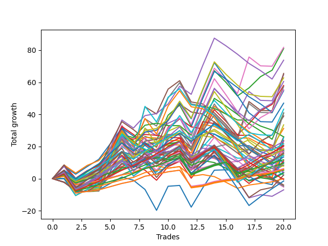

# Long Wallace 003 
- Symbol: ES
- Date Range: 03/18/2022 - 07/15/2022
- Trading Period: 7:20-12:30
- Number of Trades: 20



| Name | Win Percent | Profit | Avg Profit / Trade | Avg Time / Trade |      | Name | Win Percent | Profit | Avg Profit / Trade | Avg Time / Trade |
| ---- | ----------- | ------ | ------------------ | ---------------- | ---- | ---- | ----------- | ------ | ------------------ | ---------------- |
| Sorted By <br> Profit | | | | | | Sorted By <br> Win Percentage ||||
| Six | 65.00 | 40875.00 | 2043.75 | 19:58 |     | One Hundred Eleven | 90.00 | 8375.00 | 418.75 | 01:16 |
| Two | 70.00 | 40500.00 | 2025.00 | 17:02 |     | One Hundred Twenty-One | 90.00 | 3125.00 | 156.25 | 01:41 |
| Forty-Six | 60.00 | 36875.00 | 1843.75 | 11:00 |     | One Hundred Twenty-Six | 90.00 | 2875.00 | 143.75 | 01:41 |
| Five | 45.00 | 32750.00 | 1637.50 | 26:13 |     | Eighty-One | 90.00 | 2625.00 | 131.25 | 03:54 |
| Four | 60.00 | 32375.00 | 1618.75 | 22:01 |     | One Hundred Twenty-Seven | 85.00 | 5875.00 | 293.75 | 02:57 |
| Seventy | 60.00 | 31375.00 | 1568.75 | 13:32 |     | Eighty-Two | 85.00 | 4750.00 | 237.50 | 06:00 |
| Sixty-Six | 60.00 | 30250.00 | 1512.50 | 10:06 |     | One Hundred Twenty-Two | 85.00 | 4250.00 | 212.50 | 03:03 |
| Three | 75.00 | 29000.00 | 1450.00 | 15:25 |     | One Hundred Twenty-Eight | 80.00 | 10125.00 | 506.25 | 05:02 |
| Seven | 50.00 | 28625.00 | 1431.25 | 25:28 |     | Eighty-Three | 80.00 | 9250.00 | 462.50 | 08:51 |
| Fifty-Eight | 65.00 | 27750.00 | 1387.50 | 10:50 |     | One Hundred Twelve | 80.00 | 8875.00 | 443.75 | 02:13 |
| Forty-Two | 50.00 | 27375.00 | 1368.75 | 08:51 |     | One Hundred Twenty-Three | 80.00 | 7375.00 | 368.75 | 05:19 |
| Sixty-Two | 60.00 | 23500.00 | 1175.00 | 14:18 |     | Three | 75.00 | 29000.00 | 1450.00 | 15:25 |
| Seventy-One | 50.00 | 21625.00 | 1081.25 | 15:24 |     | One Hundred Twenty-Nine | 75.00 | 11625.00 | 581.25 | 05:30 |
| Sixty-Nine | 45.00 | 20500.00 | 1025.00 | 15:45 |     | Eighty-Four | 75.00 | 7875.00 | 393.75 | 10:32 |
| Forty-Four | 50.00 | 20375.00 | 1018.75 | 11:30 |     | One Hundred Twenty-Four | 75.00 | 7250.00 | 362.50 | 05:51 |
| Fifty-Nine | 70.00 | 19500.00 | 975.00 | 10:02 |     | Two | 70.00 | 40500.00 | 2025.00 | 17:02 |
| Sixty-Seven | 65.00 | 19500.00 | 975.00 | 09:18 |     | Fifty-Nine | 70.00 | 19500.00 | 975.00 | 10:02 |
| Sixty | 55.00 | 16750.00 | 837.50 | 15:17 |     | Eighty-Five | 70.00 | 10375.00 | 518.75 | 14:36 |
| Forty-Three | 55.00 | 15625.00 | 781.25 | 07:57 |     | One Hundred Thirteen | 70.00 | 9250.00 | 462.50 | 03:50 |
| Fifty-Four | 40.00 | 13000.00 | 650.00 | 05:25 |     | One | 70.00 | 9125.00 | 456.25 | 14:11 |
| Forty-Seven | 40.00 | 13000.00 | 650.00 | 15:00 |     | Zero | 70.00 | 2000.00 | 100.00 | 08:10 |
| Sixty-One | 40.00 | 12750.00 | 637.50 | 19:20 |     | Sixty-Four | 70.00 | 1750.00 | 87.50 | 05:00 |
| Forty-Five | 35.00 | 11875.00 | 593.75 | 15:20 |     | One Hundred Sixteen | 70.00 | 0.00 | 0.00 | 01:05 |
| One Hundred Twenty-Nine | 75.00 | 11625.00 | 581.25 | 05:30 |     | Fifty-Six | 70.00 | -3500.00 | -175.00 | 05:20 |
| One Hundred Fourteen | 65.00 | 10875.00 | 543.75 | 04:12 |     | Six | 65.00 | 40875.00 | 2043.75 | 19:58 |
| Eighty-Five | 70.00 | 10375.00 | 518.75 | 14:36 |     | Fifty-Eight | 65.00 | 27750.00 | 1387.50 | 10:50 |
| One Hundred Twenty-Eight | 80.00 | 10125.00 | 506.25 | 05:02 |     | Sixty-Seven | 65.00 | 19500.00 | 975.00 | 09:18 |
| Sixty-Eight | 50.00 | 10125.00 | 506.25 | 13:20 |     | One Hundred Fourteen | 65.00 | 10875.00 | 543.75 | 04:12 |
| Eighty-Three | 80.00 | 9250.00 | 462.50 | 08:51 |     | One Hundred Thirty | 65.00 | 7875.00 | 393.75 | 07:35 |
| One Hundred Thirteen | 70.00 | 9250.00 | 462.50 | 03:50 |     | Forty | 65.00 | 4125.00 | 206.25 | 04:10 |
| One | 70.00 | 9125.00 | 456.25 | 14:11 |     | One Hundred Seventeen | 65.00 | 2625.00 | 131.25 | 01:26 |
| One Hundred Twelve | 80.00 | 8875.00 | 443.75 | 02:13 |     | Fifty-Seven | 65.00 | 1125.00 | 56.25 | 08:24 |
| Seventy-Three | 55.00 | 8625.00 | 431.25 | 10:14 |     | One Hundred Twenty-Five | 65.00 | -750.00 | -37.50 | 07:59 |
| Sixty-Three | 45.00 | 8625.00 | 431.25 | 18:34 |     | Forty-Six | 60.00 | 36875.00 | 1843.75 | 11:00 |
| One Hundred Eleven | 90.00 | 8375.00 | 418.75 | 01:16 |     | Four | 60.00 | 32375.00 | 1618.75 | 22:01 |
| Fifty-Five | 35.00 | 8250.00 | 412.50 | 06:12 |     | Seventy | 60.00 | 31375.00 | 1568.75 | 13:32 |
| Eighty-Four | 75.00 | 7875.00 | 393.75 | 10:32 |     | Sixty-Six | 60.00 | 30250.00 | 1512.50 | 10:06 |
| One Hundred Thirty | 65.00 | 7875.00 | 393.75 | 07:35 |     | Sixty-Two | 60.00 | 23500.00 | 1175.00 | 14:18 |
| One Hundred Twenty-Three | 80.00 | 7375.00 | 368.75 | 05:19 |     | Sixty-Five | 60.00 | 5500.00 | 275.00 | 07:47 |
| Fifty-Three | 35.00 | 7375.00 | 368.75 | 06:16 |     | Sixty | 55.00 | 16750.00 | 837.50 | 15:17 |
| One Hundred Twenty-Four | 75.00 | 7250.00 | 362.50 | 05:51 |     | Forty-Three | 55.00 | 15625.00 | 781.25 | 07:57 |
| One Hundred Fifteen | 55.00 | 6750.00 | 337.50 | 05:56 |     | Seventy-Three | 55.00 | 8625.00 | 431.25 | 10:14 |
| One Hundred Twenty-Seven | 85.00 | 5875.00 | 293.75 | 02:57 |     | One Hundred Fifteen | 55.00 | 6750.00 | 337.50 | 05:56 |
| Sixty-Five | 60.00 | 5500.00 | 275.00 | 07:47 |     | Seven | 50.00 | 28625.00 | 1431.25 | 25:28 |
| Forty-One | 50.00 | 5000.00 | 250.00 | 06:43 |     | Forty-Two | 50.00 | 27375.00 | 1368.75 | 08:51 |
| Fifty-Two | 35.00 | 5000.00 | 250.00 | 04:48 |     | Seventy-One | 50.00 | 21625.00 | 1081.25 | 15:24 |
| Eighty-Two | 85.00 | 4750.00 | 237.50 | 06:00 |     | Forty-Four | 50.00 | 20375.00 | 1018.75 | 11:30 |
| One Hundred Twenty-Two | 85.00 | 4250.00 | 212.50 | 03:03 |     | Sixty-Eight | 50.00 | 10125.00 | 506.25 | 13:20 |
| Forty | 65.00 | 4125.00 | 206.25 | 04:10 |     | Forty-One | 50.00 | 5000.00 | 250.00 | 06:43 |
| Fifty | 35.00 | 3875.00 | 193.75 | 04:29 |     | One Hundred Eighteen | 50.00 | -250.00 | -12.50 | 02:09 |
| One Hundred Twenty-One | 90.00 | 3125.00 | 156.25 | 01:41 |     | Forty-Eight | 50.00 | -2625.00 | -131.25 | 02:01 |
| One Hundred Twenty-Six | 90.00 | 2875.00 | 143.75 | 01:41 |     | Five | 45.00 | 32750.00 | 1637.50 | 26:13 |
| Eighty-One | 90.00 | 2625.00 | 131.25 | 03:54 |     | Sixty-Nine | 45.00 | 20500.00 | 1025.00 | 15:45 |
| One Hundred Seventeen | 65.00 | 2625.00 | 131.25 | 01:26 |     | Sixty-Three | 45.00 | 8625.00 | 431.25 | 18:34 |
| Zero | 70.00 | 2000.00 | 100.00 | 08:10 |     | One Hundred Ninteen | 45.00 | 2000.00 | 100.00 | 02:17 |
| One Hundred Ninteen | 45.00 | 2000.00 | 100.00 | 02:17 |     | Fifty-Four | 40.00 | 13000.00 | 650.00 | 05:25 |
| Sixty-Four | 70.00 | 1750.00 | 87.50 | 05:00 |     | Forty-Seven | 40.00 | 13000.00 | 650.00 | 15:00 |
| Fifty-Seven | 65.00 | 1125.00 | 56.25 | 08:24 |     | Sixty-One | 40.00 | 12750.00 | 637.50 | 19:20 |
| Fifty-One | 40.00 | 1125.00 | 56.25 | 03:46 |     | Fifty-One | 40.00 | 1125.00 | 56.25 | 03:46 |
| One Hundred Sixteen | 70.00 | 0.00 | 0.00 | 01:05 |     | Forty-Five | 35.00 | 11875.00 | 593.75 | 15:20 |
| One Hundred Eighteen | 50.00 | -250.00 | -12.50 | 02:09 |     | Fifty-Five | 35.00 | 8250.00 | 412.50 | 06:12 |
| One Hundred Twenty-Five | 65.00 | -750.00 | -37.50 | 07:59 |     | Fifty-Three | 35.00 | 7375.00 | 368.75 | 06:16 |
| One Hundred Twenty | 35.00 | -2000.00 | -100.00 | 02:56 |     | Fifty-Two | 35.00 | 5000.00 | 250.00 | 04:48 |
| Forty-Nine | 35.00 | -2375.00 | -118.75 | 03:11 |     | Fifty | 35.00 | 3875.00 | 193.75 | 04:29 |
| Forty-Eight | 50.00 | -2625.00 | -131.25 | 02:01 |     | One Hundred Twenty | 35.00 | -2000.00 | -100.00 | 02:56 |
| Fifty-Six | 70.00 | -3500.00 | -175.00 | 05:20 |     | Forty-Nine | 35.00 | -2375.00 | -118.75 | 03:11 |

## NO STOPLOSS

### Test Zero
* Sell when price hits the middle line of the 20p bollinger
* No Stoploss
* Results:
```
Total Trades: 20
Percent Up: 70.00
Percent Down: 30.00
Total Points Moved Up: 4.00
Potential Profit: 2000.00
Total Points Ups: 45.75 Count Ups: 14
Total Points Downs: -41.75 Count Downs: 6
```

<details><summary>Trades</summary>

<code>In: 2022-03-25 08:30:00		Out: 2022-03-25 08:36:40		Total Position Time: 06:40		Total Move Up: 4.00		Total to Date: 4.00</code> <br />
<code>In: 2022-03-30 08:03:00		Out: 2022-03-30 08:19:20		Total Position Time: 16:20		Total Move Up: -5.75		Total to Date: -1.75</code> <br />
<code>In: 2022-03-30 08:14:00		Out: 2022-03-30 08:19:20		Total Position Time: 05:20		Total Move Up: 3.00		Total to Date: 1.25</code> <br />
<code>In: 2022-03-31 08:38:00		Out: 2022-03-31 08:38:15		Total Position Time: 00:15		Total Move Up: 0.75		Total to Date: 2.00</code> <br />
<code>In: 2022-04-20 11:58:00		Out: 2022-04-20 12:01:15		Total Position Time: 03:15		Total Move Up: 4.75		Total to Date: 6.75</code> <br />
<code>In: 2022-04-20 11:59:00		Out: 2022-04-20 12:01:15		Total Position Time: 02:15		Total Move Up: 4.75		Total to Date: 11.50</code> <br />
<code>In: 2022-05-11 10:33:00		Out: 2022-05-11 10:34:30		Total Position Time: 01:30		Total Move Up: 1.50		Total to Date: 13.00</code> <br />
<code>In: 2022-05-17 11:25:00		Out: 2022-05-17 11:27:30		Total Position Time: 02:30		Total Move Up: 8.00		Total to Date: 21.00</code> <br />
<code>In: 2022-05-19 07:33:00		Out: 2022-05-19 07:33:10		Total Position Time: 00:10		Total Move Up: 1.25		Total to Date: 22.25</code> <br />
<code>In: 2022-05-19 10:52:00		Out: 2022-05-19 10:52:45		Total Position Time: 00:45		Total Move Up: 4.25		Total to Date: 26.50</code> <br />
<code>In: 2022-05-25 10:15:00		Out: 2022-05-25 10:15:20		Total Position Time: 00:20		Total Move Up: 1.00		Total to Date: 27.50</code> <br />
<code>In: 2022-06-08 09:30:00		Out: 2022-06-08 09:53:05		Total Position Time: 23:05		Total Move Up: -16.50		Total to Date: 11.00</code> <br />
<code>In: 2022-06-14 07:45:00		Out: 2022-06-14 07:46:40		Total Position Time: 01:40		Total Move Up: 3.75		Total to Date: 14.75</code> <br />
<code>In: 2022-06-14 07:46:00		Out: 2022-06-14 07:46:40		Total Position Time: 00:40		Total Move Up: 2.75		Total to Date: 17.50</code> <br />
<code>In: 2022-06-15 07:57:00		Out: 2022-06-15 08:26:55		Total Position Time: 29:55		Total Move Up: -7.25		Total to Date: 10.25</code> <br />
<code>In: 2022-06-15 07:58:00		Out: 2022-06-15 08:27:55		Total Position Time: 29:55		Total Move Up: -8.50		Total to Date: 1.75</code> <br />
<code>In: 2022-06-17 07:38:00		Out: 2022-06-17 07:55:05		Total Position Time: 17:05		Total Move Up: -2.75		Total to Date: -1.00</code> <br />
<code>In: 2022-06-23 09:07:00		Out: 2022-06-23 09:14:30		Total Position Time: 07:30		Total Move Up: 2.00		Total to Date: 1.00</code> <br />
<code>In: 2022-07-06 08:35:00		Out: 2022-07-06 08:46:05		Total Position Time: 11:05		Total Move Up: -1.00		Total to Date: 0.00</code> <br />
<code>In: 2022-07-13 07:23:00		Out: 2022-07-13 07:26:20		Total Position Time: 03:20		Total Move Up: 4.00		Total to Date: 4.00</code> <br />


</details>

### Test One
* Sell when the price hits the upper line of the 20p 1std bollinger
* No Stoploss
* Results:
```
Total Trades: 20
Percent Up: 70.00
Percent Down: 30.00
Total Points Moved Up: 18.25
Potential Profit: 9125.00
Total Points Ups: 74.00 Count Ups: 14
Total Points Downs: -55.75 Count Downs: 6
```

<details><summary>Trades</summary>

<code>In: 2022-03-25 08:30:00		Out: 2022-03-25 08:41:05		Total Position Time: 11:05		Total Move Up: 5.25		Total to Date: 5.25</code> <br />
<code>In: 2022-03-30 08:03:00		Out: 2022-03-30 08:32:55		Total Position Time: 29:55		Total Move Up: -8.25		Total to Date: -3.00</code> <br />
<code>In: 2022-03-30 08:14:00		Out: 2022-03-30 08:34:40		Total Position Time: 20:40		Total Move Up: 2.75		Total to Date: -0.25</code> <br />
<code>In: 2022-03-31 08:38:00		Out: 2022-03-31 08:40:35		Total Position Time: 02:35		Total Move Up: 2.00		Total to Date: 1.75</code> <br />
<code>In: 2022-04-20 11:58:00		Out: 2022-04-20 12:04:20		Total Position Time: 06:20		Total Move Up: 7.50		Total to Date: 9.25</code> <br />
<code>In: 2022-04-20 11:59:00		Out: 2022-04-20 12:04:20		Total Position Time: 05:20		Total Move Up: 7.50		Total to Date: 16.75</code> <br />
<code>In: 2022-05-11 10:33:00		Out: 2022-05-11 11:01:20		Total Position Time: 28:20		Total Move Up: -12.00		Total to Date: 4.75</code> <br />
<code>In: 2022-05-17 11:25:00		Out: 2022-05-17 11:37:35		Total Position Time: 12:35		Total Move Up: 5.75		Total to Date: 10.50</code> <br />
<code>In: 2022-05-19 07:33:00		Out: 2022-05-19 07:54:50		Total Position Time: 21:50		Total Move Up: -6.25		Total to Date: 4.25</code> <br />
<code>In: 2022-05-19 10:52:00		Out: 2022-05-19 10:54:25		Total Position Time: 02:25		Total Move Up: 8.50		Total to Date: 12.75</code> <br />
<code>In: 2022-05-25 10:15:00		Out: 2022-05-25 10:15:30		Total Position Time: 00:30		Total Move Up: 3.25		Total to Date: 16.00</code> <br />
<code>In: 2022-06-08 09:30:00		Out: 2022-06-08 09:59:05		Total Position Time: 29:05		Total Move Up: -13.50		Total to Date: 2.50</code> <br />
<code>In: 2022-06-14 07:45:00		Out: 2022-06-14 07:47:10		Total Position Time: 02:10		Total Move Up: 9.00		Total to Date: 11.50</code> <br />
<code>In: 2022-06-14 07:46:00		Out: 2022-06-14 07:47:10		Total Position Time: 01:10		Total Move Up: 8.00		Total to Date: 19.50</code> <br />
<code>In: 2022-06-15 07:57:00		Out: 2022-06-15 08:26:55		Total Position Time: 29:55		Total Move Up: -7.25		Total to Date: 12.25</code> <br />
<code>In: 2022-06-15 07:58:00		Out: 2022-06-15 08:27:55		Total Position Time: 29:55		Total Move Up: -8.50		Total to Date: 3.75</code> <br />
<code>In: 2022-06-17 07:38:00		Out: 2022-06-17 07:56:15		Total Position Time: 18:15		Total Move Up: 0.50		Total to Date: 4.25</code> <br />
<code>In: 2022-06-23 09:07:00		Out: 2022-06-23 09:18:25		Total Position Time: 11:25		Total Move Up: 4.75		Total to Date: 9.00</code> <br />
<code>In: 2022-07-06 08:35:00		Out: 2022-07-06 08:48:10		Total Position Time: 13:10		Total Move Up: 1.50		Total to Date: 10.50</code> <br />
<code>In: 2022-07-13 07:23:00		Out: 2022-07-13 07:30:00		Total Position Time: 07:00		Total Move Up: 7.75		Total to Date: 18.25</code> <br />


</details>

### Test Two
* Sell when the price hits the upper line of the 20p 2std bollinger
* No Stoploss
* Results:
```
Total Trades: 20
Percent Up: 70.00
Percent Down: 30.00
Total Points Moved Up: 81.00
Potential Profit: 40500.00
Total Points Ups: 131.75 Count Ups: 14
Total Points Downs: -50.75 Count Downs: 6
```

<details><summary>Trades</summary>

<code>In: 2022-03-25 08:30:00		Out: 2022-03-25 08:41:45		Total Position Time: 11:45		Total Move Up: 7.75		Total to Date: 7.75</code> <br />
<code>In: 2022-03-30 08:03:00		Out: 2022-03-30 08:32:55		Total Position Time: 29:55		Total Move Up: -8.25		Total to Date: -0.50</code> <br />
<code>In: 2022-03-30 08:14:00		Out: 2022-03-30 08:35:15		Total Position Time: 21:15		Total Move Up: 4.75		Total to Date: 4.25</code> <br />
<code>In: 2022-03-31 08:38:00		Out: 2022-03-31 08:41:10		Total Position Time: 03:10		Total Move Up: 4.50		Total to Date: 8.75</code> <br />
<code>In: 2022-04-20 11:58:00		Out: 2022-04-20 12:12:35		Total Position Time: 14:35		Total Move Up: 9.75		Total to Date: 18.50</code> <br />
<code>In: 2022-04-20 11:59:00		Out: 2022-04-20 12:12:35		Total Position Time: 13:35		Total Move Up: 9.75		Total to Date: 28.25</code> <br />
<code>In: 2022-05-11 10:33:00		Out: 2022-05-11 11:02:35		Total Position Time: 29:35		Total Move Up: -11.50		Total to Date: 16.75</code> <br />
<code>In: 2022-05-17 11:25:00		Out: 2022-05-17 11:40:00		Total Position Time: 15:00		Total Move Up: 9.50		Total to Date: 26.25</code> <br />
<code>In: 2022-05-19 07:33:00		Out: 2022-05-19 07:55:50		Total Position Time: 22:50		Total Move Up: -2.25		Total to Date: 24.00</code> <br />
<code>In: 2022-05-19 10:52:00		Out: 2022-05-19 10:55:15		Total Position Time: 03:15		Total Move Up: 15.50		Total to Date: 39.50</code> <br />
<code>In: 2022-05-25 10:15:00		Out: 2022-05-25 10:29:40		Total Position Time: 14:40		Total Move Up: 6.25		Total to Date: 45.75</code> <br />
<code>In: 2022-06-08 09:30:00		Out: 2022-06-08 09:59:10		Total Position Time: 29:10		Total Move Up: -13.00		Total to Date: 32.75</code> <br />
<code>In: 2022-06-14 07:45:00		Out: 2022-06-14 07:51:00		Total Position Time: 06:00		Total Move Up: 17.75		Total to Date: 50.50</code> <br />
<code>In: 2022-06-14 07:46:00		Out: 2022-06-14 07:51:00		Total Position Time: 05:00		Total Move Up: 16.75		Total to Date: 67.25</code> <br />
<code>In: 2022-06-15 07:57:00		Out: 2022-06-15 08:26:55		Total Position Time: 29:55		Total Move Up: -7.25		Total to Date: 60.00</code> <br />
<code>In: 2022-06-15 07:58:00		Out: 2022-06-15 08:27:55		Total Position Time: 29:55		Total Move Up: -8.50		Total to Date: 51.50</code> <br />
<code>In: 2022-06-17 07:38:00		Out: 2022-06-17 08:02:25		Total Position Time: 24:25		Total Move Up: 5.00		Total to Date: 56.50</code> <br />
<code>In: 2022-06-23 09:07:00		Out: 2022-06-23 09:19:05		Total Position Time: 12:05		Total Move Up: 7.00		Total to Date: 63.50</code> <br />
<code>In: 2022-07-06 08:35:00		Out: 2022-07-06 08:51:15		Total Position Time: 16:15		Total Move Up: 4.00		Total to Date: 67.50</code> <br />
<code>In: 2022-07-13 07:23:00		Out: 2022-07-13 07:31:30		Total Position Time: 08:30		Total Move Up: 13.50		Total to Date: 81.00</code> <br />


</details>

### Test Three
* Sell when price hits the middle line of the 50p bollinger
* No Stoploss
* Results:
```
Total Trades: 20
Percent Up: 75.00
Percent Down: 25.00
Total Points Moved Up: 58.00
Potential Profit: 29000.00
Total Points Ups: 107.50 Count Ups: 15
Total Points Downs: -49.50 Count Downs: 5
```

<details><summary>Trades</summary>

<code>In: 2022-03-25 08:30:00		Out: 2022-03-25 08:52:45		Total Position Time: 22:45		Total Move Up: 8.50		Total to Date: 8.50</code> <br />
<code>In: 2022-03-30 08:03:00		Out: 2022-03-30 08:32:55		Total Position Time: 29:55		Total Move Up: -8.25		Total to Date: 0.25</code> <br />
<code>In: 2022-03-30 08:14:00		Out: 2022-03-30 08:35:15		Total Position Time: 21:15		Total Move Up: 4.75		Total to Date: 5.00</code> <br />
<code>In: 2022-03-31 08:38:00		Out: 2022-03-31 08:41:05		Total Position Time: 03:05		Total Move Up: 3.00		Total to Date: 8.00</code> <br />
<code>In: 2022-04-20 11:58:00		Out: 2022-04-20 12:10:10		Total Position Time: 12:10		Total Move Up: 8.25		Total to Date: 16.25</code> <br />
<code>In: 2022-04-20 11:59:00		Out: 2022-04-20 12:10:10		Total Position Time: 11:10		Total Move Up: 8.25		Total to Date: 24.50</code> <br />
<code>In: 2022-05-11 10:33:00		Out: 2022-05-11 11:02:55		Total Position Time: 29:55		Total Move Up: -12.25		Total to Date: 12.25</code> <br />
<code>In: 2022-05-17 11:25:00		Out: 2022-05-17 11:40:05		Total Position Time: 15:05		Total Move Up: 11.00		Total to Date: 23.25</code> <br />
<code>In: 2022-05-19 07:33:00		Out: 2022-05-19 07:33:10		Total Position Time: 00:10		Total Move Up: 1.25		Total to Date: 24.50</code> <br />
<code>In: 2022-05-19 10:52:00		Out: 2022-05-19 10:52:40		Total Position Time: 00:40		Total Move Up: 2.75		Total to Date: 27.25</code> <br />
<code>In: 2022-05-25 10:15:00		Out: 2022-05-25 10:15:10		Total Position Time: 00:10		Total Move Up: 0.00		Total to Date: 27.25</code> <br />
<code>In: 2022-06-08 09:30:00		Out: 2022-06-08 09:59:55		Total Position Time: 29:55		Total Move Up: -13.25		Total to Date: 14.00</code> <br />
<code>In: 2022-06-14 07:45:00		Out: 2022-06-14 07:50:00		Total Position Time: 05:00		Total Move Up: 15.00		Total to Date: 29.00</code> <br />
<code>In: 2022-06-14 07:46:00		Out: 2022-06-14 07:50:00		Total Position Time: 04:00		Total Move Up: 14.00		Total to Date: 43.00</code> <br />
<code>In: 2022-06-15 07:57:00		Out: 2022-06-15 08:26:55		Total Position Time: 29:55		Total Move Up: -7.25		Total to Date: 35.75</code> <br />
<code>In: 2022-06-15 07:58:00		Out: 2022-06-15 08:27:55		Total Position Time: 29:55		Total Move Up: -8.50		Total to Date: 27.25</code> <br />
<code>In: 2022-06-17 07:38:00		Out: 2022-06-17 08:02:30		Total Position Time: 24:30		Total Move Up: 7.00		Total to Date: 34.25</code> <br />
<code>In: 2022-06-23 09:07:00		Out: 2022-06-23 09:21:10		Total Position Time: 14:10		Total Move Up: 8.00		Total to Date: 42.25</code> <br />
<code>In: 2022-07-06 08:35:00		Out: 2022-07-06 08:51:15		Total Position Time: 16:15		Total Move Up: 4.00		Total to Date: 46.25</code> <br />
<code>In: 2022-07-13 07:23:00		Out: 2022-07-13 07:31:20		Total Position Time: 08:20		Total Move Up: 11.75		Total to Date: 58.00</code> <br />


</details>

### Test Four
* Sell when the price hits the upper line of the 50p 1std bollinger
* No Stoploss
* Results:
```
Total Trades: 20
Percent Up: 60.00
Percent Down: 40.00
Total Points Moved Up: 64.75
Potential Profit: 32375.00
Total Points Ups: 124.50 Count Ups: 12
Total Points Downs: -59.75 Count Downs: 8
```

<details><summary>Trades</summary>

<code>In: 2022-03-25 08:30:00		Out: 2022-03-25 08:59:55		Total Position Time: 29:55		Total Move Up: 2.25		Total to Date: 2.25</code> <br />
<code>In: 2022-03-30 08:03:00		Out: 2022-03-30 08:32:55		Total Position Time: 29:55		Total Move Up: -8.25		Total to Date: -6.00</code> <br />
<code>In: 2022-03-30 08:14:00		Out: 2022-03-30 08:43:55		Total Position Time: 29:55		Total Move Up: 3.75		Total to Date: -2.25</code> <br />
<code>In: 2022-03-31 08:38:00		Out: 2022-03-31 09:00:15		Total Position Time: 22:15		Total Move Up: 3.00		Total to Date: 0.75</code> <br />
<code>In: 2022-04-20 11:58:00		Out: 2022-04-20 12:13:30		Total Position Time: 15:30		Total Move Up: 12.25		Total to Date: 13.00</code> <br />
<code>In: 2022-04-20 11:59:00		Out: 2022-04-20 12:13:30		Total Position Time: 14:30		Total Move Up: 12.25		Total to Date: 25.25</code> <br />
<code>In: 2022-05-11 10:33:00		Out: 2022-05-11 11:02:55		Total Position Time: 29:55		Total Move Up: -12.25		Total to Date: 13.00</code> <br />
<code>In: 2022-05-17 11:25:00		Out: 2022-05-17 11:44:30		Total Position Time: 19:30		Total Move Up: 18.25		Total to Date: 31.25</code> <br />
<code>In: 2022-05-19 07:33:00		Out: 2022-05-19 08:02:55		Total Position Time: 29:55		Total Move Up: -4.50		Total to Date: 26.75</code> <br />
<code>In: 2022-05-19 10:52:00		Out: 2022-05-19 10:54:15		Total Position Time: 02:15		Total Move Up: 7.75		Total to Date: 34.50</code> <br />
<code>In: 2022-05-25 10:15:00		Out: 2022-05-25 10:15:30		Total Position Time: 00:30		Total Move Up: 3.25		Total to Date: 37.75</code> <br />
<code>In: 2022-06-08 09:30:00		Out: 2022-06-08 09:59:55		Total Position Time: 29:55		Total Move Up: -13.25		Total to Date: 24.50</code> <br />
<code>In: 2022-06-14 07:45:00		Out: 2022-06-14 08:01:15		Total Position Time: 16:15		Total Move Up: 16.25		Total to Date: 40.75</code> <br />
<code>In: 2022-06-14 07:46:00		Out: 2022-06-14 08:01:15		Total Position Time: 15:15		Total Move Up: 15.25		Total to Date: 56.00</code> <br />
<code>In: 2022-06-15 07:57:00		Out: 2022-06-15 08:26:55		Total Position Time: 29:55		Total Move Up: -7.25		Total to Date: 48.75</code> <br />
<code>In: 2022-06-15 07:58:00		Out: 2022-06-15 08:27:55		Total Position Time: 29:55		Total Move Up: -8.50		Total to Date: 40.25</code> <br />
<code>In: 2022-06-17 07:38:00		Out: 2022-06-17 08:04:40		Total Position Time: 26:40		Total Move Up: 14.00		Total to Date: 54.25</code> <br />
<code>In: 2022-06-23 09:07:00		Out: 2022-06-23 09:36:55		Total Position Time: 29:55		Total Move Up: -5.50		Total to Date: 48.75</code> <br />
<code>In: 2022-07-06 08:35:00		Out: 2022-07-06 09:04:55		Total Position Time: 29:55		Total Move Up: -0.25		Total to Date: 48.50</code> <br />
<code>In: 2022-07-13 07:23:00		Out: 2022-07-13 07:31:35		Total Position Time: 08:35		Total Move Up: 16.25		Total to Date: 64.75</code> <br />


</details>

### Test Five
* Sell when the price hits the upper line of the 50p 2std bollinger
* No Stoploss
* Results:
```
Total Trades: 20
Percent Up: 45.00
Percent Down: 55.00
Total Points Moved Up: 65.50
Potential Profit: 32750.00
Total Points Ups: 133.00 Count Ups: 9
Total Points Downs: -67.50 Count Downs: 11
```

<details><summary>Trades</summary>

<code>In: 2022-03-25 08:30:00		Out: 2022-03-25 08:59:55		Total Position Time: 29:55		Total Move Up: 2.25		Total to Date: 2.25</code> <br />
<code>In: 2022-03-30 08:03:00		Out: 2022-03-30 08:32:55		Total Position Time: 29:55		Total Move Up: -8.25		Total to Date: -6.00</code> <br />
<code>In: 2022-03-30 08:14:00		Out: 2022-03-30 08:43:55		Total Position Time: 29:55		Total Move Up: 3.75		Total to Date: -2.25</code> <br />
<code>In: 2022-03-31 08:38:00		Out: 2022-03-31 09:07:55		Total Position Time: 29:55		Total Move Up: -1.00		Total to Date: -3.25</code> <br />
<code>In: 2022-04-20 11:58:00		Out: 2022-04-20 12:25:45		Total Position Time: 27:45		Total Move Up: 16.25		Total to Date: 13.00</code> <br />
<code>In: 2022-04-20 11:59:00		Out: 2022-04-20 12:25:45		Total Position Time: 26:45		Total Move Up: 16.25		Total to Date: 29.25</code> <br />
<code>In: 2022-05-11 10:33:00		Out: 2022-05-11 11:02:55		Total Position Time: 29:55		Total Move Up: -12.25		Total to Date: 17.00</code> <br />
<code>In: 2022-05-17 11:25:00		Out: 2022-05-17 11:48:45		Total Position Time: 23:45		Total Move Up: 27.75		Total to Date: 44.75</code> <br />
<code>In: 2022-05-19 07:33:00		Out: 2022-05-19 08:02:55		Total Position Time: 29:55		Total Move Up: -4.50		Total to Date: 40.25</code> <br />
<code>In: 2022-05-19 10:52:00		Out: 2022-05-19 10:55:15		Total Position Time: 03:15		Total Move Up: 15.50		Total to Date: 55.75</code> <br />
<code>In: 2022-05-25 10:15:00		Out: 2022-05-25 10:29:25		Total Position Time: 14:25		Total Move Up: 5.25		Total to Date: 61.00</code> <br />
<code>In: 2022-06-08 09:30:00		Out: 2022-06-08 09:59:55		Total Position Time: 29:55		Total Move Up: -13.25		Total to Date: 47.75</code> <br />
<code>In: 2022-06-14 07:45:00		Out: 2022-06-14 08:14:55		Total Position Time: 29:55		Total Move Up: -1.25		Total to Date: 46.50</code> <br />
<code>In: 2022-06-14 07:46:00		Out: 2022-06-14 08:15:55		Total Position Time: 29:55		Total Move Up: -5.50		Total to Date: 41.00</code> <br />
<code>In: 2022-06-15 07:57:00		Out: 2022-06-15 08:26:55		Total Position Time: 29:55		Total Move Up: -7.25		Total to Date: 33.75</code> <br />
<code>In: 2022-06-15 07:58:00		Out: 2022-06-15 08:27:55		Total Position Time: 29:55		Total Move Up: -8.50		Total to Date: 25.25</code> <br />
<code>In: 2022-06-17 07:38:00		Out: 2022-06-17 08:07:55		Total Position Time: 29:55		Total Move Up: 22.75		Total to Date: 48.00</code> <br />
<code>In: 2022-06-23 09:07:00		Out: 2022-06-23 09:36:55		Total Position Time: 29:55		Total Move Up: -5.50		Total to Date: 42.50</code> <br />
<code>In: 2022-07-06 08:35:00		Out: 2022-07-06 09:04:55		Total Position Time: 29:55		Total Move Up: -0.25		Total to Date: 42.25</code> <br />
<code>In: 2022-07-13 07:23:00		Out: 2022-07-13 07:32:50		Total Position Time: 09:50		Total Move Up: 23.25		Total to Date: 65.50</code> <br />


</details>

### Test Six
* Sell when the price hits the middle line of the 1std VWAP
* No Stoploss
* Results:
```
Total Trades: 20
Percent Up: 65.00
Percent Down: 35.00
Total Points Moved Up: 81.75
Potential Profit: 40875.00
Total Points Ups: 137.00 Count Ups: 13
Total Points Downs: -55.25 Count Downs: 7
```

<details><summary>Trades</summary>

<code>In: 2022-03-25 08:30:00		Out: 2022-03-25 08:59:55		Total Position Time: 29:55		Total Move Up: 2.25		Total to Date: 2.25</code> <br />
<code>In: 2022-03-30 08:03:00		Out: 2022-03-30 08:32:55		Total Position Time: 29:55		Total Move Up: -8.25		Total to Date: -6.00</code> <br />
<code>In: 2022-03-30 08:14:00		Out: 2022-03-30 08:43:55		Total Position Time: 29:55		Total Move Up: 3.75		Total to Date: -2.25</code> <br />
<code>In: 2022-03-31 08:38:00		Out: 2022-03-31 08:38:10		Total Position Time: 00:10		Total Move Up: 0.50		Total to Date: -1.75</code> <br />
<code>In: 2022-04-20 11:58:00		Out: 2022-04-20 12:25:50		Total Position Time: 27:50		Total Move Up: 17.50		Total to Date: 15.75</code> <br />
<code>In: 2022-04-20 11:59:00		Out: 2022-04-20 12:25:50		Total Position Time: 26:50		Total Move Up: 17.50		Total to Date: 33.25</code> <br />
<code>In: 2022-05-11 10:33:00		Out: 2022-05-11 11:02:55		Total Position Time: 29:55		Total Move Up: -12.25		Total to Date: 21.00</code> <br />
<code>In: 2022-05-17 11:25:00		Out: 2022-05-17 11:27:25		Total Position Time: 02:25		Total Move Up: 7.75		Total to Date: 28.75</code> <br />
<code>In: 2022-05-19 07:33:00		Out: 2022-05-19 07:33:10		Total Position Time: 00:10		Total Move Up: 1.25		Total to Date: 30.00</code> <br />
<code>In: 2022-05-19 10:52:00		Out: 2022-05-19 10:53:10		Total Position Time: 01:10		Total Move Up: 6.00		Total to Date: 36.00</code> <br />
<code>In: 2022-05-25 10:15:00		Out: 2022-05-25 10:37:05		Total Position Time: 22:05		Total Move Up: 11.00		Total to Date: 47.00</code> <br />
<code>In: 2022-06-08 09:30:00		Out: 2022-06-08 09:59:55		Total Position Time: 29:55		Total Move Up: -13.25		Total to Date: 33.75</code> <br />
<code>In: 2022-06-14 07:45:00		Out: 2022-06-14 07:51:05		Total Position Time: 06:05		Total Move Up: 18.00		Total to Date: 51.75</code> <br />
<code>In: 2022-06-14 07:46:00		Out: 2022-06-14 07:51:05		Total Position Time: 05:05		Total Move Up: 17.00		Total to Date: 68.75</code> <br />
<code>In: 2022-06-15 07:57:00		Out: 2022-06-15 08:26:55		Total Position Time: 29:55		Total Move Up: -7.25		Total to Date: 61.50</code> <br />
<code>In: 2022-06-15 07:58:00		Out: 2022-06-15 08:27:55		Total Position Time: 29:55		Total Move Up: -8.50		Total to Date: 53.00</code> <br />
<code>In: 2022-06-17 07:38:00		Out: 2022-06-17 08:07:55		Total Position Time: 29:55		Total Move Up: 22.75		Total to Date: 75.75</code> <br />
<code>In: 2022-06-23 09:07:00		Out: 2022-06-23 09:36:55		Total Position Time: 29:55		Total Move Up: -5.50		Total to Date: 70.25</code> <br />
<code>In: 2022-07-06 08:35:00		Out: 2022-07-06 09:04:55		Total Position Time: 29:55		Total Move Up: -0.25		Total to Date: 70.00</code> <br />
<code>In: 2022-07-13 07:23:00		Out: 2022-07-13 07:31:20		Total Position Time: 08:20		Total Move Up: 11.75		Total to Date: 81.75</code> <br />


</details>

### Test Seven
* Sell when the price hits the upper line of the 1std VWAP
* No Stoploss
* Results:
```
Total Trades: 20
Percent Up: 50.00
Percent Down: 50.00
Total Points Moved Up: 57.25
Potential Profit: 28625.00
Total Points Ups: 123.75 Count Ups: 10
Total Points Downs: -66.50 Count Downs: 10
```

<details><summary>Trades</summary>

<code>In: 2022-03-25 08:30:00		Out: 2022-03-25 08:59:55		Total Position Time: 29:55		Total Move Up: 2.25		Total to Date: 2.25</code> <br />
<code>In: 2022-03-30 08:03:00		Out: 2022-03-30 08:32:55		Total Position Time: 29:55		Total Move Up: -8.25		Total to Date: -6.00</code> <br />
<code>In: 2022-03-30 08:14:00		Out: 2022-03-30 08:43:55		Total Position Time: 29:55		Total Move Up: 3.75		Total to Date: -2.25</code> <br />
<code>In: 2022-03-31 08:38:00		Out: 2022-03-31 08:41:10		Total Position Time: 03:10		Total Move Up: 4.50		Total to Date: 2.25</code> <br />
<code>In: 2022-04-20 11:58:00		Out: 2022-04-20 12:27:55		Total Position Time: 29:55		Total Move Up: 16.25		Total to Date: 18.50</code> <br />
<code>In: 2022-04-20 11:59:00		Out: 2022-04-20 12:28:55		Total Position Time: 29:55		Total Move Up: 13.75		Total to Date: 32.25</code> <br />
<code>In: 2022-05-11 10:33:00		Out: 2022-05-11 11:02:55		Total Position Time: 29:55		Total Move Up: -12.25		Total to Date: 20.00</code> <br />
<code>In: 2022-05-17 11:25:00		Out: 2022-05-17 11:40:20		Total Position Time: 15:20		Total Move Up: 17.25		Total to Date: 37.25</code> <br />
<code>In: 2022-05-19 07:33:00		Out: 2022-05-19 08:02:55		Total Position Time: 29:55		Total Move Up: -4.50		Total to Date: 32.75</code> <br />
<code>In: 2022-05-19 10:52:00		Out: 2022-05-19 10:55:35		Total Position Time: 03:35		Total Move Up: 17.50		Total to Date: 50.25</code> <br />
<code>In: 2022-05-25 10:15:00		Out: 2022-05-25 10:44:55		Total Position Time: 29:55		Total Move Up: 9.50		Total to Date: 59.75</code> <br />
<code>In: 2022-06-08 09:30:00		Out: 2022-06-08 09:59:55		Total Position Time: 29:55		Total Move Up: -13.25		Total to Date: 46.50</code> <br />
<code>In: 2022-06-14 07:45:00		Out: 2022-06-14 08:14:55		Total Position Time: 29:55		Total Move Up: -1.25		Total to Date: 45.25</code> <br />
<code>In: 2022-06-14 07:46:00		Out: 2022-06-14 08:15:55		Total Position Time: 29:55		Total Move Up: -5.50		Total to Date: 39.75</code> <br />
<code>In: 2022-06-15 07:57:00		Out: 2022-06-15 08:26:55		Total Position Time: 29:55		Total Move Up: -7.25		Total to Date: 32.50</code> <br />
<code>In: 2022-06-15 07:58:00		Out: 2022-06-15 08:27:55		Total Position Time: 29:55		Total Move Up: -8.50		Total to Date: 24.00</code> <br />
<code>In: 2022-06-17 07:38:00		Out: 2022-06-17 08:07:55		Total Position Time: 29:55		Total Move Up: 22.75		Total to Date: 46.75</code> <br />
<code>In: 2022-06-23 09:07:00		Out: 2022-06-23 09:36:55		Total Position Time: 29:55		Total Move Up: -5.50		Total to Date: 41.25</code> <br />
<code>In: 2022-07-06 08:35:00		Out: 2022-07-06 09:04:55		Total Position Time: 29:55		Total Move Up: -0.25		Total to Date: 41.00</code> <br />
<code>In: 2022-07-13 07:23:00		Out: 2022-07-13 07:31:35		Total Position Time: 08:35		Total Move Up: 16.25		Total to Date: 57.25</code> <br />


</details>

## STOPLOSS OF 5

### Test Forty
* Sell when price hits the middle line of the 20p bollinger
* Stoploss is 5 points
* Results:
```
Total Trades: 20
Percent Up: 65.00
Percent Down: 35.00
Total Points Moved Up: 8.25
Potential Profit: 4125.00
Total Points Ups: 43.75 Count Ups: 13
Total Points Downs: -35.50 Count Downs: 7
```

<details><summary>Trades</summary>

<code>In: 2022-03-25 08:30:00		Out: 2022-03-25 08:36:40		Total Position Time: 06:40		Total Move Up: 4.00		Total to Date: 4.00</code> <br />
<code>In: 2022-03-30 08:03:00		Out: 2022-03-30 08:07:05		Total Position Time: 04:05		Total Move Up: -5.00		Total to Date: -1.00</code> <br />
<code>In: 2022-03-30 08:14:00		Out: 2022-03-30 08:19:20		Total Position Time: 05:20		Total Move Up: 3.00		Total to Date: 2.00</code> <br />
<code>In: 2022-03-31 08:38:00		Out: 2022-03-31 08:38:15		Total Position Time: 00:15		Total Move Up: 0.75		Total to Date: 2.75</code> <br />
<code>In: 2022-04-20 11:58:00		Out: 2022-04-20 12:01:15		Total Position Time: 03:15		Total Move Up: 4.75		Total to Date: 7.50</code> <br />
<code>In: 2022-04-20 11:59:00		Out: 2022-04-20 12:01:15		Total Position Time: 02:15		Total Move Up: 4.75		Total to Date: 12.25</code> <br />
<code>In: 2022-05-11 10:33:00		Out: 2022-05-11 10:34:30		Total Position Time: 01:30		Total Move Up: 1.50		Total to Date: 13.75</code> <br />
<code>In: 2022-05-17 11:25:00		Out: 2022-05-17 11:27:30		Total Position Time: 02:30		Total Move Up: 8.00		Total to Date: 21.75</code> <br />
<code>In: 2022-05-19 07:33:00		Out: 2022-05-19 07:33:10		Total Position Time: 00:10		Total Move Up: 1.25		Total to Date: 23.00</code> <br />
<code>In: 2022-05-19 10:52:00		Out: 2022-05-19 10:52:45		Total Position Time: 00:45		Total Move Up: 4.25		Total to Date: 27.25</code> <br />
<code>In: 2022-05-25 10:15:00		Out: 2022-05-25 10:15:20		Total Position Time: 00:20		Total Move Up: 1.00		Total to Date: 28.25</code> <br />
<code>In: 2022-06-08 09:30:00		Out: 2022-06-08 09:32:50		Total Position Time: 02:50		Total Move Up: -5.00		Total to Date: 23.25</code> <br />
<code>In: 2022-06-14 07:45:00		Out: 2022-06-14 07:46:40		Total Position Time: 01:40		Total Move Up: 3.75		Total to Date: 27.00</code> <br />
<code>In: 2022-06-14 07:46:00		Out: 2022-06-14 07:46:40		Total Position Time: 00:40		Total Move Up: 2.75		Total to Date: 29.75</code> <br />
<code>In: 2022-06-15 07:57:00		Out: 2022-06-15 08:10:15		Total Position Time: 13:15		Total Move Up: -4.75		Total to Date: 25.00</code> <br />
<code>In: 2022-06-15 07:58:00		Out: 2022-06-15 08:10:05		Total Position Time: 12:05		Total Move Up: -5.25		Total to Date: 19.75</code> <br />
<code>In: 2022-06-17 07:38:00		Out: 2022-06-17 07:47:40		Total Position Time: 09:40		Total Move Up: -5.75		Total to Date: 14.00</code> <br />
<code>In: 2022-06-23 09:07:00		Out: 2022-06-23 09:09:30		Total Position Time: 02:30		Total Move Up: -4.50		Total to Date: 9.50</code> <br />
<code>In: 2022-07-06 08:35:00		Out: 2022-07-06 08:45:15		Total Position Time: 10:15		Total Move Up: -5.25		Total to Date: 4.25</code> <br />
<code>In: 2022-07-13 07:23:00		Out: 2022-07-13 07:26:20		Total Position Time: 03:20		Total Move Up: 4.00		Total to Date: 8.25</code> <br />


</details>

### Test Forty-One
* Sell when the price hits the upper line of the 20p 1std bollinger
* Stoploss is 5 points
* Results:
```
Total Trades: 20
Percent Up: 50.00
Percent Down: 50.00
Total Points Moved Up: 10.00
Potential Profit: 5000.00
Total Points Ups: 61.50 Count Ups: 10
Total Points Downs: -51.50 Count Downs: 10
```

<details><summary>Trades</summary>

<code>In: 2022-03-25 08:30:00		Out: 2022-03-25 08:41:05		Total Position Time: 11:05		Total Move Up: 5.25		Total to Date: 5.25</code> <br />
<code>In: 2022-03-30 08:03:00		Out: 2022-03-30 08:07:05		Total Position Time: 04:05		Total Move Up: -5.00		Total to Date: 0.25</code> <br />
<code>In: 2022-03-30 08:14:00		Out: 2022-03-30 08:34:40		Total Position Time: 20:40		Total Move Up: 2.75		Total to Date: 3.00</code> <br />
<code>In: 2022-03-31 08:38:00		Out: 2022-03-31 08:40:35		Total Position Time: 02:35		Total Move Up: 2.00		Total to Date: 5.00</code> <br />
<code>In: 2022-04-20 11:58:00		Out: 2022-04-20 12:04:20		Total Position Time: 06:20		Total Move Up: 7.50		Total to Date: 12.50</code> <br />
<code>In: 2022-04-20 11:59:00		Out: 2022-04-20 12:04:20		Total Position Time: 05:20		Total Move Up: 7.50		Total to Date: 20.00</code> <br />
<code>In: 2022-05-11 10:33:00		Out: 2022-05-11 10:38:35		Total Position Time: 05:35		Total Move Up: -5.00		Total to Date: 15.00</code> <br />
<code>In: 2022-05-17 11:25:00		Out: 2022-05-17 11:35:05		Total Position Time: 10:05		Total Move Up: -5.75		Total to Date: 9.25</code> <br />
<code>In: 2022-05-19 07:33:00		Out: 2022-05-19 07:38:00		Total Position Time: 05:00		Total Move Up: -5.25		Total to Date: 4.00</code> <br />
<code>In: 2022-05-19 10:52:00		Out: 2022-05-19 10:54:25		Total Position Time: 02:25		Total Move Up: 8.50		Total to Date: 12.50</code> <br />
<code>In: 2022-05-25 10:15:00		Out: 2022-05-25 10:15:30		Total Position Time: 00:30		Total Move Up: 3.25		Total to Date: 15.75</code> <br />
<code>In: 2022-06-08 09:30:00		Out: 2022-06-08 09:32:50		Total Position Time: 02:50		Total Move Up: -5.00		Total to Date: 10.75</code> <br />
<code>In: 2022-06-14 07:45:00		Out: 2022-06-14 07:47:10		Total Position Time: 02:10		Total Move Up: 9.00		Total to Date: 19.75</code> <br />
<code>In: 2022-06-14 07:46:00		Out: 2022-06-14 07:47:10		Total Position Time: 01:10		Total Move Up: 8.00		Total to Date: 27.75</code> <br />
<code>In: 2022-06-15 07:57:00		Out: 2022-06-15 08:10:15		Total Position Time: 13:15		Total Move Up: -4.75		Total to Date: 23.00</code> <br />
<code>In: 2022-06-15 07:58:00		Out: 2022-06-15 08:10:05		Total Position Time: 12:05		Total Move Up: -5.25		Total to Date: 17.75</code> <br />
<code>In: 2022-06-17 07:38:00		Out: 2022-06-17 07:47:40		Total Position Time: 09:40		Total Move Up: -5.75		Total to Date: 12.00</code> <br />
<code>In: 2022-06-23 09:07:00		Out: 2022-06-23 09:09:30		Total Position Time: 02:30		Total Move Up: -4.50		Total to Date: 7.50</code> <br />
<code>In: 2022-07-06 08:35:00		Out: 2022-07-06 08:45:15		Total Position Time: 10:15		Total Move Up: -5.25		Total to Date: 2.25</code> <br />
<code>In: 2022-07-13 07:23:00		Out: 2022-07-13 07:30:00		Total Position Time: 07:00		Total Move Up: 7.75		Total to Date: 10.00</code> <br />


</details>

### Test Forty-Two
* Sell when the price hits the upper line of the 20p 2std bollinger
* Stoploss is 5 points
* Results:
```
Total Trades: 20
Percent Up: 50.00
Percent Down: 50.00
Total Points Moved Up: 54.75
Potential Profit: 27375.00
Total Points Ups: 106.25 Count Ups: 10
Total Points Downs: -51.50 Count Downs: 10
```

<details><summary>Trades</summary>

<code>In: 2022-03-25 08:30:00		Out: 2022-03-25 08:41:45		Total Position Time: 11:45		Total Move Up: 7.75		Total to Date: 7.75</code> <br />
<code>In: 2022-03-30 08:03:00		Out: 2022-03-30 08:07:05		Total Position Time: 04:05		Total Move Up: -5.00		Total to Date: 2.75</code> <br />
<code>In: 2022-03-30 08:14:00		Out: 2022-03-30 08:35:15		Total Position Time: 21:15		Total Move Up: 4.75		Total to Date: 7.50</code> <br />
<code>In: 2022-03-31 08:38:00		Out: 2022-03-31 08:41:10		Total Position Time: 03:10		Total Move Up: 4.50		Total to Date: 12.00</code> <br />
<code>In: 2022-04-20 11:58:00		Out: 2022-04-20 12:12:35		Total Position Time: 14:35		Total Move Up: 9.75		Total to Date: 21.75</code> <br />
<code>In: 2022-04-20 11:59:00		Out: 2022-04-20 12:12:35		Total Position Time: 13:35		Total Move Up: 9.75		Total to Date: 31.50</code> <br />
<code>In: 2022-05-11 10:33:00		Out: 2022-05-11 10:38:35		Total Position Time: 05:35		Total Move Up: -5.00		Total to Date: 26.50</code> <br />
<code>In: 2022-05-17 11:25:00		Out: 2022-05-17 11:35:05		Total Position Time: 10:05		Total Move Up: -5.75		Total to Date: 20.75</code> <br />
<code>In: 2022-05-19 07:33:00		Out: 2022-05-19 07:38:00		Total Position Time: 05:00		Total Move Up: -5.25		Total to Date: 15.50</code> <br />
<code>In: 2022-05-19 10:52:00		Out: 2022-05-19 10:55:15		Total Position Time: 03:15		Total Move Up: 15.50		Total to Date: 31.00</code> <br />
<code>In: 2022-05-25 10:15:00		Out: 2022-05-25 10:29:40		Total Position Time: 14:40		Total Move Up: 6.25		Total to Date: 37.25</code> <br />
<code>In: 2022-06-08 09:30:00		Out: 2022-06-08 09:32:50		Total Position Time: 02:50		Total Move Up: -5.00		Total to Date: 32.25</code> <br />
<code>In: 2022-06-14 07:45:00		Out: 2022-06-14 07:51:00		Total Position Time: 06:00		Total Move Up: 17.75		Total to Date: 50.00</code> <br />
<code>In: 2022-06-14 07:46:00		Out: 2022-06-14 07:51:00		Total Position Time: 05:00		Total Move Up: 16.75		Total to Date: 66.75</code> <br />
<code>In: 2022-06-15 07:57:00		Out: 2022-06-15 08:10:15		Total Position Time: 13:15		Total Move Up: -4.75		Total to Date: 62.00</code> <br />
<code>In: 2022-06-15 07:58:00		Out: 2022-06-15 08:10:05		Total Position Time: 12:05		Total Move Up: -5.25		Total to Date: 56.75</code> <br />
<code>In: 2022-06-17 07:38:00		Out: 2022-06-17 07:47:40		Total Position Time: 09:40		Total Move Up: -5.75		Total to Date: 51.00</code> <br />
<code>In: 2022-06-23 09:07:00		Out: 2022-06-23 09:09:30		Total Position Time: 02:30		Total Move Up: -4.50		Total to Date: 46.50</code> <br />
<code>In: 2022-07-06 08:35:00		Out: 2022-07-06 08:45:15		Total Position Time: 10:15		Total Move Up: -5.25		Total to Date: 41.25</code> <br />
<code>In: 2022-07-13 07:23:00		Out: 2022-07-13 07:31:30		Total Position Time: 08:30		Total Move Up: 13.50		Total to Date: 54.75</code> <br />


</details>

### Test Forty-Three
* Sell when price hits the middle line of the 50p bollinger
* Stoploss is 5 points
* Results:
```
Total Trades: 20
Percent Up: 55.00
Percent Down: 45.00
Total Points Moved Up: 31.25
Potential Profit: 15625.00
Total Points Ups: 77.50 Count Ups: 11
Total Points Downs: -46.25 Count Downs: 9
```

<details><summary>Trades</summary>

<code>In: 2022-03-25 08:30:00		Out: 2022-03-25 08:52:45		Total Position Time: 22:45		Total Move Up: 8.50		Total to Date: 8.50</code> <br />
<code>In: 2022-03-30 08:03:00		Out: 2022-03-30 08:07:05		Total Position Time: 04:05		Total Move Up: -5.00		Total to Date: 3.50</code> <br />
<code>In: 2022-03-30 08:14:00		Out: 2022-03-30 08:35:15		Total Position Time: 21:15		Total Move Up: 4.75		Total to Date: 8.25</code> <br />
<code>In: 2022-03-31 08:38:00		Out: 2022-03-31 08:41:05		Total Position Time: 03:05		Total Move Up: 3.00		Total to Date: 11.25</code> <br />
<code>In: 2022-04-20 11:58:00		Out: 2022-04-20 12:10:10		Total Position Time: 12:10		Total Move Up: 8.25		Total to Date: 19.50</code> <br />
<code>In: 2022-04-20 11:59:00		Out: 2022-04-20 12:10:10		Total Position Time: 11:10		Total Move Up: 8.25		Total to Date: 27.75</code> <br />
<code>In: 2022-05-11 10:33:00		Out: 2022-05-11 10:38:35		Total Position Time: 05:35		Total Move Up: -5.00		Total to Date: 22.75</code> <br />
<code>In: 2022-05-17 11:25:00		Out: 2022-05-17 11:35:05		Total Position Time: 10:05		Total Move Up: -5.75		Total to Date: 17.00</code> <br />
<code>In: 2022-05-19 07:33:00		Out: 2022-05-19 07:33:10		Total Position Time: 00:10		Total Move Up: 1.25		Total to Date: 18.25</code> <br />
<code>In: 2022-05-19 10:52:00		Out: 2022-05-19 10:52:40		Total Position Time: 00:40		Total Move Up: 2.75		Total to Date: 21.00</code> <br />
<code>In: 2022-05-25 10:15:00		Out: 2022-05-25 10:15:10		Total Position Time: 00:10		Total Move Up: 0.00		Total to Date: 21.00</code> <br />
<code>In: 2022-06-08 09:30:00		Out: 2022-06-08 09:32:50		Total Position Time: 02:50		Total Move Up: -5.00		Total to Date: 16.00</code> <br />
<code>In: 2022-06-14 07:45:00		Out: 2022-06-14 07:50:00		Total Position Time: 05:00		Total Move Up: 15.00		Total to Date: 31.00</code> <br />
<code>In: 2022-06-14 07:46:00		Out: 2022-06-14 07:50:00		Total Position Time: 04:00		Total Move Up: 14.00		Total to Date: 45.00</code> <br />
<code>In: 2022-06-15 07:57:00		Out: 2022-06-15 08:10:15		Total Position Time: 13:15		Total Move Up: -4.75		Total to Date: 40.25</code> <br />
<code>In: 2022-06-15 07:58:00		Out: 2022-06-15 08:10:05		Total Position Time: 12:05		Total Move Up: -5.25		Total to Date: 35.00</code> <br />
<code>In: 2022-06-17 07:38:00		Out: 2022-06-17 07:47:40		Total Position Time: 09:40		Total Move Up: -5.75		Total to Date: 29.25</code> <br />
<code>In: 2022-06-23 09:07:00		Out: 2022-06-23 09:09:30		Total Position Time: 02:30		Total Move Up: -4.50		Total to Date: 24.75</code> <br />
<code>In: 2022-07-06 08:35:00		Out: 2022-07-06 08:45:15		Total Position Time: 10:15		Total Move Up: -5.25		Total to Date: 19.50</code> <br />
<code>In: 2022-07-13 07:23:00		Out: 2022-07-13 07:31:20		Total Position Time: 08:20		Total Move Up: 11.75		Total to Date: 31.25</code> <br />


</details>

### Test Forty-Four
* Sell when the price hits the upper line of the 50p 1std bollinger
* Stoploss is 5 points
* Results:
```
Total Trades: 20
Percent Up: 50.00
Percent Down: 50.00
Total Points Moved Up: 40.75
Potential Profit: 20375.00
Total Points Ups: 92.25 Count Ups: 10
Total Points Downs: -51.50 Count Downs: 10
```

<details><summary>Trades</summary>

<code>In: 2022-03-25 08:30:00		Out: 2022-03-25 08:59:55		Total Position Time: 29:55		Total Move Up: 2.25		Total to Date: 2.25</code> <br />
<code>In: 2022-03-30 08:03:00		Out: 2022-03-30 08:07:05		Total Position Time: 04:05		Total Move Up: -5.00		Total to Date: -2.75</code> <br />
<code>In: 2022-03-30 08:14:00		Out: 2022-03-30 08:43:55		Total Position Time: 29:55		Total Move Up: 3.75		Total to Date: 1.00</code> <br />
<code>In: 2022-03-31 08:38:00		Out: 2022-03-31 09:00:15		Total Position Time: 22:15		Total Move Up: 3.00		Total to Date: 4.00</code> <br />
<code>In: 2022-04-20 11:58:00		Out: 2022-04-20 12:13:30		Total Position Time: 15:30		Total Move Up: 12.25		Total to Date: 16.25</code> <br />
<code>In: 2022-04-20 11:59:00		Out: 2022-04-20 12:13:30		Total Position Time: 14:30		Total Move Up: 12.25		Total to Date: 28.50</code> <br />
<code>In: 2022-05-11 10:33:00		Out: 2022-05-11 10:38:35		Total Position Time: 05:35		Total Move Up: -5.00		Total to Date: 23.50</code> <br />
<code>In: 2022-05-17 11:25:00		Out: 2022-05-17 11:35:05		Total Position Time: 10:05		Total Move Up: -5.75		Total to Date: 17.75</code> <br />
<code>In: 2022-05-19 07:33:00		Out: 2022-05-19 07:38:00		Total Position Time: 05:00		Total Move Up: -5.25		Total to Date: 12.50</code> <br />
<code>In: 2022-05-19 10:52:00		Out: 2022-05-19 10:54:15		Total Position Time: 02:15		Total Move Up: 7.75		Total to Date: 20.25</code> <br />
<code>In: 2022-05-25 10:15:00		Out: 2022-05-25 10:15:30		Total Position Time: 00:30		Total Move Up: 3.25		Total to Date: 23.50</code> <br />
<code>In: 2022-06-08 09:30:00		Out: 2022-06-08 09:32:50		Total Position Time: 02:50		Total Move Up: -5.00		Total to Date: 18.50</code> <br />
<code>In: 2022-06-14 07:45:00		Out: 2022-06-14 08:01:15		Total Position Time: 16:15		Total Move Up: 16.25		Total to Date: 34.75</code> <br />
<code>In: 2022-06-14 07:46:00		Out: 2022-06-14 08:01:15		Total Position Time: 15:15		Total Move Up: 15.25		Total to Date: 50.00</code> <br />
<code>In: 2022-06-15 07:57:00		Out: 2022-06-15 08:10:15		Total Position Time: 13:15		Total Move Up: -4.75		Total to Date: 45.25</code> <br />
<code>In: 2022-06-15 07:58:00		Out: 2022-06-15 08:10:05		Total Position Time: 12:05		Total Move Up: -5.25		Total to Date: 40.00</code> <br />
<code>In: 2022-06-17 07:38:00		Out: 2022-06-17 07:47:40		Total Position Time: 09:40		Total Move Up: -5.75		Total to Date: 34.25</code> <br />
<code>In: 2022-06-23 09:07:00		Out: 2022-06-23 09:09:30		Total Position Time: 02:30		Total Move Up: -4.50		Total to Date: 29.75</code> <br />
<code>In: 2022-07-06 08:35:00		Out: 2022-07-06 08:45:15		Total Position Time: 10:15		Total Move Up: -5.25		Total to Date: 24.50</code> <br />
<code>In: 2022-07-13 07:23:00		Out: 2022-07-13 07:31:35		Total Position Time: 08:35		Total Move Up: 16.25		Total to Date: 40.75</code> <br />


</details>

### Test Forty-Five
* Sell when the price hits the upper line of the 50p 2std bollinger
* Stoploss is 5 points
* Results:
```
Total Trades: 20
Percent Up: 35.00
Percent Down: 65.00
Total Points Moved Up: 23.75
Potential Profit: 11875.00
Total Points Ups: 82.50 Count Ups: 7
Total Points Downs: -58.75 Count Downs: 13
```

<details><summary>Trades</summary>

<code>In: 2022-03-25 08:30:00		Out: 2022-03-25 08:59:55		Total Position Time: 29:55		Total Move Up: 2.25		Total to Date: 2.25</code> <br />
<code>In: 2022-03-30 08:03:00		Out: 2022-03-30 08:07:05		Total Position Time: 04:05		Total Move Up: -5.00		Total to Date: -2.75</code> <br />
<code>In: 2022-03-30 08:14:00		Out: 2022-03-30 08:43:55		Total Position Time: 29:55		Total Move Up: 3.75		Total to Date: 1.00</code> <br />
<code>In: 2022-03-31 08:38:00		Out: 2022-03-31 09:07:55		Total Position Time: 29:55		Total Move Up: -1.00		Total to Date: 0.00</code> <br />
<code>In: 2022-04-20 11:58:00		Out: 2022-04-20 12:25:45		Total Position Time: 27:45		Total Move Up: 16.25		Total to Date: 16.25</code> <br />
<code>In: 2022-04-20 11:59:00		Out: 2022-04-20 12:25:45		Total Position Time: 26:45		Total Move Up: 16.25		Total to Date: 32.50</code> <br />
<code>In: 2022-05-11 10:33:00		Out: 2022-05-11 10:38:35		Total Position Time: 05:35		Total Move Up: -5.00		Total to Date: 27.50</code> <br />
<code>In: 2022-05-17 11:25:00		Out: 2022-05-17 11:35:05		Total Position Time: 10:05		Total Move Up: -5.75		Total to Date: 21.75</code> <br />
<code>In: 2022-05-19 07:33:00		Out: 2022-05-19 07:38:00		Total Position Time: 05:00		Total Move Up: -5.25		Total to Date: 16.50</code> <br />
<code>In: 2022-05-19 10:52:00		Out: 2022-05-19 10:55:15		Total Position Time: 03:15		Total Move Up: 15.50		Total to Date: 32.00</code> <br />
<code>In: 2022-05-25 10:15:00		Out: 2022-05-25 10:29:25		Total Position Time: 14:25		Total Move Up: 5.25		Total to Date: 37.25</code> <br />
<code>In: 2022-06-08 09:30:00		Out: 2022-06-08 09:32:50		Total Position Time: 02:50		Total Move Up: -5.00		Total to Date: 32.25</code> <br />
<code>In: 2022-06-14 07:45:00		Out: 2022-06-14 08:14:55		Total Position Time: 29:55		Total Move Up: -1.25		Total to Date: 31.00</code> <br />
<code>In: 2022-06-14 07:46:00		Out: 2022-06-14 08:15:50		Total Position Time: 29:50		Total Move Up: -5.00		Total to Date: 26.00</code> <br />
<code>In: 2022-06-15 07:57:00		Out: 2022-06-15 08:10:15		Total Position Time: 13:15		Total Move Up: -4.75		Total to Date: 21.25</code> <br />
<code>In: 2022-06-15 07:58:00		Out: 2022-06-15 08:10:05		Total Position Time: 12:05		Total Move Up: -5.25		Total to Date: 16.00</code> <br />
<code>In: 2022-06-17 07:38:00		Out: 2022-06-17 07:47:40		Total Position Time: 09:40		Total Move Up: -5.75		Total to Date: 10.25</code> <br />
<code>In: 2022-06-23 09:07:00		Out: 2022-06-23 09:09:30		Total Position Time: 02:30		Total Move Up: -4.50		Total to Date: 5.75</code> <br />
<code>In: 2022-07-06 08:35:00		Out: 2022-07-06 08:45:15		Total Position Time: 10:15		Total Move Up: -5.25		Total to Date: 0.50</code> <br />
<code>In: 2022-07-13 07:23:00		Out: 2022-07-13 07:32:50		Total Position Time: 09:50		Total Move Up: 23.25		Total to Date: 23.75</code> <br />


</details>

### Test Forty-Six
* Sell when the price hits the middle line of the 1std VWAP
* Stoploss is 5 points
* Results:
```
Total Trades: 20
Percent Up: 60.00
Percent Down: 40.00
Total Points Moved Up: 73.75
Potential Profit: 36875.00
Total Points Ups: 114.25 Count Ups: 12
Total Points Downs: -40.50 Count Downs: 8
```

<details><summary>Trades</summary>

<code>In: 2022-03-25 08:30:00		Out: 2022-03-25 08:59:55		Total Position Time: 29:55		Total Move Up: 2.25		Total to Date: 2.25</code> <br />
<code>In: 2022-03-30 08:03:00		Out: 2022-03-30 08:07:05		Total Position Time: 04:05		Total Move Up: -5.00		Total to Date: -2.75</code> <br />
<code>In: 2022-03-30 08:14:00		Out: 2022-03-30 08:43:55		Total Position Time: 29:55		Total Move Up: 3.75		Total to Date: 1.00</code> <br />
<code>In: 2022-03-31 08:38:00		Out: 2022-03-31 08:38:10		Total Position Time: 00:10		Total Move Up: 0.50		Total to Date: 1.50</code> <br />
<code>In: 2022-04-20 11:58:00		Out: 2022-04-20 12:25:50		Total Position Time: 27:50		Total Move Up: 17.50		Total to Date: 19.00</code> <br />
<code>In: 2022-04-20 11:59:00		Out: 2022-04-20 12:25:50		Total Position Time: 26:50		Total Move Up: 17.50		Total to Date: 36.50</code> <br />
<code>In: 2022-05-11 10:33:00		Out: 2022-05-11 10:38:35		Total Position Time: 05:35		Total Move Up: -5.00		Total to Date: 31.50</code> <br />
<code>In: 2022-05-17 11:25:00		Out: 2022-05-17 11:27:25		Total Position Time: 02:25		Total Move Up: 7.75		Total to Date: 39.25</code> <br />
<code>In: 2022-05-19 07:33:00		Out: 2022-05-19 07:33:10		Total Position Time: 00:10		Total Move Up: 1.25		Total to Date: 40.50</code> <br />
<code>In: 2022-05-19 10:52:00		Out: 2022-05-19 10:53:10		Total Position Time: 01:10		Total Move Up: 6.00		Total to Date: 46.50</code> <br />
<code>In: 2022-05-25 10:15:00		Out: 2022-05-25 10:37:05		Total Position Time: 22:05		Total Move Up: 11.00		Total to Date: 57.50</code> <br />
<code>In: 2022-06-08 09:30:00		Out: 2022-06-08 09:32:50		Total Position Time: 02:50		Total Move Up: -5.00		Total to Date: 52.50</code> <br />
<code>In: 2022-06-14 07:45:00		Out: 2022-06-14 07:51:05		Total Position Time: 06:05		Total Move Up: 18.00		Total to Date: 70.50</code> <br />
<code>In: 2022-06-14 07:46:00		Out: 2022-06-14 07:51:05		Total Position Time: 05:05		Total Move Up: 17.00		Total to Date: 87.50</code> <br />
<code>In: 2022-06-15 07:57:00		Out: 2022-06-15 08:10:15		Total Position Time: 13:15		Total Move Up: -4.75		Total to Date: 82.75</code> <br />
<code>In: 2022-06-15 07:58:00		Out: 2022-06-15 08:10:05		Total Position Time: 12:05		Total Move Up: -5.25		Total to Date: 77.50</code> <br />
<code>In: 2022-06-17 07:38:00		Out: 2022-06-17 07:47:40		Total Position Time: 09:40		Total Move Up: -5.75		Total to Date: 71.75</code> <br />
<code>In: 2022-06-23 09:07:00		Out: 2022-06-23 09:09:30		Total Position Time: 02:30		Total Move Up: -4.50		Total to Date: 67.25</code> <br />
<code>In: 2022-07-06 08:35:00		Out: 2022-07-06 08:45:15		Total Position Time: 10:15		Total Move Up: -5.25		Total to Date: 62.00</code> <br />
<code>In: 2022-07-13 07:23:00		Out: 2022-07-13 07:31:20		Total Position Time: 08:20		Total Move Up: 11.75		Total to Date: 73.75</code> <br />


</details>

### Test Forty-Seven
* Sell when the price hits the upper line of the 1std VWAP
* Stoploss is 5 points
* Results:
```
Total Trades: 20
Percent Up: 40.00
Percent Down: 60.00
Total Points Moved Up: 26.00
Potential Profit: 13000.00
Total Points Ups: 83.75 Count Ups: 8
Total Points Downs: -57.75 Count Downs: 12
```

<details><summary>Trades</summary>

<code>In: 2022-03-25 08:30:00		Out: 2022-03-25 08:59:55		Total Position Time: 29:55		Total Move Up: 2.25		Total to Date: 2.25</code> <br />
<code>In: 2022-03-30 08:03:00		Out: 2022-03-30 08:07:05		Total Position Time: 04:05		Total Move Up: -5.00		Total to Date: -2.75</code> <br />
<code>In: 2022-03-30 08:14:00		Out: 2022-03-30 08:43:55		Total Position Time: 29:55		Total Move Up: 3.75		Total to Date: 1.00</code> <br />
<code>In: 2022-03-31 08:38:00		Out: 2022-03-31 08:41:10		Total Position Time: 03:10		Total Move Up: 4.50		Total to Date: 5.50</code> <br />
<code>In: 2022-04-20 11:58:00		Out: 2022-04-20 12:27:55		Total Position Time: 29:55		Total Move Up: 16.25		Total to Date: 21.75</code> <br />
<code>In: 2022-04-20 11:59:00		Out: 2022-04-20 12:28:55		Total Position Time: 29:55		Total Move Up: 13.75		Total to Date: 35.50</code> <br />
<code>In: 2022-05-11 10:33:00		Out: 2022-05-11 10:38:35		Total Position Time: 05:35		Total Move Up: -5.00		Total to Date: 30.50</code> <br />
<code>In: 2022-05-17 11:25:00		Out: 2022-05-17 11:35:05		Total Position Time: 10:05		Total Move Up: -5.75		Total to Date: 24.75</code> <br />
<code>In: 2022-05-19 07:33:00		Out: 2022-05-19 07:38:00		Total Position Time: 05:00		Total Move Up: -5.25		Total to Date: 19.50</code> <br />
<code>In: 2022-05-19 10:52:00		Out: 2022-05-19 10:55:35		Total Position Time: 03:35		Total Move Up: 17.50		Total to Date: 37.00</code> <br />
<code>In: 2022-05-25 10:15:00		Out: 2022-05-25 10:44:55		Total Position Time: 29:55		Total Move Up: 9.50		Total to Date: 46.50</code> <br />
<code>In: 2022-06-08 09:30:00		Out: 2022-06-08 09:32:50		Total Position Time: 02:50		Total Move Up: -5.00		Total to Date: 41.50</code> <br />
<code>In: 2022-06-14 07:45:00		Out: 2022-06-14 08:14:55		Total Position Time: 29:55		Total Move Up: -1.25		Total to Date: 40.25</code> <br />
<code>In: 2022-06-14 07:46:00		Out: 2022-06-14 08:15:50		Total Position Time: 29:50		Total Move Up: -5.00		Total to Date: 35.25</code> <br />
<code>In: 2022-06-15 07:57:00		Out: 2022-06-15 08:10:15		Total Position Time: 13:15		Total Move Up: -4.75		Total to Date: 30.50</code> <br />
<code>In: 2022-06-15 07:58:00		Out: 2022-06-15 08:10:05		Total Position Time: 12:05		Total Move Up: -5.25		Total to Date: 25.25</code> <br />
<code>In: 2022-06-17 07:38:00		Out: 2022-06-17 07:47:40		Total Position Time: 09:40		Total Move Up: -5.75		Total to Date: 19.50</code> <br />
<code>In: 2022-06-23 09:07:00		Out: 2022-06-23 09:09:30		Total Position Time: 02:30		Total Move Up: -4.50		Total to Date: 15.00</code> <br />
<code>In: 2022-07-06 08:35:00		Out: 2022-07-06 08:45:15		Total Position Time: 10:15		Total Move Up: -5.25		Total to Date: 9.75</code> <br />
<code>In: 2022-07-13 07:23:00		Out: 2022-07-13 07:31:35		Total Position Time: 08:35		Total Move Up: 16.25		Total to Date: 26.00</code> <br />


</details>

## TRAIL STOP OF 5

### Test Forty-Eight
* Sell when price hits the middle line of the 20p bollinger
* Trailing Stop is 5 points
* Results:
```
Total Trades: 20
Percent Up: 50.00
Percent Down: 50.00
Total Points Moved Up: -5.25
Potential Profit: -2625.00
Total Points Ups: 28.75 Count Ups: 10
Total Points Downs: -34.00 Count Downs: 10
```

<details><summary>Trades</summary>

<code>In: 2022-03-25 08:30:00		Out: 2022-03-25 08:32:20		Total Position Time: 02:20		Total Move Up: -2.25		Total to Date: -2.25</code> <br />
<code>In: 2022-03-30 08:03:00		Out: 2022-03-30 08:08:00		Total Position Time: 05:00		Total Move Up: -5.25		Total to Date: -7.50</code> <br />
<code>In: 2022-03-30 08:14:00		Out: 2022-03-30 08:19:20		Total Position Time: 05:20		Total Move Up: 3.00		Total to Date: -4.50</code> <br />
<code>In: 2022-03-31 08:38:00		Out: 2022-03-31 08:38:15		Total Position Time: 00:15		Total Move Up: 0.75		Total to Date: -3.75</code> <br />
<code>In: 2022-04-20 11:58:00		Out: 2022-04-20 12:01:15		Total Position Time: 03:15		Total Move Up: 4.75		Total to Date: 1.00</code> <br />
<code>In: 2022-04-20 11:59:00		Out: 2022-04-20 12:01:15		Total Position Time: 02:15		Total Move Up: 4.75		Total to Date: 5.75</code> <br />
<code>In: 2022-05-11 10:33:00		Out: 2022-05-11 10:34:30		Total Position Time: 01:30		Total Move Up: 1.50		Total to Date: 7.25</code> <br />
<code>In: 2022-05-17 11:25:00		Out: 2022-05-17 11:27:30		Total Position Time: 02:30		Total Move Up: 8.00		Total to Date: 15.25</code> <br />
<code>In: 2022-05-19 07:33:00		Out: 2022-05-19 07:33:10		Total Position Time: 00:10		Total Move Up: 1.25		Total to Date: 16.50</code> <br />
<code>In: 2022-05-19 10:52:00		Out: 2022-05-19 10:52:10		Total Position Time: 00:10		Total Move Up: -1.50		Total to Date: 15.00</code> <br />
<code>In: 2022-05-25 10:15:00		Out: 2022-05-25 10:15:20		Total Position Time: 00:20		Total Move Up: 1.00		Total to Date: 16.00</code> <br />
<code>In: 2022-06-08 09:30:00		Out: 2022-06-08 09:32:55		Total Position Time: 02:55		Total Move Up: -6.00		Total to Date: 10.00</code> <br />
<code>In: 2022-06-14 07:45:00		Out: 2022-06-14 07:46:40		Total Position Time: 01:40		Total Move Up: 3.75		Total to Date: 13.75</code> <br />
<code>In: 2022-06-14 07:46:00		Out: 2022-06-14 07:46:10		Total Position Time: 00:10		Total Move Up: -1.25		Total to Date: 12.50</code> <br />
<code>In: 2022-06-15 07:57:00		Out: 2022-06-15 07:57:15		Total Position Time: 00:15		Total Move Up: -3.50		Total to Date: 9.00</code> <br />
<code>In: 2022-06-15 07:58:00		Out: 2022-06-15 07:58:10		Total Position Time: 00:10		Total Move Up: -3.75		Total to Date: 5.25</code> <br />
<code>In: 2022-06-17 07:38:00		Out: 2022-06-17 07:40:05		Total Position Time: 02:05		Total Move Up: 0.00		Total to Date: 5.25</code> <br />
<code>In: 2022-06-23 09:07:00		Out: 2022-06-23 09:08:55		Total Position Time: 01:55		Total Move Up: -3.75		Total to Date: 1.50</code> <br />
<code>In: 2022-07-06 08:35:00		Out: 2022-07-06 08:41:35		Total Position Time: 06:35		Total Move Up: -2.50		Total to Date: -1.00</code> <br />
<code>In: 2022-07-13 07:23:00		Out: 2022-07-13 07:24:40		Total Position Time: 01:40		Total Move Up: -4.25		Total to Date: -5.25</code> <br />


</details>

### Test Forty-Nine
* Sell when the price hits the upper line of the 20p 1std bollinger
* Trailing Stop is 5 points
* Results:
```
Total Trades: 20
Percent Up: 35.00
Percent Down: 65.00
Total Points Moved Up: -4.75
Potential Profit: -2375.00
Total Points Ups: 32.25 Count Ups: 7
Total Points Downs: -37.00 Count Downs: 13
```

<details><summary>Trades</summary>

<code>In: 2022-03-25 08:30:00		Out: 2022-03-25 08:32:20		Total Position Time: 02:20		Total Move Up: -2.25		Total to Date: -2.25</code> <br />
<code>In: 2022-03-30 08:03:00		Out: 2022-03-30 08:08:00		Total Position Time: 05:00		Total Move Up: -5.25		Total to Date: -7.50</code> <br />
<code>In: 2022-03-30 08:14:00		Out: 2022-03-30 08:27:05		Total Position Time: 13:05		Total Move Up: -0.50		Total to Date: -8.00</code> <br />
<code>In: 2022-03-31 08:38:00		Out: 2022-03-31 08:40:35		Total Position Time: 02:35		Total Move Up: 2.00		Total to Date: -6.00</code> <br />
<code>In: 2022-04-20 11:58:00		Out: 2022-04-20 12:04:20		Total Position Time: 06:20		Total Move Up: 7.50		Total to Date: 1.50</code> <br />
<code>In: 2022-04-20 11:59:00		Out: 2022-04-20 12:04:20		Total Position Time: 05:20		Total Move Up: 7.50		Total to Date: 9.00</code> <br />
<code>In: 2022-05-11 10:33:00		Out: 2022-05-11 10:36:05		Total Position Time: 03:05		Total Move Up: -2.00		Total to Date: 7.00</code> <br />
<code>In: 2022-05-17 11:25:00		Out: 2022-05-17 11:29:15		Total Position Time: 04:15		Total Move Up: 3.00		Total to Date: 10.00</code> <br />
<code>In: 2022-05-19 07:33:00		Out: 2022-05-19 07:36:15		Total Position Time: 03:15		Total Move Up: -0.50		Total to Date: 9.50</code> <br />
<code>In: 2022-05-19 10:52:00		Out: 2022-05-19 10:52:10		Total Position Time: 00:10		Total Move Up: -1.50		Total to Date: 8.00</code> <br />
<code>In: 2022-05-25 10:15:00		Out: 2022-05-25 10:15:30		Total Position Time: 00:30		Total Move Up: 3.25		Total to Date: 11.25</code> <br />
<code>In: 2022-06-08 09:30:00		Out: 2022-06-08 09:32:55		Total Position Time: 02:55		Total Move Up: -6.00		Total to Date: 5.25</code> <br />
<code>In: 2022-06-14 07:45:00		Out: 2022-06-14 07:47:10		Total Position Time: 02:10		Total Move Up: 9.00		Total to Date: 14.25</code> <br />
<code>In: 2022-06-14 07:46:00		Out: 2022-06-14 07:46:10		Total Position Time: 00:10		Total Move Up: -1.25		Total to Date: 13.00</code> <br />
<code>In: 2022-06-15 07:57:00		Out: 2022-06-15 07:57:15		Total Position Time: 00:15		Total Move Up: -3.50		Total to Date: 9.50</code> <br />
<code>In: 2022-06-15 07:58:00		Out: 2022-06-15 07:58:10		Total Position Time: 00:10		Total Move Up: -3.75		Total to Date: 5.75</code> <br />
<code>In: 2022-06-17 07:38:00		Out: 2022-06-17 07:40:05		Total Position Time: 02:05		Total Move Up: 0.00		Total to Date: 5.75</code> <br />
<code>In: 2022-06-23 09:07:00		Out: 2022-06-23 09:08:55		Total Position Time: 01:55		Total Move Up: -3.75		Total to Date: 2.00</code> <br />
<code>In: 2022-07-06 08:35:00		Out: 2022-07-06 08:41:35		Total Position Time: 06:35		Total Move Up: -2.50		Total to Date: -0.50</code> <br />
<code>In: 2022-07-13 07:23:00		Out: 2022-07-13 07:24:40		Total Position Time: 01:40		Total Move Up: -4.25		Total to Date: -4.75</code> <br />


</details>

### Test Fifty
* Sell when the price hits the upper line of the 20p 2std bollinger
* Trailing Stop is 5 points
* Results:
```
Total Trades: 20
Percent Up: 35.00
Percent Down: 65.00
Total Points Moved Up: 7.75
Potential Profit: 3875.00
Total Points Ups: 44.75 Count Ups: 7
Total Points Downs: -37.00 Count Downs: 13
```

<details><summary>Trades</summary>

<code>In: 2022-03-25 08:30:00		Out: 2022-03-25 08:32:20		Total Position Time: 02:20		Total Move Up: -2.25		Total to Date: -2.25</code> <br />
<code>In: 2022-03-30 08:03:00		Out: 2022-03-30 08:08:00		Total Position Time: 05:00		Total Move Up: -5.25		Total to Date: -7.50</code> <br />
<code>In: 2022-03-30 08:14:00		Out: 2022-03-30 08:27:05		Total Position Time: 13:05		Total Move Up: -0.50		Total to Date: -8.00</code> <br />
<code>In: 2022-03-31 08:38:00		Out: 2022-03-31 08:41:10		Total Position Time: 03:10		Total Move Up: 4.50		Total to Date: -3.50</code> <br />
<code>In: 2022-04-20 11:58:00		Out: 2022-04-20 12:12:35		Total Position Time: 14:35		Total Move Up: 9.75		Total to Date: 6.25</code> <br />
<code>In: 2022-04-20 11:59:00		Out: 2022-04-20 12:12:35		Total Position Time: 13:35		Total Move Up: 9.75		Total to Date: 16.00</code> <br />
<code>In: 2022-05-11 10:33:00		Out: 2022-05-11 10:36:05		Total Position Time: 03:05		Total Move Up: -2.00		Total to Date: 14.00</code> <br />
<code>In: 2022-05-17 11:25:00		Out: 2022-05-17 11:29:15		Total Position Time: 04:15		Total Move Up: 3.00		Total to Date: 17.00</code> <br />
<code>In: 2022-05-19 07:33:00		Out: 2022-05-19 07:36:15		Total Position Time: 03:15		Total Move Up: -0.50		Total to Date: 16.50</code> <br />
<code>In: 2022-05-19 10:52:00		Out: 2022-05-19 10:52:10		Total Position Time: 00:10		Total Move Up: -1.50		Total to Date: 15.00</code> <br />
<code>In: 2022-05-25 10:15:00		Out: 2022-05-25 10:20:35		Total Position Time: 05:35		Total Move Up: 0.00		Total to Date: 15.00</code> <br />
<code>In: 2022-06-08 09:30:00		Out: 2022-06-08 09:32:55		Total Position Time: 02:55		Total Move Up: -6.00		Total to Date: 9.00</code> <br />
<code>In: 2022-06-14 07:45:00		Out: 2022-06-14 07:51:00		Total Position Time: 06:00		Total Move Up: 17.75		Total to Date: 26.75</code> <br />
<code>In: 2022-06-14 07:46:00		Out: 2022-06-14 07:46:10		Total Position Time: 00:10		Total Move Up: -1.25		Total to Date: 25.50</code> <br />
<code>In: 2022-06-15 07:57:00		Out: 2022-06-15 07:57:15		Total Position Time: 00:15		Total Move Up: -3.50		Total to Date: 22.00</code> <br />
<code>In: 2022-06-15 07:58:00		Out: 2022-06-15 07:58:10		Total Position Time: 00:10		Total Move Up: -3.75		Total to Date: 18.25</code> <br />
<code>In: 2022-06-17 07:38:00		Out: 2022-06-17 07:40:05		Total Position Time: 02:05		Total Move Up: 0.00		Total to Date: 18.25</code> <br />
<code>In: 2022-06-23 09:07:00		Out: 2022-06-23 09:08:55		Total Position Time: 01:55		Total Move Up: -3.75		Total to Date: 14.50</code> <br />
<code>In: 2022-07-06 08:35:00		Out: 2022-07-06 08:41:35		Total Position Time: 06:35		Total Move Up: -2.50		Total to Date: 12.00</code> <br />
<code>In: 2022-07-13 07:23:00		Out: 2022-07-13 07:24:40		Total Position Time: 01:40		Total Move Up: -4.25		Total to Date: 7.75</code> <br />


</details>

### Test Fifty-One
* Sell when price hits the middle line of the 50p bollinger
* Trailing Stop is 5 points
* Results:
```
Total Trades: 20
Percent Up: 40.00
Percent Down: 60.00
Total Points Moved Up: 2.25
Potential Profit: 1125.00
Total Points Ups: 38.75 Count Ups: 8
Total Points Downs: -36.50 Count Downs: 12
```

<details><summary>Trades</summary>

<code>In: 2022-03-25 08:30:00		Out: 2022-03-25 08:32:20		Total Position Time: 02:20		Total Move Up: -2.25		Total to Date: -2.25</code> <br />
<code>In: 2022-03-30 08:03:00		Out: 2022-03-30 08:08:00		Total Position Time: 05:00		Total Move Up: -5.25		Total to Date: -7.50</code> <br />
<code>In: 2022-03-30 08:14:00		Out: 2022-03-30 08:27:05		Total Position Time: 13:05		Total Move Up: -0.50		Total to Date: -8.00</code> <br />
<code>In: 2022-03-31 08:38:00		Out: 2022-03-31 08:41:05		Total Position Time: 03:05		Total Move Up: 3.00		Total to Date: -5.00</code> <br />
<code>In: 2022-04-20 11:58:00		Out: 2022-04-20 12:10:10		Total Position Time: 12:10		Total Move Up: 8.25		Total to Date: 3.25</code> <br />
<code>In: 2022-04-20 11:59:00		Out: 2022-04-20 12:10:10		Total Position Time: 11:10		Total Move Up: 8.25		Total to Date: 11.50</code> <br />
<code>In: 2022-05-11 10:33:00		Out: 2022-05-11 10:36:05		Total Position Time: 03:05		Total Move Up: -2.00		Total to Date: 9.50</code> <br />
<code>In: 2022-05-17 11:25:00		Out: 2022-05-17 11:29:15		Total Position Time: 04:15		Total Move Up: 3.00		Total to Date: 12.50</code> <br />
<code>In: 2022-05-19 07:33:00		Out: 2022-05-19 07:33:10		Total Position Time: 00:10		Total Move Up: 1.25		Total to Date: 13.75</code> <br />
<code>In: 2022-05-19 10:52:00		Out: 2022-05-19 10:52:10		Total Position Time: 00:10		Total Move Up: -1.50		Total to Date: 12.25</code> <br />
<code>In: 2022-05-25 10:15:00		Out: 2022-05-25 10:15:10		Total Position Time: 00:10		Total Move Up: 0.00		Total to Date: 12.25</code> <br />
<code>In: 2022-06-08 09:30:00		Out: 2022-06-08 09:32:55		Total Position Time: 02:55		Total Move Up: -6.00		Total to Date: 6.25</code> <br />
<code>In: 2022-06-14 07:45:00		Out: 2022-06-14 07:50:00		Total Position Time: 05:00		Total Move Up: 15.00		Total to Date: 21.25</code> <br />
<code>In: 2022-06-14 07:46:00		Out: 2022-06-14 07:46:10		Total Position Time: 00:10		Total Move Up: -1.25		Total to Date: 20.00</code> <br />
<code>In: 2022-06-15 07:57:00		Out: 2022-06-15 07:57:15		Total Position Time: 00:15		Total Move Up: -3.50		Total to Date: 16.50</code> <br />
<code>In: 2022-06-15 07:58:00		Out: 2022-06-15 07:58:10		Total Position Time: 00:10		Total Move Up: -3.75		Total to Date: 12.75</code> <br />
<code>In: 2022-06-17 07:38:00		Out: 2022-06-17 07:40:05		Total Position Time: 02:05		Total Move Up: 0.00		Total to Date: 12.75</code> <br />
<code>In: 2022-06-23 09:07:00		Out: 2022-06-23 09:08:55		Total Position Time: 01:55		Total Move Up: -3.75		Total to Date: 9.00</code> <br />
<code>In: 2022-07-06 08:35:00		Out: 2022-07-06 08:41:35		Total Position Time: 06:35		Total Move Up: -2.50		Total to Date: 6.50</code> <br />
<code>In: 2022-07-13 07:23:00		Out: 2022-07-13 07:24:40		Total Position Time: 01:40		Total Move Up: -4.25		Total to Date: 2.25</code> <br />


</details>

### Test Fifty-Two
* Sell when the price hits the upper line of the 50p 1std bollinger
* Trailing Stop is 5 points
* Results:
```
Total Trades: 20
Percent Up: 35.00
Percent Down: 65.00
Total Points Moved Up: 10.00
Potential Profit: 5000.00
Total Points Ups: 47.00 Count Ups: 7
Total Points Downs: -37.00 Count Downs: 13
```

<details><summary>Trades</summary>

<code>In: 2022-03-25 08:30:00		Out: 2022-03-25 08:32:20		Total Position Time: 02:20		Total Move Up: -2.25		Total to Date: -2.25</code> <br />
<code>In: 2022-03-30 08:03:00		Out: 2022-03-30 08:08:00		Total Position Time: 05:00		Total Move Up: -5.25		Total to Date: -7.50</code> <br />
<code>In: 2022-03-30 08:14:00		Out: 2022-03-30 08:27:05		Total Position Time: 13:05		Total Move Up: -0.50		Total to Date: -8.00</code> <br />
<code>In: 2022-03-31 08:38:00		Out: 2022-03-31 08:47:20		Total Position Time: 09:20		Total Move Up: 0.25		Total to Date: -7.75</code> <br />
<code>In: 2022-04-20 11:58:00		Out: 2022-04-20 12:13:30		Total Position Time: 15:30		Total Move Up: 12.25		Total to Date: 4.50</code> <br />
<code>In: 2022-04-20 11:59:00		Out: 2022-04-20 12:13:30		Total Position Time: 14:30		Total Move Up: 12.25		Total to Date: 16.75</code> <br />
<code>In: 2022-05-11 10:33:00		Out: 2022-05-11 10:36:05		Total Position Time: 03:05		Total Move Up: -2.00		Total to Date: 14.75</code> <br />
<code>In: 2022-05-17 11:25:00		Out: 2022-05-17 11:29:15		Total Position Time: 04:15		Total Move Up: 3.00		Total to Date: 17.75</code> <br />
<code>In: 2022-05-19 07:33:00		Out: 2022-05-19 07:36:15		Total Position Time: 03:15		Total Move Up: -0.50		Total to Date: 17.25</code> <br />
<code>In: 2022-05-19 10:52:00		Out: 2022-05-19 10:52:10		Total Position Time: 00:10		Total Move Up: -1.50		Total to Date: 15.75</code> <br />
<code>In: 2022-05-25 10:15:00		Out: 2022-05-25 10:15:30		Total Position Time: 00:30		Total Move Up: 3.25		Total to Date: 19.00</code> <br />
<code>In: 2022-06-08 09:30:00		Out: 2022-06-08 09:32:55		Total Position Time: 02:55		Total Move Up: -6.00		Total to Date: 13.00</code> <br />
<code>In: 2022-06-14 07:45:00		Out: 2022-06-14 07:54:15		Total Position Time: 09:15		Total Move Up: 16.00		Total to Date: 29.00</code> <br />
<code>In: 2022-06-14 07:46:00		Out: 2022-06-14 07:46:10		Total Position Time: 00:10		Total Move Up: -1.25		Total to Date: 27.75</code> <br />
<code>In: 2022-06-15 07:57:00		Out: 2022-06-15 07:57:15		Total Position Time: 00:15		Total Move Up: -3.50		Total to Date: 24.25</code> <br />
<code>In: 2022-06-15 07:58:00		Out: 2022-06-15 07:58:10		Total Position Time: 00:10		Total Move Up: -3.75		Total to Date: 20.50</code> <br />
<code>In: 2022-06-17 07:38:00		Out: 2022-06-17 07:40:05		Total Position Time: 02:05		Total Move Up: 0.00		Total to Date: 20.50</code> <br />
<code>In: 2022-06-23 09:07:00		Out: 2022-06-23 09:08:55		Total Position Time: 01:55		Total Move Up: -3.75		Total to Date: 16.75</code> <br />
<code>In: 2022-07-06 08:35:00		Out: 2022-07-06 08:41:35		Total Position Time: 06:35		Total Move Up: -2.50		Total to Date: 14.25</code> <br />
<code>In: 2022-07-13 07:23:00		Out: 2022-07-13 07:24:40		Total Position Time: 01:40		Total Move Up: -4.25		Total to Date: 10.00</code> <br />


</details>

### Test Fifty-Three
* Sell when the price hits the upper line of the 50p 2std bollinger
* Trailing Stop is 5 points
* Results:
```
Total Trades: 20
Percent Up: 35.00
Percent Down: 65.00
Total Points Moved Up: 14.75
Potential Profit: 7375.00
Total Points Ups: 51.75 Count Ups: 7
Total Points Downs: -37.00 Count Downs: 13
```

<details><summary>Trades</summary>

<code>In: 2022-03-25 08:30:00		Out: 2022-03-25 08:32:20		Total Position Time: 02:20		Total Move Up: -2.25		Total to Date: -2.25</code> <br />
<code>In: 2022-03-30 08:03:00		Out: 2022-03-30 08:08:00		Total Position Time: 05:00		Total Move Up: -5.25		Total to Date: -7.50</code> <br />
<code>In: 2022-03-30 08:14:00		Out: 2022-03-30 08:27:05		Total Position Time: 13:05		Total Move Up: -0.50		Total to Date: -8.00</code> <br />
<code>In: 2022-03-31 08:38:00		Out: 2022-03-31 08:47:20		Total Position Time: 09:20		Total Move Up: 0.25		Total to Date: -7.75</code> <br />
<code>In: 2022-04-20 11:58:00		Out: 2022-04-20 12:25:45		Total Position Time: 27:45		Total Move Up: 16.25		Total to Date: 8.50</code> <br />
<code>In: 2022-04-20 11:59:00		Out: 2022-04-20 12:25:45		Total Position Time: 26:45		Total Move Up: 16.25		Total to Date: 24.75</code> <br />
<code>In: 2022-05-11 10:33:00		Out: 2022-05-11 10:36:05		Total Position Time: 03:05		Total Move Up: -2.00		Total to Date: 22.75</code> <br />
<code>In: 2022-05-17 11:25:00		Out: 2022-05-17 11:29:15		Total Position Time: 04:15		Total Move Up: 3.00		Total to Date: 25.75</code> <br />
<code>In: 2022-05-19 07:33:00		Out: 2022-05-19 07:36:15		Total Position Time: 03:15		Total Move Up: -0.50		Total to Date: 25.25</code> <br />
<code>In: 2022-05-19 10:52:00		Out: 2022-05-19 10:52:10		Total Position Time: 00:10		Total Move Up: -1.50		Total to Date: 23.75</code> <br />
<code>In: 2022-05-25 10:15:00		Out: 2022-05-25 10:20:35		Total Position Time: 05:35		Total Move Up: 0.00		Total to Date: 23.75</code> <br />
<code>In: 2022-06-08 09:30:00		Out: 2022-06-08 09:32:55		Total Position Time: 02:55		Total Move Up: -6.00		Total to Date: 17.75</code> <br />
<code>In: 2022-06-14 07:45:00		Out: 2022-06-14 07:54:15		Total Position Time: 09:15		Total Move Up: 16.00		Total to Date: 33.75</code> <br />
<code>In: 2022-06-14 07:46:00		Out: 2022-06-14 07:46:10		Total Position Time: 00:10		Total Move Up: -1.25		Total to Date: 32.50</code> <br />
<code>In: 2022-06-15 07:57:00		Out: 2022-06-15 07:57:15		Total Position Time: 00:15		Total Move Up: -3.50		Total to Date: 29.00</code> <br />
<code>In: 2022-06-15 07:58:00		Out: 2022-06-15 07:58:10		Total Position Time: 00:10		Total Move Up: -3.75		Total to Date: 25.25</code> <br />
<code>In: 2022-06-17 07:38:00		Out: 2022-06-17 07:40:05		Total Position Time: 02:05		Total Move Up: 0.00		Total to Date: 25.25</code> <br />
<code>In: 2022-06-23 09:07:00		Out: 2022-06-23 09:08:55		Total Position Time: 01:55		Total Move Up: -3.75		Total to Date: 21.50</code> <br />
<code>In: 2022-07-06 08:35:00		Out: 2022-07-06 08:41:35		Total Position Time: 06:35		Total Move Up: -2.50		Total to Date: 19.00</code> <br />
<code>In: 2022-07-13 07:23:00		Out: 2022-07-13 07:24:40		Total Position Time: 01:40		Total Move Up: -4.25		Total to Date: 14.75</code> <br />


</details>

### Test Fifty-Four
* Sell when the price hits the middle line of the 1std VWAP
* Trailing Stop is 5 points
* Results:
```
Total Trades: 20
Percent Up: 40.00
Percent Down: 60.00
Total Points Moved Up: 26.00
Potential Profit: 13000.00
Total Points Ups: 62.50 Count Ups: 8
Total Points Downs: -36.50 Count Downs: 12
```

<details><summary>Trades</summary>

<code>In: 2022-03-25 08:30:00		Out: 2022-03-25 08:32:20		Total Position Time: 02:20		Total Move Up: -2.25		Total to Date: -2.25</code> <br />
<code>In: 2022-03-30 08:03:00		Out: 2022-03-30 08:08:00		Total Position Time: 05:00		Total Move Up: -5.25		Total to Date: -7.50</code> <br />
<code>In: 2022-03-30 08:14:00		Out: 2022-03-30 08:27:05		Total Position Time: 13:05		Total Move Up: -0.50		Total to Date: -8.00</code> <br />
<code>In: 2022-03-31 08:38:00		Out: 2022-03-31 08:38:10		Total Position Time: 00:10		Total Move Up: 0.50		Total to Date: -7.50</code> <br />
<code>In: 2022-04-20 11:58:00		Out: 2022-04-20 12:25:50		Total Position Time: 27:50		Total Move Up: 17.50		Total to Date: 10.00</code> <br />
<code>In: 2022-04-20 11:59:00		Out: 2022-04-20 12:25:50		Total Position Time: 26:50		Total Move Up: 17.50		Total to Date: 27.50</code> <br />
<code>In: 2022-05-11 10:33:00		Out: 2022-05-11 10:36:05		Total Position Time: 03:05		Total Move Up: -2.00		Total to Date: 25.50</code> <br />
<code>In: 2022-05-17 11:25:00		Out: 2022-05-17 11:27:25		Total Position Time: 02:25		Total Move Up: 7.75		Total to Date: 33.25</code> <br />
<code>In: 2022-05-19 07:33:00		Out: 2022-05-19 07:33:10		Total Position Time: 00:10		Total Move Up: 1.25		Total to Date: 34.50</code> <br />
<code>In: 2022-05-19 10:52:00		Out: 2022-05-19 10:52:10		Total Position Time: 00:10		Total Move Up: -1.50		Total to Date: 33.00</code> <br />
<code>In: 2022-05-25 10:15:00		Out: 2022-05-25 10:20:35		Total Position Time: 05:35		Total Move Up: 0.00		Total to Date: 33.00</code> <br />
<code>In: 2022-06-08 09:30:00		Out: 2022-06-08 09:32:55		Total Position Time: 02:55		Total Move Up: -6.00		Total to Date: 27.00</code> <br />
<code>In: 2022-06-14 07:45:00		Out: 2022-06-14 07:51:05		Total Position Time: 06:05		Total Move Up: 18.00		Total to Date: 45.00</code> <br />
<code>In: 2022-06-14 07:46:00		Out: 2022-06-14 07:46:10		Total Position Time: 00:10		Total Move Up: -1.25		Total to Date: 43.75</code> <br />
<code>In: 2022-06-15 07:57:00		Out: 2022-06-15 07:57:15		Total Position Time: 00:15		Total Move Up: -3.50		Total to Date: 40.25</code> <br />
<code>In: 2022-06-15 07:58:00		Out: 2022-06-15 07:58:10		Total Position Time: 00:10		Total Move Up: -3.75		Total to Date: 36.50</code> <br />
<code>In: 2022-06-17 07:38:00		Out: 2022-06-17 07:40:05		Total Position Time: 02:05		Total Move Up: 0.00		Total to Date: 36.50</code> <br />
<code>In: 2022-06-23 09:07:00		Out: 2022-06-23 09:08:55		Total Position Time: 01:55		Total Move Up: -3.75		Total to Date: 32.75</code> <br />
<code>In: 2022-07-06 08:35:00		Out: 2022-07-06 08:41:35		Total Position Time: 06:35		Total Move Up: -2.50		Total to Date: 30.25</code> <br />
<code>In: 2022-07-13 07:23:00		Out: 2022-07-13 07:24:40		Total Position Time: 01:40		Total Move Up: -4.25		Total to Date: 26.00</code> <br />


</details>

### Test Fifty-Five
* Sell when the price hits the upper line of the 1std VWAP
* Trailing Stop is 5 points
* Results:
```
Total Trades: 20
Percent Up: 35.00
Percent Down: 65.00
Total Points Moved Up: 16.50
Potential Profit: 8250.00
Total Points Ups: 53.50 Count Ups: 7
Total Points Downs: -37.00 Count Downs: 13
```

<details><summary>Trades</summary>

<code>In: 2022-03-25 08:30:00		Out: 2022-03-25 08:32:20		Total Position Time: 02:20		Total Move Up: -2.25		Total to Date: -2.25</code> <br />
<code>In: 2022-03-30 08:03:00		Out: 2022-03-30 08:08:00		Total Position Time: 05:00		Total Move Up: -5.25		Total to Date: -7.50</code> <br />
<code>In: 2022-03-30 08:14:00		Out: 2022-03-30 08:27:05		Total Position Time: 13:05		Total Move Up: -0.50		Total to Date: -8.00</code> <br />
<code>In: 2022-03-31 08:38:00		Out: 2022-03-31 08:41:10		Total Position Time: 03:10		Total Move Up: 4.50		Total to Date: -3.50</code> <br />
<code>In: 2022-04-20 11:58:00		Out: 2022-04-20 12:27:55		Total Position Time: 29:55		Total Move Up: 16.25		Total to Date: 12.75</code> <br />
<code>In: 2022-04-20 11:59:00		Out: 2022-04-20 12:28:15		Total Position Time: 29:15		Total Move Up: 13.75		Total to Date: 26.50</code> <br />
<code>In: 2022-05-11 10:33:00		Out: 2022-05-11 10:36:05		Total Position Time: 03:05		Total Move Up: -2.00		Total to Date: 24.50</code> <br />
<code>In: 2022-05-17 11:25:00		Out: 2022-05-17 11:29:15		Total Position Time: 04:15		Total Move Up: 3.00		Total to Date: 27.50</code> <br />
<code>In: 2022-05-19 07:33:00		Out: 2022-05-19 07:36:15		Total Position Time: 03:15		Total Move Up: -0.50		Total to Date: 27.00</code> <br />
<code>In: 2022-05-19 10:52:00		Out: 2022-05-19 10:52:10		Total Position Time: 00:10		Total Move Up: -1.50		Total to Date: 25.50</code> <br />
<code>In: 2022-05-25 10:15:00		Out: 2022-05-25 10:20:35		Total Position Time: 05:35		Total Move Up: 0.00		Total to Date: 25.50</code> <br />
<code>In: 2022-06-08 09:30:00		Out: 2022-06-08 09:32:55		Total Position Time: 02:55		Total Move Up: -6.00		Total to Date: 19.50</code> <br />
<code>In: 2022-06-14 07:45:00		Out: 2022-06-14 07:54:15		Total Position Time: 09:15		Total Move Up: 16.00		Total to Date: 35.50</code> <br />
<code>In: 2022-06-14 07:46:00		Out: 2022-06-14 07:46:10		Total Position Time: 00:10		Total Move Up: -1.25		Total to Date: 34.25</code> <br />
<code>In: 2022-06-15 07:57:00		Out: 2022-06-15 07:57:15		Total Position Time: 00:15		Total Move Up: -3.50		Total to Date: 30.75</code> <br />
<code>In: 2022-06-15 07:58:00		Out: 2022-06-15 07:58:10		Total Position Time: 00:10		Total Move Up: -3.75		Total to Date: 27.00</code> <br />
<code>In: 2022-06-17 07:38:00		Out: 2022-06-17 07:40:05		Total Position Time: 02:05		Total Move Up: 0.00		Total to Date: 27.00</code> <br />
<code>In: 2022-06-23 09:07:00		Out: 2022-06-23 09:08:55		Total Position Time: 01:55		Total Move Up: -3.75		Total to Date: 23.25</code> <br />
<code>In: 2022-07-06 08:35:00		Out: 2022-07-06 08:41:35		Total Position Time: 06:35		Total Move Up: -2.50		Total to Date: 20.75</code> <br />
<code>In: 2022-07-13 07:23:00		Out: 2022-07-13 07:24:40		Total Position Time: 01:40		Total Move Up: -4.25		Total to Date: 16.50</code> <br />


</details>

## STOPLOSS OF 10

### Test Fifty-Six
* Sell when price hits the middle line of the 20p bollinger
* Stoploss is 10 points
* Results:
```
Total Trades: 20
Percent Up: 70.00
Percent Down: 30.00
Total Points Moved Up: -7.00
Potential Profit: -3500.00
Total Points Ups: 45.75 Count Ups: 14
Total Points Downs: -52.75 Count Downs: 6
```

<details><summary>Trades</summary>

<code>In: 2022-03-25 08:30:00		Out: 2022-03-25 08:36:40		Total Position Time: 06:40		Total Move Up: 4.00		Total to Date: 4.00</code> <br />
<code>In: 2022-03-30 08:03:00		Out: 2022-03-30 08:11:10		Total Position Time: 08:10		Total Move Up: -10.50		Total to Date: -6.50</code> <br />
<code>In: 2022-03-30 08:14:00		Out: 2022-03-30 08:19:20		Total Position Time: 05:20		Total Move Up: 3.00		Total to Date: -3.50</code> <br />
<code>In: 2022-03-31 08:38:00		Out: 2022-03-31 08:38:15		Total Position Time: 00:15		Total Move Up: 0.75		Total to Date: -2.75</code> <br />
<code>In: 2022-04-20 11:58:00		Out: 2022-04-20 12:01:15		Total Position Time: 03:15		Total Move Up: 4.75		Total to Date: 2.00</code> <br />
<code>In: 2022-04-20 11:59:00		Out: 2022-04-20 12:01:15		Total Position Time: 02:15		Total Move Up: 4.75		Total to Date: 6.75</code> <br />
<code>In: 2022-05-11 10:33:00		Out: 2022-05-11 10:34:30		Total Position Time: 01:30		Total Move Up: 1.50		Total to Date: 8.25</code> <br />
<code>In: 2022-05-17 11:25:00		Out: 2022-05-17 11:27:30		Total Position Time: 02:30		Total Move Up: 8.00		Total to Date: 16.25</code> <br />
<code>In: 2022-05-19 07:33:00		Out: 2022-05-19 07:33:10		Total Position Time: 00:10		Total Move Up: 1.25		Total to Date: 17.50</code> <br />
<code>In: 2022-05-19 10:52:00		Out: 2022-05-19 10:52:45		Total Position Time: 00:45		Total Move Up: 4.25		Total to Date: 21.75</code> <br />
<code>In: 2022-05-25 10:15:00		Out: 2022-05-25 10:15:20		Total Position Time: 00:20		Total Move Up: 1.00		Total to Date: 22.75</code> <br />
<code>In: 2022-06-08 09:30:00		Out: 2022-06-08 09:37:15		Total Position Time: 07:15		Total Move Up: -10.00		Total to Date: 12.75</code> <br />
<code>In: 2022-06-14 07:45:00		Out: 2022-06-14 07:46:40		Total Position Time: 01:40		Total Move Up: 3.75		Total to Date: 16.50</code> <br />
<code>In: 2022-06-14 07:46:00		Out: 2022-06-14 07:46:40		Total Position Time: 00:40		Total Move Up: 2.75		Total to Date: 19.25</code> <br />
<code>In: 2022-06-15 07:57:00		Out: 2022-06-15 08:15:20		Total Position Time: 18:20		Total Move Up: -10.00		Total to Date: 9.25</code> <br />
<code>In: 2022-06-15 07:58:00		Out: 2022-06-15 08:13:05		Total Position Time: 15:05		Total Move Up: -10.50		Total to Date: -1.25</code> <br />
<code>In: 2022-06-17 07:38:00		Out: 2022-06-17 07:48:40		Total Position Time: 10:40		Total Move Up: -10.75		Total to Date: -12.00</code> <br />
<code>In: 2022-06-23 09:07:00		Out: 2022-06-23 09:14:30		Total Position Time: 07:30		Total Move Up: 2.00		Total to Date: -10.00</code> <br />
<code>In: 2022-07-06 08:35:00		Out: 2022-07-06 08:46:05		Total Position Time: 11:05		Total Move Up: -1.00		Total to Date: -11.00</code> <br />
<code>In: 2022-07-13 07:23:00		Out: 2022-07-13 07:26:20		Total Position Time: 03:20		Total Move Up: 4.00		Total to Date: -7.00</code> <br />


</details>

### Test Fifty-Seven
* Sell when the price hits the upper line of the 20p 1std bollinger
* Stoploss is 10 points
* Results:
```
Total Trades: 20
Percent Up: 65.00
Percent Down: 35.00
Total Points Moved Up: 2.25
Potential Profit: 1125.00
Total Points Ups: 73.50 Count Ups: 13
Total Points Downs: -71.25 Count Downs: 7
```

<details><summary>Trades</summary>

<code>In: 2022-03-25 08:30:00		Out: 2022-03-25 08:41:05		Total Position Time: 11:05		Total Move Up: 5.25		Total to Date: 5.25</code> <br />
<code>In: 2022-03-30 08:03:00		Out: 2022-03-30 08:11:10		Total Position Time: 08:10		Total Move Up: -10.50		Total to Date: -5.25</code> <br />
<code>In: 2022-03-30 08:14:00		Out: 2022-03-30 08:34:40		Total Position Time: 20:40		Total Move Up: 2.75		Total to Date: -2.50</code> <br />
<code>In: 2022-03-31 08:38:00		Out: 2022-03-31 08:40:35		Total Position Time: 02:35		Total Move Up: 2.00		Total to Date: -0.50</code> <br />
<code>In: 2022-04-20 11:58:00		Out: 2022-04-20 12:04:20		Total Position Time: 06:20		Total Move Up: 7.50		Total to Date: 7.00</code> <br />
<code>In: 2022-04-20 11:59:00		Out: 2022-04-20 12:04:20		Total Position Time: 05:20		Total Move Up: 7.50		Total to Date: 14.50</code> <br />
<code>In: 2022-05-11 10:33:00		Out: 2022-05-11 10:39:55		Total Position Time: 06:55		Total Move Up: -9.75		Total to Date: 4.75</code> <br />
<code>In: 2022-05-17 11:25:00		Out: 2022-05-17 11:37:35		Total Position Time: 12:35		Total Move Up: 5.75		Total to Date: 10.50</code> <br />
<code>In: 2022-05-19 07:33:00		Out: 2022-05-19 07:38:15		Total Position Time: 05:15		Total Move Up: -9.75		Total to Date: 0.75</code> <br />
<code>In: 2022-05-19 10:52:00		Out: 2022-05-19 10:54:25		Total Position Time: 02:25		Total Move Up: 8.50		Total to Date: 9.25</code> <br />
<code>In: 2022-05-25 10:15:00		Out: 2022-05-25 10:15:30		Total Position Time: 00:30		Total Move Up: 3.25		Total to Date: 12.50</code> <br />
<code>In: 2022-06-08 09:30:00		Out: 2022-06-08 09:37:15		Total Position Time: 07:15		Total Move Up: -10.00		Total to Date: 2.50</code> <br />
<code>In: 2022-06-14 07:45:00		Out: 2022-06-14 07:47:10		Total Position Time: 02:10		Total Move Up: 9.00		Total to Date: 11.50</code> <br />
<code>In: 2022-06-14 07:46:00		Out: 2022-06-14 07:47:10		Total Position Time: 01:10		Total Move Up: 8.00		Total to Date: 19.50</code> <br />
<code>In: 2022-06-15 07:57:00		Out: 2022-06-15 08:15:20		Total Position Time: 18:20		Total Move Up: -10.00		Total to Date: 9.50</code> <br />
<code>In: 2022-06-15 07:58:00		Out: 2022-06-15 08:13:05		Total Position Time: 15:05		Total Move Up: -10.50		Total to Date: -1.00</code> <br />
<code>In: 2022-06-17 07:38:00		Out: 2022-06-17 07:48:40		Total Position Time: 10:40		Total Move Up: -10.75		Total to Date: -11.75</code> <br />
<code>In: 2022-06-23 09:07:00		Out: 2022-06-23 09:18:25		Total Position Time: 11:25		Total Move Up: 4.75		Total to Date: -7.00</code> <br />
<code>In: 2022-07-06 08:35:00		Out: 2022-07-06 08:48:10		Total Position Time: 13:10		Total Move Up: 1.50		Total to Date: -5.50</code> <br />
<code>In: 2022-07-13 07:23:00		Out: 2022-07-13 07:30:00		Total Position Time: 07:00		Total Move Up: 7.75		Total to Date: 2.25</code> <br />


</details>

### Test Fifty-Eight
* Sell when the price hits the upper line of the 20p 2std bollinger
* Stoploss is 10 points
* Results:
```
Total Trades: 20
Percent Up: 65.00
Percent Down: 35.00
Total Points Moved Up: 55.50
Potential Profit: 27750.00
Total Points Ups: 126.75 Count Ups: 13
Total Points Downs: -71.25 Count Downs: 7
```

<details><summary>Trades</summary>

<code>In: 2022-03-25 08:30:00		Out: 2022-03-25 08:41:45		Total Position Time: 11:45		Total Move Up: 7.75		Total to Date: 7.75</code> <br />
<code>In: 2022-03-30 08:03:00		Out: 2022-03-30 08:11:10		Total Position Time: 08:10		Total Move Up: -10.50		Total to Date: -2.75</code> <br />
<code>In: 2022-03-30 08:14:00		Out: 2022-03-30 08:35:15		Total Position Time: 21:15		Total Move Up: 4.75		Total to Date: 2.00</code> <br />
<code>In: 2022-03-31 08:38:00		Out: 2022-03-31 08:41:10		Total Position Time: 03:10		Total Move Up: 4.50		Total to Date: 6.50</code> <br />
<code>In: 2022-04-20 11:58:00		Out: 2022-04-20 12:12:35		Total Position Time: 14:35		Total Move Up: 9.75		Total to Date: 16.25</code> <br />
<code>In: 2022-04-20 11:59:00		Out: 2022-04-20 12:12:35		Total Position Time: 13:35		Total Move Up: 9.75		Total to Date: 26.00</code> <br />
<code>In: 2022-05-11 10:33:00		Out: 2022-05-11 10:39:55		Total Position Time: 06:55		Total Move Up: -9.75		Total to Date: 16.25</code> <br />
<code>In: 2022-05-17 11:25:00		Out: 2022-05-17 11:40:00		Total Position Time: 15:00		Total Move Up: 9.50		Total to Date: 25.75</code> <br />
<code>In: 2022-05-19 07:33:00		Out: 2022-05-19 07:38:15		Total Position Time: 05:15		Total Move Up: -9.75		Total to Date: 16.00</code> <br />
<code>In: 2022-05-19 10:52:00		Out: 2022-05-19 10:55:15		Total Position Time: 03:15		Total Move Up: 15.50		Total to Date: 31.50</code> <br />
<code>In: 2022-05-25 10:15:00		Out: 2022-05-25 10:29:40		Total Position Time: 14:40		Total Move Up: 6.25		Total to Date: 37.75</code> <br />
<code>In: 2022-06-08 09:30:00		Out: 2022-06-08 09:37:15		Total Position Time: 07:15		Total Move Up: -10.00		Total to Date: 27.75</code> <br />
<code>In: 2022-06-14 07:45:00		Out: 2022-06-14 07:51:00		Total Position Time: 06:00		Total Move Up: 17.75		Total to Date: 45.50</code> <br />
<code>In: 2022-06-14 07:46:00		Out: 2022-06-14 07:51:00		Total Position Time: 05:00		Total Move Up: 16.75		Total to Date: 62.25</code> <br />
<code>In: 2022-06-15 07:57:00		Out: 2022-06-15 08:15:20		Total Position Time: 18:20		Total Move Up: -10.00		Total to Date: 52.25</code> <br />
<code>In: 2022-06-15 07:58:00		Out: 2022-06-15 08:13:05		Total Position Time: 15:05		Total Move Up: -10.50		Total to Date: 41.75</code> <br />
<code>In: 2022-06-17 07:38:00		Out: 2022-06-17 07:48:40		Total Position Time: 10:40		Total Move Up: -10.75		Total to Date: 31.00</code> <br />
<code>In: 2022-06-23 09:07:00		Out: 2022-06-23 09:19:05		Total Position Time: 12:05		Total Move Up: 7.00		Total to Date: 38.00</code> <br />
<code>In: 2022-07-06 08:35:00		Out: 2022-07-06 08:51:15		Total Position Time: 16:15		Total Move Up: 4.00		Total to Date: 42.00</code> <br />
<code>In: 2022-07-13 07:23:00		Out: 2022-07-13 07:31:30		Total Position Time: 08:30		Total Move Up: 13.50		Total to Date: 55.50</code> <br />


</details>

### Test Fifty-Nine
* Sell when price hits the middle line of the 50p bollinger
* Stoploss is 10 points
* Results:
```
Total Trades: 20
Percent Up: 70.00
Percent Down: 30.00
Total Points Moved Up: 39.00
Potential Profit: 19500.00
Total Points Ups: 100.50 Count Ups: 14
Total Points Downs: -61.50 Count Downs: 6
```

<details><summary>Trades</summary>

<code>In: 2022-03-25 08:30:00		Out: 2022-03-25 08:52:45		Total Position Time: 22:45		Total Move Up: 8.50		Total to Date: 8.50</code> <br />
<code>In: 2022-03-30 08:03:00		Out: 2022-03-30 08:11:10		Total Position Time: 08:10		Total Move Up: -10.50		Total to Date: -2.00</code> <br />
<code>In: 2022-03-30 08:14:00		Out: 2022-03-30 08:35:15		Total Position Time: 21:15		Total Move Up: 4.75		Total to Date: 2.75</code> <br />
<code>In: 2022-03-31 08:38:00		Out: 2022-03-31 08:41:05		Total Position Time: 03:05		Total Move Up: 3.00		Total to Date: 5.75</code> <br />
<code>In: 2022-04-20 11:58:00		Out: 2022-04-20 12:10:10		Total Position Time: 12:10		Total Move Up: 8.25		Total to Date: 14.00</code> <br />
<code>In: 2022-04-20 11:59:00		Out: 2022-04-20 12:10:10		Total Position Time: 11:10		Total Move Up: 8.25		Total to Date: 22.25</code> <br />
<code>In: 2022-05-11 10:33:00		Out: 2022-05-11 10:39:55		Total Position Time: 06:55		Total Move Up: -9.75		Total to Date: 12.50</code> <br />
<code>In: 2022-05-17 11:25:00		Out: 2022-05-17 11:40:05		Total Position Time: 15:05		Total Move Up: 11.00		Total to Date: 23.50</code> <br />
<code>In: 2022-05-19 07:33:00		Out: 2022-05-19 07:33:10		Total Position Time: 00:10		Total Move Up: 1.25		Total to Date: 24.75</code> <br />
<code>In: 2022-05-19 10:52:00		Out: 2022-05-19 10:52:40		Total Position Time: 00:40		Total Move Up: 2.75		Total to Date: 27.50</code> <br />
<code>In: 2022-05-25 10:15:00		Out: 2022-05-25 10:15:10		Total Position Time: 00:10		Total Move Up: 0.00		Total to Date: 27.50</code> <br />
<code>In: 2022-06-08 09:30:00		Out: 2022-06-08 09:37:15		Total Position Time: 07:15		Total Move Up: -10.00		Total to Date: 17.50</code> <br />
<code>In: 2022-06-14 07:45:00		Out: 2022-06-14 07:50:00		Total Position Time: 05:00		Total Move Up: 15.00		Total to Date: 32.50</code> <br />
<code>In: 2022-06-14 07:46:00		Out: 2022-06-14 07:50:00		Total Position Time: 04:00		Total Move Up: 14.00		Total to Date: 46.50</code> <br />
<code>In: 2022-06-15 07:57:00		Out: 2022-06-15 08:15:20		Total Position Time: 18:20		Total Move Up: -10.00		Total to Date: 36.50</code> <br />
<code>In: 2022-06-15 07:58:00		Out: 2022-06-15 08:13:05		Total Position Time: 15:05		Total Move Up: -10.50		Total to Date: 26.00</code> <br />
<code>In: 2022-06-17 07:38:00		Out: 2022-06-17 07:48:40		Total Position Time: 10:40		Total Move Up: -10.75		Total to Date: 15.25</code> <br />
<code>In: 2022-06-23 09:07:00		Out: 2022-06-23 09:21:10		Total Position Time: 14:10		Total Move Up: 8.00		Total to Date: 23.25</code> <br />
<code>In: 2022-07-06 08:35:00		Out: 2022-07-06 08:51:15		Total Position Time: 16:15		Total Move Up: 4.00		Total to Date: 27.25</code> <br />
<code>In: 2022-07-13 07:23:00		Out: 2022-07-13 07:31:20		Total Position Time: 08:20		Total Move Up: 11.75		Total to Date: 39.00</code> <br />


</details>

### Test Sixty
* Sell when the price hits the upper line of the 50p 1std bollinger
* Stoploss is 10 points
* Results:
```
Total Trades: 20
Percent Up: 55.00
Percent Down: 45.00
Total Points Moved Up: 33.50
Potential Profit: 16750.00
Total Points Ups: 110.50 Count Ups: 11
Total Points Downs: -77.00 Count Downs: 9
```

<details><summary>Trades</summary>

<code>In: 2022-03-25 08:30:00		Out: 2022-03-25 08:59:55		Total Position Time: 29:55		Total Move Up: 2.25		Total to Date: 2.25</code> <br />
<code>In: 2022-03-30 08:03:00		Out: 2022-03-30 08:11:10		Total Position Time: 08:10		Total Move Up: -10.50		Total to Date: -8.25</code> <br />
<code>In: 2022-03-30 08:14:00		Out: 2022-03-30 08:43:55		Total Position Time: 29:55		Total Move Up: 3.75		Total to Date: -4.50</code> <br />
<code>In: 2022-03-31 08:38:00		Out: 2022-03-31 09:00:15		Total Position Time: 22:15		Total Move Up: 3.00		Total to Date: -1.50</code> <br />
<code>In: 2022-04-20 11:58:00		Out: 2022-04-20 12:13:30		Total Position Time: 15:30		Total Move Up: 12.25		Total to Date: 10.75</code> <br />
<code>In: 2022-04-20 11:59:00		Out: 2022-04-20 12:13:30		Total Position Time: 14:30		Total Move Up: 12.25		Total to Date: 23.00</code> <br />
<code>In: 2022-05-11 10:33:00		Out: 2022-05-11 10:39:55		Total Position Time: 06:55		Total Move Up: -9.75		Total to Date: 13.25</code> <br />
<code>In: 2022-05-17 11:25:00		Out: 2022-05-17 11:44:30		Total Position Time: 19:30		Total Move Up: 18.25		Total to Date: 31.50</code> <br />
<code>In: 2022-05-19 07:33:00		Out: 2022-05-19 07:38:15		Total Position Time: 05:15		Total Move Up: -9.75		Total to Date: 21.75</code> <br />
<code>In: 2022-05-19 10:52:00		Out: 2022-05-19 10:54:15		Total Position Time: 02:15		Total Move Up: 7.75		Total to Date: 29.50</code> <br />
<code>In: 2022-05-25 10:15:00		Out: 2022-05-25 10:15:30		Total Position Time: 00:30		Total Move Up: 3.25		Total to Date: 32.75</code> <br />
<code>In: 2022-06-08 09:30:00		Out: 2022-06-08 09:37:15		Total Position Time: 07:15		Total Move Up: -10.00		Total to Date: 22.75</code> <br />
<code>In: 2022-06-14 07:45:00		Out: 2022-06-14 08:01:15		Total Position Time: 16:15		Total Move Up: 16.25		Total to Date: 39.00</code> <br />
<code>In: 2022-06-14 07:46:00		Out: 2022-06-14 08:01:15		Total Position Time: 15:15		Total Move Up: 15.25		Total to Date: 54.25</code> <br />
<code>In: 2022-06-15 07:57:00		Out: 2022-06-15 08:15:20		Total Position Time: 18:20		Total Move Up: -10.00		Total to Date: 44.25</code> <br />
<code>In: 2022-06-15 07:58:00		Out: 2022-06-15 08:13:05		Total Position Time: 15:05		Total Move Up: -10.50		Total to Date: 33.75</code> <br />
<code>In: 2022-06-17 07:38:00		Out: 2022-06-17 07:48:40		Total Position Time: 10:40		Total Move Up: -10.75		Total to Date: 23.00</code> <br />
<code>In: 2022-06-23 09:07:00		Out: 2022-06-23 09:36:55		Total Position Time: 29:55		Total Move Up: -5.50		Total to Date: 17.50</code> <br />
<code>In: 2022-07-06 08:35:00		Out: 2022-07-06 09:04:55		Total Position Time: 29:55		Total Move Up: -0.25		Total to Date: 17.25</code> <br />
<code>In: 2022-07-13 07:23:00		Out: 2022-07-13 07:31:35		Total Position Time: 08:35		Total Move Up: 16.25		Total to Date: 33.50</code> <br />


</details>

### Test Sixty-One
* Sell when the price hits the upper line of the 50p 2std bollinger
* Stoploss is 10 points
* Results:
```
Total Trades: 20
Percent Up: 40.00
Percent Down: 60.00
Total Points Moved Up: 25.50
Potential Profit: 12750.00
Total Points Ups: 110.25 Count Ups: 8
Total Points Downs: -84.75 Count Downs: 12
```

<details><summary>Trades</summary>

<code>In: 2022-03-25 08:30:00		Out: 2022-03-25 08:59:55		Total Position Time: 29:55		Total Move Up: 2.25		Total to Date: 2.25</code> <br />
<code>In: 2022-03-30 08:03:00		Out: 2022-03-30 08:11:10		Total Position Time: 08:10		Total Move Up: -10.50		Total to Date: -8.25</code> <br />
<code>In: 2022-03-30 08:14:00		Out: 2022-03-30 08:43:55		Total Position Time: 29:55		Total Move Up: 3.75		Total to Date: -4.50</code> <br />
<code>In: 2022-03-31 08:38:00		Out: 2022-03-31 09:07:55		Total Position Time: 29:55		Total Move Up: -1.00		Total to Date: -5.50</code> <br />
<code>In: 2022-04-20 11:58:00		Out: 2022-04-20 12:25:45		Total Position Time: 27:45		Total Move Up: 16.25		Total to Date: 10.75</code> <br />
<code>In: 2022-04-20 11:59:00		Out: 2022-04-20 12:25:45		Total Position Time: 26:45		Total Move Up: 16.25		Total to Date: 27.00</code> <br />
<code>In: 2022-05-11 10:33:00		Out: 2022-05-11 10:39:55		Total Position Time: 06:55		Total Move Up: -9.75		Total to Date: 17.25</code> <br />
<code>In: 2022-05-17 11:25:00		Out: 2022-05-17 11:48:45		Total Position Time: 23:45		Total Move Up: 27.75		Total to Date: 45.00</code> <br />
<code>In: 2022-05-19 07:33:00		Out: 2022-05-19 07:38:15		Total Position Time: 05:15		Total Move Up: -9.75		Total to Date: 35.25</code> <br />
<code>In: 2022-05-19 10:52:00		Out: 2022-05-19 10:55:15		Total Position Time: 03:15		Total Move Up: 15.50		Total to Date: 50.75</code> <br />
<code>In: 2022-05-25 10:15:00		Out: 2022-05-25 10:29:25		Total Position Time: 14:25		Total Move Up: 5.25		Total to Date: 56.00</code> <br />
<code>In: 2022-06-08 09:30:00		Out: 2022-06-08 09:37:15		Total Position Time: 07:15		Total Move Up: -10.00		Total to Date: 46.00</code> <br />
<code>In: 2022-06-14 07:45:00		Out: 2022-06-14 08:14:55		Total Position Time: 29:55		Total Move Up: -1.25		Total to Date: 44.75</code> <br />
<code>In: 2022-06-14 07:46:00		Out: 2022-06-14 08:15:55		Total Position Time: 29:55		Total Move Up: -5.50		Total to Date: 39.25</code> <br />
<code>In: 2022-06-15 07:57:00		Out: 2022-06-15 08:15:20		Total Position Time: 18:20		Total Move Up: -10.00		Total to Date: 29.25</code> <br />
<code>In: 2022-06-15 07:58:00		Out: 2022-06-15 08:13:05		Total Position Time: 15:05		Total Move Up: -10.50		Total to Date: 18.75</code> <br />
<code>In: 2022-06-17 07:38:00		Out: 2022-06-17 07:48:40		Total Position Time: 10:40		Total Move Up: -10.75		Total to Date: 8.00</code> <br />
<code>In: 2022-06-23 09:07:00		Out: 2022-06-23 09:36:55		Total Position Time: 29:55		Total Move Up: -5.50		Total to Date: 2.50</code> <br />
<code>In: 2022-07-06 08:35:00		Out: 2022-07-06 09:04:55		Total Position Time: 29:55		Total Move Up: -0.25		Total to Date: 2.25</code> <br />
<code>In: 2022-07-13 07:23:00		Out: 2022-07-13 07:32:50		Total Position Time: 09:50		Total Move Up: 23.25		Total to Date: 25.50</code> <br />


</details>

### Test Sixty-Two
* Sell when the price hits the middle line of the 1std VWAP
* Stoploss is 10 points
* Results:
```
Total Trades: 20
Percent Up: 60.00
Percent Down: 40.00
Total Points Moved Up: 47.00
Potential Profit: 23500.00
Total Points Ups: 114.25 Count Ups: 12
Total Points Downs: -67.25 Count Downs: 8
```

<details><summary>Trades</summary>

<code>In: 2022-03-25 08:30:00		Out: 2022-03-25 08:59:55		Total Position Time: 29:55		Total Move Up: 2.25		Total to Date: 2.25</code> <br />
<code>In: 2022-03-30 08:03:00		Out: 2022-03-30 08:11:10		Total Position Time: 08:10		Total Move Up: -10.50		Total to Date: -8.25</code> <br />
<code>In: 2022-03-30 08:14:00		Out: 2022-03-30 08:43:55		Total Position Time: 29:55		Total Move Up: 3.75		Total to Date: -4.50</code> <br />
<code>In: 2022-03-31 08:38:00		Out: 2022-03-31 08:38:10		Total Position Time: 00:10		Total Move Up: 0.50		Total to Date: -4.00</code> <br />
<code>In: 2022-04-20 11:58:00		Out: 2022-04-20 12:25:50		Total Position Time: 27:50		Total Move Up: 17.50		Total to Date: 13.50</code> <br />
<code>In: 2022-04-20 11:59:00		Out: 2022-04-20 12:25:50		Total Position Time: 26:50		Total Move Up: 17.50		Total to Date: 31.00</code> <br />
<code>In: 2022-05-11 10:33:00		Out: 2022-05-11 10:39:55		Total Position Time: 06:55		Total Move Up: -9.75		Total to Date: 21.25</code> <br />
<code>In: 2022-05-17 11:25:00		Out: 2022-05-17 11:27:25		Total Position Time: 02:25		Total Move Up: 7.75		Total to Date: 29.00</code> <br />
<code>In: 2022-05-19 07:33:00		Out: 2022-05-19 07:33:10		Total Position Time: 00:10		Total Move Up: 1.25		Total to Date: 30.25</code> <br />
<code>In: 2022-05-19 10:52:00		Out: 2022-05-19 10:53:10		Total Position Time: 01:10		Total Move Up: 6.00		Total to Date: 36.25</code> <br />
<code>In: 2022-05-25 10:15:00		Out: 2022-05-25 10:37:05		Total Position Time: 22:05		Total Move Up: 11.00		Total to Date: 47.25</code> <br />
<code>In: 2022-06-08 09:30:00		Out: 2022-06-08 09:37:15		Total Position Time: 07:15		Total Move Up: -10.00		Total to Date: 37.25</code> <br />
<code>In: 2022-06-14 07:45:00		Out: 2022-06-14 07:51:05		Total Position Time: 06:05		Total Move Up: 18.00		Total to Date: 55.25</code> <br />
<code>In: 2022-06-14 07:46:00		Out: 2022-06-14 07:51:05		Total Position Time: 05:05		Total Move Up: 17.00		Total to Date: 72.25</code> <br />
<code>In: 2022-06-15 07:57:00		Out: 2022-06-15 08:15:20		Total Position Time: 18:20		Total Move Up: -10.00		Total to Date: 62.25</code> <br />
<code>In: 2022-06-15 07:58:00		Out: 2022-06-15 08:13:05		Total Position Time: 15:05		Total Move Up: -10.50		Total to Date: 51.75</code> <br />
<code>In: 2022-06-17 07:38:00		Out: 2022-06-17 07:48:40		Total Position Time: 10:40		Total Move Up: -10.75		Total to Date: 41.00</code> <br />
<code>In: 2022-06-23 09:07:00		Out: 2022-06-23 09:36:55		Total Position Time: 29:55		Total Move Up: -5.50		Total to Date: 35.50</code> <br />
<code>In: 2022-07-06 08:35:00		Out: 2022-07-06 09:04:55		Total Position Time: 29:55		Total Move Up: -0.25		Total to Date: 35.25</code> <br />
<code>In: 2022-07-13 07:23:00		Out: 2022-07-13 07:31:20		Total Position Time: 08:20		Total Move Up: 11.75		Total to Date: 47.00</code> <br />


</details>

### Test Sixty-Three
* Sell when the price hits the upper line of the 1std VWAP
* Stoploss is 10 points
* Results:
```
Total Trades: 20
Percent Up: 45.00
Percent Down: 55.00
Total Points Moved Up: 17.25
Potential Profit: 8625.00
Total Points Ups: 101.00 Count Ups: 9
Total Points Downs: -83.75 Count Downs: 11
```

<details><summary>Trades</summary>

<code>In: 2022-03-25 08:30:00		Out: 2022-03-25 08:59:55		Total Position Time: 29:55		Total Move Up: 2.25		Total to Date: 2.25</code> <br />
<code>In: 2022-03-30 08:03:00		Out: 2022-03-30 08:11:10		Total Position Time: 08:10		Total Move Up: -10.50		Total to Date: -8.25</code> <br />
<code>In: 2022-03-30 08:14:00		Out: 2022-03-30 08:43:55		Total Position Time: 29:55		Total Move Up: 3.75		Total to Date: -4.50</code> <br />
<code>In: 2022-03-31 08:38:00		Out: 2022-03-31 08:41:10		Total Position Time: 03:10		Total Move Up: 4.50		Total to Date: 0.00</code> <br />
<code>In: 2022-04-20 11:58:00		Out: 2022-04-20 12:27:55		Total Position Time: 29:55		Total Move Up: 16.25		Total to Date: 16.25</code> <br />
<code>In: 2022-04-20 11:59:00		Out: 2022-04-20 12:28:55		Total Position Time: 29:55		Total Move Up: 13.75		Total to Date: 30.00</code> <br />
<code>In: 2022-05-11 10:33:00		Out: 2022-05-11 10:39:55		Total Position Time: 06:55		Total Move Up: -9.75		Total to Date: 20.25</code> <br />
<code>In: 2022-05-17 11:25:00		Out: 2022-05-17 11:40:20		Total Position Time: 15:20		Total Move Up: 17.25		Total to Date: 37.50</code> <br />
<code>In: 2022-05-19 07:33:00		Out: 2022-05-19 07:38:15		Total Position Time: 05:15		Total Move Up: -9.75		Total to Date: 27.75</code> <br />
<code>In: 2022-05-19 10:52:00		Out: 2022-05-19 10:55:35		Total Position Time: 03:35		Total Move Up: 17.50		Total to Date: 45.25</code> <br />
<code>In: 2022-05-25 10:15:00		Out: 2022-05-25 10:44:55		Total Position Time: 29:55		Total Move Up: 9.50		Total to Date: 54.75</code> <br />
<code>In: 2022-06-08 09:30:00		Out: 2022-06-08 09:37:15		Total Position Time: 07:15		Total Move Up: -10.00		Total to Date: 44.75</code> <br />
<code>In: 2022-06-14 07:45:00		Out: 2022-06-14 08:14:55		Total Position Time: 29:55		Total Move Up: -1.25		Total to Date: 43.50</code> <br />
<code>In: 2022-06-14 07:46:00		Out: 2022-06-14 08:15:55		Total Position Time: 29:55		Total Move Up: -5.50		Total to Date: 38.00</code> <br />
<code>In: 2022-06-15 07:57:00		Out: 2022-06-15 08:15:20		Total Position Time: 18:20		Total Move Up: -10.00		Total to Date: 28.00</code> <br />
<code>In: 2022-06-15 07:58:00		Out: 2022-06-15 08:13:05		Total Position Time: 15:05		Total Move Up: -10.50		Total to Date: 17.50</code> <br />
<code>In: 2022-06-17 07:38:00		Out: 2022-06-17 07:48:40		Total Position Time: 10:40		Total Move Up: -10.75		Total to Date: 6.75</code> <br />
<code>In: 2022-06-23 09:07:00		Out: 2022-06-23 09:36:55		Total Position Time: 29:55		Total Move Up: -5.50		Total to Date: 1.25</code> <br />
<code>In: 2022-07-06 08:35:00		Out: 2022-07-06 09:04:55		Total Position Time: 29:55		Total Move Up: -0.25		Total to Date: 1.00</code> <br />
<code>In: 2022-07-13 07:23:00		Out: 2022-07-13 07:31:35		Total Position Time: 08:35		Total Move Up: 16.25		Total to Date: 17.25</code> <br />


</details>

## TRAIL STOP OF 10

### Test Sixty-Four
* Sell when price hits the middle line of the 20p bollinger
* Trailing Stop is 10 points
* Results:
```
Total Trades: 20
Percent Up: 70.00
Percent Down: 30.00
Total Points Moved Up: 3.50
Potential Profit: 1750.00
Total Points Ups: 45.75 Count Ups: 14
Total Points Downs: -42.25 Count Downs: 6
```

<details><summary>Trades</summary>

<code>In: 2022-03-25 08:30:00		Out: 2022-03-25 08:36:40		Total Position Time: 06:40		Total Move Up: 4.00		Total to Date: 4.00</code> <br />
<code>In: 2022-03-30 08:03:00		Out: 2022-03-30 08:11:10		Total Position Time: 08:10		Total Move Up: -10.50		Total to Date: -6.50</code> <br />
<code>In: 2022-03-30 08:14:00		Out: 2022-03-30 08:19:20		Total Position Time: 05:20		Total Move Up: 3.00		Total to Date: -3.50</code> <br />
<code>In: 2022-03-31 08:38:00		Out: 2022-03-31 08:38:15		Total Position Time: 00:15		Total Move Up: 0.75		Total to Date: -2.75</code> <br />
<code>In: 2022-04-20 11:58:00		Out: 2022-04-20 12:01:15		Total Position Time: 03:15		Total Move Up: 4.75		Total to Date: 2.00</code> <br />
<code>In: 2022-04-20 11:59:00		Out: 2022-04-20 12:01:15		Total Position Time: 02:15		Total Move Up: 4.75		Total to Date: 6.75</code> <br />
<code>In: 2022-05-11 10:33:00		Out: 2022-05-11 10:34:30		Total Position Time: 01:30		Total Move Up: 1.50		Total to Date: 8.25</code> <br />
<code>In: 2022-05-17 11:25:00		Out: 2022-05-17 11:27:30		Total Position Time: 02:30		Total Move Up: 8.00		Total to Date: 16.25</code> <br />
<code>In: 2022-05-19 07:33:00		Out: 2022-05-19 07:33:10		Total Position Time: 00:10		Total Move Up: 1.25		Total to Date: 17.50</code> <br />
<code>In: 2022-05-19 10:52:00		Out: 2022-05-19 10:52:45		Total Position Time: 00:45		Total Move Up: 4.25		Total to Date: 21.75</code> <br />
<code>In: 2022-05-25 10:15:00		Out: 2022-05-25 10:15:20		Total Position Time: 00:20		Total Move Up: 1.00		Total to Date: 22.75</code> <br />
<code>In: 2022-06-08 09:30:00		Out: 2022-06-08 09:37:20		Total Position Time: 07:20		Total Move Up: -10.50		Total to Date: 12.25</code> <br />
<code>In: 2022-06-14 07:45:00		Out: 2022-06-14 07:46:40		Total Position Time: 01:40		Total Move Up: 3.75		Total to Date: 16.00</code> <br />
<code>In: 2022-06-14 07:46:00		Out: 2022-06-14 07:46:40		Total Position Time: 00:40		Total Move Up: 2.75		Total to Date: 18.75</code> <br />
<code>In: 2022-06-15 07:57:00		Out: 2022-06-15 08:11:30		Total Position Time: 14:30		Total Move Up: -7.75		Total to Date: 11.00</code> <br />
<code>In: 2022-06-15 07:58:00		Out: 2022-06-15 08:11:15		Total Position Time: 13:15		Total Move Up: -6.75		Total to Date: 4.25</code> <br />
<code>In: 2022-06-17 07:38:00		Out: 2022-06-17 07:47:40		Total Position Time: 09:40		Total Move Up: -5.75		Total to Date: -1.50</code> <br />
<code>In: 2022-06-23 09:07:00		Out: 2022-06-23 09:14:30		Total Position Time: 07:30		Total Move Up: 2.00		Total to Date: 0.50</code> <br />
<code>In: 2022-07-06 08:35:00		Out: 2022-07-06 08:46:05		Total Position Time: 11:05		Total Move Up: -1.00		Total to Date: -0.50</code> <br />
<code>In: 2022-07-13 07:23:00		Out: 2022-07-13 07:26:20		Total Position Time: 03:20		Total Move Up: 4.00		Total to Date: 3.50</code> <br />


</details>

### Test Sixty-Five
* Sell when the price hits the upper line of the 20p 1std bollinger
* Trailing Stop is 10 points
* Results:
```
Total Trades: 20
Percent Up: 60.00
Percent Down: 40.00
Total Points Moved Up: 11.00
Potential Profit: 5500.00
Total Points Ups: 67.75 Count Ups: 12
Total Points Downs: -56.75 Count Downs: 8
```

<details><summary>Trades</summary>

<code>In: 2022-03-25 08:30:00		Out: 2022-03-25 08:41:05		Total Position Time: 11:05		Total Move Up: 5.25		Total to Date: 5.25</code> <br />
<code>In: 2022-03-30 08:03:00		Out: 2022-03-30 08:11:10		Total Position Time: 08:10		Total Move Up: -10.50		Total to Date: -5.25</code> <br />
<code>In: 2022-03-30 08:14:00		Out: 2022-03-30 08:34:40		Total Position Time: 20:40		Total Move Up: 2.75		Total to Date: -2.50</code> <br />
<code>In: 2022-03-31 08:38:00		Out: 2022-03-31 08:40:35		Total Position Time: 02:35		Total Move Up: 2.00		Total to Date: -0.50</code> <br />
<code>In: 2022-04-20 11:58:00		Out: 2022-04-20 12:04:20		Total Position Time: 06:20		Total Move Up: 7.50		Total to Date: 7.00</code> <br />
<code>In: 2022-04-20 11:59:00		Out: 2022-04-20 12:04:20		Total Position Time: 05:20		Total Move Up: 7.50		Total to Date: 14.50</code> <br />
<code>In: 2022-05-11 10:33:00		Out: 2022-05-11 10:38:40		Total Position Time: 05:40		Total Move Up: -6.50		Total to Date: 8.00</code> <br />
<code>In: 2022-05-17 11:25:00		Out: 2022-05-17 11:33:15		Total Position Time: 08:15		Total Move Up: -2.75		Total to Date: 5.25</code> <br />
<code>In: 2022-05-19 07:33:00		Out: 2022-05-19 07:38:05		Total Position Time: 05:05		Total Move Up: -6.25		Total to Date: -1.00</code> <br />
<code>In: 2022-05-19 10:52:00		Out: 2022-05-19 10:54:25		Total Position Time: 02:25		Total Move Up: 8.50		Total to Date: 7.50</code> <br />
<code>In: 2022-05-25 10:15:00		Out: 2022-05-25 10:15:30		Total Position Time: 00:30		Total Move Up: 3.25		Total to Date: 10.75</code> <br />
<code>In: 2022-06-08 09:30:00		Out: 2022-06-08 09:37:20		Total Position Time: 07:20		Total Move Up: -10.50		Total to Date: 0.25</code> <br />
<code>In: 2022-06-14 07:45:00		Out: 2022-06-14 07:47:10		Total Position Time: 02:10		Total Move Up: 9.00		Total to Date: 9.25</code> <br />
<code>In: 2022-06-14 07:46:00		Out: 2022-06-14 07:47:10		Total Position Time: 01:10		Total Move Up: 8.00		Total to Date: 17.25</code> <br />
<code>In: 2022-06-15 07:57:00		Out: 2022-06-15 08:11:30		Total Position Time: 14:30		Total Move Up: -7.75		Total to Date: 9.50</code> <br />
<code>In: 2022-06-15 07:58:00		Out: 2022-06-15 08:11:15		Total Position Time: 13:15		Total Move Up: -6.75		Total to Date: 2.75</code> <br />
<code>In: 2022-06-17 07:38:00		Out: 2022-06-17 07:47:40		Total Position Time: 09:40		Total Move Up: -5.75		Total to Date: -3.00</code> <br />
<code>In: 2022-06-23 09:07:00		Out: 2022-06-23 09:18:25		Total Position Time: 11:25		Total Move Up: 4.75		Total to Date: 1.75</code> <br />
<code>In: 2022-07-06 08:35:00		Out: 2022-07-06 08:48:10		Total Position Time: 13:10		Total Move Up: 1.50		Total to Date: 3.25</code> <br />
<code>In: 2022-07-13 07:23:00		Out: 2022-07-13 07:30:00		Total Position Time: 07:00		Total Move Up: 7.75		Total to Date: 11.00</code> <br />


</details>

### Test Sixty-Six
* Sell when the price hits the upper line of the 20p 2std bollinger
* Trailing Stop is 10 points
* Results:
```
Total Trades: 20
Percent Up: 60.00
Percent Down: 40.00
Total Points Moved Up: 60.50
Potential Profit: 30250.00
Total Points Ups: 117.25 Count Ups: 12
Total Points Downs: -56.75 Count Downs: 8
```

<details><summary>Trades</summary>

<code>In: 2022-03-25 08:30:00		Out: 2022-03-25 08:41:45		Total Position Time: 11:45		Total Move Up: 7.75		Total to Date: 7.75</code> <br />
<code>In: 2022-03-30 08:03:00		Out: 2022-03-30 08:11:10		Total Position Time: 08:10		Total Move Up: -10.50		Total to Date: -2.75</code> <br />
<code>In: 2022-03-30 08:14:00		Out: 2022-03-30 08:35:15		Total Position Time: 21:15		Total Move Up: 4.75		Total to Date: 2.00</code> <br />
<code>In: 2022-03-31 08:38:00		Out: 2022-03-31 08:41:10		Total Position Time: 03:10		Total Move Up: 4.50		Total to Date: 6.50</code> <br />
<code>In: 2022-04-20 11:58:00		Out: 2022-04-20 12:12:35		Total Position Time: 14:35		Total Move Up: 9.75		Total to Date: 16.25</code> <br />
<code>In: 2022-04-20 11:59:00		Out: 2022-04-20 12:12:35		Total Position Time: 13:35		Total Move Up: 9.75		Total to Date: 26.00</code> <br />
<code>In: 2022-05-11 10:33:00		Out: 2022-05-11 10:38:40		Total Position Time: 05:40		Total Move Up: -6.50		Total to Date: 19.50</code> <br />
<code>In: 2022-05-17 11:25:00		Out: 2022-05-17 11:33:15		Total Position Time: 08:15		Total Move Up: -2.75		Total to Date: 16.75</code> <br />
<code>In: 2022-05-19 07:33:00		Out: 2022-05-19 07:38:05		Total Position Time: 05:05		Total Move Up: -6.25		Total to Date: 10.50</code> <br />
<code>In: 2022-05-19 10:52:00		Out: 2022-05-19 10:55:15		Total Position Time: 03:15		Total Move Up: 15.50		Total to Date: 26.00</code> <br />
<code>In: 2022-05-25 10:15:00		Out: 2022-05-25 10:29:40		Total Position Time: 14:40		Total Move Up: 6.25		Total to Date: 32.25</code> <br />
<code>In: 2022-06-08 09:30:00		Out: 2022-06-08 09:37:20		Total Position Time: 07:20		Total Move Up: -10.50		Total to Date: 21.75</code> <br />
<code>In: 2022-06-14 07:45:00		Out: 2022-06-14 07:51:00		Total Position Time: 06:00		Total Move Up: 17.75		Total to Date: 39.50</code> <br />
<code>In: 2022-06-14 07:46:00		Out: 2022-06-14 07:51:00		Total Position Time: 05:00		Total Move Up: 16.75		Total to Date: 56.25</code> <br />
<code>In: 2022-06-15 07:57:00		Out: 2022-06-15 08:11:30		Total Position Time: 14:30		Total Move Up: -7.75		Total to Date: 48.50</code> <br />
<code>In: 2022-06-15 07:58:00		Out: 2022-06-15 08:11:15		Total Position Time: 13:15		Total Move Up: -6.75		Total to Date: 41.75</code> <br />
<code>In: 2022-06-17 07:38:00		Out: 2022-06-17 07:47:40		Total Position Time: 09:40		Total Move Up: -5.75		Total to Date: 36.00</code> <br />
<code>In: 2022-06-23 09:07:00		Out: 2022-06-23 09:19:05		Total Position Time: 12:05		Total Move Up: 7.00		Total to Date: 43.00</code> <br />
<code>In: 2022-07-06 08:35:00		Out: 2022-07-06 08:51:15		Total Position Time: 16:15		Total Move Up: 4.00		Total to Date: 47.00</code> <br />
<code>In: 2022-07-13 07:23:00		Out: 2022-07-13 07:31:30		Total Position Time: 08:30		Total Move Up: 13.50		Total to Date: 60.50</code> <br />


</details>

### Test Sixty-Seven
* Sell when price hits the middle line of the 50p bollinger
* Trailing Stop is 10 points
* Results:
```
Total Trades: 20
Percent Up: 65.00
Percent Down: 35.00
Total Points Moved Up: 39.00
Potential Profit: 19500.00
Total Points Ups: 89.50 Count Ups: 13
Total Points Downs: -50.50 Count Downs: 7
```

<details><summary>Trades</summary>

<code>In: 2022-03-25 08:30:00		Out: 2022-03-25 08:52:45		Total Position Time: 22:45		Total Move Up: 8.50		Total to Date: 8.50</code> <br />
<code>In: 2022-03-30 08:03:00		Out: 2022-03-30 08:11:10		Total Position Time: 08:10		Total Move Up: -10.50		Total to Date: -2.00</code> <br />
<code>In: 2022-03-30 08:14:00		Out: 2022-03-30 08:35:15		Total Position Time: 21:15		Total Move Up: 4.75		Total to Date: 2.75</code> <br />
<code>In: 2022-03-31 08:38:00		Out: 2022-03-31 08:41:05		Total Position Time: 03:05		Total Move Up: 3.00		Total to Date: 5.75</code> <br />
<code>In: 2022-04-20 11:58:00		Out: 2022-04-20 12:10:10		Total Position Time: 12:10		Total Move Up: 8.25		Total to Date: 14.00</code> <br />
<code>In: 2022-04-20 11:59:00		Out: 2022-04-20 12:10:10		Total Position Time: 11:10		Total Move Up: 8.25		Total to Date: 22.25</code> <br />
<code>In: 2022-05-11 10:33:00		Out: 2022-05-11 10:38:40		Total Position Time: 05:40		Total Move Up: -6.50		Total to Date: 15.75</code> <br />
<code>In: 2022-05-17 11:25:00		Out: 2022-05-17 11:33:15		Total Position Time: 08:15		Total Move Up: -2.75		Total to Date: 13.00</code> <br />
<code>In: 2022-05-19 07:33:00		Out: 2022-05-19 07:33:10		Total Position Time: 00:10		Total Move Up: 1.25		Total to Date: 14.25</code> <br />
<code>In: 2022-05-19 10:52:00		Out: 2022-05-19 10:52:40		Total Position Time: 00:40		Total Move Up: 2.75		Total to Date: 17.00</code> <br />
<code>In: 2022-05-25 10:15:00		Out: 2022-05-25 10:15:10		Total Position Time: 00:10		Total Move Up: 0.00		Total to Date: 17.00</code> <br />
<code>In: 2022-06-08 09:30:00		Out: 2022-06-08 09:37:20		Total Position Time: 07:20		Total Move Up: -10.50		Total to Date: 6.50</code> <br />
<code>In: 2022-06-14 07:45:00		Out: 2022-06-14 07:50:00		Total Position Time: 05:00		Total Move Up: 15.00		Total to Date: 21.50</code> <br />
<code>In: 2022-06-14 07:46:00		Out: 2022-06-14 07:50:00		Total Position Time: 04:00		Total Move Up: 14.00		Total to Date: 35.50</code> <br />
<code>In: 2022-06-15 07:57:00		Out: 2022-06-15 08:11:30		Total Position Time: 14:30		Total Move Up: -7.75		Total to Date: 27.75</code> <br />
<code>In: 2022-06-15 07:58:00		Out: 2022-06-15 08:11:15		Total Position Time: 13:15		Total Move Up: -6.75		Total to Date: 21.00</code> <br />
<code>In: 2022-06-17 07:38:00		Out: 2022-06-17 07:47:40		Total Position Time: 09:40		Total Move Up: -5.75		Total to Date: 15.25</code> <br />
<code>In: 2022-06-23 09:07:00		Out: 2022-06-23 09:21:10		Total Position Time: 14:10		Total Move Up: 8.00		Total to Date: 23.25</code> <br />
<code>In: 2022-07-06 08:35:00		Out: 2022-07-06 08:51:15		Total Position Time: 16:15		Total Move Up: 4.00		Total to Date: 27.25</code> <br />
<code>In: 2022-07-13 07:23:00		Out: 2022-07-13 07:31:20		Total Position Time: 08:20		Total Move Up: 11.75		Total to Date: 39.00</code> <br />


</details>

### Test Sixty-Eight
* Sell when the price hits the upper line of the 50p 1std bollinger
* Trailing Stop is 10 points
* Results:
```
Total Trades: 20
Percent Up: 50.00
Percent Down: 50.00
Total Points Moved Up: 20.25
Potential Profit: 10125.00
Total Points Ups: 78.50 Count Ups: 10
Total Points Downs: -58.25 Count Downs: 10
```

<details><summary>Trades</summary>

<code>In: 2022-03-25 08:30:00		Out: 2022-03-25 08:57:05		Total Position Time: 27:05		Total Move Up: 0.00		Total to Date: 0.00</code> <br />
<code>In: 2022-03-30 08:03:00		Out: 2022-03-30 08:11:10		Total Position Time: 08:10		Total Move Up: -10.50		Total to Date: -10.50</code> <br />
<code>In: 2022-03-30 08:14:00		Out: 2022-03-30 08:43:55		Total Position Time: 29:55		Total Move Up: 3.75		Total to Date: -6.75</code> <br />
<code>In: 2022-03-31 08:38:00		Out: 2022-03-31 09:00:15		Total Position Time: 22:15		Total Move Up: 3.00		Total to Date: -3.75</code> <br />
<code>In: 2022-04-20 11:58:00		Out: 2022-04-20 12:13:30		Total Position Time: 15:30		Total Move Up: 12.25		Total to Date: 8.50</code> <br />
<code>In: 2022-04-20 11:59:00		Out: 2022-04-20 12:13:30		Total Position Time: 14:30		Total Move Up: 12.25		Total to Date: 20.75</code> <br />
<code>In: 2022-05-11 10:33:00		Out: 2022-05-11 10:38:40		Total Position Time: 05:40		Total Move Up: -6.50		Total to Date: 14.25</code> <br />
<code>In: 2022-05-17 11:25:00		Out: 2022-05-17 11:33:15		Total Position Time: 08:15		Total Move Up: -2.75		Total to Date: 11.50</code> <br />
<code>In: 2022-05-19 07:33:00		Out: 2022-05-19 07:38:05		Total Position Time: 05:05		Total Move Up: -6.25		Total to Date: 5.25</code> <br />
<code>In: 2022-05-19 10:52:00		Out: 2022-05-19 10:54:15		Total Position Time: 02:15		Total Move Up: 7.75		Total to Date: 13.00</code> <br />
<code>In: 2022-05-25 10:15:00		Out: 2022-05-25 10:15:30		Total Position Time: 00:30		Total Move Up: 3.25		Total to Date: 16.25</code> <br />
<code>In: 2022-06-08 09:30:00		Out: 2022-06-08 09:37:20		Total Position Time: 07:20		Total Move Up: -10.50		Total to Date: 5.75</code> <br />
<code>In: 2022-06-14 07:45:00		Out: 2022-06-14 07:55:10		Total Position Time: 10:10		Total Move Up: 10.50		Total to Date: 16.25</code> <br />
<code>In: 2022-06-14 07:46:00		Out: 2022-06-14 07:55:10		Total Position Time: 09:10		Total Move Up: 9.50		Total to Date: 25.75</code> <br />
<code>In: 2022-06-15 07:57:00		Out: 2022-06-15 08:11:30		Total Position Time: 14:30		Total Move Up: -7.75		Total to Date: 18.00</code> <br />
<code>In: 2022-06-15 07:58:00		Out: 2022-06-15 08:11:15		Total Position Time: 13:15		Total Move Up: -6.75		Total to Date: 11.25</code> <br />
<code>In: 2022-06-17 07:38:00		Out: 2022-06-17 07:47:40		Total Position Time: 09:40		Total Move Up: -5.75		Total to Date: 5.50</code> <br />
<code>In: 2022-06-23 09:07:00		Out: 2022-06-23 09:32:00		Total Position Time: 25:00		Total Move Up: -1.25		Total to Date: 4.25</code> <br />
<code>In: 2022-07-06 08:35:00		Out: 2022-07-06 09:04:55		Total Position Time: 29:55		Total Move Up: -0.25		Total to Date: 4.00</code> <br />
<code>In: 2022-07-13 07:23:00		Out: 2022-07-13 07:31:35		Total Position Time: 08:35		Total Move Up: 16.25		Total to Date: 20.25</code> <br />


</details>

### Test Sixty-Nine
* Sell when the price hits the upper line of the 50p 2std bollinger
* Trailing Stop is 10 points
* Results:
```
Total Trades: 20
Percent Up: 45.00
Percent Down: 55.00
Total Points Moved Up: 41.00
Potential Profit: 20500.00
Total Points Ups: 100.25 Count Ups: 9
Total Points Downs: -59.25 Count Downs: 11
```

<details><summary>Trades</summary>

<code>In: 2022-03-25 08:30:00		Out: 2022-03-25 08:57:05		Total Position Time: 27:05		Total Move Up: 0.00		Total to Date: 0.00</code> <br />
<code>In: 2022-03-30 08:03:00		Out: 2022-03-30 08:11:10		Total Position Time: 08:10		Total Move Up: -10.50		Total to Date: -10.50</code> <br />
<code>In: 2022-03-30 08:14:00		Out: 2022-03-30 08:43:55		Total Position Time: 29:55		Total Move Up: 3.75		Total to Date: -6.75</code> <br />
<code>In: 2022-03-31 08:38:00		Out: 2022-03-31 09:07:55		Total Position Time: 29:55		Total Move Up: -1.00		Total to Date: -7.75</code> <br />
<code>In: 2022-04-20 11:58:00		Out: 2022-04-20 12:25:45		Total Position Time: 27:45		Total Move Up: 16.25		Total to Date: 8.50</code> <br />
<code>In: 2022-04-20 11:59:00		Out: 2022-04-20 12:25:45		Total Position Time: 26:45		Total Move Up: 16.25		Total to Date: 24.75</code> <br />
<code>In: 2022-05-11 10:33:00		Out: 2022-05-11 10:38:40		Total Position Time: 05:40		Total Move Up: -6.50		Total to Date: 18.25</code> <br />
<code>In: 2022-05-17 11:25:00		Out: 2022-05-17 11:33:15		Total Position Time: 08:15		Total Move Up: -2.75		Total to Date: 15.50</code> <br />
<code>In: 2022-05-19 07:33:00		Out: 2022-05-19 07:38:05		Total Position Time: 05:05		Total Move Up: -6.25		Total to Date: 9.25</code> <br />
<code>In: 2022-05-19 10:52:00		Out: 2022-05-19 10:55:15		Total Position Time: 03:15		Total Move Up: 15.50		Total to Date: 24.75</code> <br />
<code>In: 2022-05-25 10:15:00		Out: 2022-05-25 10:29:25		Total Position Time: 14:25		Total Move Up: 5.25		Total to Date: 30.00</code> <br />
<code>In: 2022-06-08 09:30:00		Out: 2022-06-08 09:37:20		Total Position Time: 07:20		Total Move Up: -10.50		Total to Date: 19.50</code> <br />
<code>In: 2022-06-14 07:45:00		Out: 2022-06-14 07:55:10		Total Position Time: 10:10		Total Move Up: 10.50		Total to Date: 30.00</code> <br />
<code>In: 2022-06-14 07:46:00		Out: 2022-06-14 07:55:10		Total Position Time: 09:10		Total Move Up: 9.50		Total to Date: 39.50</code> <br />
<code>In: 2022-06-15 07:57:00		Out: 2022-06-15 08:11:30		Total Position Time: 14:30		Total Move Up: -7.75		Total to Date: 31.75</code> <br />
<code>In: 2022-06-15 07:58:00		Out: 2022-06-15 08:11:15		Total Position Time: 13:15		Total Move Up: -6.75		Total to Date: 25.00</code> <br />
<code>In: 2022-06-17 07:38:00		Out: 2022-06-17 07:47:40		Total Position Time: 09:40		Total Move Up: -5.75		Total to Date: 19.25</code> <br />
<code>In: 2022-06-23 09:07:00		Out: 2022-06-23 09:32:00		Total Position Time: 25:00		Total Move Up: -1.25		Total to Date: 18.00</code> <br />
<code>In: 2022-07-06 08:35:00		Out: 2022-07-06 09:04:55		Total Position Time: 29:55		Total Move Up: -0.25		Total to Date: 17.75</code> <br />
<code>In: 2022-07-13 07:23:00		Out: 2022-07-13 07:32:50		Total Position Time: 09:50		Total Move Up: 23.25		Total to Date: 41.00</code> <br />


</details>

### Test Seventy
* Sell when the price hits the middle line of the 1std VWAP
* Trailing Stop is 10 points
* Results:
```
Total Trades: 20
Percent Up: 60.00
Percent Down: 40.00
Total Points Moved Up: 62.75
Potential Profit: 31375.00
Total Points Ups: 112.00 Count Ups: 12
Total Points Downs: -49.25 Count Downs: 8
```

<details><summary>Trades</summary>

<code>In: 2022-03-25 08:30:00		Out: 2022-03-25 08:57:05		Total Position Time: 27:05		Total Move Up: 0.00		Total to Date: 0.00</code> <br />
<code>In: 2022-03-30 08:03:00		Out: 2022-03-30 08:11:10		Total Position Time: 08:10		Total Move Up: -10.50		Total to Date: -10.50</code> <br />
<code>In: 2022-03-30 08:14:00		Out: 2022-03-30 08:43:55		Total Position Time: 29:55		Total Move Up: 3.75		Total to Date: -6.75</code> <br />
<code>In: 2022-03-31 08:38:00		Out: 2022-03-31 08:38:10		Total Position Time: 00:10		Total Move Up: 0.50		Total to Date: -6.25</code> <br />
<code>In: 2022-04-20 11:58:00		Out: 2022-04-20 12:25:50		Total Position Time: 27:50		Total Move Up: 17.50		Total to Date: 11.25</code> <br />
<code>In: 2022-04-20 11:59:00		Out: 2022-04-20 12:25:50		Total Position Time: 26:50		Total Move Up: 17.50		Total to Date: 28.75</code> <br />
<code>In: 2022-05-11 10:33:00		Out: 2022-05-11 10:38:40		Total Position Time: 05:40		Total Move Up: -6.50		Total to Date: 22.25</code> <br />
<code>In: 2022-05-17 11:25:00		Out: 2022-05-17 11:27:25		Total Position Time: 02:25		Total Move Up: 7.75		Total to Date: 30.00</code> <br />
<code>In: 2022-05-19 07:33:00		Out: 2022-05-19 07:33:10		Total Position Time: 00:10		Total Move Up: 1.25		Total to Date: 31.25</code> <br />
<code>In: 2022-05-19 10:52:00		Out: 2022-05-19 10:53:10		Total Position Time: 01:10		Total Move Up: 6.00		Total to Date: 37.25</code> <br />
<code>In: 2022-05-25 10:15:00		Out: 2022-05-25 10:37:05		Total Position Time: 22:05		Total Move Up: 11.00		Total to Date: 48.25</code> <br />
<code>In: 2022-06-08 09:30:00		Out: 2022-06-08 09:37:20		Total Position Time: 07:20		Total Move Up: -10.50		Total to Date: 37.75</code> <br />
<code>In: 2022-06-14 07:45:00		Out: 2022-06-14 07:51:05		Total Position Time: 06:05		Total Move Up: 18.00		Total to Date: 55.75</code> <br />
<code>In: 2022-06-14 07:46:00		Out: 2022-06-14 07:51:05		Total Position Time: 05:05		Total Move Up: 17.00		Total to Date: 72.75</code> <br />
<code>In: 2022-06-15 07:57:00		Out: 2022-06-15 08:11:30		Total Position Time: 14:30		Total Move Up: -7.75		Total to Date: 65.00</code> <br />
<code>In: 2022-06-15 07:58:00		Out: 2022-06-15 08:11:15		Total Position Time: 13:15		Total Move Up: -6.75		Total to Date: 58.25</code> <br />
<code>In: 2022-06-17 07:38:00		Out: 2022-06-17 07:47:40		Total Position Time: 09:40		Total Move Up: -5.75		Total to Date: 52.50</code> <br />
<code>In: 2022-06-23 09:07:00		Out: 2022-06-23 09:32:00		Total Position Time: 25:00		Total Move Up: -1.25		Total to Date: 51.25</code> <br />
<code>In: 2022-07-06 08:35:00		Out: 2022-07-06 09:04:55		Total Position Time: 29:55		Total Move Up: -0.25		Total to Date: 51.00</code> <br />
<code>In: 2022-07-13 07:23:00		Out: 2022-07-13 07:31:20		Total Position Time: 08:20		Total Move Up: 11.75		Total to Date: 62.75</code> <br />


</details>

### Test Seventy-One
* Sell when the price hits the upper line of the 1std VWAP
* Trailing Stop is 10 points
* Results:
```
Total Trades: 20
Percent Up: 50.00
Percent Down: 50.00
Total Points Moved Up: 43.25
Potential Profit: 21625.00
Total Points Ups: 101.50 Count Ups: 10
Total Points Downs: -58.25 Count Downs: 10
```

<details><summary>Trades</summary>

<code>In: 2022-03-25 08:30:00		Out: 2022-03-25 08:57:05		Total Position Time: 27:05		Total Move Up: 0.00		Total to Date: 0.00</code> <br />
<code>In: 2022-03-30 08:03:00		Out: 2022-03-30 08:11:10		Total Position Time: 08:10		Total Move Up: -10.50		Total to Date: -10.50</code> <br />
<code>In: 2022-03-30 08:14:00		Out: 2022-03-30 08:43:55		Total Position Time: 29:55		Total Move Up: 3.75		Total to Date: -6.75</code> <br />
<code>In: 2022-03-31 08:38:00		Out: 2022-03-31 08:41:10		Total Position Time: 03:10		Total Move Up: 4.50		Total to Date: -2.25</code> <br />
<code>In: 2022-04-20 11:58:00		Out: 2022-04-20 12:27:55		Total Position Time: 29:55		Total Move Up: 16.25		Total to Date: 14.00</code> <br />
<code>In: 2022-04-20 11:59:00		Out: 2022-04-20 12:28:55		Total Position Time: 29:55		Total Move Up: 13.75		Total to Date: 27.75</code> <br />
<code>In: 2022-05-11 10:33:00		Out: 2022-05-11 10:38:40		Total Position Time: 05:40		Total Move Up: -6.50		Total to Date: 21.25</code> <br />
<code>In: 2022-05-17 11:25:00		Out: 2022-05-17 11:33:15		Total Position Time: 08:15		Total Move Up: -2.75		Total to Date: 18.50</code> <br />
<code>In: 2022-05-19 07:33:00		Out: 2022-05-19 07:38:05		Total Position Time: 05:05		Total Move Up: -6.25		Total to Date: 12.25</code> <br />
<code>In: 2022-05-19 10:52:00		Out: 2022-05-19 10:55:35		Total Position Time: 03:35		Total Move Up: 17.50		Total to Date: 29.75</code> <br />
<code>In: 2022-05-25 10:15:00		Out: 2022-05-25 10:44:55		Total Position Time: 29:55		Total Move Up: 9.50		Total to Date: 39.25</code> <br />
<code>In: 2022-06-08 09:30:00		Out: 2022-06-08 09:37:20		Total Position Time: 07:20		Total Move Up: -10.50		Total to Date: 28.75</code> <br />
<code>In: 2022-06-14 07:45:00		Out: 2022-06-14 07:55:10		Total Position Time: 10:10		Total Move Up: 10.50		Total to Date: 39.25</code> <br />
<code>In: 2022-06-14 07:46:00		Out: 2022-06-14 07:55:10		Total Position Time: 09:10		Total Move Up: 9.50		Total to Date: 48.75</code> <br />
<code>In: 2022-06-15 07:57:00		Out: 2022-06-15 08:11:30		Total Position Time: 14:30		Total Move Up: -7.75		Total to Date: 41.00</code> <br />
<code>In: 2022-06-15 07:58:00		Out: 2022-06-15 08:11:15		Total Position Time: 13:15		Total Move Up: -6.75		Total to Date: 34.25</code> <br />
<code>In: 2022-06-17 07:38:00		Out: 2022-06-17 07:47:40		Total Position Time: 09:40		Total Move Up: -5.75		Total to Date: 28.50</code> <br />
<code>In: 2022-06-23 09:07:00		Out: 2022-06-23 09:32:00		Total Position Time: 25:00		Total Move Up: -1.25		Total to Date: 27.25</code> <br />
<code>In: 2022-07-06 08:35:00		Out: 2022-07-06 09:04:55		Total Position Time: 29:55		Total Move Up: -0.25		Total to Date: 27.00</code> <br />
<code>In: 2022-07-13 07:23:00		Out: 2022-07-13 07:31:35		Total Position Time: 08:35		Total Move Up: 16.25		Total to Date: 43.25</code> <br />


</details>

## SPECIAL EXIT CONDITIONS 

### Test Seventy-Three
* Sell when the linear regression slope changes to negative
* No Stoploss
* Results:
```
Total Trades: 20
Percent Up: 55.00
Percent Down: 45.00
Total Points Moved Up: 17.25
Potential Profit: 8625.00
Total Points Ups: 69.00 Count Ups: 11
Total Points Downs: -51.75 Count Downs: 9
```

<details><summary>Trades</summary>

<code>In: 2022-03-25 08:30:00		Out: 2022-03-25 08:32:05		Total Position Time: 02:05		Total Move Up: 0.00		Total to Date: 0.00</code> <br />
<code>In: 2022-03-30 08:03:00		Out: 2022-03-30 08:26:05		Total Position Time: 23:05		Total Move Up: -8.25		Total to Date: -8.25</code> <br />
<code>In: 2022-03-30 08:14:00		Out: 2022-03-30 08:26:05		Total Position Time: 12:05		Total Move Up: 0.50		Total to Date: -7.75</code> <br />
<code>In: 2022-03-31 08:38:00		Out: 2022-03-31 08:48:05		Total Position Time: 10:05		Total Move Up: 0.75		Total to Date: -7.00</code> <br />
<code>In: 2022-04-20 11:58:00		Out: 2022-04-20 12:09:05		Total Position Time: 11:05		Total Move Up: 4.00		Total to Date: -3.00</code> <br />
<code>In: 2022-04-20 11:59:00		Out: 2022-04-20 12:09:05		Total Position Time: 10:05		Total Move Up: 4.00		Total to Date: 1.00</code> <br />
<code>In: 2022-05-11 10:33:00		Out: 2022-05-11 10:34:05		Total Position Time: 01:05		Total Move Up: -2.00		Total to Date: -1.00</code> <br />
<code>In: 2022-05-17 11:25:00		Out: 2022-05-17 11:35:05		Total Position Time: 10:05		Total Move Up: -5.75		Total to Date: -6.75</code> <br />
<code>In: 2022-05-19 07:33:00		Out: 2022-05-19 07:39:05		Total Position Time: 06:05		Total Move Up: -13.00		Total to Date: -19.75</code> <br />
<code>In: 2022-05-19 10:52:00		Out: 2022-05-19 11:02:05		Total Position Time: 10:05		Total Move Up: 15.00		Total to Date: -4.75</code> <br />
<code>In: 2022-05-25 10:15:00		Out: 2022-05-25 10:21:05		Total Position Time: 06:05		Total Move Up: 0.50		Total to Date: -4.25</code> <br />
<code>In: 2022-06-08 09:30:00		Out: 2022-06-08 09:59:05		Total Position Time: 29:05		Total Move Up: -13.50		Total to Date: -17.75</code> <br />
<code>In: 2022-06-14 07:45:00		Out: 2022-06-14 07:56:05		Total Position Time: 11:05		Total Move Up: 12.00		Total to Date: -5.75</code> <br />
<code>In: 2022-06-14 07:46:00		Out: 2022-06-14 07:56:05		Total Position Time: 10:05		Total Move Up: 11.00		Total to Date: 5.25</code> <br />
<code>In: 2022-06-15 07:57:00		Out: 2022-06-15 08:08:05		Total Position Time: 11:05		Total Move Up: 0.25		Total to Date: 5.50</code> <br />
<code>In: 2022-06-15 07:58:00		Out: 2022-06-15 08:08:05		Total Position Time: 10:05		Total Move Up: -0.75		Total to Date: 4.75</code> <br />
<code>In: 2022-06-17 07:38:00		Out: 2022-06-17 07:41:05		Total Position Time: 03:05		Total Move Up: -3.50		Total to Date: 1.25</code> <br />
<code>In: 2022-06-23 09:07:00		Out: 2022-06-23 09:12:05		Total Position Time: 05:05		Total Move Up: -3.50		Total to Date: -2.25</code> <br />
<code>In: 2022-07-06 08:35:00		Out: 2022-07-06 08:42:05		Total Position Time: 07:05		Total Move Up: -1.50		Total to Date: -3.75</code> <br />
<code>In: 2022-07-13 07:23:00		Out: 2022-07-13 07:39:05		Total Position Time: 16:05		Total Move Up: 21.00		Total to Date: 17.25</code> <br />


</details>

## TAKE PROFIT

### Test Eighty-One
* Take Profit of 1 Point
* No Stoploss
* Results:
```
Total Trades: 20
Percent Up: 90.00
Percent Down: 10.00
Total Points Moved Up: 5.25
Potential Profit: 2625.00
Total Points Ups: 26.75 Count Ups: 18
Total Points Downs: -21.50 Count Downs: 2
```

<details><summary>Trades</summary>

<code>In: 2022-03-25 08:30:00		Out: 2022-03-25 08:30:20		Total Position Time: 00:20		Total Move Up: 1.50		Total to Date: 1.50</code> <br />
<code>In: 2022-03-30 08:03:00		Out: 2022-03-30 08:32:55		Total Position Time: 29:55		Total Move Up: -8.25		Total to Date: -6.75</code> <br />
<code>In: 2022-03-30 08:14:00		Out: 2022-03-30 08:15:25		Total Position Time: 01:25		Total Move Up: 1.00		Total to Date: -5.75</code> <br />
<code>In: 2022-03-31 08:38:00		Out: 2022-03-31 08:38:20		Total Position Time: 00:20		Total Move Up: 1.00		Total to Date: -4.75</code> <br />
<code>In: 2022-04-20 11:58:00		Out: 2022-04-20 12:00:15		Total Position Time: 02:15		Total Move Up: 2.00		Total to Date: -2.75</code> <br />
<code>In: 2022-04-20 11:59:00		Out: 2022-04-20 12:00:15		Total Position Time: 01:15		Total Move Up: 2.00		Total to Date: -0.75</code> <br />
<code>In: 2022-05-11 10:33:00		Out: 2022-05-11 10:34:30		Total Position Time: 01:30		Total Move Up: 1.50		Total to Date: 0.75</code> <br />
<code>In: 2022-05-17 11:25:00		Out: 2022-05-17 11:26:40		Total Position Time: 01:40		Total Move Up: 3.00		Total to Date: 3.75</code> <br />
<code>In: 2022-05-19 07:33:00		Out: 2022-05-19 07:33:10		Total Position Time: 00:10		Total Move Up: 1.25		Total to Date: 5.00</code> <br />
<code>In: 2022-05-19 10:52:00		Out: 2022-05-19 10:52:20		Total Position Time: 00:20		Total Move Up: 1.50		Total to Date: 6.50</code> <br />
<code>In: 2022-05-25 10:15:00		Out: 2022-05-25 10:15:20		Total Position Time: 00:20		Total Move Up: 1.00		Total to Date: 7.50</code> <br />
<code>In: 2022-06-08 09:30:00		Out: 2022-06-08 09:59:55		Total Position Time: 29:55		Total Move Up: -13.25		Total to Date: -5.75</code> <br />
<code>In: 2022-06-14 07:45:00		Out: 2022-06-14 07:46:15		Total Position Time: 01:15		Total Move Up: 1.00		Total to Date: -4.75</code> <br />
<code>In: 2022-06-14 07:46:00		Out: 2022-06-14 07:46:35		Total Position Time: 00:35		Total Move Up: 2.00		Total to Date: -2.75</code> <br />
<code>In: 2022-06-15 07:57:00		Out: 2022-06-15 07:59:05		Total Position Time: 02:05		Total Move Up: 1.25		Total to Date: -1.50</code> <br />
<code>In: 2022-06-15 07:58:00		Out: 2022-06-15 08:00:20		Total Position Time: 02:20		Total Move Up: 0.75		Total to Date: -0.75</code> <br />
<code>In: 2022-06-17 07:38:00		Out: 2022-06-17 07:38:10		Total Position Time: 00:10		Total Move Up: 2.00		Total to Date: 1.25</code> <br />
<code>In: 2022-06-23 09:07:00		Out: 2022-06-23 09:07:10		Total Position Time: 00:10		Total Move Up: 1.00		Total to Date: 2.25</code> <br />
<code>In: 2022-07-06 08:35:00		Out: 2022-07-06 08:36:55		Total Position Time: 01:55		Total Move Up: 1.00		Total to Date: 3.25</code> <br />
<code>In: 2022-07-13 07:23:00		Out: 2022-07-13 07:23:20		Total Position Time: 00:20		Total Move Up: 2.00		Total to Date: 5.25</code> <br />


</details>

### Test Eighty-Two
* Take Profit of 2 Point
* No Stoploss
* Results:
```
Total Trades: 20
Percent Up: 85.00
Percent Down: 15.00
Total Points Moved Up: 9.50
Potential Profit: 4750.00
Total Points Ups: 39.50 Count Ups: 17
Total Points Downs: -30.00 Count Downs: 3
```

<details><summary>Trades</summary>

<code>In: 2022-03-25 08:30:00		Out: 2022-03-25 08:30:30		Total Position Time: 00:30		Total Move Up: 2.50		Total to Date: 2.50</code> <br />
<code>In: 2022-03-30 08:03:00		Out: 2022-03-30 08:32:55		Total Position Time: 29:55		Total Move Up: -8.25		Total to Date: -5.75</code> <br />
<code>In: 2022-03-30 08:14:00		Out: 2022-03-30 08:15:40		Total Position Time: 01:40		Total Move Up: 2.25		Total to Date: -3.50</code> <br />
<code>In: 2022-03-31 08:38:00		Out: 2022-03-31 08:40:35		Total Position Time: 02:35		Total Move Up: 2.00		Total to Date: -1.50</code> <br />
<code>In: 2022-04-20 11:58:00		Out: 2022-04-20 12:00:15		Total Position Time: 02:15		Total Move Up: 2.00		Total to Date: 0.50</code> <br />
<code>In: 2022-04-20 11:59:00		Out: 2022-04-20 12:00:15		Total Position Time: 01:15		Total Move Up: 2.00		Total to Date: 2.50</code> <br />
<code>In: 2022-05-11 10:33:00		Out: 2022-05-11 10:34:50		Total Position Time: 01:50		Total Move Up: 3.00		Total to Date: 5.50</code> <br />
<code>In: 2022-05-17 11:25:00		Out: 2022-05-17 11:26:40		Total Position Time: 01:40		Total Move Up: 3.00		Total to Date: 8.50</code> <br />
<code>In: 2022-05-19 07:33:00		Out: 2022-05-19 07:35:00		Total Position Time: 02:00		Total Move Up: 1.75		Total to Date: 10.25</code> <br />
<code>In: 2022-05-19 10:52:00		Out: 2022-05-19 10:52:40		Total Position Time: 00:40		Total Move Up: 2.75		Total to Date: 13.00</code> <br />
<code>In: 2022-05-25 10:15:00		Out: 2022-05-25 10:15:25		Total Position Time: 00:25		Total Move Up: 2.50		Total to Date: 15.50</code> <br />
<code>In: 2022-06-08 09:30:00		Out: 2022-06-08 09:59:55		Total Position Time: 29:55		Total Move Up: -13.25		Total to Date: 2.25</code> <br />
<code>In: 2022-06-14 07:45:00		Out: 2022-06-14 07:46:35		Total Position Time: 01:35		Total Move Up: 3.00		Total to Date: 5.25</code> <br />
<code>In: 2022-06-14 07:46:00		Out: 2022-06-14 07:46:40		Total Position Time: 00:40		Total Move Up: 2.75		Total to Date: 8.00</code> <br />
<code>In: 2022-06-15 07:57:00		Out: 2022-06-15 08:00:20		Total Position Time: 03:20		Total Move Up: 1.75		Total to Date: 9.75</code> <br />
<code>In: 2022-06-15 07:58:00		Out: 2022-06-15 08:27:55		Total Position Time: 29:55		Total Move Up: -8.50		Total to Date: 1.25</code> <br />
<code>In: 2022-06-17 07:38:00		Out: 2022-06-17 07:38:10		Total Position Time: 00:10		Total Move Up: 2.00		Total to Date: 3.25</code> <br />
<code>In: 2022-06-23 09:07:00		Out: 2022-06-23 09:14:30		Total Position Time: 07:30		Total Move Up: 2.00		Total to Date: 5.25</code> <br />
<code>In: 2022-07-06 08:35:00		Out: 2022-07-06 08:37:05		Total Position Time: 02:05		Total Move Up: 2.25		Total to Date: 7.50</code> <br />
<code>In: 2022-07-13 07:23:00		Out: 2022-07-13 07:23:20		Total Position Time: 00:20		Total Move Up: 2.00		Total to Date: 9.50</code> <br />


</details>

### Test Eighty-Three
* Take Profit of 3 Point
* No Stoploss
* Results:
```
Total Trades: 20
Percent Up: 80.00
Percent Down: 20.00
Total Points Moved Up: 18.50
Potential Profit: 9250.00
Total Points Ups: 55.75 Count Ups: 16
Total Points Downs: -37.25 Count Downs: 4
```

<details><summary>Trades</summary>

<code>In: 2022-03-25 08:30:00		Out: 2022-03-25 08:35:05		Total Position Time: 05:05		Total Move Up: 3.00		Total to Date: 3.00</code> <br />
<code>In: 2022-03-30 08:03:00		Out: 2022-03-30 08:32:55		Total Position Time: 29:55		Total Move Up: -8.25		Total to Date: -5.25</code> <br />
<code>In: 2022-03-30 08:14:00		Out: 2022-03-30 08:19:15		Total Position Time: 05:15		Total Move Up: 2.75		Total to Date: -2.50</code> <br />
<code>In: 2022-03-31 08:38:00		Out: 2022-03-31 08:41:05		Total Position Time: 03:05		Total Move Up: 3.00		Total to Date: 0.50</code> <br />
<code>In: 2022-04-20 11:58:00		Out: 2022-04-20 12:01:10		Total Position Time: 03:10		Total Move Up: 3.50		Total to Date: 4.00</code> <br />
<code>In: 2022-04-20 11:59:00		Out: 2022-04-20 12:01:10		Total Position Time: 02:10		Total Move Up: 3.50		Total to Date: 7.50</code> <br />
<code>In: 2022-05-11 10:33:00		Out: 2022-05-11 10:34:50		Total Position Time: 01:50		Total Move Up: 3.00		Total to Date: 10.50</code> <br />
<code>In: 2022-05-17 11:25:00		Out: 2022-05-17 11:26:40		Total Position Time: 01:40		Total Move Up: 3.00		Total to Date: 13.50</code> <br />
<code>In: 2022-05-19 07:33:00		Out: 2022-05-19 07:35:10		Total Position Time: 02:10		Total Move Up: 4.25		Total to Date: 17.75</code> <br />
<code>In: 2022-05-19 10:52:00		Out: 2022-05-19 10:52:45		Total Position Time: 00:45		Total Move Up: 4.25		Total to Date: 22.00</code> <br />
<code>In: 2022-05-25 10:15:00		Out: 2022-05-25 10:15:30		Total Position Time: 00:30		Total Move Up: 3.25		Total to Date: 25.25</code> <br />
<code>In: 2022-06-08 09:30:00		Out: 2022-06-08 09:59:55		Total Position Time: 29:55		Total Move Up: -13.25		Total to Date: 12.00</code> <br />
<code>In: 2022-06-14 07:45:00		Out: 2022-06-14 07:46:40		Total Position Time: 01:40		Total Move Up: 3.75		Total to Date: 15.75</code> <br />
<code>In: 2022-06-14 07:46:00		Out: 2022-06-14 07:46:50		Total Position Time: 00:50		Total Move Up: 3.50		Total to Date: 19.25</code> <br />
<code>In: 2022-06-15 07:57:00		Out: 2022-06-15 08:26:55		Total Position Time: 29:55		Total Move Up: -7.25		Total to Date: 12.00</code> <br />
<code>In: 2022-06-15 07:58:00		Out: 2022-06-15 08:27:55		Total Position Time: 29:55		Total Move Up: -8.50		Total to Date: 3.50</code> <br />
<code>In: 2022-06-17 07:38:00		Out: 2022-06-17 07:38:20		Total Position Time: 00:20		Total Move Up: 3.50		Total to Date: 7.00</code> <br />
<code>In: 2022-06-23 09:07:00		Out: 2022-06-23 09:18:25		Total Position Time: 11:25		Total Move Up: 4.75		Total to Date: 11.75</code> <br />
<code>In: 2022-07-06 08:35:00		Out: 2022-07-06 08:49:20		Total Position Time: 14:20		Total Move Up: 2.75		Total to Date: 14.50</code> <br />
<code>In: 2022-07-13 07:23:00		Out: 2022-07-13 07:26:20		Total Position Time: 03:20		Total Move Up: 4.00		Total to Date: 18.50</code> <br />


</details>

### Test Eighty-Four
* Take Profit of 4 Point
* No Stoploss
* Results:
```
Total Trades: 20
Percent Up: 75.00
Percent Down: 25.00
Total Points Moved Up: 15.75
Potential Profit: 7875.00
Total Points Ups: 65.25 Count Ups: 15
Total Points Downs: -49.50 Count Downs: 5
```

<details><summary>Trades</summary>

<code>In: 2022-03-25 08:30:00		Out: 2022-03-25 08:36:55		Total Position Time: 06:55		Total Move Up: 4.00		Total to Date: 4.00</code> <br />
<code>In: 2022-03-30 08:03:00		Out: 2022-03-30 08:32:55		Total Position Time: 29:55		Total Move Up: -8.25		Total to Date: -4.25</code> <br />
<code>In: 2022-03-30 08:14:00		Out: 2022-03-30 08:19:30		Total Position Time: 05:30		Total Move Up: 4.00		Total to Date: -0.25</code> <br />
<code>In: 2022-03-31 08:38:00		Out: 2022-03-31 08:41:10		Total Position Time: 03:10		Total Move Up: 4.50		Total to Date: 4.25</code> <br />
<code>In: 2022-04-20 11:58:00		Out: 2022-04-20 12:01:15		Total Position Time: 03:15		Total Move Up: 4.75		Total to Date: 9.00</code> <br />
<code>In: 2022-04-20 11:59:00		Out: 2022-04-20 12:01:15		Total Position Time: 02:15		Total Move Up: 4.75		Total to Date: 13.75</code> <br />
<code>In: 2022-05-11 10:33:00		Out: 2022-05-11 11:02:55		Total Position Time: 29:55		Total Move Up: -12.25		Total to Date: 1.50</code> <br />
<code>In: 2022-05-17 11:25:00		Out: 2022-05-17 11:27:05		Total Position Time: 02:05		Total Move Up: 5.25		Total to Date: 6.75</code> <br />
<code>In: 2022-05-19 07:33:00		Out: 2022-05-19 07:35:10		Total Position Time: 02:10		Total Move Up: 4.25		Total to Date: 11.00</code> <br />
<code>In: 2022-05-19 10:52:00		Out: 2022-05-19 10:52:45		Total Position Time: 00:45		Total Move Up: 4.25		Total to Date: 15.25</code> <br />
<code>In: 2022-05-25 10:15:00		Out: 2022-05-25 10:15:55		Total Position Time: 00:55		Total Move Up: 4.00		Total to Date: 19.25</code> <br />
<code>In: 2022-06-08 09:30:00		Out: 2022-06-08 09:59:55		Total Position Time: 29:55		Total Move Up: -13.25		Total to Date: 6.00</code> <br />
<code>In: 2022-06-14 07:45:00		Out: 2022-06-14 07:46:50		Total Position Time: 01:50		Total Move Up: 4.50		Total to Date: 10.50</code> <br />
<code>In: 2022-06-14 07:46:00		Out: 2022-06-14 07:47:00		Total Position Time: 01:00		Total Move Up: 4.25		Total to Date: 14.75</code> <br />
<code>In: 2022-06-15 07:57:00		Out: 2022-06-15 08:26:55		Total Position Time: 29:55		Total Move Up: -7.25		Total to Date: 7.50</code> <br />
<code>In: 2022-06-15 07:58:00		Out: 2022-06-15 08:27:55		Total Position Time: 29:55		Total Move Up: -8.50		Total to Date: -1.00</code> <br />
<code>In: 2022-06-17 07:38:00		Out: 2022-06-17 07:38:25		Total Position Time: 00:25		Total Move Up: 4.00		Total to Date: 3.00</code> <br />
<code>In: 2022-06-23 09:07:00		Out: 2022-06-23 09:18:25		Total Position Time: 11:25		Total Move Up: 4.75		Total to Date: 7.75</code> <br />
<code>In: 2022-07-06 08:35:00		Out: 2022-07-06 08:51:15		Total Position Time: 16:15		Total Move Up: 4.00		Total to Date: 11.75</code> <br />
<code>In: 2022-07-13 07:23:00		Out: 2022-07-13 07:26:20		Total Position Time: 03:20		Total Move Up: 4.00		Total to Date: 15.75</code> <br />


</details>

### Test Eighty-Five
* Take Profit of 5 Point
* No Stoploss
* Results:
```
Total Trades: 20
Percent Up: 70.00
Percent Down: 30.00
Total Points Moved Up: 20.75
Potential Profit: 10375.00
Total Points Ups: 74.75 Count Ups: 14
Total Points Downs: -54.00 Count Downs: 6
```

<details><summary>Trades</summary>

<code>In: 2022-03-25 08:30:00		Out: 2022-03-25 08:40:40		Total Position Time: 10:40		Total Move Up: 5.00		Total to Date: 5.00</code> <br />
<code>In: 2022-03-30 08:03:00		Out: 2022-03-30 08:32:55		Total Position Time: 29:55		Total Move Up: -8.25		Total to Date: -3.25</code> <br />
<code>In: 2022-03-30 08:14:00		Out: 2022-03-30 08:35:15		Total Position Time: 21:15		Total Move Up: 4.75		Total to Date: 1.50</code> <br />
<code>In: 2022-03-31 08:38:00		Out: 2022-03-31 08:42:55		Total Position Time: 04:55		Total Move Up: 4.50		Total to Date: 6.00</code> <br />
<code>In: 2022-04-20 11:58:00		Out: 2022-04-20 12:01:20		Total Position Time: 03:20		Total Move Up: 6.50		Total to Date: 12.50</code> <br />
<code>In: 2022-04-20 11:59:00		Out: 2022-04-20 12:01:20		Total Position Time: 02:20		Total Move Up: 6.50		Total to Date: 19.00</code> <br />
<code>In: 2022-05-11 10:33:00		Out: 2022-05-11 11:02:55		Total Position Time: 29:55		Total Move Up: -12.25		Total to Date: 6.75</code> <br />
<code>In: 2022-05-17 11:25:00		Out: 2022-05-17 11:27:05		Total Position Time: 02:05		Total Move Up: 5.25		Total to Date: 12.00</code> <br />
<code>In: 2022-05-19 07:33:00		Out: 2022-05-19 08:02:55		Total Position Time: 29:55		Total Move Up: -4.50		Total to Date: 7.50</code> <br />
<code>In: 2022-05-19 10:52:00		Out: 2022-05-19 10:52:55		Total Position Time: 00:55		Total Move Up: 6.00		Total to Date: 13.50</code> <br />
<code>In: 2022-05-25 10:15:00		Out: 2022-05-25 10:16:25		Total Position Time: 01:25		Total Move Up: 5.00		Total to Date: 18.50</code> <br />
<code>In: 2022-06-08 09:30:00		Out: 2022-06-08 09:59:55		Total Position Time: 29:55		Total Move Up: -13.25		Total to Date: 5.25</code> <br />
<code>In: 2022-06-14 07:45:00		Out: 2022-06-14 07:47:00		Total Position Time: 02:00		Total Move Up: 5.25		Total to Date: 10.50</code> <br />
<code>In: 2022-06-14 07:46:00		Out: 2022-06-14 07:47:05		Total Position Time: 01:05		Total Move Up: 5.75		Total to Date: 16.25</code> <br />
<code>In: 2022-06-15 07:57:00		Out: 2022-06-15 08:26:55		Total Position Time: 29:55		Total Move Up: -7.25		Total to Date: 9.00</code> <br />
<code>In: 2022-06-15 07:58:00		Out: 2022-06-15 08:27:55		Total Position Time: 29:55		Total Move Up: -8.50		Total to Date: 0.50</code> <br />
<code>In: 2022-06-17 07:38:00		Out: 2022-06-17 08:02:25		Total Position Time: 24:25		Total Move Up: 5.00		Total to Date: 5.50</code> <br />
<code>In: 2022-06-23 09:07:00		Out: 2022-06-23 09:18:40		Total Position Time: 11:40		Total Move Up: 5.50		Total to Date: 11.00</code> <br />
<code>In: 2022-07-06 08:35:00		Out: 2022-07-06 08:58:10		Total Position Time: 23:10		Total Move Up: 5.00		Total to Date: 16.00</code> <br />
<code>In: 2022-07-13 07:23:00		Out: 2022-07-13 07:26:25		Total Position Time: 03:25		Total Move Up: 4.75		Total to Date: 20.75</code> <br />


</details>

## TAKE PROFIT Stoploss of Five

### Test One Hundred Eleven
* Take Profit of 1 Point
* Stoploss is 5 points
* Results:
```
Total Trades: 20
Percent Up: 90.00
Percent Down: 10.00
Total Points Moved Up: 16.75
Potential Profit: 8375.00
Total Points Ups: 26.75 Count Ups: 18
Total Points Downs: -10.00 Count Downs: 2
```

<details><summary>Trades</summary>

<code>In: 2022-03-25 08:30:00		Out: 2022-03-25 08:30:20		Total Position Time: 00:20		Total Move Up: 1.50		Total to Date: 1.50</code> <br />
<code>In: 2022-03-30 08:03:00		Out: 2022-03-30 08:07:05		Total Position Time: 04:05		Total Move Up: -5.00		Total to Date: -3.50</code> <br />
<code>In: 2022-03-30 08:14:00		Out: 2022-03-30 08:15:25		Total Position Time: 01:25		Total Move Up: 1.00		Total to Date: -2.50</code> <br />
<code>In: 2022-03-31 08:38:00		Out: 2022-03-31 08:38:20		Total Position Time: 00:20		Total Move Up: 1.00		Total to Date: -1.50</code> <br />
<code>In: 2022-04-20 11:58:00		Out: 2022-04-20 12:00:15		Total Position Time: 02:15		Total Move Up: 2.00		Total to Date: 0.50</code> <br />
<code>In: 2022-04-20 11:59:00		Out: 2022-04-20 12:00:15		Total Position Time: 01:15		Total Move Up: 2.00		Total to Date: 2.50</code> <br />
<code>In: 2022-05-11 10:33:00		Out: 2022-05-11 10:34:30		Total Position Time: 01:30		Total Move Up: 1.50		Total to Date: 4.00</code> <br />
<code>In: 2022-05-17 11:25:00		Out: 2022-05-17 11:26:40		Total Position Time: 01:40		Total Move Up: 3.00		Total to Date: 7.00</code> <br />
<code>In: 2022-05-19 07:33:00		Out: 2022-05-19 07:33:10		Total Position Time: 00:10		Total Move Up: 1.25		Total to Date: 8.25</code> <br />
<code>In: 2022-05-19 10:52:00		Out: 2022-05-19 10:52:20		Total Position Time: 00:20		Total Move Up: 1.50		Total to Date: 9.75</code> <br />
<code>In: 2022-05-25 10:15:00		Out: 2022-05-25 10:15:20		Total Position Time: 00:20		Total Move Up: 1.00		Total to Date: 10.75</code> <br />
<code>In: 2022-06-08 09:30:00		Out: 2022-06-08 09:32:50		Total Position Time: 02:50		Total Move Up: -5.00		Total to Date: 5.75</code> <br />
<code>In: 2022-06-14 07:45:00		Out: 2022-06-14 07:46:15		Total Position Time: 01:15		Total Move Up: 1.00		Total to Date: 6.75</code> <br />
<code>In: 2022-06-14 07:46:00		Out: 2022-06-14 07:46:35		Total Position Time: 00:35		Total Move Up: 2.00		Total to Date: 8.75</code> <br />
<code>In: 2022-06-15 07:57:00		Out: 2022-06-15 07:59:05		Total Position Time: 02:05		Total Move Up: 1.25		Total to Date: 10.00</code> <br />
<code>In: 2022-06-15 07:58:00		Out: 2022-06-15 08:00:20		Total Position Time: 02:20		Total Move Up: 0.75		Total to Date: 10.75</code> <br />
<code>In: 2022-06-17 07:38:00		Out: 2022-06-17 07:38:10		Total Position Time: 00:10		Total Move Up: 2.00		Total to Date: 12.75</code> <br />
<code>In: 2022-06-23 09:07:00		Out: 2022-06-23 09:07:10		Total Position Time: 00:10		Total Move Up: 1.00		Total to Date: 13.75</code> <br />
<code>In: 2022-07-06 08:35:00		Out: 2022-07-06 08:36:55		Total Position Time: 01:55		Total Move Up: 1.00		Total to Date: 14.75</code> <br />
<code>In: 2022-07-13 07:23:00		Out: 2022-07-13 07:23:20		Total Position Time: 00:20		Total Move Up: 2.00		Total to Date: 16.75</code> <br />


</details>

### Test One Hundred Twelve
* Take Profit of 2 Point
* Stoploss is 5 points
* Results:
```
Total Trades: 20
Percent Up: 80.00
Percent Down: 20.00
Total Points Moved Up: 17.75
Potential Profit: 8875.00
Total Points Ups: 37.50 Count Ups: 16
Total Points Downs: -19.75 Count Downs: 4
```

<details><summary>Trades</summary>

<code>In: 2022-03-25 08:30:00		Out: 2022-03-25 08:30:30		Total Position Time: 00:30		Total Move Up: 2.50		Total to Date: 2.50</code> <br />
<code>In: 2022-03-30 08:03:00		Out: 2022-03-30 08:07:05		Total Position Time: 04:05		Total Move Up: -5.00		Total to Date: -2.50</code> <br />
<code>In: 2022-03-30 08:14:00		Out: 2022-03-30 08:15:40		Total Position Time: 01:40		Total Move Up: 2.25		Total to Date: -0.25</code> <br />
<code>In: 2022-03-31 08:38:00		Out: 2022-03-31 08:40:35		Total Position Time: 02:35		Total Move Up: 2.00		Total to Date: 1.75</code> <br />
<code>In: 2022-04-20 11:58:00		Out: 2022-04-20 12:00:15		Total Position Time: 02:15		Total Move Up: 2.00		Total to Date: 3.75</code> <br />
<code>In: 2022-04-20 11:59:00		Out: 2022-04-20 12:00:15		Total Position Time: 01:15		Total Move Up: 2.00		Total to Date: 5.75</code> <br />
<code>In: 2022-05-11 10:33:00		Out: 2022-05-11 10:34:50		Total Position Time: 01:50		Total Move Up: 3.00		Total to Date: 8.75</code> <br />
<code>In: 2022-05-17 11:25:00		Out: 2022-05-17 11:26:40		Total Position Time: 01:40		Total Move Up: 3.00		Total to Date: 11.75</code> <br />
<code>In: 2022-05-19 07:33:00		Out: 2022-05-19 07:35:00		Total Position Time: 02:00		Total Move Up: 1.75		Total to Date: 13.50</code> <br />
<code>In: 2022-05-19 10:52:00		Out: 2022-05-19 10:52:40		Total Position Time: 00:40		Total Move Up: 2.75		Total to Date: 16.25</code> <br />
<code>In: 2022-05-25 10:15:00		Out: 2022-05-25 10:15:25		Total Position Time: 00:25		Total Move Up: 2.50		Total to Date: 18.75</code> <br />
<code>In: 2022-06-08 09:30:00		Out: 2022-06-08 09:32:50		Total Position Time: 02:50		Total Move Up: -5.00		Total to Date: 13.75</code> <br />
<code>In: 2022-06-14 07:45:00		Out: 2022-06-14 07:46:35		Total Position Time: 01:35		Total Move Up: 3.00		Total to Date: 16.75</code> <br />
<code>In: 2022-06-14 07:46:00		Out: 2022-06-14 07:46:40		Total Position Time: 00:40		Total Move Up: 2.75		Total to Date: 19.50</code> <br />
<code>In: 2022-06-15 07:57:00		Out: 2022-06-15 08:00:20		Total Position Time: 03:20		Total Move Up: 1.75		Total to Date: 21.25</code> <br />
<code>In: 2022-06-15 07:58:00		Out: 2022-06-15 08:10:05		Total Position Time: 12:05		Total Move Up: -5.25		Total to Date: 16.00</code> <br />
<code>In: 2022-06-17 07:38:00		Out: 2022-06-17 07:38:10		Total Position Time: 00:10		Total Move Up: 2.00		Total to Date: 18.00</code> <br />
<code>In: 2022-06-23 09:07:00		Out: 2022-06-23 09:09:30		Total Position Time: 02:30		Total Move Up: -4.50		Total to Date: 13.50</code> <br />
<code>In: 2022-07-06 08:35:00		Out: 2022-07-06 08:37:05		Total Position Time: 02:05		Total Move Up: 2.25		Total to Date: 15.75</code> <br />
<code>In: 2022-07-13 07:23:00		Out: 2022-07-13 07:23:20		Total Position Time: 00:20		Total Move Up: 2.00		Total to Date: 17.75</code> <br />


</details>

### Test One Hundred Thirteen
* Take Profit of 3 Point
* Stoploss is 5 points
* Results:
```
Total Trades: 20
Percent Up: 70.00
Percent Down: 30.00
Total Points Moved Up: 18.50
Potential Profit: 9250.00
Total Points Ups: 48.25 Count Ups: 14
Total Points Downs: -29.75 Count Downs: 6
```

<details><summary>Trades</summary>

<code>In: 2022-03-25 08:30:00		Out: 2022-03-25 08:35:05		Total Position Time: 05:05		Total Move Up: 3.00		Total to Date: 3.00</code> <br />
<code>In: 2022-03-30 08:03:00		Out: 2022-03-30 08:07:05		Total Position Time: 04:05		Total Move Up: -5.00		Total to Date: -2.00</code> <br />
<code>In: 2022-03-30 08:14:00		Out: 2022-03-30 08:19:15		Total Position Time: 05:15		Total Move Up: 2.75		Total to Date: 0.75</code> <br />
<code>In: 2022-03-31 08:38:00		Out: 2022-03-31 08:41:05		Total Position Time: 03:05		Total Move Up: 3.00		Total to Date: 3.75</code> <br />
<code>In: 2022-04-20 11:58:00		Out: 2022-04-20 12:01:10		Total Position Time: 03:10		Total Move Up: 3.50		Total to Date: 7.25</code> <br />
<code>In: 2022-04-20 11:59:00		Out: 2022-04-20 12:01:10		Total Position Time: 02:10		Total Move Up: 3.50		Total to Date: 10.75</code> <br />
<code>In: 2022-05-11 10:33:00		Out: 2022-05-11 10:34:50		Total Position Time: 01:50		Total Move Up: 3.00		Total to Date: 13.75</code> <br />
<code>In: 2022-05-17 11:25:00		Out: 2022-05-17 11:26:40		Total Position Time: 01:40		Total Move Up: 3.00		Total to Date: 16.75</code> <br />
<code>In: 2022-05-19 07:33:00		Out: 2022-05-19 07:35:10		Total Position Time: 02:10		Total Move Up: 4.25		Total to Date: 21.00</code> <br />
<code>In: 2022-05-19 10:52:00		Out: 2022-05-19 10:52:45		Total Position Time: 00:45		Total Move Up: 4.25		Total to Date: 25.25</code> <br />
<code>In: 2022-05-25 10:15:00		Out: 2022-05-25 10:15:30		Total Position Time: 00:30		Total Move Up: 3.25		Total to Date: 28.50</code> <br />
<code>In: 2022-06-08 09:30:00		Out: 2022-06-08 09:32:50		Total Position Time: 02:50		Total Move Up: -5.00		Total to Date: 23.50</code> <br />
<code>In: 2022-06-14 07:45:00		Out: 2022-06-14 07:46:40		Total Position Time: 01:40		Total Move Up: 3.75		Total to Date: 27.25</code> <br />
<code>In: 2022-06-14 07:46:00		Out: 2022-06-14 07:46:50		Total Position Time: 00:50		Total Move Up: 3.50		Total to Date: 30.75</code> <br />
<code>In: 2022-06-15 07:57:00		Out: 2022-06-15 08:10:15		Total Position Time: 13:15		Total Move Up: -4.75		Total to Date: 26.00</code> <br />
<code>In: 2022-06-15 07:58:00		Out: 2022-06-15 08:10:05		Total Position Time: 12:05		Total Move Up: -5.25		Total to Date: 20.75</code> <br />
<code>In: 2022-06-17 07:38:00		Out: 2022-06-17 07:38:20		Total Position Time: 00:20		Total Move Up: 3.50		Total to Date: 24.25</code> <br />
<code>In: 2022-06-23 09:07:00		Out: 2022-06-23 09:09:30		Total Position Time: 02:30		Total Move Up: -4.50		Total to Date: 19.75</code> <br />
<code>In: 2022-07-06 08:35:00		Out: 2022-07-06 08:45:15		Total Position Time: 10:15		Total Move Up: -5.25		Total to Date: 14.50</code> <br />
<code>In: 2022-07-13 07:23:00		Out: 2022-07-13 07:26:20		Total Position Time: 03:20		Total Move Up: 4.00		Total to Date: 18.50</code> <br />


</details>

### Test One Hundred Fourteen
* Take Profit of 4 Point
* Stoploss is 5 points
* Results:
```
Total Trades: 20
Percent Up: 65.00
Percent Down: 35.00
Total Points Moved Up: 21.75
Potential Profit: 10875.00
Total Points Ups: 56.50 Count Ups: 13
Total Points Downs: -34.75 Count Downs: 7
```

<details><summary>Trades</summary>

<code>In: 2022-03-25 08:30:00		Out: 2022-03-25 08:36:55		Total Position Time: 06:55		Total Move Up: 4.00		Total to Date: 4.00</code> <br />
<code>In: 2022-03-30 08:03:00		Out: 2022-03-30 08:07:05		Total Position Time: 04:05		Total Move Up: -5.00		Total to Date: -1.00</code> <br />
<code>In: 2022-03-30 08:14:00		Out: 2022-03-30 08:19:30		Total Position Time: 05:30		Total Move Up: 4.00		Total to Date: 3.00</code> <br />
<code>In: 2022-03-31 08:38:00		Out: 2022-03-31 08:41:10		Total Position Time: 03:10		Total Move Up: 4.50		Total to Date: 7.50</code> <br />
<code>In: 2022-04-20 11:58:00		Out: 2022-04-20 12:01:15		Total Position Time: 03:15		Total Move Up: 4.75		Total to Date: 12.25</code> <br />
<code>In: 2022-04-20 11:59:00		Out: 2022-04-20 12:01:15		Total Position Time: 02:15		Total Move Up: 4.75		Total to Date: 17.00</code> <br />
<code>In: 2022-05-11 10:33:00		Out: 2022-05-11 10:38:35		Total Position Time: 05:35		Total Move Up: -5.00		Total to Date: 12.00</code> <br />
<code>In: 2022-05-17 11:25:00		Out: 2022-05-17 11:27:05		Total Position Time: 02:05		Total Move Up: 5.25		Total to Date: 17.25</code> <br />
<code>In: 2022-05-19 07:33:00		Out: 2022-05-19 07:35:10		Total Position Time: 02:10		Total Move Up: 4.25		Total to Date: 21.50</code> <br />
<code>In: 2022-05-19 10:52:00		Out: 2022-05-19 10:52:45		Total Position Time: 00:45		Total Move Up: 4.25		Total to Date: 25.75</code> <br />
<code>In: 2022-05-25 10:15:00		Out: 2022-05-25 10:15:55		Total Position Time: 00:55		Total Move Up: 4.00		Total to Date: 29.75</code> <br />
<code>In: 2022-06-08 09:30:00		Out: 2022-06-08 09:32:50		Total Position Time: 02:50		Total Move Up: -5.00		Total to Date: 24.75</code> <br />
<code>In: 2022-06-14 07:45:00		Out: 2022-06-14 07:46:50		Total Position Time: 01:50		Total Move Up: 4.50		Total to Date: 29.25</code> <br />
<code>In: 2022-06-14 07:46:00		Out: 2022-06-14 07:47:00		Total Position Time: 01:00		Total Move Up: 4.25		Total to Date: 33.50</code> <br />
<code>In: 2022-06-15 07:57:00		Out: 2022-06-15 08:10:15		Total Position Time: 13:15		Total Move Up: -4.75		Total to Date: 28.75</code> <br />
<code>In: 2022-06-15 07:58:00		Out: 2022-06-15 08:10:05		Total Position Time: 12:05		Total Move Up: -5.25		Total to Date: 23.50</code> <br />
<code>In: 2022-06-17 07:38:00		Out: 2022-06-17 07:38:25		Total Position Time: 00:25		Total Move Up: 4.00		Total to Date: 27.50</code> <br />
<code>In: 2022-06-23 09:07:00		Out: 2022-06-23 09:09:30		Total Position Time: 02:30		Total Move Up: -4.50		Total to Date: 23.00</code> <br />
<code>In: 2022-07-06 08:35:00		Out: 2022-07-06 08:45:15		Total Position Time: 10:15		Total Move Up: -5.25		Total to Date: 17.75</code> <br />
<code>In: 2022-07-13 07:23:00		Out: 2022-07-13 07:26:20		Total Position Time: 03:20		Total Move Up: 4.00		Total to Date: 21.75</code> <br />


</details>

### Test One Hundred Fifteen
* Take Profit of 5 Point
* Stoploss is 5 points
* Results:
```
Total Trades: 20
Percent Up: 55.00
Percent Down: 45.00
Total Points Moved Up: 13.50
Potential Profit: 6750.00
Total Points Ups: 59.25 Count Ups: 11
Total Points Downs: -45.75 Count Downs: 9
```

<details><summary>Trades</summary>

<code>In: 2022-03-25 08:30:00		Out: 2022-03-25 08:40:40		Total Position Time: 10:40		Total Move Up: 5.00		Total to Date: 5.00</code> <br />
<code>In: 2022-03-30 08:03:00		Out: 2022-03-30 08:07:05		Total Position Time: 04:05		Total Move Up: -5.00		Total to Date: 0.00</code> <br />
<code>In: 2022-03-30 08:14:00		Out: 2022-03-30 08:35:15		Total Position Time: 21:15		Total Move Up: 4.75		Total to Date: 4.75</code> <br />
<code>In: 2022-03-31 08:38:00		Out: 2022-03-31 08:42:55		Total Position Time: 04:55		Total Move Up: 4.50		Total to Date: 9.25</code> <br />
<code>In: 2022-04-20 11:58:00		Out: 2022-04-20 12:01:20		Total Position Time: 03:20		Total Move Up: 6.50		Total to Date: 15.75</code> <br />
<code>In: 2022-04-20 11:59:00		Out: 2022-04-20 12:01:20		Total Position Time: 02:20		Total Move Up: 6.50		Total to Date: 22.25</code> <br />
<code>In: 2022-05-11 10:33:00		Out: 2022-05-11 10:38:35		Total Position Time: 05:35		Total Move Up: -5.00		Total to Date: 17.25</code> <br />
<code>In: 2022-05-17 11:25:00		Out: 2022-05-17 11:27:05		Total Position Time: 02:05		Total Move Up: 5.25		Total to Date: 22.50</code> <br />
<code>In: 2022-05-19 07:33:00		Out: 2022-05-19 07:38:00		Total Position Time: 05:00		Total Move Up: -5.25		Total to Date: 17.25</code> <br />
<code>In: 2022-05-19 10:52:00		Out: 2022-05-19 10:52:55		Total Position Time: 00:55		Total Move Up: 6.00		Total to Date: 23.25</code> <br />
<code>In: 2022-05-25 10:15:00		Out: 2022-05-25 10:16:25		Total Position Time: 01:25		Total Move Up: 5.00		Total to Date: 28.25</code> <br />
<code>In: 2022-06-08 09:30:00		Out: 2022-06-08 09:32:50		Total Position Time: 02:50		Total Move Up: -5.00		Total to Date: 23.25</code> <br />
<code>In: 2022-06-14 07:45:00		Out: 2022-06-14 07:47:00		Total Position Time: 02:00		Total Move Up: 5.25		Total to Date: 28.50</code> <br />
<code>In: 2022-06-14 07:46:00		Out: 2022-06-14 07:47:05		Total Position Time: 01:05		Total Move Up: 5.75		Total to Date: 34.25</code> <br />
<code>In: 2022-06-15 07:57:00		Out: 2022-06-15 08:10:15		Total Position Time: 13:15		Total Move Up: -4.75		Total to Date: 29.50</code> <br />
<code>In: 2022-06-15 07:58:00		Out: 2022-06-15 08:10:05		Total Position Time: 12:05		Total Move Up: -5.25		Total to Date: 24.25</code> <br />
<code>In: 2022-06-17 07:38:00		Out: 2022-06-17 07:47:40		Total Position Time: 09:40		Total Move Up: -5.75		Total to Date: 18.50</code> <br />
<code>In: 2022-06-23 09:07:00		Out: 2022-06-23 09:09:30		Total Position Time: 02:30		Total Move Up: -4.50		Total to Date: 14.00</code> <br />
<code>In: 2022-07-06 08:35:00		Out: 2022-07-06 08:45:15		Total Position Time: 10:15		Total Move Up: -5.25		Total to Date: 8.75</code> <br />
<code>In: 2022-07-13 07:23:00		Out: 2022-07-13 07:26:25		Total Position Time: 03:25		Total Move Up: 4.75		Total to Date: 13.50</code> <br />


</details>

## TAKE PROFIT Trailstop of Five

### Test One Hundred Sixteen
* Take Profit of 1 Point
* Trailing stop is 5 points
* Results:
```
Total Trades: 20
Percent Up: 70.00
Percent Down: 30.00
Total Points Moved Up: 0.00
Potential Profit: 0.00
Total Points Ups: 21.25 Count Ups: 14
Total Points Downs: -21.25 Count Downs: 6
```

<details><summary>Trades</summary>

<code>In: 2022-03-25 08:30:00		Out: 2022-03-25 08:30:20		Total Position Time: 00:20		Total Move Up: 1.50		Total to Date: 1.50</code> <br />
<code>In: 2022-03-30 08:03:00		Out: 2022-03-30 08:08:00		Total Position Time: 05:00		Total Move Up: -5.25		Total to Date: -3.75</code> <br />
<code>In: 2022-03-30 08:14:00		Out: 2022-03-30 08:15:25		Total Position Time: 01:25		Total Move Up: 1.00		Total to Date: -2.75</code> <br />
<code>In: 2022-03-31 08:38:00		Out: 2022-03-31 08:38:20		Total Position Time: 00:20		Total Move Up: 1.00		Total to Date: -1.75</code> <br />
<code>In: 2022-04-20 11:58:00		Out: 2022-04-20 12:00:15		Total Position Time: 02:15		Total Move Up: 2.00		Total to Date: 0.25</code> <br />
<code>In: 2022-04-20 11:59:00		Out: 2022-04-20 12:00:15		Total Position Time: 01:15		Total Move Up: 2.00		Total to Date: 2.25</code> <br />
<code>In: 2022-05-11 10:33:00		Out: 2022-05-11 10:34:30		Total Position Time: 01:30		Total Move Up: 1.50		Total to Date: 3.75</code> <br />
<code>In: 2022-05-17 11:25:00		Out: 2022-05-17 11:26:40		Total Position Time: 01:40		Total Move Up: 3.00		Total to Date: 6.75</code> <br />
<code>In: 2022-05-19 07:33:00		Out: 2022-05-19 07:33:10		Total Position Time: 00:10		Total Move Up: 1.25		Total to Date: 8.00</code> <br />
<code>In: 2022-05-19 10:52:00		Out: 2022-05-19 10:52:10		Total Position Time: 00:10		Total Move Up: -1.50		Total to Date: 6.50</code> <br />
<code>In: 2022-05-25 10:15:00		Out: 2022-05-25 10:15:20		Total Position Time: 00:20		Total Move Up: 1.00		Total to Date: 7.50</code> <br />
<code>In: 2022-06-08 09:30:00		Out: 2022-06-08 09:32:55		Total Position Time: 02:55		Total Move Up: -6.00		Total to Date: 1.50</code> <br />
<code>In: 2022-06-14 07:45:00		Out: 2022-06-14 07:46:15		Total Position Time: 01:15		Total Move Up: 1.00		Total to Date: 2.50</code> <br />
<code>In: 2022-06-14 07:46:00		Out: 2022-06-14 07:46:10		Total Position Time: 00:10		Total Move Up: -1.25		Total to Date: 1.25</code> <br />
<code>In: 2022-06-15 07:57:00		Out: 2022-06-15 07:57:15		Total Position Time: 00:15		Total Move Up: -3.50		Total to Date: -2.25</code> <br />
<code>In: 2022-06-15 07:58:00		Out: 2022-06-15 07:58:10		Total Position Time: 00:10		Total Move Up: -3.75		Total to Date: -6.00</code> <br />
<code>In: 2022-06-17 07:38:00		Out: 2022-06-17 07:38:10		Total Position Time: 00:10		Total Move Up: 2.00		Total to Date: -4.00</code> <br />
<code>In: 2022-06-23 09:07:00		Out: 2022-06-23 09:07:10		Total Position Time: 00:10		Total Move Up: 1.00		Total to Date: -3.00</code> <br />
<code>In: 2022-07-06 08:35:00		Out: 2022-07-06 08:36:55		Total Position Time: 01:55		Total Move Up: 1.00		Total to Date: -2.00</code> <br />
<code>In: 2022-07-13 07:23:00		Out: 2022-07-13 07:23:20		Total Position Time: 00:20		Total Move Up: 2.00		Total to Date: 0.00</code> <br />


</details>

### Test One Hundred Seventeen
* Take Profit of 2 Point
* Trailing stop is 5 points
* Results:
```
Total Trades: 20
Percent Up: 65.00
Percent Down: 35.00
Total Points Moved Up: 5.25
Potential Profit: 2625.00
Total Points Ups: 30.25 Count Ups: 13
Total Points Downs: -25.00 Count Downs: 7
```

<details><summary>Trades</summary>

<code>In: 2022-03-25 08:30:00		Out: 2022-03-25 08:30:30		Total Position Time: 00:30		Total Move Up: 2.50		Total to Date: 2.50</code> <br />
<code>In: 2022-03-30 08:03:00		Out: 2022-03-30 08:08:00		Total Position Time: 05:00		Total Move Up: -5.25		Total to Date: -2.75</code> <br />
<code>In: 2022-03-30 08:14:00		Out: 2022-03-30 08:15:40		Total Position Time: 01:40		Total Move Up: 2.25		Total to Date: -0.50</code> <br />
<code>In: 2022-03-31 08:38:00		Out: 2022-03-31 08:40:35		Total Position Time: 02:35		Total Move Up: 2.00		Total to Date: 1.50</code> <br />
<code>In: 2022-04-20 11:58:00		Out: 2022-04-20 12:00:15		Total Position Time: 02:15		Total Move Up: 2.00		Total to Date: 3.50</code> <br />
<code>In: 2022-04-20 11:59:00		Out: 2022-04-20 12:00:15		Total Position Time: 01:15		Total Move Up: 2.00		Total to Date: 5.50</code> <br />
<code>In: 2022-05-11 10:33:00		Out: 2022-05-11 10:34:50		Total Position Time: 01:50		Total Move Up: 3.00		Total to Date: 8.50</code> <br />
<code>In: 2022-05-17 11:25:00		Out: 2022-05-17 11:26:40		Total Position Time: 01:40		Total Move Up: 3.00		Total to Date: 11.50</code> <br />
<code>In: 2022-05-19 07:33:00		Out: 2022-05-19 07:35:00		Total Position Time: 02:00		Total Move Up: 1.75		Total to Date: 13.25</code> <br />
<code>In: 2022-05-19 10:52:00		Out: 2022-05-19 10:52:10		Total Position Time: 00:10		Total Move Up: -1.50		Total to Date: 11.75</code> <br />
<code>In: 2022-05-25 10:15:00		Out: 2022-05-25 10:15:25		Total Position Time: 00:25		Total Move Up: 2.50		Total to Date: 14.25</code> <br />
<code>In: 2022-06-08 09:30:00		Out: 2022-06-08 09:32:55		Total Position Time: 02:55		Total Move Up: -6.00		Total to Date: 8.25</code> <br />
<code>In: 2022-06-14 07:45:00		Out: 2022-06-14 07:46:35		Total Position Time: 01:35		Total Move Up: 3.00		Total to Date: 11.25</code> <br />
<code>In: 2022-06-14 07:46:00		Out: 2022-06-14 07:46:10		Total Position Time: 00:10		Total Move Up: -1.25		Total to Date: 10.00</code> <br />
<code>In: 2022-06-15 07:57:00		Out: 2022-06-15 07:57:15		Total Position Time: 00:15		Total Move Up: -3.50		Total to Date: 6.50</code> <br />
<code>In: 2022-06-15 07:58:00		Out: 2022-06-15 07:58:10		Total Position Time: 00:10		Total Move Up: -3.75		Total to Date: 2.75</code> <br />
<code>In: 2022-06-17 07:38:00		Out: 2022-06-17 07:38:10		Total Position Time: 00:10		Total Move Up: 2.00		Total to Date: 4.75</code> <br />
<code>In: 2022-06-23 09:07:00		Out: 2022-06-23 09:08:55		Total Position Time: 01:55		Total Move Up: -3.75		Total to Date: 1.00</code> <br />
<code>In: 2022-07-06 08:35:00		Out: 2022-07-06 08:37:05		Total Position Time: 02:05		Total Move Up: 2.25		Total to Date: 3.25</code> <br />
<code>In: 2022-07-13 07:23:00		Out: 2022-07-13 07:23:20		Total Position Time: 00:20		Total Move Up: 2.00		Total to Date: 5.25</code> <br />


</details>

### Test One Hundred Eighteen
* Take Profit of 3 Point
* Trailing stop is 5 points
* Results:
```
Total Trades: 20
Percent Up: 50.00
Percent Down: 50.00
Total Points Moved Up: -0.50
Potential Profit: -250.00
Total Points Ups: 33.50 Count Ups: 10
Total Points Downs: -34.00 Count Downs: 10
```

<details><summary>Trades</summary>

<code>In: 2022-03-25 08:30:00		Out: 2022-03-25 08:32:20		Total Position Time: 02:20		Total Move Up: -2.25		Total to Date: -2.25</code> <br />
<code>In: 2022-03-30 08:03:00		Out: 2022-03-30 08:08:00		Total Position Time: 05:00		Total Move Up: -5.25		Total to Date: -7.50</code> <br />
<code>In: 2022-03-30 08:14:00		Out: 2022-03-30 08:19:15		Total Position Time: 05:15		Total Move Up: 2.75		Total to Date: -4.75</code> <br />
<code>In: 2022-03-31 08:38:00		Out: 2022-03-31 08:41:05		Total Position Time: 03:05		Total Move Up: 3.00		Total to Date: -1.75</code> <br />
<code>In: 2022-04-20 11:58:00		Out: 2022-04-20 12:01:10		Total Position Time: 03:10		Total Move Up: 3.50		Total to Date: 1.75</code> <br />
<code>In: 2022-04-20 11:59:00		Out: 2022-04-20 12:01:10		Total Position Time: 02:10		Total Move Up: 3.50		Total to Date: 5.25</code> <br />
<code>In: 2022-05-11 10:33:00		Out: 2022-05-11 10:34:50		Total Position Time: 01:50		Total Move Up: 3.00		Total to Date: 8.25</code> <br />
<code>In: 2022-05-17 11:25:00		Out: 2022-05-17 11:26:40		Total Position Time: 01:40		Total Move Up: 3.00		Total to Date: 11.25</code> <br />
<code>In: 2022-05-19 07:33:00		Out: 2022-05-19 07:35:10		Total Position Time: 02:10		Total Move Up: 4.25		Total to Date: 15.50</code> <br />
<code>In: 2022-05-19 10:52:00		Out: 2022-05-19 10:52:10		Total Position Time: 00:10		Total Move Up: -1.50		Total to Date: 14.00</code> <br />
<code>In: 2022-05-25 10:15:00		Out: 2022-05-25 10:15:30		Total Position Time: 00:30		Total Move Up: 3.25		Total to Date: 17.25</code> <br />
<code>In: 2022-06-08 09:30:00		Out: 2022-06-08 09:32:55		Total Position Time: 02:55		Total Move Up: -6.00		Total to Date: 11.25</code> <br />
<code>In: 2022-06-14 07:45:00		Out: 2022-06-14 07:46:40		Total Position Time: 01:40		Total Move Up: 3.75		Total to Date: 15.00</code> <br />
<code>In: 2022-06-14 07:46:00		Out: 2022-06-14 07:46:10		Total Position Time: 00:10		Total Move Up: -1.25		Total to Date: 13.75</code> <br />
<code>In: 2022-06-15 07:57:00		Out: 2022-06-15 07:57:15		Total Position Time: 00:15		Total Move Up: -3.50		Total to Date: 10.25</code> <br />
<code>In: 2022-06-15 07:58:00		Out: 2022-06-15 07:58:10		Total Position Time: 00:10		Total Move Up: -3.75		Total to Date: 6.50</code> <br />
<code>In: 2022-06-17 07:38:00		Out: 2022-06-17 07:38:20		Total Position Time: 00:20		Total Move Up: 3.50		Total to Date: 10.00</code> <br />
<code>In: 2022-06-23 09:07:00		Out: 2022-06-23 09:08:55		Total Position Time: 01:55		Total Move Up: -3.75		Total to Date: 6.25</code> <br />
<code>In: 2022-07-06 08:35:00		Out: 2022-07-06 08:41:35		Total Position Time: 06:35		Total Move Up: -2.50		Total to Date: 3.75</code> <br />
<code>In: 2022-07-13 07:23:00		Out: 2022-07-13 07:24:40		Total Position Time: 01:40		Total Move Up: -4.25		Total to Date: -0.50</code> <br />


</details>

### Test One Hundred Ninteen
* Take Profit of 4 Point
* Trailing stop is 5 points
* Results:
```
Total Trades: 20
Percent Up: 45.00
Percent Down: 55.00
Total Points Moved Up: 4.00
Potential Profit: 2000.00
Total Points Ups: 40.00 Count Ups: 9
Total Points Downs: -36.00 Count Downs: 11
```

<details><summary>Trades</summary>

<code>In: 2022-03-25 08:30:00		Out: 2022-03-25 08:32:20		Total Position Time: 02:20		Total Move Up: -2.25		Total to Date: -2.25</code> <br />
<code>In: 2022-03-30 08:03:00		Out: 2022-03-30 08:08:00		Total Position Time: 05:00		Total Move Up: -5.25		Total to Date: -7.50</code> <br />
<code>In: 2022-03-30 08:14:00		Out: 2022-03-30 08:19:30		Total Position Time: 05:30		Total Move Up: 4.00		Total to Date: -3.50</code> <br />
<code>In: 2022-03-31 08:38:00		Out: 2022-03-31 08:41:10		Total Position Time: 03:10		Total Move Up: 4.50		Total to Date: 1.00</code> <br />
<code>In: 2022-04-20 11:58:00		Out: 2022-04-20 12:01:15		Total Position Time: 03:15		Total Move Up: 4.75		Total to Date: 5.75</code> <br />
<code>In: 2022-04-20 11:59:00		Out: 2022-04-20 12:01:15		Total Position Time: 02:15		Total Move Up: 4.75		Total to Date: 10.50</code> <br />
<code>In: 2022-05-11 10:33:00		Out: 2022-05-11 10:36:05		Total Position Time: 03:05		Total Move Up: -2.00		Total to Date: 8.50</code> <br />
<code>In: 2022-05-17 11:25:00		Out: 2022-05-17 11:27:05		Total Position Time: 02:05		Total Move Up: 5.25		Total to Date: 13.75</code> <br />
<code>In: 2022-05-19 07:33:00		Out: 2022-05-19 07:35:10		Total Position Time: 02:10		Total Move Up: 4.25		Total to Date: 18.00</code> <br />
<code>In: 2022-05-19 10:52:00		Out: 2022-05-19 10:52:10		Total Position Time: 00:10		Total Move Up: -1.50		Total to Date: 16.50</code> <br />
<code>In: 2022-05-25 10:15:00		Out: 2022-05-25 10:15:55		Total Position Time: 00:55		Total Move Up: 4.00		Total to Date: 20.50</code> <br />
<code>In: 2022-06-08 09:30:00		Out: 2022-06-08 09:32:55		Total Position Time: 02:55		Total Move Up: -6.00		Total to Date: 14.50</code> <br />
<code>In: 2022-06-14 07:45:00		Out: 2022-06-14 07:46:50		Total Position Time: 01:50		Total Move Up: 4.50		Total to Date: 19.00</code> <br />
<code>In: 2022-06-14 07:46:00		Out: 2022-06-14 07:46:10		Total Position Time: 00:10		Total Move Up: -1.25		Total to Date: 17.75</code> <br />
<code>In: 2022-06-15 07:57:00		Out: 2022-06-15 07:57:15		Total Position Time: 00:15		Total Move Up: -3.50		Total to Date: 14.25</code> <br />
<code>In: 2022-06-15 07:58:00		Out: 2022-06-15 07:58:10		Total Position Time: 00:10		Total Move Up: -3.75		Total to Date: 10.50</code> <br />
<code>In: 2022-06-17 07:38:00		Out: 2022-06-17 07:38:25		Total Position Time: 00:25		Total Move Up: 4.00		Total to Date: 14.50</code> <br />
<code>In: 2022-06-23 09:07:00		Out: 2022-06-23 09:08:55		Total Position Time: 01:55		Total Move Up: -3.75		Total to Date: 10.75</code> <br />
<code>In: 2022-07-06 08:35:00		Out: 2022-07-06 08:41:35		Total Position Time: 06:35		Total Move Up: -2.50		Total to Date: 8.25</code> <br />
<code>In: 2022-07-13 07:23:00		Out: 2022-07-13 07:24:40		Total Position Time: 01:40		Total Move Up: -4.25		Total to Date: 4.00</code> <br />


</details>

### Test One Hundred Twenty
* Take Profit of 5 Point
* Trailing stop is 5 points
* Results:
```
Total Trades: 20
Percent Up: 35.00
Percent Down: 65.00
Total Points Moved Up: -4.00
Potential Profit: -2000.00
Total Points Ups: 33.00 Count Ups: 7
Total Points Downs: -37.00 Count Downs: 13
```

<details><summary>Trades</summary>

<code>In: 2022-03-25 08:30:00		Out: 2022-03-25 08:32:20		Total Position Time: 02:20		Total Move Up: -2.25		Total to Date: -2.25</code> <br />
<code>In: 2022-03-30 08:03:00		Out: 2022-03-30 08:08:00		Total Position Time: 05:00		Total Move Up: -5.25		Total to Date: -7.50</code> <br />
<code>In: 2022-03-30 08:14:00		Out: 2022-03-30 08:27:05		Total Position Time: 13:05		Total Move Up: -0.50		Total to Date: -8.00</code> <br />
<code>In: 2022-03-31 08:38:00		Out: 2022-03-31 08:42:55		Total Position Time: 04:55		Total Move Up: 4.50		Total to Date: -3.50</code> <br />
<code>In: 2022-04-20 11:58:00		Out: 2022-04-20 12:01:20		Total Position Time: 03:20		Total Move Up: 6.50		Total to Date: 3.00</code> <br />
<code>In: 2022-04-20 11:59:00		Out: 2022-04-20 12:01:20		Total Position Time: 02:20		Total Move Up: 6.50		Total to Date: 9.50</code> <br />
<code>In: 2022-05-11 10:33:00		Out: 2022-05-11 10:36:05		Total Position Time: 03:05		Total Move Up: -2.00		Total to Date: 7.50</code> <br />
<code>In: 2022-05-17 11:25:00		Out: 2022-05-17 11:27:05		Total Position Time: 02:05		Total Move Up: 5.25		Total to Date: 12.75</code> <br />
<code>In: 2022-05-19 07:33:00		Out: 2022-05-19 07:36:15		Total Position Time: 03:15		Total Move Up: -0.50		Total to Date: 12.25</code> <br />
<code>In: 2022-05-19 10:52:00		Out: 2022-05-19 10:52:10		Total Position Time: 00:10		Total Move Up: -1.50		Total to Date: 10.75</code> <br />
<code>In: 2022-05-25 10:15:00		Out: 2022-05-25 10:16:25		Total Position Time: 01:25		Total Move Up: 5.00		Total to Date: 15.75</code> <br />
<code>In: 2022-06-08 09:30:00		Out: 2022-06-08 09:32:55		Total Position Time: 02:55		Total Move Up: -6.00		Total to Date: 9.75</code> <br />
<code>In: 2022-06-14 07:45:00		Out: 2022-06-14 07:47:00		Total Position Time: 02:00		Total Move Up: 5.25		Total to Date: 15.00</code> <br />
<code>In: 2022-06-14 07:46:00		Out: 2022-06-14 07:46:10		Total Position Time: 00:10		Total Move Up: -1.25		Total to Date: 13.75</code> <br />
<code>In: 2022-06-15 07:57:00		Out: 2022-06-15 07:57:15		Total Position Time: 00:15		Total Move Up: -3.50		Total to Date: 10.25</code> <br />
<code>In: 2022-06-15 07:58:00		Out: 2022-06-15 07:58:10		Total Position Time: 00:10		Total Move Up: -3.75		Total to Date: 6.50</code> <br />
<code>In: 2022-06-17 07:38:00		Out: 2022-06-17 07:40:05		Total Position Time: 02:05		Total Move Up: 0.00		Total to Date: 6.50</code> <br />
<code>In: 2022-06-23 09:07:00		Out: 2022-06-23 09:08:55		Total Position Time: 01:55		Total Move Up: -3.75		Total to Date: 2.75</code> <br />
<code>In: 2022-07-06 08:35:00		Out: 2022-07-06 08:41:35		Total Position Time: 06:35		Total Move Up: -2.50		Total to Date: 0.25</code> <br />
<code>In: 2022-07-13 07:23:00		Out: 2022-07-13 07:24:40		Total Position Time: 01:40		Total Move Up: -4.25		Total to Date: -4.00</code> <br />


</details>

## TAKE PROFIT Stoploss of Ten

### Test One Hundred Twenty-One
* Take Profit of 1 Point
* Stoploss is 10 points
* Results:
```
Total Trades: 20
Percent Up: 90.00
Percent Down: 10.00
Total Points Moved Up: 6.25
Potential Profit: 3125.00
Total Points Ups: 26.75 Count Ups: 18
Total Points Downs: -20.50 Count Downs: 2
```

<details><summary>Trades</summary>

<code>In: 2022-03-25 08:30:00		Out: 2022-03-25 08:30:20		Total Position Time: 00:20		Total Move Up: 1.50		Total to Date: 1.50</code> <br />
<code>In: 2022-03-30 08:03:00		Out: 2022-03-30 08:11:10		Total Position Time: 08:10		Total Move Up: -10.50		Total to Date: -9.00</code> <br />
<code>In: 2022-03-30 08:14:00		Out: 2022-03-30 08:15:25		Total Position Time: 01:25		Total Move Up: 1.00		Total to Date: -8.00</code> <br />
<code>In: 2022-03-31 08:38:00		Out: 2022-03-31 08:38:20		Total Position Time: 00:20		Total Move Up: 1.00		Total to Date: -7.00</code> <br />
<code>In: 2022-04-20 11:58:00		Out: 2022-04-20 12:00:15		Total Position Time: 02:15		Total Move Up: 2.00		Total to Date: -5.00</code> <br />
<code>In: 2022-04-20 11:59:00		Out: 2022-04-20 12:00:15		Total Position Time: 01:15		Total Move Up: 2.00		Total to Date: -3.00</code> <br />
<code>In: 2022-05-11 10:33:00		Out: 2022-05-11 10:34:30		Total Position Time: 01:30		Total Move Up: 1.50		Total to Date: -1.50</code> <br />
<code>In: 2022-05-17 11:25:00		Out: 2022-05-17 11:26:40		Total Position Time: 01:40		Total Move Up: 3.00		Total to Date: 1.50</code> <br />
<code>In: 2022-05-19 07:33:00		Out: 2022-05-19 07:33:10		Total Position Time: 00:10		Total Move Up: 1.25		Total to Date: 2.75</code> <br />
<code>In: 2022-05-19 10:52:00		Out: 2022-05-19 10:52:20		Total Position Time: 00:20		Total Move Up: 1.50		Total to Date: 4.25</code> <br />
<code>In: 2022-05-25 10:15:00		Out: 2022-05-25 10:15:20		Total Position Time: 00:20		Total Move Up: 1.00		Total to Date: 5.25</code> <br />
<code>In: 2022-06-08 09:30:00		Out: 2022-06-08 09:37:15		Total Position Time: 07:15		Total Move Up: -10.00		Total to Date: -4.75</code> <br />
<code>In: 2022-06-14 07:45:00		Out: 2022-06-14 07:46:15		Total Position Time: 01:15		Total Move Up: 1.00		Total to Date: -3.75</code> <br />
<code>In: 2022-06-14 07:46:00		Out: 2022-06-14 07:46:35		Total Position Time: 00:35		Total Move Up: 2.00		Total to Date: -1.75</code> <br />
<code>In: 2022-06-15 07:57:00		Out: 2022-06-15 07:59:05		Total Position Time: 02:05		Total Move Up: 1.25		Total to Date: -0.50</code> <br />
<code>In: 2022-06-15 07:58:00		Out: 2022-06-15 08:00:20		Total Position Time: 02:20		Total Move Up: 0.75		Total to Date: 0.25</code> <br />
<code>In: 2022-06-17 07:38:00		Out: 2022-06-17 07:38:10		Total Position Time: 00:10		Total Move Up: 2.00		Total to Date: 2.25</code> <br />
<code>In: 2022-06-23 09:07:00		Out: 2022-06-23 09:07:10		Total Position Time: 00:10		Total Move Up: 1.00		Total to Date: 3.25</code> <br />
<code>In: 2022-07-06 08:35:00		Out: 2022-07-06 08:36:55		Total Position Time: 01:55		Total Move Up: 1.00		Total to Date: 4.25</code> <br />
<code>In: 2022-07-13 07:23:00		Out: 2022-07-13 07:23:20		Total Position Time: 00:20		Total Move Up: 2.00		Total to Date: 6.25</code> <br />


</details>

### Test One Hundred Twenty-Two
* Take Profit of 2 Point
* Stoploss is 10 points
* Results:
```
Total Trades: 20
Percent Up: 85.00
Percent Down: 15.00
Total Points Moved Up: 8.50
Potential Profit: 4250.00
Total Points Ups: 39.50 Count Ups: 17
Total Points Downs: -31.00 Count Downs: 3
```

<details><summary>Trades</summary>

<code>In: 2022-03-25 08:30:00		Out: 2022-03-25 08:30:30		Total Position Time: 00:30		Total Move Up: 2.50		Total to Date: 2.50</code> <br />
<code>In: 2022-03-30 08:03:00		Out: 2022-03-30 08:11:10		Total Position Time: 08:10		Total Move Up: -10.50		Total to Date: -8.00</code> <br />
<code>In: 2022-03-30 08:14:00		Out: 2022-03-30 08:15:40		Total Position Time: 01:40		Total Move Up: 2.25		Total to Date: -5.75</code> <br />
<code>In: 2022-03-31 08:38:00		Out: 2022-03-31 08:40:35		Total Position Time: 02:35		Total Move Up: 2.00		Total to Date: -3.75</code> <br />
<code>In: 2022-04-20 11:58:00		Out: 2022-04-20 12:00:15		Total Position Time: 02:15		Total Move Up: 2.00		Total to Date: -1.75</code> <br />
<code>In: 2022-04-20 11:59:00		Out: 2022-04-20 12:00:15		Total Position Time: 01:15		Total Move Up: 2.00		Total to Date: 0.25</code> <br />
<code>In: 2022-05-11 10:33:00		Out: 2022-05-11 10:34:50		Total Position Time: 01:50		Total Move Up: 3.00		Total to Date: 3.25</code> <br />
<code>In: 2022-05-17 11:25:00		Out: 2022-05-17 11:26:40		Total Position Time: 01:40		Total Move Up: 3.00		Total to Date: 6.25</code> <br />
<code>In: 2022-05-19 07:33:00		Out: 2022-05-19 07:35:00		Total Position Time: 02:00		Total Move Up: 1.75		Total to Date: 8.00</code> <br />
<code>In: 2022-05-19 10:52:00		Out: 2022-05-19 10:52:40		Total Position Time: 00:40		Total Move Up: 2.75		Total to Date: 10.75</code> <br />
<code>In: 2022-05-25 10:15:00		Out: 2022-05-25 10:15:25		Total Position Time: 00:25		Total Move Up: 2.50		Total to Date: 13.25</code> <br />
<code>In: 2022-06-08 09:30:00		Out: 2022-06-08 09:37:15		Total Position Time: 07:15		Total Move Up: -10.00		Total to Date: 3.25</code> <br />
<code>In: 2022-06-14 07:45:00		Out: 2022-06-14 07:46:35		Total Position Time: 01:35		Total Move Up: 3.00		Total to Date: 6.25</code> <br />
<code>In: 2022-06-14 07:46:00		Out: 2022-06-14 07:46:40		Total Position Time: 00:40		Total Move Up: 2.75		Total to Date: 9.00</code> <br />
<code>In: 2022-06-15 07:57:00		Out: 2022-06-15 08:00:20		Total Position Time: 03:20		Total Move Up: 1.75		Total to Date: 10.75</code> <br />
<code>In: 2022-06-15 07:58:00		Out: 2022-06-15 08:13:05		Total Position Time: 15:05		Total Move Up: -10.50		Total to Date: 0.25</code> <br />
<code>In: 2022-06-17 07:38:00		Out: 2022-06-17 07:38:10		Total Position Time: 00:10		Total Move Up: 2.00		Total to Date: 2.25</code> <br />
<code>In: 2022-06-23 09:07:00		Out: 2022-06-23 09:14:30		Total Position Time: 07:30		Total Move Up: 2.00		Total to Date: 4.25</code> <br />
<code>In: 2022-07-06 08:35:00		Out: 2022-07-06 08:37:05		Total Position Time: 02:05		Total Move Up: 2.25		Total to Date: 6.50</code> <br />
<code>In: 2022-07-13 07:23:00		Out: 2022-07-13 07:23:20		Total Position Time: 00:20		Total Move Up: 2.00		Total to Date: 8.50</code> <br />


</details>

### Test One Hundred Twenty-Three
* Take Profit of 3 Point
* Stoploss is 10 points
* Results:
```
Total Trades: 20
Percent Up: 80.00
Percent Down: 20.00
Total Points Moved Up: 14.75
Potential Profit: 7375.00
Total Points Ups: 55.75 Count Ups: 16
Total Points Downs: -41.00 Count Downs: 4
```

<details><summary>Trades</summary>

<code>In: 2022-03-25 08:30:00		Out: 2022-03-25 08:35:05		Total Position Time: 05:05		Total Move Up: 3.00		Total to Date: 3.00</code> <br />
<code>In: 2022-03-30 08:03:00		Out: 2022-03-30 08:11:10		Total Position Time: 08:10		Total Move Up: -10.50		Total to Date: -7.50</code> <br />
<code>In: 2022-03-30 08:14:00		Out: 2022-03-30 08:19:15		Total Position Time: 05:15		Total Move Up: 2.75		Total to Date: -4.75</code> <br />
<code>In: 2022-03-31 08:38:00		Out: 2022-03-31 08:41:05		Total Position Time: 03:05		Total Move Up: 3.00		Total to Date: -1.75</code> <br />
<code>In: 2022-04-20 11:58:00		Out: 2022-04-20 12:01:10		Total Position Time: 03:10		Total Move Up: 3.50		Total to Date: 1.75</code> <br />
<code>In: 2022-04-20 11:59:00		Out: 2022-04-20 12:01:10		Total Position Time: 02:10		Total Move Up: 3.50		Total to Date: 5.25</code> <br />
<code>In: 2022-05-11 10:33:00		Out: 2022-05-11 10:34:50		Total Position Time: 01:50		Total Move Up: 3.00		Total to Date: 8.25</code> <br />
<code>In: 2022-05-17 11:25:00		Out: 2022-05-17 11:26:40		Total Position Time: 01:40		Total Move Up: 3.00		Total to Date: 11.25</code> <br />
<code>In: 2022-05-19 07:33:00		Out: 2022-05-19 07:35:10		Total Position Time: 02:10		Total Move Up: 4.25		Total to Date: 15.50</code> <br />
<code>In: 2022-05-19 10:52:00		Out: 2022-05-19 10:52:45		Total Position Time: 00:45		Total Move Up: 4.25		Total to Date: 19.75</code> <br />
<code>In: 2022-05-25 10:15:00		Out: 2022-05-25 10:15:30		Total Position Time: 00:30		Total Move Up: 3.25		Total to Date: 23.00</code> <br />
<code>In: 2022-06-08 09:30:00		Out: 2022-06-08 09:37:15		Total Position Time: 07:15		Total Move Up: -10.00		Total to Date: 13.00</code> <br />
<code>In: 2022-06-14 07:45:00		Out: 2022-06-14 07:46:40		Total Position Time: 01:40		Total Move Up: 3.75		Total to Date: 16.75</code> <br />
<code>In: 2022-06-14 07:46:00		Out: 2022-06-14 07:46:50		Total Position Time: 00:50		Total Move Up: 3.50		Total to Date: 20.25</code> <br />
<code>In: 2022-06-15 07:57:00		Out: 2022-06-15 08:15:20		Total Position Time: 18:20		Total Move Up: -10.00		Total to Date: 10.25</code> <br />
<code>In: 2022-06-15 07:58:00		Out: 2022-06-15 08:13:05		Total Position Time: 15:05		Total Move Up: -10.50		Total to Date: -0.25</code> <br />
<code>In: 2022-06-17 07:38:00		Out: 2022-06-17 07:38:20		Total Position Time: 00:20		Total Move Up: 3.50		Total to Date: 3.25</code> <br />
<code>In: 2022-06-23 09:07:00		Out: 2022-06-23 09:18:25		Total Position Time: 11:25		Total Move Up: 4.75		Total to Date: 8.00</code> <br />
<code>In: 2022-07-06 08:35:00		Out: 2022-07-06 08:49:20		Total Position Time: 14:20		Total Move Up: 2.75		Total to Date: 10.75</code> <br />
<code>In: 2022-07-13 07:23:00		Out: 2022-07-13 07:26:20		Total Position Time: 03:20		Total Move Up: 4.00		Total to Date: 14.75</code> <br />


</details>

### Test One Hundred Twenty-Four
* Take Profit of 4 Point
* Stoploss is 10 points
* Results:
```
Total Trades: 20
Percent Up: 75.00
Percent Down: 25.00
Total Points Moved Up: 14.50
Potential Profit: 7250.00
Total Points Ups: 65.25 Count Ups: 15
Total Points Downs: -50.75 Count Downs: 5
```

<details><summary>Trades</summary>

<code>In: 2022-03-25 08:30:00		Out: 2022-03-25 08:36:55		Total Position Time: 06:55		Total Move Up: 4.00		Total to Date: 4.00</code> <br />
<code>In: 2022-03-30 08:03:00		Out: 2022-03-30 08:11:10		Total Position Time: 08:10		Total Move Up: -10.50		Total to Date: -6.50</code> <br />
<code>In: 2022-03-30 08:14:00		Out: 2022-03-30 08:19:30		Total Position Time: 05:30		Total Move Up: 4.00		Total to Date: -2.50</code> <br />
<code>In: 2022-03-31 08:38:00		Out: 2022-03-31 08:41:10		Total Position Time: 03:10		Total Move Up: 4.50		Total to Date: 2.00</code> <br />
<code>In: 2022-04-20 11:58:00		Out: 2022-04-20 12:01:15		Total Position Time: 03:15		Total Move Up: 4.75		Total to Date: 6.75</code> <br />
<code>In: 2022-04-20 11:59:00		Out: 2022-04-20 12:01:15		Total Position Time: 02:15		Total Move Up: 4.75		Total to Date: 11.50</code> <br />
<code>In: 2022-05-11 10:33:00		Out: 2022-05-11 10:39:55		Total Position Time: 06:55		Total Move Up: -9.75		Total to Date: 1.75</code> <br />
<code>In: 2022-05-17 11:25:00		Out: 2022-05-17 11:27:05		Total Position Time: 02:05		Total Move Up: 5.25		Total to Date: 7.00</code> <br />
<code>In: 2022-05-19 07:33:00		Out: 2022-05-19 07:35:10		Total Position Time: 02:10		Total Move Up: 4.25		Total to Date: 11.25</code> <br />
<code>In: 2022-05-19 10:52:00		Out: 2022-05-19 10:52:45		Total Position Time: 00:45		Total Move Up: 4.25		Total to Date: 15.50</code> <br />
<code>In: 2022-05-25 10:15:00		Out: 2022-05-25 10:15:55		Total Position Time: 00:55		Total Move Up: 4.00		Total to Date: 19.50</code> <br />
<code>In: 2022-06-08 09:30:00		Out: 2022-06-08 09:37:15		Total Position Time: 07:15		Total Move Up: -10.00		Total to Date: 9.50</code> <br />
<code>In: 2022-06-14 07:45:00		Out: 2022-06-14 07:46:50		Total Position Time: 01:50		Total Move Up: 4.50		Total to Date: 14.00</code> <br />
<code>In: 2022-06-14 07:46:00		Out: 2022-06-14 07:47:00		Total Position Time: 01:00		Total Move Up: 4.25		Total to Date: 18.25</code> <br />
<code>In: 2022-06-15 07:57:00		Out: 2022-06-15 08:15:20		Total Position Time: 18:20		Total Move Up: -10.00		Total to Date: 8.25</code> <br />
<code>In: 2022-06-15 07:58:00		Out: 2022-06-15 08:13:05		Total Position Time: 15:05		Total Move Up: -10.50		Total to Date: -2.25</code> <br />
<code>In: 2022-06-17 07:38:00		Out: 2022-06-17 07:38:25		Total Position Time: 00:25		Total Move Up: 4.00		Total to Date: 1.75</code> <br />
<code>In: 2022-06-23 09:07:00		Out: 2022-06-23 09:18:25		Total Position Time: 11:25		Total Move Up: 4.75		Total to Date: 6.50</code> <br />
<code>In: 2022-07-06 08:35:00		Out: 2022-07-06 08:51:15		Total Position Time: 16:15		Total Move Up: 4.00		Total to Date: 10.50</code> <br />
<code>In: 2022-07-13 07:23:00		Out: 2022-07-13 07:26:20		Total Position Time: 03:20		Total Move Up: 4.00		Total to Date: 14.50</code> <br />


</details>

### Test One Hundred Twenty-Five
* Take Profit of 5 Point
* Stoploss is 10 points
* Results:
```
Total Trades: 20
Percent Up: 65.00
Percent Down: 35.00
Total Points Moved Up: -1.50
Potential Profit: -750.00
Total Points Ups: 69.75 Count Ups: 13
Total Points Downs: -71.25 Count Downs: 7
```

<details><summary>Trades</summary>

<code>In: 2022-03-25 08:30:00		Out: 2022-03-25 08:40:40		Total Position Time: 10:40		Total Move Up: 5.00		Total to Date: 5.00</code> <br />
<code>In: 2022-03-30 08:03:00		Out: 2022-03-30 08:11:10		Total Position Time: 08:10		Total Move Up: -10.50		Total to Date: -5.50</code> <br />
<code>In: 2022-03-30 08:14:00		Out: 2022-03-30 08:35:15		Total Position Time: 21:15		Total Move Up: 4.75		Total to Date: -0.75</code> <br />
<code>In: 2022-03-31 08:38:00		Out: 2022-03-31 08:42:55		Total Position Time: 04:55		Total Move Up: 4.50		Total to Date: 3.75</code> <br />
<code>In: 2022-04-20 11:58:00		Out: 2022-04-20 12:01:20		Total Position Time: 03:20		Total Move Up: 6.50		Total to Date: 10.25</code> <br />
<code>In: 2022-04-20 11:59:00		Out: 2022-04-20 12:01:20		Total Position Time: 02:20		Total Move Up: 6.50		Total to Date: 16.75</code> <br />
<code>In: 2022-05-11 10:33:00		Out: 2022-05-11 10:39:55		Total Position Time: 06:55		Total Move Up: -9.75		Total to Date: 7.00</code> <br />
<code>In: 2022-05-17 11:25:00		Out: 2022-05-17 11:27:05		Total Position Time: 02:05		Total Move Up: 5.25		Total to Date: 12.25</code> <br />
<code>In: 2022-05-19 07:33:00		Out: 2022-05-19 07:38:15		Total Position Time: 05:15		Total Move Up: -9.75		Total to Date: 2.50</code> <br />
<code>In: 2022-05-19 10:52:00		Out: 2022-05-19 10:52:55		Total Position Time: 00:55		Total Move Up: 6.00		Total to Date: 8.50</code> <br />
<code>In: 2022-05-25 10:15:00		Out: 2022-05-25 10:16:25		Total Position Time: 01:25		Total Move Up: 5.00		Total to Date: 13.50</code> <br />
<code>In: 2022-06-08 09:30:00		Out: 2022-06-08 09:37:15		Total Position Time: 07:15		Total Move Up: -10.00		Total to Date: 3.50</code> <br />
<code>In: 2022-06-14 07:45:00		Out: 2022-06-14 07:47:00		Total Position Time: 02:00		Total Move Up: 5.25		Total to Date: 8.75</code> <br />
<code>In: 2022-06-14 07:46:00		Out: 2022-06-14 07:47:05		Total Position Time: 01:05		Total Move Up: 5.75		Total to Date: 14.50</code> <br />
<code>In: 2022-06-15 07:57:00		Out: 2022-06-15 08:15:20		Total Position Time: 18:20		Total Move Up: -10.00		Total to Date: 4.50</code> <br />
<code>In: 2022-06-15 07:58:00		Out: 2022-06-15 08:13:05		Total Position Time: 15:05		Total Move Up: -10.50		Total to Date: -6.00</code> <br />
<code>In: 2022-06-17 07:38:00		Out: 2022-06-17 07:48:40		Total Position Time: 10:40		Total Move Up: -10.75		Total to Date: -16.75</code> <br />
<code>In: 2022-06-23 09:07:00		Out: 2022-06-23 09:18:40		Total Position Time: 11:40		Total Move Up: 5.50		Total to Date: -11.25</code> <br />
<code>In: 2022-07-06 08:35:00		Out: 2022-07-06 08:58:10		Total Position Time: 23:10		Total Move Up: 5.00		Total to Date: -6.25</code> <br />
<code>In: 2022-07-13 07:23:00		Out: 2022-07-13 07:26:25		Total Position Time: 03:25		Total Move Up: 4.75		Total to Date: -1.50</code> <br />


</details>

## TAKE PROFIT Trailstop of Ten

### Test One Hundred Twenty-Six
* Take Profit of 1 Point
* Trailing stop is 10 points
* Results:
```
Total Trades: 20
Percent Up: 90.00
Percent Down: 10.00
Total Points Moved Up: 5.75
Potential Profit: 2875.00
Total Points Ups: 26.75 Count Ups: 18
Total Points Downs: -21.00 Count Downs: 2
```

<details><summary>Trades</summary>

<code>In: 2022-03-25 08:30:00		Out: 2022-03-25 08:30:20		Total Position Time: 00:20		Total Move Up: 1.50		Total to Date: 1.50</code> <br />
<code>In: 2022-03-30 08:03:00		Out: 2022-03-30 08:11:10		Total Position Time: 08:10		Total Move Up: -10.50		Total to Date: -9.00</code> <br />
<code>In: 2022-03-30 08:14:00		Out: 2022-03-30 08:15:25		Total Position Time: 01:25		Total Move Up: 1.00		Total to Date: -8.00</code> <br />
<code>In: 2022-03-31 08:38:00		Out: 2022-03-31 08:38:20		Total Position Time: 00:20		Total Move Up: 1.00		Total to Date: -7.00</code> <br />
<code>In: 2022-04-20 11:58:00		Out: 2022-04-20 12:00:15		Total Position Time: 02:15		Total Move Up: 2.00		Total to Date: -5.00</code> <br />
<code>In: 2022-04-20 11:59:00		Out: 2022-04-20 12:00:15		Total Position Time: 01:15		Total Move Up: 2.00		Total to Date: -3.00</code> <br />
<code>In: 2022-05-11 10:33:00		Out: 2022-05-11 10:34:30		Total Position Time: 01:30		Total Move Up: 1.50		Total to Date: -1.50</code> <br />
<code>In: 2022-05-17 11:25:00		Out: 2022-05-17 11:26:40		Total Position Time: 01:40		Total Move Up: 3.00		Total to Date: 1.50</code> <br />
<code>In: 2022-05-19 07:33:00		Out: 2022-05-19 07:33:10		Total Position Time: 00:10		Total Move Up: 1.25		Total to Date: 2.75</code> <br />
<code>In: 2022-05-19 10:52:00		Out: 2022-05-19 10:52:20		Total Position Time: 00:20		Total Move Up: 1.50		Total to Date: 4.25</code> <br />
<code>In: 2022-05-25 10:15:00		Out: 2022-05-25 10:15:20		Total Position Time: 00:20		Total Move Up: 1.00		Total to Date: 5.25</code> <br />
<code>In: 2022-06-08 09:30:00		Out: 2022-06-08 09:37:20		Total Position Time: 07:20		Total Move Up: -10.50		Total to Date: -5.25</code> <br />
<code>In: 2022-06-14 07:45:00		Out: 2022-06-14 07:46:15		Total Position Time: 01:15		Total Move Up: 1.00		Total to Date: -4.25</code> <br />
<code>In: 2022-06-14 07:46:00		Out: 2022-06-14 07:46:35		Total Position Time: 00:35		Total Move Up: 2.00		Total to Date: -2.25</code> <br />
<code>In: 2022-06-15 07:57:00		Out: 2022-06-15 07:59:05		Total Position Time: 02:05		Total Move Up: 1.25		Total to Date: -1.00</code> <br />
<code>In: 2022-06-15 07:58:00		Out: 2022-06-15 08:00:20		Total Position Time: 02:20		Total Move Up: 0.75		Total to Date: -0.25</code> <br />
<code>In: 2022-06-17 07:38:00		Out: 2022-06-17 07:38:10		Total Position Time: 00:10		Total Move Up: 2.00		Total to Date: 1.75</code> <br />
<code>In: 2022-06-23 09:07:00		Out: 2022-06-23 09:07:10		Total Position Time: 00:10		Total Move Up: 1.00		Total to Date: 2.75</code> <br />
<code>In: 2022-07-06 08:35:00		Out: 2022-07-06 08:36:55		Total Position Time: 01:55		Total Move Up: 1.00		Total to Date: 3.75</code> <br />
<code>In: 2022-07-13 07:23:00		Out: 2022-07-13 07:23:20		Total Position Time: 00:20		Total Move Up: 2.00		Total to Date: 5.75</code> <br />


</details>

### Test One Hundred Twenty-Seven
* Take Profit of 2 Point
* Trailing stop is 10 points
* Results:
```
Total Trades: 20
Percent Up: 85.00
Percent Down: 15.00
Total Points Moved Up: 11.75
Potential Profit: 5875.00
Total Points Ups: 39.50 Count Ups: 17
Total Points Downs: -27.75 Count Downs: 3
```

<details><summary>Trades</summary>

<code>In: 2022-03-25 08:30:00		Out: 2022-03-25 08:30:30		Total Position Time: 00:30		Total Move Up: 2.50		Total to Date: 2.50</code> <br />
<code>In: 2022-03-30 08:03:00		Out: 2022-03-30 08:11:10		Total Position Time: 08:10		Total Move Up: -10.50		Total to Date: -8.00</code> <br />
<code>In: 2022-03-30 08:14:00		Out: 2022-03-30 08:15:40		Total Position Time: 01:40		Total Move Up: 2.25		Total to Date: -5.75</code> <br />
<code>In: 2022-03-31 08:38:00		Out: 2022-03-31 08:40:35		Total Position Time: 02:35		Total Move Up: 2.00		Total to Date: -3.75</code> <br />
<code>In: 2022-04-20 11:58:00		Out: 2022-04-20 12:00:15		Total Position Time: 02:15		Total Move Up: 2.00		Total to Date: -1.75</code> <br />
<code>In: 2022-04-20 11:59:00		Out: 2022-04-20 12:00:15		Total Position Time: 01:15		Total Move Up: 2.00		Total to Date: 0.25</code> <br />
<code>In: 2022-05-11 10:33:00		Out: 2022-05-11 10:34:50		Total Position Time: 01:50		Total Move Up: 3.00		Total to Date: 3.25</code> <br />
<code>In: 2022-05-17 11:25:00		Out: 2022-05-17 11:26:40		Total Position Time: 01:40		Total Move Up: 3.00		Total to Date: 6.25</code> <br />
<code>In: 2022-05-19 07:33:00		Out: 2022-05-19 07:35:00		Total Position Time: 02:00		Total Move Up: 1.75		Total to Date: 8.00</code> <br />
<code>In: 2022-05-19 10:52:00		Out: 2022-05-19 10:52:40		Total Position Time: 00:40		Total Move Up: 2.75		Total to Date: 10.75</code> <br />
<code>In: 2022-05-25 10:15:00		Out: 2022-05-25 10:15:25		Total Position Time: 00:25		Total Move Up: 2.50		Total to Date: 13.25</code> <br />
<code>In: 2022-06-08 09:30:00		Out: 2022-06-08 09:37:20		Total Position Time: 07:20		Total Move Up: -10.50		Total to Date: 2.75</code> <br />
<code>In: 2022-06-14 07:45:00		Out: 2022-06-14 07:46:35		Total Position Time: 01:35		Total Move Up: 3.00		Total to Date: 5.75</code> <br />
<code>In: 2022-06-14 07:46:00		Out: 2022-06-14 07:46:40		Total Position Time: 00:40		Total Move Up: 2.75		Total to Date: 8.50</code> <br />
<code>In: 2022-06-15 07:57:00		Out: 2022-06-15 08:00:20		Total Position Time: 03:20		Total Move Up: 1.75		Total to Date: 10.25</code> <br />
<code>In: 2022-06-15 07:58:00		Out: 2022-06-15 08:11:15		Total Position Time: 13:15		Total Move Up: -6.75		Total to Date: 3.50</code> <br />
<code>In: 2022-06-17 07:38:00		Out: 2022-06-17 07:38:10		Total Position Time: 00:10		Total Move Up: 2.00		Total to Date: 5.50</code> <br />
<code>In: 2022-06-23 09:07:00		Out: 2022-06-23 09:14:30		Total Position Time: 07:30		Total Move Up: 2.00		Total to Date: 7.50</code> <br />
<code>In: 2022-07-06 08:35:00		Out: 2022-07-06 08:37:05		Total Position Time: 02:05		Total Move Up: 2.25		Total to Date: 9.75</code> <br />
<code>In: 2022-07-13 07:23:00		Out: 2022-07-13 07:23:20		Total Position Time: 00:20		Total Move Up: 2.00		Total to Date: 11.75</code> <br />


</details>

### Test One Hundred Twenty-Eight
* Take Profit of 3 Point
* Trailing stop is 10 points
* Results:
```
Total Trades: 20
Percent Up: 80.00
Percent Down: 20.00
Total Points Moved Up: 20.25
Potential Profit: 10125.00
Total Points Ups: 55.75 Count Ups: 16
Total Points Downs: -35.50 Count Downs: 4
```

<details><summary>Trades</summary>

<code>In: 2022-03-25 08:30:00		Out: 2022-03-25 08:35:05		Total Position Time: 05:05		Total Move Up: 3.00		Total to Date: 3.00</code> <br />
<code>In: 2022-03-30 08:03:00		Out: 2022-03-30 08:11:10		Total Position Time: 08:10		Total Move Up: -10.50		Total to Date: -7.50</code> <br />
<code>In: 2022-03-30 08:14:00		Out: 2022-03-30 08:19:15		Total Position Time: 05:15		Total Move Up: 2.75		Total to Date: -4.75</code> <br />
<code>In: 2022-03-31 08:38:00		Out: 2022-03-31 08:41:05		Total Position Time: 03:05		Total Move Up: 3.00		Total to Date: -1.75</code> <br />
<code>In: 2022-04-20 11:58:00		Out: 2022-04-20 12:01:10		Total Position Time: 03:10		Total Move Up: 3.50		Total to Date: 1.75</code> <br />
<code>In: 2022-04-20 11:59:00		Out: 2022-04-20 12:01:10		Total Position Time: 02:10		Total Move Up: 3.50		Total to Date: 5.25</code> <br />
<code>In: 2022-05-11 10:33:00		Out: 2022-05-11 10:34:50		Total Position Time: 01:50		Total Move Up: 3.00		Total to Date: 8.25</code> <br />
<code>In: 2022-05-17 11:25:00		Out: 2022-05-17 11:26:40		Total Position Time: 01:40		Total Move Up: 3.00		Total to Date: 11.25</code> <br />
<code>In: 2022-05-19 07:33:00		Out: 2022-05-19 07:35:10		Total Position Time: 02:10		Total Move Up: 4.25		Total to Date: 15.50</code> <br />
<code>In: 2022-05-19 10:52:00		Out: 2022-05-19 10:52:45		Total Position Time: 00:45		Total Move Up: 4.25		Total to Date: 19.75</code> <br />
<code>In: 2022-05-25 10:15:00		Out: 2022-05-25 10:15:30		Total Position Time: 00:30		Total Move Up: 3.25		Total to Date: 23.00</code> <br />
<code>In: 2022-06-08 09:30:00		Out: 2022-06-08 09:37:20		Total Position Time: 07:20		Total Move Up: -10.50		Total to Date: 12.50</code> <br />
<code>In: 2022-06-14 07:45:00		Out: 2022-06-14 07:46:40		Total Position Time: 01:40		Total Move Up: 3.75		Total to Date: 16.25</code> <br />
<code>In: 2022-06-14 07:46:00		Out: 2022-06-14 07:46:50		Total Position Time: 00:50		Total Move Up: 3.50		Total to Date: 19.75</code> <br />
<code>In: 2022-06-15 07:57:00		Out: 2022-06-15 08:11:30		Total Position Time: 14:30		Total Move Up: -7.75		Total to Date: 12.00</code> <br />
<code>In: 2022-06-15 07:58:00		Out: 2022-06-15 08:11:15		Total Position Time: 13:15		Total Move Up: -6.75		Total to Date: 5.25</code> <br />
<code>In: 2022-06-17 07:38:00		Out: 2022-06-17 07:38:20		Total Position Time: 00:20		Total Move Up: 3.50		Total to Date: 8.75</code> <br />
<code>In: 2022-06-23 09:07:00		Out: 2022-06-23 09:18:25		Total Position Time: 11:25		Total Move Up: 4.75		Total to Date: 13.50</code> <br />
<code>In: 2022-07-06 08:35:00		Out: 2022-07-06 08:49:20		Total Position Time: 14:20		Total Move Up: 2.75		Total to Date: 16.25</code> <br />
<code>In: 2022-07-13 07:23:00		Out: 2022-07-13 07:26:20		Total Position Time: 03:20		Total Move Up: 4.00		Total to Date: 20.25</code> <br />


</details>

### Test One Hundred Twenty-Nine
* Take Profit of 4 Point
* Trailing stop is 10 points
* Results:
```
Total Trades: 20
Percent Up: 75.00
Percent Down: 25.00
Total Points Moved Up: 23.25
Potential Profit: 11625.00
Total Points Ups: 65.25 Count Ups: 15
Total Points Downs: -42.00 Count Downs: 5
```

<details><summary>Trades</summary>

<code>In: 2022-03-25 08:30:00		Out: 2022-03-25 08:36:55		Total Position Time: 06:55		Total Move Up: 4.00		Total to Date: 4.00</code> <br />
<code>In: 2022-03-30 08:03:00		Out: 2022-03-30 08:11:10		Total Position Time: 08:10		Total Move Up: -10.50		Total to Date: -6.50</code> <br />
<code>In: 2022-03-30 08:14:00		Out: 2022-03-30 08:19:30		Total Position Time: 05:30		Total Move Up: 4.00		Total to Date: -2.50</code> <br />
<code>In: 2022-03-31 08:38:00		Out: 2022-03-31 08:41:10		Total Position Time: 03:10		Total Move Up: 4.50		Total to Date: 2.00</code> <br />
<code>In: 2022-04-20 11:58:00		Out: 2022-04-20 12:01:15		Total Position Time: 03:15		Total Move Up: 4.75		Total to Date: 6.75</code> <br />
<code>In: 2022-04-20 11:59:00		Out: 2022-04-20 12:01:15		Total Position Time: 02:15		Total Move Up: 4.75		Total to Date: 11.50</code> <br />
<code>In: 2022-05-11 10:33:00		Out: 2022-05-11 10:38:40		Total Position Time: 05:40		Total Move Up: -6.50		Total to Date: 5.00</code> <br />
<code>In: 2022-05-17 11:25:00		Out: 2022-05-17 11:27:05		Total Position Time: 02:05		Total Move Up: 5.25		Total to Date: 10.25</code> <br />
<code>In: 2022-05-19 07:33:00		Out: 2022-05-19 07:35:10		Total Position Time: 02:10		Total Move Up: 4.25		Total to Date: 14.50</code> <br />
<code>In: 2022-05-19 10:52:00		Out: 2022-05-19 10:52:45		Total Position Time: 00:45		Total Move Up: 4.25		Total to Date: 18.75</code> <br />
<code>In: 2022-05-25 10:15:00		Out: 2022-05-25 10:15:55		Total Position Time: 00:55		Total Move Up: 4.00		Total to Date: 22.75</code> <br />
<code>In: 2022-06-08 09:30:00		Out: 2022-06-08 09:37:20		Total Position Time: 07:20		Total Move Up: -10.50		Total to Date: 12.25</code> <br />
<code>In: 2022-06-14 07:45:00		Out: 2022-06-14 07:46:50		Total Position Time: 01:50		Total Move Up: 4.50		Total to Date: 16.75</code> <br />
<code>In: 2022-06-14 07:46:00		Out: 2022-06-14 07:47:00		Total Position Time: 01:00		Total Move Up: 4.25		Total to Date: 21.00</code> <br />
<code>In: 2022-06-15 07:57:00		Out: 2022-06-15 08:11:30		Total Position Time: 14:30		Total Move Up: -7.75		Total to Date: 13.25</code> <br />
<code>In: 2022-06-15 07:58:00		Out: 2022-06-15 08:11:15		Total Position Time: 13:15		Total Move Up: -6.75		Total to Date: 6.50</code> <br />
<code>In: 2022-06-17 07:38:00		Out: 2022-06-17 07:38:25		Total Position Time: 00:25		Total Move Up: 4.00		Total to Date: 10.50</code> <br />
<code>In: 2022-06-23 09:07:00		Out: 2022-06-23 09:18:25		Total Position Time: 11:25		Total Move Up: 4.75		Total to Date: 15.25</code> <br />
<code>In: 2022-07-06 08:35:00		Out: 2022-07-06 08:51:15		Total Position Time: 16:15		Total Move Up: 4.00		Total to Date: 19.25</code> <br />
<code>In: 2022-07-13 07:23:00		Out: 2022-07-13 07:26:20		Total Position Time: 03:20		Total Move Up: 4.00		Total to Date: 23.25</code> <br />


</details>

### Test One Hundred Thirty
* Take Profit of 5 Point
* Trailing stop is 10 points
* Results:
```
Total Trades: 20
Percent Up: 65.00
Percent Down: 35.00
Total Points Moved Up: 15.75
Potential Profit: 7875.00
Total Points Ups: 69.75 Count Ups: 13
Total Points Downs: -54.00 Count Downs: 7
```

<details><summary>Trades</summary>

<code>In: 2022-03-25 08:30:00		Out: 2022-03-25 08:40:40		Total Position Time: 10:40		Total Move Up: 5.00		Total to Date: 5.00</code> <br />
<code>In: 2022-03-30 08:03:00		Out: 2022-03-30 08:11:10		Total Position Time: 08:10		Total Move Up: -10.50		Total to Date: -5.50</code> <br />
<code>In: 2022-03-30 08:14:00		Out: 2022-03-30 08:35:15		Total Position Time: 21:15		Total Move Up: 4.75		Total to Date: -0.75</code> <br />
<code>In: 2022-03-31 08:38:00		Out: 2022-03-31 08:42:55		Total Position Time: 04:55		Total Move Up: 4.50		Total to Date: 3.75</code> <br />
<code>In: 2022-04-20 11:58:00		Out: 2022-04-20 12:01:20		Total Position Time: 03:20		Total Move Up: 6.50		Total to Date: 10.25</code> <br />
<code>In: 2022-04-20 11:59:00		Out: 2022-04-20 12:01:20		Total Position Time: 02:20		Total Move Up: 6.50		Total to Date: 16.75</code> <br />
<code>In: 2022-05-11 10:33:00		Out: 2022-05-11 10:38:40		Total Position Time: 05:40		Total Move Up: -6.50		Total to Date: 10.25</code> <br />
<code>In: 2022-05-17 11:25:00		Out: 2022-05-17 11:27:05		Total Position Time: 02:05		Total Move Up: 5.25		Total to Date: 15.50</code> <br />
<code>In: 2022-05-19 07:33:00		Out: 2022-05-19 07:38:05		Total Position Time: 05:05		Total Move Up: -6.25		Total to Date: 9.25</code> <br />
<code>In: 2022-05-19 10:52:00		Out: 2022-05-19 10:52:55		Total Position Time: 00:55		Total Move Up: 6.00		Total to Date: 15.25</code> <br />
<code>In: 2022-05-25 10:15:00		Out: 2022-05-25 10:16:25		Total Position Time: 01:25		Total Move Up: 5.00		Total to Date: 20.25</code> <br />
<code>In: 2022-06-08 09:30:00		Out: 2022-06-08 09:37:20		Total Position Time: 07:20		Total Move Up: -10.50		Total to Date: 9.75</code> <br />
<code>In: 2022-06-14 07:45:00		Out: 2022-06-14 07:47:00		Total Position Time: 02:00		Total Move Up: 5.25		Total to Date: 15.00</code> <br />
<code>In: 2022-06-14 07:46:00		Out: 2022-06-14 07:47:05		Total Position Time: 01:05		Total Move Up: 5.75		Total to Date: 20.75</code> <br />
<code>In: 2022-06-15 07:57:00		Out: 2022-06-15 08:11:30		Total Position Time: 14:30		Total Move Up: -7.75		Total to Date: 13.00</code> <br />
<code>In: 2022-06-15 07:58:00		Out: 2022-06-15 08:11:15		Total Position Time: 13:15		Total Move Up: -6.75		Total to Date: 6.25</code> <br />
<code>In: 2022-06-17 07:38:00		Out: 2022-06-17 07:47:40		Total Position Time: 09:40		Total Move Up: -5.75		Total to Date: 0.50</code> <br />
<code>In: 2022-06-23 09:07:00		Out: 2022-06-23 09:18:40		Total Position Time: 11:40		Total Move Up: 5.50		Total to Date: 6.00</code> <br />
<code>In: 2022-07-06 08:35:00		Out: 2022-07-06 08:58:10		Total Position Time: 23:10		Total Move Up: 5.00		Total to Date: 11.00</code> <br />
<code>In: 2022-07-13 07:23:00		Out: 2022-07-13 07:26:25		Total Position Time: 03:25		Total Move Up: 4.75		Total to Date: 15.75</code> <br />


</details>