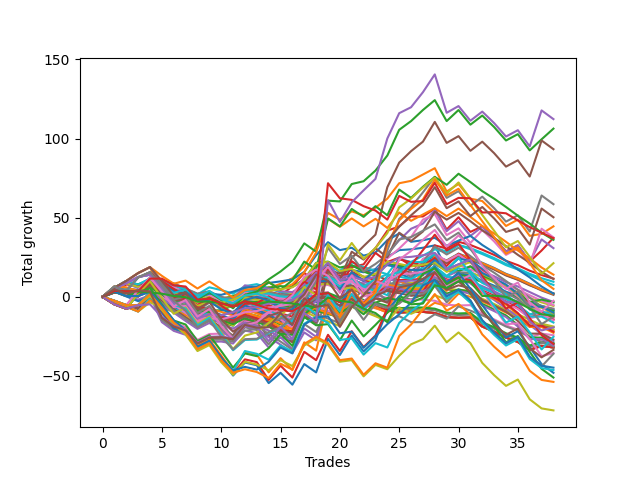

# Long Wallace 004 
- Symbol: ES
- Date Range: 03/18/2022 - 06/24/2022
- Trading Period: 7:20-12:30
- Number of Trades: 38



| Name | Win Percent | Profit | Avg Profit / Trade |     | Name | Win Percent | Profit | Avg Profit / Trade |
| ---- | ----------- | ------ | ------------------ | --- | ---- | ----------- | ------ | ------------------ |
| Sorted By <br> Profit | | | | | Sorted By <br> Win Percentage ||||
| Seventy-Four | 52.63 | 56125.00 | 1476.97 |     | Two | 68.42 | 53125.00 | 1398.03 |
| Two | 68.42 | 53125.00 | 1398.03 |     | Zero | 68.42 | -4375.00 | -115.13 |
| Five | 52.63 | 46625.00 | 1226.97 |     | Sixty-Four | 68.42 | -9625.00 | -253.29 |
| Seven | 52.63 | 29250.00 | 769.74 |     | Fifty-Six | 68.42 | -17750.00 | -467.11 |
| Seventy-Five | 55.26 | 25125.00 | 661.18 |     | One | 65.79 | 22250.00 | 585.53 |
| One | 65.79 | 22250.00 | 585.53 |     | Three | 65.79 | 18625.00 | 490.13 |
| Six | 57.89 | 18750.00 | 493.42 |     | Fifty-Seven | 63.16 | -6250.00 | -164.47 |
| Three | 65.79 | 18625.00 | 490.13 |     | Forty | 60.53 | 1000.00 | 26.32 |
| Seventy-Three | 36.84 | 18500.00 | 486.84 |     | Six | 57.89 | 18750.00 | 493.42 |
| Forty-Two | 42.11 | 18000.00 | 473.68 |     | Forty-Eight | 57.89 | -5250.00 | -138.16 |
| Four | 52.63 | 15375.00 | 404.61 |     | Sixty-Five | 57.89 | -16750.00 | -440.79 |
| Fifty-Eight | 55.26 | 10625.00 | 279.61 |     | Seventy-Five | 55.26 | 25125.00 | 661.18 |
| Forty-One | 50.00 | 7000.00 | 184.21 |     | Fifty-Eight | 55.26 | 10625.00 | 279.61 |
| Thirteen | 18.42 | 5750.00 | 151.32 |     | Fifty-Nine | 55.26 | -12625.00 | -332.24 |
| Forty-Five | 31.58 | 5625.00 | 148.03 |     | Seventy-Four | 52.63 | 56125.00 | 1476.97 |
| Nine | 34.21 | 4750.00 | 125.00 |     | Five | 52.63 | 46625.00 | 1226.97 |
| Twenty-Nine | 23.68 | 3750.00 | 98.68 |     | Seven | 52.63 | 29250.00 | 769.74 |
| Sixty-One | 42.11 | 2500.00 | 65.79 |     | Four | 52.63 | 15375.00 | 404.61 |
| Fifteen | 18.42 | 1125.00 | 29.61 |     | Sixty-Six | 52.63 | -1250.00 | -32.89 |
| Forty | 60.53 | 1000.00 | 26.32 |     | Sixty-Seven | 52.63 | -18000.00 | -473.68 |
| Thirty | 31.58 | 1000.00 | 26.32 |     | Forty-One | 50.00 | 7000.00 | 184.21 |
| Thirty-One | 23.68 | 875.00 | 23.03 |     | Thirty-Two | 50.00 | -1750.00 | -46.05 |
| Twenty-Five | 36.84 | 625.00 | 16.45 |     | Seventy | 50.00 | -22375.00 | -588.82 |
| Sixty-Six | 52.63 | -1250.00 | -32.89 |     | Twenty-Four | 47.37 | -1625.00 | -42.76 |
| Twenty-Four | 47.37 | -1625.00 | -42.76 |     | Forty-Nine | 47.37 | -8125.00 | -213.82 |
| Thirty-Two | 50.00 | -1750.00 | -46.05 |     | Sixty-Two | 47.37 | -25500.00 | -671.05 |
| Twenty-Six | 26.32 | -2625.00 | -69.08 |     | Forty-Two | 42.11 | 18000.00 | 473.68 |
| Eight | 42.11 | -2875.00 | -75.66 |     | Sixty-One | 42.11 | 2500.00 | 65.79 |
| Thirty-Seven | 36.84 | -3750.00 | -98.68 |     | Eight | 42.11 | -2875.00 | -75.66 |
| Ten | 18.42 | -4000.00 | -105.26 |     | Forty-Three | 42.11 | -7250.00 | -190.79 |
| Zero | 68.42 | -4375.00 | -115.13 |     | Sixty-Three | 42.11 | -14875.00 | -391.45 |
| Twelve | 21.05 | -4500.00 | -118.42 |     | Sixty | 42.11 | -24000.00 | -631.58 |
| Fifty | 39.47 | -5000.00 | -131.58 |     | Fifty | 39.47 | -5000.00 | -131.58 |
| Forty-Eight | 57.89 | -5250.00 | -138.16 |     | Thirty-Three | 39.47 | -6500.00 | -171.05 |
| Forty-Seven | 31.58 | -5375.00 | -141.45 |     | Forty-Six | 39.47 | -7500.00 | -197.37 |
| Thirty-Nine | 36.84 | -5625.00 | -148.03 |     | Sixten | 39.47 | -12125.00 | -319.08 |
| Thirty-Four | 36.84 | -5750.00 | -151.32 |     | Seventeen | 39.47 | -15125.00 | -398.03 |
| Fourteen | 23.68 | -5750.00 | -151.32 |     | Sixty-Nine | 39.47 | -23125.00 | -608.55 |
| Seventy-Two | 28.95 | -6000.00 | -157.89 |     | Seventy-One | 39.47 | -26875.00 | -707.24 |
| Fifty-Seven | 63.16 | -6250.00 | -164.47 |     | Sixty-Eight | 39.47 | -35875.00 | -944.08 |
| Thirty-Three | 39.47 | -6500.00 | -171.05 |     | Seventy-Three | 36.84 | 18500.00 | 486.84 |
| Thirty-Six | 36.84 | -6875.00 | -180.92 |     | Twenty-Five | 36.84 | 625.00 | 16.45 |
| Forty-Three | 42.11 | -7250.00 | -190.79 |     | Thirty-Seven | 36.84 | -3750.00 | -98.68 |
| Forty-Six | 39.47 | -7500.00 | -197.37 |     | Thirty-Nine | 36.84 | -5625.00 | -148.03 |
| Forty-Nine | 47.37 | -8125.00 | -213.82 |     | Thirty-Four | 36.84 | -5750.00 | -151.32 |
| Thirty-Eight | 36.84 | -9375.00 | -246.71 |     | Thirty-Six | 36.84 | -6875.00 | -180.92 |
| Sixty-Four | 68.42 | -9625.00 | -253.29 |     | Thirty-Eight | 36.84 | -9375.00 | -246.71 |
| Thirty-Five | 36.84 | -9625.00 | -253.29 |     | Thirty-Five | 36.84 | -9625.00 | -253.29 |
| Twenty-Eight | 23.68 | -10375.00 | -273.03 |     | Twenty-Two | 36.84 | -14625.00 | -384.87 |
| Eleven | 23.68 | -10625.00 | -279.61 |     | Twenty-Three | 36.84 | -16000.00 | -421.05 |
| Fifty-Three | 34.21 | -11000.00 | -289.47 |     | Twenty-One | 36.84 | -16000.00 | -421.05 |
| Fifty-One | 34.21 | -11375.00 | -299.34 |     | Twenty | 36.84 | -16000.00 | -421.05 |
| Sixten | 39.47 | -12125.00 | -319.08 |     | Nineteen | 36.84 | -16000.00 | -421.05 |
| Fifty-Nine | 55.26 | -12625.00 | -332.24 |     | Eighteen | 36.84 | -16000.00 | -421.05 |
| Fifty-Five | 34.21 | -13500.00 | -355.26 |     | Nine | 34.21 | 4750.00 | 125.00 |
| Forty-Four | 31.58 | -14000.00 | -368.42 |     | Fifty-Three | 34.21 | -11000.00 | -289.47 |
| Twenty-Two | 36.84 | -14625.00 | -384.87 |     | Fifty-One | 34.21 | -11375.00 | -299.34 |
| Fifty-Two | 34.21 | -14750.00 | -388.16 |     | Fifty-Five | 34.21 | -13500.00 | -355.26 |
| Sixty-Three | 42.11 | -14875.00 | -391.45 |     | Fifty-Two | 34.21 | -14750.00 | -388.16 |
| Seventeen | 39.47 | -15125.00 | -398.03 |     | Fifty-Four | 34.21 | -15250.00 | -401.32 |
| Fifty-Four | 34.21 | -15250.00 | -401.32 |     | Forty-Five | 31.58 | 5625.00 | 148.03 |
| twenty-Seven | 26.32 | -15625.00 | -411.18 |     | Thirty | 31.58 | 1000.00 | 26.32 |
| Twenty-Three | 36.84 | -16000.00 | -421.05 |     | Forty-Seven | 31.58 | -5375.00 | -141.45 |
| Twenty-One | 36.84 | -16000.00 | -421.05 |     | Forty-Four | 31.58 | -14000.00 | -368.42 |
| Twenty | 36.84 | -16000.00 | -421.05 |     | Seventy-Two | 28.95 | -6000.00 | -157.89 |
| Nineteen | 36.84 | -16000.00 | -421.05 |     | Twenty-Six | 26.32 | -2625.00 | -69.08 |
| Eighteen | 36.84 | -16000.00 | -421.05 |     | twenty-Seven | 26.32 | -15625.00 | -411.18 |
| Sixty-Five | 57.89 | -16750.00 | -440.79 |     | Twenty-Nine | 23.68 | 3750.00 | 98.68 |
| Fifty-Six | 68.42 | -17750.00 | -467.11 |     | Thirty-One | 23.68 | 875.00 | 23.03 |
| Sixty-Seven | 52.63 | -18000.00 | -473.68 |     | Fourteen | 23.68 | -5750.00 | -151.32 |
| Seventy | 50.00 | -22375.00 | -588.82 |     | Twenty-Eight | 23.68 | -10375.00 | -273.03 |
| Sixty-Nine | 39.47 | -23125.00 | -608.55 |     | Eleven | 23.68 | -10625.00 | -279.61 |
| Sixty | 42.11 | -24000.00 | -631.58 |     | Twelve | 21.05 | -4500.00 | -118.42 |
| Sixty-Two | 47.37 | -25500.00 | -671.05 |     | Thirteen | 18.42 | 5750.00 | 151.32 |
| Seventy-One | 39.47 | -26875.00 | -707.24 |     | Fifteen | 18.42 | 1125.00 | 29.61 |
| Sixty-Eight | 39.47 | -35875.00 | -944.08 |     | Ten | 18.42 | -4000.00 | -105.26 |

## NO STOPLOSS

### Test Zero
* Sell when price hits the middle line of the 20p bollinger
* No Stoploss
* Results:
```
Total Trades: 38
Percent Up: 68.42
Percent Down: 31.58
Total Points Moved Up: -8.75
Potential Profit: -4375.00
Total Points Ups: 78.00 Count Ups: 26
Total Points Downs: -86.75 Count Downs: 12
```

<details><summary>Trades</summary>

<code>In: 2022-03-23 09:15:00		Out: 2022-03-23 09:19:25		Total Position Time: 04:25		Total Move Up: 5.25		Total to Date: 5.25</code> <br />
<code>In: 2022-03-23 09:48:00		Out: 2022-03-23 09:53:00		Total Position Time: 05:00		Total Move Up: 3.25		Total to Date: 8.50</code> <br />
<code>In: 2022-03-25 08:30:00		Out: 2022-03-25 08:36:40		Total Position Time: 06:40		Total Move Up: 4.00		Total to Date: 12.50</code> <br />
<code>In: 2022-03-28 07:40:00		Out: 2022-03-28 07:43:00		Total Position Time: 03:00		Total Move Up: 1.50		Total to Date: 14.00</code> <br />
<code>In: 2022-03-28 08:28:00		Out: 2022-03-28 08:57:55		Total Position Time: 29:55		Total Move Up: -16.50		Total to Date: -2.50</code> <br />
<code>In: 2022-03-28 08:39:00		Out: 2022-03-28 09:01:50		Total Position Time: 22:50		Total Move Up: -5.75		Total to Date: -8.25</code> <br />
<code>In: 2022-03-28 08:52:00		Out: 2022-03-28 09:01:50		Total Position Time: 09:50		Total Move Up: 0.75		Total to Date: -7.50</code> <br />
<code>In: 2022-03-30 08:03:00		Out: 2022-03-30 08:19:15		Total Position Time: 16:15		Total Move Up: -6.00		Total to Date: -13.50</code> <br />
<code>In: 2022-03-30 08:14:00		Out: 2022-03-30 08:19:15		Total Position Time: 05:15		Total Move Up: 2.75		Total to Date: -10.75</code> <br />
<code>In: 2022-03-30 12:07:00		Out: 2022-03-30 12:15:20		Total Position Time: 08:20		Total Move Up: -0.75		Total to Date: -11.50</code> <br />
<code>In: 2022-03-30 12:14:00		Out: 2022-03-30 12:15:20		Total Position Time: 01:20		Total Move Up: 2.00		Total to Date: -9.50</code> <br />
<code>In: 2022-03-30 12:27:00		Out: 2022-03-30 12:28:15		Total Position Time: 01:15		Total Move Up: 2.50		Total to Date: -7.00</code> <br />
<code>In: 2022-03-31 11:21:00		Out: 2022-03-31 11:22:10		Total Position Time: 01:10		Total Move Up: 0.75		Total to Date: -6.25</code> <br />
<code>In: 2022-04-07 07:25:00		Out: 2022-04-07 07:25:15		Total Position Time: 00:15		Total Move Up: 2.25		Total to Date: -4.00</code> <br />
<code>In: 2022-04-12 07:53:00		Out: 2022-04-12 07:57:25		Total Position Time: 04:25		Total Move Up: 1.00		Total to Date: -3.00</code> <br />
<code>In: 2022-04-12 11:35:00		Out: 2022-04-12 11:35:45		Total Position Time: 00:45		Total Move Up: 1.25		Total to Date: -1.75</code> <br />
<code>In: 2022-04-20 11:58:00		Out: 2022-04-20 12:01:15		Total Position Time: 03:15		Total Move Up: 4.75		Total to Date: 3.00</code> <br />
<code>In: 2022-05-02 10:06:00		Out: 2022-05-02 10:08:15		Total Position Time: 02:15		Total Move Up: 10.50		Total to Date: 13.50</code> <br />
<code>In: 2022-05-04 11:36:00		Out: 2022-05-04 11:36:40		Total Position Time: 00:40		Total Move Up: 8.25		Total to Date: 21.75</code> <br />
<code>In: 2022-05-09 07:27:00		Out: 2022-05-09 07:42:30		Total Position Time: 15:30		Total Move Up: -6.25		Total to Date: 15.50</code> <br />
<code>In: 2022-05-11 11:01:00		Out: 2022-05-11 11:01:10		Total Position Time: 00:10		Total Move Up: 1.50		Total to Date: 17.00</code> <br />
<code>In: 2022-05-12 11:35:00		Out: 2022-05-12 11:45:15		Total Position Time: 10:15		Total Move Up: -1.50		Total to Date: 15.50</code> <br />
<code>In: 2022-05-17 07:48:00		Out: 2022-05-17 07:55:10		Total Position Time: 07:10		Total Move Up: 2.00		Total to Date: 17.50</code> <br />
<code>In: 2022-05-17 11:25:00		Out: 2022-05-17 11:27:25		Total Position Time: 02:25		Total Move Up: 7.75		Total to Date: 25.25</code> <br />
<code>In: 2022-05-19 10:52:00		Out: 2022-05-19 10:52:45		Total Position Time: 00:45		Total Move Up: 4.25		Total to Date: 29.50</code> <br />
<code>In: 2022-05-25 09:30:00		Out: 2022-05-25 09:38:50		Total Position Time: 08:50		Total Move Up: 0.50		Total to Date: 30.00</code> <br />
<code>In: 2022-05-25 10:15:00		Out: 2022-05-25 10:15:20		Total Position Time: 00:20		Total Move Up: 1.00		Total to Date: 31.00</code> <br />
<code>In: 2022-06-08 08:06:00		Out: 2022-06-08 08:10:40		Total Position Time: 04:40		Total Move Up: 1.50		Total to Date: 32.50</code> <br />
<code>In: 2022-06-08 09:30:00		Out: 2022-06-08 09:53:00		Total Position Time: 23:00		Total Move Up: -15.25		Total to Date: 17.25</code> <br />
<code>In: 2022-06-09 08:10:00		Out: 2022-06-09 08:11:10		Total Position Time: 01:10		Total Move Up: 3.25		Total to Date: 20.50</code> <br />
<code>In: 2022-06-09 11:27:00		Out: 2022-06-09 11:28:10		Total Position Time: 01:10		Total Move Up: 3.00		Total to Date: 23.50</code> <br />
<code>In: 2022-06-14 07:32:00		Out: 2022-06-14 07:46:50		Total Position Time: 14:50		Total Move Up: -6.00		Total to Date: 17.50</code> <br />
<code>In: 2022-06-15 07:57:00		Out: 2022-06-15 08:26:55		Total Position Time: 29:55		Total Move Up: -7.25		Total to Date: 10.25</code> <br />
<code>In: 2022-06-15 07:58:00		Out: 2022-06-15 08:27:55		Total Position Time: 29:55		Total Move Up: -8.50		Total to Date: 1.75</code> <br />
<code>In: 2022-06-15 08:16:00		Out: 2022-06-15 08:34:30		Total Position Time: 18:30		Total Move Up: 0.50		Total to Date: 2.25</code> <br />
<code>In: 2022-06-16 11:02:00		Out: 2022-06-16 11:31:55		Total Position Time: 29:55		Total Move Up: -10.25		Total to Date: -8.00</code> <br />
<code>In: 2022-06-17 07:38:00		Out: 2022-06-17 07:55:05		Total Position Time: 17:05		Total Move Up: -2.75		Total to Date: -10.75</code> <br />
<code>In: 2022-06-23 09:07:00		Out: 2022-06-23 09:14:30		Total Position Time: 07:30		Total Move Up: 2.00		Total to Date: -8.75</code> <br />


</details>

### Test One
* Sell when the price hits the upper line of the 20p 1std bollinger
* No Stoploss
* Results:
```
Total Trades: 38
Percent Up: 65.79
Percent Down: 34.21
Total Points Moved Up: 44.50
Potential Profit: 22250.00
Total Points Ups: 132.25 Count Ups: 25
Total Points Downs: -87.75 Count Downs: 13
```

<details><summary>Trades</summary>

<code>In: 2022-03-23 09:15:00		Out: 2022-03-23 09:30:25		Total Position Time: 15:25		Total Move Up: 5.75		Total to Date: 5.75</code> <br />
<code>In: 2022-03-23 09:48:00		Out: 2022-03-23 09:59:10		Total Position Time: 11:10		Total Move Up: 4.25		Total to Date: 10.00</code> <br />
<code>In: 2022-03-25 08:30:00		Out: 2022-03-25 08:40:40		Total Position Time: 10:40		Total Move Up: 5.00		Total to Date: 15.00</code> <br />
<code>In: 2022-03-28 07:40:00		Out: 2022-03-28 07:45:10		Total Position Time: 05:10		Total Move Up: 3.75		Total to Date: 18.75</code> <br />
<code>In: 2022-03-28 08:28:00		Out: 2022-03-28 08:57:55		Total Position Time: 29:55		Total Move Up: -16.50		Total to Date: 2.25</code> <br />
<code>In: 2022-03-28 08:39:00		Out: 2022-03-28 09:04:05		Total Position Time: 25:05		Total Move Up: -4.50		Total to Date: -2.25</code> <br />
<code>In: 2022-03-28 08:52:00		Out: 2022-03-28 09:04:05		Total Position Time: 12:05		Total Move Up: 2.00		Total to Date: -0.25</code> <br />
<code>In: 2022-03-30 08:03:00		Out: 2022-03-30 08:23:50		Total Position Time: 20:50		Total Move Up: -4.25		Total to Date: -4.50</code> <br />
<code>In: 2022-03-30 08:14:00		Out: 2022-03-30 08:23:50		Total Position Time: 09:50		Total Move Up: 4.50		Total to Date: 0.00</code> <br />
<code>In: 2022-03-30 12:07:00		Out: 2022-03-30 12:32:20		Total Position Time: 25:20		Total Move Up: -3.50		Total to Date: -3.50</code> <br />
<code>In: 2022-03-30 12:14:00		Out: 2022-03-30 12:32:20		Total Position Time: 18:20		Total Move Up: -0.75		Total to Date: -4.25</code> <br />
<code>In: 2022-03-30 12:27:00		Out: 2022-03-30 12:32:20		Total Position Time: 05:20		Total Move Up: 4.75		Total to Date: 0.50</code> <br />
<code>In: 2022-03-31 11:21:00		Out: 2022-03-31 11:25:30		Total Position Time: 04:30		Total Move Up: 1.25		Total to Date: 1.75</code> <br />
<code>In: 2022-04-07 07:25:00		Out: 2022-04-07 07:31:35		Total Position Time: 06:35		Total Move Up: 3.75		Total to Date: 5.50</code> <br />
<code>In: 2022-04-12 07:53:00		Out: 2022-04-12 08:02:35		Total Position Time: 09:35		Total Move Up: 2.75		Total to Date: 8.25</code> <br />
<code>In: 2022-04-12 11:35:00		Out: 2022-04-12 11:37:20		Total Position Time: 02:20		Total Move Up: 3.50		Total to Date: 11.75</code> <br />
<code>In: 2022-04-20 11:58:00		Out: 2022-04-20 12:04:20		Total Position Time: 06:20		Total Move Up: 7.50		Total to Date: 19.25</code> <br />
<code>In: 2022-05-02 10:06:00		Out: 2022-05-02 10:10:50		Total Position Time: 04:50		Total Move Up: 12.50		Total to Date: 31.75</code> <br />
<code>In: 2022-05-04 11:36:00		Out: 2022-05-04 11:42:00		Total Position Time: 06:00		Total Move Up: 21.25		Total to Date: 53.00</code> <br />
<code>In: 2022-05-09 07:27:00		Out: 2022-05-09 07:45:35		Total Position Time: 18:35		Total Move Up: -4.25		Total to Date: 48.75</code> <br />
<code>In: 2022-05-11 11:01:00		Out: 2022-05-11 11:01:20		Total Position Time: 00:20		Total Move Up: 5.25		Total to Date: 54.00</code> <br />
<code>In: 2022-05-12 11:35:00		Out: 2022-05-12 11:51:45		Total Position Time: 16:45		Total Move Up: -2.50		Total to Date: 51.50</code> <br />
<code>In: 2022-05-17 07:48:00		Out: 2022-05-17 07:56:10		Total Position Time: 08:10		Total Move Up: 4.75		Total to Date: 56.25</code> <br />
<code>In: 2022-05-17 11:25:00		Out: 2022-05-17 11:37:35		Total Position Time: 12:35		Total Move Up: 5.75		Total to Date: 62.00</code> <br />
<code>In: 2022-05-19 10:52:00		Out: 2022-05-19 10:54:35		Total Position Time: 02:35		Total Move Up: 9.75		Total to Date: 71.75</code> <br />
<code>In: 2022-05-25 09:30:00		Out: 2022-05-25 09:44:25		Total Position Time: 14:25		Total Move Up: 1.50		Total to Date: 73.25</code> <br />
<code>In: 2022-05-25 10:15:00		Out: 2022-05-25 10:15:55		Total Position Time: 00:55		Total Move Up: 4.00		Total to Date: 77.25</code> <br />
<code>In: 2022-06-08 08:06:00		Out: 2022-06-08 08:11:15		Total Position Time: 05:15		Total Move Up: 4.00		Total to Date: 81.25</code> <br />
<code>In: 2022-06-08 09:30:00		Out: 2022-06-08 09:57:10		Total Position Time: 27:10		Total Move Up: -14.75		Total to Date: 66.50</code> <br />
<code>In: 2022-06-09 08:10:00		Out: 2022-06-09 08:21:10		Total Position Time: 11:10		Total Move Up: 4.75		Total to Date: 71.25</code> <br />
<code>In: 2022-06-09 11:27:00		Out: 2022-06-09 11:56:55		Total Position Time: 29:55		Total Move Up: -9.25		Total to Date: 62.00</code> <br />
<code>In: 2022-06-14 07:32:00		Out: 2022-06-14 07:47:10		Total Position Time: 15:10		Total Move Up: -1.50		Total to Date: 60.50</code> <br />
<code>In: 2022-06-15 07:57:00		Out: 2022-06-15 08:26:55		Total Position Time: 29:55		Total Move Up: -7.25		Total to Date: 53.25</code> <br />
<code>In: 2022-06-15 07:58:00		Out: 2022-06-15 08:27:55		Total Position Time: 29:55		Total Move Up: -8.50		Total to Date: 44.75</code> <br />
<code>In: 2022-06-15 08:16:00		Out: 2022-06-15 08:45:55		Total Position Time: 29:55		Total Move Up: 4.00		Total to Date: 48.75</code> <br />
<code>In: 2022-06-16 11:02:00		Out: 2022-06-16 11:31:55		Total Position Time: 29:55		Total Move Up: -10.25		Total to Date: 38.50</code> <br />
<code>In: 2022-06-17 07:38:00		Out: 2022-06-17 07:56:25		Total Position Time: 18:25		Total Move Up: 1.25		Total to Date: 39.75</code> <br />
<code>In: 2022-06-23 09:07:00		Out: 2022-06-23 09:18:25		Total Position Time: 11:25		Total Move Up: 4.75		Total to Date: 44.50</code> <br />


</details>

### Test Two
* Sell when the price hits the upper line of the 20p 2std bollinger
* No Stoploss
* Results:
```
Total Trades: 38
Percent Up: 68.42
Percent Down: 31.58
Total Points Moved Up: 106.25
Potential Profit: 53125.00
Total Points Ups: 195.25 Count Ups: 26
Total Points Downs: -89.00 Count Downs: 12
```

<details><summary>Trades</summary>

<code>In: 2022-03-23 09:15:00		Out: 2022-03-23 09:44:55		Total Position Time: 29:55		Total Move Up: -4.75		Total to Date: -4.75</code> <br />
<code>In: 2022-03-23 09:48:00		Out: 2022-03-23 10:17:55		Total Position Time: 29:55		Total Move Up: -2.75		Total to Date: -7.50</code> <br />
<code>In: 2022-03-25 08:30:00		Out: 2022-03-25 08:41:55		Total Position Time: 11:55		Total Move Up: 9.50		Total to Date: 2.00</code> <br />
<code>In: 2022-03-28 07:40:00		Out: 2022-03-28 07:48:15		Total Position Time: 08:15		Total Move Up: 7.75		Total to Date: 9.75</code> <br />
<code>In: 2022-03-28 08:28:00		Out: 2022-03-28 08:57:55		Total Position Time: 29:55		Total Move Up: -16.50		Total to Date: -6.75</code> <br />
<code>In: 2022-03-28 08:39:00		Out: 2022-03-28 09:07:10		Total Position Time: 28:10		Total Move Up: -2.50		Total to Date: -9.25</code> <br />
<code>In: 2022-03-28 08:52:00		Out: 2022-03-28 09:07:10		Total Position Time: 15:10		Total Move Up: 4.00		Total to Date: -5.25</code> <br />
<code>In: 2022-03-30 08:03:00		Out: 2022-03-30 08:32:55		Total Position Time: 29:55		Total Move Up: -8.25		Total to Date: -13.50</code> <br />
<code>In: 2022-03-30 08:14:00		Out: 2022-03-30 08:35:15		Total Position Time: 21:15		Total Move Up: 4.75		Total to Date: -8.75</code> <br />
<code>In: 2022-03-30 12:07:00		Out: 2022-03-30 12:36:55		Total Position Time: 29:55		Total Move Up: 0.25		Total to Date: -8.50</code> <br />
<code>In: 2022-03-30 12:14:00		Out: 2022-03-30 12:36:55		Total Position Time: 22:55		Total Move Up: 3.00		Total to Date: -5.50</code> <br />
<code>In: 2022-03-30 12:27:00		Out: 2022-03-30 12:36:55		Total Position Time: 09:55		Total Move Up: 8.50		Total to Date: 3.00</code> <br />
<code>In: 2022-03-31 11:21:00		Out: 2022-03-31 11:29:25		Total Position Time: 08:25		Total Move Up: 2.00		Total to Date: 5.00</code> <br />
<code>In: 2022-04-07 07:25:00		Out: 2022-04-07 07:36:15		Total Position Time: 11:15		Total Move Up: 6.00		Total to Date: 11.00</code> <br />
<code>In: 2022-04-12 07:53:00		Out: 2022-04-12 08:18:55		Total Position Time: 25:55		Total Move Up: 5.00		Total to Date: 16.00</code> <br />
<code>In: 2022-04-12 11:35:00		Out: 2022-04-12 11:47:05		Total Position Time: 12:05		Total Move Up: 6.00		Total to Date: 22.00</code> <br />
<code>In: 2022-04-20 11:58:00		Out: 2022-04-20 12:12:55		Total Position Time: 14:55		Total Move Up: 11.75		Total to Date: 33.75</code> <br />
<code>In: 2022-05-02 10:06:00		Out: 2022-05-02 10:35:55		Total Position Time: 29:55		Total Move Up: -5.25		Total to Date: 28.50</code> <br />
<code>In: 2022-05-04 11:36:00		Out: 2022-05-04 11:43:55		Total Position Time: 07:55		Total Move Up: 32.25		Total to Date: 60.75</code> <br />
<code>In: 2022-05-09 07:27:00		Out: 2022-05-09 07:49:10		Total Position Time: 22:10		Total Move Up: -0.50		Total to Date: 60.25</code> <br />
<code>In: 2022-05-11 11:01:00		Out: 2022-05-11 11:05:00		Total Position Time: 04:00		Total Move Up: 11.00		Total to Date: 71.25</code> <br />
<code>In: 2022-05-12 11:35:00		Out: 2022-05-12 11:53:25		Total Position Time: 18:25		Total Move Up: 1.75		Total to Date: 73.00</code> <br />
<code>In: 2022-05-17 07:48:00		Out: 2022-05-17 08:00:10		Total Position Time: 12:10		Total Move Up: 6.75		Total to Date: 79.75</code> <br />
<code>In: 2022-05-17 11:25:00		Out: 2022-05-17 11:40:00		Total Position Time: 15:00		Total Move Up: 9.50		Total to Date: 89.25</code> <br />
<code>In: 2022-05-19 10:52:00		Out: 2022-05-19 10:55:20		Total Position Time: 03:20		Total Move Up: 16.25		Total to Date: 105.50</code> <br />
<code>In: 2022-05-25 09:30:00		Out: 2022-05-25 09:48:50		Total Position Time: 18:50		Total Move Up: 5.50		Total to Date: 111.00</code> <br />
<code>In: 2022-05-25 10:15:00		Out: 2022-05-25 10:29:45		Total Position Time: 14:45		Total Move Up: 7.00		Total to Date: 118.00</code> <br />
<code>In: 2022-06-08 08:06:00		Out: 2022-06-08 08:14:00		Total Position Time: 08:00		Total Move Up: 6.25		Total to Date: 124.25</code> <br />
<code>In: 2022-06-08 09:30:00		Out: 2022-06-08 09:59:55		Total Position Time: 29:55		Total Move Up: -13.25		Total to Date: 111.00</code> <br />
<code>In: 2022-06-09 08:10:00		Out: 2022-06-09 08:22:35		Total Position Time: 12:35		Total Move Up: 7.00		Total to Date: 118.00</code> <br />
<code>In: 2022-06-09 11:27:00		Out: 2022-06-09 11:56:55		Total Position Time: 29:55		Total Move Up: -9.25		Total to Date: 108.75</code> <br />
<code>In: 2022-06-14 07:32:00		Out: 2022-06-14 08:01:55		Total Position Time: 29:55		Total Move Up: 5.75		Total to Date: 114.50</code> <br />
<code>In: 2022-06-15 07:57:00		Out: 2022-06-15 08:26:55		Total Position Time: 29:55		Total Move Up: -7.25		Total to Date: 107.25</code> <br />
<code>In: 2022-06-15 07:58:00		Out: 2022-06-15 08:27:55		Total Position Time: 29:55		Total Move Up: -8.50		Total to Date: 98.75</code> <br />
<code>In: 2022-06-15 08:16:00		Out: 2022-06-15 08:45:55		Total Position Time: 29:55		Total Move Up: 4.00		Total to Date: 102.75</code> <br />
<code>In: 2022-06-16 11:02:00		Out: 2022-06-16 11:31:55		Total Position Time: 29:55		Total Move Up: -10.25		Total to Date: 92.50</code> <br />
<code>In: 2022-06-17 07:38:00		Out: 2022-06-17 08:02:30		Total Position Time: 24:30		Total Move Up: 7.00		Total to Date: 99.50</code> <br />
<code>In: 2022-06-23 09:07:00		Out: 2022-06-23 09:19:00		Total Position Time: 12:00		Total Move Up: 6.75		Total to Date: 106.25</code> <br />


</details>

### Test Three
* Sell when price hits the middle line of the 50p bollinger
* No Stoploss
* Results:
```
Total Trades: 38
Percent Up: 65.79
Percent Down: 34.21
Total Points Moved Up: 37.25
Potential Profit: 18625.00
Total Points Ups: 142.00 Count Ups: 25
Total Points Downs: -104.75 Count Downs: 13
```

<details><summary>Trades</summary>

<code>In: 2022-03-23 09:15:00		Out: 2022-03-23 09:30:30		Total Position Time: 15:30		Total Move Up: 6.50		Total to Date: 6.50</code> <br />
<code>In: 2022-03-23 09:48:00		Out: 2022-03-23 10:17:55		Total Position Time: 29:55		Total Move Up: -2.75		Total to Date: 3.75</code> <br />
<code>In: 2022-03-25 08:30:00		Out: 2022-03-25 08:52:45		Total Position Time: 22:45		Total Move Up: 8.50		Total to Date: 12.25</code> <br />
<code>In: 2022-03-28 07:40:00		Out: 2022-03-28 07:45:05		Total Position Time: 05:05		Total Move Up: 3.25		Total to Date: 15.50</code> <br />
<code>In: 2022-03-28 08:28:00		Out: 2022-03-28 08:57:55		Total Position Time: 29:55		Total Move Up: -16.50		Total to Date: -1.00</code> <br />
<code>In: 2022-03-28 08:39:00		Out: 2022-03-28 09:08:55		Total Position Time: 29:55		Total Move Up: -5.50		Total to Date: -6.50</code> <br />
<code>In: 2022-03-28 08:52:00		Out: 2022-03-28 09:21:55		Total Position Time: 29:55		Total Move Up: -2.50		Total to Date: -9.00</code> <br />
<code>In: 2022-03-30 08:03:00		Out: 2022-03-30 08:32:55		Total Position Time: 29:55		Total Move Up: -8.25		Total to Date: -17.25</code> <br />
<code>In: 2022-03-30 08:14:00		Out: 2022-03-30 08:35:15		Total Position Time: 21:15		Total Move Up: 4.75		Total to Date: -12.50</code> <br />
<code>In: 2022-03-30 12:07:00		Out: 2022-03-30 12:33:25		Total Position Time: 26:25		Total Move Up: -1.75		Total to Date: -14.25</code> <br />
<code>In: 2022-03-30 12:14:00		Out: 2022-03-30 12:33:25		Total Position Time: 19:25		Total Move Up: 1.00		Total to Date: -13.25</code> <br />
<code>In: 2022-03-30 12:27:00		Out: 2022-03-30 12:33:25		Total Position Time: 06:25		Total Move Up: 6.50		Total to Date: -6.75</code> <br />
<code>In: 2022-03-31 11:21:00		Out: 2022-03-31 11:48:35		Total Position Time: 27:35		Total Move Up: 0.25		Total to Date: -6.50</code> <br />
<code>In: 2022-04-07 07:25:00		Out: 2022-04-07 07:35:20		Total Position Time: 10:20		Total Move Up: 4.25		Total to Date: -2.25</code> <br />
<code>In: 2022-04-12 07:53:00		Out: 2022-04-12 08:15:40		Total Position Time: 22:40		Total Move Up: 3.00		Total to Date: 0.75</code> <br />
<code>In: 2022-04-12 11:35:00		Out: 2022-04-12 11:47:05		Total Position Time: 12:05		Total Move Up: 6.00		Total to Date: 6.75</code> <br />
<code>In: 2022-04-20 11:58:00		Out: 2022-04-20 12:10:10		Total Position Time: 12:10		Total Move Up: 8.25		Total to Date: 15.00</code> <br />
<code>In: 2022-05-02 10:06:00		Out: 2022-05-02 10:35:55		Total Position Time: 29:55		Total Move Up: -5.25		Total to Date: 9.75</code> <br />
<code>In: 2022-05-04 11:36:00		Out: 2022-05-04 11:41:15		Total Position Time: 05:15		Total Move Up: 11.75		Total to Date: 21.50</code> <br />
<code>In: 2022-05-09 07:27:00		Out: 2022-05-09 07:56:55		Total Position Time: 29:55		Total Move Up: -13.75		Total to Date: 7.75</code> <br />
<code>In: 2022-05-11 11:01:00		Out: 2022-05-11 11:05:00		Total Position Time: 04:00		Total Move Up: 11.00		Total to Date: 18.75</code> <br />
<code>In: 2022-05-12 11:35:00		Out: 2022-05-12 11:53:25		Total Position Time: 18:25		Total Move Up: 1.75		Total to Date: 20.50</code> <br />
<code>In: 2022-05-17 07:48:00		Out: 2022-05-17 08:04:10		Total Position Time: 16:10		Total Move Up: 10.25		Total to Date: 30.75</code> <br />
<code>In: 2022-05-17 11:25:00		Out: 2022-05-17 11:40:05		Total Position Time: 15:05		Total Move Up: 11.00		Total to Date: 41.75</code> <br />
<code>In: 2022-05-19 10:52:00		Out: 2022-05-19 10:52:40		Total Position Time: 00:40		Total Move Up: 2.75		Total to Date: 44.50</code> <br />
<code>In: 2022-05-25 09:30:00		Out: 2022-05-25 09:49:05		Total Position Time: 19:05		Total Move Up: 6.25		Total to Date: 50.75</code> <br />
<code>In: 2022-05-25 10:15:00		Out: 2022-05-25 10:15:10		Total Position Time: 00:10		Total Move Up: 0.00		Total to Date: 50.75</code> <br />
<code>In: 2022-06-08 08:06:00		Out: 2022-06-08 08:11:20		Total Position Time: 05:20		Total Move Up: 5.00		Total to Date: 55.75</code> <br />
<code>In: 2022-06-08 09:30:00		Out: 2022-06-08 09:59:55		Total Position Time: 29:55		Total Move Up: -13.25		Total to Date: 42.50</code> <br />
<code>In: 2022-06-09 08:10:00		Out: 2022-06-09 08:22:45		Total Position Time: 12:45		Total Move Up: 7.75		Total to Date: 50.25</code> <br />
<code>In: 2022-06-09 11:27:00		Out: 2022-06-09 11:56:55		Total Position Time: 29:55		Total Move Up: -9.25		Total to Date: 41.00</code> <br />
<code>In: 2022-06-14 07:32:00		Out: 2022-06-14 07:49:55		Total Position Time: 17:55		Total Move Up: 3.50		Total to Date: 44.50</code> <br />
<code>In: 2022-06-15 07:57:00		Out: 2022-06-15 08:26:55		Total Position Time: 29:55		Total Move Up: -7.25		Total to Date: 37.25</code> <br />
<code>In: 2022-06-15 07:58:00		Out: 2022-06-15 08:27:55		Total Position Time: 29:55		Total Move Up: -8.50		Total to Date: 28.75</code> <br />
<code>In: 2022-06-15 08:16:00		Out: 2022-06-15 08:38:55		Total Position Time: 22:55		Total Move Up: 3.75		Total to Date: 32.50</code> <br />
<code>In: 2022-06-16 11:02:00		Out: 2022-06-16 11:31:55		Total Position Time: 29:55		Total Move Up: -10.25		Total to Date: 22.25</code> <br />
<code>In: 2022-06-17 07:38:00		Out: 2022-06-17 08:02:30		Total Position Time: 24:30		Total Move Up: 7.00		Total to Date: 29.25</code> <br />
<code>In: 2022-06-23 09:07:00		Out: 2022-06-23 09:21:10		Total Position Time: 14:10		Total Move Up: 8.00		Total to Date: 37.25</code> <br />


</details>

### Test Four
* Sell when the price hits the upper line of the 50p 1std bollinger
* No Stoploss
* Results:
```
Total Trades: 38
Percent Up: 52.63
Percent Down: 47.37
Total Points Moved Up: 30.75
Potential Profit: 15375.00
Total Points Ups: 163.50 Count Ups: 20
Total Points Downs: -132.75 Count Downs: 18
```

<details><summary>Trades</summary>

<code>In: 2022-03-23 09:15:00		Out: 2022-03-23 09:44:55		Total Position Time: 29:55		Total Move Up: -4.75		Total to Date: -4.75</code> <br />
<code>In: 2022-03-23 09:48:00		Out: 2022-03-23 10:17:55		Total Position Time: 29:55		Total Move Up: -2.75		Total to Date: -7.50</code> <br />
<code>In: 2022-03-25 08:30:00		Out: 2022-03-25 08:59:55		Total Position Time: 29:55		Total Move Up: 2.25		Total to Date: -5.25</code> <br />
<code>In: 2022-03-28 07:40:00		Out: 2022-03-28 07:47:50		Total Position Time: 07:50		Total Move Up: 5.75		Total to Date: 0.50</code> <br />
<code>In: 2022-03-28 08:28:00		Out: 2022-03-28 08:57:55		Total Position Time: 29:55		Total Move Up: -16.50		Total to Date: -16.00</code> <br />
<code>In: 2022-03-28 08:39:00		Out: 2022-03-28 09:08:55		Total Position Time: 29:55		Total Move Up: -5.50		Total to Date: -21.50</code> <br />
<code>In: 2022-03-28 08:52:00		Out: 2022-03-28 09:21:55		Total Position Time: 29:55		Total Move Up: -2.50		Total to Date: -24.00</code> <br />
<code>In: 2022-03-30 08:03:00		Out: 2022-03-30 08:32:55		Total Position Time: 29:55		Total Move Up: -8.25		Total to Date: -32.25</code> <br />
<code>In: 2022-03-30 08:14:00		Out: 2022-03-30 08:43:55		Total Position Time: 29:55		Total Move Up: 3.75		Total to Date: -28.50</code> <br />
<code>In: 2022-03-30 12:07:00		Out: 2022-03-30 12:36:55		Total Position Time: 29:55		Total Move Up: 0.25		Total to Date: -28.25</code> <br />
<code>In: 2022-03-30 12:14:00		Out: 2022-03-30 12:43:55		Total Position Time: 29:55		Total Move Up: -1.25		Total to Date: -29.50</code> <br />
<code>In: 2022-03-30 12:27:00		Out: 2022-03-30 12:45:25		Total Position Time: 18:25		Total Move Up: 8.25		Total to Date: -21.25</code> <br />
<code>In: 2022-03-31 11:21:00		Out: 2022-03-31 11:50:55		Total Position Time: 29:55		Total Move Up: -1.75		Total to Date: -23.00</code> <br />
<code>In: 2022-04-07 07:25:00		Out: 2022-04-07 07:54:55		Total Position Time: 29:55		Total Move Up: -9.00		Total to Date: -32.00</code> <br />
<code>In: 2022-04-12 07:53:00		Out: 2022-04-12 08:19:50		Total Position Time: 26:50		Total Move Up: 6.50		Total to Date: -25.50</code> <br />
<code>In: 2022-04-12 11:35:00		Out: 2022-04-12 12:04:55		Total Position Time: 29:55		Total Move Up: -7.50		Total to Date: -33.00</code> <br />
<code>In: 2022-04-20 11:58:00		Out: 2022-04-20 12:13:35		Total Position Time: 15:35		Total Move Up: 13.00		Total to Date: -20.00</code> <br />
<code>In: 2022-05-02 10:06:00		Out: 2022-05-02 10:35:55		Total Position Time: 29:55		Total Move Up: -5.25		Total to Date: -25.25</code> <br />
<code>In: 2022-05-04 11:36:00		Out: 2022-05-04 11:42:00		Total Position Time: 06:00		Total Move Up: 21.25		Total to Date: -4.00</code> <br />
<code>In: 2022-05-09 07:27:00		Out: 2022-05-09 07:56:55		Total Position Time: 29:55		Total Move Up: -13.75		Total to Date: -17.75</code> <br />
<code>In: 2022-05-11 11:01:00		Out: 2022-05-11 11:18:15		Total Position Time: 17:15		Total Move Up: 12.25		Total to Date: -5.50</code> <br />
<code>In: 2022-05-12 11:35:00		Out: 2022-05-12 12:04:10		Total Position Time: 29:10		Total Move Up: 6.75		Total to Date: 1.25</code> <br />
<code>In: 2022-05-17 07:48:00		Out: 2022-05-17 08:17:55		Total Position Time: 29:55		Total Move Up: 7.25		Total to Date: 8.50</code> <br />
<code>In: 2022-05-17 11:25:00		Out: 2022-05-17 11:45:45		Total Position Time: 20:45		Total Move Up: 18.75		Total to Date: 27.25</code> <br />
<code>In: 2022-05-19 10:52:00		Out: 2022-05-19 10:54:25		Total Position Time: 02:25		Total Move Up: 8.50		Total to Date: 35.75</code> <br />
<code>In: 2022-05-25 09:30:00		Out: 2022-05-25 09:59:55		Total Position Time: 29:55		Total Move Up: 7.25		Total to Date: 43.00</code> <br />
<code>In: 2022-05-25 10:15:00		Out: 2022-05-25 10:15:30		Total Position Time: 00:30		Total Move Up: 3.25		Total to Date: 46.25</code> <br />
<code>In: 2022-06-08 08:06:00		Out: 2022-06-08 08:15:05		Total Position Time: 09:05		Total Move Up: 8.50		Total to Date: 54.75</code> <br />
<code>In: 2022-06-08 09:30:00		Out: 2022-06-08 09:59:55		Total Position Time: 29:55		Total Move Up: -13.25		Total to Date: 41.50</code> <br />
<code>In: 2022-06-09 08:10:00		Out: 2022-06-09 08:39:45		Total Position Time: 29:45		Total Move Up: 6.25		Total to Date: 47.75</code> <br />
<code>In: 2022-06-09 11:27:00		Out: 2022-06-09 11:56:55		Total Position Time: 29:55		Total Move Up: -9.25		Total to Date: 38.50</code> <br />
<code>In: 2022-06-14 07:32:00		Out: 2022-06-14 08:01:55		Total Position Time: 29:55		Total Move Up: 5.75		Total to Date: 44.25</code> <br />
<code>In: 2022-06-15 07:57:00		Out: 2022-06-15 08:26:55		Total Position Time: 29:55		Total Move Up: -7.25		Total to Date: 37.00</code> <br />
<code>In: 2022-06-15 07:58:00		Out: 2022-06-15 08:27:55		Total Position Time: 29:55		Total Move Up: -8.50		Total to Date: 28.50</code> <br />
<code>In: 2022-06-15 08:16:00		Out: 2022-06-15 08:45:55		Total Position Time: 29:55		Total Move Up: 4.00		Total to Date: 32.50</code> <br />
<code>In: 2022-06-16 11:02:00		Out: 2022-06-16 11:31:55		Total Position Time: 29:55		Total Move Up: -10.25		Total to Date: 22.25</code> <br />
<code>In: 2022-06-17 07:38:00		Out: 2022-06-17 08:04:10		Total Position Time: 26:10		Total Move Up: 14.00		Total to Date: 36.25</code> <br />
<code>In: 2022-06-23 09:07:00		Out: 2022-06-23 09:36:55		Total Position Time: 29:55		Total Move Up: -5.50		Total to Date: 30.75</code> <br />


</details>

### Test Five
* Sell when the price hits the upper line of the 50p 2std bollinger
* No Stoploss
* Results:
```
Total Trades: 38
Percent Up: 52.63
Percent Down: 47.37
Total Points Moved Up: 93.25
Potential Profit: 46625.00
Total Points Ups: 226.00 Count Ups: 20
Total Points Downs: -132.75 Count Downs: 18
```

<details><summary>Trades</summary>

<code>In: 2022-03-23 09:15:00		Out: 2022-03-23 09:44:55		Total Position Time: 29:55		Total Move Up: -4.75		Total to Date: -4.75</code> <br />
<code>In: 2022-03-23 09:48:00		Out: 2022-03-23 10:17:55		Total Position Time: 29:55		Total Move Up: -2.75		Total to Date: -7.50</code> <br />
<code>In: 2022-03-25 08:30:00		Out: 2022-03-25 08:59:55		Total Position Time: 29:55		Total Move Up: 2.25		Total to Date: -5.25</code> <br />
<code>In: 2022-03-28 07:40:00		Out: 2022-03-28 07:49:15		Total Position Time: 09:15		Total Move Up: 8.00		Total to Date: 2.75</code> <br />
<code>In: 2022-03-28 08:28:00		Out: 2022-03-28 08:57:55		Total Position Time: 29:55		Total Move Up: -16.50		Total to Date: -13.75</code> <br />
<code>In: 2022-03-28 08:39:00		Out: 2022-03-28 09:08:55		Total Position Time: 29:55		Total Move Up: -5.50		Total to Date: -19.25</code> <br />
<code>In: 2022-03-28 08:52:00		Out: 2022-03-28 09:21:55		Total Position Time: 29:55		Total Move Up: -2.50		Total to Date: -21.75</code> <br />
<code>In: 2022-03-30 08:03:00		Out: 2022-03-30 08:32:55		Total Position Time: 29:55		Total Move Up: -8.25		Total to Date: -30.00</code> <br />
<code>In: 2022-03-30 08:14:00		Out: 2022-03-30 08:43:55		Total Position Time: 29:55		Total Move Up: 3.75		Total to Date: -26.25</code> <br />
<code>In: 2022-03-30 12:07:00		Out: 2022-03-30 12:36:55		Total Position Time: 29:55		Total Move Up: 0.25		Total to Date: -26.00</code> <br />
<code>In: 2022-03-30 12:14:00		Out: 2022-03-30 12:43:55		Total Position Time: 29:55		Total Move Up: -1.25		Total to Date: -27.25</code> <br />
<code>In: 2022-03-30 12:27:00		Out: 2022-03-30 12:49:00		Total Position Time: 22:00		Total Move Up: 12.75		Total to Date: -14.50</code> <br />
<code>In: 2022-03-31 11:21:00		Out: 2022-03-31 11:50:55		Total Position Time: 29:55		Total Move Up: -1.75		Total to Date: -16.25</code> <br />
<code>In: 2022-04-07 07:25:00		Out: 2022-04-07 07:54:55		Total Position Time: 29:55		Total Move Up: -9.00		Total to Date: -25.25</code> <br />
<code>In: 2022-04-12 07:53:00		Out: 2022-04-12 08:22:55		Total Position Time: 29:55		Total Move Up: 9.00		Total to Date: -16.25</code> <br />
<code>In: 2022-04-12 11:35:00		Out: 2022-04-12 12:04:55		Total Position Time: 29:55		Total Move Up: -7.50		Total to Date: -23.75</code> <br />
<code>In: 2022-04-20 11:58:00		Out: 2022-04-20 12:25:50		Total Position Time: 27:50		Total Move Up: 17.50		Total to Date: -6.25</code> <br />
<code>In: 2022-05-02 10:06:00		Out: 2022-05-02 10:35:55		Total Position Time: 29:55		Total Move Up: -5.25		Total to Date: -11.50</code> <br />
<code>In: 2022-05-04 11:36:00		Out: 2022-05-04 11:43:55		Total Position Time: 07:55		Total Move Up: 32.25		Total to Date: 20.75</code> <br />
<code>In: 2022-05-09 07:27:00		Out: 2022-05-09 07:56:55		Total Position Time: 29:55		Total Move Up: -13.75		Total to Date: 7.00</code> <br />
<code>In: 2022-05-11 11:01:00		Out: 2022-05-11 11:23:40		Total Position Time: 22:40		Total Move Up: 17.50		Total to Date: 24.50</code> <br />
<code>In: 2022-05-12 11:35:00		Out: 2022-05-12 12:04:55		Total Position Time: 29:55		Total Move Up: 7.50		Total to Date: 32.00</code> <br />
<code>In: 2022-05-17 07:48:00		Out: 2022-05-17 08:17:55		Total Position Time: 29:55		Total Move Up: 7.25		Total to Date: 39.25</code> <br />
<code>In: 2022-05-17 11:25:00		Out: 2022-05-17 11:49:45		Total Position Time: 24:45		Total Move Up: 30.00		Total to Date: 69.25</code> <br />
<code>In: 2022-05-19 10:52:00		Out: 2022-05-19 10:55:15		Total Position Time: 03:15		Total Move Up: 15.50		Total to Date: 84.75</code> <br />
<code>In: 2022-05-25 09:30:00		Out: 2022-05-25 09:59:55		Total Position Time: 29:55		Total Move Up: 7.25		Total to Date: 92.00</code> <br />
<code>In: 2022-05-25 10:15:00		Out: 2022-05-25 10:29:35		Total Position Time: 14:35		Total Move Up: 6.00		Total to Date: 98.00</code> <br />
<code>In: 2022-06-08 08:06:00		Out: 2022-06-08 08:17:50		Total Position Time: 11:50		Total Move Up: 12.50		Total to Date: 110.50</code> <br />
<code>In: 2022-06-08 09:30:00		Out: 2022-06-08 09:59:55		Total Position Time: 29:55		Total Move Up: -13.25		Total to Date: 97.25</code> <br />
<code>In: 2022-06-09 08:10:00		Out: 2022-06-09 08:39:55		Total Position Time: 29:55		Total Move Up: 4.25		Total to Date: 101.50</code> <br />
<code>In: 2022-06-09 11:27:00		Out: 2022-06-09 11:56:55		Total Position Time: 29:55		Total Move Up: -9.25		Total to Date: 92.25</code> <br />
<code>In: 2022-06-14 07:32:00		Out: 2022-06-14 08:01:55		Total Position Time: 29:55		Total Move Up: 5.75		Total to Date: 98.00</code> <br />
<code>In: 2022-06-15 07:57:00		Out: 2022-06-15 08:26:55		Total Position Time: 29:55		Total Move Up: -7.25		Total to Date: 90.75</code> <br />
<code>In: 2022-06-15 07:58:00		Out: 2022-06-15 08:27:55		Total Position Time: 29:55		Total Move Up: -8.50		Total to Date: 82.25</code> <br />
<code>In: 2022-06-15 08:16:00		Out: 2022-06-15 08:45:55		Total Position Time: 29:55		Total Move Up: 4.00		Total to Date: 86.25</code> <br />
<code>In: 2022-06-16 11:02:00		Out: 2022-06-16 11:31:55		Total Position Time: 29:55		Total Move Up: -10.25		Total to Date: 76.00</code> <br />
<code>In: 2022-06-17 07:38:00		Out: 2022-06-17 08:07:55		Total Position Time: 29:55		Total Move Up: 22.75		Total to Date: 98.75</code> <br />
<code>In: 2022-06-23 09:07:00		Out: 2022-06-23 09:36:55		Total Position Time: 29:55		Total Move Up: -5.50		Total to Date: 93.25</code> <br />


</details>

### Test Six
* Sell when the price hits the middle line of the 1std VWAP
* No Stoploss
* Results:
```
Total Trades: 38
Percent Up: 57.89
Percent Down: 42.11
Total Points Moved Up: 37.50
Potential Profit: 18750.00
Total Points Ups: 156.50 Count Ups: 22
Total Points Downs: -119.00 Count Downs: 16
```

<details><summary>Trades</summary>

<code>In: 2022-03-23 09:15:00		Out: 2022-03-23 09:16:05		Total Position Time: 01:05		Total Move Up: 3.25		Total to Date: 3.25</code> <br />
<code>In: 2022-03-23 09:48:00		Out: 2022-03-23 10:17:55		Total Position Time: 29:55		Total Move Up: -2.75		Total to Date: 0.50</code> <br />
<code>In: 2022-03-25 08:30:00		Out: 2022-03-25 08:59:55		Total Position Time: 29:55		Total Move Up: 2.25		Total to Date: 2.75</code> <br />
<code>In: 2022-03-28 07:40:00		Out: 2022-03-28 07:43:15		Total Position Time: 03:15		Total Move Up: 2.75		Total to Date: 5.50</code> <br />
<code>In: 2022-03-28 08:28:00		Out: 2022-03-28 08:57:55		Total Position Time: 29:55		Total Move Up: -16.50		Total to Date: -11.00</code> <br />
<code>In: 2022-03-28 08:39:00		Out: 2022-03-28 09:08:55		Total Position Time: 29:55		Total Move Up: -5.50		Total to Date: -16.50</code> <br />
<code>In: 2022-03-28 08:52:00		Out: 2022-03-28 09:21:55		Total Position Time: 29:55		Total Move Up: -2.50		Total to Date: -19.00</code> <br />
<code>In: 2022-03-30 08:03:00		Out: 2022-03-30 08:32:55		Total Position Time: 29:55		Total Move Up: -8.25		Total to Date: -27.25</code> <br />
<code>In: 2022-03-30 08:14:00		Out: 2022-03-30 08:43:55		Total Position Time: 29:55		Total Move Up: 3.75		Total to Date: -23.50</code> <br />
<code>In: 2022-03-30 12:07:00		Out: 2022-03-30 12:36:55		Total Position Time: 29:55		Total Move Up: 0.25		Total to Date: -23.25</code> <br />
<code>In: 2022-03-30 12:14:00		Out: 2022-03-30 12:43:55		Total Position Time: 29:55		Total Move Up: -1.25		Total to Date: -24.50</code> <br />
<code>In: 2022-03-30 12:27:00		Out: 2022-03-30 12:56:55		Total Position Time: 29:55		Total Move Up: 9.00		Total to Date: -15.50</code> <br />
<code>In: 2022-03-31 11:21:00		Out: 2022-03-31 11:50:55		Total Position Time: 29:55		Total Move Up: -1.75		Total to Date: -17.25</code> <br />
<code>In: 2022-04-07 07:25:00		Out: 2022-04-07 07:35:40		Total Position Time: 10:40		Total Move Up: 5.00		Total to Date: -12.25</code> <br />
<code>In: 2022-04-12 07:53:00		Out: 2022-04-12 08:22:55		Total Position Time: 29:55		Total Move Up: 9.00		Total to Date: -3.25</code> <br />
<code>In: 2022-04-12 11:35:00		Out: 2022-04-12 12:04:55		Total Position Time: 29:55		Total Move Up: -7.50		Total to Date: -10.75</code> <br />
<code>In: 2022-04-20 11:58:00		Out: 2022-04-20 12:26:10		Total Position Time: 28:10		Total Move Up: 18.25		Total to Date: 7.50</code> <br />
<code>In: 2022-05-02 10:06:00		Out: 2022-05-02 10:35:55		Total Position Time: 29:55		Total Move Up: -5.25		Total to Date: 2.25</code> <br />
<code>In: 2022-05-04 11:36:00		Out: 2022-05-04 11:36:10		Total Position Time: 00:10		Total Move Up: 0.75		Total to Date: 3.00</code> <br />
<code>In: 2022-05-09 07:27:00		Out: 2022-05-09 07:56:55		Total Position Time: 29:55		Total Move Up: -13.75		Total to Date: -10.75</code> <br />
<code>In: 2022-05-11 11:01:00		Out: 2022-05-11 11:30:55		Total Position Time: 29:55		Total Move Up: 12.50		Total to Date: 1.75</code> <br />
<code>In: 2022-05-12 11:35:00		Out: 2022-05-12 12:04:55		Total Position Time: 29:55		Total Move Up: 7.50		Total to Date: 9.25</code> <br />
<code>In: 2022-05-17 07:48:00		Out: 2022-05-17 08:17:55		Total Position Time: 29:55		Total Move Up: 7.25		Total to Date: 16.50</code> <br />
<code>In: 2022-05-17 11:25:00		Out: 2022-05-17 11:27:25		Total Position Time: 02:25		Total Move Up: 7.75		Total to Date: 24.25</code> <br />
<code>In: 2022-05-19 10:52:00		Out: 2022-05-19 10:53:25		Total Position Time: 01:25		Total Move Up: 6.25		Total to Date: 30.50</code> <br />
<code>In: 2022-05-25 09:30:00		Out: 2022-05-25 09:59:55		Total Position Time: 29:55		Total Move Up: 7.25		Total to Date: 37.75</code> <br />
<code>In: 2022-05-25 10:15:00		Out: 2022-05-25 10:37:05		Total Position Time: 22:05		Total Move Up: 11.00		Total to Date: 48.75</code> <br />
<code>In: 2022-06-08 08:06:00		Out: 2022-06-08 08:11:05		Total Position Time: 05:05		Total Move Up: 3.50		Total to Date: 52.25</code> <br />
<code>In: 2022-06-08 09:30:00		Out: 2022-06-08 09:59:55		Total Position Time: 29:55		Total Move Up: -13.25		Total to Date: 39.00</code> <br />
<code>In: 2022-06-09 08:10:00		Out: 2022-06-09 08:39:55		Total Position Time: 29:55		Total Move Up: 4.25		Total to Date: 43.25</code> <br />
<code>In: 2022-06-09 11:27:00		Out: 2022-06-09 11:56:55		Total Position Time: 29:55		Total Move Up: -9.25		Total to Date: 34.00</code> <br />
<code>In: 2022-06-14 07:32:00		Out: 2022-06-14 07:51:40		Total Position Time: 19:40		Total Move Up: 8.25		Total to Date: 42.25</code> <br />
<code>In: 2022-06-15 07:57:00		Out: 2022-06-15 08:26:55		Total Position Time: 29:55		Total Move Up: -7.25		Total to Date: 35.00</code> <br />
<code>In: 2022-06-15 07:58:00		Out: 2022-06-15 08:27:55		Total Position Time: 29:55		Total Move Up: -8.50		Total to Date: 26.50</code> <br />
<code>In: 2022-06-15 08:16:00		Out: 2022-06-15 08:45:55		Total Position Time: 29:55		Total Move Up: 4.00		Total to Date: 30.50</code> <br />
<code>In: 2022-06-16 11:02:00		Out: 2022-06-16 11:31:55		Total Position Time: 29:55		Total Move Up: -10.25		Total to Date: 20.25</code> <br />
<code>In: 2022-06-17 07:38:00		Out: 2022-06-17 08:07:55		Total Position Time: 29:55		Total Move Up: 22.75		Total to Date: 43.00</code> <br />
<code>In: 2022-06-23 09:07:00		Out: 2022-06-23 09:36:55		Total Position Time: 29:55		Total Move Up: -5.50		Total to Date: 37.50</code> <br />


</details>

### Test Seven
* Sell when the price hits the upper line of the 1std VWAP
* No Stoploss
* Results:
```
Total Trades: 38
Percent Up: 52.63
Percent Down: 47.37
Total Points Moved Up: 58.50
Potential Profit: 29250.00
Total Points Ups: 191.25 Count Ups: 20
Total Points Downs: -132.75 Count Downs: 18
```

<details><summary>Trades</summary>

<code>In: 2022-03-23 09:15:00		Out: 2022-03-23 09:44:55		Total Position Time: 29:55		Total Move Up: -4.75		Total to Date: -4.75</code> <br />
<code>In: 2022-03-23 09:48:00		Out: 2022-03-23 10:17:55		Total Position Time: 29:55		Total Move Up: -2.75		Total to Date: -7.50</code> <br />
<code>In: 2022-03-25 08:30:00		Out: 2022-03-25 08:59:55		Total Position Time: 29:55		Total Move Up: 2.25		Total to Date: -5.25</code> <br />
<code>In: 2022-03-28 07:40:00		Out: 2022-03-28 07:48:05		Total Position Time: 08:05		Total Move Up: 7.00		Total to Date: 1.75</code> <br />
<code>In: 2022-03-28 08:28:00		Out: 2022-03-28 08:57:55		Total Position Time: 29:55		Total Move Up: -16.50		Total to Date: -14.75</code> <br />
<code>In: 2022-03-28 08:39:00		Out: 2022-03-28 09:08:55		Total Position Time: 29:55		Total Move Up: -5.50		Total to Date: -20.25</code> <br />
<code>In: 2022-03-28 08:52:00		Out: 2022-03-28 09:21:55		Total Position Time: 29:55		Total Move Up: -2.50		Total to Date: -22.75</code> <br />
<code>In: 2022-03-30 08:03:00		Out: 2022-03-30 08:32:55		Total Position Time: 29:55		Total Move Up: -8.25		Total to Date: -31.00</code> <br />
<code>In: 2022-03-30 08:14:00		Out: 2022-03-30 08:43:55		Total Position Time: 29:55		Total Move Up: 3.75		Total to Date: -27.25</code> <br />
<code>In: 2022-03-30 12:07:00		Out: 2022-03-30 12:36:55		Total Position Time: 29:55		Total Move Up: 0.25		Total to Date: -27.00</code> <br />
<code>In: 2022-03-30 12:14:00		Out: 2022-03-30 12:43:55		Total Position Time: 29:55		Total Move Up: -1.25		Total to Date: -28.25</code> <br />
<code>In: 2022-03-30 12:27:00		Out: 2022-03-30 12:56:55		Total Position Time: 29:55		Total Move Up: 9.00		Total to Date: -19.25</code> <br />
<code>In: 2022-03-31 11:21:00		Out: 2022-03-31 11:50:55		Total Position Time: 29:55		Total Move Up: -1.75		Total to Date: -21.00</code> <br />
<code>In: 2022-04-07 07:25:00		Out: 2022-04-07 07:54:55		Total Position Time: 29:55		Total Move Up: -9.00		Total to Date: -30.00</code> <br />
<code>In: 2022-04-12 07:53:00		Out: 2022-04-12 08:22:55		Total Position Time: 29:55		Total Move Up: 9.00		Total to Date: -21.00</code> <br />
<code>In: 2022-04-12 11:35:00		Out: 2022-04-12 12:04:55		Total Position Time: 29:55		Total Move Up: -7.50		Total to Date: -28.50</code> <br />
<code>In: 2022-04-20 11:58:00		Out: 2022-04-20 12:27:55		Total Position Time: 29:55		Total Move Up: 16.25		Total to Date: -12.25</code> <br />
<code>In: 2022-05-02 10:06:00		Out: 2022-05-02 10:35:55		Total Position Time: 29:55		Total Move Up: -5.25		Total to Date: -17.50</code> <br />
<code>In: 2022-05-04 11:36:00		Out: 2022-05-04 11:41:35		Total Position Time: 05:35		Total Move Up: 16.00		Total to Date: -1.50</code> <br />
<code>In: 2022-05-09 07:27:00		Out: 2022-05-09 07:56:55		Total Position Time: 29:55		Total Move Up: -13.75		Total to Date: -15.25</code> <br />
<code>In: 2022-05-11 11:01:00		Out: 2022-05-11 11:30:55		Total Position Time: 29:55		Total Move Up: 12.50		Total to Date: -2.75</code> <br />
<code>In: 2022-05-12 11:35:00		Out: 2022-05-12 12:04:55		Total Position Time: 29:55		Total Move Up: 7.50		Total to Date: 4.75</code> <br />
<code>In: 2022-05-17 07:48:00		Out: 2022-05-17 08:17:55		Total Position Time: 29:55		Total Move Up: 7.25		Total to Date: 12.00</code> <br />
<code>In: 2022-05-17 11:25:00		Out: 2022-05-17 11:40:20		Total Position Time: 15:20		Total Move Up: 17.25		Total to Date: 29.25</code> <br />
<code>In: 2022-05-19 10:52:00		Out: 2022-05-19 10:56:05		Total Position Time: 04:05		Total Move Up: 20.00		Total to Date: 49.25</code> <br />
<code>In: 2022-05-25 09:30:00		Out: 2022-05-25 09:59:55		Total Position Time: 29:55		Total Move Up: 7.25		Total to Date: 56.50</code> <br />
<code>In: 2022-05-25 10:15:00		Out: 2022-05-25 10:44:55		Total Position Time: 29:55		Total Move Up: 9.50		Total to Date: 66.00</code> <br />
<code>In: 2022-06-08 08:06:00		Out: 2022-06-08 08:16:30		Total Position Time: 10:30		Total Move Up: 9.75		Total to Date: 75.75</code> <br />
<code>In: 2022-06-08 09:30:00		Out: 2022-06-08 09:59:55		Total Position Time: 29:55		Total Move Up: -13.25		Total to Date: 62.50</code> <br />
<code>In: 2022-06-09 08:10:00		Out: 2022-06-09 08:39:55		Total Position Time: 29:55		Total Move Up: 4.25		Total to Date: 66.75</code> <br />
<code>In: 2022-06-09 11:27:00		Out: 2022-06-09 11:56:55		Total Position Time: 29:55		Total Move Up: -9.25		Total to Date: 57.50</code> <br />
<code>In: 2022-06-14 07:32:00		Out: 2022-06-14 08:01:55		Total Position Time: 29:55		Total Move Up: 5.75		Total to Date: 63.25</code> <br />
<code>In: 2022-06-15 07:57:00		Out: 2022-06-15 08:26:55		Total Position Time: 29:55		Total Move Up: -7.25		Total to Date: 56.00</code> <br />
<code>In: 2022-06-15 07:58:00		Out: 2022-06-15 08:27:55		Total Position Time: 29:55		Total Move Up: -8.50		Total to Date: 47.50</code> <br />
<code>In: 2022-06-15 08:16:00		Out: 2022-06-15 08:45:55		Total Position Time: 29:55		Total Move Up: 4.00		Total to Date: 51.50</code> <br />
<code>In: 2022-06-16 11:02:00		Out: 2022-06-16 11:31:55		Total Position Time: 29:55		Total Move Up: -10.25		Total to Date: 41.25</code> <br />
<code>In: 2022-06-17 07:38:00		Out: 2022-06-17 08:07:55		Total Position Time: 29:55		Total Move Up: 22.75		Total to Date: 64.00</code> <br />
<code>In: 2022-06-23 09:07:00		Out: 2022-06-23 09:36:55		Total Position Time: 29:55		Total Move Up: -5.50		Total to Date: 58.50</code> <br />


</details>

## STOPLOSS OF 2

### Test Eight
* Sell when price hits the middle line of the 20p bollinger
* Stoploss is 2 points
* Results:
```
Total Trades: 38
Percent Up: 42.11
Percent Down: 57.89
Total Points Moved Up: -5.75
Potential Profit: -2875.00
Total Points Ups: 50.00 Count Ups: 16
Total Points Downs: -55.75 Count Downs: 22
```

<details><summary>Trades</summary>

<code>In: 2022-03-23 09:15:00		Out: 2022-03-23 09:19:25		Total Position Time: 04:25		Total Move Up: 5.25		Total to Date: 5.25</code> <br />
<code>In: 2022-03-23 09:48:00		Out: 2022-03-23 09:53:00		Total Position Time: 05:00		Total Move Up: 3.25		Total to Date: 8.50</code> <br />
<code>In: 2022-03-25 08:30:00		Out: 2022-03-25 08:32:20		Total Position Time: 02:20		Total Move Up: -2.25		Total to Date: 6.25</code> <br />
<code>In: 2022-03-28 07:40:00		Out: 2022-03-28 07:43:00		Total Position Time: 03:00		Total Move Up: 1.50		Total to Date: 7.75</code> <br />
<code>In: 2022-03-28 08:28:00		Out: 2022-03-28 08:32:05		Total Position Time: 04:05		Total Move Up: -3.25		Total to Date: 4.50</code> <br />
<code>In: 2022-03-28 08:39:00		Out: 2022-03-28 08:39:30		Total Position Time: 00:30		Total Move Up: -2.25		Total to Date: 2.25</code> <br />
<code>In: 2022-03-28 08:52:00		Out: 2022-03-28 08:52:15		Total Position Time: 00:15		Total Move Up: -1.75		Total to Date: 0.50</code> <br />
<code>In: 2022-03-30 08:03:00		Out: 2022-03-30 08:04:05		Total Position Time: 01:05		Total Move Up: -2.75		Total to Date: -2.25</code> <br />
<code>In: 2022-03-30 08:14:00		Out: 2022-03-30 08:19:15		Total Position Time: 05:15		Total Move Up: 2.75		Total to Date: 0.50</code> <br />
<code>In: 2022-03-30 12:07:00		Out: 2022-03-30 12:08:55		Total Position Time: 01:55		Total Move Up: -1.75		Total to Date: -1.25</code> <br />
<code>In: 2022-03-30 12:14:00		Out: 2022-03-30 12:15:20		Total Position Time: 01:20		Total Move Up: 2.00		Total to Date: 0.75</code> <br />
<code>In: 2022-03-30 12:27:00		Out: 2022-03-30 12:28:15		Total Position Time: 01:15		Total Move Up: 2.50		Total to Date: 3.25</code> <br />
<code>In: 2022-03-31 11:21:00		Out: 2022-03-31 11:22:10		Total Position Time: 01:10		Total Move Up: 0.75		Total to Date: 4.00</code> <br />
<code>In: 2022-04-07 07:25:00		Out: 2022-04-07 07:25:15		Total Position Time: 00:15		Total Move Up: 2.25		Total to Date: 6.25</code> <br />
<code>In: 2022-04-12 07:53:00		Out: 2022-04-12 07:54:40		Total Position Time: 01:40		Total Move Up: -2.75		Total to Date: 3.50</code> <br />
<code>In: 2022-04-12 11:35:00		Out: 2022-04-12 11:35:20		Total Position Time: 00:20		Total Move Up: -2.00		Total to Date: 1.50</code> <br />
<code>In: 2022-04-20 11:58:00		Out: 2022-04-20 12:01:15		Total Position Time: 03:15		Total Move Up: 4.75		Total to Date: 6.25</code> <br />
<code>In: 2022-05-02 10:06:00		Out: 2022-05-02 10:08:15		Total Position Time: 02:15		Total Move Up: 10.50		Total to Date: 16.75</code> <br />
<code>In: 2022-05-04 11:36:00		Out: 2022-05-04 11:36:15		Total Position Time: 00:15		Total Move Up: -2.00		Total to Date: 14.75</code> <br />
<code>In: 2022-05-09 07:27:00		Out: 2022-05-09 07:27:20		Total Position Time: 00:20		Total Move Up: -2.25		Total to Date: 12.50</code> <br />
<code>In: 2022-05-11 11:01:00		Out: 2022-05-11 11:01:10		Total Position Time: 00:10		Total Move Up: 1.50		Total to Date: 14.00</code> <br />
<code>In: 2022-05-12 11:35:00		Out: 2022-05-12 11:35:25		Total Position Time: 00:25		Total Move Up: -3.00		Total to Date: 11.00</code> <br />
<code>In: 2022-05-17 07:48:00		Out: 2022-05-17 07:48:25		Total Position Time: 00:25		Total Move Up: -2.25		Total to Date: 8.75</code> <br />
<code>In: 2022-05-17 11:25:00		Out: 2022-05-17 11:25:35		Total Position Time: 00:35		Total Move Up: -2.25		Total to Date: 6.50</code> <br />
<code>In: 2022-05-19 10:52:00		Out: 2022-05-19 10:52:45		Total Position Time: 00:45		Total Move Up: 4.25		Total to Date: 10.75</code> <br />
<code>In: 2022-05-25 09:30:00		Out: 2022-05-25 09:35:55		Total Position Time: 05:55		Total Move Up: -2.00		Total to Date: 8.75</code> <br />
<code>In: 2022-05-25 10:15:00		Out: 2022-05-25 10:15:20		Total Position Time: 00:20		Total Move Up: 1.00		Total to Date: 9.75</code> <br />
<code>In: 2022-06-08 08:06:00		Out: 2022-06-08 08:10:40		Total Position Time: 04:40		Total Move Up: 1.50		Total to Date: 11.25</code> <br />
<code>In: 2022-06-08 09:30:00		Out: 2022-06-08 09:31:10		Total Position Time: 01:10		Total Move Up: -2.00		Total to Date: 9.25</code> <br />
<code>In: 2022-06-09 08:10:00		Out: 2022-06-09 08:11:10		Total Position Time: 01:10		Total Move Up: 3.25		Total to Date: 12.50</code> <br />
<code>In: 2022-06-09 11:27:00		Out: 2022-06-09 11:28:10		Total Position Time: 01:10		Total Move Up: 3.00		Total to Date: 15.50</code> <br />
<code>In: 2022-06-14 07:32:00		Out: 2022-06-14 07:32:10		Total Position Time: 00:10		Total Move Up: -3.00		Total to Date: 12.50</code> <br />
<code>In: 2022-06-15 07:57:00		Out: 2022-06-15 07:57:10		Total Position Time: 00:10		Total Move Up: -3.25		Total to Date: 9.25</code> <br />
<code>In: 2022-06-15 07:58:00		Out: 2022-06-15 07:58:10		Total Position Time: 00:10		Total Move Up: -3.75		Total to Date: 5.50</code> <br />
<code>In: 2022-06-15 08:16:00		Out: 2022-06-15 08:16:10		Total Position Time: 00:10		Total Move Up: -2.75		Total to Date: 2.75</code> <br />
<code>In: 2022-06-16 11:02:00		Out: 2022-06-16 11:02:10		Total Position Time: 00:10		Total Move Up: -3.50		Total to Date: -0.75</code> <br />
<code>In: 2022-06-17 07:38:00		Out: 2022-06-17 07:41:00		Total Position Time: 03:00		Total Move Up: -2.75		Total to Date: -3.50</code> <br />
<code>In: 2022-06-23 09:07:00		Out: 2022-06-23 09:08:30		Total Position Time: 01:30		Total Move Up: -2.25		Total to Date: -5.75</code> <br />


</details>

### Test Nine
* Sell when the price hits the upper line of the 20p 1std bollinger
* Stoploss is 2 points
* Results:
```
Total Trades: 38
Percent Up: 34.21
Percent Down: 65.79
Total Points Moved Up: 9.50
Potential Profit: 4750.00
Total Points Ups: 72.00 Count Ups: 13
Total Points Downs: -62.50 Count Downs: 25
```

<details><summary>Trades</summary>

<code>In: 2022-03-23 09:15:00		Out: 2022-03-23 09:30:25		Total Position Time: 15:25		Total Move Up: 5.75		Total to Date: 5.75</code> <br />
<code>In: 2022-03-23 09:48:00		Out: 2022-03-23 09:59:10		Total Position Time: 11:10		Total Move Up: 4.25		Total to Date: 10.00</code> <br />
<code>In: 2022-03-25 08:30:00		Out: 2022-03-25 08:32:20		Total Position Time: 02:20		Total Move Up: -2.25		Total to Date: 7.75</code> <br />
<code>In: 2022-03-28 07:40:00		Out: 2022-03-28 07:45:10		Total Position Time: 05:10		Total Move Up: 3.75		Total to Date: 11.50</code> <br />
<code>In: 2022-03-28 08:28:00		Out: 2022-03-28 08:32:05		Total Position Time: 04:05		Total Move Up: -3.25		Total to Date: 8.25</code> <br />
<code>In: 2022-03-28 08:39:00		Out: 2022-03-28 08:39:30		Total Position Time: 00:30		Total Move Up: -2.25		Total to Date: 6.00</code> <br />
<code>In: 2022-03-28 08:52:00		Out: 2022-03-28 08:52:15		Total Position Time: 00:15		Total Move Up: -1.75		Total to Date: 4.25</code> <br />
<code>In: 2022-03-30 08:03:00		Out: 2022-03-30 08:04:05		Total Position Time: 01:05		Total Move Up: -2.75		Total to Date: 1.50</code> <br />
<code>In: 2022-03-30 08:14:00		Out: 2022-03-30 08:23:50		Total Position Time: 09:50		Total Move Up: 4.50		Total to Date: 6.00</code> <br />
<code>In: 2022-03-30 12:07:00		Out: 2022-03-30 12:08:55		Total Position Time: 01:55		Total Move Up: -1.75		Total to Date: 4.25</code> <br />
<code>In: 2022-03-30 12:14:00		Out: 2022-03-30 12:17:05		Total Position Time: 03:05		Total Move Up: -2.25		Total to Date: 2.00</code> <br />
<code>In: 2022-03-30 12:27:00		Out: 2022-03-30 12:32:20		Total Position Time: 05:20		Total Move Up: 4.75		Total to Date: 6.75</code> <br />
<code>In: 2022-03-31 11:21:00		Out: 2022-03-31 11:25:30		Total Position Time: 04:30		Total Move Up: 1.25		Total to Date: 8.00</code> <br />
<code>In: 2022-04-07 07:25:00		Out: 2022-04-07 07:28:05		Total Position Time: 03:05		Total Move Up: -2.50		Total to Date: 5.50</code> <br />
<code>In: 2022-04-12 07:53:00		Out: 2022-04-12 07:54:40		Total Position Time: 01:40		Total Move Up: -2.75		Total to Date: 2.75</code> <br />
<code>In: 2022-04-12 11:35:00		Out: 2022-04-12 11:35:20		Total Position Time: 00:20		Total Move Up: -2.00		Total to Date: 0.75</code> <br />
<code>In: 2022-04-20 11:58:00		Out: 2022-04-20 12:04:20		Total Position Time: 06:20		Total Move Up: 7.50		Total to Date: 8.25</code> <br />
<code>In: 2022-05-02 10:06:00		Out: 2022-05-02 10:10:50		Total Position Time: 04:50		Total Move Up: 12.50		Total to Date: 20.75</code> <br />
<code>In: 2022-05-04 11:36:00		Out: 2022-05-04 11:36:15		Total Position Time: 00:15		Total Move Up: -2.00		Total to Date: 18.75</code> <br />
<code>In: 2022-05-09 07:27:00		Out: 2022-05-09 07:27:20		Total Position Time: 00:20		Total Move Up: -2.25		Total to Date: 16.50</code> <br />
<code>In: 2022-05-11 11:01:00		Out: 2022-05-11 11:01:20		Total Position Time: 00:20		Total Move Up: 5.25		Total to Date: 21.75</code> <br />
<code>In: 2022-05-12 11:35:00		Out: 2022-05-12 11:35:25		Total Position Time: 00:25		Total Move Up: -3.00		Total to Date: 18.75</code> <br />
<code>In: 2022-05-17 07:48:00		Out: 2022-05-17 07:48:25		Total Position Time: 00:25		Total Move Up: -2.25		Total to Date: 16.50</code> <br />
<code>In: 2022-05-17 11:25:00		Out: 2022-05-17 11:25:35		Total Position Time: 00:35		Total Move Up: -2.25		Total to Date: 14.25</code> <br />
<code>In: 2022-05-19 10:52:00		Out: 2022-05-19 10:54:35		Total Position Time: 02:35		Total Move Up: 9.75		Total to Date: 24.00</code> <br />
<code>In: 2022-05-25 09:30:00		Out: 2022-05-25 09:35:55		Total Position Time: 05:55		Total Move Up: -2.00		Total to Date: 22.00</code> <br />
<code>In: 2022-05-25 10:15:00		Out: 2022-05-25 10:15:55		Total Position Time: 00:55		Total Move Up: 4.00		Total to Date: 26.00</code> <br />
<code>In: 2022-06-08 08:06:00		Out: 2022-06-08 08:11:15		Total Position Time: 05:15		Total Move Up: 4.00		Total to Date: 30.00</code> <br />
<code>In: 2022-06-08 09:30:00		Out: 2022-06-08 09:31:10		Total Position Time: 01:10		Total Move Up: -2.00		Total to Date: 28.00</code> <br />
<code>In: 2022-06-09 08:10:00		Out: 2022-06-09 08:21:10		Total Position Time: 11:10		Total Move Up: 4.75		Total to Date: 32.75</code> <br />
<code>In: 2022-06-09 11:27:00		Out: 2022-06-09 11:31:40		Total Position Time: 04:40		Total Move Up: -2.00		Total to Date: 30.75</code> <br />
<code>In: 2022-06-14 07:32:00		Out: 2022-06-14 07:32:10		Total Position Time: 00:10		Total Move Up: -3.00		Total to Date: 27.75</code> <br />
<code>In: 2022-06-15 07:57:00		Out: 2022-06-15 07:57:10		Total Position Time: 00:10		Total Move Up: -3.25		Total to Date: 24.50</code> <br />
<code>In: 2022-06-15 07:58:00		Out: 2022-06-15 07:58:10		Total Position Time: 00:10		Total Move Up: -3.75		Total to Date: 20.75</code> <br />
<code>In: 2022-06-15 08:16:00		Out: 2022-06-15 08:16:10		Total Position Time: 00:10		Total Move Up: -2.75		Total to Date: 18.00</code> <br />
<code>In: 2022-06-16 11:02:00		Out: 2022-06-16 11:02:10		Total Position Time: 00:10		Total Move Up: -3.50		Total to Date: 14.50</code> <br />
<code>In: 2022-06-17 07:38:00		Out: 2022-06-17 07:41:00		Total Position Time: 03:00		Total Move Up: -2.75		Total to Date: 11.75</code> <br />
<code>In: 2022-06-23 09:07:00		Out: 2022-06-23 09:08:30		Total Position Time: 01:30		Total Move Up: -2.25		Total to Date: 9.50</code> <br />


</details>

### Test Ten
* Sell when the price hits the upper line of the 20p 2std bollinger
* Stoploss is 2 points
* Results:
```
Total Trades: 38
Percent Up: 18.42
Percent Down: 81.58
Total Points Moved Up: -8.00
Potential Profit: -4000.00
Total Points Ups: 68.50 Count Ups: 7
Total Points Downs: -76.50 Count Downs: 31
```

<details><summary>Trades</summary>

<code>In: 2022-03-23 09:15:00		Out: 2022-03-23 09:44:25		Total Position Time: 29:25		Total Move Up: -2.50		Total to Date: -2.50</code> <br />
<code>In: 2022-03-23 09:48:00		Out: 2022-03-23 10:17:10		Total Position Time: 29:10		Total Move Up: -2.75		Total to Date: -5.25</code> <br />
<code>In: 2022-03-25 08:30:00		Out: 2022-03-25 08:32:20		Total Position Time: 02:20		Total Move Up: -2.25		Total to Date: -7.50</code> <br />
<code>In: 2022-03-28 07:40:00		Out: 2022-03-28 07:48:15		Total Position Time: 08:15		Total Move Up: 7.75		Total to Date: 0.25</code> <br />
<code>In: 2022-03-28 08:28:00		Out: 2022-03-28 08:32:05		Total Position Time: 04:05		Total Move Up: -3.25		Total to Date: -3.00</code> <br />
<code>In: 2022-03-28 08:39:00		Out: 2022-03-28 08:39:30		Total Position Time: 00:30		Total Move Up: -2.25		Total to Date: -5.25</code> <br />
<code>In: 2022-03-28 08:52:00		Out: 2022-03-28 08:52:15		Total Position Time: 00:15		Total Move Up: -1.75		Total to Date: -7.00</code> <br />
<code>In: 2022-03-30 08:03:00		Out: 2022-03-30 08:04:05		Total Position Time: 01:05		Total Move Up: -2.75		Total to Date: -9.75</code> <br />
<code>In: 2022-03-30 08:14:00		Out: 2022-03-30 08:28:50		Total Position Time: 14:50		Total Move Up: -2.50		Total to Date: -12.25</code> <br />
<code>In: 2022-03-30 12:07:00		Out: 2022-03-30 12:08:55		Total Position Time: 01:55		Total Move Up: -1.75		Total to Date: -14.00</code> <br />
<code>In: 2022-03-30 12:14:00		Out: 2022-03-30 12:17:05		Total Position Time: 03:05		Total Move Up: -2.25		Total to Date: -16.25</code> <br />
<code>In: 2022-03-30 12:27:00		Out: 2022-03-30 12:36:55		Total Position Time: 09:55		Total Move Up: 8.50		Total to Date: -7.75</code> <br />
<code>In: 2022-03-31 11:21:00		Out: 2022-03-31 11:26:40		Total Position Time: 05:40		Total Move Up: -2.00		Total to Date: -9.75</code> <br />
<code>In: 2022-04-07 07:25:00		Out: 2022-04-07 07:28:05		Total Position Time: 03:05		Total Move Up: -2.50		Total to Date: -12.25</code> <br />
<code>In: 2022-04-12 07:53:00		Out: 2022-04-12 07:54:40		Total Position Time: 01:40		Total Move Up: -2.75		Total to Date: -15.00</code> <br />
<code>In: 2022-04-12 11:35:00		Out: 2022-04-12 11:35:20		Total Position Time: 00:20		Total Move Up: -2.00		Total to Date: -17.00</code> <br />
<code>In: 2022-04-20 11:58:00		Out: 2022-04-20 12:12:55		Total Position Time: 14:55		Total Move Up: 11.75		Total to Date: -5.25</code> <br />
<code>In: 2022-05-02 10:06:00		Out: 2022-05-02 10:28:55		Total Position Time: 22:55		Total Move Up: -2.50		Total to Date: -7.75</code> <br />
<code>In: 2022-05-04 11:36:00		Out: 2022-05-04 11:36:15		Total Position Time: 00:15		Total Move Up: -2.00		Total to Date: -9.75</code> <br />
<code>In: 2022-05-09 07:27:00		Out: 2022-05-09 07:27:20		Total Position Time: 00:20		Total Move Up: -2.25		Total to Date: -12.00</code> <br />
<code>In: 2022-05-11 11:01:00		Out: 2022-05-11 11:05:00		Total Position Time: 04:00		Total Move Up: 11.00		Total to Date: -1.00</code> <br />
<code>In: 2022-05-12 11:35:00		Out: 2022-05-12 11:35:25		Total Position Time: 00:25		Total Move Up: -3.00		Total to Date: -4.00</code> <br />
<code>In: 2022-05-17 07:48:00		Out: 2022-05-17 07:48:25		Total Position Time: 00:25		Total Move Up: -2.25		Total to Date: -6.25</code> <br />
<code>In: 2022-05-17 11:25:00		Out: 2022-05-17 11:25:35		Total Position Time: 00:35		Total Move Up: -2.25		Total to Date: -8.50</code> <br />
<code>In: 2022-05-19 10:52:00		Out: 2022-05-19 10:55:20		Total Position Time: 03:20		Total Move Up: 16.25		Total to Date: 7.75</code> <br />
<code>In: 2022-05-25 09:30:00		Out: 2022-05-25 09:35:55		Total Position Time: 05:55		Total Move Up: -2.00		Total to Date: 5.75</code> <br />
<code>In: 2022-05-25 10:15:00		Out: 2022-05-25 10:24:10		Total Position Time: 09:10		Total Move Up: -1.75		Total to Date: 4.00</code> <br />
<code>In: 2022-06-08 08:06:00		Out: 2022-06-08 08:14:00		Total Position Time: 08:00		Total Move Up: 6.25		Total to Date: 10.25</code> <br />
<code>In: 2022-06-08 09:30:00		Out: 2022-06-08 09:31:10		Total Position Time: 01:10		Total Move Up: -2.00		Total to Date: 8.25</code> <br />
<code>In: 2022-06-09 08:10:00		Out: 2022-06-09 08:22:35		Total Position Time: 12:35		Total Move Up: 7.00		Total to Date: 15.25</code> <br />
<code>In: 2022-06-09 11:27:00		Out: 2022-06-09 11:31:40		Total Position Time: 04:40		Total Move Up: -2.00		Total to Date: 13.25</code> <br />
<code>In: 2022-06-14 07:32:00		Out: 2022-06-14 07:32:10		Total Position Time: 00:10		Total Move Up: -3.00		Total to Date: 10.25</code> <br />
<code>In: 2022-06-15 07:57:00		Out: 2022-06-15 07:57:10		Total Position Time: 00:10		Total Move Up: -3.25		Total to Date: 7.00</code> <br />
<code>In: 2022-06-15 07:58:00		Out: 2022-06-15 07:58:10		Total Position Time: 00:10		Total Move Up: -3.75		Total to Date: 3.25</code> <br />
<code>In: 2022-06-15 08:16:00		Out: 2022-06-15 08:16:10		Total Position Time: 00:10		Total Move Up: -2.75		Total to Date: 0.50</code> <br />
<code>In: 2022-06-16 11:02:00		Out: 2022-06-16 11:02:10		Total Position Time: 00:10		Total Move Up: -3.50		Total to Date: -3.00</code> <br />
<code>In: 2022-06-17 07:38:00		Out: 2022-06-17 07:41:00		Total Position Time: 03:00		Total Move Up: -2.75		Total to Date: -5.75</code> <br />
<code>In: 2022-06-23 09:07:00		Out: 2022-06-23 09:08:30		Total Position Time: 01:30		Total Move Up: -2.25		Total to Date: -8.00</code> <br />


</details>

### Test Eleven
* Sell when price hits the middle line of the 50p bollinger
* Stoploss is 2 points
* Results:
```
Total Trades: 38
Percent Up: 23.68
Percent Down: 76.32
Total Points Moved Up: -21.25
Potential Profit: -10625.00
Total Points Ups: 51.00 Count Ups: 9
Total Points Downs: -72.25 Count Downs: 29
```

<details><summary>Trades</summary>

<code>In: 2022-03-23 09:15:00		Out: 2022-03-23 09:30:30		Total Position Time: 15:30		Total Move Up: 6.50		Total to Date: 6.50</code> <br />
<code>In: 2022-03-23 09:48:00		Out: 2022-03-23 10:17:10		Total Position Time: 29:10		Total Move Up: -2.75		Total to Date: 3.75</code> <br />
<code>In: 2022-03-25 08:30:00		Out: 2022-03-25 08:32:20		Total Position Time: 02:20		Total Move Up: -2.25		Total to Date: 1.50</code> <br />
<code>In: 2022-03-28 07:40:00		Out: 2022-03-28 07:45:05		Total Position Time: 05:05		Total Move Up: 3.25		Total to Date: 4.75</code> <br />
<code>In: 2022-03-28 08:28:00		Out: 2022-03-28 08:32:05		Total Position Time: 04:05		Total Move Up: -3.25		Total to Date: 1.50</code> <br />
<code>In: 2022-03-28 08:39:00		Out: 2022-03-28 08:39:30		Total Position Time: 00:30		Total Move Up: -2.25		Total to Date: -0.75</code> <br />
<code>In: 2022-03-28 08:52:00		Out: 2022-03-28 08:52:15		Total Position Time: 00:15		Total Move Up: -1.75		Total to Date: -2.50</code> <br />
<code>In: 2022-03-30 08:03:00		Out: 2022-03-30 08:04:05		Total Position Time: 01:05		Total Move Up: -2.75		Total to Date: -5.25</code> <br />
<code>In: 2022-03-30 08:14:00		Out: 2022-03-30 08:28:50		Total Position Time: 14:50		Total Move Up: -2.50		Total to Date: -7.75</code> <br />
<code>In: 2022-03-30 12:07:00		Out: 2022-03-30 12:08:55		Total Position Time: 01:55		Total Move Up: -1.75		Total to Date: -9.50</code> <br />
<code>In: 2022-03-30 12:14:00		Out: 2022-03-30 12:17:05		Total Position Time: 03:05		Total Move Up: -2.25		Total to Date: -11.75</code> <br />
<code>In: 2022-03-30 12:27:00		Out: 2022-03-30 12:33:25		Total Position Time: 06:25		Total Move Up: 6.50		Total to Date: -5.25</code> <br />
<code>In: 2022-03-31 11:21:00		Out: 2022-03-31 11:26:40		Total Position Time: 05:40		Total Move Up: -2.00		Total to Date: -7.25</code> <br />
<code>In: 2022-04-07 07:25:00		Out: 2022-04-07 07:28:05		Total Position Time: 03:05		Total Move Up: -2.50		Total to Date: -9.75</code> <br />
<code>In: 2022-04-12 07:53:00		Out: 2022-04-12 07:54:40		Total Position Time: 01:40		Total Move Up: -2.75		Total to Date: -12.50</code> <br />
<code>In: 2022-04-12 11:35:00		Out: 2022-04-12 11:35:20		Total Position Time: 00:20		Total Move Up: -2.00		Total to Date: -14.50</code> <br />
<code>In: 2022-04-20 11:58:00		Out: 2022-04-20 12:10:10		Total Position Time: 12:10		Total Move Up: 8.25		Total to Date: -6.25</code> <br />
<code>In: 2022-05-02 10:06:00		Out: 2022-05-02 10:28:55		Total Position Time: 22:55		Total Move Up: -2.50		Total to Date: -8.75</code> <br />
<code>In: 2022-05-04 11:36:00		Out: 2022-05-04 11:36:15		Total Position Time: 00:15		Total Move Up: -2.00		Total to Date: -10.75</code> <br />
<code>In: 2022-05-09 07:27:00		Out: 2022-05-09 07:27:20		Total Position Time: 00:20		Total Move Up: -2.25		Total to Date: -13.00</code> <br />
<code>In: 2022-05-11 11:01:00		Out: 2022-05-11 11:05:00		Total Position Time: 04:00		Total Move Up: 11.00		Total to Date: -2.00</code> <br />
<code>In: 2022-05-12 11:35:00		Out: 2022-05-12 11:35:25		Total Position Time: 00:25		Total Move Up: -3.00		Total to Date: -5.00</code> <br />
<code>In: 2022-05-17 07:48:00		Out: 2022-05-17 07:48:25		Total Position Time: 00:25		Total Move Up: -2.25		Total to Date: -7.25</code> <br />
<code>In: 2022-05-17 11:25:00		Out: 2022-05-17 11:25:35		Total Position Time: 00:35		Total Move Up: -2.25		Total to Date: -9.50</code> <br />
<code>In: 2022-05-19 10:52:00		Out: 2022-05-19 10:52:40		Total Position Time: 00:40		Total Move Up: 2.75		Total to Date: -6.75</code> <br />
<code>In: 2022-05-25 09:30:00		Out: 2022-05-25 09:35:55		Total Position Time: 05:55		Total Move Up: -2.00		Total to Date: -8.75</code> <br />
<code>In: 2022-05-25 10:15:00		Out: 2022-05-25 10:15:10		Total Position Time: 00:10		Total Move Up: 0.00		Total to Date: -8.75</code> <br />
<code>In: 2022-06-08 08:06:00		Out: 2022-06-08 08:11:20		Total Position Time: 05:20		Total Move Up: 5.00		Total to Date: -3.75</code> <br />
<code>In: 2022-06-08 09:30:00		Out: 2022-06-08 09:31:10		Total Position Time: 01:10		Total Move Up: -2.00		Total to Date: -5.75</code> <br />
<code>In: 2022-06-09 08:10:00		Out: 2022-06-09 08:22:45		Total Position Time: 12:45		Total Move Up: 7.75		Total to Date: 2.00</code> <br />
<code>In: 2022-06-09 11:27:00		Out: 2022-06-09 11:31:40		Total Position Time: 04:40		Total Move Up: -2.00		Total to Date: 0.00</code> <br />
<code>In: 2022-06-14 07:32:00		Out: 2022-06-14 07:32:10		Total Position Time: 00:10		Total Move Up: -3.00		Total to Date: -3.00</code> <br />
<code>In: 2022-06-15 07:57:00		Out: 2022-06-15 07:57:10		Total Position Time: 00:10		Total Move Up: -3.25		Total to Date: -6.25</code> <br />
<code>In: 2022-06-15 07:58:00		Out: 2022-06-15 07:58:10		Total Position Time: 00:10		Total Move Up: -3.75		Total to Date: -10.00</code> <br />
<code>In: 2022-06-15 08:16:00		Out: 2022-06-15 08:16:10		Total Position Time: 00:10		Total Move Up: -2.75		Total to Date: -12.75</code> <br />
<code>In: 2022-06-16 11:02:00		Out: 2022-06-16 11:02:10		Total Position Time: 00:10		Total Move Up: -3.50		Total to Date: -16.25</code> <br />
<code>In: 2022-06-17 07:38:00		Out: 2022-06-17 07:41:00		Total Position Time: 03:00		Total Move Up: -2.75		Total to Date: -19.00</code> <br />
<code>In: 2022-06-23 09:07:00		Out: 2022-06-23 09:08:30		Total Position Time: 01:30		Total Move Up: -2.25		Total to Date: -21.25</code> <br />


</details>

### Test Twelve
* Sell when the price hits the upper line of the 50p 1std bollinger
* Stoploss is 2 points
* Results:
```
Total Trades: 38
Percent Up: 21.05
Percent Down: 78.95
Total Points Moved Up: -9.00
Potential Profit: -4500.00
Total Points Ups: 65.75 Count Ups: 8
Total Points Downs: -74.75 Count Downs: 30
```

<details><summary>Trades</summary>

<code>In: 2022-03-23 09:15:00		Out: 2022-03-23 09:44:25		Total Position Time: 29:25		Total Move Up: -2.50		Total to Date: -2.50</code> <br />
<code>In: 2022-03-23 09:48:00		Out: 2022-03-23 10:17:10		Total Position Time: 29:10		Total Move Up: -2.75		Total to Date: -5.25</code> <br />
<code>In: 2022-03-25 08:30:00		Out: 2022-03-25 08:32:20		Total Position Time: 02:20		Total Move Up: -2.25		Total to Date: -7.50</code> <br />
<code>In: 2022-03-28 07:40:00		Out: 2022-03-28 07:47:50		Total Position Time: 07:50		Total Move Up: 5.75		Total to Date: -1.75</code> <br />
<code>In: 2022-03-28 08:28:00		Out: 2022-03-28 08:32:05		Total Position Time: 04:05		Total Move Up: -3.25		Total to Date: -5.00</code> <br />
<code>In: 2022-03-28 08:39:00		Out: 2022-03-28 08:39:30		Total Position Time: 00:30		Total Move Up: -2.25		Total to Date: -7.25</code> <br />
<code>In: 2022-03-28 08:52:00		Out: 2022-03-28 08:52:15		Total Position Time: 00:15		Total Move Up: -1.75		Total to Date: -9.00</code> <br />
<code>In: 2022-03-30 08:03:00		Out: 2022-03-30 08:04:05		Total Position Time: 01:05		Total Move Up: -2.75		Total to Date: -11.75</code> <br />
<code>In: 2022-03-30 08:14:00		Out: 2022-03-30 08:28:50		Total Position Time: 14:50		Total Move Up: -2.50		Total to Date: -14.25</code> <br />
<code>In: 2022-03-30 12:07:00		Out: 2022-03-30 12:08:55		Total Position Time: 01:55		Total Move Up: -1.75		Total to Date: -16.00</code> <br />
<code>In: 2022-03-30 12:14:00		Out: 2022-03-30 12:17:05		Total Position Time: 03:05		Total Move Up: -2.25		Total to Date: -18.25</code> <br />
<code>In: 2022-03-30 12:27:00		Out: 2022-03-30 12:45:25		Total Position Time: 18:25		Total Move Up: 8.25		Total to Date: -10.00</code> <br />
<code>In: 2022-03-31 11:21:00		Out: 2022-03-31 11:26:40		Total Position Time: 05:40		Total Move Up: -2.00		Total to Date: -12.00</code> <br />
<code>In: 2022-04-07 07:25:00		Out: 2022-04-07 07:28:05		Total Position Time: 03:05		Total Move Up: -2.50		Total to Date: -14.50</code> <br />
<code>In: 2022-04-12 07:53:00		Out: 2022-04-12 07:54:40		Total Position Time: 01:40		Total Move Up: -2.75		Total to Date: -17.25</code> <br />
<code>In: 2022-04-12 11:35:00		Out: 2022-04-12 11:35:20		Total Position Time: 00:20		Total Move Up: -2.00		Total to Date: -19.25</code> <br />
<code>In: 2022-04-20 11:58:00		Out: 2022-04-20 12:13:35		Total Position Time: 15:35		Total Move Up: 13.00		Total to Date: -6.25</code> <br />
<code>In: 2022-05-02 10:06:00		Out: 2022-05-02 10:28:55		Total Position Time: 22:55		Total Move Up: -2.50		Total to Date: -8.75</code> <br />
<code>In: 2022-05-04 11:36:00		Out: 2022-05-04 11:36:15		Total Position Time: 00:15		Total Move Up: -2.00		Total to Date: -10.75</code> <br />
<code>In: 2022-05-09 07:27:00		Out: 2022-05-09 07:27:20		Total Position Time: 00:20		Total Move Up: -2.25		Total to Date: -13.00</code> <br />
<code>In: 2022-05-11 11:01:00		Out: 2022-05-11 11:18:15		Total Position Time: 17:15		Total Move Up: 12.25		Total to Date: -0.75</code> <br />
<code>In: 2022-05-12 11:35:00		Out: 2022-05-12 11:35:25		Total Position Time: 00:25		Total Move Up: -3.00		Total to Date: -3.75</code> <br />
<code>In: 2022-05-17 07:48:00		Out: 2022-05-17 07:48:25		Total Position Time: 00:25		Total Move Up: -2.25		Total to Date: -6.00</code> <br />
<code>In: 2022-05-17 11:25:00		Out: 2022-05-17 11:25:35		Total Position Time: 00:35		Total Move Up: -2.25		Total to Date: -8.25</code> <br />
<code>In: 2022-05-19 10:52:00		Out: 2022-05-19 10:54:25		Total Position Time: 02:25		Total Move Up: 8.50		Total to Date: 0.25</code> <br />
<code>In: 2022-05-25 09:30:00		Out: 2022-05-25 09:35:55		Total Position Time: 05:55		Total Move Up: -2.00		Total to Date: -1.75</code> <br />
<code>In: 2022-05-25 10:15:00		Out: 2022-05-25 10:15:30		Total Position Time: 00:30		Total Move Up: 3.25		Total to Date: 1.50</code> <br />
<code>In: 2022-06-08 08:06:00		Out: 2022-06-08 08:15:05		Total Position Time: 09:05		Total Move Up: 8.50		Total to Date: 10.00</code> <br />
<code>In: 2022-06-08 09:30:00		Out: 2022-06-08 09:31:10		Total Position Time: 01:10		Total Move Up: -2.00		Total to Date: 8.00</code> <br />
<code>In: 2022-06-09 08:10:00		Out: 2022-06-09 08:39:45		Total Position Time: 29:45		Total Move Up: 6.25		Total to Date: 14.25</code> <br />
<code>In: 2022-06-09 11:27:00		Out: 2022-06-09 11:31:40		Total Position Time: 04:40		Total Move Up: -2.00		Total to Date: 12.25</code> <br />
<code>In: 2022-06-14 07:32:00		Out: 2022-06-14 07:32:10		Total Position Time: 00:10		Total Move Up: -3.00		Total to Date: 9.25</code> <br />
<code>In: 2022-06-15 07:57:00		Out: 2022-06-15 07:57:10		Total Position Time: 00:10		Total Move Up: -3.25		Total to Date: 6.00</code> <br />
<code>In: 2022-06-15 07:58:00		Out: 2022-06-15 07:58:10		Total Position Time: 00:10		Total Move Up: -3.75		Total to Date: 2.25</code> <br />
<code>In: 2022-06-15 08:16:00		Out: 2022-06-15 08:16:10		Total Position Time: 00:10		Total Move Up: -2.75		Total to Date: -0.50</code> <br />
<code>In: 2022-06-16 11:02:00		Out: 2022-06-16 11:02:10		Total Position Time: 00:10		Total Move Up: -3.50		Total to Date: -4.00</code> <br />
<code>In: 2022-06-17 07:38:00		Out: 2022-06-17 07:41:00		Total Position Time: 03:00		Total Move Up: -2.75		Total to Date: -6.75</code> <br />
<code>In: 2022-06-23 09:07:00		Out: 2022-06-23 09:08:30		Total Position Time: 01:30		Total Move Up: -2.25		Total to Date: -9.00</code> <br />


</details>

### Test Thirteen
* Sell when the price hits the upper line of the 50p 2std bollinger
* Stoploss is 2 points
* Results:
```
Total Trades: 38
Percent Up: 18.42
Percent Down: 81.58
Total Points Moved Up: 11.50
Potential Profit: 5750.00
Total Points Ups: 88.00 Count Ups: 7
Total Points Downs: -76.50 Count Downs: 31
```

<details><summary>Trades</summary>

<code>In: 2022-03-23 09:15:00		Out: 2022-03-23 09:44:25		Total Position Time: 29:25		Total Move Up: -2.50		Total to Date: -2.50</code> <br />
<code>In: 2022-03-23 09:48:00		Out: 2022-03-23 10:17:10		Total Position Time: 29:10		Total Move Up: -2.75		Total to Date: -5.25</code> <br />
<code>In: 2022-03-25 08:30:00		Out: 2022-03-25 08:32:20		Total Position Time: 02:20		Total Move Up: -2.25		Total to Date: -7.50</code> <br />
<code>In: 2022-03-28 07:40:00		Out: 2022-03-28 07:49:15		Total Position Time: 09:15		Total Move Up: 8.00		Total to Date: 0.50</code> <br />
<code>In: 2022-03-28 08:28:00		Out: 2022-03-28 08:32:05		Total Position Time: 04:05		Total Move Up: -3.25		Total to Date: -2.75</code> <br />
<code>In: 2022-03-28 08:39:00		Out: 2022-03-28 08:39:30		Total Position Time: 00:30		Total Move Up: -2.25		Total to Date: -5.00</code> <br />
<code>In: 2022-03-28 08:52:00		Out: 2022-03-28 08:52:15		Total Position Time: 00:15		Total Move Up: -1.75		Total to Date: -6.75</code> <br />
<code>In: 2022-03-30 08:03:00		Out: 2022-03-30 08:04:05		Total Position Time: 01:05		Total Move Up: -2.75		Total to Date: -9.50</code> <br />
<code>In: 2022-03-30 08:14:00		Out: 2022-03-30 08:28:50		Total Position Time: 14:50		Total Move Up: -2.50		Total to Date: -12.00</code> <br />
<code>In: 2022-03-30 12:07:00		Out: 2022-03-30 12:08:55		Total Position Time: 01:55		Total Move Up: -1.75		Total to Date: -13.75</code> <br />
<code>In: 2022-03-30 12:14:00		Out: 2022-03-30 12:17:05		Total Position Time: 03:05		Total Move Up: -2.25		Total to Date: -16.00</code> <br />
<code>In: 2022-03-30 12:27:00		Out: 2022-03-30 12:49:00		Total Position Time: 22:00		Total Move Up: 12.75		Total to Date: -3.25</code> <br />
<code>In: 2022-03-31 11:21:00		Out: 2022-03-31 11:26:40		Total Position Time: 05:40		Total Move Up: -2.00		Total to Date: -5.25</code> <br />
<code>In: 2022-04-07 07:25:00		Out: 2022-04-07 07:28:05		Total Position Time: 03:05		Total Move Up: -2.50		Total to Date: -7.75</code> <br />
<code>In: 2022-04-12 07:53:00		Out: 2022-04-12 07:54:40		Total Position Time: 01:40		Total Move Up: -2.75		Total to Date: -10.50</code> <br />
<code>In: 2022-04-12 11:35:00		Out: 2022-04-12 11:35:20		Total Position Time: 00:20		Total Move Up: -2.00		Total to Date: -12.50</code> <br />
<code>In: 2022-04-20 11:58:00		Out: 2022-04-20 12:25:50		Total Position Time: 27:50		Total Move Up: 17.50		Total to Date: 5.00</code> <br />
<code>In: 2022-05-02 10:06:00		Out: 2022-05-02 10:28:55		Total Position Time: 22:55		Total Move Up: -2.50		Total to Date: 2.50</code> <br />
<code>In: 2022-05-04 11:36:00		Out: 2022-05-04 11:36:15		Total Position Time: 00:15		Total Move Up: -2.00		Total to Date: 0.50</code> <br />
<code>In: 2022-05-09 07:27:00		Out: 2022-05-09 07:27:20		Total Position Time: 00:20		Total Move Up: -2.25		Total to Date: -1.75</code> <br />
<code>In: 2022-05-11 11:01:00		Out: 2022-05-11 11:23:40		Total Position Time: 22:40		Total Move Up: 17.50		Total to Date: 15.75</code> <br />
<code>In: 2022-05-12 11:35:00		Out: 2022-05-12 11:35:25		Total Position Time: 00:25		Total Move Up: -3.00		Total to Date: 12.75</code> <br />
<code>In: 2022-05-17 07:48:00		Out: 2022-05-17 07:48:25		Total Position Time: 00:25		Total Move Up: -2.25		Total to Date: 10.50</code> <br />
<code>In: 2022-05-17 11:25:00		Out: 2022-05-17 11:25:35		Total Position Time: 00:35		Total Move Up: -2.25		Total to Date: 8.25</code> <br />
<code>In: 2022-05-19 10:52:00		Out: 2022-05-19 10:55:15		Total Position Time: 03:15		Total Move Up: 15.50		Total to Date: 23.75</code> <br />
<code>In: 2022-05-25 09:30:00		Out: 2022-05-25 09:35:55		Total Position Time: 05:55		Total Move Up: -2.00		Total to Date: 21.75</code> <br />
<code>In: 2022-05-25 10:15:00		Out: 2022-05-25 10:24:10		Total Position Time: 09:10		Total Move Up: -1.75		Total to Date: 20.00</code> <br />
<code>In: 2022-06-08 08:06:00		Out: 2022-06-08 08:17:50		Total Position Time: 11:50		Total Move Up: 12.50		Total to Date: 32.50</code> <br />
<code>In: 2022-06-08 09:30:00		Out: 2022-06-08 09:31:10		Total Position Time: 01:10		Total Move Up: -2.00		Total to Date: 30.50</code> <br />
<code>In: 2022-06-09 08:10:00		Out: 2022-06-09 08:39:55		Total Position Time: 29:55		Total Move Up: 4.25		Total to Date: 34.75</code> <br />
<code>In: 2022-06-09 11:27:00		Out: 2022-06-09 11:31:40		Total Position Time: 04:40		Total Move Up: -2.00		Total to Date: 32.75</code> <br />
<code>In: 2022-06-14 07:32:00		Out: 2022-06-14 07:32:10		Total Position Time: 00:10		Total Move Up: -3.00		Total to Date: 29.75</code> <br />
<code>In: 2022-06-15 07:57:00		Out: 2022-06-15 07:57:10		Total Position Time: 00:10		Total Move Up: -3.25		Total to Date: 26.50</code> <br />
<code>In: 2022-06-15 07:58:00		Out: 2022-06-15 07:58:10		Total Position Time: 00:10		Total Move Up: -3.75		Total to Date: 22.75</code> <br />
<code>In: 2022-06-15 08:16:00		Out: 2022-06-15 08:16:10		Total Position Time: 00:10		Total Move Up: -2.75		Total to Date: 20.00</code> <br />
<code>In: 2022-06-16 11:02:00		Out: 2022-06-16 11:02:10		Total Position Time: 00:10		Total Move Up: -3.50		Total to Date: 16.50</code> <br />
<code>In: 2022-06-17 07:38:00		Out: 2022-06-17 07:41:00		Total Position Time: 03:00		Total Move Up: -2.75		Total to Date: 13.75</code> <br />
<code>In: 2022-06-23 09:07:00		Out: 2022-06-23 09:08:30		Total Position Time: 01:30		Total Move Up: -2.25		Total to Date: 11.50</code> <br />


</details>

### Test Fourteen
* Sell when the price hits the middle line of the 1std VWAP
* Stoploss is 2 points
* Results:
```
Total Trades: 38
Percent Up: 23.68
Percent Down: 76.32
Total Points Moved Up: -11.50
Potential Profit: -5750.00
Total Points Ups: 60.50 Count Ups: 9
Total Points Downs: -72.00 Count Downs: 29
```

<details><summary>Trades</summary>

<code>In: 2022-03-23 09:15:00		Out: 2022-03-23 09:16:05		Total Position Time: 01:05		Total Move Up: 3.25		Total to Date: 3.25</code> <br />
<code>In: 2022-03-23 09:48:00		Out: 2022-03-23 10:17:10		Total Position Time: 29:10		Total Move Up: -2.75		Total to Date: 0.50</code> <br />
<code>In: 2022-03-25 08:30:00		Out: 2022-03-25 08:32:20		Total Position Time: 02:20		Total Move Up: -2.25		Total to Date: -1.75</code> <br />
<code>In: 2022-03-28 07:40:00		Out: 2022-03-28 07:43:15		Total Position Time: 03:15		Total Move Up: 2.75		Total to Date: 1.00</code> <br />
<code>In: 2022-03-28 08:28:00		Out: 2022-03-28 08:32:05		Total Position Time: 04:05		Total Move Up: -3.25		Total to Date: -2.25</code> <br />
<code>In: 2022-03-28 08:39:00		Out: 2022-03-28 08:39:30		Total Position Time: 00:30		Total Move Up: -2.25		Total to Date: -4.50</code> <br />
<code>In: 2022-03-28 08:52:00		Out: 2022-03-28 08:52:15		Total Position Time: 00:15		Total Move Up: -1.75		Total to Date: -6.25</code> <br />
<code>In: 2022-03-30 08:03:00		Out: 2022-03-30 08:04:05		Total Position Time: 01:05		Total Move Up: -2.75		Total to Date: -9.00</code> <br />
<code>In: 2022-03-30 08:14:00		Out: 2022-03-30 08:28:50		Total Position Time: 14:50		Total Move Up: -2.50		Total to Date: -11.50</code> <br />
<code>In: 2022-03-30 12:07:00		Out: 2022-03-30 12:08:55		Total Position Time: 01:55		Total Move Up: -1.75		Total to Date: -13.25</code> <br />
<code>In: 2022-03-30 12:14:00		Out: 2022-03-30 12:17:05		Total Position Time: 03:05		Total Move Up: -2.25		Total to Date: -15.50</code> <br />
<code>In: 2022-03-30 12:27:00		Out: 2022-03-30 12:56:55		Total Position Time: 29:55		Total Move Up: 9.00		Total to Date: -6.50</code> <br />
<code>In: 2022-03-31 11:21:00		Out: 2022-03-31 11:26:40		Total Position Time: 05:40		Total Move Up: -2.00		Total to Date: -8.50</code> <br />
<code>In: 2022-04-07 07:25:00		Out: 2022-04-07 07:28:05		Total Position Time: 03:05		Total Move Up: -2.50		Total to Date: -11.00</code> <br />
<code>In: 2022-04-12 07:53:00		Out: 2022-04-12 07:54:40		Total Position Time: 01:40		Total Move Up: -2.75		Total to Date: -13.75</code> <br />
<code>In: 2022-04-12 11:35:00		Out: 2022-04-12 11:35:20		Total Position Time: 00:20		Total Move Up: -2.00		Total to Date: -15.75</code> <br />
<code>In: 2022-04-20 11:58:00		Out: 2022-04-20 12:26:10		Total Position Time: 28:10		Total Move Up: 18.25		Total to Date: 2.50</code> <br />
<code>In: 2022-05-02 10:06:00		Out: 2022-05-02 10:28:55		Total Position Time: 22:55		Total Move Up: -2.50		Total to Date: 0.00</code> <br />
<code>In: 2022-05-04 11:36:00		Out: 2022-05-04 11:36:10		Total Position Time: 00:10		Total Move Up: 0.75		Total to Date: 0.75</code> <br />
<code>In: 2022-05-09 07:27:00		Out: 2022-05-09 07:27:20		Total Position Time: 00:20		Total Move Up: -2.25		Total to Date: -1.50</code> <br />
<code>In: 2022-05-11 11:01:00		Out: 2022-05-11 11:30:55		Total Position Time: 29:55		Total Move Up: 12.50		Total to Date: 11.00</code> <br />
<code>In: 2022-05-12 11:35:00		Out: 2022-05-12 11:35:25		Total Position Time: 00:25		Total Move Up: -3.00		Total to Date: 8.00</code> <br />
<code>In: 2022-05-17 07:48:00		Out: 2022-05-17 07:48:25		Total Position Time: 00:25		Total Move Up: -2.25		Total to Date: 5.75</code> <br />
<code>In: 2022-05-17 11:25:00		Out: 2022-05-17 11:25:35		Total Position Time: 00:35		Total Move Up: -2.25		Total to Date: 3.50</code> <br />
<code>In: 2022-05-19 10:52:00		Out: 2022-05-19 10:53:25		Total Position Time: 01:25		Total Move Up: 6.25		Total to Date: 9.75</code> <br />
<code>In: 2022-05-25 09:30:00		Out: 2022-05-25 09:35:55		Total Position Time: 05:55		Total Move Up: -2.00		Total to Date: 7.75</code> <br />
<code>In: 2022-05-25 10:15:00		Out: 2022-05-25 10:24:10		Total Position Time: 09:10		Total Move Up: -1.75		Total to Date: 6.00</code> <br />
<code>In: 2022-06-08 08:06:00		Out: 2022-06-08 08:11:05		Total Position Time: 05:05		Total Move Up: 3.50		Total to Date: 9.50</code> <br />
<code>In: 2022-06-08 09:30:00		Out: 2022-06-08 09:31:10		Total Position Time: 01:10		Total Move Up: -2.00		Total to Date: 7.50</code> <br />
<code>In: 2022-06-09 08:10:00		Out: 2022-06-09 08:39:55		Total Position Time: 29:55		Total Move Up: 4.25		Total to Date: 11.75</code> <br />
<code>In: 2022-06-09 11:27:00		Out: 2022-06-09 11:31:40		Total Position Time: 04:40		Total Move Up: -2.00		Total to Date: 9.75</code> <br />
<code>In: 2022-06-14 07:32:00		Out: 2022-06-14 07:32:10		Total Position Time: 00:10		Total Move Up: -3.00		Total to Date: 6.75</code> <br />
<code>In: 2022-06-15 07:57:00		Out: 2022-06-15 07:57:10		Total Position Time: 00:10		Total Move Up: -3.25		Total to Date: 3.50</code> <br />
<code>In: 2022-06-15 07:58:00		Out: 2022-06-15 07:58:10		Total Position Time: 00:10		Total Move Up: -3.75		Total to Date: -0.25</code> <br />
<code>In: 2022-06-15 08:16:00		Out: 2022-06-15 08:16:10		Total Position Time: 00:10		Total Move Up: -2.75		Total to Date: -3.00</code> <br />
<code>In: 2022-06-16 11:02:00		Out: 2022-06-16 11:02:10		Total Position Time: 00:10		Total Move Up: -3.50		Total to Date: -6.50</code> <br />
<code>In: 2022-06-17 07:38:00		Out: 2022-06-17 07:41:00		Total Position Time: 03:00		Total Move Up: -2.75		Total to Date: -9.25</code> <br />
<code>In: 2022-06-23 09:07:00		Out: 2022-06-23 09:08:30		Total Position Time: 01:30		Total Move Up: -2.25		Total to Date: -11.50</code> <br />


</details>

### Test Fifteen
* Sell when the price hits the upper line of the 1std VWAP
* Stoploss is 2 points
* Results:
```
Total Trades: 38
Percent Up: 18.42
Percent Down: 81.58
Total Points Moved Up: 2.25
Potential Profit: 1125.00
Total Points Ups: 78.75 Count Ups: 7
Total Points Downs: -76.50 Count Downs: 31
```

<details><summary>Trades</summary>

<code>In: 2022-03-23 09:15:00		Out: 2022-03-23 09:44:25		Total Position Time: 29:25		Total Move Up: -2.50		Total to Date: -2.50</code> <br />
<code>In: 2022-03-23 09:48:00		Out: 2022-03-23 10:17:10		Total Position Time: 29:10		Total Move Up: -2.75		Total to Date: -5.25</code> <br />
<code>In: 2022-03-25 08:30:00		Out: 2022-03-25 08:32:20		Total Position Time: 02:20		Total Move Up: -2.25		Total to Date: -7.50</code> <br />
<code>In: 2022-03-28 07:40:00		Out: 2022-03-28 07:48:05		Total Position Time: 08:05		Total Move Up: 7.00		Total to Date: -0.50</code> <br />
<code>In: 2022-03-28 08:28:00		Out: 2022-03-28 08:32:05		Total Position Time: 04:05		Total Move Up: -3.25		Total to Date: -3.75</code> <br />
<code>In: 2022-03-28 08:39:00		Out: 2022-03-28 08:39:30		Total Position Time: 00:30		Total Move Up: -2.25		Total to Date: -6.00</code> <br />
<code>In: 2022-03-28 08:52:00		Out: 2022-03-28 08:52:15		Total Position Time: 00:15		Total Move Up: -1.75		Total to Date: -7.75</code> <br />
<code>In: 2022-03-30 08:03:00		Out: 2022-03-30 08:04:05		Total Position Time: 01:05		Total Move Up: -2.75		Total to Date: -10.50</code> <br />
<code>In: 2022-03-30 08:14:00		Out: 2022-03-30 08:28:50		Total Position Time: 14:50		Total Move Up: -2.50		Total to Date: -13.00</code> <br />
<code>In: 2022-03-30 12:07:00		Out: 2022-03-30 12:08:55		Total Position Time: 01:55		Total Move Up: -1.75		Total to Date: -14.75</code> <br />
<code>In: 2022-03-30 12:14:00		Out: 2022-03-30 12:17:05		Total Position Time: 03:05		Total Move Up: -2.25		Total to Date: -17.00</code> <br />
<code>In: 2022-03-30 12:27:00		Out: 2022-03-30 12:56:55		Total Position Time: 29:55		Total Move Up: 9.00		Total to Date: -8.00</code> <br />
<code>In: 2022-03-31 11:21:00		Out: 2022-03-31 11:26:40		Total Position Time: 05:40		Total Move Up: -2.00		Total to Date: -10.00</code> <br />
<code>In: 2022-04-07 07:25:00		Out: 2022-04-07 07:28:05		Total Position Time: 03:05		Total Move Up: -2.50		Total to Date: -12.50</code> <br />
<code>In: 2022-04-12 07:53:00		Out: 2022-04-12 07:54:40		Total Position Time: 01:40		Total Move Up: -2.75		Total to Date: -15.25</code> <br />
<code>In: 2022-04-12 11:35:00		Out: 2022-04-12 11:35:20		Total Position Time: 00:20		Total Move Up: -2.00		Total to Date: -17.25</code> <br />
<code>In: 2022-04-20 11:58:00		Out: 2022-04-20 12:27:55		Total Position Time: 29:55		Total Move Up: 16.25		Total to Date: -1.00</code> <br />
<code>In: 2022-05-02 10:06:00		Out: 2022-05-02 10:28:55		Total Position Time: 22:55		Total Move Up: -2.50		Total to Date: -3.50</code> <br />
<code>In: 2022-05-04 11:36:00		Out: 2022-05-04 11:36:15		Total Position Time: 00:15		Total Move Up: -2.00		Total to Date: -5.50</code> <br />
<code>In: 2022-05-09 07:27:00		Out: 2022-05-09 07:27:20		Total Position Time: 00:20		Total Move Up: -2.25		Total to Date: -7.75</code> <br />
<code>In: 2022-05-11 11:01:00		Out: 2022-05-11 11:30:55		Total Position Time: 29:55		Total Move Up: 12.50		Total to Date: 4.75</code> <br />
<code>In: 2022-05-12 11:35:00		Out: 2022-05-12 11:35:25		Total Position Time: 00:25		Total Move Up: -3.00		Total to Date: 1.75</code> <br />
<code>In: 2022-05-17 07:48:00		Out: 2022-05-17 07:48:25		Total Position Time: 00:25		Total Move Up: -2.25		Total to Date: -0.50</code> <br />
<code>In: 2022-05-17 11:25:00		Out: 2022-05-17 11:25:35		Total Position Time: 00:35		Total Move Up: -2.25		Total to Date: -2.75</code> <br />
<code>In: 2022-05-19 10:52:00		Out: 2022-05-19 10:56:05		Total Position Time: 04:05		Total Move Up: 20.00		Total to Date: 17.25</code> <br />
<code>In: 2022-05-25 09:30:00		Out: 2022-05-25 09:35:55		Total Position Time: 05:55		Total Move Up: -2.00		Total to Date: 15.25</code> <br />
<code>In: 2022-05-25 10:15:00		Out: 2022-05-25 10:24:10		Total Position Time: 09:10		Total Move Up: -1.75		Total to Date: 13.50</code> <br />
<code>In: 2022-06-08 08:06:00		Out: 2022-06-08 08:16:30		Total Position Time: 10:30		Total Move Up: 9.75		Total to Date: 23.25</code> <br />
<code>In: 2022-06-08 09:30:00		Out: 2022-06-08 09:31:10		Total Position Time: 01:10		Total Move Up: -2.00		Total to Date: 21.25</code> <br />
<code>In: 2022-06-09 08:10:00		Out: 2022-06-09 08:39:55		Total Position Time: 29:55		Total Move Up: 4.25		Total to Date: 25.50</code> <br />
<code>In: 2022-06-09 11:27:00		Out: 2022-06-09 11:31:40		Total Position Time: 04:40		Total Move Up: -2.00		Total to Date: 23.50</code> <br />
<code>In: 2022-06-14 07:32:00		Out: 2022-06-14 07:32:10		Total Position Time: 00:10		Total Move Up: -3.00		Total to Date: 20.50</code> <br />
<code>In: 2022-06-15 07:57:00		Out: 2022-06-15 07:57:10		Total Position Time: 00:10		Total Move Up: -3.25		Total to Date: 17.25</code> <br />
<code>In: 2022-06-15 07:58:00		Out: 2022-06-15 07:58:10		Total Position Time: 00:10		Total Move Up: -3.75		Total to Date: 13.50</code> <br />
<code>In: 2022-06-15 08:16:00		Out: 2022-06-15 08:16:10		Total Position Time: 00:10		Total Move Up: -2.75		Total to Date: 10.75</code> <br />
<code>In: 2022-06-16 11:02:00		Out: 2022-06-16 11:02:10		Total Position Time: 00:10		Total Move Up: -3.50		Total to Date: 7.25</code> <br />
<code>In: 2022-06-17 07:38:00		Out: 2022-06-17 07:41:00		Total Position Time: 03:00		Total Move Up: -2.75		Total to Date: 4.50</code> <br />
<code>In: 2022-06-23 09:07:00		Out: 2022-06-23 09:08:30		Total Position Time: 01:30		Total Move Up: -2.25		Total to Date: 2.25</code> <br />


</details>

## TRAIL STOP OF 2

### Test Sixten
* Sell when price hits the middle line of the 20p bollinger
* Trailing Stop is 2 points
* Results:
```
Total Trades: 38
Percent Up: 39.47
Percent Down: 60.53
Total Points Moved Up: -24.25
Potential Profit: -12125.00
Total Points Ups: 28.50 Count Ups: 15
Total Points Downs: -52.75 Count Downs: 23
```

<details><summary>Trades</summary>

<code>In: 2022-03-23 09:15:00		Out: 2022-03-23 09:18:25		Total Position Time: 03:25		Total Move Up: 2.75		Total to Date: 2.75</code> <br />
<code>In: 2022-03-23 09:48:00		Out: 2022-03-23 09:50:05		Total Position Time: 02:05		Total Move Up: -0.25		Total to Date: 2.50</code> <br />
<code>In: 2022-03-25 08:30:00		Out: 2022-03-25 08:30:15		Total Position Time: 00:15		Total Move Up: 0.50		Total to Date: 3.00</code> <br />
<code>In: 2022-03-28 07:40:00		Out: 2022-03-28 07:43:00		Total Position Time: 03:00		Total Move Up: 1.50		Total to Date: 4.50</code> <br />
<code>In: 2022-03-28 08:28:00		Out: 2022-03-28 08:29:05		Total Position Time: 01:05		Total Move Up: -0.75		Total to Date: 3.75</code> <br />
<code>In: 2022-03-28 08:39:00		Out: 2022-03-28 08:40:30		Total Position Time: 01:30		Total Move Up: -2.75		Total to Date: 1.00</code> <br />
<code>In: 2022-03-28 08:52:00		Out: 2022-03-28 08:53:50		Total Position Time: 01:50		Total Move Up: -2.75		Total to Date: -1.75</code> <br />
<code>In: 2022-03-30 08:03:00		Out: 2022-03-30 08:04:05		Total Position Time: 01:05		Total Move Up: -2.75		Total to Date: -4.50</code> <br />
<code>In: 2022-03-30 08:14:00		Out: 2022-03-30 08:19:15		Total Position Time: 05:15		Total Move Up: 2.75		Total to Date: -1.75</code> <br />
<code>In: 2022-03-30 12:07:00		Out: 2022-03-30 12:09:10		Total Position Time: 02:10		Total Move Up: -2.50		Total to Date: -4.25</code> <br />
<code>In: 2022-03-30 12:14:00		Out: 2022-03-30 12:15:20		Total Position Time: 01:20		Total Move Up: 2.00		Total to Date: -2.25</code> <br />
<code>In: 2022-03-30 12:27:00		Out: 2022-03-30 12:27:10		Total Position Time: 00:10		Total Move Up: 0.00		Total to Date: -2.25</code> <br />
<code>In: 2022-03-31 11:21:00		Out: 2022-03-31 11:22:10		Total Position Time: 01:10		Total Move Up: 0.75		Total to Date: -1.50</code> <br />
<code>In: 2022-04-07 07:25:00		Out: 2022-04-07 07:25:15		Total Position Time: 00:15		Total Move Up: 2.25		Total to Date: 0.75</code> <br />
<code>In: 2022-04-12 07:53:00		Out: 2022-04-12 07:54:40		Total Position Time: 01:40		Total Move Up: -2.75		Total to Date: -2.00</code> <br />
<code>In: 2022-04-12 11:35:00		Out: 2022-04-12 11:35:10		Total Position Time: 00:10		Total Move Up: -0.50		Total to Date: -2.50</code> <br />
<code>In: 2022-04-20 11:58:00		Out: 2022-04-20 11:59:05		Total Position Time: 01:05		Total Move Up: -1.25		Total to Date: -3.75</code> <br />
<code>In: 2022-05-02 10:06:00		Out: 2022-05-02 10:08:15		Total Position Time: 02:15		Total Move Up: 10.50		Total to Date: 6.75</code> <br />
<code>In: 2022-05-04 11:36:00		Out: 2022-05-04 11:36:10		Total Position Time: 00:10		Total Move Up: 0.75		Total to Date: 7.50</code> <br />
<code>In: 2022-05-09 07:27:00		Out: 2022-05-09 07:28:10		Total Position Time: 01:10		Total Move Up: -3.00		Total to Date: 4.50</code> <br />
<code>In: 2022-05-11 11:01:00		Out: 2022-05-11 11:01:10		Total Position Time: 00:10		Total Move Up: 1.50		Total to Date: 6.00</code> <br />
<code>In: 2022-05-12 11:35:00		Out: 2022-05-12 11:35:25		Total Position Time: 00:25		Total Move Up: -3.00		Total to Date: 3.00</code> <br />
<code>In: 2022-05-17 07:48:00		Out: 2022-05-17 07:48:15		Total Position Time: 00:15		Total Move Up: -1.75		Total to Date: 1.25</code> <br />
<code>In: 2022-05-17 11:25:00		Out: 2022-05-17 11:25:30		Total Position Time: 00:30		Total Move Up: -2.00		Total to Date: -0.75</code> <br />
<code>In: 2022-05-19 10:52:00		Out: 2022-05-19 10:52:10		Total Position Time: 00:10		Total Move Up: -1.50		Total to Date: -2.25</code> <br />
<code>In: 2022-05-25 09:30:00		Out: 2022-05-25 09:33:05		Total Position Time: 03:05		Total Move Up: 0.50		Total to Date: -1.75</code> <br />
<code>In: 2022-05-25 10:15:00		Out: 2022-05-25 10:15:10		Total Position Time: 00:10		Total Move Up: 0.00		Total to Date: -1.75</code> <br />
<code>In: 2022-06-08 08:06:00		Out: 2022-06-08 08:06:35		Total Position Time: 00:35		Total Move Up: -0.75		Total to Date: -2.50</code> <br />
<code>In: 2022-06-08 09:30:00		Out: 2022-06-08 09:31:15		Total Position Time: 01:15		Total Move Up: -2.50		Total to Date: -5.00</code> <br />
<code>In: 2022-06-09 08:10:00		Out: 2022-06-09 08:10:10		Total Position Time: 00:10		Total Move Up: -0.50		Total to Date: -5.50</code> <br />
<code>In: 2022-06-09 11:27:00		Out: 2022-06-09 11:27:10		Total Position Time: 00:10		Total Move Up: 0.25		Total to Date: -5.25</code> <br />
<code>In: 2022-06-14 07:32:00		Out: 2022-06-14 07:32:20		Total Position Time: 00:20		Total Move Up: -5.75		Total to Date: -11.00</code> <br />
<code>In: 2022-06-15 07:57:00		Out: 2022-06-15 07:57:10		Total Position Time: 00:10		Total Move Up: -3.25		Total to Date: -14.25</code> <br />
<code>In: 2022-06-15 07:58:00		Out: 2022-06-15 07:58:10		Total Position Time: 00:10		Total Move Up: -3.75		Total to Date: -18.00</code> <br />
<code>In: 2022-06-15 08:16:00		Out: 2022-06-15 08:16:10		Total Position Time: 00:10		Total Move Up: -2.75		Total to Date: -20.75</code> <br />
<code>In: 2022-06-16 11:02:00		Out: 2022-06-16 11:02:30		Total Position Time: 00:30		Total Move Up: -5.00		Total to Date: -25.75</code> <br />
<code>In: 2022-06-17 07:38:00		Out: 2022-06-17 07:38:55		Total Position Time: 00:55		Total Move Up: 2.50		Total to Date: -23.25</code> <br />
<code>In: 2022-06-23 09:07:00		Out: 2022-06-23 09:07:55		Total Position Time: 00:55		Total Move Up: -1.00		Total to Date: -24.25</code> <br />


</details>

### Test Seventeen
* Sell when the price hits the upper line of the 20p 1std bollinger
* Trailing Stop is 2 points
* Results:
```
Total Trades: 38
Percent Up: 39.47
Percent Down: 60.53
Total Points Moved Up: -30.25
Potential Profit: -15125.00
Total Points Ups: 22.50 Count Ups: 15
Total Points Downs: -52.75 Count Downs: 23
```

<details><summary>Trades</summary>

<code>In: 2022-03-23 09:15:00		Out: 2022-03-23 09:18:25		Total Position Time: 03:25		Total Move Up: 2.75		Total to Date: 2.75</code> <br />
<code>In: 2022-03-23 09:48:00		Out: 2022-03-23 09:50:05		Total Position Time: 02:05		Total Move Up: -0.25		Total to Date: 2.50</code> <br />
<code>In: 2022-03-25 08:30:00		Out: 2022-03-25 08:30:15		Total Position Time: 00:15		Total Move Up: 0.50		Total to Date: 3.00</code> <br />
<code>In: 2022-03-28 07:40:00		Out: 2022-03-28 07:43:40		Total Position Time: 03:40		Total Move Up: 0.50		Total to Date: 3.50</code> <br />
<code>In: 2022-03-28 08:28:00		Out: 2022-03-28 08:29:05		Total Position Time: 01:05		Total Move Up: -0.75		Total to Date: 2.75</code> <br />
<code>In: 2022-03-28 08:39:00		Out: 2022-03-28 08:40:30		Total Position Time: 01:30		Total Move Up: -2.75		Total to Date: 0.00</code> <br />
<code>In: 2022-03-28 08:52:00		Out: 2022-03-28 08:53:50		Total Position Time: 01:50		Total Move Up: -2.75		Total to Date: -2.75</code> <br />
<code>In: 2022-03-30 08:03:00		Out: 2022-03-30 08:04:05		Total Position Time: 01:05		Total Move Up: -2.75		Total to Date: -5.50</code> <br />
<code>In: 2022-03-30 08:14:00		Out: 2022-03-30 08:21:20		Total Position Time: 07:20		Total Move Up: 2.00		Total to Date: -3.50</code> <br />
<code>In: 2022-03-30 12:07:00		Out: 2022-03-30 12:09:10		Total Position Time: 02:10		Total Move Up: -2.50		Total to Date: -6.00</code> <br />
<code>In: 2022-03-30 12:14:00		Out: 2022-03-30 12:15:55		Total Position Time: 01:55		Total Move Up: 0.50		Total to Date: -5.50</code> <br />
<code>In: 2022-03-30 12:27:00		Out: 2022-03-30 12:27:10		Total Position Time: 00:10		Total Move Up: 0.00		Total to Date: -5.50</code> <br />
<code>In: 2022-03-31 11:21:00		Out: 2022-03-31 11:25:30		Total Position Time: 04:30		Total Move Up: 1.25		Total to Date: -4.25</code> <br />
<code>In: 2022-04-07 07:25:00		Out: 2022-04-07 07:26:50		Total Position Time: 01:50		Total Move Up: 0.50		Total to Date: -3.75</code> <br />
<code>In: 2022-04-12 07:53:00		Out: 2022-04-12 07:54:40		Total Position Time: 01:40		Total Move Up: -2.75		Total to Date: -6.50</code> <br />
<code>In: 2022-04-12 11:35:00		Out: 2022-04-12 11:35:10		Total Position Time: 00:10		Total Move Up: -0.50		Total to Date: -7.00</code> <br />
<code>In: 2022-04-20 11:58:00		Out: 2022-04-20 11:59:05		Total Position Time: 01:05		Total Move Up: -1.25		Total to Date: -8.25</code> <br />
<code>In: 2022-05-02 10:06:00		Out: 2022-05-02 10:08:35		Total Position Time: 02:35		Total Move Up: 9.00		Total to Date: 0.75</code> <br />
<code>In: 2022-05-04 11:36:00		Out: 2022-05-04 11:36:10		Total Position Time: 00:10		Total Move Up: 0.75		Total to Date: 1.50</code> <br />
<code>In: 2022-05-09 07:27:00		Out: 2022-05-09 07:28:10		Total Position Time: 01:10		Total Move Up: -3.00		Total to Date: -1.50</code> <br />
<code>In: 2022-05-11 11:01:00		Out: 2022-05-11 11:01:10		Total Position Time: 00:10		Total Move Up: 1.50		Total to Date: 0.00</code> <br />
<code>In: 2022-05-12 11:35:00		Out: 2022-05-12 11:35:25		Total Position Time: 00:25		Total Move Up: -3.00		Total to Date: -3.00</code> <br />
<code>In: 2022-05-17 07:48:00		Out: 2022-05-17 07:48:15		Total Position Time: 00:15		Total Move Up: -1.75		Total to Date: -4.75</code> <br />
<code>In: 2022-05-17 11:25:00		Out: 2022-05-17 11:25:30		Total Position Time: 00:30		Total Move Up: -2.00		Total to Date: -6.75</code> <br />
<code>In: 2022-05-19 10:52:00		Out: 2022-05-19 10:52:10		Total Position Time: 00:10		Total Move Up: -1.50		Total to Date: -8.25</code> <br />
<code>In: 2022-05-25 09:30:00		Out: 2022-05-25 09:33:05		Total Position Time: 03:05		Total Move Up: 0.50		Total to Date: -7.75</code> <br />
<code>In: 2022-05-25 10:15:00		Out: 2022-05-25 10:15:10		Total Position Time: 00:10		Total Move Up: 0.00		Total to Date: -7.75</code> <br />
<code>In: 2022-06-08 08:06:00		Out: 2022-06-08 08:06:35		Total Position Time: 00:35		Total Move Up: -0.75		Total to Date: -8.50</code> <br />
<code>In: 2022-06-08 09:30:00		Out: 2022-06-08 09:31:15		Total Position Time: 01:15		Total Move Up: -2.50		Total to Date: -11.00</code> <br />
<code>In: 2022-06-09 08:10:00		Out: 2022-06-09 08:10:10		Total Position Time: 00:10		Total Move Up: -0.50		Total to Date: -11.50</code> <br />
<code>In: 2022-06-09 11:27:00		Out: 2022-06-09 11:27:10		Total Position Time: 00:10		Total Move Up: 0.25		Total to Date: -11.25</code> <br />
<code>In: 2022-06-14 07:32:00		Out: 2022-06-14 07:32:20		Total Position Time: 00:20		Total Move Up: -5.75		Total to Date: -17.00</code> <br />
<code>In: 2022-06-15 07:57:00		Out: 2022-06-15 07:57:10		Total Position Time: 00:10		Total Move Up: -3.25		Total to Date: -20.25</code> <br />
<code>In: 2022-06-15 07:58:00		Out: 2022-06-15 07:58:10		Total Position Time: 00:10		Total Move Up: -3.75		Total to Date: -24.00</code> <br />
<code>In: 2022-06-15 08:16:00		Out: 2022-06-15 08:16:10		Total Position Time: 00:10		Total Move Up: -2.75		Total to Date: -26.75</code> <br />
<code>In: 2022-06-16 11:02:00		Out: 2022-06-16 11:02:30		Total Position Time: 00:30		Total Move Up: -5.00		Total to Date: -31.75</code> <br />
<code>In: 2022-06-17 07:38:00		Out: 2022-06-17 07:38:55		Total Position Time: 00:55		Total Move Up: 2.50		Total to Date: -29.25</code> <br />
<code>In: 2022-06-23 09:07:00		Out: 2022-06-23 09:07:55		Total Position Time: 00:55		Total Move Up: -1.00		Total to Date: -30.25</code> <br />


</details>

### Test Eighteen
* Sell when the price hits the upper line of the 20p 2std bollinger
* Trailing Stop is 2 points
* Results:
```
Total Trades: 38
Percent Up: 36.84
Percent Down: 63.16
Total Points Moved Up: -32.00
Potential Profit: -16000.00
Total Points Ups: 21.25 Count Ups: 14
Total Points Downs: -53.25 Count Downs: 24
```

<details><summary>Trades</summary>

<code>In: 2022-03-23 09:15:00		Out: 2022-03-23 09:18:25		Total Position Time: 03:25		Total Move Up: 2.75		Total to Date: 2.75</code> <br />
<code>In: 2022-03-23 09:48:00		Out: 2022-03-23 09:50:05		Total Position Time: 02:05		Total Move Up: -0.25		Total to Date: 2.50</code> <br />
<code>In: 2022-03-25 08:30:00		Out: 2022-03-25 08:30:15		Total Position Time: 00:15		Total Move Up: 0.50		Total to Date: 3.00</code> <br />
<code>In: 2022-03-28 07:40:00		Out: 2022-03-28 07:43:40		Total Position Time: 03:40		Total Move Up: 0.50		Total to Date: 3.50</code> <br />
<code>In: 2022-03-28 08:28:00		Out: 2022-03-28 08:29:05		Total Position Time: 01:05		Total Move Up: -0.75		Total to Date: 2.75</code> <br />
<code>In: 2022-03-28 08:39:00		Out: 2022-03-28 08:40:30		Total Position Time: 01:30		Total Move Up: -2.75		Total to Date: 0.00</code> <br />
<code>In: 2022-03-28 08:52:00		Out: 2022-03-28 08:53:50		Total Position Time: 01:50		Total Move Up: -2.75		Total to Date: -2.75</code> <br />
<code>In: 2022-03-30 08:03:00		Out: 2022-03-30 08:04:05		Total Position Time: 01:05		Total Move Up: -2.75		Total to Date: -5.50</code> <br />
<code>In: 2022-03-30 08:14:00		Out: 2022-03-30 08:21:20		Total Position Time: 07:20		Total Move Up: 2.00		Total to Date: -3.50</code> <br />
<code>In: 2022-03-30 12:07:00		Out: 2022-03-30 12:09:10		Total Position Time: 02:10		Total Move Up: -2.50		Total to Date: -6.00</code> <br />
<code>In: 2022-03-30 12:14:00		Out: 2022-03-30 12:15:55		Total Position Time: 01:55		Total Move Up: 0.50		Total to Date: -5.50</code> <br />
<code>In: 2022-03-30 12:27:00		Out: 2022-03-30 12:27:10		Total Position Time: 00:10		Total Move Up: 0.00		Total to Date: -5.50</code> <br />
<code>In: 2022-03-31 11:21:00		Out: 2022-03-31 11:25:55		Total Position Time: 04:55		Total Move Up: -0.50		Total to Date: -6.00</code> <br />
<code>In: 2022-04-07 07:25:00		Out: 2022-04-07 07:26:50		Total Position Time: 01:50		Total Move Up: 0.50		Total to Date: -5.50</code> <br />
<code>In: 2022-04-12 07:53:00		Out: 2022-04-12 07:54:40		Total Position Time: 01:40		Total Move Up: -2.75		Total to Date: -8.25</code> <br />
<code>In: 2022-04-12 11:35:00		Out: 2022-04-12 11:35:10		Total Position Time: 00:10		Total Move Up: -0.50		Total to Date: -8.75</code> <br />
<code>In: 2022-04-20 11:58:00		Out: 2022-04-20 11:59:05		Total Position Time: 01:05		Total Move Up: -1.25		Total to Date: -10.00</code> <br />
<code>In: 2022-05-02 10:06:00		Out: 2022-05-02 10:08:35		Total Position Time: 02:35		Total Move Up: 9.00		Total to Date: -1.00</code> <br />
<code>In: 2022-05-04 11:36:00		Out: 2022-05-04 11:36:10		Total Position Time: 00:10		Total Move Up: 0.75		Total to Date: -0.25</code> <br />
<code>In: 2022-05-09 07:27:00		Out: 2022-05-09 07:28:10		Total Position Time: 01:10		Total Move Up: -3.00		Total to Date: -3.25</code> <br />
<code>In: 2022-05-11 11:01:00		Out: 2022-05-11 11:01:10		Total Position Time: 00:10		Total Move Up: 1.50		Total to Date: -1.75</code> <br />
<code>In: 2022-05-12 11:35:00		Out: 2022-05-12 11:35:25		Total Position Time: 00:25		Total Move Up: -3.00		Total to Date: -4.75</code> <br />
<code>In: 2022-05-17 07:48:00		Out: 2022-05-17 07:48:15		Total Position Time: 00:15		Total Move Up: -1.75		Total to Date: -6.50</code> <br />
<code>In: 2022-05-17 11:25:00		Out: 2022-05-17 11:25:30		Total Position Time: 00:30		Total Move Up: -2.00		Total to Date: -8.50</code> <br />
<code>In: 2022-05-19 10:52:00		Out: 2022-05-19 10:52:10		Total Position Time: 00:10		Total Move Up: -1.50		Total to Date: -10.00</code> <br />
<code>In: 2022-05-25 09:30:00		Out: 2022-05-25 09:33:05		Total Position Time: 03:05		Total Move Up: 0.50		Total to Date: -9.50</code> <br />
<code>In: 2022-05-25 10:15:00		Out: 2022-05-25 10:15:10		Total Position Time: 00:10		Total Move Up: 0.00		Total to Date: -9.50</code> <br />
<code>In: 2022-06-08 08:06:00		Out: 2022-06-08 08:06:35		Total Position Time: 00:35		Total Move Up: -0.75		Total to Date: -10.25</code> <br />
<code>In: 2022-06-08 09:30:00		Out: 2022-06-08 09:31:15		Total Position Time: 01:15		Total Move Up: -2.50		Total to Date: -12.75</code> <br />
<code>In: 2022-06-09 08:10:00		Out: 2022-06-09 08:10:10		Total Position Time: 00:10		Total Move Up: -0.50		Total to Date: -13.25</code> <br />
<code>In: 2022-06-09 11:27:00		Out: 2022-06-09 11:27:10		Total Position Time: 00:10		Total Move Up: 0.25		Total to Date: -13.00</code> <br />
<code>In: 2022-06-14 07:32:00		Out: 2022-06-14 07:32:20		Total Position Time: 00:20		Total Move Up: -5.75		Total to Date: -18.75</code> <br />
<code>In: 2022-06-15 07:57:00		Out: 2022-06-15 07:57:10		Total Position Time: 00:10		Total Move Up: -3.25		Total to Date: -22.00</code> <br />
<code>In: 2022-06-15 07:58:00		Out: 2022-06-15 07:58:10		Total Position Time: 00:10		Total Move Up: -3.75		Total to Date: -25.75</code> <br />
<code>In: 2022-06-15 08:16:00		Out: 2022-06-15 08:16:10		Total Position Time: 00:10		Total Move Up: -2.75		Total to Date: -28.50</code> <br />
<code>In: 2022-06-16 11:02:00		Out: 2022-06-16 11:02:30		Total Position Time: 00:30		Total Move Up: -5.00		Total to Date: -33.50</code> <br />
<code>In: 2022-06-17 07:38:00		Out: 2022-06-17 07:38:55		Total Position Time: 00:55		Total Move Up: 2.50		Total to Date: -31.00</code> <br />
<code>In: 2022-06-23 09:07:00		Out: 2022-06-23 09:07:55		Total Position Time: 00:55		Total Move Up: -1.00		Total to Date: -32.00</code> <br />


</details>

### Test Nineteen
* Sell when price hits the middle line of the 50p bollinger
* Trailing Stop is 2 points
* Results:
```
Total Trades: 38
Percent Up: 36.84
Percent Down: 63.16
Total Points Moved Up: -32.00
Potential Profit: -16000.00
Total Points Ups: 21.25 Count Ups: 14
Total Points Downs: -53.25 Count Downs: 24
```

<details><summary>Trades</summary>

<code>In: 2022-03-23 09:15:00		Out: 2022-03-23 09:18:25		Total Position Time: 03:25		Total Move Up: 2.75		Total to Date: 2.75</code> <br />
<code>In: 2022-03-23 09:48:00		Out: 2022-03-23 09:50:05		Total Position Time: 02:05		Total Move Up: -0.25		Total to Date: 2.50</code> <br />
<code>In: 2022-03-25 08:30:00		Out: 2022-03-25 08:30:15		Total Position Time: 00:15		Total Move Up: 0.50		Total to Date: 3.00</code> <br />
<code>In: 2022-03-28 07:40:00		Out: 2022-03-28 07:43:40		Total Position Time: 03:40		Total Move Up: 0.50		Total to Date: 3.50</code> <br />
<code>In: 2022-03-28 08:28:00		Out: 2022-03-28 08:29:05		Total Position Time: 01:05		Total Move Up: -0.75		Total to Date: 2.75</code> <br />
<code>In: 2022-03-28 08:39:00		Out: 2022-03-28 08:40:30		Total Position Time: 01:30		Total Move Up: -2.75		Total to Date: 0.00</code> <br />
<code>In: 2022-03-28 08:52:00		Out: 2022-03-28 08:53:50		Total Position Time: 01:50		Total Move Up: -2.75		Total to Date: -2.75</code> <br />
<code>In: 2022-03-30 08:03:00		Out: 2022-03-30 08:04:05		Total Position Time: 01:05		Total Move Up: -2.75		Total to Date: -5.50</code> <br />
<code>In: 2022-03-30 08:14:00		Out: 2022-03-30 08:21:20		Total Position Time: 07:20		Total Move Up: 2.00		Total to Date: -3.50</code> <br />
<code>In: 2022-03-30 12:07:00		Out: 2022-03-30 12:09:10		Total Position Time: 02:10		Total Move Up: -2.50		Total to Date: -6.00</code> <br />
<code>In: 2022-03-30 12:14:00		Out: 2022-03-30 12:15:55		Total Position Time: 01:55		Total Move Up: 0.50		Total to Date: -5.50</code> <br />
<code>In: 2022-03-30 12:27:00		Out: 2022-03-30 12:27:10		Total Position Time: 00:10		Total Move Up: 0.00		Total to Date: -5.50</code> <br />
<code>In: 2022-03-31 11:21:00		Out: 2022-03-31 11:25:55		Total Position Time: 04:55		Total Move Up: -0.50		Total to Date: -6.00</code> <br />
<code>In: 2022-04-07 07:25:00		Out: 2022-04-07 07:26:50		Total Position Time: 01:50		Total Move Up: 0.50		Total to Date: -5.50</code> <br />
<code>In: 2022-04-12 07:53:00		Out: 2022-04-12 07:54:40		Total Position Time: 01:40		Total Move Up: -2.75		Total to Date: -8.25</code> <br />
<code>In: 2022-04-12 11:35:00		Out: 2022-04-12 11:35:10		Total Position Time: 00:10		Total Move Up: -0.50		Total to Date: -8.75</code> <br />
<code>In: 2022-04-20 11:58:00		Out: 2022-04-20 11:59:05		Total Position Time: 01:05		Total Move Up: -1.25		Total to Date: -10.00</code> <br />
<code>In: 2022-05-02 10:06:00		Out: 2022-05-02 10:08:35		Total Position Time: 02:35		Total Move Up: 9.00		Total to Date: -1.00</code> <br />
<code>In: 2022-05-04 11:36:00		Out: 2022-05-04 11:36:10		Total Position Time: 00:10		Total Move Up: 0.75		Total to Date: -0.25</code> <br />
<code>In: 2022-05-09 07:27:00		Out: 2022-05-09 07:28:10		Total Position Time: 01:10		Total Move Up: -3.00		Total to Date: -3.25</code> <br />
<code>In: 2022-05-11 11:01:00		Out: 2022-05-11 11:01:10		Total Position Time: 00:10		Total Move Up: 1.50		Total to Date: -1.75</code> <br />
<code>In: 2022-05-12 11:35:00		Out: 2022-05-12 11:35:25		Total Position Time: 00:25		Total Move Up: -3.00		Total to Date: -4.75</code> <br />
<code>In: 2022-05-17 07:48:00		Out: 2022-05-17 07:48:15		Total Position Time: 00:15		Total Move Up: -1.75		Total to Date: -6.50</code> <br />
<code>In: 2022-05-17 11:25:00		Out: 2022-05-17 11:25:30		Total Position Time: 00:30		Total Move Up: -2.00		Total to Date: -8.50</code> <br />
<code>In: 2022-05-19 10:52:00		Out: 2022-05-19 10:52:10		Total Position Time: 00:10		Total Move Up: -1.50		Total to Date: -10.00</code> <br />
<code>In: 2022-05-25 09:30:00		Out: 2022-05-25 09:33:05		Total Position Time: 03:05		Total Move Up: 0.50		Total to Date: -9.50</code> <br />
<code>In: 2022-05-25 10:15:00		Out: 2022-05-25 10:15:10		Total Position Time: 00:10		Total Move Up: 0.00		Total to Date: -9.50</code> <br />
<code>In: 2022-06-08 08:06:00		Out: 2022-06-08 08:06:35		Total Position Time: 00:35		Total Move Up: -0.75		Total to Date: -10.25</code> <br />
<code>In: 2022-06-08 09:30:00		Out: 2022-06-08 09:31:15		Total Position Time: 01:15		Total Move Up: -2.50		Total to Date: -12.75</code> <br />
<code>In: 2022-06-09 08:10:00		Out: 2022-06-09 08:10:10		Total Position Time: 00:10		Total Move Up: -0.50		Total to Date: -13.25</code> <br />
<code>In: 2022-06-09 11:27:00		Out: 2022-06-09 11:27:10		Total Position Time: 00:10		Total Move Up: 0.25		Total to Date: -13.00</code> <br />
<code>In: 2022-06-14 07:32:00		Out: 2022-06-14 07:32:20		Total Position Time: 00:20		Total Move Up: -5.75		Total to Date: -18.75</code> <br />
<code>In: 2022-06-15 07:57:00		Out: 2022-06-15 07:57:10		Total Position Time: 00:10		Total Move Up: -3.25		Total to Date: -22.00</code> <br />
<code>In: 2022-06-15 07:58:00		Out: 2022-06-15 07:58:10		Total Position Time: 00:10		Total Move Up: -3.75		Total to Date: -25.75</code> <br />
<code>In: 2022-06-15 08:16:00		Out: 2022-06-15 08:16:10		Total Position Time: 00:10		Total Move Up: -2.75		Total to Date: -28.50</code> <br />
<code>In: 2022-06-16 11:02:00		Out: 2022-06-16 11:02:30		Total Position Time: 00:30		Total Move Up: -5.00		Total to Date: -33.50</code> <br />
<code>In: 2022-06-17 07:38:00		Out: 2022-06-17 07:38:55		Total Position Time: 00:55		Total Move Up: 2.50		Total to Date: -31.00</code> <br />
<code>In: 2022-06-23 09:07:00		Out: 2022-06-23 09:07:55		Total Position Time: 00:55		Total Move Up: -1.00		Total to Date: -32.00</code> <br />


</details>

### Test Twenty
* Sell when the price hits the upper line of the 50p 1std bollinger
* Trailing Stop is 2 points
* Results:
```
Total Trades: 38
Percent Up: 36.84
Percent Down: 63.16
Total Points Moved Up: -32.00
Potential Profit: -16000.00
Total Points Ups: 21.25 Count Ups: 14
Total Points Downs: -53.25 Count Downs: 24
```

<details><summary>Trades</summary>

<code>In: 2022-03-23 09:15:00		Out: 2022-03-23 09:18:25		Total Position Time: 03:25		Total Move Up: 2.75		Total to Date: 2.75</code> <br />
<code>In: 2022-03-23 09:48:00		Out: 2022-03-23 09:50:05		Total Position Time: 02:05		Total Move Up: -0.25		Total to Date: 2.50</code> <br />
<code>In: 2022-03-25 08:30:00		Out: 2022-03-25 08:30:15		Total Position Time: 00:15		Total Move Up: 0.50		Total to Date: 3.00</code> <br />
<code>In: 2022-03-28 07:40:00		Out: 2022-03-28 07:43:40		Total Position Time: 03:40		Total Move Up: 0.50		Total to Date: 3.50</code> <br />
<code>In: 2022-03-28 08:28:00		Out: 2022-03-28 08:29:05		Total Position Time: 01:05		Total Move Up: -0.75		Total to Date: 2.75</code> <br />
<code>In: 2022-03-28 08:39:00		Out: 2022-03-28 08:40:30		Total Position Time: 01:30		Total Move Up: -2.75		Total to Date: 0.00</code> <br />
<code>In: 2022-03-28 08:52:00		Out: 2022-03-28 08:53:50		Total Position Time: 01:50		Total Move Up: -2.75		Total to Date: -2.75</code> <br />
<code>In: 2022-03-30 08:03:00		Out: 2022-03-30 08:04:05		Total Position Time: 01:05		Total Move Up: -2.75		Total to Date: -5.50</code> <br />
<code>In: 2022-03-30 08:14:00		Out: 2022-03-30 08:21:20		Total Position Time: 07:20		Total Move Up: 2.00		Total to Date: -3.50</code> <br />
<code>In: 2022-03-30 12:07:00		Out: 2022-03-30 12:09:10		Total Position Time: 02:10		Total Move Up: -2.50		Total to Date: -6.00</code> <br />
<code>In: 2022-03-30 12:14:00		Out: 2022-03-30 12:15:55		Total Position Time: 01:55		Total Move Up: 0.50		Total to Date: -5.50</code> <br />
<code>In: 2022-03-30 12:27:00		Out: 2022-03-30 12:27:10		Total Position Time: 00:10		Total Move Up: 0.00		Total to Date: -5.50</code> <br />
<code>In: 2022-03-31 11:21:00		Out: 2022-03-31 11:25:55		Total Position Time: 04:55		Total Move Up: -0.50		Total to Date: -6.00</code> <br />
<code>In: 2022-04-07 07:25:00		Out: 2022-04-07 07:26:50		Total Position Time: 01:50		Total Move Up: 0.50		Total to Date: -5.50</code> <br />
<code>In: 2022-04-12 07:53:00		Out: 2022-04-12 07:54:40		Total Position Time: 01:40		Total Move Up: -2.75		Total to Date: -8.25</code> <br />
<code>In: 2022-04-12 11:35:00		Out: 2022-04-12 11:35:10		Total Position Time: 00:10		Total Move Up: -0.50		Total to Date: -8.75</code> <br />
<code>In: 2022-04-20 11:58:00		Out: 2022-04-20 11:59:05		Total Position Time: 01:05		Total Move Up: -1.25		Total to Date: -10.00</code> <br />
<code>In: 2022-05-02 10:06:00		Out: 2022-05-02 10:08:35		Total Position Time: 02:35		Total Move Up: 9.00		Total to Date: -1.00</code> <br />
<code>In: 2022-05-04 11:36:00		Out: 2022-05-04 11:36:10		Total Position Time: 00:10		Total Move Up: 0.75		Total to Date: -0.25</code> <br />
<code>In: 2022-05-09 07:27:00		Out: 2022-05-09 07:28:10		Total Position Time: 01:10		Total Move Up: -3.00		Total to Date: -3.25</code> <br />
<code>In: 2022-05-11 11:01:00		Out: 2022-05-11 11:01:10		Total Position Time: 00:10		Total Move Up: 1.50		Total to Date: -1.75</code> <br />
<code>In: 2022-05-12 11:35:00		Out: 2022-05-12 11:35:25		Total Position Time: 00:25		Total Move Up: -3.00		Total to Date: -4.75</code> <br />
<code>In: 2022-05-17 07:48:00		Out: 2022-05-17 07:48:15		Total Position Time: 00:15		Total Move Up: -1.75		Total to Date: -6.50</code> <br />
<code>In: 2022-05-17 11:25:00		Out: 2022-05-17 11:25:30		Total Position Time: 00:30		Total Move Up: -2.00		Total to Date: -8.50</code> <br />
<code>In: 2022-05-19 10:52:00		Out: 2022-05-19 10:52:10		Total Position Time: 00:10		Total Move Up: -1.50		Total to Date: -10.00</code> <br />
<code>In: 2022-05-25 09:30:00		Out: 2022-05-25 09:33:05		Total Position Time: 03:05		Total Move Up: 0.50		Total to Date: -9.50</code> <br />
<code>In: 2022-05-25 10:15:00		Out: 2022-05-25 10:15:10		Total Position Time: 00:10		Total Move Up: 0.00		Total to Date: -9.50</code> <br />
<code>In: 2022-06-08 08:06:00		Out: 2022-06-08 08:06:35		Total Position Time: 00:35		Total Move Up: -0.75		Total to Date: -10.25</code> <br />
<code>In: 2022-06-08 09:30:00		Out: 2022-06-08 09:31:15		Total Position Time: 01:15		Total Move Up: -2.50		Total to Date: -12.75</code> <br />
<code>In: 2022-06-09 08:10:00		Out: 2022-06-09 08:10:10		Total Position Time: 00:10		Total Move Up: -0.50		Total to Date: -13.25</code> <br />
<code>In: 2022-06-09 11:27:00		Out: 2022-06-09 11:27:10		Total Position Time: 00:10		Total Move Up: 0.25		Total to Date: -13.00</code> <br />
<code>In: 2022-06-14 07:32:00		Out: 2022-06-14 07:32:20		Total Position Time: 00:20		Total Move Up: -5.75		Total to Date: -18.75</code> <br />
<code>In: 2022-06-15 07:57:00		Out: 2022-06-15 07:57:10		Total Position Time: 00:10		Total Move Up: -3.25		Total to Date: -22.00</code> <br />
<code>In: 2022-06-15 07:58:00		Out: 2022-06-15 07:58:10		Total Position Time: 00:10		Total Move Up: -3.75		Total to Date: -25.75</code> <br />
<code>In: 2022-06-15 08:16:00		Out: 2022-06-15 08:16:10		Total Position Time: 00:10		Total Move Up: -2.75		Total to Date: -28.50</code> <br />
<code>In: 2022-06-16 11:02:00		Out: 2022-06-16 11:02:30		Total Position Time: 00:30		Total Move Up: -5.00		Total to Date: -33.50</code> <br />
<code>In: 2022-06-17 07:38:00		Out: 2022-06-17 07:38:55		Total Position Time: 00:55		Total Move Up: 2.50		Total to Date: -31.00</code> <br />
<code>In: 2022-06-23 09:07:00		Out: 2022-06-23 09:07:55		Total Position Time: 00:55		Total Move Up: -1.00		Total to Date: -32.00</code> <br />


</details>

### Test Twenty-One
* Sell when the price hits the upper line of the 50p 2std bollinger
* Trailing Stop is 2 points
* Results:
```
Total Trades: 38
Percent Up: 36.84
Percent Down: 63.16
Total Points Moved Up: -32.00
Potential Profit: -16000.00
Total Points Ups: 21.25 Count Ups: 14
Total Points Downs: -53.25 Count Downs: 24
```

<details><summary>Trades</summary>

<code>In: 2022-03-23 09:15:00		Out: 2022-03-23 09:18:25		Total Position Time: 03:25		Total Move Up: 2.75		Total to Date: 2.75</code> <br />
<code>In: 2022-03-23 09:48:00		Out: 2022-03-23 09:50:05		Total Position Time: 02:05		Total Move Up: -0.25		Total to Date: 2.50</code> <br />
<code>In: 2022-03-25 08:30:00		Out: 2022-03-25 08:30:15		Total Position Time: 00:15		Total Move Up: 0.50		Total to Date: 3.00</code> <br />
<code>In: 2022-03-28 07:40:00		Out: 2022-03-28 07:43:40		Total Position Time: 03:40		Total Move Up: 0.50		Total to Date: 3.50</code> <br />
<code>In: 2022-03-28 08:28:00		Out: 2022-03-28 08:29:05		Total Position Time: 01:05		Total Move Up: -0.75		Total to Date: 2.75</code> <br />
<code>In: 2022-03-28 08:39:00		Out: 2022-03-28 08:40:30		Total Position Time: 01:30		Total Move Up: -2.75		Total to Date: 0.00</code> <br />
<code>In: 2022-03-28 08:52:00		Out: 2022-03-28 08:53:50		Total Position Time: 01:50		Total Move Up: -2.75		Total to Date: -2.75</code> <br />
<code>In: 2022-03-30 08:03:00		Out: 2022-03-30 08:04:05		Total Position Time: 01:05		Total Move Up: -2.75		Total to Date: -5.50</code> <br />
<code>In: 2022-03-30 08:14:00		Out: 2022-03-30 08:21:20		Total Position Time: 07:20		Total Move Up: 2.00		Total to Date: -3.50</code> <br />
<code>In: 2022-03-30 12:07:00		Out: 2022-03-30 12:09:10		Total Position Time: 02:10		Total Move Up: -2.50		Total to Date: -6.00</code> <br />
<code>In: 2022-03-30 12:14:00		Out: 2022-03-30 12:15:55		Total Position Time: 01:55		Total Move Up: 0.50		Total to Date: -5.50</code> <br />
<code>In: 2022-03-30 12:27:00		Out: 2022-03-30 12:27:10		Total Position Time: 00:10		Total Move Up: 0.00		Total to Date: -5.50</code> <br />
<code>In: 2022-03-31 11:21:00		Out: 2022-03-31 11:25:55		Total Position Time: 04:55		Total Move Up: -0.50		Total to Date: -6.00</code> <br />
<code>In: 2022-04-07 07:25:00		Out: 2022-04-07 07:26:50		Total Position Time: 01:50		Total Move Up: 0.50		Total to Date: -5.50</code> <br />
<code>In: 2022-04-12 07:53:00		Out: 2022-04-12 07:54:40		Total Position Time: 01:40		Total Move Up: -2.75		Total to Date: -8.25</code> <br />
<code>In: 2022-04-12 11:35:00		Out: 2022-04-12 11:35:10		Total Position Time: 00:10		Total Move Up: -0.50		Total to Date: -8.75</code> <br />
<code>In: 2022-04-20 11:58:00		Out: 2022-04-20 11:59:05		Total Position Time: 01:05		Total Move Up: -1.25		Total to Date: -10.00</code> <br />
<code>In: 2022-05-02 10:06:00		Out: 2022-05-02 10:08:35		Total Position Time: 02:35		Total Move Up: 9.00		Total to Date: -1.00</code> <br />
<code>In: 2022-05-04 11:36:00		Out: 2022-05-04 11:36:10		Total Position Time: 00:10		Total Move Up: 0.75		Total to Date: -0.25</code> <br />
<code>In: 2022-05-09 07:27:00		Out: 2022-05-09 07:28:10		Total Position Time: 01:10		Total Move Up: -3.00		Total to Date: -3.25</code> <br />
<code>In: 2022-05-11 11:01:00		Out: 2022-05-11 11:01:10		Total Position Time: 00:10		Total Move Up: 1.50		Total to Date: -1.75</code> <br />
<code>In: 2022-05-12 11:35:00		Out: 2022-05-12 11:35:25		Total Position Time: 00:25		Total Move Up: -3.00		Total to Date: -4.75</code> <br />
<code>In: 2022-05-17 07:48:00		Out: 2022-05-17 07:48:15		Total Position Time: 00:15		Total Move Up: -1.75		Total to Date: -6.50</code> <br />
<code>In: 2022-05-17 11:25:00		Out: 2022-05-17 11:25:30		Total Position Time: 00:30		Total Move Up: -2.00		Total to Date: -8.50</code> <br />
<code>In: 2022-05-19 10:52:00		Out: 2022-05-19 10:52:10		Total Position Time: 00:10		Total Move Up: -1.50		Total to Date: -10.00</code> <br />
<code>In: 2022-05-25 09:30:00		Out: 2022-05-25 09:33:05		Total Position Time: 03:05		Total Move Up: 0.50		Total to Date: -9.50</code> <br />
<code>In: 2022-05-25 10:15:00		Out: 2022-05-25 10:15:10		Total Position Time: 00:10		Total Move Up: 0.00		Total to Date: -9.50</code> <br />
<code>In: 2022-06-08 08:06:00		Out: 2022-06-08 08:06:35		Total Position Time: 00:35		Total Move Up: -0.75		Total to Date: -10.25</code> <br />
<code>In: 2022-06-08 09:30:00		Out: 2022-06-08 09:31:15		Total Position Time: 01:15		Total Move Up: -2.50		Total to Date: -12.75</code> <br />
<code>In: 2022-06-09 08:10:00		Out: 2022-06-09 08:10:10		Total Position Time: 00:10		Total Move Up: -0.50		Total to Date: -13.25</code> <br />
<code>In: 2022-06-09 11:27:00		Out: 2022-06-09 11:27:10		Total Position Time: 00:10		Total Move Up: 0.25		Total to Date: -13.00</code> <br />
<code>In: 2022-06-14 07:32:00		Out: 2022-06-14 07:32:20		Total Position Time: 00:20		Total Move Up: -5.75		Total to Date: -18.75</code> <br />
<code>In: 2022-06-15 07:57:00		Out: 2022-06-15 07:57:10		Total Position Time: 00:10		Total Move Up: -3.25		Total to Date: -22.00</code> <br />
<code>In: 2022-06-15 07:58:00		Out: 2022-06-15 07:58:10		Total Position Time: 00:10		Total Move Up: -3.75		Total to Date: -25.75</code> <br />
<code>In: 2022-06-15 08:16:00		Out: 2022-06-15 08:16:10		Total Position Time: 00:10		Total Move Up: -2.75		Total to Date: -28.50</code> <br />
<code>In: 2022-06-16 11:02:00		Out: 2022-06-16 11:02:30		Total Position Time: 00:30		Total Move Up: -5.00		Total to Date: -33.50</code> <br />
<code>In: 2022-06-17 07:38:00		Out: 2022-06-17 07:38:55		Total Position Time: 00:55		Total Move Up: 2.50		Total to Date: -31.00</code> <br />
<code>In: 2022-06-23 09:07:00		Out: 2022-06-23 09:07:55		Total Position Time: 00:55		Total Move Up: -1.00		Total to Date: -32.00</code> <br />


</details>

### Test Twenty-Two
* Sell when the price hits the middle line of the 1std VWAP
* Trailing Stop is 2 points
* Results:
```
Total Trades: 38
Percent Up: 36.84
Percent Down: 63.16
Total Points Moved Up: -29.25
Potential Profit: -14625.00
Total Points Ups: 24.00 Count Ups: 14
Total Points Downs: -53.25 Count Downs: 24
```

<details><summary>Trades</summary>

<code>In: 2022-03-23 09:15:00		Out: 2022-03-23 09:16:05		Total Position Time: 01:05		Total Move Up: 3.25		Total to Date: 3.25</code> <br />
<code>In: 2022-03-23 09:48:00		Out: 2022-03-23 09:50:05		Total Position Time: 02:05		Total Move Up: -0.25		Total to Date: 3.00</code> <br />
<code>In: 2022-03-25 08:30:00		Out: 2022-03-25 08:30:15		Total Position Time: 00:15		Total Move Up: 0.50		Total to Date: 3.50</code> <br />
<code>In: 2022-03-28 07:40:00		Out: 2022-03-28 07:43:15		Total Position Time: 03:15		Total Move Up: 2.75		Total to Date: 6.25</code> <br />
<code>In: 2022-03-28 08:28:00		Out: 2022-03-28 08:29:05		Total Position Time: 01:05		Total Move Up: -0.75		Total to Date: 5.50</code> <br />
<code>In: 2022-03-28 08:39:00		Out: 2022-03-28 08:40:30		Total Position Time: 01:30		Total Move Up: -2.75		Total to Date: 2.75</code> <br />
<code>In: 2022-03-28 08:52:00		Out: 2022-03-28 08:53:50		Total Position Time: 01:50		Total Move Up: -2.75		Total to Date: 0.00</code> <br />
<code>In: 2022-03-30 08:03:00		Out: 2022-03-30 08:04:05		Total Position Time: 01:05		Total Move Up: -2.75		Total to Date: -2.75</code> <br />
<code>In: 2022-03-30 08:14:00		Out: 2022-03-30 08:21:20		Total Position Time: 07:20		Total Move Up: 2.00		Total to Date: -0.75</code> <br />
<code>In: 2022-03-30 12:07:00		Out: 2022-03-30 12:09:10		Total Position Time: 02:10		Total Move Up: -2.50		Total to Date: -3.25</code> <br />
<code>In: 2022-03-30 12:14:00		Out: 2022-03-30 12:15:55		Total Position Time: 01:55		Total Move Up: 0.50		Total to Date: -2.75</code> <br />
<code>In: 2022-03-30 12:27:00		Out: 2022-03-30 12:27:10		Total Position Time: 00:10		Total Move Up: 0.00		Total to Date: -2.75</code> <br />
<code>In: 2022-03-31 11:21:00		Out: 2022-03-31 11:25:55		Total Position Time: 04:55		Total Move Up: -0.50		Total to Date: -3.25</code> <br />
<code>In: 2022-04-07 07:25:00		Out: 2022-04-07 07:26:50		Total Position Time: 01:50		Total Move Up: 0.50		Total to Date: -2.75</code> <br />
<code>In: 2022-04-12 07:53:00		Out: 2022-04-12 07:54:40		Total Position Time: 01:40		Total Move Up: -2.75		Total to Date: -5.50</code> <br />
<code>In: 2022-04-12 11:35:00		Out: 2022-04-12 11:35:10		Total Position Time: 00:10		Total Move Up: -0.50		Total to Date: -6.00</code> <br />
<code>In: 2022-04-20 11:58:00		Out: 2022-04-20 11:59:05		Total Position Time: 01:05		Total Move Up: -1.25		Total to Date: -7.25</code> <br />
<code>In: 2022-05-02 10:06:00		Out: 2022-05-02 10:08:35		Total Position Time: 02:35		Total Move Up: 9.00		Total to Date: 1.75</code> <br />
<code>In: 2022-05-04 11:36:00		Out: 2022-05-04 11:36:10		Total Position Time: 00:10		Total Move Up: 0.75		Total to Date: 2.50</code> <br />
<code>In: 2022-05-09 07:27:00		Out: 2022-05-09 07:28:10		Total Position Time: 01:10		Total Move Up: -3.00		Total to Date: -0.50</code> <br />
<code>In: 2022-05-11 11:01:00		Out: 2022-05-11 11:01:10		Total Position Time: 00:10		Total Move Up: 1.50		Total to Date: 1.00</code> <br />
<code>In: 2022-05-12 11:35:00		Out: 2022-05-12 11:35:25		Total Position Time: 00:25		Total Move Up: -3.00		Total to Date: -2.00</code> <br />
<code>In: 2022-05-17 07:48:00		Out: 2022-05-17 07:48:15		Total Position Time: 00:15		Total Move Up: -1.75		Total to Date: -3.75</code> <br />
<code>In: 2022-05-17 11:25:00		Out: 2022-05-17 11:25:30		Total Position Time: 00:30		Total Move Up: -2.00		Total to Date: -5.75</code> <br />
<code>In: 2022-05-19 10:52:00		Out: 2022-05-19 10:52:10		Total Position Time: 00:10		Total Move Up: -1.50		Total to Date: -7.25</code> <br />
<code>In: 2022-05-25 09:30:00		Out: 2022-05-25 09:33:05		Total Position Time: 03:05		Total Move Up: 0.50		Total to Date: -6.75</code> <br />
<code>In: 2022-05-25 10:15:00		Out: 2022-05-25 10:15:10		Total Position Time: 00:10		Total Move Up: 0.00		Total to Date: -6.75</code> <br />
<code>In: 2022-06-08 08:06:00		Out: 2022-06-08 08:06:35		Total Position Time: 00:35		Total Move Up: -0.75		Total to Date: -7.50</code> <br />
<code>In: 2022-06-08 09:30:00		Out: 2022-06-08 09:31:15		Total Position Time: 01:15		Total Move Up: -2.50		Total to Date: -10.00</code> <br />
<code>In: 2022-06-09 08:10:00		Out: 2022-06-09 08:10:10		Total Position Time: 00:10		Total Move Up: -0.50		Total to Date: -10.50</code> <br />
<code>In: 2022-06-09 11:27:00		Out: 2022-06-09 11:27:10		Total Position Time: 00:10		Total Move Up: 0.25		Total to Date: -10.25</code> <br />
<code>In: 2022-06-14 07:32:00		Out: 2022-06-14 07:32:20		Total Position Time: 00:20		Total Move Up: -5.75		Total to Date: -16.00</code> <br />
<code>In: 2022-06-15 07:57:00		Out: 2022-06-15 07:57:10		Total Position Time: 00:10		Total Move Up: -3.25		Total to Date: -19.25</code> <br />
<code>In: 2022-06-15 07:58:00		Out: 2022-06-15 07:58:10		Total Position Time: 00:10		Total Move Up: -3.75		Total to Date: -23.00</code> <br />
<code>In: 2022-06-15 08:16:00		Out: 2022-06-15 08:16:10		Total Position Time: 00:10		Total Move Up: -2.75		Total to Date: -25.75</code> <br />
<code>In: 2022-06-16 11:02:00		Out: 2022-06-16 11:02:30		Total Position Time: 00:30		Total Move Up: -5.00		Total to Date: -30.75</code> <br />
<code>In: 2022-06-17 07:38:00		Out: 2022-06-17 07:38:55		Total Position Time: 00:55		Total Move Up: 2.50		Total to Date: -28.25</code> <br />
<code>In: 2022-06-23 09:07:00		Out: 2022-06-23 09:07:55		Total Position Time: 00:55		Total Move Up: -1.00		Total to Date: -29.25</code> <br />


</details>

### Test Twenty-Three
* Sell when the price hits the upper line of the 1std VWAP
* Trailing Stop is 2 points
* Results:
```
Total Trades: 38
Percent Up: 36.84
Percent Down: 63.16
Total Points Moved Up: -32.00
Potential Profit: -16000.00
Total Points Ups: 21.25 Count Ups: 14
Total Points Downs: -53.25 Count Downs: 24
```

<details><summary>Trades</summary>

<code>In: 2022-03-23 09:15:00		Out: 2022-03-23 09:18:25		Total Position Time: 03:25		Total Move Up: 2.75		Total to Date: 2.75</code> <br />
<code>In: 2022-03-23 09:48:00		Out: 2022-03-23 09:50:05		Total Position Time: 02:05		Total Move Up: -0.25		Total to Date: 2.50</code> <br />
<code>In: 2022-03-25 08:30:00		Out: 2022-03-25 08:30:15		Total Position Time: 00:15		Total Move Up: 0.50		Total to Date: 3.00</code> <br />
<code>In: 2022-03-28 07:40:00		Out: 2022-03-28 07:43:40		Total Position Time: 03:40		Total Move Up: 0.50		Total to Date: 3.50</code> <br />
<code>In: 2022-03-28 08:28:00		Out: 2022-03-28 08:29:05		Total Position Time: 01:05		Total Move Up: -0.75		Total to Date: 2.75</code> <br />
<code>In: 2022-03-28 08:39:00		Out: 2022-03-28 08:40:30		Total Position Time: 01:30		Total Move Up: -2.75		Total to Date: 0.00</code> <br />
<code>In: 2022-03-28 08:52:00		Out: 2022-03-28 08:53:50		Total Position Time: 01:50		Total Move Up: -2.75		Total to Date: -2.75</code> <br />
<code>In: 2022-03-30 08:03:00		Out: 2022-03-30 08:04:05		Total Position Time: 01:05		Total Move Up: -2.75		Total to Date: -5.50</code> <br />
<code>In: 2022-03-30 08:14:00		Out: 2022-03-30 08:21:20		Total Position Time: 07:20		Total Move Up: 2.00		Total to Date: -3.50</code> <br />
<code>In: 2022-03-30 12:07:00		Out: 2022-03-30 12:09:10		Total Position Time: 02:10		Total Move Up: -2.50		Total to Date: -6.00</code> <br />
<code>In: 2022-03-30 12:14:00		Out: 2022-03-30 12:15:55		Total Position Time: 01:55		Total Move Up: 0.50		Total to Date: -5.50</code> <br />
<code>In: 2022-03-30 12:27:00		Out: 2022-03-30 12:27:10		Total Position Time: 00:10		Total Move Up: 0.00		Total to Date: -5.50</code> <br />
<code>In: 2022-03-31 11:21:00		Out: 2022-03-31 11:25:55		Total Position Time: 04:55		Total Move Up: -0.50		Total to Date: -6.00</code> <br />
<code>In: 2022-04-07 07:25:00		Out: 2022-04-07 07:26:50		Total Position Time: 01:50		Total Move Up: 0.50		Total to Date: -5.50</code> <br />
<code>In: 2022-04-12 07:53:00		Out: 2022-04-12 07:54:40		Total Position Time: 01:40		Total Move Up: -2.75		Total to Date: -8.25</code> <br />
<code>In: 2022-04-12 11:35:00		Out: 2022-04-12 11:35:10		Total Position Time: 00:10		Total Move Up: -0.50		Total to Date: -8.75</code> <br />
<code>In: 2022-04-20 11:58:00		Out: 2022-04-20 11:59:05		Total Position Time: 01:05		Total Move Up: -1.25		Total to Date: -10.00</code> <br />
<code>In: 2022-05-02 10:06:00		Out: 2022-05-02 10:08:35		Total Position Time: 02:35		Total Move Up: 9.00		Total to Date: -1.00</code> <br />
<code>In: 2022-05-04 11:36:00		Out: 2022-05-04 11:36:10		Total Position Time: 00:10		Total Move Up: 0.75		Total to Date: -0.25</code> <br />
<code>In: 2022-05-09 07:27:00		Out: 2022-05-09 07:28:10		Total Position Time: 01:10		Total Move Up: -3.00		Total to Date: -3.25</code> <br />
<code>In: 2022-05-11 11:01:00		Out: 2022-05-11 11:01:10		Total Position Time: 00:10		Total Move Up: 1.50		Total to Date: -1.75</code> <br />
<code>In: 2022-05-12 11:35:00		Out: 2022-05-12 11:35:25		Total Position Time: 00:25		Total Move Up: -3.00		Total to Date: -4.75</code> <br />
<code>In: 2022-05-17 07:48:00		Out: 2022-05-17 07:48:15		Total Position Time: 00:15		Total Move Up: -1.75		Total to Date: -6.50</code> <br />
<code>In: 2022-05-17 11:25:00		Out: 2022-05-17 11:25:30		Total Position Time: 00:30		Total Move Up: -2.00		Total to Date: -8.50</code> <br />
<code>In: 2022-05-19 10:52:00		Out: 2022-05-19 10:52:10		Total Position Time: 00:10		Total Move Up: -1.50		Total to Date: -10.00</code> <br />
<code>In: 2022-05-25 09:30:00		Out: 2022-05-25 09:33:05		Total Position Time: 03:05		Total Move Up: 0.50		Total to Date: -9.50</code> <br />
<code>In: 2022-05-25 10:15:00		Out: 2022-05-25 10:15:10		Total Position Time: 00:10		Total Move Up: 0.00		Total to Date: -9.50</code> <br />
<code>In: 2022-06-08 08:06:00		Out: 2022-06-08 08:06:35		Total Position Time: 00:35		Total Move Up: -0.75		Total to Date: -10.25</code> <br />
<code>In: 2022-06-08 09:30:00		Out: 2022-06-08 09:31:15		Total Position Time: 01:15		Total Move Up: -2.50		Total to Date: -12.75</code> <br />
<code>In: 2022-06-09 08:10:00		Out: 2022-06-09 08:10:10		Total Position Time: 00:10		Total Move Up: -0.50		Total to Date: -13.25</code> <br />
<code>In: 2022-06-09 11:27:00		Out: 2022-06-09 11:27:10		Total Position Time: 00:10		Total Move Up: 0.25		Total to Date: -13.00</code> <br />
<code>In: 2022-06-14 07:32:00		Out: 2022-06-14 07:32:20		Total Position Time: 00:20		Total Move Up: -5.75		Total to Date: -18.75</code> <br />
<code>In: 2022-06-15 07:57:00		Out: 2022-06-15 07:57:10		Total Position Time: 00:10		Total Move Up: -3.25		Total to Date: -22.00</code> <br />
<code>In: 2022-06-15 07:58:00		Out: 2022-06-15 07:58:10		Total Position Time: 00:10		Total Move Up: -3.75		Total to Date: -25.75</code> <br />
<code>In: 2022-06-15 08:16:00		Out: 2022-06-15 08:16:10		Total Position Time: 00:10		Total Move Up: -2.75		Total to Date: -28.50</code> <br />
<code>In: 2022-06-16 11:02:00		Out: 2022-06-16 11:02:30		Total Position Time: 00:30		Total Move Up: -5.00		Total to Date: -33.50</code> <br />
<code>In: 2022-06-17 07:38:00		Out: 2022-06-17 07:38:55		Total Position Time: 00:55		Total Move Up: 2.50		Total to Date: -31.00</code> <br />
<code>In: 2022-06-23 09:07:00		Out: 2022-06-23 09:07:55		Total Position Time: 00:55		Total Move Up: -1.00		Total to Date: -32.00</code> <br />


</details>

## STOPLOSS OF 3

### Test Twenty-Four
* Sell when price hits the middle line of the 20p bollinger
* Stoploss is 3 points
* Results:
```
Total Trades: 38
Percent Up: 47.37
Percent Down: 52.63
Total Points Moved Up: -3.25
Potential Profit: -1625.00
Total Points Ups: 59.00 Count Ups: 18
Total Points Downs: -62.25 Count Downs: 20
```

<details><summary>Trades</summary>

<code>In: 2022-03-23 09:15:00		Out: 2022-03-23 09:19:25		Total Position Time: 04:25		Total Move Up: 5.25		Total to Date: 5.25</code> <br />
<code>In: 2022-03-23 09:48:00		Out: 2022-03-23 09:53:00		Total Position Time: 05:00		Total Move Up: 3.25		Total to Date: 8.50</code> <br />
<code>In: 2022-03-25 08:30:00		Out: 2022-03-25 08:32:30		Total Position Time: 02:30		Total Move Up: -3.00		Total to Date: 5.50</code> <br />
<code>In: 2022-03-28 07:40:00		Out: 2022-03-28 07:43:00		Total Position Time: 03:00		Total Move Up: 1.50		Total to Date: 7.00</code> <br />
<code>In: 2022-03-28 08:28:00		Out: 2022-03-28 08:32:05		Total Position Time: 04:05		Total Move Up: -3.25		Total to Date: 3.75</code> <br />
<code>In: 2022-03-28 08:39:00		Out: 2022-03-28 08:41:25		Total Position Time: 02:25		Total Move Up: -2.75		Total to Date: 1.00</code> <br />
<code>In: 2022-03-28 08:52:00		Out: 2022-03-28 08:54:05		Total Position Time: 02:05		Total Move Up: -3.25		Total to Date: -2.25</code> <br />
<code>In: 2022-03-30 08:03:00		Out: 2022-03-30 08:04:35		Total Position Time: 01:35		Total Move Up: -3.00		Total to Date: -5.25</code> <br />
<code>In: 2022-03-30 08:14:00		Out: 2022-03-30 08:19:15		Total Position Time: 05:15		Total Move Up: 2.75		Total to Date: -2.50</code> <br />
<code>In: 2022-03-30 12:07:00		Out: 2022-03-30 12:10:30		Total Position Time: 03:30		Total Move Up: -3.00		Total to Date: -5.50</code> <br />
<code>In: 2022-03-30 12:14:00		Out: 2022-03-30 12:15:20		Total Position Time: 01:20		Total Move Up: 2.00		Total to Date: -3.50</code> <br />
<code>In: 2022-03-30 12:27:00		Out: 2022-03-30 12:28:15		Total Position Time: 01:15		Total Move Up: 2.50		Total to Date: -1.00</code> <br />
<code>In: 2022-03-31 11:21:00		Out: 2022-03-31 11:22:10		Total Position Time: 01:10		Total Move Up: 0.75		Total to Date: -0.25</code> <br />
<code>In: 2022-04-07 07:25:00		Out: 2022-04-07 07:25:15		Total Position Time: 00:15		Total Move Up: 2.25		Total to Date: 2.00</code> <br />
<code>In: 2022-04-12 07:53:00		Out: 2022-04-12 07:55:30		Total Position Time: 02:30		Total Move Up: -3.25		Total to Date: -1.25</code> <br />
<code>In: 2022-04-12 11:35:00		Out: 2022-04-12 11:35:45		Total Position Time: 00:45		Total Move Up: 1.25		Total to Date: 0.00</code> <br />
<code>In: 2022-04-20 11:58:00		Out: 2022-04-20 12:01:15		Total Position Time: 03:15		Total Move Up: 4.75		Total to Date: 4.75</code> <br />
<code>In: 2022-05-02 10:06:00		Out: 2022-05-02 10:08:15		Total Position Time: 02:15		Total Move Up: 10.50		Total to Date: 15.25</code> <br />
<code>In: 2022-05-04 11:36:00		Out: 2022-05-04 11:36:25		Total Position Time: 00:25		Total Move Up: -2.75		Total to Date: 12.50</code> <br />
<code>In: 2022-05-09 07:27:00		Out: 2022-05-09 07:28:10		Total Position Time: 01:10		Total Move Up: -3.00		Total to Date: 9.50</code> <br />
<code>In: 2022-05-11 11:01:00		Out: 2022-05-11 11:01:10		Total Position Time: 00:10		Total Move Up: 1.50		Total to Date: 11.00</code> <br />
<code>In: 2022-05-12 11:35:00		Out: 2022-05-12 11:35:25		Total Position Time: 00:25		Total Move Up: -3.00		Total to Date: 8.00</code> <br />
<code>In: 2022-05-17 07:48:00		Out: 2022-05-17 07:51:00		Total Position Time: 03:00		Total Move Up: -3.00		Total to Date: 5.00</code> <br />
<code>In: 2022-05-17 11:25:00		Out: 2022-05-17 11:27:25		Total Position Time: 02:25		Total Move Up: 7.75		Total to Date: 12.75</code> <br />
<code>In: 2022-05-19 10:52:00		Out: 2022-05-19 10:52:45		Total Position Time: 00:45		Total Move Up: 4.25		Total to Date: 17.00</code> <br />
<code>In: 2022-05-25 09:30:00		Out: 2022-05-25 09:36:05		Total Position Time: 06:05		Total Move Up: -3.75		Total to Date: 13.25</code> <br />
<code>In: 2022-05-25 10:15:00		Out: 2022-05-25 10:15:20		Total Position Time: 00:20		Total Move Up: 1.00		Total to Date: 14.25</code> <br />
<code>In: 2022-06-08 08:06:00		Out: 2022-06-08 08:10:40		Total Position Time: 04:40		Total Move Up: 1.50		Total to Date: 15.75</code> <br />
<code>In: 2022-06-08 09:30:00		Out: 2022-06-08 09:31:55		Total Position Time: 01:55		Total Move Up: -2.75		Total to Date: 13.00</code> <br />
<code>In: 2022-06-09 08:10:00		Out: 2022-06-09 08:11:10		Total Position Time: 01:10		Total Move Up: 3.25		Total to Date: 16.25</code> <br />
<code>In: 2022-06-09 11:27:00		Out: 2022-06-09 11:28:10		Total Position Time: 01:10		Total Move Up: 3.00		Total to Date: 19.25</code> <br />
<code>In: 2022-06-14 07:32:00		Out: 2022-06-14 07:32:10		Total Position Time: 00:10		Total Move Up: -3.00		Total to Date: 16.25</code> <br />
<code>In: 2022-06-15 07:57:00		Out: 2022-06-15 07:57:10		Total Position Time: 00:10		Total Move Up: -3.25		Total to Date: 13.00</code> <br />
<code>In: 2022-06-15 07:58:00		Out: 2022-06-15 07:58:10		Total Position Time: 00:10		Total Move Up: -3.75		Total to Date: 9.25</code> <br />
<code>In: 2022-06-15 08:16:00		Out: 2022-06-15 08:16:10		Total Position Time: 00:10		Total Move Up: -2.75		Total to Date: 6.50</code> <br />
<code>In: 2022-06-16 11:02:00		Out: 2022-06-16 11:02:10		Total Position Time: 00:10		Total Move Up: -3.50		Total to Date: 3.00</code> <br />
<code>In: 2022-06-17 07:38:00		Out: 2022-06-17 07:41:05		Total Position Time: 03:05		Total Move Up: -3.50		Total to Date: -0.50</code> <br />
<code>In: 2022-06-23 09:07:00		Out: 2022-06-23 09:08:50		Total Position Time: 01:50		Total Move Up: -2.75		Total to Date: -3.25</code> <br />


</details>

### Test Twenty-Five
* Sell when the price hits the upper line of the 20p 1std bollinger
* Stoploss is 3 points
* Results:
```
Total Trades: 38
Percent Up: 36.84
Percent Down: 63.16
Total Points Moved Up: 1.25
Potential Profit: 625.00
Total Points Ups: 75.50 Count Ups: 14
Total Points Downs: -74.25 Count Downs: 24
```

<details><summary>Trades</summary>

<code>In: 2022-03-23 09:15:00		Out: 2022-03-23 09:30:25		Total Position Time: 15:25		Total Move Up: 5.75		Total to Date: 5.75</code> <br />
<code>In: 2022-03-23 09:48:00		Out: 2022-03-23 09:59:10		Total Position Time: 11:10		Total Move Up: 4.25		Total to Date: 10.00</code> <br />
<code>In: 2022-03-25 08:30:00		Out: 2022-03-25 08:32:30		Total Position Time: 02:30		Total Move Up: -3.00		Total to Date: 7.00</code> <br />
<code>In: 2022-03-28 07:40:00		Out: 2022-03-28 07:45:10		Total Position Time: 05:10		Total Move Up: 3.75		Total to Date: 10.75</code> <br />
<code>In: 2022-03-28 08:28:00		Out: 2022-03-28 08:32:05		Total Position Time: 04:05		Total Move Up: -3.25		Total to Date: 7.50</code> <br />
<code>In: 2022-03-28 08:39:00		Out: 2022-03-28 08:41:25		Total Position Time: 02:25		Total Move Up: -2.75		Total to Date: 4.75</code> <br />
<code>In: 2022-03-28 08:52:00		Out: 2022-03-28 08:54:05		Total Position Time: 02:05		Total Move Up: -3.25		Total to Date: 1.50</code> <br />
<code>In: 2022-03-30 08:03:00		Out: 2022-03-30 08:04:35		Total Position Time: 01:35		Total Move Up: -3.00		Total to Date: -1.50</code> <br />
<code>In: 2022-03-30 08:14:00		Out: 2022-03-30 08:23:50		Total Position Time: 09:50		Total Move Up: 4.50		Total to Date: 3.00</code> <br />
<code>In: 2022-03-30 12:07:00		Out: 2022-03-30 12:10:30		Total Position Time: 03:30		Total Move Up: -3.00		Total to Date: 0.00</code> <br />
<code>In: 2022-03-30 12:14:00		Out: 2022-03-30 12:18:00		Total Position Time: 04:00		Total Move Up: -3.00		Total to Date: -3.00</code> <br />
<code>In: 2022-03-30 12:27:00		Out: 2022-03-30 12:32:20		Total Position Time: 05:20		Total Move Up: 4.75		Total to Date: 1.75</code> <br />
<code>In: 2022-03-31 11:21:00		Out: 2022-03-31 11:25:30		Total Position Time: 04:30		Total Move Up: 1.25		Total to Date: 3.00</code> <br />
<code>In: 2022-04-07 07:25:00		Out: 2022-04-07 07:28:10		Total Position Time: 03:10		Total Move Up: -3.00		Total to Date: 0.00</code> <br />
<code>In: 2022-04-12 07:53:00		Out: 2022-04-12 07:55:30		Total Position Time: 02:30		Total Move Up: -3.25		Total to Date: -3.25</code> <br />
<code>In: 2022-04-12 11:35:00		Out: 2022-04-12 11:37:20		Total Position Time: 02:20		Total Move Up: 3.50		Total to Date: 0.25</code> <br />
<code>In: 2022-04-20 11:58:00		Out: 2022-04-20 12:04:20		Total Position Time: 06:20		Total Move Up: 7.50		Total to Date: 7.75</code> <br />
<code>In: 2022-05-02 10:06:00		Out: 2022-05-02 10:10:50		Total Position Time: 04:50		Total Move Up: 12.50		Total to Date: 20.25</code> <br />
<code>In: 2022-05-04 11:36:00		Out: 2022-05-04 11:36:25		Total Position Time: 00:25		Total Move Up: -2.75		Total to Date: 17.50</code> <br />
<code>In: 2022-05-09 07:27:00		Out: 2022-05-09 07:28:10		Total Position Time: 01:10		Total Move Up: -3.00		Total to Date: 14.50</code> <br />
<code>In: 2022-05-11 11:01:00		Out: 2022-05-11 11:01:20		Total Position Time: 00:20		Total Move Up: 5.25		Total to Date: 19.75</code> <br />
<code>In: 2022-05-12 11:35:00		Out: 2022-05-12 11:35:25		Total Position Time: 00:25		Total Move Up: -3.00		Total to Date: 16.75</code> <br />
<code>In: 2022-05-17 07:48:00		Out: 2022-05-17 07:51:00		Total Position Time: 03:00		Total Move Up: -3.00		Total to Date: 13.75</code> <br />
<code>In: 2022-05-17 11:25:00		Out: 2022-05-17 11:34:35		Total Position Time: 09:35		Total Move Up: -3.25		Total to Date: 10.50</code> <br />
<code>In: 2022-05-19 10:52:00		Out: 2022-05-19 10:54:35		Total Position Time: 02:35		Total Move Up: 9.75		Total to Date: 20.25</code> <br />
<code>In: 2022-05-25 09:30:00		Out: 2022-05-25 09:36:05		Total Position Time: 06:05		Total Move Up: -3.75		Total to Date: 16.50</code> <br />
<code>In: 2022-05-25 10:15:00		Out: 2022-05-25 10:15:55		Total Position Time: 00:55		Total Move Up: 4.00		Total to Date: 20.50</code> <br />
<code>In: 2022-06-08 08:06:00		Out: 2022-06-08 08:11:15		Total Position Time: 05:15		Total Move Up: 4.00		Total to Date: 24.50</code> <br />
<code>In: 2022-06-08 09:30:00		Out: 2022-06-08 09:31:55		Total Position Time: 01:55		Total Move Up: -2.75		Total to Date: 21.75</code> <br />
<code>In: 2022-06-09 08:10:00		Out: 2022-06-09 08:21:10		Total Position Time: 11:10		Total Move Up: 4.75		Total to Date: 26.50</code> <br />
<code>In: 2022-06-09 11:27:00		Out: 2022-06-09 11:32:10		Total Position Time: 05:10		Total Move Up: -2.75		Total to Date: 23.75</code> <br />
<code>In: 2022-06-14 07:32:00		Out: 2022-06-14 07:32:10		Total Position Time: 00:10		Total Move Up: -3.00		Total to Date: 20.75</code> <br />
<code>In: 2022-06-15 07:57:00		Out: 2022-06-15 07:57:10		Total Position Time: 00:10		Total Move Up: -3.25		Total to Date: 17.50</code> <br />
<code>In: 2022-06-15 07:58:00		Out: 2022-06-15 07:58:10		Total Position Time: 00:10		Total Move Up: -3.75		Total to Date: 13.75</code> <br />
<code>In: 2022-06-15 08:16:00		Out: 2022-06-15 08:16:10		Total Position Time: 00:10		Total Move Up: -2.75		Total to Date: 11.00</code> <br />
<code>In: 2022-06-16 11:02:00		Out: 2022-06-16 11:02:10		Total Position Time: 00:10		Total Move Up: -3.50		Total to Date: 7.50</code> <br />
<code>In: 2022-06-17 07:38:00		Out: 2022-06-17 07:41:05		Total Position Time: 03:05		Total Move Up: -3.50		Total to Date: 4.00</code> <br />
<code>In: 2022-06-23 09:07:00		Out: 2022-06-23 09:08:50		Total Position Time: 01:50		Total Move Up: -2.75		Total to Date: 1.25</code> <br />


</details>

### Test Twenty-Six
* Sell when the price hits the upper line of the 20p 2std bollinger
* Stoploss is 3 points
* Results:
```
Total Trades: 38
Percent Up: 26.32
Percent Down: 73.68
Total Points Moved Up: -5.25
Potential Profit: -2625.00
Total Points Ups: 82.25 Count Ups: 10
Total Points Downs: -87.50 Count Downs: 28
```

<details><summary>Trades</summary>

<code>In: 2022-03-23 09:15:00		Out: 2022-03-23 09:44:30		Total Position Time: 29:30		Total Move Up: -3.25		Total to Date: -3.25</code> <br />
<code>In: 2022-03-23 09:48:00		Out: 2022-03-23 10:17:15		Total Position Time: 29:15		Total Move Up: -3.00		Total to Date: -6.25</code> <br />
<code>In: 2022-03-25 08:30:00		Out: 2022-03-25 08:32:30		Total Position Time: 02:30		Total Move Up: -3.00		Total to Date: -9.25</code> <br />
<code>In: 2022-03-28 07:40:00		Out: 2022-03-28 07:48:15		Total Position Time: 08:15		Total Move Up: 7.75		Total to Date: -1.50</code> <br />
<code>In: 2022-03-28 08:28:00		Out: 2022-03-28 08:32:05		Total Position Time: 04:05		Total Move Up: -3.25		Total to Date: -4.75</code> <br />
<code>In: 2022-03-28 08:39:00		Out: 2022-03-28 08:41:25		Total Position Time: 02:25		Total Move Up: -2.75		Total to Date: -7.50</code> <br />
<code>In: 2022-03-28 08:52:00		Out: 2022-03-28 08:54:05		Total Position Time: 02:05		Total Move Up: -3.25		Total to Date: -10.75</code> <br />
<code>In: 2022-03-30 08:03:00		Out: 2022-03-30 08:04:35		Total Position Time: 01:35		Total Move Up: -3.00		Total to Date: -13.75</code> <br />
<code>In: 2022-03-30 08:14:00		Out: 2022-03-30 08:35:15		Total Position Time: 21:15		Total Move Up: 4.75		Total to Date: -9.00</code> <br />
<code>In: 2022-03-30 12:07:00		Out: 2022-03-30 12:10:30		Total Position Time: 03:30		Total Move Up: -3.00		Total to Date: -12.00</code> <br />
<code>In: 2022-03-30 12:14:00		Out: 2022-03-30 12:18:00		Total Position Time: 04:00		Total Move Up: -3.00		Total to Date: -15.00</code> <br />
<code>In: 2022-03-30 12:27:00		Out: 2022-03-30 12:36:55		Total Position Time: 09:55		Total Move Up: 8.50		Total to Date: -6.50</code> <br />
<code>In: 2022-03-31 11:21:00		Out: 2022-03-31 11:29:25		Total Position Time: 08:25		Total Move Up: 2.00		Total to Date: -4.50</code> <br />
<code>In: 2022-04-07 07:25:00		Out: 2022-04-07 07:28:10		Total Position Time: 03:10		Total Move Up: -3.00		Total to Date: -7.50</code> <br />
<code>In: 2022-04-12 07:53:00		Out: 2022-04-12 07:55:30		Total Position Time: 02:30		Total Move Up: -3.25		Total to Date: -10.75</code> <br />
<code>In: 2022-04-12 11:35:00		Out: 2022-04-12 11:43:20		Total Position Time: 08:20		Total Move Up: -3.50		Total to Date: -14.25</code> <br />
<code>In: 2022-04-20 11:58:00		Out: 2022-04-20 12:12:55		Total Position Time: 14:55		Total Move Up: 11.75		Total to Date: -2.50</code> <br />
<code>In: 2022-05-02 10:06:00		Out: 2022-05-02 10:29:05		Total Position Time: 23:05		Total Move Up: -3.50		Total to Date: -6.00</code> <br />
<code>In: 2022-05-04 11:36:00		Out: 2022-05-04 11:36:25		Total Position Time: 00:25		Total Move Up: -2.75		Total to Date: -8.75</code> <br />
<code>In: 2022-05-09 07:27:00		Out: 2022-05-09 07:28:10		Total Position Time: 01:10		Total Move Up: -3.00		Total to Date: -11.75</code> <br />
<code>In: 2022-05-11 11:01:00		Out: 2022-05-11 11:05:00		Total Position Time: 04:00		Total Move Up: 11.00		Total to Date: -0.75</code> <br />
<code>In: 2022-05-12 11:35:00		Out: 2022-05-12 11:35:25		Total Position Time: 00:25		Total Move Up: -3.00		Total to Date: -3.75</code> <br />
<code>In: 2022-05-17 07:48:00		Out: 2022-05-17 07:51:00		Total Position Time: 03:00		Total Move Up: -3.00		Total to Date: -6.75</code> <br />
<code>In: 2022-05-17 11:25:00		Out: 2022-05-17 11:34:35		Total Position Time: 09:35		Total Move Up: -3.25		Total to Date: -10.00</code> <br />
<code>In: 2022-05-19 10:52:00		Out: 2022-05-19 10:55:20		Total Position Time: 03:20		Total Move Up: 16.25		Total to Date: 6.25</code> <br />
<code>In: 2022-05-25 09:30:00		Out: 2022-05-25 09:36:05		Total Position Time: 06:05		Total Move Up: -3.75		Total to Date: 2.50</code> <br />
<code>In: 2022-05-25 10:15:00		Out: 2022-05-25 10:29:45		Total Position Time: 14:45		Total Move Up: 7.00		Total to Date: 9.50</code> <br />
<code>In: 2022-06-08 08:06:00		Out: 2022-06-08 08:14:00		Total Position Time: 08:00		Total Move Up: 6.25		Total to Date: 15.75</code> <br />
<code>In: 2022-06-08 09:30:00		Out: 2022-06-08 09:31:55		Total Position Time: 01:55		Total Move Up: -2.75		Total to Date: 13.00</code> <br />
<code>In: 2022-06-09 08:10:00		Out: 2022-06-09 08:22:35		Total Position Time: 12:35		Total Move Up: 7.00		Total to Date: 20.00</code> <br />
<code>In: 2022-06-09 11:27:00		Out: 2022-06-09 11:32:10		Total Position Time: 05:10		Total Move Up: -2.75		Total to Date: 17.25</code> <br />
<code>In: 2022-06-14 07:32:00		Out: 2022-06-14 07:32:10		Total Position Time: 00:10		Total Move Up: -3.00		Total to Date: 14.25</code> <br />
<code>In: 2022-06-15 07:57:00		Out: 2022-06-15 07:57:10		Total Position Time: 00:10		Total Move Up: -3.25		Total to Date: 11.00</code> <br />
<code>In: 2022-06-15 07:58:00		Out: 2022-06-15 07:58:10		Total Position Time: 00:10		Total Move Up: -3.75		Total to Date: 7.25</code> <br />
<code>In: 2022-06-15 08:16:00		Out: 2022-06-15 08:16:10		Total Position Time: 00:10		Total Move Up: -2.75		Total to Date: 4.50</code> <br />
<code>In: 2022-06-16 11:02:00		Out: 2022-06-16 11:02:10		Total Position Time: 00:10		Total Move Up: -3.50		Total to Date: 1.00</code> <br />
<code>In: 2022-06-17 07:38:00		Out: 2022-06-17 07:41:05		Total Position Time: 03:05		Total Move Up: -3.50		Total to Date: -2.50</code> <br />
<code>In: 2022-06-23 09:07:00		Out: 2022-06-23 09:08:50		Total Position Time: 01:50		Total Move Up: -2.75		Total to Date: -5.25</code> <br />


</details>

### Test twenty-Seven
* Sell when price hits the middle line of the 50p bollinger
* Stoploss is 3 points
* Results:
```
Total Trades: 38
Percent Up: 26.32
Percent Down: 73.68
Total Points Moved Up: -31.25
Potential Profit: -15625.00
Total Points Ups: 55.75 Count Ups: 10
Total Points Downs: -87.00 Count Downs: 28
```

<details><summary>Trades</summary>

<code>In: 2022-03-23 09:15:00		Out: 2022-03-23 09:30:30		Total Position Time: 15:30		Total Move Up: 6.50		Total to Date: 6.50</code> <br />
<code>In: 2022-03-23 09:48:00		Out: 2022-03-23 10:17:15		Total Position Time: 29:15		Total Move Up: -3.00		Total to Date: 3.50</code> <br />
<code>In: 2022-03-25 08:30:00		Out: 2022-03-25 08:32:30		Total Position Time: 02:30		Total Move Up: -3.00		Total to Date: 0.50</code> <br />
<code>In: 2022-03-28 07:40:00		Out: 2022-03-28 07:45:05		Total Position Time: 05:05		Total Move Up: 3.25		Total to Date: 3.75</code> <br />
<code>In: 2022-03-28 08:28:00		Out: 2022-03-28 08:32:05		Total Position Time: 04:05		Total Move Up: -3.25		Total to Date: 0.50</code> <br />
<code>In: 2022-03-28 08:39:00		Out: 2022-03-28 08:41:25		Total Position Time: 02:25		Total Move Up: -2.75		Total to Date: -2.25</code> <br />
<code>In: 2022-03-28 08:52:00		Out: 2022-03-28 08:54:05		Total Position Time: 02:05		Total Move Up: -3.25		Total to Date: -5.50</code> <br />
<code>In: 2022-03-30 08:03:00		Out: 2022-03-30 08:04:35		Total Position Time: 01:35		Total Move Up: -3.00		Total to Date: -8.50</code> <br />
<code>In: 2022-03-30 08:14:00		Out: 2022-03-30 08:35:15		Total Position Time: 21:15		Total Move Up: 4.75		Total to Date: -3.75</code> <br />
<code>In: 2022-03-30 12:07:00		Out: 2022-03-30 12:10:30		Total Position Time: 03:30		Total Move Up: -3.00		Total to Date: -6.75</code> <br />
<code>In: 2022-03-30 12:14:00		Out: 2022-03-30 12:18:00		Total Position Time: 04:00		Total Move Up: -3.00		Total to Date: -9.75</code> <br />
<code>In: 2022-03-30 12:27:00		Out: 2022-03-30 12:33:25		Total Position Time: 06:25		Total Move Up: 6.50		Total to Date: -3.25</code> <br />
<code>In: 2022-03-31 11:21:00		Out: 2022-03-31 11:43:15		Total Position Time: 22:15		Total Move Up: -2.75		Total to Date: -6.00</code> <br />
<code>In: 2022-04-07 07:25:00		Out: 2022-04-07 07:28:10		Total Position Time: 03:10		Total Move Up: -3.00		Total to Date: -9.00</code> <br />
<code>In: 2022-04-12 07:53:00		Out: 2022-04-12 07:55:30		Total Position Time: 02:30		Total Move Up: -3.25		Total to Date: -12.25</code> <br />
<code>In: 2022-04-12 11:35:00		Out: 2022-04-12 11:43:20		Total Position Time: 08:20		Total Move Up: -3.50		Total to Date: -15.75</code> <br />
<code>In: 2022-04-20 11:58:00		Out: 2022-04-20 12:10:10		Total Position Time: 12:10		Total Move Up: 8.25		Total to Date: -7.50</code> <br />
<code>In: 2022-05-02 10:06:00		Out: 2022-05-02 10:29:05		Total Position Time: 23:05		Total Move Up: -3.50		Total to Date: -11.00</code> <br />
<code>In: 2022-05-04 11:36:00		Out: 2022-05-04 11:36:25		Total Position Time: 00:25		Total Move Up: -2.75		Total to Date: -13.75</code> <br />
<code>In: 2022-05-09 07:27:00		Out: 2022-05-09 07:28:10		Total Position Time: 01:10		Total Move Up: -3.00		Total to Date: -16.75</code> <br />
<code>In: 2022-05-11 11:01:00		Out: 2022-05-11 11:05:00		Total Position Time: 04:00		Total Move Up: 11.00		Total to Date: -5.75</code> <br />
<code>In: 2022-05-12 11:35:00		Out: 2022-05-12 11:35:25		Total Position Time: 00:25		Total Move Up: -3.00		Total to Date: -8.75</code> <br />
<code>In: 2022-05-17 07:48:00		Out: 2022-05-17 07:51:00		Total Position Time: 03:00		Total Move Up: -3.00		Total to Date: -11.75</code> <br />
<code>In: 2022-05-17 11:25:00		Out: 2022-05-17 11:34:35		Total Position Time: 09:35		Total Move Up: -3.25		Total to Date: -15.00</code> <br />
<code>In: 2022-05-19 10:52:00		Out: 2022-05-19 10:52:40		Total Position Time: 00:40		Total Move Up: 2.75		Total to Date: -12.25</code> <br />
<code>In: 2022-05-25 09:30:00		Out: 2022-05-25 09:36:05		Total Position Time: 06:05		Total Move Up: -3.75		Total to Date: -16.00</code> <br />
<code>In: 2022-05-25 10:15:00		Out: 2022-05-25 10:15:10		Total Position Time: 00:10		Total Move Up: 0.00		Total to Date: -16.00</code> <br />
<code>In: 2022-06-08 08:06:00		Out: 2022-06-08 08:11:20		Total Position Time: 05:20		Total Move Up: 5.00		Total to Date: -11.00</code> <br />
<code>In: 2022-06-08 09:30:00		Out: 2022-06-08 09:31:55		Total Position Time: 01:55		Total Move Up: -2.75		Total to Date: -13.75</code> <br />
<code>In: 2022-06-09 08:10:00		Out: 2022-06-09 08:22:45		Total Position Time: 12:45		Total Move Up: 7.75		Total to Date: -6.00</code> <br />
<code>In: 2022-06-09 11:27:00		Out: 2022-06-09 11:32:10		Total Position Time: 05:10		Total Move Up: -2.75		Total to Date: -8.75</code> <br />
<code>In: 2022-06-14 07:32:00		Out: 2022-06-14 07:32:10		Total Position Time: 00:10		Total Move Up: -3.00		Total to Date: -11.75</code> <br />
<code>In: 2022-06-15 07:57:00		Out: 2022-06-15 07:57:10		Total Position Time: 00:10		Total Move Up: -3.25		Total to Date: -15.00</code> <br />
<code>In: 2022-06-15 07:58:00		Out: 2022-06-15 07:58:10		Total Position Time: 00:10		Total Move Up: -3.75		Total to Date: -18.75</code> <br />
<code>In: 2022-06-15 08:16:00		Out: 2022-06-15 08:16:10		Total Position Time: 00:10		Total Move Up: -2.75		Total to Date: -21.50</code> <br />
<code>In: 2022-06-16 11:02:00		Out: 2022-06-16 11:02:10		Total Position Time: 00:10		Total Move Up: -3.50		Total to Date: -25.00</code> <br />
<code>In: 2022-06-17 07:38:00		Out: 2022-06-17 07:41:05		Total Position Time: 03:05		Total Move Up: -3.50		Total to Date: -28.50</code> <br />
<code>In: 2022-06-23 09:07:00		Out: 2022-06-23 09:08:50		Total Position Time: 01:50		Total Move Up: -2.75		Total to Date: -31.25</code> <br />


</details>

### Test Twenty-Eight
* Sell when the price hits the upper line of the 50p 1std bollinger
* Stoploss is 3 points
* Results:
```
Total Trades: 38
Percent Up: 23.68
Percent Down: 76.32
Total Points Moved Up: -20.75
Potential Profit: -10375.00
Total Points Ups: 69.50 Count Ups: 9
Total Points Downs: -90.25 Count Downs: 29
```

<details><summary>Trades</summary>

<code>In: 2022-03-23 09:15:00		Out: 2022-03-23 09:44:30		Total Position Time: 29:30		Total Move Up: -3.25		Total to Date: -3.25</code> <br />
<code>In: 2022-03-23 09:48:00		Out: 2022-03-23 10:17:15		Total Position Time: 29:15		Total Move Up: -3.00		Total to Date: -6.25</code> <br />
<code>In: 2022-03-25 08:30:00		Out: 2022-03-25 08:32:30		Total Position Time: 02:30		Total Move Up: -3.00		Total to Date: -9.25</code> <br />
<code>In: 2022-03-28 07:40:00		Out: 2022-03-28 07:47:50		Total Position Time: 07:50		Total Move Up: 5.75		Total to Date: -3.50</code> <br />
<code>In: 2022-03-28 08:28:00		Out: 2022-03-28 08:32:05		Total Position Time: 04:05		Total Move Up: -3.25		Total to Date: -6.75</code> <br />
<code>In: 2022-03-28 08:39:00		Out: 2022-03-28 08:41:25		Total Position Time: 02:25		Total Move Up: -2.75		Total to Date: -9.50</code> <br />
<code>In: 2022-03-28 08:52:00		Out: 2022-03-28 08:54:05		Total Position Time: 02:05		Total Move Up: -3.25		Total to Date: -12.75</code> <br />
<code>In: 2022-03-30 08:03:00		Out: 2022-03-30 08:04:35		Total Position Time: 01:35		Total Move Up: -3.00		Total to Date: -15.75</code> <br />
<code>In: 2022-03-30 08:14:00		Out: 2022-03-30 08:43:55		Total Position Time: 29:55		Total Move Up: 3.75		Total to Date: -12.00</code> <br />
<code>In: 2022-03-30 12:07:00		Out: 2022-03-30 12:10:30		Total Position Time: 03:30		Total Move Up: -3.00		Total to Date: -15.00</code> <br />
<code>In: 2022-03-30 12:14:00		Out: 2022-03-30 12:18:00		Total Position Time: 04:00		Total Move Up: -3.00		Total to Date: -18.00</code> <br />
<code>In: 2022-03-30 12:27:00		Out: 2022-03-30 12:45:25		Total Position Time: 18:25		Total Move Up: 8.25		Total to Date: -9.75</code> <br />
<code>In: 2022-03-31 11:21:00		Out: 2022-03-31 11:43:15		Total Position Time: 22:15		Total Move Up: -2.75		Total to Date: -12.50</code> <br />
<code>In: 2022-04-07 07:25:00		Out: 2022-04-07 07:28:10		Total Position Time: 03:10		Total Move Up: -3.00		Total to Date: -15.50</code> <br />
<code>In: 2022-04-12 07:53:00		Out: 2022-04-12 07:55:30		Total Position Time: 02:30		Total Move Up: -3.25		Total to Date: -18.75</code> <br />
<code>In: 2022-04-12 11:35:00		Out: 2022-04-12 11:43:20		Total Position Time: 08:20		Total Move Up: -3.50		Total to Date: -22.25</code> <br />
<code>In: 2022-04-20 11:58:00		Out: 2022-04-20 12:13:35		Total Position Time: 15:35		Total Move Up: 13.00		Total to Date: -9.25</code> <br />
<code>In: 2022-05-02 10:06:00		Out: 2022-05-02 10:29:05		Total Position Time: 23:05		Total Move Up: -3.50		Total to Date: -12.75</code> <br />
<code>In: 2022-05-04 11:36:00		Out: 2022-05-04 11:36:25		Total Position Time: 00:25		Total Move Up: -2.75		Total to Date: -15.50</code> <br />
<code>In: 2022-05-09 07:27:00		Out: 2022-05-09 07:28:10		Total Position Time: 01:10		Total Move Up: -3.00		Total to Date: -18.50</code> <br />
<code>In: 2022-05-11 11:01:00		Out: 2022-05-11 11:18:15		Total Position Time: 17:15		Total Move Up: 12.25		Total to Date: -6.25</code> <br />
<code>In: 2022-05-12 11:35:00		Out: 2022-05-12 11:35:25		Total Position Time: 00:25		Total Move Up: -3.00		Total to Date: -9.25</code> <br />
<code>In: 2022-05-17 07:48:00		Out: 2022-05-17 07:51:00		Total Position Time: 03:00		Total Move Up: -3.00		Total to Date: -12.25</code> <br />
<code>In: 2022-05-17 11:25:00		Out: 2022-05-17 11:34:35		Total Position Time: 09:35		Total Move Up: -3.25		Total to Date: -15.50</code> <br />
<code>In: 2022-05-19 10:52:00		Out: 2022-05-19 10:54:25		Total Position Time: 02:25		Total Move Up: 8.50		Total to Date: -7.00</code> <br />
<code>In: 2022-05-25 09:30:00		Out: 2022-05-25 09:36:05		Total Position Time: 06:05		Total Move Up: -3.75		Total to Date: -10.75</code> <br />
<code>In: 2022-05-25 10:15:00		Out: 2022-05-25 10:15:30		Total Position Time: 00:30		Total Move Up: 3.25		Total to Date: -7.50</code> <br />
<code>In: 2022-06-08 08:06:00		Out: 2022-06-08 08:15:05		Total Position Time: 09:05		Total Move Up: 8.50		Total to Date: 1.00</code> <br />
<code>In: 2022-06-08 09:30:00		Out: 2022-06-08 09:31:55		Total Position Time: 01:55		Total Move Up: -2.75		Total to Date: -1.75</code> <br />
<code>In: 2022-06-09 08:10:00		Out: 2022-06-09 08:39:45		Total Position Time: 29:45		Total Move Up: 6.25		Total to Date: 4.50</code> <br />
<code>In: 2022-06-09 11:27:00		Out: 2022-06-09 11:32:10		Total Position Time: 05:10		Total Move Up: -2.75		Total to Date: 1.75</code> <br />
<code>In: 2022-06-14 07:32:00		Out: 2022-06-14 07:32:10		Total Position Time: 00:10		Total Move Up: -3.00		Total to Date: -1.25</code> <br />
<code>In: 2022-06-15 07:57:00		Out: 2022-06-15 07:57:10		Total Position Time: 00:10		Total Move Up: -3.25		Total to Date: -4.50</code> <br />
<code>In: 2022-06-15 07:58:00		Out: 2022-06-15 07:58:10		Total Position Time: 00:10		Total Move Up: -3.75		Total to Date: -8.25</code> <br />
<code>In: 2022-06-15 08:16:00		Out: 2022-06-15 08:16:10		Total Position Time: 00:10		Total Move Up: -2.75		Total to Date: -11.00</code> <br />
<code>In: 2022-06-16 11:02:00		Out: 2022-06-16 11:02:10		Total Position Time: 00:10		Total Move Up: -3.50		Total to Date: -14.50</code> <br />
<code>In: 2022-06-17 07:38:00		Out: 2022-06-17 07:41:05		Total Position Time: 03:05		Total Move Up: -3.50		Total to Date: -18.00</code> <br />
<code>In: 2022-06-23 09:07:00		Out: 2022-06-23 09:08:50		Total Position Time: 01:50		Total Move Up: -2.75		Total to Date: -20.75</code> <br />


</details>

### Test Twenty-Nine
* Sell when the price hits the upper line of the 50p 2std bollinger
* Stoploss is 3 points
* Results:
```
Total Trades: 38
Percent Up: 23.68
Percent Down: 76.32
Total Points Moved Up: 7.50
Potential Profit: 3750.00
Total Points Ups: 97.75 Count Ups: 9
Total Points Downs: -90.25 Count Downs: 29
```

<details><summary>Trades</summary>

<code>In: 2022-03-23 09:15:00		Out: 2022-03-23 09:44:30		Total Position Time: 29:30		Total Move Up: -3.25		Total to Date: -3.25</code> <br />
<code>In: 2022-03-23 09:48:00		Out: 2022-03-23 10:17:15		Total Position Time: 29:15		Total Move Up: -3.00		Total to Date: -6.25</code> <br />
<code>In: 2022-03-25 08:30:00		Out: 2022-03-25 08:32:30		Total Position Time: 02:30		Total Move Up: -3.00		Total to Date: -9.25</code> <br />
<code>In: 2022-03-28 07:40:00		Out: 2022-03-28 07:49:15		Total Position Time: 09:15		Total Move Up: 8.00		Total to Date: -1.25</code> <br />
<code>In: 2022-03-28 08:28:00		Out: 2022-03-28 08:32:05		Total Position Time: 04:05		Total Move Up: -3.25		Total to Date: -4.50</code> <br />
<code>In: 2022-03-28 08:39:00		Out: 2022-03-28 08:41:25		Total Position Time: 02:25		Total Move Up: -2.75		Total to Date: -7.25</code> <br />
<code>In: 2022-03-28 08:52:00		Out: 2022-03-28 08:54:05		Total Position Time: 02:05		Total Move Up: -3.25		Total to Date: -10.50</code> <br />
<code>In: 2022-03-30 08:03:00		Out: 2022-03-30 08:04:35		Total Position Time: 01:35		Total Move Up: -3.00		Total to Date: -13.50</code> <br />
<code>In: 2022-03-30 08:14:00		Out: 2022-03-30 08:43:55		Total Position Time: 29:55		Total Move Up: 3.75		Total to Date: -9.75</code> <br />
<code>In: 2022-03-30 12:07:00		Out: 2022-03-30 12:10:30		Total Position Time: 03:30		Total Move Up: -3.00		Total to Date: -12.75</code> <br />
<code>In: 2022-03-30 12:14:00		Out: 2022-03-30 12:18:00		Total Position Time: 04:00		Total Move Up: -3.00		Total to Date: -15.75</code> <br />
<code>In: 2022-03-30 12:27:00		Out: 2022-03-30 12:49:00		Total Position Time: 22:00		Total Move Up: 12.75		Total to Date: -3.00</code> <br />
<code>In: 2022-03-31 11:21:00		Out: 2022-03-31 11:43:15		Total Position Time: 22:15		Total Move Up: -2.75		Total to Date: -5.75</code> <br />
<code>In: 2022-04-07 07:25:00		Out: 2022-04-07 07:28:10		Total Position Time: 03:10		Total Move Up: -3.00		Total to Date: -8.75</code> <br />
<code>In: 2022-04-12 07:53:00		Out: 2022-04-12 07:55:30		Total Position Time: 02:30		Total Move Up: -3.25		Total to Date: -12.00</code> <br />
<code>In: 2022-04-12 11:35:00		Out: 2022-04-12 11:43:20		Total Position Time: 08:20		Total Move Up: -3.50		Total to Date: -15.50</code> <br />
<code>In: 2022-04-20 11:58:00		Out: 2022-04-20 12:25:50		Total Position Time: 27:50		Total Move Up: 17.50		Total to Date: 2.00</code> <br />
<code>In: 2022-05-02 10:06:00		Out: 2022-05-02 10:29:05		Total Position Time: 23:05		Total Move Up: -3.50		Total to Date: -1.50</code> <br />
<code>In: 2022-05-04 11:36:00		Out: 2022-05-04 11:36:25		Total Position Time: 00:25		Total Move Up: -2.75		Total to Date: -4.25</code> <br />
<code>In: 2022-05-09 07:27:00		Out: 2022-05-09 07:28:10		Total Position Time: 01:10		Total Move Up: -3.00		Total to Date: -7.25</code> <br />
<code>In: 2022-05-11 11:01:00		Out: 2022-05-11 11:23:40		Total Position Time: 22:40		Total Move Up: 17.50		Total to Date: 10.25</code> <br />
<code>In: 2022-05-12 11:35:00		Out: 2022-05-12 11:35:25		Total Position Time: 00:25		Total Move Up: -3.00		Total to Date: 7.25</code> <br />
<code>In: 2022-05-17 07:48:00		Out: 2022-05-17 07:51:00		Total Position Time: 03:00		Total Move Up: -3.00		Total to Date: 4.25</code> <br />
<code>In: 2022-05-17 11:25:00		Out: 2022-05-17 11:34:35		Total Position Time: 09:35		Total Move Up: -3.25		Total to Date: 1.00</code> <br />
<code>In: 2022-05-19 10:52:00		Out: 2022-05-19 10:55:15		Total Position Time: 03:15		Total Move Up: 15.50		Total to Date: 16.50</code> <br />
<code>In: 2022-05-25 09:30:00		Out: 2022-05-25 09:36:05		Total Position Time: 06:05		Total Move Up: -3.75		Total to Date: 12.75</code> <br />
<code>In: 2022-05-25 10:15:00		Out: 2022-05-25 10:29:35		Total Position Time: 14:35		Total Move Up: 6.00		Total to Date: 18.75</code> <br />
<code>In: 2022-06-08 08:06:00		Out: 2022-06-08 08:17:50		Total Position Time: 11:50		Total Move Up: 12.50		Total to Date: 31.25</code> <br />
<code>In: 2022-06-08 09:30:00		Out: 2022-06-08 09:31:55		Total Position Time: 01:55		Total Move Up: -2.75		Total to Date: 28.50</code> <br />
<code>In: 2022-06-09 08:10:00		Out: 2022-06-09 08:39:55		Total Position Time: 29:55		Total Move Up: 4.25		Total to Date: 32.75</code> <br />
<code>In: 2022-06-09 11:27:00		Out: 2022-06-09 11:32:10		Total Position Time: 05:10		Total Move Up: -2.75		Total to Date: 30.00</code> <br />
<code>In: 2022-06-14 07:32:00		Out: 2022-06-14 07:32:10		Total Position Time: 00:10		Total Move Up: -3.00		Total to Date: 27.00</code> <br />
<code>In: 2022-06-15 07:57:00		Out: 2022-06-15 07:57:10		Total Position Time: 00:10		Total Move Up: -3.25		Total to Date: 23.75</code> <br />
<code>In: 2022-06-15 07:58:00		Out: 2022-06-15 07:58:10		Total Position Time: 00:10		Total Move Up: -3.75		Total to Date: 20.00</code> <br />
<code>In: 2022-06-15 08:16:00		Out: 2022-06-15 08:16:10		Total Position Time: 00:10		Total Move Up: -2.75		Total to Date: 17.25</code> <br />
<code>In: 2022-06-16 11:02:00		Out: 2022-06-16 11:02:10		Total Position Time: 00:10		Total Move Up: -3.50		Total to Date: 13.75</code> <br />
<code>In: 2022-06-17 07:38:00		Out: 2022-06-17 07:41:05		Total Position Time: 03:05		Total Move Up: -3.50		Total to Date: 10.25</code> <br />
<code>In: 2022-06-23 09:07:00		Out: 2022-06-23 09:08:50		Total Position Time: 01:50		Total Move Up: -2.75		Total to Date: 7.50</code> <br />


</details>

### Test Thirty
* Sell when the price hits the middle line of the 1std VWAP
* Stoploss is 3 points
* Results:
```
Total Trades: 38
Percent Up: 31.58
Percent Down: 68.42
Total Points Moved Up: 2.00
Potential Profit: 1000.00
Total Points Ups: 83.00 Count Ups: 12
Total Points Downs: -81.00 Count Downs: 26
```

<details><summary>Trades</summary>

<code>In: 2022-03-23 09:15:00		Out: 2022-03-23 09:16:05		Total Position Time: 01:05		Total Move Up: 3.25		Total to Date: 3.25</code> <br />
<code>In: 2022-03-23 09:48:00		Out: 2022-03-23 10:17:15		Total Position Time: 29:15		Total Move Up: -3.00		Total to Date: 0.25</code> <br />
<code>In: 2022-03-25 08:30:00		Out: 2022-03-25 08:32:30		Total Position Time: 02:30		Total Move Up: -3.00		Total to Date: -2.75</code> <br />
<code>In: 2022-03-28 07:40:00		Out: 2022-03-28 07:43:15		Total Position Time: 03:15		Total Move Up: 2.75		Total to Date: 0.00</code> <br />
<code>In: 2022-03-28 08:28:00		Out: 2022-03-28 08:32:05		Total Position Time: 04:05		Total Move Up: -3.25		Total to Date: -3.25</code> <br />
<code>In: 2022-03-28 08:39:00		Out: 2022-03-28 08:41:25		Total Position Time: 02:25		Total Move Up: -2.75		Total to Date: -6.00</code> <br />
<code>In: 2022-03-28 08:52:00		Out: 2022-03-28 08:54:05		Total Position Time: 02:05		Total Move Up: -3.25		Total to Date: -9.25</code> <br />
<code>In: 2022-03-30 08:03:00		Out: 2022-03-30 08:04:35		Total Position Time: 01:35		Total Move Up: -3.00		Total to Date: -12.25</code> <br />
<code>In: 2022-03-30 08:14:00		Out: 2022-03-30 08:43:55		Total Position Time: 29:55		Total Move Up: 3.75		Total to Date: -8.50</code> <br />
<code>In: 2022-03-30 12:07:00		Out: 2022-03-30 12:10:30		Total Position Time: 03:30		Total Move Up: -3.00		Total to Date: -11.50</code> <br />
<code>In: 2022-03-30 12:14:00		Out: 2022-03-30 12:18:00		Total Position Time: 04:00		Total Move Up: -3.00		Total to Date: -14.50</code> <br />
<code>In: 2022-03-30 12:27:00		Out: 2022-03-30 12:56:55		Total Position Time: 29:55		Total Move Up: 9.00		Total to Date: -5.50</code> <br />
<code>In: 2022-03-31 11:21:00		Out: 2022-03-31 11:43:15		Total Position Time: 22:15		Total Move Up: -2.75		Total to Date: -8.25</code> <br />
<code>In: 2022-04-07 07:25:00		Out: 2022-04-07 07:28:10		Total Position Time: 03:10		Total Move Up: -3.00		Total to Date: -11.25</code> <br />
<code>In: 2022-04-12 07:53:00		Out: 2022-04-12 07:55:30		Total Position Time: 02:30		Total Move Up: -3.25		Total to Date: -14.50</code> <br />
<code>In: 2022-04-12 11:35:00		Out: 2022-04-12 11:43:20		Total Position Time: 08:20		Total Move Up: -3.50		Total to Date: -18.00</code> <br />
<code>In: 2022-04-20 11:58:00		Out: 2022-04-20 12:26:10		Total Position Time: 28:10		Total Move Up: 18.25		Total to Date: 0.25</code> <br />
<code>In: 2022-05-02 10:06:00		Out: 2022-05-02 10:29:05		Total Position Time: 23:05		Total Move Up: -3.50		Total to Date: -3.25</code> <br />
<code>In: 2022-05-04 11:36:00		Out: 2022-05-04 11:36:10		Total Position Time: 00:10		Total Move Up: 0.75		Total to Date: -2.50</code> <br />
<code>In: 2022-05-09 07:27:00		Out: 2022-05-09 07:28:10		Total Position Time: 01:10		Total Move Up: -3.00		Total to Date: -5.50</code> <br />
<code>In: 2022-05-11 11:01:00		Out: 2022-05-11 11:30:55		Total Position Time: 29:55		Total Move Up: 12.50		Total to Date: 7.00</code> <br />
<code>In: 2022-05-12 11:35:00		Out: 2022-05-12 11:35:25		Total Position Time: 00:25		Total Move Up: -3.00		Total to Date: 4.00</code> <br />
<code>In: 2022-05-17 07:48:00		Out: 2022-05-17 07:51:00		Total Position Time: 03:00		Total Move Up: -3.00		Total to Date: 1.00</code> <br />
<code>In: 2022-05-17 11:25:00		Out: 2022-05-17 11:27:25		Total Position Time: 02:25		Total Move Up: 7.75		Total to Date: 8.75</code> <br />
<code>In: 2022-05-19 10:52:00		Out: 2022-05-19 10:53:25		Total Position Time: 01:25		Total Move Up: 6.25		Total to Date: 15.00</code> <br />
<code>In: 2022-05-25 09:30:00		Out: 2022-05-25 09:36:05		Total Position Time: 06:05		Total Move Up: -3.75		Total to Date: 11.25</code> <br />
<code>In: 2022-05-25 10:15:00		Out: 2022-05-25 10:37:05		Total Position Time: 22:05		Total Move Up: 11.00		Total to Date: 22.25</code> <br />
<code>In: 2022-06-08 08:06:00		Out: 2022-06-08 08:11:05		Total Position Time: 05:05		Total Move Up: 3.50		Total to Date: 25.75</code> <br />
<code>In: 2022-06-08 09:30:00		Out: 2022-06-08 09:31:55		Total Position Time: 01:55		Total Move Up: -2.75		Total to Date: 23.00</code> <br />
<code>In: 2022-06-09 08:10:00		Out: 2022-06-09 08:39:55		Total Position Time: 29:55		Total Move Up: 4.25		Total to Date: 27.25</code> <br />
<code>In: 2022-06-09 11:27:00		Out: 2022-06-09 11:32:10		Total Position Time: 05:10		Total Move Up: -2.75		Total to Date: 24.50</code> <br />
<code>In: 2022-06-14 07:32:00		Out: 2022-06-14 07:32:10		Total Position Time: 00:10		Total Move Up: -3.00		Total to Date: 21.50</code> <br />
<code>In: 2022-06-15 07:57:00		Out: 2022-06-15 07:57:10		Total Position Time: 00:10		Total Move Up: -3.25		Total to Date: 18.25</code> <br />
<code>In: 2022-06-15 07:58:00		Out: 2022-06-15 07:58:10		Total Position Time: 00:10		Total Move Up: -3.75		Total to Date: 14.50</code> <br />
<code>In: 2022-06-15 08:16:00		Out: 2022-06-15 08:16:10		Total Position Time: 00:10		Total Move Up: -2.75		Total to Date: 11.75</code> <br />
<code>In: 2022-06-16 11:02:00		Out: 2022-06-16 11:02:10		Total Position Time: 00:10		Total Move Up: -3.50		Total to Date: 8.25</code> <br />
<code>In: 2022-06-17 07:38:00		Out: 2022-06-17 07:41:05		Total Position Time: 03:05		Total Move Up: -3.50		Total to Date: 4.75</code> <br />
<code>In: 2022-06-23 09:07:00		Out: 2022-06-23 09:08:50		Total Position Time: 01:50		Total Move Up: -2.75		Total to Date: 2.00</code> <br />


</details>

### Test Thirty-One
* Sell when the price hits the upper line of the 1std VWAP
* Stoploss is 3 points
* Results:
```
Total Trades: 38
Percent Up: 23.68
Percent Down: 76.32
Total Points Moved Up: 1.75
Potential Profit: 875.00
Total Points Ups: 92.00 Count Ups: 9
Total Points Downs: -90.25 Count Downs: 29
```

<details><summary>Trades</summary>

<code>In: 2022-03-23 09:15:00		Out: 2022-03-23 09:44:30		Total Position Time: 29:30		Total Move Up: -3.25		Total to Date: -3.25</code> <br />
<code>In: 2022-03-23 09:48:00		Out: 2022-03-23 10:17:15		Total Position Time: 29:15		Total Move Up: -3.00		Total to Date: -6.25</code> <br />
<code>In: 2022-03-25 08:30:00		Out: 2022-03-25 08:32:30		Total Position Time: 02:30		Total Move Up: -3.00		Total to Date: -9.25</code> <br />
<code>In: 2022-03-28 07:40:00		Out: 2022-03-28 07:48:05		Total Position Time: 08:05		Total Move Up: 7.00		Total to Date: -2.25</code> <br />
<code>In: 2022-03-28 08:28:00		Out: 2022-03-28 08:32:05		Total Position Time: 04:05		Total Move Up: -3.25		Total to Date: -5.50</code> <br />
<code>In: 2022-03-28 08:39:00		Out: 2022-03-28 08:41:25		Total Position Time: 02:25		Total Move Up: -2.75		Total to Date: -8.25</code> <br />
<code>In: 2022-03-28 08:52:00		Out: 2022-03-28 08:54:05		Total Position Time: 02:05		Total Move Up: -3.25		Total to Date: -11.50</code> <br />
<code>In: 2022-03-30 08:03:00		Out: 2022-03-30 08:04:35		Total Position Time: 01:35		Total Move Up: -3.00		Total to Date: -14.50</code> <br />
<code>In: 2022-03-30 08:14:00		Out: 2022-03-30 08:43:55		Total Position Time: 29:55		Total Move Up: 3.75		Total to Date: -10.75</code> <br />
<code>In: 2022-03-30 12:07:00		Out: 2022-03-30 12:10:30		Total Position Time: 03:30		Total Move Up: -3.00		Total to Date: -13.75</code> <br />
<code>In: 2022-03-30 12:14:00		Out: 2022-03-30 12:18:00		Total Position Time: 04:00		Total Move Up: -3.00		Total to Date: -16.75</code> <br />
<code>In: 2022-03-30 12:27:00		Out: 2022-03-30 12:56:55		Total Position Time: 29:55		Total Move Up: 9.00		Total to Date: -7.75</code> <br />
<code>In: 2022-03-31 11:21:00		Out: 2022-03-31 11:43:15		Total Position Time: 22:15		Total Move Up: -2.75		Total to Date: -10.50</code> <br />
<code>In: 2022-04-07 07:25:00		Out: 2022-04-07 07:28:10		Total Position Time: 03:10		Total Move Up: -3.00		Total to Date: -13.50</code> <br />
<code>In: 2022-04-12 07:53:00		Out: 2022-04-12 07:55:30		Total Position Time: 02:30		Total Move Up: -3.25		Total to Date: -16.75</code> <br />
<code>In: 2022-04-12 11:35:00		Out: 2022-04-12 11:43:20		Total Position Time: 08:20		Total Move Up: -3.50		Total to Date: -20.25</code> <br />
<code>In: 2022-04-20 11:58:00		Out: 2022-04-20 12:27:55		Total Position Time: 29:55		Total Move Up: 16.25		Total to Date: -4.00</code> <br />
<code>In: 2022-05-02 10:06:00		Out: 2022-05-02 10:29:05		Total Position Time: 23:05		Total Move Up: -3.50		Total to Date: -7.50</code> <br />
<code>In: 2022-05-04 11:36:00		Out: 2022-05-04 11:36:25		Total Position Time: 00:25		Total Move Up: -2.75		Total to Date: -10.25</code> <br />
<code>In: 2022-05-09 07:27:00		Out: 2022-05-09 07:28:10		Total Position Time: 01:10		Total Move Up: -3.00		Total to Date: -13.25</code> <br />
<code>In: 2022-05-11 11:01:00		Out: 2022-05-11 11:30:55		Total Position Time: 29:55		Total Move Up: 12.50		Total to Date: -0.75</code> <br />
<code>In: 2022-05-12 11:35:00		Out: 2022-05-12 11:35:25		Total Position Time: 00:25		Total Move Up: -3.00		Total to Date: -3.75</code> <br />
<code>In: 2022-05-17 07:48:00		Out: 2022-05-17 07:51:00		Total Position Time: 03:00		Total Move Up: -3.00		Total to Date: -6.75</code> <br />
<code>In: 2022-05-17 11:25:00		Out: 2022-05-17 11:34:35		Total Position Time: 09:35		Total Move Up: -3.25		Total to Date: -10.00</code> <br />
<code>In: 2022-05-19 10:52:00		Out: 2022-05-19 10:56:05		Total Position Time: 04:05		Total Move Up: 20.00		Total to Date: 10.00</code> <br />
<code>In: 2022-05-25 09:30:00		Out: 2022-05-25 09:36:05		Total Position Time: 06:05		Total Move Up: -3.75		Total to Date: 6.25</code> <br />
<code>In: 2022-05-25 10:15:00		Out: 2022-05-25 10:44:55		Total Position Time: 29:55		Total Move Up: 9.50		Total to Date: 15.75</code> <br />
<code>In: 2022-06-08 08:06:00		Out: 2022-06-08 08:16:30		Total Position Time: 10:30		Total Move Up: 9.75		Total to Date: 25.50</code> <br />
<code>In: 2022-06-08 09:30:00		Out: 2022-06-08 09:31:55		Total Position Time: 01:55		Total Move Up: -2.75		Total to Date: 22.75</code> <br />
<code>In: 2022-06-09 08:10:00		Out: 2022-06-09 08:39:55		Total Position Time: 29:55		Total Move Up: 4.25		Total to Date: 27.00</code> <br />
<code>In: 2022-06-09 11:27:00		Out: 2022-06-09 11:32:10		Total Position Time: 05:10		Total Move Up: -2.75		Total to Date: 24.25</code> <br />
<code>In: 2022-06-14 07:32:00		Out: 2022-06-14 07:32:10		Total Position Time: 00:10		Total Move Up: -3.00		Total to Date: 21.25</code> <br />
<code>In: 2022-06-15 07:57:00		Out: 2022-06-15 07:57:10		Total Position Time: 00:10		Total Move Up: -3.25		Total to Date: 18.00</code> <br />
<code>In: 2022-06-15 07:58:00		Out: 2022-06-15 07:58:10		Total Position Time: 00:10		Total Move Up: -3.75		Total to Date: 14.25</code> <br />
<code>In: 2022-06-15 08:16:00		Out: 2022-06-15 08:16:10		Total Position Time: 00:10		Total Move Up: -2.75		Total to Date: 11.50</code> <br />
<code>In: 2022-06-16 11:02:00		Out: 2022-06-16 11:02:10		Total Position Time: 00:10		Total Move Up: -3.50		Total to Date: 8.00</code> <br />
<code>In: 2022-06-17 07:38:00		Out: 2022-06-17 07:41:05		Total Position Time: 03:05		Total Move Up: -3.50		Total to Date: 4.50</code> <br />
<code>In: 2022-06-23 09:07:00		Out: 2022-06-23 09:08:50		Total Position Time: 01:50		Total Move Up: -2.75		Total to Date: 1.75</code> <br />


</details>

## TRAIL STOP OF 3

### Test Thirty-Two
* Sell when price hits the middle line of the 20p bollinger
* Trailing Stop is 3 points
* Results:
```
Total Trades: 38
Percent Up: 50.00
Percent Down: 50.00
Total Points Moved Up: -3.50
Potential Profit: -1750.00
Total Points Ups: 53.00 Count Ups: 19
Total Points Downs: -56.50 Count Downs: 19
```

<details><summary>Trades</summary>

<code>In: 2022-03-23 09:15:00		Out: 2022-03-23 09:19:25		Total Position Time: 04:25		Total Move Up: 5.25		Total to Date: 5.25</code> <br />
<code>In: 2022-03-23 09:48:00		Out: 2022-03-23 09:53:00		Total Position Time: 05:00		Total Move Up: 3.25		Total to Date: 8.50</code> <br />
<code>In: 2022-03-25 08:30:00		Out: 2022-03-25 08:31:35		Total Position Time: 01:35		Total Move Up: -0.50		Total to Date: 8.00</code> <br />
<code>In: 2022-03-28 07:40:00		Out: 2022-03-28 07:43:00		Total Position Time: 03:00		Total Move Up: 1.50		Total to Date: 9.50</code> <br />
<code>In: 2022-03-28 08:28:00		Out: 2022-03-28 08:31:35		Total Position Time: 03:35		Total Move Up: -2.00		Total to Date: 7.50</code> <br />
<code>In: 2022-03-28 08:39:00		Out: 2022-03-28 08:45:40		Total Position Time: 06:40		Total Move Up: -1.75		Total to Date: 5.75</code> <br />
<code>In: 2022-03-28 08:52:00		Out: 2022-03-28 08:54:10		Total Position Time: 02:10		Total Move Up: -3.25		Total to Date: 2.50</code> <br />
<code>In: 2022-03-30 08:03:00		Out: 2022-03-30 08:06:00		Total Position Time: 03:00		Total Move Up: -3.25		Total to Date: -0.75</code> <br />
<code>In: 2022-03-30 08:14:00		Out: 2022-03-30 08:19:15		Total Position Time: 05:15		Total Move Up: 2.75		Total to Date: 2.00</code> <br />
<code>In: 2022-03-30 12:07:00		Out: 2022-03-30 12:11:35		Total Position Time: 04:35		Total Move Up: -3.75		Total to Date: -1.75</code> <br />
<code>In: 2022-03-30 12:14:00		Out: 2022-03-30 12:15:20		Total Position Time: 01:20		Total Move Up: 2.00		Total to Date: 0.25</code> <br />
<code>In: 2022-03-30 12:27:00		Out: 2022-03-30 12:28:15		Total Position Time: 01:15		Total Move Up: 2.50		Total to Date: 2.75</code> <br />
<code>In: 2022-03-31 11:21:00		Out: 2022-03-31 11:22:10		Total Position Time: 01:10		Total Move Up: 0.75		Total to Date: 3.50</code> <br />
<code>In: 2022-04-07 07:25:00		Out: 2022-04-07 07:25:15		Total Position Time: 00:15		Total Move Up: 2.25		Total to Date: 5.75</code> <br />
<code>In: 2022-04-12 07:53:00		Out: 2022-04-12 07:57:25		Total Position Time: 04:25		Total Move Up: 1.00		Total to Date: 6.75</code> <br />
<code>In: 2022-04-12 11:35:00		Out: 2022-04-12 11:35:10		Total Position Time: 00:10		Total Move Up: -0.50		Total to Date: 6.25</code> <br />
<code>In: 2022-04-20 11:58:00		Out: 2022-04-20 12:01:15		Total Position Time: 03:15		Total Move Up: 4.75		Total to Date: 11.00</code> <br />
<code>In: 2022-05-02 10:06:00		Out: 2022-05-02 10:08:15		Total Position Time: 02:15		Total Move Up: 10.50		Total to Date: 21.50</code> <br />
<code>In: 2022-05-04 11:36:00		Out: 2022-05-04 11:36:10		Total Position Time: 00:10		Total Move Up: 0.75		Total to Date: 22.25</code> <br />
<code>In: 2022-05-09 07:27:00		Out: 2022-05-09 07:28:15		Total Position Time: 01:15		Total Move Up: -3.75		Total to Date: 18.50</code> <br />
<code>In: 2022-05-11 11:01:00		Out: 2022-05-11 11:01:10		Total Position Time: 00:10		Total Move Up: 1.50		Total to Date: 20.00</code> <br />
<code>In: 2022-05-12 11:35:00		Out: 2022-05-12 11:36:05		Total Position Time: 01:05		Total Move Up: -4.00		Total to Date: 16.00</code> <br />
<code>In: 2022-05-17 07:48:00		Out: 2022-05-17 07:51:00		Total Position Time: 03:00		Total Move Up: -3.00		Total to Date: 13.00</code> <br />
<code>In: 2022-05-17 11:25:00		Out: 2022-05-17 11:27:25		Total Position Time: 02:25		Total Move Up: 7.75		Total to Date: 20.75</code> <br />
<code>In: 2022-05-19 10:52:00		Out: 2022-05-19 10:52:10		Total Position Time: 00:10		Total Move Up: -1.50		Total to Date: 19.25</code> <br />
<code>In: 2022-05-25 09:30:00		Out: 2022-05-25 09:33:05		Total Position Time: 03:05		Total Move Up: 0.50		Total to Date: 19.75</code> <br />
<code>In: 2022-05-25 10:15:00		Out: 2022-05-25 10:15:10		Total Position Time: 00:10		Total Move Up: 0.00		Total to Date: 19.75</code> <br />
<code>In: 2022-06-08 08:06:00		Out: 2022-06-08 08:10:40		Total Position Time: 04:40		Total Move Up: 1.50		Total to Date: 21.25</code> <br />
<code>In: 2022-06-08 09:30:00		Out: 2022-06-08 09:32:05		Total Position Time: 02:05		Total Move Up: -4.00		Total to Date: 17.25</code> <br />
<code>In: 2022-06-09 08:10:00		Out: 2022-06-09 08:10:15		Total Position Time: 00:15		Total Move Up: -1.00		Total to Date: 16.25</code> <br />
<code>In: 2022-06-09 11:27:00		Out: 2022-06-09 11:28:10		Total Position Time: 01:10		Total Move Up: 3.00		Total to Date: 19.25</code> <br />
<code>In: 2022-06-14 07:32:00		Out: 2022-06-14 07:32:20		Total Position Time: 00:20		Total Move Up: -5.75		Total to Date: 13.50</code> <br />
<code>In: 2022-06-15 07:57:00		Out: 2022-06-15 07:57:10		Total Position Time: 00:10		Total Move Up: -3.25		Total to Date: 10.25</code> <br />
<code>In: 2022-06-15 07:58:00		Out: 2022-06-15 07:58:10		Total Position Time: 00:10		Total Move Up: -3.75		Total to Date: 6.50</code> <br />
<code>In: 2022-06-15 08:16:00		Out: 2022-06-15 08:16:20		Total Position Time: 00:20		Total Move Up: -4.00		Total to Date: 2.50</code> <br />
<code>In: 2022-06-16 11:02:00		Out: 2022-06-16 11:02:35		Total Position Time: 00:35		Total Move Up: -5.75		Total to Date: -3.25</code> <br />
<code>In: 2022-06-17 07:38:00		Out: 2022-06-17 07:39:25		Total Position Time: 01:25		Total Move Up: 1.50		Total to Date: -1.75</code> <br />
<code>In: 2022-06-23 09:07:00		Out: 2022-06-23 09:08:15		Total Position Time: 01:15		Total Move Up: -1.75		Total to Date: -3.50</code> <br />


</details>

### Test Thirty-Three
* Sell when the price hits the upper line of the 20p 1std bollinger
* Trailing Stop is 3 points
* Results:
```
Total Trades: 38
Percent Up: 39.47
Percent Down: 60.53
Total Points Moved Up: -13.00
Potential Profit: -6500.00
Total Points Ups: 46.75 Count Ups: 15
Total Points Downs: -59.75 Count Downs: 23
```

<details><summary>Trades</summary>

<code>In: 2022-03-23 09:15:00		Out: 2022-03-23 09:22:20		Total Position Time: 07:20		Total Move Up: 3.50		Total to Date: 3.50</code> <br />
<code>In: 2022-03-23 09:48:00		Out: 2022-03-23 09:59:10		Total Position Time: 11:10		Total Move Up: 4.25		Total to Date: 7.75</code> <br />
<code>In: 2022-03-25 08:30:00		Out: 2022-03-25 08:31:35		Total Position Time: 01:35		Total Move Up: -0.50		Total to Date: 7.25</code> <br />
<code>In: 2022-03-28 07:40:00		Out: 2022-03-28 07:45:10		Total Position Time: 05:10		Total Move Up: 3.75		Total to Date: 11.00</code> <br />
<code>In: 2022-03-28 08:28:00		Out: 2022-03-28 08:31:35		Total Position Time: 03:35		Total Move Up: -2.00		Total to Date: 9.00</code> <br />
<code>In: 2022-03-28 08:39:00		Out: 2022-03-28 08:45:40		Total Position Time: 06:40		Total Move Up: -1.75		Total to Date: 7.25</code> <br />
<code>In: 2022-03-28 08:52:00		Out: 2022-03-28 08:54:10		Total Position Time: 02:10		Total Move Up: -3.25		Total to Date: 4.00</code> <br />
<code>In: 2022-03-30 08:03:00		Out: 2022-03-30 08:06:00		Total Position Time: 03:00		Total Move Up: -3.25		Total to Date: 0.75</code> <br />
<code>In: 2022-03-30 08:14:00		Out: 2022-03-30 08:22:45		Total Position Time: 08:45		Total Move Up: 1.50		Total to Date: 2.25</code> <br />
<code>In: 2022-03-30 12:07:00		Out: 2022-03-30 12:11:35		Total Position Time: 04:35		Total Move Up: -3.75		Total to Date: -1.50</code> <br />
<code>In: 2022-03-30 12:14:00		Out: 2022-03-30 12:16:30		Total Position Time: 02:30		Total Move Up: -0.75		Total to Date: -2.25</code> <br />
<code>In: 2022-03-30 12:27:00		Out: 2022-03-30 12:32:20		Total Position Time: 05:20		Total Move Up: 4.75		Total to Date: 2.50</code> <br />
<code>In: 2022-03-31 11:21:00		Out: 2022-03-31 11:25:30		Total Position Time: 04:30		Total Move Up: 1.25		Total to Date: 3.75</code> <br />
<code>In: 2022-04-07 07:25:00		Out: 2022-04-07 07:27:15		Total Position Time: 02:15		Total Move Up: -0.50		Total to Date: 3.25</code> <br />
<code>In: 2022-04-12 07:53:00		Out: 2022-04-12 07:57:50		Total Position Time: 04:50		Total Move Up: -1.75		Total to Date: 1.50</code> <br />
<code>In: 2022-04-12 11:35:00		Out: 2022-04-12 11:35:10		Total Position Time: 00:10		Total Move Up: -0.50		Total to Date: 1.00</code> <br />
<code>In: 2022-04-20 11:58:00		Out: 2022-04-20 12:04:20		Total Position Time: 06:20		Total Move Up: 7.50		Total to Date: 8.50</code> <br />
<code>In: 2022-05-02 10:06:00		Out: 2022-05-02 10:09:00		Total Position Time: 03:00		Total Move Up: 7.50		Total to Date: 16.00</code> <br />
<code>In: 2022-05-04 11:36:00		Out: 2022-05-04 11:36:10		Total Position Time: 00:10		Total Move Up: 0.75		Total to Date: 16.75</code> <br />
<code>In: 2022-05-09 07:27:00		Out: 2022-05-09 07:28:15		Total Position Time: 01:15		Total Move Up: -3.75		Total to Date: 13.00</code> <br />
<code>In: 2022-05-11 11:01:00		Out: 2022-05-11 11:01:10		Total Position Time: 00:10		Total Move Up: 1.50		Total to Date: 14.50</code> <br />
<code>In: 2022-05-12 11:35:00		Out: 2022-05-12 11:36:05		Total Position Time: 01:05		Total Move Up: -4.00		Total to Date: 10.50</code> <br />
<code>In: 2022-05-17 07:48:00		Out: 2022-05-17 07:51:00		Total Position Time: 03:00		Total Move Up: -3.00		Total to Date: 7.50</code> <br />
<code>In: 2022-05-17 11:25:00		Out: 2022-05-17 11:28:15		Total Position Time: 03:15		Total Move Up: 4.50		Total to Date: 12.00</code> <br />
<code>In: 2022-05-19 10:52:00		Out: 2022-05-19 10:52:10		Total Position Time: 00:10		Total Move Up: -1.50		Total to Date: 10.50</code> <br />
<code>In: 2022-05-25 09:30:00		Out: 2022-05-25 09:33:05		Total Position Time: 03:05		Total Move Up: 0.50		Total to Date: 11.00</code> <br />
<code>In: 2022-05-25 10:15:00		Out: 2022-05-25 10:15:10		Total Position Time: 00:10		Total Move Up: 0.00		Total to Date: 11.00</code> <br />
<code>In: 2022-06-08 08:06:00		Out: 2022-06-08 08:11:15		Total Position Time: 05:15		Total Move Up: 4.00		Total to Date: 15.00</code> <br />
<code>In: 2022-06-08 09:30:00		Out: 2022-06-08 09:32:05		Total Position Time: 02:05		Total Move Up: -4.00		Total to Date: 11.00</code> <br />
<code>In: 2022-06-09 08:10:00		Out: 2022-06-09 08:10:15		Total Position Time: 00:15		Total Move Up: -1.00		Total to Date: 10.00</code> <br />
<code>In: 2022-06-09 11:27:00		Out: 2022-06-09 11:30:10		Total Position Time: 03:10		Total Move Up: -0.25		Total to Date: 9.75</code> <br />
<code>In: 2022-06-14 07:32:00		Out: 2022-06-14 07:32:20		Total Position Time: 00:20		Total Move Up: -5.75		Total to Date: 4.00</code> <br />
<code>In: 2022-06-15 07:57:00		Out: 2022-06-15 07:57:10		Total Position Time: 00:10		Total Move Up: -3.25		Total to Date: 0.75</code> <br />
<code>In: 2022-06-15 07:58:00		Out: 2022-06-15 07:58:10		Total Position Time: 00:10		Total Move Up: -3.75		Total to Date: -3.00</code> <br />
<code>In: 2022-06-15 08:16:00		Out: 2022-06-15 08:16:20		Total Position Time: 00:20		Total Move Up: -4.00		Total to Date: -7.00</code> <br />
<code>In: 2022-06-16 11:02:00		Out: 2022-06-16 11:02:35		Total Position Time: 00:35		Total Move Up: -5.75		Total to Date: -12.75</code> <br />
<code>In: 2022-06-17 07:38:00		Out: 2022-06-17 07:39:25		Total Position Time: 01:25		Total Move Up: 1.50		Total to Date: -11.25</code> <br />
<code>In: 2022-06-23 09:07:00		Out: 2022-06-23 09:08:15		Total Position Time: 01:15		Total Move Up: -1.75		Total to Date: -13.00</code> <br />


</details>

### Test Thirty-Four
* Sell when the price hits the upper line of the 20p 2std bollinger
* Trailing Stop is 3 points
* Results:
```
Total Trades: 38
Percent Up: 36.84
Percent Down: 63.16
Total Points Moved Up: -11.50
Potential Profit: -5750.00
Total Points Ups: 49.75 Count Ups: 14
Total Points Downs: -61.25 Count Downs: 24
```

<details><summary>Trades</summary>

<code>In: 2022-03-23 09:15:00		Out: 2022-03-23 09:22:20		Total Position Time: 07:20		Total Move Up: 3.50		Total to Date: 3.50</code> <br />
<code>In: 2022-03-23 09:48:00		Out: 2022-03-23 10:02:05		Total Position Time: 14:05		Total Move Up: 1.25		Total to Date: 4.75</code> <br />
<code>In: 2022-03-25 08:30:00		Out: 2022-03-25 08:31:35		Total Position Time: 01:35		Total Move Up: -0.50		Total to Date: 4.25</code> <br />
<code>In: 2022-03-28 07:40:00		Out: 2022-03-28 07:48:15		Total Position Time: 08:15		Total Move Up: 7.75		Total to Date: 12.00</code> <br />
<code>In: 2022-03-28 08:28:00		Out: 2022-03-28 08:31:35		Total Position Time: 03:35		Total Move Up: -2.00		Total to Date: 10.00</code> <br />
<code>In: 2022-03-28 08:39:00		Out: 2022-03-28 08:45:40		Total Position Time: 06:40		Total Move Up: -1.75		Total to Date: 8.25</code> <br />
<code>In: 2022-03-28 08:52:00		Out: 2022-03-28 08:54:10		Total Position Time: 02:10		Total Move Up: -3.25		Total to Date: 5.00</code> <br />
<code>In: 2022-03-30 08:03:00		Out: 2022-03-30 08:06:00		Total Position Time: 03:00		Total Move Up: -3.25		Total to Date: 1.75</code> <br />
<code>In: 2022-03-30 08:14:00		Out: 2022-03-30 08:22:45		Total Position Time: 08:45		Total Move Up: 1.50		Total to Date: 3.25</code> <br />
<code>In: 2022-03-30 12:07:00		Out: 2022-03-30 12:11:35		Total Position Time: 04:35		Total Move Up: -3.75		Total to Date: -0.50</code> <br />
<code>In: 2022-03-30 12:14:00		Out: 2022-03-30 12:16:30		Total Position Time: 02:30		Total Move Up: -0.75		Total to Date: -1.25</code> <br />
<code>In: 2022-03-30 12:27:00		Out: 2022-03-30 12:36:55		Total Position Time: 09:55		Total Move Up: 8.50		Total to Date: 7.25</code> <br />
<code>In: 2022-03-31 11:21:00		Out: 2022-03-31 11:26:10		Total Position Time: 05:10		Total Move Up: -1.50		Total to Date: 5.75</code> <br />
<code>In: 2022-04-07 07:25:00		Out: 2022-04-07 07:27:15		Total Position Time: 02:15		Total Move Up: -0.50		Total to Date: 5.25</code> <br />
<code>In: 2022-04-12 07:53:00		Out: 2022-04-12 07:57:50		Total Position Time: 04:50		Total Move Up: -1.75		Total to Date: 3.50</code> <br />
<code>In: 2022-04-12 11:35:00		Out: 2022-04-12 11:35:10		Total Position Time: 00:10		Total Move Up: -0.50		Total to Date: 3.00</code> <br />
<code>In: 2022-04-20 11:58:00		Out: 2022-04-20 12:05:55		Total Position Time: 07:55		Total Move Up: 4.75		Total to Date: 7.75</code> <br />
<code>In: 2022-05-02 10:06:00		Out: 2022-05-02 10:09:00		Total Position Time: 03:00		Total Move Up: 7.50		Total to Date: 15.25</code> <br />
<code>In: 2022-05-04 11:36:00		Out: 2022-05-04 11:36:10		Total Position Time: 00:10		Total Move Up: 0.75		Total to Date: 16.00</code> <br />
<code>In: 2022-05-09 07:27:00		Out: 2022-05-09 07:28:15		Total Position Time: 01:15		Total Move Up: -3.75		Total to Date: 12.25</code> <br />
<code>In: 2022-05-11 11:01:00		Out: 2022-05-11 11:01:10		Total Position Time: 00:10		Total Move Up: 1.50		Total to Date: 13.75</code> <br />
<code>In: 2022-05-12 11:35:00		Out: 2022-05-12 11:36:05		Total Position Time: 01:05		Total Move Up: -4.00		Total to Date: 9.75</code> <br />
<code>In: 2022-05-17 07:48:00		Out: 2022-05-17 07:51:00		Total Position Time: 03:00		Total Move Up: -3.00		Total to Date: 6.75</code> <br />
<code>In: 2022-05-17 11:25:00		Out: 2022-05-17 11:28:15		Total Position Time: 03:15		Total Move Up: 4.50		Total to Date: 11.25</code> <br />
<code>In: 2022-05-19 10:52:00		Out: 2022-05-19 10:52:10		Total Position Time: 00:10		Total Move Up: -1.50		Total to Date: 9.75</code> <br />
<code>In: 2022-05-25 09:30:00		Out: 2022-05-25 09:33:05		Total Position Time: 03:05		Total Move Up: 0.50		Total to Date: 10.25</code> <br />
<code>In: 2022-05-25 10:15:00		Out: 2022-05-25 10:15:10		Total Position Time: 00:10		Total Move Up: 0.00		Total to Date: 10.25</code> <br />
<code>In: 2022-06-08 08:06:00		Out: 2022-06-08 08:14:00		Total Position Time: 08:00		Total Move Up: 6.25		Total to Date: 16.50</code> <br />
<code>In: 2022-06-08 09:30:00		Out: 2022-06-08 09:32:05		Total Position Time: 02:05		Total Move Up: -4.00		Total to Date: 12.50</code> <br />
<code>In: 2022-06-09 08:10:00		Out: 2022-06-09 08:10:15		Total Position Time: 00:15		Total Move Up: -1.00		Total to Date: 11.50</code> <br />
<code>In: 2022-06-09 11:27:00		Out: 2022-06-09 11:30:10		Total Position Time: 03:10		Total Move Up: -0.25		Total to Date: 11.25</code> <br />
<code>In: 2022-06-14 07:32:00		Out: 2022-06-14 07:32:20		Total Position Time: 00:20		Total Move Up: -5.75		Total to Date: 5.50</code> <br />
<code>In: 2022-06-15 07:57:00		Out: 2022-06-15 07:57:10		Total Position Time: 00:10		Total Move Up: -3.25		Total to Date: 2.25</code> <br />
<code>In: 2022-06-15 07:58:00		Out: 2022-06-15 07:58:10		Total Position Time: 00:10		Total Move Up: -3.75		Total to Date: -1.50</code> <br />
<code>In: 2022-06-15 08:16:00		Out: 2022-06-15 08:16:20		Total Position Time: 00:20		Total Move Up: -4.00		Total to Date: -5.50</code> <br />
<code>In: 2022-06-16 11:02:00		Out: 2022-06-16 11:02:35		Total Position Time: 00:35		Total Move Up: -5.75		Total to Date: -11.25</code> <br />
<code>In: 2022-06-17 07:38:00		Out: 2022-06-17 07:39:25		Total Position Time: 01:25		Total Move Up: 1.50		Total to Date: -9.75</code> <br />
<code>In: 2022-06-23 09:07:00		Out: 2022-06-23 09:08:15		Total Position Time: 01:15		Total Move Up: -1.75		Total to Date: -11.50</code> <br />


</details>

### Test Thirty-Five
* Sell when price hits the middle line of the 50p bollinger
* Trailing Stop is 3 points
* Results:
```
Total Trades: 38
Percent Up: 36.84
Percent Down: 63.16
Total Points Moved Up: -19.25
Potential Profit: -9625.00
Total Points Ups: 42.00 Count Ups: 14
Total Points Downs: -61.25 Count Downs: 24
```

<details><summary>Trades</summary>

<code>In: 2022-03-23 09:15:00		Out: 2022-03-23 09:22:20		Total Position Time: 07:20		Total Move Up: 3.50		Total to Date: 3.50</code> <br />
<code>In: 2022-03-23 09:48:00		Out: 2022-03-23 10:02:05		Total Position Time: 14:05		Total Move Up: 1.25		Total to Date: 4.75</code> <br />
<code>In: 2022-03-25 08:30:00		Out: 2022-03-25 08:31:35		Total Position Time: 01:35		Total Move Up: -0.50		Total to Date: 4.25</code> <br />
<code>In: 2022-03-28 07:40:00		Out: 2022-03-28 07:45:05		Total Position Time: 05:05		Total Move Up: 3.25		Total to Date: 7.50</code> <br />
<code>In: 2022-03-28 08:28:00		Out: 2022-03-28 08:31:35		Total Position Time: 03:35		Total Move Up: -2.00		Total to Date: 5.50</code> <br />
<code>In: 2022-03-28 08:39:00		Out: 2022-03-28 08:45:40		Total Position Time: 06:40		Total Move Up: -1.75		Total to Date: 3.75</code> <br />
<code>In: 2022-03-28 08:52:00		Out: 2022-03-28 08:54:10		Total Position Time: 02:10		Total Move Up: -3.25		Total to Date: 0.50</code> <br />
<code>In: 2022-03-30 08:03:00		Out: 2022-03-30 08:06:00		Total Position Time: 03:00		Total Move Up: -3.25		Total to Date: -2.75</code> <br />
<code>In: 2022-03-30 08:14:00		Out: 2022-03-30 08:22:45		Total Position Time: 08:45		Total Move Up: 1.50		Total to Date: -1.25</code> <br />
<code>In: 2022-03-30 12:07:00		Out: 2022-03-30 12:11:35		Total Position Time: 04:35		Total Move Up: -3.75		Total to Date: -5.00</code> <br />
<code>In: 2022-03-30 12:14:00		Out: 2022-03-30 12:16:30		Total Position Time: 02:30		Total Move Up: -0.75		Total to Date: -5.75</code> <br />
<code>In: 2022-03-30 12:27:00		Out: 2022-03-30 12:33:25		Total Position Time: 06:25		Total Move Up: 6.50		Total to Date: 0.75</code> <br />
<code>In: 2022-03-31 11:21:00		Out: 2022-03-31 11:26:10		Total Position Time: 05:10		Total Move Up: -1.50		Total to Date: -0.75</code> <br />
<code>In: 2022-04-07 07:25:00		Out: 2022-04-07 07:27:15		Total Position Time: 02:15		Total Move Up: -0.50		Total to Date: -1.25</code> <br />
<code>In: 2022-04-12 07:53:00		Out: 2022-04-12 07:57:50		Total Position Time: 04:50		Total Move Up: -1.75		Total to Date: -3.00</code> <br />
<code>In: 2022-04-12 11:35:00		Out: 2022-04-12 11:35:10		Total Position Time: 00:10		Total Move Up: -0.50		Total to Date: -3.50</code> <br />
<code>In: 2022-04-20 11:58:00		Out: 2022-04-20 12:05:55		Total Position Time: 07:55		Total Move Up: 4.75		Total to Date: 1.25</code> <br />
<code>In: 2022-05-02 10:06:00		Out: 2022-05-02 10:09:00		Total Position Time: 03:00		Total Move Up: 7.50		Total to Date: 8.75</code> <br />
<code>In: 2022-05-04 11:36:00		Out: 2022-05-04 11:36:10		Total Position Time: 00:10		Total Move Up: 0.75		Total to Date: 9.50</code> <br />
<code>In: 2022-05-09 07:27:00		Out: 2022-05-09 07:28:15		Total Position Time: 01:15		Total Move Up: -3.75		Total to Date: 5.75</code> <br />
<code>In: 2022-05-11 11:01:00		Out: 2022-05-11 11:01:10		Total Position Time: 00:10		Total Move Up: 1.50		Total to Date: 7.25</code> <br />
<code>In: 2022-05-12 11:35:00		Out: 2022-05-12 11:36:05		Total Position Time: 01:05		Total Move Up: -4.00		Total to Date: 3.25</code> <br />
<code>In: 2022-05-17 07:48:00		Out: 2022-05-17 07:51:00		Total Position Time: 03:00		Total Move Up: -3.00		Total to Date: 0.25</code> <br />
<code>In: 2022-05-17 11:25:00		Out: 2022-05-17 11:28:15		Total Position Time: 03:15		Total Move Up: 4.50		Total to Date: 4.75</code> <br />
<code>In: 2022-05-19 10:52:00		Out: 2022-05-19 10:52:10		Total Position Time: 00:10		Total Move Up: -1.50		Total to Date: 3.25</code> <br />
<code>In: 2022-05-25 09:30:00		Out: 2022-05-25 09:33:05		Total Position Time: 03:05		Total Move Up: 0.50		Total to Date: 3.75</code> <br />
<code>In: 2022-05-25 10:15:00		Out: 2022-05-25 10:15:10		Total Position Time: 00:10		Total Move Up: 0.00		Total to Date: 3.75</code> <br />
<code>In: 2022-06-08 08:06:00		Out: 2022-06-08 08:11:20		Total Position Time: 05:20		Total Move Up: 5.00		Total to Date: 8.75</code> <br />
<code>In: 2022-06-08 09:30:00		Out: 2022-06-08 09:32:05		Total Position Time: 02:05		Total Move Up: -4.00		Total to Date: 4.75</code> <br />
<code>In: 2022-06-09 08:10:00		Out: 2022-06-09 08:10:15		Total Position Time: 00:15		Total Move Up: -1.00		Total to Date: 3.75</code> <br />
<code>In: 2022-06-09 11:27:00		Out: 2022-06-09 11:30:10		Total Position Time: 03:10		Total Move Up: -0.25		Total to Date: 3.50</code> <br />
<code>In: 2022-06-14 07:32:00		Out: 2022-06-14 07:32:20		Total Position Time: 00:20		Total Move Up: -5.75		Total to Date: -2.25</code> <br />
<code>In: 2022-06-15 07:57:00		Out: 2022-06-15 07:57:10		Total Position Time: 00:10		Total Move Up: -3.25		Total to Date: -5.50</code> <br />
<code>In: 2022-06-15 07:58:00		Out: 2022-06-15 07:58:10		Total Position Time: 00:10		Total Move Up: -3.75		Total to Date: -9.25</code> <br />
<code>In: 2022-06-15 08:16:00		Out: 2022-06-15 08:16:20		Total Position Time: 00:20		Total Move Up: -4.00		Total to Date: -13.25</code> <br />
<code>In: 2022-06-16 11:02:00		Out: 2022-06-16 11:02:35		Total Position Time: 00:35		Total Move Up: -5.75		Total to Date: -19.00</code> <br />
<code>In: 2022-06-17 07:38:00		Out: 2022-06-17 07:39:25		Total Position Time: 01:25		Total Move Up: 1.50		Total to Date: -17.50</code> <br />
<code>In: 2022-06-23 09:07:00		Out: 2022-06-23 09:08:15		Total Position Time: 01:15		Total Move Up: -1.75		Total to Date: -19.25</code> <br />


</details>

### Test Thirty-Six
* Sell when the price hits the upper line of the 50p 1std bollinger
* Trailing Stop is 3 points
* Results:
```
Total Trades: 38
Percent Up: 36.84
Percent Down: 63.16
Total Points Moved Up: -13.75
Potential Profit: -6875.00
Total Points Ups: 47.50 Count Ups: 14
Total Points Downs: -61.25 Count Downs: 24
```

<details><summary>Trades</summary>

<code>In: 2022-03-23 09:15:00		Out: 2022-03-23 09:22:20		Total Position Time: 07:20		Total Move Up: 3.50		Total to Date: 3.50</code> <br />
<code>In: 2022-03-23 09:48:00		Out: 2022-03-23 10:02:05		Total Position Time: 14:05		Total Move Up: 1.25		Total to Date: 4.75</code> <br />
<code>In: 2022-03-25 08:30:00		Out: 2022-03-25 08:31:35		Total Position Time: 01:35		Total Move Up: -0.50		Total to Date: 4.25</code> <br />
<code>In: 2022-03-28 07:40:00		Out: 2022-03-28 07:47:50		Total Position Time: 07:50		Total Move Up: 5.75		Total to Date: 10.00</code> <br />
<code>In: 2022-03-28 08:28:00		Out: 2022-03-28 08:31:35		Total Position Time: 03:35		Total Move Up: -2.00		Total to Date: 8.00</code> <br />
<code>In: 2022-03-28 08:39:00		Out: 2022-03-28 08:45:40		Total Position Time: 06:40		Total Move Up: -1.75		Total to Date: 6.25</code> <br />
<code>In: 2022-03-28 08:52:00		Out: 2022-03-28 08:54:10		Total Position Time: 02:10		Total Move Up: -3.25		Total to Date: 3.00</code> <br />
<code>In: 2022-03-30 08:03:00		Out: 2022-03-30 08:06:00		Total Position Time: 03:00		Total Move Up: -3.25		Total to Date: -0.25</code> <br />
<code>In: 2022-03-30 08:14:00		Out: 2022-03-30 08:22:45		Total Position Time: 08:45		Total Move Up: 1.50		Total to Date: 1.25</code> <br />
<code>In: 2022-03-30 12:07:00		Out: 2022-03-30 12:11:35		Total Position Time: 04:35		Total Move Up: -3.75		Total to Date: -2.50</code> <br />
<code>In: 2022-03-30 12:14:00		Out: 2022-03-30 12:16:30		Total Position Time: 02:30		Total Move Up: -0.75		Total to Date: -3.25</code> <br />
<code>In: 2022-03-30 12:27:00		Out: 2022-03-30 12:38:30		Total Position Time: 11:30		Total Move Up: 6.00		Total to Date: 2.75</code> <br />
<code>In: 2022-03-31 11:21:00		Out: 2022-03-31 11:26:10		Total Position Time: 05:10		Total Move Up: -1.50		Total to Date: 1.25</code> <br />
<code>In: 2022-04-07 07:25:00		Out: 2022-04-07 07:27:15		Total Position Time: 02:15		Total Move Up: -0.50		Total to Date: 0.75</code> <br />
<code>In: 2022-04-12 07:53:00		Out: 2022-04-12 07:57:50		Total Position Time: 04:50		Total Move Up: -1.75		Total to Date: -1.00</code> <br />
<code>In: 2022-04-12 11:35:00		Out: 2022-04-12 11:35:10		Total Position Time: 00:10		Total Move Up: -0.50		Total to Date: -1.50</code> <br />
<code>In: 2022-04-20 11:58:00		Out: 2022-04-20 12:05:55		Total Position Time: 07:55		Total Move Up: 4.75		Total to Date: 3.25</code> <br />
<code>In: 2022-05-02 10:06:00		Out: 2022-05-02 10:09:00		Total Position Time: 03:00		Total Move Up: 7.50		Total to Date: 10.75</code> <br />
<code>In: 2022-05-04 11:36:00		Out: 2022-05-04 11:36:10		Total Position Time: 00:10		Total Move Up: 0.75		Total to Date: 11.50</code> <br />
<code>In: 2022-05-09 07:27:00		Out: 2022-05-09 07:28:15		Total Position Time: 01:15		Total Move Up: -3.75		Total to Date: 7.75</code> <br />
<code>In: 2022-05-11 11:01:00		Out: 2022-05-11 11:01:10		Total Position Time: 00:10		Total Move Up: 1.50		Total to Date: 9.25</code> <br />
<code>In: 2022-05-12 11:35:00		Out: 2022-05-12 11:36:05		Total Position Time: 01:05		Total Move Up: -4.00		Total to Date: 5.25</code> <br />
<code>In: 2022-05-17 07:48:00		Out: 2022-05-17 07:51:00		Total Position Time: 03:00		Total Move Up: -3.00		Total to Date: 2.25</code> <br />
<code>In: 2022-05-17 11:25:00		Out: 2022-05-17 11:28:15		Total Position Time: 03:15		Total Move Up: 4.50		Total to Date: 6.75</code> <br />
<code>In: 2022-05-19 10:52:00		Out: 2022-05-19 10:52:10		Total Position Time: 00:10		Total Move Up: -1.50		Total to Date: 5.25</code> <br />
<code>In: 2022-05-25 09:30:00		Out: 2022-05-25 09:33:05		Total Position Time: 03:05		Total Move Up: 0.50		Total to Date: 5.75</code> <br />
<code>In: 2022-05-25 10:15:00		Out: 2022-05-25 10:15:10		Total Position Time: 00:10		Total Move Up: 0.00		Total to Date: 5.75</code> <br />
<code>In: 2022-06-08 08:06:00		Out: 2022-06-08 08:15:05		Total Position Time: 09:05		Total Move Up: 8.50		Total to Date: 14.25</code> <br />
<code>In: 2022-06-08 09:30:00		Out: 2022-06-08 09:32:05		Total Position Time: 02:05		Total Move Up: -4.00		Total to Date: 10.25</code> <br />
<code>In: 2022-06-09 08:10:00		Out: 2022-06-09 08:10:15		Total Position Time: 00:15		Total Move Up: -1.00		Total to Date: 9.25</code> <br />
<code>In: 2022-06-09 11:27:00		Out: 2022-06-09 11:30:10		Total Position Time: 03:10		Total Move Up: -0.25		Total to Date: 9.00</code> <br />
<code>In: 2022-06-14 07:32:00		Out: 2022-06-14 07:32:20		Total Position Time: 00:20		Total Move Up: -5.75		Total to Date: 3.25</code> <br />
<code>In: 2022-06-15 07:57:00		Out: 2022-06-15 07:57:10		Total Position Time: 00:10		Total Move Up: -3.25		Total to Date: 0.00</code> <br />
<code>In: 2022-06-15 07:58:00		Out: 2022-06-15 07:58:10		Total Position Time: 00:10		Total Move Up: -3.75		Total to Date: -3.75</code> <br />
<code>In: 2022-06-15 08:16:00		Out: 2022-06-15 08:16:20		Total Position Time: 00:20		Total Move Up: -4.00		Total to Date: -7.75</code> <br />
<code>In: 2022-06-16 11:02:00		Out: 2022-06-16 11:02:35		Total Position Time: 00:35		Total Move Up: -5.75		Total to Date: -13.50</code> <br />
<code>In: 2022-06-17 07:38:00		Out: 2022-06-17 07:39:25		Total Position Time: 01:25		Total Move Up: 1.50		Total to Date: -12.00</code> <br />
<code>In: 2022-06-23 09:07:00		Out: 2022-06-23 09:08:15		Total Position Time: 01:15		Total Move Up: -1.75		Total to Date: -13.75</code> <br />


</details>

### Test Thirty-Seven
* Sell when the price hits the upper line of the 50p 2std bollinger
* Trailing Stop is 3 points
* Results:
```
Total Trades: 38
Percent Up: 36.84
Percent Down: 63.16
Total Points Moved Up: -7.50
Potential Profit: -3750.00
Total Points Ups: 53.75 Count Ups: 14
Total Points Downs: -61.25 Count Downs: 24
```

<details><summary>Trades</summary>

<code>In: 2022-03-23 09:15:00		Out: 2022-03-23 09:22:20		Total Position Time: 07:20		Total Move Up: 3.50		Total to Date: 3.50</code> <br />
<code>In: 2022-03-23 09:48:00		Out: 2022-03-23 10:02:05		Total Position Time: 14:05		Total Move Up: 1.25		Total to Date: 4.75</code> <br />
<code>In: 2022-03-25 08:30:00		Out: 2022-03-25 08:31:35		Total Position Time: 01:35		Total Move Up: -0.50		Total to Date: 4.25</code> <br />
<code>In: 2022-03-28 07:40:00		Out: 2022-03-28 07:49:15		Total Position Time: 09:15		Total Move Up: 8.00		Total to Date: 12.25</code> <br />
<code>In: 2022-03-28 08:28:00		Out: 2022-03-28 08:31:35		Total Position Time: 03:35		Total Move Up: -2.00		Total to Date: 10.25</code> <br />
<code>In: 2022-03-28 08:39:00		Out: 2022-03-28 08:45:40		Total Position Time: 06:40		Total Move Up: -1.75		Total to Date: 8.50</code> <br />
<code>In: 2022-03-28 08:52:00		Out: 2022-03-28 08:54:10		Total Position Time: 02:10		Total Move Up: -3.25		Total to Date: 5.25</code> <br />
<code>In: 2022-03-30 08:03:00		Out: 2022-03-30 08:06:00		Total Position Time: 03:00		Total Move Up: -3.25		Total to Date: 2.00</code> <br />
<code>In: 2022-03-30 08:14:00		Out: 2022-03-30 08:22:45		Total Position Time: 08:45		Total Move Up: 1.50		Total to Date: 3.50</code> <br />
<code>In: 2022-03-30 12:07:00		Out: 2022-03-30 12:11:35		Total Position Time: 04:35		Total Move Up: -3.75		Total to Date: -0.25</code> <br />
<code>In: 2022-03-30 12:14:00		Out: 2022-03-30 12:16:30		Total Position Time: 02:30		Total Move Up: -0.75		Total to Date: -1.00</code> <br />
<code>In: 2022-03-30 12:27:00		Out: 2022-03-30 12:38:30		Total Position Time: 11:30		Total Move Up: 6.00		Total to Date: 5.00</code> <br />
<code>In: 2022-03-31 11:21:00		Out: 2022-03-31 11:26:10		Total Position Time: 05:10		Total Move Up: -1.50		Total to Date: 3.50</code> <br />
<code>In: 2022-04-07 07:25:00		Out: 2022-04-07 07:27:15		Total Position Time: 02:15		Total Move Up: -0.50		Total to Date: 3.00</code> <br />
<code>In: 2022-04-12 07:53:00		Out: 2022-04-12 07:57:50		Total Position Time: 04:50		Total Move Up: -1.75		Total to Date: 1.25</code> <br />
<code>In: 2022-04-12 11:35:00		Out: 2022-04-12 11:35:10		Total Position Time: 00:10		Total Move Up: -0.50		Total to Date: 0.75</code> <br />
<code>In: 2022-04-20 11:58:00		Out: 2022-04-20 12:05:55		Total Position Time: 07:55		Total Move Up: 4.75		Total to Date: 5.50</code> <br />
<code>In: 2022-05-02 10:06:00		Out: 2022-05-02 10:09:00		Total Position Time: 03:00		Total Move Up: 7.50		Total to Date: 13.00</code> <br />
<code>In: 2022-05-04 11:36:00		Out: 2022-05-04 11:36:10		Total Position Time: 00:10		Total Move Up: 0.75		Total to Date: 13.75</code> <br />
<code>In: 2022-05-09 07:27:00		Out: 2022-05-09 07:28:15		Total Position Time: 01:15		Total Move Up: -3.75		Total to Date: 10.00</code> <br />
<code>In: 2022-05-11 11:01:00		Out: 2022-05-11 11:01:10		Total Position Time: 00:10		Total Move Up: 1.50		Total to Date: 11.50</code> <br />
<code>In: 2022-05-12 11:35:00		Out: 2022-05-12 11:36:05		Total Position Time: 01:05		Total Move Up: -4.00		Total to Date: 7.50</code> <br />
<code>In: 2022-05-17 07:48:00		Out: 2022-05-17 07:51:00		Total Position Time: 03:00		Total Move Up: -3.00		Total to Date: 4.50</code> <br />
<code>In: 2022-05-17 11:25:00		Out: 2022-05-17 11:28:15		Total Position Time: 03:15		Total Move Up: 4.50		Total to Date: 9.00</code> <br />
<code>In: 2022-05-19 10:52:00		Out: 2022-05-19 10:52:10		Total Position Time: 00:10		Total Move Up: -1.50		Total to Date: 7.50</code> <br />
<code>In: 2022-05-25 09:30:00		Out: 2022-05-25 09:33:05		Total Position Time: 03:05		Total Move Up: 0.50		Total to Date: 8.00</code> <br />
<code>In: 2022-05-25 10:15:00		Out: 2022-05-25 10:15:10		Total Position Time: 00:10		Total Move Up: 0.00		Total to Date: 8.00</code> <br />
<code>In: 2022-06-08 08:06:00		Out: 2022-06-08 08:17:50		Total Position Time: 11:50		Total Move Up: 12.50		Total to Date: 20.50</code> <br />
<code>In: 2022-06-08 09:30:00		Out: 2022-06-08 09:32:05		Total Position Time: 02:05		Total Move Up: -4.00		Total to Date: 16.50</code> <br />
<code>In: 2022-06-09 08:10:00		Out: 2022-06-09 08:10:15		Total Position Time: 00:15		Total Move Up: -1.00		Total to Date: 15.50</code> <br />
<code>In: 2022-06-09 11:27:00		Out: 2022-06-09 11:30:10		Total Position Time: 03:10		Total Move Up: -0.25		Total to Date: 15.25</code> <br />
<code>In: 2022-06-14 07:32:00		Out: 2022-06-14 07:32:20		Total Position Time: 00:20		Total Move Up: -5.75		Total to Date: 9.50</code> <br />
<code>In: 2022-06-15 07:57:00		Out: 2022-06-15 07:57:10		Total Position Time: 00:10		Total Move Up: -3.25		Total to Date: 6.25</code> <br />
<code>In: 2022-06-15 07:58:00		Out: 2022-06-15 07:58:10		Total Position Time: 00:10		Total Move Up: -3.75		Total to Date: 2.50</code> <br />
<code>In: 2022-06-15 08:16:00		Out: 2022-06-15 08:16:20		Total Position Time: 00:20		Total Move Up: -4.00		Total to Date: -1.50</code> <br />
<code>In: 2022-06-16 11:02:00		Out: 2022-06-16 11:02:35		Total Position Time: 00:35		Total Move Up: -5.75		Total to Date: -7.25</code> <br />
<code>In: 2022-06-17 07:38:00		Out: 2022-06-17 07:39:25		Total Position Time: 01:25		Total Move Up: 1.50		Total to Date: -5.75</code> <br />
<code>In: 2022-06-23 09:07:00		Out: 2022-06-23 09:08:15		Total Position Time: 01:15		Total Move Up: -1.75		Total to Date: -7.50</code> <br />


</details>

### Test Thirty-Eight
* Sell when the price hits the middle line of the 1std VWAP
* Trailing Stop is 3 points
* Results:
```
Total Trades: 38
Percent Up: 36.84
Percent Down: 63.16
Total Points Moved Up: -18.75
Potential Profit: -9375.00
Total Points Ups: 42.50 Count Ups: 14
Total Points Downs: -61.25 Count Downs: 24
```

<details><summary>Trades</summary>

<code>In: 2022-03-23 09:15:00		Out: 2022-03-23 09:16:05		Total Position Time: 01:05		Total Move Up: 3.25		Total to Date: 3.25</code> <br />
<code>In: 2022-03-23 09:48:00		Out: 2022-03-23 10:02:05		Total Position Time: 14:05		Total Move Up: 1.25		Total to Date: 4.50</code> <br />
<code>In: 2022-03-25 08:30:00		Out: 2022-03-25 08:31:35		Total Position Time: 01:35		Total Move Up: -0.50		Total to Date: 4.00</code> <br />
<code>In: 2022-03-28 07:40:00		Out: 2022-03-28 07:43:15		Total Position Time: 03:15		Total Move Up: 2.75		Total to Date: 6.75</code> <br />
<code>In: 2022-03-28 08:28:00		Out: 2022-03-28 08:31:35		Total Position Time: 03:35		Total Move Up: -2.00		Total to Date: 4.75</code> <br />
<code>In: 2022-03-28 08:39:00		Out: 2022-03-28 08:45:40		Total Position Time: 06:40		Total Move Up: -1.75		Total to Date: 3.00</code> <br />
<code>In: 2022-03-28 08:52:00		Out: 2022-03-28 08:54:10		Total Position Time: 02:10		Total Move Up: -3.25		Total to Date: -0.25</code> <br />
<code>In: 2022-03-30 08:03:00		Out: 2022-03-30 08:06:00		Total Position Time: 03:00		Total Move Up: -3.25		Total to Date: -3.50</code> <br />
<code>In: 2022-03-30 08:14:00		Out: 2022-03-30 08:22:45		Total Position Time: 08:45		Total Move Up: 1.50		Total to Date: -2.00</code> <br />
<code>In: 2022-03-30 12:07:00		Out: 2022-03-30 12:11:35		Total Position Time: 04:35		Total Move Up: -3.75		Total to Date: -5.75</code> <br />
<code>In: 2022-03-30 12:14:00		Out: 2022-03-30 12:16:30		Total Position Time: 02:30		Total Move Up: -0.75		Total to Date: -6.50</code> <br />
<code>In: 2022-03-30 12:27:00		Out: 2022-03-30 12:38:30		Total Position Time: 11:30		Total Move Up: 6.00		Total to Date: -0.50</code> <br />
<code>In: 2022-03-31 11:21:00		Out: 2022-03-31 11:26:10		Total Position Time: 05:10		Total Move Up: -1.50		Total to Date: -2.00</code> <br />
<code>In: 2022-04-07 07:25:00		Out: 2022-04-07 07:27:15		Total Position Time: 02:15		Total Move Up: -0.50		Total to Date: -2.50</code> <br />
<code>In: 2022-04-12 07:53:00		Out: 2022-04-12 07:57:50		Total Position Time: 04:50		Total Move Up: -1.75		Total to Date: -4.25</code> <br />
<code>In: 2022-04-12 11:35:00		Out: 2022-04-12 11:35:10		Total Position Time: 00:10		Total Move Up: -0.50		Total to Date: -4.75</code> <br />
<code>In: 2022-04-20 11:58:00		Out: 2022-04-20 12:05:55		Total Position Time: 07:55		Total Move Up: 4.75		Total to Date: 0.00</code> <br />
<code>In: 2022-05-02 10:06:00		Out: 2022-05-02 10:09:00		Total Position Time: 03:00		Total Move Up: 7.50		Total to Date: 7.50</code> <br />
<code>In: 2022-05-04 11:36:00		Out: 2022-05-04 11:36:10		Total Position Time: 00:10		Total Move Up: 0.75		Total to Date: 8.25</code> <br />
<code>In: 2022-05-09 07:27:00		Out: 2022-05-09 07:28:15		Total Position Time: 01:15		Total Move Up: -3.75		Total to Date: 4.50</code> <br />
<code>In: 2022-05-11 11:01:00		Out: 2022-05-11 11:01:10		Total Position Time: 00:10		Total Move Up: 1.50		Total to Date: 6.00</code> <br />
<code>In: 2022-05-12 11:35:00		Out: 2022-05-12 11:36:05		Total Position Time: 01:05		Total Move Up: -4.00		Total to Date: 2.00</code> <br />
<code>In: 2022-05-17 07:48:00		Out: 2022-05-17 07:51:00		Total Position Time: 03:00		Total Move Up: -3.00		Total to Date: -1.00</code> <br />
<code>In: 2022-05-17 11:25:00		Out: 2022-05-17 11:27:25		Total Position Time: 02:25		Total Move Up: 7.75		Total to Date: 6.75</code> <br />
<code>In: 2022-05-19 10:52:00		Out: 2022-05-19 10:52:10		Total Position Time: 00:10		Total Move Up: -1.50		Total to Date: 5.25</code> <br />
<code>In: 2022-05-25 09:30:00		Out: 2022-05-25 09:33:05		Total Position Time: 03:05		Total Move Up: 0.50		Total to Date: 5.75</code> <br />
<code>In: 2022-05-25 10:15:00		Out: 2022-05-25 10:15:10		Total Position Time: 00:10		Total Move Up: 0.00		Total to Date: 5.75</code> <br />
<code>In: 2022-06-08 08:06:00		Out: 2022-06-08 08:11:05		Total Position Time: 05:05		Total Move Up: 3.50		Total to Date: 9.25</code> <br />
<code>In: 2022-06-08 09:30:00		Out: 2022-06-08 09:32:05		Total Position Time: 02:05		Total Move Up: -4.00		Total to Date: 5.25</code> <br />
<code>In: 2022-06-09 08:10:00		Out: 2022-06-09 08:10:15		Total Position Time: 00:15		Total Move Up: -1.00		Total to Date: 4.25</code> <br />
<code>In: 2022-06-09 11:27:00		Out: 2022-06-09 11:30:10		Total Position Time: 03:10		Total Move Up: -0.25		Total to Date: 4.00</code> <br />
<code>In: 2022-06-14 07:32:00		Out: 2022-06-14 07:32:20		Total Position Time: 00:20		Total Move Up: -5.75		Total to Date: -1.75</code> <br />
<code>In: 2022-06-15 07:57:00		Out: 2022-06-15 07:57:10		Total Position Time: 00:10		Total Move Up: -3.25		Total to Date: -5.00</code> <br />
<code>In: 2022-06-15 07:58:00		Out: 2022-06-15 07:58:10		Total Position Time: 00:10		Total Move Up: -3.75		Total to Date: -8.75</code> <br />
<code>In: 2022-06-15 08:16:00		Out: 2022-06-15 08:16:20		Total Position Time: 00:20		Total Move Up: -4.00		Total to Date: -12.75</code> <br />
<code>In: 2022-06-16 11:02:00		Out: 2022-06-16 11:02:35		Total Position Time: 00:35		Total Move Up: -5.75		Total to Date: -18.50</code> <br />
<code>In: 2022-06-17 07:38:00		Out: 2022-06-17 07:39:25		Total Position Time: 01:25		Total Move Up: 1.50		Total to Date: -17.00</code> <br />
<code>In: 2022-06-23 09:07:00		Out: 2022-06-23 09:08:15		Total Position Time: 01:15		Total Move Up: -1.75		Total to Date: -18.75</code> <br />


</details>

### Test Thirty-Nine
* Sell when the price hits the upper line of the 1std VWAP
* Trailing Stop is 3 points
* Results:
```
Total Trades: 38
Percent Up: 36.84
Percent Down: 63.16
Total Points Moved Up: -11.25
Potential Profit: -5625.00
Total Points Ups: 50.00 Count Ups: 14
Total Points Downs: -61.25 Count Downs: 24
```

<details><summary>Trades</summary>

<code>In: 2022-03-23 09:15:00		Out: 2022-03-23 09:22:20		Total Position Time: 07:20		Total Move Up: 3.50		Total to Date: 3.50</code> <br />
<code>In: 2022-03-23 09:48:00		Out: 2022-03-23 10:02:05		Total Position Time: 14:05		Total Move Up: 1.25		Total to Date: 4.75</code> <br />
<code>In: 2022-03-25 08:30:00		Out: 2022-03-25 08:31:35		Total Position Time: 01:35		Total Move Up: -0.50		Total to Date: 4.25</code> <br />
<code>In: 2022-03-28 07:40:00		Out: 2022-03-28 07:48:05		Total Position Time: 08:05		Total Move Up: 7.00		Total to Date: 11.25</code> <br />
<code>In: 2022-03-28 08:28:00		Out: 2022-03-28 08:31:35		Total Position Time: 03:35		Total Move Up: -2.00		Total to Date: 9.25</code> <br />
<code>In: 2022-03-28 08:39:00		Out: 2022-03-28 08:45:40		Total Position Time: 06:40		Total Move Up: -1.75		Total to Date: 7.50</code> <br />
<code>In: 2022-03-28 08:52:00		Out: 2022-03-28 08:54:10		Total Position Time: 02:10		Total Move Up: -3.25		Total to Date: 4.25</code> <br />
<code>In: 2022-03-30 08:03:00		Out: 2022-03-30 08:06:00		Total Position Time: 03:00		Total Move Up: -3.25		Total to Date: 1.00</code> <br />
<code>In: 2022-03-30 08:14:00		Out: 2022-03-30 08:22:45		Total Position Time: 08:45		Total Move Up: 1.50		Total to Date: 2.50</code> <br />
<code>In: 2022-03-30 12:07:00		Out: 2022-03-30 12:11:35		Total Position Time: 04:35		Total Move Up: -3.75		Total to Date: -1.25</code> <br />
<code>In: 2022-03-30 12:14:00		Out: 2022-03-30 12:16:30		Total Position Time: 02:30		Total Move Up: -0.75		Total to Date: -2.00</code> <br />
<code>In: 2022-03-30 12:27:00		Out: 2022-03-30 12:38:30		Total Position Time: 11:30		Total Move Up: 6.00		Total to Date: 4.00</code> <br />
<code>In: 2022-03-31 11:21:00		Out: 2022-03-31 11:26:10		Total Position Time: 05:10		Total Move Up: -1.50		Total to Date: 2.50</code> <br />
<code>In: 2022-04-07 07:25:00		Out: 2022-04-07 07:27:15		Total Position Time: 02:15		Total Move Up: -0.50		Total to Date: 2.00</code> <br />
<code>In: 2022-04-12 07:53:00		Out: 2022-04-12 07:57:50		Total Position Time: 04:50		Total Move Up: -1.75		Total to Date: 0.25</code> <br />
<code>In: 2022-04-12 11:35:00		Out: 2022-04-12 11:35:10		Total Position Time: 00:10		Total Move Up: -0.50		Total to Date: -0.25</code> <br />
<code>In: 2022-04-20 11:58:00		Out: 2022-04-20 12:05:55		Total Position Time: 07:55		Total Move Up: 4.75		Total to Date: 4.50</code> <br />
<code>In: 2022-05-02 10:06:00		Out: 2022-05-02 10:09:00		Total Position Time: 03:00		Total Move Up: 7.50		Total to Date: 12.00</code> <br />
<code>In: 2022-05-04 11:36:00		Out: 2022-05-04 11:36:10		Total Position Time: 00:10		Total Move Up: 0.75		Total to Date: 12.75</code> <br />
<code>In: 2022-05-09 07:27:00		Out: 2022-05-09 07:28:15		Total Position Time: 01:15		Total Move Up: -3.75		Total to Date: 9.00</code> <br />
<code>In: 2022-05-11 11:01:00		Out: 2022-05-11 11:01:10		Total Position Time: 00:10		Total Move Up: 1.50		Total to Date: 10.50</code> <br />
<code>In: 2022-05-12 11:35:00		Out: 2022-05-12 11:36:05		Total Position Time: 01:05		Total Move Up: -4.00		Total to Date: 6.50</code> <br />
<code>In: 2022-05-17 07:48:00		Out: 2022-05-17 07:51:00		Total Position Time: 03:00		Total Move Up: -3.00		Total to Date: 3.50</code> <br />
<code>In: 2022-05-17 11:25:00		Out: 2022-05-17 11:28:15		Total Position Time: 03:15		Total Move Up: 4.50		Total to Date: 8.00</code> <br />
<code>In: 2022-05-19 10:52:00		Out: 2022-05-19 10:52:10		Total Position Time: 00:10		Total Move Up: -1.50		Total to Date: 6.50</code> <br />
<code>In: 2022-05-25 09:30:00		Out: 2022-05-25 09:33:05		Total Position Time: 03:05		Total Move Up: 0.50		Total to Date: 7.00</code> <br />
<code>In: 2022-05-25 10:15:00		Out: 2022-05-25 10:15:10		Total Position Time: 00:10		Total Move Up: 0.00		Total to Date: 7.00</code> <br />
<code>In: 2022-06-08 08:06:00		Out: 2022-06-08 08:16:30		Total Position Time: 10:30		Total Move Up: 9.75		Total to Date: 16.75</code> <br />
<code>In: 2022-06-08 09:30:00		Out: 2022-06-08 09:32:05		Total Position Time: 02:05		Total Move Up: -4.00		Total to Date: 12.75</code> <br />
<code>In: 2022-06-09 08:10:00		Out: 2022-06-09 08:10:15		Total Position Time: 00:15		Total Move Up: -1.00		Total to Date: 11.75</code> <br />
<code>In: 2022-06-09 11:27:00		Out: 2022-06-09 11:30:10		Total Position Time: 03:10		Total Move Up: -0.25		Total to Date: 11.50</code> <br />
<code>In: 2022-06-14 07:32:00		Out: 2022-06-14 07:32:20		Total Position Time: 00:20		Total Move Up: -5.75		Total to Date: 5.75</code> <br />
<code>In: 2022-06-15 07:57:00		Out: 2022-06-15 07:57:10		Total Position Time: 00:10		Total Move Up: -3.25		Total to Date: 2.50</code> <br />
<code>In: 2022-06-15 07:58:00		Out: 2022-06-15 07:58:10		Total Position Time: 00:10		Total Move Up: -3.75		Total to Date: -1.25</code> <br />
<code>In: 2022-06-15 08:16:00		Out: 2022-06-15 08:16:20		Total Position Time: 00:20		Total Move Up: -4.00		Total to Date: -5.25</code> <br />
<code>In: 2022-06-16 11:02:00		Out: 2022-06-16 11:02:35		Total Position Time: 00:35		Total Move Up: -5.75		Total to Date: -11.00</code> <br />
<code>In: 2022-06-17 07:38:00		Out: 2022-06-17 07:39:25		Total Position Time: 01:25		Total Move Up: 1.50		Total to Date: -9.50</code> <br />
<code>In: 2022-06-23 09:07:00		Out: 2022-06-23 09:08:15		Total Position Time: 01:15		Total Move Up: -1.75		Total to Date: -11.25</code> <br />


</details>

## STOPLOSS OF 5

### Test Forty
* Sell when price hits the middle line of the 20p bollinger
* Stoploss is 5 points
* Results:
```
Total Trades: 38
Percent Up: 60.53
Percent Down: 39.47
Total Points Moved Up: 2.00
Potential Profit: 1000.00
Total Points Ups: 75.00 Count Ups: 23
Total Points Downs: -73.00 Count Downs: 15
```

<details><summary>Trades</summary>

<code>In: 2022-03-23 09:15:00		Out: 2022-03-23 09:19:25		Total Position Time: 04:25		Total Move Up: 5.25		Total to Date: 5.25</code> <br />
<code>In: 2022-03-23 09:48:00		Out: 2022-03-23 09:53:00		Total Position Time: 05:00		Total Move Up: 3.25		Total to Date: 8.50</code> <br />
<code>In: 2022-03-25 08:30:00		Out: 2022-03-25 08:36:40		Total Position Time: 06:40		Total Move Up: 4.00		Total to Date: 12.50</code> <br />
<code>In: 2022-03-28 07:40:00		Out: 2022-03-28 07:43:00		Total Position Time: 03:00		Total Move Up: 1.50		Total to Date: 14.00</code> <br />
<code>In: 2022-03-28 08:28:00		Out: 2022-03-28 08:33:25		Total Position Time: 05:25		Total Move Up: -5.50		Total to Date: 8.50</code> <br />
<code>In: 2022-03-28 08:39:00		Out: 2022-03-28 08:46:30		Total Position Time: 07:30		Total Move Up: -5.00		Total to Date: 3.50</code> <br />
<code>In: 2022-03-28 08:52:00		Out: 2022-03-28 09:01:50		Total Position Time: 09:50		Total Move Up: 0.75		Total to Date: 4.25</code> <br />
<code>In: 2022-03-30 08:03:00		Out: 2022-03-30 08:07:05		Total Position Time: 04:05		Total Move Up: -5.00		Total to Date: -0.75</code> <br />
<code>In: 2022-03-30 08:14:00		Out: 2022-03-30 08:19:15		Total Position Time: 05:15		Total Move Up: 2.75		Total to Date: 2.00</code> <br />
<code>In: 2022-03-30 12:07:00		Out: 2022-03-30 12:15:20		Total Position Time: 08:20		Total Move Up: -0.75		Total to Date: 1.25</code> <br />
<code>In: 2022-03-30 12:14:00		Out: 2022-03-30 12:15:20		Total Position Time: 01:20		Total Move Up: 2.00		Total to Date: 3.25</code> <br />
<code>In: 2022-03-30 12:27:00		Out: 2022-03-30 12:28:15		Total Position Time: 01:15		Total Move Up: 2.50		Total to Date: 5.75</code> <br />
<code>In: 2022-03-31 11:21:00		Out: 2022-03-31 11:22:10		Total Position Time: 01:10		Total Move Up: 0.75		Total to Date: 6.50</code> <br />
<code>In: 2022-04-07 07:25:00		Out: 2022-04-07 07:25:15		Total Position Time: 00:15		Total Move Up: 2.25		Total to Date: 8.75</code> <br />
<code>In: 2022-04-12 07:53:00		Out: 2022-04-12 07:57:25		Total Position Time: 04:25		Total Move Up: 1.00		Total to Date: 9.75</code> <br />
<code>In: 2022-04-12 11:35:00		Out: 2022-04-12 11:35:45		Total Position Time: 00:45		Total Move Up: 1.25		Total to Date: 11.00</code> <br />
<code>In: 2022-04-20 11:58:00		Out: 2022-04-20 12:01:15		Total Position Time: 03:15		Total Move Up: 4.75		Total to Date: 15.75</code> <br />
<code>In: 2022-05-02 10:06:00		Out: 2022-05-02 10:08:15		Total Position Time: 02:15		Total Move Up: 10.50		Total to Date: 26.25</code> <br />
<code>In: 2022-05-04 11:36:00		Out: 2022-05-04 11:36:40		Total Position Time: 00:40		Total Move Up: 8.25		Total to Date: 34.50</code> <br />
<code>In: 2022-05-09 07:27:00		Out: 2022-05-09 07:28:45		Total Position Time: 01:45		Total Move Up: -5.00		Total to Date: 29.50</code> <br />
<code>In: 2022-05-11 11:01:00		Out: 2022-05-11 11:01:10		Total Position Time: 00:10		Total Move Up: 1.50		Total to Date: 31.00</code> <br />
<code>In: 2022-05-12 11:35:00		Out: 2022-05-12 11:38:35		Total Position Time: 03:35		Total Move Up: -5.00		Total to Date: 26.00</code> <br />
<code>In: 2022-05-17 07:48:00		Out: 2022-05-17 07:55:10		Total Position Time: 07:10		Total Move Up: 2.00		Total to Date: 28.00</code> <br />
<code>In: 2022-05-17 11:25:00		Out: 2022-05-17 11:27:25		Total Position Time: 02:25		Total Move Up: 7.75		Total to Date: 35.75</code> <br />
<code>In: 2022-05-19 10:52:00		Out: 2022-05-19 10:52:45		Total Position Time: 00:45		Total Move Up: 4.25		Total to Date: 40.00</code> <br />
<code>In: 2022-05-25 09:30:00		Out: 2022-05-25 09:36:15		Total Position Time: 06:15		Total Move Up: -5.25		Total to Date: 34.75</code> <br />
<code>In: 2022-05-25 10:15:00		Out: 2022-05-25 10:15:20		Total Position Time: 00:20		Total Move Up: 1.00		Total to Date: 35.75</code> <br />
<code>In: 2022-06-08 08:06:00		Out: 2022-06-08 08:10:40		Total Position Time: 04:40		Total Move Up: 1.50		Total to Date: 37.25</code> <br />
<code>In: 2022-06-08 09:30:00		Out: 2022-06-08 09:32:50		Total Position Time: 02:50		Total Move Up: -5.00		Total to Date: 32.25</code> <br />
<code>In: 2022-06-09 08:10:00		Out: 2022-06-09 08:11:10		Total Position Time: 01:10		Total Move Up: 3.25		Total to Date: 35.50</code> <br />
<code>In: 2022-06-09 11:27:00		Out: 2022-06-09 11:28:10		Total Position Time: 01:10		Total Move Up: 3.00		Total to Date: 38.50</code> <br />
<code>In: 2022-06-14 07:32:00		Out: 2022-06-14 07:32:20		Total Position Time: 00:20		Total Move Up: -5.75		Total to Date: 32.75</code> <br />
<code>In: 2022-06-15 07:57:00		Out: 2022-06-15 08:10:15		Total Position Time: 13:15		Total Move Up: -4.75		Total to Date: 28.00</code> <br />
<code>In: 2022-06-15 07:58:00		Out: 2022-06-15 08:10:05		Total Position Time: 12:05		Total Move Up: -5.25		Total to Date: 22.75</code> <br />
<code>In: 2022-06-15 08:16:00		Out: 2022-06-15 08:17:25		Total Position Time: 01:25		Total Move Up: -5.50		Total to Date: 17.25</code> <br />
<code>In: 2022-06-16 11:02:00		Out: 2022-06-16 11:02:30		Total Position Time: 00:30		Total Move Up: -5.00		Total to Date: 12.25</code> <br />
<code>In: 2022-06-17 07:38:00		Out: 2022-06-17 07:47:40		Total Position Time: 09:40		Total Move Up: -5.75		Total to Date: 6.50</code> <br />
<code>In: 2022-06-23 09:07:00		Out: 2022-06-23 09:09:30		Total Position Time: 02:30		Total Move Up: -4.50		Total to Date: 2.00</code> <br />


</details>

### Test Forty-One
* Sell when the price hits the upper line of the 20p 1std bollinger
* Stoploss is 5 points
* Results:
```
Total Trades: 38
Percent Up: 50.00
Percent Down: 50.00
Total Points Moved Up: 14.00
Potential Profit: 7000.00
Total Points Ups: 112.25 Count Ups: 19
Total Points Downs: -98.25 Count Downs: 19
```

<details><summary>Trades</summary>

<code>In: 2022-03-23 09:15:00		Out: 2022-03-23 09:30:25		Total Position Time: 15:25		Total Move Up: 5.75		Total to Date: 5.75</code> <br />
<code>In: 2022-03-23 09:48:00		Out: 2022-03-23 09:59:10		Total Position Time: 11:10		Total Move Up: 4.25		Total to Date: 10.00</code> <br />
<code>In: 2022-03-25 08:30:00		Out: 2022-03-25 08:40:40		Total Position Time: 10:40		Total Move Up: 5.00		Total to Date: 15.00</code> <br />
<code>In: 2022-03-28 07:40:00		Out: 2022-03-28 07:45:10		Total Position Time: 05:10		Total Move Up: 3.75		Total to Date: 18.75</code> <br />
<code>In: 2022-03-28 08:28:00		Out: 2022-03-28 08:33:25		Total Position Time: 05:25		Total Move Up: -5.50		Total to Date: 13.25</code> <br />
<code>In: 2022-03-28 08:39:00		Out: 2022-03-28 08:46:30		Total Position Time: 07:30		Total Move Up: -5.00		Total to Date: 8.25</code> <br />
<code>In: 2022-03-28 08:52:00		Out: 2022-03-28 09:04:05		Total Position Time: 12:05		Total Move Up: 2.00		Total to Date: 10.25</code> <br />
<code>In: 2022-03-30 08:03:00		Out: 2022-03-30 08:07:05		Total Position Time: 04:05		Total Move Up: -5.00		Total to Date: 5.25</code> <br />
<code>In: 2022-03-30 08:14:00		Out: 2022-03-30 08:23:50		Total Position Time: 09:50		Total Move Up: 4.50		Total to Date: 9.75</code> <br />
<code>In: 2022-03-30 12:07:00		Out: 2022-03-30 12:17:05		Total Position Time: 10:05		Total Move Up: -5.00		Total to Date: 4.75</code> <br />
<code>In: 2022-03-30 12:14:00		Out: 2022-03-30 12:19:15		Total Position Time: 05:15		Total Move Up: -5.25		Total to Date: -0.50</code> <br />
<code>In: 2022-03-30 12:27:00		Out: 2022-03-30 12:32:20		Total Position Time: 05:20		Total Move Up: 4.75		Total to Date: 4.25</code> <br />
<code>In: 2022-03-31 11:21:00		Out: 2022-03-31 11:25:30		Total Position Time: 04:30		Total Move Up: 1.25		Total to Date: 5.50</code> <br />
<code>In: 2022-04-07 07:25:00		Out: 2022-04-07 07:31:35		Total Position Time: 06:35		Total Move Up: 3.75		Total to Date: 9.25</code> <br />
<code>In: 2022-04-12 07:53:00		Out: 2022-04-12 08:00:35		Total Position Time: 07:35		Total Move Up: -4.75		Total to Date: 4.50</code> <br />
<code>In: 2022-04-12 11:35:00		Out: 2022-04-12 11:37:20		Total Position Time: 02:20		Total Move Up: 3.50		Total to Date: 8.00</code> <br />
<code>In: 2022-04-20 11:58:00		Out: 2022-04-20 12:04:20		Total Position Time: 06:20		Total Move Up: 7.50		Total to Date: 15.50</code> <br />
<code>In: 2022-05-02 10:06:00		Out: 2022-05-02 10:10:50		Total Position Time: 04:50		Total Move Up: 12.50		Total to Date: 28.00</code> <br />
<code>In: 2022-05-04 11:36:00		Out: 2022-05-04 11:42:00		Total Position Time: 06:00		Total Move Up: 21.25		Total to Date: 49.25</code> <br />
<code>In: 2022-05-09 07:27:00		Out: 2022-05-09 07:28:45		Total Position Time: 01:45		Total Move Up: -5.00		Total to Date: 44.25</code> <br />
<code>In: 2022-05-11 11:01:00		Out: 2022-05-11 11:01:20		Total Position Time: 00:20		Total Move Up: 5.25		Total to Date: 49.50</code> <br />
<code>In: 2022-05-12 11:35:00		Out: 2022-05-12 11:38:35		Total Position Time: 03:35		Total Move Up: -5.00		Total to Date: 44.50</code> <br />
<code>In: 2022-05-17 07:48:00		Out: 2022-05-17 07:56:10		Total Position Time: 08:10		Total Move Up: 4.75		Total to Date: 49.25</code> <br />
<code>In: 2022-05-17 11:25:00		Out: 2022-05-17 11:35:05		Total Position Time: 10:05		Total Move Up: -5.75		Total to Date: 43.50</code> <br />
<code>In: 2022-05-19 10:52:00		Out: 2022-05-19 10:54:35		Total Position Time: 02:35		Total Move Up: 9.75		Total to Date: 53.25</code> <br />
<code>In: 2022-05-25 09:30:00		Out: 2022-05-25 09:36:15		Total Position Time: 06:15		Total Move Up: -5.25		Total to Date: 48.00</code> <br />
<code>In: 2022-05-25 10:15:00		Out: 2022-05-25 10:15:55		Total Position Time: 00:55		Total Move Up: 4.00		Total to Date: 52.00</code> <br />
<code>In: 2022-06-08 08:06:00		Out: 2022-06-08 08:11:15		Total Position Time: 05:15		Total Move Up: 4.00		Total to Date: 56.00</code> <br />
<code>In: 2022-06-08 09:30:00		Out: 2022-06-08 09:32:50		Total Position Time: 02:50		Total Move Up: -5.00		Total to Date: 51.00</code> <br />
<code>In: 2022-06-09 08:10:00		Out: 2022-06-09 08:21:10		Total Position Time: 11:10		Total Move Up: 4.75		Total to Date: 55.75</code> <br />
<code>In: 2022-06-09 11:27:00		Out: 2022-06-09 11:34:05		Total Position Time: 07:05		Total Move Up: -5.25		Total to Date: 50.50</code> <br />
<code>In: 2022-06-14 07:32:00		Out: 2022-06-14 07:32:20		Total Position Time: 00:20		Total Move Up: -5.75		Total to Date: 44.75</code> <br />
<code>In: 2022-06-15 07:57:00		Out: 2022-06-15 08:10:15		Total Position Time: 13:15		Total Move Up: -4.75		Total to Date: 40.00</code> <br />
<code>In: 2022-06-15 07:58:00		Out: 2022-06-15 08:10:05		Total Position Time: 12:05		Total Move Up: -5.25		Total to Date: 34.75</code> <br />
<code>In: 2022-06-15 08:16:00		Out: 2022-06-15 08:17:25		Total Position Time: 01:25		Total Move Up: -5.50		Total to Date: 29.25</code> <br />
<code>In: 2022-06-16 11:02:00		Out: 2022-06-16 11:02:30		Total Position Time: 00:30		Total Move Up: -5.00		Total to Date: 24.25</code> <br />
<code>In: 2022-06-17 07:38:00		Out: 2022-06-17 07:47:40		Total Position Time: 09:40		Total Move Up: -5.75		Total to Date: 18.50</code> <br />
<code>In: 2022-06-23 09:07:00		Out: 2022-06-23 09:09:30		Total Position Time: 02:30		Total Move Up: -4.50		Total to Date: 14.00</code> <br />


</details>

### Test Forty-Two
* Sell when the price hits the upper line of the 20p 2std bollinger
* Stoploss is 5 points
* Results:
```
Total Trades: 38
Percent Up: 42.11
Percent Down: 57.89
Total Points Moved Up: 36.00
Potential Profit: 18000.00
Total Points Ups: 146.75 Count Ups: 16
Total Points Downs: -110.75 Count Downs: 22
```

<details><summary>Trades</summary>

<code>In: 2022-03-23 09:15:00		Out: 2022-03-23 09:44:55		Total Position Time: 29:55		Total Move Up: -4.75		Total to Date: -4.75</code> <br />
<code>In: 2022-03-23 09:48:00		Out: 2022-03-23 10:17:55		Total Position Time: 29:55		Total Move Up: -2.75		Total to Date: -7.50</code> <br />
<code>In: 2022-03-25 08:30:00		Out: 2022-03-25 08:41:55		Total Position Time: 11:55		Total Move Up: 9.50		Total to Date: 2.00</code> <br />
<code>In: 2022-03-28 07:40:00		Out: 2022-03-28 07:48:15		Total Position Time: 08:15		Total Move Up: 7.75		Total to Date: 9.75</code> <br />
<code>In: 2022-03-28 08:28:00		Out: 2022-03-28 08:33:25		Total Position Time: 05:25		Total Move Up: -5.50		Total to Date: 4.25</code> <br />
<code>In: 2022-03-28 08:39:00		Out: 2022-03-28 08:46:30		Total Position Time: 07:30		Total Move Up: -5.00		Total to Date: -0.75</code> <br />
<code>In: 2022-03-28 08:52:00		Out: 2022-03-28 09:07:10		Total Position Time: 15:10		Total Move Up: 4.00		Total to Date: 3.25</code> <br />
<code>In: 2022-03-30 08:03:00		Out: 2022-03-30 08:07:05		Total Position Time: 04:05		Total Move Up: -5.00		Total to Date: -1.75</code> <br />
<code>In: 2022-03-30 08:14:00		Out: 2022-03-30 08:35:15		Total Position Time: 21:15		Total Move Up: 4.75		Total to Date: 3.00</code> <br />
<code>In: 2022-03-30 12:07:00		Out: 2022-03-30 12:17:05		Total Position Time: 10:05		Total Move Up: -5.00		Total to Date: -2.00</code> <br />
<code>In: 2022-03-30 12:14:00		Out: 2022-03-30 12:19:15		Total Position Time: 05:15		Total Move Up: -5.25		Total to Date: -7.25</code> <br />
<code>In: 2022-03-30 12:27:00		Out: 2022-03-30 12:36:55		Total Position Time: 09:55		Total Move Up: 8.50		Total to Date: 1.25</code> <br />
<code>In: 2022-03-31 11:21:00		Out: 2022-03-31 11:29:25		Total Position Time: 08:25		Total Move Up: 2.00		Total to Date: 3.25</code> <br />
<code>In: 2022-04-07 07:25:00		Out: 2022-04-07 07:36:15		Total Position Time: 11:15		Total Move Up: 6.00		Total to Date: 9.25</code> <br />
<code>In: 2022-04-12 07:53:00		Out: 2022-04-12 08:00:35		Total Position Time: 07:35		Total Move Up: -4.75		Total to Date: 4.50</code> <br />
<code>In: 2022-04-12 11:35:00		Out: 2022-04-12 11:47:05		Total Position Time: 12:05		Total Move Up: 6.00		Total to Date: 10.50</code> <br />
<code>In: 2022-04-20 11:58:00		Out: 2022-04-20 12:12:55		Total Position Time: 14:55		Total Move Up: 11.75		Total to Date: 22.25</code> <br />
<code>In: 2022-05-02 10:06:00		Out: 2022-05-02 10:35:35		Total Position Time: 29:35		Total Move Up: -5.00		Total to Date: 17.25</code> <br />
<code>In: 2022-05-04 11:36:00		Out: 2022-05-04 11:43:55		Total Position Time: 07:55		Total Move Up: 32.25		Total to Date: 49.50</code> <br />
<code>In: 2022-05-09 07:27:00		Out: 2022-05-09 07:28:45		Total Position Time: 01:45		Total Move Up: -5.00		Total to Date: 44.50</code> <br />
<code>In: 2022-05-11 11:01:00		Out: 2022-05-11 11:05:00		Total Position Time: 04:00		Total Move Up: 11.00		Total to Date: 55.50</code> <br />
<code>In: 2022-05-12 11:35:00		Out: 2022-05-12 11:38:35		Total Position Time: 03:35		Total Move Up: -5.00		Total to Date: 50.50</code> <br />
<code>In: 2022-05-17 07:48:00		Out: 2022-05-17 08:00:10		Total Position Time: 12:10		Total Move Up: 6.75		Total to Date: 57.25</code> <br />
<code>In: 2022-05-17 11:25:00		Out: 2022-05-17 11:35:05		Total Position Time: 10:05		Total Move Up: -5.75		Total to Date: 51.50</code> <br />
<code>In: 2022-05-19 10:52:00		Out: 2022-05-19 10:55:20		Total Position Time: 03:20		Total Move Up: 16.25		Total to Date: 67.75</code> <br />
<code>In: 2022-05-25 09:30:00		Out: 2022-05-25 09:36:15		Total Position Time: 06:15		Total Move Up: -5.25		Total to Date: 62.50</code> <br />
<code>In: 2022-05-25 10:15:00		Out: 2022-05-25 10:29:45		Total Position Time: 14:45		Total Move Up: 7.00		Total to Date: 69.50</code> <br />
<code>In: 2022-06-08 08:06:00		Out: 2022-06-08 08:14:00		Total Position Time: 08:00		Total Move Up: 6.25		Total to Date: 75.75</code> <br />
<code>In: 2022-06-08 09:30:00		Out: 2022-06-08 09:32:50		Total Position Time: 02:50		Total Move Up: -5.00		Total to Date: 70.75</code> <br />
<code>In: 2022-06-09 08:10:00		Out: 2022-06-09 08:22:35		Total Position Time: 12:35		Total Move Up: 7.00		Total to Date: 77.75</code> <br />
<code>In: 2022-06-09 11:27:00		Out: 2022-06-09 11:34:05		Total Position Time: 07:05		Total Move Up: -5.25		Total to Date: 72.50</code> <br />
<code>In: 2022-06-14 07:32:00		Out: 2022-06-14 07:32:20		Total Position Time: 00:20		Total Move Up: -5.75		Total to Date: 66.75</code> <br />
<code>In: 2022-06-15 07:57:00		Out: 2022-06-15 08:10:15		Total Position Time: 13:15		Total Move Up: -4.75		Total to Date: 62.00</code> <br />
<code>In: 2022-06-15 07:58:00		Out: 2022-06-15 08:10:05		Total Position Time: 12:05		Total Move Up: -5.25		Total to Date: 56.75</code> <br />
<code>In: 2022-06-15 08:16:00		Out: 2022-06-15 08:17:25		Total Position Time: 01:25		Total Move Up: -5.50		Total to Date: 51.25</code> <br />
<code>In: 2022-06-16 11:02:00		Out: 2022-06-16 11:02:30		Total Position Time: 00:30		Total Move Up: -5.00		Total to Date: 46.25</code> <br />
<code>In: 2022-06-17 07:38:00		Out: 2022-06-17 07:47:40		Total Position Time: 09:40		Total Move Up: -5.75		Total to Date: 40.50</code> <br />
<code>In: 2022-06-23 09:07:00		Out: 2022-06-23 09:09:30		Total Position Time: 02:30		Total Move Up: -4.50		Total to Date: 36.00</code> <br />


</details>

### Test Forty-Three
* Sell when price hits the middle line of the 50p bollinger
* Stoploss is 5 points
* Results:
```
Total Trades: 38
Percent Up: 42.11
Percent Down: 57.89
Total Points Moved Up: -14.50
Potential Profit: -7250.00
Total Points Ups: 96.75 Count Ups: 16
Total Points Downs: -111.25 Count Downs: 22
```

<details><summary>Trades</summary>

<code>In: 2022-03-23 09:15:00		Out: 2022-03-23 09:30:30		Total Position Time: 15:30		Total Move Up: 6.50		Total to Date: 6.50</code> <br />
<code>In: 2022-03-23 09:48:00		Out: 2022-03-23 10:17:55		Total Position Time: 29:55		Total Move Up: -2.75		Total to Date: 3.75</code> <br />
<code>In: 2022-03-25 08:30:00		Out: 2022-03-25 08:52:45		Total Position Time: 22:45		Total Move Up: 8.50		Total to Date: 12.25</code> <br />
<code>In: 2022-03-28 07:40:00		Out: 2022-03-28 07:45:05		Total Position Time: 05:05		Total Move Up: 3.25		Total to Date: 15.50</code> <br />
<code>In: 2022-03-28 08:28:00		Out: 2022-03-28 08:33:25		Total Position Time: 05:25		Total Move Up: -5.50		Total to Date: 10.00</code> <br />
<code>In: 2022-03-28 08:39:00		Out: 2022-03-28 08:46:30		Total Position Time: 07:30		Total Move Up: -5.00		Total to Date: 5.00</code> <br />
<code>In: 2022-03-28 08:52:00		Out: 2022-03-28 09:12:20		Total Position Time: 20:20		Total Move Up: -5.25		Total to Date: -0.25</code> <br />
<code>In: 2022-03-30 08:03:00		Out: 2022-03-30 08:07:05		Total Position Time: 04:05		Total Move Up: -5.00		Total to Date: -5.25</code> <br />
<code>In: 2022-03-30 08:14:00		Out: 2022-03-30 08:35:15		Total Position Time: 21:15		Total Move Up: 4.75		Total to Date: -0.50</code> <br />
<code>In: 2022-03-30 12:07:00		Out: 2022-03-30 12:17:05		Total Position Time: 10:05		Total Move Up: -5.00		Total to Date: -5.50</code> <br />
<code>In: 2022-03-30 12:14:00		Out: 2022-03-30 12:19:15		Total Position Time: 05:15		Total Move Up: -5.25		Total to Date: -10.75</code> <br />
<code>In: 2022-03-30 12:27:00		Out: 2022-03-30 12:33:25		Total Position Time: 06:25		Total Move Up: 6.50		Total to Date: -4.25</code> <br />
<code>In: 2022-03-31 11:21:00		Out: 2022-03-31 11:48:35		Total Position Time: 27:35		Total Move Up: 0.25		Total to Date: -4.00</code> <br />
<code>In: 2022-04-07 07:25:00		Out: 2022-04-07 07:35:20		Total Position Time: 10:20		Total Move Up: 4.25		Total to Date: 0.25</code> <br />
<code>In: 2022-04-12 07:53:00		Out: 2022-04-12 08:00:35		Total Position Time: 07:35		Total Move Up: -4.75		Total to Date: -4.50</code> <br />
<code>In: 2022-04-12 11:35:00		Out: 2022-04-12 11:47:05		Total Position Time: 12:05		Total Move Up: 6.00		Total to Date: 1.50</code> <br />
<code>In: 2022-04-20 11:58:00		Out: 2022-04-20 12:10:10		Total Position Time: 12:10		Total Move Up: 8.25		Total to Date: 9.75</code> <br />
<code>In: 2022-05-02 10:06:00		Out: 2022-05-02 10:35:35		Total Position Time: 29:35		Total Move Up: -5.00		Total to Date: 4.75</code> <br />
<code>In: 2022-05-04 11:36:00		Out: 2022-05-04 11:41:15		Total Position Time: 05:15		Total Move Up: 11.75		Total to Date: 16.50</code> <br />
<code>In: 2022-05-09 07:27:00		Out: 2022-05-09 07:28:45		Total Position Time: 01:45		Total Move Up: -5.00		Total to Date: 11.50</code> <br />
<code>In: 2022-05-11 11:01:00		Out: 2022-05-11 11:05:00		Total Position Time: 04:00		Total Move Up: 11.00		Total to Date: 22.50</code> <br />
<code>In: 2022-05-12 11:35:00		Out: 2022-05-12 11:38:35		Total Position Time: 03:35		Total Move Up: -5.00		Total to Date: 17.50</code> <br />
<code>In: 2022-05-17 07:48:00		Out: 2022-05-17 08:04:10		Total Position Time: 16:10		Total Move Up: 10.25		Total to Date: 27.75</code> <br />
<code>In: 2022-05-17 11:25:00		Out: 2022-05-17 11:35:05		Total Position Time: 10:05		Total Move Up: -5.75		Total to Date: 22.00</code> <br />
<code>In: 2022-05-19 10:52:00		Out: 2022-05-19 10:52:40		Total Position Time: 00:40		Total Move Up: 2.75		Total to Date: 24.75</code> <br />
<code>In: 2022-05-25 09:30:00		Out: 2022-05-25 09:36:15		Total Position Time: 06:15		Total Move Up: -5.25		Total to Date: 19.50</code> <br />
<code>In: 2022-05-25 10:15:00		Out: 2022-05-25 10:15:10		Total Position Time: 00:10		Total Move Up: 0.00		Total to Date: 19.50</code> <br />
<code>In: 2022-06-08 08:06:00		Out: 2022-06-08 08:11:20		Total Position Time: 05:20		Total Move Up: 5.00		Total to Date: 24.50</code> <br />
<code>In: 2022-06-08 09:30:00		Out: 2022-06-08 09:32:50		Total Position Time: 02:50		Total Move Up: -5.00		Total to Date: 19.50</code> <br />
<code>In: 2022-06-09 08:10:00		Out: 2022-06-09 08:22:45		Total Position Time: 12:45		Total Move Up: 7.75		Total to Date: 27.25</code> <br />
<code>In: 2022-06-09 11:27:00		Out: 2022-06-09 11:34:05		Total Position Time: 07:05		Total Move Up: -5.25		Total to Date: 22.00</code> <br />
<code>In: 2022-06-14 07:32:00		Out: 2022-06-14 07:32:20		Total Position Time: 00:20		Total Move Up: -5.75		Total to Date: 16.25</code> <br />
<code>In: 2022-06-15 07:57:00		Out: 2022-06-15 08:10:15		Total Position Time: 13:15		Total Move Up: -4.75		Total to Date: 11.50</code> <br />
<code>In: 2022-06-15 07:58:00		Out: 2022-06-15 08:10:05		Total Position Time: 12:05		Total Move Up: -5.25		Total to Date: 6.25</code> <br />
<code>In: 2022-06-15 08:16:00		Out: 2022-06-15 08:17:25		Total Position Time: 01:25		Total Move Up: -5.50		Total to Date: 0.75</code> <br />
<code>In: 2022-06-16 11:02:00		Out: 2022-06-16 11:02:30		Total Position Time: 00:30		Total Move Up: -5.00		Total to Date: -4.25</code> <br />
<code>In: 2022-06-17 07:38:00		Out: 2022-06-17 07:47:40		Total Position Time: 09:40		Total Move Up: -5.75		Total to Date: -10.00</code> <br />
<code>In: 2022-06-23 09:07:00		Out: 2022-06-23 09:09:30		Total Position Time: 02:30		Total Move Up: -4.50		Total to Date: -14.50</code> <br />


</details>

### Test Forty-Four
* Sell when the price hits the upper line of the 50p 1std bollinger
* Stoploss is 5 points
* Results:
```
Total Trades: 38
Percent Up: 31.58
Percent Down: 68.42
Total Points Moved Up: -28.00
Potential Profit: -14000.00
Total Points Ups: 100.25 Count Ups: 12
Total Points Downs: -128.25 Count Downs: 26
```

<details><summary>Trades</summary>

<code>In: 2022-03-23 09:15:00		Out: 2022-03-23 09:44:55		Total Position Time: 29:55		Total Move Up: -4.75		Total to Date: -4.75</code> <br />
<code>In: 2022-03-23 09:48:00		Out: 2022-03-23 10:17:55		Total Position Time: 29:55		Total Move Up: -2.75		Total to Date: -7.50</code> <br />
<code>In: 2022-03-25 08:30:00		Out: 2022-03-25 08:59:55		Total Position Time: 29:55		Total Move Up: 2.25		Total to Date: -5.25</code> <br />
<code>In: 2022-03-28 07:40:00		Out: 2022-03-28 07:47:50		Total Position Time: 07:50		Total Move Up: 5.75		Total to Date: 0.50</code> <br />
<code>In: 2022-03-28 08:28:00		Out: 2022-03-28 08:33:25		Total Position Time: 05:25		Total Move Up: -5.50		Total to Date: -5.00</code> <br />
<code>In: 2022-03-28 08:39:00		Out: 2022-03-28 08:46:30		Total Position Time: 07:30		Total Move Up: -5.00		Total to Date: -10.00</code> <br />
<code>In: 2022-03-28 08:52:00		Out: 2022-03-28 09:12:20		Total Position Time: 20:20		Total Move Up: -5.25		Total to Date: -15.25</code> <br />
<code>In: 2022-03-30 08:03:00		Out: 2022-03-30 08:07:05		Total Position Time: 04:05		Total Move Up: -5.00		Total to Date: -20.25</code> <br />
<code>In: 2022-03-30 08:14:00		Out: 2022-03-30 08:43:55		Total Position Time: 29:55		Total Move Up: 3.75		Total to Date: -16.50</code> <br />
<code>In: 2022-03-30 12:07:00		Out: 2022-03-30 12:17:05		Total Position Time: 10:05		Total Move Up: -5.00		Total to Date: -21.50</code> <br />
<code>In: 2022-03-30 12:14:00		Out: 2022-03-30 12:19:15		Total Position Time: 05:15		Total Move Up: -5.25		Total to Date: -26.75</code> <br />
<code>In: 2022-03-30 12:27:00		Out: 2022-03-30 12:45:25		Total Position Time: 18:25		Total Move Up: 8.25		Total to Date: -18.50</code> <br />
<code>In: 2022-03-31 11:21:00		Out: 2022-03-31 11:50:55		Total Position Time: 29:55		Total Move Up: -1.75		Total to Date: -20.25</code> <br />
<code>In: 2022-04-07 07:25:00		Out: 2022-04-07 07:40:10		Total Position Time: 15:10		Total Move Up: -5.25		Total to Date: -25.50</code> <br />
<code>In: 2022-04-12 07:53:00		Out: 2022-04-12 08:00:35		Total Position Time: 07:35		Total Move Up: -4.75		Total to Date: -30.25</code> <br />
<code>In: 2022-04-12 11:35:00		Out: 2022-04-12 12:03:05		Total Position Time: 28:05		Total Move Up: -5.25		Total to Date: -35.50</code> <br />
<code>In: 2022-04-20 11:58:00		Out: 2022-04-20 12:13:35		Total Position Time: 15:35		Total Move Up: 13.00		Total to Date: -22.50</code> <br />
<code>In: 2022-05-02 10:06:00		Out: 2022-05-02 10:35:35		Total Position Time: 29:35		Total Move Up: -5.00		Total to Date: -27.50</code> <br />
<code>In: 2022-05-04 11:36:00		Out: 2022-05-04 11:42:00		Total Position Time: 06:00		Total Move Up: 21.25		Total to Date: -6.25</code> <br />
<code>In: 2022-05-09 07:27:00		Out: 2022-05-09 07:28:45		Total Position Time: 01:45		Total Move Up: -5.00		Total to Date: -11.25</code> <br />
<code>In: 2022-05-11 11:01:00		Out: 2022-05-11 11:18:15		Total Position Time: 17:15		Total Move Up: 12.25		Total to Date: 1.00</code> <br />
<code>In: 2022-05-12 11:35:00		Out: 2022-05-12 11:38:35		Total Position Time: 03:35		Total Move Up: -5.00		Total to Date: -4.00</code> <br />
<code>In: 2022-05-17 07:48:00		Out: 2022-05-17 08:17:55		Total Position Time: 29:55		Total Move Up: 7.25		Total to Date: 3.25</code> <br />
<code>In: 2022-05-17 11:25:00		Out: 2022-05-17 11:35:05		Total Position Time: 10:05		Total Move Up: -5.75		Total to Date: -2.50</code> <br />
<code>In: 2022-05-19 10:52:00		Out: 2022-05-19 10:54:25		Total Position Time: 02:25		Total Move Up: 8.50		Total to Date: 6.00</code> <br />
<code>In: 2022-05-25 09:30:00		Out: 2022-05-25 09:36:15		Total Position Time: 06:15		Total Move Up: -5.25		Total to Date: 0.75</code> <br />
<code>In: 2022-05-25 10:15:00		Out: 2022-05-25 10:15:30		Total Position Time: 00:30		Total Move Up: 3.25		Total to Date: 4.00</code> <br />
<code>In: 2022-06-08 08:06:00		Out: 2022-06-08 08:15:05		Total Position Time: 09:05		Total Move Up: 8.50		Total to Date: 12.50</code> <br />
<code>In: 2022-06-08 09:30:00		Out: 2022-06-08 09:32:50		Total Position Time: 02:50		Total Move Up: -5.00		Total to Date: 7.50</code> <br />
<code>In: 2022-06-09 08:10:00		Out: 2022-06-09 08:39:45		Total Position Time: 29:45		Total Move Up: 6.25		Total to Date: 13.75</code> <br />
<code>In: 2022-06-09 11:27:00		Out: 2022-06-09 11:34:05		Total Position Time: 07:05		Total Move Up: -5.25		Total to Date: 8.50</code> <br />
<code>In: 2022-06-14 07:32:00		Out: 2022-06-14 07:32:20		Total Position Time: 00:20		Total Move Up: -5.75		Total to Date: 2.75</code> <br />
<code>In: 2022-06-15 07:57:00		Out: 2022-06-15 08:10:15		Total Position Time: 13:15		Total Move Up: -4.75		Total to Date: -2.00</code> <br />
<code>In: 2022-06-15 07:58:00		Out: 2022-06-15 08:10:05		Total Position Time: 12:05		Total Move Up: -5.25		Total to Date: -7.25</code> <br />
<code>In: 2022-06-15 08:16:00		Out: 2022-06-15 08:17:25		Total Position Time: 01:25		Total Move Up: -5.50		Total to Date: -12.75</code> <br />
<code>In: 2022-06-16 11:02:00		Out: 2022-06-16 11:02:30		Total Position Time: 00:30		Total Move Up: -5.00		Total to Date: -17.75</code> <br />
<code>In: 2022-06-17 07:38:00		Out: 2022-06-17 07:47:40		Total Position Time: 09:40		Total Move Up: -5.75		Total to Date: -23.50</code> <br />
<code>In: 2022-06-23 09:07:00		Out: 2022-06-23 09:09:30		Total Position Time: 02:30		Total Move Up: -4.50		Total to Date: -28.00</code> <br />


</details>

### Test Forty-Five
* Sell when the price hits the upper line of the 50p 2std bollinger
* Stoploss is 5 points
* Results:
```
Total Trades: 38
Percent Up: 31.58
Percent Down: 68.42
Total Points Moved Up: 11.25
Potential Profit: 5625.00
Total Points Ups: 139.50 Count Ups: 12
Total Points Downs: -128.25 Count Downs: 26
```

<details><summary>Trades</summary>

<code>In: 2022-03-23 09:15:00		Out: 2022-03-23 09:44:55		Total Position Time: 29:55		Total Move Up: -4.75		Total to Date: -4.75</code> <br />
<code>In: 2022-03-23 09:48:00		Out: 2022-03-23 10:17:55		Total Position Time: 29:55		Total Move Up: -2.75		Total to Date: -7.50</code> <br />
<code>In: 2022-03-25 08:30:00		Out: 2022-03-25 08:59:55		Total Position Time: 29:55		Total Move Up: 2.25		Total to Date: -5.25</code> <br />
<code>In: 2022-03-28 07:40:00		Out: 2022-03-28 07:49:15		Total Position Time: 09:15		Total Move Up: 8.00		Total to Date: 2.75</code> <br />
<code>In: 2022-03-28 08:28:00		Out: 2022-03-28 08:33:25		Total Position Time: 05:25		Total Move Up: -5.50		Total to Date: -2.75</code> <br />
<code>In: 2022-03-28 08:39:00		Out: 2022-03-28 08:46:30		Total Position Time: 07:30		Total Move Up: -5.00		Total to Date: -7.75</code> <br />
<code>In: 2022-03-28 08:52:00		Out: 2022-03-28 09:12:20		Total Position Time: 20:20		Total Move Up: -5.25		Total to Date: -13.00</code> <br />
<code>In: 2022-03-30 08:03:00		Out: 2022-03-30 08:07:05		Total Position Time: 04:05		Total Move Up: -5.00		Total to Date: -18.00</code> <br />
<code>In: 2022-03-30 08:14:00		Out: 2022-03-30 08:43:55		Total Position Time: 29:55		Total Move Up: 3.75		Total to Date: -14.25</code> <br />
<code>In: 2022-03-30 12:07:00		Out: 2022-03-30 12:17:05		Total Position Time: 10:05		Total Move Up: -5.00		Total to Date: -19.25</code> <br />
<code>In: 2022-03-30 12:14:00		Out: 2022-03-30 12:19:15		Total Position Time: 05:15		Total Move Up: -5.25		Total to Date: -24.50</code> <br />
<code>In: 2022-03-30 12:27:00		Out: 2022-03-30 12:49:00		Total Position Time: 22:00		Total Move Up: 12.75		Total to Date: -11.75</code> <br />
<code>In: 2022-03-31 11:21:00		Out: 2022-03-31 11:50:55		Total Position Time: 29:55		Total Move Up: -1.75		Total to Date: -13.50</code> <br />
<code>In: 2022-04-07 07:25:00		Out: 2022-04-07 07:40:10		Total Position Time: 15:10		Total Move Up: -5.25		Total to Date: -18.75</code> <br />
<code>In: 2022-04-12 07:53:00		Out: 2022-04-12 08:00:35		Total Position Time: 07:35		Total Move Up: -4.75		Total to Date: -23.50</code> <br />
<code>In: 2022-04-12 11:35:00		Out: 2022-04-12 12:03:05		Total Position Time: 28:05		Total Move Up: -5.25		Total to Date: -28.75</code> <br />
<code>In: 2022-04-20 11:58:00		Out: 2022-04-20 12:25:50		Total Position Time: 27:50		Total Move Up: 17.50		Total to Date: -11.25</code> <br />
<code>In: 2022-05-02 10:06:00		Out: 2022-05-02 10:35:35		Total Position Time: 29:35		Total Move Up: -5.00		Total to Date: -16.25</code> <br />
<code>In: 2022-05-04 11:36:00		Out: 2022-05-04 11:43:55		Total Position Time: 07:55		Total Move Up: 32.25		Total to Date: 16.00</code> <br />
<code>In: 2022-05-09 07:27:00		Out: 2022-05-09 07:28:45		Total Position Time: 01:45		Total Move Up: -5.00		Total to Date: 11.00</code> <br />
<code>In: 2022-05-11 11:01:00		Out: 2022-05-11 11:23:40		Total Position Time: 22:40		Total Move Up: 17.50		Total to Date: 28.50</code> <br />
<code>In: 2022-05-12 11:35:00		Out: 2022-05-12 11:38:35		Total Position Time: 03:35		Total Move Up: -5.00		Total to Date: 23.50</code> <br />
<code>In: 2022-05-17 07:48:00		Out: 2022-05-17 08:17:55		Total Position Time: 29:55		Total Move Up: 7.25		Total to Date: 30.75</code> <br />
<code>In: 2022-05-17 11:25:00		Out: 2022-05-17 11:35:05		Total Position Time: 10:05		Total Move Up: -5.75		Total to Date: 25.00</code> <br />
<code>In: 2022-05-19 10:52:00		Out: 2022-05-19 10:55:15		Total Position Time: 03:15		Total Move Up: 15.50		Total to Date: 40.50</code> <br />
<code>In: 2022-05-25 09:30:00		Out: 2022-05-25 09:36:15		Total Position Time: 06:15		Total Move Up: -5.25		Total to Date: 35.25</code> <br />
<code>In: 2022-05-25 10:15:00		Out: 2022-05-25 10:29:35		Total Position Time: 14:35		Total Move Up: 6.00		Total to Date: 41.25</code> <br />
<code>In: 2022-06-08 08:06:00		Out: 2022-06-08 08:17:50		Total Position Time: 11:50		Total Move Up: 12.50		Total to Date: 53.75</code> <br />
<code>In: 2022-06-08 09:30:00		Out: 2022-06-08 09:32:50		Total Position Time: 02:50		Total Move Up: -5.00		Total to Date: 48.75</code> <br />
<code>In: 2022-06-09 08:10:00		Out: 2022-06-09 08:39:55		Total Position Time: 29:55		Total Move Up: 4.25		Total to Date: 53.00</code> <br />
<code>In: 2022-06-09 11:27:00		Out: 2022-06-09 11:34:05		Total Position Time: 07:05		Total Move Up: -5.25		Total to Date: 47.75</code> <br />
<code>In: 2022-06-14 07:32:00		Out: 2022-06-14 07:32:20		Total Position Time: 00:20		Total Move Up: -5.75		Total to Date: 42.00</code> <br />
<code>In: 2022-06-15 07:57:00		Out: 2022-06-15 08:10:15		Total Position Time: 13:15		Total Move Up: -4.75		Total to Date: 37.25</code> <br />
<code>In: 2022-06-15 07:58:00		Out: 2022-06-15 08:10:05		Total Position Time: 12:05		Total Move Up: -5.25		Total to Date: 32.00</code> <br />
<code>In: 2022-06-15 08:16:00		Out: 2022-06-15 08:17:25		Total Position Time: 01:25		Total Move Up: -5.50		Total to Date: 26.50</code> <br />
<code>In: 2022-06-16 11:02:00		Out: 2022-06-16 11:02:30		Total Position Time: 00:30		Total Move Up: -5.00		Total to Date: 21.50</code> <br />
<code>In: 2022-06-17 07:38:00		Out: 2022-06-17 07:47:40		Total Position Time: 09:40		Total Move Up: -5.75		Total to Date: 15.75</code> <br />
<code>In: 2022-06-23 09:07:00		Out: 2022-06-23 09:09:30		Total Position Time: 02:30		Total Move Up: -4.50		Total to Date: 11.25</code> <br />


</details>

### Test Forty-Six
* Sell when the price hits the middle line of the 1std VWAP
* Stoploss is 5 points
* Results:
```
Total Trades: 38
Percent Up: 39.47
Percent Down: 60.53
Total Points Moved Up: -15.00
Potential Profit: -7500.00
Total Points Ups: 97.50 Count Ups: 15
Total Points Downs: -112.50 Count Downs: 23
```

<details><summary>Trades</summary>

<code>In: 2022-03-23 09:15:00		Out: 2022-03-23 09:16:05		Total Position Time: 01:05		Total Move Up: 3.25		Total to Date: 3.25</code> <br />
<code>In: 2022-03-23 09:48:00		Out: 2022-03-23 10:17:55		Total Position Time: 29:55		Total Move Up: -2.75		Total to Date: 0.50</code> <br />
<code>In: 2022-03-25 08:30:00		Out: 2022-03-25 08:59:55		Total Position Time: 29:55		Total Move Up: 2.25		Total to Date: 2.75</code> <br />
<code>In: 2022-03-28 07:40:00		Out: 2022-03-28 07:43:15		Total Position Time: 03:15		Total Move Up: 2.75		Total to Date: 5.50</code> <br />
<code>In: 2022-03-28 08:28:00		Out: 2022-03-28 08:33:25		Total Position Time: 05:25		Total Move Up: -5.50		Total to Date: 0.00</code> <br />
<code>In: 2022-03-28 08:39:00		Out: 2022-03-28 08:46:30		Total Position Time: 07:30		Total Move Up: -5.00		Total to Date: -5.00</code> <br />
<code>In: 2022-03-28 08:52:00		Out: 2022-03-28 09:12:20		Total Position Time: 20:20		Total Move Up: -5.25		Total to Date: -10.25</code> <br />
<code>In: 2022-03-30 08:03:00		Out: 2022-03-30 08:07:05		Total Position Time: 04:05		Total Move Up: -5.00		Total to Date: -15.25</code> <br />
<code>In: 2022-03-30 08:14:00		Out: 2022-03-30 08:43:55		Total Position Time: 29:55		Total Move Up: 3.75		Total to Date: -11.50</code> <br />
<code>In: 2022-03-30 12:07:00		Out: 2022-03-30 12:17:05		Total Position Time: 10:05		Total Move Up: -5.00		Total to Date: -16.50</code> <br />
<code>In: 2022-03-30 12:14:00		Out: 2022-03-30 12:19:15		Total Position Time: 05:15		Total Move Up: -5.25		Total to Date: -21.75</code> <br />
<code>In: 2022-03-30 12:27:00		Out: 2022-03-30 12:56:55		Total Position Time: 29:55		Total Move Up: 9.00		Total to Date: -12.75</code> <br />
<code>In: 2022-03-31 11:21:00		Out: 2022-03-31 11:50:55		Total Position Time: 29:55		Total Move Up: -1.75		Total to Date: -14.50</code> <br />
<code>In: 2022-04-07 07:25:00		Out: 2022-04-07 07:35:40		Total Position Time: 10:40		Total Move Up: 5.00		Total to Date: -9.50</code> <br />
<code>In: 2022-04-12 07:53:00		Out: 2022-04-12 08:00:35		Total Position Time: 07:35		Total Move Up: -4.75		Total to Date: -14.25</code> <br />
<code>In: 2022-04-12 11:35:00		Out: 2022-04-12 12:03:05		Total Position Time: 28:05		Total Move Up: -5.25		Total to Date: -19.50</code> <br />
<code>In: 2022-04-20 11:58:00		Out: 2022-04-20 12:26:10		Total Position Time: 28:10		Total Move Up: 18.25		Total to Date: -1.25</code> <br />
<code>In: 2022-05-02 10:06:00		Out: 2022-05-02 10:35:35		Total Position Time: 29:35		Total Move Up: -5.00		Total to Date: -6.25</code> <br />
<code>In: 2022-05-04 11:36:00		Out: 2022-05-04 11:36:10		Total Position Time: 00:10		Total Move Up: 0.75		Total to Date: -5.50</code> <br />
<code>In: 2022-05-09 07:27:00		Out: 2022-05-09 07:28:45		Total Position Time: 01:45		Total Move Up: -5.00		Total to Date: -10.50</code> <br />
<code>In: 2022-05-11 11:01:00		Out: 2022-05-11 11:30:55		Total Position Time: 29:55		Total Move Up: 12.50		Total to Date: 2.00</code> <br />
<code>In: 2022-05-12 11:35:00		Out: 2022-05-12 11:38:35		Total Position Time: 03:35		Total Move Up: -5.00		Total to Date: -3.00</code> <br />
<code>In: 2022-05-17 07:48:00		Out: 2022-05-17 08:17:55		Total Position Time: 29:55		Total Move Up: 7.25		Total to Date: 4.25</code> <br />
<code>In: 2022-05-17 11:25:00		Out: 2022-05-17 11:27:25		Total Position Time: 02:25		Total Move Up: 7.75		Total to Date: 12.00</code> <br />
<code>In: 2022-05-19 10:52:00		Out: 2022-05-19 10:53:25		Total Position Time: 01:25		Total Move Up: 6.25		Total to Date: 18.25</code> <br />
<code>In: 2022-05-25 09:30:00		Out: 2022-05-25 09:36:15		Total Position Time: 06:15		Total Move Up: -5.25		Total to Date: 13.00</code> <br />
<code>In: 2022-05-25 10:15:00		Out: 2022-05-25 10:37:05		Total Position Time: 22:05		Total Move Up: 11.00		Total to Date: 24.00</code> <br />
<code>In: 2022-06-08 08:06:00		Out: 2022-06-08 08:11:05		Total Position Time: 05:05		Total Move Up: 3.50		Total to Date: 27.50</code> <br />
<code>In: 2022-06-08 09:30:00		Out: 2022-06-08 09:32:50		Total Position Time: 02:50		Total Move Up: -5.00		Total to Date: 22.50</code> <br />
<code>In: 2022-06-09 08:10:00		Out: 2022-06-09 08:39:55		Total Position Time: 29:55		Total Move Up: 4.25		Total to Date: 26.75</code> <br />
<code>In: 2022-06-09 11:27:00		Out: 2022-06-09 11:34:05		Total Position Time: 07:05		Total Move Up: -5.25		Total to Date: 21.50</code> <br />
<code>In: 2022-06-14 07:32:00		Out: 2022-06-14 07:32:20		Total Position Time: 00:20		Total Move Up: -5.75		Total to Date: 15.75</code> <br />
<code>In: 2022-06-15 07:57:00		Out: 2022-06-15 08:10:15		Total Position Time: 13:15		Total Move Up: -4.75		Total to Date: 11.00</code> <br />
<code>In: 2022-06-15 07:58:00		Out: 2022-06-15 08:10:05		Total Position Time: 12:05		Total Move Up: -5.25		Total to Date: 5.75</code> <br />
<code>In: 2022-06-15 08:16:00		Out: 2022-06-15 08:17:25		Total Position Time: 01:25		Total Move Up: -5.50		Total to Date: 0.25</code> <br />
<code>In: 2022-06-16 11:02:00		Out: 2022-06-16 11:02:30		Total Position Time: 00:30		Total Move Up: -5.00		Total to Date: -4.75</code> <br />
<code>In: 2022-06-17 07:38:00		Out: 2022-06-17 07:47:40		Total Position Time: 09:40		Total Move Up: -5.75		Total to Date: -10.50</code> <br />
<code>In: 2022-06-23 09:07:00		Out: 2022-06-23 09:09:30		Total Position Time: 02:30		Total Move Up: -4.50		Total to Date: -15.00</code> <br />


</details>

### Test Forty-Seven
* Sell when the price hits the upper line of the 1std VWAP
* Stoploss is 5 points
* Results:
```
Total Trades: 38
Percent Up: 31.58
Percent Down: 68.42
Total Points Moved Up: -10.75
Potential Profit: -5375.00
Total Points Ups: 117.50 Count Ups: 12
Total Points Downs: -128.25 Count Downs: 26
```

<details><summary>Trades</summary>

<code>In: 2022-03-23 09:15:00		Out: 2022-03-23 09:44:55		Total Position Time: 29:55		Total Move Up: -4.75		Total to Date: -4.75</code> <br />
<code>In: 2022-03-23 09:48:00		Out: 2022-03-23 10:17:55		Total Position Time: 29:55		Total Move Up: -2.75		Total to Date: -7.50</code> <br />
<code>In: 2022-03-25 08:30:00		Out: 2022-03-25 08:59:55		Total Position Time: 29:55		Total Move Up: 2.25		Total to Date: -5.25</code> <br />
<code>In: 2022-03-28 07:40:00		Out: 2022-03-28 07:48:05		Total Position Time: 08:05		Total Move Up: 7.00		Total to Date: 1.75</code> <br />
<code>In: 2022-03-28 08:28:00		Out: 2022-03-28 08:33:25		Total Position Time: 05:25		Total Move Up: -5.50		Total to Date: -3.75</code> <br />
<code>In: 2022-03-28 08:39:00		Out: 2022-03-28 08:46:30		Total Position Time: 07:30		Total Move Up: -5.00		Total to Date: -8.75</code> <br />
<code>In: 2022-03-28 08:52:00		Out: 2022-03-28 09:12:20		Total Position Time: 20:20		Total Move Up: -5.25		Total to Date: -14.00</code> <br />
<code>In: 2022-03-30 08:03:00		Out: 2022-03-30 08:07:05		Total Position Time: 04:05		Total Move Up: -5.00		Total to Date: -19.00</code> <br />
<code>In: 2022-03-30 08:14:00		Out: 2022-03-30 08:43:55		Total Position Time: 29:55		Total Move Up: 3.75		Total to Date: -15.25</code> <br />
<code>In: 2022-03-30 12:07:00		Out: 2022-03-30 12:17:05		Total Position Time: 10:05		Total Move Up: -5.00		Total to Date: -20.25</code> <br />
<code>In: 2022-03-30 12:14:00		Out: 2022-03-30 12:19:15		Total Position Time: 05:15		Total Move Up: -5.25		Total to Date: -25.50</code> <br />
<code>In: 2022-03-30 12:27:00		Out: 2022-03-30 12:56:55		Total Position Time: 29:55		Total Move Up: 9.00		Total to Date: -16.50</code> <br />
<code>In: 2022-03-31 11:21:00		Out: 2022-03-31 11:50:55		Total Position Time: 29:55		Total Move Up: -1.75		Total to Date: -18.25</code> <br />
<code>In: 2022-04-07 07:25:00		Out: 2022-04-07 07:40:10		Total Position Time: 15:10		Total Move Up: -5.25		Total to Date: -23.50</code> <br />
<code>In: 2022-04-12 07:53:00		Out: 2022-04-12 08:00:35		Total Position Time: 07:35		Total Move Up: -4.75		Total to Date: -28.25</code> <br />
<code>In: 2022-04-12 11:35:00		Out: 2022-04-12 12:03:05		Total Position Time: 28:05		Total Move Up: -5.25		Total to Date: -33.50</code> <br />
<code>In: 2022-04-20 11:58:00		Out: 2022-04-20 12:27:55		Total Position Time: 29:55		Total Move Up: 16.25		Total to Date: -17.25</code> <br />
<code>In: 2022-05-02 10:06:00		Out: 2022-05-02 10:35:35		Total Position Time: 29:35		Total Move Up: -5.00		Total to Date: -22.25</code> <br />
<code>In: 2022-05-04 11:36:00		Out: 2022-05-04 11:41:35		Total Position Time: 05:35		Total Move Up: 16.00		Total to Date: -6.25</code> <br />
<code>In: 2022-05-09 07:27:00		Out: 2022-05-09 07:28:45		Total Position Time: 01:45		Total Move Up: -5.00		Total to Date: -11.25</code> <br />
<code>In: 2022-05-11 11:01:00		Out: 2022-05-11 11:30:55		Total Position Time: 29:55		Total Move Up: 12.50		Total to Date: 1.25</code> <br />
<code>In: 2022-05-12 11:35:00		Out: 2022-05-12 11:38:35		Total Position Time: 03:35		Total Move Up: -5.00		Total to Date: -3.75</code> <br />
<code>In: 2022-05-17 07:48:00		Out: 2022-05-17 08:17:55		Total Position Time: 29:55		Total Move Up: 7.25		Total to Date: 3.50</code> <br />
<code>In: 2022-05-17 11:25:00		Out: 2022-05-17 11:35:05		Total Position Time: 10:05		Total Move Up: -5.75		Total to Date: -2.25</code> <br />
<code>In: 2022-05-19 10:52:00		Out: 2022-05-19 10:56:05		Total Position Time: 04:05		Total Move Up: 20.00		Total to Date: 17.75</code> <br />
<code>In: 2022-05-25 09:30:00		Out: 2022-05-25 09:36:15		Total Position Time: 06:15		Total Move Up: -5.25		Total to Date: 12.50</code> <br />
<code>In: 2022-05-25 10:15:00		Out: 2022-05-25 10:44:55		Total Position Time: 29:55		Total Move Up: 9.50		Total to Date: 22.00</code> <br />
<code>In: 2022-06-08 08:06:00		Out: 2022-06-08 08:16:30		Total Position Time: 10:30		Total Move Up: 9.75		Total to Date: 31.75</code> <br />
<code>In: 2022-06-08 09:30:00		Out: 2022-06-08 09:32:50		Total Position Time: 02:50		Total Move Up: -5.00		Total to Date: 26.75</code> <br />
<code>In: 2022-06-09 08:10:00		Out: 2022-06-09 08:39:55		Total Position Time: 29:55		Total Move Up: 4.25		Total to Date: 31.00</code> <br />
<code>In: 2022-06-09 11:27:00		Out: 2022-06-09 11:34:05		Total Position Time: 07:05		Total Move Up: -5.25		Total to Date: 25.75</code> <br />
<code>In: 2022-06-14 07:32:00		Out: 2022-06-14 07:32:20		Total Position Time: 00:20		Total Move Up: -5.75		Total to Date: 20.00</code> <br />
<code>In: 2022-06-15 07:57:00		Out: 2022-06-15 08:10:15		Total Position Time: 13:15		Total Move Up: -4.75		Total to Date: 15.25</code> <br />
<code>In: 2022-06-15 07:58:00		Out: 2022-06-15 08:10:05		Total Position Time: 12:05		Total Move Up: -5.25		Total to Date: 10.00</code> <br />
<code>In: 2022-06-15 08:16:00		Out: 2022-06-15 08:17:25		Total Position Time: 01:25		Total Move Up: -5.50		Total to Date: 4.50</code> <br />
<code>In: 2022-06-16 11:02:00		Out: 2022-06-16 11:02:30		Total Position Time: 00:30		Total Move Up: -5.00		Total to Date: -0.50</code> <br />
<code>In: 2022-06-17 07:38:00		Out: 2022-06-17 07:47:40		Total Position Time: 09:40		Total Move Up: -5.75		Total to Date: -6.25</code> <br />
<code>In: 2022-06-23 09:07:00		Out: 2022-06-23 09:09:30		Total Position Time: 02:30		Total Move Up: -4.50		Total to Date: -10.75</code> <br />


</details>

## TRAIL STOP OF 5

### Test Forty-Eight
* Sell when price hits the middle line of the 20p bollinger
* Trailing Stop is 5 points
* Results:
```
Total Trades: 38
Percent Up: 57.89
Percent Down: 42.11
Total Points Moved Up: -10.50
Potential Profit: -5250.00
Total Points Ups: 59.25 Count Ups: 22
Total Points Downs: -69.75 Count Downs: 16
```

<details><summary>Trades</summary>

<code>In: 2022-03-23 09:15:00		Out: 2022-03-23 09:19:25		Total Position Time: 04:25		Total Move Up: 5.25		Total to Date: 5.25</code> <br />
<code>In: 2022-03-23 09:48:00		Out: 2022-03-23 09:53:00		Total Position Time: 05:00		Total Move Up: 3.25		Total to Date: 8.50</code> <br />
<code>In: 2022-03-25 08:30:00		Out: 2022-03-25 08:32:20		Total Position Time: 02:20		Total Move Up: -2.25		Total to Date: 6.25</code> <br />
<code>In: 2022-03-28 07:40:00		Out: 2022-03-28 07:43:00		Total Position Time: 03:00		Total Move Up: 1.50		Total to Date: 7.75</code> <br />
<code>In: 2022-03-28 08:28:00		Out: 2022-03-28 08:32:10		Total Position Time: 04:10		Total Move Up: -4.50		Total to Date: 3.25</code> <br />
<code>In: 2022-03-28 08:39:00		Out: 2022-03-28 08:46:25		Total Position Time: 07:25		Total Move Up: -4.50		Total to Date: -1.25</code> <br />
<code>In: 2022-03-28 08:52:00		Out: 2022-03-28 09:01:50		Total Position Time: 09:50		Total Move Up: 0.75		Total to Date: -0.50</code> <br />
<code>In: 2022-03-30 08:03:00		Out: 2022-03-30 08:08:00		Total Position Time: 05:00		Total Move Up: -5.25		Total to Date: -5.75</code> <br />
<code>In: 2022-03-30 08:14:00		Out: 2022-03-30 08:19:15		Total Position Time: 05:15		Total Move Up: 2.75		Total to Date: -3.00</code> <br />
<code>In: 2022-03-30 12:07:00		Out: 2022-03-30 12:15:20		Total Position Time: 08:20		Total Move Up: -0.75		Total to Date: -3.75</code> <br />
<code>In: 2022-03-30 12:14:00		Out: 2022-03-30 12:15:20		Total Position Time: 01:20		Total Move Up: 2.00		Total to Date: -1.75</code> <br />
<code>In: 2022-03-30 12:27:00		Out: 2022-03-30 12:28:15		Total Position Time: 01:15		Total Move Up: 2.50		Total to Date: 0.75</code> <br />
<code>In: 2022-03-31 11:21:00		Out: 2022-03-31 11:22:10		Total Position Time: 01:10		Total Move Up: 0.75		Total to Date: 1.50</code> <br />
<code>In: 2022-04-07 07:25:00		Out: 2022-04-07 07:25:15		Total Position Time: 00:15		Total Move Up: 2.25		Total to Date: 3.75</code> <br />
<code>In: 2022-04-12 07:53:00		Out: 2022-04-12 07:57:25		Total Position Time: 04:25		Total Move Up: 1.00		Total to Date: 4.75</code> <br />
<code>In: 2022-04-12 11:35:00		Out: 2022-04-12 11:35:45		Total Position Time: 00:45		Total Move Up: 1.25		Total to Date: 6.00</code> <br />
<code>In: 2022-04-20 11:58:00		Out: 2022-04-20 12:01:15		Total Position Time: 03:15		Total Move Up: 4.75		Total to Date: 10.75</code> <br />
<code>In: 2022-05-02 10:06:00		Out: 2022-05-02 10:08:15		Total Position Time: 02:15		Total Move Up: 10.50		Total to Date: 21.25</code> <br />
<code>In: 2022-05-04 11:36:00		Out: 2022-05-04 11:36:10		Total Position Time: 00:10		Total Move Up: 0.75		Total to Date: 22.00</code> <br />
<code>In: 2022-05-09 07:27:00		Out: 2022-05-09 07:29:00		Total Position Time: 02:00		Total Move Up: -5.75		Total to Date: 16.25</code> <br />
<code>In: 2022-05-11 11:01:00		Out: 2022-05-11 11:01:10		Total Position Time: 00:10		Total Move Up: 1.50		Total to Date: 17.75</code> <br />
<code>In: 2022-05-12 11:35:00		Out: 2022-05-12 11:39:05		Total Position Time: 04:05		Total Move Up: -5.25		Total to Date: 12.50</code> <br />
<code>In: 2022-05-17 07:48:00		Out: 2022-05-17 07:55:10		Total Position Time: 07:10		Total Move Up: 2.00		Total to Date: 14.50</code> <br />
<code>In: 2022-05-17 11:25:00		Out: 2022-05-17 11:27:25		Total Position Time: 02:25		Total Move Up: 7.75		Total to Date: 22.25</code> <br />
<code>In: 2022-05-19 10:52:00		Out: 2022-05-19 10:52:10		Total Position Time: 00:10		Total Move Up: -1.50		Total to Date: 20.75</code> <br />
<code>In: 2022-05-25 09:30:00		Out: 2022-05-25 09:33:30		Total Position Time: 03:30		Total Move Up: -1.50		Total to Date: 19.25</code> <br />
<code>In: 2022-05-25 10:15:00		Out: 2022-05-25 10:15:20		Total Position Time: 00:20		Total Move Up: 1.00		Total to Date: 20.25</code> <br />
<code>In: 2022-06-08 08:06:00		Out: 2022-06-08 08:10:40		Total Position Time: 04:40		Total Move Up: 1.50		Total to Date: 21.75</code> <br />
<code>In: 2022-06-08 09:30:00		Out: 2022-06-08 09:32:55		Total Position Time: 02:55		Total Move Up: -6.00		Total to Date: 15.75</code> <br />
<code>In: 2022-06-09 08:10:00		Out: 2022-06-09 08:11:10		Total Position Time: 01:10		Total Move Up: 3.25		Total to Date: 19.00</code> <br />
<code>In: 2022-06-09 11:27:00		Out: 2022-06-09 11:28:10		Total Position Time: 01:10		Total Move Up: 3.00		Total to Date: 22.00</code> <br />
<code>In: 2022-06-14 07:32:00		Out: 2022-06-14 07:33:25		Total Position Time: 01:25		Total Move Up: -7.50		Total to Date: 14.50</code> <br />
<code>In: 2022-06-15 07:57:00		Out: 2022-06-15 07:57:15		Total Position Time: 00:15		Total Move Up: -3.50		Total to Date: 11.00</code> <br />
<code>In: 2022-06-15 07:58:00		Out: 2022-06-15 07:58:10		Total Position Time: 00:10		Total Move Up: -3.75		Total to Date: 7.25</code> <br />
<code>In: 2022-06-15 08:16:00		Out: 2022-06-15 08:21:05		Total Position Time: 05:05		Total Move Up: -6.00		Total to Date: 1.25</code> <br />
<code>In: 2022-06-16 11:02:00		Out: 2022-06-16 11:07:05		Total Position Time: 05:05		Total Move Up: -8.00		Total to Date: -6.75</code> <br />
<code>In: 2022-06-17 07:38:00		Out: 2022-06-17 07:40:05		Total Position Time: 02:05		Total Move Up: 0.00		Total to Date: -6.75</code> <br />
<code>In: 2022-06-23 09:07:00		Out: 2022-06-23 09:08:55		Total Position Time: 01:55		Total Move Up: -3.75		Total to Date: -10.50</code> <br />


</details>

### Test Forty-Nine
* Sell when the price hits the upper line of the 20p 1std bollinger
* Trailing Stop is 5 points
* Results:
```
Total Trades: 38
Percent Up: 47.37
Percent Down: 52.63
Total Points Moved Up: -16.25
Potential Profit: -8125.00
Total Points Ups: 69.50 Count Ups: 18
Total Points Downs: -85.75 Count Downs: 20
```

<details><summary>Trades</summary>

<code>In: 2022-03-23 09:15:00		Out: 2022-03-23 09:30:25		Total Position Time: 15:25		Total Move Up: 5.75		Total to Date: 5.75</code> <br />
<code>In: 2022-03-23 09:48:00		Out: 2022-03-23 09:59:10		Total Position Time: 11:10		Total Move Up: 4.25		Total to Date: 10.00</code> <br />
<code>In: 2022-03-25 08:30:00		Out: 2022-03-25 08:32:20		Total Position Time: 02:20		Total Move Up: -2.25		Total to Date: 7.75</code> <br />
<code>In: 2022-03-28 07:40:00		Out: 2022-03-28 07:45:10		Total Position Time: 05:10		Total Move Up: 3.75		Total to Date: 11.50</code> <br />
<code>In: 2022-03-28 08:28:00		Out: 2022-03-28 08:32:10		Total Position Time: 04:10		Total Move Up: -4.50		Total to Date: 7.00</code> <br />
<code>In: 2022-03-28 08:39:00		Out: 2022-03-28 08:46:25		Total Position Time: 07:25		Total Move Up: -4.50		Total to Date: 2.50</code> <br />
<code>In: 2022-03-28 08:52:00		Out: 2022-03-28 09:04:05		Total Position Time: 12:05		Total Move Up: 2.00		Total to Date: 4.50</code> <br />
<code>In: 2022-03-30 08:03:00		Out: 2022-03-30 08:08:00		Total Position Time: 05:00		Total Move Up: -5.25		Total to Date: -0.75</code> <br />
<code>In: 2022-03-30 08:14:00		Out: 2022-03-30 08:23:50		Total Position Time: 09:50		Total Move Up: 4.50		Total to Date: 3.75</code> <br />
<code>In: 2022-03-30 12:07:00		Out: 2022-03-30 12:17:40		Total Position Time: 10:40		Total Move Up: -5.25		Total to Date: -1.50</code> <br />
<code>In: 2022-03-30 12:14:00		Out: 2022-03-30 12:17:40		Total Position Time: 03:40		Total Move Up: -2.50		Total to Date: -4.00</code> <br />
<code>In: 2022-03-30 12:27:00		Out: 2022-03-30 12:32:20		Total Position Time: 05:20		Total Move Up: 4.75		Total to Date: 0.75</code> <br />
<code>In: 2022-03-31 11:21:00		Out: 2022-03-31 11:25:30		Total Position Time: 04:30		Total Move Up: 1.25		Total to Date: 2.00</code> <br />
<code>In: 2022-04-07 07:25:00		Out: 2022-04-07 07:28:05		Total Position Time: 03:05		Total Move Up: -2.50		Total to Date: -0.50</code> <br />
<code>In: 2022-04-12 07:53:00		Out: 2022-04-12 08:00:35		Total Position Time: 07:35		Total Move Up: -4.75		Total to Date: -5.25</code> <br />
<code>In: 2022-04-12 11:35:00		Out: 2022-04-12 11:37:20		Total Position Time: 02:20		Total Move Up: 3.50		Total to Date: -1.75</code> <br />
<code>In: 2022-04-20 11:58:00		Out: 2022-04-20 12:04:20		Total Position Time: 06:20		Total Move Up: 7.50		Total to Date: 5.75</code> <br />
<code>In: 2022-05-02 10:06:00		Out: 2022-05-02 10:09:15		Total Position Time: 03:15		Total Move Up: 5.75		Total to Date: 11.50</code> <br />
<code>In: 2022-05-04 11:36:00		Out: 2022-05-04 11:36:10		Total Position Time: 00:10		Total Move Up: 0.75		Total to Date: 12.25</code> <br />
<code>In: 2022-05-09 07:27:00		Out: 2022-05-09 07:29:00		Total Position Time: 02:00		Total Move Up: -5.75		Total to Date: 6.50</code> <br />
<code>In: 2022-05-11 11:01:00		Out: 2022-05-11 11:01:20		Total Position Time: 00:20		Total Move Up: 5.25		Total to Date: 11.75</code> <br />
<code>In: 2022-05-12 11:35:00		Out: 2022-05-12 11:39:05		Total Position Time: 04:05		Total Move Up: -5.25		Total to Date: 6.50</code> <br />
<code>In: 2022-05-17 07:48:00		Out: 2022-05-17 07:56:10		Total Position Time: 08:10		Total Move Up: 4.75		Total to Date: 11.25</code> <br />
<code>In: 2022-05-17 11:25:00		Out: 2022-05-17 11:29:15		Total Position Time: 04:15		Total Move Up: 3.00		Total to Date: 14.25</code> <br />
<code>In: 2022-05-19 10:52:00		Out: 2022-05-19 10:52:10		Total Position Time: 00:10		Total Move Up: -1.50		Total to Date: 12.75</code> <br />
<code>In: 2022-05-25 09:30:00		Out: 2022-05-25 09:33:30		Total Position Time: 03:30		Total Move Up: -1.50		Total to Date: 11.25</code> <br />
<code>In: 2022-05-25 10:15:00		Out: 2022-05-25 10:15:55		Total Position Time: 00:55		Total Move Up: 4.00		Total to Date: 15.25</code> <br />
<code>In: 2022-06-08 08:06:00		Out: 2022-06-08 08:11:15		Total Position Time: 05:15		Total Move Up: 4.00		Total to Date: 19.25</code> <br />
<code>In: 2022-06-08 09:30:00		Out: 2022-06-08 09:32:55		Total Position Time: 02:55		Total Move Up: -6.00		Total to Date: 13.25</code> <br />
<code>In: 2022-06-09 08:10:00		Out: 2022-06-09 08:21:10		Total Position Time: 11:10		Total Move Up: 4.75		Total to Date: 18.00</code> <br />
<code>In: 2022-06-09 11:27:00		Out: 2022-06-09 11:30:35		Total Position Time: 03:35		Total Move Up: -1.75		Total to Date: 16.25</code> <br />
<code>In: 2022-06-14 07:32:00		Out: 2022-06-14 07:33:25		Total Position Time: 01:25		Total Move Up: -7.50		Total to Date: 8.75</code> <br />
<code>In: 2022-06-15 07:57:00		Out: 2022-06-15 07:57:15		Total Position Time: 00:15		Total Move Up: -3.50		Total to Date: 5.25</code> <br />
<code>In: 2022-06-15 07:58:00		Out: 2022-06-15 07:58:10		Total Position Time: 00:10		Total Move Up: -3.75		Total to Date: 1.50</code> <br />
<code>In: 2022-06-15 08:16:00		Out: 2022-06-15 08:21:05		Total Position Time: 05:05		Total Move Up: -6.00		Total to Date: -4.50</code> <br />
<code>In: 2022-06-16 11:02:00		Out: 2022-06-16 11:07:05		Total Position Time: 05:05		Total Move Up: -8.00		Total to Date: -12.50</code> <br />
<code>In: 2022-06-17 07:38:00		Out: 2022-06-17 07:40:05		Total Position Time: 02:05		Total Move Up: 0.00		Total to Date: -12.50</code> <br />
<code>In: 2022-06-23 09:07:00		Out: 2022-06-23 09:08:55		Total Position Time: 01:55		Total Move Up: -3.75		Total to Date: -16.25</code> <br />


</details>

### Test Fifty
* Sell when the price hits the upper line of the 20p 2std bollinger
* Trailing Stop is 5 points
* Results:
```
Total Trades: 38
Percent Up: 39.47
Percent Down: 60.53
Total Points Moved Up: -10.00
Potential Profit: -5000.00
Total Points Ups: 77.50 Count Ups: 15
Total Points Downs: -87.50 Count Downs: 23
```

<details><summary>Trades</summary>

<code>In: 2022-03-23 09:15:00		Out: 2022-03-23 09:35:15		Total Position Time: 20:15		Total Move Up: 3.00		Total to Date: 3.00</code> <br />
<code>In: 2022-03-23 09:48:00		Out: 2022-03-23 10:03:15		Total Position Time: 15:15		Total Move Up: -0.50		Total to Date: 2.50</code> <br />
<code>In: 2022-03-25 08:30:00		Out: 2022-03-25 08:32:20		Total Position Time: 02:20		Total Move Up: -2.25		Total to Date: 0.25</code> <br />
<code>In: 2022-03-28 07:40:00		Out: 2022-03-28 07:48:15		Total Position Time: 08:15		Total Move Up: 7.75		Total to Date: 8.00</code> <br />
<code>In: 2022-03-28 08:28:00		Out: 2022-03-28 08:32:10		Total Position Time: 04:10		Total Move Up: -4.50		Total to Date: 3.50</code> <br />
<code>In: 2022-03-28 08:39:00		Out: 2022-03-28 08:46:25		Total Position Time: 07:25		Total Move Up: -4.50		Total to Date: -1.00</code> <br />
<code>In: 2022-03-28 08:52:00		Out: 2022-03-28 09:07:10		Total Position Time: 15:10		Total Move Up: 4.00		Total to Date: 3.00</code> <br />
<code>In: 2022-03-30 08:03:00		Out: 2022-03-30 08:08:00		Total Position Time: 05:00		Total Move Up: -5.25		Total to Date: -2.25</code> <br />
<code>In: 2022-03-30 08:14:00		Out: 2022-03-30 08:27:05		Total Position Time: 13:05		Total Move Up: -0.50		Total to Date: -2.75</code> <br />
<code>In: 2022-03-30 12:07:00		Out: 2022-03-30 12:17:40		Total Position Time: 10:40		Total Move Up: -5.25		Total to Date: -8.00</code> <br />
<code>In: 2022-03-30 12:14:00		Out: 2022-03-30 12:17:40		Total Position Time: 03:40		Total Move Up: -2.50		Total to Date: -10.50</code> <br />
<code>In: 2022-03-30 12:27:00		Out: 2022-03-30 12:36:55		Total Position Time: 09:55		Total Move Up: 8.50		Total to Date: -2.00</code> <br />
<code>In: 2022-03-31 11:21:00		Out: 2022-03-31 11:29:25		Total Position Time: 08:25		Total Move Up: 2.00		Total to Date: 0.00</code> <br />
<code>In: 2022-04-07 07:25:00		Out: 2022-04-07 07:28:05		Total Position Time: 03:05		Total Move Up: -2.50		Total to Date: -2.50</code> <br />
<code>In: 2022-04-12 07:53:00		Out: 2022-04-12 08:00:35		Total Position Time: 07:35		Total Move Up: -4.75		Total to Date: -7.25</code> <br />
<code>In: 2022-04-12 11:35:00		Out: 2022-04-12 11:40:05		Total Position Time: 05:05		Total Move Up: -0.75		Total to Date: -8.00</code> <br />
<code>In: 2022-04-20 11:58:00		Out: 2022-04-20 12:12:55		Total Position Time: 14:55		Total Move Up: 11.75		Total to Date: 3.75</code> <br />
<code>In: 2022-05-02 10:06:00		Out: 2022-05-02 10:09:15		Total Position Time: 03:15		Total Move Up: 5.75		Total to Date: 9.50</code> <br />
<code>In: 2022-05-04 11:36:00		Out: 2022-05-04 11:36:10		Total Position Time: 00:10		Total Move Up: 0.75		Total to Date: 10.25</code> <br />
<code>In: 2022-05-09 07:27:00		Out: 2022-05-09 07:29:00		Total Position Time: 02:00		Total Move Up: -5.75		Total to Date: 4.50</code> <br />
<code>In: 2022-05-11 11:01:00		Out: 2022-05-11 11:05:00		Total Position Time: 04:00		Total Move Up: 11.00		Total to Date: 15.50</code> <br />
<code>In: 2022-05-12 11:35:00		Out: 2022-05-12 11:39:05		Total Position Time: 04:05		Total Move Up: -5.25		Total to Date: 10.25</code> <br />
<code>In: 2022-05-17 07:48:00		Out: 2022-05-17 08:00:10		Total Position Time: 12:10		Total Move Up: 6.75		Total to Date: 17.00</code> <br />
<code>In: 2022-05-17 11:25:00		Out: 2022-05-17 11:29:15		Total Position Time: 04:15		Total Move Up: 3.00		Total to Date: 20.00</code> <br />
<code>In: 2022-05-19 10:52:00		Out: 2022-05-19 10:52:10		Total Position Time: 00:10		Total Move Up: -1.50		Total to Date: 18.50</code> <br />
<code>In: 2022-05-25 09:30:00		Out: 2022-05-25 09:33:30		Total Position Time: 03:30		Total Move Up: -1.50		Total to Date: 17.00</code> <br />
<code>In: 2022-05-25 10:15:00		Out: 2022-05-25 10:20:35		Total Position Time: 05:35		Total Move Up: 0.00		Total to Date: 17.00</code> <br />
<code>In: 2022-06-08 08:06:00		Out: 2022-06-08 08:14:00		Total Position Time: 08:00		Total Move Up: 6.25		Total to Date: 23.25</code> <br />
<code>In: 2022-06-08 09:30:00		Out: 2022-06-08 09:32:55		Total Position Time: 02:55		Total Move Up: -6.00		Total to Date: 17.25</code> <br />
<code>In: 2022-06-09 08:10:00		Out: 2022-06-09 08:22:35		Total Position Time: 12:35		Total Move Up: 7.00		Total to Date: 24.25</code> <br />
<code>In: 2022-06-09 11:27:00		Out: 2022-06-09 11:30:35		Total Position Time: 03:35		Total Move Up: -1.75		Total to Date: 22.50</code> <br />
<code>In: 2022-06-14 07:32:00		Out: 2022-06-14 07:33:25		Total Position Time: 01:25		Total Move Up: -7.50		Total to Date: 15.00</code> <br />
<code>In: 2022-06-15 07:57:00		Out: 2022-06-15 07:57:15		Total Position Time: 00:15		Total Move Up: -3.50		Total to Date: 11.50</code> <br />
<code>In: 2022-06-15 07:58:00		Out: 2022-06-15 07:58:10		Total Position Time: 00:10		Total Move Up: -3.75		Total to Date: 7.75</code> <br />
<code>In: 2022-06-15 08:16:00		Out: 2022-06-15 08:21:05		Total Position Time: 05:05		Total Move Up: -6.00		Total to Date: 1.75</code> <br />
<code>In: 2022-06-16 11:02:00		Out: 2022-06-16 11:07:05		Total Position Time: 05:05		Total Move Up: -8.00		Total to Date: -6.25</code> <br />
<code>In: 2022-06-17 07:38:00		Out: 2022-06-17 07:40:05		Total Position Time: 02:05		Total Move Up: 0.00		Total to Date: -6.25</code> <br />
<code>In: 2022-06-23 09:07:00		Out: 2022-06-23 09:08:55		Total Position Time: 01:55		Total Move Up: -3.75		Total to Date: -10.00</code> <br />


</details>

### Test Fifty-One
* Sell when price hits the middle line of the 50p bollinger
* Trailing Stop is 5 points
* Results:
```
Total Trades: 38
Percent Up: 34.21
Percent Down: 65.79
Total Points Moved Up: -22.75
Potential Profit: -11375.00
Total Points Ups: 68.00 Count Ups: 13
Total Points Downs: -90.75 Count Downs: 25
```

<details><summary>Trades</summary>

<code>In: 2022-03-23 09:15:00		Out: 2022-03-23 09:30:30		Total Position Time: 15:30		Total Move Up: 6.50		Total to Date: 6.50</code> <br />
<code>In: 2022-03-23 09:48:00		Out: 2022-03-23 10:03:15		Total Position Time: 15:15		Total Move Up: -0.50		Total to Date: 6.00</code> <br />
<code>In: 2022-03-25 08:30:00		Out: 2022-03-25 08:32:20		Total Position Time: 02:20		Total Move Up: -2.25		Total to Date: 3.75</code> <br />
<code>In: 2022-03-28 07:40:00		Out: 2022-03-28 07:45:05		Total Position Time: 05:05		Total Move Up: 3.25		Total to Date: 7.00</code> <br />
<code>In: 2022-03-28 08:28:00		Out: 2022-03-28 08:32:10		Total Position Time: 04:10		Total Move Up: -4.50		Total to Date: 2.50</code> <br />
<code>In: 2022-03-28 08:39:00		Out: 2022-03-28 08:46:25		Total Position Time: 07:25		Total Move Up: -4.50		Total to Date: -2.00</code> <br />
<code>In: 2022-03-28 08:52:00		Out: 2022-03-28 09:10:10		Total Position Time: 18:10		Total Move Up: -0.75		Total to Date: -2.75</code> <br />
<code>In: 2022-03-30 08:03:00		Out: 2022-03-30 08:08:00		Total Position Time: 05:00		Total Move Up: -5.25		Total to Date: -8.00</code> <br />
<code>In: 2022-03-30 08:14:00		Out: 2022-03-30 08:27:05		Total Position Time: 13:05		Total Move Up: -0.50		Total to Date: -8.50</code> <br />
<code>In: 2022-03-30 12:07:00		Out: 2022-03-30 12:17:40		Total Position Time: 10:40		Total Move Up: -5.25		Total to Date: -13.75</code> <br />
<code>In: 2022-03-30 12:14:00		Out: 2022-03-30 12:17:40		Total Position Time: 03:40		Total Move Up: -2.50		Total to Date: -16.25</code> <br />
<code>In: 2022-03-30 12:27:00		Out: 2022-03-30 12:33:25		Total Position Time: 06:25		Total Move Up: 6.50		Total to Date: -9.75</code> <br />
<code>In: 2022-03-31 11:21:00		Out: 2022-03-31 11:42:40		Total Position Time: 21:40		Total Move Up: -2.50		Total to Date: -12.25</code> <br />
<code>In: 2022-04-07 07:25:00		Out: 2022-04-07 07:28:05		Total Position Time: 03:05		Total Move Up: -2.50		Total to Date: -14.75</code> <br />
<code>In: 2022-04-12 07:53:00		Out: 2022-04-12 08:00:35		Total Position Time: 07:35		Total Move Up: -4.75		Total to Date: -19.50</code> <br />
<code>In: 2022-04-12 11:35:00		Out: 2022-04-12 11:40:05		Total Position Time: 05:05		Total Move Up: -0.75		Total to Date: -20.25</code> <br />
<code>In: 2022-04-20 11:58:00		Out: 2022-04-20 12:10:10		Total Position Time: 12:10		Total Move Up: 8.25		Total to Date: -12.00</code> <br />
<code>In: 2022-05-02 10:06:00		Out: 2022-05-02 10:09:15		Total Position Time: 03:15		Total Move Up: 5.75		Total to Date: -6.25</code> <br />
<code>In: 2022-05-04 11:36:00		Out: 2022-05-04 11:36:10		Total Position Time: 00:10		Total Move Up: 0.75		Total to Date: -5.50</code> <br />
<code>In: 2022-05-09 07:27:00		Out: 2022-05-09 07:29:00		Total Position Time: 02:00		Total Move Up: -5.75		Total to Date: -11.25</code> <br />
<code>In: 2022-05-11 11:01:00		Out: 2022-05-11 11:05:00		Total Position Time: 04:00		Total Move Up: 11.00		Total to Date: -0.25</code> <br />
<code>In: 2022-05-12 11:35:00		Out: 2022-05-12 11:39:05		Total Position Time: 04:05		Total Move Up: -5.25		Total to Date: -5.50</code> <br />
<code>In: 2022-05-17 07:48:00		Out: 2022-05-17 08:04:10		Total Position Time: 16:10		Total Move Up: 10.25		Total to Date: 4.75</code> <br />
<code>In: 2022-05-17 11:25:00		Out: 2022-05-17 11:29:15		Total Position Time: 04:15		Total Move Up: 3.00		Total to Date: 7.75</code> <br />
<code>In: 2022-05-19 10:52:00		Out: 2022-05-19 10:52:10		Total Position Time: 00:10		Total Move Up: -1.50		Total to Date: 6.25</code> <br />
<code>In: 2022-05-25 09:30:00		Out: 2022-05-25 09:33:30		Total Position Time: 03:30		Total Move Up: -1.50		Total to Date: 4.75</code> <br />
<code>In: 2022-05-25 10:15:00		Out: 2022-05-25 10:15:10		Total Position Time: 00:10		Total Move Up: 0.00		Total to Date: 4.75</code> <br />
<code>In: 2022-06-08 08:06:00		Out: 2022-06-08 08:11:20		Total Position Time: 05:20		Total Move Up: 5.00		Total to Date: 9.75</code> <br />
<code>In: 2022-06-08 09:30:00		Out: 2022-06-08 09:32:55		Total Position Time: 02:55		Total Move Up: -6.00		Total to Date: 3.75</code> <br />
<code>In: 2022-06-09 08:10:00		Out: 2022-06-09 08:22:45		Total Position Time: 12:45		Total Move Up: 7.75		Total to Date: 11.50</code> <br />
<code>In: 2022-06-09 11:27:00		Out: 2022-06-09 11:30:35		Total Position Time: 03:35		Total Move Up: -1.75		Total to Date: 9.75</code> <br />
<code>In: 2022-06-14 07:32:00		Out: 2022-06-14 07:33:25		Total Position Time: 01:25		Total Move Up: -7.50		Total to Date: 2.25</code> <br />
<code>In: 2022-06-15 07:57:00		Out: 2022-06-15 07:57:15		Total Position Time: 00:15		Total Move Up: -3.50		Total to Date: -1.25</code> <br />
<code>In: 2022-06-15 07:58:00		Out: 2022-06-15 07:58:10		Total Position Time: 00:10		Total Move Up: -3.75		Total to Date: -5.00</code> <br />
<code>In: 2022-06-15 08:16:00		Out: 2022-06-15 08:21:05		Total Position Time: 05:05		Total Move Up: -6.00		Total to Date: -11.00</code> <br />
<code>In: 2022-06-16 11:02:00		Out: 2022-06-16 11:07:05		Total Position Time: 05:05		Total Move Up: -8.00		Total to Date: -19.00</code> <br />
<code>In: 2022-06-17 07:38:00		Out: 2022-06-17 07:40:05		Total Position Time: 02:05		Total Move Up: 0.00		Total to Date: -19.00</code> <br />
<code>In: 2022-06-23 09:07:00		Out: 2022-06-23 09:08:55		Total Position Time: 01:55		Total Move Up: -3.75		Total to Date: -22.75</code> <br />


</details>

### Test Fifty-Two
* Sell when the price hits the upper line of the 50p 1std bollinger
* Trailing Stop is 5 points
* Results:
```
Total Trades: 38
Percent Up: 34.21
Percent Down: 65.79
Total Points Moved Up: -29.50
Potential Profit: -14750.00
Total Points Ups: 61.25 Count Ups: 13
Total Points Downs: -90.75 Count Downs: 25
```

<details><summary>Trades</summary>

<code>In: 2022-03-23 09:15:00		Out: 2022-03-23 09:35:15		Total Position Time: 20:15		Total Move Up: 3.00		Total to Date: 3.00</code> <br />
<code>In: 2022-03-23 09:48:00		Out: 2022-03-23 10:03:15		Total Position Time: 15:15		Total Move Up: -0.50		Total to Date: 2.50</code> <br />
<code>In: 2022-03-25 08:30:00		Out: 2022-03-25 08:32:20		Total Position Time: 02:20		Total Move Up: -2.25		Total to Date: 0.25</code> <br />
<code>In: 2022-03-28 07:40:00		Out: 2022-03-28 07:47:50		Total Position Time: 07:50		Total Move Up: 5.75		Total to Date: 6.00</code> <br />
<code>In: 2022-03-28 08:28:00		Out: 2022-03-28 08:32:10		Total Position Time: 04:10		Total Move Up: -4.50		Total to Date: 1.50</code> <br />
<code>In: 2022-03-28 08:39:00		Out: 2022-03-28 08:46:25		Total Position Time: 07:25		Total Move Up: -4.50		Total to Date: -3.00</code> <br />
<code>In: 2022-03-28 08:52:00		Out: 2022-03-28 09:10:10		Total Position Time: 18:10		Total Move Up: -0.75		Total to Date: -3.75</code> <br />
<code>In: 2022-03-30 08:03:00		Out: 2022-03-30 08:08:00		Total Position Time: 05:00		Total Move Up: -5.25		Total to Date: -9.00</code> <br />
<code>In: 2022-03-30 08:14:00		Out: 2022-03-30 08:27:05		Total Position Time: 13:05		Total Move Up: -0.50		Total to Date: -9.50</code> <br />
<code>In: 2022-03-30 12:07:00		Out: 2022-03-30 12:17:40		Total Position Time: 10:40		Total Move Up: -5.25		Total to Date: -14.75</code> <br />
<code>In: 2022-03-30 12:14:00		Out: 2022-03-30 12:17:40		Total Position Time: 03:40		Total Move Up: -2.50		Total to Date: -17.25</code> <br />
<code>In: 2022-03-30 12:27:00		Out: 2022-03-30 12:38:50		Total Position Time: 11:50		Total Move Up: 3.75		Total to Date: -13.50</code> <br />
<code>In: 2022-03-31 11:21:00		Out: 2022-03-31 11:42:40		Total Position Time: 21:40		Total Move Up: -2.50		Total to Date: -16.00</code> <br />
<code>In: 2022-04-07 07:25:00		Out: 2022-04-07 07:28:05		Total Position Time: 03:05		Total Move Up: -2.50		Total to Date: -18.50</code> <br />
<code>In: 2022-04-12 07:53:00		Out: 2022-04-12 08:00:35		Total Position Time: 07:35		Total Move Up: -4.75		Total to Date: -23.25</code> <br />
<code>In: 2022-04-12 11:35:00		Out: 2022-04-12 11:40:05		Total Position Time: 05:05		Total Move Up: -0.75		Total to Date: -24.00</code> <br />
<code>In: 2022-04-20 11:58:00		Out: 2022-04-20 12:13:35		Total Position Time: 15:35		Total Move Up: 13.00		Total to Date: -11.00</code> <br />
<code>In: 2022-05-02 10:06:00		Out: 2022-05-02 10:09:15		Total Position Time: 03:15		Total Move Up: 5.75		Total to Date: -5.25</code> <br />
<code>In: 2022-05-04 11:36:00		Out: 2022-05-04 11:36:10		Total Position Time: 00:10		Total Move Up: 0.75		Total to Date: -4.50</code> <br />
<code>In: 2022-05-09 07:27:00		Out: 2022-05-09 07:29:00		Total Position Time: 02:00		Total Move Up: -5.75		Total to Date: -10.25</code> <br />
<code>In: 2022-05-11 11:01:00		Out: 2022-05-11 11:06:55		Total Position Time: 05:55		Total Move Up: 4.50		Total to Date: -5.75</code> <br />
<code>In: 2022-05-12 11:35:00		Out: 2022-05-12 11:39:05		Total Position Time: 04:05		Total Move Up: -5.25		Total to Date: -11.00</code> <br />
<code>In: 2022-05-17 07:48:00		Out: 2022-05-17 08:16:00		Total Position Time: 28:00		Total Move Up: 7.25		Total to Date: -3.75</code> <br />
<code>In: 2022-05-17 11:25:00		Out: 2022-05-17 11:29:15		Total Position Time: 04:15		Total Move Up: 3.00		Total to Date: -0.75</code> <br />
<code>In: 2022-05-19 10:52:00		Out: 2022-05-19 10:52:10		Total Position Time: 00:10		Total Move Up: -1.50		Total to Date: -2.25</code> <br />
<code>In: 2022-05-25 09:30:00		Out: 2022-05-25 09:33:30		Total Position Time: 03:30		Total Move Up: -1.50		Total to Date: -3.75</code> <br />
<code>In: 2022-05-25 10:15:00		Out: 2022-05-25 10:15:30		Total Position Time: 00:30		Total Move Up: 3.25		Total to Date: -0.50</code> <br />
<code>In: 2022-06-08 08:06:00		Out: 2022-06-08 08:15:05		Total Position Time: 09:05		Total Move Up: 8.50		Total to Date: 8.00</code> <br />
<code>In: 2022-06-08 09:30:00		Out: 2022-06-08 09:32:55		Total Position Time: 02:55		Total Move Up: -6.00		Total to Date: 2.00</code> <br />
<code>In: 2022-06-09 08:10:00		Out: 2022-06-09 08:23:40		Total Position Time: 13:40		Total Move Up: 2.75		Total to Date: 4.75</code> <br />
<code>In: 2022-06-09 11:27:00		Out: 2022-06-09 11:30:35		Total Position Time: 03:35		Total Move Up: -1.75		Total to Date: 3.00</code> <br />
<code>In: 2022-06-14 07:32:00		Out: 2022-06-14 07:33:25		Total Position Time: 01:25		Total Move Up: -7.50		Total to Date: -4.50</code> <br />
<code>In: 2022-06-15 07:57:00		Out: 2022-06-15 07:57:15		Total Position Time: 00:15		Total Move Up: -3.50		Total to Date: -8.00</code> <br />
<code>In: 2022-06-15 07:58:00		Out: 2022-06-15 07:58:10		Total Position Time: 00:10		Total Move Up: -3.75		Total to Date: -11.75</code> <br />
<code>In: 2022-06-15 08:16:00		Out: 2022-06-15 08:21:05		Total Position Time: 05:05		Total Move Up: -6.00		Total to Date: -17.75</code> <br />
<code>In: 2022-06-16 11:02:00		Out: 2022-06-16 11:07:05		Total Position Time: 05:05		Total Move Up: -8.00		Total to Date: -25.75</code> <br />
<code>In: 2022-06-17 07:38:00		Out: 2022-06-17 07:40:05		Total Position Time: 02:05		Total Move Up: 0.00		Total to Date: -25.75</code> <br />
<code>In: 2022-06-23 09:07:00		Out: 2022-06-23 09:08:55		Total Position Time: 01:55		Total Move Up: -3.75		Total to Date: -29.50</code> <br />


</details>

### Test Fifty-Three
* Sell when the price hits the upper line of the 50p 2std bollinger
* Trailing Stop is 5 points
* Results:
```
Total Trades: 38
Percent Up: 34.21
Percent Down: 65.79
Total Points Moved Up: -22.00
Potential Profit: -11000.00
Total Points Ups: 68.75 Count Ups: 13
Total Points Downs: -90.75 Count Downs: 25
```

<details><summary>Trades</summary>

<code>In: 2022-03-23 09:15:00		Out: 2022-03-23 09:35:15		Total Position Time: 20:15		Total Move Up: 3.00		Total to Date: 3.00</code> <br />
<code>In: 2022-03-23 09:48:00		Out: 2022-03-23 10:03:15		Total Position Time: 15:15		Total Move Up: -0.50		Total to Date: 2.50</code> <br />
<code>In: 2022-03-25 08:30:00		Out: 2022-03-25 08:32:20		Total Position Time: 02:20		Total Move Up: -2.25		Total to Date: 0.25</code> <br />
<code>In: 2022-03-28 07:40:00		Out: 2022-03-28 07:49:15		Total Position Time: 09:15		Total Move Up: 8.00		Total to Date: 8.25</code> <br />
<code>In: 2022-03-28 08:28:00		Out: 2022-03-28 08:32:10		Total Position Time: 04:10		Total Move Up: -4.50		Total to Date: 3.75</code> <br />
<code>In: 2022-03-28 08:39:00		Out: 2022-03-28 08:46:25		Total Position Time: 07:25		Total Move Up: -4.50		Total to Date: -0.75</code> <br />
<code>In: 2022-03-28 08:52:00		Out: 2022-03-28 09:10:10		Total Position Time: 18:10		Total Move Up: -0.75		Total to Date: -1.50</code> <br />
<code>In: 2022-03-30 08:03:00		Out: 2022-03-30 08:08:00		Total Position Time: 05:00		Total Move Up: -5.25		Total to Date: -6.75</code> <br />
<code>In: 2022-03-30 08:14:00		Out: 2022-03-30 08:27:05		Total Position Time: 13:05		Total Move Up: -0.50		Total to Date: -7.25</code> <br />
<code>In: 2022-03-30 12:07:00		Out: 2022-03-30 12:17:40		Total Position Time: 10:40		Total Move Up: -5.25		Total to Date: -12.50</code> <br />
<code>In: 2022-03-30 12:14:00		Out: 2022-03-30 12:17:40		Total Position Time: 03:40		Total Move Up: -2.50		Total to Date: -15.00</code> <br />
<code>In: 2022-03-30 12:27:00		Out: 2022-03-30 12:38:50		Total Position Time: 11:50		Total Move Up: 3.75		Total to Date: -11.25</code> <br />
<code>In: 2022-03-31 11:21:00		Out: 2022-03-31 11:42:40		Total Position Time: 21:40		Total Move Up: -2.50		Total to Date: -13.75</code> <br />
<code>In: 2022-04-07 07:25:00		Out: 2022-04-07 07:28:05		Total Position Time: 03:05		Total Move Up: -2.50		Total to Date: -16.25</code> <br />
<code>In: 2022-04-12 07:53:00		Out: 2022-04-12 08:00:35		Total Position Time: 07:35		Total Move Up: -4.75		Total to Date: -21.00</code> <br />
<code>In: 2022-04-12 11:35:00		Out: 2022-04-12 11:40:05		Total Position Time: 05:05		Total Move Up: -0.75		Total to Date: -21.75</code> <br />
<code>In: 2022-04-20 11:58:00		Out: 2022-04-20 12:25:50		Total Position Time: 27:50		Total Move Up: 17.50		Total to Date: -4.25</code> <br />
<code>In: 2022-05-02 10:06:00		Out: 2022-05-02 10:09:15		Total Position Time: 03:15		Total Move Up: 5.75		Total to Date: 1.50</code> <br />
<code>In: 2022-05-04 11:36:00		Out: 2022-05-04 11:36:10		Total Position Time: 00:10		Total Move Up: 0.75		Total to Date: 2.25</code> <br />
<code>In: 2022-05-09 07:27:00		Out: 2022-05-09 07:29:00		Total Position Time: 02:00		Total Move Up: -5.75		Total to Date: -3.50</code> <br />
<code>In: 2022-05-11 11:01:00		Out: 2022-05-11 11:06:55		Total Position Time: 05:55		Total Move Up: 4.50		Total to Date: 1.00</code> <br />
<code>In: 2022-05-12 11:35:00		Out: 2022-05-12 11:39:05		Total Position Time: 04:05		Total Move Up: -5.25		Total to Date: -4.25</code> <br />
<code>In: 2022-05-17 07:48:00		Out: 2022-05-17 08:16:00		Total Position Time: 28:00		Total Move Up: 7.25		Total to Date: 3.00</code> <br />
<code>In: 2022-05-17 11:25:00		Out: 2022-05-17 11:29:15		Total Position Time: 04:15		Total Move Up: 3.00		Total to Date: 6.00</code> <br />
<code>In: 2022-05-19 10:52:00		Out: 2022-05-19 10:52:10		Total Position Time: 00:10		Total Move Up: -1.50		Total to Date: 4.50</code> <br />
<code>In: 2022-05-25 09:30:00		Out: 2022-05-25 09:33:30		Total Position Time: 03:30		Total Move Up: -1.50		Total to Date: 3.00</code> <br />
<code>In: 2022-05-25 10:15:00		Out: 2022-05-25 10:20:35		Total Position Time: 05:35		Total Move Up: 0.00		Total to Date: 3.00</code> <br />
<code>In: 2022-06-08 08:06:00		Out: 2022-06-08 08:17:50		Total Position Time: 11:50		Total Move Up: 12.50		Total to Date: 15.50</code> <br />
<code>In: 2022-06-08 09:30:00		Out: 2022-06-08 09:32:55		Total Position Time: 02:55		Total Move Up: -6.00		Total to Date: 9.50</code> <br />
<code>In: 2022-06-09 08:10:00		Out: 2022-06-09 08:23:40		Total Position Time: 13:40		Total Move Up: 2.75		Total to Date: 12.25</code> <br />
<code>In: 2022-06-09 11:27:00		Out: 2022-06-09 11:30:35		Total Position Time: 03:35		Total Move Up: -1.75		Total to Date: 10.50</code> <br />
<code>In: 2022-06-14 07:32:00		Out: 2022-06-14 07:33:25		Total Position Time: 01:25		Total Move Up: -7.50		Total to Date: 3.00</code> <br />
<code>In: 2022-06-15 07:57:00		Out: 2022-06-15 07:57:15		Total Position Time: 00:15		Total Move Up: -3.50		Total to Date: -0.50</code> <br />
<code>In: 2022-06-15 07:58:00		Out: 2022-06-15 07:58:10		Total Position Time: 00:10		Total Move Up: -3.75		Total to Date: -4.25</code> <br />
<code>In: 2022-06-15 08:16:00		Out: 2022-06-15 08:21:05		Total Position Time: 05:05		Total Move Up: -6.00		Total to Date: -10.25</code> <br />
<code>In: 2022-06-16 11:02:00		Out: 2022-06-16 11:07:05		Total Position Time: 05:05		Total Move Up: -8.00		Total to Date: -18.25</code> <br />
<code>In: 2022-06-17 07:38:00		Out: 2022-06-17 07:40:05		Total Position Time: 02:05		Total Move Up: 0.00		Total to Date: -18.25</code> <br />
<code>In: 2022-06-23 09:07:00		Out: 2022-06-23 09:08:55		Total Position Time: 01:55		Total Move Up: -3.75		Total to Date: -22.00</code> <br />


</details>

### Test Fifty-Four
* Sell when the price hits the middle line of the 1std VWAP
* Trailing Stop is 5 points
* Results:
```
Total Trades: 38
Percent Up: 34.21
Percent Down: 65.79
Total Points Moved Up: -30.50
Potential Profit: -15250.00
Total Points Ups: 60.25 Count Ups: 13
Total Points Downs: -90.75 Count Downs: 25
```

<details><summary>Trades</summary>

<code>In: 2022-03-23 09:15:00		Out: 2022-03-23 09:16:05		Total Position Time: 01:05		Total Move Up: 3.25		Total to Date: 3.25</code> <br />
<code>In: 2022-03-23 09:48:00		Out: 2022-03-23 10:03:15		Total Position Time: 15:15		Total Move Up: -0.50		Total to Date: 2.75</code> <br />
<code>In: 2022-03-25 08:30:00		Out: 2022-03-25 08:32:20		Total Position Time: 02:20		Total Move Up: -2.25		Total to Date: 0.50</code> <br />
<code>In: 2022-03-28 07:40:00		Out: 2022-03-28 07:43:15		Total Position Time: 03:15		Total Move Up: 2.75		Total to Date: 3.25</code> <br />
<code>In: 2022-03-28 08:28:00		Out: 2022-03-28 08:32:10		Total Position Time: 04:10		Total Move Up: -4.50		Total to Date: -1.25</code> <br />
<code>In: 2022-03-28 08:39:00		Out: 2022-03-28 08:46:25		Total Position Time: 07:25		Total Move Up: -4.50		Total to Date: -5.75</code> <br />
<code>In: 2022-03-28 08:52:00		Out: 2022-03-28 09:10:10		Total Position Time: 18:10		Total Move Up: -0.75		Total to Date: -6.50</code> <br />
<code>In: 2022-03-30 08:03:00		Out: 2022-03-30 08:08:00		Total Position Time: 05:00		Total Move Up: -5.25		Total to Date: -11.75</code> <br />
<code>In: 2022-03-30 08:14:00		Out: 2022-03-30 08:27:05		Total Position Time: 13:05		Total Move Up: -0.50		Total to Date: -12.25</code> <br />
<code>In: 2022-03-30 12:07:00		Out: 2022-03-30 12:17:40		Total Position Time: 10:40		Total Move Up: -5.25		Total to Date: -17.50</code> <br />
<code>In: 2022-03-30 12:14:00		Out: 2022-03-30 12:17:40		Total Position Time: 03:40		Total Move Up: -2.50		Total to Date: -20.00</code> <br />
<code>In: 2022-03-30 12:27:00		Out: 2022-03-30 12:38:50		Total Position Time: 11:50		Total Move Up: 3.75		Total to Date: -16.25</code> <br />
<code>In: 2022-03-31 11:21:00		Out: 2022-03-31 11:42:40		Total Position Time: 21:40		Total Move Up: -2.50		Total to Date: -18.75</code> <br />
<code>In: 2022-04-07 07:25:00		Out: 2022-04-07 07:28:05		Total Position Time: 03:05		Total Move Up: -2.50		Total to Date: -21.25</code> <br />
<code>In: 2022-04-12 07:53:00		Out: 2022-04-12 08:00:35		Total Position Time: 07:35		Total Move Up: -4.75		Total to Date: -26.00</code> <br />
<code>In: 2022-04-12 11:35:00		Out: 2022-04-12 11:40:05		Total Position Time: 05:05		Total Move Up: -0.75		Total to Date: -26.75</code> <br />
<code>In: 2022-04-20 11:58:00		Out: 2022-04-20 12:26:10		Total Position Time: 28:10		Total Move Up: 18.25		Total to Date: -8.50</code> <br />
<code>In: 2022-05-02 10:06:00		Out: 2022-05-02 10:09:15		Total Position Time: 03:15		Total Move Up: 5.75		Total to Date: -2.75</code> <br />
<code>In: 2022-05-04 11:36:00		Out: 2022-05-04 11:36:10		Total Position Time: 00:10		Total Move Up: 0.75		Total to Date: -2.00</code> <br />
<code>In: 2022-05-09 07:27:00		Out: 2022-05-09 07:29:00		Total Position Time: 02:00		Total Move Up: -5.75		Total to Date: -7.75</code> <br />
<code>In: 2022-05-11 11:01:00		Out: 2022-05-11 11:06:55		Total Position Time: 05:55		Total Move Up: 4.50		Total to Date: -3.25</code> <br />
<code>In: 2022-05-12 11:35:00		Out: 2022-05-12 11:39:05		Total Position Time: 04:05		Total Move Up: -5.25		Total to Date: -8.50</code> <br />
<code>In: 2022-05-17 07:48:00		Out: 2022-05-17 08:16:00		Total Position Time: 28:00		Total Move Up: 7.25		Total to Date: -1.25</code> <br />
<code>In: 2022-05-17 11:25:00		Out: 2022-05-17 11:27:25		Total Position Time: 02:25		Total Move Up: 7.75		Total to Date: 6.50</code> <br />
<code>In: 2022-05-19 10:52:00		Out: 2022-05-19 10:52:10		Total Position Time: 00:10		Total Move Up: -1.50		Total to Date: 5.00</code> <br />
<code>In: 2022-05-25 09:30:00		Out: 2022-05-25 09:33:30		Total Position Time: 03:30		Total Move Up: -1.50		Total to Date: 3.50</code> <br />
<code>In: 2022-05-25 10:15:00		Out: 2022-05-25 10:20:35		Total Position Time: 05:35		Total Move Up: 0.00		Total to Date: 3.50</code> <br />
<code>In: 2022-06-08 08:06:00		Out: 2022-06-08 08:11:05		Total Position Time: 05:05		Total Move Up: 3.50		Total to Date: 7.00</code> <br />
<code>In: 2022-06-08 09:30:00		Out: 2022-06-08 09:32:55		Total Position Time: 02:55		Total Move Up: -6.00		Total to Date: 1.00</code> <br />
<code>In: 2022-06-09 08:10:00		Out: 2022-06-09 08:23:40		Total Position Time: 13:40		Total Move Up: 2.75		Total to Date: 3.75</code> <br />
<code>In: 2022-06-09 11:27:00		Out: 2022-06-09 11:30:35		Total Position Time: 03:35		Total Move Up: -1.75		Total to Date: 2.00</code> <br />
<code>In: 2022-06-14 07:32:00		Out: 2022-06-14 07:33:25		Total Position Time: 01:25		Total Move Up: -7.50		Total to Date: -5.50</code> <br />
<code>In: 2022-06-15 07:57:00		Out: 2022-06-15 07:57:15		Total Position Time: 00:15		Total Move Up: -3.50		Total to Date: -9.00</code> <br />
<code>In: 2022-06-15 07:58:00		Out: 2022-06-15 07:58:10		Total Position Time: 00:10		Total Move Up: -3.75		Total to Date: -12.75</code> <br />
<code>In: 2022-06-15 08:16:00		Out: 2022-06-15 08:21:05		Total Position Time: 05:05		Total Move Up: -6.00		Total to Date: -18.75</code> <br />
<code>In: 2022-06-16 11:02:00		Out: 2022-06-16 11:07:05		Total Position Time: 05:05		Total Move Up: -8.00		Total to Date: -26.75</code> <br />
<code>In: 2022-06-17 07:38:00		Out: 2022-06-17 07:40:05		Total Position Time: 02:05		Total Move Up: 0.00		Total to Date: -26.75</code> <br />
<code>In: 2022-06-23 09:07:00		Out: 2022-06-23 09:08:55		Total Position Time: 01:55		Total Move Up: -3.75		Total to Date: -30.50</code> <br />


</details>

### Test Fifty-Five
* Sell when the price hits the upper line of the 1std VWAP
* Trailing Stop is 5 points
* Results:
```
Total Trades: 38
Percent Up: 34.21
Percent Down: 65.79
Total Points Moved Up: -27.00
Potential Profit: -13500.00
Total Points Ups: 63.75 Count Ups: 13
Total Points Downs: -90.75 Count Downs: 25
```

<details><summary>Trades</summary>

<code>In: 2022-03-23 09:15:00		Out: 2022-03-23 09:35:15		Total Position Time: 20:15		Total Move Up: 3.00		Total to Date: 3.00</code> <br />
<code>In: 2022-03-23 09:48:00		Out: 2022-03-23 10:03:15		Total Position Time: 15:15		Total Move Up: -0.50		Total to Date: 2.50</code> <br />
<code>In: 2022-03-25 08:30:00		Out: 2022-03-25 08:32:20		Total Position Time: 02:20		Total Move Up: -2.25		Total to Date: 0.25</code> <br />
<code>In: 2022-03-28 07:40:00		Out: 2022-03-28 07:48:05		Total Position Time: 08:05		Total Move Up: 7.00		Total to Date: 7.25</code> <br />
<code>In: 2022-03-28 08:28:00		Out: 2022-03-28 08:32:10		Total Position Time: 04:10		Total Move Up: -4.50		Total to Date: 2.75</code> <br />
<code>In: 2022-03-28 08:39:00		Out: 2022-03-28 08:46:25		Total Position Time: 07:25		Total Move Up: -4.50		Total to Date: -1.75</code> <br />
<code>In: 2022-03-28 08:52:00		Out: 2022-03-28 09:10:10		Total Position Time: 18:10		Total Move Up: -0.75		Total to Date: -2.50</code> <br />
<code>In: 2022-03-30 08:03:00		Out: 2022-03-30 08:08:00		Total Position Time: 05:00		Total Move Up: -5.25		Total to Date: -7.75</code> <br />
<code>In: 2022-03-30 08:14:00		Out: 2022-03-30 08:27:05		Total Position Time: 13:05		Total Move Up: -0.50		Total to Date: -8.25</code> <br />
<code>In: 2022-03-30 12:07:00		Out: 2022-03-30 12:17:40		Total Position Time: 10:40		Total Move Up: -5.25		Total to Date: -13.50</code> <br />
<code>In: 2022-03-30 12:14:00		Out: 2022-03-30 12:17:40		Total Position Time: 03:40		Total Move Up: -2.50		Total to Date: -16.00</code> <br />
<code>In: 2022-03-30 12:27:00		Out: 2022-03-30 12:38:50		Total Position Time: 11:50		Total Move Up: 3.75		Total to Date: -12.25</code> <br />
<code>In: 2022-03-31 11:21:00		Out: 2022-03-31 11:42:40		Total Position Time: 21:40		Total Move Up: -2.50		Total to Date: -14.75</code> <br />
<code>In: 2022-04-07 07:25:00		Out: 2022-04-07 07:28:05		Total Position Time: 03:05		Total Move Up: -2.50		Total to Date: -17.25</code> <br />
<code>In: 2022-04-12 07:53:00		Out: 2022-04-12 08:00:35		Total Position Time: 07:35		Total Move Up: -4.75		Total to Date: -22.00</code> <br />
<code>In: 2022-04-12 11:35:00		Out: 2022-04-12 11:40:05		Total Position Time: 05:05		Total Move Up: -0.75		Total to Date: -22.75</code> <br />
<code>In: 2022-04-20 11:58:00		Out: 2022-04-20 12:27:55		Total Position Time: 29:55		Total Move Up: 16.25		Total to Date: -6.50</code> <br />
<code>In: 2022-05-02 10:06:00		Out: 2022-05-02 10:09:15		Total Position Time: 03:15		Total Move Up: 5.75		Total to Date: -0.75</code> <br />
<code>In: 2022-05-04 11:36:00		Out: 2022-05-04 11:36:10		Total Position Time: 00:10		Total Move Up: 0.75		Total to Date: 0.00</code> <br />
<code>In: 2022-05-09 07:27:00		Out: 2022-05-09 07:29:00		Total Position Time: 02:00		Total Move Up: -5.75		Total to Date: -5.75</code> <br />
<code>In: 2022-05-11 11:01:00		Out: 2022-05-11 11:06:55		Total Position Time: 05:55		Total Move Up: 4.50		Total to Date: -1.25</code> <br />
<code>In: 2022-05-12 11:35:00		Out: 2022-05-12 11:39:05		Total Position Time: 04:05		Total Move Up: -5.25		Total to Date: -6.50</code> <br />
<code>In: 2022-05-17 07:48:00		Out: 2022-05-17 08:16:00		Total Position Time: 28:00		Total Move Up: 7.25		Total to Date: 0.75</code> <br />
<code>In: 2022-05-17 11:25:00		Out: 2022-05-17 11:29:15		Total Position Time: 04:15		Total Move Up: 3.00		Total to Date: 3.75</code> <br />
<code>In: 2022-05-19 10:52:00		Out: 2022-05-19 10:52:10		Total Position Time: 00:10		Total Move Up: -1.50		Total to Date: 2.25</code> <br />
<code>In: 2022-05-25 09:30:00		Out: 2022-05-25 09:33:30		Total Position Time: 03:30		Total Move Up: -1.50		Total to Date: 0.75</code> <br />
<code>In: 2022-05-25 10:15:00		Out: 2022-05-25 10:20:35		Total Position Time: 05:35		Total Move Up: 0.00		Total to Date: 0.75</code> <br />
<code>In: 2022-06-08 08:06:00		Out: 2022-06-08 08:16:30		Total Position Time: 10:30		Total Move Up: 9.75		Total to Date: 10.50</code> <br />
<code>In: 2022-06-08 09:30:00		Out: 2022-06-08 09:32:55		Total Position Time: 02:55		Total Move Up: -6.00		Total to Date: 4.50</code> <br />
<code>In: 2022-06-09 08:10:00		Out: 2022-06-09 08:23:40		Total Position Time: 13:40		Total Move Up: 2.75		Total to Date: 7.25</code> <br />
<code>In: 2022-06-09 11:27:00		Out: 2022-06-09 11:30:35		Total Position Time: 03:35		Total Move Up: -1.75		Total to Date: 5.50</code> <br />
<code>In: 2022-06-14 07:32:00		Out: 2022-06-14 07:33:25		Total Position Time: 01:25		Total Move Up: -7.50		Total to Date: -2.00</code> <br />
<code>In: 2022-06-15 07:57:00		Out: 2022-06-15 07:57:15		Total Position Time: 00:15		Total Move Up: -3.50		Total to Date: -5.50</code> <br />
<code>In: 2022-06-15 07:58:00		Out: 2022-06-15 07:58:10		Total Position Time: 00:10		Total Move Up: -3.75		Total to Date: -9.25</code> <br />
<code>In: 2022-06-15 08:16:00		Out: 2022-06-15 08:21:05		Total Position Time: 05:05		Total Move Up: -6.00		Total to Date: -15.25</code> <br />
<code>In: 2022-06-16 11:02:00		Out: 2022-06-16 11:07:05		Total Position Time: 05:05		Total Move Up: -8.00		Total to Date: -23.25</code> <br />
<code>In: 2022-06-17 07:38:00		Out: 2022-06-17 07:40:05		Total Position Time: 02:05		Total Move Up: 0.00		Total to Date: -23.25</code> <br />
<code>In: 2022-06-23 09:07:00		Out: 2022-06-23 09:08:55		Total Position Time: 01:55		Total Move Up: -3.75		Total to Date: -27.00</code> <br />


</details>

## STOPLOSS OF 10

### Test Fifty-Six
* Sell when price hits the middle line of the 20p bollinger
* Stoploss is 10 points
* Results:
```
Total Trades: 38
Percent Up: 68.42
Percent Down: 31.58
Total Points Moved Up: -35.50
Potential Profit: -17750.00
Total Points Ups: 78.00 Count Ups: 26
Total Points Downs: -113.50 Count Downs: 12
```

<details><summary>Trades</summary>

<code>In: 2022-03-23 09:15:00		Out: 2022-03-23 09:19:25		Total Position Time: 04:25		Total Move Up: 5.25		Total to Date: 5.25</code> <br />
<code>In: 2022-03-23 09:48:00		Out: 2022-03-23 09:53:00		Total Position Time: 05:00		Total Move Up: 3.25		Total to Date: 8.50</code> <br />
<code>In: 2022-03-25 08:30:00		Out: 2022-03-25 08:36:40		Total Position Time: 06:40		Total Move Up: 4.00		Total to Date: 12.50</code> <br />
<code>In: 2022-03-28 07:40:00		Out: 2022-03-28 07:43:00		Total Position Time: 03:00		Total Move Up: 1.50		Total to Date: 14.00</code> <br />
<code>In: 2022-03-28 08:28:00		Out: 2022-03-28 08:36:20		Total Position Time: 08:20		Total Move Up: -10.50		Total to Date: 3.50</code> <br />
<code>In: 2022-03-28 08:39:00		Out: 2022-03-28 08:50:00		Total Position Time: 11:00		Total Move Up: -10.00		Total to Date: -6.50</code> <br />
<code>In: 2022-03-28 08:52:00		Out: 2022-03-28 09:01:50		Total Position Time: 09:50		Total Move Up: 0.75		Total to Date: -5.75</code> <br />
<code>In: 2022-03-30 08:03:00		Out: 2022-03-30 08:11:10		Total Position Time: 08:10		Total Move Up: -10.50		Total to Date: -16.25</code> <br />
<code>In: 2022-03-30 08:14:00		Out: 2022-03-30 08:19:15		Total Position Time: 05:15		Total Move Up: 2.75		Total to Date: -13.50</code> <br />
<code>In: 2022-03-30 12:07:00		Out: 2022-03-30 12:15:20		Total Position Time: 08:20		Total Move Up: -0.75		Total to Date: -14.25</code> <br />
<code>In: 2022-03-30 12:14:00		Out: 2022-03-30 12:15:20		Total Position Time: 01:20		Total Move Up: 2.00		Total to Date: -12.25</code> <br />
<code>In: 2022-03-30 12:27:00		Out: 2022-03-30 12:28:15		Total Position Time: 01:15		Total Move Up: 2.50		Total to Date: -9.75</code> <br />
<code>In: 2022-03-31 11:21:00		Out: 2022-03-31 11:22:10		Total Position Time: 01:10		Total Move Up: 0.75		Total to Date: -9.00</code> <br />
<code>In: 2022-04-07 07:25:00		Out: 2022-04-07 07:25:15		Total Position Time: 00:15		Total Move Up: 2.25		Total to Date: -6.75</code> <br />
<code>In: 2022-04-12 07:53:00		Out: 2022-04-12 07:57:25		Total Position Time: 04:25		Total Move Up: 1.00		Total to Date: -5.75</code> <br />
<code>In: 2022-04-12 11:35:00		Out: 2022-04-12 11:35:45		Total Position Time: 00:45		Total Move Up: 1.25		Total to Date: -4.50</code> <br />
<code>In: 2022-04-20 11:58:00		Out: 2022-04-20 12:01:15		Total Position Time: 03:15		Total Move Up: 4.75		Total to Date: 0.25</code> <br />
<code>In: 2022-05-02 10:06:00		Out: 2022-05-02 10:08:15		Total Position Time: 02:15		Total Move Up: 10.50		Total to Date: 10.75</code> <br />
<code>In: 2022-05-04 11:36:00		Out: 2022-05-04 11:36:40		Total Position Time: 00:40		Total Move Up: 8.25		Total to Date: 19.00</code> <br />
<code>In: 2022-05-09 07:27:00		Out: 2022-05-09 07:30:20		Total Position Time: 03:20		Total Move Up: -10.25		Total to Date: 8.75</code> <br />
<code>In: 2022-05-11 11:01:00		Out: 2022-05-11 11:01:10		Total Position Time: 00:10		Total Move Up: 1.50		Total to Date: 10.25</code> <br />
<code>In: 2022-05-12 11:35:00		Out: 2022-05-12 11:43:25		Total Position Time: 08:25		Total Move Up: -10.00		Total to Date: 0.25</code> <br />
<code>In: 2022-05-17 07:48:00		Out: 2022-05-17 07:55:10		Total Position Time: 07:10		Total Move Up: 2.00		Total to Date: 2.25</code> <br />
<code>In: 2022-05-17 11:25:00		Out: 2022-05-17 11:27:25		Total Position Time: 02:25		Total Move Up: 7.75		Total to Date: 10.00</code> <br />
<code>In: 2022-05-19 10:52:00		Out: 2022-05-19 10:52:45		Total Position Time: 00:45		Total Move Up: 4.25		Total to Date: 14.25</code> <br />
<code>In: 2022-05-25 09:30:00		Out: 2022-05-25 09:38:50		Total Position Time: 08:50		Total Move Up: 0.50		Total to Date: 14.75</code> <br />
<code>In: 2022-05-25 10:15:00		Out: 2022-05-25 10:15:20		Total Position Time: 00:20		Total Move Up: 1.00		Total to Date: 15.75</code> <br />
<code>In: 2022-06-08 08:06:00		Out: 2022-06-08 08:10:40		Total Position Time: 04:40		Total Move Up: 1.50		Total to Date: 17.25</code> <br />
<code>In: 2022-06-08 09:30:00		Out: 2022-06-08 09:37:15		Total Position Time: 07:15		Total Move Up: -10.00		Total to Date: 7.25</code> <br />
<code>In: 2022-06-09 08:10:00		Out: 2022-06-09 08:11:10		Total Position Time: 01:10		Total Move Up: 3.25		Total to Date: 10.50</code> <br />
<code>In: 2022-06-09 11:27:00		Out: 2022-06-09 11:28:10		Total Position Time: 01:10		Total Move Up: 3.00		Total to Date: 13.50</code> <br />
<code>In: 2022-06-14 07:32:00		Out: 2022-06-14 07:39:40		Total Position Time: 07:40		Total Move Up: -10.25		Total to Date: 3.25</code> <br />
<code>In: 2022-06-15 07:57:00		Out: 2022-06-15 08:15:20		Total Position Time: 18:20		Total Move Up: -10.00		Total to Date: -6.75</code> <br />
<code>In: 2022-06-15 07:58:00		Out: 2022-06-15 08:13:05		Total Position Time: 15:05		Total Move Up: -10.50		Total to Date: -17.25</code> <br />
<code>In: 2022-06-15 08:16:00		Out: 2022-06-15 08:34:30		Total Position Time: 18:30		Total Move Up: 0.50		Total to Date: -16.75</code> <br />
<code>In: 2022-06-16 11:02:00		Out: 2022-06-16 11:08:05		Total Position Time: 06:05		Total Move Up: -10.00		Total to Date: -26.75</code> <br />
<code>In: 2022-06-17 07:38:00		Out: 2022-06-17 07:48:40		Total Position Time: 10:40		Total Move Up: -10.75		Total to Date: -37.50</code> <br />
<code>In: 2022-06-23 09:07:00		Out: 2022-06-23 09:14:30		Total Position Time: 07:30		Total Move Up: 2.00		Total to Date: -35.50</code> <br />


</details>

### Test Fifty-Seven
* Sell when the price hits the upper line of the 20p 1std bollinger
* Stoploss is 10 points
* Results:
```
Total Trades: 38
Percent Up: 63.16
Percent Down: 36.84
Total Points Moved Up: -12.50
Potential Profit: -6250.00
Total Points Ups: 131.00 Count Ups: 24
Total Points Downs: -143.50 Count Downs: 14
```

<details><summary>Trades</summary>

<code>In: 2022-03-23 09:15:00		Out: 2022-03-23 09:30:25		Total Position Time: 15:25		Total Move Up: 5.75		Total to Date: 5.75</code> <br />
<code>In: 2022-03-23 09:48:00		Out: 2022-03-23 09:59:10		Total Position Time: 11:10		Total Move Up: 4.25		Total to Date: 10.00</code> <br />
<code>In: 2022-03-25 08:30:00		Out: 2022-03-25 08:40:40		Total Position Time: 10:40		Total Move Up: 5.00		Total to Date: 15.00</code> <br />
<code>In: 2022-03-28 07:40:00		Out: 2022-03-28 07:45:10		Total Position Time: 05:10		Total Move Up: 3.75		Total to Date: 18.75</code> <br />
<code>In: 2022-03-28 08:28:00		Out: 2022-03-28 08:36:20		Total Position Time: 08:20		Total Move Up: -10.50		Total to Date: 8.25</code> <br />
<code>In: 2022-03-28 08:39:00		Out: 2022-03-28 08:50:00		Total Position Time: 11:00		Total Move Up: -10.00		Total to Date: -1.75</code> <br />
<code>In: 2022-03-28 08:52:00		Out: 2022-03-28 09:04:05		Total Position Time: 12:05		Total Move Up: 2.00		Total to Date: 0.25</code> <br />
<code>In: 2022-03-30 08:03:00		Out: 2022-03-30 08:11:10		Total Position Time: 08:10		Total Move Up: -10.50		Total to Date: -10.25</code> <br />
<code>In: 2022-03-30 08:14:00		Out: 2022-03-30 08:23:50		Total Position Time: 09:50		Total Move Up: 4.50		Total to Date: -5.75</code> <br />
<code>In: 2022-03-30 12:07:00		Out: 2022-03-30 12:23:05		Total Position Time: 16:05		Total Move Up: -10.00		Total to Date: -15.75</code> <br />
<code>In: 2022-03-30 12:14:00		Out: 2022-03-30 12:24:40		Total Position Time: 10:40		Total Move Up: -10.50		Total to Date: -26.25</code> <br />
<code>In: 2022-03-30 12:27:00		Out: 2022-03-30 12:32:20		Total Position Time: 05:20		Total Move Up: 4.75		Total to Date: -21.50</code> <br />
<code>In: 2022-03-31 11:21:00		Out: 2022-03-31 11:25:30		Total Position Time: 04:30		Total Move Up: 1.25		Total to Date: -20.25</code> <br />
<code>In: 2022-04-07 07:25:00		Out: 2022-04-07 07:31:35		Total Position Time: 06:35		Total Move Up: 3.75		Total to Date: -16.50</code> <br />
<code>In: 2022-04-12 07:53:00		Out: 2022-04-12 08:02:35		Total Position Time: 09:35		Total Move Up: 2.75		Total to Date: -13.75</code> <br />
<code>In: 2022-04-12 11:35:00		Out: 2022-04-12 11:37:20		Total Position Time: 02:20		Total Move Up: 3.50		Total to Date: -10.25</code> <br />
<code>In: 2022-04-20 11:58:00		Out: 2022-04-20 12:04:20		Total Position Time: 06:20		Total Move Up: 7.50		Total to Date: -2.75</code> <br />
<code>In: 2022-05-02 10:06:00		Out: 2022-05-02 10:10:50		Total Position Time: 04:50		Total Move Up: 12.50		Total to Date: 9.75</code> <br />
<code>In: 2022-05-04 11:36:00		Out: 2022-05-04 11:42:00		Total Position Time: 06:00		Total Move Up: 21.25		Total to Date: 31.00</code> <br />
<code>In: 2022-05-09 07:27:00		Out: 2022-05-09 07:30:20		Total Position Time: 03:20		Total Move Up: -10.25		Total to Date: 20.75</code> <br />
<code>In: 2022-05-11 11:01:00		Out: 2022-05-11 11:01:20		Total Position Time: 00:20		Total Move Up: 5.25		Total to Date: 26.00</code> <br />
<code>In: 2022-05-12 11:35:00		Out: 2022-05-12 11:43:25		Total Position Time: 08:25		Total Move Up: -10.00		Total to Date: 16.00</code> <br />
<code>In: 2022-05-17 07:48:00		Out: 2022-05-17 07:56:10		Total Position Time: 08:10		Total Move Up: 4.75		Total to Date: 20.75</code> <br />
<code>In: 2022-05-17 11:25:00		Out: 2022-05-17 11:37:35		Total Position Time: 12:35		Total Move Up: 5.75		Total to Date: 26.50</code> <br />
<code>In: 2022-05-19 10:52:00		Out: 2022-05-19 10:54:35		Total Position Time: 02:35		Total Move Up: 9.75		Total to Date: 36.25</code> <br />
<code>In: 2022-05-25 09:30:00		Out: 2022-05-25 09:44:25		Total Position Time: 14:25		Total Move Up: 1.50		Total to Date: 37.75</code> <br />
<code>In: 2022-05-25 10:15:00		Out: 2022-05-25 10:15:55		Total Position Time: 00:55		Total Move Up: 4.00		Total to Date: 41.75</code> <br />
<code>In: 2022-06-08 08:06:00		Out: 2022-06-08 08:11:15		Total Position Time: 05:15		Total Move Up: 4.00		Total to Date: 45.75</code> <br />
<code>In: 2022-06-08 09:30:00		Out: 2022-06-08 09:37:15		Total Position Time: 07:15		Total Move Up: -10.00		Total to Date: 35.75</code> <br />
<code>In: 2022-06-09 08:10:00		Out: 2022-06-09 08:21:10		Total Position Time: 11:10		Total Move Up: 4.75		Total to Date: 40.50</code> <br />
<code>In: 2022-06-09 11:27:00		Out: 2022-06-09 11:43:10		Total Position Time: 16:10		Total Move Up: -10.25		Total to Date: 30.25</code> <br />
<code>In: 2022-06-14 07:32:00		Out: 2022-06-14 07:39:40		Total Position Time: 07:40		Total Move Up: -10.25		Total to Date: 20.00</code> <br />
<code>In: 2022-06-15 07:57:00		Out: 2022-06-15 08:15:20		Total Position Time: 18:20		Total Move Up: -10.00		Total to Date: 10.00</code> <br />
<code>In: 2022-06-15 07:58:00		Out: 2022-06-15 08:13:05		Total Position Time: 15:05		Total Move Up: -10.50		Total to Date: -0.50</code> <br />
<code>In: 2022-06-15 08:16:00		Out: 2022-06-15 08:45:55		Total Position Time: 29:55		Total Move Up: 4.00		Total to Date: 3.50</code> <br />
<code>In: 2022-06-16 11:02:00		Out: 2022-06-16 11:08:05		Total Position Time: 06:05		Total Move Up: -10.00		Total to Date: -6.50</code> <br />
<code>In: 2022-06-17 07:38:00		Out: 2022-06-17 07:48:40		Total Position Time: 10:40		Total Move Up: -10.75		Total to Date: -17.25</code> <br />
<code>In: 2022-06-23 09:07:00		Out: 2022-06-23 09:18:25		Total Position Time: 11:25		Total Move Up: 4.75		Total to Date: -12.50</code> <br />


</details>

### Test Fifty-Eight
* Sell when the price hits the upper line of the 20p 2std bollinger
* Stoploss is 10 points
* Results:
```
Total Trades: 38
Percent Up: 55.26
Percent Down: 44.74
Total Points Moved Up: 21.25
Potential Profit: 10625.00
Total Points Ups: 177.50 Count Ups: 21
Total Points Downs: -156.25 Count Downs: 17
```

<details><summary>Trades</summary>

<code>In: 2022-03-23 09:15:00		Out: 2022-03-23 09:44:55		Total Position Time: 29:55		Total Move Up: -4.75		Total to Date: -4.75</code> <br />
<code>In: 2022-03-23 09:48:00		Out: 2022-03-23 10:17:55		Total Position Time: 29:55		Total Move Up: -2.75		Total to Date: -7.50</code> <br />
<code>In: 2022-03-25 08:30:00		Out: 2022-03-25 08:41:55		Total Position Time: 11:55		Total Move Up: 9.50		Total to Date: 2.00</code> <br />
<code>In: 2022-03-28 07:40:00		Out: 2022-03-28 07:48:15		Total Position Time: 08:15		Total Move Up: 7.75		Total to Date: 9.75</code> <br />
<code>In: 2022-03-28 08:28:00		Out: 2022-03-28 08:36:20		Total Position Time: 08:20		Total Move Up: -10.50		Total to Date: -0.75</code> <br />
<code>In: 2022-03-28 08:39:00		Out: 2022-03-28 08:50:00		Total Position Time: 11:00		Total Move Up: -10.00		Total to Date: -10.75</code> <br />
<code>In: 2022-03-28 08:52:00		Out: 2022-03-28 09:07:10		Total Position Time: 15:10		Total Move Up: 4.00		Total to Date: -6.75</code> <br />
<code>In: 2022-03-30 08:03:00		Out: 2022-03-30 08:11:10		Total Position Time: 08:10		Total Move Up: -10.50		Total to Date: -17.25</code> <br />
<code>In: 2022-03-30 08:14:00		Out: 2022-03-30 08:35:15		Total Position Time: 21:15		Total Move Up: 4.75		Total to Date: -12.50</code> <br />
<code>In: 2022-03-30 12:07:00		Out: 2022-03-30 12:23:05		Total Position Time: 16:05		Total Move Up: -10.00		Total to Date: -22.50</code> <br />
<code>In: 2022-03-30 12:14:00		Out: 2022-03-30 12:24:40		Total Position Time: 10:40		Total Move Up: -10.50		Total to Date: -33.00</code> <br />
<code>In: 2022-03-30 12:27:00		Out: 2022-03-30 12:36:55		Total Position Time: 09:55		Total Move Up: 8.50		Total to Date: -24.50</code> <br />
<code>In: 2022-03-31 11:21:00		Out: 2022-03-31 11:29:25		Total Position Time: 08:25		Total Move Up: 2.00		Total to Date: -22.50</code> <br />
<code>In: 2022-04-07 07:25:00		Out: 2022-04-07 07:36:15		Total Position Time: 11:15		Total Move Up: 6.00		Total to Date: -16.50</code> <br />
<code>In: 2022-04-12 07:53:00		Out: 2022-04-12 08:18:55		Total Position Time: 25:55		Total Move Up: 5.00		Total to Date: -11.50</code> <br />
<code>In: 2022-04-12 11:35:00		Out: 2022-04-12 11:47:05		Total Position Time: 12:05		Total Move Up: 6.00		Total to Date: -5.50</code> <br />
<code>In: 2022-04-20 11:58:00		Out: 2022-04-20 12:12:55		Total Position Time: 14:55		Total Move Up: 11.75		Total to Date: 6.25</code> <br />
<code>In: 2022-05-02 10:06:00		Out: 2022-05-02 10:35:55		Total Position Time: 29:55		Total Move Up: -5.25		Total to Date: 1.00</code> <br />
<code>In: 2022-05-04 11:36:00		Out: 2022-05-04 11:43:55		Total Position Time: 07:55		Total Move Up: 32.25		Total to Date: 33.25</code> <br />
<code>In: 2022-05-09 07:27:00		Out: 2022-05-09 07:30:20		Total Position Time: 03:20		Total Move Up: -10.25		Total to Date: 23.00</code> <br />
<code>In: 2022-05-11 11:01:00		Out: 2022-05-11 11:05:00		Total Position Time: 04:00		Total Move Up: 11.00		Total to Date: 34.00</code> <br />
<code>In: 2022-05-12 11:35:00		Out: 2022-05-12 11:43:25		Total Position Time: 08:25		Total Move Up: -10.00		Total to Date: 24.00</code> <br />
<code>In: 2022-05-17 07:48:00		Out: 2022-05-17 08:00:10		Total Position Time: 12:10		Total Move Up: 6.75		Total to Date: 30.75</code> <br />
<code>In: 2022-05-17 11:25:00		Out: 2022-05-17 11:40:00		Total Position Time: 15:00		Total Move Up: 9.50		Total to Date: 40.25</code> <br />
<code>In: 2022-05-19 10:52:00		Out: 2022-05-19 10:55:20		Total Position Time: 03:20		Total Move Up: 16.25		Total to Date: 56.50</code> <br />
<code>In: 2022-05-25 09:30:00		Out: 2022-05-25 09:48:50		Total Position Time: 18:50		Total Move Up: 5.50		Total to Date: 62.00</code> <br />
<code>In: 2022-05-25 10:15:00		Out: 2022-05-25 10:29:45		Total Position Time: 14:45		Total Move Up: 7.00		Total to Date: 69.00</code> <br />
<code>In: 2022-06-08 08:06:00		Out: 2022-06-08 08:14:00		Total Position Time: 08:00		Total Move Up: 6.25		Total to Date: 75.25</code> <br />
<code>In: 2022-06-08 09:30:00		Out: 2022-06-08 09:37:15		Total Position Time: 07:15		Total Move Up: -10.00		Total to Date: 65.25</code> <br />
<code>In: 2022-06-09 08:10:00		Out: 2022-06-09 08:22:35		Total Position Time: 12:35		Total Move Up: 7.00		Total to Date: 72.25</code> <br />
<code>In: 2022-06-09 11:27:00		Out: 2022-06-09 11:43:10		Total Position Time: 16:10		Total Move Up: -10.25		Total to Date: 62.00</code> <br />
<code>In: 2022-06-14 07:32:00		Out: 2022-06-14 07:39:40		Total Position Time: 07:40		Total Move Up: -10.25		Total to Date: 51.75</code> <br />
<code>In: 2022-06-15 07:57:00		Out: 2022-06-15 08:15:20		Total Position Time: 18:20		Total Move Up: -10.00		Total to Date: 41.75</code> <br />
<code>In: 2022-06-15 07:58:00		Out: 2022-06-15 08:13:05		Total Position Time: 15:05		Total Move Up: -10.50		Total to Date: 31.25</code> <br />
<code>In: 2022-06-15 08:16:00		Out: 2022-06-15 08:45:55		Total Position Time: 29:55		Total Move Up: 4.00		Total to Date: 35.25</code> <br />
<code>In: 2022-06-16 11:02:00		Out: 2022-06-16 11:08:05		Total Position Time: 06:05		Total Move Up: -10.00		Total to Date: 25.25</code> <br />
<code>In: 2022-06-17 07:38:00		Out: 2022-06-17 07:48:40		Total Position Time: 10:40		Total Move Up: -10.75		Total to Date: 14.50</code> <br />
<code>In: 2022-06-23 09:07:00		Out: 2022-06-23 09:19:00		Total Position Time: 12:00		Total Move Up: 6.75		Total to Date: 21.25</code> <br />


</details>

### Test Fifty-Nine
* Sell when price hits the middle line of the 50p bollinger
* Stoploss is 10 points
* Results:
```
Total Trades: 38
Percent Up: 55.26
Percent Down: 44.74
Total Points Moved Up: -25.25
Potential Profit: -12625.00
Total Points Ups: 128.75 Count Ups: 21
Total Points Downs: -154.00 Count Downs: 17
```

<details><summary>Trades</summary>

<code>In: 2022-03-23 09:15:00		Out: 2022-03-23 09:30:30		Total Position Time: 15:30		Total Move Up: 6.50		Total to Date: 6.50</code> <br />
<code>In: 2022-03-23 09:48:00		Out: 2022-03-23 10:17:55		Total Position Time: 29:55		Total Move Up: -2.75		Total to Date: 3.75</code> <br />
<code>In: 2022-03-25 08:30:00		Out: 2022-03-25 08:52:45		Total Position Time: 22:45		Total Move Up: 8.50		Total to Date: 12.25</code> <br />
<code>In: 2022-03-28 07:40:00		Out: 2022-03-28 07:45:05		Total Position Time: 05:05		Total Move Up: 3.25		Total to Date: 15.50</code> <br />
<code>In: 2022-03-28 08:28:00		Out: 2022-03-28 08:36:20		Total Position Time: 08:20		Total Move Up: -10.50		Total to Date: 5.00</code> <br />
<code>In: 2022-03-28 08:39:00		Out: 2022-03-28 08:50:00		Total Position Time: 11:00		Total Move Up: -10.00		Total to Date: -5.00</code> <br />
<code>In: 2022-03-28 08:52:00		Out: 2022-03-28 09:21:55		Total Position Time: 29:55		Total Move Up: -2.50		Total to Date: -7.50</code> <br />
<code>In: 2022-03-30 08:03:00		Out: 2022-03-30 08:11:10		Total Position Time: 08:10		Total Move Up: -10.50		Total to Date: -18.00</code> <br />
<code>In: 2022-03-30 08:14:00		Out: 2022-03-30 08:35:15		Total Position Time: 21:15		Total Move Up: 4.75		Total to Date: -13.25</code> <br />
<code>In: 2022-03-30 12:07:00		Out: 2022-03-30 12:23:05		Total Position Time: 16:05		Total Move Up: -10.00		Total to Date: -23.25</code> <br />
<code>In: 2022-03-30 12:14:00		Out: 2022-03-30 12:24:40		Total Position Time: 10:40		Total Move Up: -10.50		Total to Date: -33.75</code> <br />
<code>In: 2022-03-30 12:27:00		Out: 2022-03-30 12:33:25		Total Position Time: 06:25		Total Move Up: 6.50		Total to Date: -27.25</code> <br />
<code>In: 2022-03-31 11:21:00		Out: 2022-03-31 11:48:35		Total Position Time: 27:35		Total Move Up: 0.25		Total to Date: -27.00</code> <br />
<code>In: 2022-04-07 07:25:00		Out: 2022-04-07 07:35:20		Total Position Time: 10:20		Total Move Up: 4.25		Total to Date: -22.75</code> <br />
<code>In: 2022-04-12 07:53:00		Out: 2022-04-12 08:15:40		Total Position Time: 22:40		Total Move Up: 3.00		Total to Date: -19.75</code> <br />
<code>In: 2022-04-12 11:35:00		Out: 2022-04-12 11:47:05		Total Position Time: 12:05		Total Move Up: 6.00		Total to Date: -13.75</code> <br />
<code>In: 2022-04-20 11:58:00		Out: 2022-04-20 12:10:10		Total Position Time: 12:10		Total Move Up: 8.25		Total to Date: -5.50</code> <br />
<code>In: 2022-05-02 10:06:00		Out: 2022-05-02 10:35:55		Total Position Time: 29:55		Total Move Up: -5.25		Total to Date: -10.75</code> <br />
<code>In: 2022-05-04 11:36:00		Out: 2022-05-04 11:41:15		Total Position Time: 05:15		Total Move Up: 11.75		Total to Date: 1.00</code> <br />
<code>In: 2022-05-09 07:27:00		Out: 2022-05-09 07:30:20		Total Position Time: 03:20		Total Move Up: -10.25		Total to Date: -9.25</code> <br />
<code>In: 2022-05-11 11:01:00		Out: 2022-05-11 11:05:00		Total Position Time: 04:00		Total Move Up: 11.00		Total to Date: 1.75</code> <br />
<code>In: 2022-05-12 11:35:00		Out: 2022-05-12 11:43:25		Total Position Time: 08:25		Total Move Up: -10.00		Total to Date: -8.25</code> <br />
<code>In: 2022-05-17 07:48:00		Out: 2022-05-17 08:04:10		Total Position Time: 16:10		Total Move Up: 10.25		Total to Date: 2.00</code> <br />
<code>In: 2022-05-17 11:25:00		Out: 2022-05-17 11:40:05		Total Position Time: 15:05		Total Move Up: 11.00		Total to Date: 13.00</code> <br />
<code>In: 2022-05-19 10:52:00		Out: 2022-05-19 10:52:40		Total Position Time: 00:40		Total Move Up: 2.75		Total to Date: 15.75</code> <br />
<code>In: 2022-05-25 09:30:00		Out: 2022-05-25 09:49:05		Total Position Time: 19:05		Total Move Up: 6.25		Total to Date: 22.00</code> <br />
<code>In: 2022-05-25 10:15:00		Out: 2022-05-25 10:15:10		Total Position Time: 00:10		Total Move Up: 0.00		Total to Date: 22.00</code> <br />
<code>In: 2022-06-08 08:06:00		Out: 2022-06-08 08:11:20		Total Position Time: 05:20		Total Move Up: 5.00		Total to Date: 27.00</code> <br />
<code>In: 2022-06-08 09:30:00		Out: 2022-06-08 09:37:15		Total Position Time: 07:15		Total Move Up: -10.00		Total to Date: 17.00</code> <br />
<code>In: 2022-06-09 08:10:00		Out: 2022-06-09 08:22:45		Total Position Time: 12:45		Total Move Up: 7.75		Total to Date: 24.75</code> <br />
<code>In: 2022-06-09 11:27:00		Out: 2022-06-09 11:43:10		Total Position Time: 16:10		Total Move Up: -10.25		Total to Date: 14.50</code> <br />
<code>In: 2022-06-14 07:32:00		Out: 2022-06-14 07:39:40		Total Position Time: 07:40		Total Move Up: -10.25		Total to Date: 4.25</code> <br />
<code>In: 2022-06-15 07:57:00		Out: 2022-06-15 08:15:20		Total Position Time: 18:20		Total Move Up: -10.00		Total to Date: -5.75</code> <br />
<code>In: 2022-06-15 07:58:00		Out: 2022-06-15 08:13:05		Total Position Time: 15:05		Total Move Up: -10.50		Total to Date: -16.25</code> <br />
<code>In: 2022-06-15 08:16:00		Out: 2022-06-15 08:38:55		Total Position Time: 22:55		Total Move Up: 3.75		Total to Date: -12.50</code> <br />
<code>In: 2022-06-16 11:02:00		Out: 2022-06-16 11:08:05		Total Position Time: 06:05		Total Move Up: -10.00		Total to Date: -22.50</code> <br />
<code>In: 2022-06-17 07:38:00		Out: 2022-06-17 07:48:40		Total Position Time: 10:40		Total Move Up: -10.75		Total to Date: -33.25</code> <br />
<code>In: 2022-06-23 09:07:00		Out: 2022-06-23 09:21:10		Total Position Time: 14:10		Total Move Up: 8.00		Total to Date: -25.25</code> <br />


</details>

### Test Sixty
* Sell when the price hits the upper line of the 50p 1std bollinger
* Stoploss is 10 points
* Results:
```
Total Trades: 38
Percent Up: 42.11
Percent Down: 57.89
Total Points Moved Up: -48.00
Potential Profit: -24000.00
Total Points Ups: 136.75 Count Ups: 16
Total Points Downs: -184.75 Count Downs: 22
```

<details><summary>Trades</summary>

<code>In: 2022-03-23 09:15:00		Out: 2022-03-23 09:44:55		Total Position Time: 29:55		Total Move Up: -4.75		Total to Date: -4.75</code> <br />
<code>In: 2022-03-23 09:48:00		Out: 2022-03-23 10:17:55		Total Position Time: 29:55		Total Move Up: -2.75		Total to Date: -7.50</code> <br />
<code>In: 2022-03-25 08:30:00		Out: 2022-03-25 08:59:55		Total Position Time: 29:55		Total Move Up: 2.25		Total to Date: -5.25</code> <br />
<code>In: 2022-03-28 07:40:00		Out: 2022-03-28 07:47:50		Total Position Time: 07:50		Total Move Up: 5.75		Total to Date: 0.50</code> <br />
<code>In: 2022-03-28 08:28:00		Out: 2022-03-28 08:36:20		Total Position Time: 08:20		Total Move Up: -10.50		Total to Date: -10.00</code> <br />
<code>In: 2022-03-28 08:39:00		Out: 2022-03-28 08:50:00		Total Position Time: 11:00		Total Move Up: -10.00		Total to Date: -20.00</code> <br />
<code>In: 2022-03-28 08:52:00		Out: 2022-03-28 09:21:55		Total Position Time: 29:55		Total Move Up: -2.50		Total to Date: -22.50</code> <br />
<code>In: 2022-03-30 08:03:00		Out: 2022-03-30 08:11:10		Total Position Time: 08:10		Total Move Up: -10.50		Total to Date: -33.00</code> <br />
<code>In: 2022-03-30 08:14:00		Out: 2022-03-30 08:43:55		Total Position Time: 29:55		Total Move Up: 3.75		Total to Date: -29.25</code> <br />
<code>In: 2022-03-30 12:07:00		Out: 2022-03-30 12:23:05		Total Position Time: 16:05		Total Move Up: -10.00		Total to Date: -39.25</code> <br />
<code>In: 2022-03-30 12:14:00		Out: 2022-03-30 12:24:40		Total Position Time: 10:40		Total Move Up: -10.50		Total to Date: -49.75</code> <br />
<code>In: 2022-03-30 12:27:00		Out: 2022-03-30 12:45:25		Total Position Time: 18:25		Total Move Up: 8.25		Total to Date: -41.50</code> <br />
<code>In: 2022-03-31 11:21:00		Out: 2022-03-31 11:50:55		Total Position Time: 29:55		Total Move Up: -1.75		Total to Date: -43.25</code> <br />
<code>In: 2022-04-07 07:25:00		Out: 2022-04-07 07:40:50		Total Position Time: 15:50		Total Move Up: -11.25		Total to Date: -54.50</code> <br />
<code>In: 2022-04-12 07:53:00		Out: 2022-04-12 08:19:50		Total Position Time: 26:50		Total Move Up: 6.50		Total to Date: -48.00</code> <br />
<code>In: 2022-04-12 11:35:00		Out: 2022-04-12 12:04:55		Total Position Time: 29:55		Total Move Up: -7.50		Total to Date: -55.50</code> <br />
<code>In: 2022-04-20 11:58:00		Out: 2022-04-20 12:13:35		Total Position Time: 15:35		Total Move Up: 13.00		Total to Date: -42.50</code> <br />
<code>In: 2022-05-02 10:06:00		Out: 2022-05-02 10:35:55		Total Position Time: 29:55		Total Move Up: -5.25		Total to Date: -47.75</code> <br />
<code>In: 2022-05-04 11:36:00		Out: 2022-05-04 11:42:00		Total Position Time: 06:00		Total Move Up: 21.25		Total to Date: -26.50</code> <br />
<code>In: 2022-05-09 07:27:00		Out: 2022-05-09 07:30:20		Total Position Time: 03:20		Total Move Up: -10.25		Total to Date: -36.75</code> <br />
<code>In: 2022-05-11 11:01:00		Out: 2022-05-11 11:18:15		Total Position Time: 17:15		Total Move Up: 12.25		Total to Date: -24.50</code> <br />
<code>In: 2022-05-12 11:35:00		Out: 2022-05-12 11:43:25		Total Position Time: 08:25		Total Move Up: -10.00		Total to Date: -34.50</code> <br />
<code>In: 2022-05-17 07:48:00		Out: 2022-05-17 08:17:55		Total Position Time: 29:55		Total Move Up: 7.25		Total to Date: -27.25</code> <br />
<code>In: 2022-05-17 11:25:00		Out: 2022-05-17 11:45:45		Total Position Time: 20:45		Total Move Up: 18.75		Total to Date: -8.50</code> <br />
<code>In: 2022-05-19 10:52:00		Out: 2022-05-19 10:54:25		Total Position Time: 02:25		Total Move Up: 8.50		Total to Date: 0.00</code> <br />
<code>In: 2022-05-25 09:30:00		Out: 2022-05-25 09:59:55		Total Position Time: 29:55		Total Move Up: 7.25		Total to Date: 7.25</code> <br />
<code>In: 2022-05-25 10:15:00		Out: 2022-05-25 10:15:30		Total Position Time: 00:30		Total Move Up: 3.25		Total to Date: 10.50</code> <br />
<code>In: 2022-06-08 08:06:00		Out: 2022-06-08 08:15:05		Total Position Time: 09:05		Total Move Up: 8.50		Total to Date: 19.00</code> <br />
<code>In: 2022-06-08 09:30:00		Out: 2022-06-08 09:37:15		Total Position Time: 07:15		Total Move Up: -10.00		Total to Date: 9.00</code> <br />
<code>In: 2022-06-09 08:10:00		Out: 2022-06-09 08:39:45		Total Position Time: 29:45		Total Move Up: 6.25		Total to Date: 15.25</code> <br />
<code>In: 2022-06-09 11:27:00		Out: 2022-06-09 11:43:10		Total Position Time: 16:10		Total Move Up: -10.25		Total to Date: 5.00</code> <br />
<code>In: 2022-06-14 07:32:00		Out: 2022-06-14 07:39:40		Total Position Time: 07:40		Total Move Up: -10.25		Total to Date: -5.25</code> <br />
<code>In: 2022-06-15 07:57:00		Out: 2022-06-15 08:15:20		Total Position Time: 18:20		Total Move Up: -10.00		Total to Date: -15.25</code> <br />
<code>In: 2022-06-15 07:58:00		Out: 2022-06-15 08:13:05		Total Position Time: 15:05		Total Move Up: -10.50		Total to Date: -25.75</code> <br />
<code>In: 2022-06-15 08:16:00		Out: 2022-06-15 08:45:55		Total Position Time: 29:55		Total Move Up: 4.00		Total to Date: -21.75</code> <br />
<code>In: 2022-06-16 11:02:00		Out: 2022-06-16 11:08:05		Total Position Time: 06:05		Total Move Up: -10.00		Total to Date: -31.75</code> <br />
<code>In: 2022-06-17 07:38:00		Out: 2022-06-17 07:48:40		Total Position Time: 10:40		Total Move Up: -10.75		Total to Date: -42.50</code> <br />
<code>In: 2022-06-23 09:07:00		Out: 2022-06-23 09:36:55		Total Position Time: 29:55		Total Move Up: -5.50		Total to Date: -48.00</code> <br />


</details>

### Test Sixty-One
* Sell when the price hits the upper line of the 50p 2std bollinger
* Stoploss is 10 points
* Results:
```
Total Trades: 38
Percent Up: 42.11
Percent Down: 57.89
Total Points Moved Up: 5.00
Potential Profit: 2500.00
Total Points Ups: 189.75 Count Ups: 16
Total Points Downs: -184.75 Count Downs: 22
```

<details><summary>Trades</summary>

<code>In: 2022-03-23 09:15:00		Out: 2022-03-23 09:44:55		Total Position Time: 29:55		Total Move Up: -4.75		Total to Date: -4.75</code> <br />
<code>In: 2022-03-23 09:48:00		Out: 2022-03-23 10:17:55		Total Position Time: 29:55		Total Move Up: -2.75		Total to Date: -7.50</code> <br />
<code>In: 2022-03-25 08:30:00		Out: 2022-03-25 08:59:55		Total Position Time: 29:55		Total Move Up: 2.25		Total to Date: -5.25</code> <br />
<code>In: 2022-03-28 07:40:00		Out: 2022-03-28 07:49:15		Total Position Time: 09:15		Total Move Up: 8.00		Total to Date: 2.75</code> <br />
<code>In: 2022-03-28 08:28:00		Out: 2022-03-28 08:36:20		Total Position Time: 08:20		Total Move Up: -10.50		Total to Date: -7.75</code> <br />
<code>In: 2022-03-28 08:39:00		Out: 2022-03-28 08:50:00		Total Position Time: 11:00		Total Move Up: -10.00		Total to Date: -17.75</code> <br />
<code>In: 2022-03-28 08:52:00		Out: 2022-03-28 09:21:55		Total Position Time: 29:55		Total Move Up: -2.50		Total to Date: -20.25</code> <br />
<code>In: 2022-03-30 08:03:00		Out: 2022-03-30 08:11:10		Total Position Time: 08:10		Total Move Up: -10.50		Total to Date: -30.75</code> <br />
<code>In: 2022-03-30 08:14:00		Out: 2022-03-30 08:43:55		Total Position Time: 29:55		Total Move Up: 3.75		Total to Date: -27.00</code> <br />
<code>In: 2022-03-30 12:07:00		Out: 2022-03-30 12:23:05		Total Position Time: 16:05		Total Move Up: -10.00		Total to Date: -37.00</code> <br />
<code>In: 2022-03-30 12:14:00		Out: 2022-03-30 12:24:40		Total Position Time: 10:40		Total Move Up: -10.50		Total to Date: -47.50</code> <br />
<code>In: 2022-03-30 12:27:00		Out: 2022-03-30 12:49:00		Total Position Time: 22:00		Total Move Up: 12.75		Total to Date: -34.75</code> <br />
<code>In: 2022-03-31 11:21:00		Out: 2022-03-31 11:50:55		Total Position Time: 29:55		Total Move Up: -1.75		Total to Date: -36.50</code> <br />
<code>In: 2022-04-07 07:25:00		Out: 2022-04-07 07:40:50		Total Position Time: 15:50		Total Move Up: -11.25		Total to Date: -47.75</code> <br />
<code>In: 2022-04-12 07:53:00		Out: 2022-04-12 08:22:55		Total Position Time: 29:55		Total Move Up: 9.00		Total to Date: -38.75</code> <br />
<code>In: 2022-04-12 11:35:00		Out: 2022-04-12 12:04:55		Total Position Time: 29:55		Total Move Up: -7.50		Total to Date: -46.25</code> <br />
<code>In: 2022-04-20 11:58:00		Out: 2022-04-20 12:25:50		Total Position Time: 27:50		Total Move Up: 17.50		Total to Date: -28.75</code> <br />
<code>In: 2022-05-02 10:06:00		Out: 2022-05-02 10:35:55		Total Position Time: 29:55		Total Move Up: -5.25		Total to Date: -34.00</code> <br />
<code>In: 2022-05-04 11:36:00		Out: 2022-05-04 11:43:55		Total Position Time: 07:55		Total Move Up: 32.25		Total to Date: -1.75</code> <br />
<code>In: 2022-05-09 07:27:00		Out: 2022-05-09 07:30:20		Total Position Time: 03:20		Total Move Up: -10.25		Total to Date: -12.00</code> <br />
<code>In: 2022-05-11 11:01:00		Out: 2022-05-11 11:23:40		Total Position Time: 22:40		Total Move Up: 17.50		Total to Date: 5.50</code> <br />
<code>In: 2022-05-12 11:35:00		Out: 2022-05-12 11:43:25		Total Position Time: 08:25		Total Move Up: -10.00		Total to Date: -4.50</code> <br />
<code>In: 2022-05-17 07:48:00		Out: 2022-05-17 08:17:55		Total Position Time: 29:55		Total Move Up: 7.25		Total to Date: 2.75</code> <br />
<code>In: 2022-05-17 11:25:00		Out: 2022-05-17 11:49:45		Total Position Time: 24:45		Total Move Up: 30.00		Total to Date: 32.75</code> <br />
<code>In: 2022-05-19 10:52:00		Out: 2022-05-19 10:55:15		Total Position Time: 03:15		Total Move Up: 15.50		Total to Date: 48.25</code> <br />
<code>In: 2022-05-25 09:30:00		Out: 2022-05-25 09:59:55		Total Position Time: 29:55		Total Move Up: 7.25		Total to Date: 55.50</code> <br />
<code>In: 2022-05-25 10:15:00		Out: 2022-05-25 10:29:35		Total Position Time: 14:35		Total Move Up: 6.00		Total to Date: 61.50</code> <br />
<code>In: 2022-06-08 08:06:00		Out: 2022-06-08 08:17:50		Total Position Time: 11:50		Total Move Up: 12.50		Total to Date: 74.00</code> <br />
<code>In: 2022-06-08 09:30:00		Out: 2022-06-08 09:37:15		Total Position Time: 07:15		Total Move Up: -10.00		Total to Date: 64.00</code> <br />
<code>In: 2022-06-09 08:10:00		Out: 2022-06-09 08:39:55		Total Position Time: 29:55		Total Move Up: 4.25		Total to Date: 68.25</code> <br />
<code>In: 2022-06-09 11:27:00		Out: 2022-06-09 11:43:10		Total Position Time: 16:10		Total Move Up: -10.25		Total to Date: 58.00</code> <br />
<code>In: 2022-06-14 07:32:00		Out: 2022-06-14 07:39:40		Total Position Time: 07:40		Total Move Up: -10.25		Total to Date: 47.75</code> <br />
<code>In: 2022-06-15 07:57:00		Out: 2022-06-15 08:15:20		Total Position Time: 18:20		Total Move Up: -10.00		Total to Date: 37.75</code> <br />
<code>In: 2022-06-15 07:58:00		Out: 2022-06-15 08:13:05		Total Position Time: 15:05		Total Move Up: -10.50		Total to Date: 27.25</code> <br />
<code>In: 2022-06-15 08:16:00		Out: 2022-06-15 08:45:55		Total Position Time: 29:55		Total Move Up: 4.00		Total to Date: 31.25</code> <br />
<code>In: 2022-06-16 11:02:00		Out: 2022-06-16 11:08:05		Total Position Time: 06:05		Total Move Up: -10.00		Total to Date: 21.25</code> <br />
<code>In: 2022-06-17 07:38:00		Out: 2022-06-17 07:48:40		Total Position Time: 10:40		Total Move Up: -10.75		Total to Date: 10.50</code> <br />
<code>In: 2022-06-23 09:07:00		Out: 2022-06-23 09:36:55		Total Position Time: 29:55		Total Move Up: -5.50		Total to Date: 5.00</code> <br />


</details>

### Test Sixty-Two
* Sell when the price hits the middle line of the 1std VWAP
* Stoploss is 10 points
* Results:
```
Total Trades: 38
Percent Up: 47.37
Percent Down: 52.63
Total Points Moved Up: -51.00
Potential Profit: -25500.00
Total Points Ups: 117.75 Count Ups: 18
Total Points Downs: -168.75 Count Downs: 20
```

<details><summary>Trades</summary>

<code>In: 2022-03-23 09:15:00		Out: 2022-03-23 09:16:05		Total Position Time: 01:05		Total Move Up: 3.25		Total to Date: 3.25</code> <br />
<code>In: 2022-03-23 09:48:00		Out: 2022-03-23 10:17:55		Total Position Time: 29:55		Total Move Up: -2.75		Total to Date: 0.50</code> <br />
<code>In: 2022-03-25 08:30:00		Out: 2022-03-25 08:59:55		Total Position Time: 29:55		Total Move Up: 2.25		Total to Date: 2.75</code> <br />
<code>In: 2022-03-28 07:40:00		Out: 2022-03-28 07:43:15		Total Position Time: 03:15		Total Move Up: 2.75		Total to Date: 5.50</code> <br />
<code>In: 2022-03-28 08:28:00		Out: 2022-03-28 08:36:20		Total Position Time: 08:20		Total Move Up: -10.50		Total to Date: -5.00</code> <br />
<code>In: 2022-03-28 08:39:00		Out: 2022-03-28 08:50:00		Total Position Time: 11:00		Total Move Up: -10.00		Total to Date: -15.00</code> <br />
<code>In: 2022-03-28 08:52:00		Out: 2022-03-28 09:21:55		Total Position Time: 29:55		Total Move Up: -2.50		Total to Date: -17.50</code> <br />
<code>In: 2022-03-30 08:03:00		Out: 2022-03-30 08:11:10		Total Position Time: 08:10		Total Move Up: -10.50		Total to Date: -28.00</code> <br />
<code>In: 2022-03-30 08:14:00		Out: 2022-03-30 08:43:55		Total Position Time: 29:55		Total Move Up: 3.75		Total to Date: -24.25</code> <br />
<code>In: 2022-03-30 12:07:00		Out: 2022-03-30 12:23:05		Total Position Time: 16:05		Total Move Up: -10.00		Total to Date: -34.25</code> <br />
<code>In: 2022-03-30 12:14:00		Out: 2022-03-30 12:24:40		Total Position Time: 10:40		Total Move Up: -10.50		Total to Date: -44.75</code> <br />
<code>In: 2022-03-30 12:27:00		Out: 2022-03-30 12:56:55		Total Position Time: 29:55		Total Move Up: 9.00		Total to Date: -35.75</code> <br />
<code>In: 2022-03-31 11:21:00		Out: 2022-03-31 11:50:55		Total Position Time: 29:55		Total Move Up: -1.75		Total to Date: -37.50</code> <br />
<code>In: 2022-04-07 07:25:00		Out: 2022-04-07 07:35:40		Total Position Time: 10:40		Total Move Up: 5.00		Total to Date: -32.50</code> <br />
<code>In: 2022-04-12 07:53:00		Out: 2022-04-12 08:22:55		Total Position Time: 29:55		Total Move Up: 9.00		Total to Date: -23.50</code> <br />
<code>In: 2022-04-12 11:35:00		Out: 2022-04-12 12:04:55		Total Position Time: 29:55		Total Move Up: -7.50		Total to Date: -31.00</code> <br />
<code>In: 2022-04-20 11:58:00		Out: 2022-04-20 12:26:10		Total Position Time: 28:10		Total Move Up: 18.25		Total to Date: -12.75</code> <br />
<code>In: 2022-05-02 10:06:00		Out: 2022-05-02 10:35:55		Total Position Time: 29:55		Total Move Up: -5.25		Total to Date: -18.00</code> <br />
<code>In: 2022-05-04 11:36:00		Out: 2022-05-04 11:36:10		Total Position Time: 00:10		Total Move Up: 0.75		Total to Date: -17.25</code> <br />
<code>In: 2022-05-09 07:27:00		Out: 2022-05-09 07:30:20		Total Position Time: 03:20		Total Move Up: -10.25		Total to Date: -27.50</code> <br />
<code>In: 2022-05-11 11:01:00		Out: 2022-05-11 11:30:55		Total Position Time: 29:55		Total Move Up: 12.50		Total to Date: -15.00</code> <br />
<code>In: 2022-05-12 11:35:00		Out: 2022-05-12 11:43:25		Total Position Time: 08:25		Total Move Up: -10.00		Total to Date: -25.00</code> <br />
<code>In: 2022-05-17 07:48:00		Out: 2022-05-17 08:17:55		Total Position Time: 29:55		Total Move Up: 7.25		Total to Date: -17.75</code> <br />
<code>In: 2022-05-17 11:25:00		Out: 2022-05-17 11:27:25		Total Position Time: 02:25		Total Move Up: 7.75		Total to Date: -10.00</code> <br />
<code>In: 2022-05-19 10:52:00		Out: 2022-05-19 10:53:25		Total Position Time: 01:25		Total Move Up: 6.25		Total to Date: -3.75</code> <br />
<code>In: 2022-05-25 09:30:00		Out: 2022-05-25 09:59:55		Total Position Time: 29:55		Total Move Up: 7.25		Total to Date: 3.50</code> <br />
<code>In: 2022-05-25 10:15:00		Out: 2022-05-25 10:37:05		Total Position Time: 22:05		Total Move Up: 11.00		Total to Date: 14.50</code> <br />
<code>In: 2022-06-08 08:06:00		Out: 2022-06-08 08:11:05		Total Position Time: 05:05		Total Move Up: 3.50		Total to Date: 18.00</code> <br />
<code>In: 2022-06-08 09:30:00		Out: 2022-06-08 09:37:15		Total Position Time: 07:15		Total Move Up: -10.00		Total to Date: 8.00</code> <br />
<code>In: 2022-06-09 08:10:00		Out: 2022-06-09 08:39:55		Total Position Time: 29:55		Total Move Up: 4.25		Total to Date: 12.25</code> <br />
<code>In: 2022-06-09 11:27:00		Out: 2022-06-09 11:43:10		Total Position Time: 16:10		Total Move Up: -10.25		Total to Date: 2.00</code> <br />
<code>In: 2022-06-14 07:32:00		Out: 2022-06-14 07:39:40		Total Position Time: 07:40		Total Move Up: -10.25		Total to Date: -8.25</code> <br />
<code>In: 2022-06-15 07:57:00		Out: 2022-06-15 08:15:20		Total Position Time: 18:20		Total Move Up: -10.00		Total to Date: -18.25</code> <br />
<code>In: 2022-06-15 07:58:00		Out: 2022-06-15 08:13:05		Total Position Time: 15:05		Total Move Up: -10.50		Total to Date: -28.75</code> <br />
<code>In: 2022-06-15 08:16:00		Out: 2022-06-15 08:45:55		Total Position Time: 29:55		Total Move Up: 4.00		Total to Date: -24.75</code> <br />
<code>In: 2022-06-16 11:02:00		Out: 2022-06-16 11:08:05		Total Position Time: 06:05		Total Move Up: -10.00		Total to Date: -34.75</code> <br />
<code>In: 2022-06-17 07:38:00		Out: 2022-06-17 07:48:40		Total Position Time: 10:40		Total Move Up: -10.75		Total to Date: -45.50</code> <br />
<code>In: 2022-06-23 09:07:00		Out: 2022-06-23 09:36:55		Total Position Time: 29:55		Total Move Up: -5.50		Total to Date: -51.00</code> <br />


</details>

### Test Sixty-Three
* Sell when the price hits the upper line of the 1std VWAP
* Stoploss is 10 points
* Results:
```
Total Trades: 38
Percent Up: 42.11
Percent Down: 57.89
Total Points Moved Up: -29.75
Potential Profit: -14875.00
Total Points Ups: 155.00 Count Ups: 16
Total Points Downs: -184.75 Count Downs: 22
```

<details><summary>Trades</summary>

<code>In: 2022-03-23 09:15:00		Out: 2022-03-23 09:44:55		Total Position Time: 29:55		Total Move Up: -4.75		Total to Date: -4.75</code> <br />
<code>In: 2022-03-23 09:48:00		Out: 2022-03-23 10:17:55		Total Position Time: 29:55		Total Move Up: -2.75		Total to Date: -7.50</code> <br />
<code>In: 2022-03-25 08:30:00		Out: 2022-03-25 08:59:55		Total Position Time: 29:55		Total Move Up: 2.25		Total to Date: -5.25</code> <br />
<code>In: 2022-03-28 07:40:00		Out: 2022-03-28 07:48:05		Total Position Time: 08:05		Total Move Up: 7.00		Total to Date: 1.75</code> <br />
<code>In: 2022-03-28 08:28:00		Out: 2022-03-28 08:36:20		Total Position Time: 08:20		Total Move Up: -10.50		Total to Date: -8.75</code> <br />
<code>In: 2022-03-28 08:39:00		Out: 2022-03-28 08:50:00		Total Position Time: 11:00		Total Move Up: -10.00		Total to Date: -18.75</code> <br />
<code>In: 2022-03-28 08:52:00		Out: 2022-03-28 09:21:55		Total Position Time: 29:55		Total Move Up: -2.50		Total to Date: -21.25</code> <br />
<code>In: 2022-03-30 08:03:00		Out: 2022-03-30 08:11:10		Total Position Time: 08:10		Total Move Up: -10.50		Total to Date: -31.75</code> <br />
<code>In: 2022-03-30 08:14:00		Out: 2022-03-30 08:43:55		Total Position Time: 29:55		Total Move Up: 3.75		Total to Date: -28.00</code> <br />
<code>In: 2022-03-30 12:07:00		Out: 2022-03-30 12:23:05		Total Position Time: 16:05		Total Move Up: -10.00		Total to Date: -38.00</code> <br />
<code>In: 2022-03-30 12:14:00		Out: 2022-03-30 12:24:40		Total Position Time: 10:40		Total Move Up: -10.50		Total to Date: -48.50</code> <br />
<code>In: 2022-03-30 12:27:00		Out: 2022-03-30 12:56:55		Total Position Time: 29:55		Total Move Up: 9.00		Total to Date: -39.50</code> <br />
<code>In: 2022-03-31 11:21:00		Out: 2022-03-31 11:50:55		Total Position Time: 29:55		Total Move Up: -1.75		Total to Date: -41.25</code> <br />
<code>In: 2022-04-07 07:25:00		Out: 2022-04-07 07:40:50		Total Position Time: 15:50		Total Move Up: -11.25		Total to Date: -52.50</code> <br />
<code>In: 2022-04-12 07:53:00		Out: 2022-04-12 08:22:55		Total Position Time: 29:55		Total Move Up: 9.00		Total to Date: -43.50</code> <br />
<code>In: 2022-04-12 11:35:00		Out: 2022-04-12 12:04:55		Total Position Time: 29:55		Total Move Up: -7.50		Total to Date: -51.00</code> <br />
<code>In: 2022-04-20 11:58:00		Out: 2022-04-20 12:27:55		Total Position Time: 29:55		Total Move Up: 16.25		Total to Date: -34.75</code> <br />
<code>In: 2022-05-02 10:06:00		Out: 2022-05-02 10:35:55		Total Position Time: 29:55		Total Move Up: -5.25		Total to Date: -40.00</code> <br />
<code>In: 2022-05-04 11:36:00		Out: 2022-05-04 11:41:35		Total Position Time: 05:35		Total Move Up: 16.00		Total to Date: -24.00</code> <br />
<code>In: 2022-05-09 07:27:00		Out: 2022-05-09 07:30:20		Total Position Time: 03:20		Total Move Up: -10.25		Total to Date: -34.25</code> <br />
<code>In: 2022-05-11 11:01:00		Out: 2022-05-11 11:30:55		Total Position Time: 29:55		Total Move Up: 12.50		Total to Date: -21.75</code> <br />
<code>In: 2022-05-12 11:35:00		Out: 2022-05-12 11:43:25		Total Position Time: 08:25		Total Move Up: -10.00		Total to Date: -31.75</code> <br />
<code>In: 2022-05-17 07:48:00		Out: 2022-05-17 08:17:55		Total Position Time: 29:55		Total Move Up: 7.25		Total to Date: -24.50</code> <br />
<code>In: 2022-05-17 11:25:00		Out: 2022-05-17 11:40:20		Total Position Time: 15:20		Total Move Up: 17.25		Total to Date: -7.25</code> <br />
<code>In: 2022-05-19 10:52:00		Out: 2022-05-19 10:56:05		Total Position Time: 04:05		Total Move Up: 20.00		Total to Date: 12.75</code> <br />
<code>In: 2022-05-25 09:30:00		Out: 2022-05-25 09:59:55		Total Position Time: 29:55		Total Move Up: 7.25		Total to Date: 20.00</code> <br />
<code>In: 2022-05-25 10:15:00		Out: 2022-05-25 10:44:55		Total Position Time: 29:55		Total Move Up: 9.50		Total to Date: 29.50</code> <br />
<code>In: 2022-06-08 08:06:00		Out: 2022-06-08 08:16:30		Total Position Time: 10:30		Total Move Up: 9.75		Total to Date: 39.25</code> <br />
<code>In: 2022-06-08 09:30:00		Out: 2022-06-08 09:37:15		Total Position Time: 07:15		Total Move Up: -10.00		Total to Date: 29.25</code> <br />
<code>In: 2022-06-09 08:10:00		Out: 2022-06-09 08:39:55		Total Position Time: 29:55		Total Move Up: 4.25		Total to Date: 33.50</code> <br />
<code>In: 2022-06-09 11:27:00		Out: 2022-06-09 11:43:10		Total Position Time: 16:10		Total Move Up: -10.25		Total to Date: 23.25</code> <br />
<code>In: 2022-06-14 07:32:00		Out: 2022-06-14 07:39:40		Total Position Time: 07:40		Total Move Up: -10.25		Total to Date: 13.00</code> <br />
<code>In: 2022-06-15 07:57:00		Out: 2022-06-15 08:15:20		Total Position Time: 18:20		Total Move Up: -10.00		Total to Date: 3.00</code> <br />
<code>In: 2022-06-15 07:58:00		Out: 2022-06-15 08:13:05		Total Position Time: 15:05		Total Move Up: -10.50		Total to Date: -7.50</code> <br />
<code>In: 2022-06-15 08:16:00		Out: 2022-06-15 08:45:55		Total Position Time: 29:55		Total Move Up: 4.00		Total to Date: -3.50</code> <br />
<code>In: 2022-06-16 11:02:00		Out: 2022-06-16 11:08:05		Total Position Time: 06:05		Total Move Up: -10.00		Total to Date: -13.50</code> <br />
<code>In: 2022-06-17 07:38:00		Out: 2022-06-17 07:48:40		Total Position Time: 10:40		Total Move Up: -10.75		Total to Date: -24.25</code> <br />
<code>In: 2022-06-23 09:07:00		Out: 2022-06-23 09:36:55		Total Position Time: 29:55		Total Move Up: -5.50		Total to Date: -29.75</code> <br />


</details>

## TRAIL STOP OF 10

### Test Sixty-Four
* Sell when price hits the middle line of the 20p bollinger
* Trailing Stop is 10 points
* Results:
```
Total Trades: 38
Percent Up: 68.42
Percent Down: 31.58
Total Points Moved Up: -19.25
Potential Profit: -9625.00
Total Points Ups: 78.00 Count Ups: 26
Total Points Downs: -97.25 Count Downs: 12
```

<details><summary>Trades</summary>

<code>In: 2022-03-23 09:15:00		Out: 2022-03-23 09:19:25		Total Position Time: 04:25		Total Move Up: 5.25		Total to Date: 5.25</code> <br />
<code>In: 2022-03-23 09:48:00		Out: 2022-03-23 09:53:00		Total Position Time: 05:00		Total Move Up: 3.25		Total to Date: 8.50</code> <br />
<code>In: 2022-03-25 08:30:00		Out: 2022-03-25 08:36:40		Total Position Time: 06:40		Total Move Up: 4.00		Total to Date: 12.50</code> <br />
<code>In: 2022-03-28 07:40:00		Out: 2022-03-28 07:43:00		Total Position Time: 03:00		Total Move Up: 1.50		Total to Date: 14.00</code> <br />
<code>In: 2022-03-28 08:28:00		Out: 2022-03-28 08:35:45		Total Position Time: 07:45		Total Move Up: -8.75		Total to Date: 5.25</code> <br />
<code>In: 2022-03-28 08:39:00		Out: 2022-03-28 08:49:45		Total Position Time: 10:45		Total Move Up: -9.25		Total to Date: -4.00</code> <br />
<code>In: 2022-03-28 08:52:00		Out: 2022-03-28 09:01:50		Total Position Time: 09:50		Total Move Up: 0.75		Total to Date: -3.25</code> <br />
<code>In: 2022-03-30 08:03:00		Out: 2022-03-30 08:11:10		Total Position Time: 08:10		Total Move Up: -10.50		Total to Date: -13.75</code> <br />
<code>In: 2022-03-30 08:14:00		Out: 2022-03-30 08:19:15		Total Position Time: 05:15		Total Move Up: 2.75		Total to Date: -11.00</code> <br />
<code>In: 2022-03-30 12:07:00		Out: 2022-03-30 12:15:20		Total Position Time: 08:20		Total Move Up: -0.75		Total to Date: -11.75</code> <br />
<code>In: 2022-03-30 12:14:00		Out: 2022-03-30 12:15:20		Total Position Time: 01:20		Total Move Up: 2.00		Total to Date: -9.75</code> <br />
<code>In: 2022-03-30 12:27:00		Out: 2022-03-30 12:28:15		Total Position Time: 01:15		Total Move Up: 2.50		Total to Date: -7.25</code> <br />
<code>In: 2022-03-31 11:21:00		Out: 2022-03-31 11:22:10		Total Position Time: 01:10		Total Move Up: 0.75		Total to Date: -6.50</code> <br />
<code>In: 2022-04-07 07:25:00		Out: 2022-04-07 07:25:15		Total Position Time: 00:15		Total Move Up: 2.25		Total to Date: -4.25</code> <br />
<code>In: 2022-04-12 07:53:00		Out: 2022-04-12 07:57:25		Total Position Time: 04:25		Total Move Up: 1.00		Total to Date: -3.25</code> <br />
<code>In: 2022-04-12 11:35:00		Out: 2022-04-12 11:35:45		Total Position Time: 00:45		Total Move Up: 1.25		Total to Date: -2.00</code> <br />
<code>In: 2022-04-20 11:58:00		Out: 2022-04-20 12:01:15		Total Position Time: 03:15		Total Move Up: 4.75		Total to Date: 2.75</code> <br />
<code>In: 2022-05-02 10:06:00		Out: 2022-05-02 10:08:15		Total Position Time: 02:15		Total Move Up: 10.50		Total to Date: 13.25</code> <br />
<code>In: 2022-05-04 11:36:00		Out: 2022-05-04 11:36:40		Total Position Time: 00:40		Total Move Up: 8.25		Total to Date: 21.50</code> <br />
<code>In: 2022-05-09 07:27:00		Out: 2022-05-09 07:32:50		Total Position Time: 05:50		Total Move Up: -10.75		Total to Date: 10.75</code> <br />
<code>In: 2022-05-11 11:01:00		Out: 2022-05-11 11:01:10		Total Position Time: 00:10		Total Move Up: 1.50		Total to Date: 12.25</code> <br />
<code>In: 2022-05-12 11:35:00		Out: 2022-05-12 11:45:15		Total Position Time: 10:15		Total Move Up: -1.50		Total to Date: 10.75</code> <br />
<code>In: 2022-05-17 07:48:00		Out: 2022-05-17 07:55:10		Total Position Time: 07:10		Total Move Up: 2.00		Total to Date: 12.75</code> <br />
<code>In: 2022-05-17 11:25:00		Out: 2022-05-17 11:27:25		Total Position Time: 02:25		Total Move Up: 7.75		Total to Date: 20.50</code> <br />
<code>In: 2022-05-19 10:52:00		Out: 2022-05-19 10:52:45		Total Position Time: 00:45		Total Move Up: 4.25		Total to Date: 24.75</code> <br />
<code>In: 2022-05-25 09:30:00		Out: 2022-05-25 09:38:50		Total Position Time: 08:50		Total Move Up: 0.50		Total to Date: 25.25</code> <br />
<code>In: 2022-05-25 10:15:00		Out: 2022-05-25 10:15:20		Total Position Time: 00:20		Total Move Up: 1.00		Total to Date: 26.25</code> <br />
<code>In: 2022-06-08 08:06:00		Out: 2022-06-08 08:10:40		Total Position Time: 04:40		Total Move Up: 1.50		Total to Date: 27.75</code> <br />
<code>In: 2022-06-08 09:30:00		Out: 2022-06-08 09:37:20		Total Position Time: 07:20		Total Move Up: -10.50		Total to Date: 17.25</code> <br />
<code>In: 2022-06-09 08:10:00		Out: 2022-06-09 08:11:10		Total Position Time: 01:10		Total Move Up: 3.25		Total to Date: 20.50</code> <br />
<code>In: 2022-06-09 11:27:00		Out: 2022-06-09 11:28:10		Total Position Time: 01:10		Total Move Up: 3.00		Total to Date: 23.50</code> <br />
<code>In: 2022-06-14 07:32:00		Out: 2022-06-14 07:41:30		Total Position Time: 09:30		Total Move Up: -12.50		Total to Date: 11.00</code> <br />
<code>In: 2022-06-15 07:57:00		Out: 2022-06-15 08:11:30		Total Position Time: 14:30		Total Move Up: -7.75		Total to Date: 3.25</code> <br />
<code>In: 2022-06-15 07:58:00		Out: 2022-06-15 08:11:15		Total Position Time: 13:15		Total Move Up: -6.75		Total to Date: -3.50</code> <br />
<code>In: 2022-06-15 08:16:00		Out: 2022-06-15 08:34:30		Total Position Time: 18:30		Total Move Up: 0.50		Total to Date: -3.00</code> <br />
<code>In: 2022-06-16 11:02:00		Out: 2022-06-16 11:23:40		Total Position Time: 21:40		Total Move Up: -12.50		Total to Date: -15.50</code> <br />
<code>In: 2022-06-17 07:38:00		Out: 2022-06-17 07:47:40		Total Position Time: 09:40		Total Move Up: -5.75		Total to Date: -21.25</code> <br />
<code>In: 2022-06-23 09:07:00		Out: 2022-06-23 09:14:30		Total Position Time: 07:30		Total Move Up: 2.00		Total to Date: -19.25</code> <br />


</details>

### Test Sixty-Five
* Sell when the price hits the upper line of the 20p 1std bollinger
* Trailing Stop is 10 points
* Results:
```
Total Trades: 38
Percent Up: 57.89
Percent Down: 42.11
Total Points Moved Up: -33.50
Potential Profit: -16750.00
Total Points Ups: 104.00 Count Ups: 22
Total Points Downs: -137.50 Count Downs: 16
```

<details><summary>Trades</summary>

<code>In: 2022-03-23 09:15:00		Out: 2022-03-23 09:30:25		Total Position Time: 15:25		Total Move Up: 5.75		Total to Date: 5.75</code> <br />
<code>In: 2022-03-23 09:48:00		Out: 2022-03-23 09:59:10		Total Position Time: 11:10		Total Move Up: 4.25		Total to Date: 10.00</code> <br />
<code>In: 2022-03-25 08:30:00		Out: 2022-03-25 08:40:40		Total Position Time: 10:40		Total Move Up: 5.00		Total to Date: 15.00</code> <br />
<code>In: 2022-03-28 07:40:00		Out: 2022-03-28 07:45:10		Total Position Time: 05:10		Total Move Up: 3.75		Total to Date: 18.75</code> <br />
<code>In: 2022-03-28 08:28:00		Out: 2022-03-28 08:35:45		Total Position Time: 07:45		Total Move Up: -8.75		Total to Date: 10.00</code> <br />
<code>In: 2022-03-28 08:39:00		Out: 2022-03-28 08:49:45		Total Position Time: 10:45		Total Move Up: -9.25		Total to Date: 0.75</code> <br />
<code>In: 2022-03-28 08:52:00		Out: 2022-03-28 09:04:05		Total Position Time: 12:05		Total Move Up: 2.00		Total to Date: 2.75</code> <br />
<code>In: 2022-03-30 08:03:00		Out: 2022-03-30 08:11:10		Total Position Time: 08:10		Total Move Up: -10.50		Total to Date: -7.75</code> <br />
<code>In: 2022-03-30 08:14:00		Out: 2022-03-30 08:23:50		Total Position Time: 09:50		Total Move Up: 4.50		Total to Date: -3.25</code> <br />
<code>In: 2022-03-30 12:07:00		Out: 2022-03-30 12:23:10		Total Position Time: 16:10		Total Move Up: -10.75		Total to Date: -14.00</code> <br />
<code>In: 2022-03-30 12:14:00		Out: 2022-03-30 12:23:10		Total Position Time: 09:10		Total Move Up: -8.00		Total to Date: -22.00</code> <br />
<code>In: 2022-03-30 12:27:00		Out: 2022-03-30 12:32:20		Total Position Time: 05:20		Total Move Up: 4.75		Total to Date: -17.25</code> <br />
<code>In: 2022-03-31 11:21:00		Out: 2022-03-31 11:25:30		Total Position Time: 04:30		Total Move Up: 1.25		Total to Date: -16.00</code> <br />
<code>In: 2022-04-07 07:25:00		Out: 2022-04-07 07:31:35		Total Position Time: 06:35		Total Move Up: 3.75		Total to Date: -12.25</code> <br />
<code>In: 2022-04-12 07:53:00		Out: 2022-04-12 08:02:35		Total Position Time: 09:35		Total Move Up: 2.75		Total to Date: -9.50</code> <br />
<code>In: 2022-04-12 11:35:00		Out: 2022-04-12 11:37:20		Total Position Time: 02:20		Total Move Up: 3.50		Total to Date: -6.00</code> <br />
<code>In: 2022-04-20 11:58:00		Out: 2022-04-20 12:04:20		Total Position Time: 06:20		Total Move Up: 7.50		Total to Date: 1.50</code> <br />
<code>In: 2022-05-02 10:06:00		Out: 2022-05-02 10:10:50		Total Position Time: 04:50		Total Move Up: 12.50		Total to Date: 14.00</code> <br />
<code>In: 2022-05-04 11:36:00		Out: 2022-05-04 11:37:15		Total Position Time: 01:15		Total Move Up: -4.00		Total to Date: 10.00</code> <br />
<code>In: 2022-05-09 07:27:00		Out: 2022-05-09 07:32:50		Total Position Time: 05:50		Total Move Up: -10.75		Total to Date: -0.75</code> <br />
<code>In: 2022-05-11 11:01:00		Out: 2022-05-11 11:01:20		Total Position Time: 00:20		Total Move Up: 5.25		Total to Date: 4.50</code> <br />
<code>In: 2022-05-12 11:35:00		Out: 2022-05-12 11:50:15		Total Position Time: 15:15		Total Move Up: -10.25		Total to Date: -5.75</code> <br />
<code>In: 2022-05-17 07:48:00		Out: 2022-05-17 07:56:10		Total Position Time: 08:10		Total Move Up: 4.75		Total to Date: -1.00</code> <br />
<code>In: 2022-05-17 11:25:00		Out: 2022-05-17 11:33:15		Total Position Time: 08:15		Total Move Up: -2.75		Total to Date: -3.75</code> <br />
<code>In: 2022-05-19 10:52:00		Out: 2022-05-19 10:54:35		Total Position Time: 02:35		Total Move Up: 9.75		Total to Date: 6.00</code> <br />
<code>In: 2022-05-25 09:30:00		Out: 2022-05-25 09:44:25		Total Position Time: 14:25		Total Move Up: 1.50		Total to Date: 7.50</code> <br />
<code>In: 2022-05-25 10:15:00		Out: 2022-05-25 10:15:55		Total Position Time: 00:55		Total Move Up: 4.00		Total to Date: 11.50</code> <br />
<code>In: 2022-06-08 08:06:00		Out: 2022-06-08 08:11:15		Total Position Time: 05:15		Total Move Up: 4.00		Total to Date: 15.50</code> <br />
<code>In: 2022-06-08 09:30:00		Out: 2022-06-08 09:37:20		Total Position Time: 07:20		Total Move Up: -10.50		Total to Date: 5.00</code> <br />
<code>In: 2022-06-09 08:10:00		Out: 2022-06-09 08:21:10		Total Position Time: 11:10		Total Move Up: 4.75		Total to Date: 9.75</code> <br />
<code>In: 2022-06-09 11:27:00		Out: 2022-06-09 11:38:00		Total Position Time: 11:00		Total Move Up: -6.75		Total to Date: 3.00</code> <br />
<code>In: 2022-06-14 07:32:00		Out: 2022-06-14 07:41:30		Total Position Time: 09:30		Total Move Up: -12.50		Total to Date: -9.50</code> <br />
<code>In: 2022-06-15 07:57:00		Out: 2022-06-15 08:11:30		Total Position Time: 14:30		Total Move Up: -7.75		Total to Date: -17.25</code> <br />
<code>In: 2022-06-15 07:58:00		Out: 2022-06-15 08:11:15		Total Position Time: 13:15		Total Move Up: -6.75		Total to Date: -24.00</code> <br />
<code>In: 2022-06-15 08:16:00		Out: 2022-06-15 08:45:55		Total Position Time: 29:55		Total Move Up: 4.00		Total to Date: -20.00</code> <br />
<code>In: 2022-06-16 11:02:00		Out: 2022-06-16 11:23:40		Total Position Time: 21:40		Total Move Up: -12.50		Total to Date: -32.50</code> <br />
<code>In: 2022-06-17 07:38:00		Out: 2022-06-17 07:47:40		Total Position Time: 09:40		Total Move Up: -5.75		Total to Date: -38.25</code> <br />
<code>In: 2022-06-23 09:07:00		Out: 2022-06-23 09:18:25		Total Position Time: 11:25		Total Move Up: 4.75		Total to Date: -33.50</code> <br />


</details>

### Test Sixty-Six
* Sell when the price hits the upper line of the 20p 2std bollinger
* Trailing Stop is 10 points
* Results:
```
Total Trades: 38
Percent Up: 52.63
Percent Down: 47.37
Total Points Moved Up: -2.50
Potential Profit: -1250.00
Total Points Ups: 140.25 Count Ups: 20
Total Points Downs: -142.75 Count Downs: 18
```

<details><summary>Trades</summary>

<code>In: 2022-03-23 09:15:00		Out: 2022-03-23 09:44:25		Total Position Time: 29:25		Total Move Up: -2.50		Total to Date: -2.50</code> <br />
<code>In: 2022-03-23 09:48:00		Out: 2022-03-23 10:17:55		Total Position Time: 29:55		Total Move Up: -2.75		Total to Date: -5.25</code> <br />
<code>In: 2022-03-25 08:30:00		Out: 2022-03-25 08:41:55		Total Position Time: 11:55		Total Move Up: 9.50		Total to Date: 4.25</code> <br />
<code>In: 2022-03-28 07:40:00		Out: 2022-03-28 07:48:15		Total Position Time: 08:15		Total Move Up: 7.75		Total to Date: 12.00</code> <br />
<code>In: 2022-03-28 08:28:00		Out: 2022-03-28 08:35:45		Total Position Time: 07:45		Total Move Up: -8.75		Total to Date: 3.25</code> <br />
<code>In: 2022-03-28 08:39:00		Out: 2022-03-28 08:49:45		Total Position Time: 10:45		Total Move Up: -9.25		Total to Date: -6.00</code> <br />
<code>In: 2022-03-28 08:52:00		Out: 2022-03-28 09:07:10		Total Position Time: 15:10		Total Move Up: 4.00		Total to Date: -2.00</code> <br />
<code>In: 2022-03-30 08:03:00		Out: 2022-03-30 08:11:10		Total Position Time: 08:10		Total Move Up: -10.50		Total to Date: -12.50</code> <br />
<code>In: 2022-03-30 08:14:00		Out: 2022-03-30 08:35:15		Total Position Time: 21:15		Total Move Up: 4.75		Total to Date: -7.75</code> <br />
<code>In: 2022-03-30 12:07:00		Out: 2022-03-30 12:23:10		Total Position Time: 16:10		Total Move Up: -10.75		Total to Date: -18.50</code> <br />
<code>In: 2022-03-30 12:14:00		Out: 2022-03-30 12:23:10		Total Position Time: 09:10		Total Move Up: -8.00		Total to Date: -26.50</code> <br />
<code>In: 2022-03-30 12:27:00		Out: 2022-03-30 12:36:55		Total Position Time: 09:55		Total Move Up: 8.50		Total to Date: -18.00</code> <br />
<code>In: 2022-03-31 11:21:00		Out: 2022-03-31 11:29:25		Total Position Time: 08:25		Total Move Up: 2.00		Total to Date: -16.00</code> <br />
<code>In: 2022-04-07 07:25:00		Out: 2022-04-07 07:36:15		Total Position Time: 11:15		Total Move Up: 6.00		Total to Date: -10.00</code> <br />
<code>In: 2022-04-12 07:53:00		Out: 2022-04-12 08:18:55		Total Position Time: 25:55		Total Move Up: 5.00		Total to Date: -5.00</code> <br />
<code>In: 2022-04-12 11:35:00		Out: 2022-04-12 11:47:05		Total Position Time: 12:05		Total Move Up: 6.00		Total to Date: 1.00</code> <br />
<code>In: 2022-04-20 11:58:00		Out: 2022-04-20 12:12:55		Total Position Time: 14:55		Total Move Up: 11.75		Total to Date: 12.75</code> <br />
<code>In: 2022-05-02 10:06:00		Out: 2022-05-02 10:18:05		Total Position Time: 12:05		Total Move Up: 4.50		Total to Date: 17.25</code> <br />
<code>In: 2022-05-04 11:36:00		Out: 2022-05-04 11:37:15		Total Position Time: 01:15		Total Move Up: -4.00		Total to Date: 13.25</code> <br />
<code>In: 2022-05-09 07:27:00		Out: 2022-05-09 07:32:50		Total Position Time: 05:50		Total Move Up: -10.75		Total to Date: 2.50</code> <br />
<code>In: 2022-05-11 11:01:00		Out: 2022-05-11 11:05:00		Total Position Time: 04:00		Total Move Up: 11.00		Total to Date: 13.50</code> <br />
<code>In: 2022-05-12 11:35:00		Out: 2022-05-12 11:50:15		Total Position Time: 15:15		Total Move Up: -10.25		Total to Date: 3.25</code> <br />
<code>In: 2022-05-17 07:48:00		Out: 2022-05-17 08:00:10		Total Position Time: 12:10		Total Move Up: 6.75		Total to Date: 10.00</code> <br />
<code>In: 2022-05-17 11:25:00		Out: 2022-05-17 11:33:15		Total Position Time: 08:15		Total Move Up: -2.75		Total to Date: 7.25</code> <br />
<code>In: 2022-05-19 10:52:00		Out: 2022-05-19 10:55:20		Total Position Time: 03:20		Total Move Up: 16.25		Total to Date: 23.50</code> <br />
<code>In: 2022-05-25 09:30:00		Out: 2022-05-25 09:48:50		Total Position Time: 18:50		Total Move Up: 5.50		Total to Date: 29.00</code> <br />
<code>In: 2022-05-25 10:15:00		Out: 2022-05-25 10:29:45		Total Position Time: 14:45		Total Move Up: 7.00		Total to Date: 36.00</code> <br />
<code>In: 2022-06-08 08:06:00		Out: 2022-06-08 08:14:00		Total Position Time: 08:00		Total Move Up: 6.25		Total to Date: 42.25</code> <br />
<code>In: 2022-06-08 09:30:00		Out: 2022-06-08 09:37:20		Total Position Time: 07:20		Total Move Up: -10.50		Total to Date: 31.75</code> <br />
<code>In: 2022-06-09 08:10:00		Out: 2022-06-09 08:22:35		Total Position Time: 12:35		Total Move Up: 7.00		Total to Date: 38.75</code> <br />
<code>In: 2022-06-09 11:27:00		Out: 2022-06-09 11:38:00		Total Position Time: 11:00		Total Move Up: -6.75		Total to Date: 32.00</code> <br />
<code>In: 2022-06-14 07:32:00		Out: 2022-06-14 07:41:30		Total Position Time: 09:30		Total Move Up: -12.50		Total to Date: 19.50</code> <br />
<code>In: 2022-06-15 07:57:00		Out: 2022-06-15 08:11:30		Total Position Time: 14:30		Total Move Up: -7.75		Total to Date: 11.75</code> <br />
<code>In: 2022-06-15 07:58:00		Out: 2022-06-15 08:11:15		Total Position Time: 13:15		Total Move Up: -6.75		Total to Date: 5.00</code> <br />
<code>In: 2022-06-15 08:16:00		Out: 2022-06-15 08:45:55		Total Position Time: 29:55		Total Move Up: 4.00		Total to Date: 9.00</code> <br />
<code>In: 2022-06-16 11:02:00		Out: 2022-06-16 11:23:40		Total Position Time: 21:40		Total Move Up: -12.50		Total to Date: -3.50</code> <br />
<code>In: 2022-06-17 07:38:00		Out: 2022-06-17 07:47:40		Total Position Time: 09:40		Total Move Up: -5.75		Total to Date: -9.25</code> <br />
<code>In: 2022-06-23 09:07:00		Out: 2022-06-23 09:19:00		Total Position Time: 12:00		Total Move Up: 6.75		Total to Date: -2.50</code> <br />


</details>

### Test Sixty-Seven
* Sell when price hits the middle line of the 50p bollinger
* Trailing Stop is 10 points
* Results:
```
Total Trades: 38
Percent Up: 52.63
Percent Down: 47.37
Total Points Moved Up: -36.00
Potential Profit: -18000.00
Total Points Ups: 110.50 Count Ups: 20
Total Points Downs: -146.50 Count Downs: 18
```

<details><summary>Trades</summary>

<code>In: 2022-03-23 09:15:00		Out: 2022-03-23 09:30:30		Total Position Time: 15:30		Total Move Up: 6.50		Total to Date: 6.50</code> <br />
<code>In: 2022-03-23 09:48:00		Out: 2022-03-23 10:17:55		Total Position Time: 29:55		Total Move Up: -2.75		Total to Date: 3.75</code> <br />
<code>In: 2022-03-25 08:30:00		Out: 2022-03-25 08:52:45		Total Position Time: 22:45		Total Move Up: 8.50		Total to Date: 12.25</code> <br />
<code>In: 2022-03-28 07:40:00		Out: 2022-03-28 07:45:05		Total Position Time: 05:05		Total Move Up: 3.25		Total to Date: 15.50</code> <br />
<code>In: 2022-03-28 08:28:00		Out: 2022-03-28 08:35:45		Total Position Time: 07:45		Total Move Up: -8.75		Total to Date: 6.75</code> <br />
<code>In: 2022-03-28 08:39:00		Out: 2022-03-28 08:49:45		Total Position Time: 10:45		Total Move Up: -9.25		Total to Date: -2.50</code> <br />
<code>In: 2022-03-28 08:52:00		Out: 2022-03-28 09:17:25		Total Position Time: 25:25		Total Move Up: -6.25		Total to Date: -8.75</code> <br />
<code>In: 2022-03-30 08:03:00		Out: 2022-03-30 08:11:10		Total Position Time: 08:10		Total Move Up: -10.50		Total to Date: -19.25</code> <br />
<code>In: 2022-03-30 08:14:00		Out: 2022-03-30 08:35:15		Total Position Time: 21:15		Total Move Up: 4.75		Total to Date: -14.50</code> <br />
<code>In: 2022-03-30 12:07:00		Out: 2022-03-30 12:23:10		Total Position Time: 16:10		Total Move Up: -10.75		Total to Date: -25.25</code> <br />
<code>In: 2022-03-30 12:14:00		Out: 2022-03-30 12:23:10		Total Position Time: 09:10		Total Move Up: -8.00		Total to Date: -33.25</code> <br />
<code>In: 2022-03-30 12:27:00		Out: 2022-03-30 12:33:25		Total Position Time: 06:25		Total Move Up: 6.50		Total to Date: -26.75</code> <br />
<code>In: 2022-03-31 11:21:00		Out: 2022-03-31 11:48:35		Total Position Time: 27:35		Total Move Up: 0.25		Total to Date: -26.50</code> <br />
<code>In: 2022-04-07 07:25:00		Out: 2022-04-07 07:35:20		Total Position Time: 10:20		Total Move Up: 4.25		Total to Date: -22.25</code> <br />
<code>In: 2022-04-12 07:53:00		Out: 2022-04-12 08:15:40		Total Position Time: 22:40		Total Move Up: 3.00		Total to Date: -19.25</code> <br />
<code>In: 2022-04-12 11:35:00		Out: 2022-04-12 11:47:05		Total Position Time: 12:05		Total Move Up: 6.00		Total to Date: -13.25</code> <br />
<code>In: 2022-04-20 11:58:00		Out: 2022-04-20 12:10:10		Total Position Time: 12:10		Total Move Up: 8.25		Total to Date: -5.00</code> <br />
<code>In: 2022-05-02 10:06:00		Out: 2022-05-02 10:18:05		Total Position Time: 12:05		Total Move Up: 4.50		Total to Date: -0.50</code> <br />
<code>In: 2022-05-04 11:36:00		Out: 2022-05-04 11:37:15		Total Position Time: 01:15		Total Move Up: -4.00		Total to Date: -4.50</code> <br />
<code>In: 2022-05-09 07:27:00		Out: 2022-05-09 07:32:50		Total Position Time: 05:50		Total Move Up: -10.75		Total to Date: -15.25</code> <br />
<code>In: 2022-05-11 11:01:00		Out: 2022-05-11 11:05:00		Total Position Time: 04:00		Total Move Up: 11.00		Total to Date: -4.25</code> <br />
<code>In: 2022-05-12 11:35:00		Out: 2022-05-12 11:50:15		Total Position Time: 15:15		Total Move Up: -10.25		Total to Date: -14.50</code> <br />
<code>In: 2022-05-17 07:48:00		Out: 2022-05-17 08:04:10		Total Position Time: 16:10		Total Move Up: 10.25		Total to Date: -4.25</code> <br />
<code>In: 2022-05-17 11:25:00		Out: 2022-05-17 11:33:15		Total Position Time: 08:15		Total Move Up: -2.75		Total to Date: -7.00</code> <br />
<code>In: 2022-05-19 10:52:00		Out: 2022-05-19 10:52:40		Total Position Time: 00:40		Total Move Up: 2.75		Total to Date: -4.25</code> <br />
<code>In: 2022-05-25 09:30:00		Out: 2022-05-25 09:49:05		Total Position Time: 19:05		Total Move Up: 6.25		Total to Date: 2.00</code> <br />
<code>In: 2022-05-25 10:15:00		Out: 2022-05-25 10:15:10		Total Position Time: 00:10		Total Move Up: 0.00		Total to Date: 2.00</code> <br />
<code>In: 2022-06-08 08:06:00		Out: 2022-06-08 08:11:20		Total Position Time: 05:20		Total Move Up: 5.00		Total to Date: 7.00</code> <br />
<code>In: 2022-06-08 09:30:00		Out: 2022-06-08 09:37:20		Total Position Time: 07:20		Total Move Up: -10.50		Total to Date: -3.50</code> <br />
<code>In: 2022-06-09 08:10:00		Out: 2022-06-09 08:22:45		Total Position Time: 12:45		Total Move Up: 7.75		Total to Date: 4.25</code> <br />
<code>In: 2022-06-09 11:27:00		Out: 2022-06-09 11:38:00		Total Position Time: 11:00		Total Move Up: -6.75		Total to Date: -2.50</code> <br />
<code>In: 2022-06-14 07:32:00		Out: 2022-06-14 07:41:30		Total Position Time: 09:30		Total Move Up: -12.50		Total to Date: -15.00</code> <br />
<code>In: 2022-06-15 07:57:00		Out: 2022-06-15 08:11:30		Total Position Time: 14:30		Total Move Up: -7.75		Total to Date: -22.75</code> <br />
<code>In: 2022-06-15 07:58:00		Out: 2022-06-15 08:11:15		Total Position Time: 13:15		Total Move Up: -6.75		Total to Date: -29.50</code> <br />
<code>In: 2022-06-15 08:16:00		Out: 2022-06-15 08:38:55		Total Position Time: 22:55		Total Move Up: 3.75		Total to Date: -25.75</code> <br />
<code>In: 2022-06-16 11:02:00		Out: 2022-06-16 11:23:40		Total Position Time: 21:40		Total Move Up: -12.50		Total to Date: -38.25</code> <br />
<code>In: 2022-06-17 07:38:00		Out: 2022-06-17 07:47:40		Total Position Time: 09:40		Total Move Up: -5.75		Total to Date: -44.00</code> <br />
<code>In: 2022-06-23 09:07:00		Out: 2022-06-23 09:21:10		Total Position Time: 14:10		Total Move Up: 8.00		Total to Date: -36.00</code> <br />


</details>

### Test Sixty-Eight
* Sell when the price hits the upper line of the 50p 1std bollinger
* Trailing Stop is 10 points
* Results:
```
Total Trades: 38
Percent Up: 39.47
Percent Down: 60.53
Total Points Moved Up: -71.75
Potential Profit: -35875.00
Total Points Ups: 87.75 Count Ups: 15
Total Points Downs: -159.50 Count Downs: 23
```

<details><summary>Trades</summary>

<code>In: 2022-03-23 09:15:00		Out: 2022-03-23 09:44:25		Total Position Time: 29:25		Total Move Up: -2.50		Total to Date: -2.50</code> <br />
<code>In: 2022-03-23 09:48:00		Out: 2022-03-23 10:17:55		Total Position Time: 29:55		Total Move Up: -2.75		Total to Date: -5.25</code> <br />
<code>In: 2022-03-25 08:30:00		Out: 2022-03-25 08:57:05		Total Position Time: 27:05		Total Move Up: 0.00		Total to Date: -5.25</code> <br />
<code>In: 2022-03-28 07:40:00		Out: 2022-03-28 07:47:50		Total Position Time: 07:50		Total Move Up: 5.75		Total to Date: 0.50</code> <br />
<code>In: 2022-03-28 08:28:00		Out: 2022-03-28 08:35:45		Total Position Time: 07:45		Total Move Up: -8.75		Total to Date: -8.25</code> <br />
<code>In: 2022-03-28 08:39:00		Out: 2022-03-28 08:49:45		Total Position Time: 10:45		Total Move Up: -9.25		Total to Date: -17.50</code> <br />
<code>In: 2022-03-28 08:52:00		Out: 2022-03-28 09:17:25		Total Position Time: 25:25		Total Move Up: -6.25		Total to Date: -23.75</code> <br />
<code>In: 2022-03-30 08:03:00		Out: 2022-03-30 08:11:10		Total Position Time: 08:10		Total Move Up: -10.50		Total to Date: -34.25</code> <br />
<code>In: 2022-03-30 08:14:00		Out: 2022-03-30 08:43:55		Total Position Time: 29:55		Total Move Up: 3.75		Total to Date: -30.50</code> <br />
<code>In: 2022-03-30 12:07:00		Out: 2022-03-30 12:23:10		Total Position Time: 16:10		Total Move Up: -10.75		Total to Date: -41.25</code> <br />
<code>In: 2022-03-30 12:14:00		Out: 2022-03-30 12:23:10		Total Position Time: 09:10		Total Move Up: -8.00		Total to Date: -49.25</code> <br />
<code>In: 2022-03-30 12:27:00		Out: 2022-03-30 12:45:25		Total Position Time: 18:25		Total Move Up: 8.25		Total to Date: -41.00</code> <br />
<code>In: 2022-03-31 11:21:00		Out: 2022-03-31 11:50:55		Total Position Time: 29:55		Total Move Up: -1.75		Total to Date: -42.75</code> <br />
<code>In: 2022-04-07 07:25:00		Out: 2022-04-07 07:40:05		Total Position Time: 15:05		Total Move Up: -3.75		Total to Date: -46.50</code> <br />
<code>In: 2022-04-12 07:53:00		Out: 2022-04-12 08:19:50		Total Position Time: 26:50		Total Move Up: 6.50		Total to Date: -40.00</code> <br />
<code>In: 2022-04-12 11:35:00		Out: 2022-04-12 12:02:50		Total Position Time: 27:50		Total Move Up: -3.75		Total to Date: -43.75</code> <br />
<code>In: 2022-04-20 11:58:00		Out: 2022-04-20 12:13:35		Total Position Time: 15:35		Total Move Up: 13.00		Total to Date: -30.75</code> <br />
<code>In: 2022-05-02 10:06:00		Out: 2022-05-02 10:18:05		Total Position Time: 12:05		Total Move Up: 4.50		Total to Date: -26.25</code> <br />
<code>In: 2022-05-04 11:36:00		Out: 2022-05-04 11:37:15		Total Position Time: 01:15		Total Move Up: -4.00		Total to Date: -30.25</code> <br />
<code>In: 2022-05-09 07:27:00		Out: 2022-05-09 07:32:50		Total Position Time: 05:50		Total Move Up: -10.75		Total to Date: -41.00</code> <br />
<code>In: 2022-05-11 11:01:00		Out: 2022-05-11 11:10:00		Total Position Time: 09:00		Total Move Up: 1.00		Total to Date: -40.00</code> <br />
<code>In: 2022-05-12 11:35:00		Out: 2022-05-12 11:50:15		Total Position Time: 15:15		Total Move Up: -10.25		Total to Date: -50.25</code> <br />
<code>In: 2022-05-17 07:48:00		Out: 2022-05-17 08:17:55		Total Position Time: 29:55		Total Move Up: 7.25		Total to Date: -43.00</code> <br />
<code>In: 2022-05-17 11:25:00		Out: 2022-05-17 11:33:15		Total Position Time: 08:15		Total Move Up: -2.75		Total to Date: -45.75</code> <br />
<code>In: 2022-05-19 10:52:00		Out: 2022-05-19 10:54:25		Total Position Time: 02:25		Total Move Up: 8.50		Total to Date: -37.25</code> <br />
<code>In: 2022-05-25 09:30:00		Out: 2022-05-25 09:59:55		Total Position Time: 29:55		Total Move Up: 7.25		Total to Date: -30.00</code> <br />
<code>In: 2022-05-25 10:15:00		Out: 2022-05-25 10:15:30		Total Position Time: 00:30		Total Move Up: 3.25		Total to Date: -26.75</code> <br />
<code>In: 2022-06-08 08:06:00		Out: 2022-06-08 08:15:05		Total Position Time: 09:05		Total Move Up: 8.50		Total to Date: -18.25</code> <br />
<code>In: 2022-06-08 09:30:00		Out: 2022-06-08 09:37:20		Total Position Time: 07:20		Total Move Up: -10.50		Total to Date: -28.75</code> <br />
<code>In: 2022-06-09 08:10:00		Out: 2022-06-09 08:39:45		Total Position Time: 29:45		Total Move Up: 6.25		Total to Date: -22.50</code> <br />
<code>In: 2022-06-09 11:27:00		Out: 2022-06-09 11:38:00		Total Position Time: 11:00		Total Move Up: -6.75		Total to Date: -29.25</code> <br />
<code>In: 2022-06-14 07:32:00		Out: 2022-06-14 07:41:30		Total Position Time: 09:30		Total Move Up: -12.50		Total to Date: -41.75</code> <br />
<code>In: 2022-06-15 07:57:00		Out: 2022-06-15 08:11:30		Total Position Time: 14:30		Total Move Up: -7.75		Total to Date: -49.50</code> <br />
<code>In: 2022-06-15 07:58:00		Out: 2022-06-15 08:11:15		Total Position Time: 13:15		Total Move Up: -6.75		Total to Date: -56.25</code> <br />
<code>In: 2022-06-15 08:16:00		Out: 2022-06-15 08:45:55		Total Position Time: 29:55		Total Move Up: 4.00		Total to Date: -52.25</code> <br />
<code>In: 2022-06-16 11:02:00		Out: 2022-06-16 11:23:40		Total Position Time: 21:40		Total Move Up: -12.50		Total to Date: -64.75</code> <br />
<code>In: 2022-06-17 07:38:00		Out: 2022-06-17 07:47:40		Total Position Time: 09:40		Total Move Up: -5.75		Total to Date: -70.50</code> <br />
<code>In: 2022-06-23 09:07:00		Out: 2022-06-23 09:32:00		Total Position Time: 25:00		Total Move Up: -1.25		Total to Date: -71.75</code> <br />


</details>

### Test Sixty-Nine
* Sell when the price hits the upper line of the 50p 2std bollinger
* Trailing Stop is 10 points
* Results:
```
Total Trades: 38
Percent Up: 39.47
Percent Down: 60.53
Total Points Moved Up: -46.25
Potential Profit: -23125.00
Total Points Ups: 113.25 Count Ups: 15
Total Points Downs: -159.50 Count Downs: 23
```

<details><summary>Trades</summary>

<code>In: 2022-03-23 09:15:00		Out: 2022-03-23 09:44:25		Total Position Time: 29:25		Total Move Up: -2.50		Total to Date: -2.50</code> <br />
<code>In: 2022-03-23 09:48:00		Out: 2022-03-23 10:17:55		Total Position Time: 29:55		Total Move Up: -2.75		Total to Date: -5.25</code> <br />
<code>In: 2022-03-25 08:30:00		Out: 2022-03-25 08:57:05		Total Position Time: 27:05		Total Move Up: 0.00		Total to Date: -5.25</code> <br />
<code>In: 2022-03-28 07:40:00		Out: 2022-03-28 07:49:15		Total Position Time: 09:15		Total Move Up: 8.00		Total to Date: 2.75</code> <br />
<code>In: 2022-03-28 08:28:00		Out: 2022-03-28 08:35:45		Total Position Time: 07:45		Total Move Up: -8.75		Total to Date: -6.00</code> <br />
<code>In: 2022-03-28 08:39:00		Out: 2022-03-28 08:49:45		Total Position Time: 10:45		Total Move Up: -9.25		Total to Date: -15.25</code> <br />
<code>In: 2022-03-28 08:52:00		Out: 2022-03-28 09:17:25		Total Position Time: 25:25		Total Move Up: -6.25		Total to Date: -21.50</code> <br />
<code>In: 2022-03-30 08:03:00		Out: 2022-03-30 08:11:10		Total Position Time: 08:10		Total Move Up: -10.50		Total to Date: -32.00</code> <br />
<code>In: 2022-03-30 08:14:00		Out: 2022-03-30 08:43:55		Total Position Time: 29:55		Total Move Up: 3.75		Total to Date: -28.25</code> <br />
<code>In: 2022-03-30 12:07:00		Out: 2022-03-30 12:23:10		Total Position Time: 16:10		Total Move Up: -10.75		Total to Date: -39.00</code> <br />
<code>In: 2022-03-30 12:14:00		Out: 2022-03-30 12:23:10		Total Position Time: 09:10		Total Move Up: -8.00		Total to Date: -47.00</code> <br />
<code>In: 2022-03-30 12:27:00		Out: 2022-03-30 12:49:00		Total Position Time: 22:00		Total Move Up: 12.75		Total to Date: -34.25</code> <br />
<code>In: 2022-03-31 11:21:00		Out: 2022-03-31 11:50:55		Total Position Time: 29:55		Total Move Up: -1.75		Total to Date: -36.00</code> <br />
<code>In: 2022-04-07 07:25:00		Out: 2022-04-07 07:40:05		Total Position Time: 15:05		Total Move Up: -3.75		Total to Date: -39.75</code> <br />
<code>In: 2022-04-12 07:53:00		Out: 2022-04-12 08:22:55		Total Position Time: 29:55		Total Move Up: 9.00		Total to Date: -30.75</code> <br />
<code>In: 2022-04-12 11:35:00		Out: 2022-04-12 12:02:50		Total Position Time: 27:50		Total Move Up: -3.75		Total to Date: -34.50</code> <br />
<code>In: 2022-04-20 11:58:00		Out: 2022-04-20 12:25:50		Total Position Time: 27:50		Total Move Up: 17.50		Total to Date: -17.00</code> <br />
<code>In: 2022-05-02 10:06:00		Out: 2022-05-02 10:18:05		Total Position Time: 12:05		Total Move Up: 4.50		Total to Date: -12.50</code> <br />
<code>In: 2022-05-04 11:36:00		Out: 2022-05-04 11:37:15		Total Position Time: 01:15		Total Move Up: -4.00		Total to Date: -16.50</code> <br />
<code>In: 2022-05-09 07:27:00		Out: 2022-05-09 07:32:50		Total Position Time: 05:50		Total Move Up: -10.75		Total to Date: -27.25</code> <br />
<code>In: 2022-05-11 11:01:00		Out: 2022-05-11 11:10:00		Total Position Time: 09:00		Total Move Up: 1.00		Total to Date: -26.25</code> <br />
<code>In: 2022-05-12 11:35:00		Out: 2022-05-12 11:50:15		Total Position Time: 15:15		Total Move Up: -10.25		Total to Date: -36.50</code> <br />
<code>In: 2022-05-17 07:48:00		Out: 2022-05-17 08:17:55		Total Position Time: 29:55		Total Move Up: 7.25		Total to Date: -29.25</code> <br />
<code>In: 2022-05-17 11:25:00		Out: 2022-05-17 11:33:15		Total Position Time: 08:15		Total Move Up: -2.75		Total to Date: -32.00</code> <br />
<code>In: 2022-05-19 10:52:00		Out: 2022-05-19 10:55:15		Total Position Time: 03:15		Total Move Up: 15.50		Total to Date: -16.50</code> <br />
<code>In: 2022-05-25 09:30:00		Out: 2022-05-25 09:59:55		Total Position Time: 29:55		Total Move Up: 7.25		Total to Date: -9.25</code> <br />
<code>In: 2022-05-25 10:15:00		Out: 2022-05-25 10:29:35		Total Position Time: 14:35		Total Move Up: 6.00		Total to Date: -3.25</code> <br />
<code>In: 2022-06-08 08:06:00		Out: 2022-06-08 08:17:50		Total Position Time: 11:50		Total Move Up: 12.50		Total to Date: 9.25</code> <br />
<code>In: 2022-06-08 09:30:00		Out: 2022-06-08 09:37:20		Total Position Time: 07:20		Total Move Up: -10.50		Total to Date: -1.25</code> <br />
<code>In: 2022-06-09 08:10:00		Out: 2022-06-09 08:39:55		Total Position Time: 29:55		Total Move Up: 4.25		Total to Date: 3.00</code> <br />
<code>In: 2022-06-09 11:27:00		Out: 2022-06-09 11:38:00		Total Position Time: 11:00		Total Move Up: -6.75		Total to Date: -3.75</code> <br />
<code>In: 2022-06-14 07:32:00		Out: 2022-06-14 07:41:30		Total Position Time: 09:30		Total Move Up: -12.50		Total to Date: -16.25</code> <br />
<code>In: 2022-06-15 07:57:00		Out: 2022-06-15 08:11:30		Total Position Time: 14:30		Total Move Up: -7.75		Total to Date: -24.00</code> <br />
<code>In: 2022-06-15 07:58:00		Out: 2022-06-15 08:11:15		Total Position Time: 13:15		Total Move Up: -6.75		Total to Date: -30.75</code> <br />
<code>In: 2022-06-15 08:16:00		Out: 2022-06-15 08:45:55		Total Position Time: 29:55		Total Move Up: 4.00		Total to Date: -26.75</code> <br />
<code>In: 2022-06-16 11:02:00		Out: 2022-06-16 11:23:40		Total Position Time: 21:40		Total Move Up: -12.50		Total to Date: -39.25</code> <br />
<code>In: 2022-06-17 07:38:00		Out: 2022-06-17 07:47:40		Total Position Time: 09:40		Total Move Up: -5.75		Total to Date: -45.00</code> <br />
<code>In: 2022-06-23 09:07:00		Out: 2022-06-23 09:32:00		Total Position Time: 25:00		Total Move Up: -1.25		Total to Date: -46.25</code> <br />


</details>

### Test Seventy
* Sell when the price hits the middle line of the 1std VWAP
* Trailing Stop is 10 points
* Results:
```
Total Trades: 38
Percent Up: 50.00
Percent Down: 50.00
Total Points Moved Up: -44.75
Potential Profit: -22375.00
Total Points Ups: 101.75 Count Ups: 19
Total Points Downs: -146.50 Count Downs: 19
```

<details><summary>Trades</summary>

<code>In: 2022-03-23 09:15:00		Out: 2022-03-23 09:16:05		Total Position Time: 01:05		Total Move Up: 3.25		Total to Date: 3.25</code> <br />
<code>In: 2022-03-23 09:48:00		Out: 2022-03-23 10:17:55		Total Position Time: 29:55		Total Move Up: -2.75		Total to Date: 0.50</code> <br />
<code>In: 2022-03-25 08:30:00		Out: 2022-03-25 08:57:05		Total Position Time: 27:05		Total Move Up: 0.00		Total to Date: 0.50</code> <br />
<code>In: 2022-03-28 07:40:00		Out: 2022-03-28 07:43:15		Total Position Time: 03:15		Total Move Up: 2.75		Total to Date: 3.25</code> <br />
<code>In: 2022-03-28 08:28:00		Out: 2022-03-28 08:35:45		Total Position Time: 07:45		Total Move Up: -8.75		Total to Date: -5.50</code> <br />
<code>In: 2022-03-28 08:39:00		Out: 2022-03-28 08:49:45		Total Position Time: 10:45		Total Move Up: -9.25		Total to Date: -14.75</code> <br />
<code>In: 2022-03-28 08:52:00		Out: 2022-03-28 09:17:25		Total Position Time: 25:25		Total Move Up: -6.25		Total to Date: -21.00</code> <br />
<code>In: 2022-03-30 08:03:00		Out: 2022-03-30 08:11:10		Total Position Time: 08:10		Total Move Up: -10.50		Total to Date: -31.50</code> <br />
<code>In: 2022-03-30 08:14:00		Out: 2022-03-30 08:43:55		Total Position Time: 29:55		Total Move Up: 3.75		Total to Date: -27.75</code> <br />
<code>In: 2022-03-30 12:07:00		Out: 2022-03-30 12:23:10		Total Position Time: 16:10		Total Move Up: -10.75		Total to Date: -38.50</code> <br />
<code>In: 2022-03-30 12:14:00		Out: 2022-03-30 12:23:10		Total Position Time: 09:10		Total Move Up: -8.00		Total to Date: -46.50</code> <br />
<code>In: 2022-03-30 12:27:00		Out: 2022-03-30 12:51:40		Total Position Time: 24:40		Total Move Up: 2.25		Total to Date: -44.25</code> <br />
<code>In: 2022-03-31 11:21:00		Out: 2022-03-31 11:50:55		Total Position Time: 29:55		Total Move Up: -1.75		Total to Date: -46.00</code> <br />
<code>In: 2022-04-07 07:25:00		Out: 2022-04-07 07:35:40		Total Position Time: 10:40		Total Move Up: 5.00		Total to Date: -41.00</code> <br />
<code>In: 2022-04-12 07:53:00		Out: 2022-04-12 08:22:55		Total Position Time: 29:55		Total Move Up: 9.00		Total to Date: -32.00</code> <br />
<code>In: 2022-04-12 11:35:00		Out: 2022-04-12 12:02:50		Total Position Time: 27:50		Total Move Up: -3.75		Total to Date: -35.75</code> <br />
<code>In: 2022-04-20 11:58:00		Out: 2022-04-20 12:26:10		Total Position Time: 28:10		Total Move Up: 18.25		Total to Date: -17.50</code> <br />
<code>In: 2022-05-02 10:06:00		Out: 2022-05-02 10:18:05		Total Position Time: 12:05		Total Move Up: 4.50		Total to Date: -13.00</code> <br />
<code>In: 2022-05-04 11:36:00		Out: 2022-05-04 11:36:10		Total Position Time: 00:10		Total Move Up: 0.75		Total to Date: -12.25</code> <br />
<code>In: 2022-05-09 07:27:00		Out: 2022-05-09 07:32:50		Total Position Time: 05:50		Total Move Up: -10.75		Total to Date: -23.00</code> <br />
<code>In: 2022-05-11 11:01:00		Out: 2022-05-11 11:10:00		Total Position Time: 09:00		Total Move Up: 1.00		Total to Date: -22.00</code> <br />
<code>In: 2022-05-12 11:35:00		Out: 2022-05-12 11:50:15		Total Position Time: 15:15		Total Move Up: -10.25		Total to Date: -32.25</code> <br />
<code>In: 2022-05-17 07:48:00		Out: 2022-05-17 08:17:55		Total Position Time: 29:55		Total Move Up: 7.25		Total to Date: -25.00</code> <br />
<code>In: 2022-05-17 11:25:00		Out: 2022-05-17 11:27:25		Total Position Time: 02:25		Total Move Up: 7.75		Total to Date: -17.25</code> <br />
<code>In: 2022-05-19 10:52:00		Out: 2022-05-19 10:53:25		Total Position Time: 01:25		Total Move Up: 6.25		Total to Date: -11.00</code> <br />
<code>In: 2022-05-25 09:30:00		Out: 2022-05-25 09:59:55		Total Position Time: 29:55		Total Move Up: 7.25		Total to Date: -3.75</code> <br />
<code>In: 2022-05-25 10:15:00		Out: 2022-05-25 10:37:05		Total Position Time: 22:05		Total Move Up: 11.00		Total to Date: 7.25</code> <br />
<code>In: 2022-06-08 08:06:00		Out: 2022-06-08 08:11:05		Total Position Time: 05:05		Total Move Up: 3.50		Total to Date: 10.75</code> <br />
<code>In: 2022-06-08 09:30:00		Out: 2022-06-08 09:37:20		Total Position Time: 07:20		Total Move Up: -10.50		Total to Date: 0.25</code> <br />
<code>In: 2022-06-09 08:10:00		Out: 2022-06-09 08:39:55		Total Position Time: 29:55		Total Move Up: 4.25		Total to Date: 4.50</code> <br />
<code>In: 2022-06-09 11:27:00		Out: 2022-06-09 11:38:00		Total Position Time: 11:00		Total Move Up: -6.75		Total to Date: -2.25</code> <br />
<code>In: 2022-06-14 07:32:00		Out: 2022-06-14 07:41:30		Total Position Time: 09:30		Total Move Up: -12.50		Total to Date: -14.75</code> <br />
<code>In: 2022-06-15 07:57:00		Out: 2022-06-15 08:11:30		Total Position Time: 14:30		Total Move Up: -7.75		Total to Date: -22.50</code> <br />
<code>In: 2022-06-15 07:58:00		Out: 2022-06-15 08:11:15		Total Position Time: 13:15		Total Move Up: -6.75		Total to Date: -29.25</code> <br />
<code>In: 2022-06-15 08:16:00		Out: 2022-06-15 08:45:55		Total Position Time: 29:55		Total Move Up: 4.00		Total to Date: -25.25</code> <br />
<code>In: 2022-06-16 11:02:00		Out: 2022-06-16 11:23:40		Total Position Time: 21:40		Total Move Up: -12.50		Total to Date: -37.75</code> <br />
<code>In: 2022-06-17 07:38:00		Out: 2022-06-17 07:47:40		Total Position Time: 09:40		Total Move Up: -5.75		Total to Date: -43.50</code> <br />
<code>In: 2022-06-23 09:07:00		Out: 2022-06-23 09:32:00		Total Position Time: 25:00		Total Move Up: -1.25		Total to Date: -44.75</code> <br />


</details>

### Test Seventy-One
* Sell when the price hits the upper line of the 1std VWAP
* Trailing Stop is 10 points
* Results:
```
Total Trades: 38
Percent Up: 39.47
Percent Down: 60.53
Total Points Moved Up: -53.75
Potential Profit: -26875.00
Total Points Ups: 105.75 Count Ups: 15
Total Points Downs: -159.50 Count Downs: 23
```

<details><summary>Trades</summary>

<code>In: 2022-03-23 09:15:00		Out: 2022-03-23 09:44:25		Total Position Time: 29:25		Total Move Up: -2.50		Total to Date: -2.50</code> <br />
<code>In: 2022-03-23 09:48:00		Out: 2022-03-23 10:17:55		Total Position Time: 29:55		Total Move Up: -2.75		Total to Date: -5.25</code> <br />
<code>In: 2022-03-25 08:30:00		Out: 2022-03-25 08:57:05		Total Position Time: 27:05		Total Move Up: 0.00		Total to Date: -5.25</code> <br />
<code>In: 2022-03-28 07:40:00		Out: 2022-03-28 07:48:05		Total Position Time: 08:05		Total Move Up: 7.00		Total to Date: 1.75</code> <br />
<code>In: 2022-03-28 08:28:00		Out: 2022-03-28 08:35:45		Total Position Time: 07:45		Total Move Up: -8.75		Total to Date: -7.00</code> <br />
<code>In: 2022-03-28 08:39:00		Out: 2022-03-28 08:49:45		Total Position Time: 10:45		Total Move Up: -9.25		Total to Date: -16.25</code> <br />
<code>In: 2022-03-28 08:52:00		Out: 2022-03-28 09:17:25		Total Position Time: 25:25		Total Move Up: -6.25		Total to Date: -22.50</code> <br />
<code>In: 2022-03-30 08:03:00		Out: 2022-03-30 08:11:10		Total Position Time: 08:10		Total Move Up: -10.50		Total to Date: -33.00</code> <br />
<code>In: 2022-03-30 08:14:00		Out: 2022-03-30 08:43:55		Total Position Time: 29:55		Total Move Up: 3.75		Total to Date: -29.25</code> <br />
<code>In: 2022-03-30 12:07:00		Out: 2022-03-30 12:23:10		Total Position Time: 16:10		Total Move Up: -10.75		Total to Date: -40.00</code> <br />
<code>In: 2022-03-30 12:14:00		Out: 2022-03-30 12:23:10		Total Position Time: 09:10		Total Move Up: -8.00		Total to Date: -48.00</code> <br />
<code>In: 2022-03-30 12:27:00		Out: 2022-03-30 12:51:40		Total Position Time: 24:40		Total Move Up: 2.25		Total to Date: -45.75</code> <br />
<code>In: 2022-03-31 11:21:00		Out: 2022-03-31 11:50:55		Total Position Time: 29:55		Total Move Up: -1.75		Total to Date: -47.50</code> <br />
<code>In: 2022-04-07 07:25:00		Out: 2022-04-07 07:40:05		Total Position Time: 15:05		Total Move Up: -3.75		Total to Date: -51.25</code> <br />
<code>In: 2022-04-12 07:53:00		Out: 2022-04-12 08:22:55		Total Position Time: 29:55		Total Move Up: 9.00		Total to Date: -42.25</code> <br />
<code>In: 2022-04-12 11:35:00		Out: 2022-04-12 12:02:50		Total Position Time: 27:50		Total Move Up: -3.75		Total to Date: -46.00</code> <br />
<code>In: 2022-04-20 11:58:00		Out: 2022-04-20 12:27:55		Total Position Time: 29:55		Total Move Up: 16.25		Total to Date: -29.75</code> <br />
<code>In: 2022-05-02 10:06:00		Out: 2022-05-02 10:18:05		Total Position Time: 12:05		Total Move Up: 4.50		Total to Date: -25.25</code> <br />
<code>In: 2022-05-04 11:36:00		Out: 2022-05-04 11:37:15		Total Position Time: 01:15		Total Move Up: -4.00		Total to Date: -29.25</code> <br />
<code>In: 2022-05-09 07:27:00		Out: 2022-05-09 07:32:50		Total Position Time: 05:50		Total Move Up: -10.75		Total to Date: -40.00</code> <br />
<code>In: 2022-05-11 11:01:00		Out: 2022-05-11 11:10:00		Total Position Time: 09:00		Total Move Up: 1.00		Total to Date: -39.00</code> <br />
<code>In: 2022-05-12 11:35:00		Out: 2022-05-12 11:50:15		Total Position Time: 15:15		Total Move Up: -10.25		Total to Date: -49.25</code> <br />
<code>In: 2022-05-17 07:48:00		Out: 2022-05-17 08:17:55		Total Position Time: 29:55		Total Move Up: 7.25		Total to Date: -42.00</code> <br />
<code>In: 2022-05-17 11:25:00		Out: 2022-05-17 11:33:15		Total Position Time: 08:15		Total Move Up: -2.75		Total to Date: -44.75</code> <br />
<code>In: 2022-05-19 10:52:00		Out: 2022-05-19 10:56:05		Total Position Time: 04:05		Total Move Up: 20.00		Total to Date: -24.75</code> <br />
<code>In: 2022-05-25 09:30:00		Out: 2022-05-25 09:59:55		Total Position Time: 29:55		Total Move Up: 7.25		Total to Date: -17.50</code> <br />
<code>In: 2022-05-25 10:15:00		Out: 2022-05-25 10:44:55		Total Position Time: 29:55		Total Move Up: 9.50		Total to Date: -8.00</code> <br />
<code>In: 2022-06-08 08:06:00		Out: 2022-06-08 08:16:30		Total Position Time: 10:30		Total Move Up: 9.75		Total to Date: 1.75</code> <br />
<code>In: 2022-06-08 09:30:00		Out: 2022-06-08 09:37:20		Total Position Time: 07:20		Total Move Up: -10.50		Total to Date: -8.75</code> <br />
<code>In: 2022-06-09 08:10:00		Out: 2022-06-09 08:39:55		Total Position Time: 29:55		Total Move Up: 4.25		Total to Date: -4.50</code> <br />
<code>In: 2022-06-09 11:27:00		Out: 2022-06-09 11:38:00		Total Position Time: 11:00		Total Move Up: -6.75		Total to Date: -11.25</code> <br />
<code>In: 2022-06-14 07:32:00		Out: 2022-06-14 07:41:30		Total Position Time: 09:30		Total Move Up: -12.50		Total to Date: -23.75</code> <br />
<code>In: 2022-06-15 07:57:00		Out: 2022-06-15 08:11:30		Total Position Time: 14:30		Total Move Up: -7.75		Total to Date: -31.50</code> <br />
<code>In: 2022-06-15 07:58:00		Out: 2022-06-15 08:11:15		Total Position Time: 13:15		Total Move Up: -6.75		Total to Date: -38.25</code> <br />
<code>In: 2022-06-15 08:16:00		Out: 2022-06-15 08:45:55		Total Position Time: 29:55		Total Move Up: 4.00		Total to Date: -34.25</code> <br />
<code>In: 2022-06-16 11:02:00		Out: 2022-06-16 11:23:40		Total Position Time: 21:40		Total Move Up: -12.50		Total to Date: -46.75</code> <br />
<code>In: 2022-06-17 07:38:00		Out: 2022-06-17 07:47:40		Total Position Time: 09:40		Total Move Up: -5.75		Total to Date: -52.50</code> <br />
<code>In: 2022-06-23 09:07:00		Out: 2022-06-23 09:32:00		Total Position Time: 25:00		Total Move Up: -1.25		Total to Date: -53.75</code> <br />


</details>

## SPECIAL EXIT CONDITIONS 

### Test Seventy-Two
* Sell when the linear regression slope is negative
* No Stoploss
* Results:
```
Total Trades: 38
Percent Up: 28.95
Percent Down: 71.05
Total Points Moved Up: -12.00
Potential Profit: -6000.00
Total Points Ups: 46.50 Count Ups: 11
Total Points Downs: -58.50 Count Downs: 27
```

<details><summary>Trades</summary>

<code>In: 2022-03-23 09:15:00		Out: 2022-03-23 09:26:05		Total Position Time: 11:05		Total Move Up: 3.75		Total to Date: 3.75</code> <br />
<code>In: 2022-03-23 09:48:00		Out: 2022-03-23 09:50:05		Total Position Time: 02:05		Total Move Up: -0.25		Total to Date: 3.50</code> <br />
<code>In: 2022-03-25 08:30:00		Out: 2022-03-25 08:32:05		Total Position Time: 02:05		Total Move Up: 0.00		Total to Date: 3.50</code> <br />
<code>In: 2022-03-28 07:40:00		Out: 2022-03-28 07:41:05		Total Position Time: 01:05		Total Move Up: -0.75		Total to Date: 2.75</code> <br />
<code>In: 2022-03-28 08:28:00		Out: 2022-03-28 08:29:05		Total Position Time: 01:05		Total Move Up: -0.75		Total to Date: 2.00</code> <br />
<code>In: 2022-03-28 08:39:00		Out: 2022-03-28 08:40:05		Total Position Time: 01:05		Total Move Up: -1.50		Total to Date: 0.50</code> <br />
<code>In: 2022-03-28 08:52:00		Out: 2022-03-28 08:53:05		Total Position Time: 01:05		Total Move Up: -0.75		Total to Date: -0.25</code> <br />
<code>In: 2022-03-30 08:03:00		Out: 2022-03-30 08:04:05		Total Position Time: 01:05		Total Move Up: -2.75		Total to Date: -3.00</code> <br />
<code>In: 2022-03-30 08:14:00		Out: 2022-03-30 08:15:05		Total Position Time: 01:05		Total Move Up: 0.00		Total to Date: -3.00</code> <br />
<code>In: 2022-03-30 12:07:00		Out: 2022-03-30 12:08:05		Total Position Time: 01:05		Total Move Up: -1.00		Total to Date: -4.00</code> <br />
<code>In: 2022-03-30 12:14:00		Out: 2022-03-30 12:17:05		Total Position Time: 03:05		Total Move Up: -2.25		Total to Date: -6.25</code> <br />
<code>In: 2022-03-30 12:27:00		Out: 2022-03-30 12:39:05		Total Position Time: 12:05		Total Move Up: 3.50		Total to Date: -2.75</code> <br />
<code>In: 2022-03-31 11:21:00		Out: 2022-03-31 11:28:05		Total Position Time: 07:05		Total Move Up: -2.25		Total to Date: -5.00</code> <br />
<code>In: 2022-04-07 07:25:00		Out: 2022-04-07 07:26:05		Total Position Time: 01:05		Total Move Up: 2.00		Total to Date: -3.00</code> <br />
<code>In: 2022-04-12 07:53:00		Out: 2022-04-12 07:54:05		Total Position Time: 01:05		Total Move Up: -0.50		Total to Date: -3.50</code> <br />
<code>In: 2022-04-12 11:35:00		Out: 2022-04-12 11:40:05		Total Position Time: 05:05		Total Move Up: -0.75		Total to Date: -4.25</code> <br />
<code>In: 2022-04-20 11:58:00		Out: 2022-04-20 11:59:05		Total Position Time: 01:05		Total Move Up: -1.25		Total to Date: -5.50</code> <br />
<code>In: 2022-05-02 10:06:00		Out: 2022-05-02 10:07:05		Total Position Time: 01:05		Total Move Up: -1.00		Total to Date: -6.50</code> <br />
<code>In: 2022-05-04 11:36:00		Out: 2022-05-04 11:37:05		Total Position Time: 01:05		Total Move Up: 6.00		Total to Date: -0.50</code> <br />
<code>In: 2022-05-09 07:27:00		Out: 2022-05-09 07:28:05		Total Position Time: 01:05		Total Move Up: -2.00		Total to Date: -2.50</code> <br />
<code>In: 2022-05-11 11:01:00		Out: 2022-05-11 11:10:05		Total Position Time: 09:05		Total Move Up: -1.00		Total to Date: -3.50</code> <br />
<code>In: 2022-05-12 11:35:00		Out: 2022-05-12 11:36:05		Total Position Time: 01:05		Total Move Up: -4.00		Total to Date: -7.50</code> <br />
<code>In: 2022-05-17 07:48:00		Out: 2022-05-17 07:51:05		Total Position Time: 03:05		Total Move Up: -2.75		Total to Date: -10.25</code> <br />
<code>In: 2022-05-17 11:25:00		Out: 2022-05-17 11:35:05		Total Position Time: 10:05		Total Move Up: -5.75		Total to Date: -16.00</code> <br />
<code>In: 2022-05-19 10:52:00		Out: 2022-05-19 11:02:05		Total Position Time: 10:05		Total Move Up: 15.00		Total to Date: -1.00</code> <br />
<code>In: 2022-05-25 09:30:00		Out: 2022-05-25 09:36:05		Total Position Time: 06:05		Total Move Up: -3.75		Total to Date: -4.75</code> <br />
<code>In: 2022-05-25 10:15:00		Out: 2022-05-25 10:21:05		Total Position Time: 06:05		Total Move Up: 0.50		Total to Date: -4.25</code> <br />
<code>In: 2022-06-08 08:06:00		Out: 2022-06-08 08:23:05		Total Position Time: 17:05		Total Move Up: 11.50		Total to Date: 7.25</code> <br />
<code>In: 2022-06-08 09:30:00		Out: 2022-06-08 09:31:05		Total Position Time: 01:05		Total Move Up: -1.50		Total to Date: 5.75</code> <br />
<code>In: 2022-06-09 08:10:00		Out: 2022-06-09 08:22:05		Total Position Time: 12:05		Total Move Up: 4.00		Total to Date: 9.75</code> <br />
<code>In: 2022-06-09 11:27:00		Out: 2022-06-09 11:31:05		Total Position Time: 04:05		Total Move Up: -0.25		Total to Date: 9.50</code> <br />
<code>In: 2022-06-14 07:32:00		Out: 2022-06-14 07:34:05		Total Position Time: 02:05		Total Move Up: -9.00		Total to Date: 0.50</code> <br />
<code>In: 2022-06-15 07:57:00		Out: 2022-06-15 08:08:05		Total Position Time: 11:05		Total Move Up: 0.25		Total to Date: 0.75</code> <br />
<code>In: 2022-06-15 07:58:00		Out: 2022-06-15 08:08:05		Total Position Time: 10:05		Total Move Up: -0.75		Total to Date: 0.00</code> <br />
<code>In: 2022-06-15 08:16:00		Out: 2022-06-15 08:17:05		Total Position Time: 01:05		Total Move Up: -3.50		Total to Date: -3.50</code> <br />
<code>In: 2022-06-16 11:02:00		Out: 2022-06-16 11:03:05		Total Position Time: 01:05		Total Move Up: -4.00		Total to Date: -7.50</code> <br />
<code>In: 2022-06-17 07:38:00		Out: 2022-06-17 07:41:05		Total Position Time: 03:05		Total Move Up: -3.50		Total to Date: -11.00</code> <br />
<code>In: 2022-06-23 09:07:00		Out: 2022-06-23 09:08:05		Total Position Time: 01:05		Total Move Up: -1.00		Total to Date: -12.00</code> <br />


</details>

### Test Seventy-Three
* Sell when the linear regression slope changes to negative
* No Stoploss
* Results:
```
Total Trades: 38
Percent Up: 36.84
Percent Down: 63.16
Total Points Moved Up: 37.00
Potential Profit: 18500.00
Total Points Ups: 127.75 Count Ups: 14
Total Points Downs: -90.75 Count Downs: 24
```

<details><summary>Trades</summary>

<code>In: 2022-03-23 09:15:00		Out: 2022-03-23 09:26:05		Total Position Time: 11:05		Total Move Up: 3.75		Total to Date: 3.75</code> <br />
<code>In: 2022-03-23 09:48:00		Out: 2022-03-23 09:50:05		Total Position Time: 02:05		Total Move Up: -0.25		Total to Date: 3.50</code> <br />
<code>In: 2022-03-25 08:30:00		Out: 2022-03-25 08:32:05		Total Position Time: 02:05		Total Move Up: 0.00		Total to Date: 3.50</code> <br />
<code>In: 2022-03-28 07:40:00		Out: 2022-03-28 07:57:05		Total Position Time: 17:05		Total Move Up: 8.00		Total to Date: 11.50</code> <br />
<code>In: 2022-03-28 08:28:00		Out: 2022-03-28 08:31:05		Total Position Time: 03:05		Total Move Up: 0.00		Total to Date: 11.50</code> <br />
<code>In: 2022-03-28 08:39:00		Out: 2022-03-28 08:47:05		Total Position Time: 08:05		Total Move Up: -4.25		Total to Date: 7.25</code> <br />
<code>In: 2022-03-28 08:52:00		Out: 2022-03-28 09:10:05		Total Position Time: 18:05		Total Move Up: -0.75		Total to Date: 6.50</code> <br />
<code>In: 2022-03-30 08:03:00		Out: 2022-03-30 08:26:05		Total Position Time: 23:05		Total Move Up: -8.25		Total to Date: -1.75</code> <br />
<code>In: 2022-03-30 08:14:00		Out: 2022-03-30 08:26:05		Total Position Time: 12:05		Total Move Up: 0.50		Total to Date: -1.25</code> <br />
<code>In: 2022-03-30 12:07:00		Out: 2022-03-30 12:11:05		Total Position Time: 04:05		Total Move Up: -2.75		Total to Date: -4.00</code> <br />
<code>In: 2022-03-30 12:14:00		Out: 2022-03-30 12:17:05		Total Position Time: 03:05		Total Move Up: -2.25		Total to Date: -6.25</code> <br />
<code>In: 2022-03-30 12:27:00		Out: 2022-03-30 12:39:05		Total Position Time: 12:05		Total Move Up: 3.50		Total to Date: -2.75</code> <br />
<code>In: 2022-03-31 11:21:00		Out: 2022-03-31 11:28:05		Total Position Time: 07:05		Total Move Up: -2.25		Total to Date: -5.00</code> <br />
<code>In: 2022-04-07 07:25:00		Out: 2022-04-07 07:28:05		Total Position Time: 03:05		Total Move Up: -2.50		Total to Date: -7.50</code> <br />
<code>In: 2022-04-12 07:53:00		Out: 2022-04-12 07:58:05		Total Position Time: 05:05		Total Move Up: -0.75		Total to Date: -8.25</code> <br />
<code>In: 2022-04-12 11:35:00		Out: 2022-04-12 11:40:05		Total Position Time: 05:05		Total Move Up: -0.75		Total to Date: -9.00</code> <br />
<code>In: 2022-04-20 11:58:00		Out: 2022-04-20 12:09:05		Total Position Time: 11:05		Total Move Up: 4.00		Total to Date: -5.00</code> <br />
<code>In: 2022-05-02 10:06:00		Out: 2022-05-02 10:17:05		Total Position Time: 11:05		Total Move Up: 6.75		Total to Date: 1.75</code> <br />
<code>In: 2022-05-04 11:36:00		Out: 2022-05-04 11:58:05		Total Position Time: 22:05		Total Move Up: 70.00		Total to Date: 71.75</code> <br />
<code>In: 2022-05-09 07:27:00		Out: 2022-05-09 07:37:05		Total Position Time: 10:05		Total Move Up: -9.50		Total to Date: 62.25</code> <br />
<code>In: 2022-05-11 11:01:00		Out: 2022-05-11 11:10:05		Total Position Time: 09:05		Total Move Up: -1.00		Total to Date: 61.25</code> <br />
<code>In: 2022-05-12 11:35:00		Out: 2022-05-12 11:36:05		Total Position Time: 01:05		Total Move Up: -4.00		Total to Date: 57.25</code> <br />
<code>In: 2022-05-17 07:48:00		Out: 2022-05-17 07:51:05		Total Position Time: 03:05		Total Move Up: -2.75		Total to Date: 54.50</code> <br />
<code>In: 2022-05-17 11:25:00		Out: 2022-05-17 11:35:05		Total Position Time: 10:05		Total Move Up: -5.75		Total to Date: 48.75</code> <br />
<code>In: 2022-05-19 10:52:00		Out: 2022-05-19 11:02:05		Total Position Time: 10:05		Total Move Up: 15.00		Total to Date: 63.75</code> <br />
<code>In: 2022-05-25 09:30:00		Out: 2022-05-25 09:36:05		Total Position Time: 06:05		Total Move Up: -3.75		Total to Date: 60.00</code> <br />
<code>In: 2022-05-25 10:15:00		Out: 2022-05-25 10:21:05		Total Position Time: 06:05		Total Move Up: 0.50		Total to Date: 60.50</code> <br />
<code>In: 2022-06-08 08:06:00		Out: 2022-06-08 08:23:05		Total Position Time: 17:05		Total Move Up: 11.50		Total to Date: 72.00</code> <br />
<code>In: 2022-06-08 09:30:00		Out: 2022-06-08 09:59:05		Total Position Time: 29:05		Total Move Up: -13.50		Total to Date: 58.50</code> <br />
<code>In: 2022-06-09 08:10:00		Out: 2022-06-09 08:22:05		Total Position Time: 12:05		Total Move Up: 4.00		Total to Date: 62.50</code> <br />
<code>In: 2022-06-09 11:27:00		Out: 2022-06-09 11:31:05		Total Position Time: 04:05		Total Move Up: -0.25		Total to Date: 62.25</code> <br />
<code>In: 2022-06-14 07:32:00		Out: 2022-06-14 07:34:05		Total Position Time: 02:05		Total Move Up: -9.00		Total to Date: 53.25</code> <br />
<code>In: 2022-06-15 07:57:00		Out: 2022-06-15 08:08:05		Total Position Time: 11:05		Total Move Up: 0.25		Total to Date: 53.50</code> <br />
<code>In: 2022-06-15 07:58:00		Out: 2022-06-15 08:08:05		Total Position Time: 10:05		Total Move Up: -0.75		Total to Date: 52.75</code> <br />
<code>In: 2022-06-15 08:16:00		Out: 2022-06-15 08:20:05		Total Position Time: 04:05		Total Move Up: -4.50		Total to Date: 48.25</code> <br />
<code>In: 2022-06-16 11:02:00		Out: 2022-06-16 11:05:05		Total Position Time: 03:05		Total Move Up: -4.25		Total to Date: 44.00</code> <br />
<code>In: 2022-06-17 07:38:00		Out: 2022-06-17 07:41:05		Total Position Time: 03:05		Total Move Up: -3.50		Total to Date: 40.50</code> <br />
<code>In: 2022-06-23 09:07:00		Out: 2022-06-23 09:12:05		Total Position Time: 05:05		Total Move Up: -3.50		Total to Date: 37.00</code> <br />


</details>

### Test Seventy-Four
* Sell when the bias changes to negative
* No Stoploss
* Results:
```
Total Trades: 38
Percent Up: 52.63
Percent Down: 47.37
Total Points Moved Up: 112.25
Potential Profit: 56125.00
Total Points Ups: 247.50 Count Ups: 20
Total Points Downs: -135.25 Count Downs: 18
```

<details><summary>Trades</summary>

<code>In: 2022-03-23 09:15:00		Out: 2022-03-23 09:44:55		Total Position Time: 29:55		Total Move Up: -4.75		Total to Date: -4.75</code> <br />
<code>In: 2022-03-23 09:48:00		Out: 2022-03-23 10:17:55		Total Position Time: 29:55		Total Move Up: -2.75		Total to Date: -7.50</code> <br />
<code>In: 2022-03-25 08:30:00		Out: 2022-03-25 08:59:55		Total Position Time: 29:55		Total Move Up: 2.25		Total to Date: -5.25</code> <br />
<code>In: 2022-03-28 07:40:00		Out: 2022-03-28 08:09:55		Total Position Time: 29:55		Total Move Up: 0.50		Total to Date: -4.75</code> <br />
<code>In: 2022-03-28 08:28:00		Out: 2022-03-28 08:35:05		Total Position Time: 07:05		Total Move Up: -8.00		Total to Date: -12.75</code> <br />
<code>In: 2022-03-28 08:39:00		Out: 2022-03-28 09:08:55		Total Position Time: 29:55		Total Move Up: -5.50		Total to Date: -18.25</code> <br />
<code>In: 2022-03-28 08:52:00		Out: 2022-03-28 09:21:55		Total Position Time: 29:55		Total Move Up: -2.50		Total to Date: -20.75</code> <br />
<code>In: 2022-03-30 08:03:00		Out: 2022-03-30 08:32:55		Total Position Time: 29:55		Total Move Up: -8.25		Total to Date: -29.00</code> <br />
<code>In: 2022-03-30 08:14:00		Out: 2022-03-30 08:43:55		Total Position Time: 29:55		Total Move Up: 3.75		Total to Date: -25.25</code> <br />
<code>In: 2022-03-30 12:07:00		Out: 2022-03-30 12:36:55		Total Position Time: 29:55		Total Move Up: 0.25		Total to Date: -25.00</code> <br />
<code>In: 2022-03-30 12:14:00		Out: 2022-03-30 12:43:55		Total Position Time: 29:55		Total Move Up: -1.25		Total to Date: -26.25</code> <br />
<code>In: 2022-03-30 12:27:00		Out: 2022-03-30 12:56:55		Total Position Time: 29:55		Total Move Up: 9.00		Total to Date: -17.25</code> <br />
<code>In: 2022-03-31 11:21:00		Out: 2022-03-31 11:50:55		Total Position Time: 29:55		Total Move Up: -1.75		Total to Date: -19.00</code> <br />
<code>In: 2022-04-07 07:25:00		Out: 2022-04-07 07:54:55		Total Position Time: 29:55		Total Move Up: -9.00		Total to Date: -28.00</code> <br />
<code>In: 2022-04-12 07:53:00		Out: 2022-04-12 08:22:55		Total Position Time: 29:55		Total Move Up: 9.00		Total to Date: -19.00</code> <br />
<code>In: 2022-04-12 11:35:00		Out: 2022-04-12 12:04:55		Total Position Time: 29:55		Total Move Up: -7.50		Total to Date: -26.50</code> <br />
<code>In: 2022-04-20 11:58:00		Out: 2022-04-20 12:27:55		Total Position Time: 29:55		Total Move Up: 16.25		Total to Date: -10.25</code> <br />
<code>In: 2022-05-02 10:06:00		Out: 2022-05-02 10:35:55		Total Position Time: 29:55		Total Move Up: -5.25		Total to Date: -15.50</code> <br />
<code>In: 2022-05-04 11:36:00		Out: 2022-05-04 12:05:55		Total Position Time: 29:55		Total Move Up: 76.50		Total to Date: 61.00</code> <br />
<code>In: 2022-05-09 07:27:00		Out: 2022-05-09 07:56:55		Total Position Time: 29:55		Total Move Up: -13.75		Total to Date: 47.25</code> <br />
<code>In: 2022-05-11 11:01:00		Out: 2022-05-11 11:30:55		Total Position Time: 29:55		Total Move Up: 12.50		Total to Date: 59.75</code> <br />
<code>In: 2022-05-12 11:35:00		Out: 2022-05-12 12:04:55		Total Position Time: 29:55		Total Move Up: 7.50		Total to Date: 67.25</code> <br />
<code>In: 2022-05-17 07:48:00		Out: 2022-05-17 08:17:55		Total Position Time: 29:55		Total Move Up: 7.25		Total to Date: 74.50</code> <br />
<code>In: 2022-05-17 11:25:00		Out: 2022-05-17 11:54:55		Total Position Time: 29:55		Total Move Up: 25.50		Total to Date: 100.00</code> <br />
<code>In: 2022-05-19 10:52:00		Out: 2022-05-19 11:21:55		Total Position Time: 29:55		Total Move Up: 16.00		Total to Date: 116.00</code> <br />
<code>In: 2022-05-25 09:30:00		Out: 2022-05-25 09:46:05		Total Position Time: 16:05		Total Move Up: 3.75		Total to Date: 119.75</code> <br />
<code>In: 2022-05-25 10:15:00		Out: 2022-05-25 10:44:55		Total Position Time: 29:55		Total Move Up: 9.50		Total to Date: 129.25</code> <br />
<code>In: 2022-06-08 08:06:00		Out: 2022-06-08 08:35:55		Total Position Time: 29:55		Total Move Up: 11.25		Total to Date: 140.50</code> <br />
<code>In: 2022-06-08 09:30:00		Out: 2022-06-08 09:46:05		Total Position Time: 16:05		Total Move Up: -24.25		Total to Date: 116.25</code> <br />
<code>In: 2022-06-09 08:10:00		Out: 2022-06-09 08:39:55		Total Position Time: 29:55		Total Move Up: 4.25		Total to Date: 120.50</code> <br />
<code>In: 2022-06-09 11:27:00		Out: 2022-06-09 11:56:55		Total Position Time: 29:55		Total Move Up: -9.25		Total to Date: 111.25</code> <br />
<code>In: 2022-06-14 07:32:00		Out: 2022-06-14 08:01:55		Total Position Time: 29:55		Total Move Up: 5.75		Total to Date: 117.00</code> <br />
<code>In: 2022-06-15 07:57:00		Out: 2022-06-15 08:26:55		Total Position Time: 29:55		Total Move Up: -7.25		Total to Date: 109.75</code> <br />
<code>In: 2022-06-15 07:58:00		Out: 2022-06-15 08:27:55		Total Position Time: 29:55		Total Move Up: -8.50		Total to Date: 101.25</code> <br />
<code>In: 2022-06-15 08:16:00		Out: 2022-06-15 08:45:55		Total Position Time: 29:55		Total Move Up: 4.00		Total to Date: 105.25</code> <br />
<code>In: 2022-06-16 11:02:00		Out: 2022-06-16 11:31:55		Total Position Time: 29:55		Total Move Up: -10.25		Total to Date: 95.00</code> <br />
<code>In: 2022-06-17 07:38:00		Out: 2022-06-17 08:07:55		Total Position Time: 29:55		Total Move Up: 22.75		Total to Date: 117.75</code> <br />
<code>In: 2022-06-23 09:07:00		Out: 2022-06-23 09:36:55		Total Position Time: 29:55		Total Move Up: -5.50		Total to Date: 112.25</code> <br />


</details>

### Test Seventy-Five
* Sell when the STDEV slope changes to negative
* No Stoploss
* Results:
```
Total Trades: 38
Percent Up: 55.26
Percent Down: 44.74
Total Points Moved Up: 50.25
Potential Profit: 25125.00
Total Points Ups: 170.25 Count Ups: 21
Total Points Downs: -120.00 Count Downs: 17
```

<details><summary>Trades</summary>

<code>In: 2022-03-23 09:15:00		Out: 2022-03-23 09:32:05		Total Position Time: 17:05		Total Move Up: 4.75		Total to Date: 4.75</code> <br />
<code>In: 2022-03-23 09:48:00		Out: 2022-03-23 10:17:55		Total Position Time: 29:55		Total Move Up: -2.75		Total to Date: 2.00</code> <br />
<code>In: 2022-03-25 08:30:00		Out: 2022-03-25 08:59:55		Total Position Time: 29:55		Total Move Up: 2.25		Total to Date: 4.25</code> <br />
<code>In: 2022-03-28 07:40:00		Out: 2022-03-28 08:02:05		Total Position Time: 22:05		Total Move Up: -1.00		Total to Date: 3.25</code> <br />
<code>In: 2022-03-28 08:28:00		Out: 2022-03-28 08:57:55		Total Position Time: 29:55		Total Move Up: -16.50		Total to Date: -13.25</code> <br />
<code>In: 2022-03-28 08:39:00		Out: 2022-03-28 09:08:55		Total Position Time: 29:55		Total Move Up: -5.50		Total to Date: -18.75</code> <br />
<code>In: 2022-03-28 08:52:00		Out: 2022-03-28 09:21:55		Total Position Time: 29:55		Total Move Up: -2.50		Total to Date: -21.25</code> <br />
<code>In: 2022-03-30 08:03:00		Out: 2022-03-30 08:32:55		Total Position Time: 29:55		Total Move Up: -8.25		Total to Date: -29.50</code> <br />
<code>In: 2022-03-30 08:14:00		Out: 2022-03-30 08:43:55		Total Position Time: 29:55		Total Move Up: 3.75		Total to Date: -25.75</code> <br />
<code>In: 2022-03-30 12:07:00		Out: 2022-03-30 12:36:55		Total Position Time: 29:55		Total Move Up: 0.25		Total to Date: -25.50</code> <br />
<code>In: 2022-03-30 12:14:00		Out: 2022-03-30 12:43:55		Total Position Time: 29:55		Total Move Up: -1.25		Total to Date: -26.75</code> <br />
<code>In: 2022-03-30 12:27:00		Out: 2022-03-30 12:56:55		Total Position Time: 29:55		Total Move Up: 9.00		Total to Date: -17.75</code> <br />
<code>In: 2022-03-31 11:21:00		Out: 2022-03-31 11:50:55		Total Position Time: 29:55		Total Move Up: -1.75		Total to Date: -19.50</code> <br />
<code>In: 2022-04-07 07:25:00		Out: 2022-04-07 07:39:05		Total Position Time: 14:05		Total Move Up: 0.25		Total to Date: -19.25</code> <br />
<code>In: 2022-04-12 07:53:00		Out: 2022-04-12 08:22:55		Total Position Time: 29:55		Total Move Up: 9.00		Total to Date: -10.25</code> <br />
<code>In: 2022-04-12 11:35:00		Out: 2022-04-12 12:04:55		Total Position Time: 29:55		Total Move Up: -7.50		Total to Date: -17.75</code> <br />
<code>In: 2022-04-20 11:58:00		Out: 2022-04-20 12:27:05		Total Position Time: 29:05		Total Move Up: 16.75		Total to Date: -1.00</code> <br />
<code>In: 2022-05-02 10:06:00		Out: 2022-05-02 10:35:55		Total Position Time: 29:55		Total Move Up: -5.25		Total to Date: -6.25</code> <br />
<code>In: 2022-05-04 11:36:00		Out: 2022-05-04 11:38:05		Total Position Time: 02:05		Total Move Up: 1.00		Total to Date: -5.25</code> <br />
<code>In: 2022-05-09 07:27:00		Out: 2022-05-09 07:56:55		Total Position Time: 29:55		Total Move Up: -13.75		Total to Date: -19.00</code> <br />
<code>In: 2022-05-11 11:01:00		Out: 2022-05-11 11:30:55		Total Position Time: 29:55		Total Move Up: 12.50		Total to Date: -6.50</code> <br />
<code>In: 2022-05-12 11:35:00		Out: 2022-05-12 12:04:55		Total Position Time: 29:55		Total Move Up: 7.50		Total to Date: 1.00</code> <br />
<code>In: 2022-05-17 07:48:00		Out: 2022-05-17 08:04:05		Total Position Time: 16:05		Total Move Up: 8.75		Total to Date: 9.75</code> <br />
<code>In: 2022-05-17 11:25:00		Out: 2022-05-17 11:54:55		Total Position Time: 29:55		Total Move Up: 25.50		Total to Date: 35.25</code> <br />
<code>In: 2022-05-19 10:52:00		Out: 2022-05-19 11:07:05		Total Position Time: 15:05		Total Move Up: 9.00		Total to Date: 44.25</code> <br />
<code>In: 2022-05-25 09:30:00		Out: 2022-05-25 09:59:55		Total Position Time: 29:55		Total Move Up: 7.25		Total to Date: 51.50</code> <br />
<code>In: 2022-05-25 10:15:00		Out: 2022-05-25 10:42:05		Total Position Time: 27:05		Total Move Up: 6.50		Total to Date: 58.00</code> <br />
<code>In: 2022-06-08 08:06:00		Out: 2022-06-08 08:35:55		Total Position Time: 29:55		Total Move Up: 11.25		Total to Date: 69.25</code> <br />
<code>In: 2022-06-08 09:30:00		Out: 2022-06-08 09:59:55		Total Position Time: 29:55		Total Move Up: -13.25		Total to Date: 56.00</code> <br />
<code>In: 2022-06-09 08:10:00		Out: 2022-06-09 08:39:55		Total Position Time: 29:55		Total Move Up: 4.25		Total to Date: 60.25</code> <br />
<code>In: 2022-06-09 11:27:00		Out: 2022-06-09 11:56:55		Total Position Time: 29:55		Total Move Up: -9.25		Total to Date: 51.00</code> <br />
<code>In: 2022-06-14 07:32:00		Out: 2022-06-14 08:01:55		Total Position Time: 29:55		Total Move Up: 5.75		Total to Date: 56.75</code> <br />
<code>In: 2022-06-15 07:57:00		Out: 2022-06-15 08:26:55		Total Position Time: 29:55		Total Move Up: -7.25		Total to Date: 49.50</code> <br />
<code>In: 2022-06-15 07:58:00		Out: 2022-06-15 08:27:55		Total Position Time: 29:55		Total Move Up: -8.50		Total to Date: 41.00</code> <br />
<code>In: 2022-06-15 08:16:00		Out: 2022-06-15 08:43:05		Total Position Time: 27:05		Total Move Up: 2.25		Total to Date: 43.25</code> <br />
<code>In: 2022-06-16 11:02:00		Out: 2022-06-16 11:31:55		Total Position Time: 29:55		Total Move Up: -10.25		Total to Date: 33.00</code> <br />
<code>In: 2022-06-17 07:38:00		Out: 2022-06-17 08:07:55		Total Position Time: 29:55		Total Move Up: 22.75		Total to Date: 55.75</code> <br />
<code>In: 2022-06-23 09:07:00		Out: 2022-06-23 09:36:55		Total Position Time: 29:55		Total Move Up: -5.50		Total to Date: 50.25</code> <br />


</details>