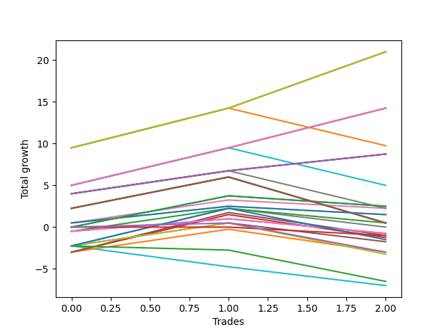

# Long Wallace 008 
- Symbol: ES
- Date Range: 3/19/22 - 5/22/22
- Trading Period: 7:20-12:30
- Number of Trades: 3


| Name | Win Percent | Profit | Avg Profit / Trade |     | Name | Win Percent | Profit | Avg Profit / Trade |
| ---- | ----------- | ------ | ------------------ | --- | ---- | ----------- | ------ | ------------------ |
| Sorted By <br> Profit | | | | | Sorted By <br> Win Percentage ||||
| Twenty-Nine | 100.00 | 10500.00 | 3500.00 |     | Twenty-Nine | 100.00 | 10500.00 | 3500.00 |
| Twenty-Eight | 100.00 | 10500.00 | 3500.00 |     | Twenty-Eight | 100.00 | 10500.00 | 3500.00 |
| Three | 100.00 | 10500.00 | 3500.00 |     | Three | 100.00 | 10500.00 | 3500.00 |
| Twenty-Seven | 100.00 | 7125.00 | 2375.00 |     | Twenty-Seven | 100.00 | 7125.00 | 2375.00 |
| Twenty-Six | 100.00 | 7125.00 | 2375.00 |     | Twenty-Six | 100.00 | 7125.00 | 2375.00 |
| Two | 100.00 | 7125.00 | 2375.00 |     | Two | 100.00 | 7125.00 | 2375.00 |
| Twenty-Two | 66.67 | 4875.00 | 1625.00 |     | Twenty-Five | 100.00 | 4375.00 | 1458.33 |
| Twenty-Five | 100.00 | 4375.00 | 1458.33 |     | Twenty-Four | 100.00 | 4375.00 | 1458.33 |
| Twenty-Four | 100.00 | 4375.00 | 1458.33 |     | One | 100.00 | 4375.00 | 1458.33 |
| One | 100.00 | 4375.00 | 1458.33 |     | Twenty-Two | 66.67 | 4875.00 | 1625.00 |
| Twenty | 66.67 | 2500.00 | 833.33 |     | Twenty | 66.67 | 2500.00 | 833.33 |
| Thirty-Three | 66.67 | 1250.00 | 416.67 |     | Thirty-Three | 66.67 | 1250.00 | 416.67 |
| Thirty-One | 66.67 | 1250.00 | 416.67 |     | Thirty-One | 66.67 | 1250.00 | 416.67 |
| Eighteen | 66.67 | 1125.00 | 375.00 |     | Eighteen | 66.67 | 1125.00 | 375.00 |
| Seven | 66.67 | 1125.00 | 375.00 |     | Seven | 66.67 | 1125.00 | 375.00 |
| Eleven | 66.67 | 750.00 | 250.00 |     | Eleven | 66.67 | 750.00 | 250.00 |
| Nine | 66.67 | 750.00 | 250.00 |     | Nine | 66.67 | 750.00 | 250.00 |
| Thirty-Six | 66.67 | 250.00 | 83.33 |     | Thirty-Six | 66.67 | 250.00 | 83.33 |
| Thirty-Two | 66.67 | 250.00 | 83.33 |     | Thirty-Two | 66.67 | 250.00 | 83.33 |
| Thirty | 66.67 | 250.00 | 83.33 |     | Thirty | 66.67 | 250.00 | 83.33 |
| Five | 66.67 | 250.00 | 83.33 |     | Five | 66.67 | 250.00 | 83.33 |
| Four | 66.67 | 250.00 | 83.33 |     | Four | 66.67 | 250.00 | 83.33 |
| Thirteen | 33.33 | 250.00 | 83.33 |     | Thirty-Four | 66.67 | -500.00 | -166.67 |
| Eight | 33.33 | 0.00 | 0.00 |     | Thirty-Five | 66.67 | -1500.00 | -500.00 |
| Seventeen | 33.33 | -375.00 | -125.00 |     | Thirteen | 33.33 | 250.00 | 83.33 |
| Fifteen | 33.33 | -375.00 | -125.00 |     | Eight | 33.33 | 0.00 | 0.00 |
| Thirty-Four | 66.67 | -500.00 | -166.67 |     | Seventeen | 33.33 | -375.00 | -125.00 |
| Sixteen | 33.33 | -500.00 | -166.67 |     | Fifteen | 33.33 | -375.00 | -125.00 |
| Fourteen | 33.33 | -625.00 | -208.33 |     | Sixteen | 33.33 | -500.00 | -166.67 |
| Twenty-One | 33.33 | -750.00 | -250.00 |     | Fourteen | 33.33 | -625.00 | -208.33 |
| Six | 33.33 | -875.00 | -291.67 |     | Twenty-One | 33.33 | -750.00 | -250.00 |
| Thirty-Five | 66.67 | -1500.00 | -500.00 |     | Six | 33.33 | -875.00 | -291.67 |
| Twelve | 33.33 | -1500.00 | -500.00 |     | Twelve | 33.33 | -1500.00 | -500.00 |
| Nineteen | 33.33 | -1625.00 | -541.67 |     | Nineteen | 33.33 | -1625.00 | -541.67 |
| Twenty-Three | 0.00 | -3250.00 | -1083.33 |     | Twenty-Three | 0.00 | -3250.00 | -1083.33 |
| Ten | 0.00 | -3500.00 | -1166.67 |     | Ten | 0.00 | -3500.00 | -1166.67 |

### Test One
* Sell when price hits the middle line of the 20p bollinger
* No Stoploss
* Results:
```
Total Trades: 3
Percent Up: 100.00
Percent Down: 0.00
Total Points Moved Up: 8.75
Potential Profit: 4375.00
Total Points Ups: 8.75 Count Ups: 3
Total Points Downs: 0.00 Count Downs: 0
```

<details><summary>Trades</summary>

<code>In: 2022-03-25 08:30:00		Out: 2022-03-25 08:36:40		Total Position Time: 06:40		Total Move Up: 4.00		Total to Date: 4.00</code> <br />
<code>In: 2022-03-30 08:14:00		Out: 2022-03-30 08:19:15		Total Position Time: 05:15		Total Move Up: 2.75		Total to Date: 6.75</code> <br />
<code>In: 2022-06-23 09:07:00		Out: 2022-06-23 09:14:30		Total Position Time: 07:30		Total Move Up: 2.00		Total to Date: 8.75</code> <br />


</details>

### Test Two
* Sell when the price hits the upper line of the 20p 1std bollinger
* No Stoploss
* Results:
```
Total Trades: 3
Percent Up: 100.00
Percent Down: 0.00
Total Points Moved Up: 14.25
Potential Profit: 7125.00
Total Points Ups: 14.25 Count Ups: 3
Total Points Downs: 0.00 Count Downs: 0
```

<details><summary>Trades</summary>

<code>In: 2022-03-25 08:30:00		Out: 2022-03-25 08:40:40		Total Position Time: 10:40		Total Move Up: 5.00		Total to Date: 5.00</code> <br />
<code>In: 2022-03-30 08:14:00		Out: 2022-03-30 08:23:50		Total Position Time: 09:50		Total Move Up: 4.50		Total to Date: 9.50</code> <br />
<code>In: 2022-06-23 09:07:00		Out: 2022-06-23 09:18:25		Total Position Time: 11:25		Total Move Up: 4.75		Total to Date: 14.25</code> <br />


</details>

### Test Three
* Sell when the price hits the upper line of the 20p 2std bollinger
* No Stoploss
* Results:
```
Total Trades: 3
Percent Up: 100.00
Percent Down: 0.00
Total Points Moved Up: 21.00
Potential Profit: 10500.00
Total Points Ups: 21.00 Count Ups: 3
Total Points Downs: 0.00 Count Downs: 0
```

<details><summary>Trades</summary>

<code>In: 2022-03-25 08:30:00		Out: 2022-03-25 08:41:55		Total Position Time: 11:55		Total Move Up: 9.50		Total to Date: 9.50</code> <br />
<code>In: 2022-03-30 08:14:00		Out: 2022-03-30 08:35:15		Total Position Time: 21:15		Total Move Up: 4.75		Total to Date: 14.25</code> <br />
<code>In: 2022-06-23 09:07:00		Out: 2022-06-23 09:19:00		Total Position Time: 12:00		Total Move Up: 6.75		Total to Date: 21.00</code> <br />


</details>

### Test Four
* Sell when the price hits the middle line of the 1std VWAP
* No Stoploss
* Results:
```
Total Trades: 3
Percent Up: 66.67
Percent Down: 33.33
Total Points Moved Up: 0.50
Potential Profit: 250.00
Total Points Ups: 6.00 Count Ups: 2
Total Points Downs: -5.50 Count Downs: 1
```

<details><summary>Trades</summary>

<code>In: 2022-03-25 08:30:00		Out: 2022-03-25 08:59:55		Total Position Time: 29:55		Total Move Up: 2.25		Total to Date: 2.25</code> <br />
<code>In: 2022-03-30 08:14:00		Out: 2022-03-30 08:43:55		Total Position Time: 29:55		Total Move Up: 3.75		Total to Date: 6.00</code> <br />
<code>In: 2022-06-23 09:07:00		Out: 2022-06-23 09:36:55		Total Position Time: 29:55		Total Move Up: -5.50		Total to Date: 0.50</code> <br />


</details>

### Test Five
* Sell when the price hits the upper line of the 1std VWAP
* No Stoploss
* Results:
```
Total Trades: 3
Percent Up: 66.67
Percent Down: 33.33
Total Points Moved Up: 0.50
Potential Profit: 250.00
Total Points Ups: 6.00 Count Ups: 2
Total Points Downs: -5.50 Count Downs: 1
```

<details><summary>Trades</summary>

<code>In: 2022-03-25 08:30:00		Out: 2022-03-25 08:59:55		Total Position Time: 29:55		Total Move Up: 2.25		Total to Date: 2.25</code> <br />
<code>In: 2022-03-30 08:14:00		Out: 2022-03-30 08:43:55		Total Position Time: 29:55		Total Move Up: 3.75		Total to Date: 6.00</code> <br />
<code>In: 2022-06-23 09:07:00		Out: 2022-06-23 09:36:55		Total Position Time: 29:55		Total Move Up: -5.50		Total to Date: 0.50</code> <br />


</details>

### Test Six
* Sell when the price hits the middle line of the 20p bollinger
* Stoploss is 2 points
* Results:
```
Total Trades: 3
Percent Up: 33.33
Percent Down: 66.67
Total Points Moved Up: -1.75
Potential Profit: -875.00
Total Points Ups: 2.75 Count Ups: 1
Total Points Downs: -4.50 Count Downs: 2
```

<details><summary>Trades</summary>

<code>In: 2022-03-25 08:30:00		Out: 2022-03-25 08:32:20		Total Position Time: 02:20		Total Move Up: -2.25		Total to Date: -2.25</code> <br />
<code>In: 2022-03-30 08:14:00		Out: 2022-03-30 08:19:15		Total Position Time: 05:15		Total Move Up: 2.75		Total to Date: 0.50</code> <br />
<code>In: 2022-06-23 09:07:00		Out: 2022-06-23 09:08:30		Total Position Time: 01:30		Total Move Up: -2.25		Total to Date: -1.75</code> <br />


</details>

### Test Seven
* Sell when the price hits the middle line of the 20p bollinger
* Trailing Stop is 2 points
* Results:
```
Total Trades: 3
Percent Up: 66.67
Percent Down: 33.33
Total Points Moved Up: 2.25
Potential Profit: 1125.00
Total Points Ups: 3.25 Count Ups: 2
Total Points Downs: -1.00 Count Downs: 1
```

<details><summary>Trades</summary>

<code>In: 2022-03-25 08:30:00		Out: 2022-03-25 08:30:15		Total Position Time: 00:15		Total Move Up: 0.50		Total to Date: 0.50</code> <br />
<code>In: 2022-03-30 08:14:00		Out: 2022-03-30 08:19:15		Total Position Time: 05:15		Total Move Up: 2.75		Total to Date: 3.25</code> <br />
<code>In: 2022-06-23 09:07:00		Out: 2022-06-23 09:07:55		Total Position Time: 00:55		Total Move Up: -1.00		Total to Date: 2.25</code> <br />


</details>

### Test Eight
* Sell when the price hits the upper line of the 20p 1std bollinger
* Stoploss is 2 points
* Results:
```
Total Trades: 3
Percent Up: 33.33
Percent Down: 66.67
Total Points Moved Up: 0.00
Potential Profit: 0.00
Total Points Ups: 4.50 Count Ups: 1
Total Points Downs: -4.50 Count Downs: 2
```

<details><summary>Trades</summary>

<code>In: 2022-03-25 08:30:00		Out: 2022-03-25 08:32:20		Total Position Time: 02:20		Total Move Up: -2.25		Total to Date: -2.25</code> <br />
<code>In: 2022-03-30 08:14:00		Out: 2022-03-30 08:23:50		Total Position Time: 09:50		Total Move Up: 4.50		Total to Date: 2.25</code> <br />
<code>In: 2022-06-23 09:07:00		Out: 2022-06-23 09:08:30		Total Position Time: 01:30		Total Move Up: -2.25		Total to Date: 0.00</code> <br />


</details>

### Test Nine
* Sell when the price hits the upper line of the 20p 1std bollinger
* Trailing Stop is 2 points
* Results:
```
Total Trades: 3
Percent Up: 66.67
Percent Down: 33.33
Total Points Moved Up: 1.50
Potential Profit: 750.00
Total Points Ups: 2.50 Count Ups: 2
Total Points Downs: -1.00 Count Downs: 1
```

<details><summary>Trades</summary>

<code>In: 2022-03-25 08:30:00		Out: 2022-03-25 08:30:15		Total Position Time: 00:15		Total Move Up: 0.50		Total to Date: 0.50</code> <br />
<code>In: 2022-03-30 08:14:00		Out: 2022-03-30 08:21:20		Total Position Time: 07:20		Total Move Up: 2.00		Total to Date: 2.50</code> <br />
<code>In: 2022-06-23 09:07:00		Out: 2022-06-23 09:07:55		Total Position Time: 00:55		Total Move Up: -1.00		Total to Date: 1.50</code> <br />


</details>

### Test Ten
* Sell when the price hits the upper line of the 20p 2std bollinger
* Stoploss is 2 points
* Results:
```
Total Trades: 3
Percent Up: 0.00
Percent Down: 100.00
Total Points Moved Up: -7.00
Potential Profit: -3500.00
Total Points Ups: 0.00 Count Ups: 0
Total Points Downs: -7.00 Count Downs: 3
```

<details><summary>Trades</summary>

<code>In: 2022-03-25 08:30:00		Out: 2022-03-25 08:32:20		Total Position Time: 02:20		Total Move Up: -2.25		Total to Date: -2.25</code> <br />
<code>In: 2022-03-30 08:14:00		Out: 2022-03-30 08:28:50		Total Position Time: 14:50		Total Move Up: -2.50		Total to Date: -4.75</code> <br />
<code>In: 2022-06-23 09:07:00		Out: 2022-06-23 09:08:30		Total Position Time: 01:30		Total Move Up: -2.25		Total to Date: -7.00</code> <br />


</details>

### Test Eleven
* Sell when the price hits the upper line of the 20p 2std bollinger
* Trailing Stop is 2 points
* Results:
```
Total Trades: 3
Percent Up: 66.67
Percent Down: 33.33
Total Points Moved Up: 1.50
Potential Profit: 750.00
Total Points Ups: 2.50 Count Ups: 2
Total Points Downs: -1.00 Count Downs: 1
```

<details><summary>Trades</summary>

<code>In: 2022-03-25 08:30:00		Out: 2022-03-25 08:30:15		Total Position Time: 00:15		Total Move Up: 0.50		Total to Date: 0.50</code> <br />
<code>In: 2022-03-30 08:14:00		Out: 2022-03-30 08:21:20		Total Position Time: 07:20		Total Move Up: 2.00		Total to Date: 2.50</code> <br />
<code>In: 2022-06-23 09:07:00		Out: 2022-06-23 09:07:55		Total Position Time: 00:55		Total Move Up: -1.00		Total to Date: 1.50</code> <br />


</details>

### Test Twelve
* Sell when the price hits the middle line of the 20p bollinger
* Stoploss is 3 points
* Results:
```
Total Trades: 3
Percent Up: 33.33
Percent Down: 66.67
Total Points Moved Up: -3.00
Potential Profit: -1500.00
Total Points Ups: 2.75 Count Ups: 1
Total Points Downs: -5.75 Count Downs: 2
```

<details><summary>Trades</summary>

<code>In: 2022-03-25 08:30:00		Out: 2022-03-25 08:32:30		Total Position Time: 02:30		Total Move Up: -3.00		Total to Date: -3.00</code> <br />
<code>In: 2022-03-30 08:14:00		Out: 2022-03-30 08:19:15		Total Position Time: 05:15		Total Move Up: 2.75		Total to Date: -0.25</code> <br />
<code>In: 2022-06-23 09:07:00		Out: 2022-06-23 09:08:50		Total Position Time: 01:50		Total Move Up: -2.75		Total to Date: -3.00</code> <br />


</details>

### Test Thirteen
* Sell when the price hits the middle line of the 20p bollinger
* Trailing Stop is 3 points
* Results:
```
Total Trades: 3
Percent Up: 33.33
Percent Down: 66.67
Total Points Moved Up: 0.50
Potential Profit: 250.00
Total Points Ups: 2.75 Count Ups: 1
Total Points Downs: -2.25 Count Downs: 2
```

<details><summary>Trades</summary>

<code>In: 2022-03-25 08:30:00		Out: 2022-03-25 08:31:35		Total Position Time: 01:35		Total Move Up: -0.50		Total to Date: -0.50</code> <br />
<code>In: 2022-03-30 08:14:00		Out: 2022-03-30 08:19:15		Total Position Time: 05:15		Total Move Up: 2.75		Total to Date: 2.25</code> <br />
<code>In: 2022-06-23 09:07:00		Out: 2022-06-23 09:08:15		Total Position Time: 01:15		Total Move Up: -1.75		Total to Date: 0.50</code> <br />


</details>

### Test Fourteen
* Sell when the price hits the upper line of the 20p 1std bollinger
* Stoploss is 3 points
* Results:
```
Total Trades: 3
Percent Up: 33.33
Percent Down: 66.67
Total Points Moved Up: -1.25
Potential Profit: -625.00
Total Points Ups: 4.50 Count Ups: 1
Total Points Downs: -5.75 Count Downs: 2
```

<details><summary>Trades</summary>

<code>In: 2022-03-25 08:30:00		Out: 2022-03-25 08:32:30		Total Position Time: 02:30		Total Move Up: -3.00		Total to Date: -3.00</code> <br />
<code>In: 2022-03-30 08:14:00		Out: 2022-03-30 08:23:50		Total Position Time: 09:50		Total Move Up: 4.50		Total to Date: 1.50</code> <br />
<code>In: 2022-06-23 09:07:00		Out: 2022-06-23 09:08:50		Total Position Time: 01:50		Total Move Up: -2.75		Total to Date: -1.25</code> <br />


</details>

### Test Fifteen
* Sell when the price hits the upper line of the 20p 1std bollinger
* Trailing Stop is 3 points
* Results:
```
Total Trades: 3
Percent Up: 33.33
Percent Down: 66.67
Total Points Moved Up: -0.75
Potential Profit: -375.00
Total Points Ups: 1.50 Count Ups: 1
Total Points Downs: -2.25 Count Downs: 2
```

<details><summary>Trades</summary>

<code>In: 2022-03-25 08:30:00		Out: 2022-03-25 08:31:35		Total Position Time: 01:35		Total Move Up: -0.50		Total to Date: -0.50</code> <br />
<code>In: 2022-03-30 08:14:00		Out: 2022-03-30 08:22:45		Total Position Time: 08:45		Total Move Up: 1.50		Total to Date: 1.00</code> <br />
<code>In: 2022-06-23 09:07:00		Out: 2022-06-23 09:08:15		Total Position Time: 01:15		Total Move Up: -1.75		Total to Date: -0.75</code> <br />


</details>

### Test Sixteen
* Sell when the price hits the upper line of the 20p 2std bollinger
* Stoploss is 3 points
* Results:
```
Total Trades: 3
Percent Up: 33.33
Percent Down: 66.67
Total Points Moved Up: -1.00
Potential Profit: -500.00
Total Points Ups: 4.75 Count Ups: 1
Total Points Downs: -5.75 Count Downs: 2
```

<details><summary>Trades</summary>

<code>In: 2022-03-25 08:30:00		Out: 2022-03-25 08:32:30		Total Position Time: 02:30		Total Move Up: -3.00		Total to Date: -3.00</code> <br />
<code>In: 2022-03-30 08:14:00		Out: 2022-03-30 08:35:15		Total Position Time: 21:15		Total Move Up: 4.75		Total to Date: 1.75</code> <br />
<code>In: 2022-06-23 09:07:00		Out: 2022-06-23 09:08:50		Total Position Time: 01:50		Total Move Up: -2.75		Total to Date: -1.00</code> <br />


</details>

### Test Seventeen
* Sell when the price hits the upper line of the 20p 2std bollinger
* Trailing Stop is 3 points
* Results:
```
Total Trades: 3
Percent Up: 33.33
Percent Down: 66.67
Total Points Moved Up: -0.75
Potential Profit: -375.00
Total Points Ups: 1.50 Count Ups: 1
Total Points Downs: -2.25 Count Downs: 2
```

<details><summary>Trades</summary>

<code>In: 2022-03-25 08:30:00		Out: 2022-03-25 08:31:35		Total Position Time: 01:35		Total Move Up: -0.50		Total to Date: -0.50</code> <br />
<code>In: 2022-03-30 08:14:00		Out: 2022-03-30 08:22:45		Total Position Time: 08:45		Total Move Up: 1.50		Total to Date: 1.00</code> <br />
<code>In: 2022-06-23 09:07:00		Out: 2022-06-23 09:08:15		Total Position Time: 01:15		Total Move Up: -1.75		Total to Date: -0.75</code> <br />


</details>

### Test Eighteen
* Sell when the price hits the middle line of the 20p bollinger
* Stoploss is 5 points
* Results:
```
Total Trades: 3
Percent Up: 66.67
Percent Down: 33.33
Total Points Moved Up: 2.25
Potential Profit: 1125.00
Total Points Ups: 6.75 Count Ups: 2
Total Points Downs: -4.50 Count Downs: 1
```

<details><summary>Trades</summary>

<code>In: 2022-03-25 08:30:00		Out: 2022-03-25 08:36:40		Total Position Time: 06:40		Total Move Up: 4.00		Total to Date: 4.00</code> <br />
<code>In: 2022-03-30 08:14:00		Out: 2022-03-30 08:19:15		Total Position Time: 05:15		Total Move Up: 2.75		Total to Date: 6.75</code> <br />
<code>In: 2022-06-23 09:07:00		Out: 2022-06-23 09:09:30		Total Position Time: 02:30		Total Move Up: -4.50		Total to Date: 2.25</code> <br />


</details>

### Test Nineteen
* Sell when the price hits the middle line of the 20p bollinger
* Trailing Stop is 5 points
* Results:
```
Total Trades: 3
Percent Up: 33.33
Percent Down: 66.67
Total Points Moved Up: -3.25
Potential Profit: -1625.00
Total Points Ups: 2.75 Count Ups: 1
Total Points Downs: -6.00 Count Downs: 2
```

<details><summary>Trades</summary>

<code>In: 2022-03-25 08:30:00		Out: 2022-03-25 08:32:20		Total Position Time: 02:20		Total Move Up: -2.25		Total to Date: -2.25</code> <br />
<code>In: 2022-03-30 08:14:00		Out: 2022-03-30 08:19:15		Total Position Time: 05:15		Total Move Up: 2.75		Total to Date: 0.50</code> <br />
<code>In: 2022-06-23 09:07:00		Out: 2022-06-23 09:08:55		Total Position Time: 01:55		Total Move Up: -3.75		Total to Date: -3.25</code> <br />


</details>

### Test Twenty
* Sell when the price hits the upper line of the 20p 1std bollinger
* Stoploss is 5 points
* Results:
```
Total Trades: 3
Percent Up: 66.67
Percent Down: 33.33
Total Points Moved Up: 5.00
Potential Profit: 2500.00
Total Points Ups: 9.50 Count Ups: 2
Total Points Downs: -4.50 Count Downs: 1
```

<details><summary>Trades</summary>

<code>In: 2022-03-25 08:30:00		Out: 2022-03-25 08:40:40		Total Position Time: 10:40		Total Move Up: 5.00		Total to Date: 5.00</code> <br />
<code>In: 2022-03-30 08:14:00		Out: 2022-03-30 08:23:50		Total Position Time: 09:50		Total Move Up: 4.50		Total to Date: 9.50</code> <br />
<code>In: 2022-06-23 09:07:00		Out: 2022-06-23 09:09:30		Total Position Time: 02:30		Total Move Up: -4.50		Total to Date: 5.00</code> <br />


</details>

### Test Twenty-One
* Sell when the price hits the upper line of the 20p 1std bollinger
* Trailing Stop is 5 points
* Results:
```
Total Trades: 3
Percent Up: 33.33
Percent Down: 66.67
Total Points Moved Up: -1.50
Potential Profit: -750.00
Total Points Ups: 4.50 Count Ups: 1
Total Points Downs: -6.00 Count Downs: 2
```

<details><summary>Trades</summary>

<code>In: 2022-03-25 08:30:00		Out: 2022-03-25 08:32:20		Total Position Time: 02:20		Total Move Up: -2.25		Total to Date: -2.25</code> <br />
<code>In: 2022-03-30 08:14:00		Out: 2022-03-30 08:23:50		Total Position Time: 09:50		Total Move Up: 4.50		Total to Date: 2.25</code> <br />
<code>In: 2022-06-23 09:07:00		Out: 2022-06-23 09:08:55		Total Position Time: 01:55		Total Move Up: -3.75		Total to Date: -1.50</code> <br />


</details>

### Test Twenty-Two
* Sell when the price hits the upper line of the 20p 2std bollinger
* Stoploss is 5 points
* Results:
```
Total Trades: 3
Percent Up: 66.67
Percent Down: 33.33
Total Points Moved Up: 9.75
Potential Profit: 4875.00
Total Points Ups: 14.25 Count Ups: 2
Total Points Downs: -4.50 Count Downs: 1
```

<details><summary>Trades</summary>

<code>In: 2022-03-25 08:30:00		Out: 2022-03-25 08:41:55		Total Position Time: 11:55		Total Move Up: 9.50		Total to Date: 9.50</code> <br />
<code>In: 2022-03-30 08:14:00		Out: 2022-03-30 08:35:15		Total Position Time: 21:15		Total Move Up: 4.75		Total to Date: 14.25</code> <br />
<code>In: 2022-06-23 09:07:00		Out: 2022-06-23 09:09:30		Total Position Time: 02:30		Total Move Up: -4.50		Total to Date: 9.75</code> <br />


</details>

### Test Twenty-Three
* Sell when the price hits the upper line of the 20p 2std bollinger
* Trailing Stop is 5 points
* Results:
```
Total Trades: 3
Percent Up: 0.00
Percent Down: 100.00
Total Points Moved Up: -6.50
Potential Profit: -3250.00
Total Points Ups: 0.00 Count Ups: 0
Total Points Downs: -6.50 Count Downs: 3
```

<details><summary>Trades</summary>

<code>In: 2022-03-25 08:30:00		Out: 2022-03-25 08:32:20		Total Position Time: 02:20		Total Move Up: -2.25		Total to Date: -2.25</code> <br />
<code>In: 2022-03-30 08:14:00		Out: 2022-03-30 08:27:05		Total Position Time: 13:05		Total Move Up: -0.50		Total to Date: -2.75</code> <br />
<code>In: 2022-06-23 09:07:00		Out: 2022-06-23 09:08:55		Total Position Time: 01:55		Total Move Up: -3.75		Total to Date: -6.50</code> <br />


</details>

### Test Twenty-Four
* Sell when the price hits the middle line of the 20p bollinger
* Stoploss is 10 points
* Results:
```
Total Trades: 3
Percent Up: 100.00
Percent Down: 0.00
Total Points Moved Up: 8.75
Potential Profit: 4375.00
Total Points Ups: 8.75 Count Ups: 3
Total Points Downs: 0.00 Count Downs: 0
```

<details><summary>Trades</summary>

<code>In: 2022-03-25 08:30:00		Out: 2022-03-25 08:36:40		Total Position Time: 06:40		Total Move Up: 4.00		Total to Date: 4.00</code> <br />
<code>In: 2022-03-30 08:14:00		Out: 2022-03-30 08:19:15		Total Position Time: 05:15		Total Move Up: 2.75		Total to Date: 6.75</code> <br />
<code>In: 2022-06-23 09:07:00		Out: 2022-06-23 09:14:30		Total Position Time: 07:30		Total Move Up: 2.00		Total to Date: 8.75</code> <br />


</details>

### Test Twenty-Five
* Sell when the price hits the middle line of the 20p bollinger
* Trailing Stop is 10 points
* Results:
```
Total Trades: 3
Percent Up: 100.00
Percent Down: 0.00
Total Points Moved Up: 8.75
Potential Profit: 4375.00
Total Points Ups: 8.75 Count Ups: 3
Total Points Downs: 0.00 Count Downs: 0
```

<details><summary>Trades</summary>

<code>In: 2022-03-25 08:30:00		Out: 2022-03-25 08:36:40		Total Position Time: 06:40		Total Move Up: 4.00		Total to Date: 4.00</code> <br />
<code>In: 2022-03-30 08:14:00		Out: 2022-03-30 08:19:15		Total Position Time: 05:15		Total Move Up: 2.75		Total to Date: 6.75</code> <br />
<code>In: 2022-06-23 09:07:00		Out: 2022-06-23 09:14:30		Total Position Time: 07:30		Total Move Up: 2.00		Total to Date: 8.75</code> <br />


</details>

### Test Twenty-Six
* Sell when the price hits the upper line of the 20p 1std bollinger
* Stoploss is 10 points
* Results:
```
Total Trades: 3
Percent Up: 100.00
Percent Down: 0.00
Total Points Moved Up: 14.25
Potential Profit: 7125.00
Total Points Ups: 14.25 Count Ups: 3
Total Points Downs: 0.00 Count Downs: 0
```

<details><summary>Trades</summary>

<code>In: 2022-03-25 08:30:00		Out: 2022-03-25 08:40:40		Total Position Time: 10:40		Total Move Up: 5.00		Total to Date: 5.00</code> <br />
<code>In: 2022-03-30 08:14:00		Out: 2022-03-30 08:23:50		Total Position Time: 09:50		Total Move Up: 4.50		Total to Date: 9.50</code> <br />
<code>In: 2022-06-23 09:07:00		Out: 2022-06-23 09:18:25		Total Position Time: 11:25		Total Move Up: 4.75		Total to Date: 14.25</code> <br />


</details>

### Test Twenty-Seven
* Sell when the price hits the upper line of the 20p 1std bollinger
* Trailing Stop is 10 points
* Results:
```
Total Trades: 3
Percent Up: 100.00
Percent Down: 0.00
Total Points Moved Up: 14.25
Potential Profit: 7125.00
Total Points Ups: 14.25 Count Ups: 3
Total Points Downs: 0.00 Count Downs: 0
```

<details><summary>Trades</summary>

<code>In: 2022-03-25 08:30:00		Out: 2022-03-25 08:40:40		Total Position Time: 10:40		Total Move Up: 5.00		Total to Date: 5.00</code> <br />
<code>In: 2022-03-30 08:14:00		Out: 2022-03-30 08:23:50		Total Position Time: 09:50		Total Move Up: 4.50		Total to Date: 9.50</code> <br />
<code>In: 2022-06-23 09:07:00		Out: 2022-06-23 09:18:25		Total Position Time: 11:25		Total Move Up: 4.75		Total to Date: 14.25</code> <br />


</details>

### Test Twenty-Eight
* Sell when the price hits the upper line of the 20p 2std bollinger
* Stoploss is 10 points
* Results:
```
Total Trades: 3
Percent Up: 100.00
Percent Down: 0.00
Total Points Moved Up: 21.00
Potential Profit: 10500.00
Total Points Ups: 21.00 Count Ups: 3
Total Points Downs: 0.00 Count Downs: 0
```

<details><summary>Trades</summary>

<code>In: 2022-03-25 08:30:00		Out: 2022-03-25 08:41:55		Total Position Time: 11:55		Total Move Up: 9.50		Total to Date: 9.50</code> <br />
<code>In: 2022-03-30 08:14:00		Out: 2022-03-30 08:35:15		Total Position Time: 21:15		Total Move Up: 4.75		Total to Date: 14.25</code> <br />
<code>In: 2022-06-23 09:07:00		Out: 2022-06-23 09:19:00		Total Position Time: 12:00		Total Move Up: 6.75		Total to Date: 21.00</code> <br />


</details>

### Test Twenty-Nine
* Sell when the price hits the upper line of the 20p 2std bollinger
* Trailing Stop is 10 points
* Results:
```
Total Trades: 3
Percent Up: 100.00
Percent Down: 0.00
Total Points Moved Up: 21.00
Potential Profit: 10500.00
Total Points Ups: 21.00 Count Ups: 3
Total Points Downs: 0.00 Count Downs: 0
```

<details><summary>Trades</summary>

<code>In: 2022-03-25 08:30:00		Out: 2022-03-25 08:41:55		Total Position Time: 11:55		Total Move Up: 9.50		Total to Date: 9.50</code> <br />
<code>In: 2022-03-30 08:14:00		Out: 2022-03-30 08:35:15		Total Position Time: 21:15		Total Move Up: 4.75		Total to Date: 14.25</code> <br />
<code>In: 2022-06-23 09:07:00		Out: 2022-06-23 09:19:00		Total Position Time: 12:00		Total Move Up: 6.75		Total to Date: 21.00</code> <br />


</details>

### Test Thirty
* Sell when the price hits the middle line of the 1std VWAP
* Stoploss is 10 points
* Results:
```
Total Trades: 3
Percent Up: 66.67
Percent Down: 33.33
Total Points Moved Up: 0.50
Potential Profit: 250.00
Total Points Ups: 6.00 Count Ups: 2
Total Points Downs: -5.50 Count Downs: 1
```

<details><summary>Trades</summary>

<code>In: 2022-03-25 08:30:00		Out: 2022-03-25 08:59:55		Total Position Time: 29:55		Total Move Up: 2.25		Total to Date: 2.25</code> <br />
<code>In: 2022-03-30 08:14:00		Out: 2022-03-30 08:43:55		Total Position Time: 29:55		Total Move Up: 3.75		Total to Date: 6.00</code> <br />
<code>In: 2022-06-23 09:07:00		Out: 2022-06-23 09:36:55		Total Position Time: 29:55		Total Move Up: -5.50		Total to Date: 0.50</code> <br />


</details>

### Test Thirty-One
* Sell when the price hits the middle line of the 1std VWAP
* Trailing Stop is 10 points
* Results:
```
Total Trades: 3
Percent Up: 66.67
Percent Down: 33.33
Total Points Moved Up: 2.50
Potential Profit: 1250.00
Total Points Ups: 3.75 Count Ups: 2
Total Points Downs: -1.25 Count Downs: 1
```

<details><summary>Trades</summary>

<code>In: 2022-03-25 08:30:00		Out: 2022-03-25 08:57:05		Total Position Time: 27:05		Total Move Up: 0.00		Total to Date: 0.00</code> <br />
<code>In: 2022-03-30 08:14:00		Out: 2022-03-30 08:43:55		Total Position Time: 29:55		Total Move Up: 3.75		Total to Date: 3.75</code> <br />
<code>In: 2022-06-23 09:07:00		Out: 2022-06-23 09:32:00		Total Position Time: 25:00		Total Move Up: -1.25		Total to Date: 2.50</code> <br />


</details>

### Test Thirty-Two
* Sell when the price hits the upper line of the 1std VWAP
* Stoploss is 10 points
* Results:
```
Total Trades: 3
Percent Up: 66.67
Percent Down: 33.33
Total Points Moved Up: 0.50
Potential Profit: 250.00
Total Points Ups: 6.00 Count Ups: 2
Total Points Downs: -5.50 Count Downs: 1
```

<details><summary>Trades</summary>

<code>In: 2022-03-25 08:30:00		Out: 2022-03-25 08:59:55		Total Position Time: 29:55		Total Move Up: 2.25		Total to Date: 2.25</code> <br />
<code>In: 2022-03-30 08:14:00		Out: 2022-03-30 08:43:55		Total Position Time: 29:55		Total Move Up: 3.75		Total to Date: 6.00</code> <br />
<code>In: 2022-06-23 09:07:00		Out: 2022-06-23 09:36:55		Total Position Time: 29:55		Total Move Up: -5.50		Total to Date: 0.50</code> <br />


</details>

### Test Thirty-Three
* Sell when the price hits the upper line of the 1std VWAP
* Trailing Stop is 10 points
* Results:
```
Total Trades: 3
Percent Up: 66.67
Percent Down: 33.33
Total Points Moved Up: 2.50
Potential Profit: 1250.00
Total Points Ups: 3.75 Count Ups: 2
Total Points Downs: -1.25 Count Downs: 1
```

<details><summary>Trades</summary>

<code>In: 2022-03-25 08:30:00		Out: 2022-03-25 08:57:05		Total Position Time: 27:05		Total Move Up: 0.00		Total to Date: 0.00</code> <br />
<code>In: 2022-03-30 08:14:00		Out: 2022-03-30 08:43:55		Total Position Time: 29:55		Total Move Up: 3.75		Total to Date: 3.75</code> <br />
<code>In: 2022-06-23 09:07:00		Out: 2022-06-23 09:32:00		Total Position Time: 25:00		Total Move Up: -1.25		Total to Date: 2.50</code> <br />


</details>

### Test Thirty-Four
* Sell when the linear regression slope is negative
* No Stoploss
* Results:
```
Total Trades: 3
Percent Up: 66.67
Percent Down: 33.33
Total Points Moved Up: -1.00
Potential Profit: -500.00
Total Points Ups: 0.00 Count Ups: 2
Total Points Downs: -1.00 Count Downs: 1
```

<details><summary>Trades</summary>

<code>In: 2022-03-25 08:30:00		Out: 2022-03-25 08:32:05		Total Position Time: 02:05		Total Move Up: 0.00		Total to Date: 0.00</code> <br />
<code>In: 2022-03-30 08:14:00		Out: 2022-03-30 08:15:05		Total Position Time: 01:05		Total Move Up: 0.00		Total to Date: 0.00</code> <br />
<code>In: 2022-06-23 09:07:00		Out: 2022-06-23 09:08:05		Total Position Time: 01:05		Total Move Up: -1.00		Total to Date: -1.00</code> <br />


</details>

### Test Thirty-Five
* Sell when the linear regression slope changes to negative
* No Stoploss
* Results:
```
Total Trades: 3
Percent Up: 66.67
Percent Down: 33.33
Total Points Moved Up: -3.00
Potential Profit: -1500.00
Total Points Ups: 0.50 Count Ups: 2
Total Points Downs: -3.50 Count Downs: 1
```

<details><summary>Trades</summary>

<code>In: 2022-03-25 08:30:00		Out: 2022-03-25 08:32:05		Total Position Time: 02:05		Total Move Up: 0.00		Total to Date: 0.00</code> <br />
<code>In: 2022-03-30 08:14:00		Out: 2022-03-30 08:26:05		Total Position Time: 12:05		Total Move Up: 0.50		Total to Date: 0.50</code> <br />
<code>In: 2022-06-23 09:07:00		Out: 2022-06-23 09:12:05		Total Position Time: 05:05		Total Move Up: -3.50		Total to Date: -3.00</code> <br />


</details>

### Test Thirty-Six
* Sell when the linear regression slope changes to negative
* No Stoploss
* Results:
```
Total Trades: 3
Percent Up: 66.67
Percent Down: 33.33
Total Points Moved Up: 0.50
Potential Profit: 250.00
Total Points Ups: 6.00 Count Ups: 2
Total Points Downs: -5.50 Count Downs: 1
```

<details><summary>Trades</summary>

<code>In: 2022-03-25 08:30:00		Out: 2022-03-25 08:59:55		Total Position Time: 29:55		Total Move Up: 2.25		Total to Date: 2.25</code> <br />
<code>In: 2022-03-30 08:14:00		Out: 2022-03-30 08:43:55		Total Position Time: 29:55		Total Move Up: 3.75		Total to Date: 6.00</code> <br />
<code>In: 2022-06-23 09:07:00		Out: 2022-06-23 09:36:55		Total Position Time: 29:55		Total Move Up: -5.50		Total to Date: 0.50</code> <br />


</details>