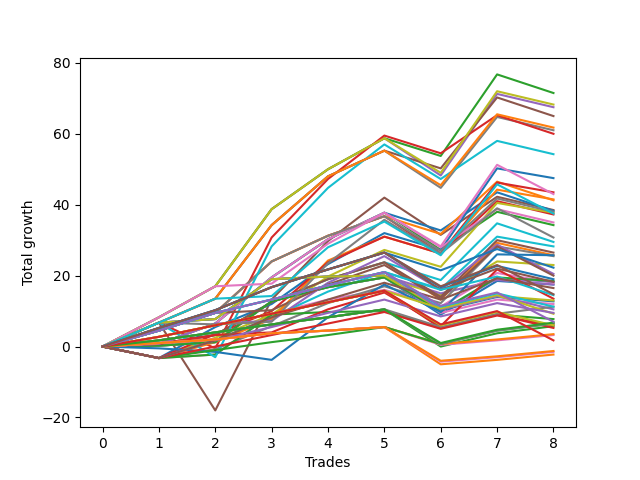

# Long Wallace 012 
- Symbol: ES
- Date Range: 03/18/2022 - 07/15/2022
- Trading Period: 7:20-12:30
- Number of Trades: 8



| Name | Win Percent | Profit | Avg Profit / Trade | Avg Time / Trade |      | Name | Win Percent | Profit | Avg Profit / Trade | Avg Time / Trade |
| ---- | ----------- | ------ | ------------------ | ---------------- | ---- | ---- | ----------- | ------ | ------------------ | ---------------- |
| Sorted By <br> Profit | | | | | | Sorted By <br> Win Percentage ||||
| Forty-Four | 75.00 | 35750.00 | 4468.75 | 12:51 |     | One Hundred Twelve | 87.50 | 5625.00 | 703.12 | 04:11 |
| Sixty | 75.00 | 34125.00 | 4265.62 | 15:54 |     | One Hundred Twenty-Seven | 87.50 | 3375.00 | 421.88 | 05:06 |
| Four | 75.00 | 33750.00 | 4218.75 | 18:15 |     | One Hundred Twenty-Two | 87.50 | 3250.00 | 406.25 | 05:07 |
| Forty-Seven | 75.00 | 32500.00 | 4062.50 | 13:10 |     | Eighty-Two | 87.50 | 2875.00 | 359.38 | 07:28 |
| Sixty-Three | 75.00 | 30875.00 | 3859.38 | 16:13 |     | One Hundred Sixteen | 87.50 | 1750.00 | 218.75 | 01:52 |
| Seven | 75.00 | 30500.00 | 3812.50 | 18:34 |     | One Hundred Eleven | 87.50 | 1625.00 | 203.12 | 01:53 |
| Forty-Five | 62.50 | 30000.00 | 3750.00 | 21:02 |     | One Hundred Twenty-Six | 87.50 | -625.00 | -78.12 | 02:48 |
| Sixty-One | 62.50 | 27125.00 | 3390.62 | 24:21 |     | One Hundred Twenty-One | 87.50 | -750.00 | -93.75 | 02:48 |
| Fifty-Two | 62.50 | 23750.00 | 2968.75 | 09:01 |     | Eighty-One | 87.50 | -1125.00 | -140.62 | 05:10 |
| Fifty-Five | 62.50 | 21750.00 | 2718.75 | 08:58 |     | Forty-Four | 75.00 | 35750.00 | 4468.75 | 12:51 |
| Sixty-Eight | 75.00 | 21500.00 | 2687.50 | 13:46 |     | Sixty | 75.00 | 34125.00 | 4265.62 | 15:54 |
| Fifty-Three | 62.50 | 20750.00 | 2593.75 | 12:10 |     | Four | 75.00 | 33750.00 | 4218.75 | 18:15 |
| Forty-Three | 75.00 | 20625.00 | 2578.12 | 09:40 |     | Forty-Seven | 75.00 | 32500.00 | 4062.50 | 13:10 |
| Five | 62.50 | 19250.00 | 2406.25 | 28:37 |     | Sixty-Three | 75.00 | 30875.00 | 3859.38 | 16:13 |
| Forty-Two | 75.00 | 19125.00 | 2390.62 | 12:35 |     | Seven | 75.00 | 30500.00 | 3812.50 | 18:34 |
| Fifty-Nine | 75.00 | 19000.00 | 2375.00 | 12:43 |     | Sixty-Eight | 75.00 | 21500.00 | 2687.50 | 13:46 |
| Fifty | 62.50 | 18875.00 | 2359.38 | 07:58 |     | Forty-Three | 75.00 | 20625.00 | 2578.12 | 09:40 |
| Seventy-One | 75.00 | 18750.00 | 2343.75 | 14:36 |     | Forty-Two | 75.00 | 19125.00 | 2390.62 | 12:35 |
| Three | 75.00 | 18625.00 | 2328.12 | 15:05 |     | Fifty-Nine | 75.00 | 19000.00 | 2375.00 | 12:43 |
| Fifty-Eight | 75.00 | 17500.00 | 2187.50 | 15:38 |     | Seventy-One | 75.00 | 18750.00 | 2343.75 | 14:36 |
| Two | 75.00 | 17125.00 | 2140.62 | 18:00 |     | Three | 75.00 | 18625.00 | 2328.12 | 15:05 |
| Sixty-Nine | 62.50 | 15375.00 | 1921.88 | 19:17 |     | Fifty-Eight | 75.00 | 17500.00 | 2187.50 | 15:38 |
| Forty-One | 75.00 | 14750.00 | 1843.75 | 09:04 |     | Two | 75.00 | 17125.00 | 2140.62 | 18:00 |
| Fifty-One | 62.50 | 14125.00 | 1765.62 | 06:55 |     | Forty-One | 75.00 | 14750.00 | 1843.75 | 09:04 |
| Fifty-Seven | 75.00 | 13250.00 | 1656.25 | 12:03 |     | Fifty-Seven | 75.00 | 13250.00 | 1656.25 | 12:03 |
| One | 75.00 | 12875.00 | 1609.38 | 14:24 |     | One | 75.00 | 12875.00 | 1609.38 | 14:24 |
| Seventy-Three | 37.50 | 12875.00 | 1609.38 | 12:50 |     | Forty | 75.00 | 11500.00 | 1437.50 | 05:51 |
| Forty-Nine | 62.50 | 12750.00 | 1593.75 | 06:50 |     | One Hundred Fifteen | 75.00 | 11125.00 | 1390.62 | 06:51 |
| Forty | 75.00 | 11500.00 | 1437.50 | 05:51 |     | Sixty-Six | 75.00 | 10250.00 | 1281.25 | 12:28 |
| One Hundred Fifteen | 75.00 | 11125.00 | 1390.62 | 06:51 |     | Sixty-Seven | 75.00 | 10000.00 | 1250.00 | 11:08 |
| Sixty-Six | 75.00 | 10250.00 | 1281.25 | 12:28 |     | One Hundred Twenty-Five | 75.00 | 9500.00 | 1187.50 | 09:54 |
| Sixty-Seven | 75.00 | 10000.00 | 1250.00 | 11:08 |     | Sixty-Four | 75.00 | 9250.00 | 1156.25 | 06:46 |
| One Hundred Twenty-Five | 75.00 | 9500.00 | 1187.50 | 09:54 |     | Eighty-Five | 75.00 | 9125.00 | 1140.62 | 12:15 |
| Sixty-Four | 75.00 | 9250.00 | 1156.25 | 06:46 |     | Fifty-Six | 75.00 | 9125.00 | 1140.62 | 06:46 |
| Eighty-Five | 75.00 | 9125.00 | 1140.62 | 12:15 |     | Forty-Six | 75.00 | 8750.00 | 1093.75 | 04:01 |
| Fifty-Six | 75.00 | 9125.00 | 1140.62 | 06:46 |     | Zero | 75.00 | 8750.00 | 1093.75 | 09:08 |
| Forty-Eight | 62.50 | 9000.00 | 1125.00 | 04:56 |     | One Hundred Thirty | 75.00 | 7375.00 | 921.88 | 09:10 |
| Forty-Six | 75.00 | 8750.00 | 1093.75 | 04:01 |     | One Hundred Fourteen | 75.00 | 7250.00 | 906.25 | 06:20 |
| Zero | 75.00 | 8750.00 | 1093.75 | 09:08 |     | Sixty-Five | 75.00 | 6750.00 | 843.75 | 10:51 |
| One Hundred Twenty | 62.50 | 8250.00 | 1031.25 | 05:25 |     | Seventy | 75.00 | 6500.00 | 812.50 | 04:56 |
| One Hundred Thirty | 75.00 | 7375.00 | 921.88 | 09:10 |     | Sixty-Two | 75.00 | 6375.00 | 796.88 | 04:56 |
| One Hundred Fourteen | 75.00 | 7250.00 | 906.25 | 06:20 |     | Six | 75.00 | 6000.00 | 750.00 | 07:18 |
| Sixty-Five | 75.00 | 6750.00 | 843.75 | 10:51 |     | One Hundred Twenty-Four | 75.00 | 5625.00 | 703.12 | 09:23 |
| Seventy | 75.00 | 6500.00 | 812.50 | 04:56 |     | Eighty-Four | 75.00 | 5250.00 | 656.25 | 11:45 |
| Sixty-Two | 75.00 | 6375.00 | 796.88 | 04:56 |     | One Hundred Thirteen | 75.00 | 4625.00 | 578.12 | 05:51 |
| Six | 75.00 | 6000.00 | 750.00 | 07:18 |     | One Hundred Twenty-Nine | 75.00 | 3500.00 | 437.50 | 08:40 |
| One Hundred Twelve | 87.50 | 5625.00 | 703.12 | 04:11 |     | One Hundred Seventeen | 75.00 | 3250.00 | 406.25 | 03:45 |
| One Hundred Twenty-Four | 75.00 | 5625.00 | 703.12 | 09:23 |     | One Hundred Twenty-Three | 75.00 | 3000.00 | 375.00 | 08:55 |
| Eighty-Four | 75.00 | 5250.00 | 656.25 | 11:45 |     | Eighty-Three | 75.00 | 2625.00 | 328.12 | 11:16 |
| One Hundred Ninteen | 62.50 | 4750.00 | 593.75 | 04:56 |     | One Hundred Twenty-Eight | 75.00 | 875.00 | 109.38 | 08:11 |
| One Hundred Thirteen | 75.00 | 4625.00 | 578.12 | 05:51 |     | Forty-Five | 62.50 | 30000.00 | 3750.00 | 21:02 |
| Fifty-Four | 62.50 | 3875.00 | 484.38 | 03:03 |     | Sixty-One | 62.50 | 27125.00 | 3390.62 | 24:21 |
| One Hundred Twenty-Nine | 75.00 | 3500.00 | 437.50 | 08:40 |     | Fifty-Two | 62.50 | 23750.00 | 2968.75 | 09:01 |
| One Hundred Twenty-Seven | 87.50 | 3375.00 | 421.88 | 05:06 |     | Fifty-Five | 62.50 | 21750.00 | 2718.75 | 08:58 |
| One Hundred Twenty-Two | 87.50 | 3250.00 | 406.25 | 05:07 |     | Fifty-Three | 62.50 | 20750.00 | 2593.75 | 12:10 |
| One Hundred Seventeen | 75.00 | 3250.00 | 406.25 | 03:45 |     | Five | 62.50 | 19250.00 | 2406.25 | 28:37 |
| One Hundred Twenty-Three | 75.00 | 3000.00 | 375.00 | 08:55 |     | Fifty | 62.50 | 18875.00 | 2359.38 | 07:58 |
| One Hundred Eighteen | 62.50 | 3000.00 | 375.00 | 04:28 |     | Sixty-Nine | 62.50 | 15375.00 | 1921.88 | 19:17 |
| Eighty-Two | 87.50 | 2875.00 | 359.38 | 07:28 |     | Fifty-One | 62.50 | 14125.00 | 1765.62 | 06:55 |
| Eighty-Three | 75.00 | 2625.00 | 328.12 | 11:16 |     | Forty-Nine | 62.50 | 12750.00 | 1593.75 | 06:50 |
| One Hundred Sixteen | 87.50 | 1750.00 | 218.75 | 01:52 |     | Forty-Eight | 62.50 | 9000.00 | 1125.00 | 04:56 |
| One Hundred Eleven | 87.50 | 1625.00 | 203.12 | 01:53 |     | One Hundred Twenty | 62.50 | 8250.00 | 1031.25 | 05:25 |
| One Hundred Twenty-Eight | 75.00 | 875.00 | 109.38 | 08:11 |     | One Hundred Ninteen | 62.50 | 4750.00 | 593.75 | 04:56 |
| One Hundred Twenty-Six | 87.50 | -625.00 | -78.12 | 02:48 |     | Fifty-Four | 62.50 | 3875.00 | 484.38 | 03:03 |
| One Hundred Twenty-One | 87.50 | -750.00 | -93.75 | 02:48 |     | One Hundred Eighteen | 62.50 | 3000.00 | 375.00 | 04:28 |
| Eighty-One | 87.50 | -1125.00 | -140.62 | 05:10 |     | Seventy-Three | 37.50 | 12875.00 | 1609.38 | 12:50 |

## NO STOPLOSS

### Test Zero
* Sell when price hits the middle line of the 20p bollinger
* No Stoploss
* Results:
```
Total Trades: 8
Percent Up: 75.00
Percent Down: 25.00
Total Points Moved Up: 17.50
Potential Profit: 8750.00
Total Points Ups: 29.00 Count Ups: 6
Total Points Downs: -11.50 Count Downs: 2
```

<details><summary>Trades</summary>

<code>In: 2022-04-20 09:14:00		Out: 2022-04-20 09:30:50		Total Position Time: 16:50		Total Move Up: 0.25		Total to Date: 0.25</code> <br />
<code>In: 2022-04-27 11:40:00		Out: 2022-04-27 11:40:10		Total Position Time: 00:10		Total Move Up: 1.00		Total to Date: 1.25</code> <br />
<code>In: 2022-05-17 11:24:00		Out: 2022-05-17 11:27:30		Total Position Time: 03:30		Total Move Up: 11.50		Total to Date: 12.75</code> <br />
<code>In: 2022-05-23 10:23:00		Out: 2022-05-23 10:26:30		Total Position Time: 03:30		Total Move Up: 4.00		Total to Date: 16.75</code> <br />
<code>In: 2022-05-27 08:04:00		Out: 2022-05-27 08:06:55		Total Position Time: 02:55		Total Move Up: 2.75		Total to Date: 19.50</code> <br />
<code>In: 2022-06-15 07:35:00		Out: 2022-06-15 08:04:55		Total Position Time: 29:55		Total Move Up: -10.50		Total to Date: 9.00</code> <br />
<code>In: 2022-06-17 12:15:00		Out: 2022-06-17 12:20:25		Total Position Time: 05:25		Total Move Up: 9.50		Total to Date: 18.50</code> <br />
<code>In: 2022-06-21 08:47:00		Out: 2022-06-21 08:57:50		Total Position Time: 10:50		Total Move Up: -1.00		Total to Date: 17.50</code> <br />


</details>

### Test One
* Sell when the price hits the upper line of the 20p 1std bollinger
* No Stoploss
* Results:
```
Total Trades: 8
Percent Up: 75.00
Percent Down: 25.00
Total Points Moved Up: 25.75
Potential Profit: 12875.00
Total Points Ups: 39.75 Count Ups: 6
Total Points Downs: -14.00 Count Downs: 2
```

<details><summary>Trades</summary>

<code>In: 2022-04-20 09:14:00		Out: 2022-04-20 09:30:55		Total Position Time: 16:55		Total Move Up: 0.75		Total to Date: 0.75</code> <br />
<code>In: 2022-04-27 11:40:00		Out: 2022-04-27 11:42:25		Total Position Time: 02:25		Total Move Up: 2.50		Total to Date: 3.25</code> <br />
<code>In: 2022-05-17 11:24:00		Out: 2022-05-17 11:37:35		Total Position Time: 13:35		Total Move Up: 9.25		Total to Date: 12.50</code> <br />
<code>In: 2022-05-23 10:23:00		Out: 2022-05-23 10:32:35		Total Position Time: 09:35		Total Move Up: 6.50		Total to Date: 19.00</code> <br />
<code>In: 2022-05-27 08:04:00		Out: 2022-05-27 08:11:00		Total Position Time: 07:00		Total Move Up: 4.75		Total to Date: 23.75</code> <br />
<code>In: 2022-06-15 07:35:00		Out: 2022-06-15 08:04:55		Total Position Time: 29:55		Total Move Up: -10.50		Total to Date: 13.25</code> <br />
<code>In: 2022-06-17 12:15:00		Out: 2022-06-17 12:21:30		Total Position Time: 06:30		Total Move Up: 16.00		Total to Date: 29.25</code> <br />
<code>In: 2022-06-21 08:47:00		Out: 2022-06-21 09:16:20		Total Position Time: 29:20		Total Move Up: -3.50		Total to Date: 25.75</code> <br />


</details>

### Test Two
* Sell when the price hits the upper line of the 20p 2std bollinger
* No Stoploss
* Results:
```
Total Trades: 8
Percent Up: 75.00
Percent Down: 25.00
Total Points Moved Up: 34.25
Potential Profit: 17125.00
Total Points Ups: 48.50 Count Ups: 6
Total Points Downs: -14.25 Count Downs: 2
```

<details><summary>Trades</summary>

<code>In: 2022-04-20 09:14:00		Out: 2022-04-20 09:31:05		Total Position Time: 17:05		Total Move Up: 0.75		Total to Date: 0.75</code> <br />
<code>In: 2022-04-27 11:40:00		Out: 2022-04-27 11:42:40		Total Position Time: 02:40		Total Move Up: 5.75		Total to Date: 6.50</code> <br />
<code>In: 2022-05-17 11:24:00		Out: 2022-05-17 11:40:00		Total Position Time: 16:00		Total Move Up: 13.00		Total to Date: 19.50</code> <br />
<code>In: 2022-05-23 10:23:00		Out: 2022-05-23 10:33:15		Total Position Time: 10:15		Total Move Up: 10.75		Total to Date: 30.25</code> <br />
<code>In: 2022-05-27 08:04:00		Out: 2022-05-27 08:12:15		Total Position Time: 08:15		Total Move Up: 7.50		Total to Date: 37.75</code> <br />
<code>In: 2022-06-15 07:35:00		Out: 2022-06-15 08:04:55		Total Position Time: 29:55		Total Move Up: -10.50		Total to Date: 27.25</code> <br />
<code>In: 2022-06-17 12:15:00		Out: 2022-06-17 12:44:55		Total Position Time: 29:55		Total Move Up: 10.75		Total to Date: 38.00</code> <br />
<code>In: 2022-06-21 08:47:00		Out: 2022-06-21 09:16:55		Total Position Time: 29:55		Total Move Up: -3.75		Total to Date: 34.25</code> <br />


</details>

### Test Three
* Sell when price hits the middle line of the 50p bollinger
* No Stoploss
* Results:
```
Total Trades: 8
Percent Up: 75.00
Percent Down: 25.00
Total Points Moved Up: 37.25
Potential Profit: 18625.00
Total Points Ups: 51.50 Count Ups: 6
Total Points Downs: -14.25 Count Downs: 2
```

<details><summary>Trades</summary>

<code>In: 2022-04-20 09:14:00		Out: 2022-04-20 09:32:40		Total Position Time: 18:40		Total Move Up: 4.50		Total to Date: 4.50</code> <br />
<code>In: 2022-04-27 11:40:00		Out: 2022-04-27 11:42:35		Total Position Time: 02:35		Total Move Up: 5.00		Total to Date: 9.50</code> <br />
<code>In: 2022-05-17 11:24:00		Out: 2022-05-17 11:40:05		Total Position Time: 16:05		Total Move Up: 14.50		Total to Date: 24.00</code> <br />
<code>In: 2022-05-23 10:23:00		Out: 2022-05-23 10:32:55		Total Position Time: 09:55		Total Move Up: 7.25		Total to Date: 31.25</code> <br />
<code>In: 2022-05-27 08:04:00		Out: 2022-05-27 08:11:15		Total Position Time: 07:15		Total Move Up: 5.50		Total to Date: 36.75</code> <br />
<code>In: 2022-06-15 07:35:00		Out: 2022-06-15 08:04:55		Total Position Time: 29:55		Total Move Up: -10.50		Total to Date: 26.25</code> <br />
<code>In: 2022-06-17 12:15:00		Out: 2022-06-17 12:21:20		Total Position Time: 06:20		Total Move Up: 14.75		Total to Date: 41.00</code> <br />
<code>In: 2022-06-21 08:47:00		Out: 2022-06-21 09:16:55		Total Position Time: 29:55		Total Move Up: -3.75		Total to Date: 37.25</code> <br />


</details>

### Test Four
* Sell when the price hits the upper line of the 50p 1std bollinger
* No Stoploss
* Results:
```
Total Trades: 8
Percent Up: 75.00
Percent Down: 25.00
Total Points Moved Up: 67.50
Potential Profit: 33750.00
Total Points Ups: 81.75 Count Ups: 6
Total Points Downs: -14.25 Count Downs: 2
```

<details><summary>Trades</summary>

<code>In: 2022-04-20 09:14:00		Out: 2022-04-20 09:36:45		Total Position Time: 22:45		Total Move Up: 8.25		Total to Date: 8.25</code> <br />
<code>In: 2022-04-27 11:40:00		Out: 2022-04-27 11:45:25		Total Position Time: 05:25		Total Move Up: 8.75		Total to Date: 17.00</code> <br />
<code>In: 2022-05-17 11:24:00		Out: 2022-05-17 11:44:30		Total Position Time: 20:30		Total Move Up: 21.75		Total to Date: 38.75</code> <br />
<code>In: 2022-05-23 10:23:00		Out: 2022-05-23 10:36:15		Total Position Time: 13:15		Total Move Up: 11.25		Total to Date: 50.00</code> <br />
<code>In: 2022-05-27 08:04:00		Out: 2022-05-27 08:16:05		Total Position Time: 12:05		Total Move Up: 8.75		Total to Date: 58.75</code> <br />
<code>In: 2022-06-15 07:35:00		Out: 2022-06-15 08:04:55		Total Position Time: 29:55		Total Move Up: -10.50		Total to Date: 48.25</code> <br />
<code>In: 2022-06-17 12:15:00		Out: 2022-06-17 12:27:15		Total Position Time: 12:15		Total Move Up: 23.00		Total to Date: 71.25</code> <br />
<code>In: 2022-06-21 08:47:00		Out: 2022-06-21 09:16:55		Total Position Time: 29:55		Total Move Up: -3.75		Total to Date: 67.50</code> <br />


</details>

### Test Five
* Sell when the price hits the upper line of the 50p 2std bollinger
* No Stoploss
* Results:
```
Total Trades: 8
Percent Up: 62.50
Percent Down: 37.50
Total Points Moved Up: 38.50
Potential Profit: 19250.00
Total Points Ups: 77.50 Count Ups: 5
Total Points Downs: -39.00 Count Downs: 3
```

<details><summary>Trades</summary>

<code>In: 2022-04-20 09:14:00		Out: 2022-04-20 09:43:55		Total Position Time: 29:55		Total Move Up: 6.75		Total to Date: 6.75</code> <br />
<code>In: 2022-04-27 11:40:00		Out: 2022-04-27 12:09:55		Total Position Time: 29:55		Total Move Up: -24.75		Total to Date: -18.00</code> <br />
<code>In: 2022-05-17 11:24:00		Out: 2022-05-17 11:48:45		Total Position Time: 24:45		Total Move Up: 31.25		Total to Date: 13.25</code> <br />
<code>In: 2022-05-23 10:23:00		Out: 2022-05-23 10:47:45		Total Position Time: 24:45		Total Move Up: 16.50		Total to Date: 29.75</code> <br />
<code>In: 2022-05-27 08:04:00		Out: 2022-05-27 08:33:55		Total Position Time: 29:55		Total Move Up: 12.25		Total to Date: 42.00</code> <br />
<code>In: 2022-06-15 07:35:00		Out: 2022-06-15 08:04:55		Total Position Time: 29:55		Total Move Up: -10.50		Total to Date: 31.50</code> <br />
<code>In: 2022-06-17 12:15:00		Out: 2022-06-17 12:44:55		Total Position Time: 29:55		Total Move Up: 10.75		Total to Date: 42.25</code> <br />
<code>In: 2022-06-21 08:47:00		Out: 2022-06-21 09:16:55		Total Position Time: 29:55		Total Move Up: -3.75		Total to Date: 38.50</code> <br />


</details>

### Test Six
* Sell when the price hits the middle line of the 1std VWAP
* No Stoploss
* Results:
```
Total Trades: 8
Percent Up: 75.00
Percent Down: 25.00
Total Points Moved Up: 12.00
Potential Profit: 6000.00
Total Points Ups: 23.75 Count Ups: 6
Total Points Downs: -11.75 Count Downs: 2
```

<details><summary>Trades</summary>

<code>In: 2022-04-20 09:14:00		Out: 2022-04-20 09:35:50		Total Position Time: 21:50		Total Move Up: 6.75		Total to Date: 6.75</code> <br />
<code>In: 2022-04-27 11:40:00		Out: 2022-04-27 11:40:10		Total Position Time: 00:10		Total Move Up: 1.00		Total to Date: 7.75</code> <br />
<code>In: 2022-05-17 11:24:00		Out: 2022-05-17 11:27:25		Total Position Time: 03:25		Total Move Up: 11.25		Total to Date: 19.00</code> <br />
<code>In: 2022-05-23 10:23:00		Out: 2022-05-23 10:23:10		Total Position Time: 00:10		Total Move Up: 0.75		Total to Date: 19.75</code> <br />
<code>In: 2022-05-27 08:04:00		Out: 2022-05-27 08:04:10		Total Position Time: 00:10		Total Move Up: 0.25		Total to Date: 20.00</code> <br />
<code>In: 2022-06-15 07:35:00		Out: 2022-06-15 08:04:55		Total Position Time: 29:55		Total Move Up: -10.50		Total to Date: 9.50</code> <br />
<code>In: 2022-06-17 12:15:00		Out: 2022-06-17 12:17:35		Total Position Time: 02:35		Total Move Up: 3.75		Total to Date: 13.25</code> <br />
<code>In: 2022-06-21 08:47:00		Out: 2022-06-21 08:47:10		Total Position Time: 00:10		Total Move Up: -1.25		Total to Date: 12.00</code> <br />


</details>

### Test Seven
* Sell when the price hits the upper line of the 1std VWAP
* No Stoploss
* Results:
```
Total Trades: 8
Percent Up: 75.00
Percent Down: 25.00
Total Points Moved Up: 61.00
Potential Profit: 30500.00
Total Points Ups: 75.25 Count Ups: 6
Total Points Downs: -14.25 Count Downs: 2
```

<details><summary>Trades</summary>

<code>In: 2022-04-20 09:14:00		Out: 2022-04-20 09:43:55		Total Position Time: 29:55		Total Move Up: 6.75		Total to Date: 6.75</code> <br />
<code>In: 2022-04-27 11:40:00		Out: 2022-04-27 11:42:45		Total Position Time: 02:45		Total Move Up: 6.75		Total to Date: 13.50</code> <br />
<code>In: 2022-05-17 11:24:00		Out: 2022-05-17 11:40:20		Total Position Time: 16:20		Total Move Up: 20.75		Total to Date: 34.25</code> <br />
<code>In: 2022-05-23 10:23:00		Out: 2022-05-23 10:42:15		Total Position Time: 19:15		Total Move Up: 13.75		Total to Date: 48.00</code> <br />
<code>In: 2022-05-27 08:04:00		Out: 2022-05-27 08:13:00		Total Position Time: 09:00		Total Move Up: 7.25		Total to Date: 55.25</code> <br />
<code>In: 2022-06-15 07:35:00		Out: 2022-06-15 08:04:55		Total Position Time: 29:55		Total Move Up: -10.50		Total to Date: 44.75</code> <br />
<code>In: 2022-06-17 12:15:00		Out: 2022-06-17 12:26:30		Total Position Time: 11:30		Total Move Up: 20.00		Total to Date: 64.75</code> <br />
<code>In: 2022-06-21 08:47:00		Out: 2022-06-21 09:16:55		Total Position Time: 29:55		Total Move Up: -3.75		Total to Date: 61.00</code> <br />


</details>

## STOPLOSS OF 5

### Test Forty
* Sell when price hits the middle line of the 20p bollinger
* Stoploss is 5 points
* Results:
```
Total Trades: 8
Percent Up: 75.00
Percent Down: 25.00
Total Points Moved Up: 23.00
Potential Profit: 11500.00
Total Points Ups: 29.00 Count Ups: 6
Total Points Downs: -6.00 Count Downs: 2
```

<details><summary>Trades</summary>

<code>In: 2022-04-20 09:14:00		Out: 2022-04-20 09:30:50		Total Position Time: 16:50		Total Move Up: 0.25		Total to Date: 0.25</code> <br />
<code>In: 2022-04-27 11:40:00		Out: 2022-04-27 11:40:10		Total Position Time: 00:10		Total Move Up: 1.00		Total to Date: 1.25</code> <br />
<code>In: 2022-05-17 11:24:00		Out: 2022-05-17 11:27:30		Total Position Time: 03:30		Total Move Up: 11.50		Total to Date: 12.75</code> <br />
<code>In: 2022-05-23 10:23:00		Out: 2022-05-23 10:26:30		Total Position Time: 03:30		Total Move Up: 4.00		Total to Date: 16.75</code> <br />
<code>In: 2022-05-27 08:04:00		Out: 2022-05-27 08:06:55		Total Position Time: 02:55		Total Move Up: 2.75		Total to Date: 19.50</code> <br />
<code>In: 2022-06-15 07:35:00		Out: 2022-06-15 07:38:40		Total Position Time: 03:40		Total Move Up: -5.00		Total to Date: 14.50</code> <br />
<code>In: 2022-06-17 12:15:00		Out: 2022-06-17 12:20:25		Total Position Time: 05:25		Total Move Up: 9.50		Total to Date: 24.00</code> <br />
<code>In: 2022-06-21 08:47:00		Out: 2022-06-21 08:57:50		Total Position Time: 10:50		Total Move Up: -1.00		Total to Date: 23.00</code> <br />


</details>

### Test Forty-One
* Sell when the price hits the upper line of the 20p 1std bollinger
* Stoploss is 5 points
* Results:
```
Total Trades: 8
Percent Up: 75.00
Percent Down: 25.00
Total Points Moved Up: 29.50
Potential Profit: 14750.00
Total Points Ups: 39.75 Count Ups: 6
Total Points Downs: -10.25 Count Downs: 2
```

<details><summary>Trades</summary>

<code>In: 2022-04-20 09:14:00		Out: 2022-04-20 09:30:55		Total Position Time: 16:55		Total Move Up: 0.75		Total to Date: 0.75</code> <br />
<code>In: 2022-04-27 11:40:00		Out: 2022-04-27 11:42:25		Total Position Time: 02:25		Total Move Up: 2.50		Total to Date: 3.25</code> <br />
<code>In: 2022-05-17 11:24:00		Out: 2022-05-17 11:37:35		Total Position Time: 13:35		Total Move Up: 9.25		Total to Date: 12.50</code> <br />
<code>In: 2022-05-23 10:23:00		Out: 2022-05-23 10:32:35		Total Position Time: 09:35		Total Move Up: 6.50		Total to Date: 19.00</code> <br />
<code>In: 2022-05-27 08:04:00		Out: 2022-05-27 08:11:00		Total Position Time: 07:00		Total Move Up: 4.75		Total to Date: 23.75</code> <br />
<code>In: 2022-06-15 07:35:00		Out: 2022-06-15 07:38:40		Total Position Time: 03:40		Total Move Up: -5.00		Total to Date: 18.75</code> <br />
<code>In: 2022-06-17 12:15:00		Out: 2022-06-17 12:21:30		Total Position Time: 06:30		Total Move Up: 16.00		Total to Date: 34.75</code> <br />
<code>In: 2022-06-21 08:47:00		Out: 2022-06-21 08:59:55		Total Position Time: 12:55		Total Move Up: -5.25		Total to Date: 29.50</code> <br />


</details>

### Test Forty-Two
* Sell when the price hits the upper line of the 20p 2std bollinger
* Stoploss is 5 points
* Results:
```
Total Trades: 8
Percent Up: 75.00
Percent Down: 25.00
Total Points Moved Up: 38.25
Potential Profit: 19125.00
Total Points Ups: 48.50 Count Ups: 6
Total Points Downs: -10.25 Count Downs: 2
```

<details><summary>Trades</summary>

<code>In: 2022-04-20 09:14:00		Out: 2022-04-20 09:31:05		Total Position Time: 17:05		Total Move Up: 0.75		Total to Date: 0.75</code> <br />
<code>In: 2022-04-27 11:40:00		Out: 2022-04-27 11:42:40		Total Position Time: 02:40		Total Move Up: 5.75		Total to Date: 6.50</code> <br />
<code>In: 2022-05-17 11:24:00		Out: 2022-05-17 11:40:00		Total Position Time: 16:00		Total Move Up: 13.00		Total to Date: 19.50</code> <br />
<code>In: 2022-05-23 10:23:00		Out: 2022-05-23 10:33:15		Total Position Time: 10:15		Total Move Up: 10.75		Total to Date: 30.25</code> <br />
<code>In: 2022-05-27 08:04:00		Out: 2022-05-27 08:12:15		Total Position Time: 08:15		Total Move Up: 7.50		Total to Date: 37.75</code> <br />
<code>In: 2022-06-15 07:35:00		Out: 2022-06-15 07:38:40		Total Position Time: 03:40		Total Move Up: -5.00		Total to Date: 32.75</code> <br />
<code>In: 2022-06-17 12:15:00		Out: 2022-06-17 12:44:55		Total Position Time: 29:55		Total Move Up: 10.75		Total to Date: 43.50</code> <br />
<code>In: 2022-06-21 08:47:00		Out: 2022-06-21 08:59:55		Total Position Time: 12:55		Total Move Up: -5.25		Total to Date: 38.25</code> <br />


</details>

### Test Forty-Three
* Sell when price hits the middle line of the 50p bollinger
* Stoploss is 5 points
* Results:
```
Total Trades: 8
Percent Up: 75.00
Percent Down: 25.00
Total Points Moved Up: 41.25
Potential Profit: 20625.00
Total Points Ups: 51.50 Count Ups: 6
Total Points Downs: -10.25 Count Downs: 2
```

<details><summary>Trades</summary>

<code>In: 2022-04-20 09:14:00		Out: 2022-04-20 09:32:40		Total Position Time: 18:40		Total Move Up: 4.50		Total to Date: 4.50</code> <br />
<code>In: 2022-04-27 11:40:00		Out: 2022-04-27 11:42:35		Total Position Time: 02:35		Total Move Up: 5.00		Total to Date: 9.50</code> <br />
<code>In: 2022-05-17 11:24:00		Out: 2022-05-17 11:40:05		Total Position Time: 16:05		Total Move Up: 14.50		Total to Date: 24.00</code> <br />
<code>In: 2022-05-23 10:23:00		Out: 2022-05-23 10:32:55		Total Position Time: 09:55		Total Move Up: 7.25		Total to Date: 31.25</code> <br />
<code>In: 2022-05-27 08:04:00		Out: 2022-05-27 08:11:15		Total Position Time: 07:15		Total Move Up: 5.50		Total to Date: 36.75</code> <br />
<code>In: 2022-06-15 07:35:00		Out: 2022-06-15 07:38:40		Total Position Time: 03:40		Total Move Up: -5.00		Total to Date: 31.75</code> <br />
<code>In: 2022-06-17 12:15:00		Out: 2022-06-17 12:21:20		Total Position Time: 06:20		Total Move Up: 14.75		Total to Date: 46.50</code> <br />
<code>In: 2022-06-21 08:47:00		Out: 2022-06-21 08:59:55		Total Position Time: 12:55		Total Move Up: -5.25		Total to Date: 41.25</code> <br />


</details>

### Test Forty-Four
* Sell when the price hits the upper line of the 50p 1std bollinger
* Stoploss is 5 points
* Results:
```
Total Trades: 8
Percent Up: 75.00
Percent Down: 25.00
Total Points Moved Up: 71.50
Potential Profit: 35750.00
Total Points Ups: 81.75 Count Ups: 6
Total Points Downs: -10.25 Count Downs: 2
```

<details><summary>Trades</summary>

<code>In: 2022-04-20 09:14:00		Out: 2022-04-20 09:36:45		Total Position Time: 22:45		Total Move Up: 8.25		Total to Date: 8.25</code> <br />
<code>In: 2022-04-27 11:40:00		Out: 2022-04-27 11:45:25		Total Position Time: 05:25		Total Move Up: 8.75		Total to Date: 17.00</code> <br />
<code>In: 2022-05-17 11:24:00		Out: 2022-05-17 11:44:30		Total Position Time: 20:30		Total Move Up: 21.75		Total to Date: 38.75</code> <br />
<code>In: 2022-05-23 10:23:00		Out: 2022-05-23 10:36:15		Total Position Time: 13:15		Total Move Up: 11.25		Total to Date: 50.00</code> <br />
<code>In: 2022-05-27 08:04:00		Out: 2022-05-27 08:16:05		Total Position Time: 12:05		Total Move Up: 8.75		Total to Date: 58.75</code> <br />
<code>In: 2022-06-15 07:35:00		Out: 2022-06-15 07:38:40		Total Position Time: 03:40		Total Move Up: -5.00		Total to Date: 53.75</code> <br />
<code>In: 2022-06-17 12:15:00		Out: 2022-06-17 12:27:15		Total Position Time: 12:15		Total Move Up: 23.00		Total to Date: 76.75</code> <br />
<code>In: 2022-06-21 08:47:00		Out: 2022-06-21 08:59:55		Total Position Time: 12:55		Total Move Up: -5.25		Total to Date: 71.50</code> <br />


</details>

### Test Forty-Five
* Sell when the price hits the upper line of the 50p 2std bollinger
* Stoploss is 5 points
* Results:
```
Total Trades: 8
Percent Up: 62.50
Percent Down: 37.50
Total Points Moved Up: 60.00
Potential Profit: 30000.00
Total Points Ups: 77.50 Count Ups: 5
Total Points Downs: -17.50 Count Downs: 3
```

<details><summary>Trades</summary>

<code>In: 2022-04-20 09:14:00		Out: 2022-04-20 09:43:55		Total Position Time: 29:55		Total Move Up: 6.75		Total to Date: 6.75</code> <br />
<code>In: 2022-04-27 11:40:00		Out: 2022-04-27 11:52:30		Total Position Time: 12:30		Total Move Up: -7.25		Total to Date: -0.50</code> <br />
<code>In: 2022-05-17 11:24:00		Out: 2022-05-17 11:48:45		Total Position Time: 24:45		Total Move Up: 31.25		Total to Date: 30.75</code> <br />
<code>In: 2022-05-23 10:23:00		Out: 2022-05-23 10:47:45		Total Position Time: 24:45		Total Move Up: 16.50		Total to Date: 47.25</code> <br />
<code>In: 2022-05-27 08:04:00		Out: 2022-05-27 08:33:55		Total Position Time: 29:55		Total Move Up: 12.25		Total to Date: 59.50</code> <br />
<code>In: 2022-06-15 07:35:00		Out: 2022-06-15 07:38:40		Total Position Time: 03:40		Total Move Up: -5.00		Total to Date: 54.50</code> <br />
<code>In: 2022-06-17 12:15:00		Out: 2022-06-17 12:44:55		Total Position Time: 29:55		Total Move Up: 10.75		Total to Date: 65.25</code> <br />
<code>In: 2022-06-21 08:47:00		Out: 2022-06-21 08:59:55		Total Position Time: 12:55		Total Move Up: -5.25		Total to Date: 60.00</code> <br />


</details>

### Test Forty-Six
* Sell when the price hits the middle line of the 1std VWAP
* Stoploss is 5 points
* Results:
```
Total Trades: 8
Percent Up: 75.00
Percent Down: 25.00
Total Points Moved Up: 17.50
Potential Profit: 8750.00
Total Points Ups: 23.75 Count Ups: 6
Total Points Downs: -6.25 Count Downs: 2
```

<details><summary>Trades</summary>

<code>In: 2022-04-20 09:14:00		Out: 2022-04-20 09:35:50		Total Position Time: 21:50		Total Move Up: 6.75		Total to Date: 6.75</code> <br />
<code>In: 2022-04-27 11:40:00		Out: 2022-04-27 11:40:10		Total Position Time: 00:10		Total Move Up: 1.00		Total to Date: 7.75</code> <br />
<code>In: 2022-05-17 11:24:00		Out: 2022-05-17 11:27:25		Total Position Time: 03:25		Total Move Up: 11.25		Total to Date: 19.00</code> <br />
<code>In: 2022-05-23 10:23:00		Out: 2022-05-23 10:23:10		Total Position Time: 00:10		Total Move Up: 0.75		Total to Date: 19.75</code> <br />
<code>In: 2022-05-27 08:04:00		Out: 2022-05-27 08:04:10		Total Position Time: 00:10		Total Move Up: 0.25		Total to Date: 20.00</code> <br />
<code>In: 2022-06-15 07:35:00		Out: 2022-06-15 07:38:40		Total Position Time: 03:40		Total Move Up: -5.00		Total to Date: 15.00</code> <br />
<code>In: 2022-06-17 12:15:00		Out: 2022-06-17 12:17:35		Total Position Time: 02:35		Total Move Up: 3.75		Total to Date: 18.75</code> <br />
<code>In: 2022-06-21 08:47:00		Out: 2022-06-21 08:47:10		Total Position Time: 00:10		Total Move Up: -1.25		Total to Date: 17.50</code> <br />


</details>

### Test Forty-Seven
* Sell when the price hits the upper line of the 1std VWAP
* Stoploss is 5 points
* Results:
```
Total Trades: 8
Percent Up: 75.00
Percent Down: 25.00
Total Points Moved Up: 65.00
Potential Profit: 32500.00
Total Points Ups: 75.25 Count Ups: 6
Total Points Downs: -10.25 Count Downs: 2
```

<details><summary>Trades</summary>

<code>In: 2022-04-20 09:14:00		Out: 2022-04-20 09:43:55		Total Position Time: 29:55		Total Move Up: 6.75		Total to Date: 6.75</code> <br />
<code>In: 2022-04-27 11:40:00		Out: 2022-04-27 11:42:45		Total Position Time: 02:45		Total Move Up: 6.75		Total to Date: 13.50</code> <br />
<code>In: 2022-05-17 11:24:00		Out: 2022-05-17 11:40:20		Total Position Time: 16:20		Total Move Up: 20.75		Total to Date: 34.25</code> <br />
<code>In: 2022-05-23 10:23:00		Out: 2022-05-23 10:42:15		Total Position Time: 19:15		Total Move Up: 13.75		Total to Date: 48.00</code> <br />
<code>In: 2022-05-27 08:04:00		Out: 2022-05-27 08:13:00		Total Position Time: 09:00		Total Move Up: 7.25		Total to Date: 55.25</code> <br />
<code>In: 2022-06-15 07:35:00		Out: 2022-06-15 07:38:40		Total Position Time: 03:40		Total Move Up: -5.00		Total to Date: 50.25</code> <br />
<code>In: 2022-06-17 12:15:00		Out: 2022-06-17 12:26:30		Total Position Time: 11:30		Total Move Up: 20.00		Total to Date: 70.25</code> <br />
<code>In: 2022-06-21 08:47:00		Out: 2022-06-21 08:59:55		Total Position Time: 12:55		Total Move Up: -5.25		Total to Date: 65.00</code> <br />


</details>

## TRAIL STOP OF 5

### Test Forty-Eight
* Sell when price hits the middle line of the 20p bollinger
* Trailing Stop is 5 points
* Results:
```
Total Trades: 8
Percent Up: 62.50
Percent Down: 37.50
Total Points Moved Up: 18.00
Potential Profit: 9000.00
Total Points Ups: 28.75 Count Ups: 5
Total Points Downs: -10.75 Count Downs: 3
```

<details><summary>Trades</summary>

<code>In: 2022-04-20 09:14:00		Out: 2022-04-20 09:28:10		Total Position Time: 14:10		Total Move Up: -3.25		Total to Date: -3.25</code> <br />
<code>In: 2022-04-27 11:40:00		Out: 2022-04-27 11:40:10		Total Position Time: 00:10		Total Move Up: 1.00		Total to Date: -2.25</code> <br />
<code>In: 2022-05-17 11:24:00		Out: 2022-05-17 11:27:30		Total Position Time: 03:30		Total Move Up: 11.50		Total to Date: 9.25</code> <br />
<code>In: 2022-05-23 10:23:00		Out: 2022-05-23 10:26:30		Total Position Time: 03:30		Total Move Up: 4.00		Total to Date: 13.25</code> <br />
<code>In: 2022-05-27 08:04:00		Out: 2022-05-27 08:06:55		Total Position Time: 02:55		Total Move Up: 2.75		Total to Date: 16.00</code> <br />
<code>In: 2022-06-15 07:35:00		Out: 2022-06-15 07:38:35		Total Position Time: 03:35		Total Move Up: -4.75		Total to Date: 11.25</code> <br />
<code>In: 2022-06-17 12:15:00		Out: 2022-06-17 12:20:25		Total Position Time: 05:25		Total Move Up: 9.50		Total to Date: 20.75</code> <br />
<code>In: 2022-06-21 08:47:00		Out: 2022-06-21 08:53:15		Total Position Time: 06:15		Total Move Up: -2.75		Total to Date: 18.00</code> <br />


</details>

### Test Forty-Nine
* Sell when the price hits the upper line of the 20p 1std bollinger
* Trailing Stop is 5 points
* Results:
```
Total Trades: 8
Percent Up: 62.50
Percent Down: 37.50
Total Points Moved Up: 25.50
Potential Profit: 12750.00
Total Points Ups: 36.25 Count Ups: 5
Total Points Downs: -10.75 Count Downs: 3
```

<details><summary>Trades</summary>

<code>In: 2022-04-20 09:14:00		Out: 2022-04-20 09:28:10		Total Position Time: 14:10		Total Move Up: -3.25		Total to Date: -3.25</code> <br />
<code>In: 2022-04-27 11:40:00		Out: 2022-04-27 11:42:25		Total Position Time: 02:25		Total Move Up: 2.50		Total to Date: -0.75</code> <br />
<code>In: 2022-05-17 11:24:00		Out: 2022-05-17 11:29:15		Total Position Time: 05:15		Total Move Up: 6.50		Total to Date: 5.75</code> <br />
<code>In: 2022-05-23 10:23:00		Out: 2022-05-23 10:32:35		Total Position Time: 09:35		Total Move Up: 6.50		Total to Date: 12.25</code> <br />
<code>In: 2022-05-27 08:04:00		Out: 2022-05-27 08:11:00		Total Position Time: 07:00		Total Move Up: 4.75		Total to Date: 17.00</code> <br />
<code>In: 2022-06-15 07:35:00		Out: 2022-06-15 07:38:35		Total Position Time: 03:35		Total Move Up: -4.75		Total to Date: 12.25</code> <br />
<code>In: 2022-06-17 12:15:00		Out: 2022-06-17 12:21:30		Total Position Time: 06:30		Total Move Up: 16.00		Total to Date: 28.25</code> <br />
<code>In: 2022-06-21 08:47:00		Out: 2022-06-21 08:53:15		Total Position Time: 06:15		Total Move Up: -2.75		Total to Date: 25.50</code> <br />


</details>

### Test Fifty
* Sell when the price hits the upper line of the 20p 2std bollinger
* Trailing Stop is 5 points
* Results:
```
Total Trades: 8
Percent Up: 62.50
Percent Down: 37.50
Total Points Moved Up: 37.75
Potential Profit: 18875.00
Total Points Ups: 48.50 Count Ups: 5
Total Points Downs: -10.75 Count Downs: 3
```

<details><summary>Trades</summary>

<code>In: 2022-04-20 09:14:00		Out: 2022-04-20 09:28:10		Total Position Time: 14:10		Total Move Up: -3.25		Total to Date: -3.25</code> <br />
<code>In: 2022-04-27 11:40:00		Out: 2022-04-27 11:42:40		Total Position Time: 02:40		Total Move Up: 5.75		Total to Date: 2.50</code> <br />
<code>In: 2022-05-17 11:24:00		Out: 2022-05-17 11:29:15		Total Position Time: 05:15		Total Move Up: 6.50		Total to Date: 9.00</code> <br />
<code>In: 2022-05-23 10:23:00		Out: 2022-05-23 10:33:15		Total Position Time: 10:15		Total Move Up: 10.75		Total to Date: 19.75</code> <br />
<code>In: 2022-05-27 08:04:00		Out: 2022-05-27 08:12:15		Total Position Time: 08:15		Total Move Up: 7.50		Total to Date: 27.25</code> <br />
<code>In: 2022-06-15 07:35:00		Out: 2022-06-15 07:38:35		Total Position Time: 03:35		Total Move Up: -4.75		Total to Date: 22.50</code> <br />
<code>In: 2022-06-17 12:15:00		Out: 2022-06-17 12:28:25		Total Position Time: 13:25		Total Move Up: 18.00		Total to Date: 40.50</code> <br />
<code>In: 2022-06-21 08:47:00		Out: 2022-06-21 08:53:15		Total Position Time: 06:15		Total Move Up: -2.75		Total to Date: 37.75</code> <br />


</details>

### Test Fifty-One
* Sell when price hits the middle line of the 50p bollinger
* Trailing Stop is 5 points
* Results:
```
Total Trades: 8
Percent Up: 62.50
Percent Down: 37.50
Total Points Moved Up: 28.25
Potential Profit: 14125.00
Total Points Ups: 39.00 Count Ups: 5
Total Points Downs: -10.75 Count Downs: 3
```

<details><summary>Trades</summary>

<code>In: 2022-04-20 09:14:00		Out: 2022-04-20 09:28:10		Total Position Time: 14:10		Total Move Up: -3.25		Total to Date: -3.25</code> <br />
<code>In: 2022-04-27 11:40:00		Out: 2022-04-27 11:42:35		Total Position Time: 02:35		Total Move Up: 5.00		Total to Date: 1.75</code> <br />
<code>In: 2022-05-17 11:24:00		Out: 2022-05-17 11:29:15		Total Position Time: 05:15		Total Move Up: 6.50		Total to Date: 8.25</code> <br />
<code>In: 2022-05-23 10:23:00		Out: 2022-05-23 10:32:55		Total Position Time: 09:55		Total Move Up: 7.25		Total to Date: 15.50</code> <br />
<code>In: 2022-05-27 08:04:00		Out: 2022-05-27 08:11:15		Total Position Time: 07:15		Total Move Up: 5.50		Total to Date: 21.00</code> <br />
<code>In: 2022-06-15 07:35:00		Out: 2022-06-15 07:38:35		Total Position Time: 03:35		Total Move Up: -4.75		Total to Date: 16.25</code> <br />
<code>In: 2022-06-17 12:15:00		Out: 2022-06-17 12:21:20		Total Position Time: 06:20		Total Move Up: 14.75		Total to Date: 31.00</code> <br />
<code>In: 2022-06-21 08:47:00		Out: 2022-06-21 08:53:15		Total Position Time: 06:15		Total Move Up: -2.75		Total to Date: 28.25</code> <br />


</details>

### Test Fifty-Two
* Sell when the price hits the upper line of the 50p 1std bollinger
* Trailing Stop is 5 points
* Results:
```
Total Trades: 8
Percent Up: 62.50
Percent Down: 37.50
Total Points Moved Up: 47.50
Potential Profit: 23750.00
Total Points Ups: 58.25 Count Ups: 5
Total Points Downs: -10.75 Count Downs: 3
```

<details><summary>Trades</summary>

<code>In: 2022-04-20 09:14:00		Out: 2022-04-20 09:28:10		Total Position Time: 14:10		Total Move Up: -3.25		Total to Date: -3.25</code> <br />
<code>In: 2022-04-27 11:40:00		Out: 2022-04-27 11:45:25		Total Position Time: 05:25		Total Move Up: 8.75		Total to Date: 5.50</code> <br />
<code>In: 2022-05-17 11:24:00		Out: 2022-05-17 11:29:15		Total Position Time: 05:15		Total Move Up: 6.50		Total to Date: 12.00</code> <br />
<code>In: 2022-05-23 10:23:00		Out: 2022-05-23 10:36:15		Total Position Time: 13:15		Total Move Up: 11.25		Total to Date: 23.25</code> <br />
<code>In: 2022-05-27 08:04:00		Out: 2022-05-27 08:16:05		Total Position Time: 12:05		Total Move Up: 8.75		Total to Date: 32.00</code> <br />
<code>In: 2022-06-15 07:35:00		Out: 2022-06-15 07:38:35		Total Position Time: 03:35		Total Move Up: -4.75		Total to Date: 27.25</code> <br />
<code>In: 2022-06-17 12:15:00		Out: 2022-06-17 12:27:15		Total Position Time: 12:15		Total Move Up: 23.00		Total to Date: 50.25</code> <br />
<code>In: 2022-06-21 08:47:00		Out: 2022-06-21 08:53:15		Total Position Time: 06:15		Total Move Up: -2.75		Total to Date: 47.50</code> <br />


</details>

### Test Fifty-Three
* Sell when the price hits the upper line of the 50p 2std bollinger
* Trailing Stop is 5 points
* Results:
```
Total Trades: 8
Percent Up: 62.50
Percent Down: 37.50
Total Points Moved Up: 41.50
Potential Profit: 20750.00
Total Points Ups: 52.25 Count Ups: 5
Total Points Downs: -10.75 Count Downs: 3
```

<details><summary>Trades</summary>

<code>In: 2022-04-20 09:14:00		Out: 2022-04-20 09:28:10		Total Position Time: 14:10		Total Move Up: -3.25		Total to Date: -3.25</code> <br />
<code>In: 2022-04-27 11:40:00		Out: 2022-04-27 11:47:10		Total Position Time: 07:10		Total Move Up: 4.50		Total to Date: 1.25</code> <br />
<code>In: 2022-05-17 11:24:00		Out: 2022-05-17 11:29:15		Total Position Time: 05:15		Total Move Up: 6.50		Total to Date: 7.75</code> <br />
<code>In: 2022-05-23 10:23:00		Out: 2022-05-23 10:47:45		Total Position Time: 24:45		Total Move Up: 16.50		Total to Date: 24.25</code> <br />
<code>In: 2022-05-27 08:04:00		Out: 2022-05-27 08:26:50		Total Position Time: 22:50		Total Move Up: 6.75		Total to Date: 31.00</code> <br />
<code>In: 2022-06-15 07:35:00		Out: 2022-06-15 07:38:35		Total Position Time: 03:35		Total Move Up: -4.75		Total to Date: 26.25</code> <br />
<code>In: 2022-06-17 12:15:00		Out: 2022-06-17 12:28:25		Total Position Time: 13:25		Total Move Up: 18.00		Total to Date: 44.25</code> <br />
<code>In: 2022-06-21 08:47:00		Out: 2022-06-21 08:53:15		Total Position Time: 06:15		Total Move Up: -2.75		Total to Date: 41.50</code> <br />


</details>

### Test Fifty-Four
* Sell when the price hits the middle line of the 1std VWAP
* Trailing Stop is 5 points
* Results:
```
Total Trades: 8
Percent Up: 62.50
Percent Down: 37.50
Total Points Moved Up: 7.75
Potential Profit: 3875.00
Total Points Ups: 17.00 Count Ups: 5
Total Points Downs: -9.25 Count Downs: 3
```

<details><summary>Trades</summary>

<code>In: 2022-04-20 09:14:00		Out: 2022-04-20 09:28:10		Total Position Time: 14:10		Total Move Up: -3.25		Total to Date: -3.25</code> <br />
<code>In: 2022-04-27 11:40:00		Out: 2022-04-27 11:40:10		Total Position Time: 00:10		Total Move Up: 1.00		Total to Date: -2.25</code> <br />
<code>In: 2022-05-17 11:24:00		Out: 2022-05-17 11:27:25		Total Position Time: 03:25		Total Move Up: 11.25		Total to Date: 9.00</code> <br />
<code>In: 2022-05-23 10:23:00		Out: 2022-05-23 10:23:10		Total Position Time: 00:10		Total Move Up: 0.75		Total to Date: 9.75</code> <br />
<code>In: 2022-05-27 08:04:00		Out: 2022-05-27 08:04:10		Total Position Time: 00:10		Total Move Up: 0.25		Total to Date: 10.00</code> <br />
<code>In: 2022-06-15 07:35:00		Out: 2022-06-15 07:38:35		Total Position Time: 03:35		Total Move Up: -4.75		Total to Date: 5.25</code> <br />
<code>In: 2022-06-17 12:15:00		Out: 2022-06-17 12:17:35		Total Position Time: 02:35		Total Move Up: 3.75		Total to Date: 9.00</code> <br />
<code>In: 2022-06-21 08:47:00		Out: 2022-06-21 08:47:10		Total Position Time: 00:10		Total Move Up: -1.25		Total to Date: 7.75</code> <br />


</details>

### Test Fifty-Five
* Sell when the price hits the upper line of the 1std VWAP
* Trailing Stop is 5 points
* Results:
```
Total Trades: 8
Percent Up: 62.50
Percent Down: 37.50
Total Points Moved Up: 43.50
Potential Profit: 21750.00
Total Points Ups: 54.25 Count Ups: 5
Total Points Downs: -10.75 Count Downs: 3
```

<details><summary>Trades</summary>

<code>In: 2022-04-20 09:14:00		Out: 2022-04-20 09:28:10		Total Position Time: 14:10		Total Move Up: -3.25		Total to Date: -3.25</code> <br />
<code>In: 2022-04-27 11:40:00		Out: 2022-04-27 11:42:45		Total Position Time: 02:45		Total Move Up: 6.75		Total to Date: 3.50</code> <br />
<code>In: 2022-05-17 11:24:00		Out: 2022-05-17 11:29:15		Total Position Time: 05:15		Total Move Up: 6.50		Total to Date: 10.00</code> <br />
<code>In: 2022-05-23 10:23:00		Out: 2022-05-23 10:42:15		Total Position Time: 19:15		Total Move Up: 13.75		Total to Date: 23.75</code> <br />
<code>In: 2022-05-27 08:04:00		Out: 2022-05-27 08:13:00		Total Position Time: 09:00		Total Move Up: 7.25		Total to Date: 31.00</code> <br />
<code>In: 2022-06-15 07:35:00		Out: 2022-06-15 07:38:35		Total Position Time: 03:35		Total Move Up: -4.75		Total to Date: 26.25</code> <br />
<code>In: 2022-06-17 12:15:00		Out: 2022-06-17 12:26:30		Total Position Time: 11:30		Total Move Up: 20.00		Total to Date: 46.25</code> <br />
<code>In: 2022-06-21 08:47:00		Out: 2022-06-21 08:53:15		Total Position Time: 06:15		Total Move Up: -2.75		Total to Date: 43.50</code> <br />


</details>

## STOPLOSS OF 10

### Test Fifty-Six
* Sell when price hits the middle line of the 20p bollinger
* Stoploss is 10 points
* Results:
```
Total Trades: 8
Percent Up: 75.00
Percent Down: 25.00
Total Points Moved Up: 18.25
Potential Profit: 9125.00
Total Points Ups: 29.00 Count Ups: 6
Total Points Downs: -10.75 Count Downs: 2
```

<details><summary>Trades</summary>

<code>In: 2022-04-20 09:14:00		Out: 2022-04-20 09:30:50		Total Position Time: 16:50		Total Move Up: 0.25		Total to Date: 0.25</code> <br />
<code>In: 2022-04-27 11:40:00		Out: 2022-04-27 11:40:10		Total Position Time: 00:10		Total Move Up: 1.00		Total to Date: 1.25</code> <br />
<code>In: 2022-05-17 11:24:00		Out: 2022-05-17 11:27:30		Total Position Time: 03:30		Total Move Up: 11.50		Total to Date: 12.75</code> <br />
<code>In: 2022-05-23 10:23:00		Out: 2022-05-23 10:26:30		Total Position Time: 03:30		Total Move Up: 4.00		Total to Date: 16.75</code> <br />
<code>In: 2022-05-27 08:04:00		Out: 2022-05-27 08:06:55		Total Position Time: 02:55		Total Move Up: 2.75		Total to Date: 19.50</code> <br />
<code>In: 2022-06-15 07:35:00		Out: 2022-06-15 07:46:05		Total Position Time: 11:05		Total Move Up: -9.75		Total to Date: 9.75</code> <br />
<code>In: 2022-06-17 12:15:00		Out: 2022-06-17 12:20:25		Total Position Time: 05:25		Total Move Up: 9.50		Total to Date: 19.25</code> <br />
<code>In: 2022-06-21 08:47:00		Out: 2022-06-21 08:57:50		Total Position Time: 10:50		Total Move Up: -1.00		Total to Date: 18.25</code> <br />


</details>

### Test Fifty-Seven
* Sell when the price hits the upper line of the 20p 1std bollinger
* Stoploss is 10 points
* Results:
```
Total Trades: 8
Percent Up: 75.00
Percent Down: 25.00
Total Points Moved Up: 26.50
Potential Profit: 13250.00
Total Points Ups: 39.75 Count Ups: 6
Total Points Downs: -13.25 Count Downs: 2
```

<details><summary>Trades</summary>

<code>In: 2022-04-20 09:14:00		Out: 2022-04-20 09:30:55		Total Position Time: 16:55		Total Move Up: 0.75		Total to Date: 0.75</code> <br />
<code>In: 2022-04-27 11:40:00		Out: 2022-04-27 11:42:25		Total Position Time: 02:25		Total Move Up: 2.50		Total to Date: 3.25</code> <br />
<code>In: 2022-05-17 11:24:00		Out: 2022-05-17 11:37:35		Total Position Time: 13:35		Total Move Up: 9.25		Total to Date: 12.50</code> <br />
<code>In: 2022-05-23 10:23:00		Out: 2022-05-23 10:32:35		Total Position Time: 09:35		Total Move Up: 6.50		Total to Date: 19.00</code> <br />
<code>In: 2022-05-27 08:04:00		Out: 2022-05-27 08:11:00		Total Position Time: 07:00		Total Move Up: 4.75		Total to Date: 23.75</code> <br />
<code>In: 2022-06-15 07:35:00		Out: 2022-06-15 07:46:05		Total Position Time: 11:05		Total Move Up: -9.75		Total to Date: 14.00</code> <br />
<code>In: 2022-06-17 12:15:00		Out: 2022-06-17 12:21:30		Total Position Time: 06:30		Total Move Up: 16.00		Total to Date: 30.00</code> <br />
<code>In: 2022-06-21 08:47:00		Out: 2022-06-21 09:16:20		Total Position Time: 29:20		Total Move Up: -3.50		Total to Date: 26.50</code> <br />


</details>

### Test Fifty-Eight
* Sell when the price hits the upper line of the 20p 2std bollinger
* Stoploss is 10 points
* Results:
```
Total Trades: 8
Percent Up: 75.00
Percent Down: 25.00
Total Points Moved Up: 35.00
Potential Profit: 17500.00
Total Points Ups: 48.50 Count Ups: 6
Total Points Downs: -13.50 Count Downs: 2
```

<details><summary>Trades</summary>

<code>In: 2022-04-20 09:14:00		Out: 2022-04-20 09:31:05		Total Position Time: 17:05		Total Move Up: 0.75		Total to Date: 0.75</code> <br />
<code>In: 2022-04-27 11:40:00		Out: 2022-04-27 11:42:40		Total Position Time: 02:40		Total Move Up: 5.75		Total to Date: 6.50</code> <br />
<code>In: 2022-05-17 11:24:00		Out: 2022-05-17 11:40:00		Total Position Time: 16:00		Total Move Up: 13.00		Total to Date: 19.50</code> <br />
<code>In: 2022-05-23 10:23:00		Out: 2022-05-23 10:33:15		Total Position Time: 10:15		Total Move Up: 10.75		Total to Date: 30.25</code> <br />
<code>In: 2022-05-27 08:04:00		Out: 2022-05-27 08:12:15		Total Position Time: 08:15		Total Move Up: 7.50		Total to Date: 37.75</code> <br />
<code>In: 2022-06-15 07:35:00		Out: 2022-06-15 07:46:05		Total Position Time: 11:05		Total Move Up: -9.75		Total to Date: 28.00</code> <br />
<code>In: 2022-06-17 12:15:00		Out: 2022-06-17 12:44:55		Total Position Time: 29:55		Total Move Up: 10.75		Total to Date: 38.75</code> <br />
<code>In: 2022-06-21 08:47:00		Out: 2022-06-21 09:16:55		Total Position Time: 29:55		Total Move Up: -3.75		Total to Date: 35.00</code> <br />


</details>

### Test Fifty-Nine
* Sell when price hits the middle line of the 50p bollinger
* Stoploss is 10 points
* Results:
```
Total Trades: 8
Percent Up: 75.00
Percent Down: 25.00
Total Points Moved Up: 38.00
Potential Profit: 19000.00
Total Points Ups: 51.50 Count Ups: 6
Total Points Downs: -13.50 Count Downs: 2
```

<details><summary>Trades</summary>

<code>In: 2022-04-20 09:14:00		Out: 2022-04-20 09:32:40		Total Position Time: 18:40		Total Move Up: 4.50		Total to Date: 4.50</code> <br />
<code>In: 2022-04-27 11:40:00		Out: 2022-04-27 11:42:35		Total Position Time: 02:35		Total Move Up: 5.00		Total to Date: 9.50</code> <br />
<code>In: 2022-05-17 11:24:00		Out: 2022-05-17 11:40:05		Total Position Time: 16:05		Total Move Up: 14.50		Total to Date: 24.00</code> <br />
<code>In: 2022-05-23 10:23:00		Out: 2022-05-23 10:32:55		Total Position Time: 09:55		Total Move Up: 7.25		Total to Date: 31.25</code> <br />
<code>In: 2022-05-27 08:04:00		Out: 2022-05-27 08:11:15		Total Position Time: 07:15		Total Move Up: 5.50		Total to Date: 36.75</code> <br />
<code>In: 2022-06-15 07:35:00		Out: 2022-06-15 07:46:05		Total Position Time: 11:05		Total Move Up: -9.75		Total to Date: 27.00</code> <br />
<code>In: 2022-06-17 12:15:00		Out: 2022-06-17 12:21:20		Total Position Time: 06:20		Total Move Up: 14.75		Total to Date: 41.75</code> <br />
<code>In: 2022-06-21 08:47:00		Out: 2022-06-21 09:16:55		Total Position Time: 29:55		Total Move Up: -3.75		Total to Date: 38.00</code> <br />


</details>

### Test Sixty
* Sell when the price hits the upper line of the 50p 1std bollinger
* Stoploss is 10 points
* Results:
```
Total Trades: 8
Percent Up: 75.00
Percent Down: 25.00
Total Points Moved Up: 68.25
Potential Profit: 34125.00
Total Points Ups: 81.75 Count Ups: 6
Total Points Downs: -13.50 Count Downs: 2
```

<details><summary>Trades</summary>

<code>In: 2022-04-20 09:14:00		Out: 2022-04-20 09:36:45		Total Position Time: 22:45		Total Move Up: 8.25		Total to Date: 8.25</code> <br />
<code>In: 2022-04-27 11:40:00		Out: 2022-04-27 11:45:25		Total Position Time: 05:25		Total Move Up: 8.75		Total to Date: 17.00</code> <br />
<code>In: 2022-05-17 11:24:00		Out: 2022-05-17 11:44:30		Total Position Time: 20:30		Total Move Up: 21.75		Total to Date: 38.75</code> <br />
<code>In: 2022-05-23 10:23:00		Out: 2022-05-23 10:36:15		Total Position Time: 13:15		Total Move Up: 11.25		Total to Date: 50.00</code> <br />
<code>In: 2022-05-27 08:04:00		Out: 2022-05-27 08:16:05		Total Position Time: 12:05		Total Move Up: 8.75		Total to Date: 58.75</code> <br />
<code>In: 2022-06-15 07:35:00		Out: 2022-06-15 07:46:05		Total Position Time: 11:05		Total Move Up: -9.75		Total to Date: 49.00</code> <br />
<code>In: 2022-06-17 12:15:00		Out: 2022-06-17 12:27:15		Total Position Time: 12:15		Total Move Up: 23.00		Total to Date: 72.00</code> <br />
<code>In: 2022-06-21 08:47:00		Out: 2022-06-21 09:16:55		Total Position Time: 29:55		Total Move Up: -3.75		Total to Date: 68.25</code> <br />


</details>

### Test Sixty-One
* Sell when the price hits the upper line of the 50p 2std bollinger
* Stoploss is 10 points
* Results:
```
Total Trades: 8
Percent Up: 62.50
Percent Down: 37.50
Total Points Moved Up: 54.25
Potential Profit: 27125.00
Total Points Ups: 77.50 Count Ups: 5
Total Points Downs: -23.25 Count Downs: 3
```

<details><summary>Trades</summary>

<code>In: 2022-04-20 09:14:00		Out: 2022-04-20 09:43:55		Total Position Time: 29:55		Total Move Up: 6.75		Total to Date: 6.75</code> <br />
<code>In: 2022-04-27 11:40:00		Out: 2022-04-27 11:54:40		Total Position Time: 14:40		Total Move Up: -9.75		Total to Date: -3.00</code> <br />
<code>In: 2022-05-17 11:24:00		Out: 2022-05-17 11:48:45		Total Position Time: 24:45		Total Move Up: 31.25		Total to Date: 28.25</code> <br />
<code>In: 2022-05-23 10:23:00		Out: 2022-05-23 10:47:45		Total Position Time: 24:45		Total Move Up: 16.50		Total to Date: 44.75</code> <br />
<code>In: 2022-05-27 08:04:00		Out: 2022-05-27 08:33:55		Total Position Time: 29:55		Total Move Up: 12.25		Total to Date: 57.00</code> <br />
<code>In: 2022-06-15 07:35:00		Out: 2022-06-15 07:46:05		Total Position Time: 11:05		Total Move Up: -9.75		Total to Date: 47.25</code> <br />
<code>In: 2022-06-17 12:15:00		Out: 2022-06-17 12:44:55		Total Position Time: 29:55		Total Move Up: 10.75		Total to Date: 58.00</code> <br />
<code>In: 2022-06-21 08:47:00		Out: 2022-06-21 09:16:55		Total Position Time: 29:55		Total Move Up: -3.75		Total to Date: 54.25</code> <br />


</details>

### Test Sixty-Two
* Sell when the price hits the middle line of the 1std VWAP
* Stoploss is 10 points
* Results:
```
Total Trades: 8
Percent Up: 75.00
Percent Down: 25.00
Total Points Moved Up: 12.75
Potential Profit: 6375.00
Total Points Ups: 23.75 Count Ups: 6
Total Points Downs: -11.00 Count Downs: 2
```

<details><summary>Trades</summary>

<code>In: 2022-04-20 09:14:00		Out: 2022-04-20 09:35:50		Total Position Time: 21:50		Total Move Up: 6.75		Total to Date: 6.75</code> <br />
<code>In: 2022-04-27 11:40:00		Out: 2022-04-27 11:40:10		Total Position Time: 00:10		Total Move Up: 1.00		Total to Date: 7.75</code> <br />
<code>In: 2022-05-17 11:24:00		Out: 2022-05-17 11:27:25		Total Position Time: 03:25		Total Move Up: 11.25		Total to Date: 19.00</code> <br />
<code>In: 2022-05-23 10:23:00		Out: 2022-05-23 10:23:10		Total Position Time: 00:10		Total Move Up: 0.75		Total to Date: 19.75</code> <br />
<code>In: 2022-05-27 08:04:00		Out: 2022-05-27 08:04:10		Total Position Time: 00:10		Total Move Up: 0.25		Total to Date: 20.00</code> <br />
<code>In: 2022-06-15 07:35:00		Out: 2022-06-15 07:46:05		Total Position Time: 11:05		Total Move Up: -9.75		Total to Date: 10.25</code> <br />
<code>In: 2022-06-17 12:15:00		Out: 2022-06-17 12:17:35		Total Position Time: 02:35		Total Move Up: 3.75		Total to Date: 14.00</code> <br />
<code>In: 2022-06-21 08:47:00		Out: 2022-06-21 08:47:10		Total Position Time: 00:10		Total Move Up: -1.25		Total to Date: 12.75</code> <br />


</details>

### Test Sixty-Three
* Sell when the price hits the upper line of the 1std VWAP
* Stoploss is 10 points
* Results:
```
Total Trades: 8
Percent Up: 75.00
Percent Down: 25.00
Total Points Moved Up: 61.75
Potential Profit: 30875.00
Total Points Ups: 75.25 Count Ups: 6
Total Points Downs: -13.50 Count Downs: 2
```

<details><summary>Trades</summary>

<code>In: 2022-04-20 09:14:00		Out: 2022-04-20 09:43:55		Total Position Time: 29:55		Total Move Up: 6.75		Total to Date: 6.75</code> <br />
<code>In: 2022-04-27 11:40:00		Out: 2022-04-27 11:42:45		Total Position Time: 02:45		Total Move Up: 6.75		Total to Date: 13.50</code> <br />
<code>In: 2022-05-17 11:24:00		Out: 2022-05-17 11:40:20		Total Position Time: 16:20		Total Move Up: 20.75		Total to Date: 34.25</code> <br />
<code>In: 2022-05-23 10:23:00		Out: 2022-05-23 10:42:15		Total Position Time: 19:15		Total Move Up: 13.75		Total to Date: 48.00</code> <br />
<code>In: 2022-05-27 08:04:00		Out: 2022-05-27 08:13:00		Total Position Time: 09:00		Total Move Up: 7.25		Total to Date: 55.25</code> <br />
<code>In: 2022-06-15 07:35:00		Out: 2022-06-15 07:46:05		Total Position Time: 11:05		Total Move Up: -9.75		Total to Date: 45.50</code> <br />
<code>In: 2022-06-17 12:15:00		Out: 2022-06-17 12:26:30		Total Position Time: 11:30		Total Move Up: 20.00		Total to Date: 65.50</code> <br />
<code>In: 2022-06-21 08:47:00		Out: 2022-06-21 09:16:55		Total Position Time: 29:55		Total Move Up: -3.75		Total to Date: 61.75</code> <br />


</details>

## TRAIL STOP OF 10

### Test Sixty-Four
* Sell when price hits the middle line of the 20p bollinger
* Trailing Stop is 10 points
* Results:
```
Total Trades: 8
Percent Up: 75.00
Percent Down: 25.00
Total Points Moved Up: 18.50
Potential Profit: 9250.00
Total Points Ups: 29.00 Count Ups: 6
Total Points Downs: -10.50 Count Downs: 2
```

<details><summary>Trades</summary>

<code>In: 2022-04-20 09:14:00		Out: 2022-04-20 09:30:50		Total Position Time: 16:50		Total Move Up: 0.25		Total to Date: 0.25</code> <br />
<code>In: 2022-04-27 11:40:00		Out: 2022-04-27 11:40:10		Total Position Time: 00:10		Total Move Up: 1.00		Total to Date: 1.25</code> <br />
<code>In: 2022-05-17 11:24:00		Out: 2022-05-17 11:27:30		Total Position Time: 03:30		Total Move Up: 11.50		Total to Date: 12.75</code> <br />
<code>In: 2022-05-23 10:23:00		Out: 2022-05-23 10:26:30		Total Position Time: 03:30		Total Move Up: 4.00		Total to Date: 16.75</code> <br />
<code>In: 2022-05-27 08:04:00		Out: 2022-05-27 08:06:55		Total Position Time: 02:55		Total Move Up: 2.75		Total to Date: 19.50</code> <br />
<code>In: 2022-06-15 07:35:00		Out: 2022-06-15 07:46:00		Total Position Time: 11:00		Total Move Up: -9.50		Total to Date: 10.00</code> <br />
<code>In: 2022-06-17 12:15:00		Out: 2022-06-17 12:20:25		Total Position Time: 05:25		Total Move Up: 9.50		Total to Date: 19.50</code> <br />
<code>In: 2022-06-21 08:47:00		Out: 2022-06-21 08:57:50		Total Position Time: 10:50		Total Move Up: -1.00		Total to Date: 18.50</code> <br />


</details>

### Test Sixty-Five
* Sell when the price hits the upper line of the 20p 1std bollinger
* Trailing Stop is 10 points
* Results:
```
Total Trades: 8
Percent Up: 75.00
Percent Down: 25.00
Total Points Moved Up: 13.50
Potential Profit: 6750.00
Total Points Ups: 31.25 Count Ups: 6
Total Points Downs: -17.75 Count Downs: 2
```

<details><summary>Trades</summary>

<code>In: 2022-04-20 09:14:00		Out: 2022-04-20 09:30:55		Total Position Time: 16:55		Total Move Up: 0.75		Total to Date: 0.75</code> <br />
<code>In: 2022-04-27 11:40:00		Out: 2022-04-27 11:42:25		Total Position Time: 02:25		Total Move Up: 2.50		Total to Date: 3.25</code> <br />
<code>In: 2022-05-17 11:24:00		Out: 2022-05-17 11:33:15		Total Position Time: 09:15		Total Move Up: 0.75		Total to Date: 4.00</code> <br />
<code>In: 2022-05-23 10:23:00		Out: 2022-05-23 10:32:35		Total Position Time: 09:35		Total Move Up: 6.50		Total to Date: 10.50</code> <br />
<code>In: 2022-05-27 08:04:00		Out: 2022-05-27 08:11:00		Total Position Time: 07:00		Total Move Up: 4.75		Total to Date: 15.25</code> <br />
<code>In: 2022-06-15 07:35:00		Out: 2022-06-15 07:46:00		Total Position Time: 11:00		Total Move Up: -9.50		Total to Date: 5.75</code> <br />
<code>In: 2022-06-17 12:15:00		Out: 2022-06-17 12:21:30		Total Position Time: 06:30		Total Move Up: 16.00		Total to Date: 21.75</code> <br />
<code>In: 2022-06-21 08:47:00		Out: 2022-06-21 09:11:10		Total Position Time: 24:10		Total Move Up: -8.25		Total to Date: 13.50</code> <br />


</details>

### Test Sixty-Six
* Sell when the price hits the upper line of the 20p 2std bollinger
* Trailing Stop is 10 points
* Results:
```
Total Trades: 8
Percent Up: 75.00
Percent Down: 25.00
Total Points Moved Up: 20.50
Potential Profit: 10250.00
Total Points Ups: 38.25 Count Ups: 6
Total Points Downs: -17.75 Count Downs: 2
```

<details><summary>Trades</summary>

<code>In: 2022-04-20 09:14:00		Out: 2022-04-20 09:31:05		Total Position Time: 17:05		Total Move Up: 0.75		Total to Date: 0.75</code> <br />
<code>In: 2022-04-27 11:40:00		Out: 2022-04-27 11:42:40		Total Position Time: 02:40		Total Move Up: 5.75		Total to Date: 6.50</code> <br />
<code>In: 2022-05-17 11:24:00		Out: 2022-05-17 11:33:15		Total Position Time: 09:15		Total Move Up: 0.75		Total to Date: 7.25</code> <br />
<code>In: 2022-05-23 10:23:00		Out: 2022-05-23 10:33:15		Total Position Time: 10:15		Total Move Up: 10.75		Total to Date: 18.00</code> <br />
<code>In: 2022-05-27 08:04:00		Out: 2022-05-27 08:12:15		Total Position Time: 08:15		Total Move Up: 7.50		Total to Date: 25.50</code> <br />
<code>In: 2022-06-15 07:35:00		Out: 2022-06-15 07:46:00		Total Position Time: 11:00		Total Move Up: -9.50		Total to Date: 16.00</code> <br />
<code>In: 2022-06-17 12:15:00		Out: 2022-06-17 12:32:05		Total Position Time: 17:05		Total Move Up: 12.75		Total to Date: 28.75</code> <br />
<code>In: 2022-06-21 08:47:00		Out: 2022-06-21 09:11:10		Total Position Time: 24:10		Total Move Up: -8.25		Total to Date: 20.50</code> <br />


</details>

### Test Sixty-Seven
* Sell when price hits the middle line of the 50p bollinger
* Trailing Stop is 10 points
* Results:
```
Total Trades: 8
Percent Up: 75.00
Percent Down: 25.00
Total Points Moved Up: 20.00
Potential Profit: 10000.00
Total Points Ups: 37.75 Count Ups: 6
Total Points Downs: -17.75 Count Downs: 2
```

<details><summary>Trades</summary>

<code>In: 2022-04-20 09:14:00		Out: 2022-04-20 09:32:40		Total Position Time: 18:40		Total Move Up: 4.50		Total to Date: 4.50</code> <br />
<code>In: 2022-04-27 11:40:00		Out: 2022-04-27 11:42:35		Total Position Time: 02:35		Total Move Up: 5.00		Total to Date: 9.50</code> <br />
<code>In: 2022-05-17 11:24:00		Out: 2022-05-17 11:33:15		Total Position Time: 09:15		Total Move Up: 0.75		Total to Date: 10.25</code> <br />
<code>In: 2022-05-23 10:23:00		Out: 2022-05-23 10:32:55		Total Position Time: 09:55		Total Move Up: 7.25		Total to Date: 17.50</code> <br />
<code>In: 2022-05-27 08:04:00		Out: 2022-05-27 08:11:15		Total Position Time: 07:15		Total Move Up: 5.50		Total to Date: 23.00</code> <br />
<code>In: 2022-06-15 07:35:00		Out: 2022-06-15 07:46:00		Total Position Time: 11:00		Total Move Up: -9.50		Total to Date: 13.50</code> <br />
<code>In: 2022-06-17 12:15:00		Out: 2022-06-17 12:21:20		Total Position Time: 06:20		Total Move Up: 14.75		Total to Date: 28.25</code> <br />
<code>In: 2022-06-21 08:47:00		Out: 2022-06-21 09:11:10		Total Position Time: 24:10		Total Move Up: -8.25		Total to Date: 20.00</code> <br />


</details>

### Test Sixty-Eight
* Sell when the price hits the upper line of the 50p 1std bollinger
* Trailing Stop is 10 points
* Results:
```
Total Trades: 8
Percent Up: 75.00
Percent Down: 25.00
Total Points Moved Up: 43.00
Potential Profit: 21500.00
Total Points Ups: 60.75 Count Ups: 6
Total Points Downs: -17.75 Count Downs: 2
```

<details><summary>Trades</summary>

<code>In: 2022-04-20 09:14:00		Out: 2022-04-20 09:36:45		Total Position Time: 22:45		Total Move Up: 8.25		Total to Date: 8.25</code> <br />
<code>In: 2022-04-27 11:40:00		Out: 2022-04-27 11:45:25		Total Position Time: 05:25		Total Move Up: 8.75		Total to Date: 17.00</code> <br />
<code>In: 2022-05-17 11:24:00		Out: 2022-05-17 11:33:15		Total Position Time: 09:15		Total Move Up: 0.75		Total to Date: 17.75</code> <br />
<code>In: 2022-05-23 10:23:00		Out: 2022-05-23 10:36:15		Total Position Time: 13:15		Total Move Up: 11.25		Total to Date: 29.00</code> <br />
<code>In: 2022-05-27 08:04:00		Out: 2022-05-27 08:16:05		Total Position Time: 12:05		Total Move Up: 8.75		Total to Date: 37.75</code> <br />
<code>In: 2022-06-15 07:35:00		Out: 2022-06-15 07:46:00		Total Position Time: 11:00		Total Move Up: -9.50		Total to Date: 28.25</code> <br />
<code>In: 2022-06-17 12:15:00		Out: 2022-06-17 12:27:15		Total Position Time: 12:15		Total Move Up: 23.00		Total to Date: 51.25</code> <br />
<code>In: 2022-06-21 08:47:00		Out: 2022-06-21 09:11:10		Total Position Time: 24:10		Total Move Up: -8.25		Total to Date: 43.00</code> <br />


</details>

### Test Sixty-Nine
* Sell when the price hits the upper line of the 50p 2std bollinger
* Trailing Stop is 10 points
* Results:
```
Total Trades: 8
Percent Up: 62.50
Percent Down: 37.50
Total Points Moved Up: 30.75
Potential Profit: 15375.00
Total Points Ups: 49.00 Count Ups: 5
Total Points Downs: -18.25 Count Downs: 3
```

<details><summary>Trades</summary>

<code>In: 2022-04-20 09:14:00		Out: 2022-04-20 09:43:55		Total Position Time: 29:55		Total Move Up: 6.75		Total to Date: 6.75</code> <br />
<code>In: 2022-04-27 11:40:00		Out: 2022-04-27 11:48:15		Total Position Time: 08:15		Total Move Up: -0.50		Total to Date: 6.25</code> <br />
<code>In: 2022-05-17 11:24:00		Out: 2022-05-17 11:33:15		Total Position Time: 09:15		Total Move Up: 0.75		Total to Date: 7.00</code> <br />
<code>In: 2022-05-23 10:23:00		Out: 2022-05-23 10:47:45		Total Position Time: 24:45		Total Move Up: 16.50		Total to Date: 23.50</code> <br />
<code>In: 2022-05-27 08:04:00		Out: 2022-05-27 08:33:55		Total Position Time: 29:55		Total Move Up: 12.25		Total to Date: 35.75</code> <br />
<code>In: 2022-06-15 07:35:00		Out: 2022-06-15 07:46:00		Total Position Time: 11:00		Total Move Up: -9.50		Total to Date: 26.25</code> <br />
<code>In: 2022-06-17 12:15:00		Out: 2022-06-17 12:32:05		Total Position Time: 17:05		Total Move Up: 12.75		Total to Date: 39.00</code> <br />
<code>In: 2022-06-21 08:47:00		Out: 2022-06-21 09:11:10		Total Position Time: 24:10		Total Move Up: -8.25		Total to Date: 30.75</code> <br />


</details>

### Test Seventy
* Sell when the price hits the middle line of the 1std VWAP
* Trailing Stop is 10 points
* Results:
```
Total Trades: 8
Percent Up: 75.00
Percent Down: 25.00
Total Points Moved Up: 13.00
Potential Profit: 6500.00
Total Points Ups: 23.75 Count Ups: 6
Total Points Downs: -10.75 Count Downs: 2
```

<details><summary>Trades</summary>

<code>In: 2022-04-20 09:14:00		Out: 2022-04-20 09:35:50		Total Position Time: 21:50		Total Move Up: 6.75		Total to Date: 6.75</code> <br />
<code>In: 2022-04-27 11:40:00		Out: 2022-04-27 11:40:10		Total Position Time: 00:10		Total Move Up: 1.00		Total to Date: 7.75</code> <br />
<code>In: 2022-05-17 11:24:00		Out: 2022-05-17 11:27:25		Total Position Time: 03:25		Total Move Up: 11.25		Total to Date: 19.00</code> <br />
<code>In: 2022-05-23 10:23:00		Out: 2022-05-23 10:23:10		Total Position Time: 00:10		Total Move Up: 0.75		Total to Date: 19.75</code> <br />
<code>In: 2022-05-27 08:04:00		Out: 2022-05-27 08:04:10		Total Position Time: 00:10		Total Move Up: 0.25		Total to Date: 20.00</code> <br />
<code>In: 2022-06-15 07:35:00		Out: 2022-06-15 07:46:00		Total Position Time: 11:00		Total Move Up: -9.50		Total to Date: 10.50</code> <br />
<code>In: 2022-06-17 12:15:00		Out: 2022-06-17 12:17:35		Total Position Time: 02:35		Total Move Up: 3.75		Total to Date: 14.25</code> <br />
<code>In: 2022-06-21 08:47:00		Out: 2022-06-21 08:47:10		Total Position Time: 00:10		Total Move Up: -1.25		Total to Date: 13.00</code> <br />


</details>

### Test Seventy-One
* Sell when the price hits the upper line of the 1std VWAP
* Trailing Stop is 10 points
* Results:
```
Total Trades: 8
Percent Up: 75.00
Percent Down: 25.00
Total Points Moved Up: 37.50
Potential Profit: 18750.00
Total Points Ups: 55.25 Count Ups: 6
Total Points Downs: -17.75 Count Downs: 2
```

<details><summary>Trades</summary>

<code>In: 2022-04-20 09:14:00		Out: 2022-04-20 09:43:55		Total Position Time: 29:55		Total Move Up: 6.75		Total to Date: 6.75</code> <br />
<code>In: 2022-04-27 11:40:00		Out: 2022-04-27 11:42:45		Total Position Time: 02:45		Total Move Up: 6.75		Total to Date: 13.50</code> <br />
<code>In: 2022-05-17 11:24:00		Out: 2022-05-17 11:33:15		Total Position Time: 09:15		Total Move Up: 0.75		Total to Date: 14.25</code> <br />
<code>In: 2022-05-23 10:23:00		Out: 2022-05-23 10:42:15		Total Position Time: 19:15		Total Move Up: 13.75		Total to Date: 28.00</code> <br />
<code>In: 2022-05-27 08:04:00		Out: 2022-05-27 08:13:00		Total Position Time: 09:00		Total Move Up: 7.25		Total to Date: 35.25</code> <br />
<code>In: 2022-06-15 07:35:00		Out: 2022-06-15 07:46:00		Total Position Time: 11:00		Total Move Up: -9.50		Total to Date: 25.75</code> <br />
<code>In: 2022-06-17 12:15:00		Out: 2022-06-17 12:26:30		Total Position Time: 11:30		Total Move Up: 20.00		Total to Date: 45.75</code> <br />
<code>In: 2022-06-21 08:47:00		Out: 2022-06-21 09:11:10		Total Position Time: 24:10		Total Move Up: -8.25		Total to Date: 37.50</code> <br />


</details>

## SPECIAL EXIT CONDITIONS 

### Test Seventy-Three
* Sell when the linear regression slope changes to negative
* No Stoploss
* Results:
```
Total Trades: 8
Percent Up: 37.50
Percent Down: 62.50
Total Points Moved Up: 25.75
Potential Profit: 12875.00
Total Points Ups: 37.50 Count Ups: 3
Total Points Downs: -11.75 Count Downs: 5
```

<details><summary>Trades</summary>

<code>In: 2022-04-20 09:14:00		Out: 2022-04-20 09:26:05		Total Position Time: 12:05		Total Move Up: -0.50		Total to Date: -0.50</code> <br />
<code>In: 2022-04-27 11:40:00		Out: 2022-04-27 11:49:05		Total Position Time: 09:05		Total Move Up: -1.00		Total to Date: -1.50</code> <br />
<code>In: 2022-05-17 11:24:00		Out: 2022-05-17 11:35:05		Total Position Time: 11:05		Total Move Up: -2.25		Total to Date: -3.75</code> <br />
<code>In: 2022-05-23 10:23:00		Out: 2022-05-23 10:45:05		Total Position Time: 22:05		Total Move Up: 12.00		Total to Date: 8.25</code> <br />
<code>In: 2022-05-27 08:04:00		Out: 2022-05-27 08:21:05		Total Position Time: 17:05		Total Move Up: 9.25		Total to Date: 17.50</code> <br />
<code>In: 2022-06-15 07:35:00		Out: 2022-06-15 07:45:05		Total Position Time: 10:05		Total Move Up: -7.75		Total to Date: 9.75</code> <br />
<code>In: 2022-06-17 12:15:00		Out: 2022-06-17 12:31:05		Total Position Time: 16:05		Total Move Up: 16.25		Total to Date: 26.00</code> <br />
<code>In: 2022-06-21 08:47:00		Out: 2022-06-21 08:52:05		Total Position Time: 05:05		Total Move Up: -0.25		Total to Date: 25.75</code> <br />


</details>

## TAKE PROFIT

### Test Eighty-One
* Take Profit of 1 Point
* No Stoploss
* Results:
```
Total Trades: 8
Percent Up: 87.50
Percent Down: 12.50
Total Points Moved Up: -2.25
Potential Profit: -1125.00
Total Points Ups: 8.25 Count Ups: 7
Total Points Downs: -10.50 Count Downs: 1
```

<details><summary>Trades</summary>

<code>In: 2022-04-20 09:14:00		Out: 2022-04-20 09:18:50		Total Position Time: 04:50		Total Move Up: 1.00		Total to Date: 1.00</code> <br />
<code>In: 2022-04-27 11:40:00		Out: 2022-04-27 11:40:10		Total Position Time: 00:10		Total Move Up: 1.00		Total to Date: 2.00</code> <br />
<code>In: 2022-05-17 11:24:00		Out: 2022-05-17 11:24:25		Total Position Time: 00:25		Total Move Up: 1.75		Total to Date: 3.75</code> <br />
<code>In: 2022-05-23 10:23:00		Out: 2022-05-23 10:23:10		Total Position Time: 00:10		Total Move Up: 0.75		Total to Date: 4.50</code> <br />
<code>In: 2022-05-27 08:04:00		Out: 2022-05-27 08:04:20		Total Position Time: 00:20		Total Move Up: 1.00		Total to Date: 5.50</code> <br />
<code>In: 2022-06-15 07:35:00		Out: 2022-06-15 08:04:55		Total Position Time: 29:55		Total Move Up: -10.50		Total to Date: -5.00</code> <br />
<code>In: 2022-06-17 12:15:00		Out: 2022-06-17 12:17:30		Total Position Time: 02:30		Total Move Up: 1.25		Total to Date: -3.75</code> <br />
<code>In: 2022-06-21 08:47:00		Out: 2022-06-21 08:50:00		Total Position Time: 03:00		Total Move Up: 1.50		Total to Date: -2.25</code> <br />


</details>

### Test Eighty-Two
* Take Profit of 2 Point
* No Stoploss
* Results:
```
Total Trades: 8
Percent Up: 87.50
Percent Down: 12.50
Total Points Moved Up: 5.75
Potential Profit: 2875.00
Total Points Ups: 16.25 Count Ups: 7
Total Points Downs: -10.50 Count Downs: 1
```

<details><summary>Trades</summary>

<code>In: 2022-04-20 09:14:00		Out: 2022-04-20 09:31:35		Total Position Time: 17:35		Total Move Up: 1.75		Total to Date: 1.75</code> <br />
<code>In: 2022-04-27 11:40:00		Out: 2022-04-27 11:40:15		Total Position Time: 00:15		Total Move Up: 2.25		Total to Date: 4.00</code> <br />
<code>In: 2022-05-17 11:24:00		Out: 2022-05-17 11:24:35		Total Position Time: 00:35		Total Move Up: 2.25		Total to Date: 6.25</code> <br />
<code>In: 2022-05-23 10:23:00		Out: 2022-05-23 10:25:45		Total Position Time: 02:45		Total Move Up: 2.00		Total to Date: 8.25</code> <br />
<code>In: 2022-05-27 08:04:00		Out: 2022-05-27 08:06:50		Total Position Time: 02:50		Total Move Up: 2.25		Total to Date: 10.50</code> <br />
<code>In: 2022-06-15 07:35:00		Out: 2022-06-15 08:04:55		Total Position Time: 29:55		Total Move Up: -10.50		Total to Date: 0.00</code> <br />
<code>In: 2022-06-17 12:15:00		Out: 2022-06-17 12:17:35		Total Position Time: 02:35		Total Move Up: 3.75		Total to Date: 3.75</code> <br />
<code>In: 2022-06-21 08:47:00		Out: 2022-06-21 08:50:20		Total Position Time: 03:20		Total Move Up: 2.00		Total to Date: 5.75</code> <br />


</details>

### Test Eighty-Three
* Take Profit of 3 Point
* No Stoploss
* Results:
```
Total Trades: 8
Percent Up: 75.00
Percent Down: 25.00
Total Points Moved Up: 5.25
Potential Profit: 2625.00
Total Points Ups: 19.50 Count Ups: 6
Total Points Downs: -14.25 Count Downs: 2
```

<details><summary>Trades</summary>

<code>In: 2022-04-20 09:14:00		Out: 2022-04-20 09:32:30		Total Position Time: 18:30		Total Move Up: 2.75		Total to Date: 2.75</code> <br />
<code>In: 2022-04-27 11:40:00		Out: 2022-04-27 11:42:30		Total Position Time: 02:30		Total Move Up: 3.25		Total to Date: 6.00</code> <br />
<code>In: 2022-05-17 11:24:00		Out: 2022-05-17 11:24:40		Total Position Time: 00:40		Total Move Up: 3.25		Total to Date: 9.25</code> <br />
<code>In: 2022-05-23 10:23:00		Out: 2022-05-23 10:25:55		Total Position Time: 02:55		Total Move Up: 3.25		Total to Date: 12.50</code> <br />
<code>In: 2022-05-27 08:04:00		Out: 2022-05-27 08:07:10		Total Position Time: 03:10		Total Move Up: 3.25		Total to Date: 15.75</code> <br />
<code>In: 2022-06-15 07:35:00		Out: 2022-06-15 08:04:55		Total Position Time: 29:55		Total Move Up: -10.50		Total to Date: 5.25</code> <br />
<code>In: 2022-06-17 12:15:00		Out: 2022-06-17 12:17:35		Total Position Time: 02:35		Total Move Up: 3.75		Total to Date: 9.00</code> <br />
<code>In: 2022-06-21 08:47:00		Out: 2022-06-21 09:16:55		Total Position Time: 29:55		Total Move Up: -3.75		Total to Date: 5.25</code> <br />


</details>

### Test Eighty-Four
* Take Profit of 4 Point
* No Stoploss
* Results:
```
Total Trades: 8
Percent Up: 75.00
Percent Down: 25.00
Total Points Moved Up: 10.50
Potential Profit: 5250.00
Total Points Ups: 24.75 Count Ups: 6
Total Points Downs: -14.25 Count Downs: 2
```

<details><summary>Trades</summary>

<code>In: 2022-04-20 09:14:00		Out: 2022-04-20 09:32:40		Total Position Time: 18:40		Total Move Up: 4.50		Total to Date: 4.50</code> <br />
<code>In: 2022-04-27 11:40:00		Out: 2022-04-27 11:42:35		Total Position Time: 02:35		Total Move Up: 5.00		Total to Date: 9.50</code> <br />
<code>In: 2022-05-17 11:24:00		Out: 2022-05-17 11:24:50		Total Position Time: 00:50		Total Move Up: 3.75		Total to Date: 13.25</code> <br />
<code>In: 2022-05-23 10:23:00		Out: 2022-05-23 10:26:30		Total Position Time: 03:30		Total Move Up: 4.00		Total to Date: 17.25</code> <br />
<code>In: 2022-05-27 08:04:00		Out: 2022-05-27 08:10:00		Total Position Time: 06:00		Total Move Up: 3.75		Total to Date: 21.00</code> <br />
<code>In: 2022-06-15 07:35:00		Out: 2022-06-15 08:04:55		Total Position Time: 29:55		Total Move Up: -10.50		Total to Date: 10.50</code> <br />
<code>In: 2022-06-17 12:15:00		Out: 2022-06-17 12:17:35		Total Position Time: 02:35		Total Move Up: 3.75		Total to Date: 14.25</code> <br />
<code>In: 2022-06-21 08:47:00		Out: 2022-06-21 09:16:55		Total Position Time: 29:55		Total Move Up: -3.75		Total to Date: 10.50</code> <br />


</details>

### Test Eighty-Five
* Take Profit of 5 Point
* No Stoploss
* Results:
```
Total Trades: 8
Percent Up: 75.00
Percent Down: 25.00
Total Points Moved Up: 18.25
Potential Profit: 9125.00
Total Points Ups: 32.50 Count Ups: 6
Total Points Downs: -14.25 Count Downs: 2
```

<details><summary>Trades</summary>

<code>In: 2022-04-20 09:14:00		Out: 2022-04-20 09:32:55		Total Position Time: 18:55		Total Move Up: 5.25		Total to Date: 5.25</code> <br />
<code>In: 2022-04-27 11:40:00		Out: 2022-04-27 11:42:35		Total Position Time: 02:35		Total Move Up: 5.00		Total to Date: 10.25</code> <br />
<code>In: 2022-05-17 11:24:00		Out: 2022-05-17 11:26:40		Total Position Time: 02:40		Total Move Up: 6.50		Total to Date: 16.75</code> <br />
<code>In: 2022-05-23 10:23:00		Out: 2022-05-23 10:27:00		Total Position Time: 04:00		Total Move Up: 5.00		Total to Date: 21.75</code> <br />
<code>In: 2022-05-27 08:04:00		Out: 2022-05-27 08:11:00		Total Position Time: 07:00		Total Move Up: 4.75		Total to Date: 26.50</code> <br />
<code>In: 2022-06-15 07:35:00		Out: 2022-06-15 08:04:55		Total Position Time: 29:55		Total Move Up: -10.50		Total to Date: 16.00</code> <br />
<code>In: 2022-06-17 12:15:00		Out: 2022-06-17 12:18:05		Total Position Time: 03:05		Total Move Up: 6.00		Total to Date: 22.00</code> <br />
<code>In: 2022-06-21 08:47:00		Out: 2022-06-21 09:16:55		Total Position Time: 29:55		Total Move Up: -3.75		Total to Date: 18.25</code> <br />


</details>

## TAKE PROFIT Stoploss of Five

### Test One Hundred Eleven
* Take Profit of 1 Point
* Stoploss is 5 points
* Results:
```
Total Trades: 8
Percent Up: 87.50
Percent Down: 12.50
Total Points Moved Up: 3.25
Potential Profit: 1625.00
Total Points Ups: 8.25 Count Ups: 7
Total Points Downs: -5.00 Count Downs: 1
```

<details><summary>Trades</summary>

<code>In: 2022-04-20 09:14:00		Out: 2022-04-20 09:18:50		Total Position Time: 04:50		Total Move Up: 1.00		Total to Date: 1.00</code> <br />
<code>In: 2022-04-27 11:40:00		Out: 2022-04-27 11:40:10		Total Position Time: 00:10		Total Move Up: 1.00		Total to Date: 2.00</code> <br />
<code>In: 2022-05-17 11:24:00		Out: 2022-05-17 11:24:25		Total Position Time: 00:25		Total Move Up: 1.75		Total to Date: 3.75</code> <br />
<code>In: 2022-05-23 10:23:00		Out: 2022-05-23 10:23:10		Total Position Time: 00:10		Total Move Up: 0.75		Total to Date: 4.50</code> <br />
<code>In: 2022-05-27 08:04:00		Out: 2022-05-27 08:04:20		Total Position Time: 00:20		Total Move Up: 1.00		Total to Date: 5.50</code> <br />
<code>In: 2022-06-15 07:35:00		Out: 2022-06-15 07:38:40		Total Position Time: 03:40		Total Move Up: -5.00		Total to Date: 0.50</code> <br />
<code>In: 2022-06-17 12:15:00		Out: 2022-06-17 12:17:30		Total Position Time: 02:30		Total Move Up: 1.25		Total to Date: 1.75</code> <br />
<code>In: 2022-06-21 08:47:00		Out: 2022-06-21 08:50:00		Total Position Time: 03:00		Total Move Up: 1.50		Total to Date: 3.25</code> <br />


</details>

### Test One Hundred Twelve
* Take Profit of 2 Point
* Stoploss is 5 points
* Results:
```
Total Trades: 8
Percent Up: 87.50
Percent Down: 12.50
Total Points Moved Up: 11.25
Potential Profit: 5625.00
Total Points Ups: 16.25 Count Ups: 7
Total Points Downs: -5.00 Count Downs: 1
```

<details><summary>Trades</summary>

<code>In: 2022-04-20 09:14:00		Out: 2022-04-20 09:31:35		Total Position Time: 17:35		Total Move Up: 1.75		Total to Date: 1.75</code> <br />
<code>In: 2022-04-27 11:40:00		Out: 2022-04-27 11:40:15		Total Position Time: 00:15		Total Move Up: 2.25		Total to Date: 4.00</code> <br />
<code>In: 2022-05-17 11:24:00		Out: 2022-05-17 11:24:35		Total Position Time: 00:35		Total Move Up: 2.25		Total to Date: 6.25</code> <br />
<code>In: 2022-05-23 10:23:00		Out: 2022-05-23 10:25:45		Total Position Time: 02:45		Total Move Up: 2.00		Total to Date: 8.25</code> <br />
<code>In: 2022-05-27 08:04:00		Out: 2022-05-27 08:06:50		Total Position Time: 02:50		Total Move Up: 2.25		Total to Date: 10.50</code> <br />
<code>In: 2022-06-15 07:35:00		Out: 2022-06-15 07:38:40		Total Position Time: 03:40		Total Move Up: -5.00		Total to Date: 5.50</code> <br />
<code>In: 2022-06-17 12:15:00		Out: 2022-06-17 12:17:35		Total Position Time: 02:35		Total Move Up: 3.75		Total to Date: 9.25</code> <br />
<code>In: 2022-06-21 08:47:00		Out: 2022-06-21 08:50:20		Total Position Time: 03:20		Total Move Up: 2.00		Total to Date: 11.25</code> <br />


</details>

### Test One Hundred Thirteen
* Take Profit of 3 Point
* Stoploss is 5 points
* Results:
```
Total Trades: 8
Percent Up: 75.00
Percent Down: 25.00
Total Points Moved Up: 9.25
Potential Profit: 4625.00
Total Points Ups: 19.50 Count Ups: 6
Total Points Downs: -10.25 Count Downs: 2
```

<details><summary>Trades</summary>

<code>In: 2022-04-20 09:14:00		Out: 2022-04-20 09:32:30		Total Position Time: 18:30		Total Move Up: 2.75		Total to Date: 2.75</code> <br />
<code>In: 2022-04-27 11:40:00		Out: 2022-04-27 11:42:30		Total Position Time: 02:30		Total Move Up: 3.25		Total to Date: 6.00</code> <br />
<code>In: 2022-05-17 11:24:00		Out: 2022-05-17 11:24:40		Total Position Time: 00:40		Total Move Up: 3.25		Total to Date: 9.25</code> <br />
<code>In: 2022-05-23 10:23:00		Out: 2022-05-23 10:25:55		Total Position Time: 02:55		Total Move Up: 3.25		Total to Date: 12.50</code> <br />
<code>In: 2022-05-27 08:04:00		Out: 2022-05-27 08:07:10		Total Position Time: 03:10		Total Move Up: 3.25		Total to Date: 15.75</code> <br />
<code>In: 2022-06-15 07:35:00		Out: 2022-06-15 07:38:40		Total Position Time: 03:40		Total Move Up: -5.00		Total to Date: 10.75</code> <br />
<code>In: 2022-06-17 12:15:00		Out: 2022-06-17 12:17:35		Total Position Time: 02:35		Total Move Up: 3.75		Total to Date: 14.50</code> <br />
<code>In: 2022-06-21 08:47:00		Out: 2022-06-21 08:59:55		Total Position Time: 12:55		Total Move Up: -5.25		Total to Date: 9.25</code> <br />


</details>

### Test One Hundred Fourteen
* Take Profit of 4 Point
* Stoploss is 5 points
* Results:
```
Total Trades: 8
Percent Up: 75.00
Percent Down: 25.00
Total Points Moved Up: 14.50
Potential Profit: 7250.00
Total Points Ups: 24.75 Count Ups: 6
Total Points Downs: -10.25 Count Downs: 2
```

<details><summary>Trades</summary>

<code>In: 2022-04-20 09:14:00		Out: 2022-04-20 09:32:40		Total Position Time: 18:40		Total Move Up: 4.50		Total to Date: 4.50</code> <br />
<code>In: 2022-04-27 11:40:00		Out: 2022-04-27 11:42:35		Total Position Time: 02:35		Total Move Up: 5.00		Total to Date: 9.50</code> <br />
<code>In: 2022-05-17 11:24:00		Out: 2022-05-17 11:24:50		Total Position Time: 00:50		Total Move Up: 3.75		Total to Date: 13.25</code> <br />
<code>In: 2022-05-23 10:23:00		Out: 2022-05-23 10:26:30		Total Position Time: 03:30		Total Move Up: 4.00		Total to Date: 17.25</code> <br />
<code>In: 2022-05-27 08:04:00		Out: 2022-05-27 08:10:00		Total Position Time: 06:00		Total Move Up: 3.75		Total to Date: 21.00</code> <br />
<code>In: 2022-06-15 07:35:00		Out: 2022-06-15 07:38:40		Total Position Time: 03:40		Total Move Up: -5.00		Total to Date: 16.00</code> <br />
<code>In: 2022-06-17 12:15:00		Out: 2022-06-17 12:17:35		Total Position Time: 02:35		Total Move Up: 3.75		Total to Date: 19.75</code> <br />
<code>In: 2022-06-21 08:47:00		Out: 2022-06-21 08:59:55		Total Position Time: 12:55		Total Move Up: -5.25		Total to Date: 14.50</code> <br />


</details>

### Test One Hundred Fifteen
* Take Profit of 5 Point
* Stoploss is 5 points
* Results:
```
Total Trades: 8
Percent Up: 75.00
Percent Down: 25.00
Total Points Moved Up: 22.25
Potential Profit: 11125.00
Total Points Ups: 32.50 Count Ups: 6
Total Points Downs: -10.25 Count Downs: 2
```

<details><summary>Trades</summary>

<code>In: 2022-04-20 09:14:00		Out: 2022-04-20 09:32:55		Total Position Time: 18:55		Total Move Up: 5.25		Total to Date: 5.25</code> <br />
<code>In: 2022-04-27 11:40:00		Out: 2022-04-27 11:42:35		Total Position Time: 02:35		Total Move Up: 5.00		Total to Date: 10.25</code> <br />
<code>In: 2022-05-17 11:24:00		Out: 2022-05-17 11:26:40		Total Position Time: 02:40		Total Move Up: 6.50		Total to Date: 16.75</code> <br />
<code>In: 2022-05-23 10:23:00		Out: 2022-05-23 10:27:00		Total Position Time: 04:00		Total Move Up: 5.00		Total to Date: 21.75</code> <br />
<code>In: 2022-05-27 08:04:00		Out: 2022-05-27 08:11:00		Total Position Time: 07:00		Total Move Up: 4.75		Total to Date: 26.50</code> <br />
<code>In: 2022-06-15 07:35:00		Out: 2022-06-15 07:38:40		Total Position Time: 03:40		Total Move Up: -5.00		Total to Date: 21.50</code> <br />
<code>In: 2022-06-17 12:15:00		Out: 2022-06-17 12:18:05		Total Position Time: 03:05		Total Move Up: 6.00		Total to Date: 27.50</code> <br />
<code>In: 2022-06-21 08:47:00		Out: 2022-06-21 08:59:55		Total Position Time: 12:55		Total Move Up: -5.25		Total to Date: 22.25</code> <br />


</details>

## TAKE PROFIT Trailstop of Five

### Test One Hundred Sixteen
* Take Profit of 1 Point
* Trailing stop is 5 points
* Results:
```
Total Trades: 8
Percent Up: 87.50
Percent Down: 12.50
Total Points Moved Up: 3.50
Potential Profit: 1750.00
Total Points Ups: 8.25 Count Ups: 7
Total Points Downs: -4.75 Count Downs: 1
```

<details><summary>Trades</summary>

<code>In: 2022-04-20 09:14:00		Out: 2022-04-20 09:18:50		Total Position Time: 04:50		Total Move Up: 1.00		Total to Date: 1.00</code> <br />
<code>In: 2022-04-27 11:40:00		Out: 2022-04-27 11:40:10		Total Position Time: 00:10		Total Move Up: 1.00		Total to Date: 2.00</code> <br />
<code>In: 2022-05-17 11:24:00		Out: 2022-05-17 11:24:25		Total Position Time: 00:25		Total Move Up: 1.75		Total to Date: 3.75</code> <br />
<code>In: 2022-05-23 10:23:00		Out: 2022-05-23 10:23:10		Total Position Time: 00:10		Total Move Up: 0.75		Total to Date: 4.50</code> <br />
<code>In: 2022-05-27 08:04:00		Out: 2022-05-27 08:04:20		Total Position Time: 00:20		Total Move Up: 1.00		Total to Date: 5.50</code> <br />
<code>In: 2022-06-15 07:35:00		Out: 2022-06-15 07:38:35		Total Position Time: 03:35		Total Move Up: -4.75		Total to Date: 0.75</code> <br />
<code>In: 2022-06-17 12:15:00		Out: 2022-06-17 12:17:30		Total Position Time: 02:30		Total Move Up: 1.25		Total to Date: 2.00</code> <br />
<code>In: 2022-06-21 08:47:00		Out: 2022-06-21 08:50:00		Total Position Time: 03:00		Total Move Up: 1.50		Total to Date: 3.50</code> <br />


</details>

### Test One Hundred Seventeen
* Take Profit of 2 Point
* Trailing stop is 5 points
* Results:
```
Total Trades: 8
Percent Up: 75.00
Percent Down: 25.00
Total Points Moved Up: 6.50
Potential Profit: 3250.00
Total Points Ups: 14.50 Count Ups: 6
Total Points Downs: -8.00 Count Downs: 2
```

<details><summary>Trades</summary>

<code>In: 2022-04-20 09:14:00		Out: 2022-04-20 09:28:10		Total Position Time: 14:10		Total Move Up: -3.25		Total to Date: -3.25</code> <br />
<code>In: 2022-04-27 11:40:00		Out: 2022-04-27 11:40:15		Total Position Time: 00:15		Total Move Up: 2.25		Total to Date: -1.00</code> <br />
<code>In: 2022-05-17 11:24:00		Out: 2022-05-17 11:24:35		Total Position Time: 00:35		Total Move Up: 2.25		Total to Date: 1.25</code> <br />
<code>In: 2022-05-23 10:23:00		Out: 2022-05-23 10:25:45		Total Position Time: 02:45		Total Move Up: 2.00		Total to Date: 3.25</code> <br />
<code>In: 2022-05-27 08:04:00		Out: 2022-05-27 08:06:50		Total Position Time: 02:50		Total Move Up: 2.25		Total to Date: 5.50</code> <br />
<code>In: 2022-06-15 07:35:00		Out: 2022-06-15 07:38:35		Total Position Time: 03:35		Total Move Up: -4.75		Total to Date: 0.75</code> <br />
<code>In: 2022-06-17 12:15:00		Out: 2022-06-17 12:17:35		Total Position Time: 02:35		Total Move Up: 3.75		Total to Date: 4.50</code> <br />
<code>In: 2022-06-21 08:47:00		Out: 2022-06-21 08:50:20		Total Position Time: 03:20		Total Move Up: 2.00		Total to Date: 6.50</code> <br />


</details>

### Test One Hundred Eighteen
* Take Profit of 3 Point
* Trailing stop is 5 points
* Results:
```
Total Trades: 8
Percent Up: 62.50
Percent Down: 37.50
Total Points Moved Up: 6.00
Potential Profit: 3000.00
Total Points Ups: 16.75 Count Ups: 5
Total Points Downs: -10.75 Count Downs: 3
```

<details><summary>Trades</summary>

<code>In: 2022-04-20 09:14:00		Out: 2022-04-20 09:28:10		Total Position Time: 14:10		Total Move Up: -3.25		Total to Date: -3.25</code> <br />
<code>In: 2022-04-27 11:40:00		Out: 2022-04-27 11:42:30		Total Position Time: 02:30		Total Move Up: 3.25		Total to Date: 0.00</code> <br />
<code>In: 2022-05-17 11:24:00		Out: 2022-05-17 11:24:40		Total Position Time: 00:40		Total Move Up: 3.25		Total to Date: 3.25</code> <br />
<code>In: 2022-05-23 10:23:00		Out: 2022-05-23 10:25:55		Total Position Time: 02:55		Total Move Up: 3.25		Total to Date: 6.50</code> <br />
<code>In: 2022-05-27 08:04:00		Out: 2022-05-27 08:07:10		Total Position Time: 03:10		Total Move Up: 3.25		Total to Date: 9.75</code> <br />
<code>In: 2022-06-15 07:35:00		Out: 2022-06-15 07:38:35		Total Position Time: 03:35		Total Move Up: -4.75		Total to Date: 5.00</code> <br />
<code>In: 2022-06-17 12:15:00		Out: 2022-06-17 12:17:35		Total Position Time: 02:35		Total Move Up: 3.75		Total to Date: 8.75</code> <br />
<code>In: 2022-06-21 08:47:00		Out: 2022-06-21 08:53:15		Total Position Time: 06:15		Total Move Up: -2.75		Total to Date: 6.00</code> <br />


</details>

### Test One Hundred Ninteen
* Take Profit of 4 Point
* Trailing stop is 5 points
* Results:
```
Total Trades: 8
Percent Up: 62.50
Percent Down: 37.50
Total Points Moved Up: 9.50
Potential Profit: 4750.00
Total Points Ups: 20.25 Count Ups: 5
Total Points Downs: -10.75 Count Downs: 3
```

<details><summary>Trades</summary>

<code>In: 2022-04-20 09:14:00		Out: 2022-04-20 09:28:10		Total Position Time: 14:10		Total Move Up: -3.25		Total to Date: -3.25</code> <br />
<code>In: 2022-04-27 11:40:00		Out: 2022-04-27 11:42:35		Total Position Time: 02:35		Total Move Up: 5.00		Total to Date: 1.75</code> <br />
<code>In: 2022-05-17 11:24:00		Out: 2022-05-17 11:24:50		Total Position Time: 00:50		Total Move Up: 3.75		Total to Date: 5.50</code> <br />
<code>In: 2022-05-23 10:23:00		Out: 2022-05-23 10:26:30		Total Position Time: 03:30		Total Move Up: 4.00		Total to Date: 9.50</code> <br />
<code>In: 2022-05-27 08:04:00		Out: 2022-05-27 08:10:00		Total Position Time: 06:00		Total Move Up: 3.75		Total to Date: 13.25</code> <br />
<code>In: 2022-06-15 07:35:00		Out: 2022-06-15 07:38:35		Total Position Time: 03:35		Total Move Up: -4.75		Total to Date: 8.50</code> <br />
<code>In: 2022-06-17 12:15:00		Out: 2022-06-17 12:17:35		Total Position Time: 02:35		Total Move Up: 3.75		Total to Date: 12.25</code> <br />
<code>In: 2022-06-21 08:47:00		Out: 2022-06-21 08:53:15		Total Position Time: 06:15		Total Move Up: -2.75		Total to Date: 9.50</code> <br />


</details>

### Test One Hundred Twenty
* Take Profit of 5 Point
* Trailing stop is 5 points
* Results:
```
Total Trades: 8
Percent Up: 62.50
Percent Down: 37.50
Total Points Moved Up: 16.50
Potential Profit: 8250.00
Total Points Ups: 27.25 Count Ups: 5
Total Points Downs: -10.75 Count Downs: 3
```

<details><summary>Trades</summary>

<code>In: 2022-04-20 09:14:00		Out: 2022-04-20 09:28:10		Total Position Time: 14:10		Total Move Up: -3.25		Total to Date: -3.25</code> <br />
<code>In: 2022-04-27 11:40:00		Out: 2022-04-27 11:42:35		Total Position Time: 02:35		Total Move Up: 5.00		Total to Date: 1.75</code> <br />
<code>In: 2022-05-17 11:24:00		Out: 2022-05-17 11:26:40		Total Position Time: 02:40		Total Move Up: 6.50		Total to Date: 8.25</code> <br />
<code>In: 2022-05-23 10:23:00		Out: 2022-05-23 10:27:00		Total Position Time: 04:00		Total Move Up: 5.00		Total to Date: 13.25</code> <br />
<code>In: 2022-05-27 08:04:00		Out: 2022-05-27 08:11:00		Total Position Time: 07:00		Total Move Up: 4.75		Total to Date: 18.00</code> <br />
<code>In: 2022-06-15 07:35:00		Out: 2022-06-15 07:38:35		Total Position Time: 03:35		Total Move Up: -4.75		Total to Date: 13.25</code> <br />
<code>In: 2022-06-17 12:15:00		Out: 2022-06-17 12:18:05		Total Position Time: 03:05		Total Move Up: 6.00		Total to Date: 19.25</code> <br />
<code>In: 2022-06-21 08:47:00		Out: 2022-06-21 08:53:15		Total Position Time: 06:15		Total Move Up: -2.75		Total to Date: 16.50</code> <br />


</details>

## TAKE PROFIT Stoploss of Ten

### Test One Hundred Twenty-One
* Take Profit of 1 Point
* Stoploss is 10 points
* Results:
```
Total Trades: 8
Percent Up: 87.50
Percent Down: 12.50
Total Points Moved Up: -1.50
Potential Profit: -750.00
Total Points Ups: 8.25 Count Ups: 7
Total Points Downs: -9.75 Count Downs: 1
```

<details><summary>Trades</summary>

<code>In: 2022-04-20 09:14:00		Out: 2022-04-20 09:18:50		Total Position Time: 04:50		Total Move Up: 1.00		Total to Date: 1.00</code> <br />
<code>In: 2022-04-27 11:40:00		Out: 2022-04-27 11:40:10		Total Position Time: 00:10		Total Move Up: 1.00		Total to Date: 2.00</code> <br />
<code>In: 2022-05-17 11:24:00		Out: 2022-05-17 11:24:25		Total Position Time: 00:25		Total Move Up: 1.75		Total to Date: 3.75</code> <br />
<code>In: 2022-05-23 10:23:00		Out: 2022-05-23 10:23:10		Total Position Time: 00:10		Total Move Up: 0.75		Total to Date: 4.50</code> <br />
<code>In: 2022-05-27 08:04:00		Out: 2022-05-27 08:04:20		Total Position Time: 00:20		Total Move Up: 1.00		Total to Date: 5.50</code> <br />
<code>In: 2022-06-15 07:35:00		Out: 2022-06-15 07:46:05		Total Position Time: 11:05		Total Move Up: -9.75		Total to Date: -4.25</code> <br />
<code>In: 2022-06-17 12:15:00		Out: 2022-06-17 12:17:30		Total Position Time: 02:30		Total Move Up: 1.25		Total to Date: -3.00</code> <br />
<code>In: 2022-06-21 08:47:00		Out: 2022-06-21 08:50:00		Total Position Time: 03:00		Total Move Up: 1.50		Total to Date: -1.50</code> <br />


</details>

### Test One Hundred Twenty-Two
* Take Profit of 2 Point
* Stoploss is 10 points
* Results:
```
Total Trades: 8
Percent Up: 87.50
Percent Down: 12.50
Total Points Moved Up: 6.50
Potential Profit: 3250.00
Total Points Ups: 16.25 Count Ups: 7
Total Points Downs: -9.75 Count Downs: 1
```

<details><summary>Trades</summary>

<code>In: 2022-04-20 09:14:00		Out: 2022-04-20 09:31:35		Total Position Time: 17:35		Total Move Up: 1.75		Total to Date: 1.75</code> <br />
<code>In: 2022-04-27 11:40:00		Out: 2022-04-27 11:40:15		Total Position Time: 00:15		Total Move Up: 2.25		Total to Date: 4.00</code> <br />
<code>In: 2022-05-17 11:24:00		Out: 2022-05-17 11:24:35		Total Position Time: 00:35		Total Move Up: 2.25		Total to Date: 6.25</code> <br />
<code>In: 2022-05-23 10:23:00		Out: 2022-05-23 10:25:45		Total Position Time: 02:45		Total Move Up: 2.00		Total to Date: 8.25</code> <br />
<code>In: 2022-05-27 08:04:00		Out: 2022-05-27 08:06:50		Total Position Time: 02:50		Total Move Up: 2.25		Total to Date: 10.50</code> <br />
<code>In: 2022-06-15 07:35:00		Out: 2022-06-15 07:46:05		Total Position Time: 11:05		Total Move Up: -9.75		Total to Date: 0.75</code> <br />
<code>In: 2022-06-17 12:15:00		Out: 2022-06-17 12:17:35		Total Position Time: 02:35		Total Move Up: 3.75		Total to Date: 4.50</code> <br />
<code>In: 2022-06-21 08:47:00		Out: 2022-06-21 08:50:20		Total Position Time: 03:20		Total Move Up: 2.00		Total to Date: 6.50</code> <br />


</details>

### Test One Hundred Twenty-Three
* Take Profit of 3 Point
* Stoploss is 10 points
* Results:
```
Total Trades: 8
Percent Up: 75.00
Percent Down: 25.00
Total Points Moved Up: 6.00
Potential Profit: 3000.00
Total Points Ups: 19.50 Count Ups: 6
Total Points Downs: -13.50 Count Downs: 2
```

<details><summary>Trades</summary>

<code>In: 2022-04-20 09:14:00		Out: 2022-04-20 09:32:30		Total Position Time: 18:30		Total Move Up: 2.75		Total to Date: 2.75</code> <br />
<code>In: 2022-04-27 11:40:00		Out: 2022-04-27 11:42:30		Total Position Time: 02:30		Total Move Up: 3.25		Total to Date: 6.00</code> <br />
<code>In: 2022-05-17 11:24:00		Out: 2022-05-17 11:24:40		Total Position Time: 00:40		Total Move Up: 3.25		Total to Date: 9.25</code> <br />
<code>In: 2022-05-23 10:23:00		Out: 2022-05-23 10:25:55		Total Position Time: 02:55		Total Move Up: 3.25		Total to Date: 12.50</code> <br />
<code>In: 2022-05-27 08:04:00		Out: 2022-05-27 08:07:10		Total Position Time: 03:10		Total Move Up: 3.25		Total to Date: 15.75</code> <br />
<code>In: 2022-06-15 07:35:00		Out: 2022-06-15 07:46:05		Total Position Time: 11:05		Total Move Up: -9.75		Total to Date: 6.00</code> <br />
<code>In: 2022-06-17 12:15:00		Out: 2022-06-17 12:17:35		Total Position Time: 02:35		Total Move Up: 3.75		Total to Date: 9.75</code> <br />
<code>In: 2022-06-21 08:47:00		Out: 2022-06-21 09:16:55		Total Position Time: 29:55		Total Move Up: -3.75		Total to Date: 6.00</code> <br />


</details>

### Test One Hundred Twenty-Four
* Take Profit of 4 Point
* Stoploss is 10 points
* Results:
```
Total Trades: 8
Percent Up: 75.00
Percent Down: 25.00
Total Points Moved Up: 11.25
Potential Profit: 5625.00
Total Points Ups: 24.75 Count Ups: 6
Total Points Downs: -13.50 Count Downs: 2
```

<details><summary>Trades</summary>

<code>In: 2022-04-20 09:14:00		Out: 2022-04-20 09:32:40		Total Position Time: 18:40		Total Move Up: 4.50		Total to Date: 4.50</code> <br />
<code>In: 2022-04-27 11:40:00		Out: 2022-04-27 11:42:35		Total Position Time: 02:35		Total Move Up: 5.00		Total to Date: 9.50</code> <br />
<code>In: 2022-05-17 11:24:00		Out: 2022-05-17 11:24:50		Total Position Time: 00:50		Total Move Up: 3.75		Total to Date: 13.25</code> <br />
<code>In: 2022-05-23 10:23:00		Out: 2022-05-23 10:26:30		Total Position Time: 03:30		Total Move Up: 4.00		Total to Date: 17.25</code> <br />
<code>In: 2022-05-27 08:04:00		Out: 2022-05-27 08:10:00		Total Position Time: 06:00		Total Move Up: 3.75		Total to Date: 21.00</code> <br />
<code>In: 2022-06-15 07:35:00		Out: 2022-06-15 07:46:05		Total Position Time: 11:05		Total Move Up: -9.75		Total to Date: 11.25</code> <br />
<code>In: 2022-06-17 12:15:00		Out: 2022-06-17 12:17:35		Total Position Time: 02:35		Total Move Up: 3.75		Total to Date: 15.00</code> <br />
<code>In: 2022-06-21 08:47:00		Out: 2022-06-21 09:16:55		Total Position Time: 29:55		Total Move Up: -3.75		Total to Date: 11.25</code> <br />


</details>

### Test One Hundred Twenty-Five
* Take Profit of 5 Point
* Stoploss is 10 points
* Results:
```
Total Trades: 8
Percent Up: 75.00
Percent Down: 25.00
Total Points Moved Up: 19.00
Potential Profit: 9500.00
Total Points Ups: 32.50 Count Ups: 6
Total Points Downs: -13.50 Count Downs: 2
```

<details><summary>Trades</summary>

<code>In: 2022-04-20 09:14:00		Out: 2022-04-20 09:32:55		Total Position Time: 18:55		Total Move Up: 5.25		Total to Date: 5.25</code> <br />
<code>In: 2022-04-27 11:40:00		Out: 2022-04-27 11:42:35		Total Position Time: 02:35		Total Move Up: 5.00		Total to Date: 10.25</code> <br />
<code>In: 2022-05-17 11:24:00		Out: 2022-05-17 11:26:40		Total Position Time: 02:40		Total Move Up: 6.50		Total to Date: 16.75</code> <br />
<code>In: 2022-05-23 10:23:00		Out: 2022-05-23 10:27:00		Total Position Time: 04:00		Total Move Up: 5.00		Total to Date: 21.75</code> <br />
<code>In: 2022-05-27 08:04:00		Out: 2022-05-27 08:11:00		Total Position Time: 07:00		Total Move Up: 4.75		Total to Date: 26.50</code> <br />
<code>In: 2022-06-15 07:35:00		Out: 2022-06-15 07:46:05		Total Position Time: 11:05		Total Move Up: -9.75		Total to Date: 16.75</code> <br />
<code>In: 2022-06-17 12:15:00		Out: 2022-06-17 12:18:05		Total Position Time: 03:05		Total Move Up: 6.00		Total to Date: 22.75</code> <br />
<code>In: 2022-06-21 08:47:00		Out: 2022-06-21 09:16:55		Total Position Time: 29:55		Total Move Up: -3.75		Total to Date: 19.00</code> <br />


</details>

## TAKE PROFIT Trailstop of Ten

### Test One Hundred Twenty-Six
* Take Profit of 1 Point
* Trailing stop is 10 points
* Results:
```
Total Trades: 8
Percent Up: 87.50
Percent Down: 12.50
Total Points Moved Up: -1.25
Potential Profit: -625.00
Total Points Ups: 8.25 Count Ups: 7
Total Points Downs: -9.50 Count Downs: 1
```

<details><summary>Trades</summary>

<code>In: 2022-04-20 09:14:00		Out: 2022-04-20 09:18:50		Total Position Time: 04:50		Total Move Up: 1.00		Total to Date: 1.00</code> <br />
<code>In: 2022-04-27 11:40:00		Out: 2022-04-27 11:40:10		Total Position Time: 00:10		Total Move Up: 1.00		Total to Date: 2.00</code> <br />
<code>In: 2022-05-17 11:24:00		Out: 2022-05-17 11:24:25		Total Position Time: 00:25		Total Move Up: 1.75		Total to Date: 3.75</code> <br />
<code>In: 2022-05-23 10:23:00		Out: 2022-05-23 10:23:10		Total Position Time: 00:10		Total Move Up: 0.75		Total to Date: 4.50</code> <br />
<code>In: 2022-05-27 08:04:00		Out: 2022-05-27 08:04:20		Total Position Time: 00:20		Total Move Up: 1.00		Total to Date: 5.50</code> <br />
<code>In: 2022-06-15 07:35:00		Out: 2022-06-15 07:46:00		Total Position Time: 11:00		Total Move Up: -9.50		Total to Date: -4.00</code> <br />
<code>In: 2022-06-17 12:15:00		Out: 2022-06-17 12:17:30		Total Position Time: 02:30		Total Move Up: 1.25		Total to Date: -2.75</code> <br />
<code>In: 2022-06-21 08:47:00		Out: 2022-06-21 08:50:00		Total Position Time: 03:00		Total Move Up: 1.50		Total to Date: -1.25</code> <br />


</details>

### Test One Hundred Twenty-Seven
* Take Profit of 2 Point
* Trailing stop is 10 points
* Results:
```
Total Trades: 8
Percent Up: 87.50
Percent Down: 12.50
Total Points Moved Up: 6.75
Potential Profit: 3375.00
Total Points Ups: 16.25 Count Ups: 7
Total Points Downs: -9.50 Count Downs: 1
```

<details><summary>Trades</summary>

<code>In: 2022-04-20 09:14:00		Out: 2022-04-20 09:31:35		Total Position Time: 17:35		Total Move Up: 1.75		Total to Date: 1.75</code> <br />
<code>In: 2022-04-27 11:40:00		Out: 2022-04-27 11:40:15		Total Position Time: 00:15		Total Move Up: 2.25		Total to Date: 4.00</code> <br />
<code>In: 2022-05-17 11:24:00		Out: 2022-05-17 11:24:35		Total Position Time: 00:35		Total Move Up: 2.25		Total to Date: 6.25</code> <br />
<code>In: 2022-05-23 10:23:00		Out: 2022-05-23 10:25:45		Total Position Time: 02:45		Total Move Up: 2.00		Total to Date: 8.25</code> <br />
<code>In: 2022-05-27 08:04:00		Out: 2022-05-27 08:06:50		Total Position Time: 02:50		Total Move Up: 2.25		Total to Date: 10.50</code> <br />
<code>In: 2022-06-15 07:35:00		Out: 2022-06-15 07:46:00		Total Position Time: 11:00		Total Move Up: -9.50		Total to Date: 1.00</code> <br />
<code>In: 2022-06-17 12:15:00		Out: 2022-06-17 12:17:35		Total Position Time: 02:35		Total Move Up: 3.75		Total to Date: 4.75</code> <br />
<code>In: 2022-06-21 08:47:00		Out: 2022-06-21 08:50:20		Total Position Time: 03:20		Total Move Up: 2.00		Total to Date: 6.75</code> <br />


</details>

### Test One Hundred Twenty-Eight
* Take Profit of 3 Point
* Trailing stop is 10 points
* Results:
```
Total Trades: 8
Percent Up: 75.00
Percent Down: 25.00
Total Points Moved Up: 1.75
Potential Profit: 875.00
Total Points Ups: 19.50 Count Ups: 6
Total Points Downs: -17.75 Count Downs: 2
```

<details><summary>Trades</summary>

<code>In: 2022-04-20 09:14:00		Out: 2022-04-20 09:32:30		Total Position Time: 18:30		Total Move Up: 2.75		Total to Date: 2.75</code> <br />
<code>In: 2022-04-27 11:40:00		Out: 2022-04-27 11:42:30		Total Position Time: 02:30		Total Move Up: 3.25		Total to Date: 6.00</code> <br />
<code>In: 2022-05-17 11:24:00		Out: 2022-05-17 11:24:40		Total Position Time: 00:40		Total Move Up: 3.25		Total to Date: 9.25</code> <br />
<code>In: 2022-05-23 10:23:00		Out: 2022-05-23 10:25:55		Total Position Time: 02:55		Total Move Up: 3.25		Total to Date: 12.50</code> <br />
<code>In: 2022-05-27 08:04:00		Out: 2022-05-27 08:07:10		Total Position Time: 03:10		Total Move Up: 3.25		Total to Date: 15.75</code> <br />
<code>In: 2022-06-15 07:35:00		Out: 2022-06-15 07:46:00		Total Position Time: 11:00		Total Move Up: -9.50		Total to Date: 6.25</code> <br />
<code>In: 2022-06-17 12:15:00		Out: 2022-06-17 12:17:35		Total Position Time: 02:35		Total Move Up: 3.75		Total to Date: 10.00</code> <br />
<code>In: 2022-06-21 08:47:00		Out: 2022-06-21 09:11:10		Total Position Time: 24:10		Total Move Up: -8.25		Total to Date: 1.75</code> <br />


</details>

### Test One Hundred Twenty-Nine
* Take Profit of 4 Point
* Trailing stop is 10 points
* Results:
```
Total Trades: 8
Percent Up: 75.00
Percent Down: 25.00
Total Points Moved Up: 7.00
Potential Profit: 3500.00
Total Points Ups: 24.75 Count Ups: 6
Total Points Downs: -17.75 Count Downs: 2
```

<details><summary>Trades</summary>

<code>In: 2022-04-20 09:14:00		Out: 2022-04-20 09:32:40		Total Position Time: 18:40		Total Move Up: 4.50		Total to Date: 4.50</code> <br />
<code>In: 2022-04-27 11:40:00		Out: 2022-04-27 11:42:35		Total Position Time: 02:35		Total Move Up: 5.00		Total to Date: 9.50</code> <br />
<code>In: 2022-05-17 11:24:00		Out: 2022-05-17 11:24:50		Total Position Time: 00:50		Total Move Up: 3.75		Total to Date: 13.25</code> <br />
<code>In: 2022-05-23 10:23:00		Out: 2022-05-23 10:26:30		Total Position Time: 03:30		Total Move Up: 4.00		Total to Date: 17.25</code> <br />
<code>In: 2022-05-27 08:04:00		Out: 2022-05-27 08:10:00		Total Position Time: 06:00		Total Move Up: 3.75		Total to Date: 21.00</code> <br />
<code>In: 2022-06-15 07:35:00		Out: 2022-06-15 07:46:00		Total Position Time: 11:00		Total Move Up: -9.50		Total to Date: 11.50</code> <br />
<code>In: 2022-06-17 12:15:00		Out: 2022-06-17 12:17:35		Total Position Time: 02:35		Total Move Up: 3.75		Total to Date: 15.25</code> <br />
<code>In: 2022-06-21 08:47:00		Out: 2022-06-21 09:11:10		Total Position Time: 24:10		Total Move Up: -8.25		Total to Date: 7.00</code> <br />


</details>

### Test One Hundred Thirty
* Take Profit of 5 Point
* Trailing stop is 10 points
* Results:
```
Total Trades: 8
Percent Up: 75.00
Percent Down: 25.00
Total Points Moved Up: 14.75
Potential Profit: 7375.00
Total Points Ups: 32.50 Count Ups: 6
Total Points Downs: -17.75 Count Downs: 2
```

<details><summary>Trades</summary>

<code>In: 2022-04-20 09:14:00		Out: 2022-04-20 09:32:55		Total Position Time: 18:55		Total Move Up: 5.25		Total to Date: 5.25</code> <br />
<code>In: 2022-04-27 11:40:00		Out: 2022-04-27 11:42:35		Total Position Time: 02:35		Total Move Up: 5.00		Total to Date: 10.25</code> <br />
<code>In: 2022-05-17 11:24:00		Out: 2022-05-17 11:26:40		Total Position Time: 02:40		Total Move Up: 6.50		Total to Date: 16.75</code> <br />
<code>In: 2022-05-23 10:23:00		Out: 2022-05-23 10:27:00		Total Position Time: 04:00		Total Move Up: 5.00		Total to Date: 21.75</code> <br />
<code>In: 2022-05-27 08:04:00		Out: 2022-05-27 08:11:00		Total Position Time: 07:00		Total Move Up: 4.75		Total to Date: 26.50</code> <br />
<code>In: 2022-06-15 07:35:00		Out: 2022-06-15 07:46:00		Total Position Time: 11:00		Total Move Up: -9.50		Total to Date: 17.00</code> <br />
<code>In: 2022-06-17 12:15:00		Out: 2022-06-17 12:18:05		Total Position Time: 03:05		Total Move Up: 6.00		Total to Date: 23.00</code> <br />
<code>In: 2022-06-21 08:47:00		Out: 2022-06-21 09:11:10		Total Position Time: 24:10		Total Move Up: -8.25		Total to Date: 14.75</code> <br />


</details>