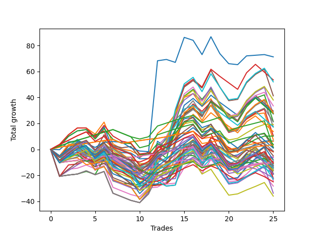

# Long Wallace 014 
- Symbol: ES
- Date Range: 03/18/2022 - 07/15/2022
- Trading Period: 7:20-12:30
- Number of Trades: 25



| Name | Win Percent | Profit | Avg Profit / Trade | Avg Time / Trade |      | Name | Win Percent | Profit | Avg Profit / Trade | Avg Time / Trade |
| ---- | ----------- | ------ | ------------------ | ---------------- | ---- | ---- | ----------- | ------ | ------------------ | ---------------- |
| Sorted By <br> Profit | | | | | | Sorted By <br> Win Percentage ||||
| Seventy-Three | 44.00 | 35625.00 | 1425.00 | 11:45 |     | Eighty-One | 88.00 | 3125.00 | 125.00 | 05:57 |
| Forty-Five | 44.00 | 26750.00 | 1070.00 | 15:49 |     | One Hundred Twenty-Six | 88.00 | 1750.00 | 70.00 | 04:06 |
| Sixty-One | 60.00 | 26000.00 | 1040.00 | 21:13 |     | One Hundred Twenty-One | 84.00 | -5125.00 | -205.00 | 03:47 |
| Five | 60.00 | 20625.00 | 825.00 | 27:05 |     | One Hundred Twenty-Seven | 76.00 | 1875.00 | 75.00 | 07:41 |
| Sixty | 60.00 | 19000.00 | 760.00 | 20:15 |     | Eighty-Two | 76.00 | 750.00 | 30.00 | 10:15 |
| Fifty-Eight | 64.00 | 16750.00 | 670.00 | 16:34 |     | One Hundred Eleven | 76.00 | -4750.00 | -190.00 | 02:00 |
| Forty-Seven | 44.00 | 14750.00 | 590.00 | 15:22 |     | One Hundred Sixteen | 76.00 | -5125.00 | -205.00 | 02:00 |
| Forty-Two | 44.00 | 14125.00 | 565.00 | 12:09 |     | One Hundred Twenty-Two | 72.00 | -6875.00 | -275.00 | 07:29 |
| Sixty-Three | 60.00 | 14000.00 | 560.00 | 20:46 |     | Zero | 68.00 | 3250.00 | 130.00 | 11:53 |
| Forty-Four | 44.00 | 13750.00 | 550.00 | 15:04 |     | One Hundred Twelve | 68.00 | -625.00 | -25.00 | 04:01 |
| Four | 60.00 | 13625.00 | 545.00 | 26:08 |     | Fifty-Eight | 64.00 | 16750.00 | 670.00 | 16:34 |
| Two | 64.00 | 10750.00 | 430.00 | 22:17 |     | Two | 64.00 | 10750.00 | 430.00 | 22:17 |
| Fifty-Nine | 64.00 | 10625.00 | 425.00 | 16:54 |     | Fifty-Nine | 64.00 | 10625.00 | 425.00 | 16:54 |
| Forty | 60.00 | 9625.00 | 385.00 | 06:23 |     | Three | 64.00 | 5250.00 | 210.00 | 22:47 |
| Seven | 60.00 | 8625.00 | 345.00 | 26:38 |     | Sixty-Four | 64.00 | 5125.00 | 205.00 | 08:14 |
| Forty-One | 48.00 | 8625.00 | 345.00 | 10:04 |     | One | 64.00 | 3750.00 | 150.00 | 18:12 |
| Forty-Three | 44.00 | 6875.00 | 275.00 | 12:20 |     | Fifty-Six | 64.00 | -3250.00 | -130.00 | 08:15 |
| Three | 64.00 | 5250.00 | 210.00 | 22:47 |     | One Hundred Twenty-Eight | 64.00 | -5250.00 | -210.00 | 10:10 |
| Sixty-Four | 64.00 | 5125.00 | 205.00 | 08:14 |     | One Hundred Seventeen | 64.00 | -5500.00 | -220.00 | 03:44 |
| One | 64.00 | 3750.00 | 150.00 | 18:12 |     | Eighty-Three | 64.00 | -11125.00 | -445.00 | 15:12 |
| Zero | 68.00 | 3250.00 | 130.00 | 11:53 |     | Sixty-One | 60.00 | 26000.00 | 1040.00 | 21:13 |
| Eighty-One | 88.00 | 3125.00 | 125.00 | 05:57 |     | Five | 60.00 | 20625.00 | 825.00 | 27:05 |
| One Hundred Twenty-Seven | 76.00 | 1875.00 | 75.00 | 07:41 |     | Sixty | 60.00 | 19000.00 | 760.00 | 20:15 |
| One Hundred Twenty-Six | 88.00 | 1750.00 | 70.00 | 04:06 |     | Sixty-Three | 60.00 | 14000.00 | 560.00 | 20:46 |
| Eighty-Two | 76.00 | 750.00 | 30.00 | 10:15 |     | Four | 60.00 | 13625.00 | 545.00 | 26:08 |
| Fifty-Seven | 60.00 | 750.00 | 30.00 | 13:20 |     | Forty | 60.00 | 9625.00 | 385.00 | 06:23 |
| One Hundred Fifteen | 48.00 | 500.00 | 20.00 | 07:37 |     | Seven | 60.00 | 8625.00 | 345.00 | 26:38 |
| One Hundred Twelve | 68.00 | -625.00 | -25.00 | 04:01 |     | Fifty-Seven | 60.00 | 750.00 | 30.00 | 13:20 |
| Fifty-Five | 40.00 | -875.00 | -35.00 | 07:53 |     | One Hundred Twenty-Five | 60.00 | -4125.00 | -165.00 | 12:34 |
| Fifty-Three | 40.00 | -1000.00 | -40.00 | 07:55 |     | Sixty-Two | 60.00 | -6750.00 | -270.00 | 17:25 |
| One Hundred Thirty | 56.00 | -2500.00 | -100.00 | 12:32 |     | Eighty-Five | 60.00 | -9500.00 | -380.00 | 18:26 |
| Forty-Eight | 48.00 | -2875.00 | -115.00 | 05:03 |     | One Hundred Twenty-Four | 60.00 | -11500.00 | -460.00 | 11:24 |
| Fifty-Six | 64.00 | -3250.00 | -130.00 | 08:15 |     | Six | 60.00 | -12125.00 | -485.00 | 23:17 |
| Fifty | 40.00 | -4000.00 | -160.00 | 07:28 |     | Eighty-Four | 60.00 | -16875.00 | -675.00 | 17:16 |
| One Hundred Twenty-Five | 60.00 | -4125.00 | -165.00 | 12:34 |     | One Hundred Twenty-Three | 60.00 | -18000.00 | -720.00 | 09:56 |
| One Hundred Eleven | 76.00 | -4750.00 | -190.00 | 02:00 |     | One Hundred Thirty | 56.00 | -2500.00 | -100.00 | 12:32 |
| One Hundred Twenty | 40.00 | -4750.00 | -190.00 | 05:51 |     | One Hundred Twenty-Nine | 56.00 | -9500.00 | -380.00 | 11:24 |
| One Hundred Twenty-One | 84.00 | -5125.00 | -205.00 | 03:47 |     | Sixty-Seven | 52.00 | -7125.00 | -285.00 | 15:54 |
| One Hundred Sixteen | 76.00 | -5125.00 | -205.00 | 02:00 |     | Seventy | 52.00 | -7500.00 | -300.00 | 16:26 |
| One Hundred Twenty-Eight | 64.00 | -5250.00 | -210.00 | 10:10 |     | Sixty-Six | 52.00 | -7875.00 | -315.00 | 15:30 |
| One Hundred Seventeen | 64.00 | -5500.00 | -220.00 | 03:44 |     | One Hundred Thirteen | 52.00 | -8125.00 | -325.00 | 05:27 |
| Forty-Six | 44.00 | -6000.00 | -240.00 | 12:01 |     | Sixty-Five | 52.00 | -9375.00 | -375.00 | 12:58 |
| Forty-Nine | 40.00 | -6125.00 | -245.00 | 06:51 |     | Forty-One | 48.00 | 8625.00 | 345.00 | 10:04 |
| Fifty-Two | 40.00 | -6375.00 | -255.00 | 07:47 |     | One Hundred Fifteen | 48.00 | 500.00 | 20.00 | 07:37 |
| Sixty-Two | 60.00 | -6750.00 | -270.00 | 17:25 |     | Forty-Eight | 48.00 | -2875.00 | -115.00 | 05:03 |
| One Hundred Twenty-Two | 72.00 | -6875.00 | -275.00 | 07:29 |     | One Hundred Fourteen | 48.00 | -7250.00 | -290.00 | 06:36 |
| Sixty-Seven | 52.00 | -7125.00 | -285.00 | 15:54 |     | Seventy-One | 48.00 | -9500.00 | -380.00 | 18:55 |
| One Hundred Fourteen | 48.00 | -7250.00 | -290.00 | 06:36 |     | Sixty-Nine | 48.00 | -9625.00 | -385.00 | 18:56 |
| Seventy | 52.00 | -7500.00 | -300.00 | 16:26 |     | Sixty-Eight | 48.00 | -14125.00 | -565.00 | 18:29 |
| Sixty-Six | 52.00 | -7875.00 | -315.00 | 15:30 |     | Seventy-Three | 44.00 | 35625.00 | 1425.00 | 11:45 |
| One Hundred Thirteen | 52.00 | -8125.00 | -325.00 | 05:27 |     | Forty-Five | 44.00 | 26750.00 | 1070.00 | 15:49 |
| Fifty-Four | 40.00 | -8250.00 | -330.00 | 06:25 |     | Forty-Seven | 44.00 | 14750.00 | 590.00 | 15:22 |
| Fifty-One | 40.00 | -9250.00 | -370.00 | 07:04 |     | Forty-Two | 44.00 | 14125.00 | 565.00 | 12:09 |
| Sixty-Five | 52.00 | -9375.00 | -375.00 | 12:58 |     | Forty-Four | 44.00 | 13750.00 | 550.00 | 15:04 |
| Eighty-Five | 60.00 | -9500.00 | -380.00 | 18:26 |     | Forty-Three | 44.00 | 6875.00 | 275.00 | 12:20 |
| One Hundred Twenty-Nine | 56.00 | -9500.00 | -380.00 | 11:24 |     | Forty-Six | 44.00 | -6000.00 | -240.00 | 12:01 |
| Seventy-One | 48.00 | -9500.00 | -380.00 | 18:55 |     | One Hundred Eighteen | 44.00 | -12500.00 | -500.00 | 04:47 |
| Sixty-Nine | 48.00 | -9625.00 | -385.00 | 18:56 |     | Fifty-Five | 40.00 | -875.00 | -35.00 | 07:53 |
| One Hundred Ninteen | 40.00 | -11000.00 | -440.00 | 05:13 |     | Fifty-Three | 40.00 | -1000.00 | -40.00 | 07:55 |
| Eighty-Three | 64.00 | -11125.00 | -445.00 | 15:12 |     | Fifty | 40.00 | -4000.00 | -160.00 | 07:28 |
| One Hundred Twenty-Four | 60.00 | -11500.00 | -460.00 | 11:24 |     | One Hundred Twenty | 40.00 | -4750.00 | -190.00 | 05:51 |
| Six | 60.00 | -12125.00 | -485.00 | 23:17 |     | Forty-Nine | 40.00 | -6125.00 | -245.00 | 06:51 |
| One Hundred Eighteen | 44.00 | -12500.00 | -500.00 | 04:47 |     | Fifty-Two | 40.00 | -6375.00 | -255.00 | 07:47 |
| Sixty-Eight | 48.00 | -14125.00 | -565.00 | 18:29 |     | Fifty-Four | 40.00 | -8250.00 | -330.00 | 06:25 |
| Eighty-Four | 60.00 | -16875.00 | -675.00 | 17:16 |     | Fifty-One | 40.00 | -9250.00 | -370.00 | 07:04 |
| One Hundred Twenty-Three | 60.00 | -18000.00 | -720.00 | 09:56 |     | One Hundred Ninteen | 40.00 | -11000.00 | -440.00 | 05:13 |

## NO STOPLOSS

### Test Zero
* Sell when price hits the middle line of the 20p bollinger
* No Stoploss
* Results:
```
Total Trades: 25
Percent Up: 68.00
Percent Down: 32.00
Total Points Moved Up: 6.50
Potential Profit: 3250.00
Total Points Ups: 70.00 Count Ups: 17
Total Points Downs: -63.50 Count Downs: 8
```

<details><summary>Trades</summary>

<code>In: 2022-03-21 09:35:00		Out: 2022-03-21 09:45:00		Total Position Time: 10:00		Total Move Up: 2.50		Total to Date: 2.50</code> <br />
<code>In: 2022-03-23 09:14:00		Out: 2022-03-23 09:19:25		Total Position Time: 05:25		Total Move Up: 7.50		Total to Date: 10.00</code> <br />
<code>In: 2022-03-23 09:47:00		Out: 2022-03-23 09:53:00		Total Position Time: 06:00		Total Move Up: 4.25		Total to Date: 14.25</code> <br />
<code>In: 2022-03-23 10:28:00		Out: 2022-03-23 10:38:15		Total Position Time: 10:15		Total Move Up: 1.00		Total to Date: 15.25</code> <br />
<code>In: 2022-03-25 08:14:00		Out: 2022-03-25 08:36:40		Total Position Time: 22:40		Total Move Up: -6.00		Total to Date: 9.25</code> <br />
<code>In: 2022-03-25 08:29:00		Out: 2022-03-25 08:36:40		Total Position Time: 07:40		Total Move Up: 8.00		Total to Date: 17.25</code> <br />
<code>In: 2022-03-28 08:27:00		Out: 2022-03-28 08:56:55		Total Position Time: 29:55		Total Move Up: -16.75		Total to Date: 0.50</code> <br />
<code>In: 2022-03-31 09:16:00		Out: 2022-03-31 09:32:35		Total Position Time: 16:35		Total Move Up: -3.00		Total to Date: -2.50</code> <br />
<code>In: 2022-03-31 09:23:00		Out: 2022-03-31 09:32:35		Total Position Time: 09:35		Total Move Up: -0.25		Total to Date: -2.75</code> <br />
<code>In: 2022-04-18 08:29:00		Out: 2022-04-18 08:55:05		Total Position Time: 26:05		Total Move Up: -4.50		Total to Date: -7.25</code> <br />
<code>In: 2022-04-20 09:14:00		Out: 2022-04-20 09:30:50		Total Position Time: 16:50		Total Move Up: 0.25		Total to Date: -7.00</code> <br />
<code>In: 2022-05-04 11:36:00		Out: 2022-05-04 11:36:40		Total Position Time: 00:40		Total Move Up: 8.25		Total to Date: 1.25</code> <br />
<code>In: 2022-05-13 11:07:00		Out: 2022-05-13 11:19:15		Total Position Time: 12:15		Total Move Up: 2.25		Total to Date: 3.50</code> <br />
<code>In: 2022-05-17 11:24:00		Out: 2022-05-17 11:27:30		Total Position Time: 03:30		Total Move Up: 11.50		Total to Date: 15.00</code> <br />
<code>In: 2022-05-19 10:51:00		Out: 2022-05-19 10:52:45		Total Position Time: 01:45		Total Move Up: 8.50		Total to Date: 23.50</code> <br />
<code>In: 2022-05-25 09:29:00		Out: 2022-05-25 09:41:25		Total Position Time: 12:25		Total Move Up: 1.50		Total to Date: 25.00</code> <br />
<code>In: 2022-06-06 08:15:00		Out: 2022-06-06 08:31:35		Total Position Time: 16:35		Total Move Up: -8.25		Total to Date: 16.75</code> <br />
<code>In: 2022-06-08 08:05:00		Out: 2022-06-08 08:09:35		Total Position Time: 04:35		Total Move Up: 2.50		Total to Date: 19.25</code> <br />
<code>In: 2022-06-08 09:29:00		Out: 2022-06-08 09:53:05		Total Position Time: 24:05		Total Move Up: -14.25		Total to Date: 5.00</code> <br />
<code>In: 2022-06-15 07:35:00		Out: 2022-06-15 08:04:55		Total Position Time: 29:55		Total Move Up: -10.50		Total to Date: -5.50</code> <br />
<code>In: 2022-06-27 10:45:00		Out: 2022-06-27 10:51:15		Total Position Time: 06:15		Total Move Up: 1.25		Total to Date: -4.25</code> <br />
<code>In: 2022-06-29 08:25:00		Out: 2022-06-29 08:28:15		Total Position Time: 03:15		Total Move Up: 4.25		Total to Date: 0.00</code> <br />
<code>In: 2022-07-05 08:04:00		Out: 2022-07-05 08:08:20		Total Position Time: 04:20		Total Move Up: 4.00		Total to Date: 4.00</code> <br />
<code>In: 2022-07-08 09:44:00		Out: 2022-07-08 09:48:40		Total Position Time: 04:40		Total Move Up: 2.50		Total to Date: 6.50</code> <br />
<code>In: 2022-07-12 11:36:00		Out: 2022-07-12 11:48:05		Total Position Time: 12:05		Total Move Up: 0.00		Total to Date: 6.50</code> <br />


</details>

### Test One
* Sell when the price hits the upper line of the 20p 1std bollinger
* No Stoploss
* Results:
```
Total Trades: 25
Percent Up: 64.00
Percent Down: 36.00
Total Points Moved Up: 7.50
Potential Profit: 3750.00
Total Points Ups: 91.75 Count Ups: 16
Total Points Downs: -84.25 Count Downs: 9
```

<details><summary>Trades</summary>

<code>In: 2022-03-21 09:35:00		Out: 2022-03-21 09:49:45		Total Position Time: 14:45		Total Move Up: 3.75		Total to Date: 3.75</code> <br />
<code>In: 2022-03-23 09:14:00		Out: 2022-03-23 09:30:05		Total Position Time: 16:05		Total Move Up: 7.50		Total to Date: 11.25</code> <br />
<code>In: 2022-03-23 09:47:00		Out: 2022-03-23 09:59:10		Total Position Time: 12:10		Total Move Up: 5.25		Total to Date: 16.50</code> <br />
<code>In: 2022-03-23 10:28:00		Out: 2022-03-23 10:51:45		Total Position Time: 23:45		Total Move Up: 0.00		Total to Date: 16.50</code> <br />
<code>In: 2022-03-25 08:14:00		Out: 2022-03-25 08:41:05		Total Position Time: 27:05		Total Move Up: -4.75		Total to Date: 11.75</code> <br />
<code>In: 2022-03-25 08:29:00		Out: 2022-03-25 08:41:05		Total Position Time: 12:05		Total Move Up: 9.25		Total to Date: 21.00</code> <br />
<code>In: 2022-03-28 08:27:00		Out: 2022-03-28 08:56:55		Total Position Time: 29:55		Total Move Up: -16.75		Total to Date: 4.25</code> <br />
<code>In: 2022-03-31 09:16:00		Out: 2022-03-31 09:40:25		Total Position Time: 24:25		Total Move Up: -4.00		Total to Date: 0.25</code> <br />
<code>In: 2022-03-31 09:23:00		Out: 2022-03-31 09:40:25		Total Position Time: 17:25		Total Move Up: -1.25		Total to Date: -1.00</code> <br />
<code>In: 2022-04-18 08:29:00		Out: 2022-04-18 08:57:10		Total Position Time: 28:10		Total Move Up: -3.50		Total to Date: -4.50</code> <br />
<code>In: 2022-04-20 09:14:00		Out: 2022-04-20 09:30:55		Total Position Time: 16:55		Total Move Up: 0.75		Total to Date: -3.75</code> <br />
<code>In: 2022-05-04 11:36:00		Out: 2022-05-04 11:41:35		Total Position Time: 05:35		Total Move Up: 16.00		Total to Date: 12.25</code> <br />
<code>In: 2022-05-13 11:07:00		Out: 2022-05-13 11:20:00		Total Position Time: 13:00		Total Move Up: 5.75		Total to Date: 18.00</code> <br />
<code>In: 2022-05-17 11:24:00		Out: 2022-05-17 11:37:35		Total Position Time: 13:35		Total Move Up: 9.25		Total to Date: 27.25</code> <br />
<code>In: 2022-05-19 10:51:00		Out: 2022-05-19 10:54:25		Total Position Time: 03:25		Total Move Up: 12.75		Total to Date: 40.00</code> <br />
<code>In: 2022-05-25 09:29:00		Out: 2022-05-25 09:44:25		Total Position Time: 15:25		Total Move Up: 3.00		Total to Date: 43.00</code> <br />
<code>In: 2022-06-06 08:15:00		Out: 2022-06-06 08:39:15		Total Position Time: 24:15		Total Move Up: -10.00		Total to Date: 33.00</code> <br />
<code>In: 2022-06-08 08:05:00		Out: 2022-06-08 08:11:10		Total Position Time: 06:10		Total Move Up: 6.00		Total to Date: 39.00</code> <br />
<code>In: 2022-06-08 09:29:00		Out: 2022-06-08 09:58:55		Total Position Time: 29:55		Total Move Up: -13.00		Total to Date: 26.00</code> <br />
<code>In: 2022-06-15 07:35:00		Out: 2022-06-15 08:04:55		Total Position Time: 29:55		Total Move Up: -10.50		Total to Date: 15.50</code> <br />
<code>In: 2022-06-27 10:45:00		Out: 2022-06-27 11:03:15		Total Position Time: 18:15		Total Move Up: 1.00		Total to Date: 16.50</code> <br />
<code>In: 2022-06-29 08:25:00		Out: 2022-06-29 08:32:20		Total Position Time: 07:20		Total Move Up: 6.75		Total to Date: 23.25</code> <br />
<code>In: 2022-07-05 08:04:00		Out: 2022-07-05 08:16:40		Total Position Time: 12:40		Total Move Up: 4.00		Total to Date: 27.25</code> <br />
<code>In: 2022-07-08 09:44:00		Out: 2022-07-08 10:06:55		Total Position Time: 22:55		Total Move Up: 0.75		Total to Date: 28.00</code> <br />
<code>In: 2022-07-12 11:36:00		Out: 2022-07-12 12:05:55		Total Position Time: 29:55		Total Move Up: -20.50		Total to Date: 7.50</code> <br />


</details>

### Test Two
* Sell when the price hits the upper line of the 20p 2std bollinger
* No Stoploss
* Results:
```
Total Trades: 25
Percent Up: 64.00
Percent Down: 36.00
Total Points Moved Up: 21.50
Potential Profit: 10750.00
Total Points Ups: 117.00 Count Ups: 16
Total Points Downs: -95.50 Count Downs: 9
```

<details><summary>Trades</summary>

<code>In: 2022-03-21 09:35:00		Out: 2022-03-21 10:04:55		Total Position Time: 29:55		Total Move Up: -20.75		Total to Date: -20.75</code> <br />
<code>In: 2022-03-23 09:14:00		Out: 2022-03-23 09:43:55		Total Position Time: 29:55		Total Move Up: 1.00		Total to Date: -19.75</code> <br />
<code>In: 2022-03-23 09:47:00		Out: 2022-03-23 10:16:55		Total Position Time: 29:55		Total Move Up: 0.75		Total to Date: -19.00</code> <br />
<code>In: 2022-03-23 10:28:00		Out: 2022-03-23 10:54:25		Total Position Time: 26:25		Total Move Up: 2.00		Total to Date: -17.00</code> <br />
<code>In: 2022-03-25 08:14:00		Out: 2022-03-25 08:41:45		Total Position Time: 27:45		Total Move Up: -2.25		Total to Date: -19.25</code> <br />
<code>In: 2022-03-25 08:29:00		Out: 2022-03-25 08:41:45		Total Position Time: 12:45		Total Move Up: 11.75		Total to Date: -7.50</code> <br />
<code>In: 2022-03-28 08:27:00		Out: 2022-03-28 08:56:55		Total Position Time: 29:55		Total Move Up: -16.75		Total to Date: -24.25</code> <br />
<code>In: 2022-03-31 09:16:00		Out: 2022-03-31 09:44:20		Total Position Time: 28:20		Total Move Up: -2.25		Total to Date: -26.50</code> <br />
<code>In: 2022-03-31 09:23:00		Out: 2022-03-31 09:44:20		Total Position Time: 21:20		Total Move Up: 0.50		Total to Date: -26.00</code> <br />
<code>In: 2022-04-18 08:29:00		Out: 2022-04-18 08:58:55		Total Position Time: 29:55		Total Move Up: -1.75		Total to Date: -27.75</code> <br />
<code>In: 2022-04-20 09:14:00		Out: 2022-04-20 09:31:05		Total Position Time: 17:05		Total Move Up: 0.75		Total to Date: -27.00</code> <br />
<code>In: 2022-05-04 11:36:00		Out: 2022-05-04 11:43:45		Total Position Time: 07:45		Total Move Up: 27.50		Total to Date: 0.50</code> <br />
<code>In: 2022-05-13 11:07:00		Out: 2022-05-13 11:31:20		Total Position Time: 24:20		Total Move Up: 7.75		Total to Date: 8.25</code> <br />
<code>In: 2022-05-17 11:24:00		Out: 2022-05-17 11:40:00		Total Position Time: 16:00		Total Move Up: 13.00		Total to Date: 21.25</code> <br />
<code>In: 2022-05-19 10:51:00		Out: 2022-05-19 10:55:15		Total Position Time: 04:15		Total Move Up: 19.75		Total to Date: 41.00</code> <br />
<code>In: 2022-05-25 09:29:00		Out: 2022-05-25 09:45:20		Total Position Time: 16:20		Total Move Up: 5.25		Total to Date: 46.25</code> <br />
<code>In: 2022-06-06 08:15:00		Out: 2022-06-06 08:43:00		Total Position Time: 28:00		Total Move Up: -7.75		Total to Date: 38.50</code> <br />
<code>In: 2022-06-08 08:05:00		Out: 2022-06-08 08:14:00		Total Position Time: 09:00		Total Move Up: 8.50		Total to Date: 47.00</code> <br />
<code>In: 2022-06-08 09:29:00		Out: 2022-06-08 09:58:55		Total Position Time: 29:55		Total Move Up: -13.00		Total to Date: 34.00</code> <br />
<code>In: 2022-06-15 07:35:00		Out: 2022-06-15 08:04:55		Total Position Time: 29:55		Total Move Up: -10.50		Total to Date: 23.50</code> <br />
<code>In: 2022-06-27 10:45:00		Out: 2022-06-27 11:13:35		Total Position Time: 28:35		Total Move Up: 2.00		Total to Date: 25.50</code> <br />
<code>In: 2022-06-29 08:25:00		Out: 2022-06-29 08:34:40		Total Position Time: 09:40		Total Move Up: 8.50		Total to Date: 34.00</code> <br />
<code>In: 2022-07-05 08:04:00		Out: 2022-07-05 08:17:55		Total Position Time: 13:55		Total Move Up: 5.50		Total to Date: 39.50</code> <br />
<code>In: 2022-07-08 09:44:00		Out: 2022-07-08 10:10:30		Total Position Time: 26:30		Total Move Up: 2.50		Total to Date: 42.00</code> <br />
<code>In: 2022-07-12 11:36:00		Out: 2022-07-12 12:05:55		Total Position Time: 29:55		Total Move Up: -20.50		Total to Date: 21.50</code> <br />


</details>

### Test Three
* Sell when price hits the middle line of the 50p bollinger
* No Stoploss
* Results:
```
Total Trades: 25
Percent Up: 64.00
Percent Down: 36.00
Total Points Moved Up: 10.50
Potential Profit: 5250.00
Total Points Ups: 104.25 Count Ups: 16
Total Points Downs: -93.75 Count Downs: 9
```

<details><summary>Trades</summary>

<code>In: 2022-03-21 09:35:00		Out: 2022-03-21 10:04:55		Total Position Time: 29:55		Total Move Up: -20.75		Total to Date: -20.75</code> <br />
<code>In: 2022-03-23 09:14:00		Out: 2022-03-23 09:30:30		Total Position Time: 16:30		Total Move Up: 8.75		Total to Date: -12.00</code> <br />
<code>In: 2022-03-23 09:47:00		Out: 2022-03-23 10:16:55		Total Position Time: 29:55		Total Move Up: 0.75		Total to Date: -11.25</code> <br />
<code>In: 2022-03-23 10:28:00		Out: 2022-03-23 10:54:30		Total Position Time: 26:30		Total Move Up: 2.75		Total to Date: -8.50</code> <br />
<code>In: 2022-03-25 08:14:00		Out: 2022-03-25 08:43:55		Total Position Time: 29:55		Total Move Up: -3.00		Total to Date: -11.50</code> <br />
<code>In: 2022-03-25 08:29:00		Out: 2022-03-25 08:52:45		Total Position Time: 23:45		Total Move Up: 12.50		Total to Date: 1.00</code> <br />
<code>In: 2022-03-28 08:27:00		Out: 2022-03-28 08:56:55		Total Position Time: 29:55		Total Move Up: -16.75		Total to Date: -15.75</code> <br />
<code>In: 2022-03-31 09:16:00		Out: 2022-03-31 09:45:45		Total Position Time: 29:45		Total Move Up: -1.75		Total to Date: -17.50</code> <br />
<code>In: 2022-03-31 09:23:00		Out: 2022-03-31 09:45:45		Total Position Time: 22:45		Total Move Up: 1.00		Total to Date: -16.50</code> <br />
<code>In: 2022-04-18 08:29:00		Out: 2022-04-18 08:58:55		Total Position Time: 29:55		Total Move Up: -1.75		Total to Date: -18.25</code> <br />
<code>In: 2022-04-20 09:14:00		Out: 2022-04-20 09:32:40		Total Position Time: 18:40		Total Move Up: 4.50		Total to Date: -13.75</code> <br />
<code>In: 2022-05-04 11:36:00		Out: 2022-05-04 11:41:15		Total Position Time: 05:15		Total Move Up: 11.75		Total to Date: -2.00</code> <br />
<code>In: 2022-05-13 11:07:00		Out: 2022-05-13 11:31:20		Total Position Time: 24:20		Total Move Up: 7.75		Total to Date: 5.75</code> <br />
<code>In: 2022-05-17 11:24:00		Out: 2022-05-17 11:40:05		Total Position Time: 16:05		Total Move Up: 14.50		Total to Date: 20.25</code> <br />
<code>In: 2022-05-19 10:51:00		Out: 2022-05-19 10:52:40		Total Position Time: 01:40		Total Move Up: 7.00		Total to Date: 27.25</code> <br />
<code>In: 2022-05-25 09:29:00		Out: 2022-05-25 09:49:05		Total Position Time: 20:05		Total Move Up: 7.75		Total to Date: 35.00</code> <br />
<code>In: 2022-06-06 08:15:00		Out: 2022-06-06 08:44:55		Total Position Time: 29:55		Total Move Up: -5.75		Total to Date: 29.25</code> <br />
<code>In: 2022-06-08 08:05:00		Out: 2022-06-08 08:11:20		Total Position Time: 06:20		Total Move Up: 7.25		Total to Date: 36.50</code> <br />
<code>In: 2022-06-08 09:29:00		Out: 2022-06-08 09:58:55		Total Position Time: 29:55		Total Move Up: -13.00		Total to Date: 23.50</code> <br />
<code>In: 2022-06-15 07:35:00		Out: 2022-06-15 08:04:55		Total Position Time: 29:55		Total Move Up: -10.50		Total to Date: 13.00</code> <br />
<code>In: 2022-06-27 10:45:00		Out: 2022-06-27 11:13:35		Total Position Time: 28:35		Total Move Up: 2.00		Total to Date: 15.00</code> <br />
<code>In: 2022-06-29 08:25:00		Out: 2022-06-29 08:34:40		Total Position Time: 09:40		Total Move Up: 8.50		Total to Date: 23.50</code> <br />
<code>In: 2022-07-05 08:04:00		Out: 2022-07-05 08:27:25		Total Position Time: 23:25		Total Move Up: 4.50		Total to Date: 28.00</code> <br />
<code>In: 2022-07-08 09:44:00		Out: 2022-07-08 10:11:05		Total Position Time: 27:05		Total Move Up: 3.00		Total to Date: 31.00</code> <br />
<code>In: 2022-07-12 11:36:00		Out: 2022-07-12 12:05:55		Total Position Time: 29:55		Total Move Up: -20.50		Total to Date: 10.50</code> <br />


</details>

### Test Four
* Sell when the price hits the upper line of the 50p 1std bollinger
* No Stoploss
* Results:
```
Total Trades: 25
Percent Up: 60.00
Percent Down: 40.00
Total Points Moved Up: 27.25
Potential Profit: 13625.00
Total Points Ups: 124.75 Count Ups: 15
Total Points Downs: -97.50 Count Downs: 10
```

<details><summary>Trades</summary>

<code>In: 2022-03-21 09:35:00		Out: 2022-03-21 10:04:55		Total Position Time: 29:55		Total Move Up: -20.75		Total to Date: -20.75</code> <br />
<code>In: 2022-03-23 09:14:00		Out: 2022-03-23 09:43:55		Total Position Time: 29:55		Total Move Up: 1.00		Total to Date: -19.75</code> <br />
<code>In: 2022-03-23 09:47:00		Out: 2022-03-23 10:16:55		Total Position Time: 29:55		Total Move Up: 0.75		Total to Date: -19.00</code> <br />
<code>In: 2022-03-23 10:28:00		Out: 2022-03-23 10:57:55		Total Position Time: 29:55		Total Move Up: 2.50		Total to Date: -16.50</code> <br />
<code>In: 2022-03-25 08:14:00		Out: 2022-03-25 08:43:55		Total Position Time: 29:55		Total Move Up: -3.00		Total to Date: -19.50</code> <br />
<code>In: 2022-03-25 08:29:00		Out: 2022-03-25 08:58:55		Total Position Time: 29:55		Total Move Up: 2.50		Total to Date: -17.00</code> <br />
<code>In: 2022-03-28 08:27:00		Out: 2022-03-28 08:56:55		Total Position Time: 29:55		Total Move Up: -16.75		Total to Date: -33.75</code> <br />
<code>In: 2022-03-31 09:16:00		Out: 2022-03-31 09:45:55		Total Position Time: 29:55		Total Move Up: -2.75		Total to Date: -36.50</code> <br />
<code>In: 2022-03-31 09:23:00		Out: 2022-03-31 09:52:55		Total Position Time: 29:55		Total Move Up: -2.75		Total to Date: -39.25</code> <br />
<code>In: 2022-04-18 08:29:00		Out: 2022-04-18 08:58:55		Total Position Time: 29:55		Total Move Up: -1.75		Total to Date: -41.00</code> <br />
<code>In: 2022-04-20 09:14:00		Out: 2022-04-20 09:36:45		Total Position Time: 22:45		Total Move Up: 8.25		Total to Date: -32.75</code> <br />
<code>In: 2022-05-04 11:36:00		Out: 2022-05-04 11:42:00		Total Position Time: 06:00		Total Move Up: 21.25		Total to Date: -11.50</code> <br />
<code>In: 2022-05-13 11:07:00		Out: 2022-05-13 11:32:00		Total Position Time: 25:00		Total Move Up: 15.75		Total to Date: 4.25</code> <br />
<code>In: 2022-05-17 11:24:00		Out: 2022-05-17 11:44:30		Total Position Time: 20:30		Total Move Up: 21.75		Total to Date: 26.00</code> <br />
<code>In: 2022-05-19 10:51:00		Out: 2022-05-19 10:54:15		Total Position Time: 03:15		Total Move Up: 12.00		Total to Date: 38.00</code> <br />
<code>In: 2022-05-25 09:29:00		Out: 2022-05-25 09:58:55		Total Position Time: 29:55		Total Move Up: 5.00		Total to Date: 43.00</code> <br />
<code>In: 2022-06-06 08:15:00		Out: 2022-06-06 08:44:55		Total Position Time: 29:55		Total Move Up: -5.75		Total to Date: 37.25</code> <br />
<code>In: 2022-06-08 08:05:00		Out: 2022-06-08 08:15:05		Total Position Time: 10:05		Total Move Up: 10.75		Total to Date: 48.00</code> <br />
<code>In: 2022-06-08 09:29:00		Out: 2022-06-08 09:58:55		Total Position Time: 29:55		Total Move Up: -13.00		Total to Date: 35.00</code> <br />
<code>In: 2022-06-15 07:35:00		Out: 2022-06-15 08:04:55		Total Position Time: 29:55		Total Move Up: -10.50		Total to Date: 24.50</code> <br />
<code>In: 2022-06-27 10:45:00		Out: 2022-06-27 11:14:55		Total Position Time: 29:55		Total Move Up: 1.00		Total to Date: 25.50</code> <br />
<code>In: 2022-06-29 08:25:00		Out: 2022-06-29 08:53:10		Total Position Time: 28:10		Total Move Up: 11.50		Total to Date: 37.00</code> <br />
<code>In: 2022-07-05 08:04:00		Out: 2022-07-05 08:33:05		Total Position Time: 29:05		Total Move Up: 6.75		Total to Date: 43.75</code> <br />
<code>In: 2022-07-08 09:44:00		Out: 2022-07-08 10:13:55		Total Position Time: 29:55		Total Move Up: 4.00		Total to Date: 47.75</code> <br />
<code>In: 2022-07-12 11:36:00		Out: 2022-07-12 12:05:55		Total Position Time: 29:55		Total Move Up: -20.50		Total to Date: 27.25</code> <br />


</details>

### Test Five
* Sell when the price hits the upper line of the 50p 2std bollinger
* No Stoploss
* Results:
```
Total Trades: 25
Percent Up: 60.00
Percent Down: 40.00
Total Points Moved Up: 41.25
Potential Profit: 20625.00
Total Points Ups: 138.75 Count Ups: 15
Total Points Downs: -97.50 Count Downs: 10
```

<details><summary>Trades</summary>

<code>In: 2022-03-21 09:35:00		Out: 2022-03-21 10:04:55		Total Position Time: 29:55		Total Move Up: -20.75		Total to Date: -20.75</code> <br />
<code>In: 2022-03-23 09:14:00		Out: 2022-03-23 09:43:55		Total Position Time: 29:55		Total Move Up: 1.00		Total to Date: -19.75</code> <br />
<code>In: 2022-03-23 09:47:00		Out: 2022-03-23 10:16:55		Total Position Time: 29:55		Total Move Up: 0.75		Total to Date: -19.00</code> <br />
<code>In: 2022-03-23 10:28:00		Out: 2022-03-23 10:57:55		Total Position Time: 29:55		Total Move Up: 2.50		Total to Date: -16.50</code> <br />
<code>In: 2022-03-25 08:14:00		Out: 2022-03-25 08:43:55		Total Position Time: 29:55		Total Move Up: -3.00		Total to Date: -19.50</code> <br />
<code>In: 2022-03-25 08:29:00		Out: 2022-03-25 08:58:55		Total Position Time: 29:55		Total Move Up: 2.50		Total to Date: -17.00</code> <br />
<code>In: 2022-03-28 08:27:00		Out: 2022-03-28 08:56:55		Total Position Time: 29:55		Total Move Up: -16.75		Total to Date: -33.75</code> <br />
<code>In: 2022-03-31 09:16:00		Out: 2022-03-31 09:45:55		Total Position Time: 29:55		Total Move Up: -2.75		Total to Date: -36.50</code> <br />
<code>In: 2022-03-31 09:23:00		Out: 2022-03-31 09:52:55		Total Position Time: 29:55		Total Move Up: -2.75		Total to Date: -39.25</code> <br />
<code>In: 2022-04-18 08:29:00		Out: 2022-04-18 08:58:55		Total Position Time: 29:55		Total Move Up: -1.75		Total to Date: -41.00</code> <br />
<code>In: 2022-04-20 09:14:00		Out: 2022-04-20 09:43:55		Total Position Time: 29:55		Total Move Up: 6.75		Total to Date: -34.25</code> <br />
<code>In: 2022-05-04 11:36:00		Out: 2022-05-04 11:43:45		Total Position Time: 07:45		Total Move Up: 27.50		Total to Date: -6.75</code> <br />
<code>In: 2022-05-13 11:07:00		Out: 2022-05-13 11:36:55		Total Position Time: 29:55		Total Move Up: 3.75		Total to Date: -3.00</code> <br />
<code>In: 2022-05-17 11:24:00		Out: 2022-05-17 11:48:45		Total Position Time: 24:45		Total Move Up: 31.25		Total to Date: 28.25</code> <br />
<code>In: 2022-05-19 10:51:00		Out: 2022-05-19 10:55:15		Total Position Time: 04:15		Total Move Up: 19.75		Total to Date: 48.00</code> <br />
<code>In: 2022-05-25 09:29:00		Out: 2022-05-25 09:58:55		Total Position Time: 29:55		Total Move Up: 5.00		Total to Date: 53.00</code> <br />
<code>In: 2022-06-06 08:15:00		Out: 2022-06-06 08:44:55		Total Position Time: 29:55		Total Move Up: -5.75		Total to Date: 47.25</code> <br />
<code>In: 2022-06-08 08:05:00		Out: 2022-06-08 08:17:25		Total Position Time: 12:25		Total Move Up: 13.75		Total to Date: 61.00</code> <br />
<code>In: 2022-06-08 09:29:00		Out: 2022-06-08 09:58:55		Total Position Time: 29:55		Total Move Up: -13.00		Total to Date: 48.00</code> <br />
<code>In: 2022-06-15 07:35:00		Out: 2022-06-15 08:04:55		Total Position Time: 29:55		Total Move Up: -10.50		Total to Date: 37.50</code> <br />
<code>In: 2022-06-27 10:45:00		Out: 2022-06-27 11:14:55		Total Position Time: 29:55		Total Move Up: 1.00		Total to Date: 38.50</code> <br />
<code>In: 2022-06-29 08:25:00		Out: 2022-06-29 08:54:55		Total Position Time: 29:55		Total Move Up: 12.75		Total to Date: 51.25</code> <br />
<code>In: 2022-07-05 08:04:00		Out: 2022-07-05 08:33:55		Total Position Time: 29:55		Total Move Up: 6.50		Total to Date: 57.75</code> <br />
<code>In: 2022-07-08 09:44:00		Out: 2022-07-08 10:13:55		Total Position Time: 29:55		Total Move Up: 4.00		Total to Date: 61.75</code> <br />
<code>In: 2022-07-12 11:36:00		Out: 2022-07-12 12:05:55		Total Position Time: 29:55		Total Move Up: -20.50		Total to Date: 41.25</code> <br />


</details>

### Test Six
* Sell when the price hits the middle line of the 1std VWAP
* No Stoploss
* Results:
```
Total Trades: 25
Percent Up: 60.00
Percent Down: 40.00
Total Points Moved Up: -24.25
Potential Profit: -12125.00
Total Points Ups: 73.25 Count Ups: 15
Total Points Downs: -97.50 Count Downs: 10
```

<details><summary>Trades</summary>

<code>In: 2022-03-21 09:35:00		Out: 2022-03-21 10:04:55		Total Position Time: 29:55		Total Move Up: -20.75		Total to Date: -20.75</code> <br />
<code>In: 2022-03-23 09:14:00		Out: 2022-03-23 09:16:05		Total Position Time: 02:05		Total Move Up: 5.50		Total to Date: -15.25</code> <br />
<code>In: 2022-03-23 09:47:00		Out: 2022-03-23 10:16:55		Total Position Time: 29:55		Total Move Up: 0.75		Total to Date: -14.50</code> <br />
<code>In: 2022-03-23 10:28:00		Out: 2022-03-23 10:57:55		Total Position Time: 29:55		Total Move Up: 2.50		Total to Date: -12.00</code> <br />
<code>In: 2022-03-25 08:14:00		Out: 2022-03-25 08:43:55		Total Position Time: 29:55		Total Move Up: -3.00		Total to Date: -15.00</code> <br />
<code>In: 2022-03-25 08:29:00		Out: 2022-03-25 08:58:55		Total Position Time: 29:55		Total Move Up: 2.50		Total to Date: -12.50</code> <br />
<code>In: 2022-03-28 08:27:00		Out: 2022-03-28 08:56:55		Total Position Time: 29:55		Total Move Up: -16.75		Total to Date: -29.25</code> <br />
<code>In: 2022-03-31 09:16:00		Out: 2022-03-31 09:45:55		Total Position Time: 29:55		Total Move Up: -2.75		Total to Date: -32.00</code> <br />
<code>In: 2022-03-31 09:23:00		Out: 2022-03-31 09:52:55		Total Position Time: 29:55		Total Move Up: -2.75		Total to Date: -34.75</code> <br />
<code>In: 2022-04-18 08:29:00		Out: 2022-04-18 08:58:55		Total Position Time: 29:55		Total Move Up: -1.75		Total to Date: -36.50</code> <br />
<code>In: 2022-04-20 09:14:00		Out: 2022-04-20 09:35:50		Total Position Time: 21:50		Total Move Up: 6.75		Total to Date: -29.75</code> <br />
<code>In: 2022-05-04 11:36:00		Out: 2022-05-04 11:36:10		Total Position Time: 00:10		Total Move Up: 0.75		Total to Date: -29.00</code> <br />
<code>In: 2022-05-13 11:07:00		Out: 2022-05-13 11:36:55		Total Position Time: 29:55		Total Move Up: 3.75		Total to Date: -25.25</code> <br />
<code>In: 2022-05-17 11:24:00		Out: 2022-05-17 11:27:25		Total Position Time: 03:25		Total Move Up: 11.25		Total to Date: -14.00</code> <br />
<code>In: 2022-05-19 10:51:00		Out: 2022-05-19 10:53:10		Total Position Time: 02:10		Total Move Up: 10.25		Total to Date: -3.75</code> <br />
<code>In: 2022-05-25 09:29:00		Out: 2022-05-25 09:58:55		Total Position Time: 29:55		Total Move Up: 5.00		Total to Date: 1.25</code> <br />
<code>In: 2022-06-06 08:15:00		Out: 2022-06-06 08:44:55		Total Position Time: 29:55		Total Move Up: -5.75		Total to Date: -4.50</code> <br />
<code>In: 2022-06-08 08:05:00		Out: 2022-06-08 08:10:50		Total Position Time: 05:50		Total Move Up: 4.50		Total to Date: 0.00</code> <br />
<code>In: 2022-06-08 09:29:00		Out: 2022-06-08 09:58:55		Total Position Time: 29:55		Total Move Up: -13.00		Total to Date: -13.00</code> <br />
<code>In: 2022-06-15 07:35:00		Out: 2022-06-15 08:04:55		Total Position Time: 29:55		Total Move Up: -10.50		Total to Date: -23.50</code> <br />
<code>In: 2022-06-27 10:45:00		Out: 2022-06-27 11:14:55		Total Position Time: 29:55		Total Move Up: 1.00		Total to Date: -22.50</code> <br />
<code>In: 2022-06-29 08:25:00		Out: 2022-06-29 08:34:40		Total Position Time: 09:40		Total Move Up: 8.50		Total to Date: -14.00</code> <br />
<code>In: 2022-07-05 08:04:00		Out: 2022-07-05 08:32:40		Total Position Time: 28:40		Total Move Up: 6.25		Total to Date: -7.75</code> <br />
<code>In: 2022-07-08 09:44:00		Out: 2022-07-08 10:13:55		Total Position Time: 29:55		Total Move Up: 4.00		Total to Date: -3.75</code> <br />
<code>In: 2022-07-12 11:36:00		Out: 2022-07-12 12:05:55		Total Position Time: 29:55		Total Move Up: -20.50		Total to Date: -24.25</code> <br />


</details>

### Test Seven
* Sell when the price hits the upper line of the 1std VWAP
* No Stoploss
* Results:
```
Total Trades: 25
Percent Up: 60.00
Percent Down: 40.00
Total Points Moved Up: 17.25
Potential Profit: 8625.00
Total Points Ups: 114.75 Count Ups: 15
Total Points Downs: -97.50 Count Downs: 10
```

<details><summary>Trades</summary>

<code>In: 2022-03-21 09:35:00		Out: 2022-03-21 10:04:55		Total Position Time: 29:55		Total Move Up: -20.75		Total to Date: -20.75</code> <br />
<code>In: 2022-03-23 09:14:00		Out: 2022-03-23 09:43:55		Total Position Time: 29:55		Total Move Up: 1.00		Total to Date: -19.75</code> <br />
<code>In: 2022-03-23 09:47:00		Out: 2022-03-23 10:16:55		Total Position Time: 29:55		Total Move Up: 0.75		Total to Date: -19.00</code> <br />
<code>In: 2022-03-23 10:28:00		Out: 2022-03-23 10:57:55		Total Position Time: 29:55		Total Move Up: 2.50		Total to Date: -16.50</code> <br />
<code>In: 2022-03-25 08:14:00		Out: 2022-03-25 08:43:55		Total Position Time: 29:55		Total Move Up: -3.00		Total to Date: -19.50</code> <br />
<code>In: 2022-03-25 08:29:00		Out: 2022-03-25 08:58:55		Total Position Time: 29:55		Total Move Up: 2.50		Total to Date: -17.00</code> <br />
<code>In: 2022-03-28 08:27:00		Out: 2022-03-28 08:56:55		Total Position Time: 29:55		Total Move Up: -16.75		Total to Date: -33.75</code> <br />
<code>In: 2022-03-31 09:16:00		Out: 2022-03-31 09:45:55		Total Position Time: 29:55		Total Move Up: -2.75		Total to Date: -36.50</code> <br />
<code>In: 2022-03-31 09:23:00		Out: 2022-03-31 09:52:55		Total Position Time: 29:55		Total Move Up: -2.75		Total to Date: -39.25</code> <br />
<code>In: 2022-04-18 08:29:00		Out: 2022-04-18 08:58:55		Total Position Time: 29:55		Total Move Up: -1.75		Total to Date: -41.00</code> <br />
<code>In: 2022-04-20 09:14:00		Out: 2022-04-20 09:43:55		Total Position Time: 29:55		Total Move Up: 6.75		Total to Date: -34.25</code> <br />
<code>In: 2022-05-04 11:36:00		Out: 2022-05-04 11:41:30		Total Position Time: 05:30		Total Move Up: 13.75		Total to Date: -20.50</code> <br />
<code>In: 2022-05-13 11:07:00		Out: 2022-05-13 11:36:55		Total Position Time: 29:55		Total Move Up: 3.75		Total to Date: -16.75</code> <br />
<code>In: 2022-05-17 11:24:00		Out: 2022-05-17 11:40:20		Total Position Time: 16:20		Total Move Up: 20.75		Total to Date: 4.00</code> <br />
<code>In: 2022-05-19 10:51:00		Out: 2022-05-19 10:55:35		Total Position Time: 04:35		Total Move Up: 21.75		Total to Date: 25.75</code> <br />
<code>In: 2022-05-25 09:29:00		Out: 2022-05-25 09:58:55		Total Position Time: 29:55		Total Move Up: 5.00		Total to Date: 30.75</code> <br />
<code>In: 2022-06-06 08:15:00		Out: 2022-06-06 08:44:55		Total Position Time: 29:55		Total Move Up: -5.75		Total to Date: 25.00</code> <br />
<code>In: 2022-06-08 08:05:00		Out: 2022-06-08 08:16:30		Total Position Time: 11:30		Total Move Up: 12.00		Total to Date: 37.00</code> <br />
<code>In: 2022-06-08 09:29:00		Out: 2022-06-08 09:58:55		Total Position Time: 29:55		Total Move Up: -13.00		Total to Date: 24.00</code> <br />
<code>In: 2022-06-15 07:35:00		Out: 2022-06-15 08:04:55		Total Position Time: 29:55		Total Move Up: -10.50		Total to Date: 13.50</code> <br />
<code>In: 2022-06-27 10:45:00		Out: 2022-06-27 11:14:55		Total Position Time: 29:55		Total Move Up: 1.00		Total to Date: 14.50</code> <br />
<code>In: 2022-06-29 08:25:00		Out: 2022-06-29 08:54:55		Total Position Time: 29:55		Total Move Up: 12.75		Total to Date: 27.25</code> <br />
<code>In: 2022-07-05 08:04:00		Out: 2022-07-05 08:33:55		Total Position Time: 29:55		Total Move Up: 6.50		Total to Date: 33.75</code> <br />
<code>In: 2022-07-08 09:44:00		Out: 2022-07-08 10:13:55		Total Position Time: 29:55		Total Move Up: 4.00		Total to Date: 37.75</code> <br />
<code>In: 2022-07-12 11:36:00		Out: 2022-07-12 12:05:55		Total Position Time: 29:55		Total Move Up: -20.50		Total to Date: 17.25</code> <br />


</details>

## STOPLOSS OF 5

### Test Forty
* Sell when price hits the middle line of the 20p bollinger
* Stoploss is 5 points
* Results:
```
Total Trades: 25
Percent Up: 60.00
Percent Down: 40.00
Total Points Moved Up: 19.25
Potential Profit: 9625.00
Total Points Ups: 66.50 Count Ups: 15
Total Points Downs: -47.25 Count Downs: 10
```

<details><summary>Trades</summary>

<code>In: 2022-03-21 09:35:00		Out: 2022-03-21 09:35:20		Total Position Time: 00:20		Total Move Up: -5.00		Total to Date: -5.00</code> <br />
<code>In: 2022-03-23 09:14:00		Out: 2022-03-23 09:19:25		Total Position Time: 05:25		Total Move Up: 7.50		Total to Date: 2.50</code> <br />
<code>In: 2022-03-23 09:47:00		Out: 2022-03-23 09:53:00		Total Position Time: 06:00		Total Move Up: 4.25		Total to Date: 6.75</code> <br />
<code>In: 2022-03-23 10:28:00		Out: 2022-03-23 10:30:15		Total Position Time: 02:15		Total Move Up: -5.25		Total to Date: 1.50</code> <br />
<code>In: 2022-03-25 08:14:00		Out: 2022-03-25 08:24:25		Total Position Time: 10:25		Total Move Up: -4.75		Total to Date: -3.25</code> <br />
<code>In: 2022-03-25 08:29:00		Out: 2022-03-25 08:36:40		Total Position Time: 07:40		Total Move Up: 8.00		Total to Date: 4.75</code> <br />
<code>In: 2022-03-28 08:27:00		Out: 2022-03-28 08:33:30		Total Position Time: 06:30		Total Move Up: -5.50		Total to Date: -0.75</code> <br />
<code>In: 2022-03-31 09:16:00		Out: 2022-03-31 09:25:00		Total Position Time: 09:00		Total Move Up: -5.00		Total to Date: -5.75</code> <br />
<code>In: 2022-03-31 09:23:00		Out: 2022-03-31 09:32:35		Total Position Time: 09:35		Total Move Up: -0.25		Total to Date: -6.00</code> <br />
<code>In: 2022-04-18 08:29:00		Out: 2022-04-18 08:39:25		Total Position Time: 10:25		Total Move Up: -5.00		Total to Date: -11.00</code> <br />
<code>In: 2022-04-20 09:14:00		Out: 2022-04-20 09:30:50		Total Position Time: 16:50		Total Move Up: 0.25		Total to Date: -10.75</code> <br />
<code>In: 2022-05-04 11:36:00		Out: 2022-05-04 11:36:40		Total Position Time: 00:40		Total Move Up: 8.25		Total to Date: -2.50</code> <br />
<code>In: 2022-05-13 11:07:00		Out: 2022-05-13 11:19:15		Total Position Time: 12:15		Total Move Up: 2.25		Total to Date: -0.25</code> <br />
<code>In: 2022-05-17 11:24:00		Out: 2022-05-17 11:27:30		Total Position Time: 03:30		Total Move Up: 11.50		Total to Date: 11.25</code> <br />
<code>In: 2022-05-19 10:51:00		Out: 2022-05-19 10:52:45		Total Position Time: 01:45		Total Move Up: 8.50		Total to Date: 19.75</code> <br />
<code>In: 2022-05-25 09:29:00		Out: 2022-05-25 09:41:25		Total Position Time: 12:25		Total Move Up: 1.50		Total to Date: 21.25</code> <br />
<code>In: 2022-06-06 08:15:00		Out: 2022-06-06 08:16:50		Total Position Time: 01:50		Total Move Up: -6.00		Total to Date: 15.25</code> <br />
<code>In: 2022-06-08 08:05:00		Out: 2022-06-08 08:09:35		Total Position Time: 04:35		Total Move Up: 2.50		Total to Date: 17.75</code> <br />
<code>In: 2022-06-08 09:29:00		Out: 2022-06-08 09:33:00		Total Position Time: 04:00		Total Move Up: -5.50		Total to Date: 12.25</code> <br />
<code>In: 2022-06-15 07:35:00		Out: 2022-06-15 07:38:40		Total Position Time: 03:40		Total Move Up: -5.00		Total to Date: 7.25</code> <br />
<code>In: 2022-06-27 10:45:00		Out: 2022-06-27 10:51:15		Total Position Time: 06:15		Total Move Up: 1.25		Total to Date: 8.50</code> <br />
<code>In: 2022-06-29 08:25:00		Out: 2022-06-29 08:28:15		Total Position Time: 03:15		Total Move Up: 4.25		Total to Date: 12.75</code> <br />
<code>In: 2022-07-05 08:04:00		Out: 2022-07-05 08:08:20		Total Position Time: 04:20		Total Move Up: 4.00		Total to Date: 16.75</code> <br />
<code>In: 2022-07-08 09:44:00		Out: 2022-07-08 09:48:40		Total Position Time: 04:40		Total Move Up: 2.50		Total to Date: 19.25</code> <br />
<code>In: 2022-07-12 11:36:00		Out: 2022-07-12 11:48:05		Total Position Time: 12:05		Total Move Up: 0.00		Total to Date: 19.25</code> <br />


</details>

### Test Forty-One
* Sell when the price hits the upper line of the 20p 1std bollinger
* Stoploss is 5 points
* Results:
```
Total Trades: 25
Percent Up: 48.00
Percent Down: 52.00
Total Points Moved Up: 17.25
Potential Profit: 8625.00
Total Points Ups: 86.25 Count Ups: 12
Total Points Downs: -69.00 Count Downs: 13
```

<details><summary>Trades</summary>

<code>In: 2022-03-21 09:35:00		Out: 2022-03-21 09:35:20		Total Position Time: 00:20		Total Move Up: -5.00		Total to Date: -5.00</code> <br />
<code>In: 2022-03-23 09:14:00		Out: 2022-03-23 09:30:05		Total Position Time: 16:05		Total Move Up: 7.50		Total to Date: 2.50</code> <br />
<code>In: 2022-03-23 09:47:00		Out: 2022-03-23 09:59:10		Total Position Time: 12:10		Total Move Up: 5.25		Total to Date: 7.75</code> <br />
<code>In: 2022-03-23 10:28:00		Out: 2022-03-23 10:30:15		Total Position Time: 02:15		Total Move Up: -5.25		Total to Date: 2.50</code> <br />
<code>In: 2022-03-25 08:14:00		Out: 2022-03-25 08:24:25		Total Position Time: 10:25		Total Move Up: -4.75		Total to Date: -2.25</code> <br />
<code>In: 2022-03-25 08:29:00		Out: 2022-03-25 08:41:05		Total Position Time: 12:05		Total Move Up: 9.25		Total to Date: 7.00</code> <br />
<code>In: 2022-03-28 08:27:00		Out: 2022-03-28 08:33:30		Total Position Time: 06:30		Total Move Up: -5.50		Total to Date: 1.50</code> <br />
<code>In: 2022-03-31 09:16:00		Out: 2022-03-31 09:25:00		Total Position Time: 09:00		Total Move Up: -5.00		Total to Date: -3.50</code> <br />
<code>In: 2022-03-31 09:23:00		Out: 2022-03-31 09:35:20		Total Position Time: 12:20		Total Move Up: -5.00		Total to Date: -8.50</code> <br />
<code>In: 2022-04-18 08:29:00		Out: 2022-04-18 08:39:25		Total Position Time: 10:25		Total Move Up: -5.00		Total to Date: -13.50</code> <br />
<code>In: 2022-04-20 09:14:00		Out: 2022-04-20 09:30:55		Total Position Time: 16:55		Total Move Up: 0.75		Total to Date: -12.75</code> <br />
<code>In: 2022-05-04 11:36:00		Out: 2022-05-04 11:41:35		Total Position Time: 05:35		Total Move Up: 16.00		Total to Date: 3.25</code> <br />
<code>In: 2022-05-13 11:07:00		Out: 2022-05-13 11:20:00		Total Position Time: 13:00		Total Move Up: 5.75		Total to Date: 9.00</code> <br />
<code>In: 2022-05-17 11:24:00		Out: 2022-05-17 11:37:35		Total Position Time: 13:35		Total Move Up: 9.25		Total to Date: 18.25</code> <br />
<code>In: 2022-05-19 10:51:00		Out: 2022-05-19 10:54:25		Total Position Time: 03:25		Total Move Up: 12.75		Total to Date: 31.00</code> <br />
<code>In: 2022-05-25 09:29:00		Out: 2022-05-25 09:44:25		Total Position Time: 15:25		Total Move Up: 3.00		Total to Date: 34.00</code> <br />
<code>In: 2022-06-06 08:15:00		Out: 2022-06-06 08:16:50		Total Position Time: 01:50		Total Move Up: -6.00		Total to Date: 28.00</code> <br />
<code>In: 2022-06-08 08:05:00		Out: 2022-06-08 08:11:10		Total Position Time: 06:10		Total Move Up: 6.00		Total to Date: 34.00</code> <br />
<code>In: 2022-06-08 09:29:00		Out: 2022-06-08 09:33:00		Total Position Time: 04:00		Total Move Up: -5.50		Total to Date: 28.50</code> <br />
<code>In: 2022-06-15 07:35:00		Out: 2022-06-15 07:38:40		Total Position Time: 03:40		Total Move Up: -5.00		Total to Date: 23.50</code> <br />
<code>In: 2022-06-27 10:45:00		Out: 2022-06-27 11:01:05		Total Position Time: 16:05		Total Move Up: -5.00		Total to Date: 18.50</code> <br />
<code>In: 2022-06-29 08:25:00		Out: 2022-06-29 08:32:20		Total Position Time: 07:20		Total Move Up: 6.75		Total to Date: 25.25</code> <br />
<code>In: 2022-07-05 08:04:00		Out: 2022-07-05 08:16:40		Total Position Time: 12:40		Total Move Up: 4.00		Total to Date: 29.25</code> <br />
<code>In: 2022-07-08 09:44:00		Out: 2022-07-08 10:04:20		Total Position Time: 20:20		Total Move Up: -6.00		Total to Date: 23.25</code> <br />
<code>In: 2022-07-12 11:36:00		Out: 2022-07-12 11:56:05		Total Position Time: 20:05		Total Move Up: -6.00		Total to Date: 17.25</code> <br />


</details>

### Test Forty-Two
* Sell when the price hits the upper line of the 20p 2std bollinger
* Stoploss is 5 points
* Results:
```
Total Trades: 25
Percent Up: 44.00
Percent Down: 56.00
Total Points Moved Up: 28.25
Potential Profit: 14125.00
Total Points Ups: 102.25 Count Ups: 11
Total Points Downs: -74.00 Count Downs: 14
```

<details><summary>Trades</summary>

<code>In: 2022-03-21 09:35:00		Out: 2022-03-21 09:35:20		Total Position Time: 00:20		Total Move Up: -5.00		Total to Date: -5.00</code> <br />
<code>In: 2022-03-23 09:14:00		Out: 2022-03-23 09:43:55		Total Position Time: 29:55		Total Move Up: 1.00		Total to Date: -4.00</code> <br />
<code>In: 2022-03-23 09:47:00		Out: 2022-03-23 10:16:55		Total Position Time: 29:55		Total Move Up: 0.75		Total to Date: -3.25</code> <br />
<code>In: 2022-03-23 10:28:00		Out: 2022-03-23 10:30:15		Total Position Time: 02:15		Total Move Up: -5.25		Total to Date: -8.50</code> <br />
<code>In: 2022-03-25 08:14:00		Out: 2022-03-25 08:24:25		Total Position Time: 10:25		Total Move Up: -4.75		Total to Date: -13.25</code> <br />
<code>In: 2022-03-25 08:29:00		Out: 2022-03-25 08:41:45		Total Position Time: 12:45		Total Move Up: 11.75		Total to Date: -1.50</code> <br />
<code>In: 2022-03-28 08:27:00		Out: 2022-03-28 08:33:30		Total Position Time: 06:30		Total Move Up: -5.50		Total to Date: -7.00</code> <br />
<code>In: 2022-03-31 09:16:00		Out: 2022-03-31 09:25:00		Total Position Time: 09:00		Total Move Up: -5.00		Total to Date: -12.00</code> <br />
<code>In: 2022-03-31 09:23:00		Out: 2022-03-31 09:35:20		Total Position Time: 12:20		Total Move Up: -5.00		Total to Date: -17.00</code> <br />
<code>In: 2022-04-18 08:29:00		Out: 2022-04-18 08:39:25		Total Position Time: 10:25		Total Move Up: -5.00		Total to Date: -22.00</code> <br />
<code>In: 2022-04-20 09:14:00		Out: 2022-04-20 09:31:05		Total Position Time: 17:05		Total Move Up: 0.75		Total to Date: -21.25</code> <br />
<code>In: 2022-05-04 11:36:00		Out: 2022-05-04 11:43:45		Total Position Time: 07:45		Total Move Up: 27.50		Total to Date: 6.25</code> <br />
<code>In: 2022-05-13 11:07:00		Out: 2022-05-13 11:26:55		Total Position Time: 19:55		Total Move Up: -5.00		Total to Date: 1.25</code> <br />
<code>In: 2022-05-17 11:24:00		Out: 2022-05-17 11:40:00		Total Position Time: 16:00		Total Move Up: 13.00		Total to Date: 14.25</code> <br />
<code>In: 2022-05-19 10:51:00		Out: 2022-05-19 10:55:15		Total Position Time: 04:15		Total Move Up: 19.75		Total to Date: 34.00</code> <br />
<code>In: 2022-05-25 09:29:00		Out: 2022-05-25 09:45:20		Total Position Time: 16:20		Total Move Up: 5.25		Total to Date: 39.25</code> <br />
<code>In: 2022-06-06 08:15:00		Out: 2022-06-06 08:16:50		Total Position Time: 01:50		Total Move Up: -6.00		Total to Date: 33.25</code> <br />
<code>In: 2022-06-08 08:05:00		Out: 2022-06-08 08:14:00		Total Position Time: 09:00		Total Move Up: 8.50		Total to Date: 41.75</code> <br />
<code>In: 2022-06-08 09:29:00		Out: 2022-06-08 09:33:00		Total Position Time: 04:00		Total Move Up: -5.50		Total to Date: 36.25</code> <br />
<code>In: 2022-06-15 07:35:00		Out: 2022-06-15 07:38:40		Total Position Time: 03:40		Total Move Up: -5.00		Total to Date: 31.25</code> <br />
<code>In: 2022-06-27 10:45:00		Out: 2022-06-27 11:01:05		Total Position Time: 16:05		Total Move Up: -5.00		Total to Date: 26.25</code> <br />
<code>In: 2022-06-29 08:25:00		Out: 2022-06-29 08:34:40		Total Position Time: 09:40		Total Move Up: 8.50		Total to Date: 34.75</code> <br />
<code>In: 2022-07-05 08:04:00		Out: 2022-07-05 08:17:55		Total Position Time: 13:55		Total Move Up: 5.50		Total to Date: 40.25</code> <br />
<code>In: 2022-07-08 09:44:00		Out: 2022-07-08 10:04:20		Total Position Time: 20:20		Total Move Up: -6.00		Total to Date: 34.25</code> <br />
<code>In: 2022-07-12 11:36:00		Out: 2022-07-12 11:56:05		Total Position Time: 20:05		Total Move Up: -6.00		Total to Date: 28.25</code> <br />


</details>

### Test Forty-Three
* Sell when price hits the middle line of the 50p bollinger
* Stoploss is 5 points
* Results:
```
Total Trades: 25
Percent Up: 44.00
Percent Down: 56.00
Total Points Moved Up: 13.75
Potential Profit: 6875.00
Total Points Ups: 87.75 Count Ups: 11
Total Points Downs: -74.00 Count Downs: 14
```

<details><summary>Trades</summary>

<code>In: 2022-03-21 09:35:00		Out: 2022-03-21 09:35:20		Total Position Time: 00:20		Total Move Up: -5.00		Total to Date: -5.00</code> <br />
<code>In: 2022-03-23 09:14:00		Out: 2022-03-23 09:30:30		Total Position Time: 16:30		Total Move Up: 8.75		Total to Date: 3.75</code> <br />
<code>In: 2022-03-23 09:47:00		Out: 2022-03-23 10:16:55		Total Position Time: 29:55		Total Move Up: 0.75		Total to Date: 4.50</code> <br />
<code>In: 2022-03-23 10:28:00		Out: 2022-03-23 10:30:15		Total Position Time: 02:15		Total Move Up: -5.25		Total to Date: -0.75</code> <br />
<code>In: 2022-03-25 08:14:00		Out: 2022-03-25 08:24:25		Total Position Time: 10:25		Total Move Up: -4.75		Total to Date: -5.50</code> <br />
<code>In: 2022-03-25 08:29:00		Out: 2022-03-25 08:52:45		Total Position Time: 23:45		Total Move Up: 12.50		Total to Date: 7.00</code> <br />
<code>In: 2022-03-28 08:27:00		Out: 2022-03-28 08:33:30		Total Position Time: 06:30		Total Move Up: -5.50		Total to Date: 1.50</code> <br />
<code>In: 2022-03-31 09:16:00		Out: 2022-03-31 09:25:00		Total Position Time: 09:00		Total Move Up: -5.00		Total to Date: -3.50</code> <br />
<code>In: 2022-03-31 09:23:00		Out: 2022-03-31 09:35:20		Total Position Time: 12:20		Total Move Up: -5.00		Total to Date: -8.50</code> <br />
<code>In: 2022-04-18 08:29:00		Out: 2022-04-18 08:39:25		Total Position Time: 10:25		Total Move Up: -5.00		Total to Date: -13.50</code> <br />
<code>In: 2022-04-20 09:14:00		Out: 2022-04-20 09:32:40		Total Position Time: 18:40		Total Move Up: 4.50		Total to Date: -9.00</code> <br />
<code>In: 2022-05-04 11:36:00		Out: 2022-05-04 11:41:15		Total Position Time: 05:15		Total Move Up: 11.75		Total to Date: 2.75</code> <br />
<code>In: 2022-05-13 11:07:00		Out: 2022-05-13 11:26:55		Total Position Time: 19:55		Total Move Up: -5.00		Total to Date: -2.25</code> <br />
<code>In: 2022-05-17 11:24:00		Out: 2022-05-17 11:40:05		Total Position Time: 16:05		Total Move Up: 14.50		Total to Date: 12.25</code> <br />
<code>In: 2022-05-19 10:51:00		Out: 2022-05-19 10:52:40		Total Position Time: 01:40		Total Move Up: 7.00		Total to Date: 19.25</code> <br />
<code>In: 2022-05-25 09:29:00		Out: 2022-05-25 09:49:05		Total Position Time: 20:05		Total Move Up: 7.75		Total to Date: 27.00</code> <br />
<code>In: 2022-06-06 08:15:00		Out: 2022-06-06 08:16:50		Total Position Time: 01:50		Total Move Up: -6.00		Total to Date: 21.00</code> <br />
<code>In: 2022-06-08 08:05:00		Out: 2022-06-08 08:11:20		Total Position Time: 06:20		Total Move Up: 7.25		Total to Date: 28.25</code> <br />
<code>In: 2022-06-08 09:29:00		Out: 2022-06-08 09:33:00		Total Position Time: 04:00		Total Move Up: -5.50		Total to Date: 22.75</code> <br />
<code>In: 2022-06-15 07:35:00		Out: 2022-06-15 07:38:40		Total Position Time: 03:40		Total Move Up: -5.00		Total to Date: 17.75</code> <br />
<code>In: 2022-06-27 10:45:00		Out: 2022-06-27 11:01:05		Total Position Time: 16:05		Total Move Up: -5.00		Total to Date: 12.75</code> <br />
<code>In: 2022-06-29 08:25:00		Out: 2022-06-29 08:34:40		Total Position Time: 09:40		Total Move Up: 8.50		Total to Date: 21.25</code> <br />
<code>In: 2022-07-05 08:04:00		Out: 2022-07-05 08:27:25		Total Position Time: 23:25		Total Move Up: 4.50		Total to Date: 25.75</code> <br />
<code>In: 2022-07-08 09:44:00		Out: 2022-07-08 10:04:20		Total Position Time: 20:20		Total Move Up: -6.00		Total to Date: 19.75</code> <br />
<code>In: 2022-07-12 11:36:00		Out: 2022-07-12 11:56:05		Total Position Time: 20:05		Total Move Up: -6.00		Total to Date: 13.75</code> <br />


</details>

### Test Forty-Four
* Sell when the price hits the upper line of the 50p 1std bollinger
* Stoploss is 5 points
* Results:
```
Total Trades: 25
Percent Up: 44.00
Percent Down: 56.00
Total Points Moved Up: 27.50
Potential Profit: 13750.00
Total Points Ups: 101.50 Count Ups: 11
Total Points Downs: -74.00 Count Downs: 14
```

<details><summary>Trades</summary>

<code>In: 2022-03-21 09:35:00		Out: 2022-03-21 09:35:20		Total Position Time: 00:20		Total Move Up: -5.00		Total to Date: -5.00</code> <br />
<code>In: 2022-03-23 09:14:00		Out: 2022-03-23 09:43:55		Total Position Time: 29:55		Total Move Up: 1.00		Total to Date: -4.00</code> <br />
<code>In: 2022-03-23 09:47:00		Out: 2022-03-23 10:16:55		Total Position Time: 29:55		Total Move Up: 0.75		Total to Date: -3.25</code> <br />
<code>In: 2022-03-23 10:28:00		Out: 2022-03-23 10:30:15		Total Position Time: 02:15		Total Move Up: -5.25		Total to Date: -8.50</code> <br />
<code>In: 2022-03-25 08:14:00		Out: 2022-03-25 08:24:25		Total Position Time: 10:25		Total Move Up: -4.75		Total to Date: -13.25</code> <br />
<code>In: 2022-03-25 08:29:00		Out: 2022-03-25 08:58:55		Total Position Time: 29:55		Total Move Up: 2.50		Total to Date: -10.75</code> <br />
<code>In: 2022-03-28 08:27:00		Out: 2022-03-28 08:33:30		Total Position Time: 06:30		Total Move Up: -5.50		Total to Date: -16.25</code> <br />
<code>In: 2022-03-31 09:16:00		Out: 2022-03-31 09:25:00		Total Position Time: 09:00		Total Move Up: -5.00		Total to Date: -21.25</code> <br />
<code>In: 2022-03-31 09:23:00		Out: 2022-03-31 09:35:20		Total Position Time: 12:20		Total Move Up: -5.00		Total to Date: -26.25</code> <br />
<code>In: 2022-04-18 08:29:00		Out: 2022-04-18 08:39:25		Total Position Time: 10:25		Total Move Up: -5.00		Total to Date: -31.25</code> <br />
<code>In: 2022-04-20 09:14:00		Out: 2022-04-20 09:36:45		Total Position Time: 22:45		Total Move Up: 8.25		Total to Date: -23.00</code> <br />
<code>In: 2022-05-04 11:36:00		Out: 2022-05-04 11:42:00		Total Position Time: 06:00		Total Move Up: 21.25		Total to Date: -1.75</code> <br />
<code>In: 2022-05-13 11:07:00		Out: 2022-05-13 11:26:55		Total Position Time: 19:55		Total Move Up: -5.00		Total to Date: -6.75</code> <br />
<code>In: 2022-05-17 11:24:00		Out: 2022-05-17 11:44:30		Total Position Time: 20:30		Total Move Up: 21.75		Total to Date: 15.00</code> <br />
<code>In: 2022-05-19 10:51:00		Out: 2022-05-19 10:54:15		Total Position Time: 03:15		Total Move Up: 12.00		Total to Date: 27.00</code> <br />
<code>In: 2022-05-25 09:29:00		Out: 2022-05-25 09:58:55		Total Position Time: 29:55		Total Move Up: 5.00		Total to Date: 32.00</code> <br />
<code>In: 2022-06-06 08:15:00		Out: 2022-06-06 08:16:50		Total Position Time: 01:50		Total Move Up: -6.00		Total to Date: 26.00</code> <br />
<code>In: 2022-06-08 08:05:00		Out: 2022-06-08 08:15:05		Total Position Time: 10:05		Total Move Up: 10.75		Total to Date: 36.75</code> <br />
<code>In: 2022-06-08 09:29:00		Out: 2022-06-08 09:33:00		Total Position Time: 04:00		Total Move Up: -5.50		Total to Date: 31.25</code> <br />
<code>In: 2022-06-15 07:35:00		Out: 2022-06-15 07:38:40		Total Position Time: 03:40		Total Move Up: -5.00		Total to Date: 26.25</code> <br />
<code>In: 2022-06-27 10:45:00		Out: 2022-06-27 11:01:05		Total Position Time: 16:05		Total Move Up: -5.00		Total to Date: 21.25</code> <br />
<code>In: 2022-06-29 08:25:00		Out: 2022-06-29 08:53:10		Total Position Time: 28:10		Total Move Up: 11.50		Total to Date: 32.75</code> <br />
<code>In: 2022-07-05 08:04:00		Out: 2022-07-05 08:33:05		Total Position Time: 29:05		Total Move Up: 6.75		Total to Date: 39.50</code> <br />
<code>In: 2022-07-08 09:44:00		Out: 2022-07-08 10:04:20		Total Position Time: 20:20		Total Move Up: -6.00		Total to Date: 33.50</code> <br />
<code>In: 2022-07-12 11:36:00		Out: 2022-07-12 11:56:05		Total Position Time: 20:05		Total Move Up: -6.00		Total to Date: 27.50</code> <br />


</details>

### Test Forty-Five
* Sell when the price hits the upper line of the 50p 2std bollinger
* Stoploss is 5 points
* Results:
```
Total Trades: 25
Percent Up: 44.00
Percent Down: 56.00
Total Points Moved Up: 53.50
Potential Profit: 26750.00
Total Points Ups: 127.50 Count Ups: 11
Total Points Downs: -74.00 Count Downs: 14
```

<details><summary>Trades</summary>

<code>In: 2022-03-21 09:35:00		Out: 2022-03-21 09:35:20		Total Position Time: 00:20		Total Move Up: -5.00		Total to Date: -5.00</code> <br />
<code>In: 2022-03-23 09:14:00		Out: 2022-03-23 09:43:55		Total Position Time: 29:55		Total Move Up: 1.00		Total to Date: -4.00</code> <br />
<code>In: 2022-03-23 09:47:00		Out: 2022-03-23 10:16:55		Total Position Time: 29:55		Total Move Up: 0.75		Total to Date: -3.25</code> <br />
<code>In: 2022-03-23 10:28:00		Out: 2022-03-23 10:30:15		Total Position Time: 02:15		Total Move Up: -5.25		Total to Date: -8.50</code> <br />
<code>In: 2022-03-25 08:14:00		Out: 2022-03-25 08:24:25		Total Position Time: 10:25		Total Move Up: -4.75		Total to Date: -13.25</code> <br />
<code>In: 2022-03-25 08:29:00		Out: 2022-03-25 08:58:55		Total Position Time: 29:55		Total Move Up: 2.50		Total to Date: -10.75</code> <br />
<code>In: 2022-03-28 08:27:00		Out: 2022-03-28 08:33:30		Total Position Time: 06:30		Total Move Up: -5.50		Total to Date: -16.25</code> <br />
<code>In: 2022-03-31 09:16:00		Out: 2022-03-31 09:25:00		Total Position Time: 09:00		Total Move Up: -5.00		Total to Date: -21.25</code> <br />
<code>In: 2022-03-31 09:23:00		Out: 2022-03-31 09:35:20		Total Position Time: 12:20		Total Move Up: -5.00		Total to Date: -26.25</code> <br />
<code>In: 2022-04-18 08:29:00		Out: 2022-04-18 08:39:25		Total Position Time: 10:25		Total Move Up: -5.00		Total to Date: -31.25</code> <br />
<code>In: 2022-04-20 09:14:00		Out: 2022-04-20 09:43:55		Total Position Time: 29:55		Total Move Up: 6.75		Total to Date: -24.50</code> <br />
<code>In: 2022-05-04 11:36:00		Out: 2022-05-04 11:43:45		Total Position Time: 07:45		Total Move Up: 27.50		Total to Date: 3.00</code> <br />
<code>In: 2022-05-13 11:07:00		Out: 2022-05-13 11:26:55		Total Position Time: 19:55		Total Move Up: -5.00		Total to Date: -2.00</code> <br />
<code>In: 2022-05-17 11:24:00		Out: 2022-05-17 11:48:45		Total Position Time: 24:45		Total Move Up: 31.25		Total to Date: 29.25</code> <br />
<code>In: 2022-05-19 10:51:00		Out: 2022-05-19 10:55:15		Total Position Time: 04:15		Total Move Up: 19.75		Total to Date: 49.00</code> <br />
<code>In: 2022-05-25 09:29:00		Out: 2022-05-25 09:58:55		Total Position Time: 29:55		Total Move Up: 5.00		Total to Date: 54.00</code> <br />
<code>In: 2022-06-06 08:15:00		Out: 2022-06-06 08:16:50		Total Position Time: 01:50		Total Move Up: -6.00		Total to Date: 48.00</code> <br />
<code>In: 2022-06-08 08:05:00		Out: 2022-06-08 08:17:25		Total Position Time: 12:25		Total Move Up: 13.75		Total to Date: 61.75</code> <br />
<code>In: 2022-06-08 09:29:00		Out: 2022-06-08 09:33:00		Total Position Time: 04:00		Total Move Up: -5.50		Total to Date: 56.25</code> <br />
<code>In: 2022-06-15 07:35:00		Out: 2022-06-15 07:38:40		Total Position Time: 03:40		Total Move Up: -5.00		Total to Date: 51.25</code> <br />
<code>In: 2022-06-27 10:45:00		Out: 2022-06-27 11:01:05		Total Position Time: 16:05		Total Move Up: -5.00		Total to Date: 46.25</code> <br />
<code>In: 2022-06-29 08:25:00		Out: 2022-06-29 08:54:55		Total Position Time: 29:55		Total Move Up: 12.75		Total to Date: 59.00</code> <br />
<code>In: 2022-07-05 08:04:00		Out: 2022-07-05 08:33:55		Total Position Time: 29:55		Total Move Up: 6.50		Total to Date: 65.50</code> <br />
<code>In: 2022-07-08 09:44:00		Out: 2022-07-08 10:04:20		Total Position Time: 20:20		Total Move Up: -6.00		Total to Date: 59.50</code> <br />
<code>In: 2022-07-12 11:36:00		Out: 2022-07-12 11:56:05		Total Position Time: 20:05		Total Move Up: -6.00		Total to Date: 53.50</code> <br />


</details>

### Test Forty-Six
* Sell when the price hits the middle line of the 1std VWAP
* Stoploss is 5 points
* Results:
```
Total Trades: 25
Percent Up: 44.00
Percent Down: 56.00
Total Points Moved Up: -12.00
Potential Profit: -6000.00
Total Points Ups: 62.00 Count Ups: 11
Total Points Downs: -74.00 Count Downs: 14
```

<details><summary>Trades</summary>

<code>In: 2022-03-21 09:35:00		Out: 2022-03-21 09:35:20		Total Position Time: 00:20		Total Move Up: -5.00		Total to Date: -5.00</code> <br />
<code>In: 2022-03-23 09:14:00		Out: 2022-03-23 09:16:05		Total Position Time: 02:05		Total Move Up: 5.50		Total to Date: 0.50</code> <br />
<code>In: 2022-03-23 09:47:00		Out: 2022-03-23 10:16:55		Total Position Time: 29:55		Total Move Up: 0.75		Total to Date: 1.25</code> <br />
<code>In: 2022-03-23 10:28:00		Out: 2022-03-23 10:30:15		Total Position Time: 02:15		Total Move Up: -5.25		Total to Date: -4.00</code> <br />
<code>In: 2022-03-25 08:14:00		Out: 2022-03-25 08:24:25		Total Position Time: 10:25		Total Move Up: -4.75		Total to Date: -8.75</code> <br />
<code>In: 2022-03-25 08:29:00		Out: 2022-03-25 08:58:55		Total Position Time: 29:55		Total Move Up: 2.50		Total to Date: -6.25</code> <br />
<code>In: 2022-03-28 08:27:00		Out: 2022-03-28 08:33:30		Total Position Time: 06:30		Total Move Up: -5.50		Total to Date: -11.75</code> <br />
<code>In: 2022-03-31 09:16:00		Out: 2022-03-31 09:25:00		Total Position Time: 09:00		Total Move Up: -5.00		Total to Date: -16.75</code> <br />
<code>In: 2022-03-31 09:23:00		Out: 2022-03-31 09:35:20		Total Position Time: 12:20		Total Move Up: -5.00		Total to Date: -21.75</code> <br />
<code>In: 2022-04-18 08:29:00		Out: 2022-04-18 08:39:25		Total Position Time: 10:25		Total Move Up: -5.00		Total to Date: -26.75</code> <br />
<code>In: 2022-04-20 09:14:00		Out: 2022-04-20 09:35:50		Total Position Time: 21:50		Total Move Up: 6.75		Total to Date: -20.00</code> <br />
<code>In: 2022-05-04 11:36:00		Out: 2022-05-04 11:36:10		Total Position Time: 00:10		Total Move Up: 0.75		Total to Date: -19.25</code> <br />
<code>In: 2022-05-13 11:07:00		Out: 2022-05-13 11:26:55		Total Position Time: 19:55		Total Move Up: -5.00		Total to Date: -24.25</code> <br />
<code>In: 2022-05-17 11:24:00		Out: 2022-05-17 11:27:25		Total Position Time: 03:25		Total Move Up: 11.25		Total to Date: -13.00</code> <br />
<code>In: 2022-05-19 10:51:00		Out: 2022-05-19 10:53:10		Total Position Time: 02:10		Total Move Up: 10.25		Total to Date: -2.75</code> <br />
<code>In: 2022-05-25 09:29:00		Out: 2022-05-25 09:58:55		Total Position Time: 29:55		Total Move Up: 5.00		Total to Date: 2.25</code> <br />
<code>In: 2022-06-06 08:15:00		Out: 2022-06-06 08:16:50		Total Position Time: 01:50		Total Move Up: -6.00		Total to Date: -3.75</code> <br />
<code>In: 2022-06-08 08:05:00		Out: 2022-06-08 08:10:50		Total Position Time: 05:50		Total Move Up: 4.50		Total to Date: 0.75</code> <br />
<code>In: 2022-06-08 09:29:00		Out: 2022-06-08 09:33:00		Total Position Time: 04:00		Total Move Up: -5.50		Total to Date: -4.75</code> <br />
<code>In: 2022-06-15 07:35:00		Out: 2022-06-15 07:38:40		Total Position Time: 03:40		Total Move Up: -5.00		Total to Date: -9.75</code> <br />
<code>In: 2022-06-27 10:45:00		Out: 2022-06-27 11:01:05		Total Position Time: 16:05		Total Move Up: -5.00		Total to Date: -14.75</code> <br />
<code>In: 2022-06-29 08:25:00		Out: 2022-06-29 08:34:40		Total Position Time: 09:40		Total Move Up: 8.50		Total to Date: -6.25</code> <br />
<code>In: 2022-07-05 08:04:00		Out: 2022-07-05 08:32:40		Total Position Time: 28:40		Total Move Up: 6.25		Total to Date: 0.00</code> <br />
<code>In: 2022-07-08 09:44:00		Out: 2022-07-08 10:04:20		Total Position Time: 20:20		Total Move Up: -6.00		Total to Date: -6.00</code> <br />
<code>In: 2022-07-12 11:36:00		Out: 2022-07-12 11:56:05		Total Position Time: 20:05		Total Move Up: -6.00		Total to Date: -12.00</code> <br />


</details>

### Test Forty-Seven
* Sell when the price hits the upper line of the 1std VWAP
* Stoploss is 5 points
* Results:
```
Total Trades: 25
Percent Up: 44.00
Percent Down: 56.00
Total Points Moved Up: 29.50
Potential Profit: 14750.00
Total Points Ups: 103.50 Count Ups: 11
Total Points Downs: -74.00 Count Downs: 14
```

<details><summary>Trades</summary>

<code>In: 2022-03-21 09:35:00		Out: 2022-03-21 09:35:20		Total Position Time: 00:20		Total Move Up: -5.00		Total to Date: -5.00</code> <br />
<code>In: 2022-03-23 09:14:00		Out: 2022-03-23 09:43:55		Total Position Time: 29:55		Total Move Up: 1.00		Total to Date: -4.00</code> <br />
<code>In: 2022-03-23 09:47:00		Out: 2022-03-23 10:16:55		Total Position Time: 29:55		Total Move Up: 0.75		Total to Date: -3.25</code> <br />
<code>In: 2022-03-23 10:28:00		Out: 2022-03-23 10:30:15		Total Position Time: 02:15		Total Move Up: -5.25		Total to Date: -8.50</code> <br />
<code>In: 2022-03-25 08:14:00		Out: 2022-03-25 08:24:25		Total Position Time: 10:25		Total Move Up: -4.75		Total to Date: -13.25</code> <br />
<code>In: 2022-03-25 08:29:00		Out: 2022-03-25 08:58:55		Total Position Time: 29:55		Total Move Up: 2.50		Total to Date: -10.75</code> <br />
<code>In: 2022-03-28 08:27:00		Out: 2022-03-28 08:33:30		Total Position Time: 06:30		Total Move Up: -5.50		Total to Date: -16.25</code> <br />
<code>In: 2022-03-31 09:16:00		Out: 2022-03-31 09:25:00		Total Position Time: 09:00		Total Move Up: -5.00		Total to Date: -21.25</code> <br />
<code>In: 2022-03-31 09:23:00		Out: 2022-03-31 09:35:20		Total Position Time: 12:20		Total Move Up: -5.00		Total to Date: -26.25</code> <br />
<code>In: 2022-04-18 08:29:00		Out: 2022-04-18 08:39:25		Total Position Time: 10:25		Total Move Up: -5.00		Total to Date: -31.25</code> <br />
<code>In: 2022-04-20 09:14:00		Out: 2022-04-20 09:43:55		Total Position Time: 29:55		Total Move Up: 6.75		Total to Date: -24.50</code> <br />
<code>In: 2022-05-04 11:36:00		Out: 2022-05-04 11:41:30		Total Position Time: 05:30		Total Move Up: 13.75		Total to Date: -10.75</code> <br />
<code>In: 2022-05-13 11:07:00		Out: 2022-05-13 11:26:55		Total Position Time: 19:55		Total Move Up: -5.00		Total to Date: -15.75</code> <br />
<code>In: 2022-05-17 11:24:00		Out: 2022-05-17 11:40:20		Total Position Time: 16:20		Total Move Up: 20.75		Total to Date: 5.00</code> <br />
<code>In: 2022-05-19 10:51:00		Out: 2022-05-19 10:55:35		Total Position Time: 04:35		Total Move Up: 21.75		Total to Date: 26.75</code> <br />
<code>In: 2022-05-25 09:29:00		Out: 2022-05-25 09:58:55		Total Position Time: 29:55		Total Move Up: 5.00		Total to Date: 31.75</code> <br />
<code>In: 2022-06-06 08:15:00		Out: 2022-06-06 08:16:50		Total Position Time: 01:50		Total Move Up: -6.00		Total to Date: 25.75</code> <br />
<code>In: 2022-06-08 08:05:00		Out: 2022-06-08 08:16:30		Total Position Time: 11:30		Total Move Up: 12.00		Total to Date: 37.75</code> <br />
<code>In: 2022-06-08 09:29:00		Out: 2022-06-08 09:33:00		Total Position Time: 04:00		Total Move Up: -5.50		Total to Date: 32.25</code> <br />
<code>In: 2022-06-15 07:35:00		Out: 2022-06-15 07:38:40		Total Position Time: 03:40		Total Move Up: -5.00		Total to Date: 27.25</code> <br />
<code>In: 2022-06-27 10:45:00		Out: 2022-06-27 11:01:05		Total Position Time: 16:05		Total Move Up: -5.00		Total to Date: 22.25</code> <br />
<code>In: 2022-06-29 08:25:00		Out: 2022-06-29 08:54:55		Total Position Time: 29:55		Total Move Up: 12.75		Total to Date: 35.00</code> <br />
<code>In: 2022-07-05 08:04:00		Out: 2022-07-05 08:33:55		Total Position Time: 29:55		Total Move Up: 6.50		Total to Date: 41.50</code> <br />
<code>In: 2022-07-08 09:44:00		Out: 2022-07-08 10:04:20		Total Position Time: 20:20		Total Move Up: -6.00		Total to Date: 35.50</code> <br />
<code>In: 2022-07-12 11:36:00		Out: 2022-07-12 11:56:05		Total Position Time: 20:05		Total Move Up: -6.00		Total to Date: 29.50</code> <br />


</details>

## TRAIL STOP OF 5

### Test Forty-Eight
* Sell when price hits the middle line of the 20p bollinger
* Trailing Stop is 5 points
* Results:
```
Total Trades: 25
Percent Up: 48.00
Percent Down: 52.00
Total Points Moved Up: -5.75
Potential Profit: -2875.00
Total Points Ups: 43.25 Count Ups: 12
Total Points Downs: -49.00 Count Downs: 13
```

<details><summary>Trades</summary>

<code>In: 2022-03-21 09:35:00		Out: 2022-03-21 09:36:05		Total Position Time: 01:05		Total Move Up: -8.50		Total to Date: -8.50</code> <br />
<code>In: 2022-03-23 09:14:00		Out: 2022-03-23 09:19:25		Total Position Time: 05:25		Total Move Up: 7.50		Total to Date: -1.00</code> <br />
<code>In: 2022-03-23 09:47:00		Out: 2022-03-23 09:53:00		Total Position Time: 06:00		Total Move Up: 4.25		Total to Date: 3.25</code> <br />
<code>In: 2022-03-23 10:28:00		Out: 2022-03-23 10:30:15		Total Position Time: 02:15		Total Move Up: -5.25		Total to Date: -2.00</code> <br />
<code>In: 2022-03-25 08:14:00		Out: 2022-03-25 08:20:40		Total Position Time: 06:40		Total Move Up: -2.50		Total to Date: -4.50</code> <br />
<code>In: 2022-03-25 08:29:00		Out: 2022-03-25 08:32:20		Total Position Time: 03:20		Total Move Up: 1.75		Total to Date: -2.75</code> <br />
<code>In: 2022-03-28 08:27:00		Out: 2022-03-28 08:32:10		Total Position Time: 05:10		Total Move Up: -4.00		Total to Date: -6.75</code> <br />
<code>In: 2022-03-31 09:16:00		Out: 2022-03-31 09:24:50		Total Position Time: 08:50		Total Move Up: -4.50		Total to Date: -11.25</code> <br />
<code>In: 2022-03-31 09:23:00		Out: 2022-03-31 09:32:35		Total Position Time: 09:35		Total Move Up: -0.25		Total to Date: -11.50</code> <br />
<code>In: 2022-04-18 08:29:00		Out: 2022-04-18 08:36:50		Total Position Time: 07:50		Total Move Up: -3.50		Total to Date: -15.00</code> <br />
<code>In: 2022-04-20 09:14:00		Out: 2022-04-20 09:28:10		Total Position Time: 14:10		Total Move Up: -3.25		Total to Date: -18.25</code> <br />
<code>In: 2022-05-04 11:36:00		Out: 2022-05-04 11:36:10		Total Position Time: 00:10		Total Move Up: 0.75		Total to Date: -17.50</code> <br />
<code>In: 2022-05-13 11:07:00		Out: 2022-05-13 11:13:40		Total Position Time: 06:40		Total Move Up: 1.00		Total to Date: -16.50</code> <br />
<code>In: 2022-05-17 11:24:00		Out: 2022-05-17 11:27:30		Total Position Time: 03:30		Total Move Up: 11.50		Total to Date: -5.00</code> <br />
<code>In: 2022-05-19 10:51:00		Out: 2022-05-19 10:52:45		Total Position Time: 01:45		Total Move Up: 8.50		Total to Date: 3.50</code> <br />
<code>In: 2022-05-25 09:29:00		Out: 2022-05-25 09:33:30		Total Position Time: 04:30		Total Move Up: 0.00		Total to Date: 3.50</code> <br />
<code>In: 2022-06-06 08:15:00		Out: 2022-06-06 08:16:45		Total Position Time: 01:45		Total Move Up: -4.75		Total to Date: -1.25</code> <br />
<code>In: 2022-06-08 08:05:00		Out: 2022-06-08 08:09:35		Total Position Time: 04:35		Total Move Up: 2.50		Total to Date: 1.25</code> <br />
<code>In: 2022-06-08 09:29:00		Out: 2022-06-08 09:32:50		Total Position Time: 03:50		Total Move Up: -2.75		Total to Date: -1.50</code> <br />
<code>In: 2022-06-15 07:35:00		Out: 2022-06-15 07:38:35		Total Position Time: 03:35		Total Move Up: -4.75		Total to Date: -6.25</code> <br />
<code>In: 2022-06-27 10:45:00		Out: 2022-06-27 10:51:15		Total Position Time: 06:15		Total Move Up: 1.25		Total to Date: -5.00</code> <br />
<code>In: 2022-06-29 08:25:00		Out: 2022-06-29 08:28:15		Total Position Time: 03:15		Total Move Up: 4.25		Total to Date: -0.75</code> <br />
<code>In: 2022-07-05 08:04:00		Out: 2022-07-05 08:05:50		Total Position Time: 01:50		Total Move Up: -2.00		Total to Date: -2.75</code> <br />
<code>In: 2022-07-08 09:44:00		Out: 2022-07-08 09:46:25		Total Position Time: 02:25		Total Move Up: -3.00		Total to Date: -5.75</code> <br />
<code>In: 2022-07-12 11:36:00		Out: 2022-07-12 11:48:05		Total Position Time: 12:05		Total Move Up: 0.00		Total to Date: -5.75</code> <br />


</details>

### Test Forty-Nine
* Sell when the price hits the upper line of the 20p 1std bollinger
* Trailing Stop is 5 points
* Results:
```
Total Trades: 25
Percent Up: 40.00
Percent Down: 60.00
Total Points Moved Up: -12.25
Potential Profit: -6125.00
Total Points Ups: 48.25 Count Ups: 10
Total Points Downs: -60.50 Count Downs: 15
```

<details><summary>Trades</summary>

<code>In: 2022-03-21 09:35:00		Out: 2022-03-21 09:36:05		Total Position Time: 01:05		Total Move Up: -8.50		Total to Date: -8.50</code> <br />
<code>In: 2022-03-23 09:14:00		Out: 2022-03-23 09:30:05		Total Position Time: 16:05		Total Move Up: 7.50		Total to Date: -1.00</code> <br />
<code>In: 2022-03-23 09:47:00		Out: 2022-03-23 09:59:10		Total Position Time: 12:10		Total Move Up: 5.25		Total to Date: 4.25</code> <br />
<code>In: 2022-03-23 10:28:00		Out: 2022-03-23 10:30:15		Total Position Time: 02:15		Total Move Up: -5.25		Total to Date: -1.00</code> <br />
<code>In: 2022-03-25 08:14:00		Out: 2022-03-25 08:20:40		Total Position Time: 06:40		Total Move Up: -2.50		Total to Date: -3.50</code> <br />
<code>In: 2022-03-25 08:29:00		Out: 2022-03-25 08:32:20		Total Position Time: 03:20		Total Move Up: 1.75		Total to Date: -1.75</code> <br />
<code>In: 2022-03-28 08:27:00		Out: 2022-03-28 08:32:10		Total Position Time: 05:10		Total Move Up: -4.00		Total to Date: -5.75</code> <br />
<code>In: 2022-03-31 09:16:00		Out: 2022-03-31 09:24:50		Total Position Time: 08:50		Total Move Up: -4.50		Total to Date: -10.25</code> <br />
<code>In: 2022-03-31 09:23:00		Out: 2022-03-31 09:34:35		Total Position Time: 11:35		Total Move Up: -4.25		Total to Date: -14.50</code> <br />
<code>In: 2022-04-18 08:29:00		Out: 2022-04-18 08:36:50		Total Position Time: 07:50		Total Move Up: -3.50		Total to Date: -18.00</code> <br />
<code>In: 2022-04-20 09:14:00		Out: 2022-04-20 09:28:10		Total Position Time: 14:10		Total Move Up: -3.25		Total to Date: -21.25</code> <br />
<code>In: 2022-05-04 11:36:00		Out: 2022-05-04 11:36:10		Total Position Time: 00:10		Total Move Up: 0.75		Total to Date: -20.50</code> <br />
<code>In: 2022-05-13 11:07:00		Out: 2022-05-13 11:13:40		Total Position Time: 06:40		Total Move Up: 1.00		Total to Date: -19.50</code> <br />
<code>In: 2022-05-17 11:24:00		Out: 2022-05-17 11:29:15		Total Position Time: 05:15		Total Move Up: 6.50		Total to Date: -13.00</code> <br />
<code>In: 2022-05-19 10:51:00		Out: 2022-05-19 10:54:25		Total Position Time: 03:25		Total Move Up: 12.75		Total to Date: -0.25</code> <br />
<code>In: 2022-05-25 09:29:00		Out: 2022-05-25 09:33:30		Total Position Time: 04:30		Total Move Up: 0.00		Total to Date: -0.25</code> <br />
<code>In: 2022-06-06 08:15:00		Out: 2022-06-06 08:16:45		Total Position Time: 01:45		Total Move Up: -4.75		Total to Date: -5.00</code> <br />
<code>In: 2022-06-08 08:05:00		Out: 2022-06-08 08:11:10		Total Position Time: 06:10		Total Move Up: 6.00		Total to Date: 1.00</code> <br />
<code>In: 2022-06-08 09:29:00		Out: 2022-06-08 09:32:50		Total Position Time: 03:50		Total Move Up: -2.75		Total to Date: -1.75</code> <br />
<code>In: 2022-06-15 07:35:00		Out: 2022-06-15 07:38:35		Total Position Time: 03:35		Total Move Up: -4.75		Total to Date: -6.50</code> <br />
<code>In: 2022-06-27 10:45:00		Out: 2022-06-27 11:00:25		Total Position Time: 15:25		Total Move Up: -3.50		Total to Date: -10.00</code> <br />
<code>In: 2022-06-29 08:25:00		Out: 2022-06-29 08:32:20		Total Position Time: 07:20		Total Move Up: 6.75		Total to Date: -3.25</code> <br />
<code>In: 2022-07-05 08:04:00		Out: 2022-07-05 08:05:50		Total Position Time: 01:50		Total Move Up: -2.00		Total to Date: -5.25</code> <br />
<code>In: 2022-07-08 09:44:00		Out: 2022-07-08 09:46:25		Total Position Time: 02:25		Total Move Up: -3.00		Total to Date: -8.25</code> <br />
<code>In: 2022-07-12 11:36:00		Out: 2022-07-12 11:55:55		Total Position Time: 19:55		Total Move Up: -4.00		Total to Date: -12.25</code> <br />


</details>

### Test Fifty
* Sell when the price hits the upper line of the 20p 2std bollinger
* Trailing Stop is 5 points
* Results:
```
Total Trades: 25
Percent Up: 40.00
Percent Down: 60.00
Total Points Moved Up: -8.00
Potential Profit: -4000.00
Total Points Ups: 52.50 Count Ups: 10
Total Points Downs: -60.50 Count Downs: 15
```

<details><summary>Trades</summary>

<code>In: 2022-03-21 09:35:00		Out: 2022-03-21 09:36:05		Total Position Time: 01:05		Total Move Up: -8.50		Total to Date: -8.50</code> <br />
<code>In: 2022-03-23 09:14:00		Out: 2022-03-23 09:35:15		Total Position Time: 21:15		Total Move Up: 5.25		Total to Date: -3.25</code> <br />
<code>In: 2022-03-23 09:47:00		Out: 2022-03-23 10:03:15		Total Position Time: 16:15		Total Move Up: 0.50		Total to Date: -2.75</code> <br />
<code>In: 2022-03-23 10:28:00		Out: 2022-03-23 10:30:15		Total Position Time: 02:15		Total Move Up: -5.25		Total to Date: -8.00</code> <br />
<code>In: 2022-03-25 08:14:00		Out: 2022-03-25 08:20:40		Total Position Time: 06:40		Total Move Up: -2.50		Total to Date: -10.50</code> <br />
<code>In: 2022-03-25 08:29:00		Out: 2022-03-25 08:32:20		Total Position Time: 03:20		Total Move Up: 1.75		Total to Date: -8.75</code> <br />
<code>In: 2022-03-28 08:27:00		Out: 2022-03-28 08:32:10		Total Position Time: 05:10		Total Move Up: -4.00		Total to Date: -12.75</code> <br />
<code>In: 2022-03-31 09:16:00		Out: 2022-03-31 09:24:50		Total Position Time: 08:50		Total Move Up: -4.50		Total to Date: -17.25</code> <br />
<code>In: 2022-03-31 09:23:00		Out: 2022-03-31 09:34:35		Total Position Time: 11:35		Total Move Up: -4.25		Total to Date: -21.50</code> <br />
<code>In: 2022-04-18 08:29:00		Out: 2022-04-18 08:36:50		Total Position Time: 07:50		Total Move Up: -3.50		Total to Date: -25.00</code> <br />
<code>In: 2022-04-20 09:14:00		Out: 2022-04-20 09:28:10		Total Position Time: 14:10		Total Move Up: -3.25		Total to Date: -28.25</code> <br />
<code>In: 2022-05-04 11:36:00		Out: 2022-05-04 11:36:10		Total Position Time: 00:10		Total Move Up: 0.75		Total to Date: -27.50</code> <br />
<code>In: 2022-05-13 11:07:00		Out: 2022-05-13 11:13:40		Total Position Time: 06:40		Total Move Up: 1.00		Total to Date: -26.50</code> <br />
<code>In: 2022-05-17 11:24:00		Out: 2022-05-17 11:29:15		Total Position Time: 05:15		Total Move Up: 6.50		Total to Date: -20.00</code> <br />
<code>In: 2022-05-19 10:51:00		Out: 2022-05-19 10:55:15		Total Position Time: 04:15		Total Move Up: 19.75		Total to Date: -0.25</code> <br />
<code>In: 2022-05-25 09:29:00		Out: 2022-05-25 09:33:30		Total Position Time: 04:30		Total Move Up: 0.00		Total to Date: -0.25</code> <br />
<code>In: 2022-06-06 08:15:00		Out: 2022-06-06 08:16:45		Total Position Time: 01:45		Total Move Up: -4.75		Total to Date: -5.00</code> <br />
<code>In: 2022-06-08 08:05:00		Out: 2022-06-08 08:14:00		Total Position Time: 09:00		Total Move Up: 8.50		Total to Date: 3.50</code> <br />
<code>In: 2022-06-08 09:29:00		Out: 2022-06-08 09:32:50		Total Position Time: 03:50		Total Move Up: -2.75		Total to Date: 0.75</code> <br />
<code>In: 2022-06-15 07:35:00		Out: 2022-06-15 07:38:35		Total Position Time: 03:35		Total Move Up: -4.75		Total to Date: -4.00</code> <br />
<code>In: 2022-06-27 10:45:00		Out: 2022-06-27 11:00:25		Total Position Time: 15:25		Total Move Up: -3.50		Total to Date: -7.50</code> <br />
<code>In: 2022-06-29 08:25:00		Out: 2022-06-29 08:34:40		Total Position Time: 09:40		Total Move Up: 8.50		Total to Date: 1.00</code> <br />
<code>In: 2022-07-05 08:04:00		Out: 2022-07-05 08:05:50		Total Position Time: 01:50		Total Move Up: -2.00		Total to Date: -1.00</code> <br />
<code>In: 2022-07-08 09:44:00		Out: 2022-07-08 09:46:25		Total Position Time: 02:25		Total Move Up: -3.00		Total to Date: -4.00</code> <br />
<code>In: 2022-07-12 11:36:00		Out: 2022-07-12 11:55:55		Total Position Time: 19:55		Total Move Up: -4.00		Total to Date: -8.00</code> <br />


</details>

### Test Fifty-One
* Sell when price hits the middle line of the 50p bollinger
* Trailing Stop is 5 points
* Results:
```
Total Trades: 25
Percent Up: 40.00
Percent Down: 60.00
Total Points Moved Up: -18.50
Potential Profit: -9250.00
Total Points Ups: 42.00 Count Ups: 10
Total Points Downs: -60.50 Count Downs: 15
```

<details><summary>Trades</summary>

<code>In: 2022-03-21 09:35:00		Out: 2022-03-21 09:36:05		Total Position Time: 01:05		Total Move Up: -8.50		Total to Date: -8.50</code> <br />
<code>In: 2022-03-23 09:14:00		Out: 2022-03-23 09:30:30		Total Position Time: 16:30		Total Move Up: 8.75		Total to Date: 0.25</code> <br />
<code>In: 2022-03-23 09:47:00		Out: 2022-03-23 10:03:15		Total Position Time: 16:15		Total Move Up: 0.50		Total to Date: 0.75</code> <br />
<code>In: 2022-03-23 10:28:00		Out: 2022-03-23 10:30:15		Total Position Time: 02:15		Total Move Up: -5.25		Total to Date: -4.50</code> <br />
<code>In: 2022-03-25 08:14:00		Out: 2022-03-25 08:20:40		Total Position Time: 06:40		Total Move Up: -2.50		Total to Date: -7.00</code> <br />
<code>In: 2022-03-25 08:29:00		Out: 2022-03-25 08:32:20		Total Position Time: 03:20		Total Move Up: 1.75		Total to Date: -5.25</code> <br />
<code>In: 2022-03-28 08:27:00		Out: 2022-03-28 08:32:10		Total Position Time: 05:10		Total Move Up: -4.00		Total to Date: -9.25</code> <br />
<code>In: 2022-03-31 09:16:00		Out: 2022-03-31 09:24:50		Total Position Time: 08:50		Total Move Up: -4.50		Total to Date: -13.75</code> <br />
<code>In: 2022-03-31 09:23:00		Out: 2022-03-31 09:34:35		Total Position Time: 11:35		Total Move Up: -4.25		Total to Date: -18.00</code> <br />
<code>In: 2022-04-18 08:29:00		Out: 2022-04-18 08:36:50		Total Position Time: 07:50		Total Move Up: -3.50		Total to Date: -21.50</code> <br />
<code>In: 2022-04-20 09:14:00		Out: 2022-04-20 09:28:10		Total Position Time: 14:10		Total Move Up: -3.25		Total to Date: -24.75</code> <br />
<code>In: 2022-05-04 11:36:00		Out: 2022-05-04 11:36:10		Total Position Time: 00:10		Total Move Up: 0.75		Total to Date: -24.00</code> <br />
<code>In: 2022-05-13 11:07:00		Out: 2022-05-13 11:13:40		Total Position Time: 06:40		Total Move Up: 1.00		Total to Date: -23.00</code> <br />
<code>In: 2022-05-17 11:24:00		Out: 2022-05-17 11:29:15		Total Position Time: 05:15		Total Move Up: 6.50		Total to Date: -16.50</code> <br />
<code>In: 2022-05-19 10:51:00		Out: 2022-05-19 10:52:40		Total Position Time: 01:40		Total Move Up: 7.00		Total to Date: -9.50</code> <br />
<code>In: 2022-05-25 09:29:00		Out: 2022-05-25 09:33:30		Total Position Time: 04:30		Total Move Up: 0.00		Total to Date: -9.50</code> <br />
<code>In: 2022-06-06 08:15:00		Out: 2022-06-06 08:16:45		Total Position Time: 01:45		Total Move Up: -4.75		Total to Date: -14.25</code> <br />
<code>In: 2022-06-08 08:05:00		Out: 2022-06-08 08:11:20		Total Position Time: 06:20		Total Move Up: 7.25		Total to Date: -7.00</code> <br />
<code>In: 2022-06-08 09:29:00		Out: 2022-06-08 09:32:50		Total Position Time: 03:50		Total Move Up: -2.75		Total to Date: -9.75</code> <br />
<code>In: 2022-06-15 07:35:00		Out: 2022-06-15 07:38:35		Total Position Time: 03:35		Total Move Up: -4.75		Total to Date: -14.50</code> <br />
<code>In: 2022-06-27 10:45:00		Out: 2022-06-27 11:00:25		Total Position Time: 15:25		Total Move Up: -3.50		Total to Date: -18.00</code> <br />
<code>In: 2022-06-29 08:25:00		Out: 2022-06-29 08:34:40		Total Position Time: 09:40		Total Move Up: 8.50		Total to Date: -9.50</code> <br />
<code>In: 2022-07-05 08:04:00		Out: 2022-07-05 08:05:50		Total Position Time: 01:50		Total Move Up: -2.00		Total to Date: -11.50</code> <br />
<code>In: 2022-07-08 09:44:00		Out: 2022-07-08 09:46:25		Total Position Time: 02:25		Total Move Up: -3.00		Total to Date: -14.50</code> <br />
<code>In: 2022-07-12 11:36:00		Out: 2022-07-12 11:55:55		Total Position Time: 19:55		Total Move Up: -4.00		Total to Date: -18.50</code> <br />


</details>

### Test Fifty-Two
* Sell when the price hits the upper line of the 50p 1std bollinger
* Trailing Stop is 5 points
* Results:
```
Total Trades: 25
Percent Up: 40.00
Percent Down: 60.00
Total Points Moved Up: -12.75
Potential Profit: -6375.00
Total Points Ups: 47.75 Count Ups: 10
Total Points Downs: -60.50 Count Downs: 15
```

<details><summary>Trades</summary>

<code>In: 2022-03-21 09:35:00		Out: 2022-03-21 09:36:05		Total Position Time: 01:05		Total Move Up: -8.50		Total to Date: -8.50</code> <br />
<code>In: 2022-03-23 09:14:00		Out: 2022-03-23 09:35:15		Total Position Time: 21:15		Total Move Up: 5.25		Total to Date: -3.25</code> <br />
<code>In: 2022-03-23 09:47:00		Out: 2022-03-23 10:03:15		Total Position Time: 16:15		Total Move Up: 0.50		Total to Date: -2.75</code> <br />
<code>In: 2022-03-23 10:28:00		Out: 2022-03-23 10:30:15		Total Position Time: 02:15		Total Move Up: -5.25		Total to Date: -8.00</code> <br />
<code>In: 2022-03-25 08:14:00		Out: 2022-03-25 08:20:40		Total Position Time: 06:40		Total Move Up: -2.50		Total to Date: -10.50</code> <br />
<code>In: 2022-03-25 08:29:00		Out: 2022-03-25 08:32:20		Total Position Time: 03:20		Total Move Up: 1.75		Total to Date: -8.75</code> <br />
<code>In: 2022-03-28 08:27:00		Out: 2022-03-28 08:32:10		Total Position Time: 05:10		Total Move Up: -4.00		Total to Date: -12.75</code> <br />
<code>In: 2022-03-31 09:16:00		Out: 2022-03-31 09:24:50		Total Position Time: 08:50		Total Move Up: -4.50		Total to Date: -17.25</code> <br />
<code>In: 2022-03-31 09:23:00		Out: 2022-03-31 09:34:35		Total Position Time: 11:35		Total Move Up: -4.25		Total to Date: -21.50</code> <br />
<code>In: 2022-04-18 08:29:00		Out: 2022-04-18 08:36:50		Total Position Time: 07:50		Total Move Up: -3.50		Total to Date: -25.00</code> <br />
<code>In: 2022-04-20 09:14:00		Out: 2022-04-20 09:28:10		Total Position Time: 14:10		Total Move Up: -3.25		Total to Date: -28.25</code> <br />
<code>In: 2022-05-04 11:36:00		Out: 2022-05-04 11:36:10		Total Position Time: 00:10		Total Move Up: 0.75		Total to Date: -27.50</code> <br />
<code>In: 2022-05-13 11:07:00		Out: 2022-05-13 11:13:40		Total Position Time: 06:40		Total Move Up: 1.00		Total to Date: -26.50</code> <br />
<code>In: 2022-05-17 11:24:00		Out: 2022-05-17 11:29:15		Total Position Time: 05:15		Total Move Up: 6.50		Total to Date: -20.00</code> <br />
<code>In: 2022-05-19 10:51:00		Out: 2022-05-19 10:54:15		Total Position Time: 03:15		Total Move Up: 12.00		Total to Date: -8.00</code> <br />
<code>In: 2022-05-25 09:29:00		Out: 2022-05-25 09:33:30		Total Position Time: 04:30		Total Move Up: 0.00		Total to Date: -8.00</code> <br />
<code>In: 2022-06-06 08:15:00		Out: 2022-06-06 08:16:45		Total Position Time: 01:45		Total Move Up: -4.75		Total to Date: -12.75</code> <br />
<code>In: 2022-06-08 08:05:00		Out: 2022-06-08 08:15:05		Total Position Time: 10:05		Total Move Up: 10.75		Total to Date: -2.00</code> <br />
<code>In: 2022-06-08 09:29:00		Out: 2022-06-08 09:32:50		Total Position Time: 03:50		Total Move Up: -2.75		Total to Date: -4.75</code> <br />
<code>In: 2022-06-15 07:35:00		Out: 2022-06-15 07:38:35		Total Position Time: 03:35		Total Move Up: -4.75		Total to Date: -9.50</code> <br />
<code>In: 2022-06-27 10:45:00		Out: 2022-06-27 11:00:25		Total Position Time: 15:25		Total Move Up: -3.50		Total to Date: -13.00</code> <br />
<code>In: 2022-06-29 08:25:00		Out: 2022-06-29 08:42:30		Total Position Time: 17:30		Total Move Up: 9.25		Total to Date: -3.75</code> <br />
<code>In: 2022-07-05 08:04:00		Out: 2022-07-05 08:05:50		Total Position Time: 01:50		Total Move Up: -2.00		Total to Date: -5.75</code> <br />
<code>In: 2022-07-08 09:44:00		Out: 2022-07-08 09:46:25		Total Position Time: 02:25		Total Move Up: -3.00		Total to Date: -8.75</code> <br />
<code>In: 2022-07-12 11:36:00		Out: 2022-07-12 11:55:55		Total Position Time: 19:55		Total Move Up: -4.00		Total to Date: -12.75</code> <br />


</details>

### Test Fifty-Three
* Sell when the price hits the upper line of the 50p 2std bollinger
* Trailing Stop is 5 points
* Results:
```
Total Trades: 25
Percent Up: 40.00
Percent Down: 60.00
Total Points Moved Up: -2.00
Potential Profit: -1000.00
Total Points Ups: 58.50 Count Ups: 10
Total Points Downs: -60.50 Count Downs: 15
```

<details><summary>Trades</summary>

<code>In: 2022-03-21 09:35:00		Out: 2022-03-21 09:36:05		Total Position Time: 01:05		Total Move Up: -8.50		Total to Date: -8.50</code> <br />
<code>In: 2022-03-23 09:14:00		Out: 2022-03-23 09:35:15		Total Position Time: 21:15		Total Move Up: 5.25		Total to Date: -3.25</code> <br />
<code>In: 2022-03-23 09:47:00		Out: 2022-03-23 10:03:15		Total Position Time: 16:15		Total Move Up: 0.50		Total to Date: -2.75</code> <br />
<code>In: 2022-03-23 10:28:00		Out: 2022-03-23 10:30:15		Total Position Time: 02:15		Total Move Up: -5.25		Total to Date: -8.00</code> <br />
<code>In: 2022-03-25 08:14:00		Out: 2022-03-25 08:20:40		Total Position Time: 06:40		Total Move Up: -2.50		Total to Date: -10.50</code> <br />
<code>In: 2022-03-25 08:29:00		Out: 2022-03-25 08:32:20		Total Position Time: 03:20		Total Move Up: 1.75		Total to Date: -8.75</code> <br />
<code>In: 2022-03-28 08:27:00		Out: 2022-03-28 08:32:10		Total Position Time: 05:10		Total Move Up: -4.00		Total to Date: -12.75</code> <br />
<code>In: 2022-03-31 09:16:00		Out: 2022-03-31 09:24:50		Total Position Time: 08:50		Total Move Up: -4.50		Total to Date: -17.25</code> <br />
<code>In: 2022-03-31 09:23:00		Out: 2022-03-31 09:34:35		Total Position Time: 11:35		Total Move Up: -4.25		Total to Date: -21.50</code> <br />
<code>In: 2022-04-18 08:29:00		Out: 2022-04-18 08:36:50		Total Position Time: 07:50		Total Move Up: -3.50		Total to Date: -25.00</code> <br />
<code>In: 2022-04-20 09:14:00		Out: 2022-04-20 09:28:10		Total Position Time: 14:10		Total Move Up: -3.25		Total to Date: -28.25</code> <br />
<code>In: 2022-05-04 11:36:00		Out: 2022-05-04 11:36:10		Total Position Time: 00:10		Total Move Up: 0.75		Total to Date: -27.50</code> <br />
<code>In: 2022-05-13 11:07:00		Out: 2022-05-13 11:13:40		Total Position Time: 06:40		Total Move Up: 1.00		Total to Date: -26.50</code> <br />
<code>In: 2022-05-17 11:24:00		Out: 2022-05-17 11:29:15		Total Position Time: 05:15		Total Move Up: 6.50		Total to Date: -20.00</code> <br />
<code>In: 2022-05-19 10:51:00		Out: 2022-05-19 10:55:15		Total Position Time: 04:15		Total Move Up: 19.75		Total to Date: -0.25</code> <br />
<code>In: 2022-05-25 09:29:00		Out: 2022-05-25 09:33:30		Total Position Time: 04:30		Total Move Up: 0.00		Total to Date: -0.25</code> <br />
<code>In: 2022-06-06 08:15:00		Out: 2022-06-06 08:16:45		Total Position Time: 01:45		Total Move Up: -4.75		Total to Date: -5.00</code> <br />
<code>In: 2022-06-08 08:05:00		Out: 2022-06-08 08:17:25		Total Position Time: 12:25		Total Move Up: 13.75		Total to Date: 8.75</code> <br />
<code>In: 2022-06-08 09:29:00		Out: 2022-06-08 09:32:50		Total Position Time: 03:50		Total Move Up: -2.75		Total to Date: 6.00</code> <br />
<code>In: 2022-06-15 07:35:00		Out: 2022-06-15 07:38:35		Total Position Time: 03:35		Total Move Up: -4.75		Total to Date: 1.25</code> <br />
<code>In: 2022-06-27 10:45:00		Out: 2022-06-27 11:00:25		Total Position Time: 15:25		Total Move Up: -3.50		Total to Date: -2.25</code> <br />
<code>In: 2022-06-29 08:25:00		Out: 2022-06-29 08:42:30		Total Position Time: 17:30		Total Move Up: 9.25		Total to Date: 7.00</code> <br />
<code>In: 2022-07-05 08:04:00		Out: 2022-07-05 08:05:50		Total Position Time: 01:50		Total Move Up: -2.00		Total to Date: 5.00</code> <br />
<code>In: 2022-07-08 09:44:00		Out: 2022-07-08 09:46:25		Total Position Time: 02:25		Total Move Up: -3.00		Total to Date: 2.00</code> <br />
<code>In: 2022-07-12 11:36:00		Out: 2022-07-12 11:55:55		Total Position Time: 19:55		Total Move Up: -4.00		Total to Date: -2.00</code> <br />


</details>

### Test Fifty-Four
* Sell when the price hits the middle line of the 1std VWAP
* Trailing Stop is 5 points
* Results:
```
Total Trades: 25
Percent Up: 40.00
Percent Down: 60.00
Total Points Moved Up: -16.50
Potential Profit: -8250.00
Total Points Ups: 44.00 Count Ups: 10
Total Points Downs: -60.50 Count Downs: 15
```

<details><summary>Trades</summary>

<code>In: 2022-03-21 09:35:00		Out: 2022-03-21 09:36:05		Total Position Time: 01:05		Total Move Up: -8.50		Total to Date: -8.50</code> <br />
<code>In: 2022-03-23 09:14:00		Out: 2022-03-23 09:16:05		Total Position Time: 02:05		Total Move Up: 5.50		Total to Date: -3.00</code> <br />
<code>In: 2022-03-23 09:47:00		Out: 2022-03-23 10:03:15		Total Position Time: 16:15		Total Move Up: 0.50		Total to Date: -2.50</code> <br />
<code>In: 2022-03-23 10:28:00		Out: 2022-03-23 10:30:15		Total Position Time: 02:15		Total Move Up: -5.25		Total to Date: -7.75</code> <br />
<code>In: 2022-03-25 08:14:00		Out: 2022-03-25 08:20:40		Total Position Time: 06:40		Total Move Up: -2.50		Total to Date: -10.25</code> <br />
<code>In: 2022-03-25 08:29:00		Out: 2022-03-25 08:32:20		Total Position Time: 03:20		Total Move Up: 1.75		Total to Date: -8.50</code> <br />
<code>In: 2022-03-28 08:27:00		Out: 2022-03-28 08:32:10		Total Position Time: 05:10		Total Move Up: -4.00		Total to Date: -12.50</code> <br />
<code>In: 2022-03-31 09:16:00		Out: 2022-03-31 09:24:50		Total Position Time: 08:50		Total Move Up: -4.50		Total to Date: -17.00</code> <br />
<code>In: 2022-03-31 09:23:00		Out: 2022-03-31 09:34:35		Total Position Time: 11:35		Total Move Up: -4.25		Total to Date: -21.25</code> <br />
<code>In: 2022-04-18 08:29:00		Out: 2022-04-18 08:36:50		Total Position Time: 07:50		Total Move Up: -3.50		Total to Date: -24.75</code> <br />
<code>In: 2022-04-20 09:14:00		Out: 2022-04-20 09:28:10		Total Position Time: 14:10		Total Move Up: -3.25		Total to Date: -28.00</code> <br />
<code>In: 2022-05-04 11:36:00		Out: 2022-05-04 11:36:10		Total Position Time: 00:10		Total Move Up: 0.75		Total to Date: -27.25</code> <br />
<code>In: 2022-05-13 11:07:00		Out: 2022-05-13 11:13:40		Total Position Time: 06:40		Total Move Up: 1.00		Total to Date: -26.25</code> <br />
<code>In: 2022-05-17 11:24:00		Out: 2022-05-17 11:27:25		Total Position Time: 03:25		Total Move Up: 11.25		Total to Date: -15.00</code> <br />
<code>In: 2022-05-19 10:51:00		Out: 2022-05-19 10:53:10		Total Position Time: 02:10		Total Move Up: 10.25		Total to Date: -4.75</code> <br />
<code>In: 2022-05-25 09:29:00		Out: 2022-05-25 09:33:30		Total Position Time: 04:30		Total Move Up: 0.00		Total to Date: -4.75</code> <br />
<code>In: 2022-06-06 08:15:00		Out: 2022-06-06 08:16:45		Total Position Time: 01:45		Total Move Up: -4.75		Total to Date: -9.50</code> <br />
<code>In: 2022-06-08 08:05:00		Out: 2022-06-08 08:10:50		Total Position Time: 05:50		Total Move Up: 4.50		Total to Date: -5.00</code> <br />
<code>In: 2022-06-08 09:29:00		Out: 2022-06-08 09:32:50		Total Position Time: 03:50		Total Move Up: -2.75		Total to Date: -7.75</code> <br />
<code>In: 2022-06-15 07:35:00		Out: 2022-06-15 07:38:35		Total Position Time: 03:35		Total Move Up: -4.75		Total to Date: -12.50</code> <br />
<code>In: 2022-06-27 10:45:00		Out: 2022-06-27 11:00:25		Total Position Time: 15:25		Total Move Up: -3.50		Total to Date: -16.00</code> <br />
<code>In: 2022-06-29 08:25:00		Out: 2022-06-29 08:34:40		Total Position Time: 09:40		Total Move Up: 8.50		Total to Date: -7.50</code> <br />
<code>In: 2022-07-05 08:04:00		Out: 2022-07-05 08:05:50		Total Position Time: 01:50		Total Move Up: -2.00		Total to Date: -9.50</code> <br />
<code>In: 2022-07-08 09:44:00		Out: 2022-07-08 09:46:25		Total Position Time: 02:25		Total Move Up: -3.00		Total to Date: -12.50</code> <br />
<code>In: 2022-07-12 11:36:00		Out: 2022-07-12 11:55:55		Total Position Time: 19:55		Total Move Up: -4.00		Total to Date: -16.50</code> <br />


</details>

### Test Fifty-Five
* Sell when the price hits the upper line of the 1std VWAP
* Trailing Stop is 5 points
* Results:
```
Total Trades: 25
Percent Up: 40.00
Percent Down: 60.00
Total Points Moved Up: -1.75
Potential Profit: -875.00
Total Points Ups: 58.75 Count Ups: 10
Total Points Downs: -60.50 Count Downs: 15
```

<details><summary>Trades</summary>

<code>In: 2022-03-21 09:35:00		Out: 2022-03-21 09:36:05		Total Position Time: 01:05		Total Move Up: -8.50		Total to Date: -8.50</code> <br />
<code>In: 2022-03-23 09:14:00		Out: 2022-03-23 09:35:15		Total Position Time: 21:15		Total Move Up: 5.25		Total to Date: -3.25</code> <br />
<code>In: 2022-03-23 09:47:00		Out: 2022-03-23 10:03:15		Total Position Time: 16:15		Total Move Up: 0.50		Total to Date: -2.75</code> <br />
<code>In: 2022-03-23 10:28:00		Out: 2022-03-23 10:30:15		Total Position Time: 02:15		Total Move Up: -5.25		Total to Date: -8.00</code> <br />
<code>In: 2022-03-25 08:14:00		Out: 2022-03-25 08:20:40		Total Position Time: 06:40		Total Move Up: -2.50		Total to Date: -10.50</code> <br />
<code>In: 2022-03-25 08:29:00		Out: 2022-03-25 08:32:20		Total Position Time: 03:20		Total Move Up: 1.75		Total to Date: -8.75</code> <br />
<code>In: 2022-03-28 08:27:00		Out: 2022-03-28 08:32:10		Total Position Time: 05:10		Total Move Up: -4.00		Total to Date: -12.75</code> <br />
<code>In: 2022-03-31 09:16:00		Out: 2022-03-31 09:24:50		Total Position Time: 08:50		Total Move Up: -4.50		Total to Date: -17.25</code> <br />
<code>In: 2022-03-31 09:23:00		Out: 2022-03-31 09:34:35		Total Position Time: 11:35		Total Move Up: -4.25		Total to Date: -21.50</code> <br />
<code>In: 2022-04-18 08:29:00		Out: 2022-04-18 08:36:50		Total Position Time: 07:50		Total Move Up: -3.50		Total to Date: -25.00</code> <br />
<code>In: 2022-04-20 09:14:00		Out: 2022-04-20 09:28:10		Total Position Time: 14:10		Total Move Up: -3.25		Total to Date: -28.25</code> <br />
<code>In: 2022-05-04 11:36:00		Out: 2022-05-04 11:36:10		Total Position Time: 00:10		Total Move Up: 0.75		Total to Date: -27.50</code> <br />
<code>In: 2022-05-13 11:07:00		Out: 2022-05-13 11:13:40		Total Position Time: 06:40		Total Move Up: 1.00		Total to Date: -26.50</code> <br />
<code>In: 2022-05-17 11:24:00		Out: 2022-05-17 11:29:15		Total Position Time: 05:15		Total Move Up: 6.50		Total to Date: -20.00</code> <br />
<code>In: 2022-05-19 10:51:00		Out: 2022-05-19 10:55:35		Total Position Time: 04:35		Total Move Up: 21.75		Total to Date: 1.75</code> <br />
<code>In: 2022-05-25 09:29:00		Out: 2022-05-25 09:33:30		Total Position Time: 04:30		Total Move Up: 0.00		Total to Date: 1.75</code> <br />
<code>In: 2022-06-06 08:15:00		Out: 2022-06-06 08:16:45		Total Position Time: 01:45		Total Move Up: -4.75		Total to Date: -3.00</code> <br />
<code>In: 2022-06-08 08:05:00		Out: 2022-06-08 08:16:30		Total Position Time: 11:30		Total Move Up: 12.00		Total to Date: 9.00</code> <br />
<code>In: 2022-06-08 09:29:00		Out: 2022-06-08 09:32:50		Total Position Time: 03:50		Total Move Up: -2.75		Total to Date: 6.25</code> <br />
<code>In: 2022-06-15 07:35:00		Out: 2022-06-15 07:38:35		Total Position Time: 03:35		Total Move Up: -4.75		Total to Date: 1.50</code> <br />
<code>In: 2022-06-27 10:45:00		Out: 2022-06-27 11:00:25		Total Position Time: 15:25		Total Move Up: -3.50		Total to Date: -2.00</code> <br />
<code>In: 2022-06-29 08:25:00		Out: 2022-06-29 08:42:30		Total Position Time: 17:30		Total Move Up: 9.25		Total to Date: 7.25</code> <br />
<code>In: 2022-07-05 08:04:00		Out: 2022-07-05 08:05:50		Total Position Time: 01:50		Total Move Up: -2.00		Total to Date: 5.25</code> <br />
<code>In: 2022-07-08 09:44:00		Out: 2022-07-08 09:46:25		Total Position Time: 02:25		Total Move Up: -3.00		Total to Date: 2.25</code> <br />
<code>In: 2022-07-12 11:36:00		Out: 2022-07-12 11:55:55		Total Position Time: 19:55		Total Move Up: -4.00		Total to Date: -1.75</code> <br />


</details>

## STOPLOSS OF 10

### Test Fifty-Six
* Sell when price hits the middle line of the 20p bollinger
* Stoploss is 10 points
* Results:
```
Total Trades: 25
Percent Up: 64.00
Percent Down: 36.00
Total Points Moved Up: -6.50
Potential Profit: -3250.00
Total Points Ups: 67.50 Count Ups: 16
Total Points Downs: -74.00 Count Downs: 9
```

<details><summary>Trades</summary>

<code>In: 2022-03-21 09:35:00		Out: 2022-03-21 09:37:10		Total Position Time: 02:10		Total Move Up: -10.25		Total to Date: -10.25</code> <br />
<code>In: 2022-03-23 09:14:00		Out: 2022-03-23 09:19:25		Total Position Time: 05:25		Total Move Up: 7.50		Total to Date: -2.75</code> <br />
<code>In: 2022-03-23 09:47:00		Out: 2022-03-23 09:53:00		Total Position Time: 06:00		Total Move Up: 4.25		Total to Date: 1.50</code> <br />
<code>In: 2022-03-23 10:28:00		Out: 2022-03-23 10:38:15		Total Position Time: 10:15		Total Move Up: 1.00		Total to Date: 2.50</code> <br />
<code>In: 2022-03-25 08:14:00		Out: 2022-03-25 08:26:25		Total Position Time: 12:25		Total Move Up: -9.75		Total to Date: -7.25</code> <br />
<code>In: 2022-03-25 08:29:00		Out: 2022-03-25 08:36:40		Total Position Time: 07:40		Total Move Up: 8.00		Total to Date: 0.75</code> <br />
<code>In: 2022-03-28 08:27:00		Out: 2022-03-28 08:36:20		Total Position Time: 09:20		Total Move Up: -10.00		Total to Date: -9.25</code> <br />
<code>In: 2022-03-31 09:16:00		Out: 2022-03-31 09:32:35		Total Position Time: 16:35		Total Move Up: -3.00		Total to Date: -12.25</code> <br />
<code>In: 2022-03-31 09:23:00		Out: 2022-03-31 09:32:35		Total Position Time: 09:35		Total Move Up: -0.25		Total to Date: -12.50</code> <br />
<code>In: 2022-04-18 08:29:00		Out: 2022-04-18 08:49:35		Total Position Time: 20:35		Total Move Up: -9.75		Total to Date: -22.25</code> <br />
<code>In: 2022-04-20 09:14:00		Out: 2022-04-20 09:30:50		Total Position Time: 16:50		Total Move Up: 0.25		Total to Date: -22.00</code> <br />
<code>In: 2022-05-04 11:36:00		Out: 2022-05-04 11:36:40		Total Position Time: 00:40		Total Move Up: 8.25		Total to Date: -13.75</code> <br />
<code>In: 2022-05-13 11:07:00		Out: 2022-05-13 11:19:15		Total Position Time: 12:15		Total Move Up: 2.25		Total to Date: -11.50</code> <br />
<code>In: 2022-05-17 11:24:00		Out: 2022-05-17 11:27:30		Total Position Time: 03:30		Total Move Up: 11.50		Total to Date: 0.00</code> <br />
<code>In: 2022-05-19 10:51:00		Out: 2022-05-19 10:52:45		Total Position Time: 01:45		Total Move Up: 8.50		Total to Date: 8.50</code> <br />
<code>In: 2022-05-25 09:29:00		Out: 2022-05-25 09:41:25		Total Position Time: 12:25		Total Move Up: 1.50		Total to Date: 10.00</code> <br />
<code>In: 2022-06-06 08:15:00		Out: 2022-06-06 08:17:30		Total Position Time: 02:30		Total Move Up: -11.00		Total to Date: -1.00</code> <br />
<code>In: 2022-06-08 08:05:00		Out: 2022-06-08 08:09:35		Total Position Time: 04:35		Total Move Up: 2.50		Total to Date: 1.50</code> <br />
<code>In: 2022-06-08 09:29:00		Out: 2022-06-08 09:39:10		Total Position Time: 10:10		Total Move Up: -10.25		Total to Date: -8.75</code> <br />
<code>In: 2022-06-15 07:35:00		Out: 2022-06-15 07:46:05		Total Position Time: 11:05		Total Move Up: -9.75		Total to Date: -18.50</code> <br />
<code>In: 2022-06-27 10:45:00		Out: 2022-06-27 10:51:15		Total Position Time: 06:15		Total Move Up: 1.25		Total to Date: -17.25</code> <br />
<code>In: 2022-06-29 08:25:00		Out: 2022-06-29 08:28:15		Total Position Time: 03:15		Total Move Up: 4.25		Total to Date: -13.00</code> <br />
<code>In: 2022-07-05 08:04:00		Out: 2022-07-05 08:08:20		Total Position Time: 04:20		Total Move Up: 4.00		Total to Date: -9.00</code> <br />
<code>In: 2022-07-08 09:44:00		Out: 2022-07-08 09:48:40		Total Position Time: 04:40		Total Move Up: 2.50		Total to Date: -6.50</code> <br />
<code>In: 2022-07-12 11:36:00		Out: 2022-07-12 11:48:05		Total Position Time: 12:05		Total Move Up: 0.00		Total to Date: -6.50</code> <br />


</details>

### Test Fifty-Seven
* Sell when the price hits the upper line of the 20p 1std bollinger
* Stoploss is 10 points
* Results:
```
Total Trades: 25
Percent Up: 60.00
Percent Down: 40.00
Total Points Moved Up: 1.50
Potential Profit: 750.00
Total Points Ups: 88.00 Count Ups: 15
Total Points Downs: -86.50 Count Downs: 10
```

<details><summary>Trades</summary>

<code>In: 2022-03-21 09:35:00		Out: 2022-03-21 09:37:10		Total Position Time: 02:10		Total Move Up: -10.25		Total to Date: -10.25</code> <br />
<code>In: 2022-03-23 09:14:00		Out: 2022-03-23 09:30:05		Total Position Time: 16:05		Total Move Up: 7.50		Total to Date: -2.75</code> <br />
<code>In: 2022-03-23 09:47:00		Out: 2022-03-23 09:59:10		Total Position Time: 12:10		Total Move Up: 5.25		Total to Date: 2.50</code> <br />
<code>In: 2022-03-23 10:28:00		Out: 2022-03-23 10:51:45		Total Position Time: 23:45		Total Move Up: 0.00		Total to Date: 2.50</code> <br />
<code>In: 2022-03-25 08:14:00		Out: 2022-03-25 08:26:25		Total Position Time: 12:25		Total Move Up: -9.75		Total to Date: -7.25</code> <br />
<code>In: 2022-03-25 08:29:00		Out: 2022-03-25 08:41:05		Total Position Time: 12:05		Total Move Up: 9.25		Total to Date: 2.00</code> <br />
<code>In: 2022-03-28 08:27:00		Out: 2022-03-28 08:36:20		Total Position Time: 09:20		Total Move Up: -10.00		Total to Date: -8.00</code> <br />
<code>In: 2022-03-31 09:16:00		Out: 2022-03-31 09:40:25		Total Position Time: 24:25		Total Move Up: -4.00		Total to Date: -12.00</code> <br />
<code>In: 2022-03-31 09:23:00		Out: 2022-03-31 09:40:25		Total Position Time: 17:25		Total Move Up: -1.25		Total to Date: -13.25</code> <br />
<code>In: 2022-04-18 08:29:00		Out: 2022-04-18 08:49:35		Total Position Time: 20:35		Total Move Up: -9.75		Total to Date: -23.00</code> <br />
<code>In: 2022-04-20 09:14:00		Out: 2022-04-20 09:30:55		Total Position Time: 16:55		Total Move Up: 0.75		Total to Date: -22.25</code> <br />
<code>In: 2022-05-04 11:36:00		Out: 2022-05-04 11:41:35		Total Position Time: 05:35		Total Move Up: 16.00		Total to Date: -6.25</code> <br />
<code>In: 2022-05-13 11:07:00		Out: 2022-05-13 11:20:00		Total Position Time: 13:00		Total Move Up: 5.75		Total to Date: -0.50</code> <br />
<code>In: 2022-05-17 11:24:00		Out: 2022-05-17 11:37:35		Total Position Time: 13:35		Total Move Up: 9.25		Total to Date: 8.75</code> <br />
<code>In: 2022-05-19 10:51:00		Out: 2022-05-19 10:54:25		Total Position Time: 03:25		Total Move Up: 12.75		Total to Date: 21.50</code> <br />
<code>In: 2022-05-25 09:29:00		Out: 2022-05-25 09:44:25		Total Position Time: 15:25		Total Move Up: 3.00		Total to Date: 24.50</code> <br />
<code>In: 2022-06-06 08:15:00		Out: 2022-06-06 08:17:30		Total Position Time: 02:30		Total Move Up: -11.00		Total to Date: 13.50</code> <br />
<code>In: 2022-06-08 08:05:00		Out: 2022-06-08 08:11:10		Total Position Time: 06:10		Total Move Up: 6.00		Total to Date: 19.50</code> <br />
<code>In: 2022-06-08 09:29:00		Out: 2022-06-08 09:39:10		Total Position Time: 10:10		Total Move Up: -10.25		Total to Date: 9.25</code> <br />
<code>In: 2022-06-15 07:35:00		Out: 2022-06-15 07:46:05		Total Position Time: 11:05		Total Move Up: -9.75		Total to Date: -0.50</code> <br />
<code>In: 2022-06-27 10:45:00		Out: 2022-06-27 11:03:15		Total Position Time: 18:15		Total Move Up: 1.00		Total to Date: 0.50</code> <br />
<code>In: 2022-06-29 08:25:00		Out: 2022-06-29 08:32:20		Total Position Time: 07:20		Total Move Up: 6.75		Total to Date: 7.25</code> <br />
<code>In: 2022-07-05 08:04:00		Out: 2022-07-05 08:16:40		Total Position Time: 12:40		Total Move Up: 4.00		Total to Date: 11.25</code> <br />
<code>In: 2022-07-08 09:44:00		Out: 2022-07-08 10:06:55		Total Position Time: 22:55		Total Move Up: 0.75		Total to Date: 12.00</code> <br />
<code>In: 2022-07-12 11:36:00		Out: 2022-07-12 12:00:10		Total Position Time: 24:10		Total Move Up: -10.50		Total to Date: 1.50</code> <br />


</details>

### Test Fifty-Eight
* Sell when the price hits the upper line of the 20p 2std bollinger
* Stoploss is 10 points
* Results:
```
Total Trades: 25
Percent Up: 64.00
Percent Down: 36.00
Total Points Moved Up: 33.50
Potential Profit: 16750.00
Total Points Ups: 117.00 Count Ups: 16
Total Points Downs: -83.50 Count Downs: 9
```

<details><summary>Trades</summary>

<code>In: 2022-03-21 09:35:00		Out: 2022-03-21 09:37:10		Total Position Time: 02:10		Total Move Up: -10.25		Total to Date: -10.25</code> <br />
<code>In: 2022-03-23 09:14:00		Out: 2022-03-23 09:43:55		Total Position Time: 29:55		Total Move Up: 1.00		Total to Date: -9.25</code> <br />
<code>In: 2022-03-23 09:47:00		Out: 2022-03-23 10:16:55		Total Position Time: 29:55		Total Move Up: 0.75		Total to Date: -8.50</code> <br />
<code>In: 2022-03-23 10:28:00		Out: 2022-03-23 10:54:25		Total Position Time: 26:25		Total Move Up: 2.00		Total to Date: -6.50</code> <br />
<code>In: 2022-03-25 08:14:00		Out: 2022-03-25 08:26:25		Total Position Time: 12:25		Total Move Up: -9.75		Total to Date: -16.25</code> <br />
<code>In: 2022-03-25 08:29:00		Out: 2022-03-25 08:41:45		Total Position Time: 12:45		Total Move Up: 11.75		Total to Date: -4.50</code> <br />
<code>In: 2022-03-28 08:27:00		Out: 2022-03-28 08:36:20		Total Position Time: 09:20		Total Move Up: -10.00		Total to Date: -14.50</code> <br />
<code>In: 2022-03-31 09:16:00		Out: 2022-03-31 09:44:20		Total Position Time: 28:20		Total Move Up: -2.25		Total to Date: -16.75</code> <br />
<code>In: 2022-03-31 09:23:00		Out: 2022-03-31 09:44:20		Total Position Time: 21:20		Total Move Up: 0.50		Total to Date: -16.25</code> <br />
<code>In: 2022-04-18 08:29:00		Out: 2022-04-18 08:49:35		Total Position Time: 20:35		Total Move Up: -9.75		Total to Date: -26.00</code> <br />
<code>In: 2022-04-20 09:14:00		Out: 2022-04-20 09:31:05		Total Position Time: 17:05		Total Move Up: 0.75		Total to Date: -25.25</code> <br />
<code>In: 2022-05-04 11:36:00		Out: 2022-05-04 11:43:45		Total Position Time: 07:45		Total Move Up: 27.50		Total to Date: 2.25</code> <br />
<code>In: 2022-05-13 11:07:00		Out: 2022-05-13 11:31:20		Total Position Time: 24:20		Total Move Up: 7.75		Total to Date: 10.00</code> <br />
<code>In: 2022-05-17 11:24:00		Out: 2022-05-17 11:40:00		Total Position Time: 16:00		Total Move Up: 13.00		Total to Date: 23.00</code> <br />
<code>In: 2022-05-19 10:51:00		Out: 2022-05-19 10:55:15		Total Position Time: 04:15		Total Move Up: 19.75		Total to Date: 42.75</code> <br />
<code>In: 2022-05-25 09:29:00		Out: 2022-05-25 09:45:20		Total Position Time: 16:20		Total Move Up: 5.25		Total to Date: 48.00</code> <br />
<code>In: 2022-06-06 08:15:00		Out: 2022-06-06 08:17:30		Total Position Time: 02:30		Total Move Up: -11.00		Total to Date: 37.00</code> <br />
<code>In: 2022-06-08 08:05:00		Out: 2022-06-08 08:14:00		Total Position Time: 09:00		Total Move Up: 8.50		Total to Date: 45.50</code> <br />
<code>In: 2022-06-08 09:29:00		Out: 2022-06-08 09:39:10		Total Position Time: 10:10		Total Move Up: -10.25		Total to Date: 35.25</code> <br />
<code>In: 2022-06-15 07:35:00		Out: 2022-06-15 07:46:05		Total Position Time: 11:05		Total Move Up: -9.75		Total to Date: 25.50</code> <br />
<code>In: 2022-06-27 10:45:00		Out: 2022-06-27 11:13:35		Total Position Time: 28:35		Total Move Up: 2.00		Total to Date: 27.50</code> <br />
<code>In: 2022-06-29 08:25:00		Out: 2022-06-29 08:34:40		Total Position Time: 09:40		Total Move Up: 8.50		Total to Date: 36.00</code> <br />
<code>In: 2022-07-05 08:04:00		Out: 2022-07-05 08:17:55		Total Position Time: 13:55		Total Move Up: 5.50		Total to Date: 41.50</code> <br />
<code>In: 2022-07-08 09:44:00		Out: 2022-07-08 10:10:30		Total Position Time: 26:30		Total Move Up: 2.50		Total to Date: 44.00</code> <br />
<code>In: 2022-07-12 11:36:00		Out: 2022-07-12 12:00:10		Total Position Time: 24:10		Total Move Up: -10.50		Total to Date: 33.50</code> <br />


</details>

### Test Fifty-Nine
* Sell when price hits the middle line of the 50p bollinger
* Stoploss is 10 points
* Results:
```
Total Trades: 25
Percent Up: 64.00
Percent Down: 36.00
Total Points Moved Up: 21.25
Potential Profit: 10625.00
Total Points Ups: 104.25 Count Ups: 16
Total Points Downs: -83.00 Count Downs: 9
```

<details><summary>Trades</summary>

<code>In: 2022-03-21 09:35:00		Out: 2022-03-21 09:37:10		Total Position Time: 02:10		Total Move Up: -10.25		Total to Date: -10.25</code> <br />
<code>In: 2022-03-23 09:14:00		Out: 2022-03-23 09:30:30		Total Position Time: 16:30		Total Move Up: 8.75		Total to Date: -1.50</code> <br />
<code>In: 2022-03-23 09:47:00		Out: 2022-03-23 10:16:55		Total Position Time: 29:55		Total Move Up: 0.75		Total to Date: -0.75</code> <br />
<code>In: 2022-03-23 10:28:00		Out: 2022-03-23 10:54:30		Total Position Time: 26:30		Total Move Up: 2.75		Total to Date: 2.00</code> <br />
<code>In: 2022-03-25 08:14:00		Out: 2022-03-25 08:26:25		Total Position Time: 12:25		Total Move Up: -9.75		Total to Date: -7.75</code> <br />
<code>In: 2022-03-25 08:29:00		Out: 2022-03-25 08:52:45		Total Position Time: 23:45		Total Move Up: 12.50		Total to Date: 4.75</code> <br />
<code>In: 2022-03-28 08:27:00		Out: 2022-03-28 08:36:20		Total Position Time: 09:20		Total Move Up: -10.00		Total to Date: -5.25</code> <br />
<code>In: 2022-03-31 09:16:00		Out: 2022-03-31 09:45:45		Total Position Time: 29:45		Total Move Up: -1.75		Total to Date: -7.00</code> <br />
<code>In: 2022-03-31 09:23:00		Out: 2022-03-31 09:45:45		Total Position Time: 22:45		Total Move Up: 1.00		Total to Date: -6.00</code> <br />
<code>In: 2022-04-18 08:29:00		Out: 2022-04-18 08:49:35		Total Position Time: 20:35		Total Move Up: -9.75		Total to Date: -15.75</code> <br />
<code>In: 2022-04-20 09:14:00		Out: 2022-04-20 09:32:40		Total Position Time: 18:40		Total Move Up: 4.50		Total to Date: -11.25</code> <br />
<code>In: 2022-05-04 11:36:00		Out: 2022-05-04 11:41:15		Total Position Time: 05:15		Total Move Up: 11.75		Total to Date: 0.50</code> <br />
<code>In: 2022-05-13 11:07:00		Out: 2022-05-13 11:31:20		Total Position Time: 24:20		Total Move Up: 7.75		Total to Date: 8.25</code> <br />
<code>In: 2022-05-17 11:24:00		Out: 2022-05-17 11:40:05		Total Position Time: 16:05		Total Move Up: 14.50		Total to Date: 22.75</code> <br />
<code>In: 2022-05-19 10:51:00		Out: 2022-05-19 10:52:40		Total Position Time: 01:40		Total Move Up: 7.00		Total to Date: 29.75</code> <br />
<code>In: 2022-05-25 09:29:00		Out: 2022-05-25 09:49:05		Total Position Time: 20:05		Total Move Up: 7.75		Total to Date: 37.50</code> <br />
<code>In: 2022-06-06 08:15:00		Out: 2022-06-06 08:17:30		Total Position Time: 02:30		Total Move Up: -11.00		Total to Date: 26.50</code> <br />
<code>In: 2022-06-08 08:05:00		Out: 2022-06-08 08:11:20		Total Position Time: 06:20		Total Move Up: 7.25		Total to Date: 33.75</code> <br />
<code>In: 2022-06-08 09:29:00		Out: 2022-06-08 09:39:10		Total Position Time: 10:10		Total Move Up: -10.25		Total to Date: 23.50</code> <br />
<code>In: 2022-06-15 07:35:00		Out: 2022-06-15 07:46:05		Total Position Time: 11:05		Total Move Up: -9.75		Total to Date: 13.75</code> <br />
<code>In: 2022-06-27 10:45:00		Out: 2022-06-27 11:13:35		Total Position Time: 28:35		Total Move Up: 2.00		Total to Date: 15.75</code> <br />
<code>In: 2022-06-29 08:25:00		Out: 2022-06-29 08:34:40		Total Position Time: 09:40		Total Move Up: 8.50		Total to Date: 24.25</code> <br />
<code>In: 2022-07-05 08:04:00		Out: 2022-07-05 08:27:25		Total Position Time: 23:25		Total Move Up: 4.50		Total to Date: 28.75</code> <br />
<code>In: 2022-07-08 09:44:00		Out: 2022-07-08 10:11:05		Total Position Time: 27:05		Total Move Up: 3.00		Total to Date: 31.75</code> <br />
<code>In: 2022-07-12 11:36:00		Out: 2022-07-12 12:00:10		Total Position Time: 24:10		Total Move Up: -10.50		Total to Date: 21.25</code> <br />


</details>

### Test Sixty
* Sell when the price hits the upper line of the 50p 1std bollinger
* Stoploss is 10 points
* Results:
```
Total Trades: 25
Percent Up: 60.00
Percent Down: 40.00
Total Points Moved Up: 38.00
Potential Profit: 19000.00
Total Points Ups: 124.75 Count Ups: 15
Total Points Downs: -86.75 Count Downs: 10
```

<details><summary>Trades</summary>

<code>In: 2022-03-21 09:35:00		Out: 2022-03-21 09:37:10		Total Position Time: 02:10		Total Move Up: -10.25		Total to Date: -10.25</code> <br />
<code>In: 2022-03-23 09:14:00		Out: 2022-03-23 09:43:55		Total Position Time: 29:55		Total Move Up: 1.00		Total to Date: -9.25</code> <br />
<code>In: 2022-03-23 09:47:00		Out: 2022-03-23 10:16:55		Total Position Time: 29:55		Total Move Up: 0.75		Total to Date: -8.50</code> <br />
<code>In: 2022-03-23 10:28:00		Out: 2022-03-23 10:57:55		Total Position Time: 29:55		Total Move Up: 2.50		Total to Date: -6.00</code> <br />
<code>In: 2022-03-25 08:14:00		Out: 2022-03-25 08:26:25		Total Position Time: 12:25		Total Move Up: -9.75		Total to Date: -15.75</code> <br />
<code>In: 2022-03-25 08:29:00		Out: 2022-03-25 08:58:55		Total Position Time: 29:55		Total Move Up: 2.50		Total to Date: -13.25</code> <br />
<code>In: 2022-03-28 08:27:00		Out: 2022-03-28 08:36:20		Total Position Time: 09:20		Total Move Up: -10.00		Total to Date: -23.25</code> <br />
<code>In: 2022-03-31 09:16:00		Out: 2022-03-31 09:45:55		Total Position Time: 29:55		Total Move Up: -2.75		Total to Date: -26.00</code> <br />
<code>In: 2022-03-31 09:23:00		Out: 2022-03-31 09:52:55		Total Position Time: 29:55		Total Move Up: -2.75		Total to Date: -28.75</code> <br />
<code>In: 2022-04-18 08:29:00		Out: 2022-04-18 08:49:35		Total Position Time: 20:35		Total Move Up: -9.75		Total to Date: -38.50</code> <br />
<code>In: 2022-04-20 09:14:00		Out: 2022-04-20 09:36:45		Total Position Time: 22:45		Total Move Up: 8.25		Total to Date: -30.25</code> <br />
<code>In: 2022-05-04 11:36:00		Out: 2022-05-04 11:42:00		Total Position Time: 06:00		Total Move Up: 21.25		Total to Date: -9.00</code> <br />
<code>In: 2022-05-13 11:07:00		Out: 2022-05-13 11:32:00		Total Position Time: 25:00		Total Move Up: 15.75		Total to Date: 6.75</code> <br />
<code>In: 2022-05-17 11:24:00		Out: 2022-05-17 11:44:30		Total Position Time: 20:30		Total Move Up: 21.75		Total to Date: 28.50</code> <br />
<code>In: 2022-05-19 10:51:00		Out: 2022-05-19 10:54:15		Total Position Time: 03:15		Total Move Up: 12.00		Total to Date: 40.50</code> <br />
<code>In: 2022-05-25 09:29:00		Out: 2022-05-25 09:58:55		Total Position Time: 29:55		Total Move Up: 5.00		Total to Date: 45.50</code> <br />
<code>In: 2022-06-06 08:15:00		Out: 2022-06-06 08:17:30		Total Position Time: 02:30		Total Move Up: -11.00		Total to Date: 34.50</code> <br />
<code>In: 2022-06-08 08:05:00		Out: 2022-06-08 08:15:05		Total Position Time: 10:05		Total Move Up: 10.75		Total to Date: 45.25</code> <br />
<code>In: 2022-06-08 09:29:00		Out: 2022-06-08 09:39:10		Total Position Time: 10:10		Total Move Up: -10.25		Total to Date: 35.00</code> <br />
<code>In: 2022-06-15 07:35:00		Out: 2022-06-15 07:46:05		Total Position Time: 11:05		Total Move Up: -9.75		Total to Date: 25.25</code> <br />
<code>In: 2022-06-27 10:45:00		Out: 2022-06-27 11:14:55		Total Position Time: 29:55		Total Move Up: 1.00		Total to Date: 26.25</code> <br />
<code>In: 2022-06-29 08:25:00		Out: 2022-06-29 08:53:10		Total Position Time: 28:10		Total Move Up: 11.50		Total to Date: 37.75</code> <br />
<code>In: 2022-07-05 08:04:00		Out: 2022-07-05 08:33:05		Total Position Time: 29:05		Total Move Up: 6.75		Total to Date: 44.50</code> <br />
<code>In: 2022-07-08 09:44:00		Out: 2022-07-08 10:13:55		Total Position Time: 29:55		Total Move Up: 4.00		Total to Date: 48.50</code> <br />
<code>In: 2022-07-12 11:36:00		Out: 2022-07-12 12:00:10		Total Position Time: 24:10		Total Move Up: -10.50		Total to Date: 38.00</code> <br />


</details>

### Test Sixty-One
* Sell when the price hits the upper line of the 50p 2std bollinger
* Stoploss is 10 points
* Results:
```
Total Trades: 25
Percent Up: 60.00
Percent Down: 40.00
Total Points Moved Up: 52.00
Potential Profit: 26000.00
Total Points Ups: 138.75 Count Ups: 15
Total Points Downs: -86.75 Count Downs: 10
```

<details><summary>Trades</summary>

<code>In: 2022-03-21 09:35:00		Out: 2022-03-21 09:37:10		Total Position Time: 02:10		Total Move Up: -10.25		Total to Date: -10.25</code> <br />
<code>In: 2022-03-23 09:14:00		Out: 2022-03-23 09:43:55		Total Position Time: 29:55		Total Move Up: 1.00		Total to Date: -9.25</code> <br />
<code>In: 2022-03-23 09:47:00		Out: 2022-03-23 10:16:55		Total Position Time: 29:55		Total Move Up: 0.75		Total to Date: -8.50</code> <br />
<code>In: 2022-03-23 10:28:00		Out: 2022-03-23 10:57:55		Total Position Time: 29:55		Total Move Up: 2.50		Total to Date: -6.00</code> <br />
<code>In: 2022-03-25 08:14:00		Out: 2022-03-25 08:26:25		Total Position Time: 12:25		Total Move Up: -9.75		Total to Date: -15.75</code> <br />
<code>In: 2022-03-25 08:29:00		Out: 2022-03-25 08:58:55		Total Position Time: 29:55		Total Move Up: 2.50		Total to Date: -13.25</code> <br />
<code>In: 2022-03-28 08:27:00		Out: 2022-03-28 08:36:20		Total Position Time: 09:20		Total Move Up: -10.00		Total to Date: -23.25</code> <br />
<code>In: 2022-03-31 09:16:00		Out: 2022-03-31 09:45:55		Total Position Time: 29:55		Total Move Up: -2.75		Total to Date: -26.00</code> <br />
<code>In: 2022-03-31 09:23:00		Out: 2022-03-31 09:52:55		Total Position Time: 29:55		Total Move Up: -2.75		Total to Date: -28.75</code> <br />
<code>In: 2022-04-18 08:29:00		Out: 2022-04-18 08:49:35		Total Position Time: 20:35		Total Move Up: -9.75		Total to Date: -38.50</code> <br />
<code>In: 2022-04-20 09:14:00		Out: 2022-04-20 09:43:55		Total Position Time: 29:55		Total Move Up: 6.75		Total to Date: -31.75</code> <br />
<code>In: 2022-05-04 11:36:00		Out: 2022-05-04 11:43:45		Total Position Time: 07:45		Total Move Up: 27.50		Total to Date: -4.25</code> <br />
<code>In: 2022-05-13 11:07:00		Out: 2022-05-13 11:36:55		Total Position Time: 29:55		Total Move Up: 3.75		Total to Date: -0.50</code> <br />
<code>In: 2022-05-17 11:24:00		Out: 2022-05-17 11:48:45		Total Position Time: 24:45		Total Move Up: 31.25		Total to Date: 30.75</code> <br />
<code>In: 2022-05-19 10:51:00		Out: 2022-05-19 10:55:15		Total Position Time: 04:15		Total Move Up: 19.75		Total to Date: 50.50</code> <br />
<code>In: 2022-05-25 09:29:00		Out: 2022-05-25 09:58:55		Total Position Time: 29:55		Total Move Up: 5.00		Total to Date: 55.50</code> <br />
<code>In: 2022-06-06 08:15:00		Out: 2022-06-06 08:17:30		Total Position Time: 02:30		Total Move Up: -11.00		Total to Date: 44.50</code> <br />
<code>In: 2022-06-08 08:05:00		Out: 2022-06-08 08:17:25		Total Position Time: 12:25		Total Move Up: 13.75		Total to Date: 58.25</code> <br />
<code>In: 2022-06-08 09:29:00		Out: 2022-06-08 09:39:10		Total Position Time: 10:10		Total Move Up: -10.25		Total to Date: 48.00</code> <br />
<code>In: 2022-06-15 07:35:00		Out: 2022-06-15 07:46:05		Total Position Time: 11:05		Total Move Up: -9.75		Total to Date: 38.25</code> <br />
<code>In: 2022-06-27 10:45:00		Out: 2022-06-27 11:14:55		Total Position Time: 29:55		Total Move Up: 1.00		Total to Date: 39.25</code> <br />
<code>In: 2022-06-29 08:25:00		Out: 2022-06-29 08:54:55		Total Position Time: 29:55		Total Move Up: 12.75		Total to Date: 52.00</code> <br />
<code>In: 2022-07-05 08:04:00		Out: 2022-07-05 08:33:55		Total Position Time: 29:55		Total Move Up: 6.50		Total to Date: 58.50</code> <br />
<code>In: 2022-07-08 09:44:00		Out: 2022-07-08 10:13:55		Total Position Time: 29:55		Total Move Up: 4.00		Total to Date: 62.50</code> <br />
<code>In: 2022-07-12 11:36:00		Out: 2022-07-12 12:00:10		Total Position Time: 24:10		Total Move Up: -10.50		Total to Date: 52.00</code> <br />


</details>

### Test Sixty-Two
* Sell when the price hits the middle line of the 1std VWAP
* Stoploss is 10 points
* Results:
```
Total Trades: 25
Percent Up: 60.00
Percent Down: 40.00
Total Points Moved Up: -13.50
Potential Profit: -6750.00
Total Points Ups: 73.25 Count Ups: 15
Total Points Downs: -86.75 Count Downs: 10
```

<details><summary>Trades</summary>

<code>In: 2022-03-21 09:35:00		Out: 2022-03-21 09:37:10		Total Position Time: 02:10		Total Move Up: -10.25		Total to Date: -10.25</code> <br />
<code>In: 2022-03-23 09:14:00		Out: 2022-03-23 09:16:05		Total Position Time: 02:05		Total Move Up: 5.50		Total to Date: -4.75</code> <br />
<code>In: 2022-03-23 09:47:00		Out: 2022-03-23 10:16:55		Total Position Time: 29:55		Total Move Up: 0.75		Total to Date: -4.00</code> <br />
<code>In: 2022-03-23 10:28:00		Out: 2022-03-23 10:57:55		Total Position Time: 29:55		Total Move Up: 2.50		Total to Date: -1.50</code> <br />
<code>In: 2022-03-25 08:14:00		Out: 2022-03-25 08:26:25		Total Position Time: 12:25		Total Move Up: -9.75		Total to Date: -11.25</code> <br />
<code>In: 2022-03-25 08:29:00		Out: 2022-03-25 08:58:55		Total Position Time: 29:55		Total Move Up: 2.50		Total to Date: -8.75</code> <br />
<code>In: 2022-03-28 08:27:00		Out: 2022-03-28 08:36:20		Total Position Time: 09:20		Total Move Up: -10.00		Total to Date: -18.75</code> <br />
<code>In: 2022-03-31 09:16:00		Out: 2022-03-31 09:45:55		Total Position Time: 29:55		Total Move Up: -2.75		Total to Date: -21.50</code> <br />
<code>In: 2022-03-31 09:23:00		Out: 2022-03-31 09:52:55		Total Position Time: 29:55		Total Move Up: -2.75		Total to Date: -24.25</code> <br />
<code>In: 2022-04-18 08:29:00		Out: 2022-04-18 08:49:35		Total Position Time: 20:35		Total Move Up: -9.75		Total to Date: -34.00</code> <br />
<code>In: 2022-04-20 09:14:00		Out: 2022-04-20 09:35:50		Total Position Time: 21:50		Total Move Up: 6.75		Total to Date: -27.25</code> <br />
<code>In: 2022-05-04 11:36:00		Out: 2022-05-04 11:36:10		Total Position Time: 00:10		Total Move Up: 0.75		Total to Date: -26.50</code> <br />
<code>In: 2022-05-13 11:07:00		Out: 2022-05-13 11:36:55		Total Position Time: 29:55		Total Move Up: 3.75		Total to Date: -22.75</code> <br />
<code>In: 2022-05-17 11:24:00		Out: 2022-05-17 11:27:25		Total Position Time: 03:25		Total Move Up: 11.25		Total to Date: -11.50</code> <br />
<code>In: 2022-05-19 10:51:00		Out: 2022-05-19 10:53:10		Total Position Time: 02:10		Total Move Up: 10.25		Total to Date: -1.25</code> <br />
<code>In: 2022-05-25 09:29:00		Out: 2022-05-25 09:58:55		Total Position Time: 29:55		Total Move Up: 5.00		Total to Date: 3.75</code> <br />
<code>In: 2022-06-06 08:15:00		Out: 2022-06-06 08:17:30		Total Position Time: 02:30		Total Move Up: -11.00		Total to Date: -7.25</code> <br />
<code>In: 2022-06-08 08:05:00		Out: 2022-06-08 08:10:50		Total Position Time: 05:50		Total Move Up: 4.50		Total to Date: -2.75</code> <br />
<code>In: 2022-06-08 09:29:00		Out: 2022-06-08 09:39:10		Total Position Time: 10:10		Total Move Up: -10.25		Total to Date: -13.00</code> <br />
<code>In: 2022-06-15 07:35:00		Out: 2022-06-15 07:46:05		Total Position Time: 11:05		Total Move Up: -9.75		Total to Date: -22.75</code> <br />
<code>In: 2022-06-27 10:45:00		Out: 2022-06-27 11:14:55		Total Position Time: 29:55		Total Move Up: 1.00		Total to Date: -21.75</code> <br />
<code>In: 2022-06-29 08:25:00		Out: 2022-06-29 08:34:40		Total Position Time: 09:40		Total Move Up: 8.50		Total to Date: -13.25</code> <br />
<code>In: 2022-07-05 08:04:00		Out: 2022-07-05 08:32:40		Total Position Time: 28:40		Total Move Up: 6.25		Total to Date: -7.00</code> <br />
<code>In: 2022-07-08 09:44:00		Out: 2022-07-08 10:13:55		Total Position Time: 29:55		Total Move Up: 4.00		Total to Date: -3.00</code> <br />
<code>In: 2022-07-12 11:36:00		Out: 2022-07-12 12:00:10		Total Position Time: 24:10		Total Move Up: -10.50		Total to Date: -13.50</code> <br />


</details>

### Test Sixty-Three
* Sell when the price hits the upper line of the 1std VWAP
* Stoploss is 10 points
* Results:
```
Total Trades: 25
Percent Up: 60.00
Percent Down: 40.00
Total Points Moved Up: 28.00
Potential Profit: 14000.00
Total Points Ups: 114.75 Count Ups: 15
Total Points Downs: -86.75 Count Downs: 10
```

<details><summary>Trades</summary>

<code>In: 2022-03-21 09:35:00		Out: 2022-03-21 09:37:10		Total Position Time: 02:10		Total Move Up: -10.25		Total to Date: -10.25</code> <br />
<code>In: 2022-03-23 09:14:00		Out: 2022-03-23 09:43:55		Total Position Time: 29:55		Total Move Up: 1.00		Total to Date: -9.25</code> <br />
<code>In: 2022-03-23 09:47:00		Out: 2022-03-23 10:16:55		Total Position Time: 29:55		Total Move Up: 0.75		Total to Date: -8.50</code> <br />
<code>In: 2022-03-23 10:28:00		Out: 2022-03-23 10:57:55		Total Position Time: 29:55		Total Move Up: 2.50		Total to Date: -6.00</code> <br />
<code>In: 2022-03-25 08:14:00		Out: 2022-03-25 08:26:25		Total Position Time: 12:25		Total Move Up: -9.75		Total to Date: -15.75</code> <br />
<code>In: 2022-03-25 08:29:00		Out: 2022-03-25 08:58:55		Total Position Time: 29:55		Total Move Up: 2.50		Total to Date: -13.25</code> <br />
<code>In: 2022-03-28 08:27:00		Out: 2022-03-28 08:36:20		Total Position Time: 09:20		Total Move Up: -10.00		Total to Date: -23.25</code> <br />
<code>In: 2022-03-31 09:16:00		Out: 2022-03-31 09:45:55		Total Position Time: 29:55		Total Move Up: -2.75		Total to Date: -26.00</code> <br />
<code>In: 2022-03-31 09:23:00		Out: 2022-03-31 09:52:55		Total Position Time: 29:55		Total Move Up: -2.75		Total to Date: -28.75</code> <br />
<code>In: 2022-04-18 08:29:00		Out: 2022-04-18 08:49:35		Total Position Time: 20:35		Total Move Up: -9.75		Total to Date: -38.50</code> <br />
<code>In: 2022-04-20 09:14:00		Out: 2022-04-20 09:43:55		Total Position Time: 29:55		Total Move Up: 6.75		Total to Date: -31.75</code> <br />
<code>In: 2022-05-04 11:36:00		Out: 2022-05-04 11:41:30		Total Position Time: 05:30		Total Move Up: 13.75		Total to Date: -18.00</code> <br />
<code>In: 2022-05-13 11:07:00		Out: 2022-05-13 11:36:55		Total Position Time: 29:55		Total Move Up: 3.75		Total to Date: -14.25</code> <br />
<code>In: 2022-05-17 11:24:00		Out: 2022-05-17 11:40:20		Total Position Time: 16:20		Total Move Up: 20.75		Total to Date: 6.50</code> <br />
<code>In: 2022-05-19 10:51:00		Out: 2022-05-19 10:55:35		Total Position Time: 04:35		Total Move Up: 21.75		Total to Date: 28.25</code> <br />
<code>In: 2022-05-25 09:29:00		Out: 2022-05-25 09:58:55		Total Position Time: 29:55		Total Move Up: 5.00		Total to Date: 33.25</code> <br />
<code>In: 2022-06-06 08:15:00		Out: 2022-06-06 08:17:30		Total Position Time: 02:30		Total Move Up: -11.00		Total to Date: 22.25</code> <br />
<code>In: 2022-06-08 08:05:00		Out: 2022-06-08 08:16:30		Total Position Time: 11:30		Total Move Up: 12.00		Total to Date: 34.25</code> <br />
<code>In: 2022-06-08 09:29:00		Out: 2022-06-08 09:39:10		Total Position Time: 10:10		Total Move Up: -10.25		Total to Date: 24.00</code> <br />
<code>In: 2022-06-15 07:35:00		Out: 2022-06-15 07:46:05		Total Position Time: 11:05		Total Move Up: -9.75		Total to Date: 14.25</code> <br />
<code>In: 2022-06-27 10:45:00		Out: 2022-06-27 11:14:55		Total Position Time: 29:55		Total Move Up: 1.00		Total to Date: 15.25</code> <br />
<code>In: 2022-06-29 08:25:00		Out: 2022-06-29 08:54:55		Total Position Time: 29:55		Total Move Up: 12.75		Total to Date: 28.00</code> <br />
<code>In: 2022-07-05 08:04:00		Out: 2022-07-05 08:33:55		Total Position Time: 29:55		Total Move Up: 6.50		Total to Date: 34.50</code> <br />
<code>In: 2022-07-08 09:44:00		Out: 2022-07-08 10:13:55		Total Position Time: 29:55		Total Move Up: 4.00		Total to Date: 38.50</code> <br />
<code>In: 2022-07-12 11:36:00		Out: 2022-07-12 12:00:10		Total Position Time: 24:10		Total Move Up: -10.50		Total to Date: 28.00</code> <br />


</details>

## TRAIL STOP OF 10

### Test Sixty-Four
* Sell when price hits the middle line of the 20p bollinger
* Trailing Stop is 10 points
* Results:
```
Total Trades: 25
Percent Up: 64.00
Percent Down: 36.00
Total Points Moved Up: 10.25
Potential Profit: 5125.00
Total Points Ups: 67.75 Count Ups: 16
Total Points Downs: -57.50 Count Downs: 9
```

<details><summary>Trades</summary>

<code>In: 2022-03-21 09:35:00		Out: 2022-03-21 09:45:00		Total Position Time: 10:00		Total Move Up: 2.50		Total to Date: 2.50</code> <br />
<code>In: 2022-03-23 09:14:00		Out: 2022-03-23 09:19:25		Total Position Time: 05:25		Total Move Up: 7.50		Total to Date: 10.00</code> <br />
<code>In: 2022-03-23 09:47:00		Out: 2022-03-23 09:53:00		Total Position Time: 06:00		Total Move Up: 4.25		Total to Date: 14.25</code> <br />
<code>In: 2022-03-23 10:28:00		Out: 2022-03-23 10:38:15		Total Position Time: 10:15		Total Move Up: 1.00		Total to Date: 15.25</code> <br />
<code>In: 2022-03-25 08:14:00		Out: 2022-03-25 08:25:00		Total Position Time: 11:00		Total Move Up: -7.25		Total to Date: 8.00</code> <br />
<code>In: 2022-03-25 08:29:00		Out: 2022-03-25 08:36:40		Total Position Time: 07:40		Total Move Up: 8.00		Total to Date: 16.00</code> <br />
<code>In: 2022-03-28 08:27:00		Out: 2022-03-28 08:35:45		Total Position Time: 08:45		Total Move Up: -8.25		Total to Date: 7.75</code> <br />
<code>In: 2022-03-31 09:16:00		Out: 2022-03-31 09:32:35		Total Position Time: 16:35		Total Move Up: -3.00		Total to Date: 4.75</code> <br />
<code>In: 2022-03-31 09:23:00		Out: 2022-03-31 09:32:35		Total Position Time: 09:35		Total Move Up: -0.25		Total to Date: 4.50</code> <br />
<code>In: 2022-04-18 08:29:00		Out: 2022-04-18 08:48:40		Total Position Time: 19:40		Total Move Up: -8.50		Total to Date: -4.00</code> <br />
<code>In: 2022-04-20 09:14:00		Out: 2022-04-20 09:30:50		Total Position Time: 16:50		Total Move Up: 0.25		Total to Date: -3.75</code> <br />
<code>In: 2022-05-04 11:36:00		Out: 2022-05-04 11:36:40		Total Position Time: 00:40		Total Move Up: 8.25		Total to Date: 4.50</code> <br />
<code>In: 2022-05-13 11:07:00		Out: 2022-05-13 11:16:05		Total Position Time: 09:05		Total Move Up: -3.50		Total to Date: 1.00</code> <br />
<code>In: 2022-05-17 11:24:00		Out: 2022-05-17 11:27:30		Total Position Time: 03:30		Total Move Up: 11.50		Total to Date: 12.50</code> <br />
<code>In: 2022-05-19 10:51:00		Out: 2022-05-19 10:52:45		Total Position Time: 01:45		Total Move Up: 8.50		Total to Date: 21.00</code> <br />
<code>In: 2022-05-25 09:29:00		Out: 2022-05-25 09:41:25		Total Position Time: 12:25		Total Move Up: 1.50		Total to Date: 22.50</code> <br />
<code>In: 2022-06-06 08:15:00		Out: 2022-06-06 08:17:25		Total Position Time: 02:25		Total Move Up: -9.50		Total to Date: 13.00</code> <br />
<code>In: 2022-06-08 08:05:00		Out: 2022-06-08 08:09:35		Total Position Time: 04:35		Total Move Up: 2.50		Total to Date: 15.50</code> <br />
<code>In: 2022-06-08 09:29:00		Out: 2022-06-08 09:37:15		Total Position Time: 08:15		Total Move Up: -7.75		Total to Date: 7.75</code> <br />
<code>In: 2022-06-15 07:35:00		Out: 2022-06-15 07:46:00		Total Position Time: 11:00		Total Move Up: -9.50		Total to Date: -1.75</code> <br />
<code>In: 2022-06-27 10:45:00		Out: 2022-06-27 10:51:15		Total Position Time: 06:15		Total Move Up: 1.25		Total to Date: -0.50</code> <br />
<code>In: 2022-06-29 08:25:00		Out: 2022-06-29 08:28:15		Total Position Time: 03:15		Total Move Up: 4.25		Total to Date: 3.75</code> <br />
<code>In: 2022-07-05 08:04:00		Out: 2022-07-05 08:08:20		Total Position Time: 04:20		Total Move Up: 4.00		Total to Date: 7.75</code> <br />
<code>In: 2022-07-08 09:44:00		Out: 2022-07-08 09:48:40		Total Position Time: 04:40		Total Move Up: 2.50		Total to Date: 10.25</code> <br />
<code>In: 2022-07-12 11:36:00		Out: 2022-07-12 11:48:05		Total Position Time: 12:05		Total Move Up: 0.00		Total to Date: 10.25</code> <br />


</details>

### Test Sixty-Five
* Sell when the price hits the upper line of the 20p 1std bollinger
* Trailing Stop is 10 points
* Results:
```
Total Trades: 25
Percent Up: 52.00
Percent Down: 48.00
Total Points Moved Up: -18.75
Potential Profit: -9375.00
Total Points Ups: 60.75 Count Ups: 13
Total Points Downs: -79.50 Count Downs: 12
```

<details><summary>Trades</summary>

<code>In: 2022-03-21 09:35:00		Out: 2022-03-21 09:49:45		Total Position Time: 14:45		Total Move Up: 3.75		Total to Date: 3.75</code> <br />
<code>In: 2022-03-23 09:14:00		Out: 2022-03-23 09:30:05		Total Position Time: 16:05		Total Move Up: 7.50		Total to Date: 11.25</code> <br />
<code>In: 2022-03-23 09:47:00		Out: 2022-03-23 09:59:10		Total Position Time: 12:10		Total Move Up: 5.25		Total to Date: 16.50</code> <br />
<code>In: 2022-03-23 10:28:00		Out: 2022-03-23 10:51:45		Total Position Time: 23:45		Total Move Up: 0.00		Total to Date: 16.50</code> <br />
<code>In: 2022-03-25 08:14:00		Out: 2022-03-25 08:25:00		Total Position Time: 11:00		Total Move Up: -7.25		Total to Date: 9.25</code> <br />
<code>In: 2022-03-25 08:29:00		Out: 2022-03-25 08:41:05		Total Position Time: 12:05		Total Move Up: 9.25		Total to Date: 18.50</code> <br />
<code>In: 2022-03-28 08:27:00		Out: 2022-03-28 08:35:45		Total Position Time: 08:45		Total Move Up: -8.25		Total to Date: 10.25</code> <br />
<code>In: 2022-03-31 09:16:00		Out: 2022-03-31 09:40:25		Total Position Time: 24:25		Total Move Up: -4.00		Total to Date: 6.25</code> <br />
<code>In: 2022-03-31 09:23:00		Out: 2022-03-31 09:40:25		Total Position Time: 17:25		Total Move Up: -1.25		Total to Date: 5.00</code> <br />
<code>In: 2022-04-18 08:29:00		Out: 2022-04-18 08:48:40		Total Position Time: 19:40		Total Move Up: -8.50		Total to Date: -3.50</code> <br />
<code>In: 2022-04-20 09:14:00		Out: 2022-04-20 09:30:55		Total Position Time: 16:55		Total Move Up: 0.75		Total to Date: -2.75</code> <br />
<code>In: 2022-05-04 11:36:00		Out: 2022-05-04 11:37:15		Total Position Time: 01:15		Total Move Up: -4.00		Total to Date: -6.75</code> <br />
<code>In: 2022-05-13 11:07:00		Out: 2022-05-13 11:16:05		Total Position Time: 09:05		Total Move Up: -3.50		Total to Date: -10.25</code> <br />
<code>In: 2022-05-17 11:24:00		Out: 2022-05-17 11:33:15		Total Position Time: 09:15		Total Move Up: 0.75		Total to Date: -9.50</code> <br />
<code>In: 2022-05-19 10:51:00		Out: 2022-05-19 10:54:25		Total Position Time: 03:25		Total Move Up: 12.75		Total to Date: 3.25</code> <br />
<code>In: 2022-05-25 09:29:00		Out: 2022-05-25 09:44:25		Total Position Time: 15:25		Total Move Up: 3.00		Total to Date: 6.25</code> <br />
<code>In: 2022-06-06 08:15:00		Out: 2022-06-06 08:17:25		Total Position Time: 02:25		Total Move Up: -9.50		Total to Date: -3.25</code> <br />
<code>In: 2022-06-08 08:05:00		Out: 2022-06-08 08:11:10		Total Position Time: 06:10		Total Move Up: 6.00		Total to Date: 2.75</code> <br />
<code>In: 2022-06-08 09:29:00		Out: 2022-06-08 09:37:15		Total Position Time: 08:15		Total Move Up: -7.75		Total to Date: -5.00</code> <br />
<code>In: 2022-06-15 07:35:00		Out: 2022-06-15 07:46:00		Total Position Time: 11:00		Total Move Up: -9.50		Total to Date: -14.50</code> <br />
<code>In: 2022-06-27 10:45:00		Out: 2022-06-27 11:03:15		Total Position Time: 18:15		Total Move Up: 1.00		Total to Date: -13.50</code> <br />
<code>In: 2022-06-29 08:25:00		Out: 2022-06-29 08:32:20		Total Position Time: 07:20		Total Move Up: 6.75		Total to Date: -6.75</code> <br />
<code>In: 2022-07-05 08:04:00		Out: 2022-07-05 08:16:40		Total Position Time: 12:40		Total Move Up: 4.00		Total to Date: -2.75</code> <br />
<code>In: 2022-07-08 09:44:00		Out: 2022-07-08 10:04:30		Total Position Time: 20:30		Total Move Up: -7.25		Total to Date: -10.00</code> <br />
<code>In: 2022-07-12 11:36:00		Out: 2022-07-12 11:58:10		Total Position Time: 22:10		Total Move Up: -8.75		Total to Date: -18.75</code> <br />


</details>

### Test Sixty-Six
* Sell when the price hits the upper line of the 20p 2std bollinger
* Trailing Stop is 10 points
* Results:
```
Total Trades: 25
Percent Up: 52.00
Percent Down: 48.00
Total Points Moved Up: -15.75
Potential Profit: -7875.00
Total Points Ups: 67.00 Count Ups: 13
Total Points Downs: -82.75 Count Downs: 12
```

<details><summary>Trades</summary>

<code>In: 2022-03-21 09:35:00		Out: 2022-03-21 09:51:50		Total Position Time: 16:50		Total Move Up: -6.25		Total to Date: -6.25</code> <br />
<code>In: 2022-03-23 09:14:00		Out: 2022-03-23 09:43:55		Total Position Time: 29:55		Total Move Up: 1.00		Total to Date: -5.25</code> <br />
<code>In: 2022-03-23 09:47:00		Out: 2022-03-23 10:16:55		Total Position Time: 29:55		Total Move Up: 0.75		Total to Date: -4.50</code> <br />
<code>In: 2022-03-23 10:28:00		Out: 2022-03-23 10:54:25		Total Position Time: 26:25		Total Move Up: 2.00		Total to Date: -2.50</code> <br />
<code>In: 2022-03-25 08:14:00		Out: 2022-03-25 08:25:00		Total Position Time: 11:00		Total Move Up: -7.25		Total to Date: -9.75</code> <br />
<code>In: 2022-03-25 08:29:00		Out: 2022-03-25 08:41:45		Total Position Time: 12:45		Total Move Up: 11.75		Total to Date: 2.00</code> <br />
<code>In: 2022-03-28 08:27:00		Out: 2022-03-28 08:35:45		Total Position Time: 08:45		Total Move Up: -8.25		Total to Date: -6.25</code> <br />
<code>In: 2022-03-31 09:16:00		Out: 2022-03-31 09:44:20		Total Position Time: 28:20		Total Move Up: -2.25		Total to Date: -8.50</code> <br />
<code>In: 2022-03-31 09:23:00		Out: 2022-03-31 09:44:20		Total Position Time: 21:20		Total Move Up: 0.50		Total to Date: -8.00</code> <br />
<code>In: 2022-04-18 08:29:00		Out: 2022-04-18 08:48:40		Total Position Time: 19:40		Total Move Up: -8.50		Total to Date: -16.50</code> <br />
<code>In: 2022-04-20 09:14:00		Out: 2022-04-20 09:31:05		Total Position Time: 17:05		Total Move Up: 0.75		Total to Date: -15.75</code> <br />
<code>In: 2022-05-04 11:36:00		Out: 2022-05-04 11:37:15		Total Position Time: 01:15		Total Move Up: -4.00		Total to Date: -19.75</code> <br />
<code>In: 2022-05-13 11:07:00		Out: 2022-05-13 11:16:05		Total Position Time: 09:05		Total Move Up: -3.50		Total to Date: -23.25</code> <br />
<code>In: 2022-05-17 11:24:00		Out: 2022-05-17 11:33:15		Total Position Time: 09:15		Total Move Up: 0.75		Total to Date: -22.50</code> <br />
<code>In: 2022-05-19 10:51:00		Out: 2022-05-19 10:55:15		Total Position Time: 04:15		Total Move Up: 19.75		Total to Date: -2.75</code> <br />
<code>In: 2022-05-25 09:29:00		Out: 2022-05-25 09:45:20		Total Position Time: 16:20		Total Move Up: 5.25		Total to Date: 2.50</code> <br />
<code>In: 2022-06-06 08:15:00		Out: 2022-06-06 08:17:25		Total Position Time: 02:25		Total Move Up: -9.50		Total to Date: -7.00</code> <br />
<code>In: 2022-06-08 08:05:00		Out: 2022-06-08 08:14:00		Total Position Time: 09:00		Total Move Up: 8.50		Total to Date: 1.50</code> <br />
<code>In: 2022-06-08 09:29:00		Out: 2022-06-08 09:37:15		Total Position Time: 08:15		Total Move Up: -7.75		Total to Date: -6.25</code> <br />
<code>In: 2022-06-15 07:35:00		Out: 2022-06-15 07:46:00		Total Position Time: 11:00		Total Move Up: -9.50		Total to Date: -15.75</code> <br />
<code>In: 2022-06-27 10:45:00		Out: 2022-06-27 11:13:35		Total Position Time: 28:35		Total Move Up: 2.00		Total to Date: -13.75</code> <br />
<code>In: 2022-06-29 08:25:00		Out: 2022-06-29 08:34:40		Total Position Time: 09:40		Total Move Up: 8.50		Total to Date: -5.25</code> <br />
<code>In: 2022-07-05 08:04:00		Out: 2022-07-05 08:17:55		Total Position Time: 13:55		Total Move Up: 5.50		Total to Date: 0.25</code> <br />
<code>In: 2022-07-08 09:44:00		Out: 2022-07-08 10:04:30		Total Position Time: 20:30		Total Move Up: -7.25		Total to Date: -7.00</code> <br />
<code>In: 2022-07-12 11:36:00		Out: 2022-07-12 11:58:10		Total Position Time: 22:10		Total Move Up: -8.75		Total to Date: -15.75</code> <br />


</details>

### Test Sixty-Seven
* Sell when price hits the middle line of the 50p bollinger
* Trailing Stop is 10 points
* Results:
```
Total Trades: 25
Percent Up: 52.00
Percent Down: 48.00
Total Points Moved Up: -14.25
Potential Profit: -7125.00
Total Points Ups: 68.00 Count Ups: 13
Total Points Downs: -82.25 Count Downs: 12
```

<details><summary>Trades</summary>

<code>In: 2022-03-21 09:35:00		Out: 2022-03-21 09:51:50		Total Position Time: 16:50		Total Move Up: -6.25		Total to Date: -6.25</code> <br />
<code>In: 2022-03-23 09:14:00		Out: 2022-03-23 09:30:30		Total Position Time: 16:30		Total Move Up: 8.75		Total to Date: 2.50</code> <br />
<code>In: 2022-03-23 09:47:00		Out: 2022-03-23 10:16:55		Total Position Time: 29:55		Total Move Up: 0.75		Total to Date: 3.25</code> <br />
<code>In: 2022-03-23 10:28:00		Out: 2022-03-23 10:54:30		Total Position Time: 26:30		Total Move Up: 2.75		Total to Date: 6.00</code> <br />
<code>In: 2022-03-25 08:14:00		Out: 2022-03-25 08:25:00		Total Position Time: 11:00		Total Move Up: -7.25		Total to Date: -1.25</code> <br />
<code>In: 2022-03-25 08:29:00		Out: 2022-03-25 08:52:45		Total Position Time: 23:45		Total Move Up: 12.50		Total to Date: 11.25</code> <br />
<code>In: 2022-03-28 08:27:00		Out: 2022-03-28 08:35:45		Total Position Time: 08:45		Total Move Up: -8.25		Total to Date: 3.00</code> <br />
<code>In: 2022-03-31 09:16:00		Out: 2022-03-31 09:45:45		Total Position Time: 29:45		Total Move Up: -1.75		Total to Date: 1.25</code> <br />
<code>In: 2022-03-31 09:23:00		Out: 2022-03-31 09:45:45		Total Position Time: 22:45		Total Move Up: 1.00		Total to Date: 2.25</code> <br />
<code>In: 2022-04-18 08:29:00		Out: 2022-04-18 08:48:40		Total Position Time: 19:40		Total Move Up: -8.50		Total to Date: -6.25</code> <br />
<code>In: 2022-04-20 09:14:00		Out: 2022-04-20 09:32:40		Total Position Time: 18:40		Total Move Up: 4.50		Total to Date: -1.75</code> <br />
<code>In: 2022-05-04 11:36:00		Out: 2022-05-04 11:37:15		Total Position Time: 01:15		Total Move Up: -4.00		Total to Date: -5.75</code> <br />
<code>In: 2022-05-13 11:07:00		Out: 2022-05-13 11:16:05		Total Position Time: 09:05		Total Move Up: -3.50		Total to Date: -9.25</code> <br />
<code>In: 2022-05-17 11:24:00		Out: 2022-05-17 11:33:15		Total Position Time: 09:15		Total Move Up: 0.75		Total to Date: -8.50</code> <br />
<code>In: 2022-05-19 10:51:00		Out: 2022-05-19 10:52:40		Total Position Time: 01:40		Total Move Up: 7.00		Total to Date: -1.50</code> <br />
<code>In: 2022-05-25 09:29:00		Out: 2022-05-25 09:49:05		Total Position Time: 20:05		Total Move Up: 7.75		Total to Date: 6.25</code> <br />
<code>In: 2022-06-06 08:15:00		Out: 2022-06-06 08:17:25		Total Position Time: 02:25		Total Move Up: -9.50		Total to Date: -3.25</code> <br />
<code>In: 2022-06-08 08:05:00		Out: 2022-06-08 08:11:20		Total Position Time: 06:20		Total Move Up: 7.25		Total to Date: 4.00</code> <br />
<code>In: 2022-06-08 09:29:00		Out: 2022-06-08 09:37:15		Total Position Time: 08:15		Total Move Up: -7.75		Total to Date: -3.75</code> <br />
<code>In: 2022-06-15 07:35:00		Out: 2022-06-15 07:46:00		Total Position Time: 11:00		Total Move Up: -9.50		Total to Date: -13.25</code> <br />
<code>In: 2022-06-27 10:45:00		Out: 2022-06-27 11:13:35		Total Position Time: 28:35		Total Move Up: 2.00		Total to Date: -11.25</code> <br />
<code>In: 2022-06-29 08:25:00		Out: 2022-06-29 08:34:40		Total Position Time: 09:40		Total Move Up: 8.50		Total to Date: -2.75</code> <br />
<code>In: 2022-07-05 08:04:00		Out: 2022-07-05 08:27:25		Total Position Time: 23:25		Total Move Up: 4.50		Total to Date: 1.75</code> <br />
<code>In: 2022-07-08 09:44:00		Out: 2022-07-08 10:04:30		Total Position Time: 20:30		Total Move Up: -7.25		Total to Date: -5.50</code> <br />
<code>In: 2022-07-12 11:36:00		Out: 2022-07-12 11:58:10		Total Position Time: 22:10		Total Move Up: -8.75		Total to Date: -14.25</code> <br />


</details>

### Test Sixty-Eight
* Sell when the price hits the upper line of the 50p 1std bollinger
* Trailing Stop is 10 points
* Results:
```
Total Trades: 25
Percent Up: 48.00
Percent Down: 52.00
Total Points Moved Up: -28.25
Potential Profit: -14125.00
Total Points Ups: 57.75 Count Ups: 12
Total Points Downs: -86.00 Count Downs: 13
```

<details><summary>Trades</summary>

<code>In: 2022-03-21 09:35:00		Out: 2022-03-21 09:51:50		Total Position Time: 16:50		Total Move Up: -6.25		Total to Date: -6.25</code> <br />
<code>In: 2022-03-23 09:14:00		Out: 2022-03-23 09:43:55		Total Position Time: 29:55		Total Move Up: 1.00		Total to Date: -5.25</code> <br />
<code>In: 2022-03-23 09:47:00		Out: 2022-03-23 10:16:55		Total Position Time: 29:55		Total Move Up: 0.75		Total to Date: -4.50</code> <br />
<code>In: 2022-03-23 10:28:00		Out: 2022-03-23 10:57:55		Total Position Time: 29:55		Total Move Up: 2.50		Total to Date: -2.00</code> <br />
<code>In: 2022-03-25 08:14:00		Out: 2022-03-25 08:25:00		Total Position Time: 11:00		Total Move Up: -7.25		Total to Date: -9.25</code> <br />
<code>In: 2022-03-25 08:29:00		Out: 2022-03-25 08:57:05		Total Position Time: 28:05		Total Move Up: 4.00		Total to Date: -5.25</code> <br />
<code>In: 2022-03-28 08:27:00		Out: 2022-03-28 08:35:45		Total Position Time: 08:45		Total Move Up: -8.25		Total to Date: -13.50</code> <br />
<code>In: 2022-03-31 09:16:00		Out: 2022-03-31 09:45:55		Total Position Time: 29:55		Total Move Up: -2.75		Total to Date: -16.25</code> <br />
<code>In: 2022-03-31 09:23:00		Out: 2022-03-31 09:52:55		Total Position Time: 29:55		Total Move Up: -2.75		Total to Date: -19.00</code> <br />
<code>In: 2022-04-18 08:29:00		Out: 2022-04-18 08:48:40		Total Position Time: 19:40		Total Move Up: -8.50		Total to Date: -27.50</code> <br />
<code>In: 2022-04-20 09:14:00		Out: 2022-04-20 09:36:45		Total Position Time: 22:45		Total Move Up: 8.25		Total to Date: -19.25</code> <br />
<code>In: 2022-05-04 11:36:00		Out: 2022-05-04 11:37:15		Total Position Time: 01:15		Total Move Up: -4.00		Total to Date: -23.25</code> <br />
<code>In: 2022-05-13 11:07:00		Out: 2022-05-13 11:16:05		Total Position Time: 09:05		Total Move Up: -3.50		Total to Date: -26.75</code> <br />
<code>In: 2022-05-17 11:24:00		Out: 2022-05-17 11:33:15		Total Position Time: 09:15		Total Move Up: 0.75		Total to Date: -26.00</code> <br />
<code>In: 2022-05-19 10:51:00		Out: 2022-05-19 10:54:15		Total Position Time: 03:15		Total Move Up: 12.00		Total to Date: -14.00</code> <br />
<code>In: 2022-05-25 09:29:00		Out: 2022-05-25 09:58:55		Total Position Time: 29:55		Total Move Up: 5.00		Total to Date: -9.00</code> <br />
<code>In: 2022-06-06 08:15:00		Out: 2022-06-06 08:17:25		Total Position Time: 02:25		Total Move Up: -9.50		Total to Date: -18.50</code> <br />
<code>In: 2022-06-08 08:05:00		Out: 2022-06-08 08:15:05		Total Position Time: 10:05		Total Move Up: 10.75		Total to Date: -7.75</code> <br />
<code>In: 2022-06-08 09:29:00		Out: 2022-06-08 09:37:15		Total Position Time: 08:15		Total Move Up: -7.75		Total to Date: -15.50</code> <br />
<code>In: 2022-06-15 07:35:00		Out: 2022-06-15 07:46:00		Total Position Time: 11:00		Total Move Up: -9.50		Total to Date: -25.00</code> <br />
<code>In: 2022-06-27 10:45:00		Out: 2022-06-27 11:14:55		Total Position Time: 29:55		Total Move Up: 1.00		Total to Date: -24.00</code> <br />
<code>In: 2022-06-29 08:25:00		Out: 2022-06-29 08:44:20		Total Position Time: 19:20		Total Move Up: 5.00		Total to Date: -19.00</code> <br />
<code>In: 2022-07-05 08:04:00		Out: 2022-07-05 08:33:05		Total Position Time: 29:05		Total Move Up: 6.75		Total to Date: -12.25</code> <br />
<code>In: 2022-07-08 09:44:00		Out: 2022-07-08 10:04:30		Total Position Time: 20:30		Total Move Up: -7.25		Total to Date: -19.50</code> <br />
<code>In: 2022-07-12 11:36:00		Out: 2022-07-12 11:58:10		Total Position Time: 22:10		Total Move Up: -8.75		Total to Date: -28.25</code> <br />


</details>

### Test Sixty-Nine
* Sell when the price hits the upper line of the 50p 2std bollinger
* Trailing Stop is 10 points
* Results:
```
Total Trades: 25
Percent Up: 48.00
Percent Down: 52.00
Total Points Moved Up: -19.25
Potential Profit: -9625.00
Total Points Ups: 66.75 Count Ups: 12
Total Points Downs: -86.00 Count Downs: 13
```

<details><summary>Trades</summary>

<code>In: 2022-03-21 09:35:00		Out: 2022-03-21 09:51:50		Total Position Time: 16:50		Total Move Up: -6.25		Total to Date: -6.25</code> <br />
<code>In: 2022-03-23 09:14:00		Out: 2022-03-23 09:43:55		Total Position Time: 29:55		Total Move Up: 1.00		Total to Date: -5.25</code> <br />
<code>In: 2022-03-23 09:47:00		Out: 2022-03-23 10:16:55		Total Position Time: 29:55		Total Move Up: 0.75		Total to Date: -4.50</code> <br />
<code>In: 2022-03-23 10:28:00		Out: 2022-03-23 10:57:55		Total Position Time: 29:55		Total Move Up: 2.50		Total to Date: -2.00</code> <br />
<code>In: 2022-03-25 08:14:00		Out: 2022-03-25 08:25:00		Total Position Time: 11:00		Total Move Up: -7.25		Total to Date: -9.25</code> <br />
<code>In: 2022-03-25 08:29:00		Out: 2022-03-25 08:57:05		Total Position Time: 28:05		Total Move Up: 4.00		Total to Date: -5.25</code> <br />
<code>In: 2022-03-28 08:27:00		Out: 2022-03-28 08:35:45		Total Position Time: 08:45		Total Move Up: -8.25		Total to Date: -13.50</code> <br />
<code>In: 2022-03-31 09:16:00		Out: 2022-03-31 09:45:55		Total Position Time: 29:55		Total Move Up: -2.75		Total to Date: -16.25</code> <br />
<code>In: 2022-03-31 09:23:00		Out: 2022-03-31 09:52:55		Total Position Time: 29:55		Total Move Up: -2.75		Total to Date: -19.00</code> <br />
<code>In: 2022-04-18 08:29:00		Out: 2022-04-18 08:48:40		Total Position Time: 19:40		Total Move Up: -8.50		Total to Date: -27.50</code> <br />
<code>In: 2022-04-20 09:14:00		Out: 2022-04-20 09:43:55		Total Position Time: 29:55		Total Move Up: 6.75		Total to Date: -20.75</code> <br />
<code>In: 2022-05-04 11:36:00		Out: 2022-05-04 11:37:15		Total Position Time: 01:15		Total Move Up: -4.00		Total to Date: -24.75</code> <br />
<code>In: 2022-05-13 11:07:00		Out: 2022-05-13 11:16:05		Total Position Time: 09:05		Total Move Up: -3.50		Total to Date: -28.25</code> <br />
<code>In: 2022-05-17 11:24:00		Out: 2022-05-17 11:33:15		Total Position Time: 09:15		Total Move Up: 0.75		Total to Date: -27.50</code> <br />
<code>In: 2022-05-19 10:51:00		Out: 2022-05-19 10:55:15		Total Position Time: 04:15		Total Move Up: 19.75		Total to Date: -7.75</code> <br />
<code>In: 2022-05-25 09:29:00		Out: 2022-05-25 09:58:55		Total Position Time: 29:55		Total Move Up: 5.00		Total to Date: -2.75</code> <br />
<code>In: 2022-06-06 08:15:00		Out: 2022-06-06 08:17:25		Total Position Time: 02:25		Total Move Up: -9.50		Total to Date: -12.25</code> <br />
<code>In: 2022-06-08 08:05:00		Out: 2022-06-08 08:17:25		Total Position Time: 12:25		Total Move Up: 13.75		Total to Date: 1.50</code> <br />
<code>In: 2022-06-08 09:29:00		Out: 2022-06-08 09:37:15		Total Position Time: 08:15		Total Move Up: -7.75		Total to Date: -6.25</code> <br />
<code>In: 2022-06-15 07:35:00		Out: 2022-06-15 07:46:00		Total Position Time: 11:00		Total Move Up: -9.50		Total to Date: -15.75</code> <br />
<code>In: 2022-06-27 10:45:00		Out: 2022-06-27 11:14:55		Total Position Time: 29:55		Total Move Up: 1.00		Total to Date: -14.75</code> <br />
<code>In: 2022-06-29 08:25:00		Out: 2022-06-29 08:44:20		Total Position Time: 19:20		Total Move Up: 5.00		Total to Date: -9.75</code> <br />
<code>In: 2022-07-05 08:04:00		Out: 2022-07-05 08:33:55		Total Position Time: 29:55		Total Move Up: 6.50		Total to Date: -3.25</code> <br />
<code>In: 2022-07-08 09:44:00		Out: 2022-07-08 10:04:30		Total Position Time: 20:30		Total Move Up: -7.25		Total to Date: -10.50</code> <br />
<code>In: 2022-07-12 11:36:00		Out: 2022-07-12 11:58:10		Total Position Time: 22:10		Total Move Up: -8.75		Total to Date: -19.25</code> <br />


</details>

### Test Seventy
* Sell when the price hits the middle line of the 1std VWAP
* Trailing Stop is 10 points
* Results:
```
Total Trades: 25
Percent Up: 52.00
Percent Down: 48.00
Total Points Moved Up: -15.00
Potential Profit: -7500.00
Total Points Ups: 67.00 Count Ups: 13
Total Points Downs: -82.00 Count Downs: 12
```

<details><summary>Trades</summary>

<code>In: 2022-03-21 09:35:00		Out: 2022-03-21 09:51:50		Total Position Time: 16:50		Total Move Up: -6.25		Total to Date: -6.25</code> <br />
<code>In: 2022-03-23 09:14:00		Out: 2022-03-23 09:16:05		Total Position Time: 02:05		Total Move Up: 5.50		Total to Date: -0.75</code> <br />
<code>In: 2022-03-23 09:47:00		Out: 2022-03-23 10:16:55		Total Position Time: 29:55		Total Move Up: 0.75		Total to Date: 0.00</code> <br />
<code>In: 2022-03-23 10:28:00		Out: 2022-03-23 10:57:55		Total Position Time: 29:55		Total Move Up: 2.50		Total to Date: 2.50</code> <br />
<code>In: 2022-03-25 08:14:00		Out: 2022-03-25 08:25:00		Total Position Time: 11:00		Total Move Up: -7.25		Total to Date: -4.75</code> <br />
<code>In: 2022-03-25 08:29:00		Out: 2022-03-25 08:57:05		Total Position Time: 28:05		Total Move Up: 4.00		Total to Date: -0.75</code> <br />
<code>In: 2022-03-28 08:27:00		Out: 2022-03-28 08:35:45		Total Position Time: 08:45		Total Move Up: -8.25		Total to Date: -9.00</code> <br />
<code>In: 2022-03-31 09:16:00		Out: 2022-03-31 09:45:55		Total Position Time: 29:55		Total Move Up: -2.75		Total to Date: -11.75</code> <br />
<code>In: 2022-03-31 09:23:00		Out: 2022-03-31 09:52:55		Total Position Time: 29:55		Total Move Up: -2.75		Total to Date: -14.50</code> <br />
<code>In: 2022-04-18 08:29:00		Out: 2022-04-18 08:48:40		Total Position Time: 19:40		Total Move Up: -8.50		Total to Date: -23.00</code> <br />
<code>In: 2022-04-20 09:14:00		Out: 2022-04-20 09:35:50		Total Position Time: 21:50		Total Move Up: 6.75		Total to Date: -16.25</code> <br />
<code>In: 2022-05-04 11:36:00		Out: 2022-05-04 11:36:10		Total Position Time: 00:10		Total Move Up: 0.75		Total to Date: -15.50</code> <br />
<code>In: 2022-05-13 11:07:00		Out: 2022-05-13 11:16:05		Total Position Time: 09:05		Total Move Up: -3.50		Total to Date: -19.00</code> <br />
<code>In: 2022-05-17 11:24:00		Out: 2022-05-17 11:27:25		Total Position Time: 03:25		Total Move Up: 11.25		Total to Date: -7.75</code> <br />
<code>In: 2022-05-19 10:51:00		Out: 2022-05-19 10:53:10		Total Position Time: 02:10		Total Move Up: 10.25		Total to Date: 2.50</code> <br />
<code>In: 2022-05-25 09:29:00		Out: 2022-05-25 09:58:55		Total Position Time: 29:55		Total Move Up: 5.00		Total to Date: 7.50</code> <br />
<code>In: 2022-06-06 08:15:00		Out: 2022-06-06 08:17:25		Total Position Time: 02:25		Total Move Up: -9.50		Total to Date: -2.00</code> <br />
<code>In: 2022-06-08 08:05:00		Out: 2022-06-08 08:10:50		Total Position Time: 05:50		Total Move Up: 4.50		Total to Date: 2.50</code> <br />
<code>In: 2022-06-08 09:29:00		Out: 2022-06-08 09:37:15		Total Position Time: 08:15		Total Move Up: -7.75		Total to Date: -5.25</code> <br />
<code>In: 2022-06-15 07:35:00		Out: 2022-06-15 07:46:00		Total Position Time: 11:00		Total Move Up: -9.50		Total to Date: -14.75</code> <br />
<code>In: 2022-06-27 10:45:00		Out: 2022-06-27 11:14:55		Total Position Time: 29:55		Total Move Up: 1.00		Total to Date: -13.75</code> <br />
<code>In: 2022-06-29 08:25:00		Out: 2022-06-29 08:34:40		Total Position Time: 09:40		Total Move Up: 8.50		Total to Date: -5.25</code> <br />
<code>In: 2022-07-05 08:04:00		Out: 2022-07-05 08:32:40		Total Position Time: 28:40		Total Move Up: 6.25		Total to Date: 1.00</code> <br />
<code>In: 2022-07-08 09:44:00		Out: 2022-07-08 10:04:30		Total Position Time: 20:30		Total Move Up: -7.25		Total to Date: -6.25</code> <br />
<code>In: 2022-07-12 11:36:00		Out: 2022-07-12 11:58:10		Total Position Time: 22:10		Total Move Up: -8.75		Total to Date: -15.00</code> <br />


</details>

### Test Seventy-One
* Sell when the price hits the upper line of the 1std VWAP
* Trailing Stop is 10 points
* Results:
```
Total Trades: 25
Percent Up: 48.00
Percent Down: 52.00
Total Points Moved Up: -19.00
Potential Profit: -9500.00
Total Points Ups: 67.00 Count Ups: 12
Total Points Downs: -86.00 Count Downs: 13
```

<details><summary>Trades</summary>

<code>In: 2022-03-21 09:35:00		Out: 2022-03-21 09:51:50		Total Position Time: 16:50		Total Move Up: -6.25		Total to Date: -6.25</code> <br />
<code>In: 2022-03-23 09:14:00		Out: 2022-03-23 09:43:55		Total Position Time: 29:55		Total Move Up: 1.00		Total to Date: -5.25</code> <br />
<code>In: 2022-03-23 09:47:00		Out: 2022-03-23 10:16:55		Total Position Time: 29:55		Total Move Up: 0.75		Total to Date: -4.50</code> <br />
<code>In: 2022-03-23 10:28:00		Out: 2022-03-23 10:57:55		Total Position Time: 29:55		Total Move Up: 2.50		Total to Date: -2.00</code> <br />
<code>In: 2022-03-25 08:14:00		Out: 2022-03-25 08:25:00		Total Position Time: 11:00		Total Move Up: -7.25		Total to Date: -9.25</code> <br />
<code>In: 2022-03-25 08:29:00		Out: 2022-03-25 08:57:05		Total Position Time: 28:05		Total Move Up: 4.00		Total to Date: -5.25</code> <br />
<code>In: 2022-03-28 08:27:00		Out: 2022-03-28 08:35:45		Total Position Time: 08:45		Total Move Up: -8.25		Total to Date: -13.50</code> <br />
<code>In: 2022-03-31 09:16:00		Out: 2022-03-31 09:45:55		Total Position Time: 29:55		Total Move Up: -2.75		Total to Date: -16.25</code> <br />
<code>In: 2022-03-31 09:23:00		Out: 2022-03-31 09:52:55		Total Position Time: 29:55		Total Move Up: -2.75		Total to Date: -19.00</code> <br />
<code>In: 2022-04-18 08:29:00		Out: 2022-04-18 08:48:40		Total Position Time: 19:40		Total Move Up: -8.50		Total to Date: -27.50</code> <br />
<code>In: 2022-04-20 09:14:00		Out: 2022-04-20 09:43:55		Total Position Time: 29:55		Total Move Up: 6.75		Total to Date: -20.75</code> <br />
<code>In: 2022-05-04 11:36:00		Out: 2022-05-04 11:37:15		Total Position Time: 01:15		Total Move Up: -4.00		Total to Date: -24.75</code> <br />
<code>In: 2022-05-13 11:07:00		Out: 2022-05-13 11:16:05		Total Position Time: 09:05		Total Move Up: -3.50		Total to Date: -28.25</code> <br />
<code>In: 2022-05-17 11:24:00		Out: 2022-05-17 11:33:15		Total Position Time: 09:15		Total Move Up: 0.75		Total to Date: -27.50</code> <br />
<code>In: 2022-05-19 10:51:00		Out: 2022-05-19 10:55:35		Total Position Time: 04:35		Total Move Up: 21.75		Total to Date: -5.75</code> <br />
<code>In: 2022-05-25 09:29:00		Out: 2022-05-25 09:58:55		Total Position Time: 29:55		Total Move Up: 5.00		Total to Date: -0.75</code> <br />
<code>In: 2022-06-06 08:15:00		Out: 2022-06-06 08:17:25		Total Position Time: 02:25		Total Move Up: -9.50		Total to Date: -10.25</code> <br />
<code>In: 2022-06-08 08:05:00		Out: 2022-06-08 08:16:30		Total Position Time: 11:30		Total Move Up: 12.00		Total to Date: 1.75</code> <br />
<code>In: 2022-06-08 09:29:00		Out: 2022-06-08 09:37:15		Total Position Time: 08:15		Total Move Up: -7.75		Total to Date: -6.00</code> <br />
<code>In: 2022-06-15 07:35:00		Out: 2022-06-15 07:46:00		Total Position Time: 11:00		Total Move Up: -9.50		Total to Date: -15.50</code> <br />
<code>In: 2022-06-27 10:45:00		Out: 2022-06-27 11:14:55		Total Position Time: 29:55		Total Move Up: 1.00		Total to Date: -14.50</code> <br />
<code>In: 2022-06-29 08:25:00		Out: 2022-06-29 08:44:20		Total Position Time: 19:20		Total Move Up: 5.00		Total to Date: -9.50</code> <br />
<code>In: 2022-07-05 08:04:00		Out: 2022-07-05 08:33:55		Total Position Time: 29:55		Total Move Up: 6.50		Total to Date: -3.00</code> <br />
<code>In: 2022-07-08 09:44:00		Out: 2022-07-08 10:04:30		Total Position Time: 20:30		Total Move Up: -7.25		Total to Date: -10.25</code> <br />
<code>In: 2022-07-12 11:36:00		Out: 2022-07-12 11:58:10		Total Position Time: 22:10		Total Move Up: -8.75		Total to Date: -19.00</code> <br />


</details>

## SPECIAL EXIT CONDITIONS 

### Test Seventy-Three
* Sell when the linear regression slope changes to negative
* No Stoploss
* Results:
```
Total Trades: 25
Percent Up: 44.00
Percent Down: 56.00
Total Points Moved Up: 71.25
Potential Profit: 35625.00
Total Points Ups: 123.00 Count Ups: 11
Total Points Downs: -51.75 Count Downs: 14
```

<details><summary>Trades</summary>

<code>In: 2022-03-21 09:35:00		Out: 2022-03-21 09:51:05		Total Position Time: 16:05		Total Move Up: -0.25		Total to Date: -0.25</code> <br />
<code>In: 2022-03-23 09:14:00		Out: 2022-03-23 09:26:05		Total Position Time: 12:05		Total Move Up: 6.00		Total to Date: 5.75</code> <br />
<code>In: 2022-03-23 09:47:00		Out: 2022-03-23 09:50:05		Total Position Time: 03:05		Total Move Up: 0.75		Total to Date: 6.50</code> <br />
<code>In: 2022-03-23 10:28:00		Out: 2022-03-23 10:41:05		Total Position Time: 13:05		Total Move Up: -1.75		Total to Date: 4.75</code> <br />
<code>In: 2022-03-25 08:14:00		Out: 2022-03-25 08:24:05		Total Position Time: 10:05		Total Move Up: -3.25		Total to Date: 1.50</code> <br />
<code>In: 2022-03-25 08:29:00		Out: 2022-03-25 08:32:05		Total Position Time: 03:05		Total Move Up: 4.00		Total to Date: 5.50</code> <br />
<code>In: 2022-03-28 08:27:00		Out: 2022-03-28 08:31:05		Total Position Time: 04:05		Total Move Up: 0.50		Total to Date: 6.00</code> <br />
<code>In: 2022-03-31 09:16:00		Out: 2022-03-31 09:17:05		Total Position Time: 01:05		Total Move Up: -0.50		Total to Date: 5.50</code> <br />
<code>In: 2022-03-31 09:23:00		Out: 2022-03-31 09:35:05		Total Position Time: 12:05		Total Move Up: -4.25		Total to Date: 1.25</code> <br />
<code>In: 2022-04-18 08:29:00		Out: 2022-04-18 08:37:05		Total Position Time: 08:05		Total Move Up: -2.50		Total to Date: -1.25</code> <br />
<code>In: 2022-04-20 09:14:00		Out: 2022-04-20 09:26:05		Total Position Time: 12:05		Total Move Up: -0.50		Total to Date: -1.75</code> <br />
<code>In: 2022-05-04 11:36:00		Out: 2022-05-04 11:58:05		Total Position Time: 22:05		Total Move Up: 70.00		Total to Date: 68.25</code> <br />
<code>In: 2022-05-13 11:07:00		Out: 2022-05-13 11:18:05		Total Position Time: 11:05		Total Move Up: 1.00		Total to Date: 69.25</code> <br />
<code>In: 2022-05-17 11:24:00		Out: 2022-05-17 11:35:05		Total Position Time: 11:05		Total Move Up: -2.25		Total to Date: 67.00</code> <br />
<code>In: 2022-05-19 10:51:00		Out: 2022-05-19 11:02:05		Total Position Time: 11:05		Total Move Up: 19.25		Total to Date: 86.25</code> <br />
<code>In: 2022-05-25 09:29:00		Out: 2022-05-25 09:36:05		Total Position Time: 07:05		Total Move Up: -2.25		Total to Date: 84.00</code> <br />
<code>In: 2022-06-06 08:15:00		Out: 2022-06-06 08:34:05		Total Position Time: 19:05		Total Move Up: -11.00		Total to Date: 73.00</code> <br />
<code>In: 2022-06-08 08:05:00		Out: 2022-06-08 08:23:05		Total Position Time: 18:05		Total Move Up: 13.75		Total to Date: 86.75</code> <br />
<code>In: 2022-06-08 09:29:00		Out: 2022-06-08 09:58:55		Total Position Time: 29:55		Total Move Up: -13.00		Total to Date: 73.75</code> <br />
<code>In: 2022-06-15 07:35:00		Out: 2022-06-15 07:45:05		Total Position Time: 10:05		Total Move Up: -7.75		Total to Date: 66.00</code> <br />
<code>In: 2022-06-27 10:45:00		Out: 2022-06-27 11:00:05		Total Position Time: 15:05		Total Move Up: -0.75		Total to Date: 65.25</code> <br />
<code>In: 2022-06-29 08:25:00		Out: 2022-06-29 08:43:05		Total Position Time: 18:05		Total Move Up: 6.75		Total to Date: 72.00</code> <br />
<code>In: 2022-07-05 08:04:00		Out: 2022-07-05 08:11:05		Total Position Time: 07:05		Total Move Up: 0.50		Total to Date: 72.50</code> <br />
<code>In: 2022-07-08 09:44:00		Out: 2022-07-08 09:53:05		Total Position Time: 09:05		Total Move Up: 0.50		Total to Date: 73.00</code> <br />
<code>In: 2022-07-12 11:36:00		Out: 2022-07-12 11:46:05		Total Position Time: 10:05		Total Move Up: -1.75		Total to Date: 71.25</code> <br />


</details>

## TAKE PROFIT

### Test Eighty-One
* Take Profit of 1 Point
* No Stoploss
* Results:
```
Total Trades: 25
Percent Up: 88.00
Percent Down: 12.00
Total Points Moved Up: 6.25
Potential Profit: 3125.00
Total Points Ups: 25.25 Count Ups: 22
Total Points Downs: -19.00 Count Downs: 3
```

<details><summary>Trades</summary>

<code>In: 2022-03-21 09:35:00		Out: 2022-03-21 09:44:55		Total Position Time: 09:55		Total Move Up: 1.75		Total to Date: 1.75</code> <br />
<code>In: 2022-03-23 09:14:00		Out: 2022-03-23 09:14:10		Total Position Time: 00:10		Total Move Up: 1.00		Total to Date: 2.75</code> <br />
<code>In: 2022-03-23 09:47:00		Out: 2022-03-23 09:47:35		Total Position Time: 00:35		Total Move Up: 1.00		Total to Date: 3.75</code> <br />
<code>In: 2022-03-23 10:28:00		Out: 2022-03-23 10:34:30		Total Position Time: 06:30		Total Move Up: 0.75		Total to Date: 4.50</code> <br />
<code>In: 2022-03-25 08:14:00		Out: 2022-03-25 08:15:50		Total Position Time: 01:50		Total Move Up: 1.25		Total to Date: 5.75</code> <br />
<code>In: 2022-03-25 08:29:00		Out: 2022-03-25 08:29:10		Total Position Time: 00:10		Total Move Up: 1.00		Total to Date: 6.75</code> <br />
<code>In: 2022-03-28 08:27:00		Out: 2022-03-28 08:27:45		Total Position Time: 00:45		Total Move Up: 0.75		Total to Date: 7.50</code> <br />
<code>In: 2022-03-31 09:16:00		Out: 2022-03-31 09:45:55		Total Position Time: 29:55		Total Move Up: -2.75		Total to Date: 4.75</code> <br />
<code>In: 2022-03-31 09:23:00		Out: 2022-03-31 09:44:50		Total Position Time: 21:50		Total Move Up: 1.00		Total to Date: 5.75</code> <br />
<code>In: 2022-04-18 08:29:00		Out: 2022-04-18 08:29:25		Total Position Time: 00:25		Total Move Up: 1.00		Total to Date: 6.75</code> <br />
<code>In: 2022-04-20 09:14:00		Out: 2022-04-20 09:18:50		Total Position Time: 04:50		Total Move Up: 1.00		Total to Date: 7.75</code> <br />
<code>In: 2022-05-04 11:36:00		Out: 2022-05-04 11:36:10		Total Position Time: 00:10		Total Move Up: 0.75		Total to Date: 8.50</code> <br />
<code>In: 2022-05-13 11:07:00		Out: 2022-05-13 11:09:25		Total Position Time: 02:25		Total Move Up: 1.25		Total to Date: 9.75</code> <br />
<code>In: 2022-05-17 11:24:00		Out: 2022-05-17 11:24:25		Total Position Time: 00:25		Total Move Up: 1.75		Total to Date: 11.50</code> <br />
<code>In: 2022-05-19 10:51:00		Out: 2022-05-19 10:51:15		Total Position Time: 00:15		Total Move Up: 1.00		Total to Date: 12.50</code> <br />
<code>In: 2022-05-25 09:29:00		Out: 2022-05-25 09:30:00		Total Position Time: 01:00		Total Move Up: 1.50		Total to Date: 14.00</code> <br />
<code>In: 2022-06-06 08:15:00		Out: 2022-06-06 08:44:55		Total Position Time: 29:55		Total Move Up: -5.75		Total to Date: 8.25</code> <br />
<code>In: 2022-06-08 08:05:00		Out: 2022-06-08 08:05:10		Total Position Time: 00:10		Total Move Up: 1.25		Total to Date: 9.50</code> <br />
<code>In: 2022-06-08 09:29:00		Out: 2022-06-08 09:29:15		Total Position Time: 00:15		Total Move Up: 1.00		Total to Date: 10.50</code> <br />
<code>In: 2022-06-15 07:35:00		Out: 2022-06-15 08:04:55		Total Position Time: 29:55		Total Move Up: -10.50		Total to Date: 0.00</code> <br />
<code>In: 2022-06-27 10:45:00		Out: 2022-06-27 10:51:15		Total Position Time: 06:15		Total Move Up: 1.25		Total to Date: 1.25</code> <br />
<code>In: 2022-06-29 08:25:00		Out: 2022-06-29 08:25:15		Total Position Time: 00:15		Total Move Up: 1.75		Total to Date: 3.00</code> <br />
<code>In: 2022-07-05 08:04:00		Out: 2022-07-05 08:04:10		Total Position Time: 00:10		Total Move Up: 1.75		Total to Date: 4.75</code> <br />
<code>In: 2022-07-08 09:44:00		Out: 2022-07-08 09:44:20		Total Position Time: 00:20		Total Move Up: 0.75		Total to Date: 5.50</code> <br />
<code>In: 2022-07-12 11:36:00		Out: 2022-07-12 11:36:30		Total Position Time: 00:30		Total Move Up: 0.75		Total to Date: 6.25</code> <br />


</details>

### Test Eighty-Two
* Take Profit of 2 Point
* No Stoploss
* Results:
```
Total Trades: 25
Percent Up: 76.00
Percent Down: 24.00
Total Points Moved Up: 1.50
Potential Profit: 750.00
Total Points Ups: 45.50 Count Ups: 19
Total Points Downs: -44.00 Count Downs: 6
```

<details><summary>Trades</summary>

<code>In: 2022-03-21 09:35:00		Out: 2022-03-21 09:45:00		Total Position Time: 10:00		Total Move Up: 2.50		Total to Date: 2.50</code> <br />
<code>In: 2022-03-23 09:14:00		Out: 2022-03-23 09:14:55		Total Position Time: 00:55		Total Move Up: 2.50		Total to Date: 5.00</code> <br />
<code>In: 2022-03-23 09:47:00		Out: 2022-03-23 09:48:20		Total Position Time: 01:20		Total Move Up: 2.00		Total to Date: 7.00</code> <br />
<code>In: 2022-03-23 10:28:00		Out: 2022-03-23 10:54:25		Total Position Time: 26:25		Total Move Up: 2.00		Total to Date: 9.00</code> <br />
<code>In: 2022-03-25 08:14:00		Out: 2022-03-25 08:16:05		Total Position Time: 02:05		Total Move Up: 2.25		Total to Date: 11.25</code> <br />
<code>In: 2022-03-25 08:29:00		Out: 2022-03-25 08:29:20		Total Position Time: 00:20		Total Move Up: 2.00		Total to Date: 13.25</code> <br />
<code>In: 2022-03-28 08:27:00		Out: 2022-03-28 08:28:10		Total Position Time: 01:10		Total Move Up: 2.00		Total to Date: 15.25</code> <br />
<code>In: 2022-03-31 09:16:00		Out: 2022-03-31 09:45:55		Total Position Time: 29:55		Total Move Up: -2.75		Total to Date: 12.50</code> <br />
<code>In: 2022-03-31 09:23:00		Out: 2022-03-31 09:52:55		Total Position Time: 29:55		Total Move Up: -2.75		Total to Date: 9.75</code> <br />
<code>In: 2022-04-18 08:29:00		Out: 2022-04-18 08:58:55		Total Position Time: 29:55		Total Move Up: -1.75		Total to Date: 8.00</code> <br />
<code>In: 2022-04-20 09:14:00		Out: 2022-04-20 09:31:35		Total Position Time: 17:35		Total Move Up: 1.75		Total to Date: 9.75</code> <br />
<code>In: 2022-05-04 11:36:00		Out: 2022-05-04 11:36:40		Total Position Time: 00:40		Total Move Up: 8.25		Total to Date: 18.00</code> <br />
<code>In: 2022-05-13 11:07:00		Out: 2022-05-13 11:09:30		Total Position Time: 02:30		Total Move Up: 2.25		Total to Date: 20.25</code> <br />
<code>In: 2022-05-17 11:24:00		Out: 2022-05-17 11:24:35		Total Position Time: 00:35		Total Move Up: 2.25		Total to Date: 22.50</code> <br />
<code>In: 2022-05-19 10:51:00		Out: 2022-05-19 10:51:20		Total Position Time: 00:20		Total Move Up: 2.00		Total to Date: 24.50</code> <br />
<code>In: 2022-05-25 09:29:00		Out: 2022-05-25 09:30:05		Total Position Time: 01:05		Total Move Up: 1.75		Total to Date: 26.25</code> <br />
<code>In: 2022-06-06 08:15:00		Out: 2022-06-06 08:44:55		Total Position Time: 29:55		Total Move Up: -5.75		Total to Date: 20.50</code> <br />
<code>In: 2022-06-08 08:05:00		Out: 2022-06-08 08:05:25		Total Position Time: 00:25		Total Move Up: 2.00		Total to Date: 22.50</code> <br />
<code>In: 2022-06-08 09:29:00		Out: 2022-06-08 09:29:55		Total Position Time: 00:55		Total Move Up: 2.25		Total to Date: 24.75</code> <br />
<code>In: 2022-06-15 07:35:00		Out: 2022-06-15 08:04:55		Total Position Time: 29:55		Total Move Up: -10.50		Total to Date: 14.25</code> <br />
<code>In: 2022-06-27 10:45:00		Out: 2022-06-27 10:54:20		Total Position Time: 09:20		Total Move Up: 2.50		Total to Date: 16.75</code> <br />
<code>In: 2022-06-29 08:25:00		Out: 2022-06-29 08:25:15		Total Position Time: 00:15		Total Move Up: 1.75		Total to Date: 18.50</code> <br />
<code>In: 2022-07-05 08:04:00		Out: 2022-07-05 08:04:30		Total Position Time: 00:30		Total Move Up: 1.75		Total to Date: 20.25</code> <br />
<code>In: 2022-07-08 09:44:00		Out: 2022-07-08 09:44:35		Total Position Time: 00:35		Total Move Up: 1.75		Total to Date: 22.00</code> <br />
<code>In: 2022-07-12 11:36:00		Out: 2022-07-12 12:05:55		Total Position Time: 29:55		Total Move Up: -20.50		Total to Date: 1.50</code> <br />


</details>

### Test Eighty-Three
* Take Profit of 3 Point
* No Stoploss
* Results:
```
Total Trades: 25
Percent Up: 64.00
Percent Down: 36.00
Total Points Moved Up: -22.25
Potential Profit: -11125.00
Total Points Ups: 54.50 Count Ups: 16
Total Points Downs: -76.75 Count Downs: 9
```

<details><summary>Trades</summary>

<code>In: 2022-03-21 09:35:00		Out: 2022-03-21 09:49:45		Total Position Time: 14:45		Total Move Up: 3.75		Total to Date: 3.75</code> <br />
<code>In: 2022-03-23 09:14:00		Out: 2022-03-23 09:15:15		Total Position Time: 01:15		Total Move Up: 3.25		Total to Date: 7.00</code> <br />
<code>In: 2022-03-23 09:47:00		Out: 2022-03-23 09:52:30		Total Position Time: 05:30		Total Move Up: 3.50		Total to Date: 10.50</code> <br />
<code>In: 2022-03-23 10:28:00		Out: 2022-03-23 10:54:50		Total Position Time: 26:50		Total Move Up: 3.00		Total to Date: 13.50</code> <br />
<code>In: 2022-03-25 08:14:00		Out: 2022-03-25 08:43:55		Total Position Time: 29:55		Total Move Up: -3.00		Total to Date: 10.50</code> <br />
<code>In: 2022-03-25 08:29:00		Out: 2022-03-25 08:29:55		Total Position Time: 00:55		Total Move Up: 3.75		Total to Date: 14.25</code> <br />
<code>In: 2022-03-28 08:27:00		Out: 2022-03-28 08:56:55		Total Position Time: 29:55		Total Move Up: -16.75		Total to Date: -2.50</code> <br />
<code>In: 2022-03-31 09:16:00		Out: 2022-03-31 09:45:55		Total Position Time: 29:55		Total Move Up: -2.75		Total to Date: -5.25</code> <br />
<code>In: 2022-03-31 09:23:00		Out: 2022-03-31 09:52:55		Total Position Time: 29:55		Total Move Up: -2.75		Total to Date: -8.00</code> <br />
<code>In: 2022-04-18 08:29:00		Out: 2022-04-18 08:58:55		Total Position Time: 29:55		Total Move Up: -1.75		Total to Date: -9.75</code> <br />
<code>In: 2022-04-20 09:14:00		Out: 2022-04-20 09:32:30		Total Position Time: 18:30		Total Move Up: 2.75		Total to Date: -7.00</code> <br />
<code>In: 2022-05-04 11:36:00		Out: 2022-05-04 11:36:40		Total Position Time: 00:40		Total Move Up: 8.25		Total to Date: 1.25</code> <br />
<code>In: 2022-05-13 11:07:00		Out: 2022-05-13 11:09:35		Total Position Time: 02:35		Total Move Up: 3.00		Total to Date: 4.25</code> <br />
<code>In: 2022-05-17 11:24:00		Out: 2022-05-17 11:24:40		Total Position Time: 00:40		Total Move Up: 3.25		Total to Date: 7.50</code> <br />
<code>In: 2022-05-19 10:51:00		Out: 2022-05-19 10:51:50		Total Position Time: 00:50		Total Move Up: 3.75		Total to Date: 11.25</code> <br />
<code>In: 2022-05-25 09:29:00		Out: 2022-05-25 09:30:15		Total Position Time: 01:15		Total Move Up: 2.75		Total to Date: 14.00</code> <br />
<code>In: 2022-06-06 08:15:00		Out: 2022-06-06 08:44:55		Total Position Time: 29:55		Total Move Up: -5.75		Total to Date: 8.25</code> <br />
<code>In: 2022-06-08 08:05:00		Out: 2022-06-08 08:06:10		Total Position Time: 01:10		Total Move Up: 3.75		Total to Date: 12.00</code> <br />
<code>In: 2022-06-08 09:29:00		Out: 2022-06-08 09:58:55		Total Position Time: 29:55		Total Move Up: -13.00		Total to Date: -1.00</code> <br />
<code>In: 2022-06-15 07:35:00		Out: 2022-06-15 08:04:55		Total Position Time: 29:55		Total Move Up: -10.50		Total to Date: -11.50</code> <br />
<code>In: 2022-06-27 10:45:00		Out: 2022-06-27 11:14:55		Total Position Time: 29:55		Total Move Up: 1.00		Total to Date: -10.50</code> <br />
<code>In: 2022-06-29 08:25:00		Out: 2022-06-29 08:25:20		Total Position Time: 00:20		Total Move Up: 3.00		Total to Date: -7.50</code> <br />
<code>In: 2022-07-05 08:04:00		Out: 2022-07-05 08:04:45		Total Position Time: 00:45		Total Move Up: 2.75		Total to Date: -4.75</code> <br />
<code>In: 2022-07-08 09:44:00		Out: 2022-07-08 09:49:10		Total Position Time: 05:10		Total Move Up: 3.00		Total to Date: -1.75</code> <br />
<code>In: 2022-07-12 11:36:00		Out: 2022-07-12 12:05:55		Total Position Time: 29:55		Total Move Up: -20.50		Total to Date: -22.25</code> <br />


</details>

### Test Eighty-Four
* Take Profit of 4 Point
* No Stoploss
* Results:
```
Total Trades: 25
Percent Up: 60.00
Percent Down: 40.00
Total Points Moved Up: -33.75
Potential Profit: -16875.00
Total Points Ups: 63.75 Count Ups: 15
Total Points Downs: -97.50 Count Downs: 10
```

<details><summary>Trades</summary>

<code>In: 2022-03-21 09:35:00		Out: 2022-03-21 10:04:55		Total Position Time: 29:55		Total Move Up: -20.75		Total to Date: -20.75</code> <br />
<code>In: 2022-03-23 09:14:00		Out: 2022-03-23 09:15:45		Total Position Time: 01:45		Total Move Up: 4.50		Total to Date: -16.25</code> <br />
<code>In: 2022-03-23 09:47:00		Out: 2022-03-23 09:52:50		Total Position Time: 05:50		Total Move Up: 4.25		Total to Date: -12.00</code> <br />
<code>In: 2022-03-23 10:28:00		Out: 2022-03-23 10:55:05		Total Position Time: 27:05		Total Move Up: 4.00		Total to Date: -8.00</code> <br />
<code>In: 2022-03-25 08:14:00		Out: 2022-03-25 08:43:55		Total Position Time: 29:55		Total Move Up: -3.00		Total to Date: -11.00</code> <br />
<code>In: 2022-03-25 08:29:00		Out: 2022-03-25 08:29:55		Total Position Time: 00:55		Total Move Up: 3.75		Total to Date: -7.25</code> <br />
<code>In: 2022-03-28 08:27:00		Out: 2022-03-28 08:56:55		Total Position Time: 29:55		Total Move Up: -16.75		Total to Date: -24.00</code> <br />
<code>In: 2022-03-31 09:16:00		Out: 2022-03-31 09:45:55		Total Position Time: 29:55		Total Move Up: -2.75		Total to Date: -26.75</code> <br />
<code>In: 2022-03-31 09:23:00		Out: 2022-03-31 09:52:55		Total Position Time: 29:55		Total Move Up: -2.75		Total to Date: -29.50</code> <br />
<code>In: 2022-04-18 08:29:00		Out: 2022-04-18 08:58:55		Total Position Time: 29:55		Total Move Up: -1.75		Total to Date: -31.25</code> <br />
<code>In: 2022-04-20 09:14:00		Out: 2022-04-20 09:32:40		Total Position Time: 18:40		Total Move Up: 4.50		Total to Date: -26.75</code> <br />
<code>In: 2022-05-04 11:36:00		Out: 2022-05-04 11:36:40		Total Position Time: 00:40		Total Move Up: 8.25		Total to Date: -18.50</code> <br />
<code>In: 2022-05-13 11:07:00		Out: 2022-05-13 11:10:20		Total Position Time: 03:20		Total Move Up: 3.75		Total to Date: -14.75</code> <br />
<code>In: 2022-05-17 11:24:00		Out: 2022-05-17 11:24:50		Total Position Time: 00:50		Total Move Up: 3.75		Total to Date: -11.00</code> <br />
<code>In: 2022-05-19 10:51:00		Out: 2022-05-19 10:51:55		Total Position Time: 00:55		Total Move Up: 5.00		Total to Date: -6.00</code> <br />
<code>In: 2022-05-25 09:29:00		Out: 2022-05-25 09:30:30		Total Position Time: 01:30		Total Move Up: 4.00		Total to Date: -2.00</code> <br />
<code>In: 2022-06-06 08:15:00		Out: 2022-06-06 08:44:55		Total Position Time: 29:55		Total Move Up: -5.75		Total to Date: -7.75</code> <br />
<code>In: 2022-06-08 08:05:00		Out: 2022-06-08 08:10:45		Total Position Time: 05:45		Total Move Up: 4.50		Total to Date: -3.25</code> <br />
<code>In: 2022-06-08 09:29:00		Out: 2022-06-08 09:58:55		Total Position Time: 29:55		Total Move Up: -13.00		Total to Date: -16.25</code> <br />
<code>In: 2022-06-15 07:35:00		Out: 2022-06-15 08:04:55		Total Position Time: 29:55		Total Move Up: -10.50		Total to Date: -26.75</code> <br />
<code>In: 2022-06-27 10:45:00		Out: 2022-06-27 11:14:55		Total Position Time: 29:55		Total Move Up: 1.00		Total to Date: -25.75</code> <br />
<code>In: 2022-06-29 08:25:00		Out: 2022-06-29 08:28:15		Total Position Time: 03:15		Total Move Up: 4.25		Total to Date: -21.50</code> <br />
<code>In: 2022-07-05 08:04:00		Out: 2022-07-05 08:08:20		Total Position Time: 04:20		Total Move Up: 4.00		Total to Date: -17.50</code> <br />
<code>In: 2022-07-08 09:44:00		Out: 2022-07-08 10:12:00		Total Position Time: 28:00		Total Move Up: 4.25		Total to Date: -13.25</code> <br />
<code>In: 2022-07-12 11:36:00		Out: 2022-07-12 12:05:55		Total Position Time: 29:55		Total Move Up: -20.50		Total to Date: -33.75</code> <br />


</details>

### Test Eighty-Five
* Take Profit of 5 Point
* No Stoploss
* Results:
```
Total Trades: 25
Percent Up: 60.00
Percent Down: 40.00
Total Points Moved Up: -19.00
Potential Profit: -9500.00
Total Points Ups: 78.50 Count Ups: 15
Total Points Downs: -97.50 Count Downs: 10
```

<details><summary>Trades</summary>

<code>In: 2022-03-21 09:35:00		Out: 2022-03-21 10:04:55		Total Position Time: 29:55		Total Move Up: -20.75		Total to Date: -20.75</code> <br />
<code>In: 2022-03-23 09:14:00		Out: 2022-03-23 09:16:05		Total Position Time: 02:05		Total Move Up: 5.50		Total to Date: -15.25</code> <br />
<code>In: 2022-03-23 09:47:00		Out: 2022-03-23 09:59:10		Total Position Time: 12:10		Total Move Up: 5.25		Total to Date: -10.00</code> <br />
<code>In: 2022-03-23 10:28:00		Out: 2022-03-23 10:57:55		Total Position Time: 29:55		Total Move Up: 2.50		Total to Date: -7.50</code> <br />
<code>In: 2022-03-25 08:14:00		Out: 2022-03-25 08:43:55		Total Position Time: 29:55		Total Move Up: -3.00		Total to Date: -10.50</code> <br />
<code>In: 2022-03-25 08:29:00		Out: 2022-03-25 08:30:20		Total Position Time: 01:20		Total Move Up: 5.50		Total to Date: -5.00</code> <br />
<code>In: 2022-03-28 08:27:00		Out: 2022-03-28 08:56:55		Total Position Time: 29:55		Total Move Up: -16.75		Total to Date: -21.75</code> <br />
<code>In: 2022-03-31 09:16:00		Out: 2022-03-31 09:45:55		Total Position Time: 29:55		Total Move Up: -2.75		Total to Date: -24.50</code> <br />
<code>In: 2022-03-31 09:23:00		Out: 2022-03-31 09:52:55		Total Position Time: 29:55		Total Move Up: -2.75		Total to Date: -27.25</code> <br />
<code>In: 2022-04-18 08:29:00		Out: 2022-04-18 08:58:55		Total Position Time: 29:55		Total Move Up: -1.75		Total to Date: -29.00</code> <br />
<code>In: 2022-04-20 09:14:00		Out: 2022-04-20 09:32:55		Total Position Time: 18:55		Total Move Up: 5.25		Total to Date: -23.75</code> <br />
<code>In: 2022-05-04 11:36:00		Out: 2022-05-04 11:36:40		Total Position Time: 00:40		Total Move Up: 8.25		Total to Date: -15.50</code> <br />
<code>In: 2022-05-13 11:07:00		Out: 2022-05-13 11:10:50		Total Position Time: 03:50		Total Move Up: 5.25		Total to Date: -10.25</code> <br />
<code>In: 2022-05-17 11:24:00		Out: 2022-05-17 11:26:40		Total Position Time: 02:40		Total Move Up: 6.50		Total to Date: -3.75</code> <br />
<code>In: 2022-05-19 10:51:00		Out: 2022-05-19 10:52:20		Total Position Time: 01:20		Total Move Up: 5.75		Total to Date: 2.00</code> <br />
<code>In: 2022-05-25 09:29:00		Out: 2022-05-25 09:32:10		Total Position Time: 03:10		Total Move Up: 5.00		Total to Date: 7.00</code> <br />
<code>In: 2022-06-06 08:15:00		Out: 2022-06-06 08:44:55		Total Position Time: 29:55		Total Move Up: -5.75		Total to Date: 1.25</code> <br />
<code>In: 2022-06-08 08:05:00		Out: 2022-06-08 08:11:05		Total Position Time: 06:05		Total Move Up: 5.75		Total to Date: 7.00</code> <br />
<code>In: 2022-06-08 09:29:00		Out: 2022-06-08 09:58:55		Total Position Time: 29:55		Total Move Up: -13.00		Total to Date: -6.00</code> <br />
<code>In: 2022-06-15 07:35:00		Out: 2022-06-15 08:04:55		Total Position Time: 29:55		Total Move Up: -10.50		Total to Date: -16.50</code> <br />
<code>In: 2022-06-27 10:45:00		Out: 2022-06-27 11:14:55		Total Position Time: 29:55		Total Move Up: 1.00		Total to Date: -15.50</code> <br />
<code>In: 2022-06-29 08:25:00		Out: 2022-06-29 08:32:15		Total Position Time: 07:15		Total Move Up: 5.75		Total to Date: -9.75</code> <br />
<code>In: 2022-07-05 08:04:00		Out: 2022-07-05 08:17:50		Total Position Time: 13:50		Total Move Up: 6.25		Total to Date: -3.50</code> <br />
<code>In: 2022-07-08 09:44:00		Out: 2022-07-08 10:12:45		Total Position Time: 28:45		Total Move Up: 5.00		Total to Date: 1.50</code> <br />
<code>In: 2022-07-12 11:36:00		Out: 2022-07-12 12:05:55		Total Position Time: 29:55		Total Move Up: -20.50		Total to Date: -19.00</code> <br />


</details>

## TAKE PROFIT Stoploss of Five

### Test One Hundred Eleven
* Take Profit of 1 Point
* Stoploss is 5 points
* Results:
```
Total Trades: 25
Percent Up: 76.00
Percent Down: 24.00
Total Points Moved Up: -9.50
Potential Profit: -4750.00
Total Points Ups: 21.75 Count Ups: 19
Total Points Downs: -31.25 Count Downs: 6
```

<details><summary>Trades</summary>

<code>In: 2022-03-21 09:35:00		Out: 2022-03-21 09:35:20		Total Position Time: 00:20		Total Move Up: -5.00		Total to Date: -5.00</code> <br />
<code>In: 2022-03-23 09:14:00		Out: 2022-03-23 09:14:10		Total Position Time: 00:10		Total Move Up: 1.00		Total to Date: -4.00</code> <br />
<code>In: 2022-03-23 09:47:00		Out: 2022-03-23 09:47:35		Total Position Time: 00:35		Total Move Up: 1.00		Total to Date: -3.00</code> <br />
<code>In: 2022-03-23 10:28:00		Out: 2022-03-23 10:30:15		Total Position Time: 02:15		Total Move Up: -5.25		Total to Date: -8.25</code> <br />
<code>In: 2022-03-25 08:14:00		Out: 2022-03-25 08:15:50		Total Position Time: 01:50		Total Move Up: 1.25		Total to Date: -7.00</code> <br />
<code>In: 2022-03-25 08:29:00		Out: 2022-03-25 08:29:10		Total Position Time: 00:10		Total Move Up: 1.00		Total to Date: -6.00</code> <br />
<code>In: 2022-03-28 08:27:00		Out: 2022-03-28 08:27:45		Total Position Time: 00:45		Total Move Up: 0.75		Total to Date: -5.25</code> <br />
<code>In: 2022-03-31 09:16:00		Out: 2022-03-31 09:25:00		Total Position Time: 09:00		Total Move Up: -5.00		Total to Date: -10.25</code> <br />
<code>In: 2022-03-31 09:23:00		Out: 2022-03-31 09:35:20		Total Position Time: 12:20		Total Move Up: -5.00		Total to Date: -15.25</code> <br />
<code>In: 2022-04-18 08:29:00		Out: 2022-04-18 08:29:25		Total Position Time: 00:25		Total Move Up: 1.00		Total to Date: -14.25</code> <br />
<code>In: 2022-04-20 09:14:00		Out: 2022-04-20 09:18:50		Total Position Time: 04:50		Total Move Up: 1.00		Total to Date: -13.25</code> <br />
<code>In: 2022-05-04 11:36:00		Out: 2022-05-04 11:36:10		Total Position Time: 00:10		Total Move Up: 0.75		Total to Date: -12.50</code> <br />
<code>In: 2022-05-13 11:07:00		Out: 2022-05-13 11:09:25		Total Position Time: 02:25		Total Move Up: 1.25		Total to Date: -11.25</code> <br />
<code>In: 2022-05-17 11:24:00		Out: 2022-05-17 11:24:25		Total Position Time: 00:25		Total Move Up: 1.75		Total to Date: -9.50</code> <br />
<code>In: 2022-05-19 10:51:00		Out: 2022-05-19 10:51:15		Total Position Time: 00:15		Total Move Up: 1.00		Total to Date: -8.50</code> <br />
<code>In: 2022-05-25 09:29:00		Out: 2022-05-25 09:30:00		Total Position Time: 01:00		Total Move Up: 1.50		Total to Date: -7.00</code> <br />
<code>In: 2022-06-06 08:15:00		Out: 2022-06-06 08:16:50		Total Position Time: 01:50		Total Move Up: -6.00		Total to Date: -13.00</code> <br />
<code>In: 2022-06-08 08:05:00		Out: 2022-06-08 08:05:10		Total Position Time: 00:10		Total Move Up: 1.25		Total to Date: -11.75</code> <br />
<code>In: 2022-06-08 09:29:00		Out: 2022-06-08 09:29:15		Total Position Time: 00:15		Total Move Up: 1.00		Total to Date: -10.75</code> <br />
<code>In: 2022-06-15 07:35:00		Out: 2022-06-15 07:38:40		Total Position Time: 03:40		Total Move Up: -5.00		Total to Date: -15.75</code> <br />
<code>In: 2022-06-27 10:45:00		Out: 2022-06-27 10:51:15		Total Position Time: 06:15		Total Move Up: 1.25		Total to Date: -14.50</code> <br />
<code>In: 2022-06-29 08:25:00		Out: 2022-06-29 08:25:15		Total Position Time: 00:15		Total Move Up: 1.75		Total to Date: -12.75</code> <br />
<code>In: 2022-07-05 08:04:00		Out: 2022-07-05 08:04:10		Total Position Time: 00:10		Total Move Up: 1.75		Total to Date: -11.00</code> <br />
<code>In: 2022-07-08 09:44:00		Out: 2022-07-08 09:44:20		Total Position Time: 00:20		Total Move Up: 0.75		Total to Date: -10.25</code> <br />
<code>In: 2022-07-12 11:36:00		Out: 2022-07-12 11:36:30		Total Position Time: 00:30		Total Move Up: 0.75		Total to Date: -9.50</code> <br />


</details>

### Test One Hundred Twelve
* Take Profit of 2 Point
* Stoploss is 5 points
* Results:
```
Total Trades: 25
Percent Up: 68.00
Percent Down: 32.00
Total Points Moved Up: -1.25
Potential Profit: -625.00
Total Points Ups: 41.00 Count Ups: 17
Total Points Downs: -42.25 Count Downs: 8
```

<details><summary>Trades</summary>

<code>In: 2022-03-21 09:35:00		Out: 2022-03-21 09:35:20		Total Position Time: 00:20		Total Move Up: -5.00		Total to Date: -5.00</code> <br />
<code>In: 2022-03-23 09:14:00		Out: 2022-03-23 09:14:55		Total Position Time: 00:55		Total Move Up: 2.50		Total to Date: -2.50</code> <br />
<code>In: 2022-03-23 09:47:00		Out: 2022-03-23 09:48:20		Total Position Time: 01:20		Total Move Up: 2.00		Total to Date: -0.50</code> <br />
<code>In: 2022-03-23 10:28:00		Out: 2022-03-23 10:30:15		Total Position Time: 02:15		Total Move Up: -5.25		Total to Date: -5.75</code> <br />
<code>In: 2022-03-25 08:14:00		Out: 2022-03-25 08:16:05		Total Position Time: 02:05		Total Move Up: 2.25		Total to Date: -3.50</code> <br />
<code>In: 2022-03-25 08:29:00		Out: 2022-03-25 08:29:20		Total Position Time: 00:20		Total Move Up: 2.00		Total to Date: -1.50</code> <br />
<code>In: 2022-03-28 08:27:00		Out: 2022-03-28 08:28:10		Total Position Time: 01:10		Total Move Up: 2.00		Total to Date: 0.50</code> <br />
<code>In: 2022-03-31 09:16:00		Out: 2022-03-31 09:25:00		Total Position Time: 09:00		Total Move Up: -5.00		Total to Date: -4.50</code> <br />
<code>In: 2022-03-31 09:23:00		Out: 2022-03-31 09:35:20		Total Position Time: 12:20		Total Move Up: -5.00		Total to Date: -9.50</code> <br />
<code>In: 2022-04-18 08:29:00		Out: 2022-04-18 08:39:25		Total Position Time: 10:25		Total Move Up: -5.00		Total to Date: -14.50</code> <br />
<code>In: 2022-04-20 09:14:00		Out: 2022-04-20 09:31:35		Total Position Time: 17:35		Total Move Up: 1.75		Total to Date: -12.75</code> <br />
<code>In: 2022-05-04 11:36:00		Out: 2022-05-04 11:36:40		Total Position Time: 00:40		Total Move Up: 8.25		Total to Date: -4.50</code> <br />
<code>In: 2022-05-13 11:07:00		Out: 2022-05-13 11:09:30		Total Position Time: 02:30		Total Move Up: 2.25		Total to Date: -2.25</code> <br />
<code>In: 2022-05-17 11:24:00		Out: 2022-05-17 11:24:35		Total Position Time: 00:35		Total Move Up: 2.25		Total to Date: 0.00</code> <br />
<code>In: 2022-05-19 10:51:00		Out: 2022-05-19 10:51:20		Total Position Time: 00:20		Total Move Up: 2.00		Total to Date: 2.00</code> <br />
<code>In: 2022-05-25 09:29:00		Out: 2022-05-25 09:30:05		Total Position Time: 01:05		Total Move Up: 1.75		Total to Date: 3.75</code> <br />
<code>In: 2022-06-06 08:15:00		Out: 2022-06-06 08:16:50		Total Position Time: 01:50		Total Move Up: -6.00		Total to Date: -2.25</code> <br />
<code>In: 2022-06-08 08:05:00		Out: 2022-06-08 08:05:25		Total Position Time: 00:25		Total Move Up: 2.00		Total to Date: -0.25</code> <br />
<code>In: 2022-06-08 09:29:00		Out: 2022-06-08 09:29:55		Total Position Time: 00:55		Total Move Up: 2.25		Total to Date: 2.00</code> <br />
<code>In: 2022-06-15 07:35:00		Out: 2022-06-15 07:38:40		Total Position Time: 03:40		Total Move Up: -5.00		Total to Date: -3.00</code> <br />
<code>In: 2022-06-27 10:45:00		Out: 2022-06-27 10:54:20		Total Position Time: 09:20		Total Move Up: 2.50		Total to Date: -0.50</code> <br />
<code>In: 2022-06-29 08:25:00		Out: 2022-06-29 08:25:15		Total Position Time: 00:15		Total Move Up: 1.75		Total to Date: 1.25</code> <br />
<code>In: 2022-07-05 08:04:00		Out: 2022-07-05 08:04:30		Total Position Time: 00:30		Total Move Up: 1.75		Total to Date: 3.00</code> <br />
<code>In: 2022-07-08 09:44:00		Out: 2022-07-08 09:44:35		Total Position Time: 00:35		Total Move Up: 1.75		Total to Date: 4.75</code> <br />
<code>In: 2022-07-12 11:36:00		Out: 2022-07-12 11:56:05		Total Position Time: 20:05		Total Move Up: -6.00		Total to Date: -1.25</code> <br />


</details>

### Test One Hundred Thirteen
* Take Profit of 3 Point
* Stoploss is 5 points
* Results:
```
Total Trades: 25
Percent Up: 52.00
Percent Down: 48.00
Total Points Moved Up: -16.25
Potential Profit: -8125.00
Total Points Ups: 46.75 Count Ups: 13
Total Points Downs: -63.00 Count Downs: 12
```

<details><summary>Trades</summary>

<code>In: 2022-03-21 09:35:00		Out: 2022-03-21 09:35:20		Total Position Time: 00:20		Total Move Up: -5.00		Total to Date: -5.00</code> <br />
<code>In: 2022-03-23 09:14:00		Out: 2022-03-23 09:15:15		Total Position Time: 01:15		Total Move Up: 3.25		Total to Date: -1.75</code> <br />
<code>In: 2022-03-23 09:47:00		Out: 2022-03-23 09:52:30		Total Position Time: 05:30		Total Move Up: 3.50		Total to Date: 1.75</code> <br />
<code>In: 2022-03-23 10:28:00		Out: 2022-03-23 10:30:15		Total Position Time: 02:15		Total Move Up: -5.25		Total to Date: -3.50</code> <br />
<code>In: 2022-03-25 08:14:00		Out: 2022-03-25 08:24:25		Total Position Time: 10:25		Total Move Up: -4.75		Total to Date: -8.25</code> <br />
<code>In: 2022-03-25 08:29:00		Out: 2022-03-25 08:29:55		Total Position Time: 00:55		Total Move Up: 3.75		Total to Date: -4.50</code> <br />
<code>In: 2022-03-28 08:27:00		Out: 2022-03-28 08:33:30		Total Position Time: 06:30		Total Move Up: -5.50		Total to Date: -10.00</code> <br />
<code>In: 2022-03-31 09:16:00		Out: 2022-03-31 09:25:00		Total Position Time: 09:00		Total Move Up: -5.00		Total to Date: -15.00</code> <br />
<code>In: 2022-03-31 09:23:00		Out: 2022-03-31 09:35:20		Total Position Time: 12:20		Total Move Up: -5.00		Total to Date: -20.00</code> <br />
<code>In: 2022-04-18 08:29:00		Out: 2022-04-18 08:39:25		Total Position Time: 10:25		Total Move Up: -5.00		Total to Date: -25.00</code> <br />
<code>In: 2022-04-20 09:14:00		Out: 2022-04-20 09:32:30		Total Position Time: 18:30		Total Move Up: 2.75		Total to Date: -22.25</code> <br />
<code>In: 2022-05-04 11:36:00		Out: 2022-05-04 11:36:40		Total Position Time: 00:40		Total Move Up: 8.25		Total to Date: -14.00</code> <br />
<code>In: 2022-05-13 11:07:00		Out: 2022-05-13 11:09:35		Total Position Time: 02:35		Total Move Up: 3.00		Total to Date: -11.00</code> <br />
<code>In: 2022-05-17 11:24:00		Out: 2022-05-17 11:24:40		Total Position Time: 00:40		Total Move Up: 3.25		Total to Date: -7.75</code> <br />
<code>In: 2022-05-19 10:51:00		Out: 2022-05-19 10:51:50		Total Position Time: 00:50		Total Move Up: 3.75		Total to Date: -4.00</code> <br />
<code>In: 2022-05-25 09:29:00		Out: 2022-05-25 09:30:15		Total Position Time: 01:15		Total Move Up: 2.75		Total to Date: -1.25</code> <br />
<code>In: 2022-06-06 08:15:00		Out: 2022-06-06 08:16:50		Total Position Time: 01:50		Total Move Up: -6.00		Total to Date: -7.25</code> <br />
<code>In: 2022-06-08 08:05:00		Out: 2022-06-08 08:06:10		Total Position Time: 01:10		Total Move Up: 3.75		Total to Date: -3.50</code> <br />
<code>In: 2022-06-08 09:29:00		Out: 2022-06-08 09:33:00		Total Position Time: 04:00		Total Move Up: -5.50		Total to Date: -9.00</code> <br />
<code>In: 2022-06-15 07:35:00		Out: 2022-06-15 07:38:40		Total Position Time: 03:40		Total Move Up: -5.00		Total to Date: -14.00</code> <br />
<code>In: 2022-06-27 10:45:00		Out: 2022-06-27 11:01:05		Total Position Time: 16:05		Total Move Up: -5.00		Total to Date: -19.00</code> <br />
<code>In: 2022-06-29 08:25:00		Out: 2022-06-29 08:25:20		Total Position Time: 00:20		Total Move Up: 3.00		Total to Date: -16.00</code> <br />
<code>In: 2022-07-05 08:04:00		Out: 2022-07-05 08:04:45		Total Position Time: 00:45		Total Move Up: 2.75		Total to Date: -13.25</code> <br />
<code>In: 2022-07-08 09:44:00		Out: 2022-07-08 09:49:10		Total Position Time: 05:10		Total Move Up: 3.00		Total to Date: -10.25</code> <br />
<code>In: 2022-07-12 11:36:00		Out: 2022-07-12 11:56:05		Total Position Time: 20:05		Total Move Up: -6.00		Total to Date: -16.25</code> <br />


</details>

### Test One Hundred Fourteen
* Take Profit of 4 Point
* Stoploss is 5 points
* Results:
```
Total Trades: 25
Percent Up: 48.00
Percent Down: 52.00
Total Points Moved Up: -14.50
Potential Profit: -7250.00
Total Points Ups: 54.50 Count Ups: 12
Total Points Downs: -69.00 Count Downs: 13
```

<details><summary>Trades</summary>

<code>In: 2022-03-21 09:35:00		Out: 2022-03-21 09:35:20		Total Position Time: 00:20		Total Move Up: -5.00		Total to Date: -5.00</code> <br />
<code>In: 2022-03-23 09:14:00		Out: 2022-03-23 09:15:45		Total Position Time: 01:45		Total Move Up: 4.50		Total to Date: -0.50</code> <br />
<code>In: 2022-03-23 09:47:00		Out: 2022-03-23 09:52:50		Total Position Time: 05:50		Total Move Up: 4.25		Total to Date: 3.75</code> <br />
<code>In: 2022-03-23 10:28:00		Out: 2022-03-23 10:30:15		Total Position Time: 02:15		Total Move Up: -5.25		Total to Date: -1.50</code> <br />
<code>In: 2022-03-25 08:14:00		Out: 2022-03-25 08:24:25		Total Position Time: 10:25		Total Move Up: -4.75		Total to Date: -6.25</code> <br />
<code>In: 2022-03-25 08:29:00		Out: 2022-03-25 08:29:55		Total Position Time: 00:55		Total Move Up: 3.75		Total to Date: -2.50</code> <br />
<code>In: 2022-03-28 08:27:00		Out: 2022-03-28 08:33:30		Total Position Time: 06:30		Total Move Up: -5.50		Total to Date: -8.00</code> <br />
<code>In: 2022-03-31 09:16:00		Out: 2022-03-31 09:25:00		Total Position Time: 09:00		Total Move Up: -5.00		Total to Date: -13.00</code> <br />
<code>In: 2022-03-31 09:23:00		Out: 2022-03-31 09:35:20		Total Position Time: 12:20		Total Move Up: -5.00		Total to Date: -18.00</code> <br />
<code>In: 2022-04-18 08:29:00		Out: 2022-04-18 08:39:25		Total Position Time: 10:25		Total Move Up: -5.00		Total to Date: -23.00</code> <br />
<code>In: 2022-04-20 09:14:00		Out: 2022-04-20 09:32:40		Total Position Time: 18:40		Total Move Up: 4.50		Total to Date: -18.50</code> <br />
<code>In: 2022-05-04 11:36:00		Out: 2022-05-04 11:36:40		Total Position Time: 00:40		Total Move Up: 8.25		Total to Date: -10.25</code> <br />
<code>In: 2022-05-13 11:07:00		Out: 2022-05-13 11:10:20		Total Position Time: 03:20		Total Move Up: 3.75		Total to Date: -6.50</code> <br />
<code>In: 2022-05-17 11:24:00		Out: 2022-05-17 11:24:50		Total Position Time: 00:50		Total Move Up: 3.75		Total to Date: -2.75</code> <br />
<code>In: 2022-05-19 10:51:00		Out: 2022-05-19 10:51:55		Total Position Time: 00:55		Total Move Up: 5.00		Total to Date: 2.25</code> <br />
<code>In: 2022-05-25 09:29:00		Out: 2022-05-25 09:30:30		Total Position Time: 01:30		Total Move Up: 4.00		Total to Date: 6.25</code> <br />
<code>In: 2022-06-06 08:15:00		Out: 2022-06-06 08:16:50		Total Position Time: 01:50		Total Move Up: -6.00		Total to Date: 0.25</code> <br />
<code>In: 2022-06-08 08:05:00		Out: 2022-06-08 08:10:45		Total Position Time: 05:45		Total Move Up: 4.50		Total to Date: 4.75</code> <br />
<code>In: 2022-06-08 09:29:00		Out: 2022-06-08 09:33:00		Total Position Time: 04:00		Total Move Up: -5.50		Total to Date: -0.75</code> <br />
<code>In: 2022-06-15 07:35:00		Out: 2022-06-15 07:38:40		Total Position Time: 03:40		Total Move Up: -5.00		Total to Date: -5.75</code> <br />
<code>In: 2022-06-27 10:45:00		Out: 2022-06-27 11:01:05		Total Position Time: 16:05		Total Move Up: -5.00		Total to Date: -10.75</code> <br />
<code>In: 2022-06-29 08:25:00		Out: 2022-06-29 08:28:15		Total Position Time: 03:15		Total Move Up: 4.25		Total to Date: -6.50</code> <br />
<code>In: 2022-07-05 08:04:00		Out: 2022-07-05 08:08:20		Total Position Time: 04:20		Total Move Up: 4.00		Total to Date: -2.50</code> <br />
<code>In: 2022-07-08 09:44:00		Out: 2022-07-08 10:04:20		Total Position Time: 20:20		Total Move Up: -6.00		Total to Date: -8.50</code> <br />
<code>In: 2022-07-12 11:36:00		Out: 2022-07-12 11:56:05		Total Position Time: 20:05		Total Move Up: -6.00		Total to Date: -14.50</code> <br />


</details>

### Test One Hundred Fifteen
* Take Profit of 5 Point
* Stoploss is 5 points
* Results:
```
Total Trades: 25
Percent Up: 48.00
Percent Down: 52.00
Total Points Moved Up: 1.00
Potential Profit: 500.00
Total Points Ups: 70.00 Count Ups: 12
Total Points Downs: -69.00 Count Downs: 13
```

<details><summary>Trades</summary>

<code>In: 2022-03-21 09:35:00		Out: 2022-03-21 09:35:20		Total Position Time: 00:20		Total Move Up: -5.00		Total to Date: -5.00</code> <br />
<code>In: 2022-03-23 09:14:00		Out: 2022-03-23 09:16:05		Total Position Time: 02:05		Total Move Up: 5.50		Total to Date: 0.50</code> <br />
<code>In: 2022-03-23 09:47:00		Out: 2022-03-23 09:59:10		Total Position Time: 12:10		Total Move Up: 5.25		Total to Date: 5.75</code> <br />
<code>In: 2022-03-23 10:28:00		Out: 2022-03-23 10:30:15		Total Position Time: 02:15		Total Move Up: -5.25		Total to Date: 0.50</code> <br />
<code>In: 2022-03-25 08:14:00		Out: 2022-03-25 08:24:25		Total Position Time: 10:25		Total Move Up: -4.75		Total to Date: -4.25</code> <br />
<code>In: 2022-03-25 08:29:00		Out: 2022-03-25 08:30:20		Total Position Time: 01:20		Total Move Up: 5.50		Total to Date: 1.25</code> <br />
<code>In: 2022-03-28 08:27:00		Out: 2022-03-28 08:33:30		Total Position Time: 06:30		Total Move Up: -5.50		Total to Date: -4.25</code> <br />
<code>In: 2022-03-31 09:16:00		Out: 2022-03-31 09:25:00		Total Position Time: 09:00		Total Move Up: -5.00		Total to Date: -9.25</code> <br />
<code>In: 2022-03-31 09:23:00		Out: 2022-03-31 09:35:20		Total Position Time: 12:20		Total Move Up: -5.00		Total to Date: -14.25</code> <br />
<code>In: 2022-04-18 08:29:00		Out: 2022-04-18 08:39:25		Total Position Time: 10:25		Total Move Up: -5.00		Total to Date: -19.25</code> <br />
<code>In: 2022-04-20 09:14:00		Out: 2022-04-20 09:32:55		Total Position Time: 18:55		Total Move Up: 5.25		Total to Date: -14.00</code> <br />
<code>In: 2022-05-04 11:36:00		Out: 2022-05-04 11:36:40		Total Position Time: 00:40		Total Move Up: 8.25		Total to Date: -5.75</code> <br />
<code>In: 2022-05-13 11:07:00		Out: 2022-05-13 11:10:50		Total Position Time: 03:50		Total Move Up: 5.25		Total to Date: -0.50</code> <br />
<code>In: 2022-05-17 11:24:00		Out: 2022-05-17 11:26:40		Total Position Time: 02:40		Total Move Up: 6.50		Total to Date: 6.00</code> <br />
<code>In: 2022-05-19 10:51:00		Out: 2022-05-19 10:52:20		Total Position Time: 01:20		Total Move Up: 5.75		Total to Date: 11.75</code> <br />
<code>In: 2022-05-25 09:29:00		Out: 2022-05-25 09:32:10		Total Position Time: 03:10		Total Move Up: 5.00		Total to Date: 16.75</code> <br />
<code>In: 2022-06-06 08:15:00		Out: 2022-06-06 08:16:50		Total Position Time: 01:50		Total Move Up: -6.00		Total to Date: 10.75</code> <br />
<code>In: 2022-06-08 08:05:00		Out: 2022-06-08 08:11:05		Total Position Time: 06:05		Total Move Up: 5.75		Total to Date: 16.50</code> <br />
<code>In: 2022-06-08 09:29:00		Out: 2022-06-08 09:33:00		Total Position Time: 04:00		Total Move Up: -5.50		Total to Date: 11.00</code> <br />
<code>In: 2022-06-15 07:35:00		Out: 2022-06-15 07:38:40		Total Position Time: 03:40		Total Move Up: -5.00		Total to Date: 6.00</code> <br />
<code>In: 2022-06-27 10:45:00		Out: 2022-06-27 11:01:05		Total Position Time: 16:05		Total Move Up: -5.00		Total to Date: 1.00</code> <br />
<code>In: 2022-06-29 08:25:00		Out: 2022-06-29 08:32:15		Total Position Time: 07:15		Total Move Up: 5.75		Total to Date: 6.75</code> <br />
<code>In: 2022-07-05 08:04:00		Out: 2022-07-05 08:17:50		Total Position Time: 13:50		Total Move Up: 6.25		Total to Date: 13.00</code> <br />
<code>In: 2022-07-08 09:44:00		Out: 2022-07-08 10:04:20		Total Position Time: 20:20		Total Move Up: -6.00		Total to Date: 7.00</code> <br />
<code>In: 2022-07-12 11:36:00		Out: 2022-07-12 11:56:05		Total Position Time: 20:05		Total Move Up: -6.00		Total to Date: 1.00</code> <br />


</details>

## TAKE PROFIT Trailstop of Five

### Test One Hundred Sixteen
* Take Profit of 1 Point
* Trailing stop is 5 points
* Results:
```
Total Trades: 25
Percent Up: 76.00
Percent Down: 24.00
Total Points Moved Up: -10.25
Potential Profit: -5125.00
Total Points Ups: 21.75 Count Ups: 19
Total Points Downs: -32.00 Count Downs: 6
```

<details><summary>Trades</summary>

<code>In: 2022-03-21 09:35:00		Out: 2022-03-21 09:36:05		Total Position Time: 01:05		Total Move Up: -8.50		Total to Date: -8.50</code> <br />
<code>In: 2022-03-23 09:14:00		Out: 2022-03-23 09:14:10		Total Position Time: 00:10		Total Move Up: 1.00		Total to Date: -7.50</code> <br />
<code>In: 2022-03-23 09:47:00		Out: 2022-03-23 09:47:35		Total Position Time: 00:35		Total Move Up: 1.00		Total to Date: -6.50</code> <br />
<code>In: 2022-03-23 10:28:00		Out: 2022-03-23 10:30:15		Total Position Time: 02:15		Total Move Up: -5.25		Total to Date: -11.75</code> <br />
<code>In: 2022-03-25 08:14:00		Out: 2022-03-25 08:15:50		Total Position Time: 01:50		Total Move Up: 1.25		Total to Date: -10.50</code> <br />
<code>In: 2022-03-25 08:29:00		Out: 2022-03-25 08:29:10		Total Position Time: 00:10		Total Move Up: 1.00		Total to Date: -9.50</code> <br />
<code>In: 2022-03-28 08:27:00		Out: 2022-03-28 08:27:45		Total Position Time: 00:45		Total Move Up: 0.75		Total to Date: -8.75</code> <br />
<code>In: 2022-03-31 09:16:00		Out: 2022-03-31 09:24:50		Total Position Time: 08:50		Total Move Up: -4.50		Total to Date: -13.25</code> <br />
<code>In: 2022-03-31 09:23:00		Out: 2022-03-31 09:34:35		Total Position Time: 11:35		Total Move Up: -4.25		Total to Date: -17.50</code> <br />
<code>In: 2022-04-18 08:29:00		Out: 2022-04-18 08:29:25		Total Position Time: 00:25		Total Move Up: 1.00		Total to Date: -16.50</code> <br />
<code>In: 2022-04-20 09:14:00		Out: 2022-04-20 09:18:50		Total Position Time: 04:50		Total Move Up: 1.00		Total to Date: -15.50</code> <br />
<code>In: 2022-05-04 11:36:00		Out: 2022-05-04 11:36:10		Total Position Time: 00:10		Total Move Up: 0.75		Total to Date: -14.75</code> <br />
<code>In: 2022-05-13 11:07:00		Out: 2022-05-13 11:09:25		Total Position Time: 02:25		Total Move Up: 1.25		Total to Date: -13.50</code> <br />
<code>In: 2022-05-17 11:24:00		Out: 2022-05-17 11:24:25		Total Position Time: 00:25		Total Move Up: 1.75		Total to Date: -11.75</code> <br />
<code>In: 2022-05-19 10:51:00		Out: 2022-05-19 10:51:15		Total Position Time: 00:15		Total Move Up: 1.00		Total to Date: -10.75</code> <br />
<code>In: 2022-05-25 09:29:00		Out: 2022-05-25 09:30:00		Total Position Time: 01:00		Total Move Up: 1.50		Total to Date: -9.25</code> <br />
<code>In: 2022-06-06 08:15:00		Out: 2022-06-06 08:16:45		Total Position Time: 01:45		Total Move Up: -4.75		Total to Date: -14.00</code> <br />
<code>In: 2022-06-08 08:05:00		Out: 2022-06-08 08:05:10		Total Position Time: 00:10		Total Move Up: 1.25		Total to Date: -12.75</code> <br />
<code>In: 2022-06-08 09:29:00		Out: 2022-06-08 09:29:15		Total Position Time: 00:15		Total Move Up: 1.00		Total to Date: -11.75</code> <br />
<code>In: 2022-06-15 07:35:00		Out: 2022-06-15 07:38:35		Total Position Time: 03:35		Total Move Up: -4.75		Total to Date: -16.50</code> <br />
<code>In: 2022-06-27 10:45:00		Out: 2022-06-27 10:51:15		Total Position Time: 06:15		Total Move Up: 1.25		Total to Date: -15.25</code> <br />
<code>In: 2022-06-29 08:25:00		Out: 2022-06-29 08:25:15		Total Position Time: 00:15		Total Move Up: 1.75		Total to Date: -13.50</code> <br />
<code>In: 2022-07-05 08:04:00		Out: 2022-07-05 08:04:10		Total Position Time: 00:10		Total Move Up: 1.75		Total to Date: -11.75</code> <br />
<code>In: 2022-07-08 09:44:00		Out: 2022-07-08 09:44:20		Total Position Time: 00:20		Total Move Up: 0.75		Total to Date: -11.00</code> <br />
<code>In: 2022-07-12 11:36:00		Out: 2022-07-12 11:36:30		Total Position Time: 00:30		Total Move Up: 0.75		Total to Date: -10.25</code> <br />


</details>

### Test One Hundred Seventeen
* Take Profit of 2 Point
* Trailing stop is 5 points
* Results:
```
Total Trades: 25
Percent Up: 64.00
Percent Down: 36.00
Total Points Moved Up: -11.00
Potential Profit: -5500.00
Total Points Ups: 31.75 Count Ups: 16
Total Points Downs: -42.75 Count Downs: 9
```

<details><summary>Trades</summary>

<code>In: 2022-03-21 09:35:00		Out: 2022-03-21 09:36:05		Total Position Time: 01:05		Total Move Up: -8.50		Total to Date: -8.50</code> <br />
<code>In: 2022-03-23 09:14:00		Out: 2022-03-23 09:14:55		Total Position Time: 00:55		Total Move Up: 2.50		Total to Date: -6.00</code> <br />
<code>In: 2022-03-23 09:47:00		Out: 2022-03-23 09:48:20		Total Position Time: 01:20		Total Move Up: 2.00		Total to Date: -4.00</code> <br />
<code>In: 2022-03-23 10:28:00		Out: 2022-03-23 10:30:15		Total Position Time: 02:15		Total Move Up: -5.25		Total to Date: -9.25</code> <br />
<code>In: 2022-03-25 08:14:00		Out: 2022-03-25 08:16:05		Total Position Time: 02:05		Total Move Up: 2.25		Total to Date: -7.00</code> <br />
<code>In: 2022-03-25 08:29:00		Out: 2022-03-25 08:29:20		Total Position Time: 00:20		Total Move Up: 2.00		Total to Date: -5.00</code> <br />
<code>In: 2022-03-28 08:27:00		Out: 2022-03-28 08:28:10		Total Position Time: 01:10		Total Move Up: 2.00		Total to Date: -3.00</code> <br />
<code>In: 2022-03-31 09:16:00		Out: 2022-03-31 09:24:50		Total Position Time: 08:50		Total Move Up: -4.50		Total to Date: -7.50</code> <br />
<code>In: 2022-03-31 09:23:00		Out: 2022-03-31 09:34:35		Total Position Time: 11:35		Total Move Up: -4.25		Total to Date: -11.75</code> <br />
<code>In: 2022-04-18 08:29:00		Out: 2022-04-18 08:36:50		Total Position Time: 07:50		Total Move Up: -3.50		Total to Date: -15.25</code> <br />
<code>In: 2022-04-20 09:14:00		Out: 2022-04-20 09:28:10		Total Position Time: 14:10		Total Move Up: -3.25		Total to Date: -18.50</code> <br />
<code>In: 2022-05-04 11:36:00		Out: 2022-05-04 11:36:10		Total Position Time: 00:10		Total Move Up: 0.75		Total to Date: -17.75</code> <br />
<code>In: 2022-05-13 11:07:00		Out: 2022-05-13 11:09:30		Total Position Time: 02:30		Total Move Up: 2.25		Total to Date: -15.50</code> <br />
<code>In: 2022-05-17 11:24:00		Out: 2022-05-17 11:24:35		Total Position Time: 00:35		Total Move Up: 2.25		Total to Date: -13.25</code> <br />
<code>In: 2022-05-19 10:51:00		Out: 2022-05-19 10:51:20		Total Position Time: 00:20		Total Move Up: 2.00		Total to Date: -11.25</code> <br />
<code>In: 2022-05-25 09:29:00		Out: 2022-05-25 09:30:05		Total Position Time: 01:05		Total Move Up: 1.75		Total to Date: -9.50</code> <br />
<code>In: 2022-06-06 08:15:00		Out: 2022-06-06 08:16:45		Total Position Time: 01:45		Total Move Up: -4.75		Total to Date: -14.25</code> <br />
<code>In: 2022-06-08 08:05:00		Out: 2022-06-08 08:05:25		Total Position Time: 00:25		Total Move Up: 2.00		Total to Date: -12.25</code> <br />
<code>In: 2022-06-08 09:29:00		Out: 2022-06-08 09:29:55		Total Position Time: 00:55		Total Move Up: 2.25		Total to Date: -10.00</code> <br />
<code>In: 2022-06-15 07:35:00		Out: 2022-06-15 07:38:35		Total Position Time: 03:35		Total Move Up: -4.75		Total to Date: -14.75</code> <br />
<code>In: 2022-06-27 10:45:00		Out: 2022-06-27 10:54:20		Total Position Time: 09:20		Total Move Up: 2.50		Total to Date: -12.25</code> <br />
<code>In: 2022-06-29 08:25:00		Out: 2022-06-29 08:25:15		Total Position Time: 00:15		Total Move Up: 1.75		Total to Date: -10.50</code> <br />
<code>In: 2022-07-05 08:04:00		Out: 2022-07-05 08:04:30		Total Position Time: 00:30		Total Move Up: 1.75		Total to Date: -8.75</code> <br />
<code>In: 2022-07-08 09:44:00		Out: 2022-07-08 09:44:35		Total Position Time: 00:35		Total Move Up: 1.75		Total to Date: -7.00</code> <br />
<code>In: 2022-07-12 11:36:00		Out: 2022-07-12 11:55:55		Total Position Time: 19:55		Total Move Up: -4.00		Total to Date: -11.00</code> <br />


</details>

### Test One Hundred Eighteen
* Take Profit of 3 Point
* Trailing stop is 5 points
* Results:
```
Total Trades: 25
Percent Up: 44.00
Percent Down: 56.00
Total Points Moved Up: -25.00
Potential Profit: -12500.00
Total Points Ups: 33.50 Count Ups: 11
Total Points Downs: -58.50 Count Downs: 14
```

<details><summary>Trades</summary>

<code>In: 2022-03-21 09:35:00		Out: 2022-03-21 09:36:05		Total Position Time: 01:05		Total Move Up: -8.50		Total to Date: -8.50</code> <br />
<code>In: 2022-03-23 09:14:00		Out: 2022-03-23 09:15:15		Total Position Time: 01:15		Total Move Up: 3.25		Total to Date: -5.25</code> <br />
<code>In: 2022-03-23 09:47:00		Out: 2022-03-23 09:52:30		Total Position Time: 05:30		Total Move Up: 3.50		Total to Date: -1.75</code> <br />
<code>In: 2022-03-23 10:28:00		Out: 2022-03-23 10:30:15		Total Position Time: 02:15		Total Move Up: -5.25		Total to Date: -7.00</code> <br />
<code>In: 2022-03-25 08:14:00		Out: 2022-03-25 08:20:40		Total Position Time: 06:40		Total Move Up: -2.50		Total to Date: -9.50</code> <br />
<code>In: 2022-03-25 08:29:00		Out: 2022-03-25 08:29:55		Total Position Time: 00:55		Total Move Up: 3.75		Total to Date: -5.75</code> <br />
<code>In: 2022-03-28 08:27:00		Out: 2022-03-28 08:32:10		Total Position Time: 05:10		Total Move Up: -4.00		Total to Date: -9.75</code> <br />
<code>In: 2022-03-31 09:16:00		Out: 2022-03-31 09:24:50		Total Position Time: 08:50		Total Move Up: -4.50		Total to Date: -14.25</code> <br />
<code>In: 2022-03-31 09:23:00		Out: 2022-03-31 09:34:35		Total Position Time: 11:35		Total Move Up: -4.25		Total to Date: -18.50</code> <br />
<code>In: 2022-04-18 08:29:00		Out: 2022-04-18 08:36:50		Total Position Time: 07:50		Total Move Up: -3.50		Total to Date: -22.00</code> <br />
<code>In: 2022-04-20 09:14:00		Out: 2022-04-20 09:28:10		Total Position Time: 14:10		Total Move Up: -3.25		Total to Date: -25.25</code> <br />
<code>In: 2022-05-04 11:36:00		Out: 2022-05-04 11:36:10		Total Position Time: 00:10		Total Move Up: 0.75		Total to Date: -24.50</code> <br />
<code>In: 2022-05-13 11:07:00		Out: 2022-05-13 11:09:35		Total Position Time: 02:35		Total Move Up: 3.00		Total to Date: -21.50</code> <br />
<code>In: 2022-05-17 11:24:00		Out: 2022-05-17 11:24:40		Total Position Time: 00:40		Total Move Up: 3.25		Total to Date: -18.25</code> <br />
<code>In: 2022-05-19 10:51:00		Out: 2022-05-19 10:51:50		Total Position Time: 00:50		Total Move Up: 3.75		Total to Date: -14.50</code> <br />
<code>In: 2022-05-25 09:29:00		Out: 2022-05-25 09:30:15		Total Position Time: 01:15		Total Move Up: 2.75		Total to Date: -11.75</code> <br />
<code>In: 2022-06-06 08:15:00		Out: 2022-06-06 08:16:45		Total Position Time: 01:45		Total Move Up: -4.75		Total to Date: -16.50</code> <br />
<code>In: 2022-06-08 08:05:00		Out: 2022-06-08 08:06:10		Total Position Time: 01:10		Total Move Up: 3.75		Total to Date: -12.75</code> <br />
<code>In: 2022-06-08 09:29:00		Out: 2022-06-08 09:32:50		Total Position Time: 03:50		Total Move Up: -2.75		Total to Date: -15.50</code> <br />
<code>In: 2022-06-15 07:35:00		Out: 2022-06-15 07:38:35		Total Position Time: 03:35		Total Move Up: -4.75		Total to Date: -20.25</code> <br />
<code>In: 2022-06-27 10:45:00		Out: 2022-06-27 11:00:25		Total Position Time: 15:25		Total Move Up: -3.50		Total to Date: -23.75</code> <br />
<code>In: 2022-06-29 08:25:00		Out: 2022-06-29 08:25:20		Total Position Time: 00:20		Total Move Up: 3.00		Total to Date: -20.75</code> <br />
<code>In: 2022-07-05 08:04:00		Out: 2022-07-05 08:04:45		Total Position Time: 00:45		Total Move Up: 2.75		Total to Date: -18.00</code> <br />
<code>In: 2022-07-08 09:44:00		Out: 2022-07-08 09:46:25		Total Position Time: 02:25		Total Move Up: -3.00		Total to Date: -21.00</code> <br />
<code>In: 2022-07-12 11:36:00		Out: 2022-07-12 11:55:55		Total Position Time: 19:55		Total Move Up: -4.00		Total to Date: -25.00</code> <br />


</details>

### Test One Hundred Ninteen
* Take Profit of 4 Point
* Trailing stop is 5 points
* Results:
```
Total Trades: 25
Percent Up: 40.00
Percent Down: 60.00
Total Points Moved Up: -22.00
Potential Profit: -11000.00
Total Points Ups: 38.50 Count Ups: 10
Total Points Downs: -60.50 Count Downs: 15
```

<details><summary>Trades</summary>

<code>In: 2022-03-21 09:35:00		Out: 2022-03-21 09:36:05		Total Position Time: 01:05		Total Move Up: -8.50		Total to Date: -8.50</code> <br />
<code>In: 2022-03-23 09:14:00		Out: 2022-03-23 09:15:45		Total Position Time: 01:45		Total Move Up: 4.50		Total to Date: -4.00</code> <br />
<code>In: 2022-03-23 09:47:00		Out: 2022-03-23 09:52:50		Total Position Time: 05:50		Total Move Up: 4.25		Total to Date: 0.25</code> <br />
<code>In: 2022-03-23 10:28:00		Out: 2022-03-23 10:30:15		Total Position Time: 02:15		Total Move Up: -5.25		Total to Date: -5.00</code> <br />
<code>In: 2022-03-25 08:14:00		Out: 2022-03-25 08:20:40		Total Position Time: 06:40		Total Move Up: -2.50		Total to Date: -7.50</code> <br />
<code>In: 2022-03-25 08:29:00		Out: 2022-03-25 08:29:55		Total Position Time: 00:55		Total Move Up: 3.75		Total to Date: -3.75</code> <br />
<code>In: 2022-03-28 08:27:00		Out: 2022-03-28 08:32:10		Total Position Time: 05:10		Total Move Up: -4.00		Total to Date: -7.75</code> <br />
<code>In: 2022-03-31 09:16:00		Out: 2022-03-31 09:24:50		Total Position Time: 08:50		Total Move Up: -4.50		Total to Date: -12.25</code> <br />
<code>In: 2022-03-31 09:23:00		Out: 2022-03-31 09:34:35		Total Position Time: 11:35		Total Move Up: -4.25		Total to Date: -16.50</code> <br />
<code>In: 2022-04-18 08:29:00		Out: 2022-04-18 08:36:50		Total Position Time: 07:50		Total Move Up: -3.50		Total to Date: -20.00</code> <br />
<code>In: 2022-04-20 09:14:00		Out: 2022-04-20 09:28:10		Total Position Time: 14:10		Total Move Up: -3.25		Total to Date: -23.25</code> <br />
<code>In: 2022-05-04 11:36:00		Out: 2022-05-04 11:36:10		Total Position Time: 00:10		Total Move Up: 0.75		Total to Date: -22.50</code> <br />
<code>In: 2022-05-13 11:07:00		Out: 2022-05-13 11:10:20		Total Position Time: 03:20		Total Move Up: 3.75		Total to Date: -18.75</code> <br />
<code>In: 2022-05-17 11:24:00		Out: 2022-05-17 11:24:50		Total Position Time: 00:50		Total Move Up: 3.75		Total to Date: -15.00</code> <br />
<code>In: 2022-05-19 10:51:00		Out: 2022-05-19 10:51:55		Total Position Time: 00:55		Total Move Up: 5.00		Total to Date: -10.00</code> <br />
<code>In: 2022-05-25 09:29:00		Out: 2022-05-25 09:30:30		Total Position Time: 01:30		Total Move Up: 4.00		Total to Date: -6.00</code> <br />
<code>In: 2022-06-06 08:15:00		Out: 2022-06-06 08:16:45		Total Position Time: 01:45		Total Move Up: -4.75		Total to Date: -10.75</code> <br />
<code>In: 2022-06-08 08:05:00		Out: 2022-06-08 08:10:45		Total Position Time: 05:45		Total Move Up: 4.50		Total to Date: -6.25</code> <br />
<code>In: 2022-06-08 09:29:00		Out: 2022-06-08 09:32:50		Total Position Time: 03:50		Total Move Up: -2.75		Total to Date: -9.00</code> <br />
<code>In: 2022-06-15 07:35:00		Out: 2022-06-15 07:38:35		Total Position Time: 03:35		Total Move Up: -4.75		Total to Date: -13.75</code> <br />
<code>In: 2022-06-27 10:45:00		Out: 2022-06-27 11:00:25		Total Position Time: 15:25		Total Move Up: -3.50		Total to Date: -17.25</code> <br />
<code>In: 2022-06-29 08:25:00		Out: 2022-06-29 08:28:15		Total Position Time: 03:15		Total Move Up: 4.25		Total to Date: -13.00</code> <br />
<code>In: 2022-07-05 08:04:00		Out: 2022-07-05 08:05:50		Total Position Time: 01:50		Total Move Up: -2.00		Total to Date: -15.00</code> <br />
<code>In: 2022-07-08 09:44:00		Out: 2022-07-08 09:46:25		Total Position Time: 02:25		Total Move Up: -3.00		Total to Date: -18.00</code> <br />
<code>In: 2022-07-12 11:36:00		Out: 2022-07-12 11:55:55		Total Position Time: 19:55		Total Move Up: -4.00		Total to Date: -22.00</code> <br />


</details>

### Test One Hundred Twenty
* Take Profit of 5 Point
* Trailing stop is 5 points
* Results:
```
Total Trades: 25
Percent Up: 40.00
Percent Down: 60.00
Total Points Moved Up: -9.50
Potential Profit: -4750.00
Total Points Ups: 51.00 Count Ups: 10
Total Points Downs: -60.50 Count Downs: 15
```

<details><summary>Trades</summary>

<code>In: 2022-03-21 09:35:00		Out: 2022-03-21 09:36:05		Total Position Time: 01:05		Total Move Up: -8.50		Total to Date: -8.50</code> <br />
<code>In: 2022-03-23 09:14:00		Out: 2022-03-23 09:16:05		Total Position Time: 02:05		Total Move Up: 5.50		Total to Date: -3.00</code> <br />
<code>In: 2022-03-23 09:47:00		Out: 2022-03-23 09:59:10		Total Position Time: 12:10		Total Move Up: 5.25		Total to Date: 2.25</code> <br />
<code>In: 2022-03-23 10:28:00		Out: 2022-03-23 10:30:15		Total Position Time: 02:15		Total Move Up: -5.25		Total to Date: -3.00</code> <br />
<code>In: 2022-03-25 08:14:00		Out: 2022-03-25 08:20:40		Total Position Time: 06:40		Total Move Up: -2.50		Total to Date: -5.50</code> <br />
<code>In: 2022-03-25 08:29:00		Out: 2022-03-25 08:30:20		Total Position Time: 01:20		Total Move Up: 5.50		Total to Date: 0.00</code> <br />
<code>In: 2022-03-28 08:27:00		Out: 2022-03-28 08:32:10		Total Position Time: 05:10		Total Move Up: -4.00		Total to Date: -4.00</code> <br />
<code>In: 2022-03-31 09:16:00		Out: 2022-03-31 09:24:50		Total Position Time: 08:50		Total Move Up: -4.50		Total to Date: -8.50</code> <br />
<code>In: 2022-03-31 09:23:00		Out: 2022-03-31 09:34:35		Total Position Time: 11:35		Total Move Up: -4.25		Total to Date: -12.75</code> <br />
<code>In: 2022-04-18 08:29:00		Out: 2022-04-18 08:36:50		Total Position Time: 07:50		Total Move Up: -3.50		Total to Date: -16.25</code> <br />
<code>In: 2022-04-20 09:14:00		Out: 2022-04-20 09:28:10		Total Position Time: 14:10		Total Move Up: -3.25		Total to Date: -19.50</code> <br />
<code>In: 2022-05-04 11:36:00		Out: 2022-05-04 11:36:10		Total Position Time: 00:10		Total Move Up: 0.75		Total to Date: -18.75</code> <br />
<code>In: 2022-05-13 11:07:00		Out: 2022-05-13 11:10:50		Total Position Time: 03:50		Total Move Up: 5.25		Total to Date: -13.50</code> <br />
<code>In: 2022-05-17 11:24:00		Out: 2022-05-17 11:26:40		Total Position Time: 02:40		Total Move Up: 6.50		Total to Date: -7.00</code> <br />
<code>In: 2022-05-19 10:51:00		Out: 2022-05-19 10:52:20		Total Position Time: 01:20		Total Move Up: 5.75		Total to Date: -1.25</code> <br />
<code>In: 2022-05-25 09:29:00		Out: 2022-05-25 09:32:10		Total Position Time: 03:10		Total Move Up: 5.00		Total to Date: 3.75</code> <br />
<code>In: 2022-06-06 08:15:00		Out: 2022-06-06 08:16:45		Total Position Time: 01:45		Total Move Up: -4.75		Total to Date: -1.00</code> <br />
<code>In: 2022-06-08 08:05:00		Out: 2022-06-08 08:11:05		Total Position Time: 06:05		Total Move Up: 5.75		Total to Date: 4.75</code> <br />
<code>In: 2022-06-08 09:29:00		Out: 2022-06-08 09:32:50		Total Position Time: 03:50		Total Move Up: -2.75		Total to Date: 2.00</code> <br />
<code>In: 2022-06-15 07:35:00		Out: 2022-06-15 07:38:35		Total Position Time: 03:35		Total Move Up: -4.75		Total to Date: -2.75</code> <br />
<code>In: 2022-06-27 10:45:00		Out: 2022-06-27 11:00:25		Total Position Time: 15:25		Total Move Up: -3.50		Total to Date: -6.25</code> <br />
<code>In: 2022-06-29 08:25:00		Out: 2022-06-29 08:32:15		Total Position Time: 07:15		Total Move Up: 5.75		Total to Date: -0.50</code> <br />
<code>In: 2022-07-05 08:04:00		Out: 2022-07-05 08:05:50		Total Position Time: 01:50		Total Move Up: -2.00		Total to Date: -2.50</code> <br />
<code>In: 2022-07-08 09:44:00		Out: 2022-07-08 09:46:25		Total Position Time: 02:25		Total Move Up: -3.00		Total to Date: -5.50</code> <br />
<code>In: 2022-07-12 11:36:00		Out: 2022-07-12 11:55:55		Total Position Time: 19:55		Total Move Up: -4.00		Total to Date: -9.50</code> <br />


</details>

## TAKE PROFIT Stoploss of Ten

### Test One Hundred Twenty-One
* Take Profit of 1 Point
* Stoploss is 10 points
* Results:
```
Total Trades: 25
Percent Up: 84.00
Percent Down: 16.00
Total Points Moved Up: -10.25
Potential Profit: -5125.00
Total Points Ups: 23.50 Count Ups: 21
Total Points Downs: -33.75 Count Downs: 4
```

<details><summary>Trades</summary>

<code>In: 2022-03-21 09:35:00		Out: 2022-03-21 09:37:10		Total Position Time: 02:10		Total Move Up: -10.25		Total to Date: -10.25</code> <br />
<code>In: 2022-03-23 09:14:00		Out: 2022-03-23 09:14:10		Total Position Time: 00:10		Total Move Up: 1.00		Total to Date: -9.25</code> <br />
<code>In: 2022-03-23 09:47:00		Out: 2022-03-23 09:47:35		Total Position Time: 00:35		Total Move Up: 1.00		Total to Date: -8.25</code> <br />
<code>In: 2022-03-23 10:28:00		Out: 2022-03-23 10:34:30		Total Position Time: 06:30		Total Move Up: 0.75		Total to Date: -7.50</code> <br />
<code>In: 2022-03-25 08:14:00		Out: 2022-03-25 08:15:50		Total Position Time: 01:50		Total Move Up: 1.25		Total to Date: -6.25</code> <br />
<code>In: 2022-03-25 08:29:00		Out: 2022-03-25 08:29:10		Total Position Time: 00:10		Total Move Up: 1.00		Total to Date: -5.25</code> <br />
<code>In: 2022-03-28 08:27:00		Out: 2022-03-28 08:27:45		Total Position Time: 00:45		Total Move Up: 0.75		Total to Date: -4.50</code> <br />
<code>In: 2022-03-31 09:16:00		Out: 2022-03-31 09:45:55		Total Position Time: 29:55		Total Move Up: -2.75		Total to Date: -7.25</code> <br />
<code>In: 2022-03-31 09:23:00		Out: 2022-03-31 09:44:50		Total Position Time: 21:50		Total Move Up: 1.00		Total to Date: -6.25</code> <br />
<code>In: 2022-04-18 08:29:00		Out: 2022-04-18 08:29:25		Total Position Time: 00:25		Total Move Up: 1.00		Total to Date: -5.25</code> <br />
<code>In: 2022-04-20 09:14:00		Out: 2022-04-20 09:18:50		Total Position Time: 04:50		Total Move Up: 1.00		Total to Date: -4.25</code> <br />
<code>In: 2022-05-04 11:36:00		Out: 2022-05-04 11:36:10		Total Position Time: 00:10		Total Move Up: 0.75		Total to Date: -3.50</code> <br />
<code>In: 2022-05-13 11:07:00		Out: 2022-05-13 11:09:25		Total Position Time: 02:25		Total Move Up: 1.25		Total to Date: -2.25</code> <br />
<code>In: 2022-05-17 11:24:00		Out: 2022-05-17 11:24:25		Total Position Time: 00:25		Total Move Up: 1.75		Total to Date: -0.50</code> <br />
<code>In: 2022-05-19 10:51:00		Out: 2022-05-19 10:51:15		Total Position Time: 00:15		Total Move Up: 1.00		Total to Date: 0.50</code> <br />
<code>In: 2022-05-25 09:29:00		Out: 2022-05-25 09:30:00		Total Position Time: 01:00		Total Move Up: 1.50		Total to Date: 2.00</code> <br />
<code>In: 2022-06-06 08:15:00		Out: 2022-06-06 08:17:30		Total Position Time: 02:30		Total Move Up: -11.00		Total to Date: -9.00</code> <br />
<code>In: 2022-06-08 08:05:00		Out: 2022-06-08 08:05:10		Total Position Time: 00:10		Total Move Up: 1.25		Total to Date: -7.75</code> <br />
<code>In: 2022-06-08 09:29:00		Out: 2022-06-08 09:29:15		Total Position Time: 00:15		Total Move Up: 1.00		Total to Date: -6.75</code> <br />
<code>In: 2022-06-15 07:35:00		Out: 2022-06-15 07:46:05		Total Position Time: 11:05		Total Move Up: -9.75		Total to Date: -16.50</code> <br />
<code>In: 2022-06-27 10:45:00		Out: 2022-06-27 10:51:15		Total Position Time: 06:15		Total Move Up: 1.25		Total to Date: -15.25</code> <br />
<code>In: 2022-06-29 08:25:00		Out: 2022-06-29 08:25:15		Total Position Time: 00:15		Total Move Up: 1.75		Total to Date: -13.50</code> <br />
<code>In: 2022-07-05 08:04:00		Out: 2022-07-05 08:04:10		Total Position Time: 00:10		Total Move Up: 1.75		Total to Date: -11.75</code> <br />
<code>In: 2022-07-08 09:44:00		Out: 2022-07-08 09:44:20		Total Position Time: 00:20		Total Move Up: 0.75		Total to Date: -11.00</code> <br />
<code>In: 2022-07-12 11:36:00		Out: 2022-07-12 11:36:30		Total Position Time: 00:30		Total Move Up: 0.75		Total to Date: -10.25</code> <br />


</details>

### Test One Hundred Twenty-Two
* Take Profit of 2 Point
* Stoploss is 10 points
* Results:
```
Total Trades: 25
Percent Up: 72.00
Percent Down: 28.00
Total Points Moved Up: -13.75
Potential Profit: -6875.00
Total Points Ups: 43.00 Count Ups: 18
Total Points Downs: -56.75 Count Downs: 7
```

<details><summary>Trades</summary>

<code>In: 2022-03-21 09:35:00		Out: 2022-03-21 09:37:10		Total Position Time: 02:10		Total Move Up: -10.25		Total to Date: -10.25</code> <br />
<code>In: 2022-03-23 09:14:00		Out: 2022-03-23 09:14:55		Total Position Time: 00:55		Total Move Up: 2.50		Total to Date: -7.75</code> <br />
<code>In: 2022-03-23 09:47:00		Out: 2022-03-23 09:48:20		Total Position Time: 01:20		Total Move Up: 2.00		Total to Date: -5.75</code> <br />
<code>In: 2022-03-23 10:28:00		Out: 2022-03-23 10:54:25		Total Position Time: 26:25		Total Move Up: 2.00		Total to Date: -3.75</code> <br />
<code>In: 2022-03-25 08:14:00		Out: 2022-03-25 08:16:05		Total Position Time: 02:05		Total Move Up: 2.25		Total to Date: -1.50</code> <br />
<code>In: 2022-03-25 08:29:00		Out: 2022-03-25 08:29:20		Total Position Time: 00:20		Total Move Up: 2.00		Total to Date: 0.50</code> <br />
<code>In: 2022-03-28 08:27:00		Out: 2022-03-28 08:28:10		Total Position Time: 01:10		Total Move Up: 2.00		Total to Date: 2.50</code> <br />
<code>In: 2022-03-31 09:16:00		Out: 2022-03-31 09:45:55		Total Position Time: 29:55		Total Move Up: -2.75		Total to Date: -0.25</code> <br />
<code>In: 2022-03-31 09:23:00		Out: 2022-03-31 09:52:55		Total Position Time: 29:55		Total Move Up: -2.75		Total to Date: -3.00</code> <br />
<code>In: 2022-04-18 08:29:00		Out: 2022-04-18 08:49:35		Total Position Time: 20:35		Total Move Up: -9.75		Total to Date: -12.75</code> <br />
<code>In: 2022-04-20 09:14:00		Out: 2022-04-20 09:31:35		Total Position Time: 17:35		Total Move Up: 1.75		Total to Date: -11.00</code> <br />
<code>In: 2022-05-04 11:36:00		Out: 2022-05-04 11:36:40		Total Position Time: 00:40		Total Move Up: 8.25		Total to Date: -2.75</code> <br />
<code>In: 2022-05-13 11:07:00		Out: 2022-05-13 11:09:30		Total Position Time: 02:30		Total Move Up: 2.25		Total to Date: -0.50</code> <br />
<code>In: 2022-05-17 11:24:00		Out: 2022-05-17 11:24:35		Total Position Time: 00:35		Total Move Up: 2.25		Total to Date: 1.75</code> <br />
<code>In: 2022-05-19 10:51:00		Out: 2022-05-19 10:51:20		Total Position Time: 00:20		Total Move Up: 2.00		Total to Date: 3.75</code> <br />
<code>In: 2022-05-25 09:29:00		Out: 2022-05-25 09:30:05		Total Position Time: 01:05		Total Move Up: 1.75		Total to Date: 5.50</code> <br />
<code>In: 2022-06-06 08:15:00		Out: 2022-06-06 08:17:30		Total Position Time: 02:30		Total Move Up: -11.00		Total to Date: -5.50</code> <br />
<code>In: 2022-06-08 08:05:00		Out: 2022-06-08 08:05:25		Total Position Time: 00:25		Total Move Up: 2.00		Total to Date: -3.50</code> <br />
<code>In: 2022-06-08 09:29:00		Out: 2022-06-08 09:29:55		Total Position Time: 00:55		Total Move Up: 2.25		Total to Date: -1.25</code> <br />
<code>In: 2022-06-15 07:35:00		Out: 2022-06-15 07:46:05		Total Position Time: 11:05		Total Move Up: -9.75		Total to Date: -11.00</code> <br />
<code>In: 2022-06-27 10:45:00		Out: 2022-06-27 10:54:20		Total Position Time: 09:20		Total Move Up: 2.50		Total to Date: -8.50</code> <br />
<code>In: 2022-06-29 08:25:00		Out: 2022-06-29 08:25:15		Total Position Time: 00:15		Total Move Up: 1.75		Total to Date: -6.75</code> <br />
<code>In: 2022-07-05 08:04:00		Out: 2022-07-05 08:04:30		Total Position Time: 00:30		Total Move Up: 1.75		Total to Date: -5.00</code> <br />
<code>In: 2022-07-08 09:44:00		Out: 2022-07-08 09:44:35		Total Position Time: 00:35		Total Move Up: 1.75		Total to Date: -3.25</code> <br />
<code>In: 2022-07-12 11:36:00		Out: 2022-07-12 12:00:10		Total Position Time: 24:10		Total Move Up: -10.50		Total to Date: -13.75</code> <br />


</details>

### Test One Hundred Twenty-Three
* Take Profit of 3 Point
* Stoploss is 10 points
* Results:
```
Total Trades: 25
Percent Up: 60.00
Percent Down: 40.00
Total Points Moved Up: -36.00
Potential Profit: -18000.00
Total Points Ups: 50.75 Count Ups: 15
Total Points Downs: -86.75 Count Downs: 10
```

<details><summary>Trades</summary>

<code>In: 2022-03-21 09:35:00		Out: 2022-03-21 09:37:10		Total Position Time: 02:10		Total Move Up: -10.25		Total to Date: -10.25</code> <br />
<code>In: 2022-03-23 09:14:00		Out: 2022-03-23 09:15:15		Total Position Time: 01:15		Total Move Up: 3.25		Total to Date: -7.00</code> <br />
<code>In: 2022-03-23 09:47:00		Out: 2022-03-23 09:52:30		Total Position Time: 05:30		Total Move Up: 3.50		Total to Date: -3.50</code> <br />
<code>In: 2022-03-23 10:28:00		Out: 2022-03-23 10:54:50		Total Position Time: 26:50		Total Move Up: 3.00		Total to Date: -0.50</code> <br />
<code>In: 2022-03-25 08:14:00		Out: 2022-03-25 08:26:25		Total Position Time: 12:25		Total Move Up: -9.75		Total to Date: -10.25</code> <br />
<code>In: 2022-03-25 08:29:00		Out: 2022-03-25 08:29:55		Total Position Time: 00:55		Total Move Up: 3.75		Total to Date: -6.50</code> <br />
<code>In: 2022-03-28 08:27:00		Out: 2022-03-28 08:36:20		Total Position Time: 09:20		Total Move Up: -10.00		Total to Date: -16.50</code> <br />
<code>In: 2022-03-31 09:16:00		Out: 2022-03-31 09:45:55		Total Position Time: 29:55		Total Move Up: -2.75		Total to Date: -19.25</code> <br />
<code>In: 2022-03-31 09:23:00		Out: 2022-03-31 09:52:55		Total Position Time: 29:55		Total Move Up: -2.75		Total to Date: -22.00</code> <br />
<code>In: 2022-04-18 08:29:00		Out: 2022-04-18 08:49:35		Total Position Time: 20:35		Total Move Up: -9.75		Total to Date: -31.75</code> <br />
<code>In: 2022-04-20 09:14:00		Out: 2022-04-20 09:32:30		Total Position Time: 18:30		Total Move Up: 2.75		Total to Date: -29.00</code> <br />
<code>In: 2022-05-04 11:36:00		Out: 2022-05-04 11:36:40		Total Position Time: 00:40		Total Move Up: 8.25		Total to Date: -20.75</code> <br />
<code>In: 2022-05-13 11:07:00		Out: 2022-05-13 11:09:35		Total Position Time: 02:35		Total Move Up: 3.00		Total to Date: -17.75</code> <br />
<code>In: 2022-05-17 11:24:00		Out: 2022-05-17 11:24:40		Total Position Time: 00:40		Total Move Up: 3.25		Total to Date: -14.50</code> <br />
<code>In: 2022-05-19 10:51:00		Out: 2022-05-19 10:51:50		Total Position Time: 00:50		Total Move Up: 3.75		Total to Date: -10.75</code> <br />
<code>In: 2022-05-25 09:29:00		Out: 2022-05-25 09:30:15		Total Position Time: 01:15		Total Move Up: 2.75		Total to Date: -8.00</code> <br />
<code>In: 2022-06-06 08:15:00		Out: 2022-06-06 08:17:30		Total Position Time: 02:30		Total Move Up: -11.00		Total to Date: -19.00</code> <br />
<code>In: 2022-06-08 08:05:00		Out: 2022-06-08 08:06:10		Total Position Time: 01:10		Total Move Up: 3.75		Total to Date: -15.25</code> <br />
<code>In: 2022-06-08 09:29:00		Out: 2022-06-08 09:39:10		Total Position Time: 10:10		Total Move Up: -10.25		Total to Date: -25.50</code> <br />
<code>In: 2022-06-15 07:35:00		Out: 2022-06-15 07:46:05		Total Position Time: 11:05		Total Move Up: -9.75		Total to Date: -35.25</code> <br />
<code>In: 2022-06-27 10:45:00		Out: 2022-06-27 11:14:55		Total Position Time: 29:55		Total Move Up: 1.00		Total to Date: -34.25</code> <br />
<code>In: 2022-06-29 08:25:00		Out: 2022-06-29 08:25:20		Total Position Time: 00:20		Total Move Up: 3.00		Total to Date: -31.25</code> <br />
<code>In: 2022-07-05 08:04:00		Out: 2022-07-05 08:04:45		Total Position Time: 00:45		Total Move Up: 2.75		Total to Date: -28.50</code> <br />
<code>In: 2022-07-08 09:44:00		Out: 2022-07-08 09:49:10		Total Position Time: 05:10		Total Move Up: 3.00		Total to Date: -25.50</code> <br />
<code>In: 2022-07-12 11:36:00		Out: 2022-07-12 12:00:10		Total Position Time: 24:10		Total Move Up: -10.50		Total to Date: -36.00</code> <br />


</details>

### Test One Hundred Twenty-Four
* Take Profit of 4 Point
* Stoploss is 10 points
* Results:
```
Total Trades: 25
Percent Up: 60.00
Percent Down: 40.00
Total Points Moved Up: -23.00
Potential Profit: -11500.00
Total Points Ups: 63.75 Count Ups: 15
Total Points Downs: -86.75 Count Downs: 10
```

<details><summary>Trades</summary>

<code>In: 2022-03-21 09:35:00		Out: 2022-03-21 09:37:10		Total Position Time: 02:10		Total Move Up: -10.25		Total to Date: -10.25</code> <br />
<code>In: 2022-03-23 09:14:00		Out: 2022-03-23 09:15:45		Total Position Time: 01:45		Total Move Up: 4.50		Total to Date: -5.75</code> <br />
<code>In: 2022-03-23 09:47:00		Out: 2022-03-23 09:52:50		Total Position Time: 05:50		Total Move Up: 4.25		Total to Date: -1.50</code> <br />
<code>In: 2022-03-23 10:28:00		Out: 2022-03-23 10:55:05		Total Position Time: 27:05		Total Move Up: 4.00		Total to Date: 2.50</code> <br />
<code>In: 2022-03-25 08:14:00		Out: 2022-03-25 08:26:25		Total Position Time: 12:25		Total Move Up: -9.75		Total to Date: -7.25</code> <br />
<code>In: 2022-03-25 08:29:00		Out: 2022-03-25 08:29:55		Total Position Time: 00:55		Total Move Up: 3.75		Total to Date: -3.50</code> <br />
<code>In: 2022-03-28 08:27:00		Out: 2022-03-28 08:36:20		Total Position Time: 09:20		Total Move Up: -10.00		Total to Date: -13.50</code> <br />
<code>In: 2022-03-31 09:16:00		Out: 2022-03-31 09:45:55		Total Position Time: 29:55		Total Move Up: -2.75		Total to Date: -16.25</code> <br />
<code>In: 2022-03-31 09:23:00		Out: 2022-03-31 09:52:55		Total Position Time: 29:55		Total Move Up: -2.75		Total to Date: -19.00</code> <br />
<code>In: 2022-04-18 08:29:00		Out: 2022-04-18 08:49:35		Total Position Time: 20:35		Total Move Up: -9.75		Total to Date: -28.75</code> <br />
<code>In: 2022-04-20 09:14:00		Out: 2022-04-20 09:32:40		Total Position Time: 18:40		Total Move Up: 4.50		Total to Date: -24.25</code> <br />
<code>In: 2022-05-04 11:36:00		Out: 2022-05-04 11:36:40		Total Position Time: 00:40		Total Move Up: 8.25		Total to Date: -16.00</code> <br />
<code>In: 2022-05-13 11:07:00		Out: 2022-05-13 11:10:20		Total Position Time: 03:20		Total Move Up: 3.75		Total to Date: -12.25</code> <br />
<code>In: 2022-05-17 11:24:00		Out: 2022-05-17 11:24:50		Total Position Time: 00:50		Total Move Up: 3.75		Total to Date: -8.50</code> <br />
<code>In: 2022-05-19 10:51:00		Out: 2022-05-19 10:51:55		Total Position Time: 00:55		Total Move Up: 5.00		Total to Date: -3.50</code> <br />
<code>In: 2022-05-25 09:29:00		Out: 2022-05-25 09:30:30		Total Position Time: 01:30		Total Move Up: 4.00		Total to Date: 0.50</code> <br />
<code>In: 2022-06-06 08:15:00		Out: 2022-06-06 08:17:30		Total Position Time: 02:30		Total Move Up: -11.00		Total to Date: -10.50</code> <br />
<code>In: 2022-06-08 08:05:00		Out: 2022-06-08 08:10:45		Total Position Time: 05:45		Total Move Up: 4.50		Total to Date: -6.00</code> <br />
<code>In: 2022-06-08 09:29:00		Out: 2022-06-08 09:39:10		Total Position Time: 10:10		Total Move Up: -10.25		Total to Date: -16.25</code> <br />
<code>In: 2022-06-15 07:35:00		Out: 2022-06-15 07:46:05		Total Position Time: 11:05		Total Move Up: -9.75		Total to Date: -26.00</code> <br />
<code>In: 2022-06-27 10:45:00		Out: 2022-06-27 11:14:55		Total Position Time: 29:55		Total Move Up: 1.00		Total to Date: -25.00</code> <br />
<code>In: 2022-06-29 08:25:00		Out: 2022-06-29 08:28:15		Total Position Time: 03:15		Total Move Up: 4.25		Total to Date: -20.75</code> <br />
<code>In: 2022-07-05 08:04:00		Out: 2022-07-05 08:08:20		Total Position Time: 04:20		Total Move Up: 4.00		Total to Date: -16.75</code> <br />
<code>In: 2022-07-08 09:44:00		Out: 2022-07-08 10:12:00		Total Position Time: 28:00		Total Move Up: 4.25		Total to Date: -12.50</code> <br />
<code>In: 2022-07-12 11:36:00		Out: 2022-07-12 12:00:10		Total Position Time: 24:10		Total Move Up: -10.50		Total to Date: -23.00</code> <br />


</details>

### Test One Hundred Twenty-Five
* Take Profit of 5 Point
* Stoploss is 10 points
* Results:
```
Total Trades: 25
Percent Up: 60.00
Percent Down: 40.00
Total Points Moved Up: -8.25
Potential Profit: -4125.00
Total Points Ups: 78.50 Count Ups: 15
Total Points Downs: -86.75 Count Downs: 10
```

<details><summary>Trades</summary>

<code>In: 2022-03-21 09:35:00		Out: 2022-03-21 09:37:10		Total Position Time: 02:10		Total Move Up: -10.25		Total to Date: -10.25</code> <br />
<code>In: 2022-03-23 09:14:00		Out: 2022-03-23 09:16:05		Total Position Time: 02:05		Total Move Up: 5.50		Total to Date: -4.75</code> <br />
<code>In: 2022-03-23 09:47:00		Out: 2022-03-23 09:59:10		Total Position Time: 12:10		Total Move Up: 5.25		Total to Date: 0.50</code> <br />
<code>In: 2022-03-23 10:28:00		Out: 2022-03-23 10:57:55		Total Position Time: 29:55		Total Move Up: 2.50		Total to Date: 3.00</code> <br />
<code>In: 2022-03-25 08:14:00		Out: 2022-03-25 08:26:25		Total Position Time: 12:25		Total Move Up: -9.75		Total to Date: -6.75</code> <br />
<code>In: 2022-03-25 08:29:00		Out: 2022-03-25 08:30:20		Total Position Time: 01:20		Total Move Up: 5.50		Total to Date: -1.25</code> <br />
<code>In: 2022-03-28 08:27:00		Out: 2022-03-28 08:36:20		Total Position Time: 09:20		Total Move Up: -10.00		Total to Date: -11.25</code> <br />
<code>In: 2022-03-31 09:16:00		Out: 2022-03-31 09:45:55		Total Position Time: 29:55		Total Move Up: -2.75		Total to Date: -14.00</code> <br />
<code>In: 2022-03-31 09:23:00		Out: 2022-03-31 09:52:55		Total Position Time: 29:55		Total Move Up: -2.75		Total to Date: -16.75</code> <br />
<code>In: 2022-04-18 08:29:00		Out: 2022-04-18 08:49:35		Total Position Time: 20:35		Total Move Up: -9.75		Total to Date: -26.50</code> <br />
<code>In: 2022-04-20 09:14:00		Out: 2022-04-20 09:32:55		Total Position Time: 18:55		Total Move Up: 5.25		Total to Date: -21.25</code> <br />
<code>In: 2022-05-04 11:36:00		Out: 2022-05-04 11:36:40		Total Position Time: 00:40		Total Move Up: 8.25		Total to Date: -13.00</code> <br />
<code>In: 2022-05-13 11:07:00		Out: 2022-05-13 11:10:50		Total Position Time: 03:50		Total Move Up: 5.25		Total to Date: -7.75</code> <br />
<code>In: 2022-05-17 11:24:00		Out: 2022-05-17 11:26:40		Total Position Time: 02:40		Total Move Up: 6.50		Total to Date: -1.25</code> <br />
<code>In: 2022-05-19 10:51:00		Out: 2022-05-19 10:52:20		Total Position Time: 01:20		Total Move Up: 5.75		Total to Date: 4.50</code> <br />
<code>In: 2022-05-25 09:29:00		Out: 2022-05-25 09:32:10		Total Position Time: 03:10		Total Move Up: 5.00		Total to Date: 9.50</code> <br />
<code>In: 2022-06-06 08:15:00		Out: 2022-06-06 08:17:30		Total Position Time: 02:30		Total Move Up: -11.00		Total to Date: -1.50</code> <br />
<code>In: 2022-06-08 08:05:00		Out: 2022-06-08 08:11:05		Total Position Time: 06:05		Total Move Up: 5.75		Total to Date: 4.25</code> <br />
<code>In: 2022-06-08 09:29:00		Out: 2022-06-08 09:39:10		Total Position Time: 10:10		Total Move Up: -10.25		Total to Date: -6.00</code> <br />
<code>In: 2022-06-15 07:35:00		Out: 2022-06-15 07:46:05		Total Position Time: 11:05		Total Move Up: -9.75		Total to Date: -15.75</code> <br />
<code>In: 2022-06-27 10:45:00		Out: 2022-06-27 11:14:55		Total Position Time: 29:55		Total Move Up: 1.00		Total to Date: -14.75</code> <br />
<code>In: 2022-06-29 08:25:00		Out: 2022-06-29 08:32:15		Total Position Time: 07:15		Total Move Up: 5.75		Total to Date: -9.00</code> <br />
<code>In: 2022-07-05 08:04:00		Out: 2022-07-05 08:17:50		Total Position Time: 13:50		Total Move Up: 6.25		Total to Date: -2.75</code> <br />
<code>In: 2022-07-08 09:44:00		Out: 2022-07-08 10:12:45		Total Position Time: 28:45		Total Move Up: 5.00		Total to Date: 2.25</code> <br />
<code>In: 2022-07-12 11:36:00		Out: 2022-07-12 12:00:10		Total Position Time: 24:10		Total Move Up: -10.50		Total to Date: -8.25</code> <br />


</details>

## TAKE PROFIT Trailstop of Ten

### Test One Hundred Twenty-Six
* Take Profit of 1 Point
* Trailing stop is 10 points
* Results:
```
Total Trades: 25
Percent Up: 88.00
Percent Down: 12.00
Total Points Moved Up: 3.50
Potential Profit: 1750.00
Total Points Ups: 25.25 Count Ups: 22
Total Points Downs: -21.75 Count Downs: 3
```

<details><summary>Trades</summary>

<code>In: 2022-03-21 09:35:00		Out: 2022-03-21 09:44:55		Total Position Time: 09:55		Total Move Up: 1.75		Total to Date: 1.75</code> <br />
<code>In: 2022-03-23 09:14:00		Out: 2022-03-23 09:14:10		Total Position Time: 00:10		Total Move Up: 1.00		Total to Date: 2.75</code> <br />
<code>In: 2022-03-23 09:47:00		Out: 2022-03-23 09:47:35		Total Position Time: 00:35		Total Move Up: 1.00		Total to Date: 3.75</code> <br />
<code>In: 2022-03-23 10:28:00		Out: 2022-03-23 10:34:30		Total Position Time: 06:30		Total Move Up: 0.75		Total to Date: 4.50</code> <br />
<code>In: 2022-03-25 08:14:00		Out: 2022-03-25 08:15:50		Total Position Time: 01:50		Total Move Up: 1.25		Total to Date: 5.75</code> <br />
<code>In: 2022-03-25 08:29:00		Out: 2022-03-25 08:29:10		Total Position Time: 00:10		Total Move Up: 1.00		Total to Date: 6.75</code> <br />
<code>In: 2022-03-28 08:27:00		Out: 2022-03-28 08:27:45		Total Position Time: 00:45		Total Move Up: 0.75		Total to Date: 7.50</code> <br />
<code>In: 2022-03-31 09:16:00		Out: 2022-03-31 09:45:55		Total Position Time: 29:55		Total Move Up: -2.75		Total to Date: 4.75</code> <br />
<code>In: 2022-03-31 09:23:00		Out: 2022-03-31 09:44:50		Total Position Time: 21:50		Total Move Up: 1.00		Total to Date: 5.75</code> <br />
<code>In: 2022-04-18 08:29:00		Out: 2022-04-18 08:29:25		Total Position Time: 00:25		Total Move Up: 1.00		Total to Date: 6.75</code> <br />
<code>In: 2022-04-20 09:14:00		Out: 2022-04-20 09:18:50		Total Position Time: 04:50		Total Move Up: 1.00		Total to Date: 7.75</code> <br />
<code>In: 2022-05-04 11:36:00		Out: 2022-05-04 11:36:10		Total Position Time: 00:10		Total Move Up: 0.75		Total to Date: 8.50</code> <br />
<code>In: 2022-05-13 11:07:00		Out: 2022-05-13 11:09:25		Total Position Time: 02:25		Total Move Up: 1.25		Total to Date: 9.75</code> <br />
<code>In: 2022-05-17 11:24:00		Out: 2022-05-17 11:24:25		Total Position Time: 00:25		Total Move Up: 1.75		Total to Date: 11.50</code> <br />
<code>In: 2022-05-19 10:51:00		Out: 2022-05-19 10:51:15		Total Position Time: 00:15		Total Move Up: 1.00		Total to Date: 12.50</code> <br />
<code>In: 2022-05-25 09:29:00		Out: 2022-05-25 09:30:00		Total Position Time: 01:00		Total Move Up: 1.50		Total to Date: 14.00</code> <br />
<code>In: 2022-06-06 08:15:00		Out: 2022-06-06 08:17:25		Total Position Time: 02:25		Total Move Up: -9.50		Total to Date: 4.50</code> <br />
<code>In: 2022-06-08 08:05:00		Out: 2022-06-08 08:05:10		Total Position Time: 00:10		Total Move Up: 1.25		Total to Date: 5.75</code> <br />
<code>In: 2022-06-08 09:29:00		Out: 2022-06-08 09:29:15		Total Position Time: 00:15		Total Move Up: 1.00		Total to Date: 6.75</code> <br />
<code>In: 2022-06-15 07:35:00		Out: 2022-06-15 07:46:00		Total Position Time: 11:00		Total Move Up: -9.50		Total to Date: -2.75</code> <br />
<code>In: 2022-06-27 10:45:00		Out: 2022-06-27 10:51:15		Total Position Time: 06:15		Total Move Up: 1.25		Total to Date: -1.50</code> <br />
<code>In: 2022-06-29 08:25:00		Out: 2022-06-29 08:25:15		Total Position Time: 00:15		Total Move Up: 1.75		Total to Date: 0.25</code> <br />
<code>In: 2022-07-05 08:04:00		Out: 2022-07-05 08:04:10		Total Position Time: 00:10		Total Move Up: 1.75		Total to Date: 2.00</code> <br />
<code>In: 2022-07-08 09:44:00		Out: 2022-07-08 09:44:20		Total Position Time: 00:20		Total Move Up: 0.75		Total to Date: 2.75</code> <br />
<code>In: 2022-07-12 11:36:00		Out: 2022-07-12 11:36:30		Total Position Time: 00:30		Total Move Up: 0.75		Total to Date: 3.50</code> <br />


</details>

### Test One Hundred Twenty-Seven
* Take Profit of 2 Point
* Trailing stop is 10 points
* Results:
```
Total Trades: 25
Percent Up: 76.00
Percent Down: 24.00
Total Points Moved Up: 3.75
Potential Profit: 1875.00
Total Points Ups: 45.50 Count Ups: 19
Total Points Downs: -41.75 Count Downs: 6
```

<details><summary>Trades</summary>

<code>In: 2022-03-21 09:35:00		Out: 2022-03-21 09:45:00		Total Position Time: 10:00		Total Move Up: 2.50		Total to Date: 2.50</code> <br />
<code>In: 2022-03-23 09:14:00		Out: 2022-03-23 09:14:55		Total Position Time: 00:55		Total Move Up: 2.50		Total to Date: 5.00</code> <br />
<code>In: 2022-03-23 09:47:00		Out: 2022-03-23 09:48:20		Total Position Time: 01:20		Total Move Up: 2.00		Total to Date: 7.00</code> <br />
<code>In: 2022-03-23 10:28:00		Out: 2022-03-23 10:54:25		Total Position Time: 26:25		Total Move Up: 2.00		Total to Date: 9.00</code> <br />
<code>In: 2022-03-25 08:14:00		Out: 2022-03-25 08:16:05		Total Position Time: 02:05		Total Move Up: 2.25		Total to Date: 11.25</code> <br />
<code>In: 2022-03-25 08:29:00		Out: 2022-03-25 08:29:20		Total Position Time: 00:20		Total Move Up: 2.00		Total to Date: 13.25</code> <br />
<code>In: 2022-03-28 08:27:00		Out: 2022-03-28 08:28:10		Total Position Time: 01:10		Total Move Up: 2.00		Total to Date: 15.25</code> <br />
<code>In: 2022-03-31 09:16:00		Out: 2022-03-31 09:45:55		Total Position Time: 29:55		Total Move Up: -2.75		Total to Date: 12.50</code> <br />
<code>In: 2022-03-31 09:23:00		Out: 2022-03-31 09:52:55		Total Position Time: 29:55		Total Move Up: -2.75		Total to Date: 9.75</code> <br />
<code>In: 2022-04-18 08:29:00		Out: 2022-04-18 08:48:40		Total Position Time: 19:40		Total Move Up: -8.50		Total to Date: 1.25</code> <br />
<code>In: 2022-04-20 09:14:00		Out: 2022-04-20 09:31:35		Total Position Time: 17:35		Total Move Up: 1.75		Total to Date: 3.00</code> <br />
<code>In: 2022-05-04 11:36:00		Out: 2022-05-04 11:36:40		Total Position Time: 00:40		Total Move Up: 8.25		Total to Date: 11.25</code> <br />
<code>In: 2022-05-13 11:07:00		Out: 2022-05-13 11:09:30		Total Position Time: 02:30		Total Move Up: 2.25		Total to Date: 13.50</code> <br />
<code>In: 2022-05-17 11:24:00		Out: 2022-05-17 11:24:35		Total Position Time: 00:35		Total Move Up: 2.25		Total to Date: 15.75</code> <br />
<code>In: 2022-05-19 10:51:00		Out: 2022-05-19 10:51:20		Total Position Time: 00:20		Total Move Up: 2.00		Total to Date: 17.75</code> <br />
<code>In: 2022-05-25 09:29:00		Out: 2022-05-25 09:30:05		Total Position Time: 01:05		Total Move Up: 1.75		Total to Date: 19.50</code> <br />
<code>In: 2022-06-06 08:15:00		Out: 2022-06-06 08:17:25		Total Position Time: 02:25		Total Move Up: -9.50		Total to Date: 10.00</code> <br />
<code>In: 2022-06-08 08:05:00		Out: 2022-06-08 08:05:25		Total Position Time: 00:25		Total Move Up: 2.00		Total to Date: 12.00</code> <br />
<code>In: 2022-06-08 09:29:00		Out: 2022-06-08 09:29:55		Total Position Time: 00:55		Total Move Up: 2.25		Total to Date: 14.25</code> <br />
<code>In: 2022-06-15 07:35:00		Out: 2022-06-15 07:46:00		Total Position Time: 11:00		Total Move Up: -9.50		Total to Date: 4.75</code> <br />
<code>In: 2022-06-27 10:45:00		Out: 2022-06-27 10:54:20		Total Position Time: 09:20		Total Move Up: 2.50		Total to Date: 7.25</code> <br />
<code>In: 2022-06-29 08:25:00		Out: 2022-06-29 08:25:15		Total Position Time: 00:15		Total Move Up: 1.75		Total to Date: 9.00</code> <br />
<code>In: 2022-07-05 08:04:00		Out: 2022-07-05 08:04:30		Total Position Time: 00:30		Total Move Up: 1.75		Total to Date: 10.75</code> <br />
<code>In: 2022-07-08 09:44:00		Out: 2022-07-08 09:44:35		Total Position Time: 00:35		Total Move Up: 1.75		Total to Date: 12.50</code> <br />
<code>In: 2022-07-12 11:36:00		Out: 2022-07-12 11:58:10		Total Position Time: 22:10		Total Move Up: -8.75		Total to Date: 3.75</code> <br />


</details>

### Test One Hundred Twenty-Eight
* Take Profit of 3 Point
* Trailing stop is 10 points
* Results:
```
Total Trades: 25
Percent Up: 64.00
Percent Down: 36.00
Total Points Moved Up: -10.50
Potential Profit: -5250.00
Total Points Ups: 54.50 Count Ups: 16
Total Points Downs: -65.00 Count Downs: 9
```

<details><summary>Trades</summary>

<code>In: 2022-03-21 09:35:00		Out: 2022-03-21 09:49:45		Total Position Time: 14:45		Total Move Up: 3.75		Total to Date: 3.75</code> <br />
<code>In: 2022-03-23 09:14:00		Out: 2022-03-23 09:15:15		Total Position Time: 01:15		Total Move Up: 3.25		Total to Date: 7.00</code> <br />
<code>In: 2022-03-23 09:47:00		Out: 2022-03-23 09:52:30		Total Position Time: 05:30		Total Move Up: 3.50		Total to Date: 10.50</code> <br />
<code>In: 2022-03-23 10:28:00		Out: 2022-03-23 10:54:50		Total Position Time: 26:50		Total Move Up: 3.00		Total to Date: 13.50</code> <br />
<code>In: 2022-03-25 08:14:00		Out: 2022-03-25 08:25:00		Total Position Time: 11:00		Total Move Up: -7.25		Total to Date: 6.25</code> <br />
<code>In: 2022-03-25 08:29:00		Out: 2022-03-25 08:29:55		Total Position Time: 00:55		Total Move Up: 3.75		Total to Date: 10.00</code> <br />
<code>In: 2022-03-28 08:27:00		Out: 2022-03-28 08:35:45		Total Position Time: 08:45		Total Move Up: -8.25		Total to Date: 1.75</code> <br />
<code>In: 2022-03-31 09:16:00		Out: 2022-03-31 09:45:55		Total Position Time: 29:55		Total Move Up: -2.75		Total to Date: -1.00</code> <br />
<code>In: 2022-03-31 09:23:00		Out: 2022-03-31 09:52:55		Total Position Time: 29:55		Total Move Up: -2.75		Total to Date: -3.75</code> <br />
<code>In: 2022-04-18 08:29:00		Out: 2022-04-18 08:48:40		Total Position Time: 19:40		Total Move Up: -8.50		Total to Date: -12.25</code> <br />
<code>In: 2022-04-20 09:14:00		Out: 2022-04-20 09:32:30		Total Position Time: 18:30		Total Move Up: 2.75		Total to Date: -9.50</code> <br />
<code>In: 2022-05-04 11:36:00		Out: 2022-05-04 11:36:40		Total Position Time: 00:40		Total Move Up: 8.25		Total to Date: -1.25</code> <br />
<code>In: 2022-05-13 11:07:00		Out: 2022-05-13 11:09:35		Total Position Time: 02:35		Total Move Up: 3.00		Total to Date: 1.75</code> <br />
<code>In: 2022-05-17 11:24:00		Out: 2022-05-17 11:24:40		Total Position Time: 00:40		Total Move Up: 3.25		Total to Date: 5.00</code> <br />
<code>In: 2022-05-19 10:51:00		Out: 2022-05-19 10:51:50		Total Position Time: 00:50		Total Move Up: 3.75		Total to Date: 8.75</code> <br />
<code>In: 2022-05-25 09:29:00		Out: 2022-05-25 09:30:15		Total Position Time: 01:15		Total Move Up: 2.75		Total to Date: 11.50</code> <br />
<code>In: 2022-06-06 08:15:00		Out: 2022-06-06 08:17:25		Total Position Time: 02:25		Total Move Up: -9.50		Total to Date: 2.00</code> <br />
<code>In: 2022-06-08 08:05:00		Out: 2022-06-08 08:06:10		Total Position Time: 01:10		Total Move Up: 3.75		Total to Date: 5.75</code> <br />
<code>In: 2022-06-08 09:29:00		Out: 2022-06-08 09:37:15		Total Position Time: 08:15		Total Move Up: -7.75		Total to Date: -2.00</code> <br />
<code>In: 2022-06-15 07:35:00		Out: 2022-06-15 07:46:00		Total Position Time: 11:00		Total Move Up: -9.50		Total to Date: -11.50</code> <br />
<code>In: 2022-06-27 10:45:00		Out: 2022-06-27 11:14:55		Total Position Time: 29:55		Total Move Up: 1.00		Total to Date: -10.50</code> <br />
<code>In: 2022-06-29 08:25:00		Out: 2022-06-29 08:25:20		Total Position Time: 00:20		Total Move Up: 3.00		Total to Date: -7.50</code> <br />
<code>In: 2022-07-05 08:04:00		Out: 2022-07-05 08:04:45		Total Position Time: 00:45		Total Move Up: 2.75		Total to Date: -4.75</code> <br />
<code>In: 2022-07-08 09:44:00		Out: 2022-07-08 09:49:10		Total Position Time: 05:10		Total Move Up: 3.00		Total to Date: -1.75</code> <br />
<code>In: 2022-07-12 11:36:00		Out: 2022-07-12 11:58:10		Total Position Time: 22:10		Total Move Up: -8.75		Total to Date: -10.50</code> <br />


</details>

### Test One Hundred Twenty-Nine
* Take Profit of 4 Point
* Trailing stop is 10 points
* Results:
```
Total Trades: 25
Percent Up: 56.00
Percent Down: 44.00
Total Points Moved Up: -19.00
Potential Profit: -9500.00
Total Points Ups: 59.50 Count Ups: 14
Total Points Downs: -78.50 Count Downs: 11
```

<details><summary>Trades</summary>

<code>In: 2022-03-21 09:35:00		Out: 2022-03-21 09:51:50		Total Position Time: 16:50		Total Move Up: -6.25		Total to Date: -6.25</code> <br />
<code>In: 2022-03-23 09:14:00		Out: 2022-03-23 09:15:45		Total Position Time: 01:45		Total Move Up: 4.50		Total to Date: -1.75</code> <br />
<code>In: 2022-03-23 09:47:00		Out: 2022-03-23 09:52:50		Total Position Time: 05:50		Total Move Up: 4.25		Total to Date: 2.50</code> <br />
<code>In: 2022-03-23 10:28:00		Out: 2022-03-23 10:55:05		Total Position Time: 27:05		Total Move Up: 4.00		Total to Date: 6.50</code> <br />
<code>In: 2022-03-25 08:14:00		Out: 2022-03-25 08:25:00		Total Position Time: 11:00		Total Move Up: -7.25		Total to Date: -0.75</code> <br />
<code>In: 2022-03-25 08:29:00		Out: 2022-03-25 08:29:55		Total Position Time: 00:55		Total Move Up: 3.75		Total to Date: 3.00</code> <br />
<code>In: 2022-03-28 08:27:00		Out: 2022-03-28 08:35:45		Total Position Time: 08:45		Total Move Up: -8.25		Total to Date: -5.25</code> <br />
<code>In: 2022-03-31 09:16:00		Out: 2022-03-31 09:45:55		Total Position Time: 29:55		Total Move Up: -2.75		Total to Date: -8.00</code> <br />
<code>In: 2022-03-31 09:23:00		Out: 2022-03-31 09:52:55		Total Position Time: 29:55		Total Move Up: -2.75		Total to Date: -10.75</code> <br />
<code>In: 2022-04-18 08:29:00		Out: 2022-04-18 08:48:40		Total Position Time: 19:40		Total Move Up: -8.50		Total to Date: -19.25</code> <br />
<code>In: 2022-04-20 09:14:00		Out: 2022-04-20 09:32:40		Total Position Time: 18:40		Total Move Up: 4.50		Total to Date: -14.75</code> <br />
<code>In: 2022-05-04 11:36:00		Out: 2022-05-04 11:36:40		Total Position Time: 00:40		Total Move Up: 8.25		Total to Date: -6.50</code> <br />
<code>In: 2022-05-13 11:07:00		Out: 2022-05-13 11:10:20		Total Position Time: 03:20		Total Move Up: 3.75		Total to Date: -2.75</code> <br />
<code>In: 2022-05-17 11:24:00		Out: 2022-05-17 11:24:50		Total Position Time: 00:50		Total Move Up: 3.75		Total to Date: 1.00</code> <br />
<code>In: 2022-05-19 10:51:00		Out: 2022-05-19 10:51:55		Total Position Time: 00:55		Total Move Up: 5.00		Total to Date: 6.00</code> <br />
<code>In: 2022-05-25 09:29:00		Out: 2022-05-25 09:30:30		Total Position Time: 01:30		Total Move Up: 4.00		Total to Date: 10.00</code> <br />
<code>In: 2022-06-06 08:15:00		Out: 2022-06-06 08:17:25		Total Position Time: 02:25		Total Move Up: -9.50		Total to Date: 0.50</code> <br />
<code>In: 2022-06-08 08:05:00		Out: 2022-06-08 08:10:45		Total Position Time: 05:45		Total Move Up: 4.50		Total to Date: 5.00</code> <br />
<code>In: 2022-06-08 09:29:00		Out: 2022-06-08 09:37:15		Total Position Time: 08:15		Total Move Up: -7.75		Total to Date: -2.75</code> <br />
<code>In: 2022-06-15 07:35:00		Out: 2022-06-15 07:46:00		Total Position Time: 11:00		Total Move Up: -9.50		Total to Date: -12.25</code> <br />
<code>In: 2022-06-27 10:45:00		Out: 2022-06-27 11:14:55		Total Position Time: 29:55		Total Move Up: 1.00		Total to Date: -11.25</code> <br />
<code>In: 2022-06-29 08:25:00		Out: 2022-06-29 08:28:15		Total Position Time: 03:15		Total Move Up: 4.25		Total to Date: -7.00</code> <br />
<code>In: 2022-07-05 08:04:00		Out: 2022-07-05 08:08:20		Total Position Time: 04:20		Total Move Up: 4.00		Total to Date: -3.00</code> <br />
<code>In: 2022-07-08 09:44:00		Out: 2022-07-08 10:04:30		Total Position Time: 20:30		Total Move Up: -7.25		Total to Date: -10.25</code> <br />
<code>In: 2022-07-12 11:36:00		Out: 2022-07-12 11:58:10		Total Position Time: 22:10		Total Move Up: -8.75		Total to Date: -19.00</code> <br />


</details>

### Test One Hundred Thirty
* Take Profit of 5 Point
* Trailing stop is 10 points
* Results:
```
Total Trades: 25
Percent Up: 56.00
Percent Down: 44.00
Total Points Moved Up: -5.00
Potential Profit: -2500.00
Total Points Ups: 73.50 Count Ups: 14
Total Points Downs: -78.50 Count Downs: 11
```

<details><summary>Trades</summary>

<code>In: 2022-03-21 09:35:00		Out: 2022-03-21 09:51:50		Total Position Time: 16:50		Total Move Up: -6.25		Total to Date: -6.25</code> <br />
<code>In: 2022-03-23 09:14:00		Out: 2022-03-23 09:16:05		Total Position Time: 02:05		Total Move Up: 5.50		Total to Date: -0.75</code> <br />
<code>In: 2022-03-23 09:47:00		Out: 2022-03-23 09:59:10		Total Position Time: 12:10		Total Move Up: 5.25		Total to Date: 4.50</code> <br />
<code>In: 2022-03-23 10:28:00		Out: 2022-03-23 10:57:55		Total Position Time: 29:55		Total Move Up: 2.50		Total to Date: 7.00</code> <br />
<code>In: 2022-03-25 08:14:00		Out: 2022-03-25 08:25:00		Total Position Time: 11:00		Total Move Up: -7.25		Total to Date: -0.25</code> <br />
<code>In: 2022-03-25 08:29:00		Out: 2022-03-25 08:30:20		Total Position Time: 01:20		Total Move Up: 5.50		Total to Date: 5.25</code> <br />
<code>In: 2022-03-28 08:27:00		Out: 2022-03-28 08:35:45		Total Position Time: 08:45		Total Move Up: -8.25		Total to Date: -3.00</code> <br />
<code>In: 2022-03-31 09:16:00		Out: 2022-03-31 09:45:55		Total Position Time: 29:55		Total Move Up: -2.75		Total to Date: -5.75</code> <br />
<code>In: 2022-03-31 09:23:00		Out: 2022-03-31 09:52:55		Total Position Time: 29:55		Total Move Up: -2.75		Total to Date: -8.50</code> <br />
<code>In: 2022-04-18 08:29:00		Out: 2022-04-18 08:48:40		Total Position Time: 19:40		Total Move Up: -8.50		Total to Date: -17.00</code> <br />
<code>In: 2022-04-20 09:14:00		Out: 2022-04-20 09:32:55		Total Position Time: 18:55		Total Move Up: 5.25		Total to Date: -11.75</code> <br />
<code>In: 2022-05-04 11:36:00		Out: 2022-05-04 11:36:40		Total Position Time: 00:40		Total Move Up: 8.25		Total to Date: -3.50</code> <br />
<code>In: 2022-05-13 11:07:00		Out: 2022-05-13 11:10:50		Total Position Time: 03:50		Total Move Up: 5.25		Total to Date: 1.75</code> <br />
<code>In: 2022-05-17 11:24:00		Out: 2022-05-17 11:26:40		Total Position Time: 02:40		Total Move Up: 6.50		Total to Date: 8.25</code> <br />
<code>In: 2022-05-19 10:51:00		Out: 2022-05-19 10:52:20		Total Position Time: 01:20		Total Move Up: 5.75		Total to Date: 14.00</code> <br />
<code>In: 2022-05-25 09:29:00		Out: 2022-05-25 09:32:10		Total Position Time: 03:10		Total Move Up: 5.00		Total to Date: 19.00</code> <br />
<code>In: 2022-06-06 08:15:00		Out: 2022-06-06 08:17:25		Total Position Time: 02:25		Total Move Up: -9.50		Total to Date: 9.50</code> <br />
<code>In: 2022-06-08 08:05:00		Out: 2022-06-08 08:11:05		Total Position Time: 06:05		Total Move Up: 5.75		Total to Date: 15.25</code> <br />
<code>In: 2022-06-08 09:29:00		Out: 2022-06-08 09:37:15		Total Position Time: 08:15		Total Move Up: -7.75		Total to Date: 7.50</code> <br />
<code>In: 2022-06-15 07:35:00		Out: 2022-06-15 07:46:00		Total Position Time: 11:00		Total Move Up: -9.50		Total to Date: -2.00</code> <br />
<code>In: 2022-06-27 10:45:00		Out: 2022-06-27 11:14:55		Total Position Time: 29:55		Total Move Up: 1.00		Total to Date: -1.00</code> <br />
<code>In: 2022-06-29 08:25:00		Out: 2022-06-29 08:32:15		Total Position Time: 07:15		Total Move Up: 5.75		Total to Date: 4.75</code> <br />
<code>In: 2022-07-05 08:04:00		Out: 2022-07-05 08:17:50		Total Position Time: 13:50		Total Move Up: 6.25		Total to Date: 11.00</code> <br />
<code>In: 2022-07-08 09:44:00		Out: 2022-07-08 10:04:30		Total Position Time: 20:30		Total Move Up: -7.25		Total to Date: 3.75</code> <br />
<code>In: 2022-07-12 11:36:00		Out: 2022-07-12 11:58:10		Total Position Time: 22:10		Total Move Up: -8.75		Total to Date: -5.00</code> <br />


</details>