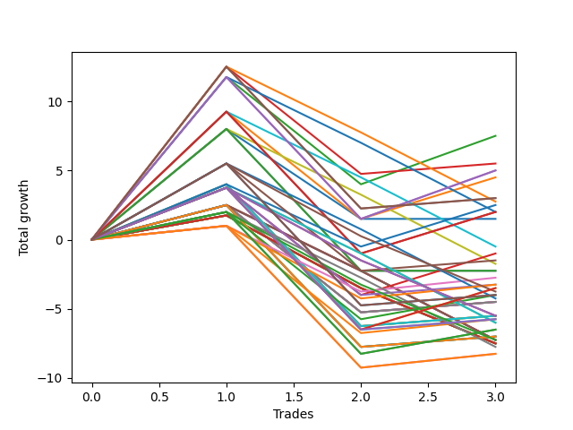

# Long Wallace 015 
- Symbol: ES
- Date Range: 03/18/2022 - 07/15/2022
- Trading Period: 7:20-12:30
- Number of Trades: 3



| Name | Win Percent | Profit | Avg Profit / Trade | Avg Time / Trade |      | Name | Win Percent | Profit | Avg Profit / Trade | Avg Time / Trade |
| ---- | ----------- | ------ | ------------------ | ---------------- | ---- | ---- | ----------- | ------ | ------------------ | ---------------- |
| Sorted By <br> Profit | | | | | | Sorted By <br> Win Percentage ||||
| Two | 66.67 | 3750.00 | 1250.00 | 20:16 |     | Two | 66.67 | 3750.00 | 1250.00 | 20:16 |
| Three | 66.67 | 2750.00 | 916.67 | 27:51 |     | Three | 66.67 | 2750.00 | 916.67 | 27:51 |
| Sixty-Six | 66.67 | 2500.00 | 833.33 | 17:45 |     | Sixty-Six | 66.67 | 2500.00 | 833.33 | 17:45 |
| Fifty-Eight | 66.67 | 2500.00 | 833.33 | 17:45 |     | Fifty-Eight | 66.67 | 2500.00 | 833.33 | 17:45 |
| One | 66.67 | 2250.00 | 750.00 | 20:01 |     | One | 66.67 | 2250.00 | 750.00 | 20:01 |
| Sixty-Seven | 66.67 | 1500.00 | 500.00 | 25:20 |     | Sixty-Seven | 66.67 | 1500.00 | 500.00 | 25:20 |
| Fifty-Nine | 66.67 | 1500.00 | 500.00 | 25:20 |     | Fifty-Nine | 66.67 | 1500.00 | 500.00 | 25:20 |
| Forty-Three | 33.33 | 1375.00 | 458.33 | 11:46 |     | Seventy-Three | 66.67 | 1250.00 | 416.67 | 10:45 |
| Seventy-Three | 66.67 | 1250.00 | 416.67 | 10:45 |     | Sixty-Five | 66.67 | 1000.00 | 333.33 | 17:30 |
| Sixty-Five | 66.67 | 1000.00 | 333.33 | 17:30 |     | Fifty-Seven | 66.67 | 1000.00 | 333.33 | 17:30 |
| Fifty-Seven | 66.67 | 1000.00 | 333.33 | 17:30 |     | Zero | 66.67 | 750.00 | 250.00 | 16:16 |
| Forty-Two | 33.33 | 1000.00 | 333.33 | 08:06 |     | Eighty-Three | 66.67 | -500.00 | -166.67 | 16:18 |
| Zero | 66.67 | 750.00 | 250.00 | 16:16 |     | Eighty-Five | 66.67 | -750.00 | -250.00 | 20:23 |
| Forty-One | 33.33 | -250.00 | -83.33 | 07:53 |     | Sixty-Four | 66.67 | -1125.00 | -375.00 | 14:01 |
| Eighty-Three | 66.67 | -500.00 | -166.67 | 16:18 |     | Fifty-Six | 66.67 | -1125.00 | -375.00 | 14:01 |
| Eighty-Five | 66.67 | -750.00 | -250.00 | 20:23 |     | One Hundred Eleven | 66.67 | -1375.00 | -458.33 | 02:51 |
| Forty | 33.33 | -875.00 | -291.67 | 06:25 |     | One Hundred Sixteen | 66.67 | -1625.00 | -541.67 | 02:55 |
| Sixty-Four | 66.67 | -1125.00 | -375.00 | 14:01 |     | Eighty-Four | 66.67 | -1625.00 | -541.67 | 20:15 |
| Fifty-Six | 66.67 | -1125.00 | -375.00 | 14:01 |     | One Hundred Twenty-Eight | 66.67 | -1750.00 | -583.33 | 13:46 |
| One Hundred Eleven | 66.67 | -1375.00 | -458.33 | 02:51 |     | One Hundred Twenty-Three | 66.67 | -1750.00 | -583.33 | 13:46 |
| One Hundred Sixteen | 66.67 | -1625.00 | -541.67 | 02:55 |     | One Hundred Thirty | 66.67 | -2000.00 | -666.67 | 17:51 |
| Eighty-Four | 66.67 | -1625.00 | -541.67 | 20:15 |     | One Hundred Twenty-Five | 66.67 | -2000.00 | -666.67 | 17:51 |
| One Hundred Twenty-Eight | 66.67 | -1750.00 | -583.33 | 13:46 |     | Eighty-Two | 66.67 | -2000.00 | -666.67 | 15:28 |
| One Hundred Twenty-Three | 66.67 | -1750.00 | -583.33 | 13:46 |     | Seven | 66.67 | -2250.00 | -750.00 | 29:55 |
| One Hundred Twenty | 33.33 | -1875.00 | -625.00 | 03:58 |     | Six | 66.67 | -2250.00 | -750.00 | 29:55 |
| One Hundred Thirty | 66.67 | -2000.00 | -666.67 | 17:51 |     | Five | 66.67 | -2250.00 | -750.00 | 29:55 |
| One Hundred Twenty-Five | 66.67 | -2000.00 | -666.67 | 17:51 |     | Four | 66.67 | -2250.00 | -750.00 | 29:55 |
| Eighty-Two | 66.67 | -2000.00 | -666.67 | 15:28 |     | Seventy-One | 66.67 | -2750.00 | -916.67 | 26:46 |
| One Hundred Fifteen | 33.33 | -2125.00 | -708.33 | 04:18 |     | Seventy | 66.67 | -2750.00 | -916.67 | 26:46 |
| Seven | 66.67 | -2250.00 | -750.00 | 29:55 |     | Sixty-Nine | 66.67 | -2750.00 | -916.67 | 26:46 |
| Six | 66.67 | -2250.00 | -750.00 | 29:55 |     | Sixty-Eight | 66.67 | -2750.00 | -916.67 | 26:46 |
| Five | 66.67 | -2250.00 | -750.00 | 29:55 |     | One Hundred Twenty-Nine | 66.67 | -2875.00 | -958.33 | 17:43 |
| Four | 66.67 | -2250.00 | -750.00 | 29:55 |     | One Hundred Twenty-Four | 66.67 | -2875.00 | -958.33 | 17:43 |
| Seventy-One | 66.67 | -2750.00 | -916.67 | 26:46 |     | Eighty-One | 66.67 | -2875.00 | -958.33 | 10:13 |
| Seventy | 66.67 | -2750.00 | -916.67 | 26:46 |     | One Hundred Twenty-Seven | 66.67 | -3250.00 | -1083.33 | 12:56 |
| Sixty-Nine | 66.67 | -2750.00 | -916.67 | 26:46 |     | One Hundred Twenty-Two | 66.67 | -3250.00 | -1083.33 | 12:56 |
| Sixty-Eight | 66.67 | -2750.00 | -916.67 | 26:46 |     | Sixty-Three | 66.67 | -3500.00 | -1166.67 | 27:23 |
| One Hundred Ninteen | 33.33 | -2750.00 | -916.67 | 03:50 |     | Sixty-Two | 66.67 | -3500.00 | -1166.67 | 27:23 |
| One Hundred Eighteen | 33.33 | -2750.00 | -916.67 | 03:50 |     | Sixty-One | 66.67 | -3500.00 | -1166.67 | 27:23 |
| One Hundred Twenty-Nine | 66.67 | -2875.00 | -958.33 | 17:43 |     | Sixty | 66.67 | -3500.00 | -1166.67 | 27:23 |
| One Hundred Twenty-Four | 66.67 | -2875.00 | -958.33 | 17:43 |     | One Hundred Twenty-Six | 66.67 | -4125.00 | -1375.00 | 07:41 |
| Eighty-One | 66.67 | -2875.00 | -958.33 | 10:13 |     | One Hundred Twenty-One | 66.67 | -4125.00 | -1375.00 | 07:41 |
| One Hundred Fourteen | 33.33 | -3000.00 | -1000.00 | 04:10 |     | Forty-Three | 33.33 | 1375.00 | 458.33 | 11:46 |
| One Hundred Thirteen | 33.33 | -3000.00 | -1000.00 | 04:10 |     | Forty-Two | 33.33 | 1000.00 | 333.33 | 08:06 |
| One Hundred Twenty-Seven | 66.67 | -3250.00 | -1083.33 | 12:56 |     | Forty-One | 33.33 | -250.00 | -83.33 | 07:53 |
| One Hundred Twenty-Two | 66.67 | -3250.00 | -1083.33 | 12:56 |     | Forty | 33.33 | -875.00 | -291.67 | 06:25 |
| Sixty-Three | 66.67 | -3500.00 | -1166.67 | 27:23 |     | One Hundred Twenty | 33.33 | -1875.00 | -625.00 | 03:58 |
| Sixty-Two | 66.67 | -3500.00 | -1166.67 | 27:23 |     | One Hundred Fifteen | 33.33 | -2125.00 | -708.33 | 04:18 |
| Sixty-One | 66.67 | -3500.00 | -1166.67 | 27:23 |     | One Hundred Ninteen | 33.33 | -2750.00 | -916.67 | 03:50 |
| Sixty | 66.67 | -3500.00 | -1166.67 | 27:23 |     | One Hundred Eighteen | 33.33 | -2750.00 | -916.67 | 03:50 |
| One Hundred Seventeen | 33.33 | -3625.00 | -1208.33 | 03:38 |     | One Hundred Fourteen | 33.33 | -3000.00 | -1000.00 | 04:10 |
| Forty-Seven | 33.33 | -3625.00 | -1208.33 | 13:50 |     | One Hundred Thirteen | 33.33 | -3000.00 | -1000.00 | 04:10 |
| Forty-Six | 33.33 | -3625.00 | -1208.33 | 13:50 |     | One Hundred Seventeen | 33.33 | -3625.00 | -1208.33 | 03:38 |
| Forty-Five | 33.33 | -3625.00 | -1208.33 | 13:50 |     | Forty-Seven | 33.33 | -3625.00 | -1208.33 | 13:50 |
| Forty-Four | 33.33 | -3625.00 | -1208.33 | 13:50 |     | Forty-Six | 33.33 | -3625.00 | -1208.33 | 13:50 |
| Fifty-Five | 33.33 | -3750.00 | -1250.00 | 04:38 |     | Forty-Five | 33.33 | -3625.00 | -1208.33 | 13:50 |
| Fifty-Four | 33.33 | -3750.00 | -1250.00 | 04:38 |     | Forty-Four | 33.33 | -3625.00 | -1208.33 | 13:50 |
| Fifty-Three | 33.33 | -3750.00 | -1250.00 | 04:38 |     | Fifty-Five | 33.33 | -3750.00 | -1250.00 | 04:38 |
| Fifty-Two | 33.33 | -3750.00 | -1250.00 | 04:38 |     | Fifty-Four | 33.33 | -3750.00 | -1250.00 | 04:38 |
| Fifty-One | 33.33 | -3750.00 | -1250.00 | 04:38 |     | Fifty-Three | 33.33 | -3750.00 | -1250.00 | 04:38 |
| Fifty | 33.33 | -3750.00 | -1250.00 | 04:38 |     | Fifty-Two | 33.33 | -3750.00 | -1250.00 | 04:38 |
| Forty-Nine | 33.33 | -3750.00 | -1250.00 | 04:38 |     | Fifty-One | 33.33 | -3750.00 | -1250.00 | 04:38 |
| Forty-Eight | 33.33 | -3750.00 | -1250.00 | 04:38 |     | Fifty | 33.33 | -3750.00 | -1250.00 | 04:38 |
| One Hundred Twelve | 33.33 | -3875.00 | -1291.67 | 03:58 |     | Forty-Nine | 33.33 | -3750.00 | -1250.00 | 04:38 |
| One Hundred Twenty-Six | 66.67 | -4125.00 | -1375.00 | 07:41 |     | Forty-Eight | 33.33 | -3750.00 | -1250.00 | 04:38 |
| One Hundred Twenty-One | 66.67 | -4125.00 | -1375.00 | 07:41 |     | One Hundred Twelve | 33.33 | -3875.00 | -1291.67 | 03:58 |

## NO STOPLOSS

### Test Zero
* Sell when price hits the middle line of the 20p bollinger
* No Stoploss
* Results:
```
Total Trades: 3
Percent Up: 66.67
Percent Down: 33.33
Total Points Moved Up: 1.50
Potential Profit: 750.00
Total Points Ups: 8.00 Count Ups: 2
Total Points Downs: -6.50 Count Downs: 1
```

<details><summary>Trades</summary>

<code>In: 2022-03-25 08:29:00		Out: 2022-03-25 08:36:40		Total Position Time: 07:40		Total Move Up: 8.00		Total to Date: 8.00</code> <br />
<code>In: 2022-04-18 08:26:00		Out: 2022-04-18 08:55:05		Total Position Time: 29:05		Total Move Up: -6.50		Total to Date: 1.50</code> <br />
<code>In: 2022-06-08 09:41:00		Out: 2022-06-08 09:53:05		Total Position Time: 12:05		Total Move Up: 0.00		Total to Date: 1.50</code> <br />


</details>

### Test One
* Sell when the price hits the upper line of the 20p 1std bollinger
* No Stoploss
* Results:
```
Total Trades: 3
Percent Up: 66.67
Percent Down: 33.33
Total Points Moved Up: 4.50
Potential Profit: 2250.00
Total Points Ups: 12.25 Count Ups: 2
Total Points Downs: -7.75 Count Downs: 1
```

<details><summary>Trades</summary>

<code>In: 2022-03-25 08:29:00		Out: 2022-03-25 08:41:05		Total Position Time: 12:05		Total Move Up: 9.25		Total to Date: 9.25</code> <br />
<code>In: 2022-04-18 08:26:00		Out: 2022-04-18 08:55:55		Total Position Time: 29:55		Total Move Up: -7.75		Total to Date: 1.50</code> <br />
<code>In: 2022-06-08 09:41:00		Out: 2022-06-08 09:59:05		Total Position Time: 18:05		Total Move Up: 3.00		Total to Date: 4.50</code> <br />


</details>

### Test Two
* Sell when the price hits the upper line of the 20p 2std bollinger
* No Stoploss
* Results:
```
Total Trades: 3
Percent Up: 66.67
Percent Down: 33.33
Total Points Moved Up: 7.50
Potential Profit: 3750.00
Total Points Ups: 15.25 Count Ups: 2
Total Points Downs: -7.75 Count Downs: 1
```

<details><summary>Trades</summary>

<code>In: 2022-03-25 08:29:00		Out: 2022-03-25 08:41:45		Total Position Time: 12:45		Total Move Up: 11.75		Total to Date: 11.75</code> <br />
<code>In: 2022-04-18 08:26:00		Out: 2022-04-18 08:55:55		Total Position Time: 29:55		Total Move Up: -7.75		Total to Date: 4.00</code> <br />
<code>In: 2022-06-08 09:41:00		Out: 2022-06-08 09:59:10		Total Position Time: 18:10		Total Move Up: 3.50		Total to Date: 7.50</code> <br />


</details>

### Test Three
* Sell when price hits the middle line of the 50p bollinger
* No Stoploss
* Results:
```
Total Trades: 3
Percent Up: 66.67
Percent Down: 33.33
Total Points Moved Up: 5.50
Potential Profit: 2750.00
Total Points Ups: 13.25 Count Ups: 2
Total Points Downs: -7.75 Count Downs: 1
```

<details><summary>Trades</summary>

<code>In: 2022-03-25 08:29:00		Out: 2022-03-25 08:52:45		Total Position Time: 23:45		Total Move Up: 12.50		Total to Date: 12.50</code> <br />
<code>In: 2022-04-18 08:26:00		Out: 2022-04-18 08:55:55		Total Position Time: 29:55		Total Move Up: -7.75		Total to Date: 4.75</code> <br />
<code>In: 2022-06-08 09:41:00		Out: 2022-06-08 10:10:55		Total Position Time: 29:55		Total Move Up: 0.75		Total to Date: 5.50</code> <br />


</details>

### Test Four
* Sell when the price hits the upper line of the 50p 1std bollinger
* No Stoploss
* Results:
```
Total Trades: 3
Percent Up: 66.67
Percent Down: 33.33
Total Points Moved Up: -4.50
Potential Profit: -2250.00
Total Points Ups: 3.25 Count Ups: 2
Total Points Downs: -7.75 Count Downs: 1
```

<details><summary>Trades</summary>

<code>In: 2022-03-25 08:29:00		Out: 2022-03-25 08:58:55		Total Position Time: 29:55		Total Move Up: 2.50		Total to Date: 2.50</code> <br />
<code>In: 2022-04-18 08:26:00		Out: 2022-04-18 08:55:55		Total Position Time: 29:55		Total Move Up: -7.75		Total to Date: -5.25</code> <br />
<code>In: 2022-06-08 09:41:00		Out: 2022-06-08 10:10:55		Total Position Time: 29:55		Total Move Up: 0.75		Total to Date: -4.50</code> <br />


</details>

### Test Five
* Sell when the price hits the upper line of the 50p 2std bollinger
* No Stoploss
* Results:
```
Total Trades: 3
Percent Up: 66.67
Percent Down: 33.33
Total Points Moved Up: -4.50
Potential Profit: -2250.00
Total Points Ups: 3.25 Count Ups: 2
Total Points Downs: -7.75 Count Downs: 1
```

<details><summary>Trades</summary>

<code>In: 2022-03-25 08:29:00		Out: 2022-03-25 08:58:55		Total Position Time: 29:55		Total Move Up: 2.50		Total to Date: 2.50</code> <br />
<code>In: 2022-04-18 08:26:00		Out: 2022-04-18 08:55:55		Total Position Time: 29:55		Total Move Up: -7.75		Total to Date: -5.25</code> <br />
<code>In: 2022-06-08 09:41:00		Out: 2022-06-08 10:10:55		Total Position Time: 29:55		Total Move Up: 0.75		Total to Date: -4.50</code> <br />


</details>

### Test Six
* Sell when the price hits the middle line of the 1std VWAP
* No Stoploss
* Results:
```
Total Trades: 3
Percent Up: 66.67
Percent Down: 33.33
Total Points Moved Up: -4.50
Potential Profit: -2250.00
Total Points Ups: 3.25 Count Ups: 2
Total Points Downs: -7.75 Count Downs: 1
```

<details><summary>Trades</summary>

<code>In: 2022-03-25 08:29:00		Out: 2022-03-25 08:58:55		Total Position Time: 29:55		Total Move Up: 2.50		Total to Date: 2.50</code> <br />
<code>In: 2022-04-18 08:26:00		Out: 2022-04-18 08:55:55		Total Position Time: 29:55		Total Move Up: -7.75		Total to Date: -5.25</code> <br />
<code>In: 2022-06-08 09:41:00		Out: 2022-06-08 10:10:55		Total Position Time: 29:55		Total Move Up: 0.75		Total to Date: -4.50</code> <br />


</details>

### Test Seven
* Sell when the price hits the upper line of the 1std VWAP
* No Stoploss
* Results:
```
Total Trades: 3
Percent Up: 66.67
Percent Down: 33.33
Total Points Moved Up: -4.50
Potential Profit: -2250.00
Total Points Ups: 3.25 Count Ups: 2
Total Points Downs: -7.75 Count Downs: 1
```

<details><summary>Trades</summary>

<code>In: 2022-03-25 08:29:00		Out: 2022-03-25 08:58:55		Total Position Time: 29:55		Total Move Up: 2.50		Total to Date: 2.50</code> <br />
<code>In: 2022-04-18 08:26:00		Out: 2022-04-18 08:55:55		Total Position Time: 29:55		Total Move Up: -7.75		Total to Date: -5.25</code> <br />
<code>In: 2022-06-08 09:41:00		Out: 2022-06-08 10:10:55		Total Position Time: 29:55		Total Move Up: 0.75		Total to Date: -4.50</code> <br />


</details>

## STOPLOSS OF 5

### Test Forty
* Sell when price hits the middle line of the 20p bollinger
* Stoploss is 5 points
* Results:
```
Total Trades: 3
Percent Up: 33.33
Percent Down: 66.67
Total Points Moved Up: -1.75
Potential Profit: -875.00
Total Points Ups: 8.00 Count Ups: 1
Total Points Downs: -9.75 Count Downs: 2
```

<details><summary>Trades</summary>

<code>In: 2022-03-25 08:29:00		Out: 2022-03-25 08:36:40		Total Position Time: 07:40		Total Move Up: 8.00		Total to Date: 8.00</code> <br />
<code>In: 2022-04-18 08:26:00		Out: 2022-04-18 08:33:50		Total Position Time: 07:50		Total Move Up: -4.75		Total to Date: 3.25</code> <br />
<code>In: 2022-06-08 09:41:00		Out: 2022-06-08 09:44:45		Total Position Time: 03:45		Total Move Up: -5.00		Total to Date: -1.75</code> <br />


</details>

### Test Forty-One
* Sell when the price hits the upper line of the 20p 1std bollinger
* Stoploss is 5 points
* Results:
```
Total Trades: 3
Percent Up: 33.33
Percent Down: 66.67
Total Points Moved Up: -0.50
Potential Profit: -250.00
Total Points Ups: 9.25 Count Ups: 1
Total Points Downs: -9.75 Count Downs: 2
```

<details><summary>Trades</summary>

<code>In: 2022-03-25 08:29:00		Out: 2022-03-25 08:41:05		Total Position Time: 12:05		Total Move Up: 9.25		Total to Date: 9.25</code> <br />
<code>In: 2022-04-18 08:26:00		Out: 2022-04-18 08:33:50		Total Position Time: 07:50		Total Move Up: -4.75		Total to Date: 4.50</code> <br />
<code>In: 2022-06-08 09:41:00		Out: 2022-06-08 09:44:45		Total Position Time: 03:45		Total Move Up: -5.00		Total to Date: -0.50</code> <br />


</details>

### Test Forty-Two
* Sell when the price hits the upper line of the 20p 2std bollinger
* Stoploss is 5 points
* Results:
```
Total Trades: 3
Percent Up: 33.33
Percent Down: 66.67
Total Points Moved Up: 2.00
Potential Profit: 1000.00
Total Points Ups: 11.75 Count Ups: 1
Total Points Downs: -9.75 Count Downs: 2
```

<details><summary>Trades</summary>

<code>In: 2022-03-25 08:29:00		Out: 2022-03-25 08:41:45		Total Position Time: 12:45		Total Move Up: 11.75		Total to Date: 11.75</code> <br />
<code>In: 2022-04-18 08:26:00		Out: 2022-04-18 08:33:50		Total Position Time: 07:50		Total Move Up: -4.75		Total to Date: 7.00</code> <br />
<code>In: 2022-06-08 09:41:00		Out: 2022-06-08 09:44:45		Total Position Time: 03:45		Total Move Up: -5.00		Total to Date: 2.00</code> <br />


</details>

### Test Forty-Three
* Sell when price hits the middle line of the 50p bollinger
* Stoploss is 5 points
* Results:
```
Total Trades: 3
Percent Up: 33.33
Percent Down: 66.67
Total Points Moved Up: 2.75
Potential Profit: 1375.00
Total Points Ups: 12.50 Count Ups: 1
Total Points Downs: -9.75 Count Downs: 2
```

<details><summary>Trades</summary>

<code>In: 2022-03-25 08:29:00		Out: 2022-03-25 08:52:45		Total Position Time: 23:45		Total Move Up: 12.50		Total to Date: 12.50</code> <br />
<code>In: 2022-04-18 08:26:00		Out: 2022-04-18 08:33:50		Total Position Time: 07:50		Total Move Up: -4.75		Total to Date: 7.75</code> <br />
<code>In: 2022-06-08 09:41:00		Out: 2022-06-08 09:44:45		Total Position Time: 03:45		Total Move Up: -5.00		Total to Date: 2.75</code> <br />


</details>

### Test Forty-Four
* Sell when the price hits the upper line of the 50p 1std bollinger
* Stoploss is 5 points
* Results:
```
Total Trades: 3
Percent Up: 33.33
Percent Down: 66.67
Total Points Moved Up: -7.25
Potential Profit: -3625.00
Total Points Ups: 2.50 Count Ups: 1
Total Points Downs: -9.75 Count Downs: 2
```

<details><summary>Trades</summary>

<code>In: 2022-03-25 08:29:00		Out: 2022-03-25 08:58:55		Total Position Time: 29:55		Total Move Up: 2.50		Total to Date: 2.50</code> <br />
<code>In: 2022-04-18 08:26:00		Out: 2022-04-18 08:33:50		Total Position Time: 07:50		Total Move Up: -4.75		Total to Date: -2.25</code> <br />
<code>In: 2022-06-08 09:41:00		Out: 2022-06-08 09:44:45		Total Position Time: 03:45		Total Move Up: -5.00		Total to Date: -7.25</code> <br />


</details>

### Test Forty-Five
* Sell when the price hits the upper line of the 50p 2std bollinger
* Stoploss is 5 points
* Results:
```
Total Trades: 3
Percent Up: 33.33
Percent Down: 66.67
Total Points Moved Up: -7.25
Potential Profit: -3625.00
Total Points Ups: 2.50 Count Ups: 1
Total Points Downs: -9.75 Count Downs: 2
```

<details><summary>Trades</summary>

<code>In: 2022-03-25 08:29:00		Out: 2022-03-25 08:58:55		Total Position Time: 29:55		Total Move Up: 2.50		Total to Date: 2.50</code> <br />
<code>In: 2022-04-18 08:26:00		Out: 2022-04-18 08:33:50		Total Position Time: 07:50		Total Move Up: -4.75		Total to Date: -2.25</code> <br />
<code>In: 2022-06-08 09:41:00		Out: 2022-06-08 09:44:45		Total Position Time: 03:45		Total Move Up: -5.00		Total to Date: -7.25</code> <br />


</details>

### Test Forty-Six
* Sell when the price hits the middle line of the 1std VWAP
* Stoploss is 5 points
* Results:
```
Total Trades: 3
Percent Up: 33.33
Percent Down: 66.67
Total Points Moved Up: -7.25
Potential Profit: -3625.00
Total Points Ups: 2.50 Count Ups: 1
Total Points Downs: -9.75 Count Downs: 2
```

<details><summary>Trades</summary>

<code>In: 2022-03-25 08:29:00		Out: 2022-03-25 08:58:55		Total Position Time: 29:55		Total Move Up: 2.50		Total to Date: 2.50</code> <br />
<code>In: 2022-04-18 08:26:00		Out: 2022-04-18 08:33:50		Total Position Time: 07:50		Total Move Up: -4.75		Total to Date: -2.25</code> <br />
<code>In: 2022-06-08 09:41:00		Out: 2022-06-08 09:44:45		Total Position Time: 03:45		Total Move Up: -5.00		Total to Date: -7.25</code> <br />


</details>

### Test Forty-Seven
* Sell when the price hits the upper line of the 1std VWAP
* Stoploss is 5 points
* Results:
```
Total Trades: 3
Percent Up: 33.33
Percent Down: 66.67
Total Points Moved Up: -7.25
Potential Profit: -3625.00
Total Points Ups: 2.50 Count Ups: 1
Total Points Downs: -9.75 Count Downs: 2
```

<details><summary>Trades</summary>

<code>In: 2022-03-25 08:29:00		Out: 2022-03-25 08:58:55		Total Position Time: 29:55		Total Move Up: 2.50		Total to Date: 2.50</code> <br />
<code>In: 2022-04-18 08:26:00		Out: 2022-04-18 08:33:50		Total Position Time: 07:50		Total Move Up: -4.75		Total to Date: -2.25</code> <br />
<code>In: 2022-06-08 09:41:00		Out: 2022-06-08 09:44:45		Total Position Time: 03:45		Total Move Up: -5.00		Total to Date: -7.25</code> <br />


</details>

## TRAIL STOP OF 5

### Test Forty-Eight
* Sell when price hits the middle line of the 20p bollinger
* Trailing Stop is 5 points
* Results:
```
Total Trades: 3
Percent Up: 33.33
Percent Down: 66.67
Total Points Moved Up: -7.50
Potential Profit: -3750.00
Total Points Ups: 1.75 Count Ups: 1
Total Points Downs: -9.25 Count Downs: 2
```

<details><summary>Trades</summary>

<code>In: 2022-03-25 08:29:00		Out: 2022-03-25 08:32:20		Total Position Time: 03:20		Total Move Up: 1.75		Total to Date: 1.75</code> <br />
<code>In: 2022-04-18 08:26:00		Out: 2022-04-18 08:34:00		Total Position Time: 08:00		Total Move Up: -5.25		Total to Date: -3.50</code> <br />
<code>In: 2022-06-08 09:41:00		Out: 2022-06-08 09:43:35		Total Position Time: 02:35		Total Move Up: -4.00		Total to Date: -7.50</code> <br />


</details>

### Test Forty-Nine
* Sell when the price hits the upper line of the 20p 1std bollinger
* Trailing Stop is 5 points
* Results:
```
Total Trades: 3
Percent Up: 33.33
Percent Down: 66.67
Total Points Moved Up: -7.50
Potential Profit: -3750.00
Total Points Ups: 1.75 Count Ups: 1
Total Points Downs: -9.25 Count Downs: 2
```

<details><summary>Trades</summary>

<code>In: 2022-03-25 08:29:00		Out: 2022-03-25 08:32:20		Total Position Time: 03:20		Total Move Up: 1.75		Total to Date: 1.75</code> <br />
<code>In: 2022-04-18 08:26:00		Out: 2022-04-18 08:34:00		Total Position Time: 08:00		Total Move Up: -5.25		Total to Date: -3.50</code> <br />
<code>In: 2022-06-08 09:41:00		Out: 2022-06-08 09:43:35		Total Position Time: 02:35		Total Move Up: -4.00		Total to Date: -7.50</code> <br />


</details>

### Test Fifty
* Sell when the price hits the upper line of the 20p 2std bollinger
* Trailing Stop is 5 points
* Results:
```
Total Trades: 3
Percent Up: 33.33
Percent Down: 66.67
Total Points Moved Up: -7.50
Potential Profit: -3750.00
Total Points Ups: 1.75 Count Ups: 1
Total Points Downs: -9.25 Count Downs: 2
```

<details><summary>Trades</summary>

<code>In: 2022-03-25 08:29:00		Out: 2022-03-25 08:32:20		Total Position Time: 03:20		Total Move Up: 1.75		Total to Date: 1.75</code> <br />
<code>In: 2022-04-18 08:26:00		Out: 2022-04-18 08:34:00		Total Position Time: 08:00		Total Move Up: -5.25		Total to Date: -3.50</code> <br />
<code>In: 2022-06-08 09:41:00		Out: 2022-06-08 09:43:35		Total Position Time: 02:35		Total Move Up: -4.00		Total to Date: -7.50</code> <br />


</details>

### Test Fifty-One
* Sell when price hits the middle line of the 50p bollinger
* Trailing Stop is 5 points
* Results:
```
Total Trades: 3
Percent Up: 33.33
Percent Down: 66.67
Total Points Moved Up: -7.50
Potential Profit: -3750.00
Total Points Ups: 1.75 Count Ups: 1
Total Points Downs: -9.25 Count Downs: 2
```

<details><summary>Trades</summary>

<code>In: 2022-03-25 08:29:00		Out: 2022-03-25 08:32:20		Total Position Time: 03:20		Total Move Up: 1.75		Total to Date: 1.75</code> <br />
<code>In: 2022-04-18 08:26:00		Out: 2022-04-18 08:34:00		Total Position Time: 08:00		Total Move Up: -5.25		Total to Date: -3.50</code> <br />
<code>In: 2022-06-08 09:41:00		Out: 2022-06-08 09:43:35		Total Position Time: 02:35		Total Move Up: -4.00		Total to Date: -7.50</code> <br />


</details>

### Test Fifty-Two
* Sell when the price hits the upper line of the 50p 1std bollinger
* Trailing Stop is 5 points
* Results:
```
Total Trades: 3
Percent Up: 33.33
Percent Down: 66.67
Total Points Moved Up: -7.50
Potential Profit: -3750.00
Total Points Ups: 1.75 Count Ups: 1
Total Points Downs: -9.25 Count Downs: 2
```

<details><summary>Trades</summary>

<code>In: 2022-03-25 08:29:00		Out: 2022-03-25 08:32:20		Total Position Time: 03:20		Total Move Up: 1.75		Total to Date: 1.75</code> <br />
<code>In: 2022-04-18 08:26:00		Out: 2022-04-18 08:34:00		Total Position Time: 08:00		Total Move Up: -5.25		Total to Date: -3.50</code> <br />
<code>In: 2022-06-08 09:41:00		Out: 2022-06-08 09:43:35		Total Position Time: 02:35		Total Move Up: -4.00		Total to Date: -7.50</code> <br />


</details>

### Test Fifty-Three
* Sell when the price hits the upper line of the 50p 2std bollinger
* Trailing Stop is 5 points
* Results:
```
Total Trades: 3
Percent Up: 33.33
Percent Down: 66.67
Total Points Moved Up: -7.50
Potential Profit: -3750.00
Total Points Ups: 1.75 Count Ups: 1
Total Points Downs: -9.25 Count Downs: 2
```

<details><summary>Trades</summary>

<code>In: 2022-03-25 08:29:00		Out: 2022-03-25 08:32:20		Total Position Time: 03:20		Total Move Up: 1.75		Total to Date: 1.75</code> <br />
<code>In: 2022-04-18 08:26:00		Out: 2022-04-18 08:34:00		Total Position Time: 08:00		Total Move Up: -5.25		Total to Date: -3.50</code> <br />
<code>In: 2022-06-08 09:41:00		Out: 2022-06-08 09:43:35		Total Position Time: 02:35		Total Move Up: -4.00		Total to Date: -7.50</code> <br />


</details>

### Test Fifty-Four
* Sell when the price hits the middle line of the 1std VWAP
* Trailing Stop is 5 points
* Results:
```
Total Trades: 3
Percent Up: 33.33
Percent Down: 66.67
Total Points Moved Up: -7.50
Potential Profit: -3750.00
Total Points Ups: 1.75 Count Ups: 1
Total Points Downs: -9.25 Count Downs: 2
```

<details><summary>Trades</summary>

<code>In: 2022-03-25 08:29:00		Out: 2022-03-25 08:32:20		Total Position Time: 03:20		Total Move Up: 1.75		Total to Date: 1.75</code> <br />
<code>In: 2022-04-18 08:26:00		Out: 2022-04-18 08:34:00		Total Position Time: 08:00		Total Move Up: -5.25		Total to Date: -3.50</code> <br />
<code>In: 2022-06-08 09:41:00		Out: 2022-06-08 09:43:35		Total Position Time: 02:35		Total Move Up: -4.00		Total to Date: -7.50</code> <br />


</details>

### Test Fifty-Five
* Sell when the price hits the upper line of the 1std VWAP
* Trailing Stop is 5 points
* Results:
```
Total Trades: 3
Percent Up: 33.33
Percent Down: 66.67
Total Points Moved Up: -7.50
Potential Profit: -3750.00
Total Points Ups: 1.75 Count Ups: 1
Total Points Downs: -9.25 Count Downs: 2
```

<details><summary>Trades</summary>

<code>In: 2022-03-25 08:29:00		Out: 2022-03-25 08:32:20		Total Position Time: 03:20		Total Move Up: 1.75		Total to Date: 1.75</code> <br />
<code>In: 2022-04-18 08:26:00		Out: 2022-04-18 08:34:00		Total Position Time: 08:00		Total Move Up: -5.25		Total to Date: -3.50</code> <br />
<code>In: 2022-06-08 09:41:00		Out: 2022-06-08 09:43:35		Total Position Time: 02:35		Total Move Up: -4.00		Total to Date: -7.50</code> <br />


</details>

## STOPLOSS OF 10

### Test Fifty-Six
* Sell when price hits the middle line of the 20p bollinger
* Stoploss is 10 points
* Results:
```
Total Trades: 3
Percent Up: 66.67
Percent Down: 33.33
Total Points Moved Up: -2.25
Potential Profit: -1125.00
Total Points Ups: 8.00 Count Ups: 2
Total Points Downs: -10.25 Count Downs: 1
```

<details><summary>Trades</summary>

<code>In: 2022-03-25 08:29:00		Out: 2022-03-25 08:36:40		Total Position Time: 07:40		Total Move Up: 8.00		Total to Date: 8.00</code> <br />
<code>In: 2022-04-18 08:26:00		Out: 2022-04-18 08:48:20		Total Position Time: 22:20		Total Move Up: -10.25		Total to Date: -2.25</code> <br />
<code>In: 2022-06-08 09:41:00		Out: 2022-06-08 09:53:05		Total Position Time: 12:05		Total Move Up: 0.00		Total to Date: -2.25</code> <br />


</details>

### Test Fifty-Seven
* Sell when the price hits the upper line of the 20p 1std bollinger
* Stoploss is 10 points
* Results:
```
Total Trades: 3
Percent Up: 66.67
Percent Down: 33.33
Total Points Moved Up: 2.00
Potential Profit: 1000.00
Total Points Ups: 12.25 Count Ups: 2
Total Points Downs: -10.25 Count Downs: 1
```

<details><summary>Trades</summary>

<code>In: 2022-03-25 08:29:00		Out: 2022-03-25 08:41:05		Total Position Time: 12:05		Total Move Up: 9.25		Total to Date: 9.25</code> <br />
<code>In: 2022-04-18 08:26:00		Out: 2022-04-18 08:48:20		Total Position Time: 22:20		Total Move Up: -10.25		Total to Date: -1.00</code> <br />
<code>In: 2022-06-08 09:41:00		Out: 2022-06-08 09:59:05		Total Position Time: 18:05		Total Move Up: 3.00		Total to Date: 2.00</code> <br />


</details>

### Test Fifty-Eight
* Sell when the price hits the upper line of the 20p 2std bollinger
* Stoploss is 10 points
* Results:
```
Total Trades: 3
Percent Up: 66.67
Percent Down: 33.33
Total Points Moved Up: 5.00
Potential Profit: 2500.00
Total Points Ups: 15.25 Count Ups: 2
Total Points Downs: -10.25 Count Downs: 1
```

<details><summary>Trades</summary>

<code>In: 2022-03-25 08:29:00		Out: 2022-03-25 08:41:45		Total Position Time: 12:45		Total Move Up: 11.75		Total to Date: 11.75</code> <br />
<code>In: 2022-04-18 08:26:00		Out: 2022-04-18 08:48:20		Total Position Time: 22:20		Total Move Up: -10.25		Total to Date: 1.50</code> <br />
<code>In: 2022-06-08 09:41:00		Out: 2022-06-08 09:59:10		Total Position Time: 18:10		Total Move Up: 3.50		Total to Date: 5.00</code> <br />


</details>

### Test Fifty-Nine
* Sell when price hits the middle line of the 50p bollinger
* Stoploss is 10 points
* Results:
```
Total Trades: 3
Percent Up: 66.67
Percent Down: 33.33
Total Points Moved Up: 3.00
Potential Profit: 1500.00
Total Points Ups: 13.25 Count Ups: 2
Total Points Downs: -10.25 Count Downs: 1
```

<details><summary>Trades</summary>

<code>In: 2022-03-25 08:29:00		Out: 2022-03-25 08:52:45		Total Position Time: 23:45		Total Move Up: 12.50		Total to Date: 12.50</code> <br />
<code>In: 2022-04-18 08:26:00		Out: 2022-04-18 08:48:20		Total Position Time: 22:20		Total Move Up: -10.25		Total to Date: 2.25</code> <br />
<code>In: 2022-06-08 09:41:00		Out: 2022-06-08 10:10:55		Total Position Time: 29:55		Total Move Up: 0.75		Total to Date: 3.00</code> <br />


</details>

### Test Sixty
* Sell when the price hits the upper line of the 50p 1std bollinger
* Stoploss is 10 points
* Results:
```
Total Trades: 3
Percent Up: 66.67
Percent Down: 33.33
Total Points Moved Up: -7.00
Potential Profit: -3500.00
Total Points Ups: 3.25 Count Ups: 2
Total Points Downs: -10.25 Count Downs: 1
```

<details><summary>Trades</summary>

<code>In: 2022-03-25 08:29:00		Out: 2022-03-25 08:58:55		Total Position Time: 29:55		Total Move Up: 2.50		Total to Date: 2.50</code> <br />
<code>In: 2022-04-18 08:26:00		Out: 2022-04-18 08:48:20		Total Position Time: 22:20		Total Move Up: -10.25		Total to Date: -7.75</code> <br />
<code>In: 2022-06-08 09:41:00		Out: 2022-06-08 10:10:55		Total Position Time: 29:55		Total Move Up: 0.75		Total to Date: -7.00</code> <br />


</details>

### Test Sixty-One
* Sell when the price hits the upper line of the 50p 2std bollinger
* Stoploss is 10 points
* Results:
```
Total Trades: 3
Percent Up: 66.67
Percent Down: 33.33
Total Points Moved Up: -7.00
Potential Profit: -3500.00
Total Points Ups: 3.25 Count Ups: 2
Total Points Downs: -10.25 Count Downs: 1
```

<details><summary>Trades</summary>

<code>In: 2022-03-25 08:29:00		Out: 2022-03-25 08:58:55		Total Position Time: 29:55		Total Move Up: 2.50		Total to Date: 2.50</code> <br />
<code>In: 2022-04-18 08:26:00		Out: 2022-04-18 08:48:20		Total Position Time: 22:20		Total Move Up: -10.25		Total to Date: -7.75</code> <br />
<code>In: 2022-06-08 09:41:00		Out: 2022-06-08 10:10:55		Total Position Time: 29:55		Total Move Up: 0.75		Total to Date: -7.00</code> <br />


</details>

### Test Sixty-Two
* Sell when the price hits the middle line of the 1std VWAP
* Stoploss is 10 points
* Results:
```
Total Trades: 3
Percent Up: 66.67
Percent Down: 33.33
Total Points Moved Up: -7.00
Potential Profit: -3500.00
Total Points Ups: 3.25 Count Ups: 2
Total Points Downs: -10.25 Count Downs: 1
```

<details><summary>Trades</summary>

<code>In: 2022-03-25 08:29:00		Out: 2022-03-25 08:58:55		Total Position Time: 29:55		Total Move Up: 2.50		Total to Date: 2.50</code> <br />
<code>In: 2022-04-18 08:26:00		Out: 2022-04-18 08:48:20		Total Position Time: 22:20		Total Move Up: -10.25		Total to Date: -7.75</code> <br />
<code>In: 2022-06-08 09:41:00		Out: 2022-06-08 10:10:55		Total Position Time: 29:55		Total Move Up: 0.75		Total to Date: -7.00</code> <br />


</details>

### Test Sixty-Three
* Sell when the price hits the upper line of the 1std VWAP
* Stoploss is 10 points
* Results:
```
Total Trades: 3
Percent Up: 66.67
Percent Down: 33.33
Total Points Moved Up: -7.00
Potential Profit: -3500.00
Total Points Ups: 3.25 Count Ups: 2
Total Points Downs: -10.25 Count Downs: 1
```

<details><summary>Trades</summary>

<code>In: 2022-03-25 08:29:00		Out: 2022-03-25 08:58:55		Total Position Time: 29:55		Total Move Up: 2.50		Total to Date: 2.50</code> <br />
<code>In: 2022-04-18 08:26:00		Out: 2022-04-18 08:48:20		Total Position Time: 22:20		Total Move Up: -10.25		Total to Date: -7.75</code> <br />
<code>In: 2022-06-08 09:41:00		Out: 2022-06-08 10:10:55		Total Position Time: 29:55		Total Move Up: 0.75		Total to Date: -7.00</code> <br />


</details>

## TRAIL STOP OF 10

### Test Sixty-Four
* Sell when price hits the middle line of the 20p bollinger
* Trailing Stop is 10 points
* Results:
```
Total Trades: 3
Percent Up: 66.67
Percent Down: 33.33
Total Points Moved Up: -2.25
Potential Profit: -1125.00
Total Points Ups: 8.00 Count Ups: 2
Total Points Downs: -10.25 Count Downs: 1
```

<details><summary>Trades</summary>

<code>In: 2022-03-25 08:29:00		Out: 2022-03-25 08:36:40		Total Position Time: 07:40		Total Move Up: 8.00		Total to Date: 8.00</code> <br />
<code>In: 2022-04-18 08:26:00		Out: 2022-04-18 08:48:20		Total Position Time: 22:20		Total Move Up: -10.25		Total to Date: -2.25</code> <br />
<code>In: 2022-06-08 09:41:00		Out: 2022-06-08 09:53:05		Total Position Time: 12:05		Total Move Up: 0.00		Total to Date: -2.25</code> <br />


</details>

### Test Sixty-Five
* Sell when the price hits the upper line of the 20p 1std bollinger
* Trailing Stop is 10 points
* Results:
```
Total Trades: 3
Percent Up: 66.67
Percent Down: 33.33
Total Points Moved Up: 2.00
Potential Profit: 1000.00
Total Points Ups: 12.25 Count Ups: 2
Total Points Downs: -10.25 Count Downs: 1
```

<details><summary>Trades</summary>

<code>In: 2022-03-25 08:29:00		Out: 2022-03-25 08:41:05		Total Position Time: 12:05		Total Move Up: 9.25		Total to Date: 9.25</code> <br />
<code>In: 2022-04-18 08:26:00		Out: 2022-04-18 08:48:20		Total Position Time: 22:20		Total Move Up: -10.25		Total to Date: -1.00</code> <br />
<code>In: 2022-06-08 09:41:00		Out: 2022-06-08 09:59:05		Total Position Time: 18:05		Total Move Up: 3.00		Total to Date: 2.00</code> <br />


</details>

### Test Sixty-Six
* Sell when the price hits the upper line of the 20p 2std bollinger
* Trailing Stop is 10 points
* Results:
```
Total Trades: 3
Percent Up: 66.67
Percent Down: 33.33
Total Points Moved Up: 5.00
Potential Profit: 2500.00
Total Points Ups: 15.25 Count Ups: 2
Total Points Downs: -10.25 Count Downs: 1
```

<details><summary>Trades</summary>

<code>In: 2022-03-25 08:29:00		Out: 2022-03-25 08:41:45		Total Position Time: 12:45		Total Move Up: 11.75		Total to Date: 11.75</code> <br />
<code>In: 2022-04-18 08:26:00		Out: 2022-04-18 08:48:20		Total Position Time: 22:20		Total Move Up: -10.25		Total to Date: 1.50</code> <br />
<code>In: 2022-06-08 09:41:00		Out: 2022-06-08 09:59:10		Total Position Time: 18:10		Total Move Up: 3.50		Total to Date: 5.00</code> <br />


</details>

### Test Sixty-Seven
* Sell when price hits the middle line of the 50p bollinger
* Trailing Stop is 10 points
* Results:
```
Total Trades: 3
Percent Up: 66.67
Percent Down: 33.33
Total Points Moved Up: 3.00
Potential Profit: 1500.00
Total Points Ups: 13.25 Count Ups: 2
Total Points Downs: -10.25 Count Downs: 1
```

<details><summary>Trades</summary>

<code>In: 2022-03-25 08:29:00		Out: 2022-03-25 08:52:45		Total Position Time: 23:45		Total Move Up: 12.50		Total to Date: 12.50</code> <br />
<code>In: 2022-04-18 08:26:00		Out: 2022-04-18 08:48:20		Total Position Time: 22:20		Total Move Up: -10.25		Total to Date: 2.25</code> <br />
<code>In: 2022-06-08 09:41:00		Out: 2022-06-08 10:10:55		Total Position Time: 29:55		Total Move Up: 0.75		Total to Date: 3.00</code> <br />


</details>

### Test Sixty-Eight
* Sell when the price hits the upper line of the 50p 1std bollinger
* Trailing Stop is 10 points
* Results:
```
Total Trades: 3
Percent Up: 66.67
Percent Down: 33.33
Total Points Moved Up: -5.50
Potential Profit: -2750.00
Total Points Ups: 4.75 Count Ups: 2
Total Points Downs: -10.25 Count Downs: 1
```

<details><summary>Trades</summary>

<code>In: 2022-03-25 08:29:00		Out: 2022-03-25 08:57:05		Total Position Time: 28:05		Total Move Up: 4.00		Total to Date: 4.00</code> <br />
<code>In: 2022-04-18 08:26:00		Out: 2022-04-18 08:48:20		Total Position Time: 22:20		Total Move Up: -10.25		Total to Date: -6.25</code> <br />
<code>In: 2022-06-08 09:41:00		Out: 2022-06-08 10:10:55		Total Position Time: 29:55		Total Move Up: 0.75		Total to Date: -5.50</code> <br />


</details>

### Test Sixty-Nine
* Sell when the price hits the upper line of the 50p 2std bollinger
* Trailing Stop is 10 points
* Results:
```
Total Trades: 3
Percent Up: 66.67
Percent Down: 33.33
Total Points Moved Up: -5.50
Potential Profit: -2750.00
Total Points Ups: 4.75 Count Ups: 2
Total Points Downs: -10.25 Count Downs: 1
```

<details><summary>Trades</summary>

<code>In: 2022-03-25 08:29:00		Out: 2022-03-25 08:57:05		Total Position Time: 28:05		Total Move Up: 4.00		Total to Date: 4.00</code> <br />
<code>In: 2022-04-18 08:26:00		Out: 2022-04-18 08:48:20		Total Position Time: 22:20		Total Move Up: -10.25		Total to Date: -6.25</code> <br />
<code>In: 2022-06-08 09:41:00		Out: 2022-06-08 10:10:55		Total Position Time: 29:55		Total Move Up: 0.75		Total to Date: -5.50</code> <br />


</details>

### Test Seventy
* Sell when the price hits the middle line of the 1std VWAP
* Trailing Stop is 10 points
* Results:
```
Total Trades: 3
Percent Up: 66.67
Percent Down: 33.33
Total Points Moved Up: -5.50
Potential Profit: -2750.00
Total Points Ups: 4.75 Count Ups: 2
Total Points Downs: -10.25 Count Downs: 1
```

<details><summary>Trades</summary>

<code>In: 2022-03-25 08:29:00		Out: 2022-03-25 08:57:05		Total Position Time: 28:05		Total Move Up: 4.00		Total to Date: 4.00</code> <br />
<code>In: 2022-04-18 08:26:00		Out: 2022-04-18 08:48:20		Total Position Time: 22:20		Total Move Up: -10.25		Total to Date: -6.25</code> <br />
<code>In: 2022-06-08 09:41:00		Out: 2022-06-08 10:10:55		Total Position Time: 29:55		Total Move Up: 0.75		Total to Date: -5.50</code> <br />


</details>

### Test Seventy-One
* Sell when the price hits the upper line of the 1std VWAP
* Trailing Stop is 10 points
* Results:
```
Total Trades: 3
Percent Up: 66.67
Percent Down: 33.33
Total Points Moved Up: -5.50
Potential Profit: -2750.00
Total Points Ups: 4.75 Count Ups: 2
Total Points Downs: -10.25 Count Downs: 1
```

<details><summary>Trades</summary>

<code>In: 2022-03-25 08:29:00		Out: 2022-03-25 08:57:05		Total Position Time: 28:05		Total Move Up: 4.00		Total to Date: 4.00</code> <br />
<code>In: 2022-04-18 08:26:00		Out: 2022-04-18 08:48:20		Total Position Time: 22:20		Total Move Up: -10.25		Total to Date: -6.25</code> <br />
<code>In: 2022-06-08 09:41:00		Out: 2022-06-08 10:10:55		Total Position Time: 29:55		Total Move Up: 0.75		Total to Date: -5.50</code> <br />


</details>

## SPECIAL EXIT CONDITIONS 

### Test Seventy-Three
* Sell when the linear regression slope changes to negative
* No Stoploss
* Results:
```
Total Trades: 3
Percent Up: 66.67
Percent Down: 33.33
Total Points Moved Up: 2.50
Potential Profit: 1250.00
Total Points Ups: 7.00 Count Ups: 2
Total Points Downs: -4.50 Count Downs: 1
```

<details><summary>Trades</summary>

<code>In: 2022-03-25 08:29:00		Out: 2022-03-25 08:32:05		Total Position Time: 03:05		Total Move Up: 4.00		Total to Date: 4.00</code> <br />
<code>In: 2022-04-18 08:26:00		Out: 2022-04-18 08:37:05		Total Position Time: 11:05		Total Move Up: -4.50		Total to Date: -0.50</code> <br />
<code>In: 2022-06-08 09:41:00		Out: 2022-06-08 09:59:05		Total Position Time: 18:05		Total Move Up: 3.00		Total to Date: 2.50</code> <br />


</details>

## TAKE PROFIT

### Test Eighty-One
* Take Profit of 1 Point
* No Stoploss
* Results:
```
Total Trades: 3
Percent Up: 66.67
Percent Down: 33.33
Total Points Moved Up: -5.75
Potential Profit: -2875.00
Total Points Ups: 2.00 Count Ups: 2
Total Points Downs: -7.75 Count Downs: 1
```

<details><summary>Trades</summary>

<code>In: 2022-03-25 08:29:00		Out: 2022-03-25 08:29:10		Total Position Time: 00:10		Total Move Up: 1.00		Total to Date: 1.00</code> <br />
<code>In: 2022-04-18 08:26:00		Out: 2022-04-18 08:55:55		Total Position Time: 29:55		Total Move Up: -7.75		Total to Date: -6.75</code> <br />
<code>In: 2022-06-08 09:41:00		Out: 2022-06-08 09:41:35		Total Position Time: 00:35		Total Move Up: 1.00		Total to Date: -5.75</code> <br />


</details>

### Test Eighty-Two
* Take Profit of 2 Point
* No Stoploss
* Results:
```
Total Trades: 3
Percent Up: 66.67
Percent Down: 33.33
Total Points Moved Up: -4.00
Potential Profit: -2000.00
Total Points Ups: 3.75 Count Ups: 2
Total Points Downs: -7.75 Count Downs: 1
```

<details><summary>Trades</summary>

<code>In: 2022-03-25 08:29:00		Out: 2022-03-25 08:29:20		Total Position Time: 00:20		Total Move Up: 2.00		Total to Date: 2.00</code> <br />
<code>In: 2022-04-18 08:26:00		Out: 2022-04-18 08:55:55		Total Position Time: 29:55		Total Move Up: -7.75		Total to Date: -5.75</code> <br />
<code>In: 2022-06-08 09:41:00		Out: 2022-06-08 09:57:10		Total Position Time: 16:10		Total Move Up: 1.75		Total to Date: -4.00</code> <br />


</details>

### Test Eighty-Three
* Take Profit of 3 Point
* No Stoploss
* Results:
```
Total Trades: 3
Percent Up: 66.67
Percent Down: 33.33
Total Points Moved Up: -1.00
Potential Profit: -500.00
Total Points Ups: 6.75 Count Ups: 2
Total Points Downs: -7.75 Count Downs: 1
```

<details><summary>Trades</summary>

<code>In: 2022-03-25 08:29:00		Out: 2022-03-25 08:29:55		Total Position Time: 00:55		Total Move Up: 3.75		Total to Date: 3.75</code> <br />
<code>In: 2022-04-18 08:26:00		Out: 2022-04-18 08:55:55		Total Position Time: 29:55		Total Move Up: -7.75		Total to Date: -4.00</code> <br />
<code>In: 2022-06-08 09:41:00		Out: 2022-06-08 09:59:05		Total Position Time: 18:05		Total Move Up: 3.00		Total to Date: -1.00</code> <br />


</details>

### Test Eighty-Four
* Take Profit of 4 Point
* No Stoploss
* Results:
```
Total Trades: 3
Percent Up: 66.67
Percent Down: 33.33
Total Points Moved Up: -3.25
Potential Profit: -1625.00
Total Points Ups: 4.50 Count Ups: 2
Total Points Downs: -7.75 Count Downs: 1
```

<details><summary>Trades</summary>

<code>In: 2022-03-25 08:29:00		Out: 2022-03-25 08:29:55		Total Position Time: 00:55		Total Move Up: 3.75		Total to Date: 3.75</code> <br />
<code>In: 2022-04-18 08:26:00		Out: 2022-04-18 08:55:55		Total Position Time: 29:55		Total Move Up: -7.75		Total to Date: -4.00</code> <br />
<code>In: 2022-06-08 09:41:00		Out: 2022-06-08 10:10:55		Total Position Time: 29:55		Total Move Up: 0.75		Total to Date: -3.25</code> <br />


</details>

### Test Eighty-Five
* Take Profit of 5 Point
* No Stoploss
* Results:
```
Total Trades: 3
Percent Up: 66.67
Percent Down: 33.33
Total Points Moved Up: -1.50
Potential Profit: -750.00
Total Points Ups: 6.25 Count Ups: 2
Total Points Downs: -7.75 Count Downs: 1
```

<details><summary>Trades</summary>

<code>In: 2022-03-25 08:29:00		Out: 2022-03-25 08:30:20		Total Position Time: 01:20		Total Move Up: 5.50		Total to Date: 5.50</code> <br />
<code>In: 2022-04-18 08:26:00		Out: 2022-04-18 08:55:55		Total Position Time: 29:55		Total Move Up: -7.75		Total to Date: -2.25</code> <br />
<code>In: 2022-06-08 09:41:00		Out: 2022-06-08 10:10:55		Total Position Time: 29:55		Total Move Up: 0.75		Total to Date: -1.50</code> <br />


</details>

## TAKE PROFIT Stoploss of Five

### Test One Hundred Eleven
* Take Profit of 1 Point
* Stoploss is 5 points
* Results:
```
Total Trades: 3
Percent Up: 66.67
Percent Down: 33.33
Total Points Moved Up: -2.75
Potential Profit: -1375.00
Total Points Ups: 2.00 Count Ups: 2
Total Points Downs: -4.75 Count Downs: 1
```

<details><summary>Trades</summary>

<code>In: 2022-03-25 08:29:00		Out: 2022-03-25 08:29:10		Total Position Time: 00:10		Total Move Up: 1.00		Total to Date: 1.00</code> <br />
<code>In: 2022-04-18 08:26:00		Out: 2022-04-18 08:33:50		Total Position Time: 07:50		Total Move Up: -4.75		Total to Date: -3.75</code> <br />
<code>In: 2022-06-08 09:41:00		Out: 2022-06-08 09:41:35		Total Position Time: 00:35		Total Move Up: 1.00		Total to Date: -2.75</code> <br />


</details>

### Test One Hundred Twelve
* Take Profit of 2 Point
* Stoploss is 5 points
* Results:
```
Total Trades: 3
Percent Up: 33.33
Percent Down: 66.67
Total Points Moved Up: -7.75
Potential Profit: -3875.00
Total Points Ups: 2.00 Count Ups: 1
Total Points Downs: -9.75 Count Downs: 2
```

<details><summary>Trades</summary>

<code>In: 2022-03-25 08:29:00		Out: 2022-03-25 08:29:20		Total Position Time: 00:20		Total Move Up: 2.00		Total to Date: 2.00</code> <br />
<code>In: 2022-04-18 08:26:00		Out: 2022-04-18 08:33:50		Total Position Time: 07:50		Total Move Up: -4.75		Total to Date: -2.75</code> <br />
<code>In: 2022-06-08 09:41:00		Out: 2022-06-08 09:44:45		Total Position Time: 03:45		Total Move Up: -5.00		Total to Date: -7.75</code> <br />


</details>

### Test One Hundred Thirteen
* Take Profit of 3 Point
* Stoploss is 5 points
* Results:
```
Total Trades: 3
Percent Up: 33.33
Percent Down: 66.67
Total Points Moved Up: -6.00
Potential Profit: -3000.00
Total Points Ups: 3.75 Count Ups: 1
Total Points Downs: -9.75 Count Downs: 2
```

<details><summary>Trades</summary>

<code>In: 2022-03-25 08:29:00		Out: 2022-03-25 08:29:55		Total Position Time: 00:55		Total Move Up: 3.75		Total to Date: 3.75</code> <br />
<code>In: 2022-04-18 08:26:00		Out: 2022-04-18 08:33:50		Total Position Time: 07:50		Total Move Up: -4.75		Total to Date: -1.00</code> <br />
<code>In: 2022-06-08 09:41:00		Out: 2022-06-08 09:44:45		Total Position Time: 03:45		Total Move Up: -5.00		Total to Date: -6.00</code> <br />


</details>

### Test One Hundred Fourteen
* Take Profit of 4 Point
* Stoploss is 5 points
* Results:
```
Total Trades: 3
Percent Up: 33.33
Percent Down: 66.67
Total Points Moved Up: -6.00
Potential Profit: -3000.00
Total Points Ups: 3.75 Count Ups: 1
Total Points Downs: -9.75 Count Downs: 2
```

<details><summary>Trades</summary>

<code>In: 2022-03-25 08:29:00		Out: 2022-03-25 08:29:55		Total Position Time: 00:55		Total Move Up: 3.75		Total to Date: 3.75</code> <br />
<code>In: 2022-04-18 08:26:00		Out: 2022-04-18 08:33:50		Total Position Time: 07:50		Total Move Up: -4.75		Total to Date: -1.00</code> <br />
<code>In: 2022-06-08 09:41:00		Out: 2022-06-08 09:44:45		Total Position Time: 03:45		Total Move Up: -5.00		Total to Date: -6.00</code> <br />


</details>

### Test One Hundred Fifteen
* Take Profit of 5 Point
* Stoploss is 5 points
* Results:
```
Total Trades: 3
Percent Up: 33.33
Percent Down: 66.67
Total Points Moved Up: -4.25
Potential Profit: -2125.00
Total Points Ups: 5.50 Count Ups: 1
Total Points Downs: -9.75 Count Downs: 2
```

<details><summary>Trades</summary>

<code>In: 2022-03-25 08:29:00		Out: 2022-03-25 08:30:20		Total Position Time: 01:20		Total Move Up: 5.50		Total to Date: 5.50</code> <br />
<code>In: 2022-04-18 08:26:00		Out: 2022-04-18 08:33:50		Total Position Time: 07:50		Total Move Up: -4.75		Total to Date: 0.75</code> <br />
<code>In: 2022-06-08 09:41:00		Out: 2022-06-08 09:44:45		Total Position Time: 03:45		Total Move Up: -5.00		Total to Date: -4.25</code> <br />


</details>

## TAKE PROFIT Trailstop of Five

### Test One Hundred Sixteen
* Take Profit of 1 Point
* Trailing stop is 5 points
* Results:
```
Total Trades: 3
Percent Up: 66.67
Percent Down: 33.33
Total Points Moved Up: -3.25
Potential Profit: -1625.00
Total Points Ups: 2.00 Count Ups: 2
Total Points Downs: -5.25 Count Downs: 1
```

<details><summary>Trades</summary>

<code>In: 2022-03-25 08:29:00		Out: 2022-03-25 08:29:10		Total Position Time: 00:10		Total Move Up: 1.00		Total to Date: 1.00</code> <br />
<code>In: 2022-04-18 08:26:00		Out: 2022-04-18 08:34:00		Total Position Time: 08:00		Total Move Up: -5.25		Total to Date: -4.25</code> <br />
<code>In: 2022-06-08 09:41:00		Out: 2022-06-08 09:41:35		Total Position Time: 00:35		Total Move Up: 1.00		Total to Date: -3.25</code> <br />


</details>

### Test One Hundred Seventeen
* Take Profit of 2 Point
* Trailing stop is 5 points
* Results:
```
Total Trades: 3
Percent Up: 33.33
Percent Down: 66.67
Total Points Moved Up: -7.25
Potential Profit: -3625.00
Total Points Ups: 2.00 Count Ups: 1
Total Points Downs: -9.25 Count Downs: 2
```

<details><summary>Trades</summary>

<code>In: 2022-03-25 08:29:00		Out: 2022-03-25 08:29:20		Total Position Time: 00:20		Total Move Up: 2.00		Total to Date: 2.00</code> <br />
<code>In: 2022-04-18 08:26:00		Out: 2022-04-18 08:34:00		Total Position Time: 08:00		Total Move Up: -5.25		Total to Date: -3.25</code> <br />
<code>In: 2022-06-08 09:41:00		Out: 2022-06-08 09:43:35		Total Position Time: 02:35		Total Move Up: -4.00		Total to Date: -7.25</code> <br />


</details>

### Test One Hundred Eighteen
* Take Profit of 3 Point
* Trailing stop is 5 points
* Results:
```
Total Trades: 3
Percent Up: 33.33
Percent Down: 66.67
Total Points Moved Up: -5.50
Potential Profit: -2750.00
Total Points Ups: 3.75 Count Ups: 1
Total Points Downs: -9.25 Count Downs: 2
```

<details><summary>Trades</summary>

<code>In: 2022-03-25 08:29:00		Out: 2022-03-25 08:29:55		Total Position Time: 00:55		Total Move Up: 3.75		Total to Date: 3.75</code> <br />
<code>In: 2022-04-18 08:26:00		Out: 2022-04-18 08:34:00		Total Position Time: 08:00		Total Move Up: -5.25		Total to Date: -1.50</code> <br />
<code>In: 2022-06-08 09:41:00		Out: 2022-06-08 09:43:35		Total Position Time: 02:35		Total Move Up: -4.00		Total to Date: -5.50</code> <br />


</details>

### Test One Hundred Ninteen
* Take Profit of 4 Point
* Trailing stop is 5 points
* Results:
```
Total Trades: 3
Percent Up: 33.33
Percent Down: 66.67
Total Points Moved Up: -5.50
Potential Profit: -2750.00
Total Points Ups: 3.75 Count Ups: 1
Total Points Downs: -9.25 Count Downs: 2
```

<details><summary>Trades</summary>

<code>In: 2022-03-25 08:29:00		Out: 2022-03-25 08:29:55		Total Position Time: 00:55		Total Move Up: 3.75		Total to Date: 3.75</code> <br />
<code>In: 2022-04-18 08:26:00		Out: 2022-04-18 08:34:00		Total Position Time: 08:00		Total Move Up: -5.25		Total to Date: -1.50</code> <br />
<code>In: 2022-06-08 09:41:00		Out: 2022-06-08 09:43:35		Total Position Time: 02:35		Total Move Up: -4.00		Total to Date: -5.50</code> <br />


</details>

### Test One Hundred Twenty
* Take Profit of 5 Point
* Trailing stop is 5 points
* Results:
```
Total Trades: 3
Percent Up: 33.33
Percent Down: 66.67
Total Points Moved Up: -3.75
Potential Profit: -1875.00
Total Points Ups: 5.50 Count Ups: 1
Total Points Downs: -9.25 Count Downs: 2
```

<details><summary>Trades</summary>

<code>In: 2022-03-25 08:29:00		Out: 2022-03-25 08:30:20		Total Position Time: 01:20		Total Move Up: 5.50		Total to Date: 5.50</code> <br />
<code>In: 2022-04-18 08:26:00		Out: 2022-04-18 08:34:00		Total Position Time: 08:00		Total Move Up: -5.25		Total to Date: 0.25</code> <br />
<code>In: 2022-06-08 09:41:00		Out: 2022-06-08 09:43:35		Total Position Time: 02:35		Total Move Up: -4.00		Total to Date: -3.75</code> <br />


</details>

## TAKE PROFIT Stoploss of Ten

### Test One Hundred Twenty-One
* Take Profit of 1 Point
* Stoploss is 10 points
* Results:
```
Total Trades: 3
Percent Up: 66.67
Percent Down: 33.33
Total Points Moved Up: -8.25
Potential Profit: -4125.00
Total Points Ups: 2.00 Count Ups: 2
Total Points Downs: -10.25 Count Downs: 1
```

<details><summary>Trades</summary>

<code>In: 2022-03-25 08:29:00		Out: 2022-03-25 08:29:10		Total Position Time: 00:10		Total Move Up: 1.00		Total to Date: 1.00</code> <br />
<code>In: 2022-04-18 08:26:00		Out: 2022-04-18 08:48:20		Total Position Time: 22:20		Total Move Up: -10.25		Total to Date: -9.25</code> <br />
<code>In: 2022-06-08 09:41:00		Out: 2022-06-08 09:41:35		Total Position Time: 00:35		Total Move Up: 1.00		Total to Date: -8.25</code> <br />


</details>

### Test One Hundred Twenty-Two
* Take Profit of 2 Point
* Stoploss is 10 points
* Results:
```
Total Trades: 3
Percent Up: 66.67
Percent Down: 33.33
Total Points Moved Up: -6.50
Potential Profit: -3250.00
Total Points Ups: 3.75 Count Ups: 2
Total Points Downs: -10.25 Count Downs: 1
```

<details><summary>Trades</summary>

<code>In: 2022-03-25 08:29:00		Out: 2022-03-25 08:29:20		Total Position Time: 00:20		Total Move Up: 2.00		Total to Date: 2.00</code> <br />
<code>In: 2022-04-18 08:26:00		Out: 2022-04-18 08:48:20		Total Position Time: 22:20		Total Move Up: -10.25		Total to Date: -8.25</code> <br />
<code>In: 2022-06-08 09:41:00		Out: 2022-06-08 09:57:10		Total Position Time: 16:10		Total Move Up: 1.75		Total to Date: -6.50</code> <br />


</details>

### Test One Hundred Twenty-Three
* Take Profit of 3 Point
* Stoploss is 10 points
* Results:
```
Total Trades: 3
Percent Up: 66.67
Percent Down: 33.33
Total Points Moved Up: -3.50
Potential Profit: -1750.00
Total Points Ups: 6.75 Count Ups: 2
Total Points Downs: -10.25 Count Downs: 1
```

<details><summary>Trades</summary>

<code>In: 2022-03-25 08:29:00		Out: 2022-03-25 08:29:55		Total Position Time: 00:55		Total Move Up: 3.75		Total to Date: 3.75</code> <br />
<code>In: 2022-04-18 08:26:00		Out: 2022-04-18 08:48:20		Total Position Time: 22:20		Total Move Up: -10.25		Total to Date: -6.50</code> <br />
<code>In: 2022-06-08 09:41:00		Out: 2022-06-08 09:59:05		Total Position Time: 18:05		Total Move Up: 3.00		Total to Date: -3.50</code> <br />


</details>

### Test One Hundred Twenty-Four
* Take Profit of 4 Point
* Stoploss is 10 points
* Results:
```
Total Trades: 3
Percent Up: 66.67
Percent Down: 33.33
Total Points Moved Up: -5.75
Potential Profit: -2875.00
Total Points Ups: 4.50 Count Ups: 2
Total Points Downs: -10.25 Count Downs: 1
```

<details><summary>Trades</summary>

<code>In: 2022-03-25 08:29:00		Out: 2022-03-25 08:29:55		Total Position Time: 00:55		Total Move Up: 3.75		Total to Date: 3.75</code> <br />
<code>In: 2022-04-18 08:26:00		Out: 2022-04-18 08:48:20		Total Position Time: 22:20		Total Move Up: -10.25		Total to Date: -6.50</code> <br />
<code>In: 2022-06-08 09:41:00		Out: 2022-06-08 10:10:55		Total Position Time: 29:55		Total Move Up: 0.75		Total to Date: -5.75</code> <br />


</details>

### Test One Hundred Twenty-Five
* Take Profit of 5 Point
* Stoploss is 10 points
* Results:
```
Total Trades: 3
Percent Up: 66.67
Percent Down: 33.33
Total Points Moved Up: -4.00
Potential Profit: -2000.00
Total Points Ups: 6.25 Count Ups: 2
Total Points Downs: -10.25 Count Downs: 1
```

<details><summary>Trades</summary>

<code>In: 2022-03-25 08:29:00		Out: 2022-03-25 08:30:20		Total Position Time: 01:20		Total Move Up: 5.50		Total to Date: 5.50</code> <br />
<code>In: 2022-04-18 08:26:00		Out: 2022-04-18 08:48:20		Total Position Time: 22:20		Total Move Up: -10.25		Total to Date: -4.75</code> <br />
<code>In: 2022-06-08 09:41:00		Out: 2022-06-08 10:10:55		Total Position Time: 29:55		Total Move Up: 0.75		Total to Date: -4.00</code> <br />


</details>

## TAKE PROFIT Trailstop of Ten

### Test One Hundred Twenty-Six
* Take Profit of 1 Point
* Trailing stop is 10 points
* Results:
```
Total Trades: 3
Percent Up: 66.67
Percent Down: 33.33
Total Points Moved Up: -8.25
Potential Profit: -4125.00
Total Points Ups: 2.00 Count Ups: 2
Total Points Downs: -10.25 Count Downs: 1
```

<details><summary>Trades</summary>

<code>In: 2022-03-25 08:29:00		Out: 2022-03-25 08:29:10		Total Position Time: 00:10		Total Move Up: 1.00		Total to Date: 1.00</code> <br />
<code>In: 2022-04-18 08:26:00		Out: 2022-04-18 08:48:20		Total Position Time: 22:20		Total Move Up: -10.25		Total to Date: -9.25</code> <br />
<code>In: 2022-06-08 09:41:00		Out: 2022-06-08 09:41:35		Total Position Time: 00:35		Total Move Up: 1.00		Total to Date: -8.25</code> <br />


</details>

### Test One Hundred Twenty-Seven
* Take Profit of 2 Point
* Trailing stop is 10 points
* Results:
```
Total Trades: 3
Percent Up: 66.67
Percent Down: 33.33
Total Points Moved Up: -6.50
Potential Profit: -3250.00
Total Points Ups: 3.75 Count Ups: 2
Total Points Downs: -10.25 Count Downs: 1
```

<details><summary>Trades</summary>

<code>In: 2022-03-25 08:29:00		Out: 2022-03-25 08:29:20		Total Position Time: 00:20		Total Move Up: 2.00		Total to Date: 2.00</code> <br />
<code>In: 2022-04-18 08:26:00		Out: 2022-04-18 08:48:20		Total Position Time: 22:20		Total Move Up: -10.25		Total to Date: -8.25</code> <br />
<code>In: 2022-06-08 09:41:00		Out: 2022-06-08 09:57:10		Total Position Time: 16:10		Total Move Up: 1.75		Total to Date: -6.50</code> <br />


</details>

### Test One Hundred Twenty-Eight
* Take Profit of 3 Point
* Trailing stop is 10 points
* Results:
```
Total Trades: 3
Percent Up: 66.67
Percent Down: 33.33
Total Points Moved Up: -3.50
Potential Profit: -1750.00
Total Points Ups: 6.75 Count Ups: 2
Total Points Downs: -10.25 Count Downs: 1
```

<details><summary>Trades</summary>

<code>In: 2022-03-25 08:29:00		Out: 2022-03-25 08:29:55		Total Position Time: 00:55		Total Move Up: 3.75		Total to Date: 3.75</code> <br />
<code>In: 2022-04-18 08:26:00		Out: 2022-04-18 08:48:20		Total Position Time: 22:20		Total Move Up: -10.25		Total to Date: -6.50</code> <br />
<code>In: 2022-06-08 09:41:00		Out: 2022-06-08 09:59:05		Total Position Time: 18:05		Total Move Up: 3.00		Total to Date: -3.50</code> <br />


</details>

### Test One Hundred Twenty-Nine
* Take Profit of 4 Point
* Trailing stop is 10 points
* Results:
```
Total Trades: 3
Percent Up: 66.67
Percent Down: 33.33
Total Points Moved Up: -5.75
Potential Profit: -2875.00
Total Points Ups: 4.50 Count Ups: 2
Total Points Downs: -10.25 Count Downs: 1
```

<details><summary>Trades</summary>

<code>In: 2022-03-25 08:29:00		Out: 2022-03-25 08:29:55		Total Position Time: 00:55		Total Move Up: 3.75		Total to Date: 3.75</code> <br />
<code>In: 2022-04-18 08:26:00		Out: 2022-04-18 08:48:20		Total Position Time: 22:20		Total Move Up: -10.25		Total to Date: -6.50</code> <br />
<code>In: 2022-06-08 09:41:00		Out: 2022-06-08 10:10:55		Total Position Time: 29:55		Total Move Up: 0.75		Total to Date: -5.75</code> <br />


</details>

### Test One Hundred Thirty
* Take Profit of 5 Point
* Trailing stop is 10 points
* Results:
```
Total Trades: 3
Percent Up: 66.67
Percent Down: 33.33
Total Points Moved Up: -4.00
Potential Profit: -2000.00
Total Points Ups: 6.25 Count Ups: 2
Total Points Downs: -10.25 Count Downs: 1
```

<details><summary>Trades</summary>

<code>In: 2022-03-25 08:29:00		Out: 2022-03-25 08:30:20		Total Position Time: 01:20		Total Move Up: 5.50		Total to Date: 5.50</code> <br />
<code>In: 2022-04-18 08:26:00		Out: 2022-04-18 08:48:20		Total Position Time: 22:20		Total Move Up: -10.25		Total to Date: -4.75</code> <br />
<code>In: 2022-06-08 09:41:00		Out: 2022-06-08 10:10:55		Total Position Time: 29:55		Total Move Up: 0.75		Total to Date: -4.00</code> <br />


</details>