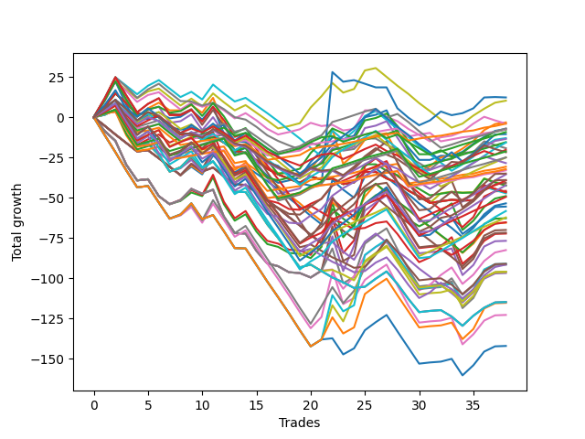

# Long Wallace 019 
- Symbol: ES
- Date Range: 03/18/2022 - 07/15/2022
- Trading Period: 7:20-12:30
- Number of Trades: 38



| Name | Win Percent | Profit | Avg Profit / Trade | Avg Time / Trade |      | Name | Win Percent | Profit | Avg Profit / Trade | Avg Time / Trade |
| ---- | ----------- | ------ | ------------------ | ---------------- | ---- | ---- | ----------- | ------ | ------------------ | ---------------- |
| Sorted By <br> Profit | | | | | | Sorted By <br> Win Percentage ||||
| Seventy-Three | 44.74 | 6125.00 | 161.18 | 12:44 |     | Eighty-One | 81.58 | -15375.00 | -404.61 | 06:26 |
| Forty | 52.63 | 5125.00 | 134.87 | 06:16 |     | One Hundred Twenty-Six | 81.58 | -16125.00 | -424.34 | 03:48 |
| One | 63.16 | -1625.00 | -42.76 | 20:31 |     | One Hundred Twenty-One | 81.58 | -16500.00 | -434.21 | 03:25 |
| One Hundred Sixteen | 78.95 | -2000.00 | -52.63 | 01:34 |     | One Hundred Sixteen | 78.95 | -2000.00 | -52.63 | 01:34 |
| Forty-Eight | 50.00 | -2000.00 | -52.63 | 04:57 |     | One Hundred Eleven | 76.32 | -3750.00 | -98.68 | 01:27 |
| One Hundred Twelve | 65.79 | -3500.00 | -92.11 | 02:49 |     | Eighty-Two | 76.32 | -7750.00 | -203.95 | 10:03 |
| Zero | 65.79 | -3625.00 | -95.39 | 13:45 |     | One Hundred Twenty-Seven | 76.32 | -10625.00 | -279.61 | 06:31 |
| One Hundred Eleven | 76.32 | -3750.00 | -98.68 | 01:27 |     | One Hundred Twenty-Two | 76.32 | -12500.00 | -328.95 | 06:13 |
| Sixty-Four | 60.53 | -3875.00 | -101.97 | 09:23 |     | One Hundred Twelve | 65.79 | -3500.00 | -92.11 | 02:49 |
| One Hundred Seventeen | 65.79 | -4625.00 | -121.71 | 02:46 |     | Zero | 65.79 | -3625.00 | -95.39 | 13:45 |
| One Hundred Fifteen | 47.37 | -5250.00 | -138.16 | 07:10 |     | One Hundred Seventeen | 65.79 | -4625.00 | -121.71 | 02:46 |
| Forty-One | 42.11 | -6500.00 | -171.05 | 09:20 |     | Fifty-Six | 65.79 | -6750.00 | -177.63 | 09:53 |
| Fifty-Six | 65.79 | -6750.00 | -177.63 | 09:53 |     | One | 63.16 | -1625.00 | -42.76 | 20:31 |
| Eighty-Two | 76.32 | -7750.00 | -203.95 | 10:03 |     | Eighty-Three | 63.16 | -19625.00 | -516.45 | 14:24 |
| One Hundred Fourteen | 50.00 | -7875.00 | -207.24 | 05:46 |     | One Hundred Twenty-Eight | 63.16 | -24750.00 | -651.32 | 08:27 |
| Forty-Nine | 39.47 | -9625.00 | -253.29 | 06:31 |     | One Hundred Twenty-Three | 63.16 | -31125.00 | -819.08 | 08:17 |
| One Hundred Eighteen | 50.00 | -10125.00 | -266.45 | 03:45 |     | Sixty-Four | 60.53 | -3875.00 | -101.97 | 09:23 |
| One Hundred Twenty-Seven | 76.32 | -10625.00 | -279.61 | 06:31 |     | Eighty-Four | 60.53 | -17750.00 | -467.11 | 17:00 |
| One Hundred Twenty | 34.21 | -10875.00 | -286.18 | 05:38 |     | One Hundred Twenty-Nine | 60.53 | -21125.00 | -555.92 | 10:42 |
| One Hundred Twenty-Two | 76.32 | -12500.00 | -328.95 | 06:13 |     | One Hundred Twenty-Four | 60.53 | -29125.00 | -766.45 | 10:36 |
| One Hundred Thirteen | 52.63 | -12500.00 | -328.95 | 03:56 |     | One Hundred Thirty | 57.89 | -17500.00 | -460.53 | 12:21 |
| One Hundred Ninteen | 39.47 | -14250.00 | -375.00 | 04:37 |     | Eighty-Five | 57.89 | -19500.00 | -513.16 | 18:55 |
| Eighty-One | 81.58 | -15375.00 | -404.61 | 06:26 |     | Fifty-Seven | 57.89 | -20375.00 | -536.18 | 14:38 |
| One Hundred Twenty-Six | 81.58 | -16125.00 | -424.34 | 03:48 |     | One Hundred Twenty-Five | 57.89 | -27750.00 | -730.26 | 12:19 |
| One Hundred Twenty-One | 81.58 | -16500.00 | -434.21 | 03:25 |     | Forty | 52.63 | 5125.00 | 134.87 | 06:16 |
| One Hundred Thirty | 57.89 | -17500.00 | -460.53 | 12:21 |     | One Hundred Thirteen | 52.63 | -12500.00 | -328.95 | 03:56 |
| Eighty-Four | 60.53 | -17750.00 | -467.11 | 17:00 |     | Forty-Eight | 50.00 | -2000.00 | -52.63 | 04:57 |
| Eighty-Five | 57.89 | -19500.00 | -513.16 | 18:55 |     | One Hundred Fourteen | 50.00 | -7875.00 | -207.24 | 05:46 |
| Eighty-Three | 63.16 | -19625.00 | -516.45 | 14:24 |     | One Hundred Eighteen | 50.00 | -10125.00 | -266.45 | 03:45 |
| Fifty-Seven | 57.89 | -20375.00 | -536.18 | 14:38 |     | Sixty-Five | 50.00 | -32625.00 | -858.55 | 13:19 |
| One Hundred Twenty-Nine | 60.53 | -21125.00 | -555.92 | 10:42 |     | One Hundred Fifteen | 47.37 | -5250.00 | -138.16 | 07:10 |
| Fifty | 34.21 | -21125.00 | -555.92 | 07:00 |     | Two | 47.37 | -24500.00 | -644.74 | 24:43 |
| Fifty-Four | 34.21 | -21250.00 | -559.21 | 07:01 |     | Three | 47.37 | -36125.00 | -950.66 | 26:37 |
| Forty-Five | 26.32 | -22875.00 | -601.97 | 14:13 |     | Fifty-Eight | 47.37 | -41250.00 | -1085.53 | 17:41 |
| Fifty-Five | 34.21 | -23250.00 | -611.84 | 07:16 |     | Fifty-Nine | 47.37 | -45750.00 | -1203.95 | 19:19 |
| Fifty-Three | 34.21 | -23250.00 | -611.84 | 07:16 |     | Seventy-Three | 44.74 | 6125.00 | 161.18 | 12:44 |
| Fifty-Two | 34.21 | -23250.00 | -611.84 | 07:16 |     | Five | 44.74 | -35875.00 | -944.08 | 29:11 |
| Fifty-One | 34.21 | -23625.00 | -621.71 | 07:04 |     | Four | 44.74 | -38375.00 | -1009.87 | 28:51 |
| Two | 47.37 | -24500.00 | -644.74 | 24:43 |     | Sixty-Seven | 44.74 | -45500.00 | -1197.37 | 16:46 |
| One Hundred Twenty-Eight | 63.16 | -24750.00 | -651.32 | 08:27 |     | Sixty-One | 44.74 | -45500.00 | -1197.37 | 21:53 |
| Forty-Two | 28.95 | -26750.00 | -703.95 | 11:29 |     | Sixty-Six | 44.74 | -45750.00 | -1203.95 | 15:08 |
| One Hundred Twenty-Five | 57.89 | -27750.00 | -730.26 | 12:19 |     | Seventy | 44.74 | -48000.00 | -1263.16 | 17:49 |
| One Hundred Twenty-Four | 60.53 | -29125.00 | -766.45 | 10:36 |     | Sixty | 44.74 | -48000.00 | -1263.16 | 21:33 |
| One Hundred Twenty-Three | 63.16 | -31125.00 | -819.08 | 08:17 |     | Seven | 44.74 | -48000.00 | -1263.16 | 28:55 |
| Forty-Four | 26.32 | -31375.00 | -825.66 | 14:00 |     | Sixty-Three | 44.74 | -57625.00 | -1516.45 | 21:36 |
| Sixty-Five | 50.00 | -32625.00 | -858.55 | 13:19 |     | Six | 44.74 | -61375.00 | -1615.13 | 27:54 |
| Forty-Three | 28.95 | -32750.00 | -861.84 | 12:16 |     | Sixty-Two | 44.74 | -71000.00 | -1868.42 | 20:35 |
| Forty-Seven | 26.32 | -35000.00 | -921.05 | 13:56 |     | Forty-One | 42.11 | -6500.00 | -171.05 | 09:20 |
| Five | 44.74 | -35875.00 | -944.08 | 29:11 |     | Seventy-One | 42.11 | -57375.00 | -1509.87 | 18:15 |
| Three | 47.37 | -36125.00 | -950.66 | 26:37 |     | Sixty-Nine | 42.11 | -57375.00 | -1509.87 | 18:15 |
| Four | 44.74 | -38375.00 | -1009.87 | 28:51 |     | Sixty-Eight | 42.11 | -57375.00 | -1509.87 | 18:15 |
| Fifty-Eight | 47.37 | -41250.00 | -1085.53 | 17:41 |     | Forty-Nine | 39.47 | -9625.00 | -253.29 | 06:31 |
| Sixty-Seven | 44.74 | -45500.00 | -1197.37 | 16:46 |     | One Hundred Ninteen | 39.47 | -14250.00 | -375.00 | 04:37 |
| Sixty-One | 44.74 | -45500.00 | -1197.37 | 21:53 |     | One Hundred Twenty | 34.21 | -10875.00 | -286.18 | 05:38 |
| Fifty-Nine | 47.37 | -45750.00 | -1203.95 | 19:19 |     | Fifty | 34.21 | -21125.00 | -555.92 | 07:00 |
| Sixty-Six | 44.74 | -45750.00 | -1203.95 | 15:08 |     | Fifty-Four | 34.21 | -21250.00 | -559.21 | 07:01 |
| Seventy | 44.74 | -48000.00 | -1263.16 | 17:49 |     | Fifty-Five | 34.21 | -23250.00 | -611.84 | 07:16 |
| Sixty | 44.74 | -48000.00 | -1263.16 | 21:33 |     | Fifty-Three | 34.21 | -23250.00 | -611.84 | 07:16 |
| Seven | 44.74 | -48000.00 | -1263.16 | 28:55 |     | Fifty-Two | 34.21 | -23250.00 | -611.84 | 07:16 |
| Forty-Six | 26.32 | -48375.00 | -1273.03 | 12:55 |     | Fifty-One | 34.21 | -23625.00 | -621.71 | 07:04 |
| Seventy-One | 42.11 | -57375.00 | -1509.87 | 18:15 |     | Forty-Two | 28.95 | -26750.00 | -703.95 | 11:29 |
| Sixty-Nine | 42.11 | -57375.00 | -1509.87 | 18:15 |     | Forty-Three | 28.95 | -32750.00 | -861.84 | 12:16 |
| Sixty-Eight | 42.11 | -57375.00 | -1509.87 | 18:15 |     | Forty-Five | 26.32 | -22875.00 | -601.97 | 14:13 |
| Sixty-Three | 44.74 | -57625.00 | -1516.45 | 21:36 |     | Forty-Four | 26.32 | -31375.00 | -825.66 | 14:00 |
| Six | 44.74 | -61375.00 | -1615.13 | 27:54 |     | Forty-Seven | 26.32 | -35000.00 | -921.05 | 13:56 |
| Sixty-Two | 44.74 | -71000.00 | -1868.42 | 20:35 |     | Forty-Six | 26.32 | -48375.00 | -1273.03 | 12:55 |

## NO STOPLOSS

### Test Zero
* Sell when price hits the middle line of the 20p bollinger
* No Stoploss
* Results:
```
Total Trades: 38
Percent Up: 65.79
Percent Down: 34.21
Total Points Moved Up: -7.25
Potential Profit: -3625.00
Total Points Ups: 110.25 Count Ups: 25
Total Points Downs: -117.50 Count Downs: 13
```

<details><summary>Trades</summary>

<code>In: 2022-03-21 09:37:00		Out: 2022-03-21 09:45:00		Total Position Time: 08:00		Total Move Up: 10.25		Total to Date: 10.25</code> <br />
<code>In: 2022-03-21 09:38:00		Out: 2022-03-21 09:45:00		Total Position Time: 07:00		Total Move Up: 12.00		Total to Date: 22.25</code> <br />
<code>In: 2022-03-21 09:56:00		Out: 2022-03-21 10:25:55		Total Position Time: 29:55		Total Move Up: -14.75		Total to Date: 7.50</code> <br />
<code>In: 2022-03-21 09:58:00		Out: 2022-03-21 10:26:00		Total Position Time: 28:00		Total Move Up: -10.50		Total to Date: -3.00</code> <br />
<code>In: 2022-03-23 09:47:00		Out: 2022-03-23 09:53:00		Total Position Time: 06:00		Total Move Up: 4.25		Total to Date: 1.25</code> <br />
<code>In: 2022-03-23 10:06:00		Out: 2022-03-23 10:06:10		Total Position Time: 00:10		Total Move Up: 1.75		Total to Date: 3.00</code> <br />
<code>In: 2022-03-23 10:23:00		Out: 2022-03-23 10:38:15		Total Position Time: 15:15		Total Move Up: -3.75		Total to Date: -0.75</code> <br />
<code>In: 2022-03-23 10:28:00		Out: 2022-03-23 10:38:15		Total Position Time: 10:15		Total Move Up: 1.00		Total to Date: 0.25</code> <br />
<code>In: 2022-03-23 10:30:00		Out: 2022-03-23 10:38:15		Total Position Time: 08:15		Total Move Up: 4.25		Total to Date: 4.50</code> <br />
<code>In: 2022-03-25 08:14:00		Out: 2022-03-25 08:36:40		Total Position Time: 22:40		Total Move Up: -6.00		Total to Date: -1.50</code> <br />
<code>In: 2022-03-25 08:29:00		Out: 2022-03-25 08:36:40		Total Position Time: 07:40		Total Move Up: 8.00		Total to Date: 6.50</code> <br />
<code>In: 2022-03-28 08:27:00		Out: 2022-03-28 08:56:55		Total Position Time: 29:55		Total Move Up: -16.75		Total to Date: -10.25</code> <br />
<code>In: 2022-03-28 08:33:00		Out: 2022-03-28 09:01:45		Total Position Time: 28:45		Total Move Up: -12.00		Total to Date: -22.25</code> <br />
<code>In: 2022-03-31 09:28:00		Out: 2022-03-31 09:32:35		Total Position Time: 04:35		Total Move Up: 3.25		Total to Date: -19.00</code> <br />
<code>In: 2022-04-18 08:23:00		Out: 2022-04-18 08:52:55		Total Position Time: 29:55		Total Move Up: -10.75		Total to Date: -29.75</code> <br />
<code>In: 2022-04-18 08:26:00		Out: 2022-04-18 08:55:05		Total Position Time: 29:05		Total Move Up: -6.50		Total to Date: -36.25</code> <br />
<code>In: 2022-04-18 08:29:00		Out: 2022-04-18 08:55:05		Total Position Time: 26:05		Total Move Up: -4.50		Total to Date: -40.75</code> <br />
<code>In: 2022-04-20 11:39:00		Out: 2022-04-20 11:48:15		Total Position Time: 09:15		Total Move Up: 1.50		Total to Date: -39.25</code> <br />
<code>In: 2022-04-20 11:40:00		Out: 2022-04-20 11:48:15		Total Position Time: 08:15		Total Move Up: 1.75		Total to Date: -37.50</code> <br />
<code>In: 2022-05-02 08:06:00		Out: 2022-05-02 08:13:20		Total Position Time: 07:20		Total Move Up: 9.75		Total to Date: -27.75</code> <br />
<code>In: 2022-05-02 08:19:00		Out: 2022-05-02 08:26:05		Total Position Time: 07:05		Total Move Up: 7.00		Total to Date: -20.75</code> <br />
<code>In: 2022-05-04 11:36:00		Out: 2022-05-04 11:36:40		Total Position Time: 00:40		Total Move Up: 8.25		Total to Date: -12.50</code> <br />
<code>In: 2022-05-11 09:32:00		Out: 2022-05-11 09:49:15		Total Position Time: 17:15		Total Move Up: -1.25		Total to Date: -13.75</code> <br />
<code>In: 2022-05-13 11:07:00		Out: 2022-05-13 11:19:15		Total Position Time: 12:15		Total Move Up: 2.25		Total to Date: -11.50</code> <br />
<code>In: 2022-05-17 11:24:00		Out: 2022-05-17 11:27:30		Total Position Time: 03:30		Total Move Up: 11.50		Total to Date: 0.00</code> <br />
<code>In: 2022-05-25 09:29:00		Out: 2022-05-25 09:41:25		Total Position Time: 12:25		Total Move Up: 1.50		Total to Date: 1.50</code> <br />
<code>In: 2022-06-06 08:19:00		Out: 2022-06-06 08:31:35		Total Position Time: 12:35		Total Move Up: 2.75		Total to Date: 4.25</code> <br />
<code>In: 2022-06-08 09:29:00		Out: 2022-06-08 09:53:05		Total Position Time: 24:05		Total Move Up: -14.25		Total to Date: -10.00</code> <br />
<code>In: 2022-06-08 09:33:00		Out: 2022-06-08 09:53:05		Total Position Time: 20:05		Total Move Up: -8.75		Total to Date: -18.75</code> <br />
<code>In: 2022-06-08 09:34:00		Out: 2022-06-08 09:53:05		Total Position Time: 19:05		Total Move Up: -7.75		Total to Date: -26.50</code> <br />
<code>In: 2022-06-08 09:41:00		Out: 2022-06-08 09:53:05		Total Position Time: 12:05		Total Move Up: 0.00		Total to Date: -26.50</code> <br />
<code>In: 2022-06-08 09:44:00		Out: 2022-06-08 09:53:05		Total Position Time: 09:05		Total Move Up: 2.50		Total to Date: -24.00</code> <br />
<code>In: 2022-06-09 07:54:00		Out: 2022-06-09 08:10:55		Total Position Time: 16:55		Total Move Up: 0.00		Total to Date: -24.00</code> <br />
<code>In: 2022-06-23 08:39:00		Out: 2022-06-23 08:49:05		Total Position Time: 10:05		Total Move Up: 2.50		Total to Date: -21.50</code> <br />
<code>In: 2022-06-27 10:48:00		Out: 2022-06-27 10:51:15		Total Position Time: 03:15		Total Move Up: 5.00		Total to Date: -16.50</code> <br />
<code>In: 2022-06-29 08:25:00		Out: 2022-06-29 08:28:15		Total Position Time: 03:15		Total Move Up: 4.25		Total to Date: -12.25</code> <br />
<code>In: 2022-07-05 08:02:00		Out: 2022-07-05 08:08:20		Total Position Time: 06:20		Total Move Up: 3.75		Total to Date: -8.50</code> <br />
<code>In: 2022-07-11 12:06:00		Out: 2022-07-11 12:22:10		Total Position Time: 16:10		Total Move Up: 1.25		Total to Date: -7.25</code> <br />


</details>

### Test One
* Sell when the price hits the upper line of the 20p 1std bollinger
* No Stoploss
* Results:
```
Total Trades: 38
Percent Up: 63.16
Percent Down: 36.84
Total Points Moved Up: -3.25
Potential Profit: -1625.00
Total Points Ups: 125.00 Count Ups: 24
Total Points Downs: -128.25 Count Downs: 14
```

<details><summary>Trades</summary>

<code>In: 2022-03-21 09:37:00		Out: 2022-03-21 09:49:45		Total Position Time: 12:45		Total Move Up: 11.50		Total to Date: 11.50</code> <br />
<code>In: 2022-03-21 09:38:00		Out: 2022-03-21 09:49:45		Total Position Time: 11:45		Total Move Up: 13.25		Total to Date: 24.75</code> <br />
<code>In: 2022-03-21 09:56:00		Out: 2022-03-21 10:25:55		Total Position Time: 29:55		Total Move Up: -14.75		Total to Date: 10.00</code> <br />
<code>In: 2022-03-21 09:58:00		Out: 2022-03-21 10:27:55		Total Position Time: 29:55		Total Move Up: -9.75		Total to Date: 0.25</code> <br />
<code>In: 2022-03-23 09:47:00		Out: 2022-03-23 09:59:10		Total Position Time: 12:10		Total Move Up: 5.25		Total to Date: 5.50</code> <br />
<code>In: 2022-03-23 10:06:00		Out: 2022-03-23 10:11:05		Total Position Time: 05:05		Total Move Up: 3.50		Total to Date: 9.00</code> <br />
<code>In: 2022-03-23 10:23:00		Out: 2022-03-23 10:51:45		Total Position Time: 28:45		Total Move Up: -4.75		Total to Date: 4.25</code> <br />
<code>In: 2022-03-23 10:28:00		Out: 2022-03-23 10:51:45		Total Position Time: 23:45		Total Move Up: 0.00		Total to Date: 4.25</code> <br />
<code>In: 2022-03-23 10:30:00		Out: 2022-03-23 10:51:45		Total Position Time: 21:45		Total Move Up: 3.25		Total to Date: 7.50</code> <br />
<code>In: 2022-03-25 08:14:00		Out: 2022-03-25 08:41:05		Total Position Time: 27:05		Total Move Up: -4.75		Total to Date: 2.75</code> <br />
<code>In: 2022-03-25 08:29:00		Out: 2022-03-25 08:41:05		Total Position Time: 12:05		Total Move Up: 9.25		Total to Date: 12.00</code> <br />
<code>In: 2022-03-28 08:27:00		Out: 2022-03-28 08:56:55		Total Position Time: 29:55		Total Move Up: -16.75		Total to Date: -4.75</code> <br />
<code>In: 2022-03-28 08:33:00		Out: 2022-03-28 09:02:55		Total Position Time: 29:55		Total Move Up: -10.25		Total to Date: -15.00</code> <br />
<code>In: 2022-03-31 09:28:00		Out: 2022-03-31 09:40:25		Total Position Time: 12:25		Total Move Up: 2.25		Total to Date: -12.75</code> <br />
<code>In: 2022-04-18 08:23:00		Out: 2022-04-18 08:52:55		Total Position Time: 29:55		Total Move Up: -10.75		Total to Date: -23.50</code> <br />
<code>In: 2022-04-18 08:26:00		Out: 2022-04-18 08:55:55		Total Position Time: 29:55		Total Move Up: -7.75		Total to Date: -31.25</code> <br />
<code>In: 2022-04-18 08:29:00		Out: 2022-04-18 08:57:10		Total Position Time: 28:10		Total Move Up: -3.50		Total to Date: -34.75</code> <br />
<code>In: 2022-04-20 11:39:00		Out: 2022-04-20 12:04:20		Total Position Time: 25:20		Total Move Up: -0.25		Total to Date: -35.00</code> <br />
<code>In: 2022-04-20 11:40:00		Out: 2022-04-20 12:04:20		Total Position Time: 24:20		Total Move Up: 0.00		Total to Date: -35.00</code> <br />
<code>In: 2022-05-02 08:06:00		Out: 2022-05-02 08:34:10		Total Position Time: 28:10		Total Move Up: 2.75		Total to Date: -32.25</code> <br />
<code>In: 2022-05-02 08:19:00		Out: 2022-05-02 08:34:10		Total Position Time: 15:10		Total Move Up: 8.75		Total to Date: -23.50</code> <br />
<code>In: 2022-05-04 11:36:00		Out: 2022-05-04 11:41:35		Total Position Time: 05:35		Total Move Up: 16.00		Total to Date: -7.50</code> <br />
<code>In: 2022-05-11 09:32:00		Out: 2022-05-11 10:01:55		Total Position Time: 29:55		Total Move Up: -21.50		Total to Date: -29.00</code> <br />
<code>In: 2022-05-13 11:07:00		Out: 2022-05-13 11:20:00		Total Position Time: 13:00		Total Move Up: 5.75		Total to Date: -23.25</code> <br />
<code>In: 2022-05-17 11:24:00		Out: 2022-05-17 11:37:35		Total Position Time: 13:35		Total Move Up: 9.25		Total to Date: -14.00</code> <br />
<code>In: 2022-05-25 09:29:00		Out: 2022-05-25 09:44:25		Total Position Time: 15:25		Total Move Up: 3.00		Total to Date: -11.00</code> <br />
<code>In: 2022-06-06 08:19:00		Out: 2022-06-06 08:39:15		Total Position Time: 20:15		Total Move Up: 1.00		Total to Date: -10.00</code> <br />
<code>In: 2022-06-08 09:29:00		Out: 2022-06-08 09:58:55		Total Position Time: 29:55		Total Move Up: -13.00		Total to Date: -23.00</code> <br />
<code>In: 2022-06-08 09:33:00		Out: 2022-06-08 09:59:05		Total Position Time: 26:05		Total Move Up: -5.75		Total to Date: -28.75</code> <br />
<code>In: 2022-06-08 09:34:00		Out: 2022-06-08 09:59:05		Total Position Time: 25:05		Total Move Up: -4.75		Total to Date: -33.50</code> <br />
<code>In: 2022-06-08 09:41:00		Out: 2022-06-08 09:59:05		Total Position Time: 18:05		Total Move Up: 3.00		Total to Date: -30.50</code> <br />
<code>In: 2022-06-08 09:44:00		Out: 2022-06-08 09:59:05		Total Position Time: 15:05		Total Move Up: 5.50		Total to Date: -25.00</code> <br />
<code>In: 2022-06-09 07:54:00		Out: 2022-06-09 08:20:50		Total Position Time: 26:50		Total Move Up: 1.50		Total to Date: -23.50</code> <br />
<code>In: 2022-06-23 08:39:00		Out: 2022-06-23 08:51:05		Total Position Time: 12:05		Total Move Up: 4.00		Total to Date: -19.50</code> <br />
<code>In: 2022-06-27 10:48:00		Out: 2022-06-27 11:03:15		Total Position Time: 15:15		Total Move Up: 4.75		Total to Date: -14.75</code> <br />
<code>In: 2022-06-29 08:25:00		Out: 2022-06-29 08:32:20		Total Position Time: 07:20		Total Move Up: 6.75		Total to Date: -8.00</code> <br />
<code>In: 2022-07-05 08:02:00		Out: 2022-07-05 08:16:40		Total Position Time: 14:40		Total Move Up: 3.75		Total to Date: -4.25</code> <br />
<code>In: 2022-07-11 12:06:00		Out: 2022-07-11 12:29:15		Total Position Time: 23:15		Total Move Up: 1.00		Total to Date: -3.25</code> <br />


</details>

### Test Two
* Sell when the price hits the upper line of the 20p 2std bollinger
* No Stoploss
* Results:
```
Total Trades: 38
Percent Up: 47.37
Percent Down: 52.63
Total Points Moved Up: -49.00
Potential Profit: -24500.00
Total Points Ups: 122.75 Count Ups: 18
Total Points Downs: -171.75 Count Downs: 20
```

<details><summary>Trades</summary>

<code>In: 2022-03-21 09:37:00		Out: 2022-03-21 10:06:55		Total Position Time: 29:55		Total Move Up: -8.50		Total to Date: -8.50</code> <br />
<code>In: 2022-03-21 09:38:00		Out: 2022-03-21 10:07:55		Total Position Time: 29:55		Total Move Up: -6.25		Total to Date: -14.75</code> <br />
<code>In: 2022-03-21 09:56:00		Out: 2022-03-21 10:25:55		Total Position Time: 29:55		Total Move Up: -14.75		Total to Date: -29.50</code> <br />
<code>In: 2022-03-21 09:58:00		Out: 2022-03-21 10:27:55		Total Position Time: 29:55		Total Move Up: -9.75		Total to Date: -39.25</code> <br />
<code>In: 2022-03-23 09:47:00		Out: 2022-03-23 10:16:55		Total Position Time: 29:55		Total Move Up: 0.75		Total to Date: -38.50</code> <br />
<code>In: 2022-03-23 10:06:00		Out: 2022-03-23 10:35:55		Total Position Time: 29:55		Total Move Up: -10.50		Total to Date: -49.00</code> <br />
<code>In: 2022-03-23 10:23:00		Out: 2022-03-23 10:52:55		Total Position Time: 29:55		Total Move Up: -5.00		Total to Date: -54.00</code> <br />
<code>In: 2022-03-23 10:28:00		Out: 2022-03-23 10:54:25		Total Position Time: 26:25		Total Move Up: 2.00		Total to Date: -52.00</code> <br />
<code>In: 2022-03-23 10:30:00		Out: 2022-03-23 10:54:25		Total Position Time: 24:25		Total Move Up: 5.25		Total to Date: -46.75</code> <br />
<code>In: 2022-03-25 08:14:00		Out: 2022-03-25 08:41:45		Total Position Time: 27:45		Total Move Up: -2.25		Total to Date: -49.00</code> <br />
<code>In: 2022-03-25 08:29:00		Out: 2022-03-25 08:41:45		Total Position Time: 12:45		Total Move Up: 11.75		Total to Date: -37.25</code> <br />
<code>In: 2022-03-28 08:27:00		Out: 2022-03-28 08:56:55		Total Position Time: 29:55		Total Move Up: -16.75		Total to Date: -54.00</code> <br />
<code>In: 2022-03-28 08:33:00		Out: 2022-03-28 09:02:55		Total Position Time: 29:55		Total Move Up: -10.25		Total to Date: -64.25</code> <br />
<code>In: 2022-03-31 09:28:00		Out: 2022-03-31 09:44:20		Total Position Time: 16:20		Total Move Up: 4.00		Total to Date: -60.25</code> <br />
<code>In: 2022-04-18 08:23:00		Out: 2022-04-18 08:52:55		Total Position Time: 29:55		Total Move Up: -10.75		Total to Date: -71.00</code> <br />
<code>In: 2022-04-18 08:26:00		Out: 2022-04-18 08:55:55		Total Position Time: 29:55		Total Move Up: -7.75		Total to Date: -78.75</code> <br />
<code>In: 2022-04-18 08:29:00		Out: 2022-04-18 08:58:55		Total Position Time: 29:55		Total Move Up: -1.75		Total to Date: -80.50</code> <br />
<code>In: 2022-04-20 11:39:00		Out: 2022-04-20 12:08:55		Total Position Time: 29:55		Total Move Up: -3.75		Total to Date: -84.25</code> <br />
<code>In: 2022-04-20 11:40:00		Out: 2022-04-20 12:09:55		Total Position Time: 29:55		Total Move Up: -0.50		Total to Date: -84.75</code> <br />
<code>In: 2022-05-02 08:06:00		Out: 2022-05-02 08:35:55		Total Position Time: 29:55		Total Move Up: -2.75		Total to Date: -87.50</code> <br />
<code>In: 2022-05-02 08:19:00		Out: 2022-05-02 08:36:25		Total Position Time: 17:25		Total Move Up: 7.00		Total to Date: -80.50</code> <br />
<code>In: 2022-05-04 11:36:00		Out: 2022-05-04 11:43:45		Total Position Time: 07:45		Total Move Up: 27.50		Total to Date: -53.00</code> <br />
<code>In: 2022-05-11 09:32:00		Out: 2022-05-11 10:01:55		Total Position Time: 29:55		Total Move Up: -21.50		Total to Date: -74.50</code> <br />
<code>In: 2022-05-13 11:07:00		Out: 2022-05-13 11:31:20		Total Position Time: 24:20		Total Move Up: 7.75		Total to Date: -66.75</code> <br />
<code>In: 2022-05-17 11:24:00		Out: 2022-05-17 11:40:00		Total Position Time: 16:00		Total Move Up: 13.00		Total to Date: -53.75</code> <br />
<code>In: 2022-05-25 09:29:00		Out: 2022-05-25 09:45:20		Total Position Time: 16:20		Total Move Up: 5.25		Total to Date: -48.50</code> <br />
<code>In: 2022-06-06 08:19:00		Out: 2022-06-06 08:43:00		Total Position Time: 24:00		Total Move Up: 3.25		Total to Date: -45.25</code> <br />
<code>In: 2022-06-08 09:29:00		Out: 2022-06-08 09:58:55		Total Position Time: 29:55		Total Move Up: -13.00		Total to Date: -58.25</code> <br />
<code>In: 2022-06-08 09:33:00		Out: 2022-06-08 09:59:10		Total Position Time: 26:10		Total Move Up: -5.25		Total to Date: -63.50</code> <br />
<code>In: 2022-06-08 09:34:00		Out: 2022-06-08 09:59:10		Total Position Time: 25:10		Total Move Up: -4.25		Total to Date: -67.75</code> <br />
<code>In: 2022-06-08 09:41:00		Out: 2022-06-08 09:59:10		Total Position Time: 18:10		Total Move Up: 3.50		Total to Date: -64.25</code> <br />
<code>In: 2022-06-08 09:44:00		Out: 2022-06-08 09:59:10		Total Position Time: 15:10		Total Move Up: 6.00		Total to Date: -58.25</code> <br />
<code>In: 2022-06-09 07:54:00		Out: 2022-06-09 08:22:35		Total Position Time: 28:35		Total Move Up: 4.75		Total to Date: -53.50</code> <br />
<code>In: 2022-06-23 08:39:00		Out: 2022-06-23 09:08:55		Total Position Time: 29:55		Total Move Up: -16.50		Total to Date: -70.00</code> <br />
<code>In: 2022-06-27 10:48:00		Out: 2022-06-27 11:13:35		Total Position Time: 25:35		Total Move Up: 5.75		Total to Date: -64.25</code> <br />
<code>In: 2022-06-29 08:25:00		Out: 2022-06-29 08:34:40		Total Position Time: 09:40		Total Move Up: 8.50		Total to Date: -55.75</code> <br />
<code>In: 2022-07-05 08:02:00		Out: 2022-07-05 08:17:55		Total Position Time: 15:55		Total Move Up: 5.25		Total to Date: -50.50</code> <br />
<code>In: 2022-07-11 12:06:00		Out: 2022-07-11 12:29:25		Total Position Time: 23:25		Total Move Up: 1.50		Total to Date: -49.00</code> <br />


</details>

### Test Three
* Sell when price hits the middle line of the 50p bollinger
* No Stoploss
* Results:
```
Total Trades: 38
Percent Up: 47.37
Percent Down: 52.63
Total Points Moved Up: -72.25
Potential Profit: -36125.00
Total Points Ups: 113.75 Count Ups: 18
Total Points Downs: -186.00 Count Downs: 20
```

<details><summary>Trades</summary>

<code>In: 2022-03-21 09:37:00		Out: 2022-03-21 10:06:55		Total Position Time: 29:55		Total Move Up: -8.50		Total to Date: -8.50</code> <br />
<code>In: 2022-03-21 09:38:00		Out: 2022-03-21 10:07:55		Total Position Time: 29:55		Total Move Up: -6.25		Total to Date: -14.75</code> <br />
<code>In: 2022-03-21 09:56:00		Out: 2022-03-21 10:25:55		Total Position Time: 29:55		Total Move Up: -14.75		Total to Date: -29.50</code> <br />
<code>In: 2022-03-21 09:58:00		Out: 2022-03-21 10:27:55		Total Position Time: 29:55		Total Move Up: -9.75		Total to Date: -39.25</code> <br />
<code>In: 2022-03-23 09:47:00		Out: 2022-03-23 10:16:55		Total Position Time: 29:55		Total Move Up: 0.75		Total to Date: -38.50</code> <br />
<code>In: 2022-03-23 10:06:00		Out: 2022-03-23 10:35:55		Total Position Time: 29:55		Total Move Up: -10.50		Total to Date: -49.00</code> <br />
<code>In: 2022-03-23 10:23:00		Out: 2022-03-23 10:52:55		Total Position Time: 29:55		Total Move Up: -5.00		Total to Date: -54.00</code> <br />
<code>In: 2022-03-23 10:28:00		Out: 2022-03-23 10:54:30		Total Position Time: 26:30		Total Move Up: 2.75		Total to Date: -51.25</code> <br />
<code>In: 2022-03-23 10:30:00		Out: 2022-03-23 10:54:30		Total Position Time: 24:30		Total Move Up: 6.00		Total to Date: -45.25</code> <br />
<code>In: 2022-03-25 08:14:00		Out: 2022-03-25 08:43:55		Total Position Time: 29:55		Total Move Up: -3.00		Total to Date: -48.25</code> <br />
<code>In: 2022-03-25 08:29:00		Out: 2022-03-25 08:52:45		Total Position Time: 23:45		Total Move Up: 12.50		Total to Date: -35.75</code> <br />
<code>In: 2022-03-28 08:27:00		Out: 2022-03-28 08:56:55		Total Position Time: 29:55		Total Move Up: -16.75		Total to Date: -52.50</code> <br />
<code>In: 2022-03-28 08:33:00		Out: 2022-03-28 09:02:55		Total Position Time: 29:55		Total Move Up: -10.25		Total to Date: -62.75</code> <br />
<code>In: 2022-03-31 09:28:00		Out: 2022-03-31 09:45:45		Total Position Time: 17:45		Total Move Up: 4.50		Total to Date: -58.25</code> <br />
<code>In: 2022-04-18 08:23:00		Out: 2022-04-18 08:52:55		Total Position Time: 29:55		Total Move Up: -10.75		Total to Date: -69.00</code> <br />
<code>In: 2022-04-18 08:26:00		Out: 2022-04-18 08:55:55		Total Position Time: 29:55		Total Move Up: -7.75		Total to Date: -76.75</code> <br />
<code>In: 2022-04-18 08:29:00		Out: 2022-04-18 08:58:55		Total Position Time: 29:55		Total Move Up: -1.75		Total to Date: -78.50</code> <br />
<code>In: 2022-04-20 11:39:00		Out: 2022-04-20 12:08:55		Total Position Time: 29:55		Total Move Up: -3.75		Total to Date: -82.25</code> <br />
<code>In: 2022-04-20 11:40:00		Out: 2022-04-20 12:09:55		Total Position Time: 29:55		Total Move Up: -0.50		Total to Date: -82.75</code> <br />
<code>In: 2022-05-02 08:06:00		Out: 2022-05-02 08:35:55		Total Position Time: 29:55		Total Move Up: -2.75		Total to Date: -85.50</code> <br />
<code>In: 2022-05-02 08:19:00		Out: 2022-05-02 08:38:10		Total Position Time: 19:10		Total Move Up: 11.00		Total to Date: -74.50</code> <br />
<code>In: 2022-05-04 11:36:00		Out: 2022-05-04 11:41:15		Total Position Time: 05:15		Total Move Up: 11.75		Total to Date: -62.75</code> <br />
<code>In: 2022-05-11 09:32:00		Out: 2022-05-11 10:01:55		Total Position Time: 29:55		Total Move Up: -21.50		Total to Date: -84.25</code> <br />
<code>In: 2022-05-13 11:07:00		Out: 2022-05-13 11:31:20		Total Position Time: 24:20		Total Move Up: 7.75		Total to Date: -76.50</code> <br />
<code>In: 2022-05-17 11:24:00		Out: 2022-05-17 11:40:05		Total Position Time: 16:05		Total Move Up: 14.50		Total to Date: -62.00</code> <br />
<code>In: 2022-05-25 09:29:00		Out: 2022-05-25 09:49:05		Total Position Time: 20:05		Total Move Up: 7.75		Total to Date: -54.25</code> <br />
<code>In: 2022-06-06 08:19:00		Out: 2022-06-06 08:46:10		Total Position Time: 27:10		Total Move Up: 9.00		Total to Date: -45.25</code> <br />
<code>In: 2022-06-08 09:29:00		Out: 2022-06-08 09:58:55		Total Position Time: 29:55		Total Move Up: -13.00		Total to Date: -58.25</code> <br />
<code>In: 2022-06-08 09:33:00		Out: 2022-06-08 10:02:55		Total Position Time: 29:55		Total Move Up: -12.25		Total to Date: -70.50</code> <br />
<code>In: 2022-06-08 09:34:00		Out: 2022-06-08 10:03:55		Total Position Time: 29:55		Total Move Up: -10.75		Total to Date: -81.25</code> <br />
<code>In: 2022-06-08 09:41:00		Out: 2022-06-08 10:10:55		Total Position Time: 29:55		Total Move Up: 0.75		Total to Date: -80.50</code> <br />
<code>In: 2022-06-08 09:44:00		Out: 2022-06-08 10:13:55		Total Position Time: 29:55		Total Move Up: 0.50		Total to Date: -80.00</code> <br />
<code>In: 2022-06-09 07:54:00		Out: 2022-06-09 08:22:45		Total Position Time: 28:45		Total Move Up: 5.50		Total to Date: -74.50</code> <br />
<code>In: 2022-06-23 08:39:00		Out: 2022-06-23 09:08:55		Total Position Time: 29:55		Total Move Up: -16.50		Total to Date: -91.00</code> <br />
<code>In: 2022-06-27 10:48:00		Out: 2022-06-27 11:13:35		Total Position Time: 25:35		Total Move Up: 5.75		Total to Date: -85.25</code> <br />
<code>In: 2022-06-29 08:25:00		Out: 2022-06-29 08:34:40		Total Position Time: 09:40		Total Move Up: 8.50		Total to Date: -76.75</code> <br />
<code>In: 2022-07-05 08:02:00		Out: 2022-07-05 08:27:25		Total Position Time: 25:25		Total Move Up: 4.25		Total to Date: -72.50</code> <br />
<code>In: 2022-07-11 12:06:00		Out: 2022-07-11 12:35:55		Total Position Time: 29:55		Total Move Up: 0.25		Total to Date: -72.25</code> <br />


</details>

### Test Four
* Sell when the price hits the upper line of the 50p 1std bollinger
* No Stoploss
* Results:
```
Total Trades: 38
Percent Up: 44.74
Percent Down: 55.26
Total Points Moved Up: -76.75
Potential Profit: -38375.00
Total Points Ups: 109.50 Count Ups: 17
Total Points Downs: -186.25 Count Downs: 21
```

<details><summary>Trades</summary>

<code>In: 2022-03-21 09:37:00		Out: 2022-03-21 10:06:55		Total Position Time: 29:55		Total Move Up: -8.50		Total to Date: -8.50</code> <br />
<code>In: 2022-03-21 09:38:00		Out: 2022-03-21 10:07:55		Total Position Time: 29:55		Total Move Up: -6.25		Total to Date: -14.75</code> <br />
<code>In: 2022-03-21 09:56:00		Out: 2022-03-21 10:25:55		Total Position Time: 29:55		Total Move Up: -14.75		Total to Date: -29.50</code> <br />
<code>In: 2022-03-21 09:58:00		Out: 2022-03-21 10:27:55		Total Position Time: 29:55		Total Move Up: -9.75		Total to Date: -39.25</code> <br />
<code>In: 2022-03-23 09:47:00		Out: 2022-03-23 10:16:55		Total Position Time: 29:55		Total Move Up: 0.75		Total to Date: -38.50</code> <br />
<code>In: 2022-03-23 10:06:00		Out: 2022-03-23 10:35:55		Total Position Time: 29:55		Total Move Up: -10.50		Total to Date: -49.00</code> <br />
<code>In: 2022-03-23 10:23:00		Out: 2022-03-23 10:52:55		Total Position Time: 29:55		Total Move Up: -5.00		Total to Date: -54.00</code> <br />
<code>In: 2022-03-23 10:28:00		Out: 2022-03-23 10:57:55		Total Position Time: 29:55		Total Move Up: 2.50		Total to Date: -51.50</code> <br />
<code>In: 2022-03-23 10:30:00		Out: 2022-03-23 10:59:55		Total Position Time: 29:55		Total Move Up: 7.00		Total to Date: -44.50</code> <br />
<code>In: 2022-03-25 08:14:00		Out: 2022-03-25 08:43:55		Total Position Time: 29:55		Total Move Up: -3.00		Total to Date: -47.50</code> <br />
<code>In: 2022-03-25 08:29:00		Out: 2022-03-25 08:58:55		Total Position Time: 29:55		Total Move Up: 2.50		Total to Date: -45.00</code> <br />
<code>In: 2022-03-28 08:27:00		Out: 2022-03-28 08:56:55		Total Position Time: 29:55		Total Move Up: -16.75		Total to Date: -61.75</code> <br />
<code>In: 2022-03-28 08:33:00		Out: 2022-03-28 09:02:55		Total Position Time: 29:55		Total Move Up: -10.25		Total to Date: -72.00</code> <br />
<code>In: 2022-03-31 09:28:00		Out: 2022-03-31 09:57:55		Total Position Time: 29:55		Total Move Up: -0.25		Total to Date: -72.25</code> <br />
<code>In: 2022-04-18 08:23:00		Out: 2022-04-18 08:52:55		Total Position Time: 29:55		Total Move Up: -10.75		Total to Date: -83.00</code> <br />
<code>In: 2022-04-18 08:26:00		Out: 2022-04-18 08:55:55		Total Position Time: 29:55		Total Move Up: -7.75		Total to Date: -90.75</code> <br />
<code>In: 2022-04-18 08:29:00		Out: 2022-04-18 08:58:55		Total Position Time: 29:55		Total Move Up: -1.75		Total to Date: -92.50</code> <br />
<code>In: 2022-04-20 11:39:00		Out: 2022-04-20 12:08:55		Total Position Time: 29:55		Total Move Up: -3.75		Total to Date: -96.25</code> <br />
<code>In: 2022-04-20 11:40:00		Out: 2022-04-20 12:09:55		Total Position Time: 29:55		Total Move Up: -0.50		Total to Date: -96.75</code> <br />
<code>In: 2022-05-02 08:06:00		Out: 2022-05-02 08:35:55		Total Position Time: 29:55		Total Move Up: -2.75		Total to Date: -99.50</code> <br />
<code>In: 2022-05-02 08:19:00		Out: 2022-05-02 08:48:55		Total Position Time: 29:55		Total Move Up: 4.25		Total to Date: -95.25</code> <br />
<code>In: 2022-05-04 11:36:00		Out: 2022-05-04 11:42:00		Total Position Time: 06:00		Total Move Up: 21.25		Total to Date: -74.00</code> <br />
<code>In: 2022-05-11 09:32:00		Out: 2022-05-11 10:01:55		Total Position Time: 29:55		Total Move Up: -21.50		Total to Date: -95.50</code> <br />
<code>In: 2022-05-13 11:07:00		Out: 2022-05-13 11:32:00		Total Position Time: 25:00		Total Move Up: 15.75		Total to Date: -79.75</code> <br />
<code>In: 2022-05-17 11:24:00		Out: 2022-05-17 11:44:30		Total Position Time: 20:30		Total Move Up: 21.75		Total to Date: -58.00</code> <br />
<code>In: 2022-05-25 09:29:00		Out: 2022-05-25 09:58:55		Total Position Time: 29:55		Total Move Up: 5.00		Total to Date: -53.00</code> <br />
<code>In: 2022-06-06 08:19:00		Out: 2022-06-06 08:48:55		Total Position Time: 29:55		Total Move Up: 4.50		Total to Date: -48.50</code> <br />
<code>In: 2022-06-08 09:29:00		Out: 2022-06-08 09:58:55		Total Position Time: 29:55		Total Move Up: -13.00		Total to Date: -61.50</code> <br />
<code>In: 2022-06-08 09:33:00		Out: 2022-06-08 10:02:55		Total Position Time: 29:55		Total Move Up: -12.25		Total to Date: -73.75</code> <br />
<code>In: 2022-06-08 09:34:00		Out: 2022-06-08 10:03:55		Total Position Time: 29:55		Total Move Up: -10.75		Total to Date: -84.50</code> <br />
<code>In: 2022-06-08 09:41:00		Out: 2022-06-08 10:10:55		Total Position Time: 29:55		Total Move Up: 0.75		Total to Date: -83.75</code> <br />
<code>In: 2022-06-08 09:44:00		Out: 2022-06-08 10:13:55		Total Position Time: 29:55		Total Move Up: 0.50		Total to Date: -83.25</code> <br />
<code>In: 2022-06-09 07:54:00		Out: 2022-06-09 08:23:55		Total Position Time: 29:55		Total Move Up: 1.75		Total to Date: -81.50</code> <br />
<code>In: 2022-06-23 08:39:00		Out: 2022-06-23 09:08:55		Total Position Time: 29:55		Total Move Up: -16.50		Total to Date: -98.00</code> <br />
<code>In: 2022-06-27 10:48:00		Out: 2022-06-27 11:17:55		Total Position Time: 29:55		Total Move Up: 6.25		Total to Date: -91.75</code> <br />
<code>In: 2022-06-29 08:25:00		Out: 2022-06-29 08:53:10		Total Position Time: 28:10		Total Move Up: 11.50		Total to Date: -80.25</code> <br />
<code>In: 2022-07-05 08:02:00		Out: 2022-07-05 08:31:55		Total Position Time: 29:55		Total Move Up: 3.25		Total to Date: -77.00</code> <br />
<code>In: 2022-07-11 12:06:00		Out: 2022-07-11 12:35:55		Total Position Time: 29:55		Total Move Up: 0.25		Total to Date: -76.75</code> <br />


</details>

### Test Five
* Sell when the price hits the upper line of the 50p 2std bollinger
* No Stoploss
* Results:
```
Total Trades: 38
Percent Up: 44.74
Percent Down: 55.26
Total Points Moved Up: -71.75
Potential Profit: -35875.00
Total Points Ups: 114.50 Count Ups: 17
Total Points Downs: -186.25 Count Downs: 21
```

<details><summary>Trades</summary>

<code>In: 2022-03-21 09:37:00		Out: 2022-03-21 10:06:55		Total Position Time: 29:55		Total Move Up: -8.50		Total to Date: -8.50</code> <br />
<code>In: 2022-03-21 09:38:00		Out: 2022-03-21 10:07:55		Total Position Time: 29:55		Total Move Up: -6.25		Total to Date: -14.75</code> <br />
<code>In: 2022-03-21 09:56:00		Out: 2022-03-21 10:25:55		Total Position Time: 29:55		Total Move Up: -14.75		Total to Date: -29.50</code> <br />
<code>In: 2022-03-21 09:58:00		Out: 2022-03-21 10:27:55		Total Position Time: 29:55		Total Move Up: -9.75		Total to Date: -39.25</code> <br />
<code>In: 2022-03-23 09:47:00		Out: 2022-03-23 10:16:55		Total Position Time: 29:55		Total Move Up: 0.75		Total to Date: -38.50</code> <br />
<code>In: 2022-03-23 10:06:00		Out: 2022-03-23 10:35:55		Total Position Time: 29:55		Total Move Up: -10.50		Total to Date: -49.00</code> <br />
<code>In: 2022-03-23 10:23:00		Out: 2022-03-23 10:52:55		Total Position Time: 29:55		Total Move Up: -5.00		Total to Date: -54.00</code> <br />
<code>In: 2022-03-23 10:28:00		Out: 2022-03-23 10:57:55		Total Position Time: 29:55		Total Move Up: 2.50		Total to Date: -51.50</code> <br />
<code>In: 2022-03-23 10:30:00		Out: 2022-03-23 10:59:55		Total Position Time: 29:55		Total Move Up: 7.00		Total to Date: -44.50</code> <br />
<code>In: 2022-03-25 08:14:00		Out: 2022-03-25 08:43:55		Total Position Time: 29:55		Total Move Up: -3.00		Total to Date: -47.50</code> <br />
<code>In: 2022-03-25 08:29:00		Out: 2022-03-25 08:58:55		Total Position Time: 29:55		Total Move Up: 2.50		Total to Date: -45.00</code> <br />
<code>In: 2022-03-28 08:27:00		Out: 2022-03-28 08:56:55		Total Position Time: 29:55		Total Move Up: -16.75		Total to Date: -61.75</code> <br />
<code>In: 2022-03-28 08:33:00		Out: 2022-03-28 09:02:55		Total Position Time: 29:55		Total Move Up: -10.25		Total to Date: -72.00</code> <br />
<code>In: 2022-03-31 09:28:00		Out: 2022-03-31 09:57:55		Total Position Time: 29:55		Total Move Up: -0.25		Total to Date: -72.25</code> <br />
<code>In: 2022-04-18 08:23:00		Out: 2022-04-18 08:52:55		Total Position Time: 29:55		Total Move Up: -10.75		Total to Date: -83.00</code> <br />
<code>In: 2022-04-18 08:26:00		Out: 2022-04-18 08:55:55		Total Position Time: 29:55		Total Move Up: -7.75		Total to Date: -90.75</code> <br />
<code>In: 2022-04-18 08:29:00		Out: 2022-04-18 08:58:55		Total Position Time: 29:55		Total Move Up: -1.75		Total to Date: -92.50</code> <br />
<code>In: 2022-04-20 11:39:00		Out: 2022-04-20 12:08:55		Total Position Time: 29:55		Total Move Up: -3.75		Total to Date: -96.25</code> <br />
<code>In: 2022-04-20 11:40:00		Out: 2022-04-20 12:09:55		Total Position Time: 29:55		Total Move Up: -0.50		Total to Date: -96.75</code> <br />
<code>In: 2022-05-02 08:06:00		Out: 2022-05-02 08:35:55		Total Position Time: 29:55		Total Move Up: -2.75		Total to Date: -99.50</code> <br />
<code>In: 2022-05-02 08:19:00		Out: 2022-05-02 08:48:55		Total Position Time: 29:55		Total Move Up: 4.25		Total to Date: -95.25</code> <br />
<code>In: 2022-05-04 11:36:00		Out: 2022-05-04 11:43:45		Total Position Time: 07:45		Total Move Up: 27.50		Total to Date: -67.75</code> <br />
<code>In: 2022-05-11 09:32:00		Out: 2022-05-11 10:01:55		Total Position Time: 29:55		Total Move Up: -21.50		Total to Date: -89.25</code> <br />
<code>In: 2022-05-13 11:07:00		Out: 2022-05-13 11:36:55		Total Position Time: 29:55		Total Move Up: 3.75		Total to Date: -85.50</code> <br />
<code>In: 2022-05-17 11:24:00		Out: 2022-05-17 11:48:45		Total Position Time: 24:45		Total Move Up: 31.25		Total to Date: -54.25</code> <br />
<code>In: 2022-05-25 09:29:00		Out: 2022-05-25 09:58:55		Total Position Time: 29:55		Total Move Up: 5.00		Total to Date: -49.25</code> <br />
<code>In: 2022-06-06 08:19:00		Out: 2022-06-06 08:48:55		Total Position Time: 29:55		Total Move Up: 4.50		Total to Date: -44.75</code> <br />
<code>In: 2022-06-08 09:29:00		Out: 2022-06-08 09:58:55		Total Position Time: 29:55		Total Move Up: -13.00		Total to Date: -57.75</code> <br />
<code>In: 2022-06-08 09:33:00		Out: 2022-06-08 10:02:55		Total Position Time: 29:55		Total Move Up: -12.25		Total to Date: -70.00</code> <br />
<code>In: 2022-06-08 09:34:00		Out: 2022-06-08 10:03:55		Total Position Time: 29:55		Total Move Up: -10.75		Total to Date: -80.75</code> <br />
<code>In: 2022-06-08 09:41:00		Out: 2022-06-08 10:10:55		Total Position Time: 29:55		Total Move Up: 0.75		Total to Date: -80.00</code> <br />
<code>In: 2022-06-08 09:44:00		Out: 2022-06-08 10:13:55		Total Position Time: 29:55		Total Move Up: 0.50		Total to Date: -79.50</code> <br />
<code>In: 2022-06-09 07:54:00		Out: 2022-06-09 08:23:55		Total Position Time: 29:55		Total Move Up: 1.75		Total to Date: -77.75</code> <br />
<code>In: 2022-06-23 08:39:00		Out: 2022-06-23 09:08:55		Total Position Time: 29:55		Total Move Up: -16.50		Total to Date: -94.25</code> <br />
<code>In: 2022-06-27 10:48:00		Out: 2022-06-27 11:17:55		Total Position Time: 29:55		Total Move Up: 6.25		Total to Date: -88.00</code> <br />
<code>In: 2022-06-29 08:25:00		Out: 2022-06-29 08:54:55		Total Position Time: 29:55		Total Move Up: 12.75		Total to Date: -75.25</code> <br />
<code>In: 2022-07-05 08:02:00		Out: 2022-07-05 08:31:55		Total Position Time: 29:55		Total Move Up: 3.25		Total to Date: -72.00</code> <br />
<code>In: 2022-07-11 12:06:00		Out: 2022-07-11 12:35:55		Total Position Time: 29:55		Total Move Up: 0.25		Total to Date: -71.75</code> <br />


</details>

### Test Six
* Sell when the price hits the middle line of the 1std VWAP
* No Stoploss
* Results:
```
Total Trades: 38
Percent Up: 44.74
Percent Down: 55.26
Total Points Moved Up: -122.75
Potential Profit: -61375.00
Total Points Ups: 63.50 Count Ups: 17
Total Points Downs: -186.25 Count Downs: 21
```

<details><summary>Trades</summary>

<code>In: 2022-03-21 09:37:00		Out: 2022-03-21 10:06:55		Total Position Time: 29:55		Total Move Up: -8.50		Total to Date: -8.50</code> <br />
<code>In: 2022-03-21 09:38:00		Out: 2022-03-21 10:07:55		Total Position Time: 29:55		Total Move Up: -6.25		Total to Date: -14.75</code> <br />
<code>In: 2022-03-21 09:56:00		Out: 2022-03-21 10:25:55		Total Position Time: 29:55		Total Move Up: -14.75		Total to Date: -29.50</code> <br />
<code>In: 2022-03-21 09:58:00		Out: 2022-03-21 10:27:55		Total Position Time: 29:55		Total Move Up: -9.75		Total to Date: -39.25</code> <br />
<code>In: 2022-03-23 09:47:00		Out: 2022-03-23 10:16:55		Total Position Time: 29:55		Total Move Up: 0.75		Total to Date: -38.50</code> <br />
<code>In: 2022-03-23 10:06:00		Out: 2022-03-23 10:35:55		Total Position Time: 29:55		Total Move Up: -10.50		Total to Date: -49.00</code> <br />
<code>In: 2022-03-23 10:23:00		Out: 2022-03-23 10:52:55		Total Position Time: 29:55		Total Move Up: -5.00		Total to Date: -54.00</code> <br />
<code>In: 2022-03-23 10:28:00		Out: 2022-03-23 10:57:55		Total Position Time: 29:55		Total Move Up: 2.50		Total to Date: -51.50</code> <br />
<code>In: 2022-03-23 10:30:00		Out: 2022-03-23 10:59:55		Total Position Time: 29:55		Total Move Up: 7.00		Total to Date: -44.50</code> <br />
<code>In: 2022-03-25 08:14:00		Out: 2022-03-25 08:43:55		Total Position Time: 29:55		Total Move Up: -3.00		Total to Date: -47.50</code> <br />
<code>In: 2022-03-25 08:29:00		Out: 2022-03-25 08:58:55		Total Position Time: 29:55		Total Move Up: 2.50		Total to Date: -45.00</code> <br />
<code>In: 2022-03-28 08:27:00		Out: 2022-03-28 08:56:55		Total Position Time: 29:55		Total Move Up: -16.75		Total to Date: -61.75</code> <br />
<code>In: 2022-03-28 08:33:00		Out: 2022-03-28 09:02:55		Total Position Time: 29:55		Total Move Up: -10.25		Total to Date: -72.00</code> <br />
<code>In: 2022-03-31 09:28:00		Out: 2022-03-31 09:57:55		Total Position Time: 29:55		Total Move Up: -0.25		Total to Date: -72.25</code> <br />
<code>In: 2022-04-18 08:23:00		Out: 2022-04-18 08:52:55		Total Position Time: 29:55		Total Move Up: -10.75		Total to Date: -83.00</code> <br />
<code>In: 2022-04-18 08:26:00		Out: 2022-04-18 08:55:55		Total Position Time: 29:55		Total Move Up: -7.75		Total to Date: -90.75</code> <br />
<code>In: 2022-04-18 08:29:00		Out: 2022-04-18 08:58:55		Total Position Time: 29:55		Total Move Up: -1.75		Total to Date: -92.50</code> <br />
<code>In: 2022-04-20 11:39:00		Out: 2022-04-20 12:08:55		Total Position Time: 29:55		Total Move Up: -3.75		Total to Date: -96.25</code> <br />
<code>In: 2022-04-20 11:40:00		Out: 2022-04-20 12:09:55		Total Position Time: 29:55		Total Move Up: -0.50		Total to Date: -96.75</code> <br />
<code>In: 2022-05-02 08:06:00		Out: 2022-05-02 08:35:55		Total Position Time: 29:55		Total Move Up: -2.75		Total to Date: -99.50</code> <br />
<code>In: 2022-05-02 08:19:00		Out: 2022-05-02 08:48:55		Total Position Time: 29:55		Total Move Up: 4.25		Total to Date: -95.25</code> <br />
<code>In: 2022-05-04 11:36:00		Out: 2022-05-04 11:36:10		Total Position Time: 00:10		Total Move Up: 0.75		Total to Date: -94.50</code> <br />
<code>In: 2022-05-11 09:32:00		Out: 2022-05-11 10:01:55		Total Position Time: 29:55		Total Move Up: -21.50		Total to Date: -116.00</code> <br />
<code>In: 2022-05-13 11:07:00		Out: 2022-05-13 11:36:55		Total Position Time: 29:55		Total Move Up: 3.75		Total to Date: -112.25</code> <br />
<code>In: 2022-05-17 11:24:00		Out: 2022-05-17 11:27:25		Total Position Time: 03:25		Total Move Up: 11.25		Total to Date: -101.00</code> <br />
<code>In: 2022-05-25 09:29:00		Out: 2022-05-25 09:58:55		Total Position Time: 29:55		Total Move Up: 5.00		Total to Date: -96.00</code> <br />
<code>In: 2022-06-06 08:19:00		Out: 2022-06-06 08:48:55		Total Position Time: 29:55		Total Move Up: 4.50		Total to Date: -91.50</code> <br />
<code>In: 2022-06-08 09:29:00		Out: 2022-06-08 09:58:55		Total Position Time: 29:55		Total Move Up: -13.00		Total to Date: -104.50</code> <br />
<code>In: 2022-06-08 09:33:00		Out: 2022-06-08 10:02:55		Total Position Time: 29:55		Total Move Up: -12.25		Total to Date: -116.75</code> <br />
<code>In: 2022-06-08 09:34:00		Out: 2022-06-08 10:03:55		Total Position Time: 29:55		Total Move Up: -10.75		Total to Date: -127.50</code> <br />
<code>In: 2022-06-08 09:41:00		Out: 2022-06-08 10:10:55		Total Position Time: 29:55		Total Move Up: 0.75		Total to Date: -126.75</code> <br />
<code>In: 2022-06-08 09:44:00		Out: 2022-06-08 10:13:55		Total Position Time: 29:55		Total Move Up: 0.50		Total to Date: -126.25</code> <br />
<code>In: 2022-06-09 07:54:00		Out: 2022-06-09 08:23:55		Total Position Time: 29:55		Total Move Up: 1.75		Total to Date: -124.50</code> <br />
<code>In: 2022-06-23 08:39:00		Out: 2022-06-23 09:08:55		Total Position Time: 29:55		Total Move Up: -16.50		Total to Date: -141.00</code> <br />
<code>In: 2022-06-27 10:48:00		Out: 2022-06-27 11:17:55		Total Position Time: 29:55		Total Move Up: 6.25		Total to Date: -134.75</code> <br />
<code>In: 2022-06-29 08:25:00		Out: 2022-06-29 08:34:40		Total Position Time: 09:40		Total Move Up: 8.50		Total to Date: -126.25</code> <br />
<code>In: 2022-07-05 08:02:00		Out: 2022-07-05 08:31:55		Total Position Time: 29:55		Total Move Up: 3.25		Total to Date: -123.00</code> <br />
<code>In: 2022-07-11 12:06:00		Out: 2022-07-11 12:35:55		Total Position Time: 29:55		Total Move Up: 0.25		Total to Date: -122.75</code> <br />


</details>

### Test Seven
* Sell when the price hits the upper line of the 1std VWAP
* No Stoploss
* Results:
```
Total Trades: 38
Percent Up: 44.74
Percent Down: 55.26
Total Points Moved Up: -96.00
Potential Profit: -48000.00
Total Points Ups: 90.25 Count Ups: 17
Total Points Downs: -186.25 Count Downs: 21
```

<details><summary>Trades</summary>

<code>In: 2022-03-21 09:37:00		Out: 2022-03-21 10:06:55		Total Position Time: 29:55		Total Move Up: -8.50		Total to Date: -8.50</code> <br />
<code>In: 2022-03-21 09:38:00		Out: 2022-03-21 10:07:55		Total Position Time: 29:55		Total Move Up: -6.25		Total to Date: -14.75</code> <br />
<code>In: 2022-03-21 09:56:00		Out: 2022-03-21 10:25:55		Total Position Time: 29:55		Total Move Up: -14.75		Total to Date: -29.50</code> <br />
<code>In: 2022-03-21 09:58:00		Out: 2022-03-21 10:27:55		Total Position Time: 29:55		Total Move Up: -9.75		Total to Date: -39.25</code> <br />
<code>In: 2022-03-23 09:47:00		Out: 2022-03-23 10:16:55		Total Position Time: 29:55		Total Move Up: 0.75		Total to Date: -38.50</code> <br />
<code>In: 2022-03-23 10:06:00		Out: 2022-03-23 10:35:55		Total Position Time: 29:55		Total Move Up: -10.50		Total to Date: -49.00</code> <br />
<code>In: 2022-03-23 10:23:00		Out: 2022-03-23 10:52:55		Total Position Time: 29:55		Total Move Up: -5.00		Total to Date: -54.00</code> <br />
<code>In: 2022-03-23 10:28:00		Out: 2022-03-23 10:57:55		Total Position Time: 29:55		Total Move Up: 2.50		Total to Date: -51.50</code> <br />
<code>In: 2022-03-23 10:30:00		Out: 2022-03-23 10:59:55		Total Position Time: 29:55		Total Move Up: 7.00		Total to Date: -44.50</code> <br />
<code>In: 2022-03-25 08:14:00		Out: 2022-03-25 08:43:55		Total Position Time: 29:55		Total Move Up: -3.00		Total to Date: -47.50</code> <br />
<code>In: 2022-03-25 08:29:00		Out: 2022-03-25 08:58:55		Total Position Time: 29:55		Total Move Up: 2.50		Total to Date: -45.00</code> <br />
<code>In: 2022-03-28 08:27:00		Out: 2022-03-28 08:56:55		Total Position Time: 29:55		Total Move Up: -16.75		Total to Date: -61.75</code> <br />
<code>In: 2022-03-28 08:33:00		Out: 2022-03-28 09:02:55		Total Position Time: 29:55		Total Move Up: -10.25		Total to Date: -72.00</code> <br />
<code>In: 2022-03-31 09:28:00		Out: 2022-03-31 09:57:55		Total Position Time: 29:55		Total Move Up: -0.25		Total to Date: -72.25</code> <br />
<code>In: 2022-04-18 08:23:00		Out: 2022-04-18 08:52:55		Total Position Time: 29:55		Total Move Up: -10.75		Total to Date: -83.00</code> <br />
<code>In: 2022-04-18 08:26:00		Out: 2022-04-18 08:55:55		Total Position Time: 29:55		Total Move Up: -7.75		Total to Date: -90.75</code> <br />
<code>In: 2022-04-18 08:29:00		Out: 2022-04-18 08:58:55		Total Position Time: 29:55		Total Move Up: -1.75		Total to Date: -92.50</code> <br />
<code>In: 2022-04-20 11:39:00		Out: 2022-04-20 12:08:55		Total Position Time: 29:55		Total Move Up: -3.75		Total to Date: -96.25</code> <br />
<code>In: 2022-04-20 11:40:00		Out: 2022-04-20 12:09:55		Total Position Time: 29:55		Total Move Up: -0.50		Total to Date: -96.75</code> <br />
<code>In: 2022-05-02 08:06:00		Out: 2022-05-02 08:35:55		Total Position Time: 29:55		Total Move Up: -2.75		Total to Date: -99.50</code> <br />
<code>In: 2022-05-02 08:19:00		Out: 2022-05-02 08:48:55		Total Position Time: 29:55		Total Move Up: 4.25		Total to Date: -95.25</code> <br />
<code>In: 2022-05-04 11:36:00		Out: 2022-05-04 11:41:30		Total Position Time: 05:30		Total Move Up: 13.75		Total to Date: -81.50</code> <br />
<code>In: 2022-05-11 09:32:00		Out: 2022-05-11 10:01:55		Total Position Time: 29:55		Total Move Up: -21.50		Total to Date: -103.00</code> <br />
<code>In: 2022-05-13 11:07:00		Out: 2022-05-13 11:36:55		Total Position Time: 29:55		Total Move Up: 3.75		Total to Date: -99.25</code> <br />
<code>In: 2022-05-17 11:24:00		Out: 2022-05-17 11:40:20		Total Position Time: 16:20		Total Move Up: 20.75		Total to Date: -78.50</code> <br />
<code>In: 2022-05-25 09:29:00		Out: 2022-05-25 09:58:55		Total Position Time: 29:55		Total Move Up: 5.00		Total to Date: -73.50</code> <br />
<code>In: 2022-06-06 08:19:00		Out: 2022-06-06 08:48:55		Total Position Time: 29:55		Total Move Up: 4.50		Total to Date: -69.00</code> <br />
<code>In: 2022-06-08 09:29:00		Out: 2022-06-08 09:58:55		Total Position Time: 29:55		Total Move Up: -13.00		Total to Date: -82.00</code> <br />
<code>In: 2022-06-08 09:33:00		Out: 2022-06-08 10:02:55		Total Position Time: 29:55		Total Move Up: -12.25		Total to Date: -94.25</code> <br />
<code>In: 2022-06-08 09:34:00		Out: 2022-06-08 10:03:55		Total Position Time: 29:55		Total Move Up: -10.75		Total to Date: -105.00</code> <br />
<code>In: 2022-06-08 09:41:00		Out: 2022-06-08 10:10:55		Total Position Time: 29:55		Total Move Up: 0.75		Total to Date: -104.25</code> <br />
<code>In: 2022-06-08 09:44:00		Out: 2022-06-08 10:13:55		Total Position Time: 29:55		Total Move Up: 0.50		Total to Date: -103.75</code> <br />
<code>In: 2022-06-09 07:54:00		Out: 2022-06-09 08:23:55		Total Position Time: 29:55		Total Move Up: 1.75		Total to Date: -102.00</code> <br />
<code>In: 2022-06-23 08:39:00		Out: 2022-06-23 09:08:55		Total Position Time: 29:55		Total Move Up: -16.50		Total to Date: -118.50</code> <br />
<code>In: 2022-06-27 10:48:00		Out: 2022-06-27 11:17:55		Total Position Time: 29:55		Total Move Up: 6.25		Total to Date: -112.25</code> <br />
<code>In: 2022-06-29 08:25:00		Out: 2022-06-29 08:54:55		Total Position Time: 29:55		Total Move Up: 12.75		Total to Date: -99.50</code> <br />
<code>In: 2022-07-05 08:02:00		Out: 2022-07-05 08:31:55		Total Position Time: 29:55		Total Move Up: 3.25		Total to Date: -96.25</code> <br />
<code>In: 2022-07-11 12:06:00		Out: 2022-07-11 12:35:55		Total Position Time: 29:55		Total Move Up: 0.25		Total to Date: -96.00</code> <br />


</details>

## STOPLOSS OF 5

### Test Forty
* Sell when price hits the middle line of the 20p bollinger
* Stoploss is 5 points
* Results:
```
Total Trades: 38
Percent Up: 52.63
Percent Down: 47.37
Total Points Moved Up: 10.25
Potential Profit: 5125.00
Total Points Ups: 104.00 Count Ups: 20
Total Points Downs: -93.75 Count Downs: 18
```

<details><summary>Trades</summary>

<code>In: 2022-03-21 09:37:00		Out: 2022-03-21 09:45:00		Total Position Time: 08:00		Total Move Up: 10.25		Total to Date: 10.25</code> <br />
<code>In: 2022-03-21 09:38:00		Out: 2022-03-21 09:45:00		Total Position Time: 07:00		Total Move Up: 12.00		Total to Date: 22.25</code> <br />
<code>In: 2022-03-21 09:56:00		Out: 2022-03-21 09:57:25		Total Position Time: 01:25		Total Move Up: -5.25		Total to Date: 17.00</code> <br />
<code>In: 2022-03-21 09:58:00		Out: 2022-03-21 10:00:30		Total Position Time: 02:30		Total Move Up: -5.25		Total to Date: 11.75</code> <br />
<code>In: 2022-03-23 09:47:00		Out: 2022-03-23 09:53:00		Total Position Time: 06:00		Total Move Up: 4.25		Total to Date: 16.00</code> <br />
<code>In: 2022-03-23 10:06:00		Out: 2022-03-23 10:06:10		Total Position Time: 00:10		Total Move Up: 1.75		Total to Date: 17.75</code> <br />
<code>In: 2022-03-23 10:23:00		Out: 2022-03-23 10:25:30		Total Position Time: 02:30		Total Move Up: -5.25		Total to Date: 12.50</code> <br />
<code>In: 2022-03-23 10:28:00		Out: 2022-03-23 10:30:15		Total Position Time: 02:15		Total Move Up: -5.25		Total to Date: 7.25</code> <br />
<code>In: 2022-03-23 10:30:00		Out: 2022-03-23 10:38:15		Total Position Time: 08:15		Total Move Up: 4.25		Total to Date: 11.50</code> <br />
<code>In: 2022-03-25 08:14:00		Out: 2022-03-25 08:24:25		Total Position Time: 10:25		Total Move Up: -4.75		Total to Date: 6.75</code> <br />
<code>In: 2022-03-25 08:29:00		Out: 2022-03-25 08:36:40		Total Position Time: 07:40		Total Move Up: 8.00		Total to Date: 14.75</code> <br />
<code>In: 2022-03-28 08:27:00		Out: 2022-03-28 08:33:30		Total Position Time: 06:30		Total Move Up: -5.50		Total to Date: 9.25</code> <br />
<code>In: 2022-03-28 08:33:00		Out: 2022-03-28 08:35:05		Total Position Time: 02:05		Total Move Up: -5.00		Total to Date: 4.25</code> <br />
<code>In: 2022-03-31 09:28:00		Out: 2022-03-31 09:32:35		Total Position Time: 04:35		Total Move Up: 3.25		Total to Date: 7.50</code> <br />
<code>In: 2022-04-18 08:23:00		Out: 2022-04-18 08:27:05		Total Position Time: 04:05		Total Move Up: -4.75		Total to Date: 2.75</code> <br />
<code>In: 2022-04-18 08:26:00		Out: 2022-04-18 08:33:50		Total Position Time: 07:50		Total Move Up: -4.75		Total to Date: -2.00</code> <br />
<code>In: 2022-04-18 08:29:00		Out: 2022-04-18 08:39:25		Total Position Time: 10:25		Total Move Up: -5.00		Total to Date: -7.00</code> <br />
<code>In: 2022-04-20 11:39:00		Out: 2022-04-20 11:48:15		Total Position Time: 09:15		Total Move Up: 1.50		Total to Date: -5.50</code> <br />
<code>In: 2022-04-20 11:40:00		Out: 2022-04-20 11:48:15		Total Position Time: 08:15		Total Move Up: 1.75		Total to Date: -3.75</code> <br />
<code>In: 2022-05-02 08:06:00		Out: 2022-05-02 08:13:20		Total Position Time: 07:20		Total Move Up: 9.75		Total to Date: 6.00</code> <br />
<code>In: 2022-05-02 08:19:00		Out: 2022-05-02 08:26:05		Total Position Time: 07:05		Total Move Up: 7.00		Total to Date: 13.00</code> <br />
<code>In: 2022-05-04 11:36:00		Out: 2022-05-04 11:36:40		Total Position Time: 00:40		Total Move Up: 8.25		Total to Date: 21.25</code> <br />
<code>In: 2022-05-11 09:32:00		Out: 2022-05-11 09:43:45		Total Position Time: 11:45		Total Move Up: -6.00		Total to Date: 15.25</code> <br />
<code>In: 2022-05-13 11:07:00		Out: 2022-05-13 11:19:15		Total Position Time: 12:15		Total Move Up: 2.25		Total to Date: 17.50</code> <br />
<code>In: 2022-05-17 11:24:00		Out: 2022-05-17 11:27:30		Total Position Time: 03:30		Total Move Up: 11.50		Total to Date: 29.00</code> <br />
<code>In: 2022-05-25 09:29:00		Out: 2022-05-25 09:41:25		Total Position Time: 12:25		Total Move Up: 1.50		Total to Date: 30.50</code> <br />
<code>In: 2022-06-06 08:19:00		Out: 2022-06-06 08:20:05		Total Position Time: 01:05		Total Move Up: -5.50		Total to Date: 25.00</code> <br />
<code>In: 2022-06-08 09:29:00		Out: 2022-06-08 09:33:00		Total Position Time: 04:00		Total Move Up: -5.50		Total to Date: 19.50</code> <br />
<code>In: 2022-06-08 09:33:00		Out: 2022-06-08 09:39:15		Total Position Time: 06:15		Total Move Up: -5.00		Total to Date: 14.50</code> <br />
<code>In: 2022-06-08 09:34:00		Out: 2022-06-08 09:39:35		Total Position Time: 05:35		Total Move Up: -5.75		Total to Date: 8.75</code> <br />
<code>In: 2022-06-08 09:41:00		Out: 2022-06-08 09:44:45		Total Position Time: 03:45		Total Move Up: -5.00		Total to Date: 3.75</code> <br />
<code>In: 2022-06-08 09:44:00		Out: 2022-06-08 09:46:05		Total Position Time: 02:05		Total Move Up: -5.25		Total to Date: -1.50</code> <br />
<code>In: 2022-06-09 07:54:00		Out: 2022-06-09 08:06:25		Total Position Time: 12:25		Total Move Up: -5.00		Total to Date: -6.50</code> <br />
<code>In: 2022-06-23 08:39:00		Out: 2022-06-23 08:49:05		Total Position Time: 10:05		Total Move Up: 2.50		Total to Date: -4.00</code> <br />
<code>In: 2022-06-27 10:48:00		Out: 2022-06-27 10:51:15		Total Position Time: 03:15		Total Move Up: 5.00		Total to Date: 1.00</code> <br />
<code>In: 2022-06-29 08:25:00		Out: 2022-06-29 08:28:15		Total Position Time: 03:15		Total Move Up: 4.25		Total to Date: 5.25</code> <br />
<code>In: 2022-07-05 08:02:00		Out: 2022-07-05 08:08:20		Total Position Time: 06:20		Total Move Up: 3.75		Total to Date: 9.00</code> <br />
<code>In: 2022-07-11 12:06:00		Out: 2022-07-11 12:22:10		Total Position Time: 16:10		Total Move Up: 1.25		Total to Date: 10.25</code> <br />


</details>

### Test Forty-One
* Sell when the price hits the upper line of the 20p 1std bollinger
* Stoploss is 5 points
* Results:
```
Total Trades: 38
Percent Up: 42.11
Percent Down: 57.89
Total Points Moved Up: -13.00
Potential Profit: -6500.00
Total Points Ups: 102.50 Count Ups: 16
Total Points Downs: -115.50 Count Downs: 22
```

<details><summary>Trades</summary>

<code>In: 2022-03-21 09:37:00		Out: 2022-03-21 09:49:45		Total Position Time: 12:45		Total Move Up: 11.50		Total to Date: 11.50</code> <br />
<code>In: 2022-03-21 09:38:00		Out: 2022-03-21 09:49:45		Total Position Time: 11:45		Total Move Up: 13.25		Total to Date: 24.75</code> <br />
<code>In: 2022-03-21 09:56:00		Out: 2022-03-21 09:57:25		Total Position Time: 01:25		Total Move Up: -5.25		Total to Date: 19.50</code> <br />
<code>In: 2022-03-21 09:58:00		Out: 2022-03-21 10:00:30		Total Position Time: 02:30		Total Move Up: -5.25		Total to Date: 14.25</code> <br />
<code>In: 2022-03-23 09:47:00		Out: 2022-03-23 09:59:10		Total Position Time: 12:10		Total Move Up: 5.25		Total to Date: 19.50</code> <br />
<code>In: 2022-03-23 10:06:00		Out: 2022-03-23 10:11:05		Total Position Time: 05:05		Total Move Up: 3.50		Total to Date: 23.00</code> <br />
<code>In: 2022-03-23 10:23:00		Out: 2022-03-23 10:25:30		Total Position Time: 02:30		Total Move Up: -5.25		Total to Date: 17.75</code> <br />
<code>In: 2022-03-23 10:28:00		Out: 2022-03-23 10:30:15		Total Position Time: 02:15		Total Move Up: -5.25		Total to Date: 12.50</code> <br />
<code>In: 2022-03-23 10:30:00		Out: 2022-03-23 10:51:45		Total Position Time: 21:45		Total Move Up: 3.25		Total to Date: 15.75</code> <br />
<code>In: 2022-03-25 08:14:00		Out: 2022-03-25 08:24:25		Total Position Time: 10:25		Total Move Up: -4.75		Total to Date: 11.00</code> <br />
<code>In: 2022-03-25 08:29:00		Out: 2022-03-25 08:41:05		Total Position Time: 12:05		Total Move Up: 9.25		Total to Date: 20.25</code> <br />
<code>In: 2022-03-28 08:27:00		Out: 2022-03-28 08:33:30		Total Position Time: 06:30		Total Move Up: -5.50		Total to Date: 14.75</code> <br />
<code>In: 2022-03-28 08:33:00		Out: 2022-03-28 08:35:05		Total Position Time: 02:05		Total Move Up: -5.00		Total to Date: 9.75</code> <br />
<code>In: 2022-03-31 09:28:00		Out: 2022-03-31 09:40:25		Total Position Time: 12:25		Total Move Up: 2.25		Total to Date: 12.00</code> <br />
<code>In: 2022-04-18 08:23:00		Out: 2022-04-18 08:27:05		Total Position Time: 04:05		Total Move Up: -4.75		Total to Date: 7.25</code> <br />
<code>In: 2022-04-18 08:26:00		Out: 2022-04-18 08:33:50		Total Position Time: 07:50		Total Move Up: -4.75		Total to Date: 2.50</code> <br />
<code>In: 2022-04-18 08:29:00		Out: 2022-04-18 08:39:25		Total Position Time: 10:25		Total Move Up: -5.00		Total to Date: -2.50</code> <br />
<code>In: 2022-04-20 11:39:00		Out: 2022-04-20 11:52:05		Total Position Time: 13:05		Total Move Up: -5.50		Total to Date: -8.00</code> <br />
<code>In: 2022-04-20 11:40:00		Out: 2022-04-20 11:52:05		Total Position Time: 12:05		Total Move Up: -5.25		Total to Date: -13.25</code> <br />
<code>In: 2022-05-02 08:06:00		Out: 2022-05-02 08:17:25		Total Position Time: 11:25		Total Move Up: -5.75		Total to Date: -19.00</code> <br />
<code>In: 2022-05-02 08:19:00		Out: 2022-05-02 08:32:05		Total Position Time: 13:05		Total Move Up: -5.25		Total to Date: -24.25</code> <br />
<code>In: 2022-05-04 11:36:00		Out: 2022-05-04 11:41:35		Total Position Time: 05:35		Total Move Up: 16.00		Total to Date: -8.25</code> <br />
<code>In: 2022-05-11 09:32:00		Out: 2022-05-11 09:43:45		Total Position Time: 11:45		Total Move Up: -6.00		Total to Date: -14.25</code> <br />
<code>In: 2022-05-13 11:07:00		Out: 2022-05-13 11:20:00		Total Position Time: 13:00		Total Move Up: 5.75		Total to Date: -8.50</code> <br />
<code>In: 2022-05-17 11:24:00		Out: 2022-05-17 11:37:35		Total Position Time: 13:35		Total Move Up: 9.25		Total to Date: 0.75</code> <br />
<code>In: 2022-05-25 09:29:00		Out: 2022-05-25 09:44:25		Total Position Time: 15:25		Total Move Up: 3.00		Total to Date: 3.75</code> <br />
<code>In: 2022-06-06 08:19:00		Out: 2022-06-06 08:20:05		Total Position Time: 01:05		Total Move Up: -5.50		Total to Date: -1.75</code> <br />
<code>In: 2022-06-08 09:29:00		Out: 2022-06-08 09:33:00		Total Position Time: 04:00		Total Move Up: -5.50		Total to Date: -7.25</code> <br />
<code>In: 2022-06-08 09:33:00		Out: 2022-06-08 09:39:15		Total Position Time: 06:15		Total Move Up: -5.00		Total to Date: -12.25</code> <br />
<code>In: 2022-06-08 09:34:00		Out: 2022-06-08 09:39:35		Total Position Time: 05:35		Total Move Up: -5.75		Total to Date: -18.00</code> <br />
<code>In: 2022-06-08 09:41:00		Out: 2022-06-08 09:44:45		Total Position Time: 03:45		Total Move Up: -5.00		Total to Date: -23.00</code> <br />
<code>In: 2022-06-08 09:44:00		Out: 2022-06-08 09:46:05		Total Position Time: 02:05		Total Move Up: -5.25		Total to Date: -28.25</code> <br />
<code>In: 2022-06-09 07:54:00		Out: 2022-06-09 08:06:25		Total Position Time: 12:25		Total Move Up: -5.00		Total to Date: -33.25</code> <br />
<code>In: 2022-06-23 08:39:00		Out: 2022-06-23 08:51:05		Total Position Time: 12:05		Total Move Up: 4.00		Total to Date: -29.25</code> <br />
<code>In: 2022-06-27 10:48:00		Out: 2022-06-27 11:03:15		Total Position Time: 15:15		Total Move Up: 4.75		Total to Date: -24.50</code> <br />
<code>In: 2022-06-29 08:25:00		Out: 2022-06-29 08:32:20		Total Position Time: 07:20		Total Move Up: 6.75		Total to Date: -17.75</code> <br />
<code>In: 2022-07-05 08:02:00		Out: 2022-07-05 08:16:40		Total Position Time: 14:40		Total Move Up: 3.75		Total to Date: -14.00</code> <br />
<code>In: 2022-07-11 12:06:00		Out: 2022-07-11 12:29:15		Total Position Time: 23:15		Total Move Up: 1.00		Total to Date: -13.00</code> <br />


</details>

### Test Forty-Two
* Sell when the price hits the upper line of the 20p 2std bollinger
* Stoploss is 5 points
* Results:
```
Total Trades: 38
Percent Up: 28.95
Percent Down: 71.05
Total Points Moved Up: -53.50
Potential Profit: -26750.00
Total Points Ups: 88.50 Count Ups: 11
Total Points Downs: -142.00 Count Downs: 27
```

<details><summary>Trades</summary>

<code>In: 2022-03-21 09:37:00		Out: 2022-03-21 09:54:30		Total Position Time: 17:30		Total Move Up: -5.25		Total to Date: -5.25</code> <br />
<code>In: 2022-03-21 09:38:00		Out: 2022-03-21 09:57:30		Total Position Time: 19:30		Total Move Up: -5.50		Total to Date: -10.75</code> <br />
<code>In: 2022-03-21 09:56:00		Out: 2022-03-21 09:57:25		Total Position Time: 01:25		Total Move Up: -5.25		Total to Date: -16.00</code> <br />
<code>In: 2022-03-21 09:58:00		Out: 2022-03-21 10:00:30		Total Position Time: 02:30		Total Move Up: -5.25		Total to Date: -21.25</code> <br />
<code>In: 2022-03-23 09:47:00		Out: 2022-03-23 10:16:55		Total Position Time: 29:55		Total Move Up: 0.75		Total to Date: -20.50</code> <br />
<code>In: 2022-03-23 10:06:00		Out: 2022-03-23 10:21:25		Total Position Time: 15:25		Total Move Up: -5.00		Total to Date: -25.50</code> <br />
<code>In: 2022-03-23 10:23:00		Out: 2022-03-23 10:25:30		Total Position Time: 02:30		Total Move Up: -5.25		Total to Date: -30.75</code> <br />
<code>In: 2022-03-23 10:28:00		Out: 2022-03-23 10:30:15		Total Position Time: 02:15		Total Move Up: -5.25		Total to Date: -36.00</code> <br />
<code>In: 2022-03-23 10:30:00		Out: 2022-03-23 10:54:25		Total Position Time: 24:25		Total Move Up: 5.25		Total to Date: -30.75</code> <br />
<code>In: 2022-03-25 08:14:00		Out: 2022-03-25 08:24:25		Total Position Time: 10:25		Total Move Up: -4.75		Total to Date: -35.50</code> <br />
<code>In: 2022-03-25 08:29:00		Out: 2022-03-25 08:41:45		Total Position Time: 12:45		Total Move Up: 11.75		Total to Date: -23.75</code> <br />
<code>In: 2022-03-28 08:27:00		Out: 2022-03-28 08:33:30		Total Position Time: 06:30		Total Move Up: -5.50		Total to Date: -29.25</code> <br />
<code>In: 2022-03-28 08:33:00		Out: 2022-03-28 08:35:05		Total Position Time: 02:05		Total Move Up: -5.00		Total to Date: -34.25</code> <br />
<code>In: 2022-03-31 09:28:00		Out: 2022-03-31 09:44:20		Total Position Time: 16:20		Total Move Up: 4.00		Total to Date: -30.25</code> <br />
<code>In: 2022-04-18 08:23:00		Out: 2022-04-18 08:27:05		Total Position Time: 04:05		Total Move Up: -4.75		Total to Date: -35.00</code> <br />
<code>In: 2022-04-18 08:26:00		Out: 2022-04-18 08:33:50		Total Position Time: 07:50		Total Move Up: -4.75		Total to Date: -39.75</code> <br />
<code>In: 2022-04-18 08:29:00		Out: 2022-04-18 08:39:25		Total Position Time: 10:25		Total Move Up: -5.00		Total to Date: -44.75</code> <br />
<code>In: 2022-04-20 11:39:00		Out: 2022-04-20 11:52:05		Total Position Time: 13:05		Total Move Up: -5.50		Total to Date: -50.25</code> <br />
<code>In: 2022-04-20 11:40:00		Out: 2022-04-20 11:52:05		Total Position Time: 12:05		Total Move Up: -5.25		Total to Date: -55.50</code> <br />
<code>In: 2022-05-02 08:06:00		Out: 2022-05-02 08:17:25		Total Position Time: 11:25		Total Move Up: -5.75		Total to Date: -61.25</code> <br />
<code>In: 2022-05-02 08:19:00		Out: 2022-05-02 08:32:05		Total Position Time: 13:05		Total Move Up: -5.25		Total to Date: -66.50</code> <br />
<code>In: 2022-05-04 11:36:00		Out: 2022-05-04 11:43:45		Total Position Time: 07:45		Total Move Up: 27.50		Total to Date: -39.00</code> <br />
<code>In: 2022-05-11 09:32:00		Out: 2022-05-11 09:43:45		Total Position Time: 11:45		Total Move Up: -6.00		Total to Date: -45.00</code> <br />
<code>In: 2022-05-13 11:07:00		Out: 2022-05-13 11:26:55		Total Position Time: 19:55		Total Move Up: -5.00		Total to Date: -50.00</code> <br />
<code>In: 2022-05-17 11:24:00		Out: 2022-05-17 11:40:00		Total Position Time: 16:00		Total Move Up: 13.00		Total to Date: -37.00</code> <br />
<code>In: 2022-05-25 09:29:00		Out: 2022-05-25 09:45:20		Total Position Time: 16:20		Total Move Up: 5.25		Total to Date: -31.75</code> <br />
<code>In: 2022-06-06 08:19:00		Out: 2022-06-06 08:20:05		Total Position Time: 01:05		Total Move Up: -5.50		Total to Date: -37.25</code> <br />
<code>In: 2022-06-08 09:29:00		Out: 2022-06-08 09:33:00		Total Position Time: 04:00		Total Move Up: -5.50		Total to Date: -42.75</code> <br />
<code>In: 2022-06-08 09:33:00		Out: 2022-06-08 09:39:15		Total Position Time: 06:15		Total Move Up: -5.00		Total to Date: -47.75</code> <br />
<code>In: 2022-06-08 09:34:00		Out: 2022-06-08 09:39:35		Total Position Time: 05:35		Total Move Up: -5.75		Total to Date: -53.50</code> <br />
<code>In: 2022-06-08 09:41:00		Out: 2022-06-08 09:44:45		Total Position Time: 03:45		Total Move Up: -5.00		Total to Date: -58.50</code> <br />
<code>In: 2022-06-08 09:44:00		Out: 2022-06-08 09:46:05		Total Position Time: 02:05		Total Move Up: -5.25		Total to Date: -63.75</code> <br />
<code>In: 2022-06-09 07:54:00		Out: 2022-06-09 08:06:25		Total Position Time: 12:25		Total Move Up: -5.00		Total to Date: -68.75</code> <br />
<code>In: 2022-06-23 08:39:00		Out: 2022-06-23 08:58:35		Total Position Time: 19:35		Total Move Up: -5.75		Total to Date: -74.50</code> <br />
<code>In: 2022-06-27 10:48:00		Out: 2022-06-27 11:13:35		Total Position Time: 25:35		Total Move Up: 5.75		Total to Date: -68.75</code> <br />
<code>In: 2022-06-29 08:25:00		Out: 2022-06-29 08:34:40		Total Position Time: 09:40		Total Move Up: 8.50		Total to Date: -60.25</code> <br />
<code>In: 2022-07-05 08:02:00		Out: 2022-07-05 08:17:55		Total Position Time: 15:55		Total Move Up: 5.25		Total to Date: -55.00</code> <br />
<code>In: 2022-07-11 12:06:00		Out: 2022-07-11 12:29:25		Total Position Time: 23:25		Total Move Up: 1.50		Total to Date: -53.50</code> <br />


</details>

### Test Forty-Three
* Sell when price hits the middle line of the 50p bollinger
* Stoploss is 5 points
* Results:
```
Total Trades: 38
Percent Up: 28.95
Percent Down: 71.05
Total Points Moved Up: -65.50
Potential Profit: -32750.00
Total Points Ups: 76.50 Count Ups: 11
Total Points Downs: -142.00 Count Downs: 27
```

<details><summary>Trades</summary>

<code>In: 2022-03-21 09:37:00		Out: 2022-03-21 09:54:30		Total Position Time: 17:30		Total Move Up: -5.25		Total to Date: -5.25</code> <br />
<code>In: 2022-03-21 09:38:00		Out: 2022-03-21 09:57:30		Total Position Time: 19:30		Total Move Up: -5.50		Total to Date: -10.75</code> <br />
<code>In: 2022-03-21 09:56:00		Out: 2022-03-21 09:57:25		Total Position Time: 01:25		Total Move Up: -5.25		Total to Date: -16.00</code> <br />
<code>In: 2022-03-21 09:58:00		Out: 2022-03-21 10:00:30		Total Position Time: 02:30		Total Move Up: -5.25		Total to Date: -21.25</code> <br />
<code>In: 2022-03-23 09:47:00		Out: 2022-03-23 10:16:55		Total Position Time: 29:55		Total Move Up: 0.75		Total to Date: -20.50</code> <br />
<code>In: 2022-03-23 10:06:00		Out: 2022-03-23 10:21:25		Total Position Time: 15:25		Total Move Up: -5.00		Total to Date: -25.50</code> <br />
<code>In: 2022-03-23 10:23:00		Out: 2022-03-23 10:25:30		Total Position Time: 02:30		Total Move Up: -5.25		Total to Date: -30.75</code> <br />
<code>In: 2022-03-23 10:28:00		Out: 2022-03-23 10:30:15		Total Position Time: 02:15		Total Move Up: -5.25		Total to Date: -36.00</code> <br />
<code>In: 2022-03-23 10:30:00		Out: 2022-03-23 10:54:30		Total Position Time: 24:30		Total Move Up: 6.00		Total to Date: -30.00</code> <br />
<code>In: 2022-03-25 08:14:00		Out: 2022-03-25 08:24:25		Total Position Time: 10:25		Total Move Up: -4.75		Total to Date: -34.75</code> <br />
<code>In: 2022-03-25 08:29:00		Out: 2022-03-25 08:52:45		Total Position Time: 23:45		Total Move Up: 12.50		Total to Date: -22.25</code> <br />
<code>In: 2022-03-28 08:27:00		Out: 2022-03-28 08:33:30		Total Position Time: 06:30		Total Move Up: -5.50		Total to Date: -27.75</code> <br />
<code>In: 2022-03-28 08:33:00		Out: 2022-03-28 08:35:05		Total Position Time: 02:05		Total Move Up: -5.00		Total to Date: -32.75</code> <br />
<code>In: 2022-03-31 09:28:00		Out: 2022-03-31 09:45:45		Total Position Time: 17:45		Total Move Up: 4.50		Total to Date: -28.25</code> <br />
<code>In: 2022-04-18 08:23:00		Out: 2022-04-18 08:27:05		Total Position Time: 04:05		Total Move Up: -4.75		Total to Date: -33.00</code> <br />
<code>In: 2022-04-18 08:26:00		Out: 2022-04-18 08:33:50		Total Position Time: 07:50		Total Move Up: -4.75		Total to Date: -37.75</code> <br />
<code>In: 2022-04-18 08:29:00		Out: 2022-04-18 08:39:25		Total Position Time: 10:25		Total Move Up: -5.00		Total to Date: -42.75</code> <br />
<code>In: 2022-04-20 11:39:00		Out: 2022-04-20 11:52:05		Total Position Time: 13:05		Total Move Up: -5.50		Total to Date: -48.25</code> <br />
<code>In: 2022-04-20 11:40:00		Out: 2022-04-20 11:52:05		Total Position Time: 12:05		Total Move Up: -5.25		Total to Date: -53.50</code> <br />
<code>In: 2022-05-02 08:06:00		Out: 2022-05-02 08:17:25		Total Position Time: 11:25		Total Move Up: -5.75		Total to Date: -59.25</code> <br />
<code>In: 2022-05-02 08:19:00		Out: 2022-05-02 08:32:05		Total Position Time: 13:05		Total Move Up: -5.25		Total to Date: -64.50</code> <br />
<code>In: 2022-05-04 11:36:00		Out: 2022-05-04 11:41:15		Total Position Time: 05:15		Total Move Up: 11.75		Total to Date: -52.75</code> <br />
<code>In: 2022-05-11 09:32:00		Out: 2022-05-11 09:43:45		Total Position Time: 11:45		Total Move Up: -6.00		Total to Date: -58.75</code> <br />
<code>In: 2022-05-13 11:07:00		Out: 2022-05-13 11:26:55		Total Position Time: 19:55		Total Move Up: -5.00		Total to Date: -63.75</code> <br />
<code>In: 2022-05-17 11:24:00		Out: 2022-05-17 11:40:05		Total Position Time: 16:05		Total Move Up: 14.50		Total to Date: -49.25</code> <br />
<code>In: 2022-05-25 09:29:00		Out: 2022-05-25 09:49:05		Total Position Time: 20:05		Total Move Up: 7.75		Total to Date: -41.50</code> <br />
<code>In: 2022-06-06 08:19:00		Out: 2022-06-06 08:20:05		Total Position Time: 01:05		Total Move Up: -5.50		Total to Date: -47.00</code> <br />
<code>In: 2022-06-08 09:29:00		Out: 2022-06-08 09:33:00		Total Position Time: 04:00		Total Move Up: -5.50		Total to Date: -52.50</code> <br />
<code>In: 2022-06-08 09:33:00		Out: 2022-06-08 09:39:15		Total Position Time: 06:15		Total Move Up: -5.00		Total to Date: -57.50</code> <br />
<code>In: 2022-06-08 09:34:00		Out: 2022-06-08 09:39:35		Total Position Time: 05:35		Total Move Up: -5.75		Total to Date: -63.25</code> <br />
<code>In: 2022-06-08 09:41:00		Out: 2022-06-08 09:44:45		Total Position Time: 03:45		Total Move Up: -5.00		Total to Date: -68.25</code> <br />
<code>In: 2022-06-08 09:44:00		Out: 2022-06-08 09:46:05		Total Position Time: 02:05		Total Move Up: -5.25		Total to Date: -73.50</code> <br />
<code>In: 2022-06-09 07:54:00		Out: 2022-06-09 08:06:25		Total Position Time: 12:25		Total Move Up: -5.00		Total to Date: -78.50</code> <br />
<code>In: 2022-06-23 08:39:00		Out: 2022-06-23 08:58:35		Total Position Time: 19:35		Total Move Up: -5.75		Total to Date: -84.25</code> <br />
<code>In: 2022-06-27 10:48:00		Out: 2022-06-27 11:13:35		Total Position Time: 25:35		Total Move Up: 5.75		Total to Date: -78.50</code> <br />
<code>In: 2022-06-29 08:25:00		Out: 2022-06-29 08:34:40		Total Position Time: 09:40		Total Move Up: 8.50		Total to Date: -70.00</code> <br />
<code>In: 2022-07-05 08:02:00		Out: 2022-07-05 08:27:25		Total Position Time: 25:25		Total Move Up: 4.25		Total to Date: -65.75</code> <br />
<code>In: 2022-07-11 12:06:00		Out: 2022-07-11 12:35:55		Total Position Time: 29:55		Total Move Up: 0.25		Total to Date: -65.50</code> <br />


</details>

### Test Forty-Four
* Sell when the price hits the upper line of the 50p 1std bollinger
* Stoploss is 5 points
* Results:
```
Total Trades: 38
Percent Up: 26.32
Percent Down: 73.68
Total Points Moved Up: -62.75
Potential Profit: -31375.00
Total Points Ups: 79.50 Count Ups: 10
Total Points Downs: -142.25 Count Downs: 28
```

<details><summary>Trades</summary>

<code>In: 2022-03-21 09:37:00		Out: 2022-03-21 09:54:30		Total Position Time: 17:30		Total Move Up: -5.25		Total to Date: -5.25</code> <br />
<code>In: 2022-03-21 09:38:00		Out: 2022-03-21 09:57:30		Total Position Time: 19:30		Total Move Up: -5.50		Total to Date: -10.75</code> <br />
<code>In: 2022-03-21 09:56:00		Out: 2022-03-21 09:57:25		Total Position Time: 01:25		Total Move Up: -5.25		Total to Date: -16.00</code> <br />
<code>In: 2022-03-21 09:58:00		Out: 2022-03-21 10:00:30		Total Position Time: 02:30		Total Move Up: -5.25		Total to Date: -21.25</code> <br />
<code>In: 2022-03-23 09:47:00		Out: 2022-03-23 10:16:55		Total Position Time: 29:55		Total Move Up: 0.75		Total to Date: -20.50</code> <br />
<code>In: 2022-03-23 10:06:00		Out: 2022-03-23 10:21:25		Total Position Time: 15:25		Total Move Up: -5.00		Total to Date: -25.50</code> <br />
<code>In: 2022-03-23 10:23:00		Out: 2022-03-23 10:25:30		Total Position Time: 02:30		Total Move Up: -5.25		Total to Date: -30.75</code> <br />
<code>In: 2022-03-23 10:28:00		Out: 2022-03-23 10:30:15		Total Position Time: 02:15		Total Move Up: -5.25		Total to Date: -36.00</code> <br />
<code>In: 2022-03-23 10:30:00		Out: 2022-03-23 10:59:55		Total Position Time: 29:55		Total Move Up: 7.00		Total to Date: -29.00</code> <br />
<code>In: 2022-03-25 08:14:00		Out: 2022-03-25 08:24:25		Total Position Time: 10:25		Total Move Up: -4.75		Total to Date: -33.75</code> <br />
<code>In: 2022-03-25 08:29:00		Out: 2022-03-25 08:58:55		Total Position Time: 29:55		Total Move Up: 2.50		Total to Date: -31.25</code> <br />
<code>In: 2022-03-28 08:27:00		Out: 2022-03-28 08:33:30		Total Position Time: 06:30		Total Move Up: -5.50		Total to Date: -36.75</code> <br />
<code>In: 2022-03-28 08:33:00		Out: 2022-03-28 08:35:05		Total Position Time: 02:05		Total Move Up: -5.00		Total to Date: -41.75</code> <br />
<code>In: 2022-03-31 09:28:00		Out: 2022-03-31 09:57:55		Total Position Time: 29:55		Total Move Up: -0.25		Total to Date: -42.00</code> <br />
<code>In: 2022-04-18 08:23:00		Out: 2022-04-18 08:27:05		Total Position Time: 04:05		Total Move Up: -4.75		Total to Date: -46.75</code> <br />
<code>In: 2022-04-18 08:26:00		Out: 2022-04-18 08:33:50		Total Position Time: 07:50		Total Move Up: -4.75		Total to Date: -51.50</code> <br />
<code>In: 2022-04-18 08:29:00		Out: 2022-04-18 08:39:25		Total Position Time: 10:25		Total Move Up: -5.00		Total to Date: -56.50</code> <br />
<code>In: 2022-04-20 11:39:00		Out: 2022-04-20 11:52:05		Total Position Time: 13:05		Total Move Up: -5.50		Total to Date: -62.00</code> <br />
<code>In: 2022-04-20 11:40:00		Out: 2022-04-20 11:52:05		Total Position Time: 12:05		Total Move Up: -5.25		Total to Date: -67.25</code> <br />
<code>In: 2022-05-02 08:06:00		Out: 2022-05-02 08:17:25		Total Position Time: 11:25		Total Move Up: -5.75		Total to Date: -73.00</code> <br />
<code>In: 2022-05-02 08:19:00		Out: 2022-05-02 08:32:05		Total Position Time: 13:05		Total Move Up: -5.25		Total to Date: -78.25</code> <br />
<code>In: 2022-05-04 11:36:00		Out: 2022-05-04 11:42:00		Total Position Time: 06:00		Total Move Up: 21.25		Total to Date: -57.00</code> <br />
<code>In: 2022-05-11 09:32:00		Out: 2022-05-11 09:43:45		Total Position Time: 11:45		Total Move Up: -6.00		Total to Date: -63.00</code> <br />
<code>In: 2022-05-13 11:07:00		Out: 2022-05-13 11:26:55		Total Position Time: 19:55		Total Move Up: -5.00		Total to Date: -68.00</code> <br />
<code>In: 2022-05-17 11:24:00		Out: 2022-05-17 11:44:30		Total Position Time: 20:30		Total Move Up: 21.75		Total to Date: -46.25</code> <br />
<code>In: 2022-05-25 09:29:00		Out: 2022-05-25 09:58:55		Total Position Time: 29:55		Total Move Up: 5.00		Total to Date: -41.25</code> <br />
<code>In: 2022-06-06 08:19:00		Out: 2022-06-06 08:20:05		Total Position Time: 01:05		Total Move Up: -5.50		Total to Date: -46.75</code> <br />
<code>In: 2022-06-08 09:29:00		Out: 2022-06-08 09:33:00		Total Position Time: 04:00		Total Move Up: -5.50		Total to Date: -52.25</code> <br />
<code>In: 2022-06-08 09:33:00		Out: 2022-06-08 09:39:15		Total Position Time: 06:15		Total Move Up: -5.00		Total to Date: -57.25</code> <br />
<code>In: 2022-06-08 09:34:00		Out: 2022-06-08 09:39:35		Total Position Time: 05:35		Total Move Up: -5.75		Total to Date: -63.00</code> <br />
<code>In: 2022-06-08 09:41:00		Out: 2022-06-08 09:44:45		Total Position Time: 03:45		Total Move Up: -5.00		Total to Date: -68.00</code> <br />
<code>In: 2022-06-08 09:44:00		Out: 2022-06-08 09:46:05		Total Position Time: 02:05		Total Move Up: -5.25		Total to Date: -73.25</code> <br />
<code>In: 2022-06-09 07:54:00		Out: 2022-06-09 08:06:25		Total Position Time: 12:25		Total Move Up: -5.00		Total to Date: -78.25</code> <br />
<code>In: 2022-06-23 08:39:00		Out: 2022-06-23 08:58:35		Total Position Time: 19:35		Total Move Up: -5.75		Total to Date: -84.00</code> <br />
<code>In: 2022-06-27 10:48:00		Out: 2022-06-27 11:17:55		Total Position Time: 29:55		Total Move Up: 6.25		Total to Date: -77.75</code> <br />
<code>In: 2022-06-29 08:25:00		Out: 2022-06-29 08:53:10		Total Position Time: 28:10		Total Move Up: 11.50		Total to Date: -66.25</code> <br />
<code>In: 2022-07-05 08:02:00		Out: 2022-07-05 08:31:55		Total Position Time: 29:55		Total Move Up: 3.25		Total to Date: -63.00</code> <br />
<code>In: 2022-07-11 12:06:00		Out: 2022-07-11 12:35:55		Total Position Time: 29:55		Total Move Up: 0.25		Total to Date: -62.75</code> <br />


</details>

### Test Forty-Five
* Sell when the price hits the upper line of the 50p 2std bollinger
* Stoploss is 5 points
* Results:
```
Total Trades: 38
Percent Up: 26.32
Percent Down: 73.68
Total Points Moved Up: -45.75
Potential Profit: -22875.00
Total Points Ups: 96.50 Count Ups: 10
Total Points Downs: -142.25 Count Downs: 28
```

<details><summary>Trades</summary>

<code>In: 2022-03-21 09:37:00		Out: 2022-03-21 09:54:30		Total Position Time: 17:30		Total Move Up: -5.25		Total to Date: -5.25</code> <br />
<code>In: 2022-03-21 09:38:00		Out: 2022-03-21 09:57:30		Total Position Time: 19:30		Total Move Up: -5.50		Total to Date: -10.75</code> <br />
<code>In: 2022-03-21 09:56:00		Out: 2022-03-21 09:57:25		Total Position Time: 01:25		Total Move Up: -5.25		Total to Date: -16.00</code> <br />
<code>In: 2022-03-21 09:58:00		Out: 2022-03-21 10:00:30		Total Position Time: 02:30		Total Move Up: -5.25		Total to Date: -21.25</code> <br />
<code>In: 2022-03-23 09:47:00		Out: 2022-03-23 10:16:55		Total Position Time: 29:55		Total Move Up: 0.75		Total to Date: -20.50</code> <br />
<code>In: 2022-03-23 10:06:00		Out: 2022-03-23 10:21:25		Total Position Time: 15:25		Total Move Up: -5.00		Total to Date: -25.50</code> <br />
<code>In: 2022-03-23 10:23:00		Out: 2022-03-23 10:25:30		Total Position Time: 02:30		Total Move Up: -5.25		Total to Date: -30.75</code> <br />
<code>In: 2022-03-23 10:28:00		Out: 2022-03-23 10:30:15		Total Position Time: 02:15		Total Move Up: -5.25		Total to Date: -36.00</code> <br />
<code>In: 2022-03-23 10:30:00		Out: 2022-03-23 10:59:55		Total Position Time: 29:55		Total Move Up: 7.00		Total to Date: -29.00</code> <br />
<code>In: 2022-03-25 08:14:00		Out: 2022-03-25 08:24:25		Total Position Time: 10:25		Total Move Up: -4.75		Total to Date: -33.75</code> <br />
<code>In: 2022-03-25 08:29:00		Out: 2022-03-25 08:58:55		Total Position Time: 29:55		Total Move Up: 2.50		Total to Date: -31.25</code> <br />
<code>In: 2022-03-28 08:27:00		Out: 2022-03-28 08:33:30		Total Position Time: 06:30		Total Move Up: -5.50		Total to Date: -36.75</code> <br />
<code>In: 2022-03-28 08:33:00		Out: 2022-03-28 08:35:05		Total Position Time: 02:05		Total Move Up: -5.00		Total to Date: -41.75</code> <br />
<code>In: 2022-03-31 09:28:00		Out: 2022-03-31 09:57:55		Total Position Time: 29:55		Total Move Up: -0.25		Total to Date: -42.00</code> <br />
<code>In: 2022-04-18 08:23:00		Out: 2022-04-18 08:27:05		Total Position Time: 04:05		Total Move Up: -4.75		Total to Date: -46.75</code> <br />
<code>In: 2022-04-18 08:26:00		Out: 2022-04-18 08:33:50		Total Position Time: 07:50		Total Move Up: -4.75		Total to Date: -51.50</code> <br />
<code>In: 2022-04-18 08:29:00		Out: 2022-04-18 08:39:25		Total Position Time: 10:25		Total Move Up: -5.00		Total to Date: -56.50</code> <br />
<code>In: 2022-04-20 11:39:00		Out: 2022-04-20 11:52:05		Total Position Time: 13:05		Total Move Up: -5.50		Total to Date: -62.00</code> <br />
<code>In: 2022-04-20 11:40:00		Out: 2022-04-20 11:52:05		Total Position Time: 12:05		Total Move Up: -5.25		Total to Date: -67.25</code> <br />
<code>In: 2022-05-02 08:06:00		Out: 2022-05-02 08:17:25		Total Position Time: 11:25		Total Move Up: -5.75		Total to Date: -73.00</code> <br />
<code>In: 2022-05-02 08:19:00		Out: 2022-05-02 08:32:05		Total Position Time: 13:05		Total Move Up: -5.25		Total to Date: -78.25</code> <br />
<code>In: 2022-05-04 11:36:00		Out: 2022-05-04 11:43:45		Total Position Time: 07:45		Total Move Up: 27.50		Total to Date: -50.75</code> <br />
<code>In: 2022-05-11 09:32:00		Out: 2022-05-11 09:43:45		Total Position Time: 11:45		Total Move Up: -6.00		Total to Date: -56.75</code> <br />
<code>In: 2022-05-13 11:07:00		Out: 2022-05-13 11:26:55		Total Position Time: 19:55		Total Move Up: -5.00		Total to Date: -61.75</code> <br />
<code>In: 2022-05-17 11:24:00		Out: 2022-05-17 11:48:45		Total Position Time: 24:45		Total Move Up: 31.25		Total to Date: -30.50</code> <br />
<code>In: 2022-05-25 09:29:00		Out: 2022-05-25 09:58:55		Total Position Time: 29:55		Total Move Up: 5.00		Total to Date: -25.50</code> <br />
<code>In: 2022-06-06 08:19:00		Out: 2022-06-06 08:20:05		Total Position Time: 01:05		Total Move Up: -5.50		Total to Date: -31.00</code> <br />
<code>In: 2022-06-08 09:29:00		Out: 2022-06-08 09:33:00		Total Position Time: 04:00		Total Move Up: -5.50		Total to Date: -36.50</code> <br />
<code>In: 2022-06-08 09:33:00		Out: 2022-06-08 09:39:15		Total Position Time: 06:15		Total Move Up: -5.00		Total to Date: -41.50</code> <br />
<code>In: 2022-06-08 09:34:00		Out: 2022-06-08 09:39:35		Total Position Time: 05:35		Total Move Up: -5.75		Total to Date: -47.25</code> <br />
<code>In: 2022-06-08 09:41:00		Out: 2022-06-08 09:44:45		Total Position Time: 03:45		Total Move Up: -5.00		Total to Date: -52.25</code> <br />
<code>In: 2022-06-08 09:44:00		Out: 2022-06-08 09:46:05		Total Position Time: 02:05		Total Move Up: -5.25		Total to Date: -57.50</code> <br />
<code>In: 2022-06-09 07:54:00		Out: 2022-06-09 08:06:25		Total Position Time: 12:25		Total Move Up: -5.00		Total to Date: -62.50</code> <br />
<code>In: 2022-06-23 08:39:00		Out: 2022-06-23 08:58:35		Total Position Time: 19:35		Total Move Up: -5.75		Total to Date: -68.25</code> <br />
<code>In: 2022-06-27 10:48:00		Out: 2022-06-27 11:17:55		Total Position Time: 29:55		Total Move Up: 6.25		Total to Date: -62.00</code> <br />
<code>In: 2022-06-29 08:25:00		Out: 2022-06-29 08:54:55		Total Position Time: 29:55		Total Move Up: 12.75		Total to Date: -49.25</code> <br />
<code>In: 2022-07-05 08:02:00		Out: 2022-07-05 08:31:55		Total Position Time: 29:55		Total Move Up: 3.25		Total to Date: -46.00</code> <br />
<code>In: 2022-07-11 12:06:00		Out: 2022-07-11 12:35:55		Total Position Time: 29:55		Total Move Up: 0.25		Total to Date: -45.75</code> <br />


</details>

### Test Forty-Six
* Sell when the price hits the middle line of the 1std VWAP
* Stoploss is 5 points
* Results:
```
Total Trades: 38
Percent Up: 26.32
Percent Down: 73.68
Total Points Moved Up: -96.75
Potential Profit: -48375.00
Total Points Ups: 45.50 Count Ups: 10
Total Points Downs: -142.25 Count Downs: 28
```

<details><summary>Trades</summary>

<code>In: 2022-03-21 09:37:00		Out: 2022-03-21 09:54:30		Total Position Time: 17:30		Total Move Up: -5.25		Total to Date: -5.25</code> <br />
<code>In: 2022-03-21 09:38:00		Out: 2022-03-21 09:57:30		Total Position Time: 19:30		Total Move Up: -5.50		Total to Date: -10.75</code> <br />
<code>In: 2022-03-21 09:56:00		Out: 2022-03-21 09:57:25		Total Position Time: 01:25		Total Move Up: -5.25		Total to Date: -16.00</code> <br />
<code>In: 2022-03-21 09:58:00		Out: 2022-03-21 10:00:30		Total Position Time: 02:30		Total Move Up: -5.25		Total to Date: -21.25</code> <br />
<code>In: 2022-03-23 09:47:00		Out: 2022-03-23 10:16:55		Total Position Time: 29:55		Total Move Up: 0.75		Total to Date: -20.50</code> <br />
<code>In: 2022-03-23 10:06:00		Out: 2022-03-23 10:21:25		Total Position Time: 15:25		Total Move Up: -5.00		Total to Date: -25.50</code> <br />
<code>In: 2022-03-23 10:23:00		Out: 2022-03-23 10:25:30		Total Position Time: 02:30		Total Move Up: -5.25		Total to Date: -30.75</code> <br />
<code>In: 2022-03-23 10:28:00		Out: 2022-03-23 10:30:15		Total Position Time: 02:15		Total Move Up: -5.25		Total to Date: -36.00</code> <br />
<code>In: 2022-03-23 10:30:00		Out: 2022-03-23 10:59:55		Total Position Time: 29:55		Total Move Up: 7.00		Total to Date: -29.00</code> <br />
<code>In: 2022-03-25 08:14:00		Out: 2022-03-25 08:24:25		Total Position Time: 10:25		Total Move Up: -4.75		Total to Date: -33.75</code> <br />
<code>In: 2022-03-25 08:29:00		Out: 2022-03-25 08:58:55		Total Position Time: 29:55		Total Move Up: 2.50		Total to Date: -31.25</code> <br />
<code>In: 2022-03-28 08:27:00		Out: 2022-03-28 08:33:30		Total Position Time: 06:30		Total Move Up: -5.50		Total to Date: -36.75</code> <br />
<code>In: 2022-03-28 08:33:00		Out: 2022-03-28 08:35:05		Total Position Time: 02:05		Total Move Up: -5.00		Total to Date: -41.75</code> <br />
<code>In: 2022-03-31 09:28:00		Out: 2022-03-31 09:57:55		Total Position Time: 29:55		Total Move Up: -0.25		Total to Date: -42.00</code> <br />
<code>In: 2022-04-18 08:23:00		Out: 2022-04-18 08:27:05		Total Position Time: 04:05		Total Move Up: -4.75		Total to Date: -46.75</code> <br />
<code>In: 2022-04-18 08:26:00		Out: 2022-04-18 08:33:50		Total Position Time: 07:50		Total Move Up: -4.75		Total to Date: -51.50</code> <br />
<code>In: 2022-04-18 08:29:00		Out: 2022-04-18 08:39:25		Total Position Time: 10:25		Total Move Up: -5.00		Total to Date: -56.50</code> <br />
<code>In: 2022-04-20 11:39:00		Out: 2022-04-20 11:52:05		Total Position Time: 13:05		Total Move Up: -5.50		Total to Date: -62.00</code> <br />
<code>In: 2022-04-20 11:40:00		Out: 2022-04-20 11:52:05		Total Position Time: 12:05		Total Move Up: -5.25		Total to Date: -67.25</code> <br />
<code>In: 2022-05-02 08:06:00		Out: 2022-05-02 08:17:25		Total Position Time: 11:25		Total Move Up: -5.75		Total to Date: -73.00</code> <br />
<code>In: 2022-05-02 08:19:00		Out: 2022-05-02 08:32:05		Total Position Time: 13:05		Total Move Up: -5.25		Total to Date: -78.25</code> <br />
<code>In: 2022-05-04 11:36:00		Out: 2022-05-04 11:36:10		Total Position Time: 00:10		Total Move Up: 0.75		Total to Date: -77.50</code> <br />
<code>In: 2022-05-11 09:32:00		Out: 2022-05-11 09:43:45		Total Position Time: 11:45		Total Move Up: -6.00		Total to Date: -83.50</code> <br />
<code>In: 2022-05-13 11:07:00		Out: 2022-05-13 11:26:55		Total Position Time: 19:55		Total Move Up: -5.00		Total to Date: -88.50</code> <br />
<code>In: 2022-05-17 11:24:00		Out: 2022-05-17 11:27:25		Total Position Time: 03:25		Total Move Up: 11.25		Total to Date: -77.25</code> <br />
<code>In: 2022-05-25 09:29:00		Out: 2022-05-25 09:58:55		Total Position Time: 29:55		Total Move Up: 5.00		Total to Date: -72.25</code> <br />
<code>In: 2022-06-06 08:19:00		Out: 2022-06-06 08:20:05		Total Position Time: 01:05		Total Move Up: -5.50		Total to Date: -77.75</code> <br />
<code>In: 2022-06-08 09:29:00		Out: 2022-06-08 09:33:00		Total Position Time: 04:00		Total Move Up: -5.50		Total to Date: -83.25</code> <br />
<code>In: 2022-06-08 09:33:00		Out: 2022-06-08 09:39:15		Total Position Time: 06:15		Total Move Up: -5.00		Total to Date: -88.25</code> <br />
<code>In: 2022-06-08 09:34:00		Out: 2022-06-08 09:39:35		Total Position Time: 05:35		Total Move Up: -5.75		Total to Date: -94.00</code> <br />
<code>In: 2022-06-08 09:41:00		Out: 2022-06-08 09:44:45		Total Position Time: 03:45		Total Move Up: -5.00		Total to Date: -99.00</code> <br />
<code>In: 2022-06-08 09:44:00		Out: 2022-06-08 09:46:05		Total Position Time: 02:05		Total Move Up: -5.25		Total to Date: -104.25</code> <br />
<code>In: 2022-06-09 07:54:00		Out: 2022-06-09 08:06:25		Total Position Time: 12:25		Total Move Up: -5.00		Total to Date: -109.25</code> <br />
<code>In: 2022-06-23 08:39:00		Out: 2022-06-23 08:58:35		Total Position Time: 19:35		Total Move Up: -5.75		Total to Date: -115.00</code> <br />
<code>In: 2022-06-27 10:48:00		Out: 2022-06-27 11:17:55		Total Position Time: 29:55		Total Move Up: 6.25		Total to Date: -108.75</code> <br />
<code>In: 2022-06-29 08:25:00		Out: 2022-06-29 08:34:40		Total Position Time: 09:40		Total Move Up: 8.50		Total to Date: -100.25</code> <br />
<code>In: 2022-07-05 08:02:00		Out: 2022-07-05 08:31:55		Total Position Time: 29:55		Total Move Up: 3.25		Total to Date: -97.00</code> <br />
<code>In: 2022-07-11 12:06:00		Out: 2022-07-11 12:35:55		Total Position Time: 29:55		Total Move Up: 0.25		Total to Date: -96.75</code> <br />


</details>

### Test Forty-Seven
* Sell when the price hits the upper line of the 1std VWAP
* Stoploss is 5 points
* Results:
```
Total Trades: 38
Percent Up: 26.32
Percent Down: 73.68
Total Points Moved Up: -70.00
Potential Profit: -35000.00
Total Points Ups: 72.25 Count Ups: 10
Total Points Downs: -142.25 Count Downs: 28
```

<details><summary>Trades</summary>

<code>In: 2022-03-21 09:37:00		Out: 2022-03-21 09:54:30		Total Position Time: 17:30		Total Move Up: -5.25		Total to Date: -5.25</code> <br />
<code>In: 2022-03-21 09:38:00		Out: 2022-03-21 09:57:30		Total Position Time: 19:30		Total Move Up: -5.50		Total to Date: -10.75</code> <br />
<code>In: 2022-03-21 09:56:00		Out: 2022-03-21 09:57:25		Total Position Time: 01:25		Total Move Up: -5.25		Total to Date: -16.00</code> <br />
<code>In: 2022-03-21 09:58:00		Out: 2022-03-21 10:00:30		Total Position Time: 02:30		Total Move Up: -5.25		Total to Date: -21.25</code> <br />
<code>In: 2022-03-23 09:47:00		Out: 2022-03-23 10:16:55		Total Position Time: 29:55		Total Move Up: 0.75		Total to Date: -20.50</code> <br />
<code>In: 2022-03-23 10:06:00		Out: 2022-03-23 10:21:25		Total Position Time: 15:25		Total Move Up: -5.00		Total to Date: -25.50</code> <br />
<code>In: 2022-03-23 10:23:00		Out: 2022-03-23 10:25:30		Total Position Time: 02:30		Total Move Up: -5.25		Total to Date: -30.75</code> <br />
<code>In: 2022-03-23 10:28:00		Out: 2022-03-23 10:30:15		Total Position Time: 02:15		Total Move Up: -5.25		Total to Date: -36.00</code> <br />
<code>In: 2022-03-23 10:30:00		Out: 2022-03-23 10:59:55		Total Position Time: 29:55		Total Move Up: 7.00		Total to Date: -29.00</code> <br />
<code>In: 2022-03-25 08:14:00		Out: 2022-03-25 08:24:25		Total Position Time: 10:25		Total Move Up: -4.75		Total to Date: -33.75</code> <br />
<code>In: 2022-03-25 08:29:00		Out: 2022-03-25 08:58:55		Total Position Time: 29:55		Total Move Up: 2.50		Total to Date: -31.25</code> <br />
<code>In: 2022-03-28 08:27:00		Out: 2022-03-28 08:33:30		Total Position Time: 06:30		Total Move Up: -5.50		Total to Date: -36.75</code> <br />
<code>In: 2022-03-28 08:33:00		Out: 2022-03-28 08:35:05		Total Position Time: 02:05		Total Move Up: -5.00		Total to Date: -41.75</code> <br />
<code>In: 2022-03-31 09:28:00		Out: 2022-03-31 09:57:55		Total Position Time: 29:55		Total Move Up: -0.25		Total to Date: -42.00</code> <br />
<code>In: 2022-04-18 08:23:00		Out: 2022-04-18 08:27:05		Total Position Time: 04:05		Total Move Up: -4.75		Total to Date: -46.75</code> <br />
<code>In: 2022-04-18 08:26:00		Out: 2022-04-18 08:33:50		Total Position Time: 07:50		Total Move Up: -4.75		Total to Date: -51.50</code> <br />
<code>In: 2022-04-18 08:29:00		Out: 2022-04-18 08:39:25		Total Position Time: 10:25		Total Move Up: -5.00		Total to Date: -56.50</code> <br />
<code>In: 2022-04-20 11:39:00		Out: 2022-04-20 11:52:05		Total Position Time: 13:05		Total Move Up: -5.50		Total to Date: -62.00</code> <br />
<code>In: 2022-04-20 11:40:00		Out: 2022-04-20 11:52:05		Total Position Time: 12:05		Total Move Up: -5.25		Total to Date: -67.25</code> <br />
<code>In: 2022-05-02 08:06:00		Out: 2022-05-02 08:17:25		Total Position Time: 11:25		Total Move Up: -5.75		Total to Date: -73.00</code> <br />
<code>In: 2022-05-02 08:19:00		Out: 2022-05-02 08:32:05		Total Position Time: 13:05		Total Move Up: -5.25		Total to Date: -78.25</code> <br />
<code>In: 2022-05-04 11:36:00		Out: 2022-05-04 11:41:30		Total Position Time: 05:30		Total Move Up: 13.75		Total to Date: -64.50</code> <br />
<code>In: 2022-05-11 09:32:00		Out: 2022-05-11 09:43:45		Total Position Time: 11:45		Total Move Up: -6.00		Total to Date: -70.50</code> <br />
<code>In: 2022-05-13 11:07:00		Out: 2022-05-13 11:26:55		Total Position Time: 19:55		Total Move Up: -5.00		Total to Date: -75.50</code> <br />
<code>In: 2022-05-17 11:24:00		Out: 2022-05-17 11:40:20		Total Position Time: 16:20		Total Move Up: 20.75		Total to Date: -54.75</code> <br />
<code>In: 2022-05-25 09:29:00		Out: 2022-05-25 09:58:55		Total Position Time: 29:55		Total Move Up: 5.00		Total to Date: -49.75</code> <br />
<code>In: 2022-06-06 08:19:00		Out: 2022-06-06 08:20:05		Total Position Time: 01:05		Total Move Up: -5.50		Total to Date: -55.25</code> <br />
<code>In: 2022-06-08 09:29:00		Out: 2022-06-08 09:33:00		Total Position Time: 04:00		Total Move Up: -5.50		Total to Date: -60.75</code> <br />
<code>In: 2022-06-08 09:33:00		Out: 2022-06-08 09:39:15		Total Position Time: 06:15		Total Move Up: -5.00		Total to Date: -65.75</code> <br />
<code>In: 2022-06-08 09:34:00		Out: 2022-06-08 09:39:35		Total Position Time: 05:35		Total Move Up: -5.75		Total to Date: -71.50</code> <br />
<code>In: 2022-06-08 09:41:00		Out: 2022-06-08 09:44:45		Total Position Time: 03:45		Total Move Up: -5.00		Total to Date: -76.50</code> <br />
<code>In: 2022-06-08 09:44:00		Out: 2022-06-08 09:46:05		Total Position Time: 02:05		Total Move Up: -5.25		Total to Date: -81.75</code> <br />
<code>In: 2022-06-09 07:54:00		Out: 2022-06-09 08:06:25		Total Position Time: 12:25		Total Move Up: -5.00		Total to Date: -86.75</code> <br />
<code>In: 2022-06-23 08:39:00		Out: 2022-06-23 08:58:35		Total Position Time: 19:35		Total Move Up: -5.75		Total to Date: -92.50</code> <br />
<code>In: 2022-06-27 10:48:00		Out: 2022-06-27 11:17:55		Total Position Time: 29:55		Total Move Up: 6.25		Total to Date: -86.25</code> <br />
<code>In: 2022-06-29 08:25:00		Out: 2022-06-29 08:54:55		Total Position Time: 29:55		Total Move Up: 12.75		Total to Date: -73.50</code> <br />
<code>In: 2022-07-05 08:02:00		Out: 2022-07-05 08:31:55		Total Position Time: 29:55		Total Move Up: 3.25		Total to Date: -70.25</code> <br />
<code>In: 2022-07-11 12:06:00		Out: 2022-07-11 12:35:55		Total Position Time: 29:55		Total Move Up: 0.25		Total to Date: -70.00</code> <br />


</details>

## TRAIL STOP OF 5

### Test Forty-Eight
* Sell when price hits the middle line of the 20p bollinger
* Trailing Stop is 5 points
* Results:
```
Total Trades: 38
Percent Up: 50.00
Percent Down: 50.00
Total Points Moved Up: -4.00
Potential Profit: -2000.00
Total Points Ups: 73.25 Count Ups: 19
Total Points Downs: -77.25 Count Downs: 19
```

<details><summary>Trades</summary>

<code>In: 2022-03-21 09:37:00		Out: 2022-03-21 09:45:00		Total Position Time: 08:00		Total Move Up: 10.25		Total to Date: 10.25</code> <br />
<code>In: 2022-03-21 09:38:00		Out: 2022-03-21 09:45:00		Total Position Time: 07:00		Total Move Up: 12.00		Total to Date: 22.25</code> <br />
<code>In: 2022-03-21 09:56:00		Out: 2022-03-21 09:57:30		Total Position Time: 01:30		Total Move Up: -6.00		Total to Date: 16.25</code> <br />
<code>In: 2022-03-21 09:58:00		Out: 2022-03-21 10:04:25		Total Position Time: 06:25		Total Move Up: -6.75		Total to Date: 9.50</code> <br />
<code>In: 2022-03-23 09:47:00		Out: 2022-03-23 09:53:00		Total Position Time: 06:00		Total Move Up: 4.25		Total to Date: 13.75</code> <br />
<code>In: 2022-03-23 10:06:00		Out: 2022-03-23 10:06:10		Total Position Time: 00:10		Total Move Up: 1.75		Total to Date: 15.50</code> <br />
<code>In: 2022-03-23 10:23:00		Out: 2022-03-23 10:25:45		Total Position Time: 02:45		Total Move Up: -5.50		Total to Date: 10.00</code> <br />
<code>In: 2022-03-23 10:28:00		Out: 2022-03-23 10:30:15		Total Position Time: 02:15		Total Move Up: -5.25		Total to Date: 4.75</code> <br />
<code>In: 2022-03-23 10:30:00		Out: 2022-03-23 10:38:15		Total Position Time: 08:15		Total Move Up: 4.25		Total to Date: 9.00</code> <br />
<code>In: 2022-03-25 08:14:00		Out: 2022-03-25 08:20:40		Total Position Time: 06:40		Total Move Up: -2.50		Total to Date: 6.50</code> <br />
<code>In: 2022-03-25 08:29:00		Out: 2022-03-25 08:32:20		Total Position Time: 03:20		Total Move Up: 1.75		Total to Date: 8.25</code> <br />
<code>In: 2022-03-28 08:27:00		Out: 2022-03-28 08:32:10		Total Position Time: 05:10		Total Move Up: -4.00		Total to Date: 4.25</code> <br />
<code>In: 2022-03-28 08:33:00		Out: 2022-03-28 08:35:05		Total Position Time: 02:05		Total Move Up: -5.00		Total to Date: -0.75</code> <br />
<code>In: 2022-03-31 09:28:00		Out: 2022-03-31 09:32:35		Total Position Time: 04:35		Total Move Up: 3.25		Total to Date: 2.50</code> <br />
<code>In: 2022-04-18 08:23:00		Out: 2022-04-18 08:25:05		Total Position Time: 02:05		Total Move Up: -4.50		Total to Date: -2.00</code> <br />
<code>In: 2022-04-18 08:26:00		Out: 2022-04-18 08:34:00		Total Position Time: 08:00		Total Move Up: -5.25		Total to Date: -7.25</code> <br />
<code>In: 2022-04-18 08:29:00		Out: 2022-04-18 08:36:50		Total Position Time: 07:50		Total Move Up: -3.50		Total to Date: -10.75</code> <br />
<code>In: 2022-04-20 11:39:00		Out: 2022-04-20 11:48:15		Total Position Time: 09:15		Total Move Up: 1.50		Total to Date: -9.25</code> <br />
<code>In: 2022-04-20 11:40:00		Out: 2022-04-20 11:48:15		Total Position Time: 08:15		Total Move Up: 1.75		Total to Date: -7.50</code> <br />
<code>In: 2022-05-02 08:06:00		Out: 2022-05-02 08:08:25		Total Position Time: 02:25		Total Move Up: 4.00		Total to Date: -3.50</code> <br />
<code>In: 2022-05-02 08:19:00		Out: 2022-05-02 08:20:25		Total Position Time: 01:25		Total Move Up: -2.00		Total to Date: -5.50</code> <br />
<code>In: 2022-05-04 11:36:00		Out: 2022-05-04 11:36:10		Total Position Time: 00:10		Total Move Up: 0.75		Total to Date: -4.75</code> <br />
<code>In: 2022-05-11 09:32:00		Out: 2022-05-11 09:33:35		Total Position Time: 01:35		Total Move Up: -3.50		Total to Date: -8.25</code> <br />
<code>In: 2022-05-13 11:07:00		Out: 2022-05-13 11:13:40		Total Position Time: 06:40		Total Move Up: 1.00		Total to Date: -7.25</code> <br />
<code>In: 2022-05-17 11:24:00		Out: 2022-05-17 11:27:30		Total Position Time: 03:30		Total Move Up: 11.50		Total to Date: 4.25</code> <br />
<code>In: 2022-05-25 09:29:00		Out: 2022-05-25 09:33:30		Total Position Time: 04:30		Total Move Up: 0.00		Total to Date: 4.25</code> <br />
<code>In: 2022-06-06 08:19:00		Out: 2022-06-06 08:20:00		Total Position Time: 01:00		Total Move Up: -4.00		Total to Date: 0.25</code> <br />
<code>In: 2022-06-08 09:29:00		Out: 2022-06-08 09:32:50		Total Position Time: 03:50		Total Move Up: -2.75		Total to Date: -2.50</code> <br />
<code>In: 2022-06-08 09:33:00		Out: 2022-06-08 09:39:10		Total Position Time: 06:10		Total Move Up: -4.75		Total to Date: -7.25</code> <br />
<code>In: 2022-06-08 09:34:00		Out: 2022-06-08 09:39:10		Total Position Time: 05:10		Total Move Up: -3.75		Total to Date: -11.00</code> <br />
<code>In: 2022-06-08 09:41:00		Out: 2022-06-08 09:43:35		Total Position Time: 02:35		Total Move Up: -4.00		Total to Date: -15.00</code> <br />
<code>In: 2022-06-08 09:44:00		Out: 2022-06-08 09:53:05		Total Position Time: 09:05		Total Move Up: 2.50		Total to Date: -12.50</code> <br />
<code>In: 2022-06-09 07:54:00		Out: 2022-06-09 08:02:00		Total Position Time: 08:00		Total Move Up: 1.00		Total to Date: -11.50</code> <br />
<code>In: 2022-06-23 08:39:00		Out: 2022-06-23 08:49:05		Total Position Time: 10:05		Total Move Up: 2.50		Total to Date: -9.00</code> <br />
<code>In: 2022-06-27 10:48:00		Out: 2022-06-27 10:51:15		Total Position Time: 03:15		Total Move Up: 5.00		Total to Date: -4.00</code> <br />
<code>In: 2022-06-29 08:25:00		Out: 2022-06-29 08:28:15		Total Position Time: 03:15		Total Move Up: 4.25		Total to Date: 0.25</code> <br />
<code>In: 2022-07-05 08:02:00		Out: 2022-07-05 08:05:50		Total Position Time: 03:50		Total Move Up: -2.25		Total to Date: -2.00</code> <br />
<code>In: 2022-07-11 12:06:00		Out: 2022-07-11 12:18:35		Total Position Time: 12:35		Total Move Up: -2.00		Total to Date: -4.00</code> <br />


</details>

### Test Forty-Nine
* Sell when the price hits the upper line of the 20p 1std bollinger
* Trailing Stop is 5 points
* Results:
```
Total Trades: 38
Percent Up: 39.47
Percent Down: 60.53
Total Points Moved Up: -19.25
Potential Profit: -9625.00
Total Points Ups: 65.00 Count Ups: 15
Total Points Downs: -84.25 Count Downs: 23
```

<details><summary>Trades</summary>

<code>In: 2022-03-21 09:37:00		Out: 2022-03-21 09:49:45		Total Position Time: 12:45		Total Move Up: 11.50		Total to Date: 11.50</code> <br />
<code>In: 2022-03-21 09:38:00		Out: 2022-03-21 09:49:45		Total Position Time: 11:45		Total Move Up: 13.25		Total to Date: 24.75</code> <br />
<code>In: 2022-03-21 09:56:00		Out: 2022-03-21 09:57:30		Total Position Time: 01:30		Total Move Up: -6.00		Total to Date: 18.75</code> <br />
<code>In: 2022-03-21 09:58:00		Out: 2022-03-21 10:04:25		Total Position Time: 06:25		Total Move Up: -6.75		Total to Date: 12.00</code> <br />
<code>In: 2022-03-23 09:47:00		Out: 2022-03-23 09:59:10		Total Position Time: 12:10		Total Move Up: 5.25		Total to Date: 17.25</code> <br />
<code>In: 2022-03-23 10:06:00		Out: 2022-03-23 10:11:05		Total Position Time: 05:05		Total Move Up: 3.50		Total to Date: 20.75</code> <br />
<code>In: 2022-03-23 10:23:00		Out: 2022-03-23 10:25:45		Total Position Time: 02:45		Total Move Up: -5.50		Total to Date: 15.25</code> <br />
<code>In: 2022-03-23 10:28:00		Out: 2022-03-23 10:30:15		Total Position Time: 02:15		Total Move Up: -5.25		Total to Date: 10.00</code> <br />
<code>In: 2022-03-23 10:30:00		Out: 2022-03-23 10:44:25		Total Position Time: 14:25		Total Move Up: -0.25		Total to Date: 9.75</code> <br />
<code>In: 2022-03-25 08:14:00		Out: 2022-03-25 08:20:40		Total Position Time: 06:40		Total Move Up: -2.50		Total to Date: 7.25</code> <br />
<code>In: 2022-03-25 08:29:00		Out: 2022-03-25 08:32:20		Total Position Time: 03:20		Total Move Up: 1.75		Total to Date: 9.00</code> <br />
<code>In: 2022-03-28 08:27:00		Out: 2022-03-28 08:32:10		Total Position Time: 05:10		Total Move Up: -4.00		Total to Date: 5.00</code> <br />
<code>In: 2022-03-28 08:33:00		Out: 2022-03-28 08:35:05		Total Position Time: 02:05		Total Move Up: -5.00		Total to Date: 0.00</code> <br />
<code>In: 2022-03-31 09:28:00		Out: 2022-03-31 09:35:20		Total Position Time: 07:20		Total Move Up: -1.50		Total to Date: -1.50</code> <br />
<code>In: 2022-04-18 08:23:00		Out: 2022-04-18 08:25:05		Total Position Time: 02:05		Total Move Up: -4.50		Total to Date: -6.00</code> <br />
<code>In: 2022-04-18 08:26:00		Out: 2022-04-18 08:34:00		Total Position Time: 08:00		Total Move Up: -5.25		Total to Date: -11.25</code> <br />
<code>In: 2022-04-18 08:29:00		Out: 2022-04-18 08:36:50		Total Position Time: 07:50		Total Move Up: -3.50		Total to Date: -14.75</code> <br />
<code>In: 2022-04-20 11:39:00		Out: 2022-04-20 11:51:45		Total Position Time: 12:45		Total Move Up: -2.75		Total to Date: -17.50</code> <br />
<code>In: 2022-04-20 11:40:00		Out: 2022-04-20 11:51:45		Total Position Time: 11:45		Total Move Up: -2.50		Total to Date: -20.00</code> <br />
<code>In: 2022-05-02 08:06:00		Out: 2022-05-02 08:08:25		Total Position Time: 02:25		Total Move Up: 4.00		Total to Date: -16.00</code> <br />
<code>In: 2022-05-02 08:19:00		Out: 2022-05-02 08:20:25		Total Position Time: 01:25		Total Move Up: -2.00		Total to Date: -18.00</code> <br />
<code>In: 2022-05-04 11:36:00		Out: 2022-05-04 11:36:10		Total Position Time: 00:10		Total Move Up: 0.75		Total to Date: -17.25</code> <br />
<code>In: 2022-05-11 09:32:00		Out: 2022-05-11 09:33:35		Total Position Time: 01:35		Total Move Up: -3.50		Total to Date: -20.75</code> <br />
<code>In: 2022-05-13 11:07:00		Out: 2022-05-13 11:13:40		Total Position Time: 06:40		Total Move Up: 1.00		Total to Date: -19.75</code> <br />
<code>In: 2022-05-17 11:24:00		Out: 2022-05-17 11:29:15		Total Position Time: 05:15		Total Move Up: 6.50		Total to Date: -13.25</code> <br />
<code>In: 2022-05-25 09:29:00		Out: 2022-05-25 09:33:30		Total Position Time: 04:30		Total Move Up: 0.00		Total to Date: -13.25</code> <br />
<code>In: 2022-06-06 08:19:00		Out: 2022-06-06 08:20:00		Total Position Time: 01:00		Total Move Up: -4.00		Total to Date: -17.25</code> <br />
<code>In: 2022-06-08 09:29:00		Out: 2022-06-08 09:32:50		Total Position Time: 03:50		Total Move Up: -2.75		Total to Date: -20.00</code> <br />
<code>In: 2022-06-08 09:33:00		Out: 2022-06-08 09:39:10		Total Position Time: 06:10		Total Move Up: -4.75		Total to Date: -24.75</code> <br />
<code>In: 2022-06-08 09:34:00		Out: 2022-06-08 09:39:10		Total Position Time: 05:10		Total Move Up: -3.75		Total to Date: -28.50</code> <br />
<code>In: 2022-06-08 09:41:00		Out: 2022-06-08 09:43:35		Total Position Time: 02:35		Total Move Up: -4.00		Total to Date: -32.50</code> <br />
<code>In: 2022-06-08 09:44:00		Out: 2022-06-08 09:59:05		Total Position Time: 15:05		Total Move Up: 5.50		Total to Date: -27.00</code> <br />
<code>In: 2022-06-09 07:54:00		Out: 2022-06-09 08:02:00		Total Position Time: 08:00		Total Move Up: 1.00		Total to Date: -26.00</code> <br />
<code>In: 2022-06-23 08:39:00		Out: 2022-06-23 08:51:05		Total Position Time: 12:05		Total Move Up: 4.00		Total to Date: -22.00</code> <br />
<code>In: 2022-06-27 10:48:00		Out: 2022-06-27 11:00:25		Total Position Time: 12:25		Total Move Up: 0.25		Total to Date: -21.75</code> <br />
<code>In: 2022-06-29 08:25:00		Out: 2022-06-29 08:32:20		Total Position Time: 07:20		Total Move Up: 6.75		Total to Date: -15.00</code> <br />
<code>In: 2022-07-05 08:02:00		Out: 2022-07-05 08:05:50		Total Position Time: 03:50		Total Move Up: -2.25		Total to Date: -17.25</code> <br />
<code>In: 2022-07-11 12:06:00		Out: 2022-07-11 12:18:35		Total Position Time: 12:35		Total Move Up: -2.00		Total to Date: -19.25</code> <br />


</details>

### Test Fifty
* Sell when the price hits the upper line of the 20p 2std bollinger
* Trailing Stop is 5 points
* Results:
```
Total Trades: 38
Percent Up: 34.21
Percent Down: 65.79
Total Points Moved Up: -42.25
Potential Profit: -21125.00
Total Points Ups: 45.00 Count Ups: 13
Total Points Downs: -87.25 Count Downs: 25
```

<details><summary>Trades</summary>

<code>In: 2022-03-21 09:37:00		Out: 2022-03-21 09:50:35		Total Position Time: 13:35		Total Move Up: 6.50		Total to Date: 6.50</code> <br />
<code>In: 2022-03-21 09:38:00		Out: 2022-03-21 09:50:35		Total Position Time: 12:35		Total Move Up: 8.25		Total to Date: 14.75</code> <br />
<code>In: 2022-03-21 09:56:00		Out: 2022-03-21 09:57:30		Total Position Time: 01:30		Total Move Up: -6.00		Total to Date: 8.75</code> <br />
<code>In: 2022-03-21 09:58:00		Out: 2022-03-21 10:04:25		Total Position Time: 06:25		Total Move Up: -6.75		Total to Date: 2.00</code> <br />
<code>In: 2022-03-23 09:47:00		Out: 2022-03-23 10:03:15		Total Position Time: 16:15		Total Move Up: 0.50		Total to Date: 2.50</code> <br />
<code>In: 2022-03-23 10:06:00		Out: 2022-03-23 10:17:10		Total Position Time: 11:10		Total Move Up: -2.50		Total to Date: 0.00</code> <br />
<code>In: 2022-03-23 10:23:00		Out: 2022-03-23 10:25:45		Total Position Time: 02:45		Total Move Up: -5.50		Total to Date: -5.50</code> <br />
<code>In: 2022-03-23 10:28:00		Out: 2022-03-23 10:30:15		Total Position Time: 02:15		Total Move Up: -5.25		Total to Date: -10.75</code> <br />
<code>In: 2022-03-23 10:30:00		Out: 2022-03-23 10:44:25		Total Position Time: 14:25		Total Move Up: -0.25		Total to Date: -11.00</code> <br />
<code>In: 2022-03-25 08:14:00		Out: 2022-03-25 08:20:40		Total Position Time: 06:40		Total Move Up: -2.50		Total to Date: -13.50</code> <br />
<code>In: 2022-03-25 08:29:00		Out: 2022-03-25 08:32:20		Total Position Time: 03:20		Total Move Up: 1.75		Total to Date: -11.75</code> <br />
<code>In: 2022-03-28 08:27:00		Out: 2022-03-28 08:32:10		Total Position Time: 05:10		Total Move Up: -4.00		Total to Date: -15.75</code> <br />
<code>In: 2022-03-28 08:33:00		Out: 2022-03-28 08:35:05		Total Position Time: 02:05		Total Move Up: -5.00		Total to Date: -20.75</code> <br />
<code>In: 2022-03-31 09:28:00		Out: 2022-03-31 09:35:20		Total Position Time: 07:20		Total Move Up: -1.50		Total to Date: -22.25</code> <br />
<code>In: 2022-04-18 08:23:00		Out: 2022-04-18 08:25:05		Total Position Time: 02:05		Total Move Up: -4.50		Total to Date: -26.75</code> <br />
<code>In: 2022-04-18 08:26:00		Out: 2022-04-18 08:34:00		Total Position Time: 08:00		Total Move Up: -5.25		Total to Date: -32.00</code> <br />
<code>In: 2022-04-18 08:29:00		Out: 2022-04-18 08:36:50		Total Position Time: 07:50		Total Move Up: -3.50		Total to Date: -35.50</code> <br />
<code>In: 2022-04-20 11:39:00		Out: 2022-04-20 11:51:45		Total Position Time: 12:45		Total Move Up: -2.75		Total to Date: -38.25</code> <br />
<code>In: 2022-04-20 11:40:00		Out: 2022-04-20 11:51:45		Total Position Time: 11:45		Total Move Up: -2.50		Total to Date: -40.75</code> <br />
<code>In: 2022-05-02 08:06:00		Out: 2022-05-02 08:08:25		Total Position Time: 02:25		Total Move Up: 4.00		Total to Date: -36.75</code> <br />
<code>In: 2022-05-02 08:19:00		Out: 2022-05-02 08:20:25		Total Position Time: 01:25		Total Move Up: -2.00		Total to Date: -38.75</code> <br />
<code>In: 2022-05-04 11:36:00		Out: 2022-05-04 11:36:10		Total Position Time: 00:10		Total Move Up: 0.75		Total to Date: -38.00</code> <br />
<code>In: 2022-05-11 09:32:00		Out: 2022-05-11 09:33:35		Total Position Time: 01:35		Total Move Up: -3.50		Total to Date: -41.50</code> <br />
<code>In: 2022-05-13 11:07:00		Out: 2022-05-13 11:13:40		Total Position Time: 06:40		Total Move Up: 1.00		Total to Date: -40.50</code> <br />
<code>In: 2022-05-17 11:24:00		Out: 2022-05-17 11:29:15		Total Position Time: 05:15		Total Move Up: 6.50		Total to Date: -34.00</code> <br />
<code>In: 2022-05-25 09:29:00		Out: 2022-05-25 09:33:30		Total Position Time: 04:30		Total Move Up: 0.00		Total to Date: -34.00</code> <br />
<code>In: 2022-06-06 08:19:00		Out: 2022-06-06 08:20:00		Total Position Time: 01:00		Total Move Up: -4.00		Total to Date: -38.00</code> <br />
<code>In: 2022-06-08 09:29:00		Out: 2022-06-08 09:32:50		Total Position Time: 03:50		Total Move Up: -2.75		Total to Date: -40.75</code> <br />
<code>In: 2022-06-08 09:33:00		Out: 2022-06-08 09:39:10		Total Position Time: 06:10		Total Move Up: -4.75		Total to Date: -45.50</code> <br />
<code>In: 2022-06-08 09:34:00		Out: 2022-06-08 09:39:10		Total Position Time: 05:10		Total Move Up: -3.75		Total to Date: -49.25</code> <br />
<code>In: 2022-06-08 09:41:00		Out: 2022-06-08 09:43:35		Total Position Time: 02:35		Total Move Up: -4.00		Total to Date: -53.25</code> <br />
<code>In: 2022-06-08 09:44:00		Out: 2022-06-08 09:59:10		Total Position Time: 15:10		Total Move Up: 6.00		Total to Date: -47.25</code> <br />
<code>In: 2022-06-09 07:54:00		Out: 2022-06-09 08:02:00		Total Position Time: 08:00		Total Move Up: 1.00		Total to Date: -46.25</code> <br />
<code>In: 2022-06-23 08:39:00		Out: 2022-06-23 08:55:05		Total Position Time: 16:05		Total Move Up: -0.50		Total to Date: -46.75</code> <br />
<code>In: 2022-06-27 10:48:00		Out: 2022-06-27 11:00:25		Total Position Time: 12:25		Total Move Up: 0.25		Total to Date: -46.50</code> <br />
<code>In: 2022-06-29 08:25:00		Out: 2022-06-29 08:34:40		Total Position Time: 09:40		Total Move Up: 8.50		Total to Date: -38.00</code> <br />
<code>In: 2022-07-05 08:02:00		Out: 2022-07-05 08:05:50		Total Position Time: 03:50		Total Move Up: -2.25		Total to Date: -40.25</code> <br />
<code>In: 2022-07-11 12:06:00		Out: 2022-07-11 12:18:35		Total Position Time: 12:35		Total Move Up: -2.00		Total to Date: -42.25</code> <br />


</details>

### Test Fifty-One
* Sell when price hits the middle line of the 50p bollinger
* Trailing Stop is 5 points
* Results:
```
Total Trades: 38
Percent Up: 34.21
Percent Down: 65.79
Total Points Moved Up: -47.25
Potential Profit: -23625.00
Total Points Ups: 40.00 Count Ups: 13
Total Points Downs: -87.25 Count Downs: 25
```

<details><summary>Trades</summary>

<code>In: 2022-03-21 09:37:00		Out: 2022-03-21 09:50:35		Total Position Time: 13:35		Total Move Up: 6.50		Total to Date: 6.50</code> <br />
<code>In: 2022-03-21 09:38:00		Out: 2022-03-21 09:50:35		Total Position Time: 12:35		Total Move Up: 8.25		Total to Date: 14.75</code> <br />
<code>In: 2022-03-21 09:56:00		Out: 2022-03-21 09:57:30		Total Position Time: 01:30		Total Move Up: -6.00		Total to Date: 8.75</code> <br />
<code>In: 2022-03-21 09:58:00		Out: 2022-03-21 10:04:25		Total Position Time: 06:25		Total Move Up: -6.75		Total to Date: 2.00</code> <br />
<code>In: 2022-03-23 09:47:00		Out: 2022-03-23 10:03:15		Total Position Time: 16:15		Total Move Up: 0.50		Total to Date: 2.50</code> <br />
<code>In: 2022-03-23 10:06:00		Out: 2022-03-23 10:17:10		Total Position Time: 11:10		Total Move Up: -2.50		Total to Date: 0.00</code> <br />
<code>In: 2022-03-23 10:23:00		Out: 2022-03-23 10:25:45		Total Position Time: 02:45		Total Move Up: -5.50		Total to Date: -5.50</code> <br />
<code>In: 2022-03-23 10:28:00		Out: 2022-03-23 10:30:15		Total Position Time: 02:15		Total Move Up: -5.25		Total to Date: -10.75</code> <br />
<code>In: 2022-03-23 10:30:00		Out: 2022-03-23 10:44:25		Total Position Time: 14:25		Total Move Up: -0.25		Total to Date: -11.00</code> <br />
<code>In: 2022-03-25 08:14:00		Out: 2022-03-25 08:20:40		Total Position Time: 06:40		Total Move Up: -2.50		Total to Date: -13.50</code> <br />
<code>In: 2022-03-25 08:29:00		Out: 2022-03-25 08:32:20		Total Position Time: 03:20		Total Move Up: 1.75		Total to Date: -11.75</code> <br />
<code>In: 2022-03-28 08:27:00		Out: 2022-03-28 08:32:10		Total Position Time: 05:10		Total Move Up: -4.00		Total to Date: -15.75</code> <br />
<code>In: 2022-03-28 08:33:00		Out: 2022-03-28 08:35:05		Total Position Time: 02:05		Total Move Up: -5.00		Total to Date: -20.75</code> <br />
<code>In: 2022-03-31 09:28:00		Out: 2022-03-31 09:35:20		Total Position Time: 07:20		Total Move Up: -1.50		Total to Date: -22.25</code> <br />
<code>In: 2022-04-18 08:23:00		Out: 2022-04-18 08:25:05		Total Position Time: 02:05		Total Move Up: -4.50		Total to Date: -26.75</code> <br />
<code>In: 2022-04-18 08:26:00		Out: 2022-04-18 08:34:00		Total Position Time: 08:00		Total Move Up: -5.25		Total to Date: -32.00</code> <br />
<code>In: 2022-04-18 08:29:00		Out: 2022-04-18 08:36:50		Total Position Time: 07:50		Total Move Up: -3.50		Total to Date: -35.50</code> <br />
<code>In: 2022-04-20 11:39:00		Out: 2022-04-20 11:51:45		Total Position Time: 12:45		Total Move Up: -2.75		Total to Date: -38.25</code> <br />
<code>In: 2022-04-20 11:40:00		Out: 2022-04-20 11:51:45		Total Position Time: 11:45		Total Move Up: -2.50		Total to Date: -40.75</code> <br />
<code>In: 2022-05-02 08:06:00		Out: 2022-05-02 08:08:25		Total Position Time: 02:25		Total Move Up: 4.00		Total to Date: -36.75</code> <br />
<code>In: 2022-05-02 08:19:00		Out: 2022-05-02 08:20:25		Total Position Time: 01:25		Total Move Up: -2.00		Total to Date: -38.75</code> <br />
<code>In: 2022-05-04 11:36:00		Out: 2022-05-04 11:36:10		Total Position Time: 00:10		Total Move Up: 0.75		Total to Date: -38.00</code> <br />
<code>In: 2022-05-11 09:32:00		Out: 2022-05-11 09:33:35		Total Position Time: 01:35		Total Move Up: -3.50		Total to Date: -41.50</code> <br />
<code>In: 2022-05-13 11:07:00		Out: 2022-05-13 11:13:40		Total Position Time: 06:40		Total Move Up: 1.00		Total to Date: -40.50</code> <br />
<code>In: 2022-05-17 11:24:00		Out: 2022-05-17 11:29:15		Total Position Time: 05:15		Total Move Up: 6.50		Total to Date: -34.00</code> <br />
<code>In: 2022-05-25 09:29:00		Out: 2022-05-25 09:33:30		Total Position Time: 04:30		Total Move Up: 0.00		Total to Date: -34.00</code> <br />
<code>In: 2022-06-06 08:19:00		Out: 2022-06-06 08:20:00		Total Position Time: 01:00		Total Move Up: -4.00		Total to Date: -38.00</code> <br />
<code>In: 2022-06-08 09:29:00		Out: 2022-06-08 09:32:50		Total Position Time: 03:50		Total Move Up: -2.75		Total to Date: -40.75</code> <br />
<code>In: 2022-06-08 09:33:00		Out: 2022-06-08 09:39:10		Total Position Time: 06:10		Total Move Up: -4.75		Total to Date: -45.50</code> <br />
<code>In: 2022-06-08 09:34:00		Out: 2022-06-08 09:39:10		Total Position Time: 05:10		Total Move Up: -3.75		Total to Date: -49.25</code> <br />
<code>In: 2022-06-08 09:41:00		Out: 2022-06-08 09:43:35		Total Position Time: 02:35		Total Move Up: -4.00		Total to Date: -53.25</code> <br />
<code>In: 2022-06-08 09:44:00		Out: 2022-06-08 10:01:40		Total Position Time: 17:40		Total Move Up: 1.00		Total to Date: -52.25</code> <br />
<code>In: 2022-06-09 07:54:00		Out: 2022-06-09 08:02:00		Total Position Time: 08:00		Total Move Up: 1.00		Total to Date: -51.25</code> <br />
<code>In: 2022-06-23 08:39:00		Out: 2022-06-23 08:55:05		Total Position Time: 16:05		Total Move Up: -0.50		Total to Date: -51.75</code> <br />
<code>In: 2022-06-27 10:48:00		Out: 2022-06-27 11:00:25		Total Position Time: 12:25		Total Move Up: 0.25		Total to Date: -51.50</code> <br />
<code>In: 2022-06-29 08:25:00		Out: 2022-06-29 08:34:40		Total Position Time: 09:40		Total Move Up: 8.50		Total to Date: -43.00</code> <br />
<code>In: 2022-07-05 08:02:00		Out: 2022-07-05 08:05:50		Total Position Time: 03:50		Total Move Up: -2.25		Total to Date: -45.25</code> <br />
<code>In: 2022-07-11 12:06:00		Out: 2022-07-11 12:18:35		Total Position Time: 12:35		Total Move Up: -2.00		Total to Date: -47.25</code> <br />


</details>

### Test Fifty-Two
* Sell when the price hits the upper line of the 50p 1std bollinger
* Trailing Stop is 5 points
* Results:
```
Total Trades: 38
Percent Up: 34.21
Percent Down: 65.79
Total Points Moved Up: -46.50
Potential Profit: -23250.00
Total Points Ups: 40.75 Count Ups: 13
Total Points Downs: -87.25 Count Downs: 25
```

<details><summary>Trades</summary>

<code>In: 2022-03-21 09:37:00		Out: 2022-03-21 09:50:35		Total Position Time: 13:35		Total Move Up: 6.50		Total to Date: 6.50</code> <br />
<code>In: 2022-03-21 09:38:00		Out: 2022-03-21 09:50:35		Total Position Time: 12:35		Total Move Up: 8.25		Total to Date: 14.75</code> <br />
<code>In: 2022-03-21 09:56:00		Out: 2022-03-21 09:57:30		Total Position Time: 01:30		Total Move Up: -6.00		Total to Date: 8.75</code> <br />
<code>In: 2022-03-21 09:58:00		Out: 2022-03-21 10:04:25		Total Position Time: 06:25		Total Move Up: -6.75		Total to Date: 2.00</code> <br />
<code>In: 2022-03-23 09:47:00		Out: 2022-03-23 10:03:15		Total Position Time: 16:15		Total Move Up: 0.50		Total to Date: 2.50</code> <br />
<code>In: 2022-03-23 10:06:00		Out: 2022-03-23 10:17:10		Total Position Time: 11:10		Total Move Up: -2.50		Total to Date: 0.00</code> <br />
<code>In: 2022-03-23 10:23:00		Out: 2022-03-23 10:25:45		Total Position Time: 02:45		Total Move Up: -5.50		Total to Date: -5.50</code> <br />
<code>In: 2022-03-23 10:28:00		Out: 2022-03-23 10:30:15		Total Position Time: 02:15		Total Move Up: -5.25		Total to Date: -10.75</code> <br />
<code>In: 2022-03-23 10:30:00		Out: 2022-03-23 10:44:25		Total Position Time: 14:25		Total Move Up: -0.25		Total to Date: -11.00</code> <br />
<code>In: 2022-03-25 08:14:00		Out: 2022-03-25 08:20:40		Total Position Time: 06:40		Total Move Up: -2.50		Total to Date: -13.50</code> <br />
<code>In: 2022-03-25 08:29:00		Out: 2022-03-25 08:32:20		Total Position Time: 03:20		Total Move Up: 1.75		Total to Date: -11.75</code> <br />
<code>In: 2022-03-28 08:27:00		Out: 2022-03-28 08:32:10		Total Position Time: 05:10		Total Move Up: -4.00		Total to Date: -15.75</code> <br />
<code>In: 2022-03-28 08:33:00		Out: 2022-03-28 08:35:05		Total Position Time: 02:05		Total Move Up: -5.00		Total to Date: -20.75</code> <br />
<code>In: 2022-03-31 09:28:00		Out: 2022-03-31 09:35:20		Total Position Time: 07:20		Total Move Up: -1.50		Total to Date: -22.25</code> <br />
<code>In: 2022-04-18 08:23:00		Out: 2022-04-18 08:25:05		Total Position Time: 02:05		Total Move Up: -4.50		Total to Date: -26.75</code> <br />
<code>In: 2022-04-18 08:26:00		Out: 2022-04-18 08:34:00		Total Position Time: 08:00		Total Move Up: -5.25		Total to Date: -32.00</code> <br />
<code>In: 2022-04-18 08:29:00		Out: 2022-04-18 08:36:50		Total Position Time: 07:50		Total Move Up: -3.50		Total to Date: -35.50</code> <br />
<code>In: 2022-04-20 11:39:00		Out: 2022-04-20 11:51:45		Total Position Time: 12:45		Total Move Up: -2.75		Total to Date: -38.25</code> <br />
<code>In: 2022-04-20 11:40:00		Out: 2022-04-20 11:51:45		Total Position Time: 11:45		Total Move Up: -2.50		Total to Date: -40.75</code> <br />
<code>In: 2022-05-02 08:06:00		Out: 2022-05-02 08:08:25		Total Position Time: 02:25		Total Move Up: 4.00		Total to Date: -36.75</code> <br />
<code>In: 2022-05-02 08:19:00		Out: 2022-05-02 08:20:25		Total Position Time: 01:25		Total Move Up: -2.00		Total to Date: -38.75</code> <br />
<code>In: 2022-05-04 11:36:00		Out: 2022-05-04 11:36:10		Total Position Time: 00:10		Total Move Up: 0.75		Total to Date: -38.00</code> <br />
<code>In: 2022-05-11 09:32:00		Out: 2022-05-11 09:33:35		Total Position Time: 01:35		Total Move Up: -3.50		Total to Date: -41.50</code> <br />
<code>In: 2022-05-13 11:07:00		Out: 2022-05-13 11:13:40		Total Position Time: 06:40		Total Move Up: 1.00		Total to Date: -40.50</code> <br />
<code>In: 2022-05-17 11:24:00		Out: 2022-05-17 11:29:15		Total Position Time: 05:15		Total Move Up: 6.50		Total to Date: -34.00</code> <br />
<code>In: 2022-05-25 09:29:00		Out: 2022-05-25 09:33:30		Total Position Time: 04:30		Total Move Up: 0.00		Total to Date: -34.00</code> <br />
<code>In: 2022-06-06 08:19:00		Out: 2022-06-06 08:20:00		Total Position Time: 01:00		Total Move Up: -4.00		Total to Date: -38.00</code> <br />
<code>In: 2022-06-08 09:29:00		Out: 2022-06-08 09:32:50		Total Position Time: 03:50		Total Move Up: -2.75		Total to Date: -40.75</code> <br />
<code>In: 2022-06-08 09:33:00		Out: 2022-06-08 09:39:10		Total Position Time: 06:10		Total Move Up: -4.75		Total to Date: -45.50</code> <br />
<code>In: 2022-06-08 09:34:00		Out: 2022-06-08 09:39:10		Total Position Time: 05:10		Total Move Up: -3.75		Total to Date: -49.25</code> <br />
<code>In: 2022-06-08 09:41:00		Out: 2022-06-08 09:43:35		Total Position Time: 02:35		Total Move Up: -4.00		Total to Date: -53.25</code> <br />
<code>In: 2022-06-08 09:44:00		Out: 2022-06-08 10:01:40		Total Position Time: 17:40		Total Move Up: 1.00		Total to Date: -52.25</code> <br />
<code>In: 2022-06-09 07:54:00		Out: 2022-06-09 08:02:00		Total Position Time: 08:00		Total Move Up: 1.00		Total to Date: -51.25</code> <br />
<code>In: 2022-06-23 08:39:00		Out: 2022-06-23 08:55:05		Total Position Time: 16:05		Total Move Up: -0.50		Total to Date: -51.75</code> <br />
<code>In: 2022-06-27 10:48:00		Out: 2022-06-27 11:00:25		Total Position Time: 12:25		Total Move Up: 0.25		Total to Date: -51.50</code> <br />
<code>In: 2022-06-29 08:25:00		Out: 2022-06-29 08:42:30		Total Position Time: 17:30		Total Move Up: 9.25		Total to Date: -42.25</code> <br />
<code>In: 2022-07-05 08:02:00		Out: 2022-07-05 08:05:50		Total Position Time: 03:50		Total Move Up: -2.25		Total to Date: -44.50</code> <br />
<code>In: 2022-07-11 12:06:00		Out: 2022-07-11 12:18:35		Total Position Time: 12:35		Total Move Up: -2.00		Total to Date: -46.50</code> <br />


</details>

### Test Fifty-Three
* Sell when the price hits the upper line of the 50p 2std bollinger
* Trailing Stop is 5 points
* Results:
```
Total Trades: 38
Percent Up: 34.21
Percent Down: 65.79
Total Points Moved Up: -46.50
Potential Profit: -23250.00
Total Points Ups: 40.75 Count Ups: 13
Total Points Downs: -87.25 Count Downs: 25
```

<details><summary>Trades</summary>

<code>In: 2022-03-21 09:37:00		Out: 2022-03-21 09:50:35		Total Position Time: 13:35		Total Move Up: 6.50		Total to Date: 6.50</code> <br />
<code>In: 2022-03-21 09:38:00		Out: 2022-03-21 09:50:35		Total Position Time: 12:35		Total Move Up: 8.25		Total to Date: 14.75</code> <br />
<code>In: 2022-03-21 09:56:00		Out: 2022-03-21 09:57:30		Total Position Time: 01:30		Total Move Up: -6.00		Total to Date: 8.75</code> <br />
<code>In: 2022-03-21 09:58:00		Out: 2022-03-21 10:04:25		Total Position Time: 06:25		Total Move Up: -6.75		Total to Date: 2.00</code> <br />
<code>In: 2022-03-23 09:47:00		Out: 2022-03-23 10:03:15		Total Position Time: 16:15		Total Move Up: 0.50		Total to Date: 2.50</code> <br />
<code>In: 2022-03-23 10:06:00		Out: 2022-03-23 10:17:10		Total Position Time: 11:10		Total Move Up: -2.50		Total to Date: 0.00</code> <br />
<code>In: 2022-03-23 10:23:00		Out: 2022-03-23 10:25:45		Total Position Time: 02:45		Total Move Up: -5.50		Total to Date: -5.50</code> <br />
<code>In: 2022-03-23 10:28:00		Out: 2022-03-23 10:30:15		Total Position Time: 02:15		Total Move Up: -5.25		Total to Date: -10.75</code> <br />
<code>In: 2022-03-23 10:30:00		Out: 2022-03-23 10:44:25		Total Position Time: 14:25		Total Move Up: -0.25		Total to Date: -11.00</code> <br />
<code>In: 2022-03-25 08:14:00		Out: 2022-03-25 08:20:40		Total Position Time: 06:40		Total Move Up: -2.50		Total to Date: -13.50</code> <br />
<code>In: 2022-03-25 08:29:00		Out: 2022-03-25 08:32:20		Total Position Time: 03:20		Total Move Up: 1.75		Total to Date: -11.75</code> <br />
<code>In: 2022-03-28 08:27:00		Out: 2022-03-28 08:32:10		Total Position Time: 05:10		Total Move Up: -4.00		Total to Date: -15.75</code> <br />
<code>In: 2022-03-28 08:33:00		Out: 2022-03-28 08:35:05		Total Position Time: 02:05		Total Move Up: -5.00		Total to Date: -20.75</code> <br />
<code>In: 2022-03-31 09:28:00		Out: 2022-03-31 09:35:20		Total Position Time: 07:20		Total Move Up: -1.50		Total to Date: -22.25</code> <br />
<code>In: 2022-04-18 08:23:00		Out: 2022-04-18 08:25:05		Total Position Time: 02:05		Total Move Up: -4.50		Total to Date: -26.75</code> <br />
<code>In: 2022-04-18 08:26:00		Out: 2022-04-18 08:34:00		Total Position Time: 08:00		Total Move Up: -5.25		Total to Date: -32.00</code> <br />
<code>In: 2022-04-18 08:29:00		Out: 2022-04-18 08:36:50		Total Position Time: 07:50		Total Move Up: -3.50		Total to Date: -35.50</code> <br />
<code>In: 2022-04-20 11:39:00		Out: 2022-04-20 11:51:45		Total Position Time: 12:45		Total Move Up: -2.75		Total to Date: -38.25</code> <br />
<code>In: 2022-04-20 11:40:00		Out: 2022-04-20 11:51:45		Total Position Time: 11:45		Total Move Up: -2.50		Total to Date: -40.75</code> <br />
<code>In: 2022-05-02 08:06:00		Out: 2022-05-02 08:08:25		Total Position Time: 02:25		Total Move Up: 4.00		Total to Date: -36.75</code> <br />
<code>In: 2022-05-02 08:19:00		Out: 2022-05-02 08:20:25		Total Position Time: 01:25		Total Move Up: -2.00		Total to Date: -38.75</code> <br />
<code>In: 2022-05-04 11:36:00		Out: 2022-05-04 11:36:10		Total Position Time: 00:10		Total Move Up: 0.75		Total to Date: -38.00</code> <br />
<code>In: 2022-05-11 09:32:00		Out: 2022-05-11 09:33:35		Total Position Time: 01:35		Total Move Up: -3.50		Total to Date: -41.50</code> <br />
<code>In: 2022-05-13 11:07:00		Out: 2022-05-13 11:13:40		Total Position Time: 06:40		Total Move Up: 1.00		Total to Date: -40.50</code> <br />
<code>In: 2022-05-17 11:24:00		Out: 2022-05-17 11:29:15		Total Position Time: 05:15		Total Move Up: 6.50		Total to Date: -34.00</code> <br />
<code>In: 2022-05-25 09:29:00		Out: 2022-05-25 09:33:30		Total Position Time: 04:30		Total Move Up: 0.00		Total to Date: -34.00</code> <br />
<code>In: 2022-06-06 08:19:00		Out: 2022-06-06 08:20:00		Total Position Time: 01:00		Total Move Up: -4.00		Total to Date: -38.00</code> <br />
<code>In: 2022-06-08 09:29:00		Out: 2022-06-08 09:32:50		Total Position Time: 03:50		Total Move Up: -2.75		Total to Date: -40.75</code> <br />
<code>In: 2022-06-08 09:33:00		Out: 2022-06-08 09:39:10		Total Position Time: 06:10		Total Move Up: -4.75		Total to Date: -45.50</code> <br />
<code>In: 2022-06-08 09:34:00		Out: 2022-06-08 09:39:10		Total Position Time: 05:10		Total Move Up: -3.75		Total to Date: -49.25</code> <br />
<code>In: 2022-06-08 09:41:00		Out: 2022-06-08 09:43:35		Total Position Time: 02:35		Total Move Up: -4.00		Total to Date: -53.25</code> <br />
<code>In: 2022-06-08 09:44:00		Out: 2022-06-08 10:01:40		Total Position Time: 17:40		Total Move Up: 1.00		Total to Date: -52.25</code> <br />
<code>In: 2022-06-09 07:54:00		Out: 2022-06-09 08:02:00		Total Position Time: 08:00		Total Move Up: 1.00		Total to Date: -51.25</code> <br />
<code>In: 2022-06-23 08:39:00		Out: 2022-06-23 08:55:05		Total Position Time: 16:05		Total Move Up: -0.50		Total to Date: -51.75</code> <br />
<code>In: 2022-06-27 10:48:00		Out: 2022-06-27 11:00:25		Total Position Time: 12:25		Total Move Up: 0.25		Total to Date: -51.50</code> <br />
<code>In: 2022-06-29 08:25:00		Out: 2022-06-29 08:42:30		Total Position Time: 17:30		Total Move Up: 9.25		Total to Date: -42.25</code> <br />
<code>In: 2022-07-05 08:02:00		Out: 2022-07-05 08:05:50		Total Position Time: 03:50		Total Move Up: -2.25		Total to Date: -44.50</code> <br />
<code>In: 2022-07-11 12:06:00		Out: 2022-07-11 12:18:35		Total Position Time: 12:35		Total Move Up: -2.00		Total to Date: -46.50</code> <br />


</details>

### Test Fifty-Four
* Sell when the price hits the middle line of the 1std VWAP
* Trailing Stop is 5 points
* Results:
```
Total Trades: 38
Percent Up: 34.21
Percent Down: 65.79
Total Points Moved Up: -42.50
Potential Profit: -21250.00
Total Points Ups: 44.75 Count Ups: 13
Total Points Downs: -87.25 Count Downs: 25
```

<details><summary>Trades</summary>

<code>In: 2022-03-21 09:37:00		Out: 2022-03-21 09:50:35		Total Position Time: 13:35		Total Move Up: 6.50		Total to Date: 6.50</code> <br />
<code>In: 2022-03-21 09:38:00		Out: 2022-03-21 09:50:35		Total Position Time: 12:35		Total Move Up: 8.25		Total to Date: 14.75</code> <br />
<code>In: 2022-03-21 09:56:00		Out: 2022-03-21 09:57:30		Total Position Time: 01:30		Total Move Up: -6.00		Total to Date: 8.75</code> <br />
<code>In: 2022-03-21 09:58:00		Out: 2022-03-21 10:04:25		Total Position Time: 06:25		Total Move Up: -6.75		Total to Date: 2.00</code> <br />
<code>In: 2022-03-23 09:47:00		Out: 2022-03-23 10:03:15		Total Position Time: 16:15		Total Move Up: 0.50		Total to Date: 2.50</code> <br />
<code>In: 2022-03-23 10:06:00		Out: 2022-03-23 10:17:10		Total Position Time: 11:10		Total Move Up: -2.50		Total to Date: 0.00</code> <br />
<code>In: 2022-03-23 10:23:00		Out: 2022-03-23 10:25:45		Total Position Time: 02:45		Total Move Up: -5.50		Total to Date: -5.50</code> <br />
<code>In: 2022-03-23 10:28:00		Out: 2022-03-23 10:30:15		Total Position Time: 02:15		Total Move Up: -5.25		Total to Date: -10.75</code> <br />
<code>In: 2022-03-23 10:30:00		Out: 2022-03-23 10:44:25		Total Position Time: 14:25		Total Move Up: -0.25		Total to Date: -11.00</code> <br />
<code>In: 2022-03-25 08:14:00		Out: 2022-03-25 08:20:40		Total Position Time: 06:40		Total Move Up: -2.50		Total to Date: -13.50</code> <br />
<code>In: 2022-03-25 08:29:00		Out: 2022-03-25 08:32:20		Total Position Time: 03:20		Total Move Up: 1.75		Total to Date: -11.75</code> <br />
<code>In: 2022-03-28 08:27:00		Out: 2022-03-28 08:32:10		Total Position Time: 05:10		Total Move Up: -4.00		Total to Date: -15.75</code> <br />
<code>In: 2022-03-28 08:33:00		Out: 2022-03-28 08:35:05		Total Position Time: 02:05		Total Move Up: -5.00		Total to Date: -20.75</code> <br />
<code>In: 2022-03-31 09:28:00		Out: 2022-03-31 09:35:20		Total Position Time: 07:20		Total Move Up: -1.50		Total to Date: -22.25</code> <br />
<code>In: 2022-04-18 08:23:00		Out: 2022-04-18 08:25:05		Total Position Time: 02:05		Total Move Up: -4.50		Total to Date: -26.75</code> <br />
<code>In: 2022-04-18 08:26:00		Out: 2022-04-18 08:34:00		Total Position Time: 08:00		Total Move Up: -5.25		Total to Date: -32.00</code> <br />
<code>In: 2022-04-18 08:29:00		Out: 2022-04-18 08:36:50		Total Position Time: 07:50		Total Move Up: -3.50		Total to Date: -35.50</code> <br />
<code>In: 2022-04-20 11:39:00		Out: 2022-04-20 11:51:45		Total Position Time: 12:45		Total Move Up: -2.75		Total to Date: -38.25</code> <br />
<code>In: 2022-04-20 11:40:00		Out: 2022-04-20 11:51:45		Total Position Time: 11:45		Total Move Up: -2.50		Total to Date: -40.75</code> <br />
<code>In: 2022-05-02 08:06:00		Out: 2022-05-02 08:08:25		Total Position Time: 02:25		Total Move Up: 4.00		Total to Date: -36.75</code> <br />
<code>In: 2022-05-02 08:19:00		Out: 2022-05-02 08:20:25		Total Position Time: 01:25		Total Move Up: -2.00		Total to Date: -38.75</code> <br />
<code>In: 2022-05-04 11:36:00		Out: 2022-05-04 11:36:10		Total Position Time: 00:10		Total Move Up: 0.75		Total to Date: -38.00</code> <br />
<code>In: 2022-05-11 09:32:00		Out: 2022-05-11 09:33:35		Total Position Time: 01:35		Total Move Up: -3.50		Total to Date: -41.50</code> <br />
<code>In: 2022-05-13 11:07:00		Out: 2022-05-13 11:13:40		Total Position Time: 06:40		Total Move Up: 1.00		Total to Date: -40.50</code> <br />
<code>In: 2022-05-17 11:24:00		Out: 2022-05-17 11:27:25		Total Position Time: 03:25		Total Move Up: 11.25		Total to Date: -29.25</code> <br />
<code>In: 2022-05-25 09:29:00		Out: 2022-05-25 09:33:30		Total Position Time: 04:30		Total Move Up: 0.00		Total to Date: -29.25</code> <br />
<code>In: 2022-06-06 08:19:00		Out: 2022-06-06 08:20:00		Total Position Time: 01:00		Total Move Up: -4.00		Total to Date: -33.25</code> <br />
<code>In: 2022-06-08 09:29:00		Out: 2022-06-08 09:32:50		Total Position Time: 03:50		Total Move Up: -2.75		Total to Date: -36.00</code> <br />
<code>In: 2022-06-08 09:33:00		Out: 2022-06-08 09:39:10		Total Position Time: 06:10		Total Move Up: -4.75		Total to Date: -40.75</code> <br />
<code>In: 2022-06-08 09:34:00		Out: 2022-06-08 09:39:10		Total Position Time: 05:10		Total Move Up: -3.75		Total to Date: -44.50</code> <br />
<code>In: 2022-06-08 09:41:00		Out: 2022-06-08 09:43:35		Total Position Time: 02:35		Total Move Up: -4.00		Total to Date: -48.50</code> <br />
<code>In: 2022-06-08 09:44:00		Out: 2022-06-08 10:01:40		Total Position Time: 17:40		Total Move Up: 1.00		Total to Date: -47.50</code> <br />
<code>In: 2022-06-09 07:54:00		Out: 2022-06-09 08:02:00		Total Position Time: 08:00		Total Move Up: 1.00		Total to Date: -46.50</code> <br />
<code>In: 2022-06-23 08:39:00		Out: 2022-06-23 08:55:05		Total Position Time: 16:05		Total Move Up: -0.50		Total to Date: -47.00</code> <br />
<code>In: 2022-06-27 10:48:00		Out: 2022-06-27 11:00:25		Total Position Time: 12:25		Total Move Up: 0.25		Total to Date: -46.75</code> <br />
<code>In: 2022-06-29 08:25:00		Out: 2022-06-29 08:34:40		Total Position Time: 09:40		Total Move Up: 8.50		Total to Date: -38.25</code> <br />
<code>In: 2022-07-05 08:02:00		Out: 2022-07-05 08:05:50		Total Position Time: 03:50		Total Move Up: -2.25		Total to Date: -40.50</code> <br />
<code>In: 2022-07-11 12:06:00		Out: 2022-07-11 12:18:35		Total Position Time: 12:35		Total Move Up: -2.00		Total to Date: -42.50</code> <br />


</details>

### Test Fifty-Five
* Sell when the price hits the upper line of the 1std VWAP
* Trailing Stop is 5 points
* Results:
```
Total Trades: 38
Percent Up: 34.21
Percent Down: 65.79
Total Points Moved Up: -46.50
Potential Profit: -23250.00
Total Points Ups: 40.75 Count Ups: 13
Total Points Downs: -87.25 Count Downs: 25
```

<details><summary>Trades</summary>

<code>In: 2022-03-21 09:37:00		Out: 2022-03-21 09:50:35		Total Position Time: 13:35		Total Move Up: 6.50		Total to Date: 6.50</code> <br />
<code>In: 2022-03-21 09:38:00		Out: 2022-03-21 09:50:35		Total Position Time: 12:35		Total Move Up: 8.25		Total to Date: 14.75</code> <br />
<code>In: 2022-03-21 09:56:00		Out: 2022-03-21 09:57:30		Total Position Time: 01:30		Total Move Up: -6.00		Total to Date: 8.75</code> <br />
<code>In: 2022-03-21 09:58:00		Out: 2022-03-21 10:04:25		Total Position Time: 06:25		Total Move Up: -6.75		Total to Date: 2.00</code> <br />
<code>In: 2022-03-23 09:47:00		Out: 2022-03-23 10:03:15		Total Position Time: 16:15		Total Move Up: 0.50		Total to Date: 2.50</code> <br />
<code>In: 2022-03-23 10:06:00		Out: 2022-03-23 10:17:10		Total Position Time: 11:10		Total Move Up: -2.50		Total to Date: 0.00</code> <br />
<code>In: 2022-03-23 10:23:00		Out: 2022-03-23 10:25:45		Total Position Time: 02:45		Total Move Up: -5.50		Total to Date: -5.50</code> <br />
<code>In: 2022-03-23 10:28:00		Out: 2022-03-23 10:30:15		Total Position Time: 02:15		Total Move Up: -5.25		Total to Date: -10.75</code> <br />
<code>In: 2022-03-23 10:30:00		Out: 2022-03-23 10:44:25		Total Position Time: 14:25		Total Move Up: -0.25		Total to Date: -11.00</code> <br />
<code>In: 2022-03-25 08:14:00		Out: 2022-03-25 08:20:40		Total Position Time: 06:40		Total Move Up: -2.50		Total to Date: -13.50</code> <br />
<code>In: 2022-03-25 08:29:00		Out: 2022-03-25 08:32:20		Total Position Time: 03:20		Total Move Up: 1.75		Total to Date: -11.75</code> <br />
<code>In: 2022-03-28 08:27:00		Out: 2022-03-28 08:32:10		Total Position Time: 05:10		Total Move Up: -4.00		Total to Date: -15.75</code> <br />
<code>In: 2022-03-28 08:33:00		Out: 2022-03-28 08:35:05		Total Position Time: 02:05		Total Move Up: -5.00		Total to Date: -20.75</code> <br />
<code>In: 2022-03-31 09:28:00		Out: 2022-03-31 09:35:20		Total Position Time: 07:20		Total Move Up: -1.50		Total to Date: -22.25</code> <br />
<code>In: 2022-04-18 08:23:00		Out: 2022-04-18 08:25:05		Total Position Time: 02:05		Total Move Up: -4.50		Total to Date: -26.75</code> <br />
<code>In: 2022-04-18 08:26:00		Out: 2022-04-18 08:34:00		Total Position Time: 08:00		Total Move Up: -5.25		Total to Date: -32.00</code> <br />
<code>In: 2022-04-18 08:29:00		Out: 2022-04-18 08:36:50		Total Position Time: 07:50		Total Move Up: -3.50		Total to Date: -35.50</code> <br />
<code>In: 2022-04-20 11:39:00		Out: 2022-04-20 11:51:45		Total Position Time: 12:45		Total Move Up: -2.75		Total to Date: -38.25</code> <br />
<code>In: 2022-04-20 11:40:00		Out: 2022-04-20 11:51:45		Total Position Time: 11:45		Total Move Up: -2.50		Total to Date: -40.75</code> <br />
<code>In: 2022-05-02 08:06:00		Out: 2022-05-02 08:08:25		Total Position Time: 02:25		Total Move Up: 4.00		Total to Date: -36.75</code> <br />
<code>In: 2022-05-02 08:19:00		Out: 2022-05-02 08:20:25		Total Position Time: 01:25		Total Move Up: -2.00		Total to Date: -38.75</code> <br />
<code>In: 2022-05-04 11:36:00		Out: 2022-05-04 11:36:10		Total Position Time: 00:10		Total Move Up: 0.75		Total to Date: -38.00</code> <br />
<code>In: 2022-05-11 09:32:00		Out: 2022-05-11 09:33:35		Total Position Time: 01:35		Total Move Up: -3.50		Total to Date: -41.50</code> <br />
<code>In: 2022-05-13 11:07:00		Out: 2022-05-13 11:13:40		Total Position Time: 06:40		Total Move Up: 1.00		Total to Date: -40.50</code> <br />
<code>In: 2022-05-17 11:24:00		Out: 2022-05-17 11:29:15		Total Position Time: 05:15		Total Move Up: 6.50		Total to Date: -34.00</code> <br />
<code>In: 2022-05-25 09:29:00		Out: 2022-05-25 09:33:30		Total Position Time: 04:30		Total Move Up: 0.00		Total to Date: -34.00</code> <br />
<code>In: 2022-06-06 08:19:00		Out: 2022-06-06 08:20:00		Total Position Time: 01:00		Total Move Up: -4.00		Total to Date: -38.00</code> <br />
<code>In: 2022-06-08 09:29:00		Out: 2022-06-08 09:32:50		Total Position Time: 03:50		Total Move Up: -2.75		Total to Date: -40.75</code> <br />
<code>In: 2022-06-08 09:33:00		Out: 2022-06-08 09:39:10		Total Position Time: 06:10		Total Move Up: -4.75		Total to Date: -45.50</code> <br />
<code>In: 2022-06-08 09:34:00		Out: 2022-06-08 09:39:10		Total Position Time: 05:10		Total Move Up: -3.75		Total to Date: -49.25</code> <br />
<code>In: 2022-06-08 09:41:00		Out: 2022-06-08 09:43:35		Total Position Time: 02:35		Total Move Up: -4.00		Total to Date: -53.25</code> <br />
<code>In: 2022-06-08 09:44:00		Out: 2022-06-08 10:01:40		Total Position Time: 17:40		Total Move Up: 1.00		Total to Date: -52.25</code> <br />
<code>In: 2022-06-09 07:54:00		Out: 2022-06-09 08:02:00		Total Position Time: 08:00		Total Move Up: 1.00		Total to Date: -51.25</code> <br />
<code>In: 2022-06-23 08:39:00		Out: 2022-06-23 08:55:05		Total Position Time: 16:05		Total Move Up: -0.50		Total to Date: -51.75</code> <br />
<code>In: 2022-06-27 10:48:00		Out: 2022-06-27 11:00:25		Total Position Time: 12:25		Total Move Up: 0.25		Total to Date: -51.50</code> <br />
<code>In: 2022-06-29 08:25:00		Out: 2022-06-29 08:42:30		Total Position Time: 17:30		Total Move Up: 9.25		Total to Date: -42.25</code> <br />
<code>In: 2022-07-05 08:02:00		Out: 2022-07-05 08:05:50		Total Position Time: 03:50		Total Move Up: -2.25		Total to Date: -44.50</code> <br />
<code>In: 2022-07-11 12:06:00		Out: 2022-07-11 12:18:35		Total Position Time: 12:35		Total Move Up: -2.00		Total to Date: -46.50</code> <br />


</details>

## STOPLOSS OF 10

### Test Fifty-Six
* Sell when price hits the middle line of the 20p bollinger
* Stoploss is 10 points
* Results:
```
Total Trades: 38
Percent Up: 65.79
Percent Down: 34.21
Total Points Moved Up: -13.50
Potential Profit: -6750.00
Total Points Ups: 110.25 Count Ups: 25
Total Points Downs: -123.75 Count Downs: 13
```

<details><summary>Trades</summary>

<code>In: 2022-03-21 09:37:00		Out: 2022-03-21 09:45:00		Total Position Time: 08:00		Total Move Up: 10.25		Total to Date: 10.25</code> <br />
<code>In: 2022-03-21 09:38:00		Out: 2022-03-21 09:45:00		Total Position Time: 07:00		Total Move Up: 12.00		Total to Date: 22.25</code> <br />
<code>In: 2022-03-21 09:56:00		Out: 2022-03-21 10:04:25		Total Position Time: 08:25		Total Move Up: -11.25		Total to Date: 11.00</code> <br />
<code>In: 2022-03-21 09:58:00		Out: 2022-03-21 10:15:55		Total Position Time: 17:55		Total Move Up: -10.50		Total to Date: 0.50</code> <br />
<code>In: 2022-03-23 09:47:00		Out: 2022-03-23 09:53:00		Total Position Time: 06:00		Total Move Up: 4.25		Total to Date: 4.75</code> <br />
<code>In: 2022-03-23 10:06:00		Out: 2022-03-23 10:06:10		Total Position Time: 00:10		Total Move Up: 1.75		Total to Date: 6.50</code> <br />
<code>In: 2022-03-23 10:23:00		Out: 2022-03-23 10:30:15		Total Position Time: 07:15		Total Move Up: -10.00		Total to Date: -3.50</code> <br />
<code>In: 2022-03-23 10:28:00		Out: 2022-03-23 10:38:15		Total Position Time: 10:15		Total Move Up: 1.00		Total to Date: -2.50</code> <br />
<code>In: 2022-03-23 10:30:00		Out: 2022-03-23 10:38:15		Total Position Time: 08:15		Total Move Up: 4.25		Total to Date: 1.75</code> <br />
<code>In: 2022-03-25 08:14:00		Out: 2022-03-25 08:26:25		Total Position Time: 12:25		Total Move Up: -9.75		Total to Date: -8.00</code> <br />
<code>In: 2022-03-25 08:29:00		Out: 2022-03-25 08:36:40		Total Position Time: 07:40		Total Move Up: 8.00		Total to Date: 0.00</code> <br />
<code>In: 2022-03-28 08:27:00		Out: 2022-03-28 08:36:20		Total Position Time: 09:20		Total Move Up: -10.00		Total to Date: -10.00</code> <br />
<code>In: 2022-03-28 08:33:00		Out: 2022-03-28 08:46:30		Total Position Time: 13:30		Total Move Up: -10.50		Total to Date: -20.50</code> <br />
<code>In: 2022-03-31 09:28:00		Out: 2022-03-31 09:32:35		Total Position Time: 04:35		Total Move Up: 3.25		Total to Date: -17.25</code> <br />
<code>In: 2022-04-18 08:23:00		Out: 2022-04-18 08:39:25		Total Position Time: 16:25		Total Move Up: -10.25		Total to Date: -27.50</code> <br />
<code>In: 2022-04-18 08:26:00		Out: 2022-04-18 08:48:20		Total Position Time: 22:20		Total Move Up: -10.25		Total to Date: -37.75</code> <br />
<code>In: 2022-04-18 08:29:00		Out: 2022-04-18 08:49:35		Total Position Time: 20:35		Total Move Up: -9.75		Total to Date: -47.50</code> <br />
<code>In: 2022-04-20 11:39:00		Out: 2022-04-20 11:48:15		Total Position Time: 09:15		Total Move Up: 1.50		Total to Date: -46.00</code> <br />
<code>In: 2022-04-20 11:40:00		Out: 2022-04-20 11:48:15		Total Position Time: 08:15		Total Move Up: 1.75		Total to Date: -44.25</code> <br />
<code>In: 2022-05-02 08:06:00		Out: 2022-05-02 08:13:20		Total Position Time: 07:20		Total Move Up: 9.75		Total to Date: -34.50</code> <br />
<code>In: 2022-05-02 08:19:00		Out: 2022-05-02 08:26:05		Total Position Time: 07:05		Total Move Up: 7.00		Total to Date: -27.50</code> <br />
<code>In: 2022-05-04 11:36:00		Out: 2022-05-04 11:36:40		Total Position Time: 00:40		Total Move Up: 8.25		Total to Date: -19.25</code> <br />
<code>In: 2022-05-11 09:32:00		Out: 2022-05-11 09:49:15		Total Position Time: 17:15		Total Move Up: -1.25		Total to Date: -20.50</code> <br />
<code>In: 2022-05-13 11:07:00		Out: 2022-05-13 11:19:15		Total Position Time: 12:15		Total Move Up: 2.25		Total to Date: -18.25</code> <br />
<code>In: 2022-05-17 11:24:00		Out: 2022-05-17 11:27:30		Total Position Time: 03:30		Total Move Up: 11.50		Total to Date: -6.75</code> <br />
<code>In: 2022-05-25 09:29:00		Out: 2022-05-25 09:41:25		Total Position Time: 12:25		Total Move Up: 1.50		Total to Date: -5.25</code> <br />
<code>In: 2022-06-06 08:19:00		Out: 2022-06-06 08:31:35		Total Position Time: 12:35		Total Move Up: 2.75		Total to Date: -2.50</code> <br />
<code>In: 2022-06-08 09:29:00		Out: 2022-06-08 09:39:10		Total Position Time: 10:10		Total Move Up: -10.25		Total to Date: -12.75</code> <br />
<code>In: 2022-06-08 09:33:00		Out: 2022-06-08 09:42:05		Total Position Time: 09:05		Total Move Up: -10.00		Total to Date: -22.75</code> <br />
<code>In: 2022-06-08 09:34:00		Out: 2022-06-08 09:42:35		Total Position Time: 08:35		Total Move Up: -10.00		Total to Date: -32.75</code> <br />
<code>In: 2022-06-08 09:41:00		Out: 2022-06-08 09:53:05		Total Position Time: 12:05		Total Move Up: 0.00		Total to Date: -32.75</code> <br />
<code>In: 2022-06-08 09:44:00		Out: 2022-06-08 09:53:05		Total Position Time: 09:05		Total Move Up: 2.50		Total to Date: -30.25</code> <br />
<code>In: 2022-06-09 07:54:00		Out: 2022-06-09 08:10:55		Total Position Time: 16:55		Total Move Up: 0.00		Total to Date: -30.25</code> <br />
<code>In: 2022-06-23 08:39:00		Out: 2022-06-23 08:49:05		Total Position Time: 10:05		Total Move Up: 2.50		Total to Date: -27.75</code> <br />
<code>In: 2022-06-27 10:48:00		Out: 2022-06-27 10:51:15		Total Position Time: 03:15		Total Move Up: 5.00		Total to Date: -22.75</code> <br />
<code>In: 2022-06-29 08:25:00		Out: 2022-06-29 08:28:15		Total Position Time: 03:15		Total Move Up: 4.25		Total to Date: -18.50</code> <br />
<code>In: 2022-07-05 08:02:00		Out: 2022-07-05 08:08:20		Total Position Time: 06:20		Total Move Up: 3.75		Total to Date: -14.75</code> <br />
<code>In: 2022-07-11 12:06:00		Out: 2022-07-11 12:22:10		Total Position Time: 16:10		Total Move Up: 1.25		Total to Date: -13.50</code> <br />


</details>

### Test Fifty-Seven
* Sell when the price hits the upper line of the 20p 1std bollinger
* Stoploss is 10 points
* Results:
```
Total Trades: 38
Percent Up: 57.89
Percent Down: 42.11
Total Points Moved Up: -40.75
Potential Profit: -20375.00
Total Points Ups: 122.25 Count Ups: 22
Total Points Downs: -163.00 Count Downs: 16
```

<details><summary>Trades</summary>

<code>In: 2022-03-21 09:37:00		Out: 2022-03-21 09:49:45		Total Position Time: 12:45		Total Move Up: 11.50		Total to Date: 11.50</code> <br />
<code>In: 2022-03-21 09:38:00		Out: 2022-03-21 09:49:45		Total Position Time: 11:45		Total Move Up: 13.25		Total to Date: 24.75</code> <br />
<code>In: 2022-03-21 09:56:00		Out: 2022-03-21 10:04:25		Total Position Time: 08:25		Total Move Up: -11.25		Total to Date: 13.50</code> <br />
<code>In: 2022-03-21 09:58:00		Out: 2022-03-21 10:15:55		Total Position Time: 17:55		Total Move Up: -10.50		Total to Date: 3.00</code> <br />
<code>In: 2022-03-23 09:47:00		Out: 2022-03-23 09:59:10		Total Position Time: 12:10		Total Move Up: 5.25		Total to Date: 8.25</code> <br />
<code>In: 2022-03-23 10:06:00		Out: 2022-03-23 10:11:05		Total Position Time: 05:05		Total Move Up: 3.50		Total to Date: 11.75</code> <br />
<code>In: 2022-03-23 10:23:00		Out: 2022-03-23 10:30:15		Total Position Time: 07:15		Total Move Up: -10.00		Total to Date: 1.75</code> <br />
<code>In: 2022-03-23 10:28:00		Out: 2022-03-23 10:51:45		Total Position Time: 23:45		Total Move Up: 0.00		Total to Date: 1.75</code> <br />
<code>In: 2022-03-23 10:30:00		Out: 2022-03-23 10:51:45		Total Position Time: 21:45		Total Move Up: 3.25		Total to Date: 5.00</code> <br />
<code>In: 2022-03-25 08:14:00		Out: 2022-03-25 08:26:25		Total Position Time: 12:25		Total Move Up: -9.75		Total to Date: -4.75</code> <br />
<code>In: 2022-03-25 08:29:00		Out: 2022-03-25 08:41:05		Total Position Time: 12:05		Total Move Up: 9.25		Total to Date: 4.50</code> <br />
<code>In: 2022-03-28 08:27:00		Out: 2022-03-28 08:36:20		Total Position Time: 09:20		Total Move Up: -10.00		Total to Date: -5.50</code> <br />
<code>In: 2022-03-28 08:33:00		Out: 2022-03-28 08:46:30		Total Position Time: 13:30		Total Move Up: -10.50		Total to Date: -16.00</code> <br />
<code>In: 2022-03-31 09:28:00		Out: 2022-03-31 09:40:25		Total Position Time: 12:25		Total Move Up: 2.25		Total to Date: -13.75</code> <br />
<code>In: 2022-04-18 08:23:00		Out: 2022-04-18 08:39:25		Total Position Time: 16:25		Total Move Up: -10.25		Total to Date: -24.00</code> <br />
<code>In: 2022-04-18 08:26:00		Out: 2022-04-18 08:48:20		Total Position Time: 22:20		Total Move Up: -10.25		Total to Date: -34.25</code> <br />
<code>In: 2022-04-18 08:29:00		Out: 2022-04-18 08:49:35		Total Position Time: 20:35		Total Move Up: -9.75		Total to Date: -44.00</code> <br />
<code>In: 2022-04-20 11:39:00		Out: 2022-04-20 11:54:45		Total Position Time: 15:45		Total Move Up: -10.00		Total to Date: -54.00</code> <br />
<code>In: 2022-04-20 11:40:00		Out: 2022-04-20 11:54:50		Total Position Time: 14:50		Total Move Up: -10.50		Total to Date: -64.50</code> <br />
<code>In: 2022-05-02 08:06:00		Out: 2022-05-02 08:27:15		Total Position Time: 21:15		Total Move Up: -10.00		Total to Date: -74.50</code> <br />
<code>In: 2022-05-02 08:19:00		Out: 2022-05-02 08:34:10		Total Position Time: 15:10		Total Move Up: 8.75		Total to Date: -65.75</code> <br />
<code>In: 2022-05-04 11:36:00		Out: 2022-05-04 11:41:35		Total Position Time: 05:35		Total Move Up: 16.00		Total to Date: -49.75</code> <br />
<code>In: 2022-05-11 09:32:00		Out: 2022-05-11 09:53:10		Total Position Time: 21:10		Total Move Up: -10.00		Total to Date: -59.75</code> <br />
<code>In: 2022-05-13 11:07:00		Out: 2022-05-13 11:20:00		Total Position Time: 13:00		Total Move Up: 5.75		Total to Date: -54.00</code> <br />
<code>In: 2022-05-17 11:24:00		Out: 2022-05-17 11:37:35		Total Position Time: 13:35		Total Move Up: 9.25		Total to Date: -44.75</code> <br />
<code>In: 2022-05-25 09:29:00		Out: 2022-05-25 09:44:25		Total Position Time: 15:25		Total Move Up: 3.00		Total to Date: -41.75</code> <br />
<code>In: 2022-06-06 08:19:00		Out: 2022-06-06 08:39:15		Total Position Time: 20:15		Total Move Up: 1.00		Total to Date: -40.75</code> <br />
<code>In: 2022-06-08 09:29:00		Out: 2022-06-08 09:39:10		Total Position Time: 10:10		Total Move Up: -10.25		Total to Date: -51.00</code> <br />
<code>In: 2022-06-08 09:33:00		Out: 2022-06-08 09:42:05		Total Position Time: 09:05		Total Move Up: -10.00		Total to Date: -61.00</code> <br />
<code>In: 2022-06-08 09:34:00		Out: 2022-06-08 09:42:35		Total Position Time: 08:35		Total Move Up: -10.00		Total to Date: -71.00</code> <br />
<code>In: 2022-06-08 09:41:00		Out: 2022-06-08 09:59:05		Total Position Time: 18:05		Total Move Up: 3.00		Total to Date: -68.00</code> <br />
<code>In: 2022-06-08 09:44:00		Out: 2022-06-08 09:59:05		Total Position Time: 15:05		Total Move Up: 5.50		Total to Date: -62.50</code> <br />
<code>In: 2022-06-09 07:54:00		Out: 2022-06-09 08:20:50		Total Position Time: 26:50		Total Move Up: 1.50		Total to Date: -61.00</code> <br />
<code>In: 2022-06-23 08:39:00		Out: 2022-06-23 08:51:05		Total Position Time: 12:05		Total Move Up: 4.00		Total to Date: -57.00</code> <br />
<code>In: 2022-06-27 10:48:00		Out: 2022-06-27 11:03:15		Total Position Time: 15:15		Total Move Up: 4.75		Total to Date: -52.25</code> <br />
<code>In: 2022-06-29 08:25:00		Out: 2022-06-29 08:32:20		Total Position Time: 07:20		Total Move Up: 6.75		Total to Date: -45.50</code> <br />
<code>In: 2022-07-05 08:02:00		Out: 2022-07-05 08:16:40		Total Position Time: 14:40		Total Move Up: 3.75		Total to Date: -41.75</code> <br />
<code>In: 2022-07-11 12:06:00		Out: 2022-07-11 12:29:15		Total Position Time: 23:15		Total Move Up: 1.00		Total to Date: -40.75</code> <br />


</details>

### Test Fifty-Eight
* Sell when the price hits the upper line of the 20p 2std bollinger
* Stoploss is 10 points
* Results:
```
Total Trades: 38
Percent Up: 47.37
Percent Down: 52.63
Total Points Moved Up: -82.50
Potential Profit: -41250.00
Total Points Ups: 122.75 Count Ups: 18
Total Points Downs: -205.25 Count Downs: 20
```

<details><summary>Trades</summary>

<code>In: 2022-03-21 09:37:00		Out: 2022-03-21 10:00:30		Total Position Time: 23:30		Total Move Up: -11.00		Total to Date: -11.00</code> <br />
<code>In: 2022-03-21 09:38:00		Out: 2022-03-21 10:04:25		Total Position Time: 26:25		Total Move Up: -10.75		Total to Date: -21.75</code> <br />
<code>In: 2022-03-21 09:56:00		Out: 2022-03-21 10:04:25		Total Position Time: 08:25		Total Move Up: -11.25		Total to Date: -33.00</code> <br />
<code>In: 2022-03-21 09:58:00		Out: 2022-03-21 10:15:55		Total Position Time: 17:55		Total Move Up: -10.50		Total to Date: -43.50</code> <br />
<code>In: 2022-03-23 09:47:00		Out: 2022-03-23 10:16:55		Total Position Time: 29:55		Total Move Up: 0.75		Total to Date: -42.75</code> <br />
<code>In: 2022-03-23 10:06:00		Out: 2022-03-23 10:25:10		Total Position Time: 19:10		Total Move Up: -10.25		Total to Date: -53.00</code> <br />
<code>In: 2022-03-23 10:23:00		Out: 2022-03-23 10:30:15		Total Position Time: 07:15		Total Move Up: -10.00		Total to Date: -63.00</code> <br />
<code>In: 2022-03-23 10:28:00		Out: 2022-03-23 10:54:25		Total Position Time: 26:25		Total Move Up: 2.00		Total to Date: -61.00</code> <br />
<code>In: 2022-03-23 10:30:00		Out: 2022-03-23 10:54:25		Total Position Time: 24:25		Total Move Up: 5.25		Total to Date: -55.75</code> <br />
<code>In: 2022-03-25 08:14:00		Out: 2022-03-25 08:26:25		Total Position Time: 12:25		Total Move Up: -9.75		Total to Date: -65.50</code> <br />
<code>In: 2022-03-25 08:29:00		Out: 2022-03-25 08:41:45		Total Position Time: 12:45		Total Move Up: 11.75		Total to Date: -53.75</code> <br />
<code>In: 2022-03-28 08:27:00		Out: 2022-03-28 08:36:20		Total Position Time: 09:20		Total Move Up: -10.00		Total to Date: -63.75</code> <br />
<code>In: 2022-03-28 08:33:00		Out: 2022-03-28 08:46:30		Total Position Time: 13:30		Total Move Up: -10.50		Total to Date: -74.25</code> <br />
<code>In: 2022-03-31 09:28:00		Out: 2022-03-31 09:44:20		Total Position Time: 16:20		Total Move Up: 4.00		Total to Date: -70.25</code> <br />
<code>In: 2022-04-18 08:23:00		Out: 2022-04-18 08:39:25		Total Position Time: 16:25		Total Move Up: -10.25		Total to Date: -80.50</code> <br />
<code>In: 2022-04-18 08:26:00		Out: 2022-04-18 08:48:20		Total Position Time: 22:20		Total Move Up: -10.25		Total to Date: -90.75</code> <br />
<code>In: 2022-04-18 08:29:00		Out: 2022-04-18 08:49:35		Total Position Time: 20:35		Total Move Up: -9.75		Total to Date: -100.50</code> <br />
<code>In: 2022-04-20 11:39:00		Out: 2022-04-20 11:54:45		Total Position Time: 15:45		Total Move Up: -10.00		Total to Date: -110.50</code> <br />
<code>In: 2022-04-20 11:40:00		Out: 2022-04-20 11:54:50		Total Position Time: 14:50		Total Move Up: -10.50		Total to Date: -121.00</code> <br />
<code>In: 2022-05-02 08:06:00		Out: 2022-05-02 08:27:15		Total Position Time: 21:15		Total Move Up: -10.00		Total to Date: -131.00</code> <br />
<code>In: 2022-05-02 08:19:00		Out: 2022-05-02 08:36:25		Total Position Time: 17:25		Total Move Up: 7.00		Total to Date: -124.00</code> <br />
<code>In: 2022-05-04 11:36:00		Out: 2022-05-04 11:43:45		Total Position Time: 07:45		Total Move Up: 27.50		Total to Date: -96.50</code> <br />
<code>In: 2022-05-11 09:32:00		Out: 2022-05-11 09:53:10		Total Position Time: 21:10		Total Move Up: -10.00		Total to Date: -106.50</code> <br />
<code>In: 2022-05-13 11:07:00		Out: 2022-05-13 11:31:20		Total Position Time: 24:20		Total Move Up: 7.75		Total to Date: -98.75</code> <br />
<code>In: 2022-05-17 11:24:00		Out: 2022-05-17 11:40:00		Total Position Time: 16:00		Total Move Up: 13.00		Total to Date: -85.75</code> <br />
<code>In: 2022-05-25 09:29:00		Out: 2022-05-25 09:45:20		Total Position Time: 16:20		Total Move Up: 5.25		Total to Date: -80.50</code> <br />
<code>In: 2022-06-06 08:19:00		Out: 2022-06-06 08:43:00		Total Position Time: 24:00		Total Move Up: 3.25		Total to Date: -77.25</code> <br />
<code>In: 2022-06-08 09:29:00		Out: 2022-06-08 09:39:10		Total Position Time: 10:10		Total Move Up: -10.25		Total to Date: -87.50</code> <br />
<code>In: 2022-06-08 09:33:00		Out: 2022-06-08 09:42:05		Total Position Time: 09:05		Total Move Up: -10.00		Total to Date: -97.50</code> <br />
<code>In: 2022-06-08 09:34:00		Out: 2022-06-08 09:42:35		Total Position Time: 08:35		Total Move Up: -10.00		Total to Date: -107.50</code> <br />
<code>In: 2022-06-08 09:41:00		Out: 2022-06-08 09:59:10		Total Position Time: 18:10		Total Move Up: 3.50		Total to Date: -104.00</code> <br />
<code>In: 2022-06-08 09:44:00		Out: 2022-06-08 09:59:10		Total Position Time: 15:10		Total Move Up: 6.00		Total to Date: -98.00</code> <br />
<code>In: 2022-06-09 07:54:00		Out: 2022-06-09 08:22:35		Total Position Time: 28:35		Total Move Up: 4.75		Total to Date: -93.25</code> <br />
<code>In: 2022-06-23 08:39:00		Out: 2022-06-23 09:01:20		Total Position Time: 22:20		Total Move Up: -10.25		Total to Date: -103.50</code> <br />
<code>In: 2022-06-27 10:48:00		Out: 2022-06-27 11:13:35		Total Position Time: 25:35		Total Move Up: 5.75		Total to Date: -97.75</code> <br />
<code>In: 2022-06-29 08:25:00		Out: 2022-06-29 08:34:40		Total Position Time: 09:40		Total Move Up: 8.50		Total to Date: -89.25</code> <br />
<code>In: 2022-07-05 08:02:00		Out: 2022-07-05 08:17:55		Total Position Time: 15:55		Total Move Up: 5.25		Total to Date: -84.00</code> <br />
<code>In: 2022-07-11 12:06:00		Out: 2022-07-11 12:29:25		Total Position Time: 23:25		Total Move Up: 1.50		Total to Date: -82.50</code> <br />


</details>

### Test Fifty-Nine
* Sell when price hits the middle line of the 50p bollinger
* Stoploss is 10 points
* Results:
```
Total Trades: 38
Percent Up: 47.37
Percent Down: 52.63
Total Points Moved Up: -91.50
Potential Profit: -45750.00
Total Points Ups: 113.75 Count Ups: 18
Total Points Downs: -205.25 Count Downs: 20
```

<details><summary>Trades</summary>

<code>In: 2022-03-21 09:37:00		Out: 2022-03-21 10:00:30		Total Position Time: 23:30		Total Move Up: -11.00		Total to Date: -11.00</code> <br />
<code>In: 2022-03-21 09:38:00		Out: 2022-03-21 10:04:25		Total Position Time: 26:25		Total Move Up: -10.75		Total to Date: -21.75</code> <br />
<code>In: 2022-03-21 09:56:00		Out: 2022-03-21 10:04:25		Total Position Time: 08:25		Total Move Up: -11.25		Total to Date: -33.00</code> <br />
<code>In: 2022-03-21 09:58:00		Out: 2022-03-21 10:15:55		Total Position Time: 17:55		Total Move Up: -10.50		Total to Date: -43.50</code> <br />
<code>In: 2022-03-23 09:47:00		Out: 2022-03-23 10:16:55		Total Position Time: 29:55		Total Move Up: 0.75		Total to Date: -42.75</code> <br />
<code>In: 2022-03-23 10:06:00		Out: 2022-03-23 10:25:10		Total Position Time: 19:10		Total Move Up: -10.25		Total to Date: -53.00</code> <br />
<code>In: 2022-03-23 10:23:00		Out: 2022-03-23 10:30:15		Total Position Time: 07:15		Total Move Up: -10.00		Total to Date: -63.00</code> <br />
<code>In: 2022-03-23 10:28:00		Out: 2022-03-23 10:54:30		Total Position Time: 26:30		Total Move Up: 2.75		Total to Date: -60.25</code> <br />
<code>In: 2022-03-23 10:30:00		Out: 2022-03-23 10:54:30		Total Position Time: 24:30		Total Move Up: 6.00		Total to Date: -54.25</code> <br />
<code>In: 2022-03-25 08:14:00		Out: 2022-03-25 08:26:25		Total Position Time: 12:25		Total Move Up: -9.75		Total to Date: -64.00</code> <br />
<code>In: 2022-03-25 08:29:00		Out: 2022-03-25 08:52:45		Total Position Time: 23:45		Total Move Up: 12.50		Total to Date: -51.50</code> <br />
<code>In: 2022-03-28 08:27:00		Out: 2022-03-28 08:36:20		Total Position Time: 09:20		Total Move Up: -10.00		Total to Date: -61.50</code> <br />
<code>In: 2022-03-28 08:33:00		Out: 2022-03-28 08:46:30		Total Position Time: 13:30		Total Move Up: -10.50		Total to Date: -72.00</code> <br />
<code>In: 2022-03-31 09:28:00		Out: 2022-03-31 09:45:45		Total Position Time: 17:45		Total Move Up: 4.50		Total to Date: -67.50</code> <br />
<code>In: 2022-04-18 08:23:00		Out: 2022-04-18 08:39:25		Total Position Time: 16:25		Total Move Up: -10.25		Total to Date: -77.75</code> <br />
<code>In: 2022-04-18 08:26:00		Out: 2022-04-18 08:48:20		Total Position Time: 22:20		Total Move Up: -10.25		Total to Date: -88.00</code> <br />
<code>In: 2022-04-18 08:29:00		Out: 2022-04-18 08:49:35		Total Position Time: 20:35		Total Move Up: -9.75		Total to Date: -97.75</code> <br />
<code>In: 2022-04-20 11:39:00		Out: 2022-04-20 11:54:45		Total Position Time: 15:45		Total Move Up: -10.00		Total to Date: -107.75</code> <br />
<code>In: 2022-04-20 11:40:00		Out: 2022-04-20 11:54:50		Total Position Time: 14:50		Total Move Up: -10.50		Total to Date: -118.25</code> <br />
<code>In: 2022-05-02 08:06:00		Out: 2022-05-02 08:27:15		Total Position Time: 21:15		Total Move Up: -10.00		Total to Date: -128.25</code> <br />
<code>In: 2022-05-02 08:19:00		Out: 2022-05-02 08:38:10		Total Position Time: 19:10		Total Move Up: 11.00		Total to Date: -117.25</code> <br />
<code>In: 2022-05-04 11:36:00		Out: 2022-05-04 11:41:15		Total Position Time: 05:15		Total Move Up: 11.75		Total to Date: -105.50</code> <br />
<code>In: 2022-05-11 09:32:00		Out: 2022-05-11 09:53:10		Total Position Time: 21:10		Total Move Up: -10.00		Total to Date: -115.50</code> <br />
<code>In: 2022-05-13 11:07:00		Out: 2022-05-13 11:31:20		Total Position Time: 24:20		Total Move Up: 7.75		Total to Date: -107.75</code> <br />
<code>In: 2022-05-17 11:24:00		Out: 2022-05-17 11:40:05		Total Position Time: 16:05		Total Move Up: 14.50		Total to Date: -93.25</code> <br />
<code>In: 2022-05-25 09:29:00		Out: 2022-05-25 09:49:05		Total Position Time: 20:05		Total Move Up: 7.75		Total to Date: -85.50</code> <br />
<code>In: 2022-06-06 08:19:00		Out: 2022-06-06 08:46:10		Total Position Time: 27:10		Total Move Up: 9.00		Total to Date: -76.50</code> <br />
<code>In: 2022-06-08 09:29:00		Out: 2022-06-08 09:39:10		Total Position Time: 10:10		Total Move Up: -10.25		Total to Date: -86.75</code> <br />
<code>In: 2022-06-08 09:33:00		Out: 2022-06-08 09:42:05		Total Position Time: 09:05		Total Move Up: -10.00		Total to Date: -96.75</code> <br />
<code>In: 2022-06-08 09:34:00		Out: 2022-06-08 09:42:35		Total Position Time: 08:35		Total Move Up: -10.00		Total to Date: -106.75</code> <br />
<code>In: 2022-06-08 09:41:00		Out: 2022-06-08 10:10:55		Total Position Time: 29:55		Total Move Up: 0.75		Total to Date: -106.00</code> <br />
<code>In: 2022-06-08 09:44:00		Out: 2022-06-08 10:13:55		Total Position Time: 29:55		Total Move Up: 0.50		Total to Date: -105.50</code> <br />
<code>In: 2022-06-09 07:54:00		Out: 2022-06-09 08:22:45		Total Position Time: 28:45		Total Move Up: 5.50		Total to Date: -100.00</code> <br />
<code>In: 2022-06-23 08:39:00		Out: 2022-06-23 09:01:20		Total Position Time: 22:20		Total Move Up: -10.25		Total to Date: -110.25</code> <br />
<code>In: 2022-06-27 10:48:00		Out: 2022-06-27 11:13:35		Total Position Time: 25:35		Total Move Up: 5.75		Total to Date: -104.50</code> <br />
<code>In: 2022-06-29 08:25:00		Out: 2022-06-29 08:34:40		Total Position Time: 09:40		Total Move Up: 8.50		Total to Date: -96.00</code> <br />
<code>In: 2022-07-05 08:02:00		Out: 2022-07-05 08:27:25		Total Position Time: 25:25		Total Move Up: 4.25		Total to Date: -91.75</code> <br />
<code>In: 2022-07-11 12:06:00		Out: 2022-07-11 12:35:55		Total Position Time: 29:55		Total Move Up: 0.25		Total to Date: -91.50</code> <br />


</details>

### Test Sixty
* Sell when the price hits the upper line of the 50p 1std bollinger
* Stoploss is 10 points
* Results:
```
Total Trades: 38
Percent Up: 44.74
Percent Down: 55.26
Total Points Moved Up: -96.00
Potential Profit: -48000.00
Total Points Ups: 109.50 Count Ups: 17
Total Points Downs: -205.50 Count Downs: 21
```

<details><summary>Trades</summary>

<code>In: 2022-03-21 09:37:00		Out: 2022-03-21 10:00:30		Total Position Time: 23:30		Total Move Up: -11.00		Total to Date: -11.00</code> <br />
<code>In: 2022-03-21 09:38:00		Out: 2022-03-21 10:04:25		Total Position Time: 26:25		Total Move Up: -10.75		Total to Date: -21.75</code> <br />
<code>In: 2022-03-21 09:56:00		Out: 2022-03-21 10:04:25		Total Position Time: 08:25		Total Move Up: -11.25		Total to Date: -33.00</code> <br />
<code>In: 2022-03-21 09:58:00		Out: 2022-03-21 10:15:55		Total Position Time: 17:55		Total Move Up: -10.50		Total to Date: -43.50</code> <br />
<code>In: 2022-03-23 09:47:00		Out: 2022-03-23 10:16:55		Total Position Time: 29:55		Total Move Up: 0.75		Total to Date: -42.75</code> <br />
<code>In: 2022-03-23 10:06:00		Out: 2022-03-23 10:25:10		Total Position Time: 19:10		Total Move Up: -10.25		Total to Date: -53.00</code> <br />
<code>In: 2022-03-23 10:23:00		Out: 2022-03-23 10:30:15		Total Position Time: 07:15		Total Move Up: -10.00		Total to Date: -63.00</code> <br />
<code>In: 2022-03-23 10:28:00		Out: 2022-03-23 10:57:55		Total Position Time: 29:55		Total Move Up: 2.50		Total to Date: -60.50</code> <br />
<code>In: 2022-03-23 10:30:00		Out: 2022-03-23 10:59:55		Total Position Time: 29:55		Total Move Up: 7.00		Total to Date: -53.50</code> <br />
<code>In: 2022-03-25 08:14:00		Out: 2022-03-25 08:26:25		Total Position Time: 12:25		Total Move Up: -9.75		Total to Date: -63.25</code> <br />
<code>In: 2022-03-25 08:29:00		Out: 2022-03-25 08:58:55		Total Position Time: 29:55		Total Move Up: 2.50		Total to Date: -60.75</code> <br />
<code>In: 2022-03-28 08:27:00		Out: 2022-03-28 08:36:20		Total Position Time: 09:20		Total Move Up: -10.00		Total to Date: -70.75</code> <br />
<code>In: 2022-03-28 08:33:00		Out: 2022-03-28 08:46:30		Total Position Time: 13:30		Total Move Up: -10.50		Total to Date: -81.25</code> <br />
<code>In: 2022-03-31 09:28:00		Out: 2022-03-31 09:57:55		Total Position Time: 29:55		Total Move Up: -0.25		Total to Date: -81.50</code> <br />
<code>In: 2022-04-18 08:23:00		Out: 2022-04-18 08:39:25		Total Position Time: 16:25		Total Move Up: -10.25		Total to Date: -91.75</code> <br />
<code>In: 2022-04-18 08:26:00		Out: 2022-04-18 08:48:20		Total Position Time: 22:20		Total Move Up: -10.25		Total to Date: -102.00</code> <br />
<code>In: 2022-04-18 08:29:00		Out: 2022-04-18 08:49:35		Total Position Time: 20:35		Total Move Up: -9.75		Total to Date: -111.75</code> <br />
<code>In: 2022-04-20 11:39:00		Out: 2022-04-20 11:54:45		Total Position Time: 15:45		Total Move Up: -10.00		Total to Date: -121.75</code> <br />
<code>In: 2022-04-20 11:40:00		Out: 2022-04-20 11:54:50		Total Position Time: 14:50		Total Move Up: -10.50		Total to Date: -132.25</code> <br />
<code>In: 2022-05-02 08:06:00		Out: 2022-05-02 08:27:15		Total Position Time: 21:15		Total Move Up: -10.00		Total to Date: -142.25</code> <br />
<code>In: 2022-05-02 08:19:00		Out: 2022-05-02 08:48:55		Total Position Time: 29:55		Total Move Up: 4.25		Total to Date: -138.00</code> <br />
<code>In: 2022-05-04 11:36:00		Out: 2022-05-04 11:42:00		Total Position Time: 06:00		Total Move Up: 21.25		Total to Date: -116.75</code> <br />
<code>In: 2022-05-11 09:32:00		Out: 2022-05-11 09:53:10		Total Position Time: 21:10		Total Move Up: -10.00		Total to Date: -126.75</code> <br />
<code>In: 2022-05-13 11:07:00		Out: 2022-05-13 11:32:00		Total Position Time: 25:00		Total Move Up: 15.75		Total to Date: -111.00</code> <br />
<code>In: 2022-05-17 11:24:00		Out: 2022-05-17 11:44:30		Total Position Time: 20:30		Total Move Up: 21.75		Total to Date: -89.25</code> <br />
<code>In: 2022-05-25 09:29:00		Out: 2022-05-25 09:58:55		Total Position Time: 29:55		Total Move Up: 5.00		Total to Date: -84.25</code> <br />
<code>In: 2022-06-06 08:19:00		Out: 2022-06-06 08:48:55		Total Position Time: 29:55		Total Move Up: 4.50		Total to Date: -79.75</code> <br />
<code>In: 2022-06-08 09:29:00		Out: 2022-06-08 09:39:10		Total Position Time: 10:10		Total Move Up: -10.25		Total to Date: -90.00</code> <br />
<code>In: 2022-06-08 09:33:00		Out: 2022-06-08 09:42:05		Total Position Time: 09:05		Total Move Up: -10.00		Total to Date: -100.00</code> <br />
<code>In: 2022-06-08 09:34:00		Out: 2022-06-08 09:42:35		Total Position Time: 08:35		Total Move Up: -10.00		Total to Date: -110.00</code> <br />
<code>In: 2022-06-08 09:41:00		Out: 2022-06-08 10:10:55		Total Position Time: 29:55		Total Move Up: 0.75		Total to Date: -109.25</code> <br />
<code>In: 2022-06-08 09:44:00		Out: 2022-06-08 10:13:55		Total Position Time: 29:55		Total Move Up: 0.50		Total to Date: -108.75</code> <br />
<code>In: 2022-06-09 07:54:00		Out: 2022-06-09 08:23:55		Total Position Time: 29:55		Total Move Up: 1.75		Total to Date: -107.00</code> <br />
<code>In: 2022-06-23 08:39:00		Out: 2022-06-23 09:01:20		Total Position Time: 22:20		Total Move Up: -10.25		Total to Date: -117.25</code> <br />
<code>In: 2022-06-27 10:48:00		Out: 2022-06-27 11:17:55		Total Position Time: 29:55		Total Move Up: 6.25		Total to Date: -111.00</code> <br />
<code>In: 2022-06-29 08:25:00		Out: 2022-06-29 08:53:10		Total Position Time: 28:10		Total Move Up: 11.50		Total to Date: -99.50</code> <br />
<code>In: 2022-07-05 08:02:00		Out: 2022-07-05 08:31:55		Total Position Time: 29:55		Total Move Up: 3.25		Total to Date: -96.25</code> <br />
<code>In: 2022-07-11 12:06:00		Out: 2022-07-11 12:35:55		Total Position Time: 29:55		Total Move Up: 0.25		Total to Date: -96.00</code> <br />


</details>

### Test Sixty-One
* Sell when the price hits the upper line of the 50p 2std bollinger
* Stoploss is 10 points
* Results:
```
Total Trades: 38
Percent Up: 44.74
Percent Down: 55.26
Total Points Moved Up: -91.00
Potential Profit: -45500.00
Total Points Ups: 114.50 Count Ups: 17
Total Points Downs: -205.50 Count Downs: 21
```

<details><summary>Trades</summary>

<code>In: 2022-03-21 09:37:00		Out: 2022-03-21 10:00:30		Total Position Time: 23:30		Total Move Up: -11.00		Total to Date: -11.00</code> <br />
<code>In: 2022-03-21 09:38:00		Out: 2022-03-21 10:04:25		Total Position Time: 26:25		Total Move Up: -10.75		Total to Date: -21.75</code> <br />
<code>In: 2022-03-21 09:56:00		Out: 2022-03-21 10:04:25		Total Position Time: 08:25		Total Move Up: -11.25		Total to Date: -33.00</code> <br />
<code>In: 2022-03-21 09:58:00		Out: 2022-03-21 10:15:55		Total Position Time: 17:55		Total Move Up: -10.50		Total to Date: -43.50</code> <br />
<code>In: 2022-03-23 09:47:00		Out: 2022-03-23 10:16:55		Total Position Time: 29:55		Total Move Up: 0.75		Total to Date: -42.75</code> <br />
<code>In: 2022-03-23 10:06:00		Out: 2022-03-23 10:25:10		Total Position Time: 19:10		Total Move Up: -10.25		Total to Date: -53.00</code> <br />
<code>In: 2022-03-23 10:23:00		Out: 2022-03-23 10:30:15		Total Position Time: 07:15		Total Move Up: -10.00		Total to Date: -63.00</code> <br />
<code>In: 2022-03-23 10:28:00		Out: 2022-03-23 10:57:55		Total Position Time: 29:55		Total Move Up: 2.50		Total to Date: -60.50</code> <br />
<code>In: 2022-03-23 10:30:00		Out: 2022-03-23 10:59:55		Total Position Time: 29:55		Total Move Up: 7.00		Total to Date: -53.50</code> <br />
<code>In: 2022-03-25 08:14:00		Out: 2022-03-25 08:26:25		Total Position Time: 12:25		Total Move Up: -9.75		Total to Date: -63.25</code> <br />
<code>In: 2022-03-25 08:29:00		Out: 2022-03-25 08:58:55		Total Position Time: 29:55		Total Move Up: 2.50		Total to Date: -60.75</code> <br />
<code>In: 2022-03-28 08:27:00		Out: 2022-03-28 08:36:20		Total Position Time: 09:20		Total Move Up: -10.00		Total to Date: -70.75</code> <br />
<code>In: 2022-03-28 08:33:00		Out: 2022-03-28 08:46:30		Total Position Time: 13:30		Total Move Up: -10.50		Total to Date: -81.25</code> <br />
<code>In: 2022-03-31 09:28:00		Out: 2022-03-31 09:57:55		Total Position Time: 29:55		Total Move Up: -0.25		Total to Date: -81.50</code> <br />
<code>In: 2022-04-18 08:23:00		Out: 2022-04-18 08:39:25		Total Position Time: 16:25		Total Move Up: -10.25		Total to Date: -91.75</code> <br />
<code>In: 2022-04-18 08:26:00		Out: 2022-04-18 08:48:20		Total Position Time: 22:20		Total Move Up: -10.25		Total to Date: -102.00</code> <br />
<code>In: 2022-04-18 08:29:00		Out: 2022-04-18 08:49:35		Total Position Time: 20:35		Total Move Up: -9.75		Total to Date: -111.75</code> <br />
<code>In: 2022-04-20 11:39:00		Out: 2022-04-20 11:54:45		Total Position Time: 15:45		Total Move Up: -10.00		Total to Date: -121.75</code> <br />
<code>In: 2022-04-20 11:40:00		Out: 2022-04-20 11:54:50		Total Position Time: 14:50		Total Move Up: -10.50		Total to Date: -132.25</code> <br />
<code>In: 2022-05-02 08:06:00		Out: 2022-05-02 08:27:15		Total Position Time: 21:15		Total Move Up: -10.00		Total to Date: -142.25</code> <br />
<code>In: 2022-05-02 08:19:00		Out: 2022-05-02 08:48:55		Total Position Time: 29:55		Total Move Up: 4.25		Total to Date: -138.00</code> <br />
<code>In: 2022-05-04 11:36:00		Out: 2022-05-04 11:43:45		Total Position Time: 07:45		Total Move Up: 27.50		Total to Date: -110.50</code> <br />
<code>In: 2022-05-11 09:32:00		Out: 2022-05-11 09:53:10		Total Position Time: 21:10		Total Move Up: -10.00		Total to Date: -120.50</code> <br />
<code>In: 2022-05-13 11:07:00		Out: 2022-05-13 11:36:55		Total Position Time: 29:55		Total Move Up: 3.75		Total to Date: -116.75</code> <br />
<code>In: 2022-05-17 11:24:00		Out: 2022-05-17 11:48:45		Total Position Time: 24:45		Total Move Up: 31.25		Total to Date: -85.50</code> <br />
<code>In: 2022-05-25 09:29:00		Out: 2022-05-25 09:58:55		Total Position Time: 29:55		Total Move Up: 5.00		Total to Date: -80.50</code> <br />
<code>In: 2022-06-06 08:19:00		Out: 2022-06-06 08:48:55		Total Position Time: 29:55		Total Move Up: 4.50		Total to Date: -76.00</code> <br />
<code>In: 2022-06-08 09:29:00		Out: 2022-06-08 09:39:10		Total Position Time: 10:10		Total Move Up: -10.25		Total to Date: -86.25</code> <br />
<code>In: 2022-06-08 09:33:00		Out: 2022-06-08 09:42:05		Total Position Time: 09:05		Total Move Up: -10.00		Total to Date: -96.25</code> <br />
<code>In: 2022-06-08 09:34:00		Out: 2022-06-08 09:42:35		Total Position Time: 08:35		Total Move Up: -10.00		Total to Date: -106.25</code> <br />
<code>In: 2022-06-08 09:41:00		Out: 2022-06-08 10:10:55		Total Position Time: 29:55		Total Move Up: 0.75		Total to Date: -105.50</code> <br />
<code>In: 2022-06-08 09:44:00		Out: 2022-06-08 10:13:55		Total Position Time: 29:55		Total Move Up: 0.50		Total to Date: -105.00</code> <br />
<code>In: 2022-06-09 07:54:00		Out: 2022-06-09 08:23:55		Total Position Time: 29:55		Total Move Up: 1.75		Total to Date: -103.25</code> <br />
<code>In: 2022-06-23 08:39:00		Out: 2022-06-23 09:01:20		Total Position Time: 22:20		Total Move Up: -10.25		Total to Date: -113.50</code> <br />
<code>In: 2022-06-27 10:48:00		Out: 2022-06-27 11:17:55		Total Position Time: 29:55		Total Move Up: 6.25		Total to Date: -107.25</code> <br />
<code>In: 2022-06-29 08:25:00		Out: 2022-06-29 08:54:55		Total Position Time: 29:55		Total Move Up: 12.75		Total to Date: -94.50</code> <br />
<code>In: 2022-07-05 08:02:00		Out: 2022-07-05 08:31:55		Total Position Time: 29:55		Total Move Up: 3.25		Total to Date: -91.25</code> <br />
<code>In: 2022-07-11 12:06:00		Out: 2022-07-11 12:35:55		Total Position Time: 29:55		Total Move Up: 0.25		Total to Date: -91.00</code> <br />


</details>

### Test Sixty-Two
* Sell when the price hits the middle line of the 1std VWAP
* Stoploss is 10 points
* Results:
```
Total Trades: 38
Percent Up: 44.74
Percent Down: 55.26
Total Points Moved Up: -142.00
Potential Profit: -71000.00
Total Points Ups: 63.50 Count Ups: 17
Total Points Downs: -205.50 Count Downs: 21
```

<details><summary>Trades</summary>

<code>In: 2022-03-21 09:37:00		Out: 2022-03-21 10:00:30		Total Position Time: 23:30		Total Move Up: -11.00		Total to Date: -11.00</code> <br />
<code>In: 2022-03-21 09:38:00		Out: 2022-03-21 10:04:25		Total Position Time: 26:25		Total Move Up: -10.75		Total to Date: -21.75</code> <br />
<code>In: 2022-03-21 09:56:00		Out: 2022-03-21 10:04:25		Total Position Time: 08:25		Total Move Up: -11.25		Total to Date: -33.00</code> <br />
<code>In: 2022-03-21 09:58:00		Out: 2022-03-21 10:15:55		Total Position Time: 17:55		Total Move Up: -10.50		Total to Date: -43.50</code> <br />
<code>In: 2022-03-23 09:47:00		Out: 2022-03-23 10:16:55		Total Position Time: 29:55		Total Move Up: 0.75		Total to Date: -42.75</code> <br />
<code>In: 2022-03-23 10:06:00		Out: 2022-03-23 10:25:10		Total Position Time: 19:10		Total Move Up: -10.25		Total to Date: -53.00</code> <br />
<code>In: 2022-03-23 10:23:00		Out: 2022-03-23 10:30:15		Total Position Time: 07:15		Total Move Up: -10.00		Total to Date: -63.00</code> <br />
<code>In: 2022-03-23 10:28:00		Out: 2022-03-23 10:57:55		Total Position Time: 29:55		Total Move Up: 2.50		Total to Date: -60.50</code> <br />
<code>In: 2022-03-23 10:30:00		Out: 2022-03-23 10:59:55		Total Position Time: 29:55		Total Move Up: 7.00		Total to Date: -53.50</code> <br />
<code>In: 2022-03-25 08:14:00		Out: 2022-03-25 08:26:25		Total Position Time: 12:25		Total Move Up: -9.75		Total to Date: -63.25</code> <br />
<code>In: 2022-03-25 08:29:00		Out: 2022-03-25 08:58:55		Total Position Time: 29:55		Total Move Up: 2.50		Total to Date: -60.75</code> <br />
<code>In: 2022-03-28 08:27:00		Out: 2022-03-28 08:36:20		Total Position Time: 09:20		Total Move Up: -10.00		Total to Date: -70.75</code> <br />
<code>In: 2022-03-28 08:33:00		Out: 2022-03-28 08:46:30		Total Position Time: 13:30		Total Move Up: -10.50		Total to Date: -81.25</code> <br />
<code>In: 2022-03-31 09:28:00		Out: 2022-03-31 09:57:55		Total Position Time: 29:55		Total Move Up: -0.25		Total to Date: -81.50</code> <br />
<code>In: 2022-04-18 08:23:00		Out: 2022-04-18 08:39:25		Total Position Time: 16:25		Total Move Up: -10.25		Total to Date: -91.75</code> <br />
<code>In: 2022-04-18 08:26:00		Out: 2022-04-18 08:48:20		Total Position Time: 22:20		Total Move Up: -10.25		Total to Date: -102.00</code> <br />
<code>In: 2022-04-18 08:29:00		Out: 2022-04-18 08:49:35		Total Position Time: 20:35		Total Move Up: -9.75		Total to Date: -111.75</code> <br />
<code>In: 2022-04-20 11:39:00		Out: 2022-04-20 11:54:45		Total Position Time: 15:45		Total Move Up: -10.00		Total to Date: -121.75</code> <br />
<code>In: 2022-04-20 11:40:00		Out: 2022-04-20 11:54:50		Total Position Time: 14:50		Total Move Up: -10.50		Total to Date: -132.25</code> <br />
<code>In: 2022-05-02 08:06:00		Out: 2022-05-02 08:27:15		Total Position Time: 21:15		Total Move Up: -10.00		Total to Date: -142.25</code> <br />
<code>In: 2022-05-02 08:19:00		Out: 2022-05-02 08:48:55		Total Position Time: 29:55		Total Move Up: 4.25		Total to Date: -138.00</code> <br />
<code>In: 2022-05-04 11:36:00		Out: 2022-05-04 11:36:10		Total Position Time: 00:10		Total Move Up: 0.75		Total to Date: -137.25</code> <br />
<code>In: 2022-05-11 09:32:00		Out: 2022-05-11 09:53:10		Total Position Time: 21:10		Total Move Up: -10.00		Total to Date: -147.25</code> <br />
<code>In: 2022-05-13 11:07:00		Out: 2022-05-13 11:36:55		Total Position Time: 29:55		Total Move Up: 3.75		Total to Date: -143.50</code> <br />
<code>In: 2022-05-17 11:24:00		Out: 2022-05-17 11:27:25		Total Position Time: 03:25		Total Move Up: 11.25		Total to Date: -132.25</code> <br />
<code>In: 2022-05-25 09:29:00		Out: 2022-05-25 09:58:55		Total Position Time: 29:55		Total Move Up: 5.00		Total to Date: -127.25</code> <br />
<code>In: 2022-06-06 08:19:00		Out: 2022-06-06 08:48:55		Total Position Time: 29:55		Total Move Up: 4.50		Total to Date: -122.75</code> <br />
<code>In: 2022-06-08 09:29:00		Out: 2022-06-08 09:39:10		Total Position Time: 10:10		Total Move Up: -10.25		Total to Date: -133.00</code> <br />
<code>In: 2022-06-08 09:33:00		Out: 2022-06-08 09:42:05		Total Position Time: 09:05		Total Move Up: -10.00		Total to Date: -143.00</code> <br />
<code>In: 2022-06-08 09:34:00		Out: 2022-06-08 09:42:35		Total Position Time: 08:35		Total Move Up: -10.00		Total to Date: -153.00</code> <br />
<code>In: 2022-06-08 09:41:00		Out: 2022-06-08 10:10:55		Total Position Time: 29:55		Total Move Up: 0.75		Total to Date: -152.25</code> <br />
<code>In: 2022-06-08 09:44:00		Out: 2022-06-08 10:13:55		Total Position Time: 29:55		Total Move Up: 0.50		Total to Date: -151.75</code> <br />
<code>In: 2022-06-09 07:54:00		Out: 2022-06-09 08:23:55		Total Position Time: 29:55		Total Move Up: 1.75		Total to Date: -150.00</code> <br />
<code>In: 2022-06-23 08:39:00		Out: 2022-06-23 09:01:20		Total Position Time: 22:20		Total Move Up: -10.25		Total to Date: -160.25</code> <br />
<code>In: 2022-06-27 10:48:00		Out: 2022-06-27 11:17:55		Total Position Time: 29:55		Total Move Up: 6.25		Total to Date: -154.00</code> <br />
<code>In: 2022-06-29 08:25:00		Out: 2022-06-29 08:34:40		Total Position Time: 09:40		Total Move Up: 8.50		Total to Date: -145.50</code> <br />
<code>In: 2022-07-05 08:02:00		Out: 2022-07-05 08:31:55		Total Position Time: 29:55		Total Move Up: 3.25		Total to Date: -142.25</code> <br />
<code>In: 2022-07-11 12:06:00		Out: 2022-07-11 12:35:55		Total Position Time: 29:55		Total Move Up: 0.25		Total to Date: -142.00</code> <br />


</details>

### Test Sixty-Three
* Sell when the price hits the upper line of the 1std VWAP
* Stoploss is 10 points
* Results:
```
Total Trades: 38
Percent Up: 44.74
Percent Down: 55.26
Total Points Moved Up: -115.25
Potential Profit: -57625.00
Total Points Ups: 90.25 Count Ups: 17
Total Points Downs: -205.50 Count Downs: 21
```

<details><summary>Trades</summary>

<code>In: 2022-03-21 09:37:00		Out: 2022-03-21 10:00:30		Total Position Time: 23:30		Total Move Up: -11.00		Total to Date: -11.00</code> <br />
<code>In: 2022-03-21 09:38:00		Out: 2022-03-21 10:04:25		Total Position Time: 26:25		Total Move Up: -10.75		Total to Date: -21.75</code> <br />
<code>In: 2022-03-21 09:56:00		Out: 2022-03-21 10:04:25		Total Position Time: 08:25		Total Move Up: -11.25		Total to Date: -33.00</code> <br />
<code>In: 2022-03-21 09:58:00		Out: 2022-03-21 10:15:55		Total Position Time: 17:55		Total Move Up: -10.50		Total to Date: -43.50</code> <br />
<code>In: 2022-03-23 09:47:00		Out: 2022-03-23 10:16:55		Total Position Time: 29:55		Total Move Up: 0.75		Total to Date: -42.75</code> <br />
<code>In: 2022-03-23 10:06:00		Out: 2022-03-23 10:25:10		Total Position Time: 19:10		Total Move Up: -10.25		Total to Date: -53.00</code> <br />
<code>In: 2022-03-23 10:23:00		Out: 2022-03-23 10:30:15		Total Position Time: 07:15		Total Move Up: -10.00		Total to Date: -63.00</code> <br />
<code>In: 2022-03-23 10:28:00		Out: 2022-03-23 10:57:55		Total Position Time: 29:55		Total Move Up: 2.50		Total to Date: -60.50</code> <br />
<code>In: 2022-03-23 10:30:00		Out: 2022-03-23 10:59:55		Total Position Time: 29:55		Total Move Up: 7.00		Total to Date: -53.50</code> <br />
<code>In: 2022-03-25 08:14:00		Out: 2022-03-25 08:26:25		Total Position Time: 12:25		Total Move Up: -9.75		Total to Date: -63.25</code> <br />
<code>In: 2022-03-25 08:29:00		Out: 2022-03-25 08:58:55		Total Position Time: 29:55		Total Move Up: 2.50		Total to Date: -60.75</code> <br />
<code>In: 2022-03-28 08:27:00		Out: 2022-03-28 08:36:20		Total Position Time: 09:20		Total Move Up: -10.00		Total to Date: -70.75</code> <br />
<code>In: 2022-03-28 08:33:00		Out: 2022-03-28 08:46:30		Total Position Time: 13:30		Total Move Up: -10.50		Total to Date: -81.25</code> <br />
<code>In: 2022-03-31 09:28:00		Out: 2022-03-31 09:57:55		Total Position Time: 29:55		Total Move Up: -0.25		Total to Date: -81.50</code> <br />
<code>In: 2022-04-18 08:23:00		Out: 2022-04-18 08:39:25		Total Position Time: 16:25		Total Move Up: -10.25		Total to Date: -91.75</code> <br />
<code>In: 2022-04-18 08:26:00		Out: 2022-04-18 08:48:20		Total Position Time: 22:20		Total Move Up: -10.25		Total to Date: -102.00</code> <br />
<code>In: 2022-04-18 08:29:00		Out: 2022-04-18 08:49:35		Total Position Time: 20:35		Total Move Up: -9.75		Total to Date: -111.75</code> <br />
<code>In: 2022-04-20 11:39:00		Out: 2022-04-20 11:54:45		Total Position Time: 15:45		Total Move Up: -10.00		Total to Date: -121.75</code> <br />
<code>In: 2022-04-20 11:40:00		Out: 2022-04-20 11:54:50		Total Position Time: 14:50		Total Move Up: -10.50		Total to Date: -132.25</code> <br />
<code>In: 2022-05-02 08:06:00		Out: 2022-05-02 08:27:15		Total Position Time: 21:15		Total Move Up: -10.00		Total to Date: -142.25</code> <br />
<code>In: 2022-05-02 08:19:00		Out: 2022-05-02 08:48:55		Total Position Time: 29:55		Total Move Up: 4.25		Total to Date: -138.00</code> <br />
<code>In: 2022-05-04 11:36:00		Out: 2022-05-04 11:41:30		Total Position Time: 05:30		Total Move Up: 13.75		Total to Date: -124.25</code> <br />
<code>In: 2022-05-11 09:32:00		Out: 2022-05-11 09:53:10		Total Position Time: 21:10		Total Move Up: -10.00		Total to Date: -134.25</code> <br />
<code>In: 2022-05-13 11:07:00		Out: 2022-05-13 11:36:55		Total Position Time: 29:55		Total Move Up: 3.75		Total to Date: -130.50</code> <br />
<code>In: 2022-05-17 11:24:00		Out: 2022-05-17 11:40:20		Total Position Time: 16:20		Total Move Up: 20.75		Total to Date: -109.75</code> <br />
<code>In: 2022-05-25 09:29:00		Out: 2022-05-25 09:58:55		Total Position Time: 29:55		Total Move Up: 5.00		Total to Date: -104.75</code> <br />
<code>In: 2022-06-06 08:19:00		Out: 2022-06-06 08:48:55		Total Position Time: 29:55		Total Move Up: 4.50		Total to Date: -100.25</code> <br />
<code>In: 2022-06-08 09:29:00		Out: 2022-06-08 09:39:10		Total Position Time: 10:10		Total Move Up: -10.25		Total to Date: -110.50</code> <br />
<code>In: 2022-06-08 09:33:00		Out: 2022-06-08 09:42:05		Total Position Time: 09:05		Total Move Up: -10.00		Total to Date: -120.50</code> <br />
<code>In: 2022-06-08 09:34:00		Out: 2022-06-08 09:42:35		Total Position Time: 08:35		Total Move Up: -10.00		Total to Date: -130.50</code> <br />
<code>In: 2022-06-08 09:41:00		Out: 2022-06-08 10:10:55		Total Position Time: 29:55		Total Move Up: 0.75		Total to Date: -129.75</code> <br />
<code>In: 2022-06-08 09:44:00		Out: 2022-06-08 10:13:55		Total Position Time: 29:55		Total Move Up: 0.50		Total to Date: -129.25</code> <br />
<code>In: 2022-06-09 07:54:00		Out: 2022-06-09 08:23:55		Total Position Time: 29:55		Total Move Up: 1.75		Total to Date: -127.50</code> <br />
<code>In: 2022-06-23 08:39:00		Out: 2022-06-23 09:01:20		Total Position Time: 22:20		Total Move Up: -10.25		Total to Date: -137.75</code> <br />
<code>In: 2022-06-27 10:48:00		Out: 2022-06-27 11:17:55		Total Position Time: 29:55		Total Move Up: 6.25		Total to Date: -131.50</code> <br />
<code>In: 2022-06-29 08:25:00		Out: 2022-06-29 08:54:55		Total Position Time: 29:55		Total Move Up: 12.75		Total to Date: -118.75</code> <br />
<code>In: 2022-07-05 08:02:00		Out: 2022-07-05 08:31:55		Total Position Time: 29:55		Total Move Up: 3.25		Total to Date: -115.50</code> <br />
<code>In: 2022-07-11 12:06:00		Out: 2022-07-11 12:35:55		Total Position Time: 29:55		Total Move Up: 0.25		Total to Date: -115.25</code> <br />


</details>

## TRAIL STOP OF 10

### Test Sixty-Four
* Sell when price hits the middle line of the 20p bollinger
* Trailing Stop is 10 points
* Results:
```
Total Trades: 38
Percent Up: 60.53
Percent Down: 39.47
Total Points Moved Up: -7.75
Potential Profit: -3875.00
Total Points Ups: 108.00 Count Ups: 23
Total Points Downs: -115.75 Count Downs: 15
```

<details><summary>Trades</summary>

<code>In: 2022-03-21 09:37:00		Out: 2022-03-21 09:45:00		Total Position Time: 08:00		Total Move Up: 10.25		Total to Date: 10.25</code> <br />
<code>In: 2022-03-21 09:38:00		Out: 2022-03-21 09:45:00		Total Position Time: 07:00		Total Move Up: 12.00		Total to Date: 22.25</code> <br />
<code>In: 2022-03-21 09:56:00		Out: 2022-03-21 10:04:25		Total Position Time: 08:25		Total Move Up: -11.25		Total to Date: 11.00</code> <br />
<code>In: 2022-03-21 09:58:00		Out: 2022-03-21 10:15:55		Total Position Time: 17:55		Total Move Up: -10.50		Total to Date: 0.50</code> <br />
<code>In: 2022-03-23 09:47:00		Out: 2022-03-23 09:53:00		Total Position Time: 06:00		Total Move Up: 4.25		Total to Date: 4.75</code> <br />
<code>In: 2022-03-23 10:06:00		Out: 2022-03-23 10:06:10		Total Position Time: 00:10		Total Move Up: 1.75		Total to Date: 6.50</code> <br />
<code>In: 2022-03-23 10:23:00		Out: 2022-03-23 10:38:15		Total Position Time: 15:15		Total Move Up: -3.75		Total to Date: 2.75</code> <br />
<code>In: 2022-03-23 10:28:00		Out: 2022-03-23 10:38:15		Total Position Time: 10:15		Total Move Up: 1.00		Total to Date: 3.75</code> <br />
<code>In: 2022-03-23 10:30:00		Out: 2022-03-23 10:38:15		Total Position Time: 08:15		Total Move Up: 4.25		Total to Date: 8.00</code> <br />
<code>In: 2022-03-25 08:14:00		Out: 2022-03-25 08:25:00		Total Position Time: 11:00		Total Move Up: -7.25		Total to Date: 0.75</code> <br />
<code>In: 2022-03-25 08:29:00		Out: 2022-03-25 08:36:40		Total Position Time: 07:40		Total Move Up: 8.00		Total to Date: 8.75</code> <br />
<code>In: 2022-03-28 08:27:00		Out: 2022-03-28 08:35:45		Total Position Time: 08:45		Total Move Up: -8.25		Total to Date: 0.50</code> <br />
<code>In: 2022-03-28 08:33:00		Out: 2022-03-28 08:46:30		Total Position Time: 13:30		Total Move Up: -10.50		Total to Date: -10.00</code> <br />
<code>In: 2022-03-31 09:28:00		Out: 2022-03-31 09:32:35		Total Position Time: 04:35		Total Move Up: 3.25		Total to Date: -6.75</code> <br />
<code>In: 2022-04-18 08:23:00		Out: 2022-04-18 08:38:10		Total Position Time: 15:10		Total Move Up: -9.75		Total to Date: -16.50</code> <br />
<code>In: 2022-04-18 08:26:00		Out: 2022-04-18 08:48:20		Total Position Time: 22:20		Total Move Up: -10.25		Total to Date: -26.75</code> <br />
<code>In: 2022-04-18 08:29:00		Out: 2022-04-18 08:48:40		Total Position Time: 19:40		Total Move Up: -8.50		Total to Date: -35.25</code> <br />
<code>In: 2022-04-20 11:39:00		Out: 2022-04-20 11:48:15		Total Position Time: 09:15		Total Move Up: 1.50		Total to Date: -33.75</code> <br />
<code>In: 2022-04-20 11:40:00		Out: 2022-04-20 11:48:15		Total Position Time: 08:15		Total Move Up: 1.75		Total to Date: -32.00</code> <br />
<code>In: 2022-05-02 08:06:00		Out: 2022-05-02 08:13:20		Total Position Time: 07:20		Total Move Up: 9.75		Total to Date: -22.25</code> <br />
<code>In: 2022-05-02 08:19:00		Out: 2022-05-02 08:26:05		Total Position Time: 07:05		Total Move Up: 7.00		Total to Date: -15.25</code> <br />
<code>In: 2022-05-04 11:36:00		Out: 2022-05-04 11:36:40		Total Position Time: 00:40		Total Move Up: 8.25		Total to Date: -7.00</code> <br />
<code>In: 2022-05-11 09:32:00		Out: 2022-05-11 09:43:10		Total Position Time: 11:10		Total Move Up: -3.00		Total to Date: -10.00</code> <br />
<code>In: 2022-05-13 11:07:00		Out: 2022-05-13 11:16:05		Total Position Time: 09:05		Total Move Up: -3.50		Total to Date: -13.50</code> <br />
<code>In: 2022-05-17 11:24:00		Out: 2022-05-17 11:27:30		Total Position Time: 03:30		Total Move Up: 11.50		Total to Date: -2.00</code> <br />
<code>In: 2022-05-25 09:29:00		Out: 2022-05-25 09:41:25		Total Position Time: 12:25		Total Move Up: 1.50		Total to Date: -0.50</code> <br />
<code>In: 2022-06-06 08:19:00		Out: 2022-06-06 08:31:35		Total Position Time: 12:35		Total Move Up: 2.75		Total to Date: 2.25</code> <br />
<code>In: 2022-06-08 09:29:00		Out: 2022-06-08 09:37:15		Total Position Time: 08:15		Total Move Up: -7.75		Total to Date: -5.50</code> <br />
<code>In: 2022-06-08 09:33:00		Out: 2022-06-08 09:39:55		Total Position Time: 06:55		Total Move Up: -9.25		Total to Date: -14.75</code> <br />
<code>In: 2022-06-08 09:34:00		Out: 2022-06-08 09:39:55		Total Position Time: 05:55		Total Move Up: -8.25		Total to Date: -23.00</code> <br />
<code>In: 2022-06-08 09:41:00		Out: 2022-06-08 09:53:05		Total Position Time: 12:05		Total Move Up: 0.00		Total to Date: -23.00</code> <br />
<code>In: 2022-06-08 09:44:00		Out: 2022-06-08 09:53:05		Total Position Time: 09:05		Total Move Up: 2.50		Total to Date: -20.50</code> <br />
<code>In: 2022-06-09 07:54:00		Out: 2022-06-09 08:04:25		Total Position Time: 10:25		Total Move Up: -4.00		Total to Date: -24.50</code> <br />
<code>In: 2022-06-23 08:39:00		Out: 2022-06-23 08:49:05		Total Position Time: 10:05		Total Move Up: 2.50		Total to Date: -22.00</code> <br />
<code>In: 2022-06-27 10:48:00		Out: 2022-06-27 10:51:15		Total Position Time: 03:15		Total Move Up: 5.00		Total to Date: -17.00</code> <br />
<code>In: 2022-06-29 08:25:00		Out: 2022-06-29 08:28:15		Total Position Time: 03:15		Total Move Up: 4.25		Total to Date: -12.75</code> <br />
<code>In: 2022-07-05 08:02:00		Out: 2022-07-05 08:08:20		Total Position Time: 06:20		Total Move Up: 3.75		Total to Date: -9.00</code> <br />
<code>In: 2022-07-11 12:06:00		Out: 2022-07-11 12:22:10		Total Position Time: 16:10		Total Move Up: 1.25		Total to Date: -7.75</code> <br />


</details>

### Test Sixty-Five
* Sell when the price hits the upper line of the 20p 1std bollinger
* Trailing Stop is 10 points
* Results:
```
Total Trades: 38
Percent Up: 50.00
Percent Down: 50.00
Total Points Moved Up: -65.25
Potential Profit: -32625.00
Total Points Ups: 83.50 Count Ups: 19
Total Points Downs: -148.75 Count Downs: 19
```

<details><summary>Trades</summary>

<code>In: 2022-03-21 09:37:00		Out: 2022-03-21 09:49:45		Total Position Time: 12:45		Total Move Up: 11.50		Total to Date: 11.50</code> <br />
<code>In: 2022-03-21 09:38:00		Out: 2022-03-21 09:49:45		Total Position Time: 11:45		Total Move Up: 13.25		Total to Date: 24.75</code> <br />
<code>In: 2022-03-21 09:56:00		Out: 2022-03-21 10:04:25		Total Position Time: 08:25		Total Move Up: -11.25		Total to Date: 13.50</code> <br />
<code>In: 2022-03-21 09:58:00		Out: 2022-03-21 10:15:55		Total Position Time: 17:55		Total Move Up: -10.50		Total to Date: 3.00</code> <br />
<code>In: 2022-03-23 09:47:00		Out: 2022-03-23 09:59:10		Total Position Time: 12:10		Total Move Up: 5.25		Total to Date: 8.25</code> <br />
<code>In: 2022-03-23 10:06:00		Out: 2022-03-23 10:11:05		Total Position Time: 05:05		Total Move Up: 3.50		Total to Date: 11.75</code> <br />
<code>In: 2022-03-23 10:23:00		Out: 2022-03-23 10:48:15		Total Position Time: 25:15		Total Move Up: -10.50		Total to Date: 1.25</code> <br />
<code>In: 2022-03-23 10:28:00		Out: 2022-03-23 10:51:45		Total Position Time: 23:45		Total Move Up: 0.00		Total to Date: 1.25</code> <br />
<code>In: 2022-03-23 10:30:00		Out: 2022-03-23 10:51:45		Total Position Time: 21:45		Total Move Up: 3.25		Total to Date: 4.50</code> <br />
<code>In: 2022-03-25 08:14:00		Out: 2022-03-25 08:25:00		Total Position Time: 11:00		Total Move Up: -7.25		Total to Date: -2.75</code> <br />
<code>In: 2022-03-25 08:29:00		Out: 2022-03-25 08:41:05		Total Position Time: 12:05		Total Move Up: 9.25		Total to Date: 6.50</code> <br />
<code>In: 2022-03-28 08:27:00		Out: 2022-03-28 08:35:45		Total Position Time: 08:45		Total Move Up: -8.25		Total to Date: -1.75</code> <br />
<code>In: 2022-03-28 08:33:00		Out: 2022-03-28 08:46:30		Total Position Time: 13:30		Total Move Up: -10.50		Total to Date: -12.25</code> <br />
<code>In: 2022-03-31 09:28:00		Out: 2022-03-31 09:40:25		Total Position Time: 12:25		Total Move Up: 2.25		Total to Date: -10.00</code> <br />
<code>In: 2022-04-18 08:23:00		Out: 2022-04-18 08:38:10		Total Position Time: 15:10		Total Move Up: -9.75		Total to Date: -19.75</code> <br />
<code>In: 2022-04-18 08:26:00		Out: 2022-04-18 08:48:20		Total Position Time: 22:20		Total Move Up: -10.25		Total to Date: -30.00</code> <br />
<code>In: 2022-04-18 08:29:00		Out: 2022-04-18 08:48:40		Total Position Time: 19:40		Total Move Up: -8.50		Total to Date: -38.50</code> <br />
<code>In: 2022-04-20 11:39:00		Out: 2022-04-20 11:54:35		Total Position Time: 15:35		Total Move Up: -9.25		Total to Date: -47.75</code> <br />
<code>In: 2022-04-20 11:40:00		Out: 2022-04-20 11:54:35		Total Position Time: 14:35		Total Move Up: -9.00		Total to Date: -56.75</code> <br />
<code>In: 2022-05-02 08:06:00		Out: 2022-05-02 08:16:30		Total Position Time: 10:30		Total Move Up: 1.75		Total to Date: -55.00</code> <br />
<code>In: 2022-05-02 08:19:00		Out: 2022-05-02 08:27:15		Total Position Time: 08:15		Total Move Up: -4.00		Total to Date: -59.00</code> <br />
<code>In: 2022-05-04 11:36:00		Out: 2022-05-04 11:37:15		Total Position Time: 01:15		Total Move Up: -4.00		Total to Date: -63.00</code> <br />
<code>In: 2022-05-11 09:32:00		Out: 2022-05-11 09:43:10		Total Position Time: 11:10		Total Move Up: -3.00		Total to Date: -66.00</code> <br />
<code>In: 2022-05-13 11:07:00		Out: 2022-05-13 11:16:05		Total Position Time: 09:05		Total Move Up: -3.50		Total to Date: -69.50</code> <br />
<code>In: 2022-05-17 11:24:00		Out: 2022-05-17 11:33:15		Total Position Time: 09:15		Total Move Up: 0.75		Total to Date: -68.75</code> <br />
<code>In: 2022-05-25 09:29:00		Out: 2022-05-25 09:44:25		Total Position Time: 15:25		Total Move Up: 3.00		Total to Date: -65.75</code> <br />
<code>In: 2022-06-06 08:19:00		Out: 2022-06-06 08:39:15		Total Position Time: 20:15		Total Move Up: 1.00		Total to Date: -64.75</code> <br />
<code>In: 2022-06-08 09:29:00		Out: 2022-06-08 09:37:15		Total Position Time: 08:15		Total Move Up: -7.75		Total to Date: -72.50</code> <br />
<code>In: 2022-06-08 09:33:00		Out: 2022-06-08 09:39:55		Total Position Time: 06:55		Total Move Up: -9.25		Total to Date: -81.75</code> <br />
<code>In: 2022-06-08 09:34:00		Out: 2022-06-08 09:39:55		Total Position Time: 05:55		Total Move Up: -8.25		Total to Date: -90.00</code> <br />
<code>In: 2022-06-08 09:41:00		Out: 2022-06-08 09:59:05		Total Position Time: 18:05		Total Move Up: 3.00		Total to Date: -87.00</code> <br />
<code>In: 2022-06-08 09:44:00		Out: 2022-06-08 09:59:05		Total Position Time: 15:05		Total Move Up: 5.50		Total to Date: -81.50</code> <br />
<code>In: 2022-06-09 07:54:00		Out: 2022-06-09 08:04:25		Total Position Time: 10:25		Total Move Up: -4.00		Total to Date: -85.50</code> <br />
<code>In: 2022-06-23 08:39:00		Out: 2022-06-23 08:51:05		Total Position Time: 12:05		Total Move Up: 4.00		Total to Date: -81.50</code> <br />
<code>In: 2022-06-27 10:48:00		Out: 2022-06-27 11:03:15		Total Position Time: 15:15		Total Move Up: 4.75		Total to Date: -76.75</code> <br />
<code>In: 2022-06-29 08:25:00		Out: 2022-06-29 08:32:20		Total Position Time: 07:20		Total Move Up: 6.75		Total to Date: -70.00</code> <br />
<code>In: 2022-07-05 08:02:00		Out: 2022-07-05 08:16:40		Total Position Time: 14:40		Total Move Up: 3.75		Total to Date: -66.25</code> <br />
<code>In: 2022-07-11 12:06:00		Out: 2022-07-11 12:29:15		Total Position Time: 23:15		Total Move Up: 1.00		Total to Date: -65.25</code> <br />


</details>

### Test Sixty-Six
* Sell when the price hits the upper line of the 20p 2std bollinger
* Trailing Stop is 10 points
* Results:
```
Total Trades: 38
Percent Up: 44.74
Percent Down: 55.26
Total Points Moved Up: -91.50
Potential Profit: -45750.00
Total Points Ups: 70.00 Count Ups: 17
Total Points Downs: -161.50 Count Downs: 21
```

<details><summary>Trades</summary>

<code>In: 2022-03-21 09:37:00		Out: 2022-03-21 09:51:50		Total Position Time: 14:50		Total Move Up: 1.50		Total to Date: 1.50</code> <br />
<code>In: 2022-03-21 09:38:00		Out: 2022-03-21 09:51:50		Total Position Time: 13:50		Total Move Up: 3.25		Total to Date: 4.75</code> <br />
<code>In: 2022-03-21 09:56:00		Out: 2022-03-21 10:04:25		Total Position Time: 08:25		Total Move Up: -11.25		Total to Date: -6.50</code> <br />
<code>In: 2022-03-21 09:58:00		Out: 2022-03-21 10:15:55		Total Position Time: 17:55		Total Move Up: -10.50		Total to Date: -17.00</code> <br />
<code>In: 2022-03-23 09:47:00		Out: 2022-03-23 10:16:55		Total Position Time: 29:55		Total Move Up: 0.75		Total to Date: -16.25</code> <br />
<code>In: 2022-03-23 10:06:00		Out: 2022-03-23 10:22:10		Total Position Time: 16:10		Total Move Up: -7.00		Total to Date: -23.25</code> <br />
<code>In: 2022-03-23 10:23:00		Out: 2022-03-23 10:48:15		Total Position Time: 25:15		Total Move Up: -10.50		Total to Date: -33.75</code> <br />
<code>In: 2022-03-23 10:28:00		Out: 2022-03-23 10:54:25		Total Position Time: 26:25		Total Move Up: 2.00		Total to Date: -31.75</code> <br />
<code>In: 2022-03-23 10:30:00		Out: 2022-03-23 10:54:25		Total Position Time: 24:25		Total Move Up: 5.25		Total to Date: -26.50</code> <br />
<code>In: 2022-03-25 08:14:00		Out: 2022-03-25 08:25:00		Total Position Time: 11:00		Total Move Up: -7.25		Total to Date: -33.75</code> <br />
<code>In: 2022-03-25 08:29:00		Out: 2022-03-25 08:41:45		Total Position Time: 12:45		Total Move Up: 11.75		Total to Date: -22.00</code> <br />
<code>In: 2022-03-28 08:27:00		Out: 2022-03-28 08:35:45		Total Position Time: 08:45		Total Move Up: -8.25		Total to Date: -30.25</code> <br />
<code>In: 2022-03-28 08:33:00		Out: 2022-03-28 08:46:30		Total Position Time: 13:30		Total Move Up: -10.50		Total to Date: -40.75</code> <br />
<code>In: 2022-03-31 09:28:00		Out: 2022-03-31 09:44:20		Total Position Time: 16:20		Total Move Up: 4.00		Total to Date: -36.75</code> <br />
<code>In: 2022-04-18 08:23:00		Out: 2022-04-18 08:38:10		Total Position Time: 15:10		Total Move Up: -9.75		Total to Date: -46.50</code> <br />
<code>In: 2022-04-18 08:26:00		Out: 2022-04-18 08:48:20		Total Position Time: 22:20		Total Move Up: -10.25		Total to Date: -56.75</code> <br />
<code>In: 2022-04-18 08:29:00		Out: 2022-04-18 08:48:40		Total Position Time: 19:40		Total Move Up: -8.50		Total to Date: -65.25</code> <br />
<code>In: 2022-04-20 11:39:00		Out: 2022-04-20 11:54:35		Total Position Time: 15:35		Total Move Up: -9.25		Total to Date: -74.50</code> <br />
<code>In: 2022-04-20 11:40:00		Out: 2022-04-20 11:54:35		Total Position Time: 14:35		Total Move Up: -9.00		Total to Date: -83.50</code> <br />
<code>In: 2022-05-02 08:06:00		Out: 2022-05-02 08:16:30		Total Position Time: 10:30		Total Move Up: 1.75		Total to Date: -81.75</code> <br />
<code>In: 2022-05-02 08:19:00		Out: 2022-05-02 08:27:15		Total Position Time: 08:15		Total Move Up: -4.00		Total to Date: -85.75</code> <br />
<code>In: 2022-05-04 11:36:00		Out: 2022-05-04 11:37:15		Total Position Time: 01:15		Total Move Up: -4.00		Total to Date: -89.75</code> <br />
<code>In: 2022-05-11 09:32:00		Out: 2022-05-11 09:43:10		Total Position Time: 11:10		Total Move Up: -3.00		Total to Date: -92.75</code> <br />
<code>In: 2022-05-13 11:07:00		Out: 2022-05-13 11:16:05		Total Position Time: 09:05		Total Move Up: -3.50		Total to Date: -96.25</code> <br />
<code>In: 2022-05-17 11:24:00		Out: 2022-05-17 11:33:15		Total Position Time: 09:15		Total Move Up: 0.75		Total to Date: -95.50</code> <br />
<code>In: 2022-05-25 09:29:00		Out: 2022-05-25 09:45:20		Total Position Time: 16:20		Total Move Up: 5.25		Total to Date: -90.25</code> <br />
<code>In: 2022-06-06 08:19:00		Out: 2022-06-06 08:43:00		Total Position Time: 24:00		Total Move Up: 3.25		Total to Date: -87.00</code> <br />
<code>In: 2022-06-08 09:29:00		Out: 2022-06-08 09:37:15		Total Position Time: 08:15		Total Move Up: -7.75		Total to Date: -94.75</code> <br />
<code>In: 2022-06-08 09:33:00		Out: 2022-06-08 09:39:55		Total Position Time: 06:55		Total Move Up: -9.25		Total to Date: -104.00</code> <br />
<code>In: 2022-06-08 09:34:00		Out: 2022-06-08 09:39:55		Total Position Time: 05:55		Total Move Up: -8.25		Total to Date: -112.25</code> <br />
<code>In: 2022-06-08 09:41:00		Out: 2022-06-08 09:59:10		Total Position Time: 18:10		Total Move Up: 3.50		Total to Date: -108.75</code> <br />
<code>In: 2022-06-08 09:44:00		Out: 2022-06-08 09:59:10		Total Position Time: 15:10		Total Move Up: 6.00		Total to Date: -102.75</code> <br />
<code>In: 2022-06-09 07:54:00		Out: 2022-06-09 08:04:25		Total Position Time: 10:25		Total Move Up: -4.00		Total to Date: -106.75</code> <br />
<code>In: 2022-06-23 08:39:00		Out: 2022-06-23 08:58:35		Total Position Time: 19:35		Total Move Up: -5.75		Total to Date: -112.50</code> <br />
<code>In: 2022-06-27 10:48:00		Out: 2022-06-27 11:13:35		Total Position Time: 25:35		Total Move Up: 5.75		Total to Date: -106.75</code> <br />
<code>In: 2022-06-29 08:25:00		Out: 2022-06-29 08:34:40		Total Position Time: 09:40		Total Move Up: 8.50		Total to Date: -98.25</code> <br />
<code>In: 2022-07-05 08:02:00		Out: 2022-07-05 08:17:55		Total Position Time: 15:55		Total Move Up: 5.25		Total to Date: -93.00</code> <br />
<code>In: 2022-07-11 12:06:00		Out: 2022-07-11 12:29:25		Total Position Time: 23:25		Total Move Up: 1.50		Total to Date: -91.50</code> <br />


</details>

### Test Sixty-Seven
* Sell when price hits the middle line of the 50p bollinger
* Trailing Stop is 10 points
* Results:
```
Total Trades: 38
Percent Up: 44.74
Percent Down: 55.26
Total Points Moved Up: -91.00
Potential Profit: -45500.00
Total Points Ups: 70.50 Count Ups: 17
Total Points Downs: -161.50 Count Downs: 21
```

<details><summary>Trades</summary>

<code>In: 2022-03-21 09:37:00		Out: 2022-03-21 09:51:50		Total Position Time: 14:50		Total Move Up: 1.50		Total to Date: 1.50</code> <br />
<code>In: 2022-03-21 09:38:00		Out: 2022-03-21 09:51:50		Total Position Time: 13:50		Total Move Up: 3.25		Total to Date: 4.75</code> <br />
<code>In: 2022-03-21 09:56:00		Out: 2022-03-21 10:04:25		Total Position Time: 08:25		Total Move Up: -11.25		Total to Date: -6.50</code> <br />
<code>In: 2022-03-21 09:58:00		Out: 2022-03-21 10:15:55		Total Position Time: 17:55		Total Move Up: -10.50		Total to Date: -17.00</code> <br />
<code>In: 2022-03-23 09:47:00		Out: 2022-03-23 10:16:55		Total Position Time: 29:55		Total Move Up: 0.75		Total to Date: -16.25</code> <br />
<code>In: 2022-03-23 10:06:00		Out: 2022-03-23 10:22:10		Total Position Time: 16:10		Total Move Up: -7.00		Total to Date: -23.25</code> <br />
<code>In: 2022-03-23 10:23:00		Out: 2022-03-23 10:48:15		Total Position Time: 25:15		Total Move Up: -10.50		Total to Date: -33.75</code> <br />
<code>In: 2022-03-23 10:28:00		Out: 2022-03-23 10:54:30		Total Position Time: 26:30		Total Move Up: 2.75		Total to Date: -31.00</code> <br />
<code>In: 2022-03-23 10:30:00		Out: 2022-03-23 10:54:30		Total Position Time: 24:30		Total Move Up: 6.00		Total to Date: -25.00</code> <br />
<code>In: 2022-03-25 08:14:00		Out: 2022-03-25 08:25:00		Total Position Time: 11:00		Total Move Up: -7.25		Total to Date: -32.25</code> <br />
<code>In: 2022-03-25 08:29:00		Out: 2022-03-25 08:52:45		Total Position Time: 23:45		Total Move Up: 12.50		Total to Date: -19.75</code> <br />
<code>In: 2022-03-28 08:27:00		Out: 2022-03-28 08:35:45		Total Position Time: 08:45		Total Move Up: -8.25		Total to Date: -28.00</code> <br />
<code>In: 2022-03-28 08:33:00		Out: 2022-03-28 08:46:30		Total Position Time: 13:30		Total Move Up: -10.50		Total to Date: -38.50</code> <br />
<code>In: 2022-03-31 09:28:00		Out: 2022-03-31 09:45:45		Total Position Time: 17:45		Total Move Up: 4.50		Total to Date: -34.00</code> <br />
<code>In: 2022-04-18 08:23:00		Out: 2022-04-18 08:38:10		Total Position Time: 15:10		Total Move Up: -9.75		Total to Date: -43.75</code> <br />
<code>In: 2022-04-18 08:26:00		Out: 2022-04-18 08:48:20		Total Position Time: 22:20		Total Move Up: -10.25		Total to Date: -54.00</code> <br />
<code>In: 2022-04-18 08:29:00		Out: 2022-04-18 08:48:40		Total Position Time: 19:40		Total Move Up: -8.50		Total to Date: -62.50</code> <br />
<code>In: 2022-04-20 11:39:00		Out: 2022-04-20 11:54:35		Total Position Time: 15:35		Total Move Up: -9.25		Total to Date: -71.75</code> <br />
<code>In: 2022-04-20 11:40:00		Out: 2022-04-20 11:54:35		Total Position Time: 14:35		Total Move Up: -9.00		Total to Date: -80.75</code> <br />
<code>In: 2022-05-02 08:06:00		Out: 2022-05-02 08:16:30		Total Position Time: 10:30		Total Move Up: 1.75		Total to Date: -79.00</code> <br />
<code>In: 2022-05-02 08:19:00		Out: 2022-05-02 08:27:15		Total Position Time: 08:15		Total Move Up: -4.00		Total to Date: -83.00</code> <br />
<code>In: 2022-05-04 11:36:00		Out: 2022-05-04 11:37:15		Total Position Time: 01:15		Total Move Up: -4.00		Total to Date: -87.00</code> <br />
<code>In: 2022-05-11 09:32:00		Out: 2022-05-11 09:43:10		Total Position Time: 11:10		Total Move Up: -3.00		Total to Date: -90.00</code> <br />
<code>In: 2022-05-13 11:07:00		Out: 2022-05-13 11:16:05		Total Position Time: 09:05		Total Move Up: -3.50		Total to Date: -93.50</code> <br />
<code>In: 2022-05-17 11:24:00		Out: 2022-05-17 11:33:15		Total Position Time: 09:15		Total Move Up: 0.75		Total to Date: -92.75</code> <br />
<code>In: 2022-05-25 09:29:00		Out: 2022-05-25 09:49:05		Total Position Time: 20:05		Total Move Up: 7.75		Total to Date: -85.00</code> <br />
<code>In: 2022-06-06 08:19:00		Out: 2022-06-06 08:46:10		Total Position Time: 27:10		Total Move Up: 9.00		Total to Date: -76.00</code> <br />
<code>In: 2022-06-08 09:29:00		Out: 2022-06-08 09:37:15		Total Position Time: 08:15		Total Move Up: -7.75		Total to Date: -83.75</code> <br />
<code>In: 2022-06-08 09:33:00		Out: 2022-06-08 09:39:55		Total Position Time: 06:55		Total Move Up: -9.25		Total to Date: -93.00</code> <br />
<code>In: 2022-06-08 09:34:00		Out: 2022-06-08 09:39:55		Total Position Time: 05:55		Total Move Up: -8.25		Total to Date: -101.25</code> <br />
<code>In: 2022-06-08 09:41:00		Out: 2022-06-08 10:10:55		Total Position Time: 29:55		Total Move Up: 0.75		Total to Date: -100.50</code> <br />
<code>In: 2022-06-08 09:44:00		Out: 2022-06-08 10:13:55		Total Position Time: 29:55		Total Move Up: 0.50		Total to Date: -100.00</code> <br />
<code>In: 2022-06-09 07:54:00		Out: 2022-06-09 08:04:25		Total Position Time: 10:25		Total Move Up: -4.00		Total to Date: -104.00</code> <br />
<code>In: 2022-06-23 08:39:00		Out: 2022-06-23 08:58:35		Total Position Time: 19:35		Total Move Up: -5.75		Total to Date: -109.75</code> <br />
<code>In: 2022-06-27 10:48:00		Out: 2022-06-27 11:13:35		Total Position Time: 25:35		Total Move Up: 5.75		Total to Date: -104.00</code> <br />
<code>In: 2022-06-29 08:25:00		Out: 2022-06-29 08:34:40		Total Position Time: 09:40		Total Move Up: 8.50		Total to Date: -95.50</code> <br />
<code>In: 2022-07-05 08:02:00		Out: 2022-07-05 08:27:25		Total Position Time: 25:25		Total Move Up: 4.25		Total to Date: -91.25</code> <br />
<code>In: 2022-07-11 12:06:00		Out: 2022-07-11 12:35:55		Total Position Time: 29:55		Total Move Up: 0.25		Total to Date: -91.00</code> <br />


</details>

### Test Sixty-Eight
* Sell when the price hits the upper line of the 50p 1std bollinger
* Trailing Stop is 10 points
* Results:
```
Total Trades: 38
Percent Up: 42.11
Percent Down: 57.89
Total Points Moved Up: -114.75
Potential Profit: -57375.00
Total Points Ups: 47.00 Count Ups: 16
Total Points Downs: -161.75 Count Downs: 22
```

<details><summary>Trades</summary>

<code>In: 2022-03-21 09:37:00		Out: 2022-03-21 09:51:50		Total Position Time: 14:50		Total Move Up: 1.50		Total to Date: 1.50</code> <br />
<code>In: 2022-03-21 09:38:00		Out: 2022-03-21 09:51:50		Total Position Time: 13:50		Total Move Up: 3.25		Total to Date: 4.75</code> <br />
<code>In: 2022-03-21 09:56:00		Out: 2022-03-21 10:04:25		Total Position Time: 08:25		Total Move Up: -11.25		Total to Date: -6.50</code> <br />
<code>In: 2022-03-21 09:58:00		Out: 2022-03-21 10:15:55		Total Position Time: 17:55		Total Move Up: -10.50		Total to Date: -17.00</code> <br />
<code>In: 2022-03-23 09:47:00		Out: 2022-03-23 10:16:55		Total Position Time: 29:55		Total Move Up: 0.75		Total to Date: -16.25</code> <br />
<code>In: 2022-03-23 10:06:00		Out: 2022-03-23 10:22:10		Total Position Time: 16:10		Total Move Up: -7.00		Total to Date: -23.25</code> <br />
<code>In: 2022-03-23 10:23:00		Out: 2022-03-23 10:48:15		Total Position Time: 25:15		Total Move Up: -10.50		Total to Date: -33.75</code> <br />
<code>In: 2022-03-23 10:28:00		Out: 2022-03-23 10:57:55		Total Position Time: 29:55		Total Move Up: 2.50		Total to Date: -31.25</code> <br />
<code>In: 2022-03-23 10:30:00		Out: 2022-03-23 10:59:55		Total Position Time: 29:55		Total Move Up: 7.00		Total to Date: -24.25</code> <br />
<code>In: 2022-03-25 08:14:00		Out: 2022-03-25 08:25:00		Total Position Time: 11:00		Total Move Up: -7.25		Total to Date: -31.50</code> <br />
<code>In: 2022-03-25 08:29:00		Out: 2022-03-25 08:57:05		Total Position Time: 28:05		Total Move Up: 4.00		Total to Date: -27.50</code> <br />
<code>In: 2022-03-28 08:27:00		Out: 2022-03-28 08:35:45		Total Position Time: 08:45		Total Move Up: -8.25		Total to Date: -35.75</code> <br />
<code>In: 2022-03-28 08:33:00		Out: 2022-03-28 08:46:30		Total Position Time: 13:30		Total Move Up: -10.50		Total to Date: -46.25</code> <br />
<code>In: 2022-03-31 09:28:00		Out: 2022-03-31 09:57:55		Total Position Time: 29:55		Total Move Up: -0.25		Total to Date: -46.50</code> <br />
<code>In: 2022-04-18 08:23:00		Out: 2022-04-18 08:38:10		Total Position Time: 15:10		Total Move Up: -9.75		Total to Date: -56.25</code> <br />
<code>In: 2022-04-18 08:26:00		Out: 2022-04-18 08:48:20		Total Position Time: 22:20		Total Move Up: -10.25		Total to Date: -66.50</code> <br />
<code>In: 2022-04-18 08:29:00		Out: 2022-04-18 08:48:40		Total Position Time: 19:40		Total Move Up: -8.50		Total to Date: -75.00</code> <br />
<code>In: 2022-04-20 11:39:00		Out: 2022-04-20 11:54:35		Total Position Time: 15:35		Total Move Up: -9.25		Total to Date: -84.25</code> <br />
<code>In: 2022-04-20 11:40:00		Out: 2022-04-20 11:54:35		Total Position Time: 14:35		Total Move Up: -9.00		Total to Date: -93.25</code> <br />
<code>In: 2022-05-02 08:06:00		Out: 2022-05-02 08:16:30		Total Position Time: 10:30		Total Move Up: 1.75		Total to Date: -91.50</code> <br />
<code>In: 2022-05-02 08:19:00		Out: 2022-05-02 08:27:15		Total Position Time: 08:15		Total Move Up: -4.00		Total to Date: -95.50</code> <br />
<code>In: 2022-05-04 11:36:00		Out: 2022-05-04 11:37:15		Total Position Time: 01:15		Total Move Up: -4.00		Total to Date: -99.50</code> <br />
<code>In: 2022-05-11 09:32:00		Out: 2022-05-11 09:43:10		Total Position Time: 11:10		Total Move Up: -3.00		Total to Date: -102.50</code> <br />
<code>In: 2022-05-13 11:07:00		Out: 2022-05-13 11:16:05		Total Position Time: 09:05		Total Move Up: -3.50		Total to Date: -106.00</code> <br />
<code>In: 2022-05-17 11:24:00		Out: 2022-05-17 11:33:15		Total Position Time: 09:15		Total Move Up: 0.75		Total to Date: -105.25</code> <br />
<code>In: 2022-05-25 09:29:00		Out: 2022-05-25 09:58:55		Total Position Time: 29:55		Total Move Up: 5.00		Total to Date: -100.25</code> <br />
<code>In: 2022-06-06 08:19:00		Out: 2022-06-06 08:48:55		Total Position Time: 29:55		Total Move Up: 4.50		Total to Date: -95.75</code> <br />
<code>In: 2022-06-08 09:29:00		Out: 2022-06-08 09:37:15		Total Position Time: 08:15		Total Move Up: -7.75		Total to Date: -103.50</code> <br />
<code>In: 2022-06-08 09:33:00		Out: 2022-06-08 09:39:55		Total Position Time: 06:55		Total Move Up: -9.25		Total to Date: -112.75</code> <br />
<code>In: 2022-06-08 09:34:00		Out: 2022-06-08 09:39:55		Total Position Time: 05:55		Total Move Up: -8.25		Total to Date: -121.00</code> <br />
<code>In: 2022-06-08 09:41:00		Out: 2022-06-08 10:10:55		Total Position Time: 29:55		Total Move Up: 0.75		Total to Date: -120.25</code> <br />
<code>In: 2022-06-08 09:44:00		Out: 2022-06-08 10:13:55		Total Position Time: 29:55		Total Move Up: 0.50		Total to Date: -119.75</code> <br />
<code>In: 2022-06-09 07:54:00		Out: 2022-06-09 08:04:25		Total Position Time: 10:25		Total Move Up: -4.00		Total to Date: -123.75</code> <br />
<code>In: 2022-06-23 08:39:00		Out: 2022-06-23 08:58:35		Total Position Time: 19:35		Total Move Up: -5.75		Total to Date: -129.50</code> <br />
<code>In: 2022-06-27 10:48:00		Out: 2022-06-27 11:17:55		Total Position Time: 29:55		Total Move Up: 6.25		Total to Date: -123.25</code> <br />
<code>In: 2022-06-29 08:25:00		Out: 2022-06-29 08:44:20		Total Position Time: 19:20		Total Move Up: 5.00		Total to Date: -118.25</code> <br />
<code>In: 2022-07-05 08:02:00		Out: 2022-07-05 08:31:55		Total Position Time: 29:55		Total Move Up: 3.25		Total to Date: -115.00</code> <br />
<code>In: 2022-07-11 12:06:00		Out: 2022-07-11 12:35:55		Total Position Time: 29:55		Total Move Up: 0.25		Total to Date: -114.75</code> <br />


</details>

### Test Sixty-Nine
* Sell when the price hits the upper line of the 50p 2std bollinger
* Trailing Stop is 10 points
* Results:
```
Total Trades: 38
Percent Up: 42.11
Percent Down: 57.89
Total Points Moved Up: -114.75
Potential Profit: -57375.00
Total Points Ups: 47.00 Count Ups: 16
Total Points Downs: -161.75 Count Downs: 22
```

<details><summary>Trades</summary>

<code>In: 2022-03-21 09:37:00		Out: 2022-03-21 09:51:50		Total Position Time: 14:50		Total Move Up: 1.50		Total to Date: 1.50</code> <br />
<code>In: 2022-03-21 09:38:00		Out: 2022-03-21 09:51:50		Total Position Time: 13:50		Total Move Up: 3.25		Total to Date: 4.75</code> <br />
<code>In: 2022-03-21 09:56:00		Out: 2022-03-21 10:04:25		Total Position Time: 08:25		Total Move Up: -11.25		Total to Date: -6.50</code> <br />
<code>In: 2022-03-21 09:58:00		Out: 2022-03-21 10:15:55		Total Position Time: 17:55		Total Move Up: -10.50		Total to Date: -17.00</code> <br />
<code>In: 2022-03-23 09:47:00		Out: 2022-03-23 10:16:55		Total Position Time: 29:55		Total Move Up: 0.75		Total to Date: -16.25</code> <br />
<code>In: 2022-03-23 10:06:00		Out: 2022-03-23 10:22:10		Total Position Time: 16:10		Total Move Up: -7.00		Total to Date: -23.25</code> <br />
<code>In: 2022-03-23 10:23:00		Out: 2022-03-23 10:48:15		Total Position Time: 25:15		Total Move Up: -10.50		Total to Date: -33.75</code> <br />
<code>In: 2022-03-23 10:28:00		Out: 2022-03-23 10:57:55		Total Position Time: 29:55		Total Move Up: 2.50		Total to Date: -31.25</code> <br />
<code>In: 2022-03-23 10:30:00		Out: 2022-03-23 10:59:55		Total Position Time: 29:55		Total Move Up: 7.00		Total to Date: -24.25</code> <br />
<code>In: 2022-03-25 08:14:00		Out: 2022-03-25 08:25:00		Total Position Time: 11:00		Total Move Up: -7.25		Total to Date: -31.50</code> <br />
<code>In: 2022-03-25 08:29:00		Out: 2022-03-25 08:57:05		Total Position Time: 28:05		Total Move Up: 4.00		Total to Date: -27.50</code> <br />
<code>In: 2022-03-28 08:27:00		Out: 2022-03-28 08:35:45		Total Position Time: 08:45		Total Move Up: -8.25		Total to Date: -35.75</code> <br />
<code>In: 2022-03-28 08:33:00		Out: 2022-03-28 08:46:30		Total Position Time: 13:30		Total Move Up: -10.50		Total to Date: -46.25</code> <br />
<code>In: 2022-03-31 09:28:00		Out: 2022-03-31 09:57:55		Total Position Time: 29:55		Total Move Up: -0.25		Total to Date: -46.50</code> <br />
<code>In: 2022-04-18 08:23:00		Out: 2022-04-18 08:38:10		Total Position Time: 15:10		Total Move Up: -9.75		Total to Date: -56.25</code> <br />
<code>In: 2022-04-18 08:26:00		Out: 2022-04-18 08:48:20		Total Position Time: 22:20		Total Move Up: -10.25		Total to Date: -66.50</code> <br />
<code>In: 2022-04-18 08:29:00		Out: 2022-04-18 08:48:40		Total Position Time: 19:40		Total Move Up: -8.50		Total to Date: -75.00</code> <br />
<code>In: 2022-04-20 11:39:00		Out: 2022-04-20 11:54:35		Total Position Time: 15:35		Total Move Up: -9.25		Total to Date: -84.25</code> <br />
<code>In: 2022-04-20 11:40:00		Out: 2022-04-20 11:54:35		Total Position Time: 14:35		Total Move Up: -9.00		Total to Date: -93.25</code> <br />
<code>In: 2022-05-02 08:06:00		Out: 2022-05-02 08:16:30		Total Position Time: 10:30		Total Move Up: 1.75		Total to Date: -91.50</code> <br />
<code>In: 2022-05-02 08:19:00		Out: 2022-05-02 08:27:15		Total Position Time: 08:15		Total Move Up: -4.00		Total to Date: -95.50</code> <br />
<code>In: 2022-05-04 11:36:00		Out: 2022-05-04 11:37:15		Total Position Time: 01:15		Total Move Up: -4.00		Total to Date: -99.50</code> <br />
<code>In: 2022-05-11 09:32:00		Out: 2022-05-11 09:43:10		Total Position Time: 11:10		Total Move Up: -3.00		Total to Date: -102.50</code> <br />
<code>In: 2022-05-13 11:07:00		Out: 2022-05-13 11:16:05		Total Position Time: 09:05		Total Move Up: -3.50		Total to Date: -106.00</code> <br />
<code>In: 2022-05-17 11:24:00		Out: 2022-05-17 11:33:15		Total Position Time: 09:15		Total Move Up: 0.75		Total to Date: -105.25</code> <br />
<code>In: 2022-05-25 09:29:00		Out: 2022-05-25 09:58:55		Total Position Time: 29:55		Total Move Up: 5.00		Total to Date: -100.25</code> <br />
<code>In: 2022-06-06 08:19:00		Out: 2022-06-06 08:48:55		Total Position Time: 29:55		Total Move Up: 4.50		Total to Date: -95.75</code> <br />
<code>In: 2022-06-08 09:29:00		Out: 2022-06-08 09:37:15		Total Position Time: 08:15		Total Move Up: -7.75		Total to Date: -103.50</code> <br />
<code>In: 2022-06-08 09:33:00		Out: 2022-06-08 09:39:55		Total Position Time: 06:55		Total Move Up: -9.25		Total to Date: -112.75</code> <br />
<code>In: 2022-06-08 09:34:00		Out: 2022-06-08 09:39:55		Total Position Time: 05:55		Total Move Up: -8.25		Total to Date: -121.00</code> <br />
<code>In: 2022-06-08 09:41:00		Out: 2022-06-08 10:10:55		Total Position Time: 29:55		Total Move Up: 0.75		Total to Date: -120.25</code> <br />
<code>In: 2022-06-08 09:44:00		Out: 2022-06-08 10:13:55		Total Position Time: 29:55		Total Move Up: 0.50		Total to Date: -119.75</code> <br />
<code>In: 2022-06-09 07:54:00		Out: 2022-06-09 08:04:25		Total Position Time: 10:25		Total Move Up: -4.00		Total to Date: -123.75</code> <br />
<code>In: 2022-06-23 08:39:00		Out: 2022-06-23 08:58:35		Total Position Time: 19:35		Total Move Up: -5.75		Total to Date: -129.50</code> <br />
<code>In: 2022-06-27 10:48:00		Out: 2022-06-27 11:17:55		Total Position Time: 29:55		Total Move Up: 6.25		Total to Date: -123.25</code> <br />
<code>In: 2022-06-29 08:25:00		Out: 2022-06-29 08:44:20		Total Position Time: 19:20		Total Move Up: 5.00		Total to Date: -118.25</code> <br />
<code>In: 2022-07-05 08:02:00		Out: 2022-07-05 08:31:55		Total Position Time: 29:55		Total Move Up: 3.25		Total to Date: -115.00</code> <br />
<code>In: 2022-07-11 12:06:00		Out: 2022-07-11 12:35:55		Total Position Time: 29:55		Total Move Up: 0.25		Total to Date: -114.75</code> <br />


</details>

### Test Seventy
* Sell when the price hits the middle line of the 1std VWAP
* Trailing Stop is 10 points
* Results:
```
Total Trades: 38
Percent Up: 44.74
Percent Down: 55.26
Total Points Moved Up: -96.00
Potential Profit: -48000.00
Total Points Ups: 61.75 Count Ups: 17
Total Points Downs: -157.75 Count Downs: 21
```

<details><summary>Trades</summary>

<code>In: 2022-03-21 09:37:00		Out: 2022-03-21 09:51:50		Total Position Time: 14:50		Total Move Up: 1.50		Total to Date: 1.50</code> <br />
<code>In: 2022-03-21 09:38:00		Out: 2022-03-21 09:51:50		Total Position Time: 13:50		Total Move Up: 3.25		Total to Date: 4.75</code> <br />
<code>In: 2022-03-21 09:56:00		Out: 2022-03-21 10:04:25		Total Position Time: 08:25		Total Move Up: -11.25		Total to Date: -6.50</code> <br />
<code>In: 2022-03-21 09:58:00		Out: 2022-03-21 10:15:55		Total Position Time: 17:55		Total Move Up: -10.50		Total to Date: -17.00</code> <br />
<code>In: 2022-03-23 09:47:00		Out: 2022-03-23 10:16:55		Total Position Time: 29:55		Total Move Up: 0.75		Total to Date: -16.25</code> <br />
<code>In: 2022-03-23 10:06:00		Out: 2022-03-23 10:22:10		Total Position Time: 16:10		Total Move Up: -7.00		Total to Date: -23.25</code> <br />
<code>In: 2022-03-23 10:23:00		Out: 2022-03-23 10:48:15		Total Position Time: 25:15		Total Move Up: -10.50		Total to Date: -33.75</code> <br />
<code>In: 2022-03-23 10:28:00		Out: 2022-03-23 10:57:55		Total Position Time: 29:55		Total Move Up: 2.50		Total to Date: -31.25</code> <br />
<code>In: 2022-03-23 10:30:00		Out: 2022-03-23 10:59:55		Total Position Time: 29:55		Total Move Up: 7.00		Total to Date: -24.25</code> <br />
<code>In: 2022-03-25 08:14:00		Out: 2022-03-25 08:25:00		Total Position Time: 11:00		Total Move Up: -7.25		Total to Date: -31.50</code> <br />
<code>In: 2022-03-25 08:29:00		Out: 2022-03-25 08:57:05		Total Position Time: 28:05		Total Move Up: 4.00		Total to Date: -27.50</code> <br />
<code>In: 2022-03-28 08:27:00		Out: 2022-03-28 08:35:45		Total Position Time: 08:45		Total Move Up: -8.25		Total to Date: -35.75</code> <br />
<code>In: 2022-03-28 08:33:00		Out: 2022-03-28 08:46:30		Total Position Time: 13:30		Total Move Up: -10.50		Total to Date: -46.25</code> <br />
<code>In: 2022-03-31 09:28:00		Out: 2022-03-31 09:57:55		Total Position Time: 29:55		Total Move Up: -0.25		Total to Date: -46.50</code> <br />
<code>In: 2022-04-18 08:23:00		Out: 2022-04-18 08:38:10		Total Position Time: 15:10		Total Move Up: -9.75		Total to Date: -56.25</code> <br />
<code>In: 2022-04-18 08:26:00		Out: 2022-04-18 08:48:20		Total Position Time: 22:20		Total Move Up: -10.25		Total to Date: -66.50</code> <br />
<code>In: 2022-04-18 08:29:00		Out: 2022-04-18 08:48:40		Total Position Time: 19:40		Total Move Up: -8.50		Total to Date: -75.00</code> <br />
<code>In: 2022-04-20 11:39:00		Out: 2022-04-20 11:54:35		Total Position Time: 15:35		Total Move Up: -9.25		Total to Date: -84.25</code> <br />
<code>In: 2022-04-20 11:40:00		Out: 2022-04-20 11:54:35		Total Position Time: 14:35		Total Move Up: -9.00		Total to Date: -93.25</code> <br />
<code>In: 2022-05-02 08:06:00		Out: 2022-05-02 08:16:30		Total Position Time: 10:30		Total Move Up: 1.75		Total to Date: -91.50</code> <br />
<code>In: 2022-05-02 08:19:00		Out: 2022-05-02 08:27:15		Total Position Time: 08:15		Total Move Up: -4.00		Total to Date: -95.50</code> <br />
<code>In: 2022-05-04 11:36:00		Out: 2022-05-04 11:36:10		Total Position Time: 00:10		Total Move Up: 0.75		Total to Date: -94.75</code> <br />
<code>In: 2022-05-11 09:32:00		Out: 2022-05-11 09:43:10		Total Position Time: 11:10		Total Move Up: -3.00		Total to Date: -97.75</code> <br />
<code>In: 2022-05-13 11:07:00		Out: 2022-05-13 11:16:05		Total Position Time: 09:05		Total Move Up: -3.50		Total to Date: -101.25</code> <br />
<code>In: 2022-05-17 11:24:00		Out: 2022-05-17 11:27:25		Total Position Time: 03:25		Total Move Up: 11.25		Total to Date: -90.00</code> <br />
<code>In: 2022-05-25 09:29:00		Out: 2022-05-25 09:58:55		Total Position Time: 29:55		Total Move Up: 5.00		Total to Date: -85.00</code> <br />
<code>In: 2022-06-06 08:19:00		Out: 2022-06-06 08:48:55		Total Position Time: 29:55		Total Move Up: 4.50		Total to Date: -80.50</code> <br />
<code>In: 2022-06-08 09:29:00		Out: 2022-06-08 09:37:15		Total Position Time: 08:15		Total Move Up: -7.75		Total to Date: -88.25</code> <br />
<code>In: 2022-06-08 09:33:00		Out: 2022-06-08 09:39:55		Total Position Time: 06:55		Total Move Up: -9.25		Total to Date: -97.50</code> <br />
<code>In: 2022-06-08 09:34:00		Out: 2022-06-08 09:39:55		Total Position Time: 05:55		Total Move Up: -8.25		Total to Date: -105.75</code> <br />
<code>In: 2022-06-08 09:41:00		Out: 2022-06-08 10:10:55		Total Position Time: 29:55		Total Move Up: 0.75		Total to Date: -105.00</code> <br />
<code>In: 2022-06-08 09:44:00		Out: 2022-06-08 10:13:55		Total Position Time: 29:55		Total Move Up: 0.50		Total to Date: -104.50</code> <br />
<code>In: 2022-06-09 07:54:00		Out: 2022-06-09 08:04:25		Total Position Time: 10:25		Total Move Up: -4.00		Total to Date: -108.50</code> <br />
<code>In: 2022-06-23 08:39:00		Out: 2022-06-23 08:58:35		Total Position Time: 19:35		Total Move Up: -5.75		Total to Date: -114.25</code> <br />
<code>In: 2022-06-27 10:48:00		Out: 2022-06-27 11:17:55		Total Position Time: 29:55		Total Move Up: 6.25		Total to Date: -108.00</code> <br />
<code>In: 2022-06-29 08:25:00		Out: 2022-06-29 08:34:40		Total Position Time: 09:40		Total Move Up: 8.50		Total to Date: -99.50</code> <br />
<code>In: 2022-07-05 08:02:00		Out: 2022-07-05 08:31:55		Total Position Time: 29:55		Total Move Up: 3.25		Total to Date: -96.25</code> <br />
<code>In: 2022-07-11 12:06:00		Out: 2022-07-11 12:35:55		Total Position Time: 29:55		Total Move Up: 0.25		Total to Date: -96.00</code> <br />


</details>

### Test Seventy-One
* Sell when the price hits the upper line of the 1std VWAP
* Trailing Stop is 10 points
* Results:
```
Total Trades: 38
Percent Up: 42.11
Percent Down: 57.89
Total Points Moved Up: -114.75
Potential Profit: -57375.00
Total Points Ups: 47.00 Count Ups: 16
Total Points Downs: -161.75 Count Downs: 22
```

<details><summary>Trades</summary>

<code>In: 2022-03-21 09:37:00		Out: 2022-03-21 09:51:50		Total Position Time: 14:50		Total Move Up: 1.50		Total to Date: 1.50</code> <br />
<code>In: 2022-03-21 09:38:00		Out: 2022-03-21 09:51:50		Total Position Time: 13:50		Total Move Up: 3.25		Total to Date: 4.75</code> <br />
<code>In: 2022-03-21 09:56:00		Out: 2022-03-21 10:04:25		Total Position Time: 08:25		Total Move Up: -11.25		Total to Date: -6.50</code> <br />
<code>In: 2022-03-21 09:58:00		Out: 2022-03-21 10:15:55		Total Position Time: 17:55		Total Move Up: -10.50		Total to Date: -17.00</code> <br />
<code>In: 2022-03-23 09:47:00		Out: 2022-03-23 10:16:55		Total Position Time: 29:55		Total Move Up: 0.75		Total to Date: -16.25</code> <br />
<code>In: 2022-03-23 10:06:00		Out: 2022-03-23 10:22:10		Total Position Time: 16:10		Total Move Up: -7.00		Total to Date: -23.25</code> <br />
<code>In: 2022-03-23 10:23:00		Out: 2022-03-23 10:48:15		Total Position Time: 25:15		Total Move Up: -10.50		Total to Date: -33.75</code> <br />
<code>In: 2022-03-23 10:28:00		Out: 2022-03-23 10:57:55		Total Position Time: 29:55		Total Move Up: 2.50		Total to Date: -31.25</code> <br />
<code>In: 2022-03-23 10:30:00		Out: 2022-03-23 10:59:55		Total Position Time: 29:55		Total Move Up: 7.00		Total to Date: -24.25</code> <br />
<code>In: 2022-03-25 08:14:00		Out: 2022-03-25 08:25:00		Total Position Time: 11:00		Total Move Up: -7.25		Total to Date: -31.50</code> <br />
<code>In: 2022-03-25 08:29:00		Out: 2022-03-25 08:57:05		Total Position Time: 28:05		Total Move Up: 4.00		Total to Date: -27.50</code> <br />
<code>In: 2022-03-28 08:27:00		Out: 2022-03-28 08:35:45		Total Position Time: 08:45		Total Move Up: -8.25		Total to Date: -35.75</code> <br />
<code>In: 2022-03-28 08:33:00		Out: 2022-03-28 08:46:30		Total Position Time: 13:30		Total Move Up: -10.50		Total to Date: -46.25</code> <br />
<code>In: 2022-03-31 09:28:00		Out: 2022-03-31 09:57:55		Total Position Time: 29:55		Total Move Up: -0.25		Total to Date: -46.50</code> <br />
<code>In: 2022-04-18 08:23:00		Out: 2022-04-18 08:38:10		Total Position Time: 15:10		Total Move Up: -9.75		Total to Date: -56.25</code> <br />
<code>In: 2022-04-18 08:26:00		Out: 2022-04-18 08:48:20		Total Position Time: 22:20		Total Move Up: -10.25		Total to Date: -66.50</code> <br />
<code>In: 2022-04-18 08:29:00		Out: 2022-04-18 08:48:40		Total Position Time: 19:40		Total Move Up: -8.50		Total to Date: -75.00</code> <br />
<code>In: 2022-04-20 11:39:00		Out: 2022-04-20 11:54:35		Total Position Time: 15:35		Total Move Up: -9.25		Total to Date: -84.25</code> <br />
<code>In: 2022-04-20 11:40:00		Out: 2022-04-20 11:54:35		Total Position Time: 14:35		Total Move Up: -9.00		Total to Date: -93.25</code> <br />
<code>In: 2022-05-02 08:06:00		Out: 2022-05-02 08:16:30		Total Position Time: 10:30		Total Move Up: 1.75		Total to Date: -91.50</code> <br />
<code>In: 2022-05-02 08:19:00		Out: 2022-05-02 08:27:15		Total Position Time: 08:15		Total Move Up: -4.00		Total to Date: -95.50</code> <br />
<code>In: 2022-05-04 11:36:00		Out: 2022-05-04 11:37:15		Total Position Time: 01:15		Total Move Up: -4.00		Total to Date: -99.50</code> <br />
<code>In: 2022-05-11 09:32:00		Out: 2022-05-11 09:43:10		Total Position Time: 11:10		Total Move Up: -3.00		Total to Date: -102.50</code> <br />
<code>In: 2022-05-13 11:07:00		Out: 2022-05-13 11:16:05		Total Position Time: 09:05		Total Move Up: -3.50		Total to Date: -106.00</code> <br />
<code>In: 2022-05-17 11:24:00		Out: 2022-05-17 11:33:15		Total Position Time: 09:15		Total Move Up: 0.75		Total to Date: -105.25</code> <br />
<code>In: 2022-05-25 09:29:00		Out: 2022-05-25 09:58:55		Total Position Time: 29:55		Total Move Up: 5.00		Total to Date: -100.25</code> <br />
<code>In: 2022-06-06 08:19:00		Out: 2022-06-06 08:48:55		Total Position Time: 29:55		Total Move Up: 4.50		Total to Date: -95.75</code> <br />
<code>In: 2022-06-08 09:29:00		Out: 2022-06-08 09:37:15		Total Position Time: 08:15		Total Move Up: -7.75		Total to Date: -103.50</code> <br />
<code>In: 2022-06-08 09:33:00		Out: 2022-06-08 09:39:55		Total Position Time: 06:55		Total Move Up: -9.25		Total to Date: -112.75</code> <br />
<code>In: 2022-06-08 09:34:00		Out: 2022-06-08 09:39:55		Total Position Time: 05:55		Total Move Up: -8.25		Total to Date: -121.00</code> <br />
<code>In: 2022-06-08 09:41:00		Out: 2022-06-08 10:10:55		Total Position Time: 29:55		Total Move Up: 0.75		Total to Date: -120.25</code> <br />
<code>In: 2022-06-08 09:44:00		Out: 2022-06-08 10:13:55		Total Position Time: 29:55		Total Move Up: 0.50		Total to Date: -119.75</code> <br />
<code>In: 2022-06-09 07:54:00		Out: 2022-06-09 08:04:25		Total Position Time: 10:25		Total Move Up: -4.00		Total to Date: -123.75</code> <br />
<code>In: 2022-06-23 08:39:00		Out: 2022-06-23 08:58:35		Total Position Time: 19:35		Total Move Up: -5.75		Total to Date: -129.50</code> <br />
<code>In: 2022-06-27 10:48:00		Out: 2022-06-27 11:17:55		Total Position Time: 29:55		Total Move Up: 6.25		Total to Date: -123.25</code> <br />
<code>In: 2022-06-29 08:25:00		Out: 2022-06-29 08:44:20		Total Position Time: 19:20		Total Move Up: 5.00		Total to Date: -118.25</code> <br />
<code>In: 2022-07-05 08:02:00		Out: 2022-07-05 08:31:55		Total Position Time: 29:55		Total Move Up: 3.25		Total to Date: -115.00</code> <br />
<code>In: 2022-07-11 12:06:00		Out: 2022-07-11 12:35:55		Total Position Time: 29:55		Total Move Up: 0.25		Total to Date: -114.75</code> <br />


</details>

## SPECIAL EXIT CONDITIONS 

### Test Seventy-Three
* Sell when the linear regression slope changes to negative
* No Stoploss
* Results:
```
Total Trades: 38
Percent Up: 44.74
Percent Down: 55.26
Total Points Moved Up: 12.25
Potential Profit: 6125.00
Total Points Ups: 116.25 Count Ups: 17
Total Points Downs: -104.00 Count Downs: 21
```

<details><summary>Trades</summary>

<code>In: 2022-03-21 09:37:00		Out: 2022-03-21 09:51:05		Total Position Time: 14:05		Total Move Up: 7.50		Total to Date: 7.50</code> <br />
<code>In: 2022-03-21 09:38:00		Out: 2022-03-21 09:51:05		Total Position Time: 13:05		Total Move Up: 9.25		Total to Date: 16.75</code> <br />
<code>In: 2022-03-21 09:56:00		Out: 2022-03-21 10:12:05		Total Position Time: 16:05		Total Move Up: -11.50		Total to Date: 5.25</code> <br />
<code>In: 2022-03-21 09:58:00		Out: 2022-03-21 10:12:05		Total Position Time: 14:05		Total Move Up: -7.00		Total to Date: -1.75</code> <br />
<code>In: 2022-03-23 09:47:00		Out: 2022-03-23 09:50:05		Total Position Time: 03:05		Total Move Up: 0.75		Total to Date: -1.00</code> <br />
<code>In: 2022-03-23 10:06:00		Out: 2022-03-23 10:08:05		Total Position Time: 02:05		Total Move Up: 1.50		Total to Date: 0.50</code> <br />
<code>In: 2022-03-23 10:23:00		Out: 2022-03-23 10:41:05		Total Position Time: 18:05		Total Move Up: -6.50		Total to Date: -6.00</code> <br />
<code>In: 2022-03-23 10:28:00		Out: 2022-03-23 10:41:05		Total Position Time: 13:05		Total Move Up: -1.75		Total to Date: -7.75</code> <br />
<code>In: 2022-03-23 10:30:00		Out: 2022-03-23 10:41:05		Total Position Time: 11:05		Total Move Up: 1.50		Total to Date: -6.25</code> <br />
<code>In: 2022-03-25 08:14:00		Out: 2022-03-25 08:24:05		Total Position Time: 10:05		Total Move Up: -3.25		Total to Date: -9.50</code> <br />
<code>In: 2022-03-25 08:29:00		Out: 2022-03-25 08:32:05		Total Position Time: 03:05		Total Move Up: 4.00		Total to Date: -5.50</code> <br />
<code>In: 2022-03-28 08:27:00		Out: 2022-03-28 08:31:05		Total Position Time: 04:05		Total Move Up: 0.50		Total to Date: -5.00</code> <br />
<code>In: 2022-03-28 08:33:00		Out: 2022-03-28 08:47:05		Total Position Time: 14:05		Total Move Up: -9.75		Total to Date: -14.75</code> <br />
<code>In: 2022-03-31 09:28:00		Out: 2022-03-31 09:35:05		Total Position Time: 07:05		Total Move Up: -0.75		Total to Date: -15.50</code> <br />
<code>In: 2022-04-18 08:23:00		Out: 2022-04-18 08:37:05		Total Position Time: 14:05		Total Move Up: -7.75		Total to Date: -23.25</code> <br />
<code>In: 2022-04-18 08:26:00		Out: 2022-04-18 08:37:05		Total Position Time: 11:05		Total Move Up: -4.50		Total to Date: -27.75</code> <br />
<code>In: 2022-04-18 08:29:00		Out: 2022-04-18 08:37:05		Total Position Time: 08:05		Total Move Up: -2.50		Total to Date: -30.25</code> <br />
<code>In: 2022-04-20 11:39:00		Out: 2022-04-20 11:52:05		Total Position Time: 13:05		Total Move Up: -5.50		Total to Date: -35.75</code> <br />
<code>In: 2022-04-20 11:40:00		Out: 2022-04-20 11:52:05		Total Position Time: 12:05		Total Move Up: -5.25		Total to Date: -41.00</code> <br />
<code>In: 2022-05-02 08:06:00		Out: 2022-05-02 08:17:05		Total Position Time: 11:05		Total Move Up: -1.50		Total to Date: -42.50</code> <br />
<code>In: 2022-05-02 08:19:00		Out: 2022-05-02 08:25:05		Total Position Time: 06:05		Total Move Up: 0.50		Total to Date: -42.00</code> <br />
<code>In: 2022-05-04 11:36:00		Out: 2022-05-04 11:58:05		Total Position Time: 22:05		Total Move Up: 70.00		Total to Date: 28.00</code> <br />
<code>In: 2022-05-11 09:32:00		Out: 2022-05-11 09:44:05		Total Position Time: 12:05		Total Move Up: -6.00		Total to Date: 22.00</code> <br />
<code>In: 2022-05-13 11:07:00		Out: 2022-05-13 11:18:05		Total Position Time: 11:05		Total Move Up: 1.00		Total to Date: 23.00</code> <br />
<code>In: 2022-05-17 11:24:00		Out: 2022-05-17 11:35:05		Total Position Time: 11:05		Total Move Up: -2.25		Total to Date: 20.75</code> <br />
<code>In: 2022-05-25 09:29:00		Out: 2022-05-25 09:36:05		Total Position Time: 07:05		Total Move Up: -2.25		Total to Date: 18.50</code> <br />
<code>In: 2022-06-06 08:19:00		Out: 2022-06-06 08:34:05		Total Position Time: 15:05		Total Move Up: 0.00		Total to Date: 18.50</code> <br />
<code>In: 2022-06-08 09:29:00		Out: 2022-06-08 09:58:55		Total Position Time: 29:55		Total Move Up: -13.00		Total to Date: 5.50</code> <br />
<code>In: 2022-06-08 09:33:00		Out: 2022-06-08 09:59:05		Total Position Time: 26:05		Total Move Up: -5.75		Total to Date: -0.25</code> <br />
<code>In: 2022-06-08 09:34:00		Out: 2022-06-08 09:59:05		Total Position Time: 25:05		Total Move Up: -4.75		Total to Date: -5.00</code> <br />
<code>In: 2022-06-08 09:41:00		Out: 2022-06-08 09:59:05		Total Position Time: 18:05		Total Move Up: 3.00		Total to Date: -2.00</code> <br />
<code>In: 2022-06-08 09:44:00		Out: 2022-06-08 09:59:05		Total Position Time: 15:05		Total Move Up: 5.50		Total to Date: 3.50</code> <br />
<code>In: 2022-06-09 07:54:00		Out: 2022-06-09 08:04:05		Total Position Time: 10:05		Total Move Up: -2.25		Total to Date: 1.25</code> <br />
<code>In: 2022-06-23 08:39:00		Out: 2022-06-23 08:54:05		Total Position Time: 15:05		Total Move Up: 1.25		Total to Date: 2.50</code> <br />
<code>In: 2022-06-27 10:48:00		Out: 2022-06-27 11:00:05		Total Position Time: 12:05		Total Move Up: 3.00		Total to Date: 5.50</code> <br />
<code>In: 2022-06-29 08:25:00		Out: 2022-06-29 08:43:05		Total Position Time: 18:05		Total Move Up: 6.75		Total to Date: 12.25</code> <br />
<code>In: 2022-07-05 08:02:00		Out: 2022-07-05 08:11:05		Total Position Time: 09:05		Total Move Up: 0.25		Total to Date: 12.50</code> <br />
<code>In: 2022-07-11 12:06:00		Out: 2022-07-11 12:14:05		Total Position Time: 08:05		Total Move Up: -0.25		Total to Date: 12.25</code> <br />


</details>

## TAKE PROFIT

### Test Eighty-One
* Take Profit of 1 Point
* No Stoploss
* Results:
```
Total Trades: 38
Percent Up: 81.58
Percent Down: 18.42
Total Points Moved Up: -30.75
Potential Profit: -15375.00
Total Points Ups: 39.75 Count Ups: 31
Total Points Downs: -70.50 Count Downs: 7
```

<details><summary>Trades</summary>

<code>In: 2022-03-21 09:37:00		Out: 2022-03-21 09:39:45		Total Position Time: 02:45		Total Move Up: 2.25		Total to Date: 2.25</code> <br />
<code>In: 2022-03-21 09:38:00		Out: 2022-03-21 09:39:05		Total Position Time: 01:05		Total Move Up: 1.25		Total to Date: 3.50</code> <br />
<code>In: 2022-03-21 09:56:00		Out: 2022-03-21 10:25:55		Total Position Time: 29:55		Total Move Up: -14.75		Total to Date: -11.25</code> <br />
<code>In: 2022-03-21 09:58:00		Out: 2022-03-21 10:27:55		Total Position Time: 29:55		Total Move Up: -9.75		Total to Date: -21.00</code> <br />
<code>In: 2022-03-23 09:47:00		Out: 2022-03-23 09:47:35		Total Position Time: 00:35		Total Move Up: 1.00		Total to Date: -20.00</code> <br />
<code>In: 2022-03-23 10:06:00		Out: 2022-03-23 10:06:10		Total Position Time: 00:10		Total Move Up: 1.75		Total to Date: -18.25</code> <br />
<code>In: 2022-03-23 10:23:00		Out: 2022-03-23 10:52:55		Total Position Time: 29:55		Total Move Up: -5.00		Total to Date: -23.25</code> <br />
<code>In: 2022-03-23 10:28:00		Out: 2022-03-23 10:34:30		Total Position Time: 06:30		Total Move Up: 0.75		Total to Date: -22.50</code> <br />
<code>In: 2022-03-23 10:30:00		Out: 2022-03-23 10:31:35		Total Position Time: 01:35		Total Move Up: 1.25		Total to Date: -21.25</code> <br />
<code>In: 2022-03-25 08:14:00		Out: 2022-03-25 08:15:50		Total Position Time: 01:50		Total Move Up: 1.25		Total to Date: -20.00</code> <br />
<code>In: 2022-03-25 08:29:00		Out: 2022-03-25 08:29:10		Total Position Time: 00:10		Total Move Up: 1.00		Total to Date: -19.00</code> <br />
<code>In: 2022-03-28 08:27:00		Out: 2022-03-28 08:27:45		Total Position Time: 00:45		Total Move Up: 0.75		Total to Date: -18.25</code> <br />
<code>In: 2022-03-28 08:33:00		Out: 2022-03-28 09:02:55		Total Position Time: 29:55		Total Move Up: -10.25		Total to Date: -28.50</code> <br />
<code>In: 2022-03-31 09:28:00		Out: 2022-03-31 09:29:30		Total Position Time: 01:30		Total Move Up: 1.25		Total to Date: -27.25</code> <br />
<code>In: 2022-04-18 08:23:00		Out: 2022-04-18 08:52:55		Total Position Time: 29:55		Total Move Up: -10.75		Total to Date: -38.00</code> <br />
<code>In: 2022-04-18 08:26:00		Out: 2022-04-18 08:55:55		Total Position Time: 29:55		Total Move Up: -7.75		Total to Date: -45.75</code> <br />
<code>In: 2022-04-18 08:29:00		Out: 2022-04-18 08:29:25		Total Position Time: 00:25		Total Move Up: 1.00		Total to Date: -44.75</code> <br />
<code>In: 2022-04-20 11:39:00		Out: 2022-04-20 11:41:35		Total Position Time: 02:35		Total Move Up: 1.00		Total to Date: -43.75</code> <br />
<code>In: 2022-04-20 11:40:00		Out: 2022-04-20 11:41:30		Total Position Time: 01:30		Total Move Up: 1.00		Total to Date: -42.75</code> <br />
<code>In: 2022-05-02 08:06:00		Out: 2022-05-02 08:06:10		Total Position Time: 00:10		Total Move Up: 3.75		Total to Date: -39.00</code> <br />
<code>In: 2022-05-02 08:19:00		Out: 2022-05-02 08:19:10		Total Position Time: 00:10		Total Move Up: 1.25		Total to Date: -37.75</code> <br />
<code>In: 2022-05-04 11:36:00		Out: 2022-05-04 11:36:10		Total Position Time: 00:10		Total Move Up: 0.75		Total to Date: -37.00</code> <br />
<code>In: 2022-05-11 09:32:00		Out: 2022-05-11 09:32:30		Total Position Time: 00:30		Total Move Up: 1.25		Total to Date: -35.75</code> <br />
<code>In: 2022-05-13 11:07:00		Out: 2022-05-13 11:09:25		Total Position Time: 02:25		Total Move Up: 1.25		Total to Date: -34.50</code> <br />
<code>In: 2022-05-17 11:24:00		Out: 2022-05-17 11:24:25		Total Position Time: 00:25		Total Move Up: 1.75		Total to Date: -32.75</code> <br />
<code>In: 2022-05-25 09:29:00		Out: 2022-05-25 09:30:00		Total Position Time: 01:00		Total Move Up: 1.50		Total to Date: -31.25</code> <br />
<code>In: 2022-06-06 08:19:00		Out: 2022-06-06 08:19:10		Total Position Time: 00:10		Total Move Up: 1.25		Total to Date: -30.00</code> <br />
<code>In: 2022-06-08 09:29:00		Out: 2022-06-08 09:29:15		Total Position Time: 00:15		Total Move Up: 1.00		Total to Date: -29.00</code> <br />
<code>In: 2022-06-08 09:33:00		Out: 2022-06-08 10:02:55		Total Position Time: 29:55		Total Move Up: -12.25		Total to Date: -41.25</code> <br />
<code>In: 2022-06-08 09:34:00		Out: 2022-06-08 09:34:25		Total Position Time: 00:25		Total Move Up: 1.25		Total to Date: -40.00</code> <br />
<code>In: 2022-06-08 09:41:00		Out: 2022-06-08 09:41:35		Total Position Time: 00:35		Total Move Up: 1.00		Total to Date: -39.00</code> <br />
<code>In: 2022-06-08 09:44:00		Out: 2022-06-08 09:48:00		Total Position Time: 04:00		Total Move Up: 0.75		Total to Date: -38.25</code> <br />
<code>In: 2022-06-09 07:54:00		Out: 2022-06-09 07:54:20		Total Position Time: 00:20		Total Move Up: 1.25		Total to Date: -37.00</code> <br />
<code>In: 2022-06-23 08:39:00		Out: 2022-06-23 08:39:15		Total Position Time: 00:15		Total Move Up: 1.25		Total to Date: -35.75</code> <br />
<code>In: 2022-06-27 10:48:00		Out: 2022-06-27 10:48:30		Total Position Time: 00:30		Total Move Up: 0.75		Total to Date: -35.00</code> <br />
<code>In: 2022-06-29 08:25:00		Out: 2022-06-29 08:25:15		Total Position Time: 00:15		Total Move Up: 1.75		Total to Date: -33.25</code> <br />
<code>In: 2022-07-05 08:02:00		Out: 2022-07-05 08:03:45		Total Position Time: 01:45		Total Move Up: 1.00		Total to Date: -32.25</code> <br />
<code>In: 2022-07-11 12:06:00		Out: 2022-07-11 12:06:20		Total Position Time: 00:20		Total Move Up: 1.50		Total to Date: -30.75</code> <br />


</details>

### Test Eighty-Two
* Take Profit of 2 Point
* No Stoploss
* Results:
```
Total Trades: 38
Percent Up: 76.32
Percent Down: 23.68
Total Points Moved Up: -15.50
Potential Profit: -7750.00
Total Points Ups: 67.50 Count Ups: 29
Total Points Downs: -83.00 Count Downs: 9
```

<details><summary>Trades</summary>

<code>In: 2022-03-21 09:37:00		Out: 2022-03-21 09:39:45		Total Position Time: 02:45		Total Move Up: 2.25		Total to Date: 2.25</code> <br />
<code>In: 2022-03-21 09:38:00		Out: 2022-03-21 09:39:40		Total Position Time: 01:40		Total Move Up: 2.25		Total to Date: 4.50</code> <br />
<code>In: 2022-03-21 09:56:00		Out: 2022-03-21 10:25:55		Total Position Time: 29:55		Total Move Up: -14.75		Total to Date: -10.25</code> <br />
<code>In: 2022-03-21 09:58:00		Out: 2022-03-21 10:27:55		Total Position Time: 29:55		Total Move Up: -9.75		Total to Date: -20.00</code> <br />
<code>In: 2022-03-23 09:47:00		Out: 2022-03-23 09:48:20		Total Position Time: 01:20		Total Move Up: 2.00		Total to Date: -18.00</code> <br />
<code>In: 2022-03-23 10:06:00		Out: 2022-03-23 10:06:25		Total Position Time: 00:25		Total Move Up: 2.00		Total to Date: -16.00</code> <br />
<code>In: 2022-03-23 10:23:00		Out: 2022-03-23 10:52:55		Total Position Time: 29:55		Total Move Up: -5.00		Total to Date: -21.00</code> <br />
<code>In: 2022-03-23 10:28:00		Out: 2022-03-23 10:54:25		Total Position Time: 26:25		Total Move Up: 2.00		Total to Date: -19.00</code> <br />
<code>In: 2022-03-23 10:30:00		Out: 2022-03-23 10:31:40		Total Position Time: 01:40		Total Move Up: 2.25		Total to Date: -16.75</code> <br />
<code>In: 2022-03-25 08:14:00		Out: 2022-03-25 08:16:05		Total Position Time: 02:05		Total Move Up: 2.25		Total to Date: -14.50</code> <br />
<code>In: 2022-03-25 08:29:00		Out: 2022-03-25 08:29:20		Total Position Time: 00:20		Total Move Up: 2.00		Total to Date: -12.50</code> <br />
<code>In: 2022-03-28 08:27:00		Out: 2022-03-28 08:28:10		Total Position Time: 01:10		Total Move Up: 2.00		Total to Date: -10.50</code> <br />
<code>In: 2022-03-28 08:33:00		Out: 2022-03-28 09:02:55		Total Position Time: 29:55		Total Move Up: -10.25		Total to Date: -20.75</code> <br />
<code>In: 2022-03-31 09:28:00		Out: 2022-03-31 09:30:05		Total Position Time: 02:05		Total Move Up: 1.75		Total to Date: -19.00</code> <br />
<code>In: 2022-04-18 08:23:00		Out: 2022-04-18 08:52:55		Total Position Time: 29:55		Total Move Up: -10.75		Total to Date: -29.75</code> <br />
<code>In: 2022-04-18 08:26:00		Out: 2022-04-18 08:55:55		Total Position Time: 29:55		Total Move Up: -7.75		Total to Date: -37.50</code> <br />
<code>In: 2022-04-18 08:29:00		Out: 2022-04-18 08:58:55		Total Position Time: 29:55		Total Move Up: -1.75		Total to Date: -39.25</code> <br />
<code>In: 2022-04-20 11:39:00		Out: 2022-04-20 11:48:20		Total Position Time: 09:20		Total Move Up: 1.75		Total to Date: -37.50</code> <br />
<code>In: 2022-04-20 11:40:00		Out: 2022-04-20 11:48:20		Total Position Time: 08:20		Total Move Up: 2.00		Total to Date: -35.50</code> <br />
<code>In: 2022-05-02 08:06:00		Out: 2022-05-02 08:06:10		Total Position Time: 00:10		Total Move Up: 3.75		Total to Date: -31.75</code> <br />
<code>In: 2022-05-02 08:19:00		Out: 2022-05-02 08:19:15		Total Position Time: 00:15		Total Move Up: 3.00		Total to Date: -28.75</code> <br />
<code>In: 2022-05-04 11:36:00		Out: 2022-05-04 11:36:40		Total Position Time: 00:40		Total Move Up: 8.25		Total to Date: -20.50</code> <br />
<code>In: 2022-05-11 09:32:00		Out: 2022-05-11 09:35:20		Total Position Time: 03:20		Total Move Up: 2.00		Total to Date: -18.50</code> <br />
<code>In: 2022-05-13 11:07:00		Out: 2022-05-13 11:09:30		Total Position Time: 02:30		Total Move Up: 2.25		Total to Date: -16.25</code> <br />
<code>In: 2022-05-17 11:24:00		Out: 2022-05-17 11:24:35		Total Position Time: 00:35		Total Move Up: 2.25		Total to Date: -14.00</code> <br />
<code>In: 2022-05-25 09:29:00		Out: 2022-05-25 09:30:05		Total Position Time: 01:05		Total Move Up: 1.75		Total to Date: -12.25</code> <br />
<code>In: 2022-06-06 08:19:00		Out: 2022-06-06 08:29:05		Total Position Time: 10:05		Total Move Up: 1.75		Total to Date: -10.50</code> <br />
<code>In: 2022-06-08 09:29:00		Out: 2022-06-08 09:29:55		Total Position Time: 00:55		Total Move Up: 2.25		Total to Date: -8.25</code> <br />
<code>In: 2022-06-08 09:33:00		Out: 2022-06-08 10:02:55		Total Position Time: 29:55		Total Move Up: -12.25		Total to Date: -20.50</code> <br />
<code>In: 2022-06-08 09:34:00		Out: 2022-06-08 10:03:55		Total Position Time: 29:55		Total Move Up: -10.75		Total to Date: -31.25</code> <br />
<code>In: 2022-06-08 09:41:00		Out: 2022-06-08 09:57:10		Total Position Time: 16:10		Total Move Up: 1.75		Total to Date: -29.50</code> <br />
<code>In: 2022-06-08 09:44:00		Out: 2022-06-08 09:48:45		Total Position Time: 04:45		Total Move Up: 2.00		Total to Date: -27.50</code> <br />
<code>In: 2022-06-09 07:54:00		Out: 2022-06-09 07:56:00		Total Position Time: 02:00		Total Move Up: 2.00		Total to Date: -25.50</code> <br />
<code>In: 2022-06-23 08:39:00		Out: 2022-06-23 08:44:25		Total Position Time: 05:25		Total Move Up: 2.25		Total to Date: -23.25</code> <br />
<code>In: 2022-06-27 10:48:00		Out: 2022-06-27 10:49:45		Total Position Time: 01:45		Total Move Up: 2.00		Total to Date: -21.25</code> <br />
<code>In: 2022-06-29 08:25:00		Out: 2022-06-29 08:25:15		Total Position Time: 00:15		Total Move Up: 1.75		Total to Date: -19.50</code> <br />
<code>In: 2022-07-05 08:02:00		Out: 2022-07-05 08:04:40		Total Position Time: 02:40		Total Move Up: 2.00		Total to Date: -17.50</code> <br />
<code>In: 2022-07-11 12:06:00		Out: 2022-07-11 12:08:35		Total Position Time: 02:35		Total Move Up: 2.00		Total to Date: -15.50</code> <br />


</details>

### Test Eighty-Three
* Take Profit of 3 Point
* No Stoploss
* Results:
```
Total Trades: 38
Percent Up: 63.16
Percent Down: 36.84
Total Points Moved Up: -39.25
Potential Profit: -19625.00
Total Points Ups: 80.75 Count Ups: 24
Total Points Downs: -120.00 Count Downs: 14
```

<details><summary>Trades</summary>

<code>In: 2022-03-21 09:37:00		Out: 2022-03-21 09:40:05		Total Position Time: 03:05		Total Move Up: 3.25		Total to Date: 3.25</code> <br />
<code>In: 2022-03-21 09:38:00		Out: 2022-03-21 09:39:45		Total Position Time: 01:45		Total Move Up: 4.00		Total to Date: 7.25</code> <br />
<code>In: 2022-03-21 09:56:00		Out: 2022-03-21 10:25:55		Total Position Time: 29:55		Total Move Up: -14.75		Total to Date: -7.50</code> <br />
<code>In: 2022-03-21 09:58:00		Out: 2022-03-21 10:27:55		Total Position Time: 29:55		Total Move Up: -9.75		Total to Date: -17.25</code> <br />
<code>In: 2022-03-23 09:47:00		Out: 2022-03-23 09:52:30		Total Position Time: 05:30		Total Move Up: 3.50		Total to Date: -13.75</code> <br />
<code>In: 2022-03-23 10:06:00		Out: 2022-03-23 10:09:40		Total Position Time: 03:40		Total Move Up: 3.00		Total to Date: -10.75</code> <br />
<code>In: 2022-03-23 10:23:00		Out: 2022-03-23 10:52:55		Total Position Time: 29:55		Total Move Up: -5.00		Total to Date: -15.75</code> <br />
<code>In: 2022-03-23 10:28:00		Out: 2022-03-23 10:54:50		Total Position Time: 26:50		Total Move Up: 3.00		Total to Date: -12.75</code> <br />
<code>In: 2022-03-23 10:30:00		Out: 2022-03-23 10:31:55		Total Position Time: 01:55		Total Move Up: 2.75		Total to Date: -10.00</code> <br />
<code>In: 2022-03-25 08:14:00		Out: 2022-03-25 08:43:55		Total Position Time: 29:55		Total Move Up: -3.00		Total to Date: -13.00</code> <br />
<code>In: 2022-03-25 08:29:00		Out: 2022-03-25 08:29:55		Total Position Time: 00:55		Total Move Up: 3.75		Total to Date: -9.25</code> <br />
<code>In: 2022-03-28 08:27:00		Out: 2022-03-28 08:56:55		Total Position Time: 29:55		Total Move Up: -16.75		Total to Date: -26.00</code> <br />
<code>In: 2022-03-28 08:33:00		Out: 2022-03-28 09:02:55		Total Position Time: 29:55		Total Move Up: -10.25		Total to Date: -36.25</code> <br />
<code>In: 2022-03-31 09:28:00		Out: 2022-03-31 09:30:45		Total Position Time: 02:45		Total Move Up: 3.25		Total to Date: -33.00</code> <br />
<code>In: 2022-04-18 08:23:00		Out: 2022-04-18 08:52:55		Total Position Time: 29:55		Total Move Up: -10.75		Total to Date: -43.75</code> <br />
<code>In: 2022-04-18 08:26:00		Out: 2022-04-18 08:55:55		Total Position Time: 29:55		Total Move Up: -7.75		Total to Date: -51.50</code> <br />
<code>In: 2022-04-18 08:29:00		Out: 2022-04-18 08:58:55		Total Position Time: 29:55		Total Move Up: -1.75		Total to Date: -53.25</code> <br />
<code>In: 2022-04-20 11:39:00		Out: 2022-04-20 12:08:55		Total Position Time: 29:55		Total Move Up: -3.75		Total to Date: -57.00</code> <br />
<code>In: 2022-04-20 11:40:00		Out: 2022-04-20 12:09:55		Total Position Time: 29:55		Total Move Up: -0.50		Total to Date: -57.50</code> <br />
<code>In: 2022-05-02 08:06:00		Out: 2022-05-02 08:06:10		Total Position Time: 00:10		Total Move Up: 3.75		Total to Date: -53.75</code> <br />
<code>In: 2022-05-02 08:19:00		Out: 2022-05-02 08:19:15		Total Position Time: 00:15		Total Move Up: 3.00		Total to Date: -50.75</code> <br />
<code>In: 2022-05-04 11:36:00		Out: 2022-05-04 11:36:40		Total Position Time: 00:40		Total Move Up: 8.25		Total to Date: -42.50</code> <br />
<code>In: 2022-05-11 09:32:00		Out: 2022-05-11 09:35:30		Total Position Time: 03:30		Total Move Up: 3.00		Total to Date: -39.50</code> <br />
<code>In: 2022-05-13 11:07:00		Out: 2022-05-13 11:09:35		Total Position Time: 02:35		Total Move Up: 3.00		Total to Date: -36.50</code> <br />
<code>In: 2022-05-17 11:24:00		Out: 2022-05-17 11:24:40		Total Position Time: 00:40		Total Move Up: 3.25		Total to Date: -33.25</code> <br />
<code>In: 2022-05-25 09:29:00		Out: 2022-05-25 09:30:15		Total Position Time: 01:15		Total Move Up: 2.75		Total to Date: -30.50</code> <br />
<code>In: 2022-06-06 08:19:00		Out: 2022-06-06 08:43:00		Total Position Time: 24:00		Total Move Up: 3.25		Total to Date: -27.25</code> <br />
<code>In: 2022-06-08 09:29:00		Out: 2022-06-08 09:58:55		Total Position Time: 29:55		Total Move Up: -13.00		Total to Date: -40.25</code> <br />
<code>In: 2022-06-08 09:33:00		Out: 2022-06-08 10:02:55		Total Position Time: 29:55		Total Move Up: -12.25		Total to Date: -52.50</code> <br />
<code>In: 2022-06-08 09:34:00		Out: 2022-06-08 10:03:55		Total Position Time: 29:55		Total Move Up: -10.75		Total to Date: -63.25</code> <br />
<code>In: 2022-06-08 09:41:00		Out: 2022-06-08 09:59:05		Total Position Time: 18:05		Total Move Up: 3.00		Total to Date: -60.25</code> <br />
<code>In: 2022-06-08 09:44:00		Out: 2022-06-08 09:51:40		Total Position Time: 07:40		Total Move Up: 3.00		Total to Date: -57.25</code> <br />
<code>In: 2022-06-09 07:54:00		Out: 2022-06-09 07:56:05		Total Position Time: 02:05		Total Move Up: 3.00		Total to Date: -54.25</code> <br />
<code>In: 2022-06-23 08:39:00		Out: 2022-06-23 08:49:00		Total Position Time: 10:00		Total Move Up: 3.00		Total to Date: -51.25</code> <br />
<code>In: 2022-06-27 10:48:00		Out: 2022-06-27 10:50:05		Total Position Time: 02:05		Total Move Up: 3.25		Total to Date: -48.00</code> <br />
<code>In: 2022-06-29 08:25:00		Out: 2022-06-29 08:25:20		Total Position Time: 00:20		Total Move Up: 3.00		Total to Date: -45.00</code> <br />
<code>In: 2022-07-05 08:02:00		Out: 2022-07-05 08:07:50		Total Position Time: 05:50		Total Move Up: 2.75		Total to Date: -42.25</code> <br />
<code>In: 2022-07-11 12:06:00		Out: 2022-07-11 12:08:50		Total Position Time: 02:50		Total Move Up: 3.00		Total to Date: -39.25</code> <br />


</details>

### Test Eighty-Four
* Take Profit of 4 Point
* No Stoploss
* Results:
```
Total Trades: 38
Percent Up: 60.53
Percent Down: 39.47
Total Points Moved Up: -35.50
Potential Profit: -17750.00
Total Points Ups: 95.00 Count Ups: 23
Total Points Downs: -130.50 Count Downs: 15
```

<details><summary>Trades</summary>

<code>In: 2022-03-21 09:37:00		Out: 2022-03-21 09:40:20		Total Position Time: 03:20		Total Move Up: 4.00		Total to Date: 4.00</code> <br />
<code>In: 2022-03-21 09:38:00		Out: 2022-03-21 09:40:00		Total Position Time: 02:00		Total Move Up: 4.50		Total to Date: 8.50</code> <br />
<code>In: 2022-03-21 09:56:00		Out: 2022-03-21 10:25:55		Total Position Time: 29:55		Total Move Up: -14.75		Total to Date: -6.25</code> <br />
<code>In: 2022-03-21 09:58:00		Out: 2022-03-21 10:27:55		Total Position Time: 29:55		Total Move Up: -9.75		Total to Date: -16.00</code> <br />
<code>In: 2022-03-23 09:47:00		Out: 2022-03-23 09:52:50		Total Position Time: 05:50		Total Move Up: 4.25		Total to Date: -11.75</code> <br />
<code>In: 2022-03-23 10:06:00		Out: 2022-03-23 10:35:55		Total Position Time: 29:55		Total Move Up: -10.50		Total to Date: -22.25</code> <br />
<code>In: 2022-03-23 10:23:00		Out: 2022-03-23 10:52:55		Total Position Time: 29:55		Total Move Up: -5.00		Total to Date: -27.25</code> <br />
<code>In: 2022-03-23 10:28:00		Out: 2022-03-23 10:55:05		Total Position Time: 27:05		Total Move Up: 4.00		Total to Date: -23.25</code> <br />
<code>In: 2022-03-23 10:30:00		Out: 2022-03-23 10:33:50		Total Position Time: 03:50		Total Move Up: 4.00		Total to Date: -19.25</code> <br />
<code>In: 2022-03-25 08:14:00		Out: 2022-03-25 08:43:55		Total Position Time: 29:55		Total Move Up: -3.00		Total to Date: -22.25</code> <br />
<code>In: 2022-03-25 08:29:00		Out: 2022-03-25 08:29:55		Total Position Time: 00:55		Total Move Up: 3.75		Total to Date: -18.50</code> <br />
<code>In: 2022-03-28 08:27:00		Out: 2022-03-28 08:56:55		Total Position Time: 29:55		Total Move Up: -16.75		Total to Date: -35.25</code> <br />
<code>In: 2022-03-28 08:33:00		Out: 2022-03-28 09:02:55		Total Position Time: 29:55		Total Move Up: -10.25		Total to Date: -45.50</code> <br />
<code>In: 2022-03-31 09:28:00		Out: 2022-03-31 09:44:20		Total Position Time: 16:20		Total Move Up: 4.00		Total to Date: -41.50</code> <br />
<code>In: 2022-04-18 08:23:00		Out: 2022-04-18 08:52:55		Total Position Time: 29:55		Total Move Up: -10.75		Total to Date: -52.25</code> <br />
<code>In: 2022-04-18 08:26:00		Out: 2022-04-18 08:55:55		Total Position Time: 29:55		Total Move Up: -7.75		Total to Date: -60.00</code> <br />
<code>In: 2022-04-18 08:29:00		Out: 2022-04-18 08:58:55		Total Position Time: 29:55		Total Move Up: -1.75		Total to Date: -61.75</code> <br />
<code>In: 2022-04-20 11:39:00		Out: 2022-04-20 12:08:55		Total Position Time: 29:55		Total Move Up: -3.75		Total to Date: -65.50</code> <br />
<code>In: 2022-04-20 11:40:00		Out: 2022-04-20 12:09:55		Total Position Time: 29:55		Total Move Up: -0.50		Total to Date: -66.00</code> <br />
<code>In: 2022-05-02 08:06:00		Out: 2022-05-02 08:06:20		Total Position Time: 00:20		Total Move Up: 5.00		Total to Date: -61.00</code> <br />
<code>In: 2022-05-02 08:19:00		Out: 2022-05-02 08:22:50		Total Position Time: 03:50		Total Move Up: 4.00		Total to Date: -57.00</code> <br />
<code>In: 2022-05-04 11:36:00		Out: 2022-05-04 11:36:40		Total Position Time: 00:40		Total Move Up: 8.25		Total to Date: -48.75</code> <br />
<code>In: 2022-05-11 09:32:00		Out: 2022-05-11 09:35:50		Total Position Time: 03:50		Total Move Up: 4.75		Total to Date: -44.00</code> <br />
<code>In: 2022-05-13 11:07:00		Out: 2022-05-13 11:10:20		Total Position Time: 03:20		Total Move Up: 3.75		Total to Date: -40.25</code> <br />
<code>In: 2022-05-17 11:24:00		Out: 2022-05-17 11:24:50		Total Position Time: 00:50		Total Move Up: 3.75		Total to Date: -36.50</code> <br />
<code>In: 2022-05-25 09:29:00		Out: 2022-05-25 09:30:30		Total Position Time: 01:30		Total Move Up: 4.00		Total to Date: -32.50</code> <br />
<code>In: 2022-06-06 08:19:00		Out: 2022-06-06 08:44:15		Total Position Time: 25:15		Total Move Up: 3.75		Total to Date: -28.75</code> <br />
<code>In: 2022-06-08 09:29:00		Out: 2022-06-08 09:58:55		Total Position Time: 29:55		Total Move Up: -13.00		Total to Date: -41.75</code> <br />
<code>In: 2022-06-08 09:33:00		Out: 2022-06-08 10:02:55		Total Position Time: 29:55		Total Move Up: -12.25		Total to Date: -54.00</code> <br />
<code>In: 2022-06-08 09:34:00		Out: 2022-06-08 10:03:55		Total Position Time: 29:55		Total Move Up: -10.75		Total to Date: -64.75</code> <br />
<code>In: 2022-06-08 09:41:00		Out: 2022-06-08 10:10:55		Total Position Time: 29:55		Total Move Up: 0.75		Total to Date: -64.00</code> <br />
<code>In: 2022-06-08 09:44:00		Out: 2022-06-08 09:53:00		Total Position Time: 09:00		Total Move Up: 3.75		Total to Date: -60.25</code> <br />
<code>In: 2022-06-09 07:54:00		Out: 2022-06-09 07:56:20		Total Position Time: 02:20		Total Move Up: 4.00		Total to Date: -56.25</code> <br />
<code>In: 2022-06-23 08:39:00		Out: 2022-06-23 08:49:25		Total Position Time: 10:25		Total Move Up: 4.00		Total to Date: -52.25</code> <br />
<code>In: 2022-06-27 10:48:00		Out: 2022-06-27 10:51:00		Total Position Time: 03:00		Total Move Up: 4.25		Total to Date: -48.00</code> <br />
<code>In: 2022-06-29 08:25:00		Out: 2022-06-29 08:28:15		Total Position Time: 03:15		Total Move Up: 4.25		Total to Date: -43.75</code> <br />
<code>In: 2022-07-05 08:02:00		Out: 2022-07-05 08:16:45		Total Position Time: 14:45		Total Move Up: 4.50		Total to Date: -39.25</code> <br />
<code>In: 2022-07-11 12:06:00		Out: 2022-07-11 12:31:55		Total Position Time: 25:55		Total Move Up: 3.75		Total to Date: -35.50</code> <br />


</details>

### Test Eighty-Five
* Take Profit of 5 Point
* No Stoploss
* Results:
```
Total Trades: 38
Percent Up: 57.89
Percent Down: 42.11
Total Points Moved Up: -39.00
Potential Profit: -19500.00
Total Points Ups: 108.00 Count Ups: 22
Total Points Downs: -147.00 Count Downs: 16
```

<details><summary>Trades</summary>

<code>In: 2022-03-21 09:37:00		Out: 2022-03-21 09:40:55		Total Position Time: 03:55		Total Move Up: 5.50		Total to Date: 5.50</code> <br />
<code>In: 2022-03-21 09:38:00		Out: 2022-03-21 09:40:15		Total Position Time: 02:15		Total Move Up: 5.25		Total to Date: 10.75</code> <br />
<code>In: 2022-03-21 09:56:00		Out: 2022-03-21 10:25:55		Total Position Time: 29:55		Total Move Up: -14.75		Total to Date: -4.00</code> <br />
<code>In: 2022-03-21 09:58:00		Out: 2022-03-21 10:27:55		Total Position Time: 29:55		Total Move Up: -9.75		Total to Date: -13.75</code> <br />
<code>In: 2022-03-23 09:47:00		Out: 2022-03-23 09:59:10		Total Position Time: 12:10		Total Move Up: 5.25		Total to Date: -8.50</code> <br />
<code>In: 2022-03-23 10:06:00		Out: 2022-03-23 10:35:55		Total Position Time: 29:55		Total Move Up: -10.50		Total to Date: -19.00</code> <br />
<code>In: 2022-03-23 10:23:00		Out: 2022-03-23 10:52:55		Total Position Time: 29:55		Total Move Up: -5.00		Total to Date: -24.00</code> <br />
<code>In: 2022-03-23 10:28:00		Out: 2022-03-23 10:57:55		Total Position Time: 29:55		Total Move Up: 2.50		Total to Date: -21.50</code> <br />
<code>In: 2022-03-23 10:30:00		Out: 2022-03-23 10:54:25		Total Position Time: 24:25		Total Move Up: 5.25		Total to Date: -16.25</code> <br />
<code>In: 2022-03-25 08:14:00		Out: 2022-03-25 08:43:55		Total Position Time: 29:55		Total Move Up: -3.00		Total to Date: -19.25</code> <br />
<code>In: 2022-03-25 08:29:00		Out: 2022-03-25 08:30:20		Total Position Time: 01:20		Total Move Up: 5.50		Total to Date: -13.75</code> <br />
<code>In: 2022-03-28 08:27:00		Out: 2022-03-28 08:56:55		Total Position Time: 29:55		Total Move Up: -16.75		Total to Date: -30.50</code> <br />
<code>In: 2022-03-28 08:33:00		Out: 2022-03-28 09:02:55		Total Position Time: 29:55		Total Move Up: -10.25		Total to Date: -40.75</code> <br />
<code>In: 2022-03-31 09:28:00		Out: 2022-03-31 09:46:15		Total Position Time: 18:15		Total Move Up: 4.75		Total to Date: -36.00</code> <br />
<code>In: 2022-04-18 08:23:00		Out: 2022-04-18 08:52:55		Total Position Time: 29:55		Total Move Up: -10.75		Total to Date: -46.75</code> <br />
<code>In: 2022-04-18 08:26:00		Out: 2022-04-18 08:55:55		Total Position Time: 29:55		Total Move Up: -7.75		Total to Date: -54.50</code> <br />
<code>In: 2022-04-18 08:29:00		Out: 2022-04-18 08:58:55		Total Position Time: 29:55		Total Move Up: -1.75		Total to Date: -56.25</code> <br />
<code>In: 2022-04-20 11:39:00		Out: 2022-04-20 12:08:55		Total Position Time: 29:55		Total Move Up: -3.75		Total to Date: -60.00</code> <br />
<code>In: 2022-04-20 11:40:00		Out: 2022-04-20 12:09:55		Total Position Time: 29:55		Total Move Up: -0.50		Total to Date: -60.50</code> <br />
<code>In: 2022-05-02 08:06:00		Out: 2022-05-02 08:06:20		Total Position Time: 00:20		Total Move Up: 5.00		Total to Date: -55.50</code> <br />
<code>In: 2022-05-02 08:19:00		Out: 2022-05-02 08:22:55		Total Position Time: 03:55		Total Move Up: 5.00		Total to Date: -50.50</code> <br />
<code>In: 2022-05-04 11:36:00		Out: 2022-05-04 11:36:40		Total Position Time: 00:40		Total Move Up: 8.25		Total to Date: -42.25</code> <br />
<code>In: 2022-05-11 09:32:00		Out: 2022-05-11 09:36:05		Total Position Time: 04:05		Total Move Up: 5.00		Total to Date: -37.25</code> <br />
<code>In: 2022-05-13 11:07:00		Out: 2022-05-13 11:10:50		Total Position Time: 03:50		Total Move Up: 5.25		Total to Date: -32.00</code> <br />
<code>In: 2022-05-17 11:24:00		Out: 2022-05-17 11:26:40		Total Position Time: 02:40		Total Move Up: 6.50		Total to Date: -25.50</code> <br />
<code>In: 2022-05-25 09:29:00		Out: 2022-05-25 09:32:10		Total Position Time: 03:10		Total Move Up: 5.00		Total to Date: -20.50</code> <br />
<code>In: 2022-06-06 08:19:00		Out: 2022-06-06 08:44:30		Total Position Time: 25:30		Total Move Up: 5.50		Total to Date: -15.00</code> <br />
<code>In: 2022-06-08 09:29:00		Out: 2022-06-08 09:58:55		Total Position Time: 29:55		Total Move Up: -13.00		Total to Date: -28.00</code> <br />
<code>In: 2022-06-08 09:33:00		Out: 2022-06-08 10:02:55		Total Position Time: 29:55		Total Move Up: -12.25		Total to Date: -40.25</code> <br />
<code>In: 2022-06-08 09:34:00		Out: 2022-06-08 10:03:55		Total Position Time: 29:55		Total Move Up: -10.75		Total to Date: -51.00</code> <br />
<code>In: 2022-06-08 09:41:00		Out: 2022-06-08 10:10:55		Total Position Time: 29:55		Total Move Up: 0.75		Total to Date: -50.25</code> <br />
<code>In: 2022-06-08 09:44:00		Out: 2022-06-08 09:59:05		Total Position Time: 15:05		Total Move Up: 5.50		Total to Date: -44.75</code> <br />
<code>In: 2022-06-09 07:54:00		Out: 2022-06-09 07:56:40		Total Position Time: 02:40		Total Move Up: 5.25		Total to Date: -39.50</code> <br />
<code>In: 2022-06-23 08:39:00		Out: 2022-06-23 09:08:55		Total Position Time: 29:55		Total Move Up: -16.50		Total to Date: -56.00</code> <br />
<code>In: 2022-06-27 10:48:00		Out: 2022-06-27 10:51:15		Total Position Time: 03:15		Total Move Up: 5.00		Total to Date: -51.00</code> <br />
<code>In: 2022-06-29 08:25:00		Out: 2022-06-29 08:32:15		Total Position Time: 07:15		Total Move Up: 5.75		Total to Date: -45.25</code> <br />
<code>In: 2022-07-05 08:02:00		Out: 2022-07-05 08:17:50		Total Position Time: 15:50		Total Move Up: 6.00		Total to Date: -39.25</code> <br />
<code>In: 2022-07-11 12:06:00		Out: 2022-07-11 12:35:55		Total Position Time: 29:55		Total Move Up: 0.25		Total to Date: -39.00</code> <br />


</details>

## TAKE PROFIT Stoploss of Five

### Test One Hundred Eleven
* Take Profit of 1 Point
* Stoploss is 5 points
* Results:
```
Total Trades: 38
Percent Up: 76.32
Percent Down: 23.68
Total Points Moved Up: -7.50
Potential Profit: -3750.00
Total Points Ups: 38.25 Count Ups: 29
Total Points Downs: -45.75 Count Downs: 9
```

<details><summary>Trades</summary>

<code>In: 2022-03-21 09:37:00		Out: 2022-03-21 09:39:45		Total Position Time: 02:45		Total Move Up: 2.25		Total to Date: 2.25</code> <br />
<code>In: 2022-03-21 09:38:00		Out: 2022-03-21 09:39:05		Total Position Time: 01:05		Total Move Up: 1.25		Total to Date: 3.50</code> <br />
<code>In: 2022-03-21 09:56:00		Out: 2022-03-21 09:57:25		Total Position Time: 01:25		Total Move Up: -5.25		Total to Date: -1.75</code> <br />
<code>In: 2022-03-21 09:58:00		Out: 2022-03-21 10:00:30		Total Position Time: 02:30		Total Move Up: -5.25		Total to Date: -7.00</code> <br />
<code>In: 2022-03-23 09:47:00		Out: 2022-03-23 09:47:35		Total Position Time: 00:35		Total Move Up: 1.00		Total to Date: -6.00</code> <br />
<code>In: 2022-03-23 10:06:00		Out: 2022-03-23 10:06:10		Total Position Time: 00:10		Total Move Up: 1.75		Total to Date: -4.25</code> <br />
<code>In: 2022-03-23 10:23:00		Out: 2022-03-23 10:25:30		Total Position Time: 02:30		Total Move Up: -5.25		Total to Date: -9.50</code> <br />
<code>In: 2022-03-23 10:28:00		Out: 2022-03-23 10:30:15		Total Position Time: 02:15		Total Move Up: -5.25		Total to Date: -14.75</code> <br />
<code>In: 2022-03-23 10:30:00		Out: 2022-03-23 10:31:35		Total Position Time: 01:35		Total Move Up: 1.25		Total to Date: -13.50</code> <br />
<code>In: 2022-03-25 08:14:00		Out: 2022-03-25 08:15:50		Total Position Time: 01:50		Total Move Up: 1.25		Total to Date: -12.25</code> <br />
<code>In: 2022-03-25 08:29:00		Out: 2022-03-25 08:29:10		Total Position Time: 00:10		Total Move Up: 1.00		Total to Date: -11.25</code> <br />
<code>In: 2022-03-28 08:27:00		Out: 2022-03-28 08:27:45		Total Position Time: 00:45		Total Move Up: 0.75		Total to Date: -10.50</code> <br />
<code>In: 2022-03-28 08:33:00		Out: 2022-03-28 08:35:05		Total Position Time: 02:05		Total Move Up: -5.00		Total to Date: -15.50</code> <br />
<code>In: 2022-03-31 09:28:00		Out: 2022-03-31 09:29:30		Total Position Time: 01:30		Total Move Up: 1.25		Total to Date: -14.25</code> <br />
<code>In: 2022-04-18 08:23:00		Out: 2022-04-18 08:27:05		Total Position Time: 04:05		Total Move Up: -4.75		Total to Date: -19.00</code> <br />
<code>In: 2022-04-18 08:26:00		Out: 2022-04-18 08:33:50		Total Position Time: 07:50		Total Move Up: -4.75		Total to Date: -23.75</code> <br />
<code>In: 2022-04-18 08:29:00		Out: 2022-04-18 08:29:25		Total Position Time: 00:25		Total Move Up: 1.00		Total to Date: -22.75</code> <br />
<code>In: 2022-04-20 11:39:00		Out: 2022-04-20 11:41:35		Total Position Time: 02:35		Total Move Up: 1.00		Total to Date: -21.75</code> <br />
<code>In: 2022-04-20 11:40:00		Out: 2022-04-20 11:41:30		Total Position Time: 01:30		Total Move Up: 1.00		Total to Date: -20.75</code> <br />
<code>In: 2022-05-02 08:06:00		Out: 2022-05-02 08:06:10		Total Position Time: 00:10		Total Move Up: 3.75		Total to Date: -17.00</code> <br />
<code>In: 2022-05-02 08:19:00		Out: 2022-05-02 08:19:10		Total Position Time: 00:10		Total Move Up: 1.25		Total to Date: -15.75</code> <br />
<code>In: 2022-05-04 11:36:00		Out: 2022-05-04 11:36:10		Total Position Time: 00:10		Total Move Up: 0.75		Total to Date: -15.00</code> <br />
<code>In: 2022-05-11 09:32:00		Out: 2022-05-11 09:32:30		Total Position Time: 00:30		Total Move Up: 1.25		Total to Date: -13.75</code> <br />
<code>In: 2022-05-13 11:07:00		Out: 2022-05-13 11:09:25		Total Position Time: 02:25		Total Move Up: 1.25		Total to Date: -12.50</code> <br />
<code>In: 2022-05-17 11:24:00		Out: 2022-05-17 11:24:25		Total Position Time: 00:25		Total Move Up: 1.75		Total to Date: -10.75</code> <br />
<code>In: 2022-05-25 09:29:00		Out: 2022-05-25 09:30:00		Total Position Time: 01:00		Total Move Up: 1.50		Total to Date: -9.25</code> <br />
<code>In: 2022-06-06 08:19:00		Out: 2022-06-06 08:19:10		Total Position Time: 00:10		Total Move Up: 1.25		Total to Date: -8.00</code> <br />
<code>In: 2022-06-08 09:29:00		Out: 2022-06-08 09:29:15		Total Position Time: 00:15		Total Move Up: 1.00		Total to Date: -7.00</code> <br />
<code>In: 2022-06-08 09:33:00		Out: 2022-06-08 09:39:15		Total Position Time: 06:15		Total Move Up: -5.00		Total to Date: -12.00</code> <br />
<code>In: 2022-06-08 09:34:00		Out: 2022-06-08 09:34:25		Total Position Time: 00:25		Total Move Up: 1.25		Total to Date: -10.75</code> <br />
<code>In: 2022-06-08 09:41:00		Out: 2022-06-08 09:41:35		Total Position Time: 00:35		Total Move Up: 1.00		Total to Date: -9.75</code> <br />
<code>In: 2022-06-08 09:44:00		Out: 2022-06-08 09:46:05		Total Position Time: 02:05		Total Move Up: -5.25		Total to Date: -15.00</code> <br />
<code>In: 2022-06-09 07:54:00		Out: 2022-06-09 07:54:20		Total Position Time: 00:20		Total Move Up: 1.25		Total to Date: -13.75</code> <br />
<code>In: 2022-06-23 08:39:00		Out: 2022-06-23 08:39:15		Total Position Time: 00:15		Total Move Up: 1.25		Total to Date: -12.50</code> <br />
<code>In: 2022-06-27 10:48:00		Out: 2022-06-27 10:48:30		Total Position Time: 00:30		Total Move Up: 0.75		Total to Date: -11.75</code> <br />
<code>In: 2022-06-29 08:25:00		Out: 2022-06-29 08:25:15		Total Position Time: 00:15		Total Move Up: 1.75		Total to Date: -10.00</code> <br />
<code>In: 2022-07-05 08:02:00		Out: 2022-07-05 08:03:45		Total Position Time: 01:45		Total Move Up: 1.00		Total to Date: -9.00</code> <br />
<code>In: 2022-07-11 12:06:00		Out: 2022-07-11 12:06:20		Total Position Time: 00:20		Total Move Up: 1.50		Total to Date: -7.50</code> <br />


</details>

### Test One Hundred Twelve
* Take Profit of 2 Point
* Stoploss is 5 points
* Results:
```
Total Trades: 38
Percent Up: 65.79
Percent Down: 34.21
Total Points Moved Up: -7.00
Potential Profit: -3500.00
Total Points Ups: 60.00 Count Ups: 25
Total Points Downs: -67.00 Count Downs: 13
```

<details><summary>Trades</summary>

<code>In: 2022-03-21 09:37:00		Out: 2022-03-21 09:39:45		Total Position Time: 02:45		Total Move Up: 2.25		Total to Date: 2.25</code> <br />
<code>In: 2022-03-21 09:38:00		Out: 2022-03-21 09:39:40		Total Position Time: 01:40		Total Move Up: 2.25		Total to Date: 4.50</code> <br />
<code>In: 2022-03-21 09:56:00		Out: 2022-03-21 09:57:25		Total Position Time: 01:25		Total Move Up: -5.25		Total to Date: -0.75</code> <br />
<code>In: 2022-03-21 09:58:00		Out: 2022-03-21 10:00:30		Total Position Time: 02:30		Total Move Up: -5.25		Total to Date: -6.00</code> <br />
<code>In: 2022-03-23 09:47:00		Out: 2022-03-23 09:48:20		Total Position Time: 01:20		Total Move Up: 2.00		Total to Date: -4.00</code> <br />
<code>In: 2022-03-23 10:06:00		Out: 2022-03-23 10:06:25		Total Position Time: 00:25		Total Move Up: 2.00		Total to Date: -2.00</code> <br />
<code>In: 2022-03-23 10:23:00		Out: 2022-03-23 10:25:30		Total Position Time: 02:30		Total Move Up: -5.25		Total to Date: -7.25</code> <br />
<code>In: 2022-03-23 10:28:00		Out: 2022-03-23 10:30:15		Total Position Time: 02:15		Total Move Up: -5.25		Total to Date: -12.50</code> <br />
<code>In: 2022-03-23 10:30:00		Out: 2022-03-23 10:31:40		Total Position Time: 01:40		Total Move Up: 2.25		Total to Date: -10.25</code> <br />
<code>In: 2022-03-25 08:14:00		Out: 2022-03-25 08:16:05		Total Position Time: 02:05		Total Move Up: 2.25		Total to Date: -8.00</code> <br />
<code>In: 2022-03-25 08:29:00		Out: 2022-03-25 08:29:20		Total Position Time: 00:20		Total Move Up: 2.00		Total to Date: -6.00</code> <br />
<code>In: 2022-03-28 08:27:00		Out: 2022-03-28 08:28:10		Total Position Time: 01:10		Total Move Up: 2.00		Total to Date: -4.00</code> <br />
<code>In: 2022-03-28 08:33:00		Out: 2022-03-28 08:35:05		Total Position Time: 02:05		Total Move Up: -5.00		Total to Date: -9.00</code> <br />
<code>In: 2022-03-31 09:28:00		Out: 2022-03-31 09:30:05		Total Position Time: 02:05		Total Move Up: 1.75		Total to Date: -7.25</code> <br />
<code>In: 2022-04-18 08:23:00		Out: 2022-04-18 08:27:05		Total Position Time: 04:05		Total Move Up: -4.75		Total to Date: -12.00</code> <br />
<code>In: 2022-04-18 08:26:00		Out: 2022-04-18 08:33:50		Total Position Time: 07:50		Total Move Up: -4.75		Total to Date: -16.75</code> <br />
<code>In: 2022-04-18 08:29:00		Out: 2022-04-18 08:39:25		Total Position Time: 10:25		Total Move Up: -5.00		Total to Date: -21.75</code> <br />
<code>In: 2022-04-20 11:39:00		Out: 2022-04-20 11:48:20		Total Position Time: 09:20		Total Move Up: 1.75		Total to Date: -20.00</code> <br />
<code>In: 2022-04-20 11:40:00		Out: 2022-04-20 11:48:20		Total Position Time: 08:20		Total Move Up: 2.00		Total to Date: -18.00</code> <br />
<code>In: 2022-05-02 08:06:00		Out: 2022-05-02 08:06:10		Total Position Time: 00:10		Total Move Up: 3.75		Total to Date: -14.25</code> <br />
<code>In: 2022-05-02 08:19:00		Out: 2022-05-02 08:19:15		Total Position Time: 00:15		Total Move Up: 3.00		Total to Date: -11.25</code> <br />
<code>In: 2022-05-04 11:36:00		Out: 2022-05-04 11:36:40		Total Position Time: 00:40		Total Move Up: 8.25		Total to Date: -3.00</code> <br />
<code>In: 2022-05-11 09:32:00		Out: 2022-05-11 09:35:20		Total Position Time: 03:20		Total Move Up: 2.00		Total to Date: -1.00</code> <br />
<code>In: 2022-05-13 11:07:00		Out: 2022-05-13 11:09:30		Total Position Time: 02:30		Total Move Up: 2.25		Total to Date: 1.25</code> <br />
<code>In: 2022-05-17 11:24:00		Out: 2022-05-17 11:24:35		Total Position Time: 00:35		Total Move Up: 2.25		Total to Date: 3.50</code> <br />
<code>In: 2022-05-25 09:29:00		Out: 2022-05-25 09:30:05		Total Position Time: 01:05		Total Move Up: 1.75		Total to Date: 5.25</code> <br />
<code>In: 2022-06-06 08:19:00		Out: 2022-06-06 08:20:05		Total Position Time: 01:05		Total Move Up: -5.50		Total to Date: -0.25</code> <br />
<code>In: 2022-06-08 09:29:00		Out: 2022-06-08 09:29:55		Total Position Time: 00:55		Total Move Up: 2.25		Total to Date: 2.00</code> <br />
<code>In: 2022-06-08 09:33:00		Out: 2022-06-08 09:39:15		Total Position Time: 06:15		Total Move Up: -5.00		Total to Date: -3.00</code> <br />
<code>In: 2022-06-08 09:34:00		Out: 2022-06-08 09:39:35		Total Position Time: 05:35		Total Move Up: -5.75		Total to Date: -8.75</code> <br />
<code>In: 2022-06-08 09:41:00		Out: 2022-06-08 09:44:45		Total Position Time: 03:45		Total Move Up: -5.00		Total to Date: -13.75</code> <br />
<code>In: 2022-06-08 09:44:00		Out: 2022-06-08 09:46:05		Total Position Time: 02:05		Total Move Up: -5.25		Total to Date: -19.00</code> <br />
<code>In: 2022-06-09 07:54:00		Out: 2022-06-09 07:56:00		Total Position Time: 02:00		Total Move Up: 2.00		Total to Date: -17.00</code> <br />
<code>In: 2022-06-23 08:39:00		Out: 2022-06-23 08:44:25		Total Position Time: 05:25		Total Move Up: 2.25		Total to Date: -14.75</code> <br />
<code>In: 2022-06-27 10:48:00		Out: 2022-06-27 10:49:45		Total Position Time: 01:45		Total Move Up: 2.00		Total to Date: -12.75</code> <br />
<code>In: 2022-06-29 08:25:00		Out: 2022-06-29 08:25:15		Total Position Time: 00:15		Total Move Up: 1.75		Total to Date: -11.00</code> <br />
<code>In: 2022-07-05 08:02:00		Out: 2022-07-05 08:04:40		Total Position Time: 02:40		Total Move Up: 2.00		Total to Date: -9.00</code> <br />
<code>In: 2022-07-11 12:06:00		Out: 2022-07-11 12:08:35		Total Position Time: 02:35		Total Move Up: 2.00		Total to Date: -7.00</code> <br />


</details>

### Test One Hundred Thirteen
* Take Profit of 3 Point
* Stoploss is 5 points
* Results:
```
Total Trades: 38
Percent Up: 52.63
Percent Down: 47.37
Total Points Moved Up: -25.00
Potential Profit: -12500.00
Total Points Ups: 68.50 Count Ups: 20
Total Points Downs: -93.50 Count Downs: 18
```

<details><summary>Trades</summary>

<code>In: 2022-03-21 09:37:00		Out: 2022-03-21 09:40:05		Total Position Time: 03:05		Total Move Up: 3.25		Total to Date: 3.25</code> <br />
<code>In: 2022-03-21 09:38:00		Out: 2022-03-21 09:39:45		Total Position Time: 01:45		Total Move Up: 4.00		Total to Date: 7.25</code> <br />
<code>In: 2022-03-21 09:56:00		Out: 2022-03-21 09:57:25		Total Position Time: 01:25		Total Move Up: -5.25		Total to Date: 2.00</code> <br />
<code>In: 2022-03-21 09:58:00		Out: 2022-03-21 10:00:30		Total Position Time: 02:30		Total Move Up: -5.25		Total to Date: -3.25</code> <br />
<code>In: 2022-03-23 09:47:00		Out: 2022-03-23 09:52:30		Total Position Time: 05:30		Total Move Up: 3.50		Total to Date: 0.25</code> <br />
<code>In: 2022-03-23 10:06:00		Out: 2022-03-23 10:09:40		Total Position Time: 03:40		Total Move Up: 3.00		Total to Date: 3.25</code> <br />
<code>In: 2022-03-23 10:23:00		Out: 2022-03-23 10:25:30		Total Position Time: 02:30		Total Move Up: -5.25		Total to Date: -2.00</code> <br />
<code>In: 2022-03-23 10:28:00		Out: 2022-03-23 10:30:15		Total Position Time: 02:15		Total Move Up: -5.25		Total to Date: -7.25</code> <br />
<code>In: 2022-03-23 10:30:00		Out: 2022-03-23 10:31:55		Total Position Time: 01:55		Total Move Up: 2.75		Total to Date: -4.50</code> <br />
<code>In: 2022-03-25 08:14:00		Out: 2022-03-25 08:24:25		Total Position Time: 10:25		Total Move Up: -4.75		Total to Date: -9.25</code> <br />
<code>In: 2022-03-25 08:29:00		Out: 2022-03-25 08:29:55		Total Position Time: 00:55		Total Move Up: 3.75		Total to Date: -5.50</code> <br />
<code>In: 2022-03-28 08:27:00		Out: 2022-03-28 08:33:30		Total Position Time: 06:30		Total Move Up: -5.50		Total to Date: -11.00</code> <br />
<code>In: 2022-03-28 08:33:00		Out: 2022-03-28 08:35:05		Total Position Time: 02:05		Total Move Up: -5.00		Total to Date: -16.00</code> <br />
<code>In: 2022-03-31 09:28:00		Out: 2022-03-31 09:30:45		Total Position Time: 02:45		Total Move Up: 3.25		Total to Date: -12.75</code> <br />
<code>In: 2022-04-18 08:23:00		Out: 2022-04-18 08:27:05		Total Position Time: 04:05		Total Move Up: -4.75		Total to Date: -17.50</code> <br />
<code>In: 2022-04-18 08:26:00		Out: 2022-04-18 08:33:50		Total Position Time: 07:50		Total Move Up: -4.75		Total to Date: -22.25</code> <br />
<code>In: 2022-04-18 08:29:00		Out: 2022-04-18 08:39:25		Total Position Time: 10:25		Total Move Up: -5.00		Total to Date: -27.25</code> <br />
<code>In: 2022-04-20 11:39:00		Out: 2022-04-20 11:52:05		Total Position Time: 13:05		Total Move Up: -5.50		Total to Date: -32.75</code> <br />
<code>In: 2022-04-20 11:40:00		Out: 2022-04-20 11:52:05		Total Position Time: 12:05		Total Move Up: -5.25		Total to Date: -38.00</code> <br />
<code>In: 2022-05-02 08:06:00		Out: 2022-05-02 08:06:10		Total Position Time: 00:10		Total Move Up: 3.75		Total to Date: -34.25</code> <br />
<code>In: 2022-05-02 08:19:00		Out: 2022-05-02 08:19:15		Total Position Time: 00:15		Total Move Up: 3.00		Total to Date: -31.25</code> <br />
<code>In: 2022-05-04 11:36:00		Out: 2022-05-04 11:36:40		Total Position Time: 00:40		Total Move Up: 8.25		Total to Date: -23.00</code> <br />
<code>In: 2022-05-11 09:32:00		Out: 2022-05-11 09:35:30		Total Position Time: 03:30		Total Move Up: 3.00		Total to Date: -20.00</code> <br />
<code>In: 2022-05-13 11:07:00		Out: 2022-05-13 11:09:35		Total Position Time: 02:35		Total Move Up: 3.00		Total to Date: -17.00</code> <br />
<code>In: 2022-05-17 11:24:00		Out: 2022-05-17 11:24:40		Total Position Time: 00:40		Total Move Up: 3.25		Total to Date: -13.75</code> <br />
<code>In: 2022-05-25 09:29:00		Out: 2022-05-25 09:30:15		Total Position Time: 01:15		Total Move Up: 2.75		Total to Date: -11.00</code> <br />
<code>In: 2022-06-06 08:19:00		Out: 2022-06-06 08:20:05		Total Position Time: 01:05		Total Move Up: -5.50		Total to Date: -16.50</code> <br />
<code>In: 2022-06-08 09:29:00		Out: 2022-06-08 09:33:00		Total Position Time: 04:00		Total Move Up: -5.50		Total to Date: -22.00</code> <br />
<code>In: 2022-06-08 09:33:00		Out: 2022-06-08 09:39:15		Total Position Time: 06:15		Total Move Up: -5.00		Total to Date: -27.00</code> <br />
<code>In: 2022-06-08 09:34:00		Out: 2022-06-08 09:39:35		Total Position Time: 05:35		Total Move Up: -5.75		Total to Date: -32.75</code> <br />
<code>In: 2022-06-08 09:41:00		Out: 2022-06-08 09:44:45		Total Position Time: 03:45		Total Move Up: -5.00		Total to Date: -37.75</code> <br />
<code>In: 2022-06-08 09:44:00		Out: 2022-06-08 09:46:05		Total Position Time: 02:05		Total Move Up: -5.25		Total to Date: -43.00</code> <br />
<code>In: 2022-06-09 07:54:00		Out: 2022-06-09 07:56:05		Total Position Time: 02:05		Total Move Up: 3.00		Total to Date: -40.00</code> <br />
<code>In: 2022-06-23 08:39:00		Out: 2022-06-23 08:49:00		Total Position Time: 10:00		Total Move Up: 3.00		Total to Date: -37.00</code> <br />
<code>In: 2022-06-27 10:48:00		Out: 2022-06-27 10:50:05		Total Position Time: 02:05		Total Move Up: 3.25		Total to Date: -33.75</code> <br />
<code>In: 2022-06-29 08:25:00		Out: 2022-06-29 08:25:20		Total Position Time: 00:20		Total Move Up: 3.00		Total to Date: -30.75</code> <br />
<code>In: 2022-07-05 08:02:00		Out: 2022-07-05 08:07:50		Total Position Time: 05:50		Total Move Up: 2.75		Total to Date: -28.00</code> <br />
<code>In: 2022-07-11 12:06:00		Out: 2022-07-11 12:08:50		Total Position Time: 02:50		Total Move Up: 3.00		Total to Date: -25.00</code> <br />


</details>

### Test One Hundred Fourteen
* Take Profit of 4 Point
* Stoploss is 5 points
* Results:
```
Total Trades: 38
Percent Up: 50.00
Percent Down: 50.00
Total Points Moved Up: -15.75
Potential Profit: -7875.00
Total Points Ups: 82.75 Count Ups: 19
Total Points Downs: -98.50 Count Downs: 19
```

<details><summary>Trades</summary>

<code>In: 2022-03-21 09:37:00		Out: 2022-03-21 09:40:20		Total Position Time: 03:20		Total Move Up: 4.00		Total to Date: 4.00</code> <br />
<code>In: 2022-03-21 09:38:00		Out: 2022-03-21 09:40:00		Total Position Time: 02:00		Total Move Up: 4.50		Total to Date: 8.50</code> <br />
<code>In: 2022-03-21 09:56:00		Out: 2022-03-21 09:57:25		Total Position Time: 01:25		Total Move Up: -5.25		Total to Date: 3.25</code> <br />
<code>In: 2022-03-21 09:58:00		Out: 2022-03-21 10:00:30		Total Position Time: 02:30		Total Move Up: -5.25		Total to Date: -2.00</code> <br />
<code>In: 2022-03-23 09:47:00		Out: 2022-03-23 09:52:50		Total Position Time: 05:50		Total Move Up: 4.25		Total to Date: 2.25</code> <br />
<code>In: 2022-03-23 10:06:00		Out: 2022-03-23 10:21:25		Total Position Time: 15:25		Total Move Up: -5.00		Total to Date: -2.75</code> <br />
<code>In: 2022-03-23 10:23:00		Out: 2022-03-23 10:25:30		Total Position Time: 02:30		Total Move Up: -5.25		Total to Date: -8.00</code> <br />
<code>In: 2022-03-23 10:28:00		Out: 2022-03-23 10:30:15		Total Position Time: 02:15		Total Move Up: -5.25		Total to Date: -13.25</code> <br />
<code>In: 2022-03-23 10:30:00		Out: 2022-03-23 10:33:50		Total Position Time: 03:50		Total Move Up: 4.00		Total to Date: -9.25</code> <br />
<code>In: 2022-03-25 08:14:00		Out: 2022-03-25 08:24:25		Total Position Time: 10:25		Total Move Up: -4.75		Total to Date: -14.00</code> <br />
<code>In: 2022-03-25 08:29:00		Out: 2022-03-25 08:29:55		Total Position Time: 00:55		Total Move Up: 3.75		Total to Date: -10.25</code> <br />
<code>In: 2022-03-28 08:27:00		Out: 2022-03-28 08:33:30		Total Position Time: 06:30		Total Move Up: -5.50		Total to Date: -15.75</code> <br />
<code>In: 2022-03-28 08:33:00		Out: 2022-03-28 08:35:05		Total Position Time: 02:05		Total Move Up: -5.00		Total to Date: -20.75</code> <br />
<code>In: 2022-03-31 09:28:00		Out: 2022-03-31 09:44:20		Total Position Time: 16:20		Total Move Up: 4.00		Total to Date: -16.75</code> <br />
<code>In: 2022-04-18 08:23:00		Out: 2022-04-18 08:27:05		Total Position Time: 04:05		Total Move Up: -4.75		Total to Date: -21.50</code> <br />
<code>In: 2022-04-18 08:26:00		Out: 2022-04-18 08:33:50		Total Position Time: 07:50		Total Move Up: -4.75		Total to Date: -26.25</code> <br />
<code>In: 2022-04-18 08:29:00		Out: 2022-04-18 08:39:25		Total Position Time: 10:25		Total Move Up: -5.00		Total to Date: -31.25</code> <br />
<code>In: 2022-04-20 11:39:00		Out: 2022-04-20 11:52:05		Total Position Time: 13:05		Total Move Up: -5.50		Total to Date: -36.75</code> <br />
<code>In: 2022-04-20 11:40:00		Out: 2022-04-20 11:52:05		Total Position Time: 12:05		Total Move Up: -5.25		Total to Date: -42.00</code> <br />
<code>In: 2022-05-02 08:06:00		Out: 2022-05-02 08:06:20		Total Position Time: 00:20		Total Move Up: 5.00		Total to Date: -37.00</code> <br />
<code>In: 2022-05-02 08:19:00		Out: 2022-05-02 08:22:50		Total Position Time: 03:50		Total Move Up: 4.00		Total to Date: -33.00</code> <br />
<code>In: 2022-05-04 11:36:00		Out: 2022-05-04 11:36:40		Total Position Time: 00:40		Total Move Up: 8.25		Total to Date: -24.75</code> <br />
<code>In: 2022-05-11 09:32:00		Out: 2022-05-11 09:35:50		Total Position Time: 03:50		Total Move Up: 4.75		Total to Date: -20.00</code> <br />
<code>In: 2022-05-13 11:07:00		Out: 2022-05-13 11:10:20		Total Position Time: 03:20		Total Move Up: 3.75		Total to Date: -16.25</code> <br />
<code>In: 2022-05-17 11:24:00		Out: 2022-05-17 11:24:50		Total Position Time: 00:50		Total Move Up: 3.75		Total to Date: -12.50</code> <br />
<code>In: 2022-05-25 09:29:00		Out: 2022-05-25 09:30:30		Total Position Time: 01:30		Total Move Up: 4.00		Total to Date: -8.50</code> <br />
<code>In: 2022-06-06 08:19:00		Out: 2022-06-06 08:20:05		Total Position Time: 01:05		Total Move Up: -5.50		Total to Date: -14.00</code> <br />
<code>In: 2022-06-08 09:29:00		Out: 2022-06-08 09:33:00		Total Position Time: 04:00		Total Move Up: -5.50		Total to Date: -19.50</code> <br />
<code>In: 2022-06-08 09:33:00		Out: 2022-06-08 09:39:15		Total Position Time: 06:15		Total Move Up: -5.00		Total to Date: -24.50</code> <br />
<code>In: 2022-06-08 09:34:00		Out: 2022-06-08 09:39:35		Total Position Time: 05:35		Total Move Up: -5.75		Total to Date: -30.25</code> <br />
<code>In: 2022-06-08 09:41:00		Out: 2022-06-08 09:44:45		Total Position Time: 03:45		Total Move Up: -5.00		Total to Date: -35.25</code> <br />
<code>In: 2022-06-08 09:44:00		Out: 2022-06-08 09:46:05		Total Position Time: 02:05		Total Move Up: -5.25		Total to Date: -40.50</code> <br />
<code>In: 2022-06-09 07:54:00		Out: 2022-06-09 07:56:20		Total Position Time: 02:20		Total Move Up: 4.00		Total to Date: -36.50</code> <br />
<code>In: 2022-06-23 08:39:00		Out: 2022-06-23 08:49:25		Total Position Time: 10:25		Total Move Up: 4.00		Total to Date: -32.50</code> <br />
<code>In: 2022-06-27 10:48:00		Out: 2022-06-27 10:51:00		Total Position Time: 03:00		Total Move Up: 4.25		Total to Date: -28.25</code> <br />
<code>In: 2022-06-29 08:25:00		Out: 2022-06-29 08:28:15		Total Position Time: 03:15		Total Move Up: 4.25		Total to Date: -24.00</code> <br />
<code>In: 2022-07-05 08:02:00		Out: 2022-07-05 08:16:45		Total Position Time: 14:45		Total Move Up: 4.50		Total to Date: -19.50</code> <br />
<code>In: 2022-07-11 12:06:00		Out: 2022-07-11 12:31:55		Total Position Time: 25:55		Total Move Up: 3.75		Total to Date: -15.75</code> <br />


</details>

### Test One Hundred Fifteen
* Take Profit of 5 Point
* Stoploss is 5 points
* Results:
```
Total Trades: 38
Percent Up: 47.37
Percent Down: 52.63
Total Points Moved Up: -10.50
Potential Profit: -5250.00
Total Points Ups: 93.75 Count Ups: 18
Total Points Downs: -104.25 Count Downs: 20
```

<details><summary>Trades</summary>

<code>In: 2022-03-21 09:37:00		Out: 2022-03-21 09:40:55		Total Position Time: 03:55		Total Move Up: 5.50		Total to Date: 5.50</code> <br />
<code>In: 2022-03-21 09:38:00		Out: 2022-03-21 09:40:15		Total Position Time: 02:15		Total Move Up: 5.25		Total to Date: 10.75</code> <br />
<code>In: 2022-03-21 09:56:00		Out: 2022-03-21 09:57:25		Total Position Time: 01:25		Total Move Up: -5.25		Total to Date: 5.50</code> <br />
<code>In: 2022-03-21 09:58:00		Out: 2022-03-21 10:00:30		Total Position Time: 02:30		Total Move Up: -5.25		Total to Date: 0.25</code> <br />
<code>In: 2022-03-23 09:47:00		Out: 2022-03-23 09:59:10		Total Position Time: 12:10		Total Move Up: 5.25		Total to Date: 5.50</code> <br />
<code>In: 2022-03-23 10:06:00		Out: 2022-03-23 10:21:25		Total Position Time: 15:25		Total Move Up: -5.00		Total to Date: 0.50</code> <br />
<code>In: 2022-03-23 10:23:00		Out: 2022-03-23 10:25:30		Total Position Time: 02:30		Total Move Up: -5.25		Total to Date: -4.75</code> <br />
<code>In: 2022-03-23 10:28:00		Out: 2022-03-23 10:30:15		Total Position Time: 02:15		Total Move Up: -5.25		Total to Date: -10.00</code> <br />
<code>In: 2022-03-23 10:30:00		Out: 2022-03-23 10:54:25		Total Position Time: 24:25		Total Move Up: 5.25		Total to Date: -4.75</code> <br />
<code>In: 2022-03-25 08:14:00		Out: 2022-03-25 08:24:25		Total Position Time: 10:25		Total Move Up: -4.75		Total to Date: -9.50</code> <br />
<code>In: 2022-03-25 08:29:00		Out: 2022-03-25 08:30:20		Total Position Time: 01:20		Total Move Up: 5.50		Total to Date: -4.00</code> <br />
<code>In: 2022-03-28 08:27:00		Out: 2022-03-28 08:33:30		Total Position Time: 06:30		Total Move Up: -5.50		Total to Date: -9.50</code> <br />
<code>In: 2022-03-28 08:33:00		Out: 2022-03-28 08:35:05		Total Position Time: 02:05		Total Move Up: -5.00		Total to Date: -14.50</code> <br />
<code>In: 2022-03-31 09:28:00		Out: 2022-03-31 09:46:15		Total Position Time: 18:15		Total Move Up: 4.75		Total to Date: -9.75</code> <br />
<code>In: 2022-04-18 08:23:00		Out: 2022-04-18 08:27:05		Total Position Time: 04:05		Total Move Up: -4.75		Total to Date: -14.50</code> <br />
<code>In: 2022-04-18 08:26:00		Out: 2022-04-18 08:33:50		Total Position Time: 07:50		Total Move Up: -4.75		Total to Date: -19.25</code> <br />
<code>In: 2022-04-18 08:29:00		Out: 2022-04-18 08:39:25		Total Position Time: 10:25		Total Move Up: -5.00		Total to Date: -24.25</code> <br />
<code>In: 2022-04-20 11:39:00		Out: 2022-04-20 11:52:05		Total Position Time: 13:05		Total Move Up: -5.50		Total to Date: -29.75</code> <br />
<code>In: 2022-04-20 11:40:00		Out: 2022-04-20 11:52:05		Total Position Time: 12:05		Total Move Up: -5.25		Total to Date: -35.00</code> <br />
<code>In: 2022-05-02 08:06:00		Out: 2022-05-02 08:06:20		Total Position Time: 00:20		Total Move Up: 5.00		Total to Date: -30.00</code> <br />
<code>In: 2022-05-02 08:19:00		Out: 2022-05-02 08:22:55		Total Position Time: 03:55		Total Move Up: 5.00		Total to Date: -25.00</code> <br />
<code>In: 2022-05-04 11:36:00		Out: 2022-05-04 11:36:40		Total Position Time: 00:40		Total Move Up: 8.25		Total to Date: -16.75</code> <br />
<code>In: 2022-05-11 09:32:00		Out: 2022-05-11 09:36:05		Total Position Time: 04:05		Total Move Up: 5.00		Total to Date: -11.75</code> <br />
<code>In: 2022-05-13 11:07:00		Out: 2022-05-13 11:10:50		Total Position Time: 03:50		Total Move Up: 5.25		Total to Date: -6.50</code> <br />
<code>In: 2022-05-17 11:24:00		Out: 2022-05-17 11:26:40		Total Position Time: 02:40		Total Move Up: 6.50		Total to Date: 0.00</code> <br />
<code>In: 2022-05-25 09:29:00		Out: 2022-05-25 09:32:10		Total Position Time: 03:10		Total Move Up: 5.00		Total to Date: 5.00</code> <br />
<code>In: 2022-06-06 08:19:00		Out: 2022-06-06 08:20:05		Total Position Time: 01:05		Total Move Up: -5.50		Total to Date: -0.50</code> <br />
<code>In: 2022-06-08 09:29:00		Out: 2022-06-08 09:33:00		Total Position Time: 04:00		Total Move Up: -5.50		Total to Date: -6.00</code> <br />
<code>In: 2022-06-08 09:33:00		Out: 2022-06-08 09:39:15		Total Position Time: 06:15		Total Move Up: -5.00		Total to Date: -11.00</code> <br />
<code>In: 2022-06-08 09:34:00		Out: 2022-06-08 09:39:35		Total Position Time: 05:35		Total Move Up: -5.75		Total to Date: -16.75</code> <br />
<code>In: 2022-06-08 09:41:00		Out: 2022-06-08 09:44:45		Total Position Time: 03:45		Total Move Up: -5.00		Total to Date: -21.75</code> <br />
<code>In: 2022-06-08 09:44:00		Out: 2022-06-08 09:46:05		Total Position Time: 02:05		Total Move Up: -5.25		Total to Date: -27.00</code> <br />
<code>In: 2022-06-09 07:54:00		Out: 2022-06-09 07:56:40		Total Position Time: 02:40		Total Move Up: 5.25		Total to Date: -21.75</code> <br />
<code>In: 2022-06-23 08:39:00		Out: 2022-06-23 08:58:35		Total Position Time: 19:35		Total Move Up: -5.75		Total to Date: -27.50</code> <br />
<code>In: 2022-06-27 10:48:00		Out: 2022-06-27 10:51:15		Total Position Time: 03:15		Total Move Up: 5.00		Total to Date: -22.50</code> <br />
<code>In: 2022-06-29 08:25:00		Out: 2022-06-29 08:32:15		Total Position Time: 07:15		Total Move Up: 5.75		Total to Date: -16.75</code> <br />
<code>In: 2022-07-05 08:02:00		Out: 2022-07-05 08:17:50		Total Position Time: 15:50		Total Move Up: 6.00		Total to Date: -10.75</code> <br />
<code>In: 2022-07-11 12:06:00		Out: 2022-07-11 12:35:55		Total Position Time: 29:55		Total Move Up: 0.25		Total to Date: -10.50</code> <br />


</details>

## TAKE PROFIT Trailstop of Five

### Test One Hundred Sixteen
* Take Profit of 1 Point
* Trailing stop is 5 points
* Results:
```
Total Trades: 38
Percent Up: 78.95
Percent Down: 21.05
Total Points Moved Up: -4.00
Potential Profit: -2000.00
Total Points Ups: 39.00 Count Ups: 30
Total Points Downs: -43.00 Count Downs: 8
```

<details><summary>Trades</summary>

<code>In: 2022-03-21 09:37:00		Out: 2022-03-21 09:39:45		Total Position Time: 02:45		Total Move Up: 2.25		Total to Date: 2.25</code> <br />
<code>In: 2022-03-21 09:38:00		Out: 2022-03-21 09:39:05		Total Position Time: 01:05		Total Move Up: 1.25		Total to Date: 3.50</code> <br />
<code>In: 2022-03-21 09:56:00		Out: 2022-03-21 09:57:30		Total Position Time: 01:30		Total Move Up: -6.00		Total to Date: -2.50</code> <br />
<code>In: 2022-03-21 09:58:00		Out: 2022-03-21 10:04:25		Total Position Time: 06:25		Total Move Up: -6.75		Total to Date: -9.25</code> <br />
<code>In: 2022-03-23 09:47:00		Out: 2022-03-23 09:47:35		Total Position Time: 00:35		Total Move Up: 1.00		Total to Date: -8.25</code> <br />
<code>In: 2022-03-23 10:06:00		Out: 2022-03-23 10:06:10		Total Position Time: 00:10		Total Move Up: 1.75		Total to Date: -6.50</code> <br />
<code>In: 2022-03-23 10:23:00		Out: 2022-03-23 10:25:45		Total Position Time: 02:45		Total Move Up: -5.50		Total to Date: -12.00</code> <br />
<code>In: 2022-03-23 10:28:00		Out: 2022-03-23 10:30:15		Total Position Time: 02:15		Total Move Up: -5.25		Total to Date: -17.25</code> <br />
<code>In: 2022-03-23 10:30:00		Out: 2022-03-23 10:31:35		Total Position Time: 01:35		Total Move Up: 1.25		Total to Date: -16.00</code> <br />
<code>In: 2022-03-25 08:14:00		Out: 2022-03-25 08:15:50		Total Position Time: 01:50		Total Move Up: 1.25		Total to Date: -14.75</code> <br />
<code>In: 2022-03-25 08:29:00		Out: 2022-03-25 08:29:10		Total Position Time: 00:10		Total Move Up: 1.00		Total to Date: -13.75</code> <br />
<code>In: 2022-03-28 08:27:00		Out: 2022-03-28 08:27:45		Total Position Time: 00:45		Total Move Up: 0.75		Total to Date: -13.00</code> <br />
<code>In: 2022-03-28 08:33:00		Out: 2022-03-28 08:35:05		Total Position Time: 02:05		Total Move Up: -5.00		Total to Date: -18.00</code> <br />
<code>In: 2022-03-31 09:28:00		Out: 2022-03-31 09:29:30		Total Position Time: 01:30		Total Move Up: 1.25		Total to Date: -16.75</code> <br />
<code>In: 2022-04-18 08:23:00		Out: 2022-04-18 08:25:05		Total Position Time: 02:05		Total Move Up: -4.50		Total to Date: -21.25</code> <br />
<code>In: 2022-04-18 08:26:00		Out: 2022-04-18 08:34:00		Total Position Time: 08:00		Total Move Up: -5.25		Total to Date: -26.50</code> <br />
<code>In: 2022-04-18 08:29:00		Out: 2022-04-18 08:29:25		Total Position Time: 00:25		Total Move Up: 1.00		Total to Date: -25.50</code> <br />
<code>In: 2022-04-20 11:39:00		Out: 2022-04-20 11:41:35		Total Position Time: 02:35		Total Move Up: 1.00		Total to Date: -24.50</code> <br />
<code>In: 2022-04-20 11:40:00		Out: 2022-04-20 11:41:30		Total Position Time: 01:30		Total Move Up: 1.00		Total to Date: -23.50</code> <br />
<code>In: 2022-05-02 08:06:00		Out: 2022-05-02 08:06:10		Total Position Time: 00:10		Total Move Up: 3.75		Total to Date: -19.75</code> <br />
<code>In: 2022-05-02 08:19:00		Out: 2022-05-02 08:19:10		Total Position Time: 00:10		Total Move Up: 1.25		Total to Date: -18.50</code> <br />
<code>In: 2022-05-04 11:36:00		Out: 2022-05-04 11:36:10		Total Position Time: 00:10		Total Move Up: 0.75		Total to Date: -17.75</code> <br />
<code>In: 2022-05-11 09:32:00		Out: 2022-05-11 09:32:30		Total Position Time: 00:30		Total Move Up: 1.25		Total to Date: -16.50</code> <br />
<code>In: 2022-05-13 11:07:00		Out: 2022-05-13 11:09:25		Total Position Time: 02:25		Total Move Up: 1.25		Total to Date: -15.25</code> <br />
<code>In: 2022-05-17 11:24:00		Out: 2022-05-17 11:24:25		Total Position Time: 00:25		Total Move Up: 1.75		Total to Date: -13.50</code> <br />
<code>In: 2022-05-25 09:29:00		Out: 2022-05-25 09:30:00		Total Position Time: 01:00		Total Move Up: 1.50		Total to Date: -12.00</code> <br />
<code>In: 2022-06-06 08:19:00		Out: 2022-06-06 08:19:10		Total Position Time: 00:10		Total Move Up: 1.25		Total to Date: -10.75</code> <br />
<code>In: 2022-06-08 09:29:00		Out: 2022-06-08 09:29:15		Total Position Time: 00:15		Total Move Up: 1.00		Total to Date: -9.75</code> <br />
<code>In: 2022-06-08 09:33:00		Out: 2022-06-08 09:39:10		Total Position Time: 06:10		Total Move Up: -4.75		Total to Date: -14.50</code> <br />
<code>In: 2022-06-08 09:34:00		Out: 2022-06-08 09:34:25		Total Position Time: 00:25		Total Move Up: 1.25		Total to Date: -13.25</code> <br />
<code>In: 2022-06-08 09:41:00		Out: 2022-06-08 09:41:35		Total Position Time: 00:35		Total Move Up: 1.00		Total to Date: -12.25</code> <br />
<code>In: 2022-06-08 09:44:00		Out: 2022-06-08 09:48:00		Total Position Time: 04:00		Total Move Up: 0.75		Total to Date: -11.50</code> <br />
<code>In: 2022-06-09 07:54:00		Out: 2022-06-09 07:54:20		Total Position Time: 00:20		Total Move Up: 1.25		Total to Date: -10.25</code> <br />
<code>In: 2022-06-23 08:39:00		Out: 2022-06-23 08:39:15		Total Position Time: 00:15		Total Move Up: 1.25		Total to Date: -9.00</code> <br />
<code>In: 2022-06-27 10:48:00		Out: 2022-06-27 10:48:30		Total Position Time: 00:30		Total Move Up: 0.75		Total to Date: -8.25</code> <br />
<code>In: 2022-06-29 08:25:00		Out: 2022-06-29 08:25:15		Total Position Time: 00:15		Total Move Up: 1.75		Total to Date: -6.50</code> <br />
<code>In: 2022-07-05 08:02:00		Out: 2022-07-05 08:03:45		Total Position Time: 01:45		Total Move Up: 1.00		Total to Date: -5.50</code> <br />
<code>In: 2022-07-11 12:06:00		Out: 2022-07-11 12:06:20		Total Position Time: 00:20		Total Move Up: 1.50		Total to Date: -4.00</code> <br />


</details>

### Test One Hundred Seventeen
* Take Profit of 2 Point
* Trailing stop is 5 points
* Results:
```
Total Trades: 38
Percent Up: 65.79
Percent Down: 34.21
Total Points Moved Up: -9.25
Potential Profit: -4625.00
Total Points Ups: 52.50 Count Ups: 25
Total Points Downs: -61.75 Count Downs: 13
```

<details><summary>Trades</summary>

<code>In: 2022-03-21 09:37:00		Out: 2022-03-21 09:39:45		Total Position Time: 02:45		Total Move Up: 2.25		Total to Date: 2.25</code> <br />
<code>In: 2022-03-21 09:38:00		Out: 2022-03-21 09:39:40		Total Position Time: 01:40		Total Move Up: 2.25		Total to Date: 4.50</code> <br />
<code>In: 2022-03-21 09:56:00		Out: 2022-03-21 09:57:30		Total Position Time: 01:30		Total Move Up: -6.00		Total to Date: -1.50</code> <br />
<code>In: 2022-03-21 09:58:00		Out: 2022-03-21 10:04:25		Total Position Time: 06:25		Total Move Up: -6.75		Total to Date: -8.25</code> <br />
<code>In: 2022-03-23 09:47:00		Out: 2022-03-23 09:48:20		Total Position Time: 01:20		Total Move Up: 2.00		Total to Date: -6.25</code> <br />
<code>In: 2022-03-23 10:06:00		Out: 2022-03-23 10:06:25		Total Position Time: 00:25		Total Move Up: 2.00		Total to Date: -4.25</code> <br />
<code>In: 2022-03-23 10:23:00		Out: 2022-03-23 10:25:45		Total Position Time: 02:45		Total Move Up: -5.50		Total to Date: -9.75</code> <br />
<code>In: 2022-03-23 10:28:00		Out: 2022-03-23 10:30:15		Total Position Time: 02:15		Total Move Up: -5.25		Total to Date: -15.00</code> <br />
<code>In: 2022-03-23 10:30:00		Out: 2022-03-23 10:31:40		Total Position Time: 01:40		Total Move Up: 2.25		Total to Date: -12.75</code> <br />
<code>In: 2022-03-25 08:14:00		Out: 2022-03-25 08:16:05		Total Position Time: 02:05		Total Move Up: 2.25		Total to Date: -10.50</code> <br />
<code>In: 2022-03-25 08:29:00		Out: 2022-03-25 08:29:20		Total Position Time: 00:20		Total Move Up: 2.00		Total to Date: -8.50</code> <br />
<code>In: 2022-03-28 08:27:00		Out: 2022-03-28 08:28:10		Total Position Time: 01:10		Total Move Up: 2.00		Total to Date: -6.50</code> <br />
<code>In: 2022-03-28 08:33:00		Out: 2022-03-28 08:35:05		Total Position Time: 02:05		Total Move Up: -5.00		Total to Date: -11.50</code> <br />
<code>In: 2022-03-31 09:28:00		Out: 2022-03-31 09:30:05		Total Position Time: 02:05		Total Move Up: 1.75		Total to Date: -9.75</code> <br />
<code>In: 2022-04-18 08:23:00		Out: 2022-04-18 08:25:05		Total Position Time: 02:05		Total Move Up: -4.50		Total to Date: -14.25</code> <br />
<code>In: 2022-04-18 08:26:00		Out: 2022-04-18 08:34:00		Total Position Time: 08:00		Total Move Up: -5.25		Total to Date: -19.50</code> <br />
<code>In: 2022-04-18 08:29:00		Out: 2022-04-18 08:36:50		Total Position Time: 07:50		Total Move Up: -3.50		Total to Date: -23.00</code> <br />
<code>In: 2022-04-20 11:39:00		Out: 2022-04-20 11:48:20		Total Position Time: 09:20		Total Move Up: 1.75		Total to Date: -21.25</code> <br />
<code>In: 2022-04-20 11:40:00		Out: 2022-04-20 11:48:20		Total Position Time: 08:20		Total Move Up: 2.00		Total to Date: -19.25</code> <br />
<code>In: 2022-05-02 08:06:00		Out: 2022-05-02 08:06:10		Total Position Time: 00:10		Total Move Up: 3.75		Total to Date: -15.50</code> <br />
<code>In: 2022-05-02 08:19:00		Out: 2022-05-02 08:19:15		Total Position Time: 00:15		Total Move Up: 3.00		Total to Date: -12.50</code> <br />
<code>In: 2022-05-04 11:36:00		Out: 2022-05-04 11:36:10		Total Position Time: 00:10		Total Move Up: 0.75		Total to Date: -11.75</code> <br />
<code>In: 2022-05-11 09:32:00		Out: 2022-05-11 09:33:35		Total Position Time: 01:35		Total Move Up: -3.50		Total to Date: -15.25</code> <br />
<code>In: 2022-05-13 11:07:00		Out: 2022-05-13 11:09:30		Total Position Time: 02:30		Total Move Up: 2.25		Total to Date: -13.00</code> <br />
<code>In: 2022-05-17 11:24:00		Out: 2022-05-17 11:24:35		Total Position Time: 00:35		Total Move Up: 2.25		Total to Date: -10.75</code> <br />
<code>In: 2022-05-25 09:29:00		Out: 2022-05-25 09:30:05		Total Position Time: 01:05		Total Move Up: 1.75		Total to Date: -9.00</code> <br />
<code>In: 2022-06-06 08:19:00		Out: 2022-06-06 08:20:00		Total Position Time: 01:00		Total Move Up: -4.00		Total to Date: -13.00</code> <br />
<code>In: 2022-06-08 09:29:00		Out: 2022-06-08 09:29:55		Total Position Time: 00:55		Total Move Up: 2.25		Total to Date: -10.75</code> <br />
<code>In: 2022-06-08 09:33:00		Out: 2022-06-08 09:39:10		Total Position Time: 06:10		Total Move Up: -4.75		Total to Date: -15.50</code> <br />
<code>In: 2022-06-08 09:34:00		Out: 2022-06-08 09:39:10		Total Position Time: 05:10		Total Move Up: -3.75		Total to Date: -19.25</code> <br />
<code>In: 2022-06-08 09:41:00		Out: 2022-06-08 09:43:35		Total Position Time: 02:35		Total Move Up: -4.00		Total to Date: -23.25</code> <br />
<code>In: 2022-06-08 09:44:00		Out: 2022-06-08 09:48:45		Total Position Time: 04:45		Total Move Up: 2.00		Total to Date: -21.25</code> <br />
<code>In: 2022-06-09 07:54:00		Out: 2022-06-09 07:56:00		Total Position Time: 02:00		Total Move Up: 2.00		Total to Date: -19.25</code> <br />
<code>In: 2022-06-23 08:39:00		Out: 2022-06-23 08:44:25		Total Position Time: 05:25		Total Move Up: 2.25		Total to Date: -17.00</code> <br />
<code>In: 2022-06-27 10:48:00		Out: 2022-06-27 10:49:45		Total Position Time: 01:45		Total Move Up: 2.00		Total to Date: -15.00</code> <br />
<code>In: 2022-06-29 08:25:00		Out: 2022-06-29 08:25:15		Total Position Time: 00:15		Total Move Up: 1.75		Total to Date: -13.25</code> <br />
<code>In: 2022-07-05 08:02:00		Out: 2022-07-05 08:04:40		Total Position Time: 02:40		Total Move Up: 2.00		Total to Date: -11.25</code> <br />
<code>In: 2022-07-11 12:06:00		Out: 2022-07-11 12:08:35		Total Position Time: 02:35		Total Move Up: 2.00		Total to Date: -9.25</code> <br />


</details>

### Test One Hundred Eighteen
* Take Profit of 3 Point
* Trailing stop is 5 points
* Results:
```
Total Trades: 38
Percent Up: 50.00
Percent Down: 50.00
Total Points Moved Up: -20.25
Potential Profit: -10125.00
Total Points Ups: 58.25 Count Ups: 19
Total Points Downs: -78.50 Count Downs: 19
```

<details><summary>Trades</summary>

<code>In: 2022-03-21 09:37:00		Out: 2022-03-21 09:40:05		Total Position Time: 03:05		Total Move Up: 3.25		Total to Date: 3.25</code> <br />
<code>In: 2022-03-21 09:38:00		Out: 2022-03-21 09:39:45		Total Position Time: 01:45		Total Move Up: 4.00		Total to Date: 7.25</code> <br />
<code>In: 2022-03-21 09:56:00		Out: 2022-03-21 09:57:30		Total Position Time: 01:30		Total Move Up: -6.00		Total to Date: 1.25</code> <br />
<code>In: 2022-03-21 09:58:00		Out: 2022-03-21 10:04:25		Total Position Time: 06:25		Total Move Up: -6.75		Total to Date: -5.50</code> <br />
<code>In: 2022-03-23 09:47:00		Out: 2022-03-23 09:52:30		Total Position Time: 05:30		Total Move Up: 3.50		Total to Date: -2.00</code> <br />
<code>In: 2022-03-23 10:06:00		Out: 2022-03-23 10:09:40		Total Position Time: 03:40		Total Move Up: 3.00		Total to Date: 1.00</code> <br />
<code>In: 2022-03-23 10:23:00		Out: 2022-03-23 10:25:45		Total Position Time: 02:45		Total Move Up: -5.50		Total to Date: -4.50</code> <br />
<code>In: 2022-03-23 10:28:00		Out: 2022-03-23 10:30:15		Total Position Time: 02:15		Total Move Up: -5.25		Total to Date: -9.75</code> <br />
<code>In: 2022-03-23 10:30:00		Out: 2022-03-23 10:31:55		Total Position Time: 01:55		Total Move Up: 2.75		Total to Date: -7.00</code> <br />
<code>In: 2022-03-25 08:14:00		Out: 2022-03-25 08:20:40		Total Position Time: 06:40		Total Move Up: -2.50		Total to Date: -9.50</code> <br />
<code>In: 2022-03-25 08:29:00		Out: 2022-03-25 08:29:55		Total Position Time: 00:55		Total Move Up: 3.75		Total to Date: -5.75</code> <br />
<code>In: 2022-03-28 08:27:00		Out: 2022-03-28 08:32:10		Total Position Time: 05:10		Total Move Up: -4.00		Total to Date: -9.75</code> <br />
<code>In: 2022-03-28 08:33:00		Out: 2022-03-28 08:35:05		Total Position Time: 02:05		Total Move Up: -5.00		Total to Date: -14.75</code> <br />
<code>In: 2022-03-31 09:28:00		Out: 2022-03-31 09:30:45		Total Position Time: 02:45		Total Move Up: 3.25		Total to Date: -11.50</code> <br />
<code>In: 2022-04-18 08:23:00		Out: 2022-04-18 08:25:05		Total Position Time: 02:05		Total Move Up: -4.50		Total to Date: -16.00</code> <br />
<code>In: 2022-04-18 08:26:00		Out: 2022-04-18 08:34:00		Total Position Time: 08:00		Total Move Up: -5.25		Total to Date: -21.25</code> <br />
<code>In: 2022-04-18 08:29:00		Out: 2022-04-18 08:36:50		Total Position Time: 07:50		Total Move Up: -3.50		Total to Date: -24.75</code> <br />
<code>In: 2022-04-20 11:39:00		Out: 2022-04-20 11:51:45		Total Position Time: 12:45		Total Move Up: -2.75		Total to Date: -27.50</code> <br />
<code>In: 2022-04-20 11:40:00		Out: 2022-04-20 11:51:45		Total Position Time: 11:45		Total Move Up: -2.50		Total to Date: -30.00</code> <br />
<code>In: 2022-05-02 08:06:00		Out: 2022-05-02 08:06:10		Total Position Time: 00:10		Total Move Up: 3.75		Total to Date: -26.25</code> <br />
<code>In: 2022-05-02 08:19:00		Out: 2022-05-02 08:19:15		Total Position Time: 00:15		Total Move Up: 3.00		Total to Date: -23.25</code> <br />
<code>In: 2022-05-04 11:36:00		Out: 2022-05-04 11:36:10		Total Position Time: 00:10		Total Move Up: 0.75		Total to Date: -22.50</code> <br />
<code>In: 2022-05-11 09:32:00		Out: 2022-05-11 09:33:35		Total Position Time: 01:35		Total Move Up: -3.50		Total to Date: -26.00</code> <br />
<code>In: 2022-05-13 11:07:00		Out: 2022-05-13 11:09:35		Total Position Time: 02:35		Total Move Up: 3.00		Total to Date: -23.00</code> <br />
<code>In: 2022-05-17 11:24:00		Out: 2022-05-17 11:24:40		Total Position Time: 00:40		Total Move Up: 3.25		Total to Date: -19.75</code> <br />
<code>In: 2022-05-25 09:29:00		Out: 2022-05-25 09:30:15		Total Position Time: 01:15		Total Move Up: 2.75		Total to Date: -17.00</code> <br />
<code>In: 2022-06-06 08:19:00		Out: 2022-06-06 08:20:00		Total Position Time: 01:00		Total Move Up: -4.00		Total to Date: -21.00</code> <br />
<code>In: 2022-06-08 09:29:00		Out: 2022-06-08 09:32:50		Total Position Time: 03:50		Total Move Up: -2.75		Total to Date: -23.75</code> <br />
<code>In: 2022-06-08 09:33:00		Out: 2022-06-08 09:39:10		Total Position Time: 06:10		Total Move Up: -4.75		Total to Date: -28.50</code> <br />
<code>In: 2022-06-08 09:34:00		Out: 2022-06-08 09:39:10		Total Position Time: 05:10		Total Move Up: -3.75		Total to Date: -32.25</code> <br />
<code>In: 2022-06-08 09:41:00		Out: 2022-06-08 09:43:35		Total Position Time: 02:35		Total Move Up: -4.00		Total to Date: -36.25</code> <br />
<code>In: 2022-06-08 09:44:00		Out: 2022-06-08 09:51:40		Total Position Time: 07:40		Total Move Up: 3.00		Total to Date: -33.25</code> <br />
<code>In: 2022-06-09 07:54:00		Out: 2022-06-09 07:56:05		Total Position Time: 02:05		Total Move Up: 3.00		Total to Date: -30.25</code> <br />
<code>In: 2022-06-23 08:39:00		Out: 2022-06-23 08:49:00		Total Position Time: 10:00		Total Move Up: 3.00		Total to Date: -27.25</code> <br />
<code>In: 2022-06-27 10:48:00		Out: 2022-06-27 10:50:05		Total Position Time: 02:05		Total Move Up: 3.25		Total to Date: -24.00</code> <br />
<code>In: 2022-06-29 08:25:00		Out: 2022-06-29 08:25:20		Total Position Time: 00:20		Total Move Up: 3.00		Total to Date: -21.00</code> <br />
<code>In: 2022-07-05 08:02:00		Out: 2022-07-05 08:05:50		Total Position Time: 03:50		Total Move Up: -2.25		Total to Date: -23.25</code> <br />
<code>In: 2022-07-11 12:06:00		Out: 2022-07-11 12:08:50		Total Position Time: 02:50		Total Move Up: 3.00		Total to Date: -20.25</code> <br />


</details>

### Test One Hundred Ninteen
* Take Profit of 4 Point
* Trailing stop is 5 points
* Results:
```
Total Trades: 38
Percent Up: 39.47
Percent Down: 60.53
Total Points Moved Up: -28.50
Potential Profit: -14250.00
Total Points Ups: 58.00 Count Ups: 15
Total Points Downs: -86.50 Count Downs: 23
```

<details><summary>Trades</summary>

<code>In: 2022-03-21 09:37:00		Out: 2022-03-21 09:40:20		Total Position Time: 03:20		Total Move Up: 4.00		Total to Date: 4.00</code> <br />
<code>In: 2022-03-21 09:38:00		Out: 2022-03-21 09:40:00		Total Position Time: 02:00		Total Move Up: 4.50		Total to Date: 8.50</code> <br />
<code>In: 2022-03-21 09:56:00		Out: 2022-03-21 09:57:30		Total Position Time: 01:30		Total Move Up: -6.00		Total to Date: 2.50</code> <br />
<code>In: 2022-03-21 09:58:00		Out: 2022-03-21 10:04:25		Total Position Time: 06:25		Total Move Up: -6.75		Total to Date: -4.25</code> <br />
<code>In: 2022-03-23 09:47:00		Out: 2022-03-23 09:52:50		Total Position Time: 05:50		Total Move Up: 4.25		Total to Date: 0.00</code> <br />
<code>In: 2022-03-23 10:06:00		Out: 2022-03-23 10:17:10		Total Position Time: 11:10		Total Move Up: -2.50		Total to Date: -2.50</code> <br />
<code>In: 2022-03-23 10:23:00		Out: 2022-03-23 10:25:45		Total Position Time: 02:45		Total Move Up: -5.50		Total to Date: -8.00</code> <br />
<code>In: 2022-03-23 10:28:00		Out: 2022-03-23 10:30:15		Total Position Time: 02:15		Total Move Up: -5.25		Total to Date: -13.25</code> <br />
<code>In: 2022-03-23 10:30:00		Out: 2022-03-23 10:33:50		Total Position Time: 03:50		Total Move Up: 4.00		Total to Date: -9.25</code> <br />
<code>In: 2022-03-25 08:14:00		Out: 2022-03-25 08:20:40		Total Position Time: 06:40		Total Move Up: -2.50		Total to Date: -11.75</code> <br />
<code>In: 2022-03-25 08:29:00		Out: 2022-03-25 08:29:55		Total Position Time: 00:55		Total Move Up: 3.75		Total to Date: -8.00</code> <br />
<code>In: 2022-03-28 08:27:00		Out: 2022-03-28 08:32:10		Total Position Time: 05:10		Total Move Up: -4.00		Total to Date: -12.00</code> <br />
<code>In: 2022-03-28 08:33:00		Out: 2022-03-28 08:35:05		Total Position Time: 02:05		Total Move Up: -5.00		Total to Date: -17.00</code> <br />
<code>In: 2022-03-31 09:28:00		Out: 2022-03-31 09:35:20		Total Position Time: 07:20		Total Move Up: -1.50		Total to Date: -18.50</code> <br />
<code>In: 2022-04-18 08:23:00		Out: 2022-04-18 08:25:05		Total Position Time: 02:05		Total Move Up: -4.50		Total to Date: -23.00</code> <br />
<code>In: 2022-04-18 08:26:00		Out: 2022-04-18 08:34:00		Total Position Time: 08:00		Total Move Up: -5.25		Total to Date: -28.25</code> <br />
<code>In: 2022-04-18 08:29:00		Out: 2022-04-18 08:36:50		Total Position Time: 07:50		Total Move Up: -3.50		Total to Date: -31.75</code> <br />
<code>In: 2022-04-20 11:39:00		Out: 2022-04-20 11:51:45		Total Position Time: 12:45		Total Move Up: -2.75		Total to Date: -34.50</code> <br />
<code>In: 2022-04-20 11:40:00		Out: 2022-04-20 11:51:45		Total Position Time: 11:45		Total Move Up: -2.50		Total to Date: -37.00</code> <br />
<code>In: 2022-05-02 08:06:00		Out: 2022-05-02 08:06:20		Total Position Time: 00:20		Total Move Up: 5.00		Total to Date: -32.00</code> <br />
<code>In: 2022-05-02 08:19:00		Out: 2022-05-02 08:20:25		Total Position Time: 01:25		Total Move Up: -2.00		Total to Date: -34.00</code> <br />
<code>In: 2022-05-04 11:36:00		Out: 2022-05-04 11:36:10		Total Position Time: 00:10		Total Move Up: 0.75		Total to Date: -33.25</code> <br />
<code>In: 2022-05-11 09:32:00		Out: 2022-05-11 09:33:35		Total Position Time: 01:35		Total Move Up: -3.50		Total to Date: -36.75</code> <br />
<code>In: 2022-05-13 11:07:00		Out: 2022-05-13 11:10:20		Total Position Time: 03:20		Total Move Up: 3.75		Total to Date: -33.00</code> <br />
<code>In: 2022-05-17 11:24:00		Out: 2022-05-17 11:24:50		Total Position Time: 00:50		Total Move Up: 3.75		Total to Date: -29.25</code> <br />
<code>In: 2022-05-25 09:29:00		Out: 2022-05-25 09:30:30		Total Position Time: 01:30		Total Move Up: 4.00		Total to Date: -25.25</code> <br />
<code>In: 2022-06-06 08:19:00		Out: 2022-06-06 08:20:00		Total Position Time: 01:00		Total Move Up: -4.00		Total to Date: -29.25</code> <br />
<code>In: 2022-06-08 09:29:00		Out: 2022-06-08 09:32:50		Total Position Time: 03:50		Total Move Up: -2.75		Total to Date: -32.00</code> <br />
<code>In: 2022-06-08 09:33:00		Out: 2022-06-08 09:39:10		Total Position Time: 06:10		Total Move Up: -4.75		Total to Date: -36.75</code> <br />
<code>In: 2022-06-08 09:34:00		Out: 2022-06-08 09:39:10		Total Position Time: 05:10		Total Move Up: -3.75		Total to Date: -40.50</code> <br />
<code>In: 2022-06-08 09:41:00		Out: 2022-06-08 09:43:35		Total Position Time: 02:35		Total Move Up: -4.00		Total to Date: -44.50</code> <br />
<code>In: 2022-06-08 09:44:00		Out: 2022-06-08 09:53:00		Total Position Time: 09:00		Total Move Up: 3.75		Total to Date: -40.75</code> <br />
<code>In: 2022-06-09 07:54:00		Out: 2022-06-09 07:56:20		Total Position Time: 02:20		Total Move Up: 4.00		Total to Date: -36.75</code> <br />
<code>In: 2022-06-23 08:39:00		Out: 2022-06-23 08:49:25		Total Position Time: 10:25		Total Move Up: 4.00		Total to Date: -32.75</code> <br />
<code>In: 2022-06-27 10:48:00		Out: 2022-06-27 10:51:00		Total Position Time: 03:00		Total Move Up: 4.25		Total to Date: -28.50</code> <br />
<code>In: 2022-06-29 08:25:00		Out: 2022-06-29 08:28:15		Total Position Time: 03:15		Total Move Up: 4.25		Total to Date: -24.25</code> <br />
<code>In: 2022-07-05 08:02:00		Out: 2022-07-05 08:05:50		Total Position Time: 03:50		Total Move Up: -2.25		Total to Date: -26.50</code> <br />
<code>In: 2022-07-11 12:06:00		Out: 2022-07-11 12:18:35		Total Position Time: 12:35		Total Move Up: -2.00		Total to Date: -28.50</code> <br />


</details>

### Test One Hundred Twenty
* Take Profit of 5 Point
* Trailing stop is 5 points
* Results:
```
Total Trades: 38
Percent Up: 34.21
Percent Down: 65.79
Total Points Moved Up: -21.75
Potential Profit: -10875.00
Total Points Ups: 65.50 Count Ups: 13
Total Points Downs: -87.25 Count Downs: 25
```

<details><summary>Trades</summary>

<code>In: 2022-03-21 09:37:00		Out: 2022-03-21 09:40:55		Total Position Time: 03:55		Total Move Up: 5.50		Total to Date: 5.50</code> <br />
<code>In: 2022-03-21 09:38:00		Out: 2022-03-21 09:40:15		Total Position Time: 02:15		Total Move Up: 5.25		Total to Date: 10.75</code> <br />
<code>In: 2022-03-21 09:56:00		Out: 2022-03-21 09:57:30		Total Position Time: 01:30		Total Move Up: -6.00		Total to Date: 4.75</code> <br />
<code>In: 2022-03-21 09:58:00		Out: 2022-03-21 10:04:25		Total Position Time: 06:25		Total Move Up: -6.75		Total to Date: -2.00</code> <br />
<code>In: 2022-03-23 09:47:00		Out: 2022-03-23 09:59:10		Total Position Time: 12:10		Total Move Up: 5.25		Total to Date: 3.25</code> <br />
<code>In: 2022-03-23 10:06:00		Out: 2022-03-23 10:17:10		Total Position Time: 11:10		Total Move Up: -2.50		Total to Date: 0.75</code> <br />
<code>In: 2022-03-23 10:23:00		Out: 2022-03-23 10:25:45		Total Position Time: 02:45		Total Move Up: -5.50		Total to Date: -4.75</code> <br />
<code>In: 2022-03-23 10:28:00		Out: 2022-03-23 10:30:15		Total Position Time: 02:15		Total Move Up: -5.25		Total to Date: -10.00</code> <br />
<code>In: 2022-03-23 10:30:00		Out: 2022-03-23 10:44:25		Total Position Time: 14:25		Total Move Up: -0.25		Total to Date: -10.25</code> <br />
<code>In: 2022-03-25 08:14:00		Out: 2022-03-25 08:20:40		Total Position Time: 06:40		Total Move Up: -2.50		Total to Date: -12.75</code> <br />
<code>In: 2022-03-25 08:29:00		Out: 2022-03-25 08:30:20		Total Position Time: 01:20		Total Move Up: 5.50		Total to Date: -7.25</code> <br />
<code>In: 2022-03-28 08:27:00		Out: 2022-03-28 08:32:10		Total Position Time: 05:10		Total Move Up: -4.00		Total to Date: -11.25</code> <br />
<code>In: 2022-03-28 08:33:00		Out: 2022-03-28 08:35:05		Total Position Time: 02:05		Total Move Up: -5.00		Total to Date: -16.25</code> <br />
<code>In: 2022-03-31 09:28:00		Out: 2022-03-31 09:35:20		Total Position Time: 07:20		Total Move Up: -1.50		Total to Date: -17.75</code> <br />
<code>In: 2022-04-18 08:23:00		Out: 2022-04-18 08:25:05		Total Position Time: 02:05		Total Move Up: -4.50		Total to Date: -22.25</code> <br />
<code>In: 2022-04-18 08:26:00		Out: 2022-04-18 08:34:00		Total Position Time: 08:00		Total Move Up: -5.25		Total to Date: -27.50</code> <br />
<code>In: 2022-04-18 08:29:00		Out: 2022-04-18 08:36:50		Total Position Time: 07:50		Total Move Up: -3.50		Total to Date: -31.00</code> <br />
<code>In: 2022-04-20 11:39:00		Out: 2022-04-20 11:51:45		Total Position Time: 12:45		Total Move Up: -2.75		Total to Date: -33.75</code> <br />
<code>In: 2022-04-20 11:40:00		Out: 2022-04-20 11:51:45		Total Position Time: 11:45		Total Move Up: -2.50		Total to Date: -36.25</code> <br />
<code>In: 2022-05-02 08:06:00		Out: 2022-05-02 08:06:20		Total Position Time: 00:20		Total Move Up: 5.00		Total to Date: -31.25</code> <br />
<code>In: 2022-05-02 08:19:00		Out: 2022-05-02 08:20:25		Total Position Time: 01:25		Total Move Up: -2.00		Total to Date: -33.25</code> <br />
<code>In: 2022-05-04 11:36:00		Out: 2022-05-04 11:36:10		Total Position Time: 00:10		Total Move Up: 0.75		Total to Date: -32.50</code> <br />
<code>In: 2022-05-11 09:32:00		Out: 2022-05-11 09:33:35		Total Position Time: 01:35		Total Move Up: -3.50		Total to Date: -36.00</code> <br />
<code>In: 2022-05-13 11:07:00		Out: 2022-05-13 11:10:50		Total Position Time: 03:50		Total Move Up: 5.25		Total to Date: -30.75</code> <br />
<code>In: 2022-05-17 11:24:00		Out: 2022-05-17 11:26:40		Total Position Time: 02:40		Total Move Up: 6.50		Total to Date: -24.25</code> <br />
<code>In: 2022-05-25 09:29:00		Out: 2022-05-25 09:32:10		Total Position Time: 03:10		Total Move Up: 5.00		Total to Date: -19.25</code> <br />
<code>In: 2022-06-06 08:19:00		Out: 2022-06-06 08:20:00		Total Position Time: 01:00		Total Move Up: -4.00		Total to Date: -23.25</code> <br />
<code>In: 2022-06-08 09:29:00		Out: 2022-06-08 09:32:50		Total Position Time: 03:50		Total Move Up: -2.75		Total to Date: -26.00</code> <br />
<code>In: 2022-06-08 09:33:00		Out: 2022-06-08 09:39:10		Total Position Time: 06:10		Total Move Up: -4.75		Total to Date: -30.75</code> <br />
<code>In: 2022-06-08 09:34:00		Out: 2022-06-08 09:39:10		Total Position Time: 05:10		Total Move Up: -3.75		Total to Date: -34.50</code> <br />
<code>In: 2022-06-08 09:41:00		Out: 2022-06-08 09:43:35		Total Position Time: 02:35		Total Move Up: -4.00		Total to Date: -38.50</code> <br />
<code>In: 2022-06-08 09:44:00		Out: 2022-06-08 09:59:05		Total Position Time: 15:05		Total Move Up: 5.50		Total to Date: -33.00</code> <br />
<code>In: 2022-06-09 07:54:00		Out: 2022-06-09 07:56:40		Total Position Time: 02:40		Total Move Up: 5.25		Total to Date: -27.75</code> <br />
<code>In: 2022-06-23 08:39:00		Out: 2022-06-23 08:55:05		Total Position Time: 16:05		Total Move Up: -0.50		Total to Date: -28.25</code> <br />
<code>In: 2022-06-27 10:48:00		Out: 2022-06-27 10:51:15		Total Position Time: 03:15		Total Move Up: 5.00		Total to Date: -23.25</code> <br />
<code>In: 2022-06-29 08:25:00		Out: 2022-06-29 08:32:15		Total Position Time: 07:15		Total Move Up: 5.75		Total to Date: -17.50</code> <br />
<code>In: 2022-07-05 08:02:00		Out: 2022-07-05 08:05:50		Total Position Time: 03:50		Total Move Up: -2.25		Total to Date: -19.75</code> <br />
<code>In: 2022-07-11 12:06:00		Out: 2022-07-11 12:18:35		Total Position Time: 12:35		Total Move Up: -2.00		Total to Date: -21.75</code> <br />


</details>

## TAKE PROFIT Stoploss of Ten

### Test One Hundred Twenty-One
* Take Profit of 1 Point
* Stoploss is 10 points
* Results:
```
Total Trades: 38
Percent Up: 81.58
Percent Down: 18.42
Total Points Moved Up: -33.00
Potential Profit: -16500.00
Total Points Ups: 39.75 Count Ups: 31
Total Points Downs: -72.75 Count Downs: 7
```

<details><summary>Trades</summary>

<code>In: 2022-03-21 09:37:00		Out: 2022-03-21 09:39:45		Total Position Time: 02:45		Total Move Up: 2.25		Total to Date: 2.25</code> <br />
<code>In: 2022-03-21 09:38:00		Out: 2022-03-21 09:39:05		Total Position Time: 01:05		Total Move Up: 1.25		Total to Date: 3.50</code> <br />
<code>In: 2022-03-21 09:56:00		Out: 2022-03-21 10:04:25		Total Position Time: 08:25		Total Move Up: -11.25		Total to Date: -7.75</code> <br />
<code>In: 2022-03-21 09:58:00		Out: 2022-03-21 10:15:55		Total Position Time: 17:55		Total Move Up: -10.50		Total to Date: -18.25</code> <br />
<code>In: 2022-03-23 09:47:00		Out: 2022-03-23 09:47:35		Total Position Time: 00:35		Total Move Up: 1.00		Total to Date: -17.25</code> <br />
<code>In: 2022-03-23 10:06:00		Out: 2022-03-23 10:06:10		Total Position Time: 00:10		Total Move Up: 1.75		Total to Date: -15.50</code> <br />
<code>In: 2022-03-23 10:23:00		Out: 2022-03-23 10:30:15		Total Position Time: 07:15		Total Move Up: -10.00		Total to Date: -25.50</code> <br />
<code>In: 2022-03-23 10:28:00		Out: 2022-03-23 10:34:30		Total Position Time: 06:30		Total Move Up: 0.75		Total to Date: -24.75</code> <br />
<code>In: 2022-03-23 10:30:00		Out: 2022-03-23 10:31:35		Total Position Time: 01:35		Total Move Up: 1.25		Total to Date: -23.50</code> <br />
<code>In: 2022-03-25 08:14:00		Out: 2022-03-25 08:15:50		Total Position Time: 01:50		Total Move Up: 1.25		Total to Date: -22.25</code> <br />
<code>In: 2022-03-25 08:29:00		Out: 2022-03-25 08:29:10		Total Position Time: 00:10		Total Move Up: 1.00		Total to Date: -21.25</code> <br />
<code>In: 2022-03-28 08:27:00		Out: 2022-03-28 08:27:45		Total Position Time: 00:45		Total Move Up: 0.75		Total to Date: -20.50</code> <br />
<code>In: 2022-03-28 08:33:00		Out: 2022-03-28 08:46:30		Total Position Time: 13:30		Total Move Up: -10.50		Total to Date: -31.00</code> <br />
<code>In: 2022-03-31 09:28:00		Out: 2022-03-31 09:29:30		Total Position Time: 01:30		Total Move Up: 1.25		Total to Date: -29.75</code> <br />
<code>In: 2022-04-18 08:23:00		Out: 2022-04-18 08:39:25		Total Position Time: 16:25		Total Move Up: -10.25		Total to Date: -40.00</code> <br />
<code>In: 2022-04-18 08:26:00		Out: 2022-04-18 08:48:20		Total Position Time: 22:20		Total Move Up: -10.25		Total to Date: -50.25</code> <br />
<code>In: 2022-04-18 08:29:00		Out: 2022-04-18 08:29:25		Total Position Time: 00:25		Total Move Up: 1.00		Total to Date: -49.25</code> <br />
<code>In: 2022-04-20 11:39:00		Out: 2022-04-20 11:41:35		Total Position Time: 02:35		Total Move Up: 1.00		Total to Date: -48.25</code> <br />
<code>In: 2022-04-20 11:40:00		Out: 2022-04-20 11:41:30		Total Position Time: 01:30		Total Move Up: 1.00		Total to Date: -47.25</code> <br />
<code>In: 2022-05-02 08:06:00		Out: 2022-05-02 08:06:10		Total Position Time: 00:10		Total Move Up: 3.75		Total to Date: -43.50</code> <br />
<code>In: 2022-05-02 08:19:00		Out: 2022-05-02 08:19:10		Total Position Time: 00:10		Total Move Up: 1.25		Total to Date: -42.25</code> <br />
<code>In: 2022-05-04 11:36:00		Out: 2022-05-04 11:36:10		Total Position Time: 00:10		Total Move Up: 0.75		Total to Date: -41.50</code> <br />
<code>In: 2022-05-11 09:32:00		Out: 2022-05-11 09:32:30		Total Position Time: 00:30		Total Move Up: 1.25		Total to Date: -40.25</code> <br />
<code>In: 2022-05-13 11:07:00		Out: 2022-05-13 11:09:25		Total Position Time: 02:25		Total Move Up: 1.25		Total to Date: -39.00</code> <br />
<code>In: 2022-05-17 11:24:00		Out: 2022-05-17 11:24:25		Total Position Time: 00:25		Total Move Up: 1.75		Total to Date: -37.25</code> <br />
<code>In: 2022-05-25 09:29:00		Out: 2022-05-25 09:30:00		Total Position Time: 01:00		Total Move Up: 1.50		Total to Date: -35.75</code> <br />
<code>In: 2022-06-06 08:19:00		Out: 2022-06-06 08:19:10		Total Position Time: 00:10		Total Move Up: 1.25		Total to Date: -34.50</code> <br />
<code>In: 2022-06-08 09:29:00		Out: 2022-06-08 09:29:15		Total Position Time: 00:15		Total Move Up: 1.00		Total to Date: -33.50</code> <br />
<code>In: 2022-06-08 09:33:00		Out: 2022-06-08 09:42:05		Total Position Time: 09:05		Total Move Up: -10.00		Total to Date: -43.50</code> <br />
<code>In: 2022-06-08 09:34:00		Out: 2022-06-08 09:34:25		Total Position Time: 00:25		Total Move Up: 1.25		Total to Date: -42.25</code> <br />
<code>In: 2022-06-08 09:41:00		Out: 2022-06-08 09:41:35		Total Position Time: 00:35		Total Move Up: 1.00		Total to Date: -41.25</code> <br />
<code>In: 2022-06-08 09:44:00		Out: 2022-06-08 09:48:00		Total Position Time: 04:00		Total Move Up: 0.75		Total to Date: -40.50</code> <br />
<code>In: 2022-06-09 07:54:00		Out: 2022-06-09 07:54:20		Total Position Time: 00:20		Total Move Up: 1.25		Total to Date: -39.25</code> <br />
<code>In: 2022-06-23 08:39:00		Out: 2022-06-23 08:39:15		Total Position Time: 00:15		Total Move Up: 1.25		Total to Date: -38.00</code> <br />
<code>In: 2022-06-27 10:48:00		Out: 2022-06-27 10:48:30		Total Position Time: 00:30		Total Move Up: 0.75		Total to Date: -37.25</code> <br />
<code>In: 2022-06-29 08:25:00		Out: 2022-06-29 08:25:15		Total Position Time: 00:15		Total Move Up: 1.75		Total to Date: -35.50</code> <br />
<code>In: 2022-07-05 08:02:00		Out: 2022-07-05 08:03:45		Total Position Time: 01:45		Total Move Up: 1.00		Total to Date: -34.50</code> <br />
<code>In: 2022-07-11 12:06:00		Out: 2022-07-11 12:06:20		Total Position Time: 00:20		Total Move Up: 1.50		Total to Date: -33.00</code> <br />


</details>

### Test One Hundred Twenty-Two
* Take Profit of 2 Point
* Stoploss is 10 points
* Results:
```
Total Trades: 38
Percent Up: 76.32
Percent Down: 23.68
Total Points Moved Up: -25.00
Potential Profit: -12500.00
Total Points Ups: 67.50 Count Ups: 29
Total Points Downs: -92.50 Count Downs: 9
```

<details><summary>Trades</summary>

<code>In: 2022-03-21 09:37:00		Out: 2022-03-21 09:39:45		Total Position Time: 02:45		Total Move Up: 2.25		Total to Date: 2.25</code> <br />
<code>In: 2022-03-21 09:38:00		Out: 2022-03-21 09:39:40		Total Position Time: 01:40		Total Move Up: 2.25		Total to Date: 4.50</code> <br />
<code>In: 2022-03-21 09:56:00		Out: 2022-03-21 10:04:25		Total Position Time: 08:25		Total Move Up: -11.25		Total to Date: -6.75</code> <br />
<code>In: 2022-03-21 09:58:00		Out: 2022-03-21 10:15:55		Total Position Time: 17:55		Total Move Up: -10.50		Total to Date: -17.25</code> <br />
<code>In: 2022-03-23 09:47:00		Out: 2022-03-23 09:48:20		Total Position Time: 01:20		Total Move Up: 2.00		Total to Date: -15.25</code> <br />
<code>In: 2022-03-23 10:06:00		Out: 2022-03-23 10:06:25		Total Position Time: 00:25		Total Move Up: 2.00		Total to Date: -13.25</code> <br />
<code>In: 2022-03-23 10:23:00		Out: 2022-03-23 10:30:15		Total Position Time: 07:15		Total Move Up: -10.00		Total to Date: -23.25</code> <br />
<code>In: 2022-03-23 10:28:00		Out: 2022-03-23 10:54:25		Total Position Time: 26:25		Total Move Up: 2.00		Total to Date: -21.25</code> <br />
<code>In: 2022-03-23 10:30:00		Out: 2022-03-23 10:31:40		Total Position Time: 01:40		Total Move Up: 2.25		Total to Date: -19.00</code> <br />
<code>In: 2022-03-25 08:14:00		Out: 2022-03-25 08:16:05		Total Position Time: 02:05		Total Move Up: 2.25		Total to Date: -16.75</code> <br />
<code>In: 2022-03-25 08:29:00		Out: 2022-03-25 08:29:20		Total Position Time: 00:20		Total Move Up: 2.00		Total to Date: -14.75</code> <br />
<code>In: 2022-03-28 08:27:00		Out: 2022-03-28 08:28:10		Total Position Time: 01:10		Total Move Up: 2.00		Total to Date: -12.75</code> <br />
<code>In: 2022-03-28 08:33:00		Out: 2022-03-28 08:46:30		Total Position Time: 13:30		Total Move Up: -10.50		Total to Date: -23.25</code> <br />
<code>In: 2022-03-31 09:28:00		Out: 2022-03-31 09:30:05		Total Position Time: 02:05		Total Move Up: 1.75		Total to Date: -21.50</code> <br />
<code>In: 2022-04-18 08:23:00		Out: 2022-04-18 08:39:25		Total Position Time: 16:25		Total Move Up: -10.25		Total to Date: -31.75</code> <br />
<code>In: 2022-04-18 08:26:00		Out: 2022-04-18 08:48:20		Total Position Time: 22:20		Total Move Up: -10.25		Total to Date: -42.00</code> <br />
<code>In: 2022-04-18 08:29:00		Out: 2022-04-18 08:49:35		Total Position Time: 20:35		Total Move Up: -9.75		Total to Date: -51.75</code> <br />
<code>In: 2022-04-20 11:39:00		Out: 2022-04-20 11:48:20		Total Position Time: 09:20		Total Move Up: 1.75		Total to Date: -50.00</code> <br />
<code>In: 2022-04-20 11:40:00		Out: 2022-04-20 11:48:20		Total Position Time: 08:20		Total Move Up: 2.00		Total to Date: -48.00</code> <br />
<code>In: 2022-05-02 08:06:00		Out: 2022-05-02 08:06:10		Total Position Time: 00:10		Total Move Up: 3.75		Total to Date: -44.25</code> <br />
<code>In: 2022-05-02 08:19:00		Out: 2022-05-02 08:19:15		Total Position Time: 00:15		Total Move Up: 3.00		Total to Date: -41.25</code> <br />
<code>In: 2022-05-04 11:36:00		Out: 2022-05-04 11:36:40		Total Position Time: 00:40		Total Move Up: 8.25		Total to Date: -33.00</code> <br />
<code>In: 2022-05-11 09:32:00		Out: 2022-05-11 09:35:20		Total Position Time: 03:20		Total Move Up: 2.00		Total to Date: -31.00</code> <br />
<code>In: 2022-05-13 11:07:00		Out: 2022-05-13 11:09:30		Total Position Time: 02:30		Total Move Up: 2.25		Total to Date: -28.75</code> <br />
<code>In: 2022-05-17 11:24:00		Out: 2022-05-17 11:24:35		Total Position Time: 00:35		Total Move Up: 2.25		Total to Date: -26.50</code> <br />
<code>In: 2022-05-25 09:29:00		Out: 2022-05-25 09:30:05		Total Position Time: 01:05		Total Move Up: 1.75		Total to Date: -24.75</code> <br />
<code>In: 2022-06-06 08:19:00		Out: 2022-06-06 08:29:05		Total Position Time: 10:05		Total Move Up: 1.75		Total to Date: -23.00</code> <br />
<code>In: 2022-06-08 09:29:00		Out: 2022-06-08 09:29:55		Total Position Time: 00:55		Total Move Up: 2.25		Total to Date: -20.75</code> <br />
<code>In: 2022-06-08 09:33:00		Out: 2022-06-08 09:42:05		Total Position Time: 09:05		Total Move Up: -10.00		Total to Date: -30.75</code> <br />
<code>In: 2022-06-08 09:34:00		Out: 2022-06-08 09:42:35		Total Position Time: 08:35		Total Move Up: -10.00		Total to Date: -40.75</code> <br />
<code>In: 2022-06-08 09:41:00		Out: 2022-06-08 09:57:10		Total Position Time: 16:10		Total Move Up: 1.75		Total to Date: -39.00</code> <br />
<code>In: 2022-06-08 09:44:00		Out: 2022-06-08 09:48:45		Total Position Time: 04:45		Total Move Up: 2.00		Total to Date: -37.00</code> <br />
<code>In: 2022-06-09 07:54:00		Out: 2022-06-09 07:56:00		Total Position Time: 02:00		Total Move Up: 2.00		Total to Date: -35.00</code> <br />
<code>In: 2022-06-23 08:39:00		Out: 2022-06-23 08:44:25		Total Position Time: 05:25		Total Move Up: 2.25		Total to Date: -32.75</code> <br />
<code>In: 2022-06-27 10:48:00		Out: 2022-06-27 10:49:45		Total Position Time: 01:45		Total Move Up: 2.00		Total to Date: -30.75</code> <br />
<code>In: 2022-06-29 08:25:00		Out: 2022-06-29 08:25:15		Total Position Time: 00:15		Total Move Up: 1.75		Total to Date: -29.00</code> <br />
<code>In: 2022-07-05 08:02:00		Out: 2022-07-05 08:04:40		Total Position Time: 02:40		Total Move Up: 2.00		Total to Date: -27.00</code> <br />
<code>In: 2022-07-11 12:06:00		Out: 2022-07-11 12:08:35		Total Position Time: 02:35		Total Move Up: 2.00		Total to Date: -25.00</code> <br />


</details>

### Test One Hundred Twenty-Three
* Take Profit of 3 Point
* Stoploss is 10 points
* Results:
```
Total Trades: 38
Percent Up: 63.16
Percent Down: 36.84
Total Points Moved Up: -62.25
Potential Profit: -31125.00
Total Points Ups: 80.75 Count Ups: 24
Total Points Downs: -143.00 Count Downs: 14
```

<details><summary>Trades</summary>

<code>In: 2022-03-21 09:37:00		Out: 2022-03-21 09:40:05		Total Position Time: 03:05		Total Move Up: 3.25		Total to Date: 3.25</code> <br />
<code>In: 2022-03-21 09:38:00		Out: 2022-03-21 09:39:45		Total Position Time: 01:45		Total Move Up: 4.00		Total to Date: 7.25</code> <br />
<code>In: 2022-03-21 09:56:00		Out: 2022-03-21 10:04:25		Total Position Time: 08:25		Total Move Up: -11.25		Total to Date: -4.00</code> <br />
<code>In: 2022-03-21 09:58:00		Out: 2022-03-21 10:15:55		Total Position Time: 17:55		Total Move Up: -10.50		Total to Date: -14.50</code> <br />
<code>In: 2022-03-23 09:47:00		Out: 2022-03-23 09:52:30		Total Position Time: 05:30		Total Move Up: 3.50		Total to Date: -11.00</code> <br />
<code>In: 2022-03-23 10:06:00		Out: 2022-03-23 10:09:40		Total Position Time: 03:40		Total Move Up: 3.00		Total to Date: -8.00</code> <br />
<code>In: 2022-03-23 10:23:00		Out: 2022-03-23 10:30:15		Total Position Time: 07:15		Total Move Up: -10.00		Total to Date: -18.00</code> <br />
<code>In: 2022-03-23 10:28:00		Out: 2022-03-23 10:54:50		Total Position Time: 26:50		Total Move Up: 3.00		Total to Date: -15.00</code> <br />
<code>In: 2022-03-23 10:30:00		Out: 2022-03-23 10:31:55		Total Position Time: 01:55		Total Move Up: 2.75		Total to Date: -12.25</code> <br />
<code>In: 2022-03-25 08:14:00		Out: 2022-03-25 08:26:25		Total Position Time: 12:25		Total Move Up: -9.75		Total to Date: -22.00</code> <br />
<code>In: 2022-03-25 08:29:00		Out: 2022-03-25 08:29:55		Total Position Time: 00:55		Total Move Up: 3.75		Total to Date: -18.25</code> <br />
<code>In: 2022-03-28 08:27:00		Out: 2022-03-28 08:36:20		Total Position Time: 09:20		Total Move Up: -10.00		Total to Date: -28.25</code> <br />
<code>In: 2022-03-28 08:33:00		Out: 2022-03-28 08:46:30		Total Position Time: 13:30		Total Move Up: -10.50		Total to Date: -38.75</code> <br />
<code>In: 2022-03-31 09:28:00		Out: 2022-03-31 09:30:45		Total Position Time: 02:45		Total Move Up: 3.25		Total to Date: -35.50</code> <br />
<code>In: 2022-04-18 08:23:00		Out: 2022-04-18 08:39:25		Total Position Time: 16:25		Total Move Up: -10.25		Total to Date: -45.75</code> <br />
<code>In: 2022-04-18 08:26:00		Out: 2022-04-18 08:48:20		Total Position Time: 22:20		Total Move Up: -10.25		Total to Date: -56.00</code> <br />
<code>In: 2022-04-18 08:29:00		Out: 2022-04-18 08:49:35		Total Position Time: 20:35		Total Move Up: -9.75		Total to Date: -65.75</code> <br />
<code>In: 2022-04-20 11:39:00		Out: 2022-04-20 11:54:45		Total Position Time: 15:45		Total Move Up: -10.00		Total to Date: -75.75</code> <br />
<code>In: 2022-04-20 11:40:00		Out: 2022-04-20 11:54:50		Total Position Time: 14:50		Total Move Up: -10.50		Total to Date: -86.25</code> <br />
<code>In: 2022-05-02 08:06:00		Out: 2022-05-02 08:06:10		Total Position Time: 00:10		Total Move Up: 3.75		Total to Date: -82.50</code> <br />
<code>In: 2022-05-02 08:19:00		Out: 2022-05-02 08:19:15		Total Position Time: 00:15		Total Move Up: 3.00		Total to Date: -79.50</code> <br />
<code>In: 2022-05-04 11:36:00		Out: 2022-05-04 11:36:40		Total Position Time: 00:40		Total Move Up: 8.25		Total to Date: -71.25</code> <br />
<code>In: 2022-05-11 09:32:00		Out: 2022-05-11 09:35:30		Total Position Time: 03:30		Total Move Up: 3.00		Total to Date: -68.25</code> <br />
<code>In: 2022-05-13 11:07:00		Out: 2022-05-13 11:09:35		Total Position Time: 02:35		Total Move Up: 3.00		Total to Date: -65.25</code> <br />
<code>In: 2022-05-17 11:24:00		Out: 2022-05-17 11:24:40		Total Position Time: 00:40		Total Move Up: 3.25		Total to Date: -62.00</code> <br />
<code>In: 2022-05-25 09:29:00		Out: 2022-05-25 09:30:15		Total Position Time: 01:15		Total Move Up: 2.75		Total to Date: -59.25</code> <br />
<code>In: 2022-06-06 08:19:00		Out: 2022-06-06 08:43:00		Total Position Time: 24:00		Total Move Up: 3.25		Total to Date: -56.00</code> <br />
<code>In: 2022-06-08 09:29:00		Out: 2022-06-08 09:39:10		Total Position Time: 10:10		Total Move Up: -10.25		Total to Date: -66.25</code> <br />
<code>In: 2022-06-08 09:33:00		Out: 2022-06-08 09:42:05		Total Position Time: 09:05		Total Move Up: -10.00		Total to Date: -76.25</code> <br />
<code>In: 2022-06-08 09:34:00		Out: 2022-06-08 09:42:35		Total Position Time: 08:35		Total Move Up: -10.00		Total to Date: -86.25</code> <br />
<code>In: 2022-06-08 09:41:00		Out: 2022-06-08 09:59:05		Total Position Time: 18:05		Total Move Up: 3.00		Total to Date: -83.25</code> <br />
<code>In: 2022-06-08 09:44:00		Out: 2022-06-08 09:51:40		Total Position Time: 07:40		Total Move Up: 3.00		Total to Date: -80.25</code> <br />
<code>In: 2022-06-09 07:54:00		Out: 2022-06-09 07:56:05		Total Position Time: 02:05		Total Move Up: 3.00		Total to Date: -77.25</code> <br />
<code>In: 2022-06-23 08:39:00		Out: 2022-06-23 08:49:00		Total Position Time: 10:00		Total Move Up: 3.00		Total to Date: -74.25</code> <br />
<code>In: 2022-06-27 10:48:00		Out: 2022-06-27 10:50:05		Total Position Time: 02:05		Total Move Up: 3.25		Total to Date: -71.00</code> <br />
<code>In: 2022-06-29 08:25:00		Out: 2022-06-29 08:25:20		Total Position Time: 00:20		Total Move Up: 3.00		Total to Date: -68.00</code> <br />
<code>In: 2022-07-05 08:02:00		Out: 2022-07-05 08:07:50		Total Position Time: 05:50		Total Move Up: 2.75		Total to Date: -65.25</code> <br />
<code>In: 2022-07-11 12:06:00		Out: 2022-07-11 12:08:50		Total Position Time: 02:50		Total Move Up: 3.00		Total to Date: -62.25</code> <br />


</details>

### Test One Hundred Twenty-Four
* Take Profit of 4 Point
* Stoploss is 10 points
* Results:
```
Total Trades: 38
Percent Up: 60.53
Percent Down: 39.47
Total Points Moved Up: -58.25
Potential Profit: -29125.00
Total Points Ups: 95.00 Count Ups: 23
Total Points Downs: -153.25 Count Downs: 15
```

<details><summary>Trades</summary>

<code>In: 2022-03-21 09:37:00		Out: 2022-03-21 09:40:20		Total Position Time: 03:20		Total Move Up: 4.00		Total to Date: 4.00</code> <br />
<code>In: 2022-03-21 09:38:00		Out: 2022-03-21 09:40:00		Total Position Time: 02:00		Total Move Up: 4.50		Total to Date: 8.50</code> <br />
<code>In: 2022-03-21 09:56:00		Out: 2022-03-21 10:04:25		Total Position Time: 08:25		Total Move Up: -11.25		Total to Date: -2.75</code> <br />
<code>In: 2022-03-21 09:58:00		Out: 2022-03-21 10:15:55		Total Position Time: 17:55		Total Move Up: -10.50		Total to Date: -13.25</code> <br />
<code>In: 2022-03-23 09:47:00		Out: 2022-03-23 09:52:50		Total Position Time: 05:50		Total Move Up: 4.25		Total to Date: -9.00</code> <br />
<code>In: 2022-03-23 10:06:00		Out: 2022-03-23 10:25:10		Total Position Time: 19:10		Total Move Up: -10.25		Total to Date: -19.25</code> <br />
<code>In: 2022-03-23 10:23:00		Out: 2022-03-23 10:30:15		Total Position Time: 07:15		Total Move Up: -10.00		Total to Date: -29.25</code> <br />
<code>In: 2022-03-23 10:28:00		Out: 2022-03-23 10:55:05		Total Position Time: 27:05		Total Move Up: 4.00		Total to Date: -25.25</code> <br />
<code>In: 2022-03-23 10:30:00		Out: 2022-03-23 10:33:50		Total Position Time: 03:50		Total Move Up: 4.00		Total to Date: -21.25</code> <br />
<code>In: 2022-03-25 08:14:00		Out: 2022-03-25 08:26:25		Total Position Time: 12:25		Total Move Up: -9.75		Total to Date: -31.00</code> <br />
<code>In: 2022-03-25 08:29:00		Out: 2022-03-25 08:29:55		Total Position Time: 00:55		Total Move Up: 3.75		Total to Date: -27.25</code> <br />
<code>In: 2022-03-28 08:27:00		Out: 2022-03-28 08:36:20		Total Position Time: 09:20		Total Move Up: -10.00		Total to Date: -37.25</code> <br />
<code>In: 2022-03-28 08:33:00		Out: 2022-03-28 08:46:30		Total Position Time: 13:30		Total Move Up: -10.50		Total to Date: -47.75</code> <br />
<code>In: 2022-03-31 09:28:00		Out: 2022-03-31 09:44:20		Total Position Time: 16:20		Total Move Up: 4.00		Total to Date: -43.75</code> <br />
<code>In: 2022-04-18 08:23:00		Out: 2022-04-18 08:39:25		Total Position Time: 16:25		Total Move Up: -10.25		Total to Date: -54.00</code> <br />
<code>In: 2022-04-18 08:26:00		Out: 2022-04-18 08:48:20		Total Position Time: 22:20		Total Move Up: -10.25		Total to Date: -64.25</code> <br />
<code>In: 2022-04-18 08:29:00		Out: 2022-04-18 08:49:35		Total Position Time: 20:35		Total Move Up: -9.75		Total to Date: -74.00</code> <br />
<code>In: 2022-04-20 11:39:00		Out: 2022-04-20 11:54:45		Total Position Time: 15:45		Total Move Up: -10.00		Total to Date: -84.00</code> <br />
<code>In: 2022-04-20 11:40:00		Out: 2022-04-20 11:54:50		Total Position Time: 14:50		Total Move Up: -10.50		Total to Date: -94.50</code> <br />
<code>In: 2022-05-02 08:06:00		Out: 2022-05-02 08:06:20		Total Position Time: 00:20		Total Move Up: 5.00		Total to Date: -89.50</code> <br />
<code>In: 2022-05-02 08:19:00		Out: 2022-05-02 08:22:50		Total Position Time: 03:50		Total Move Up: 4.00		Total to Date: -85.50</code> <br />
<code>In: 2022-05-04 11:36:00		Out: 2022-05-04 11:36:40		Total Position Time: 00:40		Total Move Up: 8.25		Total to Date: -77.25</code> <br />
<code>In: 2022-05-11 09:32:00		Out: 2022-05-11 09:35:50		Total Position Time: 03:50		Total Move Up: 4.75		Total to Date: -72.50</code> <br />
<code>In: 2022-05-13 11:07:00		Out: 2022-05-13 11:10:20		Total Position Time: 03:20		Total Move Up: 3.75		Total to Date: -68.75</code> <br />
<code>In: 2022-05-17 11:24:00		Out: 2022-05-17 11:24:50		Total Position Time: 00:50		Total Move Up: 3.75		Total to Date: -65.00</code> <br />
<code>In: 2022-05-25 09:29:00		Out: 2022-05-25 09:30:30		Total Position Time: 01:30		Total Move Up: 4.00		Total to Date: -61.00</code> <br />
<code>In: 2022-06-06 08:19:00		Out: 2022-06-06 08:44:15		Total Position Time: 25:15		Total Move Up: 3.75		Total to Date: -57.25</code> <br />
<code>In: 2022-06-08 09:29:00		Out: 2022-06-08 09:39:10		Total Position Time: 10:10		Total Move Up: -10.25		Total to Date: -67.50</code> <br />
<code>In: 2022-06-08 09:33:00		Out: 2022-06-08 09:42:05		Total Position Time: 09:05		Total Move Up: -10.00		Total to Date: -77.50</code> <br />
<code>In: 2022-06-08 09:34:00		Out: 2022-06-08 09:42:35		Total Position Time: 08:35		Total Move Up: -10.00		Total to Date: -87.50</code> <br />
<code>In: 2022-06-08 09:41:00		Out: 2022-06-08 10:10:55		Total Position Time: 29:55		Total Move Up: 0.75		Total to Date: -86.75</code> <br />
<code>In: 2022-06-08 09:44:00		Out: 2022-06-08 09:53:00		Total Position Time: 09:00		Total Move Up: 3.75		Total to Date: -83.00</code> <br />
<code>In: 2022-06-09 07:54:00		Out: 2022-06-09 07:56:20		Total Position Time: 02:20		Total Move Up: 4.00		Total to Date: -79.00</code> <br />
<code>In: 2022-06-23 08:39:00		Out: 2022-06-23 08:49:25		Total Position Time: 10:25		Total Move Up: 4.00		Total to Date: -75.00</code> <br />
<code>In: 2022-06-27 10:48:00		Out: 2022-06-27 10:51:00		Total Position Time: 03:00		Total Move Up: 4.25		Total to Date: -70.75</code> <br />
<code>In: 2022-06-29 08:25:00		Out: 2022-06-29 08:28:15		Total Position Time: 03:15		Total Move Up: 4.25		Total to Date: -66.50</code> <br />
<code>In: 2022-07-05 08:02:00		Out: 2022-07-05 08:16:45		Total Position Time: 14:45		Total Move Up: 4.50		Total to Date: -62.00</code> <br />
<code>In: 2022-07-11 12:06:00		Out: 2022-07-11 12:31:55		Total Position Time: 25:55		Total Move Up: 3.75		Total to Date: -58.25</code> <br />


</details>

### Test One Hundred Twenty-Five
* Take Profit of 5 Point
* Stoploss is 10 points
* Results:
```
Total Trades: 38
Percent Up: 57.89
Percent Down: 42.11
Total Points Moved Up: -55.50
Potential Profit: -27750.00
Total Points Ups: 108.00 Count Ups: 22
Total Points Downs: -163.50 Count Downs: 16
```

<details><summary>Trades</summary>

<code>In: 2022-03-21 09:37:00		Out: 2022-03-21 09:40:55		Total Position Time: 03:55		Total Move Up: 5.50		Total to Date: 5.50</code> <br />
<code>In: 2022-03-21 09:38:00		Out: 2022-03-21 09:40:15		Total Position Time: 02:15		Total Move Up: 5.25		Total to Date: 10.75</code> <br />
<code>In: 2022-03-21 09:56:00		Out: 2022-03-21 10:04:25		Total Position Time: 08:25		Total Move Up: -11.25		Total to Date: -0.50</code> <br />
<code>In: 2022-03-21 09:58:00		Out: 2022-03-21 10:15:55		Total Position Time: 17:55		Total Move Up: -10.50		Total to Date: -11.00</code> <br />
<code>In: 2022-03-23 09:47:00		Out: 2022-03-23 09:59:10		Total Position Time: 12:10		Total Move Up: 5.25		Total to Date: -5.75</code> <br />
<code>In: 2022-03-23 10:06:00		Out: 2022-03-23 10:25:10		Total Position Time: 19:10		Total Move Up: -10.25		Total to Date: -16.00</code> <br />
<code>In: 2022-03-23 10:23:00		Out: 2022-03-23 10:30:15		Total Position Time: 07:15		Total Move Up: -10.00		Total to Date: -26.00</code> <br />
<code>In: 2022-03-23 10:28:00		Out: 2022-03-23 10:57:55		Total Position Time: 29:55		Total Move Up: 2.50		Total to Date: -23.50</code> <br />
<code>In: 2022-03-23 10:30:00		Out: 2022-03-23 10:54:25		Total Position Time: 24:25		Total Move Up: 5.25		Total to Date: -18.25</code> <br />
<code>In: 2022-03-25 08:14:00		Out: 2022-03-25 08:26:25		Total Position Time: 12:25		Total Move Up: -9.75		Total to Date: -28.00</code> <br />
<code>In: 2022-03-25 08:29:00		Out: 2022-03-25 08:30:20		Total Position Time: 01:20		Total Move Up: 5.50		Total to Date: -22.50</code> <br />
<code>In: 2022-03-28 08:27:00		Out: 2022-03-28 08:36:20		Total Position Time: 09:20		Total Move Up: -10.00		Total to Date: -32.50</code> <br />
<code>In: 2022-03-28 08:33:00		Out: 2022-03-28 08:46:30		Total Position Time: 13:30		Total Move Up: -10.50		Total to Date: -43.00</code> <br />
<code>In: 2022-03-31 09:28:00		Out: 2022-03-31 09:46:15		Total Position Time: 18:15		Total Move Up: 4.75		Total to Date: -38.25</code> <br />
<code>In: 2022-04-18 08:23:00		Out: 2022-04-18 08:39:25		Total Position Time: 16:25		Total Move Up: -10.25		Total to Date: -48.50</code> <br />
<code>In: 2022-04-18 08:26:00		Out: 2022-04-18 08:48:20		Total Position Time: 22:20		Total Move Up: -10.25		Total to Date: -58.75</code> <br />
<code>In: 2022-04-18 08:29:00		Out: 2022-04-18 08:49:35		Total Position Time: 20:35		Total Move Up: -9.75		Total to Date: -68.50</code> <br />
<code>In: 2022-04-20 11:39:00		Out: 2022-04-20 11:54:45		Total Position Time: 15:45		Total Move Up: -10.00		Total to Date: -78.50</code> <br />
<code>In: 2022-04-20 11:40:00		Out: 2022-04-20 11:54:50		Total Position Time: 14:50		Total Move Up: -10.50		Total to Date: -89.00</code> <br />
<code>In: 2022-05-02 08:06:00		Out: 2022-05-02 08:06:20		Total Position Time: 00:20		Total Move Up: 5.00		Total to Date: -84.00</code> <br />
<code>In: 2022-05-02 08:19:00		Out: 2022-05-02 08:22:55		Total Position Time: 03:55		Total Move Up: 5.00		Total to Date: -79.00</code> <br />
<code>In: 2022-05-04 11:36:00		Out: 2022-05-04 11:36:40		Total Position Time: 00:40		Total Move Up: 8.25		Total to Date: -70.75</code> <br />
<code>In: 2022-05-11 09:32:00		Out: 2022-05-11 09:36:05		Total Position Time: 04:05		Total Move Up: 5.00		Total to Date: -65.75</code> <br />
<code>In: 2022-05-13 11:07:00		Out: 2022-05-13 11:10:50		Total Position Time: 03:50		Total Move Up: 5.25		Total to Date: -60.50</code> <br />
<code>In: 2022-05-17 11:24:00		Out: 2022-05-17 11:26:40		Total Position Time: 02:40		Total Move Up: 6.50		Total to Date: -54.00</code> <br />
<code>In: 2022-05-25 09:29:00		Out: 2022-05-25 09:32:10		Total Position Time: 03:10		Total Move Up: 5.00		Total to Date: -49.00</code> <br />
<code>In: 2022-06-06 08:19:00		Out: 2022-06-06 08:44:30		Total Position Time: 25:30		Total Move Up: 5.50		Total to Date: -43.50</code> <br />
<code>In: 2022-06-08 09:29:00		Out: 2022-06-08 09:39:10		Total Position Time: 10:10		Total Move Up: -10.25		Total to Date: -53.75</code> <br />
<code>In: 2022-06-08 09:33:00		Out: 2022-06-08 09:42:05		Total Position Time: 09:05		Total Move Up: -10.00		Total to Date: -63.75</code> <br />
<code>In: 2022-06-08 09:34:00		Out: 2022-06-08 09:42:35		Total Position Time: 08:35		Total Move Up: -10.00		Total to Date: -73.75</code> <br />
<code>In: 2022-06-08 09:41:00		Out: 2022-06-08 10:10:55		Total Position Time: 29:55		Total Move Up: 0.75		Total to Date: -73.00</code> <br />
<code>In: 2022-06-08 09:44:00		Out: 2022-06-08 09:59:05		Total Position Time: 15:05		Total Move Up: 5.50		Total to Date: -67.50</code> <br />
<code>In: 2022-06-09 07:54:00		Out: 2022-06-09 07:56:40		Total Position Time: 02:40		Total Move Up: 5.25		Total to Date: -62.25</code> <br />
<code>In: 2022-06-23 08:39:00		Out: 2022-06-23 09:01:20		Total Position Time: 22:20		Total Move Up: -10.25		Total to Date: -72.50</code> <br />
<code>In: 2022-06-27 10:48:00		Out: 2022-06-27 10:51:15		Total Position Time: 03:15		Total Move Up: 5.00		Total to Date: -67.50</code> <br />
<code>In: 2022-06-29 08:25:00		Out: 2022-06-29 08:32:15		Total Position Time: 07:15		Total Move Up: 5.75		Total to Date: -61.75</code> <br />
<code>In: 2022-07-05 08:02:00		Out: 2022-07-05 08:17:50		Total Position Time: 15:50		Total Move Up: 6.00		Total to Date: -55.75</code> <br />
<code>In: 2022-07-11 12:06:00		Out: 2022-07-11 12:35:55		Total Position Time: 29:55		Total Move Up: 0.25		Total to Date: -55.50</code> <br />


</details>

## TAKE PROFIT Trailstop of Ten

### Test One Hundred Twenty-Six
* Take Profit of 1 Point
* Trailing stop is 10 points
* Results:
```
Total Trades: 38
Percent Up: 81.58
Percent Down: 18.42
Total Points Moved Up: -32.25
Potential Profit: -16125.00
Total Points Ups: 39.75 Count Ups: 31
Total Points Downs: -72.00 Count Downs: 7
```

<details><summary>Trades</summary>

<code>In: 2022-03-21 09:37:00		Out: 2022-03-21 09:39:45		Total Position Time: 02:45		Total Move Up: 2.25		Total to Date: 2.25</code> <br />
<code>In: 2022-03-21 09:38:00		Out: 2022-03-21 09:39:05		Total Position Time: 01:05		Total Move Up: 1.25		Total to Date: 3.50</code> <br />
<code>In: 2022-03-21 09:56:00		Out: 2022-03-21 10:04:25		Total Position Time: 08:25		Total Move Up: -11.25		Total to Date: -7.75</code> <br />
<code>In: 2022-03-21 09:58:00		Out: 2022-03-21 10:15:55		Total Position Time: 17:55		Total Move Up: -10.50		Total to Date: -18.25</code> <br />
<code>In: 2022-03-23 09:47:00		Out: 2022-03-23 09:47:35		Total Position Time: 00:35		Total Move Up: 1.00		Total to Date: -17.25</code> <br />
<code>In: 2022-03-23 10:06:00		Out: 2022-03-23 10:06:10		Total Position Time: 00:10		Total Move Up: 1.75		Total to Date: -15.50</code> <br />
<code>In: 2022-03-23 10:23:00		Out: 2022-03-23 10:48:15		Total Position Time: 25:15		Total Move Up: -10.50		Total to Date: -26.00</code> <br />
<code>In: 2022-03-23 10:28:00		Out: 2022-03-23 10:34:30		Total Position Time: 06:30		Total Move Up: 0.75		Total to Date: -25.25</code> <br />
<code>In: 2022-03-23 10:30:00		Out: 2022-03-23 10:31:35		Total Position Time: 01:35		Total Move Up: 1.25		Total to Date: -24.00</code> <br />
<code>In: 2022-03-25 08:14:00		Out: 2022-03-25 08:15:50		Total Position Time: 01:50		Total Move Up: 1.25		Total to Date: -22.75</code> <br />
<code>In: 2022-03-25 08:29:00		Out: 2022-03-25 08:29:10		Total Position Time: 00:10		Total Move Up: 1.00		Total to Date: -21.75</code> <br />
<code>In: 2022-03-28 08:27:00		Out: 2022-03-28 08:27:45		Total Position Time: 00:45		Total Move Up: 0.75		Total to Date: -21.00</code> <br />
<code>In: 2022-03-28 08:33:00		Out: 2022-03-28 08:46:30		Total Position Time: 13:30		Total Move Up: -10.50		Total to Date: -31.50</code> <br />
<code>In: 2022-03-31 09:28:00		Out: 2022-03-31 09:29:30		Total Position Time: 01:30		Total Move Up: 1.25		Total to Date: -30.25</code> <br />
<code>In: 2022-04-18 08:23:00		Out: 2022-04-18 08:38:10		Total Position Time: 15:10		Total Move Up: -9.75		Total to Date: -40.00</code> <br />
<code>In: 2022-04-18 08:26:00		Out: 2022-04-18 08:48:20		Total Position Time: 22:20		Total Move Up: -10.25		Total to Date: -50.25</code> <br />
<code>In: 2022-04-18 08:29:00		Out: 2022-04-18 08:29:25		Total Position Time: 00:25		Total Move Up: 1.00		Total to Date: -49.25</code> <br />
<code>In: 2022-04-20 11:39:00		Out: 2022-04-20 11:41:35		Total Position Time: 02:35		Total Move Up: 1.00		Total to Date: -48.25</code> <br />
<code>In: 2022-04-20 11:40:00		Out: 2022-04-20 11:41:30		Total Position Time: 01:30		Total Move Up: 1.00		Total to Date: -47.25</code> <br />
<code>In: 2022-05-02 08:06:00		Out: 2022-05-02 08:06:10		Total Position Time: 00:10		Total Move Up: 3.75		Total to Date: -43.50</code> <br />
<code>In: 2022-05-02 08:19:00		Out: 2022-05-02 08:19:10		Total Position Time: 00:10		Total Move Up: 1.25		Total to Date: -42.25</code> <br />
<code>In: 2022-05-04 11:36:00		Out: 2022-05-04 11:36:10		Total Position Time: 00:10		Total Move Up: 0.75		Total to Date: -41.50</code> <br />
<code>In: 2022-05-11 09:32:00		Out: 2022-05-11 09:32:30		Total Position Time: 00:30		Total Move Up: 1.25		Total to Date: -40.25</code> <br />
<code>In: 2022-05-13 11:07:00		Out: 2022-05-13 11:09:25		Total Position Time: 02:25		Total Move Up: 1.25		Total to Date: -39.00</code> <br />
<code>In: 2022-05-17 11:24:00		Out: 2022-05-17 11:24:25		Total Position Time: 00:25		Total Move Up: 1.75		Total to Date: -37.25</code> <br />
<code>In: 2022-05-25 09:29:00		Out: 2022-05-25 09:30:00		Total Position Time: 01:00		Total Move Up: 1.50		Total to Date: -35.75</code> <br />
<code>In: 2022-06-06 08:19:00		Out: 2022-06-06 08:19:10		Total Position Time: 00:10		Total Move Up: 1.25		Total to Date: -34.50</code> <br />
<code>In: 2022-06-08 09:29:00		Out: 2022-06-08 09:29:15		Total Position Time: 00:15		Total Move Up: 1.00		Total to Date: -33.50</code> <br />
<code>In: 2022-06-08 09:33:00		Out: 2022-06-08 09:39:55		Total Position Time: 06:55		Total Move Up: -9.25		Total to Date: -42.75</code> <br />
<code>In: 2022-06-08 09:34:00		Out: 2022-06-08 09:34:25		Total Position Time: 00:25		Total Move Up: 1.25		Total to Date: -41.50</code> <br />
<code>In: 2022-06-08 09:41:00		Out: 2022-06-08 09:41:35		Total Position Time: 00:35		Total Move Up: 1.00		Total to Date: -40.50</code> <br />
<code>In: 2022-06-08 09:44:00		Out: 2022-06-08 09:48:00		Total Position Time: 04:00		Total Move Up: 0.75		Total to Date: -39.75</code> <br />
<code>In: 2022-06-09 07:54:00		Out: 2022-06-09 07:54:20		Total Position Time: 00:20		Total Move Up: 1.25		Total to Date: -38.50</code> <br />
<code>In: 2022-06-23 08:39:00		Out: 2022-06-23 08:39:15		Total Position Time: 00:15		Total Move Up: 1.25		Total to Date: -37.25</code> <br />
<code>In: 2022-06-27 10:48:00		Out: 2022-06-27 10:48:30		Total Position Time: 00:30		Total Move Up: 0.75		Total to Date: -36.50</code> <br />
<code>In: 2022-06-29 08:25:00		Out: 2022-06-29 08:25:15		Total Position Time: 00:15		Total Move Up: 1.75		Total to Date: -34.75</code> <br />
<code>In: 2022-07-05 08:02:00		Out: 2022-07-05 08:03:45		Total Position Time: 01:45		Total Move Up: 1.00		Total to Date: -33.75</code> <br />
<code>In: 2022-07-11 12:06:00		Out: 2022-07-11 12:06:20		Total Position Time: 00:20		Total Move Up: 1.50		Total to Date: -32.25</code> <br />


</details>

### Test One Hundred Twenty-Seven
* Take Profit of 2 Point
* Trailing stop is 10 points
* Results:
```
Total Trades: 38
Percent Up: 76.32
Percent Down: 23.68
Total Points Moved Up: -21.25
Potential Profit: -10625.00
Total Points Ups: 67.50 Count Ups: 29
Total Points Downs: -88.75 Count Downs: 9
```

<details><summary>Trades</summary>

<code>In: 2022-03-21 09:37:00		Out: 2022-03-21 09:39:45		Total Position Time: 02:45		Total Move Up: 2.25		Total to Date: 2.25</code> <br />
<code>In: 2022-03-21 09:38:00		Out: 2022-03-21 09:39:40		Total Position Time: 01:40		Total Move Up: 2.25		Total to Date: 4.50</code> <br />
<code>In: 2022-03-21 09:56:00		Out: 2022-03-21 10:04:25		Total Position Time: 08:25		Total Move Up: -11.25		Total to Date: -6.75</code> <br />
<code>In: 2022-03-21 09:58:00		Out: 2022-03-21 10:15:55		Total Position Time: 17:55		Total Move Up: -10.50		Total to Date: -17.25</code> <br />
<code>In: 2022-03-23 09:47:00		Out: 2022-03-23 09:48:20		Total Position Time: 01:20		Total Move Up: 2.00		Total to Date: -15.25</code> <br />
<code>In: 2022-03-23 10:06:00		Out: 2022-03-23 10:06:25		Total Position Time: 00:25		Total Move Up: 2.00		Total to Date: -13.25</code> <br />
<code>In: 2022-03-23 10:23:00		Out: 2022-03-23 10:48:15		Total Position Time: 25:15		Total Move Up: -10.50		Total to Date: -23.75</code> <br />
<code>In: 2022-03-23 10:28:00		Out: 2022-03-23 10:54:25		Total Position Time: 26:25		Total Move Up: 2.00		Total to Date: -21.75</code> <br />
<code>In: 2022-03-23 10:30:00		Out: 2022-03-23 10:31:40		Total Position Time: 01:40		Total Move Up: 2.25		Total to Date: -19.50</code> <br />
<code>In: 2022-03-25 08:14:00		Out: 2022-03-25 08:16:05		Total Position Time: 02:05		Total Move Up: 2.25		Total to Date: -17.25</code> <br />
<code>In: 2022-03-25 08:29:00		Out: 2022-03-25 08:29:20		Total Position Time: 00:20		Total Move Up: 2.00		Total to Date: -15.25</code> <br />
<code>In: 2022-03-28 08:27:00		Out: 2022-03-28 08:28:10		Total Position Time: 01:10		Total Move Up: 2.00		Total to Date: -13.25</code> <br />
<code>In: 2022-03-28 08:33:00		Out: 2022-03-28 08:46:30		Total Position Time: 13:30		Total Move Up: -10.50		Total to Date: -23.75</code> <br />
<code>In: 2022-03-31 09:28:00		Out: 2022-03-31 09:30:05		Total Position Time: 02:05		Total Move Up: 1.75		Total to Date: -22.00</code> <br />
<code>In: 2022-04-18 08:23:00		Out: 2022-04-18 08:38:10		Total Position Time: 15:10		Total Move Up: -9.75		Total to Date: -31.75</code> <br />
<code>In: 2022-04-18 08:26:00		Out: 2022-04-18 08:48:20		Total Position Time: 22:20		Total Move Up: -10.25		Total to Date: -42.00</code> <br />
<code>In: 2022-04-18 08:29:00		Out: 2022-04-18 08:48:40		Total Position Time: 19:40		Total Move Up: -8.50		Total to Date: -50.50</code> <br />
<code>In: 2022-04-20 11:39:00		Out: 2022-04-20 11:48:20		Total Position Time: 09:20		Total Move Up: 1.75		Total to Date: -48.75</code> <br />
<code>In: 2022-04-20 11:40:00		Out: 2022-04-20 11:48:20		Total Position Time: 08:20		Total Move Up: 2.00		Total to Date: -46.75</code> <br />
<code>In: 2022-05-02 08:06:00		Out: 2022-05-02 08:06:10		Total Position Time: 00:10		Total Move Up: 3.75		Total to Date: -43.00</code> <br />
<code>In: 2022-05-02 08:19:00		Out: 2022-05-02 08:19:15		Total Position Time: 00:15		Total Move Up: 3.00		Total to Date: -40.00</code> <br />
<code>In: 2022-05-04 11:36:00		Out: 2022-05-04 11:36:40		Total Position Time: 00:40		Total Move Up: 8.25		Total to Date: -31.75</code> <br />
<code>In: 2022-05-11 09:32:00		Out: 2022-05-11 09:35:20		Total Position Time: 03:20		Total Move Up: 2.00		Total to Date: -29.75</code> <br />
<code>In: 2022-05-13 11:07:00		Out: 2022-05-13 11:09:30		Total Position Time: 02:30		Total Move Up: 2.25		Total to Date: -27.50</code> <br />
<code>In: 2022-05-17 11:24:00		Out: 2022-05-17 11:24:35		Total Position Time: 00:35		Total Move Up: 2.25		Total to Date: -25.25</code> <br />
<code>In: 2022-05-25 09:29:00		Out: 2022-05-25 09:30:05		Total Position Time: 01:05		Total Move Up: 1.75		Total to Date: -23.50</code> <br />
<code>In: 2022-06-06 08:19:00		Out: 2022-06-06 08:29:05		Total Position Time: 10:05		Total Move Up: 1.75		Total to Date: -21.75</code> <br />
<code>In: 2022-06-08 09:29:00		Out: 2022-06-08 09:29:55		Total Position Time: 00:55		Total Move Up: 2.25		Total to Date: -19.50</code> <br />
<code>In: 2022-06-08 09:33:00		Out: 2022-06-08 09:39:55		Total Position Time: 06:55		Total Move Up: -9.25		Total to Date: -28.75</code> <br />
<code>In: 2022-06-08 09:34:00		Out: 2022-06-08 09:39:55		Total Position Time: 05:55		Total Move Up: -8.25		Total to Date: -37.00</code> <br />
<code>In: 2022-06-08 09:41:00		Out: 2022-06-08 09:57:10		Total Position Time: 16:10		Total Move Up: 1.75		Total to Date: -35.25</code> <br />
<code>In: 2022-06-08 09:44:00		Out: 2022-06-08 09:48:45		Total Position Time: 04:45		Total Move Up: 2.00		Total to Date: -33.25</code> <br />
<code>In: 2022-06-09 07:54:00		Out: 2022-06-09 07:56:00		Total Position Time: 02:00		Total Move Up: 2.00		Total to Date: -31.25</code> <br />
<code>In: 2022-06-23 08:39:00		Out: 2022-06-23 08:44:25		Total Position Time: 05:25		Total Move Up: 2.25		Total to Date: -29.00</code> <br />
<code>In: 2022-06-27 10:48:00		Out: 2022-06-27 10:49:45		Total Position Time: 01:45		Total Move Up: 2.00		Total to Date: -27.00</code> <br />
<code>In: 2022-06-29 08:25:00		Out: 2022-06-29 08:25:15		Total Position Time: 00:15		Total Move Up: 1.75		Total to Date: -25.25</code> <br />
<code>In: 2022-07-05 08:02:00		Out: 2022-07-05 08:04:40		Total Position Time: 02:40		Total Move Up: 2.00		Total to Date: -23.25</code> <br />
<code>In: 2022-07-11 12:06:00		Out: 2022-07-11 12:08:35		Total Position Time: 02:35		Total Move Up: 2.00		Total to Date: -21.25</code> <br />


</details>

### Test One Hundred Twenty-Eight
* Take Profit of 3 Point
* Trailing stop is 10 points
* Results:
```
Total Trades: 38
Percent Up: 63.16
Percent Down: 36.84
Total Points Moved Up: -49.50
Potential Profit: -24750.00
Total Points Ups: 80.75 Count Ups: 24
Total Points Downs: -130.25 Count Downs: 14
```

<details><summary>Trades</summary>

<code>In: 2022-03-21 09:37:00		Out: 2022-03-21 09:40:05		Total Position Time: 03:05		Total Move Up: 3.25		Total to Date: 3.25</code> <br />
<code>In: 2022-03-21 09:38:00		Out: 2022-03-21 09:39:45		Total Position Time: 01:45		Total Move Up: 4.00		Total to Date: 7.25</code> <br />
<code>In: 2022-03-21 09:56:00		Out: 2022-03-21 10:04:25		Total Position Time: 08:25		Total Move Up: -11.25		Total to Date: -4.00</code> <br />
<code>In: 2022-03-21 09:58:00		Out: 2022-03-21 10:15:55		Total Position Time: 17:55		Total Move Up: -10.50		Total to Date: -14.50</code> <br />
<code>In: 2022-03-23 09:47:00		Out: 2022-03-23 09:52:30		Total Position Time: 05:30		Total Move Up: 3.50		Total to Date: -11.00</code> <br />
<code>In: 2022-03-23 10:06:00		Out: 2022-03-23 10:09:40		Total Position Time: 03:40		Total Move Up: 3.00		Total to Date: -8.00</code> <br />
<code>In: 2022-03-23 10:23:00		Out: 2022-03-23 10:48:15		Total Position Time: 25:15		Total Move Up: -10.50		Total to Date: -18.50</code> <br />
<code>In: 2022-03-23 10:28:00		Out: 2022-03-23 10:54:50		Total Position Time: 26:50		Total Move Up: 3.00		Total to Date: -15.50</code> <br />
<code>In: 2022-03-23 10:30:00		Out: 2022-03-23 10:31:55		Total Position Time: 01:55		Total Move Up: 2.75		Total to Date: -12.75</code> <br />
<code>In: 2022-03-25 08:14:00		Out: 2022-03-25 08:25:00		Total Position Time: 11:00		Total Move Up: -7.25		Total to Date: -20.00</code> <br />
<code>In: 2022-03-25 08:29:00		Out: 2022-03-25 08:29:55		Total Position Time: 00:55		Total Move Up: 3.75		Total to Date: -16.25</code> <br />
<code>In: 2022-03-28 08:27:00		Out: 2022-03-28 08:35:45		Total Position Time: 08:45		Total Move Up: -8.25		Total to Date: -24.50</code> <br />
<code>In: 2022-03-28 08:33:00		Out: 2022-03-28 08:46:30		Total Position Time: 13:30		Total Move Up: -10.50		Total to Date: -35.00</code> <br />
<code>In: 2022-03-31 09:28:00		Out: 2022-03-31 09:30:45		Total Position Time: 02:45		Total Move Up: 3.25		Total to Date: -31.75</code> <br />
<code>In: 2022-04-18 08:23:00		Out: 2022-04-18 08:38:10		Total Position Time: 15:10		Total Move Up: -9.75		Total to Date: -41.50</code> <br />
<code>In: 2022-04-18 08:26:00		Out: 2022-04-18 08:48:20		Total Position Time: 22:20		Total Move Up: -10.25		Total to Date: -51.75</code> <br />
<code>In: 2022-04-18 08:29:00		Out: 2022-04-18 08:48:40		Total Position Time: 19:40		Total Move Up: -8.50		Total to Date: -60.25</code> <br />
<code>In: 2022-04-20 11:39:00		Out: 2022-04-20 11:54:35		Total Position Time: 15:35		Total Move Up: -9.25		Total to Date: -69.50</code> <br />
<code>In: 2022-04-20 11:40:00		Out: 2022-04-20 11:54:35		Total Position Time: 14:35		Total Move Up: -9.00		Total to Date: -78.50</code> <br />
<code>In: 2022-05-02 08:06:00		Out: 2022-05-02 08:06:10		Total Position Time: 00:10		Total Move Up: 3.75		Total to Date: -74.75</code> <br />
<code>In: 2022-05-02 08:19:00		Out: 2022-05-02 08:19:15		Total Position Time: 00:15		Total Move Up: 3.00		Total to Date: -71.75</code> <br />
<code>In: 2022-05-04 11:36:00		Out: 2022-05-04 11:36:40		Total Position Time: 00:40		Total Move Up: 8.25		Total to Date: -63.50</code> <br />
<code>In: 2022-05-11 09:32:00		Out: 2022-05-11 09:35:30		Total Position Time: 03:30		Total Move Up: 3.00		Total to Date: -60.50</code> <br />
<code>In: 2022-05-13 11:07:00		Out: 2022-05-13 11:09:35		Total Position Time: 02:35		Total Move Up: 3.00		Total to Date: -57.50</code> <br />
<code>In: 2022-05-17 11:24:00		Out: 2022-05-17 11:24:40		Total Position Time: 00:40		Total Move Up: 3.25		Total to Date: -54.25</code> <br />
<code>In: 2022-05-25 09:29:00		Out: 2022-05-25 09:30:15		Total Position Time: 01:15		Total Move Up: 2.75		Total to Date: -51.50</code> <br />
<code>In: 2022-06-06 08:19:00		Out: 2022-06-06 08:43:00		Total Position Time: 24:00		Total Move Up: 3.25		Total to Date: -48.25</code> <br />
<code>In: 2022-06-08 09:29:00		Out: 2022-06-08 09:37:15		Total Position Time: 08:15		Total Move Up: -7.75		Total to Date: -56.00</code> <br />
<code>In: 2022-06-08 09:33:00		Out: 2022-06-08 09:39:55		Total Position Time: 06:55		Total Move Up: -9.25		Total to Date: -65.25</code> <br />
<code>In: 2022-06-08 09:34:00		Out: 2022-06-08 09:39:55		Total Position Time: 05:55		Total Move Up: -8.25		Total to Date: -73.50</code> <br />
<code>In: 2022-06-08 09:41:00		Out: 2022-06-08 09:59:05		Total Position Time: 18:05		Total Move Up: 3.00		Total to Date: -70.50</code> <br />
<code>In: 2022-06-08 09:44:00		Out: 2022-06-08 09:51:40		Total Position Time: 07:40		Total Move Up: 3.00		Total to Date: -67.50</code> <br />
<code>In: 2022-06-09 07:54:00		Out: 2022-06-09 07:56:05		Total Position Time: 02:05		Total Move Up: 3.00		Total to Date: -64.50</code> <br />
<code>In: 2022-06-23 08:39:00		Out: 2022-06-23 08:49:00		Total Position Time: 10:00		Total Move Up: 3.00		Total to Date: -61.50</code> <br />
<code>In: 2022-06-27 10:48:00		Out: 2022-06-27 10:50:05		Total Position Time: 02:05		Total Move Up: 3.25		Total to Date: -58.25</code> <br />
<code>In: 2022-06-29 08:25:00		Out: 2022-06-29 08:25:20		Total Position Time: 00:20		Total Move Up: 3.00		Total to Date: -55.25</code> <br />
<code>In: 2022-07-05 08:02:00		Out: 2022-07-05 08:07:50		Total Position Time: 05:50		Total Move Up: 2.75		Total to Date: -52.50</code> <br />
<code>In: 2022-07-11 12:06:00		Out: 2022-07-11 12:08:50		Total Position Time: 02:50		Total Move Up: 3.00		Total to Date: -49.50</code> <br />


</details>

### Test One Hundred Twenty-Nine
* Take Profit of 4 Point
* Trailing stop is 10 points
* Results:
```
Total Trades: 38
Percent Up: 60.53
Percent Down: 39.47
Total Points Moved Up: -42.25
Potential Profit: -21125.00
Total Points Ups: 95.00 Count Ups: 23
Total Points Downs: -137.25 Count Downs: 15
```

<details><summary>Trades</summary>

<code>In: 2022-03-21 09:37:00		Out: 2022-03-21 09:40:20		Total Position Time: 03:20		Total Move Up: 4.00		Total to Date: 4.00</code> <br />
<code>In: 2022-03-21 09:38:00		Out: 2022-03-21 09:40:00		Total Position Time: 02:00		Total Move Up: 4.50		Total to Date: 8.50</code> <br />
<code>In: 2022-03-21 09:56:00		Out: 2022-03-21 10:04:25		Total Position Time: 08:25		Total Move Up: -11.25		Total to Date: -2.75</code> <br />
<code>In: 2022-03-21 09:58:00		Out: 2022-03-21 10:15:55		Total Position Time: 17:55		Total Move Up: -10.50		Total to Date: -13.25</code> <br />
<code>In: 2022-03-23 09:47:00		Out: 2022-03-23 09:52:50		Total Position Time: 05:50		Total Move Up: 4.25		Total to Date: -9.00</code> <br />
<code>In: 2022-03-23 10:06:00		Out: 2022-03-23 10:22:10		Total Position Time: 16:10		Total Move Up: -7.00		Total to Date: -16.00</code> <br />
<code>In: 2022-03-23 10:23:00		Out: 2022-03-23 10:48:15		Total Position Time: 25:15		Total Move Up: -10.50		Total to Date: -26.50</code> <br />
<code>In: 2022-03-23 10:28:00		Out: 2022-03-23 10:55:05		Total Position Time: 27:05		Total Move Up: 4.00		Total to Date: -22.50</code> <br />
<code>In: 2022-03-23 10:30:00		Out: 2022-03-23 10:33:50		Total Position Time: 03:50		Total Move Up: 4.00		Total to Date: -18.50</code> <br />
<code>In: 2022-03-25 08:14:00		Out: 2022-03-25 08:25:00		Total Position Time: 11:00		Total Move Up: -7.25		Total to Date: -25.75</code> <br />
<code>In: 2022-03-25 08:29:00		Out: 2022-03-25 08:29:55		Total Position Time: 00:55		Total Move Up: 3.75		Total to Date: -22.00</code> <br />
<code>In: 2022-03-28 08:27:00		Out: 2022-03-28 08:35:45		Total Position Time: 08:45		Total Move Up: -8.25		Total to Date: -30.25</code> <br />
<code>In: 2022-03-28 08:33:00		Out: 2022-03-28 08:46:30		Total Position Time: 13:30		Total Move Up: -10.50		Total to Date: -40.75</code> <br />
<code>In: 2022-03-31 09:28:00		Out: 2022-03-31 09:44:20		Total Position Time: 16:20		Total Move Up: 4.00		Total to Date: -36.75</code> <br />
<code>In: 2022-04-18 08:23:00		Out: 2022-04-18 08:38:10		Total Position Time: 15:10		Total Move Up: -9.75		Total to Date: -46.50</code> <br />
<code>In: 2022-04-18 08:26:00		Out: 2022-04-18 08:48:20		Total Position Time: 22:20		Total Move Up: -10.25		Total to Date: -56.75</code> <br />
<code>In: 2022-04-18 08:29:00		Out: 2022-04-18 08:48:40		Total Position Time: 19:40		Total Move Up: -8.50		Total to Date: -65.25</code> <br />
<code>In: 2022-04-20 11:39:00		Out: 2022-04-20 11:54:35		Total Position Time: 15:35		Total Move Up: -9.25		Total to Date: -74.50</code> <br />
<code>In: 2022-04-20 11:40:00		Out: 2022-04-20 11:54:35		Total Position Time: 14:35		Total Move Up: -9.00		Total to Date: -83.50</code> <br />
<code>In: 2022-05-02 08:06:00		Out: 2022-05-02 08:06:20		Total Position Time: 00:20		Total Move Up: 5.00		Total to Date: -78.50</code> <br />
<code>In: 2022-05-02 08:19:00		Out: 2022-05-02 08:22:50		Total Position Time: 03:50		Total Move Up: 4.00		Total to Date: -74.50</code> <br />
<code>In: 2022-05-04 11:36:00		Out: 2022-05-04 11:36:40		Total Position Time: 00:40		Total Move Up: 8.25		Total to Date: -66.25</code> <br />
<code>In: 2022-05-11 09:32:00		Out: 2022-05-11 09:35:50		Total Position Time: 03:50		Total Move Up: 4.75		Total to Date: -61.50</code> <br />
<code>In: 2022-05-13 11:07:00		Out: 2022-05-13 11:10:20		Total Position Time: 03:20		Total Move Up: 3.75		Total to Date: -57.75</code> <br />
<code>In: 2022-05-17 11:24:00		Out: 2022-05-17 11:24:50		Total Position Time: 00:50		Total Move Up: 3.75		Total to Date: -54.00</code> <br />
<code>In: 2022-05-25 09:29:00		Out: 2022-05-25 09:30:30		Total Position Time: 01:30		Total Move Up: 4.00		Total to Date: -50.00</code> <br />
<code>In: 2022-06-06 08:19:00		Out: 2022-06-06 08:44:15		Total Position Time: 25:15		Total Move Up: 3.75		Total to Date: -46.25</code> <br />
<code>In: 2022-06-08 09:29:00		Out: 2022-06-08 09:37:15		Total Position Time: 08:15		Total Move Up: -7.75		Total to Date: -54.00</code> <br />
<code>In: 2022-06-08 09:33:00		Out: 2022-06-08 09:39:55		Total Position Time: 06:55		Total Move Up: -9.25		Total to Date: -63.25</code> <br />
<code>In: 2022-06-08 09:34:00		Out: 2022-06-08 09:39:55		Total Position Time: 05:55		Total Move Up: -8.25		Total to Date: -71.50</code> <br />
<code>In: 2022-06-08 09:41:00		Out: 2022-06-08 10:10:55		Total Position Time: 29:55		Total Move Up: 0.75		Total to Date: -70.75</code> <br />
<code>In: 2022-06-08 09:44:00		Out: 2022-06-08 09:53:00		Total Position Time: 09:00		Total Move Up: 3.75		Total to Date: -67.00</code> <br />
<code>In: 2022-06-09 07:54:00		Out: 2022-06-09 07:56:20		Total Position Time: 02:20		Total Move Up: 4.00		Total to Date: -63.00</code> <br />
<code>In: 2022-06-23 08:39:00		Out: 2022-06-23 08:49:25		Total Position Time: 10:25		Total Move Up: 4.00		Total to Date: -59.00</code> <br />
<code>In: 2022-06-27 10:48:00		Out: 2022-06-27 10:51:00		Total Position Time: 03:00		Total Move Up: 4.25		Total to Date: -54.75</code> <br />
<code>In: 2022-06-29 08:25:00		Out: 2022-06-29 08:28:15		Total Position Time: 03:15		Total Move Up: 4.25		Total to Date: -50.50</code> <br />
<code>In: 2022-07-05 08:02:00		Out: 2022-07-05 08:16:45		Total Position Time: 14:45		Total Move Up: 4.50		Total to Date: -46.00</code> <br />
<code>In: 2022-07-11 12:06:00		Out: 2022-07-11 12:31:55		Total Position Time: 25:55		Total Move Up: 3.75		Total to Date: -42.25</code> <br />


</details>

### Test One Hundred Thirty
* Take Profit of 5 Point
* Trailing stop is 10 points
* Results:
```
Total Trades: 38
Percent Up: 57.89
Percent Down: 42.11
Total Points Moved Up: -35.00
Potential Profit: -17500.00
Total Points Ups: 108.00 Count Ups: 22
Total Points Downs: -143.00 Count Downs: 16
```

<details><summary>Trades</summary>

<code>In: 2022-03-21 09:37:00		Out: 2022-03-21 09:40:55		Total Position Time: 03:55		Total Move Up: 5.50		Total to Date: 5.50</code> <br />
<code>In: 2022-03-21 09:38:00		Out: 2022-03-21 09:40:15		Total Position Time: 02:15		Total Move Up: 5.25		Total to Date: 10.75</code> <br />
<code>In: 2022-03-21 09:56:00		Out: 2022-03-21 10:04:25		Total Position Time: 08:25		Total Move Up: -11.25		Total to Date: -0.50</code> <br />
<code>In: 2022-03-21 09:58:00		Out: 2022-03-21 10:15:55		Total Position Time: 17:55		Total Move Up: -10.50		Total to Date: -11.00</code> <br />
<code>In: 2022-03-23 09:47:00		Out: 2022-03-23 09:59:10		Total Position Time: 12:10		Total Move Up: 5.25		Total to Date: -5.75</code> <br />
<code>In: 2022-03-23 10:06:00		Out: 2022-03-23 10:22:10		Total Position Time: 16:10		Total Move Up: -7.00		Total to Date: -12.75</code> <br />
<code>In: 2022-03-23 10:23:00		Out: 2022-03-23 10:48:15		Total Position Time: 25:15		Total Move Up: -10.50		Total to Date: -23.25</code> <br />
<code>In: 2022-03-23 10:28:00		Out: 2022-03-23 10:57:55		Total Position Time: 29:55		Total Move Up: 2.50		Total to Date: -20.75</code> <br />
<code>In: 2022-03-23 10:30:00		Out: 2022-03-23 10:54:25		Total Position Time: 24:25		Total Move Up: 5.25		Total to Date: -15.50</code> <br />
<code>In: 2022-03-25 08:14:00		Out: 2022-03-25 08:25:00		Total Position Time: 11:00		Total Move Up: -7.25		Total to Date: -22.75</code> <br />
<code>In: 2022-03-25 08:29:00		Out: 2022-03-25 08:30:20		Total Position Time: 01:20		Total Move Up: 5.50		Total to Date: -17.25</code> <br />
<code>In: 2022-03-28 08:27:00		Out: 2022-03-28 08:35:45		Total Position Time: 08:45		Total Move Up: -8.25		Total to Date: -25.50</code> <br />
<code>In: 2022-03-28 08:33:00		Out: 2022-03-28 08:46:30		Total Position Time: 13:30		Total Move Up: -10.50		Total to Date: -36.00</code> <br />
<code>In: 2022-03-31 09:28:00		Out: 2022-03-31 09:46:15		Total Position Time: 18:15		Total Move Up: 4.75		Total to Date: -31.25</code> <br />
<code>In: 2022-04-18 08:23:00		Out: 2022-04-18 08:38:10		Total Position Time: 15:10		Total Move Up: -9.75		Total to Date: -41.00</code> <br />
<code>In: 2022-04-18 08:26:00		Out: 2022-04-18 08:48:20		Total Position Time: 22:20		Total Move Up: -10.25		Total to Date: -51.25</code> <br />
<code>In: 2022-04-18 08:29:00		Out: 2022-04-18 08:48:40		Total Position Time: 19:40		Total Move Up: -8.50		Total to Date: -59.75</code> <br />
<code>In: 2022-04-20 11:39:00		Out: 2022-04-20 11:54:35		Total Position Time: 15:35		Total Move Up: -9.25		Total to Date: -69.00</code> <br />
<code>In: 2022-04-20 11:40:00		Out: 2022-04-20 11:54:35		Total Position Time: 14:35		Total Move Up: -9.00		Total to Date: -78.00</code> <br />
<code>In: 2022-05-02 08:06:00		Out: 2022-05-02 08:06:20		Total Position Time: 00:20		Total Move Up: 5.00		Total to Date: -73.00</code> <br />
<code>In: 2022-05-02 08:19:00		Out: 2022-05-02 08:22:55		Total Position Time: 03:55		Total Move Up: 5.00		Total to Date: -68.00</code> <br />
<code>In: 2022-05-04 11:36:00		Out: 2022-05-04 11:36:40		Total Position Time: 00:40		Total Move Up: 8.25		Total to Date: -59.75</code> <br />
<code>In: 2022-05-11 09:32:00		Out: 2022-05-11 09:36:05		Total Position Time: 04:05		Total Move Up: 5.00		Total to Date: -54.75</code> <br />
<code>In: 2022-05-13 11:07:00		Out: 2022-05-13 11:10:50		Total Position Time: 03:50		Total Move Up: 5.25		Total to Date: -49.50</code> <br />
<code>In: 2022-05-17 11:24:00		Out: 2022-05-17 11:26:40		Total Position Time: 02:40		Total Move Up: 6.50		Total to Date: -43.00</code> <br />
<code>In: 2022-05-25 09:29:00		Out: 2022-05-25 09:32:10		Total Position Time: 03:10		Total Move Up: 5.00		Total to Date: -38.00</code> <br />
<code>In: 2022-06-06 08:19:00		Out: 2022-06-06 08:44:30		Total Position Time: 25:30		Total Move Up: 5.50		Total to Date: -32.50</code> <br />
<code>In: 2022-06-08 09:29:00		Out: 2022-06-08 09:37:15		Total Position Time: 08:15		Total Move Up: -7.75		Total to Date: -40.25</code> <br />
<code>In: 2022-06-08 09:33:00		Out: 2022-06-08 09:39:55		Total Position Time: 06:55		Total Move Up: -9.25		Total to Date: -49.50</code> <br />
<code>In: 2022-06-08 09:34:00		Out: 2022-06-08 09:39:55		Total Position Time: 05:55		Total Move Up: -8.25		Total to Date: -57.75</code> <br />
<code>In: 2022-06-08 09:41:00		Out: 2022-06-08 10:10:55		Total Position Time: 29:55		Total Move Up: 0.75		Total to Date: -57.00</code> <br />
<code>In: 2022-06-08 09:44:00		Out: 2022-06-08 09:59:05		Total Position Time: 15:05		Total Move Up: 5.50		Total to Date: -51.50</code> <br />
<code>In: 2022-06-09 07:54:00		Out: 2022-06-09 07:56:40		Total Position Time: 02:40		Total Move Up: 5.25		Total to Date: -46.25</code> <br />
<code>In: 2022-06-23 08:39:00		Out: 2022-06-23 08:58:35		Total Position Time: 19:35		Total Move Up: -5.75		Total to Date: -52.00</code> <br />
<code>In: 2022-06-27 10:48:00		Out: 2022-06-27 10:51:15		Total Position Time: 03:15		Total Move Up: 5.00		Total to Date: -47.00</code> <br />
<code>In: 2022-06-29 08:25:00		Out: 2022-06-29 08:32:15		Total Position Time: 07:15		Total Move Up: 5.75		Total to Date: -41.25</code> <br />
<code>In: 2022-07-05 08:02:00		Out: 2022-07-05 08:17:50		Total Position Time: 15:50		Total Move Up: 6.00		Total to Date: -35.25</code> <br />
<code>In: 2022-07-11 12:06:00		Out: 2022-07-11 12:35:55		Total Position Time: 29:55		Total Move Up: 0.25		Total to Date: -35.00</code> <br />


</details>