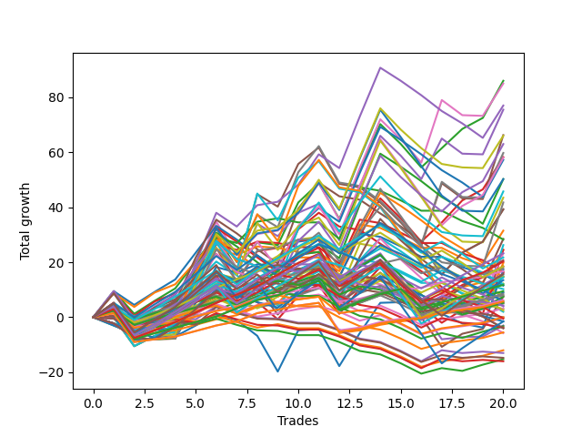

# Long Wallace 1226_003 
- Symbol: ES
- Date Range: 03/15/2022 - 07/08/2022
- Trading Period: 7:20-12:30
- Number of Trades: 19



| Name | Win Percent | Profit | Avg Profit / Trade |     | Name | Win Percent | Profit | Avg Profit / Trade |
| ---- | ----------- | ------ | ------------------ | --- | ---- | ----------- | ------ | ------------------ |
| Sorted By <br> Profit | | | | | Sorted By <br> Win Percentage ||||
| Six | 63.16 | 36625.00 | 1927.63 |     | Three | 73.68 | 22125.00 | 1164.47 |
| Seventy-Five | 57.89 | 33500.00 | 1763.16 |     | Zero | 73.68 | 3000.00 | 157.89 |
| Forty-Six | 57.89 | 32625.00 | 1717.11 |     | Sixty-Four | 73.68 | 2250.00 | 118.42 |
| Four | 57.89 | 28000.00 | 1473.68 |     | Fifty-Six | 73.68 | -3000.00 | -157.89 |
| Seventy | 57.89 | 27125.00 | 1427.63 |     | Fifty-Nine | 68.42 | 12625.00 | 664.47 |
| Thirty | 47.37 | 26750.00 | 1407.89 |     | One | 68.42 | 9250.00 | 486.84 |
| Five | 42.11 | 23875.00 | 1256.58 |     | Six | 63.16 | 36625.00 | 1927.63 |
| Three | 73.68 | 22125.00 | 1164.47 |     | Sixty-Seven | 63.16 | 12625.00 | 664.47 |
| Seven | 47.37 | 21750.00 | 1144.74 |     | Forty | 63.16 | 4000.00 | 210.53 |
| Sixty-Six | 57.89 | 20000.00 | 1052.63 |     | Fifty-Seven | 63.16 | -500.00 | -26.32 |
| Sixty-Two | 57.89 | 19250.00 | 1013.16 |     | Seventy-Five | 57.89 | 33500.00 | 1763.16 |
| Two | 57.89 | 17500.00 | 921.05 |     | Forty-Six | 57.89 | 32625.00 | 1717.11 |
| Fifty-Four | 42.11 | 16250.00 | 855.26 |     | Four | 57.89 | 28000.00 | 1473.68 |
| Forty-Four | 47.37 | 15750.00 | 828.95 |     | Seventy | 57.89 | 27125.00 | 1427.63 |
| Seventy-One | 47.37 | 14750.00 | 776.32 |     | Sixty-Six | 57.89 | 20000.00 | 1052.63 |
| Fourteen | 31.58 | 14375.00 | 756.58 |     | Sixty-Two | 57.89 | 19250.00 | 1013.16 |
| Thirty-One | 31.58 | 13500.00 | 710.53 |     | Two | 57.89 | 17500.00 | 921.05 |
| Fifty-Nine | 68.42 | 12625.00 | 664.47 |     | Sixty-Five | 57.89 | 3875.00 | 203.95 |
| Sixty-Seven | 63.16 | 12625.00 | 664.47 |     | Sixty | 52.63 | 12375.00 | 651.32 |
| Twenty-Eight | 36.84 | 12500.00 | 657.89 |     | Forty-Three | 52.63 | 8750.00 | 460.53 |
| Twelve | 31.58 | 12500.00 | 657.89 |     | Fifty-Eight | 52.63 | 4125.00 | 217.11 |
| Sixty | 52.63 | 12375.00 | 651.32 |     | Forty-Eight | 52.63 | 1000.00 | 52.63 |
| Fifty-Three | 36.84 | 10750.00 | 565.79 |     | Seventy-Three | 52.63 | -1875.00 | -98.68 |
| Sixty-Nine | 42.11 | 10500.00 | 552.63 |     | Thirty | 47.37 | 26750.00 | 1407.89 |
| Fifty-Five | 36.84 | 10375.00 | 546.05 |     | Seven | 47.37 | 21750.00 | 1144.74 |
| Seventy-Two | 47.37 | 10000.00 | 526.32 |     | Forty-Four | 47.37 | 15750.00 | 828.95 |
| One | 68.42 | 9250.00 | 486.84 |     | Seventy-One | 47.37 | 14750.00 | 776.32 |
| Seventy-Four | 42.11 | 9250.00 | 486.84 |     | Seventy-Two | 47.37 | 10000.00 | 526.32 |
| Twenty-Nine | 26.32 | 9250.00 | 486.84 |     | Sixty-Eight | 47.37 | 3500.00 | 184.21 |
| Forty-Three | 52.63 | 8750.00 | 460.53 |     | Forty-One | 47.37 | 3125.00 | 164.47 |
| Fifteen | 21.05 | 8375.00 | 440.79 |     | Twenty-Four | 47.37 | 1125.00 | 59.21 |
| Fifty-Two | 36.84 | 7875.00 | 414.47 |     | Five | 42.11 | 23875.00 | 1256.58 |
| Twenty-Six | 31.58 | 7625.00 | 401.32 |     | Fifty-Four | 42.11 | 16250.00 | 855.26 |
| Fifty | 36.84 | 7125.00 | 375.00 |     | Sixty-Nine | 42.11 | 10500.00 | 552.63 |
| Nine | 36.84 | 6250.00 | 328.95 |     | Seventy-Four | 42.11 | 9250.00 | 486.84 |
| Forty-Seven | 36.84 | 6125.00 | 322.37 |     | twenty-Seven | 42.11 | 3375.00 | 177.63 |
| Thirteen | 15.79 | 5375.00 | 282.89 |     | Forty-Nine | 42.11 | 2875.00 | 151.32 |
| Fifty-Eight | 52.63 | 4125.00 | 217.11 |     | Fifty-One | 42.11 | 2750.00 | 144.74 |
| Forty | 63.16 | 4000.00 | 210.53 |     | Sixty-Three | 42.11 | 1750.00 | 92.11 |
| Sixty-Five | 57.89 | 3875.00 | 203.95 |     | Thirty-Three | 42.11 | 250.00 | 13.16 |
| Sixty-One | 36.84 | 3875.00 | 203.95 |     | Thirty-Two | 42.11 | 125.00 | 6.58 |
| Forty-Two | 36.84 | 3875.00 | 203.95 |     | Thirty-Nine | 42.11 | -1500.00 | -78.95 |
| Sixty-Eight | 47.37 | 3500.00 | 184.21 |     | Thirty-Four | 42.11 | -1500.00 | -78.95 |
| twenty-Seven | 42.11 | 3375.00 | 177.63 |     | Eight | 42.11 | -1750.00 | -92.11 |
| Ten | 21.05 | 3250.00 | 171.05 |     | Thirty-Eight | 42.11 | -2000.00 | -105.26 |
| Forty-One | 47.37 | 3125.00 | 164.47 |     | Thirty-Five | 42.11 | -2375.00 | -125.00 |
| Twenty-Five | 36.84 | 3125.00 | 164.47 |     | Thirty-Seven | 42.11 | -2750.00 | -144.74 |
| Zero | 73.68 | 3000.00 | 157.89 |     | Thirty-Six | 42.11 | -2750.00 | -144.74 |
| Forty-Nine | 42.11 | 2875.00 | 151.32 |     | Twenty-Two | 42.11 | -6375.00 | -335.53 |
| Fifty-One | 42.11 | 2750.00 | 144.74 |     | Twenty-Eight | 36.84 | 12500.00 | 657.89 |
| Eleven | 36.84 | 2375.00 | 125.00 |     | Fifty-Three | 36.84 | 10750.00 | 565.79 |
| Sixty-Four | 73.68 | 2250.00 | 118.42 |     | Fifty-Five | 36.84 | 10375.00 | 546.05 |
| Forty-Five | 31.58 | 1875.00 | 98.68 |     | Fifty-Two | 36.84 | 7875.00 | 414.47 |
| Sixty-Three | 42.11 | 1750.00 | 92.11 |     | Fifty | 36.84 | 7125.00 | 375.00 |
| Twenty-Four | 47.37 | 1125.00 | 59.21 |     | Nine | 36.84 | 6250.00 | 328.95 |
| Forty-Eight | 52.63 | 1000.00 | 52.63 |     | Forty-Seven | 36.84 | 6125.00 | 322.37 |
| Thirty-Three | 42.11 | 250.00 | 13.16 |     | Sixty-One | 36.84 | 3875.00 | 203.95 |
| Thirty-Two | 42.11 | 125.00 | 6.58 |     | Forty-Two | 36.84 | 3875.00 | 203.95 |
| Fifty-Seven | 63.16 | -500.00 | -26.32 |     | Twenty-Five | 36.84 | 3125.00 | 164.47 |
| Thirty-Nine | 42.11 | -1500.00 | -78.95 |     | Eleven | 36.84 | 2375.00 | 125.00 |
| Thirty-Four | 42.11 | -1500.00 | -78.95 |     | Sixten | 36.84 | -6750.00 | -355.26 |
| Eight | 42.11 | -1750.00 | -92.11 |     | Nineteen | 36.84 | -7250.00 | -381.58 |
| Seventy-Three | 52.63 | -1875.00 | -98.68 |     | Fourteen | 31.58 | 14375.00 | 756.58 |
| Thirty-Eight | 42.11 | -2000.00 | -105.26 |     | Thirty-One | 31.58 | 13500.00 | 710.53 |
| Thirty-Five | 42.11 | -2375.00 | -125.00 |     | Twelve | 31.58 | 12500.00 | 657.89 |
| Thirty-Seven | 42.11 | -2750.00 | -144.74 |     | Twenty-Six | 31.58 | 7625.00 | 401.32 |
| Thirty-Six | 42.11 | -2750.00 | -144.74 |     | Forty-Five | 31.58 | 1875.00 | 98.68 |
| Fifty-Six | 73.68 | -3000.00 | -157.89 |     | Twenty-Three | 31.58 | -8000.00 | -421.05 |
| Twenty-Two | 42.11 | -6375.00 | -335.53 |     | Twenty-One | 31.58 | -8000.00 | -421.05 |
| Sixten | 36.84 | -6750.00 | -355.26 |     | Twenty | 31.58 | -8000.00 | -421.05 |
| Nineteen | 36.84 | -7250.00 | -381.58 |     | Eighteen | 31.58 | -8000.00 | -421.05 |
| Twenty-Three | 31.58 | -8000.00 | -421.05 |     | Seventeen | 31.58 | -8000.00 | -421.05 |
| Twenty-One | 31.58 | -8000.00 | -421.05 |     | Twenty-Nine | 26.32 | 9250.00 | 486.84 |
| Twenty | 31.58 | -8000.00 | -421.05 |     | Fifteen | 21.05 | 8375.00 | 440.79 |
| Eighteen | 31.58 | -8000.00 | -421.05 |     | Ten | 21.05 | 3250.00 | 171.05 |
| Seventeen | 31.58 | -8000.00 | -421.05 |     | Thirteen | 15.79 | 5375.00 | 282.89 |

## NO STOPLOSS

### Test Zero
* Sell when price hits the middle line of the 20p bollinger
* No Stoploss
* Results:
```
Total Trades: 19
Percent Up: 73.68
Percent Down: 26.32
Total Points Moved Up: 6.00
Potential Profit: 3000.00
Total Points Ups: 45.75 Count Ups: 14
Total Points Downs: -39.75 Count Downs: 5
```

<details><summary>Trades</summary>

<code>In: 2022-03-25 08:30:00		Out: 2022-03-25 08:36:40		Total Position Time: 06:40		Total Move Up: 4.00		Total to Date: 4.00</code> <br />
<code>In: 2022-03-30 08:03:00		Out: 2022-03-30 08:19:15		Total Position Time: 16:15		Total Move Up: -6.00		Total to Date: -2.00</code> <br />
<code>In: 2022-03-30 08:14:00		Out: 2022-03-30 08:19:15		Total Position Time: 05:15		Total Move Up: 2.75		Total to Date: 0.75</code> <br />
<code>In: 2022-03-31 08:38:00		Out: 2022-03-31 08:38:10		Total Position Time: 00:10		Total Move Up: 0.50		Total to Date: 1.25</code> <br />
<code>In: 2022-04-20 11:58:00		Out: 2022-04-20 12:01:15		Total Position Time: 03:15		Total Move Up: 4.75		Total to Date: 6.00</code> <br />
<code>In: 2022-04-20 11:59:00		Out: 2022-04-20 12:01:15		Total Position Time: 02:15		Total Move Up: 4.75		Total to Date: 10.75</code> <br />
<code>In: 2022-05-11 10:33:00		Out: 2022-05-11 10:34:30		Total Position Time: 01:30		Total Move Up: 1.50		Total to Date: 12.25</code> <br />
<code>In: 2022-05-17 11:25:00		Out: 2022-05-17 11:27:25		Total Position Time: 02:25		Total Move Up: 7.75		Total to Date: 20.00</code> <br />
<code>In: 2022-05-19 07:33:00		Out: 2022-05-19 07:35:10		Total Position Time: 02:10		Total Move Up: 4.25		Total to Date: 24.25</code> <br />
<code>In: 2022-05-19 10:52:00		Out: 2022-05-19 10:52:45		Total Position Time: 00:45		Total Move Up: 4.25		Total to Date: 28.50</code> <br />
<code>In: 2022-05-25 10:15:00		Out: 2022-05-25 10:15:20		Total Position Time: 00:20		Total Move Up: 1.00		Total to Date: 29.50</code> <br />
<code>In: 2022-06-08 09:30:00		Out: 2022-06-08 09:53:00		Total Position Time: 23:00		Total Move Up: -15.25		Total to Date: 14.25</code> <br />
<code>In: 2022-06-14 07:45:00		Out: 2022-06-14 07:46:50		Total Position Time: 01:50		Total Move Up: 4.50		Total to Date: 18.75</code> <br />
<code>In: 2022-06-14 07:46:00		Out: 2022-06-14 07:46:50		Total Position Time: 00:50		Total Move Up: 3.50		Total to Date: 22.25</code> <br />
<code>In: 2022-06-15 07:57:00		Out: 2022-06-15 08:26:55		Total Position Time: 29:55		Total Move Up: -7.25		Total to Date: 15.00</code> <br />
<code>In: 2022-06-15 07:58:00		Out: 2022-06-15 08:27:55		Total Position Time: 29:55		Total Move Up: -8.50		Total to Date: 6.50</code> <br />
<code>In: 2022-06-17 07:38:00		Out: 2022-06-17 07:55:05		Total Position Time: 17:05		Total Move Up: -2.75		Total to Date: 3.75</code> <br />
<code>In: 2022-06-23 09:07:00		Out: 2022-06-23 09:14:30		Total Position Time: 07:30		Total Move Up: 2.00		Total to Date: 5.75</code> <br />
<code>In: 2022-07-06 08:35:00		Out: 2022-07-06 08:46:30		Total Position Time: 11:30		Total Move Up: 0.25		Total to Date: 6.00</code> <br />


</details>

### Test One
* Sell when the price hits the upper line of the 20p 1std bollinger
* No Stoploss
* Results:
```
Total Trades: 19
Percent Up: 68.42
Percent Down: 31.58
Total Points Moved Up: 18.50
Potential Profit: 9250.00
Total Points Ups: 71.50 Count Ups: 13
Total Points Downs: -53.00 Count Downs: 6
```

<details><summary>Trades</summary>

<code>In: 2022-03-25 08:30:00		Out: 2022-03-25 08:40:40		Total Position Time: 10:40		Total Move Up: 5.00		Total to Date: 5.00</code> <br />
<code>In: 2022-03-30 08:03:00		Out: 2022-03-30 08:23:50		Total Position Time: 20:50		Total Move Up: -4.25		Total to Date: 0.75</code> <br />
<code>In: 2022-03-30 08:14:00		Out: 2022-03-30 08:23:50		Total Position Time: 09:50		Total Move Up: 4.50		Total to Date: 5.25</code> <br />
<code>In: 2022-03-31 08:38:00		Out: 2022-03-31 08:40:40		Total Position Time: 02:40		Total Move Up: 2.50		Total to Date: 7.75</code> <br />
<code>In: 2022-04-20 11:58:00		Out: 2022-04-20 12:04:20		Total Position Time: 06:20		Total Move Up: 7.50		Total to Date: 15.25</code> <br />
<code>In: 2022-04-20 11:59:00		Out: 2022-04-20 12:04:20		Total Position Time: 05:20		Total Move Up: 7.50		Total to Date: 22.75</code> <br />
<code>In: 2022-05-11 10:33:00		Out: 2022-05-11 11:01:20		Total Position Time: 28:20		Total Move Up: -12.00		Total to Date: 10.75</code> <br />
<code>In: 2022-05-17 11:25:00		Out: 2022-05-17 11:37:35		Total Position Time: 12:35		Total Move Up: 5.75		Total to Date: 16.50</code> <br />
<code>In: 2022-05-19 07:33:00		Out: 2022-05-19 07:54:50		Total Position Time: 21:50		Total Move Up: -6.25		Total to Date: 10.25</code> <br />
<code>In: 2022-05-19 10:52:00		Out: 2022-05-19 10:54:35		Total Position Time: 02:35		Total Move Up: 9.75		Total to Date: 20.00</code> <br />
<code>In: 2022-05-25 10:15:00		Out: 2022-05-25 10:15:55		Total Position Time: 00:55		Total Move Up: 4.00		Total to Date: 24.00</code> <br />
<code>In: 2022-06-08 09:30:00		Out: 2022-06-08 09:57:10		Total Position Time: 27:10		Total Move Up: -14.75		Total to Date: 9.25</code> <br />
<code>In: 2022-06-14 07:45:00		Out: 2022-06-14 07:47:10		Total Position Time: 02:10		Total Move Up: 9.00		Total to Date: 18.25</code> <br />
<code>In: 2022-06-14 07:46:00		Out: 2022-06-14 07:47:10		Total Position Time: 01:10		Total Move Up: 8.00		Total to Date: 26.25</code> <br />
<code>In: 2022-06-15 07:57:00		Out: 2022-06-15 08:26:55		Total Position Time: 29:55		Total Move Up: -7.25		Total to Date: 19.00</code> <br />
<code>In: 2022-06-15 07:58:00		Out: 2022-06-15 08:27:55		Total Position Time: 29:55		Total Move Up: -8.50		Total to Date: 10.50</code> <br />
<code>In: 2022-06-17 07:38:00		Out: 2022-06-17 07:56:25		Total Position Time: 18:25		Total Move Up: 1.25		Total to Date: 11.75</code> <br />
<code>In: 2022-06-23 09:07:00		Out: 2022-06-23 09:18:25		Total Position Time: 11:25		Total Move Up: 4.75		Total to Date: 16.50</code> <br />
<code>In: 2022-07-06 08:35:00		Out: 2022-07-06 08:48:05		Total Position Time: 13:05		Total Move Up: 2.00		Total to Date: 18.50</code> <br />


</details>

### Test Two
* Sell when the price hits the upper line of the 20p 2std bollinger
* No Stoploss
* Results:
```
Total Trades: 19
Percent Up: 57.89
Percent Down: 42.11
Total Points Moved Up: 35.00
Potential Profit: 17500.00
Total Points Ups: 93.25 Count Ups: 11
Total Points Downs: -58.25 Count Downs: 8
```

<details><summary>Trades</summary>

<code>In: 2022-03-25 08:30:00		Out: 2022-03-25 08:41:55		Total Position Time: 11:55		Total Move Up: 9.50		Total to Date: 9.50</code> <br />
<code>In: 2022-03-30 08:03:00		Out: 2022-03-30 08:32:55		Total Position Time: 29:55		Total Move Up: -8.25		Total to Date: 1.25</code> <br />
<code>In: 2022-03-30 08:14:00		Out: 2022-03-30 08:35:15		Total Position Time: 21:15		Total Move Up: 4.75		Total to Date: 6.00</code> <br />
<code>In: 2022-03-31 08:38:00		Out: 2022-03-31 08:41:10		Total Position Time: 03:10		Total Move Up: 4.50		Total to Date: 10.50</code> <br />
<code>In: 2022-04-20 11:58:00		Out: 2022-04-20 12:12:55		Total Position Time: 14:55		Total Move Up: 11.75		Total to Date: 22.25</code> <br />
<code>In: 2022-04-20 11:59:00		Out: 2022-04-20 12:12:55		Total Position Time: 13:55		Total Move Up: 11.75		Total to Date: 34.00</code> <br />
<code>In: 2022-05-11 10:33:00		Out: 2022-05-11 11:02:55		Total Position Time: 29:55		Total Move Up: -12.25		Total to Date: 21.75</code> <br />
<code>In: 2022-05-17 11:25:00		Out: 2022-05-17 11:40:00		Total Position Time: 15:00		Total Move Up: 9.50		Total to Date: 31.25</code> <br />
<code>In: 2022-05-19 07:33:00		Out: 2022-05-19 07:55:40		Total Position Time: 22:40		Total Move Up: -2.00		Total to Date: 29.25</code> <br />
<code>In: 2022-05-19 10:52:00		Out: 2022-05-19 10:55:20		Total Position Time: 03:20		Total Move Up: 16.25		Total to Date: 45.50</code> <br />
<code>In: 2022-05-25 10:15:00		Out: 2022-05-25 10:29:45		Total Position Time: 14:45		Total Move Up: 7.00		Total to Date: 52.50</code> <br />
<code>In: 2022-06-08 09:30:00		Out: 2022-06-08 09:59:55		Total Position Time: 29:55		Total Move Up: -13.25		Total to Date: 39.25</code> <br />
<code>In: 2022-06-14 07:45:00		Out: 2022-06-14 08:14:55		Total Position Time: 29:55		Total Move Up: -1.25		Total to Date: 38.00</code> <br />
<code>In: 2022-06-14 07:46:00		Out: 2022-06-14 08:15:55		Total Position Time: 29:55		Total Move Up: -5.50		Total to Date: 32.50</code> <br />
<code>In: 2022-06-15 07:57:00		Out: 2022-06-15 08:26:55		Total Position Time: 29:55		Total Move Up: -7.25		Total to Date: 25.25</code> <br />
<code>In: 2022-06-15 07:58:00		Out: 2022-06-15 08:27:55		Total Position Time: 29:55		Total Move Up: -8.50		Total to Date: 16.75</code> <br />
<code>In: 2022-06-17 07:38:00		Out: 2022-06-17 08:02:30		Total Position Time: 24:30		Total Move Up: 7.00		Total to Date: 23.75</code> <br />
<code>In: 2022-06-23 09:07:00		Out: 2022-06-23 09:19:00		Total Position Time: 12:00		Total Move Up: 6.75		Total to Date: 30.50</code> <br />
<code>In: 2022-07-06 08:35:00		Out: 2022-07-06 08:51:20		Total Position Time: 16:20		Total Move Up: 4.50		Total to Date: 35.00</code> <br />


</details>

### Test Three
* Sell when price hits the middle line of the 50p bollinger
* No Stoploss
* Results:
```
Total Trades: 19
Percent Up: 73.68
Percent Down: 26.32
Total Points Moved Up: 44.25
Potential Profit: 22125.00
Total Points Ups: 93.75 Count Ups: 14
Total Points Downs: -49.50 Count Downs: 5
```

<details><summary>Trades</summary>

<code>In: 2022-03-25 08:30:00		Out: 2022-03-25 08:52:45		Total Position Time: 22:45		Total Move Up: 8.50		Total to Date: 8.50</code> <br />
<code>In: 2022-03-30 08:03:00		Out: 2022-03-30 08:32:55		Total Position Time: 29:55		Total Move Up: -8.25		Total to Date: 0.25</code> <br />
<code>In: 2022-03-30 08:14:00		Out: 2022-03-30 08:35:15		Total Position Time: 21:15		Total Move Up: 4.75		Total to Date: 5.00</code> <br />
<code>In: 2022-03-31 08:38:00		Out: 2022-03-31 08:41:05		Total Position Time: 03:05		Total Move Up: 3.00		Total to Date: 8.00</code> <br />
<code>In: 2022-04-20 11:58:00		Out: 2022-04-20 12:10:10		Total Position Time: 12:10		Total Move Up: 8.25		Total to Date: 16.25</code> <br />
<code>In: 2022-04-20 11:59:00		Out: 2022-04-20 12:10:10		Total Position Time: 11:10		Total Move Up: 8.25		Total to Date: 24.50</code> <br />
<code>In: 2022-05-11 10:33:00		Out: 2022-05-11 11:02:55		Total Position Time: 29:55		Total Move Up: -12.25		Total to Date: 12.25</code> <br />
<code>In: 2022-05-17 11:25:00		Out: 2022-05-17 11:40:05		Total Position Time: 15:05		Total Move Up: 11.00		Total to Date: 23.25</code> <br />
<code>In: 2022-05-19 07:33:00		Out: 2022-05-19 07:33:10		Total Position Time: 00:10		Total Move Up: 1.25		Total to Date: 24.50</code> <br />
<code>In: 2022-05-19 10:52:00		Out: 2022-05-19 10:52:40		Total Position Time: 00:40		Total Move Up: 2.75		Total to Date: 27.25</code> <br />
<code>In: 2022-05-25 10:15:00		Out: 2022-05-25 10:15:10		Total Position Time: 00:10		Total Move Up: 0.00		Total to Date: 27.25</code> <br />
<code>In: 2022-06-08 09:30:00		Out: 2022-06-08 09:59:55		Total Position Time: 29:55		Total Move Up: -13.25		Total to Date: 14.00</code> <br />
<code>In: 2022-06-14 07:45:00		Out: 2022-06-14 07:49:55		Total Position Time: 04:55		Total Move Up: 14.00		Total to Date: 28.00</code> <br />
<code>In: 2022-06-14 07:46:00		Out: 2022-06-14 07:49:55		Total Position Time: 03:55		Total Move Up: 13.00		Total to Date: 41.00</code> <br />
<code>In: 2022-06-15 07:57:00		Out: 2022-06-15 08:26:55		Total Position Time: 29:55		Total Move Up: -7.25		Total to Date: 33.75</code> <br />
<code>In: 2022-06-15 07:58:00		Out: 2022-06-15 08:27:55		Total Position Time: 29:55		Total Move Up: -8.50		Total to Date: 25.25</code> <br />
<code>In: 2022-06-17 07:38:00		Out: 2022-06-17 08:02:30		Total Position Time: 24:30		Total Move Up: 7.00		Total to Date: 32.25</code> <br />
<code>In: 2022-06-23 09:07:00		Out: 2022-06-23 09:21:10		Total Position Time: 14:10		Total Move Up: 8.00		Total to Date: 40.25</code> <br />
<code>In: 2022-07-06 08:35:00		Out: 2022-07-06 08:51:15		Total Position Time: 16:15		Total Move Up: 4.00		Total to Date: 44.25</code> <br />


</details>

### Test Four
* Sell when the price hits the upper line of the 50p 1std bollinger
* No Stoploss
* Results:
```
Total Trades: 19
Percent Up: 57.89
Percent Down: 42.11
Total Points Moved Up: 56.00
Potential Profit: 28000.00
Total Points Ups: 115.75 Count Ups: 11
Total Points Downs: -59.75 Count Downs: 8
```

<details><summary>Trades</summary>

<code>In: 2022-03-25 08:30:00		Out: 2022-03-25 08:59:55		Total Position Time: 29:55		Total Move Up: 2.25		Total to Date: 2.25</code> <br />
<code>In: 2022-03-30 08:03:00		Out: 2022-03-30 08:32:55		Total Position Time: 29:55		Total Move Up: -8.25		Total to Date: -6.00</code> <br />
<code>In: 2022-03-30 08:14:00		Out: 2022-03-30 08:43:55		Total Position Time: 29:55		Total Move Up: 3.75		Total to Date: -2.25</code> <br />
<code>In: 2022-03-31 08:38:00		Out: 2022-03-31 09:00:40		Total Position Time: 22:40		Total Move Up: 3.75		Total to Date: 1.50</code> <br />
<code>In: 2022-04-20 11:58:00		Out: 2022-04-20 12:13:35		Total Position Time: 15:35		Total Move Up: 13.00		Total to Date: 14.50</code> <br />
<code>In: 2022-04-20 11:59:00		Out: 2022-04-20 12:13:35		Total Position Time: 14:35		Total Move Up: 13.00		Total to Date: 27.50</code> <br />
<code>In: 2022-05-11 10:33:00		Out: 2022-05-11 11:02:55		Total Position Time: 29:55		Total Move Up: -12.25		Total to Date: 15.25</code> <br />
<code>In: 2022-05-17 11:25:00		Out: 2022-05-17 11:45:45		Total Position Time: 20:45		Total Move Up: 18.75		Total to Date: 34.00</code> <br />
<code>In: 2022-05-19 07:33:00		Out: 2022-05-19 08:02:55		Total Position Time: 29:55		Total Move Up: -4.50		Total to Date: 29.50</code> <br />
<code>In: 2022-05-19 10:52:00		Out: 2022-05-19 10:54:25		Total Position Time: 02:25		Total Move Up: 8.50		Total to Date: 38.00</code> <br />
<code>In: 2022-05-25 10:15:00		Out: 2022-05-25 10:15:30		Total Position Time: 00:30		Total Move Up: 3.25		Total to Date: 41.25</code> <br />
<code>In: 2022-06-08 09:30:00		Out: 2022-06-08 09:59:55		Total Position Time: 29:55		Total Move Up: -13.25		Total to Date: 28.00</code> <br />
<code>In: 2022-06-14 07:45:00		Out: 2022-06-14 08:02:20		Total Position Time: 17:20		Total Move Up: 18.25		Total to Date: 46.25</code> <br />
<code>In: 2022-06-14 07:46:00		Out: 2022-06-14 08:02:20		Total Position Time: 16:20		Total Move Up: 17.25		Total to Date: 63.50</code> <br />
<code>In: 2022-06-15 07:57:00		Out: 2022-06-15 08:26:55		Total Position Time: 29:55		Total Move Up: -7.25		Total to Date: 56.25</code> <br />
<code>In: 2022-06-15 07:58:00		Out: 2022-06-15 08:27:55		Total Position Time: 29:55		Total Move Up: -8.50		Total to Date: 47.75</code> <br />
<code>In: 2022-06-17 07:38:00		Out: 2022-06-17 08:04:10		Total Position Time: 26:10		Total Move Up: 14.00		Total to Date: 61.75</code> <br />
<code>In: 2022-06-23 09:07:00		Out: 2022-06-23 09:36:55		Total Position Time: 29:55		Total Move Up: -5.50		Total to Date: 56.25</code> <br />
<code>In: 2022-07-06 08:35:00		Out: 2022-07-06 09:04:55		Total Position Time: 29:55		Total Move Up: -0.25		Total to Date: 56.00</code> <br />


</details>

### Test Five
* Sell when the price hits the upper line of the 50p 2std bollinger
* No Stoploss
* Results:
```
Total Trades: 19
Percent Up: 42.11
Percent Down: 57.89
Total Points Moved Up: 47.75
Potential Profit: 23875.00
Total Points Ups: 115.25 Count Ups: 8
Total Points Downs: -67.50 Count Downs: 11
```

<details><summary>Trades</summary>

<code>In: 2022-03-25 08:30:00		Out: 2022-03-25 08:59:55		Total Position Time: 29:55		Total Move Up: 2.25		Total to Date: 2.25</code> <br />
<code>In: 2022-03-30 08:03:00		Out: 2022-03-30 08:32:55		Total Position Time: 29:55		Total Move Up: -8.25		Total to Date: -6.00</code> <br />
<code>In: 2022-03-30 08:14:00		Out: 2022-03-30 08:43:55		Total Position Time: 29:55		Total Move Up: 3.75		Total to Date: -2.25</code> <br />
<code>In: 2022-03-31 08:38:00		Out: 2022-03-31 09:07:55		Total Position Time: 29:55		Total Move Up: -1.00		Total to Date: -3.25</code> <br />
<code>In: 2022-04-20 11:58:00		Out: 2022-04-20 12:25:50		Total Position Time: 27:50		Total Move Up: 17.50		Total to Date: 14.25</code> <br />
<code>In: 2022-04-20 11:59:00		Out: 2022-04-20 12:25:50		Total Position Time: 26:50		Total Move Up: 17.50		Total to Date: 31.75</code> <br />
<code>In: 2022-05-11 10:33:00		Out: 2022-05-11 11:02:55		Total Position Time: 29:55		Total Move Up: -12.25		Total to Date: 19.50</code> <br />
<code>In: 2022-05-17 11:25:00		Out: 2022-05-17 11:49:45		Total Position Time: 24:45		Total Move Up: 30.00		Total to Date: 49.50</code> <br />
<code>In: 2022-05-19 07:33:00		Out: 2022-05-19 08:02:55		Total Position Time: 29:55		Total Move Up: -4.50		Total to Date: 45.00</code> <br />
<code>In: 2022-05-19 10:52:00		Out: 2022-05-19 10:55:15		Total Position Time: 03:15		Total Move Up: 15.50		Total to Date: 60.50</code> <br />
<code>In: 2022-05-25 10:15:00		Out: 2022-05-25 10:29:35		Total Position Time: 14:35		Total Move Up: 6.00		Total to Date: 66.50</code> <br />
<code>In: 2022-06-08 09:30:00		Out: 2022-06-08 09:59:55		Total Position Time: 29:55		Total Move Up: -13.25		Total to Date: 53.25</code> <br />
<code>In: 2022-06-14 07:45:00		Out: 2022-06-14 08:14:55		Total Position Time: 29:55		Total Move Up: -1.25		Total to Date: 52.00</code> <br />
<code>In: 2022-06-14 07:46:00		Out: 2022-06-14 08:15:55		Total Position Time: 29:55		Total Move Up: -5.50		Total to Date: 46.50</code> <br />
<code>In: 2022-06-15 07:57:00		Out: 2022-06-15 08:26:55		Total Position Time: 29:55		Total Move Up: -7.25		Total to Date: 39.25</code> <br />
<code>In: 2022-06-15 07:58:00		Out: 2022-06-15 08:27:55		Total Position Time: 29:55		Total Move Up: -8.50		Total to Date: 30.75</code> <br />
<code>In: 2022-06-17 07:38:00		Out: 2022-06-17 08:07:55		Total Position Time: 29:55		Total Move Up: 22.75		Total to Date: 53.50</code> <br />
<code>In: 2022-06-23 09:07:00		Out: 2022-06-23 09:36:55		Total Position Time: 29:55		Total Move Up: -5.50		Total to Date: 48.00</code> <br />
<code>In: 2022-07-06 08:35:00		Out: 2022-07-06 09:04:55		Total Position Time: 29:55		Total Move Up: -0.25		Total to Date: 47.75</code> <br />


</details>

### Test Six
* Sell when the price hits the middle line of the 1std VWAP
* No Stoploss
* Results:
```
Total Trades: 19
Percent Up: 63.16
Percent Down: 36.84
Total Points Moved Up: 73.25
Potential Profit: 36625.00
Total Points Ups: 128.50 Count Ups: 12
Total Points Downs: -55.25 Count Downs: 7
```

<details><summary>Trades</summary>

<code>In: 2022-03-25 08:30:00		Out: 2022-03-25 08:59:55		Total Position Time: 29:55		Total Move Up: 2.25		Total to Date: 2.25</code> <br />
<code>In: 2022-03-30 08:03:00		Out: 2022-03-30 08:32:55		Total Position Time: 29:55		Total Move Up: -8.25		Total to Date: -6.00</code> <br />
<code>In: 2022-03-30 08:14:00		Out: 2022-03-30 08:43:55		Total Position Time: 29:55		Total Move Up: 3.75		Total to Date: -2.25</code> <br />
<code>In: 2022-03-31 08:38:00		Out: 2022-03-31 08:38:10		Total Position Time: 00:10		Total Move Up: 0.50		Total to Date: -1.75</code> <br />
<code>In: 2022-04-20 11:58:00		Out: 2022-04-20 12:26:10		Total Position Time: 28:10		Total Move Up: 18.25		Total to Date: 16.50</code> <br />
<code>In: 2022-04-20 11:59:00		Out: 2022-04-20 12:26:10		Total Position Time: 27:10		Total Move Up: 18.25		Total to Date: 34.75</code> <br />
<code>In: 2022-05-11 10:33:00		Out: 2022-05-11 11:02:55		Total Position Time: 29:55		Total Move Up: -12.25		Total to Date: 22.50</code> <br />
<code>In: 2022-05-17 11:25:00		Out: 2022-05-17 11:27:25		Total Position Time: 02:25		Total Move Up: 7.75		Total to Date: 30.25</code> <br />
<code>In: 2022-05-19 07:33:00		Out: 2022-05-19 07:33:10		Total Position Time: 00:10		Total Move Up: 1.25		Total to Date: 31.50</code> <br />
<code>In: 2022-05-19 10:52:00		Out: 2022-05-19 10:53:25		Total Position Time: 01:25		Total Move Up: 6.25		Total to Date: 37.75</code> <br />
<code>In: 2022-05-25 10:15:00		Out: 2022-05-25 10:37:05		Total Position Time: 22:05		Total Move Up: 11.00		Total to Date: 48.75</code> <br />
<code>In: 2022-06-08 09:30:00		Out: 2022-06-08 09:59:55		Total Position Time: 29:55		Total Move Up: -13.25		Total to Date: 35.50</code> <br />
<code>In: 2022-06-14 07:45:00		Out: 2022-06-14 07:51:40		Total Position Time: 06:40		Total Move Up: 18.75		Total to Date: 54.25</code> <br />
<code>In: 2022-06-14 07:46:00		Out: 2022-06-14 07:51:40		Total Position Time: 05:40		Total Move Up: 17.75		Total to Date: 72.00</code> <br />
<code>In: 2022-06-15 07:57:00		Out: 2022-06-15 08:26:55		Total Position Time: 29:55		Total Move Up: -7.25		Total to Date: 64.75</code> <br />
<code>In: 2022-06-15 07:58:00		Out: 2022-06-15 08:27:55		Total Position Time: 29:55		Total Move Up: -8.50		Total to Date: 56.25</code> <br />
<code>In: 2022-06-17 07:38:00		Out: 2022-06-17 08:07:55		Total Position Time: 29:55		Total Move Up: 22.75		Total to Date: 79.00</code> <br />
<code>In: 2022-06-23 09:07:00		Out: 2022-06-23 09:36:55		Total Position Time: 29:55		Total Move Up: -5.50		Total to Date: 73.50</code> <br />
<code>In: 2022-07-06 08:35:00		Out: 2022-07-06 09:04:55		Total Position Time: 29:55		Total Move Up: -0.25		Total to Date: 73.25</code> <br />


</details>

### Test Seven
* Sell when the price hits the upper line of the 1std VWAP
* No Stoploss
* Results:
```
Total Trades: 19
Percent Up: 47.37
Percent Down: 52.63
Total Points Moved Up: 43.50
Potential Profit: 21750.00
Total Points Ups: 110.00 Count Ups: 9
Total Points Downs: -66.50 Count Downs: 10
```

<details><summary>Trades</summary>

<code>In: 2022-03-25 08:30:00		Out: 2022-03-25 08:59:55		Total Position Time: 29:55		Total Move Up: 2.25		Total to Date: 2.25</code> <br />
<code>In: 2022-03-30 08:03:00		Out: 2022-03-30 08:32:55		Total Position Time: 29:55		Total Move Up: -8.25		Total to Date: -6.00</code> <br />
<code>In: 2022-03-30 08:14:00		Out: 2022-03-30 08:43:55		Total Position Time: 29:55		Total Move Up: 3.75		Total to Date: -2.25</code> <br />
<code>In: 2022-03-31 08:38:00		Out: 2022-03-31 08:41:10		Total Position Time: 03:10		Total Move Up: 4.50		Total to Date: 2.25</code> <br />
<code>In: 2022-04-20 11:58:00		Out: 2022-04-20 12:27:55		Total Position Time: 29:55		Total Move Up: 16.25		Total to Date: 18.50</code> <br />
<code>In: 2022-04-20 11:59:00		Out: 2022-04-20 12:28:55		Total Position Time: 29:55		Total Move Up: 13.75		Total to Date: 32.25</code> <br />
<code>In: 2022-05-11 10:33:00		Out: 2022-05-11 11:02:55		Total Position Time: 29:55		Total Move Up: -12.25		Total to Date: 20.00</code> <br />
<code>In: 2022-05-17 11:25:00		Out: 2022-05-17 11:40:20		Total Position Time: 15:20		Total Move Up: 17.25		Total to Date: 37.25</code> <br />
<code>In: 2022-05-19 07:33:00		Out: 2022-05-19 08:02:55		Total Position Time: 29:55		Total Move Up: -4.50		Total to Date: 32.75</code> <br />
<code>In: 2022-05-19 10:52:00		Out: 2022-05-19 10:56:05		Total Position Time: 04:05		Total Move Up: 20.00		Total to Date: 52.75</code> <br />
<code>In: 2022-05-25 10:15:00		Out: 2022-05-25 10:44:55		Total Position Time: 29:55		Total Move Up: 9.50		Total to Date: 62.25</code> <br />
<code>In: 2022-06-08 09:30:00		Out: 2022-06-08 09:59:55		Total Position Time: 29:55		Total Move Up: -13.25		Total to Date: 49.00</code> <br />
<code>In: 2022-06-14 07:45:00		Out: 2022-06-14 08:14:55		Total Position Time: 29:55		Total Move Up: -1.25		Total to Date: 47.75</code> <br />
<code>In: 2022-06-14 07:46:00		Out: 2022-06-14 08:15:55		Total Position Time: 29:55		Total Move Up: -5.50		Total to Date: 42.25</code> <br />
<code>In: 2022-06-15 07:57:00		Out: 2022-06-15 08:26:55		Total Position Time: 29:55		Total Move Up: -7.25		Total to Date: 35.00</code> <br />
<code>In: 2022-06-15 07:58:00		Out: 2022-06-15 08:27:55		Total Position Time: 29:55		Total Move Up: -8.50		Total to Date: 26.50</code> <br />
<code>In: 2022-06-17 07:38:00		Out: 2022-06-17 08:07:55		Total Position Time: 29:55		Total Move Up: 22.75		Total to Date: 49.25</code> <br />
<code>In: 2022-06-23 09:07:00		Out: 2022-06-23 09:36:55		Total Position Time: 29:55		Total Move Up: -5.50		Total to Date: 43.75</code> <br />
<code>In: 2022-07-06 08:35:00		Out: 2022-07-06 09:04:55		Total Position Time: 29:55		Total Move Up: -0.25		Total to Date: 43.50</code> <br />


</details>

## STOPLOSS OF 2

### Test Eight
* Sell when price hits the middle line of the 20p bollinger
* Stoploss is 2 points
* Results:
```
Total Trades: 19
Percent Up: 42.11
Percent Down: 57.89
Total Points Moved Up: -3.50
Potential Profit: -1750.00
Total Points Ups: 25.75 Count Ups: 8
Total Points Downs: -29.25 Count Downs: 11
```

<details><summary>Trades</summary>

<code>In: 2022-03-25 08:30:00		Out: 2022-03-25 08:32:20		Total Position Time: 02:20		Total Move Up: -2.25		Total to Date: -2.25</code> <br />
<code>In: 2022-03-30 08:03:00		Out: 2022-03-30 08:04:05		Total Position Time: 01:05		Total Move Up: -2.75		Total to Date: -5.00</code> <br />
<code>In: 2022-03-30 08:14:00		Out: 2022-03-30 08:19:15		Total Position Time: 05:15		Total Move Up: 2.75		Total to Date: -2.25</code> <br />
<code>In: 2022-03-31 08:38:00		Out: 2022-03-31 08:38:10		Total Position Time: 00:10		Total Move Up: 0.50		Total to Date: -1.75</code> <br />
<code>In: 2022-04-20 11:58:00		Out: 2022-04-20 12:01:15		Total Position Time: 03:15		Total Move Up: 4.75		Total to Date: 3.00</code> <br />
<code>In: 2022-04-20 11:59:00		Out: 2022-04-20 12:01:15		Total Position Time: 02:15		Total Move Up: 4.75		Total to Date: 7.75</code> <br />
<code>In: 2022-05-11 10:33:00		Out: 2022-05-11 10:33:35		Total Position Time: 00:35		Total Move Up: -2.25		Total to Date: 5.50</code> <br />
<code>In: 2022-05-17 11:25:00		Out: 2022-05-17 11:25:35		Total Position Time: 00:35		Total Move Up: -2.25		Total to Date: 3.25</code> <br />
<code>In: 2022-05-19 07:33:00		Out: 2022-05-19 07:35:10		Total Position Time: 02:10		Total Move Up: 4.25		Total to Date: 7.50</code> <br />
<code>In: 2022-05-19 10:52:00		Out: 2022-05-19 10:52:45		Total Position Time: 00:45		Total Move Up: 4.25		Total to Date: 11.75</code> <br />
<code>In: 2022-05-25 10:15:00		Out: 2022-05-25 10:15:20		Total Position Time: 00:20		Total Move Up: 1.00		Total to Date: 12.75</code> <br />
<code>In: 2022-06-08 09:30:00		Out: 2022-06-08 09:31:10		Total Position Time: 01:10		Total Move Up: -2.00		Total to Date: 10.75</code> <br />
<code>In: 2022-06-14 07:45:00		Out: 2022-06-14 07:45:10		Total Position Time: 00:10		Total Move Up: -3.25		Total to Date: 7.50</code> <br />
<code>In: 2022-06-14 07:46:00		Out: 2022-06-14 07:46:50		Total Position Time: 00:50		Total Move Up: 3.50		Total to Date: 11.00</code> <br />
<code>In: 2022-06-15 07:57:00		Out: 2022-06-15 07:57:10		Total Position Time: 00:10		Total Move Up: -3.25		Total to Date: 7.75</code> <br />
<code>In: 2022-06-15 07:58:00		Out: 2022-06-15 07:58:10		Total Position Time: 00:10		Total Move Up: -3.75		Total to Date: 4.00</code> <br />
<code>In: 2022-06-17 07:38:00		Out: 2022-06-17 07:41:00		Total Position Time: 03:00		Total Move Up: -2.75		Total to Date: 1.25</code> <br />
<code>In: 2022-06-23 09:07:00		Out: 2022-06-23 09:08:30		Total Position Time: 01:30		Total Move Up: -2.25		Total to Date: -1.00</code> <br />
<code>In: 2022-07-06 08:35:00		Out: 2022-07-06 08:41:35		Total Position Time: 06:35		Total Move Up: -2.50		Total to Date: -3.50</code> <br />


</details>

### Test Nine
* Sell when the price hits the upper line of the 20p 1std bollinger
* Stoploss is 2 points
* Results:
```
Total Trades: 19
Percent Up: 36.84
Percent Down: 63.16
Total Points Moved Up: 12.50
Potential Profit: 6250.00
Total Points Ups: 43.75 Count Ups: 7
Total Points Downs: -31.25 Count Downs: 12
```

<details><summary>Trades</summary>

<code>In: 2022-03-25 08:30:00		Out: 2022-03-25 08:32:20		Total Position Time: 02:20		Total Move Up: -2.25		Total to Date: -2.25</code> <br />
<code>In: 2022-03-30 08:03:00		Out: 2022-03-30 08:04:05		Total Position Time: 01:05		Total Move Up: -2.75		Total to Date: -5.00</code> <br />
<code>In: 2022-03-30 08:14:00		Out: 2022-03-30 08:23:50		Total Position Time: 09:50		Total Move Up: 4.50		Total to Date: -0.50</code> <br />
<code>In: 2022-03-31 08:38:00		Out: 2022-03-31 08:40:40		Total Position Time: 02:40		Total Move Up: 2.50		Total to Date: 2.00</code> <br />
<code>In: 2022-04-20 11:58:00		Out: 2022-04-20 12:04:20		Total Position Time: 06:20		Total Move Up: 7.50		Total to Date: 9.50</code> <br />
<code>In: 2022-04-20 11:59:00		Out: 2022-04-20 12:04:20		Total Position Time: 05:20		Total Move Up: 7.50		Total to Date: 17.00</code> <br />
<code>In: 2022-05-11 10:33:00		Out: 2022-05-11 10:33:35		Total Position Time: 00:35		Total Move Up: -2.25		Total to Date: 14.75</code> <br />
<code>In: 2022-05-17 11:25:00		Out: 2022-05-17 11:25:35		Total Position Time: 00:35		Total Move Up: -2.25		Total to Date: 12.50</code> <br />
<code>In: 2022-05-19 07:33:00		Out: 2022-05-19 07:36:20		Total Position Time: 03:20		Total Move Up: -2.00		Total to Date: 10.50</code> <br />
<code>In: 2022-05-19 10:52:00		Out: 2022-05-19 10:54:35		Total Position Time: 02:35		Total Move Up: 9.75		Total to Date: 20.25</code> <br />
<code>In: 2022-05-25 10:15:00		Out: 2022-05-25 10:15:55		Total Position Time: 00:55		Total Move Up: 4.00		Total to Date: 24.25</code> <br />
<code>In: 2022-06-08 09:30:00		Out: 2022-06-08 09:31:10		Total Position Time: 01:10		Total Move Up: -2.00		Total to Date: 22.25</code> <br />
<code>In: 2022-06-14 07:45:00		Out: 2022-06-14 07:45:10		Total Position Time: 00:10		Total Move Up: -3.25		Total to Date: 19.00</code> <br />
<code>In: 2022-06-14 07:46:00		Out: 2022-06-14 07:47:10		Total Position Time: 01:10		Total Move Up: 8.00		Total to Date: 27.00</code> <br />
<code>In: 2022-06-15 07:57:00		Out: 2022-06-15 07:57:10		Total Position Time: 00:10		Total Move Up: -3.25		Total to Date: 23.75</code> <br />
<code>In: 2022-06-15 07:58:00		Out: 2022-06-15 07:58:10		Total Position Time: 00:10		Total Move Up: -3.75		Total to Date: 20.00</code> <br />
<code>In: 2022-06-17 07:38:00		Out: 2022-06-17 07:41:00		Total Position Time: 03:00		Total Move Up: -2.75		Total to Date: 17.25</code> <br />
<code>In: 2022-06-23 09:07:00		Out: 2022-06-23 09:08:30		Total Position Time: 01:30		Total Move Up: -2.25		Total to Date: 15.00</code> <br />
<code>In: 2022-07-06 08:35:00		Out: 2022-07-06 08:41:35		Total Position Time: 06:35		Total Move Up: -2.50		Total to Date: 12.50</code> <br />


</details>

### Test Ten
* Sell when the price hits the upper line of the 20p 2std bollinger
* Stoploss is 2 points
* Results:
```
Total Trades: 19
Percent Up: 21.05
Percent Down: 78.95
Total Points Moved Up: 6.50
Potential Profit: 3250.00
Total Points Ups: 44.25 Count Ups: 4
Total Points Downs: -37.75 Count Downs: 15
```

<details><summary>Trades</summary>

<code>In: 2022-03-25 08:30:00		Out: 2022-03-25 08:32:20		Total Position Time: 02:20		Total Move Up: -2.25		Total to Date: -2.25</code> <br />
<code>In: 2022-03-30 08:03:00		Out: 2022-03-30 08:04:05		Total Position Time: 01:05		Total Move Up: -2.75		Total to Date: -5.00</code> <br />
<code>In: 2022-03-30 08:14:00		Out: 2022-03-30 08:28:50		Total Position Time: 14:50		Total Move Up: -2.50		Total to Date: -7.50</code> <br />
<code>In: 2022-03-31 08:38:00		Out: 2022-03-31 08:41:10		Total Position Time: 03:10		Total Move Up: 4.50		Total to Date: -3.00</code> <br />
<code>In: 2022-04-20 11:58:00		Out: 2022-04-20 12:12:55		Total Position Time: 14:55		Total Move Up: 11.75		Total to Date: 8.75</code> <br />
<code>In: 2022-04-20 11:59:00		Out: 2022-04-20 12:12:55		Total Position Time: 13:55		Total Move Up: 11.75		Total to Date: 20.50</code> <br />
<code>In: 2022-05-11 10:33:00		Out: 2022-05-11 10:33:35		Total Position Time: 00:35		Total Move Up: -2.25		Total to Date: 18.25</code> <br />
<code>In: 2022-05-17 11:25:00		Out: 2022-05-17 11:25:35		Total Position Time: 00:35		Total Move Up: -2.25		Total to Date: 16.00</code> <br />
<code>In: 2022-05-19 07:33:00		Out: 2022-05-19 07:36:20		Total Position Time: 03:20		Total Move Up: -2.00		Total to Date: 14.00</code> <br />
<code>In: 2022-05-19 10:52:00		Out: 2022-05-19 10:55:20		Total Position Time: 03:20		Total Move Up: 16.25		Total to Date: 30.25</code> <br />
<code>In: 2022-05-25 10:15:00		Out: 2022-05-25 10:24:10		Total Position Time: 09:10		Total Move Up: -1.75		Total to Date: 28.50</code> <br />
<code>In: 2022-06-08 09:30:00		Out: 2022-06-08 09:31:10		Total Position Time: 01:10		Total Move Up: -2.00		Total to Date: 26.50</code> <br />
<code>In: 2022-06-14 07:45:00		Out: 2022-06-14 07:45:10		Total Position Time: 00:10		Total Move Up: -3.25		Total to Date: 23.25</code> <br />
<code>In: 2022-06-14 07:46:00		Out: 2022-06-14 08:11:25		Total Position Time: 25:25		Total Move Up: -2.25		Total to Date: 21.00</code> <br />
<code>In: 2022-06-15 07:57:00		Out: 2022-06-15 07:57:10		Total Position Time: 00:10		Total Move Up: -3.25		Total to Date: 17.75</code> <br />
<code>In: 2022-06-15 07:58:00		Out: 2022-06-15 07:58:10		Total Position Time: 00:10		Total Move Up: -3.75		Total to Date: 14.00</code> <br />
<code>In: 2022-06-17 07:38:00		Out: 2022-06-17 07:41:00		Total Position Time: 03:00		Total Move Up: -2.75		Total to Date: 11.25</code> <br />
<code>In: 2022-06-23 09:07:00		Out: 2022-06-23 09:08:30		Total Position Time: 01:30		Total Move Up: -2.25		Total to Date: 9.00</code> <br />
<code>In: 2022-07-06 08:35:00		Out: 2022-07-06 08:41:35		Total Position Time: 06:35		Total Move Up: -2.50		Total to Date: 6.50</code> <br />


</details>

### Test Eleven
* Sell when price hits the middle line of the 50p bollinger
* Stoploss is 2 points
* Results:
```
Total Trades: 19
Percent Up: 36.84
Percent Down: 63.16
Total Points Moved Up: 4.75
Potential Profit: 2375.00
Total Points Ups: 36.50 Count Ups: 7
Total Points Downs: -31.75 Count Downs: 12
```

<details><summary>Trades</summary>

<code>In: 2022-03-25 08:30:00		Out: 2022-03-25 08:32:20		Total Position Time: 02:20		Total Move Up: -2.25		Total to Date: -2.25</code> <br />
<code>In: 2022-03-30 08:03:00		Out: 2022-03-30 08:04:05		Total Position Time: 01:05		Total Move Up: -2.75		Total to Date: -5.00</code> <br />
<code>In: 2022-03-30 08:14:00		Out: 2022-03-30 08:28:50		Total Position Time: 14:50		Total Move Up: -2.50		Total to Date: -7.50</code> <br />
<code>In: 2022-03-31 08:38:00		Out: 2022-03-31 08:41:05		Total Position Time: 03:05		Total Move Up: 3.00		Total to Date: -4.50</code> <br />
<code>In: 2022-04-20 11:58:00		Out: 2022-04-20 12:10:10		Total Position Time: 12:10		Total Move Up: 8.25		Total to Date: 3.75</code> <br />
<code>In: 2022-04-20 11:59:00		Out: 2022-04-20 12:10:10		Total Position Time: 11:10		Total Move Up: 8.25		Total to Date: 12.00</code> <br />
<code>In: 2022-05-11 10:33:00		Out: 2022-05-11 10:33:35		Total Position Time: 00:35		Total Move Up: -2.25		Total to Date: 9.75</code> <br />
<code>In: 2022-05-17 11:25:00		Out: 2022-05-17 11:25:35		Total Position Time: 00:35		Total Move Up: -2.25		Total to Date: 7.50</code> <br />
<code>In: 2022-05-19 07:33:00		Out: 2022-05-19 07:33:10		Total Position Time: 00:10		Total Move Up: 1.25		Total to Date: 8.75</code> <br />
<code>In: 2022-05-19 10:52:00		Out: 2022-05-19 10:52:40		Total Position Time: 00:40		Total Move Up: 2.75		Total to Date: 11.50</code> <br />
<code>In: 2022-05-25 10:15:00		Out: 2022-05-25 10:15:10		Total Position Time: 00:10		Total Move Up: 0.00		Total to Date: 11.50</code> <br />
<code>In: 2022-06-08 09:30:00		Out: 2022-06-08 09:31:10		Total Position Time: 01:10		Total Move Up: -2.00		Total to Date: 9.50</code> <br />
<code>In: 2022-06-14 07:45:00		Out: 2022-06-14 07:45:10		Total Position Time: 00:10		Total Move Up: -3.25		Total to Date: 6.25</code> <br />
<code>In: 2022-06-14 07:46:00		Out: 2022-06-14 07:49:55		Total Position Time: 03:55		Total Move Up: 13.00		Total to Date: 19.25</code> <br />
<code>In: 2022-06-15 07:57:00		Out: 2022-06-15 07:57:10		Total Position Time: 00:10		Total Move Up: -3.25		Total to Date: 16.00</code> <br />
<code>In: 2022-06-15 07:58:00		Out: 2022-06-15 07:58:10		Total Position Time: 00:10		Total Move Up: -3.75		Total to Date: 12.25</code> <br />
<code>In: 2022-06-17 07:38:00		Out: 2022-06-17 07:41:00		Total Position Time: 03:00		Total Move Up: -2.75		Total to Date: 9.50</code> <br />
<code>In: 2022-06-23 09:07:00		Out: 2022-06-23 09:08:30		Total Position Time: 01:30		Total Move Up: -2.25		Total to Date: 7.25</code> <br />
<code>In: 2022-07-06 08:35:00		Out: 2022-07-06 08:41:35		Total Position Time: 06:35		Total Move Up: -2.50		Total to Date: 4.75</code> <br />


</details>

### Test Twelve
* Sell when the price hits the upper line of the 50p 1std bollinger
* Stoploss is 2 points
* Results:
```
Total Trades: 19
Percent Up: 31.58
Percent Down: 68.42
Total Points Moved Up: 25.00
Potential Profit: 12500.00
Total Points Ups: 58.75 Count Ups: 6
Total Points Downs: -33.75 Count Downs: 13
```

<details><summary>Trades</summary>

<code>In: 2022-03-25 08:30:00		Out: 2022-03-25 08:32:20		Total Position Time: 02:20		Total Move Up: -2.25		Total to Date: -2.25</code> <br />
<code>In: 2022-03-30 08:03:00		Out: 2022-03-30 08:04:05		Total Position Time: 01:05		Total Move Up: -2.75		Total to Date: -5.00</code> <br />
<code>In: 2022-03-30 08:14:00		Out: 2022-03-30 08:28:50		Total Position Time: 14:50		Total Move Up: -2.50		Total to Date: -7.50</code> <br />
<code>In: 2022-03-31 08:38:00		Out: 2022-03-31 09:00:40		Total Position Time: 22:40		Total Move Up: 3.75		Total to Date: -3.75</code> <br />
<code>In: 2022-04-20 11:58:00		Out: 2022-04-20 12:13:35		Total Position Time: 15:35		Total Move Up: 13.00		Total to Date: 9.25</code> <br />
<code>In: 2022-04-20 11:59:00		Out: 2022-04-20 12:13:35		Total Position Time: 14:35		Total Move Up: 13.00		Total to Date: 22.25</code> <br />
<code>In: 2022-05-11 10:33:00		Out: 2022-05-11 10:33:35		Total Position Time: 00:35		Total Move Up: -2.25		Total to Date: 20.00</code> <br />
<code>In: 2022-05-17 11:25:00		Out: 2022-05-17 11:25:35		Total Position Time: 00:35		Total Move Up: -2.25		Total to Date: 17.75</code> <br />
<code>In: 2022-05-19 07:33:00		Out: 2022-05-19 07:36:20		Total Position Time: 03:20		Total Move Up: -2.00		Total to Date: 15.75</code> <br />
<code>In: 2022-05-19 10:52:00		Out: 2022-05-19 10:54:25		Total Position Time: 02:25		Total Move Up: 8.50		Total to Date: 24.25</code> <br />
<code>In: 2022-05-25 10:15:00		Out: 2022-05-25 10:15:30		Total Position Time: 00:30		Total Move Up: 3.25		Total to Date: 27.50</code> <br />
<code>In: 2022-06-08 09:30:00		Out: 2022-06-08 09:31:10		Total Position Time: 01:10		Total Move Up: -2.00		Total to Date: 25.50</code> <br />
<code>In: 2022-06-14 07:45:00		Out: 2022-06-14 07:45:10		Total Position Time: 00:10		Total Move Up: -3.25		Total to Date: 22.25</code> <br />
<code>In: 2022-06-14 07:46:00		Out: 2022-06-14 08:02:20		Total Position Time: 16:20		Total Move Up: 17.25		Total to Date: 39.50</code> <br />
<code>In: 2022-06-15 07:57:00		Out: 2022-06-15 07:57:10		Total Position Time: 00:10		Total Move Up: -3.25		Total to Date: 36.25</code> <br />
<code>In: 2022-06-15 07:58:00		Out: 2022-06-15 07:58:10		Total Position Time: 00:10		Total Move Up: -3.75		Total to Date: 32.50</code> <br />
<code>In: 2022-06-17 07:38:00		Out: 2022-06-17 07:41:00		Total Position Time: 03:00		Total Move Up: -2.75		Total to Date: 29.75</code> <br />
<code>In: 2022-06-23 09:07:00		Out: 2022-06-23 09:08:30		Total Position Time: 01:30		Total Move Up: -2.25		Total to Date: 27.50</code> <br />
<code>In: 2022-07-06 08:35:00		Out: 2022-07-06 08:41:35		Total Position Time: 06:35		Total Move Up: -2.50		Total to Date: 25.00</code> <br />


</details>

### Test Thirteen
* Sell when the price hits the upper line of the 50p 2std bollinger
* Stoploss is 2 points
* Results:
```
Total Trades: 19
Percent Up: 15.79
Percent Down: 84.21
Total Points Moved Up: 10.75
Potential Profit: 5375.00
Total Points Ups: 50.50 Count Ups: 3
Total Points Downs: -39.75 Count Downs: 16
```

<details><summary>Trades</summary>

<code>In: 2022-03-25 08:30:00		Out: 2022-03-25 08:32:20		Total Position Time: 02:20		Total Move Up: -2.25		Total to Date: -2.25</code> <br />
<code>In: 2022-03-30 08:03:00		Out: 2022-03-30 08:04:05		Total Position Time: 01:05		Total Move Up: -2.75		Total to Date: -5.00</code> <br />
<code>In: 2022-03-30 08:14:00		Out: 2022-03-30 08:28:50		Total Position Time: 14:50		Total Move Up: -2.50		Total to Date: -7.50</code> <br />
<code>In: 2022-03-31 08:38:00		Out: 2022-03-31 09:05:25		Total Position Time: 27:25		Total Move Up: -2.00		Total to Date: -9.50</code> <br />
<code>In: 2022-04-20 11:58:00		Out: 2022-04-20 12:25:50		Total Position Time: 27:50		Total Move Up: 17.50		Total to Date: 8.00</code> <br />
<code>In: 2022-04-20 11:59:00		Out: 2022-04-20 12:25:50		Total Position Time: 26:50		Total Move Up: 17.50		Total to Date: 25.50</code> <br />
<code>In: 2022-05-11 10:33:00		Out: 2022-05-11 10:33:35		Total Position Time: 00:35		Total Move Up: -2.25		Total to Date: 23.25</code> <br />
<code>In: 2022-05-17 11:25:00		Out: 2022-05-17 11:25:35		Total Position Time: 00:35		Total Move Up: -2.25		Total to Date: 21.00</code> <br />
<code>In: 2022-05-19 07:33:00		Out: 2022-05-19 07:36:20		Total Position Time: 03:20		Total Move Up: -2.00		Total to Date: 19.00</code> <br />
<code>In: 2022-05-19 10:52:00		Out: 2022-05-19 10:55:15		Total Position Time: 03:15		Total Move Up: 15.50		Total to Date: 34.50</code> <br />
<code>In: 2022-05-25 10:15:00		Out: 2022-05-25 10:24:10		Total Position Time: 09:10		Total Move Up: -1.75		Total to Date: 32.75</code> <br />
<code>In: 2022-06-08 09:30:00		Out: 2022-06-08 09:31:10		Total Position Time: 01:10		Total Move Up: -2.00		Total to Date: 30.75</code> <br />
<code>In: 2022-06-14 07:45:00		Out: 2022-06-14 07:45:10		Total Position Time: 00:10		Total Move Up: -3.25		Total to Date: 27.50</code> <br />
<code>In: 2022-06-14 07:46:00		Out: 2022-06-14 08:11:25		Total Position Time: 25:25		Total Move Up: -2.25		Total to Date: 25.25</code> <br />
<code>In: 2022-06-15 07:57:00		Out: 2022-06-15 07:57:10		Total Position Time: 00:10		Total Move Up: -3.25		Total to Date: 22.00</code> <br />
<code>In: 2022-06-15 07:58:00		Out: 2022-06-15 07:58:10		Total Position Time: 00:10		Total Move Up: -3.75		Total to Date: 18.25</code> <br />
<code>In: 2022-06-17 07:38:00		Out: 2022-06-17 07:41:00		Total Position Time: 03:00		Total Move Up: -2.75		Total to Date: 15.50</code> <br />
<code>In: 2022-06-23 09:07:00		Out: 2022-06-23 09:08:30		Total Position Time: 01:30		Total Move Up: -2.25		Total to Date: 13.25</code> <br />
<code>In: 2022-07-06 08:35:00		Out: 2022-07-06 08:41:35		Total Position Time: 06:35		Total Move Up: -2.50		Total to Date: 10.75</code> <br />


</details>

### Test Fourteen
* Sell when the price hits the middle line of the 1std VWAP
* Stoploss is 2 points
* Results:
```
Total Trades: 19
Percent Up: 31.58
Percent Down: 68.42
Total Points Moved Up: 28.75
Potential Profit: 14375.00
Total Points Ups: 62.25 Count Ups: 6
Total Points Downs: -33.50 Count Downs: 13
```

<details><summary>Trades</summary>

<code>In: 2022-03-25 08:30:00		Out: 2022-03-25 08:32:20		Total Position Time: 02:20		Total Move Up: -2.25		Total to Date: -2.25</code> <br />
<code>In: 2022-03-30 08:03:00		Out: 2022-03-30 08:04:05		Total Position Time: 01:05		Total Move Up: -2.75		Total to Date: -5.00</code> <br />
<code>In: 2022-03-30 08:14:00		Out: 2022-03-30 08:28:50		Total Position Time: 14:50		Total Move Up: -2.50		Total to Date: -7.50</code> <br />
<code>In: 2022-03-31 08:38:00		Out: 2022-03-31 08:38:10		Total Position Time: 00:10		Total Move Up: 0.50		Total to Date: -7.00</code> <br />
<code>In: 2022-04-20 11:58:00		Out: 2022-04-20 12:26:10		Total Position Time: 28:10		Total Move Up: 18.25		Total to Date: 11.25</code> <br />
<code>In: 2022-04-20 11:59:00		Out: 2022-04-20 12:26:10		Total Position Time: 27:10		Total Move Up: 18.25		Total to Date: 29.50</code> <br />
<code>In: 2022-05-11 10:33:00		Out: 2022-05-11 10:33:35		Total Position Time: 00:35		Total Move Up: -2.25		Total to Date: 27.25</code> <br />
<code>In: 2022-05-17 11:25:00		Out: 2022-05-17 11:25:35		Total Position Time: 00:35		Total Move Up: -2.25		Total to Date: 25.00</code> <br />
<code>In: 2022-05-19 07:33:00		Out: 2022-05-19 07:33:10		Total Position Time: 00:10		Total Move Up: 1.25		Total to Date: 26.25</code> <br />
<code>In: 2022-05-19 10:52:00		Out: 2022-05-19 10:53:25		Total Position Time: 01:25		Total Move Up: 6.25		Total to Date: 32.50</code> <br />
<code>In: 2022-05-25 10:15:00		Out: 2022-05-25 10:24:10		Total Position Time: 09:10		Total Move Up: -1.75		Total to Date: 30.75</code> <br />
<code>In: 2022-06-08 09:30:00		Out: 2022-06-08 09:31:10		Total Position Time: 01:10		Total Move Up: -2.00		Total to Date: 28.75</code> <br />
<code>In: 2022-06-14 07:45:00		Out: 2022-06-14 07:45:10		Total Position Time: 00:10		Total Move Up: -3.25		Total to Date: 25.50</code> <br />
<code>In: 2022-06-14 07:46:00		Out: 2022-06-14 07:51:40		Total Position Time: 05:40		Total Move Up: 17.75		Total to Date: 43.25</code> <br />
<code>In: 2022-06-15 07:57:00		Out: 2022-06-15 07:57:10		Total Position Time: 00:10		Total Move Up: -3.25		Total to Date: 40.00</code> <br />
<code>In: 2022-06-15 07:58:00		Out: 2022-06-15 07:58:10		Total Position Time: 00:10		Total Move Up: -3.75		Total to Date: 36.25</code> <br />
<code>In: 2022-06-17 07:38:00		Out: 2022-06-17 07:41:00		Total Position Time: 03:00		Total Move Up: -2.75		Total to Date: 33.50</code> <br />
<code>In: 2022-06-23 09:07:00		Out: 2022-06-23 09:08:30		Total Position Time: 01:30		Total Move Up: -2.25		Total to Date: 31.25</code> <br />
<code>In: 2022-07-06 08:35:00		Out: 2022-07-06 08:41:35		Total Position Time: 06:35		Total Move Up: -2.50		Total to Date: 28.75</code> <br />


</details>

### Test Fifteen
* Sell when the price hits the upper line of the 1std VWAP
* Stoploss is 2 points
* Results:
```
Total Trades: 19
Percent Up: 21.05
Percent Down: 78.95
Total Points Moved Up: 16.75
Potential Profit: 8375.00
Total Points Ups: 54.50 Count Ups: 4
Total Points Downs: -37.75 Count Downs: 15
```

<details><summary>Trades</summary>

<code>In: 2022-03-25 08:30:00		Out: 2022-03-25 08:32:20		Total Position Time: 02:20		Total Move Up: -2.25		Total to Date: -2.25</code> <br />
<code>In: 2022-03-30 08:03:00		Out: 2022-03-30 08:04:05		Total Position Time: 01:05		Total Move Up: -2.75		Total to Date: -5.00</code> <br />
<code>In: 2022-03-30 08:14:00		Out: 2022-03-30 08:28:50		Total Position Time: 14:50		Total Move Up: -2.50		Total to Date: -7.50</code> <br />
<code>In: 2022-03-31 08:38:00		Out: 2022-03-31 08:41:10		Total Position Time: 03:10		Total Move Up: 4.50		Total to Date: -3.00</code> <br />
<code>In: 2022-04-20 11:58:00		Out: 2022-04-20 12:27:55		Total Position Time: 29:55		Total Move Up: 16.25		Total to Date: 13.25</code> <br />
<code>In: 2022-04-20 11:59:00		Out: 2022-04-20 12:28:55		Total Position Time: 29:55		Total Move Up: 13.75		Total to Date: 27.00</code> <br />
<code>In: 2022-05-11 10:33:00		Out: 2022-05-11 10:33:35		Total Position Time: 00:35		Total Move Up: -2.25		Total to Date: 24.75</code> <br />
<code>In: 2022-05-17 11:25:00		Out: 2022-05-17 11:25:35		Total Position Time: 00:35		Total Move Up: -2.25		Total to Date: 22.50</code> <br />
<code>In: 2022-05-19 07:33:00		Out: 2022-05-19 07:36:20		Total Position Time: 03:20		Total Move Up: -2.00		Total to Date: 20.50</code> <br />
<code>In: 2022-05-19 10:52:00		Out: 2022-05-19 10:56:05		Total Position Time: 04:05		Total Move Up: 20.00		Total to Date: 40.50</code> <br />
<code>In: 2022-05-25 10:15:00		Out: 2022-05-25 10:24:10		Total Position Time: 09:10		Total Move Up: -1.75		Total to Date: 38.75</code> <br />
<code>In: 2022-06-08 09:30:00		Out: 2022-06-08 09:31:10		Total Position Time: 01:10		Total Move Up: -2.00		Total to Date: 36.75</code> <br />
<code>In: 2022-06-14 07:45:00		Out: 2022-06-14 07:45:10		Total Position Time: 00:10		Total Move Up: -3.25		Total to Date: 33.50</code> <br />
<code>In: 2022-06-14 07:46:00		Out: 2022-06-14 08:11:25		Total Position Time: 25:25		Total Move Up: -2.25		Total to Date: 31.25</code> <br />
<code>In: 2022-06-15 07:57:00		Out: 2022-06-15 07:57:10		Total Position Time: 00:10		Total Move Up: -3.25		Total to Date: 28.00</code> <br />
<code>In: 2022-06-15 07:58:00		Out: 2022-06-15 07:58:10		Total Position Time: 00:10		Total Move Up: -3.75		Total to Date: 24.25</code> <br />
<code>In: 2022-06-17 07:38:00		Out: 2022-06-17 07:41:00		Total Position Time: 03:00		Total Move Up: -2.75		Total to Date: 21.50</code> <br />
<code>In: 2022-06-23 09:07:00		Out: 2022-06-23 09:08:30		Total Position Time: 01:30		Total Move Up: -2.25		Total to Date: 19.25</code> <br />
<code>In: 2022-07-06 08:35:00		Out: 2022-07-06 08:41:35		Total Position Time: 06:35		Total Move Up: -2.50		Total to Date: 16.75</code> <br />


</details>

## TRAIL STOP OF 2

### Test Sixten
* Sell when price hits the middle line of the 20p bollinger
* Trailing Stop is 2 points
* Results:
```
Total Trades: 19
Percent Up: 36.84
Percent Down: 63.16
Total Points Moved Up: -13.50
Potential Profit: -6750.00
Total Points Ups: 11.50 Count Ups: 7
Total Points Downs: -25.00 Count Downs: 12
```

<details><summary>Trades</summary>

<code>In: 2022-03-25 08:30:00		Out: 2022-03-25 08:30:15		Total Position Time: 00:15		Total Move Up: 0.50		Total to Date: 0.50</code> <br />
<code>In: 2022-03-30 08:03:00		Out: 2022-03-30 08:04:05		Total Position Time: 01:05		Total Move Up: -2.75		Total to Date: -2.25</code> <br />
<code>In: 2022-03-30 08:14:00		Out: 2022-03-30 08:19:15		Total Position Time: 05:15		Total Move Up: 2.75		Total to Date: 0.50</code> <br />
<code>In: 2022-03-31 08:38:00		Out: 2022-03-31 08:38:10		Total Position Time: 00:10		Total Move Up: 0.50		Total to Date: 1.00</code> <br />
<code>In: 2022-04-20 11:58:00		Out: 2022-04-20 11:59:05		Total Position Time: 01:05		Total Move Up: -1.25		Total to Date: -0.25</code> <br />
<code>In: 2022-04-20 11:59:00		Out: 2022-04-20 12:01:15		Total Position Time: 02:15		Total Move Up: 4.75		Total to Date: 4.50</code> <br />
<code>In: 2022-05-11 10:33:00		Out: 2022-05-11 10:33:35		Total Position Time: 00:35		Total Move Up: -2.25		Total to Date: 2.25</code> <br />
<code>In: 2022-05-17 11:25:00		Out: 2022-05-17 11:25:30		Total Position Time: 00:30		Total Move Up: -2.00		Total to Date: 0.25</code> <br />
<code>In: 2022-05-19 07:33:00		Out: 2022-05-19 07:33:20		Total Position Time: 00:20		Total Move Up: -0.25		Total to Date: 0.00</code> <br />
<code>In: 2022-05-19 10:52:00		Out: 2022-05-19 10:52:10		Total Position Time: 00:10		Total Move Up: -1.50		Total to Date: -1.50</code> <br />
<code>In: 2022-05-25 10:15:00		Out: 2022-05-25 10:15:10		Total Position Time: 00:10		Total Move Up: 0.00		Total to Date: -1.50</code> <br />
<code>In: 2022-06-08 09:30:00		Out: 2022-06-08 09:31:15		Total Position Time: 01:15		Total Move Up: -2.50		Total to Date: -4.00</code> <br />
<code>In: 2022-06-14 07:45:00		Out: 2022-06-14 07:45:10		Total Position Time: 00:10		Total Move Up: -3.25		Total to Date: -7.25</code> <br />
<code>In: 2022-06-14 07:46:00		Out: 2022-06-14 07:46:10		Total Position Time: 00:10		Total Move Up: -1.25		Total to Date: -8.50</code> <br />
<code>In: 2022-06-15 07:57:00		Out: 2022-06-15 07:57:10		Total Position Time: 00:10		Total Move Up: -3.25		Total to Date: -11.75</code> <br />
<code>In: 2022-06-15 07:58:00		Out: 2022-06-15 07:58:10		Total Position Time: 00:10		Total Move Up: -3.75		Total to Date: -15.50</code> <br />
<code>In: 2022-06-17 07:38:00		Out: 2022-06-17 07:38:55		Total Position Time: 00:55		Total Move Up: 2.50		Total to Date: -13.00</code> <br />
<code>In: 2022-06-23 09:07:00		Out: 2022-06-23 09:07:55		Total Position Time: 00:55		Total Move Up: -1.00		Total to Date: -14.00</code> <br />
<code>In: 2022-07-06 08:35:00		Out: 2022-07-06 08:37:40		Total Position Time: 02:40		Total Move Up: 0.50		Total to Date: -13.50</code> <br />


</details>

### Test Seventeen
* Sell when the price hits the upper line of the 20p 1std bollinger
* Trailing Stop is 2 points
* Results:
```
Total Trades: 19
Percent Up: 31.58
Percent Down: 68.42
Total Points Moved Up: -16.00
Potential Profit: -8000.00
Total Points Ups: 10.25 Count Ups: 6
Total Points Downs: -26.25 Count Downs: 13
```

<details><summary>Trades</summary>

<code>In: 2022-03-25 08:30:00		Out: 2022-03-25 08:30:15		Total Position Time: 00:15		Total Move Up: 0.50		Total to Date: 0.50</code> <br />
<code>In: 2022-03-30 08:03:00		Out: 2022-03-30 08:04:05		Total Position Time: 01:05		Total Move Up: -2.75		Total to Date: -2.25</code> <br />
<code>In: 2022-03-30 08:14:00		Out: 2022-03-30 08:21:20		Total Position Time: 07:20		Total Move Up: 2.00		Total to Date: -0.25</code> <br />
<code>In: 2022-03-31 08:38:00		Out: 2022-03-31 08:39:10		Total Position Time: 01:10		Total Move Up: -1.25		Total to Date: -1.50</code> <br />
<code>In: 2022-04-20 11:58:00		Out: 2022-04-20 11:59:05		Total Position Time: 01:05		Total Move Up: -1.25		Total to Date: -2.75</code> <br />
<code>In: 2022-04-20 11:59:00		Out: 2022-04-20 12:02:00		Total Position Time: 03:00		Total Move Up: 4.75		Total to Date: 2.00</code> <br />
<code>In: 2022-05-11 10:33:00		Out: 2022-05-11 10:33:35		Total Position Time: 00:35		Total Move Up: -2.25		Total to Date: -0.25</code> <br />
<code>In: 2022-05-17 11:25:00		Out: 2022-05-17 11:25:30		Total Position Time: 00:30		Total Move Up: -2.00		Total to Date: -2.25</code> <br />
<code>In: 2022-05-19 07:33:00		Out: 2022-05-19 07:33:20		Total Position Time: 00:20		Total Move Up: -0.25		Total to Date: -2.50</code> <br />
<code>In: 2022-05-19 10:52:00		Out: 2022-05-19 10:52:10		Total Position Time: 00:10		Total Move Up: -1.50		Total to Date: -4.00</code> <br />
<code>In: 2022-05-25 10:15:00		Out: 2022-05-25 10:15:10		Total Position Time: 00:10		Total Move Up: 0.00		Total to Date: -4.00</code> <br />
<code>In: 2022-06-08 09:30:00		Out: 2022-06-08 09:31:15		Total Position Time: 01:15		Total Move Up: -2.50		Total to Date: -6.50</code> <br />
<code>In: 2022-06-14 07:45:00		Out: 2022-06-14 07:45:10		Total Position Time: 00:10		Total Move Up: -3.25		Total to Date: -9.75</code> <br />
<code>In: 2022-06-14 07:46:00		Out: 2022-06-14 07:46:10		Total Position Time: 00:10		Total Move Up: -1.25		Total to Date: -11.00</code> <br />
<code>In: 2022-06-15 07:57:00		Out: 2022-06-15 07:57:10		Total Position Time: 00:10		Total Move Up: -3.25		Total to Date: -14.25</code> <br />
<code>In: 2022-06-15 07:58:00		Out: 2022-06-15 07:58:10		Total Position Time: 00:10		Total Move Up: -3.75		Total to Date: -18.00</code> <br />
<code>In: 2022-06-17 07:38:00		Out: 2022-06-17 07:38:55		Total Position Time: 00:55		Total Move Up: 2.50		Total to Date: -15.50</code> <br />
<code>In: 2022-06-23 09:07:00		Out: 2022-06-23 09:07:55		Total Position Time: 00:55		Total Move Up: -1.00		Total to Date: -16.50</code> <br />
<code>In: 2022-07-06 08:35:00		Out: 2022-07-06 08:37:40		Total Position Time: 02:40		Total Move Up: 0.50		Total to Date: -16.00</code> <br />


</details>

### Test Eighteen
* Sell when the price hits the upper line of the 20p 2std bollinger
* Trailing Stop is 2 points
* Results:
```
Total Trades: 19
Percent Up: 31.58
Percent Down: 68.42
Total Points Moved Up: -16.00
Potential Profit: -8000.00
Total Points Ups: 10.25 Count Ups: 6
Total Points Downs: -26.25 Count Downs: 13
```

<details><summary>Trades</summary>

<code>In: 2022-03-25 08:30:00		Out: 2022-03-25 08:30:15		Total Position Time: 00:15		Total Move Up: 0.50		Total to Date: 0.50</code> <br />
<code>In: 2022-03-30 08:03:00		Out: 2022-03-30 08:04:05		Total Position Time: 01:05		Total Move Up: -2.75		Total to Date: -2.25</code> <br />
<code>In: 2022-03-30 08:14:00		Out: 2022-03-30 08:21:20		Total Position Time: 07:20		Total Move Up: 2.00		Total to Date: -0.25</code> <br />
<code>In: 2022-03-31 08:38:00		Out: 2022-03-31 08:39:10		Total Position Time: 01:10		Total Move Up: -1.25		Total to Date: -1.50</code> <br />
<code>In: 2022-04-20 11:58:00		Out: 2022-04-20 11:59:05		Total Position Time: 01:05		Total Move Up: -1.25		Total to Date: -2.75</code> <br />
<code>In: 2022-04-20 11:59:00		Out: 2022-04-20 12:02:00		Total Position Time: 03:00		Total Move Up: 4.75		Total to Date: 2.00</code> <br />
<code>In: 2022-05-11 10:33:00		Out: 2022-05-11 10:33:35		Total Position Time: 00:35		Total Move Up: -2.25		Total to Date: -0.25</code> <br />
<code>In: 2022-05-17 11:25:00		Out: 2022-05-17 11:25:30		Total Position Time: 00:30		Total Move Up: -2.00		Total to Date: -2.25</code> <br />
<code>In: 2022-05-19 07:33:00		Out: 2022-05-19 07:33:20		Total Position Time: 00:20		Total Move Up: -0.25		Total to Date: -2.50</code> <br />
<code>In: 2022-05-19 10:52:00		Out: 2022-05-19 10:52:10		Total Position Time: 00:10		Total Move Up: -1.50		Total to Date: -4.00</code> <br />
<code>In: 2022-05-25 10:15:00		Out: 2022-05-25 10:15:10		Total Position Time: 00:10		Total Move Up: 0.00		Total to Date: -4.00</code> <br />
<code>In: 2022-06-08 09:30:00		Out: 2022-06-08 09:31:15		Total Position Time: 01:15		Total Move Up: -2.50		Total to Date: -6.50</code> <br />
<code>In: 2022-06-14 07:45:00		Out: 2022-06-14 07:45:10		Total Position Time: 00:10		Total Move Up: -3.25		Total to Date: -9.75</code> <br />
<code>In: 2022-06-14 07:46:00		Out: 2022-06-14 07:46:10		Total Position Time: 00:10		Total Move Up: -1.25		Total to Date: -11.00</code> <br />
<code>In: 2022-06-15 07:57:00		Out: 2022-06-15 07:57:10		Total Position Time: 00:10		Total Move Up: -3.25		Total to Date: -14.25</code> <br />
<code>In: 2022-06-15 07:58:00		Out: 2022-06-15 07:58:10		Total Position Time: 00:10		Total Move Up: -3.75		Total to Date: -18.00</code> <br />
<code>In: 2022-06-17 07:38:00		Out: 2022-06-17 07:38:55		Total Position Time: 00:55		Total Move Up: 2.50		Total to Date: -15.50</code> <br />
<code>In: 2022-06-23 09:07:00		Out: 2022-06-23 09:07:55		Total Position Time: 00:55		Total Move Up: -1.00		Total to Date: -16.50</code> <br />
<code>In: 2022-07-06 08:35:00		Out: 2022-07-06 08:37:40		Total Position Time: 02:40		Total Move Up: 0.50		Total to Date: -16.00</code> <br />


</details>

### Test Nineteen
* Sell when price hits the middle line of the 50p bollinger
* Trailing Stop is 2 points
* Results:
```
Total Trades: 19
Percent Up: 36.84
Percent Down: 63.16
Total Points Moved Up: -14.50
Potential Profit: -7250.00
Total Points Ups: 11.50 Count Ups: 7
Total Points Downs: -26.00 Count Downs: 12
```

<details><summary>Trades</summary>

<code>In: 2022-03-25 08:30:00		Out: 2022-03-25 08:30:15		Total Position Time: 00:15		Total Move Up: 0.50		Total to Date: 0.50</code> <br />
<code>In: 2022-03-30 08:03:00		Out: 2022-03-30 08:04:05		Total Position Time: 01:05		Total Move Up: -2.75		Total to Date: -2.25</code> <br />
<code>In: 2022-03-30 08:14:00		Out: 2022-03-30 08:21:20		Total Position Time: 07:20		Total Move Up: 2.00		Total to Date: -0.25</code> <br />
<code>In: 2022-03-31 08:38:00		Out: 2022-03-31 08:39:10		Total Position Time: 01:10		Total Move Up: -1.25		Total to Date: -1.50</code> <br />
<code>In: 2022-04-20 11:58:00		Out: 2022-04-20 11:59:05		Total Position Time: 01:05		Total Move Up: -1.25		Total to Date: -2.75</code> <br />
<code>In: 2022-04-20 11:59:00		Out: 2022-04-20 12:02:00		Total Position Time: 03:00		Total Move Up: 4.75		Total to Date: 2.00</code> <br />
<code>In: 2022-05-11 10:33:00		Out: 2022-05-11 10:33:35		Total Position Time: 00:35		Total Move Up: -2.25		Total to Date: -0.25</code> <br />
<code>In: 2022-05-17 11:25:00		Out: 2022-05-17 11:25:30		Total Position Time: 00:30		Total Move Up: -2.00		Total to Date: -2.25</code> <br />
<code>In: 2022-05-19 07:33:00		Out: 2022-05-19 07:33:10		Total Position Time: 00:10		Total Move Up: 1.25		Total to Date: -1.00</code> <br />
<code>In: 2022-05-19 10:52:00		Out: 2022-05-19 10:52:10		Total Position Time: 00:10		Total Move Up: -1.50		Total to Date: -2.50</code> <br />
<code>In: 2022-05-25 10:15:00		Out: 2022-05-25 10:15:10		Total Position Time: 00:10		Total Move Up: 0.00		Total to Date: -2.50</code> <br />
<code>In: 2022-06-08 09:30:00		Out: 2022-06-08 09:31:15		Total Position Time: 01:15		Total Move Up: -2.50		Total to Date: -5.00</code> <br />
<code>In: 2022-06-14 07:45:00		Out: 2022-06-14 07:45:10		Total Position Time: 00:10		Total Move Up: -3.25		Total to Date: -8.25</code> <br />
<code>In: 2022-06-14 07:46:00		Out: 2022-06-14 07:46:10		Total Position Time: 00:10		Total Move Up: -1.25		Total to Date: -9.50</code> <br />
<code>In: 2022-06-15 07:57:00		Out: 2022-06-15 07:57:10		Total Position Time: 00:10		Total Move Up: -3.25		Total to Date: -12.75</code> <br />
<code>In: 2022-06-15 07:58:00		Out: 2022-06-15 07:58:10		Total Position Time: 00:10		Total Move Up: -3.75		Total to Date: -16.50</code> <br />
<code>In: 2022-06-17 07:38:00		Out: 2022-06-17 07:38:55		Total Position Time: 00:55		Total Move Up: 2.50		Total to Date: -14.00</code> <br />
<code>In: 2022-06-23 09:07:00		Out: 2022-06-23 09:07:55		Total Position Time: 00:55		Total Move Up: -1.00		Total to Date: -15.00</code> <br />
<code>In: 2022-07-06 08:35:00		Out: 2022-07-06 08:37:40		Total Position Time: 02:40		Total Move Up: 0.50		Total to Date: -14.50</code> <br />


</details>

### Test Twenty
* Sell when the price hits the upper line of the 50p 1std bollinger
* Trailing Stop is 2 points
* Results:
```
Total Trades: 19
Percent Up: 31.58
Percent Down: 68.42
Total Points Moved Up: -16.00
Potential Profit: -8000.00
Total Points Ups: 10.25 Count Ups: 6
Total Points Downs: -26.25 Count Downs: 13
```

<details><summary>Trades</summary>

<code>In: 2022-03-25 08:30:00		Out: 2022-03-25 08:30:15		Total Position Time: 00:15		Total Move Up: 0.50		Total to Date: 0.50</code> <br />
<code>In: 2022-03-30 08:03:00		Out: 2022-03-30 08:04:05		Total Position Time: 01:05		Total Move Up: -2.75		Total to Date: -2.25</code> <br />
<code>In: 2022-03-30 08:14:00		Out: 2022-03-30 08:21:20		Total Position Time: 07:20		Total Move Up: 2.00		Total to Date: -0.25</code> <br />
<code>In: 2022-03-31 08:38:00		Out: 2022-03-31 08:39:10		Total Position Time: 01:10		Total Move Up: -1.25		Total to Date: -1.50</code> <br />
<code>In: 2022-04-20 11:58:00		Out: 2022-04-20 11:59:05		Total Position Time: 01:05		Total Move Up: -1.25		Total to Date: -2.75</code> <br />
<code>In: 2022-04-20 11:59:00		Out: 2022-04-20 12:02:00		Total Position Time: 03:00		Total Move Up: 4.75		Total to Date: 2.00</code> <br />
<code>In: 2022-05-11 10:33:00		Out: 2022-05-11 10:33:35		Total Position Time: 00:35		Total Move Up: -2.25		Total to Date: -0.25</code> <br />
<code>In: 2022-05-17 11:25:00		Out: 2022-05-17 11:25:30		Total Position Time: 00:30		Total Move Up: -2.00		Total to Date: -2.25</code> <br />
<code>In: 2022-05-19 07:33:00		Out: 2022-05-19 07:33:20		Total Position Time: 00:20		Total Move Up: -0.25		Total to Date: -2.50</code> <br />
<code>In: 2022-05-19 10:52:00		Out: 2022-05-19 10:52:10		Total Position Time: 00:10		Total Move Up: -1.50		Total to Date: -4.00</code> <br />
<code>In: 2022-05-25 10:15:00		Out: 2022-05-25 10:15:10		Total Position Time: 00:10		Total Move Up: 0.00		Total to Date: -4.00</code> <br />
<code>In: 2022-06-08 09:30:00		Out: 2022-06-08 09:31:15		Total Position Time: 01:15		Total Move Up: -2.50		Total to Date: -6.50</code> <br />
<code>In: 2022-06-14 07:45:00		Out: 2022-06-14 07:45:10		Total Position Time: 00:10		Total Move Up: -3.25		Total to Date: -9.75</code> <br />
<code>In: 2022-06-14 07:46:00		Out: 2022-06-14 07:46:10		Total Position Time: 00:10		Total Move Up: -1.25		Total to Date: -11.00</code> <br />
<code>In: 2022-06-15 07:57:00		Out: 2022-06-15 07:57:10		Total Position Time: 00:10		Total Move Up: -3.25		Total to Date: -14.25</code> <br />
<code>In: 2022-06-15 07:58:00		Out: 2022-06-15 07:58:10		Total Position Time: 00:10		Total Move Up: -3.75		Total to Date: -18.00</code> <br />
<code>In: 2022-06-17 07:38:00		Out: 2022-06-17 07:38:55		Total Position Time: 00:55		Total Move Up: 2.50		Total to Date: -15.50</code> <br />
<code>In: 2022-06-23 09:07:00		Out: 2022-06-23 09:07:55		Total Position Time: 00:55		Total Move Up: -1.00		Total to Date: -16.50</code> <br />
<code>In: 2022-07-06 08:35:00		Out: 2022-07-06 08:37:40		Total Position Time: 02:40		Total Move Up: 0.50		Total to Date: -16.00</code> <br />


</details>

### Test Twenty-One
* Sell when the price hits the upper line of the 50p 2std bollinger
* Trailing Stop is 2 points
* Results:
```
Total Trades: 19
Percent Up: 31.58
Percent Down: 68.42
Total Points Moved Up: -16.00
Potential Profit: -8000.00
Total Points Ups: 10.25 Count Ups: 6
Total Points Downs: -26.25 Count Downs: 13
```

<details><summary>Trades</summary>

<code>In: 2022-03-25 08:30:00		Out: 2022-03-25 08:30:15		Total Position Time: 00:15		Total Move Up: 0.50		Total to Date: 0.50</code> <br />
<code>In: 2022-03-30 08:03:00		Out: 2022-03-30 08:04:05		Total Position Time: 01:05		Total Move Up: -2.75		Total to Date: -2.25</code> <br />
<code>In: 2022-03-30 08:14:00		Out: 2022-03-30 08:21:20		Total Position Time: 07:20		Total Move Up: 2.00		Total to Date: -0.25</code> <br />
<code>In: 2022-03-31 08:38:00		Out: 2022-03-31 08:39:10		Total Position Time: 01:10		Total Move Up: -1.25		Total to Date: -1.50</code> <br />
<code>In: 2022-04-20 11:58:00		Out: 2022-04-20 11:59:05		Total Position Time: 01:05		Total Move Up: -1.25		Total to Date: -2.75</code> <br />
<code>In: 2022-04-20 11:59:00		Out: 2022-04-20 12:02:00		Total Position Time: 03:00		Total Move Up: 4.75		Total to Date: 2.00</code> <br />
<code>In: 2022-05-11 10:33:00		Out: 2022-05-11 10:33:35		Total Position Time: 00:35		Total Move Up: -2.25		Total to Date: -0.25</code> <br />
<code>In: 2022-05-17 11:25:00		Out: 2022-05-17 11:25:30		Total Position Time: 00:30		Total Move Up: -2.00		Total to Date: -2.25</code> <br />
<code>In: 2022-05-19 07:33:00		Out: 2022-05-19 07:33:20		Total Position Time: 00:20		Total Move Up: -0.25		Total to Date: -2.50</code> <br />
<code>In: 2022-05-19 10:52:00		Out: 2022-05-19 10:52:10		Total Position Time: 00:10		Total Move Up: -1.50		Total to Date: -4.00</code> <br />
<code>In: 2022-05-25 10:15:00		Out: 2022-05-25 10:15:10		Total Position Time: 00:10		Total Move Up: 0.00		Total to Date: -4.00</code> <br />
<code>In: 2022-06-08 09:30:00		Out: 2022-06-08 09:31:15		Total Position Time: 01:15		Total Move Up: -2.50		Total to Date: -6.50</code> <br />
<code>In: 2022-06-14 07:45:00		Out: 2022-06-14 07:45:10		Total Position Time: 00:10		Total Move Up: -3.25		Total to Date: -9.75</code> <br />
<code>In: 2022-06-14 07:46:00		Out: 2022-06-14 07:46:10		Total Position Time: 00:10		Total Move Up: -1.25		Total to Date: -11.00</code> <br />
<code>In: 2022-06-15 07:57:00		Out: 2022-06-15 07:57:10		Total Position Time: 00:10		Total Move Up: -3.25		Total to Date: -14.25</code> <br />
<code>In: 2022-06-15 07:58:00		Out: 2022-06-15 07:58:10		Total Position Time: 00:10		Total Move Up: -3.75		Total to Date: -18.00</code> <br />
<code>In: 2022-06-17 07:38:00		Out: 2022-06-17 07:38:55		Total Position Time: 00:55		Total Move Up: 2.50		Total to Date: -15.50</code> <br />
<code>In: 2022-06-23 09:07:00		Out: 2022-06-23 09:07:55		Total Position Time: 00:55		Total Move Up: -1.00		Total to Date: -16.50</code> <br />
<code>In: 2022-07-06 08:35:00		Out: 2022-07-06 08:37:40		Total Position Time: 02:40		Total Move Up: 0.50		Total to Date: -16.00</code> <br />


</details>

### Test Twenty-Two
* Sell when the price hits the middle line of the 1std VWAP
* Trailing Stop is 2 points
* Results:
```
Total Trades: 19
Percent Up: 42.11
Percent Down: 57.89
Total Points Moved Up: -12.75
Potential Profit: -6375.00
Total Points Ups: 12.00 Count Ups: 8
Total Points Downs: -24.75 Count Downs: 11
```

<details><summary>Trades</summary>

<code>In: 2022-03-25 08:30:00		Out: 2022-03-25 08:30:15		Total Position Time: 00:15		Total Move Up: 0.50		Total to Date: 0.50</code> <br />
<code>In: 2022-03-30 08:03:00		Out: 2022-03-30 08:04:05		Total Position Time: 01:05		Total Move Up: -2.75		Total to Date: -2.25</code> <br />
<code>In: 2022-03-30 08:14:00		Out: 2022-03-30 08:21:20		Total Position Time: 07:20		Total Move Up: 2.00		Total to Date: -0.25</code> <br />
<code>In: 2022-03-31 08:38:00		Out: 2022-03-31 08:38:10		Total Position Time: 00:10		Total Move Up: 0.50		Total to Date: 0.25</code> <br />
<code>In: 2022-04-20 11:58:00		Out: 2022-04-20 11:59:05		Total Position Time: 01:05		Total Move Up: -1.25		Total to Date: -1.00</code> <br />
<code>In: 2022-04-20 11:59:00		Out: 2022-04-20 12:02:00		Total Position Time: 03:00		Total Move Up: 4.75		Total to Date: 3.75</code> <br />
<code>In: 2022-05-11 10:33:00		Out: 2022-05-11 10:33:35		Total Position Time: 00:35		Total Move Up: -2.25		Total to Date: 1.50</code> <br />
<code>In: 2022-05-17 11:25:00		Out: 2022-05-17 11:25:30		Total Position Time: 00:30		Total Move Up: -2.00		Total to Date: -0.50</code> <br />
<code>In: 2022-05-19 07:33:00		Out: 2022-05-19 07:33:10		Total Position Time: 00:10		Total Move Up: 1.25		Total to Date: 0.75</code> <br />
<code>In: 2022-05-19 10:52:00		Out: 2022-05-19 10:52:10		Total Position Time: 00:10		Total Move Up: -1.50		Total to Date: -0.75</code> <br />
<code>In: 2022-05-25 10:15:00		Out: 2022-05-25 10:15:10		Total Position Time: 00:10		Total Move Up: 0.00		Total to Date: -0.75</code> <br />
<code>In: 2022-06-08 09:30:00		Out: 2022-06-08 09:31:15		Total Position Time: 01:15		Total Move Up: -2.50		Total to Date: -3.25</code> <br />
<code>In: 2022-06-14 07:45:00		Out: 2022-06-14 07:45:10		Total Position Time: 00:10		Total Move Up: -3.25		Total to Date: -6.50</code> <br />
<code>In: 2022-06-14 07:46:00		Out: 2022-06-14 07:46:10		Total Position Time: 00:10		Total Move Up: -1.25		Total to Date: -7.75</code> <br />
<code>In: 2022-06-15 07:57:00		Out: 2022-06-15 07:57:10		Total Position Time: 00:10		Total Move Up: -3.25		Total to Date: -11.00</code> <br />
<code>In: 2022-06-15 07:58:00		Out: 2022-06-15 07:58:10		Total Position Time: 00:10		Total Move Up: -3.75		Total to Date: -14.75</code> <br />
<code>In: 2022-06-17 07:38:00		Out: 2022-06-17 07:38:55		Total Position Time: 00:55		Total Move Up: 2.50		Total to Date: -12.25</code> <br />
<code>In: 2022-06-23 09:07:00		Out: 2022-06-23 09:07:55		Total Position Time: 00:55		Total Move Up: -1.00		Total to Date: -13.25</code> <br />
<code>In: 2022-07-06 08:35:00		Out: 2022-07-06 08:37:40		Total Position Time: 02:40		Total Move Up: 0.50		Total to Date: -12.75</code> <br />


</details>

### Test Twenty-Three
* Sell when the price hits the upper line of the 1std VWAP
* Trailing Stop is 2 points
* Results:
```
Total Trades: 19
Percent Up: 31.58
Percent Down: 68.42
Total Points Moved Up: -16.00
Potential Profit: -8000.00
Total Points Ups: 10.25 Count Ups: 6
Total Points Downs: -26.25 Count Downs: 13
```

<details><summary>Trades</summary>

<code>In: 2022-03-25 08:30:00		Out: 2022-03-25 08:30:15		Total Position Time: 00:15		Total Move Up: 0.50		Total to Date: 0.50</code> <br />
<code>In: 2022-03-30 08:03:00		Out: 2022-03-30 08:04:05		Total Position Time: 01:05		Total Move Up: -2.75		Total to Date: -2.25</code> <br />
<code>In: 2022-03-30 08:14:00		Out: 2022-03-30 08:21:20		Total Position Time: 07:20		Total Move Up: 2.00		Total to Date: -0.25</code> <br />
<code>In: 2022-03-31 08:38:00		Out: 2022-03-31 08:39:10		Total Position Time: 01:10		Total Move Up: -1.25		Total to Date: -1.50</code> <br />
<code>In: 2022-04-20 11:58:00		Out: 2022-04-20 11:59:05		Total Position Time: 01:05		Total Move Up: -1.25		Total to Date: -2.75</code> <br />
<code>In: 2022-04-20 11:59:00		Out: 2022-04-20 12:02:00		Total Position Time: 03:00		Total Move Up: 4.75		Total to Date: 2.00</code> <br />
<code>In: 2022-05-11 10:33:00		Out: 2022-05-11 10:33:35		Total Position Time: 00:35		Total Move Up: -2.25		Total to Date: -0.25</code> <br />
<code>In: 2022-05-17 11:25:00		Out: 2022-05-17 11:25:30		Total Position Time: 00:30		Total Move Up: -2.00		Total to Date: -2.25</code> <br />
<code>In: 2022-05-19 07:33:00		Out: 2022-05-19 07:33:20		Total Position Time: 00:20		Total Move Up: -0.25		Total to Date: -2.50</code> <br />
<code>In: 2022-05-19 10:52:00		Out: 2022-05-19 10:52:10		Total Position Time: 00:10		Total Move Up: -1.50		Total to Date: -4.00</code> <br />
<code>In: 2022-05-25 10:15:00		Out: 2022-05-25 10:15:10		Total Position Time: 00:10		Total Move Up: 0.00		Total to Date: -4.00</code> <br />
<code>In: 2022-06-08 09:30:00		Out: 2022-06-08 09:31:15		Total Position Time: 01:15		Total Move Up: -2.50		Total to Date: -6.50</code> <br />
<code>In: 2022-06-14 07:45:00		Out: 2022-06-14 07:45:10		Total Position Time: 00:10		Total Move Up: -3.25		Total to Date: -9.75</code> <br />
<code>In: 2022-06-14 07:46:00		Out: 2022-06-14 07:46:10		Total Position Time: 00:10		Total Move Up: -1.25		Total to Date: -11.00</code> <br />
<code>In: 2022-06-15 07:57:00		Out: 2022-06-15 07:57:10		Total Position Time: 00:10		Total Move Up: -3.25		Total to Date: -14.25</code> <br />
<code>In: 2022-06-15 07:58:00		Out: 2022-06-15 07:58:10		Total Position Time: 00:10		Total Move Up: -3.75		Total to Date: -18.00</code> <br />
<code>In: 2022-06-17 07:38:00		Out: 2022-06-17 07:38:55		Total Position Time: 00:55		Total Move Up: 2.50		Total to Date: -15.50</code> <br />
<code>In: 2022-06-23 09:07:00		Out: 2022-06-23 09:07:55		Total Position Time: 00:55		Total Move Up: -1.00		Total to Date: -16.50</code> <br />
<code>In: 2022-07-06 08:35:00		Out: 2022-07-06 08:37:40		Total Position Time: 02:40		Total Move Up: 0.50		Total to Date: -16.00</code> <br />


</details>

## STOPLOSS OF 3

### Test Twenty-Four
* Sell when price hits the middle line of the 20p bollinger
* Stoploss is 3 points
* Results:
```
Total Trades: 19
Percent Up: 47.37
Percent Down: 52.63
Total Points Moved Up: 2.25
Potential Profit: 1125.00
Total Points Ups: 33.50 Count Ups: 9
Total Points Downs: -31.25 Count Downs: 10
```

<details><summary>Trades</summary>

<code>In: 2022-03-25 08:30:00		Out: 2022-03-25 08:32:30		Total Position Time: 02:30		Total Move Up: -3.00		Total to Date: -3.00</code> <br />
<code>In: 2022-03-30 08:03:00		Out: 2022-03-30 08:04:35		Total Position Time: 01:35		Total Move Up: -3.00		Total to Date: -6.00</code> <br />
<code>In: 2022-03-30 08:14:00		Out: 2022-03-30 08:19:15		Total Position Time: 05:15		Total Move Up: 2.75		Total to Date: -3.25</code> <br />
<code>In: 2022-03-31 08:38:00		Out: 2022-03-31 08:38:10		Total Position Time: 00:10		Total Move Up: 0.50		Total to Date: -2.75</code> <br />
<code>In: 2022-04-20 11:58:00		Out: 2022-04-20 12:01:15		Total Position Time: 03:15		Total Move Up: 4.75		Total to Date: 2.00</code> <br />
<code>In: 2022-04-20 11:59:00		Out: 2022-04-20 12:01:15		Total Position Time: 02:15		Total Move Up: 4.75		Total to Date: 6.75</code> <br />
<code>In: 2022-05-11 10:33:00		Out: 2022-05-11 10:33:50		Total Position Time: 00:50		Total Move Up: -3.00		Total to Date: 3.75</code> <br />
<code>In: 2022-05-17 11:25:00		Out: 2022-05-17 11:27:25		Total Position Time: 02:25		Total Move Up: 7.75		Total to Date: 11.50</code> <br />
<code>In: 2022-05-19 07:33:00		Out: 2022-05-19 07:35:10		Total Position Time: 02:10		Total Move Up: 4.25		Total to Date: 15.75</code> <br />
<code>In: 2022-05-19 10:52:00		Out: 2022-05-19 10:52:45		Total Position Time: 00:45		Total Move Up: 4.25		Total to Date: 20.00</code> <br />
<code>In: 2022-05-25 10:15:00		Out: 2022-05-25 10:15:20		Total Position Time: 00:20		Total Move Up: 1.00		Total to Date: 21.00</code> <br />
<code>In: 2022-06-08 09:30:00		Out: 2022-06-08 09:31:55		Total Position Time: 01:55		Total Move Up: -2.75		Total to Date: 18.25</code> <br />
<code>In: 2022-06-14 07:45:00		Out: 2022-06-14 07:45:10		Total Position Time: 00:10		Total Move Up: -3.25		Total to Date: 15.00</code> <br />
<code>In: 2022-06-14 07:46:00		Out: 2022-06-14 07:46:50		Total Position Time: 00:50		Total Move Up: 3.50		Total to Date: 18.50</code> <br />
<code>In: 2022-06-15 07:57:00		Out: 2022-06-15 07:57:10		Total Position Time: 00:10		Total Move Up: -3.25		Total to Date: 15.25</code> <br />
<code>In: 2022-06-15 07:58:00		Out: 2022-06-15 07:58:10		Total Position Time: 00:10		Total Move Up: -3.75		Total to Date: 11.50</code> <br />
<code>In: 2022-06-17 07:38:00		Out: 2022-06-17 07:41:05		Total Position Time: 03:05		Total Move Up: -3.50		Total to Date: 8.00</code> <br />
<code>In: 2022-06-23 09:07:00		Out: 2022-06-23 09:08:50		Total Position Time: 01:50		Total Move Up: -2.75		Total to Date: 5.25</code> <br />
<code>In: 2022-07-06 08:35:00		Out: 2022-07-06 08:42:20		Total Position Time: 07:20		Total Move Up: -3.00		Total to Date: 2.25</code> <br />


</details>

### Test Twenty-Five
* Sell when the price hits the upper line of the 20p 1std bollinger
* Stoploss is 3 points
* Results:
```
Total Trades: 19
Percent Up: 36.84
Percent Down: 63.16
Total Points Moved Up: 6.25
Potential Profit: 3125.00
Total Points Ups: 43.75 Count Ups: 7
Total Points Downs: -37.50 Count Downs: 12
```

<details><summary>Trades</summary>

<code>In: 2022-03-25 08:30:00		Out: 2022-03-25 08:32:30		Total Position Time: 02:30		Total Move Up: -3.00		Total to Date: -3.00</code> <br />
<code>In: 2022-03-30 08:03:00		Out: 2022-03-30 08:04:35		Total Position Time: 01:35		Total Move Up: -3.00		Total to Date: -6.00</code> <br />
<code>In: 2022-03-30 08:14:00		Out: 2022-03-30 08:23:50		Total Position Time: 09:50		Total Move Up: 4.50		Total to Date: -1.50</code> <br />
<code>In: 2022-03-31 08:38:00		Out: 2022-03-31 08:40:40		Total Position Time: 02:40		Total Move Up: 2.50		Total to Date: 1.00</code> <br />
<code>In: 2022-04-20 11:58:00		Out: 2022-04-20 12:04:20		Total Position Time: 06:20		Total Move Up: 7.50		Total to Date: 8.50</code> <br />
<code>In: 2022-04-20 11:59:00		Out: 2022-04-20 12:04:20		Total Position Time: 05:20		Total Move Up: 7.50		Total to Date: 16.00</code> <br />
<code>In: 2022-05-11 10:33:00		Out: 2022-05-11 10:33:50		Total Position Time: 00:50		Total Move Up: -3.00		Total to Date: 13.00</code> <br />
<code>In: 2022-05-17 11:25:00		Out: 2022-05-17 11:34:35		Total Position Time: 09:35		Total Move Up: -3.25		Total to Date: 9.75</code> <br />
<code>In: 2022-05-19 07:33:00		Out: 2022-05-19 07:36:25		Total Position Time: 03:25		Total Move Up: -3.00		Total to Date: 6.75</code> <br />
<code>In: 2022-05-19 10:52:00		Out: 2022-05-19 10:54:35		Total Position Time: 02:35		Total Move Up: 9.75		Total to Date: 16.50</code> <br />
<code>In: 2022-05-25 10:15:00		Out: 2022-05-25 10:15:55		Total Position Time: 00:55		Total Move Up: 4.00		Total to Date: 20.50</code> <br />
<code>In: 2022-06-08 09:30:00		Out: 2022-06-08 09:31:55		Total Position Time: 01:55		Total Move Up: -2.75		Total to Date: 17.75</code> <br />
<code>In: 2022-06-14 07:45:00		Out: 2022-06-14 07:45:10		Total Position Time: 00:10		Total Move Up: -3.25		Total to Date: 14.50</code> <br />
<code>In: 2022-06-14 07:46:00		Out: 2022-06-14 07:47:10		Total Position Time: 01:10		Total Move Up: 8.00		Total to Date: 22.50</code> <br />
<code>In: 2022-06-15 07:57:00		Out: 2022-06-15 07:57:10		Total Position Time: 00:10		Total Move Up: -3.25		Total to Date: 19.25</code> <br />
<code>In: 2022-06-15 07:58:00		Out: 2022-06-15 07:58:10		Total Position Time: 00:10		Total Move Up: -3.75		Total to Date: 15.50</code> <br />
<code>In: 2022-06-17 07:38:00		Out: 2022-06-17 07:41:05		Total Position Time: 03:05		Total Move Up: -3.50		Total to Date: 12.00</code> <br />
<code>In: 2022-06-23 09:07:00		Out: 2022-06-23 09:08:50		Total Position Time: 01:50		Total Move Up: -2.75		Total to Date: 9.25</code> <br />
<code>In: 2022-07-06 08:35:00		Out: 2022-07-06 08:42:20		Total Position Time: 07:20		Total Move Up: -3.00		Total to Date: 6.25</code> <br />


</details>

### Test Twenty-Six
* Sell when the price hits the upper line of the 20p 2std bollinger
* Stoploss is 3 points
* Results:
```
Total Trades: 19
Percent Up: 31.58
Percent Down: 68.42
Total Points Moved Up: 15.25
Potential Profit: 7625.00
Total Points Ups: 56.00 Count Ups: 6
Total Points Downs: -40.75 Count Downs: 13
```

<details><summary>Trades</summary>

<code>In: 2022-03-25 08:30:00		Out: 2022-03-25 08:32:30		Total Position Time: 02:30		Total Move Up: -3.00		Total to Date: -3.00</code> <br />
<code>In: 2022-03-30 08:03:00		Out: 2022-03-30 08:04:35		Total Position Time: 01:35		Total Move Up: -3.00		Total to Date: -6.00</code> <br />
<code>In: 2022-03-30 08:14:00		Out: 2022-03-30 08:35:15		Total Position Time: 21:15		Total Move Up: 4.75		Total to Date: -1.25</code> <br />
<code>In: 2022-03-31 08:38:00		Out: 2022-03-31 08:41:10		Total Position Time: 03:10		Total Move Up: 4.50		Total to Date: 3.25</code> <br />
<code>In: 2022-04-20 11:58:00		Out: 2022-04-20 12:12:55		Total Position Time: 14:55		Total Move Up: 11.75		Total to Date: 15.00</code> <br />
<code>In: 2022-04-20 11:59:00		Out: 2022-04-20 12:12:55		Total Position Time: 13:55		Total Move Up: 11.75		Total to Date: 26.75</code> <br />
<code>In: 2022-05-11 10:33:00		Out: 2022-05-11 10:33:50		Total Position Time: 00:50		Total Move Up: -3.00		Total to Date: 23.75</code> <br />
<code>In: 2022-05-17 11:25:00		Out: 2022-05-17 11:34:35		Total Position Time: 09:35		Total Move Up: -3.25		Total to Date: 20.50</code> <br />
<code>In: 2022-05-19 07:33:00		Out: 2022-05-19 07:36:25		Total Position Time: 03:25		Total Move Up: -3.00		Total to Date: 17.50</code> <br />
<code>In: 2022-05-19 10:52:00		Out: 2022-05-19 10:55:20		Total Position Time: 03:20		Total Move Up: 16.25		Total to Date: 33.75</code> <br />
<code>In: 2022-05-25 10:15:00		Out: 2022-05-25 10:29:45		Total Position Time: 14:45		Total Move Up: 7.00		Total to Date: 40.75</code> <br />
<code>In: 2022-06-08 09:30:00		Out: 2022-06-08 09:31:55		Total Position Time: 01:55		Total Move Up: -2.75		Total to Date: 38.00</code> <br />
<code>In: 2022-06-14 07:45:00		Out: 2022-06-14 07:45:10		Total Position Time: 00:10		Total Move Up: -3.25		Total to Date: 34.75</code> <br />
<code>In: 2022-06-14 07:46:00		Out: 2022-06-14 08:11:45		Total Position Time: 25:45		Total Move Up: -3.25		Total to Date: 31.50</code> <br />
<code>In: 2022-06-15 07:57:00		Out: 2022-06-15 07:57:10		Total Position Time: 00:10		Total Move Up: -3.25		Total to Date: 28.25</code> <br />
<code>In: 2022-06-15 07:58:00		Out: 2022-06-15 07:58:10		Total Position Time: 00:10		Total Move Up: -3.75		Total to Date: 24.50</code> <br />
<code>In: 2022-06-17 07:38:00		Out: 2022-06-17 07:41:05		Total Position Time: 03:05		Total Move Up: -3.50		Total to Date: 21.00</code> <br />
<code>In: 2022-06-23 09:07:00		Out: 2022-06-23 09:08:50		Total Position Time: 01:50		Total Move Up: -2.75		Total to Date: 18.25</code> <br />
<code>In: 2022-07-06 08:35:00		Out: 2022-07-06 08:42:20		Total Position Time: 07:20		Total Move Up: -3.00		Total to Date: 15.25</code> <br />


</details>

### Test twenty-Seven
* Sell when price hits the middle line of the 50p bollinger
* Stoploss is 3 points
* Results:
```
Total Trades: 19
Percent Up: 42.11
Percent Down: 57.89
Total Points Moved Up: 6.75
Potential Profit: 3375.00
Total Points Ups: 41.25 Count Ups: 8
Total Points Downs: -34.50 Count Downs: 11
```

<details><summary>Trades</summary>

<code>In: 2022-03-25 08:30:00		Out: 2022-03-25 08:32:30		Total Position Time: 02:30		Total Move Up: -3.00		Total to Date: -3.00</code> <br />
<code>In: 2022-03-30 08:03:00		Out: 2022-03-30 08:04:35		Total Position Time: 01:35		Total Move Up: -3.00		Total to Date: -6.00</code> <br />
<code>In: 2022-03-30 08:14:00		Out: 2022-03-30 08:35:15		Total Position Time: 21:15		Total Move Up: 4.75		Total to Date: -1.25</code> <br />
<code>In: 2022-03-31 08:38:00		Out: 2022-03-31 08:41:05		Total Position Time: 03:05		Total Move Up: 3.00		Total to Date: 1.75</code> <br />
<code>In: 2022-04-20 11:58:00		Out: 2022-04-20 12:10:10		Total Position Time: 12:10		Total Move Up: 8.25		Total to Date: 10.00</code> <br />
<code>In: 2022-04-20 11:59:00		Out: 2022-04-20 12:10:10		Total Position Time: 11:10		Total Move Up: 8.25		Total to Date: 18.25</code> <br />
<code>In: 2022-05-11 10:33:00		Out: 2022-05-11 10:33:50		Total Position Time: 00:50		Total Move Up: -3.00		Total to Date: 15.25</code> <br />
<code>In: 2022-05-17 11:25:00		Out: 2022-05-17 11:34:35		Total Position Time: 09:35		Total Move Up: -3.25		Total to Date: 12.00</code> <br />
<code>In: 2022-05-19 07:33:00		Out: 2022-05-19 07:33:10		Total Position Time: 00:10		Total Move Up: 1.25		Total to Date: 13.25</code> <br />
<code>In: 2022-05-19 10:52:00		Out: 2022-05-19 10:52:40		Total Position Time: 00:40		Total Move Up: 2.75		Total to Date: 16.00</code> <br />
<code>In: 2022-05-25 10:15:00		Out: 2022-05-25 10:15:10		Total Position Time: 00:10		Total Move Up: 0.00		Total to Date: 16.00</code> <br />
<code>In: 2022-06-08 09:30:00		Out: 2022-06-08 09:31:55		Total Position Time: 01:55		Total Move Up: -2.75		Total to Date: 13.25</code> <br />
<code>In: 2022-06-14 07:45:00		Out: 2022-06-14 07:45:10		Total Position Time: 00:10		Total Move Up: -3.25		Total to Date: 10.00</code> <br />
<code>In: 2022-06-14 07:46:00		Out: 2022-06-14 07:49:55		Total Position Time: 03:55		Total Move Up: 13.00		Total to Date: 23.00</code> <br />
<code>In: 2022-06-15 07:57:00		Out: 2022-06-15 07:57:10		Total Position Time: 00:10		Total Move Up: -3.25		Total to Date: 19.75</code> <br />
<code>In: 2022-06-15 07:58:00		Out: 2022-06-15 07:58:10		Total Position Time: 00:10		Total Move Up: -3.75		Total to Date: 16.00</code> <br />
<code>In: 2022-06-17 07:38:00		Out: 2022-06-17 07:41:05		Total Position Time: 03:05		Total Move Up: -3.50		Total to Date: 12.50</code> <br />
<code>In: 2022-06-23 09:07:00		Out: 2022-06-23 09:08:50		Total Position Time: 01:50		Total Move Up: -2.75		Total to Date: 9.75</code> <br />
<code>In: 2022-07-06 08:35:00		Out: 2022-07-06 08:42:20		Total Position Time: 07:20		Total Move Up: -3.00		Total to Date: 6.75</code> <br />


</details>

### Test Twenty-Eight
* Sell when the price hits the upper line of the 50p 1std bollinger
* Stoploss is 3 points
* Results:
```
Total Trades: 19
Percent Up: 36.84
Percent Down: 63.16
Total Points Moved Up: 25.00
Potential Profit: 12500.00
Total Points Ups: 62.50 Count Ups: 7
Total Points Downs: -37.50 Count Downs: 12
```

<details><summary>Trades</summary>

<code>In: 2022-03-25 08:30:00		Out: 2022-03-25 08:32:30		Total Position Time: 02:30		Total Move Up: -3.00		Total to Date: -3.00</code> <br />
<code>In: 2022-03-30 08:03:00		Out: 2022-03-30 08:04:35		Total Position Time: 01:35		Total Move Up: -3.00		Total to Date: -6.00</code> <br />
<code>In: 2022-03-30 08:14:00		Out: 2022-03-30 08:43:55		Total Position Time: 29:55		Total Move Up: 3.75		Total to Date: -2.25</code> <br />
<code>In: 2022-03-31 08:38:00		Out: 2022-03-31 09:00:40		Total Position Time: 22:40		Total Move Up: 3.75		Total to Date: 1.50</code> <br />
<code>In: 2022-04-20 11:58:00		Out: 2022-04-20 12:13:35		Total Position Time: 15:35		Total Move Up: 13.00		Total to Date: 14.50</code> <br />
<code>In: 2022-04-20 11:59:00		Out: 2022-04-20 12:13:35		Total Position Time: 14:35		Total Move Up: 13.00		Total to Date: 27.50</code> <br />
<code>In: 2022-05-11 10:33:00		Out: 2022-05-11 10:33:50		Total Position Time: 00:50		Total Move Up: -3.00		Total to Date: 24.50</code> <br />
<code>In: 2022-05-17 11:25:00		Out: 2022-05-17 11:34:35		Total Position Time: 09:35		Total Move Up: -3.25		Total to Date: 21.25</code> <br />
<code>In: 2022-05-19 07:33:00		Out: 2022-05-19 07:36:25		Total Position Time: 03:25		Total Move Up: -3.00		Total to Date: 18.25</code> <br />
<code>In: 2022-05-19 10:52:00		Out: 2022-05-19 10:54:25		Total Position Time: 02:25		Total Move Up: 8.50		Total to Date: 26.75</code> <br />
<code>In: 2022-05-25 10:15:00		Out: 2022-05-25 10:15:30		Total Position Time: 00:30		Total Move Up: 3.25		Total to Date: 30.00</code> <br />
<code>In: 2022-06-08 09:30:00		Out: 2022-06-08 09:31:55		Total Position Time: 01:55		Total Move Up: -2.75		Total to Date: 27.25</code> <br />
<code>In: 2022-06-14 07:45:00		Out: 2022-06-14 07:45:10		Total Position Time: 00:10		Total Move Up: -3.25		Total to Date: 24.00</code> <br />
<code>In: 2022-06-14 07:46:00		Out: 2022-06-14 08:02:20		Total Position Time: 16:20		Total Move Up: 17.25		Total to Date: 41.25</code> <br />
<code>In: 2022-06-15 07:57:00		Out: 2022-06-15 07:57:10		Total Position Time: 00:10		Total Move Up: -3.25		Total to Date: 38.00</code> <br />
<code>In: 2022-06-15 07:58:00		Out: 2022-06-15 07:58:10		Total Position Time: 00:10		Total Move Up: -3.75		Total to Date: 34.25</code> <br />
<code>In: 2022-06-17 07:38:00		Out: 2022-06-17 07:41:05		Total Position Time: 03:05		Total Move Up: -3.50		Total to Date: 30.75</code> <br />
<code>In: 2022-06-23 09:07:00		Out: 2022-06-23 09:08:50		Total Position Time: 01:50		Total Move Up: -2.75		Total to Date: 28.00</code> <br />
<code>In: 2022-07-06 08:35:00		Out: 2022-07-06 08:42:20		Total Position Time: 07:20		Total Move Up: -3.00		Total to Date: 25.00</code> <br />


</details>

### Test Twenty-Nine
* Sell when the price hits the upper line of the 50p 2std bollinger
* Stoploss is 3 points
* Results:
```
Total Trades: 19
Percent Up: 26.32
Percent Down: 73.68
Total Points Moved Up: 18.50
Potential Profit: 9250.00
Total Points Ups: 60.25 Count Ups: 5
Total Points Downs: -41.75 Count Downs: 14
```

<details><summary>Trades</summary>

<code>In: 2022-03-25 08:30:00		Out: 2022-03-25 08:32:30		Total Position Time: 02:30		Total Move Up: -3.00		Total to Date: -3.00</code> <br />
<code>In: 2022-03-30 08:03:00		Out: 2022-03-30 08:04:35		Total Position Time: 01:35		Total Move Up: -3.00		Total to Date: -6.00</code> <br />
<code>In: 2022-03-30 08:14:00		Out: 2022-03-30 08:43:55		Total Position Time: 29:55		Total Move Up: 3.75		Total to Date: -2.25</code> <br />
<code>In: 2022-03-31 08:38:00		Out: 2022-03-31 09:07:55		Total Position Time: 29:55		Total Move Up: -1.00		Total to Date: -3.25</code> <br />
<code>In: 2022-04-20 11:58:00		Out: 2022-04-20 12:25:50		Total Position Time: 27:50		Total Move Up: 17.50		Total to Date: 14.25</code> <br />
<code>In: 2022-04-20 11:59:00		Out: 2022-04-20 12:25:50		Total Position Time: 26:50		Total Move Up: 17.50		Total to Date: 31.75</code> <br />
<code>In: 2022-05-11 10:33:00		Out: 2022-05-11 10:33:50		Total Position Time: 00:50		Total Move Up: -3.00		Total to Date: 28.75</code> <br />
<code>In: 2022-05-17 11:25:00		Out: 2022-05-17 11:34:35		Total Position Time: 09:35		Total Move Up: -3.25		Total to Date: 25.50</code> <br />
<code>In: 2022-05-19 07:33:00		Out: 2022-05-19 07:36:25		Total Position Time: 03:25		Total Move Up: -3.00		Total to Date: 22.50</code> <br />
<code>In: 2022-05-19 10:52:00		Out: 2022-05-19 10:55:15		Total Position Time: 03:15		Total Move Up: 15.50		Total to Date: 38.00</code> <br />
<code>In: 2022-05-25 10:15:00		Out: 2022-05-25 10:29:35		Total Position Time: 14:35		Total Move Up: 6.00		Total to Date: 44.00</code> <br />
<code>In: 2022-06-08 09:30:00		Out: 2022-06-08 09:31:55		Total Position Time: 01:55		Total Move Up: -2.75		Total to Date: 41.25</code> <br />
<code>In: 2022-06-14 07:45:00		Out: 2022-06-14 07:45:10		Total Position Time: 00:10		Total Move Up: -3.25		Total to Date: 38.00</code> <br />
<code>In: 2022-06-14 07:46:00		Out: 2022-06-14 08:11:45		Total Position Time: 25:45		Total Move Up: -3.25		Total to Date: 34.75</code> <br />
<code>In: 2022-06-15 07:57:00		Out: 2022-06-15 07:57:10		Total Position Time: 00:10		Total Move Up: -3.25		Total to Date: 31.50</code> <br />
<code>In: 2022-06-15 07:58:00		Out: 2022-06-15 07:58:10		Total Position Time: 00:10		Total Move Up: -3.75		Total to Date: 27.75</code> <br />
<code>In: 2022-06-17 07:38:00		Out: 2022-06-17 07:41:05		Total Position Time: 03:05		Total Move Up: -3.50		Total to Date: 24.25</code> <br />
<code>In: 2022-06-23 09:07:00		Out: 2022-06-23 09:08:50		Total Position Time: 01:50		Total Move Up: -2.75		Total to Date: 21.50</code> <br />
<code>In: 2022-07-06 08:35:00		Out: 2022-07-06 08:42:20		Total Position Time: 07:20		Total Move Up: -3.00		Total to Date: 18.50</code> <br />


</details>

### Test Thirty
* Sell when the price hits the middle line of the 1std VWAP
* Stoploss is 3 points
* Results:
```
Total Trades: 19
Percent Up: 47.37
Percent Down: 52.63
Total Points Moved Up: 53.50
Potential Profit: 26750.00
Total Points Ups: 84.75 Count Ups: 9
Total Points Downs: -31.25 Count Downs: 10
```

<details><summary>Trades</summary>

<code>In: 2022-03-25 08:30:00		Out: 2022-03-25 08:32:30		Total Position Time: 02:30		Total Move Up: -3.00		Total to Date: -3.00</code> <br />
<code>In: 2022-03-30 08:03:00		Out: 2022-03-30 08:04:35		Total Position Time: 01:35		Total Move Up: -3.00		Total to Date: -6.00</code> <br />
<code>In: 2022-03-30 08:14:00		Out: 2022-03-30 08:43:55		Total Position Time: 29:55		Total Move Up: 3.75		Total to Date: -2.25</code> <br />
<code>In: 2022-03-31 08:38:00		Out: 2022-03-31 08:38:10		Total Position Time: 00:10		Total Move Up: 0.50		Total to Date: -1.75</code> <br />
<code>In: 2022-04-20 11:58:00		Out: 2022-04-20 12:26:10		Total Position Time: 28:10		Total Move Up: 18.25		Total to Date: 16.50</code> <br />
<code>In: 2022-04-20 11:59:00		Out: 2022-04-20 12:26:10		Total Position Time: 27:10		Total Move Up: 18.25		Total to Date: 34.75</code> <br />
<code>In: 2022-05-11 10:33:00		Out: 2022-05-11 10:33:50		Total Position Time: 00:50		Total Move Up: -3.00		Total to Date: 31.75</code> <br />
<code>In: 2022-05-17 11:25:00		Out: 2022-05-17 11:27:25		Total Position Time: 02:25		Total Move Up: 7.75		Total to Date: 39.50</code> <br />
<code>In: 2022-05-19 07:33:00		Out: 2022-05-19 07:33:10		Total Position Time: 00:10		Total Move Up: 1.25		Total to Date: 40.75</code> <br />
<code>In: 2022-05-19 10:52:00		Out: 2022-05-19 10:53:25		Total Position Time: 01:25		Total Move Up: 6.25		Total to Date: 47.00</code> <br />
<code>In: 2022-05-25 10:15:00		Out: 2022-05-25 10:37:05		Total Position Time: 22:05		Total Move Up: 11.00		Total to Date: 58.00</code> <br />
<code>In: 2022-06-08 09:30:00		Out: 2022-06-08 09:31:55		Total Position Time: 01:55		Total Move Up: -2.75		Total to Date: 55.25</code> <br />
<code>In: 2022-06-14 07:45:00		Out: 2022-06-14 07:45:10		Total Position Time: 00:10		Total Move Up: -3.25		Total to Date: 52.00</code> <br />
<code>In: 2022-06-14 07:46:00		Out: 2022-06-14 07:51:40		Total Position Time: 05:40		Total Move Up: 17.75		Total to Date: 69.75</code> <br />
<code>In: 2022-06-15 07:57:00		Out: 2022-06-15 07:57:10		Total Position Time: 00:10		Total Move Up: -3.25		Total to Date: 66.50</code> <br />
<code>In: 2022-06-15 07:58:00		Out: 2022-06-15 07:58:10		Total Position Time: 00:10		Total Move Up: -3.75		Total to Date: 62.75</code> <br />
<code>In: 2022-06-17 07:38:00		Out: 2022-06-17 07:41:05		Total Position Time: 03:05		Total Move Up: -3.50		Total to Date: 59.25</code> <br />
<code>In: 2022-06-23 09:07:00		Out: 2022-06-23 09:08:50		Total Position Time: 01:50		Total Move Up: -2.75		Total to Date: 56.50</code> <br />
<code>In: 2022-07-06 08:35:00		Out: 2022-07-06 08:42:20		Total Position Time: 07:20		Total Move Up: -3.00		Total to Date: 53.50</code> <br />


</details>

### Test Thirty-One
* Sell when the price hits the upper line of the 1std VWAP
* Stoploss is 3 points
* Results:
```
Total Trades: 19
Percent Up: 31.58
Percent Down: 68.42
Total Points Moved Up: 27.00
Potential Profit: 13500.00
Total Points Ups: 67.75 Count Ups: 6
Total Points Downs: -40.75 Count Downs: 13
```

<details><summary>Trades</summary>

<code>In: 2022-03-25 08:30:00		Out: 2022-03-25 08:32:30		Total Position Time: 02:30		Total Move Up: -3.00		Total to Date: -3.00</code> <br />
<code>In: 2022-03-30 08:03:00		Out: 2022-03-30 08:04:35		Total Position Time: 01:35		Total Move Up: -3.00		Total to Date: -6.00</code> <br />
<code>In: 2022-03-30 08:14:00		Out: 2022-03-30 08:43:55		Total Position Time: 29:55		Total Move Up: 3.75		Total to Date: -2.25</code> <br />
<code>In: 2022-03-31 08:38:00		Out: 2022-03-31 08:41:10		Total Position Time: 03:10		Total Move Up: 4.50		Total to Date: 2.25</code> <br />
<code>In: 2022-04-20 11:58:00		Out: 2022-04-20 12:27:55		Total Position Time: 29:55		Total Move Up: 16.25		Total to Date: 18.50</code> <br />
<code>In: 2022-04-20 11:59:00		Out: 2022-04-20 12:28:55		Total Position Time: 29:55		Total Move Up: 13.75		Total to Date: 32.25</code> <br />
<code>In: 2022-05-11 10:33:00		Out: 2022-05-11 10:33:50		Total Position Time: 00:50		Total Move Up: -3.00		Total to Date: 29.25</code> <br />
<code>In: 2022-05-17 11:25:00		Out: 2022-05-17 11:34:35		Total Position Time: 09:35		Total Move Up: -3.25		Total to Date: 26.00</code> <br />
<code>In: 2022-05-19 07:33:00		Out: 2022-05-19 07:36:25		Total Position Time: 03:25		Total Move Up: -3.00		Total to Date: 23.00</code> <br />
<code>In: 2022-05-19 10:52:00		Out: 2022-05-19 10:56:05		Total Position Time: 04:05		Total Move Up: 20.00		Total to Date: 43.00</code> <br />
<code>In: 2022-05-25 10:15:00		Out: 2022-05-25 10:44:55		Total Position Time: 29:55		Total Move Up: 9.50		Total to Date: 52.50</code> <br />
<code>In: 2022-06-08 09:30:00		Out: 2022-06-08 09:31:55		Total Position Time: 01:55		Total Move Up: -2.75		Total to Date: 49.75</code> <br />
<code>In: 2022-06-14 07:45:00		Out: 2022-06-14 07:45:10		Total Position Time: 00:10		Total Move Up: -3.25		Total to Date: 46.50</code> <br />
<code>In: 2022-06-14 07:46:00		Out: 2022-06-14 08:11:45		Total Position Time: 25:45		Total Move Up: -3.25		Total to Date: 43.25</code> <br />
<code>In: 2022-06-15 07:57:00		Out: 2022-06-15 07:57:10		Total Position Time: 00:10		Total Move Up: -3.25		Total to Date: 40.00</code> <br />
<code>In: 2022-06-15 07:58:00		Out: 2022-06-15 07:58:10		Total Position Time: 00:10		Total Move Up: -3.75		Total to Date: 36.25</code> <br />
<code>In: 2022-06-17 07:38:00		Out: 2022-06-17 07:41:05		Total Position Time: 03:05		Total Move Up: -3.50		Total to Date: 32.75</code> <br />
<code>In: 2022-06-23 09:07:00		Out: 2022-06-23 09:08:50		Total Position Time: 01:50		Total Move Up: -2.75		Total to Date: 30.00</code> <br />
<code>In: 2022-07-06 08:35:00		Out: 2022-07-06 08:42:20		Total Position Time: 07:20		Total Move Up: -3.00		Total to Date: 27.00</code> <br />


</details>

## TRAIL STOP OF 3

### Test Thirty-Two
* Sell when price hits the middle line of the 20p bollinger
* Trailing Stop is 3 points
* Results:
```
Total Trades: 19
Percent Up: 42.11
Percent Down: 57.89
Total Points Moved Up: 0.25
Potential Profit: 125.00
Total Points Ups: 26.25 Count Ups: 8
Total Points Downs: -26.00 Count Downs: 11
```

<details><summary>Trades</summary>

<code>In: 2022-03-25 08:30:00		Out: 2022-03-25 08:31:35		Total Position Time: 01:35		Total Move Up: -0.50		Total to Date: -0.50</code> <br />
<code>In: 2022-03-30 08:03:00		Out: 2022-03-30 08:06:00		Total Position Time: 03:00		Total Move Up: -3.25		Total to Date: -3.75</code> <br />
<code>In: 2022-03-30 08:14:00		Out: 2022-03-30 08:19:15		Total Position Time: 05:15		Total Move Up: 2.75		Total to Date: -1.00</code> <br />
<code>In: 2022-03-31 08:38:00		Out: 2022-03-31 08:38:10		Total Position Time: 00:10		Total Move Up: 0.50		Total to Date: -0.50</code> <br />
<code>In: 2022-04-20 11:58:00		Out: 2022-04-20 12:01:15		Total Position Time: 03:15		Total Move Up: 4.75		Total to Date: 4.25</code> <br />
<code>In: 2022-04-20 11:59:00		Out: 2022-04-20 12:01:15		Total Position Time: 02:15		Total Move Up: 4.75		Total to Date: 9.00</code> <br />
<code>In: 2022-05-11 10:33:00		Out: 2022-05-11 10:33:50		Total Position Time: 00:50		Total Move Up: -3.00		Total to Date: 6.00</code> <br />
<code>In: 2022-05-17 11:25:00		Out: 2022-05-17 11:27:25		Total Position Time: 02:25		Total Move Up: 7.75		Total to Date: 13.75</code> <br />
<code>In: 2022-05-19 07:33:00		Out: 2022-05-19 07:35:10		Total Position Time: 02:10		Total Move Up: 4.25		Total to Date: 18.00</code> <br />
<code>In: 2022-05-19 10:52:00		Out: 2022-05-19 10:52:10		Total Position Time: 00:10		Total Move Up: -1.50		Total to Date: 16.50</code> <br />
<code>In: 2022-05-25 10:15:00		Out: 2022-05-25 10:15:10		Total Position Time: 00:10		Total Move Up: 0.00		Total to Date: 16.50</code> <br />
<code>In: 2022-06-08 09:30:00		Out: 2022-06-08 09:32:05		Total Position Time: 02:05		Total Move Up: -4.00		Total to Date: 12.50</code> <br />
<code>In: 2022-06-14 07:45:00		Out: 2022-06-14 07:45:10		Total Position Time: 00:10		Total Move Up: -3.25		Total to Date: 9.25</code> <br />
<code>In: 2022-06-14 07:46:00		Out: 2022-06-14 07:46:10		Total Position Time: 00:10		Total Move Up: -1.25		Total to Date: 8.00</code> <br />
<code>In: 2022-06-15 07:57:00		Out: 2022-06-15 07:57:10		Total Position Time: 00:10		Total Move Up: -3.25		Total to Date: 4.75</code> <br />
<code>In: 2022-06-15 07:58:00		Out: 2022-06-15 07:58:10		Total Position Time: 00:10		Total Move Up: -3.75		Total to Date: 1.00</code> <br />
<code>In: 2022-06-17 07:38:00		Out: 2022-06-17 07:39:25		Total Position Time: 01:25		Total Move Up: 1.50		Total to Date: 2.50</code> <br />
<code>In: 2022-06-23 09:07:00		Out: 2022-06-23 09:08:15		Total Position Time: 01:15		Total Move Up: -1.75		Total to Date: 0.75</code> <br />
<code>In: 2022-07-06 08:35:00		Out: 2022-07-06 08:40:10		Total Position Time: 05:10		Total Move Up: -0.50		Total to Date: 0.25</code> <br />


</details>

### Test Thirty-Three
* Sell when the price hits the upper line of the 20p 1std bollinger
* Trailing Stop is 3 points
* Results:
```
Total Trades: 19
Percent Up: 42.11
Percent Down: 57.89
Total Points Moved Up: 0.50
Potential Profit: 250.00
Total Points Ups: 26.50 Count Ups: 8
Total Points Downs: -26.00 Count Downs: 11
```

<details><summary>Trades</summary>

<code>In: 2022-03-25 08:30:00		Out: 2022-03-25 08:31:35		Total Position Time: 01:35		Total Move Up: -0.50		Total to Date: -0.50</code> <br />
<code>In: 2022-03-30 08:03:00		Out: 2022-03-30 08:06:00		Total Position Time: 03:00		Total Move Up: -3.25		Total to Date: -3.75</code> <br />
<code>In: 2022-03-30 08:14:00		Out: 2022-03-30 08:22:45		Total Position Time: 08:45		Total Move Up: 1.50		Total to Date: -2.25</code> <br />
<code>In: 2022-03-31 08:38:00		Out: 2022-03-31 08:40:40		Total Position Time: 02:40		Total Move Up: 2.50		Total to Date: 0.25</code> <br />
<code>In: 2022-04-20 11:58:00		Out: 2022-04-20 12:04:20		Total Position Time: 06:20		Total Move Up: 7.50		Total to Date: 7.75</code> <br />
<code>In: 2022-04-20 11:59:00		Out: 2022-04-20 12:04:20		Total Position Time: 05:20		Total Move Up: 7.50		Total to Date: 15.25</code> <br />
<code>In: 2022-05-11 10:33:00		Out: 2022-05-11 10:33:50		Total Position Time: 00:50		Total Move Up: -3.00		Total to Date: 12.25</code> <br />
<code>In: 2022-05-17 11:25:00		Out: 2022-05-17 11:28:15		Total Position Time: 03:15		Total Move Up: 4.50		Total to Date: 16.75</code> <br />
<code>In: 2022-05-19 07:33:00		Out: 2022-05-19 07:35:35		Total Position Time: 02:35		Total Move Up: 1.50		Total to Date: 18.25</code> <br />
<code>In: 2022-05-19 10:52:00		Out: 2022-05-19 10:52:10		Total Position Time: 00:10		Total Move Up: -1.50		Total to Date: 16.75</code> <br />
<code>In: 2022-05-25 10:15:00		Out: 2022-05-25 10:15:10		Total Position Time: 00:10		Total Move Up: 0.00		Total to Date: 16.75</code> <br />
<code>In: 2022-06-08 09:30:00		Out: 2022-06-08 09:32:05		Total Position Time: 02:05		Total Move Up: -4.00		Total to Date: 12.75</code> <br />
<code>In: 2022-06-14 07:45:00		Out: 2022-06-14 07:45:10		Total Position Time: 00:10		Total Move Up: -3.25		Total to Date: 9.50</code> <br />
<code>In: 2022-06-14 07:46:00		Out: 2022-06-14 07:46:10		Total Position Time: 00:10		Total Move Up: -1.25		Total to Date: 8.25</code> <br />
<code>In: 2022-06-15 07:57:00		Out: 2022-06-15 07:57:10		Total Position Time: 00:10		Total Move Up: -3.25		Total to Date: 5.00</code> <br />
<code>In: 2022-06-15 07:58:00		Out: 2022-06-15 07:58:10		Total Position Time: 00:10		Total Move Up: -3.75		Total to Date: 1.25</code> <br />
<code>In: 2022-06-17 07:38:00		Out: 2022-06-17 07:39:25		Total Position Time: 01:25		Total Move Up: 1.50		Total to Date: 2.75</code> <br />
<code>In: 2022-06-23 09:07:00		Out: 2022-06-23 09:08:15		Total Position Time: 01:15		Total Move Up: -1.75		Total to Date: 1.00</code> <br />
<code>In: 2022-07-06 08:35:00		Out: 2022-07-06 08:40:10		Total Position Time: 05:10		Total Move Up: -0.50		Total to Date: 0.50</code> <br />


</details>

### Test Thirty-Four
* Sell when the price hits the upper line of the 20p 2std bollinger
* Trailing Stop is 3 points
* Results:
```
Total Trades: 19
Percent Up: 42.11
Percent Down: 57.89
Total Points Moved Up: -3.00
Potential Profit: -1500.00
Total Points Ups: 23.00 Count Ups: 8
Total Points Downs: -26.00 Count Downs: 11
```

<details><summary>Trades</summary>

<code>In: 2022-03-25 08:30:00		Out: 2022-03-25 08:31:35		Total Position Time: 01:35		Total Move Up: -0.50		Total to Date: -0.50</code> <br />
<code>In: 2022-03-30 08:03:00		Out: 2022-03-30 08:06:00		Total Position Time: 03:00		Total Move Up: -3.25		Total to Date: -3.75</code> <br />
<code>In: 2022-03-30 08:14:00		Out: 2022-03-30 08:22:45		Total Position Time: 08:45		Total Move Up: 1.50		Total to Date: -2.25</code> <br />
<code>In: 2022-03-31 08:38:00		Out: 2022-03-31 08:41:10		Total Position Time: 03:10		Total Move Up: 4.50		Total to Date: 2.25</code> <br />
<code>In: 2022-04-20 11:58:00		Out: 2022-04-20 12:05:55		Total Position Time: 07:55		Total Move Up: 4.75		Total to Date: 7.00</code> <br />
<code>In: 2022-04-20 11:59:00		Out: 2022-04-20 12:05:55		Total Position Time: 06:55		Total Move Up: 4.75		Total to Date: 11.75</code> <br />
<code>In: 2022-05-11 10:33:00		Out: 2022-05-11 10:33:50		Total Position Time: 00:50		Total Move Up: -3.00		Total to Date: 8.75</code> <br />
<code>In: 2022-05-17 11:25:00		Out: 2022-05-17 11:28:15		Total Position Time: 03:15		Total Move Up: 4.50		Total to Date: 13.25</code> <br />
<code>In: 2022-05-19 07:33:00		Out: 2022-05-19 07:35:35		Total Position Time: 02:35		Total Move Up: 1.50		Total to Date: 14.75</code> <br />
<code>In: 2022-05-19 10:52:00		Out: 2022-05-19 10:52:10		Total Position Time: 00:10		Total Move Up: -1.50		Total to Date: 13.25</code> <br />
<code>In: 2022-05-25 10:15:00		Out: 2022-05-25 10:15:10		Total Position Time: 00:10		Total Move Up: 0.00		Total to Date: 13.25</code> <br />
<code>In: 2022-06-08 09:30:00		Out: 2022-06-08 09:32:05		Total Position Time: 02:05		Total Move Up: -4.00		Total to Date: 9.25</code> <br />
<code>In: 2022-06-14 07:45:00		Out: 2022-06-14 07:45:10		Total Position Time: 00:10		Total Move Up: -3.25		Total to Date: 6.00</code> <br />
<code>In: 2022-06-14 07:46:00		Out: 2022-06-14 07:46:10		Total Position Time: 00:10		Total Move Up: -1.25		Total to Date: 4.75</code> <br />
<code>In: 2022-06-15 07:57:00		Out: 2022-06-15 07:57:10		Total Position Time: 00:10		Total Move Up: -3.25		Total to Date: 1.50</code> <br />
<code>In: 2022-06-15 07:58:00		Out: 2022-06-15 07:58:10		Total Position Time: 00:10		Total Move Up: -3.75		Total to Date: -2.25</code> <br />
<code>In: 2022-06-17 07:38:00		Out: 2022-06-17 07:39:25		Total Position Time: 01:25		Total Move Up: 1.50		Total to Date: -0.75</code> <br />
<code>In: 2022-06-23 09:07:00		Out: 2022-06-23 09:08:15		Total Position Time: 01:15		Total Move Up: -1.75		Total to Date: -2.50</code> <br />
<code>In: 2022-07-06 08:35:00		Out: 2022-07-06 08:40:10		Total Position Time: 05:10		Total Move Up: -0.50		Total to Date: -3.00</code> <br />


</details>

### Test Thirty-Five
* Sell when price hits the middle line of the 50p bollinger
* Trailing Stop is 3 points
* Results:
```
Total Trades: 19
Percent Up: 42.11
Percent Down: 57.89
Total Points Moved Up: -4.75
Potential Profit: -2375.00
Total Points Ups: 21.25 Count Ups: 8
Total Points Downs: -26.00 Count Downs: 11
```

<details><summary>Trades</summary>

<code>In: 2022-03-25 08:30:00		Out: 2022-03-25 08:31:35		Total Position Time: 01:35		Total Move Up: -0.50		Total to Date: -0.50</code> <br />
<code>In: 2022-03-30 08:03:00		Out: 2022-03-30 08:06:00		Total Position Time: 03:00		Total Move Up: -3.25		Total to Date: -3.75</code> <br />
<code>In: 2022-03-30 08:14:00		Out: 2022-03-30 08:22:45		Total Position Time: 08:45		Total Move Up: 1.50		Total to Date: -2.25</code> <br />
<code>In: 2022-03-31 08:38:00		Out: 2022-03-31 08:41:05		Total Position Time: 03:05		Total Move Up: 3.00		Total to Date: 0.75</code> <br />
<code>In: 2022-04-20 11:58:00		Out: 2022-04-20 12:05:55		Total Position Time: 07:55		Total Move Up: 4.75		Total to Date: 5.50</code> <br />
<code>In: 2022-04-20 11:59:00		Out: 2022-04-20 12:05:55		Total Position Time: 06:55		Total Move Up: 4.75		Total to Date: 10.25</code> <br />
<code>In: 2022-05-11 10:33:00		Out: 2022-05-11 10:33:50		Total Position Time: 00:50		Total Move Up: -3.00		Total to Date: 7.25</code> <br />
<code>In: 2022-05-17 11:25:00		Out: 2022-05-17 11:28:15		Total Position Time: 03:15		Total Move Up: 4.50		Total to Date: 11.75</code> <br />
<code>In: 2022-05-19 07:33:00		Out: 2022-05-19 07:33:10		Total Position Time: 00:10		Total Move Up: 1.25		Total to Date: 13.00</code> <br />
<code>In: 2022-05-19 10:52:00		Out: 2022-05-19 10:52:10		Total Position Time: 00:10		Total Move Up: -1.50		Total to Date: 11.50</code> <br />
<code>In: 2022-05-25 10:15:00		Out: 2022-05-25 10:15:10		Total Position Time: 00:10		Total Move Up: 0.00		Total to Date: 11.50</code> <br />
<code>In: 2022-06-08 09:30:00		Out: 2022-06-08 09:32:05		Total Position Time: 02:05		Total Move Up: -4.00		Total to Date: 7.50</code> <br />
<code>In: 2022-06-14 07:45:00		Out: 2022-06-14 07:45:10		Total Position Time: 00:10		Total Move Up: -3.25		Total to Date: 4.25</code> <br />
<code>In: 2022-06-14 07:46:00		Out: 2022-06-14 07:46:10		Total Position Time: 00:10		Total Move Up: -1.25		Total to Date: 3.00</code> <br />
<code>In: 2022-06-15 07:57:00		Out: 2022-06-15 07:57:10		Total Position Time: 00:10		Total Move Up: -3.25		Total to Date: -0.25</code> <br />
<code>In: 2022-06-15 07:58:00		Out: 2022-06-15 07:58:10		Total Position Time: 00:10		Total Move Up: -3.75		Total to Date: -4.00</code> <br />
<code>In: 2022-06-17 07:38:00		Out: 2022-06-17 07:39:25		Total Position Time: 01:25		Total Move Up: 1.50		Total to Date: -2.50</code> <br />
<code>In: 2022-06-23 09:07:00		Out: 2022-06-23 09:08:15		Total Position Time: 01:15		Total Move Up: -1.75		Total to Date: -4.25</code> <br />
<code>In: 2022-07-06 08:35:00		Out: 2022-07-06 08:40:10		Total Position Time: 05:10		Total Move Up: -0.50		Total to Date: -4.75</code> <br />


</details>

### Test Thirty-Six
* Sell when the price hits the upper line of the 50p 1std bollinger
* Trailing Stop is 3 points
* Results:
```
Total Trades: 19
Percent Up: 42.11
Percent Down: 57.89
Total Points Moved Up: -5.50
Potential Profit: -2750.00
Total Points Ups: 20.50 Count Ups: 8
Total Points Downs: -26.00 Count Downs: 11
```

<details><summary>Trades</summary>

<code>In: 2022-03-25 08:30:00		Out: 2022-03-25 08:31:35		Total Position Time: 01:35		Total Move Up: -0.50		Total to Date: -0.50</code> <br />
<code>In: 2022-03-30 08:03:00		Out: 2022-03-30 08:06:00		Total Position Time: 03:00		Total Move Up: -3.25		Total to Date: -3.75</code> <br />
<code>In: 2022-03-30 08:14:00		Out: 2022-03-30 08:22:45		Total Position Time: 08:45		Total Move Up: 1.50		Total to Date: -2.25</code> <br />
<code>In: 2022-03-31 08:38:00		Out: 2022-03-31 08:44:05		Total Position Time: 06:05		Total Move Up: 2.00		Total to Date: -0.25</code> <br />
<code>In: 2022-04-20 11:58:00		Out: 2022-04-20 12:05:55		Total Position Time: 07:55		Total Move Up: 4.75		Total to Date: 4.50</code> <br />
<code>In: 2022-04-20 11:59:00		Out: 2022-04-20 12:05:55		Total Position Time: 06:55		Total Move Up: 4.75		Total to Date: 9.25</code> <br />
<code>In: 2022-05-11 10:33:00		Out: 2022-05-11 10:33:50		Total Position Time: 00:50		Total Move Up: -3.00		Total to Date: 6.25</code> <br />
<code>In: 2022-05-17 11:25:00		Out: 2022-05-17 11:28:15		Total Position Time: 03:15		Total Move Up: 4.50		Total to Date: 10.75</code> <br />
<code>In: 2022-05-19 07:33:00		Out: 2022-05-19 07:35:35		Total Position Time: 02:35		Total Move Up: 1.50		Total to Date: 12.25</code> <br />
<code>In: 2022-05-19 10:52:00		Out: 2022-05-19 10:52:10		Total Position Time: 00:10		Total Move Up: -1.50		Total to Date: 10.75</code> <br />
<code>In: 2022-05-25 10:15:00		Out: 2022-05-25 10:15:10		Total Position Time: 00:10		Total Move Up: 0.00		Total to Date: 10.75</code> <br />
<code>In: 2022-06-08 09:30:00		Out: 2022-06-08 09:32:05		Total Position Time: 02:05		Total Move Up: -4.00		Total to Date: 6.75</code> <br />
<code>In: 2022-06-14 07:45:00		Out: 2022-06-14 07:45:10		Total Position Time: 00:10		Total Move Up: -3.25		Total to Date: 3.50</code> <br />
<code>In: 2022-06-14 07:46:00		Out: 2022-06-14 07:46:10		Total Position Time: 00:10		Total Move Up: -1.25		Total to Date: 2.25</code> <br />
<code>In: 2022-06-15 07:57:00		Out: 2022-06-15 07:57:10		Total Position Time: 00:10		Total Move Up: -3.25		Total to Date: -1.00</code> <br />
<code>In: 2022-06-15 07:58:00		Out: 2022-06-15 07:58:10		Total Position Time: 00:10		Total Move Up: -3.75		Total to Date: -4.75</code> <br />
<code>In: 2022-06-17 07:38:00		Out: 2022-06-17 07:39:25		Total Position Time: 01:25		Total Move Up: 1.50		Total to Date: -3.25</code> <br />
<code>In: 2022-06-23 09:07:00		Out: 2022-06-23 09:08:15		Total Position Time: 01:15		Total Move Up: -1.75		Total to Date: -5.00</code> <br />
<code>In: 2022-07-06 08:35:00		Out: 2022-07-06 08:40:10		Total Position Time: 05:10		Total Move Up: -0.50		Total to Date: -5.50</code> <br />


</details>

### Test Thirty-Seven
* Sell when the price hits the upper line of the 50p 2std bollinger
* Trailing Stop is 3 points
* Results:
```
Total Trades: 19
Percent Up: 42.11
Percent Down: 57.89
Total Points Moved Up: -5.50
Potential Profit: -2750.00
Total Points Ups: 20.50 Count Ups: 8
Total Points Downs: -26.00 Count Downs: 11
```

<details><summary>Trades</summary>

<code>In: 2022-03-25 08:30:00		Out: 2022-03-25 08:31:35		Total Position Time: 01:35		Total Move Up: -0.50		Total to Date: -0.50</code> <br />
<code>In: 2022-03-30 08:03:00		Out: 2022-03-30 08:06:00		Total Position Time: 03:00		Total Move Up: -3.25		Total to Date: -3.75</code> <br />
<code>In: 2022-03-30 08:14:00		Out: 2022-03-30 08:22:45		Total Position Time: 08:45		Total Move Up: 1.50		Total to Date: -2.25</code> <br />
<code>In: 2022-03-31 08:38:00		Out: 2022-03-31 08:44:05		Total Position Time: 06:05		Total Move Up: 2.00		Total to Date: -0.25</code> <br />
<code>In: 2022-04-20 11:58:00		Out: 2022-04-20 12:05:55		Total Position Time: 07:55		Total Move Up: 4.75		Total to Date: 4.50</code> <br />
<code>In: 2022-04-20 11:59:00		Out: 2022-04-20 12:05:55		Total Position Time: 06:55		Total Move Up: 4.75		Total to Date: 9.25</code> <br />
<code>In: 2022-05-11 10:33:00		Out: 2022-05-11 10:33:50		Total Position Time: 00:50		Total Move Up: -3.00		Total to Date: 6.25</code> <br />
<code>In: 2022-05-17 11:25:00		Out: 2022-05-17 11:28:15		Total Position Time: 03:15		Total Move Up: 4.50		Total to Date: 10.75</code> <br />
<code>In: 2022-05-19 07:33:00		Out: 2022-05-19 07:35:35		Total Position Time: 02:35		Total Move Up: 1.50		Total to Date: 12.25</code> <br />
<code>In: 2022-05-19 10:52:00		Out: 2022-05-19 10:52:10		Total Position Time: 00:10		Total Move Up: -1.50		Total to Date: 10.75</code> <br />
<code>In: 2022-05-25 10:15:00		Out: 2022-05-25 10:15:10		Total Position Time: 00:10		Total Move Up: 0.00		Total to Date: 10.75</code> <br />
<code>In: 2022-06-08 09:30:00		Out: 2022-06-08 09:32:05		Total Position Time: 02:05		Total Move Up: -4.00		Total to Date: 6.75</code> <br />
<code>In: 2022-06-14 07:45:00		Out: 2022-06-14 07:45:10		Total Position Time: 00:10		Total Move Up: -3.25		Total to Date: 3.50</code> <br />
<code>In: 2022-06-14 07:46:00		Out: 2022-06-14 07:46:10		Total Position Time: 00:10		Total Move Up: -1.25		Total to Date: 2.25</code> <br />
<code>In: 2022-06-15 07:57:00		Out: 2022-06-15 07:57:10		Total Position Time: 00:10		Total Move Up: -3.25		Total to Date: -1.00</code> <br />
<code>In: 2022-06-15 07:58:00		Out: 2022-06-15 07:58:10		Total Position Time: 00:10		Total Move Up: -3.75		Total to Date: -4.75</code> <br />
<code>In: 2022-06-17 07:38:00		Out: 2022-06-17 07:39:25		Total Position Time: 01:25		Total Move Up: 1.50		Total to Date: -3.25</code> <br />
<code>In: 2022-06-23 09:07:00		Out: 2022-06-23 09:08:15		Total Position Time: 01:15		Total Move Up: -1.75		Total to Date: -5.00</code> <br />
<code>In: 2022-07-06 08:35:00		Out: 2022-07-06 08:40:10		Total Position Time: 05:10		Total Move Up: -0.50		Total to Date: -5.50</code> <br />


</details>

### Test Thirty-Eight
* Sell when the price hits the middle line of the 1std VWAP
* Trailing Stop is 3 points
* Results:
```
Total Trades: 19
Percent Up: 42.11
Percent Down: 57.89
Total Points Moved Up: -4.00
Potential Profit: -2000.00
Total Points Ups: 22.00 Count Ups: 8
Total Points Downs: -26.00 Count Downs: 11
```

<details><summary>Trades</summary>

<code>In: 2022-03-25 08:30:00		Out: 2022-03-25 08:31:35		Total Position Time: 01:35		Total Move Up: -0.50		Total to Date: -0.50</code> <br />
<code>In: 2022-03-30 08:03:00		Out: 2022-03-30 08:06:00		Total Position Time: 03:00		Total Move Up: -3.25		Total to Date: -3.75</code> <br />
<code>In: 2022-03-30 08:14:00		Out: 2022-03-30 08:22:45		Total Position Time: 08:45		Total Move Up: 1.50		Total to Date: -2.25</code> <br />
<code>In: 2022-03-31 08:38:00		Out: 2022-03-31 08:38:10		Total Position Time: 00:10		Total Move Up: 0.50		Total to Date: -1.75</code> <br />
<code>In: 2022-04-20 11:58:00		Out: 2022-04-20 12:05:55		Total Position Time: 07:55		Total Move Up: 4.75		Total to Date: 3.00</code> <br />
<code>In: 2022-04-20 11:59:00		Out: 2022-04-20 12:05:55		Total Position Time: 06:55		Total Move Up: 4.75		Total to Date: 7.75</code> <br />
<code>In: 2022-05-11 10:33:00		Out: 2022-05-11 10:33:50		Total Position Time: 00:50		Total Move Up: -3.00		Total to Date: 4.75</code> <br />
<code>In: 2022-05-17 11:25:00		Out: 2022-05-17 11:27:25		Total Position Time: 02:25		Total Move Up: 7.75		Total to Date: 12.50</code> <br />
<code>In: 2022-05-19 07:33:00		Out: 2022-05-19 07:33:10		Total Position Time: 00:10		Total Move Up: 1.25		Total to Date: 13.75</code> <br />
<code>In: 2022-05-19 10:52:00		Out: 2022-05-19 10:52:10		Total Position Time: 00:10		Total Move Up: -1.50		Total to Date: 12.25</code> <br />
<code>In: 2022-05-25 10:15:00		Out: 2022-05-25 10:15:10		Total Position Time: 00:10		Total Move Up: 0.00		Total to Date: 12.25</code> <br />
<code>In: 2022-06-08 09:30:00		Out: 2022-06-08 09:32:05		Total Position Time: 02:05		Total Move Up: -4.00		Total to Date: 8.25</code> <br />
<code>In: 2022-06-14 07:45:00		Out: 2022-06-14 07:45:10		Total Position Time: 00:10		Total Move Up: -3.25		Total to Date: 5.00</code> <br />
<code>In: 2022-06-14 07:46:00		Out: 2022-06-14 07:46:10		Total Position Time: 00:10		Total Move Up: -1.25		Total to Date: 3.75</code> <br />
<code>In: 2022-06-15 07:57:00		Out: 2022-06-15 07:57:10		Total Position Time: 00:10		Total Move Up: -3.25		Total to Date: 0.50</code> <br />
<code>In: 2022-06-15 07:58:00		Out: 2022-06-15 07:58:10		Total Position Time: 00:10		Total Move Up: -3.75		Total to Date: -3.25</code> <br />
<code>In: 2022-06-17 07:38:00		Out: 2022-06-17 07:39:25		Total Position Time: 01:25		Total Move Up: 1.50		Total to Date: -1.75</code> <br />
<code>In: 2022-06-23 09:07:00		Out: 2022-06-23 09:08:15		Total Position Time: 01:15		Total Move Up: -1.75		Total to Date: -3.50</code> <br />
<code>In: 2022-07-06 08:35:00		Out: 2022-07-06 08:40:10		Total Position Time: 05:10		Total Move Up: -0.50		Total to Date: -4.00</code> <br />


</details>

### Test Thirty-Nine
* Sell when the price hits the upper line of the 1std VWAP
* Trailing Stop is 3 points
* Results:
```
Total Trades: 19
Percent Up: 42.11
Percent Down: 57.89
Total Points Moved Up: -3.00
Potential Profit: -1500.00
Total Points Ups: 23.00 Count Ups: 8
Total Points Downs: -26.00 Count Downs: 11
```

<details><summary>Trades</summary>

<code>In: 2022-03-25 08:30:00		Out: 2022-03-25 08:31:35		Total Position Time: 01:35		Total Move Up: -0.50		Total to Date: -0.50</code> <br />
<code>In: 2022-03-30 08:03:00		Out: 2022-03-30 08:06:00		Total Position Time: 03:00		Total Move Up: -3.25		Total to Date: -3.75</code> <br />
<code>In: 2022-03-30 08:14:00		Out: 2022-03-30 08:22:45		Total Position Time: 08:45		Total Move Up: 1.50		Total to Date: -2.25</code> <br />
<code>In: 2022-03-31 08:38:00		Out: 2022-03-31 08:41:10		Total Position Time: 03:10		Total Move Up: 4.50		Total to Date: 2.25</code> <br />
<code>In: 2022-04-20 11:58:00		Out: 2022-04-20 12:05:55		Total Position Time: 07:55		Total Move Up: 4.75		Total to Date: 7.00</code> <br />
<code>In: 2022-04-20 11:59:00		Out: 2022-04-20 12:05:55		Total Position Time: 06:55		Total Move Up: 4.75		Total to Date: 11.75</code> <br />
<code>In: 2022-05-11 10:33:00		Out: 2022-05-11 10:33:50		Total Position Time: 00:50		Total Move Up: -3.00		Total to Date: 8.75</code> <br />
<code>In: 2022-05-17 11:25:00		Out: 2022-05-17 11:28:15		Total Position Time: 03:15		Total Move Up: 4.50		Total to Date: 13.25</code> <br />
<code>In: 2022-05-19 07:33:00		Out: 2022-05-19 07:35:35		Total Position Time: 02:35		Total Move Up: 1.50		Total to Date: 14.75</code> <br />
<code>In: 2022-05-19 10:52:00		Out: 2022-05-19 10:52:10		Total Position Time: 00:10		Total Move Up: -1.50		Total to Date: 13.25</code> <br />
<code>In: 2022-05-25 10:15:00		Out: 2022-05-25 10:15:10		Total Position Time: 00:10		Total Move Up: 0.00		Total to Date: 13.25</code> <br />
<code>In: 2022-06-08 09:30:00		Out: 2022-06-08 09:32:05		Total Position Time: 02:05		Total Move Up: -4.00		Total to Date: 9.25</code> <br />
<code>In: 2022-06-14 07:45:00		Out: 2022-06-14 07:45:10		Total Position Time: 00:10		Total Move Up: -3.25		Total to Date: 6.00</code> <br />
<code>In: 2022-06-14 07:46:00		Out: 2022-06-14 07:46:10		Total Position Time: 00:10		Total Move Up: -1.25		Total to Date: 4.75</code> <br />
<code>In: 2022-06-15 07:57:00		Out: 2022-06-15 07:57:10		Total Position Time: 00:10		Total Move Up: -3.25		Total to Date: 1.50</code> <br />
<code>In: 2022-06-15 07:58:00		Out: 2022-06-15 07:58:10		Total Position Time: 00:10		Total Move Up: -3.75		Total to Date: -2.25</code> <br />
<code>In: 2022-06-17 07:38:00		Out: 2022-06-17 07:39:25		Total Position Time: 01:25		Total Move Up: 1.50		Total to Date: -0.75</code> <br />
<code>In: 2022-06-23 09:07:00		Out: 2022-06-23 09:08:15		Total Position Time: 01:15		Total Move Up: -1.75		Total to Date: -2.50</code> <br />
<code>In: 2022-07-06 08:35:00		Out: 2022-07-06 08:40:10		Total Position Time: 05:10		Total Move Up: -0.50		Total to Date: -3.00</code> <br />


</details>

## STOPLOSS OF 5

### Test Forty
* Sell when price hits the middle line of the 20p bollinger
* Stoploss is 5 points
* Results:
```
Total Trades: 19
Percent Up: 63.16
Percent Down: 36.84
Total Points Moved Up: 8.00
Potential Profit: 4000.00
Total Points Ups: 43.50 Count Ups: 12
Total Points Downs: -35.50 Count Downs: 7
```

<details><summary>Trades</summary>

<code>In: 2022-03-25 08:30:00		Out: 2022-03-25 08:36:40		Total Position Time: 06:40		Total Move Up: 4.00		Total to Date: 4.00</code> <br />
<code>In: 2022-03-30 08:03:00		Out: 2022-03-30 08:07:05		Total Position Time: 04:05		Total Move Up: -5.00		Total to Date: -1.00</code> <br />
<code>In: 2022-03-30 08:14:00		Out: 2022-03-30 08:19:15		Total Position Time: 05:15		Total Move Up: 2.75		Total to Date: 1.75</code> <br />
<code>In: 2022-03-31 08:38:00		Out: 2022-03-31 08:38:10		Total Position Time: 00:10		Total Move Up: 0.50		Total to Date: 2.25</code> <br />
<code>In: 2022-04-20 11:58:00		Out: 2022-04-20 12:01:15		Total Position Time: 03:15		Total Move Up: 4.75		Total to Date: 7.00</code> <br />
<code>In: 2022-04-20 11:59:00		Out: 2022-04-20 12:01:15		Total Position Time: 02:15		Total Move Up: 4.75		Total to Date: 11.75</code> <br />
<code>In: 2022-05-11 10:33:00		Out: 2022-05-11 10:34:30		Total Position Time: 01:30		Total Move Up: 1.50		Total to Date: 13.25</code> <br />
<code>In: 2022-05-17 11:25:00		Out: 2022-05-17 11:27:25		Total Position Time: 02:25		Total Move Up: 7.75		Total to Date: 21.00</code> <br />
<code>In: 2022-05-19 07:33:00		Out: 2022-05-19 07:35:10		Total Position Time: 02:10		Total Move Up: 4.25		Total to Date: 25.25</code> <br />
<code>In: 2022-05-19 10:52:00		Out: 2022-05-19 10:52:45		Total Position Time: 00:45		Total Move Up: 4.25		Total to Date: 29.50</code> <br />
<code>In: 2022-05-25 10:15:00		Out: 2022-05-25 10:15:20		Total Position Time: 00:20		Total Move Up: 1.00		Total to Date: 30.50</code> <br />
<code>In: 2022-06-08 09:30:00		Out: 2022-06-08 09:32:50		Total Position Time: 02:50		Total Move Up: -5.00		Total to Date: 25.50</code> <br />
<code>In: 2022-06-14 07:45:00		Out: 2022-06-14 07:46:50		Total Position Time: 01:50		Total Move Up: 4.50		Total to Date: 30.00</code> <br />
<code>In: 2022-06-14 07:46:00		Out: 2022-06-14 07:46:50		Total Position Time: 00:50		Total Move Up: 3.50		Total to Date: 33.50</code> <br />
<code>In: 2022-06-15 07:57:00		Out: 2022-06-15 08:10:15		Total Position Time: 13:15		Total Move Up: -4.75		Total to Date: 28.75</code> <br />
<code>In: 2022-06-15 07:58:00		Out: 2022-06-15 08:10:05		Total Position Time: 12:05		Total Move Up: -5.25		Total to Date: 23.50</code> <br />
<code>In: 2022-06-17 07:38:00		Out: 2022-06-17 07:47:40		Total Position Time: 09:40		Total Move Up: -5.75		Total to Date: 17.75</code> <br />
<code>In: 2022-06-23 09:07:00		Out: 2022-06-23 09:09:30		Total Position Time: 02:30		Total Move Up: -4.50		Total to Date: 13.25</code> <br />
<code>In: 2022-07-06 08:35:00		Out: 2022-07-06 08:45:15		Total Position Time: 10:15		Total Move Up: -5.25		Total to Date: 8.00</code> <br />


</details>

### Test Forty-One
* Sell when the price hits the upper line of the 20p 1std bollinger
* Stoploss is 5 points
* Results:
```
Total Trades: 19
Percent Up: 47.37
Percent Down: 52.63
Total Points Moved Up: 6.25
Potential Profit: 3125.00
Total Points Ups: 57.75 Count Ups: 9
Total Points Downs: -51.50 Count Downs: 10
```

<details><summary>Trades</summary>

<code>In: 2022-03-25 08:30:00		Out: 2022-03-25 08:40:40		Total Position Time: 10:40		Total Move Up: 5.00		Total to Date: 5.00</code> <br />
<code>In: 2022-03-30 08:03:00		Out: 2022-03-30 08:07:05		Total Position Time: 04:05		Total Move Up: -5.00		Total to Date: 0.00</code> <br />
<code>In: 2022-03-30 08:14:00		Out: 2022-03-30 08:23:50		Total Position Time: 09:50		Total Move Up: 4.50		Total to Date: 4.50</code> <br />
<code>In: 2022-03-31 08:38:00		Out: 2022-03-31 08:40:40		Total Position Time: 02:40		Total Move Up: 2.50		Total to Date: 7.00</code> <br />
<code>In: 2022-04-20 11:58:00		Out: 2022-04-20 12:04:20		Total Position Time: 06:20		Total Move Up: 7.50		Total to Date: 14.50</code> <br />
<code>In: 2022-04-20 11:59:00		Out: 2022-04-20 12:04:20		Total Position Time: 05:20		Total Move Up: 7.50		Total to Date: 22.00</code> <br />
<code>In: 2022-05-11 10:33:00		Out: 2022-05-11 10:38:35		Total Position Time: 05:35		Total Move Up: -5.00		Total to Date: 17.00</code> <br />
<code>In: 2022-05-17 11:25:00		Out: 2022-05-17 11:35:05		Total Position Time: 10:05		Total Move Up: -5.75		Total to Date: 11.25</code> <br />
<code>In: 2022-05-19 07:33:00		Out: 2022-05-19 07:38:00		Total Position Time: 05:00		Total Move Up: -5.25		Total to Date: 6.00</code> <br />
<code>In: 2022-05-19 10:52:00		Out: 2022-05-19 10:54:35		Total Position Time: 02:35		Total Move Up: 9.75		Total to Date: 15.75</code> <br />
<code>In: 2022-05-25 10:15:00		Out: 2022-05-25 10:15:55		Total Position Time: 00:55		Total Move Up: 4.00		Total to Date: 19.75</code> <br />
<code>In: 2022-06-08 09:30:00		Out: 2022-06-08 09:32:50		Total Position Time: 02:50		Total Move Up: -5.00		Total to Date: 14.75</code> <br />
<code>In: 2022-06-14 07:45:00		Out: 2022-06-14 07:47:10		Total Position Time: 02:10		Total Move Up: 9.00		Total to Date: 23.75</code> <br />
<code>In: 2022-06-14 07:46:00		Out: 2022-06-14 07:47:10		Total Position Time: 01:10		Total Move Up: 8.00		Total to Date: 31.75</code> <br />
<code>In: 2022-06-15 07:57:00		Out: 2022-06-15 08:10:15		Total Position Time: 13:15		Total Move Up: -4.75		Total to Date: 27.00</code> <br />
<code>In: 2022-06-15 07:58:00		Out: 2022-06-15 08:10:05		Total Position Time: 12:05		Total Move Up: -5.25		Total to Date: 21.75</code> <br />
<code>In: 2022-06-17 07:38:00		Out: 2022-06-17 07:47:40		Total Position Time: 09:40		Total Move Up: -5.75		Total to Date: 16.00</code> <br />
<code>In: 2022-06-23 09:07:00		Out: 2022-06-23 09:09:30		Total Position Time: 02:30		Total Move Up: -4.50		Total to Date: 11.50</code> <br />
<code>In: 2022-07-06 08:35:00		Out: 2022-07-06 08:45:15		Total Position Time: 10:15		Total Move Up: -5.25		Total to Date: 6.25</code> <br />


</details>

### Test Forty-Two
* Sell when the price hits the upper line of the 20p 2std bollinger
* Stoploss is 5 points
* Results:
```
Total Trades: 19
Percent Up: 36.84
Percent Down: 63.16
Total Points Moved Up: 7.75
Potential Profit: 3875.00
Total Points Ups: 65.50 Count Ups: 7
Total Points Downs: -57.75 Count Downs: 12
```

<details><summary>Trades</summary>

<code>In: 2022-03-25 08:30:00		Out: 2022-03-25 08:41:55		Total Position Time: 11:55		Total Move Up: 9.50		Total to Date: 9.50</code> <br />
<code>In: 2022-03-30 08:03:00		Out: 2022-03-30 08:07:05		Total Position Time: 04:05		Total Move Up: -5.00		Total to Date: 4.50</code> <br />
<code>In: 2022-03-30 08:14:00		Out: 2022-03-30 08:35:15		Total Position Time: 21:15		Total Move Up: 4.75		Total to Date: 9.25</code> <br />
<code>In: 2022-03-31 08:38:00		Out: 2022-03-31 08:41:10		Total Position Time: 03:10		Total Move Up: 4.50		Total to Date: 13.75</code> <br />
<code>In: 2022-04-20 11:58:00		Out: 2022-04-20 12:12:55		Total Position Time: 14:55		Total Move Up: 11.75		Total to Date: 25.50</code> <br />
<code>In: 2022-04-20 11:59:00		Out: 2022-04-20 12:12:55		Total Position Time: 13:55		Total Move Up: 11.75		Total to Date: 37.25</code> <br />
<code>In: 2022-05-11 10:33:00		Out: 2022-05-11 10:38:35		Total Position Time: 05:35		Total Move Up: -5.00		Total to Date: 32.25</code> <br />
<code>In: 2022-05-17 11:25:00		Out: 2022-05-17 11:35:05		Total Position Time: 10:05		Total Move Up: -5.75		Total to Date: 26.50</code> <br />
<code>In: 2022-05-19 07:33:00		Out: 2022-05-19 07:38:00		Total Position Time: 05:00		Total Move Up: -5.25		Total to Date: 21.25</code> <br />
<code>In: 2022-05-19 10:52:00		Out: 2022-05-19 10:55:20		Total Position Time: 03:20		Total Move Up: 16.25		Total to Date: 37.50</code> <br />
<code>In: 2022-05-25 10:15:00		Out: 2022-05-25 10:29:45		Total Position Time: 14:45		Total Move Up: 7.00		Total to Date: 44.50</code> <br />
<code>In: 2022-06-08 09:30:00		Out: 2022-06-08 09:32:50		Total Position Time: 02:50		Total Move Up: -5.00		Total to Date: 39.50</code> <br />
<code>In: 2022-06-14 07:45:00		Out: 2022-06-14 08:14:55		Total Position Time: 29:55		Total Move Up: -1.25		Total to Date: 38.25</code> <br />
<code>In: 2022-06-14 07:46:00		Out: 2022-06-14 08:15:50		Total Position Time: 29:50		Total Move Up: -5.00		Total to Date: 33.25</code> <br />
<code>In: 2022-06-15 07:57:00		Out: 2022-06-15 08:10:15		Total Position Time: 13:15		Total Move Up: -4.75		Total to Date: 28.50</code> <br />
<code>In: 2022-06-15 07:58:00		Out: 2022-06-15 08:10:05		Total Position Time: 12:05		Total Move Up: -5.25		Total to Date: 23.25</code> <br />
<code>In: 2022-06-17 07:38:00		Out: 2022-06-17 07:47:40		Total Position Time: 09:40		Total Move Up: -5.75		Total to Date: 17.50</code> <br />
<code>In: 2022-06-23 09:07:00		Out: 2022-06-23 09:09:30		Total Position Time: 02:30		Total Move Up: -4.50		Total to Date: 13.00</code> <br />
<code>In: 2022-07-06 08:35:00		Out: 2022-07-06 08:45:15		Total Position Time: 10:15		Total Move Up: -5.25		Total to Date: 7.75</code> <br />


</details>

### Test Forty-Three
* Sell when price hits the middle line of the 50p bollinger
* Stoploss is 5 points
* Results:
```
Total Trades: 19
Percent Up: 52.63
Percent Down: 47.37
Total Points Moved Up: 17.50
Potential Profit: 8750.00
Total Points Ups: 63.75 Count Ups: 10
Total Points Downs: -46.25 Count Downs: 9
```

<details><summary>Trades</summary>

<code>In: 2022-03-25 08:30:00		Out: 2022-03-25 08:52:45		Total Position Time: 22:45		Total Move Up: 8.50		Total to Date: 8.50</code> <br />
<code>In: 2022-03-30 08:03:00		Out: 2022-03-30 08:07:05		Total Position Time: 04:05		Total Move Up: -5.00		Total to Date: 3.50</code> <br />
<code>In: 2022-03-30 08:14:00		Out: 2022-03-30 08:35:15		Total Position Time: 21:15		Total Move Up: 4.75		Total to Date: 8.25</code> <br />
<code>In: 2022-03-31 08:38:00		Out: 2022-03-31 08:41:05		Total Position Time: 03:05		Total Move Up: 3.00		Total to Date: 11.25</code> <br />
<code>In: 2022-04-20 11:58:00		Out: 2022-04-20 12:10:10		Total Position Time: 12:10		Total Move Up: 8.25		Total to Date: 19.50</code> <br />
<code>In: 2022-04-20 11:59:00		Out: 2022-04-20 12:10:10		Total Position Time: 11:10		Total Move Up: 8.25		Total to Date: 27.75</code> <br />
<code>In: 2022-05-11 10:33:00		Out: 2022-05-11 10:38:35		Total Position Time: 05:35		Total Move Up: -5.00		Total to Date: 22.75</code> <br />
<code>In: 2022-05-17 11:25:00		Out: 2022-05-17 11:35:05		Total Position Time: 10:05		Total Move Up: -5.75		Total to Date: 17.00</code> <br />
<code>In: 2022-05-19 07:33:00		Out: 2022-05-19 07:33:10		Total Position Time: 00:10		Total Move Up: 1.25		Total to Date: 18.25</code> <br />
<code>In: 2022-05-19 10:52:00		Out: 2022-05-19 10:52:40		Total Position Time: 00:40		Total Move Up: 2.75		Total to Date: 21.00</code> <br />
<code>In: 2022-05-25 10:15:00		Out: 2022-05-25 10:15:10		Total Position Time: 00:10		Total Move Up: 0.00		Total to Date: 21.00</code> <br />
<code>In: 2022-06-08 09:30:00		Out: 2022-06-08 09:32:50		Total Position Time: 02:50		Total Move Up: -5.00		Total to Date: 16.00</code> <br />
<code>In: 2022-06-14 07:45:00		Out: 2022-06-14 07:49:55		Total Position Time: 04:55		Total Move Up: 14.00		Total to Date: 30.00</code> <br />
<code>In: 2022-06-14 07:46:00		Out: 2022-06-14 07:49:55		Total Position Time: 03:55		Total Move Up: 13.00		Total to Date: 43.00</code> <br />
<code>In: 2022-06-15 07:57:00		Out: 2022-06-15 08:10:15		Total Position Time: 13:15		Total Move Up: -4.75		Total to Date: 38.25</code> <br />
<code>In: 2022-06-15 07:58:00		Out: 2022-06-15 08:10:05		Total Position Time: 12:05		Total Move Up: -5.25		Total to Date: 33.00</code> <br />
<code>In: 2022-06-17 07:38:00		Out: 2022-06-17 07:47:40		Total Position Time: 09:40		Total Move Up: -5.75		Total to Date: 27.25</code> <br />
<code>In: 2022-06-23 09:07:00		Out: 2022-06-23 09:09:30		Total Position Time: 02:30		Total Move Up: -4.50		Total to Date: 22.75</code> <br />
<code>In: 2022-07-06 08:35:00		Out: 2022-07-06 08:45:15		Total Position Time: 10:15		Total Move Up: -5.25		Total to Date: 17.50</code> <br />


</details>

### Test Forty-Four
* Sell when the price hits the upper line of the 50p 1std bollinger
* Stoploss is 5 points
* Results:
```
Total Trades: 19
Percent Up: 47.37
Percent Down: 52.63
Total Points Moved Up: 31.50
Potential Profit: 15750.00
Total Points Ups: 83.00 Count Ups: 9
Total Points Downs: -51.50 Count Downs: 10
```

<details><summary>Trades</summary>

<code>In: 2022-03-25 08:30:00		Out: 2022-03-25 08:59:55		Total Position Time: 29:55		Total Move Up: 2.25		Total to Date: 2.25</code> <br />
<code>In: 2022-03-30 08:03:00		Out: 2022-03-30 08:07:05		Total Position Time: 04:05		Total Move Up: -5.00		Total to Date: -2.75</code> <br />
<code>In: 2022-03-30 08:14:00		Out: 2022-03-30 08:43:55		Total Position Time: 29:55		Total Move Up: 3.75		Total to Date: 1.00</code> <br />
<code>In: 2022-03-31 08:38:00		Out: 2022-03-31 09:00:40		Total Position Time: 22:40		Total Move Up: 3.75		Total to Date: 4.75</code> <br />
<code>In: 2022-04-20 11:58:00		Out: 2022-04-20 12:13:35		Total Position Time: 15:35		Total Move Up: 13.00		Total to Date: 17.75</code> <br />
<code>In: 2022-04-20 11:59:00		Out: 2022-04-20 12:13:35		Total Position Time: 14:35		Total Move Up: 13.00		Total to Date: 30.75</code> <br />
<code>In: 2022-05-11 10:33:00		Out: 2022-05-11 10:38:35		Total Position Time: 05:35		Total Move Up: -5.00		Total to Date: 25.75</code> <br />
<code>In: 2022-05-17 11:25:00		Out: 2022-05-17 11:35:05		Total Position Time: 10:05		Total Move Up: -5.75		Total to Date: 20.00</code> <br />
<code>In: 2022-05-19 07:33:00		Out: 2022-05-19 07:38:00		Total Position Time: 05:00		Total Move Up: -5.25		Total to Date: 14.75</code> <br />
<code>In: 2022-05-19 10:52:00		Out: 2022-05-19 10:54:25		Total Position Time: 02:25		Total Move Up: 8.50		Total to Date: 23.25</code> <br />
<code>In: 2022-05-25 10:15:00		Out: 2022-05-25 10:15:30		Total Position Time: 00:30		Total Move Up: 3.25		Total to Date: 26.50</code> <br />
<code>In: 2022-06-08 09:30:00		Out: 2022-06-08 09:32:50		Total Position Time: 02:50		Total Move Up: -5.00		Total to Date: 21.50</code> <br />
<code>In: 2022-06-14 07:45:00		Out: 2022-06-14 08:02:20		Total Position Time: 17:20		Total Move Up: 18.25		Total to Date: 39.75</code> <br />
<code>In: 2022-06-14 07:46:00		Out: 2022-06-14 08:02:20		Total Position Time: 16:20		Total Move Up: 17.25		Total to Date: 57.00</code> <br />
<code>In: 2022-06-15 07:57:00		Out: 2022-06-15 08:10:15		Total Position Time: 13:15		Total Move Up: -4.75		Total to Date: 52.25</code> <br />
<code>In: 2022-06-15 07:58:00		Out: 2022-06-15 08:10:05		Total Position Time: 12:05		Total Move Up: -5.25		Total to Date: 47.00</code> <br />
<code>In: 2022-06-17 07:38:00		Out: 2022-06-17 07:47:40		Total Position Time: 09:40		Total Move Up: -5.75		Total to Date: 41.25</code> <br />
<code>In: 2022-06-23 09:07:00		Out: 2022-06-23 09:09:30		Total Position Time: 02:30		Total Move Up: -4.50		Total to Date: 36.75</code> <br />
<code>In: 2022-07-06 08:35:00		Out: 2022-07-06 08:45:15		Total Position Time: 10:15		Total Move Up: -5.25		Total to Date: 31.50</code> <br />


</details>

### Test Forty-Five
* Sell when the price hits the upper line of the 50p 2std bollinger
* Stoploss is 5 points
* Results:
```
Total Trades: 19
Percent Up: 31.58
Percent Down: 68.42
Total Points Moved Up: 3.75
Potential Profit: 1875.00
Total Points Ups: 62.50 Count Ups: 6
Total Points Downs: -58.75 Count Downs: 13
```

<details><summary>Trades</summary>

<code>In: 2022-03-25 08:30:00		Out: 2022-03-25 08:59:55		Total Position Time: 29:55		Total Move Up: 2.25		Total to Date: 2.25</code> <br />
<code>In: 2022-03-30 08:03:00		Out: 2022-03-30 08:07:05		Total Position Time: 04:05		Total Move Up: -5.00		Total to Date: -2.75</code> <br />
<code>In: 2022-03-30 08:14:00		Out: 2022-03-30 08:43:55		Total Position Time: 29:55		Total Move Up: 3.75		Total to Date: 1.00</code> <br />
<code>In: 2022-03-31 08:38:00		Out: 2022-03-31 09:07:55		Total Position Time: 29:55		Total Move Up: -1.00		Total to Date: 0.00</code> <br />
<code>In: 2022-04-20 11:58:00		Out: 2022-04-20 12:25:50		Total Position Time: 27:50		Total Move Up: 17.50		Total to Date: 17.50</code> <br />
<code>In: 2022-04-20 11:59:00		Out: 2022-04-20 12:25:50		Total Position Time: 26:50		Total Move Up: 17.50		Total to Date: 35.00</code> <br />
<code>In: 2022-05-11 10:33:00		Out: 2022-05-11 10:38:35		Total Position Time: 05:35		Total Move Up: -5.00		Total to Date: 30.00</code> <br />
<code>In: 2022-05-17 11:25:00		Out: 2022-05-17 11:35:05		Total Position Time: 10:05		Total Move Up: -5.75		Total to Date: 24.25</code> <br />
<code>In: 2022-05-19 07:33:00		Out: 2022-05-19 07:38:00		Total Position Time: 05:00		Total Move Up: -5.25		Total to Date: 19.00</code> <br />
<code>In: 2022-05-19 10:52:00		Out: 2022-05-19 10:55:15		Total Position Time: 03:15		Total Move Up: 15.50		Total to Date: 34.50</code> <br />
<code>In: 2022-05-25 10:15:00		Out: 2022-05-25 10:29:35		Total Position Time: 14:35		Total Move Up: 6.00		Total to Date: 40.50</code> <br />
<code>In: 2022-06-08 09:30:00		Out: 2022-06-08 09:32:50		Total Position Time: 02:50		Total Move Up: -5.00		Total to Date: 35.50</code> <br />
<code>In: 2022-06-14 07:45:00		Out: 2022-06-14 08:14:55		Total Position Time: 29:55		Total Move Up: -1.25		Total to Date: 34.25</code> <br />
<code>In: 2022-06-14 07:46:00		Out: 2022-06-14 08:15:50		Total Position Time: 29:50		Total Move Up: -5.00		Total to Date: 29.25</code> <br />
<code>In: 2022-06-15 07:57:00		Out: 2022-06-15 08:10:15		Total Position Time: 13:15		Total Move Up: -4.75		Total to Date: 24.50</code> <br />
<code>In: 2022-06-15 07:58:00		Out: 2022-06-15 08:10:05		Total Position Time: 12:05		Total Move Up: -5.25		Total to Date: 19.25</code> <br />
<code>In: 2022-06-17 07:38:00		Out: 2022-06-17 07:47:40		Total Position Time: 09:40		Total Move Up: -5.75		Total to Date: 13.50</code> <br />
<code>In: 2022-06-23 09:07:00		Out: 2022-06-23 09:09:30		Total Position Time: 02:30		Total Move Up: -4.50		Total to Date: 9.00</code> <br />
<code>In: 2022-07-06 08:35:00		Out: 2022-07-06 08:45:15		Total Position Time: 10:15		Total Move Up: -5.25		Total to Date: 3.75</code> <br />


</details>

### Test Forty-Six
* Sell when the price hits the middle line of the 1std VWAP
* Stoploss is 5 points
* Results:
```
Total Trades: 19
Percent Up: 57.89
Percent Down: 42.11
Total Points Moved Up: 65.25
Potential Profit: 32625.00
Total Points Ups: 105.75 Count Ups: 11
Total Points Downs: -40.50 Count Downs: 8
```

<details><summary>Trades</summary>

<code>In: 2022-03-25 08:30:00		Out: 2022-03-25 08:59:55		Total Position Time: 29:55		Total Move Up: 2.25		Total to Date: 2.25</code> <br />
<code>In: 2022-03-30 08:03:00		Out: 2022-03-30 08:07:05		Total Position Time: 04:05		Total Move Up: -5.00		Total to Date: -2.75</code> <br />
<code>In: 2022-03-30 08:14:00		Out: 2022-03-30 08:43:55		Total Position Time: 29:55		Total Move Up: 3.75		Total to Date: 1.00</code> <br />
<code>In: 2022-03-31 08:38:00		Out: 2022-03-31 08:38:10		Total Position Time: 00:10		Total Move Up: 0.50		Total to Date: 1.50</code> <br />
<code>In: 2022-04-20 11:58:00		Out: 2022-04-20 12:26:10		Total Position Time: 28:10		Total Move Up: 18.25		Total to Date: 19.75</code> <br />
<code>In: 2022-04-20 11:59:00		Out: 2022-04-20 12:26:10		Total Position Time: 27:10		Total Move Up: 18.25		Total to Date: 38.00</code> <br />
<code>In: 2022-05-11 10:33:00		Out: 2022-05-11 10:38:35		Total Position Time: 05:35		Total Move Up: -5.00		Total to Date: 33.00</code> <br />
<code>In: 2022-05-17 11:25:00		Out: 2022-05-17 11:27:25		Total Position Time: 02:25		Total Move Up: 7.75		Total to Date: 40.75</code> <br />
<code>In: 2022-05-19 07:33:00		Out: 2022-05-19 07:33:10		Total Position Time: 00:10		Total Move Up: 1.25		Total to Date: 42.00</code> <br />
<code>In: 2022-05-19 10:52:00		Out: 2022-05-19 10:53:25		Total Position Time: 01:25		Total Move Up: 6.25		Total to Date: 48.25</code> <br />
<code>In: 2022-05-25 10:15:00		Out: 2022-05-25 10:37:05		Total Position Time: 22:05		Total Move Up: 11.00		Total to Date: 59.25</code> <br />
<code>In: 2022-06-08 09:30:00		Out: 2022-06-08 09:32:50		Total Position Time: 02:50		Total Move Up: -5.00		Total to Date: 54.25</code> <br />
<code>In: 2022-06-14 07:45:00		Out: 2022-06-14 07:51:40		Total Position Time: 06:40		Total Move Up: 18.75		Total to Date: 73.00</code> <br />
<code>In: 2022-06-14 07:46:00		Out: 2022-06-14 07:51:40		Total Position Time: 05:40		Total Move Up: 17.75		Total to Date: 90.75</code> <br />
<code>In: 2022-06-15 07:57:00		Out: 2022-06-15 08:10:15		Total Position Time: 13:15		Total Move Up: -4.75		Total to Date: 86.00</code> <br />
<code>In: 2022-06-15 07:58:00		Out: 2022-06-15 08:10:05		Total Position Time: 12:05		Total Move Up: -5.25		Total to Date: 80.75</code> <br />
<code>In: 2022-06-17 07:38:00		Out: 2022-06-17 07:47:40		Total Position Time: 09:40		Total Move Up: -5.75		Total to Date: 75.00</code> <br />
<code>In: 2022-06-23 09:07:00		Out: 2022-06-23 09:09:30		Total Position Time: 02:30		Total Move Up: -4.50		Total to Date: 70.50</code> <br />
<code>In: 2022-07-06 08:35:00		Out: 2022-07-06 08:45:15		Total Position Time: 10:15		Total Move Up: -5.25		Total to Date: 65.25</code> <br />


</details>

### Test Forty-Seven
* Sell when the price hits the upper line of the 1std VWAP
* Stoploss is 5 points
* Results:
```
Total Trades: 19
Percent Up: 36.84
Percent Down: 63.16
Total Points Moved Up: 12.25
Potential Profit: 6125.00
Total Points Ups: 70.00 Count Ups: 7
Total Points Downs: -57.75 Count Downs: 12
```

<details><summary>Trades</summary>

<code>In: 2022-03-25 08:30:00		Out: 2022-03-25 08:59:55		Total Position Time: 29:55		Total Move Up: 2.25		Total to Date: 2.25</code> <br />
<code>In: 2022-03-30 08:03:00		Out: 2022-03-30 08:07:05		Total Position Time: 04:05		Total Move Up: -5.00		Total to Date: -2.75</code> <br />
<code>In: 2022-03-30 08:14:00		Out: 2022-03-30 08:43:55		Total Position Time: 29:55		Total Move Up: 3.75		Total to Date: 1.00</code> <br />
<code>In: 2022-03-31 08:38:00		Out: 2022-03-31 08:41:10		Total Position Time: 03:10		Total Move Up: 4.50		Total to Date: 5.50</code> <br />
<code>In: 2022-04-20 11:58:00		Out: 2022-04-20 12:27:55		Total Position Time: 29:55		Total Move Up: 16.25		Total to Date: 21.75</code> <br />
<code>In: 2022-04-20 11:59:00		Out: 2022-04-20 12:28:55		Total Position Time: 29:55		Total Move Up: 13.75		Total to Date: 35.50</code> <br />
<code>In: 2022-05-11 10:33:00		Out: 2022-05-11 10:38:35		Total Position Time: 05:35		Total Move Up: -5.00		Total to Date: 30.50</code> <br />
<code>In: 2022-05-17 11:25:00		Out: 2022-05-17 11:35:05		Total Position Time: 10:05		Total Move Up: -5.75		Total to Date: 24.75</code> <br />
<code>In: 2022-05-19 07:33:00		Out: 2022-05-19 07:38:00		Total Position Time: 05:00		Total Move Up: -5.25		Total to Date: 19.50</code> <br />
<code>In: 2022-05-19 10:52:00		Out: 2022-05-19 10:56:05		Total Position Time: 04:05		Total Move Up: 20.00		Total to Date: 39.50</code> <br />
<code>In: 2022-05-25 10:15:00		Out: 2022-05-25 10:44:55		Total Position Time: 29:55		Total Move Up: 9.50		Total to Date: 49.00</code> <br />
<code>In: 2022-06-08 09:30:00		Out: 2022-06-08 09:32:50		Total Position Time: 02:50		Total Move Up: -5.00		Total to Date: 44.00</code> <br />
<code>In: 2022-06-14 07:45:00		Out: 2022-06-14 08:14:55		Total Position Time: 29:55		Total Move Up: -1.25		Total to Date: 42.75</code> <br />
<code>In: 2022-06-14 07:46:00		Out: 2022-06-14 08:15:50		Total Position Time: 29:50		Total Move Up: -5.00		Total to Date: 37.75</code> <br />
<code>In: 2022-06-15 07:57:00		Out: 2022-06-15 08:10:15		Total Position Time: 13:15		Total Move Up: -4.75		Total to Date: 33.00</code> <br />
<code>In: 2022-06-15 07:58:00		Out: 2022-06-15 08:10:05		Total Position Time: 12:05		Total Move Up: -5.25		Total to Date: 27.75</code> <br />
<code>In: 2022-06-17 07:38:00		Out: 2022-06-17 07:47:40		Total Position Time: 09:40		Total Move Up: -5.75		Total to Date: 22.00</code> <br />
<code>In: 2022-06-23 09:07:00		Out: 2022-06-23 09:09:30		Total Position Time: 02:30		Total Move Up: -4.50		Total to Date: 17.50</code> <br />
<code>In: 2022-07-06 08:35:00		Out: 2022-07-06 08:45:15		Total Position Time: 10:15		Total Move Up: -5.25		Total to Date: 12.25</code> <br />


</details>

## TRAIL STOP OF 5

### Test Forty-Eight
* Sell when price hits the middle line of the 20p bollinger
* Trailing Stop is 5 points
* Results:
```
Total Trades: 19
Percent Up: 52.63
Percent Down: 47.37
Total Points Moved Up: 2.00
Potential Profit: 1000.00
Total Points Ups: 31.75 Count Ups: 10
Total Points Downs: -29.75 Count Downs: 9
```

<details><summary>Trades</summary>

<code>In: 2022-03-25 08:30:00		Out: 2022-03-25 08:32:20		Total Position Time: 02:20		Total Move Up: -2.25		Total to Date: -2.25</code> <br />
<code>In: 2022-03-30 08:03:00		Out: 2022-03-30 08:08:00		Total Position Time: 05:00		Total Move Up: -5.25		Total to Date: -7.50</code> <br />
<code>In: 2022-03-30 08:14:00		Out: 2022-03-30 08:19:15		Total Position Time: 05:15		Total Move Up: 2.75		Total to Date: -4.75</code> <br />
<code>In: 2022-03-31 08:38:00		Out: 2022-03-31 08:38:10		Total Position Time: 00:10		Total Move Up: 0.50		Total to Date: -4.25</code> <br />
<code>In: 2022-04-20 11:58:00		Out: 2022-04-20 12:01:15		Total Position Time: 03:15		Total Move Up: 4.75		Total to Date: 0.50</code> <br />
<code>In: 2022-04-20 11:59:00		Out: 2022-04-20 12:01:15		Total Position Time: 02:15		Total Move Up: 4.75		Total to Date: 5.25</code> <br />
<code>In: 2022-05-11 10:33:00		Out: 2022-05-11 10:34:30		Total Position Time: 01:30		Total Move Up: 1.50		Total to Date: 6.75</code> <br />
<code>In: 2022-05-17 11:25:00		Out: 2022-05-17 11:27:25		Total Position Time: 02:25		Total Move Up: 7.75		Total to Date: 14.50</code> <br />
<code>In: 2022-05-19 07:33:00		Out: 2022-05-19 07:35:10		Total Position Time: 02:10		Total Move Up: 4.25		Total to Date: 18.75</code> <br />
<code>In: 2022-05-19 10:52:00		Out: 2022-05-19 10:52:10		Total Position Time: 00:10		Total Move Up: -1.50		Total to Date: 17.25</code> <br />
<code>In: 2022-05-25 10:15:00		Out: 2022-05-25 10:15:20		Total Position Time: 00:20		Total Move Up: 1.00		Total to Date: 18.25</code> <br />
<code>In: 2022-06-08 09:30:00		Out: 2022-06-08 09:32:55		Total Position Time: 02:55		Total Move Up: -6.00		Total to Date: 12.25</code> <br />
<code>In: 2022-06-14 07:45:00		Out: 2022-06-14 07:46:50		Total Position Time: 01:50		Total Move Up: 4.50		Total to Date: 16.75</code> <br />
<code>In: 2022-06-14 07:46:00		Out: 2022-06-14 07:46:10		Total Position Time: 00:10		Total Move Up: -1.25		Total to Date: 15.50</code> <br />
<code>In: 2022-06-15 07:57:00		Out: 2022-06-15 07:57:15		Total Position Time: 00:15		Total Move Up: -3.50		Total to Date: 12.00</code> <br />
<code>In: 2022-06-15 07:58:00		Out: 2022-06-15 07:58:10		Total Position Time: 00:10		Total Move Up: -3.75		Total to Date: 8.25</code> <br />
<code>In: 2022-06-17 07:38:00		Out: 2022-06-17 07:40:05		Total Position Time: 02:05		Total Move Up: 0.00		Total to Date: 8.25</code> <br />
<code>In: 2022-06-23 09:07:00		Out: 2022-06-23 09:08:55		Total Position Time: 01:55		Total Move Up: -3.75		Total to Date: 4.50</code> <br />
<code>In: 2022-07-06 08:35:00		Out: 2022-07-06 08:41:35		Total Position Time: 06:35		Total Move Up: -2.50		Total to Date: 2.00</code> <br />


</details>

### Test Forty-Nine
* Sell when the price hits the upper line of the 20p 1std bollinger
* Trailing Stop is 5 points
* Results:
```
Total Trades: 19
Percent Up: 42.11
Percent Down: 57.89
Total Points Moved Up: 5.75
Potential Profit: 2875.00
Total Points Ups: 38.00 Count Ups: 8
Total Points Downs: -32.25 Count Downs: 11
```

<details><summary>Trades</summary>

<code>In: 2022-03-25 08:30:00		Out: 2022-03-25 08:32:20		Total Position Time: 02:20		Total Move Up: -2.25		Total to Date: -2.25</code> <br />
<code>In: 2022-03-30 08:03:00		Out: 2022-03-30 08:08:00		Total Position Time: 05:00		Total Move Up: -5.25		Total to Date: -7.50</code> <br />
<code>In: 2022-03-30 08:14:00		Out: 2022-03-30 08:23:50		Total Position Time: 09:50		Total Move Up: 4.50		Total to Date: -3.00</code> <br />
<code>In: 2022-03-31 08:38:00		Out: 2022-03-31 08:40:40		Total Position Time: 02:40		Total Move Up: 2.50		Total to Date: -0.50</code> <br />
<code>In: 2022-04-20 11:58:00		Out: 2022-04-20 12:04:20		Total Position Time: 06:20		Total Move Up: 7.50		Total to Date: 7.00</code> <br />
<code>In: 2022-04-20 11:59:00		Out: 2022-04-20 12:04:20		Total Position Time: 05:20		Total Move Up: 7.50		Total to Date: 14.50</code> <br />
<code>In: 2022-05-11 10:33:00		Out: 2022-05-11 10:36:05		Total Position Time: 03:05		Total Move Up: -2.00		Total to Date: 12.50</code> <br />
<code>In: 2022-05-17 11:25:00		Out: 2022-05-17 11:29:15		Total Position Time: 04:15		Total Move Up: 3.00		Total to Date: 15.50</code> <br />
<code>In: 2022-05-19 07:33:00		Out: 2022-05-19 07:36:15		Total Position Time: 03:15		Total Move Up: -0.50		Total to Date: 15.00</code> <br />
<code>In: 2022-05-19 10:52:00		Out: 2022-05-19 10:52:10		Total Position Time: 00:10		Total Move Up: -1.50		Total to Date: 13.50</code> <br />
<code>In: 2022-05-25 10:15:00		Out: 2022-05-25 10:15:55		Total Position Time: 00:55		Total Move Up: 4.00		Total to Date: 17.50</code> <br />
<code>In: 2022-06-08 09:30:00		Out: 2022-06-08 09:32:55		Total Position Time: 02:55		Total Move Up: -6.00		Total to Date: 11.50</code> <br />
<code>In: 2022-06-14 07:45:00		Out: 2022-06-14 07:47:10		Total Position Time: 02:10		Total Move Up: 9.00		Total to Date: 20.50</code> <br />
<code>In: 2022-06-14 07:46:00		Out: 2022-06-14 07:46:10		Total Position Time: 00:10		Total Move Up: -1.25		Total to Date: 19.25</code> <br />
<code>In: 2022-06-15 07:57:00		Out: 2022-06-15 07:57:15		Total Position Time: 00:15		Total Move Up: -3.50		Total to Date: 15.75</code> <br />
<code>In: 2022-06-15 07:58:00		Out: 2022-06-15 07:58:10		Total Position Time: 00:10		Total Move Up: -3.75		Total to Date: 12.00</code> <br />
<code>In: 2022-06-17 07:38:00		Out: 2022-06-17 07:40:05		Total Position Time: 02:05		Total Move Up: 0.00		Total to Date: 12.00</code> <br />
<code>In: 2022-06-23 09:07:00		Out: 2022-06-23 09:08:55		Total Position Time: 01:55		Total Move Up: -3.75		Total to Date: 8.25</code> <br />
<code>In: 2022-07-06 08:35:00		Out: 2022-07-06 08:41:35		Total Position Time: 06:35		Total Move Up: -2.50		Total to Date: 5.75</code> <br />


</details>

### Test Fifty
* Sell when the price hits the upper line of the 20p 2std bollinger
* Trailing Stop is 5 points
* Results:
```
Total Trades: 19
Percent Up: 36.84
Percent Down: 63.16
Total Points Moved Up: 14.25
Potential Profit: 7125.00
Total Points Ups: 47.00 Count Ups: 7
Total Points Downs: -32.75 Count Downs: 12
```

<details><summary>Trades</summary>

<code>In: 2022-03-25 08:30:00		Out: 2022-03-25 08:32:20		Total Position Time: 02:20		Total Move Up: -2.25		Total to Date: -2.25</code> <br />
<code>In: 2022-03-30 08:03:00		Out: 2022-03-30 08:08:00		Total Position Time: 05:00		Total Move Up: -5.25		Total to Date: -7.50</code> <br />
<code>In: 2022-03-30 08:14:00		Out: 2022-03-30 08:27:05		Total Position Time: 13:05		Total Move Up: -0.50		Total to Date: -8.00</code> <br />
<code>In: 2022-03-31 08:38:00		Out: 2022-03-31 08:41:10		Total Position Time: 03:10		Total Move Up: 4.50		Total to Date: -3.50</code> <br />
<code>In: 2022-04-20 11:58:00		Out: 2022-04-20 12:12:55		Total Position Time: 14:55		Total Move Up: 11.75		Total to Date: 8.25</code> <br />
<code>In: 2022-04-20 11:59:00		Out: 2022-04-20 12:12:55		Total Position Time: 13:55		Total Move Up: 11.75		Total to Date: 20.00</code> <br />
<code>In: 2022-05-11 10:33:00		Out: 2022-05-11 10:36:05		Total Position Time: 03:05		Total Move Up: -2.00		Total to Date: 18.00</code> <br />
<code>In: 2022-05-17 11:25:00		Out: 2022-05-17 11:29:15		Total Position Time: 04:15		Total Move Up: 3.00		Total to Date: 21.00</code> <br />
<code>In: 2022-05-19 07:33:00		Out: 2022-05-19 07:36:15		Total Position Time: 03:15		Total Move Up: -0.50		Total to Date: 20.50</code> <br />
<code>In: 2022-05-19 10:52:00		Out: 2022-05-19 10:52:10		Total Position Time: 00:10		Total Move Up: -1.50		Total to Date: 19.00</code> <br />
<code>In: 2022-05-25 10:15:00		Out: 2022-05-25 10:20:35		Total Position Time: 05:35		Total Move Up: 0.00		Total to Date: 19.00</code> <br />
<code>In: 2022-06-08 09:30:00		Out: 2022-06-08 09:32:55		Total Position Time: 02:55		Total Move Up: -6.00		Total to Date: 13.00</code> <br />
<code>In: 2022-06-14 07:45:00		Out: 2022-06-14 07:54:15		Total Position Time: 09:15		Total Move Up: 16.00		Total to Date: 29.00</code> <br />
<code>In: 2022-06-14 07:46:00		Out: 2022-06-14 07:46:10		Total Position Time: 00:10		Total Move Up: -1.25		Total to Date: 27.75</code> <br />
<code>In: 2022-06-15 07:57:00		Out: 2022-06-15 07:57:15		Total Position Time: 00:15		Total Move Up: -3.50		Total to Date: 24.25</code> <br />
<code>In: 2022-06-15 07:58:00		Out: 2022-06-15 07:58:10		Total Position Time: 00:10		Total Move Up: -3.75		Total to Date: 20.50</code> <br />
<code>In: 2022-06-17 07:38:00		Out: 2022-06-17 07:40:05		Total Position Time: 02:05		Total Move Up: 0.00		Total to Date: 20.50</code> <br />
<code>In: 2022-06-23 09:07:00		Out: 2022-06-23 09:08:55		Total Position Time: 01:55		Total Move Up: -3.75		Total to Date: 16.75</code> <br />
<code>In: 2022-07-06 08:35:00		Out: 2022-07-06 08:41:35		Total Position Time: 06:35		Total Move Up: -2.50		Total to Date: 14.25</code> <br />


</details>

### Test Fifty-One
* Sell when price hits the middle line of the 50p bollinger
* Trailing Stop is 5 points
* Results:
```
Total Trades: 19
Percent Up: 42.11
Percent Down: 57.89
Total Points Moved Up: 5.50
Potential Profit: 2750.00
Total Points Ups: 37.75 Count Ups: 8
Total Points Downs: -32.25 Count Downs: 11
```

<details><summary>Trades</summary>

<code>In: 2022-03-25 08:30:00		Out: 2022-03-25 08:32:20		Total Position Time: 02:20		Total Move Up: -2.25		Total to Date: -2.25</code> <br />
<code>In: 2022-03-30 08:03:00		Out: 2022-03-30 08:08:00		Total Position Time: 05:00		Total Move Up: -5.25		Total to Date: -7.50</code> <br />
<code>In: 2022-03-30 08:14:00		Out: 2022-03-30 08:27:05		Total Position Time: 13:05		Total Move Up: -0.50		Total to Date: -8.00</code> <br />
<code>In: 2022-03-31 08:38:00		Out: 2022-03-31 08:41:05		Total Position Time: 03:05		Total Move Up: 3.00		Total to Date: -5.00</code> <br />
<code>In: 2022-04-20 11:58:00		Out: 2022-04-20 12:10:10		Total Position Time: 12:10		Total Move Up: 8.25		Total to Date: 3.25</code> <br />
<code>In: 2022-04-20 11:59:00		Out: 2022-04-20 12:10:10		Total Position Time: 11:10		Total Move Up: 8.25		Total to Date: 11.50</code> <br />
<code>In: 2022-05-11 10:33:00		Out: 2022-05-11 10:36:05		Total Position Time: 03:05		Total Move Up: -2.00		Total to Date: 9.50</code> <br />
<code>In: 2022-05-17 11:25:00		Out: 2022-05-17 11:29:15		Total Position Time: 04:15		Total Move Up: 3.00		Total to Date: 12.50</code> <br />
<code>In: 2022-05-19 07:33:00		Out: 2022-05-19 07:33:10		Total Position Time: 00:10		Total Move Up: 1.25		Total to Date: 13.75</code> <br />
<code>In: 2022-05-19 10:52:00		Out: 2022-05-19 10:52:10		Total Position Time: 00:10		Total Move Up: -1.50		Total to Date: 12.25</code> <br />
<code>In: 2022-05-25 10:15:00		Out: 2022-05-25 10:15:10		Total Position Time: 00:10		Total Move Up: 0.00		Total to Date: 12.25</code> <br />
<code>In: 2022-06-08 09:30:00		Out: 2022-06-08 09:32:55		Total Position Time: 02:55		Total Move Up: -6.00		Total to Date: 6.25</code> <br />
<code>In: 2022-06-14 07:45:00		Out: 2022-06-14 07:49:55		Total Position Time: 04:55		Total Move Up: 14.00		Total to Date: 20.25</code> <br />
<code>In: 2022-06-14 07:46:00		Out: 2022-06-14 07:46:10		Total Position Time: 00:10		Total Move Up: -1.25		Total to Date: 19.00</code> <br />
<code>In: 2022-06-15 07:57:00		Out: 2022-06-15 07:57:15		Total Position Time: 00:15		Total Move Up: -3.50		Total to Date: 15.50</code> <br />
<code>In: 2022-06-15 07:58:00		Out: 2022-06-15 07:58:10		Total Position Time: 00:10		Total Move Up: -3.75		Total to Date: 11.75</code> <br />
<code>In: 2022-06-17 07:38:00		Out: 2022-06-17 07:40:05		Total Position Time: 02:05		Total Move Up: 0.00		Total to Date: 11.75</code> <br />
<code>In: 2022-06-23 09:07:00		Out: 2022-06-23 09:08:55		Total Position Time: 01:55		Total Move Up: -3.75		Total to Date: 8.00</code> <br />
<code>In: 2022-07-06 08:35:00		Out: 2022-07-06 08:41:35		Total Position Time: 06:35		Total Move Up: -2.50		Total to Date: 5.50</code> <br />


</details>

### Test Fifty-Two
* Sell when the price hits the upper line of the 50p 1std bollinger
* Trailing Stop is 5 points
* Results:
```
Total Trades: 19
Percent Up: 36.84
Percent Down: 63.16
Total Points Moved Up: 15.75
Potential Profit: 7875.00
Total Points Ups: 48.50 Count Ups: 7
Total Points Downs: -32.75 Count Downs: 12
```

<details><summary>Trades</summary>

<code>In: 2022-03-25 08:30:00		Out: 2022-03-25 08:32:20		Total Position Time: 02:20		Total Move Up: -2.25		Total to Date: -2.25</code> <br />
<code>In: 2022-03-30 08:03:00		Out: 2022-03-30 08:08:00		Total Position Time: 05:00		Total Move Up: -5.25		Total to Date: -7.50</code> <br />
<code>In: 2022-03-30 08:14:00		Out: 2022-03-30 08:27:05		Total Position Time: 13:05		Total Move Up: -0.50		Total to Date: -8.00</code> <br />
<code>In: 2022-03-31 08:38:00		Out: 2022-03-31 08:47:20		Total Position Time: 09:20		Total Move Up: 0.25		Total to Date: -7.75</code> <br />
<code>In: 2022-04-20 11:58:00		Out: 2022-04-20 12:13:35		Total Position Time: 15:35		Total Move Up: 13.00		Total to Date: 5.25</code> <br />
<code>In: 2022-04-20 11:59:00		Out: 2022-04-20 12:13:35		Total Position Time: 14:35		Total Move Up: 13.00		Total to Date: 18.25</code> <br />
<code>In: 2022-05-11 10:33:00		Out: 2022-05-11 10:36:05		Total Position Time: 03:05		Total Move Up: -2.00		Total to Date: 16.25</code> <br />
<code>In: 2022-05-17 11:25:00		Out: 2022-05-17 11:29:15		Total Position Time: 04:15		Total Move Up: 3.00		Total to Date: 19.25</code> <br />
<code>In: 2022-05-19 07:33:00		Out: 2022-05-19 07:36:15		Total Position Time: 03:15		Total Move Up: -0.50		Total to Date: 18.75</code> <br />
<code>In: 2022-05-19 10:52:00		Out: 2022-05-19 10:52:10		Total Position Time: 00:10		Total Move Up: -1.50		Total to Date: 17.25</code> <br />
<code>In: 2022-05-25 10:15:00		Out: 2022-05-25 10:15:30		Total Position Time: 00:30		Total Move Up: 3.25		Total to Date: 20.50</code> <br />
<code>In: 2022-06-08 09:30:00		Out: 2022-06-08 09:32:55		Total Position Time: 02:55		Total Move Up: -6.00		Total to Date: 14.50</code> <br />
<code>In: 2022-06-14 07:45:00		Out: 2022-06-14 07:54:15		Total Position Time: 09:15		Total Move Up: 16.00		Total to Date: 30.50</code> <br />
<code>In: 2022-06-14 07:46:00		Out: 2022-06-14 07:46:10		Total Position Time: 00:10		Total Move Up: -1.25		Total to Date: 29.25</code> <br />
<code>In: 2022-06-15 07:57:00		Out: 2022-06-15 07:57:15		Total Position Time: 00:15		Total Move Up: -3.50		Total to Date: 25.75</code> <br />
<code>In: 2022-06-15 07:58:00		Out: 2022-06-15 07:58:10		Total Position Time: 00:10		Total Move Up: -3.75		Total to Date: 22.00</code> <br />
<code>In: 2022-06-17 07:38:00		Out: 2022-06-17 07:40:05		Total Position Time: 02:05		Total Move Up: 0.00		Total to Date: 22.00</code> <br />
<code>In: 2022-06-23 09:07:00		Out: 2022-06-23 09:08:55		Total Position Time: 01:55		Total Move Up: -3.75		Total to Date: 18.25</code> <br />
<code>In: 2022-07-06 08:35:00		Out: 2022-07-06 08:41:35		Total Position Time: 06:35		Total Move Up: -2.50		Total to Date: 15.75</code> <br />


</details>

### Test Fifty-Three
* Sell when the price hits the upper line of the 50p 2std bollinger
* Trailing Stop is 5 points
* Results:
```
Total Trades: 19
Percent Up: 36.84
Percent Down: 63.16
Total Points Moved Up: 21.50
Potential Profit: 10750.00
Total Points Ups: 54.25 Count Ups: 7
Total Points Downs: -32.75 Count Downs: 12
```

<details><summary>Trades</summary>

<code>In: 2022-03-25 08:30:00		Out: 2022-03-25 08:32:20		Total Position Time: 02:20		Total Move Up: -2.25		Total to Date: -2.25</code> <br />
<code>In: 2022-03-30 08:03:00		Out: 2022-03-30 08:08:00		Total Position Time: 05:00		Total Move Up: -5.25		Total to Date: -7.50</code> <br />
<code>In: 2022-03-30 08:14:00		Out: 2022-03-30 08:27:05		Total Position Time: 13:05		Total Move Up: -0.50		Total to Date: -8.00</code> <br />
<code>In: 2022-03-31 08:38:00		Out: 2022-03-31 08:47:20		Total Position Time: 09:20		Total Move Up: 0.25		Total to Date: -7.75</code> <br />
<code>In: 2022-04-20 11:58:00		Out: 2022-04-20 12:25:50		Total Position Time: 27:50		Total Move Up: 17.50		Total to Date: 9.75</code> <br />
<code>In: 2022-04-20 11:59:00		Out: 2022-04-20 12:25:50		Total Position Time: 26:50		Total Move Up: 17.50		Total to Date: 27.25</code> <br />
<code>In: 2022-05-11 10:33:00		Out: 2022-05-11 10:36:05		Total Position Time: 03:05		Total Move Up: -2.00		Total to Date: 25.25</code> <br />
<code>In: 2022-05-17 11:25:00		Out: 2022-05-17 11:29:15		Total Position Time: 04:15		Total Move Up: 3.00		Total to Date: 28.25</code> <br />
<code>In: 2022-05-19 07:33:00		Out: 2022-05-19 07:36:15		Total Position Time: 03:15		Total Move Up: -0.50		Total to Date: 27.75</code> <br />
<code>In: 2022-05-19 10:52:00		Out: 2022-05-19 10:52:10		Total Position Time: 00:10		Total Move Up: -1.50		Total to Date: 26.25</code> <br />
<code>In: 2022-05-25 10:15:00		Out: 2022-05-25 10:20:35		Total Position Time: 05:35		Total Move Up: 0.00		Total to Date: 26.25</code> <br />
<code>In: 2022-06-08 09:30:00		Out: 2022-06-08 09:32:55		Total Position Time: 02:55		Total Move Up: -6.00		Total to Date: 20.25</code> <br />
<code>In: 2022-06-14 07:45:00		Out: 2022-06-14 07:54:15		Total Position Time: 09:15		Total Move Up: 16.00		Total to Date: 36.25</code> <br />
<code>In: 2022-06-14 07:46:00		Out: 2022-06-14 07:46:10		Total Position Time: 00:10		Total Move Up: -1.25		Total to Date: 35.00</code> <br />
<code>In: 2022-06-15 07:57:00		Out: 2022-06-15 07:57:15		Total Position Time: 00:15		Total Move Up: -3.50		Total to Date: 31.50</code> <br />
<code>In: 2022-06-15 07:58:00		Out: 2022-06-15 07:58:10		Total Position Time: 00:10		Total Move Up: -3.75		Total to Date: 27.75</code> <br />
<code>In: 2022-06-17 07:38:00		Out: 2022-06-17 07:40:05		Total Position Time: 02:05		Total Move Up: 0.00		Total to Date: 27.75</code> <br />
<code>In: 2022-06-23 09:07:00		Out: 2022-06-23 09:08:55		Total Position Time: 01:55		Total Move Up: -3.75		Total to Date: 24.00</code> <br />
<code>In: 2022-07-06 08:35:00		Out: 2022-07-06 08:41:35		Total Position Time: 06:35		Total Move Up: -2.50		Total to Date: 21.50</code> <br />


</details>

### Test Fifty-Four
* Sell when the price hits the middle line of the 1std VWAP
* Trailing Stop is 5 points
* Results:
```
Total Trades: 19
Percent Up: 42.11
Percent Down: 57.89
Total Points Moved Up: 32.50
Potential Profit: 16250.00
Total Points Ups: 64.75 Count Ups: 8
Total Points Downs: -32.25 Count Downs: 11
```

<details><summary>Trades</summary>

<code>In: 2022-03-25 08:30:00		Out: 2022-03-25 08:32:20		Total Position Time: 02:20		Total Move Up: -2.25		Total to Date: -2.25</code> <br />
<code>In: 2022-03-30 08:03:00		Out: 2022-03-30 08:08:00		Total Position Time: 05:00		Total Move Up: -5.25		Total to Date: -7.50</code> <br />
<code>In: 2022-03-30 08:14:00		Out: 2022-03-30 08:27:05		Total Position Time: 13:05		Total Move Up: -0.50		Total to Date: -8.00</code> <br />
<code>In: 2022-03-31 08:38:00		Out: 2022-03-31 08:38:10		Total Position Time: 00:10		Total Move Up: 0.50		Total to Date: -7.50</code> <br />
<code>In: 2022-04-20 11:58:00		Out: 2022-04-20 12:26:10		Total Position Time: 28:10		Total Move Up: 18.25		Total to Date: 10.75</code> <br />
<code>In: 2022-04-20 11:59:00		Out: 2022-04-20 12:26:10		Total Position Time: 27:10		Total Move Up: 18.25		Total to Date: 29.00</code> <br />
<code>In: 2022-05-11 10:33:00		Out: 2022-05-11 10:36:05		Total Position Time: 03:05		Total Move Up: -2.00		Total to Date: 27.00</code> <br />
<code>In: 2022-05-17 11:25:00		Out: 2022-05-17 11:27:25		Total Position Time: 02:25		Total Move Up: 7.75		Total to Date: 34.75</code> <br />
<code>In: 2022-05-19 07:33:00		Out: 2022-05-19 07:33:10		Total Position Time: 00:10		Total Move Up: 1.25		Total to Date: 36.00</code> <br />
<code>In: 2022-05-19 10:52:00		Out: 2022-05-19 10:52:10		Total Position Time: 00:10		Total Move Up: -1.50		Total to Date: 34.50</code> <br />
<code>In: 2022-05-25 10:15:00		Out: 2022-05-25 10:20:35		Total Position Time: 05:35		Total Move Up: 0.00		Total to Date: 34.50</code> <br />
<code>In: 2022-06-08 09:30:00		Out: 2022-06-08 09:32:55		Total Position Time: 02:55		Total Move Up: -6.00		Total to Date: 28.50</code> <br />
<code>In: 2022-06-14 07:45:00		Out: 2022-06-14 07:51:40		Total Position Time: 06:40		Total Move Up: 18.75		Total to Date: 47.25</code> <br />
<code>In: 2022-06-14 07:46:00		Out: 2022-06-14 07:46:10		Total Position Time: 00:10		Total Move Up: -1.25		Total to Date: 46.00</code> <br />
<code>In: 2022-06-15 07:57:00		Out: 2022-06-15 07:57:15		Total Position Time: 00:15		Total Move Up: -3.50		Total to Date: 42.50</code> <br />
<code>In: 2022-06-15 07:58:00		Out: 2022-06-15 07:58:10		Total Position Time: 00:10		Total Move Up: -3.75		Total to Date: 38.75</code> <br />
<code>In: 2022-06-17 07:38:00		Out: 2022-06-17 07:40:05		Total Position Time: 02:05		Total Move Up: 0.00		Total to Date: 38.75</code> <br />
<code>In: 2022-06-23 09:07:00		Out: 2022-06-23 09:08:55		Total Position Time: 01:55		Total Move Up: -3.75		Total to Date: 35.00</code> <br />
<code>In: 2022-07-06 08:35:00		Out: 2022-07-06 08:41:35		Total Position Time: 06:35		Total Move Up: -2.50		Total to Date: 32.50</code> <br />


</details>

### Test Fifty-Five
* Sell when the price hits the upper line of the 1std VWAP
* Trailing Stop is 5 points
* Results:
```
Total Trades: 19
Percent Up: 36.84
Percent Down: 63.16
Total Points Moved Up: 20.75
Potential Profit: 10375.00
Total Points Ups: 53.50 Count Ups: 7
Total Points Downs: -32.75 Count Downs: 12
```

<details><summary>Trades</summary>

<code>In: 2022-03-25 08:30:00		Out: 2022-03-25 08:32:20		Total Position Time: 02:20		Total Move Up: -2.25		Total to Date: -2.25</code> <br />
<code>In: 2022-03-30 08:03:00		Out: 2022-03-30 08:08:00		Total Position Time: 05:00		Total Move Up: -5.25		Total to Date: -7.50</code> <br />
<code>In: 2022-03-30 08:14:00		Out: 2022-03-30 08:27:05		Total Position Time: 13:05		Total Move Up: -0.50		Total to Date: -8.00</code> <br />
<code>In: 2022-03-31 08:38:00		Out: 2022-03-31 08:41:10		Total Position Time: 03:10		Total Move Up: 4.50		Total to Date: -3.50</code> <br />
<code>In: 2022-04-20 11:58:00		Out: 2022-04-20 12:27:55		Total Position Time: 29:55		Total Move Up: 16.25		Total to Date: 12.75</code> <br />
<code>In: 2022-04-20 11:59:00		Out: 2022-04-20 12:28:15		Total Position Time: 29:15		Total Move Up: 13.75		Total to Date: 26.50</code> <br />
<code>In: 2022-05-11 10:33:00		Out: 2022-05-11 10:36:05		Total Position Time: 03:05		Total Move Up: -2.00		Total to Date: 24.50</code> <br />
<code>In: 2022-05-17 11:25:00		Out: 2022-05-17 11:29:15		Total Position Time: 04:15		Total Move Up: 3.00		Total to Date: 27.50</code> <br />
<code>In: 2022-05-19 07:33:00		Out: 2022-05-19 07:36:15		Total Position Time: 03:15		Total Move Up: -0.50		Total to Date: 27.00</code> <br />
<code>In: 2022-05-19 10:52:00		Out: 2022-05-19 10:52:10		Total Position Time: 00:10		Total Move Up: -1.50		Total to Date: 25.50</code> <br />
<code>In: 2022-05-25 10:15:00		Out: 2022-05-25 10:20:35		Total Position Time: 05:35		Total Move Up: 0.00		Total to Date: 25.50</code> <br />
<code>In: 2022-06-08 09:30:00		Out: 2022-06-08 09:32:55		Total Position Time: 02:55		Total Move Up: -6.00		Total to Date: 19.50</code> <br />
<code>In: 2022-06-14 07:45:00		Out: 2022-06-14 07:54:15		Total Position Time: 09:15		Total Move Up: 16.00		Total to Date: 35.50</code> <br />
<code>In: 2022-06-14 07:46:00		Out: 2022-06-14 07:46:10		Total Position Time: 00:10		Total Move Up: -1.25		Total to Date: 34.25</code> <br />
<code>In: 2022-06-15 07:57:00		Out: 2022-06-15 07:57:15		Total Position Time: 00:15		Total Move Up: -3.50		Total to Date: 30.75</code> <br />
<code>In: 2022-06-15 07:58:00		Out: 2022-06-15 07:58:10		Total Position Time: 00:10		Total Move Up: -3.75		Total to Date: 27.00</code> <br />
<code>In: 2022-06-17 07:38:00		Out: 2022-06-17 07:40:05		Total Position Time: 02:05		Total Move Up: 0.00		Total to Date: 27.00</code> <br />
<code>In: 2022-06-23 09:07:00		Out: 2022-06-23 09:08:55		Total Position Time: 01:55		Total Move Up: -3.75		Total to Date: 23.25</code> <br />
<code>In: 2022-07-06 08:35:00		Out: 2022-07-06 08:41:35		Total Position Time: 06:35		Total Move Up: -2.50		Total to Date: 20.75</code> <br />


</details>

## STOPLOSS OF 10

### Test Fifty-Six
* Sell when price hits the middle line of the 20p bollinger
* Stoploss is 10 points
* Results:
```
Total Trades: 19
Percent Up: 73.68
Percent Down: 26.32
Total Points Moved Up: -6.00
Potential Profit: -3000.00
Total Points Ups: 45.75 Count Ups: 14
Total Points Downs: -51.75 Count Downs: 5
```

<details><summary>Trades</summary>

<code>In: 2022-03-25 08:30:00		Out: 2022-03-25 08:36:40		Total Position Time: 06:40		Total Move Up: 4.00		Total to Date: 4.00</code> <br />
<code>In: 2022-03-30 08:03:00		Out: 2022-03-30 08:11:10		Total Position Time: 08:10		Total Move Up: -10.50		Total to Date: -6.50</code> <br />
<code>In: 2022-03-30 08:14:00		Out: 2022-03-30 08:19:15		Total Position Time: 05:15		Total Move Up: 2.75		Total to Date: -3.75</code> <br />
<code>In: 2022-03-31 08:38:00		Out: 2022-03-31 08:38:10		Total Position Time: 00:10		Total Move Up: 0.50		Total to Date: -3.25</code> <br />
<code>In: 2022-04-20 11:58:00		Out: 2022-04-20 12:01:15		Total Position Time: 03:15		Total Move Up: 4.75		Total to Date: 1.50</code> <br />
<code>In: 2022-04-20 11:59:00		Out: 2022-04-20 12:01:15		Total Position Time: 02:15		Total Move Up: 4.75		Total to Date: 6.25</code> <br />
<code>In: 2022-05-11 10:33:00		Out: 2022-05-11 10:34:30		Total Position Time: 01:30		Total Move Up: 1.50		Total to Date: 7.75</code> <br />
<code>In: 2022-05-17 11:25:00		Out: 2022-05-17 11:27:25		Total Position Time: 02:25		Total Move Up: 7.75		Total to Date: 15.50</code> <br />
<code>In: 2022-05-19 07:33:00		Out: 2022-05-19 07:35:10		Total Position Time: 02:10		Total Move Up: 4.25		Total to Date: 19.75</code> <br />
<code>In: 2022-05-19 10:52:00		Out: 2022-05-19 10:52:45		Total Position Time: 00:45		Total Move Up: 4.25		Total to Date: 24.00</code> <br />
<code>In: 2022-05-25 10:15:00		Out: 2022-05-25 10:15:20		Total Position Time: 00:20		Total Move Up: 1.00		Total to Date: 25.00</code> <br />
<code>In: 2022-06-08 09:30:00		Out: 2022-06-08 09:37:15		Total Position Time: 07:15		Total Move Up: -10.00		Total to Date: 15.00</code> <br />
<code>In: 2022-06-14 07:45:00		Out: 2022-06-14 07:46:50		Total Position Time: 01:50		Total Move Up: 4.50		Total to Date: 19.50</code> <br />
<code>In: 2022-06-14 07:46:00		Out: 2022-06-14 07:46:50		Total Position Time: 00:50		Total Move Up: 3.50		Total to Date: 23.00</code> <br />
<code>In: 2022-06-15 07:57:00		Out: 2022-06-15 08:15:20		Total Position Time: 18:20		Total Move Up: -10.00		Total to Date: 13.00</code> <br />
<code>In: 2022-06-15 07:58:00		Out: 2022-06-15 08:13:05		Total Position Time: 15:05		Total Move Up: -10.50		Total to Date: 2.50</code> <br />
<code>In: 2022-06-17 07:38:00		Out: 2022-06-17 07:48:40		Total Position Time: 10:40		Total Move Up: -10.75		Total to Date: -8.25</code> <br />
<code>In: 2022-06-23 09:07:00		Out: 2022-06-23 09:14:30		Total Position Time: 07:30		Total Move Up: 2.00		Total to Date: -6.25</code> <br />
<code>In: 2022-07-06 08:35:00		Out: 2022-07-06 08:46:30		Total Position Time: 11:30		Total Move Up: 0.25		Total to Date: -6.00</code> <br />


</details>

### Test Fifty-Seven
* Sell when the price hits the upper line of the 20p 1std bollinger
* Stoploss is 10 points
* Results:
```
Total Trades: 19
Percent Up: 63.16
Percent Down: 36.84
Total Points Moved Up: -1.00
Potential Profit: -500.00
Total Points Ups: 70.25 Count Ups: 12
Total Points Downs: -71.25 Count Downs: 7
```

<details><summary>Trades</summary>

<code>In: 2022-03-25 08:30:00		Out: 2022-03-25 08:40:40		Total Position Time: 10:40		Total Move Up: 5.00		Total to Date: 5.00</code> <br />
<code>In: 2022-03-30 08:03:00		Out: 2022-03-30 08:11:10		Total Position Time: 08:10		Total Move Up: -10.50		Total to Date: -5.50</code> <br />
<code>In: 2022-03-30 08:14:00		Out: 2022-03-30 08:23:50		Total Position Time: 09:50		Total Move Up: 4.50		Total to Date: -1.00</code> <br />
<code>In: 2022-03-31 08:38:00		Out: 2022-03-31 08:40:40		Total Position Time: 02:40		Total Move Up: 2.50		Total to Date: 1.50</code> <br />
<code>In: 2022-04-20 11:58:00		Out: 2022-04-20 12:04:20		Total Position Time: 06:20		Total Move Up: 7.50		Total to Date: 9.00</code> <br />
<code>In: 2022-04-20 11:59:00		Out: 2022-04-20 12:04:20		Total Position Time: 05:20		Total Move Up: 7.50		Total to Date: 16.50</code> <br />
<code>In: 2022-05-11 10:33:00		Out: 2022-05-11 10:39:55		Total Position Time: 06:55		Total Move Up: -9.75		Total to Date: 6.75</code> <br />
<code>In: 2022-05-17 11:25:00		Out: 2022-05-17 11:37:35		Total Position Time: 12:35		Total Move Up: 5.75		Total to Date: 12.50</code> <br />
<code>In: 2022-05-19 07:33:00		Out: 2022-05-19 07:38:15		Total Position Time: 05:15		Total Move Up: -9.75		Total to Date: 2.75</code> <br />
<code>In: 2022-05-19 10:52:00		Out: 2022-05-19 10:54:35		Total Position Time: 02:35		Total Move Up: 9.75		Total to Date: 12.50</code> <br />
<code>In: 2022-05-25 10:15:00		Out: 2022-05-25 10:15:55		Total Position Time: 00:55		Total Move Up: 4.00		Total to Date: 16.50</code> <br />
<code>In: 2022-06-08 09:30:00		Out: 2022-06-08 09:37:15		Total Position Time: 07:15		Total Move Up: -10.00		Total to Date: 6.50</code> <br />
<code>In: 2022-06-14 07:45:00		Out: 2022-06-14 07:47:10		Total Position Time: 02:10		Total Move Up: 9.00		Total to Date: 15.50</code> <br />
<code>In: 2022-06-14 07:46:00		Out: 2022-06-14 07:47:10		Total Position Time: 01:10		Total Move Up: 8.00		Total to Date: 23.50</code> <br />
<code>In: 2022-06-15 07:57:00		Out: 2022-06-15 08:15:20		Total Position Time: 18:20		Total Move Up: -10.00		Total to Date: 13.50</code> <br />
<code>In: 2022-06-15 07:58:00		Out: 2022-06-15 08:13:05		Total Position Time: 15:05		Total Move Up: -10.50		Total to Date: 3.00</code> <br />
<code>In: 2022-06-17 07:38:00		Out: 2022-06-17 07:48:40		Total Position Time: 10:40		Total Move Up: -10.75		Total to Date: -7.75</code> <br />
<code>In: 2022-06-23 09:07:00		Out: 2022-06-23 09:18:25		Total Position Time: 11:25		Total Move Up: 4.75		Total to Date: -3.00</code> <br />
<code>In: 2022-07-06 08:35:00		Out: 2022-07-06 08:48:05		Total Position Time: 13:05		Total Move Up: 2.00		Total to Date: -1.00</code> <br />


</details>

### Test Fifty-Eight
* Sell when the price hits the upper line of the 20p 2std bollinger
* Stoploss is 10 points
* Results:
```
Total Trades: 19
Percent Up: 52.63
Percent Down: 47.37
Total Points Moved Up: 8.25
Potential Profit: 4125.00
Total Points Ups: 86.25 Count Ups: 10
Total Points Downs: -78.00 Count Downs: 9
```

<details><summary>Trades</summary>

<code>In: 2022-03-25 08:30:00		Out: 2022-03-25 08:41:55		Total Position Time: 11:55		Total Move Up: 9.50		Total to Date: 9.50</code> <br />
<code>In: 2022-03-30 08:03:00		Out: 2022-03-30 08:11:10		Total Position Time: 08:10		Total Move Up: -10.50		Total to Date: -1.00</code> <br />
<code>In: 2022-03-30 08:14:00		Out: 2022-03-30 08:35:15		Total Position Time: 21:15		Total Move Up: 4.75		Total to Date: 3.75</code> <br />
<code>In: 2022-03-31 08:38:00		Out: 2022-03-31 08:41:10		Total Position Time: 03:10		Total Move Up: 4.50		Total to Date: 8.25</code> <br />
<code>In: 2022-04-20 11:58:00		Out: 2022-04-20 12:12:55		Total Position Time: 14:55		Total Move Up: 11.75		Total to Date: 20.00</code> <br />
<code>In: 2022-04-20 11:59:00		Out: 2022-04-20 12:12:55		Total Position Time: 13:55		Total Move Up: 11.75		Total to Date: 31.75</code> <br />
<code>In: 2022-05-11 10:33:00		Out: 2022-05-11 10:39:55		Total Position Time: 06:55		Total Move Up: -9.75		Total to Date: 22.00</code> <br />
<code>In: 2022-05-17 11:25:00		Out: 2022-05-17 11:40:00		Total Position Time: 15:00		Total Move Up: 9.50		Total to Date: 31.50</code> <br />
<code>In: 2022-05-19 07:33:00		Out: 2022-05-19 07:38:15		Total Position Time: 05:15		Total Move Up: -9.75		Total to Date: 21.75</code> <br />
<code>In: 2022-05-19 10:52:00		Out: 2022-05-19 10:55:20		Total Position Time: 03:20		Total Move Up: 16.25		Total to Date: 38.00</code> <br />
<code>In: 2022-05-25 10:15:00		Out: 2022-05-25 10:29:45		Total Position Time: 14:45		Total Move Up: 7.00		Total to Date: 45.00</code> <br />
<code>In: 2022-06-08 09:30:00		Out: 2022-06-08 09:37:15		Total Position Time: 07:15		Total Move Up: -10.00		Total to Date: 35.00</code> <br />
<code>In: 2022-06-14 07:45:00		Out: 2022-06-14 08:14:55		Total Position Time: 29:55		Total Move Up: -1.25		Total to Date: 33.75</code> <br />
<code>In: 2022-06-14 07:46:00		Out: 2022-06-14 08:15:55		Total Position Time: 29:55		Total Move Up: -5.50		Total to Date: 28.25</code> <br />
<code>In: 2022-06-15 07:57:00		Out: 2022-06-15 08:15:20		Total Position Time: 18:20		Total Move Up: -10.00		Total to Date: 18.25</code> <br />
<code>In: 2022-06-15 07:58:00		Out: 2022-06-15 08:13:05		Total Position Time: 15:05		Total Move Up: -10.50		Total to Date: 7.75</code> <br />
<code>In: 2022-06-17 07:38:00		Out: 2022-06-17 07:48:40		Total Position Time: 10:40		Total Move Up: -10.75		Total to Date: -3.00</code> <br />
<code>In: 2022-06-23 09:07:00		Out: 2022-06-23 09:19:00		Total Position Time: 12:00		Total Move Up: 6.75		Total to Date: 3.75</code> <br />
<code>In: 2022-07-06 08:35:00		Out: 2022-07-06 08:51:20		Total Position Time: 16:20		Total Move Up: 4.50		Total to Date: 8.25</code> <br />


</details>

### Test Fifty-Nine
* Sell when price hits the middle line of the 50p bollinger
* Stoploss is 10 points
* Results:
```
Total Trades: 19
Percent Up: 68.42
Percent Down: 31.58
Total Points Moved Up: 25.25
Potential Profit: 12625.00
Total Points Ups: 86.75 Count Ups: 13
Total Points Downs: -61.50 Count Downs: 6
```

<details><summary>Trades</summary>

<code>In: 2022-03-25 08:30:00		Out: 2022-03-25 08:52:45		Total Position Time: 22:45		Total Move Up: 8.50		Total to Date: 8.50</code> <br />
<code>In: 2022-03-30 08:03:00		Out: 2022-03-30 08:11:10		Total Position Time: 08:10		Total Move Up: -10.50		Total to Date: -2.00</code> <br />
<code>In: 2022-03-30 08:14:00		Out: 2022-03-30 08:35:15		Total Position Time: 21:15		Total Move Up: 4.75		Total to Date: 2.75</code> <br />
<code>In: 2022-03-31 08:38:00		Out: 2022-03-31 08:41:05		Total Position Time: 03:05		Total Move Up: 3.00		Total to Date: 5.75</code> <br />
<code>In: 2022-04-20 11:58:00		Out: 2022-04-20 12:10:10		Total Position Time: 12:10		Total Move Up: 8.25		Total to Date: 14.00</code> <br />
<code>In: 2022-04-20 11:59:00		Out: 2022-04-20 12:10:10		Total Position Time: 11:10		Total Move Up: 8.25		Total to Date: 22.25</code> <br />
<code>In: 2022-05-11 10:33:00		Out: 2022-05-11 10:39:55		Total Position Time: 06:55		Total Move Up: -9.75		Total to Date: 12.50</code> <br />
<code>In: 2022-05-17 11:25:00		Out: 2022-05-17 11:40:05		Total Position Time: 15:05		Total Move Up: 11.00		Total to Date: 23.50</code> <br />
<code>In: 2022-05-19 07:33:00		Out: 2022-05-19 07:33:10		Total Position Time: 00:10		Total Move Up: 1.25		Total to Date: 24.75</code> <br />
<code>In: 2022-05-19 10:52:00		Out: 2022-05-19 10:52:40		Total Position Time: 00:40		Total Move Up: 2.75		Total to Date: 27.50</code> <br />
<code>In: 2022-05-25 10:15:00		Out: 2022-05-25 10:15:10		Total Position Time: 00:10		Total Move Up: 0.00		Total to Date: 27.50</code> <br />
<code>In: 2022-06-08 09:30:00		Out: 2022-06-08 09:37:15		Total Position Time: 07:15		Total Move Up: -10.00		Total to Date: 17.50</code> <br />
<code>In: 2022-06-14 07:45:00		Out: 2022-06-14 07:49:55		Total Position Time: 04:55		Total Move Up: 14.00		Total to Date: 31.50</code> <br />
<code>In: 2022-06-14 07:46:00		Out: 2022-06-14 07:49:55		Total Position Time: 03:55		Total Move Up: 13.00		Total to Date: 44.50</code> <br />
<code>In: 2022-06-15 07:57:00		Out: 2022-06-15 08:15:20		Total Position Time: 18:20		Total Move Up: -10.00		Total to Date: 34.50</code> <br />
<code>In: 2022-06-15 07:58:00		Out: 2022-06-15 08:13:05		Total Position Time: 15:05		Total Move Up: -10.50		Total to Date: 24.00</code> <br />
<code>In: 2022-06-17 07:38:00		Out: 2022-06-17 07:48:40		Total Position Time: 10:40		Total Move Up: -10.75		Total to Date: 13.25</code> <br />
<code>In: 2022-06-23 09:07:00		Out: 2022-06-23 09:21:10		Total Position Time: 14:10		Total Move Up: 8.00		Total to Date: 21.25</code> <br />
<code>In: 2022-07-06 08:35:00		Out: 2022-07-06 08:51:15		Total Position Time: 16:15		Total Move Up: 4.00		Total to Date: 25.25</code> <br />


</details>

### Test Sixty
* Sell when the price hits the upper line of the 50p 1std bollinger
* Stoploss is 10 points
* Results:
```
Total Trades: 19
Percent Up: 52.63
Percent Down: 47.37
Total Points Moved Up: 24.75
Potential Profit: 12375.00
Total Points Ups: 101.75 Count Ups: 10
Total Points Downs: -77.00 Count Downs: 9
```

<details><summary>Trades</summary>

<code>In: 2022-03-25 08:30:00		Out: 2022-03-25 08:59:55		Total Position Time: 29:55		Total Move Up: 2.25		Total to Date: 2.25</code> <br />
<code>In: 2022-03-30 08:03:00		Out: 2022-03-30 08:11:10		Total Position Time: 08:10		Total Move Up: -10.50		Total to Date: -8.25</code> <br />
<code>In: 2022-03-30 08:14:00		Out: 2022-03-30 08:43:55		Total Position Time: 29:55		Total Move Up: 3.75		Total to Date: -4.50</code> <br />
<code>In: 2022-03-31 08:38:00		Out: 2022-03-31 09:00:40		Total Position Time: 22:40		Total Move Up: 3.75		Total to Date: -0.75</code> <br />
<code>In: 2022-04-20 11:58:00		Out: 2022-04-20 12:13:35		Total Position Time: 15:35		Total Move Up: 13.00		Total to Date: 12.25</code> <br />
<code>In: 2022-04-20 11:59:00		Out: 2022-04-20 12:13:35		Total Position Time: 14:35		Total Move Up: 13.00		Total to Date: 25.25</code> <br />
<code>In: 2022-05-11 10:33:00		Out: 2022-05-11 10:39:55		Total Position Time: 06:55		Total Move Up: -9.75		Total to Date: 15.50</code> <br />
<code>In: 2022-05-17 11:25:00		Out: 2022-05-17 11:45:45		Total Position Time: 20:45		Total Move Up: 18.75		Total to Date: 34.25</code> <br />
<code>In: 2022-05-19 07:33:00		Out: 2022-05-19 07:38:15		Total Position Time: 05:15		Total Move Up: -9.75		Total to Date: 24.50</code> <br />
<code>In: 2022-05-19 10:52:00		Out: 2022-05-19 10:54:25		Total Position Time: 02:25		Total Move Up: 8.50		Total to Date: 33.00</code> <br />
<code>In: 2022-05-25 10:15:00		Out: 2022-05-25 10:15:30		Total Position Time: 00:30		Total Move Up: 3.25		Total to Date: 36.25</code> <br />
<code>In: 2022-06-08 09:30:00		Out: 2022-06-08 09:37:15		Total Position Time: 07:15		Total Move Up: -10.00		Total to Date: 26.25</code> <br />
<code>In: 2022-06-14 07:45:00		Out: 2022-06-14 08:02:20		Total Position Time: 17:20		Total Move Up: 18.25		Total to Date: 44.50</code> <br />
<code>In: 2022-06-14 07:46:00		Out: 2022-06-14 08:02:20		Total Position Time: 16:20		Total Move Up: 17.25		Total to Date: 61.75</code> <br />
<code>In: 2022-06-15 07:57:00		Out: 2022-06-15 08:15:20		Total Position Time: 18:20		Total Move Up: -10.00		Total to Date: 51.75</code> <br />
<code>In: 2022-06-15 07:58:00		Out: 2022-06-15 08:13:05		Total Position Time: 15:05		Total Move Up: -10.50		Total to Date: 41.25</code> <br />
<code>In: 2022-06-17 07:38:00		Out: 2022-06-17 07:48:40		Total Position Time: 10:40		Total Move Up: -10.75		Total to Date: 30.50</code> <br />
<code>In: 2022-06-23 09:07:00		Out: 2022-06-23 09:36:55		Total Position Time: 29:55		Total Move Up: -5.50		Total to Date: 25.00</code> <br />
<code>In: 2022-07-06 08:35:00		Out: 2022-07-06 09:04:55		Total Position Time: 29:55		Total Move Up: -0.25		Total to Date: 24.75</code> <br />


</details>

### Test Sixty-One
* Sell when the price hits the upper line of the 50p 2std bollinger
* Stoploss is 10 points
* Results:
```
Total Trades: 19
Percent Up: 36.84
Percent Down: 63.16
Total Points Moved Up: 7.75
Potential Profit: 3875.00
Total Points Ups: 92.50 Count Ups: 7
Total Points Downs: -84.75 Count Downs: 12
```

<details><summary>Trades</summary>

<code>In: 2022-03-25 08:30:00		Out: 2022-03-25 08:59:55		Total Position Time: 29:55		Total Move Up: 2.25		Total to Date: 2.25</code> <br />
<code>In: 2022-03-30 08:03:00		Out: 2022-03-30 08:11:10		Total Position Time: 08:10		Total Move Up: -10.50		Total to Date: -8.25</code> <br />
<code>In: 2022-03-30 08:14:00		Out: 2022-03-30 08:43:55		Total Position Time: 29:55		Total Move Up: 3.75		Total to Date: -4.50</code> <br />
<code>In: 2022-03-31 08:38:00		Out: 2022-03-31 09:07:55		Total Position Time: 29:55		Total Move Up: -1.00		Total to Date: -5.50</code> <br />
<code>In: 2022-04-20 11:58:00		Out: 2022-04-20 12:25:50		Total Position Time: 27:50		Total Move Up: 17.50		Total to Date: 12.00</code> <br />
<code>In: 2022-04-20 11:59:00		Out: 2022-04-20 12:25:50		Total Position Time: 26:50		Total Move Up: 17.50		Total to Date: 29.50</code> <br />
<code>In: 2022-05-11 10:33:00		Out: 2022-05-11 10:39:55		Total Position Time: 06:55		Total Move Up: -9.75		Total to Date: 19.75</code> <br />
<code>In: 2022-05-17 11:25:00		Out: 2022-05-17 11:49:45		Total Position Time: 24:45		Total Move Up: 30.00		Total to Date: 49.75</code> <br />
<code>In: 2022-05-19 07:33:00		Out: 2022-05-19 07:38:15		Total Position Time: 05:15		Total Move Up: -9.75		Total to Date: 40.00</code> <br />
<code>In: 2022-05-19 10:52:00		Out: 2022-05-19 10:55:15		Total Position Time: 03:15		Total Move Up: 15.50		Total to Date: 55.50</code> <br />
<code>In: 2022-05-25 10:15:00		Out: 2022-05-25 10:29:35		Total Position Time: 14:35		Total Move Up: 6.00		Total to Date: 61.50</code> <br />
<code>In: 2022-06-08 09:30:00		Out: 2022-06-08 09:37:15		Total Position Time: 07:15		Total Move Up: -10.00		Total to Date: 51.50</code> <br />
<code>In: 2022-06-14 07:45:00		Out: 2022-06-14 08:14:55		Total Position Time: 29:55		Total Move Up: -1.25		Total to Date: 50.25</code> <br />
<code>In: 2022-06-14 07:46:00		Out: 2022-06-14 08:15:55		Total Position Time: 29:55		Total Move Up: -5.50		Total to Date: 44.75</code> <br />
<code>In: 2022-06-15 07:57:00		Out: 2022-06-15 08:15:20		Total Position Time: 18:20		Total Move Up: -10.00		Total to Date: 34.75</code> <br />
<code>In: 2022-06-15 07:58:00		Out: 2022-06-15 08:13:05		Total Position Time: 15:05		Total Move Up: -10.50		Total to Date: 24.25</code> <br />
<code>In: 2022-06-17 07:38:00		Out: 2022-06-17 07:48:40		Total Position Time: 10:40		Total Move Up: -10.75		Total to Date: 13.50</code> <br />
<code>In: 2022-06-23 09:07:00		Out: 2022-06-23 09:36:55		Total Position Time: 29:55		Total Move Up: -5.50		Total to Date: 8.00</code> <br />
<code>In: 2022-07-06 08:35:00		Out: 2022-07-06 09:04:55		Total Position Time: 29:55		Total Move Up: -0.25		Total to Date: 7.75</code> <br />


</details>

### Test Sixty-Two
* Sell when the price hits the middle line of the 1std VWAP
* Stoploss is 10 points
* Results:
```
Total Trades: 19
Percent Up: 57.89
Percent Down: 42.11
Total Points Moved Up: 38.50
Potential Profit: 19250.00
Total Points Ups: 105.75 Count Ups: 11
Total Points Downs: -67.25 Count Downs: 8
```

<details><summary>Trades</summary>

<code>In: 2022-03-25 08:30:00		Out: 2022-03-25 08:59:55		Total Position Time: 29:55		Total Move Up: 2.25		Total to Date: 2.25</code> <br />
<code>In: 2022-03-30 08:03:00		Out: 2022-03-30 08:11:10		Total Position Time: 08:10		Total Move Up: -10.50		Total to Date: -8.25</code> <br />
<code>In: 2022-03-30 08:14:00		Out: 2022-03-30 08:43:55		Total Position Time: 29:55		Total Move Up: 3.75		Total to Date: -4.50</code> <br />
<code>In: 2022-03-31 08:38:00		Out: 2022-03-31 08:38:10		Total Position Time: 00:10		Total Move Up: 0.50		Total to Date: -4.00</code> <br />
<code>In: 2022-04-20 11:58:00		Out: 2022-04-20 12:26:10		Total Position Time: 28:10		Total Move Up: 18.25		Total to Date: 14.25</code> <br />
<code>In: 2022-04-20 11:59:00		Out: 2022-04-20 12:26:10		Total Position Time: 27:10		Total Move Up: 18.25		Total to Date: 32.50</code> <br />
<code>In: 2022-05-11 10:33:00		Out: 2022-05-11 10:39:55		Total Position Time: 06:55		Total Move Up: -9.75		Total to Date: 22.75</code> <br />
<code>In: 2022-05-17 11:25:00		Out: 2022-05-17 11:27:25		Total Position Time: 02:25		Total Move Up: 7.75		Total to Date: 30.50</code> <br />
<code>In: 2022-05-19 07:33:00		Out: 2022-05-19 07:33:10		Total Position Time: 00:10		Total Move Up: 1.25		Total to Date: 31.75</code> <br />
<code>In: 2022-05-19 10:52:00		Out: 2022-05-19 10:53:25		Total Position Time: 01:25		Total Move Up: 6.25		Total to Date: 38.00</code> <br />
<code>In: 2022-05-25 10:15:00		Out: 2022-05-25 10:37:05		Total Position Time: 22:05		Total Move Up: 11.00		Total to Date: 49.00</code> <br />
<code>In: 2022-06-08 09:30:00		Out: 2022-06-08 09:37:15		Total Position Time: 07:15		Total Move Up: -10.00		Total to Date: 39.00</code> <br />
<code>In: 2022-06-14 07:45:00		Out: 2022-06-14 07:51:40		Total Position Time: 06:40		Total Move Up: 18.75		Total to Date: 57.75</code> <br />
<code>In: 2022-06-14 07:46:00		Out: 2022-06-14 07:51:40		Total Position Time: 05:40		Total Move Up: 17.75		Total to Date: 75.50</code> <br />
<code>In: 2022-06-15 07:57:00		Out: 2022-06-15 08:15:20		Total Position Time: 18:20		Total Move Up: -10.00		Total to Date: 65.50</code> <br />
<code>In: 2022-06-15 07:58:00		Out: 2022-06-15 08:13:05		Total Position Time: 15:05		Total Move Up: -10.50		Total to Date: 55.00</code> <br />
<code>In: 2022-06-17 07:38:00		Out: 2022-06-17 07:48:40		Total Position Time: 10:40		Total Move Up: -10.75		Total to Date: 44.25</code> <br />
<code>In: 2022-06-23 09:07:00		Out: 2022-06-23 09:36:55		Total Position Time: 29:55		Total Move Up: -5.50		Total to Date: 38.75</code> <br />
<code>In: 2022-07-06 08:35:00		Out: 2022-07-06 09:04:55		Total Position Time: 29:55		Total Move Up: -0.25		Total to Date: 38.50</code> <br />


</details>

### Test Sixty-Three
* Sell when the price hits the upper line of the 1std VWAP
* Stoploss is 10 points
* Results:
```
Total Trades: 19
Percent Up: 42.11
Percent Down: 57.89
Total Points Moved Up: 3.50
Potential Profit: 1750.00
Total Points Ups: 87.25 Count Ups: 8
Total Points Downs: -83.75 Count Downs: 11
```

<details><summary>Trades</summary>

<code>In: 2022-03-25 08:30:00		Out: 2022-03-25 08:59:55		Total Position Time: 29:55		Total Move Up: 2.25		Total to Date: 2.25</code> <br />
<code>In: 2022-03-30 08:03:00		Out: 2022-03-30 08:11:10		Total Position Time: 08:10		Total Move Up: -10.50		Total to Date: -8.25</code> <br />
<code>In: 2022-03-30 08:14:00		Out: 2022-03-30 08:43:55		Total Position Time: 29:55		Total Move Up: 3.75		Total to Date: -4.50</code> <br />
<code>In: 2022-03-31 08:38:00		Out: 2022-03-31 08:41:10		Total Position Time: 03:10		Total Move Up: 4.50		Total to Date: 0.00</code> <br />
<code>In: 2022-04-20 11:58:00		Out: 2022-04-20 12:27:55		Total Position Time: 29:55		Total Move Up: 16.25		Total to Date: 16.25</code> <br />
<code>In: 2022-04-20 11:59:00		Out: 2022-04-20 12:28:55		Total Position Time: 29:55		Total Move Up: 13.75		Total to Date: 30.00</code> <br />
<code>In: 2022-05-11 10:33:00		Out: 2022-05-11 10:39:55		Total Position Time: 06:55		Total Move Up: -9.75		Total to Date: 20.25</code> <br />
<code>In: 2022-05-17 11:25:00		Out: 2022-05-17 11:40:20		Total Position Time: 15:20		Total Move Up: 17.25		Total to Date: 37.50</code> <br />
<code>In: 2022-05-19 07:33:00		Out: 2022-05-19 07:38:15		Total Position Time: 05:15		Total Move Up: -9.75		Total to Date: 27.75</code> <br />
<code>In: 2022-05-19 10:52:00		Out: 2022-05-19 10:56:05		Total Position Time: 04:05		Total Move Up: 20.00		Total to Date: 47.75</code> <br />
<code>In: 2022-05-25 10:15:00		Out: 2022-05-25 10:44:55		Total Position Time: 29:55		Total Move Up: 9.50		Total to Date: 57.25</code> <br />
<code>In: 2022-06-08 09:30:00		Out: 2022-06-08 09:37:15		Total Position Time: 07:15		Total Move Up: -10.00		Total to Date: 47.25</code> <br />
<code>In: 2022-06-14 07:45:00		Out: 2022-06-14 08:14:55		Total Position Time: 29:55		Total Move Up: -1.25		Total to Date: 46.00</code> <br />
<code>In: 2022-06-14 07:46:00		Out: 2022-06-14 08:15:55		Total Position Time: 29:55		Total Move Up: -5.50		Total to Date: 40.50</code> <br />
<code>In: 2022-06-15 07:57:00		Out: 2022-06-15 08:15:20		Total Position Time: 18:20		Total Move Up: -10.00		Total to Date: 30.50</code> <br />
<code>In: 2022-06-15 07:58:00		Out: 2022-06-15 08:13:05		Total Position Time: 15:05		Total Move Up: -10.50		Total to Date: 20.00</code> <br />
<code>In: 2022-06-17 07:38:00		Out: 2022-06-17 07:48:40		Total Position Time: 10:40		Total Move Up: -10.75		Total to Date: 9.25</code> <br />
<code>In: 2022-06-23 09:07:00		Out: 2022-06-23 09:36:55		Total Position Time: 29:55		Total Move Up: -5.50		Total to Date: 3.75</code> <br />
<code>In: 2022-07-06 08:35:00		Out: 2022-07-06 09:04:55		Total Position Time: 29:55		Total Move Up: -0.25		Total to Date: 3.50</code> <br />


</details>

## TRAIL STOP OF 10

### Test Sixty-Four
* Sell when price hits the middle line of the 20p bollinger
* Trailing Stop is 10 points
* Results:
```
Total Trades: 19
Percent Up: 73.68
Percent Down: 26.32
Total Points Moved Up: 4.50
Potential Profit: 2250.00
Total Points Ups: 45.75 Count Ups: 14
Total Points Downs: -41.25 Count Downs: 5
```

<details><summary>Trades</summary>

<code>In: 2022-03-25 08:30:00		Out: 2022-03-25 08:36:40		Total Position Time: 06:40		Total Move Up: 4.00		Total to Date: 4.00</code> <br />
<code>In: 2022-03-30 08:03:00		Out: 2022-03-30 08:11:10		Total Position Time: 08:10		Total Move Up: -10.50		Total to Date: -6.50</code> <br />
<code>In: 2022-03-30 08:14:00		Out: 2022-03-30 08:19:15		Total Position Time: 05:15		Total Move Up: 2.75		Total to Date: -3.75</code> <br />
<code>In: 2022-03-31 08:38:00		Out: 2022-03-31 08:38:10		Total Position Time: 00:10		Total Move Up: 0.50		Total to Date: -3.25</code> <br />
<code>In: 2022-04-20 11:58:00		Out: 2022-04-20 12:01:15		Total Position Time: 03:15		Total Move Up: 4.75		Total to Date: 1.50</code> <br />
<code>In: 2022-04-20 11:59:00		Out: 2022-04-20 12:01:15		Total Position Time: 02:15		Total Move Up: 4.75		Total to Date: 6.25</code> <br />
<code>In: 2022-05-11 10:33:00		Out: 2022-05-11 10:34:30		Total Position Time: 01:30		Total Move Up: 1.50		Total to Date: 7.75</code> <br />
<code>In: 2022-05-17 11:25:00		Out: 2022-05-17 11:27:25		Total Position Time: 02:25		Total Move Up: 7.75		Total to Date: 15.50</code> <br />
<code>In: 2022-05-19 07:33:00		Out: 2022-05-19 07:35:10		Total Position Time: 02:10		Total Move Up: 4.25		Total to Date: 19.75</code> <br />
<code>In: 2022-05-19 10:52:00		Out: 2022-05-19 10:52:45		Total Position Time: 00:45		Total Move Up: 4.25		Total to Date: 24.00</code> <br />
<code>In: 2022-05-25 10:15:00		Out: 2022-05-25 10:15:20		Total Position Time: 00:20		Total Move Up: 1.00		Total to Date: 25.00</code> <br />
<code>In: 2022-06-08 09:30:00		Out: 2022-06-08 09:37:20		Total Position Time: 07:20		Total Move Up: -10.50		Total to Date: 14.50</code> <br />
<code>In: 2022-06-14 07:45:00		Out: 2022-06-14 07:46:50		Total Position Time: 01:50		Total Move Up: 4.50		Total to Date: 19.00</code> <br />
<code>In: 2022-06-14 07:46:00		Out: 2022-06-14 07:46:50		Total Position Time: 00:50		Total Move Up: 3.50		Total to Date: 22.50</code> <br />
<code>In: 2022-06-15 07:57:00		Out: 2022-06-15 08:11:30		Total Position Time: 14:30		Total Move Up: -7.75		Total to Date: 14.75</code> <br />
<code>In: 2022-06-15 07:58:00		Out: 2022-06-15 08:11:15		Total Position Time: 13:15		Total Move Up: -6.75		Total to Date: 8.00</code> <br />
<code>In: 2022-06-17 07:38:00		Out: 2022-06-17 07:47:40		Total Position Time: 09:40		Total Move Up: -5.75		Total to Date: 2.25</code> <br />
<code>In: 2022-06-23 09:07:00		Out: 2022-06-23 09:14:30		Total Position Time: 07:30		Total Move Up: 2.00		Total to Date: 4.25</code> <br />
<code>In: 2022-07-06 08:35:00		Out: 2022-07-06 08:46:30		Total Position Time: 11:30		Total Move Up: 0.25		Total to Date: 4.50</code> <br />


</details>

### Test Sixty-Five
* Sell when the price hits the upper line of the 20p 1std bollinger
* Trailing Stop is 10 points
* Results:
```
Total Trades: 19
Percent Up: 57.89
Percent Down: 42.11
Total Points Moved Up: 7.75
Potential Profit: 3875.00
Total Points Ups: 64.50 Count Ups: 11
Total Points Downs: -56.75 Count Downs: 8
```

<details><summary>Trades</summary>

<code>In: 2022-03-25 08:30:00		Out: 2022-03-25 08:40:40		Total Position Time: 10:40		Total Move Up: 5.00		Total to Date: 5.00</code> <br />
<code>In: 2022-03-30 08:03:00		Out: 2022-03-30 08:11:10		Total Position Time: 08:10		Total Move Up: -10.50		Total to Date: -5.50</code> <br />
<code>In: 2022-03-30 08:14:00		Out: 2022-03-30 08:23:50		Total Position Time: 09:50		Total Move Up: 4.50		Total to Date: -1.00</code> <br />
<code>In: 2022-03-31 08:38:00		Out: 2022-03-31 08:40:40		Total Position Time: 02:40		Total Move Up: 2.50		Total to Date: 1.50</code> <br />
<code>In: 2022-04-20 11:58:00		Out: 2022-04-20 12:04:20		Total Position Time: 06:20		Total Move Up: 7.50		Total to Date: 9.00</code> <br />
<code>In: 2022-04-20 11:59:00		Out: 2022-04-20 12:04:20		Total Position Time: 05:20		Total Move Up: 7.50		Total to Date: 16.50</code> <br />
<code>In: 2022-05-11 10:33:00		Out: 2022-05-11 10:38:40		Total Position Time: 05:40		Total Move Up: -6.50		Total to Date: 10.00</code> <br />
<code>In: 2022-05-17 11:25:00		Out: 2022-05-17 11:33:15		Total Position Time: 08:15		Total Move Up: -2.75		Total to Date: 7.25</code> <br />
<code>In: 2022-05-19 07:33:00		Out: 2022-05-19 07:38:05		Total Position Time: 05:05		Total Move Up: -6.25		Total to Date: 1.00</code> <br />
<code>In: 2022-05-19 10:52:00		Out: 2022-05-19 10:54:35		Total Position Time: 02:35		Total Move Up: 9.75		Total to Date: 10.75</code> <br />
<code>In: 2022-05-25 10:15:00		Out: 2022-05-25 10:15:55		Total Position Time: 00:55		Total Move Up: 4.00		Total to Date: 14.75</code> <br />
<code>In: 2022-06-08 09:30:00		Out: 2022-06-08 09:37:20		Total Position Time: 07:20		Total Move Up: -10.50		Total to Date: 4.25</code> <br />
<code>In: 2022-06-14 07:45:00		Out: 2022-06-14 07:47:10		Total Position Time: 02:10		Total Move Up: 9.00		Total to Date: 13.25</code> <br />
<code>In: 2022-06-14 07:46:00		Out: 2022-06-14 07:47:10		Total Position Time: 01:10		Total Move Up: 8.00		Total to Date: 21.25</code> <br />
<code>In: 2022-06-15 07:57:00		Out: 2022-06-15 08:11:30		Total Position Time: 14:30		Total Move Up: -7.75		Total to Date: 13.50</code> <br />
<code>In: 2022-06-15 07:58:00		Out: 2022-06-15 08:11:15		Total Position Time: 13:15		Total Move Up: -6.75		Total to Date: 6.75</code> <br />
<code>In: 2022-06-17 07:38:00		Out: 2022-06-17 07:47:40		Total Position Time: 09:40		Total Move Up: -5.75		Total to Date: 1.00</code> <br />
<code>In: 2022-06-23 09:07:00		Out: 2022-06-23 09:18:25		Total Position Time: 11:25		Total Move Up: 4.75		Total to Date: 5.75</code> <br />
<code>In: 2022-07-06 08:35:00		Out: 2022-07-06 08:48:05		Total Position Time: 13:05		Total Move Up: 2.00		Total to Date: 7.75</code> <br />


</details>

### Test Sixty-Six
* Sell when the price hits the upper line of the 20p 2std bollinger
* Trailing Stop is 10 points
* Results:
```
Total Trades: 19
Percent Up: 57.89
Percent Down: 42.11
Total Points Moved Up: 40.00
Potential Profit: 20000.00
Total Points Ups: 96.75 Count Ups: 11
Total Points Downs: -56.75 Count Downs: 8
```

<details><summary>Trades</summary>

<code>In: 2022-03-25 08:30:00		Out: 2022-03-25 08:41:55		Total Position Time: 11:55		Total Move Up: 9.50		Total to Date: 9.50</code> <br />
<code>In: 2022-03-30 08:03:00		Out: 2022-03-30 08:11:10		Total Position Time: 08:10		Total Move Up: -10.50		Total to Date: -1.00</code> <br />
<code>In: 2022-03-30 08:14:00		Out: 2022-03-30 08:35:15		Total Position Time: 21:15		Total Move Up: 4.75		Total to Date: 3.75</code> <br />
<code>In: 2022-03-31 08:38:00		Out: 2022-03-31 08:41:10		Total Position Time: 03:10		Total Move Up: 4.50		Total to Date: 8.25</code> <br />
<code>In: 2022-04-20 11:58:00		Out: 2022-04-20 12:12:55		Total Position Time: 14:55		Total Move Up: 11.75		Total to Date: 20.00</code> <br />
<code>In: 2022-04-20 11:59:00		Out: 2022-04-20 12:12:55		Total Position Time: 13:55		Total Move Up: 11.75		Total to Date: 31.75</code> <br />
<code>In: 2022-05-11 10:33:00		Out: 2022-05-11 10:38:40		Total Position Time: 05:40		Total Move Up: -6.50		Total to Date: 25.25</code> <br />
<code>In: 2022-05-17 11:25:00		Out: 2022-05-17 11:33:15		Total Position Time: 08:15		Total Move Up: -2.75		Total to Date: 22.50</code> <br />
<code>In: 2022-05-19 07:33:00		Out: 2022-05-19 07:38:05		Total Position Time: 05:05		Total Move Up: -6.25		Total to Date: 16.25</code> <br />
<code>In: 2022-05-19 10:52:00		Out: 2022-05-19 10:55:20		Total Position Time: 03:20		Total Move Up: 16.25		Total to Date: 32.50</code> <br />
<code>In: 2022-05-25 10:15:00		Out: 2022-05-25 10:29:45		Total Position Time: 14:45		Total Move Up: 7.00		Total to Date: 39.50</code> <br />
<code>In: 2022-06-08 09:30:00		Out: 2022-06-08 09:37:20		Total Position Time: 07:20		Total Move Up: -10.50		Total to Date: 29.00</code> <br />
<code>In: 2022-06-14 07:45:00		Out: 2022-06-14 07:55:10		Total Position Time: 10:10		Total Move Up: 10.50		Total to Date: 39.50</code> <br />
<code>In: 2022-06-14 07:46:00		Out: 2022-06-14 07:55:10		Total Position Time: 09:10		Total Move Up: 9.50		Total to Date: 49.00</code> <br />
<code>In: 2022-06-15 07:57:00		Out: 2022-06-15 08:11:30		Total Position Time: 14:30		Total Move Up: -7.75		Total to Date: 41.25</code> <br />
<code>In: 2022-06-15 07:58:00		Out: 2022-06-15 08:11:15		Total Position Time: 13:15		Total Move Up: -6.75		Total to Date: 34.50</code> <br />
<code>In: 2022-06-17 07:38:00		Out: 2022-06-17 07:47:40		Total Position Time: 09:40		Total Move Up: -5.75		Total to Date: 28.75</code> <br />
<code>In: 2022-06-23 09:07:00		Out: 2022-06-23 09:19:00		Total Position Time: 12:00		Total Move Up: 6.75		Total to Date: 35.50</code> <br />
<code>In: 2022-07-06 08:35:00		Out: 2022-07-06 08:51:20		Total Position Time: 16:20		Total Move Up: 4.50		Total to Date: 40.00</code> <br />


</details>

### Test Sixty-Seven
* Sell when price hits the middle line of the 50p bollinger
* Trailing Stop is 10 points
* Results:
```
Total Trades: 19
Percent Up: 63.16
Percent Down: 36.84
Total Points Moved Up: 25.25
Potential Profit: 12625.00
Total Points Ups: 75.75 Count Ups: 12
Total Points Downs: -50.50 Count Downs: 7
```

<details><summary>Trades</summary>

<code>In: 2022-03-25 08:30:00		Out: 2022-03-25 08:52:45		Total Position Time: 22:45		Total Move Up: 8.50		Total to Date: 8.50</code> <br />
<code>In: 2022-03-30 08:03:00		Out: 2022-03-30 08:11:10		Total Position Time: 08:10		Total Move Up: -10.50		Total to Date: -2.00</code> <br />
<code>In: 2022-03-30 08:14:00		Out: 2022-03-30 08:35:15		Total Position Time: 21:15		Total Move Up: 4.75		Total to Date: 2.75</code> <br />
<code>In: 2022-03-31 08:38:00		Out: 2022-03-31 08:41:05		Total Position Time: 03:05		Total Move Up: 3.00		Total to Date: 5.75</code> <br />
<code>In: 2022-04-20 11:58:00		Out: 2022-04-20 12:10:10		Total Position Time: 12:10		Total Move Up: 8.25		Total to Date: 14.00</code> <br />
<code>In: 2022-04-20 11:59:00		Out: 2022-04-20 12:10:10		Total Position Time: 11:10		Total Move Up: 8.25		Total to Date: 22.25</code> <br />
<code>In: 2022-05-11 10:33:00		Out: 2022-05-11 10:38:40		Total Position Time: 05:40		Total Move Up: -6.50		Total to Date: 15.75</code> <br />
<code>In: 2022-05-17 11:25:00		Out: 2022-05-17 11:33:15		Total Position Time: 08:15		Total Move Up: -2.75		Total to Date: 13.00</code> <br />
<code>In: 2022-05-19 07:33:00		Out: 2022-05-19 07:33:10		Total Position Time: 00:10		Total Move Up: 1.25		Total to Date: 14.25</code> <br />
<code>In: 2022-05-19 10:52:00		Out: 2022-05-19 10:52:40		Total Position Time: 00:40		Total Move Up: 2.75		Total to Date: 17.00</code> <br />
<code>In: 2022-05-25 10:15:00		Out: 2022-05-25 10:15:10		Total Position Time: 00:10		Total Move Up: 0.00		Total to Date: 17.00</code> <br />
<code>In: 2022-06-08 09:30:00		Out: 2022-06-08 09:37:20		Total Position Time: 07:20		Total Move Up: -10.50		Total to Date: 6.50</code> <br />
<code>In: 2022-06-14 07:45:00		Out: 2022-06-14 07:49:55		Total Position Time: 04:55		Total Move Up: 14.00		Total to Date: 20.50</code> <br />
<code>In: 2022-06-14 07:46:00		Out: 2022-06-14 07:49:55		Total Position Time: 03:55		Total Move Up: 13.00		Total to Date: 33.50</code> <br />
<code>In: 2022-06-15 07:57:00		Out: 2022-06-15 08:11:30		Total Position Time: 14:30		Total Move Up: -7.75		Total to Date: 25.75</code> <br />
<code>In: 2022-06-15 07:58:00		Out: 2022-06-15 08:11:15		Total Position Time: 13:15		Total Move Up: -6.75		Total to Date: 19.00</code> <br />
<code>In: 2022-06-17 07:38:00		Out: 2022-06-17 07:47:40		Total Position Time: 09:40		Total Move Up: -5.75		Total to Date: 13.25</code> <br />
<code>In: 2022-06-23 09:07:00		Out: 2022-06-23 09:21:10		Total Position Time: 14:10		Total Move Up: 8.00		Total to Date: 21.25</code> <br />
<code>In: 2022-07-06 08:35:00		Out: 2022-07-06 08:51:15		Total Position Time: 16:15		Total Move Up: 4.00		Total to Date: 25.25</code> <br />


</details>

### Test Sixty-Eight
* Sell when the price hits the upper line of the 50p 1std bollinger
* Trailing Stop is 10 points
* Results:
```
Total Trades: 19
Percent Up: 47.37
Percent Down: 52.63
Total Points Moved Up: 7.00
Potential Profit: 3500.00
Total Points Ups: 65.25 Count Ups: 9
Total Points Downs: -58.25 Count Downs: 10
```

<details><summary>Trades</summary>

<code>In: 2022-03-25 08:30:00		Out: 2022-03-25 08:57:05		Total Position Time: 27:05		Total Move Up: 0.00		Total to Date: 0.00</code> <br />
<code>In: 2022-03-30 08:03:00		Out: 2022-03-30 08:11:10		Total Position Time: 08:10		Total Move Up: -10.50		Total to Date: -10.50</code> <br />
<code>In: 2022-03-30 08:14:00		Out: 2022-03-30 08:43:55		Total Position Time: 29:55		Total Move Up: 3.75		Total to Date: -6.75</code> <br />
<code>In: 2022-03-31 08:38:00		Out: 2022-03-31 09:00:40		Total Position Time: 22:40		Total Move Up: 3.75		Total to Date: -3.00</code> <br />
<code>In: 2022-04-20 11:58:00		Out: 2022-04-20 12:13:35		Total Position Time: 15:35		Total Move Up: 13.00		Total to Date: 10.00</code> <br />
<code>In: 2022-04-20 11:59:00		Out: 2022-04-20 12:13:35		Total Position Time: 14:35		Total Move Up: 13.00		Total to Date: 23.00</code> <br />
<code>In: 2022-05-11 10:33:00		Out: 2022-05-11 10:38:40		Total Position Time: 05:40		Total Move Up: -6.50		Total to Date: 16.50</code> <br />
<code>In: 2022-05-17 11:25:00		Out: 2022-05-17 11:33:15		Total Position Time: 08:15		Total Move Up: -2.75		Total to Date: 13.75</code> <br />
<code>In: 2022-05-19 07:33:00		Out: 2022-05-19 07:38:05		Total Position Time: 05:05		Total Move Up: -6.25		Total to Date: 7.50</code> <br />
<code>In: 2022-05-19 10:52:00		Out: 2022-05-19 10:54:25		Total Position Time: 02:25		Total Move Up: 8.50		Total to Date: 16.00</code> <br />
<code>In: 2022-05-25 10:15:00		Out: 2022-05-25 10:15:30		Total Position Time: 00:30		Total Move Up: 3.25		Total to Date: 19.25</code> <br />
<code>In: 2022-06-08 09:30:00		Out: 2022-06-08 09:37:20		Total Position Time: 07:20		Total Move Up: -10.50		Total to Date: 8.75</code> <br />
<code>In: 2022-06-14 07:45:00		Out: 2022-06-14 07:55:10		Total Position Time: 10:10		Total Move Up: 10.50		Total to Date: 19.25</code> <br />
<code>In: 2022-06-14 07:46:00		Out: 2022-06-14 07:55:10		Total Position Time: 09:10		Total Move Up: 9.50		Total to Date: 28.75</code> <br />
<code>In: 2022-06-15 07:57:00		Out: 2022-06-15 08:11:30		Total Position Time: 14:30		Total Move Up: -7.75		Total to Date: 21.00</code> <br />
<code>In: 2022-06-15 07:58:00		Out: 2022-06-15 08:11:15		Total Position Time: 13:15		Total Move Up: -6.75		Total to Date: 14.25</code> <br />
<code>In: 2022-06-17 07:38:00		Out: 2022-06-17 07:47:40		Total Position Time: 09:40		Total Move Up: -5.75		Total to Date: 8.50</code> <br />
<code>In: 2022-06-23 09:07:00		Out: 2022-06-23 09:32:00		Total Position Time: 25:00		Total Move Up: -1.25		Total to Date: 7.25</code> <br />
<code>In: 2022-07-06 08:35:00		Out: 2022-07-06 09:04:55		Total Position Time: 29:55		Total Move Up: -0.25		Total to Date: 7.00</code> <br />


</details>

### Test Sixty-Nine
* Sell when the price hits the upper line of the 50p 2std bollinger
* Trailing Stop is 10 points
* Results:
```
Total Trades: 19
Percent Up: 42.11
Percent Down: 57.89
Total Points Moved Up: 21.00
Potential Profit: 10500.00
Total Points Ups: 80.25 Count Ups: 8
Total Points Downs: -59.25 Count Downs: 11
```

<details><summary>Trades</summary>

<code>In: 2022-03-25 08:30:00		Out: 2022-03-25 08:57:05		Total Position Time: 27:05		Total Move Up: 0.00		Total to Date: 0.00</code> <br />
<code>In: 2022-03-30 08:03:00		Out: 2022-03-30 08:11:10		Total Position Time: 08:10		Total Move Up: -10.50		Total to Date: -10.50</code> <br />
<code>In: 2022-03-30 08:14:00		Out: 2022-03-30 08:43:55		Total Position Time: 29:55		Total Move Up: 3.75		Total to Date: -6.75</code> <br />
<code>In: 2022-03-31 08:38:00		Out: 2022-03-31 09:07:55		Total Position Time: 29:55		Total Move Up: -1.00		Total to Date: -7.75</code> <br />
<code>In: 2022-04-20 11:58:00		Out: 2022-04-20 12:25:50		Total Position Time: 27:50		Total Move Up: 17.50		Total to Date: 9.75</code> <br />
<code>In: 2022-04-20 11:59:00		Out: 2022-04-20 12:25:50		Total Position Time: 26:50		Total Move Up: 17.50		Total to Date: 27.25</code> <br />
<code>In: 2022-05-11 10:33:00		Out: 2022-05-11 10:38:40		Total Position Time: 05:40		Total Move Up: -6.50		Total to Date: 20.75</code> <br />
<code>In: 2022-05-17 11:25:00		Out: 2022-05-17 11:33:15		Total Position Time: 08:15		Total Move Up: -2.75		Total to Date: 18.00</code> <br />
<code>In: 2022-05-19 07:33:00		Out: 2022-05-19 07:38:05		Total Position Time: 05:05		Total Move Up: -6.25		Total to Date: 11.75</code> <br />
<code>In: 2022-05-19 10:52:00		Out: 2022-05-19 10:55:15		Total Position Time: 03:15		Total Move Up: 15.50		Total to Date: 27.25</code> <br />
<code>In: 2022-05-25 10:15:00		Out: 2022-05-25 10:29:35		Total Position Time: 14:35		Total Move Up: 6.00		Total to Date: 33.25</code> <br />
<code>In: 2022-06-08 09:30:00		Out: 2022-06-08 09:37:20		Total Position Time: 07:20		Total Move Up: -10.50		Total to Date: 22.75</code> <br />
<code>In: 2022-06-14 07:45:00		Out: 2022-06-14 07:55:10		Total Position Time: 10:10		Total Move Up: 10.50		Total to Date: 33.25</code> <br />
<code>In: 2022-06-14 07:46:00		Out: 2022-06-14 07:55:10		Total Position Time: 09:10		Total Move Up: 9.50		Total to Date: 42.75</code> <br />
<code>In: 2022-06-15 07:57:00		Out: 2022-06-15 08:11:30		Total Position Time: 14:30		Total Move Up: -7.75		Total to Date: 35.00</code> <br />
<code>In: 2022-06-15 07:58:00		Out: 2022-06-15 08:11:15		Total Position Time: 13:15		Total Move Up: -6.75		Total to Date: 28.25</code> <br />
<code>In: 2022-06-17 07:38:00		Out: 2022-06-17 07:47:40		Total Position Time: 09:40		Total Move Up: -5.75		Total to Date: 22.50</code> <br />
<code>In: 2022-06-23 09:07:00		Out: 2022-06-23 09:32:00		Total Position Time: 25:00		Total Move Up: -1.25		Total to Date: 21.25</code> <br />
<code>In: 2022-07-06 08:35:00		Out: 2022-07-06 09:04:55		Total Position Time: 29:55		Total Move Up: -0.25		Total to Date: 21.00</code> <br />


</details>

### Test Seventy
* Sell when the price hits the middle line of the 1std VWAP
* Trailing Stop is 10 points
* Results:
```
Total Trades: 19
Percent Up: 57.89
Percent Down: 42.11
Total Points Moved Up: 54.25
Potential Profit: 27125.00
Total Points Ups: 103.50 Count Ups: 11
Total Points Downs: -49.25 Count Downs: 8
```

<details><summary>Trades</summary>

<code>In: 2022-03-25 08:30:00		Out: 2022-03-25 08:57:05		Total Position Time: 27:05		Total Move Up: 0.00		Total to Date: 0.00</code> <br />
<code>In: 2022-03-30 08:03:00		Out: 2022-03-30 08:11:10		Total Position Time: 08:10		Total Move Up: -10.50		Total to Date: -10.50</code> <br />
<code>In: 2022-03-30 08:14:00		Out: 2022-03-30 08:43:55		Total Position Time: 29:55		Total Move Up: 3.75		Total to Date: -6.75</code> <br />
<code>In: 2022-03-31 08:38:00		Out: 2022-03-31 08:38:10		Total Position Time: 00:10		Total Move Up: 0.50		Total to Date: -6.25</code> <br />
<code>In: 2022-04-20 11:58:00		Out: 2022-04-20 12:26:10		Total Position Time: 28:10		Total Move Up: 18.25		Total to Date: 12.00</code> <br />
<code>In: 2022-04-20 11:59:00		Out: 2022-04-20 12:26:10		Total Position Time: 27:10		Total Move Up: 18.25		Total to Date: 30.25</code> <br />
<code>In: 2022-05-11 10:33:00		Out: 2022-05-11 10:38:40		Total Position Time: 05:40		Total Move Up: -6.50		Total to Date: 23.75</code> <br />
<code>In: 2022-05-17 11:25:00		Out: 2022-05-17 11:27:25		Total Position Time: 02:25		Total Move Up: 7.75		Total to Date: 31.50</code> <br />
<code>In: 2022-05-19 07:33:00		Out: 2022-05-19 07:33:10		Total Position Time: 00:10		Total Move Up: 1.25		Total to Date: 32.75</code> <br />
<code>In: 2022-05-19 10:52:00		Out: 2022-05-19 10:53:25		Total Position Time: 01:25		Total Move Up: 6.25		Total to Date: 39.00</code> <br />
<code>In: 2022-05-25 10:15:00		Out: 2022-05-25 10:37:05		Total Position Time: 22:05		Total Move Up: 11.00		Total to Date: 50.00</code> <br />
<code>In: 2022-06-08 09:30:00		Out: 2022-06-08 09:37:20		Total Position Time: 07:20		Total Move Up: -10.50		Total to Date: 39.50</code> <br />
<code>In: 2022-06-14 07:45:00		Out: 2022-06-14 07:51:40		Total Position Time: 06:40		Total Move Up: 18.75		Total to Date: 58.25</code> <br />
<code>In: 2022-06-14 07:46:00		Out: 2022-06-14 07:51:40		Total Position Time: 05:40		Total Move Up: 17.75		Total to Date: 76.00</code> <br />
<code>In: 2022-06-15 07:57:00		Out: 2022-06-15 08:11:30		Total Position Time: 14:30		Total Move Up: -7.75		Total to Date: 68.25</code> <br />
<code>In: 2022-06-15 07:58:00		Out: 2022-06-15 08:11:15		Total Position Time: 13:15		Total Move Up: -6.75		Total to Date: 61.50</code> <br />
<code>In: 2022-06-17 07:38:00		Out: 2022-06-17 07:47:40		Total Position Time: 09:40		Total Move Up: -5.75		Total to Date: 55.75</code> <br />
<code>In: 2022-06-23 09:07:00		Out: 2022-06-23 09:32:00		Total Position Time: 25:00		Total Move Up: -1.25		Total to Date: 54.50</code> <br />
<code>In: 2022-07-06 08:35:00		Out: 2022-07-06 09:04:55		Total Position Time: 29:55		Total Move Up: -0.25		Total to Date: 54.25</code> <br />


</details>

### Test Seventy-One
* Sell when the price hits the upper line of the 1std VWAP
* Trailing Stop is 10 points
* Results:
```
Total Trades: 19
Percent Up: 47.37
Percent Down: 52.63
Total Points Moved Up: 29.50
Potential Profit: 14750.00
Total Points Ups: 87.75 Count Ups: 9
Total Points Downs: -58.25 Count Downs: 10
```

<details><summary>Trades</summary>

<code>In: 2022-03-25 08:30:00		Out: 2022-03-25 08:57:05		Total Position Time: 27:05		Total Move Up: 0.00		Total to Date: 0.00</code> <br />
<code>In: 2022-03-30 08:03:00		Out: 2022-03-30 08:11:10		Total Position Time: 08:10		Total Move Up: -10.50		Total to Date: -10.50</code> <br />
<code>In: 2022-03-30 08:14:00		Out: 2022-03-30 08:43:55		Total Position Time: 29:55		Total Move Up: 3.75		Total to Date: -6.75</code> <br />
<code>In: 2022-03-31 08:38:00		Out: 2022-03-31 08:41:10		Total Position Time: 03:10		Total Move Up: 4.50		Total to Date: -2.25</code> <br />
<code>In: 2022-04-20 11:58:00		Out: 2022-04-20 12:27:55		Total Position Time: 29:55		Total Move Up: 16.25		Total to Date: 14.00</code> <br />
<code>In: 2022-04-20 11:59:00		Out: 2022-04-20 12:28:55		Total Position Time: 29:55		Total Move Up: 13.75		Total to Date: 27.75</code> <br />
<code>In: 2022-05-11 10:33:00		Out: 2022-05-11 10:38:40		Total Position Time: 05:40		Total Move Up: -6.50		Total to Date: 21.25</code> <br />
<code>In: 2022-05-17 11:25:00		Out: 2022-05-17 11:33:15		Total Position Time: 08:15		Total Move Up: -2.75		Total to Date: 18.50</code> <br />
<code>In: 2022-05-19 07:33:00		Out: 2022-05-19 07:38:05		Total Position Time: 05:05		Total Move Up: -6.25		Total to Date: 12.25</code> <br />
<code>In: 2022-05-19 10:52:00		Out: 2022-05-19 10:56:05		Total Position Time: 04:05		Total Move Up: 20.00		Total to Date: 32.25</code> <br />
<code>In: 2022-05-25 10:15:00		Out: 2022-05-25 10:44:55		Total Position Time: 29:55		Total Move Up: 9.50		Total to Date: 41.75</code> <br />
<code>In: 2022-06-08 09:30:00		Out: 2022-06-08 09:37:20		Total Position Time: 07:20		Total Move Up: -10.50		Total to Date: 31.25</code> <br />
<code>In: 2022-06-14 07:45:00		Out: 2022-06-14 07:55:10		Total Position Time: 10:10		Total Move Up: 10.50		Total to Date: 41.75</code> <br />
<code>In: 2022-06-14 07:46:00		Out: 2022-06-14 07:55:10		Total Position Time: 09:10		Total Move Up: 9.50		Total to Date: 51.25</code> <br />
<code>In: 2022-06-15 07:57:00		Out: 2022-06-15 08:11:30		Total Position Time: 14:30		Total Move Up: -7.75		Total to Date: 43.50</code> <br />
<code>In: 2022-06-15 07:58:00		Out: 2022-06-15 08:11:15		Total Position Time: 13:15		Total Move Up: -6.75		Total to Date: 36.75</code> <br />
<code>In: 2022-06-17 07:38:00		Out: 2022-06-17 07:47:40		Total Position Time: 09:40		Total Move Up: -5.75		Total to Date: 31.00</code> <br />
<code>In: 2022-06-23 09:07:00		Out: 2022-06-23 09:32:00		Total Position Time: 25:00		Total Move Up: -1.25		Total to Date: 29.75</code> <br />
<code>In: 2022-07-06 08:35:00		Out: 2022-07-06 09:04:55		Total Position Time: 29:55		Total Move Up: -0.25		Total to Date: 29.50</code> <br />


</details>

## SPECIAL EXIT CONDITIONS 

### Test Seventy-Two
* Sell when the linear regression slope is negative
* No Stoploss
* Results:
```
Total Trades: 19
Percent Up: 47.37
Percent Down: 52.63
Total Points Moved Up: 20.00
Potential Profit: 10000.00
Total Points Ups: 39.75 Count Ups: 9
Total Points Downs: -19.75 Count Downs: 10
```

<details><summary>Trades</summary>

<code>In: 2022-03-25 08:30:00		Out: 2022-03-25 08:32:05		Total Position Time: 02:05		Total Move Up: 0.00		Total to Date: 0.00</code> <br />
<code>In: 2022-03-30 08:03:00		Out: 2022-03-30 08:04:05		Total Position Time: 01:05		Total Move Up: -2.75		Total to Date: -2.75</code> <br />
<code>In: 2022-03-30 08:14:00		Out: 2022-03-30 08:15:05		Total Position Time: 01:05		Total Move Up: 0.00		Total to Date: -2.75</code> <br />
<code>In: 2022-03-31 08:38:00		Out: 2022-03-31 08:48:05		Total Position Time: 10:05		Total Move Up: 0.75		Total to Date: -2.00</code> <br />
<code>In: 2022-04-20 11:58:00		Out: 2022-04-20 11:59:05		Total Position Time: 01:05		Total Move Up: -1.25		Total to Date: -3.25</code> <br />
<code>In: 2022-04-20 11:59:00		Out: 2022-04-20 12:00:05		Total Position Time: 01:05		Total Move Up: -0.75		Total to Date: -4.00</code> <br />
<code>In: 2022-05-11 10:33:00		Out: 2022-05-11 10:34:05		Total Position Time: 01:05		Total Move Up: -2.00		Total to Date: -6.00</code> <br />
<code>In: 2022-05-17 11:25:00		Out: 2022-05-17 11:35:05		Total Position Time: 10:05		Total Move Up: -5.75		Total to Date: -11.75</code> <br />
<code>In: 2022-05-19 07:33:00		Out: 2022-05-19 07:34:05		Total Position Time: 01:05		Total Move Up: -0.50		Total to Date: -12.25</code> <br />
<code>In: 2022-05-19 10:52:00		Out: 2022-05-19 11:02:05		Total Position Time: 10:05		Total Move Up: 15.00		Total to Date: 2.75</code> <br />
<code>In: 2022-05-25 10:15:00		Out: 2022-05-25 10:21:05		Total Position Time: 06:05		Total Move Up: 0.50		Total to Date: 3.25</code> <br />
<code>In: 2022-06-08 09:30:00		Out: 2022-06-08 09:31:05		Total Position Time: 01:05		Total Move Up: -1.50		Total to Date: 1.75</code> <br />
<code>In: 2022-06-14 07:45:00		Out: 2022-06-14 07:56:05		Total Position Time: 11:05		Total Move Up: 12.00		Total to Date: 13.75</code> <br />
<code>In: 2022-06-14 07:46:00		Out: 2022-06-14 07:56:05		Total Position Time: 10:05		Total Move Up: 11.00		Total to Date: 24.75</code> <br />
<code>In: 2022-06-15 07:57:00		Out: 2022-06-15 08:08:05		Total Position Time: 11:05		Total Move Up: 0.25		Total to Date: 25.00</code> <br />
<code>In: 2022-06-15 07:58:00		Out: 2022-06-15 08:08:05		Total Position Time: 10:05		Total Move Up: -0.75		Total to Date: 24.25</code> <br />
<code>In: 2022-06-17 07:38:00		Out: 2022-06-17 07:41:05		Total Position Time: 03:05		Total Move Up: -3.50		Total to Date: 20.75</code> <br />
<code>In: 2022-06-23 09:07:00		Out: 2022-06-23 09:08:05		Total Position Time: 01:05		Total Move Up: -1.00		Total to Date: 19.75</code> <br />
<code>In: 2022-07-06 08:35:00		Out: 2022-07-06 08:36:05		Total Position Time: 01:05		Total Move Up: 0.25		Total to Date: 20.00</code> <br />


</details>

### Test Seventy-Three
* Sell when the linear regression slope changes to negative
* No Stoploss
* Results:
```
Total Trades: 19
Percent Up: 52.63
Percent Down: 47.37
Total Points Moved Up: -3.75
Potential Profit: -1875.00
Total Points Ups: 48.00 Count Ups: 10
Total Points Downs: -51.75 Count Downs: 9
```

<details><summary>Trades</summary>

<code>In: 2022-03-25 08:30:00		Out: 2022-03-25 08:32:05		Total Position Time: 02:05		Total Move Up: 0.00		Total to Date: 0.00</code> <br />
<code>In: 2022-03-30 08:03:00		Out: 2022-03-30 08:26:05		Total Position Time: 23:05		Total Move Up: -8.25		Total to Date: -8.25</code> <br />
<code>In: 2022-03-30 08:14:00		Out: 2022-03-30 08:26:05		Total Position Time: 12:05		Total Move Up: 0.50		Total to Date: -7.75</code> <br />
<code>In: 2022-03-31 08:38:00		Out: 2022-03-31 08:48:05		Total Position Time: 10:05		Total Move Up: 0.75		Total to Date: -7.00</code> <br />
<code>In: 2022-04-20 11:58:00		Out: 2022-04-20 12:09:05		Total Position Time: 11:05		Total Move Up: 4.00		Total to Date: -3.00</code> <br />
<code>In: 2022-04-20 11:59:00		Out: 2022-04-20 12:09:05		Total Position Time: 10:05		Total Move Up: 4.00		Total to Date: 1.00</code> <br />
<code>In: 2022-05-11 10:33:00		Out: 2022-05-11 10:34:05		Total Position Time: 01:05		Total Move Up: -2.00		Total to Date: -1.00</code> <br />
<code>In: 2022-05-17 11:25:00		Out: 2022-05-17 11:35:05		Total Position Time: 10:05		Total Move Up: -5.75		Total to Date: -6.75</code> <br />
<code>In: 2022-05-19 07:33:00		Out: 2022-05-19 07:39:05		Total Position Time: 06:05		Total Move Up: -13.00		Total to Date: -19.75</code> <br />
<code>In: 2022-05-19 10:52:00		Out: 2022-05-19 11:02:05		Total Position Time: 10:05		Total Move Up: 15.00		Total to Date: -4.75</code> <br />
<code>In: 2022-05-25 10:15:00		Out: 2022-05-25 10:21:05		Total Position Time: 06:05		Total Move Up: 0.50		Total to Date: -4.25</code> <br />
<code>In: 2022-06-08 09:30:00		Out: 2022-06-08 09:59:05		Total Position Time: 29:05		Total Move Up: -13.50		Total to Date: -17.75</code> <br />
<code>In: 2022-06-14 07:45:00		Out: 2022-06-14 07:56:05		Total Position Time: 11:05		Total Move Up: 12.00		Total to Date: -5.75</code> <br />
<code>In: 2022-06-14 07:46:00		Out: 2022-06-14 07:56:05		Total Position Time: 10:05		Total Move Up: 11.00		Total to Date: 5.25</code> <br />
<code>In: 2022-06-15 07:57:00		Out: 2022-06-15 08:08:05		Total Position Time: 11:05		Total Move Up: 0.25		Total to Date: 5.50</code> <br />
<code>In: 2022-06-15 07:58:00		Out: 2022-06-15 08:08:05		Total Position Time: 10:05		Total Move Up: -0.75		Total to Date: 4.75</code> <br />
<code>In: 2022-06-17 07:38:00		Out: 2022-06-17 07:41:05		Total Position Time: 03:05		Total Move Up: -3.50		Total to Date: 1.25</code> <br />
<code>In: 2022-06-23 09:07:00		Out: 2022-06-23 09:12:05		Total Position Time: 05:05		Total Move Up: -3.50		Total to Date: -2.25</code> <br />
<code>In: 2022-07-06 08:35:00		Out: 2022-07-06 08:42:05		Total Position Time: 07:05		Total Move Up: -1.50		Total to Date: -3.75</code> <br />


</details>

### Test Seventy-Four
* Sell when the bias changes to negative
* No Stoploss
* Results:
```
Total Trades: 19
Percent Up: 42.11
Percent Down: 57.89
Total Points Moved Up: 18.50
Potential Profit: 9250.00
Total Points Ups: 109.75 Count Ups: 8
Total Points Downs: -91.25 Count Downs: 11
```

<details><summary>Trades</summary>

<code>In: 2022-03-25 08:30:00		Out: 2022-03-25 08:59:55		Total Position Time: 29:55		Total Move Up: 2.25		Total to Date: 2.25</code> <br />
<code>In: 2022-03-30 08:03:00		Out: 2022-03-30 08:32:55		Total Position Time: 29:55		Total Move Up: -8.25		Total to Date: -6.00</code> <br />
<code>In: 2022-03-30 08:14:00		Out: 2022-03-30 08:43:55		Total Position Time: 29:55		Total Move Up: 3.75		Total to Date: -2.25</code> <br />
<code>In: 2022-03-31 08:38:00		Out: 2022-03-31 09:07:55		Total Position Time: 29:55		Total Move Up: -1.00		Total to Date: -3.25</code> <br />
<code>In: 2022-04-20 11:58:00		Out: 2022-04-20 12:27:55		Total Position Time: 29:55		Total Move Up: 16.25		Total to Date: 13.00</code> <br />
<code>In: 2022-04-20 11:59:00		Out: 2022-04-20 12:28:55		Total Position Time: 29:55		Total Move Up: 13.75		Total to Date: 26.75</code> <br />
<code>In: 2022-05-11 10:33:00		Out: 2022-05-11 11:02:55		Total Position Time: 29:55		Total Move Up: -12.25		Total to Date: 14.50</code> <br />
<code>In: 2022-05-17 11:25:00		Out: 2022-05-17 11:54:55		Total Position Time: 29:55		Total Move Up: 25.50		Total to Date: 40.00</code> <br />
<code>In: 2022-05-19 07:33:00		Out: 2022-05-19 07:49:05		Total Position Time: 16:05		Total Move Up: -17.25		Total to Date: 22.75</code> <br />
<code>In: 2022-05-19 10:52:00		Out: 2022-05-19 11:21:55		Total Position Time: 29:55		Total Move Up: 16.00		Total to Date: 38.75</code> <br />
<code>In: 2022-05-25 10:15:00		Out: 2022-05-25 10:44:55		Total Position Time: 29:55		Total Move Up: 9.50		Total to Date: 48.25</code> <br />
<code>In: 2022-06-08 09:30:00		Out: 2022-06-08 09:46:05		Total Position Time: 16:05		Total Move Up: -24.25		Total to Date: 24.00</code> <br />
<code>In: 2022-06-14 07:45:00		Out: 2022-06-14 08:14:55		Total Position Time: 29:55		Total Move Up: -1.25		Total to Date: 22.75</code> <br />
<code>In: 2022-06-14 07:46:00		Out: 2022-06-14 08:15:55		Total Position Time: 29:55		Total Move Up: -5.50		Total to Date: 17.25</code> <br />
<code>In: 2022-06-15 07:57:00		Out: 2022-06-15 08:26:55		Total Position Time: 29:55		Total Move Up: -7.25		Total to Date: 10.00</code> <br />
<code>In: 2022-06-15 07:58:00		Out: 2022-06-15 08:27:55		Total Position Time: 29:55		Total Move Up: -8.50		Total to Date: 1.50</code> <br />
<code>In: 2022-06-17 07:38:00		Out: 2022-06-17 08:07:55		Total Position Time: 29:55		Total Move Up: 22.75		Total to Date: 24.25</code> <br />
<code>In: 2022-06-23 09:07:00		Out: 2022-06-23 09:36:55		Total Position Time: 29:55		Total Move Up: -5.50		Total to Date: 18.75</code> <br />
<code>In: 2022-07-06 08:35:00		Out: 2022-07-06 09:04:55		Total Position Time: 29:55		Total Move Up: -0.25		Total to Date: 18.50</code> <br />


</details>

### Test Seventy-Five
* Sell when the STDEV slope changes to negative
* No Stoploss
* Results:
```
Total Trades: 19
Percent Up: 57.89
Percent Down: 42.11
Total Points Moved Up: 67.00
Potential Profit: 33500.00
Total Points Ups: 125.00 Count Ups: 11
Total Points Downs: -58.00 Count Downs: 8
```

<details><summary>Trades</summary>

<code>In: 2022-03-25 08:30:00		Out: 2022-03-25 08:59:55		Total Position Time: 29:55		Total Move Up: 2.25		Total to Date: 2.25</code> <br />
<code>In: 2022-03-30 08:03:00		Out: 2022-03-30 08:32:55		Total Position Time: 29:55		Total Move Up: -8.25		Total to Date: -6.00</code> <br />
<code>In: 2022-03-30 08:14:00		Out: 2022-03-30 08:43:55		Total Position Time: 29:55		Total Move Up: 3.75		Total to Date: -2.25</code> <br />
<code>In: 2022-03-31 08:38:00		Out: 2022-03-31 08:47:05		Total Position Time: 09:05		Total Move Up: 1.25		Total to Date: -1.00</code> <br />
<code>In: 2022-04-20 11:58:00		Out: 2022-04-20 12:27:05		Total Position Time: 29:05		Total Move Up: 16.75		Total to Date: 15.75</code> <br />
<code>In: 2022-04-20 11:59:00		Out: 2022-04-20 12:27:05		Total Position Time: 28:05		Total Move Up: 16.75		Total to Date: 32.50</code> <br />
<code>In: 2022-05-11 10:33:00		Out: 2022-05-11 11:02:55		Total Position Time: 29:55		Total Move Up: -12.25		Total to Date: 20.25</code> <br />
<code>In: 2022-05-17 11:25:00		Out: 2022-05-17 11:54:55		Total Position Time: 29:55		Total Move Up: 25.50		Total to Date: 45.75</code> <br />
<code>In: 2022-05-19 07:33:00		Out: 2022-05-19 07:37:05		Total Position Time: 04:05		Total Move Up: -2.75		Total to Date: 43.00</code> <br />
<code>In: 2022-05-19 10:52:00		Out: 2022-05-19 11:07:05		Total Position Time: 15:05		Total Move Up: 9.00		Total to Date: 52.00</code> <br />
<code>In: 2022-05-25 10:15:00		Out: 2022-05-25 10:42:05		Total Position Time: 27:05		Total Move Up: 6.50		Total to Date: 58.50</code> <br />
<code>In: 2022-06-08 09:30:00		Out: 2022-06-08 09:59:55		Total Position Time: 29:55		Total Move Up: -13.25		Total to Date: 45.25</code> <br />
<code>In: 2022-06-14 07:45:00		Out: 2022-06-14 08:06:05		Total Position Time: 21:05		Total Move Up: 10.75		Total to Date: 56.00</code> <br />
<code>In: 2022-06-14 07:46:00		Out: 2022-06-14 08:06:05		Total Position Time: 20:05		Total Move Up: 9.75		Total to Date: 65.75</code> <br />
<code>In: 2022-06-15 07:57:00		Out: 2022-06-15 08:26:55		Total Position Time: 29:55		Total Move Up: -7.25		Total to Date: 58.50</code> <br />
<code>In: 2022-06-15 07:58:00		Out: 2022-06-15 08:27:55		Total Position Time: 29:55		Total Move Up: -8.50		Total to Date: 50.00</code> <br />
<code>In: 2022-06-17 07:38:00		Out: 2022-06-17 08:07:55		Total Position Time: 29:55		Total Move Up: 22.75		Total to Date: 72.75</code> <br />
<code>In: 2022-06-23 09:07:00		Out: 2022-06-23 09:36:55		Total Position Time: 29:55		Total Move Up: -5.50		Total to Date: 67.25</code> <br />
<code>In: 2022-07-06 08:35:00		Out: 2022-07-06 09:04:55		Total Position Time: 29:55		Total Move Up: -0.25		Total to Date: 67.00</code> <br />


</details>