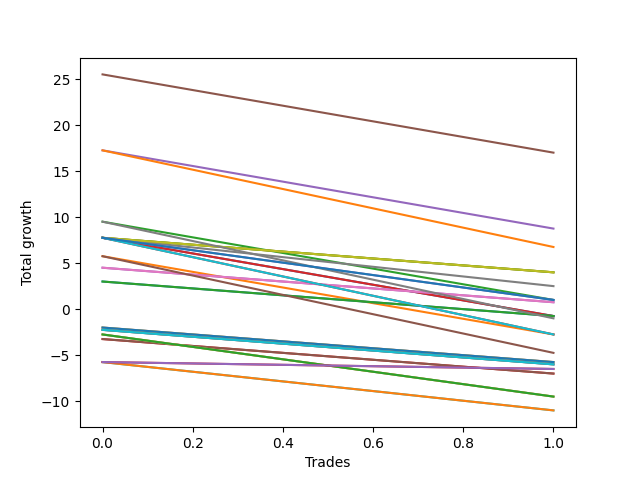

# Long Wallace 1231_002 
- Symbol: ES
- Date Range: 03/15/2022 - 07/08/2022
- Trading Period: 7:20-12:30
- Number of Trades: 2



| Name | Win Percent | Profit | Avg Profit / Trade |     | Name | Win Percent | Profit | Avg Profit / Trade |
| ---- | ----------- | ------ | ------------------ | --- | ---- | ----------- | ------ | ------------------ |
| Sorted By <br> Profit | | | | | Sorted By <br> Win Percentage ||||
| Five | 50.00 | 10750.00 | 5375.00 |     | Five | 50.00 | 10750.00 | 5375.00 |
| Sixty-One | 50.00 | 9750.00 | 4875.00 |     | Sixty-One | 50.00 | 9750.00 | 4875.00 |
| Seventy-Five | 50.00 | 8500.00 | 4250.00 |     | Seventy-Five | 50.00 | 8500.00 | 4250.00 |
| Seventy-Four | 50.00 | 8500.00 | 4250.00 |     | Seventy-Four | 50.00 | 8500.00 | 4250.00 |
| Four | 50.00 | 5125.00 | 2562.50 |     | Four | 50.00 | 5125.00 | 2562.50 |
| Seven | 50.00 | 4375.00 | 2187.50 |     | Seven | 50.00 | 4375.00 | 2187.50 |
| Sixty | 50.00 | 4125.00 | 2062.50 |     | Sixty | 50.00 | 4125.00 | 2062.50 |
| Sixty-Three | 50.00 | 3375.00 | 1687.50 |     | Sixty-Three | 50.00 | 3375.00 | 1687.50 |
| Fifty-Four | 50.00 | 2000.00 | 1000.00 |     | Fifty-Four | 50.00 | 2000.00 | 1000.00 |
| Forty-Eight | 50.00 | 2000.00 | 1000.00 |     | Forty-Eight | 50.00 | 2000.00 | 1000.00 |
| Thirty-Eight | 50.00 | 2000.00 | 1000.00 |     | Thirty-Eight | 50.00 | 2000.00 | 1000.00 |
| Thirty-Two | 50.00 | 2000.00 | 1000.00 |     | Thirty-Two | 50.00 | 2000.00 | 1000.00 |
| Thirty | 50.00 | 2000.00 | 1000.00 |     | Thirty | 50.00 | 2000.00 | 1000.00 |
| Twenty-Four | 50.00 | 2000.00 | 1000.00 |     | Twenty-Four | 50.00 | 2000.00 | 1000.00 |
| Forty-Six | 50.00 | 1250.00 | 625.00 |     | Forty-Six | 50.00 | 1250.00 | 625.00 |
| Forty | 50.00 | 1250.00 | 625.00 |     | Forty | 50.00 | 1250.00 | 625.00 |
| Three | 50.00 | 1250.00 | 625.00 |     | Three | 50.00 | 1250.00 | 625.00 |
| Seventy | 50.00 | 500.00 | 250.00 |     | Seventy | 50.00 | 500.00 | 250.00 |
| Sixty-Four | 50.00 | 500.00 | 250.00 |     | Sixty-Four | 50.00 | 500.00 | 250.00 |
| Two | 50.00 | 500.00 | 250.00 |     | Two | 50.00 | 500.00 | 250.00 |
| Thirty-Nine | 50.00 | 375.00 | 187.50 |     | Thirty-Nine | 50.00 | 375.00 | 187.50 |
| Thirty-Seven | 50.00 | 375.00 | 187.50 |     | Thirty-Seven | 50.00 | 375.00 | 187.50 |
| Thirty-Six | 50.00 | 375.00 | 187.50 |     | Thirty-Six | 50.00 | 375.00 | 187.50 |
| Thirty-Five | 50.00 | 375.00 | 187.50 |     | Thirty-Five | 50.00 | 375.00 | 187.50 |
| Thirty-Four | 50.00 | 375.00 | 187.50 |     | Thirty-Four | 50.00 | 375.00 | 187.50 |
| Thirty-Three | 50.00 | 375.00 | 187.50 |     | Thirty-Three | 50.00 | 375.00 | 187.50 |
| Fifty-Nine | 50.00 | 250.00 | 125.00 |     | Fifty-Nine | 50.00 | 250.00 | 125.00 |
| Fifty-Five | 50.00 | -375.00 | -187.50 |     | Fifty-Five | 50.00 | -375.00 | -187.50 |
| Fifty-Three | 50.00 | -375.00 | -187.50 |     | Fifty-Three | 50.00 | -375.00 | -187.50 |
| Fifty-Two | 50.00 | -375.00 | -187.50 |     | Fifty-Two | 50.00 | -375.00 | -187.50 |
| Fifty-One | 50.00 | -375.00 | -187.50 |     | Fifty-One | 50.00 | -375.00 | -187.50 |
| Fifty | 50.00 | -375.00 | -187.50 |     | Fifty | 50.00 | -375.00 | -187.50 |
| Forty-Nine | 50.00 | -375.00 | -187.50 |     | Forty-Nine | 50.00 | -375.00 | -187.50 |
| Six | 50.00 | -375.00 | -187.50 |     | Six | 50.00 | -375.00 | -187.50 |
| Zero | 50.00 | -375.00 | -187.50 |     | Zero | 50.00 | -375.00 | -187.50 |
| Fifty-Eight | 50.00 | -500.00 | -250.00 |     | Fifty-Eight | 50.00 | -500.00 | -250.00 |
| Sixty-Two | 50.00 | -1375.00 | -687.50 |     | Sixty-Two | 50.00 | -1375.00 | -687.50 |
| Fifty-Six | 50.00 | -1375.00 | -687.50 |     | Fifty-Six | 50.00 | -1375.00 | -687.50 |
| One | 50.00 | -1375.00 | -687.50 |     | One | 50.00 | -1375.00 | -687.50 |
| Fifty-Seven | 50.00 | -2375.00 | -1187.50 |     | Fifty-Seven | 50.00 | -2375.00 | -1187.50 |
| Twenty-Three | 0.00 | -2875.00 | -1437.50 |     | Twenty-Three | 0.00 | -2875.00 | -1437.50 |
| Twenty-Two | 0.00 | -2875.00 | -1437.50 |     | Twenty-Two | 0.00 | -2875.00 | -1437.50 |
| Twenty-One | 0.00 | -2875.00 | -1437.50 |     | Twenty-One | 0.00 | -2875.00 | -1437.50 |
| Twenty | 0.00 | -2875.00 | -1437.50 |     | Twenty | 0.00 | -2875.00 | -1437.50 |
| Nineteen | 0.00 | -2875.00 | -1437.50 |     | Nineteen | 0.00 | -2875.00 | -1437.50 |
| Eighteen | 0.00 | -2875.00 | -1437.50 |     | Eighteen | 0.00 | -2875.00 | -1437.50 |
| Seventeen | 0.00 | -2875.00 | -1437.50 |     | Seventeen | 0.00 | -2875.00 | -1437.50 |
| Sixten | 0.00 | -2875.00 | -1437.50 |     | Sixten | 0.00 | -2875.00 | -1437.50 |
| Fifteen | 0.00 | -3000.00 | -1500.00 |     | Fifteen | 0.00 | -3000.00 | -1500.00 |
| Fourteen | 0.00 | -3000.00 | -1500.00 |     | Fourteen | 0.00 | -3000.00 | -1500.00 |
| Thirteen | 0.00 | -3000.00 | -1500.00 |     | Thirteen | 0.00 | -3000.00 | -1500.00 |
| Twelve | 0.00 | -3000.00 | -1500.00 |     | Twelve | 0.00 | -3000.00 | -1500.00 |
| Eleven | 0.00 | -3000.00 | -1500.00 |     | Eleven | 0.00 | -3000.00 | -1500.00 |
| Ten | 0.00 | -3000.00 | -1500.00 |     | Ten | 0.00 | -3000.00 | -1500.00 |
| Nine | 0.00 | -3000.00 | -1500.00 |     | Nine | 0.00 | -3000.00 | -1500.00 |
| Eight | 0.00 | -3000.00 | -1500.00 |     | Eight | 0.00 | -3000.00 | -1500.00 |
| Seventy-Three | 0.00 | -3250.00 | -1625.00 |     | Seventy-Three | 0.00 | -3250.00 | -1625.00 |
| Seventy-Two | 0.00 | -3250.00 | -1625.00 |     | Seventy-Two | 0.00 | -3250.00 | -1625.00 |
| Thirty-One | 0.00 | -3500.00 | -1750.00 |     | Thirty-One | 0.00 | -3500.00 | -1750.00 |
| Twenty-Nine | 0.00 | -3500.00 | -1750.00 |     | Twenty-Nine | 0.00 | -3500.00 | -1750.00 |
| Twenty-Eight | 0.00 | -3500.00 | -1750.00 |     | Twenty-Eight | 0.00 | -3500.00 | -1750.00 |
| twenty-Seven | 0.00 | -3500.00 | -1750.00 |     | twenty-Seven | 0.00 | -3500.00 | -1750.00 |
| Twenty-Six | 0.00 | -3500.00 | -1750.00 |     | Twenty-Six | 0.00 | -3500.00 | -1750.00 |
| Twenty-Five | 0.00 | -3500.00 | -1750.00 |     | Twenty-Five | 0.00 | -3500.00 | -1750.00 |
| Seventy-One | 0.00 | -4750.00 | -2375.00 |     | Seventy-One | 0.00 | -4750.00 | -2375.00 |
| Sixty-Nine | 0.00 | -4750.00 | -2375.00 |     | Sixty-Nine | 0.00 | -4750.00 | -2375.00 |
| Sixty-Eight | 0.00 | -4750.00 | -2375.00 |     | Sixty-Eight | 0.00 | -4750.00 | -2375.00 |
| Sixty-Seven | 0.00 | -4750.00 | -2375.00 |     | Sixty-Seven | 0.00 | -4750.00 | -2375.00 |
| Sixty-Six | 0.00 | -4750.00 | -2375.00 |     | Sixty-Six | 0.00 | -4750.00 | -2375.00 |
| Sixty-Five | 0.00 | -4750.00 | -2375.00 |     | Sixty-Five | 0.00 | -4750.00 | -2375.00 |
| Forty-Seven | 0.00 | -5500.00 | -2750.00 |     | Forty-Seven | 0.00 | -5500.00 | -2750.00 |
| Forty-Five | 0.00 | -5500.00 | -2750.00 |     | Forty-Five | 0.00 | -5500.00 | -2750.00 |
| Forty-Four | 0.00 | -5500.00 | -2750.00 |     | Forty-Four | 0.00 | -5500.00 | -2750.00 |
| Forty-Three | 0.00 | -5500.00 | -2750.00 |     | Forty-Three | 0.00 | -5500.00 | -2750.00 |
| Forty-Two | 0.00 | -5500.00 | -2750.00 |     | Forty-Two | 0.00 | -5500.00 | -2750.00 |
| Forty-One | 0.00 | -5500.00 | -2750.00 |     | Forty-One | 0.00 | -5500.00 | -2750.00 |

## NO STOPLOSS

### Test Zero
* Sell when price hits the middle line of the 20p bollinger
* No Stoploss
* Results:
```
Total Trades: 2
Percent Up: 50.00
Percent Down: 50.00
Total Points Moved Up: -0.75
Potential Profit: -375.00
Total Points Ups: 7.75 Count Ups: 1
Total Points Downs: -8.50 Count Downs: 1
```

<details><summary>Trades</summary>

<code>In: 2022-05-17 11:25:00		Out: 2022-05-17 11:27:25		Total Position Time: 02:25		Total Move Up: 7.75		Total to Date: 7.75</code> <br />
<code>In: 2022-06-15 07:58:00		Out: 2022-06-15 08:27:55		Total Position Time: 29:55		Total Move Up: -8.50		Total to Date: -0.75</code> <br />


</details>

### Test One
* Sell when the price hits the upper line of the 20p 1std bollinger
* No Stoploss
* Results:
```
Total Trades: 2
Percent Up: 50.00
Percent Down: 50.00
Total Points Moved Up: -2.75
Potential Profit: -1375.00
Total Points Ups: 5.75 Count Ups: 1
Total Points Downs: -8.50 Count Downs: 1
```

<details><summary>Trades</summary>

<code>In: 2022-05-17 11:25:00		Out: 2022-05-17 11:37:35		Total Position Time: 12:35		Total Move Up: 5.75		Total to Date: 5.75</code> <br />
<code>In: 2022-06-15 07:58:00		Out: 2022-06-15 08:27:55		Total Position Time: 29:55		Total Move Up: -8.50		Total to Date: -2.75</code> <br />


</details>

### Test Two
* Sell when the price hits the upper line of the 20p 2std bollinger
* No Stoploss
* Results:
```
Total Trades: 2
Percent Up: 50.00
Percent Down: 50.00
Total Points Moved Up: 1.00
Potential Profit: 500.00
Total Points Ups: 9.50 Count Ups: 1
Total Points Downs: -8.50 Count Downs: 1
```

<details><summary>Trades</summary>

<code>In: 2022-05-17 11:25:00		Out: 2022-05-17 11:40:00		Total Position Time: 15:00		Total Move Up: 9.50		Total to Date: 9.50</code> <br />
<code>In: 2022-06-15 07:58:00		Out: 2022-06-15 08:27:55		Total Position Time: 29:55		Total Move Up: -8.50		Total to Date: 1.00</code> <br />


</details>

### Test Three
* Sell when price hits the middle line of the 50p bollinger
* No Stoploss
* Results:
```
Total Trades: 2
Percent Up: 50.00
Percent Down: 50.00
Total Points Moved Up: 2.50
Potential Profit: 1250.00
Total Points Ups: 11.00 Count Ups: 1
Total Points Downs: -8.50 Count Downs: 1
```

<details><summary>Trades</summary>

<code>In: 2022-05-17 11:25:00		Out: 2022-05-17 11:40:05		Total Position Time: 15:05		Total Move Up: 11.00		Total to Date: 11.00</code> <br />
<code>In: 2022-06-15 07:58:00		Out: 2022-06-15 08:27:55		Total Position Time: 29:55		Total Move Up: -8.50		Total to Date: 2.50</code> <br />


</details>

### Test Four
* Sell when the price hits the upper line of the 50p 1std bollinger
* No Stoploss
* Results:
```
Total Trades: 2
Percent Up: 50.00
Percent Down: 50.00
Total Points Moved Up: 10.25
Potential Profit: 5125.00
Total Points Ups: 18.75 Count Ups: 1
Total Points Downs: -8.50 Count Downs: 1
```

<details><summary>Trades</summary>

<code>In: 2022-05-17 11:25:00		Out: 2022-05-17 11:45:45		Total Position Time: 20:45		Total Move Up: 18.75		Total to Date: 18.75</code> <br />
<code>In: 2022-06-15 07:58:00		Out: 2022-06-15 08:27:55		Total Position Time: 29:55		Total Move Up: -8.50		Total to Date: 10.25</code> <br />


</details>

### Test Five
* Sell when the price hits the upper line of the 50p 2std bollinger
* No Stoploss
* Results:
```
Total Trades: 2
Percent Up: 50.00
Percent Down: 50.00
Total Points Moved Up: 21.50
Potential Profit: 10750.00
Total Points Ups: 30.00 Count Ups: 1
Total Points Downs: -8.50 Count Downs: 1
```

<details><summary>Trades</summary>

<code>In: 2022-05-17 11:25:00		Out: 2022-05-17 11:49:45		Total Position Time: 24:45		Total Move Up: 30.00		Total to Date: 30.00</code> <br />
<code>In: 2022-06-15 07:58:00		Out: 2022-06-15 08:27:55		Total Position Time: 29:55		Total Move Up: -8.50		Total to Date: 21.50</code> <br />


</details>

### Test Six
* Sell when the price hits the middle line of the 1std VWAP
* No Stoploss
* Results:
```
Total Trades: 2
Percent Up: 50.00
Percent Down: 50.00
Total Points Moved Up: -0.75
Potential Profit: -375.00
Total Points Ups: 7.75 Count Ups: 1
Total Points Downs: -8.50 Count Downs: 1
```

<details><summary>Trades</summary>

<code>In: 2022-05-17 11:25:00		Out: 2022-05-17 11:27:25		Total Position Time: 02:25		Total Move Up: 7.75		Total to Date: 7.75</code> <br />
<code>In: 2022-06-15 07:58:00		Out: 2022-06-15 08:27:55		Total Position Time: 29:55		Total Move Up: -8.50		Total to Date: -0.75</code> <br />


</details>

### Test Seven
* Sell when the price hits the upper line of the 1std VWAP
* No Stoploss
* Results:
```
Total Trades: 2
Percent Up: 50.00
Percent Down: 50.00
Total Points Moved Up: 8.75
Potential Profit: 4375.00
Total Points Ups: 17.25 Count Ups: 1
Total Points Downs: -8.50 Count Downs: 1
```

<details><summary>Trades</summary>

<code>In: 2022-05-17 11:25:00		Out: 2022-05-17 11:40:20		Total Position Time: 15:20		Total Move Up: 17.25		Total to Date: 17.25</code> <br />
<code>In: 2022-06-15 07:58:00		Out: 2022-06-15 08:27:55		Total Position Time: 29:55		Total Move Up: -8.50		Total to Date: 8.75</code> <br />


</details>

## STOPLOSS OF 2

### Test Eight
* Sell when price hits the middle line of the 20p bollinger
* Stoploss is 2 points
* Results:
```
Total Trades: 2
Percent Up: 0.00
Percent Down: 100.00
Total Points Moved Up: -6.00
Potential Profit: -3000.00
Total Points Ups: 0.00 Count Ups: 0
Total Points Downs: -6.00 Count Downs: 2
```

<details><summary>Trades</summary>

<code>In: 2022-05-17 11:25:00		Out: 2022-05-17 11:25:35		Total Position Time: 00:35		Total Move Up: -2.25		Total to Date: -2.25</code> <br />
<code>In: 2022-06-15 07:58:00		Out: 2022-06-15 07:58:10		Total Position Time: 00:10		Total Move Up: -3.75		Total to Date: -6.00</code> <br />


</details>

### Test Nine
* Sell when the price hits the upper line of the 20p 1std bollinger
* Stoploss is 2 points
* Results:
```
Total Trades: 2
Percent Up: 0.00
Percent Down: 100.00
Total Points Moved Up: -6.00
Potential Profit: -3000.00
Total Points Ups: 0.00 Count Ups: 0
Total Points Downs: -6.00 Count Downs: 2
```

<details><summary>Trades</summary>

<code>In: 2022-05-17 11:25:00		Out: 2022-05-17 11:25:35		Total Position Time: 00:35		Total Move Up: -2.25		Total to Date: -2.25</code> <br />
<code>In: 2022-06-15 07:58:00		Out: 2022-06-15 07:58:10		Total Position Time: 00:10		Total Move Up: -3.75		Total to Date: -6.00</code> <br />


</details>

### Test Ten
* Sell when the price hits the upper line of the 20p 2std bollinger
* Stoploss is 2 points
* Results:
```
Total Trades: 2
Percent Up: 0.00
Percent Down: 100.00
Total Points Moved Up: -6.00
Potential Profit: -3000.00
Total Points Ups: 0.00 Count Ups: 0
Total Points Downs: -6.00 Count Downs: 2
```

<details><summary>Trades</summary>

<code>In: 2022-05-17 11:25:00		Out: 2022-05-17 11:25:35		Total Position Time: 00:35		Total Move Up: -2.25		Total to Date: -2.25</code> <br />
<code>In: 2022-06-15 07:58:00		Out: 2022-06-15 07:58:10		Total Position Time: 00:10		Total Move Up: -3.75		Total to Date: -6.00</code> <br />


</details>

### Test Eleven
* Sell when price hits the middle line of the 50p bollinger
* Stoploss is 2 points
* Results:
```
Total Trades: 2
Percent Up: 0.00
Percent Down: 100.00
Total Points Moved Up: -6.00
Potential Profit: -3000.00
Total Points Ups: 0.00 Count Ups: 0
Total Points Downs: -6.00 Count Downs: 2
```

<details><summary>Trades</summary>

<code>In: 2022-05-17 11:25:00		Out: 2022-05-17 11:25:35		Total Position Time: 00:35		Total Move Up: -2.25		Total to Date: -2.25</code> <br />
<code>In: 2022-06-15 07:58:00		Out: 2022-06-15 07:58:10		Total Position Time: 00:10		Total Move Up: -3.75		Total to Date: -6.00</code> <br />


</details>

### Test Twelve
* Sell when the price hits the upper line of the 50p 1std bollinger
* Stoploss is 2 points
* Results:
```
Total Trades: 2
Percent Up: 0.00
Percent Down: 100.00
Total Points Moved Up: -6.00
Potential Profit: -3000.00
Total Points Ups: 0.00 Count Ups: 0
Total Points Downs: -6.00 Count Downs: 2
```

<details><summary>Trades</summary>

<code>In: 2022-05-17 11:25:00		Out: 2022-05-17 11:25:35		Total Position Time: 00:35		Total Move Up: -2.25		Total to Date: -2.25</code> <br />
<code>In: 2022-06-15 07:58:00		Out: 2022-06-15 07:58:10		Total Position Time: 00:10		Total Move Up: -3.75		Total to Date: -6.00</code> <br />


</details>

### Test Thirteen
* Sell when the price hits the upper line of the 50p 2std bollinger
* Stoploss is 2 points
* Results:
```
Total Trades: 2
Percent Up: 0.00
Percent Down: 100.00
Total Points Moved Up: -6.00
Potential Profit: -3000.00
Total Points Ups: 0.00 Count Ups: 0
Total Points Downs: -6.00 Count Downs: 2
```

<details><summary>Trades</summary>

<code>In: 2022-05-17 11:25:00		Out: 2022-05-17 11:25:35		Total Position Time: 00:35		Total Move Up: -2.25		Total to Date: -2.25</code> <br />
<code>In: 2022-06-15 07:58:00		Out: 2022-06-15 07:58:10		Total Position Time: 00:10		Total Move Up: -3.75		Total to Date: -6.00</code> <br />


</details>

### Test Fourteen
* Sell when the price hits the middle line of the 1std VWAP
* Stoploss is 2 points
* Results:
```
Total Trades: 2
Percent Up: 0.00
Percent Down: 100.00
Total Points Moved Up: -6.00
Potential Profit: -3000.00
Total Points Ups: 0.00 Count Ups: 0
Total Points Downs: -6.00 Count Downs: 2
```

<details><summary>Trades</summary>

<code>In: 2022-05-17 11:25:00		Out: 2022-05-17 11:25:35		Total Position Time: 00:35		Total Move Up: -2.25		Total to Date: -2.25</code> <br />
<code>In: 2022-06-15 07:58:00		Out: 2022-06-15 07:58:10		Total Position Time: 00:10		Total Move Up: -3.75		Total to Date: -6.00</code> <br />


</details>

### Test Fifteen
* Sell when the price hits the upper line of the 1std VWAP
* Stoploss is 2 points
* Results:
```
Total Trades: 2
Percent Up: 0.00
Percent Down: 100.00
Total Points Moved Up: -6.00
Potential Profit: -3000.00
Total Points Ups: 0.00 Count Ups: 0
Total Points Downs: -6.00 Count Downs: 2
```

<details><summary>Trades</summary>

<code>In: 2022-05-17 11:25:00		Out: 2022-05-17 11:25:35		Total Position Time: 00:35		Total Move Up: -2.25		Total to Date: -2.25</code> <br />
<code>In: 2022-06-15 07:58:00		Out: 2022-06-15 07:58:10		Total Position Time: 00:10		Total Move Up: -3.75		Total to Date: -6.00</code> <br />


</details>

## TRAIL STOP OF 2

### Test Sixten
* Sell when price hits the middle line of the 20p bollinger
* Trailing Stop is 2 points
* Results:
```
Total Trades: 2
Percent Up: 0.00
Percent Down: 100.00
Total Points Moved Up: -5.75
Potential Profit: -2875.00
Total Points Ups: 0.00 Count Ups: 0
Total Points Downs: -5.75 Count Downs: 2
```

<details><summary>Trades</summary>

<code>In: 2022-05-17 11:25:00		Out: 2022-05-17 11:25:30		Total Position Time: 00:30		Total Move Up: -2.00		Total to Date: -2.00</code> <br />
<code>In: 2022-06-15 07:58:00		Out: 2022-06-15 07:58:10		Total Position Time: 00:10		Total Move Up: -3.75		Total to Date: -5.75</code> <br />


</details>

### Test Seventeen
* Sell when the price hits the upper line of the 20p 1std bollinger
* Trailing Stop is 2 points
* Results:
```
Total Trades: 2
Percent Up: 0.00
Percent Down: 100.00
Total Points Moved Up: -5.75
Potential Profit: -2875.00
Total Points Ups: 0.00 Count Ups: 0
Total Points Downs: -5.75 Count Downs: 2
```

<details><summary>Trades</summary>

<code>In: 2022-05-17 11:25:00		Out: 2022-05-17 11:25:30		Total Position Time: 00:30		Total Move Up: -2.00		Total to Date: -2.00</code> <br />
<code>In: 2022-06-15 07:58:00		Out: 2022-06-15 07:58:10		Total Position Time: 00:10		Total Move Up: -3.75		Total to Date: -5.75</code> <br />


</details>

### Test Eighteen
* Sell when the price hits the upper line of the 20p 2std bollinger
* Trailing Stop is 2 points
* Results:
```
Total Trades: 2
Percent Up: 0.00
Percent Down: 100.00
Total Points Moved Up: -5.75
Potential Profit: -2875.00
Total Points Ups: 0.00 Count Ups: 0
Total Points Downs: -5.75 Count Downs: 2
```

<details><summary>Trades</summary>

<code>In: 2022-05-17 11:25:00		Out: 2022-05-17 11:25:30		Total Position Time: 00:30		Total Move Up: -2.00		Total to Date: -2.00</code> <br />
<code>In: 2022-06-15 07:58:00		Out: 2022-06-15 07:58:10		Total Position Time: 00:10		Total Move Up: -3.75		Total to Date: -5.75</code> <br />


</details>

### Test Nineteen
* Sell when price hits the middle line of the 50p bollinger
* Trailing Stop is 2 points
* Results:
```
Total Trades: 2
Percent Up: 0.00
Percent Down: 100.00
Total Points Moved Up: -5.75
Potential Profit: -2875.00
Total Points Ups: 0.00 Count Ups: 0
Total Points Downs: -5.75 Count Downs: 2
```

<details><summary>Trades</summary>

<code>In: 2022-05-17 11:25:00		Out: 2022-05-17 11:25:30		Total Position Time: 00:30		Total Move Up: -2.00		Total to Date: -2.00</code> <br />
<code>In: 2022-06-15 07:58:00		Out: 2022-06-15 07:58:10		Total Position Time: 00:10		Total Move Up: -3.75		Total to Date: -5.75</code> <br />


</details>

### Test Twenty
* Sell when the price hits the upper line of the 50p 1std bollinger
* Trailing Stop is 2 points
* Results:
```
Total Trades: 2
Percent Up: 0.00
Percent Down: 100.00
Total Points Moved Up: -5.75
Potential Profit: -2875.00
Total Points Ups: 0.00 Count Ups: 0
Total Points Downs: -5.75 Count Downs: 2
```

<details><summary>Trades</summary>

<code>In: 2022-05-17 11:25:00		Out: 2022-05-17 11:25:30		Total Position Time: 00:30		Total Move Up: -2.00		Total to Date: -2.00</code> <br />
<code>In: 2022-06-15 07:58:00		Out: 2022-06-15 07:58:10		Total Position Time: 00:10		Total Move Up: -3.75		Total to Date: -5.75</code> <br />


</details>

### Test Twenty-One
* Sell when the price hits the upper line of the 50p 2std bollinger
* Trailing Stop is 2 points
* Results:
```
Total Trades: 2
Percent Up: 0.00
Percent Down: 100.00
Total Points Moved Up: -5.75
Potential Profit: -2875.00
Total Points Ups: 0.00 Count Ups: 0
Total Points Downs: -5.75 Count Downs: 2
```

<details><summary>Trades</summary>

<code>In: 2022-05-17 11:25:00		Out: 2022-05-17 11:25:30		Total Position Time: 00:30		Total Move Up: -2.00		Total to Date: -2.00</code> <br />
<code>In: 2022-06-15 07:58:00		Out: 2022-06-15 07:58:10		Total Position Time: 00:10		Total Move Up: -3.75		Total to Date: -5.75</code> <br />


</details>

### Test Twenty-Two
* Sell when the price hits the middle line of the 1std VWAP
* Trailing Stop is 2 points
* Results:
```
Total Trades: 2
Percent Up: 0.00
Percent Down: 100.00
Total Points Moved Up: -5.75
Potential Profit: -2875.00
Total Points Ups: 0.00 Count Ups: 0
Total Points Downs: -5.75 Count Downs: 2
```

<details><summary>Trades</summary>

<code>In: 2022-05-17 11:25:00		Out: 2022-05-17 11:25:30		Total Position Time: 00:30		Total Move Up: -2.00		Total to Date: -2.00</code> <br />
<code>In: 2022-06-15 07:58:00		Out: 2022-06-15 07:58:10		Total Position Time: 00:10		Total Move Up: -3.75		Total to Date: -5.75</code> <br />


</details>

### Test Twenty-Three
* Sell when the price hits the upper line of the 1std VWAP
* Trailing Stop is 2 points
* Results:
```
Total Trades: 2
Percent Up: 0.00
Percent Down: 100.00
Total Points Moved Up: -5.75
Potential Profit: -2875.00
Total Points Ups: 0.00 Count Ups: 0
Total Points Downs: -5.75 Count Downs: 2
```

<details><summary>Trades</summary>

<code>In: 2022-05-17 11:25:00		Out: 2022-05-17 11:25:30		Total Position Time: 00:30		Total Move Up: -2.00		Total to Date: -2.00</code> <br />
<code>In: 2022-06-15 07:58:00		Out: 2022-06-15 07:58:10		Total Position Time: 00:10		Total Move Up: -3.75		Total to Date: -5.75</code> <br />


</details>

## STOPLOSS OF 3

### Test Twenty-Four
* Sell when price hits the middle line of the 20p bollinger
* Stoploss is 3 points
* Results:
```
Total Trades: 2
Percent Up: 50.00
Percent Down: 50.00
Total Points Moved Up: 4.00
Potential Profit: 2000.00
Total Points Ups: 7.75 Count Ups: 1
Total Points Downs: -3.75 Count Downs: 1
```

<details><summary>Trades</summary>

<code>In: 2022-05-17 11:25:00		Out: 2022-05-17 11:27:25		Total Position Time: 02:25		Total Move Up: 7.75		Total to Date: 7.75</code> <br />
<code>In: 2022-06-15 07:58:00		Out: 2022-06-15 07:58:10		Total Position Time: 00:10		Total Move Up: -3.75		Total to Date: 4.00</code> <br />


</details>

### Test Twenty-Five
* Sell when the price hits the upper line of the 20p 1std bollinger
* Stoploss is 3 points
* Results:
```
Total Trades: 2
Percent Up: 0.00
Percent Down: 100.00
Total Points Moved Up: -7.00
Potential Profit: -3500.00
Total Points Ups: 0.00 Count Ups: 0
Total Points Downs: -7.00 Count Downs: 2
```

<details><summary>Trades</summary>

<code>In: 2022-05-17 11:25:00		Out: 2022-05-17 11:34:35		Total Position Time: 09:35		Total Move Up: -3.25		Total to Date: -3.25</code> <br />
<code>In: 2022-06-15 07:58:00		Out: 2022-06-15 07:58:10		Total Position Time: 00:10		Total Move Up: -3.75		Total to Date: -7.00</code> <br />


</details>

### Test Twenty-Six
* Sell when the price hits the upper line of the 20p 2std bollinger
* Stoploss is 3 points
* Results:
```
Total Trades: 2
Percent Up: 0.00
Percent Down: 100.00
Total Points Moved Up: -7.00
Potential Profit: -3500.00
Total Points Ups: 0.00 Count Ups: 0
Total Points Downs: -7.00 Count Downs: 2
```

<details><summary>Trades</summary>

<code>In: 2022-05-17 11:25:00		Out: 2022-05-17 11:34:35		Total Position Time: 09:35		Total Move Up: -3.25		Total to Date: -3.25</code> <br />
<code>In: 2022-06-15 07:58:00		Out: 2022-06-15 07:58:10		Total Position Time: 00:10		Total Move Up: -3.75		Total to Date: -7.00</code> <br />


</details>

### Test twenty-Seven
* Sell when price hits the middle line of the 50p bollinger
* Stoploss is 3 points
* Results:
```
Total Trades: 2
Percent Up: 0.00
Percent Down: 100.00
Total Points Moved Up: -7.00
Potential Profit: -3500.00
Total Points Ups: 0.00 Count Ups: 0
Total Points Downs: -7.00 Count Downs: 2
```

<details><summary>Trades</summary>

<code>In: 2022-05-17 11:25:00		Out: 2022-05-17 11:34:35		Total Position Time: 09:35		Total Move Up: -3.25		Total to Date: -3.25</code> <br />
<code>In: 2022-06-15 07:58:00		Out: 2022-06-15 07:58:10		Total Position Time: 00:10		Total Move Up: -3.75		Total to Date: -7.00</code> <br />


</details>

### Test Twenty-Eight
* Sell when the price hits the upper line of the 50p 1std bollinger
* Stoploss is 3 points
* Results:
```
Total Trades: 2
Percent Up: 0.00
Percent Down: 100.00
Total Points Moved Up: -7.00
Potential Profit: -3500.00
Total Points Ups: 0.00 Count Ups: 0
Total Points Downs: -7.00 Count Downs: 2
```

<details><summary>Trades</summary>

<code>In: 2022-05-17 11:25:00		Out: 2022-05-17 11:34:35		Total Position Time: 09:35		Total Move Up: -3.25		Total to Date: -3.25</code> <br />
<code>In: 2022-06-15 07:58:00		Out: 2022-06-15 07:58:10		Total Position Time: 00:10		Total Move Up: -3.75		Total to Date: -7.00</code> <br />


</details>

### Test Twenty-Nine
* Sell when the price hits the upper line of the 50p 2std bollinger
* Stoploss is 3 points
* Results:
```
Total Trades: 2
Percent Up: 0.00
Percent Down: 100.00
Total Points Moved Up: -7.00
Potential Profit: -3500.00
Total Points Ups: 0.00 Count Ups: 0
Total Points Downs: -7.00 Count Downs: 2
```

<details><summary>Trades</summary>

<code>In: 2022-05-17 11:25:00		Out: 2022-05-17 11:34:35		Total Position Time: 09:35		Total Move Up: -3.25		Total to Date: -3.25</code> <br />
<code>In: 2022-06-15 07:58:00		Out: 2022-06-15 07:58:10		Total Position Time: 00:10		Total Move Up: -3.75		Total to Date: -7.00</code> <br />


</details>

### Test Thirty
* Sell when the price hits the middle line of the 1std VWAP
* Stoploss is 3 points
* Results:
```
Total Trades: 2
Percent Up: 50.00
Percent Down: 50.00
Total Points Moved Up: 4.00
Potential Profit: 2000.00
Total Points Ups: 7.75 Count Ups: 1
Total Points Downs: -3.75 Count Downs: 1
```

<details><summary>Trades</summary>

<code>In: 2022-05-17 11:25:00		Out: 2022-05-17 11:27:25		Total Position Time: 02:25		Total Move Up: 7.75		Total to Date: 7.75</code> <br />
<code>In: 2022-06-15 07:58:00		Out: 2022-06-15 07:58:10		Total Position Time: 00:10		Total Move Up: -3.75		Total to Date: 4.00</code> <br />


</details>

### Test Thirty-One
* Sell when the price hits the upper line of the 1std VWAP
* Stoploss is 3 points
* Results:
```
Total Trades: 2
Percent Up: 0.00
Percent Down: 100.00
Total Points Moved Up: -7.00
Potential Profit: -3500.00
Total Points Ups: 0.00 Count Ups: 0
Total Points Downs: -7.00 Count Downs: 2
```

<details><summary>Trades</summary>

<code>In: 2022-05-17 11:25:00		Out: 2022-05-17 11:34:35		Total Position Time: 09:35		Total Move Up: -3.25		Total to Date: -3.25</code> <br />
<code>In: 2022-06-15 07:58:00		Out: 2022-06-15 07:58:10		Total Position Time: 00:10		Total Move Up: -3.75		Total to Date: -7.00</code> <br />


</details>

## TRAIL STOP OF 3

### Test Thirty-Two
* Sell when price hits the middle line of the 20p bollinger
* Trailing Stop is 3 points
* Results:
```
Total Trades: 2
Percent Up: 50.00
Percent Down: 50.00
Total Points Moved Up: 4.00
Potential Profit: 2000.00
Total Points Ups: 7.75 Count Ups: 1
Total Points Downs: -3.75 Count Downs: 1
```

<details><summary>Trades</summary>

<code>In: 2022-05-17 11:25:00		Out: 2022-05-17 11:27:25		Total Position Time: 02:25		Total Move Up: 7.75		Total to Date: 7.75</code> <br />
<code>In: 2022-06-15 07:58:00		Out: 2022-06-15 07:58:10		Total Position Time: 00:10		Total Move Up: -3.75		Total to Date: 4.00</code> <br />


</details>

### Test Thirty-Three
* Sell when the price hits the upper line of the 20p 1std bollinger
* Trailing Stop is 3 points
* Results:
```
Total Trades: 2
Percent Up: 50.00
Percent Down: 50.00
Total Points Moved Up: 0.75
Potential Profit: 375.00
Total Points Ups: 4.50 Count Ups: 1
Total Points Downs: -3.75 Count Downs: 1
```

<details><summary>Trades</summary>

<code>In: 2022-05-17 11:25:00		Out: 2022-05-17 11:28:15		Total Position Time: 03:15		Total Move Up: 4.50		Total to Date: 4.50</code> <br />
<code>In: 2022-06-15 07:58:00		Out: 2022-06-15 07:58:10		Total Position Time: 00:10		Total Move Up: -3.75		Total to Date: 0.75</code> <br />


</details>

### Test Thirty-Four
* Sell when the price hits the upper line of the 20p 2std bollinger
* Trailing Stop is 3 points
* Results:
```
Total Trades: 2
Percent Up: 50.00
Percent Down: 50.00
Total Points Moved Up: 0.75
Potential Profit: 375.00
Total Points Ups: 4.50 Count Ups: 1
Total Points Downs: -3.75 Count Downs: 1
```

<details><summary>Trades</summary>

<code>In: 2022-05-17 11:25:00		Out: 2022-05-17 11:28:15		Total Position Time: 03:15		Total Move Up: 4.50		Total to Date: 4.50</code> <br />
<code>In: 2022-06-15 07:58:00		Out: 2022-06-15 07:58:10		Total Position Time: 00:10		Total Move Up: -3.75		Total to Date: 0.75</code> <br />


</details>

### Test Thirty-Five
* Sell when price hits the middle line of the 50p bollinger
* Trailing Stop is 3 points
* Results:
```
Total Trades: 2
Percent Up: 50.00
Percent Down: 50.00
Total Points Moved Up: 0.75
Potential Profit: 375.00
Total Points Ups: 4.50 Count Ups: 1
Total Points Downs: -3.75 Count Downs: 1
```

<details><summary>Trades</summary>

<code>In: 2022-05-17 11:25:00		Out: 2022-05-17 11:28:15		Total Position Time: 03:15		Total Move Up: 4.50		Total to Date: 4.50</code> <br />
<code>In: 2022-06-15 07:58:00		Out: 2022-06-15 07:58:10		Total Position Time: 00:10		Total Move Up: -3.75		Total to Date: 0.75</code> <br />


</details>

### Test Thirty-Six
* Sell when the price hits the upper line of the 50p 1std bollinger
* Trailing Stop is 3 points
* Results:
```
Total Trades: 2
Percent Up: 50.00
Percent Down: 50.00
Total Points Moved Up: 0.75
Potential Profit: 375.00
Total Points Ups: 4.50 Count Ups: 1
Total Points Downs: -3.75 Count Downs: 1
```

<details><summary>Trades</summary>

<code>In: 2022-05-17 11:25:00		Out: 2022-05-17 11:28:15		Total Position Time: 03:15		Total Move Up: 4.50		Total to Date: 4.50</code> <br />
<code>In: 2022-06-15 07:58:00		Out: 2022-06-15 07:58:10		Total Position Time: 00:10		Total Move Up: -3.75		Total to Date: 0.75</code> <br />


</details>

### Test Thirty-Seven
* Sell when the price hits the upper line of the 50p 2std bollinger
* Trailing Stop is 3 points
* Results:
```
Total Trades: 2
Percent Up: 50.00
Percent Down: 50.00
Total Points Moved Up: 0.75
Potential Profit: 375.00
Total Points Ups: 4.50 Count Ups: 1
Total Points Downs: -3.75 Count Downs: 1
```

<details><summary>Trades</summary>

<code>In: 2022-05-17 11:25:00		Out: 2022-05-17 11:28:15		Total Position Time: 03:15		Total Move Up: 4.50		Total to Date: 4.50</code> <br />
<code>In: 2022-06-15 07:58:00		Out: 2022-06-15 07:58:10		Total Position Time: 00:10		Total Move Up: -3.75		Total to Date: 0.75</code> <br />


</details>

### Test Thirty-Eight
* Sell when the price hits the middle line of the 1std VWAP
* Trailing Stop is 3 points
* Results:
```
Total Trades: 2
Percent Up: 50.00
Percent Down: 50.00
Total Points Moved Up: 4.00
Potential Profit: 2000.00
Total Points Ups: 7.75 Count Ups: 1
Total Points Downs: -3.75 Count Downs: 1
```

<details><summary>Trades</summary>

<code>In: 2022-05-17 11:25:00		Out: 2022-05-17 11:27:25		Total Position Time: 02:25		Total Move Up: 7.75		Total to Date: 7.75</code> <br />
<code>In: 2022-06-15 07:58:00		Out: 2022-06-15 07:58:10		Total Position Time: 00:10		Total Move Up: -3.75		Total to Date: 4.00</code> <br />


</details>

### Test Thirty-Nine
* Sell when the price hits the upper line of the 1std VWAP
* Trailing Stop is 3 points
* Results:
```
Total Trades: 2
Percent Up: 50.00
Percent Down: 50.00
Total Points Moved Up: 0.75
Potential Profit: 375.00
Total Points Ups: 4.50 Count Ups: 1
Total Points Downs: -3.75 Count Downs: 1
```

<details><summary>Trades</summary>

<code>In: 2022-05-17 11:25:00		Out: 2022-05-17 11:28:15		Total Position Time: 03:15		Total Move Up: 4.50		Total to Date: 4.50</code> <br />
<code>In: 2022-06-15 07:58:00		Out: 2022-06-15 07:58:10		Total Position Time: 00:10		Total Move Up: -3.75		Total to Date: 0.75</code> <br />


</details>

## STOPLOSS OF 5

### Test Forty
* Sell when price hits the middle line of the 20p bollinger
* Stoploss is 5 points
* Results:
```
Total Trades: 2
Percent Up: 50.00
Percent Down: 50.00
Total Points Moved Up: 2.50
Potential Profit: 1250.00
Total Points Ups: 7.75 Count Ups: 1
Total Points Downs: -5.25 Count Downs: 1
```

<details><summary>Trades</summary>

<code>In: 2022-05-17 11:25:00		Out: 2022-05-17 11:27:25		Total Position Time: 02:25		Total Move Up: 7.75		Total to Date: 7.75</code> <br />
<code>In: 2022-06-15 07:58:00		Out: 2022-06-15 08:10:05		Total Position Time: 12:05		Total Move Up: -5.25		Total to Date: 2.50</code> <br />


</details>

### Test Forty-One
* Sell when the price hits the upper line of the 20p 1std bollinger
* Stoploss is 5 points
* Results:
```
Total Trades: 2
Percent Up: 0.00
Percent Down: 100.00
Total Points Moved Up: -11.00
Potential Profit: -5500.00
Total Points Ups: 0.00 Count Ups: 0
Total Points Downs: -11.00 Count Downs: 2
```

<details><summary>Trades</summary>

<code>In: 2022-05-17 11:25:00		Out: 2022-05-17 11:35:05		Total Position Time: 10:05		Total Move Up: -5.75		Total to Date: -5.75</code> <br />
<code>In: 2022-06-15 07:58:00		Out: 2022-06-15 08:10:05		Total Position Time: 12:05		Total Move Up: -5.25		Total to Date: -11.00</code> <br />


</details>

### Test Forty-Two
* Sell when the price hits the upper line of the 20p 2std bollinger
* Stoploss is 5 points
* Results:
```
Total Trades: 2
Percent Up: 0.00
Percent Down: 100.00
Total Points Moved Up: -11.00
Potential Profit: -5500.00
Total Points Ups: 0.00 Count Ups: 0
Total Points Downs: -11.00 Count Downs: 2
```

<details><summary>Trades</summary>

<code>In: 2022-05-17 11:25:00		Out: 2022-05-17 11:35:05		Total Position Time: 10:05		Total Move Up: -5.75		Total to Date: -5.75</code> <br />
<code>In: 2022-06-15 07:58:00		Out: 2022-06-15 08:10:05		Total Position Time: 12:05		Total Move Up: -5.25		Total to Date: -11.00</code> <br />


</details>

### Test Forty-Three
* Sell when price hits the middle line of the 50p bollinger
* Stoploss is 5 points
* Results:
```
Total Trades: 2
Percent Up: 0.00
Percent Down: 100.00
Total Points Moved Up: -11.00
Potential Profit: -5500.00
Total Points Ups: 0.00 Count Ups: 0
Total Points Downs: -11.00 Count Downs: 2
```

<details><summary>Trades</summary>

<code>In: 2022-05-17 11:25:00		Out: 2022-05-17 11:35:05		Total Position Time: 10:05		Total Move Up: -5.75		Total to Date: -5.75</code> <br />
<code>In: 2022-06-15 07:58:00		Out: 2022-06-15 08:10:05		Total Position Time: 12:05		Total Move Up: -5.25		Total to Date: -11.00</code> <br />


</details>

### Test Forty-Four
* Sell when the price hits the upper line of the 50p 1std bollinger
* Stoploss is 5 points
* Results:
```
Total Trades: 2
Percent Up: 0.00
Percent Down: 100.00
Total Points Moved Up: -11.00
Potential Profit: -5500.00
Total Points Ups: 0.00 Count Ups: 0
Total Points Downs: -11.00 Count Downs: 2
```

<details><summary>Trades</summary>

<code>In: 2022-05-17 11:25:00		Out: 2022-05-17 11:35:05		Total Position Time: 10:05		Total Move Up: -5.75		Total to Date: -5.75</code> <br />
<code>In: 2022-06-15 07:58:00		Out: 2022-06-15 08:10:05		Total Position Time: 12:05		Total Move Up: -5.25		Total to Date: -11.00</code> <br />


</details>

### Test Forty-Five
* Sell when the price hits the upper line of the 50p 2std bollinger
* Stoploss is 5 points
* Results:
```
Total Trades: 2
Percent Up: 0.00
Percent Down: 100.00
Total Points Moved Up: -11.00
Potential Profit: -5500.00
Total Points Ups: 0.00 Count Ups: 0
Total Points Downs: -11.00 Count Downs: 2
```

<details><summary>Trades</summary>

<code>In: 2022-05-17 11:25:00		Out: 2022-05-17 11:35:05		Total Position Time: 10:05		Total Move Up: -5.75		Total to Date: -5.75</code> <br />
<code>In: 2022-06-15 07:58:00		Out: 2022-06-15 08:10:05		Total Position Time: 12:05		Total Move Up: -5.25		Total to Date: -11.00</code> <br />


</details>

### Test Forty-Six
* Sell when the price hits the middle line of the 1std VWAP
* Stoploss is 5 points
* Results:
```
Total Trades: 2
Percent Up: 50.00
Percent Down: 50.00
Total Points Moved Up: 2.50
Potential Profit: 1250.00
Total Points Ups: 7.75 Count Ups: 1
Total Points Downs: -5.25 Count Downs: 1
```

<details><summary>Trades</summary>

<code>In: 2022-05-17 11:25:00		Out: 2022-05-17 11:27:25		Total Position Time: 02:25		Total Move Up: 7.75		Total to Date: 7.75</code> <br />
<code>In: 2022-06-15 07:58:00		Out: 2022-06-15 08:10:05		Total Position Time: 12:05		Total Move Up: -5.25		Total to Date: 2.50</code> <br />


</details>

### Test Forty-Seven
* Sell when the price hits the upper line of the 1std VWAP
* Stoploss is 5 points
* Results:
```
Total Trades: 2
Percent Up: 0.00
Percent Down: 100.00
Total Points Moved Up: -11.00
Potential Profit: -5500.00
Total Points Ups: 0.00 Count Ups: 0
Total Points Downs: -11.00 Count Downs: 2
```

<details><summary>Trades</summary>

<code>In: 2022-05-17 11:25:00		Out: 2022-05-17 11:35:05		Total Position Time: 10:05		Total Move Up: -5.75		Total to Date: -5.75</code> <br />
<code>In: 2022-06-15 07:58:00		Out: 2022-06-15 08:10:05		Total Position Time: 12:05		Total Move Up: -5.25		Total to Date: -11.00</code> <br />


</details>

## TRAIL STOP OF 5

### Test Forty-Eight
* Sell when price hits the middle line of the 20p bollinger
* Trailing Stop is 5 points
* Results:
```
Total Trades: 2
Percent Up: 50.00
Percent Down: 50.00
Total Points Moved Up: 4.00
Potential Profit: 2000.00
Total Points Ups: 7.75 Count Ups: 1
Total Points Downs: -3.75 Count Downs: 1
```

<details><summary>Trades</summary>

<code>In: 2022-05-17 11:25:00		Out: 2022-05-17 11:27:25		Total Position Time: 02:25		Total Move Up: 7.75		Total to Date: 7.75</code> <br />
<code>In: 2022-06-15 07:58:00		Out: 2022-06-15 07:58:10		Total Position Time: 00:10		Total Move Up: -3.75		Total to Date: 4.00</code> <br />


</details>

### Test Forty-Nine
* Sell when the price hits the upper line of the 20p 1std bollinger
* Trailing Stop is 5 points
* Results:
```
Total Trades: 2
Percent Up: 50.00
Percent Down: 50.00
Total Points Moved Up: -0.75
Potential Profit: -375.00
Total Points Ups: 3.00 Count Ups: 1
Total Points Downs: -3.75 Count Downs: 1
```

<details><summary>Trades</summary>

<code>In: 2022-05-17 11:25:00		Out: 2022-05-17 11:29:15		Total Position Time: 04:15		Total Move Up: 3.00		Total to Date: 3.00</code> <br />
<code>In: 2022-06-15 07:58:00		Out: 2022-06-15 07:58:10		Total Position Time: 00:10		Total Move Up: -3.75		Total to Date: -0.75</code> <br />


</details>

### Test Fifty
* Sell when the price hits the upper line of the 20p 2std bollinger
* Trailing Stop is 5 points
* Results:
```
Total Trades: 2
Percent Up: 50.00
Percent Down: 50.00
Total Points Moved Up: -0.75
Potential Profit: -375.00
Total Points Ups: 3.00 Count Ups: 1
Total Points Downs: -3.75 Count Downs: 1
```

<details><summary>Trades</summary>

<code>In: 2022-05-17 11:25:00		Out: 2022-05-17 11:29:15		Total Position Time: 04:15		Total Move Up: 3.00		Total to Date: 3.00</code> <br />
<code>In: 2022-06-15 07:58:00		Out: 2022-06-15 07:58:10		Total Position Time: 00:10		Total Move Up: -3.75		Total to Date: -0.75</code> <br />


</details>

### Test Fifty-One
* Sell when price hits the middle line of the 50p bollinger
* Trailing Stop is 5 points
* Results:
```
Total Trades: 2
Percent Up: 50.00
Percent Down: 50.00
Total Points Moved Up: -0.75
Potential Profit: -375.00
Total Points Ups: 3.00 Count Ups: 1
Total Points Downs: -3.75 Count Downs: 1
```

<details><summary>Trades</summary>

<code>In: 2022-05-17 11:25:00		Out: 2022-05-17 11:29:15		Total Position Time: 04:15		Total Move Up: 3.00		Total to Date: 3.00</code> <br />
<code>In: 2022-06-15 07:58:00		Out: 2022-06-15 07:58:10		Total Position Time: 00:10		Total Move Up: -3.75		Total to Date: -0.75</code> <br />


</details>

### Test Fifty-Two
* Sell when the price hits the upper line of the 50p 1std bollinger
* Trailing Stop is 5 points
* Results:
```
Total Trades: 2
Percent Up: 50.00
Percent Down: 50.00
Total Points Moved Up: -0.75
Potential Profit: -375.00
Total Points Ups: 3.00 Count Ups: 1
Total Points Downs: -3.75 Count Downs: 1
```

<details><summary>Trades</summary>

<code>In: 2022-05-17 11:25:00		Out: 2022-05-17 11:29:15		Total Position Time: 04:15		Total Move Up: 3.00		Total to Date: 3.00</code> <br />
<code>In: 2022-06-15 07:58:00		Out: 2022-06-15 07:58:10		Total Position Time: 00:10		Total Move Up: -3.75		Total to Date: -0.75</code> <br />


</details>

### Test Fifty-Three
* Sell when the price hits the upper line of the 50p 2std bollinger
* Trailing Stop is 5 points
* Results:
```
Total Trades: 2
Percent Up: 50.00
Percent Down: 50.00
Total Points Moved Up: -0.75
Potential Profit: -375.00
Total Points Ups: 3.00 Count Ups: 1
Total Points Downs: -3.75 Count Downs: 1
```

<details><summary>Trades</summary>

<code>In: 2022-05-17 11:25:00		Out: 2022-05-17 11:29:15		Total Position Time: 04:15		Total Move Up: 3.00		Total to Date: 3.00</code> <br />
<code>In: 2022-06-15 07:58:00		Out: 2022-06-15 07:58:10		Total Position Time: 00:10		Total Move Up: -3.75		Total to Date: -0.75</code> <br />


</details>

### Test Fifty-Four
* Sell when the price hits the middle line of the 1std VWAP
* Trailing Stop is 5 points
* Results:
```
Total Trades: 2
Percent Up: 50.00
Percent Down: 50.00
Total Points Moved Up: 4.00
Potential Profit: 2000.00
Total Points Ups: 7.75 Count Ups: 1
Total Points Downs: -3.75 Count Downs: 1
```

<details><summary>Trades</summary>

<code>In: 2022-05-17 11:25:00		Out: 2022-05-17 11:27:25		Total Position Time: 02:25		Total Move Up: 7.75		Total to Date: 7.75</code> <br />
<code>In: 2022-06-15 07:58:00		Out: 2022-06-15 07:58:10		Total Position Time: 00:10		Total Move Up: -3.75		Total to Date: 4.00</code> <br />


</details>

### Test Fifty-Five
* Sell when the price hits the upper line of the 1std VWAP
* Trailing Stop is 5 points
* Results:
```
Total Trades: 2
Percent Up: 50.00
Percent Down: 50.00
Total Points Moved Up: -0.75
Potential Profit: -375.00
Total Points Ups: 3.00 Count Ups: 1
Total Points Downs: -3.75 Count Downs: 1
```

<details><summary>Trades</summary>

<code>In: 2022-05-17 11:25:00		Out: 2022-05-17 11:29:15		Total Position Time: 04:15		Total Move Up: 3.00		Total to Date: 3.00</code> <br />
<code>In: 2022-06-15 07:58:00		Out: 2022-06-15 07:58:10		Total Position Time: 00:10		Total Move Up: -3.75		Total to Date: -0.75</code> <br />


</details>

## STOPLOSS OF 10

### Test Fifty-Six
* Sell when price hits the middle line of the 20p bollinger
* Stoploss is 10 points
* Results:
```
Total Trades: 2
Percent Up: 50.00
Percent Down: 50.00
Total Points Moved Up: -2.75
Potential Profit: -1375.00
Total Points Ups: 7.75 Count Ups: 1
Total Points Downs: -10.50 Count Downs: 1
```

<details><summary>Trades</summary>

<code>In: 2022-05-17 11:25:00		Out: 2022-05-17 11:27:25		Total Position Time: 02:25		Total Move Up: 7.75		Total to Date: 7.75</code> <br />
<code>In: 2022-06-15 07:58:00		Out: 2022-06-15 08:13:05		Total Position Time: 15:05		Total Move Up: -10.50		Total to Date: -2.75</code> <br />


</details>

### Test Fifty-Seven
* Sell when the price hits the upper line of the 20p 1std bollinger
* Stoploss is 10 points
* Results:
```
Total Trades: 2
Percent Up: 50.00
Percent Down: 50.00
Total Points Moved Up: -4.75
Potential Profit: -2375.00
Total Points Ups: 5.75 Count Ups: 1
Total Points Downs: -10.50 Count Downs: 1
```

<details><summary>Trades</summary>

<code>In: 2022-05-17 11:25:00		Out: 2022-05-17 11:37:35		Total Position Time: 12:35		Total Move Up: 5.75		Total to Date: 5.75</code> <br />
<code>In: 2022-06-15 07:58:00		Out: 2022-06-15 08:13:05		Total Position Time: 15:05		Total Move Up: -10.50		Total to Date: -4.75</code> <br />


</details>

### Test Fifty-Eight
* Sell when the price hits the upper line of the 20p 2std bollinger
* Stoploss is 10 points
* Results:
```
Total Trades: 2
Percent Up: 50.00
Percent Down: 50.00
Total Points Moved Up: -1.00
Potential Profit: -500.00
Total Points Ups: 9.50 Count Ups: 1
Total Points Downs: -10.50 Count Downs: 1
```

<details><summary>Trades</summary>

<code>In: 2022-05-17 11:25:00		Out: 2022-05-17 11:40:00		Total Position Time: 15:00		Total Move Up: 9.50		Total to Date: 9.50</code> <br />
<code>In: 2022-06-15 07:58:00		Out: 2022-06-15 08:13:05		Total Position Time: 15:05		Total Move Up: -10.50		Total to Date: -1.00</code> <br />


</details>

### Test Fifty-Nine
* Sell when price hits the middle line of the 50p bollinger
* Stoploss is 10 points
* Results:
```
Total Trades: 2
Percent Up: 50.00
Percent Down: 50.00
Total Points Moved Up: 0.50
Potential Profit: 250.00
Total Points Ups: 11.00 Count Ups: 1
Total Points Downs: -10.50 Count Downs: 1
```

<details><summary>Trades</summary>

<code>In: 2022-05-17 11:25:00		Out: 2022-05-17 11:40:05		Total Position Time: 15:05		Total Move Up: 11.00		Total to Date: 11.00</code> <br />
<code>In: 2022-06-15 07:58:00		Out: 2022-06-15 08:13:05		Total Position Time: 15:05		Total Move Up: -10.50		Total to Date: 0.50</code> <br />


</details>

### Test Sixty
* Sell when the price hits the upper line of the 50p 1std bollinger
* Stoploss is 10 points
* Results:
```
Total Trades: 2
Percent Up: 50.00
Percent Down: 50.00
Total Points Moved Up: 8.25
Potential Profit: 4125.00
Total Points Ups: 18.75 Count Ups: 1
Total Points Downs: -10.50 Count Downs: 1
```

<details><summary>Trades</summary>

<code>In: 2022-05-17 11:25:00		Out: 2022-05-17 11:45:45		Total Position Time: 20:45		Total Move Up: 18.75		Total to Date: 18.75</code> <br />
<code>In: 2022-06-15 07:58:00		Out: 2022-06-15 08:13:05		Total Position Time: 15:05		Total Move Up: -10.50		Total to Date: 8.25</code> <br />


</details>

### Test Sixty-One
* Sell when the price hits the upper line of the 50p 2std bollinger
* Stoploss is 10 points
* Results:
```
Total Trades: 2
Percent Up: 50.00
Percent Down: 50.00
Total Points Moved Up: 19.50
Potential Profit: 9750.00
Total Points Ups: 30.00 Count Ups: 1
Total Points Downs: -10.50 Count Downs: 1
```

<details><summary>Trades</summary>

<code>In: 2022-05-17 11:25:00		Out: 2022-05-17 11:49:45		Total Position Time: 24:45		Total Move Up: 30.00		Total to Date: 30.00</code> <br />
<code>In: 2022-06-15 07:58:00		Out: 2022-06-15 08:13:05		Total Position Time: 15:05		Total Move Up: -10.50		Total to Date: 19.50</code> <br />


</details>

### Test Sixty-Two
* Sell when the price hits the middle line of the 1std VWAP
* Stoploss is 10 points
* Results:
```
Total Trades: 2
Percent Up: 50.00
Percent Down: 50.00
Total Points Moved Up: -2.75
Potential Profit: -1375.00
Total Points Ups: 7.75 Count Ups: 1
Total Points Downs: -10.50 Count Downs: 1
```

<details><summary>Trades</summary>

<code>In: 2022-05-17 11:25:00		Out: 2022-05-17 11:27:25		Total Position Time: 02:25		Total Move Up: 7.75		Total to Date: 7.75</code> <br />
<code>In: 2022-06-15 07:58:00		Out: 2022-06-15 08:13:05		Total Position Time: 15:05		Total Move Up: -10.50		Total to Date: -2.75</code> <br />


</details>

### Test Sixty-Three
* Sell when the price hits the upper line of the 1std VWAP
* Stoploss is 10 points
* Results:
```
Total Trades: 2
Percent Up: 50.00
Percent Down: 50.00
Total Points Moved Up: 6.75
Potential Profit: 3375.00
Total Points Ups: 17.25 Count Ups: 1
Total Points Downs: -10.50 Count Downs: 1
```

<details><summary>Trades</summary>

<code>In: 2022-05-17 11:25:00		Out: 2022-05-17 11:40:20		Total Position Time: 15:20		Total Move Up: 17.25		Total to Date: 17.25</code> <br />
<code>In: 2022-06-15 07:58:00		Out: 2022-06-15 08:13:05		Total Position Time: 15:05		Total Move Up: -10.50		Total to Date: 6.75</code> <br />


</details>

## TRAIL STOP OF 10

### Test Sixty-Four
* Sell when price hits the middle line of the 20p bollinger
* Trailing Stop is 10 points
* Results:
```
Total Trades: 2
Percent Up: 50.00
Percent Down: 50.00
Total Points Moved Up: 1.00
Potential Profit: 500.00
Total Points Ups: 7.75 Count Ups: 1
Total Points Downs: -6.75 Count Downs: 1
```

<details><summary>Trades</summary>

<code>In: 2022-05-17 11:25:00		Out: 2022-05-17 11:27:25		Total Position Time: 02:25		Total Move Up: 7.75		Total to Date: 7.75</code> <br />
<code>In: 2022-06-15 07:58:00		Out: 2022-06-15 08:11:15		Total Position Time: 13:15		Total Move Up: -6.75		Total to Date: 1.00</code> <br />


</details>

### Test Sixty-Five
* Sell when the price hits the upper line of the 20p 1std bollinger
* Trailing Stop is 10 points
* Results:
```
Total Trades: 2
Percent Up: 0.00
Percent Down: 100.00
Total Points Moved Up: -9.50
Potential Profit: -4750.00
Total Points Ups: 0.00 Count Ups: 0
Total Points Downs: -9.50 Count Downs: 2
```

<details><summary>Trades</summary>

<code>In: 2022-05-17 11:25:00		Out: 2022-05-17 11:33:15		Total Position Time: 08:15		Total Move Up: -2.75		Total to Date: -2.75</code> <br />
<code>In: 2022-06-15 07:58:00		Out: 2022-06-15 08:11:15		Total Position Time: 13:15		Total Move Up: -6.75		Total to Date: -9.50</code> <br />


</details>

### Test Sixty-Six
* Sell when the price hits the upper line of the 20p 2std bollinger
* Trailing Stop is 10 points
* Results:
```
Total Trades: 2
Percent Up: 0.00
Percent Down: 100.00
Total Points Moved Up: -9.50
Potential Profit: -4750.00
Total Points Ups: 0.00 Count Ups: 0
Total Points Downs: -9.50 Count Downs: 2
```

<details><summary>Trades</summary>

<code>In: 2022-05-17 11:25:00		Out: 2022-05-17 11:33:15		Total Position Time: 08:15		Total Move Up: -2.75		Total to Date: -2.75</code> <br />
<code>In: 2022-06-15 07:58:00		Out: 2022-06-15 08:11:15		Total Position Time: 13:15		Total Move Up: -6.75		Total to Date: -9.50</code> <br />


</details>

### Test Sixty-Seven
* Sell when price hits the middle line of the 50p bollinger
* Trailing Stop is 10 points
* Results:
```
Total Trades: 2
Percent Up: 0.00
Percent Down: 100.00
Total Points Moved Up: -9.50
Potential Profit: -4750.00
Total Points Ups: 0.00 Count Ups: 0
Total Points Downs: -9.50 Count Downs: 2
```

<details><summary>Trades</summary>

<code>In: 2022-05-17 11:25:00		Out: 2022-05-17 11:33:15		Total Position Time: 08:15		Total Move Up: -2.75		Total to Date: -2.75</code> <br />
<code>In: 2022-06-15 07:58:00		Out: 2022-06-15 08:11:15		Total Position Time: 13:15		Total Move Up: -6.75		Total to Date: -9.50</code> <br />


</details>

### Test Sixty-Eight
* Sell when the price hits the upper line of the 50p 1std bollinger
* Trailing Stop is 10 points
* Results:
```
Total Trades: 2
Percent Up: 0.00
Percent Down: 100.00
Total Points Moved Up: -9.50
Potential Profit: -4750.00
Total Points Ups: 0.00 Count Ups: 0
Total Points Downs: -9.50 Count Downs: 2
```

<details><summary>Trades</summary>

<code>In: 2022-05-17 11:25:00		Out: 2022-05-17 11:33:15		Total Position Time: 08:15		Total Move Up: -2.75		Total to Date: -2.75</code> <br />
<code>In: 2022-06-15 07:58:00		Out: 2022-06-15 08:11:15		Total Position Time: 13:15		Total Move Up: -6.75		Total to Date: -9.50</code> <br />


</details>

### Test Sixty-Nine
* Sell when the price hits the upper line of the 50p 2std bollinger
* Trailing Stop is 10 points
* Results:
```
Total Trades: 2
Percent Up: 0.00
Percent Down: 100.00
Total Points Moved Up: -9.50
Potential Profit: -4750.00
Total Points Ups: 0.00 Count Ups: 0
Total Points Downs: -9.50 Count Downs: 2
```

<details><summary>Trades</summary>

<code>In: 2022-05-17 11:25:00		Out: 2022-05-17 11:33:15		Total Position Time: 08:15		Total Move Up: -2.75		Total to Date: -2.75</code> <br />
<code>In: 2022-06-15 07:58:00		Out: 2022-06-15 08:11:15		Total Position Time: 13:15		Total Move Up: -6.75		Total to Date: -9.50</code> <br />


</details>

### Test Seventy
* Sell when the price hits the middle line of the 1std VWAP
* Trailing Stop is 10 points
* Results:
```
Total Trades: 2
Percent Up: 50.00
Percent Down: 50.00
Total Points Moved Up: 1.00
Potential Profit: 500.00
Total Points Ups: 7.75 Count Ups: 1
Total Points Downs: -6.75 Count Downs: 1
```

<details><summary>Trades</summary>

<code>In: 2022-05-17 11:25:00		Out: 2022-05-17 11:27:25		Total Position Time: 02:25		Total Move Up: 7.75		Total to Date: 7.75</code> <br />
<code>In: 2022-06-15 07:58:00		Out: 2022-06-15 08:11:15		Total Position Time: 13:15		Total Move Up: -6.75		Total to Date: 1.00</code> <br />


</details>

### Test Seventy-One
* Sell when the price hits the upper line of the 1std VWAP
* Trailing Stop is 10 points
* Results:
```
Total Trades: 2
Percent Up: 0.00
Percent Down: 100.00
Total Points Moved Up: -9.50
Potential Profit: -4750.00
Total Points Ups: 0.00 Count Ups: 0
Total Points Downs: -9.50 Count Downs: 2
```

<details><summary>Trades</summary>

<code>In: 2022-05-17 11:25:00		Out: 2022-05-17 11:33:15		Total Position Time: 08:15		Total Move Up: -2.75		Total to Date: -2.75</code> <br />
<code>In: 2022-06-15 07:58:00		Out: 2022-06-15 08:11:15		Total Position Time: 13:15		Total Move Up: -6.75		Total to Date: -9.50</code> <br />


</details>

## SPECIAL EXIT CONDITIONS 

### Test Seventy-Two
* Sell when the linear regression slope is negative
* No Stoploss
* Results:
```
Total Trades: 2
Percent Up: 0.00
Percent Down: 100.00
Total Points Moved Up: -6.50
Potential Profit: -3250.00
Total Points Ups: 0.00 Count Ups: 0
Total Points Downs: -6.50 Count Downs: 2
```

<details><summary>Trades</summary>

<code>In: 2022-05-17 11:25:00		Out: 2022-05-17 11:35:05		Total Position Time: 10:05		Total Move Up: -5.75		Total to Date: -5.75</code> <br />
<code>In: 2022-06-15 07:58:00		Out: 2022-06-15 08:08:05		Total Position Time: 10:05		Total Move Up: -0.75		Total to Date: -6.50</code> <br />


</details>

### Test Seventy-Three
* Sell when the linear regression slope changes to negative
* No Stoploss
* Results:
```
Total Trades: 2
Percent Up: 0.00
Percent Down: 100.00
Total Points Moved Up: -6.50
Potential Profit: -3250.00
Total Points Ups: 0.00 Count Ups: 0
Total Points Downs: -6.50 Count Downs: 2
```

<details><summary>Trades</summary>

<code>In: 2022-05-17 11:25:00		Out: 2022-05-17 11:35:05		Total Position Time: 10:05		Total Move Up: -5.75		Total to Date: -5.75</code> <br />
<code>In: 2022-06-15 07:58:00		Out: 2022-06-15 08:08:05		Total Position Time: 10:05		Total Move Up: -0.75		Total to Date: -6.50</code> <br />


</details>

### Test Seventy-Four
* Sell when the bias changes to negative
* No Stoploss
* Results:
```
Total Trades: 2
Percent Up: 50.00
Percent Down: 50.00
Total Points Moved Up: 17.00
Potential Profit: 8500.00
Total Points Ups: 25.50 Count Ups: 1
Total Points Downs: -8.50 Count Downs: 1
```

<details><summary>Trades</summary>

<code>In: 2022-05-17 11:25:00		Out: 2022-05-17 11:54:55		Total Position Time: 29:55		Total Move Up: 25.50		Total to Date: 25.50</code> <br />
<code>In: 2022-06-15 07:58:00		Out: 2022-06-15 08:27:55		Total Position Time: 29:55		Total Move Up: -8.50		Total to Date: 17.00</code> <br />


</details>

### Test Seventy-Five
* Sell when the STDEV slope changes to negative
* No Stoploss
* Results:
```
Total Trades: 2
Percent Up: 50.00
Percent Down: 50.00
Total Points Moved Up: 17.00
Potential Profit: 8500.00
Total Points Ups: 25.50 Count Ups: 1
Total Points Downs: -8.50 Count Downs: 1
```

<details><summary>Trades</summary>

<code>In: 2022-05-17 11:25:00		Out: 2022-05-17 11:54:55		Total Position Time: 29:55		Total Move Up: 25.50		Total to Date: 25.50</code> <br />
<code>In: 2022-06-15 07:58:00		Out: 2022-06-15 08:27:55		Total Position Time: 29:55		Total Move Up: -8.50		Total to Date: 17.00</code> <br />


</details>