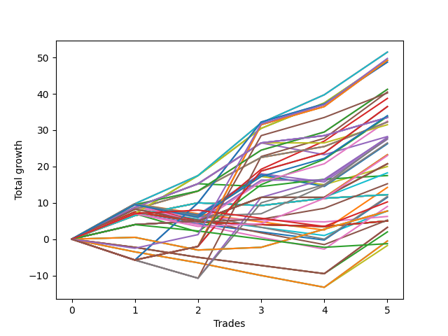

# Long Wallace Betterrerer 020 
- Symbol: ES
- Date Range: 3/18/22 - 6/24/22
- Trading Period: 7:20-12:30
- Number of Trades: 3


| Name | Win Percent | Profit | Avg Profit / Trade |     | Name | Win Percent | Profit | Avg Profit / Trade |
| ---- | ----------- | ------ | ------------------ | --- | ---- | ----------- | ------ | ------------------ |
| Sorted By <br> Profit | | | | | Sorted By <br> Win Percentage ||||
| Thirty-Six | 100.00 | 19750.00 | 6583.33 |     | Thirty-Six | 100.00 | 19750.00 | 6583.33 |
| Twenty-Eight | 100.00 | 15250.00 | 5083.33 |     | Twenty-Eight | 100.00 | 15250.00 | 5083.33 |
| Three | 100.00 | 15250.00 | 5083.33 |     | Three | 100.00 | 15250.00 | 5083.33 |
| Thirty-Two | 100.00 | 14750.00 | 4916.67 |     | Thirty-Two | 100.00 | 14750.00 | 4916.67 |
| Five | 100.00 | 14750.00 | 4916.67 |     | Five | 100.00 | 14750.00 | 4916.67 |
| Thirty | 100.00 | 10000.00 | 3333.33 |     | Thirty | 100.00 | 10000.00 | 3333.33 |
| Four | 100.00 | 10000.00 | 3333.33 |     | Four | 100.00 | 10000.00 | 3333.33 |
| Twenty-Five | 100.00 | 9875.00 | 3291.67 |     | Twenty-Five | 100.00 | 9875.00 | 3291.67 |
| Twenty-Four | 100.00 | 9875.00 | 3291.67 |     | Twenty-Four | 100.00 | 9875.00 | 3291.67 |
| Eighteen | 100.00 | 9875.00 | 3291.67 |     | Eighteen | 100.00 | 9875.00 | 3291.67 |
| One | 100.00 | 9875.00 | 3291.67 |     | One | 100.00 | 9875.00 | 3291.67 |
| Nineteen | 100.00 | 8875.00 | 2958.33 |     | Nineteen | 100.00 | 8875.00 | 2958.33 |
| Twenty-Six | 100.00 | 8625.00 | 2875.00 |     | Twenty-Six | 100.00 | 8625.00 | 2875.00 |
| Twenty | 100.00 | 8625.00 | 2875.00 |     | Twenty | 100.00 | 8625.00 | 2875.00 |
| Two | 100.00 | 8625.00 | 2875.00 |     | Two | 100.00 | 8625.00 | 2875.00 |
| Twenty-Two | 66.67 | 7500.00 | 2500.00 |     | Twenty-Three | 100.00 | 3750.00 | 1250.00 |
| Twelve | 66.67 | 7250.00 | 2416.67 |     | Twenty-One | 100.00 | 3750.00 | 1250.00 |
| Thirty-One | 66.67 | 6375.00 | 2125.00 |     | Twenty-Two | 66.67 | 7500.00 | 2500.00 |
| Thirteen | 66.67 | 3875.00 | 1291.67 |     | Twelve | 66.67 | 7250.00 | 2416.67 |
| Twenty-Three | 100.00 | 3750.00 | 1250.00 |     | Thirty-One | 66.67 | 6375.00 | 2125.00 |
| Twenty-One | 100.00 | 3750.00 | 1250.00 |     | Thirteen | 66.67 | 3875.00 | 1291.67 |
| Six | 33.33 | 3125.00 | 1041.67 |     | Seventeen | 66.67 | 2375.00 | 791.67 |
| Seventeen | 66.67 | 2375.00 | 791.67 |     | Fifteen | 66.67 | 2375.00 | 791.67 |
| Fifteen | 66.67 | 2375.00 | 791.67 |     | Twenty-Nine | 66.67 | 2125.00 | 708.33 |
| Twenty-Nine | 66.67 | 2125.00 | 708.33 |     | Thirty-Three | 66.67 | 1125.00 | 375.00 |
| Thirty-Three | 66.67 | 1125.00 | 375.00 |     | Twenty-Seven | 66.67 | 125.00 | 41.67 |
| Twenty-Seven | 66.67 | 125.00 | 41.67 |     | Six | 33.33 | 3125.00 | 1041.67 |
| Thirty-Five | 33.33 | -1750.00 | -583.33 |     | Thirty-Five | 33.33 | -1750.00 | -583.33 |
| Eleven | 0.00 | -2000.00 | -666.67 |     | Eleven | 0.00 | -2000.00 | -666.67 |
| Nine | 0.00 | -2000.00 | -666.67 |     | Nine | 0.00 | -2000.00 | -666.67 |
| Seven | 0.00 | -2000.00 | -666.67 |     | Seven | 0.00 | -2000.00 | -666.67 |
| Thirty-Four | 0.00 | -3125.00 | -1041.67 |     | Thirty-Four | 0.00 | -3125.00 | -1041.67 |
| Ten | 0.00 | -3625.00 | -1208.33 |     | Ten | 0.00 | -3625.00 | -1208.33 |
| Eight | 0.00 | -3625.00 | -1208.33 |     | Eight | 0.00 | -3625.00 | -1208.33 |
| Sixteen | 0.00 | -4875.00 | -1625.00 |     | Sixteen | 0.00 | -4875.00 | -1625.00 |
| Fourteen | 0.00 | -4875.00 | -1625.00 |     | Fourteen | 0.00 | -4875.00 | -1625.00 |

### Test One
* Sell when price hits the middle line of the 20p bollinger
* No Stoploss
* Results:
```
Total Trades: 3
Percent Up: 100.00
Percent Down: 0.00
Total Points Moved Up: 19.75
Potential Profit: 9875.00
Total Points Ups: 19.75 Count Ups: 3
Total Points Downs: 0.00 Count Downs: 0
```

<details><summary>Trades</summary>

<code>In: 2022-05-13 11:07:00		Out: 2022-05-13 11:12:25		Total Position Time: 05:25		Total Move Up: 6.50		Total to Date: 6.50</code> <br />
<code>In: 2022-05-17 11:24:00		Out: 2022-05-17 11:27:25		Total Position Time: 03:25		Total Move Up: 11.25		Total to Date: 17.75</code> <br />
<code>In: 2022-05-25 09:29:00		Out: 2022-05-25 09:38:50		Total Position Time: 09:50		Total Move Up: 2.00		Total to Date: 19.75</code> <br />


</details>

### Test Two
* Sell when the price hits the upper line of the 20p 1std bollinger
* No Stoploss
* Results:
```
Total Trades: 3
Percent Up: 100.00
Percent Down: 0.00
Total Points Moved Up: 17.25
Potential Profit: 8625.00
Total Points Ups: 17.25 Count Ups: 3
Total Points Downs: 0.00 Count Downs: 0
```

<details><summary>Trades</summary>

<code>In: 2022-05-13 11:07:00		Out: 2022-05-13 11:19:50		Total Position Time: 12:50		Total Move Up: 5.00		Total to Date: 5.00</code> <br />
<code>In: 2022-05-17 11:24:00		Out: 2022-05-17 11:37:35		Total Position Time: 13:35		Total Move Up: 9.25		Total to Date: 14.25</code> <br />
<code>In: 2022-05-25 09:29:00		Out: 2022-05-25 09:44:25		Total Position Time: 15:25		Total Move Up: 3.00		Total to Date: 17.25</code> <br />


</details>

### Test Three
* Sell when the price hits the upper line of the 20p 2std bollinger
* No Stoploss
* Results:
```
Total Trades: 3
Percent Up: 100.00
Percent Down: 0.00
Total Points Moved Up: 30.50
Potential Profit: 15250.00
Total Points Ups: 30.50 Count Ups: 3
Total Points Downs: 0.00 Count Downs: 0
```

<details><summary>Trades</summary>

<code>In: 2022-05-13 11:07:00		Out: 2022-05-13 11:31:30		Total Position Time: 24:30		Total Move Up: 10.50		Total to Date: 10.50</code> <br />
<code>In: 2022-05-17 11:24:00		Out: 2022-05-17 11:40:00		Total Position Time: 16:00		Total Move Up: 13.00		Total to Date: 23.50</code> <br />
<code>In: 2022-05-25 09:29:00		Out: 2022-05-25 09:48:50		Total Position Time: 19:50		Total Move Up: 7.00		Total to Date: 30.50</code> <br />


</details>

### Test Four
* Sell when the price hits the middle line of the 1std VWAP
* No Stoploss
* Results:
```
Total Trades: 3
Percent Up: 100.00
Percent Down: 0.00
Total Points Moved Up: 20.00
Potential Profit: 10000.00
Total Points Ups: 20.00 Count Ups: 3
Total Points Downs: 0.00 Count Downs: 0
```

<details><summary>Trades</summary>

<code>In: 2022-05-13 11:07:00		Out: 2022-05-13 11:36:55		Total Position Time: 29:55		Total Move Up: 3.75		Total to Date: 3.75</code> <br />
<code>In: 2022-05-17 11:24:00		Out: 2022-05-17 11:27:25		Total Position Time: 03:25		Total Move Up: 11.25		Total to Date: 15.00</code> <br />
<code>In: 2022-05-25 09:29:00		Out: 2022-05-25 09:58:55		Total Position Time: 29:55		Total Move Up: 5.00		Total to Date: 20.00</code> <br />


</details>

### Test Five
* Sell when the price hits the upper line of the 1std VWAP
* No Stoploss
* Results:
```
Total Trades: 3
Percent Up: 100.00
Percent Down: 0.00
Total Points Moved Up: 29.50
Potential Profit: 14750.00
Total Points Ups: 29.50 Count Ups: 3
Total Points Downs: 0.00 Count Downs: 0
```

<details><summary>Trades</summary>

<code>In: 2022-05-13 11:07:00		Out: 2022-05-13 11:36:55		Total Position Time: 29:55		Total Move Up: 3.75		Total to Date: 3.75</code> <br />
<code>In: 2022-05-17 11:24:00		Out: 2022-05-17 11:40:20		Total Position Time: 16:20		Total Move Up: 20.75		Total to Date: 24.50</code> <br />
<code>In: 2022-05-25 09:29:00		Out: 2022-05-25 09:58:55		Total Position Time: 29:55		Total Move Up: 5.00		Total to Date: 29.50</code> <br />


</details>

### Test Six
* Sell when the price hits the middle line of the 20p bollinger
* Stoploss is 2 points
* Results:
```
Total Trades: 3
Percent Up: 33.33
Percent Down: 66.67
Total Points Moved Up: 6.25
Potential Profit: 3125.00
Total Points Ups: 11.25 Count Ups: 1
Total Points Downs: -5.00 Count Downs: 2
```

<details><summary>Trades</summary>

<code>In: 2022-05-13 11:07:00		Out: 2022-05-13 11:08:10		Total Position Time: 01:10		Total Move Up: -2.75		Total to Date: -2.75</code> <br />
<code>In: 2022-05-17 11:24:00		Out: 2022-05-17 11:27:25		Total Position Time: 03:25		Total Move Up: 11.25		Total to Date: 8.50</code> <br />
<code>In: 2022-05-25 09:29:00		Out: 2022-05-25 09:36:05		Total Position Time: 07:05		Total Move Up: -2.25		Total to Date: 6.25</code> <br />


</details>

### Test Seven
* Sell when the price hits the middle line of the 20p bollinger
* Trailing Stop is 2 points
* Results:
```
Total Trades: 3
Percent Up: 0.00
Percent Down: 100.00
Total Points Moved Up: -4.00
Potential Profit: -2000.00
Total Points Ups: 0.00 Count Ups: 0
Total Points Downs: -4.00 Count Downs: 3
```

<details><summary>Trades</summary>

<code>In: 2022-05-13 11:07:00		Out: 2022-05-13 11:08:10		Total Position Time: 01:10		Total Move Up: -2.75		Total to Date: -2.75</code> <br />
<code>In: 2022-05-17 11:24:00		Out: 2022-05-17 11:24:10		Total Position Time: 00:10		Total Move Up: -0.75		Total to Date: -3.50</code> <br />
<code>In: 2022-05-25 09:29:00		Out: 2022-05-25 09:29:10		Total Position Time: 00:10		Total Move Up: -0.50		Total to Date: -4.00</code> <br />


</details>

### Test Eight
* Sell when the price hits the upper line of the 20p 1std bollinger
* Stoploss is 2 points
* Results:
```
Total Trades: 3
Percent Up: 0.00
Percent Down: 100.00
Total Points Moved Up: -7.25
Potential Profit: -3625.00
Total Points Ups: 0.00 Count Ups: 0
Total Points Downs: -7.25 Count Downs: 3
```

<details><summary>Trades</summary>

<code>In: 2022-05-13 11:07:00		Out: 2022-05-13 11:08:10		Total Position Time: 01:10		Total Move Up: -2.75		Total to Date: -2.75</code> <br />
<code>In: 2022-05-17 11:24:00		Out: 2022-05-17 11:35:05		Total Position Time: 11:05		Total Move Up: -2.25		Total to Date: -5.00</code> <br />
<code>In: 2022-05-25 09:29:00		Out: 2022-05-25 09:36:05		Total Position Time: 07:05		Total Move Up: -2.25		Total to Date: -7.25</code> <br />


</details>

### Test Nine
* Sell when the price hits the upper line of the 20p 1std bollinger
* Trailing Stop is 2 points
* Results:
```
Total Trades: 3
Percent Up: 0.00
Percent Down: 100.00
Total Points Moved Up: -4.00
Potential Profit: -2000.00
Total Points Ups: 0.00 Count Ups: 0
Total Points Downs: -4.00 Count Downs: 3
```

<details><summary>Trades</summary>

<code>In: 2022-05-13 11:07:00		Out: 2022-05-13 11:08:10		Total Position Time: 01:10		Total Move Up: -2.75		Total to Date: -2.75</code> <br />
<code>In: 2022-05-17 11:24:00		Out: 2022-05-17 11:24:10		Total Position Time: 00:10		Total Move Up: -0.75		Total to Date: -3.50</code> <br />
<code>In: 2022-05-25 09:29:00		Out: 2022-05-25 09:29:10		Total Position Time: 00:10		Total Move Up: -0.50		Total to Date: -4.00</code> <br />


</details>

### Test Ten
* Sell when the price hits the upper line of the 20p 2std bollinger
* Stoploss is 2 points
* Results:
```
Total Trades: 3
Percent Up: 0.00
Percent Down: 100.00
Total Points Moved Up: -7.25
Potential Profit: -3625.00
Total Points Ups: 0.00 Count Ups: 0
Total Points Downs: -7.25 Count Downs: 3
```

<details><summary>Trades</summary>

<code>In: 2022-05-13 11:07:00		Out: 2022-05-13 11:08:10		Total Position Time: 01:10		Total Move Up: -2.75		Total to Date: -2.75</code> <br />
<code>In: 2022-05-17 11:24:00		Out: 2022-05-17 11:35:05		Total Position Time: 11:05		Total Move Up: -2.25		Total to Date: -5.00</code> <br />
<code>In: 2022-05-25 09:29:00		Out: 2022-05-25 09:36:05		Total Position Time: 07:05		Total Move Up: -2.25		Total to Date: -7.25</code> <br />


</details>

### Test Eleven
* Sell when the price hits the upper line of the 20p 2std bollinger
* Trailing Stop is 2 points
* Results:
```
Total Trades: 3
Percent Up: 0.00
Percent Down: 100.00
Total Points Moved Up: -4.00
Potential Profit: -2000.00
Total Points Ups: 0.00 Count Ups: 0
Total Points Downs: -4.00 Count Downs: 3
```

<details><summary>Trades</summary>

<code>In: 2022-05-13 11:07:00		Out: 2022-05-13 11:08:10		Total Position Time: 01:10		Total Move Up: -2.75		Total to Date: -2.75</code> <br />
<code>In: 2022-05-17 11:24:00		Out: 2022-05-17 11:24:10		Total Position Time: 00:10		Total Move Up: -0.75		Total to Date: -3.50</code> <br />
<code>In: 2022-05-25 09:29:00		Out: 2022-05-25 09:29:10		Total Position Time: 00:10		Total Move Up: -0.50		Total to Date: -4.00</code> <br />


</details>

### Test Twelve
* Sell when the price hits the middle line of the 20p bollinger
* Stoploss is 3 points
* Results:
```
Total Trades: 3
Percent Up: 66.67
Percent Down: 33.33
Total Points Moved Up: 14.50
Potential Profit: 7250.00
Total Points Ups: 17.75 Count Ups: 2
Total Points Downs: -3.25 Count Downs: 1
```

<details><summary>Trades</summary>

<code>In: 2022-05-13 11:07:00		Out: 2022-05-13 11:12:25		Total Position Time: 05:25		Total Move Up: 6.50		Total to Date: 6.50</code> <br />
<code>In: 2022-05-17 11:24:00		Out: 2022-05-17 11:27:25		Total Position Time: 03:25		Total Move Up: 11.25		Total to Date: 17.75</code> <br />
<code>In: 2022-05-25 09:29:00		Out: 2022-05-25 09:36:10		Total Position Time: 07:10		Total Move Up: -3.25		Total to Date: 14.50</code> <br />


</details>

### Test Thirteen
* Sell when the price hits the middle line of the 20p bollinger
* Trailing Stop is 3 points
* Results:
```
Total Trades: 3
Percent Up: 66.67
Percent Down: 33.33
Total Points Moved Up: 7.75
Potential Profit: 3875.00
Total Points Ups: 8.50 Count Ups: 2
Total Points Downs: -0.75 Count Downs: 1
```

<details><summary>Trades</summary>

<code>In: 2022-05-13 11:07:00		Out: 2022-05-13 11:12:25		Total Position Time: 05:25		Total Move Up: 6.50		Total to Date: 6.50</code> <br />
<code>In: 2022-05-17 11:24:00		Out: 2022-05-17 11:24:10		Total Position Time: 00:10		Total Move Up: -0.75		Total to Date: 5.75</code> <br />
<code>In: 2022-05-25 09:29:00		Out: 2022-05-25 09:33:05		Total Position Time: 04:05		Total Move Up: 2.00		Total to Date: 7.75</code> <br />


</details>

### Test Fourteen
* Sell when the price hits the upper line of the 20p 1std bollinger
* Stoploss is 3 points
* Results:
```
Total Trades: 3
Percent Up: 0.00
Percent Down: 100.00
Total Points Moved Up: -9.75
Potential Profit: -4875.00
Total Points Ups: 0.00 Count Ups: 0
Total Points Downs: -9.75 Count Downs: 3
```

<details><summary>Trades</summary>

<code>In: 2022-05-13 11:07:00		Out: 2022-05-13 11:15:50		Total Position Time: 08:50		Total Move Up: -3.00		Total to Date: -3.00</code> <br />
<code>In: 2022-05-17 11:24:00		Out: 2022-05-17 11:35:10		Total Position Time: 11:10		Total Move Up: -3.50		Total to Date: -6.50</code> <br />
<code>In: 2022-05-25 09:29:00		Out: 2022-05-25 09:36:10		Total Position Time: 07:10		Total Move Up: -3.25		Total to Date: -9.75</code> <br />


</details>

### Test Fifteen
* Sell when the price hits the upper line of the 20p 1std bollinger
* Trailing Stop is 3 points
* Results:
```
Total Trades: 3
Percent Up: 66.67
Percent Down: 33.33
Total Points Moved Up: 4.75
Potential Profit: 2375.00
Total Points Ups: 5.50 Count Ups: 2
Total Points Downs: -0.75 Count Downs: 1
```

<details><summary>Trades</summary>

<code>In: 2022-05-13 11:07:00		Out: 2022-05-13 11:13:15		Total Position Time: 06:15		Total Move Up: 3.50		Total to Date: 3.50</code> <br />
<code>In: 2022-05-17 11:24:00		Out: 2022-05-17 11:24:10		Total Position Time: 00:10		Total Move Up: -0.75		Total to Date: 2.75</code> <br />
<code>In: 2022-05-25 09:29:00		Out: 2022-05-25 09:33:05		Total Position Time: 04:05		Total Move Up: 2.00		Total to Date: 4.75</code> <br />


</details>

### Test Sixteen
* Sell when the price hits the upper line of the 20p 2std bollinger
* Stoploss is 3 points
* Results:
```
Total Trades: 3
Percent Up: 0.00
Percent Down: 100.00
Total Points Moved Up: -9.75
Potential Profit: -4875.00
Total Points Ups: 0.00 Count Ups: 0
Total Points Downs: -9.75 Count Downs: 3
```

<details><summary>Trades</summary>

<code>In: 2022-05-13 11:07:00		Out: 2022-05-13 11:15:50		Total Position Time: 08:50		Total Move Up: -3.00		Total to Date: -3.00</code> <br />
<code>In: 2022-05-17 11:24:00		Out: 2022-05-17 11:35:10		Total Position Time: 11:10		Total Move Up: -3.50		Total to Date: -6.50</code> <br />
<code>In: 2022-05-25 09:29:00		Out: 2022-05-25 09:36:10		Total Position Time: 07:10		Total Move Up: -3.25		Total to Date: -9.75</code> <br />


</details>

### Test Seventeen
* Sell when the price hits the upper line of the 20p 2std bollinger
* Trailing Stop is 3 points
* Results:
```
Total Trades: 3
Percent Up: 66.67
Percent Down: 33.33
Total Points Moved Up: 4.75
Potential Profit: 2375.00
Total Points Ups: 5.50 Count Ups: 2
Total Points Downs: -0.75 Count Downs: 1
```

<details><summary>Trades</summary>

<code>In: 2022-05-13 11:07:00		Out: 2022-05-13 11:13:15		Total Position Time: 06:15		Total Move Up: 3.50		Total to Date: 3.50</code> <br />
<code>In: 2022-05-17 11:24:00		Out: 2022-05-17 11:24:10		Total Position Time: 00:10		Total Move Up: -0.75		Total to Date: 2.75</code> <br />
<code>In: 2022-05-25 09:29:00		Out: 2022-05-25 09:33:05		Total Position Time: 04:05		Total Move Up: 2.00		Total to Date: 4.75</code> <br />


</details>

### Test Eighteen
* Sell when the price hits the middle line of the 20p bollinger
* Stoploss is 5 points
* Results:
```
Total Trades: 3
Percent Up: 100.00
Percent Down: 0.00
Total Points Moved Up: 19.75
Potential Profit: 9875.00
Total Points Ups: 19.75 Count Ups: 3
Total Points Downs: 0.00 Count Downs: 0
```

<details><summary>Trades</summary>

<code>In: 2022-05-13 11:07:00		Out: 2022-05-13 11:12:25		Total Position Time: 05:25		Total Move Up: 6.50		Total to Date: 6.50</code> <br />
<code>In: 2022-05-17 11:24:00		Out: 2022-05-17 11:27:25		Total Position Time: 03:25		Total Move Up: 11.25		Total to Date: 17.75</code> <br />
<code>In: 2022-05-25 09:29:00		Out: 2022-05-25 09:38:50		Total Position Time: 09:50		Total Move Up: 2.00		Total to Date: 19.75</code> <br />


</details>

### Test Nineteen
* Sell when the price hits the middle line of the 20p bollinger
* Trailing Stop is 5 points
* Results:
```
Total Trades: 3
Percent Up: 100.00
Percent Down: 0.00
Total Points Moved Up: 17.75
Potential Profit: 8875.00
Total Points Ups: 17.75 Count Ups: 3
Total Points Downs: 0.00 Count Downs: 0
```

<details><summary>Trades</summary>

<code>In: 2022-05-13 11:07:00		Out: 2022-05-13 11:12:25		Total Position Time: 05:25		Total Move Up: 6.50		Total to Date: 6.50</code> <br />
<code>In: 2022-05-17 11:24:00		Out: 2022-05-17 11:27:25		Total Position Time: 03:25		Total Move Up: 11.25		Total to Date: 17.75</code> <br />
<code>In: 2022-05-25 09:29:00		Out: 2022-05-25 09:33:30		Total Position Time: 04:30		Total Move Up: 0.00		Total to Date: 17.75</code> <br />


</details>

### Test Twenty
* Sell when the price hits the upper line of the 20p 1std bollinger
* Stoploss is 5 points
* Results:
```
Total Trades: 3
Percent Up: 100.00
Percent Down: 0.00
Total Points Moved Up: 17.25
Potential Profit: 8625.00
Total Points Ups: 17.25 Count Ups: 3
Total Points Downs: 0.00 Count Downs: 0
```

<details><summary>Trades</summary>

<code>In: 2022-05-13 11:07:00		Out: 2022-05-13 11:19:50		Total Position Time: 12:50		Total Move Up: 5.00		Total to Date: 5.00</code> <br />
<code>In: 2022-05-17 11:24:00		Out: 2022-05-17 11:37:35		Total Position Time: 13:35		Total Move Up: 9.25		Total to Date: 14.25</code> <br />
<code>In: 2022-05-25 09:29:00		Out: 2022-05-25 09:44:25		Total Position Time: 15:25		Total Move Up: 3.00		Total to Date: 17.25</code> <br />


</details>

### Test Twenty-One
* Sell when the price hits the upper line of the 20p 1std bollinger
* Trailing Stop is 5 points
* Results:
```
Total Trades: 3
Percent Up: 100.00
Percent Down: 0.00
Total Points Moved Up: 7.50
Potential Profit: 3750.00
Total Points Ups: 7.50 Count Ups: 3
Total Points Downs: 0.00 Count Downs: 0
```

<details><summary>Trades</summary>

<code>In: 2022-05-13 11:07:00		Out: 2022-05-13 11:13:40		Total Position Time: 06:40		Total Move Up: 1.00		Total to Date: 1.00</code> <br />
<code>In: 2022-05-17 11:24:00		Out: 2022-05-17 11:29:15		Total Position Time: 05:15		Total Move Up: 6.50		Total to Date: 7.50</code> <br />
<code>In: 2022-05-25 09:29:00		Out: 2022-05-25 09:33:30		Total Position Time: 04:30		Total Move Up: 0.00		Total to Date: 7.50</code> <br />


</details>

### Test Twenty-Two
* Sell when the price hits the upper line of the 20p 2std bollinger
* Stoploss is 5 points
* Results:
```
Total Trades: 3
Percent Up: 66.67
Percent Down: 33.33
Total Points Moved Up: 15.00
Potential Profit: 7500.00
Total Points Ups: 20.00 Count Ups: 2
Total Points Downs: -5.00 Count Downs: 1
```

<details><summary>Trades</summary>

<code>In: 2022-05-13 11:07:00		Out: 2022-05-13 11:26:55		Total Position Time: 19:55		Total Move Up: -5.00		Total to Date: -5.00</code> <br />
<code>In: 2022-05-17 11:24:00		Out: 2022-05-17 11:40:00		Total Position Time: 16:00		Total Move Up: 13.00		Total to Date: 8.00</code> <br />
<code>In: 2022-05-25 09:29:00		Out: 2022-05-25 09:48:50		Total Position Time: 19:50		Total Move Up: 7.00		Total to Date: 15.00</code> <br />


</details>

### Test Twenty-Three
* Sell when the price hits the upper line of the 20p 2std bollinger
* Trailing Stop is 5 points
* Results:
```
Total Trades: 3
Percent Up: 100.00
Percent Down: 0.00
Total Points Moved Up: 7.50
Potential Profit: 3750.00
Total Points Ups: 7.50 Count Ups: 3
Total Points Downs: 0.00 Count Downs: 0
```

<details><summary>Trades</summary>

<code>In: 2022-05-13 11:07:00		Out: 2022-05-13 11:13:40		Total Position Time: 06:40		Total Move Up: 1.00		Total to Date: 1.00</code> <br />
<code>In: 2022-05-17 11:24:00		Out: 2022-05-17 11:29:15		Total Position Time: 05:15		Total Move Up: 6.50		Total to Date: 7.50</code> <br />
<code>In: 2022-05-25 09:29:00		Out: 2022-05-25 09:33:30		Total Position Time: 04:30		Total Move Up: 0.00		Total to Date: 7.50</code> <br />


</details>

### Test Twenty-Four
* Sell when the price hits the middle line of the 20p bollinger
* Stoploss is 10 points
* Results:
```
Total Trades: 3
Percent Up: 100.00
Percent Down: 0.00
Total Points Moved Up: 19.75
Potential Profit: 9875.00
Total Points Ups: 19.75 Count Ups: 3
Total Points Downs: 0.00 Count Downs: 0
```

<details><summary>Trades</summary>

<code>In: 2022-05-13 11:07:00		Out: 2022-05-13 11:12:25		Total Position Time: 05:25		Total Move Up: 6.50		Total to Date: 6.50</code> <br />
<code>In: 2022-05-17 11:24:00		Out: 2022-05-17 11:27:25		Total Position Time: 03:25		Total Move Up: 11.25		Total to Date: 17.75</code> <br />
<code>In: 2022-05-25 09:29:00		Out: 2022-05-25 09:38:50		Total Position Time: 09:50		Total Move Up: 2.00		Total to Date: 19.75</code> <br />


</details>

### Test Twenty-Five
* Sell when the price hits the middle line of the 20p bollinger
* Trailing Stop is 10 points
* Results:
```
Total Trades: 3
Percent Up: 100.00
Percent Down: 0.00
Total Points Moved Up: 19.75
Potential Profit: 9875.00
Total Points Ups: 19.75 Count Ups: 3
Total Points Downs: 0.00 Count Downs: 0
```

<details><summary>Trades</summary>

<code>In: 2022-05-13 11:07:00		Out: 2022-05-13 11:12:25		Total Position Time: 05:25		Total Move Up: 6.50		Total to Date: 6.50</code> <br />
<code>In: 2022-05-17 11:24:00		Out: 2022-05-17 11:27:25		Total Position Time: 03:25		Total Move Up: 11.25		Total to Date: 17.75</code> <br />
<code>In: 2022-05-25 09:29:00		Out: 2022-05-25 09:38:50		Total Position Time: 09:50		Total Move Up: 2.00		Total to Date: 19.75</code> <br />


</details>

### Test Twenty-Six
* Sell when the price hits the upper line of the 20p 1std bollinger
* Stoploss is 10 points
* Results:
```
Total Trades: 3
Percent Up: 100.00
Percent Down: 0.00
Total Points Moved Up: 17.25
Potential Profit: 8625.00
Total Points Ups: 17.25 Count Ups: 3
Total Points Downs: 0.00 Count Downs: 0
```

<details><summary>Trades</summary>

<code>In: 2022-05-13 11:07:00		Out: 2022-05-13 11:19:50		Total Position Time: 12:50		Total Move Up: 5.00		Total to Date: 5.00</code> <br />
<code>In: 2022-05-17 11:24:00		Out: 2022-05-17 11:37:35		Total Position Time: 13:35		Total Move Up: 9.25		Total to Date: 14.25</code> <br />
<code>In: 2022-05-25 09:29:00		Out: 2022-05-25 09:44:25		Total Position Time: 15:25		Total Move Up: 3.00		Total to Date: 17.25</code> <br />


</details>

### Test Twenty-Seven
* Sell when the price hits the upper line of the 20p 1std bollinger
* Trailing Stop is 10 points
* Results:
```
Total Trades: 3
Percent Up: 66.67
Percent Down: 33.33
Total Points Moved Up: 0.25
Potential Profit: 125.00
Total Points Ups: 3.75 Count Ups: 2
Total Points Downs: -3.50 Count Downs: 1
```

<details><summary>Trades</summary>

<code>In: 2022-05-13 11:07:00		Out: 2022-05-13 11:16:05		Total Position Time: 09:05		Total Move Up: -3.50		Total to Date: -3.50</code> <br />
<code>In: 2022-05-17 11:24:00		Out: 2022-05-17 11:33:15		Total Position Time: 09:15		Total Move Up: 0.75		Total to Date: -2.75</code> <br />
<code>In: 2022-05-25 09:29:00		Out: 2022-05-25 09:44:25		Total Position Time: 15:25		Total Move Up: 3.00		Total to Date: 0.25</code> <br />


</details>

### Test Twenty-Eight
* Sell when the price hits the upper line of the 20p 2std bollinger
* Stoploss is 10 points
* Results:
```
Total Trades: 3
Percent Up: 100.00
Percent Down: 0.00
Total Points Moved Up: 30.50
Potential Profit: 15250.00
Total Points Ups: 30.50 Count Ups: 3
Total Points Downs: 0.00 Count Downs: 0
```

<details><summary>Trades</summary>

<code>In: 2022-05-13 11:07:00		Out: 2022-05-13 11:31:30		Total Position Time: 24:30		Total Move Up: 10.50		Total to Date: 10.50</code> <br />
<code>In: 2022-05-17 11:24:00		Out: 2022-05-17 11:40:00		Total Position Time: 16:00		Total Move Up: 13.00		Total to Date: 23.50</code> <br />
<code>In: 2022-05-25 09:29:00		Out: 2022-05-25 09:48:50		Total Position Time: 19:50		Total Move Up: 7.00		Total to Date: 30.50</code> <br />


</details>

### Test Twenty-Nine
* Sell when the price hits the upper line of the 20p 2std bollinger
* Trailing Stop is 10 points
* Results:
```
Total Trades: 3
Percent Up: 66.67
Percent Down: 33.33
Total Points Moved Up: 4.25
Potential Profit: 2125.00
Total Points Ups: 7.75 Count Ups: 2
Total Points Downs: -3.50 Count Downs: 1
```

<details><summary>Trades</summary>

<code>In: 2022-05-13 11:07:00		Out: 2022-05-13 11:16:05		Total Position Time: 09:05		Total Move Up: -3.50		Total to Date: -3.50</code> <br />
<code>In: 2022-05-17 11:24:00		Out: 2022-05-17 11:33:15		Total Position Time: 09:15		Total Move Up: 0.75		Total to Date: -2.75</code> <br />
<code>In: 2022-05-25 09:29:00		Out: 2022-05-25 09:48:50		Total Position Time: 19:50		Total Move Up: 7.00		Total to Date: 4.25</code> <br />


</details>

### Test Thirty
* Sell when the price hits the middle line of the 1std VWAP
* Stoploss is 10 points
* Results:
```
Total Trades: 3
Percent Up: 100.00
Percent Down: 0.00
Total Points Moved Up: 20.00
Potential Profit: 10000.00
Total Points Ups: 20.00 Count Ups: 3
Total Points Downs: 0.00 Count Downs: 0
```

<details><summary>Trades</summary>

<code>In: 2022-05-13 11:07:00		Out: 2022-05-13 11:36:55		Total Position Time: 29:55		Total Move Up: 3.75		Total to Date: 3.75</code> <br />
<code>In: 2022-05-17 11:24:00		Out: 2022-05-17 11:27:25		Total Position Time: 03:25		Total Move Up: 11.25		Total to Date: 15.00</code> <br />
<code>In: 2022-05-25 09:29:00		Out: 2022-05-25 09:58:55		Total Position Time: 29:55		Total Move Up: 5.00		Total to Date: 20.00</code> <br />


</details>

### Test Thirty-One
* Sell when the price hits the middle line of the 1std VWAP
* Trailing Stop is 10 points
* Results:
```
Total Trades: 3
Percent Up: 66.67
Percent Down: 33.33
Total Points Moved Up: 12.75
Potential Profit: 6375.00
Total Points Ups: 16.25 Count Ups: 2
Total Points Downs: -3.50 Count Downs: 1
```

<details><summary>Trades</summary>

<code>In: 2022-05-13 11:07:00		Out: 2022-05-13 11:16:05		Total Position Time: 09:05		Total Move Up: -3.50		Total to Date: -3.50</code> <br />
<code>In: 2022-05-17 11:24:00		Out: 2022-05-17 11:27:25		Total Position Time: 03:25		Total Move Up: 11.25		Total to Date: 7.75</code> <br />
<code>In: 2022-05-25 09:29:00		Out: 2022-05-25 09:58:55		Total Position Time: 29:55		Total Move Up: 5.00		Total to Date: 12.75</code> <br />


</details>

### Test Thirty-Two
* Sell when the price hits the upper line of the 1std VWAP
* Stoploss is 10 points
* Results:
```
Total Trades: 3
Percent Up: 100.00
Percent Down: 0.00
Total Points Moved Up: 29.50
Potential Profit: 14750.00
Total Points Ups: 29.50 Count Ups: 3
Total Points Downs: 0.00 Count Downs: 0
```

<details><summary>Trades</summary>

<code>In: 2022-05-13 11:07:00		Out: 2022-05-13 11:36:55		Total Position Time: 29:55		Total Move Up: 3.75		Total to Date: 3.75</code> <br />
<code>In: 2022-05-17 11:24:00		Out: 2022-05-17 11:40:20		Total Position Time: 16:20		Total Move Up: 20.75		Total to Date: 24.50</code> <br />
<code>In: 2022-05-25 09:29:00		Out: 2022-05-25 09:58:55		Total Position Time: 29:55		Total Move Up: 5.00		Total to Date: 29.50</code> <br />


</details>

### Test Thirty-Three
* Sell when the price hits the upper line of the 1std VWAP
* Trailing Stop is 10 points
* Results:
```
Total Trades: 3
Percent Up: 66.67
Percent Down: 33.33
Total Points Moved Up: 2.25
Potential Profit: 1125.00
Total Points Ups: 5.75 Count Ups: 2
Total Points Downs: -3.50 Count Downs: 1
```

<details><summary>Trades</summary>

<code>In: 2022-05-13 11:07:00		Out: 2022-05-13 11:16:05		Total Position Time: 09:05		Total Move Up: -3.50		Total to Date: -3.50</code> <br />
<code>In: 2022-05-17 11:24:00		Out: 2022-05-17 11:33:15		Total Position Time: 09:15		Total Move Up: 0.75		Total to Date: -2.75</code> <br />
<code>In: 2022-05-25 09:29:00		Out: 2022-05-25 09:58:55		Total Position Time: 29:55		Total Move Up: 5.00		Total to Date: 2.25</code> <br />


</details>

### Test Thirty-Four
* Sell when the linear regression slope is negative
* No Stoploss
* Results:
```
Total Trades: 3
Percent Up: 0.00
Percent Down: 100.00
Total Points Moved Up: -6.25
Potential Profit: -3125.00
Total Points Ups: 0.00 Count Ups: 0
Total Points Downs: -6.25 Count Downs: 3
```

<details><summary>Trades</summary>

<code>In: 2022-05-13 11:07:00		Out: 2022-05-13 11:08:05		Total Position Time: 01:05		Total Move Up: -1.75		Total to Date: -1.75</code> <br />
<code>In: 2022-05-17 11:24:00		Out: 2022-05-17 11:35:05		Total Position Time: 11:05		Total Move Up: -2.25		Total to Date: -4.00</code> <br />
<code>In: 2022-05-25 09:29:00		Out: 2022-05-25 09:36:05		Total Position Time: 07:05		Total Move Up: -2.25		Total to Date: -6.25</code> <br />


</details>

### Test Thirty-Five
* Sell when the linear regression slope changes to negative
* No Stoploss
* Results:
```
Total Trades: 3
Percent Up: 33.33
Percent Down: 66.67
Total Points Moved Up: -3.50
Potential Profit: -1750.00
Total Points Ups: 1.00 Count Ups: 1
Total Points Downs: -4.50 Count Downs: 2
```

<details><summary>Trades</summary>

<code>In: 2022-05-13 11:07:00		Out: 2022-05-13 11:18:05		Total Position Time: 11:05		Total Move Up: 1.00		Total to Date: 1.00</code> <br />
<code>In: 2022-05-17 11:24:00		Out: 2022-05-17 11:35:05		Total Position Time: 11:05		Total Move Up: -2.25		Total to Date: -1.25</code> <br />
<code>In: 2022-05-25 09:29:00		Out: 2022-05-25 09:36:05		Total Position Time: 07:05		Total Move Up: -2.25		Total to Date: -3.50</code> <br />


</details>

### Test Thirty-Six
* Sell when the linear regression slope changes to negative
* No Stoploss
* Results:
```
Total Trades: 3
Percent Up: 100.00
Percent Down: 0.00
Total Points Moved Up: 39.50
Potential Profit: 19750.00
Total Points Ups: 39.50 Count Ups: 3
Total Points Downs: 0.00 Count Downs: 0
```

<details><summary>Trades</summary>

<code>In: 2022-05-13 11:07:00		Out: 2022-05-13 11:36:55		Total Position Time: 29:55		Total Move Up: 3.75		Total to Date: 3.75</code> <br />
<code>In: 2022-05-17 11:24:00		Out: 2022-05-17 11:53:55		Total Position Time: 29:55		Total Move Up: 30.50		Total to Date: 34.25</code> <br />
<code>In: 2022-05-25 09:29:00		Out: 2022-05-25 09:46:05		Total Position Time: 17:05		Total Move Up: 5.25		Total to Date: 39.50</code> <br />


</details>