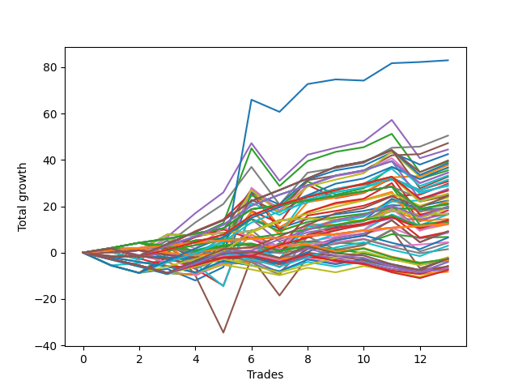

# Long Wallace Doodle 010 
- Symbol: ES
- Date Range: 03/15/2022 - 07/08/2022
- Trading Period: 7:20-12:30
- Number of Trades: 13



| Name | Win Percent | Profit | Avg Profit / Trade |     | Name | Win Percent | Profit | Avg Profit / Trade |
| ---- | ----------- | ------ | ------------------ | --- | ---- | ----------- | ------ | ------------------ |
| Sorted By <br> Profit | | | | | Sorted By <br> Win Percentage ||||
| Seventy-Three | 53.85 | 41375.00 | 3182.69 |     | Sixty-Four | 92.31 | 15625.00 | 1201.92 |
| Seven | 76.92 | 21250.00 | 1634.62 |     | Fifty-Six | 92.31 | 15625.00 | 1201.92 |
| Forty-Seven | 69.23 | 19625.00 | 1509.62 |     | Forty | 92.31 | 15625.00 | 1201.92 |
| Four | 69.23 | 19500.00 | 1500.00 |     | Zero | 92.31 | 15625.00 | 1201.92 |
| Forty-Two | 53.85 | 17875.00 | 1375.00 |     | Fifty-Seven | 84.62 | 13125.00 | 1009.62 |
| Two | 69.23 | 17000.00 | 1307.69 |     | One | 84.62 | 12750.00 | 980.77 |
| Sixty-Four | 92.31 | 15625.00 | 1201.92 |     | Three | 84.62 | 9500.00 | 730.77 |
| Fifty-Six | 92.31 | 15625.00 | 1201.92 |     | Forty-Eight | 84.62 | 8125.00 | 625.00 |
| Forty | 92.31 | 15625.00 | 1201.92 |     | Seven | 76.92 | 21250.00 | 1634.62 |
| Zero | 92.31 | 15625.00 | 1201.92 |     | Forty-One | 76.92 | 15250.00 | 1173.08 |
| Seventy-Four | 53.85 | 15625.00 | 1201.92 |     | Fifty-Nine | 76.92 | 7500.00 | 576.92 |
| Sixty | 61.54 | 15500.00 | 1192.31 |     | Sixty-Five | 76.92 | 3375.00 | 259.62 |
| Forty-One | 76.92 | 15250.00 | 1173.08 |     | Forty-Seven | 69.23 | 19625.00 | 1509.62 |
| Sixty-Three | 69.23 | 14875.00 | 1144.23 |     | Four | 69.23 | 19500.00 | 1500.00 |
| Forty-Four | 46.15 | 14750.00 | 1134.62 |     | Two | 69.23 | 17000.00 | 1307.69 |
| Fifty-Eight | 61.54 | 14125.00 | 1086.54 |     | Sixty-Three | 69.23 | 14875.00 | 1144.23 |
| Fifty-Seven | 84.62 | 13125.00 | 1009.62 |     | Forty-Three | 69.23 | 11500.00 | 884.62 |
| One | 84.62 | 12750.00 | 980.77 |     | Fifty-Five | 69.23 | 11125.00 | 855.77 |
| Forty-Five | 38.46 | 12375.00 | 951.92 |     | Seventy-Five | 69.23 | 8875.00 | 682.69 |
| Sixty-One | 53.85 | 11625.00 | 894.23 |     | Seventy | 69.23 | 8625.00 | 663.46 |
| Forty-Three | 69.23 | 11500.00 | 884.62 |     | Sixty-Two | 69.23 | 8625.00 | 663.46 |
| Fifty-Five | 69.23 | 11125.00 | 855.77 |     | Forty-Six | 69.23 | 8625.00 | 663.46 |
| Seventy-One | 61.54 | 9625.00 | 740.38 |     | Six | 69.23 | 8625.00 | 663.46 |
| Three | 84.62 | 9500.00 | 730.77 |     | Sixty-Seven | 69.23 | 5000.00 | 384.62 |
| Seventy-Five | 69.23 | 8875.00 | 682.69 |     | Sixty | 61.54 | 15500.00 | 1192.31 |
| Seventy | 69.23 | 8625.00 | 663.46 |     | Fifty-Eight | 61.54 | 14125.00 | 1086.54 |
| Sixty-Two | 69.23 | 8625.00 | 663.46 |     | Seventy-One | 61.54 | 9625.00 | 740.38 |
| Forty-Six | 69.23 | 8625.00 | 663.46 |     | Fifty-Four | 61.54 | 3625.00 | 278.85 |
| Six | 69.23 | 8625.00 | 663.46 |     | Forty-Nine | 61.54 | 3500.00 | 269.23 |
| Fifty-Two | 46.15 | 8375.00 | 644.23 |     | Twenty-Four | 61.54 | 750.00 | 57.69 |
| Forty-Eight | 84.62 | 8125.00 | 625.00 |     | Seventy-Three | 53.85 | 41375.00 | 3182.69 |
| Fifty-Nine | 76.92 | 7500.00 | 576.92 |     | Forty-Two | 53.85 | 17875.00 | 1375.00 |
| Fifty | 53.85 | 6500.00 | 500.00 |     | Seventy-Four | 53.85 | 15625.00 | 1201.92 |
| Fifty-Three | 46.15 | 6000.00 | 461.54 |     | Sixty-One | 53.85 | 11625.00 | 894.23 |
| Sixty-Seven | 69.23 | 5000.00 | 384.62 |     | Fifty | 53.85 | 6500.00 | 500.00 |
| Fifty-One | 53.85 | 4500.00 | 346.15 |     | Fifty-One | 53.85 | 4500.00 | 346.15 |
| Sixty-Eight | 46.15 | 3875.00 | 298.08 |     | Sixty-Six | 53.85 | 1375.00 | 105.77 |
| Fifteen | 38.46 | 3750.00 | 288.46 |     | Thirty-Nine | 53.85 | -1250.00 | -96.15 |
| Fifty-Four | 61.54 | 3625.00 | 278.85 |     | Thirty-Two | 53.85 | -3750.00 | -288.46 |
| Forty-Nine | 61.54 | 3500.00 | 269.23 |     | Five | 53.85 | -4500.00 | -346.15 |
| Sixty-Five | 76.92 | 3375.00 | 259.62 |     | Forty-Four | 46.15 | 14750.00 | 1134.62 |
| Thirty-One | 46.15 | 1750.00 | 134.62 |     | Fifty-Two | 46.15 | 8375.00 | 644.23 |
| Sixty-Six | 53.85 | 1375.00 | 105.77 |     | Fifty-Three | 46.15 | 6000.00 | 461.54 |
| Twelve | 23.08 | 1375.00 | 105.77 |     | Sixty-Eight | 46.15 | 3875.00 | 298.08 |
| Twenty-Four | 61.54 | 750.00 | 57.69 |     | Thirty-One | 46.15 | 1750.00 | 134.62 |
| Sixty-Nine | 38.46 | -875.00 | -67.31 |     | Sixten | 46.15 | -2375.00 | -182.69 |
| Ten | 23.08 | -1125.00 | -86.54 |     | Fourteen | 46.15 | -2625.00 | -201.92 |
| Thirty-Nine | 53.85 | -1250.00 | -96.15 |     | Thirty-Four | 46.15 | -2750.00 | -211.54 |
| Seventy-Two | 38.46 | -1500.00 | -115.38 |     | Thirty-Eight | 46.15 | -3125.00 | -240.38 |
| Thirteen | 15.38 | -1875.00 | -144.23 |     | Twenty-Two | 46.15 | -3125.00 | -240.38 |
| Sixten | 46.15 | -2375.00 | -182.69 |     | Thirty-Five | 46.15 | -3750.00 | -288.46 |
| Twenty-Five | 38.46 | -2500.00 | -192.31 |     | Thirty | 46.15 | -4000.00 | -307.69 |
| Fourteen | 46.15 | -2625.00 | -201.92 |     | Thirty-Three | 46.15 | -5125.00 | -394.23 |
| Thirty-Four | 46.15 | -2750.00 | -211.54 |     | Forty-Five | 38.46 | 12375.00 | 951.92 |
| Twenty-Six | 30.77 | -2750.00 | -211.54 |     | Fifteen | 38.46 | 3750.00 | 288.46 |
| Thirty-Eight | 46.15 | -3125.00 | -240.38 |     | Sixty-Nine | 38.46 | -875.00 | -67.31 |
| Twenty-Two | 46.15 | -3125.00 | -240.38 |     | Seventy-Two | 38.46 | -1500.00 | -115.38 |
| Thirty-Six | 38.46 | -3125.00 | -240.38 |     | Twenty-Five | 38.46 | -2500.00 | -192.31 |
| Eleven | 23.08 | -3625.00 | -278.85 |     | Thirty-Six | 38.46 | -3125.00 | -240.38 |
| Thirty-Two | 53.85 | -3750.00 | -288.46 |     | Twenty-Three | 38.46 | -4250.00 | -326.92 |
| Thirty-Five | 46.15 | -3750.00 | -288.46 |     | Twenty-One | 38.46 | -4250.00 | -326.92 |
| Thirty | 46.15 | -4000.00 | -307.69 |     | Twenty | 38.46 | -4250.00 | -326.92 |
| Twenty-Three | 38.46 | -4250.00 | -326.92 |     | Nineteen | 38.46 | -4250.00 | -326.92 |
| Twenty-One | 38.46 | -4250.00 | -326.92 |     | Eighteen | 38.46 | -4250.00 | -326.92 |
| Twenty | 38.46 | -4250.00 | -326.92 |     | Seventeen | 38.46 | -4250.00 | -326.92 |
| Nineteen | 38.46 | -4250.00 | -326.92 |     | Thirty-Seven | 38.46 | -4375.00 | -336.54 |
| Eighteen | 38.46 | -4250.00 | -326.92 |     | Twenty-Six | 30.77 | -2750.00 | -211.54 |
| Seventeen | 38.46 | -4250.00 | -326.92 |     | twenty-Seven | 30.77 | -5250.00 | -403.85 |
| Twenty-Eight | 23.08 | -4250.00 | -326.92 |     | Eight | 30.77 | -6125.00 | -471.15 |
| Thirty-Seven | 38.46 | -4375.00 | -336.54 |     | Twelve | 23.08 | 1375.00 | 105.77 |
| Five | 53.85 | -4500.00 | -346.15 |     | Ten | 23.08 | -1125.00 | -86.54 |
| Thirty-Three | 46.15 | -5125.00 | -394.23 |     | Eleven | 23.08 | -3625.00 | -278.85 |
| twenty-Seven | 30.77 | -5250.00 | -403.85 |     | Twenty-Eight | 23.08 | -4250.00 | -326.92 |
| Nine | 23.08 | -5500.00 | -423.08 |     | Nine | 23.08 | -5500.00 | -423.08 |
| Eight | 30.77 | -6125.00 | -471.15 |     | Thirteen | 15.38 | -1875.00 | -144.23 |
| Twenty-Nine | 15.38 | -8250.00 | -634.62 |     | Twenty-Nine | 15.38 | -8250.00 | -634.62 |

## NO STOPLOSS

### Test Zero
* Sell when price hits the middle line of the 20p bollinger
* No Stoploss
* Results:
```
Total Trades: 13
Percent Up: 92.31
Percent Down: 7.69
Total Points Moved Up: 31.25
Potential Profit: 15625.00
Total Points Ups: 31.75 Count Ups: 12
Total Points Downs: -0.50 Count Downs: 1
```

<details><summary>Trades</summary>

<code>In: 2022-03-24 11:29:00		Out: 2022-03-24 11:30:35		Total Position Time: 01:35		Total Move Up: 1.75		Total to Date: 1.75</code> <br />
<code>In: 2022-04-08 10:36:00		Out: 2022-04-08 10:44:05		Total Position Time: 08:05		Total Move Up: 1.75		Total to Date: 3.50</code> <br />
<code>In: 2022-04-08 10:36:00		Out: 2022-04-08 10:44:05		Total Position Time: 08:05		Total Move Up: 1.75		Total to Date: 5.25</code> <br />
<code>In: 2022-04-20 09:14:00		Out: 2022-04-20 09:30:45		Total Position Time: 16:45		Total Move Up: -0.50		Total to Date: 4.75</code> <br />
<code>In: 2022-04-27 11:28:00		Out: 2022-04-27 11:32:25		Total Position Time: 04:25		Total Move Up: 3.25		Total to Date: 8.00</code> <br />
<code>In: 2022-04-27 11:40:00		Out: 2022-04-27 11:40:10		Total Position Time: 00:10		Total Move Up: 1.00		Total to Date: 9.00</code> <br />
<code>In: 2022-05-04 11:36:00		Out: 2022-05-04 11:36:40		Total Position Time: 00:40		Total Move Up: 8.25		Total to Date: 17.25</code> <br />
<code>In: 2022-05-06 10:56:00		Out: 2022-05-06 11:02:20		Total Position Time: 06:20		Total Move Up: 4.75		Total to Date: 22.00</code> <br />
<code>In: 2022-05-23 10:23:00		Out: 2022-05-23 10:26:30		Total Position Time: 03:30		Total Move Up: 4.00		Total to Date: 26.00</code> <br />
<code>In: 2022-05-26 11:38:00		Out: 2022-05-26 11:44:15		Total Position Time: 06:15		Total Move Up: 2.25		Total to Date: 28.25</code> <br />
<code>In: 2022-05-27 10:42:00		Out: 2022-05-27 10:50:50		Total Position Time: 08:50		Total Move Up: 0.75		Total to Date: 29.00</code> <br />
<code>In: 2022-06-27 09:32:00		Out: 2022-06-27 09:41:00		Total Position Time: 09:00		Total Move Up: 2.25		Total to Date: 31.25</code> <br />
<code>In: 2022-06-30 11:28:00		Out: 2022-06-30 11:38:25		Total Position Time: 10:25		Total Move Up: 0.00		Total to Date: 31.25</code> <br />


</details>

### Test One
* Sell when the price hits the upper line of the 20p 1std bollinger
* No Stoploss
* Results:
```
Total Trades: 13
Percent Up: 84.62
Percent Down: 15.38
Total Points Moved Up: 25.50
Potential Profit: 12750.00
Total Points Ups: 46.75 Count Ups: 11
Total Points Downs: -21.25 Count Downs: 2
```

<details><summary>Trades</summary>

<code>In: 2022-03-24 11:29:00		Out: 2022-03-24 11:51:15		Total Position Time: 22:15		Total Move Up: 0.25		Total to Date: 0.25</code> <br />
<code>In: 2022-04-08 10:36:00		Out: 2022-04-08 11:01:00		Total Position Time: 25:00		Total Move Up: 1.00		Total to Date: 1.25</code> <br />
<code>In: 2022-04-08 10:36:00		Out: 2022-04-08 11:01:00		Total Position Time: 25:00		Total Move Up: 1.00		Total to Date: 2.25</code> <br />
<code>In: 2022-04-20 09:14:00		Out: 2022-04-20 09:30:55		Total Position Time: 16:55		Total Move Up: 0.75		Total to Date: 3.00</code> <br />
<code>In: 2022-04-27 11:28:00		Out: 2022-04-27 11:34:05		Total Position Time: 06:05		Total Move Up: 5.00		Total to Date: 8.00</code> <br />
<code>In: 2022-04-27 11:40:00		Out: 2022-04-27 11:41:10		Total Position Time: 01:10		Total Move Up: 2.75		Total to Date: 10.75</code> <br />
<code>In: 2022-05-04 11:36:00		Out: 2022-05-04 11:42:00		Total Position Time: 06:00		Total Move Up: 21.25		Total to Date: 32.00</code> <br />
<code>In: 2022-05-06 10:56:00		Out: 2022-05-06 11:24:25		Total Position Time: 28:25		Total Move Up: -4.75		Total to Date: 27.25</code> <br />
<code>In: 2022-05-23 10:23:00		Out: 2022-05-23 10:32:40		Total Position Time: 09:40		Total Move Up: 6.75		Total to Date: 34.00</code> <br />
<code>In: 2022-05-26 11:38:00		Out: 2022-05-26 11:50:15		Total Position Time: 12:15		Total Move Up: 3.25		Total to Date: 37.25</code> <br />
<code>In: 2022-05-27 10:42:00		Out: 2022-05-27 10:53:20		Total Position Time: 11:20		Total Move Up: 1.25		Total to Date: 38.50</code> <br />
<code>In: 2022-06-27 09:32:00		Out: 2022-06-27 09:44:10		Total Position Time: 12:10		Total Move Up: 3.50		Total to Date: 42.00</code> <br />
<code>In: 2022-06-30 11:28:00		Out: 2022-06-30 11:57:55		Total Position Time: 29:55		Total Move Up: -16.50		Total to Date: 25.50</code> <br />


</details>

### Test Two
* Sell when the price hits the upper line of the 20p 2std bollinger
* No Stoploss
* Results:
```
Total Trades: 13
Percent Up: 69.23
Percent Down: 30.77
Total Points Moved Up: 34.00
Potential Profit: 17000.00
Total Points Ups: 73.25 Count Ups: 9
Total Points Downs: -39.25 Count Downs: 4
```

<details><summary>Trades</summary>

<code>In: 2022-03-24 11:29:00		Out: 2022-03-24 11:53:40		Total Position Time: 24:40		Total Move Up: 2.00		Total to Date: 2.00</code> <br />
<code>In: 2022-04-08 10:36:00		Out: 2022-04-08 11:05:55		Total Position Time: 29:55		Total Move Up: -3.25		Total to Date: -1.25</code> <br />
<code>In: 2022-04-08 10:36:00		Out: 2022-04-08 11:05:55		Total Position Time: 29:55		Total Move Up: -3.25		Total to Date: -4.50</code> <br />
<code>In: 2022-04-20 09:14:00		Out: 2022-04-20 09:31:25		Total Position Time: 17:25		Total Move Up: 1.75		Total to Date: -2.75</code> <br />
<code>In: 2022-04-27 11:28:00		Out: 2022-04-27 11:42:45		Total Position Time: 14:45		Total Move Up: 8.00		Total to Date: 5.25</code> <br />
<code>In: 2022-04-27 11:40:00		Out: 2022-04-27 11:42:45		Total Position Time: 02:45		Total Move Up: 6.75		Total to Date: 12.00</code> <br />
<code>In: 2022-05-04 11:36:00		Out: 2022-05-04 11:43:55		Total Position Time: 07:55		Total Move Up: 32.25		Total to Date: 44.25</code> <br />
<code>In: 2022-05-06 10:56:00		Out: 2022-05-06 11:25:55		Total Position Time: 29:55		Total Move Up: -16.25		Total to Date: 28.00</code> <br />
<code>In: 2022-05-23 10:23:00		Out: 2022-05-23 10:33:15		Total Position Time: 10:15		Total Move Up: 10.75		Total to Date: 38.75</code> <br />
<code>In: 2022-05-26 11:38:00		Out: 2022-05-26 11:54:10		Total Position Time: 16:10		Total Move Up: 4.00		Total to Date: 42.75</code> <br />
<code>In: 2022-05-27 10:42:00		Out: 2022-05-27 10:57:20		Total Position Time: 15:20		Total Move Up: 2.00		Total to Date: 44.75</code> <br />
<code>In: 2022-06-27 09:32:00		Out: 2022-06-27 09:45:00		Total Position Time: 13:00		Total Move Up: 5.75		Total to Date: 50.50</code> <br />
<code>In: 2022-06-30 11:28:00		Out: 2022-06-30 11:57:55		Total Position Time: 29:55		Total Move Up: -16.50		Total to Date: 34.00</code> <br />


</details>

### Test Three
* Sell when price hits the middle line of the 50p bollinger
* No Stoploss
* Results:
```
Total Trades: 13
Percent Up: 84.62
Percent Down: 15.38
Total Points Moved Up: 19.00
Potential Profit: 9500.00
Total Points Ups: 51.75 Count Ups: 11
Total Points Downs: -32.75 Count Downs: 2
```

<details><summary>Trades</summary>

<code>In: 2022-03-24 11:29:00		Out: 2022-03-24 11:51:30		Total Position Time: 22:30		Total Move Up: 1.50		Total to Date: 1.50</code> <br />
<code>In: 2022-04-08 10:36:00		Out: 2022-04-08 11:01:35		Total Position Time: 25:35		Total Move Up: 1.25		Total to Date: 2.75</code> <br />
<code>In: 2022-04-08 10:36:00		Out: 2022-04-08 11:01:35		Total Position Time: 25:35		Total Move Up: 1.25		Total to Date: 4.00</code> <br />
<code>In: 2022-04-20 09:14:00		Out: 2022-04-20 09:32:40		Total Position Time: 18:40		Total Move Up: 4.50		Total to Date: 8.50</code> <br />
<code>In: 2022-04-27 11:28:00		Out: 2022-04-27 11:42:35		Total Position Time: 14:35		Total Move Up: 6.25		Total to Date: 14.75</code> <br />
<code>In: 2022-04-27 11:40:00		Out: 2022-04-27 11:42:35		Total Position Time: 02:35		Total Move Up: 5.00		Total to Date: 19.75</code> <br />
<code>In: 2022-05-04 11:36:00		Out: 2022-05-04 11:41:15		Total Position Time: 05:15		Total Move Up: 11.75		Total to Date: 31.50</code> <br />
<code>In: 2022-05-06 10:56:00		Out: 2022-05-06 11:25:55		Total Position Time: 29:55		Total Move Up: -16.25		Total to Date: 15.25</code> <br />
<code>In: 2022-05-23 10:23:00		Out: 2022-05-23 10:33:00		Total Position Time: 10:00		Total Move Up: 7.75		Total to Date: 23.00</code> <br />
<code>In: 2022-05-26 11:38:00		Out: 2022-05-26 11:54:10		Total Position Time: 16:10		Total Move Up: 4.00		Total to Date: 27.00</code> <br />
<code>In: 2022-05-27 10:42:00		Out: 2022-05-27 11:04:30		Total Position Time: 22:30		Total Move Up: 1.75		Total to Date: 28.75</code> <br />
<code>In: 2022-06-27 09:32:00		Out: 2022-06-27 09:45:05		Total Position Time: 13:05		Total Move Up: 6.75		Total to Date: 35.50</code> <br />
<code>In: 2022-06-30 11:28:00		Out: 2022-06-30 11:57:55		Total Position Time: 29:55		Total Move Up: -16.50		Total to Date: 19.00</code> <br />


</details>

### Test Four
* Sell when the price hits the upper line of the 50p 1std bollinger
* No Stoploss
* Results:
```
Total Trades: 13
Percent Up: 69.23
Percent Down: 30.77
Total Points Moved Up: 39.00
Potential Profit: 19500.00
Total Points Ups: 78.25 Count Ups: 9
Total Points Downs: -39.25 Count Downs: 4
```

<details><summary>Trades</summary>

<code>In: 2022-03-24 11:29:00		Out: 2022-03-24 11:57:50		Total Position Time: 28:50		Total Move Up: 2.25		Total to Date: 2.25</code> <br />
<code>In: 2022-04-08 10:36:00		Out: 2022-04-08 11:05:55		Total Position Time: 29:55		Total Move Up: -3.25		Total to Date: -1.00</code> <br />
<code>In: 2022-04-08 10:36:00		Out: 2022-04-08 11:05:55		Total Position Time: 29:55		Total Move Up: -3.25		Total to Date: -4.25</code> <br />
<code>In: 2022-04-20 09:14:00		Out: 2022-04-20 09:36:45		Total Position Time: 22:45		Total Move Up: 8.25		Total to Date: 4.00</code> <br />
<code>In: 2022-04-27 11:28:00		Out: 2022-04-27 11:45:35		Total Position Time: 17:35		Total Move Up: 10.25		Total to Date: 14.25</code> <br />
<code>In: 2022-04-27 11:40:00		Out: 2022-04-27 11:45:35		Total Position Time: 05:35		Total Move Up: 9.00		Total to Date: 23.25</code> <br />
<code>In: 2022-05-04 11:36:00		Out: 2022-05-04 11:42:00		Total Position Time: 06:00		Total Move Up: 21.25		Total to Date: 44.50</code> <br />
<code>In: 2022-05-06 10:56:00		Out: 2022-05-06 11:25:55		Total Position Time: 29:55		Total Move Up: -16.25		Total to Date: 28.25</code> <br />
<code>In: 2022-05-23 10:23:00		Out: 2022-05-23 10:33:30		Total Position Time: 10:30		Total Move Up: 12.75		Total to Date: 41.00</code> <br />
<code>In: 2022-05-26 11:38:00		Out: 2022-05-26 12:07:55		Total Position Time: 29:55		Total Move Up: 3.00		Total to Date: 44.00</code> <br />
<code>In: 2022-05-27 10:42:00		Out: 2022-05-27 11:09:45		Total Position Time: 27:45		Total Move Up: 2.75		Total to Date: 46.75</code> <br />
<code>In: 2022-06-27 09:32:00		Out: 2022-06-27 09:53:25		Total Position Time: 21:25		Total Move Up: 8.75		Total to Date: 55.50</code> <br />
<code>In: 2022-06-30 11:28:00		Out: 2022-06-30 11:57:55		Total Position Time: 29:55		Total Move Up: -16.50		Total to Date: 39.00</code> <br />


</details>

### Test Five
* Sell when the price hits the upper line of the 50p 2std bollinger
* No Stoploss
* Results:
```
Total Trades: 13
Percent Up: 53.85
Percent Down: 46.15
Total Points Moved Up: -9.00
Potential Profit: -4500.00
Total Points Ups: 70.00 Count Ups: 7
Total Points Downs: -79.00 Count Downs: 6
```

<details><summary>Trades</summary>

<code>In: 2022-03-24 11:29:00		Out: 2022-03-24 11:58:55		Total Position Time: 29:55		Total Move Up: 1.75		Total to Date: 1.75</code> <br />
<code>In: 2022-04-08 10:36:00		Out: 2022-04-08 11:05:55		Total Position Time: 29:55		Total Move Up: -3.25		Total to Date: -1.50</code> <br />
<code>In: 2022-04-08 10:36:00		Out: 2022-04-08 11:05:55		Total Position Time: 29:55		Total Move Up: -3.25		Total to Date: -4.75</code> <br />
<code>In: 2022-04-20 09:14:00		Out: 2022-04-20 09:43:55		Total Position Time: 29:55		Total Move Up: 6.75		Total to Date: 2.00</code> <br />
<code>In: 2022-04-27 11:28:00		Out: 2022-04-27 11:57:55		Total Position Time: 29:55		Total Move Up: -15.00		Total to Date: -13.00</code> <br />
<code>In: 2022-04-27 11:40:00		Out: 2022-04-27 12:09:55		Total Position Time: 29:55		Total Move Up: -24.75		Total to Date: -37.75</code> <br />
<code>In: 2022-05-04 11:36:00		Out: 2022-05-04 11:43:55		Total Position Time: 07:55		Total Move Up: 32.25		Total to Date: -5.50</code> <br />
<code>In: 2022-05-06 10:56:00		Out: 2022-05-06 11:25:55		Total Position Time: 29:55		Total Move Up: -16.25		Total to Date: -21.75</code> <br />
<code>In: 2022-05-23 10:23:00		Out: 2022-05-23 10:47:55		Total Position Time: 24:55		Total Move Up: 17.50		Total to Date: -4.25</code> <br />
<code>In: 2022-05-26 11:38:00		Out: 2022-05-26 12:07:55		Total Position Time: 29:55		Total Move Up: 3.00		Total to Date: -1.25</code> <br />
<code>In: 2022-05-27 10:42:00		Out: 2022-05-27 11:11:55		Total Position Time: 29:55		Total Move Up: 2.25		Total to Date: 1.00</code> <br />
<code>In: 2022-06-27 09:32:00		Out: 2022-06-27 10:01:55		Total Position Time: 29:55		Total Move Up: 6.50		Total to Date: 7.50</code> <br />
<code>In: 2022-06-30 11:28:00		Out: 2022-06-30 11:57:55		Total Position Time: 29:55		Total Move Up: -16.50		Total to Date: -9.00</code> <br />


</details>

### Test Six
* Sell when the price hits the middle line of the 1std VWAP
* No Stoploss
* Results:
```
Total Trades: 13
Percent Up: 69.23
Percent Down: 30.77
Total Points Moved Up: 17.25
Potential Profit: 8625.00
Total Points Ups: 20.00 Count Ups: 9
Total Points Downs: -2.75 Count Downs: 4
```

<details><summary>Trades</summary>

<code>In: 2022-03-24 11:29:00		Out: 2022-03-24 11:29:10		Total Position Time: 00:10		Total Move Up: 0.25		Total to Date: 0.25</code> <br />
<code>In: 2022-04-08 10:36:00		Out: 2022-04-08 10:36:10		Total Position Time: 00:10		Total Move Up: 0.75		Total to Date: 1.00</code> <br />
<code>In: 2022-04-08 10:36:00		Out: 2022-04-08 10:36:10		Total Position Time: 00:10		Total Move Up: 0.75		Total to Date: 1.75</code> <br />
<code>In: 2022-04-20 09:14:00		Out: 2022-04-20 09:35:50		Total Position Time: 21:50		Total Move Up: 6.75		Total to Date: 8.50</code> <br />
<code>In: 2022-04-27 11:28:00		Out: 2022-04-27 11:28:10		Total Position Time: 00:10		Total Move Up: -0.25		Total to Date: 8.25</code> <br />
<code>In: 2022-04-27 11:40:00		Out: 2022-04-27 11:40:10		Total Position Time: 00:10		Total Move Up: 1.00		Total to Date: 9.25</code> <br />
<code>In: 2022-05-04 11:36:00		Out: 2022-05-04 11:36:10		Total Position Time: 00:10		Total Move Up: 0.75		Total to Date: 10.00</code> <br />
<code>In: 2022-05-06 10:56:00		Out: 2022-05-06 11:02:20		Total Position Time: 06:20		Total Move Up: 4.75		Total to Date: 14.75</code> <br />
<code>In: 2022-05-23 10:23:00		Out: 2022-05-23 10:23:10		Total Position Time: 00:10		Total Move Up: 0.75		Total to Date: 15.50</code> <br />
<code>In: 2022-05-26 11:38:00		Out: 2022-05-26 11:38:10		Total Position Time: 00:10		Total Move Up: -0.50		Total to Date: 15.00</code> <br />
<code>In: 2022-05-27 10:42:00		Out: 2022-05-27 10:42:10		Total Position Time: 00:10		Total Move Up: -0.50		Total to Date: 14.50</code> <br />
<code>In: 2022-06-27 09:32:00		Out: 2022-06-27 09:44:20		Total Position Time: 12:20		Total Move Up: 4.25		Total to Date: 18.75</code> <br />
<code>In: 2022-06-30 11:28:00		Out: 2022-06-30 11:28:10		Total Position Time: 00:10		Total Move Up: -1.50		Total to Date: 17.25</code> <br />


</details>

### Test Seven
* Sell when the price hits the upper line of the 1std VWAP
* No Stoploss
* Results:
```
Total Trades: 13
Percent Up: 76.92
Percent Down: 23.08
Total Points Moved Up: 42.50
Potential Profit: 21250.00
Total Points Ups: 65.25 Count Ups: 10
Total Points Downs: -22.75 Count Downs: 3
```

<details><summary>Trades</summary>

<code>In: 2022-03-24 11:29:00		Out: 2022-03-24 11:29:10		Total Position Time: 00:10		Total Move Up: 0.25		Total to Date: 0.25</code> <br />
<code>In: 2022-04-08 10:36:00		Out: 2022-04-08 11:05:55		Total Position Time: 29:55		Total Move Up: -3.25		Total to Date: -3.00</code> <br />
<code>In: 2022-04-08 10:36:00		Out: 2022-04-08 11:05:55		Total Position Time: 29:55		Total Move Up: -3.25		Total to Date: -6.25</code> <br />
<code>In: 2022-04-20 09:14:00		Out: 2022-04-20 09:43:55		Total Position Time: 29:55		Total Move Up: 6.75		Total to Date: 0.50</code> <br />
<code>In: 2022-04-27 11:28:00		Out: 2022-04-27 11:44:15		Total Position Time: 16:15		Total Move Up: 9.25		Total to Date: 9.75</code> <br />
<code>In: 2022-04-27 11:40:00		Out: 2022-04-27 11:44:15		Total Position Time: 04:15		Total Move Up: 8.00		Total to Date: 17.75</code> <br />
<code>In: 2022-05-04 11:36:00		Out: 2022-05-04 11:41:35		Total Position Time: 05:35		Total Move Up: 16.00		Total to Date: 33.75</code> <br />
<code>In: 2022-05-06 10:56:00		Out: 2022-05-06 11:25:55		Total Position Time: 29:55		Total Move Up: -16.25		Total to Date: 17.50</code> <br />
<code>In: 2022-05-23 10:23:00		Out: 2022-05-23 10:42:15		Total Position Time: 19:15		Total Move Up: 13.75		Total to Date: 31.25</code> <br />
<code>In: 2022-05-26 11:38:00		Out: 2022-05-26 11:42:40		Total Position Time: 04:40		Total Move Up: 2.00		Total to Date: 33.25</code> <br />
<code>In: 2022-05-27 10:42:00		Out: 2022-05-27 11:11:55		Total Position Time: 29:55		Total Move Up: 2.25		Total to Date: 35.50</code> <br />
<code>In: 2022-06-27 09:32:00		Out: 2022-06-27 10:01:55		Total Position Time: 29:55		Total Move Up: 6.50		Total to Date: 42.00</code> <br />
<code>In: 2022-06-30 11:28:00		Out: 2022-06-30 11:28:40		Total Position Time: 00:40		Total Move Up: 0.50		Total to Date: 42.50</code> <br />


</details>

## STOPLOSS OF 2

### Test Eight
* Sell when price hits the middle line of the 20p bollinger
* Stoploss is 2 points
* Results:
```
Total Trades: 13
Percent Up: 30.77
Percent Down: 69.23
Total Points Moved Up: -12.25
Potential Profit: -6125.00
Total Points Ups: 7.50 Count Ups: 4
Total Points Downs: -19.75 Count Downs: 9
```

<details><summary>Trades</summary>

<code>In: 2022-03-24 11:29:00		Out: 2022-03-24 11:30:35		Total Position Time: 01:35		Total Move Up: 1.75		Total to Date: 1.75</code> <br />
<code>In: 2022-04-08 10:36:00		Out: 2022-04-08 10:43:05		Total Position Time: 07:05		Total Move Up: -2.00		Total to Date: -0.25</code> <br />
<code>In: 2022-04-08 10:36:00		Out: 2022-04-08 10:43:05		Total Position Time: 07:05		Total Move Up: -2.00		Total to Date: -2.25</code> <br />
<code>In: 2022-04-20 09:14:00		Out: 2022-04-20 09:15:35		Total Position Time: 01:35		Total Move Up: -2.00		Total to Date: -4.25</code> <br />
<code>In: 2022-04-27 11:28:00		Out: 2022-04-27 11:30:15		Total Position Time: 02:15		Total Move Up: -2.50		Total to Date: -6.75</code> <br />
<code>In: 2022-04-27 11:40:00		Out: 2022-04-27 11:40:10		Total Position Time: 00:10		Total Move Up: 1.00		Total to Date: -5.75</code> <br />
<code>In: 2022-05-04 11:36:00		Out: 2022-05-04 11:36:15		Total Position Time: 00:15		Total Move Up: -2.00		Total to Date: -7.75</code> <br />
<code>In: 2022-05-06 10:56:00		Out: 2022-05-06 10:56:25		Total Position Time: 00:25		Total Move Up: -2.50		Total to Date: -10.25</code> <br />
<code>In: 2022-05-23 10:23:00		Out: 2022-05-23 10:26:30		Total Position Time: 03:30		Total Move Up: 4.00		Total to Date: -6.25</code> <br />
<code>In: 2022-05-26 11:38:00		Out: 2022-05-26 11:40:10		Total Position Time: 02:10		Total Move Up: -2.00		Total to Date: -8.25</code> <br />
<code>In: 2022-05-27 10:42:00		Out: 2022-05-27 10:50:50		Total Position Time: 08:50		Total Move Up: 0.75		Total to Date: -7.50</code> <br />
<code>In: 2022-06-27 09:32:00		Out: 2022-06-27 09:32:30		Total Position Time: 00:30		Total Move Up: -2.25		Total to Date: -9.75</code> <br />
<code>In: 2022-06-30 11:28:00		Out: 2022-06-30 11:29:20		Total Position Time: 01:20		Total Move Up: -2.50		Total to Date: -12.25</code> <br />


</details>

### Test Nine
* Sell when the price hits the upper line of the 20p 1std bollinger
* Stoploss is 2 points
* Results:
```
Total Trades: 13
Percent Up: 23.08
Percent Down: 76.92
Total Points Moved Up: -11.00
Potential Profit: -5500.00
Total Points Ups: 10.75 Count Ups: 3
Total Points Downs: -21.75 Count Downs: 10
```

<details><summary>Trades</summary>

<code>In: 2022-03-24 11:29:00		Out: 2022-03-24 11:35:05		Total Position Time: 06:05		Total Move Up: -2.00		Total to Date: -2.00</code> <br />
<code>In: 2022-04-08 10:36:00		Out: 2022-04-08 10:43:05		Total Position Time: 07:05		Total Move Up: -2.00		Total to Date: -4.00</code> <br />
<code>In: 2022-04-08 10:36:00		Out: 2022-04-08 10:43:05		Total Position Time: 07:05		Total Move Up: -2.00		Total to Date: -6.00</code> <br />
<code>In: 2022-04-20 09:14:00		Out: 2022-04-20 09:15:35		Total Position Time: 01:35		Total Move Up: -2.00		Total to Date: -8.00</code> <br />
<code>In: 2022-04-27 11:28:00		Out: 2022-04-27 11:30:15		Total Position Time: 02:15		Total Move Up: -2.50		Total to Date: -10.50</code> <br />
<code>In: 2022-04-27 11:40:00		Out: 2022-04-27 11:41:10		Total Position Time: 01:10		Total Move Up: 2.75		Total to Date: -7.75</code> <br />
<code>In: 2022-05-04 11:36:00		Out: 2022-05-04 11:36:15		Total Position Time: 00:15		Total Move Up: -2.00		Total to Date: -9.75</code> <br />
<code>In: 2022-05-06 10:56:00		Out: 2022-05-06 10:56:25		Total Position Time: 00:25		Total Move Up: -2.50		Total to Date: -12.25</code> <br />
<code>In: 2022-05-23 10:23:00		Out: 2022-05-23 10:32:40		Total Position Time: 09:40		Total Move Up: 6.75		Total to Date: -5.50</code> <br />
<code>In: 2022-05-26 11:38:00		Out: 2022-05-26 11:40:10		Total Position Time: 02:10		Total Move Up: -2.00		Total to Date: -7.50</code> <br />
<code>In: 2022-05-27 10:42:00		Out: 2022-05-27 10:53:20		Total Position Time: 11:20		Total Move Up: 1.25		Total to Date: -6.25</code> <br />
<code>In: 2022-06-27 09:32:00		Out: 2022-06-27 09:32:30		Total Position Time: 00:30		Total Move Up: -2.25		Total to Date: -8.50</code> <br />
<code>In: 2022-06-30 11:28:00		Out: 2022-06-30 11:29:20		Total Position Time: 01:20		Total Move Up: -2.50		Total to Date: -11.00</code> <br />


</details>

### Test Ten
* Sell when the price hits the upper line of the 20p 2std bollinger
* Stoploss is 2 points
* Results:
```
Total Trades: 13
Percent Up: 23.08
Percent Down: 76.92
Total Points Moved Up: -2.25
Potential Profit: -1125.00
Total Points Ups: 19.50 Count Ups: 3
Total Points Downs: -21.75 Count Downs: 10
```

<details><summary>Trades</summary>

<code>In: 2022-03-24 11:29:00		Out: 2022-03-24 11:35:05		Total Position Time: 06:05		Total Move Up: -2.00		Total to Date: -2.00</code> <br />
<code>In: 2022-04-08 10:36:00		Out: 2022-04-08 10:43:05		Total Position Time: 07:05		Total Move Up: -2.00		Total to Date: -4.00</code> <br />
<code>In: 2022-04-08 10:36:00		Out: 2022-04-08 10:43:05		Total Position Time: 07:05		Total Move Up: -2.00		Total to Date: -6.00</code> <br />
<code>In: 2022-04-20 09:14:00		Out: 2022-04-20 09:15:35		Total Position Time: 01:35		Total Move Up: -2.00		Total to Date: -8.00</code> <br />
<code>In: 2022-04-27 11:28:00		Out: 2022-04-27 11:30:15		Total Position Time: 02:15		Total Move Up: -2.50		Total to Date: -10.50</code> <br />
<code>In: 2022-04-27 11:40:00		Out: 2022-04-27 11:42:45		Total Position Time: 02:45		Total Move Up: 6.75		Total to Date: -3.75</code> <br />
<code>In: 2022-05-04 11:36:00		Out: 2022-05-04 11:36:15		Total Position Time: 00:15		Total Move Up: -2.00		Total to Date: -5.75</code> <br />
<code>In: 2022-05-06 10:56:00		Out: 2022-05-06 10:56:25		Total Position Time: 00:25		Total Move Up: -2.50		Total to Date: -8.25</code> <br />
<code>In: 2022-05-23 10:23:00		Out: 2022-05-23 10:33:15		Total Position Time: 10:15		Total Move Up: 10.75		Total to Date: 2.50</code> <br />
<code>In: 2022-05-26 11:38:00		Out: 2022-05-26 11:40:10		Total Position Time: 02:10		Total Move Up: -2.00		Total to Date: 0.50</code> <br />
<code>In: 2022-05-27 10:42:00		Out: 2022-05-27 10:57:20		Total Position Time: 15:20		Total Move Up: 2.00		Total to Date: 2.50</code> <br />
<code>In: 2022-06-27 09:32:00		Out: 2022-06-27 09:32:30		Total Position Time: 00:30		Total Move Up: -2.25		Total to Date: 0.25</code> <br />
<code>In: 2022-06-30 11:28:00		Out: 2022-06-30 11:29:20		Total Position Time: 01:20		Total Move Up: -2.50		Total to Date: -2.25</code> <br />


</details>

### Test Eleven
* Sell when price hits the middle line of the 50p bollinger
* Stoploss is 2 points
* Results:
```
Total Trades: 13
Percent Up: 23.08
Percent Down: 76.92
Total Points Moved Up: -7.25
Potential Profit: -3625.00
Total Points Ups: 14.50 Count Ups: 3
Total Points Downs: -21.75 Count Downs: 10
```

<details><summary>Trades</summary>

<code>In: 2022-03-24 11:29:00		Out: 2022-03-24 11:35:05		Total Position Time: 06:05		Total Move Up: -2.00		Total to Date: -2.00</code> <br />
<code>In: 2022-04-08 10:36:00		Out: 2022-04-08 10:43:05		Total Position Time: 07:05		Total Move Up: -2.00		Total to Date: -4.00</code> <br />
<code>In: 2022-04-08 10:36:00		Out: 2022-04-08 10:43:05		Total Position Time: 07:05		Total Move Up: -2.00		Total to Date: -6.00</code> <br />
<code>In: 2022-04-20 09:14:00		Out: 2022-04-20 09:15:35		Total Position Time: 01:35		Total Move Up: -2.00		Total to Date: -8.00</code> <br />
<code>In: 2022-04-27 11:28:00		Out: 2022-04-27 11:30:15		Total Position Time: 02:15		Total Move Up: -2.50		Total to Date: -10.50</code> <br />
<code>In: 2022-04-27 11:40:00		Out: 2022-04-27 11:42:35		Total Position Time: 02:35		Total Move Up: 5.00		Total to Date: -5.50</code> <br />
<code>In: 2022-05-04 11:36:00		Out: 2022-05-04 11:36:15		Total Position Time: 00:15		Total Move Up: -2.00		Total to Date: -7.50</code> <br />
<code>In: 2022-05-06 10:56:00		Out: 2022-05-06 10:56:25		Total Position Time: 00:25		Total Move Up: -2.50		Total to Date: -10.00</code> <br />
<code>In: 2022-05-23 10:23:00		Out: 2022-05-23 10:33:00		Total Position Time: 10:00		Total Move Up: 7.75		Total to Date: -2.25</code> <br />
<code>In: 2022-05-26 11:38:00		Out: 2022-05-26 11:40:10		Total Position Time: 02:10		Total Move Up: -2.00		Total to Date: -4.25</code> <br />
<code>In: 2022-05-27 10:42:00		Out: 2022-05-27 11:04:30		Total Position Time: 22:30		Total Move Up: 1.75		Total to Date: -2.50</code> <br />
<code>In: 2022-06-27 09:32:00		Out: 2022-06-27 09:32:30		Total Position Time: 00:30		Total Move Up: -2.25		Total to Date: -4.75</code> <br />
<code>In: 2022-06-30 11:28:00		Out: 2022-06-30 11:29:20		Total Position Time: 01:20		Total Move Up: -2.50		Total to Date: -7.25</code> <br />


</details>

### Test Twelve
* Sell when the price hits the upper line of the 50p 1std bollinger
* Stoploss is 2 points
* Results:
```
Total Trades: 13
Percent Up: 23.08
Percent Down: 76.92
Total Points Moved Up: 2.75
Potential Profit: 1375.00
Total Points Ups: 24.50 Count Ups: 3
Total Points Downs: -21.75 Count Downs: 10
```

<details><summary>Trades</summary>

<code>In: 2022-03-24 11:29:00		Out: 2022-03-24 11:35:05		Total Position Time: 06:05		Total Move Up: -2.00		Total to Date: -2.00</code> <br />
<code>In: 2022-04-08 10:36:00		Out: 2022-04-08 10:43:05		Total Position Time: 07:05		Total Move Up: -2.00		Total to Date: -4.00</code> <br />
<code>In: 2022-04-08 10:36:00		Out: 2022-04-08 10:43:05		Total Position Time: 07:05		Total Move Up: -2.00		Total to Date: -6.00</code> <br />
<code>In: 2022-04-20 09:14:00		Out: 2022-04-20 09:15:35		Total Position Time: 01:35		Total Move Up: -2.00		Total to Date: -8.00</code> <br />
<code>In: 2022-04-27 11:28:00		Out: 2022-04-27 11:30:15		Total Position Time: 02:15		Total Move Up: -2.50		Total to Date: -10.50</code> <br />
<code>In: 2022-04-27 11:40:00		Out: 2022-04-27 11:45:35		Total Position Time: 05:35		Total Move Up: 9.00		Total to Date: -1.50</code> <br />
<code>In: 2022-05-04 11:36:00		Out: 2022-05-04 11:36:15		Total Position Time: 00:15		Total Move Up: -2.00		Total to Date: -3.50</code> <br />
<code>In: 2022-05-06 10:56:00		Out: 2022-05-06 10:56:25		Total Position Time: 00:25		Total Move Up: -2.50		Total to Date: -6.00</code> <br />
<code>In: 2022-05-23 10:23:00		Out: 2022-05-23 10:33:30		Total Position Time: 10:30		Total Move Up: 12.75		Total to Date: 6.75</code> <br />
<code>In: 2022-05-26 11:38:00		Out: 2022-05-26 11:40:10		Total Position Time: 02:10		Total Move Up: -2.00		Total to Date: 4.75</code> <br />
<code>In: 2022-05-27 10:42:00		Out: 2022-05-27 11:09:45		Total Position Time: 27:45		Total Move Up: 2.75		Total to Date: 7.50</code> <br />
<code>In: 2022-06-27 09:32:00		Out: 2022-06-27 09:32:30		Total Position Time: 00:30		Total Move Up: -2.25		Total to Date: 5.25</code> <br />
<code>In: 2022-06-30 11:28:00		Out: 2022-06-30 11:29:20		Total Position Time: 01:20		Total Move Up: -2.50		Total to Date: 2.75</code> <br />


</details>

### Test Thirteen
* Sell when the price hits the upper line of the 50p 2std bollinger
* Stoploss is 2 points
* Results:
```
Total Trades: 13
Percent Up: 15.38
Percent Down: 84.62
Total Points Moved Up: -3.75
Potential Profit: -1875.00
Total Points Ups: 19.75 Count Ups: 2
Total Points Downs: -23.50 Count Downs: 11
```

<details><summary>Trades</summary>

<code>In: 2022-03-24 11:29:00		Out: 2022-03-24 11:35:05		Total Position Time: 06:05		Total Move Up: -2.00		Total to Date: -2.00</code> <br />
<code>In: 2022-04-08 10:36:00		Out: 2022-04-08 10:43:05		Total Position Time: 07:05		Total Move Up: -2.00		Total to Date: -4.00</code> <br />
<code>In: 2022-04-08 10:36:00		Out: 2022-04-08 10:43:05		Total Position Time: 07:05		Total Move Up: -2.00		Total to Date: -6.00</code> <br />
<code>In: 2022-04-20 09:14:00		Out: 2022-04-20 09:15:35		Total Position Time: 01:35		Total Move Up: -2.00		Total to Date: -8.00</code> <br />
<code>In: 2022-04-27 11:28:00		Out: 2022-04-27 11:30:15		Total Position Time: 02:15		Total Move Up: -2.50		Total to Date: -10.50</code> <br />
<code>In: 2022-04-27 11:40:00		Out: 2022-04-27 11:50:25		Total Position Time: 10:25		Total Move Up: -1.75		Total to Date: -12.25</code> <br />
<code>In: 2022-05-04 11:36:00		Out: 2022-05-04 11:36:15		Total Position Time: 00:15		Total Move Up: -2.00		Total to Date: -14.25</code> <br />
<code>In: 2022-05-06 10:56:00		Out: 2022-05-06 10:56:25		Total Position Time: 00:25		Total Move Up: -2.50		Total to Date: -16.75</code> <br />
<code>In: 2022-05-23 10:23:00		Out: 2022-05-23 10:47:55		Total Position Time: 24:55		Total Move Up: 17.50		Total to Date: 0.75</code> <br />
<code>In: 2022-05-26 11:38:00		Out: 2022-05-26 11:40:10		Total Position Time: 02:10		Total Move Up: -2.00		Total to Date: -1.25</code> <br />
<code>In: 2022-05-27 10:42:00		Out: 2022-05-27 11:11:55		Total Position Time: 29:55		Total Move Up: 2.25		Total to Date: 1.00</code> <br />
<code>In: 2022-06-27 09:32:00		Out: 2022-06-27 09:32:30		Total Position Time: 00:30		Total Move Up: -2.25		Total to Date: -1.25</code> <br />
<code>In: 2022-06-30 11:28:00		Out: 2022-06-30 11:29:20		Total Position Time: 01:20		Total Move Up: -2.50		Total to Date: -3.75</code> <br />


</details>

### Test Fourteen
* Sell when the price hits the middle line of the 1std VWAP
* Stoploss is 2 points
* Results:
```
Total Trades: 13
Percent Up: 46.15
Percent Down: 53.85
Total Points Moved Up: -5.25
Potential Profit: -2625.00
Total Points Ups: 4.25 Count Ups: 6
Total Points Downs: -9.50 Count Downs: 7
```

<details><summary>Trades</summary>

<code>In: 2022-03-24 11:29:00		Out: 2022-03-24 11:29:10		Total Position Time: 00:10		Total Move Up: 0.25		Total to Date: 0.25</code> <br />
<code>In: 2022-04-08 10:36:00		Out: 2022-04-08 10:36:10		Total Position Time: 00:10		Total Move Up: 0.75		Total to Date: 1.00</code> <br />
<code>In: 2022-04-08 10:36:00		Out: 2022-04-08 10:36:10		Total Position Time: 00:10		Total Move Up: 0.75		Total to Date: 1.75</code> <br />
<code>In: 2022-04-20 09:14:00		Out: 2022-04-20 09:15:35		Total Position Time: 01:35		Total Move Up: -2.00		Total to Date: -0.25</code> <br />
<code>In: 2022-04-27 11:28:00		Out: 2022-04-27 11:28:10		Total Position Time: 00:10		Total Move Up: -0.25		Total to Date: -0.50</code> <br />
<code>In: 2022-04-27 11:40:00		Out: 2022-04-27 11:40:10		Total Position Time: 00:10		Total Move Up: 1.00		Total to Date: 0.50</code> <br />
<code>In: 2022-05-04 11:36:00		Out: 2022-05-04 11:36:10		Total Position Time: 00:10		Total Move Up: 0.75		Total to Date: 1.25</code> <br />
<code>In: 2022-05-06 10:56:00		Out: 2022-05-06 10:56:25		Total Position Time: 00:25		Total Move Up: -2.50		Total to Date: -1.25</code> <br />
<code>In: 2022-05-23 10:23:00		Out: 2022-05-23 10:23:10		Total Position Time: 00:10		Total Move Up: 0.75		Total to Date: -0.50</code> <br />
<code>In: 2022-05-26 11:38:00		Out: 2022-05-26 11:38:10		Total Position Time: 00:10		Total Move Up: -0.50		Total to Date: -1.00</code> <br />
<code>In: 2022-05-27 10:42:00		Out: 2022-05-27 10:42:10		Total Position Time: 00:10		Total Move Up: -0.50		Total to Date: -1.50</code> <br />
<code>In: 2022-06-27 09:32:00		Out: 2022-06-27 09:32:30		Total Position Time: 00:30		Total Move Up: -2.25		Total to Date: -3.75</code> <br />
<code>In: 2022-06-30 11:28:00		Out: 2022-06-30 11:28:10		Total Position Time: 00:10		Total Move Up: -1.50		Total to Date: -5.25</code> <br />


</details>

### Test Fifteen
* Sell when the price hits the upper line of the 1std VWAP
* Stoploss is 2 points
* Results:
```
Total Trades: 13
Percent Up: 38.46
Percent Down: 61.54
Total Points Moved Up: 7.50
Potential Profit: 3750.00
Total Points Ups: 24.75 Count Ups: 5
Total Points Downs: -17.25 Count Downs: 8
```

<details><summary>Trades</summary>

<code>In: 2022-03-24 11:29:00		Out: 2022-03-24 11:29:10		Total Position Time: 00:10		Total Move Up: 0.25		Total to Date: 0.25</code> <br />
<code>In: 2022-04-08 10:36:00		Out: 2022-04-08 10:43:05		Total Position Time: 07:05		Total Move Up: -2.00		Total to Date: -1.75</code> <br />
<code>In: 2022-04-08 10:36:00		Out: 2022-04-08 10:43:05		Total Position Time: 07:05		Total Move Up: -2.00		Total to Date: -3.75</code> <br />
<code>In: 2022-04-20 09:14:00		Out: 2022-04-20 09:15:35		Total Position Time: 01:35		Total Move Up: -2.00		Total to Date: -5.75</code> <br />
<code>In: 2022-04-27 11:28:00		Out: 2022-04-27 11:30:15		Total Position Time: 02:15		Total Move Up: -2.50		Total to Date: -8.25</code> <br />
<code>In: 2022-04-27 11:40:00		Out: 2022-04-27 11:44:15		Total Position Time: 04:15		Total Move Up: 8.00		Total to Date: -0.25</code> <br />
<code>In: 2022-05-04 11:36:00		Out: 2022-05-04 11:36:15		Total Position Time: 00:15		Total Move Up: -2.00		Total to Date: -2.25</code> <br />
<code>In: 2022-05-06 10:56:00		Out: 2022-05-06 10:56:25		Total Position Time: 00:25		Total Move Up: -2.50		Total to Date: -4.75</code> <br />
<code>In: 2022-05-23 10:23:00		Out: 2022-05-23 10:42:15		Total Position Time: 19:15		Total Move Up: 13.75		Total to Date: 9.00</code> <br />
<code>In: 2022-05-26 11:38:00		Out: 2022-05-26 11:40:10		Total Position Time: 02:10		Total Move Up: -2.00		Total to Date: 7.00</code> <br />
<code>In: 2022-05-27 10:42:00		Out: 2022-05-27 11:11:55		Total Position Time: 29:55		Total Move Up: 2.25		Total to Date: 9.25</code> <br />
<code>In: 2022-06-27 09:32:00		Out: 2022-06-27 09:32:30		Total Position Time: 00:30		Total Move Up: -2.25		Total to Date: 7.00</code> <br />
<code>In: 2022-06-30 11:28:00		Out: 2022-06-30 11:28:40		Total Position Time: 00:40		Total Move Up: 0.50		Total to Date: 7.50</code> <br />


</details>

## TRAIL STOP OF 2

### Test Sixten
* Sell when price hits the middle line of the 20p bollinger
* Trailing Stop is 2 points
* Results:
```
Total Trades: 13
Percent Up: 46.15
Percent Down: 53.85
Total Points Moved Up: -4.75
Potential Profit: -2375.00
Total Points Ups: 9.00 Count Ups: 6
Total Points Downs: -13.75 Count Downs: 7
```

<details><summary>Trades</summary>

<code>In: 2022-03-24 11:29:00		Out: 2022-03-24 11:30:35		Total Position Time: 01:35		Total Move Up: 1.75		Total to Date: 1.75</code> <br />
<code>In: 2022-04-08 10:36:00		Out: 2022-04-08 10:36:55		Total Position Time: 00:55		Total Move Up: 0.75		Total to Date: 2.50</code> <br />
<code>In: 2022-04-08 10:36:00		Out: 2022-04-08 10:36:55		Total Position Time: 00:55		Total Move Up: 0.75		Total to Date: 3.25</code> <br />
<code>In: 2022-04-20 09:14:00		Out: 2022-04-20 09:15:35		Total Position Time: 01:35		Total Move Up: -2.00		Total to Date: 1.25</code> <br />
<code>In: 2022-04-27 11:28:00		Out: 2022-04-27 11:29:20		Total Position Time: 01:20		Total Move Up: -1.25		Total to Date: 0.00</code> <br />
<code>In: 2022-04-27 11:40:00		Out: 2022-04-27 11:40:10		Total Position Time: 00:10		Total Move Up: 1.00		Total to Date: 1.00</code> <br />
<code>In: 2022-05-04 11:36:00		Out: 2022-05-04 11:36:10		Total Position Time: 00:10		Total Move Up: 0.75		Total to Date: 1.75</code> <br />
<code>In: 2022-05-06 10:56:00		Out: 2022-05-06 10:57:35		Total Position Time: 01:35		Total Move Up: -3.00		Total to Date: -1.25</code> <br />
<code>In: 2022-05-23 10:23:00		Out: 2022-05-23 10:26:30		Total Position Time: 03:30		Total Move Up: 4.00		Total to Date: 2.75</code> <br />
<code>In: 2022-05-26 11:38:00		Out: 2022-05-26 11:40:05		Total Position Time: 02:05		Total Move Up: -1.50		Total to Date: 1.25</code> <br />
<code>In: 2022-05-27 10:42:00		Out: 2022-05-27 10:43:55		Total Position Time: 01:55		Total Move Up: -1.75		Total to Date: -0.50</code> <br />
<code>In: 2022-06-27 09:32:00		Out: 2022-06-27 09:33:00		Total Position Time: 01:00		Total Move Up: -2.75		Total to Date: -3.25</code> <br />
<code>In: 2022-06-30 11:28:00		Out: 2022-06-30 11:28:10		Total Position Time: 00:10		Total Move Up: -1.50		Total to Date: -4.75</code> <br />


</details>

### Test Seventeen
* Sell when the price hits the upper line of the 20p 1std bollinger
* Trailing Stop is 2 points
* Results:
```
Total Trades: 13
Percent Up: 38.46
Percent Down: 61.54
Total Points Moved Up: -8.50
Potential Profit: -4250.00
Total Points Ups: 5.75 Count Ups: 5
Total Points Downs: -14.25 Count Downs: 8
```

<details><summary>Trades</summary>

<code>In: 2022-03-24 11:29:00		Out: 2022-03-24 11:31:40		Total Position Time: 02:40		Total Move Up: 0.25		Total to Date: 0.25</code> <br />
<code>In: 2022-04-08 10:36:00		Out: 2022-04-08 10:36:55		Total Position Time: 00:55		Total Move Up: 0.75		Total to Date: 1.00</code> <br />
<code>In: 2022-04-08 10:36:00		Out: 2022-04-08 10:36:55		Total Position Time: 00:55		Total Move Up: 0.75		Total to Date: 1.75</code> <br />
<code>In: 2022-04-20 09:14:00		Out: 2022-04-20 09:15:35		Total Position Time: 01:35		Total Move Up: -2.00		Total to Date: -0.25</code> <br />
<code>In: 2022-04-27 11:28:00		Out: 2022-04-27 11:29:20		Total Position Time: 01:20		Total Move Up: -1.25		Total to Date: -1.50</code> <br />
<code>In: 2022-04-27 11:40:00		Out: 2022-04-27 11:40:25		Total Position Time: 00:25		Total Move Up: -0.50		Total to Date: -2.00</code> <br />
<code>In: 2022-05-04 11:36:00		Out: 2022-05-04 11:36:10		Total Position Time: 00:10		Total Move Up: 0.75		Total to Date: -1.25</code> <br />
<code>In: 2022-05-06 10:56:00		Out: 2022-05-06 10:57:35		Total Position Time: 01:35		Total Move Up: -3.00		Total to Date: -4.25</code> <br />
<code>In: 2022-05-23 10:23:00		Out: 2022-05-23 10:30:10		Total Position Time: 07:10		Total Move Up: 3.25		Total to Date: -1.00</code> <br />
<code>In: 2022-05-26 11:38:00		Out: 2022-05-26 11:40:05		Total Position Time: 02:05		Total Move Up: -1.50		Total to Date: -2.50</code> <br />
<code>In: 2022-05-27 10:42:00		Out: 2022-05-27 10:43:55		Total Position Time: 01:55		Total Move Up: -1.75		Total to Date: -4.25</code> <br />
<code>In: 2022-06-27 09:32:00		Out: 2022-06-27 09:33:00		Total Position Time: 01:00		Total Move Up: -2.75		Total to Date: -7.00</code> <br />
<code>In: 2022-06-30 11:28:00		Out: 2022-06-30 11:28:10		Total Position Time: 00:10		Total Move Up: -1.50		Total to Date: -8.50</code> <br />


</details>

### Test Eighteen
* Sell when the price hits the upper line of the 20p 2std bollinger
* Trailing Stop is 2 points
* Results:
```
Total Trades: 13
Percent Up: 38.46
Percent Down: 61.54
Total Points Moved Up: -8.50
Potential Profit: -4250.00
Total Points Ups: 5.75 Count Ups: 5
Total Points Downs: -14.25 Count Downs: 8
```

<details><summary>Trades</summary>

<code>In: 2022-03-24 11:29:00		Out: 2022-03-24 11:31:40		Total Position Time: 02:40		Total Move Up: 0.25		Total to Date: 0.25</code> <br />
<code>In: 2022-04-08 10:36:00		Out: 2022-04-08 10:36:55		Total Position Time: 00:55		Total Move Up: 0.75		Total to Date: 1.00</code> <br />
<code>In: 2022-04-08 10:36:00		Out: 2022-04-08 10:36:55		Total Position Time: 00:55		Total Move Up: 0.75		Total to Date: 1.75</code> <br />
<code>In: 2022-04-20 09:14:00		Out: 2022-04-20 09:15:35		Total Position Time: 01:35		Total Move Up: -2.00		Total to Date: -0.25</code> <br />
<code>In: 2022-04-27 11:28:00		Out: 2022-04-27 11:29:20		Total Position Time: 01:20		Total Move Up: -1.25		Total to Date: -1.50</code> <br />
<code>In: 2022-04-27 11:40:00		Out: 2022-04-27 11:40:25		Total Position Time: 00:25		Total Move Up: -0.50		Total to Date: -2.00</code> <br />
<code>In: 2022-05-04 11:36:00		Out: 2022-05-04 11:36:10		Total Position Time: 00:10		Total Move Up: 0.75		Total to Date: -1.25</code> <br />
<code>In: 2022-05-06 10:56:00		Out: 2022-05-06 10:57:35		Total Position Time: 01:35		Total Move Up: -3.00		Total to Date: -4.25</code> <br />
<code>In: 2022-05-23 10:23:00		Out: 2022-05-23 10:30:10		Total Position Time: 07:10		Total Move Up: 3.25		Total to Date: -1.00</code> <br />
<code>In: 2022-05-26 11:38:00		Out: 2022-05-26 11:40:05		Total Position Time: 02:05		Total Move Up: -1.50		Total to Date: -2.50</code> <br />
<code>In: 2022-05-27 10:42:00		Out: 2022-05-27 10:43:55		Total Position Time: 01:55		Total Move Up: -1.75		Total to Date: -4.25</code> <br />
<code>In: 2022-06-27 09:32:00		Out: 2022-06-27 09:33:00		Total Position Time: 01:00		Total Move Up: -2.75		Total to Date: -7.00</code> <br />
<code>In: 2022-06-30 11:28:00		Out: 2022-06-30 11:28:10		Total Position Time: 00:10		Total Move Up: -1.50		Total to Date: -8.50</code> <br />


</details>

### Test Nineteen
* Sell when price hits the middle line of the 50p bollinger
* Trailing Stop is 2 points
* Results:
```
Total Trades: 13
Percent Up: 38.46
Percent Down: 61.54
Total Points Moved Up: -8.50
Potential Profit: -4250.00
Total Points Ups: 5.75 Count Ups: 5
Total Points Downs: -14.25 Count Downs: 8
```

<details><summary>Trades</summary>

<code>In: 2022-03-24 11:29:00		Out: 2022-03-24 11:31:40		Total Position Time: 02:40		Total Move Up: 0.25		Total to Date: 0.25</code> <br />
<code>In: 2022-04-08 10:36:00		Out: 2022-04-08 10:36:55		Total Position Time: 00:55		Total Move Up: 0.75		Total to Date: 1.00</code> <br />
<code>In: 2022-04-08 10:36:00		Out: 2022-04-08 10:36:55		Total Position Time: 00:55		Total Move Up: 0.75		Total to Date: 1.75</code> <br />
<code>In: 2022-04-20 09:14:00		Out: 2022-04-20 09:15:35		Total Position Time: 01:35		Total Move Up: -2.00		Total to Date: -0.25</code> <br />
<code>In: 2022-04-27 11:28:00		Out: 2022-04-27 11:29:20		Total Position Time: 01:20		Total Move Up: -1.25		Total to Date: -1.50</code> <br />
<code>In: 2022-04-27 11:40:00		Out: 2022-04-27 11:40:25		Total Position Time: 00:25		Total Move Up: -0.50		Total to Date: -2.00</code> <br />
<code>In: 2022-05-04 11:36:00		Out: 2022-05-04 11:36:10		Total Position Time: 00:10		Total Move Up: 0.75		Total to Date: -1.25</code> <br />
<code>In: 2022-05-06 10:56:00		Out: 2022-05-06 10:57:35		Total Position Time: 01:35		Total Move Up: -3.00		Total to Date: -4.25</code> <br />
<code>In: 2022-05-23 10:23:00		Out: 2022-05-23 10:30:10		Total Position Time: 07:10		Total Move Up: 3.25		Total to Date: -1.00</code> <br />
<code>In: 2022-05-26 11:38:00		Out: 2022-05-26 11:40:05		Total Position Time: 02:05		Total Move Up: -1.50		Total to Date: -2.50</code> <br />
<code>In: 2022-05-27 10:42:00		Out: 2022-05-27 10:43:55		Total Position Time: 01:55		Total Move Up: -1.75		Total to Date: -4.25</code> <br />
<code>In: 2022-06-27 09:32:00		Out: 2022-06-27 09:33:00		Total Position Time: 01:00		Total Move Up: -2.75		Total to Date: -7.00</code> <br />
<code>In: 2022-06-30 11:28:00		Out: 2022-06-30 11:28:10		Total Position Time: 00:10		Total Move Up: -1.50		Total to Date: -8.50</code> <br />


</details>

### Test Twenty
* Sell when the price hits the upper line of the 50p 1std bollinger
* Trailing Stop is 2 points
* Results:
```
Total Trades: 13
Percent Up: 38.46
Percent Down: 61.54
Total Points Moved Up: -8.50
Potential Profit: -4250.00
Total Points Ups: 5.75 Count Ups: 5
Total Points Downs: -14.25 Count Downs: 8
```

<details><summary>Trades</summary>

<code>In: 2022-03-24 11:29:00		Out: 2022-03-24 11:31:40		Total Position Time: 02:40		Total Move Up: 0.25		Total to Date: 0.25</code> <br />
<code>In: 2022-04-08 10:36:00		Out: 2022-04-08 10:36:55		Total Position Time: 00:55		Total Move Up: 0.75		Total to Date: 1.00</code> <br />
<code>In: 2022-04-08 10:36:00		Out: 2022-04-08 10:36:55		Total Position Time: 00:55		Total Move Up: 0.75		Total to Date: 1.75</code> <br />
<code>In: 2022-04-20 09:14:00		Out: 2022-04-20 09:15:35		Total Position Time: 01:35		Total Move Up: -2.00		Total to Date: -0.25</code> <br />
<code>In: 2022-04-27 11:28:00		Out: 2022-04-27 11:29:20		Total Position Time: 01:20		Total Move Up: -1.25		Total to Date: -1.50</code> <br />
<code>In: 2022-04-27 11:40:00		Out: 2022-04-27 11:40:25		Total Position Time: 00:25		Total Move Up: -0.50		Total to Date: -2.00</code> <br />
<code>In: 2022-05-04 11:36:00		Out: 2022-05-04 11:36:10		Total Position Time: 00:10		Total Move Up: 0.75		Total to Date: -1.25</code> <br />
<code>In: 2022-05-06 10:56:00		Out: 2022-05-06 10:57:35		Total Position Time: 01:35		Total Move Up: -3.00		Total to Date: -4.25</code> <br />
<code>In: 2022-05-23 10:23:00		Out: 2022-05-23 10:30:10		Total Position Time: 07:10		Total Move Up: 3.25		Total to Date: -1.00</code> <br />
<code>In: 2022-05-26 11:38:00		Out: 2022-05-26 11:40:05		Total Position Time: 02:05		Total Move Up: -1.50		Total to Date: -2.50</code> <br />
<code>In: 2022-05-27 10:42:00		Out: 2022-05-27 10:43:55		Total Position Time: 01:55		Total Move Up: -1.75		Total to Date: -4.25</code> <br />
<code>In: 2022-06-27 09:32:00		Out: 2022-06-27 09:33:00		Total Position Time: 01:00		Total Move Up: -2.75		Total to Date: -7.00</code> <br />
<code>In: 2022-06-30 11:28:00		Out: 2022-06-30 11:28:10		Total Position Time: 00:10		Total Move Up: -1.50		Total to Date: -8.50</code> <br />


</details>

### Test Twenty-One
* Sell when the price hits the upper line of the 50p 2std bollinger
* Trailing Stop is 2 points
* Results:
```
Total Trades: 13
Percent Up: 38.46
Percent Down: 61.54
Total Points Moved Up: -8.50
Potential Profit: -4250.00
Total Points Ups: 5.75 Count Ups: 5
Total Points Downs: -14.25 Count Downs: 8
```

<details><summary>Trades</summary>

<code>In: 2022-03-24 11:29:00		Out: 2022-03-24 11:31:40		Total Position Time: 02:40		Total Move Up: 0.25		Total to Date: 0.25</code> <br />
<code>In: 2022-04-08 10:36:00		Out: 2022-04-08 10:36:55		Total Position Time: 00:55		Total Move Up: 0.75		Total to Date: 1.00</code> <br />
<code>In: 2022-04-08 10:36:00		Out: 2022-04-08 10:36:55		Total Position Time: 00:55		Total Move Up: 0.75		Total to Date: 1.75</code> <br />
<code>In: 2022-04-20 09:14:00		Out: 2022-04-20 09:15:35		Total Position Time: 01:35		Total Move Up: -2.00		Total to Date: -0.25</code> <br />
<code>In: 2022-04-27 11:28:00		Out: 2022-04-27 11:29:20		Total Position Time: 01:20		Total Move Up: -1.25		Total to Date: -1.50</code> <br />
<code>In: 2022-04-27 11:40:00		Out: 2022-04-27 11:40:25		Total Position Time: 00:25		Total Move Up: -0.50		Total to Date: -2.00</code> <br />
<code>In: 2022-05-04 11:36:00		Out: 2022-05-04 11:36:10		Total Position Time: 00:10		Total Move Up: 0.75		Total to Date: -1.25</code> <br />
<code>In: 2022-05-06 10:56:00		Out: 2022-05-06 10:57:35		Total Position Time: 01:35		Total Move Up: -3.00		Total to Date: -4.25</code> <br />
<code>In: 2022-05-23 10:23:00		Out: 2022-05-23 10:30:10		Total Position Time: 07:10		Total Move Up: 3.25		Total to Date: -1.00</code> <br />
<code>In: 2022-05-26 11:38:00		Out: 2022-05-26 11:40:05		Total Position Time: 02:05		Total Move Up: -1.50		Total to Date: -2.50</code> <br />
<code>In: 2022-05-27 10:42:00		Out: 2022-05-27 10:43:55		Total Position Time: 01:55		Total Move Up: -1.75		Total to Date: -4.25</code> <br />
<code>In: 2022-06-27 09:32:00		Out: 2022-06-27 09:33:00		Total Position Time: 01:00		Total Move Up: -2.75		Total to Date: -7.00</code> <br />
<code>In: 2022-06-30 11:28:00		Out: 2022-06-30 11:28:10		Total Position Time: 00:10		Total Move Up: -1.50		Total to Date: -8.50</code> <br />


</details>

### Test Twenty-Two
* Sell when the price hits the middle line of the 1std VWAP
* Trailing Stop is 2 points
* Results:
```
Total Trades: 13
Percent Up: 46.15
Percent Down: 53.85
Total Points Moved Up: -6.25
Potential Profit: -3125.00
Total Points Ups: 4.25 Count Ups: 6
Total Points Downs: -10.50 Count Downs: 7
```

<details><summary>Trades</summary>

<code>In: 2022-03-24 11:29:00		Out: 2022-03-24 11:29:10		Total Position Time: 00:10		Total Move Up: 0.25		Total to Date: 0.25</code> <br />
<code>In: 2022-04-08 10:36:00		Out: 2022-04-08 10:36:10		Total Position Time: 00:10		Total Move Up: 0.75		Total to Date: 1.00</code> <br />
<code>In: 2022-04-08 10:36:00		Out: 2022-04-08 10:36:10		Total Position Time: 00:10		Total Move Up: 0.75		Total to Date: 1.75</code> <br />
<code>In: 2022-04-20 09:14:00		Out: 2022-04-20 09:15:35		Total Position Time: 01:35		Total Move Up: -2.00		Total to Date: -0.25</code> <br />
<code>In: 2022-04-27 11:28:00		Out: 2022-04-27 11:28:10		Total Position Time: 00:10		Total Move Up: -0.25		Total to Date: -0.50</code> <br />
<code>In: 2022-04-27 11:40:00		Out: 2022-04-27 11:40:10		Total Position Time: 00:10		Total Move Up: 1.00		Total to Date: 0.50</code> <br />
<code>In: 2022-05-04 11:36:00		Out: 2022-05-04 11:36:10		Total Position Time: 00:10		Total Move Up: 0.75		Total to Date: 1.25</code> <br />
<code>In: 2022-05-06 10:56:00		Out: 2022-05-06 10:57:35		Total Position Time: 01:35		Total Move Up: -3.00		Total to Date: -1.75</code> <br />
<code>In: 2022-05-23 10:23:00		Out: 2022-05-23 10:23:10		Total Position Time: 00:10		Total Move Up: 0.75		Total to Date: -1.00</code> <br />
<code>In: 2022-05-26 11:38:00		Out: 2022-05-26 11:38:10		Total Position Time: 00:10		Total Move Up: -0.50		Total to Date: -1.50</code> <br />
<code>In: 2022-05-27 10:42:00		Out: 2022-05-27 10:42:10		Total Position Time: 00:10		Total Move Up: -0.50		Total to Date: -2.00</code> <br />
<code>In: 2022-06-27 09:32:00		Out: 2022-06-27 09:33:00		Total Position Time: 01:00		Total Move Up: -2.75		Total to Date: -4.75</code> <br />
<code>In: 2022-06-30 11:28:00		Out: 2022-06-30 11:28:10		Total Position Time: 00:10		Total Move Up: -1.50		Total to Date: -6.25</code> <br />


</details>

### Test Twenty-Three
* Sell when the price hits the upper line of the 1std VWAP
* Trailing Stop is 2 points
* Results:
```
Total Trades: 13
Percent Up: 38.46
Percent Down: 61.54
Total Points Moved Up: -8.50
Potential Profit: -4250.00
Total Points Ups: 5.75 Count Ups: 5
Total Points Downs: -14.25 Count Downs: 8
```

<details><summary>Trades</summary>

<code>In: 2022-03-24 11:29:00		Out: 2022-03-24 11:29:10		Total Position Time: 00:10		Total Move Up: 0.25		Total to Date: 0.25</code> <br />
<code>In: 2022-04-08 10:36:00		Out: 2022-04-08 10:36:55		Total Position Time: 00:55		Total Move Up: 0.75		Total to Date: 1.00</code> <br />
<code>In: 2022-04-08 10:36:00		Out: 2022-04-08 10:36:55		Total Position Time: 00:55		Total Move Up: 0.75		Total to Date: 1.75</code> <br />
<code>In: 2022-04-20 09:14:00		Out: 2022-04-20 09:15:35		Total Position Time: 01:35		Total Move Up: -2.00		Total to Date: -0.25</code> <br />
<code>In: 2022-04-27 11:28:00		Out: 2022-04-27 11:29:20		Total Position Time: 01:20		Total Move Up: -1.25		Total to Date: -1.50</code> <br />
<code>In: 2022-04-27 11:40:00		Out: 2022-04-27 11:40:25		Total Position Time: 00:25		Total Move Up: -0.50		Total to Date: -2.00</code> <br />
<code>In: 2022-05-04 11:36:00		Out: 2022-05-04 11:36:10		Total Position Time: 00:10		Total Move Up: 0.75		Total to Date: -1.25</code> <br />
<code>In: 2022-05-06 10:56:00		Out: 2022-05-06 10:57:35		Total Position Time: 01:35		Total Move Up: -3.00		Total to Date: -4.25</code> <br />
<code>In: 2022-05-23 10:23:00		Out: 2022-05-23 10:30:10		Total Position Time: 07:10		Total Move Up: 3.25		Total to Date: -1.00</code> <br />
<code>In: 2022-05-26 11:38:00		Out: 2022-05-26 11:40:05		Total Position Time: 02:05		Total Move Up: -1.50		Total to Date: -2.50</code> <br />
<code>In: 2022-05-27 10:42:00		Out: 2022-05-27 10:43:55		Total Position Time: 01:55		Total Move Up: -1.75		Total to Date: -4.25</code> <br />
<code>In: 2022-06-27 09:32:00		Out: 2022-06-27 09:33:00		Total Position Time: 01:00		Total Move Up: -2.75		Total to Date: -7.00</code> <br />
<code>In: 2022-06-30 11:28:00		Out: 2022-06-30 11:28:10		Total Position Time: 00:10		Total Move Up: -1.50		Total to Date: -8.50</code> <br />


</details>

## STOPLOSS OF 3

### Test Twenty-Four
* Sell when price hits the middle line of the 20p bollinger
* Stoploss is 3 points
* Results:
```
Total Trades: 13
Percent Up: 61.54
Percent Down: 38.46
Total Points Moved Up: 1.50
Potential Profit: 750.00
Total Points Ups: 16.50 Count Ups: 8
Total Points Downs: -15.00 Count Downs: 5
```

<details><summary>Trades</summary>

<code>In: 2022-03-24 11:29:00		Out: 2022-03-24 11:30:35		Total Position Time: 01:35		Total Move Up: 1.75		Total to Date: 1.75</code> <br />
<code>In: 2022-04-08 10:36:00		Out: 2022-04-08 10:44:05		Total Position Time: 08:05		Total Move Up: 1.75		Total to Date: 3.50</code> <br />
<code>In: 2022-04-08 10:36:00		Out: 2022-04-08 10:44:05		Total Position Time: 08:05		Total Move Up: 1.75		Total to Date: 5.25</code> <br />
<code>In: 2022-04-20 09:14:00		Out: 2022-04-20 09:28:10		Total Position Time: 14:10		Total Move Up: -3.25		Total to Date: 2.00</code> <br />
<code>In: 2022-04-27 11:28:00		Out: 2022-04-27 11:32:25		Total Position Time: 04:25		Total Move Up: 3.25		Total to Date: 5.25</code> <br />
<code>In: 2022-04-27 11:40:00		Out: 2022-04-27 11:40:10		Total Position Time: 00:10		Total Move Up: 1.00		Total to Date: 6.25</code> <br />
<code>In: 2022-05-04 11:36:00		Out: 2022-05-04 11:36:25		Total Position Time: 00:25		Total Move Up: -2.75		Total to Date: 3.50</code> <br />
<code>In: 2022-05-06 10:56:00		Out: 2022-05-06 10:57:35		Total Position Time: 01:35		Total Move Up: -3.00		Total to Date: 0.50</code> <br />
<code>In: 2022-05-23 10:23:00		Out: 2022-05-23 10:26:30		Total Position Time: 03:30		Total Move Up: 4.00		Total to Date: 4.50</code> <br />
<code>In: 2022-05-26 11:38:00		Out: 2022-05-26 11:44:15		Total Position Time: 06:15		Total Move Up: 2.25		Total to Date: 6.75</code> <br />
<code>In: 2022-05-27 10:42:00		Out: 2022-05-27 10:50:50		Total Position Time: 08:50		Total Move Up: 0.75		Total to Date: 7.50</code> <br />
<code>In: 2022-06-27 09:32:00		Out: 2022-06-27 09:33:55		Total Position Time: 01:55		Total Move Up: -3.25		Total to Date: 4.25</code> <br />
<code>In: 2022-06-30 11:28:00		Out: 2022-06-30 11:33:35		Total Position Time: 05:35		Total Move Up: -2.75		Total to Date: 1.50</code> <br />


</details>

### Test Twenty-Five
* Sell when the price hits the upper line of the 20p 1std bollinger
* Stoploss is 3 points
* Results:
```
Total Trades: 13
Percent Up: 38.46
Percent Down: 61.54
Total Points Moved Up: -5.00
Potential Profit: -2500.00
Total Points Ups: 19.00 Count Ups: 5
Total Points Downs: -24.00 Count Downs: 8
```

<details><summary>Trades</summary>

<code>In: 2022-03-24 11:29:00		Out: 2022-03-24 11:35:15		Total Position Time: 06:15		Total Move Up: -3.00		Total to Date: -3.00</code> <br />
<code>In: 2022-04-08 10:36:00		Out: 2022-04-08 10:46:25		Total Position Time: 10:25		Total Move Up: -3.00		Total to Date: -6.00</code> <br />
<code>In: 2022-04-08 10:36:00		Out: 2022-04-08 10:46:25		Total Position Time: 10:25		Total Move Up: -3.00		Total to Date: -9.00</code> <br />
<code>In: 2022-04-20 09:14:00		Out: 2022-04-20 09:28:10		Total Position Time: 14:10		Total Move Up: -3.25		Total to Date: -12.25</code> <br />
<code>In: 2022-04-27 11:28:00		Out: 2022-04-27 11:34:05		Total Position Time: 06:05		Total Move Up: 5.00		Total to Date: -7.25</code> <br />
<code>In: 2022-04-27 11:40:00		Out: 2022-04-27 11:41:10		Total Position Time: 01:10		Total Move Up: 2.75		Total to Date: -4.50</code> <br />
<code>In: 2022-05-04 11:36:00		Out: 2022-05-04 11:36:25		Total Position Time: 00:25		Total Move Up: -2.75		Total to Date: -7.25</code> <br />
<code>In: 2022-05-06 10:56:00		Out: 2022-05-06 10:57:35		Total Position Time: 01:35		Total Move Up: -3.00		Total to Date: -10.25</code> <br />
<code>In: 2022-05-23 10:23:00		Out: 2022-05-23 10:32:40		Total Position Time: 09:40		Total Move Up: 6.75		Total to Date: -3.50</code> <br />
<code>In: 2022-05-26 11:38:00		Out: 2022-05-26 11:50:15		Total Position Time: 12:15		Total Move Up: 3.25		Total to Date: -0.25</code> <br />
<code>In: 2022-05-27 10:42:00		Out: 2022-05-27 10:53:20		Total Position Time: 11:20		Total Move Up: 1.25		Total to Date: 1.00</code> <br />
<code>In: 2022-06-27 09:32:00		Out: 2022-06-27 09:33:55		Total Position Time: 01:55		Total Move Up: -3.25		Total to Date: -2.25</code> <br />
<code>In: 2022-06-30 11:28:00		Out: 2022-06-30 11:33:35		Total Position Time: 05:35		Total Move Up: -2.75		Total to Date: -5.00</code> <br />


</details>

### Test Twenty-Six
* Sell when the price hits the upper line of the 20p 2std bollinger
* Stoploss is 3 points
* Results:
```
Total Trades: 13
Percent Up: 30.77
Percent Down: 69.23
Total Points Moved Up: -5.50
Potential Profit: -2750.00
Total Points Ups: 23.50 Count Ups: 4
Total Points Downs: -29.00 Count Downs: 9
```

<details><summary>Trades</summary>

<code>In: 2022-03-24 11:29:00		Out: 2022-03-24 11:35:15		Total Position Time: 06:15		Total Move Up: -3.00		Total to Date: -3.00</code> <br />
<code>In: 2022-04-08 10:36:00		Out: 2022-04-08 10:46:25		Total Position Time: 10:25		Total Move Up: -3.00		Total to Date: -6.00</code> <br />
<code>In: 2022-04-08 10:36:00		Out: 2022-04-08 10:46:25		Total Position Time: 10:25		Total Move Up: -3.00		Total to Date: -9.00</code> <br />
<code>In: 2022-04-20 09:14:00		Out: 2022-04-20 09:28:10		Total Position Time: 14:10		Total Move Up: -3.25		Total to Date: -12.25</code> <br />
<code>In: 2022-04-27 11:28:00		Out: 2022-04-27 11:38:20		Total Position Time: 10:20		Total Move Up: -5.00		Total to Date: -17.25</code> <br />
<code>In: 2022-04-27 11:40:00		Out: 2022-04-27 11:42:45		Total Position Time: 02:45		Total Move Up: 6.75		Total to Date: -10.50</code> <br />
<code>In: 2022-05-04 11:36:00		Out: 2022-05-04 11:36:25		Total Position Time: 00:25		Total Move Up: -2.75		Total to Date: -13.25</code> <br />
<code>In: 2022-05-06 10:56:00		Out: 2022-05-06 10:57:35		Total Position Time: 01:35		Total Move Up: -3.00		Total to Date: -16.25</code> <br />
<code>In: 2022-05-23 10:23:00		Out: 2022-05-23 10:33:15		Total Position Time: 10:15		Total Move Up: 10.75		Total to Date: -5.50</code> <br />
<code>In: 2022-05-26 11:38:00		Out: 2022-05-26 11:54:10		Total Position Time: 16:10		Total Move Up: 4.00		Total to Date: -1.50</code> <br />
<code>In: 2022-05-27 10:42:00		Out: 2022-05-27 10:57:20		Total Position Time: 15:20		Total Move Up: 2.00		Total to Date: 0.50</code> <br />
<code>In: 2022-06-27 09:32:00		Out: 2022-06-27 09:33:55		Total Position Time: 01:55		Total Move Up: -3.25		Total to Date: -2.75</code> <br />
<code>In: 2022-06-30 11:28:00		Out: 2022-06-30 11:33:35		Total Position Time: 05:35		Total Move Up: -2.75		Total to Date: -5.50</code> <br />


</details>

### Test twenty-Seven
* Sell when price hits the middle line of the 50p bollinger
* Stoploss is 3 points
* Results:
```
Total Trades: 13
Percent Up: 30.77
Percent Down: 69.23
Total Points Moved Up: -10.50
Potential Profit: -5250.00
Total Points Ups: 18.50 Count Ups: 4
Total Points Downs: -29.00 Count Downs: 9
```

<details><summary>Trades</summary>

<code>In: 2022-03-24 11:29:00		Out: 2022-03-24 11:35:15		Total Position Time: 06:15		Total Move Up: -3.00		Total to Date: -3.00</code> <br />
<code>In: 2022-04-08 10:36:00		Out: 2022-04-08 10:46:25		Total Position Time: 10:25		Total Move Up: -3.00		Total to Date: -6.00</code> <br />
<code>In: 2022-04-08 10:36:00		Out: 2022-04-08 10:46:25		Total Position Time: 10:25		Total Move Up: -3.00		Total to Date: -9.00</code> <br />
<code>In: 2022-04-20 09:14:00		Out: 2022-04-20 09:28:10		Total Position Time: 14:10		Total Move Up: -3.25		Total to Date: -12.25</code> <br />
<code>In: 2022-04-27 11:28:00		Out: 2022-04-27 11:38:20		Total Position Time: 10:20		Total Move Up: -5.00		Total to Date: -17.25</code> <br />
<code>In: 2022-04-27 11:40:00		Out: 2022-04-27 11:42:35		Total Position Time: 02:35		Total Move Up: 5.00		Total to Date: -12.25</code> <br />
<code>In: 2022-05-04 11:36:00		Out: 2022-05-04 11:36:25		Total Position Time: 00:25		Total Move Up: -2.75		Total to Date: -15.00</code> <br />
<code>In: 2022-05-06 10:56:00		Out: 2022-05-06 10:57:35		Total Position Time: 01:35		Total Move Up: -3.00		Total to Date: -18.00</code> <br />
<code>In: 2022-05-23 10:23:00		Out: 2022-05-23 10:33:00		Total Position Time: 10:00		Total Move Up: 7.75		Total to Date: -10.25</code> <br />
<code>In: 2022-05-26 11:38:00		Out: 2022-05-26 11:54:10		Total Position Time: 16:10		Total Move Up: 4.00		Total to Date: -6.25</code> <br />
<code>In: 2022-05-27 10:42:00		Out: 2022-05-27 11:04:30		Total Position Time: 22:30		Total Move Up: 1.75		Total to Date: -4.50</code> <br />
<code>In: 2022-06-27 09:32:00		Out: 2022-06-27 09:33:55		Total Position Time: 01:55		Total Move Up: -3.25		Total to Date: -7.75</code> <br />
<code>In: 2022-06-30 11:28:00		Out: 2022-06-30 11:33:35		Total Position Time: 05:35		Total Move Up: -2.75		Total to Date: -10.50</code> <br />


</details>

### Test Twenty-Eight
* Sell when the price hits the upper line of the 50p 1std bollinger
* Stoploss is 3 points
* Results:
```
Total Trades: 13
Percent Up: 23.08
Percent Down: 76.92
Total Points Moved Up: -8.50
Potential Profit: -4250.00
Total Points Ups: 24.50 Count Ups: 3
Total Points Downs: -33.00 Count Downs: 10
```

<details><summary>Trades</summary>

<code>In: 2022-03-24 11:29:00		Out: 2022-03-24 11:35:15		Total Position Time: 06:15		Total Move Up: -3.00		Total to Date: -3.00</code> <br />
<code>In: 2022-04-08 10:36:00		Out: 2022-04-08 10:46:25		Total Position Time: 10:25		Total Move Up: -3.00		Total to Date: -6.00</code> <br />
<code>In: 2022-04-08 10:36:00		Out: 2022-04-08 10:46:25		Total Position Time: 10:25		Total Move Up: -3.00		Total to Date: -9.00</code> <br />
<code>In: 2022-04-20 09:14:00		Out: 2022-04-20 09:28:10		Total Position Time: 14:10		Total Move Up: -3.25		Total to Date: -12.25</code> <br />
<code>In: 2022-04-27 11:28:00		Out: 2022-04-27 11:38:20		Total Position Time: 10:20		Total Move Up: -5.00		Total to Date: -17.25</code> <br />
<code>In: 2022-04-27 11:40:00		Out: 2022-04-27 11:45:35		Total Position Time: 05:35		Total Move Up: 9.00		Total to Date: -8.25</code> <br />
<code>In: 2022-05-04 11:36:00		Out: 2022-05-04 11:36:25		Total Position Time: 00:25		Total Move Up: -2.75		Total to Date: -11.00</code> <br />
<code>In: 2022-05-06 10:56:00		Out: 2022-05-06 10:57:35		Total Position Time: 01:35		Total Move Up: -3.00		Total to Date: -14.00</code> <br />
<code>In: 2022-05-23 10:23:00		Out: 2022-05-23 10:33:30		Total Position Time: 10:30		Total Move Up: 12.75		Total to Date: -1.25</code> <br />
<code>In: 2022-05-26 11:38:00		Out: 2022-05-26 12:03:15		Total Position Time: 25:15		Total Move Up: -4.00		Total to Date: -5.25</code> <br />
<code>In: 2022-05-27 10:42:00		Out: 2022-05-27 11:09:45		Total Position Time: 27:45		Total Move Up: 2.75		Total to Date: -2.50</code> <br />
<code>In: 2022-06-27 09:32:00		Out: 2022-06-27 09:33:55		Total Position Time: 01:55		Total Move Up: -3.25		Total to Date: -5.75</code> <br />
<code>In: 2022-06-30 11:28:00		Out: 2022-06-30 11:33:35		Total Position Time: 05:35		Total Move Up: -2.75		Total to Date: -8.50</code> <br />


</details>

### Test Twenty-Nine
* Sell when the price hits the upper line of the 50p 2std bollinger
* Stoploss is 3 points
* Results:
```
Total Trades: 13
Percent Up: 15.38
Percent Down: 84.62
Total Points Moved Up: -16.50
Potential Profit: -8250.00
Total Points Ups: 19.75 Count Ups: 2
Total Points Downs: -36.25 Count Downs: 11
```

<details><summary>Trades</summary>

<code>In: 2022-03-24 11:29:00		Out: 2022-03-24 11:35:15		Total Position Time: 06:15		Total Move Up: -3.00		Total to Date: -3.00</code> <br />
<code>In: 2022-04-08 10:36:00		Out: 2022-04-08 10:46:25		Total Position Time: 10:25		Total Move Up: -3.00		Total to Date: -6.00</code> <br />
<code>In: 2022-04-08 10:36:00		Out: 2022-04-08 10:46:25		Total Position Time: 10:25		Total Move Up: -3.00		Total to Date: -9.00</code> <br />
<code>In: 2022-04-20 09:14:00		Out: 2022-04-20 09:28:10		Total Position Time: 14:10		Total Move Up: -3.25		Total to Date: -12.25</code> <br />
<code>In: 2022-04-27 11:28:00		Out: 2022-04-27 11:38:20		Total Position Time: 10:20		Total Move Up: -5.00		Total to Date: -17.25</code> <br />
<code>In: 2022-04-27 11:40:00		Out: 2022-04-27 11:51:05		Total Position Time: 11:05		Total Move Up: -3.25		Total to Date: -20.50</code> <br />
<code>In: 2022-05-04 11:36:00		Out: 2022-05-04 11:36:25		Total Position Time: 00:25		Total Move Up: -2.75		Total to Date: -23.25</code> <br />
<code>In: 2022-05-06 10:56:00		Out: 2022-05-06 10:57:35		Total Position Time: 01:35		Total Move Up: -3.00		Total to Date: -26.25</code> <br />
<code>In: 2022-05-23 10:23:00		Out: 2022-05-23 10:47:55		Total Position Time: 24:55		Total Move Up: 17.50		Total to Date: -8.75</code> <br />
<code>In: 2022-05-26 11:38:00		Out: 2022-05-26 12:03:15		Total Position Time: 25:15		Total Move Up: -4.00		Total to Date: -12.75</code> <br />
<code>In: 2022-05-27 10:42:00		Out: 2022-05-27 11:11:55		Total Position Time: 29:55		Total Move Up: 2.25		Total to Date: -10.50</code> <br />
<code>In: 2022-06-27 09:32:00		Out: 2022-06-27 09:33:55		Total Position Time: 01:55		Total Move Up: -3.25		Total to Date: -13.75</code> <br />
<code>In: 2022-06-30 11:28:00		Out: 2022-06-30 11:33:35		Total Position Time: 05:35		Total Move Up: -2.75		Total to Date: -16.50</code> <br />


</details>

### Test Thirty
* Sell when the price hits the middle line of the 1std VWAP
* Stoploss is 3 points
* Results:
```
Total Trades: 13
Percent Up: 46.15
Percent Down: 53.85
Total Points Moved Up: -8.00
Potential Profit: -4000.00
Total Points Ups: 4.25 Count Ups: 6
Total Points Downs: -12.25 Count Downs: 7
```

<details><summary>Trades</summary>

<code>In: 2022-03-24 11:29:00		Out: 2022-03-24 11:29:10		Total Position Time: 00:10		Total Move Up: 0.25		Total to Date: 0.25</code> <br />
<code>In: 2022-04-08 10:36:00		Out: 2022-04-08 10:36:10		Total Position Time: 00:10		Total Move Up: 0.75		Total to Date: 1.00</code> <br />
<code>In: 2022-04-08 10:36:00		Out: 2022-04-08 10:36:10		Total Position Time: 00:10		Total Move Up: 0.75		Total to Date: 1.75</code> <br />
<code>In: 2022-04-20 09:14:00		Out: 2022-04-20 09:28:10		Total Position Time: 14:10		Total Move Up: -3.25		Total to Date: -1.50</code> <br />
<code>In: 2022-04-27 11:28:00		Out: 2022-04-27 11:28:10		Total Position Time: 00:10		Total Move Up: -0.25		Total to Date: -1.75</code> <br />
<code>In: 2022-04-27 11:40:00		Out: 2022-04-27 11:40:10		Total Position Time: 00:10		Total Move Up: 1.00		Total to Date: -0.75</code> <br />
<code>In: 2022-05-04 11:36:00		Out: 2022-05-04 11:36:10		Total Position Time: 00:10		Total Move Up: 0.75		Total to Date: 0.00</code> <br />
<code>In: 2022-05-06 10:56:00		Out: 2022-05-06 10:57:35		Total Position Time: 01:35		Total Move Up: -3.00		Total to Date: -3.00</code> <br />
<code>In: 2022-05-23 10:23:00		Out: 2022-05-23 10:23:10		Total Position Time: 00:10		Total Move Up: 0.75		Total to Date: -2.25</code> <br />
<code>In: 2022-05-26 11:38:00		Out: 2022-05-26 11:38:10		Total Position Time: 00:10		Total Move Up: -0.50		Total to Date: -2.75</code> <br />
<code>In: 2022-05-27 10:42:00		Out: 2022-05-27 10:42:10		Total Position Time: 00:10		Total Move Up: -0.50		Total to Date: -3.25</code> <br />
<code>In: 2022-06-27 09:32:00		Out: 2022-06-27 09:33:55		Total Position Time: 01:55		Total Move Up: -3.25		Total to Date: -6.50</code> <br />
<code>In: 2022-06-30 11:28:00		Out: 2022-06-30 11:28:10		Total Position Time: 00:10		Total Move Up: -1.50		Total to Date: -8.00</code> <br />


</details>

### Test Thirty-One
* Sell when the price hits the upper line of the 1std VWAP
* Stoploss is 3 points
* Results:
```
Total Trades: 13
Percent Up: 46.15
Percent Down: 53.85
Total Points Moved Up: 3.50
Potential Profit: 1750.00
Total Points Ups: 26.75 Count Ups: 6
Total Points Downs: -23.25 Count Downs: 7
```

<details><summary>Trades</summary>

<code>In: 2022-03-24 11:29:00		Out: 2022-03-24 11:29:10		Total Position Time: 00:10		Total Move Up: 0.25		Total to Date: 0.25</code> <br />
<code>In: 2022-04-08 10:36:00		Out: 2022-04-08 10:46:25		Total Position Time: 10:25		Total Move Up: -3.00		Total to Date: -2.75</code> <br />
<code>In: 2022-04-08 10:36:00		Out: 2022-04-08 10:46:25		Total Position Time: 10:25		Total Move Up: -3.00		Total to Date: -5.75</code> <br />
<code>In: 2022-04-20 09:14:00		Out: 2022-04-20 09:28:10		Total Position Time: 14:10		Total Move Up: -3.25		Total to Date: -9.00</code> <br />
<code>In: 2022-04-27 11:28:00		Out: 2022-04-27 11:38:20		Total Position Time: 10:20		Total Move Up: -5.00		Total to Date: -14.00</code> <br />
<code>In: 2022-04-27 11:40:00		Out: 2022-04-27 11:44:15		Total Position Time: 04:15		Total Move Up: 8.00		Total to Date: -6.00</code> <br />
<code>In: 2022-05-04 11:36:00		Out: 2022-05-04 11:36:25		Total Position Time: 00:25		Total Move Up: -2.75		Total to Date: -8.75</code> <br />
<code>In: 2022-05-06 10:56:00		Out: 2022-05-06 10:57:35		Total Position Time: 01:35		Total Move Up: -3.00		Total to Date: -11.75</code> <br />
<code>In: 2022-05-23 10:23:00		Out: 2022-05-23 10:42:15		Total Position Time: 19:15		Total Move Up: 13.75		Total to Date: 2.00</code> <br />
<code>In: 2022-05-26 11:38:00		Out: 2022-05-26 11:42:40		Total Position Time: 04:40		Total Move Up: 2.00		Total to Date: 4.00</code> <br />
<code>In: 2022-05-27 10:42:00		Out: 2022-05-27 11:11:55		Total Position Time: 29:55		Total Move Up: 2.25		Total to Date: 6.25</code> <br />
<code>In: 2022-06-27 09:32:00		Out: 2022-06-27 09:33:55		Total Position Time: 01:55		Total Move Up: -3.25		Total to Date: 3.00</code> <br />
<code>In: 2022-06-30 11:28:00		Out: 2022-06-30 11:28:40		Total Position Time: 00:40		Total Move Up: 0.50		Total to Date: 3.50</code> <br />


</details>

## TRAIL STOP OF 3

### Test Thirty-Two
* Sell when price hits the middle line of the 20p bollinger
* Trailing Stop is 3 points
* Results:
```
Total Trades: 13
Percent Up: 53.85
Percent Down: 46.15
Total Points Moved Up: -7.50
Potential Profit: -3750.00
Total Points Ups: 8.25 Count Ups: 7
Total Points Downs: -15.75 Count Downs: 6
```

<details><summary>Trades</summary>

<code>In: 2022-03-24 11:29:00		Out: 2022-03-24 11:30:35		Total Position Time: 01:35		Total Move Up: 1.75		Total to Date: 1.75</code> <br />
<code>In: 2022-04-08 10:36:00		Out: 2022-04-08 10:40:35		Total Position Time: 04:35		Total Move Up: 0.00		Total to Date: 1.75</code> <br />
<code>In: 2022-04-08 10:36:00		Out: 2022-04-08 10:40:35		Total Position Time: 04:35		Total Move Up: 0.00		Total to Date: 1.75</code> <br />
<code>In: 2022-04-20 09:14:00		Out: 2022-04-20 09:21:50		Total Position Time: 07:50		Total Move Up: -1.25		Total to Date: 0.50</code> <br />
<code>In: 2022-04-27 11:28:00		Out: 2022-04-27 11:30:15		Total Position Time: 02:15		Total Move Up: -2.50		Total to Date: -2.00</code> <br />
<code>In: 2022-04-27 11:40:00		Out: 2022-04-27 11:40:10		Total Position Time: 00:10		Total Move Up: 1.00		Total to Date: -1.00</code> <br />
<code>In: 2022-05-04 11:36:00		Out: 2022-05-04 11:36:10		Total Position Time: 00:10		Total Move Up: 0.75		Total to Date: -0.25</code> <br />
<code>In: 2022-05-06 10:56:00		Out: 2022-05-06 11:00:15		Total Position Time: 04:15		Total Move Up: -2.75		Total to Date: -3.00</code> <br />
<code>In: 2022-05-23 10:23:00		Out: 2022-05-23 10:26:30		Total Position Time: 03:30		Total Move Up: 4.00		Total to Date: 1.00</code> <br />
<code>In: 2022-05-26 11:38:00		Out: 2022-05-26 11:40:15		Total Position Time: 02:15		Total Move Up: -3.00		Total to Date: -2.00</code> <br />
<code>In: 2022-05-27 10:42:00		Out: 2022-05-27 10:50:50		Total Position Time: 08:50		Total Move Up: 0.75		Total to Date: -1.25</code> <br />
<code>In: 2022-06-27 09:32:00		Out: 2022-06-27 09:34:10		Total Position Time: 02:10		Total Move Up: -3.75		Total to Date: -5.00</code> <br />
<code>In: 2022-06-30 11:28:00		Out: 2022-06-30 11:29:20		Total Position Time: 01:20		Total Move Up: -2.50		Total to Date: -7.50</code> <br />


</details>

### Test Thirty-Three
* Sell when the price hits the upper line of the 20p 1std bollinger
* Trailing Stop is 3 points
* Results:
```
Total Trades: 13
Percent Up: 46.15
Percent Down: 53.85
Total Points Moved Up: -10.25
Potential Profit: -5125.00
Total Points Ups: 7.00 Count Ups: 6
Total Points Downs: -17.25 Count Downs: 7
```

<details><summary>Trades</summary>

<code>In: 2022-03-24 11:29:00		Out: 2022-03-24 11:31:50		Total Position Time: 02:50		Total Move Up: -1.50		Total to Date: -1.50</code> <br />
<code>In: 2022-04-08 10:36:00		Out: 2022-04-08 10:40:35		Total Position Time: 04:35		Total Move Up: 0.00		Total to Date: -1.50</code> <br />
<code>In: 2022-04-08 10:36:00		Out: 2022-04-08 10:40:35		Total Position Time: 04:35		Total Move Up: 0.00		Total to Date: -1.50</code> <br />
<code>In: 2022-04-20 09:14:00		Out: 2022-04-20 09:21:50		Total Position Time: 07:50		Total Move Up: -1.25		Total to Date: -2.75</code> <br />
<code>In: 2022-04-27 11:28:00		Out: 2022-04-27 11:30:15		Total Position Time: 02:15		Total Move Up: -2.50		Total to Date: -5.25</code> <br />
<code>In: 2022-04-27 11:40:00		Out: 2022-04-27 11:41:10		Total Position Time: 01:10		Total Move Up: 2.75		Total to Date: -2.50</code> <br />
<code>In: 2022-05-04 11:36:00		Out: 2022-05-04 11:36:10		Total Position Time: 00:10		Total Move Up: 0.75		Total to Date: -1.75</code> <br />
<code>In: 2022-05-06 10:56:00		Out: 2022-05-06 11:00:15		Total Position Time: 04:15		Total Move Up: -2.75		Total to Date: -4.50</code> <br />
<code>In: 2022-05-23 10:23:00		Out: 2022-05-23 10:30:55		Total Position Time: 07:55		Total Move Up: 2.25		Total to Date: -2.25</code> <br />
<code>In: 2022-05-26 11:38:00		Out: 2022-05-26 11:40:15		Total Position Time: 02:15		Total Move Up: -3.00		Total to Date: -5.25</code> <br />
<code>In: 2022-05-27 10:42:00		Out: 2022-05-27 10:53:20		Total Position Time: 11:20		Total Move Up: 1.25		Total to Date: -4.00</code> <br />
<code>In: 2022-06-27 09:32:00		Out: 2022-06-27 09:34:10		Total Position Time: 02:10		Total Move Up: -3.75		Total to Date: -7.75</code> <br />
<code>In: 2022-06-30 11:28:00		Out: 2022-06-30 11:29:20		Total Position Time: 01:20		Total Move Up: -2.50		Total to Date: -10.25</code> <br />


</details>

### Test Thirty-Four
* Sell when the price hits the upper line of the 20p 2std bollinger
* Trailing Stop is 3 points
* Results:
```
Total Trades: 13
Percent Up: 46.15
Percent Down: 53.85
Total Points Moved Up: -5.50
Potential Profit: -2750.00
Total Points Ups: 11.75 Count Ups: 6
Total Points Downs: -17.25 Count Downs: 7
```

<details><summary>Trades</summary>

<code>In: 2022-03-24 11:29:00		Out: 2022-03-24 11:31:50		Total Position Time: 02:50		Total Move Up: -1.50		Total to Date: -1.50</code> <br />
<code>In: 2022-04-08 10:36:00		Out: 2022-04-08 10:40:35		Total Position Time: 04:35		Total Move Up: 0.00		Total to Date: -1.50</code> <br />
<code>In: 2022-04-08 10:36:00		Out: 2022-04-08 10:40:35		Total Position Time: 04:35		Total Move Up: 0.00		Total to Date: -1.50</code> <br />
<code>In: 2022-04-20 09:14:00		Out: 2022-04-20 09:21:50		Total Position Time: 07:50		Total Move Up: -1.25		Total to Date: -2.75</code> <br />
<code>In: 2022-04-27 11:28:00		Out: 2022-04-27 11:30:15		Total Position Time: 02:15		Total Move Up: -2.50		Total to Date: -5.25</code> <br />
<code>In: 2022-04-27 11:40:00		Out: 2022-04-27 11:42:45		Total Position Time: 02:45		Total Move Up: 6.75		Total to Date: 1.50</code> <br />
<code>In: 2022-05-04 11:36:00		Out: 2022-05-04 11:36:10		Total Position Time: 00:10		Total Move Up: 0.75		Total to Date: 2.25</code> <br />
<code>In: 2022-05-06 10:56:00		Out: 2022-05-06 11:00:15		Total Position Time: 04:15		Total Move Up: -2.75		Total to Date: -0.50</code> <br />
<code>In: 2022-05-23 10:23:00		Out: 2022-05-23 10:30:55		Total Position Time: 07:55		Total Move Up: 2.25		Total to Date: 1.75</code> <br />
<code>In: 2022-05-26 11:38:00		Out: 2022-05-26 11:40:15		Total Position Time: 02:15		Total Move Up: -3.00		Total to Date: -1.25</code> <br />
<code>In: 2022-05-27 10:42:00		Out: 2022-05-27 10:57:20		Total Position Time: 15:20		Total Move Up: 2.00		Total to Date: 0.75</code> <br />
<code>In: 2022-06-27 09:32:00		Out: 2022-06-27 09:34:10		Total Position Time: 02:10		Total Move Up: -3.75		Total to Date: -3.00</code> <br />
<code>In: 2022-06-30 11:28:00		Out: 2022-06-30 11:29:20		Total Position Time: 01:20		Total Move Up: -2.50		Total to Date: -5.50</code> <br />


</details>

### Test Thirty-Five
* Sell when price hits the middle line of the 50p bollinger
* Trailing Stop is 3 points
* Results:
```
Total Trades: 13
Percent Up: 46.15
Percent Down: 53.85
Total Points Moved Up: -7.50
Potential Profit: -3750.00
Total Points Ups: 9.75 Count Ups: 6
Total Points Downs: -17.25 Count Downs: 7
```

<details><summary>Trades</summary>

<code>In: 2022-03-24 11:29:00		Out: 2022-03-24 11:31:50		Total Position Time: 02:50		Total Move Up: -1.50		Total to Date: -1.50</code> <br />
<code>In: 2022-04-08 10:36:00		Out: 2022-04-08 10:40:35		Total Position Time: 04:35		Total Move Up: 0.00		Total to Date: -1.50</code> <br />
<code>In: 2022-04-08 10:36:00		Out: 2022-04-08 10:40:35		Total Position Time: 04:35		Total Move Up: 0.00		Total to Date: -1.50</code> <br />
<code>In: 2022-04-20 09:14:00		Out: 2022-04-20 09:21:50		Total Position Time: 07:50		Total Move Up: -1.25		Total to Date: -2.75</code> <br />
<code>In: 2022-04-27 11:28:00		Out: 2022-04-27 11:30:15		Total Position Time: 02:15		Total Move Up: -2.50		Total to Date: -5.25</code> <br />
<code>In: 2022-04-27 11:40:00		Out: 2022-04-27 11:42:35		Total Position Time: 02:35		Total Move Up: 5.00		Total to Date: -0.25</code> <br />
<code>In: 2022-05-04 11:36:00		Out: 2022-05-04 11:36:10		Total Position Time: 00:10		Total Move Up: 0.75		Total to Date: 0.50</code> <br />
<code>In: 2022-05-06 10:56:00		Out: 2022-05-06 11:00:15		Total Position Time: 04:15		Total Move Up: -2.75		Total to Date: -2.25</code> <br />
<code>In: 2022-05-23 10:23:00		Out: 2022-05-23 10:30:55		Total Position Time: 07:55		Total Move Up: 2.25		Total to Date: 0.00</code> <br />
<code>In: 2022-05-26 11:38:00		Out: 2022-05-26 11:40:15		Total Position Time: 02:15		Total Move Up: -3.00		Total to Date: -3.00</code> <br />
<code>In: 2022-05-27 10:42:00		Out: 2022-05-27 11:04:30		Total Position Time: 22:30		Total Move Up: 1.75		Total to Date: -1.25</code> <br />
<code>In: 2022-06-27 09:32:00		Out: 2022-06-27 09:34:10		Total Position Time: 02:10		Total Move Up: -3.75		Total to Date: -5.00</code> <br />
<code>In: 2022-06-30 11:28:00		Out: 2022-06-30 11:29:20		Total Position Time: 01:20		Total Move Up: -2.50		Total to Date: -7.50</code> <br />


</details>

### Test Thirty-Six
* Sell when the price hits the upper line of the 50p 1std bollinger
* Trailing Stop is 3 points
* Results:
```
Total Trades: 13
Percent Up: 38.46
Percent Down: 61.54
Total Points Moved Up: -6.25
Potential Profit: -3125.00
Total Points Ups: 12.00 Count Ups: 5
Total Points Downs: -18.25 Count Downs: 8
```

<details><summary>Trades</summary>

<code>In: 2022-03-24 11:29:00		Out: 2022-03-24 11:31:50		Total Position Time: 02:50		Total Move Up: -1.50		Total to Date: -1.50</code> <br />
<code>In: 2022-04-08 10:36:00		Out: 2022-04-08 10:40:35		Total Position Time: 04:35		Total Move Up: 0.00		Total to Date: -1.50</code> <br />
<code>In: 2022-04-08 10:36:00		Out: 2022-04-08 10:40:35		Total Position Time: 04:35		Total Move Up: 0.00		Total to Date: -1.50</code> <br />
<code>In: 2022-04-20 09:14:00		Out: 2022-04-20 09:21:50		Total Position Time: 07:50		Total Move Up: -1.25		Total to Date: -2.75</code> <br />
<code>In: 2022-04-27 11:28:00		Out: 2022-04-27 11:30:15		Total Position Time: 02:15		Total Move Up: -2.50		Total to Date: -5.25</code> <br />
<code>In: 2022-04-27 11:40:00		Out: 2022-04-27 11:45:35		Total Position Time: 05:35		Total Move Up: 9.00		Total to Date: 3.75</code> <br />
<code>In: 2022-05-04 11:36:00		Out: 2022-05-04 11:36:10		Total Position Time: 00:10		Total Move Up: 0.75		Total to Date: 4.50</code> <br />
<code>In: 2022-05-06 10:56:00		Out: 2022-05-06 11:00:15		Total Position Time: 04:15		Total Move Up: -2.75		Total to Date: 1.75</code> <br />
<code>In: 2022-05-23 10:23:00		Out: 2022-05-23 10:30:55		Total Position Time: 07:55		Total Move Up: 2.25		Total to Date: 4.00</code> <br />
<code>In: 2022-05-26 11:38:00		Out: 2022-05-26 11:40:15		Total Position Time: 02:15		Total Move Up: -3.00		Total to Date: 1.00</code> <br />
<code>In: 2022-05-27 10:42:00		Out: 2022-05-27 11:06:15		Total Position Time: 24:15		Total Move Up: -1.00		Total to Date: 0.00</code> <br />
<code>In: 2022-06-27 09:32:00		Out: 2022-06-27 09:34:10		Total Position Time: 02:10		Total Move Up: -3.75		Total to Date: -3.75</code> <br />
<code>In: 2022-06-30 11:28:00		Out: 2022-06-30 11:29:20		Total Position Time: 01:20		Total Move Up: -2.50		Total to Date: -6.25</code> <br />


</details>

### Test Thirty-Seven
* Sell when the price hits the upper line of the 50p 2std bollinger
* Trailing Stop is 3 points
* Results:
```
Total Trades: 13
Percent Up: 38.46
Percent Down: 61.54
Total Points Moved Up: -8.75
Potential Profit: -4375.00
Total Points Ups: 9.50 Count Ups: 5
Total Points Downs: -18.25 Count Downs: 8
```

<details><summary>Trades</summary>

<code>In: 2022-03-24 11:29:00		Out: 2022-03-24 11:31:50		Total Position Time: 02:50		Total Move Up: -1.50		Total to Date: -1.50</code> <br />
<code>In: 2022-04-08 10:36:00		Out: 2022-04-08 10:40:35		Total Position Time: 04:35		Total Move Up: 0.00		Total to Date: -1.50</code> <br />
<code>In: 2022-04-08 10:36:00		Out: 2022-04-08 10:40:35		Total Position Time: 04:35		Total Move Up: 0.00		Total to Date: -1.50</code> <br />
<code>In: 2022-04-20 09:14:00		Out: 2022-04-20 09:21:50		Total Position Time: 07:50		Total Move Up: -1.25		Total to Date: -2.75</code> <br />
<code>In: 2022-04-27 11:28:00		Out: 2022-04-27 11:30:15		Total Position Time: 02:15		Total Move Up: -2.50		Total to Date: -5.25</code> <br />
<code>In: 2022-04-27 11:40:00		Out: 2022-04-27 11:46:50		Total Position Time: 06:50		Total Move Up: 6.50		Total to Date: 1.25</code> <br />
<code>In: 2022-05-04 11:36:00		Out: 2022-05-04 11:36:10		Total Position Time: 00:10		Total Move Up: 0.75		Total to Date: 2.00</code> <br />
<code>In: 2022-05-06 10:56:00		Out: 2022-05-06 11:00:15		Total Position Time: 04:15		Total Move Up: -2.75		Total to Date: -0.75</code> <br />
<code>In: 2022-05-23 10:23:00		Out: 2022-05-23 10:30:55		Total Position Time: 07:55		Total Move Up: 2.25		Total to Date: 1.50</code> <br />
<code>In: 2022-05-26 11:38:00		Out: 2022-05-26 11:40:15		Total Position Time: 02:15		Total Move Up: -3.00		Total to Date: -1.50</code> <br />
<code>In: 2022-05-27 10:42:00		Out: 2022-05-27 11:06:15		Total Position Time: 24:15		Total Move Up: -1.00		Total to Date: -2.50</code> <br />
<code>In: 2022-06-27 09:32:00		Out: 2022-06-27 09:34:10		Total Position Time: 02:10		Total Move Up: -3.75		Total to Date: -6.25</code> <br />
<code>In: 2022-06-30 11:28:00		Out: 2022-06-30 11:29:20		Total Position Time: 01:20		Total Move Up: -2.50		Total to Date: -8.75</code> <br />


</details>

### Test Thirty-Eight
* Sell when the price hits the middle line of the 1std VWAP
* Trailing Stop is 3 points
* Results:
```
Total Trades: 13
Percent Up: 46.15
Percent Down: 53.85
Total Points Moved Up: -6.25
Potential Profit: -3125.00
Total Points Ups: 4.25 Count Ups: 6
Total Points Downs: -10.50 Count Downs: 7
```

<details><summary>Trades</summary>

<code>In: 2022-03-24 11:29:00		Out: 2022-03-24 11:29:10		Total Position Time: 00:10		Total Move Up: 0.25		Total to Date: 0.25</code> <br />
<code>In: 2022-04-08 10:36:00		Out: 2022-04-08 10:36:10		Total Position Time: 00:10		Total Move Up: 0.75		Total to Date: 1.00</code> <br />
<code>In: 2022-04-08 10:36:00		Out: 2022-04-08 10:36:10		Total Position Time: 00:10		Total Move Up: 0.75		Total to Date: 1.75</code> <br />
<code>In: 2022-04-20 09:14:00		Out: 2022-04-20 09:21:50		Total Position Time: 07:50		Total Move Up: -1.25		Total to Date: 0.50</code> <br />
<code>In: 2022-04-27 11:28:00		Out: 2022-04-27 11:28:10		Total Position Time: 00:10		Total Move Up: -0.25		Total to Date: 0.25</code> <br />
<code>In: 2022-04-27 11:40:00		Out: 2022-04-27 11:40:10		Total Position Time: 00:10		Total Move Up: 1.00		Total to Date: 1.25</code> <br />
<code>In: 2022-05-04 11:36:00		Out: 2022-05-04 11:36:10		Total Position Time: 00:10		Total Move Up: 0.75		Total to Date: 2.00</code> <br />
<code>In: 2022-05-06 10:56:00		Out: 2022-05-06 11:00:15		Total Position Time: 04:15		Total Move Up: -2.75		Total to Date: -0.75</code> <br />
<code>In: 2022-05-23 10:23:00		Out: 2022-05-23 10:23:10		Total Position Time: 00:10		Total Move Up: 0.75		Total to Date: 0.00</code> <br />
<code>In: 2022-05-26 11:38:00		Out: 2022-05-26 11:38:10		Total Position Time: 00:10		Total Move Up: -0.50		Total to Date: -0.50</code> <br />
<code>In: 2022-05-27 10:42:00		Out: 2022-05-27 10:42:10		Total Position Time: 00:10		Total Move Up: -0.50		Total to Date: -1.00</code> <br />
<code>In: 2022-06-27 09:32:00		Out: 2022-06-27 09:34:10		Total Position Time: 02:10		Total Move Up: -3.75		Total to Date: -4.75</code> <br />
<code>In: 2022-06-30 11:28:00		Out: 2022-06-30 11:28:10		Total Position Time: 00:10		Total Move Up: -1.50		Total to Date: -6.25</code> <br />


</details>

### Test Thirty-Nine
* Sell when the price hits the upper line of the 1std VWAP
* Trailing Stop is 3 points
* Results:
```
Total Trades: 13
Percent Up: 53.85
Percent Down: 46.15
Total Points Moved Up: -2.50
Potential Profit: -1250.00
Total Points Ups: 11.75 Count Ups: 7
Total Points Downs: -14.25 Count Downs: 6
```

<details><summary>Trades</summary>

<code>In: 2022-03-24 11:29:00		Out: 2022-03-24 11:29:10		Total Position Time: 00:10		Total Move Up: 0.25		Total to Date: 0.25</code> <br />
<code>In: 2022-04-08 10:36:00		Out: 2022-04-08 10:40:35		Total Position Time: 04:35		Total Move Up: 0.00		Total to Date: 0.25</code> <br />
<code>In: 2022-04-08 10:36:00		Out: 2022-04-08 10:40:35		Total Position Time: 04:35		Total Move Up: 0.00		Total to Date: 0.25</code> <br />
<code>In: 2022-04-20 09:14:00		Out: 2022-04-20 09:21:50		Total Position Time: 07:50		Total Move Up: -1.25		Total to Date: -1.00</code> <br />
<code>In: 2022-04-27 11:28:00		Out: 2022-04-27 11:30:15		Total Position Time: 02:15		Total Move Up: -2.50		Total to Date: -3.50</code> <br />
<code>In: 2022-04-27 11:40:00		Out: 2022-04-27 11:44:15		Total Position Time: 04:15		Total Move Up: 8.00		Total to Date: 4.50</code> <br />
<code>In: 2022-05-04 11:36:00		Out: 2022-05-04 11:36:10		Total Position Time: 00:10		Total Move Up: 0.75		Total to Date: 5.25</code> <br />
<code>In: 2022-05-06 10:56:00		Out: 2022-05-06 11:00:15		Total Position Time: 04:15		Total Move Up: -2.75		Total to Date: 2.50</code> <br />
<code>In: 2022-05-23 10:23:00		Out: 2022-05-23 10:30:55		Total Position Time: 07:55		Total Move Up: 2.25		Total to Date: 4.75</code> <br />
<code>In: 2022-05-26 11:38:00		Out: 2022-05-26 11:40:15		Total Position Time: 02:15		Total Move Up: -3.00		Total to Date: 1.75</code> <br />
<code>In: 2022-05-27 10:42:00		Out: 2022-05-27 11:06:15		Total Position Time: 24:15		Total Move Up: -1.00		Total to Date: 0.75</code> <br />
<code>In: 2022-06-27 09:32:00		Out: 2022-06-27 09:34:10		Total Position Time: 02:10		Total Move Up: -3.75		Total to Date: -3.00</code> <br />
<code>In: 2022-06-30 11:28:00		Out: 2022-06-30 11:28:40		Total Position Time: 00:40		Total Move Up: 0.50		Total to Date: -2.50</code> <br />


</details>

## STOPLOSS OF 5

### Test Forty
* Sell when price hits the middle line of the 20p bollinger
* Stoploss is 5 points
* Results:
```
Total Trades: 13
Percent Up: 92.31
Percent Down: 7.69
Total Points Moved Up: 31.25
Potential Profit: 15625.00
Total Points Ups: 31.75 Count Ups: 12
Total Points Downs: -0.50 Count Downs: 1
```

<details><summary>Trades</summary>

<code>In: 2022-03-24 11:29:00		Out: 2022-03-24 11:30:35		Total Position Time: 01:35		Total Move Up: 1.75		Total to Date: 1.75</code> <br />
<code>In: 2022-04-08 10:36:00		Out: 2022-04-08 10:44:05		Total Position Time: 08:05		Total Move Up: 1.75		Total to Date: 3.50</code> <br />
<code>In: 2022-04-08 10:36:00		Out: 2022-04-08 10:44:05		Total Position Time: 08:05		Total Move Up: 1.75		Total to Date: 5.25</code> <br />
<code>In: 2022-04-20 09:14:00		Out: 2022-04-20 09:30:45		Total Position Time: 16:45		Total Move Up: -0.50		Total to Date: 4.75</code> <br />
<code>In: 2022-04-27 11:28:00		Out: 2022-04-27 11:32:25		Total Position Time: 04:25		Total Move Up: 3.25		Total to Date: 8.00</code> <br />
<code>In: 2022-04-27 11:40:00		Out: 2022-04-27 11:40:10		Total Position Time: 00:10		Total Move Up: 1.00		Total to Date: 9.00</code> <br />
<code>In: 2022-05-04 11:36:00		Out: 2022-05-04 11:36:40		Total Position Time: 00:40		Total Move Up: 8.25		Total to Date: 17.25</code> <br />
<code>In: 2022-05-06 10:56:00		Out: 2022-05-06 11:02:20		Total Position Time: 06:20		Total Move Up: 4.75		Total to Date: 22.00</code> <br />
<code>In: 2022-05-23 10:23:00		Out: 2022-05-23 10:26:30		Total Position Time: 03:30		Total Move Up: 4.00		Total to Date: 26.00</code> <br />
<code>In: 2022-05-26 11:38:00		Out: 2022-05-26 11:44:15		Total Position Time: 06:15		Total Move Up: 2.25		Total to Date: 28.25</code> <br />
<code>In: 2022-05-27 10:42:00		Out: 2022-05-27 10:50:50		Total Position Time: 08:50		Total Move Up: 0.75		Total to Date: 29.00</code> <br />
<code>In: 2022-06-27 09:32:00		Out: 2022-06-27 09:41:00		Total Position Time: 09:00		Total Move Up: 2.25		Total to Date: 31.25</code> <br />
<code>In: 2022-06-30 11:28:00		Out: 2022-06-30 11:38:25		Total Position Time: 10:25		Total Move Up: 0.00		Total to Date: 31.25</code> <br />


</details>

### Test Forty-One
* Sell when the price hits the upper line of the 20p 1std bollinger
* Stoploss is 5 points
* Results:
```
Total Trades: 13
Percent Up: 76.92
Percent Down: 23.08
Total Points Moved Up: 30.50
Potential Profit: 15250.00
Total Points Ups: 46.50 Count Ups: 10
Total Points Downs: -16.00 Count Downs: 3
```

<details><summary>Trades</summary>

<code>In: 2022-03-24 11:29:00		Out: 2022-03-24 11:48:20		Total Position Time: 19:20		Total Move Up: -5.50		Total to Date: -5.50</code> <br />
<code>In: 2022-04-08 10:36:00		Out: 2022-04-08 11:01:00		Total Position Time: 25:00		Total Move Up: 1.00		Total to Date: -4.50</code> <br />
<code>In: 2022-04-08 10:36:00		Out: 2022-04-08 11:01:00		Total Position Time: 25:00		Total Move Up: 1.00		Total to Date: -3.50</code> <br />
<code>In: 2022-04-20 09:14:00		Out: 2022-04-20 09:30:55		Total Position Time: 16:55		Total Move Up: 0.75		Total to Date: -2.75</code> <br />
<code>In: 2022-04-27 11:28:00		Out: 2022-04-27 11:34:05		Total Position Time: 06:05		Total Move Up: 5.00		Total to Date: 2.25</code> <br />
<code>In: 2022-04-27 11:40:00		Out: 2022-04-27 11:41:10		Total Position Time: 01:10		Total Move Up: 2.75		Total to Date: 5.00</code> <br />
<code>In: 2022-05-04 11:36:00		Out: 2022-05-04 11:42:00		Total Position Time: 06:00		Total Move Up: 21.25		Total to Date: 26.25</code> <br />
<code>In: 2022-05-06 10:56:00		Out: 2022-05-06 11:05:05		Total Position Time: 09:05		Total Move Up: -5.25		Total to Date: 21.00</code> <br />
<code>In: 2022-05-23 10:23:00		Out: 2022-05-23 10:32:40		Total Position Time: 09:40		Total Move Up: 6.75		Total to Date: 27.75</code> <br />
<code>In: 2022-05-26 11:38:00		Out: 2022-05-26 11:50:15		Total Position Time: 12:15		Total Move Up: 3.25		Total to Date: 31.00</code> <br />
<code>In: 2022-05-27 10:42:00		Out: 2022-05-27 10:53:20		Total Position Time: 11:20		Total Move Up: 1.25		Total to Date: 32.25</code> <br />
<code>In: 2022-06-27 09:32:00		Out: 2022-06-27 09:44:10		Total Position Time: 12:10		Total Move Up: 3.50		Total to Date: 35.75</code> <br />
<code>In: 2022-06-30 11:28:00		Out: 2022-06-30 11:41:10		Total Position Time: 13:10		Total Move Up: -5.25		Total to Date: 30.50</code> <br />


</details>

### Test Forty-Two
* Sell when the price hits the upper line of the 20p 2std bollinger
* Stoploss is 5 points
* Results:
```
Total Trades: 13
Percent Up: 53.85
Percent Down: 46.15
Total Points Moved Up: 35.75
Potential Profit: 17875.00
Total Points Ups: 63.25 Count Ups: 7
Total Points Downs: -27.50 Count Downs: 6
```

<details><summary>Trades</summary>

<code>In: 2022-03-24 11:29:00		Out: 2022-03-24 11:48:20		Total Position Time: 19:20		Total Move Up: -5.50		Total to Date: -5.50</code> <br />
<code>In: 2022-04-08 10:36:00		Out: 2022-04-08 11:05:55		Total Position Time: 29:55		Total Move Up: -3.25		Total to Date: -8.75</code> <br />
<code>In: 2022-04-08 10:36:00		Out: 2022-04-08 11:05:55		Total Position Time: 29:55		Total Move Up: -3.25		Total to Date: -12.00</code> <br />
<code>In: 2022-04-20 09:14:00		Out: 2022-04-20 09:31:25		Total Position Time: 17:25		Total Move Up: 1.75		Total to Date: -10.25</code> <br />
<code>In: 2022-04-27 11:28:00		Out: 2022-04-27 11:38:20		Total Position Time: 10:20		Total Move Up: -5.00		Total to Date: -15.25</code> <br />
<code>In: 2022-04-27 11:40:00		Out: 2022-04-27 11:42:45		Total Position Time: 02:45		Total Move Up: 6.75		Total to Date: -8.50</code> <br />
<code>In: 2022-05-04 11:36:00		Out: 2022-05-04 11:43:55		Total Position Time: 07:55		Total Move Up: 32.25		Total to Date: 23.75</code> <br />
<code>In: 2022-05-06 10:56:00		Out: 2022-05-06 11:05:05		Total Position Time: 09:05		Total Move Up: -5.25		Total to Date: 18.50</code> <br />
<code>In: 2022-05-23 10:23:00		Out: 2022-05-23 10:33:15		Total Position Time: 10:15		Total Move Up: 10.75		Total to Date: 29.25</code> <br />
<code>In: 2022-05-26 11:38:00		Out: 2022-05-26 11:54:10		Total Position Time: 16:10		Total Move Up: 4.00		Total to Date: 33.25</code> <br />
<code>In: 2022-05-27 10:42:00		Out: 2022-05-27 10:57:20		Total Position Time: 15:20		Total Move Up: 2.00		Total to Date: 35.25</code> <br />
<code>In: 2022-06-27 09:32:00		Out: 2022-06-27 09:45:00		Total Position Time: 13:00		Total Move Up: 5.75		Total to Date: 41.00</code> <br />
<code>In: 2022-06-30 11:28:00		Out: 2022-06-30 11:41:10		Total Position Time: 13:10		Total Move Up: -5.25		Total to Date: 35.75</code> <br />


</details>

### Test Forty-Three
* Sell when price hits the middle line of the 50p bollinger
* Stoploss is 5 points
* Results:
```
Total Trades: 13
Percent Up: 69.23
Percent Down: 30.77
Total Points Moved Up: 23.00
Potential Profit: 11500.00
Total Points Ups: 44.00 Count Ups: 9
Total Points Downs: -21.00 Count Downs: 4
```

<details><summary>Trades</summary>

<code>In: 2022-03-24 11:29:00		Out: 2022-03-24 11:48:20		Total Position Time: 19:20		Total Move Up: -5.50		Total to Date: -5.50</code> <br />
<code>In: 2022-04-08 10:36:00		Out: 2022-04-08 11:01:35		Total Position Time: 25:35		Total Move Up: 1.25		Total to Date: -4.25</code> <br />
<code>In: 2022-04-08 10:36:00		Out: 2022-04-08 11:01:35		Total Position Time: 25:35		Total Move Up: 1.25		Total to Date: -3.00</code> <br />
<code>In: 2022-04-20 09:14:00		Out: 2022-04-20 09:32:40		Total Position Time: 18:40		Total Move Up: 4.50		Total to Date: 1.50</code> <br />
<code>In: 2022-04-27 11:28:00		Out: 2022-04-27 11:38:20		Total Position Time: 10:20		Total Move Up: -5.00		Total to Date: -3.50</code> <br />
<code>In: 2022-04-27 11:40:00		Out: 2022-04-27 11:42:35		Total Position Time: 02:35		Total Move Up: 5.00		Total to Date: 1.50</code> <br />
<code>In: 2022-05-04 11:36:00		Out: 2022-05-04 11:41:15		Total Position Time: 05:15		Total Move Up: 11.75		Total to Date: 13.25</code> <br />
<code>In: 2022-05-06 10:56:00		Out: 2022-05-06 11:05:05		Total Position Time: 09:05		Total Move Up: -5.25		Total to Date: 8.00</code> <br />
<code>In: 2022-05-23 10:23:00		Out: 2022-05-23 10:33:00		Total Position Time: 10:00		Total Move Up: 7.75		Total to Date: 15.75</code> <br />
<code>In: 2022-05-26 11:38:00		Out: 2022-05-26 11:54:10		Total Position Time: 16:10		Total Move Up: 4.00		Total to Date: 19.75</code> <br />
<code>In: 2022-05-27 10:42:00		Out: 2022-05-27 11:04:30		Total Position Time: 22:30		Total Move Up: 1.75		Total to Date: 21.50</code> <br />
<code>In: 2022-06-27 09:32:00		Out: 2022-06-27 09:45:05		Total Position Time: 13:05		Total Move Up: 6.75		Total to Date: 28.25</code> <br />
<code>In: 2022-06-30 11:28:00		Out: 2022-06-30 11:41:10		Total Position Time: 13:10		Total Move Up: -5.25		Total to Date: 23.00</code> <br />


</details>

### Test Forty-Four
* Sell when the price hits the upper line of the 50p 1std bollinger
* Stoploss is 5 points
* Results:
```
Total Trades: 13
Percent Up: 46.15
Percent Down: 53.85
Total Points Moved Up: 29.50
Potential Profit: 14750.00
Total Points Ups: 62.75 Count Ups: 6
Total Points Downs: -33.25 Count Downs: 7
```

<details><summary>Trades</summary>

<code>In: 2022-03-24 11:29:00		Out: 2022-03-24 11:48:20		Total Position Time: 19:20		Total Move Up: -5.50		Total to Date: -5.50</code> <br />
<code>In: 2022-04-08 10:36:00		Out: 2022-04-08 11:05:55		Total Position Time: 29:55		Total Move Up: -3.25		Total to Date: -8.75</code> <br />
<code>In: 2022-04-08 10:36:00		Out: 2022-04-08 11:05:55		Total Position Time: 29:55		Total Move Up: -3.25		Total to Date: -12.00</code> <br />
<code>In: 2022-04-20 09:14:00		Out: 2022-04-20 09:36:45		Total Position Time: 22:45		Total Move Up: 8.25		Total to Date: -3.75</code> <br />
<code>In: 2022-04-27 11:28:00		Out: 2022-04-27 11:38:20		Total Position Time: 10:20		Total Move Up: -5.00		Total to Date: -8.75</code> <br />
<code>In: 2022-04-27 11:40:00		Out: 2022-04-27 11:45:35		Total Position Time: 05:35		Total Move Up: 9.00		Total to Date: 0.25</code> <br />
<code>In: 2022-05-04 11:36:00		Out: 2022-05-04 11:42:00		Total Position Time: 06:00		Total Move Up: 21.25		Total to Date: 21.50</code> <br />
<code>In: 2022-05-06 10:56:00		Out: 2022-05-06 11:05:05		Total Position Time: 09:05		Total Move Up: -5.25		Total to Date: 16.25</code> <br />
<code>In: 2022-05-23 10:23:00		Out: 2022-05-23 10:33:30		Total Position Time: 10:30		Total Move Up: 12.75		Total to Date: 29.00</code> <br />
<code>In: 2022-05-26 11:38:00		Out: 2022-05-26 12:04:15		Total Position Time: 26:15		Total Move Up: -5.75		Total to Date: 23.25</code> <br />
<code>In: 2022-05-27 10:42:00		Out: 2022-05-27 11:09:45		Total Position Time: 27:45		Total Move Up: 2.75		Total to Date: 26.00</code> <br />
<code>In: 2022-06-27 09:32:00		Out: 2022-06-27 09:53:25		Total Position Time: 21:25		Total Move Up: 8.75		Total to Date: 34.75</code> <br />
<code>In: 2022-06-30 11:28:00		Out: 2022-06-30 11:41:10		Total Position Time: 13:10		Total Move Up: -5.25		Total to Date: 29.50</code> <br />


</details>

### Test Forty-Five
* Sell when the price hits the upper line of the 50p 2std bollinger
* Stoploss is 5 points
* Results:
```
Total Trades: 13
Percent Up: 38.46
Percent Down: 61.54
Total Points Moved Up: 24.75
Potential Profit: 12375.00
Total Points Ups: 65.25 Count Ups: 5
Total Points Downs: -40.50 Count Downs: 8
```

<details><summary>Trades</summary>

<code>In: 2022-03-24 11:29:00		Out: 2022-03-24 11:48:20		Total Position Time: 19:20		Total Move Up: -5.50		Total to Date: -5.50</code> <br />
<code>In: 2022-04-08 10:36:00		Out: 2022-04-08 11:05:55		Total Position Time: 29:55		Total Move Up: -3.25		Total to Date: -8.75</code> <br />
<code>In: 2022-04-08 10:36:00		Out: 2022-04-08 11:05:55		Total Position Time: 29:55		Total Move Up: -3.25		Total to Date: -12.00</code> <br />
<code>In: 2022-04-20 09:14:00		Out: 2022-04-20 09:43:55		Total Position Time: 29:55		Total Move Up: 6.75		Total to Date: -5.25</code> <br />
<code>In: 2022-04-27 11:28:00		Out: 2022-04-27 11:38:20		Total Position Time: 10:20		Total Move Up: -5.00		Total to Date: -10.25</code> <br />
<code>In: 2022-04-27 11:40:00		Out: 2022-04-27 11:52:30		Total Position Time: 12:30		Total Move Up: -7.25		Total to Date: -17.50</code> <br />
<code>In: 2022-05-04 11:36:00		Out: 2022-05-04 11:43:55		Total Position Time: 07:55		Total Move Up: 32.25		Total to Date: 14.75</code> <br />
<code>In: 2022-05-06 10:56:00		Out: 2022-05-06 11:05:05		Total Position Time: 09:05		Total Move Up: -5.25		Total to Date: 9.50</code> <br />
<code>In: 2022-05-23 10:23:00		Out: 2022-05-23 10:47:55		Total Position Time: 24:55		Total Move Up: 17.50		Total to Date: 27.00</code> <br />
<code>In: 2022-05-26 11:38:00		Out: 2022-05-26 12:04:15		Total Position Time: 26:15		Total Move Up: -5.75		Total to Date: 21.25</code> <br />
<code>In: 2022-05-27 10:42:00		Out: 2022-05-27 11:11:55		Total Position Time: 29:55		Total Move Up: 2.25		Total to Date: 23.50</code> <br />
<code>In: 2022-06-27 09:32:00		Out: 2022-06-27 10:01:55		Total Position Time: 29:55		Total Move Up: 6.50		Total to Date: 30.00</code> <br />
<code>In: 2022-06-30 11:28:00		Out: 2022-06-30 11:41:10		Total Position Time: 13:10		Total Move Up: -5.25		Total to Date: 24.75</code> <br />


</details>

### Test Forty-Six
* Sell when the price hits the middle line of the 1std VWAP
* Stoploss is 5 points
* Results:
```
Total Trades: 13
Percent Up: 69.23
Percent Down: 30.77
Total Points Moved Up: 17.25
Potential Profit: 8625.00
Total Points Ups: 20.00 Count Ups: 9
Total Points Downs: -2.75 Count Downs: 4
```

<details><summary>Trades</summary>

<code>In: 2022-03-24 11:29:00		Out: 2022-03-24 11:29:10		Total Position Time: 00:10		Total Move Up: 0.25		Total to Date: 0.25</code> <br />
<code>In: 2022-04-08 10:36:00		Out: 2022-04-08 10:36:10		Total Position Time: 00:10		Total Move Up: 0.75		Total to Date: 1.00</code> <br />
<code>In: 2022-04-08 10:36:00		Out: 2022-04-08 10:36:10		Total Position Time: 00:10		Total Move Up: 0.75		Total to Date: 1.75</code> <br />
<code>In: 2022-04-20 09:14:00		Out: 2022-04-20 09:35:50		Total Position Time: 21:50		Total Move Up: 6.75		Total to Date: 8.50</code> <br />
<code>In: 2022-04-27 11:28:00		Out: 2022-04-27 11:28:10		Total Position Time: 00:10		Total Move Up: -0.25		Total to Date: 8.25</code> <br />
<code>In: 2022-04-27 11:40:00		Out: 2022-04-27 11:40:10		Total Position Time: 00:10		Total Move Up: 1.00		Total to Date: 9.25</code> <br />
<code>In: 2022-05-04 11:36:00		Out: 2022-05-04 11:36:10		Total Position Time: 00:10		Total Move Up: 0.75		Total to Date: 10.00</code> <br />
<code>In: 2022-05-06 10:56:00		Out: 2022-05-06 11:02:20		Total Position Time: 06:20		Total Move Up: 4.75		Total to Date: 14.75</code> <br />
<code>In: 2022-05-23 10:23:00		Out: 2022-05-23 10:23:10		Total Position Time: 00:10		Total Move Up: 0.75		Total to Date: 15.50</code> <br />
<code>In: 2022-05-26 11:38:00		Out: 2022-05-26 11:38:10		Total Position Time: 00:10		Total Move Up: -0.50		Total to Date: 15.00</code> <br />
<code>In: 2022-05-27 10:42:00		Out: 2022-05-27 10:42:10		Total Position Time: 00:10		Total Move Up: -0.50		Total to Date: 14.50</code> <br />
<code>In: 2022-06-27 09:32:00		Out: 2022-06-27 09:44:20		Total Position Time: 12:20		Total Move Up: 4.25		Total to Date: 18.75</code> <br />
<code>In: 2022-06-30 11:28:00		Out: 2022-06-30 11:28:10		Total Position Time: 00:10		Total Move Up: -1.50		Total to Date: 17.25</code> <br />


</details>

### Test Forty-Seven
* Sell when the price hits the upper line of the 1std VWAP
* Stoploss is 5 points
* Results:
```
Total Trades: 13
Percent Up: 69.23
Percent Down: 30.77
Total Points Moved Up: 39.25
Potential Profit: 19625.00
Total Points Ups: 56.00 Count Ups: 9
Total Points Downs: -16.75 Count Downs: 4
```

<details><summary>Trades</summary>

<code>In: 2022-03-24 11:29:00		Out: 2022-03-24 11:29:10		Total Position Time: 00:10		Total Move Up: 0.25		Total to Date: 0.25</code> <br />
<code>In: 2022-04-08 10:36:00		Out: 2022-04-08 11:05:55		Total Position Time: 29:55		Total Move Up: -3.25		Total to Date: -3.00</code> <br />
<code>In: 2022-04-08 10:36:00		Out: 2022-04-08 11:05:55		Total Position Time: 29:55		Total Move Up: -3.25		Total to Date: -6.25</code> <br />
<code>In: 2022-04-20 09:14:00		Out: 2022-04-20 09:43:55		Total Position Time: 29:55		Total Move Up: 6.75		Total to Date: 0.50</code> <br />
<code>In: 2022-04-27 11:28:00		Out: 2022-04-27 11:38:20		Total Position Time: 10:20		Total Move Up: -5.00		Total to Date: -4.50</code> <br />
<code>In: 2022-04-27 11:40:00		Out: 2022-04-27 11:44:15		Total Position Time: 04:15		Total Move Up: 8.00		Total to Date: 3.50</code> <br />
<code>In: 2022-05-04 11:36:00		Out: 2022-05-04 11:41:35		Total Position Time: 05:35		Total Move Up: 16.00		Total to Date: 19.50</code> <br />
<code>In: 2022-05-06 10:56:00		Out: 2022-05-06 11:05:05		Total Position Time: 09:05		Total Move Up: -5.25		Total to Date: 14.25</code> <br />
<code>In: 2022-05-23 10:23:00		Out: 2022-05-23 10:42:15		Total Position Time: 19:15		Total Move Up: 13.75		Total to Date: 28.00</code> <br />
<code>In: 2022-05-26 11:38:00		Out: 2022-05-26 11:42:40		Total Position Time: 04:40		Total Move Up: 2.00		Total to Date: 30.00</code> <br />
<code>In: 2022-05-27 10:42:00		Out: 2022-05-27 11:11:55		Total Position Time: 29:55		Total Move Up: 2.25		Total to Date: 32.25</code> <br />
<code>In: 2022-06-27 09:32:00		Out: 2022-06-27 10:01:55		Total Position Time: 29:55		Total Move Up: 6.50		Total to Date: 38.75</code> <br />
<code>In: 2022-06-30 11:28:00		Out: 2022-06-30 11:28:40		Total Position Time: 00:40		Total Move Up: 0.50		Total to Date: 39.25</code> <br />


</details>

## TRAIL STOP OF 5

### Test Forty-Eight
* Sell when price hits the middle line of the 20p bollinger
* Trailing Stop is 5 points
* Results:
```
Total Trades: 13
Percent Up: 84.62
Percent Down: 15.38
Total Points Moved Up: 16.25
Potential Profit: 8125.00
Total Points Ups: 24.25 Count Ups: 11
Total Points Downs: -8.00 Count Downs: 2
```

<details><summary>Trades</summary>

<code>In: 2022-03-24 11:29:00		Out: 2022-03-24 11:30:35		Total Position Time: 01:35		Total Move Up: 1.75		Total to Date: 1.75</code> <br />
<code>In: 2022-04-08 10:36:00		Out: 2022-04-08 10:44:05		Total Position Time: 08:05		Total Move Up: 1.75		Total to Date: 3.50</code> <br />
<code>In: 2022-04-08 10:36:00		Out: 2022-04-08 10:44:05		Total Position Time: 08:05		Total Move Up: 1.75		Total to Date: 5.25</code> <br />
<code>In: 2022-04-20 09:14:00		Out: 2022-04-20 09:28:10		Total Position Time: 14:10		Total Move Up: -3.25		Total to Date: 2.00</code> <br />
<code>In: 2022-04-27 11:28:00		Out: 2022-04-27 11:32:25		Total Position Time: 04:25		Total Move Up: 3.25		Total to Date: 5.25</code> <br />
<code>In: 2022-04-27 11:40:00		Out: 2022-04-27 11:40:10		Total Position Time: 00:10		Total Move Up: 1.00		Total to Date: 6.25</code> <br />
<code>In: 2022-05-04 11:36:00		Out: 2022-05-04 11:36:10		Total Position Time: 00:10		Total Move Up: 0.75		Total to Date: 7.00</code> <br />
<code>In: 2022-05-06 10:56:00		Out: 2022-05-06 11:02:20		Total Position Time: 06:20		Total Move Up: 4.75		Total to Date: 11.75</code> <br />
<code>In: 2022-05-23 10:23:00		Out: 2022-05-23 10:26:30		Total Position Time: 03:30		Total Move Up: 4.00		Total to Date: 15.75</code> <br />
<code>In: 2022-05-26 11:38:00		Out: 2022-05-26 11:44:15		Total Position Time: 06:15		Total Move Up: 2.25		Total to Date: 18.00</code> <br />
<code>In: 2022-05-27 10:42:00		Out: 2022-05-27 10:50:50		Total Position Time: 08:50		Total Move Up: 0.75		Total to Date: 18.75</code> <br />
<code>In: 2022-06-27 09:32:00		Out: 2022-06-27 09:41:00		Total Position Time: 09:00		Total Move Up: 2.25		Total to Date: 21.00</code> <br />
<code>In: 2022-06-30 11:28:00		Out: 2022-06-30 11:36:50		Total Position Time: 08:50		Total Move Up: -4.75		Total to Date: 16.25</code> <br />


</details>

### Test Forty-Nine
* Sell when the price hits the upper line of the 20p 1std bollinger
* Trailing Stop is 5 points
* Results:
```
Total Trades: 13
Percent Up: 61.54
Percent Down: 38.46
Total Points Moved Up: 7.00
Potential Profit: 3500.00
Total Points Ups: 23.25 Count Ups: 8
Total Points Downs: -16.25 Count Downs: 5
```

<details><summary>Trades</summary>

<code>In: 2022-03-24 11:29:00		Out: 2022-03-24 11:35:10		Total Position Time: 06:10		Total Move Up: -2.75		Total to Date: -2.75</code> <br />
<code>In: 2022-04-08 10:36:00		Out: 2022-04-08 10:46:20		Total Position Time: 10:20		Total Move Up: -2.75		Total to Date: -5.50</code> <br />
<code>In: 2022-04-08 10:36:00		Out: 2022-04-08 10:46:20		Total Position Time: 10:20		Total Move Up: -2.75		Total to Date: -8.25</code> <br />
<code>In: 2022-04-20 09:14:00		Out: 2022-04-20 09:28:10		Total Position Time: 14:10		Total Move Up: -3.25		Total to Date: -11.50</code> <br />
<code>In: 2022-04-27 11:28:00		Out: 2022-04-27 11:34:05		Total Position Time: 06:05		Total Move Up: 5.00		Total to Date: -6.50</code> <br />
<code>In: 2022-04-27 11:40:00		Out: 2022-04-27 11:41:10		Total Position Time: 01:10		Total Move Up: 2.75		Total to Date: -3.75</code> <br />
<code>In: 2022-05-04 11:36:00		Out: 2022-05-04 11:36:10		Total Position Time: 00:10		Total Move Up: 0.75		Total to Date: -3.00</code> <br />
<code>In: 2022-05-06 10:56:00		Out: 2022-05-06 11:04:30		Total Position Time: 08:30		Total Move Up: 0.00		Total to Date: -3.00</code> <br />
<code>In: 2022-05-23 10:23:00		Out: 2022-05-23 10:32:40		Total Position Time: 09:40		Total Move Up: 6.75		Total to Date: 3.75</code> <br />
<code>In: 2022-05-26 11:38:00		Out: 2022-05-26 11:50:15		Total Position Time: 12:15		Total Move Up: 3.25		Total to Date: 7.00</code> <br />
<code>In: 2022-05-27 10:42:00		Out: 2022-05-27 10:53:20		Total Position Time: 11:20		Total Move Up: 1.25		Total to Date: 8.25</code> <br />
<code>In: 2022-06-27 09:32:00		Out: 2022-06-27 09:44:10		Total Position Time: 12:10		Total Move Up: 3.50		Total to Date: 11.75</code> <br />
<code>In: 2022-06-30 11:28:00		Out: 2022-06-30 11:36:50		Total Position Time: 08:50		Total Move Up: -4.75		Total to Date: 7.00</code> <br />


</details>

### Test Fifty
* Sell when the price hits the upper line of the 20p 2std bollinger
* Trailing Stop is 5 points
* Results:
```
Total Trades: 13
Percent Up: 53.85
Percent Down: 46.15
Total Points Moved Up: 13.00
Potential Profit: 6500.00
Total Points Ups: 30.00 Count Ups: 7
Total Points Downs: -17.00 Count Downs: 6
```

<details><summary>Trades</summary>

<code>In: 2022-03-24 11:29:00		Out: 2022-03-24 11:35:10		Total Position Time: 06:10		Total Move Up: -2.75		Total to Date: -2.75</code> <br />
<code>In: 2022-04-08 10:36:00		Out: 2022-04-08 10:46:20		Total Position Time: 10:20		Total Move Up: -2.75		Total to Date: -5.50</code> <br />
<code>In: 2022-04-08 10:36:00		Out: 2022-04-08 10:46:20		Total Position Time: 10:20		Total Move Up: -2.75		Total to Date: -8.25</code> <br />
<code>In: 2022-04-20 09:14:00		Out: 2022-04-20 09:28:10		Total Position Time: 14:10		Total Move Up: -3.25		Total to Date: -11.50</code> <br />
<code>In: 2022-04-27 11:28:00		Out: 2022-04-27 11:37:25		Total Position Time: 09:25		Total Move Up: -0.75		Total to Date: -12.25</code> <br />
<code>In: 2022-04-27 11:40:00		Out: 2022-04-27 11:42:45		Total Position Time: 02:45		Total Move Up: 6.75		Total to Date: -5.50</code> <br />
<code>In: 2022-05-04 11:36:00		Out: 2022-05-04 11:36:10		Total Position Time: 00:10		Total Move Up: 0.75		Total to Date: -4.75</code> <br />
<code>In: 2022-05-06 10:56:00		Out: 2022-05-06 11:04:30		Total Position Time: 08:30		Total Move Up: 0.00		Total to Date: -4.75</code> <br />
<code>In: 2022-05-23 10:23:00		Out: 2022-05-23 10:33:15		Total Position Time: 10:15		Total Move Up: 10.75		Total to Date: 6.00</code> <br />
<code>In: 2022-05-26 11:38:00		Out: 2022-05-26 11:54:10		Total Position Time: 16:10		Total Move Up: 4.00		Total to Date: 10.00</code> <br />
<code>In: 2022-05-27 10:42:00		Out: 2022-05-27 10:57:20		Total Position Time: 15:20		Total Move Up: 2.00		Total to Date: 12.00</code> <br />
<code>In: 2022-06-27 09:32:00		Out: 2022-06-27 09:45:00		Total Position Time: 13:00		Total Move Up: 5.75		Total to Date: 17.75</code> <br />
<code>In: 2022-06-30 11:28:00		Out: 2022-06-30 11:36:50		Total Position Time: 08:50		Total Move Up: -4.75		Total to Date: 13.00</code> <br />


</details>

### Test Fifty-One
* Sell when price hits the middle line of the 50p bollinger
* Trailing Stop is 5 points
* Results:
```
Total Trades: 13
Percent Up: 53.85
Percent Down: 46.15
Total Points Moved Up: 9.00
Potential Profit: 4500.00
Total Points Ups: 26.00 Count Ups: 7
Total Points Downs: -17.00 Count Downs: 6
```

<details><summary>Trades</summary>

<code>In: 2022-03-24 11:29:00		Out: 2022-03-24 11:35:10		Total Position Time: 06:10		Total Move Up: -2.75		Total to Date: -2.75</code> <br />
<code>In: 2022-04-08 10:36:00		Out: 2022-04-08 10:46:20		Total Position Time: 10:20		Total Move Up: -2.75		Total to Date: -5.50</code> <br />
<code>In: 2022-04-08 10:36:00		Out: 2022-04-08 10:46:20		Total Position Time: 10:20		Total Move Up: -2.75		Total to Date: -8.25</code> <br />
<code>In: 2022-04-20 09:14:00		Out: 2022-04-20 09:28:10		Total Position Time: 14:10		Total Move Up: -3.25		Total to Date: -11.50</code> <br />
<code>In: 2022-04-27 11:28:00		Out: 2022-04-27 11:37:25		Total Position Time: 09:25		Total Move Up: -0.75		Total to Date: -12.25</code> <br />
<code>In: 2022-04-27 11:40:00		Out: 2022-04-27 11:42:35		Total Position Time: 02:35		Total Move Up: 5.00		Total to Date: -7.25</code> <br />
<code>In: 2022-05-04 11:36:00		Out: 2022-05-04 11:36:10		Total Position Time: 00:10		Total Move Up: 0.75		Total to Date: -6.50</code> <br />
<code>In: 2022-05-06 10:56:00		Out: 2022-05-06 11:04:30		Total Position Time: 08:30		Total Move Up: 0.00		Total to Date: -6.50</code> <br />
<code>In: 2022-05-23 10:23:00		Out: 2022-05-23 10:33:00		Total Position Time: 10:00		Total Move Up: 7.75		Total to Date: 1.25</code> <br />
<code>In: 2022-05-26 11:38:00		Out: 2022-05-26 11:54:10		Total Position Time: 16:10		Total Move Up: 4.00		Total to Date: 5.25</code> <br />
<code>In: 2022-05-27 10:42:00		Out: 2022-05-27 11:04:30		Total Position Time: 22:30		Total Move Up: 1.75		Total to Date: 7.00</code> <br />
<code>In: 2022-06-27 09:32:00		Out: 2022-06-27 09:45:05		Total Position Time: 13:05		Total Move Up: 6.75		Total to Date: 13.75</code> <br />
<code>In: 2022-06-30 11:28:00		Out: 2022-06-30 11:36:50		Total Position Time: 08:50		Total Move Up: -4.75		Total to Date: 9.00</code> <br />


</details>

### Test Fifty-Two
* Sell when the price hits the upper line of the 50p 1std bollinger
* Trailing Stop is 5 points
* Results:
```
Total Trades: 13
Percent Up: 46.15
Percent Down: 53.85
Total Points Moved Up: 16.75
Potential Profit: 8375.00
Total Points Ups: 34.00 Count Ups: 6
Total Points Downs: -17.25 Count Downs: 7
```

<details><summary>Trades</summary>

<code>In: 2022-03-24 11:29:00		Out: 2022-03-24 11:35:10		Total Position Time: 06:10		Total Move Up: -2.75		Total to Date: -2.75</code> <br />
<code>In: 2022-04-08 10:36:00		Out: 2022-04-08 10:46:20		Total Position Time: 10:20		Total Move Up: -2.75		Total to Date: -5.50</code> <br />
<code>In: 2022-04-08 10:36:00		Out: 2022-04-08 10:46:20		Total Position Time: 10:20		Total Move Up: -2.75		Total to Date: -8.25</code> <br />
<code>In: 2022-04-20 09:14:00		Out: 2022-04-20 09:28:10		Total Position Time: 14:10		Total Move Up: -3.25		Total to Date: -11.50</code> <br />
<code>In: 2022-04-27 11:28:00		Out: 2022-04-27 11:37:25		Total Position Time: 09:25		Total Move Up: -0.75		Total to Date: -12.25</code> <br />
<code>In: 2022-04-27 11:40:00		Out: 2022-04-27 11:45:35		Total Position Time: 05:35		Total Move Up: 9.00		Total to Date: -3.25</code> <br />
<code>In: 2022-05-04 11:36:00		Out: 2022-05-04 11:36:10		Total Position Time: 00:10		Total Move Up: 0.75		Total to Date: -2.50</code> <br />
<code>In: 2022-05-06 10:56:00		Out: 2022-05-06 11:04:30		Total Position Time: 08:30		Total Move Up: 0.00		Total to Date: -2.50</code> <br />
<code>In: 2022-05-23 10:23:00		Out: 2022-05-23 10:33:30		Total Position Time: 10:30		Total Move Up: 12.75		Total to Date: 10.25</code> <br />
<code>In: 2022-05-26 11:38:00		Out: 2022-05-26 12:01:45		Total Position Time: 23:45		Total Move Up: -0.25		Total to Date: 10.00</code> <br />
<code>In: 2022-05-27 10:42:00		Out: 2022-05-27 11:09:45		Total Position Time: 27:45		Total Move Up: 2.75		Total to Date: 12.75</code> <br />
<code>In: 2022-06-27 09:32:00		Out: 2022-06-27 09:53:25		Total Position Time: 21:25		Total Move Up: 8.75		Total to Date: 21.50</code> <br />
<code>In: 2022-06-30 11:28:00		Out: 2022-06-30 11:36:50		Total Position Time: 08:50		Total Move Up: -4.75		Total to Date: 16.75</code> <br />


</details>

### Test Fifty-Three
* Sell when the price hits the upper line of the 50p 2std bollinger
* Trailing Stop is 5 points
* Results:
```
Total Trades: 13
Percent Up: 46.15
Percent Down: 53.85
Total Points Moved Up: 12.00
Potential Profit: 6000.00
Total Points Ups: 29.25 Count Ups: 6
Total Points Downs: -17.25 Count Downs: 7
```

<details><summary>Trades</summary>

<code>In: 2022-03-24 11:29:00		Out: 2022-03-24 11:35:10		Total Position Time: 06:10		Total Move Up: -2.75		Total to Date: -2.75</code> <br />
<code>In: 2022-04-08 10:36:00		Out: 2022-04-08 10:46:20		Total Position Time: 10:20		Total Move Up: -2.75		Total to Date: -5.50</code> <br />
<code>In: 2022-04-08 10:36:00		Out: 2022-04-08 10:46:20		Total Position Time: 10:20		Total Move Up: -2.75		Total to Date: -8.25</code> <br />
<code>In: 2022-04-20 09:14:00		Out: 2022-04-20 09:28:10		Total Position Time: 14:10		Total Move Up: -3.25		Total to Date: -11.50</code> <br />
<code>In: 2022-04-27 11:28:00		Out: 2022-04-27 11:37:25		Total Position Time: 09:25		Total Move Up: -0.75		Total to Date: -12.25</code> <br />
<code>In: 2022-04-27 11:40:00		Out: 2022-04-27 11:47:10		Total Position Time: 07:10		Total Move Up: 4.50		Total to Date: -7.75</code> <br />
<code>In: 2022-05-04 11:36:00		Out: 2022-05-04 11:36:10		Total Position Time: 00:10		Total Move Up: 0.75		Total to Date: -7.00</code> <br />
<code>In: 2022-05-06 10:56:00		Out: 2022-05-06 11:04:30		Total Position Time: 08:30		Total Move Up: 0.00		Total to Date: -7.00</code> <br />
<code>In: 2022-05-23 10:23:00		Out: 2022-05-23 10:47:55		Total Position Time: 24:55		Total Move Up: 17.50		Total to Date: 10.50</code> <br />
<code>In: 2022-05-26 11:38:00		Out: 2022-05-26 12:01:45		Total Position Time: 23:45		Total Move Up: -0.25		Total to Date: 10.25</code> <br />
<code>In: 2022-05-27 10:42:00		Out: 2022-05-27 11:11:55		Total Position Time: 29:55		Total Move Up: 2.25		Total to Date: 12.50</code> <br />
<code>In: 2022-06-27 09:32:00		Out: 2022-06-27 09:59:25		Total Position Time: 27:25		Total Move Up: 4.25		Total to Date: 16.75</code> <br />
<code>In: 2022-06-30 11:28:00		Out: 2022-06-30 11:36:50		Total Position Time: 08:50		Total Move Up: -4.75		Total to Date: 12.00</code> <br />


</details>

### Test Fifty-Four
* Sell when the price hits the middle line of the 1std VWAP
* Trailing Stop is 5 points
* Results:
```
Total Trades: 13
Percent Up: 61.54
Percent Down: 38.46
Total Points Moved Up: 7.25
Potential Profit: 3625.00
Total Points Ups: 13.25 Count Ups: 8
Total Points Downs: -6.00 Count Downs: 5
```

<details><summary>Trades</summary>

<code>In: 2022-03-24 11:29:00		Out: 2022-03-24 11:29:10		Total Position Time: 00:10		Total Move Up: 0.25		Total to Date: 0.25</code> <br />
<code>In: 2022-04-08 10:36:00		Out: 2022-04-08 10:36:10		Total Position Time: 00:10		Total Move Up: 0.75		Total to Date: 1.00</code> <br />
<code>In: 2022-04-08 10:36:00		Out: 2022-04-08 10:36:10		Total Position Time: 00:10		Total Move Up: 0.75		Total to Date: 1.75</code> <br />
<code>In: 2022-04-20 09:14:00		Out: 2022-04-20 09:28:10		Total Position Time: 14:10		Total Move Up: -3.25		Total to Date: -1.50</code> <br />
<code>In: 2022-04-27 11:28:00		Out: 2022-04-27 11:28:10		Total Position Time: 00:10		Total Move Up: -0.25		Total to Date: -1.75</code> <br />
<code>In: 2022-04-27 11:40:00		Out: 2022-04-27 11:40:10		Total Position Time: 00:10		Total Move Up: 1.00		Total to Date: -0.75</code> <br />
<code>In: 2022-05-04 11:36:00		Out: 2022-05-04 11:36:10		Total Position Time: 00:10		Total Move Up: 0.75		Total to Date: 0.00</code> <br />
<code>In: 2022-05-06 10:56:00		Out: 2022-05-06 11:02:20		Total Position Time: 06:20		Total Move Up: 4.75		Total to Date: 4.75</code> <br />
<code>In: 2022-05-23 10:23:00		Out: 2022-05-23 10:23:10		Total Position Time: 00:10		Total Move Up: 0.75		Total to Date: 5.50</code> <br />
<code>In: 2022-05-26 11:38:00		Out: 2022-05-26 11:38:10		Total Position Time: 00:10		Total Move Up: -0.50		Total to Date: 5.00</code> <br />
<code>In: 2022-05-27 10:42:00		Out: 2022-05-27 10:42:10		Total Position Time: 00:10		Total Move Up: -0.50		Total to Date: 4.50</code> <br />
<code>In: 2022-06-27 09:32:00		Out: 2022-06-27 09:44:20		Total Position Time: 12:20		Total Move Up: 4.25		Total to Date: 8.75</code> <br />
<code>In: 2022-06-30 11:28:00		Out: 2022-06-30 11:28:10		Total Position Time: 00:10		Total Move Up: -1.50		Total to Date: 7.25</code> <br />


</details>

### Test Fifty-Five
* Sell when the price hits the upper line of the 1std VWAP
* Trailing Stop is 5 points
* Results:
```
Total Trades: 13
Percent Up: 69.23
Percent Down: 30.77
Total Points Moved Up: 22.25
Potential Profit: 11125.00
Total Points Ups: 31.75 Count Ups: 9
Total Points Downs: -9.50 Count Downs: 4
```

<details><summary>Trades</summary>

<code>In: 2022-03-24 11:29:00		Out: 2022-03-24 11:29:10		Total Position Time: 00:10		Total Move Up: 0.25		Total to Date: 0.25</code> <br />
<code>In: 2022-04-08 10:36:00		Out: 2022-04-08 10:46:20		Total Position Time: 10:20		Total Move Up: -2.75		Total to Date: -2.50</code> <br />
<code>In: 2022-04-08 10:36:00		Out: 2022-04-08 10:46:20		Total Position Time: 10:20		Total Move Up: -2.75		Total to Date: -5.25</code> <br />
<code>In: 2022-04-20 09:14:00		Out: 2022-04-20 09:28:10		Total Position Time: 14:10		Total Move Up: -3.25		Total to Date: -8.50</code> <br />
<code>In: 2022-04-27 11:28:00		Out: 2022-04-27 11:37:25		Total Position Time: 09:25		Total Move Up: -0.75		Total to Date: -9.25</code> <br />
<code>In: 2022-04-27 11:40:00		Out: 2022-04-27 11:44:15		Total Position Time: 04:15		Total Move Up: 8.00		Total to Date: -1.25</code> <br />
<code>In: 2022-05-04 11:36:00		Out: 2022-05-04 11:36:10		Total Position Time: 00:10		Total Move Up: 0.75		Total to Date: -0.50</code> <br />
<code>In: 2022-05-06 10:56:00		Out: 2022-05-06 11:04:30		Total Position Time: 08:30		Total Move Up: 0.00		Total to Date: -0.50</code> <br />
<code>In: 2022-05-23 10:23:00		Out: 2022-05-23 10:42:15		Total Position Time: 19:15		Total Move Up: 13.75		Total to Date: 13.25</code> <br />
<code>In: 2022-05-26 11:38:00		Out: 2022-05-26 11:42:40		Total Position Time: 04:40		Total Move Up: 2.00		Total to Date: 15.25</code> <br />
<code>In: 2022-05-27 10:42:00		Out: 2022-05-27 11:11:55		Total Position Time: 29:55		Total Move Up: 2.25		Total to Date: 17.50</code> <br />
<code>In: 2022-06-27 09:32:00		Out: 2022-06-27 09:59:25		Total Position Time: 27:25		Total Move Up: 4.25		Total to Date: 21.75</code> <br />
<code>In: 2022-06-30 11:28:00		Out: 2022-06-30 11:28:40		Total Position Time: 00:40		Total Move Up: 0.50		Total to Date: 22.25</code> <br />


</details>

## STOPLOSS OF 10

### Test Fifty-Six
* Sell when price hits the middle line of the 20p bollinger
* Stoploss is 10 points
* Results:
```
Total Trades: 13
Percent Up: 92.31
Percent Down: 7.69
Total Points Moved Up: 31.25
Potential Profit: 15625.00
Total Points Ups: 31.75 Count Ups: 12
Total Points Downs: -0.50 Count Downs: 1
```

<details><summary>Trades</summary>

<code>In: 2022-03-24 11:29:00		Out: 2022-03-24 11:30:35		Total Position Time: 01:35		Total Move Up: 1.75		Total to Date: 1.75</code> <br />
<code>In: 2022-04-08 10:36:00		Out: 2022-04-08 10:44:05		Total Position Time: 08:05		Total Move Up: 1.75		Total to Date: 3.50</code> <br />
<code>In: 2022-04-08 10:36:00		Out: 2022-04-08 10:44:05		Total Position Time: 08:05		Total Move Up: 1.75		Total to Date: 5.25</code> <br />
<code>In: 2022-04-20 09:14:00		Out: 2022-04-20 09:30:45		Total Position Time: 16:45		Total Move Up: -0.50		Total to Date: 4.75</code> <br />
<code>In: 2022-04-27 11:28:00		Out: 2022-04-27 11:32:25		Total Position Time: 04:25		Total Move Up: 3.25		Total to Date: 8.00</code> <br />
<code>In: 2022-04-27 11:40:00		Out: 2022-04-27 11:40:10		Total Position Time: 00:10		Total Move Up: 1.00		Total to Date: 9.00</code> <br />
<code>In: 2022-05-04 11:36:00		Out: 2022-05-04 11:36:40		Total Position Time: 00:40		Total Move Up: 8.25		Total to Date: 17.25</code> <br />
<code>In: 2022-05-06 10:56:00		Out: 2022-05-06 11:02:20		Total Position Time: 06:20		Total Move Up: 4.75		Total to Date: 22.00</code> <br />
<code>In: 2022-05-23 10:23:00		Out: 2022-05-23 10:26:30		Total Position Time: 03:30		Total Move Up: 4.00		Total to Date: 26.00</code> <br />
<code>In: 2022-05-26 11:38:00		Out: 2022-05-26 11:44:15		Total Position Time: 06:15		Total Move Up: 2.25		Total to Date: 28.25</code> <br />
<code>In: 2022-05-27 10:42:00		Out: 2022-05-27 10:50:50		Total Position Time: 08:50		Total Move Up: 0.75		Total to Date: 29.00</code> <br />
<code>In: 2022-06-27 09:32:00		Out: 2022-06-27 09:41:00		Total Position Time: 09:00		Total Move Up: 2.25		Total to Date: 31.25</code> <br />
<code>In: 2022-06-30 11:28:00		Out: 2022-06-30 11:38:25		Total Position Time: 10:25		Total Move Up: 0.00		Total to Date: 31.25</code> <br />


</details>

### Test Fifty-Seven
* Sell when the price hits the upper line of the 20p 1std bollinger
* Stoploss is 10 points
* Results:
```
Total Trades: 13
Percent Up: 84.62
Percent Down: 15.38
Total Points Moved Up: 26.25
Potential Profit: 13125.00
Total Points Ups: 46.75 Count Ups: 11
Total Points Downs: -20.50 Count Downs: 2
```

<details><summary>Trades</summary>

<code>In: 2022-03-24 11:29:00		Out: 2022-03-24 11:51:15		Total Position Time: 22:15		Total Move Up: 0.25		Total to Date: 0.25</code> <br />
<code>In: 2022-04-08 10:36:00		Out: 2022-04-08 11:01:00		Total Position Time: 25:00		Total Move Up: 1.00		Total to Date: 1.25</code> <br />
<code>In: 2022-04-08 10:36:00		Out: 2022-04-08 11:01:00		Total Position Time: 25:00		Total Move Up: 1.00		Total to Date: 2.25</code> <br />
<code>In: 2022-04-20 09:14:00		Out: 2022-04-20 09:30:55		Total Position Time: 16:55		Total Move Up: 0.75		Total to Date: 3.00</code> <br />
<code>In: 2022-04-27 11:28:00		Out: 2022-04-27 11:34:05		Total Position Time: 06:05		Total Move Up: 5.00		Total to Date: 8.00</code> <br />
<code>In: 2022-04-27 11:40:00		Out: 2022-04-27 11:41:10		Total Position Time: 01:10		Total Move Up: 2.75		Total to Date: 10.75</code> <br />
<code>In: 2022-05-04 11:36:00		Out: 2022-05-04 11:42:00		Total Position Time: 06:00		Total Move Up: 21.25		Total to Date: 32.00</code> <br />
<code>In: 2022-05-06 10:56:00		Out: 2022-05-06 11:05:50		Total Position Time: 09:50		Total Move Up: -9.75		Total to Date: 22.25</code> <br />
<code>In: 2022-05-23 10:23:00		Out: 2022-05-23 10:32:40		Total Position Time: 09:40		Total Move Up: 6.75		Total to Date: 29.00</code> <br />
<code>In: 2022-05-26 11:38:00		Out: 2022-05-26 11:50:15		Total Position Time: 12:15		Total Move Up: 3.25		Total to Date: 32.25</code> <br />
<code>In: 2022-05-27 10:42:00		Out: 2022-05-27 10:53:20		Total Position Time: 11:20		Total Move Up: 1.25		Total to Date: 33.50</code> <br />
<code>In: 2022-06-27 09:32:00		Out: 2022-06-27 09:44:10		Total Position Time: 12:10		Total Move Up: 3.50		Total to Date: 37.00</code> <br />
<code>In: 2022-06-30 11:28:00		Out: 2022-06-30 11:43:05		Total Position Time: 15:05		Total Move Up: -10.75		Total to Date: 26.25</code> <br />


</details>

### Test Fifty-Eight
* Sell when the price hits the upper line of the 20p 2std bollinger
* Stoploss is 10 points
* Results:
```
Total Trades: 13
Percent Up: 61.54
Percent Down: 38.46
Total Points Moved Up: 28.25
Potential Profit: 14125.00
Total Points Ups: 65.25 Count Ups: 8
Total Points Downs: -37.00 Count Downs: 5
```

<details><summary>Trades</summary>

<code>In: 2022-03-24 11:29:00		Out: 2022-03-24 11:53:40		Total Position Time: 24:40		Total Move Up: 2.00		Total to Date: 2.00</code> <br />
<code>In: 2022-04-08 10:36:00		Out: 2022-04-08 11:05:55		Total Position Time: 29:55		Total Move Up: -3.25		Total to Date: -1.25</code> <br />
<code>In: 2022-04-08 10:36:00		Out: 2022-04-08 11:05:55		Total Position Time: 29:55		Total Move Up: -3.25		Total to Date: -4.50</code> <br />
<code>In: 2022-04-20 09:14:00		Out: 2022-04-20 09:31:25		Total Position Time: 17:25		Total Move Up: 1.75		Total to Date: -2.75</code> <br />
<code>In: 2022-04-27 11:28:00		Out: 2022-04-27 11:38:45		Total Position Time: 10:45		Total Move Up: -10.00		Total to Date: -12.75</code> <br />
<code>In: 2022-04-27 11:40:00		Out: 2022-04-27 11:42:45		Total Position Time: 02:45		Total Move Up: 6.75		Total to Date: -6.00</code> <br />
<code>In: 2022-05-04 11:36:00		Out: 2022-05-04 11:43:55		Total Position Time: 07:55		Total Move Up: 32.25		Total to Date: 26.25</code> <br />
<code>In: 2022-05-06 10:56:00		Out: 2022-05-06 11:05:50		Total Position Time: 09:50		Total Move Up: -9.75		Total to Date: 16.50</code> <br />
<code>In: 2022-05-23 10:23:00		Out: 2022-05-23 10:33:15		Total Position Time: 10:15		Total Move Up: 10.75		Total to Date: 27.25</code> <br />
<code>In: 2022-05-26 11:38:00		Out: 2022-05-26 11:54:10		Total Position Time: 16:10		Total Move Up: 4.00		Total to Date: 31.25</code> <br />
<code>In: 2022-05-27 10:42:00		Out: 2022-05-27 10:57:20		Total Position Time: 15:20		Total Move Up: 2.00		Total to Date: 33.25</code> <br />
<code>In: 2022-06-27 09:32:00		Out: 2022-06-27 09:45:00		Total Position Time: 13:00		Total Move Up: 5.75		Total to Date: 39.00</code> <br />
<code>In: 2022-06-30 11:28:00		Out: 2022-06-30 11:43:05		Total Position Time: 15:05		Total Move Up: -10.75		Total to Date: 28.25</code> <br />


</details>

### Test Fifty-Nine
* Sell when price hits the middle line of the 50p bollinger
* Stoploss is 10 points
* Results:
```
Total Trades: 13
Percent Up: 76.92
Percent Down: 23.08
Total Points Moved Up: 15.00
Potential Profit: 7500.00
Total Points Ups: 45.50 Count Ups: 10
Total Points Downs: -30.50 Count Downs: 3
```

<details><summary>Trades</summary>

<code>In: 2022-03-24 11:29:00		Out: 2022-03-24 11:51:30		Total Position Time: 22:30		Total Move Up: 1.50		Total to Date: 1.50</code> <br />
<code>In: 2022-04-08 10:36:00		Out: 2022-04-08 11:01:35		Total Position Time: 25:35		Total Move Up: 1.25		Total to Date: 2.75</code> <br />
<code>In: 2022-04-08 10:36:00		Out: 2022-04-08 11:01:35		Total Position Time: 25:35		Total Move Up: 1.25		Total to Date: 4.00</code> <br />
<code>In: 2022-04-20 09:14:00		Out: 2022-04-20 09:32:40		Total Position Time: 18:40		Total Move Up: 4.50		Total to Date: 8.50</code> <br />
<code>In: 2022-04-27 11:28:00		Out: 2022-04-27 11:38:45		Total Position Time: 10:45		Total Move Up: -10.00		Total to Date: -1.50</code> <br />
<code>In: 2022-04-27 11:40:00		Out: 2022-04-27 11:42:35		Total Position Time: 02:35		Total Move Up: 5.00		Total to Date: 3.50</code> <br />
<code>In: 2022-05-04 11:36:00		Out: 2022-05-04 11:41:15		Total Position Time: 05:15		Total Move Up: 11.75		Total to Date: 15.25</code> <br />
<code>In: 2022-05-06 10:56:00		Out: 2022-05-06 11:05:50		Total Position Time: 09:50		Total Move Up: -9.75		Total to Date: 5.50</code> <br />
<code>In: 2022-05-23 10:23:00		Out: 2022-05-23 10:33:00		Total Position Time: 10:00		Total Move Up: 7.75		Total to Date: 13.25</code> <br />
<code>In: 2022-05-26 11:38:00		Out: 2022-05-26 11:54:10		Total Position Time: 16:10		Total Move Up: 4.00		Total to Date: 17.25</code> <br />
<code>In: 2022-05-27 10:42:00		Out: 2022-05-27 11:04:30		Total Position Time: 22:30		Total Move Up: 1.75		Total to Date: 19.00</code> <br />
<code>In: 2022-06-27 09:32:00		Out: 2022-06-27 09:45:05		Total Position Time: 13:05		Total Move Up: 6.75		Total to Date: 25.75</code> <br />
<code>In: 2022-06-30 11:28:00		Out: 2022-06-30 11:43:05		Total Position Time: 15:05		Total Move Up: -10.75		Total to Date: 15.00</code> <br />


</details>

### Test Sixty
* Sell when the price hits the upper line of the 50p 1std bollinger
* Stoploss is 10 points
* Results:
```
Total Trades: 13
Percent Up: 61.54
Percent Down: 38.46
Total Points Moved Up: 31.00
Potential Profit: 15500.00
Total Points Ups: 68.00 Count Ups: 8
Total Points Downs: -37.00 Count Downs: 5
```

<details><summary>Trades</summary>

<code>In: 2022-03-24 11:29:00		Out: 2022-03-24 11:57:50		Total Position Time: 28:50		Total Move Up: 2.25		Total to Date: 2.25</code> <br />
<code>In: 2022-04-08 10:36:00		Out: 2022-04-08 11:05:55		Total Position Time: 29:55		Total Move Up: -3.25		Total to Date: -1.00</code> <br />
<code>In: 2022-04-08 10:36:00		Out: 2022-04-08 11:05:55		Total Position Time: 29:55		Total Move Up: -3.25		Total to Date: -4.25</code> <br />
<code>In: 2022-04-20 09:14:00		Out: 2022-04-20 09:36:45		Total Position Time: 22:45		Total Move Up: 8.25		Total to Date: 4.00</code> <br />
<code>In: 2022-04-27 11:28:00		Out: 2022-04-27 11:38:45		Total Position Time: 10:45		Total Move Up: -10.00		Total to Date: -6.00</code> <br />
<code>In: 2022-04-27 11:40:00		Out: 2022-04-27 11:45:35		Total Position Time: 05:35		Total Move Up: 9.00		Total to Date: 3.00</code> <br />
<code>In: 2022-05-04 11:36:00		Out: 2022-05-04 11:42:00		Total Position Time: 06:00		Total Move Up: 21.25		Total to Date: 24.25</code> <br />
<code>In: 2022-05-06 10:56:00		Out: 2022-05-06 11:05:50		Total Position Time: 09:50		Total Move Up: -9.75		Total to Date: 14.50</code> <br />
<code>In: 2022-05-23 10:23:00		Out: 2022-05-23 10:33:30		Total Position Time: 10:30		Total Move Up: 12.75		Total to Date: 27.25</code> <br />
<code>In: 2022-05-26 11:38:00		Out: 2022-05-26 12:07:55		Total Position Time: 29:55		Total Move Up: 3.00		Total to Date: 30.25</code> <br />
<code>In: 2022-05-27 10:42:00		Out: 2022-05-27 11:09:45		Total Position Time: 27:45		Total Move Up: 2.75		Total to Date: 33.00</code> <br />
<code>In: 2022-06-27 09:32:00		Out: 2022-06-27 09:53:25		Total Position Time: 21:25		Total Move Up: 8.75		Total to Date: 41.75</code> <br />
<code>In: 2022-06-30 11:28:00		Out: 2022-06-30 11:43:05		Total Position Time: 15:05		Total Move Up: -10.75		Total to Date: 31.00</code> <br />


</details>

### Test Sixty-One
* Sell when the price hits the upper line of the 50p 2std bollinger
* Stoploss is 10 points
* Results:
```
Total Trades: 13
Percent Up: 53.85
Percent Down: 46.15
Total Points Moved Up: 23.25
Potential Profit: 11625.00
Total Points Ups: 70.00 Count Ups: 7
Total Points Downs: -46.75 Count Downs: 6
```

<details><summary>Trades</summary>

<code>In: 2022-03-24 11:29:00		Out: 2022-03-24 11:58:55		Total Position Time: 29:55		Total Move Up: 1.75		Total to Date: 1.75</code> <br />
<code>In: 2022-04-08 10:36:00		Out: 2022-04-08 11:05:55		Total Position Time: 29:55		Total Move Up: -3.25		Total to Date: -1.50</code> <br />
<code>In: 2022-04-08 10:36:00		Out: 2022-04-08 11:05:55		Total Position Time: 29:55		Total Move Up: -3.25		Total to Date: -4.75</code> <br />
<code>In: 2022-04-20 09:14:00		Out: 2022-04-20 09:43:55		Total Position Time: 29:55		Total Move Up: 6.75		Total to Date: 2.00</code> <br />
<code>In: 2022-04-27 11:28:00		Out: 2022-04-27 11:38:45		Total Position Time: 10:45		Total Move Up: -10.00		Total to Date: -8.00</code> <br />
<code>In: 2022-04-27 11:40:00		Out: 2022-04-27 11:54:40		Total Position Time: 14:40		Total Move Up: -9.75		Total to Date: -17.75</code> <br />
<code>In: 2022-05-04 11:36:00		Out: 2022-05-04 11:43:55		Total Position Time: 07:55		Total Move Up: 32.25		Total to Date: 14.50</code> <br />
<code>In: 2022-05-06 10:56:00		Out: 2022-05-06 11:05:50		Total Position Time: 09:50		Total Move Up: -9.75		Total to Date: 4.75</code> <br />
<code>In: 2022-05-23 10:23:00		Out: 2022-05-23 10:47:55		Total Position Time: 24:55		Total Move Up: 17.50		Total to Date: 22.25</code> <br />
<code>In: 2022-05-26 11:38:00		Out: 2022-05-26 12:07:55		Total Position Time: 29:55		Total Move Up: 3.00		Total to Date: 25.25</code> <br />
<code>In: 2022-05-27 10:42:00		Out: 2022-05-27 11:11:55		Total Position Time: 29:55		Total Move Up: 2.25		Total to Date: 27.50</code> <br />
<code>In: 2022-06-27 09:32:00		Out: 2022-06-27 10:01:55		Total Position Time: 29:55		Total Move Up: 6.50		Total to Date: 34.00</code> <br />
<code>In: 2022-06-30 11:28:00		Out: 2022-06-30 11:43:05		Total Position Time: 15:05		Total Move Up: -10.75		Total to Date: 23.25</code> <br />


</details>

### Test Sixty-Two
* Sell when the price hits the middle line of the 1std VWAP
* Stoploss is 10 points
* Results:
```
Total Trades: 13
Percent Up: 69.23
Percent Down: 30.77
Total Points Moved Up: 17.25
Potential Profit: 8625.00
Total Points Ups: 20.00 Count Ups: 9
Total Points Downs: -2.75 Count Downs: 4
```

<details><summary>Trades</summary>

<code>In: 2022-03-24 11:29:00		Out: 2022-03-24 11:29:10		Total Position Time: 00:10		Total Move Up: 0.25		Total to Date: 0.25</code> <br />
<code>In: 2022-04-08 10:36:00		Out: 2022-04-08 10:36:10		Total Position Time: 00:10		Total Move Up: 0.75		Total to Date: 1.00</code> <br />
<code>In: 2022-04-08 10:36:00		Out: 2022-04-08 10:36:10		Total Position Time: 00:10		Total Move Up: 0.75		Total to Date: 1.75</code> <br />
<code>In: 2022-04-20 09:14:00		Out: 2022-04-20 09:35:50		Total Position Time: 21:50		Total Move Up: 6.75		Total to Date: 8.50</code> <br />
<code>In: 2022-04-27 11:28:00		Out: 2022-04-27 11:28:10		Total Position Time: 00:10		Total Move Up: -0.25		Total to Date: 8.25</code> <br />
<code>In: 2022-04-27 11:40:00		Out: 2022-04-27 11:40:10		Total Position Time: 00:10		Total Move Up: 1.00		Total to Date: 9.25</code> <br />
<code>In: 2022-05-04 11:36:00		Out: 2022-05-04 11:36:10		Total Position Time: 00:10		Total Move Up: 0.75		Total to Date: 10.00</code> <br />
<code>In: 2022-05-06 10:56:00		Out: 2022-05-06 11:02:20		Total Position Time: 06:20		Total Move Up: 4.75		Total to Date: 14.75</code> <br />
<code>In: 2022-05-23 10:23:00		Out: 2022-05-23 10:23:10		Total Position Time: 00:10		Total Move Up: 0.75		Total to Date: 15.50</code> <br />
<code>In: 2022-05-26 11:38:00		Out: 2022-05-26 11:38:10		Total Position Time: 00:10		Total Move Up: -0.50		Total to Date: 15.00</code> <br />
<code>In: 2022-05-27 10:42:00		Out: 2022-05-27 10:42:10		Total Position Time: 00:10		Total Move Up: -0.50		Total to Date: 14.50</code> <br />
<code>In: 2022-06-27 09:32:00		Out: 2022-06-27 09:44:20		Total Position Time: 12:20		Total Move Up: 4.25		Total to Date: 18.75</code> <br />
<code>In: 2022-06-30 11:28:00		Out: 2022-06-30 11:28:10		Total Position Time: 00:10		Total Move Up: -1.50		Total to Date: 17.25</code> <br />


</details>

### Test Sixty-Three
* Sell when the price hits the upper line of the 1std VWAP
* Stoploss is 10 points
* Results:
```
Total Trades: 13
Percent Up: 69.23
Percent Down: 30.77
Total Points Moved Up: 29.75
Potential Profit: 14875.00
Total Points Ups: 56.00 Count Ups: 9
Total Points Downs: -26.25 Count Downs: 4
```

<details><summary>Trades</summary>

<code>In: 2022-03-24 11:29:00		Out: 2022-03-24 11:29:10		Total Position Time: 00:10		Total Move Up: 0.25		Total to Date: 0.25</code> <br />
<code>In: 2022-04-08 10:36:00		Out: 2022-04-08 11:05:55		Total Position Time: 29:55		Total Move Up: -3.25		Total to Date: -3.00</code> <br />
<code>In: 2022-04-08 10:36:00		Out: 2022-04-08 11:05:55		Total Position Time: 29:55		Total Move Up: -3.25		Total to Date: -6.25</code> <br />
<code>In: 2022-04-20 09:14:00		Out: 2022-04-20 09:43:55		Total Position Time: 29:55		Total Move Up: 6.75		Total to Date: 0.50</code> <br />
<code>In: 2022-04-27 11:28:00		Out: 2022-04-27 11:38:45		Total Position Time: 10:45		Total Move Up: -10.00		Total to Date: -9.50</code> <br />
<code>In: 2022-04-27 11:40:00		Out: 2022-04-27 11:44:15		Total Position Time: 04:15		Total Move Up: 8.00		Total to Date: -1.50</code> <br />
<code>In: 2022-05-04 11:36:00		Out: 2022-05-04 11:41:35		Total Position Time: 05:35		Total Move Up: 16.00		Total to Date: 14.50</code> <br />
<code>In: 2022-05-06 10:56:00		Out: 2022-05-06 11:05:50		Total Position Time: 09:50		Total Move Up: -9.75		Total to Date: 4.75</code> <br />
<code>In: 2022-05-23 10:23:00		Out: 2022-05-23 10:42:15		Total Position Time: 19:15		Total Move Up: 13.75		Total to Date: 18.50</code> <br />
<code>In: 2022-05-26 11:38:00		Out: 2022-05-26 11:42:40		Total Position Time: 04:40		Total Move Up: 2.00		Total to Date: 20.50</code> <br />
<code>In: 2022-05-27 10:42:00		Out: 2022-05-27 11:11:55		Total Position Time: 29:55		Total Move Up: 2.25		Total to Date: 22.75</code> <br />
<code>In: 2022-06-27 09:32:00		Out: 2022-06-27 10:01:55		Total Position Time: 29:55		Total Move Up: 6.50		Total to Date: 29.25</code> <br />
<code>In: 2022-06-30 11:28:00		Out: 2022-06-30 11:28:40		Total Position Time: 00:40		Total Move Up: 0.50		Total to Date: 29.75</code> <br />


</details>

## TRAIL STOP OF 10

### Test Sixty-Four
* Sell when price hits the middle line of the 20p bollinger
* Trailing Stop is 10 points
* Results:
```
Total Trades: 13
Percent Up: 92.31
Percent Down: 7.69
Total Points Moved Up: 31.25
Potential Profit: 15625.00
Total Points Ups: 31.75 Count Ups: 12
Total Points Downs: -0.50 Count Downs: 1
```

<details><summary>Trades</summary>

<code>In: 2022-03-24 11:29:00		Out: 2022-03-24 11:30:35		Total Position Time: 01:35		Total Move Up: 1.75		Total to Date: 1.75</code> <br />
<code>In: 2022-04-08 10:36:00		Out: 2022-04-08 10:44:05		Total Position Time: 08:05		Total Move Up: 1.75		Total to Date: 3.50</code> <br />
<code>In: 2022-04-08 10:36:00		Out: 2022-04-08 10:44:05		Total Position Time: 08:05		Total Move Up: 1.75		Total to Date: 5.25</code> <br />
<code>In: 2022-04-20 09:14:00		Out: 2022-04-20 09:30:45		Total Position Time: 16:45		Total Move Up: -0.50		Total to Date: 4.75</code> <br />
<code>In: 2022-04-27 11:28:00		Out: 2022-04-27 11:32:25		Total Position Time: 04:25		Total Move Up: 3.25		Total to Date: 8.00</code> <br />
<code>In: 2022-04-27 11:40:00		Out: 2022-04-27 11:40:10		Total Position Time: 00:10		Total Move Up: 1.00		Total to Date: 9.00</code> <br />
<code>In: 2022-05-04 11:36:00		Out: 2022-05-04 11:36:40		Total Position Time: 00:40		Total Move Up: 8.25		Total to Date: 17.25</code> <br />
<code>In: 2022-05-06 10:56:00		Out: 2022-05-06 11:02:20		Total Position Time: 06:20		Total Move Up: 4.75		Total to Date: 22.00</code> <br />
<code>In: 2022-05-23 10:23:00		Out: 2022-05-23 10:26:30		Total Position Time: 03:30		Total Move Up: 4.00		Total to Date: 26.00</code> <br />
<code>In: 2022-05-26 11:38:00		Out: 2022-05-26 11:44:15		Total Position Time: 06:15		Total Move Up: 2.25		Total to Date: 28.25</code> <br />
<code>In: 2022-05-27 10:42:00		Out: 2022-05-27 10:50:50		Total Position Time: 08:50		Total Move Up: 0.75		Total to Date: 29.00</code> <br />
<code>In: 2022-06-27 09:32:00		Out: 2022-06-27 09:41:00		Total Position Time: 09:00		Total Move Up: 2.25		Total to Date: 31.25</code> <br />
<code>In: 2022-06-30 11:28:00		Out: 2022-06-30 11:38:25		Total Position Time: 10:25		Total Move Up: 0.00		Total to Date: 31.25</code> <br />


</details>

### Test Sixty-Five
* Sell when the price hits the upper line of the 20p 1std bollinger
* Trailing Stop is 10 points
* Results:
```
Total Trades: 13
Percent Up: 76.92
Percent Down: 23.08
Total Points Moved Up: 6.75
Potential Profit: 3375.00
Total Points Ups: 25.50 Count Ups: 10
Total Points Downs: -18.75 Count Downs: 3
```

<details><summary>Trades</summary>

<code>In: 2022-03-24 11:29:00		Out: 2022-03-24 11:51:15		Total Position Time: 22:15		Total Move Up: 0.25		Total to Date: 0.25</code> <br />
<code>In: 2022-04-08 10:36:00		Out: 2022-04-08 11:01:00		Total Position Time: 25:00		Total Move Up: 1.00		Total to Date: 1.25</code> <br />
<code>In: 2022-04-08 10:36:00		Out: 2022-04-08 11:01:00		Total Position Time: 25:00		Total Move Up: 1.00		Total to Date: 2.25</code> <br />
<code>In: 2022-04-20 09:14:00		Out: 2022-04-20 09:30:55		Total Position Time: 16:55		Total Move Up: 0.75		Total to Date: 3.00</code> <br />
<code>In: 2022-04-27 11:28:00		Out: 2022-04-27 11:34:05		Total Position Time: 06:05		Total Move Up: 5.00		Total to Date: 8.00</code> <br />
<code>In: 2022-04-27 11:40:00		Out: 2022-04-27 11:41:10		Total Position Time: 01:10		Total Move Up: 2.75		Total to Date: 10.75</code> <br />
<code>In: 2022-05-04 11:36:00		Out: 2022-05-04 11:37:15		Total Position Time: 01:15		Total Move Up: -4.00		Total to Date: 6.75</code> <br />
<code>In: 2022-05-06 10:56:00		Out: 2022-05-06 11:05:05		Total Position Time: 09:05		Total Move Up: -5.25		Total to Date: 1.50</code> <br />
<code>In: 2022-05-23 10:23:00		Out: 2022-05-23 10:32:40		Total Position Time: 09:40		Total Move Up: 6.75		Total to Date: 8.25</code> <br />
<code>In: 2022-05-26 11:38:00		Out: 2022-05-26 11:50:15		Total Position Time: 12:15		Total Move Up: 3.25		Total to Date: 11.50</code> <br />
<code>In: 2022-05-27 10:42:00		Out: 2022-05-27 10:53:20		Total Position Time: 11:20		Total Move Up: 1.25		Total to Date: 12.75</code> <br />
<code>In: 2022-06-27 09:32:00		Out: 2022-06-27 09:44:10		Total Position Time: 12:10		Total Move Up: 3.50		Total to Date: 16.25</code> <br />
<code>In: 2022-06-30 11:28:00		Out: 2022-06-30 11:43:00		Total Position Time: 15:00		Total Move Up: -9.50		Total to Date: 6.75</code> <br />


</details>

### Test Sixty-Six
* Sell when the price hits the upper line of the 20p 2std bollinger
* Trailing Stop is 10 points
* Results:
```
Total Trades: 13
Percent Up: 53.85
Percent Down: 46.15
Total Points Moved Up: 2.75
Potential Profit: 1375.00
Total Points Ups: 33.00 Count Ups: 7
Total Points Downs: -30.25 Count Downs: 6
```

<details><summary>Trades</summary>

<code>In: 2022-03-24 11:29:00		Out: 2022-03-24 11:53:40		Total Position Time: 24:40		Total Move Up: 2.00		Total to Date: 2.00</code> <br />
<code>In: 2022-04-08 10:36:00		Out: 2022-04-08 11:05:55		Total Position Time: 29:55		Total Move Up: -3.25		Total to Date: -1.25</code> <br />
<code>In: 2022-04-08 10:36:00		Out: 2022-04-08 11:05:55		Total Position Time: 29:55		Total Move Up: -3.25		Total to Date: -4.50</code> <br />
<code>In: 2022-04-20 09:14:00		Out: 2022-04-20 09:31:25		Total Position Time: 17:25		Total Move Up: 1.75		Total to Date: -2.75</code> <br />
<code>In: 2022-04-27 11:28:00		Out: 2022-04-27 11:38:20		Total Position Time: 10:20		Total Move Up: -5.00		Total to Date: -7.75</code> <br />
<code>In: 2022-04-27 11:40:00		Out: 2022-04-27 11:42:45		Total Position Time: 02:45		Total Move Up: 6.75		Total to Date: -1.00</code> <br />
<code>In: 2022-05-04 11:36:00		Out: 2022-05-04 11:37:15		Total Position Time: 01:15		Total Move Up: -4.00		Total to Date: -5.00</code> <br />
<code>In: 2022-05-06 10:56:00		Out: 2022-05-06 11:05:05		Total Position Time: 09:05		Total Move Up: -5.25		Total to Date: -10.25</code> <br />
<code>In: 2022-05-23 10:23:00		Out: 2022-05-23 10:33:15		Total Position Time: 10:15		Total Move Up: 10.75		Total to Date: 0.50</code> <br />
<code>In: 2022-05-26 11:38:00		Out: 2022-05-26 11:54:10		Total Position Time: 16:10		Total Move Up: 4.00		Total to Date: 4.50</code> <br />
<code>In: 2022-05-27 10:42:00		Out: 2022-05-27 10:57:20		Total Position Time: 15:20		Total Move Up: 2.00		Total to Date: 6.50</code> <br />
<code>In: 2022-06-27 09:32:00		Out: 2022-06-27 09:45:00		Total Position Time: 13:00		Total Move Up: 5.75		Total to Date: 12.25</code> <br />
<code>In: 2022-06-30 11:28:00		Out: 2022-06-30 11:43:00		Total Position Time: 15:00		Total Move Up: -9.50		Total to Date: 2.75</code> <br />


</details>

### Test Sixty-Seven
* Sell when price hits the middle line of the 50p bollinger
* Trailing Stop is 10 points
* Results:
```
Total Trades: 13
Percent Up: 69.23
Percent Down: 30.77
Total Points Moved Up: 10.00
Potential Profit: 5000.00
Total Points Ups: 33.75 Count Ups: 9
Total Points Downs: -23.75 Count Downs: 4
```

<details><summary>Trades</summary>

<code>In: 2022-03-24 11:29:00		Out: 2022-03-24 11:51:30		Total Position Time: 22:30		Total Move Up: 1.50		Total to Date: 1.50</code> <br />
<code>In: 2022-04-08 10:36:00		Out: 2022-04-08 11:01:35		Total Position Time: 25:35		Total Move Up: 1.25		Total to Date: 2.75</code> <br />
<code>In: 2022-04-08 10:36:00		Out: 2022-04-08 11:01:35		Total Position Time: 25:35		Total Move Up: 1.25		Total to Date: 4.00</code> <br />
<code>In: 2022-04-20 09:14:00		Out: 2022-04-20 09:32:40		Total Position Time: 18:40		Total Move Up: 4.50		Total to Date: 8.50</code> <br />
<code>In: 2022-04-27 11:28:00		Out: 2022-04-27 11:38:20		Total Position Time: 10:20		Total Move Up: -5.00		Total to Date: 3.50</code> <br />
<code>In: 2022-04-27 11:40:00		Out: 2022-04-27 11:42:35		Total Position Time: 02:35		Total Move Up: 5.00		Total to Date: 8.50</code> <br />
<code>In: 2022-05-04 11:36:00		Out: 2022-05-04 11:37:15		Total Position Time: 01:15		Total Move Up: -4.00		Total to Date: 4.50</code> <br />
<code>In: 2022-05-06 10:56:00		Out: 2022-05-06 11:05:05		Total Position Time: 09:05		Total Move Up: -5.25		Total to Date: -0.75</code> <br />
<code>In: 2022-05-23 10:23:00		Out: 2022-05-23 10:33:00		Total Position Time: 10:00		Total Move Up: 7.75		Total to Date: 7.00</code> <br />
<code>In: 2022-05-26 11:38:00		Out: 2022-05-26 11:54:10		Total Position Time: 16:10		Total Move Up: 4.00		Total to Date: 11.00</code> <br />
<code>In: 2022-05-27 10:42:00		Out: 2022-05-27 11:04:30		Total Position Time: 22:30		Total Move Up: 1.75		Total to Date: 12.75</code> <br />
<code>In: 2022-06-27 09:32:00		Out: 2022-06-27 09:45:05		Total Position Time: 13:05		Total Move Up: 6.75		Total to Date: 19.50</code> <br />
<code>In: 2022-06-30 11:28:00		Out: 2022-06-30 11:43:00		Total Position Time: 15:00		Total Move Up: -9.50		Total to Date: 10.00</code> <br />


</details>

### Test Sixty-Eight
* Sell when the price hits the upper line of the 50p 1std bollinger
* Trailing Stop is 10 points
* Results:
```
Total Trades: 13
Percent Up: 46.15
Percent Down: 53.85
Total Points Moved Up: 7.75
Potential Profit: 3875.00
Total Points Ups: 43.75 Count Ups: 6
Total Points Downs: -36.00 Count Downs: 7
```

<details><summary>Trades</summary>

<code>In: 2022-03-24 11:29:00		Out: 2022-03-24 11:57:50		Total Position Time: 28:50		Total Move Up: 2.25		Total to Date: 2.25</code> <br />
<code>In: 2022-04-08 10:36:00		Out: 2022-04-08 11:05:55		Total Position Time: 29:55		Total Move Up: -3.25		Total to Date: -1.00</code> <br />
<code>In: 2022-04-08 10:36:00		Out: 2022-04-08 11:05:55		Total Position Time: 29:55		Total Move Up: -3.25		Total to Date: -4.25</code> <br />
<code>In: 2022-04-20 09:14:00		Out: 2022-04-20 09:36:45		Total Position Time: 22:45		Total Move Up: 8.25		Total to Date: 4.00</code> <br />
<code>In: 2022-04-27 11:28:00		Out: 2022-04-27 11:38:20		Total Position Time: 10:20		Total Move Up: -5.00		Total to Date: -1.00</code> <br />
<code>In: 2022-04-27 11:40:00		Out: 2022-04-27 11:45:35		Total Position Time: 05:35		Total Move Up: 9.00		Total to Date: 8.00</code> <br />
<code>In: 2022-05-04 11:36:00		Out: 2022-05-04 11:37:15		Total Position Time: 01:15		Total Move Up: -4.00		Total to Date: 4.00</code> <br />
<code>In: 2022-05-06 10:56:00		Out: 2022-05-06 11:05:05		Total Position Time: 09:05		Total Move Up: -5.25		Total to Date: -1.25</code> <br />
<code>In: 2022-05-23 10:23:00		Out: 2022-05-23 10:33:30		Total Position Time: 10:30		Total Move Up: 12.75		Total to Date: 11.50</code> <br />
<code>In: 2022-05-26 11:38:00		Out: 2022-05-26 12:04:15		Total Position Time: 26:15		Total Move Up: -5.75		Total to Date: 5.75</code> <br />
<code>In: 2022-05-27 10:42:00		Out: 2022-05-27 11:09:45		Total Position Time: 27:45		Total Move Up: 2.75		Total to Date: 8.50</code> <br />
<code>In: 2022-06-27 09:32:00		Out: 2022-06-27 09:53:25		Total Position Time: 21:25		Total Move Up: 8.75		Total to Date: 17.25</code> <br />
<code>In: 2022-06-30 11:28:00		Out: 2022-06-30 11:43:00		Total Position Time: 15:00		Total Move Up: -9.50		Total to Date: 7.75</code> <br />


</details>

### Test Sixty-Nine
* Sell when the price hits the upper line of the 50p 2std bollinger
* Trailing Stop is 10 points
* Results:
```
Total Trades: 13
Percent Up: 38.46
Percent Down: 61.54
Total Points Moved Up: -1.75
Potential Profit: -875.00
Total Points Ups: 34.75 Count Ups: 5
Total Points Downs: -36.50 Count Downs: 8
```

<details><summary>Trades</summary>

<code>In: 2022-03-24 11:29:00		Out: 2022-03-24 11:58:55		Total Position Time: 29:55		Total Move Up: 1.75		Total to Date: 1.75</code> <br />
<code>In: 2022-04-08 10:36:00		Out: 2022-04-08 11:05:55		Total Position Time: 29:55		Total Move Up: -3.25		Total to Date: -1.50</code> <br />
<code>In: 2022-04-08 10:36:00		Out: 2022-04-08 11:05:55		Total Position Time: 29:55		Total Move Up: -3.25		Total to Date: -4.75</code> <br />
<code>In: 2022-04-20 09:14:00		Out: 2022-04-20 09:43:55		Total Position Time: 29:55		Total Move Up: 6.75		Total to Date: 2.00</code> <br />
<code>In: 2022-04-27 11:28:00		Out: 2022-04-27 11:38:20		Total Position Time: 10:20		Total Move Up: -5.00		Total to Date: -3.00</code> <br />
<code>In: 2022-04-27 11:40:00		Out: 2022-04-27 11:48:15		Total Position Time: 08:15		Total Move Up: -0.50		Total to Date: -3.50</code> <br />
<code>In: 2022-05-04 11:36:00		Out: 2022-05-04 11:37:15		Total Position Time: 01:15		Total Move Up: -4.00		Total to Date: -7.50</code> <br />
<code>In: 2022-05-06 10:56:00		Out: 2022-05-06 11:05:05		Total Position Time: 09:05		Total Move Up: -5.25		Total to Date: -12.75</code> <br />
<code>In: 2022-05-23 10:23:00		Out: 2022-05-23 10:47:55		Total Position Time: 24:55		Total Move Up: 17.50		Total to Date: 4.75</code> <br />
<code>In: 2022-05-26 11:38:00		Out: 2022-05-26 12:04:15		Total Position Time: 26:15		Total Move Up: -5.75		Total to Date: -1.00</code> <br />
<code>In: 2022-05-27 10:42:00		Out: 2022-05-27 11:11:55		Total Position Time: 29:55		Total Move Up: 2.25		Total to Date: 1.25</code> <br />
<code>In: 2022-06-27 09:32:00		Out: 2022-06-27 10:01:55		Total Position Time: 29:55		Total Move Up: 6.50		Total to Date: 7.75</code> <br />
<code>In: 2022-06-30 11:28:00		Out: 2022-06-30 11:43:00		Total Position Time: 15:00		Total Move Up: -9.50		Total to Date: -1.75</code> <br />


</details>

### Test Seventy
* Sell when the price hits the middle line of the 1std VWAP
* Trailing Stop is 10 points
* Results:
```
Total Trades: 13
Percent Up: 69.23
Percent Down: 30.77
Total Points Moved Up: 17.25
Potential Profit: 8625.00
Total Points Ups: 20.00 Count Ups: 9
Total Points Downs: -2.75 Count Downs: 4
```

<details><summary>Trades</summary>

<code>In: 2022-03-24 11:29:00		Out: 2022-03-24 11:29:10		Total Position Time: 00:10		Total Move Up: 0.25		Total to Date: 0.25</code> <br />
<code>In: 2022-04-08 10:36:00		Out: 2022-04-08 10:36:10		Total Position Time: 00:10		Total Move Up: 0.75		Total to Date: 1.00</code> <br />
<code>In: 2022-04-08 10:36:00		Out: 2022-04-08 10:36:10		Total Position Time: 00:10		Total Move Up: 0.75		Total to Date: 1.75</code> <br />
<code>In: 2022-04-20 09:14:00		Out: 2022-04-20 09:35:50		Total Position Time: 21:50		Total Move Up: 6.75		Total to Date: 8.50</code> <br />
<code>In: 2022-04-27 11:28:00		Out: 2022-04-27 11:28:10		Total Position Time: 00:10		Total Move Up: -0.25		Total to Date: 8.25</code> <br />
<code>In: 2022-04-27 11:40:00		Out: 2022-04-27 11:40:10		Total Position Time: 00:10		Total Move Up: 1.00		Total to Date: 9.25</code> <br />
<code>In: 2022-05-04 11:36:00		Out: 2022-05-04 11:36:10		Total Position Time: 00:10		Total Move Up: 0.75		Total to Date: 10.00</code> <br />
<code>In: 2022-05-06 10:56:00		Out: 2022-05-06 11:02:20		Total Position Time: 06:20		Total Move Up: 4.75		Total to Date: 14.75</code> <br />
<code>In: 2022-05-23 10:23:00		Out: 2022-05-23 10:23:10		Total Position Time: 00:10		Total Move Up: 0.75		Total to Date: 15.50</code> <br />
<code>In: 2022-05-26 11:38:00		Out: 2022-05-26 11:38:10		Total Position Time: 00:10		Total Move Up: -0.50		Total to Date: 15.00</code> <br />
<code>In: 2022-05-27 10:42:00		Out: 2022-05-27 10:42:10		Total Position Time: 00:10		Total Move Up: -0.50		Total to Date: 14.50</code> <br />
<code>In: 2022-06-27 09:32:00		Out: 2022-06-27 09:44:20		Total Position Time: 12:20		Total Move Up: 4.25		Total to Date: 18.75</code> <br />
<code>In: 2022-06-30 11:28:00		Out: 2022-06-30 11:28:10		Total Position Time: 00:10		Total Move Up: -1.50		Total to Date: 17.25</code> <br />


</details>

### Test Seventy-One
* Sell when the price hits the upper line of the 1std VWAP
* Trailing Stop is 10 points
* Results:
```
Total Trades: 13
Percent Up: 61.54
Percent Down: 38.46
Total Points Moved Up: 19.25
Potential Profit: 9625.00
Total Points Ups: 40.00 Count Ups: 8
Total Points Downs: -20.75 Count Downs: 5
```

<details><summary>Trades</summary>

<code>In: 2022-03-24 11:29:00		Out: 2022-03-24 11:29:10		Total Position Time: 00:10		Total Move Up: 0.25		Total to Date: 0.25</code> <br />
<code>In: 2022-04-08 10:36:00		Out: 2022-04-08 11:05:55		Total Position Time: 29:55		Total Move Up: -3.25		Total to Date: -3.00</code> <br />
<code>In: 2022-04-08 10:36:00		Out: 2022-04-08 11:05:55		Total Position Time: 29:55		Total Move Up: -3.25		Total to Date: -6.25</code> <br />
<code>In: 2022-04-20 09:14:00		Out: 2022-04-20 09:43:55		Total Position Time: 29:55		Total Move Up: 6.75		Total to Date: 0.50</code> <br />
<code>In: 2022-04-27 11:28:00		Out: 2022-04-27 11:38:20		Total Position Time: 10:20		Total Move Up: -5.00		Total to Date: -4.50</code> <br />
<code>In: 2022-04-27 11:40:00		Out: 2022-04-27 11:44:15		Total Position Time: 04:15		Total Move Up: 8.00		Total to Date: 3.50</code> <br />
<code>In: 2022-05-04 11:36:00		Out: 2022-05-04 11:37:15		Total Position Time: 01:15		Total Move Up: -4.00		Total to Date: -0.50</code> <br />
<code>In: 2022-05-06 10:56:00		Out: 2022-05-06 11:05:05		Total Position Time: 09:05		Total Move Up: -5.25		Total to Date: -5.75</code> <br />
<code>In: 2022-05-23 10:23:00		Out: 2022-05-23 10:42:15		Total Position Time: 19:15		Total Move Up: 13.75		Total to Date: 8.00</code> <br />
<code>In: 2022-05-26 11:38:00		Out: 2022-05-26 11:42:40		Total Position Time: 04:40		Total Move Up: 2.00		Total to Date: 10.00</code> <br />
<code>In: 2022-05-27 10:42:00		Out: 2022-05-27 11:11:55		Total Position Time: 29:55		Total Move Up: 2.25		Total to Date: 12.25</code> <br />
<code>In: 2022-06-27 09:32:00		Out: 2022-06-27 10:01:55		Total Position Time: 29:55		Total Move Up: 6.50		Total to Date: 18.75</code> <br />
<code>In: 2022-06-30 11:28:00		Out: 2022-06-30 11:28:40		Total Position Time: 00:40		Total Move Up: 0.50		Total to Date: 19.25</code> <br />


</details>

## SPECIAL EXIT CONDITIONS 

### Test Seventy-Two
* Sell when the linear regression slope is negative
* No Stoploss
* Results:
```
Total Trades: 13
Percent Up: 38.46
Percent Down: 61.54
Total Points Moved Up: -3.00
Potential Profit: -1500.00
Total Points Ups: 8.00 Count Ups: 5
Total Points Downs: -11.00 Count Downs: 8
```

<details><summary>Trades</summary>

<code>In: 2022-03-24 11:29:00		Out: 2022-03-24 11:35:05		Total Position Time: 06:05		Total Move Up: -2.00		Total to Date: -2.00</code> <br />
<code>In: 2022-04-08 10:36:00		Out: 2022-04-08 10:37:05		Total Position Time: 01:05		Total Move Up: 0.50		Total to Date: -1.50</code> <br />
<code>In: 2022-04-08 10:36:00		Out: 2022-04-08 10:37:05		Total Position Time: 01:05		Total Move Up: 0.50		Total to Date: -1.00</code> <br />
<code>In: 2022-04-20 09:14:00		Out: 2022-04-20 09:15:05		Total Position Time: 01:05		Total Move Up: -0.75		Total to Date: -1.75</code> <br />
<code>In: 2022-04-27 11:28:00		Out: 2022-04-27 11:29:05		Total Position Time: 01:05		Total Move Up: -0.75		Total to Date: -2.50</code> <br />
<code>In: 2022-04-27 11:40:00		Out: 2022-04-27 11:49:05		Total Position Time: 09:05		Total Move Up: -1.00		Total to Date: -3.50</code> <br />
<code>In: 2022-05-04 11:36:00		Out: 2022-05-04 11:37:05		Total Position Time: 01:05		Total Move Up: 6.00		Total to Date: 2.50</code> <br />
<code>In: 2022-05-06 10:56:00		Out: 2022-05-06 10:57:05		Total Position Time: 01:05		Total Move Up: -2.75		Total to Date: -0.25</code> <br />
<code>In: 2022-05-23 10:23:00		Out: 2022-05-23 10:24:05		Total Position Time: 01:05		Total Move Up: 0.50		Total to Date: 0.25</code> <br />
<code>In: 2022-05-26 11:38:00		Out: 2022-05-26 11:39:05		Total Position Time: 01:05		Total Move Up: -0.50		Total to Date: -0.25</code> <br />
<code>In: 2022-05-27 10:42:00		Out: 2022-05-27 10:43:05		Total Position Time: 01:05		Total Move Up: -0.50		Total to Date: -0.75</code> <br />
<code>In: 2022-06-27 09:32:00		Out: 2022-06-27 09:33:05		Total Position Time: 01:05		Total Move Up: -2.75		Total to Date: -3.50</code> <br />
<code>In: 2022-06-30 11:28:00		Out: 2022-06-30 11:29:05		Total Position Time: 01:05		Total Move Up: 0.50		Total to Date: -3.00</code> <br />


</details>

### Test Seventy-Three
* Sell when the linear regression slope changes to negative
* No Stoploss
* Results:
```
Total Trades: 13
Percent Up: 53.85
Percent Down: 46.15
Total Points Moved Up: 82.75
Potential Profit: 41375.00
Total Points Ups: 93.00 Count Ups: 7
Total Points Downs: -10.25 Count Downs: 6
```

<details><summary>Trades</summary>

<code>In: 2022-03-24 11:29:00		Out: 2022-03-24 11:35:05		Total Position Time: 06:05		Total Move Up: -2.00		Total to Date: -2.00</code> <br />
<code>In: 2022-04-08 10:36:00		Out: 2022-04-08 10:40:05		Total Position Time: 04:05		Total Move Up: 0.50		Total to Date: -1.50</code> <br />
<code>In: 2022-04-08 10:36:00		Out: 2022-04-08 10:40:05		Total Position Time: 04:05		Total Move Up: 0.50		Total to Date: -1.00</code> <br />
<code>In: 2022-04-20 09:14:00		Out: 2022-04-20 09:26:05		Total Position Time: 12:05		Total Move Up: -0.50		Total to Date: -1.50</code> <br />
<code>In: 2022-04-27 11:28:00		Out: 2022-04-27 11:38:05		Total Position Time: 10:05		Total Move Up: -1.00		Total to Date: -2.50</code> <br />
<code>In: 2022-04-27 11:40:00		Out: 2022-04-27 11:49:05		Total Position Time: 09:05		Total Move Up: -1.00		Total to Date: -3.50</code> <br />
<code>In: 2022-05-04 11:36:00		Out: 2022-05-04 11:58:05		Total Position Time: 22:05		Total Move Up: 70.00		Total to Date: 66.50</code> <br />
<code>In: 2022-05-06 10:56:00		Out: 2022-05-06 11:05:05		Total Position Time: 09:05		Total Move Up: -5.25		Total to Date: 61.25</code> <br />
<code>In: 2022-05-23 10:23:00		Out: 2022-05-23 10:45:05		Total Position Time: 22:05		Total Move Up: 12.00		Total to Date: 73.25</code> <br />
<code>In: 2022-05-26 11:38:00		Out: 2022-05-26 11:51:05		Total Position Time: 13:05		Total Move Up: 2.00		Total to Date: 75.25</code> <br />
<code>In: 2022-05-27 10:42:00		Out: 2022-05-27 10:47:05		Total Position Time: 05:05		Total Move Up: -0.50		Total to Date: 74.75</code> <br />
<code>In: 2022-06-27 09:32:00		Out: 2022-06-27 09:56:05		Total Position Time: 24:05		Total Move Up: 7.50		Total to Date: 82.25</code> <br />
<code>In: 2022-06-30 11:28:00		Out: 2022-06-30 11:29:05		Total Position Time: 01:05		Total Move Up: 0.50		Total to Date: 82.75</code> <br />


</details>

### Test Seventy-Four
* Sell when the bias changes to negative
* No Stoploss
* Results:
```
Total Trades: 13
Percent Up: 53.85
Percent Down: 46.15
Total Points Moved Up: 31.25
Potential Profit: 15625.00
Total Points Ups: 110.25 Count Ups: 7
Total Points Downs: -79.00 Count Downs: 6
```

<details><summary>Trades</summary>

<code>In: 2022-03-24 11:29:00		Out: 2022-03-24 11:58:55		Total Position Time: 29:55		Total Move Up: 1.75		Total to Date: 1.75</code> <br />
<code>In: 2022-04-08 10:36:00		Out: 2022-04-08 11:05:55		Total Position Time: 29:55		Total Move Up: -3.25		Total to Date: -1.50</code> <br />
<code>In: 2022-04-08 10:36:00		Out: 2022-04-08 11:05:55		Total Position Time: 29:55		Total Move Up: -3.25		Total to Date: -4.75</code> <br />
<code>In: 2022-04-20 09:14:00		Out: 2022-04-20 09:19:05		Total Position Time: 05:05		Total Move Up: 1.75		Total to Date: -3.00</code> <br />
<code>In: 2022-04-27 11:28:00		Out: 2022-04-27 11:57:55		Total Position Time: 29:55		Total Move Up: -15.00		Total to Date: -18.00</code> <br />
<code>In: 2022-04-27 11:40:00		Out: 2022-04-27 12:09:55		Total Position Time: 29:55		Total Move Up: -24.75		Total to Date: -42.75</code> <br />
<code>In: 2022-05-04 11:36:00		Out: 2022-05-04 12:05:55		Total Position Time: 29:55		Total Move Up: 76.50		Total to Date: 33.75</code> <br />
<code>In: 2022-05-06 10:56:00		Out: 2022-05-06 11:25:55		Total Position Time: 29:55		Total Move Up: -16.25		Total to Date: 17.50</code> <br />
<code>In: 2022-05-23 10:23:00		Out: 2022-05-23 10:52:55		Total Position Time: 29:55		Total Move Up: 18.50		Total to Date: 36.00</code> <br />
<code>In: 2022-05-26 11:38:00		Out: 2022-05-26 12:07:55		Total Position Time: 29:55		Total Move Up: 3.00		Total to Date: 39.00</code> <br />
<code>In: 2022-05-27 10:42:00		Out: 2022-05-27 11:11:55		Total Position Time: 29:55		Total Move Up: 2.25		Total to Date: 41.25</code> <br />
<code>In: 2022-06-27 09:32:00		Out: 2022-06-27 10:01:55		Total Position Time: 29:55		Total Move Up: 6.50		Total to Date: 47.75</code> <br />
<code>In: 2022-06-30 11:28:00		Out: 2022-06-30 11:57:55		Total Position Time: 29:55		Total Move Up: -16.50		Total to Date: 31.25</code> <br />


</details>

### Test Seventy-Five
* Sell when the STDEV slope changes to negative
* No Stoploss
* Results:
```
Total Trades: 13
Percent Up: 69.23
Percent Down: 30.77
Total Points Moved Up: 17.75
Potential Profit: 8875.00
Total Points Ups: 41.25 Count Ups: 9
Total Points Downs: -23.50 Count Downs: 4
```

<details><summary>Trades</summary>

<code>In: 2022-03-24 11:29:00		Out: 2022-03-24 11:32:05		Total Position Time: 03:05		Total Move Up: 0.00		Total to Date: 0.00</code> <br />
<code>In: 2022-04-08 10:36:00		Out: 2022-04-08 11:05:55		Total Position Time: 29:55		Total Move Up: -3.25		Total to Date: -3.25</code> <br />
<code>In: 2022-04-08 10:36:00		Out: 2022-04-08 11:05:55		Total Position Time: 29:55		Total Move Up: -3.25		Total to Date: -6.50</code> <br />
<code>In: 2022-04-20 09:14:00		Out: 2022-04-20 09:43:55		Total Position Time: 29:55		Total Move Up: 6.75		Total to Date: 0.25</code> <br />
<code>In: 2022-04-27 11:28:00		Out: 2022-04-27 11:48:05		Total Position Time: 20:05		Total Move Up: 3.25		Total to Date: 3.50</code> <br />
<code>In: 2022-04-27 11:40:00		Out: 2022-04-27 11:48:05		Total Position Time: 08:05		Total Move Up: 2.00		Total to Date: 5.50</code> <br />
<code>In: 2022-05-04 11:36:00		Out: 2022-05-04 11:38:05		Total Position Time: 02:05		Total Move Up: 1.00		Total to Date: 6.50</code> <br />
<code>In: 2022-05-06 10:56:00		Out: 2022-05-06 11:25:55		Total Position Time: 29:55		Total Move Up: -16.25		Total to Date: -9.75</code> <br />
<code>In: 2022-05-23 10:23:00		Out: 2022-05-23 10:52:55		Total Position Time: 29:55		Total Move Up: 18.50		Total to Date: 8.75</code> <br />
<code>In: 2022-05-26 11:38:00		Out: 2022-05-26 11:46:05		Total Position Time: 08:05		Total Move Up: 1.00		Total to Date: 9.75</code> <br />
<code>In: 2022-05-27 10:42:00		Out: 2022-05-27 11:11:55		Total Position Time: 29:55		Total Move Up: 2.25		Total to Date: 12.00</code> <br />
<code>In: 2022-06-27 09:32:00		Out: 2022-06-27 10:01:55		Total Position Time: 29:55		Total Move Up: 6.50		Total to Date: 18.50</code> <br />
<code>In: 2022-06-30 11:28:00		Out: 2022-06-30 11:32:05		Total Position Time: 04:05		Total Move Up: -0.75		Total to Date: 17.75</code> <br />


</details>