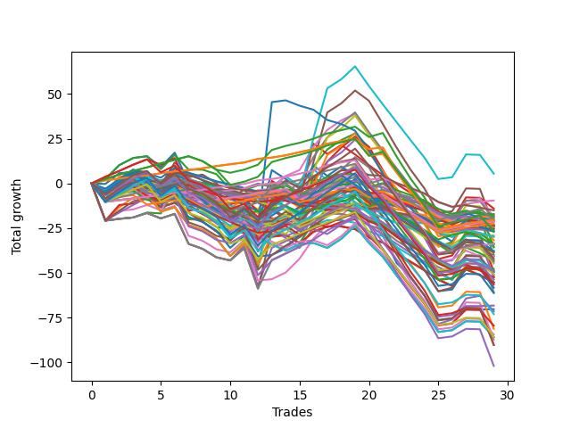

# Long Wallace Doodle 011 
- Symbol: ES
- Date Range: 3/18/22 - 6/24/22
- Trading Period: 7:20-12:30
- Number of Trades: 24


| Name | Win Percent | Profit | Avg Profit / Trade |     | Name | Win Percent | Profit | Avg Profit / Trade |
| ---- | ----------- | ------ | ------------------ | --- | ---- | ----------- | ------ | ------------------ |
| Sorted By <br> Profit | | | | | Sorted By <br> Win Percentage ||||
| Thirty-Six | 41.67 | 10000.00 | 416.67 |     | Two | 54.17 | -18750.00 | -781.25 |
| Thirteen | 33.33 | -4875.00 | -203.12 |     | Twenty-Eight | 50.00 | -6500.00 | -270.83 |
| Twenty-Eight | 50.00 | -6500.00 | -270.83 |     | Three | 50.00 | -15375.00 | -640.62 |
| Fifteen | 33.33 | -8375.00 | -348.96 |     | Twenty-Six | 50.00 | -19125.00 | -796.88 |
| Twelve | 25.00 | -9625.00 | -401.04 |     | Thirty | 50.00 | -26375.00 | -1098.96 |
| Six | 16.67 | -9625.00 | -401.04 |     | Four | 50.00 | -35500.00 | -1479.17 |
| Seventeen | 33.33 | -9875.00 | -411.46 |     | Twenty-Five | 45.83 | -13875.00 | -578.12 |
| Thirty-Five | 25.00 | -10375.00 | -432.29 |     | Thirty-Two | 45.83 | -15375.00 | -640.62 |
| Eighteen | 33.33 | -10875.00 | -453.12 |     | Thirty-One | 45.83 | -20625.00 | -859.38 |
| Thirty-Four | 29.17 | -12250.00 | -510.42 |     | One | 45.83 | -22625.00 | -942.71 |
| Eleven | 33.33 | -12750.00 | -531.25 |     | Five | 45.83 | -24500.00 | -1020.83 |
| Nine | 33.33 | -12750.00 | -531.25 |     | Thirty-Six | 41.67 | 10000.00 | 416.67 |
| Seven | 33.33 | -12750.00 | -531.25 |     | Twenty-Four | 41.67 | -26875.00 | -1119.79 |
| Twenty | 33.33 | -12875.00 | -536.46 |     | Twenty-Seven | 41.67 | -32000.00 | -1333.33 |
| Nineteen | 33.33 | -13125.00 | -546.88 |     | Twenty-Nine | 37.50 | -34125.00 | -1421.88 |
| Twenty-Two | 25.00 | -13250.00 | -552.08 |     | Thirteen | 33.33 | -4875.00 | -203.12 |
| Twenty-Five | 45.83 | -13875.00 | -578.12 |     | Fifteen | 33.33 | -8375.00 | -348.96 |
| Eight | 12.50 | -15125.00 | -630.21 |     | Seventeen | 33.33 | -9875.00 | -411.46 |
| Three | 50.00 | -15375.00 | -640.62 |     | Eighteen | 33.33 | -10875.00 | -453.12 |
| Thirty-Two | 45.83 | -15375.00 | -640.62 |     | Eleven | 33.33 | -12750.00 | -531.25 |
| Two | 54.17 | -18750.00 | -781.25 |     | Nine | 33.33 | -12750.00 | -531.25 |
| Twenty-Six | 50.00 | -19125.00 | -796.88 |     | Seven | 33.33 | -12750.00 | -531.25 |
| Ten | 8.33 | -19250.00 | -802.08 |     | Twenty | 33.33 | -12875.00 | -536.46 |
| Thirty-One | 45.83 | -20625.00 | -859.38 |     | Nineteen | 33.33 | -13125.00 | -546.88 |
| Twenty-One | 33.33 | -21875.00 | -911.46 |     | Twenty-One | 33.33 | -21875.00 | -911.46 |
| One | 45.83 | -22625.00 | -942.71 |     | Twenty-Three | 33.33 | -25625.00 | -1067.71 |
| Five | 45.83 | -24500.00 | -1020.83 |     | Thirty-Three | 33.33 | -38500.00 | -1604.17 |
| Twenty-Three | 33.33 | -25625.00 | -1067.71 |     | Thirty-Four | 29.17 | -12250.00 | -510.42 |
| Fourteen | 12.50 | -26000.00 | -1083.33 |     | Twelve | 25.00 | -9625.00 | -401.04 |
| Thirty | 50.00 | -26375.00 | -1098.96 |     | Thirty-Five | 25.00 | -10375.00 | -432.29 |
| Twenty-Four | 41.67 | -26875.00 | -1119.79 |     | Twenty-Two | 25.00 | -13250.00 | -552.08 |
| Sixteen | 8.33 | -30500.00 | -1270.83 |     | Six | 16.67 | -9625.00 | -401.04 |
| Twenty-Seven | 41.67 | -32000.00 | -1333.33 |     | Eight | 12.50 | -15125.00 | -630.21 |
| Twenty-Nine | 37.50 | -34125.00 | -1421.88 |     | Fourteen | 12.50 | -26000.00 | -1083.33 |
| Four | 50.00 | -35500.00 | -1479.17 |     | Ten | 8.33 | -19250.00 | -802.08 |
| Thirty-Three | 33.33 | -38500.00 | -1604.17 |     | Sixteen | 8.33 | -30500.00 | -1270.83 |

### Test One
* Sell when price hits the middle line of the 20p bollinger
* No Stoploss
* Results:
```
Total Trades: 24
Percent Up: 45.83
Percent Down: 54.17
Total Points Moved Up: -45.25
Potential Profit: -22625.00
Total Points Ups: 57.25 Count Ups: 11
Total Points Downs: -102.50 Count Downs: 13
```

<details><summary>Trades</summary>

<code>In: 2022-03-21 09:35:00		Out: 2022-03-21 09:45:00		Total Position Time: 10:00		Total Move Up: 2.50		Total to Date: 2.50</code> <br />
<code>In: 2022-03-23 09:15:00		Out: 2022-03-23 09:19:25		Total Position Time: 04:25		Total Move Up: 5.25		Total to Date: 7.75</code> <br />
<code>In: 2022-03-23 09:47:00		Out: 2022-03-23 09:53:00		Total Position Time: 06:00		Total Move Up: 4.25		Total to Date: 12.00</code> <br />
<code>In: 2022-03-23 10:28:00		Out: 2022-03-23 10:37:45		Total Position Time: 09:45		Total Move Up: 1.00		Total to Date: 13.00</code> <br />
<code>In: 2022-03-25 08:14:00		Out: 2022-03-25 08:36:40		Total Position Time: 22:40		Total Move Up: -6.00		Total to Date: 7.00</code> <br />
<code>In: 2022-03-25 08:29:00		Out: 2022-03-25 08:36:40		Total Position Time: 07:40		Total Move Up: 8.00		Total to Date: 15.00</code> <br />
<code>In: 2022-03-28 08:27:00		Out: 2022-03-28 08:56:55		Total Position Time: 29:55		Total Move Up: -16.75		Total to Date: -1.75</code> <br />
<code>In: 2022-03-31 09:23:00		Out: 2022-03-31 09:32:20		Total Position Time: 09:20		Total Move Up: -0.25		Total to Date: -2.00</code> <br />
<code>In: 2022-04-12 07:41:00		Out: 2022-04-12 07:57:25		Total Position Time: 16:25		Total Move Up: -2.25		Total to Date: -4.25</code> <br />
<code>In: 2022-04-18 08:29:00		Out: 2022-04-18 08:54:55		Total Position Time: 25:55		Total Move Up: -5.00		Total to Date: -9.25</code> <br />
<code>In: 2022-04-20 09:14:00		Out: 2022-04-20 09:30:45		Total Position Time: 16:45		Total Move Up: -0.50		Total to Date: -9.75</code> <br />
<code>In: 2022-04-29 07:22:00		Out: 2022-04-29 07:44:45		Total Position Time: 22:45		Total Move Up: -13.00		Total to Date: -22.75</code> <br />
<code>In: 2022-05-04 11:36:00		Out: 2022-05-04 11:36:40		Total Position Time: 00:40		Total Move Up: 8.25		Total to Date: -14.50</code> <br />
<code>In: 2022-05-13 11:07:00		Out: 2022-05-13 11:12:25		Total Position Time: 05:25		Total Move Up: 6.50		Total to Date: -8.00</code> <br />
<code>In: 2022-05-16 07:55:00		Out: 2022-05-16 08:05:25		Total Position Time: 10:25		Total Move Up: -1.00		Total to Date: -9.00</code> <br />
<code>In: 2022-05-17 11:24:00		Out: 2022-05-17 11:27:25		Total Position Time: 03:25		Total Move Up: 11.25		Total to Date: 2.25</code> <br />
<code>In: 2022-05-17 11:25:00		Out: 2022-05-17 11:27:25		Total Position Time: 02:25		Total Move Up: 7.75		Total to Date: 10.00</code> <br />
<code>In: 2022-05-25 09:29:00		Out: 2022-05-25 09:38:50		Total Position Time: 09:50		Total Move Up: 2.00		Total to Date: 12.00</code> <br />
<code>In: 2022-05-25 09:30:00		Out: 2022-05-25 09:38:50		Total Position Time: 08:50		Total Move Up: 0.50		Total to Date: 12.50</code> <br />
<code>In: 2022-06-06 08:15:00		Out: 2022-06-06 08:31:35		Total Position Time: 16:35		Total Move Up: -8.25		Total to Date: 4.25</code> <br />
<code>In: 2022-06-08 09:29:00		Out: 2022-06-08 09:53:00		Total Position Time: 24:00		Total Move Up: -13.00		Total to Date: -8.75</code> <br />
<code>In: 2022-06-08 09:30:00		Out: 2022-06-08 09:53:00		Total Position Time: 23:00		Total Move Up: -15.25		Total to Date: -24.00</code> <br />
<code>In: 2022-06-08 09:35:00		Out: 2022-06-08 09:53:00		Total Position Time: 18:00		Total Move Up: -7.50		Total to Date: -31.50</code> <br />
<code>In: 2022-06-15 07:48:00		Out: 2022-06-15 08:17:55		Total Position Time: 29:55		Total Move Up: -13.75		Total to Date: -45.25</code> <br />


</details>

### Test Two
* Sell when the price hits the upper line of the 20p 1std bollinger
* No Stoploss
* Results:
```
Total Trades: 24
Percent Up: 54.17
Percent Down: 45.83
Total Points Moved Up: -37.50
Potential Profit: -18750.00
Total Points Ups: 68.75 Count Ups: 13
Total Points Downs: -106.25 Count Downs: 11
```

<details><summary>Trades</summary>

<code>In: 2022-03-21 09:35:00		Out: 2022-03-21 09:49:05		Total Position Time: 14:05		Total Move Up: 1.50		Total to Date: 1.50</code> <br />
<code>In: 2022-03-23 09:15:00		Out: 2022-03-23 09:30:25		Total Position Time: 15:25		Total Move Up: 5.75		Total to Date: 7.25</code> <br />
<code>In: 2022-03-23 09:47:00		Out: 2022-03-23 09:59:10		Total Position Time: 12:10		Total Move Up: 5.25		Total to Date: 12.50</code> <br />
<code>In: 2022-03-23 10:28:00		Out: 2022-03-23 10:51:50		Total Position Time: 23:50		Total Move Up: 0.25		Total to Date: 12.75</code> <br />
<code>In: 2022-03-25 08:14:00		Out: 2022-03-25 08:40:40		Total Position Time: 26:40		Total Move Up: -5.00		Total to Date: 7.75</code> <br />
<code>In: 2022-03-25 08:29:00		Out: 2022-03-25 08:40:40		Total Position Time: 11:40		Total Move Up: 9.00		Total to Date: 16.75</code> <br />
<code>In: 2022-03-28 08:27:00		Out: 2022-03-28 08:56:55		Total Position Time: 29:55		Total Move Up: -16.75		Total to Date: 0.00</code> <br />
<code>In: 2022-03-31 09:23:00		Out: 2022-03-31 09:40:45		Total Position Time: 17:45		Total Move Up: -0.50		Total to Date: -0.50</code> <br />
<code>In: 2022-04-12 07:41:00		Out: 2022-04-12 08:02:35		Total Position Time: 21:35		Total Move Up: -0.50		Total to Date: -1.00</code> <br />
<code>In: 2022-04-18 08:29:00		Out: 2022-04-18 08:57:20		Total Position Time: 28:20		Total Move Up: -3.00		Total to Date: -4.00</code> <br />
<code>In: 2022-04-20 09:14:00		Out: 2022-04-20 09:30:55		Total Position Time: 16:55		Total Move Up: 0.75		Total to Date: -3.25</code> <br />
<code>In: 2022-04-29 07:22:00		Out: 2022-04-29 07:51:55		Total Position Time: 29:55		Total Move Up: -22.50		Total to Date: -25.75</code> <br />
<code>In: 2022-05-04 11:36:00		Out: 2022-05-04 11:42:00		Total Position Time: 06:00		Total Move Up: 21.25		Total to Date: -4.50</code> <br />
<code>In: 2022-05-13 11:07:00		Out: 2022-05-13 11:19:50		Total Position Time: 12:50		Total Move Up: 5.00		Total to Date: 0.50</code> <br />
<code>In: 2022-05-16 07:55:00		Out: 2022-05-16 08:09:50		Total Position Time: 14:50		Total Move Up: 0.50		Total to Date: 1.00</code> <br />
<code>In: 2022-05-17 11:24:00		Out: 2022-05-17 11:37:35		Total Position Time: 13:35		Total Move Up: 9.25		Total to Date: 10.25</code> <br />
<code>In: 2022-05-17 11:25:00		Out: 2022-05-17 11:37:35		Total Position Time: 12:35		Total Move Up: 5.75		Total to Date: 16.00</code> <br />
<code>In: 2022-05-25 09:29:00		Out: 2022-05-25 09:44:25		Total Position Time: 15:25		Total Move Up: 3.00		Total to Date: 19.00</code> <br />
<code>In: 2022-05-25 09:30:00		Out: 2022-05-25 09:44:25		Total Position Time: 14:25		Total Move Up: 1.50		Total to Date: 20.50</code> <br />
<code>In: 2022-06-06 08:15:00		Out: 2022-06-06 08:39:15		Total Position Time: 24:15		Total Move Up: -10.00		Total to Date: 10.50</code> <br />
<code>In: 2022-06-08 09:29:00		Out: 2022-06-08 09:57:10		Total Position Time: 28:10		Total Move Up: -12.50		Total to Date: -2.00</code> <br />
<code>In: 2022-06-08 09:30:00		Out: 2022-06-08 09:57:10		Total Position Time: 27:10		Total Move Up: -14.75		Total to Date: -16.75</code> <br />
<code>In: 2022-06-08 09:35:00		Out: 2022-06-08 09:57:10		Total Position Time: 22:10		Total Move Up: -7.00		Total to Date: -23.75</code> <br />
<code>In: 2022-06-15 07:48:00		Out: 2022-06-15 08:17:55		Total Position Time: 29:55		Total Move Up: -13.75		Total to Date: -37.50</code> <br />


</details>

### Test Three
* Sell when the price hits the upper line of the 20p 2std bollinger
* No Stoploss
* Results:
```
Total Trades: 24
Percent Up: 50.00
Percent Down: 50.00
Total Points Moved Up: -30.75
Potential Profit: -15375.00
Total Points Ups: 101.00 Count Ups: 12
Total Points Downs: -131.75 Count Downs: 12
```

<details><summary>Trades</summary>

<code>In: 2022-03-21 09:35:00		Out: 2022-03-21 10:04:55		Total Position Time: 29:55		Total Move Up: -20.75		Total to Date: -20.75</code> <br />
<code>In: 2022-03-23 09:15:00		Out: 2022-03-23 09:44:55		Total Position Time: 29:55		Total Move Up: -4.75		Total to Date: -25.50</code> <br />
<code>In: 2022-03-23 09:47:00		Out: 2022-03-23 10:16:55		Total Position Time: 29:55		Total Move Up: 0.75		Total to Date: -24.75</code> <br />
<code>In: 2022-03-23 10:28:00		Out: 2022-03-23 10:54:50		Total Position Time: 26:50		Total Move Up: 3.00		Total to Date: -21.75</code> <br />
<code>In: 2022-03-25 08:14:00		Out: 2022-03-25 08:41:55		Total Position Time: 27:55		Total Move Up: -0.50		Total to Date: -22.25</code> <br />
<code>In: 2022-03-25 08:29:00		Out: 2022-03-25 08:41:55		Total Position Time: 12:55		Total Move Up: 13.50		Total to Date: -8.75</code> <br />
<code>In: 2022-03-28 08:27:00		Out: 2022-03-28 08:56:55		Total Position Time: 29:55		Total Move Up: -16.75		Total to Date: -25.50</code> <br />
<code>In: 2022-03-31 09:23:00		Out: 2022-03-31 09:44:50		Total Position Time: 21:50		Total Move Up: 1.00		Total to Date: -24.50</code> <br />
<code>In: 2022-04-12 07:41:00		Out: 2022-04-12 08:10:55		Total Position Time: 29:55		Total Move Up: -4.75		Total to Date: -29.25</code> <br />
<code>In: 2022-04-18 08:29:00		Out: 2022-04-18 08:58:55		Total Position Time: 29:55		Total Move Up: -1.75		Total to Date: -31.00</code> <br />
<code>In: 2022-04-20 09:14:00		Out: 2022-04-20 09:31:25		Total Position Time: 17:25		Total Move Up: 1.75		Total to Date: -29.25</code> <br />
<code>In: 2022-04-29 07:22:00		Out: 2022-04-29 07:51:55		Total Position Time: 29:55		Total Move Up: -22.50		Total to Date: -51.75</code> <br />
<code>In: 2022-05-04 11:36:00		Out: 2022-05-04 11:43:55		Total Position Time: 07:55		Total Move Up: 32.25		Total to Date: -19.50</code> <br />
<code>In: 2022-05-13 11:07:00		Out: 2022-05-13 11:31:30		Total Position Time: 24:30		Total Move Up: 10.50		Total to Date: -9.00</code> <br />
<code>In: 2022-05-16 07:55:00		Out: 2022-05-16 08:11:35		Total Position Time: 16:35		Total Move Up: 3.25		Total to Date: -5.75</code> <br />
<code>In: 2022-05-17 11:24:00		Out: 2022-05-17 11:40:00		Total Position Time: 16:00		Total Move Up: 13.00		Total to Date: 7.25</code> <br />
<code>In: 2022-05-17 11:25:00		Out: 2022-05-17 11:40:00		Total Position Time: 15:00		Total Move Up: 9.50		Total to Date: 16.75</code> <br />
<code>In: 2022-05-25 09:29:00		Out: 2022-05-25 09:48:50		Total Position Time: 19:50		Total Move Up: 7.00		Total to Date: 23.75</code> <br />
<code>In: 2022-05-25 09:30:00		Out: 2022-05-25 09:48:50		Total Position Time: 18:50		Total Move Up: 5.50		Total to Date: 29.25</code> <br />
<code>In: 2022-06-06 08:15:00		Out: 2022-06-06 08:43:00		Total Position Time: 28:00		Total Move Up: -7.75		Total to Date: 21.50</code> <br />
<code>In: 2022-06-08 09:29:00		Out: 2022-06-08 09:58:55		Total Position Time: 29:55		Total Move Up: -13.00		Total to Date: 8.50</code> <br />
<code>In: 2022-06-08 09:30:00		Out: 2022-06-08 09:59:55		Total Position Time: 29:55		Total Move Up: -13.25		Total to Date: -4.75</code> <br />
<code>In: 2022-06-08 09:35:00		Out: 2022-06-08 10:04:55		Total Position Time: 29:55		Total Move Up: -12.25		Total to Date: -17.00</code> <br />
<code>In: 2022-06-15 07:48:00		Out: 2022-06-15 08:17:55		Total Position Time: 29:55		Total Move Up: -13.75		Total to Date: -30.75</code> <br />


</details>

### Test Four
* Sell when the price hits the middle line of the 1std VWAP
* No Stoploss
* Results:
```
Total Trades: 24
Percent Up: 50.00
Percent Down: 50.00
Total Points Moved Up: -71.00
Potential Profit: -35500.00
Total Points Ups: 59.25 Count Ups: 12
Total Points Downs: -130.25 Count Downs: 12
```

<details><summary>Trades</summary>

<code>In: 2022-03-21 09:35:00		Out: 2022-03-21 10:04:55		Total Position Time: 29:55		Total Move Up: -20.75		Total to Date: -20.75</code> <br />
<code>In: 2022-03-23 09:15:00		Out: 2022-03-23 09:16:05		Total Position Time: 01:05		Total Move Up: 3.25		Total to Date: -17.50</code> <br />
<code>In: 2022-03-23 09:47:00		Out: 2022-03-23 10:16:55		Total Position Time: 29:55		Total Move Up: 0.75		Total to Date: -16.75</code> <br />
<code>In: 2022-03-23 10:28:00		Out: 2022-03-23 10:57:55		Total Position Time: 29:55		Total Move Up: 2.50		Total to Date: -14.25</code> <br />
<code>In: 2022-03-25 08:14:00		Out: 2022-03-25 08:43:55		Total Position Time: 29:55		Total Move Up: -3.00		Total to Date: -17.25</code> <br />
<code>In: 2022-03-25 08:29:00		Out: 2022-03-25 08:58:55		Total Position Time: 29:55		Total Move Up: 2.50		Total to Date: -14.75</code> <br />
<code>In: 2022-03-28 08:27:00		Out: 2022-03-28 08:56:55		Total Position Time: 29:55		Total Move Up: -16.75		Total to Date: -31.50</code> <br />
<code>In: 2022-03-31 09:23:00		Out: 2022-03-31 09:52:55		Total Position Time: 29:55		Total Move Up: -2.75		Total to Date: -34.25</code> <br />
<code>In: 2022-04-12 07:41:00		Out: 2022-04-12 08:10:55		Total Position Time: 29:55		Total Move Up: -4.75		Total to Date: -39.00</code> <br />
<code>In: 2022-04-18 08:29:00		Out: 2022-04-18 08:58:55		Total Position Time: 29:55		Total Move Up: -1.75		Total to Date: -40.75</code> <br />
<code>In: 2022-04-20 09:14:00		Out: 2022-04-20 09:35:50		Total Position Time: 21:50		Total Move Up: 6.75		Total to Date: -34.00</code> <br />
<code>In: 2022-04-29 07:22:00		Out: 2022-04-29 07:51:55		Total Position Time: 29:55		Total Move Up: -22.50		Total to Date: -56.50</code> <br />
<code>In: 2022-05-04 11:36:00		Out: 2022-05-04 11:36:10		Total Position Time: 00:10		Total Move Up: 0.75		Total to Date: -55.75</code> <br />
<code>In: 2022-05-13 11:07:00		Out: 2022-05-13 11:36:55		Total Position Time: 29:55		Total Move Up: 3.75		Total to Date: -52.00</code> <br />
<code>In: 2022-05-16 07:55:00		Out: 2022-05-16 08:17:40		Total Position Time: 22:40		Total Move Up: 7.75		Total to Date: -44.25</code> <br />
<code>In: 2022-05-17 11:24:00		Out: 2022-05-17 11:27:25		Total Position Time: 03:25		Total Move Up: 11.25		Total to Date: -33.00</code> <br />
<code>In: 2022-05-17 11:25:00		Out: 2022-05-17 11:27:25		Total Position Time: 02:25		Total Move Up: 7.75		Total to Date: -25.25</code> <br />
<code>In: 2022-05-25 09:29:00		Out: 2022-05-25 09:58:55		Total Position Time: 29:55		Total Move Up: 5.00		Total to Date: -20.25</code> <br />
<code>In: 2022-05-25 09:30:00		Out: 2022-05-25 09:59:55		Total Position Time: 29:55		Total Move Up: 7.25		Total to Date: -13.00</code> <br />
<code>In: 2022-06-06 08:15:00		Out: 2022-06-06 08:44:55		Total Position Time: 29:55		Total Move Up: -5.75		Total to Date: -18.75</code> <br />
<code>In: 2022-06-08 09:29:00		Out: 2022-06-08 09:58:55		Total Position Time: 29:55		Total Move Up: -13.00		Total to Date: -31.75</code> <br />
<code>In: 2022-06-08 09:30:00		Out: 2022-06-08 09:59:55		Total Position Time: 29:55		Total Move Up: -13.25		Total to Date: -45.00</code> <br />
<code>In: 2022-06-08 09:35:00		Out: 2022-06-08 10:04:55		Total Position Time: 29:55		Total Move Up: -12.25		Total to Date: -57.25</code> <br />
<code>In: 2022-06-15 07:48:00		Out: 2022-06-15 08:17:55		Total Position Time: 29:55		Total Move Up: -13.75		Total to Date: -71.00</code> <br />


</details>

### Test Five
* Sell when the price hits the upper line of the 1std VWAP
* No Stoploss
* Results:
```
Total Trades: 24
Percent Up: 45.83
Percent Down: 54.17
Total Points Moved Up: -49.00
Potential Profit: -24500.00
Total Points Ups: 86.00 Count Ups: 11
Total Points Downs: -135.00 Count Downs: 13
```

<details><summary>Trades</summary>

<code>In: 2022-03-21 09:35:00		Out: 2022-03-21 10:04:55		Total Position Time: 29:55		Total Move Up: -20.75		Total to Date: -20.75</code> <br />
<code>In: 2022-03-23 09:15:00		Out: 2022-03-23 09:44:55		Total Position Time: 29:55		Total Move Up: -4.75		Total to Date: -25.50</code> <br />
<code>In: 2022-03-23 09:47:00		Out: 2022-03-23 10:16:55		Total Position Time: 29:55		Total Move Up: 0.75		Total to Date: -24.75</code> <br />
<code>In: 2022-03-23 10:28:00		Out: 2022-03-23 10:57:55		Total Position Time: 29:55		Total Move Up: 2.50		Total to Date: -22.25</code> <br />
<code>In: 2022-03-25 08:14:00		Out: 2022-03-25 08:43:55		Total Position Time: 29:55		Total Move Up: -3.00		Total to Date: -25.25</code> <br />
<code>In: 2022-03-25 08:29:00		Out: 2022-03-25 08:58:55		Total Position Time: 29:55		Total Move Up: 2.50		Total to Date: -22.75</code> <br />
<code>In: 2022-03-28 08:27:00		Out: 2022-03-28 08:56:55		Total Position Time: 29:55		Total Move Up: -16.75		Total to Date: -39.50</code> <br />
<code>In: 2022-03-31 09:23:00		Out: 2022-03-31 09:52:55		Total Position Time: 29:55		Total Move Up: -2.75		Total to Date: -42.25</code> <br />
<code>In: 2022-04-12 07:41:00		Out: 2022-04-12 08:10:55		Total Position Time: 29:55		Total Move Up: -4.75		Total to Date: -47.00</code> <br />
<code>In: 2022-04-18 08:29:00		Out: 2022-04-18 08:58:55		Total Position Time: 29:55		Total Move Up: -1.75		Total to Date: -48.75</code> <br />
<code>In: 2022-04-20 09:14:00		Out: 2022-04-20 09:43:55		Total Position Time: 29:55		Total Move Up: 6.75		Total to Date: -42.00</code> <br />
<code>In: 2022-04-29 07:22:00		Out: 2022-04-29 07:51:55		Total Position Time: 29:55		Total Move Up: -22.50		Total to Date: -64.50</code> <br />
<code>In: 2022-05-04 11:36:00		Out: 2022-05-04 11:41:35		Total Position Time: 05:35		Total Move Up: 16.00		Total to Date: -48.50</code> <br />
<code>In: 2022-05-13 11:07:00		Out: 2022-05-13 11:36:55		Total Position Time: 29:55		Total Move Up: 3.75		Total to Date: -44.75</code> <br />
<code>In: 2022-05-16 07:55:00		Out: 2022-05-16 08:24:55		Total Position Time: 29:55		Total Move Up: 3.50		Total to Date: -41.25</code> <br />
<code>In: 2022-05-17 11:24:00		Out: 2022-05-17 11:40:20		Total Position Time: 16:20		Total Move Up: 20.75		Total to Date: -20.50</code> <br />
<code>In: 2022-05-17 11:25:00		Out: 2022-05-17 11:40:20		Total Position Time: 15:20		Total Move Up: 17.25		Total to Date: -3.25</code> <br />
<code>In: 2022-05-25 09:29:00		Out: 2022-05-25 09:58:55		Total Position Time: 29:55		Total Move Up: 5.00		Total to Date: 1.75</code> <br />
<code>In: 2022-05-25 09:30:00		Out: 2022-05-25 09:59:55		Total Position Time: 29:55		Total Move Up: 7.25		Total to Date: 9.00</code> <br />
<code>In: 2022-06-06 08:15:00		Out: 2022-06-06 08:44:55		Total Position Time: 29:55		Total Move Up: -5.75		Total to Date: 3.25</code> <br />
<code>In: 2022-06-08 09:29:00		Out: 2022-06-08 09:58:55		Total Position Time: 29:55		Total Move Up: -13.00		Total to Date: -9.75</code> <br />
<code>In: 2022-06-08 09:30:00		Out: 2022-06-08 09:59:55		Total Position Time: 29:55		Total Move Up: -13.25		Total to Date: -23.00</code> <br />
<code>In: 2022-06-08 09:35:00		Out: 2022-06-08 10:04:55		Total Position Time: 29:55		Total Move Up: -12.25		Total to Date: -35.25</code> <br />
<code>In: 2022-06-15 07:48:00		Out: 2022-06-15 08:17:55		Total Position Time: 29:55		Total Move Up: -13.75		Total to Date: -49.00</code> <br />


</details>

### Test Six
* Sell when the price hits the middle line of the 20p bollinger
* Stoploss is 2 points
* Results:
```
Total Trades: 24
Percent Up: 16.67
Percent Down: 83.33
Total Points Moved Up: -19.25
Potential Profit: -9625.00
Total Points Ups: 28.75 Count Ups: 4
Total Points Downs: -48.00 Count Downs: 20
```

<details><summary>Trades</summary>

<code>In: 2022-03-21 09:35:00		Out: 2022-03-21 09:35:10		Total Position Time: 00:10		Total Move Up: -3.00		Total to Date: -3.00</code> <br />
<code>In: 2022-03-23 09:15:00		Out: 2022-03-23 09:19:25		Total Position Time: 04:25		Total Move Up: 5.25		Total to Date: 2.25</code> <br />
<code>In: 2022-03-23 09:47:00		Out: 2022-03-23 09:53:00		Total Position Time: 06:00		Total Move Up: 4.25		Total to Date: 6.50</code> <br />
<code>In: 2022-03-23 10:28:00		Out: 2022-03-23 10:28:40		Total Position Time: 00:40		Total Move Up: -2.00		Total to Date: 4.50</code> <br />
<code>In: 2022-03-25 08:14:00		Out: 2022-03-25 08:20:40		Total Position Time: 06:40		Total Move Up: -2.50		Total to Date: 2.00</code> <br />
<code>In: 2022-03-25 08:29:00		Out: 2022-03-25 08:36:40		Total Position Time: 07:40		Total Move Up: 8.00		Total to Date: 10.00</code> <br />
<code>In: 2022-03-28 08:27:00		Out: 2022-03-28 08:32:05		Total Position Time: 05:05		Total Move Up: -2.75		Total to Date: 7.25</code> <br />
<code>In: 2022-03-31 09:23:00		Out: 2022-03-31 09:24:55		Total Position Time: 01:55		Total Move Up: -2.25		Total to Date: 5.00</code> <br />
<code>In: 2022-04-12 07:41:00		Out: 2022-04-12 07:44:10		Total Position Time: 03:10		Total Move Up: -2.50		Total to Date: 2.50</code> <br />
<code>In: 2022-04-18 08:29:00		Out: 2022-04-18 08:33:05		Total Position Time: 04:05		Total Move Up: -1.75		Total to Date: 0.75</code> <br />
<code>In: 2022-04-20 09:14:00		Out: 2022-04-20 09:15:35		Total Position Time: 01:35		Total Move Up: -2.00		Total to Date: -1.25</code> <br />
<code>In: 2022-04-29 07:22:00		Out: 2022-04-29 07:23:20		Total Position Time: 01:20		Total Move Up: -2.00		Total to Date: -3.25</code> <br />
<code>In: 2022-05-04 11:36:00		Out: 2022-05-04 11:36:15		Total Position Time: 00:15		Total Move Up: -2.00		Total to Date: -5.25</code> <br />
<code>In: 2022-05-13 11:07:00		Out: 2022-05-13 11:08:10		Total Position Time: 01:10		Total Move Up: -2.75		Total to Date: -8.00</code> <br />
<code>In: 2022-05-16 07:55:00		Out: 2022-05-16 07:55:10		Total Position Time: 00:10		Total Move Up: -2.50		Total to Date: -10.50</code> <br />
<code>In: 2022-05-17 11:24:00		Out: 2022-05-17 11:27:25		Total Position Time: 03:25		Total Move Up: 11.25		Total to Date: 0.75</code> <br />
<code>In: 2022-05-17 11:25:00		Out: 2022-05-17 11:25:35		Total Position Time: 00:35		Total Move Up: -2.25		Total to Date: -1.50</code> <br />
<code>In: 2022-05-25 09:29:00		Out: 2022-05-25 09:36:05		Total Position Time: 07:05		Total Move Up: -2.25		Total to Date: -3.75</code> <br />
<code>In: 2022-05-25 09:30:00		Out: 2022-05-25 09:35:55		Total Position Time: 05:55		Total Move Up: -2.00		Total to Date: -5.75</code> <br />
<code>In: 2022-06-06 08:15:00		Out: 2022-06-06 08:16:10		Total Position Time: 01:10		Total Move Up: -2.25		Total to Date: -8.00</code> <br />
<code>In: 2022-06-08 09:29:00		Out: 2022-06-08 09:32:25		Total Position Time: 03:25		Total Move Up: -2.25		Total to Date: -10.25</code> <br />
<code>In: 2022-06-08 09:30:00		Out: 2022-06-08 09:31:10		Total Position Time: 01:10		Total Move Up: -2.00		Total to Date: -12.25</code> <br />
<code>In: 2022-06-08 09:35:00		Out: 2022-06-08 09:37:15		Total Position Time: 02:15		Total Move Up: -2.25		Total to Date: -14.50</code> <br />
<code>In: 2022-06-15 07:48:00		Out: 2022-06-15 07:48:10		Total Position Time: 00:10		Total Move Up: -4.75		Total to Date: -19.25</code> <br />


</details>

### Test Seven
* Sell when the price hits the middle line of the 20p bollinger
* Trailing Stop is 2 points
* Results:
```
Total Trades: 24
Percent Up: 33.33
Percent Down: 66.67
Total Points Moved Up: -25.50
Potential Profit: -12750.00
Total Points Ups: 7.00 Count Ups: 8
Total Points Downs: -32.50 Count Downs: 16
```

<details><summary>Trades</summary>

<code>In: 2022-03-21 09:35:00		Out: 2022-03-21 09:35:20		Total Position Time: 00:20		Total Move Up: -5.00		Total to Date: -5.00</code> <br />
<code>In: 2022-03-23 09:15:00		Out: 2022-03-23 09:18:25		Total Position Time: 03:25		Total Move Up: 2.75		Total to Date: -2.25</code> <br />
<code>In: 2022-03-23 09:47:00		Out: 2022-03-23 09:50:05		Total Position Time: 03:05		Total Move Up: 0.75		Total to Date: -1.50</code> <br />
<code>In: 2022-03-23 10:28:00		Out: 2022-03-23 10:29:05		Total Position Time: 01:05		Total Move Up: -2.75		Total to Date: -4.25</code> <br />
<code>In: 2022-03-25 08:14:00		Out: 2022-03-25 08:17:20		Total Position Time: 03:20		Total Move Up: 0.75		Total to Date: -3.50</code> <br />
<code>In: 2022-03-25 08:29:00		Out: 2022-03-25 08:29:10		Total Position Time: 00:10		Total Move Up: 1.00		Total to Date: -2.50</code> <br />
<code>In: 2022-03-28 08:27:00		Out: 2022-03-28 08:29:05		Total Position Time: 02:05		Total Move Up: -0.25		Total to Date: -2.75</code> <br />
<code>In: 2022-03-31 09:23:00		Out: 2022-03-31 09:24:50		Total Position Time: 01:50		Total Move Up: -1.75		Total to Date: -4.50</code> <br />
<code>In: 2022-04-12 07:41:00		Out: 2022-04-12 07:43:05		Total Position Time: 02:05		Total Move Up: -1.50		Total to Date: -6.00</code> <br />
<code>In: 2022-04-18 08:29:00		Out: 2022-04-18 08:32:15		Total Position Time: 03:15		Total Move Up: -0.50		Total to Date: -6.50</code> <br />
<code>In: 2022-04-20 09:14:00		Out: 2022-04-20 09:15:35		Total Position Time: 01:35		Total Move Up: -2.00		Total to Date: -8.50</code> <br />
<code>In: 2022-04-29 07:22:00		Out: 2022-04-29 07:22:20		Total Position Time: 00:20		Total Move Up: 0.25		Total to Date: -8.25</code> <br />
<code>In: 2022-05-04 11:36:00		Out: 2022-05-04 11:36:10		Total Position Time: 00:10		Total Move Up: 0.75		Total to Date: -7.50</code> <br />
<code>In: 2022-05-13 11:07:00		Out: 2022-05-13 11:08:10		Total Position Time: 01:10		Total Move Up: -2.75		Total to Date: -10.25</code> <br />
<code>In: 2022-05-16 07:55:00		Out: 2022-05-16 07:55:40		Total Position Time: 00:40		Total Move Up: -2.25		Total to Date: -12.50</code> <br />
<code>In: 2022-05-17 11:24:00		Out: 2022-05-17 11:24:10		Total Position Time: 00:10		Total Move Up: -0.75		Total to Date: -13.25</code> <br />
<code>In: 2022-05-17 11:25:00		Out: 2022-05-17 11:25:30		Total Position Time: 00:30		Total Move Up: -2.00		Total to Date: -15.25</code> <br />
<code>In: 2022-05-25 09:29:00		Out: 2022-05-25 09:29:10		Total Position Time: 00:10		Total Move Up: -0.50		Total to Date: -15.75</code> <br />
<code>In: 2022-05-25 09:30:00		Out: 2022-05-25 09:33:05		Total Position Time: 03:05		Total Move Up: 0.50		Total to Date: -15.25</code> <br />
<code>In: 2022-06-06 08:15:00		Out: 2022-06-06 08:15:50		Total Position Time: 00:50		Total Move Up: -1.75		Total to Date: -17.00</code> <br />
<code>In: 2022-06-08 09:29:00		Out: 2022-06-08 09:31:10		Total Position Time: 02:10		Total Move Up: 0.25		Total to Date: -16.75</code> <br />
<code>In: 2022-06-08 09:30:00		Out: 2022-06-08 09:31:15		Total Position Time: 01:15		Total Move Up: -2.50		Total to Date: -19.25</code> <br />
<code>In: 2022-06-08 09:35:00		Out: 2022-06-08 09:36:10		Total Position Time: 01:10		Total Move Up: -1.50		Total to Date: -20.75</code> <br />
<code>In: 2022-06-15 07:48:00		Out: 2022-06-15 07:48:10		Total Position Time: 00:10		Total Move Up: -4.75		Total to Date: -25.50</code> <br />


</details>

### Test Eight
* Sell when the price hits the upper line of the 20p 1std bollinger
* Stoploss is 2 points
* Results:
```
Total Trades: 24
Percent Up: 12.50
Percent Down: 87.50
Total Points Moved Up: -30.25
Potential Profit: -15125.00
Total Points Ups: 20.00 Count Ups: 3
Total Points Downs: -50.25 Count Downs: 21
```

<details><summary>Trades</summary>

<code>In: 2022-03-21 09:35:00		Out: 2022-03-21 09:35:10		Total Position Time: 00:10		Total Move Up: -3.00		Total to Date: -3.00</code> <br />
<code>In: 2022-03-23 09:15:00		Out: 2022-03-23 09:30:25		Total Position Time: 15:25		Total Move Up: 5.75		Total to Date: 2.75</code> <br />
<code>In: 2022-03-23 09:47:00		Out: 2022-03-23 09:59:10		Total Position Time: 12:10		Total Move Up: 5.25		Total to Date: 8.00</code> <br />
<code>In: 2022-03-23 10:28:00		Out: 2022-03-23 10:28:40		Total Position Time: 00:40		Total Move Up: -2.00		Total to Date: 6.00</code> <br />
<code>In: 2022-03-25 08:14:00		Out: 2022-03-25 08:20:40		Total Position Time: 06:40		Total Move Up: -2.50		Total to Date: 3.50</code> <br />
<code>In: 2022-03-25 08:29:00		Out: 2022-03-25 08:40:40		Total Position Time: 11:40		Total Move Up: 9.00		Total to Date: 12.50</code> <br />
<code>In: 2022-03-28 08:27:00		Out: 2022-03-28 08:32:05		Total Position Time: 05:05		Total Move Up: -2.75		Total to Date: 9.75</code> <br />
<code>In: 2022-03-31 09:23:00		Out: 2022-03-31 09:24:55		Total Position Time: 01:55		Total Move Up: -2.25		Total to Date: 7.50</code> <br />
<code>In: 2022-04-12 07:41:00		Out: 2022-04-12 07:44:10		Total Position Time: 03:10		Total Move Up: -2.50		Total to Date: 5.00</code> <br />
<code>In: 2022-04-18 08:29:00		Out: 2022-04-18 08:33:05		Total Position Time: 04:05		Total Move Up: -1.75		Total to Date: 3.25</code> <br />
<code>In: 2022-04-20 09:14:00		Out: 2022-04-20 09:15:35		Total Position Time: 01:35		Total Move Up: -2.00		Total to Date: 1.25</code> <br />
<code>In: 2022-04-29 07:22:00		Out: 2022-04-29 07:23:20		Total Position Time: 01:20		Total Move Up: -2.00		Total to Date: -0.75</code> <br />
<code>In: 2022-05-04 11:36:00		Out: 2022-05-04 11:36:15		Total Position Time: 00:15		Total Move Up: -2.00		Total to Date: -2.75</code> <br />
<code>In: 2022-05-13 11:07:00		Out: 2022-05-13 11:08:10		Total Position Time: 01:10		Total Move Up: -2.75		Total to Date: -5.50</code> <br />
<code>In: 2022-05-16 07:55:00		Out: 2022-05-16 07:55:10		Total Position Time: 00:10		Total Move Up: -2.50		Total to Date: -8.00</code> <br />
<code>In: 2022-05-17 11:24:00		Out: 2022-05-17 11:35:05		Total Position Time: 11:05		Total Move Up: -2.25		Total to Date: -10.25</code> <br />
<code>In: 2022-05-17 11:25:00		Out: 2022-05-17 11:25:35		Total Position Time: 00:35		Total Move Up: -2.25		Total to Date: -12.50</code> <br />
<code>In: 2022-05-25 09:29:00		Out: 2022-05-25 09:36:05		Total Position Time: 07:05		Total Move Up: -2.25		Total to Date: -14.75</code> <br />
<code>In: 2022-05-25 09:30:00		Out: 2022-05-25 09:35:55		Total Position Time: 05:55		Total Move Up: -2.00		Total to Date: -16.75</code> <br />
<code>In: 2022-06-06 08:15:00		Out: 2022-06-06 08:16:10		Total Position Time: 01:10		Total Move Up: -2.25		Total to Date: -19.00</code> <br />
<code>In: 2022-06-08 09:29:00		Out: 2022-06-08 09:32:25		Total Position Time: 03:25		Total Move Up: -2.25		Total to Date: -21.25</code> <br />
<code>In: 2022-06-08 09:30:00		Out: 2022-06-08 09:31:10		Total Position Time: 01:10		Total Move Up: -2.00		Total to Date: -23.25</code> <br />
<code>In: 2022-06-08 09:35:00		Out: 2022-06-08 09:37:15		Total Position Time: 02:15		Total Move Up: -2.25		Total to Date: -25.50</code> <br />
<code>In: 2022-06-15 07:48:00		Out: 2022-06-15 07:48:10		Total Position Time: 00:10		Total Move Up: -4.75		Total to Date: -30.25</code> <br />


</details>

### Test Nine
* Sell when the price hits the upper line of the 20p 1std bollinger
* Trailing Stop is 2 points
* Results:
```
Total Trades: 24
Percent Up: 33.33
Percent Down: 66.67
Total Points Moved Up: -25.50
Potential Profit: -12750.00
Total Points Ups: 7.00 Count Ups: 8
Total Points Downs: -32.50 Count Downs: 16
```

<details><summary>Trades</summary>

<code>In: 2022-03-21 09:35:00		Out: 2022-03-21 09:35:20		Total Position Time: 00:20		Total Move Up: -5.00		Total to Date: -5.00</code> <br />
<code>In: 2022-03-23 09:15:00		Out: 2022-03-23 09:18:25		Total Position Time: 03:25		Total Move Up: 2.75		Total to Date: -2.25</code> <br />
<code>In: 2022-03-23 09:47:00		Out: 2022-03-23 09:50:05		Total Position Time: 03:05		Total Move Up: 0.75		Total to Date: -1.50</code> <br />
<code>In: 2022-03-23 10:28:00		Out: 2022-03-23 10:29:05		Total Position Time: 01:05		Total Move Up: -2.75		Total to Date: -4.25</code> <br />
<code>In: 2022-03-25 08:14:00		Out: 2022-03-25 08:17:20		Total Position Time: 03:20		Total Move Up: 0.75		Total to Date: -3.50</code> <br />
<code>In: 2022-03-25 08:29:00		Out: 2022-03-25 08:29:10		Total Position Time: 00:10		Total Move Up: 1.00		Total to Date: -2.50</code> <br />
<code>In: 2022-03-28 08:27:00		Out: 2022-03-28 08:29:05		Total Position Time: 02:05		Total Move Up: -0.25		Total to Date: -2.75</code> <br />
<code>In: 2022-03-31 09:23:00		Out: 2022-03-31 09:24:50		Total Position Time: 01:50		Total Move Up: -1.75		Total to Date: -4.50</code> <br />
<code>In: 2022-04-12 07:41:00		Out: 2022-04-12 07:43:05		Total Position Time: 02:05		Total Move Up: -1.50		Total to Date: -6.00</code> <br />
<code>In: 2022-04-18 08:29:00		Out: 2022-04-18 08:32:15		Total Position Time: 03:15		Total Move Up: -0.50		Total to Date: -6.50</code> <br />
<code>In: 2022-04-20 09:14:00		Out: 2022-04-20 09:15:35		Total Position Time: 01:35		Total Move Up: -2.00		Total to Date: -8.50</code> <br />
<code>In: 2022-04-29 07:22:00		Out: 2022-04-29 07:22:20		Total Position Time: 00:20		Total Move Up: 0.25		Total to Date: -8.25</code> <br />
<code>In: 2022-05-04 11:36:00		Out: 2022-05-04 11:36:10		Total Position Time: 00:10		Total Move Up: 0.75		Total to Date: -7.50</code> <br />
<code>In: 2022-05-13 11:07:00		Out: 2022-05-13 11:08:10		Total Position Time: 01:10		Total Move Up: -2.75		Total to Date: -10.25</code> <br />
<code>In: 2022-05-16 07:55:00		Out: 2022-05-16 07:55:40		Total Position Time: 00:40		Total Move Up: -2.25		Total to Date: -12.50</code> <br />
<code>In: 2022-05-17 11:24:00		Out: 2022-05-17 11:24:10		Total Position Time: 00:10		Total Move Up: -0.75		Total to Date: -13.25</code> <br />
<code>In: 2022-05-17 11:25:00		Out: 2022-05-17 11:25:30		Total Position Time: 00:30		Total Move Up: -2.00		Total to Date: -15.25</code> <br />
<code>In: 2022-05-25 09:29:00		Out: 2022-05-25 09:29:10		Total Position Time: 00:10		Total Move Up: -0.50		Total to Date: -15.75</code> <br />
<code>In: 2022-05-25 09:30:00		Out: 2022-05-25 09:33:05		Total Position Time: 03:05		Total Move Up: 0.50		Total to Date: -15.25</code> <br />
<code>In: 2022-06-06 08:15:00		Out: 2022-06-06 08:15:50		Total Position Time: 00:50		Total Move Up: -1.75		Total to Date: -17.00</code> <br />
<code>In: 2022-06-08 09:29:00		Out: 2022-06-08 09:31:10		Total Position Time: 02:10		Total Move Up: 0.25		Total to Date: -16.75</code> <br />
<code>In: 2022-06-08 09:30:00		Out: 2022-06-08 09:31:15		Total Position Time: 01:15		Total Move Up: -2.50		Total to Date: -19.25</code> <br />
<code>In: 2022-06-08 09:35:00		Out: 2022-06-08 09:36:10		Total Position Time: 01:10		Total Move Up: -1.50		Total to Date: -20.75</code> <br />
<code>In: 2022-06-15 07:48:00		Out: 2022-06-15 07:48:10		Total Position Time: 00:10		Total Move Up: -4.75		Total to Date: -25.50</code> <br />


</details>

### Test Ten
* Sell when the price hits the upper line of the 20p 2std bollinger
* Stoploss is 2 points
* Results:
```
Total Trades: 24
Percent Up: 8.33
Percent Down: 91.67
Total Points Moved Up: -38.50
Potential Profit: -19250.00
Total Points Ups: 14.25 Count Ups: 2
Total Points Downs: -52.75 Count Downs: 22
```

<details><summary>Trades</summary>

<code>In: 2022-03-21 09:35:00		Out: 2022-03-21 09:35:10		Total Position Time: 00:10		Total Move Up: -3.00		Total to Date: -3.00</code> <br />
<code>In: 2022-03-23 09:15:00		Out: 2022-03-23 09:44:25		Total Position Time: 29:25		Total Move Up: -2.50		Total to Date: -5.50</code> <br />
<code>In: 2022-03-23 09:47:00		Out: 2022-03-23 10:16:55		Total Position Time: 29:55		Total Move Up: 0.75		Total to Date: -4.75</code> <br />
<code>In: 2022-03-23 10:28:00		Out: 2022-03-23 10:28:40		Total Position Time: 00:40		Total Move Up: -2.00		Total to Date: -6.75</code> <br />
<code>In: 2022-03-25 08:14:00		Out: 2022-03-25 08:20:40		Total Position Time: 06:40		Total Move Up: -2.50		Total to Date: -9.25</code> <br />
<code>In: 2022-03-25 08:29:00		Out: 2022-03-25 08:41:55		Total Position Time: 12:55		Total Move Up: 13.50		Total to Date: 4.25</code> <br />
<code>In: 2022-03-28 08:27:00		Out: 2022-03-28 08:32:05		Total Position Time: 05:05		Total Move Up: -2.75		Total to Date: 1.50</code> <br />
<code>In: 2022-03-31 09:23:00		Out: 2022-03-31 09:24:55		Total Position Time: 01:55		Total Move Up: -2.25		Total to Date: -0.75</code> <br />
<code>In: 2022-04-12 07:41:00		Out: 2022-04-12 07:44:10		Total Position Time: 03:10		Total Move Up: -2.50		Total to Date: -3.25</code> <br />
<code>In: 2022-04-18 08:29:00		Out: 2022-04-18 08:33:05		Total Position Time: 04:05		Total Move Up: -1.75		Total to Date: -5.00</code> <br />
<code>In: 2022-04-20 09:14:00		Out: 2022-04-20 09:15:35		Total Position Time: 01:35		Total Move Up: -2.00		Total to Date: -7.00</code> <br />
<code>In: 2022-04-29 07:22:00		Out: 2022-04-29 07:23:20		Total Position Time: 01:20		Total Move Up: -2.00		Total to Date: -9.00</code> <br />
<code>In: 2022-05-04 11:36:00		Out: 2022-05-04 11:36:15		Total Position Time: 00:15		Total Move Up: -2.00		Total to Date: -11.00</code> <br />
<code>In: 2022-05-13 11:07:00		Out: 2022-05-13 11:08:10		Total Position Time: 01:10		Total Move Up: -2.75		Total to Date: -13.75</code> <br />
<code>In: 2022-05-16 07:55:00		Out: 2022-05-16 07:55:10		Total Position Time: 00:10		Total Move Up: -2.50		Total to Date: -16.25</code> <br />
<code>In: 2022-05-17 11:24:00		Out: 2022-05-17 11:35:05		Total Position Time: 11:05		Total Move Up: -2.25		Total to Date: -18.50</code> <br />
<code>In: 2022-05-17 11:25:00		Out: 2022-05-17 11:25:35		Total Position Time: 00:35		Total Move Up: -2.25		Total to Date: -20.75</code> <br />
<code>In: 2022-05-25 09:29:00		Out: 2022-05-25 09:36:05		Total Position Time: 07:05		Total Move Up: -2.25		Total to Date: -23.00</code> <br />
<code>In: 2022-05-25 09:30:00		Out: 2022-05-25 09:35:55		Total Position Time: 05:55		Total Move Up: -2.00		Total to Date: -25.00</code> <br />
<code>In: 2022-06-06 08:15:00		Out: 2022-06-06 08:16:10		Total Position Time: 01:10		Total Move Up: -2.25		Total to Date: -27.25</code> <br />
<code>In: 2022-06-08 09:29:00		Out: 2022-06-08 09:32:25		Total Position Time: 03:25		Total Move Up: -2.25		Total to Date: -29.50</code> <br />
<code>In: 2022-06-08 09:30:00		Out: 2022-06-08 09:31:10		Total Position Time: 01:10		Total Move Up: -2.00		Total to Date: -31.50</code> <br />
<code>In: 2022-06-08 09:35:00		Out: 2022-06-08 09:37:15		Total Position Time: 02:15		Total Move Up: -2.25		Total to Date: -33.75</code> <br />
<code>In: 2022-06-15 07:48:00		Out: 2022-06-15 07:48:10		Total Position Time: 00:10		Total Move Up: -4.75		Total to Date: -38.50</code> <br />


</details>

### Test Eleven
* Sell when the price hits the upper line of the 20p 2std bollinger
* Trailing Stop is 2 points
* Results:
```
Total Trades: 24
Percent Up: 33.33
Percent Down: 66.67
Total Points Moved Up: -25.50
Potential Profit: -12750.00
Total Points Ups: 7.00 Count Ups: 8
Total Points Downs: -32.50 Count Downs: 16
```

<details><summary>Trades</summary>

<code>In: 2022-03-21 09:35:00		Out: 2022-03-21 09:35:20		Total Position Time: 00:20		Total Move Up: -5.00		Total to Date: -5.00</code> <br />
<code>In: 2022-03-23 09:15:00		Out: 2022-03-23 09:18:25		Total Position Time: 03:25		Total Move Up: 2.75		Total to Date: -2.25</code> <br />
<code>In: 2022-03-23 09:47:00		Out: 2022-03-23 09:50:05		Total Position Time: 03:05		Total Move Up: 0.75		Total to Date: -1.50</code> <br />
<code>In: 2022-03-23 10:28:00		Out: 2022-03-23 10:29:05		Total Position Time: 01:05		Total Move Up: -2.75		Total to Date: -4.25</code> <br />
<code>In: 2022-03-25 08:14:00		Out: 2022-03-25 08:17:20		Total Position Time: 03:20		Total Move Up: 0.75		Total to Date: -3.50</code> <br />
<code>In: 2022-03-25 08:29:00		Out: 2022-03-25 08:29:10		Total Position Time: 00:10		Total Move Up: 1.00		Total to Date: -2.50</code> <br />
<code>In: 2022-03-28 08:27:00		Out: 2022-03-28 08:29:05		Total Position Time: 02:05		Total Move Up: -0.25		Total to Date: -2.75</code> <br />
<code>In: 2022-03-31 09:23:00		Out: 2022-03-31 09:24:50		Total Position Time: 01:50		Total Move Up: -1.75		Total to Date: -4.50</code> <br />
<code>In: 2022-04-12 07:41:00		Out: 2022-04-12 07:43:05		Total Position Time: 02:05		Total Move Up: -1.50		Total to Date: -6.00</code> <br />
<code>In: 2022-04-18 08:29:00		Out: 2022-04-18 08:32:15		Total Position Time: 03:15		Total Move Up: -0.50		Total to Date: -6.50</code> <br />
<code>In: 2022-04-20 09:14:00		Out: 2022-04-20 09:15:35		Total Position Time: 01:35		Total Move Up: -2.00		Total to Date: -8.50</code> <br />
<code>In: 2022-04-29 07:22:00		Out: 2022-04-29 07:22:20		Total Position Time: 00:20		Total Move Up: 0.25		Total to Date: -8.25</code> <br />
<code>In: 2022-05-04 11:36:00		Out: 2022-05-04 11:36:10		Total Position Time: 00:10		Total Move Up: 0.75		Total to Date: -7.50</code> <br />
<code>In: 2022-05-13 11:07:00		Out: 2022-05-13 11:08:10		Total Position Time: 01:10		Total Move Up: -2.75		Total to Date: -10.25</code> <br />
<code>In: 2022-05-16 07:55:00		Out: 2022-05-16 07:55:40		Total Position Time: 00:40		Total Move Up: -2.25		Total to Date: -12.50</code> <br />
<code>In: 2022-05-17 11:24:00		Out: 2022-05-17 11:24:10		Total Position Time: 00:10		Total Move Up: -0.75		Total to Date: -13.25</code> <br />
<code>In: 2022-05-17 11:25:00		Out: 2022-05-17 11:25:30		Total Position Time: 00:30		Total Move Up: -2.00		Total to Date: -15.25</code> <br />
<code>In: 2022-05-25 09:29:00		Out: 2022-05-25 09:29:10		Total Position Time: 00:10		Total Move Up: -0.50		Total to Date: -15.75</code> <br />
<code>In: 2022-05-25 09:30:00		Out: 2022-05-25 09:33:05		Total Position Time: 03:05		Total Move Up: 0.50		Total to Date: -15.25</code> <br />
<code>In: 2022-06-06 08:15:00		Out: 2022-06-06 08:15:50		Total Position Time: 00:50		Total Move Up: -1.75		Total to Date: -17.00</code> <br />
<code>In: 2022-06-08 09:29:00		Out: 2022-06-08 09:31:10		Total Position Time: 02:10		Total Move Up: 0.25		Total to Date: -16.75</code> <br />
<code>In: 2022-06-08 09:30:00		Out: 2022-06-08 09:31:15		Total Position Time: 01:15		Total Move Up: -2.50		Total to Date: -19.25</code> <br />
<code>In: 2022-06-08 09:35:00		Out: 2022-06-08 09:36:10		Total Position Time: 01:10		Total Move Up: -1.50		Total to Date: -20.75</code> <br />
<code>In: 2022-06-15 07:48:00		Out: 2022-06-15 07:48:10		Total Position Time: 00:10		Total Move Up: -4.75		Total to Date: -25.50</code> <br />


</details>

### Test Twelve
* Sell when the price hits the middle line of the 20p bollinger
* Stoploss is 3 points
* Results:
```
Total Trades: 24
Percent Up: 25.00
Percent Down: 75.00
Total Points Moved Up: -19.25
Potential Profit: -9625.00
Total Points Ups: 43.00 Count Ups: 6
Total Points Downs: -62.25 Count Downs: 18
```

<details><summary>Trades</summary>

<code>In: 2022-03-21 09:35:00		Out: 2022-03-21 09:35:15		Total Position Time: 00:15		Total Move Up: -4.50		Total to Date: -4.50</code> <br />
<code>In: 2022-03-23 09:15:00		Out: 2022-03-23 09:19:25		Total Position Time: 04:25		Total Move Up: 5.25		Total to Date: 0.75</code> <br />
<code>In: 2022-03-23 09:47:00		Out: 2022-03-23 09:53:00		Total Position Time: 06:00		Total Move Up: 4.25		Total to Date: 5.00</code> <br />
<code>In: 2022-03-23 10:28:00		Out: 2022-03-23 10:29:35		Total Position Time: 01:35		Total Move Up: -3.50		Total to Date: 1.50</code> <br />
<code>In: 2022-03-25 08:14:00		Out: 2022-03-25 08:20:45		Total Position Time: 06:45		Total Move Up: -3.00		Total to Date: -1.50</code> <br />
<code>In: 2022-03-25 08:29:00		Out: 2022-03-25 08:36:40		Total Position Time: 07:40		Total Move Up: 8.00		Total to Date: 6.50</code> <br />
<code>In: 2022-03-28 08:27:00		Out: 2022-03-28 08:32:10		Total Position Time: 05:10		Total Move Up: -4.00		Total to Date: 2.50</code> <br />
<code>In: 2022-03-31 09:23:00		Out: 2022-03-31 09:25:55		Total Position Time: 02:55		Total Move Up: -3.00		Total to Date: -0.50</code> <br />
<code>In: 2022-04-12 07:41:00		Out: 2022-04-12 07:48:15		Total Position Time: 07:15		Total Move Up: -4.00		Total to Date: -4.50</code> <br />
<code>In: 2022-04-18 08:29:00		Out: 2022-04-18 08:33:50		Total Position Time: 04:50		Total Move Up: -2.75		Total to Date: -7.25</code> <br />
<code>In: 2022-04-20 09:14:00		Out: 2022-04-20 09:28:10		Total Position Time: 14:10		Total Move Up: -3.25		Total to Date: -10.50</code> <br />
<code>In: 2022-04-29 07:22:00		Out: 2022-04-29 07:23:50		Total Position Time: 01:50		Total Move Up: -3.50		Total to Date: -14.00</code> <br />
<code>In: 2022-05-04 11:36:00		Out: 2022-05-04 11:36:25		Total Position Time: 00:25		Total Move Up: -2.75		Total to Date: -16.75</code> <br />
<code>In: 2022-05-13 11:07:00		Out: 2022-05-13 11:12:25		Total Position Time: 05:25		Total Move Up: 6.50		Total to Date: -10.25</code> <br />
<code>In: 2022-05-16 07:55:00		Out: 2022-05-16 07:56:15		Total Position Time: 01:15		Total Move Up: -3.75		Total to Date: -14.00</code> <br />
<code>In: 2022-05-17 11:24:00		Out: 2022-05-17 11:27:25		Total Position Time: 03:25		Total Move Up: 11.25		Total to Date: -2.75</code> <br />
<code>In: 2022-05-17 11:25:00		Out: 2022-05-17 11:27:25		Total Position Time: 02:25		Total Move Up: 7.75		Total to Date: 5.00</code> <br />
<code>In: 2022-05-25 09:29:00		Out: 2022-05-25 09:36:10		Total Position Time: 07:10		Total Move Up: -3.25		Total to Date: 1.75</code> <br />
<code>In: 2022-05-25 09:30:00		Out: 2022-05-25 09:36:05		Total Position Time: 06:05		Total Move Up: -3.75		Total to Date: -2.00</code> <br />
<code>In: 2022-06-06 08:15:00		Out: 2022-06-06 08:16:15		Total Position Time: 01:15		Total Move Up: -3.00		Total to Date: -5.00</code> <br />
<code>In: 2022-06-08 09:29:00		Out: 2022-06-08 09:32:55		Total Position Time: 03:55		Total Move Up: -3.75		Total to Date: -8.75</code> <br />
<code>In: 2022-06-08 09:30:00		Out: 2022-06-08 09:31:55		Total Position Time: 01:55		Total Move Up: -2.75		Total to Date: -11.50</code> <br />
<code>In: 2022-06-08 09:35:00		Out: 2022-06-08 09:37:25		Total Position Time: 02:25		Total Move Up: -3.00		Total to Date: -14.50</code> <br />
<code>In: 2022-06-15 07:48:00		Out: 2022-06-15 07:48:10		Total Position Time: 00:10		Total Move Up: -4.75		Total to Date: -19.25</code> <br />


</details>

### Test Thirteen
* Sell when the price hits the middle line of the 20p bollinger
* Trailing Stop is 3 points
* Results:
```
Total Trades: 24
Percent Up: 33.33
Percent Down: 66.67
Total Points Moved Up: -9.75
Potential Profit: -4875.00
Total Points Ups: 30.50 Count Ups: 8
Total Points Downs: -40.25 Count Downs: 16
```

<details><summary>Trades</summary>

<code>In: 2022-03-21 09:35:00		Out: 2022-03-21 09:35:30		Total Position Time: 00:30		Total Move Up: -5.75		Total to Date: -5.75</code> <br />
<code>In: 2022-03-23 09:15:00		Out: 2022-03-23 09:19:25		Total Position Time: 04:25		Total Move Up: 5.25		Total to Date: -0.50</code> <br />
<code>In: 2022-03-23 09:47:00		Out: 2022-03-23 09:53:00		Total Position Time: 06:00		Total Move Up: 4.25		Total to Date: 3.75</code> <br />
<code>In: 2022-03-23 10:28:00		Out: 2022-03-23 10:29:35		Total Position Time: 01:35		Total Move Up: -3.50		Total to Date: 0.25</code> <br />
<code>In: 2022-03-25 08:14:00		Out: 2022-03-25 08:19:35		Total Position Time: 05:35		Total Move Up: -0.75		Total to Date: -0.50</code> <br />
<code>In: 2022-03-25 08:29:00		Out: 2022-03-25 08:31:35		Total Position Time: 02:35		Total Move Up: 3.50		Total to Date: 3.00</code> <br />
<code>In: 2022-03-28 08:27:00		Out: 2022-03-28 08:31:35		Total Position Time: 04:35		Total Move Up: -1.50		Total to Date: 1.50</code> <br />
<code>In: 2022-03-31 09:23:00		Out: 2022-03-31 09:25:25		Total Position Time: 02:25		Total Move Up: -2.75		Total to Date: -1.25</code> <br />
<code>In: 2022-04-12 07:41:00		Out: 2022-04-12 07:44:20		Total Position Time: 03:20		Total Move Up: -2.75		Total to Date: -4.00</code> <br />
<code>In: 2022-04-18 08:29:00		Out: 2022-04-18 08:33:05		Total Position Time: 04:05		Total Move Up: -1.75		Total to Date: -5.75</code> <br />
<code>In: 2022-04-20 09:14:00		Out: 2022-04-20 09:21:50		Total Position Time: 07:50		Total Move Up: -1.25		Total to Date: -7.00</code> <br />
<code>In: 2022-04-29 07:22:00		Out: 2022-04-29 07:22:25		Total Position Time: 00:25		Total Move Up: -0.75		Total to Date: -7.75</code> <br />
<code>In: 2022-05-04 11:36:00		Out: 2022-05-04 11:36:10		Total Position Time: 00:10		Total Move Up: 0.75		Total to Date: -7.00</code> <br />
<code>In: 2022-05-13 11:07:00		Out: 2022-05-13 11:12:25		Total Position Time: 05:25		Total Move Up: 6.50		Total to Date: -0.50</code> <br />
<code>In: 2022-05-16 07:55:00		Out: 2022-05-16 07:56:15		Total Position Time: 01:15		Total Move Up: -3.75		Total to Date: -4.25</code> <br />
<code>In: 2022-05-17 11:24:00		Out: 2022-05-17 11:24:10		Total Position Time: 00:10		Total Move Up: -0.75		Total to Date: -5.00</code> <br />
<code>In: 2022-05-17 11:25:00		Out: 2022-05-17 11:27:25		Total Position Time: 02:25		Total Move Up: 7.75		Total to Date: 2.75</code> <br />
<code>In: 2022-05-25 09:29:00		Out: 2022-05-25 09:33:05		Total Position Time: 04:05		Total Move Up: 2.00		Total to Date: 4.75</code> <br />
<code>In: 2022-05-25 09:30:00		Out: 2022-05-25 09:33:05		Total Position Time: 03:05		Total Move Up: 0.50		Total to Date: 5.25</code> <br />
<code>In: 2022-06-06 08:15:00		Out: 2022-06-06 08:16:15		Total Position Time: 01:15		Total Move Up: -3.00		Total to Date: 2.25</code> <br />
<code>In: 2022-06-08 09:29:00		Out: 2022-06-08 09:31:55		Total Position Time: 02:55		Total Move Up: -0.50		Total to Date: 1.75</code> <br />
<code>In: 2022-06-08 09:30:00		Out: 2022-06-08 09:32:05		Total Position Time: 02:05		Total Move Up: -4.00		Total to Date: -2.25</code> <br />
<code>In: 2022-06-08 09:35:00		Out: 2022-06-08 09:37:20		Total Position Time: 02:20		Total Move Up: -2.75		Total to Date: -5.00</code> <br />
<code>In: 2022-06-15 07:48:00		Out: 2022-06-15 07:48:10		Total Position Time: 00:10		Total Move Up: -4.75		Total to Date: -9.75</code> <br />


</details>

### Test Fourteen
* Sell when the price hits the upper line of the 20p 1std bollinger
* Stoploss is 3 points
* Results:
```
Total Trades: 24
Percent Up: 12.50
Percent Down: 87.50
Total Points Moved Up: -52.00
Potential Profit: -26000.00
Total Points Ups: 20.00 Count Ups: 3
Total Points Downs: -72.00 Count Downs: 21
```

<details><summary>Trades</summary>

<code>In: 2022-03-21 09:35:00		Out: 2022-03-21 09:35:15		Total Position Time: 00:15		Total Move Up: -4.50		Total to Date: -4.50</code> <br />
<code>In: 2022-03-23 09:15:00		Out: 2022-03-23 09:30:25		Total Position Time: 15:25		Total Move Up: 5.75		Total to Date: 1.25</code> <br />
<code>In: 2022-03-23 09:47:00		Out: 2022-03-23 09:59:10		Total Position Time: 12:10		Total Move Up: 5.25		Total to Date: 6.50</code> <br />
<code>In: 2022-03-23 10:28:00		Out: 2022-03-23 10:29:35		Total Position Time: 01:35		Total Move Up: -3.50		Total to Date: 3.00</code> <br />
<code>In: 2022-03-25 08:14:00		Out: 2022-03-25 08:20:45		Total Position Time: 06:45		Total Move Up: -3.00		Total to Date: 0.00</code> <br />
<code>In: 2022-03-25 08:29:00		Out: 2022-03-25 08:40:40		Total Position Time: 11:40		Total Move Up: 9.00		Total to Date: 9.00</code> <br />
<code>In: 2022-03-28 08:27:00		Out: 2022-03-28 08:32:10		Total Position Time: 05:10		Total Move Up: -4.00		Total to Date: 5.00</code> <br />
<code>In: 2022-03-31 09:23:00		Out: 2022-03-31 09:25:55		Total Position Time: 02:55		Total Move Up: -3.00		Total to Date: 2.00</code> <br />
<code>In: 2022-04-12 07:41:00		Out: 2022-04-12 07:48:15		Total Position Time: 07:15		Total Move Up: -4.00		Total to Date: -2.00</code> <br />
<code>In: 2022-04-18 08:29:00		Out: 2022-04-18 08:33:50		Total Position Time: 04:50		Total Move Up: -2.75		Total to Date: -4.75</code> <br />
<code>In: 2022-04-20 09:14:00		Out: 2022-04-20 09:28:10		Total Position Time: 14:10		Total Move Up: -3.25		Total to Date: -8.00</code> <br />
<code>In: 2022-04-29 07:22:00		Out: 2022-04-29 07:23:50		Total Position Time: 01:50		Total Move Up: -3.50		Total to Date: -11.50</code> <br />
<code>In: 2022-05-04 11:36:00		Out: 2022-05-04 11:36:25		Total Position Time: 00:25		Total Move Up: -2.75		Total to Date: -14.25</code> <br />
<code>In: 2022-05-13 11:07:00		Out: 2022-05-13 11:15:50		Total Position Time: 08:50		Total Move Up: -3.00		Total to Date: -17.25</code> <br />
<code>In: 2022-05-16 07:55:00		Out: 2022-05-16 07:56:15		Total Position Time: 01:15		Total Move Up: -3.75		Total to Date: -21.00</code> <br />
<code>In: 2022-05-17 11:24:00		Out: 2022-05-17 11:35:10		Total Position Time: 11:10		Total Move Up: -3.50		Total to Date: -24.50</code> <br />
<code>In: 2022-05-17 11:25:00		Out: 2022-05-17 11:34:35		Total Position Time: 09:35		Total Move Up: -3.25		Total to Date: -27.75</code> <br />
<code>In: 2022-05-25 09:29:00		Out: 2022-05-25 09:36:10		Total Position Time: 07:10		Total Move Up: -3.25		Total to Date: -31.00</code> <br />
<code>In: 2022-05-25 09:30:00		Out: 2022-05-25 09:36:05		Total Position Time: 06:05		Total Move Up: -3.75		Total to Date: -34.75</code> <br />
<code>In: 2022-06-06 08:15:00		Out: 2022-06-06 08:16:15		Total Position Time: 01:15		Total Move Up: -3.00		Total to Date: -37.75</code> <br />
<code>In: 2022-06-08 09:29:00		Out: 2022-06-08 09:32:55		Total Position Time: 03:55		Total Move Up: -3.75		Total to Date: -41.50</code> <br />
<code>In: 2022-06-08 09:30:00		Out: 2022-06-08 09:31:55		Total Position Time: 01:55		Total Move Up: -2.75		Total to Date: -44.25</code> <br />
<code>In: 2022-06-08 09:35:00		Out: 2022-06-08 09:37:25		Total Position Time: 02:25		Total Move Up: -3.00		Total to Date: -47.25</code> <br />
<code>In: 2022-06-15 07:48:00		Out: 2022-06-15 07:48:10		Total Position Time: 00:10		Total Move Up: -4.75		Total to Date: -52.00</code> <br />


</details>

### Test Fifteen
* Sell when the price hits the upper line of the 20p 1std bollinger
* Trailing Stop is 3 points
* Results:
```
Total Trades: 24
Percent Up: 33.33
Percent Down: 66.67
Total Points Moved Up: -16.75
Potential Profit: -8375.00
Total Points Ups: 23.50 Count Ups: 8
Total Points Downs: -40.25 Count Downs: 16
```

<details><summary>Trades</summary>

<code>In: 2022-03-21 09:35:00		Out: 2022-03-21 09:35:30		Total Position Time: 00:30		Total Move Up: -5.75		Total to Date: -5.75</code> <br />
<code>In: 2022-03-23 09:15:00		Out: 2022-03-23 09:22:20		Total Position Time: 07:20		Total Move Up: 3.50		Total to Date: -2.25</code> <br />
<code>In: 2022-03-23 09:47:00		Out: 2022-03-23 09:59:10		Total Position Time: 12:10		Total Move Up: 5.25		Total to Date: 3.00</code> <br />
<code>In: 2022-03-23 10:28:00		Out: 2022-03-23 10:29:35		Total Position Time: 01:35		Total Move Up: -3.50		Total to Date: -0.50</code> <br />
<code>In: 2022-03-25 08:14:00		Out: 2022-03-25 08:19:35		Total Position Time: 05:35		Total Move Up: -0.75		Total to Date: -1.25</code> <br />
<code>In: 2022-03-25 08:29:00		Out: 2022-03-25 08:31:35		Total Position Time: 02:35		Total Move Up: 3.50		Total to Date: 2.25</code> <br />
<code>In: 2022-03-28 08:27:00		Out: 2022-03-28 08:31:35		Total Position Time: 04:35		Total Move Up: -1.50		Total to Date: 0.75</code> <br />
<code>In: 2022-03-31 09:23:00		Out: 2022-03-31 09:25:25		Total Position Time: 02:25		Total Move Up: -2.75		Total to Date: -2.00</code> <br />
<code>In: 2022-04-12 07:41:00		Out: 2022-04-12 07:44:20		Total Position Time: 03:20		Total Move Up: -2.75		Total to Date: -4.75</code> <br />
<code>In: 2022-04-18 08:29:00		Out: 2022-04-18 08:33:05		Total Position Time: 04:05		Total Move Up: -1.75		Total to Date: -6.50</code> <br />
<code>In: 2022-04-20 09:14:00		Out: 2022-04-20 09:21:50		Total Position Time: 07:50		Total Move Up: -1.25		Total to Date: -7.75</code> <br />
<code>In: 2022-04-29 07:22:00		Out: 2022-04-29 07:22:25		Total Position Time: 00:25		Total Move Up: -0.75		Total to Date: -8.50</code> <br />
<code>In: 2022-05-04 11:36:00		Out: 2022-05-04 11:36:10		Total Position Time: 00:10		Total Move Up: 0.75		Total to Date: -7.75</code> <br />
<code>In: 2022-05-13 11:07:00		Out: 2022-05-13 11:13:15		Total Position Time: 06:15		Total Move Up: 3.50		Total to Date: -4.25</code> <br />
<code>In: 2022-05-16 07:55:00		Out: 2022-05-16 07:56:15		Total Position Time: 01:15		Total Move Up: -3.75		Total to Date: -8.00</code> <br />
<code>In: 2022-05-17 11:24:00		Out: 2022-05-17 11:24:10		Total Position Time: 00:10		Total Move Up: -0.75		Total to Date: -8.75</code> <br />
<code>In: 2022-05-17 11:25:00		Out: 2022-05-17 11:28:15		Total Position Time: 03:15		Total Move Up: 4.50		Total to Date: -4.25</code> <br />
<code>In: 2022-05-25 09:29:00		Out: 2022-05-25 09:33:05		Total Position Time: 04:05		Total Move Up: 2.00		Total to Date: -2.25</code> <br />
<code>In: 2022-05-25 09:30:00		Out: 2022-05-25 09:33:05		Total Position Time: 03:05		Total Move Up: 0.50		Total to Date: -1.75</code> <br />
<code>In: 2022-06-06 08:15:00		Out: 2022-06-06 08:16:15		Total Position Time: 01:15		Total Move Up: -3.00		Total to Date: -4.75</code> <br />
<code>In: 2022-06-08 09:29:00		Out: 2022-06-08 09:31:55		Total Position Time: 02:55		Total Move Up: -0.50		Total to Date: -5.25</code> <br />
<code>In: 2022-06-08 09:30:00		Out: 2022-06-08 09:32:05		Total Position Time: 02:05		Total Move Up: -4.00		Total to Date: -9.25</code> <br />
<code>In: 2022-06-08 09:35:00		Out: 2022-06-08 09:37:20		Total Position Time: 02:20		Total Move Up: -2.75		Total to Date: -12.00</code> <br />
<code>In: 2022-06-15 07:48:00		Out: 2022-06-15 07:48:10		Total Position Time: 00:10		Total Move Up: -4.75		Total to Date: -16.75</code> <br />


</details>

### Test Sixteen
* Sell when the price hits the upper line of the 20p 2std bollinger
* Stoploss is 3 points
* Results:
```
Total Trades: 24
Percent Up: 8.33
Percent Down: 91.67
Total Points Moved Up: -61.00
Potential Profit: -30500.00
Total Points Ups: 14.25 Count Ups: 2
Total Points Downs: -75.25 Count Downs: 22
```

<details><summary>Trades</summary>

<code>In: 2022-03-21 09:35:00		Out: 2022-03-21 09:35:15		Total Position Time: 00:15		Total Move Up: -4.50		Total to Date: -4.50</code> <br />
<code>In: 2022-03-23 09:15:00		Out: 2022-03-23 09:44:30		Total Position Time: 29:30		Total Move Up: -3.25		Total to Date: -7.75</code> <br />
<code>In: 2022-03-23 09:47:00		Out: 2022-03-23 10:16:55		Total Position Time: 29:55		Total Move Up: 0.75		Total to Date: -7.00</code> <br />
<code>In: 2022-03-23 10:28:00		Out: 2022-03-23 10:29:35		Total Position Time: 01:35		Total Move Up: -3.50		Total to Date: -10.50</code> <br />
<code>In: 2022-03-25 08:14:00		Out: 2022-03-25 08:20:45		Total Position Time: 06:45		Total Move Up: -3.00		Total to Date: -13.50</code> <br />
<code>In: 2022-03-25 08:29:00		Out: 2022-03-25 08:41:55		Total Position Time: 12:55		Total Move Up: 13.50		Total to Date: 0.00</code> <br />
<code>In: 2022-03-28 08:27:00		Out: 2022-03-28 08:32:10		Total Position Time: 05:10		Total Move Up: -4.00		Total to Date: -4.00</code> <br />
<code>In: 2022-03-31 09:23:00		Out: 2022-03-31 09:25:55		Total Position Time: 02:55		Total Move Up: -3.00		Total to Date: -7.00</code> <br />
<code>In: 2022-04-12 07:41:00		Out: 2022-04-12 07:48:15		Total Position Time: 07:15		Total Move Up: -4.00		Total to Date: -11.00</code> <br />
<code>In: 2022-04-18 08:29:00		Out: 2022-04-18 08:33:50		Total Position Time: 04:50		Total Move Up: -2.75		Total to Date: -13.75</code> <br />
<code>In: 2022-04-20 09:14:00		Out: 2022-04-20 09:28:10		Total Position Time: 14:10		Total Move Up: -3.25		Total to Date: -17.00</code> <br />
<code>In: 2022-04-29 07:22:00		Out: 2022-04-29 07:23:50		Total Position Time: 01:50		Total Move Up: -3.50		Total to Date: -20.50</code> <br />
<code>In: 2022-05-04 11:36:00		Out: 2022-05-04 11:36:25		Total Position Time: 00:25		Total Move Up: -2.75		Total to Date: -23.25</code> <br />
<code>In: 2022-05-13 11:07:00		Out: 2022-05-13 11:15:50		Total Position Time: 08:50		Total Move Up: -3.00		Total to Date: -26.25</code> <br />
<code>In: 2022-05-16 07:55:00		Out: 2022-05-16 07:56:15		Total Position Time: 01:15		Total Move Up: -3.75		Total to Date: -30.00</code> <br />
<code>In: 2022-05-17 11:24:00		Out: 2022-05-17 11:35:10		Total Position Time: 11:10		Total Move Up: -3.50		Total to Date: -33.50</code> <br />
<code>In: 2022-05-17 11:25:00		Out: 2022-05-17 11:34:35		Total Position Time: 09:35		Total Move Up: -3.25		Total to Date: -36.75</code> <br />
<code>In: 2022-05-25 09:29:00		Out: 2022-05-25 09:36:10		Total Position Time: 07:10		Total Move Up: -3.25		Total to Date: -40.00</code> <br />
<code>In: 2022-05-25 09:30:00		Out: 2022-05-25 09:36:05		Total Position Time: 06:05		Total Move Up: -3.75		Total to Date: -43.75</code> <br />
<code>In: 2022-06-06 08:15:00		Out: 2022-06-06 08:16:15		Total Position Time: 01:15		Total Move Up: -3.00		Total to Date: -46.75</code> <br />
<code>In: 2022-06-08 09:29:00		Out: 2022-06-08 09:32:55		Total Position Time: 03:55		Total Move Up: -3.75		Total to Date: -50.50</code> <br />
<code>In: 2022-06-08 09:30:00		Out: 2022-06-08 09:31:55		Total Position Time: 01:55		Total Move Up: -2.75		Total to Date: -53.25</code> <br />
<code>In: 2022-06-08 09:35:00		Out: 2022-06-08 09:37:25		Total Position Time: 02:25		Total Move Up: -3.00		Total to Date: -56.25</code> <br />
<code>In: 2022-06-15 07:48:00		Out: 2022-06-15 07:48:10		Total Position Time: 00:10		Total Move Up: -4.75		Total to Date: -61.00</code> <br />


</details>

### Test Seventeen
* Sell when the price hits the upper line of the 20p 2std bollinger
* Trailing Stop is 3 points
* Results:
```
Total Trades: 24
Percent Up: 33.33
Percent Down: 66.67
Total Points Moved Up: -19.75
Potential Profit: -9875.00
Total Points Ups: 20.50 Count Ups: 8
Total Points Downs: -40.25 Count Downs: 16
```

<details><summary>Trades</summary>

<code>In: 2022-03-21 09:35:00		Out: 2022-03-21 09:35:30		Total Position Time: 00:30		Total Move Up: -5.75		Total to Date: -5.75</code> <br />
<code>In: 2022-03-23 09:15:00		Out: 2022-03-23 09:22:20		Total Position Time: 07:20		Total Move Up: 3.50		Total to Date: -2.25</code> <br />
<code>In: 2022-03-23 09:47:00		Out: 2022-03-23 10:02:05		Total Position Time: 15:05		Total Move Up: 2.25		Total to Date: 0.00</code> <br />
<code>In: 2022-03-23 10:28:00		Out: 2022-03-23 10:29:35		Total Position Time: 01:35		Total Move Up: -3.50		Total to Date: -3.50</code> <br />
<code>In: 2022-03-25 08:14:00		Out: 2022-03-25 08:19:35		Total Position Time: 05:35		Total Move Up: -0.75		Total to Date: -4.25</code> <br />
<code>In: 2022-03-25 08:29:00		Out: 2022-03-25 08:31:35		Total Position Time: 02:35		Total Move Up: 3.50		Total to Date: -0.75</code> <br />
<code>In: 2022-03-28 08:27:00		Out: 2022-03-28 08:31:35		Total Position Time: 04:35		Total Move Up: -1.50		Total to Date: -2.25</code> <br />
<code>In: 2022-03-31 09:23:00		Out: 2022-03-31 09:25:25		Total Position Time: 02:25		Total Move Up: -2.75		Total to Date: -5.00</code> <br />
<code>In: 2022-04-12 07:41:00		Out: 2022-04-12 07:44:20		Total Position Time: 03:20		Total Move Up: -2.75		Total to Date: -7.75</code> <br />
<code>In: 2022-04-18 08:29:00		Out: 2022-04-18 08:33:05		Total Position Time: 04:05		Total Move Up: -1.75		Total to Date: -9.50</code> <br />
<code>In: 2022-04-20 09:14:00		Out: 2022-04-20 09:21:50		Total Position Time: 07:50		Total Move Up: -1.25		Total to Date: -10.75</code> <br />
<code>In: 2022-04-29 07:22:00		Out: 2022-04-29 07:22:25		Total Position Time: 00:25		Total Move Up: -0.75		Total to Date: -11.50</code> <br />
<code>In: 2022-05-04 11:36:00		Out: 2022-05-04 11:36:10		Total Position Time: 00:10		Total Move Up: 0.75		Total to Date: -10.75</code> <br />
<code>In: 2022-05-13 11:07:00		Out: 2022-05-13 11:13:15		Total Position Time: 06:15		Total Move Up: 3.50		Total to Date: -7.25</code> <br />
<code>In: 2022-05-16 07:55:00		Out: 2022-05-16 07:56:15		Total Position Time: 01:15		Total Move Up: -3.75		Total to Date: -11.00</code> <br />
<code>In: 2022-05-17 11:24:00		Out: 2022-05-17 11:24:10		Total Position Time: 00:10		Total Move Up: -0.75		Total to Date: -11.75</code> <br />
<code>In: 2022-05-17 11:25:00		Out: 2022-05-17 11:28:15		Total Position Time: 03:15		Total Move Up: 4.50		Total to Date: -7.25</code> <br />
<code>In: 2022-05-25 09:29:00		Out: 2022-05-25 09:33:05		Total Position Time: 04:05		Total Move Up: 2.00		Total to Date: -5.25</code> <br />
<code>In: 2022-05-25 09:30:00		Out: 2022-05-25 09:33:05		Total Position Time: 03:05		Total Move Up: 0.50		Total to Date: -4.75</code> <br />
<code>In: 2022-06-06 08:15:00		Out: 2022-06-06 08:16:15		Total Position Time: 01:15		Total Move Up: -3.00		Total to Date: -7.75</code> <br />
<code>In: 2022-06-08 09:29:00		Out: 2022-06-08 09:31:55		Total Position Time: 02:55		Total Move Up: -0.50		Total to Date: -8.25</code> <br />
<code>In: 2022-06-08 09:30:00		Out: 2022-06-08 09:32:05		Total Position Time: 02:05		Total Move Up: -4.00		Total to Date: -12.25</code> <br />
<code>In: 2022-06-08 09:35:00		Out: 2022-06-08 09:37:20		Total Position Time: 02:20		Total Move Up: -2.75		Total to Date: -15.00</code> <br />
<code>In: 2022-06-15 07:48:00		Out: 2022-06-15 07:48:10		Total Position Time: 00:10		Total Move Up: -4.75		Total to Date: -19.75</code> <br />


</details>

### Test Eighteen
* Sell when the price hits the middle line of the 20p bollinger
* Stoploss is 5 points
* Results:
```
Total Trades: 24
Percent Up: 33.33
Percent Down: 66.67
Total Points Moved Up: -21.75
Potential Profit: -10875.00
Total Points Ups: 53.25 Count Ups: 8
Total Points Downs: -75.00 Count Downs: 16
```

<details><summary>Trades</summary>

<code>In: 2022-03-21 09:35:00		Out: 2022-03-21 09:35:20		Total Position Time: 00:20		Total Move Up: -5.00		Total to Date: -5.00</code> <br />
<code>In: 2022-03-23 09:15:00		Out: 2022-03-23 09:19:25		Total Position Time: 04:25		Total Move Up: 5.25		Total to Date: 0.25</code> <br />
<code>In: 2022-03-23 09:47:00		Out: 2022-03-23 09:53:00		Total Position Time: 06:00		Total Move Up: 4.25		Total to Date: 4.50</code> <br />
<code>In: 2022-03-23 10:28:00		Out: 2022-03-23 10:30:15		Total Position Time: 02:15		Total Move Up: -5.25		Total to Date: -0.75</code> <br />
<code>In: 2022-03-25 08:14:00		Out: 2022-03-25 08:24:25		Total Position Time: 10:25		Total Move Up: -4.75		Total to Date: -5.50</code> <br />
<code>In: 2022-03-25 08:29:00		Out: 2022-03-25 08:36:40		Total Position Time: 07:40		Total Move Up: 8.00		Total to Date: 2.50</code> <br />
<code>In: 2022-03-28 08:27:00		Out: 2022-03-28 08:33:30		Total Position Time: 06:30		Total Move Up: -5.50		Total to Date: -3.00</code> <br />
<code>In: 2022-03-31 09:23:00		Out: 2022-03-31 09:32:20		Total Position Time: 09:20		Total Move Up: -0.25		Total to Date: -3.25</code> <br />
<code>In: 2022-04-12 07:41:00		Out: 2022-04-12 07:50:30		Total Position Time: 09:30		Total Move Up: -5.50		Total to Date: -8.75</code> <br />
<code>In: 2022-04-18 08:29:00		Out: 2022-04-18 08:39:25		Total Position Time: 10:25		Total Move Up: -5.00		Total to Date: -13.75</code> <br />
<code>In: 2022-04-20 09:14:00		Out: 2022-04-20 09:30:45		Total Position Time: 16:45		Total Move Up: -0.50		Total to Date: -14.25</code> <br />
<code>In: 2022-04-29 07:22:00		Out: 2022-04-29 07:24:05		Total Position Time: 02:05		Total Move Up: -5.75		Total to Date: -20.00</code> <br />
<code>In: 2022-05-04 11:36:00		Out: 2022-05-04 11:36:40		Total Position Time: 00:40		Total Move Up: 8.25		Total to Date: -11.75</code> <br />
<code>In: 2022-05-13 11:07:00		Out: 2022-05-13 11:12:25		Total Position Time: 05:25		Total Move Up: 6.50		Total to Date: -5.25</code> <br />
<code>In: 2022-05-16 07:55:00		Out: 2022-05-16 08:00:05		Total Position Time: 05:05		Total Move Up: -5.50		Total to Date: -10.75</code> <br />
<code>In: 2022-05-17 11:24:00		Out: 2022-05-17 11:27:25		Total Position Time: 03:25		Total Move Up: 11.25		Total to Date: 0.50</code> <br />
<code>In: 2022-05-17 11:25:00		Out: 2022-05-17 11:27:25		Total Position Time: 02:25		Total Move Up: 7.75		Total to Date: 8.25</code> <br />
<code>In: 2022-05-25 09:29:00		Out: 2022-05-25 09:38:50		Total Position Time: 09:50		Total Move Up: 2.00		Total to Date: 10.25</code> <br />
<code>In: 2022-05-25 09:30:00		Out: 2022-05-25 09:36:15		Total Position Time: 06:15		Total Move Up: -5.25		Total to Date: 5.00</code> <br />
<code>In: 2022-06-06 08:15:00		Out: 2022-06-06 08:16:50		Total Position Time: 01:50		Total Move Up: -6.00		Total to Date: -1.00</code> <br />
<code>In: 2022-06-08 09:29:00		Out: 2022-06-08 09:33:00		Total Position Time: 04:00		Total Move Up: -5.50		Total to Date: -6.50</code> <br />
<code>In: 2022-06-08 09:30:00		Out: 2022-06-08 09:32:50		Total Position Time: 02:50		Total Move Up: -5.00		Total to Date: -11.50</code> <br />
<code>In: 2022-06-08 09:35:00		Out: 2022-06-08 09:39:15		Total Position Time: 04:15		Total Move Up: -5.00		Total to Date: -16.50</code> <br />
<code>In: 2022-06-15 07:48:00		Out: 2022-06-15 07:51:10		Total Position Time: 03:10		Total Move Up: -5.25		Total to Date: -21.75</code> <br />


</details>

### Test Nineteen
* Sell when the price hits the middle line of the 20p bollinger
* Trailing Stop is 5 points
* Results:
```
Total Trades: 24
Percent Up: 33.33
Percent Down: 66.67
Total Points Moved Up: -26.25
Potential Profit: -13125.00
Total Points Ups: 37.50 Count Ups: 8
Total Points Downs: -63.75 Count Downs: 16
```

<details><summary>Trades</summary>

<code>In: 2022-03-21 09:35:00		Out: 2022-03-21 09:36:05		Total Position Time: 01:05		Total Move Up: -8.50		Total to Date: -8.50</code> <br />
<code>In: 2022-03-23 09:15:00		Out: 2022-03-23 09:19:25		Total Position Time: 04:25		Total Move Up: 5.25		Total to Date: -3.25</code> <br />
<code>In: 2022-03-23 09:47:00		Out: 2022-03-23 09:53:00		Total Position Time: 06:00		Total Move Up: 4.25		Total to Date: 1.00</code> <br />
<code>In: 2022-03-23 10:28:00		Out: 2022-03-23 10:30:15		Total Position Time: 02:15		Total Move Up: -5.25		Total to Date: -4.25</code> <br />
<code>In: 2022-03-25 08:14:00		Out: 2022-03-25 08:20:40		Total Position Time: 06:40		Total Move Up: -2.50		Total to Date: -6.75</code> <br />
<code>In: 2022-03-25 08:29:00		Out: 2022-03-25 08:32:20		Total Position Time: 03:20		Total Move Up: 1.75		Total to Date: -5.00</code> <br />
<code>In: 2022-03-28 08:27:00		Out: 2022-03-28 08:32:10		Total Position Time: 05:10		Total Move Up: -4.00		Total to Date: -9.00</code> <br />
<code>In: 2022-03-31 09:23:00		Out: 2022-03-31 09:32:20		Total Position Time: 09:20		Total Move Up: -0.25		Total to Date: -9.25</code> <br />
<code>In: 2022-04-12 07:41:00		Out: 2022-04-12 07:48:15		Total Position Time: 07:15		Total Move Up: -4.00		Total to Date: -13.25</code> <br />
<code>In: 2022-04-18 08:29:00		Out: 2022-04-18 08:36:50		Total Position Time: 07:50		Total Move Up: -3.50		Total to Date: -16.75</code> <br />
<code>In: 2022-04-20 09:14:00		Out: 2022-04-20 09:28:10		Total Position Time: 14:10		Total Move Up: -3.25		Total to Date: -20.00</code> <br />
<code>In: 2022-04-29 07:22:00		Out: 2022-04-29 07:23:40		Total Position Time: 01:40		Total Move Up: -2.75		Total to Date: -22.75</code> <br />
<code>In: 2022-05-04 11:36:00		Out: 2022-05-04 11:36:10		Total Position Time: 00:10		Total Move Up: 0.75		Total to Date: -22.00</code> <br />
<code>In: 2022-05-13 11:07:00		Out: 2022-05-13 11:12:25		Total Position Time: 05:25		Total Move Up: 6.50		Total to Date: -15.50</code> <br />
<code>In: 2022-05-16 07:55:00		Out: 2022-05-16 07:58:40		Total Position Time: 03:40		Total Move Up: -4.75		Total to Date: -20.25</code> <br />
<code>In: 2022-05-17 11:24:00		Out: 2022-05-17 11:27:25		Total Position Time: 03:25		Total Move Up: 11.25		Total to Date: -9.00</code> <br />
<code>In: 2022-05-17 11:25:00		Out: 2022-05-17 11:27:25		Total Position Time: 02:25		Total Move Up: 7.75		Total to Date: -1.25</code> <br />
<code>In: 2022-05-25 09:29:00		Out: 2022-05-25 09:33:30		Total Position Time: 04:30		Total Move Up: 0.00		Total to Date: -1.25</code> <br />
<code>In: 2022-05-25 09:30:00		Out: 2022-05-25 09:33:30		Total Position Time: 03:30		Total Move Up: -1.50		Total to Date: -2.75</code> <br />
<code>In: 2022-06-06 08:15:00		Out: 2022-06-06 08:16:45		Total Position Time: 01:45		Total Move Up: -4.75		Total to Date: -7.50</code> <br />
<code>In: 2022-06-08 09:29:00		Out: 2022-06-08 09:32:50		Total Position Time: 03:50		Total Move Up: -2.75		Total to Date: -10.25</code> <br />
<code>In: 2022-06-08 09:30:00		Out: 2022-06-08 09:32:55		Total Position Time: 02:55		Total Move Up: -6.00		Total to Date: -16.25</code> <br />
<code>In: 2022-06-08 09:35:00		Out: 2022-06-08 09:39:10		Total Position Time: 04:10		Total Move Up: -4.75		Total to Date: -21.00</code> <br />
<code>In: 2022-06-15 07:48:00		Out: 2022-06-15 07:51:10		Total Position Time: 03:10		Total Move Up: -5.25		Total to Date: -26.25</code> <br />


</details>

### Test Twenty
* Sell when the price hits the upper line of the 20p 1std bollinger
* Stoploss is 5 points
* Results:
```
Total Trades: 24
Percent Up: 33.33
Percent Down: 66.67
Total Points Moved Up: -25.75
Potential Profit: -12875.00
Total Points Ups: 59.25 Count Ups: 8
Total Points Downs: -85.00 Count Downs: 16
```

<details><summary>Trades</summary>

<code>In: 2022-03-21 09:35:00		Out: 2022-03-21 09:35:20		Total Position Time: 00:20		Total Move Up: -5.00		Total to Date: -5.00</code> <br />
<code>In: 2022-03-23 09:15:00		Out: 2022-03-23 09:30:25		Total Position Time: 15:25		Total Move Up: 5.75		Total to Date: 0.75</code> <br />
<code>In: 2022-03-23 09:47:00		Out: 2022-03-23 09:59:10		Total Position Time: 12:10		Total Move Up: 5.25		Total to Date: 6.00</code> <br />
<code>In: 2022-03-23 10:28:00		Out: 2022-03-23 10:30:15		Total Position Time: 02:15		Total Move Up: -5.25		Total to Date: 0.75</code> <br />
<code>In: 2022-03-25 08:14:00		Out: 2022-03-25 08:24:25		Total Position Time: 10:25		Total Move Up: -4.75		Total to Date: -4.00</code> <br />
<code>In: 2022-03-25 08:29:00		Out: 2022-03-25 08:40:40		Total Position Time: 11:40		Total Move Up: 9.00		Total to Date: 5.00</code> <br />
<code>In: 2022-03-28 08:27:00		Out: 2022-03-28 08:33:30		Total Position Time: 06:30		Total Move Up: -5.50		Total to Date: -0.50</code> <br />
<code>In: 2022-03-31 09:23:00		Out: 2022-03-31 09:35:20		Total Position Time: 12:20		Total Move Up: -5.00		Total to Date: -5.50</code> <br />
<code>In: 2022-04-12 07:41:00		Out: 2022-04-12 07:50:30		Total Position Time: 09:30		Total Move Up: -5.50		Total to Date: -11.00</code> <br />
<code>In: 2022-04-18 08:29:00		Out: 2022-04-18 08:39:25		Total Position Time: 10:25		Total Move Up: -5.00		Total to Date: -16.00</code> <br />
<code>In: 2022-04-20 09:14:00		Out: 2022-04-20 09:30:55		Total Position Time: 16:55		Total Move Up: 0.75		Total to Date: -15.25</code> <br />
<code>In: 2022-04-29 07:22:00		Out: 2022-04-29 07:24:05		Total Position Time: 02:05		Total Move Up: -5.75		Total to Date: -21.00</code> <br />
<code>In: 2022-05-04 11:36:00		Out: 2022-05-04 11:42:00		Total Position Time: 06:00		Total Move Up: 21.25		Total to Date: 0.25</code> <br />
<code>In: 2022-05-13 11:07:00		Out: 2022-05-13 11:19:50		Total Position Time: 12:50		Total Move Up: 5.00		Total to Date: 5.25</code> <br />
<code>In: 2022-05-16 07:55:00		Out: 2022-05-16 08:00:05		Total Position Time: 05:05		Total Move Up: -5.50		Total to Date: -0.25</code> <br />
<code>In: 2022-05-17 11:24:00		Out: 2022-05-17 11:37:35		Total Position Time: 13:35		Total Move Up: 9.25		Total to Date: 9.00</code> <br />
<code>In: 2022-05-17 11:25:00		Out: 2022-05-17 11:35:05		Total Position Time: 10:05		Total Move Up: -5.75		Total to Date: 3.25</code> <br />
<code>In: 2022-05-25 09:29:00		Out: 2022-05-25 09:44:25		Total Position Time: 15:25		Total Move Up: 3.00		Total to Date: 6.25</code> <br />
<code>In: 2022-05-25 09:30:00		Out: 2022-05-25 09:36:15		Total Position Time: 06:15		Total Move Up: -5.25		Total to Date: 1.00</code> <br />
<code>In: 2022-06-06 08:15:00		Out: 2022-06-06 08:16:50		Total Position Time: 01:50		Total Move Up: -6.00		Total to Date: -5.00</code> <br />
<code>In: 2022-06-08 09:29:00		Out: 2022-06-08 09:33:00		Total Position Time: 04:00		Total Move Up: -5.50		Total to Date: -10.50</code> <br />
<code>In: 2022-06-08 09:30:00		Out: 2022-06-08 09:32:50		Total Position Time: 02:50		Total Move Up: -5.00		Total to Date: -15.50</code> <br />
<code>In: 2022-06-08 09:35:00		Out: 2022-06-08 09:39:15		Total Position Time: 04:15		Total Move Up: -5.00		Total to Date: -20.50</code> <br />
<code>In: 2022-06-15 07:48:00		Out: 2022-06-15 07:51:10		Total Position Time: 03:10		Total Move Up: -5.25		Total to Date: -25.75</code> <br />


</details>

### Test Twenty-One
* Sell when the price hits the upper line of the 20p 1std bollinger
* Trailing Stop is 5 points
* Results:
```
Total Trades: 24
Percent Up: 33.33
Percent Down: 66.67
Total Points Moved Up: -43.75
Potential Profit: -21875.00
Total Points Ups: 24.00 Count Ups: 8
Total Points Downs: -67.75 Count Downs: 16
```

<details><summary>Trades</summary>

<code>In: 2022-03-21 09:35:00		Out: 2022-03-21 09:36:05		Total Position Time: 01:05		Total Move Up: -8.50		Total to Date: -8.50</code> <br />
<code>In: 2022-03-23 09:15:00		Out: 2022-03-23 09:30:25		Total Position Time: 15:25		Total Move Up: 5.75		Total to Date: -2.75</code> <br />
<code>In: 2022-03-23 09:47:00		Out: 2022-03-23 09:59:10		Total Position Time: 12:10		Total Move Up: 5.25		Total to Date: 2.50</code> <br />
<code>In: 2022-03-23 10:28:00		Out: 2022-03-23 10:30:15		Total Position Time: 02:15		Total Move Up: -5.25		Total to Date: -2.75</code> <br />
<code>In: 2022-03-25 08:14:00		Out: 2022-03-25 08:20:40		Total Position Time: 06:40		Total Move Up: -2.50		Total to Date: -5.25</code> <br />
<code>In: 2022-03-25 08:29:00		Out: 2022-03-25 08:32:20		Total Position Time: 03:20		Total Move Up: 1.75		Total to Date: -3.50</code> <br />
<code>In: 2022-03-28 08:27:00		Out: 2022-03-28 08:32:10		Total Position Time: 05:10		Total Move Up: -4.00		Total to Date: -7.50</code> <br />
<code>In: 2022-03-31 09:23:00		Out: 2022-03-31 09:34:35		Total Position Time: 11:35		Total Move Up: -4.25		Total to Date: -11.75</code> <br />
<code>In: 2022-04-12 07:41:00		Out: 2022-04-12 07:48:15		Total Position Time: 07:15		Total Move Up: -4.00		Total to Date: -15.75</code> <br />
<code>In: 2022-04-18 08:29:00		Out: 2022-04-18 08:36:50		Total Position Time: 07:50		Total Move Up: -3.50		Total to Date: -19.25</code> <br />
<code>In: 2022-04-20 09:14:00		Out: 2022-04-20 09:28:10		Total Position Time: 14:10		Total Move Up: -3.25		Total to Date: -22.50</code> <br />
<code>In: 2022-04-29 07:22:00		Out: 2022-04-29 07:23:40		Total Position Time: 01:40		Total Move Up: -2.75		Total to Date: -25.25</code> <br />
<code>In: 2022-05-04 11:36:00		Out: 2022-05-04 11:36:10		Total Position Time: 00:10		Total Move Up: 0.75		Total to Date: -24.50</code> <br />
<code>In: 2022-05-13 11:07:00		Out: 2022-05-13 11:13:40		Total Position Time: 06:40		Total Move Up: 1.00		Total to Date: -23.50</code> <br />
<code>In: 2022-05-16 07:55:00		Out: 2022-05-16 07:58:40		Total Position Time: 03:40		Total Move Up: -4.75		Total to Date: -28.25</code> <br />
<code>In: 2022-05-17 11:24:00		Out: 2022-05-17 11:29:15		Total Position Time: 05:15		Total Move Up: 6.50		Total to Date: -21.75</code> <br />
<code>In: 2022-05-17 11:25:00		Out: 2022-05-17 11:29:15		Total Position Time: 04:15		Total Move Up: 3.00		Total to Date: -18.75</code> <br />
<code>In: 2022-05-25 09:29:00		Out: 2022-05-25 09:33:30		Total Position Time: 04:30		Total Move Up: 0.00		Total to Date: -18.75</code> <br />
<code>In: 2022-05-25 09:30:00		Out: 2022-05-25 09:33:30		Total Position Time: 03:30		Total Move Up: -1.50		Total to Date: -20.25</code> <br />
<code>In: 2022-06-06 08:15:00		Out: 2022-06-06 08:16:45		Total Position Time: 01:45		Total Move Up: -4.75		Total to Date: -25.00</code> <br />
<code>In: 2022-06-08 09:29:00		Out: 2022-06-08 09:32:50		Total Position Time: 03:50		Total Move Up: -2.75		Total to Date: -27.75</code> <br />
<code>In: 2022-06-08 09:30:00		Out: 2022-06-08 09:32:55		Total Position Time: 02:55		Total Move Up: -6.00		Total to Date: -33.75</code> <br />
<code>In: 2022-06-08 09:35:00		Out: 2022-06-08 09:39:10		Total Position Time: 04:10		Total Move Up: -4.75		Total to Date: -38.50</code> <br />
<code>In: 2022-06-15 07:48:00		Out: 2022-06-15 07:51:10		Total Position Time: 03:10		Total Move Up: -5.25		Total to Date: -43.75</code> <br />


</details>

### Test Twenty-Two
* Sell when the price hits the upper line of the 20p 2std bollinger
* Stoploss is 5 points
* Results:
```
Total Trades: 24
Percent Up: 25.00
Percent Down: 75.00
Total Points Moved Up: -26.50
Potential Profit: -13250.00
Total Points Ups: 68.25 Count Ups: 6
Total Points Downs: -94.75 Count Downs: 18
```

<details><summary>Trades</summary>

<code>In: 2022-03-21 09:35:00		Out: 2022-03-21 09:35:20		Total Position Time: 00:20		Total Move Up: -5.00		Total to Date: -5.00</code> <br />
<code>In: 2022-03-23 09:15:00		Out: 2022-03-23 09:44:55		Total Position Time: 29:55		Total Move Up: -4.75		Total to Date: -9.75</code> <br />
<code>In: 2022-03-23 09:47:00		Out: 2022-03-23 10:16:55		Total Position Time: 29:55		Total Move Up: 0.75		Total to Date: -9.00</code> <br />
<code>In: 2022-03-23 10:28:00		Out: 2022-03-23 10:30:15		Total Position Time: 02:15		Total Move Up: -5.25		Total to Date: -14.25</code> <br />
<code>In: 2022-03-25 08:14:00		Out: 2022-03-25 08:24:25		Total Position Time: 10:25		Total Move Up: -4.75		Total to Date: -19.00</code> <br />
<code>In: 2022-03-25 08:29:00		Out: 2022-03-25 08:41:55		Total Position Time: 12:55		Total Move Up: 13.50		Total to Date: -5.50</code> <br />
<code>In: 2022-03-28 08:27:00		Out: 2022-03-28 08:33:30		Total Position Time: 06:30		Total Move Up: -5.50		Total to Date: -11.00</code> <br />
<code>In: 2022-03-31 09:23:00		Out: 2022-03-31 09:35:20		Total Position Time: 12:20		Total Move Up: -5.00		Total to Date: -16.00</code> <br />
<code>In: 2022-04-12 07:41:00		Out: 2022-04-12 07:50:30		Total Position Time: 09:30		Total Move Up: -5.50		Total to Date: -21.50</code> <br />
<code>In: 2022-04-18 08:29:00		Out: 2022-04-18 08:39:25		Total Position Time: 10:25		Total Move Up: -5.00		Total to Date: -26.50</code> <br />
<code>In: 2022-04-20 09:14:00		Out: 2022-04-20 09:31:25		Total Position Time: 17:25		Total Move Up: 1.75		Total to Date: -24.75</code> <br />
<code>In: 2022-04-29 07:22:00		Out: 2022-04-29 07:24:05		Total Position Time: 02:05		Total Move Up: -5.75		Total to Date: -30.50</code> <br />
<code>In: 2022-05-04 11:36:00		Out: 2022-05-04 11:43:55		Total Position Time: 07:55		Total Move Up: 32.25		Total to Date: 1.75</code> <br />
<code>In: 2022-05-13 11:07:00		Out: 2022-05-13 11:26:55		Total Position Time: 19:55		Total Move Up: -5.00		Total to Date: -3.25</code> <br />
<code>In: 2022-05-16 07:55:00		Out: 2022-05-16 08:00:05		Total Position Time: 05:05		Total Move Up: -5.50		Total to Date: -8.75</code> <br />
<code>In: 2022-05-17 11:24:00		Out: 2022-05-17 11:40:00		Total Position Time: 16:00		Total Move Up: 13.00		Total to Date: 4.25</code> <br />
<code>In: 2022-05-17 11:25:00		Out: 2022-05-17 11:35:05		Total Position Time: 10:05		Total Move Up: -5.75		Total to Date: -1.50</code> <br />
<code>In: 2022-05-25 09:29:00		Out: 2022-05-25 09:48:50		Total Position Time: 19:50		Total Move Up: 7.00		Total to Date: 5.50</code> <br />
<code>In: 2022-05-25 09:30:00		Out: 2022-05-25 09:36:15		Total Position Time: 06:15		Total Move Up: -5.25		Total to Date: 0.25</code> <br />
<code>In: 2022-06-06 08:15:00		Out: 2022-06-06 08:16:50		Total Position Time: 01:50		Total Move Up: -6.00		Total to Date: -5.75</code> <br />
<code>In: 2022-06-08 09:29:00		Out: 2022-06-08 09:33:00		Total Position Time: 04:00		Total Move Up: -5.50		Total to Date: -11.25</code> <br />
<code>In: 2022-06-08 09:30:00		Out: 2022-06-08 09:32:50		Total Position Time: 02:50		Total Move Up: -5.00		Total to Date: -16.25</code> <br />
<code>In: 2022-06-08 09:35:00		Out: 2022-06-08 09:39:15		Total Position Time: 04:15		Total Move Up: -5.00		Total to Date: -21.25</code> <br />
<code>In: 2022-06-15 07:48:00		Out: 2022-06-15 07:51:10		Total Position Time: 03:10		Total Move Up: -5.25		Total to Date: -26.50</code> <br />


</details>

### Test Twenty-Three
* Sell when the price hits the upper line of the 20p 2std bollinger
* Trailing Stop is 5 points
* Results:
```
Total Trades: 24
Percent Up: 33.33
Percent Down: 66.67
Total Points Moved Up: -51.25
Potential Profit: -25625.00
Total Points Ups: 16.50 Count Ups: 8
Total Points Downs: -67.75 Count Downs: 16
```

<details><summary>Trades</summary>

<code>In: 2022-03-21 09:35:00		Out: 2022-03-21 09:36:05		Total Position Time: 01:05		Total Move Up: -8.50		Total to Date: -8.50</code> <br />
<code>In: 2022-03-23 09:15:00		Out: 2022-03-23 09:35:15		Total Position Time: 20:15		Total Move Up: 3.00		Total to Date: -5.50</code> <br />
<code>In: 2022-03-23 09:47:00		Out: 2022-03-23 10:03:15		Total Position Time: 16:15		Total Move Up: 0.50		Total to Date: -5.00</code> <br />
<code>In: 2022-03-23 10:28:00		Out: 2022-03-23 10:30:15		Total Position Time: 02:15		Total Move Up: -5.25		Total to Date: -10.25</code> <br />
<code>In: 2022-03-25 08:14:00		Out: 2022-03-25 08:20:40		Total Position Time: 06:40		Total Move Up: -2.50		Total to Date: -12.75</code> <br />
<code>In: 2022-03-25 08:29:00		Out: 2022-03-25 08:32:20		Total Position Time: 03:20		Total Move Up: 1.75		Total to Date: -11.00</code> <br />
<code>In: 2022-03-28 08:27:00		Out: 2022-03-28 08:32:10		Total Position Time: 05:10		Total Move Up: -4.00		Total to Date: -15.00</code> <br />
<code>In: 2022-03-31 09:23:00		Out: 2022-03-31 09:34:35		Total Position Time: 11:35		Total Move Up: -4.25		Total to Date: -19.25</code> <br />
<code>In: 2022-04-12 07:41:00		Out: 2022-04-12 07:48:15		Total Position Time: 07:15		Total Move Up: -4.00		Total to Date: -23.25</code> <br />
<code>In: 2022-04-18 08:29:00		Out: 2022-04-18 08:36:50		Total Position Time: 07:50		Total Move Up: -3.50		Total to Date: -26.75</code> <br />
<code>In: 2022-04-20 09:14:00		Out: 2022-04-20 09:28:10		Total Position Time: 14:10		Total Move Up: -3.25		Total to Date: -30.00</code> <br />
<code>In: 2022-04-29 07:22:00		Out: 2022-04-29 07:23:40		Total Position Time: 01:40		Total Move Up: -2.75		Total to Date: -32.75</code> <br />
<code>In: 2022-05-04 11:36:00		Out: 2022-05-04 11:36:10		Total Position Time: 00:10		Total Move Up: 0.75		Total to Date: -32.00</code> <br />
<code>In: 2022-05-13 11:07:00		Out: 2022-05-13 11:13:40		Total Position Time: 06:40		Total Move Up: 1.00		Total to Date: -31.00</code> <br />
<code>In: 2022-05-16 07:55:00		Out: 2022-05-16 07:58:40		Total Position Time: 03:40		Total Move Up: -4.75		Total to Date: -35.75</code> <br />
<code>In: 2022-05-17 11:24:00		Out: 2022-05-17 11:29:15		Total Position Time: 05:15		Total Move Up: 6.50		Total to Date: -29.25</code> <br />
<code>In: 2022-05-17 11:25:00		Out: 2022-05-17 11:29:15		Total Position Time: 04:15		Total Move Up: 3.00		Total to Date: -26.25</code> <br />
<code>In: 2022-05-25 09:29:00		Out: 2022-05-25 09:33:30		Total Position Time: 04:30		Total Move Up: 0.00		Total to Date: -26.25</code> <br />
<code>In: 2022-05-25 09:30:00		Out: 2022-05-25 09:33:30		Total Position Time: 03:30		Total Move Up: -1.50		Total to Date: -27.75</code> <br />
<code>In: 2022-06-06 08:15:00		Out: 2022-06-06 08:16:45		Total Position Time: 01:45		Total Move Up: -4.75		Total to Date: -32.50</code> <br />
<code>In: 2022-06-08 09:29:00		Out: 2022-06-08 09:32:50		Total Position Time: 03:50		Total Move Up: -2.75		Total to Date: -35.25</code> <br />
<code>In: 2022-06-08 09:30:00		Out: 2022-06-08 09:32:55		Total Position Time: 02:55		Total Move Up: -6.00		Total to Date: -41.25</code> <br />
<code>In: 2022-06-08 09:35:00		Out: 2022-06-08 09:39:10		Total Position Time: 04:10		Total Move Up: -4.75		Total to Date: -46.00</code> <br />
<code>In: 2022-06-15 07:48:00		Out: 2022-06-15 07:51:10		Total Position Time: 03:10		Total Move Up: -5.25		Total to Date: -51.25</code> <br />


</details>

### Test Twenty-Four
* Sell when the price hits the middle line of the 20p bollinger
* Stoploss is 10 points
* Results:
```
Total Trades: 24
Percent Up: 41.67
Percent Down: 58.33
Total Points Moved Up: -53.75
Potential Profit: -26875.00
Total Points Ups: 54.75 Count Ups: 10
Total Points Downs: -108.50 Count Downs: 14
```

<details><summary>Trades</summary>

<code>In: 2022-03-21 09:35:00		Out: 2022-03-21 09:37:10		Total Position Time: 02:10		Total Move Up: -10.25		Total to Date: -10.25</code> <br />
<code>In: 2022-03-23 09:15:00		Out: 2022-03-23 09:19:25		Total Position Time: 04:25		Total Move Up: 5.25		Total to Date: -5.00</code> <br />
<code>In: 2022-03-23 09:47:00		Out: 2022-03-23 09:53:00		Total Position Time: 06:00		Total Move Up: 4.25		Total to Date: -0.75</code> <br />
<code>In: 2022-03-23 10:28:00		Out: 2022-03-23 10:37:45		Total Position Time: 09:45		Total Move Up: 1.00		Total to Date: 0.25</code> <br />
<code>In: 2022-03-25 08:14:00		Out: 2022-03-25 08:26:25		Total Position Time: 12:25		Total Move Up: -9.75		Total to Date: -9.50</code> <br />
<code>In: 2022-03-25 08:29:00		Out: 2022-03-25 08:36:40		Total Position Time: 07:40		Total Move Up: 8.00		Total to Date: -1.50</code> <br />
<code>In: 2022-03-28 08:27:00		Out: 2022-03-28 08:36:20		Total Position Time: 09:20		Total Move Up: -10.00		Total to Date: -11.50</code> <br />
<code>In: 2022-03-31 09:23:00		Out: 2022-03-31 09:32:20		Total Position Time: 09:20		Total Move Up: -0.25		Total to Date: -11.75</code> <br />
<code>In: 2022-04-12 07:41:00		Out: 2022-04-12 07:57:25		Total Position Time: 16:25		Total Move Up: -2.25		Total to Date: -14.00</code> <br />
<code>In: 2022-04-18 08:29:00		Out: 2022-04-18 08:49:35		Total Position Time: 20:35		Total Move Up: -9.75		Total to Date: -23.75</code> <br />
<code>In: 2022-04-20 09:14:00		Out: 2022-04-20 09:30:45		Total Position Time: 16:45		Total Move Up: -0.50		Total to Date: -24.25</code> <br />
<code>In: 2022-04-29 07:22:00		Out: 2022-04-29 07:28:25		Total Position Time: 06:25		Total Move Up: -11.50		Total to Date: -35.75</code> <br />
<code>In: 2022-05-04 11:36:00		Out: 2022-05-04 11:36:40		Total Position Time: 00:40		Total Move Up: 8.25		Total to Date: -27.50</code> <br />
<code>In: 2022-05-13 11:07:00		Out: 2022-05-13 11:12:25		Total Position Time: 05:25		Total Move Up: 6.50		Total to Date: -21.00</code> <br />
<code>In: 2022-05-16 07:55:00		Out: 2022-05-16 08:05:25		Total Position Time: 10:25		Total Move Up: -1.00		Total to Date: -22.00</code> <br />
<code>In: 2022-05-17 11:24:00		Out: 2022-05-17 11:27:25		Total Position Time: 03:25		Total Move Up: 11.25		Total to Date: -10.75</code> <br />
<code>In: 2022-05-17 11:25:00		Out: 2022-05-17 11:27:25		Total Position Time: 02:25		Total Move Up: 7.75		Total to Date: -3.00</code> <br />
<code>In: 2022-05-25 09:29:00		Out: 2022-05-25 09:38:50		Total Position Time: 09:50		Total Move Up: 2.00		Total to Date: -1.00</code> <br />
<code>In: 2022-05-25 09:30:00		Out: 2022-05-25 09:38:50		Total Position Time: 08:50		Total Move Up: 0.50		Total to Date: -0.50</code> <br />
<code>In: 2022-06-06 08:15:00		Out: 2022-06-06 08:17:30		Total Position Time: 02:30		Total Move Up: -11.00		Total to Date: -11.50</code> <br />
<code>In: 2022-06-08 09:29:00		Out: 2022-06-08 09:39:10		Total Position Time: 10:10		Total Move Up: -10.25		Total to Date: -21.75</code> <br />
<code>In: 2022-06-08 09:30:00		Out: 2022-06-08 09:37:15		Total Position Time: 07:15		Total Move Up: -10.00		Total to Date: -31.75</code> <br />
<code>In: 2022-06-08 09:35:00		Out: 2022-06-08 09:42:05		Total Position Time: 07:05		Total Move Up: -10.00		Total to Date: -41.75</code> <br />
<code>In: 2022-06-15 07:48:00		Out: 2022-06-15 07:53:25		Total Position Time: 05:25		Total Move Up: -12.00		Total to Date: -53.75</code> <br />


</details>

### Test Twenty-Five
* Sell when the price hits the middle line of the 20p bollinger
* Trailing Stop is 10 points
* Results:
```
Total Trades: 24
Percent Up: 45.83
Percent Down: 54.17
Total Points Moved Up: -27.75
Potential Profit: -13875.00
Total Points Ups: 57.25 Count Ups: 11
Total Points Downs: -85.00 Count Downs: 13
```

<details><summary>Trades</summary>

<code>In: 2022-03-21 09:35:00		Out: 2022-03-21 09:45:00		Total Position Time: 10:00		Total Move Up: 2.50		Total to Date: 2.50</code> <br />
<code>In: 2022-03-23 09:15:00		Out: 2022-03-23 09:19:25		Total Position Time: 04:25		Total Move Up: 5.25		Total to Date: 7.75</code> <br />
<code>In: 2022-03-23 09:47:00		Out: 2022-03-23 09:53:00		Total Position Time: 06:00		Total Move Up: 4.25		Total to Date: 12.00</code> <br />
<code>In: 2022-03-23 10:28:00		Out: 2022-03-23 10:37:45		Total Position Time: 09:45		Total Move Up: 1.00		Total to Date: 13.00</code> <br />
<code>In: 2022-03-25 08:14:00		Out: 2022-03-25 08:25:00		Total Position Time: 11:00		Total Move Up: -7.25		Total to Date: 5.75</code> <br />
<code>In: 2022-03-25 08:29:00		Out: 2022-03-25 08:36:40		Total Position Time: 07:40		Total Move Up: 8.00		Total to Date: 13.75</code> <br />
<code>In: 2022-03-28 08:27:00		Out: 2022-03-28 08:35:45		Total Position Time: 08:45		Total Move Up: -8.25		Total to Date: 5.50</code> <br />
<code>In: 2022-03-31 09:23:00		Out: 2022-03-31 09:32:20		Total Position Time: 09:20		Total Move Up: -0.25		Total to Date: 5.25</code> <br />
<code>In: 2022-04-12 07:41:00		Out: 2022-04-12 07:57:25		Total Position Time: 16:25		Total Move Up: -2.25		Total to Date: 3.00</code> <br />
<code>In: 2022-04-18 08:29:00		Out: 2022-04-18 08:48:40		Total Position Time: 19:40		Total Move Up: -8.50		Total to Date: -5.50</code> <br />
<code>In: 2022-04-20 09:14:00		Out: 2022-04-20 09:30:45		Total Position Time: 16:45		Total Move Up: -0.50		Total to Date: -6.00</code> <br />
<code>In: 2022-04-29 07:22:00		Out: 2022-04-29 07:27:10		Total Position Time: 05:10		Total Move Up: -7.25		Total to Date: -13.25</code> <br />
<code>In: 2022-05-04 11:36:00		Out: 2022-05-04 11:36:40		Total Position Time: 00:40		Total Move Up: 8.25		Total to Date: -5.00</code> <br />
<code>In: 2022-05-13 11:07:00		Out: 2022-05-13 11:12:25		Total Position Time: 05:25		Total Move Up: 6.50		Total to Date: 1.50</code> <br />
<code>In: 2022-05-16 07:55:00		Out: 2022-05-16 08:05:25		Total Position Time: 10:25		Total Move Up: -1.00		Total to Date: 0.50</code> <br />
<code>In: 2022-05-17 11:24:00		Out: 2022-05-17 11:27:25		Total Position Time: 03:25		Total Move Up: 11.25		Total to Date: 11.75</code> <br />
<code>In: 2022-05-17 11:25:00		Out: 2022-05-17 11:27:25		Total Position Time: 02:25		Total Move Up: 7.75		Total to Date: 19.50</code> <br />
<code>In: 2022-05-25 09:29:00		Out: 2022-05-25 09:38:50		Total Position Time: 09:50		Total Move Up: 2.00		Total to Date: 21.50</code> <br />
<code>In: 2022-05-25 09:30:00		Out: 2022-05-25 09:38:50		Total Position Time: 08:50		Total Move Up: 0.50		Total to Date: 22.00</code> <br />
<code>In: 2022-06-06 08:15:00		Out: 2022-06-06 08:17:25		Total Position Time: 02:25		Total Move Up: -9.50		Total to Date: 12.50</code> <br />
<code>In: 2022-06-08 09:29:00		Out: 2022-06-08 09:37:15		Total Position Time: 08:15		Total Move Up: -7.75		Total to Date: 4.75</code> <br />
<code>In: 2022-06-08 09:30:00		Out: 2022-06-08 09:37:20		Total Position Time: 07:20		Total Move Up: -10.50		Total to Date: -5.75</code> <br />
<code>In: 2022-06-08 09:35:00		Out: 2022-06-08 09:42:05		Total Position Time: 07:05		Total Move Up: -10.00		Total to Date: -15.75</code> <br />
<code>In: 2022-06-15 07:48:00		Out: 2022-06-15 07:53:25		Total Position Time: 05:25		Total Move Up: -12.00		Total to Date: -27.75</code> <br />


</details>

### Test Twenty-Six
* Sell when the price hits the upper line of the 20p 1std bollinger
* Stoploss is 10 points
* Results:
```
Total Trades: 24
Percent Up: 50.00
Percent Down: 50.00
Total Points Moved Up: -38.25
Potential Profit: -19125.00
Total Points Ups: 67.25 Count Ups: 12
Total Points Downs: -105.50 Count Downs: 12
```

<details><summary>Trades</summary>

<code>In: 2022-03-21 09:35:00		Out: 2022-03-21 09:37:10		Total Position Time: 02:10		Total Move Up: -10.25		Total to Date: -10.25</code> <br />
<code>In: 2022-03-23 09:15:00		Out: 2022-03-23 09:30:25		Total Position Time: 15:25		Total Move Up: 5.75		Total to Date: -4.50</code> <br />
<code>In: 2022-03-23 09:47:00		Out: 2022-03-23 09:59:10		Total Position Time: 12:10		Total Move Up: 5.25		Total to Date: 0.75</code> <br />
<code>In: 2022-03-23 10:28:00		Out: 2022-03-23 10:51:50		Total Position Time: 23:50		Total Move Up: 0.25		Total to Date: 1.00</code> <br />
<code>In: 2022-03-25 08:14:00		Out: 2022-03-25 08:26:25		Total Position Time: 12:25		Total Move Up: -9.75		Total to Date: -8.75</code> <br />
<code>In: 2022-03-25 08:29:00		Out: 2022-03-25 08:40:40		Total Position Time: 11:40		Total Move Up: 9.00		Total to Date: 0.25</code> <br />
<code>In: 2022-03-28 08:27:00		Out: 2022-03-28 08:36:20		Total Position Time: 09:20		Total Move Up: -10.00		Total to Date: -9.75</code> <br />
<code>In: 2022-03-31 09:23:00		Out: 2022-03-31 09:40:45		Total Position Time: 17:45		Total Move Up: -0.50		Total to Date: -10.25</code> <br />
<code>In: 2022-04-12 07:41:00		Out: 2022-04-12 08:02:35		Total Position Time: 21:35		Total Move Up: -0.50		Total to Date: -10.75</code> <br />
<code>In: 2022-04-18 08:29:00		Out: 2022-04-18 08:49:35		Total Position Time: 20:35		Total Move Up: -9.75		Total to Date: -20.50</code> <br />
<code>In: 2022-04-20 09:14:00		Out: 2022-04-20 09:30:55		Total Position Time: 16:55		Total Move Up: 0.75		Total to Date: -19.75</code> <br />
<code>In: 2022-04-29 07:22:00		Out: 2022-04-29 07:28:25		Total Position Time: 06:25		Total Move Up: -11.50		Total to Date: -31.25</code> <br />
<code>In: 2022-05-04 11:36:00		Out: 2022-05-04 11:42:00		Total Position Time: 06:00		Total Move Up: 21.25		Total to Date: -10.00</code> <br />
<code>In: 2022-05-13 11:07:00		Out: 2022-05-13 11:19:50		Total Position Time: 12:50		Total Move Up: 5.00		Total to Date: -5.00</code> <br />
<code>In: 2022-05-16 07:55:00		Out: 2022-05-16 08:09:50		Total Position Time: 14:50		Total Move Up: 0.50		Total to Date: -4.50</code> <br />
<code>In: 2022-05-17 11:24:00		Out: 2022-05-17 11:37:35		Total Position Time: 13:35		Total Move Up: 9.25		Total to Date: 4.75</code> <br />
<code>In: 2022-05-17 11:25:00		Out: 2022-05-17 11:37:35		Total Position Time: 12:35		Total Move Up: 5.75		Total to Date: 10.50</code> <br />
<code>In: 2022-05-25 09:29:00		Out: 2022-05-25 09:44:25		Total Position Time: 15:25		Total Move Up: 3.00		Total to Date: 13.50</code> <br />
<code>In: 2022-05-25 09:30:00		Out: 2022-05-25 09:44:25		Total Position Time: 14:25		Total Move Up: 1.50		Total to Date: 15.00</code> <br />
<code>In: 2022-06-06 08:15:00		Out: 2022-06-06 08:17:30		Total Position Time: 02:30		Total Move Up: -11.00		Total to Date: 4.00</code> <br />
<code>In: 2022-06-08 09:29:00		Out: 2022-06-08 09:39:10		Total Position Time: 10:10		Total Move Up: -10.25		Total to Date: -6.25</code> <br />
<code>In: 2022-06-08 09:30:00		Out: 2022-06-08 09:37:15		Total Position Time: 07:15		Total Move Up: -10.00		Total to Date: -16.25</code> <br />
<code>In: 2022-06-08 09:35:00		Out: 2022-06-08 09:42:05		Total Position Time: 07:05		Total Move Up: -10.00		Total to Date: -26.25</code> <br />
<code>In: 2022-06-15 07:48:00		Out: 2022-06-15 07:53:25		Total Position Time: 05:25		Total Move Up: -12.00		Total to Date: -38.25</code> <br />


</details>

### Test Twenty-Seven
* Sell when the price hits the upper line of the 20p 1std bollinger
* Trailing Stop is 10 points
* Results:
```
Total Trades: 24
Percent Up: 41.67
Percent Down: 58.33
Total Points Moved Up: -64.00
Potential Profit: -32000.00
Total Points Ups: 28.25 Count Ups: 10
Total Points Downs: -92.25 Count Downs: 14
```

<details><summary>Trades</summary>

<code>In: 2022-03-21 09:35:00		Out: 2022-03-21 09:49:05		Total Position Time: 14:05		Total Move Up: 1.50		Total to Date: 1.50</code> <br />
<code>In: 2022-03-23 09:15:00		Out: 2022-03-23 09:30:25		Total Position Time: 15:25		Total Move Up: 5.75		Total to Date: 7.25</code> <br />
<code>In: 2022-03-23 09:47:00		Out: 2022-03-23 09:59:10		Total Position Time: 12:10		Total Move Up: 5.25		Total to Date: 12.50</code> <br />
<code>In: 2022-03-23 10:28:00		Out: 2022-03-23 10:51:50		Total Position Time: 23:50		Total Move Up: 0.25		Total to Date: 12.75</code> <br />
<code>In: 2022-03-25 08:14:00		Out: 2022-03-25 08:25:00		Total Position Time: 11:00		Total Move Up: -7.25		Total to Date: 5.50</code> <br />
<code>In: 2022-03-25 08:29:00		Out: 2022-03-25 08:40:40		Total Position Time: 11:40		Total Move Up: 9.00		Total to Date: 14.50</code> <br />
<code>In: 2022-03-28 08:27:00		Out: 2022-03-28 08:35:45		Total Position Time: 08:45		Total Move Up: -8.25		Total to Date: 6.25</code> <br />
<code>In: 2022-03-31 09:23:00		Out: 2022-03-31 09:40:45		Total Position Time: 17:45		Total Move Up: -0.50		Total to Date: 5.75</code> <br />
<code>In: 2022-04-12 07:41:00		Out: 2022-04-12 08:02:35		Total Position Time: 21:35		Total Move Up: -0.50		Total to Date: 5.25</code> <br />
<code>In: 2022-04-18 08:29:00		Out: 2022-04-18 08:48:40		Total Position Time: 19:40		Total Move Up: -8.50		Total to Date: -3.25</code> <br />
<code>In: 2022-04-20 09:14:00		Out: 2022-04-20 09:30:55		Total Position Time: 16:55		Total Move Up: 0.75		Total to Date: -2.50</code> <br />
<code>In: 2022-04-29 07:22:00		Out: 2022-04-29 07:27:10		Total Position Time: 05:10		Total Move Up: -7.25		Total to Date: -9.75</code> <br />
<code>In: 2022-05-04 11:36:00		Out: 2022-05-04 11:37:15		Total Position Time: 01:15		Total Move Up: -4.00		Total to Date: -13.75</code> <br />
<code>In: 2022-05-13 11:07:00		Out: 2022-05-13 11:16:05		Total Position Time: 09:05		Total Move Up: -3.50		Total to Date: -17.25</code> <br />
<code>In: 2022-05-16 07:55:00		Out: 2022-05-16 08:09:50		Total Position Time: 14:50		Total Move Up: 0.50		Total to Date: -16.75</code> <br />
<code>In: 2022-05-17 11:24:00		Out: 2022-05-17 11:33:15		Total Position Time: 09:15		Total Move Up: 0.75		Total to Date: -16.00</code> <br />
<code>In: 2022-05-17 11:25:00		Out: 2022-05-17 11:33:15		Total Position Time: 08:15		Total Move Up: -2.75		Total to Date: -18.75</code> <br />
<code>In: 2022-05-25 09:29:00		Out: 2022-05-25 09:44:25		Total Position Time: 15:25		Total Move Up: 3.00		Total to Date: -15.75</code> <br />
<code>In: 2022-05-25 09:30:00		Out: 2022-05-25 09:44:25		Total Position Time: 14:25		Total Move Up: 1.50		Total to Date: -14.25</code> <br />
<code>In: 2022-06-06 08:15:00		Out: 2022-06-06 08:17:25		Total Position Time: 02:25		Total Move Up: -9.50		Total to Date: -23.75</code> <br />
<code>In: 2022-06-08 09:29:00		Out: 2022-06-08 09:37:15		Total Position Time: 08:15		Total Move Up: -7.75		Total to Date: -31.50</code> <br />
<code>In: 2022-06-08 09:30:00		Out: 2022-06-08 09:37:20		Total Position Time: 07:20		Total Move Up: -10.50		Total to Date: -42.00</code> <br />
<code>In: 2022-06-08 09:35:00		Out: 2022-06-08 09:42:05		Total Position Time: 07:05		Total Move Up: -10.00		Total to Date: -52.00</code> <br />
<code>In: 2022-06-15 07:48:00		Out: 2022-06-15 07:53:25		Total Position Time: 05:25		Total Move Up: -12.00		Total to Date: -64.00</code> <br />


</details>

### Test Twenty-Eight
* Sell when the price hits the upper line of the 20p 2std bollinger
* Stoploss is 10 points
* Results:
```
Total Trades: 24
Percent Up: 50.00
Percent Down: 50.00
Total Points Moved Up: -13.00
Potential Profit: -6500.00
Total Points Ups: 101.00 Count Ups: 12
Total Points Downs: -114.00 Count Downs: 12
```

<details><summary>Trades</summary>

<code>In: 2022-03-21 09:35:00		Out: 2022-03-21 09:37:10		Total Position Time: 02:10		Total Move Up: -10.25		Total to Date: -10.25</code> <br />
<code>In: 2022-03-23 09:15:00		Out: 2022-03-23 09:44:55		Total Position Time: 29:55		Total Move Up: -4.75		Total to Date: -15.00</code> <br />
<code>In: 2022-03-23 09:47:00		Out: 2022-03-23 10:16:55		Total Position Time: 29:55		Total Move Up: 0.75		Total to Date: -14.25</code> <br />
<code>In: 2022-03-23 10:28:00		Out: 2022-03-23 10:54:50		Total Position Time: 26:50		Total Move Up: 3.00		Total to Date: -11.25</code> <br />
<code>In: 2022-03-25 08:14:00		Out: 2022-03-25 08:26:25		Total Position Time: 12:25		Total Move Up: -9.75		Total to Date: -21.00</code> <br />
<code>In: 2022-03-25 08:29:00		Out: 2022-03-25 08:41:55		Total Position Time: 12:55		Total Move Up: 13.50		Total to Date: -7.50</code> <br />
<code>In: 2022-03-28 08:27:00		Out: 2022-03-28 08:36:20		Total Position Time: 09:20		Total Move Up: -10.00		Total to Date: -17.50</code> <br />
<code>In: 2022-03-31 09:23:00		Out: 2022-03-31 09:44:50		Total Position Time: 21:50		Total Move Up: 1.00		Total to Date: -16.50</code> <br />
<code>In: 2022-04-12 07:41:00		Out: 2022-04-12 08:10:55		Total Position Time: 29:55		Total Move Up: -4.75		Total to Date: -21.25</code> <br />
<code>In: 2022-04-18 08:29:00		Out: 2022-04-18 08:49:35		Total Position Time: 20:35		Total Move Up: -9.75		Total to Date: -31.00</code> <br />
<code>In: 2022-04-20 09:14:00		Out: 2022-04-20 09:31:25		Total Position Time: 17:25		Total Move Up: 1.75		Total to Date: -29.25</code> <br />
<code>In: 2022-04-29 07:22:00		Out: 2022-04-29 07:28:25		Total Position Time: 06:25		Total Move Up: -11.50		Total to Date: -40.75</code> <br />
<code>In: 2022-05-04 11:36:00		Out: 2022-05-04 11:43:55		Total Position Time: 07:55		Total Move Up: 32.25		Total to Date: -8.50</code> <br />
<code>In: 2022-05-13 11:07:00		Out: 2022-05-13 11:31:30		Total Position Time: 24:30		Total Move Up: 10.50		Total to Date: 2.00</code> <br />
<code>In: 2022-05-16 07:55:00		Out: 2022-05-16 08:11:35		Total Position Time: 16:35		Total Move Up: 3.25		Total to Date: 5.25</code> <br />
<code>In: 2022-05-17 11:24:00		Out: 2022-05-17 11:40:00		Total Position Time: 16:00		Total Move Up: 13.00		Total to Date: 18.25</code> <br />
<code>In: 2022-05-17 11:25:00		Out: 2022-05-17 11:40:00		Total Position Time: 15:00		Total Move Up: 9.50		Total to Date: 27.75</code> <br />
<code>In: 2022-05-25 09:29:00		Out: 2022-05-25 09:48:50		Total Position Time: 19:50		Total Move Up: 7.00		Total to Date: 34.75</code> <br />
<code>In: 2022-05-25 09:30:00		Out: 2022-05-25 09:48:50		Total Position Time: 18:50		Total Move Up: 5.50		Total to Date: 40.25</code> <br />
<code>In: 2022-06-06 08:15:00		Out: 2022-06-06 08:17:30		Total Position Time: 02:30		Total Move Up: -11.00		Total to Date: 29.25</code> <br />
<code>In: 2022-06-08 09:29:00		Out: 2022-06-08 09:39:10		Total Position Time: 10:10		Total Move Up: -10.25		Total to Date: 19.00</code> <br />
<code>In: 2022-06-08 09:30:00		Out: 2022-06-08 09:37:15		Total Position Time: 07:15		Total Move Up: -10.00		Total to Date: 9.00</code> <br />
<code>In: 2022-06-08 09:35:00		Out: 2022-06-08 09:42:05		Total Position Time: 07:05		Total Move Up: -10.00		Total to Date: -1.00</code> <br />
<code>In: 2022-06-15 07:48:00		Out: 2022-06-15 07:53:25		Total Position Time: 05:25		Total Move Up: -12.00		Total to Date: -13.00</code> <br />


</details>

### Test Twenty-Nine
* Sell when the price hits the upper line of the 20p 2std bollinger
* Trailing Stop is 10 points
* Results:
```
Total Trades: 24
Percent Up: 37.50
Percent Down: 62.50
Total Points Moved Up: -68.25
Potential Profit: -34125.00
Total Points Ups: 36.50 Count Ups: 9
Total Points Downs: -104.75 Count Downs: 15
```

<details><summary>Trades</summary>

<code>In: 2022-03-21 09:35:00		Out: 2022-03-21 09:51:50		Total Position Time: 16:50		Total Move Up: -6.25		Total to Date: -6.25</code> <br />
<code>In: 2022-03-23 09:15:00		Out: 2022-03-23 09:44:25		Total Position Time: 29:25		Total Move Up: -2.50		Total to Date: -8.75</code> <br />
<code>In: 2022-03-23 09:47:00		Out: 2022-03-23 10:16:55		Total Position Time: 29:55		Total Move Up: 0.75		Total to Date: -8.00</code> <br />
<code>In: 2022-03-23 10:28:00		Out: 2022-03-23 10:54:50		Total Position Time: 26:50		Total Move Up: 3.00		Total to Date: -5.00</code> <br />
<code>In: 2022-03-25 08:14:00		Out: 2022-03-25 08:25:00		Total Position Time: 11:00		Total Move Up: -7.25		Total to Date: -12.25</code> <br />
<code>In: 2022-03-25 08:29:00		Out: 2022-03-25 08:41:55		Total Position Time: 12:55		Total Move Up: 13.50		Total to Date: 1.25</code> <br />
<code>In: 2022-03-28 08:27:00		Out: 2022-03-28 08:35:45		Total Position Time: 08:45		Total Move Up: -8.25		Total to Date: -7.00</code> <br />
<code>In: 2022-03-31 09:23:00		Out: 2022-03-31 09:44:50		Total Position Time: 21:50		Total Move Up: 1.00		Total to Date: -6.00</code> <br />
<code>In: 2022-04-12 07:41:00		Out: 2022-04-12 08:10:55		Total Position Time: 29:55		Total Move Up: -4.75		Total to Date: -10.75</code> <br />
<code>In: 2022-04-18 08:29:00		Out: 2022-04-18 08:48:40		Total Position Time: 19:40		Total Move Up: -8.50		Total to Date: -19.25</code> <br />
<code>In: 2022-04-20 09:14:00		Out: 2022-04-20 09:31:25		Total Position Time: 17:25		Total Move Up: 1.75		Total to Date: -17.50</code> <br />
<code>In: 2022-04-29 07:22:00		Out: 2022-04-29 07:27:10		Total Position Time: 05:10		Total Move Up: -7.25		Total to Date: -24.75</code> <br />
<code>In: 2022-05-04 11:36:00		Out: 2022-05-04 11:37:15		Total Position Time: 01:15		Total Move Up: -4.00		Total to Date: -28.75</code> <br />
<code>In: 2022-05-13 11:07:00		Out: 2022-05-13 11:16:05		Total Position Time: 09:05		Total Move Up: -3.50		Total to Date: -32.25</code> <br />
<code>In: 2022-05-16 07:55:00		Out: 2022-05-16 08:11:35		Total Position Time: 16:35		Total Move Up: 3.25		Total to Date: -29.00</code> <br />
<code>In: 2022-05-17 11:24:00		Out: 2022-05-17 11:33:15		Total Position Time: 09:15		Total Move Up: 0.75		Total to Date: -28.25</code> <br />
<code>In: 2022-05-17 11:25:00		Out: 2022-05-17 11:33:15		Total Position Time: 08:15		Total Move Up: -2.75		Total to Date: -31.00</code> <br />
<code>In: 2022-05-25 09:29:00		Out: 2022-05-25 09:48:50		Total Position Time: 19:50		Total Move Up: 7.00		Total to Date: -24.00</code> <br />
<code>In: 2022-05-25 09:30:00		Out: 2022-05-25 09:48:50		Total Position Time: 18:50		Total Move Up: 5.50		Total to Date: -18.50</code> <br />
<code>In: 2022-06-06 08:15:00		Out: 2022-06-06 08:17:25		Total Position Time: 02:25		Total Move Up: -9.50		Total to Date: -28.00</code> <br />
<code>In: 2022-06-08 09:29:00		Out: 2022-06-08 09:37:15		Total Position Time: 08:15		Total Move Up: -7.75		Total to Date: -35.75</code> <br />
<code>In: 2022-06-08 09:30:00		Out: 2022-06-08 09:37:20		Total Position Time: 07:20		Total Move Up: -10.50		Total to Date: -46.25</code> <br />
<code>In: 2022-06-08 09:35:00		Out: 2022-06-08 09:42:05		Total Position Time: 07:05		Total Move Up: -10.00		Total to Date: -56.25</code> <br />
<code>In: 2022-06-15 07:48:00		Out: 2022-06-15 07:53:25		Total Position Time: 05:25		Total Move Up: -12.00		Total to Date: -68.25</code> <br />


</details>

### Test Thirty
* Sell when the price hits the middle line of the 1std VWAP
* Stoploss is 10 points
* Results:
```
Total Trades: 24
Percent Up: 50.00
Percent Down: 50.00
Total Points Moved Up: -52.75
Potential Profit: -26375.00
Total Points Ups: 59.25 Count Ups: 12
Total Points Downs: -112.00 Count Downs: 12
```

<details><summary>Trades</summary>

<code>In: 2022-03-21 09:35:00		Out: 2022-03-21 09:37:10		Total Position Time: 02:10		Total Move Up: -10.25		Total to Date: -10.25</code> <br />
<code>In: 2022-03-23 09:15:00		Out: 2022-03-23 09:16:05		Total Position Time: 01:05		Total Move Up: 3.25		Total to Date: -7.00</code> <br />
<code>In: 2022-03-23 09:47:00		Out: 2022-03-23 10:16:55		Total Position Time: 29:55		Total Move Up: 0.75		Total to Date: -6.25</code> <br />
<code>In: 2022-03-23 10:28:00		Out: 2022-03-23 10:57:55		Total Position Time: 29:55		Total Move Up: 2.50		Total to Date: -3.75</code> <br />
<code>In: 2022-03-25 08:14:00		Out: 2022-03-25 08:26:25		Total Position Time: 12:25		Total Move Up: -9.75		Total to Date: -13.50</code> <br />
<code>In: 2022-03-25 08:29:00		Out: 2022-03-25 08:58:55		Total Position Time: 29:55		Total Move Up: 2.50		Total to Date: -11.00</code> <br />
<code>In: 2022-03-28 08:27:00		Out: 2022-03-28 08:36:20		Total Position Time: 09:20		Total Move Up: -10.00		Total to Date: -21.00</code> <br />
<code>In: 2022-03-31 09:23:00		Out: 2022-03-31 09:52:55		Total Position Time: 29:55		Total Move Up: -2.75		Total to Date: -23.75</code> <br />
<code>In: 2022-04-12 07:41:00		Out: 2022-04-12 08:10:55		Total Position Time: 29:55		Total Move Up: -4.75		Total to Date: -28.50</code> <br />
<code>In: 2022-04-18 08:29:00		Out: 2022-04-18 08:49:35		Total Position Time: 20:35		Total Move Up: -9.75		Total to Date: -38.25</code> <br />
<code>In: 2022-04-20 09:14:00		Out: 2022-04-20 09:35:50		Total Position Time: 21:50		Total Move Up: 6.75		Total to Date: -31.50</code> <br />
<code>In: 2022-04-29 07:22:00		Out: 2022-04-29 07:28:25		Total Position Time: 06:25		Total Move Up: -11.50		Total to Date: -43.00</code> <br />
<code>In: 2022-05-04 11:36:00		Out: 2022-05-04 11:36:10		Total Position Time: 00:10		Total Move Up: 0.75		Total to Date: -42.25</code> <br />
<code>In: 2022-05-13 11:07:00		Out: 2022-05-13 11:36:55		Total Position Time: 29:55		Total Move Up: 3.75		Total to Date: -38.50</code> <br />
<code>In: 2022-05-16 07:55:00		Out: 2022-05-16 08:17:40		Total Position Time: 22:40		Total Move Up: 7.75		Total to Date: -30.75</code> <br />
<code>In: 2022-05-17 11:24:00		Out: 2022-05-17 11:27:25		Total Position Time: 03:25		Total Move Up: 11.25		Total to Date: -19.50</code> <br />
<code>In: 2022-05-17 11:25:00		Out: 2022-05-17 11:27:25		Total Position Time: 02:25		Total Move Up: 7.75		Total to Date: -11.75</code> <br />
<code>In: 2022-05-25 09:29:00		Out: 2022-05-25 09:58:55		Total Position Time: 29:55		Total Move Up: 5.00		Total to Date: -6.75</code> <br />
<code>In: 2022-05-25 09:30:00		Out: 2022-05-25 09:59:55		Total Position Time: 29:55		Total Move Up: 7.25		Total to Date: 0.50</code> <br />
<code>In: 2022-06-06 08:15:00		Out: 2022-06-06 08:17:30		Total Position Time: 02:30		Total Move Up: -11.00		Total to Date: -10.50</code> <br />
<code>In: 2022-06-08 09:29:00		Out: 2022-06-08 09:39:10		Total Position Time: 10:10		Total Move Up: -10.25		Total to Date: -20.75</code> <br />
<code>In: 2022-06-08 09:30:00		Out: 2022-06-08 09:37:15		Total Position Time: 07:15		Total Move Up: -10.00		Total to Date: -30.75</code> <br />
<code>In: 2022-06-08 09:35:00		Out: 2022-06-08 09:42:05		Total Position Time: 07:05		Total Move Up: -10.00		Total to Date: -40.75</code> <br />
<code>In: 2022-06-15 07:48:00		Out: 2022-06-15 07:53:25		Total Position Time: 05:25		Total Move Up: -12.00		Total to Date: -52.75</code> <br />


</details>

### Test Thirty-One
* Sell when the price hits the middle line of the 1std VWAP
* Trailing Stop is 10 points
* Results:
```
Total Trades: 24
Percent Up: 45.83
Percent Down: 54.17
Total Points Moved Up: -41.25
Potential Profit: -20625.00
Total Points Ups: 57.00 Count Ups: 11
Total Points Downs: -98.25 Count Downs: 13
```

<details><summary>Trades</summary>

<code>In: 2022-03-21 09:35:00		Out: 2022-03-21 09:51:50		Total Position Time: 16:50		Total Move Up: -6.25		Total to Date: -6.25</code> <br />
<code>In: 2022-03-23 09:15:00		Out: 2022-03-23 09:16:05		Total Position Time: 01:05		Total Move Up: 3.25		Total to Date: -3.00</code> <br />
<code>In: 2022-03-23 09:47:00		Out: 2022-03-23 10:16:55		Total Position Time: 29:55		Total Move Up: 0.75		Total to Date: -2.25</code> <br />
<code>In: 2022-03-23 10:28:00		Out: 2022-03-23 10:57:55		Total Position Time: 29:55		Total Move Up: 2.50		Total to Date: 0.25</code> <br />
<code>In: 2022-03-25 08:14:00		Out: 2022-03-25 08:25:00		Total Position Time: 11:00		Total Move Up: -7.25		Total to Date: -7.00</code> <br />
<code>In: 2022-03-25 08:29:00		Out: 2022-03-25 08:57:05		Total Position Time: 28:05		Total Move Up: 4.00		Total to Date: -3.00</code> <br />
<code>In: 2022-03-28 08:27:00		Out: 2022-03-28 08:35:45		Total Position Time: 08:45		Total Move Up: -8.25		Total to Date: -11.25</code> <br />
<code>In: 2022-03-31 09:23:00		Out: 2022-03-31 09:52:55		Total Position Time: 29:55		Total Move Up: -2.75		Total to Date: -14.00</code> <br />
<code>In: 2022-04-12 07:41:00		Out: 2022-04-12 08:10:55		Total Position Time: 29:55		Total Move Up: -4.75		Total to Date: -18.75</code> <br />
<code>In: 2022-04-18 08:29:00		Out: 2022-04-18 08:48:40		Total Position Time: 19:40		Total Move Up: -8.50		Total to Date: -27.25</code> <br />
<code>In: 2022-04-20 09:14:00		Out: 2022-04-20 09:35:50		Total Position Time: 21:50		Total Move Up: 6.75		Total to Date: -20.50</code> <br />
<code>In: 2022-04-29 07:22:00		Out: 2022-04-29 07:27:10		Total Position Time: 05:10		Total Move Up: -7.25		Total to Date: -27.75</code> <br />
<code>In: 2022-05-04 11:36:00		Out: 2022-05-04 11:36:10		Total Position Time: 00:10		Total Move Up: 0.75		Total to Date: -27.00</code> <br />
<code>In: 2022-05-13 11:07:00		Out: 2022-05-13 11:16:05		Total Position Time: 09:05		Total Move Up: -3.50		Total to Date: -30.50</code> <br />
<code>In: 2022-05-16 07:55:00		Out: 2022-05-16 08:17:40		Total Position Time: 22:40		Total Move Up: 7.75		Total to Date: -22.75</code> <br />
<code>In: 2022-05-17 11:24:00		Out: 2022-05-17 11:27:25		Total Position Time: 03:25		Total Move Up: 11.25		Total to Date: -11.50</code> <br />
<code>In: 2022-05-17 11:25:00		Out: 2022-05-17 11:27:25		Total Position Time: 02:25		Total Move Up: 7.75		Total to Date: -3.75</code> <br />
<code>In: 2022-05-25 09:29:00		Out: 2022-05-25 09:58:55		Total Position Time: 29:55		Total Move Up: 5.00		Total to Date: 1.25</code> <br />
<code>In: 2022-05-25 09:30:00		Out: 2022-05-25 09:59:55		Total Position Time: 29:55		Total Move Up: 7.25		Total to Date: 8.50</code> <br />
<code>In: 2022-06-06 08:15:00		Out: 2022-06-06 08:17:25		Total Position Time: 02:25		Total Move Up: -9.50		Total to Date: -1.00</code> <br />
<code>In: 2022-06-08 09:29:00		Out: 2022-06-08 09:37:15		Total Position Time: 08:15		Total Move Up: -7.75		Total to Date: -8.75</code> <br />
<code>In: 2022-06-08 09:30:00		Out: 2022-06-08 09:37:20		Total Position Time: 07:20		Total Move Up: -10.50		Total to Date: -19.25</code> <br />
<code>In: 2022-06-08 09:35:00		Out: 2022-06-08 09:42:05		Total Position Time: 07:05		Total Move Up: -10.00		Total to Date: -29.25</code> <br />
<code>In: 2022-06-15 07:48:00		Out: 2022-06-15 07:53:25		Total Position Time: 05:25		Total Move Up: -12.00		Total to Date: -41.25</code> <br />


</details>

### Test Thirty-Two
* Sell when the price hits the upper line of the 1std VWAP
* Stoploss is 10 points
* Results:
```
Total Trades: 24
Percent Up: 45.83
Percent Down: 54.17
Total Points Moved Up: -30.75
Potential Profit: -15375.00
Total Points Ups: 86.00 Count Ups: 11
Total Points Downs: -116.75 Count Downs: 13
```

<details><summary>Trades</summary>

<code>In: 2022-03-21 09:35:00		Out: 2022-03-21 09:37:10		Total Position Time: 02:10		Total Move Up: -10.25		Total to Date: -10.25</code> <br />
<code>In: 2022-03-23 09:15:00		Out: 2022-03-23 09:44:55		Total Position Time: 29:55		Total Move Up: -4.75		Total to Date: -15.00</code> <br />
<code>In: 2022-03-23 09:47:00		Out: 2022-03-23 10:16:55		Total Position Time: 29:55		Total Move Up: 0.75		Total to Date: -14.25</code> <br />
<code>In: 2022-03-23 10:28:00		Out: 2022-03-23 10:57:55		Total Position Time: 29:55		Total Move Up: 2.50		Total to Date: -11.75</code> <br />
<code>In: 2022-03-25 08:14:00		Out: 2022-03-25 08:26:25		Total Position Time: 12:25		Total Move Up: -9.75		Total to Date: -21.50</code> <br />
<code>In: 2022-03-25 08:29:00		Out: 2022-03-25 08:58:55		Total Position Time: 29:55		Total Move Up: 2.50		Total to Date: -19.00</code> <br />
<code>In: 2022-03-28 08:27:00		Out: 2022-03-28 08:36:20		Total Position Time: 09:20		Total Move Up: -10.00		Total to Date: -29.00</code> <br />
<code>In: 2022-03-31 09:23:00		Out: 2022-03-31 09:52:55		Total Position Time: 29:55		Total Move Up: -2.75		Total to Date: -31.75</code> <br />
<code>In: 2022-04-12 07:41:00		Out: 2022-04-12 08:10:55		Total Position Time: 29:55		Total Move Up: -4.75		Total to Date: -36.50</code> <br />
<code>In: 2022-04-18 08:29:00		Out: 2022-04-18 08:49:35		Total Position Time: 20:35		Total Move Up: -9.75		Total to Date: -46.25</code> <br />
<code>In: 2022-04-20 09:14:00		Out: 2022-04-20 09:43:55		Total Position Time: 29:55		Total Move Up: 6.75		Total to Date: -39.50</code> <br />
<code>In: 2022-04-29 07:22:00		Out: 2022-04-29 07:28:25		Total Position Time: 06:25		Total Move Up: -11.50		Total to Date: -51.00</code> <br />
<code>In: 2022-05-04 11:36:00		Out: 2022-05-04 11:41:35		Total Position Time: 05:35		Total Move Up: 16.00		Total to Date: -35.00</code> <br />
<code>In: 2022-05-13 11:07:00		Out: 2022-05-13 11:36:55		Total Position Time: 29:55		Total Move Up: 3.75		Total to Date: -31.25</code> <br />
<code>In: 2022-05-16 07:55:00		Out: 2022-05-16 08:24:55		Total Position Time: 29:55		Total Move Up: 3.50		Total to Date: -27.75</code> <br />
<code>In: 2022-05-17 11:24:00		Out: 2022-05-17 11:40:20		Total Position Time: 16:20		Total Move Up: 20.75		Total to Date: -7.00</code> <br />
<code>In: 2022-05-17 11:25:00		Out: 2022-05-17 11:40:20		Total Position Time: 15:20		Total Move Up: 17.25		Total to Date: 10.25</code> <br />
<code>In: 2022-05-25 09:29:00		Out: 2022-05-25 09:58:55		Total Position Time: 29:55		Total Move Up: 5.00		Total to Date: 15.25</code> <br />
<code>In: 2022-05-25 09:30:00		Out: 2022-05-25 09:59:55		Total Position Time: 29:55		Total Move Up: 7.25		Total to Date: 22.50</code> <br />
<code>In: 2022-06-06 08:15:00		Out: 2022-06-06 08:17:30		Total Position Time: 02:30		Total Move Up: -11.00		Total to Date: 11.50</code> <br />
<code>In: 2022-06-08 09:29:00		Out: 2022-06-08 09:39:10		Total Position Time: 10:10		Total Move Up: -10.25		Total to Date: 1.25</code> <br />
<code>In: 2022-06-08 09:30:00		Out: 2022-06-08 09:37:15		Total Position Time: 07:15		Total Move Up: -10.00		Total to Date: -8.75</code> <br />
<code>In: 2022-06-08 09:35:00		Out: 2022-06-08 09:42:05		Total Position Time: 07:05		Total Move Up: -10.00		Total to Date: -18.75</code> <br />
<code>In: 2022-06-15 07:48:00		Out: 2022-06-15 07:53:25		Total Position Time: 05:25		Total Move Up: -12.00		Total to Date: -30.75</code> <br />


</details>

### Test Thirty-Three
* Sell when the price hits the upper line of the 1std VWAP
* Trailing Stop is 10 points
* Results:
```
Total Trades: 24
Percent Up: 33.33
Percent Down: 66.67
Total Points Moved Up: -77.00
Potential Profit: -38500.00
Total Points Ups: 30.50 Count Ups: 8
Total Points Downs: -107.50 Count Downs: 16
```

<details><summary>Trades</summary>

<code>In: 2022-03-21 09:35:00		Out: 2022-03-21 09:51:50		Total Position Time: 16:50		Total Move Up: -6.25		Total to Date: -6.25</code> <br />
<code>In: 2022-03-23 09:15:00		Out: 2022-03-23 09:44:25		Total Position Time: 29:25		Total Move Up: -2.50		Total to Date: -8.75</code> <br />
<code>In: 2022-03-23 09:47:00		Out: 2022-03-23 10:16:55		Total Position Time: 29:55		Total Move Up: 0.75		Total to Date: -8.00</code> <br />
<code>In: 2022-03-23 10:28:00		Out: 2022-03-23 10:57:55		Total Position Time: 29:55		Total Move Up: 2.50		Total to Date: -5.50</code> <br />
<code>In: 2022-03-25 08:14:00		Out: 2022-03-25 08:25:00		Total Position Time: 11:00		Total Move Up: -7.25		Total to Date: -12.75</code> <br />
<code>In: 2022-03-25 08:29:00		Out: 2022-03-25 08:57:05		Total Position Time: 28:05		Total Move Up: 4.00		Total to Date: -8.75</code> <br />
<code>In: 2022-03-28 08:27:00		Out: 2022-03-28 08:35:45		Total Position Time: 08:45		Total Move Up: -8.25		Total to Date: -17.00</code> <br />
<code>In: 2022-03-31 09:23:00		Out: 2022-03-31 09:52:55		Total Position Time: 29:55		Total Move Up: -2.75		Total to Date: -19.75</code> <br />
<code>In: 2022-04-12 07:41:00		Out: 2022-04-12 08:10:55		Total Position Time: 29:55		Total Move Up: -4.75		Total to Date: -24.50</code> <br />
<code>In: 2022-04-18 08:29:00		Out: 2022-04-18 08:48:40		Total Position Time: 19:40		Total Move Up: -8.50		Total to Date: -33.00</code> <br />
<code>In: 2022-04-20 09:14:00		Out: 2022-04-20 09:43:55		Total Position Time: 29:55		Total Move Up: 6.75		Total to Date: -26.25</code> <br />
<code>In: 2022-04-29 07:22:00		Out: 2022-04-29 07:27:10		Total Position Time: 05:10		Total Move Up: -7.25		Total to Date: -33.50</code> <br />
<code>In: 2022-05-04 11:36:00		Out: 2022-05-04 11:37:15		Total Position Time: 01:15		Total Move Up: -4.00		Total to Date: -37.50</code> <br />
<code>In: 2022-05-13 11:07:00		Out: 2022-05-13 11:16:05		Total Position Time: 09:05		Total Move Up: -3.50		Total to Date: -41.00</code> <br />
<code>In: 2022-05-16 07:55:00		Out: 2022-05-16 08:24:55		Total Position Time: 29:55		Total Move Up: 3.50		Total to Date: -37.50</code> <br />
<code>In: 2022-05-17 11:24:00		Out: 2022-05-17 11:33:15		Total Position Time: 09:15		Total Move Up: 0.75		Total to Date: -36.75</code> <br />
<code>In: 2022-05-17 11:25:00		Out: 2022-05-17 11:33:15		Total Position Time: 08:15		Total Move Up: -2.75		Total to Date: -39.50</code> <br />
<code>In: 2022-05-25 09:29:00		Out: 2022-05-25 09:58:55		Total Position Time: 29:55		Total Move Up: 5.00		Total to Date: -34.50</code> <br />
<code>In: 2022-05-25 09:30:00		Out: 2022-05-25 09:59:55		Total Position Time: 29:55		Total Move Up: 7.25		Total to Date: -27.25</code> <br />
<code>In: 2022-06-06 08:15:00		Out: 2022-06-06 08:17:25		Total Position Time: 02:25		Total Move Up: -9.50		Total to Date: -36.75</code> <br />
<code>In: 2022-06-08 09:29:00		Out: 2022-06-08 09:37:15		Total Position Time: 08:15		Total Move Up: -7.75		Total to Date: -44.50</code> <br />
<code>In: 2022-06-08 09:30:00		Out: 2022-06-08 09:37:20		Total Position Time: 07:20		Total Move Up: -10.50		Total to Date: -55.00</code> <br />
<code>In: 2022-06-08 09:35:00		Out: 2022-06-08 09:42:05		Total Position Time: 07:05		Total Move Up: -10.00		Total to Date: -65.00</code> <br />
<code>In: 2022-06-15 07:48:00		Out: 2022-06-15 07:53:25		Total Position Time: 05:25		Total Move Up: -12.00		Total to Date: -77.00</code> <br />


</details>

### Test Thirty-Four
* Sell when the linear regression slope is negative
* No Stoploss
* Results:
```
Total Trades: 24
Percent Up: 29.17
Percent Down: 70.83
Total Points Moved Up: -24.50
Potential Profit: -12250.00
Total Points Ups: 17.25 Count Ups: 7
Total Points Downs: -41.75 Count Downs: 17
```

<details><summary>Trades</summary>

<code>In: 2022-03-21 09:35:00		Out: 2022-03-21 09:36:05		Total Position Time: 01:05		Total Move Up: -8.50		Total to Date: -8.50</code> <br />
<code>In: 2022-03-23 09:15:00		Out: 2022-03-23 09:26:05		Total Position Time: 11:05		Total Move Up: 3.75		Total to Date: -4.75</code> <br />
<code>In: 2022-03-23 09:47:00		Out: 2022-03-23 09:48:05		Total Position Time: 01:05		Total Move Up: 1.00		Total to Date: -3.75</code> <br />
<code>In: 2022-03-23 10:28:00		Out: 2022-03-23 10:29:05		Total Position Time: 01:05		Total Move Up: -2.75		Total to Date: -6.50</code> <br />
<code>In: 2022-03-25 08:14:00		Out: 2022-03-25 08:15:05		Total Position Time: 01:05		Total Move Up: -1.00		Total to Date: -7.50</code> <br />
<code>In: 2022-03-25 08:29:00		Out: 2022-03-25 08:30:05		Total Position Time: 01:05		Total Move Up: 3.75		Total to Date: -3.75</code> <br />
<code>In: 2022-03-28 08:27:00		Out: 2022-03-28 08:28:05		Total Position Time: 01:05		Total Move Up: 1.00		Total to Date: -2.75</code> <br />
<code>In: 2022-03-31 09:23:00		Out: 2022-03-31 09:24:05		Total Position Time: 01:05		Total Move Up: -0.75		Total to Date: -3.50</code> <br />
<code>In: 2022-04-12 07:41:00		Out: 2022-04-12 07:42:05		Total Position Time: 01:05		Total Move Up: -1.00		Total to Date: -4.50</code> <br />
<code>In: 2022-04-18 08:29:00		Out: 2022-04-18 08:30:05		Total Position Time: 01:05		Total Move Up: 0.25		Total to Date: -4.25</code> <br />
<code>In: 2022-04-20 09:14:00		Out: 2022-04-20 09:15:05		Total Position Time: 01:05		Total Move Up: -0.75		Total to Date: -5.00</code> <br />
<code>In: 2022-04-29 07:22:00		Out: 2022-04-29 07:23:05		Total Position Time: 01:05		Total Move Up: -1.25		Total to Date: -6.25</code> <br />
<code>In: 2022-05-04 11:36:00		Out: 2022-05-04 11:37:05		Total Position Time: 01:05		Total Move Up: 6.00		Total to Date: -0.25</code> <br />
<code>In: 2022-05-13 11:07:00		Out: 2022-05-13 11:08:05		Total Position Time: 01:05		Total Move Up: -1.75		Total to Date: -2.00</code> <br />
<code>In: 2022-05-16 07:55:00		Out: 2022-05-16 07:56:05		Total Position Time: 01:05		Total Move Up: -2.50		Total to Date: -4.50</code> <br />
<code>In: 2022-05-17 11:24:00		Out: 2022-05-17 11:35:05		Total Position Time: 11:05		Total Move Up: -2.25		Total to Date: -6.75</code> <br />
<code>In: 2022-05-17 11:25:00		Out: 2022-05-17 11:35:05		Total Position Time: 10:05		Total Move Up: -5.75		Total to Date: -12.50</code> <br />
<code>In: 2022-05-25 09:29:00		Out: 2022-05-25 09:36:05		Total Position Time: 07:05		Total Move Up: -2.25		Total to Date: -14.75</code> <br />
<code>In: 2022-05-25 09:30:00		Out: 2022-05-25 09:36:05		Total Position Time: 06:05		Total Move Up: -3.75		Total to Date: -18.50</code> <br />
<code>In: 2022-06-06 08:15:00		Out: 2022-06-06 08:16:05		Total Position Time: 01:05		Total Move Up: -1.50		Total to Date: -20.00</code> <br />
<code>In: 2022-06-08 09:29:00		Out: 2022-06-08 09:30:05		Total Position Time: 01:05		Total Move Up: 1.50		Total to Date: -18.50</code> <br />
<code>In: 2022-06-08 09:30:00		Out: 2022-06-08 09:31:05		Total Position Time: 01:05		Total Move Up: -1.50		Total to Date: -20.00</code> <br />
<code>In: 2022-06-08 09:35:00		Out: 2022-06-08 09:36:05		Total Position Time: 01:05		Total Move Up: -0.50		Total to Date: -20.50</code> <br />
<code>In: 2022-06-15 07:48:00		Out: 2022-06-15 07:49:05		Total Position Time: 01:05		Total Move Up: -4.00		Total to Date: -24.50</code> <br />


</details>

### Test Thirty-Five
* Sell when the linear regression slope changes to negative
* No Stoploss
* Results:
```
Total Trades: 24
Percent Up: 25.00
Percent Down: 75.00
Total Points Moved Up: -20.75
Potential Profit: -10375.00
Total Points Ups: 80.00 Count Ups: 6
Total Points Downs: -100.75 Count Downs: 18
```

<details><summary>Trades</summary>

<code>In: 2022-03-21 09:35:00		Out: 2022-03-21 09:51:05		Total Position Time: 16:05		Total Move Up: -0.25		Total to Date: -0.25</code> <br />
<code>In: 2022-03-23 09:15:00		Out: 2022-03-23 09:26:05		Total Position Time: 11:05		Total Move Up: 3.75		Total to Date: 3.50</code> <br />
<code>In: 2022-03-23 09:47:00		Out: 2022-03-23 09:50:05		Total Position Time: 03:05		Total Move Up: 0.75		Total to Date: 4.25</code> <br />
<code>In: 2022-03-23 10:28:00		Out: 2022-03-23 10:41:05		Total Position Time: 13:05		Total Move Up: -1.75		Total to Date: 2.50</code> <br />
<code>In: 2022-03-25 08:14:00		Out: 2022-03-25 08:24:05		Total Position Time: 10:05		Total Move Up: -3.25		Total to Date: -0.75</code> <br />
<code>In: 2022-03-25 08:29:00		Out: 2022-03-25 08:32:05		Total Position Time: 03:05		Total Move Up: 4.00		Total to Date: 3.25</code> <br />
<code>In: 2022-03-28 08:27:00		Out: 2022-03-28 08:31:05		Total Position Time: 04:05		Total Move Up: 0.50		Total to Date: 3.75</code> <br />
<code>In: 2022-03-31 09:23:00		Out: 2022-03-31 09:35:05		Total Position Time: 12:05		Total Move Up: -4.25		Total to Date: -0.50</code> <br />
<code>In: 2022-04-12 07:41:00		Out: 2022-04-12 07:49:05		Total Position Time: 08:05		Total Move Up: -4.50		Total to Date: -5.00</code> <br />
<code>In: 2022-04-18 08:29:00		Out: 2022-04-18 08:37:05		Total Position Time: 08:05		Total Move Up: -2.50		Total to Date: -7.50</code> <br />
<code>In: 2022-04-20 09:14:00		Out: 2022-04-20 09:26:05		Total Position Time: 12:05		Total Move Up: -0.50		Total to Date: -8.00</code> <br />
<code>In: 2022-04-29 07:22:00		Out: 2022-04-29 07:42:05		Total Position Time: 20:05		Total Move Up: -18.75		Total to Date: -26.75</code> <br />
<code>In: 2022-05-04 11:36:00		Out: 2022-05-04 11:58:05		Total Position Time: 22:05		Total Move Up: 70.00		Total to Date: 43.25</code> <br />
<code>In: 2022-05-13 11:07:00		Out: 2022-05-13 11:18:05		Total Position Time: 11:05		Total Move Up: 1.00		Total to Date: 44.25</code> <br />
<code>In: 2022-05-16 07:55:00		Out: 2022-05-16 07:59:05		Total Position Time: 04:05		Total Move Up: -3.00		Total to Date: 41.25</code> <br />
<code>In: 2022-05-17 11:24:00		Out: 2022-05-17 11:35:05		Total Position Time: 11:05		Total Move Up: -2.25		Total to Date: 39.00</code> <br />
<code>In: 2022-05-17 11:25:00		Out: 2022-05-17 11:35:05		Total Position Time: 10:05		Total Move Up: -5.75		Total to Date: 33.25</code> <br />
<code>In: 2022-05-25 09:29:00		Out: 2022-05-25 09:36:05		Total Position Time: 07:05		Total Move Up: -2.25		Total to Date: 31.00</code> <br />
<code>In: 2022-05-25 09:30:00		Out: 2022-05-25 09:36:05		Total Position Time: 06:05		Total Move Up: -3.75		Total to Date: 27.25</code> <br />
<code>In: 2022-06-06 08:15:00		Out: 2022-06-06 08:34:05		Total Position Time: 19:05		Total Move Up: -11.00		Total to Date: 16.25</code> <br />
<code>In: 2022-06-08 09:29:00		Out: 2022-06-08 09:58:55		Total Position Time: 29:55		Total Move Up: -13.00		Total to Date: 3.25</code> <br />
<code>In: 2022-06-08 09:30:00		Out: 2022-06-08 09:59:05		Total Position Time: 29:05		Total Move Up: -13.50		Total to Date: -10.25</code> <br />
<code>In: 2022-06-08 09:35:00		Out: 2022-06-08 09:59:05		Total Position Time: 24:05		Total Move Up: -5.75		Total to Date: -16.00</code> <br />
<code>In: 2022-06-15 07:48:00		Out: 2022-06-15 07:52:05		Total Position Time: 04:05		Total Move Up: -4.75		Total to Date: -20.75</code> <br />


</details>

### Test Thirty-Six
* Sell when the linear regression slope changes to negative
* No Stoploss
* Results:
```
Total Trades: 24
Percent Up: 41.67
Percent Down: 58.33
Total Points Moved Up: 20.00
Potential Profit: 10000.00
Total Points Ups: 151.75 Count Ups: 10
Total Points Downs: -131.75 Count Downs: 14
```

<details><summary>Trades</summary>

<code>In: 2022-03-21 09:35:00		Out: 2022-03-21 10:02:05		Total Position Time: 27:05		Total Move Up: -15.25		Total to Date: -15.25</code> <br />
<code>In: 2022-03-23 09:15:00		Out: 2022-03-23 09:44:55		Total Position Time: 29:55		Total Move Up: -4.75		Total to Date: -20.00</code> <br />
<code>In: 2022-03-23 09:47:00		Out: 2022-03-23 10:16:55		Total Position Time: 29:55		Total Move Up: 0.75		Total to Date: -19.25</code> <br />
<code>In: 2022-03-23 10:28:00		Out: 2022-03-23 10:30:05		Total Position Time: 02:05		Total Move Up: -4.50		Total to Date: -23.75</code> <br />
<code>In: 2022-03-25 08:14:00		Out: 2022-03-25 08:30:05		Total Position Time: 16:05		Total Move Up: -10.25		Total to Date: -34.00</code> <br />
<code>In: 2022-03-25 08:29:00		Out: 2022-03-25 08:30:05		Total Position Time: 01:05		Total Move Up: 3.75		Total to Date: -30.25</code> <br />
<code>In: 2022-03-28 08:27:00		Out: 2022-03-28 08:35:05		Total Position Time: 08:05		Total Move Up: -7.50		Total to Date: -37.75</code> <br />
<code>In: 2022-03-31 09:23:00		Out: 2022-03-31 09:35:05		Total Position Time: 12:05		Total Move Up: -4.25		Total to Date: -42.00</code> <br />
<code>In: 2022-04-12 07:41:00		Out: 2022-04-12 07:48:05		Total Position Time: 07:05		Total Move Up: -0.75		Total to Date: -42.75</code> <br />
<code>In: 2022-04-18 08:29:00		Out: 2022-04-18 08:30:05		Total Position Time: 01:05		Total Move Up: 0.25		Total to Date: -42.50</code> <br />
<code>In: 2022-04-20 09:14:00		Out: 2022-04-20 09:19:05		Total Position Time: 05:05		Total Move Up: 1.75		Total to Date: -40.75</code> <br />
<code>In: 2022-04-29 07:22:00		Out: 2022-04-29 07:23:05		Total Position Time: 01:05		Total Move Up: -1.25		Total to Date: -42.00</code> <br />
<code>In: 2022-05-04 11:36:00		Out: 2022-05-04 12:05:55		Total Position Time: 29:55		Total Move Up: 76.50		Total to Date: 34.50</code> <br />
<code>In: 2022-05-13 11:07:00		Out: 2022-05-13 11:36:55		Total Position Time: 29:55		Total Move Up: 3.75		Total to Date: 38.25</code> <br />
<code>In: 2022-05-16 07:55:00		Out: 2022-05-16 08:05:05		Total Position Time: 10:05		Total Move Up: -3.25		Total to Date: 35.00</code> <br />
<code>In: 2022-05-17 11:24:00		Out: 2022-05-17 11:53:55		Total Position Time: 29:55		Total Move Up: 30.50		Total to Date: 65.50</code> <br />
<code>In: 2022-05-17 11:25:00		Out: 2022-05-17 11:54:55		Total Position Time: 29:55		Total Move Up: 25.50		Total to Date: 91.00</code> <br />
<code>In: 2022-05-25 09:29:00		Out: 2022-05-25 09:46:05		Total Position Time: 17:05		Total Move Up: 5.25		Total to Date: 96.25</code> <br />
<code>In: 2022-05-25 09:30:00		Out: 2022-05-25 09:46:05		Total Position Time: 16:05		Total Move Up: 3.75		Total to Date: 100.00</code> <br />
<code>In: 2022-06-06 08:15:00		Out: 2022-06-06 08:31:05		Total Position Time: 16:05		Total Move Up: -13.25		Total to Date: 86.75</code> <br />
<code>In: 2022-06-08 09:29:00		Out: 2022-06-08 09:46:05		Total Position Time: 17:05		Total Move Up: -22.00		Total to Date: 64.75</code> <br />
<code>In: 2022-06-08 09:30:00		Out: 2022-06-08 09:46:05		Total Position Time: 16:05		Total Move Up: -24.25		Total to Date: 40.50</code> <br />
<code>In: 2022-06-08 09:35:00		Out: 2022-06-08 09:46:05		Total Position Time: 11:05		Total Move Up: -16.50		Total to Date: 24.00</code> <br />
<code>In: 2022-06-15 07:48:00		Out: 2022-06-15 07:50:05		Total Position Time: 02:05		Total Move Up: -4.00		Total to Date: 20.00</code> <br />


</details>