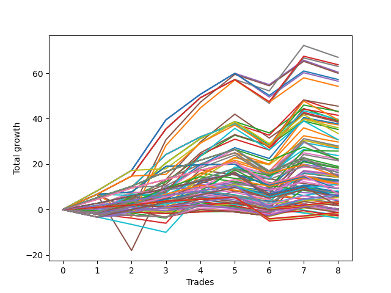

# Long Wallace Doodle 012 
- Symbol: ES
- Date Range: 03/18/2022 - 07/15/2022
- Trading Period: 7:20-12:30
- Number of Trades: 8



| Name | Win Percent | Profit | Avg Profit / Trade | Avg Time / Trade |      | Name | Win Percent | Profit | Avg Profit / Trade | Avg Time / Trade |
| ---- | ----------- | ------ | ------------------ | ---------------- | ---- | ---- | ----------- | ------ | ------------------ | ---------------- |
| Sorted By <br> Profit | | | | | | Sorted By <br> Win Percentage ||||
| Forty-Seven | 75.00 | 33500.00 | 4187.50 | 13:25 |     | One Hundred Twelve | 87.50 | 5625.00 | 703.12 | 04:11 |
| Sixty-Three | 75.00 | 31875.00 | 3984.38 | 16:28 |     | One Hundred Twenty-Seven | 87.50 | 3375.00 | 421.88 | 05:06 |
| Seven | 75.00 | 31500.00 | 3937.50 | 18:50 |     | One Hundred Twenty-Two | 87.50 | 3250.00 | 406.25 | 05:07 |
| Forty-Four | 75.00 | 30250.00 | 3781.25 | 15:15 |     | Eighty-Two | 87.50 | 2875.00 | 359.38 | 07:28 |
| Forty-Five | 62.50 | 30000.00 | 3750.00 | 21:02 |     | One Hundred One | 87.50 | 2625.00 | 328.12 | 01:33 |
| Sixty | 75.00 | 28625.00 | 3578.12 | 18:18 |     | One Hundred Sixteen | 87.50 | 1750.00 | 218.75 | 01:52 |
| Four | 75.00 | 28250.00 | 3531.25 | 20:39 |     | One Hundred Eleven | 87.50 | 1625.00 | 203.12 | 01:53 |
| Sixty-One | 62.50 | 27125.00 | 3390.62 | 24:21 |     | One Hundred Twenty-Six | 87.50 | -625.00 | -78.12 | 02:48 |
| Fifty-Five | 62.50 | 22750.00 | 2843.75 | 09:13 |     | One Hundred Twenty-One | 87.50 | -750.00 | -93.75 | 02:48 |
| Fifty-Two | 62.50 | 21625.00 | 2703.12 | 09:12 |     | Eighty-One | 87.50 | -1125.00 | -140.62 | 05:10 |
| Forty-Three | 75.00 | 21500.00 | 2687.50 | 09:45 |     | Forty-Seven | 75.00 | 33500.00 | 4187.50 | 13:25 |
| Fifty-Three | 62.50 | 20750.00 | 2593.75 | 12:10 |     | Sixty-Three | 75.00 | 31875.00 | 3984.38 | 16:28 |
| Fifty-Nine | 75.00 | 19875.00 | 2484.38 | 12:48 |     | Seven | 75.00 | 31500.00 | 3937.50 | 18:50 |
| Seventy-One | 75.00 | 19750.00 | 2468.75 | 14:51 |     | Forty-Four | 75.00 | 30250.00 | 3781.25 | 15:15 |
| Forty-Two | 75.00 | 19625.00 | 2453.12 | 12:42 |     | Sixty | 75.00 | 28625.00 | 3578.12 | 18:18 |
| Three | 75.00 | 19500.00 | 2437.50 | 15:09 |     | Four | 75.00 | 28250.00 | 3531.25 | 20:39 |
| Five | 62.50 | 19250.00 | 2406.25 | 28:37 |     | Forty-Three | 75.00 | 21500.00 | 2687.50 | 09:45 |
| Fifty | 62.50 | 18875.00 | 2359.38 | 08:03 |     | Fifty-Nine | 75.00 | 19875.00 | 2484.38 | 12:48 |
| Thirty-One | 50.00 | 18625.00 | 2328.12 | 09:38 |     | Seventy-One | 75.00 | 19750.00 | 2468.75 | 14:51 |
| Fifty-Eight | 75.00 | 18000.00 | 2250.00 | 15:45 |     | Forty-Two | 75.00 | 19625.00 | 2453.12 | 12:42 |
| Two | 75.00 | 17625.00 | 2203.12 | 18:06 |     | Three | 75.00 | 19500.00 | 2437.50 | 15:09 |
| Sixty-Eight | 75.00 | 16750.00 | 2093.75 | 14:24 |     | Fifty-Eight | 75.00 | 18000.00 | 2250.00 | 15:45 |
| Forty-One | 75.00 | 15375.00 | 1921.88 | 09:07 |     | Two | 75.00 | 17625.00 | 2203.12 | 18:06 |
| Sixty-Nine | 62.50 | 15375.00 | 1921.88 | 19:17 |     | Sixty-Eight | 75.00 | 16750.00 | 2093.75 | 14:24 |
| Fifty-One | 62.50 | 14875.00 | 1859.38 | 06:58 |     | Forty-One | 75.00 | 15375.00 | 1921.88 | 09:07 |
| Fifty-Seven | 75.00 | 14000.00 | 1750.00 | 12:07 |     | Fifty-Seven | 75.00 | 14000.00 | 1750.00 | 12:07 |
| Twenty-Eight | 50.00 | 13875.00 | 1734.38 | 11:41 |     | One | 75.00 | 13625.00 | 1703.12 | 14:28 |
| One | 75.00 | 13625.00 | 1703.12 | 14:28 |     | One Hundred Fifteen | 75.00 | 11125.00 | 1390.62 | 06:51 |
| Forty-Nine | 62.50 | 13375.00 | 1671.88 | 06:53 |     | Sixty-Seven | 75.00 | 10875.00 | 1359.38 | 11:13 |
| Seventy-Three | 37.50 | 12875.00 | 1609.38 | 12:50 |     | Sixty-Six | 75.00 | 10750.00 | 1343.75 | 12:35 |
| Twenty-Nine | 37.50 | 11875.00 | 1484.38 | 16:01 |     | One Hundred Twenty-Five | 75.00 | 9500.00 | 1187.50 | 09:54 |
| One Hundred Fifteen | 75.00 | 11125.00 | 1390.62 | 06:51 |     | Eighty-Five | 75.00 | 9125.00 | 1140.62 | 12:15 |
| Twenty-Six | 50.00 | 11125.00 | 1390.62 | 10:31 |     | Forty-Six | 75.00 | 8750.00 | 1093.75 | 04:01 |
| Sixty-Seven | 75.00 | 10875.00 | 1359.38 | 11:13 |     | Forty | 75.00 | 8125.00 | 1015.62 | 06:37 |
| Sixty-Six | 75.00 | 10750.00 | 1343.75 | 12:35 |     | Sixty-Four | 75.00 | 7625.00 | 953.12 | 07:48 |
| twenty-Seven | 50.00 | 10750.00 | 1343.75 | 07:23 |     | Fifty-Six | 75.00 | 7500.00 | 937.50 | 07:49 |
| One Hundred Twenty-Five | 75.00 | 9500.00 | 1187.50 | 09:54 |     | One Hundred Thirty | 75.00 | 7375.00 | 921.88 | 09:10 |
| Twenty-Five | 50.00 | 9250.00 | 1156.25 | 07:18 |     | Sixty-Five | 75.00 | 7375.00 | 921.88 | 10:54 |
| Eighty-Five | 75.00 | 9125.00 | 1140.62 | 12:15 |     | One Hundred Fourteen | 75.00 | 7250.00 | 906.25 | 06:20 |
| One Hundred Five | 62.50 | 9125.00 | 1140.62 | 05:05 |     | Zero | 75.00 | 7125.00 | 890.62 | 10:10 |
| Forty-Six | 75.00 | 8750.00 | 1093.75 | 04:01 |     | Seventy | 75.00 | 6500.00 | 812.50 | 04:56 |
| Twenty-Four | 62.50 | 8625.00 | 1078.12 | 05:07 |     | Sixty-Two | 75.00 | 6375.00 | 796.88 | 04:56 |
| One Hundred Twenty | 62.50 | 8250.00 | 1031.25 | 05:25 |     | Six | 75.00 | 6000.00 | 750.00 | 07:18 |
| Forty | 75.00 | 8125.00 | 1015.62 | 06:37 |     | One Hundred Twenty-Four | 75.00 | 5625.00 | 703.12 | 09:23 |
| Thirty-Six | 37.50 | 7750.00 | 968.75 | 04:20 |     | Eighty-Four | 75.00 | 5250.00 | 656.25 | 11:45 |
| Sixty-Four | 75.00 | 7625.00 | 953.12 | 07:48 |     | One Hundred Thirteen | 75.00 | 4625.00 | 578.12 | 05:51 |
| Fifty-Six | 75.00 | 7500.00 | 937.50 | 07:49 |     | One Hundred Two | 75.00 | 4125.00 | 515.62 | 03:26 |
| One Hundred Thirty | 75.00 | 7375.00 | 921.88 | 09:10 |     | One Hundred Twenty-Nine | 75.00 | 3500.00 | 437.50 | 08:40 |
| Sixty-Five | 75.00 | 7375.00 | 921.88 | 10:54 |     | One Hundred Seventeen | 75.00 | 3250.00 | 406.25 | 03:45 |
| One Hundred Fourteen | 75.00 | 7250.00 | 906.25 | 06:20 |     | One Hundred Twenty-Three | 75.00 | 3000.00 | 375.00 | 08:55 |
| Thirty-Nine | 37.50 | 7250.00 | 906.25 | 04:10 |     | Eighty-Three | 75.00 | 2625.00 | 328.12 | 11:16 |
| Zero | 75.00 | 7125.00 | 890.62 | 10:10 |     | One Hundred Six | 75.00 | 1375.00 | 171.88 | 01:31 |
| Forty-Eight | 62.50 | 7125.00 | 890.62 | 05:10 |     | One Hundred Twenty-Eight | 75.00 | 875.00 | 109.38 | 08:11 |
| Thirty-Five | 37.50 | 7125.00 | 890.62 | 03:53 |     | Forty-Five | 62.50 | 30000.00 | 3750.00 | 21:02 |
| Seventy | 75.00 | 6500.00 | 812.50 | 04:56 |     | Sixty-One | 62.50 | 27125.00 | 3390.62 | 24:21 |
| Thirty-Seven | 37.50 | 6500.00 | 812.50 | 04:30 |     | Fifty-Five | 62.50 | 22750.00 | 2843.75 | 09:13 |
| Thirty-Three | 37.50 | 6500.00 | 812.50 | 03:55 |     | Fifty-Two | 62.50 | 21625.00 | 2703.12 | 09:12 |
| Sixty-Two | 75.00 | 6375.00 | 796.88 | 04:56 |     | Fifty-Three | 62.50 | 20750.00 | 2593.75 | 12:10 |
| Thirty-Four | 37.50 | 6125.00 | 765.62 | 03:58 |     | Five | 62.50 | 19250.00 | 2406.25 | 28:37 |
| Six | 75.00 | 6000.00 | 750.00 | 07:18 |     | Fifty | 62.50 | 18875.00 | 2359.38 | 08:03 |
| One Hundred Twelve | 87.50 | 5625.00 | 703.12 | 04:11 |     | Sixty-Nine | 62.50 | 15375.00 | 1921.88 | 19:17 |
| One Hundred Twenty-Four | 75.00 | 5625.00 | 703.12 | 09:23 |     | Fifty-One | 62.50 | 14875.00 | 1859.38 | 06:58 |
| One Hundred Four | 62.50 | 5625.00 | 703.12 | 04:36 |     | Forty-Nine | 62.50 | 13375.00 | 1671.88 | 06:53 |
| Eighty-Four | 75.00 | 5250.00 | 656.25 | 11:45 |     | One Hundred Five | 62.50 | 9125.00 | 1140.62 | 05:05 |
| One Hundred Ninteen | 62.50 | 4750.00 | 593.75 | 04:56 |     | Twenty-Four | 62.50 | 8625.00 | 1078.12 | 05:07 |
| Thirty | 62.50 | 4750.00 | 593.75 | 02:43 |     | One Hundred Twenty | 62.50 | 8250.00 | 1031.25 | 05:25 |
| One Hundred Thirteen | 75.00 | 4625.00 | 578.12 | 05:51 |     | Forty-Eight | 62.50 | 7125.00 | 890.62 | 05:10 |
| Fifteen | 25.00 | 4625.00 | 578.12 | 04:55 |     | One Hundred Four | 62.50 | 5625.00 | 703.12 | 04:36 |
| One Hundred Two | 75.00 | 4125.00 | 515.62 | 03:26 |     | One Hundred Ninteen | 62.50 | 4750.00 | 593.75 | 04:56 |
| One Hundred Three | 62.50 | 3875.00 | 484.38 | 04:09 |     | Thirty | 62.50 | 4750.00 | 593.75 | 02:43 |
| Fifty-Four | 62.50 | 3875.00 | 484.38 | 03:03 |     | One Hundred Three | 62.50 | 3875.00 | 484.38 | 04:09 |
| Twelve | 25.00 | 3875.00 | 484.38 | 04:20 |     | Fifty-Four | 62.50 | 3875.00 | 484.38 | 03:03 |
| One Hundred Ten | 37.50 | 3750.00 | 468.75 | 02:59 |     | One Hundred Eighteen | 62.50 | 3000.00 | 375.00 | 04:28 |
| Thirty-Two | 37.50 | 3625.00 | 453.12 | 02:55 |     | Thirty-One | 50.00 | 18625.00 | 2328.12 | 09:38 |
| One Hundred Twenty-Nine | 75.00 | 3500.00 | 437.50 | 08:40 |     | Twenty-Eight | 50.00 | 13875.00 | 1734.38 | 11:41 |
| One Hundred Twenty-Seven | 87.50 | 3375.00 | 421.88 | 05:06 |     | Twenty-Six | 50.00 | 11125.00 | 1390.62 | 10:31 |
| One Hundred Twenty-Two | 87.50 | 3250.00 | 406.25 | 05:07 |     | twenty-Seven | 50.00 | 10750.00 | 1343.75 | 07:23 |
| One Hundred Seventeen | 75.00 | 3250.00 | 406.25 | 03:45 |     | Twenty-Five | 50.00 | 9250.00 | 1156.25 | 07:18 |
| Fourteen | 50.00 | 3125.00 | 390.62 | 00:47 |     | Fourteen | 50.00 | 3125.00 | 390.62 | 00:47 |
| Ninety-Five | 37.50 | 3125.00 | 390.62 | 01:45 |     | One Hundred Seven | 50.00 | 1625.00 | 203.12 | 02:22 |
| One Hundred Twenty-Three | 75.00 | 3000.00 | 375.00 | 08:55 |     | Twenty-Two | 50.00 | 0.00 | 0.00 | 00:38 |
| One Hundred Eighteen | 62.50 | 3000.00 | 375.00 | 04:28 |     | Thirty-Eight | 50.00 | -250.00 | -31.25 | 01:31 |
| Eighty-Two | 87.50 | 2875.00 | 359.38 | 07:28 |     | Ninety-Six | 50.00 | -1375.00 | -171.88 | 00:48 |
| One Hundred One | 87.50 | 2625.00 | 328.12 | 01:33 |     | Ninety-One | 50.00 | -1750.00 | -218.75 | 00:35 |
| Eighty-Three | 75.00 | 2625.00 | 328.12 | 11:16 |     | Seventy-Three | 37.50 | 12875.00 | 1609.38 | 12:50 |
| One Hundred Nine | 37.50 | 2125.00 | 265.62 | 02:51 |     | Twenty-Nine | 37.50 | 11875.00 | 1484.38 | 16:01 |
| Ten | 25.00 | 2000.00 | 250.00 | 03:36 |     | Thirty-Six | 37.50 | 7750.00 | 968.75 | 04:20 |
| One Hundred Sixteen | 87.50 | 1750.00 | 218.75 | 01:52 |     | Thirty-Nine | 37.50 | 7250.00 | 906.25 | 04:10 |
| One Hundred Eleven | 87.50 | 1625.00 | 203.12 | 01:53 |     | Thirty-Five | 37.50 | 7125.00 | 890.62 | 03:53 |
| One Hundred Seven | 50.00 | 1625.00 | 203.12 | 02:22 |     | Thirty-Seven | 37.50 | 6500.00 | 812.50 | 04:30 |
| One Hundred Six | 75.00 | 1375.00 | 171.88 | 01:31 |     | Thirty-Three | 37.50 | 6500.00 | 812.50 | 03:55 |
| One Hundred | 25.00 | 1375.00 | 171.88 | 01:28 |     | Thirty-Four | 37.50 | 6125.00 | 765.62 | 03:58 |
| Ninety-Four | 37.50 | 1250.00 | 156.25 | 01:28 |     | One Hundred Ten | 37.50 | 3750.00 | 468.75 | 02:59 |
| Sixten | 37.50 | 1250.00 | 156.25 | 01:31 |     | Thirty-Two | 37.50 | 3625.00 | 453.12 | 02:55 |
| Eight | 37.50 | 1250.00 | 156.25 | 02:00 |     | Ninety-Five | 37.50 | 3125.00 | 390.62 | 01:45 |
| Thirteen | 12.50 | 1125.00 | 140.62 | 06:23 |     | One Hundred Nine | 37.50 | 2125.00 | 265.62 | 02:51 |
| One Hundred Twenty-Eight | 75.00 | 875.00 | 109.38 | 08:11 |     | Ninety-Four | 37.50 | 1250.00 | 156.25 | 01:28 |
| One Hundred Eight | 37.50 | 875.00 | 109.38 | 02:46 |     | Sixten | 37.50 | 1250.00 | 156.25 | 01:31 |
| Ninety-Seven | 37.50 | 125.00 | 15.62 | 01:13 |     | Eight | 37.50 | 1250.00 | 156.25 | 02:00 |
| Twenty-Three | 25.00 | 125.00 | 15.62 | 02:00 |     | One Hundred Eight | 37.50 | 875.00 | 109.38 | 02:46 |
| Twenty-One | 25.00 | 125.00 | 15.62 | 02:00 |     | Ninety-Seven | 37.50 | 125.00 | 15.62 | 01:13 |
| Twenty | 25.00 | 125.00 | 15.62 | 02:00 |     | Ninety-Three | 37.50 | -250.00 | -31.25 | 01:21 |
| Nineteen | 25.00 | 125.00 | 15.62 | 02:00 |     | Ninety-Two | 37.50 | -1875.00 | -234.38 | 01:03 |
| Eighteen | 25.00 | 125.00 | 15.62 | 02:00 |     | Fifteen | 25.00 | 4625.00 | 578.12 | 04:55 |
| Seventeen | 25.00 | 125.00 | 15.62 | 02:00 |     | Twelve | 25.00 | 3875.00 | 484.38 | 04:20 |
| Eleven | 25.00 | 125.00 | 15.62 | 03:33 |     | Ten | 25.00 | 2000.00 | 250.00 | 03:36 |
| Twenty-Two | 50.00 | 0.00 | 0.00 | 00:38 |     | One Hundred | 25.00 | 1375.00 | 171.88 | 01:28 |
| Thirty-Eight | 50.00 | -250.00 | -31.25 | 01:31 |     | Twenty-Three | 25.00 | 125.00 | 15.62 | 02:00 |
| Ninety-Three | 37.50 | -250.00 | -31.25 | 01:21 |     | Twenty-One | 25.00 | 125.00 | 15.62 | 02:00 |
| Ninety-Nine | 25.00 | -250.00 | -31.25 | 01:20 |     | Twenty | 25.00 | 125.00 | 15.62 | 02:00 |
| One Hundred Twenty-Six | 87.50 | -625.00 | -78.12 | 02:48 |     | Nineteen | 25.00 | 125.00 | 15.62 | 02:00 |
| Ninety-Eight | 25.00 | -625.00 | -78.12 | 01:16 |     | Eighteen | 25.00 | 125.00 | 15.62 | 02:00 |
| One Hundred Twenty-One | 87.50 | -750.00 | -93.75 | 02:48 |     | Seventeen | 25.00 | 125.00 | 15.62 | 02:00 |
| Eighty-One | 87.50 | -1125.00 | -140.62 | 05:10 |     | Eleven | 25.00 | 125.00 | 15.62 | 03:33 |
| Nine | 25.00 | -1250.00 | -156.25 | 03:30 |     | Ninety-Nine | 25.00 | -250.00 | -31.25 | 01:20 |
| Ninety-Six | 50.00 | -1375.00 | -171.88 | 00:48 |     | Ninety-Eight | 25.00 | -625.00 | -78.12 | 01:16 |
| Ninety-One | 50.00 | -1750.00 | -218.75 | 00:35 |     | Nine | 25.00 | -1250.00 | -156.25 | 03:30 |
| Ninety-Two | 37.50 | -1875.00 | -234.38 | 01:03 |     | Thirteen | 12.50 | 1125.00 | 140.62 | 06:23 |

## NO STOPLOSS

### Test Zero
* Sell when price hits the middle line of the 20p bollinger
* No Stoploss
* Results:
```
Total Trades: 8
Percent Up: 75.00
Percent Down: 25.00
Total Points Moved Up: 14.25
Potential Profit: 7125.00
Total Points Ups: 26.50 Count Ups: 6
Total Points Downs: -12.25 Count Downs: 2
```

<details><summary>Trades</summary>

<code>In: 2022-04-20 09:14:00		Out: 2022-04-20 09:30:50		Total Position Time: 16:50		Total Move Up: 0.25		Total to Date: 0.25</code> <br />
<code>In: 2022-04-27 11:40:00		Out: 2022-04-27 11:40:10		Total Position Time: 00:10		Total Move Up: 1.00		Total to Date: 1.25</code> <br />
<code>In: 2022-05-17 11:24:00		Out: 2022-05-17 11:31:30		Total Position Time: 07:30		Total Move Up: 7.75		Total to Date: 9.00</code> <br />
<code>In: 2022-05-23 10:23:00		Out: 2022-05-23 10:26:30		Total Position Time: 03:30		Total Move Up: 4.00		Total to Date: 13.00</code> <br />
<code>In: 2022-05-27 08:04:00		Out: 2022-05-27 08:06:55		Total Position Time: 02:55		Total Move Up: 2.75		Total to Date: 15.75</code> <br />
<code>In: 2022-06-15 07:35:00		Out: 2022-06-15 08:04:55		Total Position Time: 29:55		Total Move Up: -10.50		Total to Date: 5.25</code> <br />
<code>In: 2022-06-17 12:15:00		Out: 2022-06-17 12:20:30		Total Position Time: 05:30		Total Move Up: 10.75		Total to Date: 16.00</code> <br />
<code>In: 2022-06-21 08:47:00		Out: 2022-06-21 09:02:05		Total Position Time: 15:05		Total Move Up: -1.75		Total to Date: 14.25</code> <br />


</details>

### Test One
* Sell when the price hits the upper line of the 20p 1std bollinger
* No Stoploss
* Results:
```
Total Trades: 8
Percent Up: 75.00
Percent Down: 25.00
Total Points Moved Up: 27.25
Potential Profit: 13625.00
Total Points Ups: 41.00 Count Ups: 6
Total Points Downs: -13.75 Count Downs: 2
```

<details><summary>Trades</summary>

<code>In: 2022-04-20 09:14:00		Out: 2022-04-20 09:30:55		Total Position Time: 16:55		Total Move Up: 0.75		Total to Date: 0.75</code> <br />
<code>In: 2022-04-27 11:40:00		Out: 2022-04-27 11:42:30		Total Position Time: 02:30		Total Move Up: 3.25		Total to Date: 4.00</code> <br />
<code>In: 2022-05-17 11:24:00		Out: 2022-05-17 11:37:35		Total Position Time: 13:35		Total Move Up: 9.25		Total to Date: 13.25</code> <br />
<code>In: 2022-05-23 10:23:00		Out: 2022-05-23 10:32:40		Total Position Time: 09:40		Total Move Up: 6.75		Total to Date: 20.00</code> <br />
<code>In: 2022-05-27 08:04:00		Out: 2022-05-27 08:11:05		Total Position Time: 07:05		Total Move Up: 5.00		Total to Date: 25.00</code> <br />
<code>In: 2022-06-15 07:35:00		Out: 2022-06-15 08:04:55		Total Position Time: 29:55		Total Move Up: -10.50		Total to Date: 14.50</code> <br />
<code>In: 2022-06-17 12:15:00		Out: 2022-06-17 12:21:40		Total Position Time: 06:40		Total Move Up: 16.00		Total to Date: 30.50</code> <br />
<code>In: 2022-06-21 08:47:00		Out: 2022-06-21 09:16:30		Total Position Time: 29:30		Total Move Up: -3.25		Total to Date: 27.25</code> <br />


</details>

### Test Two
* Sell when the price hits the upper line of the 20p 2std bollinger
* No Stoploss
* Results:
```
Total Trades: 8
Percent Up: 75.00
Percent Down: 25.00
Total Points Moved Up: 35.25
Potential Profit: 17625.00
Total Points Ups: 49.50 Count Ups: 6
Total Points Downs: -14.25 Count Downs: 2
```

<details><summary>Trades</summary>

<code>In: 2022-04-20 09:14:00		Out: 2022-04-20 09:31:25		Total Position Time: 17:25		Total Move Up: 1.75		Total to Date: 1.75</code> <br />
<code>In: 2022-04-27 11:40:00		Out: 2022-04-27 11:42:40		Total Position Time: 02:40		Total Move Up: 5.75		Total to Date: 7.50</code> <br />
<code>In: 2022-05-17 11:24:00		Out: 2022-05-17 11:40:00		Total Position Time: 16:00		Total Move Up: 13.00		Total to Date: 20.50</code> <br />
<code>In: 2022-05-23 10:23:00		Out: 2022-05-23 10:33:15		Total Position Time: 10:15		Total Move Up: 10.75		Total to Date: 31.25</code> <br />
<code>In: 2022-05-27 08:04:00		Out: 2022-05-27 08:12:50		Total Position Time: 08:50		Total Move Up: 7.50		Total to Date: 38.75</code> <br />
<code>In: 2022-06-15 07:35:00		Out: 2022-06-15 08:04:55		Total Position Time: 29:55		Total Move Up: -10.50		Total to Date: 28.25</code> <br />
<code>In: 2022-06-17 12:15:00		Out: 2022-06-17 12:44:55		Total Position Time: 29:55		Total Move Up: 10.75		Total to Date: 39.00</code> <br />
<code>In: 2022-06-21 08:47:00		Out: 2022-06-21 09:16:55		Total Position Time: 29:55		Total Move Up: -3.75		Total to Date: 35.25</code> <br />


</details>

### Test Three
* Sell when price hits the middle line of the 50p bollinger
* No Stoploss
* Results:
```
Total Trades: 8
Percent Up: 75.00
Percent Down: 25.00
Total Points Moved Up: 39.00
Potential Profit: 19500.00
Total Points Ups: 53.25 Count Ups: 6
Total Points Downs: -14.25 Count Downs: 2
```

<details><summary>Trades</summary>

<code>In: 2022-04-20 09:14:00		Out: 2022-04-20 09:32:50		Total Position Time: 18:50		Total Move Up: 4.75		Total to Date: 4.75</code> <br />
<code>In: 2022-04-27 11:40:00		Out: 2022-04-27 11:42:35		Total Position Time: 02:35		Total Move Up: 5.00		Total to Date: 9.75</code> <br />
<code>In: 2022-05-17 11:24:00		Out: 2022-05-17 11:40:05		Total Position Time: 16:05		Total Move Up: 14.50		Total to Date: 24.25</code> <br />
<code>In: 2022-05-23 10:23:00		Out: 2022-05-23 10:33:00		Total Position Time: 10:00		Total Move Up: 7.75		Total to Date: 32.00</code> <br />
<code>In: 2022-05-27 08:04:00		Out: 2022-05-27 08:11:30		Total Position Time: 07:30		Total Move Up: 5.75		Total to Date: 37.75</code> <br />
<code>In: 2022-06-15 07:35:00		Out: 2022-06-15 08:04:55		Total Position Time: 29:55		Total Move Up: -10.50		Total to Date: 27.25</code> <br />
<code>In: 2022-06-17 12:15:00		Out: 2022-06-17 12:21:25		Total Position Time: 06:25		Total Move Up: 15.50		Total to Date: 42.75</code> <br />
<code>In: 2022-06-21 08:47:00		Out: 2022-06-21 09:16:55		Total Position Time: 29:55		Total Move Up: -3.75		Total to Date: 39.00</code> <br />


</details>

### Test Four
* Sell when the price hits the upper line of the 50p 1std bollinger
* No Stoploss
* Results:
```
Total Trades: 8
Percent Up: 75.00
Percent Down: 25.00
Total Points Moved Up: 56.50
Potential Profit: 28250.00
Total Points Ups: 70.75 Count Ups: 6
Total Points Downs: -14.25 Count Downs: 2
```

<details><summary>Trades</summary>

<code>In: 2022-04-20 09:14:00		Out: 2022-04-20 09:36:45		Total Position Time: 22:45		Total Move Up: 8.25		Total to Date: 8.25</code> <br />
<code>In: 2022-04-27 11:40:00		Out: 2022-04-27 11:45:35		Total Position Time: 05:35		Total Move Up: 9.00		Total to Date: 17.25</code> <br />
<code>In: 2022-05-17 11:24:00		Out: 2022-05-17 11:45:45		Total Position Time: 21:45		Total Move Up: 22.25		Total to Date: 39.50</code> <br />
<code>In: 2022-05-23 10:23:00		Out: 2022-05-23 10:36:15		Total Position Time: 13:15		Total Move Up: 11.25		Total to Date: 50.75</code> <br />
<code>In: 2022-05-27 08:04:00		Out: 2022-05-27 08:16:10		Total Position Time: 12:10		Total Move Up: 9.25		Total to Date: 60.00</code> <br />
<code>In: 2022-06-15 07:35:00		Out: 2022-06-15 08:04:55		Total Position Time: 29:55		Total Move Up: -10.50		Total to Date: 49.50</code> <br />
<code>In: 2022-06-17 12:15:00		Out: 2022-06-17 12:44:55		Total Position Time: 29:55		Total Move Up: 10.75		Total to Date: 60.25</code> <br />
<code>In: 2022-06-21 08:47:00		Out: 2022-06-21 09:16:55		Total Position Time: 29:55		Total Move Up: -3.75		Total to Date: 56.50</code> <br />


</details>

### Test Five
* Sell when the price hits the upper line of the 50p 2std bollinger
* No Stoploss
* Results:
```
Total Trades: 8
Percent Up: 62.50
Percent Down: 37.50
Total Points Moved Up: 38.50
Potential Profit: 19250.00
Total Points Ups: 77.50 Count Ups: 5
Total Points Downs: -39.00 Count Downs: 3
```

<details><summary>Trades</summary>

<code>In: 2022-04-20 09:14:00		Out: 2022-04-20 09:43:55		Total Position Time: 29:55		Total Move Up: 6.75		Total to Date: 6.75</code> <br />
<code>In: 2022-04-27 11:40:00		Out: 2022-04-27 12:09:55		Total Position Time: 29:55		Total Move Up: -24.75		Total to Date: -18.00</code> <br />
<code>In: 2022-05-17 11:24:00		Out: 2022-05-17 11:48:45		Total Position Time: 24:45		Total Move Up: 31.25		Total to Date: 13.25</code> <br />
<code>In: 2022-05-23 10:23:00		Out: 2022-05-23 10:47:45		Total Position Time: 24:45		Total Move Up: 16.50		Total to Date: 29.75</code> <br />
<code>In: 2022-05-27 08:04:00		Out: 2022-05-27 08:33:55		Total Position Time: 29:55		Total Move Up: 12.25		Total to Date: 42.00</code> <br />
<code>In: 2022-06-15 07:35:00		Out: 2022-06-15 08:04:55		Total Position Time: 29:55		Total Move Up: -10.50		Total to Date: 31.50</code> <br />
<code>In: 2022-06-17 12:15:00		Out: 2022-06-17 12:44:55		Total Position Time: 29:55		Total Move Up: 10.75		Total to Date: 42.25</code> <br />
<code>In: 2022-06-21 08:47:00		Out: 2022-06-21 09:16:55		Total Position Time: 29:55		Total Move Up: -3.75		Total to Date: 38.50</code> <br />


</details>

### Test Six
* Sell when the price hits the middle line of the 1std VWAP
* No Stoploss
* Results:
```
Total Trades: 8
Percent Up: 75.00
Percent Down: 25.00
Total Points Moved Up: 12.00
Potential Profit: 6000.00
Total Points Ups: 23.75 Count Ups: 6
Total Points Downs: -11.75 Count Downs: 2
```

<details><summary>Trades</summary>

<code>In: 2022-04-20 09:14:00		Out: 2022-04-20 09:35:50		Total Position Time: 21:50		Total Move Up: 6.75		Total to Date: 6.75</code> <br />
<code>In: 2022-04-27 11:40:00		Out: 2022-04-27 11:40:10		Total Position Time: 00:10		Total Move Up: 1.00		Total to Date: 7.75</code> <br />
<code>In: 2022-05-17 11:24:00		Out: 2022-05-17 11:27:25		Total Position Time: 03:25		Total Move Up: 11.25		Total to Date: 19.00</code> <br />
<code>In: 2022-05-23 10:23:00		Out: 2022-05-23 10:23:10		Total Position Time: 00:10		Total Move Up: 0.75		Total to Date: 19.75</code> <br />
<code>In: 2022-05-27 08:04:00		Out: 2022-05-27 08:04:10		Total Position Time: 00:10		Total Move Up: 0.25		Total to Date: 20.00</code> <br />
<code>In: 2022-06-15 07:35:00		Out: 2022-06-15 08:04:55		Total Position Time: 29:55		Total Move Up: -10.50		Total to Date: 9.50</code> <br />
<code>In: 2022-06-17 12:15:00		Out: 2022-06-17 12:17:35		Total Position Time: 02:35		Total Move Up: 3.75		Total to Date: 13.25</code> <br />
<code>In: 2022-06-21 08:47:00		Out: 2022-06-21 08:47:10		Total Position Time: 00:10		Total Move Up: -1.25		Total to Date: 12.00</code> <br />


</details>

### Test Seven
* Sell when the price hits the upper line of the 1std VWAP
* No Stoploss
* Results:
```
Total Trades: 8
Percent Up: 75.00
Percent Down: 25.00
Total Points Moved Up: 63.00
Potential Profit: 31500.00
Total Points Ups: 77.25 Count Ups: 6
Total Points Downs: -14.25 Count Downs: 2
```

<details><summary>Trades</summary>

<code>In: 2022-04-20 09:14:00		Out: 2022-04-20 09:43:55		Total Position Time: 29:55		Total Move Up: 6.75		Total to Date: 6.75</code> <br />
<code>In: 2022-04-27 11:40:00		Out: 2022-04-27 11:44:15		Total Position Time: 04:15		Total Move Up: 8.00		Total to Date: 14.75</code> <br />
<code>In: 2022-05-17 11:24:00		Out: 2022-05-17 11:40:20		Total Position Time: 16:20		Total Move Up: 20.75		Total to Date: 35.50</code> <br />
<code>In: 2022-05-23 10:23:00		Out: 2022-05-23 10:42:15		Total Position Time: 19:15		Total Move Up: 13.75		Total to Date: 49.25</code> <br />
<code>In: 2022-05-27 08:04:00		Out: 2022-05-27 08:13:35		Total Position Time: 09:35		Total Move Up: 8.00		Total to Date: 57.25</code> <br />
<code>In: 2022-06-15 07:35:00		Out: 2022-06-15 08:04:55		Total Position Time: 29:55		Total Move Up: -10.50		Total to Date: 46.75</code> <br />
<code>In: 2022-06-17 12:15:00		Out: 2022-06-17 12:26:30		Total Position Time: 11:30		Total Move Up: 20.00		Total to Date: 66.75</code> <br />
<code>In: 2022-06-21 08:47:00		Out: 2022-06-21 09:16:55		Total Position Time: 29:55		Total Move Up: -3.75		Total to Date: 63.00</code> <br />


</details>

## STOPLOSS OF 2

### Test Eight
* Sell when price hits the middle line of the 20p bollinger
* Stoploss is 2 points
* Results:
```
Total Trades: 8
Percent Up: 37.50
Percent Down: 62.50
Total Points Moved Up: 2.50
Potential Profit: 1250.00
Total Points Ups: 12.75 Count Ups: 3
Total Points Downs: -10.25 Count Downs: 5
```

<details><summary>Trades</summary>

<code>In: 2022-04-20 09:14:00		Out: 2022-04-20 09:15:35		Total Position Time: 01:35		Total Move Up: -2.00		Total to Date: -2.00</code> <br />
<code>In: 2022-04-27 11:40:00		Out: 2022-04-27 11:40:10		Total Position Time: 00:10		Total Move Up: 1.00		Total to Date: -1.00</code> <br />
<code>In: 2022-05-17 11:24:00		Out: 2022-05-17 11:31:30		Total Position Time: 07:30		Total Move Up: 7.75		Total to Date: 6.75</code> <br />
<code>In: 2022-05-23 10:23:00		Out: 2022-05-23 10:26:30		Total Position Time: 03:30		Total Move Up: 4.00		Total to Date: 10.75</code> <br />
<code>In: 2022-05-27 08:04:00		Out: 2022-05-27 08:05:10		Total Position Time: 01:10		Total Move Up: -2.25		Total to Date: 8.50</code> <br />
<code>In: 2022-06-15 07:35:00		Out: 2022-06-15 07:35:10		Total Position Time: 00:10		Total Move Up: -1.75		Total to Date: 6.75</code> <br />
<code>In: 2022-06-17 12:15:00		Out: 2022-06-17 12:15:30		Total Position Time: 00:30		Total Move Up: -2.00		Total to Date: 4.75</code> <br />
<code>In: 2022-06-21 08:47:00		Out: 2022-06-21 08:48:25		Total Position Time: 01:25		Total Move Up: -2.25		Total to Date: 2.50</code> <br />


</details>

### Test Nine
* Sell when the price hits the upper line of the 20p 1std bollinger
* Stoploss is 2 points
* Results:
```
Total Trades: 8
Percent Up: 25.00
Percent Down: 75.00
Total Points Moved Up: -2.50
Potential Profit: -1250.00
Total Points Ups: 10.00 Count Ups: 2
Total Points Downs: -12.50 Count Downs: 6
```

<details><summary>Trades</summary>

<code>In: 2022-04-20 09:14:00		Out: 2022-04-20 09:15:35		Total Position Time: 01:35		Total Move Up: -2.00		Total to Date: -2.00</code> <br />
<code>In: 2022-04-27 11:40:00		Out: 2022-04-27 11:42:30		Total Position Time: 02:30		Total Move Up: 3.25		Total to Date: 1.25</code> <br />
<code>In: 2022-05-17 11:24:00		Out: 2022-05-17 11:35:05		Total Position Time: 11:05		Total Move Up: -2.25		Total to Date: -1.00</code> <br />
<code>In: 2022-05-23 10:23:00		Out: 2022-05-23 10:32:40		Total Position Time: 09:40		Total Move Up: 6.75		Total to Date: 5.75</code> <br />
<code>In: 2022-05-27 08:04:00		Out: 2022-05-27 08:05:10		Total Position Time: 01:10		Total Move Up: -2.25		Total to Date: 3.50</code> <br />
<code>In: 2022-06-15 07:35:00		Out: 2022-06-15 07:35:10		Total Position Time: 00:10		Total Move Up: -1.75		Total to Date: 1.75</code> <br />
<code>In: 2022-06-17 12:15:00		Out: 2022-06-17 12:15:30		Total Position Time: 00:30		Total Move Up: -2.00		Total to Date: -0.25</code> <br />
<code>In: 2022-06-21 08:47:00		Out: 2022-06-21 08:48:25		Total Position Time: 01:25		Total Move Up: -2.25		Total to Date: -2.50</code> <br />


</details>

### Test Ten
* Sell when the price hits the upper line of the 20p 2std bollinger
* Stoploss is 2 points
* Results:
```
Total Trades: 8
Percent Up: 25.00
Percent Down: 75.00
Total Points Moved Up: 4.00
Potential Profit: 2000.00
Total Points Ups: 16.50 Count Ups: 2
Total Points Downs: -12.50 Count Downs: 6
```

<details><summary>Trades</summary>

<code>In: 2022-04-20 09:14:00		Out: 2022-04-20 09:15:35		Total Position Time: 01:35		Total Move Up: -2.00		Total to Date: -2.00</code> <br />
<code>In: 2022-04-27 11:40:00		Out: 2022-04-27 11:42:40		Total Position Time: 02:40		Total Move Up: 5.75		Total to Date: 3.75</code> <br />
<code>In: 2022-05-17 11:24:00		Out: 2022-05-17 11:35:05		Total Position Time: 11:05		Total Move Up: -2.25		Total to Date: 1.50</code> <br />
<code>In: 2022-05-23 10:23:00		Out: 2022-05-23 10:33:15		Total Position Time: 10:15		Total Move Up: 10.75		Total to Date: 12.25</code> <br />
<code>In: 2022-05-27 08:04:00		Out: 2022-05-27 08:05:10		Total Position Time: 01:10		Total Move Up: -2.25		Total to Date: 10.00</code> <br />
<code>In: 2022-06-15 07:35:00		Out: 2022-06-15 07:35:10		Total Position Time: 00:10		Total Move Up: -1.75		Total to Date: 8.25</code> <br />
<code>In: 2022-06-17 12:15:00		Out: 2022-06-17 12:15:30		Total Position Time: 00:30		Total Move Up: -2.00		Total to Date: 6.25</code> <br />
<code>In: 2022-06-21 08:47:00		Out: 2022-06-21 08:48:25		Total Position Time: 01:25		Total Move Up: -2.25		Total to Date: 4.00</code> <br />


</details>

### Test Eleven
* Sell when price hits the middle line of the 50p bollinger
* Stoploss is 2 points
* Results:
```
Total Trades: 8
Percent Up: 25.00
Percent Down: 75.00
Total Points Moved Up: 0.25
Potential Profit: 125.00
Total Points Ups: 12.75 Count Ups: 2
Total Points Downs: -12.50 Count Downs: 6
```

<details><summary>Trades</summary>

<code>In: 2022-04-20 09:14:00		Out: 2022-04-20 09:15:35		Total Position Time: 01:35		Total Move Up: -2.00		Total to Date: -2.00</code> <br />
<code>In: 2022-04-27 11:40:00		Out: 2022-04-27 11:42:35		Total Position Time: 02:35		Total Move Up: 5.00		Total to Date: 3.00</code> <br />
<code>In: 2022-05-17 11:24:00		Out: 2022-05-17 11:35:05		Total Position Time: 11:05		Total Move Up: -2.25		Total to Date: 0.75</code> <br />
<code>In: 2022-05-23 10:23:00		Out: 2022-05-23 10:33:00		Total Position Time: 10:00		Total Move Up: 7.75		Total to Date: 8.50</code> <br />
<code>In: 2022-05-27 08:04:00		Out: 2022-05-27 08:05:10		Total Position Time: 01:10		Total Move Up: -2.25		Total to Date: 6.25</code> <br />
<code>In: 2022-06-15 07:35:00		Out: 2022-06-15 07:35:10		Total Position Time: 00:10		Total Move Up: -1.75		Total to Date: 4.50</code> <br />
<code>In: 2022-06-17 12:15:00		Out: 2022-06-17 12:15:30		Total Position Time: 00:30		Total Move Up: -2.00		Total to Date: 2.50</code> <br />
<code>In: 2022-06-21 08:47:00		Out: 2022-06-21 08:48:25		Total Position Time: 01:25		Total Move Up: -2.25		Total to Date: 0.25</code> <br />


</details>

### Test Twelve
* Sell when the price hits the upper line of the 50p 1std bollinger
* Stoploss is 2 points
* Results:
```
Total Trades: 8
Percent Up: 25.00
Percent Down: 75.00
Total Points Moved Up: 7.75
Potential Profit: 3875.00
Total Points Ups: 20.25 Count Ups: 2
Total Points Downs: -12.50 Count Downs: 6
```

<details><summary>Trades</summary>

<code>In: 2022-04-20 09:14:00		Out: 2022-04-20 09:15:35		Total Position Time: 01:35		Total Move Up: -2.00		Total to Date: -2.00</code> <br />
<code>In: 2022-04-27 11:40:00		Out: 2022-04-27 11:45:35		Total Position Time: 05:35		Total Move Up: 9.00		Total to Date: 7.00</code> <br />
<code>In: 2022-05-17 11:24:00		Out: 2022-05-17 11:35:05		Total Position Time: 11:05		Total Move Up: -2.25		Total to Date: 4.75</code> <br />
<code>In: 2022-05-23 10:23:00		Out: 2022-05-23 10:36:15		Total Position Time: 13:15		Total Move Up: 11.25		Total to Date: 16.00</code> <br />
<code>In: 2022-05-27 08:04:00		Out: 2022-05-27 08:05:10		Total Position Time: 01:10		Total Move Up: -2.25		Total to Date: 13.75</code> <br />
<code>In: 2022-06-15 07:35:00		Out: 2022-06-15 07:35:10		Total Position Time: 00:10		Total Move Up: -1.75		Total to Date: 12.00</code> <br />
<code>In: 2022-06-17 12:15:00		Out: 2022-06-17 12:15:30		Total Position Time: 00:30		Total Move Up: -2.00		Total to Date: 10.00</code> <br />
<code>In: 2022-06-21 08:47:00		Out: 2022-06-21 08:48:25		Total Position Time: 01:25		Total Move Up: -2.25		Total to Date: 7.75</code> <br />


</details>

### Test Thirteen
* Sell when the price hits the upper line of the 50p 2std bollinger
* Stoploss is 2 points
* Results:
```
Total Trades: 8
Percent Up: 12.50
Percent Down: 87.50
Total Points Moved Up: 2.25
Potential Profit: 1125.00
Total Points Ups: 16.50 Count Ups: 1
Total Points Downs: -14.25 Count Downs: 7
```

<details><summary>Trades</summary>

<code>In: 2022-04-20 09:14:00		Out: 2022-04-20 09:15:35		Total Position Time: 01:35		Total Move Up: -2.00		Total to Date: -2.00</code> <br />
<code>In: 2022-04-27 11:40:00		Out: 2022-04-27 11:50:25		Total Position Time: 10:25		Total Move Up: -1.75		Total to Date: -3.75</code> <br />
<code>In: 2022-05-17 11:24:00		Out: 2022-05-17 11:35:05		Total Position Time: 11:05		Total Move Up: -2.25		Total to Date: -6.00</code> <br />
<code>In: 2022-05-23 10:23:00		Out: 2022-05-23 10:47:45		Total Position Time: 24:45		Total Move Up: 16.50		Total to Date: 10.50</code> <br />
<code>In: 2022-05-27 08:04:00		Out: 2022-05-27 08:05:10		Total Position Time: 01:10		Total Move Up: -2.25		Total to Date: 8.25</code> <br />
<code>In: 2022-06-15 07:35:00		Out: 2022-06-15 07:35:10		Total Position Time: 00:10		Total Move Up: -1.75		Total to Date: 6.50</code> <br />
<code>In: 2022-06-17 12:15:00		Out: 2022-06-17 12:15:30		Total Position Time: 00:30		Total Move Up: -2.00		Total to Date: 4.50</code> <br />
<code>In: 2022-06-21 08:47:00		Out: 2022-06-21 08:48:25		Total Position Time: 01:25		Total Move Up: -2.25		Total to Date: 2.25</code> <br />


</details>

### Test Fourteen
* Sell when the price hits the middle line of the 1std VWAP
* Stoploss is 2 points
* Results:
```
Total Trades: 8
Percent Up: 50.00
Percent Down: 50.00
Total Points Moved Up: 6.25
Potential Profit: 3125.00
Total Points Ups: 13.25 Count Ups: 4
Total Points Downs: -7.00 Count Downs: 4
```

<details><summary>Trades</summary>

<code>In: 2022-04-20 09:14:00		Out: 2022-04-20 09:15:35		Total Position Time: 01:35		Total Move Up: -2.00		Total to Date: -2.00</code> <br />
<code>In: 2022-04-27 11:40:00		Out: 2022-04-27 11:40:10		Total Position Time: 00:10		Total Move Up: 1.00		Total to Date: -1.00</code> <br />
<code>In: 2022-05-17 11:24:00		Out: 2022-05-17 11:27:25		Total Position Time: 03:25		Total Move Up: 11.25		Total to Date: 10.25</code> <br />
<code>In: 2022-05-23 10:23:00		Out: 2022-05-23 10:23:10		Total Position Time: 00:10		Total Move Up: 0.75		Total to Date: 11.00</code> <br />
<code>In: 2022-05-27 08:04:00		Out: 2022-05-27 08:04:10		Total Position Time: 00:10		Total Move Up: 0.25		Total to Date: 11.25</code> <br />
<code>In: 2022-06-15 07:35:00		Out: 2022-06-15 07:35:10		Total Position Time: 00:10		Total Move Up: -1.75		Total to Date: 9.50</code> <br />
<code>In: 2022-06-17 12:15:00		Out: 2022-06-17 12:15:30		Total Position Time: 00:30		Total Move Up: -2.00		Total to Date: 7.50</code> <br />
<code>In: 2022-06-21 08:47:00		Out: 2022-06-21 08:47:10		Total Position Time: 00:10		Total Move Up: -1.25		Total to Date: 6.25</code> <br />


</details>

### Test Fifteen
* Sell when the price hits the upper line of the 1std VWAP
* Stoploss is 2 points
* Results:
```
Total Trades: 8
Percent Up: 25.00
Percent Down: 75.00
Total Points Moved Up: 9.25
Potential Profit: 4625.00
Total Points Ups: 21.75 Count Ups: 2
Total Points Downs: -12.50 Count Downs: 6
```

<details><summary>Trades</summary>

<code>In: 2022-04-20 09:14:00		Out: 2022-04-20 09:15:35		Total Position Time: 01:35		Total Move Up: -2.00		Total to Date: -2.00</code> <br />
<code>In: 2022-04-27 11:40:00		Out: 2022-04-27 11:44:15		Total Position Time: 04:15		Total Move Up: 8.00		Total to Date: 6.00</code> <br />
<code>In: 2022-05-17 11:24:00		Out: 2022-05-17 11:35:05		Total Position Time: 11:05		Total Move Up: -2.25		Total to Date: 3.75</code> <br />
<code>In: 2022-05-23 10:23:00		Out: 2022-05-23 10:42:15		Total Position Time: 19:15		Total Move Up: 13.75		Total to Date: 17.50</code> <br />
<code>In: 2022-05-27 08:04:00		Out: 2022-05-27 08:05:10		Total Position Time: 01:10		Total Move Up: -2.25		Total to Date: 15.25</code> <br />
<code>In: 2022-06-15 07:35:00		Out: 2022-06-15 07:35:10		Total Position Time: 00:10		Total Move Up: -1.75		Total to Date: 13.50</code> <br />
<code>In: 2022-06-17 12:15:00		Out: 2022-06-17 12:15:30		Total Position Time: 00:30		Total Move Up: -2.00		Total to Date: 11.50</code> <br />
<code>In: 2022-06-21 08:47:00		Out: 2022-06-21 08:48:25		Total Position Time: 01:25		Total Move Up: -2.25		Total to Date: 9.25</code> <br />


</details>

## TRAIL STOP OF 2

### Test Sixten
* Sell when price hits the middle line of the 20p bollinger
* Trailing Stop is 2 points
* Results:
```
Total Trades: 8
Percent Up: 37.50
Percent Down: 62.50
Total Points Moved Up: 2.50
Potential Profit: 1250.00
Total Points Ups: 10.25 Count Ups: 3
Total Points Downs: -7.75 Count Downs: 5
```

<details><summary>Trades</summary>

<code>In: 2022-04-20 09:14:00		Out: 2022-04-20 09:15:35		Total Position Time: 01:35		Total Move Up: -2.00		Total to Date: -2.00</code> <br />
<code>In: 2022-04-27 11:40:00		Out: 2022-04-27 11:40:10		Total Position Time: 00:10		Total Move Up: 1.00		Total to Date: -1.00</code> <br />
<code>In: 2022-05-17 11:24:00		Out: 2022-05-17 11:24:10		Total Position Time: 00:10		Total Move Up: -0.75		Total to Date: -1.75</code> <br />
<code>In: 2022-05-23 10:23:00		Out: 2022-05-23 10:26:30		Total Position Time: 03:30		Total Move Up: 4.00		Total to Date: 2.25</code> <br />
<code>In: 2022-05-27 08:04:00		Out: 2022-05-27 08:04:55		Total Position Time: 00:55		Total Move Up: -1.00		Total to Date: 1.25</code> <br />
<code>In: 2022-06-15 07:35:00		Out: 2022-06-15 07:35:10		Total Position Time: 00:10		Total Move Up: -1.75		Total to Date: -0.50</code> <br />
<code>In: 2022-06-17 12:15:00		Out: 2022-06-17 12:19:15		Total Position Time: 04:15		Total Move Up: 5.25		Total to Date: 4.75</code> <br />
<code>In: 2022-06-21 08:47:00		Out: 2022-06-21 08:48:25		Total Position Time: 01:25		Total Move Up: -2.25		Total to Date: 2.50</code> <br />


</details>

### Test Seventeen
* Sell when the price hits the upper line of the 20p 1std bollinger
* Trailing Stop is 2 points
* Results:
```
Total Trades: 8
Percent Up: 25.00
Percent Down: 75.00
Total Points Moved Up: 0.25
Potential Profit: 125.00
Total Points Ups: 8.50 Count Ups: 2
Total Points Downs: -8.25 Count Downs: 6
```

<details><summary>Trades</summary>

<code>In: 2022-04-20 09:14:00		Out: 2022-04-20 09:15:35		Total Position Time: 01:35		Total Move Up: -2.00		Total to Date: -2.00</code> <br />
<code>In: 2022-04-27 11:40:00		Out: 2022-04-27 11:40:25		Total Position Time: 00:25		Total Move Up: -0.50		Total to Date: -2.50</code> <br />
<code>In: 2022-05-17 11:24:00		Out: 2022-05-17 11:24:10		Total Position Time: 00:10		Total Move Up: -0.75		Total to Date: -3.25</code> <br />
<code>In: 2022-05-23 10:23:00		Out: 2022-05-23 10:30:10		Total Position Time: 07:10		Total Move Up: 3.25		Total to Date: 0.00</code> <br />
<code>In: 2022-05-27 08:04:00		Out: 2022-05-27 08:04:55		Total Position Time: 00:55		Total Move Up: -1.00		Total to Date: -1.00</code> <br />
<code>In: 2022-06-15 07:35:00		Out: 2022-06-15 07:35:10		Total Position Time: 00:10		Total Move Up: -1.75		Total to Date: -2.75</code> <br />
<code>In: 2022-06-17 12:15:00		Out: 2022-06-17 12:19:15		Total Position Time: 04:15		Total Move Up: 5.25		Total to Date: 2.50</code> <br />
<code>In: 2022-06-21 08:47:00		Out: 2022-06-21 08:48:25		Total Position Time: 01:25		Total Move Up: -2.25		Total to Date: 0.25</code> <br />


</details>

### Test Eighteen
* Sell when the price hits the upper line of the 20p 2std bollinger
* Trailing Stop is 2 points
* Results:
```
Total Trades: 8
Percent Up: 25.00
Percent Down: 75.00
Total Points Moved Up: 0.25
Potential Profit: 125.00
Total Points Ups: 8.50 Count Ups: 2
Total Points Downs: -8.25 Count Downs: 6
```

<details><summary>Trades</summary>

<code>In: 2022-04-20 09:14:00		Out: 2022-04-20 09:15:35		Total Position Time: 01:35		Total Move Up: -2.00		Total to Date: -2.00</code> <br />
<code>In: 2022-04-27 11:40:00		Out: 2022-04-27 11:40:25		Total Position Time: 00:25		Total Move Up: -0.50		Total to Date: -2.50</code> <br />
<code>In: 2022-05-17 11:24:00		Out: 2022-05-17 11:24:10		Total Position Time: 00:10		Total Move Up: -0.75		Total to Date: -3.25</code> <br />
<code>In: 2022-05-23 10:23:00		Out: 2022-05-23 10:30:10		Total Position Time: 07:10		Total Move Up: 3.25		Total to Date: 0.00</code> <br />
<code>In: 2022-05-27 08:04:00		Out: 2022-05-27 08:04:55		Total Position Time: 00:55		Total Move Up: -1.00		Total to Date: -1.00</code> <br />
<code>In: 2022-06-15 07:35:00		Out: 2022-06-15 07:35:10		Total Position Time: 00:10		Total Move Up: -1.75		Total to Date: -2.75</code> <br />
<code>In: 2022-06-17 12:15:00		Out: 2022-06-17 12:19:15		Total Position Time: 04:15		Total Move Up: 5.25		Total to Date: 2.50</code> <br />
<code>In: 2022-06-21 08:47:00		Out: 2022-06-21 08:48:25		Total Position Time: 01:25		Total Move Up: -2.25		Total to Date: 0.25</code> <br />


</details>

### Test Nineteen
* Sell when price hits the middle line of the 50p bollinger
* Trailing Stop is 2 points
* Results:
```
Total Trades: 8
Percent Up: 25.00
Percent Down: 75.00
Total Points Moved Up: 0.25
Potential Profit: 125.00
Total Points Ups: 8.50 Count Ups: 2
Total Points Downs: -8.25 Count Downs: 6
```

<details><summary>Trades</summary>

<code>In: 2022-04-20 09:14:00		Out: 2022-04-20 09:15:35		Total Position Time: 01:35		Total Move Up: -2.00		Total to Date: -2.00</code> <br />
<code>In: 2022-04-27 11:40:00		Out: 2022-04-27 11:40:25		Total Position Time: 00:25		Total Move Up: -0.50		Total to Date: -2.50</code> <br />
<code>In: 2022-05-17 11:24:00		Out: 2022-05-17 11:24:10		Total Position Time: 00:10		Total Move Up: -0.75		Total to Date: -3.25</code> <br />
<code>In: 2022-05-23 10:23:00		Out: 2022-05-23 10:30:10		Total Position Time: 07:10		Total Move Up: 3.25		Total to Date: 0.00</code> <br />
<code>In: 2022-05-27 08:04:00		Out: 2022-05-27 08:04:55		Total Position Time: 00:55		Total Move Up: -1.00		Total to Date: -1.00</code> <br />
<code>In: 2022-06-15 07:35:00		Out: 2022-06-15 07:35:10		Total Position Time: 00:10		Total Move Up: -1.75		Total to Date: -2.75</code> <br />
<code>In: 2022-06-17 12:15:00		Out: 2022-06-17 12:19:15		Total Position Time: 04:15		Total Move Up: 5.25		Total to Date: 2.50</code> <br />
<code>In: 2022-06-21 08:47:00		Out: 2022-06-21 08:48:25		Total Position Time: 01:25		Total Move Up: -2.25		Total to Date: 0.25</code> <br />


</details>

### Test Twenty
* Sell when the price hits the upper line of the 50p 1std bollinger
* Trailing Stop is 2 points
* Results:
```
Total Trades: 8
Percent Up: 25.00
Percent Down: 75.00
Total Points Moved Up: 0.25
Potential Profit: 125.00
Total Points Ups: 8.50 Count Ups: 2
Total Points Downs: -8.25 Count Downs: 6
```

<details><summary>Trades</summary>

<code>In: 2022-04-20 09:14:00		Out: 2022-04-20 09:15:35		Total Position Time: 01:35		Total Move Up: -2.00		Total to Date: -2.00</code> <br />
<code>In: 2022-04-27 11:40:00		Out: 2022-04-27 11:40:25		Total Position Time: 00:25		Total Move Up: -0.50		Total to Date: -2.50</code> <br />
<code>In: 2022-05-17 11:24:00		Out: 2022-05-17 11:24:10		Total Position Time: 00:10		Total Move Up: -0.75		Total to Date: -3.25</code> <br />
<code>In: 2022-05-23 10:23:00		Out: 2022-05-23 10:30:10		Total Position Time: 07:10		Total Move Up: 3.25		Total to Date: 0.00</code> <br />
<code>In: 2022-05-27 08:04:00		Out: 2022-05-27 08:04:55		Total Position Time: 00:55		Total Move Up: -1.00		Total to Date: -1.00</code> <br />
<code>In: 2022-06-15 07:35:00		Out: 2022-06-15 07:35:10		Total Position Time: 00:10		Total Move Up: -1.75		Total to Date: -2.75</code> <br />
<code>In: 2022-06-17 12:15:00		Out: 2022-06-17 12:19:15		Total Position Time: 04:15		Total Move Up: 5.25		Total to Date: 2.50</code> <br />
<code>In: 2022-06-21 08:47:00		Out: 2022-06-21 08:48:25		Total Position Time: 01:25		Total Move Up: -2.25		Total to Date: 0.25</code> <br />


</details>

### Test Twenty-One
* Sell when the price hits the upper line of the 50p 2std bollinger
* Trailing Stop is 2 points
* Results:
```
Total Trades: 8
Percent Up: 25.00
Percent Down: 75.00
Total Points Moved Up: 0.25
Potential Profit: 125.00
Total Points Ups: 8.50 Count Ups: 2
Total Points Downs: -8.25 Count Downs: 6
```

<details><summary>Trades</summary>

<code>In: 2022-04-20 09:14:00		Out: 2022-04-20 09:15:35		Total Position Time: 01:35		Total Move Up: -2.00		Total to Date: -2.00</code> <br />
<code>In: 2022-04-27 11:40:00		Out: 2022-04-27 11:40:25		Total Position Time: 00:25		Total Move Up: -0.50		Total to Date: -2.50</code> <br />
<code>In: 2022-05-17 11:24:00		Out: 2022-05-17 11:24:10		Total Position Time: 00:10		Total Move Up: -0.75		Total to Date: -3.25</code> <br />
<code>In: 2022-05-23 10:23:00		Out: 2022-05-23 10:30:10		Total Position Time: 07:10		Total Move Up: 3.25		Total to Date: 0.00</code> <br />
<code>In: 2022-05-27 08:04:00		Out: 2022-05-27 08:04:55		Total Position Time: 00:55		Total Move Up: -1.00		Total to Date: -1.00</code> <br />
<code>In: 2022-06-15 07:35:00		Out: 2022-06-15 07:35:10		Total Position Time: 00:10		Total Move Up: -1.75		Total to Date: -2.75</code> <br />
<code>In: 2022-06-17 12:15:00		Out: 2022-06-17 12:19:15		Total Position Time: 04:15		Total Move Up: 5.25		Total to Date: 2.50</code> <br />
<code>In: 2022-06-21 08:47:00		Out: 2022-06-21 08:48:25		Total Position Time: 01:25		Total Move Up: -2.25		Total to Date: 0.25</code> <br />


</details>

### Test Twenty-Two
* Sell when the price hits the middle line of the 1std VWAP
* Trailing Stop is 2 points
* Results:
```
Total Trades: 8
Percent Up: 50.00
Percent Down: 50.00
Total Points Moved Up: 0.00
Potential Profit: 0.00
Total Points Ups: 5.75 Count Ups: 4
Total Points Downs: -5.75 Count Downs: 4
```

<details><summary>Trades</summary>

<code>In: 2022-04-20 09:14:00		Out: 2022-04-20 09:15:35		Total Position Time: 01:35		Total Move Up: -2.00		Total to Date: -2.00</code> <br />
<code>In: 2022-04-27 11:40:00		Out: 2022-04-27 11:40:10		Total Position Time: 00:10		Total Move Up: 1.00		Total to Date: -1.00</code> <br />
<code>In: 2022-05-17 11:24:00		Out: 2022-05-17 11:24:10		Total Position Time: 00:10		Total Move Up: -0.75		Total to Date: -1.75</code> <br />
<code>In: 2022-05-23 10:23:00		Out: 2022-05-23 10:23:10		Total Position Time: 00:10		Total Move Up: 0.75		Total to Date: -1.00</code> <br />
<code>In: 2022-05-27 08:04:00		Out: 2022-05-27 08:04:10		Total Position Time: 00:10		Total Move Up: 0.25		Total to Date: -0.75</code> <br />
<code>In: 2022-06-15 07:35:00		Out: 2022-06-15 07:35:10		Total Position Time: 00:10		Total Move Up: -1.75		Total to Date: -2.50</code> <br />
<code>In: 2022-06-17 12:15:00		Out: 2022-06-17 12:17:35		Total Position Time: 02:35		Total Move Up: 3.75		Total to Date: 1.25</code> <br />
<code>In: 2022-06-21 08:47:00		Out: 2022-06-21 08:47:10		Total Position Time: 00:10		Total Move Up: -1.25		Total to Date: 0.00</code> <br />


</details>

### Test Twenty-Three
* Sell when the price hits the upper line of the 1std VWAP
* Trailing Stop is 2 points
* Results:
```
Total Trades: 8
Percent Up: 25.00
Percent Down: 75.00
Total Points Moved Up: 0.25
Potential Profit: 125.00
Total Points Ups: 8.50 Count Ups: 2
Total Points Downs: -8.25 Count Downs: 6
```

<details><summary>Trades</summary>

<code>In: 2022-04-20 09:14:00		Out: 2022-04-20 09:15:35		Total Position Time: 01:35		Total Move Up: -2.00		Total to Date: -2.00</code> <br />
<code>In: 2022-04-27 11:40:00		Out: 2022-04-27 11:40:25		Total Position Time: 00:25		Total Move Up: -0.50		Total to Date: -2.50</code> <br />
<code>In: 2022-05-17 11:24:00		Out: 2022-05-17 11:24:10		Total Position Time: 00:10		Total Move Up: -0.75		Total to Date: -3.25</code> <br />
<code>In: 2022-05-23 10:23:00		Out: 2022-05-23 10:30:10		Total Position Time: 07:10		Total Move Up: 3.25		Total to Date: 0.00</code> <br />
<code>In: 2022-05-27 08:04:00		Out: 2022-05-27 08:04:55		Total Position Time: 00:55		Total Move Up: -1.00		Total to Date: -1.00</code> <br />
<code>In: 2022-06-15 07:35:00		Out: 2022-06-15 07:35:10		Total Position Time: 00:10		Total Move Up: -1.75		Total to Date: -2.75</code> <br />
<code>In: 2022-06-17 12:15:00		Out: 2022-06-17 12:19:15		Total Position Time: 04:15		Total Move Up: 5.25		Total to Date: 2.50</code> <br />
<code>In: 2022-06-21 08:47:00		Out: 2022-06-21 08:48:25		Total Position Time: 01:25		Total Move Up: -2.25		Total to Date: 0.25</code> <br />


</details>

## STOPLOSS OF 3

### Test Twenty-Four
* Sell when price hits the middle line of the 20p bollinger
* Stoploss is 3 points
* Results:
```
Total Trades: 8
Percent Up: 62.50
Percent Down: 37.50
Total Points Moved Up: 17.25
Potential Profit: 8625.00
Total Points Ups: 26.25 Count Ups: 5
Total Points Downs: -9.00 Count Downs: 3
```

<details><summary>Trades</summary>

<code>In: 2022-04-20 09:14:00		Out: 2022-04-20 09:28:10		Total Position Time: 14:10		Total Move Up: -3.25		Total to Date: -3.25</code> <br />
<code>In: 2022-04-27 11:40:00		Out: 2022-04-27 11:40:10		Total Position Time: 00:10		Total Move Up: 1.00		Total to Date: -2.25</code> <br />
<code>In: 2022-05-17 11:24:00		Out: 2022-05-17 11:31:30		Total Position Time: 07:30		Total Move Up: 7.75		Total to Date: 5.50</code> <br />
<code>In: 2022-05-23 10:23:00		Out: 2022-05-23 10:26:30		Total Position Time: 03:30		Total Move Up: 4.00		Total to Date: 9.50</code> <br />
<code>In: 2022-05-27 08:04:00		Out: 2022-05-27 08:06:55		Total Position Time: 02:55		Total Move Up: 2.75		Total to Date: 12.25</code> <br />
<code>In: 2022-06-15 07:35:00		Out: 2022-06-15 07:36:00		Total Position Time: 01:00		Total Move Up: -3.00		Total to Date: 9.25</code> <br />
<code>In: 2022-06-17 12:15:00		Out: 2022-06-17 12:20:30		Total Position Time: 05:30		Total Move Up: 10.75		Total to Date: 20.00</code> <br />
<code>In: 2022-06-21 08:47:00		Out: 2022-06-21 08:53:15		Total Position Time: 06:15		Total Move Up: -2.75		Total to Date: 17.25</code> <br />


</details>

### Test Twenty-Five
* Sell when the price hits the upper line of the 20p 1std bollinger
* Stoploss is 3 points
* Results:
```
Total Trades: 8
Percent Up: 50.00
Percent Down: 50.00
Total Points Moved Up: 18.50
Potential Profit: 9250.00
Total Points Ups: 31.00 Count Ups: 4
Total Points Downs: -12.50 Count Downs: 4
```

<details><summary>Trades</summary>

<code>In: 2022-04-20 09:14:00		Out: 2022-04-20 09:28:10		Total Position Time: 14:10		Total Move Up: -3.25		Total to Date: -3.25</code> <br />
<code>In: 2022-04-27 11:40:00		Out: 2022-04-27 11:42:30		Total Position Time: 02:30		Total Move Up: 3.25		Total to Date: 0.00</code> <br />
<code>In: 2022-05-17 11:24:00		Out: 2022-05-17 11:35:10		Total Position Time: 11:10		Total Move Up: -3.50		Total to Date: -3.50</code> <br />
<code>In: 2022-05-23 10:23:00		Out: 2022-05-23 10:32:40		Total Position Time: 09:40		Total Move Up: 6.75		Total to Date: 3.25</code> <br />
<code>In: 2022-05-27 08:04:00		Out: 2022-05-27 08:11:05		Total Position Time: 07:05		Total Move Up: 5.00		Total to Date: 8.25</code> <br />
<code>In: 2022-06-15 07:35:00		Out: 2022-06-15 07:36:00		Total Position Time: 01:00		Total Move Up: -3.00		Total to Date: 5.25</code> <br />
<code>In: 2022-06-17 12:15:00		Out: 2022-06-17 12:21:40		Total Position Time: 06:40		Total Move Up: 16.00		Total to Date: 21.25</code> <br />
<code>In: 2022-06-21 08:47:00		Out: 2022-06-21 08:53:15		Total Position Time: 06:15		Total Move Up: -2.75		Total to Date: 18.50</code> <br />


</details>

### Test Twenty-Six
* Sell when the price hits the upper line of the 20p 2std bollinger
* Stoploss is 3 points
* Results:
```
Total Trades: 8
Percent Up: 50.00
Percent Down: 50.00
Total Points Moved Up: 22.25
Potential Profit: 11125.00
Total Points Ups: 34.75 Count Ups: 4
Total Points Downs: -12.50 Count Downs: 4
```

<details><summary>Trades</summary>

<code>In: 2022-04-20 09:14:00		Out: 2022-04-20 09:28:10		Total Position Time: 14:10		Total Move Up: -3.25		Total to Date: -3.25</code> <br />
<code>In: 2022-04-27 11:40:00		Out: 2022-04-27 11:42:40		Total Position Time: 02:40		Total Move Up: 5.75		Total to Date: 2.50</code> <br />
<code>In: 2022-05-17 11:24:00		Out: 2022-05-17 11:35:10		Total Position Time: 11:10		Total Move Up: -3.50		Total to Date: -1.00</code> <br />
<code>In: 2022-05-23 10:23:00		Out: 2022-05-23 10:33:15		Total Position Time: 10:15		Total Move Up: 10.75		Total to Date: 9.75</code> <br />
<code>In: 2022-05-27 08:04:00		Out: 2022-05-27 08:12:50		Total Position Time: 08:50		Total Move Up: 7.50		Total to Date: 17.25</code> <br />
<code>In: 2022-06-15 07:35:00		Out: 2022-06-15 07:36:00		Total Position Time: 01:00		Total Move Up: -3.00		Total to Date: 14.25</code> <br />
<code>In: 2022-06-17 12:15:00		Out: 2022-06-17 12:44:55		Total Position Time: 29:55		Total Move Up: 10.75		Total to Date: 25.00</code> <br />
<code>In: 2022-06-21 08:47:00		Out: 2022-06-21 08:53:15		Total Position Time: 06:15		Total Move Up: -2.75		Total to Date: 22.25</code> <br />


</details>

### Test twenty-Seven
* Sell when price hits the middle line of the 50p bollinger
* Stoploss is 3 points
* Results:
```
Total Trades: 8
Percent Up: 50.00
Percent Down: 50.00
Total Points Moved Up: 21.50
Potential Profit: 10750.00
Total Points Ups: 34.00 Count Ups: 4
Total Points Downs: -12.50 Count Downs: 4
```

<details><summary>Trades</summary>

<code>In: 2022-04-20 09:14:00		Out: 2022-04-20 09:28:10		Total Position Time: 14:10		Total Move Up: -3.25		Total to Date: -3.25</code> <br />
<code>In: 2022-04-27 11:40:00		Out: 2022-04-27 11:42:35		Total Position Time: 02:35		Total Move Up: 5.00		Total to Date: 1.75</code> <br />
<code>In: 2022-05-17 11:24:00		Out: 2022-05-17 11:35:10		Total Position Time: 11:10		Total Move Up: -3.50		Total to Date: -1.75</code> <br />
<code>In: 2022-05-23 10:23:00		Out: 2022-05-23 10:33:00		Total Position Time: 10:00		Total Move Up: 7.75		Total to Date: 6.00</code> <br />
<code>In: 2022-05-27 08:04:00		Out: 2022-05-27 08:11:30		Total Position Time: 07:30		Total Move Up: 5.75		Total to Date: 11.75</code> <br />
<code>In: 2022-06-15 07:35:00		Out: 2022-06-15 07:36:00		Total Position Time: 01:00		Total Move Up: -3.00		Total to Date: 8.75</code> <br />
<code>In: 2022-06-17 12:15:00		Out: 2022-06-17 12:21:25		Total Position Time: 06:25		Total Move Up: 15.50		Total to Date: 24.25</code> <br />
<code>In: 2022-06-21 08:47:00		Out: 2022-06-21 08:53:15		Total Position Time: 06:15		Total Move Up: -2.75		Total to Date: 21.50</code> <br />


</details>

### Test Twenty-Eight
* Sell when the price hits the upper line of the 50p 1std bollinger
* Stoploss is 3 points
* Results:
```
Total Trades: 8
Percent Up: 50.00
Percent Down: 50.00
Total Points Moved Up: 27.75
Potential Profit: 13875.00
Total Points Ups: 40.25 Count Ups: 4
Total Points Downs: -12.50 Count Downs: 4
```

<details><summary>Trades</summary>

<code>In: 2022-04-20 09:14:00		Out: 2022-04-20 09:28:10		Total Position Time: 14:10		Total Move Up: -3.25		Total to Date: -3.25</code> <br />
<code>In: 2022-04-27 11:40:00		Out: 2022-04-27 11:45:35		Total Position Time: 05:35		Total Move Up: 9.00		Total to Date: 5.75</code> <br />
<code>In: 2022-05-17 11:24:00		Out: 2022-05-17 11:35:10		Total Position Time: 11:10		Total Move Up: -3.50		Total to Date: 2.25</code> <br />
<code>In: 2022-05-23 10:23:00		Out: 2022-05-23 10:36:15		Total Position Time: 13:15		Total Move Up: 11.25		Total to Date: 13.50</code> <br />
<code>In: 2022-05-27 08:04:00		Out: 2022-05-27 08:16:10		Total Position Time: 12:10		Total Move Up: 9.25		Total to Date: 22.75</code> <br />
<code>In: 2022-06-15 07:35:00		Out: 2022-06-15 07:36:00		Total Position Time: 01:00		Total Move Up: -3.00		Total to Date: 19.75</code> <br />
<code>In: 2022-06-17 12:15:00		Out: 2022-06-17 12:44:55		Total Position Time: 29:55		Total Move Up: 10.75		Total to Date: 30.50</code> <br />
<code>In: 2022-06-21 08:47:00		Out: 2022-06-21 08:53:15		Total Position Time: 06:15		Total Move Up: -2.75		Total to Date: 27.75</code> <br />


</details>

### Test Twenty-Nine
* Sell when the price hits the upper line of the 50p 2std bollinger
* Stoploss is 3 points
* Results:
```
Total Trades: 8
Percent Up: 37.50
Percent Down: 62.50
Total Points Moved Up: 23.75
Potential Profit: 11875.00
Total Points Ups: 39.50 Count Ups: 3
Total Points Downs: -15.75 Count Downs: 5
```

<details><summary>Trades</summary>

<code>In: 2022-04-20 09:14:00		Out: 2022-04-20 09:28:10		Total Position Time: 14:10		Total Move Up: -3.25		Total to Date: -3.25</code> <br />
<code>In: 2022-04-27 11:40:00		Out: 2022-04-27 11:51:05		Total Position Time: 11:05		Total Move Up: -3.25		Total to Date: -6.50</code> <br />
<code>In: 2022-05-17 11:24:00		Out: 2022-05-17 11:35:10		Total Position Time: 11:10		Total Move Up: -3.50		Total to Date: -10.00</code> <br />
<code>In: 2022-05-23 10:23:00		Out: 2022-05-23 10:47:45		Total Position Time: 24:45		Total Move Up: 16.50		Total to Date: 6.50</code> <br />
<code>In: 2022-05-27 08:04:00		Out: 2022-05-27 08:33:55		Total Position Time: 29:55		Total Move Up: 12.25		Total to Date: 18.75</code> <br />
<code>In: 2022-06-15 07:35:00		Out: 2022-06-15 07:36:00		Total Position Time: 01:00		Total Move Up: -3.00		Total to Date: 15.75</code> <br />
<code>In: 2022-06-17 12:15:00		Out: 2022-06-17 12:44:55		Total Position Time: 29:55		Total Move Up: 10.75		Total to Date: 26.50</code> <br />
<code>In: 2022-06-21 08:47:00		Out: 2022-06-21 08:53:15		Total Position Time: 06:15		Total Move Up: -2.75		Total to Date: 23.75</code> <br />


</details>

### Test Thirty
* Sell when the price hits the middle line of the 1std VWAP
* Stoploss is 3 points
* Results:
```
Total Trades: 8
Percent Up: 62.50
Percent Down: 37.50
Total Points Moved Up: 9.50
Potential Profit: 4750.00
Total Points Ups: 17.00 Count Ups: 5
Total Points Downs: -7.50 Count Downs: 3
```

<details><summary>Trades</summary>

<code>In: 2022-04-20 09:14:00		Out: 2022-04-20 09:28:10		Total Position Time: 14:10		Total Move Up: -3.25		Total to Date: -3.25</code> <br />
<code>In: 2022-04-27 11:40:00		Out: 2022-04-27 11:40:10		Total Position Time: 00:10		Total Move Up: 1.00		Total to Date: -2.25</code> <br />
<code>In: 2022-05-17 11:24:00		Out: 2022-05-17 11:27:25		Total Position Time: 03:25		Total Move Up: 11.25		Total to Date: 9.00</code> <br />
<code>In: 2022-05-23 10:23:00		Out: 2022-05-23 10:23:10		Total Position Time: 00:10		Total Move Up: 0.75		Total to Date: 9.75</code> <br />
<code>In: 2022-05-27 08:04:00		Out: 2022-05-27 08:04:10		Total Position Time: 00:10		Total Move Up: 0.25		Total to Date: 10.00</code> <br />
<code>In: 2022-06-15 07:35:00		Out: 2022-06-15 07:36:00		Total Position Time: 01:00		Total Move Up: -3.00		Total to Date: 7.00</code> <br />
<code>In: 2022-06-17 12:15:00		Out: 2022-06-17 12:17:35		Total Position Time: 02:35		Total Move Up: 3.75		Total to Date: 10.75</code> <br />
<code>In: 2022-06-21 08:47:00		Out: 2022-06-21 08:47:10		Total Position Time: 00:10		Total Move Up: -1.25		Total to Date: 9.50</code> <br />


</details>

### Test Thirty-One
* Sell when the price hits the upper line of the 1std VWAP
* Stoploss is 3 points
* Results:
```
Total Trades: 8
Percent Up: 50.00
Percent Down: 50.00
Total Points Moved Up: 37.25
Potential Profit: 18625.00
Total Points Ups: 49.75 Count Ups: 4
Total Points Downs: -12.50 Count Downs: 4
```

<details><summary>Trades</summary>

<code>In: 2022-04-20 09:14:00		Out: 2022-04-20 09:28:10		Total Position Time: 14:10		Total Move Up: -3.25		Total to Date: -3.25</code> <br />
<code>In: 2022-04-27 11:40:00		Out: 2022-04-27 11:44:15		Total Position Time: 04:15		Total Move Up: 8.00		Total to Date: 4.75</code> <br />
<code>In: 2022-05-17 11:24:00		Out: 2022-05-17 11:35:10		Total Position Time: 11:10		Total Move Up: -3.50		Total to Date: 1.25</code> <br />
<code>In: 2022-05-23 10:23:00		Out: 2022-05-23 10:42:15		Total Position Time: 19:15		Total Move Up: 13.75		Total to Date: 15.00</code> <br />
<code>In: 2022-05-27 08:04:00		Out: 2022-05-27 08:13:35		Total Position Time: 09:35		Total Move Up: 8.00		Total to Date: 23.00</code> <br />
<code>In: 2022-06-15 07:35:00		Out: 2022-06-15 07:36:00		Total Position Time: 01:00		Total Move Up: -3.00		Total to Date: 20.00</code> <br />
<code>In: 2022-06-17 12:15:00		Out: 2022-06-17 12:26:30		Total Position Time: 11:30		Total Move Up: 20.00		Total to Date: 40.00</code> <br />
<code>In: 2022-06-21 08:47:00		Out: 2022-06-21 08:53:15		Total Position Time: 06:15		Total Move Up: -2.75		Total to Date: 37.25</code> <br />


</details>

## TRAIL STOP OF 3

### Test Thirty-Two
* Sell when price hits the middle line of the 20p bollinger
* Trailing Stop is 3 points
* Results:
```
Total Trades: 8
Percent Up: 37.50
Percent Down: 62.50
Total Points Moved Up: 7.25
Potential Profit: 3625.00
Total Points Ups: 15.75 Count Ups: 3
Total Points Downs: -8.50 Count Downs: 5
```

<details><summary>Trades</summary>

<code>In: 2022-04-20 09:14:00		Out: 2022-04-20 09:21:50		Total Position Time: 07:50		Total Move Up: -1.25		Total to Date: -1.25</code> <br />
<code>In: 2022-04-27 11:40:00		Out: 2022-04-27 11:40:10		Total Position Time: 00:10		Total Move Up: 1.00		Total to Date: -0.25</code> <br />
<code>In: 2022-05-17 11:24:00		Out: 2022-05-17 11:24:10		Total Position Time: 00:10		Total Move Up: -0.75		Total to Date: -1.00</code> <br />
<code>In: 2022-05-23 10:23:00		Out: 2022-05-23 10:26:30		Total Position Time: 03:30		Total Move Up: 4.00		Total to Date: 3.00</code> <br />
<code>In: 2022-05-27 08:04:00		Out: 2022-05-27 08:05:05		Total Position Time: 01:05		Total Move Up: -1.75		Total to Date: 1.25</code> <br />
<code>In: 2022-06-15 07:35:00		Out: 2022-06-15 07:36:00		Total Position Time: 01:00		Total Move Up: -3.00		Total to Date: -1.75</code> <br />
<code>In: 2022-06-17 12:15:00		Out: 2022-06-17 12:20:30		Total Position Time: 05:30		Total Move Up: 10.75		Total to Date: 9.00</code> <br />
<code>In: 2022-06-21 08:47:00		Out: 2022-06-21 08:51:10		Total Position Time: 04:10		Total Move Up: -1.75		Total to Date: 7.25</code> <br />


</details>

### Test Thirty-Three
* Sell when the price hits the upper line of the 20p 1std bollinger
* Trailing Stop is 3 points
* Results:
```
Total Trades: 8
Percent Up: 37.50
Percent Down: 62.50
Total Points Moved Up: 13.00
Potential Profit: 6500.00
Total Points Ups: 21.50 Count Ups: 3
Total Points Downs: -8.50 Count Downs: 5
```

<details><summary>Trades</summary>

<code>In: 2022-04-20 09:14:00		Out: 2022-04-20 09:21:50		Total Position Time: 07:50		Total Move Up: -1.25		Total to Date: -1.25</code> <br />
<code>In: 2022-04-27 11:40:00		Out: 2022-04-27 11:42:30		Total Position Time: 02:30		Total Move Up: 3.25		Total to Date: 2.00</code> <br />
<code>In: 2022-05-17 11:24:00		Out: 2022-05-17 11:24:10		Total Position Time: 00:10		Total Move Up: -0.75		Total to Date: 1.25</code> <br />
<code>In: 2022-05-23 10:23:00		Out: 2022-05-23 10:30:55		Total Position Time: 07:55		Total Move Up: 2.25		Total to Date: 3.50</code> <br />
<code>In: 2022-05-27 08:04:00		Out: 2022-05-27 08:05:05		Total Position Time: 01:05		Total Move Up: -1.75		Total to Date: 1.75</code> <br />
<code>In: 2022-06-15 07:35:00		Out: 2022-06-15 07:36:00		Total Position Time: 01:00		Total Move Up: -3.00		Total to Date: -1.25</code> <br />
<code>In: 2022-06-17 12:15:00		Out: 2022-06-17 12:21:40		Total Position Time: 06:40		Total Move Up: 16.00		Total to Date: 14.75</code> <br />
<code>In: 2022-06-21 08:47:00		Out: 2022-06-21 08:51:10		Total Position Time: 04:10		Total Move Up: -1.75		Total to Date: 13.00</code> <br />


</details>

### Test Thirty-Four
* Sell when the price hits the upper line of the 20p 2std bollinger
* Trailing Stop is 3 points
* Results:
```
Total Trades: 8
Percent Up: 37.50
Percent Down: 62.50
Total Points Moved Up: 12.25
Potential Profit: 6125.00
Total Points Ups: 20.75 Count Ups: 3
Total Points Downs: -8.50 Count Downs: 5
```

<details><summary>Trades</summary>

<code>In: 2022-04-20 09:14:00		Out: 2022-04-20 09:21:50		Total Position Time: 07:50		Total Move Up: -1.25		Total to Date: -1.25</code> <br />
<code>In: 2022-04-27 11:40:00		Out: 2022-04-27 11:42:40		Total Position Time: 02:40		Total Move Up: 5.75		Total to Date: 4.50</code> <br />
<code>In: 2022-05-17 11:24:00		Out: 2022-05-17 11:24:10		Total Position Time: 00:10		Total Move Up: -0.75		Total to Date: 3.75</code> <br />
<code>In: 2022-05-23 10:23:00		Out: 2022-05-23 10:30:55		Total Position Time: 07:55		Total Move Up: 2.25		Total to Date: 6.00</code> <br />
<code>In: 2022-05-27 08:04:00		Out: 2022-05-27 08:05:05		Total Position Time: 01:05		Total Move Up: -1.75		Total to Date: 4.25</code> <br />
<code>In: 2022-06-15 07:35:00		Out: 2022-06-15 07:36:00		Total Position Time: 01:00		Total Move Up: -3.00		Total to Date: 1.25</code> <br />
<code>In: 2022-06-17 12:15:00		Out: 2022-06-17 12:22:00		Total Position Time: 07:00		Total Move Up: 12.75		Total to Date: 14.00</code> <br />
<code>In: 2022-06-21 08:47:00		Out: 2022-06-21 08:51:10		Total Position Time: 04:10		Total Move Up: -1.75		Total to Date: 12.25</code> <br />


</details>

### Test Thirty-Five
* Sell when price hits the middle line of the 50p bollinger
* Trailing Stop is 3 points
* Results:
```
Total Trades: 8
Percent Up: 37.50
Percent Down: 62.50
Total Points Moved Up: 14.25
Potential Profit: 7125.00
Total Points Ups: 22.75 Count Ups: 3
Total Points Downs: -8.50 Count Downs: 5
```

<details><summary>Trades</summary>

<code>In: 2022-04-20 09:14:00		Out: 2022-04-20 09:21:50		Total Position Time: 07:50		Total Move Up: -1.25		Total to Date: -1.25</code> <br />
<code>In: 2022-04-27 11:40:00		Out: 2022-04-27 11:42:35		Total Position Time: 02:35		Total Move Up: 5.00		Total to Date: 3.75</code> <br />
<code>In: 2022-05-17 11:24:00		Out: 2022-05-17 11:24:10		Total Position Time: 00:10		Total Move Up: -0.75		Total to Date: 3.00</code> <br />
<code>In: 2022-05-23 10:23:00		Out: 2022-05-23 10:30:55		Total Position Time: 07:55		Total Move Up: 2.25		Total to Date: 5.25</code> <br />
<code>In: 2022-05-27 08:04:00		Out: 2022-05-27 08:05:05		Total Position Time: 01:05		Total Move Up: -1.75		Total to Date: 3.50</code> <br />
<code>In: 2022-06-15 07:35:00		Out: 2022-06-15 07:36:00		Total Position Time: 01:00		Total Move Up: -3.00		Total to Date: 0.50</code> <br />
<code>In: 2022-06-17 12:15:00		Out: 2022-06-17 12:21:25		Total Position Time: 06:25		Total Move Up: 15.50		Total to Date: 16.00</code> <br />
<code>In: 2022-06-21 08:47:00		Out: 2022-06-21 08:51:10		Total Position Time: 04:10		Total Move Up: -1.75		Total to Date: 14.25</code> <br />


</details>

### Test Thirty-Six
* Sell when the price hits the upper line of the 50p 1std bollinger
* Trailing Stop is 3 points
* Results:
```
Total Trades: 8
Percent Up: 37.50
Percent Down: 62.50
Total Points Moved Up: 15.50
Potential Profit: 7750.00
Total Points Ups: 24.00 Count Ups: 3
Total Points Downs: -8.50 Count Downs: 5
```

<details><summary>Trades</summary>

<code>In: 2022-04-20 09:14:00		Out: 2022-04-20 09:21:50		Total Position Time: 07:50		Total Move Up: -1.25		Total to Date: -1.25</code> <br />
<code>In: 2022-04-27 11:40:00		Out: 2022-04-27 11:45:35		Total Position Time: 05:35		Total Move Up: 9.00		Total to Date: 7.75</code> <br />
<code>In: 2022-05-17 11:24:00		Out: 2022-05-17 11:24:10		Total Position Time: 00:10		Total Move Up: -0.75		Total to Date: 7.00</code> <br />
<code>In: 2022-05-23 10:23:00		Out: 2022-05-23 10:30:55		Total Position Time: 07:55		Total Move Up: 2.25		Total to Date: 9.25</code> <br />
<code>In: 2022-05-27 08:04:00		Out: 2022-05-27 08:05:05		Total Position Time: 01:05		Total Move Up: -1.75		Total to Date: 7.50</code> <br />
<code>In: 2022-06-15 07:35:00		Out: 2022-06-15 07:36:00		Total Position Time: 01:00		Total Move Up: -3.00		Total to Date: 4.50</code> <br />
<code>In: 2022-06-17 12:15:00		Out: 2022-06-17 12:22:00		Total Position Time: 07:00		Total Move Up: 12.75		Total to Date: 17.25</code> <br />
<code>In: 2022-06-21 08:47:00		Out: 2022-06-21 08:51:10		Total Position Time: 04:10		Total Move Up: -1.75		Total to Date: 15.50</code> <br />


</details>

### Test Thirty-Seven
* Sell when the price hits the upper line of the 50p 2std bollinger
* Trailing Stop is 3 points
* Results:
```
Total Trades: 8
Percent Up: 37.50
Percent Down: 62.50
Total Points Moved Up: 13.00
Potential Profit: 6500.00
Total Points Ups: 21.50 Count Ups: 3
Total Points Downs: -8.50 Count Downs: 5
```

<details><summary>Trades</summary>

<code>In: 2022-04-20 09:14:00		Out: 2022-04-20 09:21:50		Total Position Time: 07:50		Total Move Up: -1.25		Total to Date: -1.25</code> <br />
<code>In: 2022-04-27 11:40:00		Out: 2022-04-27 11:46:50		Total Position Time: 06:50		Total Move Up: 6.50		Total to Date: 5.25</code> <br />
<code>In: 2022-05-17 11:24:00		Out: 2022-05-17 11:24:10		Total Position Time: 00:10		Total Move Up: -0.75		Total to Date: 4.50</code> <br />
<code>In: 2022-05-23 10:23:00		Out: 2022-05-23 10:30:55		Total Position Time: 07:55		Total Move Up: 2.25		Total to Date: 6.75</code> <br />
<code>In: 2022-05-27 08:04:00		Out: 2022-05-27 08:05:05		Total Position Time: 01:05		Total Move Up: -1.75		Total to Date: 5.00</code> <br />
<code>In: 2022-06-15 07:35:00		Out: 2022-06-15 07:36:00		Total Position Time: 01:00		Total Move Up: -3.00		Total to Date: 2.00</code> <br />
<code>In: 2022-06-17 12:15:00		Out: 2022-06-17 12:22:00		Total Position Time: 07:00		Total Move Up: 12.75		Total to Date: 14.75</code> <br />
<code>In: 2022-06-21 08:47:00		Out: 2022-06-21 08:51:10		Total Position Time: 04:10		Total Move Up: -1.75		Total to Date: 13.00</code> <br />


</details>

### Test Thirty-Eight
* Sell when the price hits the middle line of the 1std VWAP
* Trailing Stop is 3 points
* Results:
```
Total Trades: 8
Percent Up: 50.00
Percent Down: 50.00
Total Points Moved Up: -0.50
Potential Profit: -250.00
Total Points Ups: 5.75 Count Ups: 4
Total Points Downs: -6.25 Count Downs: 4
```

<details><summary>Trades</summary>

<code>In: 2022-04-20 09:14:00		Out: 2022-04-20 09:21:50		Total Position Time: 07:50		Total Move Up: -1.25		Total to Date: -1.25</code> <br />
<code>In: 2022-04-27 11:40:00		Out: 2022-04-27 11:40:10		Total Position Time: 00:10		Total Move Up: 1.00		Total to Date: -0.25</code> <br />
<code>In: 2022-05-17 11:24:00		Out: 2022-05-17 11:24:10		Total Position Time: 00:10		Total Move Up: -0.75		Total to Date: -1.00</code> <br />
<code>In: 2022-05-23 10:23:00		Out: 2022-05-23 10:23:10		Total Position Time: 00:10		Total Move Up: 0.75		Total to Date: -0.25</code> <br />
<code>In: 2022-05-27 08:04:00		Out: 2022-05-27 08:04:10		Total Position Time: 00:10		Total Move Up: 0.25		Total to Date: 0.00</code> <br />
<code>In: 2022-06-15 07:35:00		Out: 2022-06-15 07:36:00		Total Position Time: 01:00		Total Move Up: -3.00		Total to Date: -3.00</code> <br />
<code>In: 2022-06-17 12:15:00		Out: 2022-06-17 12:17:35		Total Position Time: 02:35		Total Move Up: 3.75		Total to Date: 0.75</code> <br />
<code>In: 2022-06-21 08:47:00		Out: 2022-06-21 08:47:10		Total Position Time: 00:10		Total Move Up: -1.25		Total to Date: -0.50</code> <br />


</details>

### Test Thirty-Nine
* Sell when the price hits the upper line of the 1std VWAP
* Trailing Stop is 3 points
* Results:
```
Total Trades: 8
Percent Up: 37.50
Percent Down: 62.50
Total Points Moved Up: 14.50
Potential Profit: 7250.00
Total Points Ups: 23.00 Count Ups: 3
Total Points Downs: -8.50 Count Downs: 5
```

<details><summary>Trades</summary>

<code>In: 2022-04-20 09:14:00		Out: 2022-04-20 09:21:50		Total Position Time: 07:50		Total Move Up: -1.25		Total to Date: -1.25</code> <br />
<code>In: 2022-04-27 11:40:00		Out: 2022-04-27 11:44:15		Total Position Time: 04:15		Total Move Up: 8.00		Total to Date: 6.75</code> <br />
<code>In: 2022-05-17 11:24:00		Out: 2022-05-17 11:24:10		Total Position Time: 00:10		Total Move Up: -0.75		Total to Date: 6.00</code> <br />
<code>In: 2022-05-23 10:23:00		Out: 2022-05-23 10:30:55		Total Position Time: 07:55		Total Move Up: 2.25		Total to Date: 8.25</code> <br />
<code>In: 2022-05-27 08:04:00		Out: 2022-05-27 08:05:05		Total Position Time: 01:05		Total Move Up: -1.75		Total to Date: 6.50</code> <br />
<code>In: 2022-06-15 07:35:00		Out: 2022-06-15 07:36:00		Total Position Time: 01:00		Total Move Up: -3.00		Total to Date: 3.50</code> <br />
<code>In: 2022-06-17 12:15:00		Out: 2022-06-17 12:22:00		Total Position Time: 07:00		Total Move Up: 12.75		Total to Date: 16.25</code> <br />
<code>In: 2022-06-21 08:47:00		Out: 2022-06-21 08:51:10		Total Position Time: 04:10		Total Move Up: -1.75		Total to Date: 14.50</code> <br />


</details>

## STOPLOSS OF 5

### Test Forty
* Sell when price hits the middle line of the 20p bollinger
* Stoploss is 5 points
* Results:
```
Total Trades: 8
Percent Up: 75.00
Percent Down: 25.00
Total Points Moved Up: 16.25
Potential Profit: 8125.00
Total Points Ups: 26.50 Count Ups: 6
Total Points Downs: -10.25 Count Downs: 2
```

<details><summary>Trades</summary>

<code>In: 2022-04-20 09:14:00		Out: 2022-04-20 09:30:50		Total Position Time: 16:50		Total Move Up: 0.25		Total to Date: 0.25</code> <br />
<code>In: 2022-04-27 11:40:00		Out: 2022-04-27 11:40:10		Total Position Time: 00:10		Total Move Up: 1.00		Total to Date: 1.25</code> <br />
<code>In: 2022-05-17 11:24:00		Out: 2022-05-17 11:31:30		Total Position Time: 07:30		Total Move Up: 7.75		Total to Date: 9.00</code> <br />
<code>In: 2022-05-23 10:23:00		Out: 2022-05-23 10:26:30		Total Position Time: 03:30		Total Move Up: 4.00		Total to Date: 13.00</code> <br />
<code>In: 2022-05-27 08:04:00		Out: 2022-05-27 08:06:55		Total Position Time: 02:55		Total Move Up: 2.75		Total to Date: 15.75</code> <br />
<code>In: 2022-06-15 07:35:00		Out: 2022-06-15 07:38:40		Total Position Time: 03:40		Total Move Up: -5.00		Total to Date: 10.75</code> <br />
<code>In: 2022-06-17 12:15:00		Out: 2022-06-17 12:20:30		Total Position Time: 05:30		Total Move Up: 10.75		Total to Date: 21.50</code> <br />
<code>In: 2022-06-21 08:47:00		Out: 2022-06-21 08:59:55		Total Position Time: 12:55		Total Move Up: -5.25		Total to Date: 16.25</code> <br />


</details>

### Test Forty-One
* Sell when the price hits the upper line of the 20p 1std bollinger
* Stoploss is 5 points
* Results:
```
Total Trades: 8
Percent Up: 75.00
Percent Down: 25.00
Total Points Moved Up: 30.75
Potential Profit: 15375.00
Total Points Ups: 41.00 Count Ups: 6
Total Points Downs: -10.25 Count Downs: 2
```

<details><summary>Trades</summary>

<code>In: 2022-04-20 09:14:00		Out: 2022-04-20 09:30:55		Total Position Time: 16:55		Total Move Up: 0.75		Total to Date: 0.75</code> <br />
<code>In: 2022-04-27 11:40:00		Out: 2022-04-27 11:42:30		Total Position Time: 02:30		Total Move Up: 3.25		Total to Date: 4.00</code> <br />
<code>In: 2022-05-17 11:24:00		Out: 2022-05-17 11:37:35		Total Position Time: 13:35		Total Move Up: 9.25		Total to Date: 13.25</code> <br />
<code>In: 2022-05-23 10:23:00		Out: 2022-05-23 10:32:40		Total Position Time: 09:40		Total Move Up: 6.75		Total to Date: 20.00</code> <br />
<code>In: 2022-05-27 08:04:00		Out: 2022-05-27 08:11:05		Total Position Time: 07:05		Total Move Up: 5.00		Total to Date: 25.00</code> <br />
<code>In: 2022-06-15 07:35:00		Out: 2022-06-15 07:38:40		Total Position Time: 03:40		Total Move Up: -5.00		Total to Date: 20.00</code> <br />
<code>In: 2022-06-17 12:15:00		Out: 2022-06-17 12:21:40		Total Position Time: 06:40		Total Move Up: 16.00		Total to Date: 36.00</code> <br />
<code>In: 2022-06-21 08:47:00		Out: 2022-06-21 08:59:55		Total Position Time: 12:55		Total Move Up: -5.25		Total to Date: 30.75</code> <br />


</details>

### Test Forty-Two
* Sell when the price hits the upper line of the 20p 2std bollinger
* Stoploss is 5 points
* Results:
```
Total Trades: 8
Percent Up: 75.00
Percent Down: 25.00
Total Points Moved Up: 39.25
Potential Profit: 19625.00
Total Points Ups: 49.50 Count Ups: 6
Total Points Downs: -10.25 Count Downs: 2
```

<details><summary>Trades</summary>

<code>In: 2022-04-20 09:14:00		Out: 2022-04-20 09:31:25		Total Position Time: 17:25		Total Move Up: 1.75		Total to Date: 1.75</code> <br />
<code>In: 2022-04-27 11:40:00		Out: 2022-04-27 11:42:40		Total Position Time: 02:40		Total Move Up: 5.75		Total to Date: 7.50</code> <br />
<code>In: 2022-05-17 11:24:00		Out: 2022-05-17 11:40:00		Total Position Time: 16:00		Total Move Up: 13.00		Total to Date: 20.50</code> <br />
<code>In: 2022-05-23 10:23:00		Out: 2022-05-23 10:33:15		Total Position Time: 10:15		Total Move Up: 10.75		Total to Date: 31.25</code> <br />
<code>In: 2022-05-27 08:04:00		Out: 2022-05-27 08:12:50		Total Position Time: 08:50		Total Move Up: 7.50		Total to Date: 38.75</code> <br />
<code>In: 2022-06-15 07:35:00		Out: 2022-06-15 07:38:40		Total Position Time: 03:40		Total Move Up: -5.00		Total to Date: 33.75</code> <br />
<code>In: 2022-06-17 12:15:00		Out: 2022-06-17 12:44:55		Total Position Time: 29:55		Total Move Up: 10.75		Total to Date: 44.50</code> <br />
<code>In: 2022-06-21 08:47:00		Out: 2022-06-21 08:59:55		Total Position Time: 12:55		Total Move Up: -5.25		Total to Date: 39.25</code> <br />


</details>

### Test Forty-Three
* Sell when price hits the middle line of the 50p bollinger
* Stoploss is 5 points
* Results:
```
Total Trades: 8
Percent Up: 75.00
Percent Down: 25.00
Total Points Moved Up: 43.00
Potential Profit: 21500.00
Total Points Ups: 53.25 Count Ups: 6
Total Points Downs: -10.25 Count Downs: 2
```

<details><summary>Trades</summary>

<code>In: 2022-04-20 09:14:00		Out: 2022-04-20 09:32:50		Total Position Time: 18:50		Total Move Up: 4.75		Total to Date: 4.75</code> <br />
<code>In: 2022-04-27 11:40:00		Out: 2022-04-27 11:42:35		Total Position Time: 02:35		Total Move Up: 5.00		Total to Date: 9.75</code> <br />
<code>In: 2022-05-17 11:24:00		Out: 2022-05-17 11:40:05		Total Position Time: 16:05		Total Move Up: 14.50		Total to Date: 24.25</code> <br />
<code>In: 2022-05-23 10:23:00		Out: 2022-05-23 10:33:00		Total Position Time: 10:00		Total Move Up: 7.75		Total to Date: 32.00</code> <br />
<code>In: 2022-05-27 08:04:00		Out: 2022-05-27 08:11:30		Total Position Time: 07:30		Total Move Up: 5.75		Total to Date: 37.75</code> <br />
<code>In: 2022-06-15 07:35:00		Out: 2022-06-15 07:38:40		Total Position Time: 03:40		Total Move Up: -5.00		Total to Date: 32.75</code> <br />
<code>In: 2022-06-17 12:15:00		Out: 2022-06-17 12:21:25		Total Position Time: 06:25		Total Move Up: 15.50		Total to Date: 48.25</code> <br />
<code>In: 2022-06-21 08:47:00		Out: 2022-06-21 08:59:55		Total Position Time: 12:55		Total Move Up: -5.25		Total to Date: 43.00</code> <br />


</details>

### Test Forty-Four
* Sell when the price hits the upper line of the 50p 1std bollinger
* Stoploss is 5 points
* Results:
```
Total Trades: 8
Percent Up: 75.00
Percent Down: 25.00
Total Points Moved Up: 60.50
Potential Profit: 30250.00
Total Points Ups: 70.75 Count Ups: 6
Total Points Downs: -10.25 Count Downs: 2
```

<details><summary>Trades</summary>

<code>In: 2022-04-20 09:14:00		Out: 2022-04-20 09:36:45		Total Position Time: 22:45		Total Move Up: 8.25		Total to Date: 8.25</code> <br />
<code>In: 2022-04-27 11:40:00		Out: 2022-04-27 11:45:35		Total Position Time: 05:35		Total Move Up: 9.00		Total to Date: 17.25</code> <br />
<code>In: 2022-05-17 11:24:00		Out: 2022-05-17 11:45:45		Total Position Time: 21:45		Total Move Up: 22.25		Total to Date: 39.50</code> <br />
<code>In: 2022-05-23 10:23:00		Out: 2022-05-23 10:36:15		Total Position Time: 13:15		Total Move Up: 11.25		Total to Date: 50.75</code> <br />
<code>In: 2022-05-27 08:04:00		Out: 2022-05-27 08:16:10		Total Position Time: 12:10		Total Move Up: 9.25		Total to Date: 60.00</code> <br />
<code>In: 2022-06-15 07:35:00		Out: 2022-06-15 07:38:40		Total Position Time: 03:40		Total Move Up: -5.00		Total to Date: 55.00</code> <br />
<code>In: 2022-06-17 12:15:00		Out: 2022-06-17 12:44:55		Total Position Time: 29:55		Total Move Up: 10.75		Total to Date: 65.75</code> <br />
<code>In: 2022-06-21 08:47:00		Out: 2022-06-21 08:59:55		Total Position Time: 12:55		Total Move Up: -5.25		Total to Date: 60.50</code> <br />


</details>

### Test Forty-Five
* Sell when the price hits the upper line of the 50p 2std bollinger
* Stoploss is 5 points
* Results:
```
Total Trades: 8
Percent Up: 62.50
Percent Down: 37.50
Total Points Moved Up: 60.00
Potential Profit: 30000.00
Total Points Ups: 77.50 Count Ups: 5
Total Points Downs: -17.50 Count Downs: 3
```

<details><summary>Trades</summary>

<code>In: 2022-04-20 09:14:00		Out: 2022-04-20 09:43:55		Total Position Time: 29:55		Total Move Up: 6.75		Total to Date: 6.75</code> <br />
<code>In: 2022-04-27 11:40:00		Out: 2022-04-27 11:52:30		Total Position Time: 12:30		Total Move Up: -7.25		Total to Date: -0.50</code> <br />
<code>In: 2022-05-17 11:24:00		Out: 2022-05-17 11:48:45		Total Position Time: 24:45		Total Move Up: 31.25		Total to Date: 30.75</code> <br />
<code>In: 2022-05-23 10:23:00		Out: 2022-05-23 10:47:45		Total Position Time: 24:45		Total Move Up: 16.50		Total to Date: 47.25</code> <br />
<code>In: 2022-05-27 08:04:00		Out: 2022-05-27 08:33:55		Total Position Time: 29:55		Total Move Up: 12.25		Total to Date: 59.50</code> <br />
<code>In: 2022-06-15 07:35:00		Out: 2022-06-15 07:38:40		Total Position Time: 03:40		Total Move Up: -5.00		Total to Date: 54.50</code> <br />
<code>In: 2022-06-17 12:15:00		Out: 2022-06-17 12:44:55		Total Position Time: 29:55		Total Move Up: 10.75		Total to Date: 65.25</code> <br />
<code>In: 2022-06-21 08:47:00		Out: 2022-06-21 08:59:55		Total Position Time: 12:55		Total Move Up: -5.25		Total to Date: 60.00</code> <br />


</details>

### Test Forty-Six
* Sell when the price hits the middle line of the 1std VWAP
* Stoploss is 5 points
* Results:
```
Total Trades: 8
Percent Up: 75.00
Percent Down: 25.00
Total Points Moved Up: 17.50
Potential Profit: 8750.00
Total Points Ups: 23.75 Count Ups: 6
Total Points Downs: -6.25 Count Downs: 2
```

<details><summary>Trades</summary>

<code>In: 2022-04-20 09:14:00		Out: 2022-04-20 09:35:50		Total Position Time: 21:50		Total Move Up: 6.75		Total to Date: 6.75</code> <br />
<code>In: 2022-04-27 11:40:00		Out: 2022-04-27 11:40:10		Total Position Time: 00:10		Total Move Up: 1.00		Total to Date: 7.75</code> <br />
<code>In: 2022-05-17 11:24:00		Out: 2022-05-17 11:27:25		Total Position Time: 03:25		Total Move Up: 11.25		Total to Date: 19.00</code> <br />
<code>In: 2022-05-23 10:23:00		Out: 2022-05-23 10:23:10		Total Position Time: 00:10		Total Move Up: 0.75		Total to Date: 19.75</code> <br />
<code>In: 2022-05-27 08:04:00		Out: 2022-05-27 08:04:10		Total Position Time: 00:10		Total Move Up: 0.25		Total to Date: 20.00</code> <br />
<code>In: 2022-06-15 07:35:00		Out: 2022-06-15 07:38:40		Total Position Time: 03:40		Total Move Up: -5.00		Total to Date: 15.00</code> <br />
<code>In: 2022-06-17 12:15:00		Out: 2022-06-17 12:17:35		Total Position Time: 02:35		Total Move Up: 3.75		Total to Date: 18.75</code> <br />
<code>In: 2022-06-21 08:47:00		Out: 2022-06-21 08:47:10		Total Position Time: 00:10		Total Move Up: -1.25		Total to Date: 17.50</code> <br />


</details>

### Test Forty-Seven
* Sell when the price hits the upper line of the 1std VWAP
* Stoploss is 5 points
* Results:
```
Total Trades: 8
Percent Up: 75.00
Percent Down: 25.00
Total Points Moved Up: 67.00
Potential Profit: 33500.00
Total Points Ups: 77.25 Count Ups: 6
Total Points Downs: -10.25 Count Downs: 2
```

<details><summary>Trades</summary>

<code>In: 2022-04-20 09:14:00		Out: 2022-04-20 09:43:55		Total Position Time: 29:55		Total Move Up: 6.75		Total to Date: 6.75</code> <br />
<code>In: 2022-04-27 11:40:00		Out: 2022-04-27 11:44:15		Total Position Time: 04:15		Total Move Up: 8.00		Total to Date: 14.75</code> <br />
<code>In: 2022-05-17 11:24:00		Out: 2022-05-17 11:40:20		Total Position Time: 16:20		Total Move Up: 20.75		Total to Date: 35.50</code> <br />
<code>In: 2022-05-23 10:23:00		Out: 2022-05-23 10:42:15		Total Position Time: 19:15		Total Move Up: 13.75		Total to Date: 49.25</code> <br />
<code>In: 2022-05-27 08:04:00		Out: 2022-05-27 08:13:35		Total Position Time: 09:35		Total Move Up: 8.00		Total to Date: 57.25</code> <br />
<code>In: 2022-06-15 07:35:00		Out: 2022-06-15 07:38:40		Total Position Time: 03:40		Total Move Up: -5.00		Total to Date: 52.25</code> <br />
<code>In: 2022-06-17 12:15:00		Out: 2022-06-17 12:26:30		Total Position Time: 11:30		Total Move Up: 20.00		Total to Date: 72.25</code> <br />
<code>In: 2022-06-21 08:47:00		Out: 2022-06-21 08:59:55		Total Position Time: 12:55		Total Move Up: -5.25		Total to Date: 67.00</code> <br />


</details>

## TRAIL STOP OF 5

### Test Forty-Eight
* Sell when price hits the middle line of the 20p bollinger
* Trailing Stop is 5 points
* Results:
```
Total Trades: 8
Percent Up: 62.50
Percent Down: 37.50
Total Points Moved Up: 14.25
Potential Profit: 7125.00
Total Points Ups: 25.00 Count Ups: 5
Total Points Downs: -10.75 Count Downs: 3
```

<details><summary>Trades</summary>

<code>In: 2022-04-20 09:14:00		Out: 2022-04-20 09:28:10		Total Position Time: 14:10		Total Move Up: -3.25		Total to Date: -3.25</code> <br />
<code>In: 2022-04-27 11:40:00		Out: 2022-04-27 11:40:10		Total Position Time: 00:10		Total Move Up: 1.00		Total to Date: -2.25</code> <br />
<code>In: 2022-05-17 11:24:00		Out: 2022-05-17 11:29:15		Total Position Time: 05:15		Total Move Up: 6.50		Total to Date: 4.25</code> <br />
<code>In: 2022-05-23 10:23:00		Out: 2022-05-23 10:26:30		Total Position Time: 03:30		Total Move Up: 4.00		Total to Date: 8.25</code> <br />
<code>In: 2022-05-27 08:04:00		Out: 2022-05-27 08:06:55		Total Position Time: 02:55		Total Move Up: 2.75		Total to Date: 11.00</code> <br />
<code>In: 2022-06-15 07:35:00		Out: 2022-06-15 07:38:35		Total Position Time: 03:35		Total Move Up: -4.75		Total to Date: 6.25</code> <br />
<code>In: 2022-06-17 12:15:00		Out: 2022-06-17 12:20:30		Total Position Time: 05:30		Total Move Up: 10.75		Total to Date: 17.00</code> <br />
<code>In: 2022-06-21 08:47:00		Out: 2022-06-21 08:53:15		Total Position Time: 06:15		Total Move Up: -2.75		Total to Date: 14.25</code> <br />


</details>

### Test Forty-Nine
* Sell when the price hits the upper line of the 20p 1std bollinger
* Trailing Stop is 5 points
* Results:
```
Total Trades: 8
Percent Up: 62.50
Percent Down: 37.50
Total Points Moved Up: 26.75
Potential Profit: 13375.00
Total Points Ups: 37.50 Count Ups: 5
Total Points Downs: -10.75 Count Downs: 3
```

<details><summary>Trades</summary>

<code>In: 2022-04-20 09:14:00		Out: 2022-04-20 09:28:10		Total Position Time: 14:10		Total Move Up: -3.25		Total to Date: -3.25</code> <br />
<code>In: 2022-04-27 11:40:00		Out: 2022-04-27 11:42:30		Total Position Time: 02:30		Total Move Up: 3.25		Total to Date: 0.00</code> <br />
<code>In: 2022-05-17 11:24:00		Out: 2022-05-17 11:29:15		Total Position Time: 05:15		Total Move Up: 6.50		Total to Date: 6.50</code> <br />
<code>In: 2022-05-23 10:23:00		Out: 2022-05-23 10:32:40		Total Position Time: 09:40		Total Move Up: 6.75		Total to Date: 13.25</code> <br />
<code>In: 2022-05-27 08:04:00		Out: 2022-05-27 08:11:05		Total Position Time: 07:05		Total Move Up: 5.00		Total to Date: 18.25</code> <br />
<code>In: 2022-06-15 07:35:00		Out: 2022-06-15 07:38:35		Total Position Time: 03:35		Total Move Up: -4.75		Total to Date: 13.50</code> <br />
<code>In: 2022-06-17 12:15:00		Out: 2022-06-17 12:21:40		Total Position Time: 06:40		Total Move Up: 16.00		Total to Date: 29.50</code> <br />
<code>In: 2022-06-21 08:47:00		Out: 2022-06-21 08:53:15		Total Position Time: 06:15		Total Move Up: -2.75		Total to Date: 26.75</code> <br />


</details>

### Test Fifty
* Sell when the price hits the upper line of the 20p 2std bollinger
* Trailing Stop is 5 points
* Results:
```
Total Trades: 8
Percent Up: 62.50
Percent Down: 37.50
Total Points Moved Up: 37.75
Potential Profit: 18875.00
Total Points Ups: 48.50 Count Ups: 5
Total Points Downs: -10.75 Count Downs: 3
```

<details><summary>Trades</summary>

<code>In: 2022-04-20 09:14:00		Out: 2022-04-20 09:28:10		Total Position Time: 14:10		Total Move Up: -3.25		Total to Date: -3.25</code> <br />
<code>In: 2022-04-27 11:40:00		Out: 2022-04-27 11:42:40		Total Position Time: 02:40		Total Move Up: 5.75		Total to Date: 2.50</code> <br />
<code>In: 2022-05-17 11:24:00		Out: 2022-05-17 11:29:15		Total Position Time: 05:15		Total Move Up: 6.50		Total to Date: 9.00</code> <br />
<code>In: 2022-05-23 10:23:00		Out: 2022-05-23 10:33:15		Total Position Time: 10:15		Total Move Up: 10.75		Total to Date: 19.75</code> <br />
<code>In: 2022-05-27 08:04:00		Out: 2022-05-27 08:12:50		Total Position Time: 08:50		Total Move Up: 7.50		Total to Date: 27.25</code> <br />
<code>In: 2022-06-15 07:35:00		Out: 2022-06-15 07:38:35		Total Position Time: 03:35		Total Move Up: -4.75		Total to Date: 22.50</code> <br />
<code>In: 2022-06-17 12:15:00		Out: 2022-06-17 12:28:25		Total Position Time: 13:25		Total Move Up: 18.00		Total to Date: 40.50</code> <br />
<code>In: 2022-06-21 08:47:00		Out: 2022-06-21 08:53:15		Total Position Time: 06:15		Total Move Up: -2.75		Total to Date: 37.75</code> <br />


</details>

### Test Fifty-One
* Sell when price hits the middle line of the 50p bollinger
* Trailing Stop is 5 points
* Results:
```
Total Trades: 8
Percent Up: 62.50
Percent Down: 37.50
Total Points Moved Up: 29.75
Potential Profit: 14875.00
Total Points Ups: 40.50 Count Ups: 5
Total Points Downs: -10.75 Count Downs: 3
```

<details><summary>Trades</summary>

<code>In: 2022-04-20 09:14:00		Out: 2022-04-20 09:28:10		Total Position Time: 14:10		Total Move Up: -3.25		Total to Date: -3.25</code> <br />
<code>In: 2022-04-27 11:40:00		Out: 2022-04-27 11:42:35		Total Position Time: 02:35		Total Move Up: 5.00		Total to Date: 1.75</code> <br />
<code>In: 2022-05-17 11:24:00		Out: 2022-05-17 11:29:15		Total Position Time: 05:15		Total Move Up: 6.50		Total to Date: 8.25</code> <br />
<code>In: 2022-05-23 10:23:00		Out: 2022-05-23 10:33:00		Total Position Time: 10:00		Total Move Up: 7.75		Total to Date: 16.00</code> <br />
<code>In: 2022-05-27 08:04:00		Out: 2022-05-27 08:11:30		Total Position Time: 07:30		Total Move Up: 5.75		Total to Date: 21.75</code> <br />
<code>In: 2022-06-15 07:35:00		Out: 2022-06-15 07:38:35		Total Position Time: 03:35		Total Move Up: -4.75		Total to Date: 17.00</code> <br />
<code>In: 2022-06-17 12:15:00		Out: 2022-06-17 12:21:25		Total Position Time: 06:25		Total Move Up: 15.50		Total to Date: 32.50</code> <br />
<code>In: 2022-06-21 08:47:00		Out: 2022-06-21 08:53:15		Total Position Time: 06:15		Total Move Up: -2.75		Total to Date: 29.75</code> <br />


</details>

### Test Fifty-Two
* Sell when the price hits the upper line of the 50p 1std bollinger
* Trailing Stop is 5 points
* Results:
```
Total Trades: 8
Percent Up: 62.50
Percent Down: 37.50
Total Points Moved Up: 43.25
Potential Profit: 21625.00
Total Points Ups: 54.00 Count Ups: 5
Total Points Downs: -10.75 Count Downs: 3
```

<details><summary>Trades</summary>

<code>In: 2022-04-20 09:14:00		Out: 2022-04-20 09:28:10		Total Position Time: 14:10		Total Move Up: -3.25		Total to Date: -3.25</code> <br />
<code>In: 2022-04-27 11:40:00		Out: 2022-04-27 11:45:35		Total Position Time: 05:35		Total Move Up: 9.00		Total to Date: 5.75</code> <br />
<code>In: 2022-05-17 11:24:00		Out: 2022-05-17 11:29:15		Total Position Time: 05:15		Total Move Up: 6.50		Total to Date: 12.25</code> <br />
<code>In: 2022-05-23 10:23:00		Out: 2022-05-23 10:36:15		Total Position Time: 13:15		Total Move Up: 11.25		Total to Date: 23.50</code> <br />
<code>In: 2022-05-27 08:04:00		Out: 2022-05-27 08:16:10		Total Position Time: 12:10		Total Move Up: 9.25		Total to Date: 32.75</code> <br />
<code>In: 2022-06-15 07:35:00		Out: 2022-06-15 07:38:35		Total Position Time: 03:35		Total Move Up: -4.75		Total to Date: 28.00</code> <br />
<code>In: 2022-06-17 12:15:00		Out: 2022-06-17 12:28:25		Total Position Time: 13:25		Total Move Up: 18.00		Total to Date: 46.00</code> <br />
<code>In: 2022-06-21 08:47:00		Out: 2022-06-21 08:53:15		Total Position Time: 06:15		Total Move Up: -2.75		Total to Date: 43.25</code> <br />


</details>

### Test Fifty-Three
* Sell when the price hits the upper line of the 50p 2std bollinger
* Trailing Stop is 5 points
* Results:
```
Total Trades: 8
Percent Up: 62.50
Percent Down: 37.50
Total Points Moved Up: 41.50
Potential Profit: 20750.00
Total Points Ups: 52.25 Count Ups: 5
Total Points Downs: -10.75 Count Downs: 3
```

<details><summary>Trades</summary>

<code>In: 2022-04-20 09:14:00		Out: 2022-04-20 09:28:10		Total Position Time: 14:10		Total Move Up: -3.25		Total to Date: -3.25</code> <br />
<code>In: 2022-04-27 11:40:00		Out: 2022-04-27 11:47:10		Total Position Time: 07:10		Total Move Up: 4.50		Total to Date: 1.25</code> <br />
<code>In: 2022-05-17 11:24:00		Out: 2022-05-17 11:29:15		Total Position Time: 05:15		Total Move Up: 6.50		Total to Date: 7.75</code> <br />
<code>In: 2022-05-23 10:23:00		Out: 2022-05-23 10:47:45		Total Position Time: 24:45		Total Move Up: 16.50		Total to Date: 24.25</code> <br />
<code>In: 2022-05-27 08:04:00		Out: 2022-05-27 08:26:50		Total Position Time: 22:50		Total Move Up: 6.75		Total to Date: 31.00</code> <br />
<code>In: 2022-06-15 07:35:00		Out: 2022-06-15 07:38:35		Total Position Time: 03:35		Total Move Up: -4.75		Total to Date: 26.25</code> <br />
<code>In: 2022-06-17 12:15:00		Out: 2022-06-17 12:28:25		Total Position Time: 13:25		Total Move Up: 18.00		Total to Date: 44.25</code> <br />
<code>In: 2022-06-21 08:47:00		Out: 2022-06-21 08:53:15		Total Position Time: 06:15		Total Move Up: -2.75		Total to Date: 41.50</code> <br />


</details>

### Test Fifty-Four
* Sell when the price hits the middle line of the 1std VWAP
* Trailing Stop is 5 points
* Results:
```
Total Trades: 8
Percent Up: 62.50
Percent Down: 37.50
Total Points Moved Up: 7.75
Potential Profit: 3875.00
Total Points Ups: 17.00 Count Ups: 5
Total Points Downs: -9.25 Count Downs: 3
```

<details><summary>Trades</summary>

<code>In: 2022-04-20 09:14:00		Out: 2022-04-20 09:28:10		Total Position Time: 14:10		Total Move Up: -3.25		Total to Date: -3.25</code> <br />
<code>In: 2022-04-27 11:40:00		Out: 2022-04-27 11:40:10		Total Position Time: 00:10		Total Move Up: 1.00		Total to Date: -2.25</code> <br />
<code>In: 2022-05-17 11:24:00		Out: 2022-05-17 11:27:25		Total Position Time: 03:25		Total Move Up: 11.25		Total to Date: 9.00</code> <br />
<code>In: 2022-05-23 10:23:00		Out: 2022-05-23 10:23:10		Total Position Time: 00:10		Total Move Up: 0.75		Total to Date: 9.75</code> <br />
<code>In: 2022-05-27 08:04:00		Out: 2022-05-27 08:04:10		Total Position Time: 00:10		Total Move Up: 0.25		Total to Date: 10.00</code> <br />
<code>In: 2022-06-15 07:35:00		Out: 2022-06-15 07:38:35		Total Position Time: 03:35		Total Move Up: -4.75		Total to Date: 5.25</code> <br />
<code>In: 2022-06-17 12:15:00		Out: 2022-06-17 12:17:35		Total Position Time: 02:35		Total Move Up: 3.75		Total to Date: 9.00</code> <br />
<code>In: 2022-06-21 08:47:00		Out: 2022-06-21 08:47:10		Total Position Time: 00:10		Total Move Up: -1.25		Total to Date: 7.75</code> <br />


</details>

### Test Fifty-Five
* Sell when the price hits the upper line of the 1std VWAP
* Trailing Stop is 5 points
* Results:
```
Total Trades: 8
Percent Up: 62.50
Percent Down: 37.50
Total Points Moved Up: 45.50
Potential Profit: 22750.00
Total Points Ups: 56.25 Count Ups: 5
Total Points Downs: -10.75 Count Downs: 3
```

<details><summary>Trades</summary>

<code>In: 2022-04-20 09:14:00		Out: 2022-04-20 09:28:10		Total Position Time: 14:10		Total Move Up: -3.25		Total to Date: -3.25</code> <br />
<code>In: 2022-04-27 11:40:00		Out: 2022-04-27 11:44:15		Total Position Time: 04:15		Total Move Up: 8.00		Total to Date: 4.75</code> <br />
<code>In: 2022-05-17 11:24:00		Out: 2022-05-17 11:29:15		Total Position Time: 05:15		Total Move Up: 6.50		Total to Date: 11.25</code> <br />
<code>In: 2022-05-23 10:23:00		Out: 2022-05-23 10:42:15		Total Position Time: 19:15		Total Move Up: 13.75		Total to Date: 25.00</code> <br />
<code>In: 2022-05-27 08:04:00		Out: 2022-05-27 08:13:35		Total Position Time: 09:35		Total Move Up: 8.00		Total to Date: 33.00</code> <br />
<code>In: 2022-06-15 07:35:00		Out: 2022-06-15 07:38:35		Total Position Time: 03:35		Total Move Up: -4.75		Total to Date: 28.25</code> <br />
<code>In: 2022-06-17 12:15:00		Out: 2022-06-17 12:26:30		Total Position Time: 11:30		Total Move Up: 20.00		Total to Date: 48.25</code> <br />
<code>In: 2022-06-21 08:47:00		Out: 2022-06-21 08:53:15		Total Position Time: 06:15		Total Move Up: -2.75		Total to Date: 45.50</code> <br />


</details>

## STOPLOSS OF 10

### Test Fifty-Six
* Sell when price hits the middle line of the 20p bollinger
* Stoploss is 10 points
* Results:
```
Total Trades: 8
Percent Up: 75.00
Percent Down: 25.00
Total Points Moved Up: 15.00
Potential Profit: 7500.00
Total Points Ups: 26.50 Count Ups: 6
Total Points Downs: -11.50 Count Downs: 2
```

<details><summary>Trades</summary>

<code>In: 2022-04-20 09:14:00		Out: 2022-04-20 09:30:50		Total Position Time: 16:50		Total Move Up: 0.25		Total to Date: 0.25</code> <br />
<code>In: 2022-04-27 11:40:00		Out: 2022-04-27 11:40:10		Total Position Time: 00:10		Total Move Up: 1.00		Total to Date: 1.25</code> <br />
<code>In: 2022-05-17 11:24:00		Out: 2022-05-17 11:31:30		Total Position Time: 07:30		Total Move Up: 7.75		Total to Date: 9.00</code> <br />
<code>In: 2022-05-23 10:23:00		Out: 2022-05-23 10:26:30		Total Position Time: 03:30		Total Move Up: 4.00		Total to Date: 13.00</code> <br />
<code>In: 2022-05-27 08:04:00		Out: 2022-05-27 08:06:55		Total Position Time: 02:55		Total Move Up: 2.75		Total to Date: 15.75</code> <br />
<code>In: 2022-06-15 07:35:00		Out: 2022-06-15 07:46:05		Total Position Time: 11:05		Total Move Up: -9.75		Total to Date: 6.00</code> <br />
<code>In: 2022-06-17 12:15:00		Out: 2022-06-17 12:20:30		Total Position Time: 05:30		Total Move Up: 10.75		Total to Date: 16.75</code> <br />
<code>In: 2022-06-21 08:47:00		Out: 2022-06-21 09:02:05		Total Position Time: 15:05		Total Move Up: -1.75		Total to Date: 15.00</code> <br />


</details>

### Test Fifty-Seven
* Sell when the price hits the upper line of the 20p 1std bollinger
* Stoploss is 10 points
* Results:
```
Total Trades: 8
Percent Up: 75.00
Percent Down: 25.00
Total Points Moved Up: 28.00
Potential Profit: 14000.00
Total Points Ups: 41.00 Count Ups: 6
Total Points Downs: -13.00 Count Downs: 2
```

<details><summary>Trades</summary>

<code>In: 2022-04-20 09:14:00		Out: 2022-04-20 09:30:55		Total Position Time: 16:55		Total Move Up: 0.75		Total to Date: 0.75</code> <br />
<code>In: 2022-04-27 11:40:00		Out: 2022-04-27 11:42:30		Total Position Time: 02:30		Total Move Up: 3.25		Total to Date: 4.00</code> <br />
<code>In: 2022-05-17 11:24:00		Out: 2022-05-17 11:37:35		Total Position Time: 13:35		Total Move Up: 9.25		Total to Date: 13.25</code> <br />
<code>In: 2022-05-23 10:23:00		Out: 2022-05-23 10:32:40		Total Position Time: 09:40		Total Move Up: 6.75		Total to Date: 20.00</code> <br />
<code>In: 2022-05-27 08:04:00		Out: 2022-05-27 08:11:05		Total Position Time: 07:05		Total Move Up: 5.00		Total to Date: 25.00</code> <br />
<code>In: 2022-06-15 07:35:00		Out: 2022-06-15 07:46:05		Total Position Time: 11:05		Total Move Up: -9.75		Total to Date: 15.25</code> <br />
<code>In: 2022-06-17 12:15:00		Out: 2022-06-17 12:21:40		Total Position Time: 06:40		Total Move Up: 16.00		Total to Date: 31.25</code> <br />
<code>In: 2022-06-21 08:47:00		Out: 2022-06-21 09:16:30		Total Position Time: 29:30		Total Move Up: -3.25		Total to Date: 28.00</code> <br />


</details>

### Test Fifty-Eight
* Sell when the price hits the upper line of the 20p 2std bollinger
* Stoploss is 10 points
* Results:
```
Total Trades: 8
Percent Up: 75.00
Percent Down: 25.00
Total Points Moved Up: 36.00
Potential Profit: 18000.00
Total Points Ups: 49.50 Count Ups: 6
Total Points Downs: -13.50 Count Downs: 2
```

<details><summary>Trades</summary>

<code>In: 2022-04-20 09:14:00		Out: 2022-04-20 09:31:25		Total Position Time: 17:25		Total Move Up: 1.75		Total to Date: 1.75</code> <br />
<code>In: 2022-04-27 11:40:00		Out: 2022-04-27 11:42:40		Total Position Time: 02:40		Total Move Up: 5.75		Total to Date: 7.50</code> <br />
<code>In: 2022-05-17 11:24:00		Out: 2022-05-17 11:40:00		Total Position Time: 16:00		Total Move Up: 13.00		Total to Date: 20.50</code> <br />
<code>In: 2022-05-23 10:23:00		Out: 2022-05-23 10:33:15		Total Position Time: 10:15		Total Move Up: 10.75		Total to Date: 31.25</code> <br />
<code>In: 2022-05-27 08:04:00		Out: 2022-05-27 08:12:50		Total Position Time: 08:50		Total Move Up: 7.50		Total to Date: 38.75</code> <br />
<code>In: 2022-06-15 07:35:00		Out: 2022-06-15 07:46:05		Total Position Time: 11:05		Total Move Up: -9.75		Total to Date: 29.00</code> <br />
<code>In: 2022-06-17 12:15:00		Out: 2022-06-17 12:44:55		Total Position Time: 29:55		Total Move Up: 10.75		Total to Date: 39.75</code> <br />
<code>In: 2022-06-21 08:47:00		Out: 2022-06-21 09:16:55		Total Position Time: 29:55		Total Move Up: -3.75		Total to Date: 36.00</code> <br />


</details>

### Test Fifty-Nine
* Sell when price hits the middle line of the 50p bollinger
* Stoploss is 10 points
* Results:
```
Total Trades: 8
Percent Up: 75.00
Percent Down: 25.00
Total Points Moved Up: 39.75
Potential Profit: 19875.00
Total Points Ups: 53.25 Count Ups: 6
Total Points Downs: -13.50 Count Downs: 2
```

<details><summary>Trades</summary>

<code>In: 2022-04-20 09:14:00		Out: 2022-04-20 09:32:50		Total Position Time: 18:50		Total Move Up: 4.75		Total to Date: 4.75</code> <br />
<code>In: 2022-04-27 11:40:00		Out: 2022-04-27 11:42:35		Total Position Time: 02:35		Total Move Up: 5.00		Total to Date: 9.75</code> <br />
<code>In: 2022-05-17 11:24:00		Out: 2022-05-17 11:40:05		Total Position Time: 16:05		Total Move Up: 14.50		Total to Date: 24.25</code> <br />
<code>In: 2022-05-23 10:23:00		Out: 2022-05-23 10:33:00		Total Position Time: 10:00		Total Move Up: 7.75		Total to Date: 32.00</code> <br />
<code>In: 2022-05-27 08:04:00		Out: 2022-05-27 08:11:30		Total Position Time: 07:30		Total Move Up: 5.75		Total to Date: 37.75</code> <br />
<code>In: 2022-06-15 07:35:00		Out: 2022-06-15 07:46:05		Total Position Time: 11:05		Total Move Up: -9.75		Total to Date: 28.00</code> <br />
<code>In: 2022-06-17 12:15:00		Out: 2022-06-17 12:21:25		Total Position Time: 06:25		Total Move Up: 15.50		Total to Date: 43.50</code> <br />
<code>In: 2022-06-21 08:47:00		Out: 2022-06-21 09:16:55		Total Position Time: 29:55		Total Move Up: -3.75		Total to Date: 39.75</code> <br />


</details>

### Test Sixty
* Sell when the price hits the upper line of the 50p 1std bollinger
* Stoploss is 10 points
* Results:
```
Total Trades: 8
Percent Up: 75.00
Percent Down: 25.00
Total Points Moved Up: 57.25
Potential Profit: 28625.00
Total Points Ups: 70.75 Count Ups: 6
Total Points Downs: -13.50 Count Downs: 2
```

<details><summary>Trades</summary>

<code>In: 2022-04-20 09:14:00		Out: 2022-04-20 09:36:45		Total Position Time: 22:45		Total Move Up: 8.25		Total to Date: 8.25</code> <br />
<code>In: 2022-04-27 11:40:00		Out: 2022-04-27 11:45:35		Total Position Time: 05:35		Total Move Up: 9.00		Total to Date: 17.25</code> <br />
<code>In: 2022-05-17 11:24:00		Out: 2022-05-17 11:45:45		Total Position Time: 21:45		Total Move Up: 22.25		Total to Date: 39.50</code> <br />
<code>In: 2022-05-23 10:23:00		Out: 2022-05-23 10:36:15		Total Position Time: 13:15		Total Move Up: 11.25		Total to Date: 50.75</code> <br />
<code>In: 2022-05-27 08:04:00		Out: 2022-05-27 08:16:10		Total Position Time: 12:10		Total Move Up: 9.25		Total to Date: 60.00</code> <br />
<code>In: 2022-06-15 07:35:00		Out: 2022-06-15 07:46:05		Total Position Time: 11:05		Total Move Up: -9.75		Total to Date: 50.25</code> <br />
<code>In: 2022-06-17 12:15:00		Out: 2022-06-17 12:44:55		Total Position Time: 29:55		Total Move Up: 10.75		Total to Date: 61.00</code> <br />
<code>In: 2022-06-21 08:47:00		Out: 2022-06-21 09:16:55		Total Position Time: 29:55		Total Move Up: -3.75		Total to Date: 57.25</code> <br />


</details>

### Test Sixty-One
* Sell when the price hits the upper line of the 50p 2std bollinger
* Stoploss is 10 points
* Results:
```
Total Trades: 8
Percent Up: 62.50
Percent Down: 37.50
Total Points Moved Up: 54.25
Potential Profit: 27125.00
Total Points Ups: 77.50 Count Ups: 5
Total Points Downs: -23.25 Count Downs: 3
```

<details><summary>Trades</summary>

<code>In: 2022-04-20 09:14:00		Out: 2022-04-20 09:43:55		Total Position Time: 29:55		Total Move Up: 6.75		Total to Date: 6.75</code> <br />
<code>In: 2022-04-27 11:40:00		Out: 2022-04-27 11:54:40		Total Position Time: 14:40		Total Move Up: -9.75		Total to Date: -3.00</code> <br />
<code>In: 2022-05-17 11:24:00		Out: 2022-05-17 11:48:45		Total Position Time: 24:45		Total Move Up: 31.25		Total to Date: 28.25</code> <br />
<code>In: 2022-05-23 10:23:00		Out: 2022-05-23 10:47:45		Total Position Time: 24:45		Total Move Up: 16.50		Total to Date: 44.75</code> <br />
<code>In: 2022-05-27 08:04:00		Out: 2022-05-27 08:33:55		Total Position Time: 29:55		Total Move Up: 12.25		Total to Date: 57.00</code> <br />
<code>In: 2022-06-15 07:35:00		Out: 2022-06-15 07:46:05		Total Position Time: 11:05		Total Move Up: -9.75		Total to Date: 47.25</code> <br />
<code>In: 2022-06-17 12:15:00		Out: 2022-06-17 12:44:55		Total Position Time: 29:55		Total Move Up: 10.75		Total to Date: 58.00</code> <br />
<code>In: 2022-06-21 08:47:00		Out: 2022-06-21 09:16:55		Total Position Time: 29:55		Total Move Up: -3.75		Total to Date: 54.25</code> <br />


</details>

### Test Sixty-Two
* Sell when the price hits the middle line of the 1std VWAP
* Stoploss is 10 points
* Results:
```
Total Trades: 8
Percent Up: 75.00
Percent Down: 25.00
Total Points Moved Up: 12.75
Potential Profit: 6375.00
Total Points Ups: 23.75 Count Ups: 6
Total Points Downs: -11.00 Count Downs: 2
```

<details><summary>Trades</summary>

<code>In: 2022-04-20 09:14:00		Out: 2022-04-20 09:35:50		Total Position Time: 21:50		Total Move Up: 6.75		Total to Date: 6.75</code> <br />
<code>In: 2022-04-27 11:40:00		Out: 2022-04-27 11:40:10		Total Position Time: 00:10		Total Move Up: 1.00		Total to Date: 7.75</code> <br />
<code>In: 2022-05-17 11:24:00		Out: 2022-05-17 11:27:25		Total Position Time: 03:25		Total Move Up: 11.25		Total to Date: 19.00</code> <br />
<code>In: 2022-05-23 10:23:00		Out: 2022-05-23 10:23:10		Total Position Time: 00:10		Total Move Up: 0.75		Total to Date: 19.75</code> <br />
<code>In: 2022-05-27 08:04:00		Out: 2022-05-27 08:04:10		Total Position Time: 00:10		Total Move Up: 0.25		Total to Date: 20.00</code> <br />
<code>In: 2022-06-15 07:35:00		Out: 2022-06-15 07:46:05		Total Position Time: 11:05		Total Move Up: -9.75		Total to Date: 10.25</code> <br />
<code>In: 2022-06-17 12:15:00		Out: 2022-06-17 12:17:35		Total Position Time: 02:35		Total Move Up: 3.75		Total to Date: 14.00</code> <br />
<code>In: 2022-06-21 08:47:00		Out: 2022-06-21 08:47:10		Total Position Time: 00:10		Total Move Up: -1.25		Total to Date: 12.75</code> <br />


</details>

### Test Sixty-Three
* Sell when the price hits the upper line of the 1std VWAP
* Stoploss is 10 points
* Results:
```
Total Trades: 8
Percent Up: 75.00
Percent Down: 25.00
Total Points Moved Up: 63.75
Potential Profit: 31875.00
Total Points Ups: 77.25 Count Ups: 6
Total Points Downs: -13.50 Count Downs: 2
```

<details><summary>Trades</summary>

<code>In: 2022-04-20 09:14:00		Out: 2022-04-20 09:43:55		Total Position Time: 29:55		Total Move Up: 6.75		Total to Date: 6.75</code> <br />
<code>In: 2022-04-27 11:40:00		Out: 2022-04-27 11:44:15		Total Position Time: 04:15		Total Move Up: 8.00		Total to Date: 14.75</code> <br />
<code>In: 2022-05-17 11:24:00		Out: 2022-05-17 11:40:20		Total Position Time: 16:20		Total Move Up: 20.75		Total to Date: 35.50</code> <br />
<code>In: 2022-05-23 10:23:00		Out: 2022-05-23 10:42:15		Total Position Time: 19:15		Total Move Up: 13.75		Total to Date: 49.25</code> <br />
<code>In: 2022-05-27 08:04:00		Out: 2022-05-27 08:13:35		Total Position Time: 09:35		Total Move Up: 8.00		Total to Date: 57.25</code> <br />
<code>In: 2022-06-15 07:35:00		Out: 2022-06-15 07:46:05		Total Position Time: 11:05		Total Move Up: -9.75		Total to Date: 47.50</code> <br />
<code>In: 2022-06-17 12:15:00		Out: 2022-06-17 12:26:30		Total Position Time: 11:30		Total Move Up: 20.00		Total to Date: 67.50</code> <br />
<code>In: 2022-06-21 08:47:00		Out: 2022-06-21 09:16:55		Total Position Time: 29:55		Total Move Up: -3.75		Total to Date: 63.75</code> <br />


</details>

## TRAIL STOP OF 10

### Test Sixty-Four
* Sell when price hits the middle line of the 20p bollinger
* Trailing Stop is 10 points
* Results:
```
Total Trades: 8
Percent Up: 75.00
Percent Down: 25.00
Total Points Moved Up: 15.25
Potential Profit: 7625.00
Total Points Ups: 26.50 Count Ups: 6
Total Points Downs: -11.25 Count Downs: 2
```

<details><summary>Trades</summary>

<code>In: 2022-04-20 09:14:00		Out: 2022-04-20 09:30:50		Total Position Time: 16:50		Total Move Up: 0.25		Total to Date: 0.25</code> <br />
<code>In: 2022-04-27 11:40:00		Out: 2022-04-27 11:40:10		Total Position Time: 00:10		Total Move Up: 1.00		Total to Date: 1.25</code> <br />
<code>In: 2022-05-17 11:24:00		Out: 2022-05-17 11:31:30		Total Position Time: 07:30		Total Move Up: 7.75		Total to Date: 9.00</code> <br />
<code>In: 2022-05-23 10:23:00		Out: 2022-05-23 10:26:30		Total Position Time: 03:30		Total Move Up: 4.00		Total to Date: 13.00</code> <br />
<code>In: 2022-05-27 08:04:00		Out: 2022-05-27 08:06:55		Total Position Time: 02:55		Total Move Up: 2.75		Total to Date: 15.75</code> <br />
<code>In: 2022-06-15 07:35:00		Out: 2022-06-15 07:46:00		Total Position Time: 11:00		Total Move Up: -9.50		Total to Date: 6.25</code> <br />
<code>In: 2022-06-17 12:15:00		Out: 2022-06-17 12:20:30		Total Position Time: 05:30		Total Move Up: 10.75		Total to Date: 17.00</code> <br />
<code>In: 2022-06-21 08:47:00		Out: 2022-06-21 09:02:05		Total Position Time: 15:05		Total Move Up: -1.75		Total to Date: 15.25</code> <br />


</details>

### Test Sixty-Five
* Sell when the price hits the upper line of the 20p 1std bollinger
* Trailing Stop is 10 points
* Results:
```
Total Trades: 8
Percent Up: 75.00
Percent Down: 25.00
Total Points Moved Up: 14.75
Potential Profit: 7375.00
Total Points Ups: 32.50 Count Ups: 6
Total Points Downs: -17.75 Count Downs: 2
```

<details><summary>Trades</summary>

<code>In: 2022-04-20 09:14:00		Out: 2022-04-20 09:30:55		Total Position Time: 16:55		Total Move Up: 0.75		Total to Date: 0.75</code> <br />
<code>In: 2022-04-27 11:40:00		Out: 2022-04-27 11:42:30		Total Position Time: 02:30		Total Move Up: 3.25		Total to Date: 4.00</code> <br />
<code>In: 2022-05-17 11:24:00		Out: 2022-05-17 11:33:15		Total Position Time: 09:15		Total Move Up: 0.75		Total to Date: 4.75</code> <br />
<code>In: 2022-05-23 10:23:00		Out: 2022-05-23 10:32:40		Total Position Time: 09:40		Total Move Up: 6.75		Total to Date: 11.50</code> <br />
<code>In: 2022-05-27 08:04:00		Out: 2022-05-27 08:11:05		Total Position Time: 07:05		Total Move Up: 5.00		Total to Date: 16.50</code> <br />
<code>In: 2022-06-15 07:35:00		Out: 2022-06-15 07:46:00		Total Position Time: 11:00		Total Move Up: -9.50		Total to Date: 7.00</code> <br />
<code>In: 2022-06-17 12:15:00		Out: 2022-06-17 12:21:40		Total Position Time: 06:40		Total Move Up: 16.00		Total to Date: 23.00</code> <br />
<code>In: 2022-06-21 08:47:00		Out: 2022-06-21 09:11:10		Total Position Time: 24:10		Total Move Up: -8.25		Total to Date: 14.75</code> <br />


</details>

### Test Sixty-Six
* Sell when the price hits the upper line of the 20p 2std bollinger
* Trailing Stop is 10 points
* Results:
```
Total Trades: 8
Percent Up: 75.00
Percent Down: 25.00
Total Points Moved Up: 21.50
Potential Profit: 10750.00
Total Points Ups: 39.25 Count Ups: 6
Total Points Downs: -17.75 Count Downs: 2
```

<details><summary>Trades</summary>

<code>In: 2022-04-20 09:14:00		Out: 2022-04-20 09:31:25		Total Position Time: 17:25		Total Move Up: 1.75		Total to Date: 1.75</code> <br />
<code>In: 2022-04-27 11:40:00		Out: 2022-04-27 11:42:40		Total Position Time: 02:40		Total Move Up: 5.75		Total to Date: 7.50</code> <br />
<code>In: 2022-05-17 11:24:00		Out: 2022-05-17 11:33:15		Total Position Time: 09:15		Total Move Up: 0.75		Total to Date: 8.25</code> <br />
<code>In: 2022-05-23 10:23:00		Out: 2022-05-23 10:33:15		Total Position Time: 10:15		Total Move Up: 10.75		Total to Date: 19.00</code> <br />
<code>In: 2022-05-27 08:04:00		Out: 2022-05-27 08:12:50		Total Position Time: 08:50		Total Move Up: 7.50		Total to Date: 26.50</code> <br />
<code>In: 2022-06-15 07:35:00		Out: 2022-06-15 07:46:00		Total Position Time: 11:00		Total Move Up: -9.50		Total to Date: 17.00</code> <br />
<code>In: 2022-06-17 12:15:00		Out: 2022-06-17 12:32:05		Total Position Time: 17:05		Total Move Up: 12.75		Total to Date: 29.75</code> <br />
<code>In: 2022-06-21 08:47:00		Out: 2022-06-21 09:11:10		Total Position Time: 24:10		Total Move Up: -8.25		Total to Date: 21.50</code> <br />


</details>

### Test Sixty-Seven
* Sell when price hits the middle line of the 50p bollinger
* Trailing Stop is 10 points
* Results:
```
Total Trades: 8
Percent Up: 75.00
Percent Down: 25.00
Total Points Moved Up: 21.75
Potential Profit: 10875.00
Total Points Ups: 39.50 Count Ups: 6
Total Points Downs: -17.75 Count Downs: 2
```

<details><summary>Trades</summary>

<code>In: 2022-04-20 09:14:00		Out: 2022-04-20 09:32:50		Total Position Time: 18:50		Total Move Up: 4.75		Total to Date: 4.75</code> <br />
<code>In: 2022-04-27 11:40:00		Out: 2022-04-27 11:42:35		Total Position Time: 02:35		Total Move Up: 5.00		Total to Date: 9.75</code> <br />
<code>In: 2022-05-17 11:24:00		Out: 2022-05-17 11:33:15		Total Position Time: 09:15		Total Move Up: 0.75		Total to Date: 10.50</code> <br />
<code>In: 2022-05-23 10:23:00		Out: 2022-05-23 10:33:00		Total Position Time: 10:00		Total Move Up: 7.75		Total to Date: 18.25</code> <br />
<code>In: 2022-05-27 08:04:00		Out: 2022-05-27 08:11:30		Total Position Time: 07:30		Total Move Up: 5.75		Total to Date: 24.00</code> <br />
<code>In: 2022-06-15 07:35:00		Out: 2022-06-15 07:46:00		Total Position Time: 11:00		Total Move Up: -9.50		Total to Date: 14.50</code> <br />
<code>In: 2022-06-17 12:15:00		Out: 2022-06-17 12:21:25		Total Position Time: 06:25		Total Move Up: 15.50		Total to Date: 30.00</code> <br />
<code>In: 2022-06-21 08:47:00		Out: 2022-06-21 09:11:10		Total Position Time: 24:10		Total Move Up: -8.25		Total to Date: 21.75</code> <br />


</details>

### Test Sixty-Eight
* Sell when the price hits the upper line of the 50p 1std bollinger
* Trailing Stop is 10 points
* Results:
```
Total Trades: 8
Percent Up: 75.00
Percent Down: 25.00
Total Points Moved Up: 33.50
Potential Profit: 16750.00
Total Points Ups: 51.25 Count Ups: 6
Total Points Downs: -17.75 Count Downs: 2
```

<details><summary>Trades</summary>

<code>In: 2022-04-20 09:14:00		Out: 2022-04-20 09:36:45		Total Position Time: 22:45		Total Move Up: 8.25		Total to Date: 8.25</code> <br />
<code>In: 2022-04-27 11:40:00		Out: 2022-04-27 11:45:35		Total Position Time: 05:35		Total Move Up: 9.00		Total to Date: 17.25</code> <br />
<code>In: 2022-05-17 11:24:00		Out: 2022-05-17 11:33:15		Total Position Time: 09:15		Total Move Up: 0.75		Total to Date: 18.00</code> <br />
<code>In: 2022-05-23 10:23:00		Out: 2022-05-23 10:36:15		Total Position Time: 13:15		Total Move Up: 11.25		Total to Date: 29.25</code> <br />
<code>In: 2022-05-27 08:04:00		Out: 2022-05-27 08:16:10		Total Position Time: 12:10		Total Move Up: 9.25		Total to Date: 38.50</code> <br />
<code>In: 2022-06-15 07:35:00		Out: 2022-06-15 07:46:00		Total Position Time: 11:00		Total Move Up: -9.50		Total to Date: 29.00</code> <br />
<code>In: 2022-06-17 12:15:00		Out: 2022-06-17 12:32:05		Total Position Time: 17:05		Total Move Up: 12.75		Total to Date: 41.75</code> <br />
<code>In: 2022-06-21 08:47:00		Out: 2022-06-21 09:11:10		Total Position Time: 24:10		Total Move Up: -8.25		Total to Date: 33.50</code> <br />


</details>

### Test Sixty-Nine
* Sell when the price hits the upper line of the 50p 2std bollinger
* Trailing Stop is 10 points
* Results:
```
Total Trades: 8
Percent Up: 62.50
Percent Down: 37.50
Total Points Moved Up: 30.75
Potential Profit: 15375.00
Total Points Ups: 49.00 Count Ups: 5
Total Points Downs: -18.25 Count Downs: 3
```

<details><summary>Trades</summary>

<code>In: 2022-04-20 09:14:00		Out: 2022-04-20 09:43:55		Total Position Time: 29:55		Total Move Up: 6.75		Total to Date: 6.75</code> <br />
<code>In: 2022-04-27 11:40:00		Out: 2022-04-27 11:48:15		Total Position Time: 08:15		Total Move Up: -0.50		Total to Date: 6.25</code> <br />
<code>In: 2022-05-17 11:24:00		Out: 2022-05-17 11:33:15		Total Position Time: 09:15		Total Move Up: 0.75		Total to Date: 7.00</code> <br />
<code>In: 2022-05-23 10:23:00		Out: 2022-05-23 10:47:45		Total Position Time: 24:45		Total Move Up: 16.50		Total to Date: 23.50</code> <br />
<code>In: 2022-05-27 08:04:00		Out: 2022-05-27 08:33:55		Total Position Time: 29:55		Total Move Up: 12.25		Total to Date: 35.75</code> <br />
<code>In: 2022-06-15 07:35:00		Out: 2022-06-15 07:46:00		Total Position Time: 11:00		Total Move Up: -9.50		Total to Date: 26.25</code> <br />
<code>In: 2022-06-17 12:15:00		Out: 2022-06-17 12:32:05		Total Position Time: 17:05		Total Move Up: 12.75		Total to Date: 39.00</code> <br />
<code>In: 2022-06-21 08:47:00		Out: 2022-06-21 09:11:10		Total Position Time: 24:10		Total Move Up: -8.25		Total to Date: 30.75</code> <br />


</details>

### Test Seventy
* Sell when the price hits the middle line of the 1std VWAP
* Trailing Stop is 10 points
* Results:
```
Total Trades: 8
Percent Up: 75.00
Percent Down: 25.00
Total Points Moved Up: 13.00
Potential Profit: 6500.00
Total Points Ups: 23.75 Count Ups: 6
Total Points Downs: -10.75 Count Downs: 2
```

<details><summary>Trades</summary>

<code>In: 2022-04-20 09:14:00		Out: 2022-04-20 09:35:50		Total Position Time: 21:50		Total Move Up: 6.75		Total to Date: 6.75</code> <br />
<code>In: 2022-04-27 11:40:00		Out: 2022-04-27 11:40:10		Total Position Time: 00:10		Total Move Up: 1.00		Total to Date: 7.75</code> <br />
<code>In: 2022-05-17 11:24:00		Out: 2022-05-17 11:27:25		Total Position Time: 03:25		Total Move Up: 11.25		Total to Date: 19.00</code> <br />
<code>In: 2022-05-23 10:23:00		Out: 2022-05-23 10:23:10		Total Position Time: 00:10		Total Move Up: 0.75		Total to Date: 19.75</code> <br />
<code>In: 2022-05-27 08:04:00		Out: 2022-05-27 08:04:10		Total Position Time: 00:10		Total Move Up: 0.25		Total to Date: 20.00</code> <br />
<code>In: 2022-06-15 07:35:00		Out: 2022-06-15 07:46:00		Total Position Time: 11:00		Total Move Up: -9.50		Total to Date: 10.50</code> <br />
<code>In: 2022-06-17 12:15:00		Out: 2022-06-17 12:17:35		Total Position Time: 02:35		Total Move Up: 3.75		Total to Date: 14.25</code> <br />
<code>In: 2022-06-21 08:47:00		Out: 2022-06-21 08:47:10		Total Position Time: 00:10		Total Move Up: -1.25		Total to Date: 13.00</code> <br />


</details>

### Test Seventy-One
* Sell when the price hits the upper line of the 1std VWAP
* Trailing Stop is 10 points
* Results:
```
Total Trades: 8
Percent Up: 75.00
Percent Down: 25.00
Total Points Moved Up: 39.50
Potential Profit: 19750.00
Total Points Ups: 57.25 Count Ups: 6
Total Points Downs: -17.75 Count Downs: 2
```

<details><summary>Trades</summary>

<code>In: 2022-04-20 09:14:00		Out: 2022-04-20 09:43:55		Total Position Time: 29:55		Total Move Up: 6.75		Total to Date: 6.75</code> <br />
<code>In: 2022-04-27 11:40:00		Out: 2022-04-27 11:44:15		Total Position Time: 04:15		Total Move Up: 8.00		Total to Date: 14.75</code> <br />
<code>In: 2022-05-17 11:24:00		Out: 2022-05-17 11:33:15		Total Position Time: 09:15		Total Move Up: 0.75		Total to Date: 15.50</code> <br />
<code>In: 2022-05-23 10:23:00		Out: 2022-05-23 10:42:15		Total Position Time: 19:15		Total Move Up: 13.75		Total to Date: 29.25</code> <br />
<code>In: 2022-05-27 08:04:00		Out: 2022-05-27 08:13:35		Total Position Time: 09:35		Total Move Up: 8.00		Total to Date: 37.25</code> <br />
<code>In: 2022-06-15 07:35:00		Out: 2022-06-15 07:46:00		Total Position Time: 11:00		Total Move Up: -9.50		Total to Date: 27.75</code> <br />
<code>In: 2022-06-17 12:15:00		Out: 2022-06-17 12:26:30		Total Position Time: 11:30		Total Move Up: 20.00		Total to Date: 47.75</code> <br />
<code>In: 2022-06-21 08:47:00		Out: 2022-06-21 09:11:10		Total Position Time: 24:10		Total Move Up: -8.25		Total to Date: 39.50</code> <br />


</details>

## SPECIAL EXIT CONDITIONS 

### Test Seventy-Three
* Sell when the linear regression slope changes to negative
* No Stoploss
* Results:
```
Total Trades: 8
Percent Up: 37.50
Percent Down: 62.50
Total Points Moved Up: 25.75
Potential Profit: 12875.00
Total Points Ups: 37.50 Count Ups: 3
Total Points Downs: -11.75 Count Downs: 5
```

<details><summary>Trades</summary>

<code>In: 2022-04-20 09:14:00		Out: 2022-04-20 09:26:05		Total Position Time: 12:05		Total Move Up: -0.50		Total to Date: -0.50</code> <br />
<code>In: 2022-04-27 11:40:00		Out: 2022-04-27 11:49:05		Total Position Time: 09:05		Total Move Up: -1.00		Total to Date: -1.50</code> <br />
<code>In: 2022-05-17 11:24:00		Out: 2022-05-17 11:35:05		Total Position Time: 11:05		Total Move Up: -2.25		Total to Date: -3.75</code> <br />
<code>In: 2022-05-23 10:23:00		Out: 2022-05-23 10:45:05		Total Position Time: 22:05		Total Move Up: 12.00		Total to Date: 8.25</code> <br />
<code>In: 2022-05-27 08:04:00		Out: 2022-05-27 08:21:05		Total Position Time: 17:05		Total Move Up: 9.25		Total to Date: 17.50</code> <br />
<code>In: 2022-06-15 07:35:00		Out: 2022-06-15 07:45:05		Total Position Time: 10:05		Total Move Up: -7.75		Total to Date: 9.75</code> <br />
<code>In: 2022-06-17 12:15:00		Out: 2022-06-17 12:31:05		Total Position Time: 16:05		Total Move Up: 16.25		Total to Date: 26.00</code> <br />
<code>In: 2022-06-21 08:47:00		Out: 2022-06-21 08:52:05		Total Position Time: 05:05		Total Move Up: -0.25		Total to Date: 25.75</code> <br />


</details>

## TAKE PROFIT

### Test Eighty-One
* Take Profit of 1 Point
* No Stoploss
* Results:
```
Total Trades: 8
Percent Up: 87.50
Percent Down: 12.50
Total Points Moved Up: -2.25
Potential Profit: -1125.00
Total Points Ups: 8.25 Count Ups: 7
Total Points Downs: -10.50 Count Downs: 1
```

<details><summary>Trades</summary>

<code>In: 2022-04-20 09:14:00		Out: 2022-04-20 09:18:50		Total Position Time: 04:50		Total Move Up: 1.00		Total to Date: 1.00</code> <br />
<code>In: 2022-04-27 11:40:00		Out: 2022-04-27 11:40:10		Total Position Time: 00:10		Total Move Up: 1.00		Total to Date: 2.00</code> <br />
<code>In: 2022-05-17 11:24:00		Out: 2022-05-17 11:24:25		Total Position Time: 00:25		Total Move Up: 1.75		Total to Date: 3.75</code> <br />
<code>In: 2022-05-23 10:23:00		Out: 2022-05-23 10:23:10		Total Position Time: 00:10		Total Move Up: 0.75		Total to Date: 4.50</code> <br />
<code>In: 2022-05-27 08:04:00		Out: 2022-05-27 08:04:20		Total Position Time: 00:20		Total Move Up: 1.00		Total to Date: 5.50</code> <br />
<code>In: 2022-06-15 07:35:00		Out: 2022-06-15 08:04:55		Total Position Time: 29:55		Total Move Up: -10.50		Total to Date: -5.00</code> <br />
<code>In: 2022-06-17 12:15:00		Out: 2022-06-17 12:17:30		Total Position Time: 02:30		Total Move Up: 1.25		Total to Date: -3.75</code> <br />
<code>In: 2022-06-21 08:47:00		Out: 2022-06-21 08:50:00		Total Position Time: 03:00		Total Move Up: 1.50		Total to Date: -2.25</code> <br />


</details>

### Test Eighty-Two
* Take Profit of 2 Point
* No Stoploss
* Results:
```
Total Trades: 8
Percent Up: 87.50
Percent Down: 12.50
Total Points Moved Up: 5.75
Potential Profit: 2875.00
Total Points Ups: 16.25 Count Ups: 7
Total Points Downs: -10.50 Count Downs: 1
```

<details><summary>Trades</summary>

<code>In: 2022-04-20 09:14:00		Out: 2022-04-20 09:31:35		Total Position Time: 17:35		Total Move Up: 1.75		Total to Date: 1.75</code> <br />
<code>In: 2022-04-27 11:40:00		Out: 2022-04-27 11:40:15		Total Position Time: 00:15		Total Move Up: 2.25		Total to Date: 4.00</code> <br />
<code>In: 2022-05-17 11:24:00		Out: 2022-05-17 11:24:35		Total Position Time: 00:35		Total Move Up: 2.25		Total to Date: 6.25</code> <br />
<code>In: 2022-05-23 10:23:00		Out: 2022-05-23 10:25:45		Total Position Time: 02:45		Total Move Up: 2.00		Total to Date: 8.25</code> <br />
<code>In: 2022-05-27 08:04:00		Out: 2022-05-27 08:06:50		Total Position Time: 02:50		Total Move Up: 2.25		Total to Date: 10.50</code> <br />
<code>In: 2022-06-15 07:35:00		Out: 2022-06-15 08:04:55		Total Position Time: 29:55		Total Move Up: -10.50		Total to Date: 0.00</code> <br />
<code>In: 2022-06-17 12:15:00		Out: 2022-06-17 12:17:35		Total Position Time: 02:35		Total Move Up: 3.75		Total to Date: 3.75</code> <br />
<code>In: 2022-06-21 08:47:00		Out: 2022-06-21 08:50:20		Total Position Time: 03:20		Total Move Up: 2.00		Total to Date: 5.75</code> <br />


</details>

### Test Eighty-Three
* Take Profit of 3 Point
* No Stoploss
* Results:
```
Total Trades: 8
Percent Up: 75.00
Percent Down: 25.00
Total Points Moved Up: 5.25
Potential Profit: 2625.00
Total Points Ups: 19.50 Count Ups: 6
Total Points Downs: -14.25 Count Downs: 2
```

<details><summary>Trades</summary>

<code>In: 2022-04-20 09:14:00		Out: 2022-04-20 09:32:30		Total Position Time: 18:30		Total Move Up: 2.75		Total to Date: 2.75</code> <br />
<code>In: 2022-04-27 11:40:00		Out: 2022-04-27 11:42:30		Total Position Time: 02:30		Total Move Up: 3.25		Total to Date: 6.00</code> <br />
<code>In: 2022-05-17 11:24:00		Out: 2022-05-17 11:24:40		Total Position Time: 00:40		Total Move Up: 3.25		Total to Date: 9.25</code> <br />
<code>In: 2022-05-23 10:23:00		Out: 2022-05-23 10:25:55		Total Position Time: 02:55		Total Move Up: 3.25		Total to Date: 12.50</code> <br />
<code>In: 2022-05-27 08:04:00		Out: 2022-05-27 08:07:10		Total Position Time: 03:10		Total Move Up: 3.25		Total to Date: 15.75</code> <br />
<code>In: 2022-06-15 07:35:00		Out: 2022-06-15 08:04:55		Total Position Time: 29:55		Total Move Up: -10.50		Total to Date: 5.25</code> <br />
<code>In: 2022-06-17 12:15:00		Out: 2022-06-17 12:17:35		Total Position Time: 02:35		Total Move Up: 3.75		Total to Date: 9.00</code> <br />
<code>In: 2022-06-21 08:47:00		Out: 2022-06-21 09:16:55		Total Position Time: 29:55		Total Move Up: -3.75		Total to Date: 5.25</code> <br />


</details>

### Test Eighty-Four
* Take Profit of 4 Point
* No Stoploss
* Results:
```
Total Trades: 8
Percent Up: 75.00
Percent Down: 25.00
Total Points Moved Up: 10.50
Potential Profit: 5250.00
Total Points Ups: 24.75 Count Ups: 6
Total Points Downs: -14.25 Count Downs: 2
```

<details><summary>Trades</summary>

<code>In: 2022-04-20 09:14:00		Out: 2022-04-20 09:32:40		Total Position Time: 18:40		Total Move Up: 4.50		Total to Date: 4.50</code> <br />
<code>In: 2022-04-27 11:40:00		Out: 2022-04-27 11:42:35		Total Position Time: 02:35		Total Move Up: 5.00		Total to Date: 9.50</code> <br />
<code>In: 2022-05-17 11:24:00		Out: 2022-05-17 11:24:50		Total Position Time: 00:50		Total Move Up: 3.75		Total to Date: 13.25</code> <br />
<code>In: 2022-05-23 10:23:00		Out: 2022-05-23 10:26:30		Total Position Time: 03:30		Total Move Up: 4.00		Total to Date: 17.25</code> <br />
<code>In: 2022-05-27 08:04:00		Out: 2022-05-27 08:10:00		Total Position Time: 06:00		Total Move Up: 3.75		Total to Date: 21.00</code> <br />
<code>In: 2022-06-15 07:35:00		Out: 2022-06-15 08:04:55		Total Position Time: 29:55		Total Move Up: -10.50		Total to Date: 10.50</code> <br />
<code>In: 2022-06-17 12:15:00		Out: 2022-06-17 12:17:35		Total Position Time: 02:35		Total Move Up: 3.75		Total to Date: 14.25</code> <br />
<code>In: 2022-06-21 08:47:00		Out: 2022-06-21 09:16:55		Total Position Time: 29:55		Total Move Up: -3.75		Total to Date: 10.50</code> <br />


</details>

### Test Eighty-Five
* Take Profit of 5 Point
* No Stoploss
* Results:
```
Total Trades: 8
Percent Up: 75.00
Percent Down: 25.00
Total Points Moved Up: 18.25
Potential Profit: 9125.00
Total Points Ups: 32.50 Count Ups: 6
Total Points Downs: -14.25 Count Downs: 2
```

<details><summary>Trades</summary>

<code>In: 2022-04-20 09:14:00		Out: 2022-04-20 09:32:55		Total Position Time: 18:55		Total Move Up: 5.25		Total to Date: 5.25</code> <br />
<code>In: 2022-04-27 11:40:00		Out: 2022-04-27 11:42:35		Total Position Time: 02:35		Total Move Up: 5.00		Total to Date: 10.25</code> <br />
<code>In: 2022-05-17 11:24:00		Out: 2022-05-17 11:26:40		Total Position Time: 02:40		Total Move Up: 6.50		Total to Date: 16.75</code> <br />
<code>In: 2022-05-23 10:23:00		Out: 2022-05-23 10:27:00		Total Position Time: 04:00		Total Move Up: 5.00		Total to Date: 21.75</code> <br />
<code>In: 2022-05-27 08:04:00		Out: 2022-05-27 08:11:00		Total Position Time: 07:00		Total Move Up: 4.75		Total to Date: 26.50</code> <br />
<code>In: 2022-06-15 07:35:00		Out: 2022-06-15 08:04:55		Total Position Time: 29:55		Total Move Up: -10.50		Total to Date: 16.00</code> <br />
<code>In: 2022-06-17 12:15:00		Out: 2022-06-17 12:18:05		Total Position Time: 03:05		Total Move Up: 6.00		Total to Date: 22.00</code> <br />
<code>In: 2022-06-21 08:47:00		Out: 2022-06-21 09:16:55		Total Position Time: 29:55		Total Move Up: -3.75		Total to Date: 18.25</code> <br />


</details>

## TAKE PROFIT Stoploss of Two

### Test Ninety-One
* Take Profit of 1 Point
* Stoploss is 2 points
* Results:
```
Total Trades: 8
Percent Up: 50.00
Percent Down: 50.00
Total Points Moved Up: -3.50
Potential Profit: -1750.00
Total Points Ups: 4.50 Count Ups: 4
Total Points Downs: -8.00 Count Downs: 4
```

<details><summary>Trades</summary>

<code>In: 2022-04-20 09:14:00		Out: 2022-04-20 09:15:35		Total Position Time: 01:35		Total Move Up: -2.00		Total to Date: -2.00</code> <br />
<code>In: 2022-04-27 11:40:00		Out: 2022-04-27 11:40:10		Total Position Time: 00:10		Total Move Up: 1.00		Total to Date: -1.00</code> <br />
<code>In: 2022-05-17 11:24:00		Out: 2022-05-17 11:24:25		Total Position Time: 00:25		Total Move Up: 1.75		Total to Date: 0.75</code> <br />
<code>In: 2022-05-23 10:23:00		Out: 2022-05-23 10:23:10		Total Position Time: 00:10		Total Move Up: 0.75		Total to Date: 1.50</code> <br />
<code>In: 2022-05-27 08:04:00		Out: 2022-05-27 08:04:20		Total Position Time: 00:20		Total Move Up: 1.00		Total to Date: 2.50</code> <br />
<code>In: 2022-06-15 07:35:00		Out: 2022-06-15 07:35:10		Total Position Time: 00:10		Total Move Up: -1.75		Total to Date: 0.75</code> <br />
<code>In: 2022-06-17 12:15:00		Out: 2022-06-17 12:15:30		Total Position Time: 00:30		Total Move Up: -2.00		Total to Date: -1.25</code> <br />
<code>In: 2022-06-21 08:47:00		Out: 2022-06-21 08:48:25		Total Position Time: 01:25		Total Move Up: -2.25		Total to Date: -3.50</code> <br />


</details>

### Test Ninety-Two
* Take Profit of 2 Point
* Stoploss is 2 points
* Results:
```
Total Trades: 8
Percent Up: 37.50
Percent Down: 62.50
Total Points Moved Up: -3.75
Potential Profit: -1875.00
Total Points Ups: 6.50 Count Ups: 3
Total Points Downs: -10.25 Count Downs: 5
```

<details><summary>Trades</summary>

<code>In: 2022-04-20 09:14:00		Out: 2022-04-20 09:15:35		Total Position Time: 01:35		Total Move Up: -2.00		Total to Date: -2.00</code> <br />
<code>In: 2022-04-27 11:40:00		Out: 2022-04-27 11:40:15		Total Position Time: 00:15		Total Move Up: 2.25		Total to Date: 0.25</code> <br />
<code>In: 2022-05-17 11:24:00		Out: 2022-05-17 11:24:35		Total Position Time: 00:35		Total Move Up: 2.25		Total to Date: 2.50</code> <br />
<code>In: 2022-05-23 10:23:00		Out: 2022-05-23 10:25:45		Total Position Time: 02:45		Total Move Up: 2.00		Total to Date: 4.50</code> <br />
<code>In: 2022-05-27 08:04:00		Out: 2022-05-27 08:05:10		Total Position Time: 01:10		Total Move Up: -2.25		Total to Date: 2.25</code> <br />
<code>In: 2022-06-15 07:35:00		Out: 2022-06-15 07:35:10		Total Position Time: 00:10		Total Move Up: -1.75		Total to Date: 0.50</code> <br />
<code>In: 2022-06-17 12:15:00		Out: 2022-06-17 12:15:30		Total Position Time: 00:30		Total Move Up: -2.00		Total to Date: -1.50</code> <br />
<code>In: 2022-06-21 08:47:00		Out: 2022-06-21 08:48:25		Total Position Time: 01:25		Total Move Up: -2.25		Total to Date: -3.75</code> <br />


</details>

### Test Ninety-Three
* Take Profit of 3 Point
* Stoploss is 2 points
* Results:
```
Total Trades: 8
Percent Up: 37.50
Percent Down: 62.50
Total Points Moved Up: -0.50
Potential Profit: -250.00
Total Points Ups: 9.75 Count Ups: 3
Total Points Downs: -10.25 Count Downs: 5
```

<details><summary>Trades</summary>

<code>In: 2022-04-20 09:14:00		Out: 2022-04-20 09:15:35		Total Position Time: 01:35		Total Move Up: -2.00		Total to Date: -2.00</code> <br />
<code>In: 2022-04-27 11:40:00		Out: 2022-04-27 11:42:30		Total Position Time: 02:30		Total Move Up: 3.25		Total to Date: 1.25</code> <br />
<code>In: 2022-05-17 11:24:00		Out: 2022-05-17 11:24:40		Total Position Time: 00:40		Total Move Up: 3.25		Total to Date: 4.50</code> <br />
<code>In: 2022-05-23 10:23:00		Out: 2022-05-23 10:25:55		Total Position Time: 02:55		Total Move Up: 3.25		Total to Date: 7.75</code> <br />
<code>In: 2022-05-27 08:04:00		Out: 2022-05-27 08:05:10		Total Position Time: 01:10		Total Move Up: -2.25		Total to Date: 5.50</code> <br />
<code>In: 2022-06-15 07:35:00		Out: 2022-06-15 07:35:10		Total Position Time: 00:10		Total Move Up: -1.75		Total to Date: 3.75</code> <br />
<code>In: 2022-06-17 12:15:00		Out: 2022-06-17 12:15:30		Total Position Time: 00:30		Total Move Up: -2.00		Total to Date: 1.75</code> <br />
<code>In: 2022-06-21 08:47:00		Out: 2022-06-21 08:48:25		Total Position Time: 01:25		Total Move Up: -2.25		Total to Date: -0.50</code> <br />


</details>

### Test Ninety-Four
* Take Profit of 4 Point
* Stoploss is 2 points
* Results:
```
Total Trades: 8
Percent Up: 37.50
Percent Down: 62.50
Total Points Moved Up: 2.50
Potential Profit: 1250.00
Total Points Ups: 12.75 Count Ups: 3
Total Points Downs: -10.25 Count Downs: 5
```

<details><summary>Trades</summary>

<code>In: 2022-04-20 09:14:00		Out: 2022-04-20 09:15:35		Total Position Time: 01:35		Total Move Up: -2.00		Total to Date: -2.00</code> <br />
<code>In: 2022-04-27 11:40:00		Out: 2022-04-27 11:42:35		Total Position Time: 02:35		Total Move Up: 5.00		Total to Date: 3.00</code> <br />
<code>In: 2022-05-17 11:24:00		Out: 2022-05-17 11:24:50		Total Position Time: 00:50		Total Move Up: 3.75		Total to Date: 6.75</code> <br />
<code>In: 2022-05-23 10:23:00		Out: 2022-05-23 10:26:30		Total Position Time: 03:30		Total Move Up: 4.00		Total to Date: 10.75</code> <br />
<code>In: 2022-05-27 08:04:00		Out: 2022-05-27 08:05:10		Total Position Time: 01:10		Total Move Up: -2.25		Total to Date: 8.50</code> <br />
<code>In: 2022-06-15 07:35:00		Out: 2022-06-15 07:35:10		Total Position Time: 00:10		Total Move Up: -1.75		Total to Date: 6.75</code> <br />
<code>In: 2022-06-17 12:15:00		Out: 2022-06-17 12:15:30		Total Position Time: 00:30		Total Move Up: -2.00		Total to Date: 4.75</code> <br />
<code>In: 2022-06-21 08:47:00		Out: 2022-06-21 08:48:25		Total Position Time: 01:25		Total Move Up: -2.25		Total to Date: 2.50</code> <br />


</details>

### Test Ninety-Five
* Take Profit of 5 Point
* Stoploss is 2 points
* Results:
```
Total Trades: 8
Percent Up: 37.50
Percent Down: 62.50
Total Points Moved Up: 6.25
Potential Profit: 3125.00
Total Points Ups: 16.50 Count Ups: 3
Total Points Downs: -10.25 Count Downs: 5
```

<details><summary>Trades</summary>

<code>In: 2022-04-20 09:14:00		Out: 2022-04-20 09:15:35		Total Position Time: 01:35		Total Move Up: -2.00		Total to Date: -2.00</code> <br />
<code>In: 2022-04-27 11:40:00		Out: 2022-04-27 11:42:35		Total Position Time: 02:35		Total Move Up: 5.00		Total to Date: 3.00</code> <br />
<code>In: 2022-05-17 11:24:00		Out: 2022-05-17 11:26:40		Total Position Time: 02:40		Total Move Up: 6.50		Total to Date: 9.50</code> <br />
<code>In: 2022-05-23 10:23:00		Out: 2022-05-23 10:27:00		Total Position Time: 04:00		Total Move Up: 5.00		Total to Date: 14.50</code> <br />
<code>In: 2022-05-27 08:04:00		Out: 2022-05-27 08:05:10		Total Position Time: 01:10		Total Move Up: -2.25		Total to Date: 12.25</code> <br />
<code>In: 2022-06-15 07:35:00		Out: 2022-06-15 07:35:10		Total Position Time: 00:10		Total Move Up: -1.75		Total to Date: 10.50</code> <br />
<code>In: 2022-06-17 12:15:00		Out: 2022-06-17 12:15:30		Total Position Time: 00:30		Total Move Up: -2.00		Total to Date: 8.50</code> <br />
<code>In: 2022-06-21 08:47:00		Out: 2022-06-21 08:48:25		Total Position Time: 01:25		Total Move Up: -2.25		Total to Date: 6.25</code> <br />


</details>

## TAKE PROFIT Trailstop of Two

### Test Ninety-Six
* Take Profit of 1 Point
* Trailing stop is 2 points
* Results:
```
Total Trades: 8
Percent Up: 50.00
Percent Down: 50.00
Total Points Moved Up: -2.75
Potential Profit: -1375.00
Total Points Ups: 4.00 Count Ups: 4
Total Points Downs: -6.75 Count Downs: 4
```

<details><summary>Trades</summary>

<code>In: 2022-04-20 09:14:00		Out: 2022-04-20 09:15:35		Total Position Time: 01:35		Total Move Up: -2.00		Total to Date: -2.00</code> <br />
<code>In: 2022-04-27 11:40:00		Out: 2022-04-27 11:40:10		Total Position Time: 00:10		Total Move Up: 1.00		Total to Date: -1.00</code> <br />
<code>In: 2022-05-17 11:24:00		Out: 2022-05-17 11:24:10		Total Position Time: 00:10		Total Move Up: -0.75		Total to Date: -1.75</code> <br />
<code>In: 2022-05-23 10:23:00		Out: 2022-05-23 10:23:10		Total Position Time: 00:10		Total Move Up: 0.75		Total to Date: -1.00</code> <br />
<code>In: 2022-05-27 08:04:00		Out: 2022-05-27 08:04:20		Total Position Time: 00:20		Total Move Up: 1.00		Total to Date: 0.00</code> <br />
<code>In: 2022-06-15 07:35:00		Out: 2022-06-15 07:35:10		Total Position Time: 00:10		Total Move Up: -1.75		Total to Date: -1.75</code> <br />
<code>In: 2022-06-17 12:15:00		Out: 2022-06-17 12:17:30		Total Position Time: 02:30		Total Move Up: 1.25		Total to Date: -0.50</code> <br />
<code>In: 2022-06-21 08:47:00		Out: 2022-06-21 08:48:25		Total Position Time: 01:25		Total Move Up: -2.25		Total to Date: -2.75</code> <br />


</details>

### Test Ninety-Seven
* Take Profit of 2 Point
* Trailing stop is 2 points
* Results:
```
Total Trades: 8
Percent Up: 37.50
Percent Down: 62.50
Total Points Moved Up: 0.25
Potential Profit: 125.00
Total Points Ups: 8.00 Count Ups: 3
Total Points Downs: -7.75 Count Downs: 5
```

<details><summary>Trades</summary>

<code>In: 2022-04-20 09:14:00		Out: 2022-04-20 09:15:35		Total Position Time: 01:35		Total Move Up: -2.00		Total to Date: -2.00</code> <br />
<code>In: 2022-04-27 11:40:00		Out: 2022-04-27 11:40:15		Total Position Time: 00:15		Total Move Up: 2.25		Total to Date: 0.25</code> <br />
<code>In: 2022-05-17 11:24:00		Out: 2022-05-17 11:24:10		Total Position Time: 00:10		Total Move Up: -0.75		Total to Date: -0.50</code> <br />
<code>In: 2022-05-23 10:23:00		Out: 2022-05-23 10:25:45		Total Position Time: 02:45		Total Move Up: 2.00		Total to Date: 1.50</code> <br />
<code>In: 2022-05-27 08:04:00		Out: 2022-05-27 08:04:55		Total Position Time: 00:55		Total Move Up: -1.00		Total to Date: 0.50</code> <br />
<code>In: 2022-06-15 07:35:00		Out: 2022-06-15 07:35:10		Total Position Time: 00:10		Total Move Up: -1.75		Total to Date: -1.25</code> <br />
<code>In: 2022-06-17 12:15:00		Out: 2022-06-17 12:17:35		Total Position Time: 02:35		Total Move Up: 3.75		Total to Date: 2.50</code> <br />
<code>In: 2022-06-21 08:47:00		Out: 2022-06-21 08:48:25		Total Position Time: 01:25		Total Move Up: -2.25		Total to Date: 0.25</code> <br />


</details>

### Test Ninety-Eight
* Take Profit of 3 Point
* Trailing stop is 2 points
* Results:
```
Total Trades: 8
Percent Up: 25.00
Percent Down: 75.00
Total Points Moved Up: -1.25
Potential Profit: -625.00
Total Points Ups: 7.00 Count Ups: 2
Total Points Downs: -8.25 Count Downs: 6
```

<details><summary>Trades</summary>

<code>In: 2022-04-20 09:14:00		Out: 2022-04-20 09:15:35		Total Position Time: 01:35		Total Move Up: -2.00		Total to Date: -2.00</code> <br />
<code>In: 2022-04-27 11:40:00		Out: 2022-04-27 11:40:25		Total Position Time: 00:25		Total Move Up: -0.50		Total to Date: -2.50</code> <br />
<code>In: 2022-05-17 11:24:00		Out: 2022-05-17 11:24:10		Total Position Time: 00:10		Total Move Up: -0.75		Total to Date: -3.25</code> <br />
<code>In: 2022-05-23 10:23:00		Out: 2022-05-23 10:25:55		Total Position Time: 02:55		Total Move Up: 3.25		Total to Date: 0.00</code> <br />
<code>In: 2022-05-27 08:04:00		Out: 2022-05-27 08:04:55		Total Position Time: 00:55		Total Move Up: -1.00		Total to Date: -1.00</code> <br />
<code>In: 2022-06-15 07:35:00		Out: 2022-06-15 07:35:10		Total Position Time: 00:10		Total Move Up: -1.75		Total to Date: -2.75</code> <br />
<code>In: 2022-06-17 12:15:00		Out: 2022-06-17 12:17:35		Total Position Time: 02:35		Total Move Up: 3.75		Total to Date: 1.00</code> <br />
<code>In: 2022-06-21 08:47:00		Out: 2022-06-21 08:48:25		Total Position Time: 01:25		Total Move Up: -2.25		Total to Date: -1.25</code> <br />


</details>

### Test Ninety-Nine
* Take Profit of 4 Point
* Trailing stop is 2 points
* Results:
```
Total Trades: 8
Percent Up: 25.00
Percent Down: 75.00
Total Points Moved Up: -0.50
Potential Profit: -250.00
Total Points Ups: 7.75 Count Ups: 2
Total Points Downs: -8.25 Count Downs: 6
```

<details><summary>Trades</summary>

<code>In: 2022-04-20 09:14:00		Out: 2022-04-20 09:15:35		Total Position Time: 01:35		Total Move Up: -2.00		Total to Date: -2.00</code> <br />
<code>In: 2022-04-27 11:40:00		Out: 2022-04-27 11:40:25		Total Position Time: 00:25		Total Move Up: -0.50		Total to Date: -2.50</code> <br />
<code>In: 2022-05-17 11:24:00		Out: 2022-05-17 11:24:10		Total Position Time: 00:10		Total Move Up: -0.75		Total to Date: -3.25</code> <br />
<code>In: 2022-05-23 10:23:00		Out: 2022-05-23 10:26:30		Total Position Time: 03:30		Total Move Up: 4.00		Total to Date: 0.75</code> <br />
<code>In: 2022-05-27 08:04:00		Out: 2022-05-27 08:04:55		Total Position Time: 00:55		Total Move Up: -1.00		Total to Date: -0.25</code> <br />
<code>In: 2022-06-15 07:35:00		Out: 2022-06-15 07:35:10		Total Position Time: 00:10		Total Move Up: -1.75		Total to Date: -2.00</code> <br />
<code>In: 2022-06-17 12:15:00		Out: 2022-06-17 12:17:35		Total Position Time: 02:35		Total Move Up: 3.75		Total to Date: 1.75</code> <br />
<code>In: 2022-06-21 08:47:00		Out: 2022-06-21 08:48:25		Total Position Time: 01:25		Total Move Up: -2.25		Total to Date: -0.50</code> <br />


</details>

### Test One Hundred
* Take Profit of 5 Point
* Trailing stop is 2 points
* Results:
```
Total Trades: 8
Percent Up: 25.00
Percent Down: 75.00
Total Points Moved Up: 2.75
Potential Profit: 1375.00
Total Points Ups: 11.00 Count Ups: 2
Total Points Downs: -8.25 Count Downs: 6
```

<details><summary>Trades</summary>

<code>In: 2022-04-20 09:14:00		Out: 2022-04-20 09:15:35		Total Position Time: 01:35		Total Move Up: -2.00		Total to Date: -2.00</code> <br />
<code>In: 2022-04-27 11:40:00		Out: 2022-04-27 11:40:25		Total Position Time: 00:25		Total Move Up: -0.50		Total to Date: -2.50</code> <br />
<code>In: 2022-05-17 11:24:00		Out: 2022-05-17 11:24:10		Total Position Time: 00:10		Total Move Up: -0.75		Total to Date: -3.25</code> <br />
<code>In: 2022-05-23 10:23:00		Out: 2022-05-23 10:27:00		Total Position Time: 04:00		Total Move Up: 5.00		Total to Date: 1.75</code> <br />
<code>In: 2022-05-27 08:04:00		Out: 2022-05-27 08:04:55		Total Position Time: 00:55		Total Move Up: -1.00		Total to Date: 0.75</code> <br />
<code>In: 2022-06-15 07:35:00		Out: 2022-06-15 07:35:10		Total Position Time: 00:10		Total Move Up: -1.75		Total to Date: -1.00</code> <br />
<code>In: 2022-06-17 12:15:00		Out: 2022-06-17 12:18:05		Total Position Time: 03:05		Total Move Up: 6.00		Total to Date: 5.00</code> <br />
<code>In: 2022-06-21 08:47:00		Out: 2022-06-21 08:48:25		Total Position Time: 01:25		Total Move Up: -2.25		Total to Date: 2.75</code> <br />


</details>

## TAKE PROFIT Stoploss of Three

### Test One Hundred One
* Take Profit of 1 Point
* Stoploss is 3 points
* Results:
```
Total Trades: 8
Percent Up: 87.50
Percent Down: 12.50
Total Points Moved Up: 5.25
Potential Profit: 2625.00
Total Points Ups: 8.25 Count Ups: 7
Total Points Downs: -3.00 Count Downs: 1
```

<details><summary>Trades</summary>

<code>In: 2022-04-20 09:14:00		Out: 2022-04-20 09:18:50		Total Position Time: 04:50		Total Move Up: 1.00		Total to Date: 1.00</code> <br />
<code>In: 2022-04-27 11:40:00		Out: 2022-04-27 11:40:10		Total Position Time: 00:10		Total Move Up: 1.00		Total to Date: 2.00</code> <br />
<code>In: 2022-05-17 11:24:00		Out: 2022-05-17 11:24:25		Total Position Time: 00:25		Total Move Up: 1.75		Total to Date: 3.75</code> <br />
<code>In: 2022-05-23 10:23:00		Out: 2022-05-23 10:23:10		Total Position Time: 00:10		Total Move Up: 0.75		Total to Date: 4.50</code> <br />
<code>In: 2022-05-27 08:04:00		Out: 2022-05-27 08:04:20		Total Position Time: 00:20		Total Move Up: 1.00		Total to Date: 5.50</code> <br />
<code>In: 2022-06-15 07:35:00		Out: 2022-06-15 07:36:00		Total Position Time: 01:00		Total Move Up: -3.00		Total to Date: 2.50</code> <br />
<code>In: 2022-06-17 12:15:00		Out: 2022-06-17 12:17:30		Total Position Time: 02:30		Total Move Up: 1.25		Total to Date: 3.75</code> <br />
<code>In: 2022-06-21 08:47:00		Out: 2022-06-21 08:50:00		Total Position Time: 03:00		Total Move Up: 1.50		Total to Date: 5.25</code> <br />


</details>

### Test One Hundred Two
* Take Profit of 2 Point
* Stoploss is 3 points
* Results:
```
Total Trades: 8
Percent Up: 75.00
Percent Down: 25.00
Total Points Moved Up: 8.25
Potential Profit: 4125.00
Total Points Ups: 14.50 Count Ups: 6
Total Points Downs: -6.25 Count Downs: 2
```

<details><summary>Trades</summary>

<code>In: 2022-04-20 09:14:00		Out: 2022-04-20 09:28:10		Total Position Time: 14:10		Total Move Up: -3.25		Total to Date: -3.25</code> <br />
<code>In: 2022-04-27 11:40:00		Out: 2022-04-27 11:40:15		Total Position Time: 00:15		Total Move Up: 2.25		Total to Date: -1.00</code> <br />
<code>In: 2022-05-17 11:24:00		Out: 2022-05-17 11:24:35		Total Position Time: 00:35		Total Move Up: 2.25		Total to Date: 1.25</code> <br />
<code>In: 2022-05-23 10:23:00		Out: 2022-05-23 10:25:45		Total Position Time: 02:45		Total Move Up: 2.00		Total to Date: 3.25</code> <br />
<code>In: 2022-05-27 08:04:00		Out: 2022-05-27 08:06:50		Total Position Time: 02:50		Total Move Up: 2.25		Total to Date: 5.50</code> <br />
<code>In: 2022-06-15 07:35:00		Out: 2022-06-15 07:36:00		Total Position Time: 01:00		Total Move Up: -3.00		Total to Date: 2.50</code> <br />
<code>In: 2022-06-17 12:15:00		Out: 2022-06-17 12:17:35		Total Position Time: 02:35		Total Move Up: 3.75		Total to Date: 6.25</code> <br />
<code>In: 2022-06-21 08:47:00		Out: 2022-06-21 08:50:20		Total Position Time: 03:20		Total Move Up: 2.00		Total to Date: 8.25</code> <br />


</details>

### Test One Hundred Three
* Take Profit of 3 Point
* Stoploss is 3 points
* Results:
```
Total Trades: 8
Percent Up: 62.50
Percent Down: 37.50
Total Points Moved Up: 7.75
Potential Profit: 3875.00
Total Points Ups: 16.75 Count Ups: 5
Total Points Downs: -9.00 Count Downs: 3
```

<details><summary>Trades</summary>

<code>In: 2022-04-20 09:14:00		Out: 2022-04-20 09:28:10		Total Position Time: 14:10		Total Move Up: -3.25		Total to Date: -3.25</code> <br />
<code>In: 2022-04-27 11:40:00		Out: 2022-04-27 11:42:30		Total Position Time: 02:30		Total Move Up: 3.25		Total to Date: 0.00</code> <br />
<code>In: 2022-05-17 11:24:00		Out: 2022-05-17 11:24:40		Total Position Time: 00:40		Total Move Up: 3.25		Total to Date: 3.25</code> <br />
<code>In: 2022-05-23 10:23:00		Out: 2022-05-23 10:25:55		Total Position Time: 02:55		Total Move Up: 3.25		Total to Date: 6.50</code> <br />
<code>In: 2022-05-27 08:04:00		Out: 2022-05-27 08:07:10		Total Position Time: 03:10		Total Move Up: 3.25		Total to Date: 9.75</code> <br />
<code>In: 2022-06-15 07:35:00		Out: 2022-06-15 07:36:00		Total Position Time: 01:00		Total Move Up: -3.00		Total to Date: 6.75</code> <br />
<code>In: 2022-06-17 12:15:00		Out: 2022-06-17 12:17:35		Total Position Time: 02:35		Total Move Up: 3.75		Total to Date: 10.50</code> <br />
<code>In: 2022-06-21 08:47:00		Out: 2022-06-21 08:53:15		Total Position Time: 06:15		Total Move Up: -2.75		Total to Date: 7.75</code> <br />


</details>

### Test One Hundred Four
* Take Profit of 4 Point
* Stoploss is 3 points
* Results:
```
Total Trades: 8
Percent Up: 62.50
Percent Down: 37.50
Total Points Moved Up: 11.25
Potential Profit: 5625.00
Total Points Ups: 20.25 Count Ups: 5
Total Points Downs: -9.00 Count Downs: 3
```

<details><summary>Trades</summary>

<code>In: 2022-04-20 09:14:00		Out: 2022-04-20 09:28:10		Total Position Time: 14:10		Total Move Up: -3.25		Total to Date: -3.25</code> <br />
<code>In: 2022-04-27 11:40:00		Out: 2022-04-27 11:42:35		Total Position Time: 02:35		Total Move Up: 5.00		Total to Date: 1.75</code> <br />
<code>In: 2022-05-17 11:24:00		Out: 2022-05-17 11:24:50		Total Position Time: 00:50		Total Move Up: 3.75		Total to Date: 5.50</code> <br />
<code>In: 2022-05-23 10:23:00		Out: 2022-05-23 10:26:30		Total Position Time: 03:30		Total Move Up: 4.00		Total to Date: 9.50</code> <br />
<code>In: 2022-05-27 08:04:00		Out: 2022-05-27 08:10:00		Total Position Time: 06:00		Total Move Up: 3.75		Total to Date: 13.25</code> <br />
<code>In: 2022-06-15 07:35:00		Out: 2022-06-15 07:36:00		Total Position Time: 01:00		Total Move Up: -3.00		Total to Date: 10.25</code> <br />
<code>In: 2022-06-17 12:15:00		Out: 2022-06-17 12:17:35		Total Position Time: 02:35		Total Move Up: 3.75		Total to Date: 14.00</code> <br />
<code>In: 2022-06-21 08:47:00		Out: 2022-06-21 08:53:15		Total Position Time: 06:15		Total Move Up: -2.75		Total to Date: 11.25</code> <br />


</details>

### Test One Hundred Five
* Take Profit of 5 Point
* Stoploss is 3 points
* Results:
```
Total Trades: 8
Percent Up: 62.50
Percent Down: 37.50
Total Points Moved Up: 18.25
Potential Profit: 9125.00
Total Points Ups: 27.25 Count Ups: 5
Total Points Downs: -9.00 Count Downs: 3
```

<details><summary>Trades</summary>

<code>In: 2022-04-20 09:14:00		Out: 2022-04-20 09:28:10		Total Position Time: 14:10		Total Move Up: -3.25		Total to Date: -3.25</code> <br />
<code>In: 2022-04-27 11:40:00		Out: 2022-04-27 11:42:35		Total Position Time: 02:35		Total Move Up: 5.00		Total to Date: 1.75</code> <br />
<code>In: 2022-05-17 11:24:00		Out: 2022-05-17 11:26:40		Total Position Time: 02:40		Total Move Up: 6.50		Total to Date: 8.25</code> <br />
<code>In: 2022-05-23 10:23:00		Out: 2022-05-23 10:27:00		Total Position Time: 04:00		Total Move Up: 5.00		Total to Date: 13.25</code> <br />
<code>In: 2022-05-27 08:04:00		Out: 2022-05-27 08:11:00		Total Position Time: 07:00		Total Move Up: 4.75		Total to Date: 18.00</code> <br />
<code>In: 2022-06-15 07:35:00		Out: 2022-06-15 07:36:00		Total Position Time: 01:00		Total Move Up: -3.00		Total to Date: 15.00</code> <br />
<code>In: 2022-06-17 12:15:00		Out: 2022-06-17 12:18:05		Total Position Time: 03:05		Total Move Up: 6.00		Total to Date: 21.00</code> <br />
<code>In: 2022-06-21 08:47:00		Out: 2022-06-21 08:53:15		Total Position Time: 06:15		Total Move Up: -2.75		Total to Date: 18.25</code> <br />


</details>

## TAKE PROFIT Trailstop of Three

### Test One Hundred Six
* Take Profit of 1 Point
* Trailing stop is 3 points
* Results:
```
Total Trades: 8
Percent Up: 75.00
Percent Down: 25.00
Total Points Moved Up: 2.75
Potential Profit: 1375.00
Total Points Ups: 6.50 Count Ups: 6
Total Points Downs: -3.75 Count Downs: 2
```

<details><summary>Trades</summary>

<code>In: 2022-04-20 09:14:00		Out: 2022-04-20 09:18:50		Total Position Time: 04:50		Total Move Up: 1.00		Total to Date: 1.00</code> <br />
<code>In: 2022-04-27 11:40:00		Out: 2022-04-27 11:40:10		Total Position Time: 00:10		Total Move Up: 1.00		Total to Date: 2.00</code> <br />
<code>In: 2022-05-17 11:24:00		Out: 2022-05-17 11:24:10		Total Position Time: 00:10		Total Move Up: -0.75		Total to Date: 1.25</code> <br />
<code>In: 2022-05-23 10:23:00		Out: 2022-05-23 10:23:10		Total Position Time: 00:10		Total Move Up: 0.75		Total to Date: 2.00</code> <br />
<code>In: 2022-05-27 08:04:00		Out: 2022-05-27 08:04:20		Total Position Time: 00:20		Total Move Up: 1.00		Total to Date: 3.00</code> <br />
<code>In: 2022-06-15 07:35:00		Out: 2022-06-15 07:36:00		Total Position Time: 01:00		Total Move Up: -3.00		Total to Date: 0.00</code> <br />
<code>In: 2022-06-17 12:15:00		Out: 2022-06-17 12:17:30		Total Position Time: 02:30		Total Move Up: 1.25		Total to Date: 1.25</code> <br />
<code>In: 2022-06-21 08:47:00		Out: 2022-06-21 08:50:00		Total Position Time: 03:00		Total Move Up: 1.50		Total to Date: 2.75</code> <br />


</details>

### Test One Hundred Seven
* Take Profit of 2 Point
* Trailing stop is 3 points
* Results:
```
Total Trades: 8
Percent Up: 50.00
Percent Down: 50.00
Total Points Moved Up: 3.25
Potential Profit: 1625.00
Total Points Ups: 10.00 Count Ups: 4
Total Points Downs: -6.75 Count Downs: 4
```

<details><summary>Trades</summary>

<code>In: 2022-04-20 09:14:00		Out: 2022-04-20 09:21:50		Total Position Time: 07:50		Total Move Up: -1.25		Total to Date: -1.25</code> <br />
<code>In: 2022-04-27 11:40:00		Out: 2022-04-27 11:40:15		Total Position Time: 00:15		Total Move Up: 2.25		Total to Date: 1.00</code> <br />
<code>In: 2022-05-17 11:24:00		Out: 2022-05-17 11:24:10		Total Position Time: 00:10		Total Move Up: -0.75		Total to Date: 0.25</code> <br />
<code>In: 2022-05-23 10:23:00		Out: 2022-05-23 10:25:45		Total Position Time: 02:45		Total Move Up: 2.00		Total to Date: 2.25</code> <br />
<code>In: 2022-05-27 08:04:00		Out: 2022-05-27 08:05:05		Total Position Time: 01:05		Total Move Up: -1.75		Total to Date: 0.50</code> <br />
<code>In: 2022-06-15 07:35:00		Out: 2022-06-15 07:36:00		Total Position Time: 01:00		Total Move Up: -3.00		Total to Date: -2.50</code> <br />
<code>In: 2022-06-17 12:15:00		Out: 2022-06-17 12:17:35		Total Position Time: 02:35		Total Move Up: 3.75		Total to Date: 1.25</code> <br />
<code>In: 2022-06-21 08:47:00		Out: 2022-06-21 08:50:20		Total Position Time: 03:20		Total Move Up: 2.00		Total to Date: 3.25</code> <br />


</details>

### Test One Hundred Eight
* Take Profit of 3 Point
* Trailing stop is 3 points
* Results:
```
Total Trades: 8
Percent Up: 37.50
Percent Down: 62.50
Total Points Moved Up: 1.75
Potential Profit: 875.00
Total Points Ups: 10.25 Count Ups: 3
Total Points Downs: -8.50 Count Downs: 5
```

<details><summary>Trades</summary>

<code>In: 2022-04-20 09:14:00		Out: 2022-04-20 09:21:50		Total Position Time: 07:50		Total Move Up: -1.25		Total to Date: -1.25</code> <br />
<code>In: 2022-04-27 11:40:00		Out: 2022-04-27 11:42:30		Total Position Time: 02:30		Total Move Up: 3.25		Total to Date: 2.00</code> <br />
<code>In: 2022-05-17 11:24:00		Out: 2022-05-17 11:24:10		Total Position Time: 00:10		Total Move Up: -0.75		Total to Date: 1.25</code> <br />
<code>In: 2022-05-23 10:23:00		Out: 2022-05-23 10:25:55		Total Position Time: 02:55		Total Move Up: 3.25		Total to Date: 4.50</code> <br />
<code>In: 2022-05-27 08:04:00		Out: 2022-05-27 08:05:05		Total Position Time: 01:05		Total Move Up: -1.75		Total to Date: 2.75</code> <br />
<code>In: 2022-06-15 07:35:00		Out: 2022-06-15 07:36:00		Total Position Time: 01:00		Total Move Up: -3.00		Total to Date: -0.25</code> <br />
<code>In: 2022-06-17 12:15:00		Out: 2022-06-17 12:17:35		Total Position Time: 02:35		Total Move Up: 3.75		Total to Date: 3.50</code> <br />
<code>In: 2022-06-21 08:47:00		Out: 2022-06-21 08:51:10		Total Position Time: 04:10		Total Move Up: -1.75		Total to Date: 1.75</code> <br />


</details>

### Test One Hundred Nine
* Take Profit of 4 Point
* Trailing stop is 3 points
* Results:
```
Total Trades: 8
Percent Up: 37.50
Percent Down: 62.50
Total Points Moved Up: 4.25
Potential Profit: 2125.00
Total Points Ups: 12.75 Count Ups: 3
Total Points Downs: -8.50 Count Downs: 5
```

<details><summary>Trades</summary>

<code>In: 2022-04-20 09:14:00		Out: 2022-04-20 09:21:50		Total Position Time: 07:50		Total Move Up: -1.25		Total to Date: -1.25</code> <br />
<code>In: 2022-04-27 11:40:00		Out: 2022-04-27 11:42:35		Total Position Time: 02:35		Total Move Up: 5.00		Total to Date: 3.75</code> <br />
<code>In: 2022-05-17 11:24:00		Out: 2022-05-17 11:24:10		Total Position Time: 00:10		Total Move Up: -0.75		Total to Date: 3.00</code> <br />
<code>In: 2022-05-23 10:23:00		Out: 2022-05-23 10:26:30		Total Position Time: 03:30		Total Move Up: 4.00		Total to Date: 7.00</code> <br />
<code>In: 2022-05-27 08:04:00		Out: 2022-05-27 08:05:05		Total Position Time: 01:05		Total Move Up: -1.75		Total to Date: 5.25</code> <br />
<code>In: 2022-06-15 07:35:00		Out: 2022-06-15 07:36:00		Total Position Time: 01:00		Total Move Up: -3.00		Total to Date: 2.25</code> <br />
<code>In: 2022-06-17 12:15:00		Out: 2022-06-17 12:17:35		Total Position Time: 02:35		Total Move Up: 3.75		Total to Date: 6.00</code> <br />
<code>In: 2022-06-21 08:47:00		Out: 2022-06-21 08:51:10		Total Position Time: 04:10		Total Move Up: -1.75		Total to Date: 4.25</code> <br />


</details>

### Test One Hundred Ten
* Take Profit of 5 Point
* Trailing stop is 3 points
* Results:
```
Total Trades: 8
Percent Up: 37.50
Percent Down: 62.50
Total Points Moved Up: 7.50
Potential Profit: 3750.00
Total Points Ups: 16.00 Count Ups: 3
Total Points Downs: -8.50 Count Downs: 5
```

<details><summary>Trades</summary>

<code>In: 2022-04-20 09:14:00		Out: 2022-04-20 09:21:50		Total Position Time: 07:50		Total Move Up: -1.25		Total to Date: -1.25</code> <br />
<code>In: 2022-04-27 11:40:00		Out: 2022-04-27 11:42:35		Total Position Time: 02:35		Total Move Up: 5.00		Total to Date: 3.75</code> <br />
<code>In: 2022-05-17 11:24:00		Out: 2022-05-17 11:24:10		Total Position Time: 00:10		Total Move Up: -0.75		Total to Date: 3.00</code> <br />
<code>In: 2022-05-23 10:23:00		Out: 2022-05-23 10:27:00		Total Position Time: 04:00		Total Move Up: 5.00		Total to Date: 8.00</code> <br />
<code>In: 2022-05-27 08:04:00		Out: 2022-05-27 08:05:05		Total Position Time: 01:05		Total Move Up: -1.75		Total to Date: 6.25</code> <br />
<code>In: 2022-06-15 07:35:00		Out: 2022-06-15 07:36:00		Total Position Time: 01:00		Total Move Up: -3.00		Total to Date: 3.25</code> <br />
<code>In: 2022-06-17 12:15:00		Out: 2022-06-17 12:18:05		Total Position Time: 03:05		Total Move Up: 6.00		Total to Date: 9.25</code> <br />
<code>In: 2022-06-21 08:47:00		Out: 2022-06-21 08:51:10		Total Position Time: 04:10		Total Move Up: -1.75		Total to Date: 7.50</code> <br />


</details>

## TAKE PROFIT Stoploss of Five

### Test One Hundred Eleven
* Take Profit of 1 Point
* Stoploss is 5 points
* Results:
```
Total Trades: 8
Percent Up: 87.50
Percent Down: 12.50
Total Points Moved Up: 3.25
Potential Profit: 1625.00
Total Points Ups: 8.25 Count Ups: 7
Total Points Downs: -5.00 Count Downs: 1
```

<details><summary>Trades</summary>

<code>In: 2022-04-20 09:14:00		Out: 2022-04-20 09:18:50		Total Position Time: 04:50		Total Move Up: 1.00		Total to Date: 1.00</code> <br />
<code>In: 2022-04-27 11:40:00		Out: 2022-04-27 11:40:10		Total Position Time: 00:10		Total Move Up: 1.00		Total to Date: 2.00</code> <br />
<code>In: 2022-05-17 11:24:00		Out: 2022-05-17 11:24:25		Total Position Time: 00:25		Total Move Up: 1.75		Total to Date: 3.75</code> <br />
<code>In: 2022-05-23 10:23:00		Out: 2022-05-23 10:23:10		Total Position Time: 00:10		Total Move Up: 0.75		Total to Date: 4.50</code> <br />
<code>In: 2022-05-27 08:04:00		Out: 2022-05-27 08:04:20		Total Position Time: 00:20		Total Move Up: 1.00		Total to Date: 5.50</code> <br />
<code>In: 2022-06-15 07:35:00		Out: 2022-06-15 07:38:40		Total Position Time: 03:40		Total Move Up: -5.00		Total to Date: 0.50</code> <br />
<code>In: 2022-06-17 12:15:00		Out: 2022-06-17 12:17:30		Total Position Time: 02:30		Total Move Up: 1.25		Total to Date: 1.75</code> <br />
<code>In: 2022-06-21 08:47:00		Out: 2022-06-21 08:50:00		Total Position Time: 03:00		Total Move Up: 1.50		Total to Date: 3.25</code> <br />


</details>

### Test One Hundred Twelve
* Take Profit of 2 Point
* Stoploss is 5 points
* Results:
```
Total Trades: 8
Percent Up: 87.50
Percent Down: 12.50
Total Points Moved Up: 11.25
Potential Profit: 5625.00
Total Points Ups: 16.25 Count Ups: 7
Total Points Downs: -5.00 Count Downs: 1
```

<details><summary>Trades</summary>

<code>In: 2022-04-20 09:14:00		Out: 2022-04-20 09:31:35		Total Position Time: 17:35		Total Move Up: 1.75		Total to Date: 1.75</code> <br />
<code>In: 2022-04-27 11:40:00		Out: 2022-04-27 11:40:15		Total Position Time: 00:15		Total Move Up: 2.25		Total to Date: 4.00</code> <br />
<code>In: 2022-05-17 11:24:00		Out: 2022-05-17 11:24:35		Total Position Time: 00:35		Total Move Up: 2.25		Total to Date: 6.25</code> <br />
<code>In: 2022-05-23 10:23:00		Out: 2022-05-23 10:25:45		Total Position Time: 02:45		Total Move Up: 2.00		Total to Date: 8.25</code> <br />
<code>In: 2022-05-27 08:04:00		Out: 2022-05-27 08:06:50		Total Position Time: 02:50		Total Move Up: 2.25		Total to Date: 10.50</code> <br />
<code>In: 2022-06-15 07:35:00		Out: 2022-06-15 07:38:40		Total Position Time: 03:40		Total Move Up: -5.00		Total to Date: 5.50</code> <br />
<code>In: 2022-06-17 12:15:00		Out: 2022-06-17 12:17:35		Total Position Time: 02:35		Total Move Up: 3.75		Total to Date: 9.25</code> <br />
<code>In: 2022-06-21 08:47:00		Out: 2022-06-21 08:50:20		Total Position Time: 03:20		Total Move Up: 2.00		Total to Date: 11.25</code> <br />


</details>

### Test One Hundred Thirteen
* Take Profit of 3 Point
* Stoploss is 5 points
* Results:
```
Total Trades: 8
Percent Up: 75.00
Percent Down: 25.00
Total Points Moved Up: 9.25
Potential Profit: 4625.00
Total Points Ups: 19.50 Count Ups: 6
Total Points Downs: -10.25 Count Downs: 2
```

<details><summary>Trades</summary>

<code>In: 2022-04-20 09:14:00		Out: 2022-04-20 09:32:30		Total Position Time: 18:30		Total Move Up: 2.75		Total to Date: 2.75</code> <br />
<code>In: 2022-04-27 11:40:00		Out: 2022-04-27 11:42:30		Total Position Time: 02:30		Total Move Up: 3.25		Total to Date: 6.00</code> <br />
<code>In: 2022-05-17 11:24:00		Out: 2022-05-17 11:24:40		Total Position Time: 00:40		Total Move Up: 3.25		Total to Date: 9.25</code> <br />
<code>In: 2022-05-23 10:23:00		Out: 2022-05-23 10:25:55		Total Position Time: 02:55		Total Move Up: 3.25		Total to Date: 12.50</code> <br />
<code>In: 2022-05-27 08:04:00		Out: 2022-05-27 08:07:10		Total Position Time: 03:10		Total Move Up: 3.25		Total to Date: 15.75</code> <br />
<code>In: 2022-06-15 07:35:00		Out: 2022-06-15 07:38:40		Total Position Time: 03:40		Total Move Up: -5.00		Total to Date: 10.75</code> <br />
<code>In: 2022-06-17 12:15:00		Out: 2022-06-17 12:17:35		Total Position Time: 02:35		Total Move Up: 3.75		Total to Date: 14.50</code> <br />
<code>In: 2022-06-21 08:47:00		Out: 2022-06-21 08:59:55		Total Position Time: 12:55		Total Move Up: -5.25		Total to Date: 9.25</code> <br />


</details>

### Test One Hundred Fourteen
* Take Profit of 4 Point
* Stoploss is 5 points
* Results:
```
Total Trades: 8
Percent Up: 75.00
Percent Down: 25.00
Total Points Moved Up: 14.50
Potential Profit: 7250.00
Total Points Ups: 24.75 Count Ups: 6
Total Points Downs: -10.25 Count Downs: 2
```

<details><summary>Trades</summary>

<code>In: 2022-04-20 09:14:00		Out: 2022-04-20 09:32:40		Total Position Time: 18:40		Total Move Up: 4.50		Total to Date: 4.50</code> <br />
<code>In: 2022-04-27 11:40:00		Out: 2022-04-27 11:42:35		Total Position Time: 02:35		Total Move Up: 5.00		Total to Date: 9.50</code> <br />
<code>In: 2022-05-17 11:24:00		Out: 2022-05-17 11:24:50		Total Position Time: 00:50		Total Move Up: 3.75		Total to Date: 13.25</code> <br />
<code>In: 2022-05-23 10:23:00		Out: 2022-05-23 10:26:30		Total Position Time: 03:30		Total Move Up: 4.00		Total to Date: 17.25</code> <br />
<code>In: 2022-05-27 08:04:00		Out: 2022-05-27 08:10:00		Total Position Time: 06:00		Total Move Up: 3.75		Total to Date: 21.00</code> <br />
<code>In: 2022-06-15 07:35:00		Out: 2022-06-15 07:38:40		Total Position Time: 03:40		Total Move Up: -5.00		Total to Date: 16.00</code> <br />
<code>In: 2022-06-17 12:15:00		Out: 2022-06-17 12:17:35		Total Position Time: 02:35		Total Move Up: 3.75		Total to Date: 19.75</code> <br />
<code>In: 2022-06-21 08:47:00		Out: 2022-06-21 08:59:55		Total Position Time: 12:55		Total Move Up: -5.25		Total to Date: 14.50</code> <br />


</details>

### Test One Hundred Fifteen
* Take Profit of 5 Point
* Stoploss is 5 points
* Results:
```
Total Trades: 8
Percent Up: 75.00
Percent Down: 25.00
Total Points Moved Up: 22.25
Potential Profit: 11125.00
Total Points Ups: 32.50 Count Ups: 6
Total Points Downs: -10.25 Count Downs: 2
```

<details><summary>Trades</summary>

<code>In: 2022-04-20 09:14:00		Out: 2022-04-20 09:32:55		Total Position Time: 18:55		Total Move Up: 5.25		Total to Date: 5.25</code> <br />
<code>In: 2022-04-27 11:40:00		Out: 2022-04-27 11:42:35		Total Position Time: 02:35		Total Move Up: 5.00		Total to Date: 10.25</code> <br />
<code>In: 2022-05-17 11:24:00		Out: 2022-05-17 11:26:40		Total Position Time: 02:40		Total Move Up: 6.50		Total to Date: 16.75</code> <br />
<code>In: 2022-05-23 10:23:00		Out: 2022-05-23 10:27:00		Total Position Time: 04:00		Total Move Up: 5.00		Total to Date: 21.75</code> <br />
<code>In: 2022-05-27 08:04:00		Out: 2022-05-27 08:11:00		Total Position Time: 07:00		Total Move Up: 4.75		Total to Date: 26.50</code> <br />
<code>In: 2022-06-15 07:35:00		Out: 2022-06-15 07:38:40		Total Position Time: 03:40		Total Move Up: -5.00		Total to Date: 21.50</code> <br />
<code>In: 2022-06-17 12:15:00		Out: 2022-06-17 12:18:05		Total Position Time: 03:05		Total Move Up: 6.00		Total to Date: 27.50</code> <br />
<code>In: 2022-06-21 08:47:00		Out: 2022-06-21 08:59:55		Total Position Time: 12:55		Total Move Up: -5.25		Total to Date: 22.25</code> <br />


</details>

## TAKE PROFIT Trailstop of Five

### Test One Hundred Sixteen
* Take Profit of 1 Point
* Trailing stop is 5 points
* Results:
```
Total Trades: 8
Percent Up: 87.50
Percent Down: 12.50
Total Points Moved Up: 3.50
Potential Profit: 1750.00
Total Points Ups: 8.25 Count Ups: 7
Total Points Downs: -4.75 Count Downs: 1
```

<details><summary>Trades</summary>

<code>In: 2022-04-20 09:14:00		Out: 2022-04-20 09:18:50		Total Position Time: 04:50		Total Move Up: 1.00		Total to Date: 1.00</code> <br />
<code>In: 2022-04-27 11:40:00		Out: 2022-04-27 11:40:10		Total Position Time: 00:10		Total Move Up: 1.00		Total to Date: 2.00</code> <br />
<code>In: 2022-05-17 11:24:00		Out: 2022-05-17 11:24:25		Total Position Time: 00:25		Total Move Up: 1.75		Total to Date: 3.75</code> <br />
<code>In: 2022-05-23 10:23:00		Out: 2022-05-23 10:23:10		Total Position Time: 00:10		Total Move Up: 0.75		Total to Date: 4.50</code> <br />
<code>In: 2022-05-27 08:04:00		Out: 2022-05-27 08:04:20		Total Position Time: 00:20		Total Move Up: 1.00		Total to Date: 5.50</code> <br />
<code>In: 2022-06-15 07:35:00		Out: 2022-06-15 07:38:35		Total Position Time: 03:35		Total Move Up: -4.75		Total to Date: 0.75</code> <br />
<code>In: 2022-06-17 12:15:00		Out: 2022-06-17 12:17:30		Total Position Time: 02:30		Total Move Up: 1.25		Total to Date: 2.00</code> <br />
<code>In: 2022-06-21 08:47:00		Out: 2022-06-21 08:50:00		Total Position Time: 03:00		Total Move Up: 1.50		Total to Date: 3.50</code> <br />


</details>

### Test One Hundred Seventeen
* Take Profit of 2 Point
* Trailing stop is 5 points
* Results:
```
Total Trades: 8
Percent Up: 75.00
Percent Down: 25.00
Total Points Moved Up: 6.50
Potential Profit: 3250.00
Total Points Ups: 14.50 Count Ups: 6
Total Points Downs: -8.00 Count Downs: 2
```

<details><summary>Trades</summary>

<code>In: 2022-04-20 09:14:00		Out: 2022-04-20 09:28:10		Total Position Time: 14:10		Total Move Up: -3.25		Total to Date: -3.25</code> <br />
<code>In: 2022-04-27 11:40:00		Out: 2022-04-27 11:40:15		Total Position Time: 00:15		Total Move Up: 2.25		Total to Date: -1.00</code> <br />
<code>In: 2022-05-17 11:24:00		Out: 2022-05-17 11:24:35		Total Position Time: 00:35		Total Move Up: 2.25		Total to Date: 1.25</code> <br />
<code>In: 2022-05-23 10:23:00		Out: 2022-05-23 10:25:45		Total Position Time: 02:45		Total Move Up: 2.00		Total to Date: 3.25</code> <br />
<code>In: 2022-05-27 08:04:00		Out: 2022-05-27 08:06:50		Total Position Time: 02:50		Total Move Up: 2.25		Total to Date: 5.50</code> <br />
<code>In: 2022-06-15 07:35:00		Out: 2022-06-15 07:38:35		Total Position Time: 03:35		Total Move Up: -4.75		Total to Date: 0.75</code> <br />
<code>In: 2022-06-17 12:15:00		Out: 2022-06-17 12:17:35		Total Position Time: 02:35		Total Move Up: 3.75		Total to Date: 4.50</code> <br />
<code>In: 2022-06-21 08:47:00		Out: 2022-06-21 08:50:20		Total Position Time: 03:20		Total Move Up: 2.00		Total to Date: 6.50</code> <br />


</details>

### Test One Hundred Eighteen
* Take Profit of 3 Point
* Trailing stop is 5 points
* Results:
```
Total Trades: 8
Percent Up: 62.50
Percent Down: 37.50
Total Points Moved Up: 6.00
Potential Profit: 3000.00
Total Points Ups: 16.75 Count Ups: 5
Total Points Downs: -10.75 Count Downs: 3
```

<details><summary>Trades</summary>

<code>In: 2022-04-20 09:14:00		Out: 2022-04-20 09:28:10		Total Position Time: 14:10		Total Move Up: -3.25		Total to Date: -3.25</code> <br />
<code>In: 2022-04-27 11:40:00		Out: 2022-04-27 11:42:30		Total Position Time: 02:30		Total Move Up: 3.25		Total to Date: 0.00</code> <br />
<code>In: 2022-05-17 11:24:00		Out: 2022-05-17 11:24:40		Total Position Time: 00:40		Total Move Up: 3.25		Total to Date: 3.25</code> <br />
<code>In: 2022-05-23 10:23:00		Out: 2022-05-23 10:25:55		Total Position Time: 02:55		Total Move Up: 3.25		Total to Date: 6.50</code> <br />
<code>In: 2022-05-27 08:04:00		Out: 2022-05-27 08:07:10		Total Position Time: 03:10		Total Move Up: 3.25		Total to Date: 9.75</code> <br />
<code>In: 2022-06-15 07:35:00		Out: 2022-06-15 07:38:35		Total Position Time: 03:35		Total Move Up: -4.75		Total to Date: 5.00</code> <br />
<code>In: 2022-06-17 12:15:00		Out: 2022-06-17 12:17:35		Total Position Time: 02:35		Total Move Up: 3.75		Total to Date: 8.75</code> <br />
<code>In: 2022-06-21 08:47:00		Out: 2022-06-21 08:53:15		Total Position Time: 06:15		Total Move Up: -2.75		Total to Date: 6.00</code> <br />


</details>

### Test One Hundred Ninteen
* Take Profit of 4 Point
* Trailing stop is 5 points
* Results:
```
Total Trades: 8
Percent Up: 62.50
Percent Down: 37.50
Total Points Moved Up: 9.50
Potential Profit: 4750.00
Total Points Ups: 20.25 Count Ups: 5
Total Points Downs: -10.75 Count Downs: 3
```

<details><summary>Trades</summary>

<code>In: 2022-04-20 09:14:00		Out: 2022-04-20 09:28:10		Total Position Time: 14:10		Total Move Up: -3.25		Total to Date: -3.25</code> <br />
<code>In: 2022-04-27 11:40:00		Out: 2022-04-27 11:42:35		Total Position Time: 02:35		Total Move Up: 5.00		Total to Date: 1.75</code> <br />
<code>In: 2022-05-17 11:24:00		Out: 2022-05-17 11:24:50		Total Position Time: 00:50		Total Move Up: 3.75		Total to Date: 5.50</code> <br />
<code>In: 2022-05-23 10:23:00		Out: 2022-05-23 10:26:30		Total Position Time: 03:30		Total Move Up: 4.00		Total to Date: 9.50</code> <br />
<code>In: 2022-05-27 08:04:00		Out: 2022-05-27 08:10:00		Total Position Time: 06:00		Total Move Up: 3.75		Total to Date: 13.25</code> <br />
<code>In: 2022-06-15 07:35:00		Out: 2022-06-15 07:38:35		Total Position Time: 03:35		Total Move Up: -4.75		Total to Date: 8.50</code> <br />
<code>In: 2022-06-17 12:15:00		Out: 2022-06-17 12:17:35		Total Position Time: 02:35		Total Move Up: 3.75		Total to Date: 12.25</code> <br />
<code>In: 2022-06-21 08:47:00		Out: 2022-06-21 08:53:15		Total Position Time: 06:15		Total Move Up: -2.75		Total to Date: 9.50</code> <br />


</details>

### Test One Hundred Twenty
* Take Profit of 5 Point
* Trailing stop is 5 points
* Results:
```
Total Trades: 8
Percent Up: 62.50
Percent Down: 37.50
Total Points Moved Up: 16.50
Potential Profit: 8250.00
Total Points Ups: 27.25 Count Ups: 5
Total Points Downs: -10.75 Count Downs: 3
```

<details><summary>Trades</summary>

<code>In: 2022-04-20 09:14:00		Out: 2022-04-20 09:28:10		Total Position Time: 14:10		Total Move Up: -3.25		Total to Date: -3.25</code> <br />
<code>In: 2022-04-27 11:40:00		Out: 2022-04-27 11:42:35		Total Position Time: 02:35		Total Move Up: 5.00		Total to Date: 1.75</code> <br />
<code>In: 2022-05-17 11:24:00		Out: 2022-05-17 11:26:40		Total Position Time: 02:40		Total Move Up: 6.50		Total to Date: 8.25</code> <br />
<code>In: 2022-05-23 10:23:00		Out: 2022-05-23 10:27:00		Total Position Time: 04:00		Total Move Up: 5.00		Total to Date: 13.25</code> <br />
<code>In: 2022-05-27 08:04:00		Out: 2022-05-27 08:11:00		Total Position Time: 07:00		Total Move Up: 4.75		Total to Date: 18.00</code> <br />
<code>In: 2022-06-15 07:35:00		Out: 2022-06-15 07:38:35		Total Position Time: 03:35		Total Move Up: -4.75		Total to Date: 13.25</code> <br />
<code>In: 2022-06-17 12:15:00		Out: 2022-06-17 12:18:05		Total Position Time: 03:05		Total Move Up: 6.00		Total to Date: 19.25</code> <br />
<code>In: 2022-06-21 08:47:00		Out: 2022-06-21 08:53:15		Total Position Time: 06:15		Total Move Up: -2.75		Total to Date: 16.50</code> <br />


</details>

## TAKE PROFIT Stoploss of Ten

### Test One Hundred Twenty-One
* Take Profit of 1 Point
* Stoploss is 10 points
* Results:
```
Total Trades: 8
Percent Up: 87.50
Percent Down: 12.50
Total Points Moved Up: -1.50
Potential Profit: -750.00
Total Points Ups: 8.25 Count Ups: 7
Total Points Downs: -9.75 Count Downs: 1
```

<details><summary>Trades</summary>

<code>In: 2022-04-20 09:14:00		Out: 2022-04-20 09:18:50		Total Position Time: 04:50		Total Move Up: 1.00		Total to Date: 1.00</code> <br />
<code>In: 2022-04-27 11:40:00		Out: 2022-04-27 11:40:10		Total Position Time: 00:10		Total Move Up: 1.00		Total to Date: 2.00</code> <br />
<code>In: 2022-05-17 11:24:00		Out: 2022-05-17 11:24:25		Total Position Time: 00:25		Total Move Up: 1.75		Total to Date: 3.75</code> <br />
<code>In: 2022-05-23 10:23:00		Out: 2022-05-23 10:23:10		Total Position Time: 00:10		Total Move Up: 0.75		Total to Date: 4.50</code> <br />
<code>In: 2022-05-27 08:04:00		Out: 2022-05-27 08:04:20		Total Position Time: 00:20		Total Move Up: 1.00		Total to Date: 5.50</code> <br />
<code>In: 2022-06-15 07:35:00		Out: 2022-06-15 07:46:05		Total Position Time: 11:05		Total Move Up: -9.75		Total to Date: -4.25</code> <br />
<code>In: 2022-06-17 12:15:00		Out: 2022-06-17 12:17:30		Total Position Time: 02:30		Total Move Up: 1.25		Total to Date: -3.00</code> <br />
<code>In: 2022-06-21 08:47:00		Out: 2022-06-21 08:50:00		Total Position Time: 03:00		Total Move Up: 1.50		Total to Date: -1.50</code> <br />


</details>

### Test One Hundred Twenty-Two
* Take Profit of 2 Point
* Stoploss is 10 points
* Results:
```
Total Trades: 8
Percent Up: 87.50
Percent Down: 12.50
Total Points Moved Up: 6.50
Potential Profit: 3250.00
Total Points Ups: 16.25 Count Ups: 7
Total Points Downs: -9.75 Count Downs: 1
```

<details><summary>Trades</summary>

<code>In: 2022-04-20 09:14:00		Out: 2022-04-20 09:31:35		Total Position Time: 17:35		Total Move Up: 1.75		Total to Date: 1.75</code> <br />
<code>In: 2022-04-27 11:40:00		Out: 2022-04-27 11:40:15		Total Position Time: 00:15		Total Move Up: 2.25		Total to Date: 4.00</code> <br />
<code>In: 2022-05-17 11:24:00		Out: 2022-05-17 11:24:35		Total Position Time: 00:35		Total Move Up: 2.25		Total to Date: 6.25</code> <br />
<code>In: 2022-05-23 10:23:00		Out: 2022-05-23 10:25:45		Total Position Time: 02:45		Total Move Up: 2.00		Total to Date: 8.25</code> <br />
<code>In: 2022-05-27 08:04:00		Out: 2022-05-27 08:06:50		Total Position Time: 02:50		Total Move Up: 2.25		Total to Date: 10.50</code> <br />
<code>In: 2022-06-15 07:35:00		Out: 2022-06-15 07:46:05		Total Position Time: 11:05		Total Move Up: -9.75		Total to Date: 0.75</code> <br />
<code>In: 2022-06-17 12:15:00		Out: 2022-06-17 12:17:35		Total Position Time: 02:35		Total Move Up: 3.75		Total to Date: 4.50</code> <br />
<code>In: 2022-06-21 08:47:00		Out: 2022-06-21 08:50:20		Total Position Time: 03:20		Total Move Up: 2.00		Total to Date: 6.50</code> <br />


</details>

### Test One Hundred Twenty-Three
* Take Profit of 3 Point
* Stoploss is 10 points
* Results:
```
Total Trades: 8
Percent Up: 75.00
Percent Down: 25.00
Total Points Moved Up: 6.00
Potential Profit: 3000.00
Total Points Ups: 19.50 Count Ups: 6
Total Points Downs: -13.50 Count Downs: 2
```

<details><summary>Trades</summary>

<code>In: 2022-04-20 09:14:00		Out: 2022-04-20 09:32:30		Total Position Time: 18:30		Total Move Up: 2.75		Total to Date: 2.75</code> <br />
<code>In: 2022-04-27 11:40:00		Out: 2022-04-27 11:42:30		Total Position Time: 02:30		Total Move Up: 3.25		Total to Date: 6.00</code> <br />
<code>In: 2022-05-17 11:24:00		Out: 2022-05-17 11:24:40		Total Position Time: 00:40		Total Move Up: 3.25		Total to Date: 9.25</code> <br />
<code>In: 2022-05-23 10:23:00		Out: 2022-05-23 10:25:55		Total Position Time: 02:55		Total Move Up: 3.25		Total to Date: 12.50</code> <br />
<code>In: 2022-05-27 08:04:00		Out: 2022-05-27 08:07:10		Total Position Time: 03:10		Total Move Up: 3.25		Total to Date: 15.75</code> <br />
<code>In: 2022-06-15 07:35:00		Out: 2022-06-15 07:46:05		Total Position Time: 11:05		Total Move Up: -9.75		Total to Date: 6.00</code> <br />
<code>In: 2022-06-17 12:15:00		Out: 2022-06-17 12:17:35		Total Position Time: 02:35		Total Move Up: 3.75		Total to Date: 9.75</code> <br />
<code>In: 2022-06-21 08:47:00		Out: 2022-06-21 09:16:55		Total Position Time: 29:55		Total Move Up: -3.75		Total to Date: 6.00</code> <br />


</details>

### Test One Hundred Twenty-Four
* Take Profit of 4 Point
* Stoploss is 10 points
* Results:
```
Total Trades: 8
Percent Up: 75.00
Percent Down: 25.00
Total Points Moved Up: 11.25
Potential Profit: 5625.00
Total Points Ups: 24.75 Count Ups: 6
Total Points Downs: -13.50 Count Downs: 2
```

<details><summary>Trades</summary>

<code>In: 2022-04-20 09:14:00		Out: 2022-04-20 09:32:40		Total Position Time: 18:40		Total Move Up: 4.50		Total to Date: 4.50</code> <br />
<code>In: 2022-04-27 11:40:00		Out: 2022-04-27 11:42:35		Total Position Time: 02:35		Total Move Up: 5.00		Total to Date: 9.50</code> <br />
<code>In: 2022-05-17 11:24:00		Out: 2022-05-17 11:24:50		Total Position Time: 00:50		Total Move Up: 3.75		Total to Date: 13.25</code> <br />
<code>In: 2022-05-23 10:23:00		Out: 2022-05-23 10:26:30		Total Position Time: 03:30		Total Move Up: 4.00		Total to Date: 17.25</code> <br />
<code>In: 2022-05-27 08:04:00		Out: 2022-05-27 08:10:00		Total Position Time: 06:00		Total Move Up: 3.75		Total to Date: 21.00</code> <br />
<code>In: 2022-06-15 07:35:00		Out: 2022-06-15 07:46:05		Total Position Time: 11:05		Total Move Up: -9.75		Total to Date: 11.25</code> <br />
<code>In: 2022-06-17 12:15:00		Out: 2022-06-17 12:17:35		Total Position Time: 02:35		Total Move Up: 3.75		Total to Date: 15.00</code> <br />
<code>In: 2022-06-21 08:47:00		Out: 2022-06-21 09:16:55		Total Position Time: 29:55		Total Move Up: -3.75		Total to Date: 11.25</code> <br />


</details>

### Test One Hundred Twenty-Five
* Take Profit of 5 Point
* Stoploss is 10 points
* Results:
```
Total Trades: 8
Percent Up: 75.00
Percent Down: 25.00
Total Points Moved Up: 19.00
Potential Profit: 9500.00
Total Points Ups: 32.50 Count Ups: 6
Total Points Downs: -13.50 Count Downs: 2
```

<details><summary>Trades</summary>

<code>In: 2022-04-20 09:14:00		Out: 2022-04-20 09:32:55		Total Position Time: 18:55		Total Move Up: 5.25		Total to Date: 5.25</code> <br />
<code>In: 2022-04-27 11:40:00		Out: 2022-04-27 11:42:35		Total Position Time: 02:35		Total Move Up: 5.00		Total to Date: 10.25</code> <br />
<code>In: 2022-05-17 11:24:00		Out: 2022-05-17 11:26:40		Total Position Time: 02:40		Total Move Up: 6.50		Total to Date: 16.75</code> <br />
<code>In: 2022-05-23 10:23:00		Out: 2022-05-23 10:27:00		Total Position Time: 04:00		Total Move Up: 5.00		Total to Date: 21.75</code> <br />
<code>In: 2022-05-27 08:04:00		Out: 2022-05-27 08:11:00		Total Position Time: 07:00		Total Move Up: 4.75		Total to Date: 26.50</code> <br />
<code>In: 2022-06-15 07:35:00		Out: 2022-06-15 07:46:05		Total Position Time: 11:05		Total Move Up: -9.75		Total to Date: 16.75</code> <br />
<code>In: 2022-06-17 12:15:00		Out: 2022-06-17 12:18:05		Total Position Time: 03:05		Total Move Up: 6.00		Total to Date: 22.75</code> <br />
<code>In: 2022-06-21 08:47:00		Out: 2022-06-21 09:16:55		Total Position Time: 29:55		Total Move Up: -3.75		Total to Date: 19.00</code> <br />


</details>

## TAKE PROFIT Trailstop of Ten

### Test One Hundred Twenty-Six
* Take Profit of 1 Point
* Trailing stop is 10 points
* Results:
```
Total Trades: 8
Percent Up: 87.50
Percent Down: 12.50
Total Points Moved Up: -1.25
Potential Profit: -625.00
Total Points Ups: 8.25 Count Ups: 7
Total Points Downs: -9.50 Count Downs: 1
```

<details><summary>Trades</summary>

<code>In: 2022-04-20 09:14:00		Out: 2022-04-20 09:18:50		Total Position Time: 04:50		Total Move Up: 1.00		Total to Date: 1.00</code> <br />
<code>In: 2022-04-27 11:40:00		Out: 2022-04-27 11:40:10		Total Position Time: 00:10		Total Move Up: 1.00		Total to Date: 2.00</code> <br />
<code>In: 2022-05-17 11:24:00		Out: 2022-05-17 11:24:25		Total Position Time: 00:25		Total Move Up: 1.75		Total to Date: 3.75</code> <br />
<code>In: 2022-05-23 10:23:00		Out: 2022-05-23 10:23:10		Total Position Time: 00:10		Total Move Up: 0.75		Total to Date: 4.50</code> <br />
<code>In: 2022-05-27 08:04:00		Out: 2022-05-27 08:04:20		Total Position Time: 00:20		Total Move Up: 1.00		Total to Date: 5.50</code> <br />
<code>In: 2022-06-15 07:35:00		Out: 2022-06-15 07:46:00		Total Position Time: 11:00		Total Move Up: -9.50		Total to Date: -4.00</code> <br />
<code>In: 2022-06-17 12:15:00		Out: 2022-06-17 12:17:30		Total Position Time: 02:30		Total Move Up: 1.25		Total to Date: -2.75</code> <br />
<code>In: 2022-06-21 08:47:00		Out: 2022-06-21 08:50:00		Total Position Time: 03:00		Total Move Up: 1.50		Total to Date: -1.25</code> <br />


</details>

### Test One Hundred Twenty-Seven
* Take Profit of 2 Point
* Trailing stop is 10 points
* Results:
```
Total Trades: 8
Percent Up: 87.50
Percent Down: 12.50
Total Points Moved Up: 6.75
Potential Profit: 3375.00
Total Points Ups: 16.25 Count Ups: 7
Total Points Downs: -9.50 Count Downs: 1
```

<details><summary>Trades</summary>

<code>In: 2022-04-20 09:14:00		Out: 2022-04-20 09:31:35		Total Position Time: 17:35		Total Move Up: 1.75		Total to Date: 1.75</code> <br />
<code>In: 2022-04-27 11:40:00		Out: 2022-04-27 11:40:15		Total Position Time: 00:15		Total Move Up: 2.25		Total to Date: 4.00</code> <br />
<code>In: 2022-05-17 11:24:00		Out: 2022-05-17 11:24:35		Total Position Time: 00:35		Total Move Up: 2.25		Total to Date: 6.25</code> <br />
<code>In: 2022-05-23 10:23:00		Out: 2022-05-23 10:25:45		Total Position Time: 02:45		Total Move Up: 2.00		Total to Date: 8.25</code> <br />
<code>In: 2022-05-27 08:04:00		Out: 2022-05-27 08:06:50		Total Position Time: 02:50		Total Move Up: 2.25		Total to Date: 10.50</code> <br />
<code>In: 2022-06-15 07:35:00		Out: 2022-06-15 07:46:00		Total Position Time: 11:00		Total Move Up: -9.50		Total to Date: 1.00</code> <br />
<code>In: 2022-06-17 12:15:00		Out: 2022-06-17 12:17:35		Total Position Time: 02:35		Total Move Up: 3.75		Total to Date: 4.75</code> <br />
<code>In: 2022-06-21 08:47:00		Out: 2022-06-21 08:50:20		Total Position Time: 03:20		Total Move Up: 2.00		Total to Date: 6.75</code> <br />


</details>

### Test One Hundred Twenty-Eight
* Take Profit of 3 Point
* Trailing stop is 10 points
* Results:
```
Total Trades: 8
Percent Up: 75.00
Percent Down: 25.00
Total Points Moved Up: 1.75
Potential Profit: 875.00
Total Points Ups: 19.50 Count Ups: 6
Total Points Downs: -17.75 Count Downs: 2
```

<details><summary>Trades</summary>

<code>In: 2022-04-20 09:14:00		Out: 2022-04-20 09:32:30		Total Position Time: 18:30		Total Move Up: 2.75		Total to Date: 2.75</code> <br />
<code>In: 2022-04-27 11:40:00		Out: 2022-04-27 11:42:30		Total Position Time: 02:30		Total Move Up: 3.25		Total to Date: 6.00</code> <br />
<code>In: 2022-05-17 11:24:00		Out: 2022-05-17 11:24:40		Total Position Time: 00:40		Total Move Up: 3.25		Total to Date: 9.25</code> <br />
<code>In: 2022-05-23 10:23:00		Out: 2022-05-23 10:25:55		Total Position Time: 02:55		Total Move Up: 3.25		Total to Date: 12.50</code> <br />
<code>In: 2022-05-27 08:04:00		Out: 2022-05-27 08:07:10		Total Position Time: 03:10		Total Move Up: 3.25		Total to Date: 15.75</code> <br />
<code>In: 2022-06-15 07:35:00		Out: 2022-06-15 07:46:00		Total Position Time: 11:00		Total Move Up: -9.50		Total to Date: 6.25</code> <br />
<code>In: 2022-06-17 12:15:00		Out: 2022-06-17 12:17:35		Total Position Time: 02:35		Total Move Up: 3.75		Total to Date: 10.00</code> <br />
<code>In: 2022-06-21 08:47:00		Out: 2022-06-21 09:11:10		Total Position Time: 24:10		Total Move Up: -8.25		Total to Date: 1.75</code> <br />


</details>

### Test One Hundred Twenty-Nine
* Take Profit of 4 Point
* Trailing stop is 10 points
* Results:
```
Total Trades: 8
Percent Up: 75.00
Percent Down: 25.00
Total Points Moved Up: 7.00
Potential Profit: 3500.00
Total Points Ups: 24.75 Count Ups: 6
Total Points Downs: -17.75 Count Downs: 2
```

<details><summary>Trades</summary>

<code>In: 2022-04-20 09:14:00		Out: 2022-04-20 09:32:40		Total Position Time: 18:40		Total Move Up: 4.50		Total to Date: 4.50</code> <br />
<code>In: 2022-04-27 11:40:00		Out: 2022-04-27 11:42:35		Total Position Time: 02:35		Total Move Up: 5.00		Total to Date: 9.50</code> <br />
<code>In: 2022-05-17 11:24:00		Out: 2022-05-17 11:24:50		Total Position Time: 00:50		Total Move Up: 3.75		Total to Date: 13.25</code> <br />
<code>In: 2022-05-23 10:23:00		Out: 2022-05-23 10:26:30		Total Position Time: 03:30		Total Move Up: 4.00		Total to Date: 17.25</code> <br />
<code>In: 2022-05-27 08:04:00		Out: 2022-05-27 08:10:00		Total Position Time: 06:00		Total Move Up: 3.75		Total to Date: 21.00</code> <br />
<code>In: 2022-06-15 07:35:00		Out: 2022-06-15 07:46:00		Total Position Time: 11:00		Total Move Up: -9.50		Total to Date: 11.50</code> <br />
<code>In: 2022-06-17 12:15:00		Out: 2022-06-17 12:17:35		Total Position Time: 02:35		Total Move Up: 3.75		Total to Date: 15.25</code> <br />
<code>In: 2022-06-21 08:47:00		Out: 2022-06-21 09:11:10		Total Position Time: 24:10		Total Move Up: -8.25		Total to Date: 7.00</code> <br />


</details>

### Test One Hundred Thirty
* Take Profit of 5 Point
* Trailing stop is 10 points
* Results:
```
Total Trades: 8
Percent Up: 75.00
Percent Down: 25.00
Total Points Moved Up: 14.75
Potential Profit: 7375.00
Total Points Ups: 32.50 Count Ups: 6
Total Points Downs: -17.75 Count Downs: 2
```

<details><summary>Trades</summary>

<code>In: 2022-04-20 09:14:00		Out: 2022-04-20 09:32:55		Total Position Time: 18:55		Total Move Up: 5.25		Total to Date: 5.25</code> <br />
<code>In: 2022-04-27 11:40:00		Out: 2022-04-27 11:42:35		Total Position Time: 02:35		Total Move Up: 5.00		Total to Date: 10.25</code> <br />
<code>In: 2022-05-17 11:24:00		Out: 2022-05-17 11:26:40		Total Position Time: 02:40		Total Move Up: 6.50		Total to Date: 16.75</code> <br />
<code>In: 2022-05-23 10:23:00		Out: 2022-05-23 10:27:00		Total Position Time: 04:00		Total Move Up: 5.00		Total to Date: 21.75</code> <br />
<code>In: 2022-05-27 08:04:00		Out: 2022-05-27 08:11:00		Total Position Time: 07:00		Total Move Up: 4.75		Total to Date: 26.50</code> <br />
<code>In: 2022-06-15 07:35:00		Out: 2022-06-15 07:46:00		Total Position Time: 11:00		Total Move Up: -9.50		Total to Date: 17.00</code> <br />
<code>In: 2022-06-17 12:15:00		Out: 2022-06-17 12:18:05		Total Position Time: 03:05		Total Move Up: 6.00		Total to Date: 23.00</code> <br />
<code>In: 2022-06-21 08:47:00		Out: 2022-06-21 09:11:10		Total Position Time: 24:10		Total Move Up: -8.25		Total to Date: 14.75</code> <br />


</details>