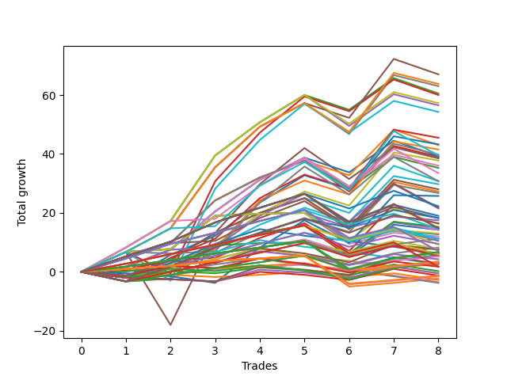

# Long Wallace Doodle 012 
- Symbol: ES
- Date Range: 03/15/2022 - 07/08/2022
- Trading Period: 7:20-12:30
- Number of Trades: 10



| Name | Win Percent | Profit | Avg Profit / Trade |     | Name | Win Percent | Profit | Avg Profit / Trade |
| ---- | ----------- | ------ | ------------------ | --- | ---- | ----------- | ------ | ------------------ |
| Sorted By <br> Profit | | | | | Sorted By <br> Win Percentage ||||
| Forty-Seven | 80.00 | 45375.00 | 4537.50 |     | Forty-Seven | 80.00 | 45375.00 | 4537.50 |
| Sixty-Three | 80.00 | 43750.00 | 4375.00 |     | Sixty-Three | 80.00 | 43750.00 | 4375.00 |
| Forty-Five | 70.00 | 43500.00 | 4350.00 |     | Seven | 80.00 | 43375.00 | 4337.50 |
| Seven | 80.00 | 43375.00 | 4337.50 |     | Forty-Four | 80.00 | 41750.00 | 4175.00 |
| Forty-Four | 80.00 | 41750.00 | 4175.00 |     | Sixty | 80.00 | 40125.00 | 4012.50 |
| Sixty-One | 70.00 | 40625.00 | 4062.50 |     | Four | 80.00 | 39750.00 | 3975.00 |
| Sixty | 80.00 | 40125.00 | 4012.50 |     | Seventy-One | 80.00 | 31625.00 | 3162.50 |
| Four | 80.00 | 39750.00 | 3975.00 |     | Forty-Two | 80.00 | 30625.00 | 3062.50 |
| Five | 70.00 | 32750.00 | 3275.00 |     | Forty-Three | 80.00 | 30000.00 | 3000.00 |
| Seventy-One | 80.00 | 31625.00 | 3162.50 |     | Fifty-Eight | 80.00 | 29000.00 | 2900.00 |
| Forty-Two | 80.00 | 30625.00 | 3062.50 |     | Two | 80.00 | 28625.00 | 2862.50 |
| Thirty-One | 60.00 | 30500.00 | 3050.00 |     | Fifty-Nine | 80.00 | 28375.00 | 2837.50 |
| Forty-Three | 80.00 | 30000.00 | 3000.00 |     | Sixty-Eight | 80.00 | 28250.00 | 2825.00 |
| Seventy-Five | 70.00 | 30000.00 | 3000.00 |     | Three | 80.00 | 28000.00 | 2800.00 |
| Fifty-Five | 70.00 | 30000.00 | 3000.00 |     | Forty-One | 80.00 | 23125.00 | 2312.50 |
| Fifty-Eight | 80.00 | 29000.00 | 2900.00 |     | Sixty-Six | 80.00 | 21750.00 | 2175.00 |
| Fifty-Two | 70.00 | 28875.00 | 2887.50 |     | Fifty-Seven | 80.00 | 21750.00 | 2175.00 |
| Two | 80.00 | 28625.00 | 2862.50 |     | One | 80.00 | 21375.00 | 2137.50 |
| Fifty-Nine | 80.00 | 28375.00 | 2837.50 |     | Sixty-Seven | 80.00 | 19375.00 | 1937.50 |
| Fifty-Three | 70.00 | 28375.00 | 2837.50 |     | Forty-Six | 80.00 | 17625.00 | 1762.50 |
| Sixty-Eight | 80.00 | 28250.00 | 2825.00 |     | Seventy | 80.00 | 15375.00 | 1537.50 |
| Three | 80.00 | 28000.00 | 2800.00 |     | Sixty-Two | 80.00 | 15250.00 | 1525.00 |
| Sixty-Nine | 70.00 | 27750.00 | 2775.00 |     | Sixty-Five | 80.00 | 15125.00 | 1512.50 |
| Fifty | 70.00 | 25500.00 | 2550.00 |     | Six | 80.00 | 14875.00 | 1487.50 |
| Twenty-Eight | 60.00 | 25375.00 | 2537.50 |     | Forty-Five | 70.00 | 43500.00 | 4350.00 |
| Twenty-Nine | 50.00 | 24250.00 | 2425.00 |     | Sixty-One | 70.00 | 40625.00 | 4062.50 |
| Forty-One | 80.00 | 23125.00 | 2312.50 |     | Five | 70.00 | 32750.00 | 3275.00 |
| Twenty-Six | 60.00 | 22125.00 | 2212.50 |     | Seventy-Five | 70.00 | 30000.00 | 3000.00 |
| Sixty-Six | 80.00 | 21750.00 | 2175.00 |     | Fifty-Five | 70.00 | 30000.00 | 3000.00 |
| Fifty-Seven | 80.00 | 21750.00 | 2175.00 |     | Fifty-Two | 70.00 | 28875.00 | 2887.50 |
| One | 80.00 | 21375.00 | 2137.50 |     | Fifty-Three | 70.00 | 28375.00 | 2837.50 |
| Fifty-One | 70.00 | 21375.00 | 2137.50 |     | Sixty-Nine | 70.00 | 27750.00 | 2775.00 |
| Seventy-Three | 50.00 | 19750.00 | 1975.00 |     | Fifty | 70.00 | 25500.00 | 2550.00 |
| Forty-Nine | 70.00 | 19500.00 | 1950.00 |     | Fifty-One | 70.00 | 21375.00 | 2137.50 |
| Sixty-Seven | 80.00 | 19375.00 | 1937.50 |     | Forty-Nine | 70.00 | 19500.00 | 1950.00 |
| twenty-Seven | 60.00 | 19375.00 | 1937.50 |     | Twenty-Four | 70.00 | 18625.00 | 1862.50 |
| Twenty-Four | 70.00 | 18625.00 | 1862.50 |     | Forty-Eight | 70.00 | 17750.00 | 1775.00 |
| Forty-Eight | 70.00 | 17750.00 | 1775.00 |     | Forty | 70.00 | 17750.00 | 1775.00 |
| Forty | 70.00 | 17750.00 | 1775.00 |     | Sixty-Four | 70.00 | 17250.00 | 1725.00 |
| Forty-Six | 80.00 | 17625.00 | 1762.50 |     | Fifty-Six | 70.00 | 17125.00 | 1712.50 |
| Seventy-Four | 60.00 | 17500.00 | 1750.00 |     | Zero | 70.00 | 16750.00 | 1675.00 |
| Sixty-Four | 70.00 | 17250.00 | 1725.00 |     | Thirty | 70.00 | 13625.00 | 1362.50 |
| Fifty-Six | 70.00 | 17125.00 | 1712.50 |     | Fifty-Four | 70.00 | 12750.00 | 1275.00 |
| Twenty-Five | 60.00 | 17000.00 | 1700.00 |     | Thirty-One | 60.00 | 30500.00 | 3050.00 |
| Zero | 70.00 | 16750.00 | 1675.00 |     | Twenty-Eight | 60.00 | 25375.00 | 2537.50 |
| Fifteen | 40.00 | 16500.00 | 1650.00 |     | Twenty-Six | 60.00 | 22125.00 | 2212.50 |
| Thirty-Nine | 50.00 | 15500.00 | 1550.00 |     | twenty-Seven | 60.00 | 19375.00 | 1937.50 |
| Seventy | 80.00 | 15375.00 | 1537.50 |     | Seventy-Four | 60.00 | 17500.00 | 1750.00 |
| Twelve | 40.00 | 15375.00 | 1537.50 |     | Twenty-Five | 60.00 | 17000.00 | 1700.00 |
| Sixty-Two | 80.00 | 15250.00 | 1525.00 |     | Fourteen | 60.00 | 12000.00 | 1200.00 |
| Thirty-Six | 50.00 | 15250.00 | 1525.00 |     | Twenty-Two | 60.00 | 8875.00 | 887.50 |
| Sixty-Five | 80.00 | 15125.00 | 1512.50 |     | Thirty-Eight | 60.00 | 8625.00 | 862.50 |
| Six | 80.00 | 14875.00 | 1487.50 |     | Twenty-Nine | 50.00 | 24250.00 | 2425.00 |
| Thirty-Seven | 50.00 | 14625.00 | 1462.50 |     | Seventy-Three | 50.00 | 19750.00 | 1975.00 |
| Thirty-Five | 50.00 | 14625.00 | 1462.50 |     | Thirty-Nine | 50.00 | 15500.00 | 1550.00 |
| Thirty-Four | 50.00 | 14125.00 | 1412.50 |     | Thirty-Six | 50.00 | 15250.00 | 1525.00 |
| Thirty-Three | 50.00 | 13750.00 | 1375.00 |     | Thirty-Seven | 50.00 | 14625.00 | 1462.50 |
| Thirty | 70.00 | 13625.00 | 1362.50 |     | Thirty-Five | 50.00 | 14625.00 | 1462.50 |
| Thirteen | 30.00 | 13500.00 | 1350.00 |     | Thirty-Four | 50.00 | 14125.00 | 1412.50 |
| Fifty-Four | 70.00 | 12750.00 | 1275.00 |     | Thirty-Three | 50.00 | 13750.00 | 1375.00 |
| Fourteen | 60.00 | 12000.00 | 1200.00 |     | Thirty-Two | 50.00 | 11875.00 | 1187.50 |
| Thirty-Two | 50.00 | 11875.00 | 1187.50 |     | Eight | 50.00 | 11875.00 | 1187.50 |
| Eight | 50.00 | 11875.00 | 1187.50 |     | Sixten | 50.00 | 10125.00 | 1012.50 |
| Ten | 40.00 | 10625.00 | 1062.50 |     | Fifteen | 40.00 | 16500.00 | 1650.00 |
| Sixten | 50.00 | 10125.00 | 1012.50 |     | Twelve | 40.00 | 15375.00 | 1537.50 |
| Twenty-Two | 60.00 | 8875.00 | 887.50 |     | Ten | 40.00 | 10625.00 | 1062.50 |
| Eleven | 40.00 | 8750.00 | 875.00 |     | Eleven | 40.00 | 8750.00 | 875.00 |
| Thirty-Eight | 60.00 | 8625.00 | 862.50 |     | Twenty-Three | 40.00 | 8625.00 | 862.50 |
| Twenty-Three | 40.00 | 8625.00 | 862.50 |     | Twenty-One | 40.00 | 8500.00 | 850.00 |
| Twenty-One | 40.00 | 8500.00 | 850.00 |     | Twenty | 40.00 | 7875.00 | 787.50 |
| Twenty | 40.00 | 7875.00 | 787.50 |     | Nineteen | 40.00 | 7875.00 | 787.50 |
| Nineteen | 40.00 | 7875.00 | 787.50 |     | Eighteen | 40.00 | 7875.00 | 787.50 |
| Eighteen | 40.00 | 7875.00 | 787.50 |     | Seventeen | 40.00 | 7875.00 | 787.50 |
| Seventeen | 40.00 | 7875.00 | 787.50 |     | Nine | 40.00 | 6625.00 | 662.50 |
| Nine | 40.00 | 6625.00 | 662.50 |     | Thirteen | 30.00 | 13500.00 | 1350.00 |
| Seventy-Two | 30.00 | 2750.00 | 275.00 |     | Seventy-Two | 30.00 | 2750.00 | 275.00 |

## NO STOPLOSS

### Test Zero
* Sell when price hits the middle line of the 20p bollinger
* No Stoploss
* Results:
```
Total Trades: 10
Percent Up: 70.00
Percent Down: 30.00
Total Points Moved Up: 33.50
Potential Profit: 16750.00
Total Points Ups: 46.25 Count Ups: 7
Total Points Downs: -12.75 Count Downs: 3
```

<details><summary>Trades</summary>

<code>In: 2022-03-16 09:42:00		Out: 2022-03-16 09:42:10		Total Position Time: 00:10		Total Move Up: 8.75		Total to Date: 8.75</code> <br />
<code>In: 2022-03-17 07:50:00		Out: 2022-03-17 07:50:10		Total Position Time: 00:10		Total Move Up: 9.00		Total to Date: 17.75</code> <br />
<code>In: 2022-04-20 09:14:00		Out: 2022-04-20 09:30:45		Total Position Time: 16:45		Total Move Up: -0.50		Total to Date: 17.25</code> <br />
<code>In: 2022-04-27 11:40:00		Out: 2022-04-27 11:40:10		Total Position Time: 00:10		Total Move Up: 1.00		Total to Date: 18.25</code> <br />
<code>In: 2022-05-17 11:24:00		Out: 2022-05-17 11:27:25		Total Position Time: 03:25		Total Move Up: 11.25		Total to Date: 29.50</code> <br />
<code>In: 2022-05-23 10:23:00		Out: 2022-05-23 10:26:30		Total Position Time: 03:30		Total Move Up: 4.00		Total to Date: 33.50</code> <br />
<code>In: 2022-05-27 08:04:00		Out: 2022-05-27 08:06:55		Total Position Time: 02:55		Total Move Up: 2.75		Total to Date: 36.25</code> <br />
<code>In: 2022-06-15 07:35:00		Out: 2022-06-15 08:04:55		Total Position Time: 29:55		Total Move Up: -10.50		Total to Date: 25.75</code> <br />
<code>In: 2022-06-17 12:15:00		Out: 2022-06-17 12:20:25		Total Position Time: 05:25		Total Move Up: 9.50		Total to Date: 35.25</code> <br />
<code>In: 2022-06-21 08:47:00		Out: 2022-06-21 09:02:05		Total Position Time: 15:05		Total Move Up: -1.75		Total to Date: 33.50</code> <br />


</details>

### Test One
* Sell when the price hits the upper line of the 20p 1std bollinger
* No Stoploss
* Results:
```
Total Trades: 10
Percent Up: 80.00
Percent Down: 20.00
Total Points Moved Up: 42.75
Potential Profit: 21375.00
Total Points Ups: 56.50 Count Ups: 8
Total Points Downs: -13.75 Count Downs: 2
```

<details><summary>Trades</summary>

<code>In: 2022-03-16 09:42:00		Out: 2022-03-16 09:42:10		Total Position Time: 00:10		Total Move Up: 8.75		Total to Date: 8.75</code> <br />
<code>In: 2022-03-17 07:50:00		Out: 2022-03-17 07:57:55		Total Position Time: 07:55		Total Move Up: 7.50		Total to Date: 16.25</code> <br />
<code>In: 2022-04-20 09:14:00		Out: 2022-04-20 09:30:55		Total Position Time: 16:55		Total Move Up: 0.75		Total to Date: 17.00</code> <br />
<code>In: 2022-04-27 11:40:00		Out: 2022-04-27 11:41:10		Total Position Time: 01:10		Total Move Up: 2.75		Total to Date: 19.75</code> <br />
<code>In: 2022-05-17 11:24:00		Out: 2022-05-17 11:37:35		Total Position Time: 13:35		Total Move Up: 9.25		Total to Date: 29.00</code> <br />
<code>In: 2022-05-23 10:23:00		Out: 2022-05-23 10:32:40		Total Position Time: 09:40		Total Move Up: 6.75		Total to Date: 35.75</code> <br />
<code>In: 2022-05-27 08:04:00		Out: 2022-05-27 08:11:00		Total Position Time: 07:00		Total Move Up: 4.75		Total to Date: 40.50</code> <br />
<code>In: 2022-06-15 07:35:00		Out: 2022-06-15 08:04:55		Total Position Time: 29:55		Total Move Up: -10.50		Total to Date: 30.00</code> <br />
<code>In: 2022-06-17 12:15:00		Out: 2022-06-17 12:21:30		Total Position Time: 06:30		Total Move Up: 16.00		Total to Date: 46.00</code> <br />
<code>In: 2022-06-21 08:47:00		Out: 2022-06-21 09:16:30		Total Position Time: 29:30		Total Move Up: -3.25		Total to Date: 42.75</code> <br />


</details>

### Test Two
* Sell when the price hits the upper line of the 20p 2std bollinger
* No Stoploss
* Results:
```
Total Trades: 10
Percent Up: 80.00
Percent Down: 20.00
Total Points Moved Up: 57.25
Potential Profit: 28625.00
Total Points Ups: 71.50 Count Ups: 8
Total Points Downs: -14.25 Count Downs: 2
```

<details><summary>Trades</summary>

<code>In: 2022-03-16 09:42:00		Out: 2022-03-16 09:42:10		Total Position Time: 00:10		Total Move Up: 8.75		Total to Date: 8.75</code> <br />
<code>In: 2022-03-17 07:50:00		Out: 2022-03-17 08:03:45		Total Position Time: 13:45		Total Move Up: 7.50		Total to Date: 16.25</code> <br />
<code>In: 2022-04-20 09:14:00		Out: 2022-04-20 09:31:25		Total Position Time: 17:25		Total Move Up: 1.75		Total to Date: 18.00</code> <br />
<code>In: 2022-04-27 11:40:00		Out: 2022-04-27 11:42:45		Total Position Time: 02:45		Total Move Up: 6.75		Total to Date: 24.75</code> <br />
<code>In: 2022-05-17 11:24:00		Out: 2022-05-17 11:40:00		Total Position Time: 16:00		Total Move Up: 13.00		Total to Date: 37.75</code> <br />
<code>In: 2022-05-23 10:23:00		Out: 2022-05-23 10:33:15		Total Position Time: 10:15		Total Move Up: 10.75		Total to Date: 48.50</code> <br />
<code>In: 2022-05-27 08:04:00		Out: 2022-05-27 08:33:55		Total Position Time: 29:55		Total Move Up: 12.25		Total to Date: 60.75</code> <br />
<code>In: 2022-06-15 07:35:00		Out: 2022-06-15 08:04:55		Total Position Time: 29:55		Total Move Up: -10.50		Total to Date: 50.25</code> <br />
<code>In: 2022-06-17 12:15:00		Out: 2022-06-17 12:44:55		Total Position Time: 29:55		Total Move Up: 10.75		Total to Date: 61.00</code> <br />
<code>In: 2022-06-21 08:47:00		Out: 2022-06-21 09:16:55		Total Position Time: 29:55		Total Move Up: -3.75		Total to Date: 57.25</code> <br />


</details>

### Test Three
* Sell when price hits the middle line of the 50p bollinger
* No Stoploss
* Results:
```
Total Trades: 10
Percent Up: 80.00
Percent Down: 20.00
Total Points Moved Up: 56.00
Potential Profit: 28000.00
Total Points Ups: 70.25 Count Ups: 8
Total Points Downs: -14.25 Count Downs: 2
```

<details><summary>Trades</summary>

<code>In: 2022-03-16 09:42:00		Out: 2022-03-16 09:42:10		Total Position Time: 00:10		Total Move Up: 8.75		Total to Date: 8.75</code> <br />
<code>In: 2022-03-17 07:50:00		Out: 2022-03-17 07:59:45		Total Position Time: 09:45		Total Move Up: 8.50		Total to Date: 17.25</code> <br />
<code>In: 2022-04-20 09:14:00		Out: 2022-04-20 09:32:40		Total Position Time: 18:40		Total Move Up: 4.50		Total to Date: 21.75</code> <br />
<code>In: 2022-04-27 11:40:00		Out: 2022-04-27 11:42:35		Total Position Time: 02:35		Total Move Up: 5.00		Total to Date: 26.75</code> <br />
<code>In: 2022-05-17 11:24:00		Out: 2022-05-17 11:40:05		Total Position Time: 16:05		Total Move Up: 14.50		Total to Date: 41.25</code> <br />
<code>In: 2022-05-23 10:23:00		Out: 2022-05-23 10:33:00		Total Position Time: 10:00		Total Move Up: 7.75		Total to Date: 49.00</code> <br />
<code>In: 2022-05-27 08:04:00		Out: 2022-05-27 08:11:30		Total Position Time: 07:30		Total Move Up: 5.75		Total to Date: 54.75</code> <br />
<code>In: 2022-06-15 07:35:00		Out: 2022-06-15 08:04:55		Total Position Time: 29:55		Total Move Up: -10.50		Total to Date: 44.25</code> <br />
<code>In: 2022-06-17 12:15:00		Out: 2022-06-17 12:21:25		Total Position Time: 06:25		Total Move Up: 15.50		Total to Date: 59.75</code> <br />
<code>In: 2022-06-21 08:47:00		Out: 2022-06-21 09:16:55		Total Position Time: 29:55		Total Move Up: -3.75		Total to Date: 56.00</code> <br />


</details>

### Test Four
* Sell when the price hits the upper line of the 50p 1std bollinger
* No Stoploss
* Results:
```
Total Trades: 10
Percent Up: 80.00
Percent Down: 20.00
Total Points Moved Up: 79.50
Potential Profit: 39750.00
Total Points Ups: 93.75 Count Ups: 8
Total Points Downs: -14.25 Count Downs: 2
```

<details><summary>Trades</summary>

<code>In: 2022-03-16 09:42:00		Out: 2022-03-16 09:42:10		Total Position Time: 00:10		Total Move Up: 8.75		Total to Date: 8.75</code> <br />
<code>In: 2022-03-17 07:50:00		Out: 2022-03-17 08:08:25		Total Position Time: 18:25		Total Move Up: 12.75		Total to Date: 21.50</code> <br />
<code>In: 2022-04-20 09:14:00		Out: 2022-04-20 09:36:45		Total Position Time: 22:45		Total Move Up: 8.25		Total to Date: 29.75</code> <br />
<code>In: 2022-04-27 11:40:00		Out: 2022-04-27 11:45:35		Total Position Time: 05:35		Total Move Up: 9.00		Total to Date: 38.75</code> <br />
<code>In: 2022-05-17 11:24:00		Out: 2022-05-17 11:45:45		Total Position Time: 21:45		Total Move Up: 22.25		Total to Date: 61.00</code> <br />
<code>In: 2022-05-23 10:23:00		Out: 2022-05-23 10:33:30		Total Position Time: 10:30		Total Move Up: 12.75		Total to Date: 73.75</code> <br />
<code>In: 2022-05-27 08:04:00		Out: 2022-05-27 08:16:10		Total Position Time: 12:10		Total Move Up: 9.25		Total to Date: 83.00</code> <br />
<code>In: 2022-06-15 07:35:00		Out: 2022-06-15 08:04:55		Total Position Time: 29:55		Total Move Up: -10.50		Total to Date: 72.50</code> <br />
<code>In: 2022-06-17 12:15:00		Out: 2022-06-17 12:44:55		Total Position Time: 29:55		Total Move Up: 10.75		Total to Date: 83.25</code> <br />
<code>In: 2022-06-21 08:47:00		Out: 2022-06-21 09:16:55		Total Position Time: 29:55		Total Move Up: -3.75		Total to Date: 79.50</code> <br />


</details>

### Test Five
* Sell when the price hits the upper line of the 50p 2std bollinger
* No Stoploss
* Results:
```
Total Trades: 10
Percent Up: 70.00
Percent Down: 30.00
Total Points Moved Up: 65.50
Potential Profit: 32750.00
Total Points Ups: 104.50 Count Ups: 7
Total Points Downs: -39.00 Count Downs: 3
```

<details><summary>Trades</summary>

<code>In: 2022-03-16 09:42:00		Out: 2022-03-16 09:42:35		Total Position Time: 00:35		Total Move Up: 10.00		Total to Date: 10.00</code> <br />
<code>In: 2022-03-17 07:50:00		Out: 2022-03-17 08:18:35		Total Position Time: 28:35		Total Move Up: 13.75		Total to Date: 23.75</code> <br />
<code>In: 2022-04-20 09:14:00		Out: 2022-04-20 09:43:55		Total Position Time: 29:55		Total Move Up: 6.75		Total to Date: 30.50</code> <br />
<code>In: 2022-04-27 11:40:00		Out: 2022-04-27 12:09:55		Total Position Time: 29:55		Total Move Up: -24.75		Total to Date: 5.75</code> <br />
<code>In: 2022-05-17 11:24:00		Out: 2022-05-17 11:49:45		Total Position Time: 25:45		Total Move Up: 33.50		Total to Date: 39.25</code> <br />
<code>In: 2022-05-23 10:23:00		Out: 2022-05-23 10:47:55		Total Position Time: 24:55		Total Move Up: 17.50		Total to Date: 56.75</code> <br />
<code>In: 2022-05-27 08:04:00		Out: 2022-05-27 08:33:55		Total Position Time: 29:55		Total Move Up: 12.25		Total to Date: 69.00</code> <br />
<code>In: 2022-06-15 07:35:00		Out: 2022-06-15 08:04:55		Total Position Time: 29:55		Total Move Up: -10.50		Total to Date: 58.50</code> <br />
<code>In: 2022-06-17 12:15:00		Out: 2022-06-17 12:44:55		Total Position Time: 29:55		Total Move Up: 10.75		Total to Date: 69.25</code> <br />
<code>In: 2022-06-21 08:47:00		Out: 2022-06-21 09:16:55		Total Position Time: 29:55		Total Move Up: -3.75		Total to Date: 65.50</code> <br />


</details>

### Test Six
* Sell when the price hits the middle line of the 1std VWAP
* No Stoploss
* Results:
```
Total Trades: 10
Percent Up: 80.00
Percent Down: 20.00
Total Points Moved Up: 29.75
Potential Profit: 14875.00
Total Points Ups: 41.50 Count Ups: 8
Total Points Downs: -11.75 Count Downs: 2
```

<details><summary>Trades</summary>

<code>In: 2022-03-16 09:42:00		Out: 2022-03-16 09:42:10		Total Position Time: 00:10		Total Move Up: 8.75		Total to Date: 8.75</code> <br />
<code>In: 2022-03-17 07:50:00		Out: 2022-03-17 07:50:10		Total Position Time: 00:10		Total Move Up: 9.00		Total to Date: 17.75</code> <br />
<code>In: 2022-04-20 09:14:00		Out: 2022-04-20 09:35:50		Total Position Time: 21:50		Total Move Up: 6.75		Total to Date: 24.50</code> <br />
<code>In: 2022-04-27 11:40:00		Out: 2022-04-27 11:40:10		Total Position Time: 00:10		Total Move Up: 1.00		Total to Date: 25.50</code> <br />
<code>In: 2022-05-17 11:24:00		Out: 2022-05-17 11:27:25		Total Position Time: 03:25		Total Move Up: 11.25		Total to Date: 36.75</code> <br />
<code>In: 2022-05-23 10:23:00		Out: 2022-05-23 10:23:10		Total Position Time: 00:10		Total Move Up: 0.75		Total to Date: 37.50</code> <br />
<code>In: 2022-05-27 08:04:00		Out: 2022-05-27 08:04:10		Total Position Time: 00:10		Total Move Up: 0.25		Total to Date: 37.75</code> <br />
<code>In: 2022-06-15 07:35:00		Out: 2022-06-15 08:04:55		Total Position Time: 29:55		Total Move Up: -10.50		Total to Date: 27.25</code> <br />
<code>In: 2022-06-17 12:15:00		Out: 2022-06-17 12:17:35		Total Position Time: 02:35		Total Move Up: 3.75		Total to Date: 31.00</code> <br />
<code>In: 2022-06-21 08:47:00		Out: 2022-06-21 08:47:10		Total Position Time: 00:10		Total Move Up: -1.25		Total to Date: 29.75</code> <br />


</details>

### Test Seven
* Sell when the price hits the upper line of the 1std VWAP
* No Stoploss
* Results:
```
Total Trades: 10
Percent Up: 80.00
Percent Down: 20.00
Total Points Moved Up: 86.75
Potential Profit: 43375.00
Total Points Ups: 101.00 Count Ups: 8
Total Points Downs: -14.25 Count Downs: 2
```

<details><summary>Trades</summary>

<code>In: 2022-03-16 09:42:00		Out: 2022-03-16 09:43:10		Total Position Time: 01:10		Total Move Up: 10.25		Total to Date: 10.25</code> <br />
<code>In: 2022-03-17 07:50:00		Out: 2022-03-17 08:09:00		Total Position Time: 19:00		Total Move Up: 13.50		Total to Date: 23.75</code> <br />
<code>In: 2022-04-20 09:14:00		Out: 2022-04-20 09:43:55		Total Position Time: 29:55		Total Move Up: 6.75		Total to Date: 30.50</code> <br />
<code>In: 2022-04-27 11:40:00		Out: 2022-04-27 11:44:15		Total Position Time: 04:15		Total Move Up: 8.00		Total to Date: 38.50</code> <br />
<code>In: 2022-05-17 11:24:00		Out: 2022-05-17 11:40:20		Total Position Time: 16:20		Total Move Up: 20.75		Total to Date: 59.25</code> <br />
<code>In: 2022-05-23 10:23:00		Out: 2022-05-23 10:42:15		Total Position Time: 19:15		Total Move Up: 13.75		Total to Date: 73.00</code> <br />
<code>In: 2022-05-27 08:04:00		Out: 2022-05-27 08:13:35		Total Position Time: 09:35		Total Move Up: 8.00		Total to Date: 81.00</code> <br />
<code>In: 2022-06-15 07:35:00		Out: 2022-06-15 08:04:55		Total Position Time: 29:55		Total Move Up: -10.50		Total to Date: 70.50</code> <br />
<code>In: 2022-06-17 12:15:00		Out: 2022-06-17 12:26:30		Total Position Time: 11:30		Total Move Up: 20.00		Total to Date: 90.50</code> <br />
<code>In: 2022-06-21 08:47:00		Out: 2022-06-21 09:16:55		Total Position Time: 29:55		Total Move Up: -3.75		Total to Date: 86.75</code> <br />


</details>

## STOPLOSS OF 2

### Test Eight
* Sell when price hits the middle line of the 20p bollinger
* Stoploss is 2 points
* Results:
```
Total Trades: 10
Percent Up: 50.00
Percent Down: 50.00
Total Points Moved Up: 23.75
Potential Profit: 11875.00
Total Points Ups: 34.00 Count Ups: 5
Total Points Downs: -10.25 Count Downs: 5
```

<details><summary>Trades</summary>

<code>In: 2022-03-16 09:42:00		Out: 2022-03-16 09:42:10		Total Position Time: 00:10		Total Move Up: 8.75		Total to Date: 8.75</code> <br />
<code>In: 2022-03-17 07:50:00		Out: 2022-03-17 07:50:10		Total Position Time: 00:10		Total Move Up: 9.00		Total to Date: 17.75</code> <br />
<code>In: 2022-04-20 09:14:00		Out: 2022-04-20 09:15:35		Total Position Time: 01:35		Total Move Up: -2.00		Total to Date: 15.75</code> <br />
<code>In: 2022-04-27 11:40:00		Out: 2022-04-27 11:40:10		Total Position Time: 00:10		Total Move Up: 1.00		Total to Date: 16.75</code> <br />
<code>In: 2022-05-17 11:24:00		Out: 2022-05-17 11:27:25		Total Position Time: 03:25		Total Move Up: 11.25		Total to Date: 28.00</code> <br />
<code>In: 2022-05-23 10:23:00		Out: 2022-05-23 10:26:30		Total Position Time: 03:30		Total Move Up: 4.00		Total to Date: 32.00</code> <br />
<code>In: 2022-05-27 08:04:00		Out: 2022-05-27 08:05:10		Total Position Time: 01:10		Total Move Up: -2.25		Total to Date: 29.75</code> <br />
<code>In: 2022-06-15 07:35:00		Out: 2022-06-15 07:35:10		Total Position Time: 00:10		Total Move Up: -1.75		Total to Date: 28.00</code> <br />
<code>In: 2022-06-17 12:15:00		Out: 2022-06-17 12:15:30		Total Position Time: 00:30		Total Move Up: -2.00		Total to Date: 26.00</code> <br />
<code>In: 2022-06-21 08:47:00		Out: 2022-06-21 08:48:25		Total Position Time: 01:25		Total Move Up: -2.25		Total to Date: 23.75</code> <br />


</details>

### Test Nine
* Sell when the price hits the upper line of the 20p 1std bollinger
* Stoploss is 2 points
* Results:
```
Total Trades: 10
Percent Up: 40.00
Percent Down: 60.00
Total Points Moved Up: 13.25
Potential Profit: 6625.00
Total Points Ups: 25.75 Count Ups: 4
Total Points Downs: -12.50 Count Downs: 6
```

<details><summary>Trades</summary>

<code>In: 2022-03-16 09:42:00		Out: 2022-03-16 09:42:10		Total Position Time: 00:10		Total Move Up: 8.75		Total to Date: 8.75</code> <br />
<code>In: 2022-03-17 07:50:00		Out: 2022-03-17 07:57:55		Total Position Time: 07:55		Total Move Up: 7.50		Total to Date: 16.25</code> <br />
<code>In: 2022-04-20 09:14:00		Out: 2022-04-20 09:15:35		Total Position Time: 01:35		Total Move Up: -2.00		Total to Date: 14.25</code> <br />
<code>In: 2022-04-27 11:40:00		Out: 2022-04-27 11:41:10		Total Position Time: 01:10		Total Move Up: 2.75		Total to Date: 17.00</code> <br />
<code>In: 2022-05-17 11:24:00		Out: 2022-05-17 11:35:05		Total Position Time: 11:05		Total Move Up: -2.25		Total to Date: 14.75</code> <br />
<code>In: 2022-05-23 10:23:00		Out: 2022-05-23 10:32:40		Total Position Time: 09:40		Total Move Up: 6.75		Total to Date: 21.50</code> <br />
<code>In: 2022-05-27 08:04:00		Out: 2022-05-27 08:05:10		Total Position Time: 01:10		Total Move Up: -2.25		Total to Date: 19.25</code> <br />
<code>In: 2022-06-15 07:35:00		Out: 2022-06-15 07:35:10		Total Position Time: 00:10		Total Move Up: -1.75		Total to Date: 17.50</code> <br />
<code>In: 2022-06-17 12:15:00		Out: 2022-06-17 12:15:30		Total Position Time: 00:30		Total Move Up: -2.00		Total to Date: 15.50</code> <br />
<code>In: 2022-06-21 08:47:00		Out: 2022-06-21 08:48:25		Total Position Time: 01:25		Total Move Up: -2.25		Total to Date: 13.25</code> <br />


</details>

### Test Ten
* Sell when the price hits the upper line of the 20p 2std bollinger
* Stoploss is 2 points
* Results:
```
Total Trades: 10
Percent Up: 40.00
Percent Down: 60.00
Total Points Moved Up: 21.25
Potential Profit: 10625.00
Total Points Ups: 33.75 Count Ups: 4
Total Points Downs: -12.50 Count Downs: 6
```

<details><summary>Trades</summary>

<code>In: 2022-03-16 09:42:00		Out: 2022-03-16 09:42:10		Total Position Time: 00:10		Total Move Up: 8.75		Total to Date: 8.75</code> <br />
<code>In: 2022-03-17 07:50:00		Out: 2022-03-17 08:03:45		Total Position Time: 13:45		Total Move Up: 7.50		Total to Date: 16.25</code> <br />
<code>In: 2022-04-20 09:14:00		Out: 2022-04-20 09:15:35		Total Position Time: 01:35		Total Move Up: -2.00		Total to Date: 14.25</code> <br />
<code>In: 2022-04-27 11:40:00		Out: 2022-04-27 11:42:45		Total Position Time: 02:45		Total Move Up: 6.75		Total to Date: 21.00</code> <br />
<code>In: 2022-05-17 11:24:00		Out: 2022-05-17 11:35:05		Total Position Time: 11:05		Total Move Up: -2.25		Total to Date: 18.75</code> <br />
<code>In: 2022-05-23 10:23:00		Out: 2022-05-23 10:33:15		Total Position Time: 10:15		Total Move Up: 10.75		Total to Date: 29.50</code> <br />
<code>In: 2022-05-27 08:04:00		Out: 2022-05-27 08:05:10		Total Position Time: 01:10		Total Move Up: -2.25		Total to Date: 27.25</code> <br />
<code>In: 2022-06-15 07:35:00		Out: 2022-06-15 07:35:10		Total Position Time: 00:10		Total Move Up: -1.75		Total to Date: 25.50</code> <br />
<code>In: 2022-06-17 12:15:00		Out: 2022-06-17 12:15:30		Total Position Time: 00:30		Total Move Up: -2.00		Total to Date: 23.50</code> <br />
<code>In: 2022-06-21 08:47:00		Out: 2022-06-21 08:48:25		Total Position Time: 01:25		Total Move Up: -2.25		Total to Date: 21.25</code> <br />


</details>

### Test Eleven
* Sell when price hits the middle line of the 50p bollinger
* Stoploss is 2 points
* Results:
```
Total Trades: 10
Percent Up: 40.00
Percent Down: 60.00
Total Points Moved Up: 17.50
Potential Profit: 8750.00
Total Points Ups: 30.00 Count Ups: 4
Total Points Downs: -12.50 Count Downs: 6
```

<details><summary>Trades</summary>

<code>In: 2022-03-16 09:42:00		Out: 2022-03-16 09:42:10		Total Position Time: 00:10		Total Move Up: 8.75		Total to Date: 8.75</code> <br />
<code>In: 2022-03-17 07:50:00		Out: 2022-03-17 07:59:45		Total Position Time: 09:45		Total Move Up: 8.50		Total to Date: 17.25</code> <br />
<code>In: 2022-04-20 09:14:00		Out: 2022-04-20 09:15:35		Total Position Time: 01:35		Total Move Up: -2.00		Total to Date: 15.25</code> <br />
<code>In: 2022-04-27 11:40:00		Out: 2022-04-27 11:42:35		Total Position Time: 02:35		Total Move Up: 5.00		Total to Date: 20.25</code> <br />
<code>In: 2022-05-17 11:24:00		Out: 2022-05-17 11:35:05		Total Position Time: 11:05		Total Move Up: -2.25		Total to Date: 18.00</code> <br />
<code>In: 2022-05-23 10:23:00		Out: 2022-05-23 10:33:00		Total Position Time: 10:00		Total Move Up: 7.75		Total to Date: 25.75</code> <br />
<code>In: 2022-05-27 08:04:00		Out: 2022-05-27 08:05:10		Total Position Time: 01:10		Total Move Up: -2.25		Total to Date: 23.50</code> <br />
<code>In: 2022-06-15 07:35:00		Out: 2022-06-15 07:35:10		Total Position Time: 00:10		Total Move Up: -1.75		Total to Date: 21.75</code> <br />
<code>In: 2022-06-17 12:15:00		Out: 2022-06-17 12:15:30		Total Position Time: 00:30		Total Move Up: -2.00		Total to Date: 19.75</code> <br />
<code>In: 2022-06-21 08:47:00		Out: 2022-06-21 08:48:25		Total Position Time: 01:25		Total Move Up: -2.25		Total to Date: 17.50</code> <br />


</details>

### Test Twelve
* Sell when the price hits the upper line of the 50p 1std bollinger
* Stoploss is 2 points
* Results:
```
Total Trades: 10
Percent Up: 40.00
Percent Down: 60.00
Total Points Moved Up: 30.75
Potential Profit: 15375.00
Total Points Ups: 43.25 Count Ups: 4
Total Points Downs: -12.50 Count Downs: 6
```

<details><summary>Trades</summary>

<code>In: 2022-03-16 09:42:00		Out: 2022-03-16 09:42:10		Total Position Time: 00:10		Total Move Up: 8.75		Total to Date: 8.75</code> <br />
<code>In: 2022-03-17 07:50:00		Out: 2022-03-17 08:08:25		Total Position Time: 18:25		Total Move Up: 12.75		Total to Date: 21.50</code> <br />
<code>In: 2022-04-20 09:14:00		Out: 2022-04-20 09:15:35		Total Position Time: 01:35		Total Move Up: -2.00		Total to Date: 19.50</code> <br />
<code>In: 2022-04-27 11:40:00		Out: 2022-04-27 11:45:35		Total Position Time: 05:35		Total Move Up: 9.00		Total to Date: 28.50</code> <br />
<code>In: 2022-05-17 11:24:00		Out: 2022-05-17 11:35:05		Total Position Time: 11:05		Total Move Up: -2.25		Total to Date: 26.25</code> <br />
<code>In: 2022-05-23 10:23:00		Out: 2022-05-23 10:33:30		Total Position Time: 10:30		Total Move Up: 12.75		Total to Date: 39.00</code> <br />
<code>In: 2022-05-27 08:04:00		Out: 2022-05-27 08:05:10		Total Position Time: 01:10		Total Move Up: -2.25		Total to Date: 36.75</code> <br />
<code>In: 2022-06-15 07:35:00		Out: 2022-06-15 07:35:10		Total Position Time: 00:10		Total Move Up: -1.75		Total to Date: 35.00</code> <br />
<code>In: 2022-06-17 12:15:00		Out: 2022-06-17 12:15:30		Total Position Time: 00:30		Total Move Up: -2.00		Total to Date: 33.00</code> <br />
<code>In: 2022-06-21 08:47:00		Out: 2022-06-21 08:48:25		Total Position Time: 01:25		Total Move Up: -2.25		Total to Date: 30.75</code> <br />


</details>

### Test Thirteen
* Sell when the price hits the upper line of the 50p 2std bollinger
* Stoploss is 2 points
* Results:
```
Total Trades: 10
Percent Up: 30.00
Percent Down: 70.00
Total Points Moved Up: 27.00
Potential Profit: 13500.00
Total Points Ups: 41.25 Count Ups: 3
Total Points Downs: -14.25 Count Downs: 7
```

<details><summary>Trades</summary>

<code>In: 2022-03-16 09:42:00		Out: 2022-03-16 09:42:35		Total Position Time: 00:35		Total Move Up: 10.00		Total to Date: 10.00</code> <br />
<code>In: 2022-03-17 07:50:00		Out: 2022-03-17 08:18:35		Total Position Time: 28:35		Total Move Up: 13.75		Total to Date: 23.75</code> <br />
<code>In: 2022-04-20 09:14:00		Out: 2022-04-20 09:15:35		Total Position Time: 01:35		Total Move Up: -2.00		Total to Date: 21.75</code> <br />
<code>In: 2022-04-27 11:40:00		Out: 2022-04-27 11:50:25		Total Position Time: 10:25		Total Move Up: -1.75		Total to Date: 20.00</code> <br />
<code>In: 2022-05-17 11:24:00		Out: 2022-05-17 11:35:05		Total Position Time: 11:05		Total Move Up: -2.25		Total to Date: 17.75</code> <br />
<code>In: 2022-05-23 10:23:00		Out: 2022-05-23 10:47:55		Total Position Time: 24:55		Total Move Up: 17.50		Total to Date: 35.25</code> <br />
<code>In: 2022-05-27 08:04:00		Out: 2022-05-27 08:05:10		Total Position Time: 01:10		Total Move Up: -2.25		Total to Date: 33.00</code> <br />
<code>In: 2022-06-15 07:35:00		Out: 2022-06-15 07:35:10		Total Position Time: 00:10		Total Move Up: -1.75		Total to Date: 31.25</code> <br />
<code>In: 2022-06-17 12:15:00		Out: 2022-06-17 12:15:30		Total Position Time: 00:30		Total Move Up: -2.00		Total to Date: 29.25</code> <br />
<code>In: 2022-06-21 08:47:00		Out: 2022-06-21 08:48:25		Total Position Time: 01:25		Total Move Up: -2.25		Total to Date: 27.00</code> <br />


</details>

### Test Fourteen
* Sell when the price hits the middle line of the 1std VWAP
* Stoploss is 2 points
* Results:
```
Total Trades: 10
Percent Up: 60.00
Percent Down: 40.00
Total Points Moved Up: 24.00
Potential Profit: 12000.00
Total Points Ups: 31.00 Count Ups: 6
Total Points Downs: -7.00 Count Downs: 4
```

<details><summary>Trades</summary>

<code>In: 2022-03-16 09:42:00		Out: 2022-03-16 09:42:10		Total Position Time: 00:10		Total Move Up: 8.75		Total to Date: 8.75</code> <br />
<code>In: 2022-03-17 07:50:00		Out: 2022-03-17 07:50:10		Total Position Time: 00:10		Total Move Up: 9.00		Total to Date: 17.75</code> <br />
<code>In: 2022-04-20 09:14:00		Out: 2022-04-20 09:15:35		Total Position Time: 01:35		Total Move Up: -2.00		Total to Date: 15.75</code> <br />
<code>In: 2022-04-27 11:40:00		Out: 2022-04-27 11:40:10		Total Position Time: 00:10		Total Move Up: 1.00		Total to Date: 16.75</code> <br />
<code>In: 2022-05-17 11:24:00		Out: 2022-05-17 11:27:25		Total Position Time: 03:25		Total Move Up: 11.25		Total to Date: 28.00</code> <br />
<code>In: 2022-05-23 10:23:00		Out: 2022-05-23 10:23:10		Total Position Time: 00:10		Total Move Up: 0.75		Total to Date: 28.75</code> <br />
<code>In: 2022-05-27 08:04:00		Out: 2022-05-27 08:04:10		Total Position Time: 00:10		Total Move Up: 0.25		Total to Date: 29.00</code> <br />
<code>In: 2022-06-15 07:35:00		Out: 2022-06-15 07:35:10		Total Position Time: 00:10		Total Move Up: -1.75		Total to Date: 27.25</code> <br />
<code>In: 2022-06-17 12:15:00		Out: 2022-06-17 12:15:30		Total Position Time: 00:30		Total Move Up: -2.00		Total to Date: 25.25</code> <br />
<code>In: 2022-06-21 08:47:00		Out: 2022-06-21 08:47:10		Total Position Time: 00:10		Total Move Up: -1.25		Total to Date: 24.00</code> <br />


</details>

### Test Fifteen
* Sell when the price hits the upper line of the 1std VWAP
* Stoploss is 2 points
* Results:
```
Total Trades: 10
Percent Up: 40.00
Percent Down: 60.00
Total Points Moved Up: 33.00
Potential Profit: 16500.00
Total Points Ups: 45.50 Count Ups: 4
Total Points Downs: -12.50 Count Downs: 6
```

<details><summary>Trades</summary>

<code>In: 2022-03-16 09:42:00		Out: 2022-03-16 09:43:10		Total Position Time: 01:10		Total Move Up: 10.25		Total to Date: 10.25</code> <br />
<code>In: 2022-03-17 07:50:00		Out: 2022-03-17 08:09:00		Total Position Time: 19:00		Total Move Up: 13.50		Total to Date: 23.75</code> <br />
<code>In: 2022-04-20 09:14:00		Out: 2022-04-20 09:15:35		Total Position Time: 01:35		Total Move Up: -2.00		Total to Date: 21.75</code> <br />
<code>In: 2022-04-27 11:40:00		Out: 2022-04-27 11:44:15		Total Position Time: 04:15		Total Move Up: 8.00		Total to Date: 29.75</code> <br />
<code>In: 2022-05-17 11:24:00		Out: 2022-05-17 11:35:05		Total Position Time: 11:05		Total Move Up: -2.25		Total to Date: 27.50</code> <br />
<code>In: 2022-05-23 10:23:00		Out: 2022-05-23 10:42:15		Total Position Time: 19:15		Total Move Up: 13.75		Total to Date: 41.25</code> <br />
<code>In: 2022-05-27 08:04:00		Out: 2022-05-27 08:05:10		Total Position Time: 01:10		Total Move Up: -2.25		Total to Date: 39.00</code> <br />
<code>In: 2022-06-15 07:35:00		Out: 2022-06-15 07:35:10		Total Position Time: 00:10		Total Move Up: -1.75		Total to Date: 37.25</code> <br />
<code>In: 2022-06-17 12:15:00		Out: 2022-06-17 12:15:30		Total Position Time: 00:30		Total Move Up: -2.00		Total to Date: 35.25</code> <br />
<code>In: 2022-06-21 08:47:00		Out: 2022-06-21 08:48:25		Total Position Time: 01:25		Total Move Up: -2.25		Total to Date: 33.00</code> <br />


</details>

## TRAIL STOP OF 2

### Test Sixten
* Sell when price hits the middle line of the 20p bollinger
* Trailing Stop is 2 points
* Results:
```
Total Trades: 10
Percent Up: 50.00
Percent Down: 50.00
Total Points Moved Up: 20.25
Potential Profit: 10125.00
Total Points Ups: 28.00 Count Ups: 5
Total Points Downs: -7.75 Count Downs: 5
```

<details><summary>Trades</summary>

<code>In: 2022-03-16 09:42:00		Out: 2022-03-16 09:42:10		Total Position Time: 00:10		Total Move Up: 8.75		Total to Date: 8.75</code> <br />
<code>In: 2022-03-17 07:50:00		Out: 2022-03-17 07:50:10		Total Position Time: 00:10		Total Move Up: 9.00		Total to Date: 17.75</code> <br />
<code>In: 2022-04-20 09:14:00		Out: 2022-04-20 09:15:35		Total Position Time: 01:35		Total Move Up: -2.00		Total to Date: 15.75</code> <br />
<code>In: 2022-04-27 11:40:00		Out: 2022-04-27 11:40:10		Total Position Time: 00:10		Total Move Up: 1.00		Total to Date: 16.75</code> <br />
<code>In: 2022-05-17 11:24:00		Out: 2022-05-17 11:24:10		Total Position Time: 00:10		Total Move Up: -0.75		Total to Date: 16.00</code> <br />
<code>In: 2022-05-23 10:23:00		Out: 2022-05-23 10:26:30		Total Position Time: 03:30		Total Move Up: 4.00		Total to Date: 20.00</code> <br />
<code>In: 2022-05-27 08:04:00		Out: 2022-05-27 08:04:55		Total Position Time: 00:55		Total Move Up: -1.00		Total to Date: 19.00</code> <br />
<code>In: 2022-06-15 07:35:00		Out: 2022-06-15 07:35:10		Total Position Time: 00:10		Total Move Up: -1.75		Total to Date: 17.25</code> <br />
<code>In: 2022-06-17 12:15:00		Out: 2022-06-17 12:19:15		Total Position Time: 04:15		Total Move Up: 5.25		Total to Date: 22.50</code> <br />
<code>In: 2022-06-21 08:47:00		Out: 2022-06-21 08:48:25		Total Position Time: 01:25		Total Move Up: -2.25		Total to Date: 20.25</code> <br />


</details>

### Test Seventeen
* Sell when the price hits the upper line of the 20p 1std bollinger
* Trailing Stop is 2 points
* Results:
```
Total Trades: 10
Percent Up: 40.00
Percent Down: 60.00
Total Points Moved Up: 15.75
Potential Profit: 7875.00
Total Points Ups: 24.00 Count Ups: 4
Total Points Downs: -8.25 Count Downs: 6
```

<details><summary>Trades</summary>

<code>In: 2022-03-16 09:42:00		Out: 2022-03-16 09:42:10		Total Position Time: 00:10		Total Move Up: 8.75		Total to Date: 8.75</code> <br />
<code>In: 2022-03-17 07:50:00		Out: 2022-03-17 07:51:05		Total Position Time: 01:05		Total Move Up: 6.75		Total to Date: 15.50</code> <br />
<code>In: 2022-04-20 09:14:00		Out: 2022-04-20 09:15:35		Total Position Time: 01:35		Total Move Up: -2.00		Total to Date: 13.50</code> <br />
<code>In: 2022-04-27 11:40:00		Out: 2022-04-27 11:40:25		Total Position Time: 00:25		Total Move Up: -0.50		Total to Date: 13.00</code> <br />
<code>In: 2022-05-17 11:24:00		Out: 2022-05-17 11:24:10		Total Position Time: 00:10		Total Move Up: -0.75		Total to Date: 12.25</code> <br />
<code>In: 2022-05-23 10:23:00		Out: 2022-05-23 10:30:10		Total Position Time: 07:10		Total Move Up: 3.25		Total to Date: 15.50</code> <br />
<code>In: 2022-05-27 08:04:00		Out: 2022-05-27 08:04:55		Total Position Time: 00:55		Total Move Up: -1.00		Total to Date: 14.50</code> <br />
<code>In: 2022-06-15 07:35:00		Out: 2022-06-15 07:35:10		Total Position Time: 00:10		Total Move Up: -1.75		Total to Date: 12.75</code> <br />
<code>In: 2022-06-17 12:15:00		Out: 2022-06-17 12:19:15		Total Position Time: 04:15		Total Move Up: 5.25		Total to Date: 18.00</code> <br />
<code>In: 2022-06-21 08:47:00		Out: 2022-06-21 08:48:25		Total Position Time: 01:25		Total Move Up: -2.25		Total to Date: 15.75</code> <br />


</details>

### Test Eighteen
* Sell when the price hits the upper line of the 20p 2std bollinger
* Trailing Stop is 2 points
* Results:
```
Total Trades: 10
Percent Up: 40.00
Percent Down: 60.00
Total Points Moved Up: 15.75
Potential Profit: 7875.00
Total Points Ups: 24.00 Count Ups: 4
Total Points Downs: -8.25 Count Downs: 6
```

<details><summary>Trades</summary>

<code>In: 2022-03-16 09:42:00		Out: 2022-03-16 09:42:10		Total Position Time: 00:10		Total Move Up: 8.75		Total to Date: 8.75</code> <br />
<code>In: 2022-03-17 07:50:00		Out: 2022-03-17 07:51:05		Total Position Time: 01:05		Total Move Up: 6.75		Total to Date: 15.50</code> <br />
<code>In: 2022-04-20 09:14:00		Out: 2022-04-20 09:15:35		Total Position Time: 01:35		Total Move Up: -2.00		Total to Date: 13.50</code> <br />
<code>In: 2022-04-27 11:40:00		Out: 2022-04-27 11:40:25		Total Position Time: 00:25		Total Move Up: -0.50		Total to Date: 13.00</code> <br />
<code>In: 2022-05-17 11:24:00		Out: 2022-05-17 11:24:10		Total Position Time: 00:10		Total Move Up: -0.75		Total to Date: 12.25</code> <br />
<code>In: 2022-05-23 10:23:00		Out: 2022-05-23 10:30:10		Total Position Time: 07:10		Total Move Up: 3.25		Total to Date: 15.50</code> <br />
<code>In: 2022-05-27 08:04:00		Out: 2022-05-27 08:04:55		Total Position Time: 00:55		Total Move Up: -1.00		Total to Date: 14.50</code> <br />
<code>In: 2022-06-15 07:35:00		Out: 2022-06-15 07:35:10		Total Position Time: 00:10		Total Move Up: -1.75		Total to Date: 12.75</code> <br />
<code>In: 2022-06-17 12:15:00		Out: 2022-06-17 12:19:15		Total Position Time: 04:15		Total Move Up: 5.25		Total to Date: 18.00</code> <br />
<code>In: 2022-06-21 08:47:00		Out: 2022-06-21 08:48:25		Total Position Time: 01:25		Total Move Up: -2.25		Total to Date: 15.75</code> <br />


</details>

### Test Nineteen
* Sell when price hits the middle line of the 50p bollinger
* Trailing Stop is 2 points
* Results:
```
Total Trades: 10
Percent Up: 40.00
Percent Down: 60.00
Total Points Moved Up: 15.75
Potential Profit: 7875.00
Total Points Ups: 24.00 Count Ups: 4
Total Points Downs: -8.25 Count Downs: 6
```

<details><summary>Trades</summary>

<code>In: 2022-03-16 09:42:00		Out: 2022-03-16 09:42:10		Total Position Time: 00:10		Total Move Up: 8.75		Total to Date: 8.75</code> <br />
<code>In: 2022-03-17 07:50:00		Out: 2022-03-17 07:51:05		Total Position Time: 01:05		Total Move Up: 6.75		Total to Date: 15.50</code> <br />
<code>In: 2022-04-20 09:14:00		Out: 2022-04-20 09:15:35		Total Position Time: 01:35		Total Move Up: -2.00		Total to Date: 13.50</code> <br />
<code>In: 2022-04-27 11:40:00		Out: 2022-04-27 11:40:25		Total Position Time: 00:25		Total Move Up: -0.50		Total to Date: 13.00</code> <br />
<code>In: 2022-05-17 11:24:00		Out: 2022-05-17 11:24:10		Total Position Time: 00:10		Total Move Up: -0.75		Total to Date: 12.25</code> <br />
<code>In: 2022-05-23 10:23:00		Out: 2022-05-23 10:30:10		Total Position Time: 07:10		Total Move Up: 3.25		Total to Date: 15.50</code> <br />
<code>In: 2022-05-27 08:04:00		Out: 2022-05-27 08:04:55		Total Position Time: 00:55		Total Move Up: -1.00		Total to Date: 14.50</code> <br />
<code>In: 2022-06-15 07:35:00		Out: 2022-06-15 07:35:10		Total Position Time: 00:10		Total Move Up: -1.75		Total to Date: 12.75</code> <br />
<code>In: 2022-06-17 12:15:00		Out: 2022-06-17 12:19:15		Total Position Time: 04:15		Total Move Up: 5.25		Total to Date: 18.00</code> <br />
<code>In: 2022-06-21 08:47:00		Out: 2022-06-21 08:48:25		Total Position Time: 01:25		Total Move Up: -2.25		Total to Date: 15.75</code> <br />


</details>

### Test Twenty
* Sell when the price hits the upper line of the 50p 1std bollinger
* Trailing Stop is 2 points
* Results:
```
Total Trades: 10
Percent Up: 40.00
Percent Down: 60.00
Total Points Moved Up: 15.75
Potential Profit: 7875.00
Total Points Ups: 24.00 Count Ups: 4
Total Points Downs: -8.25 Count Downs: 6
```

<details><summary>Trades</summary>

<code>In: 2022-03-16 09:42:00		Out: 2022-03-16 09:42:10		Total Position Time: 00:10		Total Move Up: 8.75		Total to Date: 8.75</code> <br />
<code>In: 2022-03-17 07:50:00		Out: 2022-03-17 07:51:05		Total Position Time: 01:05		Total Move Up: 6.75		Total to Date: 15.50</code> <br />
<code>In: 2022-04-20 09:14:00		Out: 2022-04-20 09:15:35		Total Position Time: 01:35		Total Move Up: -2.00		Total to Date: 13.50</code> <br />
<code>In: 2022-04-27 11:40:00		Out: 2022-04-27 11:40:25		Total Position Time: 00:25		Total Move Up: -0.50		Total to Date: 13.00</code> <br />
<code>In: 2022-05-17 11:24:00		Out: 2022-05-17 11:24:10		Total Position Time: 00:10		Total Move Up: -0.75		Total to Date: 12.25</code> <br />
<code>In: 2022-05-23 10:23:00		Out: 2022-05-23 10:30:10		Total Position Time: 07:10		Total Move Up: 3.25		Total to Date: 15.50</code> <br />
<code>In: 2022-05-27 08:04:00		Out: 2022-05-27 08:04:55		Total Position Time: 00:55		Total Move Up: -1.00		Total to Date: 14.50</code> <br />
<code>In: 2022-06-15 07:35:00		Out: 2022-06-15 07:35:10		Total Position Time: 00:10		Total Move Up: -1.75		Total to Date: 12.75</code> <br />
<code>In: 2022-06-17 12:15:00		Out: 2022-06-17 12:19:15		Total Position Time: 04:15		Total Move Up: 5.25		Total to Date: 18.00</code> <br />
<code>In: 2022-06-21 08:47:00		Out: 2022-06-21 08:48:25		Total Position Time: 01:25		Total Move Up: -2.25		Total to Date: 15.75</code> <br />


</details>

### Test Twenty-One
* Sell when the price hits the upper line of the 50p 2std bollinger
* Trailing Stop is 2 points
* Results:
```
Total Trades: 10
Percent Up: 40.00
Percent Down: 60.00
Total Points Moved Up: 17.00
Potential Profit: 8500.00
Total Points Ups: 25.25 Count Ups: 4
Total Points Downs: -8.25 Count Downs: 6
```

<details><summary>Trades</summary>

<code>In: 2022-03-16 09:42:00		Out: 2022-03-16 09:42:35		Total Position Time: 00:35		Total Move Up: 10.00		Total to Date: 10.00</code> <br />
<code>In: 2022-03-17 07:50:00		Out: 2022-03-17 07:51:05		Total Position Time: 01:05		Total Move Up: 6.75		Total to Date: 16.75</code> <br />
<code>In: 2022-04-20 09:14:00		Out: 2022-04-20 09:15:35		Total Position Time: 01:35		Total Move Up: -2.00		Total to Date: 14.75</code> <br />
<code>In: 2022-04-27 11:40:00		Out: 2022-04-27 11:40:25		Total Position Time: 00:25		Total Move Up: -0.50		Total to Date: 14.25</code> <br />
<code>In: 2022-05-17 11:24:00		Out: 2022-05-17 11:24:10		Total Position Time: 00:10		Total Move Up: -0.75		Total to Date: 13.50</code> <br />
<code>In: 2022-05-23 10:23:00		Out: 2022-05-23 10:30:10		Total Position Time: 07:10		Total Move Up: 3.25		Total to Date: 16.75</code> <br />
<code>In: 2022-05-27 08:04:00		Out: 2022-05-27 08:04:55		Total Position Time: 00:55		Total Move Up: -1.00		Total to Date: 15.75</code> <br />
<code>In: 2022-06-15 07:35:00		Out: 2022-06-15 07:35:10		Total Position Time: 00:10		Total Move Up: -1.75		Total to Date: 14.00</code> <br />
<code>In: 2022-06-17 12:15:00		Out: 2022-06-17 12:19:15		Total Position Time: 04:15		Total Move Up: 5.25		Total to Date: 19.25</code> <br />
<code>In: 2022-06-21 08:47:00		Out: 2022-06-21 08:48:25		Total Position Time: 01:25		Total Move Up: -2.25		Total to Date: 17.00</code> <br />


</details>

### Test Twenty-Two
* Sell when the price hits the middle line of the 1std VWAP
* Trailing Stop is 2 points
* Results:
```
Total Trades: 10
Percent Up: 60.00
Percent Down: 40.00
Total Points Moved Up: 17.75
Potential Profit: 8875.00
Total Points Ups: 23.50 Count Ups: 6
Total Points Downs: -5.75 Count Downs: 4
```

<details><summary>Trades</summary>

<code>In: 2022-03-16 09:42:00		Out: 2022-03-16 09:42:10		Total Position Time: 00:10		Total Move Up: 8.75		Total to Date: 8.75</code> <br />
<code>In: 2022-03-17 07:50:00		Out: 2022-03-17 07:50:10		Total Position Time: 00:10		Total Move Up: 9.00		Total to Date: 17.75</code> <br />
<code>In: 2022-04-20 09:14:00		Out: 2022-04-20 09:15:35		Total Position Time: 01:35		Total Move Up: -2.00		Total to Date: 15.75</code> <br />
<code>In: 2022-04-27 11:40:00		Out: 2022-04-27 11:40:10		Total Position Time: 00:10		Total Move Up: 1.00		Total to Date: 16.75</code> <br />
<code>In: 2022-05-17 11:24:00		Out: 2022-05-17 11:24:10		Total Position Time: 00:10		Total Move Up: -0.75		Total to Date: 16.00</code> <br />
<code>In: 2022-05-23 10:23:00		Out: 2022-05-23 10:23:10		Total Position Time: 00:10		Total Move Up: 0.75		Total to Date: 16.75</code> <br />
<code>In: 2022-05-27 08:04:00		Out: 2022-05-27 08:04:10		Total Position Time: 00:10		Total Move Up: 0.25		Total to Date: 17.00</code> <br />
<code>In: 2022-06-15 07:35:00		Out: 2022-06-15 07:35:10		Total Position Time: 00:10		Total Move Up: -1.75		Total to Date: 15.25</code> <br />
<code>In: 2022-06-17 12:15:00		Out: 2022-06-17 12:17:35		Total Position Time: 02:35		Total Move Up: 3.75		Total to Date: 19.00</code> <br />
<code>In: 2022-06-21 08:47:00		Out: 2022-06-21 08:47:10		Total Position Time: 00:10		Total Move Up: -1.25		Total to Date: 17.75</code> <br />


</details>

### Test Twenty-Three
* Sell when the price hits the upper line of the 1std VWAP
* Trailing Stop is 2 points
* Results:
```
Total Trades: 10
Percent Up: 40.00
Percent Down: 60.00
Total Points Moved Up: 17.25
Potential Profit: 8625.00
Total Points Ups: 25.50 Count Ups: 4
Total Points Downs: -8.25 Count Downs: 6
```

<details><summary>Trades</summary>

<code>In: 2022-03-16 09:42:00		Out: 2022-03-16 09:43:10		Total Position Time: 01:10		Total Move Up: 10.25		Total to Date: 10.25</code> <br />
<code>In: 2022-03-17 07:50:00		Out: 2022-03-17 07:51:05		Total Position Time: 01:05		Total Move Up: 6.75		Total to Date: 17.00</code> <br />
<code>In: 2022-04-20 09:14:00		Out: 2022-04-20 09:15:35		Total Position Time: 01:35		Total Move Up: -2.00		Total to Date: 15.00</code> <br />
<code>In: 2022-04-27 11:40:00		Out: 2022-04-27 11:40:25		Total Position Time: 00:25		Total Move Up: -0.50		Total to Date: 14.50</code> <br />
<code>In: 2022-05-17 11:24:00		Out: 2022-05-17 11:24:10		Total Position Time: 00:10		Total Move Up: -0.75		Total to Date: 13.75</code> <br />
<code>In: 2022-05-23 10:23:00		Out: 2022-05-23 10:30:10		Total Position Time: 07:10		Total Move Up: 3.25		Total to Date: 17.00</code> <br />
<code>In: 2022-05-27 08:04:00		Out: 2022-05-27 08:04:55		Total Position Time: 00:55		Total Move Up: -1.00		Total to Date: 16.00</code> <br />
<code>In: 2022-06-15 07:35:00		Out: 2022-06-15 07:35:10		Total Position Time: 00:10		Total Move Up: -1.75		Total to Date: 14.25</code> <br />
<code>In: 2022-06-17 12:15:00		Out: 2022-06-17 12:19:15		Total Position Time: 04:15		Total Move Up: 5.25		Total to Date: 19.50</code> <br />
<code>In: 2022-06-21 08:47:00		Out: 2022-06-21 08:48:25		Total Position Time: 01:25		Total Move Up: -2.25		Total to Date: 17.25</code> <br />


</details>

## STOPLOSS OF 3

### Test Twenty-Four
* Sell when price hits the middle line of the 20p bollinger
* Stoploss is 3 points
* Results:
```
Total Trades: 10
Percent Up: 70.00
Percent Down: 30.00
Total Points Moved Up: 37.25
Potential Profit: 18625.00
Total Points Ups: 46.25 Count Ups: 7
Total Points Downs: -9.00 Count Downs: 3
```

<details><summary>Trades</summary>

<code>In: 2022-03-16 09:42:00		Out: 2022-03-16 09:42:10		Total Position Time: 00:10		Total Move Up: 8.75		Total to Date: 8.75</code> <br />
<code>In: 2022-03-17 07:50:00		Out: 2022-03-17 07:50:10		Total Position Time: 00:10		Total Move Up: 9.00		Total to Date: 17.75</code> <br />
<code>In: 2022-04-20 09:14:00		Out: 2022-04-20 09:28:10		Total Position Time: 14:10		Total Move Up: -3.25		Total to Date: 14.50</code> <br />
<code>In: 2022-04-27 11:40:00		Out: 2022-04-27 11:40:10		Total Position Time: 00:10		Total Move Up: 1.00		Total to Date: 15.50</code> <br />
<code>In: 2022-05-17 11:24:00		Out: 2022-05-17 11:27:25		Total Position Time: 03:25		Total Move Up: 11.25		Total to Date: 26.75</code> <br />
<code>In: 2022-05-23 10:23:00		Out: 2022-05-23 10:26:30		Total Position Time: 03:30		Total Move Up: 4.00		Total to Date: 30.75</code> <br />
<code>In: 2022-05-27 08:04:00		Out: 2022-05-27 08:06:55		Total Position Time: 02:55		Total Move Up: 2.75		Total to Date: 33.50</code> <br />
<code>In: 2022-06-15 07:35:00		Out: 2022-06-15 07:36:00		Total Position Time: 01:00		Total Move Up: -3.00		Total to Date: 30.50</code> <br />
<code>In: 2022-06-17 12:15:00		Out: 2022-06-17 12:20:25		Total Position Time: 05:25		Total Move Up: 9.50		Total to Date: 40.00</code> <br />
<code>In: 2022-06-21 08:47:00		Out: 2022-06-21 08:53:15		Total Position Time: 06:15		Total Move Up: -2.75		Total to Date: 37.25</code> <br />


</details>

### Test Twenty-Five
* Sell when the price hits the upper line of the 20p 1std bollinger
* Stoploss is 3 points
* Results:
```
Total Trades: 10
Percent Up: 60.00
Percent Down: 40.00
Total Points Moved Up: 34.00
Potential Profit: 17000.00
Total Points Ups: 46.50 Count Ups: 6
Total Points Downs: -12.50 Count Downs: 4
```

<details><summary>Trades</summary>

<code>In: 2022-03-16 09:42:00		Out: 2022-03-16 09:42:10		Total Position Time: 00:10		Total Move Up: 8.75		Total to Date: 8.75</code> <br />
<code>In: 2022-03-17 07:50:00		Out: 2022-03-17 07:57:55		Total Position Time: 07:55		Total Move Up: 7.50		Total to Date: 16.25</code> <br />
<code>In: 2022-04-20 09:14:00		Out: 2022-04-20 09:28:10		Total Position Time: 14:10		Total Move Up: -3.25		Total to Date: 13.00</code> <br />
<code>In: 2022-04-27 11:40:00		Out: 2022-04-27 11:41:10		Total Position Time: 01:10		Total Move Up: 2.75		Total to Date: 15.75</code> <br />
<code>In: 2022-05-17 11:24:00		Out: 2022-05-17 11:35:10		Total Position Time: 11:10		Total Move Up: -3.50		Total to Date: 12.25</code> <br />
<code>In: 2022-05-23 10:23:00		Out: 2022-05-23 10:32:40		Total Position Time: 09:40		Total Move Up: 6.75		Total to Date: 19.00</code> <br />
<code>In: 2022-05-27 08:04:00		Out: 2022-05-27 08:11:00		Total Position Time: 07:00		Total Move Up: 4.75		Total to Date: 23.75</code> <br />
<code>In: 2022-06-15 07:35:00		Out: 2022-06-15 07:36:00		Total Position Time: 01:00		Total Move Up: -3.00		Total to Date: 20.75</code> <br />
<code>In: 2022-06-17 12:15:00		Out: 2022-06-17 12:21:30		Total Position Time: 06:30		Total Move Up: 16.00		Total to Date: 36.75</code> <br />
<code>In: 2022-06-21 08:47:00		Out: 2022-06-21 08:53:15		Total Position Time: 06:15		Total Move Up: -2.75		Total to Date: 34.00</code> <br />


</details>

### Test Twenty-Six
* Sell when the price hits the upper line of the 20p 2std bollinger
* Stoploss is 3 points
* Results:
```
Total Trades: 10
Percent Up: 60.00
Percent Down: 40.00
Total Points Moved Up: 44.25
Potential Profit: 22125.00
Total Points Ups: 56.75 Count Ups: 6
Total Points Downs: -12.50 Count Downs: 4
```

<details><summary>Trades</summary>

<code>In: 2022-03-16 09:42:00		Out: 2022-03-16 09:42:10		Total Position Time: 00:10		Total Move Up: 8.75		Total to Date: 8.75</code> <br />
<code>In: 2022-03-17 07:50:00		Out: 2022-03-17 08:03:45		Total Position Time: 13:45		Total Move Up: 7.50		Total to Date: 16.25</code> <br />
<code>In: 2022-04-20 09:14:00		Out: 2022-04-20 09:28:10		Total Position Time: 14:10		Total Move Up: -3.25		Total to Date: 13.00</code> <br />
<code>In: 2022-04-27 11:40:00		Out: 2022-04-27 11:42:45		Total Position Time: 02:45		Total Move Up: 6.75		Total to Date: 19.75</code> <br />
<code>In: 2022-05-17 11:24:00		Out: 2022-05-17 11:35:10		Total Position Time: 11:10		Total Move Up: -3.50		Total to Date: 16.25</code> <br />
<code>In: 2022-05-23 10:23:00		Out: 2022-05-23 10:33:15		Total Position Time: 10:15		Total Move Up: 10.75		Total to Date: 27.00</code> <br />
<code>In: 2022-05-27 08:04:00		Out: 2022-05-27 08:33:55		Total Position Time: 29:55		Total Move Up: 12.25		Total to Date: 39.25</code> <br />
<code>In: 2022-06-15 07:35:00		Out: 2022-06-15 07:36:00		Total Position Time: 01:00		Total Move Up: -3.00		Total to Date: 36.25</code> <br />
<code>In: 2022-06-17 12:15:00		Out: 2022-06-17 12:44:55		Total Position Time: 29:55		Total Move Up: 10.75		Total to Date: 47.00</code> <br />
<code>In: 2022-06-21 08:47:00		Out: 2022-06-21 08:53:15		Total Position Time: 06:15		Total Move Up: -2.75		Total to Date: 44.25</code> <br />


</details>

### Test twenty-Seven
* Sell when price hits the middle line of the 50p bollinger
* Stoploss is 3 points
* Results:
```
Total Trades: 10
Percent Up: 60.00
Percent Down: 40.00
Total Points Moved Up: 38.75
Potential Profit: 19375.00
Total Points Ups: 51.25 Count Ups: 6
Total Points Downs: -12.50 Count Downs: 4
```

<details><summary>Trades</summary>

<code>In: 2022-03-16 09:42:00		Out: 2022-03-16 09:42:10		Total Position Time: 00:10		Total Move Up: 8.75		Total to Date: 8.75</code> <br />
<code>In: 2022-03-17 07:50:00		Out: 2022-03-17 07:59:45		Total Position Time: 09:45		Total Move Up: 8.50		Total to Date: 17.25</code> <br />
<code>In: 2022-04-20 09:14:00		Out: 2022-04-20 09:28:10		Total Position Time: 14:10		Total Move Up: -3.25		Total to Date: 14.00</code> <br />
<code>In: 2022-04-27 11:40:00		Out: 2022-04-27 11:42:35		Total Position Time: 02:35		Total Move Up: 5.00		Total to Date: 19.00</code> <br />
<code>In: 2022-05-17 11:24:00		Out: 2022-05-17 11:35:10		Total Position Time: 11:10		Total Move Up: -3.50		Total to Date: 15.50</code> <br />
<code>In: 2022-05-23 10:23:00		Out: 2022-05-23 10:33:00		Total Position Time: 10:00		Total Move Up: 7.75		Total to Date: 23.25</code> <br />
<code>In: 2022-05-27 08:04:00		Out: 2022-05-27 08:11:30		Total Position Time: 07:30		Total Move Up: 5.75		Total to Date: 29.00</code> <br />
<code>In: 2022-06-15 07:35:00		Out: 2022-06-15 07:36:00		Total Position Time: 01:00		Total Move Up: -3.00		Total to Date: 26.00</code> <br />
<code>In: 2022-06-17 12:15:00		Out: 2022-06-17 12:21:25		Total Position Time: 06:25		Total Move Up: 15.50		Total to Date: 41.50</code> <br />
<code>In: 2022-06-21 08:47:00		Out: 2022-06-21 08:53:15		Total Position Time: 06:15		Total Move Up: -2.75		Total to Date: 38.75</code> <br />


</details>

### Test Twenty-Eight
* Sell when the price hits the upper line of the 50p 1std bollinger
* Stoploss is 3 points
* Results:
```
Total Trades: 10
Percent Up: 60.00
Percent Down: 40.00
Total Points Moved Up: 50.75
Potential Profit: 25375.00
Total Points Ups: 63.25 Count Ups: 6
Total Points Downs: -12.50 Count Downs: 4
```

<details><summary>Trades</summary>

<code>In: 2022-03-16 09:42:00		Out: 2022-03-16 09:42:10		Total Position Time: 00:10		Total Move Up: 8.75		Total to Date: 8.75</code> <br />
<code>In: 2022-03-17 07:50:00		Out: 2022-03-17 08:08:25		Total Position Time: 18:25		Total Move Up: 12.75		Total to Date: 21.50</code> <br />
<code>In: 2022-04-20 09:14:00		Out: 2022-04-20 09:28:10		Total Position Time: 14:10		Total Move Up: -3.25		Total to Date: 18.25</code> <br />
<code>In: 2022-04-27 11:40:00		Out: 2022-04-27 11:45:35		Total Position Time: 05:35		Total Move Up: 9.00		Total to Date: 27.25</code> <br />
<code>In: 2022-05-17 11:24:00		Out: 2022-05-17 11:35:10		Total Position Time: 11:10		Total Move Up: -3.50		Total to Date: 23.75</code> <br />
<code>In: 2022-05-23 10:23:00		Out: 2022-05-23 10:33:30		Total Position Time: 10:30		Total Move Up: 12.75		Total to Date: 36.50</code> <br />
<code>In: 2022-05-27 08:04:00		Out: 2022-05-27 08:16:10		Total Position Time: 12:10		Total Move Up: 9.25		Total to Date: 45.75</code> <br />
<code>In: 2022-06-15 07:35:00		Out: 2022-06-15 07:36:00		Total Position Time: 01:00		Total Move Up: -3.00		Total to Date: 42.75</code> <br />
<code>In: 2022-06-17 12:15:00		Out: 2022-06-17 12:44:55		Total Position Time: 29:55		Total Move Up: 10.75		Total to Date: 53.50</code> <br />
<code>In: 2022-06-21 08:47:00		Out: 2022-06-21 08:53:15		Total Position Time: 06:15		Total Move Up: -2.75		Total to Date: 50.75</code> <br />


</details>

### Test Twenty-Nine
* Sell when the price hits the upper line of the 50p 2std bollinger
* Stoploss is 3 points
* Results:
```
Total Trades: 10
Percent Up: 50.00
Percent Down: 50.00
Total Points Moved Up: 48.50
Potential Profit: 24250.00
Total Points Ups: 64.25 Count Ups: 5
Total Points Downs: -15.75 Count Downs: 5
```

<details><summary>Trades</summary>

<code>In: 2022-03-16 09:42:00		Out: 2022-03-16 09:42:35		Total Position Time: 00:35		Total Move Up: 10.00		Total to Date: 10.00</code> <br />
<code>In: 2022-03-17 07:50:00		Out: 2022-03-17 08:18:35		Total Position Time: 28:35		Total Move Up: 13.75		Total to Date: 23.75</code> <br />
<code>In: 2022-04-20 09:14:00		Out: 2022-04-20 09:28:10		Total Position Time: 14:10		Total Move Up: -3.25		Total to Date: 20.50</code> <br />
<code>In: 2022-04-27 11:40:00		Out: 2022-04-27 11:51:05		Total Position Time: 11:05		Total Move Up: -3.25		Total to Date: 17.25</code> <br />
<code>In: 2022-05-17 11:24:00		Out: 2022-05-17 11:35:10		Total Position Time: 11:10		Total Move Up: -3.50		Total to Date: 13.75</code> <br />
<code>In: 2022-05-23 10:23:00		Out: 2022-05-23 10:47:55		Total Position Time: 24:55		Total Move Up: 17.50		Total to Date: 31.25</code> <br />
<code>In: 2022-05-27 08:04:00		Out: 2022-05-27 08:33:55		Total Position Time: 29:55		Total Move Up: 12.25		Total to Date: 43.50</code> <br />
<code>In: 2022-06-15 07:35:00		Out: 2022-06-15 07:36:00		Total Position Time: 01:00		Total Move Up: -3.00		Total to Date: 40.50</code> <br />
<code>In: 2022-06-17 12:15:00		Out: 2022-06-17 12:44:55		Total Position Time: 29:55		Total Move Up: 10.75		Total to Date: 51.25</code> <br />
<code>In: 2022-06-21 08:47:00		Out: 2022-06-21 08:53:15		Total Position Time: 06:15		Total Move Up: -2.75		Total to Date: 48.50</code> <br />


</details>

### Test Thirty
* Sell when the price hits the middle line of the 1std VWAP
* Stoploss is 3 points
* Results:
```
Total Trades: 10
Percent Up: 70.00
Percent Down: 30.00
Total Points Moved Up: 27.25
Potential Profit: 13625.00
Total Points Ups: 34.75 Count Ups: 7
Total Points Downs: -7.50 Count Downs: 3
```

<details><summary>Trades</summary>

<code>In: 2022-03-16 09:42:00		Out: 2022-03-16 09:42:10		Total Position Time: 00:10		Total Move Up: 8.75		Total to Date: 8.75</code> <br />
<code>In: 2022-03-17 07:50:00		Out: 2022-03-17 07:50:10		Total Position Time: 00:10		Total Move Up: 9.00		Total to Date: 17.75</code> <br />
<code>In: 2022-04-20 09:14:00		Out: 2022-04-20 09:28:10		Total Position Time: 14:10		Total Move Up: -3.25		Total to Date: 14.50</code> <br />
<code>In: 2022-04-27 11:40:00		Out: 2022-04-27 11:40:10		Total Position Time: 00:10		Total Move Up: 1.00		Total to Date: 15.50</code> <br />
<code>In: 2022-05-17 11:24:00		Out: 2022-05-17 11:27:25		Total Position Time: 03:25		Total Move Up: 11.25		Total to Date: 26.75</code> <br />
<code>In: 2022-05-23 10:23:00		Out: 2022-05-23 10:23:10		Total Position Time: 00:10		Total Move Up: 0.75		Total to Date: 27.50</code> <br />
<code>In: 2022-05-27 08:04:00		Out: 2022-05-27 08:04:10		Total Position Time: 00:10		Total Move Up: 0.25		Total to Date: 27.75</code> <br />
<code>In: 2022-06-15 07:35:00		Out: 2022-06-15 07:36:00		Total Position Time: 01:00		Total Move Up: -3.00		Total to Date: 24.75</code> <br />
<code>In: 2022-06-17 12:15:00		Out: 2022-06-17 12:17:35		Total Position Time: 02:35		Total Move Up: 3.75		Total to Date: 28.50</code> <br />
<code>In: 2022-06-21 08:47:00		Out: 2022-06-21 08:47:10		Total Position Time: 00:10		Total Move Up: -1.25		Total to Date: 27.25</code> <br />


</details>

### Test Thirty-One
* Sell when the price hits the upper line of the 1std VWAP
* Stoploss is 3 points
* Results:
```
Total Trades: 10
Percent Up: 60.00
Percent Down: 40.00
Total Points Moved Up: 61.00
Potential Profit: 30500.00
Total Points Ups: 73.50 Count Ups: 6
Total Points Downs: -12.50 Count Downs: 4
```

<details><summary>Trades</summary>

<code>In: 2022-03-16 09:42:00		Out: 2022-03-16 09:43:10		Total Position Time: 01:10		Total Move Up: 10.25		Total to Date: 10.25</code> <br />
<code>In: 2022-03-17 07:50:00		Out: 2022-03-17 08:09:00		Total Position Time: 19:00		Total Move Up: 13.50		Total to Date: 23.75</code> <br />
<code>In: 2022-04-20 09:14:00		Out: 2022-04-20 09:28:10		Total Position Time: 14:10		Total Move Up: -3.25		Total to Date: 20.50</code> <br />
<code>In: 2022-04-27 11:40:00		Out: 2022-04-27 11:44:15		Total Position Time: 04:15		Total Move Up: 8.00		Total to Date: 28.50</code> <br />
<code>In: 2022-05-17 11:24:00		Out: 2022-05-17 11:35:10		Total Position Time: 11:10		Total Move Up: -3.50		Total to Date: 25.00</code> <br />
<code>In: 2022-05-23 10:23:00		Out: 2022-05-23 10:42:15		Total Position Time: 19:15		Total Move Up: 13.75		Total to Date: 38.75</code> <br />
<code>In: 2022-05-27 08:04:00		Out: 2022-05-27 08:13:35		Total Position Time: 09:35		Total Move Up: 8.00		Total to Date: 46.75</code> <br />
<code>In: 2022-06-15 07:35:00		Out: 2022-06-15 07:36:00		Total Position Time: 01:00		Total Move Up: -3.00		Total to Date: 43.75</code> <br />
<code>In: 2022-06-17 12:15:00		Out: 2022-06-17 12:26:30		Total Position Time: 11:30		Total Move Up: 20.00		Total to Date: 63.75</code> <br />
<code>In: 2022-06-21 08:47:00		Out: 2022-06-21 08:53:15		Total Position Time: 06:15		Total Move Up: -2.75		Total to Date: 61.00</code> <br />


</details>

## TRAIL STOP OF 3

### Test Thirty-Two
* Sell when price hits the middle line of the 20p bollinger
* Trailing Stop is 3 points
* Results:
```
Total Trades: 10
Percent Up: 50.00
Percent Down: 50.00
Total Points Moved Up: 23.75
Potential Profit: 11875.00
Total Points Ups: 32.25 Count Ups: 5
Total Points Downs: -8.50 Count Downs: 5
```

<details><summary>Trades</summary>

<code>In: 2022-03-16 09:42:00		Out: 2022-03-16 09:42:10		Total Position Time: 00:10		Total Move Up: 8.75		Total to Date: 8.75</code> <br />
<code>In: 2022-03-17 07:50:00		Out: 2022-03-17 07:50:10		Total Position Time: 00:10		Total Move Up: 9.00		Total to Date: 17.75</code> <br />
<code>In: 2022-04-20 09:14:00		Out: 2022-04-20 09:21:50		Total Position Time: 07:50		Total Move Up: -1.25		Total to Date: 16.50</code> <br />
<code>In: 2022-04-27 11:40:00		Out: 2022-04-27 11:40:10		Total Position Time: 00:10		Total Move Up: 1.00		Total to Date: 17.50</code> <br />
<code>In: 2022-05-17 11:24:00		Out: 2022-05-17 11:24:10		Total Position Time: 00:10		Total Move Up: -0.75		Total to Date: 16.75</code> <br />
<code>In: 2022-05-23 10:23:00		Out: 2022-05-23 10:26:30		Total Position Time: 03:30		Total Move Up: 4.00		Total to Date: 20.75</code> <br />
<code>In: 2022-05-27 08:04:00		Out: 2022-05-27 08:05:05		Total Position Time: 01:05		Total Move Up: -1.75		Total to Date: 19.00</code> <br />
<code>In: 2022-06-15 07:35:00		Out: 2022-06-15 07:36:00		Total Position Time: 01:00		Total Move Up: -3.00		Total to Date: 16.00</code> <br />
<code>In: 2022-06-17 12:15:00		Out: 2022-06-17 12:20:25		Total Position Time: 05:25		Total Move Up: 9.50		Total to Date: 25.50</code> <br />
<code>In: 2022-06-21 08:47:00		Out: 2022-06-21 08:51:10		Total Position Time: 04:10		Total Move Up: -1.75		Total to Date: 23.75</code> <br />


</details>

### Test Thirty-Three
* Sell when the price hits the upper line of the 20p 1std bollinger
* Trailing Stop is 3 points
* Results:
```
Total Trades: 10
Percent Up: 50.00
Percent Down: 50.00
Total Points Moved Up: 27.50
Potential Profit: 13750.00
Total Points Ups: 36.00 Count Ups: 5
Total Points Downs: -8.50 Count Downs: 5
```

<details><summary>Trades</summary>

<code>In: 2022-03-16 09:42:00		Out: 2022-03-16 09:42:10		Total Position Time: 00:10		Total Move Up: 8.75		Total to Date: 8.75</code> <br />
<code>In: 2022-03-17 07:50:00		Out: 2022-03-17 07:51:35		Total Position Time: 01:35		Total Move Up: 6.25		Total to Date: 15.00</code> <br />
<code>In: 2022-04-20 09:14:00		Out: 2022-04-20 09:21:50		Total Position Time: 07:50		Total Move Up: -1.25		Total to Date: 13.75</code> <br />
<code>In: 2022-04-27 11:40:00		Out: 2022-04-27 11:41:10		Total Position Time: 01:10		Total Move Up: 2.75		Total to Date: 16.50</code> <br />
<code>In: 2022-05-17 11:24:00		Out: 2022-05-17 11:24:10		Total Position Time: 00:10		Total Move Up: -0.75		Total to Date: 15.75</code> <br />
<code>In: 2022-05-23 10:23:00		Out: 2022-05-23 10:30:55		Total Position Time: 07:55		Total Move Up: 2.25		Total to Date: 18.00</code> <br />
<code>In: 2022-05-27 08:04:00		Out: 2022-05-27 08:05:05		Total Position Time: 01:05		Total Move Up: -1.75		Total to Date: 16.25</code> <br />
<code>In: 2022-06-15 07:35:00		Out: 2022-06-15 07:36:00		Total Position Time: 01:00		Total Move Up: -3.00		Total to Date: 13.25</code> <br />
<code>In: 2022-06-17 12:15:00		Out: 2022-06-17 12:21:30		Total Position Time: 06:30		Total Move Up: 16.00		Total to Date: 29.25</code> <br />
<code>In: 2022-06-21 08:47:00		Out: 2022-06-21 08:51:10		Total Position Time: 04:10		Total Move Up: -1.75		Total to Date: 27.50</code> <br />


</details>

### Test Thirty-Four
* Sell when the price hits the upper line of the 20p 2std bollinger
* Trailing Stop is 3 points
* Results:
```
Total Trades: 10
Percent Up: 50.00
Percent Down: 50.00
Total Points Moved Up: 28.25
Potential Profit: 14125.00
Total Points Ups: 36.75 Count Ups: 5
Total Points Downs: -8.50 Count Downs: 5
```

<details><summary>Trades</summary>

<code>In: 2022-03-16 09:42:00		Out: 2022-03-16 09:42:10		Total Position Time: 00:10		Total Move Up: 8.75		Total to Date: 8.75</code> <br />
<code>In: 2022-03-17 07:50:00		Out: 2022-03-17 07:51:35		Total Position Time: 01:35		Total Move Up: 6.25		Total to Date: 15.00</code> <br />
<code>In: 2022-04-20 09:14:00		Out: 2022-04-20 09:21:50		Total Position Time: 07:50		Total Move Up: -1.25		Total to Date: 13.75</code> <br />
<code>In: 2022-04-27 11:40:00		Out: 2022-04-27 11:42:45		Total Position Time: 02:45		Total Move Up: 6.75		Total to Date: 20.50</code> <br />
<code>In: 2022-05-17 11:24:00		Out: 2022-05-17 11:24:10		Total Position Time: 00:10		Total Move Up: -0.75		Total to Date: 19.75</code> <br />
<code>In: 2022-05-23 10:23:00		Out: 2022-05-23 10:30:55		Total Position Time: 07:55		Total Move Up: 2.25		Total to Date: 22.00</code> <br />
<code>In: 2022-05-27 08:04:00		Out: 2022-05-27 08:05:05		Total Position Time: 01:05		Total Move Up: -1.75		Total to Date: 20.25</code> <br />
<code>In: 2022-06-15 07:35:00		Out: 2022-06-15 07:36:00		Total Position Time: 01:00		Total Move Up: -3.00		Total to Date: 17.25</code> <br />
<code>In: 2022-06-17 12:15:00		Out: 2022-06-17 12:22:00		Total Position Time: 07:00		Total Move Up: 12.75		Total to Date: 30.00</code> <br />
<code>In: 2022-06-21 08:47:00		Out: 2022-06-21 08:51:10		Total Position Time: 04:10		Total Move Up: -1.75		Total to Date: 28.25</code> <br />


</details>

### Test Thirty-Five
* Sell when price hits the middle line of the 50p bollinger
* Trailing Stop is 3 points
* Results:
```
Total Trades: 10
Percent Up: 50.00
Percent Down: 50.00
Total Points Moved Up: 29.25
Potential Profit: 14625.00
Total Points Ups: 37.75 Count Ups: 5
Total Points Downs: -8.50 Count Downs: 5
```

<details><summary>Trades</summary>

<code>In: 2022-03-16 09:42:00		Out: 2022-03-16 09:42:10		Total Position Time: 00:10		Total Move Up: 8.75		Total to Date: 8.75</code> <br />
<code>In: 2022-03-17 07:50:00		Out: 2022-03-17 07:51:35		Total Position Time: 01:35		Total Move Up: 6.25		Total to Date: 15.00</code> <br />
<code>In: 2022-04-20 09:14:00		Out: 2022-04-20 09:21:50		Total Position Time: 07:50		Total Move Up: -1.25		Total to Date: 13.75</code> <br />
<code>In: 2022-04-27 11:40:00		Out: 2022-04-27 11:42:35		Total Position Time: 02:35		Total Move Up: 5.00		Total to Date: 18.75</code> <br />
<code>In: 2022-05-17 11:24:00		Out: 2022-05-17 11:24:10		Total Position Time: 00:10		Total Move Up: -0.75		Total to Date: 18.00</code> <br />
<code>In: 2022-05-23 10:23:00		Out: 2022-05-23 10:30:55		Total Position Time: 07:55		Total Move Up: 2.25		Total to Date: 20.25</code> <br />
<code>In: 2022-05-27 08:04:00		Out: 2022-05-27 08:05:05		Total Position Time: 01:05		Total Move Up: -1.75		Total to Date: 18.50</code> <br />
<code>In: 2022-06-15 07:35:00		Out: 2022-06-15 07:36:00		Total Position Time: 01:00		Total Move Up: -3.00		Total to Date: 15.50</code> <br />
<code>In: 2022-06-17 12:15:00		Out: 2022-06-17 12:21:25		Total Position Time: 06:25		Total Move Up: 15.50		Total to Date: 31.00</code> <br />
<code>In: 2022-06-21 08:47:00		Out: 2022-06-21 08:51:10		Total Position Time: 04:10		Total Move Up: -1.75		Total to Date: 29.25</code> <br />


</details>

### Test Thirty-Six
* Sell when the price hits the upper line of the 50p 1std bollinger
* Trailing Stop is 3 points
* Results:
```
Total Trades: 10
Percent Up: 50.00
Percent Down: 50.00
Total Points Moved Up: 30.50
Potential Profit: 15250.00
Total Points Ups: 39.00 Count Ups: 5
Total Points Downs: -8.50 Count Downs: 5
```

<details><summary>Trades</summary>

<code>In: 2022-03-16 09:42:00		Out: 2022-03-16 09:42:10		Total Position Time: 00:10		Total Move Up: 8.75		Total to Date: 8.75</code> <br />
<code>In: 2022-03-17 07:50:00		Out: 2022-03-17 07:51:35		Total Position Time: 01:35		Total Move Up: 6.25		Total to Date: 15.00</code> <br />
<code>In: 2022-04-20 09:14:00		Out: 2022-04-20 09:21:50		Total Position Time: 07:50		Total Move Up: -1.25		Total to Date: 13.75</code> <br />
<code>In: 2022-04-27 11:40:00		Out: 2022-04-27 11:45:35		Total Position Time: 05:35		Total Move Up: 9.00		Total to Date: 22.75</code> <br />
<code>In: 2022-05-17 11:24:00		Out: 2022-05-17 11:24:10		Total Position Time: 00:10		Total Move Up: -0.75		Total to Date: 22.00</code> <br />
<code>In: 2022-05-23 10:23:00		Out: 2022-05-23 10:30:55		Total Position Time: 07:55		Total Move Up: 2.25		Total to Date: 24.25</code> <br />
<code>In: 2022-05-27 08:04:00		Out: 2022-05-27 08:05:05		Total Position Time: 01:05		Total Move Up: -1.75		Total to Date: 22.50</code> <br />
<code>In: 2022-06-15 07:35:00		Out: 2022-06-15 07:36:00		Total Position Time: 01:00		Total Move Up: -3.00		Total to Date: 19.50</code> <br />
<code>In: 2022-06-17 12:15:00		Out: 2022-06-17 12:22:00		Total Position Time: 07:00		Total Move Up: 12.75		Total to Date: 32.25</code> <br />
<code>In: 2022-06-21 08:47:00		Out: 2022-06-21 08:51:10		Total Position Time: 04:10		Total Move Up: -1.75		Total to Date: 30.50</code> <br />


</details>

### Test Thirty-Seven
* Sell when the price hits the upper line of the 50p 2std bollinger
* Trailing Stop is 3 points
* Results:
```
Total Trades: 10
Percent Up: 50.00
Percent Down: 50.00
Total Points Moved Up: 29.25
Potential Profit: 14625.00
Total Points Ups: 37.75 Count Ups: 5
Total Points Downs: -8.50 Count Downs: 5
```

<details><summary>Trades</summary>

<code>In: 2022-03-16 09:42:00		Out: 2022-03-16 09:42:35		Total Position Time: 00:35		Total Move Up: 10.00		Total to Date: 10.00</code> <br />
<code>In: 2022-03-17 07:50:00		Out: 2022-03-17 07:51:35		Total Position Time: 01:35		Total Move Up: 6.25		Total to Date: 16.25</code> <br />
<code>In: 2022-04-20 09:14:00		Out: 2022-04-20 09:21:50		Total Position Time: 07:50		Total Move Up: -1.25		Total to Date: 15.00</code> <br />
<code>In: 2022-04-27 11:40:00		Out: 2022-04-27 11:46:50		Total Position Time: 06:50		Total Move Up: 6.50		Total to Date: 21.50</code> <br />
<code>In: 2022-05-17 11:24:00		Out: 2022-05-17 11:24:10		Total Position Time: 00:10		Total Move Up: -0.75		Total to Date: 20.75</code> <br />
<code>In: 2022-05-23 10:23:00		Out: 2022-05-23 10:30:55		Total Position Time: 07:55		Total Move Up: 2.25		Total to Date: 23.00</code> <br />
<code>In: 2022-05-27 08:04:00		Out: 2022-05-27 08:05:05		Total Position Time: 01:05		Total Move Up: -1.75		Total to Date: 21.25</code> <br />
<code>In: 2022-06-15 07:35:00		Out: 2022-06-15 07:36:00		Total Position Time: 01:00		Total Move Up: -3.00		Total to Date: 18.25</code> <br />
<code>In: 2022-06-17 12:15:00		Out: 2022-06-17 12:22:00		Total Position Time: 07:00		Total Move Up: 12.75		Total to Date: 31.00</code> <br />
<code>In: 2022-06-21 08:47:00		Out: 2022-06-21 08:51:10		Total Position Time: 04:10		Total Move Up: -1.75		Total to Date: 29.25</code> <br />


</details>

### Test Thirty-Eight
* Sell when the price hits the middle line of the 1std VWAP
* Trailing Stop is 3 points
* Results:
```
Total Trades: 10
Percent Up: 60.00
Percent Down: 40.00
Total Points Moved Up: 17.25
Potential Profit: 8625.00
Total Points Ups: 23.50 Count Ups: 6
Total Points Downs: -6.25 Count Downs: 4
```

<details><summary>Trades</summary>

<code>In: 2022-03-16 09:42:00		Out: 2022-03-16 09:42:10		Total Position Time: 00:10		Total Move Up: 8.75		Total to Date: 8.75</code> <br />
<code>In: 2022-03-17 07:50:00		Out: 2022-03-17 07:50:10		Total Position Time: 00:10		Total Move Up: 9.00		Total to Date: 17.75</code> <br />
<code>In: 2022-04-20 09:14:00		Out: 2022-04-20 09:21:50		Total Position Time: 07:50		Total Move Up: -1.25		Total to Date: 16.50</code> <br />
<code>In: 2022-04-27 11:40:00		Out: 2022-04-27 11:40:10		Total Position Time: 00:10		Total Move Up: 1.00		Total to Date: 17.50</code> <br />
<code>In: 2022-05-17 11:24:00		Out: 2022-05-17 11:24:10		Total Position Time: 00:10		Total Move Up: -0.75		Total to Date: 16.75</code> <br />
<code>In: 2022-05-23 10:23:00		Out: 2022-05-23 10:23:10		Total Position Time: 00:10		Total Move Up: 0.75		Total to Date: 17.50</code> <br />
<code>In: 2022-05-27 08:04:00		Out: 2022-05-27 08:04:10		Total Position Time: 00:10		Total Move Up: 0.25		Total to Date: 17.75</code> <br />
<code>In: 2022-06-15 07:35:00		Out: 2022-06-15 07:36:00		Total Position Time: 01:00		Total Move Up: -3.00		Total to Date: 14.75</code> <br />
<code>In: 2022-06-17 12:15:00		Out: 2022-06-17 12:17:35		Total Position Time: 02:35		Total Move Up: 3.75		Total to Date: 18.50</code> <br />
<code>In: 2022-06-21 08:47:00		Out: 2022-06-21 08:47:10		Total Position Time: 00:10		Total Move Up: -1.25		Total to Date: 17.25</code> <br />


</details>

### Test Thirty-Nine
* Sell when the price hits the upper line of the 1std VWAP
* Trailing Stop is 3 points
* Results:
```
Total Trades: 10
Percent Up: 50.00
Percent Down: 50.00
Total Points Moved Up: 31.00
Potential Profit: 15500.00
Total Points Ups: 39.50 Count Ups: 5
Total Points Downs: -8.50 Count Downs: 5
```

<details><summary>Trades</summary>

<code>In: 2022-03-16 09:42:00		Out: 2022-03-16 09:43:10		Total Position Time: 01:10		Total Move Up: 10.25		Total to Date: 10.25</code> <br />
<code>In: 2022-03-17 07:50:00		Out: 2022-03-17 07:51:35		Total Position Time: 01:35		Total Move Up: 6.25		Total to Date: 16.50</code> <br />
<code>In: 2022-04-20 09:14:00		Out: 2022-04-20 09:21:50		Total Position Time: 07:50		Total Move Up: -1.25		Total to Date: 15.25</code> <br />
<code>In: 2022-04-27 11:40:00		Out: 2022-04-27 11:44:15		Total Position Time: 04:15		Total Move Up: 8.00		Total to Date: 23.25</code> <br />
<code>In: 2022-05-17 11:24:00		Out: 2022-05-17 11:24:10		Total Position Time: 00:10		Total Move Up: -0.75		Total to Date: 22.50</code> <br />
<code>In: 2022-05-23 10:23:00		Out: 2022-05-23 10:30:55		Total Position Time: 07:55		Total Move Up: 2.25		Total to Date: 24.75</code> <br />
<code>In: 2022-05-27 08:04:00		Out: 2022-05-27 08:05:05		Total Position Time: 01:05		Total Move Up: -1.75		Total to Date: 23.00</code> <br />
<code>In: 2022-06-15 07:35:00		Out: 2022-06-15 07:36:00		Total Position Time: 01:00		Total Move Up: -3.00		Total to Date: 20.00</code> <br />
<code>In: 2022-06-17 12:15:00		Out: 2022-06-17 12:22:00		Total Position Time: 07:00		Total Move Up: 12.75		Total to Date: 32.75</code> <br />
<code>In: 2022-06-21 08:47:00		Out: 2022-06-21 08:51:10		Total Position Time: 04:10		Total Move Up: -1.75		Total to Date: 31.00</code> <br />


</details>

## STOPLOSS OF 5

### Test Forty
* Sell when price hits the middle line of the 20p bollinger
* Stoploss is 5 points
* Results:
```
Total Trades: 10
Percent Up: 70.00
Percent Down: 30.00
Total Points Moved Up: 35.50
Potential Profit: 17750.00
Total Points Ups: 46.25 Count Ups: 7
Total Points Downs: -10.75 Count Downs: 3
```

<details><summary>Trades</summary>

<code>In: 2022-03-16 09:42:00		Out: 2022-03-16 09:42:10		Total Position Time: 00:10		Total Move Up: 8.75		Total to Date: 8.75</code> <br />
<code>In: 2022-03-17 07:50:00		Out: 2022-03-17 07:50:10		Total Position Time: 00:10		Total Move Up: 9.00		Total to Date: 17.75</code> <br />
<code>In: 2022-04-20 09:14:00		Out: 2022-04-20 09:30:45		Total Position Time: 16:45		Total Move Up: -0.50		Total to Date: 17.25</code> <br />
<code>In: 2022-04-27 11:40:00		Out: 2022-04-27 11:40:10		Total Position Time: 00:10		Total Move Up: 1.00		Total to Date: 18.25</code> <br />
<code>In: 2022-05-17 11:24:00		Out: 2022-05-17 11:27:25		Total Position Time: 03:25		Total Move Up: 11.25		Total to Date: 29.50</code> <br />
<code>In: 2022-05-23 10:23:00		Out: 2022-05-23 10:26:30		Total Position Time: 03:30		Total Move Up: 4.00		Total to Date: 33.50</code> <br />
<code>In: 2022-05-27 08:04:00		Out: 2022-05-27 08:06:55		Total Position Time: 02:55		Total Move Up: 2.75		Total to Date: 36.25</code> <br />
<code>In: 2022-06-15 07:35:00		Out: 2022-06-15 07:38:40		Total Position Time: 03:40		Total Move Up: -5.00		Total to Date: 31.25</code> <br />
<code>In: 2022-06-17 12:15:00		Out: 2022-06-17 12:20:25		Total Position Time: 05:25		Total Move Up: 9.50		Total to Date: 40.75</code> <br />
<code>In: 2022-06-21 08:47:00		Out: 2022-06-21 08:59:55		Total Position Time: 12:55		Total Move Up: -5.25		Total to Date: 35.50</code> <br />


</details>

### Test Forty-One
* Sell when the price hits the upper line of the 20p 1std bollinger
* Stoploss is 5 points
* Results:
```
Total Trades: 10
Percent Up: 80.00
Percent Down: 20.00
Total Points Moved Up: 46.25
Potential Profit: 23125.00
Total Points Ups: 56.50 Count Ups: 8
Total Points Downs: -10.25 Count Downs: 2
```

<details><summary>Trades</summary>

<code>In: 2022-03-16 09:42:00		Out: 2022-03-16 09:42:10		Total Position Time: 00:10		Total Move Up: 8.75		Total to Date: 8.75</code> <br />
<code>In: 2022-03-17 07:50:00		Out: 2022-03-17 07:57:55		Total Position Time: 07:55		Total Move Up: 7.50		Total to Date: 16.25</code> <br />
<code>In: 2022-04-20 09:14:00		Out: 2022-04-20 09:30:55		Total Position Time: 16:55		Total Move Up: 0.75		Total to Date: 17.00</code> <br />
<code>In: 2022-04-27 11:40:00		Out: 2022-04-27 11:41:10		Total Position Time: 01:10		Total Move Up: 2.75		Total to Date: 19.75</code> <br />
<code>In: 2022-05-17 11:24:00		Out: 2022-05-17 11:37:35		Total Position Time: 13:35		Total Move Up: 9.25		Total to Date: 29.00</code> <br />
<code>In: 2022-05-23 10:23:00		Out: 2022-05-23 10:32:40		Total Position Time: 09:40		Total Move Up: 6.75		Total to Date: 35.75</code> <br />
<code>In: 2022-05-27 08:04:00		Out: 2022-05-27 08:11:00		Total Position Time: 07:00		Total Move Up: 4.75		Total to Date: 40.50</code> <br />
<code>In: 2022-06-15 07:35:00		Out: 2022-06-15 07:38:40		Total Position Time: 03:40		Total Move Up: -5.00		Total to Date: 35.50</code> <br />
<code>In: 2022-06-17 12:15:00		Out: 2022-06-17 12:21:30		Total Position Time: 06:30		Total Move Up: 16.00		Total to Date: 51.50</code> <br />
<code>In: 2022-06-21 08:47:00		Out: 2022-06-21 08:59:55		Total Position Time: 12:55		Total Move Up: -5.25		Total to Date: 46.25</code> <br />


</details>

### Test Forty-Two
* Sell when the price hits the upper line of the 20p 2std bollinger
* Stoploss is 5 points
* Results:
```
Total Trades: 10
Percent Up: 80.00
Percent Down: 20.00
Total Points Moved Up: 61.25
Potential Profit: 30625.00
Total Points Ups: 71.50 Count Ups: 8
Total Points Downs: -10.25 Count Downs: 2
```

<details><summary>Trades</summary>

<code>In: 2022-03-16 09:42:00		Out: 2022-03-16 09:42:10		Total Position Time: 00:10		Total Move Up: 8.75		Total to Date: 8.75</code> <br />
<code>In: 2022-03-17 07:50:00		Out: 2022-03-17 08:03:45		Total Position Time: 13:45		Total Move Up: 7.50		Total to Date: 16.25</code> <br />
<code>In: 2022-04-20 09:14:00		Out: 2022-04-20 09:31:25		Total Position Time: 17:25		Total Move Up: 1.75		Total to Date: 18.00</code> <br />
<code>In: 2022-04-27 11:40:00		Out: 2022-04-27 11:42:45		Total Position Time: 02:45		Total Move Up: 6.75		Total to Date: 24.75</code> <br />
<code>In: 2022-05-17 11:24:00		Out: 2022-05-17 11:40:00		Total Position Time: 16:00		Total Move Up: 13.00		Total to Date: 37.75</code> <br />
<code>In: 2022-05-23 10:23:00		Out: 2022-05-23 10:33:15		Total Position Time: 10:15		Total Move Up: 10.75		Total to Date: 48.50</code> <br />
<code>In: 2022-05-27 08:04:00		Out: 2022-05-27 08:33:55		Total Position Time: 29:55		Total Move Up: 12.25		Total to Date: 60.75</code> <br />
<code>In: 2022-06-15 07:35:00		Out: 2022-06-15 07:38:40		Total Position Time: 03:40		Total Move Up: -5.00		Total to Date: 55.75</code> <br />
<code>In: 2022-06-17 12:15:00		Out: 2022-06-17 12:44:55		Total Position Time: 29:55		Total Move Up: 10.75		Total to Date: 66.50</code> <br />
<code>In: 2022-06-21 08:47:00		Out: 2022-06-21 08:59:55		Total Position Time: 12:55		Total Move Up: -5.25		Total to Date: 61.25</code> <br />


</details>

### Test Forty-Three
* Sell when price hits the middle line of the 50p bollinger
* Stoploss is 5 points
* Results:
```
Total Trades: 10
Percent Up: 80.00
Percent Down: 20.00
Total Points Moved Up: 60.00
Potential Profit: 30000.00
Total Points Ups: 70.25 Count Ups: 8
Total Points Downs: -10.25 Count Downs: 2
```

<details><summary>Trades</summary>

<code>In: 2022-03-16 09:42:00		Out: 2022-03-16 09:42:10		Total Position Time: 00:10		Total Move Up: 8.75		Total to Date: 8.75</code> <br />
<code>In: 2022-03-17 07:50:00		Out: 2022-03-17 07:59:45		Total Position Time: 09:45		Total Move Up: 8.50		Total to Date: 17.25</code> <br />
<code>In: 2022-04-20 09:14:00		Out: 2022-04-20 09:32:40		Total Position Time: 18:40		Total Move Up: 4.50		Total to Date: 21.75</code> <br />
<code>In: 2022-04-27 11:40:00		Out: 2022-04-27 11:42:35		Total Position Time: 02:35		Total Move Up: 5.00		Total to Date: 26.75</code> <br />
<code>In: 2022-05-17 11:24:00		Out: 2022-05-17 11:40:05		Total Position Time: 16:05		Total Move Up: 14.50		Total to Date: 41.25</code> <br />
<code>In: 2022-05-23 10:23:00		Out: 2022-05-23 10:33:00		Total Position Time: 10:00		Total Move Up: 7.75		Total to Date: 49.00</code> <br />
<code>In: 2022-05-27 08:04:00		Out: 2022-05-27 08:11:30		Total Position Time: 07:30		Total Move Up: 5.75		Total to Date: 54.75</code> <br />
<code>In: 2022-06-15 07:35:00		Out: 2022-06-15 07:38:40		Total Position Time: 03:40		Total Move Up: -5.00		Total to Date: 49.75</code> <br />
<code>In: 2022-06-17 12:15:00		Out: 2022-06-17 12:21:25		Total Position Time: 06:25		Total Move Up: 15.50		Total to Date: 65.25</code> <br />
<code>In: 2022-06-21 08:47:00		Out: 2022-06-21 08:59:55		Total Position Time: 12:55		Total Move Up: -5.25		Total to Date: 60.00</code> <br />


</details>

### Test Forty-Four
* Sell when the price hits the upper line of the 50p 1std bollinger
* Stoploss is 5 points
* Results:
```
Total Trades: 10
Percent Up: 80.00
Percent Down: 20.00
Total Points Moved Up: 83.50
Potential Profit: 41750.00
Total Points Ups: 93.75 Count Ups: 8
Total Points Downs: -10.25 Count Downs: 2
```

<details><summary>Trades</summary>

<code>In: 2022-03-16 09:42:00		Out: 2022-03-16 09:42:10		Total Position Time: 00:10		Total Move Up: 8.75		Total to Date: 8.75</code> <br />
<code>In: 2022-03-17 07:50:00		Out: 2022-03-17 08:08:25		Total Position Time: 18:25		Total Move Up: 12.75		Total to Date: 21.50</code> <br />
<code>In: 2022-04-20 09:14:00		Out: 2022-04-20 09:36:45		Total Position Time: 22:45		Total Move Up: 8.25		Total to Date: 29.75</code> <br />
<code>In: 2022-04-27 11:40:00		Out: 2022-04-27 11:45:35		Total Position Time: 05:35		Total Move Up: 9.00		Total to Date: 38.75</code> <br />
<code>In: 2022-05-17 11:24:00		Out: 2022-05-17 11:45:45		Total Position Time: 21:45		Total Move Up: 22.25		Total to Date: 61.00</code> <br />
<code>In: 2022-05-23 10:23:00		Out: 2022-05-23 10:33:30		Total Position Time: 10:30		Total Move Up: 12.75		Total to Date: 73.75</code> <br />
<code>In: 2022-05-27 08:04:00		Out: 2022-05-27 08:16:10		Total Position Time: 12:10		Total Move Up: 9.25		Total to Date: 83.00</code> <br />
<code>In: 2022-06-15 07:35:00		Out: 2022-06-15 07:38:40		Total Position Time: 03:40		Total Move Up: -5.00		Total to Date: 78.00</code> <br />
<code>In: 2022-06-17 12:15:00		Out: 2022-06-17 12:44:55		Total Position Time: 29:55		Total Move Up: 10.75		Total to Date: 88.75</code> <br />
<code>In: 2022-06-21 08:47:00		Out: 2022-06-21 08:59:55		Total Position Time: 12:55		Total Move Up: -5.25		Total to Date: 83.50</code> <br />


</details>

### Test Forty-Five
* Sell when the price hits the upper line of the 50p 2std bollinger
* Stoploss is 5 points
* Results:
```
Total Trades: 10
Percent Up: 70.00
Percent Down: 30.00
Total Points Moved Up: 87.00
Potential Profit: 43500.00
Total Points Ups: 104.50 Count Ups: 7
Total Points Downs: -17.50 Count Downs: 3
```

<details><summary>Trades</summary>

<code>In: 2022-03-16 09:42:00		Out: 2022-03-16 09:42:35		Total Position Time: 00:35		Total Move Up: 10.00		Total to Date: 10.00</code> <br />
<code>In: 2022-03-17 07:50:00		Out: 2022-03-17 08:18:35		Total Position Time: 28:35		Total Move Up: 13.75		Total to Date: 23.75</code> <br />
<code>In: 2022-04-20 09:14:00		Out: 2022-04-20 09:43:55		Total Position Time: 29:55		Total Move Up: 6.75		Total to Date: 30.50</code> <br />
<code>In: 2022-04-27 11:40:00		Out: 2022-04-27 11:52:30		Total Position Time: 12:30		Total Move Up: -7.25		Total to Date: 23.25</code> <br />
<code>In: 2022-05-17 11:24:00		Out: 2022-05-17 11:49:45		Total Position Time: 25:45		Total Move Up: 33.50		Total to Date: 56.75</code> <br />
<code>In: 2022-05-23 10:23:00		Out: 2022-05-23 10:47:55		Total Position Time: 24:55		Total Move Up: 17.50		Total to Date: 74.25</code> <br />
<code>In: 2022-05-27 08:04:00		Out: 2022-05-27 08:33:55		Total Position Time: 29:55		Total Move Up: 12.25		Total to Date: 86.50</code> <br />
<code>In: 2022-06-15 07:35:00		Out: 2022-06-15 07:38:40		Total Position Time: 03:40		Total Move Up: -5.00		Total to Date: 81.50</code> <br />
<code>In: 2022-06-17 12:15:00		Out: 2022-06-17 12:44:55		Total Position Time: 29:55		Total Move Up: 10.75		Total to Date: 92.25</code> <br />
<code>In: 2022-06-21 08:47:00		Out: 2022-06-21 08:59:55		Total Position Time: 12:55		Total Move Up: -5.25		Total to Date: 87.00</code> <br />


</details>

### Test Forty-Six
* Sell when the price hits the middle line of the 1std VWAP
* Stoploss is 5 points
* Results:
```
Total Trades: 10
Percent Up: 80.00
Percent Down: 20.00
Total Points Moved Up: 35.25
Potential Profit: 17625.00
Total Points Ups: 41.50 Count Ups: 8
Total Points Downs: -6.25 Count Downs: 2
```

<details><summary>Trades</summary>

<code>In: 2022-03-16 09:42:00		Out: 2022-03-16 09:42:10		Total Position Time: 00:10		Total Move Up: 8.75		Total to Date: 8.75</code> <br />
<code>In: 2022-03-17 07:50:00		Out: 2022-03-17 07:50:10		Total Position Time: 00:10		Total Move Up: 9.00		Total to Date: 17.75</code> <br />
<code>In: 2022-04-20 09:14:00		Out: 2022-04-20 09:35:50		Total Position Time: 21:50		Total Move Up: 6.75		Total to Date: 24.50</code> <br />
<code>In: 2022-04-27 11:40:00		Out: 2022-04-27 11:40:10		Total Position Time: 00:10		Total Move Up: 1.00		Total to Date: 25.50</code> <br />
<code>In: 2022-05-17 11:24:00		Out: 2022-05-17 11:27:25		Total Position Time: 03:25		Total Move Up: 11.25		Total to Date: 36.75</code> <br />
<code>In: 2022-05-23 10:23:00		Out: 2022-05-23 10:23:10		Total Position Time: 00:10		Total Move Up: 0.75		Total to Date: 37.50</code> <br />
<code>In: 2022-05-27 08:04:00		Out: 2022-05-27 08:04:10		Total Position Time: 00:10		Total Move Up: 0.25		Total to Date: 37.75</code> <br />
<code>In: 2022-06-15 07:35:00		Out: 2022-06-15 07:38:40		Total Position Time: 03:40		Total Move Up: -5.00		Total to Date: 32.75</code> <br />
<code>In: 2022-06-17 12:15:00		Out: 2022-06-17 12:17:35		Total Position Time: 02:35		Total Move Up: 3.75		Total to Date: 36.50</code> <br />
<code>In: 2022-06-21 08:47:00		Out: 2022-06-21 08:47:10		Total Position Time: 00:10		Total Move Up: -1.25		Total to Date: 35.25</code> <br />


</details>

### Test Forty-Seven
* Sell when the price hits the upper line of the 1std VWAP
* Stoploss is 5 points
* Results:
```
Total Trades: 10
Percent Up: 80.00
Percent Down: 20.00
Total Points Moved Up: 90.75
Potential Profit: 45375.00
Total Points Ups: 101.00 Count Ups: 8
Total Points Downs: -10.25 Count Downs: 2
```

<details><summary>Trades</summary>

<code>In: 2022-03-16 09:42:00		Out: 2022-03-16 09:43:10		Total Position Time: 01:10		Total Move Up: 10.25		Total to Date: 10.25</code> <br />
<code>In: 2022-03-17 07:50:00		Out: 2022-03-17 08:09:00		Total Position Time: 19:00		Total Move Up: 13.50		Total to Date: 23.75</code> <br />
<code>In: 2022-04-20 09:14:00		Out: 2022-04-20 09:43:55		Total Position Time: 29:55		Total Move Up: 6.75		Total to Date: 30.50</code> <br />
<code>In: 2022-04-27 11:40:00		Out: 2022-04-27 11:44:15		Total Position Time: 04:15		Total Move Up: 8.00		Total to Date: 38.50</code> <br />
<code>In: 2022-05-17 11:24:00		Out: 2022-05-17 11:40:20		Total Position Time: 16:20		Total Move Up: 20.75		Total to Date: 59.25</code> <br />
<code>In: 2022-05-23 10:23:00		Out: 2022-05-23 10:42:15		Total Position Time: 19:15		Total Move Up: 13.75		Total to Date: 73.00</code> <br />
<code>In: 2022-05-27 08:04:00		Out: 2022-05-27 08:13:35		Total Position Time: 09:35		Total Move Up: 8.00		Total to Date: 81.00</code> <br />
<code>In: 2022-06-15 07:35:00		Out: 2022-06-15 07:38:40		Total Position Time: 03:40		Total Move Up: -5.00		Total to Date: 76.00</code> <br />
<code>In: 2022-06-17 12:15:00		Out: 2022-06-17 12:26:30		Total Position Time: 11:30		Total Move Up: 20.00		Total to Date: 96.00</code> <br />
<code>In: 2022-06-21 08:47:00		Out: 2022-06-21 08:59:55		Total Position Time: 12:55		Total Move Up: -5.25		Total to Date: 90.75</code> <br />


</details>

## TRAIL STOP OF 5

### Test Forty-Eight
* Sell when price hits the middle line of the 20p bollinger
* Trailing Stop is 5 points
* Results:
```
Total Trades: 10
Percent Up: 70.00
Percent Down: 30.00
Total Points Moved Up: 35.50
Potential Profit: 17750.00
Total Points Ups: 46.25 Count Ups: 7
Total Points Downs: -10.75 Count Downs: 3
```

<details><summary>Trades</summary>

<code>In: 2022-03-16 09:42:00		Out: 2022-03-16 09:42:10		Total Position Time: 00:10		Total Move Up: 8.75		Total to Date: 8.75</code> <br />
<code>In: 2022-03-17 07:50:00		Out: 2022-03-17 07:50:10		Total Position Time: 00:10		Total Move Up: 9.00		Total to Date: 17.75</code> <br />
<code>In: 2022-04-20 09:14:00		Out: 2022-04-20 09:28:10		Total Position Time: 14:10		Total Move Up: -3.25		Total to Date: 14.50</code> <br />
<code>In: 2022-04-27 11:40:00		Out: 2022-04-27 11:40:10		Total Position Time: 00:10		Total Move Up: 1.00		Total to Date: 15.50</code> <br />
<code>In: 2022-05-17 11:24:00		Out: 2022-05-17 11:27:25		Total Position Time: 03:25		Total Move Up: 11.25		Total to Date: 26.75</code> <br />
<code>In: 2022-05-23 10:23:00		Out: 2022-05-23 10:26:30		Total Position Time: 03:30		Total Move Up: 4.00		Total to Date: 30.75</code> <br />
<code>In: 2022-05-27 08:04:00		Out: 2022-05-27 08:06:55		Total Position Time: 02:55		Total Move Up: 2.75		Total to Date: 33.50</code> <br />
<code>In: 2022-06-15 07:35:00		Out: 2022-06-15 07:38:35		Total Position Time: 03:35		Total Move Up: -4.75		Total to Date: 28.75</code> <br />
<code>In: 2022-06-17 12:15:00		Out: 2022-06-17 12:20:25		Total Position Time: 05:25		Total Move Up: 9.50		Total to Date: 38.25</code> <br />
<code>In: 2022-06-21 08:47:00		Out: 2022-06-21 08:53:15		Total Position Time: 06:15		Total Move Up: -2.75		Total to Date: 35.50</code> <br />


</details>

### Test Forty-Nine
* Sell when the price hits the upper line of the 20p 1std bollinger
* Trailing Stop is 5 points
* Results:
```
Total Trades: 10
Percent Up: 70.00
Percent Down: 30.00
Total Points Moved Up: 39.00
Potential Profit: 19500.00
Total Points Ups: 49.75 Count Ups: 7
Total Points Downs: -10.75 Count Downs: 3
```

<details><summary>Trades</summary>

<code>In: 2022-03-16 09:42:00		Out: 2022-03-16 09:42:10		Total Position Time: 00:10		Total Move Up: 8.75		Total to Date: 8.75</code> <br />
<code>In: 2022-03-17 07:50:00		Out: 2022-03-17 07:52:35		Total Position Time: 02:35		Total Move Up: 4.25		Total to Date: 13.00</code> <br />
<code>In: 2022-04-20 09:14:00		Out: 2022-04-20 09:28:10		Total Position Time: 14:10		Total Move Up: -3.25		Total to Date: 9.75</code> <br />
<code>In: 2022-04-27 11:40:00		Out: 2022-04-27 11:41:10		Total Position Time: 01:10		Total Move Up: 2.75		Total to Date: 12.50</code> <br />
<code>In: 2022-05-17 11:24:00		Out: 2022-05-17 11:29:15		Total Position Time: 05:15		Total Move Up: 6.50		Total to Date: 19.00</code> <br />
<code>In: 2022-05-23 10:23:00		Out: 2022-05-23 10:32:40		Total Position Time: 09:40		Total Move Up: 6.75		Total to Date: 25.75</code> <br />
<code>In: 2022-05-27 08:04:00		Out: 2022-05-27 08:11:00		Total Position Time: 07:00		Total Move Up: 4.75		Total to Date: 30.50</code> <br />
<code>In: 2022-06-15 07:35:00		Out: 2022-06-15 07:38:35		Total Position Time: 03:35		Total Move Up: -4.75		Total to Date: 25.75</code> <br />
<code>In: 2022-06-17 12:15:00		Out: 2022-06-17 12:21:30		Total Position Time: 06:30		Total Move Up: 16.00		Total to Date: 41.75</code> <br />
<code>In: 2022-06-21 08:47:00		Out: 2022-06-21 08:53:15		Total Position Time: 06:15		Total Move Up: -2.75		Total to Date: 39.00</code> <br />


</details>

### Test Fifty
* Sell when the price hits the upper line of the 20p 2std bollinger
* Trailing Stop is 5 points
* Results:
```
Total Trades: 10
Percent Up: 70.00
Percent Down: 30.00
Total Points Moved Up: 51.00
Potential Profit: 25500.00
Total Points Ups: 61.75 Count Ups: 7
Total Points Downs: -10.75 Count Downs: 3
```

<details><summary>Trades</summary>

<code>In: 2022-03-16 09:42:00		Out: 2022-03-16 09:42:10		Total Position Time: 00:10		Total Move Up: 8.75		Total to Date: 8.75</code> <br />
<code>In: 2022-03-17 07:50:00		Out: 2022-03-17 07:52:35		Total Position Time: 02:35		Total Move Up: 4.25		Total to Date: 13.00</code> <br />
<code>In: 2022-04-20 09:14:00		Out: 2022-04-20 09:28:10		Total Position Time: 14:10		Total Move Up: -3.25		Total to Date: 9.75</code> <br />
<code>In: 2022-04-27 11:40:00		Out: 2022-04-27 11:42:45		Total Position Time: 02:45		Total Move Up: 6.75		Total to Date: 16.50</code> <br />
<code>In: 2022-05-17 11:24:00		Out: 2022-05-17 11:29:15		Total Position Time: 05:15		Total Move Up: 6.50		Total to Date: 23.00</code> <br />
<code>In: 2022-05-23 10:23:00		Out: 2022-05-23 10:33:15		Total Position Time: 10:15		Total Move Up: 10.75		Total to Date: 33.75</code> <br />
<code>In: 2022-05-27 08:04:00		Out: 2022-05-27 08:26:50		Total Position Time: 22:50		Total Move Up: 6.75		Total to Date: 40.50</code> <br />
<code>In: 2022-06-15 07:35:00		Out: 2022-06-15 07:38:35		Total Position Time: 03:35		Total Move Up: -4.75		Total to Date: 35.75</code> <br />
<code>In: 2022-06-17 12:15:00		Out: 2022-06-17 12:28:25		Total Position Time: 13:25		Total Move Up: 18.00		Total to Date: 53.75</code> <br />
<code>In: 2022-06-21 08:47:00		Out: 2022-06-21 08:53:15		Total Position Time: 06:15		Total Move Up: -2.75		Total to Date: 51.00</code> <br />


</details>

### Test Fifty-One
* Sell when price hits the middle line of the 50p bollinger
* Trailing Stop is 5 points
* Results:
```
Total Trades: 10
Percent Up: 70.00
Percent Down: 30.00
Total Points Moved Up: 42.75
Potential Profit: 21375.00
Total Points Ups: 53.50 Count Ups: 7
Total Points Downs: -10.75 Count Downs: 3
```

<details><summary>Trades</summary>

<code>In: 2022-03-16 09:42:00		Out: 2022-03-16 09:42:10		Total Position Time: 00:10		Total Move Up: 8.75		Total to Date: 8.75</code> <br />
<code>In: 2022-03-17 07:50:00		Out: 2022-03-17 07:52:35		Total Position Time: 02:35		Total Move Up: 4.25		Total to Date: 13.00</code> <br />
<code>In: 2022-04-20 09:14:00		Out: 2022-04-20 09:28:10		Total Position Time: 14:10		Total Move Up: -3.25		Total to Date: 9.75</code> <br />
<code>In: 2022-04-27 11:40:00		Out: 2022-04-27 11:42:35		Total Position Time: 02:35		Total Move Up: 5.00		Total to Date: 14.75</code> <br />
<code>In: 2022-05-17 11:24:00		Out: 2022-05-17 11:29:15		Total Position Time: 05:15		Total Move Up: 6.50		Total to Date: 21.25</code> <br />
<code>In: 2022-05-23 10:23:00		Out: 2022-05-23 10:33:00		Total Position Time: 10:00		Total Move Up: 7.75		Total to Date: 29.00</code> <br />
<code>In: 2022-05-27 08:04:00		Out: 2022-05-27 08:11:30		Total Position Time: 07:30		Total Move Up: 5.75		Total to Date: 34.75</code> <br />
<code>In: 2022-06-15 07:35:00		Out: 2022-06-15 07:38:35		Total Position Time: 03:35		Total Move Up: -4.75		Total to Date: 30.00</code> <br />
<code>In: 2022-06-17 12:15:00		Out: 2022-06-17 12:21:25		Total Position Time: 06:25		Total Move Up: 15.50		Total to Date: 45.50</code> <br />
<code>In: 2022-06-21 08:47:00		Out: 2022-06-21 08:53:15		Total Position Time: 06:15		Total Move Up: -2.75		Total to Date: 42.75</code> <br />


</details>

### Test Fifty-Two
* Sell when the price hits the upper line of the 50p 1std bollinger
* Trailing Stop is 5 points
* Results:
```
Total Trades: 10
Percent Up: 70.00
Percent Down: 30.00
Total Points Moved Up: 57.75
Potential Profit: 28875.00
Total Points Ups: 68.50 Count Ups: 7
Total Points Downs: -10.75 Count Downs: 3
```

<details><summary>Trades</summary>

<code>In: 2022-03-16 09:42:00		Out: 2022-03-16 09:42:10		Total Position Time: 00:10		Total Move Up: 8.75		Total to Date: 8.75</code> <br />
<code>In: 2022-03-17 07:50:00		Out: 2022-03-17 07:52:35		Total Position Time: 02:35		Total Move Up: 4.25		Total to Date: 13.00</code> <br />
<code>In: 2022-04-20 09:14:00		Out: 2022-04-20 09:28:10		Total Position Time: 14:10		Total Move Up: -3.25		Total to Date: 9.75</code> <br />
<code>In: 2022-04-27 11:40:00		Out: 2022-04-27 11:45:35		Total Position Time: 05:35		Total Move Up: 9.00		Total to Date: 18.75</code> <br />
<code>In: 2022-05-17 11:24:00		Out: 2022-05-17 11:29:15		Total Position Time: 05:15		Total Move Up: 6.50		Total to Date: 25.25</code> <br />
<code>In: 2022-05-23 10:23:00		Out: 2022-05-23 10:33:30		Total Position Time: 10:30		Total Move Up: 12.75		Total to Date: 38.00</code> <br />
<code>In: 2022-05-27 08:04:00		Out: 2022-05-27 08:16:10		Total Position Time: 12:10		Total Move Up: 9.25		Total to Date: 47.25</code> <br />
<code>In: 2022-06-15 07:35:00		Out: 2022-06-15 07:38:35		Total Position Time: 03:35		Total Move Up: -4.75		Total to Date: 42.50</code> <br />
<code>In: 2022-06-17 12:15:00		Out: 2022-06-17 12:28:25		Total Position Time: 13:25		Total Move Up: 18.00		Total to Date: 60.50</code> <br />
<code>In: 2022-06-21 08:47:00		Out: 2022-06-21 08:53:15		Total Position Time: 06:15		Total Move Up: -2.75		Total to Date: 57.75</code> <br />


</details>

### Test Fifty-Three
* Sell when the price hits the upper line of the 50p 2std bollinger
* Trailing Stop is 5 points
* Results:
```
Total Trades: 10
Percent Up: 70.00
Percent Down: 30.00
Total Points Moved Up: 56.75
Potential Profit: 28375.00
Total Points Ups: 67.50 Count Ups: 7
Total Points Downs: -10.75 Count Downs: 3
```

<details><summary>Trades</summary>

<code>In: 2022-03-16 09:42:00		Out: 2022-03-16 09:42:35		Total Position Time: 00:35		Total Move Up: 10.00		Total to Date: 10.00</code> <br />
<code>In: 2022-03-17 07:50:00		Out: 2022-03-17 07:52:35		Total Position Time: 02:35		Total Move Up: 4.25		Total to Date: 14.25</code> <br />
<code>In: 2022-04-20 09:14:00		Out: 2022-04-20 09:28:10		Total Position Time: 14:10		Total Move Up: -3.25		Total to Date: 11.00</code> <br />
<code>In: 2022-04-27 11:40:00		Out: 2022-04-27 11:47:10		Total Position Time: 07:10		Total Move Up: 4.50		Total to Date: 15.50</code> <br />
<code>In: 2022-05-17 11:24:00		Out: 2022-05-17 11:29:15		Total Position Time: 05:15		Total Move Up: 6.50		Total to Date: 22.00</code> <br />
<code>In: 2022-05-23 10:23:00		Out: 2022-05-23 10:47:55		Total Position Time: 24:55		Total Move Up: 17.50		Total to Date: 39.50</code> <br />
<code>In: 2022-05-27 08:04:00		Out: 2022-05-27 08:26:50		Total Position Time: 22:50		Total Move Up: 6.75		Total to Date: 46.25</code> <br />
<code>In: 2022-06-15 07:35:00		Out: 2022-06-15 07:38:35		Total Position Time: 03:35		Total Move Up: -4.75		Total to Date: 41.50</code> <br />
<code>In: 2022-06-17 12:15:00		Out: 2022-06-17 12:28:25		Total Position Time: 13:25		Total Move Up: 18.00		Total to Date: 59.50</code> <br />
<code>In: 2022-06-21 08:47:00		Out: 2022-06-21 08:53:15		Total Position Time: 06:15		Total Move Up: -2.75		Total to Date: 56.75</code> <br />


</details>

### Test Fifty-Four
* Sell when the price hits the middle line of the 1std VWAP
* Trailing Stop is 5 points
* Results:
```
Total Trades: 10
Percent Up: 70.00
Percent Down: 30.00
Total Points Moved Up: 25.50
Potential Profit: 12750.00
Total Points Ups: 34.75 Count Ups: 7
Total Points Downs: -9.25 Count Downs: 3
```

<details><summary>Trades</summary>

<code>In: 2022-03-16 09:42:00		Out: 2022-03-16 09:42:10		Total Position Time: 00:10		Total Move Up: 8.75		Total to Date: 8.75</code> <br />
<code>In: 2022-03-17 07:50:00		Out: 2022-03-17 07:50:10		Total Position Time: 00:10		Total Move Up: 9.00		Total to Date: 17.75</code> <br />
<code>In: 2022-04-20 09:14:00		Out: 2022-04-20 09:28:10		Total Position Time: 14:10		Total Move Up: -3.25		Total to Date: 14.50</code> <br />
<code>In: 2022-04-27 11:40:00		Out: 2022-04-27 11:40:10		Total Position Time: 00:10		Total Move Up: 1.00		Total to Date: 15.50</code> <br />
<code>In: 2022-05-17 11:24:00		Out: 2022-05-17 11:27:25		Total Position Time: 03:25		Total Move Up: 11.25		Total to Date: 26.75</code> <br />
<code>In: 2022-05-23 10:23:00		Out: 2022-05-23 10:23:10		Total Position Time: 00:10		Total Move Up: 0.75		Total to Date: 27.50</code> <br />
<code>In: 2022-05-27 08:04:00		Out: 2022-05-27 08:04:10		Total Position Time: 00:10		Total Move Up: 0.25		Total to Date: 27.75</code> <br />
<code>In: 2022-06-15 07:35:00		Out: 2022-06-15 07:38:35		Total Position Time: 03:35		Total Move Up: -4.75		Total to Date: 23.00</code> <br />
<code>In: 2022-06-17 12:15:00		Out: 2022-06-17 12:17:35		Total Position Time: 02:35		Total Move Up: 3.75		Total to Date: 26.75</code> <br />
<code>In: 2022-06-21 08:47:00		Out: 2022-06-21 08:47:10		Total Position Time: 00:10		Total Move Up: -1.25		Total to Date: 25.50</code> <br />


</details>

### Test Fifty-Five
* Sell when the price hits the upper line of the 1std VWAP
* Trailing Stop is 5 points
* Results:
```
Total Trades: 10
Percent Up: 70.00
Percent Down: 30.00
Total Points Moved Up: 60.00
Potential Profit: 30000.00
Total Points Ups: 70.75 Count Ups: 7
Total Points Downs: -10.75 Count Downs: 3
```

<details><summary>Trades</summary>

<code>In: 2022-03-16 09:42:00		Out: 2022-03-16 09:43:10		Total Position Time: 01:10		Total Move Up: 10.25		Total to Date: 10.25</code> <br />
<code>In: 2022-03-17 07:50:00		Out: 2022-03-17 07:52:35		Total Position Time: 02:35		Total Move Up: 4.25		Total to Date: 14.50</code> <br />
<code>In: 2022-04-20 09:14:00		Out: 2022-04-20 09:28:10		Total Position Time: 14:10		Total Move Up: -3.25		Total to Date: 11.25</code> <br />
<code>In: 2022-04-27 11:40:00		Out: 2022-04-27 11:44:15		Total Position Time: 04:15		Total Move Up: 8.00		Total to Date: 19.25</code> <br />
<code>In: 2022-05-17 11:24:00		Out: 2022-05-17 11:29:15		Total Position Time: 05:15		Total Move Up: 6.50		Total to Date: 25.75</code> <br />
<code>In: 2022-05-23 10:23:00		Out: 2022-05-23 10:42:15		Total Position Time: 19:15		Total Move Up: 13.75		Total to Date: 39.50</code> <br />
<code>In: 2022-05-27 08:04:00		Out: 2022-05-27 08:13:35		Total Position Time: 09:35		Total Move Up: 8.00		Total to Date: 47.50</code> <br />
<code>In: 2022-06-15 07:35:00		Out: 2022-06-15 07:38:35		Total Position Time: 03:35		Total Move Up: -4.75		Total to Date: 42.75</code> <br />
<code>In: 2022-06-17 12:15:00		Out: 2022-06-17 12:26:30		Total Position Time: 11:30		Total Move Up: 20.00		Total to Date: 62.75</code> <br />
<code>In: 2022-06-21 08:47:00		Out: 2022-06-21 08:53:15		Total Position Time: 06:15		Total Move Up: -2.75		Total to Date: 60.00</code> <br />


</details>

## STOPLOSS OF 10

### Test Fifty-Six
* Sell when price hits the middle line of the 20p bollinger
* Stoploss is 10 points
* Results:
```
Total Trades: 10
Percent Up: 70.00
Percent Down: 30.00
Total Points Moved Up: 34.25
Potential Profit: 17125.00
Total Points Ups: 46.25 Count Ups: 7
Total Points Downs: -12.00 Count Downs: 3
```

<details><summary>Trades</summary>

<code>In: 2022-03-16 09:42:00		Out: 2022-03-16 09:42:10		Total Position Time: 00:10		Total Move Up: 8.75		Total to Date: 8.75</code> <br />
<code>In: 2022-03-17 07:50:00		Out: 2022-03-17 07:50:10		Total Position Time: 00:10		Total Move Up: 9.00		Total to Date: 17.75</code> <br />
<code>In: 2022-04-20 09:14:00		Out: 2022-04-20 09:30:45		Total Position Time: 16:45		Total Move Up: -0.50		Total to Date: 17.25</code> <br />
<code>In: 2022-04-27 11:40:00		Out: 2022-04-27 11:40:10		Total Position Time: 00:10		Total Move Up: 1.00		Total to Date: 18.25</code> <br />
<code>In: 2022-05-17 11:24:00		Out: 2022-05-17 11:27:25		Total Position Time: 03:25		Total Move Up: 11.25		Total to Date: 29.50</code> <br />
<code>In: 2022-05-23 10:23:00		Out: 2022-05-23 10:26:30		Total Position Time: 03:30		Total Move Up: 4.00		Total to Date: 33.50</code> <br />
<code>In: 2022-05-27 08:04:00		Out: 2022-05-27 08:06:55		Total Position Time: 02:55		Total Move Up: 2.75		Total to Date: 36.25</code> <br />
<code>In: 2022-06-15 07:35:00		Out: 2022-06-15 07:46:05		Total Position Time: 11:05		Total Move Up: -9.75		Total to Date: 26.50</code> <br />
<code>In: 2022-06-17 12:15:00		Out: 2022-06-17 12:20:25		Total Position Time: 05:25		Total Move Up: 9.50		Total to Date: 36.00</code> <br />
<code>In: 2022-06-21 08:47:00		Out: 2022-06-21 09:02:05		Total Position Time: 15:05		Total Move Up: -1.75		Total to Date: 34.25</code> <br />


</details>

### Test Fifty-Seven
* Sell when the price hits the upper line of the 20p 1std bollinger
* Stoploss is 10 points
* Results:
```
Total Trades: 10
Percent Up: 80.00
Percent Down: 20.00
Total Points Moved Up: 43.50
Potential Profit: 21750.00
Total Points Ups: 56.50 Count Ups: 8
Total Points Downs: -13.00 Count Downs: 2
```

<details><summary>Trades</summary>

<code>In: 2022-03-16 09:42:00		Out: 2022-03-16 09:42:10		Total Position Time: 00:10		Total Move Up: 8.75		Total to Date: 8.75</code> <br />
<code>In: 2022-03-17 07:50:00		Out: 2022-03-17 07:57:55		Total Position Time: 07:55		Total Move Up: 7.50		Total to Date: 16.25</code> <br />
<code>In: 2022-04-20 09:14:00		Out: 2022-04-20 09:30:55		Total Position Time: 16:55		Total Move Up: 0.75		Total to Date: 17.00</code> <br />
<code>In: 2022-04-27 11:40:00		Out: 2022-04-27 11:41:10		Total Position Time: 01:10		Total Move Up: 2.75		Total to Date: 19.75</code> <br />
<code>In: 2022-05-17 11:24:00		Out: 2022-05-17 11:37:35		Total Position Time: 13:35		Total Move Up: 9.25		Total to Date: 29.00</code> <br />
<code>In: 2022-05-23 10:23:00		Out: 2022-05-23 10:32:40		Total Position Time: 09:40		Total Move Up: 6.75		Total to Date: 35.75</code> <br />
<code>In: 2022-05-27 08:04:00		Out: 2022-05-27 08:11:00		Total Position Time: 07:00		Total Move Up: 4.75		Total to Date: 40.50</code> <br />
<code>In: 2022-06-15 07:35:00		Out: 2022-06-15 07:46:05		Total Position Time: 11:05		Total Move Up: -9.75		Total to Date: 30.75</code> <br />
<code>In: 2022-06-17 12:15:00		Out: 2022-06-17 12:21:30		Total Position Time: 06:30		Total Move Up: 16.00		Total to Date: 46.75</code> <br />
<code>In: 2022-06-21 08:47:00		Out: 2022-06-21 09:16:30		Total Position Time: 29:30		Total Move Up: -3.25		Total to Date: 43.50</code> <br />


</details>

### Test Fifty-Eight
* Sell when the price hits the upper line of the 20p 2std bollinger
* Stoploss is 10 points
* Results:
```
Total Trades: 10
Percent Up: 80.00
Percent Down: 20.00
Total Points Moved Up: 58.00
Potential Profit: 29000.00
Total Points Ups: 71.50 Count Ups: 8
Total Points Downs: -13.50 Count Downs: 2
```

<details><summary>Trades</summary>

<code>In: 2022-03-16 09:42:00		Out: 2022-03-16 09:42:10		Total Position Time: 00:10		Total Move Up: 8.75		Total to Date: 8.75</code> <br />
<code>In: 2022-03-17 07:50:00		Out: 2022-03-17 08:03:45		Total Position Time: 13:45		Total Move Up: 7.50		Total to Date: 16.25</code> <br />
<code>In: 2022-04-20 09:14:00		Out: 2022-04-20 09:31:25		Total Position Time: 17:25		Total Move Up: 1.75		Total to Date: 18.00</code> <br />
<code>In: 2022-04-27 11:40:00		Out: 2022-04-27 11:42:45		Total Position Time: 02:45		Total Move Up: 6.75		Total to Date: 24.75</code> <br />
<code>In: 2022-05-17 11:24:00		Out: 2022-05-17 11:40:00		Total Position Time: 16:00		Total Move Up: 13.00		Total to Date: 37.75</code> <br />
<code>In: 2022-05-23 10:23:00		Out: 2022-05-23 10:33:15		Total Position Time: 10:15		Total Move Up: 10.75		Total to Date: 48.50</code> <br />
<code>In: 2022-05-27 08:04:00		Out: 2022-05-27 08:33:55		Total Position Time: 29:55		Total Move Up: 12.25		Total to Date: 60.75</code> <br />
<code>In: 2022-06-15 07:35:00		Out: 2022-06-15 07:46:05		Total Position Time: 11:05		Total Move Up: -9.75		Total to Date: 51.00</code> <br />
<code>In: 2022-06-17 12:15:00		Out: 2022-06-17 12:44:55		Total Position Time: 29:55		Total Move Up: 10.75		Total to Date: 61.75</code> <br />
<code>In: 2022-06-21 08:47:00		Out: 2022-06-21 09:16:55		Total Position Time: 29:55		Total Move Up: -3.75		Total to Date: 58.00</code> <br />


</details>

### Test Fifty-Nine
* Sell when price hits the middle line of the 50p bollinger
* Stoploss is 10 points
* Results:
```
Total Trades: 10
Percent Up: 80.00
Percent Down: 20.00
Total Points Moved Up: 56.75
Potential Profit: 28375.00
Total Points Ups: 70.25 Count Ups: 8
Total Points Downs: -13.50 Count Downs: 2
```

<details><summary>Trades</summary>

<code>In: 2022-03-16 09:42:00		Out: 2022-03-16 09:42:10		Total Position Time: 00:10		Total Move Up: 8.75		Total to Date: 8.75</code> <br />
<code>In: 2022-03-17 07:50:00		Out: 2022-03-17 07:59:45		Total Position Time: 09:45		Total Move Up: 8.50		Total to Date: 17.25</code> <br />
<code>In: 2022-04-20 09:14:00		Out: 2022-04-20 09:32:40		Total Position Time: 18:40		Total Move Up: 4.50		Total to Date: 21.75</code> <br />
<code>In: 2022-04-27 11:40:00		Out: 2022-04-27 11:42:35		Total Position Time: 02:35		Total Move Up: 5.00		Total to Date: 26.75</code> <br />
<code>In: 2022-05-17 11:24:00		Out: 2022-05-17 11:40:05		Total Position Time: 16:05		Total Move Up: 14.50		Total to Date: 41.25</code> <br />
<code>In: 2022-05-23 10:23:00		Out: 2022-05-23 10:33:00		Total Position Time: 10:00		Total Move Up: 7.75		Total to Date: 49.00</code> <br />
<code>In: 2022-05-27 08:04:00		Out: 2022-05-27 08:11:30		Total Position Time: 07:30		Total Move Up: 5.75		Total to Date: 54.75</code> <br />
<code>In: 2022-06-15 07:35:00		Out: 2022-06-15 07:46:05		Total Position Time: 11:05		Total Move Up: -9.75		Total to Date: 45.00</code> <br />
<code>In: 2022-06-17 12:15:00		Out: 2022-06-17 12:21:25		Total Position Time: 06:25		Total Move Up: 15.50		Total to Date: 60.50</code> <br />
<code>In: 2022-06-21 08:47:00		Out: 2022-06-21 09:16:55		Total Position Time: 29:55		Total Move Up: -3.75		Total to Date: 56.75</code> <br />


</details>

### Test Sixty
* Sell when the price hits the upper line of the 50p 1std bollinger
* Stoploss is 10 points
* Results:
```
Total Trades: 10
Percent Up: 80.00
Percent Down: 20.00
Total Points Moved Up: 80.25
Potential Profit: 40125.00
Total Points Ups: 93.75 Count Ups: 8
Total Points Downs: -13.50 Count Downs: 2
```

<details><summary>Trades</summary>

<code>In: 2022-03-16 09:42:00		Out: 2022-03-16 09:42:10		Total Position Time: 00:10		Total Move Up: 8.75		Total to Date: 8.75</code> <br />
<code>In: 2022-03-17 07:50:00		Out: 2022-03-17 08:08:25		Total Position Time: 18:25		Total Move Up: 12.75		Total to Date: 21.50</code> <br />
<code>In: 2022-04-20 09:14:00		Out: 2022-04-20 09:36:45		Total Position Time: 22:45		Total Move Up: 8.25		Total to Date: 29.75</code> <br />
<code>In: 2022-04-27 11:40:00		Out: 2022-04-27 11:45:35		Total Position Time: 05:35		Total Move Up: 9.00		Total to Date: 38.75</code> <br />
<code>In: 2022-05-17 11:24:00		Out: 2022-05-17 11:45:45		Total Position Time: 21:45		Total Move Up: 22.25		Total to Date: 61.00</code> <br />
<code>In: 2022-05-23 10:23:00		Out: 2022-05-23 10:33:30		Total Position Time: 10:30		Total Move Up: 12.75		Total to Date: 73.75</code> <br />
<code>In: 2022-05-27 08:04:00		Out: 2022-05-27 08:16:10		Total Position Time: 12:10		Total Move Up: 9.25		Total to Date: 83.00</code> <br />
<code>In: 2022-06-15 07:35:00		Out: 2022-06-15 07:46:05		Total Position Time: 11:05		Total Move Up: -9.75		Total to Date: 73.25</code> <br />
<code>In: 2022-06-17 12:15:00		Out: 2022-06-17 12:44:55		Total Position Time: 29:55		Total Move Up: 10.75		Total to Date: 84.00</code> <br />
<code>In: 2022-06-21 08:47:00		Out: 2022-06-21 09:16:55		Total Position Time: 29:55		Total Move Up: -3.75		Total to Date: 80.25</code> <br />


</details>

### Test Sixty-One
* Sell when the price hits the upper line of the 50p 2std bollinger
* Stoploss is 10 points
* Results:
```
Total Trades: 10
Percent Up: 70.00
Percent Down: 30.00
Total Points Moved Up: 81.25
Potential Profit: 40625.00
Total Points Ups: 104.50 Count Ups: 7
Total Points Downs: -23.25 Count Downs: 3
```

<details><summary>Trades</summary>

<code>In: 2022-03-16 09:42:00		Out: 2022-03-16 09:42:35		Total Position Time: 00:35		Total Move Up: 10.00		Total to Date: 10.00</code> <br />
<code>In: 2022-03-17 07:50:00		Out: 2022-03-17 08:18:35		Total Position Time: 28:35		Total Move Up: 13.75		Total to Date: 23.75</code> <br />
<code>In: 2022-04-20 09:14:00		Out: 2022-04-20 09:43:55		Total Position Time: 29:55		Total Move Up: 6.75		Total to Date: 30.50</code> <br />
<code>In: 2022-04-27 11:40:00		Out: 2022-04-27 11:54:40		Total Position Time: 14:40		Total Move Up: -9.75		Total to Date: 20.75</code> <br />
<code>In: 2022-05-17 11:24:00		Out: 2022-05-17 11:49:45		Total Position Time: 25:45		Total Move Up: 33.50		Total to Date: 54.25</code> <br />
<code>In: 2022-05-23 10:23:00		Out: 2022-05-23 10:47:55		Total Position Time: 24:55		Total Move Up: 17.50		Total to Date: 71.75</code> <br />
<code>In: 2022-05-27 08:04:00		Out: 2022-05-27 08:33:55		Total Position Time: 29:55		Total Move Up: 12.25		Total to Date: 84.00</code> <br />
<code>In: 2022-06-15 07:35:00		Out: 2022-06-15 07:46:05		Total Position Time: 11:05		Total Move Up: -9.75		Total to Date: 74.25</code> <br />
<code>In: 2022-06-17 12:15:00		Out: 2022-06-17 12:44:55		Total Position Time: 29:55		Total Move Up: 10.75		Total to Date: 85.00</code> <br />
<code>In: 2022-06-21 08:47:00		Out: 2022-06-21 09:16:55		Total Position Time: 29:55		Total Move Up: -3.75		Total to Date: 81.25</code> <br />


</details>

### Test Sixty-Two
* Sell when the price hits the middle line of the 1std VWAP
* Stoploss is 10 points
* Results:
```
Total Trades: 10
Percent Up: 80.00
Percent Down: 20.00
Total Points Moved Up: 30.50
Potential Profit: 15250.00
Total Points Ups: 41.50 Count Ups: 8
Total Points Downs: -11.00 Count Downs: 2
```

<details><summary>Trades</summary>

<code>In: 2022-03-16 09:42:00		Out: 2022-03-16 09:42:10		Total Position Time: 00:10		Total Move Up: 8.75		Total to Date: 8.75</code> <br />
<code>In: 2022-03-17 07:50:00		Out: 2022-03-17 07:50:10		Total Position Time: 00:10		Total Move Up: 9.00		Total to Date: 17.75</code> <br />
<code>In: 2022-04-20 09:14:00		Out: 2022-04-20 09:35:50		Total Position Time: 21:50		Total Move Up: 6.75		Total to Date: 24.50</code> <br />
<code>In: 2022-04-27 11:40:00		Out: 2022-04-27 11:40:10		Total Position Time: 00:10		Total Move Up: 1.00		Total to Date: 25.50</code> <br />
<code>In: 2022-05-17 11:24:00		Out: 2022-05-17 11:27:25		Total Position Time: 03:25		Total Move Up: 11.25		Total to Date: 36.75</code> <br />
<code>In: 2022-05-23 10:23:00		Out: 2022-05-23 10:23:10		Total Position Time: 00:10		Total Move Up: 0.75		Total to Date: 37.50</code> <br />
<code>In: 2022-05-27 08:04:00		Out: 2022-05-27 08:04:10		Total Position Time: 00:10		Total Move Up: 0.25		Total to Date: 37.75</code> <br />
<code>In: 2022-06-15 07:35:00		Out: 2022-06-15 07:46:05		Total Position Time: 11:05		Total Move Up: -9.75		Total to Date: 28.00</code> <br />
<code>In: 2022-06-17 12:15:00		Out: 2022-06-17 12:17:35		Total Position Time: 02:35		Total Move Up: 3.75		Total to Date: 31.75</code> <br />
<code>In: 2022-06-21 08:47:00		Out: 2022-06-21 08:47:10		Total Position Time: 00:10		Total Move Up: -1.25		Total to Date: 30.50</code> <br />


</details>

### Test Sixty-Three
* Sell when the price hits the upper line of the 1std VWAP
* Stoploss is 10 points
* Results:
```
Total Trades: 10
Percent Up: 80.00
Percent Down: 20.00
Total Points Moved Up: 87.50
Potential Profit: 43750.00
Total Points Ups: 101.00 Count Ups: 8
Total Points Downs: -13.50 Count Downs: 2
```

<details><summary>Trades</summary>

<code>In: 2022-03-16 09:42:00		Out: 2022-03-16 09:43:10		Total Position Time: 01:10		Total Move Up: 10.25		Total to Date: 10.25</code> <br />
<code>In: 2022-03-17 07:50:00		Out: 2022-03-17 08:09:00		Total Position Time: 19:00		Total Move Up: 13.50		Total to Date: 23.75</code> <br />
<code>In: 2022-04-20 09:14:00		Out: 2022-04-20 09:43:55		Total Position Time: 29:55		Total Move Up: 6.75		Total to Date: 30.50</code> <br />
<code>In: 2022-04-27 11:40:00		Out: 2022-04-27 11:44:15		Total Position Time: 04:15		Total Move Up: 8.00		Total to Date: 38.50</code> <br />
<code>In: 2022-05-17 11:24:00		Out: 2022-05-17 11:40:20		Total Position Time: 16:20		Total Move Up: 20.75		Total to Date: 59.25</code> <br />
<code>In: 2022-05-23 10:23:00		Out: 2022-05-23 10:42:15		Total Position Time: 19:15		Total Move Up: 13.75		Total to Date: 73.00</code> <br />
<code>In: 2022-05-27 08:04:00		Out: 2022-05-27 08:13:35		Total Position Time: 09:35		Total Move Up: 8.00		Total to Date: 81.00</code> <br />
<code>In: 2022-06-15 07:35:00		Out: 2022-06-15 07:46:05		Total Position Time: 11:05		Total Move Up: -9.75		Total to Date: 71.25</code> <br />
<code>In: 2022-06-17 12:15:00		Out: 2022-06-17 12:26:30		Total Position Time: 11:30		Total Move Up: 20.00		Total to Date: 91.25</code> <br />
<code>In: 2022-06-21 08:47:00		Out: 2022-06-21 09:16:55		Total Position Time: 29:55		Total Move Up: -3.75		Total to Date: 87.50</code> <br />


</details>

## TRAIL STOP OF 10

### Test Sixty-Four
* Sell when price hits the middle line of the 20p bollinger
* Trailing Stop is 10 points
* Results:
```
Total Trades: 10
Percent Up: 70.00
Percent Down: 30.00
Total Points Moved Up: 34.50
Potential Profit: 17250.00
Total Points Ups: 46.25 Count Ups: 7
Total Points Downs: -11.75 Count Downs: 3
```

<details><summary>Trades</summary>

<code>In: 2022-03-16 09:42:00		Out: 2022-03-16 09:42:10		Total Position Time: 00:10		Total Move Up: 8.75		Total to Date: 8.75</code> <br />
<code>In: 2022-03-17 07:50:00		Out: 2022-03-17 07:50:10		Total Position Time: 00:10		Total Move Up: 9.00		Total to Date: 17.75</code> <br />
<code>In: 2022-04-20 09:14:00		Out: 2022-04-20 09:30:45		Total Position Time: 16:45		Total Move Up: -0.50		Total to Date: 17.25</code> <br />
<code>In: 2022-04-27 11:40:00		Out: 2022-04-27 11:40:10		Total Position Time: 00:10		Total Move Up: 1.00		Total to Date: 18.25</code> <br />
<code>In: 2022-05-17 11:24:00		Out: 2022-05-17 11:27:25		Total Position Time: 03:25		Total Move Up: 11.25		Total to Date: 29.50</code> <br />
<code>In: 2022-05-23 10:23:00		Out: 2022-05-23 10:26:30		Total Position Time: 03:30		Total Move Up: 4.00		Total to Date: 33.50</code> <br />
<code>In: 2022-05-27 08:04:00		Out: 2022-05-27 08:06:55		Total Position Time: 02:55		Total Move Up: 2.75		Total to Date: 36.25</code> <br />
<code>In: 2022-06-15 07:35:00		Out: 2022-06-15 07:46:00		Total Position Time: 11:00		Total Move Up: -9.50		Total to Date: 26.75</code> <br />
<code>In: 2022-06-17 12:15:00		Out: 2022-06-17 12:20:25		Total Position Time: 05:25		Total Move Up: 9.50		Total to Date: 36.25</code> <br />
<code>In: 2022-06-21 08:47:00		Out: 2022-06-21 09:02:05		Total Position Time: 15:05		Total Move Up: -1.75		Total to Date: 34.50</code> <br />


</details>

### Test Sixty-Five
* Sell when the price hits the upper line of the 20p 1std bollinger
* Trailing Stop is 10 points
* Results:
```
Total Trades: 10
Percent Up: 80.00
Percent Down: 20.00
Total Points Moved Up: 30.25
Potential Profit: 15125.00
Total Points Ups: 48.00 Count Ups: 8
Total Points Downs: -17.75 Count Downs: 2
```

<details><summary>Trades</summary>

<code>In: 2022-03-16 09:42:00		Out: 2022-03-16 09:42:10		Total Position Time: 00:10		Total Move Up: 8.75		Total to Date: 8.75</code> <br />
<code>In: 2022-03-17 07:50:00		Out: 2022-03-17 07:57:55		Total Position Time: 07:55		Total Move Up: 7.50		Total to Date: 16.25</code> <br />
<code>In: 2022-04-20 09:14:00		Out: 2022-04-20 09:30:55		Total Position Time: 16:55		Total Move Up: 0.75		Total to Date: 17.00</code> <br />
<code>In: 2022-04-27 11:40:00		Out: 2022-04-27 11:41:10		Total Position Time: 01:10		Total Move Up: 2.75		Total to Date: 19.75</code> <br />
<code>In: 2022-05-17 11:24:00		Out: 2022-05-17 11:33:15		Total Position Time: 09:15		Total Move Up: 0.75		Total to Date: 20.50</code> <br />
<code>In: 2022-05-23 10:23:00		Out: 2022-05-23 10:32:40		Total Position Time: 09:40		Total Move Up: 6.75		Total to Date: 27.25</code> <br />
<code>In: 2022-05-27 08:04:00		Out: 2022-05-27 08:11:00		Total Position Time: 07:00		Total Move Up: 4.75		Total to Date: 32.00</code> <br />
<code>In: 2022-06-15 07:35:00		Out: 2022-06-15 07:46:00		Total Position Time: 11:00		Total Move Up: -9.50		Total to Date: 22.50</code> <br />
<code>In: 2022-06-17 12:15:00		Out: 2022-06-17 12:21:30		Total Position Time: 06:30		Total Move Up: 16.00		Total to Date: 38.50</code> <br />
<code>In: 2022-06-21 08:47:00		Out: 2022-06-21 09:11:10		Total Position Time: 24:10		Total Move Up: -8.25		Total to Date: 30.25</code> <br />


</details>

### Test Sixty-Six
* Sell when the price hits the upper line of the 20p 2std bollinger
* Trailing Stop is 10 points
* Results:
```
Total Trades: 10
Percent Up: 80.00
Percent Down: 20.00
Total Points Moved Up: 43.50
Potential Profit: 21750.00
Total Points Ups: 61.25 Count Ups: 8
Total Points Downs: -17.75 Count Downs: 2
```

<details><summary>Trades</summary>

<code>In: 2022-03-16 09:42:00		Out: 2022-03-16 09:42:10		Total Position Time: 00:10		Total Move Up: 8.75		Total to Date: 8.75</code> <br />
<code>In: 2022-03-17 07:50:00		Out: 2022-03-17 08:03:45		Total Position Time: 13:45		Total Move Up: 7.50		Total to Date: 16.25</code> <br />
<code>In: 2022-04-20 09:14:00		Out: 2022-04-20 09:31:25		Total Position Time: 17:25		Total Move Up: 1.75		Total to Date: 18.00</code> <br />
<code>In: 2022-04-27 11:40:00		Out: 2022-04-27 11:42:45		Total Position Time: 02:45		Total Move Up: 6.75		Total to Date: 24.75</code> <br />
<code>In: 2022-05-17 11:24:00		Out: 2022-05-17 11:33:15		Total Position Time: 09:15		Total Move Up: 0.75		Total to Date: 25.50</code> <br />
<code>In: 2022-05-23 10:23:00		Out: 2022-05-23 10:33:15		Total Position Time: 10:15		Total Move Up: 10.75		Total to Date: 36.25</code> <br />
<code>In: 2022-05-27 08:04:00		Out: 2022-05-27 08:33:55		Total Position Time: 29:55		Total Move Up: 12.25		Total to Date: 48.50</code> <br />
<code>In: 2022-06-15 07:35:00		Out: 2022-06-15 07:46:00		Total Position Time: 11:00		Total Move Up: -9.50		Total to Date: 39.00</code> <br />
<code>In: 2022-06-17 12:15:00		Out: 2022-06-17 12:32:05		Total Position Time: 17:05		Total Move Up: 12.75		Total to Date: 51.75</code> <br />
<code>In: 2022-06-21 08:47:00		Out: 2022-06-21 09:11:10		Total Position Time: 24:10		Total Move Up: -8.25		Total to Date: 43.50</code> <br />


</details>

### Test Sixty-Seven
* Sell when price hits the middle line of the 50p bollinger
* Trailing Stop is 10 points
* Results:
```
Total Trades: 10
Percent Up: 80.00
Percent Down: 20.00
Total Points Moved Up: 38.75
Potential Profit: 19375.00
Total Points Ups: 56.50 Count Ups: 8
Total Points Downs: -17.75 Count Downs: 2
```

<details><summary>Trades</summary>

<code>In: 2022-03-16 09:42:00		Out: 2022-03-16 09:42:10		Total Position Time: 00:10		Total Move Up: 8.75		Total to Date: 8.75</code> <br />
<code>In: 2022-03-17 07:50:00		Out: 2022-03-17 07:59:45		Total Position Time: 09:45		Total Move Up: 8.50		Total to Date: 17.25</code> <br />
<code>In: 2022-04-20 09:14:00		Out: 2022-04-20 09:32:40		Total Position Time: 18:40		Total Move Up: 4.50		Total to Date: 21.75</code> <br />
<code>In: 2022-04-27 11:40:00		Out: 2022-04-27 11:42:35		Total Position Time: 02:35		Total Move Up: 5.00		Total to Date: 26.75</code> <br />
<code>In: 2022-05-17 11:24:00		Out: 2022-05-17 11:33:15		Total Position Time: 09:15		Total Move Up: 0.75		Total to Date: 27.50</code> <br />
<code>In: 2022-05-23 10:23:00		Out: 2022-05-23 10:33:00		Total Position Time: 10:00		Total Move Up: 7.75		Total to Date: 35.25</code> <br />
<code>In: 2022-05-27 08:04:00		Out: 2022-05-27 08:11:30		Total Position Time: 07:30		Total Move Up: 5.75		Total to Date: 41.00</code> <br />
<code>In: 2022-06-15 07:35:00		Out: 2022-06-15 07:46:00		Total Position Time: 11:00		Total Move Up: -9.50		Total to Date: 31.50</code> <br />
<code>In: 2022-06-17 12:15:00		Out: 2022-06-17 12:21:25		Total Position Time: 06:25		Total Move Up: 15.50		Total to Date: 47.00</code> <br />
<code>In: 2022-06-21 08:47:00		Out: 2022-06-21 09:11:10		Total Position Time: 24:10		Total Move Up: -8.25		Total to Date: 38.75</code> <br />


</details>

### Test Sixty-Eight
* Sell when the price hits the upper line of the 50p 1std bollinger
* Trailing Stop is 10 points
* Results:
```
Total Trades: 10
Percent Up: 80.00
Percent Down: 20.00
Total Points Moved Up: 56.50
Potential Profit: 28250.00
Total Points Ups: 74.25 Count Ups: 8
Total Points Downs: -17.75 Count Downs: 2
```

<details><summary>Trades</summary>

<code>In: 2022-03-16 09:42:00		Out: 2022-03-16 09:42:10		Total Position Time: 00:10		Total Move Up: 8.75		Total to Date: 8.75</code> <br />
<code>In: 2022-03-17 07:50:00		Out: 2022-03-17 08:08:25		Total Position Time: 18:25		Total Move Up: 12.75		Total to Date: 21.50</code> <br />
<code>In: 2022-04-20 09:14:00		Out: 2022-04-20 09:36:45		Total Position Time: 22:45		Total Move Up: 8.25		Total to Date: 29.75</code> <br />
<code>In: 2022-04-27 11:40:00		Out: 2022-04-27 11:45:35		Total Position Time: 05:35		Total Move Up: 9.00		Total to Date: 38.75</code> <br />
<code>In: 2022-05-17 11:24:00		Out: 2022-05-17 11:33:15		Total Position Time: 09:15		Total Move Up: 0.75		Total to Date: 39.50</code> <br />
<code>In: 2022-05-23 10:23:00		Out: 2022-05-23 10:33:30		Total Position Time: 10:30		Total Move Up: 12.75		Total to Date: 52.25</code> <br />
<code>In: 2022-05-27 08:04:00		Out: 2022-05-27 08:16:10		Total Position Time: 12:10		Total Move Up: 9.25		Total to Date: 61.50</code> <br />
<code>In: 2022-06-15 07:35:00		Out: 2022-06-15 07:46:00		Total Position Time: 11:00		Total Move Up: -9.50		Total to Date: 52.00</code> <br />
<code>In: 2022-06-17 12:15:00		Out: 2022-06-17 12:32:05		Total Position Time: 17:05		Total Move Up: 12.75		Total to Date: 64.75</code> <br />
<code>In: 2022-06-21 08:47:00		Out: 2022-06-21 09:11:10		Total Position Time: 24:10		Total Move Up: -8.25		Total to Date: 56.50</code> <br />


</details>

### Test Sixty-Nine
* Sell when the price hits the upper line of the 50p 2std bollinger
* Trailing Stop is 10 points
* Results:
```
Total Trades: 10
Percent Up: 70.00
Percent Down: 30.00
Total Points Moved Up: 55.50
Potential Profit: 27750.00
Total Points Ups: 73.75 Count Ups: 7
Total Points Downs: -18.25 Count Downs: 3
```

<details><summary>Trades</summary>

<code>In: 2022-03-16 09:42:00		Out: 2022-03-16 09:42:35		Total Position Time: 00:35		Total Move Up: 10.00		Total to Date: 10.00</code> <br />
<code>In: 2022-03-17 07:50:00		Out: 2022-03-17 08:18:35		Total Position Time: 28:35		Total Move Up: 13.75		Total to Date: 23.75</code> <br />
<code>In: 2022-04-20 09:14:00		Out: 2022-04-20 09:43:55		Total Position Time: 29:55		Total Move Up: 6.75		Total to Date: 30.50</code> <br />
<code>In: 2022-04-27 11:40:00		Out: 2022-04-27 11:48:15		Total Position Time: 08:15		Total Move Up: -0.50		Total to Date: 30.00</code> <br />
<code>In: 2022-05-17 11:24:00		Out: 2022-05-17 11:33:15		Total Position Time: 09:15		Total Move Up: 0.75		Total to Date: 30.75</code> <br />
<code>In: 2022-05-23 10:23:00		Out: 2022-05-23 10:47:55		Total Position Time: 24:55		Total Move Up: 17.50		Total to Date: 48.25</code> <br />
<code>In: 2022-05-27 08:04:00		Out: 2022-05-27 08:33:55		Total Position Time: 29:55		Total Move Up: 12.25		Total to Date: 60.50</code> <br />
<code>In: 2022-06-15 07:35:00		Out: 2022-06-15 07:46:00		Total Position Time: 11:00		Total Move Up: -9.50		Total to Date: 51.00</code> <br />
<code>In: 2022-06-17 12:15:00		Out: 2022-06-17 12:32:05		Total Position Time: 17:05		Total Move Up: 12.75		Total to Date: 63.75</code> <br />
<code>In: 2022-06-21 08:47:00		Out: 2022-06-21 09:11:10		Total Position Time: 24:10		Total Move Up: -8.25		Total to Date: 55.50</code> <br />


</details>

### Test Seventy
* Sell when the price hits the middle line of the 1std VWAP
* Trailing Stop is 10 points
* Results:
```
Total Trades: 10
Percent Up: 80.00
Percent Down: 20.00
Total Points Moved Up: 30.75
Potential Profit: 15375.00
Total Points Ups: 41.50 Count Ups: 8
Total Points Downs: -10.75 Count Downs: 2
```

<details><summary>Trades</summary>

<code>In: 2022-03-16 09:42:00		Out: 2022-03-16 09:42:10		Total Position Time: 00:10		Total Move Up: 8.75		Total to Date: 8.75</code> <br />
<code>In: 2022-03-17 07:50:00		Out: 2022-03-17 07:50:10		Total Position Time: 00:10		Total Move Up: 9.00		Total to Date: 17.75</code> <br />
<code>In: 2022-04-20 09:14:00		Out: 2022-04-20 09:35:50		Total Position Time: 21:50		Total Move Up: 6.75		Total to Date: 24.50</code> <br />
<code>In: 2022-04-27 11:40:00		Out: 2022-04-27 11:40:10		Total Position Time: 00:10		Total Move Up: 1.00		Total to Date: 25.50</code> <br />
<code>In: 2022-05-17 11:24:00		Out: 2022-05-17 11:27:25		Total Position Time: 03:25		Total Move Up: 11.25		Total to Date: 36.75</code> <br />
<code>In: 2022-05-23 10:23:00		Out: 2022-05-23 10:23:10		Total Position Time: 00:10		Total Move Up: 0.75		Total to Date: 37.50</code> <br />
<code>In: 2022-05-27 08:04:00		Out: 2022-05-27 08:04:10		Total Position Time: 00:10		Total Move Up: 0.25		Total to Date: 37.75</code> <br />
<code>In: 2022-06-15 07:35:00		Out: 2022-06-15 07:46:00		Total Position Time: 11:00		Total Move Up: -9.50		Total to Date: 28.25</code> <br />
<code>In: 2022-06-17 12:15:00		Out: 2022-06-17 12:17:35		Total Position Time: 02:35		Total Move Up: 3.75		Total to Date: 32.00</code> <br />
<code>In: 2022-06-21 08:47:00		Out: 2022-06-21 08:47:10		Total Position Time: 00:10		Total Move Up: -1.25		Total to Date: 30.75</code> <br />


</details>

### Test Seventy-One
* Sell when the price hits the upper line of the 1std VWAP
* Trailing Stop is 10 points
* Results:
```
Total Trades: 10
Percent Up: 80.00
Percent Down: 20.00
Total Points Moved Up: 63.25
Potential Profit: 31625.00
Total Points Ups: 81.00 Count Ups: 8
Total Points Downs: -17.75 Count Downs: 2
```

<details><summary>Trades</summary>

<code>In: 2022-03-16 09:42:00		Out: 2022-03-16 09:43:10		Total Position Time: 01:10		Total Move Up: 10.25		Total to Date: 10.25</code> <br />
<code>In: 2022-03-17 07:50:00		Out: 2022-03-17 08:09:00		Total Position Time: 19:00		Total Move Up: 13.50		Total to Date: 23.75</code> <br />
<code>In: 2022-04-20 09:14:00		Out: 2022-04-20 09:43:55		Total Position Time: 29:55		Total Move Up: 6.75		Total to Date: 30.50</code> <br />
<code>In: 2022-04-27 11:40:00		Out: 2022-04-27 11:44:15		Total Position Time: 04:15		Total Move Up: 8.00		Total to Date: 38.50</code> <br />
<code>In: 2022-05-17 11:24:00		Out: 2022-05-17 11:33:15		Total Position Time: 09:15		Total Move Up: 0.75		Total to Date: 39.25</code> <br />
<code>In: 2022-05-23 10:23:00		Out: 2022-05-23 10:42:15		Total Position Time: 19:15		Total Move Up: 13.75		Total to Date: 53.00</code> <br />
<code>In: 2022-05-27 08:04:00		Out: 2022-05-27 08:13:35		Total Position Time: 09:35		Total Move Up: 8.00		Total to Date: 61.00</code> <br />
<code>In: 2022-06-15 07:35:00		Out: 2022-06-15 07:46:00		Total Position Time: 11:00		Total Move Up: -9.50		Total to Date: 51.50</code> <br />
<code>In: 2022-06-17 12:15:00		Out: 2022-06-17 12:26:30		Total Position Time: 11:30		Total Move Up: 20.00		Total to Date: 71.50</code> <br />
<code>In: 2022-06-21 08:47:00		Out: 2022-06-21 09:11:10		Total Position Time: 24:10		Total Move Up: -8.25		Total to Date: 63.25</code> <br />


</details>

## SPECIAL EXIT CONDITIONS 

### Test Seventy-Two
* Sell when the linear regression slope is negative
* No Stoploss
* Results:
```
Total Trades: 10
Percent Up: 30.00
Percent Down: 70.00
Total Points Moved Up: 5.50
Potential Profit: 2750.00
Total Points Ups: 17.00 Count Ups: 3
Total Points Downs: -11.50 Count Downs: 7
```

<details><summary>Trades</summary>

<code>In: 2022-03-16 09:42:00		Out: 2022-03-16 09:43:05		Total Position Time: 01:05		Total Move Up: 9.75		Total to Date: 9.75</code> <br />
<code>In: 2022-03-17 07:50:00		Out: 2022-03-17 07:51:05		Total Position Time: 01:05		Total Move Up: 6.75		Total to Date: 16.50</code> <br />
<code>In: 2022-04-20 09:14:00		Out: 2022-04-20 09:15:05		Total Position Time: 01:05		Total Move Up: -0.75		Total to Date: 15.75</code> <br />
<code>In: 2022-04-27 11:40:00		Out: 2022-04-27 11:49:05		Total Position Time: 09:05		Total Move Up: -1.00		Total to Date: 14.75</code> <br />
<code>In: 2022-05-17 11:24:00		Out: 2022-05-17 11:35:05		Total Position Time: 11:05		Total Move Up: -2.25		Total to Date: 12.50</code> <br />
<code>In: 2022-05-23 10:23:00		Out: 2022-05-23 10:24:05		Total Position Time: 01:05		Total Move Up: 0.50		Total to Date: 13.00</code> <br />
<code>In: 2022-05-27 08:04:00		Out: 2022-05-27 08:05:05		Total Position Time: 01:05		Total Move Up: -1.75		Total to Date: 11.25</code> <br />
<code>In: 2022-06-15 07:35:00		Out: 2022-06-15 07:36:05		Total Position Time: 01:05		Total Move Up: -3.50		Total to Date: 7.75</code> <br />
<code>In: 2022-06-17 12:15:00		Out: 2022-06-17 12:16:05		Total Position Time: 01:05		Total Move Up: -0.75		Total to Date: 7.00</code> <br />
<code>In: 2022-06-21 08:47:00		Out: 2022-06-21 08:48:05		Total Position Time: 01:05		Total Move Up: -1.50		Total to Date: 5.50</code> <br />


</details>

### Test Seventy-Three
* Sell when the linear regression slope changes to negative
* No Stoploss
* Results:
```
Total Trades: 10
Percent Up: 50.00
Percent Down: 50.00
Total Points Moved Up: 39.50
Potential Profit: 19750.00
Total Points Ups: 51.25 Count Ups: 5
Total Points Downs: -11.75 Count Downs: 5
```

<details><summary>Trades</summary>

<code>In: 2022-03-16 09:42:00		Out: 2022-03-16 09:46:05		Total Position Time: 04:05		Total Move Up: 6.00		Total to Date: 6.00</code> <br />
<code>In: 2022-03-17 07:50:00		Out: 2022-03-17 08:13:05		Total Position Time: 23:05		Total Move Up: 7.75		Total to Date: 13.75</code> <br />
<code>In: 2022-04-20 09:14:00		Out: 2022-04-20 09:26:05		Total Position Time: 12:05		Total Move Up: -0.50		Total to Date: 13.25</code> <br />
<code>In: 2022-04-27 11:40:00		Out: 2022-04-27 11:49:05		Total Position Time: 09:05		Total Move Up: -1.00		Total to Date: 12.25</code> <br />
<code>In: 2022-05-17 11:24:00		Out: 2022-05-17 11:35:05		Total Position Time: 11:05		Total Move Up: -2.25		Total to Date: 10.00</code> <br />
<code>In: 2022-05-23 10:23:00		Out: 2022-05-23 10:45:05		Total Position Time: 22:05		Total Move Up: 12.00		Total to Date: 22.00</code> <br />
<code>In: 2022-05-27 08:04:00		Out: 2022-05-27 08:21:05		Total Position Time: 17:05		Total Move Up: 9.25		Total to Date: 31.25</code> <br />
<code>In: 2022-06-15 07:35:00		Out: 2022-06-15 07:45:05		Total Position Time: 10:05		Total Move Up: -7.75		Total to Date: 23.50</code> <br />
<code>In: 2022-06-17 12:15:00		Out: 2022-06-17 12:31:05		Total Position Time: 16:05		Total Move Up: 16.25		Total to Date: 39.75</code> <br />
<code>In: 2022-06-21 08:47:00		Out: 2022-06-21 08:52:05		Total Position Time: 05:05		Total Move Up: -0.25		Total to Date: 39.50</code> <br />


</details>

### Test Seventy-Four
* Sell when the bias changes to negative
* No Stoploss
* Results:
```
Total Trades: 10
Percent Up: 60.00
Percent Down: 40.00
Total Points Moved Up: 35.00
Potential Profit: 17500.00
Total Points Ups: 87.25 Count Ups: 6
Total Points Downs: -52.25 Count Downs: 4
```

<details><summary>Trades</summary>

<code>In: 2022-03-16 09:42:00		Out: 2022-03-16 10:11:55		Total Position Time: 29:55		Total Move Up: -14.75		Total to Date: -14.75</code> <br />
<code>In: 2022-03-17 07:50:00		Out: 2022-03-17 08:19:55		Total Position Time: 29:55		Total Move Up: 13.50		Total to Date: -1.25</code> <br />
<code>In: 2022-04-20 09:14:00		Out: 2022-04-20 09:19:05		Total Position Time: 05:05		Total Move Up: 1.75		Total to Date: 0.50</code> <br />
<code>In: 2022-04-27 11:40:00		Out: 2022-04-27 12:09:55		Total Position Time: 29:55		Total Move Up: -24.75		Total to Date: -24.25</code> <br />
<code>In: 2022-05-17 11:24:00		Out: 2022-05-17 11:53:55		Total Position Time: 29:55		Total Move Up: 30.50		Total to Date: 6.25</code> <br />
<code>In: 2022-05-23 10:23:00		Out: 2022-05-23 10:52:55		Total Position Time: 29:55		Total Move Up: 18.50		Total to Date: 24.75</code> <br />
<code>In: 2022-05-27 08:04:00		Out: 2022-05-27 08:33:55		Total Position Time: 29:55		Total Move Up: 12.25		Total to Date: 37.00</code> <br />
<code>In: 2022-06-15 07:35:00		Out: 2022-06-15 07:50:05		Total Position Time: 15:05		Total Move Up: -9.00		Total to Date: 28.00</code> <br />
<code>In: 2022-06-17 12:15:00		Out: 2022-06-17 12:44:55		Total Position Time: 29:55		Total Move Up: 10.75		Total to Date: 38.75</code> <br />
<code>In: 2022-06-21 08:47:00		Out: 2022-06-21 09:16:55		Total Position Time: 29:55		Total Move Up: -3.75		Total to Date: 35.00</code> <br />


</details>

### Test Seventy-Five
* Sell when the STDEV slope changes to negative
* No Stoploss
* Results:
```
Total Trades: 10
Percent Up: 70.00
Percent Down: 30.00
Total Points Moved Up: 60.00
Potential Profit: 30000.00
Total Points Ups: 89.00 Count Ups: 7
Total Points Downs: -29.00 Count Downs: 3
```

<details><summary>Trades</summary>

<code>In: 2022-03-16 09:42:00		Out: 2022-03-16 10:11:55		Total Position Time: 29:55		Total Move Up: -14.75		Total to Date: -14.75</code> <br />
<code>In: 2022-03-17 07:50:00		Out: 2022-03-17 08:19:55		Total Position Time: 29:55		Total Move Up: 13.50		Total to Date: -1.25</code> <br />
<code>In: 2022-04-20 09:14:00		Out: 2022-04-20 09:43:55		Total Position Time: 29:55		Total Move Up: 6.75		Total to Date: 5.50</code> <br />
<code>In: 2022-04-27 11:40:00		Out: 2022-04-27 11:48:05		Total Position Time: 08:05		Total Move Up: 2.00		Total to Date: 7.50</code> <br />
<code>In: 2022-05-17 11:24:00		Out: 2022-05-17 11:53:55		Total Position Time: 29:55		Total Move Up: 30.50		Total to Date: 38.00</code> <br />
<code>In: 2022-05-23 10:23:00		Out: 2022-05-23 10:52:55		Total Position Time: 29:55		Total Move Up: 18.50		Total to Date: 56.50</code> <br />
<code>In: 2022-05-27 08:04:00		Out: 2022-05-27 08:27:05		Total Position Time: 23:05		Total Move Up: 7.25		Total to Date: 63.75</code> <br />
<code>In: 2022-06-15 07:35:00		Out: 2022-06-15 08:04:55		Total Position Time: 29:55		Total Move Up: -10.50		Total to Date: 53.25</code> <br />
<code>In: 2022-06-17 12:15:00		Out: 2022-06-17 12:44:05		Total Position Time: 29:05		Total Move Up: 10.50		Total to Date: 63.75</code> <br />
<code>In: 2022-06-21 08:47:00		Out: 2022-06-21 09:16:55		Total Position Time: 29:55		Total Move Up: -3.75		Total to Date: 60.00</code> <br />


</details>