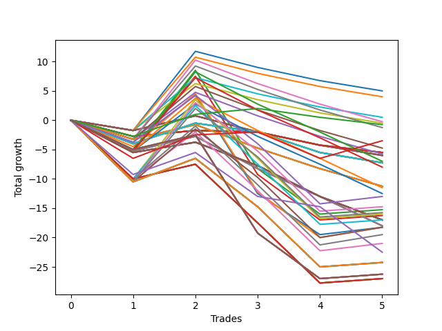

# Long Wallace Doodle 013 
- Symbol: ES
- Date Range: 03/15/2022 - 07/08/2022
- Trading Period: 7:20-12:30
- Number of Trades: 6



| Name | Win Percent | Profit | Avg Profit / Trade |     | Name | Win Percent | Profit | Avg Profit / Trade |
| ---- | ----------- | ------ | ------------------ | --- | ---- | ----------- | ------ | ------------------ |
| Sorted By <br> Profit | | | | | Sorted By <br> Win Percentage ||||
| Eleven | 33.33 | 6875.00 | 1145.83 |     | Seventy-Three | 66.67 | 875.00 | 145.83 |
| Ten | 33.33 | 6375.00 | 1062.50 |     | Seventy-Two | 50.00 | 3000.00 | 500.00 |
| Nine | 33.33 | 4625.00 | 770.83 |     | Sixty-Four | 50.00 | -2375.00 | -395.83 |
| Thirteen | 33.33 | 4375.00 | 729.17 |     | Sixty-Seven | 50.00 | -3000.00 | -500.00 |
| twenty-Seven | 33.33 | 4250.00 | 708.33 |     | Three | 50.00 | -3250.00 | -541.67 |
| Eight | 33.33 | 3875.00 | 645.83 |     | Sixty-Six | 50.00 | -3500.00 | -583.33 |
| Twenty-Six | 33.33 | 3750.00 | 625.00 |     | Fifty-Nine | 50.00 | -3625.00 | -604.17 |
| Twelve | 33.33 | 3750.00 | 625.00 |     | Two | 50.00 | -3750.00 | -625.00 |
| Seventy-Two | 50.00 | 3000.00 | 500.00 |     | Fifty-Eight | 50.00 | -4125.00 | -687.50 |
| Twenty-Five | 33.33 | 2000.00 | 333.33 |     | Sixty-Nine | 50.00 | -4750.00 | -791.67 |
| Twenty-Nine | 33.33 | 1750.00 | 291.67 |     | Sixty-Five | 50.00 | -4750.00 | -791.67 |
| Fifteen | 33.33 | 1750.00 | 291.67 |     | One | 50.00 | -4750.00 | -791.67 |
| Fourteen | 33.33 | 1750.00 | 291.67 |     | Zero | 50.00 | -5000.00 | -833.33 |
| Sixten | 33.33 | 1375.00 | 229.17 |     | Sixty-Eight | 50.00 | -5375.00 | -895.83 |
| Twenty-Four | 33.33 | 1250.00 | 208.33 |     | Fifty-Seven | 50.00 | -5375.00 | -895.83 |
| Twenty-Eight | 33.33 | 1125.00 | 187.50 |     | Five | 50.00 | -5750.00 | -958.33 |
| Seventy-Three | 66.67 | 875.00 | 145.83 |     | Sixty-One | 50.00 | -6125.00 | -1020.83 |
| Forty-Three | 33.33 | 875.00 | 145.83 |     | Fifty-Six | 50.00 | -6375.00 | -1062.50 |
| Thirty-Two | 33.33 | 500.00 | 83.33 |     | Four | 50.00 | -6375.00 | -1062.50 |
| Forty-Two | 33.33 | 375.00 | 62.50 |     | Sixty | 50.00 | -6750.00 | -1125.00 |
| Twenty-Three | 33.33 | 375.00 | 62.50 |     | Seventy-One | 50.00 | -7375.00 | -1229.17 |
| Twenty-Two | 33.33 | 375.00 | 62.50 |     | Seventy | 50.00 | -7375.00 | -1229.17 |
| Twenty-One | 33.33 | 375.00 | 62.50 |     | Seventy-Five | 50.00 | -8375.00 | -1395.83 |
| Twenty | 33.33 | 375.00 | 62.50 |     | Seven | 50.00 | -8375.00 | -1395.83 |
| Nineteen | 33.33 | 375.00 | 62.50 |     | Six | 50.00 | -8375.00 | -1395.83 |
| Eighteen | 33.33 | 375.00 | 62.50 |     | Sixty-Three | 50.00 | -8750.00 | -1458.33 |
| Seventeen | 33.33 | 375.00 | 62.50 |     | Sixty-Two | 50.00 | -8750.00 | -1458.33 |
| Thirty-One | 33.33 | -875.00 | -145.83 |     | Eleven | 33.33 | 6875.00 | 1145.83 |
| Thirty | 33.33 | -875.00 | -145.83 |     | Ten | 33.33 | 6375.00 | 1062.50 |
| Thirty-Nine | 33.33 | -1000.00 | -166.67 |     | Nine | 33.33 | 4625.00 | 770.83 |
| Thirty-Eight | 33.33 | -1000.00 | -166.67 |     | Thirteen | 33.33 | 4375.00 | 729.17 |
| Thirty-Seven | 33.33 | -1000.00 | -166.67 |     | twenty-Seven | 33.33 | 4250.00 | 708.33 |
| Thirty-Six | 33.33 | -1000.00 | -166.67 |     | Eight | 33.33 | 3875.00 | 645.83 |
| Thirty-Five | 33.33 | -1000.00 | -166.67 |     | Twenty-Six | 33.33 | 3750.00 | 625.00 |
| Thirty-Four | 33.33 | -1000.00 | -166.67 |     | Twelve | 33.33 | 3750.00 | 625.00 |
| Thirty-Three | 33.33 | -1000.00 | -166.67 |     | Twenty-Five | 33.33 | 2000.00 | 333.33 |
| Fifty-Three | 33.33 | -1125.00 | -187.50 |     | Twenty-Nine | 33.33 | 1750.00 | 291.67 |
| Forty-One | 33.33 | -1375.00 | -229.17 |     | Fifteen | 33.33 | 1750.00 | 291.67 |
| Forty-Five | 33.33 | -1625.00 | -270.83 |     | Fourteen | 33.33 | 1750.00 | 291.67 |
| Fifty-Two | 33.33 | -1750.00 | -291.67 |     | Sixten | 33.33 | 1375.00 | 229.17 |
| Forty | 33.33 | -2125.00 | -354.17 |     | Twenty-Four | 33.33 | 1250.00 | 208.33 |
| Forty-Four | 33.33 | -2250.00 | -375.00 |     | Twenty-Eight | 33.33 | 1125.00 | 187.50 |
| Sixty-Four | 50.00 | -2375.00 | -395.83 |     | Forty-Three | 33.33 | 875.00 | 145.83 |
| Fifty-Five | 33.33 | -2500.00 | -416.67 |     | Thirty-Two | 33.33 | 500.00 | 83.33 |
| Fifty-Four | 33.33 | -2500.00 | -416.67 |     | Forty-Two | 33.33 | 375.00 | 62.50 |
| Sixty-Seven | 50.00 | -3000.00 | -500.00 |     | Twenty-Three | 33.33 | 375.00 | 62.50 |
| Three | 50.00 | -3250.00 | -541.67 |     | Twenty-Two | 33.33 | 375.00 | 62.50 |
| Sixty-Six | 50.00 | -3500.00 | -583.33 |     | Twenty-One | 33.33 | 375.00 | 62.50 |
| Fifty-Nine | 50.00 | -3625.00 | -604.17 |     | Twenty | 33.33 | 375.00 | 62.50 |
| Fifty-One | 33.33 | -3625.00 | -604.17 |     | Nineteen | 33.33 | 375.00 | 62.50 |
| Two | 50.00 | -3750.00 | -625.00 |     | Eighteen | 33.33 | 375.00 | 62.50 |
| Fifty-Eight | 50.00 | -4125.00 | -687.50 |     | Seventeen | 33.33 | 375.00 | 62.50 |
| Forty-Nine | 33.33 | -4125.00 | -687.50 |     | Thirty-One | 33.33 | -875.00 | -145.83 |
| Forty-Seven | 33.33 | -4250.00 | -708.33 |     | Thirty | 33.33 | -875.00 | -145.83 |
| Forty-Six | 33.33 | -4250.00 | -708.33 |     | Thirty-Nine | 33.33 | -1000.00 | -166.67 |
| Forty-Eight | 33.33 | -4375.00 | -729.17 |     | Thirty-Eight | 33.33 | -1000.00 | -166.67 |
| Fifty | 33.33 | -4625.00 | -770.83 |     | Thirty-Seven | 33.33 | -1000.00 | -166.67 |
| Sixty-Nine | 50.00 | -4750.00 | -791.67 |     | Thirty-Six | 33.33 | -1000.00 | -166.67 |
| Sixty-Five | 50.00 | -4750.00 | -791.67 |     | Thirty-Five | 33.33 | -1000.00 | -166.67 |
| One | 50.00 | -4750.00 | -791.67 |     | Thirty-Four | 33.33 | -1000.00 | -166.67 |
| Zero | 50.00 | -5000.00 | -833.33 |     | Thirty-Three | 33.33 | -1000.00 | -166.67 |
| Sixty-Eight | 50.00 | -5375.00 | -895.83 |     | Fifty-Three | 33.33 | -1125.00 | -187.50 |
| Fifty-Seven | 50.00 | -5375.00 | -895.83 |     | Forty-One | 33.33 | -1375.00 | -229.17 |
| Five | 50.00 | -5750.00 | -958.33 |     | Forty-Five | 33.33 | -1625.00 | -270.83 |
| Sixty-One | 50.00 | -6125.00 | -1020.83 |     | Fifty-Two | 33.33 | -1750.00 | -291.67 |
| Fifty-Six | 50.00 | -6375.00 | -1062.50 |     | Forty | 33.33 | -2125.00 | -354.17 |
| Four | 50.00 | -6375.00 | -1062.50 |     | Forty-Four | 33.33 | -2250.00 | -375.00 |
| Sixty | 50.00 | -6750.00 | -1125.00 |     | Fifty-Five | 33.33 | -2500.00 | -416.67 |
| Seventy-Four | 33.33 | -7000.00 | -1166.67 |     | Fifty-Four | 33.33 | -2500.00 | -416.67 |
| Seventy-One | 50.00 | -7375.00 | -1229.17 |     | Fifty-One | 33.33 | -3625.00 | -604.17 |
| Seventy | 50.00 | -7375.00 | -1229.17 |     | Forty-Nine | 33.33 | -4125.00 | -687.50 |
| Seventy-Five | 50.00 | -8375.00 | -1395.83 |     | Forty-Seven | 33.33 | -4250.00 | -708.33 |
| Seven | 50.00 | -8375.00 | -1395.83 |     | Forty-Six | 33.33 | -4250.00 | -708.33 |
| Six | 50.00 | -8375.00 | -1395.83 |     | Forty-Eight | 33.33 | -4375.00 | -729.17 |
| Sixty-Three | 50.00 | -8750.00 | -1458.33 |     | Fifty | 33.33 | -4625.00 | -770.83 |
| Sixty-Two | 50.00 | -8750.00 | -1458.33 |     | Seventy-Four | 33.33 | -7000.00 | -1166.67 |

## NO STOPLOSS

### Test Zero
* Sell when price hits the middle line of the 20p bollinger
* No Stoploss
* Results:
```
Total Trades: 6
Percent Up: 50.00
Percent Down: 50.00
Total Points Moved Up: -10.00
Potential Profit: -5000.00
Total Points Ups: 17.50 Count Ups: 3
Total Points Downs: -27.50 Count Downs: 3
```

<details><summary>Trades</summary>

<code>In: 2022-03-16 10:12:00		Out: 2022-03-16 10:12:10		Total Position Time: 00:10		Total Move Up: 8.25		Total to Date: 8.25</code> <br />
<code>In: 2022-03-23 10:23:00		Out: 2022-03-23 10:37:45		Total Position Time: 14:45		Total Move Up: -3.75		Total to Date: 4.50</code> <br />
<code>In: 2022-03-25 08:29:00		Out: 2022-03-25 08:36:40		Total Position Time: 07:40		Total Move Up: 8.00		Total to Date: 12.50</code> <br />
<code>In: 2022-03-28 08:27:00		Out: 2022-03-28 08:56:55		Total Position Time: 29:55		Total Move Up: -16.75		Total to Date: -4.25</code> <br />
<code>In: 2022-04-18 08:26:00		Out: 2022-04-18 08:54:55		Total Position Time: 28:55		Total Move Up: -7.00		Total to Date: -11.25</code> <br />
<code>In: 2022-06-08 09:41:00		Out: 2022-06-08 09:53:00		Total Position Time: 12:00		Total Move Up: 1.25		Total to Date: -10.00</code> <br />


</details>

### Test One
* Sell when the price hits the upper line of the 20p 1std bollinger
* No Stoploss
* Results:
```
Total Trades: 6
Percent Up: 50.00
Percent Down: 50.00
Total Points Moved Up: -9.50
Potential Profit: -4750.00
Total Points Ups: 19.50 Count Ups: 3
Total Points Downs: -29.00 Count Downs: 3
```

<details><summary>Trades</summary>

<code>In: 2022-03-16 10:12:00		Out: 2022-03-16 10:19:05		Total Position Time: 07:05		Total Move Up: 8.75		Total to Date: 8.75</code> <br />
<code>In: 2022-03-23 10:23:00		Out: 2022-03-23 10:51:50		Total Position Time: 28:50		Total Move Up: -4.50		Total to Date: 4.25</code> <br />
<code>In: 2022-03-25 08:29:00		Out: 2022-03-25 08:40:40		Total Position Time: 11:40		Total Move Up: 9.00		Total to Date: 13.25</code> <br />
<code>In: 2022-03-28 08:27:00		Out: 2022-03-28 08:56:55		Total Position Time: 29:55		Total Move Up: -16.75		Total to Date: -3.50</code> <br />
<code>In: 2022-04-18 08:26:00		Out: 2022-04-18 08:55:55		Total Position Time: 29:55		Total Move Up: -7.75		Total to Date: -11.25</code> <br />
<code>In: 2022-06-08 09:41:00		Out: 2022-06-08 09:57:10		Total Position Time: 16:10		Total Move Up: 1.75		Total to Date: -9.50</code> <br />


</details>

### Test Two
* Sell when the price hits the upper line of the 20p 2std bollinger
* No Stoploss
* Results:
```
Total Trades: 6
Percent Up: 50.00
Percent Down: 50.00
Total Points Moved Up: -7.50
Potential Profit: -3750.00
Total Points Ups: 22.00 Count Ups: 3
Total Points Downs: -29.50 Count Downs: 3
```

<details><summary>Trades</summary>

<code>In: 2022-03-16 10:12:00		Out: 2022-03-16 10:23:10		Total Position Time: 11:10		Total Move Up: 7.75		Total to Date: 7.75</code> <br />
<code>In: 2022-03-23 10:23:00		Out: 2022-03-23 10:52:55		Total Position Time: 29:55		Total Move Up: -5.00		Total to Date: 2.75</code> <br />
<code>In: 2022-03-25 08:29:00		Out: 2022-03-25 08:41:55		Total Position Time: 12:55		Total Move Up: 13.50		Total to Date: 16.25</code> <br />
<code>In: 2022-03-28 08:27:00		Out: 2022-03-28 08:56:55		Total Position Time: 29:55		Total Move Up: -16.75		Total to Date: -0.50</code> <br />
<code>In: 2022-04-18 08:26:00		Out: 2022-04-18 08:55:55		Total Position Time: 29:55		Total Move Up: -7.75		Total to Date: -8.25</code> <br />
<code>In: 2022-06-08 09:41:00		Out: 2022-06-08 10:10:55		Total Position Time: 29:55		Total Move Up: 0.75		Total to Date: -7.50</code> <br />


</details>

### Test Three
* Sell when price hits the middle line of the 50p bollinger
* No Stoploss
* Results:
```
Total Trades: 6
Percent Up: 50.00
Percent Down: 50.00
Total Points Moved Up: -6.50
Potential Profit: -3250.00
Total Points Ups: 23.00 Count Ups: 3
Total Points Downs: -29.50 Count Downs: 3
```

<details><summary>Trades</summary>

<code>In: 2022-03-16 10:12:00		Out: 2022-03-16 10:24:05		Total Position Time: 12:05		Total Move Up: 9.75		Total to Date: 9.75</code> <br />
<code>In: 2022-03-23 10:23:00		Out: 2022-03-23 10:52:55		Total Position Time: 29:55		Total Move Up: -5.00		Total to Date: 4.75</code> <br />
<code>In: 2022-03-25 08:29:00		Out: 2022-03-25 08:52:45		Total Position Time: 23:45		Total Move Up: 12.50		Total to Date: 17.25</code> <br />
<code>In: 2022-03-28 08:27:00		Out: 2022-03-28 08:56:55		Total Position Time: 29:55		Total Move Up: -16.75		Total to Date: 0.50</code> <br />
<code>In: 2022-04-18 08:26:00		Out: 2022-04-18 08:55:55		Total Position Time: 29:55		Total Move Up: -7.75		Total to Date: -7.25</code> <br />
<code>In: 2022-06-08 09:41:00		Out: 2022-06-08 10:10:55		Total Position Time: 29:55		Total Move Up: 0.75		Total to Date: -6.50</code> <br />


</details>

### Test Four
* Sell when the price hits the upper line of the 50p 1std bollinger
* No Stoploss
* Results:
```
Total Trades: 6
Percent Up: 50.00
Percent Down: 50.00
Total Points Moved Up: -12.75
Potential Profit: -6375.00
Total Points Ups: 16.75 Count Ups: 3
Total Points Downs: -29.50 Count Downs: 3
```

<details><summary>Trades</summary>

<code>In: 2022-03-16 10:12:00		Out: 2022-03-16 10:31:20		Total Position Time: 19:20		Total Move Up: 13.50		Total to Date: 13.50</code> <br />
<code>In: 2022-03-23 10:23:00		Out: 2022-03-23 10:52:55		Total Position Time: 29:55		Total Move Up: -5.00		Total to Date: 8.50</code> <br />
<code>In: 2022-03-25 08:29:00		Out: 2022-03-25 08:58:55		Total Position Time: 29:55		Total Move Up: 2.50		Total to Date: 11.00</code> <br />
<code>In: 2022-03-28 08:27:00		Out: 2022-03-28 08:56:55		Total Position Time: 29:55		Total Move Up: -16.75		Total to Date: -5.75</code> <br />
<code>In: 2022-04-18 08:26:00		Out: 2022-04-18 08:55:55		Total Position Time: 29:55		Total Move Up: -7.75		Total to Date: -13.50</code> <br />
<code>In: 2022-06-08 09:41:00		Out: 2022-06-08 10:10:55		Total Position Time: 29:55		Total Move Up: 0.75		Total to Date: -12.75</code> <br />


</details>

### Test Five
* Sell when the price hits the upper line of the 50p 2std bollinger
* No Stoploss
* Results:
```
Total Trades: 6
Percent Up: 50.00
Percent Down: 50.00
Total Points Moved Up: -11.50
Potential Profit: -5750.00
Total Points Ups: 18.00 Count Ups: 3
Total Points Downs: -29.50 Count Downs: 3
```

<details><summary>Trades</summary>

<code>In: 2022-03-16 10:12:00		Out: 2022-03-16 10:35:25		Total Position Time: 23:25		Total Move Up: 14.75		Total to Date: 14.75</code> <br />
<code>In: 2022-03-23 10:23:00		Out: 2022-03-23 10:52:55		Total Position Time: 29:55		Total Move Up: -5.00		Total to Date: 9.75</code> <br />
<code>In: 2022-03-25 08:29:00		Out: 2022-03-25 08:58:55		Total Position Time: 29:55		Total Move Up: 2.50		Total to Date: 12.25</code> <br />
<code>In: 2022-03-28 08:27:00		Out: 2022-03-28 08:56:55		Total Position Time: 29:55		Total Move Up: -16.75		Total to Date: -4.50</code> <br />
<code>In: 2022-04-18 08:26:00		Out: 2022-04-18 08:55:55		Total Position Time: 29:55		Total Move Up: -7.75		Total to Date: -12.25</code> <br />
<code>In: 2022-06-08 09:41:00		Out: 2022-06-08 10:10:55		Total Position Time: 29:55		Total Move Up: 0.75		Total to Date: -11.50</code> <br />


</details>

### Test Six
* Sell when the price hits the middle line of the 1std VWAP
* No Stoploss
* Results:
```
Total Trades: 6
Percent Up: 50.00
Percent Down: 50.00
Total Points Moved Up: -16.75
Potential Profit: -8375.00
Total Points Ups: 12.75 Count Ups: 3
Total Points Downs: -29.50 Count Downs: 3
```

<details><summary>Trades</summary>

<code>In: 2022-03-16 10:12:00		Out: 2022-03-16 10:41:55		Total Position Time: 29:55		Total Move Up: 9.50		Total to Date: 9.50</code> <br />
<code>In: 2022-03-23 10:23:00		Out: 2022-03-23 10:52:55		Total Position Time: 29:55		Total Move Up: -5.00		Total to Date: 4.50</code> <br />
<code>In: 2022-03-25 08:29:00		Out: 2022-03-25 08:58:55		Total Position Time: 29:55		Total Move Up: 2.50		Total to Date: 7.00</code> <br />
<code>In: 2022-03-28 08:27:00		Out: 2022-03-28 08:56:55		Total Position Time: 29:55		Total Move Up: -16.75		Total to Date: -9.75</code> <br />
<code>In: 2022-04-18 08:26:00		Out: 2022-04-18 08:55:55		Total Position Time: 29:55		Total Move Up: -7.75		Total to Date: -17.50</code> <br />
<code>In: 2022-06-08 09:41:00		Out: 2022-06-08 10:10:55		Total Position Time: 29:55		Total Move Up: 0.75		Total to Date: -16.75</code> <br />


</details>

### Test Seven
* Sell when the price hits the upper line of the 1std VWAP
* No Stoploss
* Results:
```
Total Trades: 6
Percent Up: 50.00
Percent Down: 50.00
Total Points Moved Up: -16.75
Potential Profit: -8375.00
Total Points Ups: 12.75 Count Ups: 3
Total Points Downs: -29.50 Count Downs: 3
```

<details><summary>Trades</summary>

<code>In: 2022-03-16 10:12:00		Out: 2022-03-16 10:41:55		Total Position Time: 29:55		Total Move Up: 9.50		Total to Date: 9.50</code> <br />
<code>In: 2022-03-23 10:23:00		Out: 2022-03-23 10:52:55		Total Position Time: 29:55		Total Move Up: -5.00		Total to Date: 4.50</code> <br />
<code>In: 2022-03-25 08:29:00		Out: 2022-03-25 08:58:55		Total Position Time: 29:55		Total Move Up: 2.50		Total to Date: 7.00</code> <br />
<code>In: 2022-03-28 08:27:00		Out: 2022-03-28 08:56:55		Total Position Time: 29:55		Total Move Up: -16.75		Total to Date: -9.75</code> <br />
<code>In: 2022-04-18 08:26:00		Out: 2022-04-18 08:55:55		Total Position Time: 29:55		Total Move Up: -7.75		Total to Date: -17.50</code> <br />
<code>In: 2022-06-08 09:41:00		Out: 2022-06-08 10:10:55		Total Position Time: 29:55		Total Move Up: 0.75		Total to Date: -16.75</code> <br />


</details>

## STOPLOSS OF 2

### Test Eight
* Sell when price hits the middle line of the 20p bollinger
* Stoploss is 2 points
* Results:
```
Total Trades: 6
Percent Up: 33.33
Percent Down: 66.67
Total Points Moved Up: 7.75
Potential Profit: 3875.00
Total Points Ups: 16.25 Count Ups: 2
Total Points Downs: -8.50 Count Downs: 4
```

<details><summary>Trades</summary>

<code>In: 2022-03-16 10:12:00		Out: 2022-03-16 10:12:10		Total Position Time: 00:10		Total Move Up: 8.25		Total to Date: 8.25</code> <br />
<code>In: 2022-03-23 10:23:00		Out: 2022-03-23 10:23:50		Total Position Time: 00:50		Total Move Up: -1.75		Total to Date: 6.50</code> <br />
<code>In: 2022-03-25 08:29:00		Out: 2022-03-25 08:36:40		Total Position Time: 07:40		Total Move Up: 8.00		Total to Date: 14.50</code> <br />
<code>In: 2022-03-28 08:27:00		Out: 2022-03-28 08:32:05		Total Position Time: 05:05		Total Move Up: -2.75		Total to Date: 11.75</code> <br />
<code>In: 2022-04-18 08:26:00		Out: 2022-04-18 08:27:15		Total Position Time: 01:15		Total Move Up: -2.25		Total to Date: 9.50</code> <br />
<code>In: 2022-06-08 09:41:00		Out: 2022-06-08 09:42:25		Total Position Time: 01:25		Total Move Up: -1.75		Total to Date: 7.75</code> <br />


</details>

### Test Nine
* Sell when the price hits the upper line of the 20p 1std bollinger
* Stoploss is 2 points
* Results:
```
Total Trades: 6
Percent Up: 33.33
Percent Down: 66.67
Total Points Moved Up: 9.25
Potential Profit: 4625.00
Total Points Ups: 17.75 Count Ups: 2
Total Points Downs: -8.50 Count Downs: 4
```

<details><summary>Trades</summary>

<code>In: 2022-03-16 10:12:00		Out: 2022-03-16 10:19:05		Total Position Time: 07:05		Total Move Up: 8.75		Total to Date: 8.75</code> <br />
<code>In: 2022-03-23 10:23:00		Out: 2022-03-23 10:23:50		Total Position Time: 00:50		Total Move Up: -1.75		Total to Date: 7.00</code> <br />
<code>In: 2022-03-25 08:29:00		Out: 2022-03-25 08:40:40		Total Position Time: 11:40		Total Move Up: 9.00		Total to Date: 16.00</code> <br />
<code>In: 2022-03-28 08:27:00		Out: 2022-03-28 08:32:05		Total Position Time: 05:05		Total Move Up: -2.75		Total to Date: 13.25</code> <br />
<code>In: 2022-04-18 08:26:00		Out: 2022-04-18 08:27:15		Total Position Time: 01:15		Total Move Up: -2.25		Total to Date: 11.00</code> <br />
<code>In: 2022-06-08 09:41:00		Out: 2022-06-08 09:42:25		Total Position Time: 01:25		Total Move Up: -1.75		Total to Date: 9.25</code> <br />


</details>

### Test Ten
* Sell when the price hits the upper line of the 20p 2std bollinger
* Stoploss is 2 points
* Results:
```
Total Trades: 6
Percent Up: 33.33
Percent Down: 66.67
Total Points Moved Up: 12.75
Potential Profit: 6375.00
Total Points Ups: 21.25 Count Ups: 2
Total Points Downs: -8.50 Count Downs: 4
```

<details><summary>Trades</summary>

<code>In: 2022-03-16 10:12:00		Out: 2022-03-16 10:23:10		Total Position Time: 11:10		Total Move Up: 7.75		Total to Date: 7.75</code> <br />
<code>In: 2022-03-23 10:23:00		Out: 2022-03-23 10:23:50		Total Position Time: 00:50		Total Move Up: -1.75		Total to Date: 6.00</code> <br />
<code>In: 2022-03-25 08:29:00		Out: 2022-03-25 08:41:55		Total Position Time: 12:55		Total Move Up: 13.50		Total to Date: 19.50</code> <br />
<code>In: 2022-03-28 08:27:00		Out: 2022-03-28 08:32:05		Total Position Time: 05:05		Total Move Up: -2.75		Total to Date: 16.75</code> <br />
<code>In: 2022-04-18 08:26:00		Out: 2022-04-18 08:27:15		Total Position Time: 01:15		Total Move Up: -2.25		Total to Date: 14.50</code> <br />
<code>In: 2022-06-08 09:41:00		Out: 2022-06-08 09:42:25		Total Position Time: 01:25		Total Move Up: -1.75		Total to Date: 12.75</code> <br />


</details>

### Test Eleven
* Sell when price hits the middle line of the 50p bollinger
* Stoploss is 2 points
* Results:
```
Total Trades: 6
Percent Up: 33.33
Percent Down: 66.67
Total Points Moved Up: 13.75
Potential Profit: 6875.00
Total Points Ups: 22.25 Count Ups: 2
Total Points Downs: -8.50 Count Downs: 4
```

<details><summary>Trades</summary>

<code>In: 2022-03-16 10:12:00		Out: 2022-03-16 10:24:05		Total Position Time: 12:05		Total Move Up: 9.75		Total to Date: 9.75</code> <br />
<code>In: 2022-03-23 10:23:00		Out: 2022-03-23 10:23:50		Total Position Time: 00:50		Total Move Up: -1.75		Total to Date: 8.00</code> <br />
<code>In: 2022-03-25 08:29:00		Out: 2022-03-25 08:52:45		Total Position Time: 23:45		Total Move Up: 12.50		Total to Date: 20.50</code> <br />
<code>In: 2022-03-28 08:27:00		Out: 2022-03-28 08:32:05		Total Position Time: 05:05		Total Move Up: -2.75		Total to Date: 17.75</code> <br />
<code>In: 2022-04-18 08:26:00		Out: 2022-04-18 08:27:15		Total Position Time: 01:15		Total Move Up: -2.25		Total to Date: 15.50</code> <br />
<code>In: 2022-06-08 09:41:00		Out: 2022-06-08 09:42:25		Total Position Time: 01:25		Total Move Up: -1.75		Total to Date: 13.75</code> <br />


</details>

### Test Twelve
* Sell when the price hits the upper line of the 50p 1std bollinger
* Stoploss is 2 points
* Results:
```
Total Trades: 6
Percent Up: 33.33
Percent Down: 66.67
Total Points Moved Up: 7.50
Potential Profit: 3750.00
Total Points Ups: 16.00 Count Ups: 2
Total Points Downs: -8.50 Count Downs: 4
```

<details><summary>Trades</summary>

<code>In: 2022-03-16 10:12:00		Out: 2022-03-16 10:31:20		Total Position Time: 19:20		Total Move Up: 13.50		Total to Date: 13.50</code> <br />
<code>In: 2022-03-23 10:23:00		Out: 2022-03-23 10:23:50		Total Position Time: 00:50		Total Move Up: -1.75		Total to Date: 11.75</code> <br />
<code>In: 2022-03-25 08:29:00		Out: 2022-03-25 08:58:55		Total Position Time: 29:55		Total Move Up: 2.50		Total to Date: 14.25</code> <br />
<code>In: 2022-03-28 08:27:00		Out: 2022-03-28 08:32:05		Total Position Time: 05:05		Total Move Up: -2.75		Total to Date: 11.50</code> <br />
<code>In: 2022-04-18 08:26:00		Out: 2022-04-18 08:27:15		Total Position Time: 01:15		Total Move Up: -2.25		Total to Date: 9.25</code> <br />
<code>In: 2022-06-08 09:41:00		Out: 2022-06-08 09:42:25		Total Position Time: 01:25		Total Move Up: -1.75		Total to Date: 7.50</code> <br />


</details>

### Test Thirteen
* Sell when the price hits the upper line of the 50p 2std bollinger
* Stoploss is 2 points
* Results:
```
Total Trades: 6
Percent Up: 33.33
Percent Down: 66.67
Total Points Moved Up: 8.75
Potential Profit: 4375.00
Total Points Ups: 17.25 Count Ups: 2
Total Points Downs: -8.50 Count Downs: 4
```

<details><summary>Trades</summary>

<code>In: 2022-03-16 10:12:00		Out: 2022-03-16 10:35:25		Total Position Time: 23:25		Total Move Up: 14.75		Total to Date: 14.75</code> <br />
<code>In: 2022-03-23 10:23:00		Out: 2022-03-23 10:23:50		Total Position Time: 00:50		Total Move Up: -1.75		Total to Date: 13.00</code> <br />
<code>In: 2022-03-25 08:29:00		Out: 2022-03-25 08:58:55		Total Position Time: 29:55		Total Move Up: 2.50		Total to Date: 15.50</code> <br />
<code>In: 2022-03-28 08:27:00		Out: 2022-03-28 08:32:05		Total Position Time: 05:05		Total Move Up: -2.75		Total to Date: 12.75</code> <br />
<code>In: 2022-04-18 08:26:00		Out: 2022-04-18 08:27:15		Total Position Time: 01:15		Total Move Up: -2.25		Total to Date: 10.50</code> <br />
<code>In: 2022-06-08 09:41:00		Out: 2022-06-08 09:42:25		Total Position Time: 01:25		Total Move Up: -1.75		Total to Date: 8.75</code> <br />


</details>

### Test Fourteen
* Sell when the price hits the middle line of the 1std VWAP
* Stoploss is 2 points
* Results:
```
Total Trades: 6
Percent Up: 33.33
Percent Down: 66.67
Total Points Moved Up: 3.50
Potential Profit: 1750.00
Total Points Ups: 12.00 Count Ups: 2
Total Points Downs: -8.50 Count Downs: 4
```

<details><summary>Trades</summary>

<code>In: 2022-03-16 10:12:00		Out: 2022-03-16 10:41:55		Total Position Time: 29:55		Total Move Up: 9.50		Total to Date: 9.50</code> <br />
<code>In: 2022-03-23 10:23:00		Out: 2022-03-23 10:23:50		Total Position Time: 00:50		Total Move Up: -1.75		Total to Date: 7.75</code> <br />
<code>In: 2022-03-25 08:29:00		Out: 2022-03-25 08:58:55		Total Position Time: 29:55		Total Move Up: 2.50		Total to Date: 10.25</code> <br />
<code>In: 2022-03-28 08:27:00		Out: 2022-03-28 08:32:05		Total Position Time: 05:05		Total Move Up: -2.75		Total to Date: 7.50</code> <br />
<code>In: 2022-04-18 08:26:00		Out: 2022-04-18 08:27:15		Total Position Time: 01:15		Total Move Up: -2.25		Total to Date: 5.25</code> <br />
<code>In: 2022-06-08 09:41:00		Out: 2022-06-08 09:42:25		Total Position Time: 01:25		Total Move Up: -1.75		Total to Date: 3.50</code> <br />


</details>

### Test Fifteen
* Sell when the price hits the upper line of the 1std VWAP
* Stoploss is 2 points
* Results:
```
Total Trades: 6
Percent Up: 33.33
Percent Down: 66.67
Total Points Moved Up: 3.50
Potential Profit: 1750.00
Total Points Ups: 12.00 Count Ups: 2
Total Points Downs: -8.50 Count Downs: 4
```

<details><summary>Trades</summary>

<code>In: 2022-03-16 10:12:00		Out: 2022-03-16 10:41:55		Total Position Time: 29:55		Total Move Up: 9.50		Total to Date: 9.50</code> <br />
<code>In: 2022-03-23 10:23:00		Out: 2022-03-23 10:23:50		Total Position Time: 00:50		Total Move Up: -1.75		Total to Date: 7.75</code> <br />
<code>In: 2022-03-25 08:29:00		Out: 2022-03-25 08:58:55		Total Position Time: 29:55		Total Move Up: 2.50		Total to Date: 10.25</code> <br />
<code>In: 2022-03-28 08:27:00		Out: 2022-03-28 08:32:05		Total Position Time: 05:05		Total Move Up: -2.75		Total to Date: 7.50</code> <br />
<code>In: 2022-04-18 08:26:00		Out: 2022-04-18 08:27:15		Total Position Time: 01:15		Total Move Up: -2.25		Total to Date: 5.25</code> <br />
<code>In: 2022-06-08 09:41:00		Out: 2022-06-08 09:42:25		Total Position Time: 01:25		Total Move Up: -1.75		Total to Date: 3.50</code> <br />


</details>

## TRAIL STOP OF 2

### Test Sixten
* Sell when price hits the middle line of the 20p bollinger
* Trailing Stop is 2 points
* Results:
```
Total Trades: 6
Percent Up: 33.33
Percent Down: 66.67
Total Points Moved Up: 2.75
Potential Profit: 1375.00
Total Points Ups: 9.25 Count Ups: 2
Total Points Downs: -6.50 Count Downs: 4
```

<details><summary>Trades</summary>

<code>In: 2022-03-16 10:12:00		Out: 2022-03-16 10:12:10		Total Position Time: 00:10		Total Move Up: 8.25		Total to Date: 8.25</code> <br />
<code>In: 2022-03-23 10:23:00		Out: 2022-03-23 10:24:05		Total Position Time: 01:05		Total Move Up: -2.75		Total to Date: 5.50</code> <br />
<code>In: 2022-03-25 08:29:00		Out: 2022-03-25 08:29:10		Total Position Time: 00:10		Total Move Up: 1.00		Total to Date: 6.50</code> <br />
<code>In: 2022-03-28 08:27:00		Out: 2022-03-28 08:29:05		Total Position Time: 02:05		Total Move Up: -0.25		Total to Date: 6.25</code> <br />
<code>In: 2022-04-18 08:26:00		Out: 2022-04-18 08:27:15		Total Position Time: 01:15		Total Move Up: -2.25		Total to Date: 4.00</code> <br />
<code>In: 2022-06-08 09:41:00		Out: 2022-06-08 09:42:05		Total Position Time: 01:05		Total Move Up: -1.25		Total to Date: 2.75</code> <br />


</details>

### Test Seventeen
* Sell when the price hits the upper line of the 20p 1std bollinger
* Trailing Stop is 2 points
* Results:
```
Total Trades: 6
Percent Up: 33.33
Percent Down: 66.67
Total Points Moved Up: 0.75
Potential Profit: 375.00
Total Points Ups: 7.25 Count Ups: 2
Total Points Downs: -6.50 Count Downs: 4
```

<details><summary>Trades</summary>

<code>In: 2022-03-16 10:12:00		Out: 2022-03-16 10:13:00		Total Position Time: 01:00		Total Move Up: 6.25		Total to Date: 6.25</code> <br />
<code>In: 2022-03-23 10:23:00		Out: 2022-03-23 10:24:05		Total Position Time: 01:05		Total Move Up: -2.75		Total to Date: 3.50</code> <br />
<code>In: 2022-03-25 08:29:00		Out: 2022-03-25 08:29:10		Total Position Time: 00:10		Total Move Up: 1.00		Total to Date: 4.50</code> <br />
<code>In: 2022-03-28 08:27:00		Out: 2022-03-28 08:29:05		Total Position Time: 02:05		Total Move Up: -0.25		Total to Date: 4.25</code> <br />
<code>In: 2022-04-18 08:26:00		Out: 2022-04-18 08:27:15		Total Position Time: 01:15		Total Move Up: -2.25		Total to Date: 2.00</code> <br />
<code>In: 2022-06-08 09:41:00		Out: 2022-06-08 09:42:05		Total Position Time: 01:05		Total Move Up: -1.25		Total to Date: 0.75</code> <br />


</details>

### Test Eighteen
* Sell when the price hits the upper line of the 20p 2std bollinger
* Trailing Stop is 2 points
* Results:
```
Total Trades: 6
Percent Up: 33.33
Percent Down: 66.67
Total Points Moved Up: 0.75
Potential Profit: 375.00
Total Points Ups: 7.25 Count Ups: 2
Total Points Downs: -6.50 Count Downs: 4
```

<details><summary>Trades</summary>

<code>In: 2022-03-16 10:12:00		Out: 2022-03-16 10:13:00		Total Position Time: 01:00		Total Move Up: 6.25		Total to Date: 6.25</code> <br />
<code>In: 2022-03-23 10:23:00		Out: 2022-03-23 10:24:05		Total Position Time: 01:05		Total Move Up: -2.75		Total to Date: 3.50</code> <br />
<code>In: 2022-03-25 08:29:00		Out: 2022-03-25 08:29:10		Total Position Time: 00:10		Total Move Up: 1.00		Total to Date: 4.50</code> <br />
<code>In: 2022-03-28 08:27:00		Out: 2022-03-28 08:29:05		Total Position Time: 02:05		Total Move Up: -0.25		Total to Date: 4.25</code> <br />
<code>In: 2022-04-18 08:26:00		Out: 2022-04-18 08:27:15		Total Position Time: 01:15		Total Move Up: -2.25		Total to Date: 2.00</code> <br />
<code>In: 2022-06-08 09:41:00		Out: 2022-06-08 09:42:05		Total Position Time: 01:05		Total Move Up: -1.25		Total to Date: 0.75</code> <br />


</details>

### Test Nineteen
* Sell when price hits the middle line of the 50p bollinger
* Trailing Stop is 2 points
* Results:
```
Total Trades: 6
Percent Up: 33.33
Percent Down: 66.67
Total Points Moved Up: 0.75
Potential Profit: 375.00
Total Points Ups: 7.25 Count Ups: 2
Total Points Downs: -6.50 Count Downs: 4
```

<details><summary>Trades</summary>

<code>In: 2022-03-16 10:12:00		Out: 2022-03-16 10:13:00		Total Position Time: 01:00		Total Move Up: 6.25		Total to Date: 6.25</code> <br />
<code>In: 2022-03-23 10:23:00		Out: 2022-03-23 10:24:05		Total Position Time: 01:05		Total Move Up: -2.75		Total to Date: 3.50</code> <br />
<code>In: 2022-03-25 08:29:00		Out: 2022-03-25 08:29:10		Total Position Time: 00:10		Total Move Up: 1.00		Total to Date: 4.50</code> <br />
<code>In: 2022-03-28 08:27:00		Out: 2022-03-28 08:29:05		Total Position Time: 02:05		Total Move Up: -0.25		Total to Date: 4.25</code> <br />
<code>In: 2022-04-18 08:26:00		Out: 2022-04-18 08:27:15		Total Position Time: 01:15		Total Move Up: -2.25		Total to Date: 2.00</code> <br />
<code>In: 2022-06-08 09:41:00		Out: 2022-06-08 09:42:05		Total Position Time: 01:05		Total Move Up: -1.25		Total to Date: 0.75</code> <br />


</details>

### Test Twenty
* Sell when the price hits the upper line of the 50p 1std bollinger
* Trailing Stop is 2 points
* Results:
```
Total Trades: 6
Percent Up: 33.33
Percent Down: 66.67
Total Points Moved Up: 0.75
Potential Profit: 375.00
Total Points Ups: 7.25 Count Ups: 2
Total Points Downs: -6.50 Count Downs: 4
```

<details><summary>Trades</summary>

<code>In: 2022-03-16 10:12:00		Out: 2022-03-16 10:13:00		Total Position Time: 01:00		Total Move Up: 6.25		Total to Date: 6.25</code> <br />
<code>In: 2022-03-23 10:23:00		Out: 2022-03-23 10:24:05		Total Position Time: 01:05		Total Move Up: -2.75		Total to Date: 3.50</code> <br />
<code>In: 2022-03-25 08:29:00		Out: 2022-03-25 08:29:10		Total Position Time: 00:10		Total Move Up: 1.00		Total to Date: 4.50</code> <br />
<code>In: 2022-03-28 08:27:00		Out: 2022-03-28 08:29:05		Total Position Time: 02:05		Total Move Up: -0.25		Total to Date: 4.25</code> <br />
<code>In: 2022-04-18 08:26:00		Out: 2022-04-18 08:27:15		Total Position Time: 01:15		Total Move Up: -2.25		Total to Date: 2.00</code> <br />
<code>In: 2022-06-08 09:41:00		Out: 2022-06-08 09:42:05		Total Position Time: 01:05		Total Move Up: -1.25		Total to Date: 0.75</code> <br />


</details>

### Test Twenty-One
* Sell when the price hits the upper line of the 50p 2std bollinger
* Trailing Stop is 2 points
* Results:
```
Total Trades: 6
Percent Up: 33.33
Percent Down: 66.67
Total Points Moved Up: 0.75
Potential Profit: 375.00
Total Points Ups: 7.25 Count Ups: 2
Total Points Downs: -6.50 Count Downs: 4
```

<details><summary>Trades</summary>

<code>In: 2022-03-16 10:12:00		Out: 2022-03-16 10:13:00		Total Position Time: 01:00		Total Move Up: 6.25		Total to Date: 6.25</code> <br />
<code>In: 2022-03-23 10:23:00		Out: 2022-03-23 10:24:05		Total Position Time: 01:05		Total Move Up: -2.75		Total to Date: 3.50</code> <br />
<code>In: 2022-03-25 08:29:00		Out: 2022-03-25 08:29:10		Total Position Time: 00:10		Total Move Up: 1.00		Total to Date: 4.50</code> <br />
<code>In: 2022-03-28 08:27:00		Out: 2022-03-28 08:29:05		Total Position Time: 02:05		Total Move Up: -0.25		Total to Date: 4.25</code> <br />
<code>In: 2022-04-18 08:26:00		Out: 2022-04-18 08:27:15		Total Position Time: 01:15		Total Move Up: -2.25		Total to Date: 2.00</code> <br />
<code>In: 2022-06-08 09:41:00		Out: 2022-06-08 09:42:05		Total Position Time: 01:05		Total Move Up: -1.25		Total to Date: 0.75</code> <br />


</details>

### Test Twenty-Two
* Sell when the price hits the middle line of the 1std VWAP
* Trailing Stop is 2 points
* Results:
```
Total Trades: 6
Percent Up: 33.33
Percent Down: 66.67
Total Points Moved Up: 0.75
Potential Profit: 375.00
Total Points Ups: 7.25 Count Ups: 2
Total Points Downs: -6.50 Count Downs: 4
```

<details><summary>Trades</summary>

<code>In: 2022-03-16 10:12:00		Out: 2022-03-16 10:13:00		Total Position Time: 01:00		Total Move Up: 6.25		Total to Date: 6.25</code> <br />
<code>In: 2022-03-23 10:23:00		Out: 2022-03-23 10:24:05		Total Position Time: 01:05		Total Move Up: -2.75		Total to Date: 3.50</code> <br />
<code>In: 2022-03-25 08:29:00		Out: 2022-03-25 08:29:10		Total Position Time: 00:10		Total Move Up: 1.00		Total to Date: 4.50</code> <br />
<code>In: 2022-03-28 08:27:00		Out: 2022-03-28 08:29:05		Total Position Time: 02:05		Total Move Up: -0.25		Total to Date: 4.25</code> <br />
<code>In: 2022-04-18 08:26:00		Out: 2022-04-18 08:27:15		Total Position Time: 01:15		Total Move Up: -2.25		Total to Date: 2.00</code> <br />
<code>In: 2022-06-08 09:41:00		Out: 2022-06-08 09:42:05		Total Position Time: 01:05		Total Move Up: -1.25		Total to Date: 0.75</code> <br />


</details>

### Test Twenty-Three
* Sell when the price hits the upper line of the 1std VWAP
* Trailing Stop is 2 points
* Results:
```
Total Trades: 6
Percent Up: 33.33
Percent Down: 66.67
Total Points Moved Up: 0.75
Potential Profit: 375.00
Total Points Ups: 7.25 Count Ups: 2
Total Points Downs: -6.50 Count Downs: 4
```

<details><summary>Trades</summary>

<code>In: 2022-03-16 10:12:00		Out: 2022-03-16 10:13:00		Total Position Time: 01:00		Total Move Up: 6.25		Total to Date: 6.25</code> <br />
<code>In: 2022-03-23 10:23:00		Out: 2022-03-23 10:24:05		Total Position Time: 01:05		Total Move Up: -2.75		Total to Date: 3.50</code> <br />
<code>In: 2022-03-25 08:29:00		Out: 2022-03-25 08:29:10		Total Position Time: 00:10		Total Move Up: 1.00		Total to Date: 4.50</code> <br />
<code>In: 2022-03-28 08:27:00		Out: 2022-03-28 08:29:05		Total Position Time: 02:05		Total Move Up: -0.25		Total to Date: 4.25</code> <br />
<code>In: 2022-04-18 08:26:00		Out: 2022-04-18 08:27:15		Total Position Time: 01:15		Total Move Up: -2.25		Total to Date: 2.00</code> <br />
<code>In: 2022-06-08 09:41:00		Out: 2022-06-08 09:42:05		Total Position Time: 01:05		Total Move Up: -1.25		Total to Date: 0.75</code> <br />


</details>

## STOPLOSS OF 3

### Test Twenty-Four
* Sell when price hits the middle line of the 20p bollinger
* Stoploss is 3 points
* Results:
```
Total Trades: 6
Percent Up: 33.33
Percent Down: 66.67
Total Points Moved Up: 2.50
Potential Profit: 1250.00
Total Points Ups: 16.25 Count Ups: 2
Total Points Downs: -13.75 Count Downs: 4
```

<details><summary>Trades</summary>

<code>In: 2022-03-16 10:12:00		Out: 2022-03-16 10:12:10		Total Position Time: 00:10		Total Move Up: 8.25		Total to Date: 8.25</code> <br />
<code>In: 2022-03-23 10:23:00		Out: 2022-03-23 10:24:10		Total Position Time: 01:10		Total Move Up: -3.25		Total to Date: 5.00</code> <br />
<code>In: 2022-03-25 08:29:00		Out: 2022-03-25 08:36:40		Total Position Time: 07:40		Total Move Up: 8.00		Total to Date: 13.00</code> <br />
<code>In: 2022-03-28 08:27:00		Out: 2022-03-28 08:32:10		Total Position Time: 05:10		Total Move Up: -4.00		Total to Date: 9.00</code> <br />
<code>In: 2022-04-18 08:26:00		Out: 2022-04-18 08:27:50		Total Position Time: 01:50		Total Move Up: -3.50		Total to Date: 5.50</code> <br />
<code>In: 2022-06-08 09:41:00		Out: 2022-06-08 09:43:10		Total Position Time: 02:10		Total Move Up: -3.00		Total to Date: 2.50</code> <br />


</details>

### Test Twenty-Five
* Sell when the price hits the upper line of the 20p 1std bollinger
* Stoploss is 3 points
* Results:
```
Total Trades: 6
Percent Up: 33.33
Percent Down: 66.67
Total Points Moved Up: 4.00
Potential Profit: 2000.00
Total Points Ups: 17.75 Count Ups: 2
Total Points Downs: -13.75 Count Downs: 4
```

<details><summary>Trades</summary>

<code>In: 2022-03-16 10:12:00		Out: 2022-03-16 10:19:05		Total Position Time: 07:05		Total Move Up: 8.75		Total to Date: 8.75</code> <br />
<code>In: 2022-03-23 10:23:00		Out: 2022-03-23 10:24:10		Total Position Time: 01:10		Total Move Up: -3.25		Total to Date: 5.50</code> <br />
<code>In: 2022-03-25 08:29:00		Out: 2022-03-25 08:40:40		Total Position Time: 11:40		Total Move Up: 9.00		Total to Date: 14.50</code> <br />
<code>In: 2022-03-28 08:27:00		Out: 2022-03-28 08:32:10		Total Position Time: 05:10		Total Move Up: -4.00		Total to Date: 10.50</code> <br />
<code>In: 2022-04-18 08:26:00		Out: 2022-04-18 08:27:50		Total Position Time: 01:50		Total Move Up: -3.50		Total to Date: 7.00</code> <br />
<code>In: 2022-06-08 09:41:00		Out: 2022-06-08 09:43:10		Total Position Time: 02:10		Total Move Up: -3.00		Total to Date: 4.00</code> <br />


</details>

### Test Twenty-Six
* Sell when the price hits the upper line of the 20p 2std bollinger
* Stoploss is 3 points
* Results:
```
Total Trades: 6
Percent Up: 33.33
Percent Down: 66.67
Total Points Moved Up: 7.50
Potential Profit: 3750.00
Total Points Ups: 21.25 Count Ups: 2
Total Points Downs: -13.75 Count Downs: 4
```

<details><summary>Trades</summary>

<code>In: 2022-03-16 10:12:00		Out: 2022-03-16 10:23:10		Total Position Time: 11:10		Total Move Up: 7.75		Total to Date: 7.75</code> <br />
<code>In: 2022-03-23 10:23:00		Out: 2022-03-23 10:24:10		Total Position Time: 01:10		Total Move Up: -3.25		Total to Date: 4.50</code> <br />
<code>In: 2022-03-25 08:29:00		Out: 2022-03-25 08:41:55		Total Position Time: 12:55		Total Move Up: 13.50		Total to Date: 18.00</code> <br />
<code>In: 2022-03-28 08:27:00		Out: 2022-03-28 08:32:10		Total Position Time: 05:10		Total Move Up: -4.00		Total to Date: 14.00</code> <br />
<code>In: 2022-04-18 08:26:00		Out: 2022-04-18 08:27:50		Total Position Time: 01:50		Total Move Up: -3.50		Total to Date: 10.50</code> <br />
<code>In: 2022-06-08 09:41:00		Out: 2022-06-08 09:43:10		Total Position Time: 02:10		Total Move Up: -3.00		Total to Date: 7.50</code> <br />


</details>

### Test twenty-Seven
* Sell when price hits the middle line of the 50p bollinger
* Stoploss is 3 points
* Results:
```
Total Trades: 6
Percent Up: 33.33
Percent Down: 66.67
Total Points Moved Up: 8.50
Potential Profit: 4250.00
Total Points Ups: 22.25 Count Ups: 2
Total Points Downs: -13.75 Count Downs: 4
```

<details><summary>Trades</summary>

<code>In: 2022-03-16 10:12:00		Out: 2022-03-16 10:24:05		Total Position Time: 12:05		Total Move Up: 9.75		Total to Date: 9.75</code> <br />
<code>In: 2022-03-23 10:23:00		Out: 2022-03-23 10:24:10		Total Position Time: 01:10		Total Move Up: -3.25		Total to Date: 6.50</code> <br />
<code>In: 2022-03-25 08:29:00		Out: 2022-03-25 08:52:45		Total Position Time: 23:45		Total Move Up: 12.50		Total to Date: 19.00</code> <br />
<code>In: 2022-03-28 08:27:00		Out: 2022-03-28 08:32:10		Total Position Time: 05:10		Total Move Up: -4.00		Total to Date: 15.00</code> <br />
<code>In: 2022-04-18 08:26:00		Out: 2022-04-18 08:27:50		Total Position Time: 01:50		Total Move Up: -3.50		Total to Date: 11.50</code> <br />
<code>In: 2022-06-08 09:41:00		Out: 2022-06-08 09:43:10		Total Position Time: 02:10		Total Move Up: -3.00		Total to Date: 8.50</code> <br />


</details>

### Test Twenty-Eight
* Sell when the price hits the upper line of the 50p 1std bollinger
* Stoploss is 3 points
* Results:
```
Total Trades: 6
Percent Up: 33.33
Percent Down: 66.67
Total Points Moved Up: 2.25
Potential Profit: 1125.00
Total Points Ups: 16.00 Count Ups: 2
Total Points Downs: -13.75 Count Downs: 4
```

<details><summary>Trades</summary>

<code>In: 2022-03-16 10:12:00		Out: 2022-03-16 10:31:20		Total Position Time: 19:20		Total Move Up: 13.50		Total to Date: 13.50</code> <br />
<code>In: 2022-03-23 10:23:00		Out: 2022-03-23 10:24:10		Total Position Time: 01:10		Total Move Up: -3.25		Total to Date: 10.25</code> <br />
<code>In: 2022-03-25 08:29:00		Out: 2022-03-25 08:58:55		Total Position Time: 29:55		Total Move Up: 2.50		Total to Date: 12.75</code> <br />
<code>In: 2022-03-28 08:27:00		Out: 2022-03-28 08:32:10		Total Position Time: 05:10		Total Move Up: -4.00		Total to Date: 8.75</code> <br />
<code>In: 2022-04-18 08:26:00		Out: 2022-04-18 08:27:50		Total Position Time: 01:50		Total Move Up: -3.50		Total to Date: 5.25</code> <br />
<code>In: 2022-06-08 09:41:00		Out: 2022-06-08 09:43:10		Total Position Time: 02:10		Total Move Up: -3.00		Total to Date: 2.25</code> <br />


</details>

### Test Twenty-Nine
* Sell when the price hits the upper line of the 50p 2std bollinger
* Stoploss is 3 points
* Results:
```
Total Trades: 6
Percent Up: 33.33
Percent Down: 66.67
Total Points Moved Up: 3.50
Potential Profit: 1750.00
Total Points Ups: 17.25 Count Ups: 2
Total Points Downs: -13.75 Count Downs: 4
```

<details><summary>Trades</summary>

<code>In: 2022-03-16 10:12:00		Out: 2022-03-16 10:35:25		Total Position Time: 23:25		Total Move Up: 14.75		Total to Date: 14.75</code> <br />
<code>In: 2022-03-23 10:23:00		Out: 2022-03-23 10:24:10		Total Position Time: 01:10		Total Move Up: -3.25		Total to Date: 11.50</code> <br />
<code>In: 2022-03-25 08:29:00		Out: 2022-03-25 08:58:55		Total Position Time: 29:55		Total Move Up: 2.50		Total to Date: 14.00</code> <br />
<code>In: 2022-03-28 08:27:00		Out: 2022-03-28 08:32:10		Total Position Time: 05:10		Total Move Up: -4.00		Total to Date: 10.00</code> <br />
<code>In: 2022-04-18 08:26:00		Out: 2022-04-18 08:27:50		Total Position Time: 01:50		Total Move Up: -3.50		Total to Date: 6.50</code> <br />
<code>In: 2022-06-08 09:41:00		Out: 2022-06-08 09:43:10		Total Position Time: 02:10		Total Move Up: -3.00		Total to Date: 3.50</code> <br />


</details>

### Test Thirty
* Sell when the price hits the middle line of the 1std VWAP
* Stoploss is 3 points
* Results:
```
Total Trades: 6
Percent Up: 33.33
Percent Down: 66.67
Total Points Moved Up: -1.75
Potential Profit: -875.00
Total Points Ups: 12.00 Count Ups: 2
Total Points Downs: -13.75 Count Downs: 4
```

<details><summary>Trades</summary>

<code>In: 2022-03-16 10:12:00		Out: 2022-03-16 10:41:55		Total Position Time: 29:55		Total Move Up: 9.50		Total to Date: 9.50</code> <br />
<code>In: 2022-03-23 10:23:00		Out: 2022-03-23 10:24:10		Total Position Time: 01:10		Total Move Up: -3.25		Total to Date: 6.25</code> <br />
<code>In: 2022-03-25 08:29:00		Out: 2022-03-25 08:58:55		Total Position Time: 29:55		Total Move Up: 2.50		Total to Date: 8.75</code> <br />
<code>In: 2022-03-28 08:27:00		Out: 2022-03-28 08:32:10		Total Position Time: 05:10		Total Move Up: -4.00		Total to Date: 4.75</code> <br />
<code>In: 2022-04-18 08:26:00		Out: 2022-04-18 08:27:50		Total Position Time: 01:50		Total Move Up: -3.50		Total to Date: 1.25</code> <br />
<code>In: 2022-06-08 09:41:00		Out: 2022-06-08 09:43:10		Total Position Time: 02:10		Total Move Up: -3.00		Total to Date: -1.75</code> <br />


</details>

### Test Thirty-One
* Sell when the price hits the upper line of the 1std VWAP
* Stoploss is 3 points
* Results:
```
Total Trades: 6
Percent Up: 33.33
Percent Down: 66.67
Total Points Moved Up: -1.75
Potential Profit: -875.00
Total Points Ups: 12.00 Count Ups: 2
Total Points Downs: -13.75 Count Downs: 4
```

<details><summary>Trades</summary>

<code>In: 2022-03-16 10:12:00		Out: 2022-03-16 10:41:55		Total Position Time: 29:55		Total Move Up: 9.50		Total to Date: 9.50</code> <br />
<code>In: 2022-03-23 10:23:00		Out: 2022-03-23 10:24:10		Total Position Time: 01:10		Total Move Up: -3.25		Total to Date: 6.25</code> <br />
<code>In: 2022-03-25 08:29:00		Out: 2022-03-25 08:58:55		Total Position Time: 29:55		Total Move Up: 2.50		Total to Date: 8.75</code> <br />
<code>In: 2022-03-28 08:27:00		Out: 2022-03-28 08:32:10		Total Position Time: 05:10		Total Move Up: -4.00		Total to Date: 4.75</code> <br />
<code>In: 2022-04-18 08:26:00		Out: 2022-04-18 08:27:50		Total Position Time: 01:50		Total Move Up: -3.50		Total to Date: 1.25</code> <br />
<code>In: 2022-06-08 09:41:00		Out: 2022-06-08 09:43:10		Total Position Time: 02:10		Total Move Up: -3.00		Total to Date: -1.75</code> <br />


</details>

## TRAIL STOP OF 3

### Test Thirty-Two
* Sell when price hits the middle line of the 20p bollinger
* Trailing Stop is 3 points
* Results:
```
Total Trades: 6
Percent Up: 33.33
Percent Down: 66.67
Total Points Moved Up: 1.00
Potential Profit: 500.00
Total Points Ups: 11.75 Count Ups: 2
Total Points Downs: -10.75 Count Downs: 4
```

<details><summary>Trades</summary>

<code>In: 2022-03-16 10:12:00		Out: 2022-03-16 10:12:10		Total Position Time: 00:10		Total Move Up: 8.25		Total to Date: 8.25</code> <br />
<code>In: 2022-03-23 10:23:00		Out: 2022-03-23 10:25:05		Total Position Time: 02:05		Total Move Up: -4.00		Total to Date: 4.25</code> <br />
<code>In: 2022-03-25 08:29:00		Out: 2022-03-25 08:31:35		Total Position Time: 02:35		Total Move Up: 3.50		Total to Date: 7.75</code> <br />
<code>In: 2022-03-28 08:27:00		Out: 2022-03-28 08:31:35		Total Position Time: 04:35		Total Move Up: -1.50		Total to Date: 6.25</code> <br />
<code>In: 2022-04-18 08:26:00		Out: 2022-04-18 08:27:50		Total Position Time: 01:50		Total Move Up: -3.50		Total to Date: 2.75</code> <br />
<code>In: 2022-06-08 09:41:00		Out: 2022-06-08 09:42:25		Total Position Time: 01:25		Total Move Up: -1.75		Total to Date: 1.00</code> <br />


</details>

### Test Thirty-Three
* Sell when the price hits the upper line of the 20p 1std bollinger
* Trailing Stop is 3 points
* Results:
```
Total Trades: 6
Percent Up: 33.33
Percent Down: 66.67
Total Points Moved Up: -2.00
Potential Profit: -1000.00
Total Points Ups: 8.75 Count Ups: 2
Total Points Downs: -10.75 Count Downs: 4
```

<details><summary>Trades</summary>

<code>In: 2022-03-16 10:12:00		Out: 2022-03-16 10:13:20		Total Position Time: 01:20		Total Move Up: 5.25		Total to Date: 5.25</code> <br />
<code>In: 2022-03-23 10:23:00		Out: 2022-03-23 10:25:05		Total Position Time: 02:05		Total Move Up: -4.00		Total to Date: 1.25</code> <br />
<code>In: 2022-03-25 08:29:00		Out: 2022-03-25 08:31:35		Total Position Time: 02:35		Total Move Up: 3.50		Total to Date: 4.75</code> <br />
<code>In: 2022-03-28 08:27:00		Out: 2022-03-28 08:31:35		Total Position Time: 04:35		Total Move Up: -1.50		Total to Date: 3.25</code> <br />
<code>In: 2022-04-18 08:26:00		Out: 2022-04-18 08:27:50		Total Position Time: 01:50		Total Move Up: -3.50		Total to Date: -0.25</code> <br />
<code>In: 2022-06-08 09:41:00		Out: 2022-06-08 09:42:25		Total Position Time: 01:25		Total Move Up: -1.75		Total to Date: -2.00</code> <br />


</details>

### Test Thirty-Four
* Sell when the price hits the upper line of the 20p 2std bollinger
* Trailing Stop is 3 points
* Results:
```
Total Trades: 6
Percent Up: 33.33
Percent Down: 66.67
Total Points Moved Up: -2.00
Potential Profit: -1000.00
Total Points Ups: 8.75 Count Ups: 2
Total Points Downs: -10.75 Count Downs: 4
```

<details><summary>Trades</summary>

<code>In: 2022-03-16 10:12:00		Out: 2022-03-16 10:13:20		Total Position Time: 01:20		Total Move Up: 5.25		Total to Date: 5.25</code> <br />
<code>In: 2022-03-23 10:23:00		Out: 2022-03-23 10:25:05		Total Position Time: 02:05		Total Move Up: -4.00		Total to Date: 1.25</code> <br />
<code>In: 2022-03-25 08:29:00		Out: 2022-03-25 08:31:35		Total Position Time: 02:35		Total Move Up: 3.50		Total to Date: 4.75</code> <br />
<code>In: 2022-03-28 08:27:00		Out: 2022-03-28 08:31:35		Total Position Time: 04:35		Total Move Up: -1.50		Total to Date: 3.25</code> <br />
<code>In: 2022-04-18 08:26:00		Out: 2022-04-18 08:27:50		Total Position Time: 01:50		Total Move Up: -3.50		Total to Date: -0.25</code> <br />
<code>In: 2022-06-08 09:41:00		Out: 2022-06-08 09:42:25		Total Position Time: 01:25		Total Move Up: -1.75		Total to Date: -2.00</code> <br />


</details>

### Test Thirty-Five
* Sell when price hits the middle line of the 50p bollinger
* Trailing Stop is 3 points
* Results:
```
Total Trades: 6
Percent Up: 33.33
Percent Down: 66.67
Total Points Moved Up: -2.00
Potential Profit: -1000.00
Total Points Ups: 8.75 Count Ups: 2
Total Points Downs: -10.75 Count Downs: 4
```

<details><summary>Trades</summary>

<code>In: 2022-03-16 10:12:00		Out: 2022-03-16 10:13:20		Total Position Time: 01:20		Total Move Up: 5.25		Total to Date: 5.25</code> <br />
<code>In: 2022-03-23 10:23:00		Out: 2022-03-23 10:25:05		Total Position Time: 02:05		Total Move Up: -4.00		Total to Date: 1.25</code> <br />
<code>In: 2022-03-25 08:29:00		Out: 2022-03-25 08:31:35		Total Position Time: 02:35		Total Move Up: 3.50		Total to Date: 4.75</code> <br />
<code>In: 2022-03-28 08:27:00		Out: 2022-03-28 08:31:35		Total Position Time: 04:35		Total Move Up: -1.50		Total to Date: 3.25</code> <br />
<code>In: 2022-04-18 08:26:00		Out: 2022-04-18 08:27:50		Total Position Time: 01:50		Total Move Up: -3.50		Total to Date: -0.25</code> <br />
<code>In: 2022-06-08 09:41:00		Out: 2022-06-08 09:42:25		Total Position Time: 01:25		Total Move Up: -1.75		Total to Date: -2.00</code> <br />


</details>

### Test Thirty-Six
* Sell when the price hits the upper line of the 50p 1std bollinger
* Trailing Stop is 3 points
* Results:
```
Total Trades: 6
Percent Up: 33.33
Percent Down: 66.67
Total Points Moved Up: -2.00
Potential Profit: -1000.00
Total Points Ups: 8.75 Count Ups: 2
Total Points Downs: -10.75 Count Downs: 4
```

<details><summary>Trades</summary>

<code>In: 2022-03-16 10:12:00		Out: 2022-03-16 10:13:20		Total Position Time: 01:20		Total Move Up: 5.25		Total to Date: 5.25</code> <br />
<code>In: 2022-03-23 10:23:00		Out: 2022-03-23 10:25:05		Total Position Time: 02:05		Total Move Up: -4.00		Total to Date: 1.25</code> <br />
<code>In: 2022-03-25 08:29:00		Out: 2022-03-25 08:31:35		Total Position Time: 02:35		Total Move Up: 3.50		Total to Date: 4.75</code> <br />
<code>In: 2022-03-28 08:27:00		Out: 2022-03-28 08:31:35		Total Position Time: 04:35		Total Move Up: -1.50		Total to Date: 3.25</code> <br />
<code>In: 2022-04-18 08:26:00		Out: 2022-04-18 08:27:50		Total Position Time: 01:50		Total Move Up: -3.50		Total to Date: -0.25</code> <br />
<code>In: 2022-06-08 09:41:00		Out: 2022-06-08 09:42:25		Total Position Time: 01:25		Total Move Up: -1.75		Total to Date: -2.00</code> <br />


</details>

### Test Thirty-Seven
* Sell when the price hits the upper line of the 50p 2std bollinger
* Trailing Stop is 3 points
* Results:
```
Total Trades: 6
Percent Up: 33.33
Percent Down: 66.67
Total Points Moved Up: -2.00
Potential Profit: -1000.00
Total Points Ups: 8.75 Count Ups: 2
Total Points Downs: -10.75 Count Downs: 4
```

<details><summary>Trades</summary>

<code>In: 2022-03-16 10:12:00		Out: 2022-03-16 10:13:20		Total Position Time: 01:20		Total Move Up: 5.25		Total to Date: 5.25</code> <br />
<code>In: 2022-03-23 10:23:00		Out: 2022-03-23 10:25:05		Total Position Time: 02:05		Total Move Up: -4.00		Total to Date: 1.25</code> <br />
<code>In: 2022-03-25 08:29:00		Out: 2022-03-25 08:31:35		Total Position Time: 02:35		Total Move Up: 3.50		Total to Date: 4.75</code> <br />
<code>In: 2022-03-28 08:27:00		Out: 2022-03-28 08:31:35		Total Position Time: 04:35		Total Move Up: -1.50		Total to Date: 3.25</code> <br />
<code>In: 2022-04-18 08:26:00		Out: 2022-04-18 08:27:50		Total Position Time: 01:50		Total Move Up: -3.50		Total to Date: -0.25</code> <br />
<code>In: 2022-06-08 09:41:00		Out: 2022-06-08 09:42:25		Total Position Time: 01:25		Total Move Up: -1.75		Total to Date: -2.00</code> <br />


</details>

### Test Thirty-Eight
* Sell when the price hits the middle line of the 1std VWAP
* Trailing Stop is 3 points
* Results:
```
Total Trades: 6
Percent Up: 33.33
Percent Down: 66.67
Total Points Moved Up: -2.00
Potential Profit: -1000.00
Total Points Ups: 8.75 Count Ups: 2
Total Points Downs: -10.75 Count Downs: 4
```

<details><summary>Trades</summary>

<code>In: 2022-03-16 10:12:00		Out: 2022-03-16 10:13:20		Total Position Time: 01:20		Total Move Up: 5.25		Total to Date: 5.25</code> <br />
<code>In: 2022-03-23 10:23:00		Out: 2022-03-23 10:25:05		Total Position Time: 02:05		Total Move Up: -4.00		Total to Date: 1.25</code> <br />
<code>In: 2022-03-25 08:29:00		Out: 2022-03-25 08:31:35		Total Position Time: 02:35		Total Move Up: 3.50		Total to Date: 4.75</code> <br />
<code>In: 2022-03-28 08:27:00		Out: 2022-03-28 08:31:35		Total Position Time: 04:35		Total Move Up: -1.50		Total to Date: 3.25</code> <br />
<code>In: 2022-04-18 08:26:00		Out: 2022-04-18 08:27:50		Total Position Time: 01:50		Total Move Up: -3.50		Total to Date: -0.25</code> <br />
<code>In: 2022-06-08 09:41:00		Out: 2022-06-08 09:42:25		Total Position Time: 01:25		Total Move Up: -1.75		Total to Date: -2.00</code> <br />


</details>

### Test Thirty-Nine
* Sell when the price hits the upper line of the 1std VWAP
* Trailing Stop is 3 points
* Results:
```
Total Trades: 6
Percent Up: 33.33
Percent Down: 66.67
Total Points Moved Up: -2.00
Potential Profit: -1000.00
Total Points Ups: 8.75 Count Ups: 2
Total Points Downs: -10.75 Count Downs: 4
```

<details><summary>Trades</summary>

<code>In: 2022-03-16 10:12:00		Out: 2022-03-16 10:13:20		Total Position Time: 01:20		Total Move Up: 5.25		Total to Date: 5.25</code> <br />
<code>In: 2022-03-23 10:23:00		Out: 2022-03-23 10:25:05		Total Position Time: 02:05		Total Move Up: -4.00		Total to Date: 1.25</code> <br />
<code>In: 2022-03-25 08:29:00		Out: 2022-03-25 08:31:35		Total Position Time: 02:35		Total Move Up: 3.50		Total to Date: 4.75</code> <br />
<code>In: 2022-03-28 08:27:00		Out: 2022-03-28 08:31:35		Total Position Time: 04:35		Total Move Up: -1.50		Total to Date: 3.25</code> <br />
<code>In: 2022-04-18 08:26:00		Out: 2022-04-18 08:27:50		Total Position Time: 01:50		Total Move Up: -3.50		Total to Date: -0.25</code> <br />
<code>In: 2022-06-08 09:41:00		Out: 2022-06-08 09:42:25		Total Position Time: 01:25		Total Move Up: -1.75		Total to Date: -2.00</code> <br />


</details>

## STOPLOSS OF 5

### Test Forty
* Sell when price hits the middle line of the 20p bollinger
* Stoploss is 5 points
* Results:
```
Total Trades: 6
Percent Up: 33.33
Percent Down: 66.67
Total Points Moved Up: -4.25
Potential Profit: -2125.00
Total Points Ups: 16.25 Count Ups: 2
Total Points Downs: -20.50 Count Downs: 4
```

<details><summary>Trades</summary>

<code>In: 2022-03-16 10:12:00		Out: 2022-03-16 10:12:10		Total Position Time: 00:10		Total Move Up: 8.25		Total to Date: 8.25</code> <br />
<code>In: 2022-03-23 10:23:00		Out: 2022-03-23 10:25:30		Total Position Time: 02:30		Total Move Up: -5.25		Total to Date: 3.00</code> <br />
<code>In: 2022-03-25 08:29:00		Out: 2022-03-25 08:36:40		Total Position Time: 07:40		Total Move Up: 8.00		Total to Date: 11.00</code> <br />
<code>In: 2022-03-28 08:27:00		Out: 2022-03-28 08:33:30		Total Position Time: 06:30		Total Move Up: -5.50		Total to Date: 5.50</code> <br />
<code>In: 2022-04-18 08:26:00		Out: 2022-04-18 08:33:50		Total Position Time: 07:50		Total Move Up: -4.75		Total to Date: 0.75</code> <br />
<code>In: 2022-06-08 09:41:00		Out: 2022-06-08 09:44:45		Total Position Time: 03:45		Total Move Up: -5.00		Total to Date: -4.25</code> <br />


</details>

### Test Forty-One
* Sell when the price hits the upper line of the 20p 1std bollinger
* Stoploss is 5 points
* Results:
```
Total Trades: 6
Percent Up: 33.33
Percent Down: 66.67
Total Points Moved Up: -2.75
Potential Profit: -1375.00
Total Points Ups: 17.75 Count Ups: 2
Total Points Downs: -20.50 Count Downs: 4
```

<details><summary>Trades</summary>

<code>In: 2022-03-16 10:12:00		Out: 2022-03-16 10:19:05		Total Position Time: 07:05		Total Move Up: 8.75		Total to Date: 8.75</code> <br />
<code>In: 2022-03-23 10:23:00		Out: 2022-03-23 10:25:30		Total Position Time: 02:30		Total Move Up: -5.25		Total to Date: 3.50</code> <br />
<code>In: 2022-03-25 08:29:00		Out: 2022-03-25 08:40:40		Total Position Time: 11:40		Total Move Up: 9.00		Total to Date: 12.50</code> <br />
<code>In: 2022-03-28 08:27:00		Out: 2022-03-28 08:33:30		Total Position Time: 06:30		Total Move Up: -5.50		Total to Date: 7.00</code> <br />
<code>In: 2022-04-18 08:26:00		Out: 2022-04-18 08:33:50		Total Position Time: 07:50		Total Move Up: -4.75		Total to Date: 2.25</code> <br />
<code>In: 2022-06-08 09:41:00		Out: 2022-06-08 09:44:45		Total Position Time: 03:45		Total Move Up: -5.00		Total to Date: -2.75</code> <br />


</details>

### Test Forty-Two
* Sell when the price hits the upper line of the 20p 2std bollinger
* Stoploss is 5 points
* Results:
```
Total Trades: 6
Percent Up: 33.33
Percent Down: 66.67
Total Points Moved Up: 0.75
Potential Profit: 375.00
Total Points Ups: 21.25 Count Ups: 2
Total Points Downs: -20.50 Count Downs: 4
```

<details><summary>Trades</summary>

<code>In: 2022-03-16 10:12:00		Out: 2022-03-16 10:23:10		Total Position Time: 11:10		Total Move Up: 7.75		Total to Date: 7.75</code> <br />
<code>In: 2022-03-23 10:23:00		Out: 2022-03-23 10:25:30		Total Position Time: 02:30		Total Move Up: -5.25		Total to Date: 2.50</code> <br />
<code>In: 2022-03-25 08:29:00		Out: 2022-03-25 08:41:55		Total Position Time: 12:55		Total Move Up: 13.50		Total to Date: 16.00</code> <br />
<code>In: 2022-03-28 08:27:00		Out: 2022-03-28 08:33:30		Total Position Time: 06:30		Total Move Up: -5.50		Total to Date: 10.50</code> <br />
<code>In: 2022-04-18 08:26:00		Out: 2022-04-18 08:33:50		Total Position Time: 07:50		Total Move Up: -4.75		Total to Date: 5.75</code> <br />
<code>In: 2022-06-08 09:41:00		Out: 2022-06-08 09:44:45		Total Position Time: 03:45		Total Move Up: -5.00		Total to Date: 0.75</code> <br />


</details>

### Test Forty-Three
* Sell when price hits the middle line of the 50p bollinger
* Stoploss is 5 points
* Results:
```
Total Trades: 6
Percent Up: 33.33
Percent Down: 66.67
Total Points Moved Up: 1.75
Potential Profit: 875.00
Total Points Ups: 22.25 Count Ups: 2
Total Points Downs: -20.50 Count Downs: 4
```

<details><summary>Trades</summary>

<code>In: 2022-03-16 10:12:00		Out: 2022-03-16 10:24:05		Total Position Time: 12:05		Total Move Up: 9.75		Total to Date: 9.75</code> <br />
<code>In: 2022-03-23 10:23:00		Out: 2022-03-23 10:25:30		Total Position Time: 02:30		Total Move Up: -5.25		Total to Date: 4.50</code> <br />
<code>In: 2022-03-25 08:29:00		Out: 2022-03-25 08:52:45		Total Position Time: 23:45		Total Move Up: 12.50		Total to Date: 17.00</code> <br />
<code>In: 2022-03-28 08:27:00		Out: 2022-03-28 08:33:30		Total Position Time: 06:30		Total Move Up: -5.50		Total to Date: 11.50</code> <br />
<code>In: 2022-04-18 08:26:00		Out: 2022-04-18 08:33:50		Total Position Time: 07:50		Total Move Up: -4.75		Total to Date: 6.75</code> <br />
<code>In: 2022-06-08 09:41:00		Out: 2022-06-08 09:44:45		Total Position Time: 03:45		Total Move Up: -5.00		Total to Date: 1.75</code> <br />


</details>

### Test Forty-Four
* Sell when the price hits the upper line of the 50p 1std bollinger
* Stoploss is 5 points
* Results:
```
Total Trades: 6
Percent Up: 33.33
Percent Down: 66.67
Total Points Moved Up: -4.50
Potential Profit: -2250.00
Total Points Ups: 16.00 Count Ups: 2
Total Points Downs: -20.50 Count Downs: 4
```

<details><summary>Trades</summary>

<code>In: 2022-03-16 10:12:00		Out: 2022-03-16 10:31:20		Total Position Time: 19:20		Total Move Up: 13.50		Total to Date: 13.50</code> <br />
<code>In: 2022-03-23 10:23:00		Out: 2022-03-23 10:25:30		Total Position Time: 02:30		Total Move Up: -5.25		Total to Date: 8.25</code> <br />
<code>In: 2022-03-25 08:29:00		Out: 2022-03-25 08:58:55		Total Position Time: 29:55		Total Move Up: 2.50		Total to Date: 10.75</code> <br />
<code>In: 2022-03-28 08:27:00		Out: 2022-03-28 08:33:30		Total Position Time: 06:30		Total Move Up: -5.50		Total to Date: 5.25</code> <br />
<code>In: 2022-04-18 08:26:00		Out: 2022-04-18 08:33:50		Total Position Time: 07:50		Total Move Up: -4.75		Total to Date: 0.50</code> <br />
<code>In: 2022-06-08 09:41:00		Out: 2022-06-08 09:44:45		Total Position Time: 03:45		Total Move Up: -5.00		Total to Date: -4.50</code> <br />


</details>

### Test Forty-Five
* Sell when the price hits the upper line of the 50p 2std bollinger
* Stoploss is 5 points
* Results:
```
Total Trades: 6
Percent Up: 33.33
Percent Down: 66.67
Total Points Moved Up: -3.25
Potential Profit: -1625.00
Total Points Ups: 17.25 Count Ups: 2
Total Points Downs: -20.50 Count Downs: 4
```

<details><summary>Trades</summary>

<code>In: 2022-03-16 10:12:00		Out: 2022-03-16 10:35:25		Total Position Time: 23:25		Total Move Up: 14.75		Total to Date: 14.75</code> <br />
<code>In: 2022-03-23 10:23:00		Out: 2022-03-23 10:25:30		Total Position Time: 02:30		Total Move Up: -5.25		Total to Date: 9.50</code> <br />
<code>In: 2022-03-25 08:29:00		Out: 2022-03-25 08:58:55		Total Position Time: 29:55		Total Move Up: 2.50		Total to Date: 12.00</code> <br />
<code>In: 2022-03-28 08:27:00		Out: 2022-03-28 08:33:30		Total Position Time: 06:30		Total Move Up: -5.50		Total to Date: 6.50</code> <br />
<code>In: 2022-04-18 08:26:00		Out: 2022-04-18 08:33:50		Total Position Time: 07:50		Total Move Up: -4.75		Total to Date: 1.75</code> <br />
<code>In: 2022-06-08 09:41:00		Out: 2022-06-08 09:44:45		Total Position Time: 03:45		Total Move Up: -5.00		Total to Date: -3.25</code> <br />


</details>

### Test Forty-Six
* Sell when the price hits the middle line of the 1std VWAP
* Stoploss is 5 points
* Results:
```
Total Trades: 6
Percent Up: 33.33
Percent Down: 66.67
Total Points Moved Up: -8.50
Potential Profit: -4250.00
Total Points Ups: 12.00 Count Ups: 2
Total Points Downs: -20.50 Count Downs: 4
```

<details><summary>Trades</summary>

<code>In: 2022-03-16 10:12:00		Out: 2022-03-16 10:41:55		Total Position Time: 29:55		Total Move Up: 9.50		Total to Date: 9.50</code> <br />
<code>In: 2022-03-23 10:23:00		Out: 2022-03-23 10:25:30		Total Position Time: 02:30		Total Move Up: -5.25		Total to Date: 4.25</code> <br />
<code>In: 2022-03-25 08:29:00		Out: 2022-03-25 08:58:55		Total Position Time: 29:55		Total Move Up: 2.50		Total to Date: 6.75</code> <br />
<code>In: 2022-03-28 08:27:00		Out: 2022-03-28 08:33:30		Total Position Time: 06:30		Total Move Up: -5.50		Total to Date: 1.25</code> <br />
<code>In: 2022-04-18 08:26:00		Out: 2022-04-18 08:33:50		Total Position Time: 07:50		Total Move Up: -4.75		Total to Date: -3.50</code> <br />
<code>In: 2022-06-08 09:41:00		Out: 2022-06-08 09:44:45		Total Position Time: 03:45		Total Move Up: -5.00		Total to Date: -8.50</code> <br />


</details>

### Test Forty-Seven
* Sell when the price hits the upper line of the 1std VWAP
* Stoploss is 5 points
* Results:
```
Total Trades: 6
Percent Up: 33.33
Percent Down: 66.67
Total Points Moved Up: -8.50
Potential Profit: -4250.00
Total Points Ups: 12.00 Count Ups: 2
Total Points Downs: -20.50 Count Downs: 4
```

<details><summary>Trades</summary>

<code>In: 2022-03-16 10:12:00		Out: 2022-03-16 10:41:55		Total Position Time: 29:55		Total Move Up: 9.50		Total to Date: 9.50</code> <br />
<code>In: 2022-03-23 10:23:00		Out: 2022-03-23 10:25:30		Total Position Time: 02:30		Total Move Up: -5.25		Total to Date: 4.25</code> <br />
<code>In: 2022-03-25 08:29:00		Out: 2022-03-25 08:58:55		Total Position Time: 29:55		Total Move Up: 2.50		Total to Date: 6.75</code> <br />
<code>In: 2022-03-28 08:27:00		Out: 2022-03-28 08:33:30		Total Position Time: 06:30		Total Move Up: -5.50		Total to Date: 1.25</code> <br />
<code>In: 2022-04-18 08:26:00		Out: 2022-04-18 08:33:50		Total Position Time: 07:50		Total Move Up: -4.75		Total to Date: -3.50</code> <br />
<code>In: 2022-06-08 09:41:00		Out: 2022-06-08 09:44:45		Total Position Time: 03:45		Total Move Up: -5.00		Total to Date: -8.50</code> <br />


</details>

## TRAIL STOP OF 5

### Test Forty-Eight
* Sell when price hits the middle line of the 20p bollinger
* Trailing Stop is 5 points
* Results:
```
Total Trades: 6
Percent Up: 33.33
Percent Down: 66.67
Total Points Moved Up: -8.75
Potential Profit: -4375.00
Total Points Ups: 10.00 Count Ups: 2
Total Points Downs: -18.75 Count Downs: 4
```

<details><summary>Trades</summary>

<code>In: 2022-03-16 10:12:00		Out: 2022-03-16 10:12:10		Total Position Time: 00:10		Total Move Up: 8.25		Total to Date: 8.25</code> <br />
<code>In: 2022-03-23 10:23:00		Out: 2022-03-23 10:25:45		Total Position Time: 02:45		Total Move Up: -5.50		Total to Date: 2.75</code> <br />
<code>In: 2022-03-25 08:29:00		Out: 2022-03-25 08:32:20		Total Position Time: 03:20		Total Move Up: 1.75		Total to Date: 4.50</code> <br />
<code>In: 2022-03-28 08:27:00		Out: 2022-03-28 08:32:10		Total Position Time: 05:10		Total Move Up: -4.00		Total to Date: 0.50</code> <br />
<code>In: 2022-04-18 08:26:00		Out: 2022-04-18 08:34:00		Total Position Time: 08:00		Total Move Up: -5.25		Total to Date: -4.75</code> <br />
<code>In: 2022-06-08 09:41:00		Out: 2022-06-08 09:43:35		Total Position Time: 02:35		Total Move Up: -4.00		Total to Date: -8.75</code> <br />


</details>

### Test Forty-Nine
* Sell when the price hits the upper line of the 20p 1std bollinger
* Trailing Stop is 5 points
* Results:
```
Total Trades: 6
Percent Up: 33.33
Percent Down: 66.67
Total Points Moved Up: -8.25
Potential Profit: -4125.00
Total Points Ups: 10.50 Count Ups: 2
Total Points Downs: -18.75 Count Downs: 4
```

<details><summary>Trades</summary>

<code>In: 2022-03-16 10:12:00		Out: 2022-03-16 10:19:05		Total Position Time: 07:05		Total Move Up: 8.75		Total to Date: 8.75</code> <br />
<code>In: 2022-03-23 10:23:00		Out: 2022-03-23 10:25:45		Total Position Time: 02:45		Total Move Up: -5.50		Total to Date: 3.25</code> <br />
<code>In: 2022-03-25 08:29:00		Out: 2022-03-25 08:32:20		Total Position Time: 03:20		Total Move Up: 1.75		Total to Date: 5.00</code> <br />
<code>In: 2022-03-28 08:27:00		Out: 2022-03-28 08:32:10		Total Position Time: 05:10		Total Move Up: -4.00		Total to Date: 1.00</code> <br />
<code>In: 2022-04-18 08:26:00		Out: 2022-04-18 08:34:00		Total Position Time: 08:00		Total Move Up: -5.25		Total to Date: -4.25</code> <br />
<code>In: 2022-06-08 09:41:00		Out: 2022-06-08 09:43:35		Total Position Time: 02:35		Total Move Up: -4.00		Total to Date: -8.25</code> <br />


</details>

### Test Fifty
* Sell when the price hits the upper line of the 20p 2std bollinger
* Trailing Stop is 5 points
* Results:
```
Total Trades: 6
Percent Up: 33.33
Percent Down: 66.67
Total Points Moved Up: -9.25
Potential Profit: -4625.00
Total Points Ups: 9.50 Count Ups: 2
Total Points Downs: -18.75 Count Downs: 4
```

<details><summary>Trades</summary>

<code>In: 2022-03-16 10:12:00		Out: 2022-03-16 10:23:10		Total Position Time: 11:10		Total Move Up: 7.75		Total to Date: 7.75</code> <br />
<code>In: 2022-03-23 10:23:00		Out: 2022-03-23 10:25:45		Total Position Time: 02:45		Total Move Up: -5.50		Total to Date: 2.25</code> <br />
<code>In: 2022-03-25 08:29:00		Out: 2022-03-25 08:32:20		Total Position Time: 03:20		Total Move Up: 1.75		Total to Date: 4.00</code> <br />
<code>In: 2022-03-28 08:27:00		Out: 2022-03-28 08:32:10		Total Position Time: 05:10		Total Move Up: -4.00		Total to Date: 0.00</code> <br />
<code>In: 2022-04-18 08:26:00		Out: 2022-04-18 08:34:00		Total Position Time: 08:00		Total Move Up: -5.25		Total to Date: -5.25</code> <br />
<code>In: 2022-06-08 09:41:00		Out: 2022-06-08 09:43:35		Total Position Time: 02:35		Total Move Up: -4.00		Total to Date: -9.25</code> <br />


</details>

### Test Fifty-One
* Sell when price hits the middle line of the 50p bollinger
* Trailing Stop is 5 points
* Results:
```
Total Trades: 6
Percent Up: 33.33
Percent Down: 66.67
Total Points Moved Up: -7.25
Potential Profit: -3625.00
Total Points Ups: 11.50 Count Ups: 2
Total Points Downs: -18.75 Count Downs: 4
```

<details><summary>Trades</summary>

<code>In: 2022-03-16 10:12:00		Out: 2022-03-16 10:24:05		Total Position Time: 12:05		Total Move Up: 9.75		Total to Date: 9.75</code> <br />
<code>In: 2022-03-23 10:23:00		Out: 2022-03-23 10:25:45		Total Position Time: 02:45		Total Move Up: -5.50		Total to Date: 4.25</code> <br />
<code>In: 2022-03-25 08:29:00		Out: 2022-03-25 08:32:20		Total Position Time: 03:20		Total Move Up: 1.75		Total to Date: 6.00</code> <br />
<code>In: 2022-03-28 08:27:00		Out: 2022-03-28 08:32:10		Total Position Time: 05:10		Total Move Up: -4.00		Total to Date: 2.00</code> <br />
<code>In: 2022-04-18 08:26:00		Out: 2022-04-18 08:34:00		Total Position Time: 08:00		Total Move Up: -5.25		Total to Date: -3.25</code> <br />
<code>In: 2022-06-08 09:41:00		Out: 2022-06-08 09:43:35		Total Position Time: 02:35		Total Move Up: -4.00		Total to Date: -7.25</code> <br />


</details>

### Test Fifty-Two
* Sell when the price hits the upper line of the 50p 1std bollinger
* Trailing Stop is 5 points
* Results:
```
Total Trades: 6
Percent Up: 33.33
Percent Down: 66.67
Total Points Moved Up: -3.50
Potential Profit: -1750.00
Total Points Ups: 15.25 Count Ups: 2
Total Points Downs: -18.75 Count Downs: 4
```

<details><summary>Trades</summary>

<code>In: 2022-03-16 10:12:00		Out: 2022-03-16 10:31:20		Total Position Time: 19:20		Total Move Up: 13.50		Total to Date: 13.50</code> <br />
<code>In: 2022-03-23 10:23:00		Out: 2022-03-23 10:25:45		Total Position Time: 02:45		Total Move Up: -5.50		Total to Date: 8.00</code> <br />
<code>In: 2022-03-25 08:29:00		Out: 2022-03-25 08:32:20		Total Position Time: 03:20		Total Move Up: 1.75		Total to Date: 9.75</code> <br />
<code>In: 2022-03-28 08:27:00		Out: 2022-03-28 08:32:10		Total Position Time: 05:10		Total Move Up: -4.00		Total to Date: 5.75</code> <br />
<code>In: 2022-04-18 08:26:00		Out: 2022-04-18 08:34:00		Total Position Time: 08:00		Total Move Up: -5.25		Total to Date: 0.50</code> <br />
<code>In: 2022-06-08 09:41:00		Out: 2022-06-08 09:43:35		Total Position Time: 02:35		Total Move Up: -4.00		Total to Date: -3.50</code> <br />


</details>

### Test Fifty-Three
* Sell when the price hits the upper line of the 50p 2std bollinger
* Trailing Stop is 5 points
* Results:
```
Total Trades: 6
Percent Up: 33.33
Percent Down: 66.67
Total Points Moved Up: -2.25
Potential Profit: -1125.00
Total Points Ups: 16.50 Count Ups: 2
Total Points Downs: -18.75 Count Downs: 4
```

<details><summary>Trades</summary>

<code>In: 2022-03-16 10:12:00		Out: 2022-03-16 10:35:25		Total Position Time: 23:25		Total Move Up: 14.75		Total to Date: 14.75</code> <br />
<code>In: 2022-03-23 10:23:00		Out: 2022-03-23 10:25:45		Total Position Time: 02:45		Total Move Up: -5.50		Total to Date: 9.25</code> <br />
<code>In: 2022-03-25 08:29:00		Out: 2022-03-25 08:32:20		Total Position Time: 03:20		Total Move Up: 1.75		Total to Date: 11.00</code> <br />
<code>In: 2022-03-28 08:27:00		Out: 2022-03-28 08:32:10		Total Position Time: 05:10		Total Move Up: -4.00		Total to Date: 7.00</code> <br />
<code>In: 2022-04-18 08:26:00		Out: 2022-04-18 08:34:00		Total Position Time: 08:00		Total Move Up: -5.25		Total to Date: 1.75</code> <br />
<code>In: 2022-06-08 09:41:00		Out: 2022-06-08 09:43:35		Total Position Time: 02:35		Total Move Up: -4.00		Total to Date: -2.25</code> <br />


</details>

### Test Fifty-Four
* Sell when the price hits the middle line of the 1std VWAP
* Trailing Stop is 5 points
* Results:
```
Total Trades: 6
Percent Up: 33.33
Percent Down: 66.67
Total Points Moved Up: -5.00
Potential Profit: -2500.00
Total Points Ups: 13.75 Count Ups: 2
Total Points Downs: -18.75 Count Downs: 4
```

<details><summary>Trades</summary>

<code>In: 2022-03-16 10:12:00		Out: 2022-03-16 10:40:10		Total Position Time: 28:10		Total Move Up: 12.00		Total to Date: 12.00</code> <br />
<code>In: 2022-03-23 10:23:00		Out: 2022-03-23 10:25:45		Total Position Time: 02:45		Total Move Up: -5.50		Total to Date: 6.50</code> <br />
<code>In: 2022-03-25 08:29:00		Out: 2022-03-25 08:32:20		Total Position Time: 03:20		Total Move Up: 1.75		Total to Date: 8.25</code> <br />
<code>In: 2022-03-28 08:27:00		Out: 2022-03-28 08:32:10		Total Position Time: 05:10		Total Move Up: -4.00		Total to Date: 4.25</code> <br />
<code>In: 2022-04-18 08:26:00		Out: 2022-04-18 08:34:00		Total Position Time: 08:00		Total Move Up: -5.25		Total to Date: -1.00</code> <br />
<code>In: 2022-06-08 09:41:00		Out: 2022-06-08 09:43:35		Total Position Time: 02:35		Total Move Up: -4.00		Total to Date: -5.00</code> <br />


</details>

### Test Fifty-Five
* Sell when the price hits the upper line of the 1std VWAP
* Trailing Stop is 5 points
* Results:
```
Total Trades: 6
Percent Up: 33.33
Percent Down: 66.67
Total Points Moved Up: -5.00
Potential Profit: -2500.00
Total Points Ups: 13.75 Count Ups: 2
Total Points Downs: -18.75 Count Downs: 4
```

<details><summary>Trades</summary>

<code>In: 2022-03-16 10:12:00		Out: 2022-03-16 10:40:10		Total Position Time: 28:10		Total Move Up: 12.00		Total to Date: 12.00</code> <br />
<code>In: 2022-03-23 10:23:00		Out: 2022-03-23 10:25:45		Total Position Time: 02:45		Total Move Up: -5.50		Total to Date: 6.50</code> <br />
<code>In: 2022-03-25 08:29:00		Out: 2022-03-25 08:32:20		Total Position Time: 03:20		Total Move Up: 1.75		Total to Date: 8.25</code> <br />
<code>In: 2022-03-28 08:27:00		Out: 2022-03-28 08:32:10		Total Position Time: 05:10		Total Move Up: -4.00		Total to Date: 4.25</code> <br />
<code>In: 2022-04-18 08:26:00		Out: 2022-04-18 08:34:00		Total Position Time: 08:00		Total Move Up: -5.25		Total to Date: -1.00</code> <br />
<code>In: 2022-06-08 09:41:00		Out: 2022-06-08 09:43:35		Total Position Time: 02:35		Total Move Up: -4.00		Total to Date: -5.00</code> <br />


</details>

## STOPLOSS OF 10

### Test Fifty-Six
* Sell when price hits the middle line of the 20p bollinger
* Stoploss is 10 points
* Results:
```
Total Trades: 6
Percent Up: 50.00
Percent Down: 50.00
Total Points Moved Up: -12.75
Potential Profit: -6375.00
Total Points Ups: 17.50 Count Ups: 3
Total Points Downs: -30.25 Count Downs: 3
```

<details><summary>Trades</summary>

<code>In: 2022-03-16 10:12:00		Out: 2022-03-16 10:12:10		Total Position Time: 00:10		Total Move Up: 8.25		Total to Date: 8.25</code> <br />
<code>In: 2022-03-23 10:23:00		Out: 2022-03-23 10:30:15		Total Position Time: 07:15		Total Move Up: -10.00		Total to Date: -1.75</code> <br />
<code>In: 2022-03-25 08:29:00		Out: 2022-03-25 08:36:40		Total Position Time: 07:40		Total Move Up: 8.00		Total to Date: 6.25</code> <br />
<code>In: 2022-03-28 08:27:00		Out: 2022-03-28 08:36:20		Total Position Time: 09:20		Total Move Up: -10.00		Total to Date: -3.75</code> <br />
<code>In: 2022-04-18 08:26:00		Out: 2022-04-18 08:48:20		Total Position Time: 22:20		Total Move Up: -10.25		Total to Date: -14.00</code> <br />
<code>In: 2022-06-08 09:41:00		Out: 2022-06-08 09:53:00		Total Position Time: 12:00		Total Move Up: 1.25		Total to Date: -12.75</code> <br />


</details>

### Test Fifty-Seven
* Sell when the price hits the upper line of the 20p 1std bollinger
* Stoploss is 10 points
* Results:
```
Total Trades: 6
Percent Up: 50.00
Percent Down: 50.00
Total Points Moved Up: -10.75
Potential Profit: -5375.00
Total Points Ups: 19.50 Count Ups: 3
Total Points Downs: -30.25 Count Downs: 3
```

<details><summary>Trades</summary>

<code>In: 2022-03-16 10:12:00		Out: 2022-03-16 10:19:05		Total Position Time: 07:05		Total Move Up: 8.75		Total to Date: 8.75</code> <br />
<code>In: 2022-03-23 10:23:00		Out: 2022-03-23 10:30:15		Total Position Time: 07:15		Total Move Up: -10.00		Total to Date: -1.25</code> <br />
<code>In: 2022-03-25 08:29:00		Out: 2022-03-25 08:40:40		Total Position Time: 11:40		Total Move Up: 9.00		Total to Date: 7.75</code> <br />
<code>In: 2022-03-28 08:27:00		Out: 2022-03-28 08:36:20		Total Position Time: 09:20		Total Move Up: -10.00		Total to Date: -2.25</code> <br />
<code>In: 2022-04-18 08:26:00		Out: 2022-04-18 08:48:20		Total Position Time: 22:20		Total Move Up: -10.25		Total to Date: -12.50</code> <br />
<code>In: 2022-06-08 09:41:00		Out: 2022-06-08 09:57:10		Total Position Time: 16:10		Total Move Up: 1.75		Total to Date: -10.75</code> <br />


</details>

### Test Fifty-Eight
* Sell when the price hits the upper line of the 20p 2std bollinger
* Stoploss is 10 points
* Results:
```
Total Trades: 6
Percent Up: 50.00
Percent Down: 50.00
Total Points Moved Up: -8.25
Potential Profit: -4125.00
Total Points Ups: 22.00 Count Ups: 3
Total Points Downs: -30.25 Count Downs: 3
```

<details><summary>Trades</summary>

<code>In: 2022-03-16 10:12:00		Out: 2022-03-16 10:23:10		Total Position Time: 11:10		Total Move Up: 7.75		Total to Date: 7.75</code> <br />
<code>In: 2022-03-23 10:23:00		Out: 2022-03-23 10:30:15		Total Position Time: 07:15		Total Move Up: -10.00		Total to Date: -2.25</code> <br />
<code>In: 2022-03-25 08:29:00		Out: 2022-03-25 08:41:55		Total Position Time: 12:55		Total Move Up: 13.50		Total to Date: 11.25</code> <br />
<code>In: 2022-03-28 08:27:00		Out: 2022-03-28 08:36:20		Total Position Time: 09:20		Total Move Up: -10.00		Total to Date: 1.25</code> <br />
<code>In: 2022-04-18 08:26:00		Out: 2022-04-18 08:48:20		Total Position Time: 22:20		Total Move Up: -10.25		Total to Date: -9.00</code> <br />
<code>In: 2022-06-08 09:41:00		Out: 2022-06-08 10:10:55		Total Position Time: 29:55		Total Move Up: 0.75		Total to Date: -8.25</code> <br />


</details>

### Test Fifty-Nine
* Sell when price hits the middle line of the 50p bollinger
* Stoploss is 10 points
* Results:
```
Total Trades: 6
Percent Up: 50.00
Percent Down: 50.00
Total Points Moved Up: -7.25
Potential Profit: -3625.00
Total Points Ups: 23.00 Count Ups: 3
Total Points Downs: -30.25 Count Downs: 3
```

<details><summary>Trades</summary>

<code>In: 2022-03-16 10:12:00		Out: 2022-03-16 10:24:05		Total Position Time: 12:05		Total Move Up: 9.75		Total to Date: 9.75</code> <br />
<code>In: 2022-03-23 10:23:00		Out: 2022-03-23 10:30:15		Total Position Time: 07:15		Total Move Up: -10.00		Total to Date: -0.25</code> <br />
<code>In: 2022-03-25 08:29:00		Out: 2022-03-25 08:52:45		Total Position Time: 23:45		Total Move Up: 12.50		Total to Date: 12.25</code> <br />
<code>In: 2022-03-28 08:27:00		Out: 2022-03-28 08:36:20		Total Position Time: 09:20		Total Move Up: -10.00		Total to Date: 2.25</code> <br />
<code>In: 2022-04-18 08:26:00		Out: 2022-04-18 08:48:20		Total Position Time: 22:20		Total Move Up: -10.25		Total to Date: -8.00</code> <br />
<code>In: 2022-06-08 09:41:00		Out: 2022-06-08 10:10:55		Total Position Time: 29:55		Total Move Up: 0.75		Total to Date: -7.25</code> <br />


</details>

### Test Sixty
* Sell when the price hits the upper line of the 50p 1std bollinger
* Stoploss is 10 points
* Results:
```
Total Trades: 6
Percent Up: 50.00
Percent Down: 50.00
Total Points Moved Up: -13.50
Potential Profit: -6750.00
Total Points Ups: 16.75 Count Ups: 3
Total Points Downs: -30.25 Count Downs: 3
```

<details><summary>Trades</summary>

<code>In: 2022-03-16 10:12:00		Out: 2022-03-16 10:31:20		Total Position Time: 19:20		Total Move Up: 13.50		Total to Date: 13.50</code> <br />
<code>In: 2022-03-23 10:23:00		Out: 2022-03-23 10:30:15		Total Position Time: 07:15		Total Move Up: -10.00		Total to Date: 3.50</code> <br />
<code>In: 2022-03-25 08:29:00		Out: 2022-03-25 08:58:55		Total Position Time: 29:55		Total Move Up: 2.50		Total to Date: 6.00</code> <br />
<code>In: 2022-03-28 08:27:00		Out: 2022-03-28 08:36:20		Total Position Time: 09:20		Total Move Up: -10.00		Total to Date: -4.00</code> <br />
<code>In: 2022-04-18 08:26:00		Out: 2022-04-18 08:48:20		Total Position Time: 22:20		Total Move Up: -10.25		Total to Date: -14.25</code> <br />
<code>In: 2022-06-08 09:41:00		Out: 2022-06-08 10:10:55		Total Position Time: 29:55		Total Move Up: 0.75		Total to Date: -13.50</code> <br />


</details>

### Test Sixty-One
* Sell when the price hits the upper line of the 50p 2std bollinger
* Stoploss is 10 points
* Results:
```
Total Trades: 6
Percent Up: 50.00
Percent Down: 50.00
Total Points Moved Up: -12.25
Potential Profit: -6125.00
Total Points Ups: 18.00 Count Ups: 3
Total Points Downs: -30.25 Count Downs: 3
```

<details><summary>Trades</summary>

<code>In: 2022-03-16 10:12:00		Out: 2022-03-16 10:35:25		Total Position Time: 23:25		Total Move Up: 14.75		Total to Date: 14.75</code> <br />
<code>In: 2022-03-23 10:23:00		Out: 2022-03-23 10:30:15		Total Position Time: 07:15		Total Move Up: -10.00		Total to Date: 4.75</code> <br />
<code>In: 2022-03-25 08:29:00		Out: 2022-03-25 08:58:55		Total Position Time: 29:55		Total Move Up: 2.50		Total to Date: 7.25</code> <br />
<code>In: 2022-03-28 08:27:00		Out: 2022-03-28 08:36:20		Total Position Time: 09:20		Total Move Up: -10.00		Total to Date: -2.75</code> <br />
<code>In: 2022-04-18 08:26:00		Out: 2022-04-18 08:48:20		Total Position Time: 22:20		Total Move Up: -10.25		Total to Date: -13.00</code> <br />
<code>In: 2022-06-08 09:41:00		Out: 2022-06-08 10:10:55		Total Position Time: 29:55		Total Move Up: 0.75		Total to Date: -12.25</code> <br />


</details>

### Test Sixty-Two
* Sell when the price hits the middle line of the 1std VWAP
* Stoploss is 10 points
* Results:
```
Total Trades: 6
Percent Up: 50.00
Percent Down: 50.00
Total Points Moved Up: -17.50
Potential Profit: -8750.00
Total Points Ups: 12.75 Count Ups: 3
Total Points Downs: -30.25 Count Downs: 3
```

<details><summary>Trades</summary>

<code>In: 2022-03-16 10:12:00		Out: 2022-03-16 10:41:55		Total Position Time: 29:55		Total Move Up: 9.50		Total to Date: 9.50</code> <br />
<code>In: 2022-03-23 10:23:00		Out: 2022-03-23 10:30:15		Total Position Time: 07:15		Total Move Up: -10.00		Total to Date: -0.50</code> <br />
<code>In: 2022-03-25 08:29:00		Out: 2022-03-25 08:58:55		Total Position Time: 29:55		Total Move Up: 2.50		Total to Date: 2.00</code> <br />
<code>In: 2022-03-28 08:27:00		Out: 2022-03-28 08:36:20		Total Position Time: 09:20		Total Move Up: -10.00		Total to Date: -8.00</code> <br />
<code>In: 2022-04-18 08:26:00		Out: 2022-04-18 08:48:20		Total Position Time: 22:20		Total Move Up: -10.25		Total to Date: -18.25</code> <br />
<code>In: 2022-06-08 09:41:00		Out: 2022-06-08 10:10:55		Total Position Time: 29:55		Total Move Up: 0.75		Total to Date: -17.50</code> <br />


</details>

### Test Sixty-Three
* Sell when the price hits the upper line of the 1std VWAP
* Stoploss is 10 points
* Results:
```
Total Trades: 6
Percent Up: 50.00
Percent Down: 50.00
Total Points Moved Up: -17.50
Potential Profit: -8750.00
Total Points Ups: 12.75 Count Ups: 3
Total Points Downs: -30.25 Count Downs: 3
```

<details><summary>Trades</summary>

<code>In: 2022-03-16 10:12:00		Out: 2022-03-16 10:41:55		Total Position Time: 29:55		Total Move Up: 9.50		Total to Date: 9.50</code> <br />
<code>In: 2022-03-23 10:23:00		Out: 2022-03-23 10:30:15		Total Position Time: 07:15		Total Move Up: -10.00		Total to Date: -0.50</code> <br />
<code>In: 2022-03-25 08:29:00		Out: 2022-03-25 08:58:55		Total Position Time: 29:55		Total Move Up: 2.50		Total to Date: 2.00</code> <br />
<code>In: 2022-03-28 08:27:00		Out: 2022-03-28 08:36:20		Total Position Time: 09:20		Total Move Up: -10.00		Total to Date: -8.00</code> <br />
<code>In: 2022-04-18 08:26:00		Out: 2022-04-18 08:48:20		Total Position Time: 22:20		Total Move Up: -10.25		Total to Date: -18.25</code> <br />
<code>In: 2022-06-08 09:41:00		Out: 2022-06-08 10:10:55		Total Position Time: 29:55		Total Move Up: 0.75		Total to Date: -17.50</code> <br />


</details>

## TRAIL STOP OF 10

### Test Sixty-Four
* Sell when price hits the middle line of the 20p bollinger
* Trailing Stop is 10 points
* Results:
```
Total Trades: 6
Percent Up: 50.00
Percent Down: 50.00
Total Points Moved Up: -4.75
Potential Profit: -2375.00
Total Points Ups: 17.50 Count Ups: 3
Total Points Downs: -22.25 Count Downs: 3
```

<details><summary>Trades</summary>

<code>In: 2022-03-16 10:12:00		Out: 2022-03-16 10:12:10		Total Position Time: 00:10		Total Move Up: 8.25		Total to Date: 8.25</code> <br />
<code>In: 2022-03-23 10:23:00		Out: 2022-03-23 10:37:45		Total Position Time: 14:45		Total Move Up: -3.75		Total to Date: 4.50</code> <br />
<code>In: 2022-03-25 08:29:00		Out: 2022-03-25 08:36:40		Total Position Time: 07:40		Total Move Up: 8.00		Total to Date: 12.50</code> <br />
<code>In: 2022-03-28 08:27:00		Out: 2022-03-28 08:35:45		Total Position Time: 08:45		Total Move Up: -8.25		Total to Date: 4.25</code> <br />
<code>In: 2022-04-18 08:26:00		Out: 2022-04-18 08:48:20		Total Position Time: 22:20		Total Move Up: -10.25		Total to Date: -6.00</code> <br />
<code>In: 2022-06-08 09:41:00		Out: 2022-06-08 09:53:00		Total Position Time: 12:00		Total Move Up: 1.25		Total to Date: -4.75</code> <br />


</details>

### Test Sixty-Five
* Sell when the price hits the upper line of the 20p 1std bollinger
* Trailing Stop is 10 points
* Results:
```
Total Trades: 6
Percent Up: 50.00
Percent Down: 50.00
Total Points Moved Up: -9.50
Potential Profit: -4750.00
Total Points Ups: 19.50 Count Ups: 3
Total Points Downs: -29.00 Count Downs: 3
```

<details><summary>Trades</summary>

<code>In: 2022-03-16 10:12:00		Out: 2022-03-16 10:19:05		Total Position Time: 07:05		Total Move Up: 8.75		Total to Date: 8.75</code> <br />
<code>In: 2022-03-23 10:23:00		Out: 2022-03-23 10:48:15		Total Position Time: 25:15		Total Move Up: -10.50		Total to Date: -1.75</code> <br />
<code>In: 2022-03-25 08:29:00		Out: 2022-03-25 08:40:40		Total Position Time: 11:40		Total Move Up: 9.00		Total to Date: 7.25</code> <br />
<code>In: 2022-03-28 08:27:00		Out: 2022-03-28 08:35:45		Total Position Time: 08:45		Total Move Up: -8.25		Total to Date: -1.00</code> <br />
<code>In: 2022-04-18 08:26:00		Out: 2022-04-18 08:48:20		Total Position Time: 22:20		Total Move Up: -10.25		Total to Date: -11.25</code> <br />
<code>In: 2022-06-08 09:41:00		Out: 2022-06-08 09:57:10		Total Position Time: 16:10		Total Move Up: 1.75		Total to Date: -9.50</code> <br />


</details>

### Test Sixty-Six
* Sell when the price hits the upper line of the 20p 2std bollinger
* Trailing Stop is 10 points
* Results:
```
Total Trades: 6
Percent Up: 50.00
Percent Down: 50.00
Total Points Moved Up: -7.00
Potential Profit: -3500.00
Total Points Ups: 22.00 Count Ups: 3
Total Points Downs: -29.00 Count Downs: 3
```

<details><summary>Trades</summary>

<code>In: 2022-03-16 10:12:00		Out: 2022-03-16 10:23:10		Total Position Time: 11:10		Total Move Up: 7.75		Total to Date: 7.75</code> <br />
<code>In: 2022-03-23 10:23:00		Out: 2022-03-23 10:48:15		Total Position Time: 25:15		Total Move Up: -10.50		Total to Date: -2.75</code> <br />
<code>In: 2022-03-25 08:29:00		Out: 2022-03-25 08:41:55		Total Position Time: 12:55		Total Move Up: 13.50		Total to Date: 10.75</code> <br />
<code>In: 2022-03-28 08:27:00		Out: 2022-03-28 08:35:45		Total Position Time: 08:45		Total Move Up: -8.25		Total to Date: 2.50</code> <br />
<code>In: 2022-04-18 08:26:00		Out: 2022-04-18 08:48:20		Total Position Time: 22:20		Total Move Up: -10.25		Total to Date: -7.75</code> <br />
<code>In: 2022-06-08 09:41:00		Out: 2022-06-08 10:10:55		Total Position Time: 29:55		Total Move Up: 0.75		Total to Date: -7.00</code> <br />


</details>

### Test Sixty-Seven
* Sell when price hits the middle line of the 50p bollinger
* Trailing Stop is 10 points
* Results:
```
Total Trades: 6
Percent Up: 50.00
Percent Down: 50.00
Total Points Moved Up: -6.00
Potential Profit: -3000.00
Total Points Ups: 23.00 Count Ups: 3
Total Points Downs: -29.00 Count Downs: 3
```

<details><summary>Trades</summary>

<code>In: 2022-03-16 10:12:00		Out: 2022-03-16 10:24:05		Total Position Time: 12:05		Total Move Up: 9.75		Total to Date: 9.75</code> <br />
<code>In: 2022-03-23 10:23:00		Out: 2022-03-23 10:48:15		Total Position Time: 25:15		Total Move Up: -10.50		Total to Date: -0.75</code> <br />
<code>In: 2022-03-25 08:29:00		Out: 2022-03-25 08:52:45		Total Position Time: 23:45		Total Move Up: 12.50		Total to Date: 11.75</code> <br />
<code>In: 2022-03-28 08:27:00		Out: 2022-03-28 08:35:45		Total Position Time: 08:45		Total Move Up: -8.25		Total to Date: 3.50</code> <br />
<code>In: 2022-04-18 08:26:00		Out: 2022-04-18 08:48:20		Total Position Time: 22:20		Total Move Up: -10.25		Total to Date: -6.75</code> <br />
<code>In: 2022-06-08 09:41:00		Out: 2022-06-08 10:10:55		Total Position Time: 29:55		Total Move Up: 0.75		Total to Date: -6.00</code> <br />


</details>

### Test Sixty-Eight
* Sell when the price hits the upper line of the 50p 1std bollinger
* Trailing Stop is 10 points
* Results:
```
Total Trades: 6
Percent Up: 50.00
Percent Down: 50.00
Total Points Moved Up: -10.75
Potential Profit: -5375.00
Total Points Ups: 18.25 Count Ups: 3
Total Points Downs: -29.00 Count Downs: 3
```

<details><summary>Trades</summary>

<code>In: 2022-03-16 10:12:00		Out: 2022-03-16 10:31:20		Total Position Time: 19:20		Total Move Up: 13.50		Total to Date: 13.50</code> <br />
<code>In: 2022-03-23 10:23:00		Out: 2022-03-23 10:48:15		Total Position Time: 25:15		Total Move Up: -10.50		Total to Date: 3.00</code> <br />
<code>In: 2022-03-25 08:29:00		Out: 2022-03-25 08:57:05		Total Position Time: 28:05		Total Move Up: 4.00		Total to Date: 7.00</code> <br />
<code>In: 2022-03-28 08:27:00		Out: 2022-03-28 08:35:45		Total Position Time: 08:45		Total Move Up: -8.25		Total to Date: -1.25</code> <br />
<code>In: 2022-04-18 08:26:00		Out: 2022-04-18 08:48:20		Total Position Time: 22:20		Total Move Up: -10.25		Total to Date: -11.50</code> <br />
<code>In: 2022-06-08 09:41:00		Out: 2022-06-08 10:10:55		Total Position Time: 29:55		Total Move Up: 0.75		Total to Date: -10.75</code> <br />


</details>

### Test Sixty-Nine
* Sell when the price hits the upper line of the 50p 2std bollinger
* Trailing Stop is 10 points
* Results:
```
Total Trades: 6
Percent Up: 50.00
Percent Down: 50.00
Total Points Moved Up: -9.50
Potential Profit: -4750.00
Total Points Ups: 19.50 Count Ups: 3
Total Points Downs: -29.00 Count Downs: 3
```

<details><summary>Trades</summary>

<code>In: 2022-03-16 10:12:00		Out: 2022-03-16 10:35:25		Total Position Time: 23:25		Total Move Up: 14.75		Total to Date: 14.75</code> <br />
<code>In: 2022-03-23 10:23:00		Out: 2022-03-23 10:48:15		Total Position Time: 25:15		Total Move Up: -10.50		Total to Date: 4.25</code> <br />
<code>In: 2022-03-25 08:29:00		Out: 2022-03-25 08:57:05		Total Position Time: 28:05		Total Move Up: 4.00		Total to Date: 8.25</code> <br />
<code>In: 2022-03-28 08:27:00		Out: 2022-03-28 08:35:45		Total Position Time: 08:45		Total Move Up: -8.25		Total to Date: 0.00</code> <br />
<code>In: 2022-04-18 08:26:00		Out: 2022-04-18 08:48:20		Total Position Time: 22:20		Total Move Up: -10.25		Total to Date: -10.25</code> <br />
<code>In: 2022-06-08 09:41:00		Out: 2022-06-08 10:10:55		Total Position Time: 29:55		Total Move Up: 0.75		Total to Date: -9.50</code> <br />


</details>

### Test Seventy
* Sell when the price hits the middle line of the 1std VWAP
* Trailing Stop is 10 points
* Results:
```
Total Trades: 6
Percent Up: 50.00
Percent Down: 50.00
Total Points Moved Up: -14.75
Potential Profit: -7375.00
Total Points Ups: 14.25 Count Ups: 3
Total Points Downs: -29.00 Count Downs: 3
```

<details><summary>Trades</summary>

<code>In: 2022-03-16 10:12:00		Out: 2022-03-16 10:41:55		Total Position Time: 29:55		Total Move Up: 9.50		Total to Date: 9.50</code> <br />
<code>In: 2022-03-23 10:23:00		Out: 2022-03-23 10:48:15		Total Position Time: 25:15		Total Move Up: -10.50		Total to Date: -1.00</code> <br />
<code>In: 2022-03-25 08:29:00		Out: 2022-03-25 08:57:05		Total Position Time: 28:05		Total Move Up: 4.00		Total to Date: 3.00</code> <br />
<code>In: 2022-03-28 08:27:00		Out: 2022-03-28 08:35:45		Total Position Time: 08:45		Total Move Up: -8.25		Total to Date: -5.25</code> <br />
<code>In: 2022-04-18 08:26:00		Out: 2022-04-18 08:48:20		Total Position Time: 22:20		Total Move Up: -10.25		Total to Date: -15.50</code> <br />
<code>In: 2022-06-08 09:41:00		Out: 2022-06-08 10:10:55		Total Position Time: 29:55		Total Move Up: 0.75		Total to Date: -14.75</code> <br />


</details>

### Test Seventy-One
* Sell when the price hits the upper line of the 1std VWAP
* Trailing Stop is 10 points
* Results:
```
Total Trades: 6
Percent Up: 50.00
Percent Down: 50.00
Total Points Moved Up: -14.75
Potential Profit: -7375.00
Total Points Ups: 14.25 Count Ups: 3
Total Points Downs: -29.00 Count Downs: 3
```

<details><summary>Trades</summary>

<code>In: 2022-03-16 10:12:00		Out: 2022-03-16 10:41:55		Total Position Time: 29:55		Total Move Up: 9.50		Total to Date: 9.50</code> <br />
<code>In: 2022-03-23 10:23:00		Out: 2022-03-23 10:48:15		Total Position Time: 25:15		Total Move Up: -10.50		Total to Date: -1.00</code> <br />
<code>In: 2022-03-25 08:29:00		Out: 2022-03-25 08:57:05		Total Position Time: 28:05		Total Move Up: 4.00		Total to Date: 3.00</code> <br />
<code>In: 2022-03-28 08:27:00		Out: 2022-03-28 08:35:45		Total Position Time: 08:45		Total Move Up: -8.25		Total to Date: -5.25</code> <br />
<code>In: 2022-04-18 08:26:00		Out: 2022-04-18 08:48:20		Total Position Time: 22:20		Total Move Up: -10.25		Total to Date: -15.50</code> <br />
<code>In: 2022-06-08 09:41:00		Out: 2022-06-08 10:10:55		Total Position Time: 29:55		Total Move Up: 0.75		Total to Date: -14.75</code> <br />


</details>

## SPECIAL EXIT CONDITIONS 

### Test Seventy-Two
* Sell when the linear regression slope is negative
* No Stoploss
* Results:
```
Total Trades: 6
Percent Up: 50.00
Percent Down: 50.00
Total Points Moved Up: 6.00
Potential Profit: 3000.00
Total Points Ups: 11.50 Count Ups: 3
Total Points Downs: -5.50 Count Downs: 3
```

<details><summary>Trades</summary>

<code>In: 2022-03-16 10:12:00		Out: 2022-03-16 10:13:05		Total Position Time: 01:05		Total Move Up: 6.75		Total to Date: 6.75</code> <br />
<code>In: 2022-03-23 10:23:00		Out: 2022-03-23 10:24:05		Total Position Time: 01:05		Total Move Up: -2.75		Total to Date: 4.00</code> <br />
<code>In: 2022-03-25 08:29:00		Out: 2022-03-25 08:30:05		Total Position Time: 01:05		Total Move Up: 3.75		Total to Date: 7.75</code> <br />
<code>In: 2022-03-28 08:27:00		Out: 2022-03-28 08:28:05		Total Position Time: 01:05		Total Move Up: 1.00		Total to Date: 8.75</code> <br />
<code>In: 2022-04-18 08:26:00		Out: 2022-04-18 08:27:05		Total Position Time: 01:05		Total Move Up: -1.50		Total to Date: 7.25</code> <br />
<code>In: 2022-06-08 09:41:00		Out: 2022-06-08 09:42:05		Total Position Time: 01:05		Total Move Up: -1.25		Total to Date: 6.00</code> <br />


</details>

### Test Seventy-Three
* Sell when the linear regression slope changes to negative
* No Stoploss
* Results:
```
Total Trades: 6
Percent Up: 66.67
Percent Down: 33.33
Total Points Moved Up: 1.75
Potential Profit: 875.00
Total Points Ups: 12.75 Count Ups: 4
Total Points Downs: -11.00 Count Downs: 2
```

<details><summary>Trades</summary>

<code>In: 2022-03-16 10:12:00		Out: 2022-03-16 10:22:05		Total Position Time: 10:05		Total Move Up: 5.25		Total to Date: 5.25</code> <br />
<code>In: 2022-03-23 10:23:00		Out: 2022-03-23 10:41:05		Total Position Time: 18:05		Total Move Up: -6.50		Total to Date: -1.25</code> <br />
<code>In: 2022-03-25 08:29:00		Out: 2022-03-25 08:32:05		Total Position Time: 03:05		Total Move Up: 4.00		Total to Date: 2.75</code> <br />
<code>In: 2022-03-28 08:27:00		Out: 2022-03-28 08:31:05		Total Position Time: 04:05		Total Move Up: 0.50		Total to Date: 3.25</code> <br />
<code>In: 2022-04-18 08:26:00		Out: 2022-04-18 08:37:05		Total Position Time: 11:05		Total Move Up: -4.50		Total to Date: -1.25</code> <br />
<code>In: 2022-06-08 09:41:00		Out: 2022-06-08 09:59:05		Total Position Time: 18:05		Total Move Up: 3.00		Total to Date: 1.75</code> <br />


</details>

### Test Seventy-Four
* Sell when the bias changes to negative
* No Stoploss
* Results:
```
Total Trades: 6
Percent Up: 33.33
Percent Down: 66.67
Total Points Moved Up: -14.00
Potential Profit: -7000.00
Total Points Ups: 12.25 Count Ups: 2
Total Points Downs: -26.25 Count Downs: 4
```

<details><summary>Trades</summary>

<code>In: 2022-03-16 10:12:00		Out: 2022-03-16 10:17:05		Total Position Time: 05:05		Total Move Up: 8.50		Total to Date: 8.50</code> <br />
<code>In: 2022-03-23 10:23:00		Out: 2022-03-23 10:30:05		Total Position Time: 07:05		Total Move Up: -9.25		Total to Date: -0.75</code> <br />
<code>In: 2022-03-25 08:29:00		Out: 2022-03-25 08:30:05		Total Position Time: 01:05		Total Move Up: 3.75		Total to Date: 3.00</code> <br />
<code>In: 2022-03-28 08:27:00		Out: 2022-03-28 08:35:05		Total Position Time: 08:05		Total Move Up: -7.50		Total to Date: -4.50</code> <br />
<code>In: 2022-04-18 08:26:00		Out: 2022-04-18 08:30:05		Total Position Time: 04:05		Total Move Up: -1.75		Total to Date: -6.25</code> <br />
<code>In: 2022-06-08 09:41:00		Out: 2022-06-08 09:46:05		Total Position Time: 05:05		Total Move Up: -7.75		Total to Date: -14.00</code> <br />


</details>

### Test Seventy-Five
* Sell when the STDEV slope changes to negative
* No Stoploss
* Results:
```
Total Trades: 6
Percent Up: 50.00
Percent Down: 50.00
Total Points Moved Up: -16.75
Potential Profit: -8375.00
Total Points Ups: 12.75 Count Ups: 3
Total Points Downs: -29.50 Count Downs: 3
```

<details><summary>Trades</summary>

<code>In: 2022-03-16 10:12:00		Out: 2022-03-16 10:41:55		Total Position Time: 29:55		Total Move Up: 9.50		Total to Date: 9.50</code> <br />
<code>In: 2022-03-23 10:23:00		Out: 2022-03-23 10:52:55		Total Position Time: 29:55		Total Move Up: -5.00		Total to Date: 4.50</code> <br />
<code>In: 2022-03-25 08:29:00		Out: 2022-03-25 08:58:55		Total Position Time: 29:55		Total Move Up: 2.50		Total to Date: 7.00</code> <br />
<code>In: 2022-03-28 08:27:00		Out: 2022-03-28 08:56:55		Total Position Time: 29:55		Total Move Up: -16.75		Total to Date: -9.75</code> <br />
<code>In: 2022-04-18 08:26:00		Out: 2022-04-18 08:55:55		Total Position Time: 29:55		Total Move Up: -7.75		Total to Date: -17.50</code> <br />
<code>In: 2022-06-08 09:41:00		Out: 2022-06-08 10:10:55		Total Position Time: 29:55		Total Move Up: 0.75		Total to Date: -16.75</code> <br />


</details>