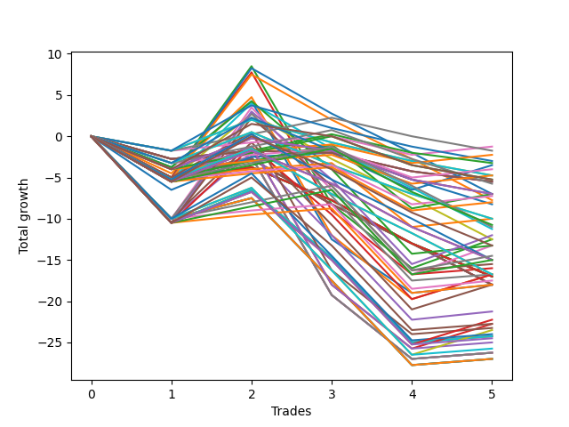

# Long Wallace Doodle 013 
- Symbol: ES
- Date Range: 03/18/2022 - 06/24/2022
- Trading Period: 7:20-12:30
- Number of Trades: 5



| Name | Win Percent | Profit | Avg Profit / Trade |     | Name | Win Percent | Profit | Avg Profit / Trade |
| ---- | ----------- | ------ | ------------------ | --- | ---- | ----------- | ------ | ------------------ |
| Sorted By <br> Profit | | | | | Sorted By <br> Win Percentage ||||
| Ten | 20.00 | 2500.00 | 500.00 |     | Seventy-Three | 60.00 | -1750.00 | -350.00 |
| Eleven | 20.00 | 2000.00 | 400.00 |     | Seventy-Two | 40.00 | -375.00 | -75.00 |
| Nine | 20.00 | 250.00 | 50.00 |     | Sixty-Four | 40.00 | -6500.00 | -1300.00 |
| Twenty-Six | 20.00 | -125.00 | -25.00 |     | Sixty-Six | 40.00 | -7375.00 | -1475.00 |
| Eight | 20.00 | -250.00 | -50.00 |     | Two | 40.00 | -7625.00 | -1525.00 |
| Seventy-Two | 40.00 | -375.00 | -75.00 |     | Sixty-Seven | 40.00 | -7875.00 | -1575.00 |
| twenty-Seven | 20.00 | -625.00 | -125.00 |     | Fifty-Eight | 40.00 | -8000.00 | -1600.00 |
| Seventy-Three | 60.00 | -1750.00 | -350.00 |     | Three | 40.00 | -8125.00 | -1625.00 |
| Twenty-Five | 20.00 | -2375.00 | -475.00 |     | Fifty-Nine | 40.00 | -8500.00 | -1700.00 |
| Twenty-Three | 20.00 | -2750.00 | -550.00 |     | Sixty-Five | 40.00 | -9125.00 | -1825.00 |
| Twenty-Two | 20.00 | -2750.00 | -550.00 |     | One | 40.00 | -9125.00 | -1825.00 |
| Twenty-One | 20.00 | -2750.00 | -550.00 |     | Zero | 40.00 | -9125.00 | -1825.00 |
| Twenty | 20.00 | -2750.00 | -550.00 |     | Fifty-Seven | 40.00 | -9750.00 | -1950.00 |
| Nineteen | 20.00 | -2750.00 | -550.00 |     | Fifty-Six | 40.00 | -10500.00 | -2100.00 |
| Eighteen | 20.00 | -2750.00 | -550.00 |     | Seventy-One | 40.00 | -12125.00 | -2425.00 |
| Seventeen | 20.00 | -2750.00 | -550.00 |     | Seventy | 40.00 | -12125.00 | -2425.00 |
| Sixten | 20.00 | -2750.00 | -550.00 |     | Sixty-Nine | 40.00 | -12125.00 | -2425.00 |
| Twenty-Four | 20.00 | -2875.00 | -575.00 |     | Sixty-Eight | 40.00 | -12125.00 | -2425.00 |
| Fifteen | 20.00 | -3000.00 | -600.00 |     | Seventy-Five | 40.00 | -13125.00 | -2625.00 |
| Fourteen | 20.00 | -3000.00 | -600.00 |     | Seven | 40.00 | -13125.00 | -2625.00 |
| Thirteen | 20.00 | -3000.00 | -600.00 |     | Six | 40.00 | -13125.00 | -2625.00 |
| Twelve | 20.00 | -3000.00 | -600.00 |     | Five | 40.00 | -13125.00 | -2625.00 |
| Forty-Two | 20.00 | -3500.00 | -700.00 |     | Four | 40.00 | -13125.00 | -2625.00 |
| Thirty-Nine | 20.00 | -3625.00 | -725.00 |     | Sixty-Three | 40.00 | -13500.00 | -2700.00 |
| Thirty-Eight | 20.00 | -3625.00 | -725.00 |     | Sixty-Two | 40.00 | -13500.00 | -2700.00 |
| Thirty-Seven | 20.00 | -3625.00 | -725.00 |     | Sixty-One | 40.00 | -13500.00 | -2700.00 |
| Thirty-Six | 20.00 | -3625.00 | -725.00 |     | Sixty | 40.00 | -13500.00 | -2700.00 |
| Thirty-Five | 20.00 | -3625.00 | -725.00 |     | Ten | 20.00 | 2500.00 | 500.00 |
| Thirty-Four | 20.00 | -3625.00 | -725.00 |     | Eleven | 20.00 | 2000.00 | 400.00 |
| Thirty-Three | 20.00 | -3625.00 | -725.00 |     | Nine | 20.00 | 250.00 | 50.00 |
| Thirty-Two | 20.00 | -3625.00 | -725.00 |     | Twenty-Six | 20.00 | -125.00 | -25.00 |
| Forty-Three | 20.00 | -4000.00 | -800.00 |     | Eight | 20.00 | -250.00 | -50.00 |
| Thirty-One | 20.00 | -5625.00 | -1125.00 |     | twenty-Seven | 20.00 | -625.00 | -125.00 |
| Thirty | 20.00 | -5625.00 | -1125.00 |     | Twenty-Five | 20.00 | -2375.00 | -475.00 |
| Twenty-Nine | 20.00 | -5625.00 | -1125.00 |     | Twenty-Three | 20.00 | -2750.00 | -550.00 |
| Twenty-Eight | 20.00 | -5625.00 | -1125.00 |     | Twenty-Two | 20.00 | -2750.00 | -550.00 |
| Forty-One | 20.00 | -5750.00 | -1150.00 |     | Twenty-One | 20.00 | -2750.00 | -550.00 |
| Forty | 20.00 | -6250.00 | -1250.00 |     | Twenty | 20.00 | -2750.00 | -550.00 |
| Sixty-Four | 40.00 | -6500.00 | -1300.00 |     | Nineteen | 20.00 | -2750.00 | -550.00 |
| Sixty-Six | 40.00 | -7375.00 | -1475.00 |     | Eighteen | 20.00 | -2750.00 | -550.00 |
| Two | 40.00 | -7625.00 | -1525.00 |     | Seventeen | 20.00 | -2750.00 | -550.00 |
| Sixty-Seven | 40.00 | -7875.00 | -1575.00 |     | Sixten | 20.00 | -2750.00 | -550.00 |
| Fifty-Eight | 40.00 | -8000.00 | -1600.00 |     | Twenty-Four | 20.00 | -2875.00 | -575.00 |
| Three | 40.00 | -8125.00 | -1625.00 |     | Fifteen | 20.00 | -3000.00 | -600.00 |
| Fifty-Nine | 40.00 | -8500.00 | -1700.00 |     | Fourteen | 20.00 | -3000.00 | -600.00 |
| Fifty-Five | 20.00 | -8500.00 | -1700.00 |     | Thirteen | 20.00 | -3000.00 | -600.00 |
| Fifty-Four | 20.00 | -8500.00 | -1700.00 |     | Twelve | 20.00 | -3000.00 | -600.00 |
| Fifty-Three | 20.00 | -8500.00 | -1700.00 |     | Forty-Two | 20.00 | -3500.00 | -700.00 |
| Fifty-Two | 20.00 | -8500.00 | -1700.00 |     | Thirty-Nine | 20.00 | -3625.00 | -725.00 |
| Fifty-One | 20.00 | -8500.00 | -1700.00 |     | Thirty-Eight | 20.00 | -3625.00 | -725.00 |
| Fifty | 20.00 | -8500.00 | -1700.00 |     | Thirty-Seven | 20.00 | -3625.00 | -725.00 |
| Forty-Nine | 20.00 | -8500.00 | -1700.00 |     | Thirty-Six | 20.00 | -3625.00 | -725.00 |
| Forty-Eight | 20.00 | -8500.00 | -1700.00 |     | Thirty-Five | 20.00 | -3625.00 | -725.00 |
| Forty-Seven | 20.00 | -9000.00 | -1800.00 |     | Thirty-Four | 20.00 | -3625.00 | -725.00 |
| Forty-Six | 20.00 | -9000.00 | -1800.00 |     | Thirty-Three | 20.00 | -3625.00 | -725.00 |
| Forty-Five | 20.00 | -9000.00 | -1800.00 |     | Thirty-Two | 20.00 | -3625.00 | -725.00 |
| Forty-Four | 20.00 | -9000.00 | -1800.00 |     | Forty-Three | 20.00 | -4000.00 | -800.00 |
| Sixty-Five | 40.00 | -9125.00 | -1825.00 |     | Thirty-One | 20.00 | -5625.00 | -1125.00 |
| One | 40.00 | -9125.00 | -1825.00 |     | Thirty | 20.00 | -5625.00 | -1125.00 |
| Zero | 40.00 | -9125.00 | -1825.00 |     | Twenty-Nine | 20.00 | -5625.00 | -1125.00 |
| Fifty-Seven | 40.00 | -9750.00 | -1950.00 |     | Twenty-Eight | 20.00 | -5625.00 | -1125.00 |
| Fifty-Six | 40.00 | -10500.00 | -2100.00 |     | Forty-One | 20.00 | -5750.00 | -1150.00 |
| Seventy-Four | 20.00 | -11250.00 | -2250.00 |     | Forty | 20.00 | -6250.00 | -1250.00 |
| Seventy-One | 40.00 | -12125.00 | -2425.00 |     | Fifty-Five | 20.00 | -8500.00 | -1700.00 |
| Seventy | 40.00 | -12125.00 | -2425.00 |     | Fifty-Four | 20.00 | -8500.00 | -1700.00 |
| Sixty-Nine | 40.00 | -12125.00 | -2425.00 |     | Fifty-Three | 20.00 | -8500.00 | -1700.00 |
| Sixty-Eight | 40.00 | -12125.00 | -2425.00 |     | Fifty-Two | 20.00 | -8500.00 | -1700.00 |
| Seventy-Five | 40.00 | -13125.00 | -2625.00 |     | Fifty-One | 20.00 | -8500.00 | -1700.00 |
| Seven | 40.00 | -13125.00 | -2625.00 |     | Fifty | 20.00 | -8500.00 | -1700.00 |
| Six | 40.00 | -13125.00 | -2625.00 |     | Forty-Nine | 20.00 | -8500.00 | -1700.00 |
| Five | 40.00 | -13125.00 | -2625.00 |     | Forty-Eight | 20.00 | -8500.00 | -1700.00 |
| Four | 40.00 | -13125.00 | -2625.00 |     | Forty-Seven | 20.00 | -9000.00 | -1800.00 |
| Sixty-Three | 40.00 | -13500.00 | -2700.00 |     | Forty-Six | 20.00 | -9000.00 | -1800.00 |
| Sixty-Two | 40.00 | -13500.00 | -2700.00 |     | Forty-Five | 20.00 | -9000.00 | -1800.00 |
| Sixty-One | 40.00 | -13500.00 | -2700.00 |     | Forty-Four | 20.00 | -9000.00 | -1800.00 |
| Sixty | 40.00 | -13500.00 | -2700.00 |     | Seventy-Four | 20.00 | -11250.00 | -2250.00 |

## NO STOPLOSS

### Test Zero
* Sell when price hits the middle line of the 20p bollinger
* No Stoploss
* Results:
```
Total Trades: 5
Percent Up: 40.00
Percent Down: 60.00
Total Points Moved Up: -18.25
Potential Profit: -9125.00
Total Points Ups: 9.25 Count Ups: 2
Total Points Downs: -27.50 Count Downs: 3
```

<details><summary>Trades</summary>

<code>In: 2022-03-23 10:23:00		Out: 2022-03-23 10:37:45		Total Position Time: 14:45		Total Move Up: -3.75		Total to Date: -3.75</code> <br />
<code>In: 2022-03-25 08:29:00		Out: 2022-03-25 08:36:40		Total Position Time: 07:40		Total Move Up: 8.00		Total to Date: 4.25</code> <br />
<code>In: 2022-03-28 08:27:00		Out: 2022-03-28 08:56:55		Total Position Time: 29:55		Total Move Up: -16.75		Total to Date: -12.50</code> <br />
<code>In: 2022-04-18 08:26:00		Out: 2022-04-18 08:54:55		Total Position Time: 28:55		Total Move Up: -7.00		Total to Date: -19.50</code> <br />
<code>In: 2022-06-08 09:41:00		Out: 2022-06-08 09:53:00		Total Position Time: 12:00		Total Move Up: 1.25		Total to Date: -18.25</code> <br />


</details>

### Test One
* Sell when the price hits the upper line of the 20p 1std bollinger
* No Stoploss
* Results:
```
Total Trades: 5
Percent Up: 40.00
Percent Down: 60.00
Total Points Moved Up: -18.25
Potential Profit: -9125.00
Total Points Ups: 10.75 Count Ups: 2
Total Points Downs: -29.00 Count Downs: 3
```

<details><summary>Trades</summary>

<code>In: 2022-03-23 10:23:00		Out: 2022-03-23 10:51:50		Total Position Time: 28:50		Total Move Up: -4.50		Total to Date: -4.50</code> <br />
<code>In: 2022-03-25 08:29:00		Out: 2022-03-25 08:40:40		Total Position Time: 11:40		Total Move Up: 9.00		Total to Date: 4.50</code> <br />
<code>In: 2022-03-28 08:27:00		Out: 2022-03-28 08:56:55		Total Position Time: 29:55		Total Move Up: -16.75		Total to Date: -12.25</code> <br />
<code>In: 2022-04-18 08:26:00		Out: 2022-04-18 08:55:55		Total Position Time: 29:55		Total Move Up: -7.75		Total to Date: -20.00</code> <br />
<code>In: 2022-06-08 09:41:00		Out: 2022-06-08 09:57:10		Total Position Time: 16:10		Total Move Up: 1.75		Total to Date: -18.25</code> <br />


</details>

### Test Two
* Sell when the price hits the upper line of the 20p 2std bollinger
* No Stoploss
* Results:
```
Total Trades: 5
Percent Up: 40.00
Percent Down: 60.00
Total Points Moved Up: -15.25
Potential Profit: -7625.00
Total Points Ups: 14.25 Count Ups: 2
Total Points Downs: -29.50 Count Downs: 3
```

<details><summary>Trades</summary>

<code>In: 2022-03-23 10:23:00		Out: 2022-03-23 10:52:55		Total Position Time: 29:55		Total Move Up: -5.00		Total to Date: -5.00</code> <br />
<code>In: 2022-03-25 08:29:00		Out: 2022-03-25 08:41:55		Total Position Time: 12:55		Total Move Up: 13.50		Total to Date: 8.50</code> <br />
<code>In: 2022-03-28 08:27:00		Out: 2022-03-28 08:56:55		Total Position Time: 29:55		Total Move Up: -16.75		Total to Date: -8.25</code> <br />
<code>In: 2022-04-18 08:26:00		Out: 2022-04-18 08:55:55		Total Position Time: 29:55		Total Move Up: -7.75		Total to Date: -16.00</code> <br />
<code>In: 2022-06-08 09:41:00		Out: 2022-06-08 10:10:55		Total Position Time: 29:55		Total Move Up: 0.75		Total to Date: -15.25</code> <br />


</details>

### Test Three
* Sell when price hits the middle line of the 50p bollinger
* No Stoploss
* Results:
```
Total Trades: 5
Percent Up: 40.00
Percent Down: 60.00
Total Points Moved Up: -16.25
Potential Profit: -8125.00
Total Points Ups: 13.25 Count Ups: 2
Total Points Downs: -29.50 Count Downs: 3
```

<details><summary>Trades</summary>

<code>In: 2022-03-23 10:23:00		Out: 2022-03-23 10:52:55		Total Position Time: 29:55		Total Move Up: -5.00		Total to Date: -5.00</code> <br />
<code>In: 2022-03-25 08:29:00		Out: 2022-03-25 08:52:45		Total Position Time: 23:45		Total Move Up: 12.50		Total to Date: 7.50</code> <br />
<code>In: 2022-03-28 08:27:00		Out: 2022-03-28 08:56:55		Total Position Time: 29:55		Total Move Up: -16.75		Total to Date: -9.25</code> <br />
<code>In: 2022-04-18 08:26:00		Out: 2022-04-18 08:55:55		Total Position Time: 29:55		Total Move Up: -7.75		Total to Date: -17.00</code> <br />
<code>In: 2022-06-08 09:41:00		Out: 2022-06-08 10:10:55		Total Position Time: 29:55		Total Move Up: 0.75		Total to Date: -16.25</code> <br />


</details>

### Test Four
* Sell when the price hits the upper line of the 50p 1std bollinger
* No Stoploss
* Results:
```
Total Trades: 5
Percent Up: 40.00
Percent Down: 60.00
Total Points Moved Up: -26.25
Potential Profit: -13125.00
Total Points Ups: 3.25 Count Ups: 2
Total Points Downs: -29.50 Count Downs: 3
```

<details><summary>Trades</summary>

<code>In: 2022-03-23 10:23:00		Out: 2022-03-23 10:52:55		Total Position Time: 29:55		Total Move Up: -5.00		Total to Date: -5.00</code> <br />
<code>In: 2022-03-25 08:29:00		Out: 2022-03-25 08:58:55		Total Position Time: 29:55		Total Move Up: 2.50		Total to Date: -2.50</code> <br />
<code>In: 2022-03-28 08:27:00		Out: 2022-03-28 08:56:55		Total Position Time: 29:55		Total Move Up: -16.75		Total to Date: -19.25</code> <br />
<code>In: 2022-04-18 08:26:00		Out: 2022-04-18 08:55:55		Total Position Time: 29:55		Total Move Up: -7.75		Total to Date: -27.00</code> <br />
<code>In: 2022-06-08 09:41:00		Out: 2022-06-08 10:10:55		Total Position Time: 29:55		Total Move Up: 0.75		Total to Date: -26.25</code> <br />


</details>

### Test Five
* Sell when the price hits the upper line of the 50p 2std bollinger
* No Stoploss
* Results:
```
Total Trades: 5
Percent Up: 40.00
Percent Down: 60.00
Total Points Moved Up: -26.25
Potential Profit: -13125.00
Total Points Ups: 3.25 Count Ups: 2
Total Points Downs: -29.50 Count Downs: 3
```

<details><summary>Trades</summary>

<code>In: 2022-03-23 10:23:00		Out: 2022-03-23 10:52:55		Total Position Time: 29:55		Total Move Up: -5.00		Total to Date: -5.00</code> <br />
<code>In: 2022-03-25 08:29:00		Out: 2022-03-25 08:58:55		Total Position Time: 29:55		Total Move Up: 2.50		Total to Date: -2.50</code> <br />
<code>In: 2022-03-28 08:27:00		Out: 2022-03-28 08:56:55		Total Position Time: 29:55		Total Move Up: -16.75		Total to Date: -19.25</code> <br />
<code>In: 2022-04-18 08:26:00		Out: 2022-04-18 08:55:55		Total Position Time: 29:55		Total Move Up: -7.75		Total to Date: -27.00</code> <br />
<code>In: 2022-06-08 09:41:00		Out: 2022-06-08 10:10:55		Total Position Time: 29:55		Total Move Up: 0.75		Total to Date: -26.25</code> <br />


</details>

### Test Six
* Sell when the price hits the middle line of the 1std VWAP
* No Stoploss
* Results:
```
Total Trades: 5
Percent Up: 40.00
Percent Down: 60.00
Total Points Moved Up: -26.25
Potential Profit: -13125.00
Total Points Ups: 3.25 Count Ups: 2
Total Points Downs: -29.50 Count Downs: 3
```

<details><summary>Trades</summary>

<code>In: 2022-03-23 10:23:00		Out: 2022-03-23 10:52:55		Total Position Time: 29:55		Total Move Up: -5.00		Total to Date: -5.00</code> <br />
<code>In: 2022-03-25 08:29:00		Out: 2022-03-25 08:58:55		Total Position Time: 29:55		Total Move Up: 2.50		Total to Date: -2.50</code> <br />
<code>In: 2022-03-28 08:27:00		Out: 2022-03-28 08:56:55		Total Position Time: 29:55		Total Move Up: -16.75		Total to Date: -19.25</code> <br />
<code>In: 2022-04-18 08:26:00		Out: 2022-04-18 08:55:55		Total Position Time: 29:55		Total Move Up: -7.75		Total to Date: -27.00</code> <br />
<code>In: 2022-06-08 09:41:00		Out: 2022-06-08 10:10:55		Total Position Time: 29:55		Total Move Up: 0.75		Total to Date: -26.25</code> <br />


</details>

### Test Seven
* Sell when the price hits the upper line of the 1std VWAP
* No Stoploss
* Results:
```
Total Trades: 5
Percent Up: 40.00
Percent Down: 60.00
Total Points Moved Up: -26.25
Potential Profit: -13125.00
Total Points Ups: 3.25 Count Ups: 2
Total Points Downs: -29.50 Count Downs: 3
```

<details><summary>Trades</summary>

<code>In: 2022-03-23 10:23:00		Out: 2022-03-23 10:52:55		Total Position Time: 29:55		Total Move Up: -5.00		Total to Date: -5.00</code> <br />
<code>In: 2022-03-25 08:29:00		Out: 2022-03-25 08:58:55		Total Position Time: 29:55		Total Move Up: 2.50		Total to Date: -2.50</code> <br />
<code>In: 2022-03-28 08:27:00		Out: 2022-03-28 08:56:55		Total Position Time: 29:55		Total Move Up: -16.75		Total to Date: -19.25</code> <br />
<code>In: 2022-04-18 08:26:00		Out: 2022-04-18 08:55:55		Total Position Time: 29:55		Total Move Up: -7.75		Total to Date: -27.00</code> <br />
<code>In: 2022-06-08 09:41:00		Out: 2022-06-08 10:10:55		Total Position Time: 29:55		Total Move Up: 0.75		Total to Date: -26.25</code> <br />


</details>

## STOPLOSS OF 2

### Test Eight
* Sell when price hits the middle line of the 20p bollinger
* Stoploss is 2 points
* Results:
```
Total Trades: 5
Percent Up: 20.00
Percent Down: 80.00
Total Points Moved Up: -0.50
Potential Profit: -250.00
Total Points Ups: 8.00 Count Ups: 1
Total Points Downs: -8.50 Count Downs: 4
```

<details><summary>Trades</summary>

<code>In: 2022-03-23 10:23:00		Out: 2022-03-23 10:23:50		Total Position Time: 00:50		Total Move Up: -1.75		Total to Date: -1.75</code> <br />
<code>In: 2022-03-25 08:29:00		Out: 2022-03-25 08:36:40		Total Position Time: 07:40		Total Move Up: 8.00		Total to Date: 6.25</code> <br />
<code>In: 2022-03-28 08:27:00		Out: 2022-03-28 08:32:05		Total Position Time: 05:05		Total Move Up: -2.75		Total to Date: 3.50</code> <br />
<code>In: 2022-04-18 08:26:00		Out: 2022-04-18 08:27:15		Total Position Time: 01:15		Total Move Up: -2.25		Total to Date: 1.25</code> <br />
<code>In: 2022-06-08 09:41:00		Out: 2022-06-08 09:42:25		Total Position Time: 01:25		Total Move Up: -1.75		Total to Date: -0.50</code> <br />


</details>

### Test Nine
* Sell when the price hits the upper line of the 20p 1std bollinger
* Stoploss is 2 points
* Results:
```
Total Trades: 5
Percent Up: 20.00
Percent Down: 80.00
Total Points Moved Up: 0.50
Potential Profit: 250.00
Total Points Ups: 9.00 Count Ups: 1
Total Points Downs: -8.50 Count Downs: 4
```

<details><summary>Trades</summary>

<code>In: 2022-03-23 10:23:00		Out: 2022-03-23 10:23:50		Total Position Time: 00:50		Total Move Up: -1.75		Total to Date: -1.75</code> <br />
<code>In: 2022-03-25 08:29:00		Out: 2022-03-25 08:40:40		Total Position Time: 11:40		Total Move Up: 9.00		Total to Date: 7.25</code> <br />
<code>In: 2022-03-28 08:27:00		Out: 2022-03-28 08:32:05		Total Position Time: 05:05		Total Move Up: -2.75		Total to Date: 4.50</code> <br />
<code>In: 2022-04-18 08:26:00		Out: 2022-04-18 08:27:15		Total Position Time: 01:15		Total Move Up: -2.25		Total to Date: 2.25</code> <br />
<code>In: 2022-06-08 09:41:00		Out: 2022-06-08 09:42:25		Total Position Time: 01:25		Total Move Up: -1.75		Total to Date: 0.50</code> <br />


</details>

### Test Ten
* Sell when the price hits the upper line of the 20p 2std bollinger
* Stoploss is 2 points
* Results:
```
Total Trades: 5
Percent Up: 20.00
Percent Down: 80.00
Total Points Moved Up: 5.00
Potential Profit: 2500.00
Total Points Ups: 13.50 Count Ups: 1
Total Points Downs: -8.50 Count Downs: 4
```

<details><summary>Trades</summary>

<code>In: 2022-03-23 10:23:00		Out: 2022-03-23 10:23:50		Total Position Time: 00:50		Total Move Up: -1.75		Total to Date: -1.75</code> <br />
<code>In: 2022-03-25 08:29:00		Out: 2022-03-25 08:41:55		Total Position Time: 12:55		Total Move Up: 13.50		Total to Date: 11.75</code> <br />
<code>In: 2022-03-28 08:27:00		Out: 2022-03-28 08:32:05		Total Position Time: 05:05		Total Move Up: -2.75		Total to Date: 9.00</code> <br />
<code>In: 2022-04-18 08:26:00		Out: 2022-04-18 08:27:15		Total Position Time: 01:15		Total Move Up: -2.25		Total to Date: 6.75</code> <br />
<code>In: 2022-06-08 09:41:00		Out: 2022-06-08 09:42:25		Total Position Time: 01:25		Total Move Up: -1.75		Total to Date: 5.00</code> <br />


</details>

### Test Eleven
* Sell when price hits the middle line of the 50p bollinger
* Stoploss is 2 points
* Results:
```
Total Trades: 5
Percent Up: 20.00
Percent Down: 80.00
Total Points Moved Up: 4.00
Potential Profit: 2000.00
Total Points Ups: 12.50 Count Ups: 1
Total Points Downs: -8.50 Count Downs: 4
```

<details><summary>Trades</summary>

<code>In: 2022-03-23 10:23:00		Out: 2022-03-23 10:23:50		Total Position Time: 00:50		Total Move Up: -1.75		Total to Date: -1.75</code> <br />
<code>In: 2022-03-25 08:29:00		Out: 2022-03-25 08:52:45		Total Position Time: 23:45		Total Move Up: 12.50		Total to Date: 10.75</code> <br />
<code>In: 2022-03-28 08:27:00		Out: 2022-03-28 08:32:05		Total Position Time: 05:05		Total Move Up: -2.75		Total to Date: 8.00</code> <br />
<code>In: 2022-04-18 08:26:00		Out: 2022-04-18 08:27:15		Total Position Time: 01:15		Total Move Up: -2.25		Total to Date: 5.75</code> <br />
<code>In: 2022-06-08 09:41:00		Out: 2022-06-08 09:42:25		Total Position Time: 01:25		Total Move Up: -1.75		Total to Date: 4.00</code> <br />


</details>

### Test Twelve
* Sell when the price hits the upper line of the 50p 1std bollinger
* Stoploss is 2 points
* Results:
```
Total Trades: 5
Percent Up: 20.00
Percent Down: 80.00
Total Points Moved Up: -6.00
Potential Profit: -3000.00
Total Points Ups: 2.50 Count Ups: 1
Total Points Downs: -8.50 Count Downs: 4
```

<details><summary>Trades</summary>

<code>In: 2022-03-23 10:23:00		Out: 2022-03-23 10:23:50		Total Position Time: 00:50		Total Move Up: -1.75		Total to Date: -1.75</code> <br />
<code>In: 2022-03-25 08:29:00		Out: 2022-03-25 08:58:55		Total Position Time: 29:55		Total Move Up: 2.50		Total to Date: 0.75</code> <br />
<code>In: 2022-03-28 08:27:00		Out: 2022-03-28 08:32:05		Total Position Time: 05:05		Total Move Up: -2.75		Total to Date: -2.00</code> <br />
<code>In: 2022-04-18 08:26:00		Out: 2022-04-18 08:27:15		Total Position Time: 01:15		Total Move Up: -2.25		Total to Date: -4.25</code> <br />
<code>In: 2022-06-08 09:41:00		Out: 2022-06-08 09:42:25		Total Position Time: 01:25		Total Move Up: -1.75		Total to Date: -6.00</code> <br />


</details>

### Test Thirteen
* Sell when the price hits the upper line of the 50p 2std bollinger
* Stoploss is 2 points
* Results:
```
Total Trades: 5
Percent Up: 20.00
Percent Down: 80.00
Total Points Moved Up: -6.00
Potential Profit: -3000.00
Total Points Ups: 2.50 Count Ups: 1
Total Points Downs: -8.50 Count Downs: 4
```

<details><summary>Trades</summary>

<code>In: 2022-03-23 10:23:00		Out: 2022-03-23 10:23:50		Total Position Time: 00:50		Total Move Up: -1.75		Total to Date: -1.75</code> <br />
<code>In: 2022-03-25 08:29:00		Out: 2022-03-25 08:58:55		Total Position Time: 29:55		Total Move Up: 2.50		Total to Date: 0.75</code> <br />
<code>In: 2022-03-28 08:27:00		Out: 2022-03-28 08:32:05		Total Position Time: 05:05		Total Move Up: -2.75		Total to Date: -2.00</code> <br />
<code>In: 2022-04-18 08:26:00		Out: 2022-04-18 08:27:15		Total Position Time: 01:15		Total Move Up: -2.25		Total to Date: -4.25</code> <br />
<code>In: 2022-06-08 09:41:00		Out: 2022-06-08 09:42:25		Total Position Time: 01:25		Total Move Up: -1.75		Total to Date: -6.00</code> <br />


</details>

### Test Fourteen
* Sell when the price hits the middle line of the 1std VWAP
* Stoploss is 2 points
* Results:
```
Total Trades: 5
Percent Up: 20.00
Percent Down: 80.00
Total Points Moved Up: -6.00
Potential Profit: -3000.00
Total Points Ups: 2.50 Count Ups: 1
Total Points Downs: -8.50 Count Downs: 4
```

<details><summary>Trades</summary>

<code>In: 2022-03-23 10:23:00		Out: 2022-03-23 10:23:50		Total Position Time: 00:50		Total Move Up: -1.75		Total to Date: -1.75</code> <br />
<code>In: 2022-03-25 08:29:00		Out: 2022-03-25 08:58:55		Total Position Time: 29:55		Total Move Up: 2.50		Total to Date: 0.75</code> <br />
<code>In: 2022-03-28 08:27:00		Out: 2022-03-28 08:32:05		Total Position Time: 05:05		Total Move Up: -2.75		Total to Date: -2.00</code> <br />
<code>In: 2022-04-18 08:26:00		Out: 2022-04-18 08:27:15		Total Position Time: 01:15		Total Move Up: -2.25		Total to Date: -4.25</code> <br />
<code>In: 2022-06-08 09:41:00		Out: 2022-06-08 09:42:25		Total Position Time: 01:25		Total Move Up: -1.75		Total to Date: -6.00</code> <br />


</details>

### Test Fifteen
* Sell when the price hits the upper line of the 1std VWAP
* Stoploss is 2 points
* Results:
```
Total Trades: 5
Percent Up: 20.00
Percent Down: 80.00
Total Points Moved Up: -6.00
Potential Profit: -3000.00
Total Points Ups: 2.50 Count Ups: 1
Total Points Downs: -8.50 Count Downs: 4
```

<details><summary>Trades</summary>

<code>In: 2022-03-23 10:23:00		Out: 2022-03-23 10:23:50		Total Position Time: 00:50		Total Move Up: -1.75		Total to Date: -1.75</code> <br />
<code>In: 2022-03-25 08:29:00		Out: 2022-03-25 08:58:55		Total Position Time: 29:55		Total Move Up: 2.50		Total to Date: 0.75</code> <br />
<code>In: 2022-03-28 08:27:00		Out: 2022-03-28 08:32:05		Total Position Time: 05:05		Total Move Up: -2.75		Total to Date: -2.00</code> <br />
<code>In: 2022-04-18 08:26:00		Out: 2022-04-18 08:27:15		Total Position Time: 01:15		Total Move Up: -2.25		Total to Date: -4.25</code> <br />
<code>In: 2022-06-08 09:41:00		Out: 2022-06-08 09:42:25		Total Position Time: 01:25		Total Move Up: -1.75		Total to Date: -6.00</code> <br />


</details>

## TRAIL STOP OF 2

### Test Sixten
* Sell when price hits the middle line of the 20p bollinger
* Trailing Stop is 2 points
* Results:
```
Total Trades: 5
Percent Up: 20.00
Percent Down: 80.00
Total Points Moved Up: -5.50
Potential Profit: -2750.00
Total Points Ups: 1.00 Count Ups: 1
Total Points Downs: -6.50 Count Downs: 4
```

<details><summary>Trades</summary>

<code>In: 2022-03-23 10:23:00		Out: 2022-03-23 10:24:05		Total Position Time: 01:05		Total Move Up: -2.75		Total to Date: -2.75</code> <br />
<code>In: 2022-03-25 08:29:00		Out: 2022-03-25 08:29:10		Total Position Time: 00:10		Total Move Up: 1.00		Total to Date: -1.75</code> <br />
<code>In: 2022-03-28 08:27:00		Out: 2022-03-28 08:29:05		Total Position Time: 02:05		Total Move Up: -0.25		Total to Date: -2.00</code> <br />
<code>In: 2022-04-18 08:26:00		Out: 2022-04-18 08:27:15		Total Position Time: 01:15		Total Move Up: -2.25		Total to Date: -4.25</code> <br />
<code>In: 2022-06-08 09:41:00		Out: 2022-06-08 09:42:05		Total Position Time: 01:05		Total Move Up: -1.25		Total to Date: -5.50</code> <br />


</details>

### Test Seventeen
* Sell when the price hits the upper line of the 20p 1std bollinger
* Trailing Stop is 2 points
* Results:
```
Total Trades: 5
Percent Up: 20.00
Percent Down: 80.00
Total Points Moved Up: -5.50
Potential Profit: -2750.00
Total Points Ups: 1.00 Count Ups: 1
Total Points Downs: -6.50 Count Downs: 4
```

<details><summary>Trades</summary>

<code>In: 2022-03-23 10:23:00		Out: 2022-03-23 10:24:05		Total Position Time: 01:05		Total Move Up: -2.75		Total to Date: -2.75</code> <br />
<code>In: 2022-03-25 08:29:00		Out: 2022-03-25 08:29:10		Total Position Time: 00:10		Total Move Up: 1.00		Total to Date: -1.75</code> <br />
<code>In: 2022-03-28 08:27:00		Out: 2022-03-28 08:29:05		Total Position Time: 02:05		Total Move Up: -0.25		Total to Date: -2.00</code> <br />
<code>In: 2022-04-18 08:26:00		Out: 2022-04-18 08:27:15		Total Position Time: 01:15		Total Move Up: -2.25		Total to Date: -4.25</code> <br />
<code>In: 2022-06-08 09:41:00		Out: 2022-06-08 09:42:05		Total Position Time: 01:05		Total Move Up: -1.25		Total to Date: -5.50</code> <br />


</details>

### Test Eighteen
* Sell when the price hits the upper line of the 20p 2std bollinger
* Trailing Stop is 2 points
* Results:
```
Total Trades: 5
Percent Up: 20.00
Percent Down: 80.00
Total Points Moved Up: -5.50
Potential Profit: -2750.00
Total Points Ups: 1.00 Count Ups: 1
Total Points Downs: -6.50 Count Downs: 4
```

<details><summary>Trades</summary>

<code>In: 2022-03-23 10:23:00		Out: 2022-03-23 10:24:05		Total Position Time: 01:05		Total Move Up: -2.75		Total to Date: -2.75</code> <br />
<code>In: 2022-03-25 08:29:00		Out: 2022-03-25 08:29:10		Total Position Time: 00:10		Total Move Up: 1.00		Total to Date: -1.75</code> <br />
<code>In: 2022-03-28 08:27:00		Out: 2022-03-28 08:29:05		Total Position Time: 02:05		Total Move Up: -0.25		Total to Date: -2.00</code> <br />
<code>In: 2022-04-18 08:26:00		Out: 2022-04-18 08:27:15		Total Position Time: 01:15		Total Move Up: -2.25		Total to Date: -4.25</code> <br />
<code>In: 2022-06-08 09:41:00		Out: 2022-06-08 09:42:05		Total Position Time: 01:05		Total Move Up: -1.25		Total to Date: -5.50</code> <br />


</details>

### Test Nineteen
* Sell when price hits the middle line of the 50p bollinger
* Trailing Stop is 2 points
* Results:
```
Total Trades: 5
Percent Up: 20.00
Percent Down: 80.00
Total Points Moved Up: -5.50
Potential Profit: -2750.00
Total Points Ups: 1.00 Count Ups: 1
Total Points Downs: -6.50 Count Downs: 4
```

<details><summary>Trades</summary>

<code>In: 2022-03-23 10:23:00		Out: 2022-03-23 10:24:05		Total Position Time: 01:05		Total Move Up: -2.75		Total to Date: -2.75</code> <br />
<code>In: 2022-03-25 08:29:00		Out: 2022-03-25 08:29:10		Total Position Time: 00:10		Total Move Up: 1.00		Total to Date: -1.75</code> <br />
<code>In: 2022-03-28 08:27:00		Out: 2022-03-28 08:29:05		Total Position Time: 02:05		Total Move Up: -0.25		Total to Date: -2.00</code> <br />
<code>In: 2022-04-18 08:26:00		Out: 2022-04-18 08:27:15		Total Position Time: 01:15		Total Move Up: -2.25		Total to Date: -4.25</code> <br />
<code>In: 2022-06-08 09:41:00		Out: 2022-06-08 09:42:05		Total Position Time: 01:05		Total Move Up: -1.25		Total to Date: -5.50</code> <br />


</details>

### Test Twenty
* Sell when the price hits the upper line of the 50p 1std bollinger
* Trailing Stop is 2 points
* Results:
```
Total Trades: 5
Percent Up: 20.00
Percent Down: 80.00
Total Points Moved Up: -5.50
Potential Profit: -2750.00
Total Points Ups: 1.00 Count Ups: 1
Total Points Downs: -6.50 Count Downs: 4
```

<details><summary>Trades</summary>

<code>In: 2022-03-23 10:23:00		Out: 2022-03-23 10:24:05		Total Position Time: 01:05		Total Move Up: -2.75		Total to Date: -2.75</code> <br />
<code>In: 2022-03-25 08:29:00		Out: 2022-03-25 08:29:10		Total Position Time: 00:10		Total Move Up: 1.00		Total to Date: -1.75</code> <br />
<code>In: 2022-03-28 08:27:00		Out: 2022-03-28 08:29:05		Total Position Time: 02:05		Total Move Up: -0.25		Total to Date: -2.00</code> <br />
<code>In: 2022-04-18 08:26:00		Out: 2022-04-18 08:27:15		Total Position Time: 01:15		Total Move Up: -2.25		Total to Date: -4.25</code> <br />
<code>In: 2022-06-08 09:41:00		Out: 2022-06-08 09:42:05		Total Position Time: 01:05		Total Move Up: -1.25		Total to Date: -5.50</code> <br />


</details>

### Test Twenty-One
* Sell when the price hits the upper line of the 50p 2std bollinger
* Trailing Stop is 2 points
* Results:
```
Total Trades: 5
Percent Up: 20.00
Percent Down: 80.00
Total Points Moved Up: -5.50
Potential Profit: -2750.00
Total Points Ups: 1.00 Count Ups: 1
Total Points Downs: -6.50 Count Downs: 4
```

<details><summary>Trades</summary>

<code>In: 2022-03-23 10:23:00		Out: 2022-03-23 10:24:05		Total Position Time: 01:05		Total Move Up: -2.75		Total to Date: -2.75</code> <br />
<code>In: 2022-03-25 08:29:00		Out: 2022-03-25 08:29:10		Total Position Time: 00:10		Total Move Up: 1.00		Total to Date: -1.75</code> <br />
<code>In: 2022-03-28 08:27:00		Out: 2022-03-28 08:29:05		Total Position Time: 02:05		Total Move Up: -0.25		Total to Date: -2.00</code> <br />
<code>In: 2022-04-18 08:26:00		Out: 2022-04-18 08:27:15		Total Position Time: 01:15		Total Move Up: -2.25		Total to Date: -4.25</code> <br />
<code>In: 2022-06-08 09:41:00		Out: 2022-06-08 09:42:05		Total Position Time: 01:05		Total Move Up: -1.25		Total to Date: -5.50</code> <br />


</details>

### Test Twenty-Two
* Sell when the price hits the middle line of the 1std VWAP
* Trailing Stop is 2 points
* Results:
```
Total Trades: 5
Percent Up: 20.00
Percent Down: 80.00
Total Points Moved Up: -5.50
Potential Profit: -2750.00
Total Points Ups: 1.00 Count Ups: 1
Total Points Downs: -6.50 Count Downs: 4
```

<details><summary>Trades</summary>

<code>In: 2022-03-23 10:23:00		Out: 2022-03-23 10:24:05		Total Position Time: 01:05		Total Move Up: -2.75		Total to Date: -2.75</code> <br />
<code>In: 2022-03-25 08:29:00		Out: 2022-03-25 08:29:10		Total Position Time: 00:10		Total Move Up: 1.00		Total to Date: -1.75</code> <br />
<code>In: 2022-03-28 08:27:00		Out: 2022-03-28 08:29:05		Total Position Time: 02:05		Total Move Up: -0.25		Total to Date: -2.00</code> <br />
<code>In: 2022-04-18 08:26:00		Out: 2022-04-18 08:27:15		Total Position Time: 01:15		Total Move Up: -2.25		Total to Date: -4.25</code> <br />
<code>In: 2022-06-08 09:41:00		Out: 2022-06-08 09:42:05		Total Position Time: 01:05		Total Move Up: -1.25		Total to Date: -5.50</code> <br />


</details>

### Test Twenty-Three
* Sell when the price hits the upper line of the 1std VWAP
* Trailing Stop is 2 points
* Results:
```
Total Trades: 5
Percent Up: 20.00
Percent Down: 80.00
Total Points Moved Up: -5.50
Potential Profit: -2750.00
Total Points Ups: 1.00 Count Ups: 1
Total Points Downs: -6.50 Count Downs: 4
```

<details><summary>Trades</summary>

<code>In: 2022-03-23 10:23:00		Out: 2022-03-23 10:24:05		Total Position Time: 01:05		Total Move Up: -2.75		Total to Date: -2.75</code> <br />
<code>In: 2022-03-25 08:29:00		Out: 2022-03-25 08:29:10		Total Position Time: 00:10		Total Move Up: 1.00		Total to Date: -1.75</code> <br />
<code>In: 2022-03-28 08:27:00		Out: 2022-03-28 08:29:05		Total Position Time: 02:05		Total Move Up: -0.25		Total to Date: -2.00</code> <br />
<code>In: 2022-04-18 08:26:00		Out: 2022-04-18 08:27:15		Total Position Time: 01:15		Total Move Up: -2.25		Total to Date: -4.25</code> <br />
<code>In: 2022-06-08 09:41:00		Out: 2022-06-08 09:42:05		Total Position Time: 01:05		Total Move Up: -1.25		Total to Date: -5.50</code> <br />


</details>

## STOPLOSS OF 3

### Test Twenty-Four
* Sell when price hits the middle line of the 20p bollinger
* Stoploss is 3 points
* Results:
```
Total Trades: 5
Percent Up: 20.00
Percent Down: 80.00
Total Points Moved Up: -5.75
Potential Profit: -2875.00
Total Points Ups: 8.00 Count Ups: 1
Total Points Downs: -13.75 Count Downs: 4
```

<details><summary>Trades</summary>

<code>In: 2022-03-23 10:23:00		Out: 2022-03-23 10:24:10		Total Position Time: 01:10		Total Move Up: -3.25		Total to Date: -3.25</code> <br />
<code>In: 2022-03-25 08:29:00		Out: 2022-03-25 08:36:40		Total Position Time: 07:40		Total Move Up: 8.00		Total to Date: 4.75</code> <br />
<code>In: 2022-03-28 08:27:00		Out: 2022-03-28 08:32:10		Total Position Time: 05:10		Total Move Up: -4.00		Total to Date: 0.75</code> <br />
<code>In: 2022-04-18 08:26:00		Out: 2022-04-18 08:27:50		Total Position Time: 01:50		Total Move Up: -3.50		Total to Date: -2.75</code> <br />
<code>In: 2022-06-08 09:41:00		Out: 2022-06-08 09:43:10		Total Position Time: 02:10		Total Move Up: -3.00		Total to Date: -5.75</code> <br />


</details>

### Test Twenty-Five
* Sell when the price hits the upper line of the 20p 1std bollinger
* Stoploss is 3 points
* Results:
```
Total Trades: 5
Percent Up: 20.00
Percent Down: 80.00
Total Points Moved Up: -4.75
Potential Profit: -2375.00
Total Points Ups: 9.00 Count Ups: 1
Total Points Downs: -13.75 Count Downs: 4
```

<details><summary>Trades</summary>

<code>In: 2022-03-23 10:23:00		Out: 2022-03-23 10:24:10		Total Position Time: 01:10		Total Move Up: -3.25		Total to Date: -3.25</code> <br />
<code>In: 2022-03-25 08:29:00		Out: 2022-03-25 08:40:40		Total Position Time: 11:40		Total Move Up: 9.00		Total to Date: 5.75</code> <br />
<code>In: 2022-03-28 08:27:00		Out: 2022-03-28 08:32:10		Total Position Time: 05:10		Total Move Up: -4.00		Total to Date: 1.75</code> <br />
<code>In: 2022-04-18 08:26:00		Out: 2022-04-18 08:27:50		Total Position Time: 01:50		Total Move Up: -3.50		Total to Date: -1.75</code> <br />
<code>In: 2022-06-08 09:41:00		Out: 2022-06-08 09:43:10		Total Position Time: 02:10		Total Move Up: -3.00		Total to Date: -4.75</code> <br />


</details>

### Test Twenty-Six
* Sell when the price hits the upper line of the 20p 2std bollinger
* Stoploss is 3 points
* Results:
```
Total Trades: 5
Percent Up: 20.00
Percent Down: 80.00
Total Points Moved Up: -0.25
Potential Profit: -125.00
Total Points Ups: 13.50 Count Ups: 1
Total Points Downs: -13.75 Count Downs: 4
```

<details><summary>Trades</summary>

<code>In: 2022-03-23 10:23:00		Out: 2022-03-23 10:24:10		Total Position Time: 01:10		Total Move Up: -3.25		Total to Date: -3.25</code> <br />
<code>In: 2022-03-25 08:29:00		Out: 2022-03-25 08:41:55		Total Position Time: 12:55		Total Move Up: 13.50		Total to Date: 10.25</code> <br />
<code>In: 2022-03-28 08:27:00		Out: 2022-03-28 08:32:10		Total Position Time: 05:10		Total Move Up: -4.00		Total to Date: 6.25</code> <br />
<code>In: 2022-04-18 08:26:00		Out: 2022-04-18 08:27:50		Total Position Time: 01:50		Total Move Up: -3.50		Total to Date: 2.75</code> <br />
<code>In: 2022-06-08 09:41:00		Out: 2022-06-08 09:43:10		Total Position Time: 02:10		Total Move Up: -3.00		Total to Date: -0.25</code> <br />


</details>

### Test twenty-Seven
* Sell when price hits the middle line of the 50p bollinger
* Stoploss is 3 points
* Results:
```
Total Trades: 5
Percent Up: 20.00
Percent Down: 80.00
Total Points Moved Up: -1.25
Potential Profit: -625.00
Total Points Ups: 12.50 Count Ups: 1
Total Points Downs: -13.75 Count Downs: 4
```

<details><summary>Trades</summary>

<code>In: 2022-03-23 10:23:00		Out: 2022-03-23 10:24:10		Total Position Time: 01:10		Total Move Up: -3.25		Total to Date: -3.25</code> <br />
<code>In: 2022-03-25 08:29:00		Out: 2022-03-25 08:52:45		Total Position Time: 23:45		Total Move Up: 12.50		Total to Date: 9.25</code> <br />
<code>In: 2022-03-28 08:27:00		Out: 2022-03-28 08:32:10		Total Position Time: 05:10		Total Move Up: -4.00		Total to Date: 5.25</code> <br />
<code>In: 2022-04-18 08:26:00		Out: 2022-04-18 08:27:50		Total Position Time: 01:50		Total Move Up: -3.50		Total to Date: 1.75</code> <br />
<code>In: 2022-06-08 09:41:00		Out: 2022-06-08 09:43:10		Total Position Time: 02:10		Total Move Up: -3.00		Total to Date: -1.25</code> <br />


</details>

### Test Twenty-Eight
* Sell when the price hits the upper line of the 50p 1std bollinger
* Stoploss is 3 points
* Results:
```
Total Trades: 5
Percent Up: 20.00
Percent Down: 80.00
Total Points Moved Up: -11.25
Potential Profit: -5625.00
Total Points Ups: 2.50 Count Ups: 1
Total Points Downs: -13.75 Count Downs: 4
```

<details><summary>Trades</summary>

<code>In: 2022-03-23 10:23:00		Out: 2022-03-23 10:24:10		Total Position Time: 01:10		Total Move Up: -3.25		Total to Date: -3.25</code> <br />
<code>In: 2022-03-25 08:29:00		Out: 2022-03-25 08:58:55		Total Position Time: 29:55		Total Move Up: 2.50		Total to Date: -0.75</code> <br />
<code>In: 2022-03-28 08:27:00		Out: 2022-03-28 08:32:10		Total Position Time: 05:10		Total Move Up: -4.00		Total to Date: -4.75</code> <br />
<code>In: 2022-04-18 08:26:00		Out: 2022-04-18 08:27:50		Total Position Time: 01:50		Total Move Up: -3.50		Total to Date: -8.25</code> <br />
<code>In: 2022-06-08 09:41:00		Out: 2022-06-08 09:43:10		Total Position Time: 02:10		Total Move Up: -3.00		Total to Date: -11.25</code> <br />


</details>

### Test Twenty-Nine
* Sell when the price hits the upper line of the 50p 2std bollinger
* Stoploss is 3 points
* Results:
```
Total Trades: 5
Percent Up: 20.00
Percent Down: 80.00
Total Points Moved Up: -11.25
Potential Profit: -5625.00
Total Points Ups: 2.50 Count Ups: 1
Total Points Downs: -13.75 Count Downs: 4
```

<details><summary>Trades</summary>

<code>In: 2022-03-23 10:23:00		Out: 2022-03-23 10:24:10		Total Position Time: 01:10		Total Move Up: -3.25		Total to Date: -3.25</code> <br />
<code>In: 2022-03-25 08:29:00		Out: 2022-03-25 08:58:55		Total Position Time: 29:55		Total Move Up: 2.50		Total to Date: -0.75</code> <br />
<code>In: 2022-03-28 08:27:00		Out: 2022-03-28 08:32:10		Total Position Time: 05:10		Total Move Up: -4.00		Total to Date: -4.75</code> <br />
<code>In: 2022-04-18 08:26:00		Out: 2022-04-18 08:27:50		Total Position Time: 01:50		Total Move Up: -3.50		Total to Date: -8.25</code> <br />
<code>In: 2022-06-08 09:41:00		Out: 2022-06-08 09:43:10		Total Position Time: 02:10		Total Move Up: -3.00		Total to Date: -11.25</code> <br />


</details>

### Test Thirty
* Sell when the price hits the middle line of the 1std VWAP
* Stoploss is 3 points
* Results:
```
Total Trades: 5
Percent Up: 20.00
Percent Down: 80.00
Total Points Moved Up: -11.25
Potential Profit: -5625.00
Total Points Ups: 2.50 Count Ups: 1
Total Points Downs: -13.75 Count Downs: 4
```

<details><summary>Trades</summary>

<code>In: 2022-03-23 10:23:00		Out: 2022-03-23 10:24:10		Total Position Time: 01:10		Total Move Up: -3.25		Total to Date: -3.25</code> <br />
<code>In: 2022-03-25 08:29:00		Out: 2022-03-25 08:58:55		Total Position Time: 29:55		Total Move Up: 2.50		Total to Date: -0.75</code> <br />
<code>In: 2022-03-28 08:27:00		Out: 2022-03-28 08:32:10		Total Position Time: 05:10		Total Move Up: -4.00		Total to Date: -4.75</code> <br />
<code>In: 2022-04-18 08:26:00		Out: 2022-04-18 08:27:50		Total Position Time: 01:50		Total Move Up: -3.50		Total to Date: -8.25</code> <br />
<code>In: 2022-06-08 09:41:00		Out: 2022-06-08 09:43:10		Total Position Time: 02:10		Total Move Up: -3.00		Total to Date: -11.25</code> <br />


</details>

### Test Thirty-One
* Sell when the price hits the upper line of the 1std VWAP
* Stoploss is 3 points
* Results:
```
Total Trades: 5
Percent Up: 20.00
Percent Down: 80.00
Total Points Moved Up: -11.25
Potential Profit: -5625.00
Total Points Ups: 2.50 Count Ups: 1
Total Points Downs: -13.75 Count Downs: 4
```

<details><summary>Trades</summary>

<code>In: 2022-03-23 10:23:00		Out: 2022-03-23 10:24:10		Total Position Time: 01:10		Total Move Up: -3.25		Total to Date: -3.25</code> <br />
<code>In: 2022-03-25 08:29:00		Out: 2022-03-25 08:58:55		Total Position Time: 29:55		Total Move Up: 2.50		Total to Date: -0.75</code> <br />
<code>In: 2022-03-28 08:27:00		Out: 2022-03-28 08:32:10		Total Position Time: 05:10		Total Move Up: -4.00		Total to Date: -4.75</code> <br />
<code>In: 2022-04-18 08:26:00		Out: 2022-04-18 08:27:50		Total Position Time: 01:50		Total Move Up: -3.50		Total to Date: -8.25</code> <br />
<code>In: 2022-06-08 09:41:00		Out: 2022-06-08 09:43:10		Total Position Time: 02:10		Total Move Up: -3.00		Total to Date: -11.25</code> <br />


</details>

## TRAIL STOP OF 3

### Test Thirty-Two
* Sell when price hits the middle line of the 20p bollinger
* Trailing Stop is 3 points
* Results:
```
Total Trades: 5
Percent Up: 20.00
Percent Down: 80.00
Total Points Moved Up: -7.25
Potential Profit: -3625.00
Total Points Ups: 3.50 Count Ups: 1
Total Points Downs: -10.75 Count Downs: 4
```

<details><summary>Trades</summary>

<code>In: 2022-03-23 10:23:00		Out: 2022-03-23 10:25:05		Total Position Time: 02:05		Total Move Up: -4.00		Total to Date: -4.00</code> <br />
<code>In: 2022-03-25 08:29:00		Out: 2022-03-25 08:31:35		Total Position Time: 02:35		Total Move Up: 3.50		Total to Date: -0.50</code> <br />
<code>In: 2022-03-28 08:27:00		Out: 2022-03-28 08:31:35		Total Position Time: 04:35		Total Move Up: -1.50		Total to Date: -2.00</code> <br />
<code>In: 2022-04-18 08:26:00		Out: 2022-04-18 08:27:50		Total Position Time: 01:50		Total Move Up: -3.50		Total to Date: -5.50</code> <br />
<code>In: 2022-06-08 09:41:00		Out: 2022-06-08 09:42:25		Total Position Time: 01:25		Total Move Up: -1.75		Total to Date: -7.25</code> <br />


</details>

### Test Thirty-Three
* Sell when the price hits the upper line of the 20p 1std bollinger
* Trailing Stop is 3 points
* Results:
```
Total Trades: 5
Percent Up: 20.00
Percent Down: 80.00
Total Points Moved Up: -7.25
Potential Profit: -3625.00
Total Points Ups: 3.50 Count Ups: 1
Total Points Downs: -10.75 Count Downs: 4
```

<details><summary>Trades</summary>

<code>In: 2022-03-23 10:23:00		Out: 2022-03-23 10:25:05		Total Position Time: 02:05		Total Move Up: -4.00		Total to Date: -4.00</code> <br />
<code>In: 2022-03-25 08:29:00		Out: 2022-03-25 08:31:35		Total Position Time: 02:35		Total Move Up: 3.50		Total to Date: -0.50</code> <br />
<code>In: 2022-03-28 08:27:00		Out: 2022-03-28 08:31:35		Total Position Time: 04:35		Total Move Up: -1.50		Total to Date: -2.00</code> <br />
<code>In: 2022-04-18 08:26:00		Out: 2022-04-18 08:27:50		Total Position Time: 01:50		Total Move Up: -3.50		Total to Date: -5.50</code> <br />
<code>In: 2022-06-08 09:41:00		Out: 2022-06-08 09:42:25		Total Position Time: 01:25		Total Move Up: -1.75		Total to Date: -7.25</code> <br />


</details>

### Test Thirty-Four
* Sell when the price hits the upper line of the 20p 2std bollinger
* Trailing Stop is 3 points
* Results:
```
Total Trades: 5
Percent Up: 20.00
Percent Down: 80.00
Total Points Moved Up: -7.25
Potential Profit: -3625.00
Total Points Ups: 3.50 Count Ups: 1
Total Points Downs: -10.75 Count Downs: 4
```

<details><summary>Trades</summary>

<code>In: 2022-03-23 10:23:00		Out: 2022-03-23 10:25:05		Total Position Time: 02:05		Total Move Up: -4.00		Total to Date: -4.00</code> <br />
<code>In: 2022-03-25 08:29:00		Out: 2022-03-25 08:31:35		Total Position Time: 02:35		Total Move Up: 3.50		Total to Date: -0.50</code> <br />
<code>In: 2022-03-28 08:27:00		Out: 2022-03-28 08:31:35		Total Position Time: 04:35		Total Move Up: -1.50		Total to Date: -2.00</code> <br />
<code>In: 2022-04-18 08:26:00		Out: 2022-04-18 08:27:50		Total Position Time: 01:50		Total Move Up: -3.50		Total to Date: -5.50</code> <br />
<code>In: 2022-06-08 09:41:00		Out: 2022-06-08 09:42:25		Total Position Time: 01:25		Total Move Up: -1.75		Total to Date: -7.25</code> <br />


</details>

### Test Thirty-Five
* Sell when price hits the middle line of the 50p bollinger
* Trailing Stop is 3 points
* Results:
```
Total Trades: 5
Percent Up: 20.00
Percent Down: 80.00
Total Points Moved Up: -7.25
Potential Profit: -3625.00
Total Points Ups: 3.50 Count Ups: 1
Total Points Downs: -10.75 Count Downs: 4
```

<details><summary>Trades</summary>

<code>In: 2022-03-23 10:23:00		Out: 2022-03-23 10:25:05		Total Position Time: 02:05		Total Move Up: -4.00		Total to Date: -4.00</code> <br />
<code>In: 2022-03-25 08:29:00		Out: 2022-03-25 08:31:35		Total Position Time: 02:35		Total Move Up: 3.50		Total to Date: -0.50</code> <br />
<code>In: 2022-03-28 08:27:00		Out: 2022-03-28 08:31:35		Total Position Time: 04:35		Total Move Up: -1.50		Total to Date: -2.00</code> <br />
<code>In: 2022-04-18 08:26:00		Out: 2022-04-18 08:27:50		Total Position Time: 01:50		Total Move Up: -3.50		Total to Date: -5.50</code> <br />
<code>In: 2022-06-08 09:41:00		Out: 2022-06-08 09:42:25		Total Position Time: 01:25		Total Move Up: -1.75		Total to Date: -7.25</code> <br />


</details>

### Test Thirty-Six
* Sell when the price hits the upper line of the 50p 1std bollinger
* Trailing Stop is 3 points
* Results:
```
Total Trades: 5
Percent Up: 20.00
Percent Down: 80.00
Total Points Moved Up: -7.25
Potential Profit: -3625.00
Total Points Ups: 3.50 Count Ups: 1
Total Points Downs: -10.75 Count Downs: 4
```

<details><summary>Trades</summary>

<code>In: 2022-03-23 10:23:00		Out: 2022-03-23 10:25:05		Total Position Time: 02:05		Total Move Up: -4.00		Total to Date: -4.00</code> <br />
<code>In: 2022-03-25 08:29:00		Out: 2022-03-25 08:31:35		Total Position Time: 02:35		Total Move Up: 3.50		Total to Date: -0.50</code> <br />
<code>In: 2022-03-28 08:27:00		Out: 2022-03-28 08:31:35		Total Position Time: 04:35		Total Move Up: -1.50		Total to Date: -2.00</code> <br />
<code>In: 2022-04-18 08:26:00		Out: 2022-04-18 08:27:50		Total Position Time: 01:50		Total Move Up: -3.50		Total to Date: -5.50</code> <br />
<code>In: 2022-06-08 09:41:00		Out: 2022-06-08 09:42:25		Total Position Time: 01:25		Total Move Up: -1.75		Total to Date: -7.25</code> <br />


</details>

### Test Thirty-Seven
* Sell when the price hits the upper line of the 50p 2std bollinger
* Trailing Stop is 3 points
* Results:
```
Total Trades: 5
Percent Up: 20.00
Percent Down: 80.00
Total Points Moved Up: -7.25
Potential Profit: -3625.00
Total Points Ups: 3.50 Count Ups: 1
Total Points Downs: -10.75 Count Downs: 4
```

<details><summary>Trades</summary>

<code>In: 2022-03-23 10:23:00		Out: 2022-03-23 10:25:05		Total Position Time: 02:05		Total Move Up: -4.00		Total to Date: -4.00</code> <br />
<code>In: 2022-03-25 08:29:00		Out: 2022-03-25 08:31:35		Total Position Time: 02:35		Total Move Up: 3.50		Total to Date: -0.50</code> <br />
<code>In: 2022-03-28 08:27:00		Out: 2022-03-28 08:31:35		Total Position Time: 04:35		Total Move Up: -1.50		Total to Date: -2.00</code> <br />
<code>In: 2022-04-18 08:26:00		Out: 2022-04-18 08:27:50		Total Position Time: 01:50		Total Move Up: -3.50		Total to Date: -5.50</code> <br />
<code>In: 2022-06-08 09:41:00		Out: 2022-06-08 09:42:25		Total Position Time: 01:25		Total Move Up: -1.75		Total to Date: -7.25</code> <br />


</details>

### Test Thirty-Eight
* Sell when the price hits the middle line of the 1std VWAP
* Trailing Stop is 3 points
* Results:
```
Total Trades: 5
Percent Up: 20.00
Percent Down: 80.00
Total Points Moved Up: -7.25
Potential Profit: -3625.00
Total Points Ups: 3.50 Count Ups: 1
Total Points Downs: -10.75 Count Downs: 4
```

<details><summary>Trades</summary>

<code>In: 2022-03-23 10:23:00		Out: 2022-03-23 10:25:05		Total Position Time: 02:05		Total Move Up: -4.00		Total to Date: -4.00</code> <br />
<code>In: 2022-03-25 08:29:00		Out: 2022-03-25 08:31:35		Total Position Time: 02:35		Total Move Up: 3.50		Total to Date: -0.50</code> <br />
<code>In: 2022-03-28 08:27:00		Out: 2022-03-28 08:31:35		Total Position Time: 04:35		Total Move Up: -1.50		Total to Date: -2.00</code> <br />
<code>In: 2022-04-18 08:26:00		Out: 2022-04-18 08:27:50		Total Position Time: 01:50		Total Move Up: -3.50		Total to Date: -5.50</code> <br />
<code>In: 2022-06-08 09:41:00		Out: 2022-06-08 09:42:25		Total Position Time: 01:25		Total Move Up: -1.75		Total to Date: -7.25</code> <br />


</details>

### Test Thirty-Nine
* Sell when the price hits the upper line of the 1std VWAP
* Trailing Stop is 3 points
* Results:
```
Total Trades: 5
Percent Up: 20.00
Percent Down: 80.00
Total Points Moved Up: -7.25
Potential Profit: -3625.00
Total Points Ups: 3.50 Count Ups: 1
Total Points Downs: -10.75 Count Downs: 4
```

<details><summary>Trades</summary>

<code>In: 2022-03-23 10:23:00		Out: 2022-03-23 10:25:05		Total Position Time: 02:05		Total Move Up: -4.00		Total to Date: -4.00</code> <br />
<code>In: 2022-03-25 08:29:00		Out: 2022-03-25 08:31:35		Total Position Time: 02:35		Total Move Up: 3.50		Total to Date: -0.50</code> <br />
<code>In: 2022-03-28 08:27:00		Out: 2022-03-28 08:31:35		Total Position Time: 04:35		Total Move Up: -1.50		Total to Date: -2.00</code> <br />
<code>In: 2022-04-18 08:26:00		Out: 2022-04-18 08:27:50		Total Position Time: 01:50		Total Move Up: -3.50		Total to Date: -5.50</code> <br />
<code>In: 2022-06-08 09:41:00		Out: 2022-06-08 09:42:25		Total Position Time: 01:25		Total Move Up: -1.75		Total to Date: -7.25</code> <br />


</details>

## STOPLOSS OF 5

### Test Forty
* Sell when price hits the middle line of the 20p bollinger
* Stoploss is 5 points
* Results:
```
Total Trades: 5
Percent Up: 20.00
Percent Down: 80.00
Total Points Moved Up: -12.50
Potential Profit: -6250.00
Total Points Ups: 8.00 Count Ups: 1
Total Points Downs: -20.50 Count Downs: 4
```

<details><summary>Trades</summary>

<code>In: 2022-03-23 10:23:00		Out: 2022-03-23 10:25:30		Total Position Time: 02:30		Total Move Up: -5.25		Total to Date: -5.25</code> <br />
<code>In: 2022-03-25 08:29:00		Out: 2022-03-25 08:36:40		Total Position Time: 07:40		Total Move Up: 8.00		Total to Date: 2.75</code> <br />
<code>In: 2022-03-28 08:27:00		Out: 2022-03-28 08:33:30		Total Position Time: 06:30		Total Move Up: -5.50		Total to Date: -2.75</code> <br />
<code>In: 2022-04-18 08:26:00		Out: 2022-04-18 08:33:50		Total Position Time: 07:50		Total Move Up: -4.75		Total to Date: -7.50</code> <br />
<code>In: 2022-06-08 09:41:00		Out: 2022-06-08 09:44:45		Total Position Time: 03:45		Total Move Up: -5.00		Total to Date: -12.50</code> <br />


</details>

### Test Forty-One
* Sell when the price hits the upper line of the 20p 1std bollinger
* Stoploss is 5 points
* Results:
```
Total Trades: 5
Percent Up: 20.00
Percent Down: 80.00
Total Points Moved Up: -11.50
Potential Profit: -5750.00
Total Points Ups: 9.00 Count Ups: 1
Total Points Downs: -20.50 Count Downs: 4
```

<details><summary>Trades</summary>

<code>In: 2022-03-23 10:23:00		Out: 2022-03-23 10:25:30		Total Position Time: 02:30		Total Move Up: -5.25		Total to Date: -5.25</code> <br />
<code>In: 2022-03-25 08:29:00		Out: 2022-03-25 08:40:40		Total Position Time: 11:40		Total Move Up: 9.00		Total to Date: 3.75</code> <br />
<code>In: 2022-03-28 08:27:00		Out: 2022-03-28 08:33:30		Total Position Time: 06:30		Total Move Up: -5.50		Total to Date: -1.75</code> <br />
<code>In: 2022-04-18 08:26:00		Out: 2022-04-18 08:33:50		Total Position Time: 07:50		Total Move Up: -4.75		Total to Date: -6.50</code> <br />
<code>In: 2022-06-08 09:41:00		Out: 2022-06-08 09:44:45		Total Position Time: 03:45		Total Move Up: -5.00		Total to Date: -11.50</code> <br />


</details>

### Test Forty-Two
* Sell when the price hits the upper line of the 20p 2std bollinger
* Stoploss is 5 points
* Results:
```
Total Trades: 5
Percent Up: 20.00
Percent Down: 80.00
Total Points Moved Up: -7.00
Potential Profit: -3500.00
Total Points Ups: 13.50 Count Ups: 1
Total Points Downs: -20.50 Count Downs: 4
```

<details><summary>Trades</summary>

<code>In: 2022-03-23 10:23:00		Out: 2022-03-23 10:25:30		Total Position Time: 02:30		Total Move Up: -5.25		Total to Date: -5.25</code> <br />
<code>In: 2022-03-25 08:29:00		Out: 2022-03-25 08:41:55		Total Position Time: 12:55		Total Move Up: 13.50		Total to Date: 8.25</code> <br />
<code>In: 2022-03-28 08:27:00		Out: 2022-03-28 08:33:30		Total Position Time: 06:30		Total Move Up: -5.50		Total to Date: 2.75</code> <br />
<code>In: 2022-04-18 08:26:00		Out: 2022-04-18 08:33:50		Total Position Time: 07:50		Total Move Up: -4.75		Total to Date: -2.00</code> <br />
<code>In: 2022-06-08 09:41:00		Out: 2022-06-08 09:44:45		Total Position Time: 03:45		Total Move Up: -5.00		Total to Date: -7.00</code> <br />


</details>

### Test Forty-Three
* Sell when price hits the middle line of the 50p bollinger
* Stoploss is 5 points
* Results:
```
Total Trades: 5
Percent Up: 20.00
Percent Down: 80.00
Total Points Moved Up: -8.00
Potential Profit: -4000.00
Total Points Ups: 12.50 Count Ups: 1
Total Points Downs: -20.50 Count Downs: 4
```

<details><summary>Trades</summary>

<code>In: 2022-03-23 10:23:00		Out: 2022-03-23 10:25:30		Total Position Time: 02:30		Total Move Up: -5.25		Total to Date: -5.25</code> <br />
<code>In: 2022-03-25 08:29:00		Out: 2022-03-25 08:52:45		Total Position Time: 23:45		Total Move Up: 12.50		Total to Date: 7.25</code> <br />
<code>In: 2022-03-28 08:27:00		Out: 2022-03-28 08:33:30		Total Position Time: 06:30		Total Move Up: -5.50		Total to Date: 1.75</code> <br />
<code>In: 2022-04-18 08:26:00		Out: 2022-04-18 08:33:50		Total Position Time: 07:50		Total Move Up: -4.75		Total to Date: -3.00</code> <br />
<code>In: 2022-06-08 09:41:00		Out: 2022-06-08 09:44:45		Total Position Time: 03:45		Total Move Up: -5.00		Total to Date: -8.00</code> <br />


</details>

### Test Forty-Four
* Sell when the price hits the upper line of the 50p 1std bollinger
* Stoploss is 5 points
* Results:
```
Total Trades: 5
Percent Up: 20.00
Percent Down: 80.00
Total Points Moved Up: -18.00
Potential Profit: -9000.00
Total Points Ups: 2.50 Count Ups: 1
Total Points Downs: -20.50 Count Downs: 4
```

<details><summary>Trades</summary>

<code>In: 2022-03-23 10:23:00		Out: 2022-03-23 10:25:30		Total Position Time: 02:30		Total Move Up: -5.25		Total to Date: -5.25</code> <br />
<code>In: 2022-03-25 08:29:00		Out: 2022-03-25 08:58:55		Total Position Time: 29:55		Total Move Up: 2.50		Total to Date: -2.75</code> <br />
<code>In: 2022-03-28 08:27:00		Out: 2022-03-28 08:33:30		Total Position Time: 06:30		Total Move Up: -5.50		Total to Date: -8.25</code> <br />
<code>In: 2022-04-18 08:26:00		Out: 2022-04-18 08:33:50		Total Position Time: 07:50		Total Move Up: -4.75		Total to Date: -13.00</code> <br />
<code>In: 2022-06-08 09:41:00		Out: 2022-06-08 09:44:45		Total Position Time: 03:45		Total Move Up: -5.00		Total to Date: -18.00</code> <br />


</details>

### Test Forty-Five
* Sell when the price hits the upper line of the 50p 2std bollinger
* Stoploss is 5 points
* Results:
```
Total Trades: 5
Percent Up: 20.00
Percent Down: 80.00
Total Points Moved Up: -18.00
Potential Profit: -9000.00
Total Points Ups: 2.50 Count Ups: 1
Total Points Downs: -20.50 Count Downs: 4
```

<details><summary>Trades</summary>

<code>In: 2022-03-23 10:23:00		Out: 2022-03-23 10:25:30		Total Position Time: 02:30		Total Move Up: -5.25		Total to Date: -5.25</code> <br />
<code>In: 2022-03-25 08:29:00		Out: 2022-03-25 08:58:55		Total Position Time: 29:55		Total Move Up: 2.50		Total to Date: -2.75</code> <br />
<code>In: 2022-03-28 08:27:00		Out: 2022-03-28 08:33:30		Total Position Time: 06:30		Total Move Up: -5.50		Total to Date: -8.25</code> <br />
<code>In: 2022-04-18 08:26:00		Out: 2022-04-18 08:33:50		Total Position Time: 07:50		Total Move Up: -4.75		Total to Date: -13.00</code> <br />
<code>In: 2022-06-08 09:41:00		Out: 2022-06-08 09:44:45		Total Position Time: 03:45		Total Move Up: -5.00		Total to Date: -18.00</code> <br />


</details>

### Test Forty-Six
* Sell when the price hits the middle line of the 1std VWAP
* Stoploss is 5 points
* Results:
```
Total Trades: 5
Percent Up: 20.00
Percent Down: 80.00
Total Points Moved Up: -18.00
Potential Profit: -9000.00
Total Points Ups: 2.50 Count Ups: 1
Total Points Downs: -20.50 Count Downs: 4
```

<details><summary>Trades</summary>

<code>In: 2022-03-23 10:23:00		Out: 2022-03-23 10:25:30		Total Position Time: 02:30		Total Move Up: -5.25		Total to Date: -5.25</code> <br />
<code>In: 2022-03-25 08:29:00		Out: 2022-03-25 08:58:55		Total Position Time: 29:55		Total Move Up: 2.50		Total to Date: -2.75</code> <br />
<code>In: 2022-03-28 08:27:00		Out: 2022-03-28 08:33:30		Total Position Time: 06:30		Total Move Up: -5.50		Total to Date: -8.25</code> <br />
<code>In: 2022-04-18 08:26:00		Out: 2022-04-18 08:33:50		Total Position Time: 07:50		Total Move Up: -4.75		Total to Date: -13.00</code> <br />
<code>In: 2022-06-08 09:41:00		Out: 2022-06-08 09:44:45		Total Position Time: 03:45		Total Move Up: -5.00		Total to Date: -18.00</code> <br />


</details>

### Test Forty-Seven
* Sell when the price hits the upper line of the 1std VWAP
* Stoploss is 5 points
* Results:
```
Total Trades: 5
Percent Up: 20.00
Percent Down: 80.00
Total Points Moved Up: -18.00
Potential Profit: -9000.00
Total Points Ups: 2.50 Count Ups: 1
Total Points Downs: -20.50 Count Downs: 4
```

<details><summary>Trades</summary>

<code>In: 2022-03-23 10:23:00		Out: 2022-03-23 10:25:30		Total Position Time: 02:30		Total Move Up: -5.25		Total to Date: -5.25</code> <br />
<code>In: 2022-03-25 08:29:00		Out: 2022-03-25 08:58:55		Total Position Time: 29:55		Total Move Up: 2.50		Total to Date: -2.75</code> <br />
<code>In: 2022-03-28 08:27:00		Out: 2022-03-28 08:33:30		Total Position Time: 06:30		Total Move Up: -5.50		Total to Date: -8.25</code> <br />
<code>In: 2022-04-18 08:26:00		Out: 2022-04-18 08:33:50		Total Position Time: 07:50		Total Move Up: -4.75		Total to Date: -13.00</code> <br />
<code>In: 2022-06-08 09:41:00		Out: 2022-06-08 09:44:45		Total Position Time: 03:45		Total Move Up: -5.00		Total to Date: -18.00</code> <br />


</details>

## TRAIL STOP OF 5

### Test Forty-Eight
* Sell when price hits the middle line of the 20p bollinger
* Trailing Stop is 5 points
* Results:
```
Total Trades: 5
Percent Up: 20.00
Percent Down: 80.00
Total Points Moved Up: -17.00
Potential Profit: -8500.00
Total Points Ups: 1.75 Count Ups: 1
Total Points Downs: -18.75 Count Downs: 4
```

<details><summary>Trades</summary>

<code>In: 2022-03-23 10:23:00		Out: 2022-03-23 10:25:45		Total Position Time: 02:45		Total Move Up: -5.50		Total to Date: -5.50</code> <br />
<code>In: 2022-03-25 08:29:00		Out: 2022-03-25 08:32:20		Total Position Time: 03:20		Total Move Up: 1.75		Total to Date: -3.75</code> <br />
<code>In: 2022-03-28 08:27:00		Out: 2022-03-28 08:32:10		Total Position Time: 05:10		Total Move Up: -4.00		Total to Date: -7.75</code> <br />
<code>In: 2022-04-18 08:26:00		Out: 2022-04-18 08:34:00		Total Position Time: 08:00		Total Move Up: -5.25		Total to Date: -13.00</code> <br />
<code>In: 2022-06-08 09:41:00		Out: 2022-06-08 09:43:35		Total Position Time: 02:35		Total Move Up: -4.00		Total to Date: -17.00</code> <br />


</details>

### Test Forty-Nine
* Sell when the price hits the upper line of the 20p 1std bollinger
* Trailing Stop is 5 points
* Results:
```
Total Trades: 5
Percent Up: 20.00
Percent Down: 80.00
Total Points Moved Up: -17.00
Potential Profit: -8500.00
Total Points Ups: 1.75 Count Ups: 1
Total Points Downs: -18.75 Count Downs: 4
```

<details><summary>Trades</summary>

<code>In: 2022-03-23 10:23:00		Out: 2022-03-23 10:25:45		Total Position Time: 02:45		Total Move Up: -5.50		Total to Date: -5.50</code> <br />
<code>In: 2022-03-25 08:29:00		Out: 2022-03-25 08:32:20		Total Position Time: 03:20		Total Move Up: 1.75		Total to Date: -3.75</code> <br />
<code>In: 2022-03-28 08:27:00		Out: 2022-03-28 08:32:10		Total Position Time: 05:10		Total Move Up: -4.00		Total to Date: -7.75</code> <br />
<code>In: 2022-04-18 08:26:00		Out: 2022-04-18 08:34:00		Total Position Time: 08:00		Total Move Up: -5.25		Total to Date: -13.00</code> <br />
<code>In: 2022-06-08 09:41:00		Out: 2022-06-08 09:43:35		Total Position Time: 02:35		Total Move Up: -4.00		Total to Date: -17.00</code> <br />


</details>

### Test Fifty
* Sell when the price hits the upper line of the 20p 2std bollinger
* Trailing Stop is 5 points
* Results:
```
Total Trades: 5
Percent Up: 20.00
Percent Down: 80.00
Total Points Moved Up: -17.00
Potential Profit: -8500.00
Total Points Ups: 1.75 Count Ups: 1
Total Points Downs: -18.75 Count Downs: 4
```

<details><summary>Trades</summary>

<code>In: 2022-03-23 10:23:00		Out: 2022-03-23 10:25:45		Total Position Time: 02:45		Total Move Up: -5.50		Total to Date: -5.50</code> <br />
<code>In: 2022-03-25 08:29:00		Out: 2022-03-25 08:32:20		Total Position Time: 03:20		Total Move Up: 1.75		Total to Date: -3.75</code> <br />
<code>In: 2022-03-28 08:27:00		Out: 2022-03-28 08:32:10		Total Position Time: 05:10		Total Move Up: -4.00		Total to Date: -7.75</code> <br />
<code>In: 2022-04-18 08:26:00		Out: 2022-04-18 08:34:00		Total Position Time: 08:00		Total Move Up: -5.25		Total to Date: -13.00</code> <br />
<code>In: 2022-06-08 09:41:00		Out: 2022-06-08 09:43:35		Total Position Time: 02:35		Total Move Up: -4.00		Total to Date: -17.00</code> <br />


</details>

### Test Fifty-One
* Sell when price hits the middle line of the 50p bollinger
* Trailing Stop is 5 points
* Results:
```
Total Trades: 5
Percent Up: 20.00
Percent Down: 80.00
Total Points Moved Up: -17.00
Potential Profit: -8500.00
Total Points Ups: 1.75 Count Ups: 1
Total Points Downs: -18.75 Count Downs: 4
```

<details><summary>Trades</summary>

<code>In: 2022-03-23 10:23:00		Out: 2022-03-23 10:25:45		Total Position Time: 02:45		Total Move Up: -5.50		Total to Date: -5.50</code> <br />
<code>In: 2022-03-25 08:29:00		Out: 2022-03-25 08:32:20		Total Position Time: 03:20		Total Move Up: 1.75		Total to Date: -3.75</code> <br />
<code>In: 2022-03-28 08:27:00		Out: 2022-03-28 08:32:10		Total Position Time: 05:10		Total Move Up: -4.00		Total to Date: -7.75</code> <br />
<code>In: 2022-04-18 08:26:00		Out: 2022-04-18 08:34:00		Total Position Time: 08:00		Total Move Up: -5.25		Total to Date: -13.00</code> <br />
<code>In: 2022-06-08 09:41:00		Out: 2022-06-08 09:43:35		Total Position Time: 02:35		Total Move Up: -4.00		Total to Date: -17.00</code> <br />


</details>

### Test Fifty-Two
* Sell when the price hits the upper line of the 50p 1std bollinger
* Trailing Stop is 5 points
* Results:
```
Total Trades: 5
Percent Up: 20.00
Percent Down: 80.00
Total Points Moved Up: -17.00
Potential Profit: -8500.00
Total Points Ups: 1.75 Count Ups: 1
Total Points Downs: -18.75 Count Downs: 4
```

<details><summary>Trades</summary>

<code>In: 2022-03-23 10:23:00		Out: 2022-03-23 10:25:45		Total Position Time: 02:45		Total Move Up: -5.50		Total to Date: -5.50</code> <br />
<code>In: 2022-03-25 08:29:00		Out: 2022-03-25 08:32:20		Total Position Time: 03:20		Total Move Up: 1.75		Total to Date: -3.75</code> <br />
<code>In: 2022-03-28 08:27:00		Out: 2022-03-28 08:32:10		Total Position Time: 05:10		Total Move Up: -4.00		Total to Date: -7.75</code> <br />
<code>In: 2022-04-18 08:26:00		Out: 2022-04-18 08:34:00		Total Position Time: 08:00		Total Move Up: -5.25		Total to Date: -13.00</code> <br />
<code>In: 2022-06-08 09:41:00		Out: 2022-06-08 09:43:35		Total Position Time: 02:35		Total Move Up: -4.00		Total to Date: -17.00</code> <br />


</details>

### Test Fifty-Three
* Sell when the price hits the upper line of the 50p 2std bollinger
* Trailing Stop is 5 points
* Results:
```
Total Trades: 5
Percent Up: 20.00
Percent Down: 80.00
Total Points Moved Up: -17.00
Potential Profit: -8500.00
Total Points Ups: 1.75 Count Ups: 1
Total Points Downs: -18.75 Count Downs: 4
```

<details><summary>Trades</summary>

<code>In: 2022-03-23 10:23:00		Out: 2022-03-23 10:25:45		Total Position Time: 02:45		Total Move Up: -5.50		Total to Date: -5.50</code> <br />
<code>In: 2022-03-25 08:29:00		Out: 2022-03-25 08:32:20		Total Position Time: 03:20		Total Move Up: 1.75		Total to Date: -3.75</code> <br />
<code>In: 2022-03-28 08:27:00		Out: 2022-03-28 08:32:10		Total Position Time: 05:10		Total Move Up: -4.00		Total to Date: -7.75</code> <br />
<code>In: 2022-04-18 08:26:00		Out: 2022-04-18 08:34:00		Total Position Time: 08:00		Total Move Up: -5.25		Total to Date: -13.00</code> <br />
<code>In: 2022-06-08 09:41:00		Out: 2022-06-08 09:43:35		Total Position Time: 02:35		Total Move Up: -4.00		Total to Date: -17.00</code> <br />


</details>

### Test Fifty-Four
* Sell when the price hits the middle line of the 1std VWAP
* Trailing Stop is 5 points
* Results:
```
Total Trades: 5
Percent Up: 20.00
Percent Down: 80.00
Total Points Moved Up: -17.00
Potential Profit: -8500.00
Total Points Ups: 1.75 Count Ups: 1
Total Points Downs: -18.75 Count Downs: 4
```

<details><summary>Trades</summary>

<code>In: 2022-03-23 10:23:00		Out: 2022-03-23 10:25:45		Total Position Time: 02:45		Total Move Up: -5.50		Total to Date: -5.50</code> <br />
<code>In: 2022-03-25 08:29:00		Out: 2022-03-25 08:32:20		Total Position Time: 03:20		Total Move Up: 1.75		Total to Date: -3.75</code> <br />
<code>In: 2022-03-28 08:27:00		Out: 2022-03-28 08:32:10		Total Position Time: 05:10		Total Move Up: -4.00		Total to Date: -7.75</code> <br />
<code>In: 2022-04-18 08:26:00		Out: 2022-04-18 08:34:00		Total Position Time: 08:00		Total Move Up: -5.25		Total to Date: -13.00</code> <br />
<code>In: 2022-06-08 09:41:00		Out: 2022-06-08 09:43:35		Total Position Time: 02:35		Total Move Up: -4.00		Total to Date: -17.00</code> <br />


</details>

### Test Fifty-Five
* Sell when the price hits the upper line of the 1std VWAP
* Trailing Stop is 5 points
* Results:
```
Total Trades: 5
Percent Up: 20.00
Percent Down: 80.00
Total Points Moved Up: -17.00
Potential Profit: -8500.00
Total Points Ups: 1.75 Count Ups: 1
Total Points Downs: -18.75 Count Downs: 4
```

<details><summary>Trades</summary>

<code>In: 2022-03-23 10:23:00		Out: 2022-03-23 10:25:45		Total Position Time: 02:45		Total Move Up: -5.50		Total to Date: -5.50</code> <br />
<code>In: 2022-03-25 08:29:00		Out: 2022-03-25 08:32:20		Total Position Time: 03:20		Total Move Up: 1.75		Total to Date: -3.75</code> <br />
<code>In: 2022-03-28 08:27:00		Out: 2022-03-28 08:32:10		Total Position Time: 05:10		Total Move Up: -4.00		Total to Date: -7.75</code> <br />
<code>In: 2022-04-18 08:26:00		Out: 2022-04-18 08:34:00		Total Position Time: 08:00		Total Move Up: -5.25		Total to Date: -13.00</code> <br />
<code>In: 2022-06-08 09:41:00		Out: 2022-06-08 09:43:35		Total Position Time: 02:35		Total Move Up: -4.00		Total to Date: -17.00</code> <br />


</details>

## STOPLOSS OF 10

### Test Fifty-Six
* Sell when price hits the middle line of the 20p bollinger
* Stoploss is 10 points
* Results:
```
Total Trades: 5
Percent Up: 40.00
Percent Down: 60.00
Total Points Moved Up: -21.00
Potential Profit: -10500.00
Total Points Ups: 9.25 Count Ups: 2
Total Points Downs: -30.25 Count Downs: 3
```

<details><summary>Trades</summary>

<code>In: 2022-03-23 10:23:00		Out: 2022-03-23 10:30:15		Total Position Time: 07:15		Total Move Up: -10.00		Total to Date: -10.00</code> <br />
<code>In: 2022-03-25 08:29:00		Out: 2022-03-25 08:36:40		Total Position Time: 07:40		Total Move Up: 8.00		Total to Date: -2.00</code> <br />
<code>In: 2022-03-28 08:27:00		Out: 2022-03-28 08:36:20		Total Position Time: 09:20		Total Move Up: -10.00		Total to Date: -12.00</code> <br />
<code>In: 2022-04-18 08:26:00		Out: 2022-04-18 08:48:20		Total Position Time: 22:20		Total Move Up: -10.25		Total to Date: -22.25</code> <br />
<code>In: 2022-06-08 09:41:00		Out: 2022-06-08 09:53:00		Total Position Time: 12:00		Total Move Up: 1.25		Total to Date: -21.00</code> <br />


</details>

### Test Fifty-Seven
* Sell when the price hits the upper line of the 20p 1std bollinger
* Stoploss is 10 points
* Results:
```
Total Trades: 5
Percent Up: 40.00
Percent Down: 60.00
Total Points Moved Up: -19.50
Potential Profit: -9750.00
Total Points Ups: 10.75 Count Ups: 2
Total Points Downs: -30.25 Count Downs: 3
```

<details><summary>Trades</summary>

<code>In: 2022-03-23 10:23:00		Out: 2022-03-23 10:30:15		Total Position Time: 07:15		Total Move Up: -10.00		Total to Date: -10.00</code> <br />
<code>In: 2022-03-25 08:29:00		Out: 2022-03-25 08:40:40		Total Position Time: 11:40		Total Move Up: 9.00		Total to Date: -1.00</code> <br />
<code>In: 2022-03-28 08:27:00		Out: 2022-03-28 08:36:20		Total Position Time: 09:20		Total Move Up: -10.00		Total to Date: -11.00</code> <br />
<code>In: 2022-04-18 08:26:00		Out: 2022-04-18 08:48:20		Total Position Time: 22:20		Total Move Up: -10.25		Total to Date: -21.25</code> <br />
<code>In: 2022-06-08 09:41:00		Out: 2022-06-08 09:57:10		Total Position Time: 16:10		Total Move Up: 1.75		Total to Date: -19.50</code> <br />


</details>

### Test Fifty-Eight
* Sell when the price hits the upper line of the 20p 2std bollinger
* Stoploss is 10 points
* Results:
```
Total Trades: 5
Percent Up: 40.00
Percent Down: 60.00
Total Points Moved Up: -16.00
Potential Profit: -8000.00
Total Points Ups: 14.25 Count Ups: 2
Total Points Downs: -30.25 Count Downs: 3
```

<details><summary>Trades</summary>

<code>In: 2022-03-23 10:23:00		Out: 2022-03-23 10:30:15		Total Position Time: 07:15		Total Move Up: -10.00		Total to Date: -10.00</code> <br />
<code>In: 2022-03-25 08:29:00		Out: 2022-03-25 08:41:55		Total Position Time: 12:55		Total Move Up: 13.50		Total to Date: 3.50</code> <br />
<code>In: 2022-03-28 08:27:00		Out: 2022-03-28 08:36:20		Total Position Time: 09:20		Total Move Up: -10.00		Total to Date: -6.50</code> <br />
<code>In: 2022-04-18 08:26:00		Out: 2022-04-18 08:48:20		Total Position Time: 22:20		Total Move Up: -10.25		Total to Date: -16.75</code> <br />
<code>In: 2022-06-08 09:41:00		Out: 2022-06-08 10:10:55		Total Position Time: 29:55		Total Move Up: 0.75		Total to Date: -16.00</code> <br />


</details>

### Test Fifty-Nine
* Sell when price hits the middle line of the 50p bollinger
* Stoploss is 10 points
* Results:
```
Total Trades: 5
Percent Up: 40.00
Percent Down: 60.00
Total Points Moved Up: -17.00
Potential Profit: -8500.00
Total Points Ups: 13.25 Count Ups: 2
Total Points Downs: -30.25 Count Downs: 3
```

<details><summary>Trades</summary>

<code>In: 2022-03-23 10:23:00		Out: 2022-03-23 10:30:15		Total Position Time: 07:15		Total Move Up: -10.00		Total to Date: -10.00</code> <br />
<code>In: 2022-03-25 08:29:00		Out: 2022-03-25 08:52:45		Total Position Time: 23:45		Total Move Up: 12.50		Total to Date: 2.50</code> <br />
<code>In: 2022-03-28 08:27:00		Out: 2022-03-28 08:36:20		Total Position Time: 09:20		Total Move Up: -10.00		Total to Date: -7.50</code> <br />
<code>In: 2022-04-18 08:26:00		Out: 2022-04-18 08:48:20		Total Position Time: 22:20		Total Move Up: -10.25		Total to Date: -17.75</code> <br />
<code>In: 2022-06-08 09:41:00		Out: 2022-06-08 10:10:55		Total Position Time: 29:55		Total Move Up: 0.75		Total to Date: -17.00</code> <br />


</details>

### Test Sixty
* Sell when the price hits the upper line of the 50p 1std bollinger
* Stoploss is 10 points
* Results:
```
Total Trades: 5
Percent Up: 40.00
Percent Down: 60.00
Total Points Moved Up: -27.00
Potential Profit: -13500.00
Total Points Ups: 3.25 Count Ups: 2
Total Points Downs: -30.25 Count Downs: 3
```

<details><summary>Trades</summary>

<code>In: 2022-03-23 10:23:00		Out: 2022-03-23 10:30:15		Total Position Time: 07:15		Total Move Up: -10.00		Total to Date: -10.00</code> <br />
<code>In: 2022-03-25 08:29:00		Out: 2022-03-25 08:58:55		Total Position Time: 29:55		Total Move Up: 2.50		Total to Date: -7.50</code> <br />
<code>In: 2022-03-28 08:27:00		Out: 2022-03-28 08:36:20		Total Position Time: 09:20		Total Move Up: -10.00		Total to Date: -17.50</code> <br />
<code>In: 2022-04-18 08:26:00		Out: 2022-04-18 08:48:20		Total Position Time: 22:20		Total Move Up: -10.25		Total to Date: -27.75</code> <br />
<code>In: 2022-06-08 09:41:00		Out: 2022-06-08 10:10:55		Total Position Time: 29:55		Total Move Up: 0.75		Total to Date: -27.00</code> <br />


</details>

### Test Sixty-One
* Sell when the price hits the upper line of the 50p 2std bollinger
* Stoploss is 10 points
* Results:
```
Total Trades: 5
Percent Up: 40.00
Percent Down: 60.00
Total Points Moved Up: -27.00
Potential Profit: -13500.00
Total Points Ups: 3.25 Count Ups: 2
Total Points Downs: -30.25 Count Downs: 3
```

<details><summary>Trades</summary>

<code>In: 2022-03-23 10:23:00		Out: 2022-03-23 10:30:15		Total Position Time: 07:15		Total Move Up: -10.00		Total to Date: -10.00</code> <br />
<code>In: 2022-03-25 08:29:00		Out: 2022-03-25 08:58:55		Total Position Time: 29:55		Total Move Up: 2.50		Total to Date: -7.50</code> <br />
<code>In: 2022-03-28 08:27:00		Out: 2022-03-28 08:36:20		Total Position Time: 09:20		Total Move Up: -10.00		Total to Date: -17.50</code> <br />
<code>In: 2022-04-18 08:26:00		Out: 2022-04-18 08:48:20		Total Position Time: 22:20		Total Move Up: -10.25		Total to Date: -27.75</code> <br />
<code>In: 2022-06-08 09:41:00		Out: 2022-06-08 10:10:55		Total Position Time: 29:55		Total Move Up: 0.75		Total to Date: -27.00</code> <br />


</details>

### Test Sixty-Two
* Sell when the price hits the middle line of the 1std VWAP
* Stoploss is 10 points
* Results:
```
Total Trades: 5
Percent Up: 40.00
Percent Down: 60.00
Total Points Moved Up: -27.00
Potential Profit: -13500.00
Total Points Ups: 3.25 Count Ups: 2
Total Points Downs: -30.25 Count Downs: 3
```

<details><summary>Trades</summary>

<code>In: 2022-03-23 10:23:00		Out: 2022-03-23 10:30:15		Total Position Time: 07:15		Total Move Up: -10.00		Total to Date: -10.00</code> <br />
<code>In: 2022-03-25 08:29:00		Out: 2022-03-25 08:58:55		Total Position Time: 29:55		Total Move Up: 2.50		Total to Date: -7.50</code> <br />
<code>In: 2022-03-28 08:27:00		Out: 2022-03-28 08:36:20		Total Position Time: 09:20		Total Move Up: -10.00		Total to Date: -17.50</code> <br />
<code>In: 2022-04-18 08:26:00		Out: 2022-04-18 08:48:20		Total Position Time: 22:20		Total Move Up: -10.25		Total to Date: -27.75</code> <br />
<code>In: 2022-06-08 09:41:00		Out: 2022-06-08 10:10:55		Total Position Time: 29:55		Total Move Up: 0.75		Total to Date: -27.00</code> <br />


</details>

### Test Sixty-Three
* Sell when the price hits the upper line of the 1std VWAP
* Stoploss is 10 points
* Results:
```
Total Trades: 5
Percent Up: 40.00
Percent Down: 60.00
Total Points Moved Up: -27.00
Potential Profit: -13500.00
Total Points Ups: 3.25 Count Ups: 2
Total Points Downs: -30.25 Count Downs: 3
```

<details><summary>Trades</summary>

<code>In: 2022-03-23 10:23:00		Out: 2022-03-23 10:30:15		Total Position Time: 07:15		Total Move Up: -10.00		Total to Date: -10.00</code> <br />
<code>In: 2022-03-25 08:29:00		Out: 2022-03-25 08:58:55		Total Position Time: 29:55		Total Move Up: 2.50		Total to Date: -7.50</code> <br />
<code>In: 2022-03-28 08:27:00		Out: 2022-03-28 08:36:20		Total Position Time: 09:20		Total Move Up: -10.00		Total to Date: -17.50</code> <br />
<code>In: 2022-04-18 08:26:00		Out: 2022-04-18 08:48:20		Total Position Time: 22:20		Total Move Up: -10.25		Total to Date: -27.75</code> <br />
<code>In: 2022-06-08 09:41:00		Out: 2022-06-08 10:10:55		Total Position Time: 29:55		Total Move Up: 0.75		Total to Date: -27.00</code> <br />


</details>

## TRAIL STOP OF 10

### Test Sixty-Four
* Sell when price hits the middle line of the 20p bollinger
* Trailing Stop is 10 points
* Results:
```
Total Trades: 5
Percent Up: 40.00
Percent Down: 60.00
Total Points Moved Up: -13.00
Potential Profit: -6500.00
Total Points Ups: 9.25 Count Ups: 2
Total Points Downs: -22.25 Count Downs: 3
```

<details><summary>Trades</summary>

<code>In: 2022-03-23 10:23:00		Out: 2022-03-23 10:37:45		Total Position Time: 14:45		Total Move Up: -3.75		Total to Date: -3.75</code> <br />
<code>In: 2022-03-25 08:29:00		Out: 2022-03-25 08:36:40		Total Position Time: 07:40		Total Move Up: 8.00		Total to Date: 4.25</code> <br />
<code>In: 2022-03-28 08:27:00		Out: 2022-03-28 08:35:45		Total Position Time: 08:45		Total Move Up: -8.25		Total to Date: -4.00</code> <br />
<code>In: 2022-04-18 08:26:00		Out: 2022-04-18 08:48:20		Total Position Time: 22:20		Total Move Up: -10.25		Total to Date: -14.25</code> <br />
<code>In: 2022-06-08 09:41:00		Out: 2022-06-08 09:53:00		Total Position Time: 12:00		Total Move Up: 1.25		Total to Date: -13.00</code> <br />


</details>

### Test Sixty-Five
* Sell when the price hits the upper line of the 20p 1std bollinger
* Trailing Stop is 10 points
* Results:
```
Total Trades: 5
Percent Up: 40.00
Percent Down: 60.00
Total Points Moved Up: -18.25
Potential Profit: -9125.00
Total Points Ups: 10.75 Count Ups: 2
Total Points Downs: -29.00 Count Downs: 3
```

<details><summary>Trades</summary>

<code>In: 2022-03-23 10:23:00		Out: 2022-03-23 10:48:15		Total Position Time: 25:15		Total Move Up: -10.50		Total to Date: -10.50</code> <br />
<code>In: 2022-03-25 08:29:00		Out: 2022-03-25 08:40:40		Total Position Time: 11:40		Total Move Up: 9.00		Total to Date: -1.50</code> <br />
<code>In: 2022-03-28 08:27:00		Out: 2022-03-28 08:35:45		Total Position Time: 08:45		Total Move Up: -8.25		Total to Date: -9.75</code> <br />
<code>In: 2022-04-18 08:26:00		Out: 2022-04-18 08:48:20		Total Position Time: 22:20		Total Move Up: -10.25		Total to Date: -20.00</code> <br />
<code>In: 2022-06-08 09:41:00		Out: 2022-06-08 09:57:10		Total Position Time: 16:10		Total Move Up: 1.75		Total to Date: -18.25</code> <br />


</details>

### Test Sixty-Six
* Sell when the price hits the upper line of the 20p 2std bollinger
* Trailing Stop is 10 points
* Results:
```
Total Trades: 5
Percent Up: 40.00
Percent Down: 60.00
Total Points Moved Up: -14.75
Potential Profit: -7375.00
Total Points Ups: 14.25 Count Ups: 2
Total Points Downs: -29.00 Count Downs: 3
```

<details><summary>Trades</summary>

<code>In: 2022-03-23 10:23:00		Out: 2022-03-23 10:48:15		Total Position Time: 25:15		Total Move Up: -10.50		Total to Date: -10.50</code> <br />
<code>In: 2022-03-25 08:29:00		Out: 2022-03-25 08:41:55		Total Position Time: 12:55		Total Move Up: 13.50		Total to Date: 3.00</code> <br />
<code>In: 2022-03-28 08:27:00		Out: 2022-03-28 08:35:45		Total Position Time: 08:45		Total Move Up: -8.25		Total to Date: -5.25</code> <br />
<code>In: 2022-04-18 08:26:00		Out: 2022-04-18 08:48:20		Total Position Time: 22:20		Total Move Up: -10.25		Total to Date: -15.50</code> <br />
<code>In: 2022-06-08 09:41:00		Out: 2022-06-08 10:10:55		Total Position Time: 29:55		Total Move Up: 0.75		Total to Date: -14.75</code> <br />


</details>

### Test Sixty-Seven
* Sell when price hits the middle line of the 50p bollinger
* Trailing Stop is 10 points
* Results:
```
Total Trades: 5
Percent Up: 40.00
Percent Down: 60.00
Total Points Moved Up: -15.75
Potential Profit: -7875.00
Total Points Ups: 13.25 Count Ups: 2
Total Points Downs: -29.00 Count Downs: 3
```

<details><summary>Trades</summary>

<code>In: 2022-03-23 10:23:00		Out: 2022-03-23 10:48:15		Total Position Time: 25:15		Total Move Up: -10.50		Total to Date: -10.50</code> <br />
<code>In: 2022-03-25 08:29:00		Out: 2022-03-25 08:52:45		Total Position Time: 23:45		Total Move Up: 12.50		Total to Date: 2.00</code> <br />
<code>In: 2022-03-28 08:27:00		Out: 2022-03-28 08:35:45		Total Position Time: 08:45		Total Move Up: -8.25		Total to Date: -6.25</code> <br />
<code>In: 2022-04-18 08:26:00		Out: 2022-04-18 08:48:20		Total Position Time: 22:20		Total Move Up: -10.25		Total to Date: -16.50</code> <br />
<code>In: 2022-06-08 09:41:00		Out: 2022-06-08 10:10:55		Total Position Time: 29:55		Total Move Up: 0.75		Total to Date: -15.75</code> <br />


</details>

### Test Sixty-Eight
* Sell when the price hits the upper line of the 50p 1std bollinger
* Trailing Stop is 10 points
* Results:
```
Total Trades: 5
Percent Up: 40.00
Percent Down: 60.00
Total Points Moved Up: -24.25
Potential Profit: -12125.00
Total Points Ups: 4.75 Count Ups: 2
Total Points Downs: -29.00 Count Downs: 3
```

<details><summary>Trades</summary>

<code>In: 2022-03-23 10:23:00		Out: 2022-03-23 10:48:15		Total Position Time: 25:15		Total Move Up: -10.50		Total to Date: -10.50</code> <br />
<code>In: 2022-03-25 08:29:00		Out: 2022-03-25 08:57:05		Total Position Time: 28:05		Total Move Up: 4.00		Total to Date: -6.50</code> <br />
<code>In: 2022-03-28 08:27:00		Out: 2022-03-28 08:35:45		Total Position Time: 08:45		Total Move Up: -8.25		Total to Date: -14.75</code> <br />
<code>In: 2022-04-18 08:26:00		Out: 2022-04-18 08:48:20		Total Position Time: 22:20		Total Move Up: -10.25		Total to Date: -25.00</code> <br />
<code>In: 2022-06-08 09:41:00		Out: 2022-06-08 10:10:55		Total Position Time: 29:55		Total Move Up: 0.75		Total to Date: -24.25</code> <br />


</details>

### Test Sixty-Nine
* Sell when the price hits the upper line of the 50p 2std bollinger
* Trailing Stop is 10 points
* Results:
```
Total Trades: 5
Percent Up: 40.00
Percent Down: 60.00
Total Points Moved Up: -24.25
Potential Profit: -12125.00
Total Points Ups: 4.75 Count Ups: 2
Total Points Downs: -29.00 Count Downs: 3
```

<details><summary>Trades</summary>

<code>In: 2022-03-23 10:23:00		Out: 2022-03-23 10:48:15		Total Position Time: 25:15		Total Move Up: -10.50		Total to Date: -10.50</code> <br />
<code>In: 2022-03-25 08:29:00		Out: 2022-03-25 08:57:05		Total Position Time: 28:05		Total Move Up: 4.00		Total to Date: -6.50</code> <br />
<code>In: 2022-03-28 08:27:00		Out: 2022-03-28 08:35:45		Total Position Time: 08:45		Total Move Up: -8.25		Total to Date: -14.75</code> <br />
<code>In: 2022-04-18 08:26:00		Out: 2022-04-18 08:48:20		Total Position Time: 22:20		Total Move Up: -10.25		Total to Date: -25.00</code> <br />
<code>In: 2022-06-08 09:41:00		Out: 2022-06-08 10:10:55		Total Position Time: 29:55		Total Move Up: 0.75		Total to Date: -24.25</code> <br />


</details>

### Test Seventy
* Sell when the price hits the middle line of the 1std VWAP
* Trailing Stop is 10 points
* Results:
```
Total Trades: 5
Percent Up: 40.00
Percent Down: 60.00
Total Points Moved Up: -24.25
Potential Profit: -12125.00
Total Points Ups: 4.75 Count Ups: 2
Total Points Downs: -29.00 Count Downs: 3
```

<details><summary>Trades</summary>

<code>In: 2022-03-23 10:23:00		Out: 2022-03-23 10:48:15		Total Position Time: 25:15		Total Move Up: -10.50		Total to Date: -10.50</code> <br />
<code>In: 2022-03-25 08:29:00		Out: 2022-03-25 08:57:05		Total Position Time: 28:05		Total Move Up: 4.00		Total to Date: -6.50</code> <br />
<code>In: 2022-03-28 08:27:00		Out: 2022-03-28 08:35:45		Total Position Time: 08:45		Total Move Up: -8.25		Total to Date: -14.75</code> <br />
<code>In: 2022-04-18 08:26:00		Out: 2022-04-18 08:48:20		Total Position Time: 22:20		Total Move Up: -10.25		Total to Date: -25.00</code> <br />
<code>In: 2022-06-08 09:41:00		Out: 2022-06-08 10:10:55		Total Position Time: 29:55		Total Move Up: 0.75		Total to Date: -24.25</code> <br />


</details>

### Test Seventy-One
* Sell when the price hits the upper line of the 1std VWAP
* Trailing Stop is 10 points
* Results:
```
Total Trades: 5
Percent Up: 40.00
Percent Down: 60.00
Total Points Moved Up: -24.25
Potential Profit: -12125.00
Total Points Ups: 4.75 Count Ups: 2
Total Points Downs: -29.00 Count Downs: 3
```

<details><summary>Trades</summary>

<code>In: 2022-03-23 10:23:00		Out: 2022-03-23 10:48:15		Total Position Time: 25:15		Total Move Up: -10.50		Total to Date: -10.50</code> <br />
<code>In: 2022-03-25 08:29:00		Out: 2022-03-25 08:57:05		Total Position Time: 28:05		Total Move Up: 4.00		Total to Date: -6.50</code> <br />
<code>In: 2022-03-28 08:27:00		Out: 2022-03-28 08:35:45		Total Position Time: 08:45		Total Move Up: -8.25		Total to Date: -14.75</code> <br />
<code>In: 2022-04-18 08:26:00		Out: 2022-04-18 08:48:20		Total Position Time: 22:20		Total Move Up: -10.25		Total to Date: -25.00</code> <br />
<code>In: 2022-06-08 09:41:00		Out: 2022-06-08 10:10:55		Total Position Time: 29:55		Total Move Up: 0.75		Total to Date: -24.25</code> <br />


</details>

## SPECIAL EXIT CONDITIONS 

### Test Seventy-Two
* Sell when the linear regression slope is negative
* No Stoploss
* Results:
```
Total Trades: 5
Percent Up: 40.00
Percent Down: 60.00
Total Points Moved Up: -0.75
Potential Profit: -375.00
Total Points Ups: 4.75 Count Ups: 2
Total Points Downs: -5.50 Count Downs: 3
```

<details><summary>Trades</summary>

<code>In: 2022-03-23 10:23:00		Out: 2022-03-23 10:24:05		Total Position Time: 01:05		Total Move Up: -2.75		Total to Date: -2.75</code> <br />
<code>In: 2022-03-25 08:29:00		Out: 2022-03-25 08:30:05		Total Position Time: 01:05		Total Move Up: 3.75		Total to Date: 1.00</code> <br />
<code>In: 2022-03-28 08:27:00		Out: 2022-03-28 08:28:05		Total Position Time: 01:05		Total Move Up: 1.00		Total to Date: 2.00</code> <br />
<code>In: 2022-04-18 08:26:00		Out: 2022-04-18 08:27:05		Total Position Time: 01:05		Total Move Up: -1.50		Total to Date: 0.50</code> <br />
<code>In: 2022-06-08 09:41:00		Out: 2022-06-08 09:42:05		Total Position Time: 01:05		Total Move Up: -1.25		Total to Date: -0.75</code> <br />


</details>

### Test Seventy-Three
* Sell when the linear regression slope changes to negative
* No Stoploss
* Results:
```
Total Trades: 5
Percent Up: 60.00
Percent Down: 40.00
Total Points Moved Up: -3.50
Potential Profit: -1750.00
Total Points Ups: 7.50 Count Ups: 3
Total Points Downs: -11.00 Count Downs: 2
```

<details><summary>Trades</summary>

<code>In: 2022-03-23 10:23:00		Out: 2022-03-23 10:41:05		Total Position Time: 18:05		Total Move Up: -6.50		Total to Date: -6.50</code> <br />
<code>In: 2022-03-25 08:29:00		Out: 2022-03-25 08:32:05		Total Position Time: 03:05		Total Move Up: 4.00		Total to Date: -2.50</code> <br />
<code>In: 2022-03-28 08:27:00		Out: 2022-03-28 08:31:05		Total Position Time: 04:05		Total Move Up: 0.50		Total to Date: -2.00</code> <br />
<code>In: 2022-04-18 08:26:00		Out: 2022-04-18 08:37:05		Total Position Time: 11:05		Total Move Up: -4.50		Total to Date: -6.50</code> <br />
<code>In: 2022-06-08 09:41:00		Out: 2022-06-08 09:59:05		Total Position Time: 18:05		Total Move Up: 3.00		Total to Date: -3.50</code> <br />


</details>

### Test Seventy-Four
* Sell when the bias changes to negative
* No Stoploss
* Results:
```
Total Trades: 5
Percent Up: 20.00
Percent Down: 80.00
Total Points Moved Up: -22.50
Potential Profit: -11250.00
Total Points Ups: 3.75 Count Ups: 1
Total Points Downs: -26.25 Count Downs: 4
```

<details><summary>Trades</summary>

<code>In: 2022-03-23 10:23:00		Out: 2022-03-23 10:30:05		Total Position Time: 07:05		Total Move Up: -9.25		Total to Date: -9.25</code> <br />
<code>In: 2022-03-25 08:29:00		Out: 2022-03-25 08:30:05		Total Position Time: 01:05		Total Move Up: 3.75		Total to Date: -5.50</code> <br />
<code>In: 2022-03-28 08:27:00		Out: 2022-03-28 08:35:05		Total Position Time: 08:05		Total Move Up: -7.50		Total to Date: -13.00</code> <br />
<code>In: 2022-04-18 08:26:00		Out: 2022-04-18 08:30:05		Total Position Time: 04:05		Total Move Up: -1.75		Total to Date: -14.75</code> <br />
<code>In: 2022-06-08 09:41:00		Out: 2022-06-08 09:46:05		Total Position Time: 05:05		Total Move Up: -7.75		Total to Date: -22.50</code> <br />


</details>

### Test Seventy-Five
* Sell when the STDEV slope changes to negative
* No Stoploss
* Results:
```
Total Trades: 5
Percent Up: 40.00
Percent Down: 60.00
Total Points Moved Up: -26.25
Potential Profit: -13125.00
Total Points Ups: 3.25 Count Ups: 2
Total Points Downs: -29.50 Count Downs: 3
```

<details><summary>Trades</summary>

<code>In: 2022-03-23 10:23:00		Out: 2022-03-23 10:52:55		Total Position Time: 29:55		Total Move Up: -5.00		Total to Date: -5.00</code> <br />
<code>In: 2022-03-25 08:29:00		Out: 2022-03-25 08:58:55		Total Position Time: 29:55		Total Move Up: 2.50		Total to Date: -2.50</code> <br />
<code>In: 2022-03-28 08:27:00		Out: 2022-03-28 08:56:55		Total Position Time: 29:55		Total Move Up: -16.75		Total to Date: -19.25</code> <br />
<code>In: 2022-04-18 08:26:00		Out: 2022-04-18 08:55:55		Total Position Time: 29:55		Total Move Up: -7.75		Total to Date: -27.00</code> <br />
<code>In: 2022-06-08 09:41:00		Out: 2022-06-08 10:10:55		Total Position Time: 29:55		Total Move Up: 0.75		Total to Date: -26.25</code> <br />


</details>