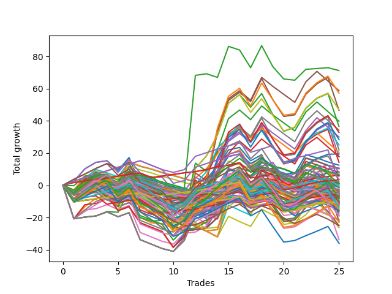

# Long Wallace Doodle 014 
- Symbol: ES
- Date Range: 03/15/2022 - 07/08/2022
- Trading Period: 7:20-12:30
- Number of Trades: 26



| Name | Win Percent | Profit | Avg Profit / Trade |     | Name | Win Percent | Profit | Avg Profit / Trade |
| ---- | ----------- | ------ | ------------------ | --- | ---- | ----------- | ------ | ------------------ |
| Sorted By <br> Profit | | | | | Sorted By <br> Win Percentage ||||
| Forty-Five | 50.00 | 50375.00 | 1937.50 |     | Fifty-Eight | 69.23 | 43750.00 | 1682.69 |
| Seventy-Four | 57.69 | 50000.00 | 1923.08 |     | Two | 69.23 | 43625.00 | 1677.88 |
| Seventy-Three | 50.00 | 48500.00 | 1865.38 |     | Fifty-Nine | 69.23 | 33250.00 | 1278.85 |
| Sixty-One | 61.54 | 46875.00 | 1802.88 |     | Three | 69.23 | 32875.00 | 1264.42 |
| Five | 61.54 | 46500.00 | 1788.46 |     | One | 69.23 | 31375.00 | 1206.73 |
| Fifty-Eight | 69.23 | 43750.00 | 1682.69 |     | Fifty-Seven | 65.38 | 24125.00 | 927.88 |
| Two | 69.23 | 43625.00 | 1677.88 |     | Sixty-Four | 65.38 | 22125.00 | 850.96 |
| Forty-Two | 53.85 | 40500.00 | 1557.69 |     | Zero | 65.38 | 17750.00 | 682.69 |
| Sixty | 61.54 | 35375.00 | 1360.58 |     | Sixty-Two | 65.38 | 13500.00 | 519.23 |
| Four | 61.54 | 35000.00 | 1346.15 |     | Six | 65.38 | 13125.00 | 504.81 |
| Forty-Seven | 50.00 | 34000.00 | 1307.69 |     | Sixty-One | 61.54 | 46875.00 | 1802.88 |
| Fifty-Nine | 69.23 | 33250.00 | 1278.85 |     | Five | 61.54 | 46500.00 | 1788.46 |
| Three | 69.23 | 32875.00 | 1264.42 |     | Sixty | 61.54 | 35375.00 | 1360.58 |
| Forty-Four | 50.00 | 32875.00 | 1264.42 |     | Four | 61.54 | 35000.00 | 1346.15 |
| Forty-One | 57.69 | 32250.00 | 1240.38 |     | Sixty-Three | 61.54 | 30500.00 | 1173.08 |
| One | 69.23 | 31375.00 | 1206.73 |     | Seven | 61.54 | 30125.00 | 1158.65 |
| Forty-Three | 53.85 | 31375.00 | 1206.73 |     | Seventy-Five | 61.54 | 21875.00 | 841.35 |
| Sixty-Three | 61.54 | 30500.00 | 1173.08 |     | Sixty-Seven | 61.54 | 19750.00 | 759.62 |
| Seven | 61.54 | 30125.00 | 1158.65 |     | Sixty-Six | 61.54 | 19375.00 | 745.19 |
| Fifty-Seven | 65.38 | 24125.00 | 927.88 |     | Seventy | 61.54 | 17500.00 | 673.08 |
| Forty | 57.69 | 23750.00 | 913.46 |     | Sixty-Five | 61.54 | 13750.00 | 528.85 |
| Ten | 34.62 | 22250.00 | 855.77 |     | Fifty-Six | 61.54 | 10875.00 | 418.27 |
| Sixty-Four | 65.38 | 22125.00 | 850.96 |     | Seventy-Four | 57.69 | 50000.00 | 1923.08 |
| Thirteen | 30.77 | 22000.00 | 846.15 |     | Forty-One | 57.69 | 32250.00 | 1240.38 |
| Seventy-Five | 61.54 | 21875.00 | 841.35 |     | Forty | 57.69 | 23750.00 | 913.46 |
| Fourteen | 42.31 | 21125.00 | 812.50 |     | Sixty-Nine | 57.69 | 15625.00 | 600.96 |
| Eleven | 34.62 | 21125.00 | 812.50 |     | Seventy-One | 57.69 | 13750.00 | 528.85 |
| Fifteen | 30.77 | 20125.00 | 774.04 |     | Sixty-Eight | 57.69 | 9875.00 | 379.81 |
| Nine | 34.62 | 20000.00 | 769.23 |     | Forty-Two | 53.85 | 40500.00 | 1557.69 |
| Sixty-Seven | 61.54 | 19750.00 | 759.62 |     | Forty-Three | 53.85 | 31375.00 | 1206.73 |
| Sixty-Six | 61.54 | 19375.00 | 745.19 |     | Forty-Six | 53.85 | 17000.00 | 653.85 |
| Eight | 38.46 | 18750.00 | 721.15 |     | Forty-Eight | 53.85 | 14875.00 | 572.12 |
| Zero | 65.38 | 17750.00 | 682.69 |     | Seventy-Two | 53.85 | 11250.00 | 432.69 |
| Seventy | 61.54 | 17500.00 | 673.08 |     | Forty-Five | 50.00 | 50375.00 | 1937.50 |
| Forty-Six | 53.85 | 17000.00 | 653.85 |     | Seventy-Three | 50.00 | 48500.00 | 1865.38 |
| Fifty-Three | 50.00 | 16375.00 | 629.81 |     | Forty-Seven | 50.00 | 34000.00 | 1307.69 |
| Fifty-Five | 50.00 | 15875.00 | 610.58 |     | Forty-Four | 50.00 | 32875.00 | 1264.42 |
| Twenty-Four | 42.31 | 15875.00 | 610.58 |     | Fifty-Three | 50.00 | 16375.00 | 629.81 |
| Sixty-Nine | 57.69 | 15625.00 | 600.96 |     | Fifty-Five | 50.00 | 15875.00 | 610.58 |
| Forty-Eight | 53.85 | 14875.00 | 572.12 |     | Thirty-Seven | 50.00 | 12875.00 | 495.19 |
| Twelve | 30.77 | 14750.00 | 567.31 |     | Thirty-Two | 50.00 | 12750.00 | 490.38 |
| Twenty-Six | 34.62 | 14000.00 | 538.46 |     | Thirty-Nine | 50.00 | 11500.00 | 442.31 |
| Thirty | 42.31 | 13875.00 | 533.65 |     | Fifty | 50.00 | 11375.00 | 437.50 |
| Sixty-Five | 61.54 | 13750.00 | 528.85 |     | Thirty-Three | 50.00 | 11375.00 | 437.50 |
| Seventy-One | 57.69 | 13750.00 | 528.85 |     | Thirty-Six | 50.00 | 10875.00 | 418.27 |
| Sixty-Two | 65.38 | 13500.00 | 519.23 |     | Thirty-Five | 50.00 | 10875.00 | 418.27 |
| Six | 65.38 | 13125.00 | 504.81 |     | Forty-Nine | 50.00 | 10750.00 | 413.46 |
| Twenty-Nine | 30.77 | 13125.00 | 504.81 |     | Fifty-Two | 50.00 | 10250.00 | 394.23 |
| Thirty-Seven | 50.00 | 12875.00 | 495.19 |     | Fifty-Four | 50.00 | 9875.00 | 379.81 |
| twenty-Seven | 34.62 | 12875.00 | 495.19 |     | Thirty-Four | 50.00 | 9750.00 | 375.00 |
| Thirty-Two | 50.00 | 12750.00 | 490.38 |     | Fifty-One | 50.00 | 9250.00 | 355.77 |
| Twenty-Five | 34.62 | 11750.00 | 451.92 |     | Thirty-Eight | 50.00 | 7750.00 | 298.08 |
| Thirty-Nine | 50.00 | 11500.00 | 442.31 |     | Sixten | 50.00 | 5750.00 | 221.15 |
| Fifty | 50.00 | 11375.00 | 437.50 |     | Twenty-Two | 50.00 | 4375.00 | 168.27 |
| Thirty-Three | 50.00 | 11375.00 | 437.50 |     | Twenty-Three | 50.00 | 4125.00 | 158.65 |
| Seventy-Two | 53.85 | 11250.00 | 432.69 |     | Twenty-One | 50.00 | 4125.00 | 158.65 |
| Thirty-One | 30.77 | 11250.00 | 432.69 |     | Twenty | 50.00 | 4125.00 | 158.65 |
| Fifty-Six | 61.54 | 10875.00 | 418.27 |     | Nineteen | 50.00 | 4125.00 | 158.65 |
| Thirty-Six | 50.00 | 10875.00 | 418.27 |     | Eighteen | 50.00 | 4125.00 | 158.65 |
| Thirty-Five | 50.00 | 10875.00 | 418.27 |     | Seventeen | 50.00 | 4125.00 | 158.65 |
| Forty-Nine | 50.00 | 10750.00 | 413.46 |     | Fourteen | 42.31 | 21125.00 | 812.50 |
| Fifty-Two | 50.00 | 10250.00 | 394.23 |     | Twenty-Four | 42.31 | 15875.00 | 610.58 |
| Sixty-Eight | 57.69 | 9875.00 | 379.81 |     | Thirty | 42.31 | 13875.00 | 533.65 |
| Fifty-Four | 50.00 | 9875.00 | 379.81 |     | Eight | 38.46 | 18750.00 | 721.15 |
| Thirty-Four | 50.00 | 9750.00 | 375.00 |     | Ten | 34.62 | 22250.00 | 855.77 |
| Fifty-One | 50.00 | 9250.00 | 355.77 |     | Eleven | 34.62 | 21125.00 | 812.50 |
| Thirty-Eight | 50.00 | 7750.00 | 298.08 |     | Nine | 34.62 | 20000.00 | 769.23 |
| Twenty-Eight | 30.77 | 5875.00 | 225.96 |     | Twenty-Six | 34.62 | 14000.00 | 538.46 |
| Sixten | 50.00 | 5750.00 | 221.15 |     | twenty-Seven | 34.62 | 12875.00 | 495.19 |
| Twenty-Two | 50.00 | 4375.00 | 168.27 |     | Twenty-Five | 34.62 | 11750.00 | 451.92 |
| Twenty-Three | 50.00 | 4125.00 | 158.65 |     | Thirteen | 30.77 | 22000.00 | 846.15 |
| Twenty-One | 50.00 | 4125.00 | 158.65 |     | Fifteen | 30.77 | 20125.00 | 774.04 |
| Twenty | 50.00 | 4125.00 | 158.65 |     | Twelve | 30.77 | 14750.00 | 567.31 |
| Nineteen | 50.00 | 4125.00 | 158.65 |     | Twenty-Nine | 30.77 | 13125.00 | 504.81 |
| Eighteen | 50.00 | 4125.00 | 158.65 |     | Thirty-One | 30.77 | 11250.00 | 432.69 |
| Seventeen | 50.00 | 4125.00 | 158.65 |     | Twenty-Eight | 30.77 | 5875.00 | 225.96 |

## NO STOPLOSS

### Test Zero
* Sell when price hits the middle line of the 20p bollinger
* No Stoploss
* Results:
```
Total Trades: 26
Percent Up: 65.38
Percent Down: 34.62
Total Points Moved Up: 35.50
Potential Profit: 17750.00
Total Points Ups: 98.75 Count Ups: 17
Total Points Downs: -63.25 Count Downs: 9
```

<details><summary>Trades</summary>

<code>In: 2022-03-16 09:52:00		Out: 2022-03-16 09:52:10		Total Position Time: 00:10		Total Move Up: 8.75		Total to Date: 8.75</code> <br />
<code>In: 2022-03-16 10:12:00		Out: 2022-03-16 10:12:10		Total Position Time: 00:10		Total Move Up: 8.25		Total to Date: 17.00</code> <br />
<code>In: 2022-03-17 07:54:00		Out: 2022-03-17 07:55:10		Total Position Time: 01:10		Total Move Up: 8.25		Total to Date: 25.25</code> <br />
<code>In: 2022-03-21 09:35:00		Out: 2022-03-21 09:45:00		Total Position Time: 10:00		Total Move Up: 2.50		Total to Date: 27.75</code> <br />
<code>In: 2022-03-23 09:14:00		Out: 2022-03-23 09:19:25		Total Position Time: 05:25		Total Move Up: 7.50		Total to Date: 35.25</code> <br />
<code>In: 2022-03-23 09:47:00		Out: 2022-03-23 09:53:00		Total Position Time: 06:00		Total Move Up: 4.25		Total to Date: 39.50</code> <br />
<code>In: 2022-03-23 10:28:00		Out: 2022-03-23 10:37:45		Total Position Time: 09:45		Total Move Up: 1.00		Total to Date: 40.50</code> <br />
<code>In: 2022-03-25 08:14:00		Out: 2022-03-25 08:36:40		Total Position Time: 22:40		Total Move Up: -6.00		Total to Date: 34.50</code> <br />
<code>In: 2022-03-25 08:29:00		Out: 2022-03-25 08:36:40		Total Position Time: 07:40		Total Move Up: 8.00		Total to Date: 42.50</code> <br />
<code>In: 2022-03-28 08:27:00		Out: 2022-03-28 08:56:55		Total Position Time: 29:55		Total Move Up: -16.75		Total to Date: 25.75</code> <br />
<code>In: 2022-03-31 09:16:00		Out: 2022-03-31 09:32:20		Total Position Time: 16:20		Total Move Up: -3.00		Total to Date: 22.75</code> <br />
<code>In: 2022-03-31 09:23:00		Out: 2022-03-31 09:32:20		Total Position Time: 09:20		Total Move Up: -0.25		Total to Date: 22.50</code> <br />
<code>In: 2022-04-18 08:29:00		Out: 2022-04-18 08:54:55		Total Position Time: 25:55		Total Move Up: -5.00		Total to Date: 17.50</code> <br />
<code>In: 2022-04-20 09:14:00		Out: 2022-04-20 09:30:45		Total Position Time: 16:45		Total Move Up: -0.50		Total to Date: 17.00</code> <br />
<code>In: 2022-05-04 11:36:00		Out: 2022-05-04 11:36:40		Total Position Time: 00:40		Total Move Up: 8.25		Total to Date: 25.25</code> <br />
<code>In: 2022-05-13 11:07:00		Out: 2022-05-13 11:12:25		Total Position Time: 05:25		Total Move Up: 6.50		Total to Date: 31.75</code> <br />
<code>In: 2022-05-17 11:24:00		Out: 2022-05-17 11:27:25		Total Position Time: 03:25		Total Move Up: 11.25		Total to Date: 43.00</code> <br />
<code>In: 2022-05-19 10:51:00		Out: 2022-05-19 10:52:45		Total Position Time: 01:45		Total Move Up: 8.50		Total to Date: 51.50</code> <br />
<code>In: 2022-05-25 09:29:00		Out: 2022-05-25 09:38:50		Total Position Time: 09:50		Total Move Up: 2.00		Total to Date: 53.50</code> <br />
<code>In: 2022-06-06 08:15:00		Out: 2022-06-06 08:31:35		Total Position Time: 16:35		Total Move Up: -8.25		Total to Date: 45.25</code> <br />
<code>In: 2022-06-08 08:05:00		Out: 2022-06-08 08:10:40		Total Position Time: 05:40		Total Move Up: 3.75		Total to Date: 49.00</code> <br />
<code>In: 2022-06-08 09:29:00		Out: 2022-06-08 09:53:00		Total Position Time: 24:00		Total Move Up: -13.00		Total to Date: 36.00</code> <br />
<code>In: 2022-06-15 07:35:00		Out: 2022-06-15 08:04:55		Total Position Time: 29:55		Total Move Up: -10.50		Total to Date: 25.50</code> <br />
<code>In: 2022-06-27 10:45:00		Out: 2022-06-27 10:51:15		Total Position Time: 06:15		Total Move Up: 1.25		Total to Date: 26.75</code> <br />
<code>In: 2022-06-29 08:25:00		Out: 2022-06-29 08:29:10		Total Position Time: 04:10		Total Move Up: 5.00		Total to Date: 31.75</code> <br />
<code>In: 2022-07-05 08:04:00		Out: 2022-07-05 08:08:15		Total Position Time: 04:15		Total Move Up: 3.75		Total to Date: 35.50</code> <br />


</details>

### Test One
* Sell when the price hits the upper line of the 20p 1std bollinger
* No Stoploss
* Results:
```
Total Trades: 26
Percent Up: 69.23
Percent Down: 30.77
Total Points Moved Up: 62.75
Potential Profit: 31375.00
Total Points Ups: 124.25 Count Ups: 18
Total Points Downs: -61.50 Count Downs: 8
```

<details><summary>Trades</summary>

<code>In: 2022-03-16 09:52:00		Out: 2022-03-16 09:59:20		Total Position Time: 07:20		Total Move Up: 8.25		Total to Date: 8.25</code> <br />
<code>In: 2022-03-16 10:12:00		Out: 2022-03-16 10:19:05		Total Position Time: 07:05		Total Move Up: 8.75		Total to Date: 17.00</code> <br />
<code>In: 2022-03-17 07:54:00		Out: 2022-03-17 07:57:55		Total Position Time: 03:55		Total Move Up: 12.00		Total to Date: 29.00</code> <br />
<code>In: 2022-03-21 09:35:00		Out: 2022-03-21 09:49:05		Total Position Time: 14:05		Total Move Up: 1.50		Total to Date: 30.50</code> <br />
<code>In: 2022-03-23 09:14:00		Out: 2022-03-23 09:30:25		Total Position Time: 16:25		Total Move Up: 8.00		Total to Date: 38.50</code> <br />
<code>In: 2022-03-23 09:47:00		Out: 2022-03-23 09:59:10		Total Position Time: 12:10		Total Move Up: 5.25		Total to Date: 43.75</code> <br />
<code>In: 2022-03-23 10:28:00		Out: 2022-03-23 10:51:50		Total Position Time: 23:50		Total Move Up: 0.25		Total to Date: 44.00</code> <br />
<code>In: 2022-03-25 08:14:00		Out: 2022-03-25 08:40:40		Total Position Time: 26:40		Total Move Up: -5.00		Total to Date: 39.00</code> <br />
<code>In: 2022-03-25 08:29:00		Out: 2022-03-25 08:40:40		Total Position Time: 11:40		Total Move Up: 9.00		Total to Date: 48.00</code> <br />
<code>In: 2022-03-28 08:27:00		Out: 2022-03-28 08:56:55		Total Position Time: 29:55		Total Move Up: -16.75		Total to Date: 31.25</code> <br />
<code>In: 2022-03-31 09:16:00		Out: 2022-03-31 09:40:45		Total Position Time: 24:45		Total Move Up: -3.25		Total to Date: 28.00</code> <br />
<code>In: 2022-03-31 09:23:00		Out: 2022-03-31 09:40:45		Total Position Time: 17:45		Total Move Up: -0.50		Total to Date: 27.50</code> <br />
<code>In: 2022-04-18 08:29:00		Out: 2022-04-18 08:57:20		Total Position Time: 28:20		Total Move Up: -3.00		Total to Date: 24.50</code> <br />
<code>In: 2022-04-20 09:14:00		Out: 2022-04-20 09:30:55		Total Position Time: 16:55		Total Move Up: 0.75		Total to Date: 25.25</code> <br />
<code>In: 2022-05-04 11:36:00		Out: 2022-05-04 11:42:00		Total Position Time: 06:00		Total Move Up: 21.25		Total to Date: 46.50</code> <br />
<code>In: 2022-05-13 11:07:00		Out: 2022-05-13 11:19:50		Total Position Time: 12:50		Total Move Up: 5.00		Total to Date: 51.50</code> <br />
<code>In: 2022-05-17 11:24:00		Out: 2022-05-17 11:37:35		Total Position Time: 13:35		Total Move Up: 9.25		Total to Date: 60.75</code> <br />
<code>In: 2022-05-19 10:51:00		Out: 2022-05-19 10:54:35		Total Position Time: 03:35		Total Move Up: 14.00		Total to Date: 74.75</code> <br />
<code>In: 2022-05-25 09:29:00		Out: 2022-05-25 09:44:25		Total Position Time: 15:25		Total Move Up: 3.00		Total to Date: 77.75</code> <br />
<code>In: 2022-06-06 08:15:00		Out: 2022-06-06 08:39:15		Total Position Time: 24:15		Total Move Up: -10.00		Total to Date: 67.75</code> <br />
<code>In: 2022-06-08 08:05:00		Out: 2022-06-08 08:11:15		Total Position Time: 06:15		Total Move Up: 6.25		Total to Date: 74.00</code> <br />
<code>In: 2022-06-08 09:29:00		Out: 2022-06-08 09:57:10		Total Position Time: 28:10		Total Move Up: -12.50		Total to Date: 61.50</code> <br />
<code>In: 2022-06-15 07:35:00		Out: 2022-06-15 08:04:55		Total Position Time: 29:55		Total Move Up: -10.50		Total to Date: 51.00</code> <br />
<code>In: 2022-06-27 10:45:00		Out: 2022-06-27 11:03:15		Total Position Time: 18:15		Total Move Up: 1.00		Total to Date: 52.00</code> <br />
<code>In: 2022-06-29 08:25:00		Out: 2022-06-29 08:32:20		Total Position Time: 07:20		Total Move Up: 6.75		Total to Date: 58.75</code> <br />
<code>In: 2022-07-05 08:04:00		Out: 2022-07-05 08:16:40		Total Position Time: 12:40		Total Move Up: 4.00		Total to Date: 62.75</code> <br />


</details>

### Test Two
* Sell when the price hits the upper line of the 20p 2std bollinger
* No Stoploss
* Results:
```
Total Trades: 26
Percent Up: 69.23
Percent Down: 30.77
Total Points Moved Up: 87.25
Potential Profit: 43625.00
Total Points Ups: 160.00 Count Ups: 18
Total Points Downs: -72.75 Count Downs: 8
```

<details><summary>Trades</summary>

<code>In: 2022-03-16 09:52:00		Out: 2022-03-16 10:04:05		Total Position Time: 12:05		Total Move Up: 7.00		Total to Date: 7.00</code> <br />
<code>In: 2022-03-16 10:12:00		Out: 2022-03-16 10:23:10		Total Position Time: 11:10		Total Move Up: 7.75		Total to Date: 14.75</code> <br />
<code>In: 2022-03-17 07:54:00		Out: 2022-03-17 08:03:45		Total Position Time: 09:45		Total Move Up: 12.00		Total to Date: 26.75</code> <br />
<code>In: 2022-03-21 09:35:00		Out: 2022-03-21 10:04:55		Total Position Time: 29:55		Total Move Up: -20.75		Total to Date: 6.00</code> <br />
<code>In: 2022-03-23 09:14:00		Out: 2022-03-23 09:43:55		Total Position Time: 29:55		Total Move Up: 1.00		Total to Date: 7.00</code> <br />
<code>In: 2022-03-23 09:47:00		Out: 2022-03-23 10:16:55		Total Position Time: 29:55		Total Move Up: 0.75		Total to Date: 7.75</code> <br />
<code>In: 2022-03-23 10:28:00		Out: 2022-03-23 10:54:50		Total Position Time: 26:50		Total Move Up: 3.00		Total to Date: 10.75</code> <br />
<code>In: 2022-03-25 08:14:00		Out: 2022-03-25 08:41:55		Total Position Time: 27:55		Total Move Up: -0.50		Total to Date: 10.25</code> <br />
<code>In: 2022-03-25 08:29:00		Out: 2022-03-25 08:41:55		Total Position Time: 12:55		Total Move Up: 13.50		Total to Date: 23.75</code> <br />
<code>In: 2022-03-28 08:27:00		Out: 2022-03-28 08:56:55		Total Position Time: 29:55		Total Move Up: -16.75		Total to Date: 7.00</code> <br />
<code>In: 2022-03-31 09:16:00		Out: 2022-03-31 09:44:50		Total Position Time: 28:50		Total Move Up: -1.75		Total to Date: 5.25</code> <br />
<code>In: 2022-03-31 09:23:00		Out: 2022-03-31 09:44:50		Total Position Time: 21:50		Total Move Up: 1.00		Total to Date: 6.25</code> <br />
<code>In: 2022-04-18 08:29:00		Out: 2022-04-18 08:58:55		Total Position Time: 29:55		Total Move Up: -1.75		Total to Date: 4.50</code> <br />
<code>In: 2022-04-20 09:14:00		Out: 2022-04-20 09:31:25		Total Position Time: 17:25		Total Move Up: 1.75		Total to Date: 6.25</code> <br />
<code>In: 2022-05-04 11:36:00		Out: 2022-05-04 11:43:55		Total Position Time: 07:55		Total Move Up: 32.25		Total to Date: 38.50</code> <br />
<code>In: 2022-05-13 11:07:00		Out: 2022-05-13 11:31:30		Total Position Time: 24:30		Total Move Up: 10.50		Total to Date: 49.00</code> <br />
<code>In: 2022-05-17 11:24:00		Out: 2022-05-17 11:40:00		Total Position Time: 16:00		Total Move Up: 13.00		Total to Date: 62.00</code> <br />
<code>In: 2022-05-19 10:51:00		Out: 2022-05-19 10:55:20		Total Position Time: 04:20		Total Move Up: 20.50		Total to Date: 82.50</code> <br />
<code>In: 2022-05-25 09:29:00		Out: 2022-05-25 09:48:50		Total Position Time: 19:50		Total Move Up: 7.00		Total to Date: 89.50</code> <br />
<code>In: 2022-06-06 08:15:00		Out: 2022-06-06 08:43:00		Total Position Time: 28:00		Total Move Up: -7.75		Total to Date: 81.75</code> <br />
<code>In: 2022-06-08 08:05:00		Out: 2022-06-08 08:14:00		Total Position Time: 09:00		Total Move Up: 8.50		Total to Date: 90.25</code> <br />
<code>In: 2022-06-08 09:29:00		Out: 2022-06-08 09:58:55		Total Position Time: 29:55		Total Move Up: -13.00		Total to Date: 77.25</code> <br />
<code>In: 2022-06-15 07:35:00		Out: 2022-06-15 08:04:55		Total Position Time: 29:55		Total Move Up: -10.50		Total to Date: 66.75</code> <br />
<code>In: 2022-06-27 10:45:00		Out: 2022-06-27 11:14:45		Total Position Time: 29:45		Total Move Up: 2.50		Total to Date: 69.25</code> <br />
<code>In: 2022-06-29 08:25:00		Out: 2022-06-29 08:35:35		Total Position Time: 10:35		Total Move Up: 11.75		Total to Date: 81.00</code> <br />
<code>In: 2022-07-05 08:04:00		Out: 2022-07-05 08:20:35		Total Position Time: 16:35		Total Move Up: 6.25		Total to Date: 87.25</code> <br />


</details>

### Test Three
* Sell when price hits the middle line of the 50p bollinger
* No Stoploss
* Results:
```
Total Trades: 26
Percent Up: 69.23
Percent Down: 30.77
Total Points Moved Up: 65.75
Potential Profit: 32875.00
Total Points Ups: 138.75 Count Ups: 18
Total Points Downs: -73.00 Count Downs: 8
```

<details><summary>Trades</summary>

<code>In: 2022-03-16 09:52:00		Out: 2022-03-16 10:00:50		Total Position Time: 08:50		Total Move Up: 9.75		Total to Date: 9.75</code> <br />
<code>In: 2022-03-16 10:12:00		Out: 2022-03-16 10:24:05		Total Position Time: 12:05		Total Move Up: 9.75		Total to Date: 19.50</code> <br />
<code>In: 2022-03-17 07:54:00		Out: 2022-03-17 07:59:45		Total Position Time: 05:45		Total Move Up: 13.00		Total to Date: 32.50</code> <br />
<code>In: 2022-03-21 09:35:00		Out: 2022-03-21 10:04:55		Total Position Time: 29:55		Total Move Up: -20.75		Total to Date: 11.75</code> <br />
<code>In: 2022-03-23 09:14:00		Out: 2022-03-23 09:30:30		Total Position Time: 16:30		Total Move Up: 8.75		Total to Date: 20.50</code> <br />
<code>In: 2022-03-23 09:47:00		Out: 2022-03-23 10:16:55		Total Position Time: 29:55		Total Move Up: 0.75		Total to Date: 21.25</code> <br />
<code>In: 2022-03-23 10:28:00		Out: 2022-03-23 10:54:50		Total Position Time: 26:50		Total Move Up: 3.00		Total to Date: 24.25</code> <br />
<code>In: 2022-03-25 08:14:00		Out: 2022-03-25 08:43:55		Total Position Time: 29:55		Total Move Up: -3.00		Total to Date: 21.25</code> <br />
<code>In: 2022-03-25 08:29:00		Out: 2022-03-25 08:52:45		Total Position Time: 23:45		Total Move Up: 12.50		Total to Date: 33.75</code> <br />
<code>In: 2022-03-28 08:27:00		Out: 2022-03-28 08:56:55		Total Position Time: 29:55		Total Move Up: -16.75		Total to Date: 17.00</code> <br />
<code>In: 2022-03-31 09:16:00		Out: 2022-03-31 09:45:35		Total Position Time: 29:35		Total Move Up: -1.50		Total to Date: 15.50</code> <br />
<code>In: 2022-03-31 09:23:00		Out: 2022-03-31 09:45:35		Total Position Time: 22:35		Total Move Up: 1.25		Total to Date: 16.75</code> <br />
<code>In: 2022-04-18 08:29:00		Out: 2022-04-18 08:58:55		Total Position Time: 29:55		Total Move Up: -1.75		Total to Date: 15.00</code> <br />
<code>In: 2022-04-20 09:14:00		Out: 2022-04-20 09:32:40		Total Position Time: 18:40		Total Move Up: 4.50		Total to Date: 19.50</code> <br />
<code>In: 2022-05-04 11:36:00		Out: 2022-05-04 11:41:15		Total Position Time: 05:15		Total Move Up: 11.75		Total to Date: 31.25</code> <br />
<code>In: 2022-05-13 11:07:00		Out: 2022-05-13 11:31:20		Total Position Time: 24:20		Total Move Up: 7.75		Total to Date: 39.00</code> <br />
<code>In: 2022-05-17 11:24:00		Out: 2022-05-17 11:40:05		Total Position Time: 16:05		Total Move Up: 14.50		Total to Date: 53.50</code> <br />
<code>In: 2022-05-19 10:51:00		Out: 2022-05-19 10:52:40		Total Position Time: 01:40		Total Move Up: 7.00		Total to Date: 60.50</code> <br />
<code>In: 2022-05-25 09:29:00		Out: 2022-05-25 09:49:05		Total Position Time: 20:05		Total Move Up: 7.75		Total to Date: 68.25</code> <br />
<code>In: 2022-06-06 08:15:00		Out: 2022-06-06 08:44:55		Total Position Time: 29:55		Total Move Up: -5.75		Total to Date: 62.50</code> <br />
<code>In: 2022-06-08 08:05:00		Out: 2022-06-08 08:11:20		Total Position Time: 06:20		Total Move Up: 7.25		Total to Date: 69.75</code> <br />
<code>In: 2022-06-08 09:29:00		Out: 2022-06-08 09:58:55		Total Position Time: 29:55		Total Move Up: -13.00		Total to Date: 56.75</code> <br />
<code>In: 2022-06-15 07:35:00		Out: 2022-06-15 08:04:55		Total Position Time: 29:55		Total Move Up: -10.50		Total to Date: 46.25</code> <br />
<code>In: 2022-06-27 10:45:00		Out: 2022-06-27 11:13:35		Total Position Time: 28:35		Total Move Up: 2.00		Total to Date: 48.25</code> <br />
<code>In: 2022-06-29 08:25:00		Out: 2022-06-29 08:35:35		Total Position Time: 10:35		Total Move Up: 11.75		Total to Date: 60.00</code> <br />
<code>In: 2022-07-05 08:04:00		Out: 2022-07-05 08:27:20		Total Position Time: 23:20		Total Move Up: 5.75		Total to Date: 65.75</code> <br />


</details>

### Test Four
* Sell when the price hits the upper line of the 50p 1std bollinger
* No Stoploss
* Results:
```
Total Trades: 26
Percent Up: 61.54
Percent Down: 38.46
Total Points Moved Up: 70.00
Potential Profit: 35000.00
Total Points Ups: 152.75 Count Ups: 16
Total Points Downs: -82.75 Count Downs: 10
```

<details><summary>Trades</summary>

<code>In: 2022-03-16 09:52:00		Out: 2022-03-16 10:21:55		Total Position Time: 29:55		Total Move Up: -5.75		Total to Date: -5.75</code> <br />
<code>In: 2022-03-16 10:12:00		Out: 2022-03-16 10:31:20		Total Position Time: 19:20		Total Move Up: 13.50		Total to Date: 7.75</code> <br />
<code>In: 2022-03-17 07:54:00		Out: 2022-03-17 08:08:25		Total Position Time: 14:25		Total Move Up: 17.25		Total to Date: 25.00</code> <br />
<code>In: 2022-03-21 09:35:00		Out: 2022-03-21 10:04:55		Total Position Time: 29:55		Total Move Up: -20.75		Total to Date: 4.25</code> <br />
<code>In: 2022-03-23 09:14:00		Out: 2022-03-23 09:43:55		Total Position Time: 29:55		Total Move Up: 1.00		Total to Date: 5.25</code> <br />
<code>In: 2022-03-23 09:47:00		Out: 2022-03-23 10:16:55		Total Position Time: 29:55		Total Move Up: 0.75		Total to Date: 6.00</code> <br />
<code>In: 2022-03-23 10:28:00		Out: 2022-03-23 10:57:55		Total Position Time: 29:55		Total Move Up: 2.50		Total to Date: 8.50</code> <br />
<code>In: 2022-03-25 08:14:00		Out: 2022-03-25 08:43:55		Total Position Time: 29:55		Total Move Up: -3.00		Total to Date: 5.50</code> <br />
<code>In: 2022-03-25 08:29:00		Out: 2022-03-25 08:58:55		Total Position Time: 29:55		Total Move Up: 2.50		Total to Date: 8.00</code> <br />
<code>In: 2022-03-28 08:27:00		Out: 2022-03-28 08:56:55		Total Position Time: 29:55		Total Move Up: -16.75		Total to Date: -8.75</code> <br />
<code>In: 2022-03-31 09:16:00		Out: 2022-03-31 09:45:55		Total Position Time: 29:55		Total Move Up: -2.75		Total to Date: -11.50</code> <br />
<code>In: 2022-03-31 09:23:00		Out: 2022-03-31 09:52:55		Total Position Time: 29:55		Total Move Up: -2.75		Total to Date: -14.25</code> <br />
<code>In: 2022-04-18 08:29:00		Out: 2022-04-18 08:58:55		Total Position Time: 29:55		Total Move Up: -1.75		Total to Date: -16.00</code> <br />
<code>In: 2022-04-20 09:14:00		Out: 2022-04-20 09:36:45		Total Position Time: 22:45		Total Move Up: 8.25		Total to Date: -7.75</code> <br />
<code>In: 2022-05-04 11:36:00		Out: 2022-05-04 11:42:00		Total Position Time: 06:00		Total Move Up: 21.25		Total to Date: 13.50</code> <br />
<code>In: 2022-05-13 11:07:00		Out: 2022-05-13 11:32:00		Total Position Time: 25:00		Total Move Up: 15.75		Total to Date: 29.25</code> <br />
<code>In: 2022-05-17 11:24:00		Out: 2022-05-17 11:45:45		Total Position Time: 21:45		Total Move Up: 22.25		Total to Date: 51.50</code> <br />
<code>In: 2022-05-19 10:51:00		Out: 2022-05-19 10:54:25		Total Position Time: 03:25		Total Move Up: 12.75		Total to Date: 64.25</code> <br />
<code>In: 2022-05-25 09:29:00		Out: 2022-05-25 09:58:55		Total Position Time: 29:55		Total Move Up: 5.00		Total to Date: 69.25</code> <br />
<code>In: 2022-06-06 08:15:00		Out: 2022-06-06 08:44:55		Total Position Time: 29:55		Total Move Up: -5.75		Total to Date: 63.50</code> <br />
<code>In: 2022-06-08 08:05:00		Out: 2022-06-08 08:15:05		Total Position Time: 10:05		Total Move Up: 10.75		Total to Date: 74.25</code> <br />
<code>In: 2022-06-08 09:29:00		Out: 2022-06-08 09:58:55		Total Position Time: 29:55		Total Move Up: -13.00		Total to Date: 61.25</code> <br />
<code>In: 2022-06-15 07:35:00		Out: 2022-06-15 08:04:55		Total Position Time: 29:55		Total Move Up: -10.50		Total to Date: 50.75</code> <br />
<code>In: 2022-06-27 10:45:00		Out: 2022-06-27 11:14:55		Total Position Time: 29:55		Total Move Up: 1.00		Total to Date: 51.75</code> <br />
<code>In: 2022-06-29 08:25:00		Out: 2022-06-29 08:53:10		Total Position Time: 28:10		Total Move Up: 11.50		Total to Date: 63.25</code> <br />
<code>In: 2022-07-05 08:04:00		Out: 2022-07-05 08:33:05		Total Position Time: 29:05		Total Move Up: 6.75		Total to Date: 70.00</code> <br />


</details>

### Test Five
* Sell when the price hits the upper line of the 50p 2std bollinger
* No Stoploss
* Results:
```
Total Trades: 26
Percent Up: 61.54
Percent Down: 38.46
Total Points Moved Up: 93.00
Potential Profit: 46500.00
Total Points Ups: 175.75 Count Ups: 16
Total Points Downs: -82.75 Count Downs: 10
```

<details><summary>Trades</summary>

<code>In: 2022-03-16 09:52:00		Out: 2022-03-16 10:21:55		Total Position Time: 29:55		Total Move Up: -5.75		Total to Date: -5.75</code> <br />
<code>In: 2022-03-16 10:12:00		Out: 2022-03-16 10:35:25		Total Position Time: 23:25		Total Move Up: 14.75		Total to Date: 9.00</code> <br />
<code>In: 2022-03-17 07:54:00		Out: 2022-03-17 08:18:35		Total Position Time: 24:35		Total Move Up: 18.25		Total to Date: 27.25</code> <br />
<code>In: 2022-03-21 09:35:00		Out: 2022-03-21 10:04:55		Total Position Time: 29:55		Total Move Up: -20.75		Total to Date: 6.50</code> <br />
<code>In: 2022-03-23 09:14:00		Out: 2022-03-23 09:43:55		Total Position Time: 29:55		Total Move Up: 1.00		Total to Date: 7.50</code> <br />
<code>In: 2022-03-23 09:47:00		Out: 2022-03-23 10:16:55		Total Position Time: 29:55		Total Move Up: 0.75		Total to Date: 8.25</code> <br />
<code>In: 2022-03-23 10:28:00		Out: 2022-03-23 10:57:55		Total Position Time: 29:55		Total Move Up: 2.50		Total to Date: 10.75</code> <br />
<code>In: 2022-03-25 08:14:00		Out: 2022-03-25 08:43:55		Total Position Time: 29:55		Total Move Up: -3.00		Total to Date: 7.75</code> <br />
<code>In: 2022-03-25 08:29:00		Out: 2022-03-25 08:58:55		Total Position Time: 29:55		Total Move Up: 2.50		Total to Date: 10.25</code> <br />
<code>In: 2022-03-28 08:27:00		Out: 2022-03-28 08:56:55		Total Position Time: 29:55		Total Move Up: -16.75		Total to Date: -6.50</code> <br />
<code>In: 2022-03-31 09:16:00		Out: 2022-03-31 09:45:55		Total Position Time: 29:55		Total Move Up: -2.75		Total to Date: -9.25</code> <br />
<code>In: 2022-03-31 09:23:00		Out: 2022-03-31 09:52:55		Total Position Time: 29:55		Total Move Up: -2.75		Total to Date: -12.00</code> <br />
<code>In: 2022-04-18 08:29:00		Out: 2022-04-18 08:58:55		Total Position Time: 29:55		Total Move Up: -1.75		Total to Date: -13.75</code> <br />
<code>In: 2022-04-20 09:14:00		Out: 2022-04-20 09:43:55		Total Position Time: 29:55		Total Move Up: 6.75		Total to Date: -7.00</code> <br />
<code>In: 2022-05-04 11:36:00		Out: 2022-05-04 11:43:55		Total Position Time: 07:55		Total Move Up: 32.25		Total to Date: 25.25</code> <br />
<code>In: 2022-05-13 11:07:00		Out: 2022-05-13 11:36:55		Total Position Time: 29:55		Total Move Up: 3.75		Total to Date: 29.00</code> <br />
<code>In: 2022-05-17 11:24:00		Out: 2022-05-17 11:49:45		Total Position Time: 25:45		Total Move Up: 33.50		Total to Date: 62.50</code> <br />
<code>In: 2022-05-19 10:51:00		Out: 2022-05-19 10:55:15		Total Position Time: 04:15		Total Move Up: 19.75		Total to Date: 82.25</code> <br />
<code>In: 2022-05-25 09:29:00		Out: 2022-05-25 09:58:55		Total Position Time: 29:55		Total Move Up: 5.00		Total to Date: 87.25</code> <br />
<code>In: 2022-06-06 08:15:00		Out: 2022-06-06 08:44:55		Total Position Time: 29:55		Total Move Up: -5.75		Total to Date: 81.50</code> <br />
<code>In: 2022-06-08 08:05:00		Out: 2022-06-08 08:17:50		Total Position Time: 12:50		Total Move Up: 14.75		Total to Date: 96.25</code> <br />
<code>In: 2022-06-08 09:29:00		Out: 2022-06-08 09:58:55		Total Position Time: 29:55		Total Move Up: -13.00		Total to Date: 83.25</code> <br />
<code>In: 2022-06-15 07:35:00		Out: 2022-06-15 08:04:55		Total Position Time: 29:55		Total Move Up: -10.50		Total to Date: 72.75</code> <br />
<code>In: 2022-06-27 10:45:00		Out: 2022-06-27 11:14:55		Total Position Time: 29:55		Total Move Up: 1.00		Total to Date: 73.75</code> <br />
<code>In: 2022-06-29 08:25:00		Out: 2022-06-29 08:54:55		Total Position Time: 29:55		Total Move Up: 12.75		Total to Date: 86.50</code> <br />
<code>In: 2022-07-05 08:04:00		Out: 2022-07-05 08:33:55		Total Position Time: 29:55		Total Move Up: 6.50		Total to Date: 93.00</code> <br />


</details>

### Test Six
* Sell when the price hits the middle line of the 1std VWAP
* No Stoploss
* Results:
```
Total Trades: 26
Percent Up: 65.38
Percent Down: 34.62
Total Points Moved Up: 26.25
Potential Profit: 13125.00
Total Points Ups: 103.25 Count Ups: 17
Total Points Downs: -77.00 Count Downs: 9
```

<details><summary>Trades</summary>

<code>In: 2022-03-16 09:52:00		Out: 2022-03-16 09:59:40		Total Position Time: 07:40		Total Move Up: 9.50		Total to Date: 9.50</code> <br />
<code>In: 2022-03-16 10:12:00		Out: 2022-03-16 10:41:55		Total Position Time: 29:55		Total Move Up: 9.50		Total to Date: 19.00</code> <br />
<code>In: 2022-03-17 07:54:00		Out: 2022-03-17 07:55:45		Total Position Time: 01:45		Total Move Up: 8.50		Total to Date: 27.50</code> <br />
<code>In: 2022-03-21 09:35:00		Out: 2022-03-21 10:04:55		Total Position Time: 29:55		Total Move Up: -20.75		Total to Date: 6.75</code> <br />
<code>In: 2022-03-23 09:14:00		Out: 2022-03-23 09:16:05		Total Position Time: 02:05		Total Move Up: 5.50		Total to Date: 12.25</code> <br />
<code>In: 2022-03-23 09:47:00		Out: 2022-03-23 10:16:55		Total Position Time: 29:55		Total Move Up: 0.75		Total to Date: 13.00</code> <br />
<code>In: 2022-03-23 10:28:00		Out: 2022-03-23 10:57:55		Total Position Time: 29:55		Total Move Up: 2.50		Total to Date: 15.50</code> <br />
<code>In: 2022-03-25 08:14:00		Out: 2022-03-25 08:43:55		Total Position Time: 29:55		Total Move Up: -3.00		Total to Date: 12.50</code> <br />
<code>In: 2022-03-25 08:29:00		Out: 2022-03-25 08:58:55		Total Position Time: 29:55		Total Move Up: 2.50		Total to Date: 15.00</code> <br />
<code>In: 2022-03-28 08:27:00		Out: 2022-03-28 08:56:55		Total Position Time: 29:55		Total Move Up: -16.75		Total to Date: -1.75</code> <br />
<code>In: 2022-03-31 09:16:00		Out: 2022-03-31 09:45:55		Total Position Time: 29:55		Total Move Up: -2.75		Total to Date: -4.50</code> <br />
<code>In: 2022-03-31 09:23:00		Out: 2022-03-31 09:52:55		Total Position Time: 29:55		Total Move Up: -2.75		Total to Date: -7.25</code> <br />
<code>In: 2022-04-18 08:29:00		Out: 2022-04-18 08:58:55		Total Position Time: 29:55		Total Move Up: -1.75		Total to Date: -9.00</code> <br />
<code>In: 2022-04-20 09:14:00		Out: 2022-04-20 09:35:50		Total Position Time: 21:50		Total Move Up: 6.75		Total to Date: -2.25</code> <br />
<code>In: 2022-05-04 11:36:00		Out: 2022-05-04 11:36:10		Total Position Time: 00:10		Total Move Up: 0.75		Total to Date: -1.50</code> <br />
<code>In: 2022-05-13 11:07:00		Out: 2022-05-13 11:36:55		Total Position Time: 29:55		Total Move Up: 3.75		Total to Date: 2.25</code> <br />
<code>In: 2022-05-17 11:24:00		Out: 2022-05-17 11:27:25		Total Position Time: 03:25		Total Move Up: 11.25		Total to Date: 13.50</code> <br />
<code>In: 2022-05-19 10:51:00		Out: 2022-05-19 10:53:25		Total Position Time: 02:25		Total Move Up: 10.50		Total to Date: 24.00</code> <br />
<code>In: 2022-05-25 09:29:00		Out: 2022-05-25 09:58:55		Total Position Time: 29:55		Total Move Up: 5.00		Total to Date: 29.00</code> <br />
<code>In: 2022-06-06 08:15:00		Out: 2022-06-06 08:44:55		Total Position Time: 29:55		Total Move Up: -5.75		Total to Date: 23.25</code> <br />
<code>In: 2022-06-08 08:05:00		Out: 2022-06-08 08:11:05		Total Position Time: 06:05		Total Move Up: 5.75		Total to Date: 29.00</code> <br />
<code>In: 2022-06-08 09:29:00		Out: 2022-06-08 09:58:55		Total Position Time: 29:55		Total Move Up: -13.00		Total to Date: 16.00</code> <br />
<code>In: 2022-06-15 07:35:00		Out: 2022-06-15 08:04:55		Total Position Time: 29:55		Total Move Up: -10.50		Total to Date: 5.50</code> <br />
<code>In: 2022-06-27 10:45:00		Out: 2022-06-27 11:14:55		Total Position Time: 29:55		Total Move Up: 1.00		Total to Date: 6.50</code> <br />
<code>In: 2022-06-29 08:25:00		Out: 2022-06-29 08:35:35		Total Position Time: 10:35		Total Move Up: 11.75		Total to Date: 18.25</code> <br />
<code>In: 2022-07-05 08:04:00		Out: 2022-07-05 08:33:10		Total Position Time: 29:10		Total Move Up: 8.00		Total to Date: 26.25</code> <br />


</details>

### Test Seven
* Sell when the price hits the upper line of the 1std VWAP
* No Stoploss
* Results:
```
Total Trades: 26
Percent Up: 61.54
Percent Down: 38.46
Total Points Moved Up: 60.25
Potential Profit: 30125.00
Total Points Ups: 143.00 Count Ups: 16
Total Points Downs: -82.75 Count Downs: 10
```

<details><summary>Trades</summary>

<code>In: 2022-03-16 09:52:00		Out: 2022-03-16 10:21:55		Total Position Time: 29:55		Total Move Up: -5.75		Total to Date: -5.75</code> <br />
<code>In: 2022-03-16 10:12:00		Out: 2022-03-16 10:41:55		Total Position Time: 29:55		Total Move Up: 9.50		Total to Date: 3.75</code> <br />
<code>In: 2022-03-17 07:54:00		Out: 2022-03-17 08:09:00		Total Position Time: 15:00		Total Move Up: 18.00		Total to Date: 21.75</code> <br />
<code>In: 2022-03-21 09:35:00		Out: 2022-03-21 10:04:55		Total Position Time: 29:55		Total Move Up: -20.75		Total to Date: 1.00</code> <br />
<code>In: 2022-03-23 09:14:00		Out: 2022-03-23 09:43:55		Total Position Time: 29:55		Total Move Up: 1.00		Total to Date: 2.00</code> <br />
<code>In: 2022-03-23 09:47:00		Out: 2022-03-23 10:16:55		Total Position Time: 29:55		Total Move Up: 0.75		Total to Date: 2.75</code> <br />
<code>In: 2022-03-23 10:28:00		Out: 2022-03-23 10:57:55		Total Position Time: 29:55		Total Move Up: 2.50		Total to Date: 5.25</code> <br />
<code>In: 2022-03-25 08:14:00		Out: 2022-03-25 08:43:55		Total Position Time: 29:55		Total Move Up: -3.00		Total to Date: 2.25</code> <br />
<code>In: 2022-03-25 08:29:00		Out: 2022-03-25 08:58:55		Total Position Time: 29:55		Total Move Up: 2.50		Total to Date: 4.75</code> <br />
<code>In: 2022-03-28 08:27:00		Out: 2022-03-28 08:56:55		Total Position Time: 29:55		Total Move Up: -16.75		Total to Date: -12.00</code> <br />
<code>In: 2022-03-31 09:16:00		Out: 2022-03-31 09:45:55		Total Position Time: 29:55		Total Move Up: -2.75		Total to Date: -14.75</code> <br />
<code>In: 2022-03-31 09:23:00		Out: 2022-03-31 09:52:55		Total Position Time: 29:55		Total Move Up: -2.75		Total to Date: -17.50</code> <br />
<code>In: 2022-04-18 08:29:00		Out: 2022-04-18 08:58:55		Total Position Time: 29:55		Total Move Up: -1.75		Total to Date: -19.25</code> <br />
<code>In: 2022-04-20 09:14:00		Out: 2022-04-20 09:43:55		Total Position Time: 29:55		Total Move Up: 6.75		Total to Date: -12.50</code> <br />
<code>In: 2022-05-04 11:36:00		Out: 2022-05-04 11:41:35		Total Position Time: 05:35		Total Move Up: 16.00		Total to Date: 3.50</code> <br />
<code>In: 2022-05-13 11:07:00		Out: 2022-05-13 11:36:55		Total Position Time: 29:55		Total Move Up: 3.75		Total to Date: 7.25</code> <br />
<code>In: 2022-05-17 11:24:00		Out: 2022-05-17 11:40:20		Total Position Time: 16:20		Total Move Up: 20.75		Total to Date: 28.00</code> <br />
<code>In: 2022-05-19 10:51:00		Out: 2022-05-19 10:56:05		Total Position Time: 05:05		Total Move Up: 24.25		Total to Date: 52.25</code> <br />
<code>In: 2022-05-25 09:29:00		Out: 2022-05-25 09:58:55		Total Position Time: 29:55		Total Move Up: 5.00		Total to Date: 57.25</code> <br />
<code>In: 2022-06-06 08:15:00		Out: 2022-06-06 08:44:55		Total Position Time: 29:55		Total Move Up: -5.75		Total to Date: 51.50</code> <br />
<code>In: 2022-06-08 08:05:00		Out: 2022-06-08 08:16:30		Total Position Time: 11:30		Total Move Up: 12.00		Total to Date: 63.50</code> <br />
<code>In: 2022-06-08 09:29:00		Out: 2022-06-08 09:58:55		Total Position Time: 29:55		Total Move Up: -13.00		Total to Date: 50.50</code> <br />
<code>In: 2022-06-15 07:35:00		Out: 2022-06-15 08:04:55		Total Position Time: 29:55		Total Move Up: -10.50		Total to Date: 40.00</code> <br />
<code>In: 2022-06-27 10:45:00		Out: 2022-06-27 11:14:55		Total Position Time: 29:55		Total Move Up: 1.00		Total to Date: 41.00</code> <br />
<code>In: 2022-06-29 08:25:00		Out: 2022-06-29 08:54:55		Total Position Time: 29:55		Total Move Up: 12.75		Total to Date: 53.75</code> <br />
<code>In: 2022-07-05 08:04:00		Out: 2022-07-05 08:33:55		Total Position Time: 29:55		Total Move Up: 6.50		Total to Date: 60.25</code> <br />


</details>

## STOPLOSS OF 2

### Test Eight
* Sell when price hits the middle line of the 20p bollinger
* Stoploss is 2 points
* Results:
```
Total Trades: 26
Percent Up: 38.46
Percent Down: 61.54
Total Points Moved Up: 37.50
Potential Profit: 18750.00
Total Points Ups: 73.50 Count Ups: 10
Total Points Downs: -36.00 Count Downs: 16
```

<details><summary>Trades</summary>

<code>In: 2022-03-16 09:52:00		Out: 2022-03-16 09:52:10		Total Position Time: 00:10		Total Move Up: 8.75		Total to Date: 8.75</code> <br />
<code>In: 2022-03-16 10:12:00		Out: 2022-03-16 10:12:10		Total Position Time: 00:10		Total Move Up: 8.25		Total to Date: 17.00</code> <br />
<code>In: 2022-03-17 07:54:00		Out: 2022-03-17 07:55:10		Total Position Time: 01:10		Total Move Up: 8.25		Total to Date: 25.25</code> <br />
<code>In: 2022-03-21 09:35:00		Out: 2022-03-21 09:35:10		Total Position Time: 00:10		Total Move Up: -3.00		Total to Date: 22.25</code> <br />
<code>In: 2022-03-23 09:14:00		Out: 2022-03-23 09:19:25		Total Position Time: 05:25		Total Move Up: 7.50		Total to Date: 29.75</code> <br />
<code>In: 2022-03-23 09:47:00		Out: 2022-03-23 09:53:00		Total Position Time: 06:00		Total Move Up: 4.25		Total to Date: 34.00</code> <br />
<code>In: 2022-03-23 10:28:00		Out: 2022-03-23 10:28:40		Total Position Time: 00:40		Total Move Up: -2.00		Total to Date: 32.00</code> <br />
<code>In: 2022-03-25 08:14:00		Out: 2022-03-25 08:20:40		Total Position Time: 06:40		Total Move Up: -2.50		Total to Date: 29.50</code> <br />
<code>In: 2022-03-25 08:29:00		Out: 2022-03-25 08:36:40		Total Position Time: 07:40		Total Move Up: 8.00		Total to Date: 37.50</code> <br />
<code>In: 2022-03-28 08:27:00		Out: 2022-03-28 08:32:05		Total Position Time: 05:05		Total Move Up: -2.75		Total to Date: 34.75</code> <br />
<code>In: 2022-03-31 09:16:00		Out: 2022-03-31 09:20:35		Total Position Time: 04:35		Total Move Up: -1.75		Total to Date: 33.00</code> <br />
<code>In: 2022-03-31 09:23:00		Out: 2022-03-31 09:24:55		Total Position Time: 01:55		Total Move Up: -2.25		Total to Date: 30.75</code> <br />
<code>In: 2022-04-18 08:29:00		Out: 2022-04-18 08:33:05		Total Position Time: 04:05		Total Move Up: -1.75		Total to Date: 29.00</code> <br />
<code>In: 2022-04-20 09:14:00		Out: 2022-04-20 09:15:35		Total Position Time: 01:35		Total Move Up: -2.00		Total to Date: 27.00</code> <br />
<code>In: 2022-05-04 11:36:00		Out: 2022-05-04 11:36:15		Total Position Time: 00:15		Total Move Up: -2.00		Total to Date: 25.00</code> <br />
<code>In: 2022-05-13 11:07:00		Out: 2022-05-13 11:08:10		Total Position Time: 01:10		Total Move Up: -2.75		Total to Date: 22.25</code> <br />
<code>In: 2022-05-17 11:24:00		Out: 2022-05-17 11:27:25		Total Position Time: 03:25		Total Move Up: 11.25		Total to Date: 33.50</code> <br />
<code>In: 2022-05-19 10:51:00		Out: 2022-05-19 10:52:45		Total Position Time: 01:45		Total Move Up: 8.50		Total to Date: 42.00</code> <br />
<code>In: 2022-05-25 09:29:00		Out: 2022-05-25 09:36:05		Total Position Time: 07:05		Total Move Up: -2.25		Total to Date: 39.75</code> <br />
<code>In: 2022-06-06 08:15:00		Out: 2022-06-06 08:16:10		Total Position Time: 01:10		Total Move Up: -2.25		Total to Date: 37.50</code> <br />
<code>In: 2022-06-08 08:05:00		Out: 2022-06-08 08:10:40		Total Position Time: 05:40		Total Move Up: 3.75		Total to Date: 41.25</code> <br />
<code>In: 2022-06-08 09:29:00		Out: 2022-06-08 09:32:25		Total Position Time: 03:25		Total Move Up: -2.25		Total to Date: 39.00</code> <br />
<code>In: 2022-06-15 07:35:00		Out: 2022-06-15 07:35:10		Total Position Time: 00:10		Total Move Up: -1.75		Total to Date: 37.25</code> <br />
<code>In: 2022-06-27 10:45:00		Out: 2022-06-27 10:45:35		Total Position Time: 00:35		Total Move Up: -2.75		Total to Date: 34.50</code> <br />
<code>In: 2022-06-29 08:25:00		Out: 2022-06-29 08:29:10		Total Position Time: 04:10		Total Move Up: 5.00		Total to Date: 39.50</code> <br />
<code>In: 2022-07-05 08:04:00		Out: 2022-07-05 08:05:50		Total Position Time: 01:50		Total Move Up: -2.00		Total to Date: 37.50</code> <br />


</details>

### Test Nine
* Sell when the price hits the upper line of the 20p 1std bollinger
* Stoploss is 2 points
* Results:
```
Total Trades: 26
Percent Up: 34.62
Percent Down: 65.38
Total Points Moved Up: 40.00
Potential Profit: 20000.00
Total Points Ups: 78.25 Count Ups: 9
Total Points Downs: -38.25 Count Downs: 17
```

<details><summary>Trades</summary>

<code>In: 2022-03-16 09:52:00		Out: 2022-03-16 09:59:20		Total Position Time: 07:20		Total Move Up: 8.25		Total to Date: 8.25</code> <br />
<code>In: 2022-03-16 10:12:00		Out: 2022-03-16 10:19:05		Total Position Time: 07:05		Total Move Up: 8.75		Total to Date: 17.00</code> <br />
<code>In: 2022-03-17 07:54:00		Out: 2022-03-17 07:57:55		Total Position Time: 03:55		Total Move Up: 12.00		Total to Date: 29.00</code> <br />
<code>In: 2022-03-21 09:35:00		Out: 2022-03-21 09:35:10		Total Position Time: 00:10		Total Move Up: -3.00		Total to Date: 26.00</code> <br />
<code>In: 2022-03-23 09:14:00		Out: 2022-03-23 09:30:25		Total Position Time: 16:25		Total Move Up: 8.00		Total to Date: 34.00</code> <br />
<code>In: 2022-03-23 09:47:00		Out: 2022-03-23 09:59:10		Total Position Time: 12:10		Total Move Up: 5.25		Total to Date: 39.25</code> <br />
<code>In: 2022-03-23 10:28:00		Out: 2022-03-23 10:28:40		Total Position Time: 00:40		Total Move Up: -2.00		Total to Date: 37.25</code> <br />
<code>In: 2022-03-25 08:14:00		Out: 2022-03-25 08:20:40		Total Position Time: 06:40		Total Move Up: -2.50		Total to Date: 34.75</code> <br />
<code>In: 2022-03-25 08:29:00		Out: 2022-03-25 08:40:40		Total Position Time: 11:40		Total Move Up: 9.00		Total to Date: 43.75</code> <br />
<code>In: 2022-03-28 08:27:00		Out: 2022-03-28 08:32:05		Total Position Time: 05:05		Total Move Up: -2.75		Total to Date: 41.00</code> <br />
<code>In: 2022-03-31 09:16:00		Out: 2022-03-31 09:20:35		Total Position Time: 04:35		Total Move Up: -1.75		Total to Date: 39.25</code> <br />
<code>In: 2022-03-31 09:23:00		Out: 2022-03-31 09:24:55		Total Position Time: 01:55		Total Move Up: -2.25		Total to Date: 37.00</code> <br />
<code>In: 2022-04-18 08:29:00		Out: 2022-04-18 08:33:05		Total Position Time: 04:05		Total Move Up: -1.75		Total to Date: 35.25</code> <br />
<code>In: 2022-04-20 09:14:00		Out: 2022-04-20 09:15:35		Total Position Time: 01:35		Total Move Up: -2.00		Total to Date: 33.25</code> <br />
<code>In: 2022-05-04 11:36:00		Out: 2022-05-04 11:36:15		Total Position Time: 00:15		Total Move Up: -2.00		Total to Date: 31.25</code> <br />
<code>In: 2022-05-13 11:07:00		Out: 2022-05-13 11:08:10		Total Position Time: 01:10		Total Move Up: -2.75		Total to Date: 28.50</code> <br />
<code>In: 2022-05-17 11:24:00		Out: 2022-05-17 11:35:05		Total Position Time: 11:05		Total Move Up: -2.25		Total to Date: 26.25</code> <br />
<code>In: 2022-05-19 10:51:00		Out: 2022-05-19 10:54:35		Total Position Time: 03:35		Total Move Up: 14.00		Total to Date: 40.25</code> <br />
<code>In: 2022-05-25 09:29:00		Out: 2022-05-25 09:36:05		Total Position Time: 07:05		Total Move Up: -2.25		Total to Date: 38.00</code> <br />
<code>In: 2022-06-06 08:15:00		Out: 2022-06-06 08:16:10		Total Position Time: 01:10		Total Move Up: -2.25		Total to Date: 35.75</code> <br />
<code>In: 2022-06-08 08:05:00		Out: 2022-06-08 08:11:15		Total Position Time: 06:15		Total Move Up: 6.25		Total to Date: 42.00</code> <br />
<code>In: 2022-06-08 09:29:00		Out: 2022-06-08 09:32:25		Total Position Time: 03:25		Total Move Up: -2.25		Total to Date: 39.75</code> <br />
<code>In: 2022-06-15 07:35:00		Out: 2022-06-15 07:35:10		Total Position Time: 00:10		Total Move Up: -1.75		Total to Date: 38.00</code> <br />
<code>In: 2022-06-27 10:45:00		Out: 2022-06-27 10:45:35		Total Position Time: 00:35		Total Move Up: -2.75		Total to Date: 35.25</code> <br />
<code>In: 2022-06-29 08:25:00		Out: 2022-06-29 08:32:20		Total Position Time: 07:20		Total Move Up: 6.75		Total to Date: 42.00</code> <br />
<code>In: 2022-07-05 08:04:00		Out: 2022-07-05 08:05:50		Total Position Time: 01:50		Total Move Up: -2.00		Total to Date: 40.00</code> <br />


</details>

### Test Ten
* Sell when the price hits the upper line of the 20p 2std bollinger
* Stoploss is 2 points
* Results:
```
Total Trades: 26
Percent Up: 34.62
Percent Down: 65.38
Total Points Moved Up: 44.50
Potential Profit: 22250.00
Total Points Ups: 82.75 Count Ups: 9
Total Points Downs: -38.25 Count Downs: 17
```

<details><summary>Trades</summary>

<code>In: 2022-03-16 09:52:00		Out: 2022-03-16 10:04:05		Total Position Time: 12:05		Total Move Up: 7.00		Total to Date: 7.00</code> <br />
<code>In: 2022-03-16 10:12:00		Out: 2022-03-16 10:23:10		Total Position Time: 11:10		Total Move Up: 7.75		Total to Date: 14.75</code> <br />
<code>In: 2022-03-17 07:54:00		Out: 2022-03-17 08:03:45		Total Position Time: 09:45		Total Move Up: 12.00		Total to Date: 26.75</code> <br />
<code>In: 2022-03-21 09:35:00		Out: 2022-03-21 09:35:10		Total Position Time: 00:10		Total Move Up: -3.00		Total to Date: 23.75</code> <br />
<code>In: 2022-03-23 09:14:00		Out: 2022-03-23 09:43:55		Total Position Time: 29:55		Total Move Up: 1.00		Total to Date: 24.75</code> <br />
<code>In: 2022-03-23 09:47:00		Out: 2022-03-23 10:16:55		Total Position Time: 29:55		Total Move Up: 0.75		Total to Date: 25.50</code> <br />
<code>In: 2022-03-23 10:28:00		Out: 2022-03-23 10:28:40		Total Position Time: 00:40		Total Move Up: -2.00		Total to Date: 23.50</code> <br />
<code>In: 2022-03-25 08:14:00		Out: 2022-03-25 08:20:40		Total Position Time: 06:40		Total Move Up: -2.50		Total to Date: 21.00</code> <br />
<code>In: 2022-03-25 08:29:00		Out: 2022-03-25 08:41:55		Total Position Time: 12:55		Total Move Up: 13.50		Total to Date: 34.50</code> <br />
<code>In: 2022-03-28 08:27:00		Out: 2022-03-28 08:32:05		Total Position Time: 05:05		Total Move Up: -2.75		Total to Date: 31.75</code> <br />
<code>In: 2022-03-31 09:16:00		Out: 2022-03-31 09:20:35		Total Position Time: 04:35		Total Move Up: -1.75		Total to Date: 30.00</code> <br />
<code>In: 2022-03-31 09:23:00		Out: 2022-03-31 09:24:55		Total Position Time: 01:55		Total Move Up: -2.25		Total to Date: 27.75</code> <br />
<code>In: 2022-04-18 08:29:00		Out: 2022-04-18 08:33:05		Total Position Time: 04:05		Total Move Up: -1.75		Total to Date: 26.00</code> <br />
<code>In: 2022-04-20 09:14:00		Out: 2022-04-20 09:15:35		Total Position Time: 01:35		Total Move Up: -2.00		Total to Date: 24.00</code> <br />
<code>In: 2022-05-04 11:36:00		Out: 2022-05-04 11:36:15		Total Position Time: 00:15		Total Move Up: -2.00		Total to Date: 22.00</code> <br />
<code>In: 2022-05-13 11:07:00		Out: 2022-05-13 11:08:10		Total Position Time: 01:10		Total Move Up: -2.75		Total to Date: 19.25</code> <br />
<code>In: 2022-05-17 11:24:00		Out: 2022-05-17 11:35:05		Total Position Time: 11:05		Total Move Up: -2.25		Total to Date: 17.00</code> <br />
<code>In: 2022-05-19 10:51:00		Out: 2022-05-19 10:55:20		Total Position Time: 04:20		Total Move Up: 20.50		Total to Date: 37.50</code> <br />
<code>In: 2022-05-25 09:29:00		Out: 2022-05-25 09:36:05		Total Position Time: 07:05		Total Move Up: -2.25		Total to Date: 35.25</code> <br />
<code>In: 2022-06-06 08:15:00		Out: 2022-06-06 08:16:10		Total Position Time: 01:10		Total Move Up: -2.25		Total to Date: 33.00</code> <br />
<code>In: 2022-06-08 08:05:00		Out: 2022-06-08 08:14:00		Total Position Time: 09:00		Total Move Up: 8.50		Total to Date: 41.50</code> <br />
<code>In: 2022-06-08 09:29:00		Out: 2022-06-08 09:32:25		Total Position Time: 03:25		Total Move Up: -2.25		Total to Date: 39.25</code> <br />
<code>In: 2022-06-15 07:35:00		Out: 2022-06-15 07:35:10		Total Position Time: 00:10		Total Move Up: -1.75		Total to Date: 37.50</code> <br />
<code>In: 2022-06-27 10:45:00		Out: 2022-06-27 10:45:35		Total Position Time: 00:35		Total Move Up: -2.75		Total to Date: 34.75</code> <br />
<code>In: 2022-06-29 08:25:00		Out: 2022-06-29 08:35:35		Total Position Time: 10:35		Total Move Up: 11.75		Total to Date: 46.50</code> <br />
<code>In: 2022-07-05 08:04:00		Out: 2022-07-05 08:05:50		Total Position Time: 01:50		Total Move Up: -2.00		Total to Date: 44.50</code> <br />


</details>

### Test Eleven
* Sell when price hits the middle line of the 50p bollinger
* Stoploss is 2 points
* Results:
```
Total Trades: 26
Percent Up: 34.62
Percent Down: 65.38
Total Points Moved Up: 42.25
Potential Profit: 21125.00
Total Points Ups: 80.50 Count Ups: 9
Total Points Downs: -38.25 Count Downs: 17
```

<details><summary>Trades</summary>

<code>In: 2022-03-16 09:52:00		Out: 2022-03-16 10:00:50		Total Position Time: 08:50		Total Move Up: 9.75		Total to Date: 9.75</code> <br />
<code>In: 2022-03-16 10:12:00		Out: 2022-03-16 10:24:05		Total Position Time: 12:05		Total Move Up: 9.75		Total to Date: 19.50</code> <br />
<code>In: 2022-03-17 07:54:00		Out: 2022-03-17 07:59:45		Total Position Time: 05:45		Total Move Up: 13.00		Total to Date: 32.50</code> <br />
<code>In: 2022-03-21 09:35:00		Out: 2022-03-21 09:35:10		Total Position Time: 00:10		Total Move Up: -3.00		Total to Date: 29.50</code> <br />
<code>In: 2022-03-23 09:14:00		Out: 2022-03-23 09:30:30		Total Position Time: 16:30		Total Move Up: 8.75		Total to Date: 38.25</code> <br />
<code>In: 2022-03-23 09:47:00		Out: 2022-03-23 10:16:55		Total Position Time: 29:55		Total Move Up: 0.75		Total to Date: 39.00</code> <br />
<code>In: 2022-03-23 10:28:00		Out: 2022-03-23 10:28:40		Total Position Time: 00:40		Total Move Up: -2.00		Total to Date: 37.00</code> <br />
<code>In: 2022-03-25 08:14:00		Out: 2022-03-25 08:20:40		Total Position Time: 06:40		Total Move Up: -2.50		Total to Date: 34.50</code> <br />
<code>In: 2022-03-25 08:29:00		Out: 2022-03-25 08:52:45		Total Position Time: 23:45		Total Move Up: 12.50		Total to Date: 47.00</code> <br />
<code>In: 2022-03-28 08:27:00		Out: 2022-03-28 08:32:05		Total Position Time: 05:05		Total Move Up: -2.75		Total to Date: 44.25</code> <br />
<code>In: 2022-03-31 09:16:00		Out: 2022-03-31 09:20:35		Total Position Time: 04:35		Total Move Up: -1.75		Total to Date: 42.50</code> <br />
<code>In: 2022-03-31 09:23:00		Out: 2022-03-31 09:24:55		Total Position Time: 01:55		Total Move Up: -2.25		Total to Date: 40.25</code> <br />
<code>In: 2022-04-18 08:29:00		Out: 2022-04-18 08:33:05		Total Position Time: 04:05		Total Move Up: -1.75		Total to Date: 38.50</code> <br />
<code>In: 2022-04-20 09:14:00		Out: 2022-04-20 09:15:35		Total Position Time: 01:35		Total Move Up: -2.00		Total to Date: 36.50</code> <br />
<code>In: 2022-05-04 11:36:00		Out: 2022-05-04 11:36:15		Total Position Time: 00:15		Total Move Up: -2.00		Total to Date: 34.50</code> <br />
<code>In: 2022-05-13 11:07:00		Out: 2022-05-13 11:08:10		Total Position Time: 01:10		Total Move Up: -2.75		Total to Date: 31.75</code> <br />
<code>In: 2022-05-17 11:24:00		Out: 2022-05-17 11:35:05		Total Position Time: 11:05		Total Move Up: -2.25		Total to Date: 29.50</code> <br />
<code>In: 2022-05-19 10:51:00		Out: 2022-05-19 10:52:40		Total Position Time: 01:40		Total Move Up: 7.00		Total to Date: 36.50</code> <br />
<code>In: 2022-05-25 09:29:00		Out: 2022-05-25 09:36:05		Total Position Time: 07:05		Total Move Up: -2.25		Total to Date: 34.25</code> <br />
<code>In: 2022-06-06 08:15:00		Out: 2022-06-06 08:16:10		Total Position Time: 01:10		Total Move Up: -2.25		Total to Date: 32.00</code> <br />
<code>In: 2022-06-08 08:05:00		Out: 2022-06-08 08:11:20		Total Position Time: 06:20		Total Move Up: 7.25		Total to Date: 39.25</code> <br />
<code>In: 2022-06-08 09:29:00		Out: 2022-06-08 09:32:25		Total Position Time: 03:25		Total Move Up: -2.25		Total to Date: 37.00</code> <br />
<code>In: 2022-06-15 07:35:00		Out: 2022-06-15 07:35:10		Total Position Time: 00:10		Total Move Up: -1.75		Total to Date: 35.25</code> <br />
<code>In: 2022-06-27 10:45:00		Out: 2022-06-27 10:45:35		Total Position Time: 00:35		Total Move Up: -2.75		Total to Date: 32.50</code> <br />
<code>In: 2022-06-29 08:25:00		Out: 2022-06-29 08:35:35		Total Position Time: 10:35		Total Move Up: 11.75		Total to Date: 44.25</code> <br />
<code>In: 2022-07-05 08:04:00		Out: 2022-07-05 08:05:50		Total Position Time: 01:50		Total Move Up: -2.00		Total to Date: 42.25</code> <br />


</details>

### Test Twelve
* Sell when the price hits the upper line of the 50p 1std bollinger
* Stoploss is 2 points
* Results:
```
Total Trades: 26
Percent Up: 30.77
Percent Down: 69.23
Total Points Moved Up: 29.50
Potential Profit: 14750.00
Total Points Ups: 70.00 Count Ups: 8
Total Points Downs: -40.50 Count Downs: 18
```

<details><summary>Trades</summary>

<code>In: 2022-03-16 09:52:00		Out: 2022-03-16 10:08:15		Total Position Time: 16:15		Total Move Up: -2.25		Total to Date: -2.25</code> <br />
<code>In: 2022-03-16 10:12:00		Out: 2022-03-16 10:31:20		Total Position Time: 19:20		Total Move Up: 13.50		Total to Date: 11.25</code> <br />
<code>In: 2022-03-17 07:54:00		Out: 2022-03-17 08:08:25		Total Position Time: 14:25		Total Move Up: 17.25		Total to Date: 28.50</code> <br />
<code>In: 2022-03-21 09:35:00		Out: 2022-03-21 09:35:10		Total Position Time: 00:10		Total Move Up: -3.00		Total to Date: 25.50</code> <br />
<code>In: 2022-03-23 09:14:00		Out: 2022-03-23 09:43:55		Total Position Time: 29:55		Total Move Up: 1.00		Total to Date: 26.50</code> <br />
<code>In: 2022-03-23 09:47:00		Out: 2022-03-23 10:16:55		Total Position Time: 29:55		Total Move Up: 0.75		Total to Date: 27.25</code> <br />
<code>In: 2022-03-23 10:28:00		Out: 2022-03-23 10:28:40		Total Position Time: 00:40		Total Move Up: -2.00		Total to Date: 25.25</code> <br />
<code>In: 2022-03-25 08:14:00		Out: 2022-03-25 08:20:40		Total Position Time: 06:40		Total Move Up: -2.50		Total to Date: 22.75</code> <br />
<code>In: 2022-03-25 08:29:00		Out: 2022-03-25 08:58:55		Total Position Time: 29:55		Total Move Up: 2.50		Total to Date: 25.25</code> <br />
<code>In: 2022-03-28 08:27:00		Out: 2022-03-28 08:32:05		Total Position Time: 05:05		Total Move Up: -2.75		Total to Date: 22.50</code> <br />
<code>In: 2022-03-31 09:16:00		Out: 2022-03-31 09:20:35		Total Position Time: 04:35		Total Move Up: -1.75		Total to Date: 20.75</code> <br />
<code>In: 2022-03-31 09:23:00		Out: 2022-03-31 09:24:55		Total Position Time: 01:55		Total Move Up: -2.25		Total to Date: 18.50</code> <br />
<code>In: 2022-04-18 08:29:00		Out: 2022-04-18 08:33:05		Total Position Time: 04:05		Total Move Up: -1.75		Total to Date: 16.75</code> <br />
<code>In: 2022-04-20 09:14:00		Out: 2022-04-20 09:15:35		Total Position Time: 01:35		Total Move Up: -2.00		Total to Date: 14.75</code> <br />
<code>In: 2022-05-04 11:36:00		Out: 2022-05-04 11:36:15		Total Position Time: 00:15		Total Move Up: -2.00		Total to Date: 12.75</code> <br />
<code>In: 2022-05-13 11:07:00		Out: 2022-05-13 11:08:10		Total Position Time: 01:10		Total Move Up: -2.75		Total to Date: 10.00</code> <br />
<code>In: 2022-05-17 11:24:00		Out: 2022-05-17 11:35:05		Total Position Time: 11:05		Total Move Up: -2.25		Total to Date: 7.75</code> <br />
<code>In: 2022-05-19 10:51:00		Out: 2022-05-19 10:54:25		Total Position Time: 03:25		Total Move Up: 12.75		Total to Date: 20.50</code> <br />
<code>In: 2022-05-25 09:29:00		Out: 2022-05-25 09:36:05		Total Position Time: 07:05		Total Move Up: -2.25		Total to Date: 18.25</code> <br />
<code>In: 2022-06-06 08:15:00		Out: 2022-06-06 08:16:10		Total Position Time: 01:10		Total Move Up: -2.25		Total to Date: 16.00</code> <br />
<code>In: 2022-06-08 08:05:00		Out: 2022-06-08 08:15:05		Total Position Time: 10:05		Total Move Up: 10.75		Total to Date: 26.75</code> <br />
<code>In: 2022-06-08 09:29:00		Out: 2022-06-08 09:32:25		Total Position Time: 03:25		Total Move Up: -2.25		Total to Date: 24.50</code> <br />
<code>In: 2022-06-15 07:35:00		Out: 2022-06-15 07:35:10		Total Position Time: 00:10		Total Move Up: -1.75		Total to Date: 22.75</code> <br />
<code>In: 2022-06-27 10:45:00		Out: 2022-06-27 10:45:35		Total Position Time: 00:35		Total Move Up: -2.75		Total to Date: 20.00</code> <br />
<code>In: 2022-06-29 08:25:00		Out: 2022-06-29 08:53:10		Total Position Time: 28:10		Total Move Up: 11.50		Total to Date: 31.50</code> <br />
<code>In: 2022-07-05 08:04:00		Out: 2022-07-05 08:05:50		Total Position Time: 01:50		Total Move Up: -2.00		Total to Date: 29.50</code> <br />


</details>

### Test Thirteen
* Sell when the price hits the upper line of the 50p 2std bollinger
* Stoploss is 2 points
* Results:
```
Total Trades: 26
Percent Up: 30.77
Percent Down: 69.23
Total Points Moved Up: 44.00
Potential Profit: 22000.00
Total Points Ups: 84.50 Count Ups: 8
Total Points Downs: -40.50 Count Downs: 18
```

<details><summary>Trades</summary>

<code>In: 2022-03-16 09:52:00		Out: 2022-03-16 10:08:15		Total Position Time: 16:15		Total Move Up: -2.25		Total to Date: -2.25</code> <br />
<code>In: 2022-03-16 10:12:00		Out: 2022-03-16 10:35:25		Total Position Time: 23:25		Total Move Up: 14.75		Total to Date: 12.50</code> <br />
<code>In: 2022-03-17 07:54:00		Out: 2022-03-17 08:18:35		Total Position Time: 24:35		Total Move Up: 18.25		Total to Date: 30.75</code> <br />
<code>In: 2022-03-21 09:35:00		Out: 2022-03-21 09:35:10		Total Position Time: 00:10		Total Move Up: -3.00		Total to Date: 27.75</code> <br />
<code>In: 2022-03-23 09:14:00		Out: 2022-03-23 09:43:55		Total Position Time: 29:55		Total Move Up: 1.00		Total to Date: 28.75</code> <br />
<code>In: 2022-03-23 09:47:00		Out: 2022-03-23 10:16:55		Total Position Time: 29:55		Total Move Up: 0.75		Total to Date: 29.50</code> <br />
<code>In: 2022-03-23 10:28:00		Out: 2022-03-23 10:28:40		Total Position Time: 00:40		Total Move Up: -2.00		Total to Date: 27.50</code> <br />
<code>In: 2022-03-25 08:14:00		Out: 2022-03-25 08:20:40		Total Position Time: 06:40		Total Move Up: -2.50		Total to Date: 25.00</code> <br />
<code>In: 2022-03-25 08:29:00		Out: 2022-03-25 08:58:55		Total Position Time: 29:55		Total Move Up: 2.50		Total to Date: 27.50</code> <br />
<code>In: 2022-03-28 08:27:00		Out: 2022-03-28 08:32:05		Total Position Time: 05:05		Total Move Up: -2.75		Total to Date: 24.75</code> <br />
<code>In: 2022-03-31 09:16:00		Out: 2022-03-31 09:20:35		Total Position Time: 04:35		Total Move Up: -1.75		Total to Date: 23.00</code> <br />
<code>In: 2022-03-31 09:23:00		Out: 2022-03-31 09:24:55		Total Position Time: 01:55		Total Move Up: -2.25		Total to Date: 20.75</code> <br />
<code>In: 2022-04-18 08:29:00		Out: 2022-04-18 08:33:05		Total Position Time: 04:05		Total Move Up: -1.75		Total to Date: 19.00</code> <br />
<code>In: 2022-04-20 09:14:00		Out: 2022-04-20 09:15:35		Total Position Time: 01:35		Total Move Up: -2.00		Total to Date: 17.00</code> <br />
<code>In: 2022-05-04 11:36:00		Out: 2022-05-04 11:36:15		Total Position Time: 00:15		Total Move Up: -2.00		Total to Date: 15.00</code> <br />
<code>In: 2022-05-13 11:07:00		Out: 2022-05-13 11:08:10		Total Position Time: 01:10		Total Move Up: -2.75		Total to Date: 12.25</code> <br />
<code>In: 2022-05-17 11:24:00		Out: 2022-05-17 11:35:05		Total Position Time: 11:05		Total Move Up: -2.25		Total to Date: 10.00</code> <br />
<code>In: 2022-05-19 10:51:00		Out: 2022-05-19 10:55:15		Total Position Time: 04:15		Total Move Up: 19.75		Total to Date: 29.75</code> <br />
<code>In: 2022-05-25 09:29:00		Out: 2022-05-25 09:36:05		Total Position Time: 07:05		Total Move Up: -2.25		Total to Date: 27.50</code> <br />
<code>In: 2022-06-06 08:15:00		Out: 2022-06-06 08:16:10		Total Position Time: 01:10		Total Move Up: -2.25		Total to Date: 25.25</code> <br />
<code>In: 2022-06-08 08:05:00		Out: 2022-06-08 08:17:50		Total Position Time: 12:50		Total Move Up: 14.75		Total to Date: 40.00</code> <br />
<code>In: 2022-06-08 09:29:00		Out: 2022-06-08 09:32:25		Total Position Time: 03:25		Total Move Up: -2.25		Total to Date: 37.75</code> <br />
<code>In: 2022-06-15 07:35:00		Out: 2022-06-15 07:35:10		Total Position Time: 00:10		Total Move Up: -1.75		Total to Date: 36.00</code> <br />
<code>In: 2022-06-27 10:45:00		Out: 2022-06-27 10:45:35		Total Position Time: 00:35		Total Move Up: -2.75		Total to Date: 33.25</code> <br />
<code>In: 2022-06-29 08:25:00		Out: 2022-06-29 08:54:55		Total Position Time: 29:55		Total Move Up: 12.75		Total to Date: 46.00</code> <br />
<code>In: 2022-07-05 08:04:00		Out: 2022-07-05 08:05:50		Total Position Time: 01:50		Total Move Up: -2.00		Total to Date: 44.00</code> <br />


</details>

### Test Fourteen
* Sell when the price hits the middle line of the 1std VWAP
* Stoploss is 2 points
* Results:
```
Total Trades: 26
Percent Up: 42.31
Percent Down: 57.69
Total Points Moved Up: 42.25
Potential Profit: 21125.00
Total Points Ups: 76.25 Count Ups: 11
Total Points Downs: -34.00 Count Downs: 15
```

<details><summary>Trades</summary>

<code>In: 2022-03-16 09:52:00		Out: 2022-03-16 09:59:40		Total Position Time: 07:40		Total Move Up: 9.50		Total to Date: 9.50</code> <br />
<code>In: 2022-03-16 10:12:00		Out: 2022-03-16 10:41:55		Total Position Time: 29:55		Total Move Up: 9.50		Total to Date: 19.00</code> <br />
<code>In: 2022-03-17 07:54:00		Out: 2022-03-17 07:55:45		Total Position Time: 01:45		Total Move Up: 8.50		Total to Date: 27.50</code> <br />
<code>In: 2022-03-21 09:35:00		Out: 2022-03-21 09:35:10		Total Position Time: 00:10		Total Move Up: -3.00		Total to Date: 24.50</code> <br />
<code>In: 2022-03-23 09:14:00		Out: 2022-03-23 09:16:05		Total Position Time: 02:05		Total Move Up: 5.50		Total to Date: 30.00</code> <br />
<code>In: 2022-03-23 09:47:00		Out: 2022-03-23 10:16:55		Total Position Time: 29:55		Total Move Up: 0.75		Total to Date: 30.75</code> <br />
<code>In: 2022-03-23 10:28:00		Out: 2022-03-23 10:28:40		Total Position Time: 00:40		Total Move Up: -2.00		Total to Date: 28.75</code> <br />
<code>In: 2022-03-25 08:14:00		Out: 2022-03-25 08:20:40		Total Position Time: 06:40		Total Move Up: -2.50		Total to Date: 26.25</code> <br />
<code>In: 2022-03-25 08:29:00		Out: 2022-03-25 08:58:55		Total Position Time: 29:55		Total Move Up: 2.50		Total to Date: 28.75</code> <br />
<code>In: 2022-03-28 08:27:00		Out: 2022-03-28 08:32:05		Total Position Time: 05:05		Total Move Up: -2.75		Total to Date: 26.00</code> <br />
<code>In: 2022-03-31 09:16:00		Out: 2022-03-31 09:20:35		Total Position Time: 04:35		Total Move Up: -1.75		Total to Date: 24.25</code> <br />
<code>In: 2022-03-31 09:23:00		Out: 2022-03-31 09:24:55		Total Position Time: 01:55		Total Move Up: -2.25		Total to Date: 22.00</code> <br />
<code>In: 2022-04-18 08:29:00		Out: 2022-04-18 08:33:05		Total Position Time: 04:05		Total Move Up: -1.75		Total to Date: 20.25</code> <br />
<code>In: 2022-04-20 09:14:00		Out: 2022-04-20 09:15:35		Total Position Time: 01:35		Total Move Up: -2.00		Total to Date: 18.25</code> <br />
<code>In: 2022-05-04 11:36:00		Out: 2022-05-04 11:36:10		Total Position Time: 00:10		Total Move Up: 0.75		Total to Date: 19.00</code> <br />
<code>In: 2022-05-13 11:07:00		Out: 2022-05-13 11:08:10		Total Position Time: 01:10		Total Move Up: -2.75		Total to Date: 16.25</code> <br />
<code>In: 2022-05-17 11:24:00		Out: 2022-05-17 11:27:25		Total Position Time: 03:25		Total Move Up: 11.25		Total to Date: 27.50</code> <br />
<code>In: 2022-05-19 10:51:00		Out: 2022-05-19 10:53:25		Total Position Time: 02:25		Total Move Up: 10.50		Total to Date: 38.00</code> <br />
<code>In: 2022-05-25 09:29:00		Out: 2022-05-25 09:36:05		Total Position Time: 07:05		Total Move Up: -2.25		Total to Date: 35.75</code> <br />
<code>In: 2022-06-06 08:15:00		Out: 2022-06-06 08:16:10		Total Position Time: 01:10		Total Move Up: -2.25		Total to Date: 33.50</code> <br />
<code>In: 2022-06-08 08:05:00		Out: 2022-06-08 08:11:05		Total Position Time: 06:05		Total Move Up: 5.75		Total to Date: 39.25</code> <br />
<code>In: 2022-06-08 09:29:00		Out: 2022-06-08 09:32:25		Total Position Time: 03:25		Total Move Up: -2.25		Total to Date: 37.00</code> <br />
<code>In: 2022-06-15 07:35:00		Out: 2022-06-15 07:35:10		Total Position Time: 00:10		Total Move Up: -1.75		Total to Date: 35.25</code> <br />
<code>In: 2022-06-27 10:45:00		Out: 2022-06-27 10:45:35		Total Position Time: 00:35		Total Move Up: -2.75		Total to Date: 32.50</code> <br />
<code>In: 2022-06-29 08:25:00		Out: 2022-06-29 08:35:35		Total Position Time: 10:35		Total Move Up: 11.75		Total to Date: 44.25</code> <br />
<code>In: 2022-07-05 08:04:00		Out: 2022-07-05 08:05:50		Total Position Time: 01:50		Total Move Up: -2.00		Total to Date: 42.25</code> <br />


</details>

### Test Fifteen
* Sell when the price hits the upper line of the 1std VWAP
* Stoploss is 2 points
* Results:
```
Total Trades: 26
Percent Up: 30.77
Percent Down: 69.23
Total Points Moved Up: 40.25
Potential Profit: 20125.00
Total Points Ups: 80.75 Count Ups: 8
Total Points Downs: -40.50 Count Downs: 18
```

<details><summary>Trades</summary>

<code>In: 2022-03-16 09:52:00		Out: 2022-03-16 10:08:15		Total Position Time: 16:15		Total Move Up: -2.25		Total to Date: -2.25</code> <br />
<code>In: 2022-03-16 10:12:00		Out: 2022-03-16 10:41:55		Total Position Time: 29:55		Total Move Up: 9.50		Total to Date: 7.25</code> <br />
<code>In: 2022-03-17 07:54:00		Out: 2022-03-17 08:09:00		Total Position Time: 15:00		Total Move Up: 18.00		Total to Date: 25.25</code> <br />
<code>In: 2022-03-21 09:35:00		Out: 2022-03-21 09:35:10		Total Position Time: 00:10		Total Move Up: -3.00		Total to Date: 22.25</code> <br />
<code>In: 2022-03-23 09:14:00		Out: 2022-03-23 09:43:55		Total Position Time: 29:55		Total Move Up: 1.00		Total to Date: 23.25</code> <br />
<code>In: 2022-03-23 09:47:00		Out: 2022-03-23 10:16:55		Total Position Time: 29:55		Total Move Up: 0.75		Total to Date: 24.00</code> <br />
<code>In: 2022-03-23 10:28:00		Out: 2022-03-23 10:28:40		Total Position Time: 00:40		Total Move Up: -2.00		Total to Date: 22.00</code> <br />
<code>In: 2022-03-25 08:14:00		Out: 2022-03-25 08:20:40		Total Position Time: 06:40		Total Move Up: -2.50		Total to Date: 19.50</code> <br />
<code>In: 2022-03-25 08:29:00		Out: 2022-03-25 08:58:55		Total Position Time: 29:55		Total Move Up: 2.50		Total to Date: 22.00</code> <br />
<code>In: 2022-03-28 08:27:00		Out: 2022-03-28 08:32:05		Total Position Time: 05:05		Total Move Up: -2.75		Total to Date: 19.25</code> <br />
<code>In: 2022-03-31 09:16:00		Out: 2022-03-31 09:20:35		Total Position Time: 04:35		Total Move Up: -1.75		Total to Date: 17.50</code> <br />
<code>In: 2022-03-31 09:23:00		Out: 2022-03-31 09:24:55		Total Position Time: 01:55		Total Move Up: -2.25		Total to Date: 15.25</code> <br />
<code>In: 2022-04-18 08:29:00		Out: 2022-04-18 08:33:05		Total Position Time: 04:05		Total Move Up: -1.75		Total to Date: 13.50</code> <br />
<code>In: 2022-04-20 09:14:00		Out: 2022-04-20 09:15:35		Total Position Time: 01:35		Total Move Up: -2.00		Total to Date: 11.50</code> <br />
<code>In: 2022-05-04 11:36:00		Out: 2022-05-04 11:36:15		Total Position Time: 00:15		Total Move Up: -2.00		Total to Date: 9.50</code> <br />
<code>In: 2022-05-13 11:07:00		Out: 2022-05-13 11:08:10		Total Position Time: 01:10		Total Move Up: -2.75		Total to Date: 6.75</code> <br />
<code>In: 2022-05-17 11:24:00		Out: 2022-05-17 11:35:05		Total Position Time: 11:05		Total Move Up: -2.25		Total to Date: 4.50</code> <br />
<code>In: 2022-05-19 10:51:00		Out: 2022-05-19 10:56:05		Total Position Time: 05:05		Total Move Up: 24.25		Total to Date: 28.75</code> <br />
<code>In: 2022-05-25 09:29:00		Out: 2022-05-25 09:36:05		Total Position Time: 07:05		Total Move Up: -2.25		Total to Date: 26.50</code> <br />
<code>In: 2022-06-06 08:15:00		Out: 2022-06-06 08:16:10		Total Position Time: 01:10		Total Move Up: -2.25		Total to Date: 24.25</code> <br />
<code>In: 2022-06-08 08:05:00		Out: 2022-06-08 08:16:30		Total Position Time: 11:30		Total Move Up: 12.00		Total to Date: 36.25</code> <br />
<code>In: 2022-06-08 09:29:00		Out: 2022-06-08 09:32:25		Total Position Time: 03:25		Total Move Up: -2.25		Total to Date: 34.00</code> <br />
<code>In: 2022-06-15 07:35:00		Out: 2022-06-15 07:35:10		Total Position Time: 00:10		Total Move Up: -1.75		Total to Date: 32.25</code> <br />
<code>In: 2022-06-27 10:45:00		Out: 2022-06-27 10:45:35		Total Position Time: 00:35		Total Move Up: -2.75		Total to Date: 29.50</code> <br />
<code>In: 2022-06-29 08:25:00		Out: 2022-06-29 08:54:55		Total Position Time: 29:55		Total Move Up: 12.75		Total to Date: 42.25</code> <br />
<code>In: 2022-07-05 08:04:00		Out: 2022-07-05 08:05:50		Total Position Time: 01:50		Total Move Up: -2.00		Total to Date: 40.25</code> <br />


</details>

## TRAIL STOP OF 2

### Test Sixten
* Sell when price hits the middle line of the 20p bollinger
* Trailing Stop is 2 points
* Results:
```
Total Trades: 26
Percent Up: 50.00
Percent Down: 50.00
Total Points Moved Up: 11.50
Potential Profit: 5750.00
Total Points Ups: 34.25 Count Ups: 13
Total Points Downs: -22.75 Count Downs: 13
```

<details><summary>Trades</summary>

<code>In: 2022-03-16 09:52:00		Out: 2022-03-16 09:52:10		Total Position Time: 00:10		Total Move Up: 8.75		Total to Date: 8.75</code> <br />
<code>In: 2022-03-16 10:12:00		Out: 2022-03-16 10:12:10		Total Position Time: 00:10		Total Move Up: 8.25		Total to Date: 17.00</code> <br />
<code>In: 2022-03-17 07:54:00		Out: 2022-03-17 07:54:35		Total Position Time: 00:35		Total Move Up: 4.75		Total to Date: 21.75</code> <br />
<code>In: 2022-03-21 09:35:00		Out: 2022-03-21 09:35:20		Total Position Time: 00:20		Total Move Up: -5.00		Total to Date: 16.75</code> <br />
<code>In: 2022-03-23 09:14:00		Out: 2022-03-23 09:18:25		Total Position Time: 04:25		Total Move Up: 5.00		Total to Date: 21.75</code> <br />
<code>In: 2022-03-23 09:47:00		Out: 2022-03-23 09:50:05		Total Position Time: 03:05		Total Move Up: 0.75		Total to Date: 22.50</code> <br />
<code>In: 2022-03-23 10:28:00		Out: 2022-03-23 10:29:05		Total Position Time: 01:05		Total Move Up: -2.75		Total to Date: 19.75</code> <br />
<code>In: 2022-03-25 08:14:00		Out: 2022-03-25 08:17:20		Total Position Time: 03:20		Total Move Up: 0.75		Total to Date: 20.50</code> <br />
<code>In: 2022-03-25 08:29:00		Out: 2022-03-25 08:29:10		Total Position Time: 00:10		Total Move Up: 1.00		Total to Date: 21.50</code> <br />
<code>In: 2022-03-28 08:27:00		Out: 2022-03-28 08:29:05		Total Position Time: 02:05		Total Move Up: -0.25		Total to Date: 21.25</code> <br />
<code>In: 2022-03-31 09:16:00		Out: 2022-03-31 09:17:40		Total Position Time: 01:40		Total Move Up: -1.50		Total to Date: 19.75</code> <br />
<code>In: 2022-03-31 09:23:00		Out: 2022-03-31 09:24:50		Total Position Time: 01:50		Total Move Up: -1.75		Total to Date: 18.00</code> <br />
<code>In: 2022-04-18 08:29:00		Out: 2022-04-18 08:32:15		Total Position Time: 03:15		Total Move Up: -0.50		Total to Date: 17.50</code> <br />
<code>In: 2022-04-20 09:14:00		Out: 2022-04-20 09:15:35		Total Position Time: 01:35		Total Move Up: -2.00		Total to Date: 15.50</code> <br />
<code>In: 2022-05-04 11:36:00		Out: 2022-05-04 11:36:10		Total Position Time: 00:10		Total Move Up: 0.75		Total to Date: 16.25</code> <br />
<code>In: 2022-05-13 11:07:00		Out: 2022-05-13 11:08:10		Total Position Time: 01:10		Total Move Up: -2.75		Total to Date: 13.50</code> <br />
<code>In: 2022-05-17 11:24:00		Out: 2022-05-17 11:24:10		Total Position Time: 00:10		Total Move Up: -0.75		Total to Date: 12.75</code> <br />
<code>In: 2022-05-19 10:51:00		Out: 2022-05-19 10:51:10		Total Position Time: 00:10		Total Move Up: 0.50		Total to Date: 13.25</code> <br />
<code>In: 2022-05-25 09:29:00		Out: 2022-05-25 09:29:10		Total Position Time: 00:10		Total Move Up: -0.50		Total to Date: 12.75</code> <br />
<code>In: 2022-06-06 08:15:00		Out: 2022-06-06 08:15:50		Total Position Time: 00:50		Total Move Up: -1.75		Total to Date: 11.00</code> <br />
<code>In: 2022-06-08 08:05:00		Out: 2022-06-08 08:06:35		Total Position Time: 01:35		Total Move Up: 1.50		Total to Date: 12.50</code> <br />
<code>In: 2022-06-08 09:29:00		Out: 2022-06-08 09:31:10		Total Position Time: 02:10		Total Move Up: 0.25		Total to Date: 12.75</code> <br />
<code>In: 2022-06-15 07:35:00		Out: 2022-06-15 07:35:10		Total Position Time: 00:10		Total Move Up: -1.75		Total to Date: 11.00</code> <br />
<code>In: 2022-06-27 10:45:00		Out: 2022-06-27 10:45:25		Total Position Time: 00:25		Total Move Up: -1.50		Total to Date: 9.50</code> <br />
<code>In: 2022-06-29 08:25:00		Out: 2022-06-29 08:25:50		Total Position Time: 00:50		Total Move Up: 1.50		Total to Date: 11.00</code> <br />
<code>In: 2022-07-05 08:04:00		Out: 2022-07-05 08:05:10		Total Position Time: 01:10		Total Move Up: 0.50		Total to Date: 11.50</code> <br />


</details>

### Test Seventeen
* Sell when the price hits the upper line of the 20p 1std bollinger
* Trailing Stop is 2 points
* Results:
```
Total Trades: 26
Percent Up: 50.00
Percent Down: 50.00
Total Points Moved Up: 8.25
Potential Profit: 4125.00
Total Points Ups: 31.00 Count Ups: 13
Total Points Downs: -22.75 Count Downs: 13
```

<details><summary>Trades</summary>

<code>In: 2022-03-16 09:52:00		Out: 2022-03-16 09:52:25		Total Position Time: 00:25		Total Move Up: 7.50		Total to Date: 7.50</code> <br />
<code>In: 2022-03-16 10:12:00		Out: 2022-03-16 10:13:00		Total Position Time: 01:00		Total Move Up: 6.25		Total to Date: 13.75</code> <br />
<code>In: 2022-03-17 07:54:00		Out: 2022-03-17 07:54:35		Total Position Time: 00:35		Total Move Up: 4.75		Total to Date: 18.50</code> <br />
<code>In: 2022-03-21 09:35:00		Out: 2022-03-21 09:35:20		Total Position Time: 00:20		Total Move Up: -5.00		Total to Date: 13.50</code> <br />
<code>In: 2022-03-23 09:14:00		Out: 2022-03-23 09:18:25		Total Position Time: 04:25		Total Move Up: 5.00		Total to Date: 18.50</code> <br />
<code>In: 2022-03-23 09:47:00		Out: 2022-03-23 09:50:05		Total Position Time: 03:05		Total Move Up: 0.75		Total to Date: 19.25</code> <br />
<code>In: 2022-03-23 10:28:00		Out: 2022-03-23 10:29:05		Total Position Time: 01:05		Total Move Up: -2.75		Total to Date: 16.50</code> <br />
<code>In: 2022-03-25 08:14:00		Out: 2022-03-25 08:17:20		Total Position Time: 03:20		Total Move Up: 0.75		Total to Date: 17.25</code> <br />
<code>In: 2022-03-25 08:29:00		Out: 2022-03-25 08:29:10		Total Position Time: 00:10		Total Move Up: 1.00		Total to Date: 18.25</code> <br />
<code>In: 2022-03-28 08:27:00		Out: 2022-03-28 08:29:05		Total Position Time: 02:05		Total Move Up: -0.25		Total to Date: 18.00</code> <br />
<code>In: 2022-03-31 09:16:00		Out: 2022-03-31 09:17:40		Total Position Time: 01:40		Total Move Up: -1.50		Total to Date: 16.50</code> <br />
<code>In: 2022-03-31 09:23:00		Out: 2022-03-31 09:24:50		Total Position Time: 01:50		Total Move Up: -1.75		Total to Date: 14.75</code> <br />
<code>In: 2022-04-18 08:29:00		Out: 2022-04-18 08:32:15		Total Position Time: 03:15		Total Move Up: -0.50		Total to Date: 14.25</code> <br />
<code>In: 2022-04-20 09:14:00		Out: 2022-04-20 09:15:35		Total Position Time: 01:35		Total Move Up: -2.00		Total to Date: 12.25</code> <br />
<code>In: 2022-05-04 11:36:00		Out: 2022-05-04 11:36:10		Total Position Time: 00:10		Total Move Up: 0.75		Total to Date: 13.00</code> <br />
<code>In: 2022-05-13 11:07:00		Out: 2022-05-13 11:08:10		Total Position Time: 01:10		Total Move Up: -2.75		Total to Date: 10.25</code> <br />
<code>In: 2022-05-17 11:24:00		Out: 2022-05-17 11:24:10		Total Position Time: 00:10		Total Move Up: -0.75		Total to Date: 9.50</code> <br />
<code>In: 2022-05-19 10:51:00		Out: 2022-05-19 10:51:10		Total Position Time: 00:10		Total Move Up: 0.50		Total to Date: 10.00</code> <br />
<code>In: 2022-05-25 09:29:00		Out: 2022-05-25 09:29:10		Total Position Time: 00:10		Total Move Up: -0.50		Total to Date: 9.50</code> <br />
<code>In: 2022-06-06 08:15:00		Out: 2022-06-06 08:15:50		Total Position Time: 00:50		Total Move Up: -1.75		Total to Date: 7.75</code> <br />
<code>In: 2022-06-08 08:05:00		Out: 2022-06-08 08:06:35		Total Position Time: 01:35		Total Move Up: 1.50		Total to Date: 9.25</code> <br />
<code>In: 2022-06-08 09:29:00		Out: 2022-06-08 09:31:10		Total Position Time: 02:10		Total Move Up: 0.25		Total to Date: 9.50</code> <br />
<code>In: 2022-06-15 07:35:00		Out: 2022-06-15 07:35:10		Total Position Time: 00:10		Total Move Up: -1.75		Total to Date: 7.75</code> <br />
<code>In: 2022-06-27 10:45:00		Out: 2022-06-27 10:45:25		Total Position Time: 00:25		Total Move Up: -1.50		Total to Date: 6.25</code> <br />
<code>In: 2022-06-29 08:25:00		Out: 2022-06-29 08:25:50		Total Position Time: 00:50		Total Move Up: 1.50		Total to Date: 7.75</code> <br />
<code>In: 2022-07-05 08:04:00		Out: 2022-07-05 08:05:10		Total Position Time: 01:10		Total Move Up: 0.50		Total to Date: 8.25</code> <br />


</details>

### Test Eighteen
* Sell when the price hits the upper line of the 20p 2std bollinger
* Trailing Stop is 2 points
* Results:
```
Total Trades: 26
Percent Up: 50.00
Percent Down: 50.00
Total Points Moved Up: 8.25
Potential Profit: 4125.00
Total Points Ups: 31.00 Count Ups: 13
Total Points Downs: -22.75 Count Downs: 13
```

<details><summary>Trades</summary>

<code>In: 2022-03-16 09:52:00		Out: 2022-03-16 09:52:25		Total Position Time: 00:25		Total Move Up: 7.50		Total to Date: 7.50</code> <br />
<code>In: 2022-03-16 10:12:00		Out: 2022-03-16 10:13:00		Total Position Time: 01:00		Total Move Up: 6.25		Total to Date: 13.75</code> <br />
<code>In: 2022-03-17 07:54:00		Out: 2022-03-17 07:54:35		Total Position Time: 00:35		Total Move Up: 4.75		Total to Date: 18.50</code> <br />
<code>In: 2022-03-21 09:35:00		Out: 2022-03-21 09:35:20		Total Position Time: 00:20		Total Move Up: -5.00		Total to Date: 13.50</code> <br />
<code>In: 2022-03-23 09:14:00		Out: 2022-03-23 09:18:25		Total Position Time: 04:25		Total Move Up: 5.00		Total to Date: 18.50</code> <br />
<code>In: 2022-03-23 09:47:00		Out: 2022-03-23 09:50:05		Total Position Time: 03:05		Total Move Up: 0.75		Total to Date: 19.25</code> <br />
<code>In: 2022-03-23 10:28:00		Out: 2022-03-23 10:29:05		Total Position Time: 01:05		Total Move Up: -2.75		Total to Date: 16.50</code> <br />
<code>In: 2022-03-25 08:14:00		Out: 2022-03-25 08:17:20		Total Position Time: 03:20		Total Move Up: 0.75		Total to Date: 17.25</code> <br />
<code>In: 2022-03-25 08:29:00		Out: 2022-03-25 08:29:10		Total Position Time: 00:10		Total Move Up: 1.00		Total to Date: 18.25</code> <br />
<code>In: 2022-03-28 08:27:00		Out: 2022-03-28 08:29:05		Total Position Time: 02:05		Total Move Up: -0.25		Total to Date: 18.00</code> <br />
<code>In: 2022-03-31 09:16:00		Out: 2022-03-31 09:17:40		Total Position Time: 01:40		Total Move Up: -1.50		Total to Date: 16.50</code> <br />
<code>In: 2022-03-31 09:23:00		Out: 2022-03-31 09:24:50		Total Position Time: 01:50		Total Move Up: -1.75		Total to Date: 14.75</code> <br />
<code>In: 2022-04-18 08:29:00		Out: 2022-04-18 08:32:15		Total Position Time: 03:15		Total Move Up: -0.50		Total to Date: 14.25</code> <br />
<code>In: 2022-04-20 09:14:00		Out: 2022-04-20 09:15:35		Total Position Time: 01:35		Total Move Up: -2.00		Total to Date: 12.25</code> <br />
<code>In: 2022-05-04 11:36:00		Out: 2022-05-04 11:36:10		Total Position Time: 00:10		Total Move Up: 0.75		Total to Date: 13.00</code> <br />
<code>In: 2022-05-13 11:07:00		Out: 2022-05-13 11:08:10		Total Position Time: 01:10		Total Move Up: -2.75		Total to Date: 10.25</code> <br />
<code>In: 2022-05-17 11:24:00		Out: 2022-05-17 11:24:10		Total Position Time: 00:10		Total Move Up: -0.75		Total to Date: 9.50</code> <br />
<code>In: 2022-05-19 10:51:00		Out: 2022-05-19 10:51:10		Total Position Time: 00:10		Total Move Up: 0.50		Total to Date: 10.00</code> <br />
<code>In: 2022-05-25 09:29:00		Out: 2022-05-25 09:29:10		Total Position Time: 00:10		Total Move Up: -0.50		Total to Date: 9.50</code> <br />
<code>In: 2022-06-06 08:15:00		Out: 2022-06-06 08:15:50		Total Position Time: 00:50		Total Move Up: -1.75		Total to Date: 7.75</code> <br />
<code>In: 2022-06-08 08:05:00		Out: 2022-06-08 08:06:35		Total Position Time: 01:35		Total Move Up: 1.50		Total to Date: 9.25</code> <br />
<code>In: 2022-06-08 09:29:00		Out: 2022-06-08 09:31:10		Total Position Time: 02:10		Total Move Up: 0.25		Total to Date: 9.50</code> <br />
<code>In: 2022-06-15 07:35:00		Out: 2022-06-15 07:35:10		Total Position Time: 00:10		Total Move Up: -1.75		Total to Date: 7.75</code> <br />
<code>In: 2022-06-27 10:45:00		Out: 2022-06-27 10:45:25		Total Position Time: 00:25		Total Move Up: -1.50		Total to Date: 6.25</code> <br />
<code>In: 2022-06-29 08:25:00		Out: 2022-06-29 08:25:50		Total Position Time: 00:50		Total Move Up: 1.50		Total to Date: 7.75</code> <br />
<code>In: 2022-07-05 08:04:00		Out: 2022-07-05 08:05:10		Total Position Time: 01:10		Total Move Up: 0.50		Total to Date: 8.25</code> <br />


</details>

### Test Nineteen
* Sell when price hits the middle line of the 50p bollinger
* Trailing Stop is 2 points
* Results:
```
Total Trades: 26
Percent Up: 50.00
Percent Down: 50.00
Total Points Moved Up: 8.25
Potential Profit: 4125.00
Total Points Ups: 31.00 Count Ups: 13
Total Points Downs: -22.75 Count Downs: 13
```

<details><summary>Trades</summary>

<code>In: 2022-03-16 09:52:00		Out: 2022-03-16 09:52:25		Total Position Time: 00:25		Total Move Up: 7.50		Total to Date: 7.50</code> <br />
<code>In: 2022-03-16 10:12:00		Out: 2022-03-16 10:13:00		Total Position Time: 01:00		Total Move Up: 6.25		Total to Date: 13.75</code> <br />
<code>In: 2022-03-17 07:54:00		Out: 2022-03-17 07:54:35		Total Position Time: 00:35		Total Move Up: 4.75		Total to Date: 18.50</code> <br />
<code>In: 2022-03-21 09:35:00		Out: 2022-03-21 09:35:20		Total Position Time: 00:20		Total Move Up: -5.00		Total to Date: 13.50</code> <br />
<code>In: 2022-03-23 09:14:00		Out: 2022-03-23 09:18:25		Total Position Time: 04:25		Total Move Up: 5.00		Total to Date: 18.50</code> <br />
<code>In: 2022-03-23 09:47:00		Out: 2022-03-23 09:50:05		Total Position Time: 03:05		Total Move Up: 0.75		Total to Date: 19.25</code> <br />
<code>In: 2022-03-23 10:28:00		Out: 2022-03-23 10:29:05		Total Position Time: 01:05		Total Move Up: -2.75		Total to Date: 16.50</code> <br />
<code>In: 2022-03-25 08:14:00		Out: 2022-03-25 08:17:20		Total Position Time: 03:20		Total Move Up: 0.75		Total to Date: 17.25</code> <br />
<code>In: 2022-03-25 08:29:00		Out: 2022-03-25 08:29:10		Total Position Time: 00:10		Total Move Up: 1.00		Total to Date: 18.25</code> <br />
<code>In: 2022-03-28 08:27:00		Out: 2022-03-28 08:29:05		Total Position Time: 02:05		Total Move Up: -0.25		Total to Date: 18.00</code> <br />
<code>In: 2022-03-31 09:16:00		Out: 2022-03-31 09:17:40		Total Position Time: 01:40		Total Move Up: -1.50		Total to Date: 16.50</code> <br />
<code>In: 2022-03-31 09:23:00		Out: 2022-03-31 09:24:50		Total Position Time: 01:50		Total Move Up: -1.75		Total to Date: 14.75</code> <br />
<code>In: 2022-04-18 08:29:00		Out: 2022-04-18 08:32:15		Total Position Time: 03:15		Total Move Up: -0.50		Total to Date: 14.25</code> <br />
<code>In: 2022-04-20 09:14:00		Out: 2022-04-20 09:15:35		Total Position Time: 01:35		Total Move Up: -2.00		Total to Date: 12.25</code> <br />
<code>In: 2022-05-04 11:36:00		Out: 2022-05-04 11:36:10		Total Position Time: 00:10		Total Move Up: 0.75		Total to Date: 13.00</code> <br />
<code>In: 2022-05-13 11:07:00		Out: 2022-05-13 11:08:10		Total Position Time: 01:10		Total Move Up: -2.75		Total to Date: 10.25</code> <br />
<code>In: 2022-05-17 11:24:00		Out: 2022-05-17 11:24:10		Total Position Time: 00:10		Total Move Up: -0.75		Total to Date: 9.50</code> <br />
<code>In: 2022-05-19 10:51:00		Out: 2022-05-19 10:51:10		Total Position Time: 00:10		Total Move Up: 0.50		Total to Date: 10.00</code> <br />
<code>In: 2022-05-25 09:29:00		Out: 2022-05-25 09:29:10		Total Position Time: 00:10		Total Move Up: -0.50		Total to Date: 9.50</code> <br />
<code>In: 2022-06-06 08:15:00		Out: 2022-06-06 08:15:50		Total Position Time: 00:50		Total Move Up: -1.75		Total to Date: 7.75</code> <br />
<code>In: 2022-06-08 08:05:00		Out: 2022-06-08 08:06:35		Total Position Time: 01:35		Total Move Up: 1.50		Total to Date: 9.25</code> <br />
<code>In: 2022-06-08 09:29:00		Out: 2022-06-08 09:31:10		Total Position Time: 02:10		Total Move Up: 0.25		Total to Date: 9.50</code> <br />
<code>In: 2022-06-15 07:35:00		Out: 2022-06-15 07:35:10		Total Position Time: 00:10		Total Move Up: -1.75		Total to Date: 7.75</code> <br />
<code>In: 2022-06-27 10:45:00		Out: 2022-06-27 10:45:25		Total Position Time: 00:25		Total Move Up: -1.50		Total to Date: 6.25</code> <br />
<code>In: 2022-06-29 08:25:00		Out: 2022-06-29 08:25:50		Total Position Time: 00:50		Total Move Up: 1.50		Total to Date: 7.75</code> <br />
<code>In: 2022-07-05 08:04:00		Out: 2022-07-05 08:05:10		Total Position Time: 01:10		Total Move Up: 0.50		Total to Date: 8.25</code> <br />


</details>

### Test Twenty
* Sell when the price hits the upper line of the 50p 1std bollinger
* Trailing Stop is 2 points
* Results:
```
Total Trades: 26
Percent Up: 50.00
Percent Down: 50.00
Total Points Moved Up: 8.25
Potential Profit: 4125.00
Total Points Ups: 31.00 Count Ups: 13
Total Points Downs: -22.75 Count Downs: 13
```

<details><summary>Trades</summary>

<code>In: 2022-03-16 09:52:00		Out: 2022-03-16 09:52:25		Total Position Time: 00:25		Total Move Up: 7.50		Total to Date: 7.50</code> <br />
<code>In: 2022-03-16 10:12:00		Out: 2022-03-16 10:13:00		Total Position Time: 01:00		Total Move Up: 6.25		Total to Date: 13.75</code> <br />
<code>In: 2022-03-17 07:54:00		Out: 2022-03-17 07:54:35		Total Position Time: 00:35		Total Move Up: 4.75		Total to Date: 18.50</code> <br />
<code>In: 2022-03-21 09:35:00		Out: 2022-03-21 09:35:20		Total Position Time: 00:20		Total Move Up: -5.00		Total to Date: 13.50</code> <br />
<code>In: 2022-03-23 09:14:00		Out: 2022-03-23 09:18:25		Total Position Time: 04:25		Total Move Up: 5.00		Total to Date: 18.50</code> <br />
<code>In: 2022-03-23 09:47:00		Out: 2022-03-23 09:50:05		Total Position Time: 03:05		Total Move Up: 0.75		Total to Date: 19.25</code> <br />
<code>In: 2022-03-23 10:28:00		Out: 2022-03-23 10:29:05		Total Position Time: 01:05		Total Move Up: -2.75		Total to Date: 16.50</code> <br />
<code>In: 2022-03-25 08:14:00		Out: 2022-03-25 08:17:20		Total Position Time: 03:20		Total Move Up: 0.75		Total to Date: 17.25</code> <br />
<code>In: 2022-03-25 08:29:00		Out: 2022-03-25 08:29:10		Total Position Time: 00:10		Total Move Up: 1.00		Total to Date: 18.25</code> <br />
<code>In: 2022-03-28 08:27:00		Out: 2022-03-28 08:29:05		Total Position Time: 02:05		Total Move Up: -0.25		Total to Date: 18.00</code> <br />
<code>In: 2022-03-31 09:16:00		Out: 2022-03-31 09:17:40		Total Position Time: 01:40		Total Move Up: -1.50		Total to Date: 16.50</code> <br />
<code>In: 2022-03-31 09:23:00		Out: 2022-03-31 09:24:50		Total Position Time: 01:50		Total Move Up: -1.75		Total to Date: 14.75</code> <br />
<code>In: 2022-04-18 08:29:00		Out: 2022-04-18 08:32:15		Total Position Time: 03:15		Total Move Up: -0.50		Total to Date: 14.25</code> <br />
<code>In: 2022-04-20 09:14:00		Out: 2022-04-20 09:15:35		Total Position Time: 01:35		Total Move Up: -2.00		Total to Date: 12.25</code> <br />
<code>In: 2022-05-04 11:36:00		Out: 2022-05-04 11:36:10		Total Position Time: 00:10		Total Move Up: 0.75		Total to Date: 13.00</code> <br />
<code>In: 2022-05-13 11:07:00		Out: 2022-05-13 11:08:10		Total Position Time: 01:10		Total Move Up: -2.75		Total to Date: 10.25</code> <br />
<code>In: 2022-05-17 11:24:00		Out: 2022-05-17 11:24:10		Total Position Time: 00:10		Total Move Up: -0.75		Total to Date: 9.50</code> <br />
<code>In: 2022-05-19 10:51:00		Out: 2022-05-19 10:51:10		Total Position Time: 00:10		Total Move Up: 0.50		Total to Date: 10.00</code> <br />
<code>In: 2022-05-25 09:29:00		Out: 2022-05-25 09:29:10		Total Position Time: 00:10		Total Move Up: -0.50		Total to Date: 9.50</code> <br />
<code>In: 2022-06-06 08:15:00		Out: 2022-06-06 08:15:50		Total Position Time: 00:50		Total Move Up: -1.75		Total to Date: 7.75</code> <br />
<code>In: 2022-06-08 08:05:00		Out: 2022-06-08 08:06:35		Total Position Time: 01:35		Total Move Up: 1.50		Total to Date: 9.25</code> <br />
<code>In: 2022-06-08 09:29:00		Out: 2022-06-08 09:31:10		Total Position Time: 02:10		Total Move Up: 0.25		Total to Date: 9.50</code> <br />
<code>In: 2022-06-15 07:35:00		Out: 2022-06-15 07:35:10		Total Position Time: 00:10		Total Move Up: -1.75		Total to Date: 7.75</code> <br />
<code>In: 2022-06-27 10:45:00		Out: 2022-06-27 10:45:25		Total Position Time: 00:25		Total Move Up: -1.50		Total to Date: 6.25</code> <br />
<code>In: 2022-06-29 08:25:00		Out: 2022-06-29 08:25:50		Total Position Time: 00:50		Total Move Up: 1.50		Total to Date: 7.75</code> <br />
<code>In: 2022-07-05 08:04:00		Out: 2022-07-05 08:05:10		Total Position Time: 01:10		Total Move Up: 0.50		Total to Date: 8.25</code> <br />


</details>

### Test Twenty-One
* Sell when the price hits the upper line of the 50p 2std bollinger
* Trailing Stop is 2 points
* Results:
```
Total Trades: 26
Percent Up: 50.00
Percent Down: 50.00
Total Points Moved Up: 8.25
Potential Profit: 4125.00
Total Points Ups: 31.00 Count Ups: 13
Total Points Downs: -22.75 Count Downs: 13
```

<details><summary>Trades</summary>

<code>In: 2022-03-16 09:52:00		Out: 2022-03-16 09:52:25		Total Position Time: 00:25		Total Move Up: 7.50		Total to Date: 7.50</code> <br />
<code>In: 2022-03-16 10:12:00		Out: 2022-03-16 10:13:00		Total Position Time: 01:00		Total Move Up: 6.25		Total to Date: 13.75</code> <br />
<code>In: 2022-03-17 07:54:00		Out: 2022-03-17 07:54:35		Total Position Time: 00:35		Total Move Up: 4.75		Total to Date: 18.50</code> <br />
<code>In: 2022-03-21 09:35:00		Out: 2022-03-21 09:35:20		Total Position Time: 00:20		Total Move Up: -5.00		Total to Date: 13.50</code> <br />
<code>In: 2022-03-23 09:14:00		Out: 2022-03-23 09:18:25		Total Position Time: 04:25		Total Move Up: 5.00		Total to Date: 18.50</code> <br />
<code>In: 2022-03-23 09:47:00		Out: 2022-03-23 09:50:05		Total Position Time: 03:05		Total Move Up: 0.75		Total to Date: 19.25</code> <br />
<code>In: 2022-03-23 10:28:00		Out: 2022-03-23 10:29:05		Total Position Time: 01:05		Total Move Up: -2.75		Total to Date: 16.50</code> <br />
<code>In: 2022-03-25 08:14:00		Out: 2022-03-25 08:17:20		Total Position Time: 03:20		Total Move Up: 0.75		Total to Date: 17.25</code> <br />
<code>In: 2022-03-25 08:29:00		Out: 2022-03-25 08:29:10		Total Position Time: 00:10		Total Move Up: 1.00		Total to Date: 18.25</code> <br />
<code>In: 2022-03-28 08:27:00		Out: 2022-03-28 08:29:05		Total Position Time: 02:05		Total Move Up: -0.25		Total to Date: 18.00</code> <br />
<code>In: 2022-03-31 09:16:00		Out: 2022-03-31 09:17:40		Total Position Time: 01:40		Total Move Up: -1.50		Total to Date: 16.50</code> <br />
<code>In: 2022-03-31 09:23:00		Out: 2022-03-31 09:24:50		Total Position Time: 01:50		Total Move Up: -1.75		Total to Date: 14.75</code> <br />
<code>In: 2022-04-18 08:29:00		Out: 2022-04-18 08:32:15		Total Position Time: 03:15		Total Move Up: -0.50		Total to Date: 14.25</code> <br />
<code>In: 2022-04-20 09:14:00		Out: 2022-04-20 09:15:35		Total Position Time: 01:35		Total Move Up: -2.00		Total to Date: 12.25</code> <br />
<code>In: 2022-05-04 11:36:00		Out: 2022-05-04 11:36:10		Total Position Time: 00:10		Total Move Up: 0.75		Total to Date: 13.00</code> <br />
<code>In: 2022-05-13 11:07:00		Out: 2022-05-13 11:08:10		Total Position Time: 01:10		Total Move Up: -2.75		Total to Date: 10.25</code> <br />
<code>In: 2022-05-17 11:24:00		Out: 2022-05-17 11:24:10		Total Position Time: 00:10		Total Move Up: -0.75		Total to Date: 9.50</code> <br />
<code>In: 2022-05-19 10:51:00		Out: 2022-05-19 10:51:10		Total Position Time: 00:10		Total Move Up: 0.50		Total to Date: 10.00</code> <br />
<code>In: 2022-05-25 09:29:00		Out: 2022-05-25 09:29:10		Total Position Time: 00:10		Total Move Up: -0.50		Total to Date: 9.50</code> <br />
<code>In: 2022-06-06 08:15:00		Out: 2022-06-06 08:15:50		Total Position Time: 00:50		Total Move Up: -1.75		Total to Date: 7.75</code> <br />
<code>In: 2022-06-08 08:05:00		Out: 2022-06-08 08:06:35		Total Position Time: 01:35		Total Move Up: 1.50		Total to Date: 9.25</code> <br />
<code>In: 2022-06-08 09:29:00		Out: 2022-06-08 09:31:10		Total Position Time: 02:10		Total Move Up: 0.25		Total to Date: 9.50</code> <br />
<code>In: 2022-06-15 07:35:00		Out: 2022-06-15 07:35:10		Total Position Time: 00:10		Total Move Up: -1.75		Total to Date: 7.75</code> <br />
<code>In: 2022-06-27 10:45:00		Out: 2022-06-27 10:45:25		Total Position Time: 00:25		Total Move Up: -1.50		Total to Date: 6.25</code> <br />
<code>In: 2022-06-29 08:25:00		Out: 2022-06-29 08:25:50		Total Position Time: 00:50		Total Move Up: 1.50		Total to Date: 7.75</code> <br />
<code>In: 2022-07-05 08:04:00		Out: 2022-07-05 08:05:10		Total Position Time: 01:10		Total Move Up: 0.50		Total to Date: 8.25</code> <br />


</details>

### Test Twenty-Two
* Sell when the price hits the middle line of the 1std VWAP
* Trailing Stop is 2 points
* Results:
```
Total Trades: 26
Percent Up: 50.00
Percent Down: 50.00
Total Points Moved Up: 8.75
Potential Profit: 4375.00
Total Points Ups: 31.50 Count Ups: 13
Total Points Downs: -22.75 Count Downs: 13
```

<details><summary>Trades</summary>

<code>In: 2022-03-16 09:52:00		Out: 2022-03-16 09:52:25		Total Position Time: 00:25		Total Move Up: 7.50		Total to Date: 7.50</code> <br />
<code>In: 2022-03-16 10:12:00		Out: 2022-03-16 10:13:00		Total Position Time: 01:00		Total Move Up: 6.25		Total to Date: 13.75</code> <br />
<code>In: 2022-03-17 07:54:00		Out: 2022-03-17 07:54:35		Total Position Time: 00:35		Total Move Up: 4.75		Total to Date: 18.50</code> <br />
<code>In: 2022-03-21 09:35:00		Out: 2022-03-21 09:35:20		Total Position Time: 00:20		Total Move Up: -5.00		Total to Date: 13.50</code> <br />
<code>In: 2022-03-23 09:14:00		Out: 2022-03-23 09:16:05		Total Position Time: 02:05		Total Move Up: 5.50		Total to Date: 19.00</code> <br />
<code>In: 2022-03-23 09:47:00		Out: 2022-03-23 09:50:05		Total Position Time: 03:05		Total Move Up: 0.75		Total to Date: 19.75</code> <br />
<code>In: 2022-03-23 10:28:00		Out: 2022-03-23 10:29:05		Total Position Time: 01:05		Total Move Up: -2.75		Total to Date: 17.00</code> <br />
<code>In: 2022-03-25 08:14:00		Out: 2022-03-25 08:17:20		Total Position Time: 03:20		Total Move Up: 0.75		Total to Date: 17.75</code> <br />
<code>In: 2022-03-25 08:29:00		Out: 2022-03-25 08:29:10		Total Position Time: 00:10		Total Move Up: 1.00		Total to Date: 18.75</code> <br />
<code>In: 2022-03-28 08:27:00		Out: 2022-03-28 08:29:05		Total Position Time: 02:05		Total Move Up: -0.25		Total to Date: 18.50</code> <br />
<code>In: 2022-03-31 09:16:00		Out: 2022-03-31 09:17:40		Total Position Time: 01:40		Total Move Up: -1.50		Total to Date: 17.00</code> <br />
<code>In: 2022-03-31 09:23:00		Out: 2022-03-31 09:24:50		Total Position Time: 01:50		Total Move Up: -1.75		Total to Date: 15.25</code> <br />
<code>In: 2022-04-18 08:29:00		Out: 2022-04-18 08:32:15		Total Position Time: 03:15		Total Move Up: -0.50		Total to Date: 14.75</code> <br />
<code>In: 2022-04-20 09:14:00		Out: 2022-04-20 09:15:35		Total Position Time: 01:35		Total Move Up: -2.00		Total to Date: 12.75</code> <br />
<code>In: 2022-05-04 11:36:00		Out: 2022-05-04 11:36:10		Total Position Time: 00:10		Total Move Up: 0.75		Total to Date: 13.50</code> <br />
<code>In: 2022-05-13 11:07:00		Out: 2022-05-13 11:08:10		Total Position Time: 01:10		Total Move Up: -2.75		Total to Date: 10.75</code> <br />
<code>In: 2022-05-17 11:24:00		Out: 2022-05-17 11:24:10		Total Position Time: 00:10		Total Move Up: -0.75		Total to Date: 10.00</code> <br />
<code>In: 2022-05-19 10:51:00		Out: 2022-05-19 10:51:10		Total Position Time: 00:10		Total Move Up: 0.50		Total to Date: 10.50</code> <br />
<code>In: 2022-05-25 09:29:00		Out: 2022-05-25 09:29:10		Total Position Time: 00:10		Total Move Up: -0.50		Total to Date: 10.00</code> <br />
<code>In: 2022-06-06 08:15:00		Out: 2022-06-06 08:15:50		Total Position Time: 00:50		Total Move Up: -1.75		Total to Date: 8.25</code> <br />
<code>In: 2022-06-08 08:05:00		Out: 2022-06-08 08:06:35		Total Position Time: 01:35		Total Move Up: 1.50		Total to Date: 9.75</code> <br />
<code>In: 2022-06-08 09:29:00		Out: 2022-06-08 09:31:10		Total Position Time: 02:10		Total Move Up: 0.25		Total to Date: 10.00</code> <br />
<code>In: 2022-06-15 07:35:00		Out: 2022-06-15 07:35:10		Total Position Time: 00:10		Total Move Up: -1.75		Total to Date: 8.25</code> <br />
<code>In: 2022-06-27 10:45:00		Out: 2022-06-27 10:45:25		Total Position Time: 00:25		Total Move Up: -1.50		Total to Date: 6.75</code> <br />
<code>In: 2022-06-29 08:25:00		Out: 2022-06-29 08:25:50		Total Position Time: 00:50		Total Move Up: 1.50		Total to Date: 8.25</code> <br />
<code>In: 2022-07-05 08:04:00		Out: 2022-07-05 08:05:10		Total Position Time: 01:10		Total Move Up: 0.50		Total to Date: 8.75</code> <br />


</details>

### Test Twenty-Three
* Sell when the price hits the upper line of the 1std VWAP
* Trailing Stop is 2 points
* Results:
```
Total Trades: 26
Percent Up: 50.00
Percent Down: 50.00
Total Points Moved Up: 8.25
Potential Profit: 4125.00
Total Points Ups: 31.00 Count Ups: 13
Total Points Downs: -22.75 Count Downs: 13
```

<details><summary>Trades</summary>

<code>In: 2022-03-16 09:52:00		Out: 2022-03-16 09:52:25		Total Position Time: 00:25		Total Move Up: 7.50		Total to Date: 7.50</code> <br />
<code>In: 2022-03-16 10:12:00		Out: 2022-03-16 10:13:00		Total Position Time: 01:00		Total Move Up: 6.25		Total to Date: 13.75</code> <br />
<code>In: 2022-03-17 07:54:00		Out: 2022-03-17 07:54:35		Total Position Time: 00:35		Total Move Up: 4.75		Total to Date: 18.50</code> <br />
<code>In: 2022-03-21 09:35:00		Out: 2022-03-21 09:35:20		Total Position Time: 00:20		Total Move Up: -5.00		Total to Date: 13.50</code> <br />
<code>In: 2022-03-23 09:14:00		Out: 2022-03-23 09:18:25		Total Position Time: 04:25		Total Move Up: 5.00		Total to Date: 18.50</code> <br />
<code>In: 2022-03-23 09:47:00		Out: 2022-03-23 09:50:05		Total Position Time: 03:05		Total Move Up: 0.75		Total to Date: 19.25</code> <br />
<code>In: 2022-03-23 10:28:00		Out: 2022-03-23 10:29:05		Total Position Time: 01:05		Total Move Up: -2.75		Total to Date: 16.50</code> <br />
<code>In: 2022-03-25 08:14:00		Out: 2022-03-25 08:17:20		Total Position Time: 03:20		Total Move Up: 0.75		Total to Date: 17.25</code> <br />
<code>In: 2022-03-25 08:29:00		Out: 2022-03-25 08:29:10		Total Position Time: 00:10		Total Move Up: 1.00		Total to Date: 18.25</code> <br />
<code>In: 2022-03-28 08:27:00		Out: 2022-03-28 08:29:05		Total Position Time: 02:05		Total Move Up: -0.25		Total to Date: 18.00</code> <br />
<code>In: 2022-03-31 09:16:00		Out: 2022-03-31 09:17:40		Total Position Time: 01:40		Total Move Up: -1.50		Total to Date: 16.50</code> <br />
<code>In: 2022-03-31 09:23:00		Out: 2022-03-31 09:24:50		Total Position Time: 01:50		Total Move Up: -1.75		Total to Date: 14.75</code> <br />
<code>In: 2022-04-18 08:29:00		Out: 2022-04-18 08:32:15		Total Position Time: 03:15		Total Move Up: -0.50		Total to Date: 14.25</code> <br />
<code>In: 2022-04-20 09:14:00		Out: 2022-04-20 09:15:35		Total Position Time: 01:35		Total Move Up: -2.00		Total to Date: 12.25</code> <br />
<code>In: 2022-05-04 11:36:00		Out: 2022-05-04 11:36:10		Total Position Time: 00:10		Total Move Up: 0.75		Total to Date: 13.00</code> <br />
<code>In: 2022-05-13 11:07:00		Out: 2022-05-13 11:08:10		Total Position Time: 01:10		Total Move Up: -2.75		Total to Date: 10.25</code> <br />
<code>In: 2022-05-17 11:24:00		Out: 2022-05-17 11:24:10		Total Position Time: 00:10		Total Move Up: -0.75		Total to Date: 9.50</code> <br />
<code>In: 2022-05-19 10:51:00		Out: 2022-05-19 10:51:10		Total Position Time: 00:10		Total Move Up: 0.50		Total to Date: 10.00</code> <br />
<code>In: 2022-05-25 09:29:00		Out: 2022-05-25 09:29:10		Total Position Time: 00:10		Total Move Up: -0.50		Total to Date: 9.50</code> <br />
<code>In: 2022-06-06 08:15:00		Out: 2022-06-06 08:15:50		Total Position Time: 00:50		Total Move Up: -1.75		Total to Date: 7.75</code> <br />
<code>In: 2022-06-08 08:05:00		Out: 2022-06-08 08:06:35		Total Position Time: 01:35		Total Move Up: 1.50		Total to Date: 9.25</code> <br />
<code>In: 2022-06-08 09:29:00		Out: 2022-06-08 09:31:10		Total Position Time: 02:10		Total Move Up: 0.25		Total to Date: 9.50</code> <br />
<code>In: 2022-06-15 07:35:00		Out: 2022-06-15 07:35:10		Total Position Time: 00:10		Total Move Up: -1.75		Total to Date: 7.75</code> <br />
<code>In: 2022-06-27 10:45:00		Out: 2022-06-27 10:45:25		Total Position Time: 00:25		Total Move Up: -1.50		Total to Date: 6.25</code> <br />
<code>In: 2022-06-29 08:25:00		Out: 2022-06-29 08:25:50		Total Position Time: 00:50		Total Move Up: 1.50		Total to Date: 7.75</code> <br />
<code>In: 2022-07-05 08:04:00		Out: 2022-07-05 08:05:10		Total Position Time: 01:10		Total Move Up: 0.50		Total to Date: 8.25</code> <br />


</details>

## STOPLOSS OF 3

### Test Twenty-Four
* Sell when price hits the middle line of the 20p bollinger
* Stoploss is 3 points
* Results:
```
Total Trades: 26
Percent Up: 42.31
Percent Down: 57.69
Total Points Moved Up: 31.75
Potential Profit: 15875.00
Total Points Ups: 80.00 Count Ups: 11
Total Points Downs: -48.25 Count Downs: 15
```

<details><summary>Trades</summary>

<code>In: 2022-03-16 09:52:00		Out: 2022-03-16 09:52:10		Total Position Time: 00:10		Total Move Up: 8.75		Total to Date: 8.75</code> <br />
<code>In: 2022-03-16 10:12:00		Out: 2022-03-16 10:12:10		Total Position Time: 00:10		Total Move Up: 8.25		Total to Date: 17.00</code> <br />
<code>In: 2022-03-17 07:54:00		Out: 2022-03-17 07:55:10		Total Position Time: 01:10		Total Move Up: 8.25		Total to Date: 25.25</code> <br />
<code>In: 2022-03-21 09:35:00		Out: 2022-03-21 09:35:15		Total Position Time: 00:15		Total Move Up: -4.50		Total to Date: 20.75</code> <br />
<code>In: 2022-03-23 09:14:00		Out: 2022-03-23 09:19:25		Total Position Time: 05:25		Total Move Up: 7.50		Total to Date: 28.25</code> <br />
<code>In: 2022-03-23 09:47:00		Out: 2022-03-23 09:53:00		Total Position Time: 06:00		Total Move Up: 4.25		Total to Date: 32.50</code> <br />
<code>In: 2022-03-23 10:28:00		Out: 2022-03-23 10:29:35		Total Position Time: 01:35		Total Move Up: -3.50		Total to Date: 29.00</code> <br />
<code>In: 2022-03-25 08:14:00		Out: 2022-03-25 08:20:45		Total Position Time: 06:45		Total Move Up: -3.00		Total to Date: 26.00</code> <br />
<code>In: 2022-03-25 08:29:00		Out: 2022-03-25 08:36:40		Total Position Time: 07:40		Total Move Up: 8.00		Total to Date: 34.00</code> <br />
<code>In: 2022-03-28 08:27:00		Out: 2022-03-28 08:32:10		Total Position Time: 05:10		Total Move Up: -4.00		Total to Date: 30.00</code> <br />
<code>In: 2022-03-31 09:16:00		Out: 2022-03-31 09:21:20		Total Position Time: 05:20		Total Move Up: -3.00		Total to Date: 27.00</code> <br />
<code>In: 2022-03-31 09:23:00		Out: 2022-03-31 09:25:55		Total Position Time: 02:55		Total Move Up: -3.00		Total to Date: 24.00</code> <br />
<code>In: 2022-04-18 08:29:00		Out: 2022-04-18 08:33:50		Total Position Time: 04:50		Total Move Up: -2.75		Total to Date: 21.25</code> <br />
<code>In: 2022-04-20 09:14:00		Out: 2022-04-20 09:28:10		Total Position Time: 14:10		Total Move Up: -3.25		Total to Date: 18.00</code> <br />
<code>In: 2022-05-04 11:36:00		Out: 2022-05-04 11:36:25		Total Position Time: 00:25		Total Move Up: -2.75		Total to Date: 15.25</code> <br />
<code>In: 2022-05-13 11:07:00		Out: 2022-05-13 11:12:25		Total Position Time: 05:25		Total Move Up: 6.50		Total to Date: 21.75</code> <br />
<code>In: 2022-05-17 11:24:00		Out: 2022-05-17 11:27:25		Total Position Time: 03:25		Total Move Up: 11.25		Total to Date: 33.00</code> <br />
<code>In: 2022-05-19 10:51:00		Out: 2022-05-19 10:52:45		Total Position Time: 01:45		Total Move Up: 8.50		Total to Date: 41.50</code> <br />
<code>In: 2022-05-25 09:29:00		Out: 2022-05-25 09:36:10		Total Position Time: 07:10		Total Move Up: -3.25		Total to Date: 38.25</code> <br />
<code>In: 2022-06-06 08:15:00		Out: 2022-06-06 08:16:15		Total Position Time: 01:15		Total Move Up: -3.00		Total to Date: 35.25</code> <br />
<code>In: 2022-06-08 08:05:00		Out: 2022-06-08 08:10:40		Total Position Time: 05:40		Total Move Up: 3.75		Total to Date: 39.00</code> <br />
<code>In: 2022-06-08 09:29:00		Out: 2022-06-08 09:32:55		Total Position Time: 03:55		Total Move Up: -3.75		Total to Date: 35.25</code> <br />
<code>In: 2022-06-15 07:35:00		Out: 2022-06-15 07:36:00		Total Position Time: 01:00		Total Move Up: -3.00		Total to Date: 32.25</code> <br />
<code>In: 2022-06-27 10:45:00		Out: 2022-06-27 10:45:35		Total Position Time: 00:35		Total Move Up: -2.75		Total to Date: 29.50</code> <br />
<code>In: 2022-06-29 08:25:00		Out: 2022-06-29 08:29:10		Total Position Time: 04:10		Total Move Up: 5.00		Total to Date: 34.50</code> <br />
<code>In: 2022-07-05 08:04:00		Out: 2022-07-05 08:05:55		Total Position Time: 01:55		Total Move Up: -2.75		Total to Date: 31.75</code> <br />


</details>

### Test Twenty-Five
* Sell when the price hits the upper line of the 20p 1std bollinger
* Stoploss is 3 points
* Results:
```
Total Trades: 26
Percent Up: 34.62
Percent Down: 65.38
Total Points Moved Up: 23.50
Potential Profit: 11750.00
Total Points Ups: 78.25 Count Ups: 9
Total Points Downs: -54.75 Count Downs: 17
```

<details><summary>Trades</summary>

<code>In: 2022-03-16 09:52:00		Out: 2022-03-16 09:59:20		Total Position Time: 07:20		Total Move Up: 8.25		Total to Date: 8.25</code> <br />
<code>In: 2022-03-16 10:12:00		Out: 2022-03-16 10:19:05		Total Position Time: 07:05		Total Move Up: 8.75		Total to Date: 17.00</code> <br />
<code>In: 2022-03-17 07:54:00		Out: 2022-03-17 07:57:55		Total Position Time: 03:55		Total Move Up: 12.00		Total to Date: 29.00</code> <br />
<code>In: 2022-03-21 09:35:00		Out: 2022-03-21 09:35:15		Total Position Time: 00:15		Total Move Up: -4.50		Total to Date: 24.50</code> <br />
<code>In: 2022-03-23 09:14:00		Out: 2022-03-23 09:30:25		Total Position Time: 16:25		Total Move Up: 8.00		Total to Date: 32.50</code> <br />
<code>In: 2022-03-23 09:47:00		Out: 2022-03-23 09:59:10		Total Position Time: 12:10		Total Move Up: 5.25		Total to Date: 37.75</code> <br />
<code>In: 2022-03-23 10:28:00		Out: 2022-03-23 10:29:35		Total Position Time: 01:35		Total Move Up: -3.50		Total to Date: 34.25</code> <br />
<code>In: 2022-03-25 08:14:00		Out: 2022-03-25 08:20:45		Total Position Time: 06:45		Total Move Up: -3.00		Total to Date: 31.25</code> <br />
<code>In: 2022-03-25 08:29:00		Out: 2022-03-25 08:40:40		Total Position Time: 11:40		Total Move Up: 9.00		Total to Date: 40.25</code> <br />
<code>In: 2022-03-28 08:27:00		Out: 2022-03-28 08:32:10		Total Position Time: 05:10		Total Move Up: -4.00		Total to Date: 36.25</code> <br />
<code>In: 2022-03-31 09:16:00		Out: 2022-03-31 09:21:20		Total Position Time: 05:20		Total Move Up: -3.00		Total to Date: 33.25</code> <br />
<code>In: 2022-03-31 09:23:00		Out: 2022-03-31 09:25:55		Total Position Time: 02:55		Total Move Up: -3.00		Total to Date: 30.25</code> <br />
<code>In: 2022-04-18 08:29:00		Out: 2022-04-18 08:33:50		Total Position Time: 04:50		Total Move Up: -2.75		Total to Date: 27.50</code> <br />
<code>In: 2022-04-20 09:14:00		Out: 2022-04-20 09:28:10		Total Position Time: 14:10		Total Move Up: -3.25		Total to Date: 24.25</code> <br />
<code>In: 2022-05-04 11:36:00		Out: 2022-05-04 11:36:25		Total Position Time: 00:25		Total Move Up: -2.75		Total to Date: 21.50</code> <br />
<code>In: 2022-05-13 11:07:00		Out: 2022-05-13 11:15:50		Total Position Time: 08:50		Total Move Up: -3.00		Total to Date: 18.50</code> <br />
<code>In: 2022-05-17 11:24:00		Out: 2022-05-17 11:35:10		Total Position Time: 11:10		Total Move Up: -3.50		Total to Date: 15.00</code> <br />
<code>In: 2022-05-19 10:51:00		Out: 2022-05-19 10:54:35		Total Position Time: 03:35		Total Move Up: 14.00		Total to Date: 29.00</code> <br />
<code>In: 2022-05-25 09:29:00		Out: 2022-05-25 09:36:10		Total Position Time: 07:10		Total Move Up: -3.25		Total to Date: 25.75</code> <br />
<code>In: 2022-06-06 08:15:00		Out: 2022-06-06 08:16:15		Total Position Time: 01:15		Total Move Up: -3.00		Total to Date: 22.75</code> <br />
<code>In: 2022-06-08 08:05:00		Out: 2022-06-08 08:11:15		Total Position Time: 06:15		Total Move Up: 6.25		Total to Date: 29.00</code> <br />
<code>In: 2022-06-08 09:29:00		Out: 2022-06-08 09:32:55		Total Position Time: 03:55		Total Move Up: -3.75		Total to Date: 25.25</code> <br />
<code>In: 2022-06-15 07:35:00		Out: 2022-06-15 07:36:00		Total Position Time: 01:00		Total Move Up: -3.00		Total to Date: 22.25</code> <br />
<code>In: 2022-06-27 10:45:00		Out: 2022-06-27 10:45:35		Total Position Time: 00:35		Total Move Up: -2.75		Total to Date: 19.50</code> <br />
<code>In: 2022-06-29 08:25:00		Out: 2022-06-29 08:32:20		Total Position Time: 07:20		Total Move Up: 6.75		Total to Date: 26.25</code> <br />
<code>In: 2022-07-05 08:04:00		Out: 2022-07-05 08:05:55		Total Position Time: 01:55		Total Move Up: -2.75		Total to Date: 23.50</code> <br />


</details>

### Test Twenty-Six
* Sell when the price hits the upper line of the 20p 2std bollinger
* Stoploss is 3 points
* Results:
```
Total Trades: 26
Percent Up: 34.62
Percent Down: 65.38
Total Points Moved Up: 28.00
Potential Profit: 14000.00
Total Points Ups: 82.75 Count Ups: 9
Total Points Downs: -54.75 Count Downs: 17
```

<details><summary>Trades</summary>

<code>In: 2022-03-16 09:52:00		Out: 2022-03-16 10:04:05		Total Position Time: 12:05		Total Move Up: 7.00		Total to Date: 7.00</code> <br />
<code>In: 2022-03-16 10:12:00		Out: 2022-03-16 10:23:10		Total Position Time: 11:10		Total Move Up: 7.75		Total to Date: 14.75</code> <br />
<code>In: 2022-03-17 07:54:00		Out: 2022-03-17 08:03:45		Total Position Time: 09:45		Total Move Up: 12.00		Total to Date: 26.75</code> <br />
<code>In: 2022-03-21 09:35:00		Out: 2022-03-21 09:35:15		Total Position Time: 00:15		Total Move Up: -4.50		Total to Date: 22.25</code> <br />
<code>In: 2022-03-23 09:14:00		Out: 2022-03-23 09:43:55		Total Position Time: 29:55		Total Move Up: 1.00		Total to Date: 23.25</code> <br />
<code>In: 2022-03-23 09:47:00		Out: 2022-03-23 10:16:55		Total Position Time: 29:55		Total Move Up: 0.75		Total to Date: 24.00</code> <br />
<code>In: 2022-03-23 10:28:00		Out: 2022-03-23 10:29:35		Total Position Time: 01:35		Total Move Up: -3.50		Total to Date: 20.50</code> <br />
<code>In: 2022-03-25 08:14:00		Out: 2022-03-25 08:20:45		Total Position Time: 06:45		Total Move Up: -3.00		Total to Date: 17.50</code> <br />
<code>In: 2022-03-25 08:29:00		Out: 2022-03-25 08:41:55		Total Position Time: 12:55		Total Move Up: 13.50		Total to Date: 31.00</code> <br />
<code>In: 2022-03-28 08:27:00		Out: 2022-03-28 08:32:10		Total Position Time: 05:10		Total Move Up: -4.00		Total to Date: 27.00</code> <br />
<code>In: 2022-03-31 09:16:00		Out: 2022-03-31 09:21:20		Total Position Time: 05:20		Total Move Up: -3.00		Total to Date: 24.00</code> <br />
<code>In: 2022-03-31 09:23:00		Out: 2022-03-31 09:25:55		Total Position Time: 02:55		Total Move Up: -3.00		Total to Date: 21.00</code> <br />
<code>In: 2022-04-18 08:29:00		Out: 2022-04-18 08:33:50		Total Position Time: 04:50		Total Move Up: -2.75		Total to Date: 18.25</code> <br />
<code>In: 2022-04-20 09:14:00		Out: 2022-04-20 09:28:10		Total Position Time: 14:10		Total Move Up: -3.25		Total to Date: 15.00</code> <br />
<code>In: 2022-05-04 11:36:00		Out: 2022-05-04 11:36:25		Total Position Time: 00:25		Total Move Up: -2.75		Total to Date: 12.25</code> <br />
<code>In: 2022-05-13 11:07:00		Out: 2022-05-13 11:15:50		Total Position Time: 08:50		Total Move Up: -3.00		Total to Date: 9.25</code> <br />
<code>In: 2022-05-17 11:24:00		Out: 2022-05-17 11:35:10		Total Position Time: 11:10		Total Move Up: -3.50		Total to Date: 5.75</code> <br />
<code>In: 2022-05-19 10:51:00		Out: 2022-05-19 10:55:20		Total Position Time: 04:20		Total Move Up: 20.50		Total to Date: 26.25</code> <br />
<code>In: 2022-05-25 09:29:00		Out: 2022-05-25 09:36:10		Total Position Time: 07:10		Total Move Up: -3.25		Total to Date: 23.00</code> <br />
<code>In: 2022-06-06 08:15:00		Out: 2022-06-06 08:16:15		Total Position Time: 01:15		Total Move Up: -3.00		Total to Date: 20.00</code> <br />
<code>In: 2022-06-08 08:05:00		Out: 2022-06-08 08:14:00		Total Position Time: 09:00		Total Move Up: 8.50		Total to Date: 28.50</code> <br />
<code>In: 2022-06-08 09:29:00		Out: 2022-06-08 09:32:55		Total Position Time: 03:55		Total Move Up: -3.75		Total to Date: 24.75</code> <br />
<code>In: 2022-06-15 07:35:00		Out: 2022-06-15 07:36:00		Total Position Time: 01:00		Total Move Up: -3.00		Total to Date: 21.75</code> <br />
<code>In: 2022-06-27 10:45:00		Out: 2022-06-27 10:45:35		Total Position Time: 00:35		Total Move Up: -2.75		Total to Date: 19.00</code> <br />
<code>In: 2022-06-29 08:25:00		Out: 2022-06-29 08:35:35		Total Position Time: 10:35		Total Move Up: 11.75		Total to Date: 30.75</code> <br />
<code>In: 2022-07-05 08:04:00		Out: 2022-07-05 08:05:55		Total Position Time: 01:55		Total Move Up: -2.75		Total to Date: 28.00</code> <br />


</details>

### Test twenty-Seven
* Sell when price hits the middle line of the 50p bollinger
* Stoploss is 3 points
* Results:
```
Total Trades: 26
Percent Up: 34.62
Percent Down: 65.38
Total Points Moved Up: 25.75
Potential Profit: 12875.00
Total Points Ups: 80.50 Count Ups: 9
Total Points Downs: -54.75 Count Downs: 17
```

<details><summary>Trades</summary>

<code>In: 2022-03-16 09:52:00		Out: 2022-03-16 10:00:50		Total Position Time: 08:50		Total Move Up: 9.75		Total to Date: 9.75</code> <br />
<code>In: 2022-03-16 10:12:00		Out: 2022-03-16 10:24:05		Total Position Time: 12:05		Total Move Up: 9.75		Total to Date: 19.50</code> <br />
<code>In: 2022-03-17 07:54:00		Out: 2022-03-17 07:59:45		Total Position Time: 05:45		Total Move Up: 13.00		Total to Date: 32.50</code> <br />
<code>In: 2022-03-21 09:35:00		Out: 2022-03-21 09:35:15		Total Position Time: 00:15		Total Move Up: -4.50		Total to Date: 28.00</code> <br />
<code>In: 2022-03-23 09:14:00		Out: 2022-03-23 09:30:30		Total Position Time: 16:30		Total Move Up: 8.75		Total to Date: 36.75</code> <br />
<code>In: 2022-03-23 09:47:00		Out: 2022-03-23 10:16:55		Total Position Time: 29:55		Total Move Up: 0.75		Total to Date: 37.50</code> <br />
<code>In: 2022-03-23 10:28:00		Out: 2022-03-23 10:29:35		Total Position Time: 01:35		Total Move Up: -3.50		Total to Date: 34.00</code> <br />
<code>In: 2022-03-25 08:14:00		Out: 2022-03-25 08:20:45		Total Position Time: 06:45		Total Move Up: -3.00		Total to Date: 31.00</code> <br />
<code>In: 2022-03-25 08:29:00		Out: 2022-03-25 08:52:45		Total Position Time: 23:45		Total Move Up: 12.50		Total to Date: 43.50</code> <br />
<code>In: 2022-03-28 08:27:00		Out: 2022-03-28 08:32:10		Total Position Time: 05:10		Total Move Up: -4.00		Total to Date: 39.50</code> <br />
<code>In: 2022-03-31 09:16:00		Out: 2022-03-31 09:21:20		Total Position Time: 05:20		Total Move Up: -3.00		Total to Date: 36.50</code> <br />
<code>In: 2022-03-31 09:23:00		Out: 2022-03-31 09:25:55		Total Position Time: 02:55		Total Move Up: -3.00		Total to Date: 33.50</code> <br />
<code>In: 2022-04-18 08:29:00		Out: 2022-04-18 08:33:50		Total Position Time: 04:50		Total Move Up: -2.75		Total to Date: 30.75</code> <br />
<code>In: 2022-04-20 09:14:00		Out: 2022-04-20 09:28:10		Total Position Time: 14:10		Total Move Up: -3.25		Total to Date: 27.50</code> <br />
<code>In: 2022-05-04 11:36:00		Out: 2022-05-04 11:36:25		Total Position Time: 00:25		Total Move Up: -2.75		Total to Date: 24.75</code> <br />
<code>In: 2022-05-13 11:07:00		Out: 2022-05-13 11:15:50		Total Position Time: 08:50		Total Move Up: -3.00		Total to Date: 21.75</code> <br />
<code>In: 2022-05-17 11:24:00		Out: 2022-05-17 11:35:10		Total Position Time: 11:10		Total Move Up: -3.50		Total to Date: 18.25</code> <br />
<code>In: 2022-05-19 10:51:00		Out: 2022-05-19 10:52:40		Total Position Time: 01:40		Total Move Up: 7.00		Total to Date: 25.25</code> <br />
<code>In: 2022-05-25 09:29:00		Out: 2022-05-25 09:36:10		Total Position Time: 07:10		Total Move Up: -3.25		Total to Date: 22.00</code> <br />
<code>In: 2022-06-06 08:15:00		Out: 2022-06-06 08:16:15		Total Position Time: 01:15		Total Move Up: -3.00		Total to Date: 19.00</code> <br />
<code>In: 2022-06-08 08:05:00		Out: 2022-06-08 08:11:20		Total Position Time: 06:20		Total Move Up: 7.25		Total to Date: 26.25</code> <br />
<code>In: 2022-06-08 09:29:00		Out: 2022-06-08 09:32:55		Total Position Time: 03:55		Total Move Up: -3.75		Total to Date: 22.50</code> <br />
<code>In: 2022-06-15 07:35:00		Out: 2022-06-15 07:36:00		Total Position Time: 01:00		Total Move Up: -3.00		Total to Date: 19.50</code> <br />
<code>In: 2022-06-27 10:45:00		Out: 2022-06-27 10:45:35		Total Position Time: 00:35		Total Move Up: -2.75		Total to Date: 16.75</code> <br />
<code>In: 2022-06-29 08:25:00		Out: 2022-06-29 08:35:35		Total Position Time: 10:35		Total Move Up: 11.75		Total to Date: 28.50</code> <br />
<code>In: 2022-07-05 08:04:00		Out: 2022-07-05 08:05:55		Total Position Time: 01:55		Total Move Up: -2.75		Total to Date: 25.75</code> <br />


</details>

### Test Twenty-Eight
* Sell when the price hits the upper line of the 50p 1std bollinger
* Stoploss is 3 points
* Results:
```
Total Trades: 26
Percent Up: 30.77
Percent Down: 69.23
Total Points Moved Up: 11.75
Potential Profit: 5875.00
Total Points Ups: 70.00 Count Ups: 8
Total Points Downs: -58.25 Count Downs: 18
```

<details><summary>Trades</summary>

<code>In: 2022-03-16 09:52:00		Out: 2022-03-16 10:09:15		Total Position Time: 17:15		Total Move Up: -3.50		Total to Date: -3.50</code> <br />
<code>In: 2022-03-16 10:12:00		Out: 2022-03-16 10:31:20		Total Position Time: 19:20		Total Move Up: 13.50		Total to Date: 10.00</code> <br />
<code>In: 2022-03-17 07:54:00		Out: 2022-03-17 08:08:25		Total Position Time: 14:25		Total Move Up: 17.25		Total to Date: 27.25</code> <br />
<code>In: 2022-03-21 09:35:00		Out: 2022-03-21 09:35:15		Total Position Time: 00:15		Total Move Up: -4.50		Total to Date: 22.75</code> <br />
<code>In: 2022-03-23 09:14:00		Out: 2022-03-23 09:43:55		Total Position Time: 29:55		Total Move Up: 1.00		Total to Date: 23.75</code> <br />
<code>In: 2022-03-23 09:47:00		Out: 2022-03-23 10:16:55		Total Position Time: 29:55		Total Move Up: 0.75		Total to Date: 24.50</code> <br />
<code>In: 2022-03-23 10:28:00		Out: 2022-03-23 10:29:35		Total Position Time: 01:35		Total Move Up: -3.50		Total to Date: 21.00</code> <br />
<code>In: 2022-03-25 08:14:00		Out: 2022-03-25 08:20:45		Total Position Time: 06:45		Total Move Up: -3.00		Total to Date: 18.00</code> <br />
<code>In: 2022-03-25 08:29:00		Out: 2022-03-25 08:58:55		Total Position Time: 29:55		Total Move Up: 2.50		Total to Date: 20.50</code> <br />
<code>In: 2022-03-28 08:27:00		Out: 2022-03-28 08:32:10		Total Position Time: 05:10		Total Move Up: -4.00		Total to Date: 16.50</code> <br />
<code>In: 2022-03-31 09:16:00		Out: 2022-03-31 09:21:20		Total Position Time: 05:20		Total Move Up: -3.00		Total to Date: 13.50</code> <br />
<code>In: 2022-03-31 09:23:00		Out: 2022-03-31 09:25:55		Total Position Time: 02:55		Total Move Up: -3.00		Total to Date: 10.50</code> <br />
<code>In: 2022-04-18 08:29:00		Out: 2022-04-18 08:33:50		Total Position Time: 04:50		Total Move Up: -2.75		Total to Date: 7.75</code> <br />
<code>In: 2022-04-20 09:14:00		Out: 2022-04-20 09:28:10		Total Position Time: 14:10		Total Move Up: -3.25		Total to Date: 4.50</code> <br />
<code>In: 2022-05-04 11:36:00		Out: 2022-05-04 11:36:25		Total Position Time: 00:25		Total Move Up: -2.75		Total to Date: 1.75</code> <br />
<code>In: 2022-05-13 11:07:00		Out: 2022-05-13 11:15:50		Total Position Time: 08:50		Total Move Up: -3.00		Total to Date: -1.25</code> <br />
<code>In: 2022-05-17 11:24:00		Out: 2022-05-17 11:35:10		Total Position Time: 11:10		Total Move Up: -3.50		Total to Date: -4.75</code> <br />
<code>In: 2022-05-19 10:51:00		Out: 2022-05-19 10:54:25		Total Position Time: 03:25		Total Move Up: 12.75		Total to Date: 8.00</code> <br />
<code>In: 2022-05-25 09:29:00		Out: 2022-05-25 09:36:10		Total Position Time: 07:10		Total Move Up: -3.25		Total to Date: 4.75</code> <br />
<code>In: 2022-06-06 08:15:00		Out: 2022-06-06 08:16:15		Total Position Time: 01:15		Total Move Up: -3.00		Total to Date: 1.75</code> <br />
<code>In: 2022-06-08 08:05:00		Out: 2022-06-08 08:15:05		Total Position Time: 10:05		Total Move Up: 10.75		Total to Date: 12.50</code> <br />
<code>In: 2022-06-08 09:29:00		Out: 2022-06-08 09:32:55		Total Position Time: 03:55		Total Move Up: -3.75		Total to Date: 8.75</code> <br />
<code>In: 2022-06-15 07:35:00		Out: 2022-06-15 07:36:00		Total Position Time: 01:00		Total Move Up: -3.00		Total to Date: 5.75</code> <br />
<code>In: 2022-06-27 10:45:00		Out: 2022-06-27 10:45:35		Total Position Time: 00:35		Total Move Up: -2.75		Total to Date: 3.00</code> <br />
<code>In: 2022-06-29 08:25:00		Out: 2022-06-29 08:53:10		Total Position Time: 28:10		Total Move Up: 11.50		Total to Date: 14.50</code> <br />
<code>In: 2022-07-05 08:04:00		Out: 2022-07-05 08:05:55		Total Position Time: 01:55		Total Move Up: -2.75		Total to Date: 11.75</code> <br />


</details>

### Test Twenty-Nine
* Sell when the price hits the upper line of the 50p 2std bollinger
* Stoploss is 3 points
* Results:
```
Total Trades: 26
Percent Up: 30.77
Percent Down: 69.23
Total Points Moved Up: 26.25
Potential Profit: 13125.00
Total Points Ups: 84.50 Count Ups: 8
Total Points Downs: -58.25 Count Downs: 18
```

<details><summary>Trades</summary>

<code>In: 2022-03-16 09:52:00		Out: 2022-03-16 10:09:15		Total Position Time: 17:15		Total Move Up: -3.50		Total to Date: -3.50</code> <br />
<code>In: 2022-03-16 10:12:00		Out: 2022-03-16 10:35:25		Total Position Time: 23:25		Total Move Up: 14.75		Total to Date: 11.25</code> <br />
<code>In: 2022-03-17 07:54:00		Out: 2022-03-17 08:18:35		Total Position Time: 24:35		Total Move Up: 18.25		Total to Date: 29.50</code> <br />
<code>In: 2022-03-21 09:35:00		Out: 2022-03-21 09:35:15		Total Position Time: 00:15		Total Move Up: -4.50		Total to Date: 25.00</code> <br />
<code>In: 2022-03-23 09:14:00		Out: 2022-03-23 09:43:55		Total Position Time: 29:55		Total Move Up: 1.00		Total to Date: 26.00</code> <br />
<code>In: 2022-03-23 09:47:00		Out: 2022-03-23 10:16:55		Total Position Time: 29:55		Total Move Up: 0.75		Total to Date: 26.75</code> <br />
<code>In: 2022-03-23 10:28:00		Out: 2022-03-23 10:29:35		Total Position Time: 01:35		Total Move Up: -3.50		Total to Date: 23.25</code> <br />
<code>In: 2022-03-25 08:14:00		Out: 2022-03-25 08:20:45		Total Position Time: 06:45		Total Move Up: -3.00		Total to Date: 20.25</code> <br />
<code>In: 2022-03-25 08:29:00		Out: 2022-03-25 08:58:55		Total Position Time: 29:55		Total Move Up: 2.50		Total to Date: 22.75</code> <br />
<code>In: 2022-03-28 08:27:00		Out: 2022-03-28 08:32:10		Total Position Time: 05:10		Total Move Up: -4.00		Total to Date: 18.75</code> <br />
<code>In: 2022-03-31 09:16:00		Out: 2022-03-31 09:21:20		Total Position Time: 05:20		Total Move Up: -3.00		Total to Date: 15.75</code> <br />
<code>In: 2022-03-31 09:23:00		Out: 2022-03-31 09:25:55		Total Position Time: 02:55		Total Move Up: -3.00		Total to Date: 12.75</code> <br />
<code>In: 2022-04-18 08:29:00		Out: 2022-04-18 08:33:50		Total Position Time: 04:50		Total Move Up: -2.75		Total to Date: 10.00</code> <br />
<code>In: 2022-04-20 09:14:00		Out: 2022-04-20 09:28:10		Total Position Time: 14:10		Total Move Up: -3.25		Total to Date: 6.75</code> <br />
<code>In: 2022-05-04 11:36:00		Out: 2022-05-04 11:36:25		Total Position Time: 00:25		Total Move Up: -2.75		Total to Date: 4.00</code> <br />
<code>In: 2022-05-13 11:07:00		Out: 2022-05-13 11:15:50		Total Position Time: 08:50		Total Move Up: -3.00		Total to Date: 1.00</code> <br />
<code>In: 2022-05-17 11:24:00		Out: 2022-05-17 11:35:10		Total Position Time: 11:10		Total Move Up: -3.50		Total to Date: -2.50</code> <br />
<code>In: 2022-05-19 10:51:00		Out: 2022-05-19 10:55:15		Total Position Time: 04:15		Total Move Up: 19.75		Total to Date: 17.25</code> <br />
<code>In: 2022-05-25 09:29:00		Out: 2022-05-25 09:36:10		Total Position Time: 07:10		Total Move Up: -3.25		Total to Date: 14.00</code> <br />
<code>In: 2022-06-06 08:15:00		Out: 2022-06-06 08:16:15		Total Position Time: 01:15		Total Move Up: -3.00		Total to Date: 11.00</code> <br />
<code>In: 2022-06-08 08:05:00		Out: 2022-06-08 08:17:50		Total Position Time: 12:50		Total Move Up: 14.75		Total to Date: 25.75</code> <br />
<code>In: 2022-06-08 09:29:00		Out: 2022-06-08 09:32:55		Total Position Time: 03:55		Total Move Up: -3.75		Total to Date: 22.00</code> <br />
<code>In: 2022-06-15 07:35:00		Out: 2022-06-15 07:36:00		Total Position Time: 01:00		Total Move Up: -3.00		Total to Date: 19.00</code> <br />
<code>In: 2022-06-27 10:45:00		Out: 2022-06-27 10:45:35		Total Position Time: 00:35		Total Move Up: -2.75		Total to Date: 16.25</code> <br />
<code>In: 2022-06-29 08:25:00		Out: 2022-06-29 08:54:55		Total Position Time: 29:55		Total Move Up: 12.75		Total to Date: 29.00</code> <br />
<code>In: 2022-07-05 08:04:00		Out: 2022-07-05 08:05:55		Total Position Time: 01:55		Total Move Up: -2.75		Total to Date: 26.25</code> <br />


</details>

### Test Thirty
* Sell when the price hits the middle line of the 1std VWAP
* Stoploss is 3 points
* Results:
```
Total Trades: 26
Percent Up: 42.31
Percent Down: 57.69
Total Points Moved Up: 27.75
Potential Profit: 13875.00
Total Points Ups: 76.25 Count Ups: 11
Total Points Downs: -48.50 Count Downs: 15
```

<details><summary>Trades</summary>

<code>In: 2022-03-16 09:52:00		Out: 2022-03-16 09:59:40		Total Position Time: 07:40		Total Move Up: 9.50		Total to Date: 9.50</code> <br />
<code>In: 2022-03-16 10:12:00		Out: 2022-03-16 10:41:55		Total Position Time: 29:55		Total Move Up: 9.50		Total to Date: 19.00</code> <br />
<code>In: 2022-03-17 07:54:00		Out: 2022-03-17 07:55:45		Total Position Time: 01:45		Total Move Up: 8.50		Total to Date: 27.50</code> <br />
<code>In: 2022-03-21 09:35:00		Out: 2022-03-21 09:35:15		Total Position Time: 00:15		Total Move Up: -4.50		Total to Date: 23.00</code> <br />
<code>In: 2022-03-23 09:14:00		Out: 2022-03-23 09:16:05		Total Position Time: 02:05		Total Move Up: 5.50		Total to Date: 28.50</code> <br />
<code>In: 2022-03-23 09:47:00		Out: 2022-03-23 10:16:55		Total Position Time: 29:55		Total Move Up: 0.75		Total to Date: 29.25</code> <br />
<code>In: 2022-03-23 10:28:00		Out: 2022-03-23 10:29:35		Total Position Time: 01:35		Total Move Up: -3.50		Total to Date: 25.75</code> <br />
<code>In: 2022-03-25 08:14:00		Out: 2022-03-25 08:20:45		Total Position Time: 06:45		Total Move Up: -3.00		Total to Date: 22.75</code> <br />
<code>In: 2022-03-25 08:29:00		Out: 2022-03-25 08:58:55		Total Position Time: 29:55		Total Move Up: 2.50		Total to Date: 25.25</code> <br />
<code>In: 2022-03-28 08:27:00		Out: 2022-03-28 08:32:10		Total Position Time: 05:10		Total Move Up: -4.00		Total to Date: 21.25</code> <br />
<code>In: 2022-03-31 09:16:00		Out: 2022-03-31 09:21:20		Total Position Time: 05:20		Total Move Up: -3.00		Total to Date: 18.25</code> <br />
<code>In: 2022-03-31 09:23:00		Out: 2022-03-31 09:25:55		Total Position Time: 02:55		Total Move Up: -3.00		Total to Date: 15.25</code> <br />
<code>In: 2022-04-18 08:29:00		Out: 2022-04-18 08:33:50		Total Position Time: 04:50		Total Move Up: -2.75		Total to Date: 12.50</code> <br />
<code>In: 2022-04-20 09:14:00		Out: 2022-04-20 09:28:10		Total Position Time: 14:10		Total Move Up: -3.25		Total to Date: 9.25</code> <br />
<code>In: 2022-05-04 11:36:00		Out: 2022-05-04 11:36:10		Total Position Time: 00:10		Total Move Up: 0.75		Total to Date: 10.00</code> <br />
<code>In: 2022-05-13 11:07:00		Out: 2022-05-13 11:15:50		Total Position Time: 08:50		Total Move Up: -3.00		Total to Date: 7.00</code> <br />
<code>In: 2022-05-17 11:24:00		Out: 2022-05-17 11:27:25		Total Position Time: 03:25		Total Move Up: 11.25		Total to Date: 18.25</code> <br />
<code>In: 2022-05-19 10:51:00		Out: 2022-05-19 10:53:25		Total Position Time: 02:25		Total Move Up: 10.50		Total to Date: 28.75</code> <br />
<code>In: 2022-05-25 09:29:00		Out: 2022-05-25 09:36:10		Total Position Time: 07:10		Total Move Up: -3.25		Total to Date: 25.50</code> <br />
<code>In: 2022-06-06 08:15:00		Out: 2022-06-06 08:16:15		Total Position Time: 01:15		Total Move Up: -3.00		Total to Date: 22.50</code> <br />
<code>In: 2022-06-08 08:05:00		Out: 2022-06-08 08:11:05		Total Position Time: 06:05		Total Move Up: 5.75		Total to Date: 28.25</code> <br />
<code>In: 2022-06-08 09:29:00		Out: 2022-06-08 09:32:55		Total Position Time: 03:55		Total Move Up: -3.75		Total to Date: 24.50</code> <br />
<code>In: 2022-06-15 07:35:00		Out: 2022-06-15 07:36:00		Total Position Time: 01:00		Total Move Up: -3.00		Total to Date: 21.50</code> <br />
<code>In: 2022-06-27 10:45:00		Out: 2022-06-27 10:45:35		Total Position Time: 00:35		Total Move Up: -2.75		Total to Date: 18.75</code> <br />
<code>In: 2022-06-29 08:25:00		Out: 2022-06-29 08:35:35		Total Position Time: 10:35		Total Move Up: 11.75		Total to Date: 30.50</code> <br />
<code>In: 2022-07-05 08:04:00		Out: 2022-07-05 08:05:55		Total Position Time: 01:55		Total Move Up: -2.75		Total to Date: 27.75</code> <br />


</details>

### Test Thirty-One
* Sell when the price hits the upper line of the 1std VWAP
* Stoploss is 3 points
* Results:
```
Total Trades: 26
Percent Up: 30.77
Percent Down: 69.23
Total Points Moved Up: 22.50
Potential Profit: 11250.00
Total Points Ups: 80.75 Count Ups: 8
Total Points Downs: -58.25 Count Downs: 18
```

<details><summary>Trades</summary>

<code>In: 2022-03-16 09:52:00		Out: 2022-03-16 10:09:15		Total Position Time: 17:15		Total Move Up: -3.50		Total to Date: -3.50</code> <br />
<code>In: 2022-03-16 10:12:00		Out: 2022-03-16 10:41:55		Total Position Time: 29:55		Total Move Up: 9.50		Total to Date: 6.00</code> <br />
<code>In: 2022-03-17 07:54:00		Out: 2022-03-17 08:09:00		Total Position Time: 15:00		Total Move Up: 18.00		Total to Date: 24.00</code> <br />
<code>In: 2022-03-21 09:35:00		Out: 2022-03-21 09:35:15		Total Position Time: 00:15		Total Move Up: -4.50		Total to Date: 19.50</code> <br />
<code>In: 2022-03-23 09:14:00		Out: 2022-03-23 09:43:55		Total Position Time: 29:55		Total Move Up: 1.00		Total to Date: 20.50</code> <br />
<code>In: 2022-03-23 09:47:00		Out: 2022-03-23 10:16:55		Total Position Time: 29:55		Total Move Up: 0.75		Total to Date: 21.25</code> <br />
<code>In: 2022-03-23 10:28:00		Out: 2022-03-23 10:29:35		Total Position Time: 01:35		Total Move Up: -3.50		Total to Date: 17.75</code> <br />
<code>In: 2022-03-25 08:14:00		Out: 2022-03-25 08:20:45		Total Position Time: 06:45		Total Move Up: -3.00		Total to Date: 14.75</code> <br />
<code>In: 2022-03-25 08:29:00		Out: 2022-03-25 08:58:55		Total Position Time: 29:55		Total Move Up: 2.50		Total to Date: 17.25</code> <br />
<code>In: 2022-03-28 08:27:00		Out: 2022-03-28 08:32:10		Total Position Time: 05:10		Total Move Up: -4.00		Total to Date: 13.25</code> <br />
<code>In: 2022-03-31 09:16:00		Out: 2022-03-31 09:21:20		Total Position Time: 05:20		Total Move Up: -3.00		Total to Date: 10.25</code> <br />
<code>In: 2022-03-31 09:23:00		Out: 2022-03-31 09:25:55		Total Position Time: 02:55		Total Move Up: -3.00		Total to Date: 7.25</code> <br />
<code>In: 2022-04-18 08:29:00		Out: 2022-04-18 08:33:50		Total Position Time: 04:50		Total Move Up: -2.75		Total to Date: 4.50</code> <br />
<code>In: 2022-04-20 09:14:00		Out: 2022-04-20 09:28:10		Total Position Time: 14:10		Total Move Up: -3.25		Total to Date: 1.25</code> <br />
<code>In: 2022-05-04 11:36:00		Out: 2022-05-04 11:36:25		Total Position Time: 00:25		Total Move Up: -2.75		Total to Date: -1.50</code> <br />
<code>In: 2022-05-13 11:07:00		Out: 2022-05-13 11:15:50		Total Position Time: 08:50		Total Move Up: -3.00		Total to Date: -4.50</code> <br />
<code>In: 2022-05-17 11:24:00		Out: 2022-05-17 11:35:10		Total Position Time: 11:10		Total Move Up: -3.50		Total to Date: -8.00</code> <br />
<code>In: 2022-05-19 10:51:00		Out: 2022-05-19 10:56:05		Total Position Time: 05:05		Total Move Up: 24.25		Total to Date: 16.25</code> <br />
<code>In: 2022-05-25 09:29:00		Out: 2022-05-25 09:36:10		Total Position Time: 07:10		Total Move Up: -3.25		Total to Date: 13.00</code> <br />
<code>In: 2022-06-06 08:15:00		Out: 2022-06-06 08:16:15		Total Position Time: 01:15		Total Move Up: -3.00		Total to Date: 10.00</code> <br />
<code>In: 2022-06-08 08:05:00		Out: 2022-06-08 08:16:30		Total Position Time: 11:30		Total Move Up: 12.00		Total to Date: 22.00</code> <br />
<code>In: 2022-06-08 09:29:00		Out: 2022-06-08 09:32:55		Total Position Time: 03:55		Total Move Up: -3.75		Total to Date: 18.25</code> <br />
<code>In: 2022-06-15 07:35:00		Out: 2022-06-15 07:36:00		Total Position Time: 01:00		Total Move Up: -3.00		Total to Date: 15.25</code> <br />
<code>In: 2022-06-27 10:45:00		Out: 2022-06-27 10:45:35		Total Position Time: 00:35		Total Move Up: -2.75		Total to Date: 12.50</code> <br />
<code>In: 2022-06-29 08:25:00		Out: 2022-06-29 08:54:55		Total Position Time: 29:55		Total Move Up: 12.75		Total to Date: 25.25</code> <br />
<code>In: 2022-07-05 08:04:00		Out: 2022-07-05 08:05:55		Total Position Time: 01:55		Total Move Up: -2.75		Total to Date: 22.50</code> <br />


</details>

## TRAIL STOP OF 3

### Test Thirty-Two
* Sell when price hits the middle line of the 20p bollinger
* Trailing Stop is 3 points
* Results:
```
Total Trades: 26
Percent Up: 50.00
Percent Down: 50.00
Total Points Moved Up: 25.50
Potential Profit: 12750.00
Total Points Ups: 55.00 Count Ups: 13
Total Points Downs: -29.50 Count Downs: 13
```

<details><summary>Trades</summary>

<code>In: 2022-03-16 09:52:00		Out: 2022-03-16 09:52:10		Total Position Time: 00:10		Total Move Up: 8.75		Total to Date: 8.75</code> <br />
<code>In: 2022-03-16 10:12:00		Out: 2022-03-16 10:12:10		Total Position Time: 00:10		Total Move Up: 8.25		Total to Date: 17.00</code> <br />
<code>In: 2022-03-17 07:54:00		Out: 2022-03-17 07:55:10		Total Position Time: 01:10		Total Move Up: 8.25		Total to Date: 25.25</code> <br />
<code>In: 2022-03-21 09:35:00		Out: 2022-03-21 09:35:30		Total Position Time: 00:30		Total Move Up: -5.75		Total to Date: 19.50</code> <br />
<code>In: 2022-03-23 09:14:00		Out: 2022-03-23 09:19:25		Total Position Time: 05:25		Total Move Up: 7.50		Total to Date: 27.00</code> <br />
<code>In: 2022-03-23 09:47:00		Out: 2022-03-23 09:53:00		Total Position Time: 06:00		Total Move Up: 4.25		Total to Date: 31.25</code> <br />
<code>In: 2022-03-23 10:28:00		Out: 2022-03-23 10:29:35		Total Position Time: 01:35		Total Move Up: -3.50		Total to Date: 27.75</code> <br />
<code>In: 2022-03-25 08:14:00		Out: 2022-03-25 08:19:35		Total Position Time: 05:35		Total Move Up: -0.75		Total to Date: 27.00</code> <br />
<code>In: 2022-03-25 08:29:00		Out: 2022-03-25 08:31:35		Total Position Time: 02:35		Total Move Up: 3.50		Total to Date: 30.50</code> <br />
<code>In: 2022-03-28 08:27:00		Out: 2022-03-28 08:31:35		Total Position Time: 04:35		Total Move Up: -1.50		Total to Date: 29.00</code> <br />
<code>In: 2022-03-31 09:16:00		Out: 2022-03-31 09:20:40		Total Position Time: 04:40		Total Move Up: -2.25		Total to Date: 26.75</code> <br />
<code>In: 2022-03-31 09:23:00		Out: 2022-03-31 09:25:25		Total Position Time: 02:25		Total Move Up: -2.75		Total to Date: 24.00</code> <br />
<code>In: 2022-04-18 08:29:00		Out: 2022-04-18 08:33:05		Total Position Time: 04:05		Total Move Up: -1.75		Total to Date: 22.25</code> <br />
<code>In: 2022-04-20 09:14:00		Out: 2022-04-20 09:21:50		Total Position Time: 07:50		Total Move Up: -1.25		Total to Date: 21.00</code> <br />
<code>In: 2022-05-04 11:36:00		Out: 2022-05-04 11:36:10		Total Position Time: 00:10		Total Move Up: 0.75		Total to Date: 21.75</code> <br />
<code>In: 2022-05-13 11:07:00		Out: 2022-05-13 11:12:25		Total Position Time: 05:25		Total Move Up: 6.50		Total to Date: 28.25</code> <br />
<code>In: 2022-05-17 11:24:00		Out: 2022-05-17 11:24:10		Total Position Time: 00:10		Total Move Up: -0.75		Total to Date: 27.50</code> <br />
<code>In: 2022-05-19 10:51:00		Out: 2022-05-19 10:51:10		Total Position Time: 00:10		Total Move Up: 0.50		Total to Date: 28.00</code> <br />
<code>In: 2022-05-25 09:29:00		Out: 2022-05-25 09:33:05		Total Position Time: 04:05		Total Move Up: 2.00		Total to Date: 30.00</code> <br />
<code>In: 2022-06-06 08:15:00		Out: 2022-06-06 08:16:15		Total Position Time: 01:15		Total Move Up: -3.00		Total to Date: 27.00</code> <br />
<code>In: 2022-06-08 08:05:00		Out: 2022-06-08 08:10:40		Total Position Time: 05:40		Total Move Up: 3.75		Total to Date: 30.75</code> <br />
<code>In: 2022-06-08 09:29:00		Out: 2022-06-08 09:31:55		Total Position Time: 02:55		Total Move Up: -0.50		Total to Date: 30.25</code> <br />
<code>In: 2022-06-15 07:35:00		Out: 2022-06-15 07:36:00		Total Position Time: 01:00		Total Move Up: -3.00		Total to Date: 27.25</code> <br />
<code>In: 2022-06-27 10:45:00		Out: 2022-06-27 10:45:35		Total Position Time: 00:35		Total Move Up: -2.75		Total to Date: 24.50</code> <br />
<code>In: 2022-06-29 08:25:00		Out: 2022-06-29 08:26:00		Total Position Time: 01:00		Total Move Up: 1.00		Total to Date: 25.50</code> <br />
<code>In: 2022-07-05 08:04:00		Out: 2022-07-05 08:05:35		Total Position Time: 01:35		Total Move Up: 0.00		Total to Date: 25.50</code> <br />


</details>

### Test Thirty-Three
* Sell when the price hits the upper line of the 20p 1std bollinger
* Trailing Stop is 3 points
* Results:
```
Total Trades: 26
Percent Up: 50.00
Percent Down: 50.00
Total Points Moved Up: 22.75
Potential Profit: 11375.00
Total Points Ups: 52.25 Count Ups: 13
Total Points Downs: -29.50 Count Downs: 13
```

<details><summary>Trades</summary>

<code>In: 2022-03-16 09:52:00		Out: 2022-03-16 09:52:40		Total Position Time: 00:40		Total Move Up: 6.50		Total to Date: 6.50</code> <br />
<code>In: 2022-03-16 10:12:00		Out: 2022-03-16 10:13:20		Total Position Time: 01:20		Total Move Up: 5.25		Total to Date: 11.75</code> <br />
<code>In: 2022-03-17 07:54:00		Out: 2022-03-17 07:57:55		Total Position Time: 03:55		Total Move Up: 12.00		Total to Date: 23.75</code> <br />
<code>In: 2022-03-21 09:35:00		Out: 2022-03-21 09:35:30		Total Position Time: 00:30		Total Move Up: -5.75		Total to Date: 18.00</code> <br />
<code>In: 2022-03-23 09:14:00		Out: 2022-03-23 09:22:20		Total Position Time: 08:20		Total Move Up: 5.75		Total to Date: 23.75</code> <br />
<code>In: 2022-03-23 09:47:00		Out: 2022-03-23 09:59:10		Total Position Time: 12:10		Total Move Up: 5.25		Total to Date: 29.00</code> <br />
<code>In: 2022-03-23 10:28:00		Out: 2022-03-23 10:29:35		Total Position Time: 01:35		Total Move Up: -3.50		Total to Date: 25.50</code> <br />
<code>In: 2022-03-25 08:14:00		Out: 2022-03-25 08:19:35		Total Position Time: 05:35		Total Move Up: -0.75		Total to Date: 24.75</code> <br />
<code>In: 2022-03-25 08:29:00		Out: 2022-03-25 08:31:35		Total Position Time: 02:35		Total Move Up: 3.50		Total to Date: 28.25</code> <br />
<code>In: 2022-03-28 08:27:00		Out: 2022-03-28 08:31:35		Total Position Time: 04:35		Total Move Up: -1.50		Total to Date: 26.75</code> <br />
<code>In: 2022-03-31 09:16:00		Out: 2022-03-31 09:20:40		Total Position Time: 04:40		Total Move Up: -2.25		Total to Date: 24.50</code> <br />
<code>In: 2022-03-31 09:23:00		Out: 2022-03-31 09:25:25		Total Position Time: 02:25		Total Move Up: -2.75		Total to Date: 21.75</code> <br />
<code>In: 2022-04-18 08:29:00		Out: 2022-04-18 08:33:05		Total Position Time: 04:05		Total Move Up: -1.75		Total to Date: 20.00</code> <br />
<code>In: 2022-04-20 09:14:00		Out: 2022-04-20 09:21:50		Total Position Time: 07:50		Total Move Up: -1.25		Total to Date: 18.75</code> <br />
<code>In: 2022-05-04 11:36:00		Out: 2022-05-04 11:36:10		Total Position Time: 00:10		Total Move Up: 0.75		Total to Date: 19.50</code> <br />
<code>In: 2022-05-13 11:07:00		Out: 2022-05-13 11:13:15		Total Position Time: 06:15		Total Move Up: 3.50		Total to Date: 23.00</code> <br />
<code>In: 2022-05-17 11:24:00		Out: 2022-05-17 11:24:10		Total Position Time: 00:10		Total Move Up: -0.75		Total to Date: 22.25</code> <br />
<code>In: 2022-05-19 10:51:00		Out: 2022-05-19 10:51:10		Total Position Time: 00:10		Total Move Up: 0.50		Total to Date: 22.75</code> <br />
<code>In: 2022-05-25 09:29:00		Out: 2022-05-25 09:33:05		Total Position Time: 04:05		Total Move Up: 2.00		Total to Date: 24.75</code> <br />
<code>In: 2022-06-06 08:15:00		Out: 2022-06-06 08:16:15		Total Position Time: 01:15		Total Move Up: -3.00		Total to Date: 21.75</code> <br />
<code>In: 2022-06-08 08:05:00		Out: 2022-06-08 08:11:15		Total Position Time: 06:15		Total Move Up: 6.25		Total to Date: 28.00</code> <br />
<code>In: 2022-06-08 09:29:00		Out: 2022-06-08 09:31:55		Total Position Time: 02:55		Total Move Up: -0.50		Total to Date: 27.50</code> <br />
<code>In: 2022-06-15 07:35:00		Out: 2022-06-15 07:36:00		Total Position Time: 01:00		Total Move Up: -3.00		Total to Date: 24.50</code> <br />
<code>In: 2022-06-27 10:45:00		Out: 2022-06-27 10:45:35		Total Position Time: 00:35		Total Move Up: -2.75		Total to Date: 21.75</code> <br />
<code>In: 2022-06-29 08:25:00		Out: 2022-06-29 08:26:00		Total Position Time: 01:00		Total Move Up: 1.00		Total to Date: 22.75</code> <br />
<code>In: 2022-07-05 08:04:00		Out: 2022-07-05 08:05:35		Total Position Time: 01:35		Total Move Up: 0.00		Total to Date: 22.75</code> <br />


</details>

### Test Thirty-Four
* Sell when the price hits the upper line of the 20p 2std bollinger
* Trailing Stop is 3 points
* Results:
```
Total Trades: 26
Percent Up: 50.00
Percent Down: 50.00
Total Points Moved Up: 19.50
Potential Profit: 9750.00
Total Points Ups: 49.00 Count Ups: 13
Total Points Downs: -29.50 Count Downs: 13
```

<details><summary>Trades</summary>

<code>In: 2022-03-16 09:52:00		Out: 2022-03-16 09:52:40		Total Position Time: 00:40		Total Move Up: 6.50		Total to Date: 6.50</code> <br />
<code>In: 2022-03-16 10:12:00		Out: 2022-03-16 10:13:20		Total Position Time: 01:20		Total Move Up: 5.25		Total to Date: 11.75</code> <br />
<code>In: 2022-03-17 07:54:00		Out: 2022-03-17 08:01:10		Total Position Time: 07:10		Total Move Up: 9.50		Total to Date: 21.25</code> <br />
<code>In: 2022-03-21 09:35:00		Out: 2022-03-21 09:35:30		Total Position Time: 00:30		Total Move Up: -5.75		Total to Date: 15.50</code> <br />
<code>In: 2022-03-23 09:14:00		Out: 2022-03-23 09:22:20		Total Position Time: 08:20		Total Move Up: 5.75		Total to Date: 21.25</code> <br />
<code>In: 2022-03-23 09:47:00		Out: 2022-03-23 10:02:05		Total Position Time: 15:05		Total Move Up: 2.25		Total to Date: 23.50</code> <br />
<code>In: 2022-03-23 10:28:00		Out: 2022-03-23 10:29:35		Total Position Time: 01:35		Total Move Up: -3.50		Total to Date: 20.00</code> <br />
<code>In: 2022-03-25 08:14:00		Out: 2022-03-25 08:19:35		Total Position Time: 05:35		Total Move Up: -0.75		Total to Date: 19.25</code> <br />
<code>In: 2022-03-25 08:29:00		Out: 2022-03-25 08:31:35		Total Position Time: 02:35		Total Move Up: 3.50		Total to Date: 22.75</code> <br />
<code>In: 2022-03-28 08:27:00		Out: 2022-03-28 08:31:35		Total Position Time: 04:35		Total Move Up: -1.50		Total to Date: 21.25</code> <br />
<code>In: 2022-03-31 09:16:00		Out: 2022-03-31 09:20:40		Total Position Time: 04:40		Total Move Up: -2.25		Total to Date: 19.00</code> <br />
<code>In: 2022-03-31 09:23:00		Out: 2022-03-31 09:25:25		Total Position Time: 02:25		Total Move Up: -2.75		Total to Date: 16.25</code> <br />
<code>In: 2022-04-18 08:29:00		Out: 2022-04-18 08:33:05		Total Position Time: 04:05		Total Move Up: -1.75		Total to Date: 14.50</code> <br />
<code>In: 2022-04-20 09:14:00		Out: 2022-04-20 09:21:50		Total Position Time: 07:50		Total Move Up: -1.25		Total to Date: 13.25</code> <br />
<code>In: 2022-05-04 11:36:00		Out: 2022-05-04 11:36:10		Total Position Time: 00:10		Total Move Up: 0.75		Total to Date: 14.00</code> <br />
<code>In: 2022-05-13 11:07:00		Out: 2022-05-13 11:13:15		Total Position Time: 06:15		Total Move Up: 3.50		Total to Date: 17.50</code> <br />
<code>In: 2022-05-17 11:24:00		Out: 2022-05-17 11:24:10		Total Position Time: 00:10		Total Move Up: -0.75		Total to Date: 16.75</code> <br />
<code>In: 2022-05-19 10:51:00		Out: 2022-05-19 10:51:10		Total Position Time: 00:10		Total Move Up: 0.50		Total to Date: 17.25</code> <br />
<code>In: 2022-05-25 09:29:00		Out: 2022-05-25 09:33:05		Total Position Time: 04:05		Total Move Up: 2.00		Total to Date: 19.25</code> <br />
<code>In: 2022-06-06 08:15:00		Out: 2022-06-06 08:16:15		Total Position Time: 01:15		Total Move Up: -3.00		Total to Date: 16.25</code> <br />
<code>In: 2022-06-08 08:05:00		Out: 2022-06-08 08:14:00		Total Position Time: 09:00		Total Move Up: 8.50		Total to Date: 24.75</code> <br />
<code>In: 2022-06-08 09:29:00		Out: 2022-06-08 09:31:55		Total Position Time: 02:55		Total Move Up: -0.50		Total to Date: 24.25</code> <br />
<code>In: 2022-06-15 07:35:00		Out: 2022-06-15 07:36:00		Total Position Time: 01:00		Total Move Up: -3.00		Total to Date: 21.25</code> <br />
<code>In: 2022-06-27 10:45:00		Out: 2022-06-27 10:45:35		Total Position Time: 00:35		Total Move Up: -2.75		Total to Date: 18.50</code> <br />
<code>In: 2022-06-29 08:25:00		Out: 2022-06-29 08:26:00		Total Position Time: 01:00		Total Move Up: 1.00		Total to Date: 19.50</code> <br />
<code>In: 2022-07-05 08:04:00		Out: 2022-07-05 08:05:35		Total Position Time: 01:35		Total Move Up: 0.00		Total to Date: 19.50</code> <br />


</details>

### Test Thirty-Five
* Sell when price hits the middle line of the 50p bollinger
* Trailing Stop is 3 points
* Results:
```
Total Trades: 26
Percent Up: 50.00
Percent Down: 50.00
Total Points Moved Up: 21.75
Potential Profit: 10875.00
Total Points Ups: 51.25 Count Ups: 13
Total Points Downs: -29.50 Count Downs: 13
```

<details><summary>Trades</summary>

<code>In: 2022-03-16 09:52:00		Out: 2022-03-16 09:52:40		Total Position Time: 00:40		Total Move Up: 6.50		Total to Date: 6.50</code> <br />
<code>In: 2022-03-16 10:12:00		Out: 2022-03-16 10:13:20		Total Position Time: 01:20		Total Move Up: 5.25		Total to Date: 11.75</code> <br />
<code>In: 2022-03-17 07:54:00		Out: 2022-03-17 07:59:45		Total Position Time: 05:45		Total Move Up: 13.00		Total to Date: 24.75</code> <br />
<code>In: 2022-03-21 09:35:00		Out: 2022-03-21 09:35:30		Total Position Time: 00:30		Total Move Up: -5.75		Total to Date: 19.00</code> <br />
<code>In: 2022-03-23 09:14:00		Out: 2022-03-23 09:22:20		Total Position Time: 08:20		Total Move Up: 5.75		Total to Date: 24.75</code> <br />
<code>In: 2022-03-23 09:47:00		Out: 2022-03-23 10:02:05		Total Position Time: 15:05		Total Move Up: 2.25		Total to Date: 27.00</code> <br />
<code>In: 2022-03-23 10:28:00		Out: 2022-03-23 10:29:35		Total Position Time: 01:35		Total Move Up: -3.50		Total to Date: 23.50</code> <br />
<code>In: 2022-03-25 08:14:00		Out: 2022-03-25 08:19:35		Total Position Time: 05:35		Total Move Up: -0.75		Total to Date: 22.75</code> <br />
<code>In: 2022-03-25 08:29:00		Out: 2022-03-25 08:31:35		Total Position Time: 02:35		Total Move Up: 3.50		Total to Date: 26.25</code> <br />
<code>In: 2022-03-28 08:27:00		Out: 2022-03-28 08:31:35		Total Position Time: 04:35		Total Move Up: -1.50		Total to Date: 24.75</code> <br />
<code>In: 2022-03-31 09:16:00		Out: 2022-03-31 09:20:40		Total Position Time: 04:40		Total Move Up: -2.25		Total to Date: 22.50</code> <br />
<code>In: 2022-03-31 09:23:00		Out: 2022-03-31 09:25:25		Total Position Time: 02:25		Total Move Up: -2.75		Total to Date: 19.75</code> <br />
<code>In: 2022-04-18 08:29:00		Out: 2022-04-18 08:33:05		Total Position Time: 04:05		Total Move Up: -1.75		Total to Date: 18.00</code> <br />
<code>In: 2022-04-20 09:14:00		Out: 2022-04-20 09:21:50		Total Position Time: 07:50		Total Move Up: -1.25		Total to Date: 16.75</code> <br />
<code>In: 2022-05-04 11:36:00		Out: 2022-05-04 11:36:10		Total Position Time: 00:10		Total Move Up: 0.75		Total to Date: 17.50</code> <br />
<code>In: 2022-05-13 11:07:00		Out: 2022-05-13 11:13:15		Total Position Time: 06:15		Total Move Up: 3.50		Total to Date: 21.00</code> <br />
<code>In: 2022-05-17 11:24:00		Out: 2022-05-17 11:24:10		Total Position Time: 00:10		Total Move Up: -0.75		Total to Date: 20.25</code> <br />
<code>In: 2022-05-19 10:51:00		Out: 2022-05-19 10:51:10		Total Position Time: 00:10		Total Move Up: 0.50		Total to Date: 20.75</code> <br />
<code>In: 2022-05-25 09:29:00		Out: 2022-05-25 09:33:05		Total Position Time: 04:05		Total Move Up: 2.00		Total to Date: 22.75</code> <br />
<code>In: 2022-06-06 08:15:00		Out: 2022-06-06 08:16:15		Total Position Time: 01:15		Total Move Up: -3.00		Total to Date: 19.75</code> <br />
<code>In: 2022-06-08 08:05:00		Out: 2022-06-08 08:11:20		Total Position Time: 06:20		Total Move Up: 7.25		Total to Date: 27.00</code> <br />
<code>In: 2022-06-08 09:29:00		Out: 2022-06-08 09:31:55		Total Position Time: 02:55		Total Move Up: -0.50		Total to Date: 26.50</code> <br />
<code>In: 2022-06-15 07:35:00		Out: 2022-06-15 07:36:00		Total Position Time: 01:00		Total Move Up: -3.00		Total to Date: 23.50</code> <br />
<code>In: 2022-06-27 10:45:00		Out: 2022-06-27 10:45:35		Total Position Time: 00:35		Total Move Up: -2.75		Total to Date: 20.75</code> <br />
<code>In: 2022-06-29 08:25:00		Out: 2022-06-29 08:26:00		Total Position Time: 01:00		Total Move Up: 1.00		Total to Date: 21.75</code> <br />
<code>In: 2022-07-05 08:04:00		Out: 2022-07-05 08:05:35		Total Position Time: 01:35		Total Move Up: 0.00		Total to Date: 21.75</code> <br />


</details>

### Test Thirty-Six
* Sell when the price hits the upper line of the 50p 1std bollinger
* Trailing Stop is 3 points
* Results:
```
Total Trades: 26
Percent Up: 50.00
Percent Down: 50.00
Total Points Moved Up: 21.75
Potential Profit: 10875.00
Total Points Ups: 51.25 Count Ups: 13
Total Points Downs: -29.50 Count Downs: 13
```

<details><summary>Trades</summary>

<code>In: 2022-03-16 09:52:00		Out: 2022-03-16 09:52:40		Total Position Time: 00:40		Total Move Up: 6.50		Total to Date: 6.50</code> <br />
<code>In: 2022-03-16 10:12:00		Out: 2022-03-16 10:13:20		Total Position Time: 01:20		Total Move Up: 5.25		Total to Date: 11.75</code> <br />
<code>In: 2022-03-17 07:54:00		Out: 2022-03-17 08:01:10		Total Position Time: 07:10		Total Move Up: 9.50		Total to Date: 21.25</code> <br />
<code>In: 2022-03-21 09:35:00		Out: 2022-03-21 09:35:30		Total Position Time: 00:30		Total Move Up: -5.75		Total to Date: 15.50</code> <br />
<code>In: 2022-03-23 09:14:00		Out: 2022-03-23 09:22:20		Total Position Time: 08:20		Total Move Up: 5.75		Total to Date: 21.25</code> <br />
<code>In: 2022-03-23 09:47:00		Out: 2022-03-23 10:02:05		Total Position Time: 15:05		Total Move Up: 2.25		Total to Date: 23.50</code> <br />
<code>In: 2022-03-23 10:28:00		Out: 2022-03-23 10:29:35		Total Position Time: 01:35		Total Move Up: -3.50		Total to Date: 20.00</code> <br />
<code>In: 2022-03-25 08:14:00		Out: 2022-03-25 08:19:35		Total Position Time: 05:35		Total Move Up: -0.75		Total to Date: 19.25</code> <br />
<code>In: 2022-03-25 08:29:00		Out: 2022-03-25 08:31:35		Total Position Time: 02:35		Total Move Up: 3.50		Total to Date: 22.75</code> <br />
<code>In: 2022-03-28 08:27:00		Out: 2022-03-28 08:31:35		Total Position Time: 04:35		Total Move Up: -1.50		Total to Date: 21.25</code> <br />
<code>In: 2022-03-31 09:16:00		Out: 2022-03-31 09:20:40		Total Position Time: 04:40		Total Move Up: -2.25		Total to Date: 19.00</code> <br />
<code>In: 2022-03-31 09:23:00		Out: 2022-03-31 09:25:25		Total Position Time: 02:25		Total Move Up: -2.75		Total to Date: 16.25</code> <br />
<code>In: 2022-04-18 08:29:00		Out: 2022-04-18 08:33:05		Total Position Time: 04:05		Total Move Up: -1.75		Total to Date: 14.50</code> <br />
<code>In: 2022-04-20 09:14:00		Out: 2022-04-20 09:21:50		Total Position Time: 07:50		Total Move Up: -1.25		Total to Date: 13.25</code> <br />
<code>In: 2022-05-04 11:36:00		Out: 2022-05-04 11:36:10		Total Position Time: 00:10		Total Move Up: 0.75		Total to Date: 14.00</code> <br />
<code>In: 2022-05-13 11:07:00		Out: 2022-05-13 11:13:15		Total Position Time: 06:15		Total Move Up: 3.50		Total to Date: 17.50</code> <br />
<code>In: 2022-05-17 11:24:00		Out: 2022-05-17 11:24:10		Total Position Time: 00:10		Total Move Up: -0.75		Total to Date: 16.75</code> <br />
<code>In: 2022-05-19 10:51:00		Out: 2022-05-19 10:51:10		Total Position Time: 00:10		Total Move Up: 0.50		Total to Date: 17.25</code> <br />
<code>In: 2022-05-25 09:29:00		Out: 2022-05-25 09:33:05		Total Position Time: 04:05		Total Move Up: 2.00		Total to Date: 19.25</code> <br />
<code>In: 2022-06-06 08:15:00		Out: 2022-06-06 08:16:15		Total Position Time: 01:15		Total Move Up: -3.00		Total to Date: 16.25</code> <br />
<code>In: 2022-06-08 08:05:00		Out: 2022-06-08 08:15:05		Total Position Time: 10:05		Total Move Up: 10.75		Total to Date: 27.00</code> <br />
<code>In: 2022-06-08 09:29:00		Out: 2022-06-08 09:31:55		Total Position Time: 02:55		Total Move Up: -0.50		Total to Date: 26.50</code> <br />
<code>In: 2022-06-15 07:35:00		Out: 2022-06-15 07:36:00		Total Position Time: 01:00		Total Move Up: -3.00		Total to Date: 23.50</code> <br />
<code>In: 2022-06-27 10:45:00		Out: 2022-06-27 10:45:35		Total Position Time: 00:35		Total Move Up: -2.75		Total to Date: 20.75</code> <br />
<code>In: 2022-06-29 08:25:00		Out: 2022-06-29 08:26:00		Total Position Time: 01:00		Total Move Up: 1.00		Total to Date: 21.75</code> <br />
<code>In: 2022-07-05 08:04:00		Out: 2022-07-05 08:05:35		Total Position Time: 01:35		Total Move Up: 0.00		Total to Date: 21.75</code> <br />


</details>

### Test Thirty-Seven
* Sell when the price hits the upper line of the 50p 2std bollinger
* Trailing Stop is 3 points
* Results:
```
Total Trades: 26
Percent Up: 50.00
Percent Down: 50.00
Total Points Moved Up: 25.75
Potential Profit: 12875.00
Total Points Ups: 55.25 Count Ups: 13
Total Points Downs: -29.50 Count Downs: 13
```

<details><summary>Trades</summary>

<code>In: 2022-03-16 09:52:00		Out: 2022-03-16 09:52:40		Total Position Time: 00:40		Total Move Up: 6.50		Total to Date: 6.50</code> <br />
<code>In: 2022-03-16 10:12:00		Out: 2022-03-16 10:13:20		Total Position Time: 01:20		Total Move Up: 5.25		Total to Date: 11.75</code> <br />
<code>In: 2022-03-17 07:54:00		Out: 2022-03-17 08:01:10		Total Position Time: 07:10		Total Move Up: 9.50		Total to Date: 21.25</code> <br />
<code>In: 2022-03-21 09:35:00		Out: 2022-03-21 09:35:30		Total Position Time: 00:30		Total Move Up: -5.75		Total to Date: 15.50</code> <br />
<code>In: 2022-03-23 09:14:00		Out: 2022-03-23 09:22:20		Total Position Time: 08:20		Total Move Up: 5.75		Total to Date: 21.25</code> <br />
<code>In: 2022-03-23 09:47:00		Out: 2022-03-23 10:02:05		Total Position Time: 15:05		Total Move Up: 2.25		Total to Date: 23.50</code> <br />
<code>In: 2022-03-23 10:28:00		Out: 2022-03-23 10:29:35		Total Position Time: 01:35		Total Move Up: -3.50		Total to Date: 20.00</code> <br />
<code>In: 2022-03-25 08:14:00		Out: 2022-03-25 08:19:35		Total Position Time: 05:35		Total Move Up: -0.75		Total to Date: 19.25</code> <br />
<code>In: 2022-03-25 08:29:00		Out: 2022-03-25 08:31:35		Total Position Time: 02:35		Total Move Up: 3.50		Total to Date: 22.75</code> <br />
<code>In: 2022-03-28 08:27:00		Out: 2022-03-28 08:31:35		Total Position Time: 04:35		Total Move Up: -1.50		Total to Date: 21.25</code> <br />
<code>In: 2022-03-31 09:16:00		Out: 2022-03-31 09:20:40		Total Position Time: 04:40		Total Move Up: -2.25		Total to Date: 19.00</code> <br />
<code>In: 2022-03-31 09:23:00		Out: 2022-03-31 09:25:25		Total Position Time: 02:25		Total Move Up: -2.75		Total to Date: 16.25</code> <br />
<code>In: 2022-04-18 08:29:00		Out: 2022-04-18 08:33:05		Total Position Time: 04:05		Total Move Up: -1.75		Total to Date: 14.50</code> <br />
<code>In: 2022-04-20 09:14:00		Out: 2022-04-20 09:21:50		Total Position Time: 07:50		Total Move Up: -1.25		Total to Date: 13.25</code> <br />
<code>In: 2022-05-04 11:36:00		Out: 2022-05-04 11:36:10		Total Position Time: 00:10		Total Move Up: 0.75		Total to Date: 14.00</code> <br />
<code>In: 2022-05-13 11:07:00		Out: 2022-05-13 11:13:15		Total Position Time: 06:15		Total Move Up: 3.50		Total to Date: 17.50</code> <br />
<code>In: 2022-05-17 11:24:00		Out: 2022-05-17 11:24:10		Total Position Time: 00:10		Total Move Up: -0.75		Total to Date: 16.75</code> <br />
<code>In: 2022-05-19 10:51:00		Out: 2022-05-19 10:51:10		Total Position Time: 00:10		Total Move Up: 0.50		Total to Date: 17.25</code> <br />
<code>In: 2022-05-25 09:29:00		Out: 2022-05-25 09:33:05		Total Position Time: 04:05		Total Move Up: 2.00		Total to Date: 19.25</code> <br />
<code>In: 2022-06-06 08:15:00		Out: 2022-06-06 08:16:15		Total Position Time: 01:15		Total Move Up: -3.00		Total to Date: 16.25</code> <br />
<code>In: 2022-06-08 08:05:00		Out: 2022-06-08 08:17:50		Total Position Time: 12:50		Total Move Up: 14.75		Total to Date: 31.00</code> <br />
<code>In: 2022-06-08 09:29:00		Out: 2022-06-08 09:31:55		Total Position Time: 02:55		Total Move Up: -0.50		Total to Date: 30.50</code> <br />
<code>In: 2022-06-15 07:35:00		Out: 2022-06-15 07:36:00		Total Position Time: 01:00		Total Move Up: -3.00		Total to Date: 27.50</code> <br />
<code>In: 2022-06-27 10:45:00		Out: 2022-06-27 10:45:35		Total Position Time: 00:35		Total Move Up: -2.75		Total to Date: 24.75</code> <br />
<code>In: 2022-06-29 08:25:00		Out: 2022-06-29 08:26:00		Total Position Time: 01:00		Total Move Up: 1.00		Total to Date: 25.75</code> <br />
<code>In: 2022-07-05 08:04:00		Out: 2022-07-05 08:05:35		Total Position Time: 01:35		Total Move Up: 0.00		Total to Date: 25.75</code> <br />


</details>

### Test Thirty-Eight
* Sell when the price hits the middle line of the 1std VWAP
* Trailing Stop is 3 points
* Results:
```
Total Trades: 26
Percent Up: 50.00
Percent Down: 50.00
Total Points Moved Up: 15.50
Potential Profit: 7750.00
Total Points Ups: 45.00 Count Ups: 13
Total Points Downs: -29.50 Count Downs: 13
```

<details><summary>Trades</summary>

<code>In: 2022-03-16 09:52:00		Out: 2022-03-16 09:52:40		Total Position Time: 00:40		Total Move Up: 6.50		Total to Date: 6.50</code> <br />
<code>In: 2022-03-16 10:12:00		Out: 2022-03-16 10:13:20		Total Position Time: 01:20		Total Move Up: 5.25		Total to Date: 11.75</code> <br />
<code>In: 2022-03-17 07:54:00		Out: 2022-03-17 07:55:45		Total Position Time: 01:45		Total Move Up: 8.50		Total to Date: 20.25</code> <br />
<code>In: 2022-03-21 09:35:00		Out: 2022-03-21 09:35:30		Total Position Time: 00:30		Total Move Up: -5.75		Total to Date: 14.50</code> <br />
<code>In: 2022-03-23 09:14:00		Out: 2022-03-23 09:16:05		Total Position Time: 02:05		Total Move Up: 5.50		Total to Date: 20.00</code> <br />
<code>In: 2022-03-23 09:47:00		Out: 2022-03-23 10:02:05		Total Position Time: 15:05		Total Move Up: 2.25		Total to Date: 22.25</code> <br />
<code>In: 2022-03-23 10:28:00		Out: 2022-03-23 10:29:35		Total Position Time: 01:35		Total Move Up: -3.50		Total to Date: 18.75</code> <br />
<code>In: 2022-03-25 08:14:00		Out: 2022-03-25 08:19:35		Total Position Time: 05:35		Total Move Up: -0.75		Total to Date: 18.00</code> <br />
<code>In: 2022-03-25 08:29:00		Out: 2022-03-25 08:31:35		Total Position Time: 02:35		Total Move Up: 3.50		Total to Date: 21.50</code> <br />
<code>In: 2022-03-28 08:27:00		Out: 2022-03-28 08:31:35		Total Position Time: 04:35		Total Move Up: -1.50		Total to Date: 20.00</code> <br />
<code>In: 2022-03-31 09:16:00		Out: 2022-03-31 09:20:40		Total Position Time: 04:40		Total Move Up: -2.25		Total to Date: 17.75</code> <br />
<code>In: 2022-03-31 09:23:00		Out: 2022-03-31 09:25:25		Total Position Time: 02:25		Total Move Up: -2.75		Total to Date: 15.00</code> <br />
<code>In: 2022-04-18 08:29:00		Out: 2022-04-18 08:33:05		Total Position Time: 04:05		Total Move Up: -1.75		Total to Date: 13.25</code> <br />
<code>In: 2022-04-20 09:14:00		Out: 2022-04-20 09:21:50		Total Position Time: 07:50		Total Move Up: -1.25		Total to Date: 12.00</code> <br />
<code>In: 2022-05-04 11:36:00		Out: 2022-05-04 11:36:10		Total Position Time: 00:10		Total Move Up: 0.75		Total to Date: 12.75</code> <br />
<code>In: 2022-05-13 11:07:00		Out: 2022-05-13 11:13:15		Total Position Time: 06:15		Total Move Up: 3.50		Total to Date: 16.25</code> <br />
<code>In: 2022-05-17 11:24:00		Out: 2022-05-17 11:24:10		Total Position Time: 00:10		Total Move Up: -0.75		Total to Date: 15.50</code> <br />
<code>In: 2022-05-19 10:51:00		Out: 2022-05-19 10:51:10		Total Position Time: 00:10		Total Move Up: 0.50		Total to Date: 16.00</code> <br />
<code>In: 2022-05-25 09:29:00		Out: 2022-05-25 09:33:05		Total Position Time: 04:05		Total Move Up: 2.00		Total to Date: 18.00</code> <br />
<code>In: 2022-06-06 08:15:00		Out: 2022-06-06 08:16:15		Total Position Time: 01:15		Total Move Up: -3.00		Total to Date: 15.00</code> <br />
<code>In: 2022-06-08 08:05:00		Out: 2022-06-08 08:11:05		Total Position Time: 06:05		Total Move Up: 5.75		Total to Date: 20.75</code> <br />
<code>In: 2022-06-08 09:29:00		Out: 2022-06-08 09:31:55		Total Position Time: 02:55		Total Move Up: -0.50		Total to Date: 20.25</code> <br />
<code>In: 2022-06-15 07:35:00		Out: 2022-06-15 07:36:00		Total Position Time: 01:00		Total Move Up: -3.00		Total to Date: 17.25</code> <br />
<code>In: 2022-06-27 10:45:00		Out: 2022-06-27 10:45:35		Total Position Time: 00:35		Total Move Up: -2.75		Total to Date: 14.50</code> <br />
<code>In: 2022-06-29 08:25:00		Out: 2022-06-29 08:26:00		Total Position Time: 01:00		Total Move Up: 1.00		Total to Date: 15.50</code> <br />
<code>In: 2022-07-05 08:04:00		Out: 2022-07-05 08:05:35		Total Position Time: 01:35		Total Move Up: 0.00		Total to Date: 15.50</code> <br />


</details>

### Test Thirty-Nine
* Sell when the price hits the upper line of the 1std VWAP
* Trailing Stop is 3 points
* Results:
```
Total Trades: 26
Percent Up: 50.00
Percent Down: 50.00
Total Points Moved Up: 23.00
Potential Profit: 11500.00
Total Points Ups: 52.50 Count Ups: 13
Total Points Downs: -29.50 Count Downs: 13
```

<details><summary>Trades</summary>

<code>In: 2022-03-16 09:52:00		Out: 2022-03-16 09:52:40		Total Position Time: 00:40		Total Move Up: 6.50		Total to Date: 6.50</code> <br />
<code>In: 2022-03-16 10:12:00		Out: 2022-03-16 10:13:20		Total Position Time: 01:20		Total Move Up: 5.25		Total to Date: 11.75</code> <br />
<code>In: 2022-03-17 07:54:00		Out: 2022-03-17 08:01:10		Total Position Time: 07:10		Total Move Up: 9.50		Total to Date: 21.25</code> <br />
<code>In: 2022-03-21 09:35:00		Out: 2022-03-21 09:35:30		Total Position Time: 00:30		Total Move Up: -5.75		Total to Date: 15.50</code> <br />
<code>In: 2022-03-23 09:14:00		Out: 2022-03-23 09:22:20		Total Position Time: 08:20		Total Move Up: 5.75		Total to Date: 21.25</code> <br />
<code>In: 2022-03-23 09:47:00		Out: 2022-03-23 10:02:05		Total Position Time: 15:05		Total Move Up: 2.25		Total to Date: 23.50</code> <br />
<code>In: 2022-03-23 10:28:00		Out: 2022-03-23 10:29:35		Total Position Time: 01:35		Total Move Up: -3.50		Total to Date: 20.00</code> <br />
<code>In: 2022-03-25 08:14:00		Out: 2022-03-25 08:19:35		Total Position Time: 05:35		Total Move Up: -0.75		Total to Date: 19.25</code> <br />
<code>In: 2022-03-25 08:29:00		Out: 2022-03-25 08:31:35		Total Position Time: 02:35		Total Move Up: 3.50		Total to Date: 22.75</code> <br />
<code>In: 2022-03-28 08:27:00		Out: 2022-03-28 08:31:35		Total Position Time: 04:35		Total Move Up: -1.50		Total to Date: 21.25</code> <br />
<code>In: 2022-03-31 09:16:00		Out: 2022-03-31 09:20:40		Total Position Time: 04:40		Total Move Up: -2.25		Total to Date: 19.00</code> <br />
<code>In: 2022-03-31 09:23:00		Out: 2022-03-31 09:25:25		Total Position Time: 02:25		Total Move Up: -2.75		Total to Date: 16.25</code> <br />
<code>In: 2022-04-18 08:29:00		Out: 2022-04-18 08:33:05		Total Position Time: 04:05		Total Move Up: -1.75		Total to Date: 14.50</code> <br />
<code>In: 2022-04-20 09:14:00		Out: 2022-04-20 09:21:50		Total Position Time: 07:50		Total Move Up: -1.25		Total to Date: 13.25</code> <br />
<code>In: 2022-05-04 11:36:00		Out: 2022-05-04 11:36:10		Total Position Time: 00:10		Total Move Up: 0.75		Total to Date: 14.00</code> <br />
<code>In: 2022-05-13 11:07:00		Out: 2022-05-13 11:13:15		Total Position Time: 06:15		Total Move Up: 3.50		Total to Date: 17.50</code> <br />
<code>In: 2022-05-17 11:24:00		Out: 2022-05-17 11:24:10		Total Position Time: 00:10		Total Move Up: -0.75		Total to Date: 16.75</code> <br />
<code>In: 2022-05-19 10:51:00		Out: 2022-05-19 10:51:10		Total Position Time: 00:10		Total Move Up: 0.50		Total to Date: 17.25</code> <br />
<code>In: 2022-05-25 09:29:00		Out: 2022-05-25 09:33:05		Total Position Time: 04:05		Total Move Up: 2.00		Total to Date: 19.25</code> <br />
<code>In: 2022-06-06 08:15:00		Out: 2022-06-06 08:16:15		Total Position Time: 01:15		Total Move Up: -3.00		Total to Date: 16.25</code> <br />
<code>In: 2022-06-08 08:05:00		Out: 2022-06-08 08:16:30		Total Position Time: 11:30		Total Move Up: 12.00		Total to Date: 28.25</code> <br />
<code>In: 2022-06-08 09:29:00		Out: 2022-06-08 09:31:55		Total Position Time: 02:55		Total Move Up: -0.50		Total to Date: 27.75</code> <br />
<code>In: 2022-06-15 07:35:00		Out: 2022-06-15 07:36:00		Total Position Time: 01:00		Total Move Up: -3.00		Total to Date: 24.75</code> <br />
<code>In: 2022-06-27 10:45:00		Out: 2022-06-27 10:45:35		Total Position Time: 00:35		Total Move Up: -2.75		Total to Date: 22.00</code> <br />
<code>In: 2022-06-29 08:25:00		Out: 2022-06-29 08:26:00		Total Position Time: 01:00		Total Move Up: 1.00		Total to Date: 23.00</code> <br />
<code>In: 2022-07-05 08:04:00		Out: 2022-07-05 08:05:35		Total Position Time: 01:35		Total Move Up: 0.00		Total to Date: 23.00</code> <br />


</details>

## STOPLOSS OF 5

### Test Forty
* Sell when price hits the middle line of the 20p bollinger
* Stoploss is 5 points
* Results:
```
Total Trades: 26
Percent Up: 57.69
Percent Down: 42.31
Total Points Moved Up: 47.50
Potential Profit: 23750.00
Total Points Ups: 95.25 Count Ups: 15
Total Points Downs: -47.75 Count Downs: 11
```

<details><summary>Trades</summary>

<code>In: 2022-03-16 09:52:00		Out: 2022-03-16 09:52:10		Total Position Time: 00:10		Total Move Up: 8.75		Total to Date: 8.75</code> <br />
<code>In: 2022-03-16 10:12:00		Out: 2022-03-16 10:12:10		Total Position Time: 00:10		Total Move Up: 8.25		Total to Date: 17.00</code> <br />
<code>In: 2022-03-17 07:54:00		Out: 2022-03-17 07:55:10		Total Position Time: 01:10		Total Move Up: 8.25		Total to Date: 25.25</code> <br />
<code>In: 2022-03-21 09:35:00		Out: 2022-03-21 09:35:20		Total Position Time: 00:20		Total Move Up: -5.00		Total to Date: 20.25</code> <br />
<code>In: 2022-03-23 09:14:00		Out: 2022-03-23 09:19:25		Total Position Time: 05:25		Total Move Up: 7.50		Total to Date: 27.75</code> <br />
<code>In: 2022-03-23 09:47:00		Out: 2022-03-23 09:53:00		Total Position Time: 06:00		Total Move Up: 4.25		Total to Date: 32.00</code> <br />
<code>In: 2022-03-23 10:28:00		Out: 2022-03-23 10:30:15		Total Position Time: 02:15		Total Move Up: -5.25		Total to Date: 26.75</code> <br />
<code>In: 2022-03-25 08:14:00		Out: 2022-03-25 08:24:25		Total Position Time: 10:25		Total Move Up: -4.75		Total to Date: 22.00</code> <br />
<code>In: 2022-03-25 08:29:00		Out: 2022-03-25 08:36:40		Total Position Time: 07:40		Total Move Up: 8.00		Total to Date: 30.00</code> <br />
<code>In: 2022-03-28 08:27:00		Out: 2022-03-28 08:33:30		Total Position Time: 06:30		Total Move Up: -5.50		Total to Date: 24.50</code> <br />
<code>In: 2022-03-31 09:16:00		Out: 2022-03-31 09:25:00		Total Position Time: 09:00		Total Move Up: -5.00		Total to Date: 19.50</code> <br />
<code>In: 2022-03-31 09:23:00		Out: 2022-03-31 09:32:20		Total Position Time: 09:20		Total Move Up: -0.25		Total to Date: 19.25</code> <br />
<code>In: 2022-04-18 08:29:00		Out: 2022-04-18 08:39:25		Total Position Time: 10:25		Total Move Up: -5.00		Total to Date: 14.25</code> <br />
<code>In: 2022-04-20 09:14:00		Out: 2022-04-20 09:30:45		Total Position Time: 16:45		Total Move Up: -0.50		Total to Date: 13.75</code> <br />
<code>In: 2022-05-04 11:36:00		Out: 2022-05-04 11:36:40		Total Position Time: 00:40		Total Move Up: 8.25		Total to Date: 22.00</code> <br />
<code>In: 2022-05-13 11:07:00		Out: 2022-05-13 11:12:25		Total Position Time: 05:25		Total Move Up: 6.50		Total to Date: 28.50</code> <br />
<code>In: 2022-05-17 11:24:00		Out: 2022-05-17 11:27:25		Total Position Time: 03:25		Total Move Up: 11.25		Total to Date: 39.75</code> <br />
<code>In: 2022-05-19 10:51:00		Out: 2022-05-19 10:52:45		Total Position Time: 01:45		Total Move Up: 8.50		Total to Date: 48.25</code> <br />
<code>In: 2022-05-25 09:29:00		Out: 2022-05-25 09:38:50		Total Position Time: 09:50		Total Move Up: 2.00		Total to Date: 50.25</code> <br />
<code>In: 2022-06-06 08:15:00		Out: 2022-06-06 08:16:50		Total Position Time: 01:50		Total Move Up: -6.00		Total to Date: 44.25</code> <br />
<code>In: 2022-06-08 08:05:00		Out: 2022-06-08 08:10:40		Total Position Time: 05:40		Total Move Up: 3.75		Total to Date: 48.00</code> <br />
<code>In: 2022-06-08 09:29:00		Out: 2022-06-08 09:33:00		Total Position Time: 04:00		Total Move Up: -5.50		Total to Date: 42.50</code> <br />
<code>In: 2022-06-15 07:35:00		Out: 2022-06-15 07:38:40		Total Position Time: 03:40		Total Move Up: -5.00		Total to Date: 37.50</code> <br />
<code>In: 2022-06-27 10:45:00		Out: 2022-06-27 10:51:15		Total Position Time: 06:15		Total Move Up: 1.25		Total to Date: 38.75</code> <br />
<code>In: 2022-06-29 08:25:00		Out: 2022-06-29 08:29:10		Total Position Time: 04:10		Total Move Up: 5.00		Total to Date: 43.75</code> <br />
<code>In: 2022-07-05 08:04:00		Out: 2022-07-05 08:08:15		Total Position Time: 04:15		Total Move Up: 3.75		Total to Date: 47.50</code> <br />


</details>

### Test Forty-One
* Sell when the price hits the upper line of the 20p 1std bollinger
* Stoploss is 5 points
* Results:
```
Total Trades: 26
Percent Up: 57.69
Percent Down: 42.31
Total Points Moved Up: 64.50
Potential Profit: 32250.00
Total Points Ups: 121.50 Count Ups: 15
Total Points Downs: -57.00 Count Downs: 11
```

<details><summary>Trades</summary>

<code>In: 2022-03-16 09:52:00		Out: 2022-03-16 09:59:20		Total Position Time: 07:20		Total Move Up: 8.25		Total to Date: 8.25</code> <br />
<code>In: 2022-03-16 10:12:00		Out: 2022-03-16 10:19:05		Total Position Time: 07:05		Total Move Up: 8.75		Total to Date: 17.00</code> <br />
<code>In: 2022-03-17 07:54:00		Out: 2022-03-17 07:57:55		Total Position Time: 03:55		Total Move Up: 12.00		Total to Date: 29.00</code> <br />
<code>In: 2022-03-21 09:35:00		Out: 2022-03-21 09:35:20		Total Position Time: 00:20		Total Move Up: -5.00		Total to Date: 24.00</code> <br />
<code>In: 2022-03-23 09:14:00		Out: 2022-03-23 09:30:25		Total Position Time: 16:25		Total Move Up: 8.00		Total to Date: 32.00</code> <br />
<code>In: 2022-03-23 09:47:00		Out: 2022-03-23 09:59:10		Total Position Time: 12:10		Total Move Up: 5.25		Total to Date: 37.25</code> <br />
<code>In: 2022-03-23 10:28:00		Out: 2022-03-23 10:30:15		Total Position Time: 02:15		Total Move Up: -5.25		Total to Date: 32.00</code> <br />
<code>In: 2022-03-25 08:14:00		Out: 2022-03-25 08:24:25		Total Position Time: 10:25		Total Move Up: -4.75		Total to Date: 27.25</code> <br />
<code>In: 2022-03-25 08:29:00		Out: 2022-03-25 08:40:40		Total Position Time: 11:40		Total Move Up: 9.00		Total to Date: 36.25</code> <br />
<code>In: 2022-03-28 08:27:00		Out: 2022-03-28 08:33:30		Total Position Time: 06:30		Total Move Up: -5.50		Total to Date: 30.75</code> <br />
<code>In: 2022-03-31 09:16:00		Out: 2022-03-31 09:25:00		Total Position Time: 09:00		Total Move Up: -5.00		Total to Date: 25.75</code> <br />
<code>In: 2022-03-31 09:23:00		Out: 2022-03-31 09:35:20		Total Position Time: 12:20		Total Move Up: -5.00		Total to Date: 20.75</code> <br />
<code>In: 2022-04-18 08:29:00		Out: 2022-04-18 08:39:25		Total Position Time: 10:25		Total Move Up: -5.00		Total to Date: 15.75</code> <br />
<code>In: 2022-04-20 09:14:00		Out: 2022-04-20 09:30:55		Total Position Time: 16:55		Total Move Up: 0.75		Total to Date: 16.50</code> <br />
<code>In: 2022-05-04 11:36:00		Out: 2022-05-04 11:42:00		Total Position Time: 06:00		Total Move Up: 21.25		Total to Date: 37.75</code> <br />
<code>In: 2022-05-13 11:07:00		Out: 2022-05-13 11:19:50		Total Position Time: 12:50		Total Move Up: 5.00		Total to Date: 42.75</code> <br />
<code>In: 2022-05-17 11:24:00		Out: 2022-05-17 11:37:35		Total Position Time: 13:35		Total Move Up: 9.25		Total to Date: 52.00</code> <br />
<code>In: 2022-05-19 10:51:00		Out: 2022-05-19 10:54:35		Total Position Time: 03:35		Total Move Up: 14.00		Total to Date: 66.00</code> <br />
<code>In: 2022-05-25 09:29:00		Out: 2022-05-25 09:44:25		Total Position Time: 15:25		Total Move Up: 3.00		Total to Date: 69.00</code> <br />
<code>In: 2022-06-06 08:15:00		Out: 2022-06-06 08:16:50		Total Position Time: 01:50		Total Move Up: -6.00		Total to Date: 63.00</code> <br />
<code>In: 2022-06-08 08:05:00		Out: 2022-06-08 08:11:15		Total Position Time: 06:15		Total Move Up: 6.25		Total to Date: 69.25</code> <br />
<code>In: 2022-06-08 09:29:00		Out: 2022-06-08 09:33:00		Total Position Time: 04:00		Total Move Up: -5.50		Total to Date: 63.75</code> <br />
<code>In: 2022-06-15 07:35:00		Out: 2022-06-15 07:38:40		Total Position Time: 03:40		Total Move Up: -5.00		Total to Date: 58.75</code> <br />
<code>In: 2022-06-27 10:45:00		Out: 2022-06-27 11:01:05		Total Position Time: 16:05		Total Move Up: -5.00		Total to Date: 53.75</code> <br />
<code>In: 2022-06-29 08:25:00		Out: 2022-06-29 08:32:20		Total Position Time: 07:20		Total Move Up: 6.75		Total to Date: 60.50</code> <br />
<code>In: 2022-07-05 08:04:00		Out: 2022-07-05 08:16:40		Total Position Time: 12:40		Total Move Up: 4.00		Total to Date: 64.50</code> <br />


</details>

### Test Forty-Two
* Sell when the price hits the upper line of the 20p 2std bollinger
* Stoploss is 5 points
* Results:
```
Total Trades: 26
Percent Up: 53.85
Percent Down: 46.15
Total Points Moved Up: 81.00
Potential Profit: 40500.00
Total Points Ups: 143.00 Count Ups: 14
Total Points Downs: -62.00 Count Downs: 12
```

<details><summary>Trades</summary>

<code>In: 2022-03-16 09:52:00		Out: 2022-03-16 10:04:05		Total Position Time: 12:05		Total Move Up: 7.00		Total to Date: 7.00</code> <br />
<code>In: 2022-03-16 10:12:00		Out: 2022-03-16 10:23:10		Total Position Time: 11:10		Total Move Up: 7.75		Total to Date: 14.75</code> <br />
<code>In: 2022-03-17 07:54:00		Out: 2022-03-17 08:03:45		Total Position Time: 09:45		Total Move Up: 12.00		Total to Date: 26.75</code> <br />
<code>In: 2022-03-21 09:35:00		Out: 2022-03-21 09:35:20		Total Position Time: 00:20		Total Move Up: -5.00		Total to Date: 21.75</code> <br />
<code>In: 2022-03-23 09:14:00		Out: 2022-03-23 09:43:55		Total Position Time: 29:55		Total Move Up: 1.00		Total to Date: 22.75</code> <br />
<code>In: 2022-03-23 09:47:00		Out: 2022-03-23 10:16:55		Total Position Time: 29:55		Total Move Up: 0.75		Total to Date: 23.50</code> <br />
<code>In: 2022-03-23 10:28:00		Out: 2022-03-23 10:30:15		Total Position Time: 02:15		Total Move Up: -5.25		Total to Date: 18.25</code> <br />
<code>In: 2022-03-25 08:14:00		Out: 2022-03-25 08:24:25		Total Position Time: 10:25		Total Move Up: -4.75		Total to Date: 13.50</code> <br />
<code>In: 2022-03-25 08:29:00		Out: 2022-03-25 08:41:55		Total Position Time: 12:55		Total Move Up: 13.50		Total to Date: 27.00</code> <br />
<code>In: 2022-03-28 08:27:00		Out: 2022-03-28 08:33:30		Total Position Time: 06:30		Total Move Up: -5.50		Total to Date: 21.50</code> <br />
<code>In: 2022-03-31 09:16:00		Out: 2022-03-31 09:25:00		Total Position Time: 09:00		Total Move Up: -5.00		Total to Date: 16.50</code> <br />
<code>In: 2022-03-31 09:23:00		Out: 2022-03-31 09:35:20		Total Position Time: 12:20		Total Move Up: -5.00		Total to Date: 11.50</code> <br />
<code>In: 2022-04-18 08:29:00		Out: 2022-04-18 08:39:25		Total Position Time: 10:25		Total Move Up: -5.00		Total to Date: 6.50</code> <br />
<code>In: 2022-04-20 09:14:00		Out: 2022-04-20 09:31:25		Total Position Time: 17:25		Total Move Up: 1.75		Total to Date: 8.25</code> <br />
<code>In: 2022-05-04 11:36:00		Out: 2022-05-04 11:43:55		Total Position Time: 07:55		Total Move Up: 32.25		Total to Date: 40.50</code> <br />
<code>In: 2022-05-13 11:07:00		Out: 2022-05-13 11:26:55		Total Position Time: 19:55		Total Move Up: -5.00		Total to Date: 35.50</code> <br />
<code>In: 2022-05-17 11:24:00		Out: 2022-05-17 11:40:00		Total Position Time: 16:00		Total Move Up: 13.00		Total to Date: 48.50</code> <br />
<code>In: 2022-05-19 10:51:00		Out: 2022-05-19 10:55:20		Total Position Time: 04:20		Total Move Up: 20.50		Total to Date: 69.00</code> <br />
<code>In: 2022-05-25 09:29:00		Out: 2022-05-25 09:48:50		Total Position Time: 19:50		Total Move Up: 7.00		Total to Date: 76.00</code> <br />
<code>In: 2022-06-06 08:15:00		Out: 2022-06-06 08:16:50		Total Position Time: 01:50		Total Move Up: -6.00		Total to Date: 70.00</code> <br />
<code>In: 2022-06-08 08:05:00		Out: 2022-06-08 08:14:00		Total Position Time: 09:00		Total Move Up: 8.50		Total to Date: 78.50</code> <br />
<code>In: 2022-06-08 09:29:00		Out: 2022-06-08 09:33:00		Total Position Time: 04:00		Total Move Up: -5.50		Total to Date: 73.00</code> <br />
<code>In: 2022-06-15 07:35:00		Out: 2022-06-15 07:38:40		Total Position Time: 03:40		Total Move Up: -5.00		Total to Date: 68.00</code> <br />
<code>In: 2022-06-27 10:45:00		Out: 2022-06-27 11:01:05		Total Position Time: 16:05		Total Move Up: -5.00		Total to Date: 63.00</code> <br />
<code>In: 2022-06-29 08:25:00		Out: 2022-06-29 08:35:35		Total Position Time: 10:35		Total Move Up: 11.75		Total to Date: 74.75</code> <br />
<code>In: 2022-07-05 08:04:00		Out: 2022-07-05 08:20:35		Total Position Time: 16:35		Total Move Up: 6.25		Total to Date: 81.00</code> <br />


</details>

### Test Forty-Three
* Sell when price hits the middle line of the 50p bollinger
* Stoploss is 5 points
* Results:
```
Total Trades: 26
Percent Up: 53.85
Percent Down: 46.15
Total Points Moved Up: 62.75
Potential Profit: 31375.00
Total Points Ups: 124.75 Count Ups: 14
Total Points Downs: -62.00 Count Downs: 12
```

<details><summary>Trades</summary>

<code>In: 2022-03-16 09:52:00		Out: 2022-03-16 10:00:50		Total Position Time: 08:50		Total Move Up: 9.75		Total to Date: 9.75</code> <br />
<code>In: 2022-03-16 10:12:00		Out: 2022-03-16 10:24:05		Total Position Time: 12:05		Total Move Up: 9.75		Total to Date: 19.50</code> <br />
<code>In: 2022-03-17 07:54:00		Out: 2022-03-17 07:59:45		Total Position Time: 05:45		Total Move Up: 13.00		Total to Date: 32.50</code> <br />
<code>In: 2022-03-21 09:35:00		Out: 2022-03-21 09:35:20		Total Position Time: 00:20		Total Move Up: -5.00		Total to Date: 27.50</code> <br />
<code>In: 2022-03-23 09:14:00		Out: 2022-03-23 09:30:30		Total Position Time: 16:30		Total Move Up: 8.75		Total to Date: 36.25</code> <br />
<code>In: 2022-03-23 09:47:00		Out: 2022-03-23 10:16:55		Total Position Time: 29:55		Total Move Up: 0.75		Total to Date: 37.00</code> <br />
<code>In: 2022-03-23 10:28:00		Out: 2022-03-23 10:30:15		Total Position Time: 02:15		Total Move Up: -5.25		Total to Date: 31.75</code> <br />
<code>In: 2022-03-25 08:14:00		Out: 2022-03-25 08:24:25		Total Position Time: 10:25		Total Move Up: -4.75		Total to Date: 27.00</code> <br />
<code>In: 2022-03-25 08:29:00		Out: 2022-03-25 08:52:45		Total Position Time: 23:45		Total Move Up: 12.50		Total to Date: 39.50</code> <br />
<code>In: 2022-03-28 08:27:00		Out: 2022-03-28 08:33:30		Total Position Time: 06:30		Total Move Up: -5.50		Total to Date: 34.00</code> <br />
<code>In: 2022-03-31 09:16:00		Out: 2022-03-31 09:25:00		Total Position Time: 09:00		Total Move Up: -5.00		Total to Date: 29.00</code> <br />
<code>In: 2022-03-31 09:23:00		Out: 2022-03-31 09:35:20		Total Position Time: 12:20		Total Move Up: -5.00		Total to Date: 24.00</code> <br />
<code>In: 2022-04-18 08:29:00		Out: 2022-04-18 08:39:25		Total Position Time: 10:25		Total Move Up: -5.00		Total to Date: 19.00</code> <br />
<code>In: 2022-04-20 09:14:00		Out: 2022-04-20 09:32:40		Total Position Time: 18:40		Total Move Up: 4.50		Total to Date: 23.50</code> <br />
<code>In: 2022-05-04 11:36:00		Out: 2022-05-04 11:41:15		Total Position Time: 05:15		Total Move Up: 11.75		Total to Date: 35.25</code> <br />
<code>In: 2022-05-13 11:07:00		Out: 2022-05-13 11:26:55		Total Position Time: 19:55		Total Move Up: -5.00		Total to Date: 30.25</code> <br />
<code>In: 2022-05-17 11:24:00		Out: 2022-05-17 11:40:05		Total Position Time: 16:05		Total Move Up: 14.50		Total to Date: 44.75</code> <br />
<code>In: 2022-05-19 10:51:00		Out: 2022-05-19 10:52:40		Total Position Time: 01:40		Total Move Up: 7.00		Total to Date: 51.75</code> <br />
<code>In: 2022-05-25 09:29:00		Out: 2022-05-25 09:49:05		Total Position Time: 20:05		Total Move Up: 7.75		Total to Date: 59.50</code> <br />
<code>In: 2022-06-06 08:15:00		Out: 2022-06-06 08:16:50		Total Position Time: 01:50		Total Move Up: -6.00		Total to Date: 53.50</code> <br />
<code>In: 2022-06-08 08:05:00		Out: 2022-06-08 08:11:20		Total Position Time: 06:20		Total Move Up: 7.25		Total to Date: 60.75</code> <br />
<code>In: 2022-06-08 09:29:00		Out: 2022-06-08 09:33:00		Total Position Time: 04:00		Total Move Up: -5.50		Total to Date: 55.25</code> <br />
<code>In: 2022-06-15 07:35:00		Out: 2022-06-15 07:38:40		Total Position Time: 03:40		Total Move Up: -5.00		Total to Date: 50.25</code> <br />
<code>In: 2022-06-27 10:45:00		Out: 2022-06-27 11:01:05		Total Position Time: 16:05		Total Move Up: -5.00		Total to Date: 45.25</code> <br />
<code>In: 2022-06-29 08:25:00		Out: 2022-06-29 08:35:35		Total Position Time: 10:35		Total Move Up: 11.75		Total to Date: 57.00</code> <br />
<code>In: 2022-07-05 08:04:00		Out: 2022-07-05 08:27:20		Total Position Time: 23:20		Total Move Up: 5.75		Total to Date: 62.75</code> <br />


</details>

### Test Forty-Four
* Sell when the price hits the upper line of the 50p 1std bollinger
* Stoploss is 5 points
* Results:
```
Total Trades: 26
Percent Up: 50.00
Percent Down: 50.00
Total Points Moved Up: 65.75
Potential Profit: 32875.00
Total Points Ups: 133.50 Count Ups: 13
Total Points Downs: -67.75 Count Downs: 13
```

<details><summary>Trades</summary>

<code>In: 2022-03-16 09:52:00		Out: 2022-03-16 10:10:35		Total Position Time: 18:35		Total Move Up: -5.75		Total to Date: -5.75</code> <br />
<code>In: 2022-03-16 10:12:00		Out: 2022-03-16 10:31:20		Total Position Time: 19:20		Total Move Up: 13.50		Total to Date: 7.75</code> <br />
<code>In: 2022-03-17 07:54:00		Out: 2022-03-17 08:08:25		Total Position Time: 14:25		Total Move Up: 17.25		Total to Date: 25.00</code> <br />
<code>In: 2022-03-21 09:35:00		Out: 2022-03-21 09:35:20		Total Position Time: 00:20		Total Move Up: -5.00		Total to Date: 20.00</code> <br />
<code>In: 2022-03-23 09:14:00		Out: 2022-03-23 09:43:55		Total Position Time: 29:55		Total Move Up: 1.00		Total to Date: 21.00</code> <br />
<code>In: 2022-03-23 09:47:00		Out: 2022-03-23 10:16:55		Total Position Time: 29:55		Total Move Up: 0.75		Total to Date: 21.75</code> <br />
<code>In: 2022-03-23 10:28:00		Out: 2022-03-23 10:30:15		Total Position Time: 02:15		Total Move Up: -5.25		Total to Date: 16.50</code> <br />
<code>In: 2022-03-25 08:14:00		Out: 2022-03-25 08:24:25		Total Position Time: 10:25		Total Move Up: -4.75		Total to Date: 11.75</code> <br />
<code>In: 2022-03-25 08:29:00		Out: 2022-03-25 08:58:55		Total Position Time: 29:55		Total Move Up: 2.50		Total to Date: 14.25</code> <br />
<code>In: 2022-03-28 08:27:00		Out: 2022-03-28 08:33:30		Total Position Time: 06:30		Total Move Up: -5.50		Total to Date: 8.75</code> <br />
<code>In: 2022-03-31 09:16:00		Out: 2022-03-31 09:25:00		Total Position Time: 09:00		Total Move Up: -5.00		Total to Date: 3.75</code> <br />
<code>In: 2022-03-31 09:23:00		Out: 2022-03-31 09:35:20		Total Position Time: 12:20		Total Move Up: -5.00		Total to Date: -1.25</code> <br />
<code>In: 2022-04-18 08:29:00		Out: 2022-04-18 08:39:25		Total Position Time: 10:25		Total Move Up: -5.00		Total to Date: -6.25</code> <br />
<code>In: 2022-04-20 09:14:00		Out: 2022-04-20 09:36:45		Total Position Time: 22:45		Total Move Up: 8.25		Total to Date: 2.00</code> <br />
<code>In: 2022-05-04 11:36:00		Out: 2022-05-04 11:42:00		Total Position Time: 06:00		Total Move Up: 21.25		Total to Date: 23.25</code> <br />
<code>In: 2022-05-13 11:07:00		Out: 2022-05-13 11:26:55		Total Position Time: 19:55		Total Move Up: -5.00		Total to Date: 18.25</code> <br />
<code>In: 2022-05-17 11:24:00		Out: 2022-05-17 11:45:45		Total Position Time: 21:45		Total Move Up: 22.25		Total to Date: 40.50</code> <br />
<code>In: 2022-05-19 10:51:00		Out: 2022-05-19 10:54:25		Total Position Time: 03:25		Total Move Up: 12.75		Total to Date: 53.25</code> <br />
<code>In: 2022-05-25 09:29:00		Out: 2022-05-25 09:58:55		Total Position Time: 29:55		Total Move Up: 5.00		Total to Date: 58.25</code> <br />
<code>In: 2022-06-06 08:15:00		Out: 2022-06-06 08:16:50		Total Position Time: 01:50		Total Move Up: -6.00		Total to Date: 52.25</code> <br />
<code>In: 2022-06-08 08:05:00		Out: 2022-06-08 08:15:05		Total Position Time: 10:05		Total Move Up: 10.75		Total to Date: 63.00</code> <br />
<code>In: 2022-06-08 09:29:00		Out: 2022-06-08 09:33:00		Total Position Time: 04:00		Total Move Up: -5.50		Total to Date: 57.50</code> <br />
<code>In: 2022-06-15 07:35:00		Out: 2022-06-15 07:38:40		Total Position Time: 03:40		Total Move Up: -5.00		Total to Date: 52.50</code> <br />
<code>In: 2022-06-27 10:45:00		Out: 2022-06-27 11:01:05		Total Position Time: 16:05		Total Move Up: -5.00		Total to Date: 47.50</code> <br />
<code>In: 2022-06-29 08:25:00		Out: 2022-06-29 08:53:10		Total Position Time: 28:10		Total Move Up: 11.50		Total to Date: 59.00</code> <br />
<code>In: 2022-07-05 08:04:00		Out: 2022-07-05 08:33:05		Total Position Time: 29:05		Total Move Up: 6.75		Total to Date: 65.75</code> <br />


</details>

### Test Forty-Five
* Sell when the price hits the upper line of the 50p 2std bollinger
* Stoploss is 5 points
* Results:
```
Total Trades: 26
Percent Up: 50.00
Percent Down: 50.00
Total Points Moved Up: 100.75
Potential Profit: 50375.00
Total Points Ups: 168.50 Count Ups: 13
Total Points Downs: -67.75 Count Downs: 13
```

<details><summary>Trades</summary>

<code>In: 2022-03-16 09:52:00		Out: 2022-03-16 10:10:35		Total Position Time: 18:35		Total Move Up: -5.75		Total to Date: -5.75</code> <br />
<code>In: 2022-03-16 10:12:00		Out: 2022-03-16 10:35:25		Total Position Time: 23:25		Total Move Up: 14.75		Total to Date: 9.00</code> <br />
<code>In: 2022-03-17 07:54:00		Out: 2022-03-17 08:18:35		Total Position Time: 24:35		Total Move Up: 18.25		Total to Date: 27.25</code> <br />
<code>In: 2022-03-21 09:35:00		Out: 2022-03-21 09:35:20		Total Position Time: 00:20		Total Move Up: -5.00		Total to Date: 22.25</code> <br />
<code>In: 2022-03-23 09:14:00		Out: 2022-03-23 09:43:55		Total Position Time: 29:55		Total Move Up: 1.00		Total to Date: 23.25</code> <br />
<code>In: 2022-03-23 09:47:00		Out: 2022-03-23 10:16:55		Total Position Time: 29:55		Total Move Up: 0.75		Total to Date: 24.00</code> <br />
<code>In: 2022-03-23 10:28:00		Out: 2022-03-23 10:30:15		Total Position Time: 02:15		Total Move Up: -5.25		Total to Date: 18.75</code> <br />
<code>In: 2022-03-25 08:14:00		Out: 2022-03-25 08:24:25		Total Position Time: 10:25		Total Move Up: -4.75		Total to Date: 14.00</code> <br />
<code>In: 2022-03-25 08:29:00		Out: 2022-03-25 08:58:55		Total Position Time: 29:55		Total Move Up: 2.50		Total to Date: 16.50</code> <br />
<code>In: 2022-03-28 08:27:00		Out: 2022-03-28 08:33:30		Total Position Time: 06:30		Total Move Up: -5.50		Total to Date: 11.00</code> <br />
<code>In: 2022-03-31 09:16:00		Out: 2022-03-31 09:25:00		Total Position Time: 09:00		Total Move Up: -5.00		Total to Date: 6.00</code> <br />
<code>In: 2022-03-31 09:23:00		Out: 2022-03-31 09:35:20		Total Position Time: 12:20		Total Move Up: -5.00		Total to Date: 1.00</code> <br />
<code>In: 2022-04-18 08:29:00		Out: 2022-04-18 08:39:25		Total Position Time: 10:25		Total Move Up: -5.00		Total to Date: -4.00</code> <br />
<code>In: 2022-04-20 09:14:00		Out: 2022-04-20 09:43:55		Total Position Time: 29:55		Total Move Up: 6.75		Total to Date: 2.75</code> <br />
<code>In: 2022-05-04 11:36:00		Out: 2022-05-04 11:43:55		Total Position Time: 07:55		Total Move Up: 32.25		Total to Date: 35.00</code> <br />
<code>In: 2022-05-13 11:07:00		Out: 2022-05-13 11:26:55		Total Position Time: 19:55		Total Move Up: -5.00		Total to Date: 30.00</code> <br />
<code>In: 2022-05-17 11:24:00		Out: 2022-05-17 11:49:45		Total Position Time: 25:45		Total Move Up: 33.50		Total to Date: 63.50</code> <br />
<code>In: 2022-05-19 10:51:00		Out: 2022-05-19 10:55:15		Total Position Time: 04:15		Total Move Up: 19.75		Total to Date: 83.25</code> <br />
<code>In: 2022-05-25 09:29:00		Out: 2022-05-25 09:58:55		Total Position Time: 29:55		Total Move Up: 5.00		Total to Date: 88.25</code> <br />
<code>In: 2022-06-06 08:15:00		Out: 2022-06-06 08:16:50		Total Position Time: 01:50		Total Move Up: -6.00		Total to Date: 82.25</code> <br />
<code>In: 2022-06-08 08:05:00		Out: 2022-06-08 08:17:50		Total Position Time: 12:50		Total Move Up: 14.75		Total to Date: 97.00</code> <br />
<code>In: 2022-06-08 09:29:00		Out: 2022-06-08 09:33:00		Total Position Time: 04:00		Total Move Up: -5.50		Total to Date: 91.50</code> <br />
<code>In: 2022-06-15 07:35:00		Out: 2022-06-15 07:38:40		Total Position Time: 03:40		Total Move Up: -5.00		Total to Date: 86.50</code> <br />
<code>In: 2022-06-27 10:45:00		Out: 2022-06-27 11:01:05		Total Position Time: 16:05		Total Move Up: -5.00		Total to Date: 81.50</code> <br />
<code>In: 2022-06-29 08:25:00		Out: 2022-06-29 08:54:55		Total Position Time: 29:55		Total Move Up: 12.75		Total to Date: 94.25</code> <br />
<code>In: 2022-07-05 08:04:00		Out: 2022-07-05 08:33:55		Total Position Time: 29:55		Total Move Up: 6.50		Total to Date: 100.75</code> <br />


</details>

### Test Forty-Six
* Sell when the price hits the middle line of the 1std VWAP
* Stoploss is 5 points
* Results:
```
Total Trades: 26
Percent Up: 53.85
Percent Down: 46.15
Total Points Moved Up: 34.00
Potential Profit: 17000.00
Total Points Ups: 96.00 Count Ups: 14
Total Points Downs: -62.00 Count Downs: 12
```

<details><summary>Trades</summary>

<code>In: 2022-03-16 09:52:00		Out: 2022-03-16 09:59:40		Total Position Time: 07:40		Total Move Up: 9.50		Total to Date: 9.50</code> <br />
<code>In: 2022-03-16 10:12:00		Out: 2022-03-16 10:41:55		Total Position Time: 29:55		Total Move Up: 9.50		Total to Date: 19.00</code> <br />
<code>In: 2022-03-17 07:54:00		Out: 2022-03-17 07:55:45		Total Position Time: 01:45		Total Move Up: 8.50		Total to Date: 27.50</code> <br />
<code>In: 2022-03-21 09:35:00		Out: 2022-03-21 09:35:20		Total Position Time: 00:20		Total Move Up: -5.00		Total to Date: 22.50</code> <br />
<code>In: 2022-03-23 09:14:00		Out: 2022-03-23 09:16:05		Total Position Time: 02:05		Total Move Up: 5.50		Total to Date: 28.00</code> <br />
<code>In: 2022-03-23 09:47:00		Out: 2022-03-23 10:16:55		Total Position Time: 29:55		Total Move Up: 0.75		Total to Date: 28.75</code> <br />
<code>In: 2022-03-23 10:28:00		Out: 2022-03-23 10:30:15		Total Position Time: 02:15		Total Move Up: -5.25		Total to Date: 23.50</code> <br />
<code>In: 2022-03-25 08:14:00		Out: 2022-03-25 08:24:25		Total Position Time: 10:25		Total Move Up: -4.75		Total to Date: 18.75</code> <br />
<code>In: 2022-03-25 08:29:00		Out: 2022-03-25 08:58:55		Total Position Time: 29:55		Total Move Up: 2.50		Total to Date: 21.25</code> <br />
<code>In: 2022-03-28 08:27:00		Out: 2022-03-28 08:33:30		Total Position Time: 06:30		Total Move Up: -5.50		Total to Date: 15.75</code> <br />
<code>In: 2022-03-31 09:16:00		Out: 2022-03-31 09:25:00		Total Position Time: 09:00		Total Move Up: -5.00		Total to Date: 10.75</code> <br />
<code>In: 2022-03-31 09:23:00		Out: 2022-03-31 09:35:20		Total Position Time: 12:20		Total Move Up: -5.00		Total to Date: 5.75</code> <br />
<code>In: 2022-04-18 08:29:00		Out: 2022-04-18 08:39:25		Total Position Time: 10:25		Total Move Up: -5.00		Total to Date: 0.75</code> <br />
<code>In: 2022-04-20 09:14:00		Out: 2022-04-20 09:35:50		Total Position Time: 21:50		Total Move Up: 6.75		Total to Date: 7.50</code> <br />
<code>In: 2022-05-04 11:36:00		Out: 2022-05-04 11:36:10		Total Position Time: 00:10		Total Move Up: 0.75		Total to Date: 8.25</code> <br />
<code>In: 2022-05-13 11:07:00		Out: 2022-05-13 11:26:55		Total Position Time: 19:55		Total Move Up: -5.00		Total to Date: 3.25</code> <br />
<code>In: 2022-05-17 11:24:00		Out: 2022-05-17 11:27:25		Total Position Time: 03:25		Total Move Up: 11.25		Total to Date: 14.50</code> <br />
<code>In: 2022-05-19 10:51:00		Out: 2022-05-19 10:53:25		Total Position Time: 02:25		Total Move Up: 10.50		Total to Date: 25.00</code> <br />
<code>In: 2022-05-25 09:29:00		Out: 2022-05-25 09:58:55		Total Position Time: 29:55		Total Move Up: 5.00		Total to Date: 30.00</code> <br />
<code>In: 2022-06-06 08:15:00		Out: 2022-06-06 08:16:50		Total Position Time: 01:50		Total Move Up: -6.00		Total to Date: 24.00</code> <br />
<code>In: 2022-06-08 08:05:00		Out: 2022-06-08 08:11:05		Total Position Time: 06:05		Total Move Up: 5.75		Total to Date: 29.75</code> <br />
<code>In: 2022-06-08 09:29:00		Out: 2022-06-08 09:33:00		Total Position Time: 04:00		Total Move Up: -5.50		Total to Date: 24.25</code> <br />
<code>In: 2022-06-15 07:35:00		Out: 2022-06-15 07:38:40		Total Position Time: 03:40		Total Move Up: -5.00		Total to Date: 19.25</code> <br />
<code>In: 2022-06-27 10:45:00		Out: 2022-06-27 11:01:05		Total Position Time: 16:05		Total Move Up: -5.00		Total to Date: 14.25</code> <br />
<code>In: 2022-06-29 08:25:00		Out: 2022-06-29 08:35:35		Total Position Time: 10:35		Total Move Up: 11.75		Total to Date: 26.00</code> <br />
<code>In: 2022-07-05 08:04:00		Out: 2022-07-05 08:33:10		Total Position Time: 29:10		Total Move Up: 8.00		Total to Date: 34.00</code> <br />


</details>

### Test Forty-Seven
* Sell when the price hits the upper line of the 1std VWAP
* Stoploss is 5 points
* Results:
```
Total Trades: 26
Percent Up: 50.00
Percent Down: 50.00
Total Points Moved Up: 68.00
Potential Profit: 34000.00
Total Points Ups: 135.75 Count Ups: 13
Total Points Downs: -67.75 Count Downs: 13
```

<details><summary>Trades</summary>

<code>In: 2022-03-16 09:52:00		Out: 2022-03-16 10:10:35		Total Position Time: 18:35		Total Move Up: -5.75		Total to Date: -5.75</code> <br />
<code>In: 2022-03-16 10:12:00		Out: 2022-03-16 10:41:55		Total Position Time: 29:55		Total Move Up: 9.50		Total to Date: 3.75</code> <br />
<code>In: 2022-03-17 07:54:00		Out: 2022-03-17 08:09:00		Total Position Time: 15:00		Total Move Up: 18.00		Total to Date: 21.75</code> <br />
<code>In: 2022-03-21 09:35:00		Out: 2022-03-21 09:35:20		Total Position Time: 00:20		Total Move Up: -5.00		Total to Date: 16.75</code> <br />
<code>In: 2022-03-23 09:14:00		Out: 2022-03-23 09:43:55		Total Position Time: 29:55		Total Move Up: 1.00		Total to Date: 17.75</code> <br />
<code>In: 2022-03-23 09:47:00		Out: 2022-03-23 10:16:55		Total Position Time: 29:55		Total Move Up: 0.75		Total to Date: 18.50</code> <br />
<code>In: 2022-03-23 10:28:00		Out: 2022-03-23 10:30:15		Total Position Time: 02:15		Total Move Up: -5.25		Total to Date: 13.25</code> <br />
<code>In: 2022-03-25 08:14:00		Out: 2022-03-25 08:24:25		Total Position Time: 10:25		Total Move Up: -4.75		Total to Date: 8.50</code> <br />
<code>In: 2022-03-25 08:29:00		Out: 2022-03-25 08:58:55		Total Position Time: 29:55		Total Move Up: 2.50		Total to Date: 11.00</code> <br />
<code>In: 2022-03-28 08:27:00		Out: 2022-03-28 08:33:30		Total Position Time: 06:30		Total Move Up: -5.50		Total to Date: 5.50</code> <br />
<code>In: 2022-03-31 09:16:00		Out: 2022-03-31 09:25:00		Total Position Time: 09:00		Total Move Up: -5.00		Total to Date: 0.50</code> <br />
<code>In: 2022-03-31 09:23:00		Out: 2022-03-31 09:35:20		Total Position Time: 12:20		Total Move Up: -5.00		Total to Date: -4.50</code> <br />
<code>In: 2022-04-18 08:29:00		Out: 2022-04-18 08:39:25		Total Position Time: 10:25		Total Move Up: -5.00		Total to Date: -9.50</code> <br />
<code>In: 2022-04-20 09:14:00		Out: 2022-04-20 09:43:55		Total Position Time: 29:55		Total Move Up: 6.75		Total to Date: -2.75</code> <br />
<code>In: 2022-05-04 11:36:00		Out: 2022-05-04 11:41:35		Total Position Time: 05:35		Total Move Up: 16.00		Total to Date: 13.25</code> <br />
<code>In: 2022-05-13 11:07:00		Out: 2022-05-13 11:26:55		Total Position Time: 19:55		Total Move Up: -5.00		Total to Date: 8.25</code> <br />
<code>In: 2022-05-17 11:24:00		Out: 2022-05-17 11:40:20		Total Position Time: 16:20		Total Move Up: 20.75		Total to Date: 29.00</code> <br />
<code>In: 2022-05-19 10:51:00		Out: 2022-05-19 10:56:05		Total Position Time: 05:05		Total Move Up: 24.25		Total to Date: 53.25</code> <br />
<code>In: 2022-05-25 09:29:00		Out: 2022-05-25 09:58:55		Total Position Time: 29:55		Total Move Up: 5.00		Total to Date: 58.25</code> <br />
<code>In: 2022-06-06 08:15:00		Out: 2022-06-06 08:16:50		Total Position Time: 01:50		Total Move Up: -6.00		Total to Date: 52.25</code> <br />
<code>In: 2022-06-08 08:05:00		Out: 2022-06-08 08:16:30		Total Position Time: 11:30		Total Move Up: 12.00		Total to Date: 64.25</code> <br />
<code>In: 2022-06-08 09:29:00		Out: 2022-06-08 09:33:00		Total Position Time: 04:00		Total Move Up: -5.50		Total to Date: 58.75</code> <br />
<code>In: 2022-06-15 07:35:00		Out: 2022-06-15 07:38:40		Total Position Time: 03:40		Total Move Up: -5.00		Total to Date: 53.75</code> <br />
<code>In: 2022-06-27 10:45:00		Out: 2022-06-27 11:01:05		Total Position Time: 16:05		Total Move Up: -5.00		Total to Date: 48.75</code> <br />
<code>In: 2022-06-29 08:25:00		Out: 2022-06-29 08:54:55		Total Position Time: 29:55		Total Move Up: 12.75		Total to Date: 61.50</code> <br />
<code>In: 2022-07-05 08:04:00		Out: 2022-07-05 08:33:55		Total Position Time: 29:55		Total Move Up: 6.50		Total to Date: 68.00</code> <br />


</details>

## TRAIL STOP OF 5

### Test Forty-Eight
* Sell when price hits the middle line of the 20p bollinger
* Trailing Stop is 5 points
* Results:
```
Total Trades: 26
Percent Up: 53.85
Percent Down: 46.15
Total Points Moved Up: 29.75
Potential Profit: 14875.00
Total Points Ups: 75.75 Count Ups: 14
Total Points Downs: -46.00 Count Downs: 12
```

<details><summary>Trades</summary>

<code>In: 2022-03-16 09:52:00		Out: 2022-03-16 09:52:10		Total Position Time: 00:10		Total Move Up: 8.75		Total to Date: 8.75</code> <br />
<code>In: 2022-03-16 10:12:00		Out: 2022-03-16 10:12:10		Total Position Time: 00:10		Total Move Up: 8.25		Total to Date: 17.00</code> <br />
<code>In: 2022-03-17 07:54:00		Out: 2022-03-17 07:55:10		Total Position Time: 01:10		Total Move Up: 8.25		Total to Date: 25.25</code> <br />
<code>In: 2022-03-21 09:35:00		Out: 2022-03-21 09:36:05		Total Position Time: 01:05		Total Move Up: -8.50		Total to Date: 16.75</code> <br />
<code>In: 2022-03-23 09:14:00		Out: 2022-03-23 09:19:25		Total Position Time: 05:25		Total Move Up: 7.50		Total to Date: 24.25</code> <br />
<code>In: 2022-03-23 09:47:00		Out: 2022-03-23 09:53:00		Total Position Time: 06:00		Total Move Up: 4.25		Total to Date: 28.50</code> <br />
<code>In: 2022-03-23 10:28:00		Out: 2022-03-23 10:30:15		Total Position Time: 02:15		Total Move Up: -5.25		Total to Date: 23.25</code> <br />
<code>In: 2022-03-25 08:14:00		Out: 2022-03-25 08:20:40		Total Position Time: 06:40		Total Move Up: -2.50		Total to Date: 20.75</code> <br />
<code>In: 2022-03-25 08:29:00		Out: 2022-03-25 08:32:20		Total Position Time: 03:20		Total Move Up: 1.75		Total to Date: 22.50</code> <br />
<code>In: 2022-03-28 08:27:00		Out: 2022-03-28 08:32:10		Total Position Time: 05:10		Total Move Up: -4.00		Total to Date: 18.50</code> <br />
<code>In: 2022-03-31 09:16:00		Out: 2022-03-31 09:24:50		Total Position Time: 08:50		Total Move Up: -4.50		Total to Date: 14.00</code> <br />
<code>In: 2022-03-31 09:23:00		Out: 2022-03-31 09:32:20		Total Position Time: 09:20		Total Move Up: -0.25		Total to Date: 13.75</code> <br />
<code>In: 2022-04-18 08:29:00		Out: 2022-04-18 08:36:50		Total Position Time: 07:50		Total Move Up: -3.50		Total to Date: 10.25</code> <br />
<code>In: 2022-04-20 09:14:00		Out: 2022-04-20 09:28:10		Total Position Time: 14:10		Total Move Up: -3.25		Total to Date: 7.00</code> <br />
<code>In: 2022-05-04 11:36:00		Out: 2022-05-04 11:36:10		Total Position Time: 00:10		Total Move Up: 0.75		Total to Date: 7.75</code> <br />
<code>In: 2022-05-13 11:07:00		Out: 2022-05-13 11:12:25		Total Position Time: 05:25		Total Move Up: 6.50		Total to Date: 14.25</code> <br />
<code>In: 2022-05-17 11:24:00		Out: 2022-05-17 11:27:25		Total Position Time: 03:25		Total Move Up: 11.25		Total to Date: 25.50</code> <br />
<code>In: 2022-05-19 10:51:00		Out: 2022-05-19 10:52:45		Total Position Time: 01:45		Total Move Up: 8.50		Total to Date: 34.00</code> <br />
<code>In: 2022-05-25 09:29:00		Out: 2022-05-25 09:33:30		Total Position Time: 04:30		Total Move Up: 0.00		Total to Date: 34.00</code> <br />
<code>In: 2022-06-06 08:15:00		Out: 2022-06-06 08:16:45		Total Position Time: 01:45		Total Move Up: -4.75		Total to Date: 29.25</code> <br />
<code>In: 2022-06-08 08:05:00		Out: 2022-06-08 08:10:40		Total Position Time: 05:40		Total Move Up: 3.75		Total to Date: 33.00</code> <br />
<code>In: 2022-06-08 09:29:00		Out: 2022-06-08 09:32:50		Total Position Time: 03:50		Total Move Up: -2.75		Total to Date: 30.25</code> <br />
<code>In: 2022-06-15 07:35:00		Out: 2022-06-15 07:38:35		Total Position Time: 03:35		Total Move Up: -4.75		Total to Date: 25.50</code> <br />
<code>In: 2022-06-27 10:45:00		Out: 2022-06-27 10:51:15		Total Position Time: 06:15		Total Move Up: 1.25		Total to Date: 26.75</code> <br />
<code>In: 2022-06-29 08:25:00		Out: 2022-06-29 08:29:10		Total Position Time: 04:10		Total Move Up: 5.00		Total to Date: 31.75</code> <br />
<code>In: 2022-07-05 08:04:00		Out: 2022-07-05 08:05:50		Total Position Time: 01:50		Total Move Up: -2.00		Total to Date: 29.75</code> <br />


</details>

### Test Forty-Nine
* Sell when the price hits the upper line of the 20p 1std bollinger
* Trailing Stop is 5 points
* Results:
```
Total Trades: 26
Percent Up: 50.00
Percent Down: 50.00
Total Points Moved Up: 21.50
Potential Profit: 10750.00
Total Points Ups: 75.00 Count Ups: 13
Total Points Downs: -53.50 Count Downs: 13
```

<details><summary>Trades</summary>

<code>In: 2022-03-16 09:52:00		Out: 2022-03-16 09:53:05		Total Position Time: 01:05		Total Move Up: 4.00		Total to Date: 4.00</code> <br />
<code>In: 2022-03-16 10:12:00		Out: 2022-03-16 10:19:05		Total Position Time: 07:05		Total Move Up: 8.75		Total to Date: 12.75</code> <br />
<code>In: 2022-03-17 07:54:00		Out: 2022-03-17 07:57:55		Total Position Time: 03:55		Total Move Up: 12.00		Total to Date: 24.75</code> <br />
<code>In: 2022-03-21 09:35:00		Out: 2022-03-21 09:36:05		Total Position Time: 01:05		Total Move Up: -8.50		Total to Date: 16.25</code> <br />
<code>In: 2022-03-23 09:14:00		Out: 2022-03-23 09:30:25		Total Position Time: 16:25		Total Move Up: 8.00		Total to Date: 24.25</code> <br />
<code>In: 2022-03-23 09:47:00		Out: 2022-03-23 09:59:10		Total Position Time: 12:10		Total Move Up: 5.25		Total to Date: 29.50</code> <br />
<code>In: 2022-03-23 10:28:00		Out: 2022-03-23 10:30:15		Total Position Time: 02:15		Total Move Up: -5.25		Total to Date: 24.25</code> <br />
<code>In: 2022-03-25 08:14:00		Out: 2022-03-25 08:20:40		Total Position Time: 06:40		Total Move Up: -2.50		Total to Date: 21.75</code> <br />
<code>In: 2022-03-25 08:29:00		Out: 2022-03-25 08:32:20		Total Position Time: 03:20		Total Move Up: 1.75		Total to Date: 23.50</code> <br />
<code>In: 2022-03-28 08:27:00		Out: 2022-03-28 08:32:10		Total Position Time: 05:10		Total Move Up: -4.00		Total to Date: 19.50</code> <br />
<code>In: 2022-03-31 09:16:00		Out: 2022-03-31 09:24:50		Total Position Time: 08:50		Total Move Up: -4.50		Total to Date: 15.00</code> <br />
<code>In: 2022-03-31 09:23:00		Out: 2022-03-31 09:34:35		Total Position Time: 11:35		Total Move Up: -4.25		Total to Date: 10.75</code> <br />
<code>In: 2022-04-18 08:29:00		Out: 2022-04-18 08:36:50		Total Position Time: 07:50		Total Move Up: -3.50		Total to Date: 7.25</code> <br />
<code>In: 2022-04-20 09:14:00		Out: 2022-04-20 09:28:10		Total Position Time: 14:10		Total Move Up: -3.25		Total to Date: 4.00</code> <br />
<code>In: 2022-05-04 11:36:00		Out: 2022-05-04 11:36:10		Total Position Time: 00:10		Total Move Up: 0.75		Total to Date: 4.75</code> <br />
<code>In: 2022-05-13 11:07:00		Out: 2022-05-13 11:13:40		Total Position Time: 06:40		Total Move Up: 1.00		Total to Date: 5.75</code> <br />
<code>In: 2022-05-17 11:24:00		Out: 2022-05-17 11:29:15		Total Position Time: 05:15		Total Move Up: 6.50		Total to Date: 12.25</code> <br />
<code>In: 2022-05-19 10:51:00		Out: 2022-05-19 10:54:35		Total Position Time: 03:35		Total Move Up: 14.00		Total to Date: 26.25</code> <br />
<code>In: 2022-05-25 09:29:00		Out: 2022-05-25 09:33:30		Total Position Time: 04:30		Total Move Up: 0.00		Total to Date: 26.25</code> <br />
<code>In: 2022-06-06 08:15:00		Out: 2022-06-06 08:16:45		Total Position Time: 01:45		Total Move Up: -4.75		Total to Date: 21.50</code> <br />
<code>In: 2022-06-08 08:05:00		Out: 2022-06-08 08:11:15		Total Position Time: 06:15		Total Move Up: 6.25		Total to Date: 27.75</code> <br />
<code>In: 2022-06-08 09:29:00		Out: 2022-06-08 09:32:50		Total Position Time: 03:50		Total Move Up: -2.75		Total to Date: 25.00</code> <br />
<code>In: 2022-06-15 07:35:00		Out: 2022-06-15 07:38:35		Total Position Time: 03:35		Total Move Up: -4.75		Total to Date: 20.25</code> <br />
<code>In: 2022-06-27 10:45:00		Out: 2022-06-27 11:00:25		Total Position Time: 15:25		Total Move Up: -3.50		Total to Date: 16.75</code> <br />
<code>In: 2022-06-29 08:25:00		Out: 2022-06-29 08:32:20		Total Position Time: 07:20		Total Move Up: 6.75		Total to Date: 23.50</code> <br />
<code>In: 2022-07-05 08:04:00		Out: 2022-07-05 08:05:50		Total Position Time: 01:50		Total Move Up: -2.00		Total to Date: 21.50</code> <br />


</details>

### Test Fifty
* Sell when the price hits the upper line of the 20p 2std bollinger
* Trailing Stop is 5 points
* Results:
```
Total Trades: 26
Percent Up: 50.00
Percent Down: 50.00
Total Points Moved Up: 22.75
Potential Profit: 11375.00
Total Points Ups: 76.25 Count Ups: 13
Total Points Downs: -53.50 Count Downs: 13
```

<details><summary>Trades</summary>

<code>In: 2022-03-16 09:52:00		Out: 2022-03-16 09:53:05		Total Position Time: 01:05		Total Move Up: 4.00		Total to Date: 4.00</code> <br />
<code>In: 2022-03-16 10:12:00		Out: 2022-03-16 10:23:10		Total Position Time: 11:10		Total Move Up: 7.75		Total to Date: 11.75</code> <br />
<code>In: 2022-03-17 07:54:00		Out: 2022-03-17 08:01:15		Total Position Time: 07:15		Total Move Up: 8.00		Total to Date: 19.75</code> <br />
<code>In: 2022-03-21 09:35:00		Out: 2022-03-21 09:36:05		Total Position Time: 01:05		Total Move Up: -8.50		Total to Date: 11.25</code> <br />
<code>In: 2022-03-23 09:14:00		Out: 2022-03-23 09:35:15		Total Position Time: 21:15		Total Move Up: 5.25		Total to Date: 16.50</code> <br />
<code>In: 2022-03-23 09:47:00		Out: 2022-03-23 10:03:15		Total Position Time: 16:15		Total Move Up: 0.50		Total to Date: 17.00</code> <br />
<code>In: 2022-03-23 10:28:00		Out: 2022-03-23 10:30:15		Total Position Time: 02:15		Total Move Up: -5.25		Total to Date: 11.75</code> <br />
<code>In: 2022-03-25 08:14:00		Out: 2022-03-25 08:20:40		Total Position Time: 06:40		Total Move Up: -2.50		Total to Date: 9.25</code> <br />
<code>In: 2022-03-25 08:29:00		Out: 2022-03-25 08:32:20		Total Position Time: 03:20		Total Move Up: 1.75		Total to Date: 11.00</code> <br />
<code>In: 2022-03-28 08:27:00		Out: 2022-03-28 08:32:10		Total Position Time: 05:10		Total Move Up: -4.00		Total to Date: 7.00</code> <br />
<code>In: 2022-03-31 09:16:00		Out: 2022-03-31 09:24:50		Total Position Time: 08:50		Total Move Up: -4.50		Total to Date: 2.50</code> <br />
<code>In: 2022-03-31 09:23:00		Out: 2022-03-31 09:34:35		Total Position Time: 11:35		Total Move Up: -4.25		Total to Date: -1.75</code> <br />
<code>In: 2022-04-18 08:29:00		Out: 2022-04-18 08:36:50		Total Position Time: 07:50		Total Move Up: -3.50		Total to Date: -5.25</code> <br />
<code>In: 2022-04-20 09:14:00		Out: 2022-04-20 09:28:10		Total Position Time: 14:10		Total Move Up: -3.25		Total to Date: -8.50</code> <br />
<code>In: 2022-05-04 11:36:00		Out: 2022-05-04 11:36:10		Total Position Time: 00:10		Total Move Up: 0.75		Total to Date: -7.75</code> <br />
<code>In: 2022-05-13 11:07:00		Out: 2022-05-13 11:13:40		Total Position Time: 06:40		Total Move Up: 1.00		Total to Date: -6.75</code> <br />
<code>In: 2022-05-17 11:24:00		Out: 2022-05-17 11:29:15		Total Position Time: 05:15		Total Move Up: 6.50		Total to Date: -0.25</code> <br />
<code>In: 2022-05-19 10:51:00		Out: 2022-05-19 10:55:20		Total Position Time: 04:20		Total Move Up: 20.50		Total to Date: 20.25</code> <br />
<code>In: 2022-05-25 09:29:00		Out: 2022-05-25 09:33:30		Total Position Time: 04:30		Total Move Up: 0.00		Total to Date: 20.25</code> <br />
<code>In: 2022-06-06 08:15:00		Out: 2022-06-06 08:16:45		Total Position Time: 01:45		Total Move Up: -4.75		Total to Date: 15.50</code> <br />
<code>In: 2022-06-08 08:05:00		Out: 2022-06-08 08:14:00		Total Position Time: 09:00		Total Move Up: 8.50		Total to Date: 24.00</code> <br />
<code>In: 2022-06-08 09:29:00		Out: 2022-06-08 09:32:50		Total Position Time: 03:50		Total Move Up: -2.75		Total to Date: 21.25</code> <br />
<code>In: 2022-06-15 07:35:00		Out: 2022-06-15 07:38:35		Total Position Time: 03:35		Total Move Up: -4.75		Total to Date: 16.50</code> <br />
<code>In: 2022-06-27 10:45:00		Out: 2022-06-27 11:00:25		Total Position Time: 15:25		Total Move Up: -3.50		Total to Date: 13.00</code> <br />
<code>In: 2022-06-29 08:25:00		Out: 2022-06-29 08:35:35		Total Position Time: 10:35		Total Move Up: 11.75		Total to Date: 24.75</code> <br />
<code>In: 2022-07-05 08:04:00		Out: 2022-07-05 08:05:50		Total Position Time: 01:50		Total Move Up: -2.00		Total to Date: 22.75</code> <br />


</details>

### Test Fifty-One
* Sell when price hits the middle line of the 50p bollinger
* Trailing Stop is 5 points
* Results:
```
Total Trades: 26
Percent Up: 50.00
Percent Down: 50.00
Total Points Moved Up: 18.50
Potential Profit: 9250.00
Total Points Ups: 72.00 Count Ups: 13
Total Points Downs: -53.50 Count Downs: 13
```

<details><summary>Trades</summary>

<code>In: 2022-03-16 09:52:00		Out: 2022-03-16 09:53:05		Total Position Time: 01:05		Total Move Up: 4.00		Total to Date: 4.00</code> <br />
<code>In: 2022-03-16 10:12:00		Out: 2022-03-16 10:24:05		Total Position Time: 12:05		Total Move Up: 9.75		Total to Date: 13.75</code> <br />
<code>In: 2022-03-17 07:54:00		Out: 2022-03-17 07:59:45		Total Position Time: 05:45		Total Move Up: 13.00		Total to Date: 26.75</code> <br />
<code>In: 2022-03-21 09:35:00		Out: 2022-03-21 09:36:05		Total Position Time: 01:05		Total Move Up: -8.50		Total to Date: 18.25</code> <br />
<code>In: 2022-03-23 09:14:00		Out: 2022-03-23 09:30:30		Total Position Time: 16:30		Total Move Up: 8.75		Total to Date: 27.00</code> <br />
<code>In: 2022-03-23 09:47:00		Out: 2022-03-23 10:03:15		Total Position Time: 16:15		Total Move Up: 0.50		Total to Date: 27.50</code> <br />
<code>In: 2022-03-23 10:28:00		Out: 2022-03-23 10:30:15		Total Position Time: 02:15		Total Move Up: -5.25		Total to Date: 22.25</code> <br />
<code>In: 2022-03-25 08:14:00		Out: 2022-03-25 08:20:40		Total Position Time: 06:40		Total Move Up: -2.50		Total to Date: 19.75</code> <br />
<code>In: 2022-03-25 08:29:00		Out: 2022-03-25 08:32:20		Total Position Time: 03:20		Total Move Up: 1.75		Total to Date: 21.50</code> <br />
<code>In: 2022-03-28 08:27:00		Out: 2022-03-28 08:32:10		Total Position Time: 05:10		Total Move Up: -4.00		Total to Date: 17.50</code> <br />
<code>In: 2022-03-31 09:16:00		Out: 2022-03-31 09:24:50		Total Position Time: 08:50		Total Move Up: -4.50		Total to Date: 13.00</code> <br />
<code>In: 2022-03-31 09:23:00		Out: 2022-03-31 09:34:35		Total Position Time: 11:35		Total Move Up: -4.25		Total to Date: 8.75</code> <br />
<code>In: 2022-04-18 08:29:00		Out: 2022-04-18 08:36:50		Total Position Time: 07:50		Total Move Up: -3.50		Total to Date: 5.25</code> <br />
<code>In: 2022-04-20 09:14:00		Out: 2022-04-20 09:28:10		Total Position Time: 14:10		Total Move Up: -3.25		Total to Date: 2.00</code> <br />
<code>In: 2022-05-04 11:36:00		Out: 2022-05-04 11:36:10		Total Position Time: 00:10		Total Move Up: 0.75		Total to Date: 2.75</code> <br />
<code>In: 2022-05-13 11:07:00		Out: 2022-05-13 11:13:40		Total Position Time: 06:40		Total Move Up: 1.00		Total to Date: 3.75</code> <br />
<code>In: 2022-05-17 11:24:00		Out: 2022-05-17 11:29:15		Total Position Time: 05:15		Total Move Up: 6.50		Total to Date: 10.25</code> <br />
<code>In: 2022-05-19 10:51:00		Out: 2022-05-19 10:52:40		Total Position Time: 01:40		Total Move Up: 7.00		Total to Date: 17.25</code> <br />
<code>In: 2022-05-25 09:29:00		Out: 2022-05-25 09:33:30		Total Position Time: 04:30		Total Move Up: 0.00		Total to Date: 17.25</code> <br />
<code>In: 2022-06-06 08:15:00		Out: 2022-06-06 08:16:45		Total Position Time: 01:45		Total Move Up: -4.75		Total to Date: 12.50</code> <br />
<code>In: 2022-06-08 08:05:00		Out: 2022-06-08 08:11:20		Total Position Time: 06:20		Total Move Up: 7.25		Total to Date: 19.75</code> <br />
<code>In: 2022-06-08 09:29:00		Out: 2022-06-08 09:32:50		Total Position Time: 03:50		Total Move Up: -2.75		Total to Date: 17.00</code> <br />
<code>In: 2022-06-15 07:35:00		Out: 2022-06-15 07:38:35		Total Position Time: 03:35		Total Move Up: -4.75		Total to Date: 12.25</code> <br />
<code>In: 2022-06-27 10:45:00		Out: 2022-06-27 11:00:25		Total Position Time: 15:25		Total Move Up: -3.50		Total to Date: 8.75</code> <br />
<code>In: 2022-06-29 08:25:00		Out: 2022-06-29 08:35:35		Total Position Time: 10:35		Total Move Up: 11.75		Total to Date: 20.50</code> <br />
<code>In: 2022-07-05 08:04:00		Out: 2022-07-05 08:05:50		Total Position Time: 01:50		Total Move Up: -2.00		Total to Date: 18.50</code> <br />


</details>

### Test Fifty-Two
* Sell when the price hits the upper line of the 50p 1std bollinger
* Trailing Stop is 5 points
* Results:
```
Total Trades: 26
Percent Up: 50.00
Percent Down: 50.00
Total Points Moved Up: 20.50
Potential Profit: 10250.00
Total Points Ups: 74.00 Count Ups: 13
Total Points Downs: -53.50 Count Downs: 13
```

<details><summary>Trades</summary>

<code>In: 2022-03-16 09:52:00		Out: 2022-03-16 09:53:05		Total Position Time: 01:05		Total Move Up: 4.00		Total to Date: 4.00</code> <br />
<code>In: 2022-03-16 10:12:00		Out: 2022-03-16 10:31:20		Total Position Time: 19:20		Total Move Up: 13.50		Total to Date: 17.50</code> <br />
<code>In: 2022-03-17 07:54:00		Out: 2022-03-17 08:01:15		Total Position Time: 07:15		Total Move Up: 8.00		Total to Date: 25.50</code> <br />
<code>In: 2022-03-21 09:35:00		Out: 2022-03-21 09:36:05		Total Position Time: 01:05		Total Move Up: -8.50		Total to Date: 17.00</code> <br />
<code>In: 2022-03-23 09:14:00		Out: 2022-03-23 09:35:15		Total Position Time: 21:15		Total Move Up: 5.25		Total to Date: 22.25</code> <br />
<code>In: 2022-03-23 09:47:00		Out: 2022-03-23 10:03:15		Total Position Time: 16:15		Total Move Up: 0.50		Total to Date: 22.75</code> <br />
<code>In: 2022-03-23 10:28:00		Out: 2022-03-23 10:30:15		Total Position Time: 02:15		Total Move Up: -5.25		Total to Date: 17.50</code> <br />
<code>In: 2022-03-25 08:14:00		Out: 2022-03-25 08:20:40		Total Position Time: 06:40		Total Move Up: -2.50		Total to Date: 15.00</code> <br />
<code>In: 2022-03-25 08:29:00		Out: 2022-03-25 08:32:20		Total Position Time: 03:20		Total Move Up: 1.75		Total to Date: 16.75</code> <br />
<code>In: 2022-03-28 08:27:00		Out: 2022-03-28 08:32:10		Total Position Time: 05:10		Total Move Up: -4.00		Total to Date: 12.75</code> <br />
<code>In: 2022-03-31 09:16:00		Out: 2022-03-31 09:24:50		Total Position Time: 08:50		Total Move Up: -4.50		Total to Date: 8.25</code> <br />
<code>In: 2022-03-31 09:23:00		Out: 2022-03-31 09:34:35		Total Position Time: 11:35		Total Move Up: -4.25		Total to Date: 4.00</code> <br />
<code>In: 2022-04-18 08:29:00		Out: 2022-04-18 08:36:50		Total Position Time: 07:50		Total Move Up: -3.50		Total to Date: 0.50</code> <br />
<code>In: 2022-04-20 09:14:00		Out: 2022-04-20 09:28:10		Total Position Time: 14:10		Total Move Up: -3.25		Total to Date: -2.75</code> <br />
<code>In: 2022-05-04 11:36:00		Out: 2022-05-04 11:36:10		Total Position Time: 00:10		Total Move Up: 0.75		Total to Date: -2.00</code> <br />
<code>In: 2022-05-13 11:07:00		Out: 2022-05-13 11:13:40		Total Position Time: 06:40		Total Move Up: 1.00		Total to Date: -1.00</code> <br />
<code>In: 2022-05-17 11:24:00		Out: 2022-05-17 11:29:15		Total Position Time: 05:15		Total Move Up: 6.50		Total to Date: 5.50</code> <br />
<code>In: 2022-05-19 10:51:00		Out: 2022-05-19 10:54:25		Total Position Time: 03:25		Total Move Up: 12.75		Total to Date: 18.25</code> <br />
<code>In: 2022-05-25 09:29:00		Out: 2022-05-25 09:33:30		Total Position Time: 04:30		Total Move Up: 0.00		Total to Date: 18.25</code> <br />
<code>In: 2022-06-06 08:15:00		Out: 2022-06-06 08:16:45		Total Position Time: 01:45		Total Move Up: -4.75		Total to Date: 13.50</code> <br />
<code>In: 2022-06-08 08:05:00		Out: 2022-06-08 08:15:05		Total Position Time: 10:05		Total Move Up: 10.75		Total to Date: 24.25</code> <br />
<code>In: 2022-06-08 09:29:00		Out: 2022-06-08 09:32:50		Total Position Time: 03:50		Total Move Up: -2.75		Total to Date: 21.50</code> <br />
<code>In: 2022-06-15 07:35:00		Out: 2022-06-15 07:38:35		Total Position Time: 03:35		Total Move Up: -4.75		Total to Date: 16.75</code> <br />
<code>In: 2022-06-27 10:45:00		Out: 2022-06-27 11:00:25		Total Position Time: 15:25		Total Move Up: -3.50		Total to Date: 13.25</code> <br />
<code>In: 2022-06-29 08:25:00		Out: 2022-06-29 08:42:30		Total Position Time: 17:30		Total Move Up: 9.25		Total to Date: 22.50</code> <br />
<code>In: 2022-07-05 08:04:00		Out: 2022-07-05 08:05:50		Total Position Time: 01:50		Total Move Up: -2.00		Total to Date: 20.50</code> <br />


</details>

### Test Fifty-Three
* Sell when the price hits the upper line of the 50p 2std bollinger
* Trailing Stop is 5 points
* Results:
```
Total Trades: 26
Percent Up: 50.00
Percent Down: 50.00
Total Points Moved Up: 32.75
Potential Profit: 16375.00
Total Points Ups: 86.25 Count Ups: 13
Total Points Downs: -53.50 Count Downs: 13
```

<details><summary>Trades</summary>

<code>In: 2022-03-16 09:52:00		Out: 2022-03-16 09:53:05		Total Position Time: 01:05		Total Move Up: 4.00		Total to Date: 4.00</code> <br />
<code>In: 2022-03-16 10:12:00		Out: 2022-03-16 10:35:25		Total Position Time: 23:25		Total Move Up: 14.75		Total to Date: 18.75</code> <br />
<code>In: 2022-03-17 07:54:00		Out: 2022-03-17 08:01:15		Total Position Time: 07:15		Total Move Up: 8.00		Total to Date: 26.75</code> <br />
<code>In: 2022-03-21 09:35:00		Out: 2022-03-21 09:36:05		Total Position Time: 01:05		Total Move Up: -8.50		Total to Date: 18.25</code> <br />
<code>In: 2022-03-23 09:14:00		Out: 2022-03-23 09:35:15		Total Position Time: 21:15		Total Move Up: 5.25		Total to Date: 23.50</code> <br />
<code>In: 2022-03-23 09:47:00		Out: 2022-03-23 10:03:15		Total Position Time: 16:15		Total Move Up: 0.50		Total to Date: 24.00</code> <br />
<code>In: 2022-03-23 10:28:00		Out: 2022-03-23 10:30:15		Total Position Time: 02:15		Total Move Up: -5.25		Total to Date: 18.75</code> <br />
<code>In: 2022-03-25 08:14:00		Out: 2022-03-25 08:20:40		Total Position Time: 06:40		Total Move Up: -2.50		Total to Date: 16.25</code> <br />
<code>In: 2022-03-25 08:29:00		Out: 2022-03-25 08:32:20		Total Position Time: 03:20		Total Move Up: 1.75		Total to Date: 18.00</code> <br />
<code>In: 2022-03-28 08:27:00		Out: 2022-03-28 08:32:10		Total Position Time: 05:10		Total Move Up: -4.00		Total to Date: 14.00</code> <br />
<code>In: 2022-03-31 09:16:00		Out: 2022-03-31 09:24:50		Total Position Time: 08:50		Total Move Up: -4.50		Total to Date: 9.50</code> <br />
<code>In: 2022-03-31 09:23:00		Out: 2022-03-31 09:34:35		Total Position Time: 11:35		Total Move Up: -4.25		Total to Date: 5.25</code> <br />
<code>In: 2022-04-18 08:29:00		Out: 2022-04-18 08:36:50		Total Position Time: 07:50		Total Move Up: -3.50		Total to Date: 1.75</code> <br />
<code>In: 2022-04-20 09:14:00		Out: 2022-04-20 09:28:10		Total Position Time: 14:10		Total Move Up: -3.25		Total to Date: -1.50</code> <br />
<code>In: 2022-05-04 11:36:00		Out: 2022-05-04 11:36:10		Total Position Time: 00:10		Total Move Up: 0.75		Total to Date: -0.75</code> <br />
<code>In: 2022-05-13 11:07:00		Out: 2022-05-13 11:13:40		Total Position Time: 06:40		Total Move Up: 1.00		Total to Date: 0.25</code> <br />
<code>In: 2022-05-17 11:24:00		Out: 2022-05-17 11:29:15		Total Position Time: 05:15		Total Move Up: 6.50		Total to Date: 6.75</code> <br />
<code>In: 2022-05-19 10:51:00		Out: 2022-05-19 10:55:15		Total Position Time: 04:15		Total Move Up: 19.75		Total to Date: 26.50</code> <br />
<code>In: 2022-05-25 09:29:00		Out: 2022-05-25 09:33:30		Total Position Time: 04:30		Total Move Up: 0.00		Total to Date: 26.50</code> <br />
<code>In: 2022-06-06 08:15:00		Out: 2022-06-06 08:16:45		Total Position Time: 01:45		Total Move Up: -4.75		Total to Date: 21.75</code> <br />
<code>In: 2022-06-08 08:05:00		Out: 2022-06-08 08:17:50		Total Position Time: 12:50		Total Move Up: 14.75		Total to Date: 36.50</code> <br />
<code>In: 2022-06-08 09:29:00		Out: 2022-06-08 09:32:50		Total Position Time: 03:50		Total Move Up: -2.75		Total to Date: 33.75</code> <br />
<code>In: 2022-06-15 07:35:00		Out: 2022-06-15 07:38:35		Total Position Time: 03:35		Total Move Up: -4.75		Total to Date: 29.00</code> <br />
<code>In: 2022-06-27 10:45:00		Out: 2022-06-27 11:00:25		Total Position Time: 15:25		Total Move Up: -3.50		Total to Date: 25.50</code> <br />
<code>In: 2022-06-29 08:25:00		Out: 2022-06-29 08:42:30		Total Position Time: 17:30		Total Move Up: 9.25		Total to Date: 34.75</code> <br />
<code>In: 2022-07-05 08:04:00		Out: 2022-07-05 08:05:50		Total Position Time: 01:50		Total Move Up: -2.00		Total to Date: 32.75</code> <br />


</details>

### Test Fifty-Four
* Sell when the price hits the middle line of the 1std VWAP
* Trailing Stop is 5 points
* Results:
```
Total Trades: 26
Percent Up: 50.00
Percent Down: 50.00
Total Points Moved Up: 19.75
Potential Profit: 9875.00
Total Points Ups: 73.25 Count Ups: 13
Total Points Downs: -53.50 Count Downs: 13
```

<details><summary>Trades</summary>

<code>In: 2022-03-16 09:52:00		Out: 2022-03-16 09:53:05		Total Position Time: 01:05		Total Move Up: 4.00		Total to Date: 4.00</code> <br />
<code>In: 2022-03-16 10:12:00		Out: 2022-03-16 10:40:10		Total Position Time: 28:10		Total Move Up: 12.00		Total to Date: 16.00</code> <br />
<code>In: 2022-03-17 07:54:00		Out: 2022-03-17 07:55:45		Total Position Time: 01:45		Total Move Up: 8.50		Total to Date: 24.50</code> <br />
<code>In: 2022-03-21 09:35:00		Out: 2022-03-21 09:36:05		Total Position Time: 01:05		Total Move Up: -8.50		Total to Date: 16.00</code> <br />
<code>In: 2022-03-23 09:14:00		Out: 2022-03-23 09:16:05		Total Position Time: 02:05		Total Move Up: 5.50		Total to Date: 21.50</code> <br />
<code>In: 2022-03-23 09:47:00		Out: 2022-03-23 10:03:15		Total Position Time: 16:15		Total Move Up: 0.50		Total to Date: 22.00</code> <br />
<code>In: 2022-03-23 10:28:00		Out: 2022-03-23 10:30:15		Total Position Time: 02:15		Total Move Up: -5.25		Total to Date: 16.75</code> <br />
<code>In: 2022-03-25 08:14:00		Out: 2022-03-25 08:20:40		Total Position Time: 06:40		Total Move Up: -2.50		Total to Date: 14.25</code> <br />
<code>In: 2022-03-25 08:29:00		Out: 2022-03-25 08:32:20		Total Position Time: 03:20		Total Move Up: 1.75		Total to Date: 16.00</code> <br />
<code>In: 2022-03-28 08:27:00		Out: 2022-03-28 08:32:10		Total Position Time: 05:10		Total Move Up: -4.00		Total to Date: 12.00</code> <br />
<code>In: 2022-03-31 09:16:00		Out: 2022-03-31 09:24:50		Total Position Time: 08:50		Total Move Up: -4.50		Total to Date: 7.50</code> <br />
<code>In: 2022-03-31 09:23:00		Out: 2022-03-31 09:34:35		Total Position Time: 11:35		Total Move Up: -4.25		Total to Date: 3.25</code> <br />
<code>In: 2022-04-18 08:29:00		Out: 2022-04-18 08:36:50		Total Position Time: 07:50		Total Move Up: -3.50		Total to Date: -0.25</code> <br />
<code>In: 2022-04-20 09:14:00		Out: 2022-04-20 09:28:10		Total Position Time: 14:10		Total Move Up: -3.25		Total to Date: -3.50</code> <br />
<code>In: 2022-05-04 11:36:00		Out: 2022-05-04 11:36:10		Total Position Time: 00:10		Total Move Up: 0.75		Total to Date: -2.75</code> <br />
<code>In: 2022-05-13 11:07:00		Out: 2022-05-13 11:13:40		Total Position Time: 06:40		Total Move Up: 1.00		Total to Date: -1.75</code> <br />
<code>In: 2022-05-17 11:24:00		Out: 2022-05-17 11:27:25		Total Position Time: 03:25		Total Move Up: 11.25		Total to Date: 9.50</code> <br />
<code>In: 2022-05-19 10:51:00		Out: 2022-05-19 10:53:25		Total Position Time: 02:25		Total Move Up: 10.50		Total to Date: 20.00</code> <br />
<code>In: 2022-05-25 09:29:00		Out: 2022-05-25 09:33:30		Total Position Time: 04:30		Total Move Up: 0.00		Total to Date: 20.00</code> <br />
<code>In: 2022-06-06 08:15:00		Out: 2022-06-06 08:16:45		Total Position Time: 01:45		Total Move Up: -4.75		Total to Date: 15.25</code> <br />
<code>In: 2022-06-08 08:05:00		Out: 2022-06-08 08:11:05		Total Position Time: 06:05		Total Move Up: 5.75		Total to Date: 21.00</code> <br />
<code>In: 2022-06-08 09:29:00		Out: 2022-06-08 09:32:50		Total Position Time: 03:50		Total Move Up: -2.75		Total to Date: 18.25</code> <br />
<code>In: 2022-06-15 07:35:00		Out: 2022-06-15 07:38:35		Total Position Time: 03:35		Total Move Up: -4.75		Total to Date: 13.50</code> <br />
<code>In: 2022-06-27 10:45:00		Out: 2022-06-27 11:00:25		Total Position Time: 15:25		Total Move Up: -3.50		Total to Date: 10.00</code> <br />
<code>In: 2022-06-29 08:25:00		Out: 2022-06-29 08:35:35		Total Position Time: 10:35		Total Move Up: 11.75		Total to Date: 21.75</code> <br />
<code>In: 2022-07-05 08:04:00		Out: 2022-07-05 08:05:50		Total Position Time: 01:50		Total Move Up: -2.00		Total to Date: 19.75</code> <br />


</details>

### Test Fifty-Five
* Sell when the price hits the upper line of the 1std VWAP
* Trailing Stop is 5 points
* Results:
```
Total Trades: 26
Percent Up: 50.00
Percent Down: 50.00
Total Points Moved Up: 31.75
Potential Profit: 15875.00
Total Points Ups: 85.25 Count Ups: 13
Total Points Downs: -53.50 Count Downs: 13
```

<details><summary>Trades</summary>

<code>In: 2022-03-16 09:52:00		Out: 2022-03-16 09:53:05		Total Position Time: 01:05		Total Move Up: 4.00		Total to Date: 4.00</code> <br />
<code>In: 2022-03-16 10:12:00		Out: 2022-03-16 10:40:10		Total Position Time: 28:10		Total Move Up: 12.00		Total to Date: 16.00</code> <br />
<code>In: 2022-03-17 07:54:00		Out: 2022-03-17 08:01:15		Total Position Time: 07:15		Total Move Up: 8.00		Total to Date: 24.00</code> <br />
<code>In: 2022-03-21 09:35:00		Out: 2022-03-21 09:36:05		Total Position Time: 01:05		Total Move Up: -8.50		Total to Date: 15.50</code> <br />
<code>In: 2022-03-23 09:14:00		Out: 2022-03-23 09:35:15		Total Position Time: 21:15		Total Move Up: 5.25		Total to Date: 20.75</code> <br />
<code>In: 2022-03-23 09:47:00		Out: 2022-03-23 10:03:15		Total Position Time: 16:15		Total Move Up: 0.50		Total to Date: 21.25</code> <br />
<code>In: 2022-03-23 10:28:00		Out: 2022-03-23 10:30:15		Total Position Time: 02:15		Total Move Up: -5.25		Total to Date: 16.00</code> <br />
<code>In: 2022-03-25 08:14:00		Out: 2022-03-25 08:20:40		Total Position Time: 06:40		Total Move Up: -2.50		Total to Date: 13.50</code> <br />
<code>In: 2022-03-25 08:29:00		Out: 2022-03-25 08:32:20		Total Position Time: 03:20		Total Move Up: 1.75		Total to Date: 15.25</code> <br />
<code>In: 2022-03-28 08:27:00		Out: 2022-03-28 08:32:10		Total Position Time: 05:10		Total Move Up: -4.00		Total to Date: 11.25</code> <br />
<code>In: 2022-03-31 09:16:00		Out: 2022-03-31 09:24:50		Total Position Time: 08:50		Total Move Up: -4.50		Total to Date: 6.75</code> <br />
<code>In: 2022-03-31 09:23:00		Out: 2022-03-31 09:34:35		Total Position Time: 11:35		Total Move Up: -4.25		Total to Date: 2.50</code> <br />
<code>In: 2022-04-18 08:29:00		Out: 2022-04-18 08:36:50		Total Position Time: 07:50		Total Move Up: -3.50		Total to Date: -1.00</code> <br />
<code>In: 2022-04-20 09:14:00		Out: 2022-04-20 09:28:10		Total Position Time: 14:10		Total Move Up: -3.25		Total to Date: -4.25</code> <br />
<code>In: 2022-05-04 11:36:00		Out: 2022-05-04 11:36:10		Total Position Time: 00:10		Total Move Up: 0.75		Total to Date: -3.50</code> <br />
<code>In: 2022-05-13 11:07:00		Out: 2022-05-13 11:13:40		Total Position Time: 06:40		Total Move Up: 1.00		Total to Date: -2.50</code> <br />
<code>In: 2022-05-17 11:24:00		Out: 2022-05-17 11:29:15		Total Position Time: 05:15		Total Move Up: 6.50		Total to Date: 4.00</code> <br />
<code>In: 2022-05-19 10:51:00		Out: 2022-05-19 10:56:05		Total Position Time: 05:05		Total Move Up: 24.25		Total to Date: 28.25</code> <br />
<code>In: 2022-05-25 09:29:00		Out: 2022-05-25 09:33:30		Total Position Time: 04:30		Total Move Up: 0.00		Total to Date: 28.25</code> <br />
<code>In: 2022-06-06 08:15:00		Out: 2022-06-06 08:16:45		Total Position Time: 01:45		Total Move Up: -4.75		Total to Date: 23.50</code> <br />
<code>In: 2022-06-08 08:05:00		Out: 2022-06-08 08:16:30		Total Position Time: 11:30		Total Move Up: 12.00		Total to Date: 35.50</code> <br />
<code>In: 2022-06-08 09:29:00		Out: 2022-06-08 09:32:50		Total Position Time: 03:50		Total Move Up: -2.75		Total to Date: 32.75</code> <br />
<code>In: 2022-06-15 07:35:00		Out: 2022-06-15 07:38:35		Total Position Time: 03:35		Total Move Up: -4.75		Total to Date: 28.00</code> <br />
<code>In: 2022-06-27 10:45:00		Out: 2022-06-27 11:00:25		Total Position Time: 15:25		Total Move Up: -3.50		Total to Date: 24.50</code> <br />
<code>In: 2022-06-29 08:25:00		Out: 2022-06-29 08:42:30		Total Position Time: 17:30		Total Move Up: 9.25		Total to Date: 33.75</code> <br />
<code>In: 2022-07-05 08:04:00		Out: 2022-07-05 08:05:50		Total Position Time: 01:50		Total Move Up: -2.00		Total to Date: 31.75</code> <br />


</details>

## STOPLOSS OF 10

### Test Fifty-Six
* Sell when price hits the middle line of the 20p bollinger
* Stoploss is 10 points
* Results:
```
Total Trades: 26
Percent Up: 61.54
Percent Down: 38.46
Total Points Moved Up: 21.75
Potential Profit: 10875.00
Total Points Ups: 96.25 Count Ups: 16
Total Points Downs: -74.50 Count Downs: 10
```

<details><summary>Trades</summary>

<code>In: 2022-03-16 09:52:00		Out: 2022-03-16 09:52:10		Total Position Time: 00:10		Total Move Up: 8.75		Total to Date: 8.75</code> <br />
<code>In: 2022-03-16 10:12:00		Out: 2022-03-16 10:12:10		Total Position Time: 00:10		Total Move Up: 8.25		Total to Date: 17.00</code> <br />
<code>In: 2022-03-17 07:54:00		Out: 2022-03-17 07:55:10		Total Position Time: 01:10		Total Move Up: 8.25		Total to Date: 25.25</code> <br />
<code>In: 2022-03-21 09:35:00		Out: 2022-03-21 09:37:10		Total Position Time: 02:10		Total Move Up: -10.25		Total to Date: 15.00</code> <br />
<code>In: 2022-03-23 09:14:00		Out: 2022-03-23 09:19:25		Total Position Time: 05:25		Total Move Up: 7.50		Total to Date: 22.50</code> <br />
<code>In: 2022-03-23 09:47:00		Out: 2022-03-23 09:53:00		Total Position Time: 06:00		Total Move Up: 4.25		Total to Date: 26.75</code> <br />
<code>In: 2022-03-23 10:28:00		Out: 2022-03-23 10:37:45		Total Position Time: 09:45		Total Move Up: 1.00		Total to Date: 27.75</code> <br />
<code>In: 2022-03-25 08:14:00		Out: 2022-03-25 08:26:25		Total Position Time: 12:25		Total Move Up: -9.75		Total to Date: 18.00</code> <br />
<code>In: 2022-03-25 08:29:00		Out: 2022-03-25 08:36:40		Total Position Time: 07:40		Total Move Up: 8.00		Total to Date: 26.00</code> <br />
<code>In: 2022-03-28 08:27:00		Out: 2022-03-28 08:36:20		Total Position Time: 09:20		Total Move Up: -10.00		Total to Date: 16.00</code> <br />
<code>In: 2022-03-31 09:16:00		Out: 2022-03-31 09:32:20		Total Position Time: 16:20		Total Move Up: -3.00		Total to Date: 13.00</code> <br />
<code>In: 2022-03-31 09:23:00		Out: 2022-03-31 09:32:20		Total Position Time: 09:20		Total Move Up: -0.25		Total to Date: 12.75</code> <br />
<code>In: 2022-04-18 08:29:00		Out: 2022-04-18 08:49:35		Total Position Time: 20:35		Total Move Up: -9.75		Total to Date: 3.00</code> <br />
<code>In: 2022-04-20 09:14:00		Out: 2022-04-20 09:30:45		Total Position Time: 16:45		Total Move Up: -0.50		Total to Date: 2.50</code> <br />
<code>In: 2022-05-04 11:36:00		Out: 2022-05-04 11:36:40		Total Position Time: 00:40		Total Move Up: 8.25		Total to Date: 10.75</code> <br />
<code>In: 2022-05-13 11:07:00		Out: 2022-05-13 11:12:25		Total Position Time: 05:25		Total Move Up: 6.50		Total to Date: 17.25</code> <br />
<code>In: 2022-05-17 11:24:00		Out: 2022-05-17 11:27:25		Total Position Time: 03:25		Total Move Up: 11.25		Total to Date: 28.50</code> <br />
<code>In: 2022-05-19 10:51:00		Out: 2022-05-19 10:52:45		Total Position Time: 01:45		Total Move Up: 8.50		Total to Date: 37.00</code> <br />
<code>In: 2022-05-25 09:29:00		Out: 2022-05-25 09:38:50		Total Position Time: 09:50		Total Move Up: 2.00		Total to Date: 39.00</code> <br />
<code>In: 2022-06-06 08:15:00		Out: 2022-06-06 08:17:30		Total Position Time: 02:30		Total Move Up: -11.00		Total to Date: 28.00</code> <br />
<code>In: 2022-06-08 08:05:00		Out: 2022-06-08 08:10:40		Total Position Time: 05:40		Total Move Up: 3.75		Total to Date: 31.75</code> <br />
<code>In: 2022-06-08 09:29:00		Out: 2022-06-08 09:39:10		Total Position Time: 10:10		Total Move Up: -10.25		Total to Date: 21.50</code> <br />
<code>In: 2022-06-15 07:35:00		Out: 2022-06-15 07:46:05		Total Position Time: 11:05		Total Move Up: -9.75		Total to Date: 11.75</code> <br />
<code>In: 2022-06-27 10:45:00		Out: 2022-06-27 10:51:15		Total Position Time: 06:15		Total Move Up: 1.25		Total to Date: 13.00</code> <br />
<code>In: 2022-06-29 08:25:00		Out: 2022-06-29 08:29:10		Total Position Time: 04:10		Total Move Up: 5.00		Total to Date: 18.00</code> <br />
<code>In: 2022-07-05 08:04:00		Out: 2022-07-05 08:08:15		Total Position Time: 04:15		Total Move Up: 3.75		Total to Date: 21.75</code> <br />


</details>

### Test Fifty-Seven
* Sell when the price hits the upper line of the 20p 1std bollinger
* Stoploss is 10 points
* Results:
```
Total Trades: 26
Percent Up: 65.38
Percent Down: 34.62
Total Points Moved Up: 48.25
Potential Profit: 24125.00
Total Points Ups: 122.75 Count Ups: 17
Total Points Downs: -74.50 Count Downs: 9
```

<details><summary>Trades</summary>

<code>In: 2022-03-16 09:52:00		Out: 2022-03-16 09:59:20		Total Position Time: 07:20		Total Move Up: 8.25		Total to Date: 8.25</code> <br />
<code>In: 2022-03-16 10:12:00		Out: 2022-03-16 10:19:05		Total Position Time: 07:05		Total Move Up: 8.75		Total to Date: 17.00</code> <br />
<code>In: 2022-03-17 07:54:00		Out: 2022-03-17 07:57:55		Total Position Time: 03:55		Total Move Up: 12.00		Total to Date: 29.00</code> <br />
<code>In: 2022-03-21 09:35:00		Out: 2022-03-21 09:37:10		Total Position Time: 02:10		Total Move Up: -10.25		Total to Date: 18.75</code> <br />
<code>In: 2022-03-23 09:14:00		Out: 2022-03-23 09:30:25		Total Position Time: 16:25		Total Move Up: 8.00		Total to Date: 26.75</code> <br />
<code>In: 2022-03-23 09:47:00		Out: 2022-03-23 09:59:10		Total Position Time: 12:10		Total Move Up: 5.25		Total to Date: 32.00</code> <br />
<code>In: 2022-03-23 10:28:00		Out: 2022-03-23 10:51:50		Total Position Time: 23:50		Total Move Up: 0.25		Total to Date: 32.25</code> <br />
<code>In: 2022-03-25 08:14:00		Out: 2022-03-25 08:26:25		Total Position Time: 12:25		Total Move Up: -9.75		Total to Date: 22.50</code> <br />
<code>In: 2022-03-25 08:29:00		Out: 2022-03-25 08:40:40		Total Position Time: 11:40		Total Move Up: 9.00		Total to Date: 31.50</code> <br />
<code>In: 2022-03-28 08:27:00		Out: 2022-03-28 08:36:20		Total Position Time: 09:20		Total Move Up: -10.00		Total to Date: 21.50</code> <br />
<code>In: 2022-03-31 09:16:00		Out: 2022-03-31 09:40:45		Total Position Time: 24:45		Total Move Up: -3.25		Total to Date: 18.25</code> <br />
<code>In: 2022-03-31 09:23:00		Out: 2022-03-31 09:40:45		Total Position Time: 17:45		Total Move Up: -0.50		Total to Date: 17.75</code> <br />
<code>In: 2022-04-18 08:29:00		Out: 2022-04-18 08:49:35		Total Position Time: 20:35		Total Move Up: -9.75		Total to Date: 8.00</code> <br />
<code>In: 2022-04-20 09:14:00		Out: 2022-04-20 09:30:55		Total Position Time: 16:55		Total Move Up: 0.75		Total to Date: 8.75</code> <br />
<code>In: 2022-05-04 11:36:00		Out: 2022-05-04 11:42:00		Total Position Time: 06:00		Total Move Up: 21.25		Total to Date: 30.00</code> <br />
<code>In: 2022-05-13 11:07:00		Out: 2022-05-13 11:19:50		Total Position Time: 12:50		Total Move Up: 5.00		Total to Date: 35.00</code> <br />
<code>In: 2022-05-17 11:24:00		Out: 2022-05-17 11:37:35		Total Position Time: 13:35		Total Move Up: 9.25		Total to Date: 44.25</code> <br />
<code>In: 2022-05-19 10:51:00		Out: 2022-05-19 10:54:35		Total Position Time: 03:35		Total Move Up: 14.00		Total to Date: 58.25</code> <br />
<code>In: 2022-05-25 09:29:00		Out: 2022-05-25 09:44:25		Total Position Time: 15:25		Total Move Up: 3.00		Total to Date: 61.25</code> <br />
<code>In: 2022-06-06 08:15:00		Out: 2022-06-06 08:17:30		Total Position Time: 02:30		Total Move Up: -11.00		Total to Date: 50.25</code> <br />
<code>In: 2022-06-08 08:05:00		Out: 2022-06-08 08:11:15		Total Position Time: 06:15		Total Move Up: 6.25		Total to Date: 56.50</code> <br />
<code>In: 2022-06-08 09:29:00		Out: 2022-06-08 09:39:10		Total Position Time: 10:10		Total Move Up: -10.25		Total to Date: 46.25</code> <br />
<code>In: 2022-06-15 07:35:00		Out: 2022-06-15 07:46:05		Total Position Time: 11:05		Total Move Up: -9.75		Total to Date: 36.50</code> <br />
<code>In: 2022-06-27 10:45:00		Out: 2022-06-27 11:03:15		Total Position Time: 18:15		Total Move Up: 1.00		Total to Date: 37.50</code> <br />
<code>In: 2022-06-29 08:25:00		Out: 2022-06-29 08:32:20		Total Position Time: 07:20		Total Move Up: 6.75		Total to Date: 44.25</code> <br />
<code>In: 2022-07-05 08:04:00		Out: 2022-07-05 08:16:40		Total Position Time: 12:40		Total Move Up: 4.00		Total to Date: 48.25</code> <br />


</details>

### Test Fifty-Eight
* Sell when the price hits the upper line of the 20p 2std bollinger
* Stoploss is 10 points
* Results:
```
Total Trades: 26
Percent Up: 69.23
Percent Down: 30.77
Total Points Moved Up: 87.50
Potential Profit: 43750.00
Total Points Ups: 160.00 Count Ups: 18
Total Points Downs: -72.50 Count Downs: 8
```

<details><summary>Trades</summary>

<code>In: 2022-03-16 09:52:00		Out: 2022-03-16 10:04:05		Total Position Time: 12:05		Total Move Up: 7.00		Total to Date: 7.00</code> <br />
<code>In: 2022-03-16 10:12:00		Out: 2022-03-16 10:23:10		Total Position Time: 11:10		Total Move Up: 7.75		Total to Date: 14.75</code> <br />
<code>In: 2022-03-17 07:54:00		Out: 2022-03-17 08:03:45		Total Position Time: 09:45		Total Move Up: 12.00		Total to Date: 26.75</code> <br />
<code>In: 2022-03-21 09:35:00		Out: 2022-03-21 09:37:10		Total Position Time: 02:10		Total Move Up: -10.25		Total to Date: 16.50</code> <br />
<code>In: 2022-03-23 09:14:00		Out: 2022-03-23 09:43:55		Total Position Time: 29:55		Total Move Up: 1.00		Total to Date: 17.50</code> <br />
<code>In: 2022-03-23 09:47:00		Out: 2022-03-23 10:16:55		Total Position Time: 29:55		Total Move Up: 0.75		Total to Date: 18.25</code> <br />
<code>In: 2022-03-23 10:28:00		Out: 2022-03-23 10:54:50		Total Position Time: 26:50		Total Move Up: 3.00		Total to Date: 21.25</code> <br />
<code>In: 2022-03-25 08:14:00		Out: 2022-03-25 08:26:25		Total Position Time: 12:25		Total Move Up: -9.75		Total to Date: 11.50</code> <br />
<code>In: 2022-03-25 08:29:00		Out: 2022-03-25 08:41:55		Total Position Time: 12:55		Total Move Up: 13.50		Total to Date: 25.00</code> <br />
<code>In: 2022-03-28 08:27:00		Out: 2022-03-28 08:36:20		Total Position Time: 09:20		Total Move Up: -10.00		Total to Date: 15.00</code> <br />
<code>In: 2022-03-31 09:16:00		Out: 2022-03-31 09:44:50		Total Position Time: 28:50		Total Move Up: -1.75		Total to Date: 13.25</code> <br />
<code>In: 2022-03-31 09:23:00		Out: 2022-03-31 09:44:50		Total Position Time: 21:50		Total Move Up: 1.00		Total to Date: 14.25</code> <br />
<code>In: 2022-04-18 08:29:00		Out: 2022-04-18 08:49:35		Total Position Time: 20:35		Total Move Up: -9.75		Total to Date: 4.50</code> <br />
<code>In: 2022-04-20 09:14:00		Out: 2022-04-20 09:31:25		Total Position Time: 17:25		Total Move Up: 1.75		Total to Date: 6.25</code> <br />
<code>In: 2022-05-04 11:36:00		Out: 2022-05-04 11:43:55		Total Position Time: 07:55		Total Move Up: 32.25		Total to Date: 38.50</code> <br />
<code>In: 2022-05-13 11:07:00		Out: 2022-05-13 11:31:30		Total Position Time: 24:30		Total Move Up: 10.50		Total to Date: 49.00</code> <br />
<code>In: 2022-05-17 11:24:00		Out: 2022-05-17 11:40:00		Total Position Time: 16:00		Total Move Up: 13.00		Total to Date: 62.00</code> <br />
<code>In: 2022-05-19 10:51:00		Out: 2022-05-19 10:55:20		Total Position Time: 04:20		Total Move Up: 20.50		Total to Date: 82.50</code> <br />
<code>In: 2022-05-25 09:29:00		Out: 2022-05-25 09:48:50		Total Position Time: 19:50		Total Move Up: 7.00		Total to Date: 89.50</code> <br />
<code>In: 2022-06-06 08:15:00		Out: 2022-06-06 08:17:30		Total Position Time: 02:30		Total Move Up: -11.00		Total to Date: 78.50</code> <br />
<code>In: 2022-06-08 08:05:00		Out: 2022-06-08 08:14:00		Total Position Time: 09:00		Total Move Up: 8.50		Total to Date: 87.00</code> <br />
<code>In: 2022-06-08 09:29:00		Out: 2022-06-08 09:39:10		Total Position Time: 10:10		Total Move Up: -10.25		Total to Date: 76.75</code> <br />
<code>In: 2022-06-15 07:35:00		Out: 2022-06-15 07:46:05		Total Position Time: 11:05		Total Move Up: -9.75		Total to Date: 67.00</code> <br />
<code>In: 2022-06-27 10:45:00		Out: 2022-06-27 11:14:45		Total Position Time: 29:45		Total Move Up: 2.50		Total to Date: 69.50</code> <br />
<code>In: 2022-06-29 08:25:00		Out: 2022-06-29 08:35:35		Total Position Time: 10:35		Total Move Up: 11.75		Total to Date: 81.25</code> <br />
<code>In: 2022-07-05 08:04:00		Out: 2022-07-05 08:20:35		Total Position Time: 16:35		Total Move Up: 6.25		Total to Date: 87.50</code> <br />


</details>

### Test Fifty-Nine
* Sell when price hits the middle line of the 50p bollinger
* Stoploss is 10 points
* Results:
```
Total Trades: 26
Percent Up: 69.23
Percent Down: 30.77
Total Points Moved Up: 66.50
Potential Profit: 33250.00
Total Points Ups: 138.75 Count Ups: 18
Total Points Downs: -72.25 Count Downs: 8
```

<details><summary>Trades</summary>

<code>In: 2022-03-16 09:52:00		Out: 2022-03-16 10:00:50		Total Position Time: 08:50		Total Move Up: 9.75		Total to Date: 9.75</code> <br />
<code>In: 2022-03-16 10:12:00		Out: 2022-03-16 10:24:05		Total Position Time: 12:05		Total Move Up: 9.75		Total to Date: 19.50</code> <br />
<code>In: 2022-03-17 07:54:00		Out: 2022-03-17 07:59:45		Total Position Time: 05:45		Total Move Up: 13.00		Total to Date: 32.50</code> <br />
<code>In: 2022-03-21 09:35:00		Out: 2022-03-21 09:37:10		Total Position Time: 02:10		Total Move Up: -10.25		Total to Date: 22.25</code> <br />
<code>In: 2022-03-23 09:14:00		Out: 2022-03-23 09:30:30		Total Position Time: 16:30		Total Move Up: 8.75		Total to Date: 31.00</code> <br />
<code>In: 2022-03-23 09:47:00		Out: 2022-03-23 10:16:55		Total Position Time: 29:55		Total Move Up: 0.75		Total to Date: 31.75</code> <br />
<code>In: 2022-03-23 10:28:00		Out: 2022-03-23 10:54:50		Total Position Time: 26:50		Total Move Up: 3.00		Total to Date: 34.75</code> <br />
<code>In: 2022-03-25 08:14:00		Out: 2022-03-25 08:26:25		Total Position Time: 12:25		Total Move Up: -9.75		Total to Date: 25.00</code> <br />
<code>In: 2022-03-25 08:29:00		Out: 2022-03-25 08:52:45		Total Position Time: 23:45		Total Move Up: 12.50		Total to Date: 37.50</code> <br />
<code>In: 2022-03-28 08:27:00		Out: 2022-03-28 08:36:20		Total Position Time: 09:20		Total Move Up: -10.00		Total to Date: 27.50</code> <br />
<code>In: 2022-03-31 09:16:00		Out: 2022-03-31 09:45:35		Total Position Time: 29:35		Total Move Up: -1.50		Total to Date: 26.00</code> <br />
<code>In: 2022-03-31 09:23:00		Out: 2022-03-31 09:45:35		Total Position Time: 22:35		Total Move Up: 1.25		Total to Date: 27.25</code> <br />
<code>In: 2022-04-18 08:29:00		Out: 2022-04-18 08:49:35		Total Position Time: 20:35		Total Move Up: -9.75		Total to Date: 17.50</code> <br />
<code>In: 2022-04-20 09:14:00		Out: 2022-04-20 09:32:40		Total Position Time: 18:40		Total Move Up: 4.50		Total to Date: 22.00</code> <br />
<code>In: 2022-05-04 11:36:00		Out: 2022-05-04 11:41:15		Total Position Time: 05:15		Total Move Up: 11.75		Total to Date: 33.75</code> <br />
<code>In: 2022-05-13 11:07:00		Out: 2022-05-13 11:31:20		Total Position Time: 24:20		Total Move Up: 7.75		Total to Date: 41.50</code> <br />
<code>In: 2022-05-17 11:24:00		Out: 2022-05-17 11:40:05		Total Position Time: 16:05		Total Move Up: 14.50		Total to Date: 56.00</code> <br />
<code>In: 2022-05-19 10:51:00		Out: 2022-05-19 10:52:40		Total Position Time: 01:40		Total Move Up: 7.00		Total to Date: 63.00</code> <br />
<code>In: 2022-05-25 09:29:00		Out: 2022-05-25 09:49:05		Total Position Time: 20:05		Total Move Up: 7.75		Total to Date: 70.75</code> <br />
<code>In: 2022-06-06 08:15:00		Out: 2022-06-06 08:17:30		Total Position Time: 02:30		Total Move Up: -11.00		Total to Date: 59.75</code> <br />
<code>In: 2022-06-08 08:05:00		Out: 2022-06-08 08:11:20		Total Position Time: 06:20		Total Move Up: 7.25		Total to Date: 67.00</code> <br />
<code>In: 2022-06-08 09:29:00		Out: 2022-06-08 09:39:10		Total Position Time: 10:10		Total Move Up: -10.25		Total to Date: 56.75</code> <br />
<code>In: 2022-06-15 07:35:00		Out: 2022-06-15 07:46:05		Total Position Time: 11:05		Total Move Up: -9.75		Total to Date: 47.00</code> <br />
<code>In: 2022-06-27 10:45:00		Out: 2022-06-27 11:13:35		Total Position Time: 28:35		Total Move Up: 2.00		Total to Date: 49.00</code> <br />
<code>In: 2022-06-29 08:25:00		Out: 2022-06-29 08:35:35		Total Position Time: 10:35		Total Move Up: 11.75		Total to Date: 60.75</code> <br />
<code>In: 2022-07-05 08:04:00		Out: 2022-07-05 08:27:20		Total Position Time: 23:20		Total Move Up: 5.75		Total to Date: 66.50</code> <br />


</details>

### Test Sixty
* Sell when the price hits the upper line of the 50p 1std bollinger
* Stoploss is 10 points
* Results:
```
Total Trades: 26
Percent Up: 61.54
Percent Down: 38.46
Total Points Moved Up: 70.75
Potential Profit: 35375.00
Total Points Ups: 152.75 Count Ups: 16
Total Points Downs: -82.00 Count Downs: 10
```

<details><summary>Trades</summary>

<code>In: 2022-03-16 09:52:00		Out: 2022-03-16 10:21:55		Total Position Time: 29:55		Total Move Up: -5.75		Total to Date: -5.75</code> <br />
<code>In: 2022-03-16 10:12:00		Out: 2022-03-16 10:31:20		Total Position Time: 19:20		Total Move Up: 13.50		Total to Date: 7.75</code> <br />
<code>In: 2022-03-17 07:54:00		Out: 2022-03-17 08:08:25		Total Position Time: 14:25		Total Move Up: 17.25		Total to Date: 25.00</code> <br />
<code>In: 2022-03-21 09:35:00		Out: 2022-03-21 09:37:10		Total Position Time: 02:10		Total Move Up: -10.25		Total to Date: 14.75</code> <br />
<code>In: 2022-03-23 09:14:00		Out: 2022-03-23 09:43:55		Total Position Time: 29:55		Total Move Up: 1.00		Total to Date: 15.75</code> <br />
<code>In: 2022-03-23 09:47:00		Out: 2022-03-23 10:16:55		Total Position Time: 29:55		Total Move Up: 0.75		Total to Date: 16.50</code> <br />
<code>In: 2022-03-23 10:28:00		Out: 2022-03-23 10:57:55		Total Position Time: 29:55		Total Move Up: 2.50		Total to Date: 19.00</code> <br />
<code>In: 2022-03-25 08:14:00		Out: 2022-03-25 08:26:25		Total Position Time: 12:25		Total Move Up: -9.75		Total to Date: 9.25</code> <br />
<code>In: 2022-03-25 08:29:00		Out: 2022-03-25 08:58:55		Total Position Time: 29:55		Total Move Up: 2.50		Total to Date: 11.75</code> <br />
<code>In: 2022-03-28 08:27:00		Out: 2022-03-28 08:36:20		Total Position Time: 09:20		Total Move Up: -10.00		Total to Date: 1.75</code> <br />
<code>In: 2022-03-31 09:16:00		Out: 2022-03-31 09:45:55		Total Position Time: 29:55		Total Move Up: -2.75		Total to Date: -1.00</code> <br />
<code>In: 2022-03-31 09:23:00		Out: 2022-03-31 09:52:55		Total Position Time: 29:55		Total Move Up: -2.75		Total to Date: -3.75</code> <br />
<code>In: 2022-04-18 08:29:00		Out: 2022-04-18 08:49:35		Total Position Time: 20:35		Total Move Up: -9.75		Total to Date: -13.50</code> <br />
<code>In: 2022-04-20 09:14:00		Out: 2022-04-20 09:36:45		Total Position Time: 22:45		Total Move Up: 8.25		Total to Date: -5.25</code> <br />
<code>In: 2022-05-04 11:36:00		Out: 2022-05-04 11:42:00		Total Position Time: 06:00		Total Move Up: 21.25		Total to Date: 16.00</code> <br />
<code>In: 2022-05-13 11:07:00		Out: 2022-05-13 11:32:00		Total Position Time: 25:00		Total Move Up: 15.75		Total to Date: 31.75</code> <br />
<code>In: 2022-05-17 11:24:00		Out: 2022-05-17 11:45:45		Total Position Time: 21:45		Total Move Up: 22.25		Total to Date: 54.00</code> <br />
<code>In: 2022-05-19 10:51:00		Out: 2022-05-19 10:54:25		Total Position Time: 03:25		Total Move Up: 12.75		Total to Date: 66.75</code> <br />
<code>In: 2022-05-25 09:29:00		Out: 2022-05-25 09:58:55		Total Position Time: 29:55		Total Move Up: 5.00		Total to Date: 71.75</code> <br />
<code>In: 2022-06-06 08:15:00		Out: 2022-06-06 08:17:30		Total Position Time: 02:30		Total Move Up: -11.00		Total to Date: 60.75</code> <br />
<code>In: 2022-06-08 08:05:00		Out: 2022-06-08 08:15:05		Total Position Time: 10:05		Total Move Up: 10.75		Total to Date: 71.50</code> <br />
<code>In: 2022-06-08 09:29:00		Out: 2022-06-08 09:39:10		Total Position Time: 10:10		Total Move Up: -10.25		Total to Date: 61.25</code> <br />
<code>In: 2022-06-15 07:35:00		Out: 2022-06-15 07:46:05		Total Position Time: 11:05		Total Move Up: -9.75		Total to Date: 51.50</code> <br />
<code>In: 2022-06-27 10:45:00		Out: 2022-06-27 11:14:55		Total Position Time: 29:55		Total Move Up: 1.00		Total to Date: 52.50</code> <br />
<code>In: 2022-06-29 08:25:00		Out: 2022-06-29 08:53:10		Total Position Time: 28:10		Total Move Up: 11.50		Total to Date: 64.00</code> <br />
<code>In: 2022-07-05 08:04:00		Out: 2022-07-05 08:33:05		Total Position Time: 29:05		Total Move Up: 6.75		Total to Date: 70.75</code> <br />


</details>

### Test Sixty-One
* Sell when the price hits the upper line of the 50p 2std bollinger
* Stoploss is 10 points
* Results:
```
Total Trades: 26
Percent Up: 61.54
Percent Down: 38.46
Total Points Moved Up: 93.75
Potential Profit: 46875.00
Total Points Ups: 175.75 Count Ups: 16
Total Points Downs: -82.00 Count Downs: 10
```

<details><summary>Trades</summary>

<code>In: 2022-03-16 09:52:00		Out: 2022-03-16 10:21:55		Total Position Time: 29:55		Total Move Up: -5.75		Total to Date: -5.75</code> <br />
<code>In: 2022-03-16 10:12:00		Out: 2022-03-16 10:35:25		Total Position Time: 23:25		Total Move Up: 14.75		Total to Date: 9.00</code> <br />
<code>In: 2022-03-17 07:54:00		Out: 2022-03-17 08:18:35		Total Position Time: 24:35		Total Move Up: 18.25		Total to Date: 27.25</code> <br />
<code>In: 2022-03-21 09:35:00		Out: 2022-03-21 09:37:10		Total Position Time: 02:10		Total Move Up: -10.25		Total to Date: 17.00</code> <br />
<code>In: 2022-03-23 09:14:00		Out: 2022-03-23 09:43:55		Total Position Time: 29:55		Total Move Up: 1.00		Total to Date: 18.00</code> <br />
<code>In: 2022-03-23 09:47:00		Out: 2022-03-23 10:16:55		Total Position Time: 29:55		Total Move Up: 0.75		Total to Date: 18.75</code> <br />
<code>In: 2022-03-23 10:28:00		Out: 2022-03-23 10:57:55		Total Position Time: 29:55		Total Move Up: 2.50		Total to Date: 21.25</code> <br />
<code>In: 2022-03-25 08:14:00		Out: 2022-03-25 08:26:25		Total Position Time: 12:25		Total Move Up: -9.75		Total to Date: 11.50</code> <br />
<code>In: 2022-03-25 08:29:00		Out: 2022-03-25 08:58:55		Total Position Time: 29:55		Total Move Up: 2.50		Total to Date: 14.00</code> <br />
<code>In: 2022-03-28 08:27:00		Out: 2022-03-28 08:36:20		Total Position Time: 09:20		Total Move Up: -10.00		Total to Date: 4.00</code> <br />
<code>In: 2022-03-31 09:16:00		Out: 2022-03-31 09:45:55		Total Position Time: 29:55		Total Move Up: -2.75		Total to Date: 1.25</code> <br />
<code>In: 2022-03-31 09:23:00		Out: 2022-03-31 09:52:55		Total Position Time: 29:55		Total Move Up: -2.75		Total to Date: -1.50</code> <br />
<code>In: 2022-04-18 08:29:00		Out: 2022-04-18 08:49:35		Total Position Time: 20:35		Total Move Up: -9.75		Total to Date: -11.25</code> <br />
<code>In: 2022-04-20 09:14:00		Out: 2022-04-20 09:43:55		Total Position Time: 29:55		Total Move Up: 6.75		Total to Date: -4.50</code> <br />
<code>In: 2022-05-04 11:36:00		Out: 2022-05-04 11:43:55		Total Position Time: 07:55		Total Move Up: 32.25		Total to Date: 27.75</code> <br />
<code>In: 2022-05-13 11:07:00		Out: 2022-05-13 11:36:55		Total Position Time: 29:55		Total Move Up: 3.75		Total to Date: 31.50</code> <br />
<code>In: 2022-05-17 11:24:00		Out: 2022-05-17 11:49:45		Total Position Time: 25:45		Total Move Up: 33.50		Total to Date: 65.00</code> <br />
<code>In: 2022-05-19 10:51:00		Out: 2022-05-19 10:55:15		Total Position Time: 04:15		Total Move Up: 19.75		Total to Date: 84.75</code> <br />
<code>In: 2022-05-25 09:29:00		Out: 2022-05-25 09:58:55		Total Position Time: 29:55		Total Move Up: 5.00		Total to Date: 89.75</code> <br />
<code>In: 2022-06-06 08:15:00		Out: 2022-06-06 08:17:30		Total Position Time: 02:30		Total Move Up: -11.00		Total to Date: 78.75</code> <br />
<code>In: 2022-06-08 08:05:00		Out: 2022-06-08 08:17:50		Total Position Time: 12:50		Total Move Up: 14.75		Total to Date: 93.50</code> <br />
<code>In: 2022-06-08 09:29:00		Out: 2022-06-08 09:39:10		Total Position Time: 10:10		Total Move Up: -10.25		Total to Date: 83.25</code> <br />
<code>In: 2022-06-15 07:35:00		Out: 2022-06-15 07:46:05		Total Position Time: 11:05		Total Move Up: -9.75		Total to Date: 73.50</code> <br />
<code>In: 2022-06-27 10:45:00		Out: 2022-06-27 11:14:55		Total Position Time: 29:55		Total Move Up: 1.00		Total to Date: 74.50</code> <br />
<code>In: 2022-06-29 08:25:00		Out: 2022-06-29 08:54:55		Total Position Time: 29:55		Total Move Up: 12.75		Total to Date: 87.25</code> <br />
<code>In: 2022-07-05 08:04:00		Out: 2022-07-05 08:33:55		Total Position Time: 29:55		Total Move Up: 6.50		Total to Date: 93.75</code> <br />


</details>

### Test Sixty-Two
* Sell when the price hits the middle line of the 1std VWAP
* Stoploss is 10 points
* Results:
```
Total Trades: 26
Percent Up: 65.38
Percent Down: 34.62
Total Points Moved Up: 27.00
Potential Profit: 13500.00
Total Points Ups: 103.25 Count Ups: 17
Total Points Downs: -76.25 Count Downs: 9
```

<details><summary>Trades</summary>

<code>In: 2022-03-16 09:52:00		Out: 2022-03-16 09:59:40		Total Position Time: 07:40		Total Move Up: 9.50		Total to Date: 9.50</code> <br />
<code>In: 2022-03-16 10:12:00		Out: 2022-03-16 10:41:55		Total Position Time: 29:55		Total Move Up: 9.50		Total to Date: 19.00</code> <br />
<code>In: 2022-03-17 07:54:00		Out: 2022-03-17 07:55:45		Total Position Time: 01:45		Total Move Up: 8.50		Total to Date: 27.50</code> <br />
<code>In: 2022-03-21 09:35:00		Out: 2022-03-21 09:37:10		Total Position Time: 02:10		Total Move Up: -10.25		Total to Date: 17.25</code> <br />
<code>In: 2022-03-23 09:14:00		Out: 2022-03-23 09:16:05		Total Position Time: 02:05		Total Move Up: 5.50		Total to Date: 22.75</code> <br />
<code>In: 2022-03-23 09:47:00		Out: 2022-03-23 10:16:55		Total Position Time: 29:55		Total Move Up: 0.75		Total to Date: 23.50</code> <br />
<code>In: 2022-03-23 10:28:00		Out: 2022-03-23 10:57:55		Total Position Time: 29:55		Total Move Up: 2.50		Total to Date: 26.00</code> <br />
<code>In: 2022-03-25 08:14:00		Out: 2022-03-25 08:26:25		Total Position Time: 12:25		Total Move Up: -9.75		Total to Date: 16.25</code> <br />
<code>In: 2022-03-25 08:29:00		Out: 2022-03-25 08:58:55		Total Position Time: 29:55		Total Move Up: 2.50		Total to Date: 18.75</code> <br />
<code>In: 2022-03-28 08:27:00		Out: 2022-03-28 08:36:20		Total Position Time: 09:20		Total Move Up: -10.00		Total to Date: 8.75</code> <br />
<code>In: 2022-03-31 09:16:00		Out: 2022-03-31 09:45:55		Total Position Time: 29:55		Total Move Up: -2.75		Total to Date: 6.00</code> <br />
<code>In: 2022-03-31 09:23:00		Out: 2022-03-31 09:52:55		Total Position Time: 29:55		Total Move Up: -2.75		Total to Date: 3.25</code> <br />
<code>In: 2022-04-18 08:29:00		Out: 2022-04-18 08:49:35		Total Position Time: 20:35		Total Move Up: -9.75		Total to Date: -6.50</code> <br />
<code>In: 2022-04-20 09:14:00		Out: 2022-04-20 09:35:50		Total Position Time: 21:50		Total Move Up: 6.75		Total to Date: 0.25</code> <br />
<code>In: 2022-05-04 11:36:00		Out: 2022-05-04 11:36:10		Total Position Time: 00:10		Total Move Up: 0.75		Total to Date: 1.00</code> <br />
<code>In: 2022-05-13 11:07:00		Out: 2022-05-13 11:36:55		Total Position Time: 29:55		Total Move Up: 3.75		Total to Date: 4.75</code> <br />
<code>In: 2022-05-17 11:24:00		Out: 2022-05-17 11:27:25		Total Position Time: 03:25		Total Move Up: 11.25		Total to Date: 16.00</code> <br />
<code>In: 2022-05-19 10:51:00		Out: 2022-05-19 10:53:25		Total Position Time: 02:25		Total Move Up: 10.50		Total to Date: 26.50</code> <br />
<code>In: 2022-05-25 09:29:00		Out: 2022-05-25 09:58:55		Total Position Time: 29:55		Total Move Up: 5.00		Total to Date: 31.50</code> <br />
<code>In: 2022-06-06 08:15:00		Out: 2022-06-06 08:17:30		Total Position Time: 02:30		Total Move Up: -11.00		Total to Date: 20.50</code> <br />
<code>In: 2022-06-08 08:05:00		Out: 2022-06-08 08:11:05		Total Position Time: 06:05		Total Move Up: 5.75		Total to Date: 26.25</code> <br />
<code>In: 2022-06-08 09:29:00		Out: 2022-06-08 09:39:10		Total Position Time: 10:10		Total Move Up: -10.25		Total to Date: 16.00</code> <br />
<code>In: 2022-06-15 07:35:00		Out: 2022-06-15 07:46:05		Total Position Time: 11:05		Total Move Up: -9.75		Total to Date: 6.25</code> <br />
<code>In: 2022-06-27 10:45:00		Out: 2022-06-27 11:14:55		Total Position Time: 29:55		Total Move Up: 1.00		Total to Date: 7.25</code> <br />
<code>In: 2022-06-29 08:25:00		Out: 2022-06-29 08:35:35		Total Position Time: 10:35		Total Move Up: 11.75		Total to Date: 19.00</code> <br />
<code>In: 2022-07-05 08:04:00		Out: 2022-07-05 08:33:10		Total Position Time: 29:10		Total Move Up: 8.00		Total to Date: 27.00</code> <br />


</details>

### Test Sixty-Three
* Sell when the price hits the upper line of the 1std VWAP
* Stoploss is 10 points
* Results:
```
Total Trades: 26
Percent Up: 61.54
Percent Down: 38.46
Total Points Moved Up: 61.00
Potential Profit: 30500.00
Total Points Ups: 143.00 Count Ups: 16
Total Points Downs: -82.00 Count Downs: 10
```

<details><summary>Trades</summary>

<code>In: 2022-03-16 09:52:00		Out: 2022-03-16 10:21:55		Total Position Time: 29:55		Total Move Up: -5.75		Total to Date: -5.75</code> <br />
<code>In: 2022-03-16 10:12:00		Out: 2022-03-16 10:41:55		Total Position Time: 29:55		Total Move Up: 9.50		Total to Date: 3.75</code> <br />
<code>In: 2022-03-17 07:54:00		Out: 2022-03-17 08:09:00		Total Position Time: 15:00		Total Move Up: 18.00		Total to Date: 21.75</code> <br />
<code>In: 2022-03-21 09:35:00		Out: 2022-03-21 09:37:10		Total Position Time: 02:10		Total Move Up: -10.25		Total to Date: 11.50</code> <br />
<code>In: 2022-03-23 09:14:00		Out: 2022-03-23 09:43:55		Total Position Time: 29:55		Total Move Up: 1.00		Total to Date: 12.50</code> <br />
<code>In: 2022-03-23 09:47:00		Out: 2022-03-23 10:16:55		Total Position Time: 29:55		Total Move Up: 0.75		Total to Date: 13.25</code> <br />
<code>In: 2022-03-23 10:28:00		Out: 2022-03-23 10:57:55		Total Position Time: 29:55		Total Move Up: 2.50		Total to Date: 15.75</code> <br />
<code>In: 2022-03-25 08:14:00		Out: 2022-03-25 08:26:25		Total Position Time: 12:25		Total Move Up: -9.75		Total to Date: 6.00</code> <br />
<code>In: 2022-03-25 08:29:00		Out: 2022-03-25 08:58:55		Total Position Time: 29:55		Total Move Up: 2.50		Total to Date: 8.50</code> <br />
<code>In: 2022-03-28 08:27:00		Out: 2022-03-28 08:36:20		Total Position Time: 09:20		Total Move Up: -10.00		Total to Date: -1.50</code> <br />
<code>In: 2022-03-31 09:16:00		Out: 2022-03-31 09:45:55		Total Position Time: 29:55		Total Move Up: -2.75		Total to Date: -4.25</code> <br />
<code>In: 2022-03-31 09:23:00		Out: 2022-03-31 09:52:55		Total Position Time: 29:55		Total Move Up: -2.75		Total to Date: -7.00</code> <br />
<code>In: 2022-04-18 08:29:00		Out: 2022-04-18 08:49:35		Total Position Time: 20:35		Total Move Up: -9.75		Total to Date: -16.75</code> <br />
<code>In: 2022-04-20 09:14:00		Out: 2022-04-20 09:43:55		Total Position Time: 29:55		Total Move Up: 6.75		Total to Date: -10.00</code> <br />
<code>In: 2022-05-04 11:36:00		Out: 2022-05-04 11:41:35		Total Position Time: 05:35		Total Move Up: 16.00		Total to Date: 6.00</code> <br />
<code>In: 2022-05-13 11:07:00		Out: 2022-05-13 11:36:55		Total Position Time: 29:55		Total Move Up: 3.75		Total to Date: 9.75</code> <br />
<code>In: 2022-05-17 11:24:00		Out: 2022-05-17 11:40:20		Total Position Time: 16:20		Total Move Up: 20.75		Total to Date: 30.50</code> <br />
<code>In: 2022-05-19 10:51:00		Out: 2022-05-19 10:56:05		Total Position Time: 05:05		Total Move Up: 24.25		Total to Date: 54.75</code> <br />
<code>In: 2022-05-25 09:29:00		Out: 2022-05-25 09:58:55		Total Position Time: 29:55		Total Move Up: 5.00		Total to Date: 59.75</code> <br />
<code>In: 2022-06-06 08:15:00		Out: 2022-06-06 08:17:30		Total Position Time: 02:30		Total Move Up: -11.00		Total to Date: 48.75</code> <br />
<code>In: 2022-06-08 08:05:00		Out: 2022-06-08 08:16:30		Total Position Time: 11:30		Total Move Up: 12.00		Total to Date: 60.75</code> <br />
<code>In: 2022-06-08 09:29:00		Out: 2022-06-08 09:39:10		Total Position Time: 10:10		Total Move Up: -10.25		Total to Date: 50.50</code> <br />
<code>In: 2022-06-15 07:35:00		Out: 2022-06-15 07:46:05		Total Position Time: 11:05		Total Move Up: -9.75		Total to Date: 40.75</code> <br />
<code>In: 2022-06-27 10:45:00		Out: 2022-06-27 11:14:55		Total Position Time: 29:55		Total Move Up: 1.00		Total to Date: 41.75</code> <br />
<code>In: 2022-06-29 08:25:00		Out: 2022-06-29 08:54:55		Total Position Time: 29:55		Total Move Up: 12.75		Total to Date: 54.50</code> <br />
<code>In: 2022-07-05 08:04:00		Out: 2022-07-05 08:33:55		Total Position Time: 29:55		Total Move Up: 6.50		Total to Date: 61.00</code> <br />


</details>

## TRAIL STOP OF 10

### Test Sixty-Four
* Sell when price hits the middle line of the 20p bollinger
* Trailing Stop is 10 points
* Results:
```
Total Trades: 26
Percent Up: 65.38
Percent Down: 34.62
Total Points Moved Up: 44.25
Potential Profit: 22125.00
Total Points Ups: 98.75 Count Ups: 17
Total Points Downs: -54.50 Count Downs: 9
```

<details><summary>Trades</summary>

<code>In: 2022-03-16 09:52:00		Out: 2022-03-16 09:52:10		Total Position Time: 00:10		Total Move Up: 8.75		Total to Date: 8.75</code> <br />
<code>In: 2022-03-16 10:12:00		Out: 2022-03-16 10:12:10		Total Position Time: 00:10		Total Move Up: 8.25		Total to Date: 17.00</code> <br />
<code>In: 2022-03-17 07:54:00		Out: 2022-03-17 07:55:10		Total Position Time: 01:10		Total Move Up: 8.25		Total to Date: 25.25</code> <br />
<code>In: 2022-03-21 09:35:00		Out: 2022-03-21 09:45:00		Total Position Time: 10:00		Total Move Up: 2.50		Total to Date: 27.75</code> <br />
<code>In: 2022-03-23 09:14:00		Out: 2022-03-23 09:19:25		Total Position Time: 05:25		Total Move Up: 7.50		Total to Date: 35.25</code> <br />
<code>In: 2022-03-23 09:47:00		Out: 2022-03-23 09:53:00		Total Position Time: 06:00		Total Move Up: 4.25		Total to Date: 39.50</code> <br />
<code>In: 2022-03-23 10:28:00		Out: 2022-03-23 10:37:45		Total Position Time: 09:45		Total Move Up: 1.00		Total to Date: 40.50</code> <br />
<code>In: 2022-03-25 08:14:00		Out: 2022-03-25 08:25:00		Total Position Time: 11:00		Total Move Up: -7.25		Total to Date: 33.25</code> <br />
<code>In: 2022-03-25 08:29:00		Out: 2022-03-25 08:36:40		Total Position Time: 07:40		Total Move Up: 8.00		Total to Date: 41.25</code> <br />
<code>In: 2022-03-28 08:27:00		Out: 2022-03-28 08:35:45		Total Position Time: 08:45		Total Move Up: -8.25		Total to Date: 33.00</code> <br />
<code>In: 2022-03-31 09:16:00		Out: 2022-03-31 09:32:20		Total Position Time: 16:20		Total Move Up: -3.00		Total to Date: 30.00</code> <br />
<code>In: 2022-03-31 09:23:00		Out: 2022-03-31 09:32:20		Total Position Time: 09:20		Total Move Up: -0.25		Total to Date: 29.75</code> <br />
<code>In: 2022-04-18 08:29:00		Out: 2022-04-18 08:48:40		Total Position Time: 19:40		Total Move Up: -8.50		Total to Date: 21.25</code> <br />
<code>In: 2022-04-20 09:14:00		Out: 2022-04-20 09:30:45		Total Position Time: 16:45		Total Move Up: -0.50		Total to Date: 20.75</code> <br />
<code>In: 2022-05-04 11:36:00		Out: 2022-05-04 11:36:40		Total Position Time: 00:40		Total Move Up: 8.25		Total to Date: 29.00</code> <br />
<code>In: 2022-05-13 11:07:00		Out: 2022-05-13 11:12:25		Total Position Time: 05:25		Total Move Up: 6.50		Total to Date: 35.50</code> <br />
<code>In: 2022-05-17 11:24:00		Out: 2022-05-17 11:27:25		Total Position Time: 03:25		Total Move Up: 11.25		Total to Date: 46.75</code> <br />
<code>In: 2022-05-19 10:51:00		Out: 2022-05-19 10:52:45		Total Position Time: 01:45		Total Move Up: 8.50		Total to Date: 55.25</code> <br />
<code>In: 2022-05-25 09:29:00		Out: 2022-05-25 09:38:50		Total Position Time: 09:50		Total Move Up: 2.00		Total to Date: 57.25</code> <br />
<code>In: 2022-06-06 08:15:00		Out: 2022-06-06 08:17:25		Total Position Time: 02:25		Total Move Up: -9.50		Total to Date: 47.75</code> <br />
<code>In: 2022-06-08 08:05:00		Out: 2022-06-08 08:10:40		Total Position Time: 05:40		Total Move Up: 3.75		Total to Date: 51.50</code> <br />
<code>In: 2022-06-08 09:29:00		Out: 2022-06-08 09:37:15		Total Position Time: 08:15		Total Move Up: -7.75		Total to Date: 43.75</code> <br />
<code>In: 2022-06-15 07:35:00		Out: 2022-06-15 07:46:00		Total Position Time: 11:00		Total Move Up: -9.50		Total to Date: 34.25</code> <br />
<code>In: 2022-06-27 10:45:00		Out: 2022-06-27 10:51:15		Total Position Time: 06:15		Total Move Up: 1.25		Total to Date: 35.50</code> <br />
<code>In: 2022-06-29 08:25:00		Out: 2022-06-29 08:29:10		Total Position Time: 04:10		Total Move Up: 5.00		Total to Date: 40.50</code> <br />
<code>In: 2022-07-05 08:04:00		Out: 2022-07-05 08:08:15		Total Position Time: 04:15		Total Move Up: 3.75		Total to Date: 44.25</code> <br />


</details>

### Test Sixty-Five
* Sell when the price hits the upper line of the 20p 1std bollinger
* Trailing Stop is 10 points
* Results:
```
Total Trades: 26
Percent Up: 61.54
Percent Down: 38.46
Total Points Moved Up: 27.50
Potential Profit: 13750.00
Total Points Ups: 89.50 Count Ups: 16
Total Points Downs: -62.00 Count Downs: 10
```

<details><summary>Trades</summary>

<code>In: 2022-03-16 09:52:00		Out: 2022-03-16 09:59:20		Total Position Time: 07:20		Total Move Up: 8.25		Total to Date: 8.25</code> <br />
<code>In: 2022-03-16 10:12:00		Out: 2022-03-16 10:19:05		Total Position Time: 07:05		Total Move Up: 8.75		Total to Date: 17.00</code> <br />
<code>In: 2022-03-17 07:54:00		Out: 2022-03-17 07:57:55		Total Position Time: 03:55		Total Move Up: 12.00		Total to Date: 29.00</code> <br />
<code>In: 2022-03-21 09:35:00		Out: 2022-03-21 09:49:05		Total Position Time: 14:05		Total Move Up: 1.50		Total to Date: 30.50</code> <br />
<code>In: 2022-03-23 09:14:00		Out: 2022-03-23 09:30:25		Total Position Time: 16:25		Total Move Up: 8.00		Total to Date: 38.50</code> <br />
<code>In: 2022-03-23 09:47:00		Out: 2022-03-23 09:59:10		Total Position Time: 12:10		Total Move Up: 5.25		Total to Date: 43.75</code> <br />
<code>In: 2022-03-23 10:28:00		Out: 2022-03-23 10:51:50		Total Position Time: 23:50		Total Move Up: 0.25		Total to Date: 44.00</code> <br />
<code>In: 2022-03-25 08:14:00		Out: 2022-03-25 08:25:00		Total Position Time: 11:00		Total Move Up: -7.25		Total to Date: 36.75</code> <br />
<code>In: 2022-03-25 08:29:00		Out: 2022-03-25 08:40:40		Total Position Time: 11:40		Total Move Up: 9.00		Total to Date: 45.75</code> <br />
<code>In: 2022-03-28 08:27:00		Out: 2022-03-28 08:35:45		Total Position Time: 08:45		Total Move Up: -8.25		Total to Date: 37.50</code> <br />
<code>In: 2022-03-31 09:16:00		Out: 2022-03-31 09:40:45		Total Position Time: 24:45		Total Move Up: -3.25		Total to Date: 34.25</code> <br />
<code>In: 2022-03-31 09:23:00		Out: 2022-03-31 09:40:45		Total Position Time: 17:45		Total Move Up: -0.50		Total to Date: 33.75</code> <br />
<code>In: 2022-04-18 08:29:00		Out: 2022-04-18 08:48:40		Total Position Time: 19:40		Total Move Up: -8.50		Total to Date: 25.25</code> <br />
<code>In: 2022-04-20 09:14:00		Out: 2022-04-20 09:30:55		Total Position Time: 16:55		Total Move Up: 0.75		Total to Date: 26.00</code> <br />
<code>In: 2022-05-04 11:36:00		Out: 2022-05-04 11:37:15		Total Position Time: 01:15		Total Move Up: -4.00		Total to Date: 22.00</code> <br />
<code>In: 2022-05-13 11:07:00		Out: 2022-05-13 11:16:05		Total Position Time: 09:05		Total Move Up: -3.50		Total to Date: 18.50</code> <br />
<code>In: 2022-05-17 11:24:00		Out: 2022-05-17 11:33:15		Total Position Time: 09:15		Total Move Up: 0.75		Total to Date: 19.25</code> <br />
<code>In: 2022-05-19 10:51:00		Out: 2022-05-19 10:54:35		Total Position Time: 03:35		Total Move Up: 14.00		Total to Date: 33.25</code> <br />
<code>In: 2022-05-25 09:29:00		Out: 2022-05-25 09:44:25		Total Position Time: 15:25		Total Move Up: 3.00		Total to Date: 36.25</code> <br />
<code>In: 2022-06-06 08:15:00		Out: 2022-06-06 08:17:25		Total Position Time: 02:25		Total Move Up: -9.50		Total to Date: 26.75</code> <br />
<code>In: 2022-06-08 08:05:00		Out: 2022-06-08 08:11:15		Total Position Time: 06:15		Total Move Up: 6.25		Total to Date: 33.00</code> <br />
<code>In: 2022-06-08 09:29:00		Out: 2022-06-08 09:37:15		Total Position Time: 08:15		Total Move Up: -7.75		Total to Date: 25.25</code> <br />
<code>In: 2022-06-15 07:35:00		Out: 2022-06-15 07:46:00		Total Position Time: 11:00		Total Move Up: -9.50		Total to Date: 15.75</code> <br />
<code>In: 2022-06-27 10:45:00		Out: 2022-06-27 11:03:15		Total Position Time: 18:15		Total Move Up: 1.00		Total to Date: 16.75</code> <br />
<code>In: 2022-06-29 08:25:00		Out: 2022-06-29 08:32:20		Total Position Time: 07:20		Total Move Up: 6.75		Total to Date: 23.50</code> <br />
<code>In: 2022-07-05 08:04:00		Out: 2022-07-05 08:16:40		Total Position Time: 12:40		Total Move Up: 4.00		Total to Date: 27.50</code> <br />


</details>

### Test Sixty-Six
* Sell when the price hits the upper line of the 20p 2std bollinger
* Trailing Stop is 10 points
* Results:
```
Total Trades: 26
Percent Up: 61.54
Percent Down: 38.46
Total Points Moved Up: 38.75
Potential Profit: 19375.00
Total Points Ups: 105.00 Count Ups: 16
Total Points Downs: -66.25 Count Downs: 10
```

<details><summary>Trades</summary>

<code>In: 2022-03-16 09:52:00		Out: 2022-03-16 10:04:05		Total Position Time: 12:05		Total Move Up: 7.00		Total to Date: 7.00</code> <br />
<code>In: 2022-03-16 10:12:00		Out: 2022-03-16 10:23:10		Total Position Time: 11:10		Total Move Up: 7.75		Total to Date: 14.75</code> <br />
<code>In: 2022-03-17 07:54:00		Out: 2022-03-17 08:03:45		Total Position Time: 09:45		Total Move Up: 12.00		Total to Date: 26.75</code> <br />
<code>In: 2022-03-21 09:35:00		Out: 2022-03-21 09:51:50		Total Position Time: 16:50		Total Move Up: -6.25		Total to Date: 20.50</code> <br />
<code>In: 2022-03-23 09:14:00		Out: 2022-03-23 09:43:55		Total Position Time: 29:55		Total Move Up: 1.00		Total to Date: 21.50</code> <br />
<code>In: 2022-03-23 09:47:00		Out: 2022-03-23 10:16:55		Total Position Time: 29:55		Total Move Up: 0.75		Total to Date: 22.25</code> <br />
<code>In: 2022-03-23 10:28:00		Out: 2022-03-23 10:54:50		Total Position Time: 26:50		Total Move Up: 3.00		Total to Date: 25.25</code> <br />
<code>In: 2022-03-25 08:14:00		Out: 2022-03-25 08:25:00		Total Position Time: 11:00		Total Move Up: -7.25		Total to Date: 18.00</code> <br />
<code>In: 2022-03-25 08:29:00		Out: 2022-03-25 08:41:55		Total Position Time: 12:55		Total Move Up: 13.50		Total to Date: 31.50</code> <br />
<code>In: 2022-03-28 08:27:00		Out: 2022-03-28 08:35:45		Total Position Time: 08:45		Total Move Up: -8.25		Total to Date: 23.25</code> <br />
<code>In: 2022-03-31 09:16:00		Out: 2022-03-31 09:44:50		Total Position Time: 28:50		Total Move Up: -1.75		Total to Date: 21.50</code> <br />
<code>In: 2022-03-31 09:23:00		Out: 2022-03-31 09:44:50		Total Position Time: 21:50		Total Move Up: 1.00		Total to Date: 22.50</code> <br />
<code>In: 2022-04-18 08:29:00		Out: 2022-04-18 08:48:40		Total Position Time: 19:40		Total Move Up: -8.50		Total to Date: 14.00</code> <br />
<code>In: 2022-04-20 09:14:00		Out: 2022-04-20 09:31:25		Total Position Time: 17:25		Total Move Up: 1.75		Total to Date: 15.75</code> <br />
<code>In: 2022-05-04 11:36:00		Out: 2022-05-04 11:37:15		Total Position Time: 01:15		Total Move Up: -4.00		Total to Date: 11.75</code> <br />
<code>In: 2022-05-13 11:07:00		Out: 2022-05-13 11:16:05		Total Position Time: 09:05		Total Move Up: -3.50		Total to Date: 8.25</code> <br />
<code>In: 2022-05-17 11:24:00		Out: 2022-05-17 11:33:15		Total Position Time: 09:15		Total Move Up: 0.75		Total to Date: 9.00</code> <br />
<code>In: 2022-05-19 10:51:00		Out: 2022-05-19 10:55:20		Total Position Time: 04:20		Total Move Up: 20.50		Total to Date: 29.50</code> <br />
<code>In: 2022-05-25 09:29:00		Out: 2022-05-25 09:48:50		Total Position Time: 19:50		Total Move Up: 7.00		Total to Date: 36.50</code> <br />
<code>In: 2022-06-06 08:15:00		Out: 2022-06-06 08:17:25		Total Position Time: 02:25		Total Move Up: -9.50		Total to Date: 27.00</code> <br />
<code>In: 2022-06-08 08:05:00		Out: 2022-06-08 08:14:00		Total Position Time: 09:00		Total Move Up: 8.50		Total to Date: 35.50</code> <br />
<code>In: 2022-06-08 09:29:00		Out: 2022-06-08 09:37:15		Total Position Time: 08:15		Total Move Up: -7.75		Total to Date: 27.75</code> <br />
<code>In: 2022-06-15 07:35:00		Out: 2022-06-15 07:46:00		Total Position Time: 11:00		Total Move Up: -9.50		Total to Date: 18.25</code> <br />
<code>In: 2022-06-27 10:45:00		Out: 2022-06-27 11:14:45		Total Position Time: 29:45		Total Move Up: 2.50		Total to Date: 20.75</code> <br />
<code>In: 2022-06-29 08:25:00		Out: 2022-06-29 08:35:35		Total Position Time: 10:35		Total Move Up: 11.75		Total to Date: 32.50</code> <br />
<code>In: 2022-07-05 08:04:00		Out: 2022-07-05 08:20:35		Total Position Time: 16:35		Total Move Up: 6.25		Total to Date: 38.75</code> <br />


</details>

### Test Sixty-Seven
* Sell when price hits the middle line of the 50p bollinger
* Trailing Stop is 10 points
* Results:
```
Total Trades: 26
Percent Up: 61.54
Percent Down: 38.46
Total Points Moved Up: 39.50
Potential Profit: 19750.00
Total Points Ups: 105.50 Count Ups: 16
Total Points Downs: -66.00 Count Downs: 10
```

<details><summary>Trades</summary>

<code>In: 2022-03-16 09:52:00		Out: 2022-03-16 10:00:50		Total Position Time: 08:50		Total Move Up: 9.75		Total to Date: 9.75</code> <br />
<code>In: 2022-03-16 10:12:00		Out: 2022-03-16 10:24:05		Total Position Time: 12:05		Total Move Up: 9.75		Total to Date: 19.50</code> <br />
<code>In: 2022-03-17 07:54:00		Out: 2022-03-17 07:59:45		Total Position Time: 05:45		Total Move Up: 13.00		Total to Date: 32.50</code> <br />
<code>In: 2022-03-21 09:35:00		Out: 2022-03-21 09:51:50		Total Position Time: 16:50		Total Move Up: -6.25		Total to Date: 26.25</code> <br />
<code>In: 2022-03-23 09:14:00		Out: 2022-03-23 09:30:30		Total Position Time: 16:30		Total Move Up: 8.75		Total to Date: 35.00</code> <br />
<code>In: 2022-03-23 09:47:00		Out: 2022-03-23 10:16:55		Total Position Time: 29:55		Total Move Up: 0.75		Total to Date: 35.75</code> <br />
<code>In: 2022-03-23 10:28:00		Out: 2022-03-23 10:54:50		Total Position Time: 26:50		Total Move Up: 3.00		Total to Date: 38.75</code> <br />
<code>In: 2022-03-25 08:14:00		Out: 2022-03-25 08:25:00		Total Position Time: 11:00		Total Move Up: -7.25		Total to Date: 31.50</code> <br />
<code>In: 2022-03-25 08:29:00		Out: 2022-03-25 08:52:45		Total Position Time: 23:45		Total Move Up: 12.50		Total to Date: 44.00</code> <br />
<code>In: 2022-03-28 08:27:00		Out: 2022-03-28 08:35:45		Total Position Time: 08:45		Total Move Up: -8.25		Total to Date: 35.75</code> <br />
<code>In: 2022-03-31 09:16:00		Out: 2022-03-31 09:45:35		Total Position Time: 29:35		Total Move Up: -1.50		Total to Date: 34.25</code> <br />
<code>In: 2022-03-31 09:23:00		Out: 2022-03-31 09:45:35		Total Position Time: 22:35		Total Move Up: 1.25		Total to Date: 35.50</code> <br />
<code>In: 2022-04-18 08:29:00		Out: 2022-04-18 08:48:40		Total Position Time: 19:40		Total Move Up: -8.50		Total to Date: 27.00</code> <br />
<code>In: 2022-04-20 09:14:00		Out: 2022-04-20 09:32:40		Total Position Time: 18:40		Total Move Up: 4.50		Total to Date: 31.50</code> <br />
<code>In: 2022-05-04 11:36:00		Out: 2022-05-04 11:37:15		Total Position Time: 01:15		Total Move Up: -4.00		Total to Date: 27.50</code> <br />
<code>In: 2022-05-13 11:07:00		Out: 2022-05-13 11:16:05		Total Position Time: 09:05		Total Move Up: -3.50		Total to Date: 24.00</code> <br />
<code>In: 2022-05-17 11:24:00		Out: 2022-05-17 11:33:15		Total Position Time: 09:15		Total Move Up: 0.75		Total to Date: 24.75</code> <br />
<code>In: 2022-05-19 10:51:00		Out: 2022-05-19 10:52:40		Total Position Time: 01:40		Total Move Up: 7.00		Total to Date: 31.75</code> <br />
<code>In: 2022-05-25 09:29:00		Out: 2022-05-25 09:49:05		Total Position Time: 20:05		Total Move Up: 7.75		Total to Date: 39.50</code> <br />
<code>In: 2022-06-06 08:15:00		Out: 2022-06-06 08:17:25		Total Position Time: 02:25		Total Move Up: -9.50		Total to Date: 30.00</code> <br />
<code>In: 2022-06-08 08:05:00		Out: 2022-06-08 08:11:20		Total Position Time: 06:20		Total Move Up: 7.25		Total to Date: 37.25</code> <br />
<code>In: 2022-06-08 09:29:00		Out: 2022-06-08 09:37:15		Total Position Time: 08:15		Total Move Up: -7.75		Total to Date: 29.50</code> <br />
<code>In: 2022-06-15 07:35:00		Out: 2022-06-15 07:46:00		Total Position Time: 11:00		Total Move Up: -9.50		Total to Date: 20.00</code> <br />
<code>In: 2022-06-27 10:45:00		Out: 2022-06-27 11:13:35		Total Position Time: 28:35		Total Move Up: 2.00		Total to Date: 22.00</code> <br />
<code>In: 2022-06-29 08:25:00		Out: 2022-06-29 08:35:35		Total Position Time: 10:35		Total Move Up: 11.75		Total to Date: 33.75</code> <br />
<code>In: 2022-07-05 08:04:00		Out: 2022-07-05 08:27:20		Total Position Time: 23:20		Total Move Up: 5.75		Total to Date: 39.50</code> <br />


</details>

### Test Sixty-Eight
* Sell when the price hits the upper line of the 50p 1std bollinger
* Trailing Stop is 10 points
* Results:
```
Total Trades: 26
Percent Up: 57.69
Percent Down: 42.31
Total Points Moved Up: 19.75
Potential Profit: 9875.00
Total Points Ups: 89.75 Count Ups: 15
Total Points Downs: -70.00 Count Downs: 11
```

<details><summary>Trades</summary>

<code>In: 2022-03-16 09:52:00		Out: 2022-03-16 10:08:00		Total Position Time: 16:00		Total Move Up: 0.50		Total to Date: 0.50</code> <br />
<code>In: 2022-03-16 10:12:00		Out: 2022-03-16 10:31:20		Total Position Time: 19:20		Total Move Up: 13.50		Total to Date: 14.00</code> <br />
<code>In: 2022-03-17 07:54:00		Out: 2022-03-17 08:08:25		Total Position Time: 14:25		Total Move Up: 17.25		Total to Date: 31.25</code> <br />
<code>In: 2022-03-21 09:35:00		Out: 2022-03-21 09:51:50		Total Position Time: 16:50		Total Move Up: -6.25		Total to Date: 25.00</code> <br />
<code>In: 2022-03-23 09:14:00		Out: 2022-03-23 09:43:55		Total Position Time: 29:55		Total Move Up: 1.00		Total to Date: 26.00</code> <br />
<code>In: 2022-03-23 09:47:00		Out: 2022-03-23 10:16:55		Total Position Time: 29:55		Total Move Up: 0.75		Total to Date: 26.75</code> <br />
<code>In: 2022-03-23 10:28:00		Out: 2022-03-23 10:57:55		Total Position Time: 29:55		Total Move Up: 2.50		Total to Date: 29.25</code> <br />
<code>In: 2022-03-25 08:14:00		Out: 2022-03-25 08:25:00		Total Position Time: 11:00		Total Move Up: -7.25		Total to Date: 22.00</code> <br />
<code>In: 2022-03-25 08:29:00		Out: 2022-03-25 08:57:05		Total Position Time: 28:05		Total Move Up: 4.00		Total to Date: 26.00</code> <br />
<code>In: 2022-03-28 08:27:00		Out: 2022-03-28 08:35:45		Total Position Time: 08:45		Total Move Up: -8.25		Total to Date: 17.75</code> <br />
<code>In: 2022-03-31 09:16:00		Out: 2022-03-31 09:45:55		Total Position Time: 29:55		Total Move Up: -2.75		Total to Date: 15.00</code> <br />
<code>In: 2022-03-31 09:23:00		Out: 2022-03-31 09:52:55		Total Position Time: 29:55		Total Move Up: -2.75		Total to Date: 12.25</code> <br />
<code>In: 2022-04-18 08:29:00		Out: 2022-04-18 08:48:40		Total Position Time: 19:40		Total Move Up: -8.50		Total to Date: 3.75</code> <br />
<code>In: 2022-04-20 09:14:00		Out: 2022-04-20 09:36:45		Total Position Time: 22:45		Total Move Up: 8.25		Total to Date: 12.00</code> <br />
<code>In: 2022-05-04 11:36:00		Out: 2022-05-04 11:37:15		Total Position Time: 01:15		Total Move Up: -4.00		Total to Date: 8.00</code> <br />
<code>In: 2022-05-13 11:07:00		Out: 2022-05-13 11:16:05		Total Position Time: 09:05		Total Move Up: -3.50		Total to Date: 4.50</code> <br />
<code>In: 2022-05-17 11:24:00		Out: 2022-05-17 11:33:15		Total Position Time: 09:15		Total Move Up: 0.75		Total to Date: 5.25</code> <br />
<code>In: 2022-05-19 10:51:00		Out: 2022-05-19 10:54:25		Total Position Time: 03:25		Total Move Up: 12.75		Total to Date: 18.00</code> <br />
<code>In: 2022-05-25 09:29:00		Out: 2022-05-25 09:58:55		Total Position Time: 29:55		Total Move Up: 5.00		Total to Date: 23.00</code> <br />
<code>In: 2022-06-06 08:15:00		Out: 2022-06-06 08:17:25		Total Position Time: 02:25		Total Move Up: -9.50		Total to Date: 13.50</code> <br />
<code>In: 2022-06-08 08:05:00		Out: 2022-06-08 08:15:05		Total Position Time: 10:05		Total Move Up: 10.75		Total to Date: 24.25</code> <br />
<code>In: 2022-06-08 09:29:00		Out: 2022-06-08 09:37:15		Total Position Time: 08:15		Total Move Up: -7.75		Total to Date: 16.50</code> <br />
<code>In: 2022-06-15 07:35:00		Out: 2022-06-15 07:46:00		Total Position Time: 11:00		Total Move Up: -9.50		Total to Date: 7.00</code> <br />
<code>In: 2022-06-27 10:45:00		Out: 2022-06-27 11:14:55		Total Position Time: 29:55		Total Move Up: 1.00		Total to Date: 8.00</code> <br />
<code>In: 2022-06-29 08:25:00		Out: 2022-06-29 08:44:20		Total Position Time: 19:20		Total Move Up: 5.00		Total to Date: 13.00</code> <br />
<code>In: 2022-07-05 08:04:00		Out: 2022-07-05 08:33:05		Total Position Time: 29:05		Total Move Up: 6.75		Total to Date: 19.75</code> <br />


</details>

### Test Sixty-Nine
* Sell when the price hits the upper line of the 50p 2std bollinger
* Trailing Stop is 10 points
* Results:
```
Total Trades: 26
Percent Up: 57.69
Percent Down: 42.31
Total Points Moved Up: 31.25
Potential Profit: 15625.00
Total Points Ups: 101.25 Count Ups: 15
Total Points Downs: -70.00 Count Downs: 11
```

<details><summary>Trades</summary>

<code>In: 2022-03-16 09:52:00		Out: 2022-03-16 10:08:00		Total Position Time: 16:00		Total Move Up: 0.50		Total to Date: 0.50</code> <br />
<code>In: 2022-03-16 10:12:00		Out: 2022-03-16 10:35:25		Total Position Time: 23:25		Total Move Up: 14.75		Total to Date: 15.25</code> <br />
<code>In: 2022-03-17 07:54:00		Out: 2022-03-17 08:18:35		Total Position Time: 24:35		Total Move Up: 18.25		Total to Date: 33.50</code> <br />
<code>In: 2022-03-21 09:35:00		Out: 2022-03-21 09:51:50		Total Position Time: 16:50		Total Move Up: -6.25		Total to Date: 27.25</code> <br />
<code>In: 2022-03-23 09:14:00		Out: 2022-03-23 09:43:55		Total Position Time: 29:55		Total Move Up: 1.00		Total to Date: 28.25</code> <br />
<code>In: 2022-03-23 09:47:00		Out: 2022-03-23 10:16:55		Total Position Time: 29:55		Total Move Up: 0.75		Total to Date: 29.00</code> <br />
<code>In: 2022-03-23 10:28:00		Out: 2022-03-23 10:57:55		Total Position Time: 29:55		Total Move Up: 2.50		Total to Date: 31.50</code> <br />
<code>In: 2022-03-25 08:14:00		Out: 2022-03-25 08:25:00		Total Position Time: 11:00		Total Move Up: -7.25		Total to Date: 24.25</code> <br />
<code>In: 2022-03-25 08:29:00		Out: 2022-03-25 08:57:05		Total Position Time: 28:05		Total Move Up: 4.00		Total to Date: 28.25</code> <br />
<code>In: 2022-03-28 08:27:00		Out: 2022-03-28 08:35:45		Total Position Time: 08:45		Total Move Up: -8.25		Total to Date: 20.00</code> <br />
<code>In: 2022-03-31 09:16:00		Out: 2022-03-31 09:45:55		Total Position Time: 29:55		Total Move Up: -2.75		Total to Date: 17.25</code> <br />
<code>In: 2022-03-31 09:23:00		Out: 2022-03-31 09:52:55		Total Position Time: 29:55		Total Move Up: -2.75		Total to Date: 14.50</code> <br />
<code>In: 2022-04-18 08:29:00		Out: 2022-04-18 08:48:40		Total Position Time: 19:40		Total Move Up: -8.50		Total to Date: 6.00</code> <br />
<code>In: 2022-04-20 09:14:00		Out: 2022-04-20 09:43:55		Total Position Time: 29:55		Total Move Up: 6.75		Total to Date: 12.75</code> <br />
<code>In: 2022-05-04 11:36:00		Out: 2022-05-04 11:37:15		Total Position Time: 01:15		Total Move Up: -4.00		Total to Date: 8.75</code> <br />
<code>In: 2022-05-13 11:07:00		Out: 2022-05-13 11:16:05		Total Position Time: 09:05		Total Move Up: -3.50		Total to Date: 5.25</code> <br />
<code>In: 2022-05-17 11:24:00		Out: 2022-05-17 11:33:15		Total Position Time: 09:15		Total Move Up: 0.75		Total to Date: 6.00</code> <br />
<code>In: 2022-05-19 10:51:00		Out: 2022-05-19 10:55:15		Total Position Time: 04:15		Total Move Up: 19.75		Total to Date: 25.75</code> <br />
<code>In: 2022-05-25 09:29:00		Out: 2022-05-25 09:58:55		Total Position Time: 29:55		Total Move Up: 5.00		Total to Date: 30.75</code> <br />
<code>In: 2022-06-06 08:15:00		Out: 2022-06-06 08:17:25		Total Position Time: 02:25		Total Move Up: -9.50		Total to Date: 21.25</code> <br />
<code>In: 2022-06-08 08:05:00		Out: 2022-06-08 08:17:50		Total Position Time: 12:50		Total Move Up: 14.75		Total to Date: 36.00</code> <br />
<code>In: 2022-06-08 09:29:00		Out: 2022-06-08 09:37:15		Total Position Time: 08:15		Total Move Up: -7.75		Total to Date: 28.25</code> <br />
<code>In: 2022-06-15 07:35:00		Out: 2022-06-15 07:46:00		Total Position Time: 11:00		Total Move Up: -9.50		Total to Date: 18.75</code> <br />
<code>In: 2022-06-27 10:45:00		Out: 2022-06-27 11:14:55		Total Position Time: 29:55		Total Move Up: 1.00		Total to Date: 19.75</code> <br />
<code>In: 2022-06-29 08:25:00		Out: 2022-06-29 08:44:20		Total Position Time: 19:20		Total Move Up: 5.00		Total to Date: 24.75</code> <br />
<code>In: 2022-07-05 08:04:00		Out: 2022-07-05 08:33:55		Total Position Time: 29:55		Total Move Up: 6.50		Total to Date: 31.25</code> <br />


</details>

### Test Seventy
* Sell when the price hits the middle line of the 1std VWAP
* Trailing Stop is 10 points
* Results:
```
Total Trades: 26
Percent Up: 61.54
Percent Down: 38.46
Total Points Moved Up: 35.00
Potential Profit: 17500.00
Total Points Ups: 101.00 Count Ups: 16
Total Points Downs: -66.00 Count Downs: 10
```

<details><summary>Trades</summary>

<code>In: 2022-03-16 09:52:00		Out: 2022-03-16 09:59:40		Total Position Time: 07:40		Total Move Up: 9.50		Total to Date: 9.50</code> <br />
<code>In: 2022-03-16 10:12:00		Out: 2022-03-16 10:41:55		Total Position Time: 29:55		Total Move Up: 9.50		Total to Date: 19.00</code> <br />
<code>In: 2022-03-17 07:54:00		Out: 2022-03-17 07:55:45		Total Position Time: 01:45		Total Move Up: 8.50		Total to Date: 27.50</code> <br />
<code>In: 2022-03-21 09:35:00		Out: 2022-03-21 09:51:50		Total Position Time: 16:50		Total Move Up: -6.25		Total to Date: 21.25</code> <br />
<code>In: 2022-03-23 09:14:00		Out: 2022-03-23 09:16:05		Total Position Time: 02:05		Total Move Up: 5.50		Total to Date: 26.75</code> <br />
<code>In: 2022-03-23 09:47:00		Out: 2022-03-23 10:16:55		Total Position Time: 29:55		Total Move Up: 0.75		Total to Date: 27.50</code> <br />
<code>In: 2022-03-23 10:28:00		Out: 2022-03-23 10:57:55		Total Position Time: 29:55		Total Move Up: 2.50		Total to Date: 30.00</code> <br />
<code>In: 2022-03-25 08:14:00		Out: 2022-03-25 08:25:00		Total Position Time: 11:00		Total Move Up: -7.25		Total to Date: 22.75</code> <br />
<code>In: 2022-03-25 08:29:00		Out: 2022-03-25 08:57:05		Total Position Time: 28:05		Total Move Up: 4.00		Total to Date: 26.75</code> <br />
<code>In: 2022-03-28 08:27:00		Out: 2022-03-28 08:35:45		Total Position Time: 08:45		Total Move Up: -8.25		Total to Date: 18.50</code> <br />
<code>In: 2022-03-31 09:16:00		Out: 2022-03-31 09:45:55		Total Position Time: 29:55		Total Move Up: -2.75		Total to Date: 15.75</code> <br />
<code>In: 2022-03-31 09:23:00		Out: 2022-03-31 09:52:55		Total Position Time: 29:55		Total Move Up: -2.75		Total to Date: 13.00</code> <br />
<code>In: 2022-04-18 08:29:00		Out: 2022-04-18 08:48:40		Total Position Time: 19:40		Total Move Up: -8.50		Total to Date: 4.50</code> <br />
<code>In: 2022-04-20 09:14:00		Out: 2022-04-20 09:35:50		Total Position Time: 21:50		Total Move Up: 6.75		Total to Date: 11.25</code> <br />
<code>In: 2022-05-04 11:36:00		Out: 2022-05-04 11:36:10		Total Position Time: 00:10		Total Move Up: 0.75		Total to Date: 12.00</code> <br />
<code>In: 2022-05-13 11:07:00		Out: 2022-05-13 11:16:05		Total Position Time: 09:05		Total Move Up: -3.50		Total to Date: 8.50</code> <br />
<code>In: 2022-05-17 11:24:00		Out: 2022-05-17 11:27:25		Total Position Time: 03:25		Total Move Up: 11.25		Total to Date: 19.75</code> <br />
<code>In: 2022-05-19 10:51:00		Out: 2022-05-19 10:53:25		Total Position Time: 02:25		Total Move Up: 10.50		Total to Date: 30.25</code> <br />
<code>In: 2022-05-25 09:29:00		Out: 2022-05-25 09:58:55		Total Position Time: 29:55		Total Move Up: 5.00		Total to Date: 35.25</code> <br />
<code>In: 2022-06-06 08:15:00		Out: 2022-06-06 08:17:25		Total Position Time: 02:25		Total Move Up: -9.50		Total to Date: 25.75</code> <br />
<code>In: 2022-06-08 08:05:00		Out: 2022-06-08 08:11:05		Total Position Time: 06:05		Total Move Up: 5.75		Total to Date: 31.50</code> <br />
<code>In: 2022-06-08 09:29:00		Out: 2022-06-08 09:37:15		Total Position Time: 08:15		Total Move Up: -7.75		Total to Date: 23.75</code> <br />
<code>In: 2022-06-15 07:35:00		Out: 2022-06-15 07:46:00		Total Position Time: 11:00		Total Move Up: -9.50		Total to Date: 14.25</code> <br />
<code>In: 2022-06-27 10:45:00		Out: 2022-06-27 11:14:55		Total Position Time: 29:55		Total Move Up: 1.00		Total to Date: 15.25</code> <br />
<code>In: 2022-06-29 08:25:00		Out: 2022-06-29 08:35:35		Total Position Time: 10:35		Total Move Up: 11.75		Total to Date: 27.00</code> <br />
<code>In: 2022-07-05 08:04:00		Out: 2022-07-05 08:33:10		Total Position Time: 29:10		Total Move Up: 8.00		Total to Date: 35.00</code> <br />


</details>

### Test Seventy-One
* Sell when the price hits the upper line of the 1std VWAP
* Trailing Stop is 10 points
* Results:
```
Total Trades: 26
Percent Up: 57.69
Percent Down: 42.31
Total Points Moved Up: 27.50
Potential Profit: 13750.00
Total Points Ups: 97.50 Count Ups: 15
Total Points Downs: -70.00 Count Downs: 11
```

<details><summary>Trades</summary>

<code>In: 2022-03-16 09:52:00		Out: 2022-03-16 10:08:00		Total Position Time: 16:00		Total Move Up: 0.50		Total to Date: 0.50</code> <br />
<code>In: 2022-03-16 10:12:00		Out: 2022-03-16 10:41:55		Total Position Time: 29:55		Total Move Up: 9.50		Total to Date: 10.00</code> <br />
<code>In: 2022-03-17 07:54:00		Out: 2022-03-17 08:09:00		Total Position Time: 15:00		Total Move Up: 18.00		Total to Date: 28.00</code> <br />
<code>In: 2022-03-21 09:35:00		Out: 2022-03-21 09:51:50		Total Position Time: 16:50		Total Move Up: -6.25		Total to Date: 21.75</code> <br />
<code>In: 2022-03-23 09:14:00		Out: 2022-03-23 09:43:55		Total Position Time: 29:55		Total Move Up: 1.00		Total to Date: 22.75</code> <br />
<code>In: 2022-03-23 09:47:00		Out: 2022-03-23 10:16:55		Total Position Time: 29:55		Total Move Up: 0.75		Total to Date: 23.50</code> <br />
<code>In: 2022-03-23 10:28:00		Out: 2022-03-23 10:57:55		Total Position Time: 29:55		Total Move Up: 2.50		Total to Date: 26.00</code> <br />
<code>In: 2022-03-25 08:14:00		Out: 2022-03-25 08:25:00		Total Position Time: 11:00		Total Move Up: -7.25		Total to Date: 18.75</code> <br />
<code>In: 2022-03-25 08:29:00		Out: 2022-03-25 08:57:05		Total Position Time: 28:05		Total Move Up: 4.00		Total to Date: 22.75</code> <br />
<code>In: 2022-03-28 08:27:00		Out: 2022-03-28 08:35:45		Total Position Time: 08:45		Total Move Up: -8.25		Total to Date: 14.50</code> <br />
<code>In: 2022-03-31 09:16:00		Out: 2022-03-31 09:45:55		Total Position Time: 29:55		Total Move Up: -2.75		Total to Date: 11.75</code> <br />
<code>In: 2022-03-31 09:23:00		Out: 2022-03-31 09:52:55		Total Position Time: 29:55		Total Move Up: -2.75		Total to Date: 9.00</code> <br />
<code>In: 2022-04-18 08:29:00		Out: 2022-04-18 08:48:40		Total Position Time: 19:40		Total Move Up: -8.50		Total to Date: 0.50</code> <br />
<code>In: 2022-04-20 09:14:00		Out: 2022-04-20 09:43:55		Total Position Time: 29:55		Total Move Up: 6.75		Total to Date: 7.25</code> <br />
<code>In: 2022-05-04 11:36:00		Out: 2022-05-04 11:37:15		Total Position Time: 01:15		Total Move Up: -4.00		Total to Date: 3.25</code> <br />
<code>In: 2022-05-13 11:07:00		Out: 2022-05-13 11:16:05		Total Position Time: 09:05		Total Move Up: -3.50		Total to Date: -0.25</code> <br />
<code>In: 2022-05-17 11:24:00		Out: 2022-05-17 11:33:15		Total Position Time: 09:15		Total Move Up: 0.75		Total to Date: 0.50</code> <br />
<code>In: 2022-05-19 10:51:00		Out: 2022-05-19 10:56:05		Total Position Time: 05:05		Total Move Up: 24.25		Total to Date: 24.75</code> <br />
<code>In: 2022-05-25 09:29:00		Out: 2022-05-25 09:58:55		Total Position Time: 29:55		Total Move Up: 5.00		Total to Date: 29.75</code> <br />
<code>In: 2022-06-06 08:15:00		Out: 2022-06-06 08:17:25		Total Position Time: 02:25		Total Move Up: -9.50		Total to Date: 20.25</code> <br />
<code>In: 2022-06-08 08:05:00		Out: 2022-06-08 08:16:30		Total Position Time: 11:30		Total Move Up: 12.00		Total to Date: 32.25</code> <br />
<code>In: 2022-06-08 09:29:00		Out: 2022-06-08 09:37:15		Total Position Time: 08:15		Total Move Up: -7.75		Total to Date: 24.50</code> <br />
<code>In: 2022-06-15 07:35:00		Out: 2022-06-15 07:46:00		Total Position Time: 11:00		Total Move Up: -9.50		Total to Date: 15.00</code> <br />
<code>In: 2022-06-27 10:45:00		Out: 2022-06-27 11:14:55		Total Position Time: 29:55		Total Move Up: 1.00		Total to Date: 16.00</code> <br />
<code>In: 2022-06-29 08:25:00		Out: 2022-06-29 08:44:20		Total Position Time: 19:20		Total Move Up: 5.00		Total to Date: 21.00</code> <br />
<code>In: 2022-07-05 08:04:00		Out: 2022-07-05 08:33:55		Total Position Time: 29:55		Total Move Up: 6.50		Total to Date: 27.50</code> <br />


</details>

## SPECIAL EXIT CONDITIONS 

### Test Seventy-Two
* Sell when the linear regression slope is negative
* No Stoploss
* Results:
```
Total Trades: 26
Percent Up: 53.85
Percent Down: 46.15
Total Points Moved Up: 22.50
Potential Profit: 11250.00
Total Points Ups: 52.00 Count Ups: 14
Total Points Downs: -29.50 Count Downs: 12
```

<details><summary>Trades</summary>

<code>In: 2022-03-16 09:52:00		Out: 2022-03-16 09:53:05		Total Position Time: 01:05		Total Move Up: 4.00		Total to Date: 4.00</code> <br />
<code>In: 2022-03-16 10:12:00		Out: 2022-03-16 10:13:05		Total Position Time: 01:05		Total Move Up: 6.75		Total to Date: 10.75</code> <br />
<code>In: 2022-03-17 07:54:00		Out: 2022-03-17 07:55:05		Total Position Time: 01:05		Total Move Up: 6.75		Total to Date: 17.50</code> <br />
<code>In: 2022-03-21 09:35:00		Out: 2022-03-21 09:36:05		Total Position Time: 01:05		Total Move Up: -8.50		Total to Date: 9.00</code> <br />
<code>In: 2022-03-23 09:14:00		Out: 2022-03-23 09:15:05		Total Position Time: 01:05		Total Move Up: 2.50		Total to Date: 11.50</code> <br />
<code>In: 2022-03-23 09:47:00		Out: 2022-03-23 09:48:05		Total Position Time: 01:05		Total Move Up: 1.00		Total to Date: 12.50</code> <br />
<code>In: 2022-03-23 10:28:00		Out: 2022-03-23 10:29:05		Total Position Time: 01:05		Total Move Up: -2.75		Total to Date: 9.75</code> <br />
<code>In: 2022-03-25 08:14:00		Out: 2022-03-25 08:15:05		Total Position Time: 01:05		Total Move Up: -1.00		Total to Date: 8.75</code> <br />
<code>In: 2022-03-25 08:29:00		Out: 2022-03-25 08:30:05		Total Position Time: 01:05		Total Move Up: 3.75		Total to Date: 12.50</code> <br />
<code>In: 2022-03-28 08:27:00		Out: 2022-03-28 08:28:05		Total Position Time: 01:05		Total Move Up: 1.00		Total to Date: 13.50</code> <br />
<code>In: 2022-03-31 09:16:00		Out: 2022-03-31 09:17:05		Total Position Time: 01:05		Total Move Up: -0.50		Total to Date: 13.00</code> <br />
<code>In: 2022-03-31 09:23:00		Out: 2022-03-31 09:24:05		Total Position Time: 01:05		Total Move Up: -0.75		Total to Date: 12.25</code> <br />
<code>In: 2022-04-18 08:29:00		Out: 2022-04-18 08:30:05		Total Position Time: 01:05		Total Move Up: 0.25		Total to Date: 12.50</code> <br />
<code>In: 2022-04-20 09:14:00		Out: 2022-04-20 09:15:05		Total Position Time: 01:05		Total Move Up: -0.75		Total to Date: 11.75</code> <br />
<code>In: 2022-05-04 11:36:00		Out: 2022-05-04 11:37:05		Total Position Time: 01:05		Total Move Up: 6.00		Total to Date: 17.75</code> <br />
<code>In: 2022-05-13 11:07:00		Out: 2022-05-13 11:08:05		Total Position Time: 01:05		Total Move Up: -1.75		Total to Date: 16.00</code> <br />
<code>In: 2022-05-17 11:24:00		Out: 2022-05-17 11:35:05		Total Position Time: 11:05		Total Move Up: -2.25		Total to Date: 13.75</code> <br />
<code>In: 2022-05-19 10:51:00		Out: 2022-05-19 10:52:05		Total Position Time: 01:05		Total Move Up: 2.75		Total to Date: 16.50</code> <br />
<code>In: 2022-05-25 09:29:00		Out: 2022-05-25 09:36:05		Total Position Time: 07:05		Total Move Up: -2.25		Total to Date: 14.25</code> <br />
<code>In: 2022-06-06 08:15:00		Out: 2022-06-06 08:16:05		Total Position Time: 01:05		Total Move Up: -1.50		Total to Date: 12.75</code> <br />
<code>In: 2022-06-08 08:05:00		Out: 2022-06-08 08:23:05		Total Position Time: 18:05		Total Move Up: 13.75		Total to Date: 26.50</code> <br />
<code>In: 2022-06-08 09:29:00		Out: 2022-06-08 09:30:05		Total Position Time: 01:05		Total Move Up: 1.50		Total to Date: 28.00</code> <br />
<code>In: 2022-06-15 07:35:00		Out: 2022-06-15 07:36:05		Total Position Time: 01:05		Total Move Up: -3.50		Total to Date: 24.50</code> <br />
<code>In: 2022-06-27 10:45:00		Out: 2022-06-27 10:46:05		Total Position Time: 01:05		Total Move Up: -4.00		Total to Date: 20.50</code> <br />
<code>In: 2022-06-29 08:25:00		Out: 2022-06-29 08:26:05		Total Position Time: 01:05		Total Move Up: 1.00		Total to Date: 21.50</code> <br />
<code>In: 2022-07-05 08:04:00		Out: 2022-07-05 08:05:05		Total Position Time: 01:05		Total Move Up: 1.00		Total to Date: 22.50</code> <br />


</details>

### Test Seventy-Three
* Sell when the linear regression slope changes to negative
* No Stoploss
* Results:
```
Total Trades: 26
Percent Up: 50.00
Percent Down: 50.00
Total Points Moved Up: 97.00
Potential Profit: 48500.00
Total Points Ups: 147.00 Count Ups: 13
Total Points Downs: -50.00 Count Downs: 13
```

<details><summary>Trades</summary>

<code>In: 2022-03-16 09:52:00		Out: 2022-03-16 10:03:05		Total Position Time: 11:05		Total Move Up: 7.00		Total to Date: 7.00</code> <br />
<code>In: 2022-03-16 10:12:00		Out: 2022-03-16 10:22:05		Total Position Time: 10:05		Total Move Up: 5.25		Total to Date: 12.25</code> <br />
<code>In: 2022-03-17 07:54:00		Out: 2022-03-17 08:13:05		Total Position Time: 19:05		Total Move Up: 12.25		Total to Date: 24.50</code> <br />
<code>In: 2022-03-21 09:35:00		Out: 2022-03-21 09:51:05		Total Position Time: 16:05		Total Move Up: -0.25		Total to Date: 24.25</code> <br />
<code>In: 2022-03-23 09:14:00		Out: 2022-03-23 09:26:05		Total Position Time: 12:05		Total Move Up: 6.00		Total to Date: 30.25</code> <br />
<code>In: 2022-03-23 09:47:00		Out: 2022-03-23 09:50:05		Total Position Time: 03:05		Total Move Up: 0.75		Total to Date: 31.00</code> <br />
<code>In: 2022-03-23 10:28:00		Out: 2022-03-23 10:41:05		Total Position Time: 13:05		Total Move Up: -1.75		Total to Date: 29.25</code> <br />
<code>In: 2022-03-25 08:14:00		Out: 2022-03-25 08:24:05		Total Position Time: 10:05		Total Move Up: -3.25		Total to Date: 26.00</code> <br />
<code>In: 2022-03-25 08:29:00		Out: 2022-03-25 08:32:05		Total Position Time: 03:05		Total Move Up: 4.00		Total to Date: 30.00</code> <br />
<code>In: 2022-03-28 08:27:00		Out: 2022-03-28 08:31:05		Total Position Time: 04:05		Total Move Up: 0.50		Total to Date: 30.50</code> <br />
<code>In: 2022-03-31 09:16:00		Out: 2022-03-31 09:17:05		Total Position Time: 01:05		Total Move Up: -0.50		Total to Date: 30.00</code> <br />
<code>In: 2022-03-31 09:23:00		Out: 2022-03-31 09:35:05		Total Position Time: 12:05		Total Move Up: -4.25		Total to Date: 25.75</code> <br />
<code>In: 2022-04-18 08:29:00		Out: 2022-04-18 08:37:05		Total Position Time: 08:05		Total Move Up: -2.50		Total to Date: 23.25</code> <br />
<code>In: 2022-04-20 09:14:00		Out: 2022-04-20 09:26:05		Total Position Time: 12:05		Total Move Up: -0.50		Total to Date: 22.75</code> <br />
<code>In: 2022-05-04 11:36:00		Out: 2022-05-04 11:58:05		Total Position Time: 22:05		Total Move Up: 70.00		Total to Date: 92.75</code> <br />
<code>In: 2022-05-13 11:07:00		Out: 2022-05-13 11:18:05		Total Position Time: 11:05		Total Move Up: 1.00		Total to Date: 93.75</code> <br />
<code>In: 2022-05-17 11:24:00		Out: 2022-05-17 11:35:05		Total Position Time: 11:05		Total Move Up: -2.25		Total to Date: 91.50</code> <br />
<code>In: 2022-05-19 10:51:00		Out: 2022-05-19 11:02:05		Total Position Time: 11:05		Total Move Up: 19.25		Total to Date: 110.75</code> <br />
<code>In: 2022-05-25 09:29:00		Out: 2022-05-25 09:36:05		Total Position Time: 07:05		Total Move Up: -2.25		Total to Date: 108.50</code> <br />
<code>In: 2022-06-06 08:15:00		Out: 2022-06-06 08:34:05		Total Position Time: 19:05		Total Move Up: -11.00		Total to Date: 97.50</code> <br />
<code>In: 2022-06-08 08:05:00		Out: 2022-06-08 08:23:05		Total Position Time: 18:05		Total Move Up: 13.75		Total to Date: 111.25</code> <br />
<code>In: 2022-06-08 09:29:00		Out: 2022-06-08 09:58:55		Total Position Time: 29:55		Total Move Up: -13.00		Total to Date: 98.25</code> <br />
<code>In: 2022-06-15 07:35:00		Out: 2022-06-15 07:45:05		Total Position Time: 10:05		Total Move Up: -7.75		Total to Date: 90.50</code> <br />
<code>In: 2022-06-27 10:45:00		Out: 2022-06-27 11:00:05		Total Position Time: 15:05		Total Move Up: -0.75		Total to Date: 89.75</code> <br />
<code>In: 2022-06-29 08:25:00		Out: 2022-06-29 08:43:05		Total Position Time: 18:05		Total Move Up: 6.75		Total to Date: 96.50</code> <br />
<code>In: 2022-07-05 08:04:00		Out: 2022-07-05 08:11:05		Total Position Time: 07:05		Total Move Up: 0.50		Total to Date: 97.00</code> <br />


</details>

### Test Seventy-Four
* Sell when the bias changes to negative
* No Stoploss
* Results:
```
Total Trades: 26
Percent Up: 57.69
Percent Down: 42.31
Total Points Moved Up: 100.00
Potential Profit: 50000.00
Total Points Ups: 197.00 Count Ups: 15
Total Points Downs: -97.00 Count Downs: 11
```

<details><summary>Trades</summary>

<code>In: 2022-03-16 09:52:00		Out: 2022-03-16 10:17:05		Total Position Time: 25:05		Total Move Up: -2.50		Total to Date: -2.50</code> <br />
<code>In: 2022-03-16 10:12:00		Out: 2022-03-16 10:17:05		Total Position Time: 05:05		Total Move Up: 8.50		Total to Date: 6.00</code> <br />
<code>In: 2022-03-17 07:54:00		Out: 2022-03-17 08:23:55		Total Position Time: 29:55		Total Move Up: 19.75		Total to Date: 25.75</code> <br />
<code>In: 2022-03-21 09:35:00		Out: 2022-03-21 10:02:05		Total Position Time: 27:05		Total Move Up: -15.25		Total to Date: 10.50</code> <br />
<code>In: 2022-03-23 09:14:00		Out: 2022-03-23 09:43:55		Total Position Time: 29:55		Total Move Up: 1.00		Total to Date: 11.50</code> <br />
<code>In: 2022-03-23 09:47:00		Out: 2022-03-23 10:16:55		Total Position Time: 29:55		Total Move Up: 0.75		Total to Date: 12.25</code> <br />
<code>In: 2022-03-23 10:28:00		Out: 2022-03-23 10:30:05		Total Position Time: 02:05		Total Move Up: -4.50		Total to Date: 7.75</code> <br />
<code>In: 2022-03-25 08:14:00		Out: 2022-03-25 08:30:05		Total Position Time: 16:05		Total Move Up: -10.25		Total to Date: -2.50</code> <br />
<code>In: 2022-03-25 08:29:00		Out: 2022-03-25 08:30:05		Total Position Time: 01:05		Total Move Up: 3.75		Total to Date: 1.25</code> <br />
<code>In: 2022-03-28 08:27:00		Out: 2022-03-28 08:35:05		Total Position Time: 08:05		Total Move Up: -7.50		Total to Date: -6.25</code> <br />
<code>In: 2022-03-31 09:16:00		Out: 2022-03-31 09:35:05		Total Position Time: 19:05		Total Move Up: -7.00		Total to Date: -13.25</code> <br />
<code>In: 2022-03-31 09:23:00		Out: 2022-03-31 09:35:05		Total Position Time: 12:05		Total Move Up: -4.25		Total to Date: -17.50</code> <br />
<code>In: 2022-04-18 08:29:00		Out: 2022-04-18 08:30:05		Total Position Time: 01:05		Total Move Up: 0.25		Total to Date: -17.25</code> <br />
<code>In: 2022-04-20 09:14:00		Out: 2022-04-20 09:19:05		Total Position Time: 05:05		Total Move Up: 1.75		Total to Date: -15.50</code> <br />
<code>In: 2022-05-04 11:36:00		Out: 2022-05-04 12:05:55		Total Position Time: 29:55		Total Move Up: 76.50		Total to Date: 61.00</code> <br />
<code>In: 2022-05-13 11:07:00		Out: 2022-05-13 11:36:55		Total Position Time: 29:55		Total Move Up: 3.75		Total to Date: 64.75</code> <br />
<code>In: 2022-05-17 11:24:00		Out: 2022-05-17 11:53:55		Total Position Time: 29:55		Total Move Up: 30.50		Total to Date: 95.25</code> <br />
<code>In: 2022-05-19 10:51:00		Out: 2022-05-19 11:20:55		Total Position Time: 29:55		Total Move Up: 18.00		Total to Date: 113.25</code> <br />
<code>In: 2022-05-25 09:29:00		Out: 2022-05-25 09:46:05		Total Position Time: 17:05		Total Move Up: 5.25		Total to Date: 118.50</code> <br />
<code>In: 2022-06-06 08:15:00		Out: 2022-06-06 08:31:05		Total Position Time: 16:05		Total Move Up: -13.25		Total to Date: 105.25</code> <br />
<code>In: 2022-06-08 08:05:00		Out: 2022-06-08 08:34:55		Total Position Time: 29:55		Total Move Up: 13.50		Total to Date: 118.75</code> <br />
<code>In: 2022-06-08 09:29:00		Out: 2022-06-08 09:46:05		Total Position Time: 17:05		Total Move Up: -22.00		Total to Date: 96.75</code> <br />
<code>In: 2022-06-15 07:35:00		Out: 2022-06-15 07:50:05		Total Position Time: 15:05		Total Move Up: -9.00		Total to Date: 87.75</code> <br />
<code>In: 2022-06-27 10:45:00		Out: 2022-06-27 11:11:05		Total Position Time: 26:05		Total Move Up: -1.50		Total to Date: 86.25</code> <br />
<code>In: 2022-06-29 08:25:00		Out: 2022-06-29 08:54:55		Total Position Time: 29:55		Total Move Up: 12.75		Total to Date: 99.00</code> <br />
<code>In: 2022-07-05 08:04:00		Out: 2022-07-05 08:05:05		Total Position Time: 01:05		Total Move Up: 1.00		Total to Date: 100.00</code> <br />


</details>

### Test Seventy-Five
* Sell when the STDEV slope changes to negative
* No Stoploss
* Results:
```
Total Trades: 26
Percent Up: 61.54
Percent Down: 38.46
Total Points Moved Up: 43.75
Potential Profit: 21875.00
Total Points Ups: 126.50 Count Ups: 16
Total Points Downs: -82.75 Count Downs: 10
```

<details><summary>Trades</summary>

<code>In: 2022-03-16 09:52:00		Out: 2022-03-16 10:21:55		Total Position Time: 29:55		Total Move Up: -5.75		Total to Date: -5.75</code> <br />
<code>In: 2022-03-16 10:12:00		Out: 2022-03-16 10:41:55		Total Position Time: 29:55		Total Move Up: 9.50		Total to Date: 3.75</code> <br />
<code>In: 2022-03-17 07:54:00		Out: 2022-03-17 08:22:05		Total Position Time: 28:05		Total Move Up: 16.25		Total to Date: 20.00</code> <br />
<code>In: 2022-03-21 09:35:00		Out: 2022-03-21 10:04:55		Total Position Time: 29:55		Total Move Up: -20.75		Total to Date: -0.75</code> <br />
<code>In: 2022-03-23 09:14:00		Out: 2022-03-23 09:32:05		Total Position Time: 18:05		Total Move Up: 7.00		Total to Date: 6.25</code> <br />
<code>In: 2022-03-23 09:47:00		Out: 2022-03-23 10:16:55		Total Position Time: 29:55		Total Move Up: 0.75		Total to Date: 7.00</code> <br />
<code>In: 2022-03-23 10:28:00		Out: 2022-03-23 10:57:55		Total Position Time: 29:55		Total Move Up: 2.50		Total to Date: 9.50</code> <br />
<code>In: 2022-03-25 08:14:00		Out: 2022-03-25 08:43:55		Total Position Time: 29:55		Total Move Up: -3.00		Total to Date: 6.50</code> <br />
<code>In: 2022-03-25 08:29:00		Out: 2022-03-25 08:58:55		Total Position Time: 29:55		Total Move Up: 2.50		Total to Date: 9.00</code> <br />
<code>In: 2022-03-28 08:27:00		Out: 2022-03-28 08:56:55		Total Position Time: 29:55		Total Move Up: -16.75		Total to Date: -7.75</code> <br />
<code>In: 2022-03-31 09:16:00		Out: 2022-03-31 09:45:55		Total Position Time: 29:55		Total Move Up: -2.75		Total to Date: -10.50</code> <br />
<code>In: 2022-03-31 09:23:00		Out: 2022-03-31 09:52:55		Total Position Time: 29:55		Total Move Up: -2.75		Total to Date: -13.25</code> <br />
<code>In: 2022-04-18 08:29:00		Out: 2022-04-18 08:58:55		Total Position Time: 29:55		Total Move Up: -1.75		Total to Date: -15.00</code> <br />
<code>In: 2022-04-20 09:14:00		Out: 2022-04-20 09:43:55		Total Position Time: 29:55		Total Move Up: 6.75		Total to Date: -8.25</code> <br />
<code>In: 2022-05-04 11:36:00		Out: 2022-05-04 11:38:05		Total Position Time: 02:05		Total Move Up: 1.00		Total to Date: -7.25</code> <br />
<code>In: 2022-05-13 11:07:00		Out: 2022-05-13 11:36:55		Total Position Time: 29:55		Total Move Up: 3.75		Total to Date: -3.50</code> <br />
<code>In: 2022-05-17 11:24:00		Out: 2022-05-17 11:53:55		Total Position Time: 29:55		Total Move Up: 30.50		Total to Date: 27.00</code> <br />
<code>In: 2022-05-19 10:51:00		Out: 2022-05-19 11:07:05		Total Position Time: 16:05		Total Move Up: 13.25		Total to Date: 40.25</code> <br />
<code>In: 2022-05-25 09:29:00		Out: 2022-05-25 09:58:55		Total Position Time: 29:55		Total Move Up: 5.00		Total to Date: 45.25</code> <br />
<code>In: 2022-06-06 08:15:00		Out: 2022-06-06 08:44:55		Total Position Time: 29:55		Total Move Up: -5.75		Total to Date: 39.50</code> <br />
<code>In: 2022-06-08 08:05:00		Out: 2022-06-08 08:34:55		Total Position Time: 29:55		Total Move Up: 13.50		Total to Date: 53.00</code> <br />
<code>In: 2022-06-08 09:29:00		Out: 2022-06-08 09:58:55		Total Position Time: 29:55		Total Move Up: -13.00		Total to Date: 40.00</code> <br />
<code>In: 2022-06-15 07:35:00		Out: 2022-06-15 08:04:55		Total Position Time: 29:55		Total Move Up: -10.50		Total to Date: 29.50</code> <br />
<code>In: 2022-06-27 10:45:00		Out: 2022-06-27 11:14:55		Total Position Time: 29:55		Total Move Up: 1.00		Total to Date: 30.50</code> <br />
<code>In: 2022-06-29 08:25:00		Out: 2022-06-29 08:43:05		Total Position Time: 18:05		Total Move Up: 6.75		Total to Date: 37.25</code> <br />
<code>In: 2022-07-05 08:04:00		Out: 2022-07-05 08:33:55		Total Position Time: 29:55		Total Move Up: 6.50		Total to Date: 43.75</code> <br />


</details>