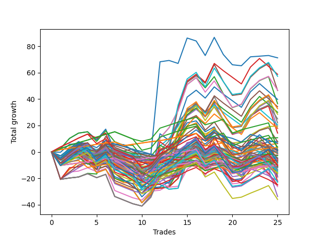

# Long Wallace Doodle 014 
- Symbol: ES
- Date Range: 3/19/22 - 5/22/22
- Trading Period: 7:20-12:30
- Number of Trades: 20



| Name | Win Percent | Profit | Avg Profit / Trade |     | Name | Win Percent | Profit | Avg Profit / Trade |
| ---- | ----------- | ------ | ------------------ | --- | ---- | ----------- | ------ | ------------------ |
| Sorted By <br> Profit | | | | | Sorted By <br> Win Percentage ||||
| Forty-Five | 45.00 | 29625.00 | 1481.25 |     | Seventy-Five | 65.00 | -875.00 | -43.75 |
| Sixty-One | 55.00 | 23125.00 | 1156.25 |     | Seventy-Four | 65.00 | -875.00 | -43.75 |
| Five | 55.00 | 22750.00 | 1137.50 |     | Seventy-Three | 65.00 | -875.00 | -43.75 |
| Forty-Two | 45.00 | 20625.00 | 1031.25 |     | Fifty-Eight | 60.00 | 20125.00 | 1006.25 |
| Fifty-Eight | 60.00 | 20125.00 | 1006.25 |     | Two | 60.00 | 20000.00 | 1000.00 |
| Two | 60.00 | 20000.00 | 1000.00 |     | One | 60.00 | 11000.00 | 550.00 |
| Forty-Seven | 45.00 | 16000.00 | 800.00 |     | Fifty-Nine | 60.00 | 7250.00 | 362.50 |
| Forty-One | 50.00 | 14875.00 | 743.75 |     | Three | 60.00 | 6875.00 | 343.75 |
| Seventy-Two | 45.00 | 14125.00 | 706.25 |     | Sixty-One | 55.00 | 23125.00 | 1156.25 |
| Forty-Four | 45.00 | 13750.00 | 687.50 |     | Five | 55.00 | 22750.00 | 1137.50 |
| Sixty | 55.00 | 13250.00 | 662.50 |     | Sixty | 55.00 | 13250.00 | 662.50 |
| Four | 55.00 | 12875.00 | 643.75 |     | Four | 55.00 | 12875.00 | 643.75 |
| One | 60.00 | 11000.00 | 550.00 |     | Sixty-Three | 55.00 | 9500.00 | 475.00 |
| Sixty-Three | 55.00 | 9500.00 | 475.00 |     | Seven | 55.00 | 9125.00 | 456.25 |
| Seven | 55.00 | 9125.00 | 456.25 |     | Sixty-Four | 55.00 | 4500.00 | 225.00 |
| Forty-Three | 45.00 | 8875.00 | 443.75 |     | Fifty-Seven | 55.00 | 3750.00 | 187.50 |
| Fifty-Nine | 60.00 | 7250.00 | 362.50 |     | Zero | 55.00 | 125.00 | 6.25 |
| Three | 60.00 | 6875.00 | 343.75 |     | Sixty-Two | 55.00 | -10625.00 | -531.25 |
| Forty | 45.00 | 6125.00 | 306.25 |     | Six | 55.00 | -11000.00 | -550.00 |
| Eight | 30.00 | 6000.00 | 300.00 |     | Forty-One | 50.00 | 14875.00 | 743.75 |
| Ten | 25.00 | 5375.00 | 268.75 |     | Sixty-Six | 50.00 | -4250.00 | -212.50 |
| Sixty-Four | 55.00 | 4500.00 | 225.00 |     | Sixty-Seven | 50.00 | -6250.00 | -312.50 |
| Nine | 25.00 | 4500.00 | 225.00 |     | Seventy | 50.00 | -6625.00 | -331.25 |
| Fourteen | 35.00 | 3875.00 | 193.75 |     | Sixty-Five | 50.00 | -6625.00 | -331.25 |
| Fifty-Seven | 55.00 | 3750.00 | 187.50 |     | Fifty-Six | 50.00 | -6750.00 | -337.50 |
| Twenty-Four | 35.00 | 3500.00 | 175.00 |     | Forty-Five | 45.00 | 29625.00 | 1481.25 |
| Fifteen | 25.00 | 3500.00 | 175.00 |     | Forty-Two | 45.00 | 20625.00 | 1031.25 |
| Thirty-Seven | 40.00 | 3125.00 | 156.25 |     | Forty-Seven | 45.00 | 16000.00 | 800.00 |
| Thirteen | 25.00 | 2625.00 | 131.25 |     | Seventy-Two | 45.00 | 14125.00 | 706.25 |
| Fifty-Five | 45.00 | 2000.00 | 100.00 |     | Forty-Four | 45.00 | 13750.00 | 687.50 |
| Thirty-Nine | 40.00 | 1750.00 | 87.50 |     | Forty-Three | 45.00 | 8875.00 | 443.75 |
| Eleven | 25.00 | 1375.00 | 68.75 |     | Forty | 45.00 | 6125.00 | 306.25 |
| Fifty-Three | 45.00 | 1125.00 | 56.25 |     | Fifty-Five | 45.00 | 2000.00 | 100.00 |
| Thirty-Six | 40.00 | 1125.00 | 56.25 |     | Fifty-Three | 45.00 | 1125.00 | 56.25 |
| Thirty-Two | 40.00 | 1000.00 | 50.00 |     | Forty-Eight | 45.00 | 125.00 | 6.25 |
| Thirty-Three | 40.00 | 375.00 | 18.75 |     | Fifty | 45.00 | -1625.00 | -81.25 |
| Zero | 55.00 | 125.00 | 6.25 |     | Forty-Nine | 45.00 | -2250.00 | -112.50 |
| Forty-Eight | 45.00 | 125.00 | 6.25 |     | Forty-Six | 45.00 | -4125.00 | -206.25 |
| Thirty-Four | 40.00 | 0.00 | 0.00 |     | Fifty-Two | 45.00 | -4375.00 | -218.75 |
| Thirty-Five | 40.00 | -625.00 | -31.25 |     | Fifty-Four | 45.00 | -5500.00 | -275.00 |
| Seventy-Five | 65.00 | -875.00 | -43.75 |     | Seventy-One | 45.00 | -6500.00 | -325.00 |
| Seventy-Four | 65.00 | -875.00 | -43.75 |     | Fifty-One | 45.00 | -7250.00 | -362.50 |
| Seventy-Three | 65.00 | -875.00 | -43.75 |     | Sixty-Nine | 45.00 | -7375.00 | -368.75 |
| Thirty-Eight | 40.00 | -1500.00 | -75.00 |     | Sixty-Eight | 45.00 | -12125.00 | -606.25 |
| Fifty | 45.00 | -1625.00 | -81.25 |     | Thirty-Seven | 40.00 | 3125.00 | 156.25 |
| Forty-Nine | 45.00 | -2250.00 | -112.50 |     | Thirty-Nine | 40.00 | 1750.00 | 87.50 |
| Twenty-Six | 25.00 | -2500.00 | -125.00 |     | Thirty-Six | 40.00 | 1125.00 | 56.25 |
| Twelve | 25.00 | -2875.00 | -143.75 |     | Thirty-Two | 40.00 | 1000.00 | 50.00 |
| Thirty | 35.00 | -3000.00 | -150.00 |     | Thirty-Three | 40.00 | 375.00 | 18.75 |
| Twenty-Five | 25.00 | -3375.00 | -168.75 |     | Thirty-Four | 40.00 | 0.00 | 0.00 |
| Forty-Six | 45.00 | -4125.00 | -206.25 |     | Thirty-Five | 40.00 | -625.00 | -31.25 |
| Sixty-Six | 50.00 | -4250.00 | -212.50 |     | Thirty-Eight | 40.00 | -1500.00 | -75.00 |
| Fifty-Two | 45.00 | -4375.00 | -218.75 |     | Twenty-Two | 40.00 | -5125.00 | -256.25 |
| Thirty-One | 25.00 | -4375.00 | -218.75 |     | Twenty-Three | 40.00 | -5375.00 | -268.75 |
| Twenty-Two | 40.00 | -5125.00 | -256.25 |     | Twenty-One | 40.00 | -5375.00 | -268.75 |
| Twenty-Nine | 25.00 | -5250.00 | -262.50 |     | Twenty | 40.00 | -5375.00 | -268.75 |
| Twenty-Three | 40.00 | -5375.00 | -268.75 |     | Nineteen | 40.00 | -5375.00 | -268.75 |
| Twenty-One | 40.00 | -5375.00 | -268.75 |     | Eighteen | 40.00 | -5375.00 | -268.75 |
| Twenty | 40.00 | -5375.00 | -268.75 |     | Seventeen | 40.00 | -5375.00 | -268.75 |
| Nineteen | 40.00 | -5375.00 | -268.75 |     | Sixten | 40.00 | -5375.00 | -268.75 |
| Eighteen | 40.00 | -5375.00 | -268.75 |     | Fourteen | 35.00 | 3875.00 | 193.75 |
| Seventeen | 40.00 | -5375.00 | -268.75 |     | Twenty-Four | 35.00 | 3500.00 | 175.00 |
| Sixten | 40.00 | -5375.00 | -268.75 |     | Thirty | 35.00 | -3000.00 | -150.00 |
| Fifty-Four | 45.00 | -5500.00 | -275.00 |     | Eight | 30.00 | 6000.00 | 300.00 |
| Sixty-Seven | 50.00 | -6250.00 | -312.50 |     | Ten | 25.00 | 5375.00 | 268.75 |
| Seventy-One | 45.00 | -6500.00 | -325.00 |     | Nine | 25.00 | 4500.00 | 225.00 |
| twenty-Seven | 25.00 | -6500.00 | -325.00 |     | Fifteen | 25.00 | 3500.00 | 175.00 |
| Seventy | 50.00 | -6625.00 | -331.25 |     | Thirteen | 25.00 | 2625.00 | 131.25 |
| Sixty-Five | 50.00 | -6625.00 | -331.25 |     | Eleven | 25.00 | 1375.00 | 68.75 |
| Fifty-Six | 50.00 | -6750.00 | -337.50 |     | Twenty-Six | 25.00 | -2500.00 | -125.00 |
| Fifty-One | 45.00 | -7250.00 | -362.50 |     | Twelve | 25.00 | -2875.00 | -143.75 |
| Sixty-Nine | 45.00 | -7375.00 | -368.75 |     | Twenty-Five | 25.00 | -3375.00 | -168.75 |
| Sixty-Two | 55.00 | -10625.00 | -531.25 |     | Thirty-One | 25.00 | -4375.00 | -218.75 |
| Twenty-Eight | 25.00 | -10750.00 | -537.50 |     | Twenty-Nine | 25.00 | -5250.00 | -262.50 |
| Six | 55.00 | -11000.00 | -550.00 |     | twenty-Seven | 25.00 | -6500.00 | -325.00 |
| Sixty-Eight | 45.00 | -12125.00 | -606.25 |     | Twenty-Eight | 25.00 | -10750.00 | -537.50 |

## NO STOPLOSS

### Test Zero
* Sell when price hits the middle line of the 20p bollinger
* No Stoploss
* Results:
```
Total Trades: 20
Percent Up: 55.00
Percent Down: 45.00
Total Points Moved Up: 0.25
Potential Profit: 125.00
Total Points Ups: 63.50 Count Ups: 11
Total Points Downs: -63.25 Count Downs: 9
```

<details><summary>Trades</summary>

<code>In: 2022-03-21 09:35:00		Out: 2022-03-21 09:45:00		Total Position Time: 10:00		Total Move Up: 2.50		Total to Date: 2.50</code> <br />
<code>In: 2022-03-23 09:14:00		Out: 2022-03-23 09:19:25		Total Position Time: 05:25		Total Move Up: 7.50		Total to Date: 10.00</code> <br />
<code>In: 2022-03-23 09:47:00		Out: 2022-03-23 09:53:00		Total Position Time: 06:00		Total Move Up: 4.25		Total to Date: 14.25</code> <br />
<code>In: 2022-03-23 10:28:00		Out: 2022-03-23 10:37:45		Total Position Time: 09:45		Total Move Up: 1.00		Total to Date: 15.25</code> <br />
<code>In: 2022-03-25 08:14:00		Out: 2022-03-25 08:36:40		Total Position Time: 22:40		Total Move Up: -6.00		Total to Date: 9.25</code> <br />
<code>In: 2022-03-25 08:29:00		Out: 2022-03-25 08:36:40		Total Position Time: 07:40		Total Move Up: 8.00		Total to Date: 17.25</code> <br />
<code>In: 2022-03-28 08:27:00		Out: 2022-03-28 08:56:55		Total Position Time: 29:55		Total Move Up: -16.75		Total to Date: 0.50</code> <br />
<code>In: 2022-03-31 09:16:00		Out: 2022-03-31 09:32:20		Total Position Time: 16:20		Total Move Up: -3.00		Total to Date: -2.50</code> <br />
<code>In: 2022-03-31 09:23:00		Out: 2022-03-31 09:32:20		Total Position Time: 09:20		Total Move Up: -0.25		Total to Date: -2.75</code> <br />
<code>In: 2022-04-18 08:29:00		Out: 2022-04-18 08:54:55		Total Position Time: 25:55		Total Move Up: -5.00		Total to Date: -7.75</code> <br />
<code>In: 2022-04-20 09:14:00		Out: 2022-04-20 09:30:45		Total Position Time: 16:45		Total Move Up: -0.50		Total to Date: -8.25</code> <br />
<code>In: 2022-05-04 11:36:00		Out: 2022-05-04 11:36:40		Total Position Time: 00:40		Total Move Up: 8.25		Total to Date: 0.00</code> <br />
<code>In: 2022-05-13 11:07:00		Out: 2022-05-13 11:12:25		Total Position Time: 05:25		Total Move Up: 6.50		Total to Date: 6.50</code> <br />
<code>In: 2022-05-17 11:24:00		Out: 2022-05-17 11:27:25		Total Position Time: 03:25		Total Move Up: 11.25		Total to Date: 17.75</code> <br />
<code>In: 2022-05-19 10:51:00		Out: 2022-05-19 10:52:45		Total Position Time: 01:45		Total Move Up: 8.50		Total to Date: 26.25</code> <br />
<code>In: 2022-05-25 09:29:00		Out: 2022-05-25 09:38:50		Total Position Time: 09:50		Total Move Up: 2.00		Total to Date: 28.25</code> <br />
<code>In: 2022-06-06 08:15:00		Out: 2022-06-06 08:31:35		Total Position Time: 16:35		Total Move Up: -8.25		Total to Date: 20.00</code> <br />
<code>In: 2022-06-08 08:05:00		Out: 2022-06-08 08:10:40		Total Position Time: 05:40		Total Move Up: 3.75		Total to Date: 23.75</code> <br />
<code>In: 2022-06-08 09:29:00		Out: 2022-06-08 09:53:00		Total Position Time: 24:00		Total Move Up: -13.00		Total to Date: 10.75</code> <br />
<code>In: 2022-06-15 07:35:00		Out: 2022-06-15 08:04:55		Total Position Time: 29:55		Total Move Up: -10.50		Total to Date: 0.25</code> <br />


</details>

### Test One
* Sell when the price hits the upper line of the 20p 1std bollinger
* No Stoploss
* Results:
```
Total Trades: 20
Percent Up: 60.00
Percent Down: 40.00
Total Points Moved Up: 22.00
Potential Profit: 11000.00
Total Points Ups: 83.50 Count Ups: 12
Total Points Downs: -61.50 Count Downs: 8
```

<details><summary>Trades</summary>

<code>In: 2022-03-21 09:35:00		Out: 2022-03-21 09:49:05		Total Position Time: 14:05		Total Move Up: 1.50		Total to Date: 1.50</code> <br />
<code>In: 2022-03-23 09:14:00		Out: 2022-03-23 09:30:25		Total Position Time: 16:25		Total Move Up: 8.00		Total to Date: 9.50</code> <br />
<code>In: 2022-03-23 09:47:00		Out: 2022-03-23 09:59:10		Total Position Time: 12:10		Total Move Up: 5.25		Total to Date: 14.75</code> <br />
<code>In: 2022-03-23 10:28:00		Out: 2022-03-23 10:51:50		Total Position Time: 23:50		Total Move Up: 0.25		Total to Date: 15.00</code> <br />
<code>In: 2022-03-25 08:14:00		Out: 2022-03-25 08:40:40		Total Position Time: 26:40		Total Move Up: -5.00		Total to Date: 10.00</code> <br />
<code>In: 2022-03-25 08:29:00		Out: 2022-03-25 08:40:40		Total Position Time: 11:40		Total Move Up: 9.00		Total to Date: 19.00</code> <br />
<code>In: 2022-03-28 08:27:00		Out: 2022-03-28 08:56:55		Total Position Time: 29:55		Total Move Up: -16.75		Total to Date: 2.25</code> <br />
<code>In: 2022-03-31 09:16:00		Out: 2022-03-31 09:40:45		Total Position Time: 24:45		Total Move Up: -3.25		Total to Date: -1.00</code> <br />
<code>In: 2022-03-31 09:23:00		Out: 2022-03-31 09:40:45		Total Position Time: 17:45		Total Move Up: -0.50		Total to Date: -1.50</code> <br />
<code>In: 2022-04-18 08:29:00		Out: 2022-04-18 08:57:20		Total Position Time: 28:20		Total Move Up: -3.00		Total to Date: -4.50</code> <br />
<code>In: 2022-04-20 09:14:00		Out: 2022-04-20 09:30:55		Total Position Time: 16:55		Total Move Up: 0.75		Total to Date: -3.75</code> <br />
<code>In: 2022-05-04 11:36:00		Out: 2022-05-04 11:42:00		Total Position Time: 06:00		Total Move Up: 21.25		Total to Date: 17.50</code> <br />
<code>In: 2022-05-13 11:07:00		Out: 2022-05-13 11:19:50		Total Position Time: 12:50		Total Move Up: 5.00		Total to Date: 22.50</code> <br />
<code>In: 2022-05-17 11:24:00		Out: 2022-05-17 11:37:35		Total Position Time: 13:35		Total Move Up: 9.25		Total to Date: 31.75</code> <br />
<code>In: 2022-05-19 10:51:00		Out: 2022-05-19 10:54:35		Total Position Time: 03:35		Total Move Up: 14.00		Total to Date: 45.75</code> <br />
<code>In: 2022-05-25 09:29:00		Out: 2022-05-25 09:44:25		Total Position Time: 15:25		Total Move Up: 3.00		Total to Date: 48.75</code> <br />
<code>In: 2022-06-06 08:15:00		Out: 2022-06-06 08:39:15		Total Position Time: 24:15		Total Move Up: -10.00		Total to Date: 38.75</code> <br />
<code>In: 2022-06-08 08:05:00		Out: 2022-06-08 08:11:15		Total Position Time: 06:15		Total Move Up: 6.25		Total to Date: 45.00</code> <br />
<code>In: 2022-06-08 09:29:00		Out: 2022-06-08 09:57:10		Total Position Time: 28:10		Total Move Up: -12.50		Total to Date: 32.50</code> <br />
<code>In: 2022-06-15 07:35:00		Out: 2022-06-15 08:04:55		Total Position Time: 29:55		Total Move Up: -10.50		Total to Date: 22.00</code> <br />


</details>

### Test Two
* Sell when the price hits the upper line of the 20p 2std bollinger
* No Stoploss
* Results:
```
Total Trades: 20
Percent Up: 60.00
Percent Down: 40.00
Total Points Moved Up: 40.00
Potential Profit: 20000.00
Total Points Ups: 112.75 Count Ups: 12
Total Points Downs: -72.75 Count Downs: 8
```

<details><summary>Trades</summary>

<code>In: 2022-03-21 09:35:00		Out: 2022-03-21 10:04:55		Total Position Time: 29:55		Total Move Up: -20.75		Total to Date: -20.75</code> <br />
<code>In: 2022-03-23 09:14:00		Out: 2022-03-23 09:43:55		Total Position Time: 29:55		Total Move Up: 1.00		Total to Date: -19.75</code> <br />
<code>In: 2022-03-23 09:47:00		Out: 2022-03-23 10:16:55		Total Position Time: 29:55		Total Move Up: 0.75		Total to Date: -19.00</code> <br />
<code>In: 2022-03-23 10:28:00		Out: 2022-03-23 10:54:50		Total Position Time: 26:50		Total Move Up: 3.00		Total to Date: -16.00</code> <br />
<code>In: 2022-03-25 08:14:00		Out: 2022-03-25 08:41:55		Total Position Time: 27:55		Total Move Up: -0.50		Total to Date: -16.50</code> <br />
<code>In: 2022-03-25 08:29:00		Out: 2022-03-25 08:41:55		Total Position Time: 12:55		Total Move Up: 13.50		Total to Date: -3.00</code> <br />
<code>In: 2022-03-28 08:27:00		Out: 2022-03-28 08:56:55		Total Position Time: 29:55		Total Move Up: -16.75		Total to Date: -19.75</code> <br />
<code>In: 2022-03-31 09:16:00		Out: 2022-03-31 09:44:50		Total Position Time: 28:50		Total Move Up: -1.75		Total to Date: -21.50</code> <br />
<code>In: 2022-03-31 09:23:00		Out: 2022-03-31 09:44:50		Total Position Time: 21:50		Total Move Up: 1.00		Total to Date: -20.50</code> <br />
<code>In: 2022-04-18 08:29:00		Out: 2022-04-18 08:58:55		Total Position Time: 29:55		Total Move Up: -1.75		Total to Date: -22.25</code> <br />
<code>In: 2022-04-20 09:14:00		Out: 2022-04-20 09:31:25		Total Position Time: 17:25		Total Move Up: 1.75		Total to Date: -20.50</code> <br />
<code>In: 2022-05-04 11:36:00		Out: 2022-05-04 11:43:55		Total Position Time: 07:55		Total Move Up: 32.25		Total to Date: 11.75</code> <br />
<code>In: 2022-05-13 11:07:00		Out: 2022-05-13 11:31:30		Total Position Time: 24:30		Total Move Up: 10.50		Total to Date: 22.25</code> <br />
<code>In: 2022-05-17 11:24:00		Out: 2022-05-17 11:40:00		Total Position Time: 16:00		Total Move Up: 13.00		Total to Date: 35.25</code> <br />
<code>In: 2022-05-19 10:51:00		Out: 2022-05-19 10:55:20		Total Position Time: 04:20		Total Move Up: 20.50		Total to Date: 55.75</code> <br />
<code>In: 2022-05-25 09:29:00		Out: 2022-05-25 09:48:50		Total Position Time: 19:50		Total Move Up: 7.00		Total to Date: 62.75</code> <br />
<code>In: 2022-06-06 08:15:00		Out: 2022-06-06 08:43:00		Total Position Time: 28:00		Total Move Up: -7.75		Total to Date: 55.00</code> <br />
<code>In: 2022-06-08 08:05:00		Out: 2022-06-08 08:14:00		Total Position Time: 09:00		Total Move Up: 8.50		Total to Date: 63.50</code> <br />
<code>In: 2022-06-08 09:29:00		Out: 2022-06-08 09:58:55		Total Position Time: 29:55		Total Move Up: -13.00		Total to Date: 50.50</code> <br />
<code>In: 2022-06-15 07:35:00		Out: 2022-06-15 08:04:55		Total Position Time: 29:55		Total Move Up: -10.50		Total to Date: 40.00</code> <br />


</details>

### Test Three
* Sell when price hits the middle line of the 50p bollinger
* No Stoploss
* Results:
```
Total Trades: 20
Percent Up: 60.00
Percent Down: 40.00
Total Points Moved Up: 13.75
Potential Profit: 6875.00
Total Points Ups: 86.75 Count Ups: 12
Total Points Downs: -73.00 Count Downs: 8
```

<details><summary>Trades</summary>

<code>In: 2022-03-21 09:35:00		Out: 2022-03-21 10:04:55		Total Position Time: 29:55		Total Move Up: -20.75		Total to Date: -20.75</code> <br />
<code>In: 2022-03-23 09:14:00		Out: 2022-03-23 09:30:30		Total Position Time: 16:30		Total Move Up: 8.75		Total to Date: -12.00</code> <br />
<code>In: 2022-03-23 09:47:00		Out: 2022-03-23 10:16:55		Total Position Time: 29:55		Total Move Up: 0.75		Total to Date: -11.25</code> <br />
<code>In: 2022-03-23 10:28:00		Out: 2022-03-23 10:54:50		Total Position Time: 26:50		Total Move Up: 3.00		Total to Date: -8.25</code> <br />
<code>In: 2022-03-25 08:14:00		Out: 2022-03-25 08:43:55		Total Position Time: 29:55		Total Move Up: -3.00		Total to Date: -11.25</code> <br />
<code>In: 2022-03-25 08:29:00		Out: 2022-03-25 08:52:45		Total Position Time: 23:45		Total Move Up: 12.50		Total to Date: 1.25</code> <br />
<code>In: 2022-03-28 08:27:00		Out: 2022-03-28 08:56:55		Total Position Time: 29:55		Total Move Up: -16.75		Total to Date: -15.50</code> <br />
<code>In: 2022-03-31 09:16:00		Out: 2022-03-31 09:45:35		Total Position Time: 29:35		Total Move Up: -1.50		Total to Date: -17.00</code> <br />
<code>In: 2022-03-31 09:23:00		Out: 2022-03-31 09:45:35		Total Position Time: 22:35		Total Move Up: 1.25		Total to Date: -15.75</code> <br />
<code>In: 2022-04-18 08:29:00		Out: 2022-04-18 08:58:55		Total Position Time: 29:55		Total Move Up: -1.75		Total to Date: -17.50</code> <br />
<code>In: 2022-04-20 09:14:00		Out: 2022-04-20 09:32:40		Total Position Time: 18:40		Total Move Up: 4.50		Total to Date: -13.00</code> <br />
<code>In: 2022-05-04 11:36:00		Out: 2022-05-04 11:41:15		Total Position Time: 05:15		Total Move Up: 11.75		Total to Date: -1.25</code> <br />
<code>In: 2022-05-13 11:07:00		Out: 2022-05-13 11:31:20		Total Position Time: 24:20		Total Move Up: 7.75		Total to Date: 6.50</code> <br />
<code>In: 2022-05-17 11:24:00		Out: 2022-05-17 11:40:05		Total Position Time: 16:05		Total Move Up: 14.50		Total to Date: 21.00</code> <br />
<code>In: 2022-05-19 10:51:00		Out: 2022-05-19 10:52:40		Total Position Time: 01:40		Total Move Up: 7.00		Total to Date: 28.00</code> <br />
<code>In: 2022-05-25 09:29:00		Out: 2022-05-25 09:49:05		Total Position Time: 20:05		Total Move Up: 7.75		Total to Date: 35.75</code> <br />
<code>In: 2022-06-06 08:15:00		Out: 2022-06-06 08:44:55		Total Position Time: 29:55		Total Move Up: -5.75		Total to Date: 30.00</code> <br />
<code>In: 2022-06-08 08:05:00		Out: 2022-06-08 08:11:20		Total Position Time: 06:20		Total Move Up: 7.25		Total to Date: 37.25</code> <br />
<code>In: 2022-06-08 09:29:00		Out: 2022-06-08 09:58:55		Total Position Time: 29:55		Total Move Up: -13.00		Total to Date: 24.25</code> <br />
<code>In: 2022-06-15 07:35:00		Out: 2022-06-15 08:04:55		Total Position Time: 29:55		Total Move Up: -10.50		Total to Date: 13.75</code> <br />


</details>

### Test Four
* Sell when the price hits the upper line of the 50p 1std bollinger
* No Stoploss
* Results:
```
Total Trades: 20
Percent Up: 55.00
Percent Down: 45.00
Total Points Moved Up: 25.75
Potential Profit: 12875.00
Total Points Ups: 102.75 Count Ups: 11
Total Points Downs: -77.00 Count Downs: 9
```

<details><summary>Trades</summary>

<code>In: 2022-03-21 09:35:00		Out: 2022-03-21 10:04:55		Total Position Time: 29:55		Total Move Up: -20.75		Total to Date: -20.75</code> <br />
<code>In: 2022-03-23 09:14:00		Out: 2022-03-23 09:43:55		Total Position Time: 29:55		Total Move Up: 1.00		Total to Date: -19.75</code> <br />
<code>In: 2022-03-23 09:47:00		Out: 2022-03-23 10:16:55		Total Position Time: 29:55		Total Move Up: 0.75		Total to Date: -19.00</code> <br />
<code>In: 2022-03-23 10:28:00		Out: 2022-03-23 10:57:55		Total Position Time: 29:55		Total Move Up: 2.50		Total to Date: -16.50</code> <br />
<code>In: 2022-03-25 08:14:00		Out: 2022-03-25 08:43:55		Total Position Time: 29:55		Total Move Up: -3.00		Total to Date: -19.50</code> <br />
<code>In: 2022-03-25 08:29:00		Out: 2022-03-25 08:58:55		Total Position Time: 29:55		Total Move Up: 2.50		Total to Date: -17.00</code> <br />
<code>In: 2022-03-28 08:27:00		Out: 2022-03-28 08:56:55		Total Position Time: 29:55		Total Move Up: -16.75		Total to Date: -33.75</code> <br />
<code>In: 2022-03-31 09:16:00		Out: 2022-03-31 09:45:55		Total Position Time: 29:55		Total Move Up: -2.75		Total to Date: -36.50</code> <br />
<code>In: 2022-03-31 09:23:00		Out: 2022-03-31 09:52:55		Total Position Time: 29:55		Total Move Up: -2.75		Total to Date: -39.25</code> <br />
<code>In: 2022-04-18 08:29:00		Out: 2022-04-18 08:58:55		Total Position Time: 29:55		Total Move Up: -1.75		Total to Date: -41.00</code> <br />
<code>In: 2022-04-20 09:14:00		Out: 2022-04-20 09:36:45		Total Position Time: 22:45		Total Move Up: 8.25		Total to Date: -32.75</code> <br />
<code>In: 2022-05-04 11:36:00		Out: 2022-05-04 11:42:00		Total Position Time: 06:00		Total Move Up: 21.25		Total to Date: -11.50</code> <br />
<code>In: 2022-05-13 11:07:00		Out: 2022-05-13 11:32:00		Total Position Time: 25:00		Total Move Up: 15.75		Total to Date: 4.25</code> <br />
<code>In: 2022-05-17 11:24:00		Out: 2022-05-17 11:45:45		Total Position Time: 21:45		Total Move Up: 22.25		Total to Date: 26.50</code> <br />
<code>In: 2022-05-19 10:51:00		Out: 2022-05-19 10:54:25		Total Position Time: 03:25		Total Move Up: 12.75		Total to Date: 39.25</code> <br />
<code>In: 2022-05-25 09:29:00		Out: 2022-05-25 09:58:55		Total Position Time: 29:55		Total Move Up: 5.00		Total to Date: 44.25</code> <br />
<code>In: 2022-06-06 08:15:00		Out: 2022-06-06 08:44:55		Total Position Time: 29:55		Total Move Up: -5.75		Total to Date: 38.50</code> <br />
<code>In: 2022-06-08 08:05:00		Out: 2022-06-08 08:15:05		Total Position Time: 10:05		Total Move Up: 10.75		Total to Date: 49.25</code> <br />
<code>In: 2022-06-08 09:29:00		Out: 2022-06-08 09:58:55		Total Position Time: 29:55		Total Move Up: -13.00		Total to Date: 36.25</code> <br />
<code>In: 2022-06-15 07:35:00		Out: 2022-06-15 08:04:55		Total Position Time: 29:55		Total Move Up: -10.50		Total to Date: 25.75</code> <br />


</details>

### Test Five
* Sell when the price hits the upper line of the 50p 2std bollinger
* No Stoploss
* Results:
```
Total Trades: 20
Percent Up: 55.00
Percent Down: 45.00
Total Points Moved Up: 45.50
Potential Profit: 22750.00
Total Points Ups: 122.50 Count Ups: 11
Total Points Downs: -77.00 Count Downs: 9
```

<details><summary>Trades</summary>

<code>In: 2022-03-21 09:35:00		Out: 2022-03-21 10:04:55		Total Position Time: 29:55		Total Move Up: -20.75		Total to Date: -20.75</code> <br />
<code>In: 2022-03-23 09:14:00		Out: 2022-03-23 09:43:55		Total Position Time: 29:55		Total Move Up: 1.00		Total to Date: -19.75</code> <br />
<code>In: 2022-03-23 09:47:00		Out: 2022-03-23 10:16:55		Total Position Time: 29:55		Total Move Up: 0.75		Total to Date: -19.00</code> <br />
<code>In: 2022-03-23 10:28:00		Out: 2022-03-23 10:57:55		Total Position Time: 29:55		Total Move Up: 2.50		Total to Date: -16.50</code> <br />
<code>In: 2022-03-25 08:14:00		Out: 2022-03-25 08:43:55		Total Position Time: 29:55		Total Move Up: -3.00		Total to Date: -19.50</code> <br />
<code>In: 2022-03-25 08:29:00		Out: 2022-03-25 08:58:55		Total Position Time: 29:55		Total Move Up: 2.50		Total to Date: -17.00</code> <br />
<code>In: 2022-03-28 08:27:00		Out: 2022-03-28 08:56:55		Total Position Time: 29:55		Total Move Up: -16.75		Total to Date: -33.75</code> <br />
<code>In: 2022-03-31 09:16:00		Out: 2022-03-31 09:45:55		Total Position Time: 29:55		Total Move Up: -2.75		Total to Date: -36.50</code> <br />
<code>In: 2022-03-31 09:23:00		Out: 2022-03-31 09:52:55		Total Position Time: 29:55		Total Move Up: -2.75		Total to Date: -39.25</code> <br />
<code>In: 2022-04-18 08:29:00		Out: 2022-04-18 08:58:55		Total Position Time: 29:55		Total Move Up: -1.75		Total to Date: -41.00</code> <br />
<code>In: 2022-04-20 09:14:00		Out: 2022-04-20 09:43:55		Total Position Time: 29:55		Total Move Up: 6.75		Total to Date: -34.25</code> <br />
<code>In: 2022-05-04 11:36:00		Out: 2022-05-04 11:43:55		Total Position Time: 07:55		Total Move Up: 32.25		Total to Date: -2.00</code> <br />
<code>In: 2022-05-13 11:07:00		Out: 2022-05-13 11:36:55		Total Position Time: 29:55		Total Move Up: 3.75		Total to Date: 1.75</code> <br />
<code>In: 2022-05-17 11:24:00		Out: 2022-05-17 11:49:45		Total Position Time: 25:45		Total Move Up: 33.50		Total to Date: 35.25</code> <br />
<code>In: 2022-05-19 10:51:00		Out: 2022-05-19 10:55:15		Total Position Time: 04:15		Total Move Up: 19.75		Total to Date: 55.00</code> <br />
<code>In: 2022-05-25 09:29:00		Out: 2022-05-25 09:58:55		Total Position Time: 29:55		Total Move Up: 5.00		Total to Date: 60.00</code> <br />
<code>In: 2022-06-06 08:15:00		Out: 2022-06-06 08:44:55		Total Position Time: 29:55		Total Move Up: -5.75		Total to Date: 54.25</code> <br />
<code>In: 2022-06-08 08:05:00		Out: 2022-06-08 08:17:50		Total Position Time: 12:50		Total Move Up: 14.75		Total to Date: 69.00</code> <br />
<code>In: 2022-06-08 09:29:00		Out: 2022-06-08 09:58:55		Total Position Time: 29:55		Total Move Up: -13.00		Total to Date: 56.00</code> <br />
<code>In: 2022-06-15 07:35:00		Out: 2022-06-15 08:04:55		Total Position Time: 29:55		Total Move Up: -10.50		Total to Date: 45.50</code> <br />


</details>

### Test Six
* Sell when the price hits the middle line of the 1std VWAP
* No Stoploss
* Results:
```
Total Trades: 20
Percent Up: 55.00
Percent Down: 45.00
Total Points Moved Up: -22.00
Potential Profit: -11000.00
Total Points Ups: 55.00 Count Ups: 11
Total Points Downs: -77.00 Count Downs: 9
```

<details><summary>Trades</summary>

<code>In: 2022-03-21 09:35:00		Out: 2022-03-21 10:04:55		Total Position Time: 29:55		Total Move Up: -20.75		Total to Date: -20.75</code> <br />
<code>In: 2022-03-23 09:14:00		Out: 2022-03-23 09:16:05		Total Position Time: 02:05		Total Move Up: 5.50		Total to Date: -15.25</code> <br />
<code>In: 2022-03-23 09:47:00		Out: 2022-03-23 10:16:55		Total Position Time: 29:55		Total Move Up: 0.75		Total to Date: -14.50</code> <br />
<code>In: 2022-03-23 10:28:00		Out: 2022-03-23 10:57:55		Total Position Time: 29:55		Total Move Up: 2.50		Total to Date: -12.00</code> <br />
<code>In: 2022-03-25 08:14:00		Out: 2022-03-25 08:43:55		Total Position Time: 29:55		Total Move Up: -3.00		Total to Date: -15.00</code> <br />
<code>In: 2022-03-25 08:29:00		Out: 2022-03-25 08:58:55		Total Position Time: 29:55		Total Move Up: 2.50		Total to Date: -12.50</code> <br />
<code>In: 2022-03-28 08:27:00		Out: 2022-03-28 08:56:55		Total Position Time: 29:55		Total Move Up: -16.75		Total to Date: -29.25</code> <br />
<code>In: 2022-03-31 09:16:00		Out: 2022-03-31 09:45:55		Total Position Time: 29:55		Total Move Up: -2.75		Total to Date: -32.00</code> <br />
<code>In: 2022-03-31 09:23:00		Out: 2022-03-31 09:52:55		Total Position Time: 29:55		Total Move Up: -2.75		Total to Date: -34.75</code> <br />
<code>In: 2022-04-18 08:29:00		Out: 2022-04-18 08:58:55		Total Position Time: 29:55		Total Move Up: -1.75		Total to Date: -36.50</code> <br />
<code>In: 2022-04-20 09:14:00		Out: 2022-04-20 09:35:50		Total Position Time: 21:50		Total Move Up: 6.75		Total to Date: -29.75</code> <br />
<code>In: 2022-05-04 11:36:00		Out: 2022-05-04 11:36:10		Total Position Time: 00:10		Total Move Up: 0.75		Total to Date: -29.00</code> <br />
<code>In: 2022-05-13 11:07:00		Out: 2022-05-13 11:36:55		Total Position Time: 29:55		Total Move Up: 3.75		Total to Date: -25.25</code> <br />
<code>In: 2022-05-17 11:24:00		Out: 2022-05-17 11:27:25		Total Position Time: 03:25		Total Move Up: 11.25		Total to Date: -14.00</code> <br />
<code>In: 2022-05-19 10:51:00		Out: 2022-05-19 10:53:25		Total Position Time: 02:25		Total Move Up: 10.50		Total to Date: -3.50</code> <br />
<code>In: 2022-05-25 09:29:00		Out: 2022-05-25 09:58:55		Total Position Time: 29:55		Total Move Up: 5.00		Total to Date: 1.50</code> <br />
<code>In: 2022-06-06 08:15:00		Out: 2022-06-06 08:44:55		Total Position Time: 29:55		Total Move Up: -5.75		Total to Date: -4.25</code> <br />
<code>In: 2022-06-08 08:05:00		Out: 2022-06-08 08:11:05		Total Position Time: 06:05		Total Move Up: 5.75		Total to Date: 1.50</code> <br />
<code>In: 2022-06-08 09:29:00		Out: 2022-06-08 09:58:55		Total Position Time: 29:55		Total Move Up: -13.00		Total to Date: -11.50</code> <br />
<code>In: 2022-06-15 07:35:00		Out: 2022-06-15 08:04:55		Total Position Time: 29:55		Total Move Up: -10.50		Total to Date: -22.00</code> <br />


</details>

### Test Seven
* Sell when the price hits the upper line of the 1std VWAP
* No Stoploss
* Results:
```
Total Trades: 20
Percent Up: 55.00
Percent Down: 45.00
Total Points Moved Up: 18.25
Potential Profit: 9125.00
Total Points Ups: 95.25 Count Ups: 11
Total Points Downs: -77.00 Count Downs: 9
```

<details><summary>Trades</summary>

<code>In: 2022-03-21 09:35:00		Out: 2022-03-21 10:04:55		Total Position Time: 29:55		Total Move Up: -20.75		Total to Date: -20.75</code> <br />
<code>In: 2022-03-23 09:14:00		Out: 2022-03-23 09:43:55		Total Position Time: 29:55		Total Move Up: 1.00		Total to Date: -19.75</code> <br />
<code>In: 2022-03-23 09:47:00		Out: 2022-03-23 10:16:55		Total Position Time: 29:55		Total Move Up: 0.75		Total to Date: -19.00</code> <br />
<code>In: 2022-03-23 10:28:00		Out: 2022-03-23 10:57:55		Total Position Time: 29:55		Total Move Up: 2.50		Total to Date: -16.50</code> <br />
<code>In: 2022-03-25 08:14:00		Out: 2022-03-25 08:43:55		Total Position Time: 29:55		Total Move Up: -3.00		Total to Date: -19.50</code> <br />
<code>In: 2022-03-25 08:29:00		Out: 2022-03-25 08:58:55		Total Position Time: 29:55		Total Move Up: 2.50		Total to Date: -17.00</code> <br />
<code>In: 2022-03-28 08:27:00		Out: 2022-03-28 08:56:55		Total Position Time: 29:55		Total Move Up: -16.75		Total to Date: -33.75</code> <br />
<code>In: 2022-03-31 09:16:00		Out: 2022-03-31 09:45:55		Total Position Time: 29:55		Total Move Up: -2.75		Total to Date: -36.50</code> <br />
<code>In: 2022-03-31 09:23:00		Out: 2022-03-31 09:52:55		Total Position Time: 29:55		Total Move Up: -2.75		Total to Date: -39.25</code> <br />
<code>In: 2022-04-18 08:29:00		Out: 2022-04-18 08:58:55		Total Position Time: 29:55		Total Move Up: -1.75		Total to Date: -41.00</code> <br />
<code>In: 2022-04-20 09:14:00		Out: 2022-04-20 09:43:55		Total Position Time: 29:55		Total Move Up: 6.75		Total to Date: -34.25</code> <br />
<code>In: 2022-05-04 11:36:00		Out: 2022-05-04 11:41:35		Total Position Time: 05:35		Total Move Up: 16.00		Total to Date: -18.25</code> <br />
<code>In: 2022-05-13 11:07:00		Out: 2022-05-13 11:36:55		Total Position Time: 29:55		Total Move Up: 3.75		Total to Date: -14.50</code> <br />
<code>In: 2022-05-17 11:24:00		Out: 2022-05-17 11:40:20		Total Position Time: 16:20		Total Move Up: 20.75		Total to Date: 6.25</code> <br />
<code>In: 2022-05-19 10:51:00		Out: 2022-05-19 10:56:05		Total Position Time: 05:05		Total Move Up: 24.25		Total to Date: 30.50</code> <br />
<code>In: 2022-05-25 09:29:00		Out: 2022-05-25 09:58:55		Total Position Time: 29:55		Total Move Up: 5.00		Total to Date: 35.50</code> <br />
<code>In: 2022-06-06 08:15:00		Out: 2022-06-06 08:44:55		Total Position Time: 29:55		Total Move Up: -5.75		Total to Date: 29.75</code> <br />
<code>In: 2022-06-08 08:05:00		Out: 2022-06-08 08:16:30		Total Position Time: 11:30		Total Move Up: 12.00		Total to Date: 41.75</code> <br />
<code>In: 2022-06-08 09:29:00		Out: 2022-06-08 09:58:55		Total Position Time: 29:55		Total Move Up: -13.00		Total to Date: 28.75</code> <br />
<code>In: 2022-06-15 07:35:00		Out: 2022-06-15 08:04:55		Total Position Time: 29:55		Total Move Up: -10.50		Total to Date: 18.25</code> <br />


</details>

## STOPLOSS OF 2

### Test Eight
* Sell when price hits the middle line of the 20p bollinger
* Stoploss is 2 points
* Results:
```
Total Trades: 20
Percent Up: 30.00
Percent Down: 70.00
Total Points Moved Up: 12.00
Potential Profit: 6000.00
Total Points Ups: 43.25 Count Ups: 6
Total Points Downs: -31.25 Count Downs: 14
```

<details><summary>Trades</summary>

<code>In: 2022-03-21 09:35:00		Out: 2022-03-21 09:35:10		Total Position Time: 00:10		Total Move Up: -3.00		Total to Date: -3.00</code> <br />
<code>In: 2022-03-23 09:14:00		Out: 2022-03-23 09:19:25		Total Position Time: 05:25		Total Move Up: 7.50		Total to Date: 4.50</code> <br />
<code>In: 2022-03-23 09:47:00		Out: 2022-03-23 09:53:00		Total Position Time: 06:00		Total Move Up: 4.25		Total to Date: 8.75</code> <br />
<code>In: 2022-03-23 10:28:00		Out: 2022-03-23 10:28:40		Total Position Time: 00:40		Total Move Up: -2.00		Total to Date: 6.75</code> <br />
<code>In: 2022-03-25 08:14:00		Out: 2022-03-25 08:20:40		Total Position Time: 06:40		Total Move Up: -2.50		Total to Date: 4.25</code> <br />
<code>In: 2022-03-25 08:29:00		Out: 2022-03-25 08:36:40		Total Position Time: 07:40		Total Move Up: 8.00		Total to Date: 12.25</code> <br />
<code>In: 2022-03-28 08:27:00		Out: 2022-03-28 08:32:05		Total Position Time: 05:05		Total Move Up: -2.75		Total to Date: 9.50</code> <br />
<code>In: 2022-03-31 09:16:00		Out: 2022-03-31 09:20:35		Total Position Time: 04:35		Total Move Up: -1.75		Total to Date: 7.75</code> <br />
<code>In: 2022-03-31 09:23:00		Out: 2022-03-31 09:24:55		Total Position Time: 01:55		Total Move Up: -2.25		Total to Date: 5.50</code> <br />
<code>In: 2022-04-18 08:29:00		Out: 2022-04-18 08:33:05		Total Position Time: 04:05		Total Move Up: -1.75		Total to Date: 3.75</code> <br />
<code>In: 2022-04-20 09:14:00		Out: 2022-04-20 09:15:35		Total Position Time: 01:35		Total Move Up: -2.00		Total to Date: 1.75</code> <br />
<code>In: 2022-05-04 11:36:00		Out: 2022-05-04 11:36:15		Total Position Time: 00:15		Total Move Up: -2.00		Total to Date: -0.25</code> <br />
<code>In: 2022-05-13 11:07:00		Out: 2022-05-13 11:08:10		Total Position Time: 01:10		Total Move Up: -2.75		Total to Date: -3.00</code> <br />
<code>In: 2022-05-17 11:24:00		Out: 2022-05-17 11:27:25		Total Position Time: 03:25		Total Move Up: 11.25		Total to Date: 8.25</code> <br />
<code>In: 2022-05-19 10:51:00		Out: 2022-05-19 10:52:45		Total Position Time: 01:45		Total Move Up: 8.50		Total to Date: 16.75</code> <br />
<code>In: 2022-05-25 09:29:00		Out: 2022-05-25 09:36:05		Total Position Time: 07:05		Total Move Up: -2.25		Total to Date: 14.50</code> <br />
<code>In: 2022-06-06 08:15:00		Out: 2022-06-06 08:16:10		Total Position Time: 01:10		Total Move Up: -2.25		Total to Date: 12.25</code> <br />
<code>In: 2022-06-08 08:05:00		Out: 2022-06-08 08:10:40		Total Position Time: 05:40		Total Move Up: 3.75		Total to Date: 16.00</code> <br />
<code>In: 2022-06-08 09:29:00		Out: 2022-06-08 09:32:25		Total Position Time: 03:25		Total Move Up: -2.25		Total to Date: 13.75</code> <br />
<code>In: 2022-06-15 07:35:00		Out: 2022-06-15 07:35:10		Total Position Time: 00:10		Total Move Up: -1.75		Total to Date: 12.00</code> <br />


</details>

### Test Nine
* Sell when the price hits the upper line of the 20p 1std bollinger
* Stoploss is 2 points
* Results:
```
Total Trades: 20
Percent Up: 25.00
Percent Down: 75.00
Total Points Moved Up: 9.00
Potential Profit: 4500.00
Total Points Ups: 42.50 Count Ups: 5
Total Points Downs: -33.50 Count Downs: 15
```

<details><summary>Trades</summary>

<code>In: 2022-03-21 09:35:00		Out: 2022-03-21 09:35:10		Total Position Time: 00:10		Total Move Up: -3.00		Total to Date: -3.00</code> <br />
<code>In: 2022-03-23 09:14:00		Out: 2022-03-23 09:30:25		Total Position Time: 16:25		Total Move Up: 8.00		Total to Date: 5.00</code> <br />
<code>In: 2022-03-23 09:47:00		Out: 2022-03-23 09:59:10		Total Position Time: 12:10		Total Move Up: 5.25		Total to Date: 10.25</code> <br />
<code>In: 2022-03-23 10:28:00		Out: 2022-03-23 10:28:40		Total Position Time: 00:40		Total Move Up: -2.00		Total to Date: 8.25</code> <br />
<code>In: 2022-03-25 08:14:00		Out: 2022-03-25 08:20:40		Total Position Time: 06:40		Total Move Up: -2.50		Total to Date: 5.75</code> <br />
<code>In: 2022-03-25 08:29:00		Out: 2022-03-25 08:40:40		Total Position Time: 11:40		Total Move Up: 9.00		Total to Date: 14.75</code> <br />
<code>In: 2022-03-28 08:27:00		Out: 2022-03-28 08:32:05		Total Position Time: 05:05		Total Move Up: -2.75		Total to Date: 12.00</code> <br />
<code>In: 2022-03-31 09:16:00		Out: 2022-03-31 09:20:35		Total Position Time: 04:35		Total Move Up: -1.75		Total to Date: 10.25</code> <br />
<code>In: 2022-03-31 09:23:00		Out: 2022-03-31 09:24:55		Total Position Time: 01:55		Total Move Up: -2.25		Total to Date: 8.00</code> <br />
<code>In: 2022-04-18 08:29:00		Out: 2022-04-18 08:33:05		Total Position Time: 04:05		Total Move Up: -1.75		Total to Date: 6.25</code> <br />
<code>In: 2022-04-20 09:14:00		Out: 2022-04-20 09:15:35		Total Position Time: 01:35		Total Move Up: -2.00		Total to Date: 4.25</code> <br />
<code>In: 2022-05-04 11:36:00		Out: 2022-05-04 11:36:15		Total Position Time: 00:15		Total Move Up: -2.00		Total to Date: 2.25</code> <br />
<code>In: 2022-05-13 11:07:00		Out: 2022-05-13 11:08:10		Total Position Time: 01:10		Total Move Up: -2.75		Total to Date: -0.50</code> <br />
<code>In: 2022-05-17 11:24:00		Out: 2022-05-17 11:35:05		Total Position Time: 11:05		Total Move Up: -2.25		Total to Date: -2.75</code> <br />
<code>In: 2022-05-19 10:51:00		Out: 2022-05-19 10:54:35		Total Position Time: 03:35		Total Move Up: 14.00		Total to Date: 11.25</code> <br />
<code>In: 2022-05-25 09:29:00		Out: 2022-05-25 09:36:05		Total Position Time: 07:05		Total Move Up: -2.25		Total to Date: 9.00</code> <br />
<code>In: 2022-06-06 08:15:00		Out: 2022-06-06 08:16:10		Total Position Time: 01:10		Total Move Up: -2.25		Total to Date: 6.75</code> <br />
<code>In: 2022-06-08 08:05:00		Out: 2022-06-08 08:11:15		Total Position Time: 06:15		Total Move Up: 6.25		Total to Date: 13.00</code> <br />
<code>In: 2022-06-08 09:29:00		Out: 2022-06-08 09:32:25		Total Position Time: 03:25		Total Move Up: -2.25		Total to Date: 10.75</code> <br />
<code>In: 2022-06-15 07:35:00		Out: 2022-06-15 07:35:10		Total Position Time: 00:10		Total Move Up: -1.75		Total to Date: 9.00</code> <br />


</details>

### Test Ten
* Sell when the price hits the upper line of the 20p 2std bollinger
* Stoploss is 2 points
* Results:
```
Total Trades: 20
Percent Up: 25.00
Percent Down: 75.00
Total Points Moved Up: 10.75
Potential Profit: 5375.00
Total Points Ups: 44.25 Count Ups: 5
Total Points Downs: -33.50 Count Downs: 15
```

<details><summary>Trades</summary>

<code>In: 2022-03-21 09:35:00		Out: 2022-03-21 09:35:10		Total Position Time: 00:10		Total Move Up: -3.00		Total to Date: -3.00</code> <br />
<code>In: 2022-03-23 09:14:00		Out: 2022-03-23 09:43:55		Total Position Time: 29:55		Total Move Up: 1.00		Total to Date: -2.00</code> <br />
<code>In: 2022-03-23 09:47:00		Out: 2022-03-23 10:16:55		Total Position Time: 29:55		Total Move Up: 0.75		Total to Date: -1.25</code> <br />
<code>In: 2022-03-23 10:28:00		Out: 2022-03-23 10:28:40		Total Position Time: 00:40		Total Move Up: -2.00		Total to Date: -3.25</code> <br />
<code>In: 2022-03-25 08:14:00		Out: 2022-03-25 08:20:40		Total Position Time: 06:40		Total Move Up: -2.50		Total to Date: -5.75</code> <br />
<code>In: 2022-03-25 08:29:00		Out: 2022-03-25 08:41:55		Total Position Time: 12:55		Total Move Up: 13.50		Total to Date: 7.75</code> <br />
<code>In: 2022-03-28 08:27:00		Out: 2022-03-28 08:32:05		Total Position Time: 05:05		Total Move Up: -2.75		Total to Date: 5.00</code> <br />
<code>In: 2022-03-31 09:16:00		Out: 2022-03-31 09:20:35		Total Position Time: 04:35		Total Move Up: -1.75		Total to Date: 3.25</code> <br />
<code>In: 2022-03-31 09:23:00		Out: 2022-03-31 09:24:55		Total Position Time: 01:55		Total Move Up: -2.25		Total to Date: 1.00</code> <br />
<code>In: 2022-04-18 08:29:00		Out: 2022-04-18 08:33:05		Total Position Time: 04:05		Total Move Up: -1.75		Total to Date: -0.75</code> <br />
<code>In: 2022-04-20 09:14:00		Out: 2022-04-20 09:15:35		Total Position Time: 01:35		Total Move Up: -2.00		Total to Date: -2.75</code> <br />
<code>In: 2022-05-04 11:36:00		Out: 2022-05-04 11:36:15		Total Position Time: 00:15		Total Move Up: -2.00		Total to Date: -4.75</code> <br />
<code>In: 2022-05-13 11:07:00		Out: 2022-05-13 11:08:10		Total Position Time: 01:10		Total Move Up: -2.75		Total to Date: -7.50</code> <br />
<code>In: 2022-05-17 11:24:00		Out: 2022-05-17 11:35:05		Total Position Time: 11:05		Total Move Up: -2.25		Total to Date: -9.75</code> <br />
<code>In: 2022-05-19 10:51:00		Out: 2022-05-19 10:55:20		Total Position Time: 04:20		Total Move Up: 20.50		Total to Date: 10.75</code> <br />
<code>In: 2022-05-25 09:29:00		Out: 2022-05-25 09:36:05		Total Position Time: 07:05		Total Move Up: -2.25		Total to Date: 8.50</code> <br />
<code>In: 2022-06-06 08:15:00		Out: 2022-06-06 08:16:10		Total Position Time: 01:10		Total Move Up: -2.25		Total to Date: 6.25</code> <br />
<code>In: 2022-06-08 08:05:00		Out: 2022-06-08 08:14:00		Total Position Time: 09:00		Total Move Up: 8.50		Total to Date: 14.75</code> <br />
<code>In: 2022-06-08 09:29:00		Out: 2022-06-08 09:32:25		Total Position Time: 03:25		Total Move Up: -2.25		Total to Date: 12.50</code> <br />
<code>In: 2022-06-15 07:35:00		Out: 2022-06-15 07:35:10		Total Position Time: 00:10		Total Move Up: -1.75		Total to Date: 10.75</code> <br />


</details>

### Test Eleven
* Sell when price hits the middle line of the 50p bollinger
* Stoploss is 2 points
* Results:
```
Total Trades: 20
Percent Up: 25.00
Percent Down: 75.00
Total Points Moved Up: 2.75
Potential Profit: 1375.00
Total Points Ups: 36.25 Count Ups: 5
Total Points Downs: -33.50 Count Downs: 15
```

<details><summary>Trades</summary>

<code>In: 2022-03-21 09:35:00		Out: 2022-03-21 09:35:10		Total Position Time: 00:10		Total Move Up: -3.00		Total to Date: -3.00</code> <br />
<code>In: 2022-03-23 09:14:00		Out: 2022-03-23 09:30:30		Total Position Time: 16:30		Total Move Up: 8.75		Total to Date: 5.75</code> <br />
<code>In: 2022-03-23 09:47:00		Out: 2022-03-23 10:16:55		Total Position Time: 29:55		Total Move Up: 0.75		Total to Date: 6.50</code> <br />
<code>In: 2022-03-23 10:28:00		Out: 2022-03-23 10:28:40		Total Position Time: 00:40		Total Move Up: -2.00		Total to Date: 4.50</code> <br />
<code>In: 2022-03-25 08:14:00		Out: 2022-03-25 08:20:40		Total Position Time: 06:40		Total Move Up: -2.50		Total to Date: 2.00</code> <br />
<code>In: 2022-03-25 08:29:00		Out: 2022-03-25 08:52:45		Total Position Time: 23:45		Total Move Up: 12.50		Total to Date: 14.50</code> <br />
<code>In: 2022-03-28 08:27:00		Out: 2022-03-28 08:32:05		Total Position Time: 05:05		Total Move Up: -2.75		Total to Date: 11.75</code> <br />
<code>In: 2022-03-31 09:16:00		Out: 2022-03-31 09:20:35		Total Position Time: 04:35		Total Move Up: -1.75		Total to Date: 10.00</code> <br />
<code>In: 2022-03-31 09:23:00		Out: 2022-03-31 09:24:55		Total Position Time: 01:55		Total Move Up: -2.25		Total to Date: 7.75</code> <br />
<code>In: 2022-04-18 08:29:00		Out: 2022-04-18 08:33:05		Total Position Time: 04:05		Total Move Up: -1.75		Total to Date: 6.00</code> <br />
<code>In: 2022-04-20 09:14:00		Out: 2022-04-20 09:15:35		Total Position Time: 01:35		Total Move Up: -2.00		Total to Date: 4.00</code> <br />
<code>In: 2022-05-04 11:36:00		Out: 2022-05-04 11:36:15		Total Position Time: 00:15		Total Move Up: -2.00		Total to Date: 2.00</code> <br />
<code>In: 2022-05-13 11:07:00		Out: 2022-05-13 11:08:10		Total Position Time: 01:10		Total Move Up: -2.75		Total to Date: -0.75</code> <br />
<code>In: 2022-05-17 11:24:00		Out: 2022-05-17 11:35:05		Total Position Time: 11:05		Total Move Up: -2.25		Total to Date: -3.00</code> <br />
<code>In: 2022-05-19 10:51:00		Out: 2022-05-19 10:52:40		Total Position Time: 01:40		Total Move Up: 7.00		Total to Date: 4.00</code> <br />
<code>In: 2022-05-25 09:29:00		Out: 2022-05-25 09:36:05		Total Position Time: 07:05		Total Move Up: -2.25		Total to Date: 1.75</code> <br />
<code>In: 2022-06-06 08:15:00		Out: 2022-06-06 08:16:10		Total Position Time: 01:10		Total Move Up: -2.25		Total to Date: -0.50</code> <br />
<code>In: 2022-06-08 08:05:00		Out: 2022-06-08 08:11:20		Total Position Time: 06:20		Total Move Up: 7.25		Total to Date: 6.75</code> <br />
<code>In: 2022-06-08 09:29:00		Out: 2022-06-08 09:32:25		Total Position Time: 03:25		Total Move Up: -2.25		Total to Date: 4.50</code> <br />
<code>In: 2022-06-15 07:35:00		Out: 2022-06-15 07:35:10		Total Position Time: 00:10		Total Move Up: -1.75		Total to Date: 2.75</code> <br />


</details>

### Test Twelve
* Sell when the price hits the upper line of the 50p 1std bollinger
* Stoploss is 2 points
* Results:
```
Total Trades: 20
Percent Up: 25.00
Percent Down: 75.00
Total Points Moved Up: -5.75
Potential Profit: -2875.00
Total Points Ups: 27.75 Count Ups: 5
Total Points Downs: -33.50 Count Downs: 15
```

<details><summary>Trades</summary>

<code>In: 2022-03-21 09:35:00		Out: 2022-03-21 09:35:10		Total Position Time: 00:10		Total Move Up: -3.00		Total to Date: -3.00</code> <br />
<code>In: 2022-03-23 09:14:00		Out: 2022-03-23 09:43:55		Total Position Time: 29:55		Total Move Up: 1.00		Total to Date: -2.00</code> <br />
<code>In: 2022-03-23 09:47:00		Out: 2022-03-23 10:16:55		Total Position Time: 29:55		Total Move Up: 0.75		Total to Date: -1.25</code> <br />
<code>In: 2022-03-23 10:28:00		Out: 2022-03-23 10:28:40		Total Position Time: 00:40		Total Move Up: -2.00		Total to Date: -3.25</code> <br />
<code>In: 2022-03-25 08:14:00		Out: 2022-03-25 08:20:40		Total Position Time: 06:40		Total Move Up: -2.50		Total to Date: -5.75</code> <br />
<code>In: 2022-03-25 08:29:00		Out: 2022-03-25 08:58:55		Total Position Time: 29:55		Total Move Up: 2.50		Total to Date: -3.25</code> <br />
<code>In: 2022-03-28 08:27:00		Out: 2022-03-28 08:32:05		Total Position Time: 05:05		Total Move Up: -2.75		Total to Date: -6.00</code> <br />
<code>In: 2022-03-31 09:16:00		Out: 2022-03-31 09:20:35		Total Position Time: 04:35		Total Move Up: -1.75		Total to Date: -7.75</code> <br />
<code>In: 2022-03-31 09:23:00		Out: 2022-03-31 09:24:55		Total Position Time: 01:55		Total Move Up: -2.25		Total to Date: -10.00</code> <br />
<code>In: 2022-04-18 08:29:00		Out: 2022-04-18 08:33:05		Total Position Time: 04:05		Total Move Up: -1.75		Total to Date: -11.75</code> <br />
<code>In: 2022-04-20 09:14:00		Out: 2022-04-20 09:15:35		Total Position Time: 01:35		Total Move Up: -2.00		Total to Date: -13.75</code> <br />
<code>In: 2022-05-04 11:36:00		Out: 2022-05-04 11:36:15		Total Position Time: 00:15		Total Move Up: -2.00		Total to Date: -15.75</code> <br />
<code>In: 2022-05-13 11:07:00		Out: 2022-05-13 11:08:10		Total Position Time: 01:10		Total Move Up: -2.75		Total to Date: -18.50</code> <br />
<code>In: 2022-05-17 11:24:00		Out: 2022-05-17 11:35:05		Total Position Time: 11:05		Total Move Up: -2.25		Total to Date: -20.75</code> <br />
<code>In: 2022-05-19 10:51:00		Out: 2022-05-19 10:54:25		Total Position Time: 03:25		Total Move Up: 12.75		Total to Date: -8.00</code> <br />
<code>In: 2022-05-25 09:29:00		Out: 2022-05-25 09:36:05		Total Position Time: 07:05		Total Move Up: -2.25		Total to Date: -10.25</code> <br />
<code>In: 2022-06-06 08:15:00		Out: 2022-06-06 08:16:10		Total Position Time: 01:10		Total Move Up: -2.25		Total to Date: -12.50</code> <br />
<code>In: 2022-06-08 08:05:00		Out: 2022-06-08 08:15:05		Total Position Time: 10:05		Total Move Up: 10.75		Total to Date: -1.75</code> <br />
<code>In: 2022-06-08 09:29:00		Out: 2022-06-08 09:32:25		Total Position Time: 03:25		Total Move Up: -2.25		Total to Date: -4.00</code> <br />
<code>In: 2022-06-15 07:35:00		Out: 2022-06-15 07:35:10		Total Position Time: 00:10		Total Move Up: -1.75		Total to Date: -5.75</code> <br />


</details>

### Test Thirteen
* Sell when the price hits the upper line of the 50p 2std bollinger
* Stoploss is 2 points
* Results:
```
Total Trades: 20
Percent Up: 25.00
Percent Down: 75.00
Total Points Moved Up: 5.25
Potential Profit: 2625.00
Total Points Ups: 38.75 Count Ups: 5
Total Points Downs: -33.50 Count Downs: 15
```

<details><summary>Trades</summary>

<code>In: 2022-03-21 09:35:00		Out: 2022-03-21 09:35:10		Total Position Time: 00:10		Total Move Up: -3.00		Total to Date: -3.00</code> <br />
<code>In: 2022-03-23 09:14:00		Out: 2022-03-23 09:43:55		Total Position Time: 29:55		Total Move Up: 1.00		Total to Date: -2.00</code> <br />
<code>In: 2022-03-23 09:47:00		Out: 2022-03-23 10:16:55		Total Position Time: 29:55		Total Move Up: 0.75		Total to Date: -1.25</code> <br />
<code>In: 2022-03-23 10:28:00		Out: 2022-03-23 10:28:40		Total Position Time: 00:40		Total Move Up: -2.00		Total to Date: -3.25</code> <br />
<code>In: 2022-03-25 08:14:00		Out: 2022-03-25 08:20:40		Total Position Time: 06:40		Total Move Up: -2.50		Total to Date: -5.75</code> <br />
<code>In: 2022-03-25 08:29:00		Out: 2022-03-25 08:58:55		Total Position Time: 29:55		Total Move Up: 2.50		Total to Date: -3.25</code> <br />
<code>In: 2022-03-28 08:27:00		Out: 2022-03-28 08:32:05		Total Position Time: 05:05		Total Move Up: -2.75		Total to Date: -6.00</code> <br />
<code>In: 2022-03-31 09:16:00		Out: 2022-03-31 09:20:35		Total Position Time: 04:35		Total Move Up: -1.75		Total to Date: -7.75</code> <br />
<code>In: 2022-03-31 09:23:00		Out: 2022-03-31 09:24:55		Total Position Time: 01:55		Total Move Up: -2.25		Total to Date: -10.00</code> <br />
<code>In: 2022-04-18 08:29:00		Out: 2022-04-18 08:33:05		Total Position Time: 04:05		Total Move Up: -1.75		Total to Date: -11.75</code> <br />
<code>In: 2022-04-20 09:14:00		Out: 2022-04-20 09:15:35		Total Position Time: 01:35		Total Move Up: -2.00		Total to Date: -13.75</code> <br />
<code>In: 2022-05-04 11:36:00		Out: 2022-05-04 11:36:15		Total Position Time: 00:15		Total Move Up: -2.00		Total to Date: -15.75</code> <br />
<code>In: 2022-05-13 11:07:00		Out: 2022-05-13 11:08:10		Total Position Time: 01:10		Total Move Up: -2.75		Total to Date: -18.50</code> <br />
<code>In: 2022-05-17 11:24:00		Out: 2022-05-17 11:35:05		Total Position Time: 11:05		Total Move Up: -2.25		Total to Date: -20.75</code> <br />
<code>In: 2022-05-19 10:51:00		Out: 2022-05-19 10:55:15		Total Position Time: 04:15		Total Move Up: 19.75		Total to Date: -1.00</code> <br />
<code>In: 2022-05-25 09:29:00		Out: 2022-05-25 09:36:05		Total Position Time: 07:05		Total Move Up: -2.25		Total to Date: -3.25</code> <br />
<code>In: 2022-06-06 08:15:00		Out: 2022-06-06 08:16:10		Total Position Time: 01:10		Total Move Up: -2.25		Total to Date: -5.50</code> <br />
<code>In: 2022-06-08 08:05:00		Out: 2022-06-08 08:17:50		Total Position Time: 12:50		Total Move Up: 14.75		Total to Date: 9.25</code> <br />
<code>In: 2022-06-08 09:29:00		Out: 2022-06-08 09:32:25		Total Position Time: 03:25		Total Move Up: -2.25		Total to Date: 7.00</code> <br />
<code>In: 2022-06-15 07:35:00		Out: 2022-06-15 07:35:10		Total Position Time: 00:10		Total Move Up: -1.75		Total to Date: 5.25</code> <br />


</details>

### Test Fourteen
* Sell when the price hits the middle line of the 1std VWAP
* Stoploss is 2 points
* Results:
```
Total Trades: 20
Percent Up: 35.00
Percent Down: 65.00
Total Points Moved Up: 7.75
Potential Profit: 3875.00
Total Points Ups: 37.00 Count Ups: 7
Total Points Downs: -29.25 Count Downs: 13
```

<details><summary>Trades</summary>

<code>In: 2022-03-21 09:35:00		Out: 2022-03-21 09:35:10		Total Position Time: 00:10		Total Move Up: -3.00		Total to Date: -3.00</code> <br />
<code>In: 2022-03-23 09:14:00		Out: 2022-03-23 09:16:05		Total Position Time: 02:05		Total Move Up: 5.50		Total to Date: 2.50</code> <br />
<code>In: 2022-03-23 09:47:00		Out: 2022-03-23 10:16:55		Total Position Time: 29:55		Total Move Up: 0.75		Total to Date: 3.25</code> <br />
<code>In: 2022-03-23 10:28:00		Out: 2022-03-23 10:28:40		Total Position Time: 00:40		Total Move Up: -2.00		Total to Date: 1.25</code> <br />
<code>In: 2022-03-25 08:14:00		Out: 2022-03-25 08:20:40		Total Position Time: 06:40		Total Move Up: -2.50		Total to Date: -1.25</code> <br />
<code>In: 2022-03-25 08:29:00		Out: 2022-03-25 08:58:55		Total Position Time: 29:55		Total Move Up: 2.50		Total to Date: 1.25</code> <br />
<code>In: 2022-03-28 08:27:00		Out: 2022-03-28 08:32:05		Total Position Time: 05:05		Total Move Up: -2.75		Total to Date: -1.50</code> <br />
<code>In: 2022-03-31 09:16:00		Out: 2022-03-31 09:20:35		Total Position Time: 04:35		Total Move Up: -1.75		Total to Date: -3.25</code> <br />
<code>In: 2022-03-31 09:23:00		Out: 2022-03-31 09:24:55		Total Position Time: 01:55		Total Move Up: -2.25		Total to Date: -5.50</code> <br />
<code>In: 2022-04-18 08:29:00		Out: 2022-04-18 08:33:05		Total Position Time: 04:05		Total Move Up: -1.75		Total to Date: -7.25</code> <br />
<code>In: 2022-04-20 09:14:00		Out: 2022-04-20 09:15:35		Total Position Time: 01:35		Total Move Up: -2.00		Total to Date: -9.25</code> <br />
<code>In: 2022-05-04 11:36:00		Out: 2022-05-04 11:36:10		Total Position Time: 00:10		Total Move Up: 0.75		Total to Date: -8.50</code> <br />
<code>In: 2022-05-13 11:07:00		Out: 2022-05-13 11:08:10		Total Position Time: 01:10		Total Move Up: -2.75		Total to Date: -11.25</code> <br />
<code>In: 2022-05-17 11:24:00		Out: 2022-05-17 11:27:25		Total Position Time: 03:25		Total Move Up: 11.25		Total to Date: 0.00</code> <br />
<code>In: 2022-05-19 10:51:00		Out: 2022-05-19 10:53:25		Total Position Time: 02:25		Total Move Up: 10.50		Total to Date: 10.50</code> <br />
<code>In: 2022-05-25 09:29:00		Out: 2022-05-25 09:36:05		Total Position Time: 07:05		Total Move Up: -2.25		Total to Date: 8.25</code> <br />
<code>In: 2022-06-06 08:15:00		Out: 2022-06-06 08:16:10		Total Position Time: 01:10		Total Move Up: -2.25		Total to Date: 6.00</code> <br />
<code>In: 2022-06-08 08:05:00		Out: 2022-06-08 08:11:05		Total Position Time: 06:05		Total Move Up: 5.75		Total to Date: 11.75</code> <br />
<code>In: 2022-06-08 09:29:00		Out: 2022-06-08 09:32:25		Total Position Time: 03:25		Total Move Up: -2.25		Total to Date: 9.50</code> <br />
<code>In: 2022-06-15 07:35:00		Out: 2022-06-15 07:35:10		Total Position Time: 00:10		Total Move Up: -1.75		Total to Date: 7.75</code> <br />


</details>

### Test Fifteen
* Sell when the price hits the upper line of the 1std VWAP
* Stoploss is 2 points
* Results:
```
Total Trades: 20
Percent Up: 25.00
Percent Down: 75.00
Total Points Moved Up: 7.00
Potential Profit: 3500.00
Total Points Ups: 40.50 Count Ups: 5
Total Points Downs: -33.50 Count Downs: 15
```

<details><summary>Trades</summary>

<code>In: 2022-03-21 09:35:00		Out: 2022-03-21 09:35:10		Total Position Time: 00:10		Total Move Up: -3.00		Total to Date: -3.00</code> <br />
<code>In: 2022-03-23 09:14:00		Out: 2022-03-23 09:43:55		Total Position Time: 29:55		Total Move Up: 1.00		Total to Date: -2.00</code> <br />
<code>In: 2022-03-23 09:47:00		Out: 2022-03-23 10:16:55		Total Position Time: 29:55		Total Move Up: 0.75		Total to Date: -1.25</code> <br />
<code>In: 2022-03-23 10:28:00		Out: 2022-03-23 10:28:40		Total Position Time: 00:40		Total Move Up: -2.00		Total to Date: -3.25</code> <br />
<code>In: 2022-03-25 08:14:00		Out: 2022-03-25 08:20:40		Total Position Time: 06:40		Total Move Up: -2.50		Total to Date: -5.75</code> <br />
<code>In: 2022-03-25 08:29:00		Out: 2022-03-25 08:58:55		Total Position Time: 29:55		Total Move Up: 2.50		Total to Date: -3.25</code> <br />
<code>In: 2022-03-28 08:27:00		Out: 2022-03-28 08:32:05		Total Position Time: 05:05		Total Move Up: -2.75		Total to Date: -6.00</code> <br />
<code>In: 2022-03-31 09:16:00		Out: 2022-03-31 09:20:35		Total Position Time: 04:35		Total Move Up: -1.75		Total to Date: -7.75</code> <br />
<code>In: 2022-03-31 09:23:00		Out: 2022-03-31 09:24:55		Total Position Time: 01:55		Total Move Up: -2.25		Total to Date: -10.00</code> <br />
<code>In: 2022-04-18 08:29:00		Out: 2022-04-18 08:33:05		Total Position Time: 04:05		Total Move Up: -1.75		Total to Date: -11.75</code> <br />
<code>In: 2022-04-20 09:14:00		Out: 2022-04-20 09:15:35		Total Position Time: 01:35		Total Move Up: -2.00		Total to Date: -13.75</code> <br />
<code>In: 2022-05-04 11:36:00		Out: 2022-05-04 11:36:15		Total Position Time: 00:15		Total Move Up: -2.00		Total to Date: -15.75</code> <br />
<code>In: 2022-05-13 11:07:00		Out: 2022-05-13 11:08:10		Total Position Time: 01:10		Total Move Up: -2.75		Total to Date: -18.50</code> <br />
<code>In: 2022-05-17 11:24:00		Out: 2022-05-17 11:35:05		Total Position Time: 11:05		Total Move Up: -2.25		Total to Date: -20.75</code> <br />
<code>In: 2022-05-19 10:51:00		Out: 2022-05-19 10:56:05		Total Position Time: 05:05		Total Move Up: 24.25		Total to Date: 3.50</code> <br />
<code>In: 2022-05-25 09:29:00		Out: 2022-05-25 09:36:05		Total Position Time: 07:05		Total Move Up: -2.25		Total to Date: 1.25</code> <br />
<code>In: 2022-06-06 08:15:00		Out: 2022-06-06 08:16:10		Total Position Time: 01:10		Total Move Up: -2.25		Total to Date: -1.00</code> <br />
<code>In: 2022-06-08 08:05:00		Out: 2022-06-08 08:16:30		Total Position Time: 11:30		Total Move Up: 12.00		Total to Date: 11.00</code> <br />
<code>In: 2022-06-08 09:29:00		Out: 2022-06-08 09:32:25		Total Position Time: 03:25		Total Move Up: -2.25		Total to Date: 8.75</code> <br />
<code>In: 2022-06-15 07:35:00		Out: 2022-06-15 07:35:10		Total Position Time: 00:10		Total Move Up: -1.75		Total to Date: 7.00</code> <br />


</details>

## TRAIL STOP OF 2

### Test Sixten
* Sell when price hits the middle line of the 20p bollinger
* Trailing Stop is 2 points
* Results:
```
Total Trades: 20
Percent Up: 40.00
Percent Down: 60.00
Total Points Moved Up: -10.75
Potential Profit: -5375.00
Total Points Ups: 10.50 Count Ups: 8
Total Points Downs: -21.25 Count Downs: 12
```

<details><summary>Trades</summary>

<code>In: 2022-03-21 09:35:00		Out: 2022-03-21 09:35:20		Total Position Time: 00:20		Total Move Up: -5.00		Total to Date: -5.00</code> <br />
<code>In: 2022-03-23 09:14:00		Out: 2022-03-23 09:18:25		Total Position Time: 04:25		Total Move Up: 5.00		Total to Date: 0.00</code> <br />
<code>In: 2022-03-23 09:47:00		Out: 2022-03-23 09:50:05		Total Position Time: 03:05		Total Move Up: 0.75		Total to Date: 0.75</code> <br />
<code>In: 2022-03-23 10:28:00		Out: 2022-03-23 10:29:05		Total Position Time: 01:05		Total Move Up: -2.75		Total to Date: -2.00</code> <br />
<code>In: 2022-03-25 08:14:00		Out: 2022-03-25 08:17:20		Total Position Time: 03:20		Total Move Up: 0.75		Total to Date: -1.25</code> <br />
<code>In: 2022-03-25 08:29:00		Out: 2022-03-25 08:29:10		Total Position Time: 00:10		Total Move Up: 1.00		Total to Date: -0.25</code> <br />
<code>In: 2022-03-28 08:27:00		Out: 2022-03-28 08:29:05		Total Position Time: 02:05		Total Move Up: -0.25		Total to Date: -0.50</code> <br />
<code>In: 2022-03-31 09:16:00		Out: 2022-03-31 09:17:40		Total Position Time: 01:40		Total Move Up: -1.50		Total to Date: -2.00</code> <br />
<code>In: 2022-03-31 09:23:00		Out: 2022-03-31 09:24:50		Total Position Time: 01:50		Total Move Up: -1.75		Total to Date: -3.75</code> <br />
<code>In: 2022-04-18 08:29:00		Out: 2022-04-18 08:32:15		Total Position Time: 03:15		Total Move Up: -0.50		Total to Date: -4.25</code> <br />
<code>In: 2022-04-20 09:14:00		Out: 2022-04-20 09:15:35		Total Position Time: 01:35		Total Move Up: -2.00		Total to Date: -6.25</code> <br />
<code>In: 2022-05-04 11:36:00		Out: 2022-05-04 11:36:10		Total Position Time: 00:10		Total Move Up: 0.75		Total to Date: -5.50</code> <br />
<code>In: 2022-05-13 11:07:00		Out: 2022-05-13 11:08:10		Total Position Time: 01:10		Total Move Up: -2.75		Total to Date: -8.25</code> <br />
<code>In: 2022-05-17 11:24:00		Out: 2022-05-17 11:24:10		Total Position Time: 00:10		Total Move Up: -0.75		Total to Date: -9.00</code> <br />
<code>In: 2022-05-19 10:51:00		Out: 2022-05-19 10:51:10		Total Position Time: 00:10		Total Move Up: 0.50		Total to Date: -8.50</code> <br />
<code>In: 2022-05-25 09:29:00		Out: 2022-05-25 09:29:10		Total Position Time: 00:10		Total Move Up: -0.50		Total to Date: -9.00</code> <br />
<code>In: 2022-06-06 08:15:00		Out: 2022-06-06 08:15:50		Total Position Time: 00:50		Total Move Up: -1.75		Total to Date: -10.75</code> <br />
<code>In: 2022-06-08 08:05:00		Out: 2022-06-08 08:06:35		Total Position Time: 01:35		Total Move Up: 1.50		Total to Date: -9.25</code> <br />
<code>In: 2022-06-08 09:29:00		Out: 2022-06-08 09:31:10		Total Position Time: 02:10		Total Move Up: 0.25		Total to Date: -9.00</code> <br />
<code>In: 2022-06-15 07:35:00		Out: 2022-06-15 07:35:10		Total Position Time: 00:10		Total Move Up: -1.75		Total to Date: -10.75</code> <br />


</details>

### Test Seventeen
* Sell when the price hits the upper line of the 20p 1std bollinger
* Trailing Stop is 2 points
* Results:
```
Total Trades: 20
Percent Up: 40.00
Percent Down: 60.00
Total Points Moved Up: -10.75
Potential Profit: -5375.00
Total Points Ups: 10.50 Count Ups: 8
Total Points Downs: -21.25 Count Downs: 12
```

<details><summary>Trades</summary>

<code>In: 2022-03-21 09:35:00		Out: 2022-03-21 09:35:20		Total Position Time: 00:20		Total Move Up: -5.00		Total to Date: -5.00</code> <br />
<code>In: 2022-03-23 09:14:00		Out: 2022-03-23 09:18:25		Total Position Time: 04:25		Total Move Up: 5.00		Total to Date: 0.00</code> <br />
<code>In: 2022-03-23 09:47:00		Out: 2022-03-23 09:50:05		Total Position Time: 03:05		Total Move Up: 0.75		Total to Date: 0.75</code> <br />
<code>In: 2022-03-23 10:28:00		Out: 2022-03-23 10:29:05		Total Position Time: 01:05		Total Move Up: -2.75		Total to Date: -2.00</code> <br />
<code>In: 2022-03-25 08:14:00		Out: 2022-03-25 08:17:20		Total Position Time: 03:20		Total Move Up: 0.75		Total to Date: -1.25</code> <br />
<code>In: 2022-03-25 08:29:00		Out: 2022-03-25 08:29:10		Total Position Time: 00:10		Total Move Up: 1.00		Total to Date: -0.25</code> <br />
<code>In: 2022-03-28 08:27:00		Out: 2022-03-28 08:29:05		Total Position Time: 02:05		Total Move Up: -0.25		Total to Date: -0.50</code> <br />
<code>In: 2022-03-31 09:16:00		Out: 2022-03-31 09:17:40		Total Position Time: 01:40		Total Move Up: -1.50		Total to Date: -2.00</code> <br />
<code>In: 2022-03-31 09:23:00		Out: 2022-03-31 09:24:50		Total Position Time: 01:50		Total Move Up: -1.75		Total to Date: -3.75</code> <br />
<code>In: 2022-04-18 08:29:00		Out: 2022-04-18 08:32:15		Total Position Time: 03:15		Total Move Up: -0.50		Total to Date: -4.25</code> <br />
<code>In: 2022-04-20 09:14:00		Out: 2022-04-20 09:15:35		Total Position Time: 01:35		Total Move Up: -2.00		Total to Date: -6.25</code> <br />
<code>In: 2022-05-04 11:36:00		Out: 2022-05-04 11:36:10		Total Position Time: 00:10		Total Move Up: 0.75		Total to Date: -5.50</code> <br />
<code>In: 2022-05-13 11:07:00		Out: 2022-05-13 11:08:10		Total Position Time: 01:10		Total Move Up: -2.75		Total to Date: -8.25</code> <br />
<code>In: 2022-05-17 11:24:00		Out: 2022-05-17 11:24:10		Total Position Time: 00:10		Total Move Up: -0.75		Total to Date: -9.00</code> <br />
<code>In: 2022-05-19 10:51:00		Out: 2022-05-19 10:51:10		Total Position Time: 00:10		Total Move Up: 0.50		Total to Date: -8.50</code> <br />
<code>In: 2022-05-25 09:29:00		Out: 2022-05-25 09:29:10		Total Position Time: 00:10		Total Move Up: -0.50		Total to Date: -9.00</code> <br />
<code>In: 2022-06-06 08:15:00		Out: 2022-06-06 08:15:50		Total Position Time: 00:50		Total Move Up: -1.75		Total to Date: -10.75</code> <br />
<code>In: 2022-06-08 08:05:00		Out: 2022-06-08 08:06:35		Total Position Time: 01:35		Total Move Up: 1.50		Total to Date: -9.25</code> <br />
<code>In: 2022-06-08 09:29:00		Out: 2022-06-08 09:31:10		Total Position Time: 02:10		Total Move Up: 0.25		Total to Date: -9.00</code> <br />
<code>In: 2022-06-15 07:35:00		Out: 2022-06-15 07:35:10		Total Position Time: 00:10		Total Move Up: -1.75		Total to Date: -10.75</code> <br />


</details>

### Test Eighteen
* Sell when the price hits the upper line of the 20p 2std bollinger
* Trailing Stop is 2 points
* Results:
```
Total Trades: 20
Percent Up: 40.00
Percent Down: 60.00
Total Points Moved Up: -10.75
Potential Profit: -5375.00
Total Points Ups: 10.50 Count Ups: 8
Total Points Downs: -21.25 Count Downs: 12
```

<details><summary>Trades</summary>

<code>In: 2022-03-21 09:35:00		Out: 2022-03-21 09:35:20		Total Position Time: 00:20		Total Move Up: -5.00		Total to Date: -5.00</code> <br />
<code>In: 2022-03-23 09:14:00		Out: 2022-03-23 09:18:25		Total Position Time: 04:25		Total Move Up: 5.00		Total to Date: 0.00</code> <br />
<code>In: 2022-03-23 09:47:00		Out: 2022-03-23 09:50:05		Total Position Time: 03:05		Total Move Up: 0.75		Total to Date: 0.75</code> <br />
<code>In: 2022-03-23 10:28:00		Out: 2022-03-23 10:29:05		Total Position Time: 01:05		Total Move Up: -2.75		Total to Date: -2.00</code> <br />
<code>In: 2022-03-25 08:14:00		Out: 2022-03-25 08:17:20		Total Position Time: 03:20		Total Move Up: 0.75		Total to Date: -1.25</code> <br />
<code>In: 2022-03-25 08:29:00		Out: 2022-03-25 08:29:10		Total Position Time: 00:10		Total Move Up: 1.00		Total to Date: -0.25</code> <br />
<code>In: 2022-03-28 08:27:00		Out: 2022-03-28 08:29:05		Total Position Time: 02:05		Total Move Up: -0.25		Total to Date: -0.50</code> <br />
<code>In: 2022-03-31 09:16:00		Out: 2022-03-31 09:17:40		Total Position Time: 01:40		Total Move Up: -1.50		Total to Date: -2.00</code> <br />
<code>In: 2022-03-31 09:23:00		Out: 2022-03-31 09:24:50		Total Position Time: 01:50		Total Move Up: -1.75		Total to Date: -3.75</code> <br />
<code>In: 2022-04-18 08:29:00		Out: 2022-04-18 08:32:15		Total Position Time: 03:15		Total Move Up: -0.50		Total to Date: -4.25</code> <br />
<code>In: 2022-04-20 09:14:00		Out: 2022-04-20 09:15:35		Total Position Time: 01:35		Total Move Up: -2.00		Total to Date: -6.25</code> <br />
<code>In: 2022-05-04 11:36:00		Out: 2022-05-04 11:36:10		Total Position Time: 00:10		Total Move Up: 0.75		Total to Date: -5.50</code> <br />
<code>In: 2022-05-13 11:07:00		Out: 2022-05-13 11:08:10		Total Position Time: 01:10		Total Move Up: -2.75		Total to Date: -8.25</code> <br />
<code>In: 2022-05-17 11:24:00		Out: 2022-05-17 11:24:10		Total Position Time: 00:10		Total Move Up: -0.75		Total to Date: -9.00</code> <br />
<code>In: 2022-05-19 10:51:00		Out: 2022-05-19 10:51:10		Total Position Time: 00:10		Total Move Up: 0.50		Total to Date: -8.50</code> <br />
<code>In: 2022-05-25 09:29:00		Out: 2022-05-25 09:29:10		Total Position Time: 00:10		Total Move Up: -0.50		Total to Date: -9.00</code> <br />
<code>In: 2022-06-06 08:15:00		Out: 2022-06-06 08:15:50		Total Position Time: 00:50		Total Move Up: -1.75		Total to Date: -10.75</code> <br />
<code>In: 2022-06-08 08:05:00		Out: 2022-06-08 08:06:35		Total Position Time: 01:35		Total Move Up: 1.50		Total to Date: -9.25</code> <br />
<code>In: 2022-06-08 09:29:00		Out: 2022-06-08 09:31:10		Total Position Time: 02:10		Total Move Up: 0.25		Total to Date: -9.00</code> <br />
<code>In: 2022-06-15 07:35:00		Out: 2022-06-15 07:35:10		Total Position Time: 00:10		Total Move Up: -1.75		Total to Date: -10.75</code> <br />


</details>

### Test Nineteen
* Sell when price hits the middle line of the 50p bollinger
* Trailing Stop is 2 points
* Results:
```
Total Trades: 20
Percent Up: 40.00
Percent Down: 60.00
Total Points Moved Up: -10.75
Potential Profit: -5375.00
Total Points Ups: 10.50 Count Ups: 8
Total Points Downs: -21.25 Count Downs: 12
```

<details><summary>Trades</summary>

<code>In: 2022-03-21 09:35:00		Out: 2022-03-21 09:35:20		Total Position Time: 00:20		Total Move Up: -5.00		Total to Date: -5.00</code> <br />
<code>In: 2022-03-23 09:14:00		Out: 2022-03-23 09:18:25		Total Position Time: 04:25		Total Move Up: 5.00		Total to Date: 0.00</code> <br />
<code>In: 2022-03-23 09:47:00		Out: 2022-03-23 09:50:05		Total Position Time: 03:05		Total Move Up: 0.75		Total to Date: 0.75</code> <br />
<code>In: 2022-03-23 10:28:00		Out: 2022-03-23 10:29:05		Total Position Time: 01:05		Total Move Up: -2.75		Total to Date: -2.00</code> <br />
<code>In: 2022-03-25 08:14:00		Out: 2022-03-25 08:17:20		Total Position Time: 03:20		Total Move Up: 0.75		Total to Date: -1.25</code> <br />
<code>In: 2022-03-25 08:29:00		Out: 2022-03-25 08:29:10		Total Position Time: 00:10		Total Move Up: 1.00		Total to Date: -0.25</code> <br />
<code>In: 2022-03-28 08:27:00		Out: 2022-03-28 08:29:05		Total Position Time: 02:05		Total Move Up: -0.25		Total to Date: -0.50</code> <br />
<code>In: 2022-03-31 09:16:00		Out: 2022-03-31 09:17:40		Total Position Time: 01:40		Total Move Up: -1.50		Total to Date: -2.00</code> <br />
<code>In: 2022-03-31 09:23:00		Out: 2022-03-31 09:24:50		Total Position Time: 01:50		Total Move Up: -1.75		Total to Date: -3.75</code> <br />
<code>In: 2022-04-18 08:29:00		Out: 2022-04-18 08:32:15		Total Position Time: 03:15		Total Move Up: -0.50		Total to Date: -4.25</code> <br />
<code>In: 2022-04-20 09:14:00		Out: 2022-04-20 09:15:35		Total Position Time: 01:35		Total Move Up: -2.00		Total to Date: -6.25</code> <br />
<code>In: 2022-05-04 11:36:00		Out: 2022-05-04 11:36:10		Total Position Time: 00:10		Total Move Up: 0.75		Total to Date: -5.50</code> <br />
<code>In: 2022-05-13 11:07:00		Out: 2022-05-13 11:08:10		Total Position Time: 01:10		Total Move Up: -2.75		Total to Date: -8.25</code> <br />
<code>In: 2022-05-17 11:24:00		Out: 2022-05-17 11:24:10		Total Position Time: 00:10		Total Move Up: -0.75		Total to Date: -9.00</code> <br />
<code>In: 2022-05-19 10:51:00		Out: 2022-05-19 10:51:10		Total Position Time: 00:10		Total Move Up: 0.50		Total to Date: -8.50</code> <br />
<code>In: 2022-05-25 09:29:00		Out: 2022-05-25 09:29:10		Total Position Time: 00:10		Total Move Up: -0.50		Total to Date: -9.00</code> <br />
<code>In: 2022-06-06 08:15:00		Out: 2022-06-06 08:15:50		Total Position Time: 00:50		Total Move Up: -1.75		Total to Date: -10.75</code> <br />
<code>In: 2022-06-08 08:05:00		Out: 2022-06-08 08:06:35		Total Position Time: 01:35		Total Move Up: 1.50		Total to Date: -9.25</code> <br />
<code>In: 2022-06-08 09:29:00		Out: 2022-06-08 09:31:10		Total Position Time: 02:10		Total Move Up: 0.25		Total to Date: -9.00</code> <br />
<code>In: 2022-06-15 07:35:00		Out: 2022-06-15 07:35:10		Total Position Time: 00:10		Total Move Up: -1.75		Total to Date: -10.75</code> <br />


</details>

### Test Twenty
* Sell when the price hits the upper line of the 50p 1std bollinger
* Trailing Stop is 2 points
* Results:
```
Total Trades: 20
Percent Up: 40.00
Percent Down: 60.00
Total Points Moved Up: -10.75
Potential Profit: -5375.00
Total Points Ups: 10.50 Count Ups: 8
Total Points Downs: -21.25 Count Downs: 12
```

<details><summary>Trades</summary>

<code>In: 2022-03-21 09:35:00		Out: 2022-03-21 09:35:20		Total Position Time: 00:20		Total Move Up: -5.00		Total to Date: -5.00</code> <br />
<code>In: 2022-03-23 09:14:00		Out: 2022-03-23 09:18:25		Total Position Time: 04:25		Total Move Up: 5.00		Total to Date: 0.00</code> <br />
<code>In: 2022-03-23 09:47:00		Out: 2022-03-23 09:50:05		Total Position Time: 03:05		Total Move Up: 0.75		Total to Date: 0.75</code> <br />
<code>In: 2022-03-23 10:28:00		Out: 2022-03-23 10:29:05		Total Position Time: 01:05		Total Move Up: -2.75		Total to Date: -2.00</code> <br />
<code>In: 2022-03-25 08:14:00		Out: 2022-03-25 08:17:20		Total Position Time: 03:20		Total Move Up: 0.75		Total to Date: -1.25</code> <br />
<code>In: 2022-03-25 08:29:00		Out: 2022-03-25 08:29:10		Total Position Time: 00:10		Total Move Up: 1.00		Total to Date: -0.25</code> <br />
<code>In: 2022-03-28 08:27:00		Out: 2022-03-28 08:29:05		Total Position Time: 02:05		Total Move Up: -0.25		Total to Date: -0.50</code> <br />
<code>In: 2022-03-31 09:16:00		Out: 2022-03-31 09:17:40		Total Position Time: 01:40		Total Move Up: -1.50		Total to Date: -2.00</code> <br />
<code>In: 2022-03-31 09:23:00		Out: 2022-03-31 09:24:50		Total Position Time: 01:50		Total Move Up: -1.75		Total to Date: -3.75</code> <br />
<code>In: 2022-04-18 08:29:00		Out: 2022-04-18 08:32:15		Total Position Time: 03:15		Total Move Up: -0.50		Total to Date: -4.25</code> <br />
<code>In: 2022-04-20 09:14:00		Out: 2022-04-20 09:15:35		Total Position Time: 01:35		Total Move Up: -2.00		Total to Date: -6.25</code> <br />
<code>In: 2022-05-04 11:36:00		Out: 2022-05-04 11:36:10		Total Position Time: 00:10		Total Move Up: 0.75		Total to Date: -5.50</code> <br />
<code>In: 2022-05-13 11:07:00		Out: 2022-05-13 11:08:10		Total Position Time: 01:10		Total Move Up: -2.75		Total to Date: -8.25</code> <br />
<code>In: 2022-05-17 11:24:00		Out: 2022-05-17 11:24:10		Total Position Time: 00:10		Total Move Up: -0.75		Total to Date: -9.00</code> <br />
<code>In: 2022-05-19 10:51:00		Out: 2022-05-19 10:51:10		Total Position Time: 00:10		Total Move Up: 0.50		Total to Date: -8.50</code> <br />
<code>In: 2022-05-25 09:29:00		Out: 2022-05-25 09:29:10		Total Position Time: 00:10		Total Move Up: -0.50		Total to Date: -9.00</code> <br />
<code>In: 2022-06-06 08:15:00		Out: 2022-06-06 08:15:50		Total Position Time: 00:50		Total Move Up: -1.75		Total to Date: -10.75</code> <br />
<code>In: 2022-06-08 08:05:00		Out: 2022-06-08 08:06:35		Total Position Time: 01:35		Total Move Up: 1.50		Total to Date: -9.25</code> <br />
<code>In: 2022-06-08 09:29:00		Out: 2022-06-08 09:31:10		Total Position Time: 02:10		Total Move Up: 0.25		Total to Date: -9.00</code> <br />
<code>In: 2022-06-15 07:35:00		Out: 2022-06-15 07:35:10		Total Position Time: 00:10		Total Move Up: -1.75		Total to Date: -10.75</code> <br />


</details>

### Test Twenty-One
* Sell when the price hits the upper line of the 50p 2std bollinger
* Trailing Stop is 2 points
* Results:
```
Total Trades: 20
Percent Up: 40.00
Percent Down: 60.00
Total Points Moved Up: -10.75
Potential Profit: -5375.00
Total Points Ups: 10.50 Count Ups: 8
Total Points Downs: -21.25 Count Downs: 12
```

<details><summary>Trades</summary>

<code>In: 2022-03-21 09:35:00		Out: 2022-03-21 09:35:20		Total Position Time: 00:20		Total Move Up: -5.00		Total to Date: -5.00</code> <br />
<code>In: 2022-03-23 09:14:00		Out: 2022-03-23 09:18:25		Total Position Time: 04:25		Total Move Up: 5.00		Total to Date: 0.00</code> <br />
<code>In: 2022-03-23 09:47:00		Out: 2022-03-23 09:50:05		Total Position Time: 03:05		Total Move Up: 0.75		Total to Date: 0.75</code> <br />
<code>In: 2022-03-23 10:28:00		Out: 2022-03-23 10:29:05		Total Position Time: 01:05		Total Move Up: -2.75		Total to Date: -2.00</code> <br />
<code>In: 2022-03-25 08:14:00		Out: 2022-03-25 08:17:20		Total Position Time: 03:20		Total Move Up: 0.75		Total to Date: -1.25</code> <br />
<code>In: 2022-03-25 08:29:00		Out: 2022-03-25 08:29:10		Total Position Time: 00:10		Total Move Up: 1.00		Total to Date: -0.25</code> <br />
<code>In: 2022-03-28 08:27:00		Out: 2022-03-28 08:29:05		Total Position Time: 02:05		Total Move Up: -0.25		Total to Date: -0.50</code> <br />
<code>In: 2022-03-31 09:16:00		Out: 2022-03-31 09:17:40		Total Position Time: 01:40		Total Move Up: -1.50		Total to Date: -2.00</code> <br />
<code>In: 2022-03-31 09:23:00		Out: 2022-03-31 09:24:50		Total Position Time: 01:50		Total Move Up: -1.75		Total to Date: -3.75</code> <br />
<code>In: 2022-04-18 08:29:00		Out: 2022-04-18 08:32:15		Total Position Time: 03:15		Total Move Up: -0.50		Total to Date: -4.25</code> <br />
<code>In: 2022-04-20 09:14:00		Out: 2022-04-20 09:15:35		Total Position Time: 01:35		Total Move Up: -2.00		Total to Date: -6.25</code> <br />
<code>In: 2022-05-04 11:36:00		Out: 2022-05-04 11:36:10		Total Position Time: 00:10		Total Move Up: 0.75		Total to Date: -5.50</code> <br />
<code>In: 2022-05-13 11:07:00		Out: 2022-05-13 11:08:10		Total Position Time: 01:10		Total Move Up: -2.75		Total to Date: -8.25</code> <br />
<code>In: 2022-05-17 11:24:00		Out: 2022-05-17 11:24:10		Total Position Time: 00:10		Total Move Up: -0.75		Total to Date: -9.00</code> <br />
<code>In: 2022-05-19 10:51:00		Out: 2022-05-19 10:51:10		Total Position Time: 00:10		Total Move Up: 0.50		Total to Date: -8.50</code> <br />
<code>In: 2022-05-25 09:29:00		Out: 2022-05-25 09:29:10		Total Position Time: 00:10		Total Move Up: -0.50		Total to Date: -9.00</code> <br />
<code>In: 2022-06-06 08:15:00		Out: 2022-06-06 08:15:50		Total Position Time: 00:50		Total Move Up: -1.75		Total to Date: -10.75</code> <br />
<code>In: 2022-06-08 08:05:00		Out: 2022-06-08 08:06:35		Total Position Time: 01:35		Total Move Up: 1.50		Total to Date: -9.25</code> <br />
<code>In: 2022-06-08 09:29:00		Out: 2022-06-08 09:31:10		Total Position Time: 02:10		Total Move Up: 0.25		Total to Date: -9.00</code> <br />
<code>In: 2022-06-15 07:35:00		Out: 2022-06-15 07:35:10		Total Position Time: 00:10		Total Move Up: -1.75		Total to Date: -10.75</code> <br />


</details>

### Test Twenty-Two
* Sell when the price hits the middle line of the 1std VWAP
* Trailing Stop is 2 points
* Results:
```
Total Trades: 20
Percent Up: 40.00
Percent Down: 60.00
Total Points Moved Up: -10.25
Potential Profit: -5125.00
Total Points Ups: 11.00 Count Ups: 8
Total Points Downs: -21.25 Count Downs: 12
```

<details><summary>Trades</summary>

<code>In: 2022-03-21 09:35:00		Out: 2022-03-21 09:35:20		Total Position Time: 00:20		Total Move Up: -5.00		Total to Date: -5.00</code> <br />
<code>In: 2022-03-23 09:14:00		Out: 2022-03-23 09:16:05		Total Position Time: 02:05		Total Move Up: 5.50		Total to Date: 0.50</code> <br />
<code>In: 2022-03-23 09:47:00		Out: 2022-03-23 09:50:05		Total Position Time: 03:05		Total Move Up: 0.75		Total to Date: 1.25</code> <br />
<code>In: 2022-03-23 10:28:00		Out: 2022-03-23 10:29:05		Total Position Time: 01:05		Total Move Up: -2.75		Total to Date: -1.50</code> <br />
<code>In: 2022-03-25 08:14:00		Out: 2022-03-25 08:17:20		Total Position Time: 03:20		Total Move Up: 0.75		Total to Date: -0.75</code> <br />
<code>In: 2022-03-25 08:29:00		Out: 2022-03-25 08:29:10		Total Position Time: 00:10		Total Move Up: 1.00		Total to Date: 0.25</code> <br />
<code>In: 2022-03-28 08:27:00		Out: 2022-03-28 08:29:05		Total Position Time: 02:05		Total Move Up: -0.25		Total to Date: 0.00</code> <br />
<code>In: 2022-03-31 09:16:00		Out: 2022-03-31 09:17:40		Total Position Time: 01:40		Total Move Up: -1.50		Total to Date: -1.50</code> <br />
<code>In: 2022-03-31 09:23:00		Out: 2022-03-31 09:24:50		Total Position Time: 01:50		Total Move Up: -1.75		Total to Date: -3.25</code> <br />
<code>In: 2022-04-18 08:29:00		Out: 2022-04-18 08:32:15		Total Position Time: 03:15		Total Move Up: -0.50		Total to Date: -3.75</code> <br />
<code>In: 2022-04-20 09:14:00		Out: 2022-04-20 09:15:35		Total Position Time: 01:35		Total Move Up: -2.00		Total to Date: -5.75</code> <br />
<code>In: 2022-05-04 11:36:00		Out: 2022-05-04 11:36:10		Total Position Time: 00:10		Total Move Up: 0.75		Total to Date: -5.00</code> <br />
<code>In: 2022-05-13 11:07:00		Out: 2022-05-13 11:08:10		Total Position Time: 01:10		Total Move Up: -2.75		Total to Date: -7.75</code> <br />
<code>In: 2022-05-17 11:24:00		Out: 2022-05-17 11:24:10		Total Position Time: 00:10		Total Move Up: -0.75		Total to Date: -8.50</code> <br />
<code>In: 2022-05-19 10:51:00		Out: 2022-05-19 10:51:10		Total Position Time: 00:10		Total Move Up: 0.50		Total to Date: -8.00</code> <br />
<code>In: 2022-05-25 09:29:00		Out: 2022-05-25 09:29:10		Total Position Time: 00:10		Total Move Up: -0.50		Total to Date: -8.50</code> <br />
<code>In: 2022-06-06 08:15:00		Out: 2022-06-06 08:15:50		Total Position Time: 00:50		Total Move Up: -1.75		Total to Date: -10.25</code> <br />
<code>In: 2022-06-08 08:05:00		Out: 2022-06-08 08:06:35		Total Position Time: 01:35		Total Move Up: 1.50		Total to Date: -8.75</code> <br />
<code>In: 2022-06-08 09:29:00		Out: 2022-06-08 09:31:10		Total Position Time: 02:10		Total Move Up: 0.25		Total to Date: -8.50</code> <br />
<code>In: 2022-06-15 07:35:00		Out: 2022-06-15 07:35:10		Total Position Time: 00:10		Total Move Up: -1.75		Total to Date: -10.25</code> <br />


</details>

### Test Twenty-Three
* Sell when the price hits the upper line of the 1std VWAP
* Trailing Stop is 2 points
* Results:
```
Total Trades: 20
Percent Up: 40.00
Percent Down: 60.00
Total Points Moved Up: -10.75
Potential Profit: -5375.00
Total Points Ups: 10.50 Count Ups: 8
Total Points Downs: -21.25 Count Downs: 12
```

<details><summary>Trades</summary>

<code>In: 2022-03-21 09:35:00		Out: 2022-03-21 09:35:20		Total Position Time: 00:20		Total Move Up: -5.00		Total to Date: -5.00</code> <br />
<code>In: 2022-03-23 09:14:00		Out: 2022-03-23 09:18:25		Total Position Time: 04:25		Total Move Up: 5.00		Total to Date: 0.00</code> <br />
<code>In: 2022-03-23 09:47:00		Out: 2022-03-23 09:50:05		Total Position Time: 03:05		Total Move Up: 0.75		Total to Date: 0.75</code> <br />
<code>In: 2022-03-23 10:28:00		Out: 2022-03-23 10:29:05		Total Position Time: 01:05		Total Move Up: -2.75		Total to Date: -2.00</code> <br />
<code>In: 2022-03-25 08:14:00		Out: 2022-03-25 08:17:20		Total Position Time: 03:20		Total Move Up: 0.75		Total to Date: -1.25</code> <br />
<code>In: 2022-03-25 08:29:00		Out: 2022-03-25 08:29:10		Total Position Time: 00:10		Total Move Up: 1.00		Total to Date: -0.25</code> <br />
<code>In: 2022-03-28 08:27:00		Out: 2022-03-28 08:29:05		Total Position Time: 02:05		Total Move Up: -0.25		Total to Date: -0.50</code> <br />
<code>In: 2022-03-31 09:16:00		Out: 2022-03-31 09:17:40		Total Position Time: 01:40		Total Move Up: -1.50		Total to Date: -2.00</code> <br />
<code>In: 2022-03-31 09:23:00		Out: 2022-03-31 09:24:50		Total Position Time: 01:50		Total Move Up: -1.75		Total to Date: -3.75</code> <br />
<code>In: 2022-04-18 08:29:00		Out: 2022-04-18 08:32:15		Total Position Time: 03:15		Total Move Up: -0.50		Total to Date: -4.25</code> <br />
<code>In: 2022-04-20 09:14:00		Out: 2022-04-20 09:15:35		Total Position Time: 01:35		Total Move Up: -2.00		Total to Date: -6.25</code> <br />
<code>In: 2022-05-04 11:36:00		Out: 2022-05-04 11:36:10		Total Position Time: 00:10		Total Move Up: 0.75		Total to Date: -5.50</code> <br />
<code>In: 2022-05-13 11:07:00		Out: 2022-05-13 11:08:10		Total Position Time: 01:10		Total Move Up: -2.75		Total to Date: -8.25</code> <br />
<code>In: 2022-05-17 11:24:00		Out: 2022-05-17 11:24:10		Total Position Time: 00:10		Total Move Up: -0.75		Total to Date: -9.00</code> <br />
<code>In: 2022-05-19 10:51:00		Out: 2022-05-19 10:51:10		Total Position Time: 00:10		Total Move Up: 0.50		Total to Date: -8.50</code> <br />
<code>In: 2022-05-25 09:29:00		Out: 2022-05-25 09:29:10		Total Position Time: 00:10		Total Move Up: -0.50		Total to Date: -9.00</code> <br />
<code>In: 2022-06-06 08:15:00		Out: 2022-06-06 08:15:50		Total Position Time: 00:50		Total Move Up: -1.75		Total to Date: -10.75</code> <br />
<code>In: 2022-06-08 08:05:00		Out: 2022-06-08 08:06:35		Total Position Time: 01:35		Total Move Up: 1.50		Total to Date: -9.25</code> <br />
<code>In: 2022-06-08 09:29:00		Out: 2022-06-08 09:31:10		Total Position Time: 02:10		Total Move Up: 0.25		Total to Date: -9.00</code> <br />
<code>In: 2022-06-15 07:35:00		Out: 2022-06-15 07:35:10		Total Position Time: 00:10		Total Move Up: -1.75		Total to Date: -10.75</code> <br />


</details>

## STOPLOSS OF 3

### Test Twenty-Four
* Sell when price hits the middle line of the 20p bollinger
* Stoploss is 3 points
* Results:
```
Total Trades: 20
Percent Up: 35.00
Percent Down: 65.00
Total Points Moved Up: 7.00
Potential Profit: 3500.00
Total Points Ups: 49.75 Count Ups: 7
Total Points Downs: -42.75 Count Downs: 13
```

<details><summary>Trades</summary>

<code>In: 2022-03-21 09:35:00		Out: 2022-03-21 09:35:15		Total Position Time: 00:15		Total Move Up: -4.50		Total to Date: -4.50</code> <br />
<code>In: 2022-03-23 09:14:00		Out: 2022-03-23 09:19:25		Total Position Time: 05:25		Total Move Up: 7.50		Total to Date: 3.00</code> <br />
<code>In: 2022-03-23 09:47:00		Out: 2022-03-23 09:53:00		Total Position Time: 06:00		Total Move Up: 4.25		Total to Date: 7.25</code> <br />
<code>In: 2022-03-23 10:28:00		Out: 2022-03-23 10:29:35		Total Position Time: 01:35		Total Move Up: -3.50		Total to Date: 3.75</code> <br />
<code>In: 2022-03-25 08:14:00		Out: 2022-03-25 08:20:45		Total Position Time: 06:45		Total Move Up: -3.00		Total to Date: 0.75</code> <br />
<code>In: 2022-03-25 08:29:00		Out: 2022-03-25 08:36:40		Total Position Time: 07:40		Total Move Up: 8.00		Total to Date: 8.75</code> <br />
<code>In: 2022-03-28 08:27:00		Out: 2022-03-28 08:32:10		Total Position Time: 05:10		Total Move Up: -4.00		Total to Date: 4.75</code> <br />
<code>In: 2022-03-31 09:16:00		Out: 2022-03-31 09:21:20		Total Position Time: 05:20		Total Move Up: -3.00		Total to Date: 1.75</code> <br />
<code>In: 2022-03-31 09:23:00		Out: 2022-03-31 09:25:55		Total Position Time: 02:55		Total Move Up: -3.00		Total to Date: -1.25</code> <br />
<code>In: 2022-04-18 08:29:00		Out: 2022-04-18 08:33:50		Total Position Time: 04:50		Total Move Up: -2.75		Total to Date: -4.00</code> <br />
<code>In: 2022-04-20 09:14:00		Out: 2022-04-20 09:28:10		Total Position Time: 14:10		Total Move Up: -3.25		Total to Date: -7.25</code> <br />
<code>In: 2022-05-04 11:36:00		Out: 2022-05-04 11:36:25		Total Position Time: 00:25		Total Move Up: -2.75		Total to Date: -10.00</code> <br />
<code>In: 2022-05-13 11:07:00		Out: 2022-05-13 11:12:25		Total Position Time: 05:25		Total Move Up: 6.50		Total to Date: -3.50</code> <br />
<code>In: 2022-05-17 11:24:00		Out: 2022-05-17 11:27:25		Total Position Time: 03:25		Total Move Up: 11.25		Total to Date: 7.75</code> <br />
<code>In: 2022-05-19 10:51:00		Out: 2022-05-19 10:52:45		Total Position Time: 01:45		Total Move Up: 8.50		Total to Date: 16.25</code> <br />
<code>In: 2022-05-25 09:29:00		Out: 2022-05-25 09:36:10		Total Position Time: 07:10		Total Move Up: -3.25		Total to Date: 13.00</code> <br />
<code>In: 2022-06-06 08:15:00		Out: 2022-06-06 08:16:15		Total Position Time: 01:15		Total Move Up: -3.00		Total to Date: 10.00</code> <br />
<code>In: 2022-06-08 08:05:00		Out: 2022-06-08 08:10:40		Total Position Time: 05:40		Total Move Up: 3.75		Total to Date: 13.75</code> <br />
<code>In: 2022-06-08 09:29:00		Out: 2022-06-08 09:32:55		Total Position Time: 03:55		Total Move Up: -3.75		Total to Date: 10.00</code> <br />
<code>In: 2022-06-15 07:35:00		Out: 2022-06-15 07:36:00		Total Position Time: 01:00		Total Move Up: -3.00		Total to Date: 7.00</code> <br />


</details>

### Test Twenty-Five
* Sell when the price hits the upper line of the 20p 1std bollinger
* Stoploss is 3 points
* Results:
```
Total Trades: 20
Percent Up: 25.00
Percent Down: 75.00
Total Points Moved Up: -6.75
Potential Profit: -3375.00
Total Points Ups: 42.50 Count Ups: 5
Total Points Downs: -49.25 Count Downs: 15
```

<details><summary>Trades</summary>

<code>In: 2022-03-21 09:35:00		Out: 2022-03-21 09:35:15		Total Position Time: 00:15		Total Move Up: -4.50		Total to Date: -4.50</code> <br />
<code>In: 2022-03-23 09:14:00		Out: 2022-03-23 09:30:25		Total Position Time: 16:25		Total Move Up: 8.00		Total to Date: 3.50</code> <br />
<code>In: 2022-03-23 09:47:00		Out: 2022-03-23 09:59:10		Total Position Time: 12:10		Total Move Up: 5.25		Total to Date: 8.75</code> <br />
<code>In: 2022-03-23 10:28:00		Out: 2022-03-23 10:29:35		Total Position Time: 01:35		Total Move Up: -3.50		Total to Date: 5.25</code> <br />
<code>In: 2022-03-25 08:14:00		Out: 2022-03-25 08:20:45		Total Position Time: 06:45		Total Move Up: -3.00		Total to Date: 2.25</code> <br />
<code>In: 2022-03-25 08:29:00		Out: 2022-03-25 08:40:40		Total Position Time: 11:40		Total Move Up: 9.00		Total to Date: 11.25</code> <br />
<code>In: 2022-03-28 08:27:00		Out: 2022-03-28 08:32:10		Total Position Time: 05:10		Total Move Up: -4.00		Total to Date: 7.25</code> <br />
<code>In: 2022-03-31 09:16:00		Out: 2022-03-31 09:21:20		Total Position Time: 05:20		Total Move Up: -3.00		Total to Date: 4.25</code> <br />
<code>In: 2022-03-31 09:23:00		Out: 2022-03-31 09:25:55		Total Position Time: 02:55		Total Move Up: -3.00		Total to Date: 1.25</code> <br />
<code>In: 2022-04-18 08:29:00		Out: 2022-04-18 08:33:50		Total Position Time: 04:50		Total Move Up: -2.75		Total to Date: -1.50</code> <br />
<code>In: 2022-04-20 09:14:00		Out: 2022-04-20 09:28:10		Total Position Time: 14:10		Total Move Up: -3.25		Total to Date: -4.75</code> <br />
<code>In: 2022-05-04 11:36:00		Out: 2022-05-04 11:36:25		Total Position Time: 00:25		Total Move Up: -2.75		Total to Date: -7.50</code> <br />
<code>In: 2022-05-13 11:07:00		Out: 2022-05-13 11:15:50		Total Position Time: 08:50		Total Move Up: -3.00		Total to Date: -10.50</code> <br />
<code>In: 2022-05-17 11:24:00		Out: 2022-05-17 11:35:10		Total Position Time: 11:10		Total Move Up: -3.50		Total to Date: -14.00</code> <br />
<code>In: 2022-05-19 10:51:00		Out: 2022-05-19 10:54:35		Total Position Time: 03:35		Total Move Up: 14.00		Total to Date: 0.00</code> <br />
<code>In: 2022-05-25 09:29:00		Out: 2022-05-25 09:36:10		Total Position Time: 07:10		Total Move Up: -3.25		Total to Date: -3.25</code> <br />
<code>In: 2022-06-06 08:15:00		Out: 2022-06-06 08:16:15		Total Position Time: 01:15		Total Move Up: -3.00		Total to Date: -6.25</code> <br />
<code>In: 2022-06-08 08:05:00		Out: 2022-06-08 08:11:15		Total Position Time: 06:15		Total Move Up: 6.25		Total to Date: 0.00</code> <br />
<code>In: 2022-06-08 09:29:00		Out: 2022-06-08 09:32:55		Total Position Time: 03:55		Total Move Up: -3.75		Total to Date: -3.75</code> <br />
<code>In: 2022-06-15 07:35:00		Out: 2022-06-15 07:36:00		Total Position Time: 01:00		Total Move Up: -3.00		Total to Date: -6.75</code> <br />


</details>

### Test Twenty-Six
* Sell when the price hits the upper line of the 20p 2std bollinger
* Stoploss is 3 points
* Results:
```
Total Trades: 20
Percent Up: 25.00
Percent Down: 75.00
Total Points Moved Up: -5.00
Potential Profit: -2500.00
Total Points Ups: 44.25 Count Ups: 5
Total Points Downs: -49.25 Count Downs: 15
```

<details><summary>Trades</summary>

<code>In: 2022-03-21 09:35:00		Out: 2022-03-21 09:35:15		Total Position Time: 00:15		Total Move Up: -4.50		Total to Date: -4.50</code> <br />
<code>In: 2022-03-23 09:14:00		Out: 2022-03-23 09:43:55		Total Position Time: 29:55		Total Move Up: 1.00		Total to Date: -3.50</code> <br />
<code>In: 2022-03-23 09:47:00		Out: 2022-03-23 10:16:55		Total Position Time: 29:55		Total Move Up: 0.75		Total to Date: -2.75</code> <br />
<code>In: 2022-03-23 10:28:00		Out: 2022-03-23 10:29:35		Total Position Time: 01:35		Total Move Up: -3.50		Total to Date: -6.25</code> <br />
<code>In: 2022-03-25 08:14:00		Out: 2022-03-25 08:20:45		Total Position Time: 06:45		Total Move Up: -3.00		Total to Date: -9.25</code> <br />
<code>In: 2022-03-25 08:29:00		Out: 2022-03-25 08:41:55		Total Position Time: 12:55		Total Move Up: 13.50		Total to Date: 4.25</code> <br />
<code>In: 2022-03-28 08:27:00		Out: 2022-03-28 08:32:10		Total Position Time: 05:10		Total Move Up: -4.00		Total to Date: 0.25</code> <br />
<code>In: 2022-03-31 09:16:00		Out: 2022-03-31 09:21:20		Total Position Time: 05:20		Total Move Up: -3.00		Total to Date: -2.75</code> <br />
<code>In: 2022-03-31 09:23:00		Out: 2022-03-31 09:25:55		Total Position Time: 02:55		Total Move Up: -3.00		Total to Date: -5.75</code> <br />
<code>In: 2022-04-18 08:29:00		Out: 2022-04-18 08:33:50		Total Position Time: 04:50		Total Move Up: -2.75		Total to Date: -8.50</code> <br />
<code>In: 2022-04-20 09:14:00		Out: 2022-04-20 09:28:10		Total Position Time: 14:10		Total Move Up: -3.25		Total to Date: -11.75</code> <br />
<code>In: 2022-05-04 11:36:00		Out: 2022-05-04 11:36:25		Total Position Time: 00:25		Total Move Up: -2.75		Total to Date: -14.50</code> <br />
<code>In: 2022-05-13 11:07:00		Out: 2022-05-13 11:15:50		Total Position Time: 08:50		Total Move Up: -3.00		Total to Date: -17.50</code> <br />
<code>In: 2022-05-17 11:24:00		Out: 2022-05-17 11:35:10		Total Position Time: 11:10		Total Move Up: -3.50		Total to Date: -21.00</code> <br />
<code>In: 2022-05-19 10:51:00		Out: 2022-05-19 10:55:20		Total Position Time: 04:20		Total Move Up: 20.50		Total to Date: -0.50</code> <br />
<code>In: 2022-05-25 09:29:00		Out: 2022-05-25 09:36:10		Total Position Time: 07:10		Total Move Up: -3.25		Total to Date: -3.75</code> <br />
<code>In: 2022-06-06 08:15:00		Out: 2022-06-06 08:16:15		Total Position Time: 01:15		Total Move Up: -3.00		Total to Date: -6.75</code> <br />
<code>In: 2022-06-08 08:05:00		Out: 2022-06-08 08:14:00		Total Position Time: 09:00		Total Move Up: 8.50		Total to Date: 1.75</code> <br />
<code>In: 2022-06-08 09:29:00		Out: 2022-06-08 09:32:55		Total Position Time: 03:55		Total Move Up: -3.75		Total to Date: -2.00</code> <br />
<code>In: 2022-06-15 07:35:00		Out: 2022-06-15 07:36:00		Total Position Time: 01:00		Total Move Up: -3.00		Total to Date: -5.00</code> <br />


</details>

### Test twenty-Seven
* Sell when price hits the middle line of the 50p bollinger
* Stoploss is 3 points
* Results:
```
Total Trades: 20
Percent Up: 25.00
Percent Down: 75.00
Total Points Moved Up: -13.00
Potential Profit: -6500.00
Total Points Ups: 36.25 Count Ups: 5
Total Points Downs: -49.25 Count Downs: 15
```

<details><summary>Trades</summary>

<code>In: 2022-03-21 09:35:00		Out: 2022-03-21 09:35:15		Total Position Time: 00:15		Total Move Up: -4.50		Total to Date: -4.50</code> <br />
<code>In: 2022-03-23 09:14:00		Out: 2022-03-23 09:30:30		Total Position Time: 16:30		Total Move Up: 8.75		Total to Date: 4.25</code> <br />
<code>In: 2022-03-23 09:47:00		Out: 2022-03-23 10:16:55		Total Position Time: 29:55		Total Move Up: 0.75		Total to Date: 5.00</code> <br />
<code>In: 2022-03-23 10:28:00		Out: 2022-03-23 10:29:35		Total Position Time: 01:35		Total Move Up: -3.50		Total to Date: 1.50</code> <br />
<code>In: 2022-03-25 08:14:00		Out: 2022-03-25 08:20:45		Total Position Time: 06:45		Total Move Up: -3.00		Total to Date: -1.50</code> <br />
<code>In: 2022-03-25 08:29:00		Out: 2022-03-25 08:52:45		Total Position Time: 23:45		Total Move Up: 12.50		Total to Date: 11.00</code> <br />
<code>In: 2022-03-28 08:27:00		Out: 2022-03-28 08:32:10		Total Position Time: 05:10		Total Move Up: -4.00		Total to Date: 7.00</code> <br />
<code>In: 2022-03-31 09:16:00		Out: 2022-03-31 09:21:20		Total Position Time: 05:20		Total Move Up: -3.00		Total to Date: 4.00</code> <br />
<code>In: 2022-03-31 09:23:00		Out: 2022-03-31 09:25:55		Total Position Time: 02:55		Total Move Up: -3.00		Total to Date: 1.00</code> <br />
<code>In: 2022-04-18 08:29:00		Out: 2022-04-18 08:33:50		Total Position Time: 04:50		Total Move Up: -2.75		Total to Date: -1.75</code> <br />
<code>In: 2022-04-20 09:14:00		Out: 2022-04-20 09:28:10		Total Position Time: 14:10		Total Move Up: -3.25		Total to Date: -5.00</code> <br />
<code>In: 2022-05-04 11:36:00		Out: 2022-05-04 11:36:25		Total Position Time: 00:25		Total Move Up: -2.75		Total to Date: -7.75</code> <br />
<code>In: 2022-05-13 11:07:00		Out: 2022-05-13 11:15:50		Total Position Time: 08:50		Total Move Up: -3.00		Total to Date: -10.75</code> <br />
<code>In: 2022-05-17 11:24:00		Out: 2022-05-17 11:35:10		Total Position Time: 11:10		Total Move Up: -3.50		Total to Date: -14.25</code> <br />
<code>In: 2022-05-19 10:51:00		Out: 2022-05-19 10:52:40		Total Position Time: 01:40		Total Move Up: 7.00		Total to Date: -7.25</code> <br />
<code>In: 2022-05-25 09:29:00		Out: 2022-05-25 09:36:10		Total Position Time: 07:10		Total Move Up: -3.25		Total to Date: -10.50</code> <br />
<code>In: 2022-06-06 08:15:00		Out: 2022-06-06 08:16:15		Total Position Time: 01:15		Total Move Up: -3.00		Total to Date: -13.50</code> <br />
<code>In: 2022-06-08 08:05:00		Out: 2022-06-08 08:11:20		Total Position Time: 06:20		Total Move Up: 7.25		Total to Date: -6.25</code> <br />
<code>In: 2022-06-08 09:29:00		Out: 2022-06-08 09:32:55		Total Position Time: 03:55		Total Move Up: -3.75		Total to Date: -10.00</code> <br />
<code>In: 2022-06-15 07:35:00		Out: 2022-06-15 07:36:00		Total Position Time: 01:00		Total Move Up: -3.00		Total to Date: -13.00</code> <br />


</details>

### Test Twenty-Eight
* Sell when the price hits the upper line of the 50p 1std bollinger
* Stoploss is 3 points
* Results:
```
Total Trades: 20
Percent Up: 25.00
Percent Down: 75.00
Total Points Moved Up: -21.50
Potential Profit: -10750.00
Total Points Ups: 27.75 Count Ups: 5
Total Points Downs: -49.25 Count Downs: 15
```

<details><summary>Trades</summary>

<code>In: 2022-03-21 09:35:00		Out: 2022-03-21 09:35:15		Total Position Time: 00:15		Total Move Up: -4.50		Total to Date: -4.50</code> <br />
<code>In: 2022-03-23 09:14:00		Out: 2022-03-23 09:43:55		Total Position Time: 29:55		Total Move Up: 1.00		Total to Date: -3.50</code> <br />
<code>In: 2022-03-23 09:47:00		Out: 2022-03-23 10:16:55		Total Position Time: 29:55		Total Move Up: 0.75		Total to Date: -2.75</code> <br />
<code>In: 2022-03-23 10:28:00		Out: 2022-03-23 10:29:35		Total Position Time: 01:35		Total Move Up: -3.50		Total to Date: -6.25</code> <br />
<code>In: 2022-03-25 08:14:00		Out: 2022-03-25 08:20:45		Total Position Time: 06:45		Total Move Up: -3.00		Total to Date: -9.25</code> <br />
<code>In: 2022-03-25 08:29:00		Out: 2022-03-25 08:58:55		Total Position Time: 29:55		Total Move Up: 2.50		Total to Date: -6.75</code> <br />
<code>In: 2022-03-28 08:27:00		Out: 2022-03-28 08:32:10		Total Position Time: 05:10		Total Move Up: -4.00		Total to Date: -10.75</code> <br />
<code>In: 2022-03-31 09:16:00		Out: 2022-03-31 09:21:20		Total Position Time: 05:20		Total Move Up: -3.00		Total to Date: -13.75</code> <br />
<code>In: 2022-03-31 09:23:00		Out: 2022-03-31 09:25:55		Total Position Time: 02:55		Total Move Up: -3.00		Total to Date: -16.75</code> <br />
<code>In: 2022-04-18 08:29:00		Out: 2022-04-18 08:33:50		Total Position Time: 04:50		Total Move Up: -2.75		Total to Date: -19.50</code> <br />
<code>In: 2022-04-20 09:14:00		Out: 2022-04-20 09:28:10		Total Position Time: 14:10		Total Move Up: -3.25		Total to Date: -22.75</code> <br />
<code>In: 2022-05-04 11:36:00		Out: 2022-05-04 11:36:25		Total Position Time: 00:25		Total Move Up: -2.75		Total to Date: -25.50</code> <br />
<code>In: 2022-05-13 11:07:00		Out: 2022-05-13 11:15:50		Total Position Time: 08:50		Total Move Up: -3.00		Total to Date: -28.50</code> <br />
<code>In: 2022-05-17 11:24:00		Out: 2022-05-17 11:35:10		Total Position Time: 11:10		Total Move Up: -3.50		Total to Date: -32.00</code> <br />
<code>In: 2022-05-19 10:51:00		Out: 2022-05-19 10:54:25		Total Position Time: 03:25		Total Move Up: 12.75		Total to Date: -19.25</code> <br />
<code>In: 2022-05-25 09:29:00		Out: 2022-05-25 09:36:10		Total Position Time: 07:10		Total Move Up: -3.25		Total to Date: -22.50</code> <br />
<code>In: 2022-06-06 08:15:00		Out: 2022-06-06 08:16:15		Total Position Time: 01:15		Total Move Up: -3.00		Total to Date: -25.50</code> <br />
<code>In: 2022-06-08 08:05:00		Out: 2022-06-08 08:15:05		Total Position Time: 10:05		Total Move Up: 10.75		Total to Date: -14.75</code> <br />
<code>In: 2022-06-08 09:29:00		Out: 2022-06-08 09:32:55		Total Position Time: 03:55		Total Move Up: -3.75		Total to Date: -18.50</code> <br />
<code>In: 2022-06-15 07:35:00		Out: 2022-06-15 07:36:00		Total Position Time: 01:00		Total Move Up: -3.00		Total to Date: -21.50</code> <br />


</details>

### Test Twenty-Nine
* Sell when the price hits the upper line of the 50p 2std bollinger
* Stoploss is 3 points
* Results:
```
Total Trades: 20
Percent Up: 25.00
Percent Down: 75.00
Total Points Moved Up: -10.50
Potential Profit: -5250.00
Total Points Ups: 38.75 Count Ups: 5
Total Points Downs: -49.25 Count Downs: 15
```

<details><summary>Trades</summary>

<code>In: 2022-03-21 09:35:00		Out: 2022-03-21 09:35:15		Total Position Time: 00:15		Total Move Up: -4.50		Total to Date: -4.50</code> <br />
<code>In: 2022-03-23 09:14:00		Out: 2022-03-23 09:43:55		Total Position Time: 29:55		Total Move Up: 1.00		Total to Date: -3.50</code> <br />
<code>In: 2022-03-23 09:47:00		Out: 2022-03-23 10:16:55		Total Position Time: 29:55		Total Move Up: 0.75		Total to Date: -2.75</code> <br />
<code>In: 2022-03-23 10:28:00		Out: 2022-03-23 10:29:35		Total Position Time: 01:35		Total Move Up: -3.50		Total to Date: -6.25</code> <br />
<code>In: 2022-03-25 08:14:00		Out: 2022-03-25 08:20:45		Total Position Time: 06:45		Total Move Up: -3.00		Total to Date: -9.25</code> <br />
<code>In: 2022-03-25 08:29:00		Out: 2022-03-25 08:58:55		Total Position Time: 29:55		Total Move Up: 2.50		Total to Date: -6.75</code> <br />
<code>In: 2022-03-28 08:27:00		Out: 2022-03-28 08:32:10		Total Position Time: 05:10		Total Move Up: -4.00		Total to Date: -10.75</code> <br />
<code>In: 2022-03-31 09:16:00		Out: 2022-03-31 09:21:20		Total Position Time: 05:20		Total Move Up: -3.00		Total to Date: -13.75</code> <br />
<code>In: 2022-03-31 09:23:00		Out: 2022-03-31 09:25:55		Total Position Time: 02:55		Total Move Up: -3.00		Total to Date: -16.75</code> <br />
<code>In: 2022-04-18 08:29:00		Out: 2022-04-18 08:33:50		Total Position Time: 04:50		Total Move Up: -2.75		Total to Date: -19.50</code> <br />
<code>In: 2022-04-20 09:14:00		Out: 2022-04-20 09:28:10		Total Position Time: 14:10		Total Move Up: -3.25		Total to Date: -22.75</code> <br />
<code>In: 2022-05-04 11:36:00		Out: 2022-05-04 11:36:25		Total Position Time: 00:25		Total Move Up: -2.75		Total to Date: -25.50</code> <br />
<code>In: 2022-05-13 11:07:00		Out: 2022-05-13 11:15:50		Total Position Time: 08:50		Total Move Up: -3.00		Total to Date: -28.50</code> <br />
<code>In: 2022-05-17 11:24:00		Out: 2022-05-17 11:35:10		Total Position Time: 11:10		Total Move Up: -3.50		Total to Date: -32.00</code> <br />
<code>In: 2022-05-19 10:51:00		Out: 2022-05-19 10:55:15		Total Position Time: 04:15		Total Move Up: 19.75		Total to Date: -12.25</code> <br />
<code>In: 2022-05-25 09:29:00		Out: 2022-05-25 09:36:10		Total Position Time: 07:10		Total Move Up: -3.25		Total to Date: -15.50</code> <br />
<code>In: 2022-06-06 08:15:00		Out: 2022-06-06 08:16:15		Total Position Time: 01:15		Total Move Up: -3.00		Total to Date: -18.50</code> <br />
<code>In: 2022-06-08 08:05:00		Out: 2022-06-08 08:17:50		Total Position Time: 12:50		Total Move Up: 14.75		Total to Date: -3.75</code> <br />
<code>In: 2022-06-08 09:29:00		Out: 2022-06-08 09:32:55		Total Position Time: 03:55		Total Move Up: -3.75		Total to Date: -7.50</code> <br />
<code>In: 2022-06-15 07:35:00		Out: 2022-06-15 07:36:00		Total Position Time: 01:00		Total Move Up: -3.00		Total to Date: -10.50</code> <br />


</details>

### Test Thirty
* Sell when the price hits the middle line of the 1std VWAP
* Stoploss is 3 points
* Results:
```
Total Trades: 20
Percent Up: 35.00
Percent Down: 65.00
Total Points Moved Up: -6.00
Potential Profit: -3000.00
Total Points Ups: 37.00 Count Ups: 7
Total Points Downs: -43.00 Count Downs: 13
```

<details><summary>Trades</summary>

<code>In: 2022-03-21 09:35:00		Out: 2022-03-21 09:35:15		Total Position Time: 00:15		Total Move Up: -4.50		Total to Date: -4.50</code> <br />
<code>In: 2022-03-23 09:14:00		Out: 2022-03-23 09:16:05		Total Position Time: 02:05		Total Move Up: 5.50		Total to Date: 1.00</code> <br />
<code>In: 2022-03-23 09:47:00		Out: 2022-03-23 10:16:55		Total Position Time: 29:55		Total Move Up: 0.75		Total to Date: 1.75</code> <br />
<code>In: 2022-03-23 10:28:00		Out: 2022-03-23 10:29:35		Total Position Time: 01:35		Total Move Up: -3.50		Total to Date: -1.75</code> <br />
<code>In: 2022-03-25 08:14:00		Out: 2022-03-25 08:20:45		Total Position Time: 06:45		Total Move Up: -3.00		Total to Date: -4.75</code> <br />
<code>In: 2022-03-25 08:29:00		Out: 2022-03-25 08:58:55		Total Position Time: 29:55		Total Move Up: 2.50		Total to Date: -2.25</code> <br />
<code>In: 2022-03-28 08:27:00		Out: 2022-03-28 08:32:10		Total Position Time: 05:10		Total Move Up: -4.00		Total to Date: -6.25</code> <br />
<code>In: 2022-03-31 09:16:00		Out: 2022-03-31 09:21:20		Total Position Time: 05:20		Total Move Up: -3.00		Total to Date: -9.25</code> <br />
<code>In: 2022-03-31 09:23:00		Out: 2022-03-31 09:25:55		Total Position Time: 02:55		Total Move Up: -3.00		Total to Date: -12.25</code> <br />
<code>In: 2022-04-18 08:29:00		Out: 2022-04-18 08:33:50		Total Position Time: 04:50		Total Move Up: -2.75		Total to Date: -15.00</code> <br />
<code>In: 2022-04-20 09:14:00		Out: 2022-04-20 09:28:10		Total Position Time: 14:10		Total Move Up: -3.25		Total to Date: -18.25</code> <br />
<code>In: 2022-05-04 11:36:00		Out: 2022-05-04 11:36:10		Total Position Time: 00:10		Total Move Up: 0.75		Total to Date: -17.50</code> <br />
<code>In: 2022-05-13 11:07:00		Out: 2022-05-13 11:15:50		Total Position Time: 08:50		Total Move Up: -3.00		Total to Date: -20.50</code> <br />
<code>In: 2022-05-17 11:24:00		Out: 2022-05-17 11:27:25		Total Position Time: 03:25		Total Move Up: 11.25		Total to Date: -9.25</code> <br />
<code>In: 2022-05-19 10:51:00		Out: 2022-05-19 10:53:25		Total Position Time: 02:25		Total Move Up: 10.50		Total to Date: 1.25</code> <br />
<code>In: 2022-05-25 09:29:00		Out: 2022-05-25 09:36:10		Total Position Time: 07:10		Total Move Up: -3.25		Total to Date: -2.00</code> <br />
<code>In: 2022-06-06 08:15:00		Out: 2022-06-06 08:16:15		Total Position Time: 01:15		Total Move Up: -3.00		Total to Date: -5.00</code> <br />
<code>In: 2022-06-08 08:05:00		Out: 2022-06-08 08:11:05		Total Position Time: 06:05		Total Move Up: 5.75		Total to Date: 0.75</code> <br />
<code>In: 2022-06-08 09:29:00		Out: 2022-06-08 09:32:55		Total Position Time: 03:55		Total Move Up: -3.75		Total to Date: -3.00</code> <br />
<code>In: 2022-06-15 07:35:00		Out: 2022-06-15 07:36:00		Total Position Time: 01:00		Total Move Up: -3.00		Total to Date: -6.00</code> <br />


</details>

### Test Thirty-One
* Sell when the price hits the upper line of the 1std VWAP
* Stoploss is 3 points
* Results:
```
Total Trades: 20
Percent Up: 25.00
Percent Down: 75.00
Total Points Moved Up: -8.75
Potential Profit: -4375.00
Total Points Ups: 40.50 Count Ups: 5
Total Points Downs: -49.25 Count Downs: 15
```

<details><summary>Trades</summary>

<code>In: 2022-03-21 09:35:00		Out: 2022-03-21 09:35:15		Total Position Time: 00:15		Total Move Up: -4.50		Total to Date: -4.50</code> <br />
<code>In: 2022-03-23 09:14:00		Out: 2022-03-23 09:43:55		Total Position Time: 29:55		Total Move Up: 1.00		Total to Date: -3.50</code> <br />
<code>In: 2022-03-23 09:47:00		Out: 2022-03-23 10:16:55		Total Position Time: 29:55		Total Move Up: 0.75		Total to Date: -2.75</code> <br />
<code>In: 2022-03-23 10:28:00		Out: 2022-03-23 10:29:35		Total Position Time: 01:35		Total Move Up: -3.50		Total to Date: -6.25</code> <br />
<code>In: 2022-03-25 08:14:00		Out: 2022-03-25 08:20:45		Total Position Time: 06:45		Total Move Up: -3.00		Total to Date: -9.25</code> <br />
<code>In: 2022-03-25 08:29:00		Out: 2022-03-25 08:58:55		Total Position Time: 29:55		Total Move Up: 2.50		Total to Date: -6.75</code> <br />
<code>In: 2022-03-28 08:27:00		Out: 2022-03-28 08:32:10		Total Position Time: 05:10		Total Move Up: -4.00		Total to Date: -10.75</code> <br />
<code>In: 2022-03-31 09:16:00		Out: 2022-03-31 09:21:20		Total Position Time: 05:20		Total Move Up: -3.00		Total to Date: -13.75</code> <br />
<code>In: 2022-03-31 09:23:00		Out: 2022-03-31 09:25:55		Total Position Time: 02:55		Total Move Up: -3.00		Total to Date: -16.75</code> <br />
<code>In: 2022-04-18 08:29:00		Out: 2022-04-18 08:33:50		Total Position Time: 04:50		Total Move Up: -2.75		Total to Date: -19.50</code> <br />
<code>In: 2022-04-20 09:14:00		Out: 2022-04-20 09:28:10		Total Position Time: 14:10		Total Move Up: -3.25		Total to Date: -22.75</code> <br />
<code>In: 2022-05-04 11:36:00		Out: 2022-05-04 11:36:25		Total Position Time: 00:25		Total Move Up: -2.75		Total to Date: -25.50</code> <br />
<code>In: 2022-05-13 11:07:00		Out: 2022-05-13 11:15:50		Total Position Time: 08:50		Total Move Up: -3.00		Total to Date: -28.50</code> <br />
<code>In: 2022-05-17 11:24:00		Out: 2022-05-17 11:35:10		Total Position Time: 11:10		Total Move Up: -3.50		Total to Date: -32.00</code> <br />
<code>In: 2022-05-19 10:51:00		Out: 2022-05-19 10:56:05		Total Position Time: 05:05		Total Move Up: 24.25		Total to Date: -7.75</code> <br />
<code>In: 2022-05-25 09:29:00		Out: 2022-05-25 09:36:10		Total Position Time: 07:10		Total Move Up: -3.25		Total to Date: -11.00</code> <br />
<code>In: 2022-06-06 08:15:00		Out: 2022-06-06 08:16:15		Total Position Time: 01:15		Total Move Up: -3.00		Total to Date: -14.00</code> <br />
<code>In: 2022-06-08 08:05:00		Out: 2022-06-08 08:16:30		Total Position Time: 11:30		Total Move Up: 12.00		Total to Date: -2.00</code> <br />
<code>In: 2022-06-08 09:29:00		Out: 2022-06-08 09:32:55		Total Position Time: 03:55		Total Move Up: -3.75		Total to Date: -5.75</code> <br />
<code>In: 2022-06-15 07:35:00		Out: 2022-06-15 07:36:00		Total Position Time: 01:00		Total Move Up: -3.00		Total to Date: -8.75</code> <br />


</details>

## TRAIL STOP OF 3

### Test Thirty-Two
* Sell when price hits the middle line of the 20p bollinger
* Trailing Stop is 3 points
* Results:
```
Total Trades: 20
Percent Up: 40.00
Percent Down: 60.00
Total Points Moved Up: 2.00
Potential Profit: 1000.00
Total Points Ups: 28.75 Count Ups: 8
Total Points Downs: -26.75 Count Downs: 12
```

<details><summary>Trades</summary>

<code>In: 2022-03-21 09:35:00		Out: 2022-03-21 09:35:30		Total Position Time: 00:30		Total Move Up: -5.75		Total to Date: -5.75</code> <br />
<code>In: 2022-03-23 09:14:00		Out: 2022-03-23 09:19:25		Total Position Time: 05:25		Total Move Up: 7.50		Total to Date: 1.75</code> <br />
<code>In: 2022-03-23 09:47:00		Out: 2022-03-23 09:53:00		Total Position Time: 06:00		Total Move Up: 4.25		Total to Date: 6.00</code> <br />
<code>In: 2022-03-23 10:28:00		Out: 2022-03-23 10:29:35		Total Position Time: 01:35		Total Move Up: -3.50		Total to Date: 2.50</code> <br />
<code>In: 2022-03-25 08:14:00		Out: 2022-03-25 08:19:35		Total Position Time: 05:35		Total Move Up: -0.75		Total to Date: 1.75</code> <br />
<code>In: 2022-03-25 08:29:00		Out: 2022-03-25 08:31:35		Total Position Time: 02:35		Total Move Up: 3.50		Total to Date: 5.25</code> <br />
<code>In: 2022-03-28 08:27:00		Out: 2022-03-28 08:31:35		Total Position Time: 04:35		Total Move Up: -1.50		Total to Date: 3.75</code> <br />
<code>In: 2022-03-31 09:16:00		Out: 2022-03-31 09:20:40		Total Position Time: 04:40		Total Move Up: -2.25		Total to Date: 1.50</code> <br />
<code>In: 2022-03-31 09:23:00		Out: 2022-03-31 09:25:25		Total Position Time: 02:25		Total Move Up: -2.75		Total to Date: -1.25</code> <br />
<code>In: 2022-04-18 08:29:00		Out: 2022-04-18 08:33:05		Total Position Time: 04:05		Total Move Up: -1.75		Total to Date: -3.00</code> <br />
<code>In: 2022-04-20 09:14:00		Out: 2022-04-20 09:21:50		Total Position Time: 07:50		Total Move Up: -1.25		Total to Date: -4.25</code> <br />
<code>In: 2022-05-04 11:36:00		Out: 2022-05-04 11:36:10		Total Position Time: 00:10		Total Move Up: 0.75		Total to Date: -3.50</code> <br />
<code>In: 2022-05-13 11:07:00		Out: 2022-05-13 11:12:25		Total Position Time: 05:25		Total Move Up: 6.50		Total to Date: 3.00</code> <br />
<code>In: 2022-05-17 11:24:00		Out: 2022-05-17 11:24:10		Total Position Time: 00:10		Total Move Up: -0.75		Total to Date: 2.25</code> <br />
<code>In: 2022-05-19 10:51:00		Out: 2022-05-19 10:51:10		Total Position Time: 00:10		Total Move Up: 0.50		Total to Date: 2.75</code> <br />
<code>In: 2022-05-25 09:29:00		Out: 2022-05-25 09:33:05		Total Position Time: 04:05		Total Move Up: 2.00		Total to Date: 4.75</code> <br />
<code>In: 2022-06-06 08:15:00		Out: 2022-06-06 08:16:15		Total Position Time: 01:15		Total Move Up: -3.00		Total to Date: 1.75</code> <br />
<code>In: 2022-06-08 08:05:00		Out: 2022-06-08 08:10:40		Total Position Time: 05:40		Total Move Up: 3.75		Total to Date: 5.50</code> <br />
<code>In: 2022-06-08 09:29:00		Out: 2022-06-08 09:31:55		Total Position Time: 02:55		Total Move Up: -0.50		Total to Date: 5.00</code> <br />
<code>In: 2022-06-15 07:35:00		Out: 2022-06-15 07:36:00		Total Position Time: 01:00		Total Move Up: -3.00		Total to Date: 2.00</code> <br />


</details>

### Test Thirty-Three
* Sell when the price hits the upper line of the 20p 1std bollinger
* Trailing Stop is 3 points
* Results:
```
Total Trades: 20
Percent Up: 40.00
Percent Down: 60.00
Total Points Moved Up: 0.75
Potential Profit: 375.00
Total Points Ups: 27.50 Count Ups: 8
Total Points Downs: -26.75 Count Downs: 12
```

<details><summary>Trades</summary>

<code>In: 2022-03-21 09:35:00		Out: 2022-03-21 09:35:30		Total Position Time: 00:30		Total Move Up: -5.75		Total to Date: -5.75</code> <br />
<code>In: 2022-03-23 09:14:00		Out: 2022-03-23 09:22:20		Total Position Time: 08:20		Total Move Up: 5.75		Total to Date: 0.00</code> <br />
<code>In: 2022-03-23 09:47:00		Out: 2022-03-23 09:59:10		Total Position Time: 12:10		Total Move Up: 5.25		Total to Date: 5.25</code> <br />
<code>In: 2022-03-23 10:28:00		Out: 2022-03-23 10:29:35		Total Position Time: 01:35		Total Move Up: -3.50		Total to Date: 1.75</code> <br />
<code>In: 2022-03-25 08:14:00		Out: 2022-03-25 08:19:35		Total Position Time: 05:35		Total Move Up: -0.75		Total to Date: 1.00</code> <br />
<code>In: 2022-03-25 08:29:00		Out: 2022-03-25 08:31:35		Total Position Time: 02:35		Total Move Up: 3.50		Total to Date: 4.50</code> <br />
<code>In: 2022-03-28 08:27:00		Out: 2022-03-28 08:31:35		Total Position Time: 04:35		Total Move Up: -1.50		Total to Date: 3.00</code> <br />
<code>In: 2022-03-31 09:16:00		Out: 2022-03-31 09:20:40		Total Position Time: 04:40		Total Move Up: -2.25		Total to Date: 0.75</code> <br />
<code>In: 2022-03-31 09:23:00		Out: 2022-03-31 09:25:25		Total Position Time: 02:25		Total Move Up: -2.75		Total to Date: -2.00</code> <br />
<code>In: 2022-04-18 08:29:00		Out: 2022-04-18 08:33:05		Total Position Time: 04:05		Total Move Up: -1.75		Total to Date: -3.75</code> <br />
<code>In: 2022-04-20 09:14:00		Out: 2022-04-20 09:21:50		Total Position Time: 07:50		Total Move Up: -1.25		Total to Date: -5.00</code> <br />
<code>In: 2022-05-04 11:36:00		Out: 2022-05-04 11:36:10		Total Position Time: 00:10		Total Move Up: 0.75		Total to Date: -4.25</code> <br />
<code>In: 2022-05-13 11:07:00		Out: 2022-05-13 11:13:15		Total Position Time: 06:15		Total Move Up: 3.50		Total to Date: -0.75</code> <br />
<code>In: 2022-05-17 11:24:00		Out: 2022-05-17 11:24:10		Total Position Time: 00:10		Total Move Up: -0.75		Total to Date: -1.50</code> <br />
<code>In: 2022-05-19 10:51:00		Out: 2022-05-19 10:51:10		Total Position Time: 00:10		Total Move Up: 0.50		Total to Date: -1.00</code> <br />
<code>In: 2022-05-25 09:29:00		Out: 2022-05-25 09:33:05		Total Position Time: 04:05		Total Move Up: 2.00		Total to Date: 1.00</code> <br />
<code>In: 2022-06-06 08:15:00		Out: 2022-06-06 08:16:15		Total Position Time: 01:15		Total Move Up: -3.00		Total to Date: -2.00</code> <br />
<code>In: 2022-06-08 08:05:00		Out: 2022-06-08 08:11:15		Total Position Time: 06:15		Total Move Up: 6.25		Total to Date: 4.25</code> <br />
<code>In: 2022-06-08 09:29:00		Out: 2022-06-08 09:31:55		Total Position Time: 02:55		Total Move Up: -0.50		Total to Date: 3.75</code> <br />
<code>In: 2022-06-15 07:35:00		Out: 2022-06-15 07:36:00		Total Position Time: 01:00		Total Move Up: -3.00		Total to Date: 0.75</code> <br />


</details>

### Test Thirty-Four
* Sell when the price hits the upper line of the 20p 2std bollinger
* Trailing Stop is 3 points
* Results:
```
Total Trades: 20
Percent Up: 40.00
Percent Down: 60.00
Total Points Moved Up: 0.00
Potential Profit: 0.00
Total Points Ups: 26.75 Count Ups: 8
Total Points Downs: -26.75 Count Downs: 12
```

<details><summary>Trades</summary>

<code>In: 2022-03-21 09:35:00		Out: 2022-03-21 09:35:30		Total Position Time: 00:30		Total Move Up: -5.75		Total to Date: -5.75</code> <br />
<code>In: 2022-03-23 09:14:00		Out: 2022-03-23 09:22:20		Total Position Time: 08:20		Total Move Up: 5.75		Total to Date: 0.00</code> <br />
<code>In: 2022-03-23 09:47:00		Out: 2022-03-23 10:02:05		Total Position Time: 15:05		Total Move Up: 2.25		Total to Date: 2.25</code> <br />
<code>In: 2022-03-23 10:28:00		Out: 2022-03-23 10:29:35		Total Position Time: 01:35		Total Move Up: -3.50		Total to Date: -1.25</code> <br />
<code>In: 2022-03-25 08:14:00		Out: 2022-03-25 08:19:35		Total Position Time: 05:35		Total Move Up: -0.75		Total to Date: -2.00</code> <br />
<code>In: 2022-03-25 08:29:00		Out: 2022-03-25 08:31:35		Total Position Time: 02:35		Total Move Up: 3.50		Total to Date: 1.50</code> <br />
<code>In: 2022-03-28 08:27:00		Out: 2022-03-28 08:31:35		Total Position Time: 04:35		Total Move Up: -1.50		Total to Date: 0.00</code> <br />
<code>In: 2022-03-31 09:16:00		Out: 2022-03-31 09:20:40		Total Position Time: 04:40		Total Move Up: -2.25		Total to Date: -2.25</code> <br />
<code>In: 2022-03-31 09:23:00		Out: 2022-03-31 09:25:25		Total Position Time: 02:25		Total Move Up: -2.75		Total to Date: -5.00</code> <br />
<code>In: 2022-04-18 08:29:00		Out: 2022-04-18 08:33:05		Total Position Time: 04:05		Total Move Up: -1.75		Total to Date: -6.75</code> <br />
<code>In: 2022-04-20 09:14:00		Out: 2022-04-20 09:21:50		Total Position Time: 07:50		Total Move Up: -1.25		Total to Date: -8.00</code> <br />
<code>In: 2022-05-04 11:36:00		Out: 2022-05-04 11:36:10		Total Position Time: 00:10		Total Move Up: 0.75		Total to Date: -7.25</code> <br />
<code>In: 2022-05-13 11:07:00		Out: 2022-05-13 11:13:15		Total Position Time: 06:15		Total Move Up: 3.50		Total to Date: -3.75</code> <br />
<code>In: 2022-05-17 11:24:00		Out: 2022-05-17 11:24:10		Total Position Time: 00:10		Total Move Up: -0.75		Total to Date: -4.50</code> <br />
<code>In: 2022-05-19 10:51:00		Out: 2022-05-19 10:51:10		Total Position Time: 00:10		Total Move Up: 0.50		Total to Date: -4.00</code> <br />
<code>In: 2022-05-25 09:29:00		Out: 2022-05-25 09:33:05		Total Position Time: 04:05		Total Move Up: 2.00		Total to Date: -2.00</code> <br />
<code>In: 2022-06-06 08:15:00		Out: 2022-06-06 08:16:15		Total Position Time: 01:15		Total Move Up: -3.00		Total to Date: -5.00</code> <br />
<code>In: 2022-06-08 08:05:00		Out: 2022-06-08 08:14:00		Total Position Time: 09:00		Total Move Up: 8.50		Total to Date: 3.50</code> <br />
<code>In: 2022-06-08 09:29:00		Out: 2022-06-08 09:31:55		Total Position Time: 02:55		Total Move Up: -0.50		Total to Date: 3.00</code> <br />
<code>In: 2022-06-15 07:35:00		Out: 2022-06-15 07:36:00		Total Position Time: 01:00		Total Move Up: -3.00		Total to Date: 0.00</code> <br />


</details>

### Test Thirty-Five
* Sell when price hits the middle line of the 50p bollinger
* Trailing Stop is 3 points
* Results:
```
Total Trades: 20
Percent Up: 40.00
Percent Down: 60.00
Total Points Moved Up: -1.25
Potential Profit: -625.00
Total Points Ups: 25.50 Count Ups: 8
Total Points Downs: -26.75 Count Downs: 12
```

<details><summary>Trades</summary>

<code>In: 2022-03-21 09:35:00		Out: 2022-03-21 09:35:30		Total Position Time: 00:30		Total Move Up: -5.75		Total to Date: -5.75</code> <br />
<code>In: 2022-03-23 09:14:00		Out: 2022-03-23 09:22:20		Total Position Time: 08:20		Total Move Up: 5.75		Total to Date: 0.00</code> <br />
<code>In: 2022-03-23 09:47:00		Out: 2022-03-23 10:02:05		Total Position Time: 15:05		Total Move Up: 2.25		Total to Date: 2.25</code> <br />
<code>In: 2022-03-23 10:28:00		Out: 2022-03-23 10:29:35		Total Position Time: 01:35		Total Move Up: -3.50		Total to Date: -1.25</code> <br />
<code>In: 2022-03-25 08:14:00		Out: 2022-03-25 08:19:35		Total Position Time: 05:35		Total Move Up: -0.75		Total to Date: -2.00</code> <br />
<code>In: 2022-03-25 08:29:00		Out: 2022-03-25 08:31:35		Total Position Time: 02:35		Total Move Up: 3.50		Total to Date: 1.50</code> <br />
<code>In: 2022-03-28 08:27:00		Out: 2022-03-28 08:31:35		Total Position Time: 04:35		Total Move Up: -1.50		Total to Date: 0.00</code> <br />
<code>In: 2022-03-31 09:16:00		Out: 2022-03-31 09:20:40		Total Position Time: 04:40		Total Move Up: -2.25		Total to Date: -2.25</code> <br />
<code>In: 2022-03-31 09:23:00		Out: 2022-03-31 09:25:25		Total Position Time: 02:25		Total Move Up: -2.75		Total to Date: -5.00</code> <br />
<code>In: 2022-04-18 08:29:00		Out: 2022-04-18 08:33:05		Total Position Time: 04:05		Total Move Up: -1.75		Total to Date: -6.75</code> <br />
<code>In: 2022-04-20 09:14:00		Out: 2022-04-20 09:21:50		Total Position Time: 07:50		Total Move Up: -1.25		Total to Date: -8.00</code> <br />
<code>In: 2022-05-04 11:36:00		Out: 2022-05-04 11:36:10		Total Position Time: 00:10		Total Move Up: 0.75		Total to Date: -7.25</code> <br />
<code>In: 2022-05-13 11:07:00		Out: 2022-05-13 11:13:15		Total Position Time: 06:15		Total Move Up: 3.50		Total to Date: -3.75</code> <br />
<code>In: 2022-05-17 11:24:00		Out: 2022-05-17 11:24:10		Total Position Time: 00:10		Total Move Up: -0.75		Total to Date: -4.50</code> <br />
<code>In: 2022-05-19 10:51:00		Out: 2022-05-19 10:51:10		Total Position Time: 00:10		Total Move Up: 0.50		Total to Date: -4.00</code> <br />
<code>In: 2022-05-25 09:29:00		Out: 2022-05-25 09:33:05		Total Position Time: 04:05		Total Move Up: 2.00		Total to Date: -2.00</code> <br />
<code>In: 2022-06-06 08:15:00		Out: 2022-06-06 08:16:15		Total Position Time: 01:15		Total Move Up: -3.00		Total to Date: -5.00</code> <br />
<code>In: 2022-06-08 08:05:00		Out: 2022-06-08 08:11:20		Total Position Time: 06:20		Total Move Up: 7.25		Total to Date: 2.25</code> <br />
<code>In: 2022-06-08 09:29:00		Out: 2022-06-08 09:31:55		Total Position Time: 02:55		Total Move Up: -0.50		Total to Date: 1.75</code> <br />
<code>In: 2022-06-15 07:35:00		Out: 2022-06-15 07:36:00		Total Position Time: 01:00		Total Move Up: -3.00		Total to Date: -1.25</code> <br />


</details>

### Test Thirty-Six
* Sell when the price hits the upper line of the 50p 1std bollinger
* Trailing Stop is 3 points
* Results:
```
Total Trades: 20
Percent Up: 40.00
Percent Down: 60.00
Total Points Moved Up: 2.25
Potential Profit: 1125.00
Total Points Ups: 29.00 Count Ups: 8
Total Points Downs: -26.75 Count Downs: 12
```

<details><summary>Trades</summary>

<code>In: 2022-03-21 09:35:00		Out: 2022-03-21 09:35:30		Total Position Time: 00:30		Total Move Up: -5.75		Total to Date: -5.75</code> <br />
<code>In: 2022-03-23 09:14:00		Out: 2022-03-23 09:22:20		Total Position Time: 08:20		Total Move Up: 5.75		Total to Date: 0.00</code> <br />
<code>In: 2022-03-23 09:47:00		Out: 2022-03-23 10:02:05		Total Position Time: 15:05		Total Move Up: 2.25		Total to Date: 2.25</code> <br />
<code>In: 2022-03-23 10:28:00		Out: 2022-03-23 10:29:35		Total Position Time: 01:35		Total Move Up: -3.50		Total to Date: -1.25</code> <br />
<code>In: 2022-03-25 08:14:00		Out: 2022-03-25 08:19:35		Total Position Time: 05:35		Total Move Up: -0.75		Total to Date: -2.00</code> <br />
<code>In: 2022-03-25 08:29:00		Out: 2022-03-25 08:31:35		Total Position Time: 02:35		Total Move Up: 3.50		Total to Date: 1.50</code> <br />
<code>In: 2022-03-28 08:27:00		Out: 2022-03-28 08:31:35		Total Position Time: 04:35		Total Move Up: -1.50		Total to Date: 0.00</code> <br />
<code>In: 2022-03-31 09:16:00		Out: 2022-03-31 09:20:40		Total Position Time: 04:40		Total Move Up: -2.25		Total to Date: -2.25</code> <br />
<code>In: 2022-03-31 09:23:00		Out: 2022-03-31 09:25:25		Total Position Time: 02:25		Total Move Up: -2.75		Total to Date: -5.00</code> <br />
<code>In: 2022-04-18 08:29:00		Out: 2022-04-18 08:33:05		Total Position Time: 04:05		Total Move Up: -1.75		Total to Date: -6.75</code> <br />
<code>In: 2022-04-20 09:14:00		Out: 2022-04-20 09:21:50		Total Position Time: 07:50		Total Move Up: -1.25		Total to Date: -8.00</code> <br />
<code>In: 2022-05-04 11:36:00		Out: 2022-05-04 11:36:10		Total Position Time: 00:10		Total Move Up: 0.75		Total to Date: -7.25</code> <br />
<code>In: 2022-05-13 11:07:00		Out: 2022-05-13 11:13:15		Total Position Time: 06:15		Total Move Up: 3.50		Total to Date: -3.75</code> <br />
<code>In: 2022-05-17 11:24:00		Out: 2022-05-17 11:24:10		Total Position Time: 00:10		Total Move Up: -0.75		Total to Date: -4.50</code> <br />
<code>In: 2022-05-19 10:51:00		Out: 2022-05-19 10:51:10		Total Position Time: 00:10		Total Move Up: 0.50		Total to Date: -4.00</code> <br />
<code>In: 2022-05-25 09:29:00		Out: 2022-05-25 09:33:05		Total Position Time: 04:05		Total Move Up: 2.00		Total to Date: -2.00</code> <br />
<code>In: 2022-06-06 08:15:00		Out: 2022-06-06 08:16:15		Total Position Time: 01:15		Total Move Up: -3.00		Total to Date: -5.00</code> <br />
<code>In: 2022-06-08 08:05:00		Out: 2022-06-08 08:15:05		Total Position Time: 10:05		Total Move Up: 10.75		Total to Date: 5.75</code> <br />
<code>In: 2022-06-08 09:29:00		Out: 2022-06-08 09:31:55		Total Position Time: 02:55		Total Move Up: -0.50		Total to Date: 5.25</code> <br />
<code>In: 2022-06-15 07:35:00		Out: 2022-06-15 07:36:00		Total Position Time: 01:00		Total Move Up: -3.00		Total to Date: 2.25</code> <br />


</details>

### Test Thirty-Seven
* Sell when the price hits the upper line of the 50p 2std bollinger
* Trailing Stop is 3 points
* Results:
```
Total Trades: 20
Percent Up: 40.00
Percent Down: 60.00
Total Points Moved Up: 6.25
Potential Profit: 3125.00
Total Points Ups: 33.00 Count Ups: 8
Total Points Downs: -26.75 Count Downs: 12
```

<details><summary>Trades</summary>

<code>In: 2022-03-21 09:35:00		Out: 2022-03-21 09:35:30		Total Position Time: 00:30		Total Move Up: -5.75		Total to Date: -5.75</code> <br />
<code>In: 2022-03-23 09:14:00		Out: 2022-03-23 09:22:20		Total Position Time: 08:20		Total Move Up: 5.75		Total to Date: 0.00</code> <br />
<code>In: 2022-03-23 09:47:00		Out: 2022-03-23 10:02:05		Total Position Time: 15:05		Total Move Up: 2.25		Total to Date: 2.25</code> <br />
<code>In: 2022-03-23 10:28:00		Out: 2022-03-23 10:29:35		Total Position Time: 01:35		Total Move Up: -3.50		Total to Date: -1.25</code> <br />
<code>In: 2022-03-25 08:14:00		Out: 2022-03-25 08:19:35		Total Position Time: 05:35		Total Move Up: -0.75		Total to Date: -2.00</code> <br />
<code>In: 2022-03-25 08:29:00		Out: 2022-03-25 08:31:35		Total Position Time: 02:35		Total Move Up: 3.50		Total to Date: 1.50</code> <br />
<code>In: 2022-03-28 08:27:00		Out: 2022-03-28 08:31:35		Total Position Time: 04:35		Total Move Up: -1.50		Total to Date: 0.00</code> <br />
<code>In: 2022-03-31 09:16:00		Out: 2022-03-31 09:20:40		Total Position Time: 04:40		Total Move Up: -2.25		Total to Date: -2.25</code> <br />
<code>In: 2022-03-31 09:23:00		Out: 2022-03-31 09:25:25		Total Position Time: 02:25		Total Move Up: -2.75		Total to Date: -5.00</code> <br />
<code>In: 2022-04-18 08:29:00		Out: 2022-04-18 08:33:05		Total Position Time: 04:05		Total Move Up: -1.75		Total to Date: -6.75</code> <br />
<code>In: 2022-04-20 09:14:00		Out: 2022-04-20 09:21:50		Total Position Time: 07:50		Total Move Up: -1.25		Total to Date: -8.00</code> <br />
<code>In: 2022-05-04 11:36:00		Out: 2022-05-04 11:36:10		Total Position Time: 00:10		Total Move Up: 0.75		Total to Date: -7.25</code> <br />
<code>In: 2022-05-13 11:07:00		Out: 2022-05-13 11:13:15		Total Position Time: 06:15		Total Move Up: 3.50		Total to Date: -3.75</code> <br />
<code>In: 2022-05-17 11:24:00		Out: 2022-05-17 11:24:10		Total Position Time: 00:10		Total Move Up: -0.75		Total to Date: -4.50</code> <br />
<code>In: 2022-05-19 10:51:00		Out: 2022-05-19 10:51:10		Total Position Time: 00:10		Total Move Up: 0.50		Total to Date: -4.00</code> <br />
<code>In: 2022-05-25 09:29:00		Out: 2022-05-25 09:33:05		Total Position Time: 04:05		Total Move Up: 2.00		Total to Date: -2.00</code> <br />
<code>In: 2022-06-06 08:15:00		Out: 2022-06-06 08:16:15		Total Position Time: 01:15		Total Move Up: -3.00		Total to Date: -5.00</code> <br />
<code>In: 2022-06-08 08:05:00		Out: 2022-06-08 08:17:50		Total Position Time: 12:50		Total Move Up: 14.75		Total to Date: 9.75</code> <br />
<code>In: 2022-06-08 09:29:00		Out: 2022-06-08 09:31:55		Total Position Time: 02:55		Total Move Up: -0.50		Total to Date: 9.25</code> <br />
<code>In: 2022-06-15 07:35:00		Out: 2022-06-15 07:36:00		Total Position Time: 01:00		Total Move Up: -3.00		Total to Date: 6.25</code> <br />


</details>

### Test Thirty-Eight
* Sell when the price hits the middle line of the 1std VWAP
* Trailing Stop is 3 points
* Results:
```
Total Trades: 20
Percent Up: 40.00
Percent Down: 60.00
Total Points Moved Up: -3.00
Potential Profit: -1500.00
Total Points Ups: 23.75 Count Ups: 8
Total Points Downs: -26.75 Count Downs: 12
```

<details><summary>Trades</summary>

<code>In: 2022-03-21 09:35:00		Out: 2022-03-21 09:35:30		Total Position Time: 00:30		Total Move Up: -5.75		Total to Date: -5.75</code> <br />
<code>In: 2022-03-23 09:14:00		Out: 2022-03-23 09:16:05		Total Position Time: 02:05		Total Move Up: 5.50		Total to Date: -0.25</code> <br />
<code>In: 2022-03-23 09:47:00		Out: 2022-03-23 10:02:05		Total Position Time: 15:05		Total Move Up: 2.25		Total to Date: 2.00</code> <br />
<code>In: 2022-03-23 10:28:00		Out: 2022-03-23 10:29:35		Total Position Time: 01:35		Total Move Up: -3.50		Total to Date: -1.50</code> <br />
<code>In: 2022-03-25 08:14:00		Out: 2022-03-25 08:19:35		Total Position Time: 05:35		Total Move Up: -0.75		Total to Date: -2.25</code> <br />
<code>In: 2022-03-25 08:29:00		Out: 2022-03-25 08:31:35		Total Position Time: 02:35		Total Move Up: 3.50		Total to Date: 1.25</code> <br />
<code>In: 2022-03-28 08:27:00		Out: 2022-03-28 08:31:35		Total Position Time: 04:35		Total Move Up: -1.50		Total to Date: -0.25</code> <br />
<code>In: 2022-03-31 09:16:00		Out: 2022-03-31 09:20:40		Total Position Time: 04:40		Total Move Up: -2.25		Total to Date: -2.50</code> <br />
<code>In: 2022-03-31 09:23:00		Out: 2022-03-31 09:25:25		Total Position Time: 02:25		Total Move Up: -2.75		Total to Date: -5.25</code> <br />
<code>In: 2022-04-18 08:29:00		Out: 2022-04-18 08:33:05		Total Position Time: 04:05		Total Move Up: -1.75		Total to Date: -7.00</code> <br />
<code>In: 2022-04-20 09:14:00		Out: 2022-04-20 09:21:50		Total Position Time: 07:50		Total Move Up: -1.25		Total to Date: -8.25</code> <br />
<code>In: 2022-05-04 11:36:00		Out: 2022-05-04 11:36:10		Total Position Time: 00:10		Total Move Up: 0.75		Total to Date: -7.50</code> <br />
<code>In: 2022-05-13 11:07:00		Out: 2022-05-13 11:13:15		Total Position Time: 06:15		Total Move Up: 3.50		Total to Date: -4.00</code> <br />
<code>In: 2022-05-17 11:24:00		Out: 2022-05-17 11:24:10		Total Position Time: 00:10		Total Move Up: -0.75		Total to Date: -4.75</code> <br />
<code>In: 2022-05-19 10:51:00		Out: 2022-05-19 10:51:10		Total Position Time: 00:10		Total Move Up: 0.50		Total to Date: -4.25</code> <br />
<code>In: 2022-05-25 09:29:00		Out: 2022-05-25 09:33:05		Total Position Time: 04:05		Total Move Up: 2.00		Total to Date: -2.25</code> <br />
<code>In: 2022-06-06 08:15:00		Out: 2022-06-06 08:16:15		Total Position Time: 01:15		Total Move Up: -3.00		Total to Date: -5.25</code> <br />
<code>In: 2022-06-08 08:05:00		Out: 2022-06-08 08:11:05		Total Position Time: 06:05		Total Move Up: 5.75		Total to Date: 0.50</code> <br />
<code>In: 2022-06-08 09:29:00		Out: 2022-06-08 09:31:55		Total Position Time: 02:55		Total Move Up: -0.50		Total to Date: 0.00</code> <br />
<code>In: 2022-06-15 07:35:00		Out: 2022-06-15 07:36:00		Total Position Time: 01:00		Total Move Up: -3.00		Total to Date: -3.00</code> <br />


</details>

### Test Thirty-Nine
* Sell when the price hits the upper line of the 1std VWAP
* Trailing Stop is 3 points
* Results:
```
Total Trades: 20
Percent Up: 40.00
Percent Down: 60.00
Total Points Moved Up: 3.50
Potential Profit: 1750.00
Total Points Ups: 30.25 Count Ups: 8
Total Points Downs: -26.75 Count Downs: 12
```

<details><summary>Trades</summary>

<code>In: 2022-03-21 09:35:00		Out: 2022-03-21 09:35:30		Total Position Time: 00:30		Total Move Up: -5.75		Total to Date: -5.75</code> <br />
<code>In: 2022-03-23 09:14:00		Out: 2022-03-23 09:22:20		Total Position Time: 08:20		Total Move Up: 5.75		Total to Date: 0.00</code> <br />
<code>In: 2022-03-23 09:47:00		Out: 2022-03-23 10:02:05		Total Position Time: 15:05		Total Move Up: 2.25		Total to Date: 2.25</code> <br />
<code>In: 2022-03-23 10:28:00		Out: 2022-03-23 10:29:35		Total Position Time: 01:35		Total Move Up: -3.50		Total to Date: -1.25</code> <br />
<code>In: 2022-03-25 08:14:00		Out: 2022-03-25 08:19:35		Total Position Time: 05:35		Total Move Up: -0.75		Total to Date: -2.00</code> <br />
<code>In: 2022-03-25 08:29:00		Out: 2022-03-25 08:31:35		Total Position Time: 02:35		Total Move Up: 3.50		Total to Date: 1.50</code> <br />
<code>In: 2022-03-28 08:27:00		Out: 2022-03-28 08:31:35		Total Position Time: 04:35		Total Move Up: -1.50		Total to Date: 0.00</code> <br />
<code>In: 2022-03-31 09:16:00		Out: 2022-03-31 09:20:40		Total Position Time: 04:40		Total Move Up: -2.25		Total to Date: -2.25</code> <br />
<code>In: 2022-03-31 09:23:00		Out: 2022-03-31 09:25:25		Total Position Time: 02:25		Total Move Up: -2.75		Total to Date: -5.00</code> <br />
<code>In: 2022-04-18 08:29:00		Out: 2022-04-18 08:33:05		Total Position Time: 04:05		Total Move Up: -1.75		Total to Date: -6.75</code> <br />
<code>In: 2022-04-20 09:14:00		Out: 2022-04-20 09:21:50		Total Position Time: 07:50		Total Move Up: -1.25		Total to Date: -8.00</code> <br />
<code>In: 2022-05-04 11:36:00		Out: 2022-05-04 11:36:10		Total Position Time: 00:10		Total Move Up: 0.75		Total to Date: -7.25</code> <br />
<code>In: 2022-05-13 11:07:00		Out: 2022-05-13 11:13:15		Total Position Time: 06:15		Total Move Up: 3.50		Total to Date: -3.75</code> <br />
<code>In: 2022-05-17 11:24:00		Out: 2022-05-17 11:24:10		Total Position Time: 00:10		Total Move Up: -0.75		Total to Date: -4.50</code> <br />
<code>In: 2022-05-19 10:51:00		Out: 2022-05-19 10:51:10		Total Position Time: 00:10		Total Move Up: 0.50		Total to Date: -4.00</code> <br />
<code>In: 2022-05-25 09:29:00		Out: 2022-05-25 09:33:05		Total Position Time: 04:05		Total Move Up: 2.00		Total to Date: -2.00</code> <br />
<code>In: 2022-06-06 08:15:00		Out: 2022-06-06 08:16:15		Total Position Time: 01:15		Total Move Up: -3.00		Total to Date: -5.00</code> <br />
<code>In: 2022-06-08 08:05:00		Out: 2022-06-08 08:16:30		Total Position Time: 11:30		Total Move Up: 12.00		Total to Date: 7.00</code> <br />
<code>In: 2022-06-08 09:29:00		Out: 2022-06-08 09:31:55		Total Position Time: 02:55		Total Move Up: -0.50		Total to Date: 6.50</code> <br />
<code>In: 2022-06-15 07:35:00		Out: 2022-06-15 07:36:00		Total Position Time: 01:00		Total Move Up: -3.00		Total to Date: 3.50</code> <br />


</details>

## STOPLOSS OF 5

### Test Forty
* Sell when price hits the middle line of the 20p bollinger
* Stoploss is 5 points
* Results:
```
Total Trades: 20
Percent Up: 45.00
Percent Down: 55.00
Total Points Moved Up: 12.25
Potential Profit: 6125.00
Total Points Ups: 60.00 Count Ups: 9
Total Points Downs: -47.75 Count Downs: 11
```

<details><summary>Trades</summary>

<code>In: 2022-03-21 09:35:00		Out: 2022-03-21 09:35:20		Total Position Time: 00:20		Total Move Up: -5.00		Total to Date: -5.00</code> <br />
<code>In: 2022-03-23 09:14:00		Out: 2022-03-23 09:19:25		Total Position Time: 05:25		Total Move Up: 7.50		Total to Date: 2.50</code> <br />
<code>In: 2022-03-23 09:47:00		Out: 2022-03-23 09:53:00		Total Position Time: 06:00		Total Move Up: 4.25		Total to Date: 6.75</code> <br />
<code>In: 2022-03-23 10:28:00		Out: 2022-03-23 10:30:15		Total Position Time: 02:15		Total Move Up: -5.25		Total to Date: 1.50</code> <br />
<code>In: 2022-03-25 08:14:00		Out: 2022-03-25 08:24:25		Total Position Time: 10:25		Total Move Up: -4.75		Total to Date: -3.25</code> <br />
<code>In: 2022-03-25 08:29:00		Out: 2022-03-25 08:36:40		Total Position Time: 07:40		Total Move Up: 8.00		Total to Date: 4.75</code> <br />
<code>In: 2022-03-28 08:27:00		Out: 2022-03-28 08:33:30		Total Position Time: 06:30		Total Move Up: -5.50		Total to Date: -0.75</code> <br />
<code>In: 2022-03-31 09:16:00		Out: 2022-03-31 09:25:00		Total Position Time: 09:00		Total Move Up: -5.00		Total to Date: -5.75</code> <br />
<code>In: 2022-03-31 09:23:00		Out: 2022-03-31 09:32:20		Total Position Time: 09:20		Total Move Up: -0.25		Total to Date: -6.00</code> <br />
<code>In: 2022-04-18 08:29:00		Out: 2022-04-18 08:39:25		Total Position Time: 10:25		Total Move Up: -5.00		Total to Date: -11.00</code> <br />
<code>In: 2022-04-20 09:14:00		Out: 2022-04-20 09:30:45		Total Position Time: 16:45		Total Move Up: -0.50		Total to Date: -11.50</code> <br />
<code>In: 2022-05-04 11:36:00		Out: 2022-05-04 11:36:40		Total Position Time: 00:40		Total Move Up: 8.25		Total to Date: -3.25</code> <br />
<code>In: 2022-05-13 11:07:00		Out: 2022-05-13 11:12:25		Total Position Time: 05:25		Total Move Up: 6.50		Total to Date: 3.25</code> <br />
<code>In: 2022-05-17 11:24:00		Out: 2022-05-17 11:27:25		Total Position Time: 03:25		Total Move Up: 11.25		Total to Date: 14.50</code> <br />
<code>In: 2022-05-19 10:51:00		Out: 2022-05-19 10:52:45		Total Position Time: 01:45		Total Move Up: 8.50		Total to Date: 23.00</code> <br />
<code>In: 2022-05-25 09:29:00		Out: 2022-05-25 09:38:50		Total Position Time: 09:50		Total Move Up: 2.00		Total to Date: 25.00</code> <br />
<code>In: 2022-06-06 08:15:00		Out: 2022-06-06 08:16:50		Total Position Time: 01:50		Total Move Up: -6.00		Total to Date: 19.00</code> <br />
<code>In: 2022-06-08 08:05:00		Out: 2022-06-08 08:10:40		Total Position Time: 05:40		Total Move Up: 3.75		Total to Date: 22.75</code> <br />
<code>In: 2022-06-08 09:29:00		Out: 2022-06-08 09:33:00		Total Position Time: 04:00		Total Move Up: -5.50		Total to Date: 17.25</code> <br />
<code>In: 2022-06-15 07:35:00		Out: 2022-06-15 07:38:40		Total Position Time: 03:40		Total Move Up: -5.00		Total to Date: 12.25</code> <br />


</details>

### Test Forty-One
* Sell when the price hits the upper line of the 20p 1std bollinger
* Stoploss is 5 points
* Results:
```
Total Trades: 20
Percent Up: 50.00
Percent Down: 50.00
Total Points Moved Up: 29.75
Potential Profit: 14875.00
Total Points Ups: 81.75 Count Ups: 10
Total Points Downs: -52.00 Count Downs: 10
```

<details><summary>Trades</summary>

<code>In: 2022-03-21 09:35:00		Out: 2022-03-21 09:35:20		Total Position Time: 00:20		Total Move Up: -5.00		Total to Date: -5.00</code> <br />
<code>In: 2022-03-23 09:14:00		Out: 2022-03-23 09:30:25		Total Position Time: 16:25		Total Move Up: 8.00		Total to Date: 3.00</code> <br />
<code>In: 2022-03-23 09:47:00		Out: 2022-03-23 09:59:10		Total Position Time: 12:10		Total Move Up: 5.25		Total to Date: 8.25</code> <br />
<code>In: 2022-03-23 10:28:00		Out: 2022-03-23 10:30:15		Total Position Time: 02:15		Total Move Up: -5.25		Total to Date: 3.00</code> <br />
<code>In: 2022-03-25 08:14:00		Out: 2022-03-25 08:24:25		Total Position Time: 10:25		Total Move Up: -4.75		Total to Date: -1.75</code> <br />
<code>In: 2022-03-25 08:29:00		Out: 2022-03-25 08:40:40		Total Position Time: 11:40		Total Move Up: 9.00		Total to Date: 7.25</code> <br />
<code>In: 2022-03-28 08:27:00		Out: 2022-03-28 08:33:30		Total Position Time: 06:30		Total Move Up: -5.50		Total to Date: 1.75</code> <br />
<code>In: 2022-03-31 09:16:00		Out: 2022-03-31 09:25:00		Total Position Time: 09:00		Total Move Up: -5.00		Total to Date: -3.25</code> <br />
<code>In: 2022-03-31 09:23:00		Out: 2022-03-31 09:35:20		Total Position Time: 12:20		Total Move Up: -5.00		Total to Date: -8.25</code> <br />
<code>In: 2022-04-18 08:29:00		Out: 2022-04-18 08:39:25		Total Position Time: 10:25		Total Move Up: -5.00		Total to Date: -13.25</code> <br />
<code>In: 2022-04-20 09:14:00		Out: 2022-04-20 09:30:55		Total Position Time: 16:55		Total Move Up: 0.75		Total to Date: -12.50</code> <br />
<code>In: 2022-05-04 11:36:00		Out: 2022-05-04 11:42:00		Total Position Time: 06:00		Total Move Up: 21.25		Total to Date: 8.75</code> <br />
<code>In: 2022-05-13 11:07:00		Out: 2022-05-13 11:19:50		Total Position Time: 12:50		Total Move Up: 5.00		Total to Date: 13.75</code> <br />
<code>In: 2022-05-17 11:24:00		Out: 2022-05-17 11:37:35		Total Position Time: 13:35		Total Move Up: 9.25		Total to Date: 23.00</code> <br />
<code>In: 2022-05-19 10:51:00		Out: 2022-05-19 10:54:35		Total Position Time: 03:35		Total Move Up: 14.00		Total to Date: 37.00</code> <br />
<code>In: 2022-05-25 09:29:00		Out: 2022-05-25 09:44:25		Total Position Time: 15:25		Total Move Up: 3.00		Total to Date: 40.00</code> <br />
<code>In: 2022-06-06 08:15:00		Out: 2022-06-06 08:16:50		Total Position Time: 01:50		Total Move Up: -6.00		Total to Date: 34.00</code> <br />
<code>In: 2022-06-08 08:05:00		Out: 2022-06-08 08:11:15		Total Position Time: 06:15		Total Move Up: 6.25		Total to Date: 40.25</code> <br />
<code>In: 2022-06-08 09:29:00		Out: 2022-06-08 09:33:00		Total Position Time: 04:00		Total Move Up: -5.50		Total to Date: 34.75</code> <br />
<code>In: 2022-06-15 07:35:00		Out: 2022-06-15 07:38:40		Total Position Time: 03:40		Total Move Up: -5.00		Total to Date: 29.75</code> <br />


</details>

### Test Forty-Two
* Sell when the price hits the upper line of the 20p 2std bollinger
* Stoploss is 5 points
* Results:
```
Total Trades: 20
Percent Up: 45.00
Percent Down: 55.00
Total Points Moved Up: 41.25
Potential Profit: 20625.00
Total Points Ups: 98.25 Count Ups: 9
Total Points Downs: -57.00 Count Downs: 11
```

<details><summary>Trades</summary>

<code>In: 2022-03-21 09:35:00		Out: 2022-03-21 09:35:20		Total Position Time: 00:20		Total Move Up: -5.00		Total to Date: -5.00</code> <br />
<code>In: 2022-03-23 09:14:00		Out: 2022-03-23 09:43:55		Total Position Time: 29:55		Total Move Up: 1.00		Total to Date: -4.00</code> <br />
<code>In: 2022-03-23 09:47:00		Out: 2022-03-23 10:16:55		Total Position Time: 29:55		Total Move Up: 0.75		Total to Date: -3.25</code> <br />
<code>In: 2022-03-23 10:28:00		Out: 2022-03-23 10:30:15		Total Position Time: 02:15		Total Move Up: -5.25		Total to Date: -8.50</code> <br />
<code>In: 2022-03-25 08:14:00		Out: 2022-03-25 08:24:25		Total Position Time: 10:25		Total Move Up: -4.75		Total to Date: -13.25</code> <br />
<code>In: 2022-03-25 08:29:00		Out: 2022-03-25 08:41:55		Total Position Time: 12:55		Total Move Up: 13.50		Total to Date: 0.25</code> <br />
<code>In: 2022-03-28 08:27:00		Out: 2022-03-28 08:33:30		Total Position Time: 06:30		Total Move Up: -5.50		Total to Date: -5.25</code> <br />
<code>In: 2022-03-31 09:16:00		Out: 2022-03-31 09:25:00		Total Position Time: 09:00		Total Move Up: -5.00		Total to Date: -10.25</code> <br />
<code>In: 2022-03-31 09:23:00		Out: 2022-03-31 09:35:20		Total Position Time: 12:20		Total Move Up: -5.00		Total to Date: -15.25</code> <br />
<code>In: 2022-04-18 08:29:00		Out: 2022-04-18 08:39:25		Total Position Time: 10:25		Total Move Up: -5.00		Total to Date: -20.25</code> <br />
<code>In: 2022-04-20 09:14:00		Out: 2022-04-20 09:31:25		Total Position Time: 17:25		Total Move Up: 1.75		Total to Date: -18.50</code> <br />
<code>In: 2022-05-04 11:36:00		Out: 2022-05-04 11:43:55		Total Position Time: 07:55		Total Move Up: 32.25		Total to Date: 13.75</code> <br />
<code>In: 2022-05-13 11:07:00		Out: 2022-05-13 11:26:55		Total Position Time: 19:55		Total Move Up: -5.00		Total to Date: 8.75</code> <br />
<code>In: 2022-05-17 11:24:00		Out: 2022-05-17 11:40:00		Total Position Time: 16:00		Total Move Up: 13.00		Total to Date: 21.75</code> <br />
<code>In: 2022-05-19 10:51:00		Out: 2022-05-19 10:55:20		Total Position Time: 04:20		Total Move Up: 20.50		Total to Date: 42.25</code> <br />
<code>In: 2022-05-25 09:29:00		Out: 2022-05-25 09:48:50		Total Position Time: 19:50		Total Move Up: 7.00		Total to Date: 49.25</code> <br />
<code>In: 2022-06-06 08:15:00		Out: 2022-06-06 08:16:50		Total Position Time: 01:50		Total Move Up: -6.00		Total to Date: 43.25</code> <br />
<code>In: 2022-06-08 08:05:00		Out: 2022-06-08 08:14:00		Total Position Time: 09:00		Total Move Up: 8.50		Total to Date: 51.75</code> <br />
<code>In: 2022-06-08 09:29:00		Out: 2022-06-08 09:33:00		Total Position Time: 04:00		Total Move Up: -5.50		Total to Date: 46.25</code> <br />
<code>In: 2022-06-15 07:35:00		Out: 2022-06-15 07:38:40		Total Position Time: 03:40		Total Move Up: -5.00		Total to Date: 41.25</code> <br />


</details>

### Test Forty-Three
* Sell when price hits the middle line of the 50p bollinger
* Stoploss is 5 points
* Results:
```
Total Trades: 20
Percent Up: 45.00
Percent Down: 55.00
Total Points Moved Up: 17.75
Potential Profit: 8875.00
Total Points Ups: 74.75 Count Ups: 9
Total Points Downs: -57.00 Count Downs: 11
```

<details><summary>Trades</summary>

<code>In: 2022-03-21 09:35:00		Out: 2022-03-21 09:35:20		Total Position Time: 00:20		Total Move Up: -5.00		Total to Date: -5.00</code> <br />
<code>In: 2022-03-23 09:14:00		Out: 2022-03-23 09:30:30		Total Position Time: 16:30		Total Move Up: 8.75		Total to Date: 3.75</code> <br />
<code>In: 2022-03-23 09:47:00		Out: 2022-03-23 10:16:55		Total Position Time: 29:55		Total Move Up: 0.75		Total to Date: 4.50</code> <br />
<code>In: 2022-03-23 10:28:00		Out: 2022-03-23 10:30:15		Total Position Time: 02:15		Total Move Up: -5.25		Total to Date: -0.75</code> <br />
<code>In: 2022-03-25 08:14:00		Out: 2022-03-25 08:24:25		Total Position Time: 10:25		Total Move Up: -4.75		Total to Date: -5.50</code> <br />
<code>In: 2022-03-25 08:29:00		Out: 2022-03-25 08:52:45		Total Position Time: 23:45		Total Move Up: 12.50		Total to Date: 7.00</code> <br />
<code>In: 2022-03-28 08:27:00		Out: 2022-03-28 08:33:30		Total Position Time: 06:30		Total Move Up: -5.50		Total to Date: 1.50</code> <br />
<code>In: 2022-03-31 09:16:00		Out: 2022-03-31 09:25:00		Total Position Time: 09:00		Total Move Up: -5.00		Total to Date: -3.50</code> <br />
<code>In: 2022-03-31 09:23:00		Out: 2022-03-31 09:35:20		Total Position Time: 12:20		Total Move Up: -5.00		Total to Date: -8.50</code> <br />
<code>In: 2022-04-18 08:29:00		Out: 2022-04-18 08:39:25		Total Position Time: 10:25		Total Move Up: -5.00		Total to Date: -13.50</code> <br />
<code>In: 2022-04-20 09:14:00		Out: 2022-04-20 09:32:40		Total Position Time: 18:40		Total Move Up: 4.50		Total to Date: -9.00</code> <br />
<code>In: 2022-05-04 11:36:00		Out: 2022-05-04 11:41:15		Total Position Time: 05:15		Total Move Up: 11.75		Total to Date: 2.75</code> <br />
<code>In: 2022-05-13 11:07:00		Out: 2022-05-13 11:26:55		Total Position Time: 19:55		Total Move Up: -5.00		Total to Date: -2.25</code> <br />
<code>In: 2022-05-17 11:24:00		Out: 2022-05-17 11:40:05		Total Position Time: 16:05		Total Move Up: 14.50		Total to Date: 12.25</code> <br />
<code>In: 2022-05-19 10:51:00		Out: 2022-05-19 10:52:40		Total Position Time: 01:40		Total Move Up: 7.00		Total to Date: 19.25</code> <br />
<code>In: 2022-05-25 09:29:00		Out: 2022-05-25 09:49:05		Total Position Time: 20:05		Total Move Up: 7.75		Total to Date: 27.00</code> <br />
<code>In: 2022-06-06 08:15:00		Out: 2022-06-06 08:16:50		Total Position Time: 01:50		Total Move Up: -6.00		Total to Date: 21.00</code> <br />
<code>In: 2022-06-08 08:05:00		Out: 2022-06-08 08:11:20		Total Position Time: 06:20		Total Move Up: 7.25		Total to Date: 28.25</code> <br />
<code>In: 2022-06-08 09:29:00		Out: 2022-06-08 09:33:00		Total Position Time: 04:00		Total Move Up: -5.50		Total to Date: 22.75</code> <br />
<code>In: 2022-06-15 07:35:00		Out: 2022-06-15 07:38:40		Total Position Time: 03:40		Total Move Up: -5.00		Total to Date: 17.75</code> <br />


</details>

### Test Forty-Four
* Sell when the price hits the upper line of the 50p 1std bollinger
* Stoploss is 5 points
* Results:
```
Total Trades: 20
Percent Up: 45.00
Percent Down: 55.00
Total Points Moved Up: 27.50
Potential Profit: 13750.00
Total Points Ups: 84.50 Count Ups: 9
Total Points Downs: -57.00 Count Downs: 11
```

<details><summary>Trades</summary>

<code>In: 2022-03-21 09:35:00		Out: 2022-03-21 09:35:20		Total Position Time: 00:20		Total Move Up: -5.00		Total to Date: -5.00</code> <br />
<code>In: 2022-03-23 09:14:00		Out: 2022-03-23 09:43:55		Total Position Time: 29:55		Total Move Up: 1.00		Total to Date: -4.00</code> <br />
<code>In: 2022-03-23 09:47:00		Out: 2022-03-23 10:16:55		Total Position Time: 29:55		Total Move Up: 0.75		Total to Date: -3.25</code> <br />
<code>In: 2022-03-23 10:28:00		Out: 2022-03-23 10:30:15		Total Position Time: 02:15		Total Move Up: -5.25		Total to Date: -8.50</code> <br />
<code>In: 2022-03-25 08:14:00		Out: 2022-03-25 08:24:25		Total Position Time: 10:25		Total Move Up: -4.75		Total to Date: -13.25</code> <br />
<code>In: 2022-03-25 08:29:00		Out: 2022-03-25 08:58:55		Total Position Time: 29:55		Total Move Up: 2.50		Total to Date: -10.75</code> <br />
<code>In: 2022-03-28 08:27:00		Out: 2022-03-28 08:33:30		Total Position Time: 06:30		Total Move Up: -5.50		Total to Date: -16.25</code> <br />
<code>In: 2022-03-31 09:16:00		Out: 2022-03-31 09:25:00		Total Position Time: 09:00		Total Move Up: -5.00		Total to Date: -21.25</code> <br />
<code>In: 2022-03-31 09:23:00		Out: 2022-03-31 09:35:20		Total Position Time: 12:20		Total Move Up: -5.00		Total to Date: -26.25</code> <br />
<code>In: 2022-04-18 08:29:00		Out: 2022-04-18 08:39:25		Total Position Time: 10:25		Total Move Up: -5.00		Total to Date: -31.25</code> <br />
<code>In: 2022-04-20 09:14:00		Out: 2022-04-20 09:36:45		Total Position Time: 22:45		Total Move Up: 8.25		Total to Date: -23.00</code> <br />
<code>In: 2022-05-04 11:36:00		Out: 2022-05-04 11:42:00		Total Position Time: 06:00		Total Move Up: 21.25		Total to Date: -1.75</code> <br />
<code>In: 2022-05-13 11:07:00		Out: 2022-05-13 11:26:55		Total Position Time: 19:55		Total Move Up: -5.00		Total to Date: -6.75</code> <br />
<code>In: 2022-05-17 11:24:00		Out: 2022-05-17 11:45:45		Total Position Time: 21:45		Total Move Up: 22.25		Total to Date: 15.50</code> <br />
<code>In: 2022-05-19 10:51:00		Out: 2022-05-19 10:54:25		Total Position Time: 03:25		Total Move Up: 12.75		Total to Date: 28.25</code> <br />
<code>In: 2022-05-25 09:29:00		Out: 2022-05-25 09:58:55		Total Position Time: 29:55		Total Move Up: 5.00		Total to Date: 33.25</code> <br />
<code>In: 2022-06-06 08:15:00		Out: 2022-06-06 08:16:50		Total Position Time: 01:50		Total Move Up: -6.00		Total to Date: 27.25</code> <br />
<code>In: 2022-06-08 08:05:00		Out: 2022-06-08 08:15:05		Total Position Time: 10:05		Total Move Up: 10.75		Total to Date: 38.00</code> <br />
<code>In: 2022-06-08 09:29:00		Out: 2022-06-08 09:33:00		Total Position Time: 04:00		Total Move Up: -5.50		Total to Date: 32.50</code> <br />
<code>In: 2022-06-15 07:35:00		Out: 2022-06-15 07:38:40		Total Position Time: 03:40		Total Move Up: -5.00		Total to Date: 27.50</code> <br />


</details>

### Test Forty-Five
* Sell when the price hits the upper line of the 50p 2std bollinger
* Stoploss is 5 points
* Results:
```
Total Trades: 20
Percent Up: 45.00
Percent Down: 55.00
Total Points Moved Up: 59.25
Potential Profit: 29625.00
Total Points Ups: 116.25 Count Ups: 9
Total Points Downs: -57.00 Count Downs: 11
```

<details><summary>Trades</summary>

<code>In: 2022-03-21 09:35:00		Out: 2022-03-21 09:35:20		Total Position Time: 00:20		Total Move Up: -5.00		Total to Date: -5.00</code> <br />
<code>In: 2022-03-23 09:14:00		Out: 2022-03-23 09:43:55		Total Position Time: 29:55		Total Move Up: 1.00		Total to Date: -4.00</code> <br />
<code>In: 2022-03-23 09:47:00		Out: 2022-03-23 10:16:55		Total Position Time: 29:55		Total Move Up: 0.75		Total to Date: -3.25</code> <br />
<code>In: 2022-03-23 10:28:00		Out: 2022-03-23 10:30:15		Total Position Time: 02:15		Total Move Up: -5.25		Total to Date: -8.50</code> <br />
<code>In: 2022-03-25 08:14:00		Out: 2022-03-25 08:24:25		Total Position Time: 10:25		Total Move Up: -4.75		Total to Date: -13.25</code> <br />
<code>In: 2022-03-25 08:29:00		Out: 2022-03-25 08:58:55		Total Position Time: 29:55		Total Move Up: 2.50		Total to Date: -10.75</code> <br />
<code>In: 2022-03-28 08:27:00		Out: 2022-03-28 08:33:30		Total Position Time: 06:30		Total Move Up: -5.50		Total to Date: -16.25</code> <br />
<code>In: 2022-03-31 09:16:00		Out: 2022-03-31 09:25:00		Total Position Time: 09:00		Total Move Up: -5.00		Total to Date: -21.25</code> <br />
<code>In: 2022-03-31 09:23:00		Out: 2022-03-31 09:35:20		Total Position Time: 12:20		Total Move Up: -5.00		Total to Date: -26.25</code> <br />
<code>In: 2022-04-18 08:29:00		Out: 2022-04-18 08:39:25		Total Position Time: 10:25		Total Move Up: -5.00		Total to Date: -31.25</code> <br />
<code>In: 2022-04-20 09:14:00		Out: 2022-04-20 09:43:55		Total Position Time: 29:55		Total Move Up: 6.75		Total to Date: -24.50</code> <br />
<code>In: 2022-05-04 11:36:00		Out: 2022-05-04 11:43:55		Total Position Time: 07:55		Total Move Up: 32.25		Total to Date: 7.75</code> <br />
<code>In: 2022-05-13 11:07:00		Out: 2022-05-13 11:26:55		Total Position Time: 19:55		Total Move Up: -5.00		Total to Date: 2.75</code> <br />
<code>In: 2022-05-17 11:24:00		Out: 2022-05-17 11:49:45		Total Position Time: 25:45		Total Move Up: 33.50		Total to Date: 36.25</code> <br />
<code>In: 2022-05-19 10:51:00		Out: 2022-05-19 10:55:15		Total Position Time: 04:15		Total Move Up: 19.75		Total to Date: 56.00</code> <br />
<code>In: 2022-05-25 09:29:00		Out: 2022-05-25 09:58:55		Total Position Time: 29:55		Total Move Up: 5.00		Total to Date: 61.00</code> <br />
<code>In: 2022-06-06 08:15:00		Out: 2022-06-06 08:16:50		Total Position Time: 01:50		Total Move Up: -6.00		Total to Date: 55.00</code> <br />
<code>In: 2022-06-08 08:05:00		Out: 2022-06-08 08:17:50		Total Position Time: 12:50		Total Move Up: 14.75		Total to Date: 69.75</code> <br />
<code>In: 2022-06-08 09:29:00		Out: 2022-06-08 09:33:00		Total Position Time: 04:00		Total Move Up: -5.50		Total to Date: 64.25</code> <br />
<code>In: 2022-06-15 07:35:00		Out: 2022-06-15 07:38:40		Total Position Time: 03:40		Total Move Up: -5.00		Total to Date: 59.25</code> <br />


</details>

### Test Forty-Six
* Sell when the price hits the middle line of the 1std VWAP
* Stoploss is 5 points
* Results:
```
Total Trades: 20
Percent Up: 45.00
Percent Down: 55.00
Total Points Moved Up: -8.25
Potential Profit: -4125.00
Total Points Ups: 48.75 Count Ups: 9
Total Points Downs: -57.00 Count Downs: 11
```

<details><summary>Trades</summary>

<code>In: 2022-03-21 09:35:00		Out: 2022-03-21 09:35:20		Total Position Time: 00:20		Total Move Up: -5.00		Total to Date: -5.00</code> <br />
<code>In: 2022-03-23 09:14:00		Out: 2022-03-23 09:16:05		Total Position Time: 02:05		Total Move Up: 5.50		Total to Date: 0.50</code> <br />
<code>In: 2022-03-23 09:47:00		Out: 2022-03-23 10:16:55		Total Position Time: 29:55		Total Move Up: 0.75		Total to Date: 1.25</code> <br />
<code>In: 2022-03-23 10:28:00		Out: 2022-03-23 10:30:15		Total Position Time: 02:15		Total Move Up: -5.25		Total to Date: -4.00</code> <br />
<code>In: 2022-03-25 08:14:00		Out: 2022-03-25 08:24:25		Total Position Time: 10:25		Total Move Up: -4.75		Total to Date: -8.75</code> <br />
<code>In: 2022-03-25 08:29:00		Out: 2022-03-25 08:58:55		Total Position Time: 29:55		Total Move Up: 2.50		Total to Date: -6.25</code> <br />
<code>In: 2022-03-28 08:27:00		Out: 2022-03-28 08:33:30		Total Position Time: 06:30		Total Move Up: -5.50		Total to Date: -11.75</code> <br />
<code>In: 2022-03-31 09:16:00		Out: 2022-03-31 09:25:00		Total Position Time: 09:00		Total Move Up: -5.00		Total to Date: -16.75</code> <br />
<code>In: 2022-03-31 09:23:00		Out: 2022-03-31 09:35:20		Total Position Time: 12:20		Total Move Up: -5.00		Total to Date: -21.75</code> <br />
<code>In: 2022-04-18 08:29:00		Out: 2022-04-18 08:39:25		Total Position Time: 10:25		Total Move Up: -5.00		Total to Date: -26.75</code> <br />
<code>In: 2022-04-20 09:14:00		Out: 2022-04-20 09:35:50		Total Position Time: 21:50		Total Move Up: 6.75		Total to Date: -20.00</code> <br />
<code>In: 2022-05-04 11:36:00		Out: 2022-05-04 11:36:10		Total Position Time: 00:10		Total Move Up: 0.75		Total to Date: -19.25</code> <br />
<code>In: 2022-05-13 11:07:00		Out: 2022-05-13 11:26:55		Total Position Time: 19:55		Total Move Up: -5.00		Total to Date: -24.25</code> <br />
<code>In: 2022-05-17 11:24:00		Out: 2022-05-17 11:27:25		Total Position Time: 03:25		Total Move Up: 11.25		Total to Date: -13.00</code> <br />
<code>In: 2022-05-19 10:51:00		Out: 2022-05-19 10:53:25		Total Position Time: 02:25		Total Move Up: 10.50		Total to Date: -2.50</code> <br />
<code>In: 2022-05-25 09:29:00		Out: 2022-05-25 09:58:55		Total Position Time: 29:55		Total Move Up: 5.00		Total to Date: 2.50</code> <br />
<code>In: 2022-06-06 08:15:00		Out: 2022-06-06 08:16:50		Total Position Time: 01:50		Total Move Up: -6.00		Total to Date: -3.50</code> <br />
<code>In: 2022-06-08 08:05:00		Out: 2022-06-08 08:11:05		Total Position Time: 06:05		Total Move Up: 5.75		Total to Date: 2.25</code> <br />
<code>In: 2022-06-08 09:29:00		Out: 2022-06-08 09:33:00		Total Position Time: 04:00		Total Move Up: -5.50		Total to Date: -3.25</code> <br />
<code>In: 2022-06-15 07:35:00		Out: 2022-06-15 07:38:40		Total Position Time: 03:40		Total Move Up: -5.00		Total to Date: -8.25</code> <br />


</details>

### Test Forty-Seven
* Sell when the price hits the upper line of the 1std VWAP
* Stoploss is 5 points
* Results:
```
Total Trades: 20
Percent Up: 45.00
Percent Down: 55.00
Total Points Moved Up: 32.00
Potential Profit: 16000.00
Total Points Ups: 89.00 Count Ups: 9
Total Points Downs: -57.00 Count Downs: 11
```

<details><summary>Trades</summary>

<code>In: 2022-03-21 09:35:00		Out: 2022-03-21 09:35:20		Total Position Time: 00:20		Total Move Up: -5.00		Total to Date: -5.00</code> <br />
<code>In: 2022-03-23 09:14:00		Out: 2022-03-23 09:43:55		Total Position Time: 29:55		Total Move Up: 1.00		Total to Date: -4.00</code> <br />
<code>In: 2022-03-23 09:47:00		Out: 2022-03-23 10:16:55		Total Position Time: 29:55		Total Move Up: 0.75		Total to Date: -3.25</code> <br />
<code>In: 2022-03-23 10:28:00		Out: 2022-03-23 10:30:15		Total Position Time: 02:15		Total Move Up: -5.25		Total to Date: -8.50</code> <br />
<code>In: 2022-03-25 08:14:00		Out: 2022-03-25 08:24:25		Total Position Time: 10:25		Total Move Up: -4.75		Total to Date: -13.25</code> <br />
<code>In: 2022-03-25 08:29:00		Out: 2022-03-25 08:58:55		Total Position Time: 29:55		Total Move Up: 2.50		Total to Date: -10.75</code> <br />
<code>In: 2022-03-28 08:27:00		Out: 2022-03-28 08:33:30		Total Position Time: 06:30		Total Move Up: -5.50		Total to Date: -16.25</code> <br />
<code>In: 2022-03-31 09:16:00		Out: 2022-03-31 09:25:00		Total Position Time: 09:00		Total Move Up: -5.00		Total to Date: -21.25</code> <br />
<code>In: 2022-03-31 09:23:00		Out: 2022-03-31 09:35:20		Total Position Time: 12:20		Total Move Up: -5.00		Total to Date: -26.25</code> <br />
<code>In: 2022-04-18 08:29:00		Out: 2022-04-18 08:39:25		Total Position Time: 10:25		Total Move Up: -5.00		Total to Date: -31.25</code> <br />
<code>In: 2022-04-20 09:14:00		Out: 2022-04-20 09:43:55		Total Position Time: 29:55		Total Move Up: 6.75		Total to Date: -24.50</code> <br />
<code>In: 2022-05-04 11:36:00		Out: 2022-05-04 11:41:35		Total Position Time: 05:35		Total Move Up: 16.00		Total to Date: -8.50</code> <br />
<code>In: 2022-05-13 11:07:00		Out: 2022-05-13 11:26:55		Total Position Time: 19:55		Total Move Up: -5.00		Total to Date: -13.50</code> <br />
<code>In: 2022-05-17 11:24:00		Out: 2022-05-17 11:40:20		Total Position Time: 16:20		Total Move Up: 20.75		Total to Date: 7.25</code> <br />
<code>In: 2022-05-19 10:51:00		Out: 2022-05-19 10:56:05		Total Position Time: 05:05		Total Move Up: 24.25		Total to Date: 31.50</code> <br />
<code>In: 2022-05-25 09:29:00		Out: 2022-05-25 09:58:55		Total Position Time: 29:55		Total Move Up: 5.00		Total to Date: 36.50</code> <br />
<code>In: 2022-06-06 08:15:00		Out: 2022-06-06 08:16:50		Total Position Time: 01:50		Total Move Up: -6.00		Total to Date: 30.50</code> <br />
<code>In: 2022-06-08 08:05:00		Out: 2022-06-08 08:16:30		Total Position Time: 11:30		Total Move Up: 12.00		Total to Date: 42.50</code> <br />
<code>In: 2022-06-08 09:29:00		Out: 2022-06-08 09:33:00		Total Position Time: 04:00		Total Move Up: -5.50		Total to Date: 37.00</code> <br />
<code>In: 2022-06-15 07:35:00		Out: 2022-06-15 07:38:40		Total Position Time: 03:40		Total Move Up: -5.00		Total to Date: 32.00</code> <br />


</details>

## TRAIL STOP OF 5

### Test Forty-Eight
* Sell when price hits the middle line of the 20p bollinger
* Trailing Stop is 5 points
* Results:
```
Total Trades: 20
Percent Up: 45.00
Percent Down: 55.00
Total Points Moved Up: 0.25
Potential Profit: 125.00
Total Points Ups: 44.25 Count Ups: 9
Total Points Downs: -44.00 Count Downs: 11
```

<details><summary>Trades</summary>

<code>In: 2022-03-21 09:35:00		Out: 2022-03-21 09:36:05		Total Position Time: 01:05		Total Move Up: -8.50		Total to Date: -8.50</code> <br />
<code>In: 2022-03-23 09:14:00		Out: 2022-03-23 09:19:25		Total Position Time: 05:25		Total Move Up: 7.50		Total to Date: -1.00</code> <br />
<code>In: 2022-03-23 09:47:00		Out: 2022-03-23 09:53:00		Total Position Time: 06:00		Total Move Up: 4.25		Total to Date: 3.25</code> <br />
<code>In: 2022-03-23 10:28:00		Out: 2022-03-23 10:30:15		Total Position Time: 02:15		Total Move Up: -5.25		Total to Date: -2.00</code> <br />
<code>In: 2022-03-25 08:14:00		Out: 2022-03-25 08:20:40		Total Position Time: 06:40		Total Move Up: -2.50		Total to Date: -4.50</code> <br />
<code>In: 2022-03-25 08:29:00		Out: 2022-03-25 08:32:20		Total Position Time: 03:20		Total Move Up: 1.75		Total to Date: -2.75</code> <br />
<code>In: 2022-03-28 08:27:00		Out: 2022-03-28 08:32:10		Total Position Time: 05:10		Total Move Up: -4.00		Total to Date: -6.75</code> <br />
<code>In: 2022-03-31 09:16:00		Out: 2022-03-31 09:24:50		Total Position Time: 08:50		Total Move Up: -4.50		Total to Date: -11.25</code> <br />
<code>In: 2022-03-31 09:23:00		Out: 2022-03-31 09:32:20		Total Position Time: 09:20		Total Move Up: -0.25		Total to Date: -11.50</code> <br />
<code>In: 2022-04-18 08:29:00		Out: 2022-04-18 08:36:50		Total Position Time: 07:50		Total Move Up: -3.50		Total to Date: -15.00</code> <br />
<code>In: 2022-04-20 09:14:00		Out: 2022-04-20 09:28:10		Total Position Time: 14:10		Total Move Up: -3.25		Total to Date: -18.25</code> <br />
<code>In: 2022-05-04 11:36:00		Out: 2022-05-04 11:36:10		Total Position Time: 00:10		Total Move Up: 0.75		Total to Date: -17.50</code> <br />
<code>In: 2022-05-13 11:07:00		Out: 2022-05-13 11:12:25		Total Position Time: 05:25		Total Move Up: 6.50		Total to Date: -11.00</code> <br />
<code>In: 2022-05-17 11:24:00		Out: 2022-05-17 11:27:25		Total Position Time: 03:25		Total Move Up: 11.25		Total to Date: 0.25</code> <br />
<code>In: 2022-05-19 10:51:00		Out: 2022-05-19 10:52:45		Total Position Time: 01:45		Total Move Up: 8.50		Total to Date: 8.75</code> <br />
<code>In: 2022-05-25 09:29:00		Out: 2022-05-25 09:33:30		Total Position Time: 04:30		Total Move Up: 0.00		Total to Date: 8.75</code> <br />
<code>In: 2022-06-06 08:15:00		Out: 2022-06-06 08:16:45		Total Position Time: 01:45		Total Move Up: -4.75		Total to Date: 4.00</code> <br />
<code>In: 2022-06-08 08:05:00		Out: 2022-06-08 08:10:40		Total Position Time: 05:40		Total Move Up: 3.75		Total to Date: 7.75</code> <br />
<code>In: 2022-06-08 09:29:00		Out: 2022-06-08 09:32:50		Total Position Time: 03:50		Total Move Up: -2.75		Total to Date: 5.00</code> <br />
<code>In: 2022-06-15 07:35:00		Out: 2022-06-15 07:38:35		Total Position Time: 03:35		Total Move Up: -4.75		Total to Date: 0.25</code> <br />


</details>

### Test Forty-Nine
* Sell when the price hits the upper line of the 20p 1std bollinger
* Trailing Stop is 5 points
* Results:
```
Total Trades: 20
Percent Up: 45.00
Percent Down: 55.00
Total Points Moved Up: -4.50
Potential Profit: -2250.00
Total Points Ups: 43.50 Count Ups: 9
Total Points Downs: -48.00 Count Downs: 11
```

<details><summary>Trades</summary>

<code>In: 2022-03-21 09:35:00		Out: 2022-03-21 09:36:05		Total Position Time: 01:05		Total Move Up: -8.50		Total to Date: -8.50</code> <br />
<code>In: 2022-03-23 09:14:00		Out: 2022-03-23 09:30:25		Total Position Time: 16:25		Total Move Up: 8.00		Total to Date: -0.50</code> <br />
<code>In: 2022-03-23 09:47:00		Out: 2022-03-23 09:59:10		Total Position Time: 12:10		Total Move Up: 5.25		Total to Date: 4.75</code> <br />
<code>In: 2022-03-23 10:28:00		Out: 2022-03-23 10:30:15		Total Position Time: 02:15		Total Move Up: -5.25		Total to Date: -0.50</code> <br />
<code>In: 2022-03-25 08:14:00		Out: 2022-03-25 08:20:40		Total Position Time: 06:40		Total Move Up: -2.50		Total to Date: -3.00</code> <br />
<code>In: 2022-03-25 08:29:00		Out: 2022-03-25 08:32:20		Total Position Time: 03:20		Total Move Up: 1.75		Total to Date: -1.25</code> <br />
<code>In: 2022-03-28 08:27:00		Out: 2022-03-28 08:32:10		Total Position Time: 05:10		Total Move Up: -4.00		Total to Date: -5.25</code> <br />
<code>In: 2022-03-31 09:16:00		Out: 2022-03-31 09:24:50		Total Position Time: 08:50		Total Move Up: -4.50		Total to Date: -9.75</code> <br />
<code>In: 2022-03-31 09:23:00		Out: 2022-03-31 09:34:35		Total Position Time: 11:35		Total Move Up: -4.25		Total to Date: -14.00</code> <br />
<code>In: 2022-04-18 08:29:00		Out: 2022-04-18 08:36:50		Total Position Time: 07:50		Total Move Up: -3.50		Total to Date: -17.50</code> <br />
<code>In: 2022-04-20 09:14:00		Out: 2022-04-20 09:28:10		Total Position Time: 14:10		Total Move Up: -3.25		Total to Date: -20.75</code> <br />
<code>In: 2022-05-04 11:36:00		Out: 2022-05-04 11:36:10		Total Position Time: 00:10		Total Move Up: 0.75		Total to Date: -20.00</code> <br />
<code>In: 2022-05-13 11:07:00		Out: 2022-05-13 11:13:40		Total Position Time: 06:40		Total Move Up: 1.00		Total to Date: -19.00</code> <br />
<code>In: 2022-05-17 11:24:00		Out: 2022-05-17 11:29:15		Total Position Time: 05:15		Total Move Up: 6.50		Total to Date: -12.50</code> <br />
<code>In: 2022-05-19 10:51:00		Out: 2022-05-19 10:54:35		Total Position Time: 03:35		Total Move Up: 14.00		Total to Date: 1.50</code> <br />
<code>In: 2022-05-25 09:29:00		Out: 2022-05-25 09:33:30		Total Position Time: 04:30		Total Move Up: 0.00		Total to Date: 1.50</code> <br />
<code>In: 2022-06-06 08:15:00		Out: 2022-06-06 08:16:45		Total Position Time: 01:45		Total Move Up: -4.75		Total to Date: -3.25</code> <br />
<code>In: 2022-06-08 08:05:00		Out: 2022-06-08 08:11:15		Total Position Time: 06:15		Total Move Up: 6.25		Total to Date: 3.00</code> <br />
<code>In: 2022-06-08 09:29:00		Out: 2022-06-08 09:32:50		Total Position Time: 03:50		Total Move Up: -2.75		Total to Date: 0.25</code> <br />
<code>In: 2022-06-15 07:35:00		Out: 2022-06-15 07:38:35		Total Position Time: 03:35		Total Move Up: -4.75		Total to Date: -4.50</code> <br />


</details>

### Test Fifty
* Sell when the price hits the upper line of the 20p 2std bollinger
* Trailing Stop is 5 points
* Results:
```
Total Trades: 20
Percent Up: 45.00
Percent Down: 55.00
Total Points Moved Up: -3.25
Potential Profit: -1625.00
Total Points Ups: 44.75 Count Ups: 9
Total Points Downs: -48.00 Count Downs: 11
```

<details><summary>Trades</summary>

<code>In: 2022-03-21 09:35:00		Out: 2022-03-21 09:36:05		Total Position Time: 01:05		Total Move Up: -8.50		Total to Date: -8.50</code> <br />
<code>In: 2022-03-23 09:14:00		Out: 2022-03-23 09:35:15		Total Position Time: 21:15		Total Move Up: 5.25		Total to Date: -3.25</code> <br />
<code>In: 2022-03-23 09:47:00		Out: 2022-03-23 10:03:15		Total Position Time: 16:15		Total Move Up: 0.50		Total to Date: -2.75</code> <br />
<code>In: 2022-03-23 10:28:00		Out: 2022-03-23 10:30:15		Total Position Time: 02:15		Total Move Up: -5.25		Total to Date: -8.00</code> <br />
<code>In: 2022-03-25 08:14:00		Out: 2022-03-25 08:20:40		Total Position Time: 06:40		Total Move Up: -2.50		Total to Date: -10.50</code> <br />
<code>In: 2022-03-25 08:29:00		Out: 2022-03-25 08:32:20		Total Position Time: 03:20		Total Move Up: 1.75		Total to Date: -8.75</code> <br />
<code>In: 2022-03-28 08:27:00		Out: 2022-03-28 08:32:10		Total Position Time: 05:10		Total Move Up: -4.00		Total to Date: -12.75</code> <br />
<code>In: 2022-03-31 09:16:00		Out: 2022-03-31 09:24:50		Total Position Time: 08:50		Total Move Up: -4.50		Total to Date: -17.25</code> <br />
<code>In: 2022-03-31 09:23:00		Out: 2022-03-31 09:34:35		Total Position Time: 11:35		Total Move Up: -4.25		Total to Date: -21.50</code> <br />
<code>In: 2022-04-18 08:29:00		Out: 2022-04-18 08:36:50		Total Position Time: 07:50		Total Move Up: -3.50		Total to Date: -25.00</code> <br />
<code>In: 2022-04-20 09:14:00		Out: 2022-04-20 09:28:10		Total Position Time: 14:10		Total Move Up: -3.25		Total to Date: -28.25</code> <br />
<code>In: 2022-05-04 11:36:00		Out: 2022-05-04 11:36:10		Total Position Time: 00:10		Total Move Up: 0.75		Total to Date: -27.50</code> <br />
<code>In: 2022-05-13 11:07:00		Out: 2022-05-13 11:13:40		Total Position Time: 06:40		Total Move Up: 1.00		Total to Date: -26.50</code> <br />
<code>In: 2022-05-17 11:24:00		Out: 2022-05-17 11:29:15		Total Position Time: 05:15		Total Move Up: 6.50		Total to Date: -20.00</code> <br />
<code>In: 2022-05-19 10:51:00		Out: 2022-05-19 10:55:20		Total Position Time: 04:20		Total Move Up: 20.50		Total to Date: 0.50</code> <br />
<code>In: 2022-05-25 09:29:00		Out: 2022-05-25 09:33:30		Total Position Time: 04:30		Total Move Up: 0.00		Total to Date: 0.50</code> <br />
<code>In: 2022-06-06 08:15:00		Out: 2022-06-06 08:16:45		Total Position Time: 01:45		Total Move Up: -4.75		Total to Date: -4.25</code> <br />
<code>In: 2022-06-08 08:05:00		Out: 2022-06-08 08:14:00		Total Position Time: 09:00		Total Move Up: 8.50		Total to Date: 4.25</code> <br />
<code>In: 2022-06-08 09:29:00		Out: 2022-06-08 09:32:50		Total Position Time: 03:50		Total Move Up: -2.75		Total to Date: 1.50</code> <br />
<code>In: 2022-06-15 07:35:00		Out: 2022-06-15 07:38:35		Total Position Time: 03:35		Total Move Up: -4.75		Total to Date: -3.25</code> <br />


</details>

### Test Fifty-One
* Sell when price hits the middle line of the 50p bollinger
* Trailing Stop is 5 points
* Results:
```
Total Trades: 20
Percent Up: 45.00
Percent Down: 55.00
Total Points Moved Up: -14.50
Potential Profit: -7250.00
Total Points Ups: 33.50 Count Ups: 9
Total Points Downs: -48.00 Count Downs: 11
```

<details><summary>Trades</summary>

<code>In: 2022-03-21 09:35:00		Out: 2022-03-21 09:36:05		Total Position Time: 01:05		Total Move Up: -8.50		Total to Date: -8.50</code> <br />
<code>In: 2022-03-23 09:14:00		Out: 2022-03-23 09:30:30		Total Position Time: 16:30		Total Move Up: 8.75		Total to Date: 0.25</code> <br />
<code>In: 2022-03-23 09:47:00		Out: 2022-03-23 10:03:15		Total Position Time: 16:15		Total Move Up: 0.50		Total to Date: 0.75</code> <br />
<code>In: 2022-03-23 10:28:00		Out: 2022-03-23 10:30:15		Total Position Time: 02:15		Total Move Up: -5.25		Total to Date: -4.50</code> <br />
<code>In: 2022-03-25 08:14:00		Out: 2022-03-25 08:20:40		Total Position Time: 06:40		Total Move Up: -2.50		Total to Date: -7.00</code> <br />
<code>In: 2022-03-25 08:29:00		Out: 2022-03-25 08:32:20		Total Position Time: 03:20		Total Move Up: 1.75		Total to Date: -5.25</code> <br />
<code>In: 2022-03-28 08:27:00		Out: 2022-03-28 08:32:10		Total Position Time: 05:10		Total Move Up: -4.00		Total to Date: -9.25</code> <br />
<code>In: 2022-03-31 09:16:00		Out: 2022-03-31 09:24:50		Total Position Time: 08:50		Total Move Up: -4.50		Total to Date: -13.75</code> <br />
<code>In: 2022-03-31 09:23:00		Out: 2022-03-31 09:34:35		Total Position Time: 11:35		Total Move Up: -4.25		Total to Date: -18.00</code> <br />
<code>In: 2022-04-18 08:29:00		Out: 2022-04-18 08:36:50		Total Position Time: 07:50		Total Move Up: -3.50		Total to Date: -21.50</code> <br />
<code>In: 2022-04-20 09:14:00		Out: 2022-04-20 09:28:10		Total Position Time: 14:10		Total Move Up: -3.25		Total to Date: -24.75</code> <br />
<code>In: 2022-05-04 11:36:00		Out: 2022-05-04 11:36:10		Total Position Time: 00:10		Total Move Up: 0.75		Total to Date: -24.00</code> <br />
<code>In: 2022-05-13 11:07:00		Out: 2022-05-13 11:13:40		Total Position Time: 06:40		Total Move Up: 1.00		Total to Date: -23.00</code> <br />
<code>In: 2022-05-17 11:24:00		Out: 2022-05-17 11:29:15		Total Position Time: 05:15		Total Move Up: 6.50		Total to Date: -16.50</code> <br />
<code>In: 2022-05-19 10:51:00		Out: 2022-05-19 10:52:40		Total Position Time: 01:40		Total Move Up: 7.00		Total to Date: -9.50</code> <br />
<code>In: 2022-05-25 09:29:00		Out: 2022-05-25 09:33:30		Total Position Time: 04:30		Total Move Up: 0.00		Total to Date: -9.50</code> <br />
<code>In: 2022-06-06 08:15:00		Out: 2022-06-06 08:16:45		Total Position Time: 01:45		Total Move Up: -4.75		Total to Date: -14.25</code> <br />
<code>In: 2022-06-08 08:05:00		Out: 2022-06-08 08:11:20		Total Position Time: 06:20		Total Move Up: 7.25		Total to Date: -7.00</code> <br />
<code>In: 2022-06-08 09:29:00		Out: 2022-06-08 09:32:50		Total Position Time: 03:50		Total Move Up: -2.75		Total to Date: -9.75</code> <br />
<code>In: 2022-06-15 07:35:00		Out: 2022-06-15 07:38:35		Total Position Time: 03:35		Total Move Up: -4.75		Total to Date: -14.50</code> <br />


</details>

### Test Fifty-Two
* Sell when the price hits the upper line of the 50p 1std bollinger
* Trailing Stop is 5 points
* Results:
```
Total Trades: 20
Percent Up: 45.00
Percent Down: 55.00
Total Points Moved Up: -8.75
Potential Profit: -4375.00
Total Points Ups: 39.25 Count Ups: 9
Total Points Downs: -48.00 Count Downs: 11
```

<details><summary>Trades</summary>

<code>In: 2022-03-21 09:35:00		Out: 2022-03-21 09:36:05		Total Position Time: 01:05		Total Move Up: -8.50		Total to Date: -8.50</code> <br />
<code>In: 2022-03-23 09:14:00		Out: 2022-03-23 09:35:15		Total Position Time: 21:15		Total Move Up: 5.25		Total to Date: -3.25</code> <br />
<code>In: 2022-03-23 09:47:00		Out: 2022-03-23 10:03:15		Total Position Time: 16:15		Total Move Up: 0.50		Total to Date: -2.75</code> <br />
<code>In: 2022-03-23 10:28:00		Out: 2022-03-23 10:30:15		Total Position Time: 02:15		Total Move Up: -5.25		Total to Date: -8.00</code> <br />
<code>In: 2022-03-25 08:14:00		Out: 2022-03-25 08:20:40		Total Position Time: 06:40		Total Move Up: -2.50		Total to Date: -10.50</code> <br />
<code>In: 2022-03-25 08:29:00		Out: 2022-03-25 08:32:20		Total Position Time: 03:20		Total Move Up: 1.75		Total to Date: -8.75</code> <br />
<code>In: 2022-03-28 08:27:00		Out: 2022-03-28 08:32:10		Total Position Time: 05:10		Total Move Up: -4.00		Total to Date: -12.75</code> <br />
<code>In: 2022-03-31 09:16:00		Out: 2022-03-31 09:24:50		Total Position Time: 08:50		Total Move Up: -4.50		Total to Date: -17.25</code> <br />
<code>In: 2022-03-31 09:23:00		Out: 2022-03-31 09:34:35		Total Position Time: 11:35		Total Move Up: -4.25		Total to Date: -21.50</code> <br />
<code>In: 2022-04-18 08:29:00		Out: 2022-04-18 08:36:50		Total Position Time: 07:50		Total Move Up: -3.50		Total to Date: -25.00</code> <br />
<code>In: 2022-04-20 09:14:00		Out: 2022-04-20 09:28:10		Total Position Time: 14:10		Total Move Up: -3.25		Total to Date: -28.25</code> <br />
<code>In: 2022-05-04 11:36:00		Out: 2022-05-04 11:36:10		Total Position Time: 00:10		Total Move Up: 0.75		Total to Date: -27.50</code> <br />
<code>In: 2022-05-13 11:07:00		Out: 2022-05-13 11:13:40		Total Position Time: 06:40		Total Move Up: 1.00		Total to Date: -26.50</code> <br />
<code>In: 2022-05-17 11:24:00		Out: 2022-05-17 11:29:15		Total Position Time: 05:15		Total Move Up: 6.50		Total to Date: -20.00</code> <br />
<code>In: 2022-05-19 10:51:00		Out: 2022-05-19 10:54:25		Total Position Time: 03:25		Total Move Up: 12.75		Total to Date: -7.25</code> <br />
<code>In: 2022-05-25 09:29:00		Out: 2022-05-25 09:33:30		Total Position Time: 04:30		Total Move Up: 0.00		Total to Date: -7.25</code> <br />
<code>In: 2022-06-06 08:15:00		Out: 2022-06-06 08:16:45		Total Position Time: 01:45		Total Move Up: -4.75		Total to Date: -12.00</code> <br />
<code>In: 2022-06-08 08:05:00		Out: 2022-06-08 08:15:05		Total Position Time: 10:05		Total Move Up: 10.75		Total to Date: -1.25</code> <br />
<code>In: 2022-06-08 09:29:00		Out: 2022-06-08 09:32:50		Total Position Time: 03:50		Total Move Up: -2.75		Total to Date: -4.00</code> <br />
<code>In: 2022-06-15 07:35:00		Out: 2022-06-15 07:38:35		Total Position Time: 03:35		Total Move Up: -4.75		Total to Date: -8.75</code> <br />


</details>

### Test Fifty-Three
* Sell when the price hits the upper line of the 50p 2std bollinger
* Trailing Stop is 5 points
* Results:
```
Total Trades: 20
Percent Up: 45.00
Percent Down: 55.00
Total Points Moved Up: 2.25
Potential Profit: 1125.00
Total Points Ups: 50.25 Count Ups: 9
Total Points Downs: -48.00 Count Downs: 11
```

<details><summary>Trades</summary>

<code>In: 2022-03-21 09:35:00		Out: 2022-03-21 09:36:05		Total Position Time: 01:05		Total Move Up: -8.50		Total to Date: -8.50</code> <br />
<code>In: 2022-03-23 09:14:00		Out: 2022-03-23 09:35:15		Total Position Time: 21:15		Total Move Up: 5.25		Total to Date: -3.25</code> <br />
<code>In: 2022-03-23 09:47:00		Out: 2022-03-23 10:03:15		Total Position Time: 16:15		Total Move Up: 0.50		Total to Date: -2.75</code> <br />
<code>In: 2022-03-23 10:28:00		Out: 2022-03-23 10:30:15		Total Position Time: 02:15		Total Move Up: -5.25		Total to Date: -8.00</code> <br />
<code>In: 2022-03-25 08:14:00		Out: 2022-03-25 08:20:40		Total Position Time: 06:40		Total Move Up: -2.50		Total to Date: -10.50</code> <br />
<code>In: 2022-03-25 08:29:00		Out: 2022-03-25 08:32:20		Total Position Time: 03:20		Total Move Up: 1.75		Total to Date: -8.75</code> <br />
<code>In: 2022-03-28 08:27:00		Out: 2022-03-28 08:32:10		Total Position Time: 05:10		Total Move Up: -4.00		Total to Date: -12.75</code> <br />
<code>In: 2022-03-31 09:16:00		Out: 2022-03-31 09:24:50		Total Position Time: 08:50		Total Move Up: -4.50		Total to Date: -17.25</code> <br />
<code>In: 2022-03-31 09:23:00		Out: 2022-03-31 09:34:35		Total Position Time: 11:35		Total Move Up: -4.25		Total to Date: -21.50</code> <br />
<code>In: 2022-04-18 08:29:00		Out: 2022-04-18 08:36:50		Total Position Time: 07:50		Total Move Up: -3.50		Total to Date: -25.00</code> <br />
<code>In: 2022-04-20 09:14:00		Out: 2022-04-20 09:28:10		Total Position Time: 14:10		Total Move Up: -3.25		Total to Date: -28.25</code> <br />
<code>In: 2022-05-04 11:36:00		Out: 2022-05-04 11:36:10		Total Position Time: 00:10		Total Move Up: 0.75		Total to Date: -27.50</code> <br />
<code>In: 2022-05-13 11:07:00		Out: 2022-05-13 11:13:40		Total Position Time: 06:40		Total Move Up: 1.00		Total to Date: -26.50</code> <br />
<code>In: 2022-05-17 11:24:00		Out: 2022-05-17 11:29:15		Total Position Time: 05:15		Total Move Up: 6.50		Total to Date: -20.00</code> <br />
<code>In: 2022-05-19 10:51:00		Out: 2022-05-19 10:55:15		Total Position Time: 04:15		Total Move Up: 19.75		Total to Date: -0.25</code> <br />
<code>In: 2022-05-25 09:29:00		Out: 2022-05-25 09:33:30		Total Position Time: 04:30		Total Move Up: 0.00		Total to Date: -0.25</code> <br />
<code>In: 2022-06-06 08:15:00		Out: 2022-06-06 08:16:45		Total Position Time: 01:45		Total Move Up: -4.75		Total to Date: -5.00</code> <br />
<code>In: 2022-06-08 08:05:00		Out: 2022-06-08 08:17:50		Total Position Time: 12:50		Total Move Up: 14.75		Total to Date: 9.75</code> <br />
<code>In: 2022-06-08 09:29:00		Out: 2022-06-08 09:32:50		Total Position Time: 03:50		Total Move Up: -2.75		Total to Date: 7.00</code> <br />
<code>In: 2022-06-15 07:35:00		Out: 2022-06-15 07:38:35		Total Position Time: 03:35		Total Move Up: -4.75		Total to Date: 2.25</code> <br />


</details>

### Test Fifty-Four
* Sell when the price hits the middle line of the 1std VWAP
* Trailing Stop is 5 points
* Results:
```
Total Trades: 20
Percent Up: 45.00
Percent Down: 55.00
Total Points Moved Up: -11.00
Potential Profit: -5500.00
Total Points Ups: 37.00 Count Ups: 9
Total Points Downs: -48.00 Count Downs: 11
```

<details><summary>Trades</summary>

<code>In: 2022-03-21 09:35:00		Out: 2022-03-21 09:36:05		Total Position Time: 01:05		Total Move Up: -8.50		Total to Date: -8.50</code> <br />
<code>In: 2022-03-23 09:14:00		Out: 2022-03-23 09:16:05		Total Position Time: 02:05		Total Move Up: 5.50		Total to Date: -3.00</code> <br />
<code>In: 2022-03-23 09:47:00		Out: 2022-03-23 10:03:15		Total Position Time: 16:15		Total Move Up: 0.50		Total to Date: -2.50</code> <br />
<code>In: 2022-03-23 10:28:00		Out: 2022-03-23 10:30:15		Total Position Time: 02:15		Total Move Up: -5.25		Total to Date: -7.75</code> <br />
<code>In: 2022-03-25 08:14:00		Out: 2022-03-25 08:20:40		Total Position Time: 06:40		Total Move Up: -2.50		Total to Date: -10.25</code> <br />
<code>In: 2022-03-25 08:29:00		Out: 2022-03-25 08:32:20		Total Position Time: 03:20		Total Move Up: 1.75		Total to Date: -8.50</code> <br />
<code>In: 2022-03-28 08:27:00		Out: 2022-03-28 08:32:10		Total Position Time: 05:10		Total Move Up: -4.00		Total to Date: -12.50</code> <br />
<code>In: 2022-03-31 09:16:00		Out: 2022-03-31 09:24:50		Total Position Time: 08:50		Total Move Up: -4.50		Total to Date: -17.00</code> <br />
<code>In: 2022-03-31 09:23:00		Out: 2022-03-31 09:34:35		Total Position Time: 11:35		Total Move Up: -4.25		Total to Date: -21.25</code> <br />
<code>In: 2022-04-18 08:29:00		Out: 2022-04-18 08:36:50		Total Position Time: 07:50		Total Move Up: -3.50		Total to Date: -24.75</code> <br />
<code>In: 2022-04-20 09:14:00		Out: 2022-04-20 09:28:10		Total Position Time: 14:10		Total Move Up: -3.25		Total to Date: -28.00</code> <br />
<code>In: 2022-05-04 11:36:00		Out: 2022-05-04 11:36:10		Total Position Time: 00:10		Total Move Up: 0.75		Total to Date: -27.25</code> <br />
<code>In: 2022-05-13 11:07:00		Out: 2022-05-13 11:13:40		Total Position Time: 06:40		Total Move Up: 1.00		Total to Date: -26.25</code> <br />
<code>In: 2022-05-17 11:24:00		Out: 2022-05-17 11:27:25		Total Position Time: 03:25		Total Move Up: 11.25		Total to Date: -15.00</code> <br />
<code>In: 2022-05-19 10:51:00		Out: 2022-05-19 10:53:25		Total Position Time: 02:25		Total Move Up: 10.50		Total to Date: -4.50</code> <br />
<code>In: 2022-05-25 09:29:00		Out: 2022-05-25 09:33:30		Total Position Time: 04:30		Total Move Up: 0.00		Total to Date: -4.50</code> <br />
<code>In: 2022-06-06 08:15:00		Out: 2022-06-06 08:16:45		Total Position Time: 01:45		Total Move Up: -4.75		Total to Date: -9.25</code> <br />
<code>In: 2022-06-08 08:05:00		Out: 2022-06-08 08:11:05		Total Position Time: 06:05		Total Move Up: 5.75		Total to Date: -3.50</code> <br />
<code>In: 2022-06-08 09:29:00		Out: 2022-06-08 09:32:50		Total Position Time: 03:50		Total Move Up: -2.75		Total to Date: -6.25</code> <br />
<code>In: 2022-06-15 07:35:00		Out: 2022-06-15 07:38:35		Total Position Time: 03:35		Total Move Up: -4.75		Total to Date: -11.00</code> <br />


</details>

### Test Fifty-Five
* Sell when the price hits the upper line of the 1std VWAP
* Trailing Stop is 5 points
* Results:
```
Total Trades: 20
Percent Up: 45.00
Percent Down: 55.00
Total Points Moved Up: 4.00
Potential Profit: 2000.00
Total Points Ups: 52.00 Count Ups: 9
Total Points Downs: -48.00 Count Downs: 11
```

<details><summary>Trades</summary>

<code>In: 2022-03-21 09:35:00		Out: 2022-03-21 09:36:05		Total Position Time: 01:05		Total Move Up: -8.50		Total to Date: -8.50</code> <br />
<code>In: 2022-03-23 09:14:00		Out: 2022-03-23 09:35:15		Total Position Time: 21:15		Total Move Up: 5.25		Total to Date: -3.25</code> <br />
<code>In: 2022-03-23 09:47:00		Out: 2022-03-23 10:03:15		Total Position Time: 16:15		Total Move Up: 0.50		Total to Date: -2.75</code> <br />
<code>In: 2022-03-23 10:28:00		Out: 2022-03-23 10:30:15		Total Position Time: 02:15		Total Move Up: -5.25		Total to Date: -8.00</code> <br />
<code>In: 2022-03-25 08:14:00		Out: 2022-03-25 08:20:40		Total Position Time: 06:40		Total Move Up: -2.50		Total to Date: -10.50</code> <br />
<code>In: 2022-03-25 08:29:00		Out: 2022-03-25 08:32:20		Total Position Time: 03:20		Total Move Up: 1.75		Total to Date: -8.75</code> <br />
<code>In: 2022-03-28 08:27:00		Out: 2022-03-28 08:32:10		Total Position Time: 05:10		Total Move Up: -4.00		Total to Date: -12.75</code> <br />
<code>In: 2022-03-31 09:16:00		Out: 2022-03-31 09:24:50		Total Position Time: 08:50		Total Move Up: -4.50		Total to Date: -17.25</code> <br />
<code>In: 2022-03-31 09:23:00		Out: 2022-03-31 09:34:35		Total Position Time: 11:35		Total Move Up: -4.25		Total to Date: -21.50</code> <br />
<code>In: 2022-04-18 08:29:00		Out: 2022-04-18 08:36:50		Total Position Time: 07:50		Total Move Up: -3.50		Total to Date: -25.00</code> <br />
<code>In: 2022-04-20 09:14:00		Out: 2022-04-20 09:28:10		Total Position Time: 14:10		Total Move Up: -3.25		Total to Date: -28.25</code> <br />
<code>In: 2022-05-04 11:36:00		Out: 2022-05-04 11:36:10		Total Position Time: 00:10		Total Move Up: 0.75		Total to Date: -27.50</code> <br />
<code>In: 2022-05-13 11:07:00		Out: 2022-05-13 11:13:40		Total Position Time: 06:40		Total Move Up: 1.00		Total to Date: -26.50</code> <br />
<code>In: 2022-05-17 11:24:00		Out: 2022-05-17 11:29:15		Total Position Time: 05:15		Total Move Up: 6.50		Total to Date: -20.00</code> <br />
<code>In: 2022-05-19 10:51:00		Out: 2022-05-19 10:56:05		Total Position Time: 05:05		Total Move Up: 24.25		Total to Date: 4.25</code> <br />
<code>In: 2022-05-25 09:29:00		Out: 2022-05-25 09:33:30		Total Position Time: 04:30		Total Move Up: 0.00		Total to Date: 4.25</code> <br />
<code>In: 2022-06-06 08:15:00		Out: 2022-06-06 08:16:45		Total Position Time: 01:45		Total Move Up: -4.75		Total to Date: -0.50</code> <br />
<code>In: 2022-06-08 08:05:00		Out: 2022-06-08 08:16:30		Total Position Time: 11:30		Total Move Up: 12.00		Total to Date: 11.50</code> <br />
<code>In: 2022-06-08 09:29:00		Out: 2022-06-08 09:32:50		Total Position Time: 03:50		Total Move Up: -2.75		Total to Date: 8.75</code> <br />
<code>In: 2022-06-15 07:35:00		Out: 2022-06-15 07:38:35		Total Position Time: 03:35		Total Move Up: -4.75		Total to Date: 4.00</code> <br />


</details>

## STOPLOSS OF 10

### Test Fifty-Six
* Sell when price hits the middle line of the 20p bollinger
* Stoploss is 10 points
* Results:
```
Total Trades: 20
Percent Up: 50.00
Percent Down: 50.00
Total Points Moved Up: -13.50
Potential Profit: -6750.00
Total Points Ups: 61.00 Count Ups: 10
Total Points Downs: -74.50 Count Downs: 10
```

<details><summary>Trades</summary>

<code>In: 2022-03-21 09:35:00		Out: 2022-03-21 09:37:10		Total Position Time: 02:10		Total Move Up: -10.25		Total to Date: -10.25</code> <br />
<code>In: 2022-03-23 09:14:00		Out: 2022-03-23 09:19:25		Total Position Time: 05:25		Total Move Up: 7.50		Total to Date: -2.75</code> <br />
<code>In: 2022-03-23 09:47:00		Out: 2022-03-23 09:53:00		Total Position Time: 06:00		Total Move Up: 4.25		Total to Date: 1.50</code> <br />
<code>In: 2022-03-23 10:28:00		Out: 2022-03-23 10:37:45		Total Position Time: 09:45		Total Move Up: 1.00		Total to Date: 2.50</code> <br />
<code>In: 2022-03-25 08:14:00		Out: 2022-03-25 08:26:25		Total Position Time: 12:25		Total Move Up: -9.75		Total to Date: -7.25</code> <br />
<code>In: 2022-03-25 08:29:00		Out: 2022-03-25 08:36:40		Total Position Time: 07:40		Total Move Up: 8.00		Total to Date: 0.75</code> <br />
<code>In: 2022-03-28 08:27:00		Out: 2022-03-28 08:36:20		Total Position Time: 09:20		Total Move Up: -10.00		Total to Date: -9.25</code> <br />
<code>In: 2022-03-31 09:16:00		Out: 2022-03-31 09:32:20		Total Position Time: 16:20		Total Move Up: -3.00		Total to Date: -12.25</code> <br />
<code>In: 2022-03-31 09:23:00		Out: 2022-03-31 09:32:20		Total Position Time: 09:20		Total Move Up: -0.25		Total to Date: -12.50</code> <br />
<code>In: 2022-04-18 08:29:00		Out: 2022-04-18 08:49:35		Total Position Time: 20:35		Total Move Up: -9.75		Total to Date: -22.25</code> <br />
<code>In: 2022-04-20 09:14:00		Out: 2022-04-20 09:30:45		Total Position Time: 16:45		Total Move Up: -0.50		Total to Date: -22.75</code> <br />
<code>In: 2022-05-04 11:36:00		Out: 2022-05-04 11:36:40		Total Position Time: 00:40		Total Move Up: 8.25		Total to Date: -14.50</code> <br />
<code>In: 2022-05-13 11:07:00		Out: 2022-05-13 11:12:25		Total Position Time: 05:25		Total Move Up: 6.50		Total to Date: -8.00</code> <br />
<code>In: 2022-05-17 11:24:00		Out: 2022-05-17 11:27:25		Total Position Time: 03:25		Total Move Up: 11.25		Total to Date: 3.25</code> <br />
<code>In: 2022-05-19 10:51:00		Out: 2022-05-19 10:52:45		Total Position Time: 01:45		Total Move Up: 8.50		Total to Date: 11.75</code> <br />
<code>In: 2022-05-25 09:29:00		Out: 2022-05-25 09:38:50		Total Position Time: 09:50		Total Move Up: 2.00		Total to Date: 13.75</code> <br />
<code>In: 2022-06-06 08:15:00		Out: 2022-06-06 08:17:30		Total Position Time: 02:30		Total Move Up: -11.00		Total to Date: 2.75</code> <br />
<code>In: 2022-06-08 08:05:00		Out: 2022-06-08 08:10:40		Total Position Time: 05:40		Total Move Up: 3.75		Total to Date: 6.50</code> <br />
<code>In: 2022-06-08 09:29:00		Out: 2022-06-08 09:39:10		Total Position Time: 10:10		Total Move Up: -10.25		Total to Date: -3.75</code> <br />
<code>In: 2022-06-15 07:35:00		Out: 2022-06-15 07:46:05		Total Position Time: 11:05		Total Move Up: -9.75		Total to Date: -13.50</code> <br />


</details>

### Test Fifty-Seven
* Sell when the price hits the upper line of the 20p 1std bollinger
* Stoploss is 10 points
* Results:
```
Total Trades: 20
Percent Up: 55.00
Percent Down: 45.00
Total Points Moved Up: 7.50
Potential Profit: 3750.00
Total Points Ups: 82.00 Count Ups: 11
Total Points Downs: -74.50 Count Downs: 9
```

<details><summary>Trades</summary>

<code>In: 2022-03-21 09:35:00		Out: 2022-03-21 09:37:10		Total Position Time: 02:10		Total Move Up: -10.25		Total to Date: -10.25</code> <br />
<code>In: 2022-03-23 09:14:00		Out: 2022-03-23 09:30:25		Total Position Time: 16:25		Total Move Up: 8.00		Total to Date: -2.25</code> <br />
<code>In: 2022-03-23 09:47:00		Out: 2022-03-23 09:59:10		Total Position Time: 12:10		Total Move Up: 5.25		Total to Date: 3.00</code> <br />
<code>In: 2022-03-23 10:28:00		Out: 2022-03-23 10:51:50		Total Position Time: 23:50		Total Move Up: 0.25		Total to Date: 3.25</code> <br />
<code>In: 2022-03-25 08:14:00		Out: 2022-03-25 08:26:25		Total Position Time: 12:25		Total Move Up: -9.75		Total to Date: -6.50</code> <br />
<code>In: 2022-03-25 08:29:00		Out: 2022-03-25 08:40:40		Total Position Time: 11:40		Total Move Up: 9.00		Total to Date: 2.50</code> <br />
<code>In: 2022-03-28 08:27:00		Out: 2022-03-28 08:36:20		Total Position Time: 09:20		Total Move Up: -10.00		Total to Date: -7.50</code> <br />
<code>In: 2022-03-31 09:16:00		Out: 2022-03-31 09:40:45		Total Position Time: 24:45		Total Move Up: -3.25		Total to Date: -10.75</code> <br />
<code>In: 2022-03-31 09:23:00		Out: 2022-03-31 09:40:45		Total Position Time: 17:45		Total Move Up: -0.50		Total to Date: -11.25</code> <br />
<code>In: 2022-04-18 08:29:00		Out: 2022-04-18 08:49:35		Total Position Time: 20:35		Total Move Up: -9.75		Total to Date: -21.00</code> <br />
<code>In: 2022-04-20 09:14:00		Out: 2022-04-20 09:30:55		Total Position Time: 16:55		Total Move Up: 0.75		Total to Date: -20.25</code> <br />
<code>In: 2022-05-04 11:36:00		Out: 2022-05-04 11:42:00		Total Position Time: 06:00		Total Move Up: 21.25		Total to Date: 1.00</code> <br />
<code>In: 2022-05-13 11:07:00		Out: 2022-05-13 11:19:50		Total Position Time: 12:50		Total Move Up: 5.00		Total to Date: 6.00</code> <br />
<code>In: 2022-05-17 11:24:00		Out: 2022-05-17 11:37:35		Total Position Time: 13:35		Total Move Up: 9.25		Total to Date: 15.25</code> <br />
<code>In: 2022-05-19 10:51:00		Out: 2022-05-19 10:54:35		Total Position Time: 03:35		Total Move Up: 14.00		Total to Date: 29.25</code> <br />
<code>In: 2022-05-25 09:29:00		Out: 2022-05-25 09:44:25		Total Position Time: 15:25		Total Move Up: 3.00		Total to Date: 32.25</code> <br />
<code>In: 2022-06-06 08:15:00		Out: 2022-06-06 08:17:30		Total Position Time: 02:30		Total Move Up: -11.00		Total to Date: 21.25</code> <br />
<code>In: 2022-06-08 08:05:00		Out: 2022-06-08 08:11:15		Total Position Time: 06:15		Total Move Up: 6.25		Total to Date: 27.50</code> <br />
<code>In: 2022-06-08 09:29:00		Out: 2022-06-08 09:39:10		Total Position Time: 10:10		Total Move Up: -10.25		Total to Date: 17.25</code> <br />
<code>In: 2022-06-15 07:35:00		Out: 2022-06-15 07:46:05		Total Position Time: 11:05		Total Move Up: -9.75		Total to Date: 7.50</code> <br />


</details>

### Test Fifty-Eight
* Sell when the price hits the upper line of the 20p 2std bollinger
* Stoploss is 10 points
* Results:
```
Total Trades: 20
Percent Up: 60.00
Percent Down: 40.00
Total Points Moved Up: 40.25
Potential Profit: 20125.00
Total Points Ups: 112.75 Count Ups: 12
Total Points Downs: -72.50 Count Downs: 8
```

<details><summary>Trades</summary>

<code>In: 2022-03-21 09:35:00		Out: 2022-03-21 09:37:10		Total Position Time: 02:10		Total Move Up: -10.25		Total to Date: -10.25</code> <br />
<code>In: 2022-03-23 09:14:00		Out: 2022-03-23 09:43:55		Total Position Time: 29:55		Total Move Up: 1.00		Total to Date: -9.25</code> <br />
<code>In: 2022-03-23 09:47:00		Out: 2022-03-23 10:16:55		Total Position Time: 29:55		Total Move Up: 0.75		Total to Date: -8.50</code> <br />
<code>In: 2022-03-23 10:28:00		Out: 2022-03-23 10:54:50		Total Position Time: 26:50		Total Move Up: 3.00		Total to Date: -5.50</code> <br />
<code>In: 2022-03-25 08:14:00		Out: 2022-03-25 08:26:25		Total Position Time: 12:25		Total Move Up: -9.75		Total to Date: -15.25</code> <br />
<code>In: 2022-03-25 08:29:00		Out: 2022-03-25 08:41:55		Total Position Time: 12:55		Total Move Up: 13.50		Total to Date: -1.75</code> <br />
<code>In: 2022-03-28 08:27:00		Out: 2022-03-28 08:36:20		Total Position Time: 09:20		Total Move Up: -10.00		Total to Date: -11.75</code> <br />
<code>In: 2022-03-31 09:16:00		Out: 2022-03-31 09:44:50		Total Position Time: 28:50		Total Move Up: -1.75		Total to Date: -13.50</code> <br />
<code>In: 2022-03-31 09:23:00		Out: 2022-03-31 09:44:50		Total Position Time: 21:50		Total Move Up: 1.00		Total to Date: -12.50</code> <br />
<code>In: 2022-04-18 08:29:00		Out: 2022-04-18 08:49:35		Total Position Time: 20:35		Total Move Up: -9.75		Total to Date: -22.25</code> <br />
<code>In: 2022-04-20 09:14:00		Out: 2022-04-20 09:31:25		Total Position Time: 17:25		Total Move Up: 1.75		Total to Date: -20.50</code> <br />
<code>In: 2022-05-04 11:36:00		Out: 2022-05-04 11:43:55		Total Position Time: 07:55		Total Move Up: 32.25		Total to Date: 11.75</code> <br />
<code>In: 2022-05-13 11:07:00		Out: 2022-05-13 11:31:30		Total Position Time: 24:30		Total Move Up: 10.50		Total to Date: 22.25</code> <br />
<code>In: 2022-05-17 11:24:00		Out: 2022-05-17 11:40:00		Total Position Time: 16:00		Total Move Up: 13.00		Total to Date: 35.25</code> <br />
<code>In: 2022-05-19 10:51:00		Out: 2022-05-19 10:55:20		Total Position Time: 04:20		Total Move Up: 20.50		Total to Date: 55.75</code> <br />
<code>In: 2022-05-25 09:29:00		Out: 2022-05-25 09:48:50		Total Position Time: 19:50		Total Move Up: 7.00		Total to Date: 62.75</code> <br />
<code>In: 2022-06-06 08:15:00		Out: 2022-06-06 08:17:30		Total Position Time: 02:30		Total Move Up: -11.00		Total to Date: 51.75</code> <br />
<code>In: 2022-06-08 08:05:00		Out: 2022-06-08 08:14:00		Total Position Time: 09:00		Total Move Up: 8.50		Total to Date: 60.25</code> <br />
<code>In: 2022-06-08 09:29:00		Out: 2022-06-08 09:39:10		Total Position Time: 10:10		Total Move Up: -10.25		Total to Date: 50.00</code> <br />
<code>In: 2022-06-15 07:35:00		Out: 2022-06-15 07:46:05		Total Position Time: 11:05		Total Move Up: -9.75		Total to Date: 40.25</code> <br />


</details>

### Test Fifty-Nine
* Sell when price hits the middle line of the 50p bollinger
* Stoploss is 10 points
* Results:
```
Total Trades: 20
Percent Up: 60.00
Percent Down: 40.00
Total Points Moved Up: 14.50
Potential Profit: 7250.00
Total Points Ups: 86.75 Count Ups: 12
Total Points Downs: -72.25 Count Downs: 8
```

<details><summary>Trades</summary>

<code>In: 2022-03-21 09:35:00		Out: 2022-03-21 09:37:10		Total Position Time: 02:10		Total Move Up: -10.25		Total to Date: -10.25</code> <br />
<code>In: 2022-03-23 09:14:00		Out: 2022-03-23 09:30:30		Total Position Time: 16:30		Total Move Up: 8.75		Total to Date: -1.50</code> <br />
<code>In: 2022-03-23 09:47:00		Out: 2022-03-23 10:16:55		Total Position Time: 29:55		Total Move Up: 0.75		Total to Date: -0.75</code> <br />
<code>In: 2022-03-23 10:28:00		Out: 2022-03-23 10:54:50		Total Position Time: 26:50		Total Move Up: 3.00		Total to Date: 2.25</code> <br />
<code>In: 2022-03-25 08:14:00		Out: 2022-03-25 08:26:25		Total Position Time: 12:25		Total Move Up: -9.75		Total to Date: -7.50</code> <br />
<code>In: 2022-03-25 08:29:00		Out: 2022-03-25 08:52:45		Total Position Time: 23:45		Total Move Up: 12.50		Total to Date: 5.00</code> <br />
<code>In: 2022-03-28 08:27:00		Out: 2022-03-28 08:36:20		Total Position Time: 09:20		Total Move Up: -10.00		Total to Date: -5.00</code> <br />
<code>In: 2022-03-31 09:16:00		Out: 2022-03-31 09:45:35		Total Position Time: 29:35		Total Move Up: -1.50		Total to Date: -6.50</code> <br />
<code>In: 2022-03-31 09:23:00		Out: 2022-03-31 09:45:35		Total Position Time: 22:35		Total Move Up: 1.25		Total to Date: -5.25</code> <br />
<code>In: 2022-04-18 08:29:00		Out: 2022-04-18 08:49:35		Total Position Time: 20:35		Total Move Up: -9.75		Total to Date: -15.00</code> <br />
<code>In: 2022-04-20 09:14:00		Out: 2022-04-20 09:32:40		Total Position Time: 18:40		Total Move Up: 4.50		Total to Date: -10.50</code> <br />
<code>In: 2022-05-04 11:36:00		Out: 2022-05-04 11:41:15		Total Position Time: 05:15		Total Move Up: 11.75		Total to Date: 1.25</code> <br />
<code>In: 2022-05-13 11:07:00		Out: 2022-05-13 11:31:20		Total Position Time: 24:20		Total Move Up: 7.75		Total to Date: 9.00</code> <br />
<code>In: 2022-05-17 11:24:00		Out: 2022-05-17 11:40:05		Total Position Time: 16:05		Total Move Up: 14.50		Total to Date: 23.50</code> <br />
<code>In: 2022-05-19 10:51:00		Out: 2022-05-19 10:52:40		Total Position Time: 01:40		Total Move Up: 7.00		Total to Date: 30.50</code> <br />
<code>In: 2022-05-25 09:29:00		Out: 2022-05-25 09:49:05		Total Position Time: 20:05		Total Move Up: 7.75		Total to Date: 38.25</code> <br />
<code>In: 2022-06-06 08:15:00		Out: 2022-06-06 08:17:30		Total Position Time: 02:30		Total Move Up: -11.00		Total to Date: 27.25</code> <br />
<code>In: 2022-06-08 08:05:00		Out: 2022-06-08 08:11:20		Total Position Time: 06:20		Total Move Up: 7.25		Total to Date: 34.50</code> <br />
<code>In: 2022-06-08 09:29:00		Out: 2022-06-08 09:39:10		Total Position Time: 10:10		Total Move Up: -10.25		Total to Date: 24.25</code> <br />
<code>In: 2022-06-15 07:35:00		Out: 2022-06-15 07:46:05		Total Position Time: 11:05		Total Move Up: -9.75		Total to Date: 14.50</code> <br />


</details>

### Test Sixty
* Sell when the price hits the upper line of the 50p 1std bollinger
* Stoploss is 10 points
* Results:
```
Total Trades: 20
Percent Up: 55.00
Percent Down: 45.00
Total Points Moved Up: 26.50
Potential Profit: 13250.00
Total Points Ups: 102.75 Count Ups: 11
Total Points Downs: -76.25 Count Downs: 9
```

<details><summary>Trades</summary>

<code>In: 2022-03-21 09:35:00		Out: 2022-03-21 09:37:10		Total Position Time: 02:10		Total Move Up: -10.25		Total to Date: -10.25</code> <br />
<code>In: 2022-03-23 09:14:00		Out: 2022-03-23 09:43:55		Total Position Time: 29:55		Total Move Up: 1.00		Total to Date: -9.25</code> <br />
<code>In: 2022-03-23 09:47:00		Out: 2022-03-23 10:16:55		Total Position Time: 29:55		Total Move Up: 0.75		Total to Date: -8.50</code> <br />
<code>In: 2022-03-23 10:28:00		Out: 2022-03-23 10:57:55		Total Position Time: 29:55		Total Move Up: 2.50		Total to Date: -6.00</code> <br />
<code>In: 2022-03-25 08:14:00		Out: 2022-03-25 08:26:25		Total Position Time: 12:25		Total Move Up: -9.75		Total to Date: -15.75</code> <br />
<code>In: 2022-03-25 08:29:00		Out: 2022-03-25 08:58:55		Total Position Time: 29:55		Total Move Up: 2.50		Total to Date: -13.25</code> <br />
<code>In: 2022-03-28 08:27:00		Out: 2022-03-28 08:36:20		Total Position Time: 09:20		Total Move Up: -10.00		Total to Date: -23.25</code> <br />
<code>In: 2022-03-31 09:16:00		Out: 2022-03-31 09:45:55		Total Position Time: 29:55		Total Move Up: -2.75		Total to Date: -26.00</code> <br />
<code>In: 2022-03-31 09:23:00		Out: 2022-03-31 09:52:55		Total Position Time: 29:55		Total Move Up: -2.75		Total to Date: -28.75</code> <br />
<code>In: 2022-04-18 08:29:00		Out: 2022-04-18 08:49:35		Total Position Time: 20:35		Total Move Up: -9.75		Total to Date: -38.50</code> <br />
<code>In: 2022-04-20 09:14:00		Out: 2022-04-20 09:36:45		Total Position Time: 22:45		Total Move Up: 8.25		Total to Date: -30.25</code> <br />
<code>In: 2022-05-04 11:36:00		Out: 2022-05-04 11:42:00		Total Position Time: 06:00		Total Move Up: 21.25		Total to Date: -9.00</code> <br />
<code>In: 2022-05-13 11:07:00		Out: 2022-05-13 11:32:00		Total Position Time: 25:00		Total Move Up: 15.75		Total to Date: 6.75</code> <br />
<code>In: 2022-05-17 11:24:00		Out: 2022-05-17 11:45:45		Total Position Time: 21:45		Total Move Up: 22.25		Total to Date: 29.00</code> <br />
<code>In: 2022-05-19 10:51:00		Out: 2022-05-19 10:54:25		Total Position Time: 03:25		Total Move Up: 12.75		Total to Date: 41.75</code> <br />
<code>In: 2022-05-25 09:29:00		Out: 2022-05-25 09:58:55		Total Position Time: 29:55		Total Move Up: 5.00		Total to Date: 46.75</code> <br />
<code>In: 2022-06-06 08:15:00		Out: 2022-06-06 08:17:30		Total Position Time: 02:30		Total Move Up: -11.00		Total to Date: 35.75</code> <br />
<code>In: 2022-06-08 08:05:00		Out: 2022-06-08 08:15:05		Total Position Time: 10:05		Total Move Up: 10.75		Total to Date: 46.50</code> <br />
<code>In: 2022-06-08 09:29:00		Out: 2022-06-08 09:39:10		Total Position Time: 10:10		Total Move Up: -10.25		Total to Date: 36.25</code> <br />
<code>In: 2022-06-15 07:35:00		Out: 2022-06-15 07:46:05		Total Position Time: 11:05		Total Move Up: -9.75		Total to Date: 26.50</code> <br />


</details>

### Test Sixty-One
* Sell when the price hits the upper line of the 50p 2std bollinger
* Stoploss is 10 points
* Results:
```
Total Trades: 20
Percent Up: 55.00
Percent Down: 45.00
Total Points Moved Up: 46.25
Potential Profit: 23125.00
Total Points Ups: 122.50 Count Ups: 11
Total Points Downs: -76.25 Count Downs: 9
```

<details><summary>Trades</summary>

<code>In: 2022-03-21 09:35:00		Out: 2022-03-21 09:37:10		Total Position Time: 02:10		Total Move Up: -10.25		Total to Date: -10.25</code> <br />
<code>In: 2022-03-23 09:14:00		Out: 2022-03-23 09:43:55		Total Position Time: 29:55		Total Move Up: 1.00		Total to Date: -9.25</code> <br />
<code>In: 2022-03-23 09:47:00		Out: 2022-03-23 10:16:55		Total Position Time: 29:55		Total Move Up: 0.75		Total to Date: -8.50</code> <br />
<code>In: 2022-03-23 10:28:00		Out: 2022-03-23 10:57:55		Total Position Time: 29:55		Total Move Up: 2.50		Total to Date: -6.00</code> <br />
<code>In: 2022-03-25 08:14:00		Out: 2022-03-25 08:26:25		Total Position Time: 12:25		Total Move Up: -9.75		Total to Date: -15.75</code> <br />
<code>In: 2022-03-25 08:29:00		Out: 2022-03-25 08:58:55		Total Position Time: 29:55		Total Move Up: 2.50		Total to Date: -13.25</code> <br />
<code>In: 2022-03-28 08:27:00		Out: 2022-03-28 08:36:20		Total Position Time: 09:20		Total Move Up: -10.00		Total to Date: -23.25</code> <br />
<code>In: 2022-03-31 09:16:00		Out: 2022-03-31 09:45:55		Total Position Time: 29:55		Total Move Up: -2.75		Total to Date: -26.00</code> <br />
<code>In: 2022-03-31 09:23:00		Out: 2022-03-31 09:52:55		Total Position Time: 29:55		Total Move Up: -2.75		Total to Date: -28.75</code> <br />
<code>In: 2022-04-18 08:29:00		Out: 2022-04-18 08:49:35		Total Position Time: 20:35		Total Move Up: -9.75		Total to Date: -38.50</code> <br />
<code>In: 2022-04-20 09:14:00		Out: 2022-04-20 09:43:55		Total Position Time: 29:55		Total Move Up: 6.75		Total to Date: -31.75</code> <br />
<code>In: 2022-05-04 11:36:00		Out: 2022-05-04 11:43:55		Total Position Time: 07:55		Total Move Up: 32.25		Total to Date: 0.50</code> <br />
<code>In: 2022-05-13 11:07:00		Out: 2022-05-13 11:36:55		Total Position Time: 29:55		Total Move Up: 3.75		Total to Date: 4.25</code> <br />
<code>In: 2022-05-17 11:24:00		Out: 2022-05-17 11:49:45		Total Position Time: 25:45		Total Move Up: 33.50		Total to Date: 37.75</code> <br />
<code>In: 2022-05-19 10:51:00		Out: 2022-05-19 10:55:15		Total Position Time: 04:15		Total Move Up: 19.75		Total to Date: 57.50</code> <br />
<code>In: 2022-05-25 09:29:00		Out: 2022-05-25 09:58:55		Total Position Time: 29:55		Total Move Up: 5.00		Total to Date: 62.50</code> <br />
<code>In: 2022-06-06 08:15:00		Out: 2022-06-06 08:17:30		Total Position Time: 02:30		Total Move Up: -11.00		Total to Date: 51.50</code> <br />
<code>In: 2022-06-08 08:05:00		Out: 2022-06-08 08:17:50		Total Position Time: 12:50		Total Move Up: 14.75		Total to Date: 66.25</code> <br />
<code>In: 2022-06-08 09:29:00		Out: 2022-06-08 09:39:10		Total Position Time: 10:10		Total Move Up: -10.25		Total to Date: 56.00</code> <br />
<code>In: 2022-06-15 07:35:00		Out: 2022-06-15 07:46:05		Total Position Time: 11:05		Total Move Up: -9.75		Total to Date: 46.25</code> <br />


</details>

### Test Sixty-Two
* Sell when the price hits the middle line of the 1std VWAP
* Stoploss is 10 points
* Results:
```
Total Trades: 20
Percent Up: 55.00
Percent Down: 45.00
Total Points Moved Up: -21.25
Potential Profit: -10625.00
Total Points Ups: 55.00 Count Ups: 11
Total Points Downs: -76.25 Count Downs: 9
```

<details><summary>Trades</summary>

<code>In: 2022-03-21 09:35:00		Out: 2022-03-21 09:37:10		Total Position Time: 02:10		Total Move Up: -10.25		Total to Date: -10.25</code> <br />
<code>In: 2022-03-23 09:14:00		Out: 2022-03-23 09:16:05		Total Position Time: 02:05		Total Move Up: 5.50		Total to Date: -4.75</code> <br />
<code>In: 2022-03-23 09:47:00		Out: 2022-03-23 10:16:55		Total Position Time: 29:55		Total Move Up: 0.75		Total to Date: -4.00</code> <br />
<code>In: 2022-03-23 10:28:00		Out: 2022-03-23 10:57:55		Total Position Time: 29:55		Total Move Up: 2.50		Total to Date: -1.50</code> <br />
<code>In: 2022-03-25 08:14:00		Out: 2022-03-25 08:26:25		Total Position Time: 12:25		Total Move Up: -9.75		Total to Date: -11.25</code> <br />
<code>In: 2022-03-25 08:29:00		Out: 2022-03-25 08:58:55		Total Position Time: 29:55		Total Move Up: 2.50		Total to Date: -8.75</code> <br />
<code>In: 2022-03-28 08:27:00		Out: 2022-03-28 08:36:20		Total Position Time: 09:20		Total Move Up: -10.00		Total to Date: -18.75</code> <br />
<code>In: 2022-03-31 09:16:00		Out: 2022-03-31 09:45:55		Total Position Time: 29:55		Total Move Up: -2.75		Total to Date: -21.50</code> <br />
<code>In: 2022-03-31 09:23:00		Out: 2022-03-31 09:52:55		Total Position Time: 29:55		Total Move Up: -2.75		Total to Date: -24.25</code> <br />
<code>In: 2022-04-18 08:29:00		Out: 2022-04-18 08:49:35		Total Position Time: 20:35		Total Move Up: -9.75		Total to Date: -34.00</code> <br />
<code>In: 2022-04-20 09:14:00		Out: 2022-04-20 09:35:50		Total Position Time: 21:50		Total Move Up: 6.75		Total to Date: -27.25</code> <br />
<code>In: 2022-05-04 11:36:00		Out: 2022-05-04 11:36:10		Total Position Time: 00:10		Total Move Up: 0.75		Total to Date: -26.50</code> <br />
<code>In: 2022-05-13 11:07:00		Out: 2022-05-13 11:36:55		Total Position Time: 29:55		Total Move Up: 3.75		Total to Date: -22.75</code> <br />
<code>In: 2022-05-17 11:24:00		Out: 2022-05-17 11:27:25		Total Position Time: 03:25		Total Move Up: 11.25		Total to Date: -11.50</code> <br />
<code>In: 2022-05-19 10:51:00		Out: 2022-05-19 10:53:25		Total Position Time: 02:25		Total Move Up: 10.50		Total to Date: -1.00</code> <br />
<code>In: 2022-05-25 09:29:00		Out: 2022-05-25 09:58:55		Total Position Time: 29:55		Total Move Up: 5.00		Total to Date: 4.00</code> <br />
<code>In: 2022-06-06 08:15:00		Out: 2022-06-06 08:17:30		Total Position Time: 02:30		Total Move Up: -11.00		Total to Date: -7.00</code> <br />
<code>In: 2022-06-08 08:05:00		Out: 2022-06-08 08:11:05		Total Position Time: 06:05		Total Move Up: 5.75		Total to Date: -1.25</code> <br />
<code>In: 2022-06-08 09:29:00		Out: 2022-06-08 09:39:10		Total Position Time: 10:10		Total Move Up: -10.25		Total to Date: -11.50</code> <br />
<code>In: 2022-06-15 07:35:00		Out: 2022-06-15 07:46:05		Total Position Time: 11:05		Total Move Up: -9.75		Total to Date: -21.25</code> <br />


</details>

### Test Sixty-Three
* Sell when the price hits the upper line of the 1std VWAP
* Stoploss is 10 points
* Results:
```
Total Trades: 20
Percent Up: 55.00
Percent Down: 45.00
Total Points Moved Up: 19.00
Potential Profit: 9500.00
Total Points Ups: 95.25 Count Ups: 11
Total Points Downs: -76.25 Count Downs: 9
```

<details><summary>Trades</summary>

<code>In: 2022-03-21 09:35:00		Out: 2022-03-21 09:37:10		Total Position Time: 02:10		Total Move Up: -10.25		Total to Date: -10.25</code> <br />
<code>In: 2022-03-23 09:14:00		Out: 2022-03-23 09:43:55		Total Position Time: 29:55		Total Move Up: 1.00		Total to Date: -9.25</code> <br />
<code>In: 2022-03-23 09:47:00		Out: 2022-03-23 10:16:55		Total Position Time: 29:55		Total Move Up: 0.75		Total to Date: -8.50</code> <br />
<code>In: 2022-03-23 10:28:00		Out: 2022-03-23 10:57:55		Total Position Time: 29:55		Total Move Up: 2.50		Total to Date: -6.00</code> <br />
<code>In: 2022-03-25 08:14:00		Out: 2022-03-25 08:26:25		Total Position Time: 12:25		Total Move Up: -9.75		Total to Date: -15.75</code> <br />
<code>In: 2022-03-25 08:29:00		Out: 2022-03-25 08:58:55		Total Position Time: 29:55		Total Move Up: 2.50		Total to Date: -13.25</code> <br />
<code>In: 2022-03-28 08:27:00		Out: 2022-03-28 08:36:20		Total Position Time: 09:20		Total Move Up: -10.00		Total to Date: -23.25</code> <br />
<code>In: 2022-03-31 09:16:00		Out: 2022-03-31 09:45:55		Total Position Time: 29:55		Total Move Up: -2.75		Total to Date: -26.00</code> <br />
<code>In: 2022-03-31 09:23:00		Out: 2022-03-31 09:52:55		Total Position Time: 29:55		Total Move Up: -2.75		Total to Date: -28.75</code> <br />
<code>In: 2022-04-18 08:29:00		Out: 2022-04-18 08:49:35		Total Position Time: 20:35		Total Move Up: -9.75		Total to Date: -38.50</code> <br />
<code>In: 2022-04-20 09:14:00		Out: 2022-04-20 09:43:55		Total Position Time: 29:55		Total Move Up: 6.75		Total to Date: -31.75</code> <br />
<code>In: 2022-05-04 11:36:00		Out: 2022-05-04 11:41:35		Total Position Time: 05:35		Total Move Up: 16.00		Total to Date: -15.75</code> <br />
<code>In: 2022-05-13 11:07:00		Out: 2022-05-13 11:36:55		Total Position Time: 29:55		Total Move Up: 3.75		Total to Date: -12.00</code> <br />
<code>In: 2022-05-17 11:24:00		Out: 2022-05-17 11:40:20		Total Position Time: 16:20		Total Move Up: 20.75		Total to Date: 8.75</code> <br />
<code>In: 2022-05-19 10:51:00		Out: 2022-05-19 10:56:05		Total Position Time: 05:05		Total Move Up: 24.25		Total to Date: 33.00</code> <br />
<code>In: 2022-05-25 09:29:00		Out: 2022-05-25 09:58:55		Total Position Time: 29:55		Total Move Up: 5.00		Total to Date: 38.00</code> <br />
<code>In: 2022-06-06 08:15:00		Out: 2022-06-06 08:17:30		Total Position Time: 02:30		Total Move Up: -11.00		Total to Date: 27.00</code> <br />
<code>In: 2022-06-08 08:05:00		Out: 2022-06-08 08:16:30		Total Position Time: 11:30		Total Move Up: 12.00		Total to Date: 39.00</code> <br />
<code>In: 2022-06-08 09:29:00		Out: 2022-06-08 09:39:10		Total Position Time: 10:10		Total Move Up: -10.25		Total to Date: 28.75</code> <br />
<code>In: 2022-06-15 07:35:00		Out: 2022-06-15 07:46:05		Total Position Time: 11:05		Total Move Up: -9.75		Total to Date: 19.00</code> <br />


</details>

## TRAIL STOP OF 10

### Test Sixty-Four
* Sell when price hits the middle line of the 20p bollinger
* Trailing Stop is 10 points
* Results:
```
Total Trades: 20
Percent Up: 55.00
Percent Down: 45.00
Total Points Moved Up: 9.00
Potential Profit: 4500.00
Total Points Ups: 63.50 Count Ups: 11
Total Points Downs: -54.50 Count Downs: 9
```

<details><summary>Trades</summary>

<code>In: 2022-03-21 09:35:00		Out: 2022-03-21 09:45:00		Total Position Time: 10:00		Total Move Up: 2.50		Total to Date: 2.50</code> <br />
<code>In: 2022-03-23 09:14:00		Out: 2022-03-23 09:19:25		Total Position Time: 05:25		Total Move Up: 7.50		Total to Date: 10.00</code> <br />
<code>In: 2022-03-23 09:47:00		Out: 2022-03-23 09:53:00		Total Position Time: 06:00		Total Move Up: 4.25		Total to Date: 14.25</code> <br />
<code>In: 2022-03-23 10:28:00		Out: 2022-03-23 10:37:45		Total Position Time: 09:45		Total Move Up: 1.00		Total to Date: 15.25</code> <br />
<code>In: 2022-03-25 08:14:00		Out: 2022-03-25 08:25:00		Total Position Time: 11:00		Total Move Up: -7.25		Total to Date: 8.00</code> <br />
<code>In: 2022-03-25 08:29:00		Out: 2022-03-25 08:36:40		Total Position Time: 07:40		Total Move Up: 8.00		Total to Date: 16.00</code> <br />
<code>In: 2022-03-28 08:27:00		Out: 2022-03-28 08:35:45		Total Position Time: 08:45		Total Move Up: -8.25		Total to Date: 7.75</code> <br />
<code>In: 2022-03-31 09:16:00		Out: 2022-03-31 09:32:20		Total Position Time: 16:20		Total Move Up: -3.00		Total to Date: 4.75</code> <br />
<code>In: 2022-03-31 09:23:00		Out: 2022-03-31 09:32:20		Total Position Time: 09:20		Total Move Up: -0.25		Total to Date: 4.50</code> <br />
<code>In: 2022-04-18 08:29:00		Out: 2022-04-18 08:48:40		Total Position Time: 19:40		Total Move Up: -8.50		Total to Date: -4.00</code> <br />
<code>In: 2022-04-20 09:14:00		Out: 2022-04-20 09:30:45		Total Position Time: 16:45		Total Move Up: -0.50		Total to Date: -4.50</code> <br />
<code>In: 2022-05-04 11:36:00		Out: 2022-05-04 11:36:40		Total Position Time: 00:40		Total Move Up: 8.25		Total to Date: 3.75</code> <br />
<code>In: 2022-05-13 11:07:00		Out: 2022-05-13 11:12:25		Total Position Time: 05:25		Total Move Up: 6.50		Total to Date: 10.25</code> <br />
<code>In: 2022-05-17 11:24:00		Out: 2022-05-17 11:27:25		Total Position Time: 03:25		Total Move Up: 11.25		Total to Date: 21.50</code> <br />
<code>In: 2022-05-19 10:51:00		Out: 2022-05-19 10:52:45		Total Position Time: 01:45		Total Move Up: 8.50		Total to Date: 30.00</code> <br />
<code>In: 2022-05-25 09:29:00		Out: 2022-05-25 09:38:50		Total Position Time: 09:50		Total Move Up: 2.00		Total to Date: 32.00</code> <br />
<code>In: 2022-06-06 08:15:00		Out: 2022-06-06 08:17:25		Total Position Time: 02:25		Total Move Up: -9.50		Total to Date: 22.50</code> <br />
<code>In: 2022-06-08 08:05:00		Out: 2022-06-08 08:10:40		Total Position Time: 05:40		Total Move Up: 3.75		Total to Date: 26.25</code> <br />
<code>In: 2022-06-08 09:29:00		Out: 2022-06-08 09:37:15		Total Position Time: 08:15		Total Move Up: -7.75		Total to Date: 18.50</code> <br />
<code>In: 2022-06-15 07:35:00		Out: 2022-06-15 07:46:00		Total Position Time: 11:00		Total Move Up: -9.50		Total to Date: 9.00</code> <br />


</details>

### Test Sixty-Five
* Sell when the price hits the upper line of the 20p 1std bollinger
* Trailing Stop is 10 points
* Results:
```
Total Trades: 20
Percent Up: 50.00
Percent Down: 50.00
Total Points Moved Up: -13.25
Potential Profit: -6625.00
Total Points Ups: 48.75 Count Ups: 10
Total Points Downs: -62.00 Count Downs: 10
```

<details><summary>Trades</summary>

<code>In: 2022-03-21 09:35:00		Out: 2022-03-21 09:49:05		Total Position Time: 14:05		Total Move Up: 1.50		Total to Date: 1.50</code> <br />
<code>In: 2022-03-23 09:14:00		Out: 2022-03-23 09:30:25		Total Position Time: 16:25		Total Move Up: 8.00		Total to Date: 9.50</code> <br />
<code>In: 2022-03-23 09:47:00		Out: 2022-03-23 09:59:10		Total Position Time: 12:10		Total Move Up: 5.25		Total to Date: 14.75</code> <br />
<code>In: 2022-03-23 10:28:00		Out: 2022-03-23 10:51:50		Total Position Time: 23:50		Total Move Up: 0.25		Total to Date: 15.00</code> <br />
<code>In: 2022-03-25 08:14:00		Out: 2022-03-25 08:25:00		Total Position Time: 11:00		Total Move Up: -7.25		Total to Date: 7.75</code> <br />
<code>In: 2022-03-25 08:29:00		Out: 2022-03-25 08:40:40		Total Position Time: 11:40		Total Move Up: 9.00		Total to Date: 16.75</code> <br />
<code>In: 2022-03-28 08:27:00		Out: 2022-03-28 08:35:45		Total Position Time: 08:45		Total Move Up: -8.25		Total to Date: 8.50</code> <br />
<code>In: 2022-03-31 09:16:00		Out: 2022-03-31 09:40:45		Total Position Time: 24:45		Total Move Up: -3.25		Total to Date: 5.25</code> <br />
<code>In: 2022-03-31 09:23:00		Out: 2022-03-31 09:40:45		Total Position Time: 17:45		Total Move Up: -0.50		Total to Date: 4.75</code> <br />
<code>In: 2022-04-18 08:29:00		Out: 2022-04-18 08:48:40		Total Position Time: 19:40		Total Move Up: -8.50		Total to Date: -3.75</code> <br />
<code>In: 2022-04-20 09:14:00		Out: 2022-04-20 09:30:55		Total Position Time: 16:55		Total Move Up: 0.75		Total to Date: -3.00</code> <br />
<code>In: 2022-05-04 11:36:00		Out: 2022-05-04 11:37:15		Total Position Time: 01:15		Total Move Up: -4.00		Total to Date: -7.00</code> <br />
<code>In: 2022-05-13 11:07:00		Out: 2022-05-13 11:16:05		Total Position Time: 09:05		Total Move Up: -3.50		Total to Date: -10.50</code> <br />
<code>In: 2022-05-17 11:24:00		Out: 2022-05-17 11:33:15		Total Position Time: 09:15		Total Move Up: 0.75		Total to Date: -9.75</code> <br />
<code>In: 2022-05-19 10:51:00		Out: 2022-05-19 10:54:35		Total Position Time: 03:35		Total Move Up: 14.00		Total to Date: 4.25</code> <br />
<code>In: 2022-05-25 09:29:00		Out: 2022-05-25 09:44:25		Total Position Time: 15:25		Total Move Up: 3.00		Total to Date: 7.25</code> <br />
<code>In: 2022-06-06 08:15:00		Out: 2022-06-06 08:17:25		Total Position Time: 02:25		Total Move Up: -9.50		Total to Date: -2.25</code> <br />
<code>In: 2022-06-08 08:05:00		Out: 2022-06-08 08:11:15		Total Position Time: 06:15		Total Move Up: 6.25		Total to Date: 4.00</code> <br />
<code>In: 2022-06-08 09:29:00		Out: 2022-06-08 09:37:15		Total Position Time: 08:15		Total Move Up: -7.75		Total to Date: -3.75</code> <br />
<code>In: 2022-06-15 07:35:00		Out: 2022-06-15 07:46:00		Total Position Time: 11:00		Total Move Up: -9.50		Total to Date: -13.25</code> <br />


</details>

### Test Sixty-Six
* Sell when the price hits the upper line of the 20p 2std bollinger
* Trailing Stop is 10 points
* Results:
```
Total Trades: 20
Percent Up: 50.00
Percent Down: 50.00
Total Points Moved Up: -8.50
Potential Profit: -4250.00
Total Points Ups: 57.75 Count Ups: 10
Total Points Downs: -66.25 Count Downs: 10
```

<details><summary>Trades</summary>

<code>In: 2022-03-21 09:35:00		Out: 2022-03-21 09:51:50		Total Position Time: 16:50		Total Move Up: -6.25		Total to Date: -6.25</code> <br />
<code>In: 2022-03-23 09:14:00		Out: 2022-03-23 09:43:55		Total Position Time: 29:55		Total Move Up: 1.00		Total to Date: -5.25</code> <br />
<code>In: 2022-03-23 09:47:00		Out: 2022-03-23 10:16:55		Total Position Time: 29:55		Total Move Up: 0.75		Total to Date: -4.50</code> <br />
<code>In: 2022-03-23 10:28:00		Out: 2022-03-23 10:54:50		Total Position Time: 26:50		Total Move Up: 3.00		Total to Date: -1.50</code> <br />
<code>In: 2022-03-25 08:14:00		Out: 2022-03-25 08:25:00		Total Position Time: 11:00		Total Move Up: -7.25		Total to Date: -8.75</code> <br />
<code>In: 2022-03-25 08:29:00		Out: 2022-03-25 08:41:55		Total Position Time: 12:55		Total Move Up: 13.50		Total to Date: 4.75</code> <br />
<code>In: 2022-03-28 08:27:00		Out: 2022-03-28 08:35:45		Total Position Time: 08:45		Total Move Up: -8.25		Total to Date: -3.50</code> <br />
<code>In: 2022-03-31 09:16:00		Out: 2022-03-31 09:44:50		Total Position Time: 28:50		Total Move Up: -1.75		Total to Date: -5.25</code> <br />
<code>In: 2022-03-31 09:23:00		Out: 2022-03-31 09:44:50		Total Position Time: 21:50		Total Move Up: 1.00		Total to Date: -4.25</code> <br />
<code>In: 2022-04-18 08:29:00		Out: 2022-04-18 08:48:40		Total Position Time: 19:40		Total Move Up: -8.50		Total to Date: -12.75</code> <br />
<code>In: 2022-04-20 09:14:00		Out: 2022-04-20 09:31:25		Total Position Time: 17:25		Total Move Up: 1.75		Total to Date: -11.00</code> <br />
<code>In: 2022-05-04 11:36:00		Out: 2022-05-04 11:37:15		Total Position Time: 01:15		Total Move Up: -4.00		Total to Date: -15.00</code> <br />
<code>In: 2022-05-13 11:07:00		Out: 2022-05-13 11:16:05		Total Position Time: 09:05		Total Move Up: -3.50		Total to Date: -18.50</code> <br />
<code>In: 2022-05-17 11:24:00		Out: 2022-05-17 11:33:15		Total Position Time: 09:15		Total Move Up: 0.75		Total to Date: -17.75</code> <br />
<code>In: 2022-05-19 10:51:00		Out: 2022-05-19 10:55:20		Total Position Time: 04:20		Total Move Up: 20.50		Total to Date: 2.75</code> <br />
<code>In: 2022-05-25 09:29:00		Out: 2022-05-25 09:48:50		Total Position Time: 19:50		Total Move Up: 7.00		Total to Date: 9.75</code> <br />
<code>In: 2022-06-06 08:15:00		Out: 2022-06-06 08:17:25		Total Position Time: 02:25		Total Move Up: -9.50		Total to Date: 0.25</code> <br />
<code>In: 2022-06-08 08:05:00		Out: 2022-06-08 08:14:00		Total Position Time: 09:00		Total Move Up: 8.50		Total to Date: 8.75</code> <br />
<code>In: 2022-06-08 09:29:00		Out: 2022-06-08 09:37:15		Total Position Time: 08:15		Total Move Up: -7.75		Total to Date: 1.00</code> <br />
<code>In: 2022-06-15 07:35:00		Out: 2022-06-15 07:46:00		Total Position Time: 11:00		Total Move Up: -9.50		Total to Date: -8.50</code> <br />


</details>

### Test Sixty-Seven
* Sell when price hits the middle line of the 50p bollinger
* Trailing Stop is 10 points
* Results:
```
Total Trades: 20
Percent Up: 50.00
Percent Down: 50.00
Total Points Moved Up: -12.50
Potential Profit: -6250.00
Total Points Ups: 53.50 Count Ups: 10
Total Points Downs: -66.00 Count Downs: 10
```

<details><summary>Trades</summary>

<code>In: 2022-03-21 09:35:00		Out: 2022-03-21 09:51:50		Total Position Time: 16:50		Total Move Up: -6.25		Total to Date: -6.25</code> <br />
<code>In: 2022-03-23 09:14:00		Out: 2022-03-23 09:30:30		Total Position Time: 16:30		Total Move Up: 8.75		Total to Date: 2.50</code> <br />
<code>In: 2022-03-23 09:47:00		Out: 2022-03-23 10:16:55		Total Position Time: 29:55		Total Move Up: 0.75		Total to Date: 3.25</code> <br />
<code>In: 2022-03-23 10:28:00		Out: 2022-03-23 10:54:50		Total Position Time: 26:50		Total Move Up: 3.00		Total to Date: 6.25</code> <br />
<code>In: 2022-03-25 08:14:00		Out: 2022-03-25 08:25:00		Total Position Time: 11:00		Total Move Up: -7.25		Total to Date: -1.00</code> <br />
<code>In: 2022-03-25 08:29:00		Out: 2022-03-25 08:52:45		Total Position Time: 23:45		Total Move Up: 12.50		Total to Date: 11.50</code> <br />
<code>In: 2022-03-28 08:27:00		Out: 2022-03-28 08:35:45		Total Position Time: 08:45		Total Move Up: -8.25		Total to Date: 3.25</code> <br />
<code>In: 2022-03-31 09:16:00		Out: 2022-03-31 09:45:35		Total Position Time: 29:35		Total Move Up: -1.50		Total to Date: 1.75</code> <br />
<code>In: 2022-03-31 09:23:00		Out: 2022-03-31 09:45:35		Total Position Time: 22:35		Total Move Up: 1.25		Total to Date: 3.00</code> <br />
<code>In: 2022-04-18 08:29:00		Out: 2022-04-18 08:48:40		Total Position Time: 19:40		Total Move Up: -8.50		Total to Date: -5.50</code> <br />
<code>In: 2022-04-20 09:14:00		Out: 2022-04-20 09:32:40		Total Position Time: 18:40		Total Move Up: 4.50		Total to Date: -1.00</code> <br />
<code>In: 2022-05-04 11:36:00		Out: 2022-05-04 11:37:15		Total Position Time: 01:15		Total Move Up: -4.00		Total to Date: -5.00</code> <br />
<code>In: 2022-05-13 11:07:00		Out: 2022-05-13 11:16:05		Total Position Time: 09:05		Total Move Up: -3.50		Total to Date: -8.50</code> <br />
<code>In: 2022-05-17 11:24:00		Out: 2022-05-17 11:33:15		Total Position Time: 09:15		Total Move Up: 0.75		Total to Date: -7.75</code> <br />
<code>In: 2022-05-19 10:51:00		Out: 2022-05-19 10:52:40		Total Position Time: 01:40		Total Move Up: 7.00		Total to Date: -0.75</code> <br />
<code>In: 2022-05-25 09:29:00		Out: 2022-05-25 09:49:05		Total Position Time: 20:05		Total Move Up: 7.75		Total to Date: 7.00</code> <br />
<code>In: 2022-06-06 08:15:00		Out: 2022-06-06 08:17:25		Total Position Time: 02:25		Total Move Up: -9.50		Total to Date: -2.50</code> <br />
<code>In: 2022-06-08 08:05:00		Out: 2022-06-08 08:11:20		Total Position Time: 06:20		Total Move Up: 7.25		Total to Date: 4.75</code> <br />
<code>In: 2022-06-08 09:29:00		Out: 2022-06-08 09:37:15		Total Position Time: 08:15		Total Move Up: -7.75		Total to Date: -3.00</code> <br />
<code>In: 2022-06-15 07:35:00		Out: 2022-06-15 07:46:00		Total Position Time: 11:00		Total Move Up: -9.50		Total to Date: -12.50</code> <br />


</details>

### Test Sixty-Eight
* Sell when the price hits the upper line of the 50p 1std bollinger
* Trailing Stop is 10 points
* Results:
```
Total Trades: 20
Percent Up: 45.00
Percent Down: 55.00
Total Points Moved Up: -24.25
Potential Profit: -12125.00
Total Points Ups: 45.75 Count Ups: 9
Total Points Downs: -70.00 Count Downs: 11
```

<details><summary>Trades</summary>

<code>In: 2022-03-21 09:35:00		Out: 2022-03-21 09:51:50		Total Position Time: 16:50		Total Move Up: -6.25		Total to Date: -6.25</code> <br />
<code>In: 2022-03-23 09:14:00		Out: 2022-03-23 09:43:55		Total Position Time: 29:55		Total Move Up: 1.00		Total to Date: -5.25</code> <br />
<code>In: 2022-03-23 09:47:00		Out: 2022-03-23 10:16:55		Total Position Time: 29:55		Total Move Up: 0.75		Total to Date: -4.50</code> <br />
<code>In: 2022-03-23 10:28:00		Out: 2022-03-23 10:57:55		Total Position Time: 29:55		Total Move Up: 2.50		Total to Date: -2.00</code> <br />
<code>In: 2022-03-25 08:14:00		Out: 2022-03-25 08:25:00		Total Position Time: 11:00		Total Move Up: -7.25		Total to Date: -9.25</code> <br />
<code>In: 2022-03-25 08:29:00		Out: 2022-03-25 08:57:05		Total Position Time: 28:05		Total Move Up: 4.00		Total to Date: -5.25</code> <br />
<code>In: 2022-03-28 08:27:00		Out: 2022-03-28 08:35:45		Total Position Time: 08:45		Total Move Up: -8.25		Total to Date: -13.50</code> <br />
<code>In: 2022-03-31 09:16:00		Out: 2022-03-31 09:45:55		Total Position Time: 29:55		Total Move Up: -2.75		Total to Date: -16.25</code> <br />
<code>In: 2022-03-31 09:23:00		Out: 2022-03-31 09:52:55		Total Position Time: 29:55		Total Move Up: -2.75		Total to Date: -19.00</code> <br />
<code>In: 2022-04-18 08:29:00		Out: 2022-04-18 08:48:40		Total Position Time: 19:40		Total Move Up: -8.50		Total to Date: -27.50</code> <br />
<code>In: 2022-04-20 09:14:00		Out: 2022-04-20 09:36:45		Total Position Time: 22:45		Total Move Up: 8.25		Total to Date: -19.25</code> <br />
<code>In: 2022-05-04 11:36:00		Out: 2022-05-04 11:37:15		Total Position Time: 01:15		Total Move Up: -4.00		Total to Date: -23.25</code> <br />
<code>In: 2022-05-13 11:07:00		Out: 2022-05-13 11:16:05		Total Position Time: 09:05		Total Move Up: -3.50		Total to Date: -26.75</code> <br />
<code>In: 2022-05-17 11:24:00		Out: 2022-05-17 11:33:15		Total Position Time: 09:15		Total Move Up: 0.75		Total to Date: -26.00</code> <br />
<code>In: 2022-05-19 10:51:00		Out: 2022-05-19 10:54:25		Total Position Time: 03:25		Total Move Up: 12.75		Total to Date: -13.25</code> <br />
<code>In: 2022-05-25 09:29:00		Out: 2022-05-25 09:58:55		Total Position Time: 29:55		Total Move Up: 5.00		Total to Date: -8.25</code> <br />
<code>In: 2022-06-06 08:15:00		Out: 2022-06-06 08:17:25		Total Position Time: 02:25		Total Move Up: -9.50		Total to Date: -17.75</code> <br />
<code>In: 2022-06-08 08:05:00		Out: 2022-06-08 08:15:05		Total Position Time: 10:05		Total Move Up: 10.75		Total to Date: -7.00</code> <br />
<code>In: 2022-06-08 09:29:00		Out: 2022-06-08 09:37:15		Total Position Time: 08:15		Total Move Up: -7.75		Total to Date: -14.75</code> <br />
<code>In: 2022-06-15 07:35:00		Out: 2022-06-15 07:46:00		Total Position Time: 11:00		Total Move Up: -9.50		Total to Date: -24.25</code> <br />


</details>

### Test Sixty-Nine
* Sell when the price hits the upper line of the 50p 2std bollinger
* Trailing Stop is 10 points
* Results:
```
Total Trades: 20
Percent Up: 45.00
Percent Down: 55.00
Total Points Moved Up: -14.75
Potential Profit: -7375.00
Total Points Ups: 55.25 Count Ups: 9
Total Points Downs: -70.00 Count Downs: 11
```

<details><summary>Trades</summary>

<code>In: 2022-03-21 09:35:00		Out: 2022-03-21 09:51:50		Total Position Time: 16:50		Total Move Up: -6.25		Total to Date: -6.25</code> <br />
<code>In: 2022-03-23 09:14:00		Out: 2022-03-23 09:43:55		Total Position Time: 29:55		Total Move Up: 1.00		Total to Date: -5.25</code> <br />
<code>In: 2022-03-23 09:47:00		Out: 2022-03-23 10:16:55		Total Position Time: 29:55		Total Move Up: 0.75		Total to Date: -4.50</code> <br />
<code>In: 2022-03-23 10:28:00		Out: 2022-03-23 10:57:55		Total Position Time: 29:55		Total Move Up: 2.50		Total to Date: -2.00</code> <br />
<code>In: 2022-03-25 08:14:00		Out: 2022-03-25 08:25:00		Total Position Time: 11:00		Total Move Up: -7.25		Total to Date: -9.25</code> <br />
<code>In: 2022-03-25 08:29:00		Out: 2022-03-25 08:57:05		Total Position Time: 28:05		Total Move Up: 4.00		Total to Date: -5.25</code> <br />
<code>In: 2022-03-28 08:27:00		Out: 2022-03-28 08:35:45		Total Position Time: 08:45		Total Move Up: -8.25		Total to Date: -13.50</code> <br />
<code>In: 2022-03-31 09:16:00		Out: 2022-03-31 09:45:55		Total Position Time: 29:55		Total Move Up: -2.75		Total to Date: -16.25</code> <br />
<code>In: 2022-03-31 09:23:00		Out: 2022-03-31 09:52:55		Total Position Time: 29:55		Total Move Up: -2.75		Total to Date: -19.00</code> <br />
<code>In: 2022-04-18 08:29:00		Out: 2022-04-18 08:48:40		Total Position Time: 19:40		Total Move Up: -8.50		Total to Date: -27.50</code> <br />
<code>In: 2022-04-20 09:14:00		Out: 2022-04-20 09:43:55		Total Position Time: 29:55		Total Move Up: 6.75		Total to Date: -20.75</code> <br />
<code>In: 2022-05-04 11:36:00		Out: 2022-05-04 11:37:15		Total Position Time: 01:15		Total Move Up: -4.00		Total to Date: -24.75</code> <br />
<code>In: 2022-05-13 11:07:00		Out: 2022-05-13 11:16:05		Total Position Time: 09:05		Total Move Up: -3.50		Total to Date: -28.25</code> <br />
<code>In: 2022-05-17 11:24:00		Out: 2022-05-17 11:33:15		Total Position Time: 09:15		Total Move Up: 0.75		Total to Date: -27.50</code> <br />
<code>In: 2022-05-19 10:51:00		Out: 2022-05-19 10:55:15		Total Position Time: 04:15		Total Move Up: 19.75		Total to Date: -7.75</code> <br />
<code>In: 2022-05-25 09:29:00		Out: 2022-05-25 09:58:55		Total Position Time: 29:55		Total Move Up: 5.00		Total to Date: -2.75</code> <br />
<code>In: 2022-06-06 08:15:00		Out: 2022-06-06 08:17:25		Total Position Time: 02:25		Total Move Up: -9.50		Total to Date: -12.25</code> <br />
<code>In: 2022-06-08 08:05:00		Out: 2022-06-08 08:17:50		Total Position Time: 12:50		Total Move Up: 14.75		Total to Date: 2.50</code> <br />
<code>In: 2022-06-08 09:29:00		Out: 2022-06-08 09:37:15		Total Position Time: 08:15		Total Move Up: -7.75		Total to Date: -5.25</code> <br />
<code>In: 2022-06-15 07:35:00		Out: 2022-06-15 07:46:00		Total Position Time: 11:00		Total Move Up: -9.50		Total to Date: -14.75</code> <br />


</details>

### Test Seventy
* Sell when the price hits the middle line of the 1std VWAP
* Trailing Stop is 10 points
* Results:
```
Total Trades: 20
Percent Up: 50.00
Percent Down: 50.00
Total Points Moved Up: -13.25
Potential Profit: -6625.00
Total Points Ups: 52.75 Count Ups: 10
Total Points Downs: -66.00 Count Downs: 10
```

<details><summary>Trades</summary>

<code>In: 2022-03-21 09:35:00		Out: 2022-03-21 09:51:50		Total Position Time: 16:50		Total Move Up: -6.25		Total to Date: -6.25</code> <br />
<code>In: 2022-03-23 09:14:00		Out: 2022-03-23 09:16:05		Total Position Time: 02:05		Total Move Up: 5.50		Total to Date: -0.75</code> <br />
<code>In: 2022-03-23 09:47:00		Out: 2022-03-23 10:16:55		Total Position Time: 29:55		Total Move Up: 0.75		Total to Date: 0.00</code> <br />
<code>In: 2022-03-23 10:28:00		Out: 2022-03-23 10:57:55		Total Position Time: 29:55		Total Move Up: 2.50		Total to Date: 2.50</code> <br />
<code>In: 2022-03-25 08:14:00		Out: 2022-03-25 08:25:00		Total Position Time: 11:00		Total Move Up: -7.25		Total to Date: -4.75</code> <br />
<code>In: 2022-03-25 08:29:00		Out: 2022-03-25 08:57:05		Total Position Time: 28:05		Total Move Up: 4.00		Total to Date: -0.75</code> <br />
<code>In: 2022-03-28 08:27:00		Out: 2022-03-28 08:35:45		Total Position Time: 08:45		Total Move Up: -8.25		Total to Date: -9.00</code> <br />
<code>In: 2022-03-31 09:16:00		Out: 2022-03-31 09:45:55		Total Position Time: 29:55		Total Move Up: -2.75		Total to Date: -11.75</code> <br />
<code>In: 2022-03-31 09:23:00		Out: 2022-03-31 09:52:55		Total Position Time: 29:55		Total Move Up: -2.75		Total to Date: -14.50</code> <br />
<code>In: 2022-04-18 08:29:00		Out: 2022-04-18 08:48:40		Total Position Time: 19:40		Total Move Up: -8.50		Total to Date: -23.00</code> <br />
<code>In: 2022-04-20 09:14:00		Out: 2022-04-20 09:35:50		Total Position Time: 21:50		Total Move Up: 6.75		Total to Date: -16.25</code> <br />
<code>In: 2022-05-04 11:36:00		Out: 2022-05-04 11:36:10		Total Position Time: 00:10		Total Move Up: 0.75		Total to Date: -15.50</code> <br />
<code>In: 2022-05-13 11:07:00		Out: 2022-05-13 11:16:05		Total Position Time: 09:05		Total Move Up: -3.50		Total to Date: -19.00</code> <br />
<code>In: 2022-05-17 11:24:00		Out: 2022-05-17 11:27:25		Total Position Time: 03:25		Total Move Up: 11.25		Total to Date: -7.75</code> <br />
<code>In: 2022-05-19 10:51:00		Out: 2022-05-19 10:53:25		Total Position Time: 02:25		Total Move Up: 10.50		Total to Date: 2.75</code> <br />
<code>In: 2022-05-25 09:29:00		Out: 2022-05-25 09:58:55		Total Position Time: 29:55		Total Move Up: 5.00		Total to Date: 7.75</code> <br />
<code>In: 2022-06-06 08:15:00		Out: 2022-06-06 08:17:25		Total Position Time: 02:25		Total Move Up: -9.50		Total to Date: -1.75</code> <br />
<code>In: 2022-06-08 08:05:00		Out: 2022-06-08 08:11:05		Total Position Time: 06:05		Total Move Up: 5.75		Total to Date: 4.00</code> <br />
<code>In: 2022-06-08 09:29:00		Out: 2022-06-08 09:37:15		Total Position Time: 08:15		Total Move Up: -7.75		Total to Date: -3.75</code> <br />
<code>In: 2022-06-15 07:35:00		Out: 2022-06-15 07:46:00		Total Position Time: 11:00		Total Move Up: -9.50		Total to Date: -13.25</code> <br />


</details>

### Test Seventy-One
* Sell when the price hits the upper line of the 1std VWAP
* Trailing Stop is 10 points
* Results:
```
Total Trades: 20
Percent Up: 45.00
Percent Down: 55.00
Total Points Moved Up: -13.00
Potential Profit: -6500.00
Total Points Ups: 57.00 Count Ups: 9
Total Points Downs: -70.00 Count Downs: 11
```

<details><summary>Trades</summary>

<code>In: 2022-03-21 09:35:00		Out: 2022-03-21 09:51:50		Total Position Time: 16:50		Total Move Up: -6.25		Total to Date: -6.25</code> <br />
<code>In: 2022-03-23 09:14:00		Out: 2022-03-23 09:43:55		Total Position Time: 29:55		Total Move Up: 1.00		Total to Date: -5.25</code> <br />
<code>In: 2022-03-23 09:47:00		Out: 2022-03-23 10:16:55		Total Position Time: 29:55		Total Move Up: 0.75		Total to Date: -4.50</code> <br />
<code>In: 2022-03-23 10:28:00		Out: 2022-03-23 10:57:55		Total Position Time: 29:55		Total Move Up: 2.50		Total to Date: -2.00</code> <br />
<code>In: 2022-03-25 08:14:00		Out: 2022-03-25 08:25:00		Total Position Time: 11:00		Total Move Up: -7.25		Total to Date: -9.25</code> <br />
<code>In: 2022-03-25 08:29:00		Out: 2022-03-25 08:57:05		Total Position Time: 28:05		Total Move Up: 4.00		Total to Date: -5.25</code> <br />
<code>In: 2022-03-28 08:27:00		Out: 2022-03-28 08:35:45		Total Position Time: 08:45		Total Move Up: -8.25		Total to Date: -13.50</code> <br />
<code>In: 2022-03-31 09:16:00		Out: 2022-03-31 09:45:55		Total Position Time: 29:55		Total Move Up: -2.75		Total to Date: -16.25</code> <br />
<code>In: 2022-03-31 09:23:00		Out: 2022-03-31 09:52:55		Total Position Time: 29:55		Total Move Up: -2.75		Total to Date: -19.00</code> <br />
<code>In: 2022-04-18 08:29:00		Out: 2022-04-18 08:48:40		Total Position Time: 19:40		Total Move Up: -8.50		Total to Date: -27.50</code> <br />
<code>In: 2022-04-20 09:14:00		Out: 2022-04-20 09:43:55		Total Position Time: 29:55		Total Move Up: 6.75		Total to Date: -20.75</code> <br />
<code>In: 2022-05-04 11:36:00		Out: 2022-05-04 11:37:15		Total Position Time: 01:15		Total Move Up: -4.00		Total to Date: -24.75</code> <br />
<code>In: 2022-05-13 11:07:00		Out: 2022-05-13 11:16:05		Total Position Time: 09:05		Total Move Up: -3.50		Total to Date: -28.25</code> <br />
<code>In: 2022-05-17 11:24:00		Out: 2022-05-17 11:33:15		Total Position Time: 09:15		Total Move Up: 0.75		Total to Date: -27.50</code> <br />
<code>In: 2022-05-19 10:51:00		Out: 2022-05-19 10:56:05		Total Position Time: 05:05		Total Move Up: 24.25		Total to Date: -3.25</code> <br />
<code>In: 2022-05-25 09:29:00		Out: 2022-05-25 09:58:55		Total Position Time: 29:55		Total Move Up: 5.00		Total to Date: 1.75</code> <br />
<code>In: 2022-06-06 08:15:00		Out: 2022-06-06 08:17:25		Total Position Time: 02:25		Total Move Up: -9.50		Total to Date: -7.75</code> <br />
<code>In: 2022-06-08 08:05:00		Out: 2022-06-08 08:16:30		Total Position Time: 11:30		Total Move Up: 12.00		Total to Date: 4.25</code> <br />
<code>In: 2022-06-08 09:29:00		Out: 2022-06-08 09:37:15		Total Position Time: 08:15		Total Move Up: -7.75		Total to Date: -3.50</code> <br />
<code>In: 2022-06-15 07:35:00		Out: 2022-06-15 07:46:00		Total Position Time: 11:00		Total Move Up: -9.50		Total to Date: -13.00</code> <br />


</details>

## SPECIAL EXIT CONDITIONS 

### Test Seventy-Two
* Sell when the linear regression slope is negative
* No Stoploss
* Results:
```
Total Trades: 20
Percent Up: 45.00
Percent Down: 55.00
Total Points Moved Up: 28.25
Potential Profit: 14125.00
Total Points Ups: 39.75 Count Ups: 9
Total Points Downs: -11.50 Count Downs: 11
```

<details><summary>Trades</summary>

<code>In: 2022-03-21 09:35:00		Out: 2022-03-21 09:35:10		Total Position Time: 00:10		Total Move Up: -3.00		Total to Date: -3.00</code> <br />
<code>In: 2022-03-23 09:14:00		Out: 2022-03-23 09:43:55		Total Position Time: 29:55		Total Move Up: 1.00		Total to Date: -2.00</code> <br />
<code>In: 2022-03-23 09:47:00		Out: 2022-03-23 10:03:20		Total Position Time: 16:20		Total Move Up: -0.25		Total to Date: -2.25</code> <br />
<code>In: 2022-03-23 10:28:00		Out: 2022-03-23 10:28:10		Total Position Time: 00:10		Total Move Up: -0.50		Total to Date: -2.75</code> <br />
<code>In: 2022-03-25 08:14:00		Out: 2022-03-25 08:14:10		Total Position Time: 00:10		Total Move Up: -0.75		Total to Date: -3.50</code> <br />
<code>In: 2022-03-25 08:29:00		Out: 2022-03-25 08:58:55		Total Position Time: 29:55		Total Move Up: 2.50		Total to Date: -1.00</code> <br />
<code>In: 2022-03-28 08:27:00		Out: 2022-03-28 08:27:10		Total Position Time: 00:10		Total Move Up: 0.00		Total to Date: -1.00</code> <br />
<code>In: 2022-03-31 09:16:00		Out: 2022-03-31 09:16:20		Total Position Time: 00:20		Total Move Up: 0.00		Total to Date: -1.00</code> <br />
<code>In: 2022-03-31 09:23:00		Out: 2022-03-31 09:23:10		Total Position Time: 00:10		Total Move Up: 0.00		Total to Date: -1.00</code> <br />
<code>In: 2022-04-18 08:29:00		Out: 2022-04-18 08:29:10		Total Position Time: 00:10		Total Move Up: 0.00		Total to Date: -1.00</code> <br />
<code>In: 2022-04-20 09:14:00		Out: 2022-04-20 09:14:10		Total Position Time: 00:10		Total Move Up: 0.00		Total to Date: -1.00</code> <br />
<code>In: 2022-05-04 11:36:00		Out: 2022-05-04 11:36:15		Total Position Time: 00:15		Total Move Up: -2.00		Total to Date: -3.00</code> <br />
<code>In: 2022-05-13 11:07:00		Out: 2022-05-13 11:07:10		Total Position Time: 00:10		Total Move Up: -1.25		Total to Date: -4.25</code> <br />
<code>In: 2022-05-17 11:24:00		Out: 2022-05-17 11:24:10		Total Position Time: 00:10		Total Move Up: -0.75		Total to Date: -5.00</code> <br />
<code>In: 2022-05-19 10:51:00		Out: 2022-05-19 10:56:05		Total Position Time: 05:05		Total Move Up: 24.25		Total to Date: 19.25</code> <br />
<code>In: 2022-05-25 09:29:00		Out: 2022-05-25 09:29:10		Total Position Time: 00:10		Total Move Up: -0.50		Total to Date: 18.75</code> <br />
<code>In: 2022-06-06 08:15:00		Out: 2022-06-06 08:15:25		Total Position Time: 00:25		Total Move Up: -0.50		Total to Date: 18.25</code> <br />
<code>In: 2022-06-08 08:05:00		Out: 2022-06-08 08:16:30		Total Position Time: 11:30		Total Move Up: 12.00		Total to Date: 30.25</code> <br />
<code>In: 2022-06-08 09:29:00		Out: 2022-06-08 09:31:15		Total Position Time: 02:15		Total Move Up: -0.25		Total to Date: 30.00</code> <br />
<code>In: 2022-06-15 07:35:00		Out: 2022-06-15 07:35:10		Total Position Time: 00:10		Total Move Up: -1.75		Total to Date: 28.25</code> <br />


</details>

### Test Seventy-Three
* Sell when the linear regression slope changes to negative
* No Stoploss
* Results:
```
Total Trades: 20
Percent Up: 65.00
Percent Down: 35.00
Total Points Moved Up: -1.75
Potential Profit: -875.00
Total Points Ups: 6.75 Count Ups: 13
Total Points Downs: -8.50 Count Downs: 7
```

<details><summary>Trades</summary>

<code>In: 2022-03-21 09:35:00		Out: 2022-03-21 09:35:10		Total Position Time: 00:10		Total Move Up: -3.00		Total to Date: -3.00</code> <br />
<code>In: 2022-03-23 09:14:00		Out: 2022-03-23 09:14:10		Total Position Time: 00:10		Total Move Up: 1.00		Total to Date: -2.00</code> <br />
<code>In: 2022-03-23 09:47:00		Out: 2022-03-23 09:47:10		Total Position Time: 00:10		Total Move Up: 0.50		Total to Date: -1.50</code> <br />
<code>In: 2022-03-23 10:28:00		Out: 2022-03-23 10:28:10		Total Position Time: 00:10		Total Move Up: -0.50		Total to Date: -2.00</code> <br />
<code>In: 2022-03-25 08:14:00		Out: 2022-03-25 08:14:10		Total Position Time: 00:10		Total Move Up: -0.75		Total to Date: -2.75</code> <br />
<code>In: 2022-03-25 08:29:00		Out: 2022-03-25 08:29:10		Total Position Time: 00:10		Total Move Up: 1.00		Total to Date: -1.75</code> <br />
<code>In: 2022-03-28 08:27:00		Out: 2022-03-28 08:27:10		Total Position Time: 00:10		Total Move Up: 0.00		Total to Date: -1.75</code> <br />
<code>In: 2022-03-31 09:16:00		Out: 2022-03-31 09:16:10		Total Position Time: 00:10		Total Move Up: 0.75		Total to Date: -1.00</code> <br />
<code>In: 2022-03-31 09:23:00		Out: 2022-03-31 09:23:10		Total Position Time: 00:10		Total Move Up: 0.00		Total to Date: -1.00</code> <br />
<code>In: 2022-04-18 08:29:00		Out: 2022-04-18 08:29:10		Total Position Time: 00:10		Total Move Up: 0.00		Total to Date: -1.00</code> <br />
<code>In: 2022-04-20 09:14:00		Out: 2022-04-20 09:14:10		Total Position Time: 00:10		Total Move Up: 0.00		Total to Date: -1.00</code> <br />
<code>In: 2022-05-04 11:36:00		Out: 2022-05-04 11:36:10		Total Position Time: 00:10		Total Move Up: 0.75		Total to Date: -0.25</code> <br />
<code>In: 2022-05-13 11:07:00		Out: 2022-05-13 11:07:10		Total Position Time: 00:10		Total Move Up: -1.25		Total to Date: -1.50</code> <br />
<code>In: 2022-05-17 11:24:00		Out: 2022-05-17 11:24:10		Total Position Time: 00:10		Total Move Up: -0.75		Total to Date: -2.25</code> <br />
<code>In: 2022-05-19 10:51:00		Out: 2022-05-19 10:51:10		Total Position Time: 00:10		Total Move Up: 0.50		Total to Date: -1.75</code> <br />
<code>In: 2022-05-25 09:29:00		Out: 2022-05-25 09:29:10		Total Position Time: 00:10		Total Move Up: -0.50		Total to Date: -2.25</code> <br />
<code>In: 2022-06-06 08:15:00		Out: 2022-06-06 08:15:10		Total Position Time: 00:10		Total Move Up: 0.50		Total to Date: -1.75</code> <br />
<code>In: 2022-06-08 08:05:00		Out: 2022-06-08 08:05:10		Total Position Time: 00:10		Total Move Up: 1.25		Total to Date: -0.50</code> <br />
<code>In: 2022-06-08 09:29:00		Out: 2022-06-08 09:29:10		Total Position Time: 00:10		Total Move Up: 0.50		Total to Date: 0.00</code> <br />
<code>In: 2022-06-15 07:35:00		Out: 2022-06-15 07:35:10		Total Position Time: 00:10		Total Move Up: -1.75		Total to Date: -1.75</code> <br />


</details>

### Test Seventy-Four
* Sell when the bias changes to negative
* No Stoploss
* Results:
```
Total Trades: 20
Percent Up: 65.00
Percent Down: 35.00
Total Points Moved Up: -1.75
Potential Profit: -875.00
Total Points Ups: 6.75 Count Ups: 13
Total Points Downs: -8.50 Count Downs: 7
```

<details><summary>Trades</summary>

<code>In: 2022-03-21 09:35:00		Out: 2022-03-21 09:35:10		Total Position Time: 00:10		Total Move Up: -3.00		Total to Date: -3.00</code> <br />
<code>In: 2022-03-23 09:14:00		Out: 2022-03-23 09:14:10		Total Position Time: 00:10		Total Move Up: 1.00		Total to Date: -2.00</code> <br />
<code>In: 2022-03-23 09:47:00		Out: 2022-03-23 09:47:10		Total Position Time: 00:10		Total Move Up: 0.50		Total to Date: -1.50</code> <br />
<code>In: 2022-03-23 10:28:00		Out: 2022-03-23 10:28:10		Total Position Time: 00:10		Total Move Up: -0.50		Total to Date: -2.00</code> <br />
<code>In: 2022-03-25 08:14:00		Out: 2022-03-25 08:14:10		Total Position Time: 00:10		Total Move Up: -0.75		Total to Date: -2.75</code> <br />
<code>In: 2022-03-25 08:29:00		Out: 2022-03-25 08:29:10		Total Position Time: 00:10		Total Move Up: 1.00		Total to Date: -1.75</code> <br />
<code>In: 2022-03-28 08:27:00		Out: 2022-03-28 08:27:10		Total Position Time: 00:10		Total Move Up: 0.00		Total to Date: -1.75</code> <br />
<code>In: 2022-03-31 09:16:00		Out: 2022-03-31 09:16:10		Total Position Time: 00:10		Total Move Up: 0.75		Total to Date: -1.00</code> <br />
<code>In: 2022-03-31 09:23:00		Out: 2022-03-31 09:23:10		Total Position Time: 00:10		Total Move Up: 0.00		Total to Date: -1.00</code> <br />
<code>In: 2022-04-18 08:29:00		Out: 2022-04-18 08:29:10		Total Position Time: 00:10		Total Move Up: 0.00		Total to Date: -1.00</code> <br />
<code>In: 2022-04-20 09:14:00		Out: 2022-04-20 09:14:10		Total Position Time: 00:10		Total Move Up: 0.00		Total to Date: -1.00</code> <br />
<code>In: 2022-05-04 11:36:00		Out: 2022-05-04 11:36:10		Total Position Time: 00:10		Total Move Up: 0.75		Total to Date: -0.25</code> <br />
<code>In: 2022-05-13 11:07:00		Out: 2022-05-13 11:07:10		Total Position Time: 00:10		Total Move Up: -1.25		Total to Date: -1.50</code> <br />
<code>In: 2022-05-17 11:24:00		Out: 2022-05-17 11:24:10		Total Position Time: 00:10		Total Move Up: -0.75		Total to Date: -2.25</code> <br />
<code>In: 2022-05-19 10:51:00		Out: 2022-05-19 10:51:10		Total Position Time: 00:10		Total Move Up: 0.50		Total to Date: -1.75</code> <br />
<code>In: 2022-05-25 09:29:00		Out: 2022-05-25 09:29:10		Total Position Time: 00:10		Total Move Up: -0.50		Total to Date: -2.25</code> <br />
<code>In: 2022-06-06 08:15:00		Out: 2022-06-06 08:15:10		Total Position Time: 00:10		Total Move Up: 0.50		Total to Date: -1.75</code> <br />
<code>In: 2022-06-08 08:05:00		Out: 2022-06-08 08:05:10		Total Position Time: 00:10		Total Move Up: 1.25		Total to Date: -0.50</code> <br />
<code>In: 2022-06-08 09:29:00		Out: 2022-06-08 09:29:10		Total Position Time: 00:10		Total Move Up: 0.50		Total to Date: 0.00</code> <br />
<code>In: 2022-06-15 07:35:00		Out: 2022-06-15 07:35:10		Total Position Time: 00:10		Total Move Up: -1.75		Total to Date: -1.75</code> <br />


</details>

### Test Seventy-Five
* Sell when the STDEV slope changes to negative
* No Stoploss
* Results:
```
Total Trades: 20
Percent Up: 65.00
Percent Down: 35.00
Total Points Moved Up: -1.75
Potential Profit: -875.00
Total Points Ups: 6.75 Count Ups: 13
Total Points Downs: -8.50 Count Downs: 7
```

<details><summary>Trades</summary>

<code>In: 2022-03-21 09:35:00		Out: 2022-03-21 09:35:10		Total Position Time: 00:10		Total Move Up: -3.00		Total to Date: -3.00</code> <br />
<code>In: 2022-03-23 09:14:00		Out: 2022-03-23 09:14:10		Total Position Time: 00:10		Total Move Up: 1.00		Total to Date: -2.00</code> <br />
<code>In: 2022-03-23 09:47:00		Out: 2022-03-23 09:47:10		Total Position Time: 00:10		Total Move Up: 0.50		Total to Date: -1.50</code> <br />
<code>In: 2022-03-23 10:28:00		Out: 2022-03-23 10:28:10		Total Position Time: 00:10		Total Move Up: -0.50		Total to Date: -2.00</code> <br />
<code>In: 2022-03-25 08:14:00		Out: 2022-03-25 08:14:10		Total Position Time: 00:10		Total Move Up: -0.75		Total to Date: -2.75</code> <br />
<code>In: 2022-03-25 08:29:00		Out: 2022-03-25 08:29:10		Total Position Time: 00:10		Total Move Up: 1.00		Total to Date: -1.75</code> <br />
<code>In: 2022-03-28 08:27:00		Out: 2022-03-28 08:27:10		Total Position Time: 00:10		Total Move Up: 0.00		Total to Date: -1.75</code> <br />
<code>In: 2022-03-31 09:16:00		Out: 2022-03-31 09:16:10		Total Position Time: 00:10		Total Move Up: 0.75		Total to Date: -1.00</code> <br />
<code>In: 2022-03-31 09:23:00		Out: 2022-03-31 09:23:10		Total Position Time: 00:10		Total Move Up: 0.00		Total to Date: -1.00</code> <br />
<code>In: 2022-04-18 08:29:00		Out: 2022-04-18 08:29:10		Total Position Time: 00:10		Total Move Up: 0.00		Total to Date: -1.00</code> <br />
<code>In: 2022-04-20 09:14:00		Out: 2022-04-20 09:14:10		Total Position Time: 00:10		Total Move Up: 0.00		Total to Date: -1.00</code> <br />
<code>In: 2022-05-04 11:36:00		Out: 2022-05-04 11:36:10		Total Position Time: 00:10		Total Move Up: 0.75		Total to Date: -0.25</code> <br />
<code>In: 2022-05-13 11:07:00		Out: 2022-05-13 11:07:10		Total Position Time: 00:10		Total Move Up: -1.25		Total to Date: -1.50</code> <br />
<code>In: 2022-05-17 11:24:00		Out: 2022-05-17 11:24:10		Total Position Time: 00:10		Total Move Up: -0.75		Total to Date: -2.25</code> <br />
<code>In: 2022-05-19 10:51:00		Out: 2022-05-19 10:51:10		Total Position Time: 00:10		Total Move Up: 0.50		Total to Date: -1.75</code> <br />
<code>In: 2022-05-25 09:29:00		Out: 2022-05-25 09:29:10		Total Position Time: 00:10		Total Move Up: -0.50		Total to Date: -2.25</code> <br />
<code>In: 2022-06-06 08:15:00		Out: 2022-06-06 08:15:10		Total Position Time: 00:10		Total Move Up: 0.50		Total to Date: -1.75</code> <br />
<code>In: 2022-06-08 08:05:00		Out: 2022-06-08 08:05:10		Total Position Time: 00:10		Total Move Up: 1.25		Total to Date: -0.50</code> <br />
<code>In: 2022-06-08 09:29:00		Out: 2022-06-08 09:29:10		Total Position Time: 00:10		Total Move Up: 0.50		Total to Date: 0.00</code> <br />
<code>In: 2022-06-15 07:35:00		Out: 2022-06-15 07:35:10		Total Position Time: 00:10		Total Move Up: -1.75		Total to Date: -1.75</code> <br />


</details>