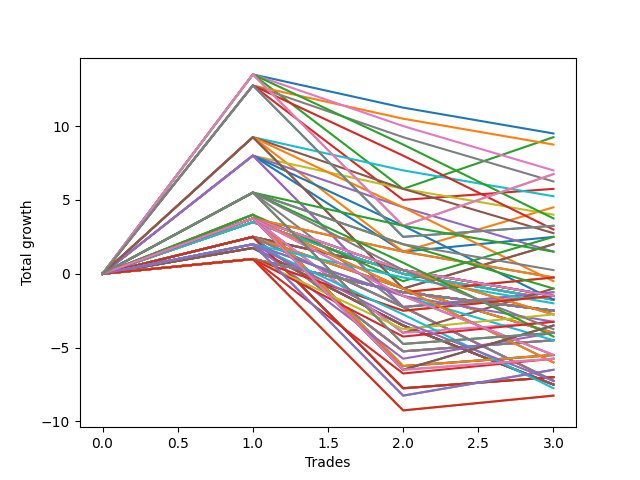

# Long Wallace Doodle 015 
- Symbol: ES
- Date Range: 03/18/2022 - 06/24/2022
- Trading Period: 7:20-12:30
- Number of Trades: 6



| Name | Win Percent | Profit | Avg Profit / Trade |     | Name | Win Percent | Profit | Avg Profit / Trade |
| ---- | ----------- | ------ | ------------------ | --- | ---- | ----------- | ------ | ------------------ |
| Sorted By <br> Profit | | | | | Sorted By <br> Win Percentage ||||
| Two | 50.00 | 3000.00 | 500.00 |     | Zero | 66.67 | 500.00 | 83.33 |
| Ten | 16.67 | 875.00 | 145.83 |     | Sixty-Four | 66.67 | -1750.00 | -291.67 |
| Zero | 66.67 | 500.00 | 83.33 |     | Fifty-Six | 66.67 | -2500.00 | -416.67 |
| Three | 50.00 | 500.00 | 83.33 |     | Two | 50.00 | 3000.00 | 500.00 |
| Eleven | 16.67 | 375.00 | 62.50 |     | Three | 50.00 | 500.00 | 83.33 |
| Four | 50.00 | -500.00 | -83.33 |     | Four | 50.00 | -500.00 | -83.33 |
| Twenty-Six | 16.67 | -1250.00 | -208.33 |     | One | 50.00 | -1625.00 | -270.83 |
| Nine | 16.67 | -1375.00 | -229.17 |     | Seventy-Five | 50.00 | -2000.00 | -333.33 |
| One | 50.00 | -1625.00 | -270.83 |     | Seven | 50.00 | -2000.00 | -333.33 |
| Sixty-Four | 66.67 | -1750.00 | -291.67 |     | Six | 50.00 | -2000.00 | -333.33 |
| twenty-Seven | 16.67 | -1750.00 | -291.67 |     | Five | 50.00 | -2000.00 | -333.33 |
| Eight | 16.67 | -1875.00 | -312.50 |     | Fifty-Eight | 50.00 | -3500.00 | -583.33 |
| Seventy-Five | 50.00 | -2000.00 | -333.33 |     | Fifty-Nine | 50.00 | -5375.00 | -895.83 |
| Seven | 50.00 | -2000.00 | -333.33 |     | Sixty | 50.00 | -6375.00 | -1062.50 |
| Six | 50.00 | -2000.00 | -333.33 |     | Seventy-Three | 50.00 | -7000.00 | -1166.67 |
| Five | 50.00 | -2000.00 | -333.33 |     | Sixty-Three | 50.00 | -7875.00 | -1312.50 |
| Fifty-Six | 66.67 | -2500.00 | -416.67 |     | Sixty-Two | 50.00 | -7875.00 | -1312.50 |
| Seventy-Two | 16.67 | -2875.00 | -479.17 |     | Sixty-One | 50.00 | -7875.00 | -1312.50 |
| Fifty-Eight | 50.00 | -3500.00 | -583.33 |     | Fifty-Seven | 50.00 | -8000.00 | -1333.33 |
| Twenty-Five | 16.67 | -3500.00 | -583.33 |     | Forty | 33.33 | -5625.00 | -937.50 |
| Twenty-Four | 16.67 | -4000.00 | -666.67 |     | Seventy-Four | 33.33 | -7625.00 | -1270.83 |
| Fifteen | 16.67 | -4625.00 | -770.83 |     | Sixty-Six | 33.33 | -9625.00 | -1604.17 |
| Fourteen | 16.67 | -4625.00 | -770.83 |     | Sixty-Seven | 33.33 | -10125.00 | -1687.50 |
| Thirteen | 16.67 | -4625.00 | -770.83 |     | Forty-Eight | 33.33 | -10500.00 | -1750.00 |
| Twelve | 16.67 | -4625.00 | -770.83 |     | Sixty-Five | 33.33 | -11375.00 | -1895.83 |
| Fifty-Nine | 50.00 | -5375.00 | -895.83 |     | Seventy-One | 33.33 | -14375.00 | -2395.83 |
| Forty | 33.33 | -5625.00 | -937.50 |     | Seventy | 33.33 | -14375.00 | -2395.83 |
| Twenty-Three | 16.67 | -5875.00 | -979.17 |     | Sixty-Nine | 33.33 | -14375.00 | -2395.83 |
| Twenty-Two | 16.67 | -5875.00 | -979.17 |     | Sixty-Eight | 33.33 | -14375.00 | -2395.83 |
| Twenty-One | 16.67 | -5875.00 | -979.17 |     | Ten | 16.67 | 875.00 | 145.83 |
| Twenty | 16.67 | -5875.00 | -979.17 |     | Eleven | 16.67 | 375.00 | 62.50 |
| Nineteen | 16.67 | -5875.00 | -979.17 |     | Twenty-Six | 16.67 | -1250.00 | -208.33 |
| Eighteen | 16.67 | -5875.00 | -979.17 |     | Nine | 16.67 | -1375.00 | -229.17 |
| Seventeen | 16.67 | -5875.00 | -979.17 |     | twenty-Seven | 16.67 | -1750.00 | -291.67 |
| Sixten | 16.67 | -5875.00 | -979.17 |     | Eight | 16.67 | -1875.00 | -312.50 |
| Sixty | 50.00 | -6375.00 | -1062.50 |     | Seventy-Two | 16.67 | -2875.00 | -479.17 |
| Forty-Two | 16.67 | -6375.00 | -1062.50 |     | Twenty-Five | 16.67 | -3500.00 | -583.33 |
| Thirty-One | 16.67 | -6750.00 | -1125.00 |     | Twenty-Four | 16.67 | -4000.00 | -666.67 |
| Thirty | 16.67 | -6750.00 | -1125.00 |     | Fifteen | 16.67 | -4625.00 | -770.83 |
| Twenty-Nine | 16.67 | -6750.00 | -1125.00 |     | Fourteen | 16.67 | -4625.00 | -770.83 |
| Twenty-Eight | 16.67 | -6750.00 | -1125.00 |     | Thirteen | 16.67 | -4625.00 | -770.83 |
| Forty-Three | 16.67 | -6875.00 | -1145.83 |     | Twelve | 16.67 | -4625.00 | -770.83 |
| Seventy-Three | 50.00 | -7000.00 | -1166.67 |     | Twenty-Three | 16.67 | -5875.00 | -979.17 |
| Thirty-Nine | 16.67 | -7125.00 | -1187.50 |     | Twenty-Two | 16.67 | -5875.00 | -979.17 |
| Thirty-Eight | 16.67 | -7125.00 | -1187.50 |     | Twenty-One | 16.67 | -5875.00 | -979.17 |
| Thirty-Seven | 16.67 | -7125.00 | -1187.50 |     | Twenty | 16.67 | -5875.00 | -979.17 |
| Thirty-Six | 16.67 | -7125.00 | -1187.50 |     | Nineteen | 16.67 | -5875.00 | -979.17 |
| Thirty-Five | 16.67 | -7125.00 | -1187.50 |     | Eighteen | 16.67 | -5875.00 | -979.17 |
| Thirty-Four | 16.67 | -7125.00 | -1187.50 |     | Seventeen | 16.67 | -5875.00 | -979.17 |
| Thirty-Three | 16.67 | -7125.00 | -1187.50 |     | Sixten | 16.67 | -5875.00 | -979.17 |
| Thirty-Two | 16.67 | -7125.00 | -1187.50 |     | Forty-Two | 16.67 | -6375.00 | -1062.50 |
| Seventy-Four | 33.33 | -7625.00 | -1270.83 |     | Thirty-One | 16.67 | -6750.00 | -1125.00 |
| Sixty-Three | 50.00 | -7875.00 | -1312.50 |     | Thirty | 16.67 | -6750.00 | -1125.00 |
| Sixty-Two | 50.00 | -7875.00 | -1312.50 |     | Twenty-Nine | 16.67 | -6750.00 | -1125.00 |
| Sixty-One | 50.00 | -7875.00 | -1312.50 |     | Twenty-Eight | 16.67 | -6750.00 | -1125.00 |
| Fifty-Seven | 50.00 | -8000.00 | -1333.33 |     | Forty-Three | 16.67 | -6875.00 | -1145.83 |
| Forty-One | 16.67 | -8625.00 | -1437.50 |     | Thirty-Nine | 16.67 | -7125.00 | -1187.50 |
| Sixty-Six | 33.33 | -9625.00 | -1604.17 |     | Thirty-Eight | 16.67 | -7125.00 | -1187.50 |
| Sixty-Seven | 33.33 | -10125.00 | -1687.50 |     | Thirty-Seven | 16.67 | -7125.00 | -1187.50 |
| Forty-Eight | 33.33 | -10500.00 | -1750.00 |     | Thirty-Six | 16.67 | -7125.00 | -1187.50 |
| Sixty-Five | 33.33 | -11375.00 | -1895.83 |     | Thirty-Five | 16.67 | -7125.00 | -1187.50 |
| Forty-Seven | 16.67 | -11875.00 | -1979.17 |     | Thirty-Four | 16.67 | -7125.00 | -1187.50 |
| Forty-Six | 16.67 | -11875.00 | -1979.17 |     | Thirty-Three | 16.67 | -7125.00 | -1187.50 |
| Forty-Five | 16.67 | -11875.00 | -1979.17 |     | Thirty-Two | 16.67 | -7125.00 | -1187.50 |
| Forty-Four | 16.67 | -11875.00 | -1979.17 |     | Forty-One | 16.67 | -8625.00 | -1437.50 |
| Fifty-Five | 16.67 | -12625.00 | -2104.17 |     | Forty-Seven | 16.67 | -11875.00 | -1979.17 |
| Fifty-Four | 16.67 | -12625.00 | -2104.17 |     | Forty-Six | 16.67 | -11875.00 | -1979.17 |
| Fifty-Three | 16.67 | -12625.00 | -2104.17 |     | Forty-Five | 16.67 | -11875.00 | -1979.17 |
| Fifty-Two | 16.67 | -12625.00 | -2104.17 |     | Forty-Four | 16.67 | -11875.00 | -1979.17 |
| Fifty-One | 16.67 | -12625.00 | -2104.17 |     | Fifty-Five | 16.67 | -12625.00 | -2104.17 |
| Fifty | 16.67 | -12625.00 | -2104.17 |     | Fifty-Four | 16.67 | -12625.00 | -2104.17 |
| Forty-Nine | 16.67 | -12625.00 | -2104.17 |     | Fifty-Three | 16.67 | -12625.00 | -2104.17 |
| Seventy-One | 33.33 | -14375.00 | -2395.83 |     | Fifty-Two | 16.67 | -12625.00 | -2104.17 |
| Seventy | 33.33 | -14375.00 | -2395.83 |     | Fifty-One | 16.67 | -12625.00 | -2104.17 |
| Sixty-Nine | 33.33 | -14375.00 | -2395.83 |     | Fifty | 16.67 | -12625.00 | -2104.17 |
| Sixty-Eight | 33.33 | -14375.00 | -2395.83 |     | Forty-Nine | 16.67 | -12625.00 | -2104.17 |

## NO STOPLOSS

### Test Zero
* Sell when price hits the middle line of the 20p bollinger
* No Stoploss
* Results:
```
Total Trades: 6
Percent Up: 66.67
Percent Down: 33.33
Total Points Moved Up: 1.00
Potential Profit: 500.00
Total Points Ups: 16.50 Count Ups: 4
Total Points Downs: -15.50 Count Downs: 2
```

<details><summary>Trades</summary>

<code>In: 2022-03-25 08:29:00		Out: 2022-03-25 08:36:40		Total Position Time: 07:40		Total Move Up: 8.00		Total to Date: 8.00</code> <br />
<code>In: 2022-04-18 08:26:00		Out: 2022-04-18 08:54:55		Total Position Time: 28:55		Total Move Up: -7.00		Total to Date: 1.00</code> <br />
<code>In: 2022-04-20 11:38:00		Out: 2022-04-20 11:48:15		Total Position Time: 10:15		Total Move Up: 0.75		Total to Date: 1.75</code> <br />
<code>In: 2022-05-13 11:04:00		Out: 2022-05-13 11:12:25		Total Position Time: 08:25		Total Move Up: 6.50		Total to Date: 8.25</code> <br />
<code>In: 2022-06-06 08:14:00		Out: 2022-06-06 08:31:35		Total Position Time: 17:35		Total Move Up: -8.50		Total to Date: -0.25</code> <br />
<code>In: 2022-06-08 09:41:00		Out: 2022-06-08 09:53:00		Total Position Time: 12:00		Total Move Up: 1.25		Total to Date: 1.00</code> <br />


</details>

### Test One
* Sell when the price hits the upper line of the 20p 1std bollinger
* No Stoploss
* Results:
```
Total Trades: 6
Percent Up: 50.00
Percent Down: 50.00
Total Points Moved Up: -3.25
Potential Profit: -1625.00
Total Points Ups: 15.75 Count Ups: 3
Total Points Downs: -19.00 Count Downs: 3
```

<details><summary>Trades</summary>

<code>In: 2022-03-25 08:29:00		Out: 2022-03-25 08:40:40		Total Position Time: 11:40		Total Move Up: 9.00		Total to Date: 9.00</code> <br />
<code>In: 2022-04-18 08:26:00		Out: 2022-04-18 08:55:55		Total Position Time: 29:55		Total Move Up: -7.75		Total to Date: 1.25</code> <br />
<code>In: 2022-04-20 11:38:00		Out: 2022-04-20 12:04:20		Total Position Time: 26:20		Total Move Up: -1.00		Total to Date: 0.25</code> <br />
<code>In: 2022-05-13 11:04:00		Out: 2022-05-13 11:19:50		Total Position Time: 15:50		Total Move Up: 5.00		Total to Date: 5.25</code> <br />
<code>In: 2022-06-06 08:14:00		Out: 2022-06-06 08:39:15		Total Position Time: 25:15		Total Move Up: -10.25		Total to Date: -5.00</code> <br />
<code>In: 2022-06-08 09:41:00		Out: 2022-06-08 09:57:10		Total Position Time: 16:10		Total Move Up: 1.75		Total to Date: -3.25</code> <br />


</details>

### Test Two
* Sell when the price hits the upper line of the 20p 2std bollinger
* No Stoploss
* Results:
```
Total Trades: 6
Percent Up: 50.00
Percent Down: 50.00
Total Points Moved Up: 6.00
Potential Profit: 3000.00
Total Points Ups: 24.75 Count Ups: 3
Total Points Downs: -18.75 Count Downs: 3
```

<details><summary>Trades</summary>

<code>In: 2022-03-25 08:29:00		Out: 2022-03-25 08:41:55		Total Position Time: 12:55		Total Move Up: 13.50		Total to Date: 13.50</code> <br />
<code>In: 2022-04-18 08:26:00		Out: 2022-04-18 08:55:55		Total Position Time: 29:55		Total Move Up: -7.75		Total to Date: 5.75</code> <br />
<code>In: 2022-04-20 11:38:00		Out: 2022-04-20 12:07:55		Total Position Time: 29:55		Total Move Up: -3.00		Total to Date: 2.75</code> <br />
<code>In: 2022-05-13 11:04:00		Out: 2022-05-13 11:31:30		Total Position Time: 27:30		Total Move Up: 10.50		Total to Date: 13.25</code> <br />
<code>In: 2022-06-06 08:14:00		Out: 2022-06-06 08:43:00		Total Position Time: 29:00		Total Move Up: -8.00		Total to Date: 5.25</code> <br />
<code>In: 2022-06-08 09:41:00		Out: 2022-06-08 10:10:55		Total Position Time: 29:55		Total Move Up: 0.75		Total to Date: 6.00</code> <br />


</details>

### Test Three
* Sell when price hits the middle line of the 50p bollinger
* No Stoploss
* Results:
```
Total Trades: 6
Percent Up: 50.00
Percent Down: 50.00
Total Points Moved Up: 1.00
Potential Profit: 500.00
Total Points Ups: 21.00 Count Ups: 3
Total Points Downs: -20.00 Count Downs: 3
```

<details><summary>Trades</summary>

<code>In: 2022-03-25 08:29:00		Out: 2022-03-25 08:52:45		Total Position Time: 23:45		Total Move Up: 12.50		Total to Date: 12.50</code> <br />
<code>In: 2022-04-18 08:26:00		Out: 2022-04-18 08:55:55		Total Position Time: 29:55		Total Move Up: -7.75		Total to Date: 4.75</code> <br />
<code>In: 2022-04-20 11:38:00		Out: 2022-04-20 12:07:55		Total Position Time: 29:55		Total Move Up: -3.00		Total to Date: 1.75</code> <br />
<code>In: 2022-05-13 11:04:00		Out: 2022-05-13 11:31:20		Total Position Time: 27:20		Total Move Up: 7.75		Total to Date: 9.50</code> <br />
<code>In: 2022-06-06 08:14:00		Out: 2022-06-06 08:43:55		Total Position Time: 29:55		Total Move Up: -9.25		Total to Date: 0.25</code> <br />
<code>In: 2022-06-08 09:41:00		Out: 2022-06-08 10:10:55		Total Position Time: 29:55		Total Move Up: 0.75		Total to Date: 1.00</code> <br />


</details>

### Test Four
* Sell when the price hits the upper line of the 50p 1std bollinger
* No Stoploss
* Results:
```
Total Trades: 6
Percent Up: 50.00
Percent Down: 50.00
Total Points Moved Up: -1.00
Potential Profit: -500.00
Total Points Ups: 19.00 Count Ups: 3
Total Points Downs: -20.00 Count Downs: 3
```

<details><summary>Trades</summary>

<code>In: 2022-03-25 08:29:00		Out: 2022-03-25 08:58:55		Total Position Time: 29:55		Total Move Up: 2.50		Total to Date: 2.50</code> <br />
<code>In: 2022-04-18 08:26:00		Out: 2022-04-18 08:55:55		Total Position Time: 29:55		Total Move Up: -7.75		Total to Date: -5.25</code> <br />
<code>In: 2022-04-20 11:38:00		Out: 2022-04-20 12:07:55		Total Position Time: 29:55		Total Move Up: -3.00		Total to Date: -8.25</code> <br />
<code>In: 2022-05-13 11:04:00		Out: 2022-05-13 11:32:00		Total Position Time: 28:00		Total Move Up: 15.75		Total to Date: 7.50</code> <br />
<code>In: 2022-06-06 08:14:00		Out: 2022-06-06 08:43:55		Total Position Time: 29:55		Total Move Up: -9.25		Total to Date: -1.75</code> <br />
<code>In: 2022-06-08 09:41:00		Out: 2022-06-08 10:10:55		Total Position Time: 29:55		Total Move Up: 0.75		Total to Date: -1.00</code> <br />


</details>

### Test Five
* Sell when the price hits the upper line of the 50p 2std bollinger
* No Stoploss
* Results:
```
Total Trades: 6
Percent Up: 50.00
Percent Down: 50.00
Total Points Moved Up: -4.00
Potential Profit: -2000.00
Total Points Ups: 16.00 Count Ups: 3
Total Points Downs: -20.00 Count Downs: 3
```

<details><summary>Trades</summary>

<code>In: 2022-03-25 08:29:00		Out: 2022-03-25 08:58:55		Total Position Time: 29:55		Total Move Up: 2.50		Total to Date: 2.50</code> <br />
<code>In: 2022-04-18 08:26:00		Out: 2022-04-18 08:55:55		Total Position Time: 29:55		Total Move Up: -7.75		Total to Date: -5.25</code> <br />
<code>In: 2022-04-20 11:38:00		Out: 2022-04-20 12:07:55		Total Position Time: 29:55		Total Move Up: -3.00		Total to Date: -8.25</code> <br />
<code>In: 2022-05-13 11:04:00		Out: 2022-05-13 11:33:55		Total Position Time: 29:55		Total Move Up: 12.75		Total to Date: 4.50</code> <br />
<code>In: 2022-06-06 08:14:00		Out: 2022-06-06 08:43:55		Total Position Time: 29:55		Total Move Up: -9.25		Total to Date: -4.75</code> <br />
<code>In: 2022-06-08 09:41:00		Out: 2022-06-08 10:10:55		Total Position Time: 29:55		Total Move Up: 0.75		Total to Date: -4.00</code> <br />


</details>

### Test Six
* Sell when the price hits the middle line of the 1std VWAP
* No Stoploss
* Results:
```
Total Trades: 6
Percent Up: 50.00
Percent Down: 50.00
Total Points Moved Up: -4.00
Potential Profit: -2000.00
Total Points Ups: 16.00 Count Ups: 3
Total Points Downs: -20.00 Count Downs: 3
```

<details><summary>Trades</summary>

<code>In: 2022-03-25 08:29:00		Out: 2022-03-25 08:58:55		Total Position Time: 29:55		Total Move Up: 2.50		Total to Date: 2.50</code> <br />
<code>In: 2022-04-18 08:26:00		Out: 2022-04-18 08:55:55		Total Position Time: 29:55		Total Move Up: -7.75		Total to Date: -5.25</code> <br />
<code>In: 2022-04-20 11:38:00		Out: 2022-04-20 12:07:55		Total Position Time: 29:55		Total Move Up: -3.00		Total to Date: -8.25</code> <br />
<code>In: 2022-05-13 11:04:00		Out: 2022-05-13 11:33:55		Total Position Time: 29:55		Total Move Up: 12.75		Total to Date: 4.50</code> <br />
<code>In: 2022-06-06 08:14:00		Out: 2022-06-06 08:43:55		Total Position Time: 29:55		Total Move Up: -9.25		Total to Date: -4.75</code> <br />
<code>In: 2022-06-08 09:41:00		Out: 2022-06-08 10:10:55		Total Position Time: 29:55		Total Move Up: 0.75		Total to Date: -4.00</code> <br />


</details>

### Test Seven
* Sell when the price hits the upper line of the 1std VWAP
* No Stoploss
* Results:
```
Total Trades: 6
Percent Up: 50.00
Percent Down: 50.00
Total Points Moved Up: -4.00
Potential Profit: -2000.00
Total Points Ups: 16.00 Count Ups: 3
Total Points Downs: -20.00 Count Downs: 3
```

<details><summary>Trades</summary>

<code>In: 2022-03-25 08:29:00		Out: 2022-03-25 08:58:55		Total Position Time: 29:55		Total Move Up: 2.50		Total to Date: 2.50</code> <br />
<code>In: 2022-04-18 08:26:00		Out: 2022-04-18 08:55:55		Total Position Time: 29:55		Total Move Up: -7.75		Total to Date: -5.25</code> <br />
<code>In: 2022-04-20 11:38:00		Out: 2022-04-20 12:07:55		Total Position Time: 29:55		Total Move Up: -3.00		Total to Date: -8.25</code> <br />
<code>In: 2022-05-13 11:04:00		Out: 2022-05-13 11:33:55		Total Position Time: 29:55		Total Move Up: 12.75		Total to Date: 4.50</code> <br />
<code>In: 2022-06-06 08:14:00		Out: 2022-06-06 08:43:55		Total Position Time: 29:55		Total Move Up: -9.25		Total to Date: -4.75</code> <br />
<code>In: 2022-06-08 09:41:00		Out: 2022-06-08 10:10:55		Total Position Time: 29:55		Total Move Up: 0.75		Total to Date: -4.00</code> <br />


</details>

## STOPLOSS OF 2

### Test Eight
* Sell when price hits the middle line of the 20p bollinger
* Stoploss is 2 points
* Results:
```
Total Trades: 6
Percent Up: 16.67
Percent Down: 83.33
Total Points Moved Up: -3.75
Potential Profit: -1875.00
Total Points Ups: 8.00 Count Ups: 1
Total Points Downs: -11.75 Count Downs: 5
```

<details><summary>Trades</summary>

<code>In: 2022-03-25 08:29:00		Out: 2022-03-25 08:36:40		Total Position Time: 07:40		Total Move Up: 8.00		Total to Date: 8.00</code> <br />
<code>In: 2022-04-18 08:26:00		Out: 2022-04-18 08:27:15		Total Position Time: 01:15		Total Move Up: -2.25		Total to Date: 5.75</code> <br />
<code>In: 2022-04-20 11:38:00		Out: 2022-04-20 11:40:45		Total Position Time: 02:45		Total Move Up: -2.25		Total to Date: 3.50</code> <br />
<code>In: 2022-05-13 11:04:00		Out: 2022-05-13 11:04:10		Total Position Time: 00:10		Total Move Up: -3.50		Total to Date: 0.00</code> <br />
<code>In: 2022-06-06 08:14:00		Out: 2022-06-06 08:15:50		Total Position Time: 01:50		Total Move Up: -2.00		Total to Date: -2.00</code> <br />
<code>In: 2022-06-08 09:41:00		Out: 2022-06-08 09:42:25		Total Position Time: 01:25		Total Move Up: -1.75		Total to Date: -3.75</code> <br />


</details>

### Test Nine
* Sell when the price hits the upper line of the 20p 1std bollinger
* Stoploss is 2 points
* Results:
```
Total Trades: 6
Percent Up: 16.67
Percent Down: 83.33
Total Points Moved Up: -2.75
Potential Profit: -1375.00
Total Points Ups: 9.00 Count Ups: 1
Total Points Downs: -11.75 Count Downs: 5
```

<details><summary>Trades</summary>

<code>In: 2022-03-25 08:29:00		Out: 2022-03-25 08:40:40		Total Position Time: 11:40		Total Move Up: 9.00		Total to Date: 9.00</code> <br />
<code>In: 2022-04-18 08:26:00		Out: 2022-04-18 08:27:15		Total Position Time: 01:15		Total Move Up: -2.25		Total to Date: 6.75</code> <br />
<code>In: 2022-04-20 11:38:00		Out: 2022-04-20 11:40:45		Total Position Time: 02:45		Total Move Up: -2.25		Total to Date: 4.50</code> <br />
<code>In: 2022-05-13 11:04:00		Out: 2022-05-13 11:04:10		Total Position Time: 00:10		Total Move Up: -3.50		Total to Date: 1.00</code> <br />
<code>In: 2022-06-06 08:14:00		Out: 2022-06-06 08:15:50		Total Position Time: 01:50		Total Move Up: -2.00		Total to Date: -1.00</code> <br />
<code>In: 2022-06-08 09:41:00		Out: 2022-06-08 09:42:25		Total Position Time: 01:25		Total Move Up: -1.75		Total to Date: -2.75</code> <br />


</details>

### Test Ten
* Sell when the price hits the upper line of the 20p 2std bollinger
* Stoploss is 2 points
* Results:
```
Total Trades: 6
Percent Up: 16.67
Percent Down: 83.33
Total Points Moved Up: 1.75
Potential Profit: 875.00
Total Points Ups: 13.50 Count Ups: 1
Total Points Downs: -11.75 Count Downs: 5
```

<details><summary>Trades</summary>

<code>In: 2022-03-25 08:29:00		Out: 2022-03-25 08:41:55		Total Position Time: 12:55		Total Move Up: 13.50		Total to Date: 13.50</code> <br />
<code>In: 2022-04-18 08:26:00		Out: 2022-04-18 08:27:15		Total Position Time: 01:15		Total Move Up: -2.25		Total to Date: 11.25</code> <br />
<code>In: 2022-04-20 11:38:00		Out: 2022-04-20 11:40:45		Total Position Time: 02:45		Total Move Up: -2.25		Total to Date: 9.00</code> <br />
<code>In: 2022-05-13 11:04:00		Out: 2022-05-13 11:04:10		Total Position Time: 00:10		Total Move Up: -3.50		Total to Date: 5.50</code> <br />
<code>In: 2022-06-06 08:14:00		Out: 2022-06-06 08:15:50		Total Position Time: 01:50		Total Move Up: -2.00		Total to Date: 3.50</code> <br />
<code>In: 2022-06-08 09:41:00		Out: 2022-06-08 09:42:25		Total Position Time: 01:25		Total Move Up: -1.75		Total to Date: 1.75</code> <br />


</details>

### Test Eleven
* Sell when price hits the middle line of the 50p bollinger
* Stoploss is 2 points
* Results:
```
Total Trades: 6
Percent Up: 16.67
Percent Down: 83.33
Total Points Moved Up: 0.75
Potential Profit: 375.00
Total Points Ups: 12.50 Count Ups: 1
Total Points Downs: -11.75 Count Downs: 5
```

<details><summary>Trades</summary>

<code>In: 2022-03-25 08:29:00		Out: 2022-03-25 08:52:45		Total Position Time: 23:45		Total Move Up: 12.50		Total to Date: 12.50</code> <br />
<code>In: 2022-04-18 08:26:00		Out: 2022-04-18 08:27:15		Total Position Time: 01:15		Total Move Up: -2.25		Total to Date: 10.25</code> <br />
<code>In: 2022-04-20 11:38:00		Out: 2022-04-20 11:40:45		Total Position Time: 02:45		Total Move Up: -2.25		Total to Date: 8.00</code> <br />
<code>In: 2022-05-13 11:04:00		Out: 2022-05-13 11:04:10		Total Position Time: 00:10		Total Move Up: -3.50		Total to Date: 4.50</code> <br />
<code>In: 2022-06-06 08:14:00		Out: 2022-06-06 08:15:50		Total Position Time: 01:50		Total Move Up: -2.00		Total to Date: 2.50</code> <br />
<code>In: 2022-06-08 09:41:00		Out: 2022-06-08 09:42:25		Total Position Time: 01:25		Total Move Up: -1.75		Total to Date: 0.75</code> <br />


</details>

### Test Twelve
* Sell when the price hits the upper line of the 50p 1std bollinger
* Stoploss is 2 points
* Results:
```
Total Trades: 6
Percent Up: 16.67
Percent Down: 83.33
Total Points Moved Up: -9.25
Potential Profit: -4625.00
Total Points Ups: 2.50 Count Ups: 1
Total Points Downs: -11.75 Count Downs: 5
```

<details><summary>Trades</summary>

<code>In: 2022-03-25 08:29:00		Out: 2022-03-25 08:58:55		Total Position Time: 29:55		Total Move Up: 2.50		Total to Date: 2.50</code> <br />
<code>In: 2022-04-18 08:26:00		Out: 2022-04-18 08:27:15		Total Position Time: 01:15		Total Move Up: -2.25		Total to Date: 0.25</code> <br />
<code>In: 2022-04-20 11:38:00		Out: 2022-04-20 11:40:45		Total Position Time: 02:45		Total Move Up: -2.25		Total to Date: -2.00</code> <br />
<code>In: 2022-05-13 11:04:00		Out: 2022-05-13 11:04:10		Total Position Time: 00:10		Total Move Up: -3.50		Total to Date: -5.50</code> <br />
<code>In: 2022-06-06 08:14:00		Out: 2022-06-06 08:15:50		Total Position Time: 01:50		Total Move Up: -2.00		Total to Date: -7.50</code> <br />
<code>In: 2022-06-08 09:41:00		Out: 2022-06-08 09:42:25		Total Position Time: 01:25		Total Move Up: -1.75		Total to Date: -9.25</code> <br />


</details>

### Test Thirteen
* Sell when the price hits the upper line of the 50p 2std bollinger
* Stoploss is 2 points
* Results:
```
Total Trades: 6
Percent Up: 16.67
Percent Down: 83.33
Total Points Moved Up: -9.25
Potential Profit: -4625.00
Total Points Ups: 2.50 Count Ups: 1
Total Points Downs: -11.75 Count Downs: 5
```

<details><summary>Trades</summary>

<code>In: 2022-03-25 08:29:00		Out: 2022-03-25 08:58:55		Total Position Time: 29:55		Total Move Up: 2.50		Total to Date: 2.50</code> <br />
<code>In: 2022-04-18 08:26:00		Out: 2022-04-18 08:27:15		Total Position Time: 01:15		Total Move Up: -2.25		Total to Date: 0.25</code> <br />
<code>In: 2022-04-20 11:38:00		Out: 2022-04-20 11:40:45		Total Position Time: 02:45		Total Move Up: -2.25		Total to Date: -2.00</code> <br />
<code>In: 2022-05-13 11:04:00		Out: 2022-05-13 11:04:10		Total Position Time: 00:10		Total Move Up: -3.50		Total to Date: -5.50</code> <br />
<code>In: 2022-06-06 08:14:00		Out: 2022-06-06 08:15:50		Total Position Time: 01:50		Total Move Up: -2.00		Total to Date: -7.50</code> <br />
<code>In: 2022-06-08 09:41:00		Out: 2022-06-08 09:42:25		Total Position Time: 01:25		Total Move Up: -1.75		Total to Date: -9.25</code> <br />


</details>

### Test Fourteen
* Sell when the price hits the middle line of the 1std VWAP
* Stoploss is 2 points
* Results:
```
Total Trades: 6
Percent Up: 16.67
Percent Down: 83.33
Total Points Moved Up: -9.25
Potential Profit: -4625.00
Total Points Ups: 2.50 Count Ups: 1
Total Points Downs: -11.75 Count Downs: 5
```

<details><summary>Trades</summary>

<code>In: 2022-03-25 08:29:00		Out: 2022-03-25 08:58:55		Total Position Time: 29:55		Total Move Up: 2.50		Total to Date: 2.50</code> <br />
<code>In: 2022-04-18 08:26:00		Out: 2022-04-18 08:27:15		Total Position Time: 01:15		Total Move Up: -2.25		Total to Date: 0.25</code> <br />
<code>In: 2022-04-20 11:38:00		Out: 2022-04-20 11:40:45		Total Position Time: 02:45		Total Move Up: -2.25		Total to Date: -2.00</code> <br />
<code>In: 2022-05-13 11:04:00		Out: 2022-05-13 11:04:10		Total Position Time: 00:10		Total Move Up: -3.50		Total to Date: -5.50</code> <br />
<code>In: 2022-06-06 08:14:00		Out: 2022-06-06 08:15:50		Total Position Time: 01:50		Total Move Up: -2.00		Total to Date: -7.50</code> <br />
<code>In: 2022-06-08 09:41:00		Out: 2022-06-08 09:42:25		Total Position Time: 01:25		Total Move Up: -1.75		Total to Date: -9.25</code> <br />


</details>

### Test Fifteen
* Sell when the price hits the upper line of the 1std VWAP
* Stoploss is 2 points
* Results:
```
Total Trades: 6
Percent Up: 16.67
Percent Down: 83.33
Total Points Moved Up: -9.25
Potential Profit: -4625.00
Total Points Ups: 2.50 Count Ups: 1
Total Points Downs: -11.75 Count Downs: 5
```

<details><summary>Trades</summary>

<code>In: 2022-03-25 08:29:00		Out: 2022-03-25 08:58:55		Total Position Time: 29:55		Total Move Up: 2.50		Total to Date: 2.50</code> <br />
<code>In: 2022-04-18 08:26:00		Out: 2022-04-18 08:27:15		Total Position Time: 01:15		Total Move Up: -2.25		Total to Date: 0.25</code> <br />
<code>In: 2022-04-20 11:38:00		Out: 2022-04-20 11:40:45		Total Position Time: 02:45		Total Move Up: -2.25		Total to Date: -2.00</code> <br />
<code>In: 2022-05-13 11:04:00		Out: 2022-05-13 11:04:10		Total Position Time: 00:10		Total Move Up: -3.50		Total to Date: -5.50</code> <br />
<code>In: 2022-06-06 08:14:00		Out: 2022-06-06 08:15:50		Total Position Time: 01:50		Total Move Up: -2.00		Total to Date: -7.50</code> <br />
<code>In: 2022-06-08 09:41:00		Out: 2022-06-08 09:42:25		Total Position Time: 01:25		Total Move Up: -1.75		Total to Date: -9.25</code> <br />


</details>

## TRAIL STOP OF 2

### Test Sixten
* Sell when price hits the middle line of the 20p bollinger
* Trailing Stop is 2 points
* Results:
```
Total Trades: 6
Percent Up: 16.67
Percent Down: 83.33
Total Points Moved Up: -11.75
Potential Profit: -5875.00
Total Points Ups: 1.00 Count Ups: 1
Total Points Downs: -12.75 Count Downs: 5
```

<details><summary>Trades</summary>

<code>In: 2022-03-25 08:29:00		Out: 2022-03-25 08:29:10		Total Position Time: 00:10		Total Move Up: 1.00		Total to Date: 1.00</code> <br />
<code>In: 2022-04-18 08:26:00		Out: 2022-04-18 08:27:15		Total Position Time: 01:15		Total Move Up: -2.25		Total to Date: -1.25</code> <br />
<code>In: 2022-04-20 11:38:00		Out: 2022-04-20 11:42:30		Total Position Time: 04:30		Total Move Up: -2.00		Total to Date: -3.25</code> <br />
<code>In: 2022-05-13 11:04:00		Out: 2022-05-13 11:04:25		Total Position Time: 00:25		Total Move Up: -5.25		Total to Date: -8.50</code> <br />
<code>In: 2022-06-06 08:14:00		Out: 2022-06-06 08:15:50		Total Position Time: 01:50		Total Move Up: -2.00		Total to Date: -10.50</code> <br />
<code>In: 2022-06-08 09:41:00		Out: 2022-06-08 09:42:05		Total Position Time: 01:05		Total Move Up: -1.25		Total to Date: -11.75</code> <br />


</details>

### Test Seventeen
* Sell when the price hits the upper line of the 20p 1std bollinger
* Trailing Stop is 2 points
* Results:
```
Total Trades: 6
Percent Up: 16.67
Percent Down: 83.33
Total Points Moved Up: -11.75
Potential Profit: -5875.00
Total Points Ups: 1.00 Count Ups: 1
Total Points Downs: -12.75 Count Downs: 5
```

<details><summary>Trades</summary>

<code>In: 2022-03-25 08:29:00		Out: 2022-03-25 08:29:10		Total Position Time: 00:10		Total Move Up: 1.00		Total to Date: 1.00</code> <br />
<code>In: 2022-04-18 08:26:00		Out: 2022-04-18 08:27:15		Total Position Time: 01:15		Total Move Up: -2.25		Total to Date: -1.25</code> <br />
<code>In: 2022-04-20 11:38:00		Out: 2022-04-20 11:42:30		Total Position Time: 04:30		Total Move Up: -2.00		Total to Date: -3.25</code> <br />
<code>In: 2022-05-13 11:04:00		Out: 2022-05-13 11:04:25		Total Position Time: 00:25		Total Move Up: -5.25		Total to Date: -8.50</code> <br />
<code>In: 2022-06-06 08:14:00		Out: 2022-06-06 08:15:50		Total Position Time: 01:50		Total Move Up: -2.00		Total to Date: -10.50</code> <br />
<code>In: 2022-06-08 09:41:00		Out: 2022-06-08 09:42:05		Total Position Time: 01:05		Total Move Up: -1.25		Total to Date: -11.75</code> <br />


</details>

### Test Eighteen
* Sell when the price hits the upper line of the 20p 2std bollinger
* Trailing Stop is 2 points
* Results:
```
Total Trades: 6
Percent Up: 16.67
Percent Down: 83.33
Total Points Moved Up: -11.75
Potential Profit: -5875.00
Total Points Ups: 1.00 Count Ups: 1
Total Points Downs: -12.75 Count Downs: 5
```

<details><summary>Trades</summary>

<code>In: 2022-03-25 08:29:00		Out: 2022-03-25 08:29:10		Total Position Time: 00:10		Total Move Up: 1.00		Total to Date: 1.00</code> <br />
<code>In: 2022-04-18 08:26:00		Out: 2022-04-18 08:27:15		Total Position Time: 01:15		Total Move Up: -2.25		Total to Date: -1.25</code> <br />
<code>In: 2022-04-20 11:38:00		Out: 2022-04-20 11:42:30		Total Position Time: 04:30		Total Move Up: -2.00		Total to Date: -3.25</code> <br />
<code>In: 2022-05-13 11:04:00		Out: 2022-05-13 11:04:25		Total Position Time: 00:25		Total Move Up: -5.25		Total to Date: -8.50</code> <br />
<code>In: 2022-06-06 08:14:00		Out: 2022-06-06 08:15:50		Total Position Time: 01:50		Total Move Up: -2.00		Total to Date: -10.50</code> <br />
<code>In: 2022-06-08 09:41:00		Out: 2022-06-08 09:42:05		Total Position Time: 01:05		Total Move Up: -1.25		Total to Date: -11.75</code> <br />


</details>

### Test Nineteen
* Sell when price hits the middle line of the 50p bollinger
* Trailing Stop is 2 points
* Results:
```
Total Trades: 6
Percent Up: 16.67
Percent Down: 83.33
Total Points Moved Up: -11.75
Potential Profit: -5875.00
Total Points Ups: 1.00 Count Ups: 1
Total Points Downs: -12.75 Count Downs: 5
```

<details><summary>Trades</summary>

<code>In: 2022-03-25 08:29:00		Out: 2022-03-25 08:29:10		Total Position Time: 00:10		Total Move Up: 1.00		Total to Date: 1.00</code> <br />
<code>In: 2022-04-18 08:26:00		Out: 2022-04-18 08:27:15		Total Position Time: 01:15		Total Move Up: -2.25		Total to Date: -1.25</code> <br />
<code>In: 2022-04-20 11:38:00		Out: 2022-04-20 11:42:30		Total Position Time: 04:30		Total Move Up: -2.00		Total to Date: -3.25</code> <br />
<code>In: 2022-05-13 11:04:00		Out: 2022-05-13 11:04:25		Total Position Time: 00:25		Total Move Up: -5.25		Total to Date: -8.50</code> <br />
<code>In: 2022-06-06 08:14:00		Out: 2022-06-06 08:15:50		Total Position Time: 01:50		Total Move Up: -2.00		Total to Date: -10.50</code> <br />
<code>In: 2022-06-08 09:41:00		Out: 2022-06-08 09:42:05		Total Position Time: 01:05		Total Move Up: -1.25		Total to Date: -11.75</code> <br />


</details>

### Test Twenty
* Sell when the price hits the upper line of the 50p 1std bollinger
* Trailing Stop is 2 points
* Results:
```
Total Trades: 6
Percent Up: 16.67
Percent Down: 83.33
Total Points Moved Up: -11.75
Potential Profit: -5875.00
Total Points Ups: 1.00 Count Ups: 1
Total Points Downs: -12.75 Count Downs: 5
```

<details><summary>Trades</summary>

<code>In: 2022-03-25 08:29:00		Out: 2022-03-25 08:29:10		Total Position Time: 00:10		Total Move Up: 1.00		Total to Date: 1.00</code> <br />
<code>In: 2022-04-18 08:26:00		Out: 2022-04-18 08:27:15		Total Position Time: 01:15		Total Move Up: -2.25		Total to Date: -1.25</code> <br />
<code>In: 2022-04-20 11:38:00		Out: 2022-04-20 11:42:30		Total Position Time: 04:30		Total Move Up: -2.00		Total to Date: -3.25</code> <br />
<code>In: 2022-05-13 11:04:00		Out: 2022-05-13 11:04:25		Total Position Time: 00:25		Total Move Up: -5.25		Total to Date: -8.50</code> <br />
<code>In: 2022-06-06 08:14:00		Out: 2022-06-06 08:15:50		Total Position Time: 01:50		Total Move Up: -2.00		Total to Date: -10.50</code> <br />
<code>In: 2022-06-08 09:41:00		Out: 2022-06-08 09:42:05		Total Position Time: 01:05		Total Move Up: -1.25		Total to Date: -11.75</code> <br />


</details>

### Test Twenty-One
* Sell when the price hits the upper line of the 50p 2std bollinger
* Trailing Stop is 2 points
* Results:
```
Total Trades: 6
Percent Up: 16.67
Percent Down: 83.33
Total Points Moved Up: -11.75
Potential Profit: -5875.00
Total Points Ups: 1.00 Count Ups: 1
Total Points Downs: -12.75 Count Downs: 5
```

<details><summary>Trades</summary>

<code>In: 2022-03-25 08:29:00		Out: 2022-03-25 08:29:10		Total Position Time: 00:10		Total Move Up: 1.00		Total to Date: 1.00</code> <br />
<code>In: 2022-04-18 08:26:00		Out: 2022-04-18 08:27:15		Total Position Time: 01:15		Total Move Up: -2.25		Total to Date: -1.25</code> <br />
<code>In: 2022-04-20 11:38:00		Out: 2022-04-20 11:42:30		Total Position Time: 04:30		Total Move Up: -2.00		Total to Date: -3.25</code> <br />
<code>In: 2022-05-13 11:04:00		Out: 2022-05-13 11:04:25		Total Position Time: 00:25		Total Move Up: -5.25		Total to Date: -8.50</code> <br />
<code>In: 2022-06-06 08:14:00		Out: 2022-06-06 08:15:50		Total Position Time: 01:50		Total Move Up: -2.00		Total to Date: -10.50</code> <br />
<code>In: 2022-06-08 09:41:00		Out: 2022-06-08 09:42:05		Total Position Time: 01:05		Total Move Up: -1.25		Total to Date: -11.75</code> <br />


</details>

### Test Twenty-Two
* Sell when the price hits the middle line of the 1std VWAP
* Trailing Stop is 2 points
* Results:
```
Total Trades: 6
Percent Up: 16.67
Percent Down: 83.33
Total Points Moved Up: -11.75
Potential Profit: -5875.00
Total Points Ups: 1.00 Count Ups: 1
Total Points Downs: -12.75 Count Downs: 5
```

<details><summary>Trades</summary>

<code>In: 2022-03-25 08:29:00		Out: 2022-03-25 08:29:10		Total Position Time: 00:10		Total Move Up: 1.00		Total to Date: 1.00</code> <br />
<code>In: 2022-04-18 08:26:00		Out: 2022-04-18 08:27:15		Total Position Time: 01:15		Total Move Up: -2.25		Total to Date: -1.25</code> <br />
<code>In: 2022-04-20 11:38:00		Out: 2022-04-20 11:42:30		Total Position Time: 04:30		Total Move Up: -2.00		Total to Date: -3.25</code> <br />
<code>In: 2022-05-13 11:04:00		Out: 2022-05-13 11:04:25		Total Position Time: 00:25		Total Move Up: -5.25		Total to Date: -8.50</code> <br />
<code>In: 2022-06-06 08:14:00		Out: 2022-06-06 08:15:50		Total Position Time: 01:50		Total Move Up: -2.00		Total to Date: -10.50</code> <br />
<code>In: 2022-06-08 09:41:00		Out: 2022-06-08 09:42:05		Total Position Time: 01:05		Total Move Up: -1.25		Total to Date: -11.75</code> <br />


</details>

### Test Twenty-Three
* Sell when the price hits the upper line of the 1std VWAP
* Trailing Stop is 2 points
* Results:
```
Total Trades: 6
Percent Up: 16.67
Percent Down: 83.33
Total Points Moved Up: -11.75
Potential Profit: -5875.00
Total Points Ups: 1.00 Count Ups: 1
Total Points Downs: -12.75 Count Downs: 5
```

<details><summary>Trades</summary>

<code>In: 2022-03-25 08:29:00		Out: 2022-03-25 08:29:10		Total Position Time: 00:10		Total Move Up: 1.00		Total to Date: 1.00</code> <br />
<code>In: 2022-04-18 08:26:00		Out: 2022-04-18 08:27:15		Total Position Time: 01:15		Total Move Up: -2.25		Total to Date: -1.25</code> <br />
<code>In: 2022-04-20 11:38:00		Out: 2022-04-20 11:42:30		Total Position Time: 04:30		Total Move Up: -2.00		Total to Date: -3.25</code> <br />
<code>In: 2022-05-13 11:04:00		Out: 2022-05-13 11:04:25		Total Position Time: 00:25		Total Move Up: -5.25		Total to Date: -8.50</code> <br />
<code>In: 2022-06-06 08:14:00		Out: 2022-06-06 08:15:50		Total Position Time: 01:50		Total Move Up: -2.00		Total to Date: -10.50</code> <br />
<code>In: 2022-06-08 09:41:00		Out: 2022-06-08 09:42:05		Total Position Time: 01:05		Total Move Up: -1.25		Total to Date: -11.75</code> <br />


</details>

## STOPLOSS OF 3

### Test Twenty-Four
* Sell when price hits the middle line of the 20p bollinger
* Stoploss is 3 points
* Results:
```
Total Trades: 6
Percent Up: 16.67
Percent Down: 83.33
Total Points Moved Up: -8.00
Potential Profit: -4000.00
Total Points Ups: 8.00 Count Ups: 1
Total Points Downs: -16.00 Count Downs: 5
```

<details><summary>Trades</summary>

<code>In: 2022-03-25 08:29:00		Out: 2022-03-25 08:36:40		Total Position Time: 07:40		Total Move Up: 8.00		Total to Date: 8.00</code> <br />
<code>In: 2022-04-18 08:26:00		Out: 2022-04-18 08:27:50		Total Position Time: 01:50		Total Move Up: -3.50		Total to Date: 4.50</code> <br />
<code>In: 2022-04-20 11:38:00		Out: 2022-04-20 11:45:20		Total Position Time: 07:20		Total Move Up: -2.75		Total to Date: 1.75</code> <br />
<code>In: 2022-05-13 11:04:00		Out: 2022-05-13 11:04:10		Total Position Time: 00:10		Total Move Up: -3.50		Total to Date: -1.75</code> <br />
<code>In: 2022-06-06 08:14:00		Out: 2022-06-06 08:16:15		Total Position Time: 02:15		Total Move Up: -3.25		Total to Date: -5.00</code> <br />
<code>In: 2022-06-08 09:41:00		Out: 2022-06-08 09:43:10		Total Position Time: 02:10		Total Move Up: -3.00		Total to Date: -8.00</code> <br />


</details>

### Test Twenty-Five
* Sell when the price hits the upper line of the 20p 1std bollinger
* Stoploss is 3 points
* Results:
```
Total Trades: 6
Percent Up: 16.67
Percent Down: 83.33
Total Points Moved Up: -7.00
Potential Profit: -3500.00
Total Points Ups: 9.00 Count Ups: 1
Total Points Downs: -16.00 Count Downs: 5
```

<details><summary>Trades</summary>

<code>In: 2022-03-25 08:29:00		Out: 2022-03-25 08:40:40		Total Position Time: 11:40		Total Move Up: 9.00		Total to Date: 9.00</code> <br />
<code>In: 2022-04-18 08:26:00		Out: 2022-04-18 08:27:50		Total Position Time: 01:50		Total Move Up: -3.50		Total to Date: 5.50</code> <br />
<code>In: 2022-04-20 11:38:00		Out: 2022-04-20 11:45:20		Total Position Time: 07:20		Total Move Up: -2.75		Total to Date: 2.75</code> <br />
<code>In: 2022-05-13 11:04:00		Out: 2022-05-13 11:04:10		Total Position Time: 00:10		Total Move Up: -3.50		Total to Date: -0.75</code> <br />
<code>In: 2022-06-06 08:14:00		Out: 2022-06-06 08:16:15		Total Position Time: 02:15		Total Move Up: -3.25		Total to Date: -4.00</code> <br />
<code>In: 2022-06-08 09:41:00		Out: 2022-06-08 09:43:10		Total Position Time: 02:10		Total Move Up: -3.00		Total to Date: -7.00</code> <br />


</details>

### Test Twenty-Six
* Sell when the price hits the upper line of the 20p 2std bollinger
* Stoploss is 3 points
* Results:
```
Total Trades: 6
Percent Up: 16.67
Percent Down: 83.33
Total Points Moved Up: -2.50
Potential Profit: -1250.00
Total Points Ups: 13.50 Count Ups: 1
Total Points Downs: -16.00 Count Downs: 5
```

<details><summary>Trades</summary>

<code>In: 2022-03-25 08:29:00		Out: 2022-03-25 08:41:55		Total Position Time: 12:55		Total Move Up: 13.50		Total to Date: 13.50</code> <br />
<code>In: 2022-04-18 08:26:00		Out: 2022-04-18 08:27:50		Total Position Time: 01:50		Total Move Up: -3.50		Total to Date: 10.00</code> <br />
<code>In: 2022-04-20 11:38:00		Out: 2022-04-20 11:45:20		Total Position Time: 07:20		Total Move Up: -2.75		Total to Date: 7.25</code> <br />
<code>In: 2022-05-13 11:04:00		Out: 2022-05-13 11:04:10		Total Position Time: 00:10		Total Move Up: -3.50		Total to Date: 3.75</code> <br />
<code>In: 2022-06-06 08:14:00		Out: 2022-06-06 08:16:15		Total Position Time: 02:15		Total Move Up: -3.25		Total to Date: 0.50</code> <br />
<code>In: 2022-06-08 09:41:00		Out: 2022-06-08 09:43:10		Total Position Time: 02:10		Total Move Up: -3.00		Total to Date: -2.50</code> <br />


</details>

### Test twenty-Seven
* Sell when price hits the middle line of the 50p bollinger
* Stoploss is 3 points
* Results:
```
Total Trades: 6
Percent Up: 16.67
Percent Down: 83.33
Total Points Moved Up: -3.50
Potential Profit: -1750.00
Total Points Ups: 12.50 Count Ups: 1
Total Points Downs: -16.00 Count Downs: 5
```

<details><summary>Trades</summary>

<code>In: 2022-03-25 08:29:00		Out: 2022-03-25 08:52:45		Total Position Time: 23:45		Total Move Up: 12.50		Total to Date: 12.50</code> <br />
<code>In: 2022-04-18 08:26:00		Out: 2022-04-18 08:27:50		Total Position Time: 01:50		Total Move Up: -3.50		Total to Date: 9.00</code> <br />
<code>In: 2022-04-20 11:38:00		Out: 2022-04-20 11:45:20		Total Position Time: 07:20		Total Move Up: -2.75		Total to Date: 6.25</code> <br />
<code>In: 2022-05-13 11:04:00		Out: 2022-05-13 11:04:10		Total Position Time: 00:10		Total Move Up: -3.50		Total to Date: 2.75</code> <br />
<code>In: 2022-06-06 08:14:00		Out: 2022-06-06 08:16:15		Total Position Time: 02:15		Total Move Up: -3.25		Total to Date: -0.50</code> <br />
<code>In: 2022-06-08 09:41:00		Out: 2022-06-08 09:43:10		Total Position Time: 02:10		Total Move Up: -3.00		Total to Date: -3.50</code> <br />


</details>

### Test Twenty-Eight
* Sell when the price hits the upper line of the 50p 1std bollinger
* Stoploss is 3 points
* Results:
```
Total Trades: 6
Percent Up: 16.67
Percent Down: 83.33
Total Points Moved Up: -13.50
Potential Profit: -6750.00
Total Points Ups: 2.50 Count Ups: 1
Total Points Downs: -16.00 Count Downs: 5
```

<details><summary>Trades</summary>

<code>In: 2022-03-25 08:29:00		Out: 2022-03-25 08:58:55		Total Position Time: 29:55		Total Move Up: 2.50		Total to Date: 2.50</code> <br />
<code>In: 2022-04-18 08:26:00		Out: 2022-04-18 08:27:50		Total Position Time: 01:50		Total Move Up: -3.50		Total to Date: -1.00</code> <br />
<code>In: 2022-04-20 11:38:00		Out: 2022-04-20 11:45:20		Total Position Time: 07:20		Total Move Up: -2.75		Total to Date: -3.75</code> <br />
<code>In: 2022-05-13 11:04:00		Out: 2022-05-13 11:04:10		Total Position Time: 00:10		Total Move Up: -3.50		Total to Date: -7.25</code> <br />
<code>In: 2022-06-06 08:14:00		Out: 2022-06-06 08:16:15		Total Position Time: 02:15		Total Move Up: -3.25		Total to Date: -10.50</code> <br />
<code>In: 2022-06-08 09:41:00		Out: 2022-06-08 09:43:10		Total Position Time: 02:10		Total Move Up: -3.00		Total to Date: -13.50</code> <br />


</details>

### Test Twenty-Nine
* Sell when the price hits the upper line of the 50p 2std bollinger
* Stoploss is 3 points
* Results:
```
Total Trades: 6
Percent Up: 16.67
Percent Down: 83.33
Total Points Moved Up: -13.50
Potential Profit: -6750.00
Total Points Ups: 2.50 Count Ups: 1
Total Points Downs: -16.00 Count Downs: 5
```

<details><summary>Trades</summary>

<code>In: 2022-03-25 08:29:00		Out: 2022-03-25 08:58:55		Total Position Time: 29:55		Total Move Up: 2.50		Total to Date: 2.50</code> <br />
<code>In: 2022-04-18 08:26:00		Out: 2022-04-18 08:27:50		Total Position Time: 01:50		Total Move Up: -3.50		Total to Date: -1.00</code> <br />
<code>In: 2022-04-20 11:38:00		Out: 2022-04-20 11:45:20		Total Position Time: 07:20		Total Move Up: -2.75		Total to Date: -3.75</code> <br />
<code>In: 2022-05-13 11:04:00		Out: 2022-05-13 11:04:10		Total Position Time: 00:10		Total Move Up: -3.50		Total to Date: -7.25</code> <br />
<code>In: 2022-06-06 08:14:00		Out: 2022-06-06 08:16:15		Total Position Time: 02:15		Total Move Up: -3.25		Total to Date: -10.50</code> <br />
<code>In: 2022-06-08 09:41:00		Out: 2022-06-08 09:43:10		Total Position Time: 02:10		Total Move Up: -3.00		Total to Date: -13.50</code> <br />


</details>

### Test Thirty
* Sell when the price hits the middle line of the 1std VWAP
* Stoploss is 3 points
* Results:
```
Total Trades: 6
Percent Up: 16.67
Percent Down: 83.33
Total Points Moved Up: -13.50
Potential Profit: -6750.00
Total Points Ups: 2.50 Count Ups: 1
Total Points Downs: -16.00 Count Downs: 5
```

<details><summary>Trades</summary>

<code>In: 2022-03-25 08:29:00		Out: 2022-03-25 08:58:55		Total Position Time: 29:55		Total Move Up: 2.50		Total to Date: 2.50</code> <br />
<code>In: 2022-04-18 08:26:00		Out: 2022-04-18 08:27:50		Total Position Time: 01:50		Total Move Up: -3.50		Total to Date: -1.00</code> <br />
<code>In: 2022-04-20 11:38:00		Out: 2022-04-20 11:45:20		Total Position Time: 07:20		Total Move Up: -2.75		Total to Date: -3.75</code> <br />
<code>In: 2022-05-13 11:04:00		Out: 2022-05-13 11:04:10		Total Position Time: 00:10		Total Move Up: -3.50		Total to Date: -7.25</code> <br />
<code>In: 2022-06-06 08:14:00		Out: 2022-06-06 08:16:15		Total Position Time: 02:15		Total Move Up: -3.25		Total to Date: -10.50</code> <br />
<code>In: 2022-06-08 09:41:00		Out: 2022-06-08 09:43:10		Total Position Time: 02:10		Total Move Up: -3.00		Total to Date: -13.50</code> <br />


</details>

### Test Thirty-One
* Sell when the price hits the upper line of the 1std VWAP
* Stoploss is 3 points
* Results:
```
Total Trades: 6
Percent Up: 16.67
Percent Down: 83.33
Total Points Moved Up: -13.50
Potential Profit: -6750.00
Total Points Ups: 2.50 Count Ups: 1
Total Points Downs: -16.00 Count Downs: 5
```

<details><summary>Trades</summary>

<code>In: 2022-03-25 08:29:00		Out: 2022-03-25 08:58:55		Total Position Time: 29:55		Total Move Up: 2.50		Total to Date: 2.50</code> <br />
<code>In: 2022-04-18 08:26:00		Out: 2022-04-18 08:27:50		Total Position Time: 01:50		Total Move Up: -3.50		Total to Date: -1.00</code> <br />
<code>In: 2022-04-20 11:38:00		Out: 2022-04-20 11:45:20		Total Position Time: 07:20		Total Move Up: -2.75		Total to Date: -3.75</code> <br />
<code>In: 2022-05-13 11:04:00		Out: 2022-05-13 11:04:10		Total Position Time: 00:10		Total Move Up: -3.50		Total to Date: -7.25</code> <br />
<code>In: 2022-06-06 08:14:00		Out: 2022-06-06 08:16:15		Total Position Time: 02:15		Total Move Up: -3.25		Total to Date: -10.50</code> <br />
<code>In: 2022-06-08 09:41:00		Out: 2022-06-08 09:43:10		Total Position Time: 02:10		Total Move Up: -3.00		Total to Date: -13.50</code> <br />


</details>

## TRAIL STOP OF 3

### Test Thirty-Two
* Sell when price hits the middle line of the 20p bollinger
* Trailing Stop is 3 points
* Results:
```
Total Trades: 6
Percent Up: 16.67
Percent Down: 83.33
Total Points Moved Up: -14.25
Potential Profit: -7125.00
Total Points Ups: 3.50 Count Ups: 1
Total Points Downs: -17.75 Count Downs: 5
```

<details><summary>Trades</summary>

<code>In: 2022-03-25 08:29:00		Out: 2022-03-25 08:31:35		Total Position Time: 02:35		Total Move Up: 3.50		Total to Date: 3.50</code> <br />
<code>In: 2022-04-18 08:26:00		Out: 2022-04-18 08:27:50		Total Position Time: 01:50		Total Move Up: -3.50		Total to Date: 0.00</code> <br />
<code>In: 2022-04-20 11:38:00		Out: 2022-04-20 11:43:40		Total Position Time: 05:40		Total Move Up: -2.75		Total to Date: -2.75</code> <br />
<code>In: 2022-05-13 11:04:00		Out: 2022-05-13 11:05:10		Total Position Time: 01:10		Total Move Up: -6.50		Total to Date: -9.25</code> <br />
<code>In: 2022-06-06 08:14:00		Out: 2022-06-06 08:16:15		Total Position Time: 02:15		Total Move Up: -3.25		Total to Date: -12.50</code> <br />
<code>In: 2022-06-08 09:41:00		Out: 2022-06-08 09:42:25		Total Position Time: 01:25		Total Move Up: -1.75		Total to Date: -14.25</code> <br />


</details>

### Test Thirty-Three
* Sell when the price hits the upper line of the 20p 1std bollinger
* Trailing Stop is 3 points
* Results:
```
Total Trades: 6
Percent Up: 16.67
Percent Down: 83.33
Total Points Moved Up: -14.25
Potential Profit: -7125.00
Total Points Ups: 3.50 Count Ups: 1
Total Points Downs: -17.75 Count Downs: 5
```

<details><summary>Trades</summary>

<code>In: 2022-03-25 08:29:00		Out: 2022-03-25 08:31:35		Total Position Time: 02:35		Total Move Up: 3.50		Total to Date: 3.50</code> <br />
<code>In: 2022-04-18 08:26:00		Out: 2022-04-18 08:27:50		Total Position Time: 01:50		Total Move Up: -3.50		Total to Date: 0.00</code> <br />
<code>In: 2022-04-20 11:38:00		Out: 2022-04-20 11:43:40		Total Position Time: 05:40		Total Move Up: -2.75		Total to Date: -2.75</code> <br />
<code>In: 2022-05-13 11:04:00		Out: 2022-05-13 11:05:10		Total Position Time: 01:10		Total Move Up: -6.50		Total to Date: -9.25</code> <br />
<code>In: 2022-06-06 08:14:00		Out: 2022-06-06 08:16:15		Total Position Time: 02:15		Total Move Up: -3.25		Total to Date: -12.50</code> <br />
<code>In: 2022-06-08 09:41:00		Out: 2022-06-08 09:42:25		Total Position Time: 01:25		Total Move Up: -1.75		Total to Date: -14.25</code> <br />


</details>

### Test Thirty-Four
* Sell when the price hits the upper line of the 20p 2std bollinger
* Trailing Stop is 3 points
* Results:
```
Total Trades: 6
Percent Up: 16.67
Percent Down: 83.33
Total Points Moved Up: -14.25
Potential Profit: -7125.00
Total Points Ups: 3.50 Count Ups: 1
Total Points Downs: -17.75 Count Downs: 5
```

<details><summary>Trades</summary>

<code>In: 2022-03-25 08:29:00		Out: 2022-03-25 08:31:35		Total Position Time: 02:35		Total Move Up: 3.50		Total to Date: 3.50</code> <br />
<code>In: 2022-04-18 08:26:00		Out: 2022-04-18 08:27:50		Total Position Time: 01:50		Total Move Up: -3.50		Total to Date: 0.00</code> <br />
<code>In: 2022-04-20 11:38:00		Out: 2022-04-20 11:43:40		Total Position Time: 05:40		Total Move Up: -2.75		Total to Date: -2.75</code> <br />
<code>In: 2022-05-13 11:04:00		Out: 2022-05-13 11:05:10		Total Position Time: 01:10		Total Move Up: -6.50		Total to Date: -9.25</code> <br />
<code>In: 2022-06-06 08:14:00		Out: 2022-06-06 08:16:15		Total Position Time: 02:15		Total Move Up: -3.25		Total to Date: -12.50</code> <br />
<code>In: 2022-06-08 09:41:00		Out: 2022-06-08 09:42:25		Total Position Time: 01:25		Total Move Up: -1.75		Total to Date: -14.25</code> <br />


</details>

### Test Thirty-Five
* Sell when price hits the middle line of the 50p bollinger
* Trailing Stop is 3 points
* Results:
```
Total Trades: 6
Percent Up: 16.67
Percent Down: 83.33
Total Points Moved Up: -14.25
Potential Profit: -7125.00
Total Points Ups: 3.50 Count Ups: 1
Total Points Downs: -17.75 Count Downs: 5
```

<details><summary>Trades</summary>

<code>In: 2022-03-25 08:29:00		Out: 2022-03-25 08:31:35		Total Position Time: 02:35		Total Move Up: 3.50		Total to Date: 3.50</code> <br />
<code>In: 2022-04-18 08:26:00		Out: 2022-04-18 08:27:50		Total Position Time: 01:50		Total Move Up: -3.50		Total to Date: 0.00</code> <br />
<code>In: 2022-04-20 11:38:00		Out: 2022-04-20 11:43:40		Total Position Time: 05:40		Total Move Up: -2.75		Total to Date: -2.75</code> <br />
<code>In: 2022-05-13 11:04:00		Out: 2022-05-13 11:05:10		Total Position Time: 01:10		Total Move Up: -6.50		Total to Date: -9.25</code> <br />
<code>In: 2022-06-06 08:14:00		Out: 2022-06-06 08:16:15		Total Position Time: 02:15		Total Move Up: -3.25		Total to Date: -12.50</code> <br />
<code>In: 2022-06-08 09:41:00		Out: 2022-06-08 09:42:25		Total Position Time: 01:25		Total Move Up: -1.75		Total to Date: -14.25</code> <br />


</details>

### Test Thirty-Six
* Sell when the price hits the upper line of the 50p 1std bollinger
* Trailing Stop is 3 points
* Results:
```
Total Trades: 6
Percent Up: 16.67
Percent Down: 83.33
Total Points Moved Up: -14.25
Potential Profit: -7125.00
Total Points Ups: 3.50 Count Ups: 1
Total Points Downs: -17.75 Count Downs: 5
```

<details><summary>Trades</summary>

<code>In: 2022-03-25 08:29:00		Out: 2022-03-25 08:31:35		Total Position Time: 02:35		Total Move Up: 3.50		Total to Date: 3.50</code> <br />
<code>In: 2022-04-18 08:26:00		Out: 2022-04-18 08:27:50		Total Position Time: 01:50		Total Move Up: -3.50		Total to Date: 0.00</code> <br />
<code>In: 2022-04-20 11:38:00		Out: 2022-04-20 11:43:40		Total Position Time: 05:40		Total Move Up: -2.75		Total to Date: -2.75</code> <br />
<code>In: 2022-05-13 11:04:00		Out: 2022-05-13 11:05:10		Total Position Time: 01:10		Total Move Up: -6.50		Total to Date: -9.25</code> <br />
<code>In: 2022-06-06 08:14:00		Out: 2022-06-06 08:16:15		Total Position Time: 02:15		Total Move Up: -3.25		Total to Date: -12.50</code> <br />
<code>In: 2022-06-08 09:41:00		Out: 2022-06-08 09:42:25		Total Position Time: 01:25		Total Move Up: -1.75		Total to Date: -14.25</code> <br />


</details>

### Test Thirty-Seven
* Sell when the price hits the upper line of the 50p 2std bollinger
* Trailing Stop is 3 points
* Results:
```
Total Trades: 6
Percent Up: 16.67
Percent Down: 83.33
Total Points Moved Up: -14.25
Potential Profit: -7125.00
Total Points Ups: 3.50 Count Ups: 1
Total Points Downs: -17.75 Count Downs: 5
```

<details><summary>Trades</summary>

<code>In: 2022-03-25 08:29:00		Out: 2022-03-25 08:31:35		Total Position Time: 02:35		Total Move Up: 3.50		Total to Date: 3.50</code> <br />
<code>In: 2022-04-18 08:26:00		Out: 2022-04-18 08:27:50		Total Position Time: 01:50		Total Move Up: -3.50		Total to Date: 0.00</code> <br />
<code>In: 2022-04-20 11:38:00		Out: 2022-04-20 11:43:40		Total Position Time: 05:40		Total Move Up: -2.75		Total to Date: -2.75</code> <br />
<code>In: 2022-05-13 11:04:00		Out: 2022-05-13 11:05:10		Total Position Time: 01:10		Total Move Up: -6.50		Total to Date: -9.25</code> <br />
<code>In: 2022-06-06 08:14:00		Out: 2022-06-06 08:16:15		Total Position Time: 02:15		Total Move Up: -3.25		Total to Date: -12.50</code> <br />
<code>In: 2022-06-08 09:41:00		Out: 2022-06-08 09:42:25		Total Position Time: 01:25		Total Move Up: -1.75		Total to Date: -14.25</code> <br />


</details>

### Test Thirty-Eight
* Sell when the price hits the middle line of the 1std VWAP
* Trailing Stop is 3 points
* Results:
```
Total Trades: 6
Percent Up: 16.67
Percent Down: 83.33
Total Points Moved Up: -14.25
Potential Profit: -7125.00
Total Points Ups: 3.50 Count Ups: 1
Total Points Downs: -17.75 Count Downs: 5
```

<details><summary>Trades</summary>

<code>In: 2022-03-25 08:29:00		Out: 2022-03-25 08:31:35		Total Position Time: 02:35		Total Move Up: 3.50		Total to Date: 3.50</code> <br />
<code>In: 2022-04-18 08:26:00		Out: 2022-04-18 08:27:50		Total Position Time: 01:50		Total Move Up: -3.50		Total to Date: 0.00</code> <br />
<code>In: 2022-04-20 11:38:00		Out: 2022-04-20 11:43:40		Total Position Time: 05:40		Total Move Up: -2.75		Total to Date: -2.75</code> <br />
<code>In: 2022-05-13 11:04:00		Out: 2022-05-13 11:05:10		Total Position Time: 01:10		Total Move Up: -6.50		Total to Date: -9.25</code> <br />
<code>In: 2022-06-06 08:14:00		Out: 2022-06-06 08:16:15		Total Position Time: 02:15		Total Move Up: -3.25		Total to Date: -12.50</code> <br />
<code>In: 2022-06-08 09:41:00		Out: 2022-06-08 09:42:25		Total Position Time: 01:25		Total Move Up: -1.75		Total to Date: -14.25</code> <br />


</details>

### Test Thirty-Nine
* Sell when the price hits the upper line of the 1std VWAP
* Trailing Stop is 3 points
* Results:
```
Total Trades: 6
Percent Up: 16.67
Percent Down: 83.33
Total Points Moved Up: -14.25
Potential Profit: -7125.00
Total Points Ups: 3.50 Count Ups: 1
Total Points Downs: -17.75 Count Downs: 5
```

<details><summary>Trades</summary>

<code>In: 2022-03-25 08:29:00		Out: 2022-03-25 08:31:35		Total Position Time: 02:35		Total Move Up: 3.50		Total to Date: 3.50</code> <br />
<code>In: 2022-04-18 08:26:00		Out: 2022-04-18 08:27:50		Total Position Time: 01:50		Total Move Up: -3.50		Total to Date: 0.00</code> <br />
<code>In: 2022-04-20 11:38:00		Out: 2022-04-20 11:43:40		Total Position Time: 05:40		Total Move Up: -2.75		Total to Date: -2.75</code> <br />
<code>In: 2022-05-13 11:04:00		Out: 2022-05-13 11:05:10		Total Position Time: 01:10		Total Move Up: -6.50		Total to Date: -9.25</code> <br />
<code>In: 2022-06-06 08:14:00		Out: 2022-06-06 08:16:15		Total Position Time: 02:15		Total Move Up: -3.25		Total to Date: -12.50</code> <br />
<code>In: 2022-06-08 09:41:00		Out: 2022-06-08 09:42:25		Total Position Time: 01:25		Total Move Up: -1.75		Total to Date: -14.25</code> <br />


</details>

## STOPLOSS OF 5

### Test Forty
* Sell when price hits the middle line of the 20p bollinger
* Stoploss is 5 points
* Results:
```
Total Trades: 6
Percent Up: 33.33
Percent Down: 66.67
Total Points Moved Up: -11.25
Potential Profit: -5625.00
Total Points Ups: 8.75 Count Ups: 2
Total Points Downs: -20.00 Count Downs: 4
```

<details><summary>Trades</summary>

<code>In: 2022-03-25 08:29:00		Out: 2022-03-25 08:36:40		Total Position Time: 07:40		Total Move Up: 8.00		Total to Date: 8.00</code> <br />
<code>In: 2022-04-18 08:26:00		Out: 2022-04-18 08:33:50		Total Position Time: 07:50		Total Move Up: -4.75		Total to Date: 3.25</code> <br />
<code>In: 2022-04-20 11:38:00		Out: 2022-04-20 11:48:15		Total Position Time: 10:15		Total Move Up: 0.75		Total to Date: 4.00</code> <br />
<code>In: 2022-05-13 11:04:00		Out: 2022-05-13 11:04:25		Total Position Time: 00:25		Total Move Up: -5.25		Total to Date: -1.25</code> <br />
<code>In: 2022-06-06 08:14:00		Out: 2022-06-06 08:16:45		Total Position Time: 02:45		Total Move Up: -5.00		Total to Date: -6.25</code> <br />
<code>In: 2022-06-08 09:41:00		Out: 2022-06-08 09:44:45		Total Position Time: 03:45		Total Move Up: -5.00		Total to Date: -11.25</code> <br />


</details>

### Test Forty-One
* Sell when the price hits the upper line of the 20p 1std bollinger
* Stoploss is 5 points
* Results:
```
Total Trades: 6
Percent Up: 16.67
Percent Down: 83.33
Total Points Moved Up: -17.25
Potential Profit: -8625.00
Total Points Ups: 9.00 Count Ups: 1
Total Points Downs: -26.25 Count Downs: 5
```

<details><summary>Trades</summary>

<code>In: 2022-03-25 08:29:00		Out: 2022-03-25 08:40:40		Total Position Time: 11:40		Total Move Up: 9.00		Total to Date: 9.00</code> <br />
<code>In: 2022-04-18 08:26:00		Out: 2022-04-18 08:33:50		Total Position Time: 07:50		Total Move Up: -4.75		Total to Date: 4.25</code> <br />
<code>In: 2022-04-20 11:38:00		Out: 2022-04-20 11:52:05		Total Position Time: 14:05		Total Move Up: -6.25		Total to Date: -2.00</code> <br />
<code>In: 2022-05-13 11:04:00		Out: 2022-05-13 11:04:25		Total Position Time: 00:25		Total Move Up: -5.25		Total to Date: -7.25</code> <br />
<code>In: 2022-06-06 08:14:00		Out: 2022-06-06 08:16:45		Total Position Time: 02:45		Total Move Up: -5.00		Total to Date: -12.25</code> <br />
<code>In: 2022-06-08 09:41:00		Out: 2022-06-08 09:44:45		Total Position Time: 03:45		Total Move Up: -5.00		Total to Date: -17.25</code> <br />


</details>

### Test Forty-Two
* Sell when the price hits the upper line of the 20p 2std bollinger
* Stoploss is 5 points
* Results:
```
Total Trades: 6
Percent Up: 16.67
Percent Down: 83.33
Total Points Moved Up: -12.75
Potential Profit: -6375.00
Total Points Ups: 13.50 Count Ups: 1
Total Points Downs: -26.25 Count Downs: 5
```

<details><summary>Trades</summary>

<code>In: 2022-03-25 08:29:00		Out: 2022-03-25 08:41:55		Total Position Time: 12:55		Total Move Up: 13.50		Total to Date: 13.50</code> <br />
<code>In: 2022-04-18 08:26:00		Out: 2022-04-18 08:33:50		Total Position Time: 07:50		Total Move Up: -4.75		Total to Date: 8.75</code> <br />
<code>In: 2022-04-20 11:38:00		Out: 2022-04-20 11:52:05		Total Position Time: 14:05		Total Move Up: -6.25		Total to Date: 2.50</code> <br />
<code>In: 2022-05-13 11:04:00		Out: 2022-05-13 11:04:25		Total Position Time: 00:25		Total Move Up: -5.25		Total to Date: -2.75</code> <br />
<code>In: 2022-06-06 08:14:00		Out: 2022-06-06 08:16:45		Total Position Time: 02:45		Total Move Up: -5.00		Total to Date: -7.75</code> <br />
<code>In: 2022-06-08 09:41:00		Out: 2022-06-08 09:44:45		Total Position Time: 03:45		Total Move Up: -5.00		Total to Date: -12.75</code> <br />


</details>

### Test Forty-Three
* Sell when price hits the middle line of the 50p bollinger
* Stoploss is 5 points
* Results:
```
Total Trades: 6
Percent Up: 16.67
Percent Down: 83.33
Total Points Moved Up: -13.75
Potential Profit: -6875.00
Total Points Ups: 12.50 Count Ups: 1
Total Points Downs: -26.25 Count Downs: 5
```

<details><summary>Trades</summary>

<code>In: 2022-03-25 08:29:00		Out: 2022-03-25 08:52:45		Total Position Time: 23:45		Total Move Up: 12.50		Total to Date: 12.50</code> <br />
<code>In: 2022-04-18 08:26:00		Out: 2022-04-18 08:33:50		Total Position Time: 07:50		Total Move Up: -4.75		Total to Date: 7.75</code> <br />
<code>In: 2022-04-20 11:38:00		Out: 2022-04-20 11:52:05		Total Position Time: 14:05		Total Move Up: -6.25		Total to Date: 1.50</code> <br />
<code>In: 2022-05-13 11:04:00		Out: 2022-05-13 11:04:25		Total Position Time: 00:25		Total Move Up: -5.25		Total to Date: -3.75</code> <br />
<code>In: 2022-06-06 08:14:00		Out: 2022-06-06 08:16:45		Total Position Time: 02:45		Total Move Up: -5.00		Total to Date: -8.75</code> <br />
<code>In: 2022-06-08 09:41:00		Out: 2022-06-08 09:44:45		Total Position Time: 03:45		Total Move Up: -5.00		Total to Date: -13.75</code> <br />


</details>

### Test Forty-Four
* Sell when the price hits the upper line of the 50p 1std bollinger
* Stoploss is 5 points
* Results:
```
Total Trades: 6
Percent Up: 16.67
Percent Down: 83.33
Total Points Moved Up: -23.75
Potential Profit: -11875.00
Total Points Ups: 2.50 Count Ups: 1
Total Points Downs: -26.25 Count Downs: 5
```

<details><summary>Trades</summary>

<code>In: 2022-03-25 08:29:00		Out: 2022-03-25 08:58:55		Total Position Time: 29:55		Total Move Up: 2.50		Total to Date: 2.50</code> <br />
<code>In: 2022-04-18 08:26:00		Out: 2022-04-18 08:33:50		Total Position Time: 07:50		Total Move Up: -4.75		Total to Date: -2.25</code> <br />
<code>In: 2022-04-20 11:38:00		Out: 2022-04-20 11:52:05		Total Position Time: 14:05		Total Move Up: -6.25		Total to Date: -8.50</code> <br />
<code>In: 2022-05-13 11:04:00		Out: 2022-05-13 11:04:25		Total Position Time: 00:25		Total Move Up: -5.25		Total to Date: -13.75</code> <br />
<code>In: 2022-06-06 08:14:00		Out: 2022-06-06 08:16:45		Total Position Time: 02:45		Total Move Up: -5.00		Total to Date: -18.75</code> <br />
<code>In: 2022-06-08 09:41:00		Out: 2022-06-08 09:44:45		Total Position Time: 03:45		Total Move Up: -5.00		Total to Date: -23.75</code> <br />


</details>

### Test Forty-Five
* Sell when the price hits the upper line of the 50p 2std bollinger
* Stoploss is 5 points
* Results:
```
Total Trades: 6
Percent Up: 16.67
Percent Down: 83.33
Total Points Moved Up: -23.75
Potential Profit: -11875.00
Total Points Ups: 2.50 Count Ups: 1
Total Points Downs: -26.25 Count Downs: 5
```

<details><summary>Trades</summary>

<code>In: 2022-03-25 08:29:00		Out: 2022-03-25 08:58:55		Total Position Time: 29:55		Total Move Up: 2.50		Total to Date: 2.50</code> <br />
<code>In: 2022-04-18 08:26:00		Out: 2022-04-18 08:33:50		Total Position Time: 07:50		Total Move Up: -4.75		Total to Date: -2.25</code> <br />
<code>In: 2022-04-20 11:38:00		Out: 2022-04-20 11:52:05		Total Position Time: 14:05		Total Move Up: -6.25		Total to Date: -8.50</code> <br />
<code>In: 2022-05-13 11:04:00		Out: 2022-05-13 11:04:25		Total Position Time: 00:25		Total Move Up: -5.25		Total to Date: -13.75</code> <br />
<code>In: 2022-06-06 08:14:00		Out: 2022-06-06 08:16:45		Total Position Time: 02:45		Total Move Up: -5.00		Total to Date: -18.75</code> <br />
<code>In: 2022-06-08 09:41:00		Out: 2022-06-08 09:44:45		Total Position Time: 03:45		Total Move Up: -5.00		Total to Date: -23.75</code> <br />


</details>

### Test Forty-Six
* Sell when the price hits the middle line of the 1std VWAP
* Stoploss is 5 points
* Results:
```
Total Trades: 6
Percent Up: 16.67
Percent Down: 83.33
Total Points Moved Up: -23.75
Potential Profit: -11875.00
Total Points Ups: 2.50 Count Ups: 1
Total Points Downs: -26.25 Count Downs: 5
```

<details><summary>Trades</summary>

<code>In: 2022-03-25 08:29:00		Out: 2022-03-25 08:58:55		Total Position Time: 29:55		Total Move Up: 2.50		Total to Date: 2.50</code> <br />
<code>In: 2022-04-18 08:26:00		Out: 2022-04-18 08:33:50		Total Position Time: 07:50		Total Move Up: -4.75		Total to Date: -2.25</code> <br />
<code>In: 2022-04-20 11:38:00		Out: 2022-04-20 11:52:05		Total Position Time: 14:05		Total Move Up: -6.25		Total to Date: -8.50</code> <br />
<code>In: 2022-05-13 11:04:00		Out: 2022-05-13 11:04:25		Total Position Time: 00:25		Total Move Up: -5.25		Total to Date: -13.75</code> <br />
<code>In: 2022-06-06 08:14:00		Out: 2022-06-06 08:16:45		Total Position Time: 02:45		Total Move Up: -5.00		Total to Date: -18.75</code> <br />
<code>In: 2022-06-08 09:41:00		Out: 2022-06-08 09:44:45		Total Position Time: 03:45		Total Move Up: -5.00		Total to Date: -23.75</code> <br />


</details>

### Test Forty-Seven
* Sell when the price hits the upper line of the 1std VWAP
* Stoploss is 5 points
* Results:
```
Total Trades: 6
Percent Up: 16.67
Percent Down: 83.33
Total Points Moved Up: -23.75
Potential Profit: -11875.00
Total Points Ups: 2.50 Count Ups: 1
Total Points Downs: -26.25 Count Downs: 5
```

<details><summary>Trades</summary>

<code>In: 2022-03-25 08:29:00		Out: 2022-03-25 08:58:55		Total Position Time: 29:55		Total Move Up: 2.50		Total to Date: 2.50</code> <br />
<code>In: 2022-04-18 08:26:00		Out: 2022-04-18 08:33:50		Total Position Time: 07:50		Total Move Up: -4.75		Total to Date: -2.25</code> <br />
<code>In: 2022-04-20 11:38:00		Out: 2022-04-20 11:52:05		Total Position Time: 14:05		Total Move Up: -6.25		Total to Date: -8.50</code> <br />
<code>In: 2022-05-13 11:04:00		Out: 2022-05-13 11:04:25		Total Position Time: 00:25		Total Move Up: -5.25		Total to Date: -13.75</code> <br />
<code>In: 2022-06-06 08:14:00		Out: 2022-06-06 08:16:45		Total Position Time: 02:45		Total Move Up: -5.00		Total to Date: -18.75</code> <br />
<code>In: 2022-06-08 09:41:00		Out: 2022-06-08 09:44:45		Total Position Time: 03:45		Total Move Up: -5.00		Total to Date: -23.75</code> <br />


</details>

## TRAIL STOP OF 5

### Test Forty-Eight
* Sell when price hits the middle line of the 20p bollinger
* Trailing Stop is 5 points
* Results:
```
Total Trades: 6
Percent Up: 33.33
Percent Down: 66.67
Total Points Moved Up: -21.00
Potential Profit: -10500.00
Total Points Ups: 2.50 Count Ups: 2
Total Points Downs: -23.50 Count Downs: 4
```

<details><summary>Trades</summary>

<code>In: 2022-03-25 08:29:00		Out: 2022-03-25 08:32:20		Total Position Time: 03:20		Total Move Up: 1.75		Total to Date: 1.75</code> <br />
<code>In: 2022-04-18 08:26:00		Out: 2022-04-18 08:34:00		Total Position Time: 08:00		Total Move Up: -5.25		Total to Date: -3.50</code> <br />
<code>In: 2022-04-20 11:38:00		Out: 2022-04-20 11:48:15		Total Position Time: 10:15		Total Move Up: 0.75		Total to Date: -2.75</code> <br />
<code>In: 2022-05-13 11:04:00		Out: 2022-05-13 11:05:40		Total Position Time: 01:40		Total Move Up: -9.25		Total to Date: -12.00</code> <br />
<code>In: 2022-06-06 08:14:00		Out: 2022-06-06 08:16:45		Total Position Time: 02:45		Total Move Up: -5.00		Total to Date: -17.00</code> <br />
<code>In: 2022-06-08 09:41:00		Out: 2022-06-08 09:43:35		Total Position Time: 02:35		Total Move Up: -4.00		Total to Date: -21.00</code> <br />


</details>

### Test Forty-Nine
* Sell when the price hits the upper line of the 20p 1std bollinger
* Trailing Stop is 5 points
* Results:
```
Total Trades: 6
Percent Up: 16.67
Percent Down: 83.33
Total Points Moved Up: -25.25
Potential Profit: -12625.00
Total Points Ups: 1.75 Count Ups: 1
Total Points Downs: -27.00 Count Downs: 5
```

<details><summary>Trades</summary>

<code>In: 2022-03-25 08:29:00		Out: 2022-03-25 08:32:20		Total Position Time: 03:20		Total Move Up: 1.75		Total to Date: 1.75</code> <br />
<code>In: 2022-04-18 08:26:00		Out: 2022-04-18 08:34:00		Total Position Time: 08:00		Total Move Up: -5.25		Total to Date: -3.50</code> <br />
<code>In: 2022-04-20 11:38:00		Out: 2022-04-20 11:51:45		Total Position Time: 13:45		Total Move Up: -3.50		Total to Date: -7.00</code> <br />
<code>In: 2022-05-13 11:04:00		Out: 2022-05-13 11:05:40		Total Position Time: 01:40		Total Move Up: -9.25		Total to Date: -16.25</code> <br />
<code>In: 2022-06-06 08:14:00		Out: 2022-06-06 08:16:45		Total Position Time: 02:45		Total Move Up: -5.00		Total to Date: -21.25</code> <br />
<code>In: 2022-06-08 09:41:00		Out: 2022-06-08 09:43:35		Total Position Time: 02:35		Total Move Up: -4.00		Total to Date: -25.25</code> <br />


</details>

### Test Fifty
* Sell when the price hits the upper line of the 20p 2std bollinger
* Trailing Stop is 5 points
* Results:
```
Total Trades: 6
Percent Up: 16.67
Percent Down: 83.33
Total Points Moved Up: -25.25
Potential Profit: -12625.00
Total Points Ups: 1.75 Count Ups: 1
Total Points Downs: -27.00 Count Downs: 5
```

<details><summary>Trades</summary>

<code>In: 2022-03-25 08:29:00		Out: 2022-03-25 08:32:20		Total Position Time: 03:20		Total Move Up: 1.75		Total to Date: 1.75</code> <br />
<code>In: 2022-04-18 08:26:00		Out: 2022-04-18 08:34:00		Total Position Time: 08:00		Total Move Up: -5.25		Total to Date: -3.50</code> <br />
<code>In: 2022-04-20 11:38:00		Out: 2022-04-20 11:51:45		Total Position Time: 13:45		Total Move Up: -3.50		Total to Date: -7.00</code> <br />
<code>In: 2022-05-13 11:04:00		Out: 2022-05-13 11:05:40		Total Position Time: 01:40		Total Move Up: -9.25		Total to Date: -16.25</code> <br />
<code>In: 2022-06-06 08:14:00		Out: 2022-06-06 08:16:45		Total Position Time: 02:45		Total Move Up: -5.00		Total to Date: -21.25</code> <br />
<code>In: 2022-06-08 09:41:00		Out: 2022-06-08 09:43:35		Total Position Time: 02:35		Total Move Up: -4.00		Total to Date: -25.25</code> <br />


</details>

### Test Fifty-One
* Sell when price hits the middle line of the 50p bollinger
* Trailing Stop is 5 points
* Results:
```
Total Trades: 6
Percent Up: 16.67
Percent Down: 83.33
Total Points Moved Up: -25.25
Potential Profit: -12625.00
Total Points Ups: 1.75 Count Ups: 1
Total Points Downs: -27.00 Count Downs: 5
```

<details><summary>Trades</summary>

<code>In: 2022-03-25 08:29:00		Out: 2022-03-25 08:32:20		Total Position Time: 03:20		Total Move Up: 1.75		Total to Date: 1.75</code> <br />
<code>In: 2022-04-18 08:26:00		Out: 2022-04-18 08:34:00		Total Position Time: 08:00		Total Move Up: -5.25		Total to Date: -3.50</code> <br />
<code>In: 2022-04-20 11:38:00		Out: 2022-04-20 11:51:45		Total Position Time: 13:45		Total Move Up: -3.50		Total to Date: -7.00</code> <br />
<code>In: 2022-05-13 11:04:00		Out: 2022-05-13 11:05:40		Total Position Time: 01:40		Total Move Up: -9.25		Total to Date: -16.25</code> <br />
<code>In: 2022-06-06 08:14:00		Out: 2022-06-06 08:16:45		Total Position Time: 02:45		Total Move Up: -5.00		Total to Date: -21.25</code> <br />
<code>In: 2022-06-08 09:41:00		Out: 2022-06-08 09:43:35		Total Position Time: 02:35		Total Move Up: -4.00		Total to Date: -25.25</code> <br />


</details>

### Test Fifty-Two
* Sell when the price hits the upper line of the 50p 1std bollinger
* Trailing Stop is 5 points
* Results:
```
Total Trades: 6
Percent Up: 16.67
Percent Down: 83.33
Total Points Moved Up: -25.25
Potential Profit: -12625.00
Total Points Ups: 1.75 Count Ups: 1
Total Points Downs: -27.00 Count Downs: 5
```

<details><summary>Trades</summary>

<code>In: 2022-03-25 08:29:00		Out: 2022-03-25 08:32:20		Total Position Time: 03:20		Total Move Up: 1.75		Total to Date: 1.75</code> <br />
<code>In: 2022-04-18 08:26:00		Out: 2022-04-18 08:34:00		Total Position Time: 08:00		Total Move Up: -5.25		Total to Date: -3.50</code> <br />
<code>In: 2022-04-20 11:38:00		Out: 2022-04-20 11:51:45		Total Position Time: 13:45		Total Move Up: -3.50		Total to Date: -7.00</code> <br />
<code>In: 2022-05-13 11:04:00		Out: 2022-05-13 11:05:40		Total Position Time: 01:40		Total Move Up: -9.25		Total to Date: -16.25</code> <br />
<code>In: 2022-06-06 08:14:00		Out: 2022-06-06 08:16:45		Total Position Time: 02:45		Total Move Up: -5.00		Total to Date: -21.25</code> <br />
<code>In: 2022-06-08 09:41:00		Out: 2022-06-08 09:43:35		Total Position Time: 02:35		Total Move Up: -4.00		Total to Date: -25.25</code> <br />


</details>

### Test Fifty-Three
* Sell when the price hits the upper line of the 50p 2std bollinger
* Trailing Stop is 5 points
* Results:
```
Total Trades: 6
Percent Up: 16.67
Percent Down: 83.33
Total Points Moved Up: -25.25
Potential Profit: -12625.00
Total Points Ups: 1.75 Count Ups: 1
Total Points Downs: -27.00 Count Downs: 5
```

<details><summary>Trades</summary>

<code>In: 2022-03-25 08:29:00		Out: 2022-03-25 08:32:20		Total Position Time: 03:20		Total Move Up: 1.75		Total to Date: 1.75</code> <br />
<code>In: 2022-04-18 08:26:00		Out: 2022-04-18 08:34:00		Total Position Time: 08:00		Total Move Up: -5.25		Total to Date: -3.50</code> <br />
<code>In: 2022-04-20 11:38:00		Out: 2022-04-20 11:51:45		Total Position Time: 13:45		Total Move Up: -3.50		Total to Date: -7.00</code> <br />
<code>In: 2022-05-13 11:04:00		Out: 2022-05-13 11:05:40		Total Position Time: 01:40		Total Move Up: -9.25		Total to Date: -16.25</code> <br />
<code>In: 2022-06-06 08:14:00		Out: 2022-06-06 08:16:45		Total Position Time: 02:45		Total Move Up: -5.00		Total to Date: -21.25</code> <br />
<code>In: 2022-06-08 09:41:00		Out: 2022-06-08 09:43:35		Total Position Time: 02:35		Total Move Up: -4.00		Total to Date: -25.25</code> <br />


</details>

### Test Fifty-Four
* Sell when the price hits the middle line of the 1std VWAP
* Trailing Stop is 5 points
* Results:
```
Total Trades: 6
Percent Up: 16.67
Percent Down: 83.33
Total Points Moved Up: -25.25
Potential Profit: -12625.00
Total Points Ups: 1.75 Count Ups: 1
Total Points Downs: -27.00 Count Downs: 5
```

<details><summary>Trades</summary>

<code>In: 2022-03-25 08:29:00		Out: 2022-03-25 08:32:20		Total Position Time: 03:20		Total Move Up: 1.75		Total to Date: 1.75</code> <br />
<code>In: 2022-04-18 08:26:00		Out: 2022-04-18 08:34:00		Total Position Time: 08:00		Total Move Up: -5.25		Total to Date: -3.50</code> <br />
<code>In: 2022-04-20 11:38:00		Out: 2022-04-20 11:51:45		Total Position Time: 13:45		Total Move Up: -3.50		Total to Date: -7.00</code> <br />
<code>In: 2022-05-13 11:04:00		Out: 2022-05-13 11:05:40		Total Position Time: 01:40		Total Move Up: -9.25		Total to Date: -16.25</code> <br />
<code>In: 2022-06-06 08:14:00		Out: 2022-06-06 08:16:45		Total Position Time: 02:45		Total Move Up: -5.00		Total to Date: -21.25</code> <br />
<code>In: 2022-06-08 09:41:00		Out: 2022-06-08 09:43:35		Total Position Time: 02:35		Total Move Up: -4.00		Total to Date: -25.25</code> <br />


</details>

### Test Fifty-Five
* Sell when the price hits the upper line of the 1std VWAP
* Trailing Stop is 5 points
* Results:
```
Total Trades: 6
Percent Up: 16.67
Percent Down: 83.33
Total Points Moved Up: -25.25
Potential Profit: -12625.00
Total Points Ups: 1.75 Count Ups: 1
Total Points Downs: -27.00 Count Downs: 5
```

<details><summary>Trades</summary>

<code>In: 2022-03-25 08:29:00		Out: 2022-03-25 08:32:20		Total Position Time: 03:20		Total Move Up: 1.75		Total to Date: 1.75</code> <br />
<code>In: 2022-04-18 08:26:00		Out: 2022-04-18 08:34:00		Total Position Time: 08:00		Total Move Up: -5.25		Total to Date: -3.50</code> <br />
<code>In: 2022-04-20 11:38:00		Out: 2022-04-20 11:51:45		Total Position Time: 13:45		Total Move Up: -3.50		Total to Date: -7.00</code> <br />
<code>In: 2022-05-13 11:04:00		Out: 2022-05-13 11:05:40		Total Position Time: 01:40		Total Move Up: -9.25		Total to Date: -16.25</code> <br />
<code>In: 2022-06-06 08:14:00		Out: 2022-06-06 08:16:45		Total Position Time: 02:45		Total Move Up: -5.00		Total to Date: -21.25</code> <br />
<code>In: 2022-06-08 09:41:00		Out: 2022-06-08 09:43:35		Total Position Time: 02:35		Total Move Up: -4.00		Total to Date: -25.25</code> <br />


</details>

## STOPLOSS OF 10

### Test Fifty-Six
* Sell when price hits the middle line of the 20p bollinger
* Stoploss is 10 points
* Results:
```
Total Trades: 6
Percent Up: 66.67
Percent Down: 33.33
Total Points Moved Up: -5.00
Potential Profit: -2500.00
Total Points Ups: 16.50 Count Ups: 4
Total Points Downs: -21.50 Count Downs: 2
```

<details><summary>Trades</summary>

<code>In: 2022-03-25 08:29:00		Out: 2022-03-25 08:36:40		Total Position Time: 07:40		Total Move Up: 8.00		Total to Date: 8.00</code> <br />
<code>In: 2022-04-18 08:26:00		Out: 2022-04-18 08:48:20		Total Position Time: 22:20		Total Move Up: -10.25		Total to Date: -2.25</code> <br />
<code>In: 2022-04-20 11:38:00		Out: 2022-04-20 11:48:15		Total Position Time: 10:15		Total Move Up: 0.75		Total to Date: -1.50</code> <br />
<code>In: 2022-05-13 11:04:00		Out: 2022-05-13 11:12:25		Total Position Time: 08:25		Total Move Up: 6.50		Total to Date: 5.00</code> <br />
<code>In: 2022-06-06 08:14:00		Out: 2022-06-06 08:17:30		Total Position Time: 03:30		Total Move Up: -11.25		Total to Date: -6.25</code> <br />
<code>In: 2022-06-08 09:41:00		Out: 2022-06-08 09:53:00		Total Position Time: 12:00		Total Move Up: 1.25		Total to Date: -5.00</code> <br />


</details>

### Test Fifty-Seven
* Sell when the price hits the upper line of the 20p 1std bollinger
* Stoploss is 10 points
* Results:
```
Total Trades: 6
Percent Up: 50.00
Percent Down: 50.00
Total Points Moved Up: -16.00
Potential Profit: -8000.00
Total Points Ups: 15.75 Count Ups: 3
Total Points Downs: -31.75 Count Downs: 3
```

<details><summary>Trades</summary>

<code>In: 2022-03-25 08:29:00		Out: 2022-03-25 08:40:40		Total Position Time: 11:40		Total Move Up: 9.00		Total to Date: 9.00</code> <br />
<code>In: 2022-04-18 08:26:00		Out: 2022-04-18 08:48:20		Total Position Time: 22:20		Total Move Up: -10.25		Total to Date: -1.25</code> <br />
<code>In: 2022-04-20 11:38:00		Out: 2022-04-20 11:54:40		Total Position Time: 16:40		Total Move Up: -10.25		Total to Date: -11.50</code> <br />
<code>In: 2022-05-13 11:04:00		Out: 2022-05-13 11:19:50		Total Position Time: 15:50		Total Move Up: 5.00		Total to Date: -6.50</code> <br />
<code>In: 2022-06-06 08:14:00		Out: 2022-06-06 08:17:30		Total Position Time: 03:30		Total Move Up: -11.25		Total to Date: -17.75</code> <br />
<code>In: 2022-06-08 09:41:00		Out: 2022-06-08 09:57:10		Total Position Time: 16:10		Total Move Up: 1.75		Total to Date: -16.00</code> <br />


</details>

### Test Fifty-Eight
* Sell when the price hits the upper line of the 20p 2std bollinger
* Stoploss is 10 points
* Results:
```
Total Trades: 6
Percent Up: 50.00
Percent Down: 50.00
Total Points Moved Up: -7.00
Potential Profit: -3500.00
Total Points Ups: 24.75 Count Ups: 3
Total Points Downs: -31.75 Count Downs: 3
```

<details><summary>Trades</summary>

<code>In: 2022-03-25 08:29:00		Out: 2022-03-25 08:41:55		Total Position Time: 12:55		Total Move Up: 13.50		Total to Date: 13.50</code> <br />
<code>In: 2022-04-18 08:26:00		Out: 2022-04-18 08:48:20		Total Position Time: 22:20		Total Move Up: -10.25		Total to Date: 3.25</code> <br />
<code>In: 2022-04-20 11:38:00		Out: 2022-04-20 11:54:40		Total Position Time: 16:40		Total Move Up: -10.25		Total to Date: -7.00</code> <br />
<code>In: 2022-05-13 11:04:00		Out: 2022-05-13 11:31:30		Total Position Time: 27:30		Total Move Up: 10.50		Total to Date: 3.50</code> <br />
<code>In: 2022-06-06 08:14:00		Out: 2022-06-06 08:17:30		Total Position Time: 03:30		Total Move Up: -11.25		Total to Date: -7.75</code> <br />
<code>In: 2022-06-08 09:41:00		Out: 2022-06-08 10:10:55		Total Position Time: 29:55		Total Move Up: 0.75		Total to Date: -7.00</code> <br />


</details>

### Test Fifty-Nine
* Sell when price hits the middle line of the 50p bollinger
* Stoploss is 10 points
* Results:
```
Total Trades: 6
Percent Up: 50.00
Percent Down: 50.00
Total Points Moved Up: -10.75
Potential Profit: -5375.00
Total Points Ups: 21.00 Count Ups: 3
Total Points Downs: -31.75 Count Downs: 3
```

<details><summary>Trades</summary>

<code>In: 2022-03-25 08:29:00		Out: 2022-03-25 08:52:45		Total Position Time: 23:45		Total Move Up: 12.50		Total to Date: 12.50</code> <br />
<code>In: 2022-04-18 08:26:00		Out: 2022-04-18 08:48:20		Total Position Time: 22:20		Total Move Up: -10.25		Total to Date: 2.25</code> <br />
<code>In: 2022-04-20 11:38:00		Out: 2022-04-20 11:54:40		Total Position Time: 16:40		Total Move Up: -10.25		Total to Date: -8.00</code> <br />
<code>In: 2022-05-13 11:04:00		Out: 2022-05-13 11:31:20		Total Position Time: 27:20		Total Move Up: 7.75		Total to Date: -0.25</code> <br />
<code>In: 2022-06-06 08:14:00		Out: 2022-06-06 08:17:30		Total Position Time: 03:30		Total Move Up: -11.25		Total to Date: -11.50</code> <br />
<code>In: 2022-06-08 09:41:00		Out: 2022-06-08 10:10:55		Total Position Time: 29:55		Total Move Up: 0.75		Total to Date: -10.75</code> <br />


</details>

### Test Sixty
* Sell when the price hits the upper line of the 50p 1std bollinger
* Stoploss is 10 points
* Results:
```
Total Trades: 6
Percent Up: 50.00
Percent Down: 50.00
Total Points Moved Up: -12.75
Potential Profit: -6375.00
Total Points Ups: 19.00 Count Ups: 3
Total Points Downs: -31.75 Count Downs: 3
```

<details><summary>Trades</summary>

<code>In: 2022-03-25 08:29:00		Out: 2022-03-25 08:58:55		Total Position Time: 29:55		Total Move Up: 2.50		Total to Date: 2.50</code> <br />
<code>In: 2022-04-18 08:26:00		Out: 2022-04-18 08:48:20		Total Position Time: 22:20		Total Move Up: -10.25		Total to Date: -7.75</code> <br />
<code>In: 2022-04-20 11:38:00		Out: 2022-04-20 11:54:40		Total Position Time: 16:40		Total Move Up: -10.25		Total to Date: -18.00</code> <br />
<code>In: 2022-05-13 11:04:00		Out: 2022-05-13 11:32:00		Total Position Time: 28:00		Total Move Up: 15.75		Total to Date: -2.25</code> <br />
<code>In: 2022-06-06 08:14:00		Out: 2022-06-06 08:17:30		Total Position Time: 03:30		Total Move Up: -11.25		Total to Date: -13.50</code> <br />
<code>In: 2022-06-08 09:41:00		Out: 2022-06-08 10:10:55		Total Position Time: 29:55		Total Move Up: 0.75		Total to Date: -12.75</code> <br />


</details>

### Test Sixty-One
* Sell when the price hits the upper line of the 50p 2std bollinger
* Stoploss is 10 points
* Results:
```
Total Trades: 6
Percent Up: 50.00
Percent Down: 50.00
Total Points Moved Up: -15.75
Potential Profit: -7875.00
Total Points Ups: 16.00 Count Ups: 3
Total Points Downs: -31.75 Count Downs: 3
```

<details><summary>Trades</summary>

<code>In: 2022-03-25 08:29:00		Out: 2022-03-25 08:58:55		Total Position Time: 29:55		Total Move Up: 2.50		Total to Date: 2.50</code> <br />
<code>In: 2022-04-18 08:26:00		Out: 2022-04-18 08:48:20		Total Position Time: 22:20		Total Move Up: -10.25		Total to Date: -7.75</code> <br />
<code>In: 2022-04-20 11:38:00		Out: 2022-04-20 11:54:40		Total Position Time: 16:40		Total Move Up: -10.25		Total to Date: -18.00</code> <br />
<code>In: 2022-05-13 11:04:00		Out: 2022-05-13 11:33:55		Total Position Time: 29:55		Total Move Up: 12.75		Total to Date: -5.25</code> <br />
<code>In: 2022-06-06 08:14:00		Out: 2022-06-06 08:17:30		Total Position Time: 03:30		Total Move Up: -11.25		Total to Date: -16.50</code> <br />
<code>In: 2022-06-08 09:41:00		Out: 2022-06-08 10:10:55		Total Position Time: 29:55		Total Move Up: 0.75		Total to Date: -15.75</code> <br />


</details>

### Test Sixty-Two
* Sell when the price hits the middle line of the 1std VWAP
* Stoploss is 10 points
* Results:
```
Total Trades: 6
Percent Up: 50.00
Percent Down: 50.00
Total Points Moved Up: -15.75
Potential Profit: -7875.00
Total Points Ups: 16.00 Count Ups: 3
Total Points Downs: -31.75 Count Downs: 3
```

<details><summary>Trades</summary>

<code>In: 2022-03-25 08:29:00		Out: 2022-03-25 08:58:55		Total Position Time: 29:55		Total Move Up: 2.50		Total to Date: 2.50</code> <br />
<code>In: 2022-04-18 08:26:00		Out: 2022-04-18 08:48:20		Total Position Time: 22:20		Total Move Up: -10.25		Total to Date: -7.75</code> <br />
<code>In: 2022-04-20 11:38:00		Out: 2022-04-20 11:54:40		Total Position Time: 16:40		Total Move Up: -10.25		Total to Date: -18.00</code> <br />
<code>In: 2022-05-13 11:04:00		Out: 2022-05-13 11:33:55		Total Position Time: 29:55		Total Move Up: 12.75		Total to Date: -5.25</code> <br />
<code>In: 2022-06-06 08:14:00		Out: 2022-06-06 08:17:30		Total Position Time: 03:30		Total Move Up: -11.25		Total to Date: -16.50</code> <br />
<code>In: 2022-06-08 09:41:00		Out: 2022-06-08 10:10:55		Total Position Time: 29:55		Total Move Up: 0.75		Total to Date: -15.75</code> <br />


</details>

### Test Sixty-Three
* Sell when the price hits the upper line of the 1std VWAP
* Stoploss is 10 points
* Results:
```
Total Trades: 6
Percent Up: 50.00
Percent Down: 50.00
Total Points Moved Up: -15.75
Potential Profit: -7875.00
Total Points Ups: 16.00 Count Ups: 3
Total Points Downs: -31.75 Count Downs: 3
```

<details><summary>Trades</summary>

<code>In: 2022-03-25 08:29:00		Out: 2022-03-25 08:58:55		Total Position Time: 29:55		Total Move Up: 2.50		Total to Date: 2.50</code> <br />
<code>In: 2022-04-18 08:26:00		Out: 2022-04-18 08:48:20		Total Position Time: 22:20		Total Move Up: -10.25		Total to Date: -7.75</code> <br />
<code>In: 2022-04-20 11:38:00		Out: 2022-04-20 11:54:40		Total Position Time: 16:40		Total Move Up: -10.25		Total to Date: -18.00</code> <br />
<code>In: 2022-05-13 11:04:00		Out: 2022-05-13 11:33:55		Total Position Time: 29:55		Total Move Up: 12.75		Total to Date: -5.25</code> <br />
<code>In: 2022-06-06 08:14:00		Out: 2022-06-06 08:17:30		Total Position Time: 03:30		Total Move Up: -11.25		Total to Date: -16.50</code> <br />
<code>In: 2022-06-08 09:41:00		Out: 2022-06-08 10:10:55		Total Position Time: 29:55		Total Move Up: 0.75		Total to Date: -15.75</code> <br />


</details>

## TRAIL STOP OF 10

### Test Sixty-Four
* Sell when price hits the middle line of the 20p bollinger
* Trailing Stop is 10 points
* Results:
```
Total Trades: 6
Percent Up: 66.67
Percent Down: 33.33
Total Points Moved Up: -3.50
Potential Profit: -1750.00
Total Points Ups: 16.50 Count Ups: 4
Total Points Downs: -20.00 Count Downs: 2
```

<details><summary>Trades</summary>

<code>In: 2022-03-25 08:29:00		Out: 2022-03-25 08:36:40		Total Position Time: 07:40		Total Move Up: 8.00		Total to Date: 8.00</code> <br />
<code>In: 2022-04-18 08:26:00		Out: 2022-04-18 08:48:20		Total Position Time: 22:20		Total Move Up: -10.25		Total to Date: -2.25</code> <br />
<code>In: 2022-04-20 11:38:00		Out: 2022-04-20 11:48:15		Total Position Time: 10:15		Total Move Up: 0.75		Total to Date: -1.50</code> <br />
<code>In: 2022-05-13 11:04:00		Out: 2022-05-13 11:12:25		Total Position Time: 08:25		Total Move Up: 6.50		Total to Date: 5.00</code> <br />
<code>In: 2022-06-06 08:14:00		Out: 2022-06-06 08:17:25		Total Position Time: 03:25		Total Move Up: -9.75		Total to Date: -4.75</code> <br />
<code>In: 2022-06-08 09:41:00		Out: 2022-06-08 09:53:00		Total Position Time: 12:00		Total Move Up: 1.25		Total to Date: -3.50</code> <br />


</details>

### Test Sixty-Five
* Sell when the price hits the upper line of the 20p 1std bollinger
* Trailing Stop is 10 points
* Results:
```
Total Trades: 6
Percent Up: 33.33
Percent Down: 66.67
Total Points Moved Up: -22.75
Potential Profit: -11375.00
Total Points Ups: 10.75 Count Ups: 2
Total Points Downs: -33.50 Count Downs: 4
```

<details><summary>Trades</summary>

<code>In: 2022-03-25 08:29:00		Out: 2022-03-25 08:40:40		Total Position Time: 11:40		Total Move Up: 9.00		Total to Date: 9.00</code> <br />
<code>In: 2022-04-18 08:26:00		Out: 2022-04-18 08:48:20		Total Position Time: 22:20		Total Move Up: -10.25		Total to Date: -1.25</code> <br />
<code>In: 2022-04-20 11:38:00		Out: 2022-04-20 11:54:35		Total Position Time: 16:35		Total Move Up: -10.00		Total to Date: -11.25</code> <br />
<code>In: 2022-05-13 11:04:00		Out: 2022-05-13 11:16:05		Total Position Time: 12:05		Total Move Up: -3.50		Total to Date: -14.75</code> <br />
<code>In: 2022-06-06 08:14:00		Out: 2022-06-06 08:17:25		Total Position Time: 03:25		Total Move Up: -9.75		Total to Date: -24.50</code> <br />
<code>In: 2022-06-08 09:41:00		Out: 2022-06-08 09:57:10		Total Position Time: 16:10		Total Move Up: 1.75		Total to Date: -22.75</code> <br />


</details>

### Test Sixty-Six
* Sell when the price hits the upper line of the 20p 2std bollinger
* Trailing Stop is 10 points
* Results:
```
Total Trades: 6
Percent Up: 33.33
Percent Down: 66.67
Total Points Moved Up: -19.25
Potential Profit: -9625.00
Total Points Ups: 14.25 Count Ups: 2
Total Points Downs: -33.50 Count Downs: 4
```

<details><summary>Trades</summary>

<code>In: 2022-03-25 08:29:00		Out: 2022-03-25 08:41:55		Total Position Time: 12:55		Total Move Up: 13.50		Total to Date: 13.50</code> <br />
<code>In: 2022-04-18 08:26:00		Out: 2022-04-18 08:48:20		Total Position Time: 22:20		Total Move Up: -10.25		Total to Date: 3.25</code> <br />
<code>In: 2022-04-20 11:38:00		Out: 2022-04-20 11:54:35		Total Position Time: 16:35		Total Move Up: -10.00		Total to Date: -6.75</code> <br />
<code>In: 2022-05-13 11:04:00		Out: 2022-05-13 11:16:05		Total Position Time: 12:05		Total Move Up: -3.50		Total to Date: -10.25</code> <br />
<code>In: 2022-06-06 08:14:00		Out: 2022-06-06 08:17:25		Total Position Time: 03:25		Total Move Up: -9.75		Total to Date: -20.00</code> <br />
<code>In: 2022-06-08 09:41:00		Out: 2022-06-08 10:10:55		Total Position Time: 29:55		Total Move Up: 0.75		Total to Date: -19.25</code> <br />


</details>

### Test Sixty-Seven
* Sell when price hits the middle line of the 50p bollinger
* Trailing Stop is 10 points
* Results:
```
Total Trades: 6
Percent Up: 33.33
Percent Down: 66.67
Total Points Moved Up: -20.25
Potential Profit: -10125.00
Total Points Ups: 13.25 Count Ups: 2
Total Points Downs: -33.50 Count Downs: 4
```

<details><summary>Trades</summary>

<code>In: 2022-03-25 08:29:00		Out: 2022-03-25 08:52:45		Total Position Time: 23:45		Total Move Up: 12.50		Total to Date: 12.50</code> <br />
<code>In: 2022-04-18 08:26:00		Out: 2022-04-18 08:48:20		Total Position Time: 22:20		Total Move Up: -10.25		Total to Date: 2.25</code> <br />
<code>In: 2022-04-20 11:38:00		Out: 2022-04-20 11:54:35		Total Position Time: 16:35		Total Move Up: -10.00		Total to Date: -7.75</code> <br />
<code>In: 2022-05-13 11:04:00		Out: 2022-05-13 11:16:05		Total Position Time: 12:05		Total Move Up: -3.50		Total to Date: -11.25</code> <br />
<code>In: 2022-06-06 08:14:00		Out: 2022-06-06 08:17:25		Total Position Time: 03:25		Total Move Up: -9.75		Total to Date: -21.00</code> <br />
<code>In: 2022-06-08 09:41:00		Out: 2022-06-08 10:10:55		Total Position Time: 29:55		Total Move Up: 0.75		Total to Date: -20.25</code> <br />


</details>

### Test Sixty-Eight
* Sell when the price hits the upper line of the 50p 1std bollinger
* Trailing Stop is 10 points
* Results:
```
Total Trades: 6
Percent Up: 33.33
Percent Down: 66.67
Total Points Moved Up: -28.75
Potential Profit: -14375.00
Total Points Ups: 4.75 Count Ups: 2
Total Points Downs: -33.50 Count Downs: 4
```

<details><summary>Trades</summary>

<code>In: 2022-03-25 08:29:00		Out: 2022-03-25 08:57:05		Total Position Time: 28:05		Total Move Up: 4.00		Total to Date: 4.00</code> <br />
<code>In: 2022-04-18 08:26:00		Out: 2022-04-18 08:48:20		Total Position Time: 22:20		Total Move Up: -10.25		Total to Date: -6.25</code> <br />
<code>In: 2022-04-20 11:38:00		Out: 2022-04-20 11:54:35		Total Position Time: 16:35		Total Move Up: -10.00		Total to Date: -16.25</code> <br />
<code>In: 2022-05-13 11:04:00		Out: 2022-05-13 11:16:05		Total Position Time: 12:05		Total Move Up: -3.50		Total to Date: -19.75</code> <br />
<code>In: 2022-06-06 08:14:00		Out: 2022-06-06 08:17:25		Total Position Time: 03:25		Total Move Up: -9.75		Total to Date: -29.50</code> <br />
<code>In: 2022-06-08 09:41:00		Out: 2022-06-08 10:10:55		Total Position Time: 29:55		Total Move Up: 0.75		Total to Date: -28.75</code> <br />


</details>

### Test Sixty-Nine
* Sell when the price hits the upper line of the 50p 2std bollinger
* Trailing Stop is 10 points
* Results:
```
Total Trades: 6
Percent Up: 33.33
Percent Down: 66.67
Total Points Moved Up: -28.75
Potential Profit: -14375.00
Total Points Ups: 4.75 Count Ups: 2
Total Points Downs: -33.50 Count Downs: 4
```

<details><summary>Trades</summary>

<code>In: 2022-03-25 08:29:00		Out: 2022-03-25 08:57:05		Total Position Time: 28:05		Total Move Up: 4.00		Total to Date: 4.00</code> <br />
<code>In: 2022-04-18 08:26:00		Out: 2022-04-18 08:48:20		Total Position Time: 22:20		Total Move Up: -10.25		Total to Date: -6.25</code> <br />
<code>In: 2022-04-20 11:38:00		Out: 2022-04-20 11:54:35		Total Position Time: 16:35		Total Move Up: -10.00		Total to Date: -16.25</code> <br />
<code>In: 2022-05-13 11:04:00		Out: 2022-05-13 11:16:05		Total Position Time: 12:05		Total Move Up: -3.50		Total to Date: -19.75</code> <br />
<code>In: 2022-06-06 08:14:00		Out: 2022-06-06 08:17:25		Total Position Time: 03:25		Total Move Up: -9.75		Total to Date: -29.50</code> <br />
<code>In: 2022-06-08 09:41:00		Out: 2022-06-08 10:10:55		Total Position Time: 29:55		Total Move Up: 0.75		Total to Date: -28.75</code> <br />


</details>

### Test Seventy
* Sell when the price hits the middle line of the 1std VWAP
* Trailing Stop is 10 points
* Results:
```
Total Trades: 6
Percent Up: 33.33
Percent Down: 66.67
Total Points Moved Up: -28.75
Potential Profit: -14375.00
Total Points Ups: 4.75 Count Ups: 2
Total Points Downs: -33.50 Count Downs: 4
```

<details><summary>Trades</summary>

<code>In: 2022-03-25 08:29:00		Out: 2022-03-25 08:57:05		Total Position Time: 28:05		Total Move Up: 4.00		Total to Date: 4.00</code> <br />
<code>In: 2022-04-18 08:26:00		Out: 2022-04-18 08:48:20		Total Position Time: 22:20		Total Move Up: -10.25		Total to Date: -6.25</code> <br />
<code>In: 2022-04-20 11:38:00		Out: 2022-04-20 11:54:35		Total Position Time: 16:35		Total Move Up: -10.00		Total to Date: -16.25</code> <br />
<code>In: 2022-05-13 11:04:00		Out: 2022-05-13 11:16:05		Total Position Time: 12:05		Total Move Up: -3.50		Total to Date: -19.75</code> <br />
<code>In: 2022-06-06 08:14:00		Out: 2022-06-06 08:17:25		Total Position Time: 03:25		Total Move Up: -9.75		Total to Date: -29.50</code> <br />
<code>In: 2022-06-08 09:41:00		Out: 2022-06-08 10:10:55		Total Position Time: 29:55		Total Move Up: 0.75		Total to Date: -28.75</code> <br />


</details>

### Test Seventy-One
* Sell when the price hits the upper line of the 1std VWAP
* Trailing Stop is 10 points
* Results:
```
Total Trades: 6
Percent Up: 33.33
Percent Down: 66.67
Total Points Moved Up: -28.75
Potential Profit: -14375.00
Total Points Ups: 4.75 Count Ups: 2
Total Points Downs: -33.50 Count Downs: 4
```

<details><summary>Trades</summary>

<code>In: 2022-03-25 08:29:00		Out: 2022-03-25 08:57:05		Total Position Time: 28:05		Total Move Up: 4.00		Total to Date: 4.00</code> <br />
<code>In: 2022-04-18 08:26:00		Out: 2022-04-18 08:48:20		Total Position Time: 22:20		Total Move Up: -10.25		Total to Date: -6.25</code> <br />
<code>In: 2022-04-20 11:38:00		Out: 2022-04-20 11:54:35		Total Position Time: 16:35		Total Move Up: -10.00		Total to Date: -16.25</code> <br />
<code>In: 2022-05-13 11:04:00		Out: 2022-05-13 11:16:05		Total Position Time: 12:05		Total Move Up: -3.50		Total to Date: -19.75</code> <br />
<code>In: 2022-06-06 08:14:00		Out: 2022-06-06 08:17:25		Total Position Time: 03:25		Total Move Up: -9.75		Total to Date: -29.50</code> <br />
<code>In: 2022-06-08 09:41:00		Out: 2022-06-08 10:10:55		Total Position Time: 29:55		Total Move Up: 0.75		Total to Date: -28.75</code> <br />


</details>

## SPECIAL EXIT CONDITIONS 

### Test Seventy-Two
* Sell when the linear regression slope is negative
* No Stoploss
* Results:
```
Total Trades: 6
Percent Up: 16.67
Percent Down: 83.33
Total Points Moved Up: -5.75
Potential Profit: -2875.00
Total Points Ups: 3.75 Count Ups: 1
Total Points Downs: -9.50 Count Downs: 5
```

<details><summary>Trades</summary>

<code>In: 2022-03-25 08:29:00		Out: 2022-03-25 08:30:05		Total Position Time: 01:05		Total Move Up: 3.75		Total to Date: 3.75</code> <br />
<code>In: 2022-04-18 08:26:00		Out: 2022-04-18 08:27:05		Total Position Time: 01:05		Total Move Up: -1.50		Total to Date: 2.25</code> <br />
<code>In: 2022-04-20 11:38:00		Out: 2022-04-20 11:39:05		Total Position Time: 01:05		Total Move Up: -1.00		Total to Date: 1.25</code> <br />
<code>In: 2022-05-13 11:04:00		Out: 2022-05-13 11:05:05		Total Position Time: 01:05		Total Move Up: -5.00		Total to Date: -3.75</code> <br />
<code>In: 2022-06-06 08:14:00		Out: 2022-06-06 08:15:05		Total Position Time: 01:05		Total Move Up: -0.75		Total to Date: -4.50</code> <br />
<code>In: 2022-06-08 09:41:00		Out: 2022-06-08 09:42:05		Total Position Time: 01:05		Total Move Up: -1.25		Total to Date: -5.75</code> <br />


</details>

### Test Seventy-Three
* Sell when the linear regression slope changes to negative
* No Stoploss
* Results:
```
Total Trades: 6
Percent Up: 50.00
Percent Down: 50.00
Total Points Moved Up: -14.00
Potential Profit: -7000.00
Total Points Ups: 8.00 Count Ups: 3
Total Points Downs: -22.00 Count Downs: 3
```

<details><summary>Trades</summary>

<code>In: 2022-03-25 08:29:00		Out: 2022-03-25 08:32:05		Total Position Time: 03:05		Total Move Up: 4.00		Total to Date: 4.00</code> <br />
<code>In: 2022-04-18 08:26:00		Out: 2022-04-18 08:37:05		Total Position Time: 11:05		Total Move Up: -4.50		Total to Date: -0.50</code> <br />
<code>In: 2022-04-20 11:38:00		Out: 2022-04-20 11:52:05		Total Position Time: 14:05		Total Move Up: -6.25		Total to Date: -6.75</code> <br />
<code>In: 2022-05-13 11:04:00		Out: 2022-05-13 11:18:05		Total Position Time: 14:05		Total Move Up: 1.00		Total to Date: -5.75</code> <br />
<code>In: 2022-06-06 08:14:00		Out: 2022-06-06 08:34:05		Total Position Time: 20:05		Total Move Up: -11.25		Total to Date: -17.00</code> <br />
<code>In: 2022-06-08 09:41:00		Out: 2022-06-08 09:59:05		Total Position Time: 18:05		Total Move Up: 3.00		Total to Date: -14.00</code> <br />


</details>

### Test Seventy-Four
* Sell when the bias changes to negative
* No Stoploss
* Results:
```
Total Trades: 6
Percent Up: 33.33
Percent Down: 66.67
Total Points Moved Up: -15.25
Potential Profit: -7625.00
Total Points Ups: 16.50 Count Ups: 2
Total Points Downs: -31.75 Count Downs: 4
```

<details><summary>Trades</summary>

<code>In: 2022-03-25 08:29:00		Out: 2022-03-25 08:30:05		Total Position Time: 01:05		Total Move Up: 3.75		Total to Date: 3.75</code> <br />
<code>In: 2022-04-18 08:26:00		Out: 2022-04-18 08:30:05		Total Position Time: 04:05		Total Move Up: -1.75		Total to Date: 2.00</code> <br />
<code>In: 2022-04-20 11:38:00		Out: 2022-04-20 11:58:05		Total Position Time: 20:05		Total Move Up: -8.75		Total to Date: -6.75</code> <br />
<code>In: 2022-05-13 11:04:00		Out: 2022-05-13 11:33:55		Total Position Time: 29:55		Total Move Up: 12.75		Total to Date: 6.00</code> <br />
<code>In: 2022-06-06 08:14:00		Out: 2022-06-06 08:31:05		Total Position Time: 17:05		Total Move Up: -13.50		Total to Date: -7.50</code> <br />
<code>In: 2022-06-08 09:41:00		Out: 2022-06-08 09:46:05		Total Position Time: 05:05		Total Move Up: -7.75		Total to Date: -15.25</code> <br />


</details>

### Test Seventy-Five
* Sell when the STDEV slope changes to negative
* No Stoploss
* Results:
```
Total Trades: 6
Percent Up: 50.00
Percent Down: 50.00
Total Points Moved Up: -4.00
Potential Profit: -2000.00
Total Points Ups: 16.00 Count Ups: 3
Total Points Downs: -20.00 Count Downs: 3
```

<details><summary>Trades</summary>

<code>In: 2022-03-25 08:29:00		Out: 2022-03-25 08:58:55		Total Position Time: 29:55		Total Move Up: 2.50		Total to Date: 2.50</code> <br />
<code>In: 2022-04-18 08:26:00		Out: 2022-04-18 08:55:55		Total Position Time: 29:55		Total Move Up: -7.75		Total to Date: -5.25</code> <br />
<code>In: 2022-04-20 11:38:00		Out: 2022-04-20 12:07:55		Total Position Time: 29:55		Total Move Up: -3.00		Total to Date: -8.25</code> <br />
<code>In: 2022-05-13 11:04:00		Out: 2022-05-13 11:33:55		Total Position Time: 29:55		Total Move Up: 12.75		Total to Date: 4.50</code> <br />
<code>In: 2022-06-06 08:14:00		Out: 2022-06-06 08:43:55		Total Position Time: 29:55		Total Move Up: -9.25		Total to Date: -4.75</code> <br />
<code>In: 2022-06-08 09:41:00		Out: 2022-06-08 10:10:55		Total Position Time: 29:55		Total Move Up: 0.75		Total to Date: -4.00</code> <br />


</details>